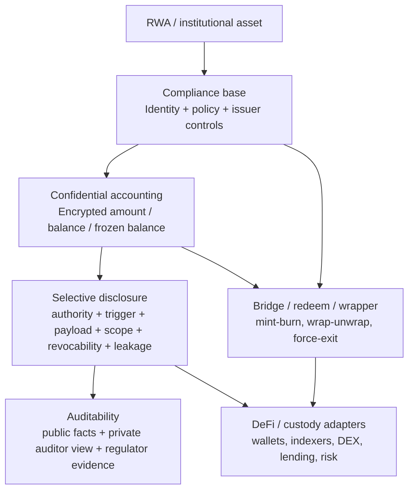
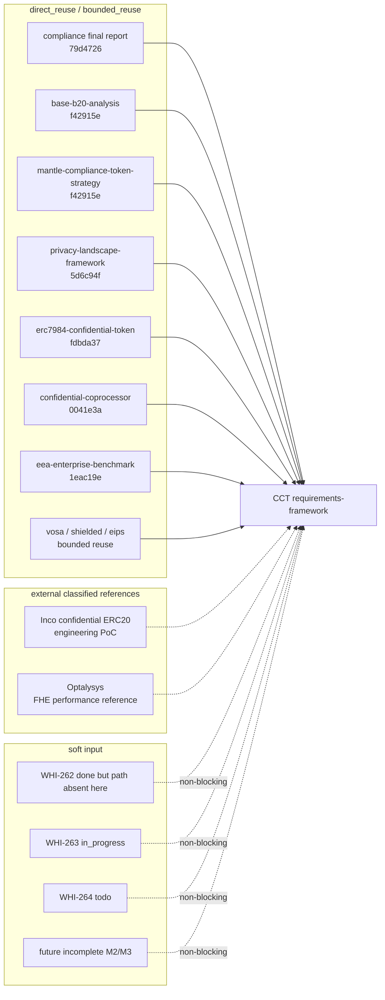
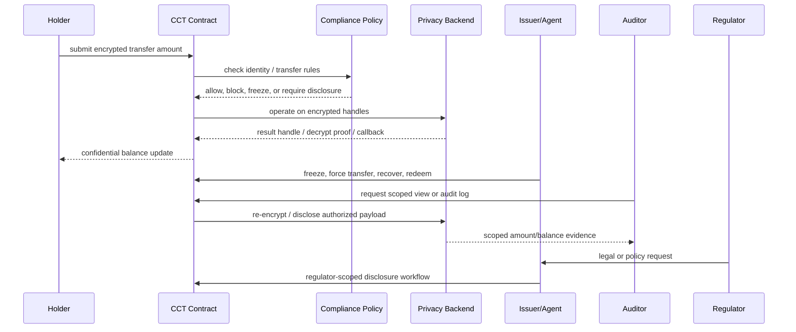
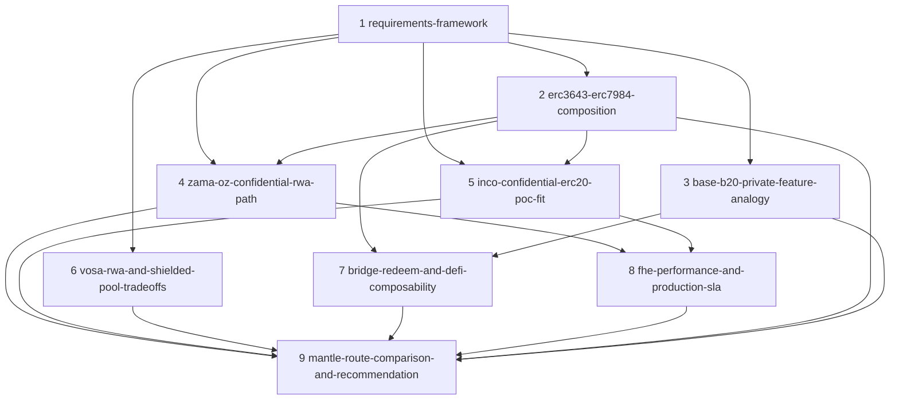

# 建立 Confidential Compliance Token 需求框架与证据复用地图

## 执行摘要（Executive Summary）

Confidential Compliance Token（下称 **CCT**）不是普通 privacy token，也不是普通 compliance token 的改名。本文将 CCT 定义为：面向机构链 / private RWA 场景的资产 token 需求框架，在一个 token 生命周期内同时满足 **合规资产发行与控制**、**金额/余额等账本隐私**、**授权披露与审计**、**桥接/赎回/DeFi 互操作**，并且优先采用 Mantle 可接受的轻量集成方式。

核心结论：

1. **CCT 的最小产品边界是“合规 token + confidential accounting + selective disclosure”。** 普通 privacy token 只回答“公众看不到什么”；普通 compliance token 只回答“谁能交易、谁能冻结、谁能恢复”；CCT 必须同时回答“谁可以在什么条件下看见被隐藏的数据，以及这个披露行为如何被审计”。
2. **Mantle 的短期基线应继承合规 token 项目的“ERC-3643 先行、precompile 远期评估”策略，但把 privacy layer 作为单独评估面。** 合约级合规可以快速 PoC；协议 precompile 仍受硬分叉窗口、双客户端实现和 fraud-proof 一致性约束。
3. **ERC-7984 更适合作为 confidential token 接口锚点，而不是完整 CCT 方案。** 它强覆盖金额/余额隐私，但不隐藏地址、交易图、业务逻辑或订单流；合规能力主要来自 OpenZeppelin Confidential Contracts 的 ObserverAccess / Restricted / Freezable / Rwa / Hooked / Wrapper 等扩展，并带有 FHE ACL 撤销性与 trusted hook 风险。
4. **Inco confidential ERC20 framework 只能归为工程 PoC 参考。** 该仓库可复用 wrapper、delegated viewing、transfer rule、Identity 合约的工程形状，但 README 明确为 unaudited proof of concept；不得作为生产成熟度或审计安全证据。
5. **Optalysys 只能归为 FHE 性能与生产化参考。** 其 RWA privacy scaling、photonic acceleration、confidential RWA tokenisation 页面可作为 FHE SLA / hardware acceleration / productionization 背景输入，不能当作 token 标准、合规模型或 Mantle 集成方案证据。
6. **后续研究应按 9 个 section 组织。** 本 draft 给出 `_index.md` 行提案，但遵守 Research Agent 边界，不直接写 `_index.md`。

本 draft 已落实 outline review 的三项 carry-forward：soft input 具体化、按文件 pin evidence commit、避免依赖 stale `evm-privacy-research/research-sections/_index.md`。

## 逐项发现（Item Findings）

### item-1：需求拆解、术语口径与 CCT 边界

#### 1.1 规范定义（Canonical Definition）

**Confidential Compliance Token**：一种面向受监管资产或机构资产流转的 token 设计框架，在标准 ERC-20 / ERC-3643 / ERC-7984 / wrapper / coprocessor / policy registry 等不同实现层之间建立共同评估口径。它必须在 token 生命周期内同时处理：

- 合规资产生命周期：发行、KYC/AML 准入、转账限制、冻结、强制转移、恢复、赎回。
- Confidential accounting：金额、余额、冻结余额、子账户或相关账务字段对公众不可见。
- Selective disclosure：持有人、发行人、审计员、监管方或智能合约在明确授权与触发条件下查看特定数据。
- Auditability：公众、发行人、审计员、监管方分别能验证哪些事实；披露与权限变更是否有可追溯日志。
- Mantle lightweight integration：尽量不要求 Mantle 新链、资产新桥、全节点隐私网络或硬分叉。

#### 1.2 与普通 privacy token / compliance token 的区别

| 类型 | 主要目标 | 典型能力 | 关键缺口 | CCT 要求的增量 |
|---|---|---|---|---|
| 普通 privacy token | 隐藏交易金额、余额、身份或交易图 | shielded pool、confidential transfer、stealth address、viewing key | 常缺 issuer controls、KYC gate、强制干预、监管披露与发行方审计 | 加入合规生命周期、发行方/监管方角色、选择性披露和审计模型 |
| 普通 compliance token | 控制谁能持有/交易，满足证券/RWA 合规 | ERC-3643 identity、transfer policy、freeze/recover、RBAC、文档管理 | 链上金额、余额、交易图通常公开 | 加入 confidential accounting、隐私后端、披露向量和泄露边界 |
| CCT | 在机构/RWA 场景同时满足隐私与合规 | 合规控制 + confidential accounting + selective disclosure + auditability + bridge/redeem | 需要处理 ACL 撤销、性能、DeFi 兼容、运维信任、监管可解释性 | 本项目的评估对象 |

#### 1.3 必须回答的问题

| 问题 | CCT 口径 | 必须输出的判断 |
|---|---|---|
| 为什么做？ | Mantle 想服务 institutional blockchain / private RWA，需要资产在公共或半公共执行环境中避免暴露交易金额、余额和业务状态，同时保留监管与发行方控制。 | 隐私是否解决机构采用障碍，还是只提供“看不见金额”的叙事功能。 |
| 为谁做？ | 发行方、托管方、机构投资者、合规团队、审计员、监管方、DeFi 集成方、桥/赎回服务。 | 每类 actor 的读写权限和信任假设必须分开。 |
| 要隐藏什么？ | P0：金额、余额、冻结余额、赎回金额；P1：子账户身份、KYC 属性、仓位；P2：业务逻辑/合约状态；通常不隐藏 token 元数据、发行方角色、交易存在性。 | 隐藏对象必须映射到 R1/R2/R3/R4/R5/R8，而不是笼统写“private”。 |
| 谁能披露？ | 可由 key-holder、issuer/agent、auditor、regulator、smart-contract policy、observer/notary、KMS/coprocessor 流程触发。 | 必须记录 authority、trigger、payload、scope、revocability、leakage。 |
| 如何合规？ | 事前 gate（KYC/AML/allowlist）、事中 policy（transfer/freeze/limit）、事后 audit（披露和日志）、极端干预（force transfer/recovery/redeem）。 | “加密”不能替代 compliance；“可披露”也不能替代可审计。 |
| 什么叫轻量？ | 不需要新 L1/L2/L3/独立 VM；不需要新资产桥；不要求 Mantle 集成方运维 sequencer/prover/DA 全节点；不要求 Mantle 硬分叉。 | 合约、wrapper、observer、external coprocessor、sidecar 可作为轻量候选；precompile 与独立链默认非轻量或中量以上。 |

#### 1.4 术语控制表

| 术语 | 本项目使用口径 | 禁止/避免的口径 |
|---|---|---|
| `confidential accounting` | 金额、余额、冻结余额、供应量或账务字段以 encrypted handle / commitment / offchain encrypted state 表示，公众无法读明文。 | 把地址匿名、交易图隐藏、业务逻辑隐私全部混称为 accounting。 |
| `compliance policy` | 对持有人、发送方、接收方、operator、mint receiver 等维度做准入和转账判定。 | 只把 sanctions/blocklist 叫 compliance。 |
| `issuer controls` | 发行方或 agent 可执行 mint/burn/pause/freeze/block/recover/force-transfer/redeem 等动作。 | 把 issuer controls 说成去中心化隐私能力。 |
| `selective disclosure` | 6 维向量：authority、trigger、payload、scope、revocability、leakage。 | 单个“viewing key”标签不足以表达合规披露。 |
| `auditability` | 不同观察者能验证不同事实，且披露/权限/合规动作有可追踪记录。 | 只要链上有 event 就等于审计充分。 |
| `bridge/redeem` | confidential token 与底层资产、ERC-20、L1/L2 bridge、现金/基金份额赎回之间的退出路径。 | 只讨论 mint/transfer，不回答最终资产流出。 |
| `DeFi composability` | 钱包、DEX、lending、custody、oracle、risk engine、indexer 对 encrypted value 的适配方式。 | 默认 ERC-20 DeFi 可以直接使用加密金额。 |

### item-2：CCT 能力模型

能力模型分为 **must-have**、**should-have**、**optional/route-specific** 三类，并标注可由 token core、adapter、policy registry、observer、external coprocessor 或 offchain compliance infra 提供。

| 能力 | 必要性 | Token core / 外部依赖 | 最低验收口径 | 主要复用证据 |
|---|---|---|---|---|
| confidential_accounting | must-have | Token core + privacy backend | 公众不可读 transfer amount、balance、confidential frozen balance；总供应量是否隐藏必须显式说明。 | ERC-7984 final; confidential-coprocessor final |
| compliance_policy | must-have | Token core 或 policy registry | 能表达 KYC/AML、allow/block list、发送方/接收方/执行方/铸造接收方策略，失败语义可审计。 | compliance final; B20 final; ERC-3643 strategy |
| issuer_controls | must-have | Token core + AccessControl/RBAC | mint/burn/pause/freeze/block/recover/force-transfer/redeem 权限、绕过条件和日志必须明确。 | compliance final; ERC-7984 Rwa analysis |
| selective_disclosure | must-have | ACL / observer / viewing key / regulator workflow | 按 6 维向量描述；不能只写“有 viewing key”。历史权限撤销必须单列。 | privacy framework final; ERC-7984 final; coprocessor final |
| auditability | must-have | Events + disclosure logs + offchain audit trail | 明确公众审计可见内容、私有审计员可见内容、监管方可见内容三者的区别；记录权限变更与披露行为。 | compliance final; privacy framework final |
| bridge_redeem | should-have | Wrapper / bridge adapter / issuer redeem agent | wrap/unwrap、bridge mint/burn、赎回金额披露、失败/force-exit 路径明确。 | B20 bridge/redeem analogy; ERC-7984 wrapper; Inco PoC |
| defi_composability | should-have | Adapter / oracle / risk engine / wallet/indexer | 说明 DEX/lending/custody 需要哪些明文、密文比较或选择性披露；列出会破坏的 ERC-20 假设。 | ERC-7984 final; confidential-coprocessor final |
| business_state_privacy | optional/route-specific | Coprocessor / TEE / privacy group | 若目标超过 token ledger，需要隐藏合约逻辑和业务状态；否则标为 out of scope。 | privacy framework; EEA benchmark; coprocessor final |
| order_flow_privacy | optional/future | encrypted mempool / sequencer policy | 若要防 MEV/前运行，需单独方案；ERC-7984 本体不覆盖。 | privacy framework; privacy EIP survey |

**最小 CCT（MVP）**：`confidential_accounting + compliance_policy + issuer_controls + selective_disclosure + auditability`。没有 confidential accounting 的方案只是 compliance token；没有 compliance policy/issuer controls 的方案只是 privacy token；没有 selective disclosure/auditability 的方案不适合 institutional RWA。

### item-3：统一 Rubric

评分采用 0-5。`0` 表示不覆盖或证据缺失；`3` 表示可 PoC/部分满足且关键 caveat 已知；`5` 表示生产级证据、接口/实现/审计均较充分。任何方案若触发“轻量级一票否决”，Mantle fit 最高不超过 3，除非明确作为长期协议路线而非轻量集成。

| 维度 | 评分口径 | 0-1 | 2-3 | 4-5 |
|---|---|---|---|---|
| privacy_coverage | 隐私覆盖面：R1 金额、R2 余额、R3 身份、R4 业务逻辑/状态、R5 交易图、R8 订单流 | 只隐藏 metadata 或无隐私 | 隐藏金额/余额，但地址/图/状态公开 | 覆盖 token ledger，并有可选身份/状态/图隐私扩展且边界清楚 |
| compliance_capability | KYC/AML、transfer policy、issuer controls、监管动作、recovery | 无合规模型 | 有 allow/block list 或基础 freezing | 覆盖身份、策略、强制动作、赎回、审计与多角色治理 |
| selective_disclosure | 6 维向量完整性和撤销/日志可信度 | 无披露或完全黑箱 | 有 viewing key/observer，但撤销/日志不清 | authority/trigger/payload/scope/revocability/leakage 全部可验证，日志完备 |
| deployment_lightweight | 是否符合 Mantle 轻量目标 | 新链/桥/全节点/硬分叉 | 合约套件 + sidecar/隐私后端，存在中等运维 | 无基础链改动、无新桥、低运维，能在现有 EVM L2 上 PoC |
| engineering_delta | 对 Mantle、钱包、indexer、DeFi、桥、发行流程的改动面 | 需改执行客户端或换 VM | 需新增 wrapper、coprocessor、observer、SDK | 只需合约/SDK/少量 adapter，现有协议影响可控 |
| maturity | 标准、实现、审计、生产部署、团队/生态 | 论坛草案、未审计、单作者 | draft standard / PoC / testnet / vendor self-report | Final/ERC 或主网生产、审计、生态和客户证据充分 |
| mantle_fit | 与 Mantle institutional/private RWA 和 Base B20/private feature 类比的匹配度 | 不符合 RWA 或不轻量 | 可作为参考或中期候选 | 直接服务 RWA 发行、机构披露、轻量部署，并可形成 Mantle 差异化 |

#### Rubric 使用规则

1. **先过边界再打分**：普通 privacy token 或 ordinary compliance token 不应因为单项强而被高估为 CCT。
2. **分离接口成熟度与后端成熟度**：ERC-7984 规范可中立，但 OZ/fhEVM 是具体 FHE 后端；二者成熟度分开打。
3. **厂商性能数据降权**：未独立验证的 TPS、latency、photonic/FHE benchmark 只能影响 gap/risk，不直接给 maturity 高分。
4. **合规披露不等于隐私泄露**：合规方能看见数据是功能，不应被视作 privacy failure；但必须记录 scope、revocability 和 audit log。
5. **桥/赎回是 CCT 的产品边界**：只会在链上 confidential transfer、但无法可靠 redeem/unwrap 的方案不适合 RWA 生产。

### item-4：证据复用地图（Evidence Reuse Map）

本节为后续作者提供证据复用地图。所有可硬复用项均使用 **直接路径 + per-file last-modifying commit**，不依赖 `evm-privacy-research/research-sections/_index.md`，因为该 index 在本 branch context 中并未完整登记所有 on-disk finals。`evm-privacy-research/issue-plan.md` 在当前 checkout 中不存在，因此不作为 hard evidence。

#### 4.1 直接复用 / 硬输入（Direct Reuse / Hard Inputs）

| 来源 | Commit pin | 复用类别 | 可直接复用的结论 | 边界 |
|---|---|---|---|---|
| `compliance-token-standards/report/final-report.md` | `79d472632bd30a5354fbec396f807e0bb63bdea1` | direct_reuse | 合规 token 8 类 taxonomy、ERC-3643 成熟度优势、B20/TIP-20 precompile 路线、Mantle 分阶段策略。 | 不覆盖 confidential accounting；隐私只作为合规 token 的 P2 背景。 |
| `compliance-token-standards/research-sections/base-b20-analysis/final.md` | `f42915ecd33c7f099d4ac0de89997390fc52d0b9` | direct_reuse | Base B20 的 trait composition、PolicyRegistry、RBAC、ActivationRegistry、precompile 架构和 B20 private feature 类比。 | B20 主线不等于 confidential token；B20Security 等本地分支信号不能当生产事实。 |
| `compliance-token-standards/research-sections/mantle-compliance-token-strategy/final.md` | `f42915ecd33c7f099d4ac0de89997390fc52d0b9` | direct_reuse | Mantle 当前无自定义 precompile；op-geth + reth 双客户端；ERC-3643 短期先行、precompile/混合路线中长期评估。 | 未评估隐私后端；硬分叉状态应在 final 前按最新 Mantle repo 再确认。 |
| `evm-privacy-research/research-sections/privacy-landscape-framework/final.md` | `5d6c94f6877227aadaf731852a08f46da1213c54` | direct_reuse | EEA 8 需求、五轴 privacy rubric、6 维 selective disclosure、轻量级一票否决、token ledger vs business-state ledger。 | 需适配到 compliance token 能力模型，不能直接替代 CCT rubric。 |
| `evm-privacy-research/research-sections/erc7984-confidential-token/final.md` | `fdbda370e9e9137890c5bd2deb7752e03d76d0bc` | direct_reuse | ERC-7984 接口、bytes32 pointer 技术中立性、OZ extensions、ObserverAccess/Hooked ACL caveats、RWA 扩展。 | ERC-7984 本体只覆盖 value-level privacy；不覆盖身份、图、业务状态或订单流。 |
| `evm-privacy-research/research-sections/confidential-coprocessor/final.md` | `0041e3a1598751a7d121fecc600ba3d6ad42ad05` | direct_reuse | Zama/Inco/Fhenix 架构、bolt-on 集成、FHE/TEE/economic trust 差异、合规披露能力与性能 caveat。 | 该 commit 仅作为本文件 last-modifying pin；厂商自报性能未独立验证。 |
| `evm-privacy-research/research-sections/eea-enterprise-benchmark/final.md` | `1eac19ed837c8e9a4df1bb1594d5b23cc5a2e9f0` | direct_reuse | EEA 7 方案 benchmark、R4 合约逻辑隐私标注、轻量级候选/参考/出局分类。 | 本 CCT 需求框架只复用分类口径，不提前采用其 route verdict。 |
| `evm-privacy-research/research-sections/vosa-standards/final.md` | `c9c16b3eb8956584d63efcf2fe155d9acc271f2f` | bounded_reuse | VOSA/VOSA-20/VOSA-RWA 作为 exposed-graph、轻量但未审计草案的对照。 | 单作者论坛草案、未审计；不能作为主推 CCT 标准。 |
| `evm-privacy-research/research-sections/privacy-eips-survey/final.md` | `957773b13b2f5a66354ccda4b7d0c79a7236b222` | bounded_reuse | Privacy EIP 全景、stealth / shielded / encrypted mempool 边界。 | 多数 EIP 不是 CCT 直接实现；作为 taxonomy completeness 保障。 |
| `evm-privacy-research/research-sections/zk-shielded-pool/final.md` | `788453b4097f37003337b943bcf6d7f8f68b02ba` | bounded_reuse | Shielded pool / compliance pool 的匿名集与资金来源证明思路。 | 可能不符合 issuer controls / RWA transfer policy；DeFi/bridge 复杂度高。 |
| `evm-privacy-research/research-sections/zk-privacy-chain-aztec/final.md` | `eceaef1e1b4f7a17d7fc3eb4dd91560207f40629` | reference_only | Aztec 作为密码学级业务状态隐私上限参照。 | 独立链/VM，非 Mantle 轻量集成。 |

可追溯性说明：confidential-coprocessor 这一行合法地指向 `0041e3a...`，因为那是该文件自身的 last-modifying commit。其他此前共用该 snapshot pin 的复用文件，已上移为各自独立的文件 pin。

#### 4.2 工程 PoC 参考（Engineering PoC Reference）

| 来源 | Pin / 访问方式 | 分类 | 用途 | 边界 |
|---|---|---|---|---|
| `Inco-fhevm/confidential-erc20-framework` | GitHub HEAD `bb39e4f788742121f2fc93de33af58758360545b`，于 2026-06-24 核实 | engineering_poc | wrapper、confidential ERC20、CompliantConfidentialERC20、Identity、ExampleTransferRules 的工程结构参考。 | README 明确“not audited”且仅 proof of concept；不得作为生产安全或标准成熟度证据。 |

可复用工程信号：`ConfidentialERC20Wrapper` 展示 wrap/unwrap；`CompliantConfidentialERC20` 展示 transferRules 合约；`Identity` 展示 encrypted DOB / age check；`ExampleTransferRules` 展示加密金额限额和年龄条件组合。CCT 后续 PoC 可借鉴模块切分，但必须重新设计审计、升级、ACL 撤销、权限日志和 failure semantics。

#### 4.3 性能 / 生产化参考（Performance / Productionization Reference）

| 来源 | 访问方式 | 分类 | 用途 | 边界 |
|---|---|---|---|---|
| Optalysys `Tokenised RWAs are a trillion-dollar opportunity - but only if privacy scales` | URL `https://optalysys.com/resource/tokenised-rwas-are-a-trillion-dollar-opportunity-but-only-if-privacy-scales/`，于 2026-06-24 访问 | performance_reference | RWA privacy scaling narrative、FHE 性能瓶颈与 institutional adoption 背景。 | 厂商文章；不能当独立 benchmark。 |
| Optalysys `Fully Homomorphic Encryption hits the data movement wall - why photonics is emerging as the way forward` | URL `https://optalysys.com/resource/fully-homomorphic-encryption-hits-the-data-movement-wall-why-photonics-is-emerging-as-the-way-forward/`，于 2026-06-24 访问 | performance_reference | FHE data movement wall、硬件/photonic acceleration 生产化背景。 | 厂商文章；只影响 performance/SLA gap。 |
| Optalysys `Silicon photonics: our approach to acceleration` | URL `https://optalysys.com/resource/silicon-photonics-our-approach-to-acceleration/`，于 2026-06-24 访问 | performance_reference | Photonic acceleration 路线参考。 | 不提供 CCT token model。 |
| Optalysys `Confidential RWA Tokenisation` | URL `https://optalysys.com/confidential-rwa-tokenisation-blockchain-use-case/`，于 2026-06-24 访问 | performance_reference | Confidential RWA tokenisation 用例包装和生产化叙事。 | 不是标准、不是 Mantle 集成方案、不是第三方审计。 |

#### 4.4 软输入集合（Soft Input Set）

Outline review 要求显式实例化 `soft_input` class。当前 dispatch 中确认 WHI-254 到 WHI-261 均为 done M1 issue；因此 **M2/M3 soft-input 集合位于 WHI-254..261 之外**。

| 条目 | 2026-06-24 观察到的状态 | 软输入处理方式 |
|---|---|---|
| `WHI-262` `[M2-对比] EVM 隐私方案横向对比分析` | Multica issue 列表显示状态为 `done`，但 `evm-privacy-research/research-sections/cross-comparison/final.md` 在本 branch 快照中并不存在。 | 本 draft 中不作为 hard evidence 引用。只有当本项目所用 branch 中出现直接路径与 commit pin 后，它才能成为 hard reuse。 |
| `WHI-263` `[M2-策略] Mantle 轻量级机构隐私方案策略建议` | `in_progress`；本 branch 中无 final artifact。 | 仅作软输入；非阻塞。未来的 route recommendation 在被 promote 为 final 并 commit-pinned 之前，不得覆盖本 CCT 需求框架。 |
| `WHI-264` `[M3-报告] EVM 隐私方案最终调研报告整合` | `todo`；无 final artifact。 | 仅作软输入；非阻塞。它属于下游综合，而非上游证据。 |
| WHI-254..261 之外、未完成的 evm-privacy-research M2/M3 材料 | 具体的未来 ID 可能变化。 | 按类别视为 `soft_input`：cross-comparison drafts、strategy drafts、final-report drafts、route recommendations、comments、issue plans，以及尚未 promote 的材料。 |

**非阻塞规则**：soft inputs 可用于引导框定并识别未来问题，但不能用来敲定某项 CCT 需求、为候选方案打分，或主张 Mantle route 偏好。只有 commit-pinned final artifacts、一手标准/文档、经审计代码，或被显式分类的 PoC/performance 参考，才能支撑 hard claims。

### item-5：候选分层与参考分类（Candidate Layering and Reference Classification）

#### 5.1 CCT 分层栈（CCT Layer Stack）

| 层 | 角色 | 示例参考 | CCT 解读 |
|---|---|---|---|
| Asset/compliance base | Identity、transfer policy、issuer controls、法律生命周期 | ERC-3643、B20 PolicyRegistry、TIP-20、ERC-1400 legacy | 合规基底；其自身并不隐藏账务数据。 |
| Confidential token interface | Encrypted amount/balance API、operator/callback、wrapper | ERC-7984、ERC-7945 | 接口锚点；仍需要 compliance 与 privacy backend。 |
| Privacy backend | FHE/ZK/TEE/MPC/GC 计算与披露 | Zama fhEVM、Inco Lightning、Fhenix CoFHE、COTI Coprocessor | 提供 encrypted state 与 decrypt/re-encrypt 流程；信任/性能各异。 |
| Compliance/disclosure modules | Observer、policy hooks、RWA agent、identity check、audit logs | OZ ERC7984ObserverAccess/Rwa/Hooked/IdentityCheck；Inco transfer rules | 把 privacy token 转化为具备合规能力的 CCT。 |
| Bridge/redeem/asset adapter | Wrap/unwrap、L1/L2 bridge、赎回、reserve accounting | ERC7984ERC20Wrapper、Inco wrapper、B20 mint/burn/redeem 类比 | RWA 生产及 DeFi/custody 集成所必需。 |
| DeFi/custody integration | Wallet/indexer/risk engine/DEX/lending 支持 | 后续 sections | 不默认存在；encrypted amount 会破坏许多 ERC-20 假设。 |

#### 5.2 Inco 分类（Inco Classification）

Inco 在本项目中以两种不同角色出现：

1. **Inco Network / Lightning 作为 privacy backend 候选**：依据 `confidential-coprocessor/final.md`，Lightning 是 TEE-first、当前支持 Base mainnet，Atlas FHE 在 roadmap 上。这是用于 backend route 评估的候选/参考证据。
2. **`Inco-fhevm/confidential-erc20-framework` 作为工程 PoC 参考**：依据 `bb39e4f...` 处的 GitHub 仓库，它是未审计的 PoC 代码，不得被拔高为生产标准。

对本 CCT 框架而言，该 GitHub framework 仅被分类为 **engineering_poc**。它可以启发：

- 如何切分 wrapper 与 confidential token，
- 如何将 transfers 路由到外部 transfer-rules 合约，
- 如何表示 encrypted identity attributes，
- delegated viewing / owner balance access 可能如何塑造 UX。

它不能支撑：

- 生产安全主张，
- 高于 PoC 的成熟度评分，
- 监管充分性，
- Mantle 部署就绪度，
- 可审计性主张。

#### 5.3 Optalysys 分类（Optalysys Classification）

在现有证据中，Optalysys 不是 token standard、privacy protocol、compliance token framework，也不是 Mantle 集成路径。它属于 **FHE performance / productionization reference**。

将 Optalysys 用于：

- FHE throughput/latency 瓶颈框定，
- photonic acceleration 与硬件 roadmap 问题，
- 把 RWA privacy scaling 作为生产就绪度叙事，
- 后续 `fhe-performance-and-production-sla` section 应调研的 SLA 问题。

不要将 Optalysys 用于：

- ERC-7984 或 ERC-3643 接口决策，
- issuer controls taxonomy，
- selective disclosure 向量，
- maturity score（仅可作为 vendor self-report / performance context 例外）。

### item-6：Mantle 轻量约束与工程改动面（Mantle Lightweight Constraints and Engineering Delta）

从 compliance-token research 继承的 Mantle 约束：

- Mantle 基于 OP Stack，采用 op-geth + reth 双执行客户端。
- 当前证据表明 Mantle 无自定义 precompile；新增一个需要执行客户端工作与硬分叉部署。
- ERC-3643 风格的应用合约可在无协议改动的情况下部署。
- B20 风格的 precompile 提供较强的 gas/determinism 收益，但属于长周期路线。

对 CCT 而言，这导出一棵实用决策树：

| 路径 | 描述 | 轻量性结论 | 工程改动面 | 何时研究 |
|---|---|---|---|---|
| A：应用层合规 + confidential wrapper | ERC-3643/issuer policy 合约 + ERC-7984/OZ 风格 confidential token 或 wrapper。 | 若 privacy backend 为 bolt-on，则很可能轻量。 | 合约、SDK、observer/audit 服务、indexer/wallet 改动。 | 首选 PoC 路径。 |
| B：搭配外部 coprocessor 的 confidential token | ERC-7984 类 token 使用 Zama/Inco/Fhenix/COTI 风格后端。 | 若无新链/桥/全节点/硬分叉则轻量。 | 后端服务依赖、KMS/TEE/coprocessor 信任、latency、ACL logging。 | 主要的 privacy-backend research。 |
| C：B20 风格 private feature / PolicyRegistry precompile | 协议级 token 或带隐私特性的 policy 执行。 | 对即时 Mantle 而言不轻量；因硬分叉而属中量/重量。 | op-geth/reth 改动、fraud-proof、治理、审计。 | Mantle 长期差异化，非 M1 依赖。 |
| D：独立 privacy chain / validium / private L2 | 使用 Aztec/Prividium/Linea/Silent Data/COTI-L2 类环境。 | 对 Mantle private feature 不满足轻量。 | 新链/桥/流动性、operator stack。 | 仅作参考，除非 Mantle 策略改变。 |
| E：Shielded pool / VOSA | 带匿名集或 exposed-graph 模型的应用层隐私。 | 可能轻量，但 compliance/issuer controls 各异。 | Proof circuits、pool accounting、source-of-funds proofs、wallet UX。 | 作为 ERC-7984 CCT 的替代方案对比。 |

**任何 CCT 候选方案的工程改动面 checklist**：

| 改动面 | 问题 |
|---|---|
| Token contract | 它暴露 ERC-20 兼容、ERC-7984 兼容，还是新接口？钱包/indexer 中有什么会被破坏？ |
| Identity and policy | KYC identity 是 onchain、offchain、claim-based、encrypted，还是基于 hash/attestation？ |
| ACL/disclosure | 谁授予访问、谁撤销、历史访问如何处理，以及用什么 log 证明？ |
| Bridge/redeem | confidential amount 在赎回时如何变为 public 或 issuer-visible？若 decrypt backend 不可用怎么办？ |
| DeFi | DEX/lending/risk engines 能否比较 encrypted balances？adapters 是否受信任？ |
| Operations | 谁运行 KMS/TEE/coprocessor/notary；SLA 如何；中断期间会发生什么？ |
| Legal/compliance | 该模型是否满足 issuer books、auditor evidence、regulator request、Travel Rule、AML 及 GDPR caveats？ |

### item-7：项目目录骨架与索引条目提案（Project Directory Skeleton and Index Entry Proposal）

#### 7.1 目录骨架状态（Directory Skeleton Status）

当前 branch 包含本 section 所需的项目骨架：

| 路径 | 状态 | 说明 |
|---|---|---|
| `confidential-compliance-token-research/outlines/requirements-framework.md` | exists | 已批准的 outline artifact。 |
| `confidential-compliance-token-research/research-sections/requirements-framework/drafts/` | exists | 本 draft 在此持久化 `round-1.md`。 |
| `confidential-compliance-token-research/research-sections/requirements-framework/final.md` | planned | 仅在 approved draft promotion 后创建。 |
| `confidential-compliance-token-research/report/assets/` | exists | final report assets 的占位目录。 |
| `confidential-compliance-token-research/research-sections/_index.md` | proposed only | Research Agent 边界：不写；由 Orchestrator/TW 集成。 |

#### 7.2 `_index.md` 提案

| order | topic_slug | multica_issue_id | final_path | dependencies | status |
|---:|---|---|---|---|---|
| 1 | requirements-framework | `7d7fa951-8160-4b03-a7ae-8ff1a6a9664c` | `confidential-compliance-token-research/research-sections/requirements-framework/final.md` | - | planned |
| 2 | erc3643-erc7984-composition | TBD | `confidential-compliance-token-research/research-sections/erc3643-erc7984-composition/final.md` | requirements-framework | planned |
| 3 | base-b20-private-feature-analogy | TBD | `confidential-compliance-token-research/research-sections/base-b20-private-feature-analogy/final.md` | requirements-framework | planned |
| 4 | zama-oz-confidential-rwa-path | TBD | `confidential-compliance-token-research/research-sections/zama-oz-confidential-rwa-path/final.md` | requirements-framework, erc3643-erc7984-composition | planned |
| 5 | inco-confidential-erc20-poc-fit | TBD | `confidential-compliance-token-research/research-sections/inco-confidential-erc20-poc-fit/final.md` | requirements-framework, erc3643-erc7984-composition | planned |
| 6 | vosa-rwa-and-shielded-pool-tradeoffs | TBD | `confidential-compliance-token-research/research-sections/vosa-rwa-and-shielded-pool-tradeoffs/final.md` | requirements-framework | planned |
| 7 | bridge-redeem-and-defi-composability | TBD | `confidential-compliance-token-research/research-sections/bridge-redeem-and-defi-composability/final.md` | erc3643-erc7984-composition, base-b20-private-feature-analogy | planned |
| 8 | fhe-performance-and-production-sla | TBD | `confidential-compliance-token-research/research-sections/fhe-performance-and-production-sla/final.md` | zama-oz-confidential-rwa-path, inco-confidential-erc20-poc-fit | planned |
| 9 | mantle-route-comparison-and-recommendation | TBD | `confidential-compliance-token-research/research-sections/mantle-route-comparison-and-recommendation/final.md` | erc3643-erc7984-composition, base-b20-private-feature-analogy, zama-oz-confidential-rwa-path, inco-confidential-erc20-poc-fit, vosa-rwa-and-shielded-pool-tradeoffs, bridge-redeem-and-defi-composability, fhe-performance-and-production-sla | planned |

**索引集成说明**：状态保持 `planned`，直到 Orchestrator 创建 child issues、随后由 Technical Writer / Orchestrator 更新项目 index。本 draft 仅为提案。

### item-8：缺口登记与所需新研究（Gap Register and New Research Required）

| 缺口 | 为何重要 | 当前处理 | 后续 section |
|---|---|---|---|
| 未来 M2/M3 issue 集合可能变化 | 下游 route/comparison 工作可能被误当作 hard evidence。 | 已实例化 soft-input 规则；WHI-263/WHI-264 显式非阻塞；WHI-262 在本 branch 中不作 hard evidence。 | 所有下游 sections |
| `evm-privacy-research/issue-plan.md` 缺失 | dispatch 引用了它，但本地无该文件。 | 改用直接 commit-pinned final artifacts 与 Multica issue 记录。 | 如有需要，Orchestrator 后续可补 issue-plan |
| ERC-3643 + ERC-7984 组合尚未设计 | CCT 很可能同时需要 compliance identity 与 confidential accounting。 | 需要新研究。 | `erc3643-erc7984-composition` |
| Base B20 private feature 类比并非 confidential token 设计 | B20 提供的是 precompile/policy 架构，而非 privacy backend。 | 仅作架构类比使用。 | `base-b20-private-feature-analogy` |
| FHE ACL 撤销在结构上仍然薄弱 | GDPR/最小披露依赖于撤销与可审计性。 | 除非另有证明，否则将 revocability 标为 unverified/constrained。 | `zama-oz-confidential-rwa-path`, `fhe-performance-and-production-sla` |
| Inco PoC 未审计 | 工程代码可能被读者过度加权。 | 仅作 Engineering PoC。 | `inco-confidential-erc20-poc-fit` |
| Optalysys 证据是厂商性能叙事 | 生产 SLA 不能依赖营销主张。 | 仅作 Performance reference。 | `fhe-performance-and-production-sla` |
| Bridge/redeem 与 force-exit 语义不清 | RWA tokens 需要合法赎回与失败恢复。 | 必须单列 section。 | `bridge-redeem-and-defi-composability` |
| 加密金额下的 DeFi composability 未解决 | ERC-20 集成默认余额/金额公开。 | 标为 should-have 但未解决。 | `bridge-redeem-and-defi-composability` |
| Mantle 最新硬分叉/precompile 状态可能变化 | 协议路线可行性对时间敏感。 | M1 使用 pinned 的既有研究；若 Mantle repo 改动则在 final/report 中刷新。 | `mantle-route-comparison-and-recommendation` |

## 图示（Diagrams）

### diag-1：CCT 能力栈（CCT Capability Stack）

### diag-2：证据复用地图（Evidence Reuse Map）

### diag-3：参与方与可见性流（Actor and Visibility Flow）

### diag-4：拟议的 9-section 依赖图（Proposed 9-Section Dependency Graph）

## 来源覆盖（Source Coverage）

### 来源需求覆盖（Source Requirements Coverage）

| 来源需求 | 覆盖 | 备注 |
|---|---|---|
| src-1 prior compliance research | covered | Compliance final report、Base B20 final、Mantle strategy final 均为直接 commit-pinned。 |
| src-2 prior privacy research | covered | Privacy framework、ERC-7984、coprocessor、EEA benchmark、VOSA/EIP/shielded/Aztec finals 均为 direct 或 bounded commit-pinned。 |
| src-3 Inco PoC source | covered | GitHub HEAD 核实为 `bb39e4f...`；仅分类为 engineering_poc。 |
| src-4 Optalysys external source | covered | 官方 Optalysys WP 搜索结果于 2026-06-24 核实；仅分类为 performance_reference。 |
| src-5 project skeleton / index | covered | 骨架状态已记录；`_index.md` 提案已嵌入，未写入。 |
| src-6 Multica issue records | covered | 抽样 WHI-254 与 WHI-261 作为 done M1 记录；用项目 issue 列表实例化 WHI-263/WHI-264 soft input。 |

### 证据置信度汇总（Evidence Confidence Summary）

| 置信度 | 证据类型 | 示例 |
|---|---|---|
| 高 | Commit-pinned final research artifacts 及标记为 done 的 issue 记录 | Compliance final report；privacy framework；ERC-7984 final；B20 final |
| 中 | 仅用于有界类比的 commit-pinned final artifacts | VOSA、shielded pool、Aztec、EEA benchmark |
| 中低 | 带明确未审计警告的工程代码 PoC | Inco confidential ERC20 framework |
| 对 hard claims 为低 / 对提出问题有用 | 厂商性能与生产化材料 | Optalysys pages；FHE performance claims |
| 非阻塞 | 进行中/待办的下游 M2/M3 材料 | WHI-263、WHI-264、future M2/M3 drafts |

## 缺口分析（Gap Analysis）

本 draft 是一份需求框架，而非最终路线建议。风险最高、尚未解决的问题包括：

1. **Composition gap**：目前没有任何现有来源能证明一套干净、可生产的 ERC-3643 + ERC-7984 组合，且同时具备 identity、confidential accounting、issuer controls 和可撤销的 selective disclosure。这需要新的一手研究。
2. **Disclosure revocation gap**：FHE ACL 模型在结构上似乎难以撤销。任何 CCT 评分都必须把未来授权撤销（future authorization revocation）与历史 handle 访问撤销（historical handle access revocation）分开。
3. **Audit log gap**：许多方案会暴露 events，但很少能证明披露授予、re-encryption、监管请求和链下审计证据是防篡改且可查询的。
4. **Performance/SLA gap**：在若干来源中，FHE 吞吐量和延迟仍属厂商自报。Optalysys 有助于界定生产化问题，但并未将其解决。
5. **Mantle integration gap**：coprocessor 的“no hardfork”说法仍需在 Mantle 上核查宿主合约、finality/callback 时序、sequencer 行为、数据可用性、KMS 可用性以及运维归属。
6. **Bridge/redeem gap**：RWA 生产需要现金/基金份额赎回与储备记账，而不仅是 confidential transfer。赎回时的披露必须经过设计。
7. **DeFi gap**：加密余额会破坏正常的 indexer、DEX、lending、清算和 oracle 假设。Adapter 可能重新引入受信任方或公开泄露。
8. **Legal/product gap**：GDPR、MiCA、Travel Rule、AML/CFT、broker-dealer 账簿、基金记账以及受监管托管，都需要在本 M1 技术框架之外做特定司法辖区的解读。

## 修订日志（Revision Log）

| 轮次 | 日期 | 变更 |
|---:|---|---|
| 1 | 2026-06-24 | 从已批准 outline 生成的初版 deep draft。新增 CCT 定义、能力模型、统一 rubric、证据复用地图、soft-input 实例化、Inco/Optalysys 分类、Mantle 轻量约束、index 提案、图示、来源覆盖与缺口登记。落实 outline review 的 carry-forward 项：显式 WHI-263/WHI-264 soft input、per-file commit pins，以及直接引用而非依赖 stale index。 |
| final | 2026-06-24 | 在 draft-review 批准后，将获批的 round-1 draft promote 为 `final.md`。应用所需的 minor fix：item-4.3 Optalysys 外部引用现对 data-movement-wall、silicon-photonics 及 Confidential RWA Tokenisation 条目使用稳定 URL。 |
