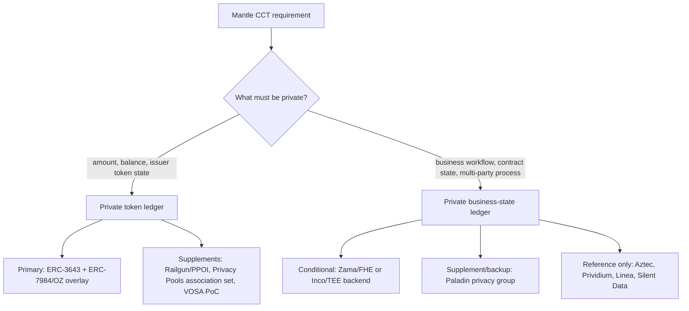
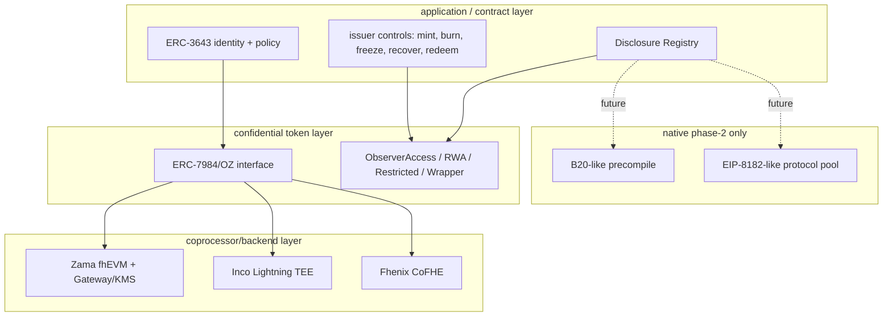
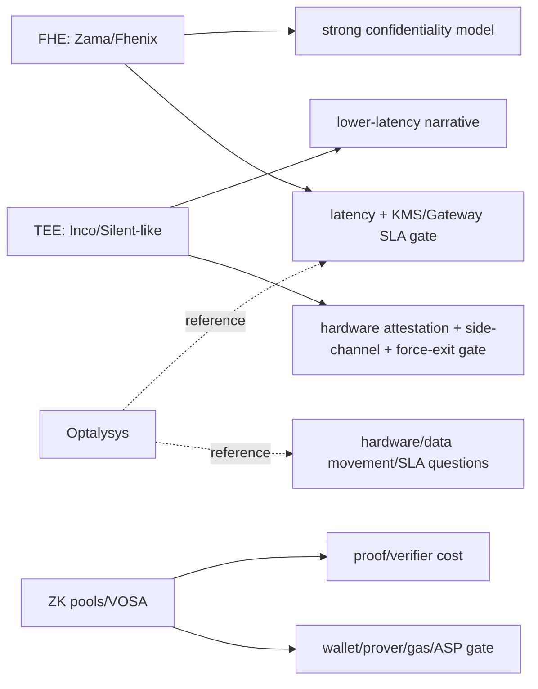
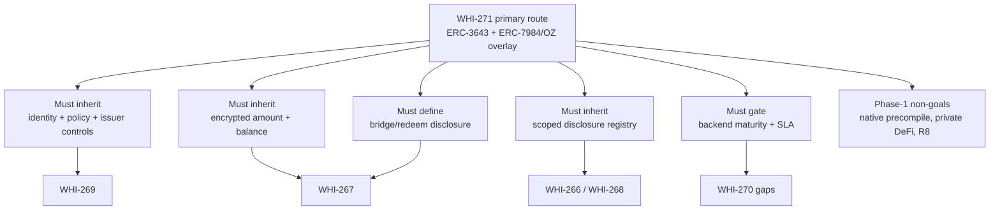
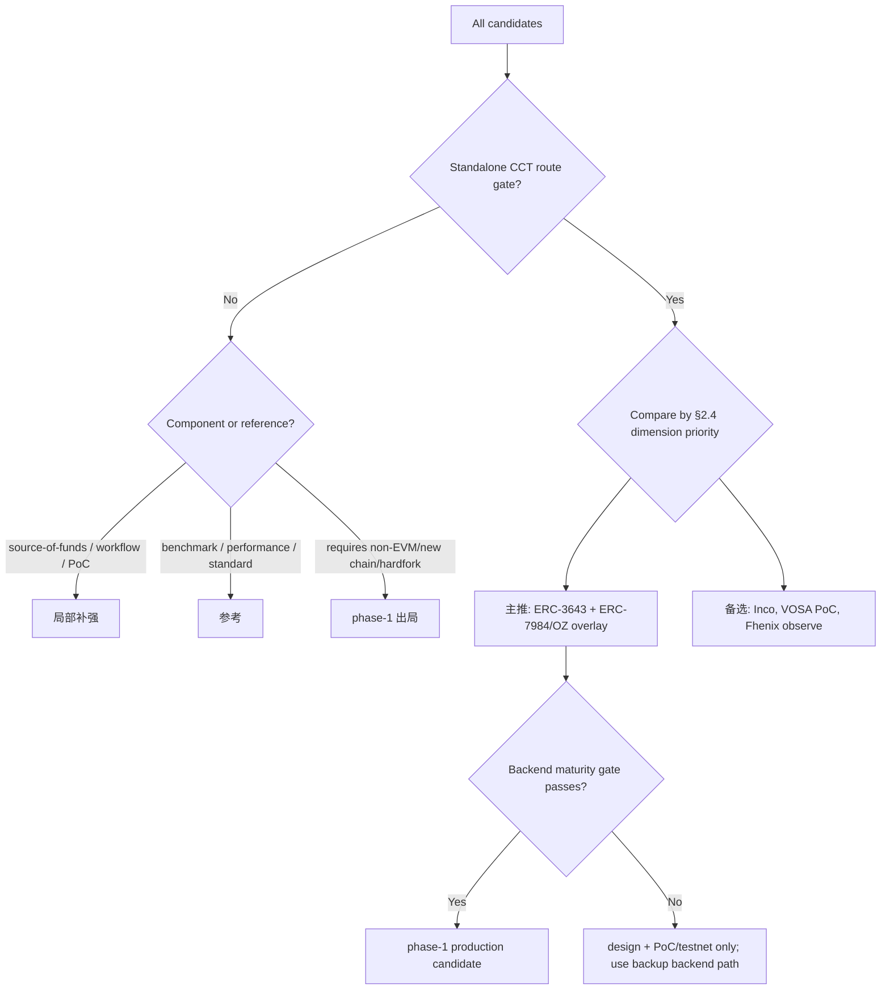

# Confidential Compliance Token 路线横向对比

## 执行摘要（Executive Summary）

本 section 的路线裁决是：**Mantle phase 1 主推 `ERC-3643 + ERC-7984/OZ confidential overlay` 组合路线**，即用 ERC-3643/ONCHAINID/RBAC/issuer controls 承接合规生命周期，用 ERC-7984/OpenZeppelin Confidential Contracts 作为 confidential token 接口和 RWA/Observer/Wrapper/Restricted/Freezable 能力边界，并把 Zama fhEVM/OZ 作为第一条需要验证的 confidential accounting backend。这个主推不是对单一厂商的无条件押注，而是一个 **backend-replaceable application/coprocessor hybrid**：若 Zama Mantle support 或自托管 Gateway/KMS/Coprocessor gate 不通过，接口和合规骨架仍应允许 Inco Lightning、Fhenix/CoFHE 或其他具名 backend 竞争。

`主推` 的理由来自 §2.4 的四步 synthesis rule：先过 standalone-route gate，再按 `compliance_capability -> selective_disclosure -> mantle_fit -> deployment_lightweight -> privacy_coverage -> engineering_delta -> maturity -> low_lock_in -> performance_predictability` 逐维比较，而不是简单加总。该规则下，`ERC-3643 + ERC-7984/OZ confidential overlay` 在合规能力、选择性披露和 Mantle 适配三个高优先级维度同时领先；它的主要扣分项是 backend maturity gate、FHE ACL 历史撤销、KMS/Gateway 运维与性能 SLA。

**备选路线** 分三类：Inco Lightning 是最快可验证的非 Zama backend 备选，优势是 Base mainnet 近邻和 TEE-first 低延迟路径，劣势是 Mantle support、TEE 信任和 force-exit/liveness 仍需验证；VOSA-RWA 是极轻量 PoC 备选，适合封闭机构试验 exposed graph + compliance attestation，但未审计、论坛草案和 freeze/force-transfer 弱点使其不能作为生产主线；Fhenix/CoFHE 是 backend-replaceable FHE 观察位，当前合规生态和生产证据弱于 Zama/Inco。

**局部补强** 包括 Railgun/Privacy Pools 的 source-of-funds / association-set / PPOI 披露能力、Paladin/Pente 的 business workflow privacy、Inco confidential ERC20 framework 的工程 PoC 模块边界。**参考/出局** 包括 Optalysys（FHE 性能/生产化问题生成器）、Aztec（privacy-native upper bound）、Starknet STRK20（非 EVM native token benchmark）、EIP-8182（protocol shielded-pool benchmark）、B20-like native precompile（phase 2/native route；phase 1 direct route 出局）。

对 WHI-272 的设计约束是：phase 1 必须继承 ERC-3643-style identity/policy/issuer controls、ERC-7984-style encrypted amount/balance interface、scoped/logged disclosure、backend maturity gate、bridge/redeem disclosure boundary；必须避免 full-history viewing key、无 issuer controls 的 anonymity-only 方案、无 gas sponsor/paymaster 的隐私 UX、把 backend vendor claim 当生产 SLA、把 native precompile 当 phase 1 轻量方案；暂不进入 phase 1 的能力包括 native FHE/B20 precompile、private identity、fully private DeFi、order-flow privacy 和独立 privacy L2。

## 逐项发现（Item Findings）

### item-1: 候选路线汇总与对比方法论

#### 1.1 硬输入清单（Hard input bundle）

| 输入 | 路径 | Commit pin | 复用内容 |
|---|---|---:|---|
| WHI-266 需求框架 | `confidential-compliance-token-research/research-sections/requirements-framework/final.md` | `9eb29a1` | CCT 定义、七维评分表、轻量化否决项、Inco/Optalysys 分类 |
| WHI-267 Zama 深度分析 | `confidential-compliance-token-research/research-sections/zama-confidential-rwa/final.md` | `1a9fad0` | Zama 架构、ERC-3643/7984 张力、生命周期、评分、风险门控 |
| WHI-268 PSE 约束 | `confidential-compliance-token-research/research-sections/pse-private-transfers-constraints/final.md` | `b54e21b` | account 与 note 模型、wallet/prover/gas/disclosure 反模式 |
| WHI-269 合规 token 扩展 | `confidential-compliance-token-research/research-sections/compliance-token-private-extension/final.md` | `bb27379` | ERC-3643/B20/TIP 能力映射、backend maturity gate、phase boundary |
| WHI-270 候选调研 | `confidential-compliance-token-research/research-sections/confidential-rwa-candidates/final.md` | `29269d9` | 非 Zama 候选画像、Inco PoC、Optalysys、bucket rule、审计缺口 |

当前 checkout 中观察到的软佐证（Soft corroboration）：

| 软输入 | 路径 | Commit pin | 处理方式 |
|---|---|---:|---|
| WHI-262 EVM 隐私横向对比 | `evm-privacy-research/research-sections/cross-comparison/final.md` | `9c81049` | 对 A/B ledger、route-capable 与 component 分类做一致性核对。不用于覆盖 WHI-266..270 的评分。 |
| WHI-263 Mantle 隐私策略 | `evm-privacy-research/research-sections/mantle-privacy-strategy/final.md` | `eefb63d` | 对 ERC-7984/OZ 以及 Zama/Paladin 策略表述做一致性核对。不作为主要评分输入。 |

经批准的 outline 将 WHI-262 记为 done/路径缺失，将 WHI-263 记为进行中。本草稿注意到当前 checkout 已包含这两份 final，但仍保留 outline 的非阻塞规则：下文的硬性论断与路线裁决均以 WHI-266..270 为依据。

#### 1.2 候选集合（Candidate set）

| Route ID | 候选 | 纳入身份 | 独立路线门控（Standalone-route gate） |
|---|---|---|---|
| R1 | ERC-3643 + ERC-7984/OZ confidential overlay，以 Zama/OZ 作为首个待验证 backend | 主推路线候选 | 通过 |
| R2 | Inco Lightning / confidential token route | backend 路线候选 | 通过，Mantle support 存疑 |
| R3 | VOSA-RWA / VOSA-20 | 轻量 PoC 路线候选 | 通过，但成熟度存疑 |
| R4 | Fhenix/CoFHE | backend 路线候选 | 通过，但合规/成熟度存疑 |
| R5 | Nightfall/EY enterprise | 企业级私密转账路线 | 作为企业级通道通过；作为 phase-1 Mantle CCT 偏弱 |
| R6 | B20-like native private design | native 协议路线 | phase 1 不通过；phase 2 参考 |
| C1 | Railgun/Privacy Pools | disclosure/source-of-funds 组件 | 作为独立 CCT 路线不通过 |
| C2 | Paladin/Pente privacy groups | business-workflow 组件 | 作为最小化 token-ledger 路线不通过；对 business-state privacy 有用 |
| C3 | Inco confidential ERC20 framework PoC | 工程模块参考 | 作为生产路线不通过 |
| B1 | Optalysys | FHE 性能/生产化参考 | 不通过；非 token 路线 |
| B2 | Aztec | privacy-native upper bound | Mantle phase 1 不通过；参考 |
| B3 | Starknet STRK20 | 非 EVM native token benchmark | Mantle phase 1 不通过；参考 |
| B4 | EIP-8182 | protocol shielded-pool benchmark | phase 1 不通过；协议参考 |

#### 1.3 方法论（Methodology）

对比按四个层次推进：

1. **门控分类（Gate classification）**：在评分前先把 route-capable 候选与组件、参考项区分开。这能防止 Railgun/Privacy Pools 或 Paladin 仅因在 graph privacy 或 workflow privacy 上很强，就赢得一个 token-route 决策。
2. **九维评分表（Nine-dimension rubric）**：在 WHI-266 的七个维度基础上，扩展出 `low_lock_in` 与 `performance_predictability`。所有评分采用 0-5，分值越高越好；`low_lock_in=5` 表示 vendor/protocol/hardware 锁定最小。
3. **分叉视图（Forked views）**：token ledger 与 business-state ledger、部署形态、合规披露，以及 FHE/TEE/ZK 生产约束分别评估，使主矩阵不至于把不同的隐私目标混为一谈。
4. **裁决综合（Verdict synthesis）**：路线 bucket 由 gate + 高优先级维度 + 证据质量推导得出。原始总分仅作为诊断展示，不作为排序规则。

### item-2: 扩展 WHI-266 Rubric 与评分校准

#### 2.1 九个维度（Nine dimensions）

| 维度 | 含义 | 5 分表示 | 0 分表示 |
|---|---|---|---|
| privacy_coverage | R1 金额、R2 余额、R3 身份、R4 业务状态、R5 graph、R8 order flow | token ledger 已覆盖，可选的 identity/state/graph 边界清晰 | 无有意义的隐私 |
| compliance_capability | KYC/AML、转账策略、issuer controls、recovery、redeem、审计 | 完整的 issuer/regulator 生命周期，控制项明确 | 无 RWA 合规生命周期 |
| selective_disclosure | authority/trigger/payload/scope/revocability/leakage + 日志 | 受限范围、有日志、最小披露、撤销边界清晰 | 无披露路径 |
| deployment_lightweight | Mantle phase-1 适配：无需新链、bridge、full node、hardfork | 可作为 application/contract 部署，sidecar 范围受限 | 需要新 VM/链/hardfork |
| engineering_delta | wallet/indexer/DeFi/bridge/token/issuer workflow 改动量 | 小范围的 contract/SDK adapter 面 | execution-client 或生态级重写 |
| maturity | 标准、实现、审计、生产证据 | 已审计的生产 / 终态标准 / 可观察的实际使用 | 仅概念或缺失 |
| mantle_fit | 与 Mantle 机构级/私密 RWA 的契合度 | 直接的机构级 RWA 价值与 Mantle 差异化 | 偏弱或非 Mantle 路线 |
| low_lock_in | vendor/protocol/hardware 锁定的反向度量 | backend 可替换、接口中立、无单一运营方 | 依赖单一 vendor/链/硬件 |
| performance_predictability | 延迟、gas、SLA、硬件/运维透明度 | 已测量且可被独立界定上界 | 缺失或纯 vendor claim |

#### 2.2 校准锚点（Calibration anchors）

- Zama/OZ 锚点取自 WHI-267：privacy 4、compliance 3、disclosure 3、lightweight 3、engineering 3、maturity 3、mantle fit 4。本草稿补充 low_lock_in 2 与 performance_predictability 2，因为 Mantle support、Gateway/KMS/coprocessor 运维和 FHE 延迟仍是门控项。
- Inco 取自 WHI-270：强非 Zama 路线、Base mainnet 信号、TEE-first。它在 lightweight/Mantle fit 上得分高，但 low_lock_in 偏低，因为 Intel TDX/Inco network 与 Mantle support 仍是门控项。
- VOSA 取自 WHI-270：极度轻量且面向合规，但属论坛草案/未审计。它在 lightweight 上得分高，在 maturity/性能证据上得分低。
- B20 native 取自 WHI-269：合规/产品话语很强，但 phase-1 lightweight 不通过，因为 Mantle native precompile 意味着 client/hardfork 级工作。
- 组件与参考项为透明起见给出完整评分，但除非 standalone-route gate 通过，否则不能成为 `主推`。

#### 2.3 主矩阵（Main matrix）

评分图例：`0` 缺失，`1` 弱，`2` 部分/早期，`3` PoC 或可信但受门控，`4` 强但有已知注意事项，`5` 生产级或最佳契合证据。`low_lock_in` 为锁定的反向度量。

| 候选 | privacy | compliance | disclosure | lightweight | eng_delta | maturity | mantle_fit | low_lock_in | perf_predict | 原始总分 | 路线 bucket | 证据锚点 |
|---|---:|---:|---:|---:|---:|---:|---:|---:|---:|---:|---|---|
| ERC-3643 + ERC-7984/OZ confidential overlay，Zama-first backend | 4 | 5 | 4 | 4 | 3 | 3 | 5 | 4 | 2 | 34 | 主推（见 §2.4 主推-selection synthesis rule） | WHI-266 @ `9eb29a1`; WHI-267 @ `1a9fad0`; WHI-269 @ `bb27379` |
| Inco Lightning / confidential token route | 4 | 3 | 3 | 4 | 3 | 3 | 4 | 2 | 3 | 29 | 备选 | WHI-270 @ `29269d9`; WHI-269 backend gate @ `bb27379` |
| VOSA-RWA / VOSA-20 | 3 | 4 | 3 | 5 | 4 | 1 | 4 | 4 | 2 | 30 | 备选 / PoC fallback | WHI-270 @ `29269d9`; VOSA prior final via WHI-270 |
| Fhenix/CoFHE | 4 | 2 | 2 | 4 | 3 | 2 | 3 | 2 | 2 | 24 | 备选 / backend observe | WHI-270 @ `29269d9`; WHI-269 @ `bb27379` |
| Nightfall/EY enterprise | 3 | 3 | 4 | 2 | 2 | 3 | 2 | 3 | 2 | 24 | 参考 / enterprise-heavy backup | WHI-270 @ `29269d9` |
| B20-like native private design | 2 | 5 | 3 | 0 | 0 | 2 | 3 | 4 | 4 | 23 | 参考 / phase-1 出局 | WHI-269 @ `bb27379`; Base B20 prior pins |
| Railgun/Privacy Pools | 4 | 2 | 4 | 3 | 2 | 3 | 3 | 3 | 3 | 27 | 局部补强 | WHI-268 @ `b54e21b`; WHI-270 @ `29269d9` |
| Paladin/Pente | 3 | 3 | 4 | 3 | 2 | 3 | 3 | 3 | 3 | 27 | 局部补强 | WHI-270 @ `29269d9`; EEA benchmark prior |
| Inco confidential ERC20 framework PoC | 3 | 3 | 3 | 3 | 4 | 1 | 3 | 2 | 1 | 23 | 局部补强 / engineering PoC | WHI-270 @ `29269d9`; PoC commit `bb39e4f...` |
| Optalysys | 1 | 0 | 0 | 1 | 1 | 2 | 1 | 1 | 2 | 9 | 参考 | WHI-266 @ `9eb29a1`; WHI-270 @ `29269d9` |
| Aztec | 5 | 3 | 4 | 0 | 0 | 3 | 1 | 1 | 2 | 19 | 参考 / direct-route 出局 | WHI-270 @ `29269d9`; Aztec prior final |
| Starknet STRK20 | 4 | 2 | 3 | 0 | 0 | 2 | 1 | 1 | 2 | 15 | 参考 / direct-route 出局 | WHI-270 @ `29269d9` |
| EIP-8182 | 4 | 1 | 3 | 0 | 0 | 1 | 0 | 4 | 2 | 15 | 参考 / phase-1 出局 | WHI-270 @ `29269d9`; EIP official spec via prior final |

#### 2.4 主推遴选综合规则（主推-selection synthesis rule）

本节延续 outline-review 的注意事项，用一条明确规则替换旧的、未定义的「综合最优」表述。

**第 1 步：门控优先过滤（Gate-first filtering）。** 只有 standalone-route 候选才能竞争 `主推`。Railgun/Privacy Pools、Paladin、Inco PoC、Optalysys、Aztec、Starknet STRK20 和 EIP-8182 虽有用，但都过不了 direct CCT phase-1 route gate。

**第 2 步：维度优先级排序（Dimension-priority ordering）。** 在 route-capable 候选之间，按以下顺序比较维度：

1. `compliance_capability`
2. `selective_disclosure`
3. `mantle_fit`
4. `deployment_lightweight`
5. `privacy_coverage`
6. `engineering_delta`
7. `maturity`
8. `low_lock_in`
9. `performance_predictability`

在原始总分起作用之前，primary overlay route 即已胜出：它的 compliance 为 5，而 Inco 为 3、VOSA 为 4、Fhenix 为 2、Nightfall 为 3；selective disclosure 为 4，而 Inco/VOSA 为 3；Mantle fit 为 5，而 Inco/VOSA 为 4。

**第 3 步：两两淘汰核对（Pairwise-elimination check）。**

| 对比 | 更高优先级的决定性维度 | 结果 |
|---|---|---|
| Overlay vs Inco | compliance 5 > 3 | Overlay 胜 |
| Overlay vs VOSA | compliance 5 > 4 | Overlay 胜 |
| Overlay vs Fhenix | compliance 5 > 2 | Overlay 胜 |
| Overlay vs Nightfall | compliance 5 > 3 | Overlay 胜 |
| Inco vs VOSA | compliance 3 < 4，但 VOSA maturity 1 且有 production gate 注意事项，使 VOSA 成为 PoC fallback，而非生产备份 | 无矛盾；备份角色不同 |
| Inco vs Fhenix | compliance 3 > 2 且 maturity 3 > 2 | Inco 胜出，作为 backend 备份 |

在应用了 maturity/gate 注意事项之后，route-capable 候选之间不出现非传递性循环。

**第 4 步：反厂商偏好核对（Anti-vendor-preference check）。**

- 匿名标签下结果不变：即便去掉 Zama/OZ 名称，具有 compliance 5 / disclosure 4 / Mantle fit 5 的 Route-X 仍胜过 compliance/disclosure 更低的候选。
- primary route 的高 compliance 与 Mantle-fit 分并非仅来自 vendor claim；它们源自 WHI-269 中的 ERC-3643/B20/TIP 能力映射与 WHI-266 的 CCT requirement model。backend 专属的 Zama claims 仍受门控，并在 low_lock_in/performance 上评分更低。
- 没有任何其他能过门控的候选能在 compliance 与 selective disclosure 两项上同时追平 primary route。VOSA 为 compliance 4/disclosure 3；Inco 为 3/3；Nightfall 为 3/4，但 lightweight/Mantle fit 不通过。

### item-3: 主对比矩阵解读

#### 3.1 为什么主推路线是 overlay，而非纯 backend 押注

在硬输入清单中，Zama/OZ 是最强的具体 confidential accounting stack，但 WHI-267 表明它并非 ERC-3643 的即插即用替代品。ERC-3643 的 `canTransfer(from,to,amount)` 假定金额语义为明文；ERC-7984/OZ 则把金额与余额隐藏为 ciphertext handle。因此 phase-1 路线不应是「Zama only」或「ERC-3643 only」。它必须组合：

- ERC-3643-like 的身份、trusted issuers、转账策略、agent controls 与 recovery 话语；
- ERC-7984/OZ-style 的 confidential amount/balance、ObserverAccess、RWA、Restricted、Freezable、Hooked 与 Wrapper 模块；
- 针对 Zama、Inco、Fhenix 或等价具名 backend 的 backend maturity gate；
- 针对依赖金额的合规的显式回退方案：FHE-native policy、selective decrypt，或排除不支持的规则。

#### 3.2 为什么 B20-like native design 属于 phase 2

WHI-269 表明 B20 作为产品词汇很有价值：factory、policy registry、activation registry、RBAC、sender/receiver/executor/mint receiver scopes、asset/stablecoin variants。但有针对性的核查发现，Base B20 precompile 表面当前没有 B20 confidential/private extension，且 Mantle native precompile 工作需要 execution-client/hardfork 级别的改动。因此它属于 phase-2 native 优化与产品类比，而非 phase-1 direct route。

#### 3.3 为什么 note/pool/privacy-group 工具不是独立 CCT 路线

Railgun/Privacy Pools 在 source-of-funds、association set、PPOI/viewing-key 以及 graph/linkability 问题上，比基于 account 的 confidential token 解决得更好。但它们本身并不解决 issuer token lifecycle、ERC-3643-style 转账策略、confidential recovery、forced transfer、redemption 或 business token accounting。

Paladin/Pente 在 private business workflow 与 domain execution 上比 token ledger primitives 更强。除非 Mantle 的产品范围从 confidential token ledger 转向 private institutional workflow orchestration，否则它应保持为 component/phase-2 的 business-state privacy 补充。

### item-4: 分叉视图一 - private token ledger vs private business-state ledger

#### 4.1 账本分叉表（Ledger fork table）

| 候选 | Token ledger 隐私 | Business-state ledger 隐私 | Account vs note/domain | 对 CCT 的含义 |
|---|---|---|---|---|
| ERC-3643 + ERC-7984/OZ overlay | 强金额/余额隐私，默认下 graph 隐私弱 | 仅通过 backend hooks/FHE policies 部分实现 | account/FHE handle | 最佳 phase-1 CCT 契合 |
| Inco Lightning | 强金额/余额隐私，部分 confidential app state | 若接受 TEE 模型则较强 | account/TEE confidential compute | backend 备份，TEE 信任门控 |
| VOSA-RWA | 金额/余额加上类 stealth 身份，graph 按设计暴露 | 否 | account/wrapper + ZK proofs | 轻量 PoC；非 business-state 路线 |
| Fhenix/CoFHE | 可实现加密 token state | 可实现加密合约变量 | account/FHE coprocessor | backend 观察 |
| Nightfall/EY | 私密 token transfer 通道 | business-state 路线有限 | note/rollup enterprise | 企业级参考 |
| Railgun/Privacy Pools | pool 内强 flow/link 隐私 | 否 | note/nullifier pool | source-of-funds 组件 |
| Paladin/Pente | 可实现 private token domains | 强 workflow/domain 隐私 | privacy group/domain | business workflow 补充 |
| B20-like native | 当前无；假想的 native confidential accounting | 若后续有 native encrypted policy engine 则可能 | native precompile/protocol | phase 2 |
| Aztec | 强 | 强 | privacy-native L2 | upper bound，非 Mantle phase 1 |
| EIP-8182 | 强 pool 隐私 | 否 | protocol shielded pool | 协议参考 |

#### 4.2 分叉决策（Fork decision）

Mantle phase 1 CCT 应针对 **private token ledger** 优化：加密金额、加密余额/frozen balance、issuer controls、scoped disclosure 与 redeem 语义。business-state 隐私应被视为 phase-2，或作为独立的 Paladin/Zama/TEE workflow track，除非 WHI-272 明确扩大范围。

### item-5: 分叉视图二 - 部署形态视图

#### 5.1 部署分组（Deployment grouping）

| 部署形态 | 候选 | 对 Mantle 的工程含义 | 裁决 |
|---|---|---|---|
| application/contract-only | ERC-3643 compliance base、VOSA-RWA、部分 wrappers/adapters | 链改动量最小；仍需 wallet/indexer/disclosure 服务 | phase 1 在可行处的首选形态 |
| coprocessor/backend | Zama/OZ、Inco Lightning、Fhenix/CoFHE、类 COTI 的未来 backend | 无 client hardfork，但依赖 Gateway/KMS/TEE/FHE/prover 运营方与 SLA | 若 backend maturity gate 通过则可接受 |
| native precompile/protocol | B20-like native private feature、EIP-8182、native FHE precompile | execution clients、fork 治理、fraud-proof/client parity、审计 | phase-1 direct route 出局 |
| independent privacy chain / non-EVM VM | Aztec、Starknet STRK20、类 Prividium/Linea/Silent Data 参考 | 新 VM/链/bridge/运营方/流动性 | 仅作为 WHI-271 的参考 |
| privacy-group sidecar | Paladin/Pente | EVM 基座不变，但有 sidecar/domain/notary 运营 | business workflows 的组件 |

#### 5.2 混合式 phase-1 形态（Hybrid phase-1 shape）

primary route 有意采用混合式：

1. 应用层：ERC-3643-style identity、issuer controls、policy registry、disclosure registry。
2. confidential token 层：ERC-7984/OZ 接口、加密金额/余额、observer 与 wrapper 流程。
3. backend 层：Zama 作为首条验证路径；若 Inco/Fhenix 能满足 Mantle support、审计与 SLA 门控，则作为可替换的 backend 候选。
4. 运营层：wallet/custody SDK、gas sponsor/paymaster、auditor/regulator 视图、bridge/redeem 服务。

### item-6: FHE / TEE / ZK 性能与生产化约束视图

#### 6.1 分叉视图三 - 合规披露视图

CCT 的 disclosure 不是单个 viewing key。它需要按 actor、payload、scope、revocation 和 leakage 建模；否则 "合规可见" 会退化成过度披露。

| 机制 | Authority | Trigger | Payload | Scope | Revocability | 残余泄露（Residual leakage） | 对路线的含义 |
|---|---|---|---|---|---|---|---|
| ERC-7984/OZ ObserverAccess | holder、issuer policy、token admin | transfer、balance observation、audit request | 加密金额/余额 handle 或已披露金额 | account/token 范围 | 仅未来可撤销，除非证明历史 handle 访问可撤销 | address、timing、token graph 仍公开 | primary route 必须约束 observer 角色并记录授权日志 |
| OZ RWA/Restricted/Freezable/Wrapper | issuer agent / compliance admin | mint、burn、freeze、force/recover、wrap/unwrap | action 结果、frozen amount、redeem amount | token/admin 域 | 角色撤销仅对未来生效 | issuer 得知 action 上下文；redeem 披露结算金额 | ERC-3643 + ERC-7984 overlay 的强制要求 |
| Zama ACL / public decrypt / user decrypt | contract、key-holder、授权 observer | 链上 decrypt 请求或用户委托 | handle 值或针对用户的解密值 | handle/contract/account 范围 | 历史 ACL 撤销是已知缺口 | Gateway/KMS metadata 与公开 tx graph | backend gate 必须测试 ACL 生命周期与审计日志 |
| Inco delegated viewing / TEE disclosure | holder、app policy、TEE operator flow | 委托查看、合规检查、callback | 选定的加密 state 或解密结果 | app/operator 范围 | 取决于 Inco policy 与 TEE/key 模型 | TEE operator 与 attestation metadata | 备份路线需要 TEE disclosure 威胁模型 |
| VOSA-RWA compliance attestation | compliance service + module governance | 每次 transfer / mint / redeem 操作 | proof/attestation、auditor memo、exposed graph | operation/context 范围 | service key 未来可撤销 | transfer graph 按设计被暴露 | PoC fallback，非生产主线 |
| Railgun viewing key + PPOI | wallet key-holder / list provider | 审计导出、proof-of-innocence 生成 | wallet 历史或排除证明 | wallet 或 deposit 范围 | viewing key 实质上永久有效 | pool timing 与 key 过度披露 | 仅作 source-of-funds 补充 |
| Privacy Pools association set / ASP | ASP、用户 proof、pool contracts | withdrawal / ragequit / association update | membership proof、approved root、ragequit exit | association-set 范围 | ASP 可改变未来 approvals；ragequit 是公开的 | deposit/withdraw timing、ASP 治理 | compliance-pool 设计参考 |
| Paladin/Pente privacy group | domain members、notary、group governance | private workflow transaction / endorsement | domain state、proof、notary 可见数据 | privacy-group 范围 | 强撤销需要重建 membership/domain | domain members/notary 看到的多于公链 | business workflow 补充 |
| B20-like native disclosure registry | phase 2 的 Mantle 协议治理 | native issuer/regulator action | 协议定义的 action/disclosure 记录 | protocol/token 范围 | 取决于 native 设计 | 协议治理可见性 | phase-2 参考，非 phase-1 路线 |

因此 primary route 在 WHI-272 中需要一个 **Disclosure Registry**：每一个 observer、issuer agent、auditor、regulator、backend operator、ASP 与 privacy-group member 都应以 `authority`、`trigger`、`payload`、`scope`、`expiry`、`revocation_status`、`log_reference` 与 `residual_leakage` 表示。WHI-268 的反模式使其成为一项产品需求，而非文档附录。

#### 6.2 性能与生产化约束（Performance and production constraints）

| Backend / 原语 | 性能证据等级 | 运营负责方 | 生产约束 | 对裁决的影响 |
|---|---|---|---|---|
| Zama fhEVM/OZ | 官方文档 + 既有 final；针对 Mantle 的 latency/SLA 未被独立确定 | Zama 运营方或自托管 Gateway/KMS/coprocessor | KMS liveness、Gateway 可用性、ACL 日志、FHE 延迟、license/商业条款 | primary backend 候选，但 performance_predictability=2 |
| Inco Lightning | Base mainnet vendor claim + 既有 final；TEE 低延迟叙事 | Inco/TEE operator set | Intel TDX 信任、attestation、callback/finality、force-exit/liveness、公开审计范围 | backend 备份，performance_predictability=3 |
| Fhenix/CoFHE | 文档/博客 + 既有 final；状态存在张力 | Fhenix/经济安全运营方 | 生产 mainnet 证据、审计、RWA 合规模块 | backend 观察 |
| VOSA-RWA | 论坛/设计声明；无生产 benchmark | app/circuit 运营方 | proof 成本、freeze/recovery、合规服务治理 | 仅 PoC |
| Railgun/Privacy Pools | ZK proof/协议文档；pool 用途的生产信号更强 | app/wallet/ASP/broadcaster | proof gas、viewing-key 范围、ASP/ragequit 运营 | 组件 |
| B20 native | 在协议工作完成后 native precompile 可做到可预测 | Mantle 协议/client 团队 | client 实现、fork、审计、治理 | 仅 phase 2 |
| Optalysys | vendor 自报的性能/硬件叙事 | 硬件/vendor 生态 | photonic acceleration roadmap、data movement wall、SLA 归属 | 仅参考 |

#### 6.3 Optalysys 参考处理（Optalysys reference treatment）

Optalysys 仅作为生产化问题生成器有用：

- 所选 FHE backend 对 mint、transfer、freeze、disclose、redeem 是否有可测量的延迟预算？
- 谁负责硬件加速、data movement、failover 与事故响应？
- benchmark 声明是否独立、可复现，且贴近实际的 CCT policy path？
- SLA 能否向 issuers、auditors 与 regulators 表述清楚？

它不是 CCT 路线、token 标准、合规模型、disclosure vector 或 Mantle 集成路径。

#### 6.4 生产化检查清单（Productionization checklist）

| 检查项 | 上生产前的必备条件 |
|---|---|
| 延迟预算 | transfer、policy check、disclosure、redeem 与 recovery 的 p50/p95 |
| SLA 负责人 | 为 Gateway/KMS/TEE/FHE/prover/ASP/notary 指定具名运营方 |
| 审计状态 | 对 token contracts、backend 集成与 disclosure registry 的公开审计或限定范围安全报告 |
| Key/disclosure 治理 | 谁授权、撤销、轮换、记录日志并响应泄露 |
| 降级模式 | 当 backend 宕机、KMS quorum 不可用、TEE attestation 失败、ASP 审查或 prover 停滞时会发生什么 |
| Wallet/custody UX | 余额解密、disclosure 授权、recovery、gas sponsor 与 policy 失败的暴露面 |
| Bridge/redeem | 为结算披露明文金额的显式节点 |

### item-7: 路线裁决表

| Bucket | 路线 | 决策理由 |
|---|---|---|
| 主推 | ERC-3643 + ERC-7984/OZ confidential overlay，Zama-first 但 backend-replaceable | 通过 standalone gate，并在 §2.4 四步 synthesis rule 中胜出。在 compliance、disclosure 与 Mantle fit 等高优先级维度得分最佳；backend maturity gate 明确。 |
| 备选 | Inco Lightning；VOSA-RWA PoC；Fhenix/CoFHE observe | 若 Mantle support 与 TEE 治理明确，Inco 是最强的非 Zama backend 备份。VOSA 是狭窄的轻量 PoC fallback。Fhenix 是 backend-replaceable observe，尚非生产锚点。 |
| 局部补强 | Railgun/Privacy Pools；Paladin/Pente；Inco confidential ERC20 framework PoC | 补充 source-of-funds、association-set、PPOI、business workflow privacy、wrapper/transfer-rule 工程模式。非独立 phase-1 CCT 路线。 |
| 参考 | Optalysys；Aztec；Starknet STRK20；EIP-8182；Nightfall/EY enterprise | 提供性能、隐私上界、非 EVM native-token、protocol-pool 或 enterprise-rollup 的经验。非直接的 Mantle phase-1 路线。 |
| phase 1 direct route 出局 | B20-like native private precompile；Aztec direct route；Starknet STRK20 direct route；EIP-8182 direct route | 新 precompile、非 EVM VM/链或协议激活与 phase-1 轻量约束冲突。仅在 phase 2/native 路线图中重新考虑。 |

#### 7.1 五项可追溯的裁决核对（Five traceable verdict checks）

| 被核对的裁决 | 追溯路径 | 结果 |
|---|---|---|
| primary overlay 需要 backend maturity gate | WHI-269 表「Required phase-1 confidential backend maturity assessment」@ `bb27379`；WHI-267 item-5/7 @ `1a9fad0` | gate 为强制项；无 Mantle support 或自托管路径则不得作生产声明 |
| Inco 是备份，非自动主线 | WHI-270 Inco 画像与 gap register @ `29269d9`；WHI-269 backend 表 @ `bb27379` | Base mainnet 信号强，Mantle support 与 TEE 信任仍未决 |
| VOSA 仅为 PoC fallback | WHI-270 VOSA 行 @ `29269d9`；source pack 中 VOSA 既有 final pin | 论坛草案、未审计、exposed graph 与 freeze 弱点阻断生产主线 |
| Railgun/Privacy Pools 是组件 | WHI-268 account vs note 模型 @ `b54e21b`；WHI-270 bucket rule @ `29269d9` | source-of-funds/disclosure 价值高；缺失 issuer lifecycle |
| B20 native 属 phase 2 | WHI-269 phase boundary 与 code verification boundary @ `bb27379` | B20 是产品话语；phase 1 当前无 private precompile 路径 |

### item-8: WHI-272 协议设计约束清单

#### 8.1 必须继承（Must inherit）

| 约束 | WHI-272 需求 | 来源 |
|---|---|---|
| ERC-3643-style 合规基底 | identity/KYC registry、trusted issuer、转账策略、agent controls、freeze/recovery/redeem 语义 | WHI-269 @ `bb27379`；WHI-266 @ `9eb29a1` |
| ERC-7984/OZ confidential value 接口 | 加密金额、加密余额/frozen balance、confidential transfer、observer/disclosure 事件 | WHI-267 @ `1a9fad0`；WHI-269 @ `bb27379` |
| 受限范围的 disclosure matrix | 每个 actor 的 authority、trigger、payload、scope、revocability、leakage、audit log | WHI-266 @ `9eb29a1`；WHI-268 @ `b54e21b` |
| backend maturity gate | 具名 backend、链支持、审计/安全状态、SLA、运营负责方、失败路径 | WHI-269 @ `bb27379`；WHI-270 @ `29269d9` |
| Bridge/redeem 边界 | 用于 unwrap/redeem/现金结算及失败恢复的明文披露节点 | WHI-267 @ `1a9fad0`；WHI-268 @ `b54e21b` |

#### 8.2 必须避免（Must avoid）

| 反模式 | 规避要求 | 来源 |
|---|---|---|
| 以 full-history viewing key 作为默认披露 | 使用 scoped grants 与按 period/account 的 payload；除非证明可撤销，否则将历史访问标注为持久 | WHI-268 @ `b54e21b`；WHI-267 ACL 注意事项 @ `1a9fad0` |
| 无 issuer controls 的 anonymity-only 路线 | CCT 必须包含 issuer freeze/recovery/redeem/audit 与合规策略 | WHI-266 @ `9eb29a1`；WHI-268 @ `b54e21b` |
| 无 adapter 的 ERC-20 DeFi 兼容性声明 | 定义安全的 MVP、adapter 可见字段、liquidation/oracle/indexer 边界 | WHI-268 @ `b54e21b` |
| 把 backend vendor claim 当作生产证据 | 要求链上地址、审计范围、延迟测量与 SLA 负责人 | WHI-270 gap register @ `29269d9` |
| phase-1 native precompile 假设 | 除非 Mantle 明确资助协议路线，否则将 B20/native encrypted policy engine 排除在 phase 1 之外 | WHI-269 @ `bb27379` |

#### 8.3 Phase-1 非目标（Phase-1 non-goals）

- Native Mantle B20/private token precompile。
- Native FHE precompile 或协议级 encrypted policy engine。
- Private identity 或完全隐藏的 address graph。
- 完全私密的 AMM/lending/liquidation。
- R8 order-flow privacy / encrypted mempool。
- 独立 privacy L2 或非 EVM VM 迁移。
- 把硬件加速依赖作为路线前提。

#### 8.4 WHI-272 追溯图（WHI-272 trace diagram）

## 图示（Diagrams）

### diag-1: 九维矩阵热力图（Nine-dimension matrix heatmap）

主评分矩阵见 §2.3。评分有意采用数值，但裁决并非按原始总分排序。

### diag-2: 账本分叉（Ledger fork）

见 §4.2 的 Mermaid 决策图。

### diag-3: 部署层（Deployment layer）

见 §5.2 的 Mermaid 分层部署图。

### diag-4: FHE/TEE/ZK 约束（FHE/TEE/ZK constraints）

见 §6.4 的 Mermaid 生产约束图。

### diag-5: 裁决决策树（Verdict decision tree）

### diag-6: WHI-272 约束（WHI-272 constraints）

见 §8.4。

## 来源覆盖（Source Coverage）

| 来源要求 | 状态 | 证据 |
|---|---|---|
| src-1 WHI-266 既有 final | 已覆盖 | `requirements-framework/final.md` @ `9eb29a1`；复用 CCT 定义、rubric、轻量化约束、Inco/Optalysys 边界 |
| src-2 WHI-267 既有 final | 已覆盖 | `zama-confidential-rwa/final.md` @ `1a9fad0`；复用 Zama/OZ 架构、ERC-3643 张力、生命周期与评分 |
| src-3 WHI-268 既有 final | 已覆盖 | `pse-private-transfers-constraints/final.md` @ `b54e21b`；复用 account vs note、disclosure 与 UX 反模式 |
| src-4 WHI-269 既有 final | 已覆盖 | `compliance-token-private-extension/final.md` @ `bb27379`；复用 ERC-3643/B20 能力映射、phase boundary 与 backend maturity gate |
| src-5 WHI-270 既有 final | 已覆盖 | `confidential-rwa-candidates/final.md` @ `29269d9`；复用候选画像、Inco PoC、Optalysys 与 bucket rule |
| src-6 EVM privacy 软输入 | 软覆盖 | `cross-comparison/final.md` @ `9c81049` 与 `mantle-privacy-strategy/final.md` @ `eefb63d`；仅用于一致性核对 |
| src-7 compliance-token 既有 finals | 经 WHI-266/269 覆盖 | ERC-3643、B20、Mantle strategy pins 已嵌入 WHI-266/269 的来源覆盖 |
| src-8 外部标准 | 经既有 finals 覆盖 | ERC-7984、ERC-3643 与 EIP-8182 官方规范通过 WHI-266/267/270 source packs 引用，访问日期为 2026-06-24 |
| src-9 外部 vendor/性能 | 已覆盖并附注意事项 | Zama/Inco/Fhenix/Optalysys 的声明仅在既有 finals 标注了证据等级与访问日期处沿用 |
| src-10 issue 记录 | 已覆盖 | Trigger dispatch `e6c83bb4-59df-44a7-aeb9-47619a8b704b`；outline commit `319a9a5` |

## 缺口分析（Gap Analysis）

1. **Outline 文件状态不一致**：持久化的 outline frontmatter 仍为 `status: candidate`；Orchestrator dispatch 提供了批准证据。本草稿同时记录两者，且不编辑 outline。
2. **主推路线受门控，并非凭断言即可上生产**：overlay 是推荐架构，但生产需要一个具备 Mantle support 或自托管证明、审计、SLA 与失败语义的具名 backend。
3. **Zama Mantle support 在硬输入清单中仍未被证实**：WHI-267/269 把 Zama/OZ 视为最强的 cryptographic/RWA 参考，而非自动的 Mantle 生产路径。
4. **Inco 是动态的**：Base mainnet 证据对备份路线很强，但 Mantle support、TEE attestation、force-exit 与公开审计范围必须在 WHI-272 生产设计前钉死。
5. **VOSA 不是生产证据**：它有助于检验 exposed-graph 合规意愿，但未审计的论坛成熟度阻断生产。
6. **跨路线的 disclosure 撤销尚未解决**：FHE ACL、ObserverAccess、Hooked grants、viewing keys 与 admin views 都需要明确的历史访问处理。
7. **DeFi 与 R8 仍在范围之外**：加密余额打破 ERC-20 假设；private order flow 需要独立的工作线。
8. **所有 confidential-compute 路线的性能/SLA 证据都偏弱**：这正是 performance_predictability 不决定 `主推`、以及 Optalysys 仅作参考的原因。

## 修订日志（Revision Log）

| 轮次 | 日期 | 变更 |
|---:|---|---|
| 1 | 2026-06-24 | 基于已批准的 round-2 outline 的初始 deep draft。覆盖所有候选路线、九维矩阵、ledger/deployment/performance 视图、裁决表、反厂商偏好 synthesis rule、WHI-262/263 软输入处理，以及 WHI-272 协议设计约束。通过在 `主推` bucket cell 中引用 §2.4 来回应 outline-review 的注意事项。 |
