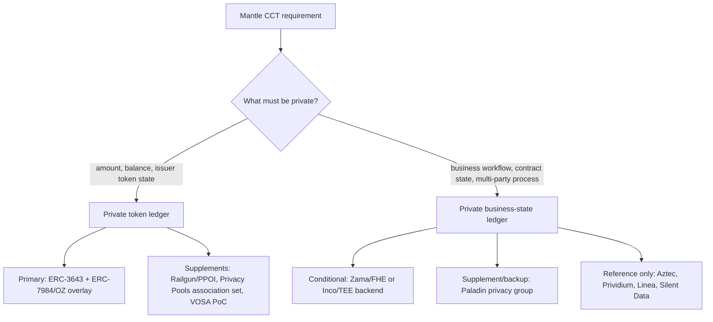
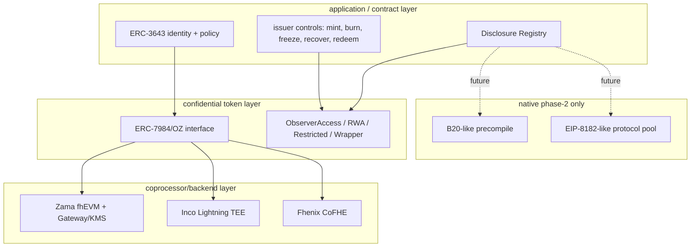
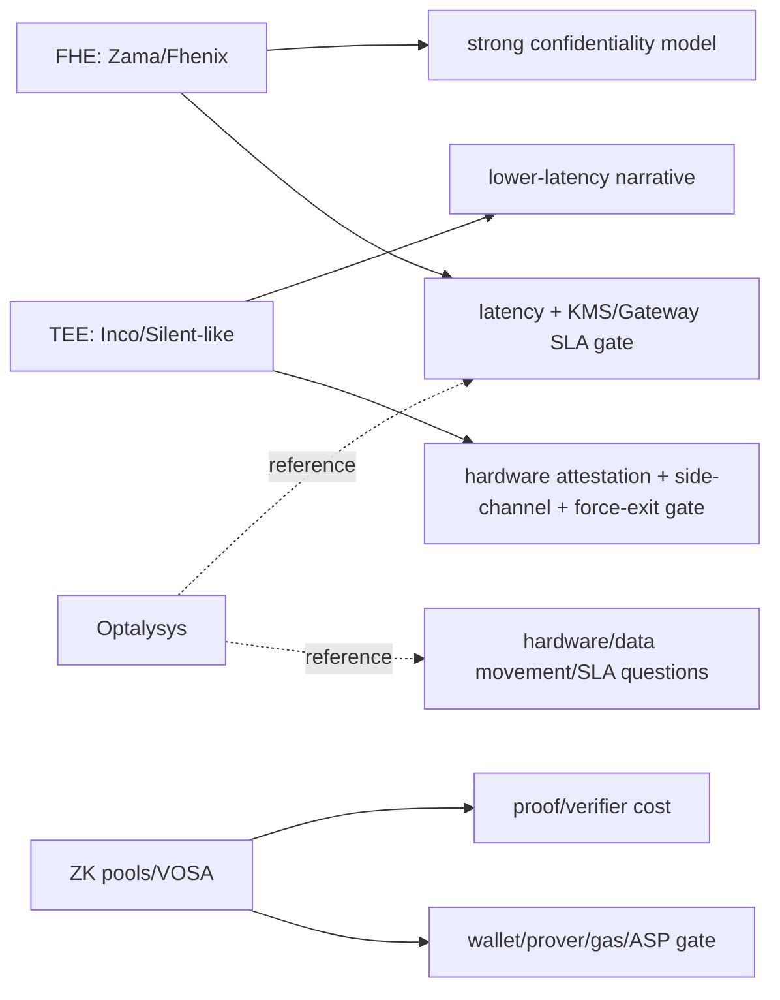
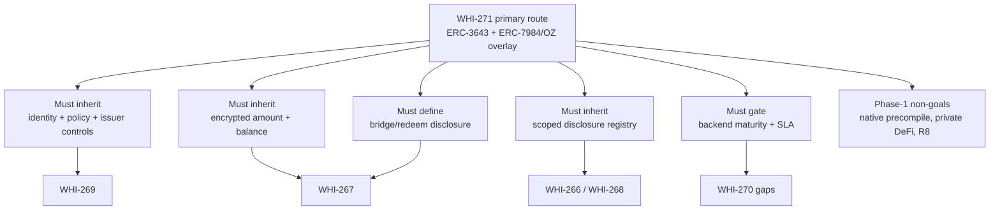
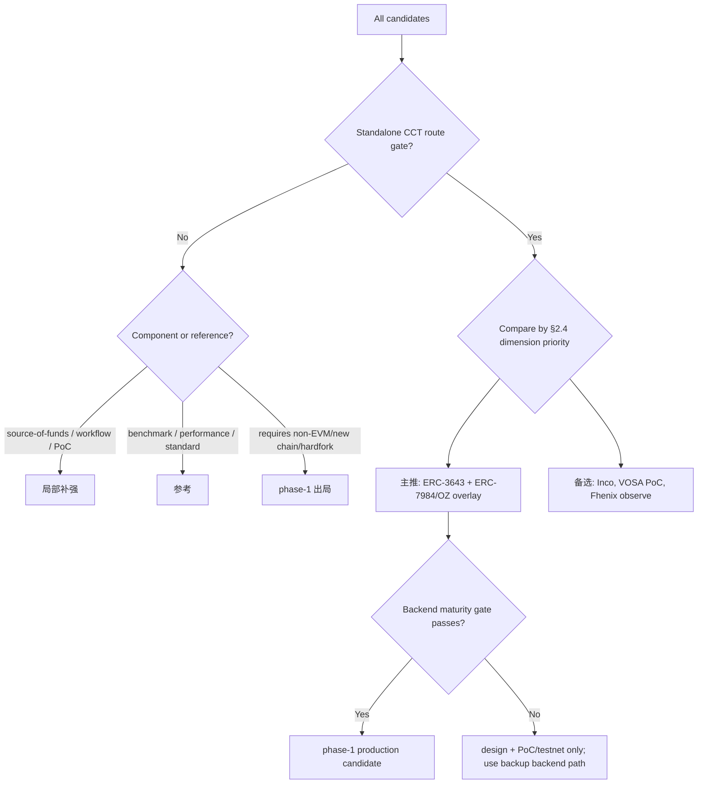

# Confidential Compliance Token 路线横向对比

## Executive Summary

本 section 的路线裁决是：**Mantle phase 1 主推 `ERC-3643 + ERC-7984/OZ confidential overlay` 组合路线**，即用 ERC-3643/ONCHAINID/RBAC/issuer controls 承接合规生命周期，用 ERC-7984/OpenZeppelin Confidential Contracts 作为 confidential token 接口和 RWA/Observer/Wrapper/Restricted/Freezable 能力边界，并把 Zama fhEVM/OZ 作为第一条需要验证的 confidential accounting backend。这个主推不是对单一厂商的无条件押注，而是一个 **backend-replaceable application/coprocessor hybrid**：若 Zama Mantle support 或自托管 Gateway/KMS/Coprocessor gate 不通过，接口和合规骨架仍应允许 Inco Lightning、Fhenix/CoFHE 或其他具名 backend 竞争。

`主推` 的理由来自 §2.4 的四步 synthesis rule：先过 standalone-route gate，再按 `compliance_capability -> selective_disclosure -> mantle_fit -> deployment_lightweight -> privacy_coverage -> engineering_delta -> maturity -> low_lock_in -> performance_predictability` 逐维比较，而不是简单加总。该规则下，`ERC-3643 + ERC-7984/OZ confidential overlay` 在合规能力、选择性披露和 Mantle 适配三个高优先级维度同时领先；它的主要扣分项是 backend maturity gate、FHE ACL 历史撤销、KMS/Gateway 运维与性能 SLA。

**备选路线** 分三类：Inco Lightning 是最快可验证的非 Zama backend 备选，优势是 Base mainnet 近邻和 TEE-first 低延迟路径，劣势是 Mantle support、TEE 信任和 force-exit/liveness 仍需验证；VOSA-RWA 是极轻量 PoC 备选，适合封闭机构试验 exposed graph + compliance attestation，但未审计、论坛草案和 freeze/force-transfer 弱点使其不能作为生产主线；Fhenix/CoFHE 是 backend-replaceable FHE 观察位，当前合规生态和生产证据弱于 Zama/Inco。

**局部补强** 包括 Railgun/Privacy Pools 的 source-of-funds / association-set / PPOI 披露能力、Paladin/Pente 的 business workflow privacy、Inco confidential ERC20 framework 的工程 PoC 模块边界。**参考/出局** 包括 Optalysys（FHE 性能/生产化问题生成器）、Aztec（privacy-native upper bound）、Starknet STRK20（非 EVM native token benchmark）、EIP-8182（protocol shielded-pool benchmark）、B20-like native precompile（phase 2/native route；phase 1 direct route 出局）。

对 WHI-272 的设计约束是：phase 1 必须继承 ERC-3643-style identity/policy/issuer controls、ERC-7984-style encrypted amount/balance interface、scoped/logged disclosure、backend maturity gate、bridge/redeem disclosure boundary；必须避免 full-history viewing key、无 issuer controls 的 anonymity-only 方案、无 gas sponsor/paymaster 的隐私 UX、把 backend vendor claim 当生产 SLA、把 native precompile 当 phase 1 轻量方案；暂不进入 phase 1 的能力包括 native FHE/B20 precompile、private identity、fully private DeFi、order-flow privacy 和独立 privacy L2。

## Item Findings

### item-1: 候选路线汇总与对比方法论

#### 1.1 Hard input bundle

| Input | Path | Commit pin | Reuse |
|---|---|---:|---|
| WHI-266 requirements framework | `confidential-compliance-token-research/research-sections/requirements-framework/final.md` | `9eb29a1` | CCT definition, seven-dimension rubric, lightweight veto, Inco/Optalysys classification |
| WHI-267 Zama deep dive | `confidential-compliance-token-research/research-sections/zama-confidential-rwa/final.md` | `1a9fad0` | Zama architecture, ERC-3643/7984 tension, lifecycle, scores, risk gates |
| WHI-268 PSE constraints | `confidential-compliance-token-research/research-sections/pse-private-transfers-constraints/final.md` | `b54e21b` | account vs note model, wallet/prover/gas/disclosure anti-patterns |
| WHI-269 compliance token extension | `confidential-compliance-token-research/research-sections/compliance-token-private-extension/final.md` | `bb27379` | ERC-3643/B20/TIP capability mapping, backend maturity gate, phase boundary |
| WHI-270 candidate survey | `confidential-compliance-token-research/research-sections/confidential-rwa-candidates/final.md` | `29269d9` | non-Zama candidate profiles, Inco PoC, Optalysys, bucket rule, audit gaps |

Soft corroboration observed in current checkout:

| Soft input | Path | Commit pin | Treatment |
|---|---|---:|---|
| WHI-262 EVM privacy cross-comparison | `evm-privacy-research/research-sections/cross-comparison/final.md` | `9c81049` | Consistency check for A/B ledger, route-capable vs component classification. Not used to override WHI-266..270 scores. |
| WHI-263 Mantle privacy strategy | `evm-privacy-research/research-sections/mantle-privacy-strategy/final.md` | `eefb63d` | Consistency check for ERC-7984/OZ and Zama/Paladin strategy framing. Not used as primary scoring input. |

The approved outline recorded WHI-262 as done/path absent and WHI-263 as in progress. This final notes the current checkout now contains both finals, but preserves the outline's non-blocking rule: hard claims and route verdicts below are grounded in WHI-266..270.

#### 1.2 Candidate set

| Route ID | Candidate | Included as | Standalone-route gate |
|---|---|---|---|
| R1 | ERC-3643 + ERC-7984/OZ confidential overlay, with Zama/OZ as first backend to validate | primary route candidate | pass |
| R2 | Inco Lightning / confidential token route | backend route candidate | pass, Mantle support caveat |
| R3 | VOSA-RWA / VOSA-20 | lightweight PoC route candidate | pass with maturity caveat |
| R4 | Fhenix/CoFHE | backend route candidate | pass with compliance/maturity caveat |
| R5 | Nightfall/EY enterprise | enterprise private-transfer route | pass for enterprise rail; weak as phase-1 Mantle CCT |
| R6 | B20-like native private design | native protocol route | fail for phase 1; phase 2 reference |
| C1 | Railgun/Privacy Pools | disclosure/source-of-funds component | fail as standalone CCT route |
| C2 | Paladin/Pente privacy groups | business-workflow component | fail as minimal token-ledger route; useful for business-state privacy |
| C3 | Inco confidential ERC20 framework PoC | engineering module reference | fail as production route |
| B1 | Optalysys | FHE performance/production reference | fail; not a token route |
| B2 | Aztec | privacy-native upper bound | fail for Mantle phase 1; reference |
| B3 | Starknet STRK20 | non-EVM native token benchmark | fail for Mantle phase 1; reference |
| B4 | EIP-8182 | protocol shielded-pool benchmark | fail for phase 1; protocol reference |

#### 1.3 Methodology

The comparison proceeds in four layers:

1. **Gate classification**: route-capable candidates are separated from components and references before scoring. This prevents Railgun/Privacy Pools or Paladin from winning a token-route decision merely because they are strong in graph privacy or workflow privacy.
2. **Nine-dimension rubric**: WHI-266's seven dimensions are extended with `low_lock_in` and `performance_predictability`. All scores use 0-5 where higher is better; `low_lock_in=5` means minimal vendor/protocol/hardware lock-in.
3. **Forked views**: token ledger vs business-state ledger, deployment shape, compliance disclosure, and FHE/TEE/ZK production constraints are evaluated separately so the main matrix does not conflate different privacy goals.
4. **Verdict synthesis**: route bucket is derived from gate + high-priority dimensions + evidence quality. Raw totals are shown only as a diagnostic, not as a ranking rule.

### item-2: 扩展 WHI-266 Rubric 与评分校准

#### 2.1 Nine dimensions

| Dimension | Meaning | 5 means | 0 means |
|---|---|---|---|
| privacy_coverage | R1 amount, R2 balance, R3 identity, R4 business state, R5 graph, R8 order flow | token ledger covered, optional identity/state/graph boundaries clear | no meaningful privacy |
| compliance_capability | KYC/AML, transfer policy, issuer controls, recovery, redeem, audit | full issuer/regulator lifecycle with explicit controls | no RWA compliance lifecycle |
| selective_disclosure | authority/trigger/payload/scope/revocability/leakage + logs | scoped, logged, minimally disclosed, revocation boundary clear | no disclosure path |
| deployment_lightweight | Mantle phase-1 fit: no new chain, bridge, full node, hardfork | application/contract deployable with bounded sidecar | new VM/chain/hardfork required |
| engineering_delta | wallet/indexer/DeFi/bridge/token/issuer workflow delta | small contract/SDK adapter surface | execution-client or ecosystem rewrite |
| maturity | standards, implementation, audits, production evidence | audited production / final standard / observed use | concept only or absent |
| mantle_fit | fit for Mantle institutional/private RWA | direct institutional RWA value and Mantle differentiation | weak or non-Mantle route |
| low_lock_in | inverse of vendor/protocol/hardware lock-in | backend-replaceable, neutral interface, no single operator | single vendor/chain/hardware dependency |
| performance_predictability | latency, gas, SLA, hardware/ops transparency | measured and independently bounded | absent or pure vendor claim |

#### 2.2 Calibration anchors

- Zama/OZ anchor from WHI-267: privacy 4, compliance 3, disclosure 3, lightweight 3, engineering 3, maturity 3, mantle fit 4. This final adds low_lock_in 2 and performance_predictability 2 because Mantle support, Gateway/KMS/coprocessor operations and FHE latency remain gating.
- Inco from WHI-270: strong non-Zama route, Base mainnet signal, TEE-first. It receives high lightweight/Mantle fit but lower low_lock_in because Intel TDX/Inco network and Mantle support are gating.
- VOSA from WHI-270: extremely light and compliance-oriented, but forum-draft/unaudited. It scores high on lightweight and low on maturity/performance evidence.
- B20 native from WHI-269: strong compliance/product language, but phase-1 lightweight fails because Mantle native precompile implies client/hardfork work.
- Components and references receive full scores for transparency but cannot become `主推` unless the standalone-route gate passes.

#### 2.3 Main matrix

Score legend: `0` absent, `1` weak, `2` partial/early, `3` PoC or credible but gated, `4` strong with known caveats, `5` production-grade or best-fit evidence. `low_lock_in` is inverse lock-in.

| Candidate | privacy | compliance | disclosure | lightweight | eng_delta | maturity | mantle_fit | low_lock_in | perf_predict | Raw | Route bucket | Evidence anchor |
|---|---:|---:|---:|---:|---:|---:|---:|---:|---:|---:|---|---|
| ERC-3643 + ERC-7984/OZ confidential overlay, Zama-first backend | 4 | 5 | 4 | 4 | 3 | 3 | 5 | 4 | 2 | 34 | 主推（见 §2.4 主推-selection synthesis rule） | WHI-266 @ `9eb29a1`; WHI-267 @ `1a9fad0`; WHI-269 @ `bb27379` |
| Inco Lightning / confidential token route | 4 | 3 | 3 | 4 | 3 | 3 | 4 | 2 | 3 | 29 | 备选 | WHI-270 @ `29269d9`; WHI-269 backend gate @ `bb27379` |
| VOSA-RWA / VOSA-20 | 3 | 4 | 3 | 5 | 4 | 1 | 4 | 4 | 2 | 30 | 备选 / PoC fallback | WHI-270 @ `29269d9`; VOSA prior final via WHI-270 |
| Fhenix/CoFHE | 4 | 2 | 2 | 4 | 3 | 2 | 3 | 2 | 2 | 24 | 备选 / backend observe | WHI-270 @ `29269d9`; WHI-269 @ `bb27379` |
| Nightfall/EY enterprise | 3 | 3 | 4 | 2 | 2 | 3 | 2 | 3 | 2 | 24 | 参考 / enterprise-heavy backup | WHI-270 @ `29269d9` |
| B20-like native private design | 2 | 5 | 3 | 0 | 0 | 2 | 3 | 4 | 4 | 23 | 参考 / phase-1 出局 | WHI-269 @ `bb27379`; Base B20 prior pins |
| Railgun/Privacy Pools | 4 | 2 | 4 | 3 | 2 | 3 | 3 | 3 | 3 | 27 | 局部补强 | WHI-268 @ `b54e21b`; WHI-270 @ `29269d9` |
| Paladin/Pente | 3 | 3 | 4 | 3 | 2 | 3 | 3 | 3 | 3 | 27 | 局部补强 | WHI-270 @ `29269d9`; EEA benchmark prior |
| Inco confidential ERC20 framework PoC | 3 | 3 | 3 | 3 | 4 | 1 | 3 | 2 | 1 | 23 | 局部补强 / engineering PoC | WHI-270 @ `29269d9`; PoC commit `bb39e4f...` |
| Optalysys | 1 | 0 | 0 | 1 | 1 | 2 | 1 | 1 | 2 | 9 | 参考 | WHI-266 @ `9eb29a1`; WHI-270 @ `29269d9` |
| Aztec | 5 | 3 | 4 | 0 | 0 | 3 | 1 | 1 | 2 | 19 | 参考 / direct-route 出局 | WHI-270 @ `29269d9`; Aztec prior final |
| Starknet STRK20 | 4 | 2 | 3 | 0 | 0 | 2 | 1 | 1 | 2 | 15 | 参考 / direct-route 出局 | WHI-270 @ `29269d9` |
| EIP-8182 | 4 | 1 | 3 | 0 | 0 | 1 | 0 | 4 | 2 | 15 | 参考 / phase-1 出局 | WHI-270 @ `29269d9`; EIP official spec via prior final |

#### 2.4 主推-selection synthesis rule

This section carries forward the outline-review caveat and replaces the old undefined "综合最优" phrasing with an explicit rule.

**Step 1: Gate-first filtering.** Only standalone-route candidates can compete for `主推`. Railgun/Privacy Pools, Paladin, Inco PoC, Optalysys, Aztec, Starknet STRK20 and EIP-8182 are useful but fail the direct CCT phase-1 route gate.

**Step 2: Production-maturity floor before backup ordering.** Route-capable candidates are split into `production-backup eligible` and `PoC fallback` before applying lexicographic comparison for backup ordering. A candidate fails this floor if its maturity score is below 2, its only evidence is forum/concept/unaudited PoC, or its issuer-control/recovery path is structurally incomplete for production RWA. Candidates that fail the floor can still be valuable PoC fallbacks or design references, but they do not outrank production-backup candidates by scoring higher on `compliance_capability` alone. This is why VOSA-RWA (compliance 4, maturity 1) remains a PoC fallback while Inco Lightning (compliance 3, maturity 3) is the primary non-Zama production-backup candidate.

**Step 3: Dimension-priority ordering.** Among `主推` candidates and among production-backup-eligible candidates, compare dimensions in this order:

1. `compliance_capability`
2. `selective_disclosure`
3. `mantle_fit`
4. `deployment_lightweight`
5. `privacy_coverage`
6. `engineering_delta`
7. `maturity`
8. `low_lock_in`
9. `performance_predictability`

The primary overlay route wins before raw totals matter: it has compliance 5 versus Inco 3, VOSA 4, Fhenix 2 and Nightfall 3; selective disclosure 4 versus Inco/VOSA 3; Mantle fit 5 versus Inco/VOSA 4.

**Step 4: Pairwise-elimination check.**

| Pair | Higher-priority deciding dimension | Result |
|---|---|---|
| Overlay vs Inco | compliance 5 > 3 | Overlay wins |
| Overlay vs VOSA | compliance 5 > 4 | Overlay wins |
| Overlay vs Fhenix | compliance 5 > 2 | Overlay wins |
| Overlay vs Nightfall | compliance 5 > 3 | Overlay wins |
| Inco vs VOSA | VOSA fails Step 2 production-maturity floor; Inco remains production-backup eligible | No contradiction; VOSA is PoC fallback |
| Inco vs Fhenix | compliance 3 > 2 and maturity 3 > 2 | Inco wins backend backup |

No non-transitive loop appears among route-capable candidates after the maturity/gate caveats are applied.

**Step 5: Anti-vendor-preference check.**

- Anonymous labels preserve the result: Route-X with compliance 5 / disclosure 4 / Mantle fit 5 still wins over lower compliance/disclosure candidates even if the Zama/OZ name is removed.
- The primary route's high compliance and Mantle-fit scores are not vendor-only claims; they come from ERC-3643/B20/TIP capability mapping in WHI-269 and WHI-266's CCT requirement model. The backend-specific Zama claims remain gated and are scored lower on low_lock_in/performance.
- No alternative gate-passing candidate ties the primary route on both compliance and selective disclosure. VOSA has compliance 4/disclosure 3; Inco has 3/3; Nightfall has 3/4 but fails lightweight/Mantle fit.

### item-3: 主对比矩阵解读

#### 3.1 Why the primary route is an overlay, not a pure backend bet

Zama/OZ is the strongest concrete confidential accounting stack in the hard input bundle, but WHI-267 shows it is not a drop-in ERC-3643 replacement. ERC-3643 `canTransfer(from,to,amount)` assumes plaintext amount semantics; ERC-7984/OZ hides amount and balance as ciphertext handles. Therefore the phase-1 route should not be "Zama only" or "ERC-3643 only." It must combine:

- ERC-3643-like identity, trusted issuers, transfer policy, agent controls and recovery language;
- ERC-7984/OZ-style confidential amount/balance, ObserverAccess, RWA, Restricted, Freezable, Hooked and Wrapper modules;
- a backend maturity gate for Zama, Inco, Fhenix or an equivalent named backend;
- explicit fallback for amount-dependent compliance: FHE-native policy, selective decrypt, or unsupported rule exclusion.

#### 3.2 Why B20-like native design is phase 2

WHI-269 shows B20 is valuable as product vocabulary: factory, policy registry, activation registry, RBAC, sender/receiver/executor/mint receiver scopes, asset/stablecoin variants. But targeted checks found no current B20 confidential/private extension in the Base B20 precompile surface, and Mantle native precompile work would require execution-client/hardfork-level changes. It is therefore a phase-2 native optimization and product analogy, not a phase-1 direct route.

#### 3.3 Why note/pool/privacy-group tools are not standalone CCT routes

Railgun/Privacy Pools solve source-of-funds, association set, PPOI/viewing-key and graph/linkability problems better than account-based confidential tokens. They do not solve issuer token lifecycle, ERC-3643-style transfer policy, confidential recovery, forced transfer, redemption or business token accounting by themselves.

Paladin/Pente solves private business workflow and domain execution better than token ledger primitives. It should remain a component/phase-2 business-state privacy supplement unless Mantle's product scope changes from confidential token ledger to private institutional workflow orchestration.

### item-4: 分叉视图一 - private token ledger vs private business-state ledger

#### 4.1 Ledger fork table

| Candidate | Token ledger privacy | Business-state ledger privacy | Account vs note/domain | CCT implication |
|---|---|---|---|---|
| ERC-3643 + ERC-7984/OZ overlay | strong amount/balance, weak graph by default | partial only through backend hooks/FHE policies | account/FHE handle | best phase-1 CCT fit |
| Inco Lightning | strong amount/balance, some confidential app state | strong if TEE model accepted | account/TEE confidential compute | backend backup, TEE trust gate |
| VOSA-RWA | amount/balance plus stealth-ish identity, graph exposed by design | no | account/wrapper + ZK proofs | lightweight PoC; not business-state route |
| Fhenix/CoFHE | encrypted token state possible | encrypted contract variables possible | account/FHE coprocessor | backend observe |
| Nightfall/EY | private token transfer rail | limited business-state route | note/rollup enterprise | enterprise reference |
| Railgun/Privacy Pools | strong flow/link privacy inside pool | no | note/nullifier pool | source-of-funds component |
| Paladin/Pente | possible private token domains | strong workflow/domain privacy | privacy group/domain | business workflow supplement |
| B20-like native | none today; hypothetical native confidential accounting | possible if native encrypted policy engine later | native precompile/protocol | phase 2 |
| Aztec | strong | strong | privacy-native L2 | upper bound, not Mantle phase 1 |
| EIP-8182 | strong pool privacy | no | protocol shielded pool | protocol reference |

#### 4.2 Fork decision

Mantle phase 1 CCT should optimize for **private token ledger**: encrypted amount, encrypted balance/frozen balance, issuer controls, scoped disclosure and redeem semantics. Business-state privacy should be treated as phase-2 or as a separate Paladin/Zama/TEE workflow track unless WHI-272 explicitly expands scope.

### item-5: 分叉视图二 - 部署形态视图

#### 5.1 Deployment grouping

| Deployment shape | Candidates | Mantle engineering implication | Verdict |
|---|---|---|---|
| application/contract-only | ERC-3643 compliance base, VOSA-RWA, some wrappers/adapters | lowest chain delta; wallet/indexer/disclosure services still needed | preferred surface for phase 1 where possible |
| coprocessor/backend | Zama/OZ, Inco Lightning, Fhenix/CoFHE, COTI-like future backend | no client hardfork but depends on Gateway/KMS/TEE/FHE/prover operators and SLA | acceptable if backend maturity gate passes |
| native precompile/protocol | B20-like native private feature, EIP-8182, native FHE precompile | execution clients, fork governance, fraud-proof/client parity, audits | phase-1 direct route out |
| independent privacy chain / non-EVM VM | Aztec, Starknet STRK20, Prividium/Linea/Silent Data style references | new VM/chain/bridge/operator/liquidity | reference only for WHI-271 |
| privacy-group sidecar | Paladin/Pente | unmodified EVM base but sidecar/domain/notary operations | component for business workflows |

#### 5.2 Hybrid phase-1 shape

The primary route is intentionally hybrid:

1. Application layer: ERC-3643-style identity, issuer controls, policy registry, disclosure registry.
2. Confidential token layer: ERC-7984/OZ interface, encrypted amount/balance, observer and wrapper flows.
3. Backend layer: Zama first validation path; Inco/Fhenix as replaceable backend candidates if they can satisfy Mantle support, audit and SLA gates.
4. Operations layer: wallet/custody SDK, gas sponsor/paymaster, auditor/regulator view, bridge/redeem service.

### 分叉视图三: 合规披露视图

CCT 的 disclosure 不是单个 viewing key。它需要按 actor、payload、scope、revocation 和 leakage 建模；否则 "合规可见" 会退化成过度披露。

| Mechanism | Authority | Trigger | Payload | Scope | Revocability | Residual leakage | Route implication |
|---|---|---|---|---|---|---|---|
| ERC-7984/OZ ObserverAccess | holder, issuer policy, token admin | transfer, balance observation, audit request | encrypted amount/balance handle or disclosed amount | account/token scoped | future revocation only unless historical handle access is proven revocable | address, timing, token graph remain public | primary route must constrain observer roles and log grants |
| OZ RWA/Restricted/Freezable/Wrapper | issuer agent / compliance admin | mint, burn, freeze, force/recover, wrap/unwrap | action result, frozen amount, redeem amount | token/admin domain | role revocation future-only | issuer learns action context; redeem discloses settlement amount | mandatory for ERC-3643 + ERC-7984 overlay |
| Zama ACL / public decrypt / user decrypt | contract, key-holder, authorized observer | on-chain decrypt request or user delegation | handle value or user-targeted decrypted value | handle/contract/account scoped | historical ACL revocation is a known gap | Gateway/KMS metadata and public tx graph | backend gate must test ACL lifecycle and audit logs |
| Inco delegated viewing / TEE disclosure | holder, app policy, TEE operator flow | delegated view, compliance check, callback | selected encrypted state or decrypted result | app/operator scoped | depends on Inco policy and TEE/key model | TEE operator and attestation metadata | backup route requires TEE disclosure threat model |
| VOSA-RWA compliance attestation | compliance service + module governance | per transfer / mint / redeem operation | proof/attestation, auditor memo, exposed graph | operation/context scoped | future service key revocation | transfer graph intentionally exposed | PoC fallback, not production main |
| Railgun viewing key + PPOI | wallet key-holder / list provider | audit export, proof-of-innocence generation | wallet history or exclusion proof | wallet or deposit scoped | viewing key is effectively permanent | pool timing and key over-disclosure | source-of-funds supplement only |
| Privacy Pools association set / ASP | ASP, user proof, pool contracts | withdrawal / ragequit / association update | membership proof, approved root, ragequit exit | association-set scoped | ASP can change future approvals; ragequit is public | deposit/withdraw timing, ASP governance | compliance-pool design reference |
| Paladin/Pente privacy group | domain members, notary, group governance | private workflow transaction / endorsement | domain state, proof, notary-visible data | privacy-group scoped | membership/domain rebuild required for strong revocation | domain members/notary see more than public chain | business workflow supplement |
| B20-like native disclosure registry | Mantle protocol governance in phase 2 | native issuer/regulator action | protocol-defined action/disclosure record | protocol/token scoped | depends on native design | protocol governance visibility | phase-2 reference, not phase-1 route |

The primary route therefore needs a **Disclosure Registry** in WHI-272: every observer, issuer agent, auditor, regulator, backend operator, ASP and privacy-group member should be represented with `authority`, `trigger`, `payload`, `scope`, `expiry`, `revocation_status`, `log_reference` and `residual_leakage`. WHI-268's anti-patterns make this a product requirement, not a documentation appendix.

### item-6: FHE / TEE / ZK 性能与生产化约束视图

#### 6.1 Performance and production constraints

| Backend / primitive | Performance evidence class | Operational owner | Production constraint | Effect on verdict |
|---|---|---|---|---|
| Zama fhEVM/OZ | official docs + prior final; latency/SLA not independently fixed for Mantle | Zama operators or self-hosted Gateway/KMS/coprocessor | KMS liveness, Gateway availability, ACL logs, FHE latency, license/commercial terms | primary backend candidate, but performance_predictability=2 |
| Inco Lightning | Base mainnet vendor claim + prior final; TEE lower-latency narrative | Inco/TEE operator set | Intel TDX trust, attestation, callback/finality, force-exit/liveness, public audit scope | backend backup, performance_predictability=3 |
| Fhenix/CoFHE | docs/blog + prior final; status tension | Fhenix/economic-security operators | production mainnet proof, audit, RWA compliance modules | backend observe |
| VOSA-RWA | forum/design claims; no production benchmark | app/circuit operators | proof cost, freeze/recovery, compliance service governance | PoC only |
| Railgun/Privacy Pools | ZK proof/protocol docs; stronger production signals for pool use | app/wallet/ASP/broadcaster | proof gas, viewing-key scope, ASP/ragequit operations | component |
| B20 native | native precompile can be predictable after protocol work | Mantle protocol/client teams | client implementation, fork, audit, governance | phase 2 only |
| Optalysys | vendor self-report performance/hardware narrative | hardware/vendor ecosystem | photonic acceleration roadmap, data movement wall, SLA ownership | reference only |

#### 6.2 Optalysys reference treatment

Optalysys is useful only as a production-question generator:

- Does the chosen FHE backend have a measurable latency budget for mint, transfer, freeze, disclose, redeem?
- Who owns hardware acceleration, data movement, failover and incident response?
- Are benchmark claims independent, reproducible and close to the actual CCT policy path?
- Can the SLA be expressed to issuers, auditors and regulators?

It is not a CCT route, token standard, compliance model, disclosure vector or Mantle integration path.

#### 6.3 Productionization checklist

| Checklist item | Required before production |
|---|---|
| Latency budget | p50/p95 for transfer, policy check, disclosure, redeem and recovery |
| SLA owner | named operator for Gateway/KMS/TEE/FHE/prover/ASP/notary |
| Audit posture | public audit or scoped security report for token contracts, backend integration and disclosure registry |
| Key/disclosure governance | who grants, revokes, rotates, logs and responds to compromise |
| Degraded mode | what happens if backend is down, KMS quorum unavailable, TEE fails attestation, ASP censors, or prover stalls |
| Wallet/custody UX | balance decrypt, disclosure grant, recovery, gas sponsor and policy failure surfaces |
| Bridge/redeem | explicit point where plaintext amount is disclosed for settlement |

### item-7: 路线裁决表

| Bucket | Routes | Decision rationale |
|---|---|---|
| 主推 | ERC-3643 + ERC-7984/OZ confidential overlay, Zama-first but backend-replaceable | Passes standalone gate and wins §2.4 four-step synthesis rule. Best high-priority scores on compliance, disclosure and Mantle fit; backend maturity gate is explicit. |
| 备选 | Inco Lightning; VOSA-RWA PoC; Fhenix/CoFHE observe | Inco is strongest non-Zama backend backup if Mantle support and TEE governance clear. VOSA is narrow lightweight PoC fallback. Fhenix is backend-replaceable observe, not production anchor yet. |
| 局部补强 | Railgun/Privacy Pools; Paladin/Pente; Inco confidential ERC20 framework PoC | Add source-of-funds, association-set, PPOI, business workflow privacy, wrapper/transfer-rule engineering patterns. Not standalone phase-1 CCT routes. |
| 参考 | Optalysys; Aztec; Starknet STRK20; EIP-8182; Nightfall/EY enterprise | Provide performance, upper-bound privacy, non-EVM native-token, protocol-pool or enterprise-rollup lessons. Not direct Mantle phase-1 routes. |
| 出局 for phase 1 direct route | B20-like native private precompile; Aztec direct route; Starknet STRK20 direct route; EIP-8182 direct route | New precompile, non-EVM VM/chain or protocol activation conflicts with phase-1 lightweight constraints. Revisit only for phase 2/native roadmap. |

#### 7.1 Five traceable verdict checks

| Verdict checked | Trace path | Result |
|---|---|---|
| Primary overlay requires backend maturity gate | WHI-269 Table "Required phase-1 confidential backend maturity assessment" @ `bb27379`; WHI-267 item-5/7 @ `1a9fad0` | Gate is mandatory; no production claim without Mantle support or self-host path |
| Inco is backup, not automatic main | WHI-270 Inco profile and gap register @ `29269d9`; WHI-269 backend table @ `bb27379` | Base mainnet signal is strong, Mantle support and TEE trust remain open |
| VOSA is PoC fallback only | WHI-270 VOSA row @ `29269d9`; VOSA prior final pin in source pack | Forum draft, unaudited, exposed graph and freeze weakness block production main |
| Railgun/Privacy Pools are components | WHI-268 account vs note model @ `b54e21b`; WHI-270 bucket rule @ `29269d9` | Source-of-funds/disclosure value high; issuer lifecycle missing |
| B20 native is phase 2 | WHI-269 phase boundary and code verification boundary @ `bb27379` | B20 is product language; no current private precompile path for phase 1 |

### item-8: WHI-272 协议设计约束清单

#### 8.1 Must inherit

| Constraint | WHI-272 requirement | Source |
|---|---|---|
| ERC-3643-style compliance substrate | identity/KYC registry, trusted issuer, transfer policy, agent controls, freeze/recovery/redeem semantics | WHI-269 @ `bb27379`; WHI-266 @ `9eb29a1` |
| ERC-7984/OZ confidential value interface | encrypted amount, encrypted balance/frozen balance, confidential transfer, observer/disclosure events | WHI-267 @ `1a9fad0`; WHI-269 @ `bb27379` |
| Scoped disclosure matrix | authority, trigger, payload, scope, revocability, leakage, audit log per actor | WHI-266 @ `9eb29a1`; WHI-268 @ `b54e21b` |
| Backend maturity gate | named backend, chain support, audit/security posture, SLA, operational owner, failure path | WHI-269 @ `bb27379`; WHI-270 @ `29269d9` |
| Bridge/redeem boundary | plaintext disclosure point for unwrap/redeem/cash settlement and failure recovery | WHI-267 @ `1a9fad0`; WHI-268 @ `b54e21b` |

#### 8.2 Must avoid

| Anti-pattern | Avoidance requirement | Source |
|---|---|---|
| Full-history viewing key as default disclosure | Use scoped grants and period/account payloads; label historical access as persistent unless proven revocable | WHI-268 @ `b54e21b`; WHI-267 ACL caveats @ `1a9fad0` |
| Anonymity-only route without issuer controls | CCT must include issuer freeze/recovery/redeem/audit and compliance policy | WHI-266 @ `9eb29a1`; WHI-268 @ `b54e21b` |
| ERC-20 DeFi compatibility claim without adapters | Define safe MVP, adapter-visible fields, liquidation/oracle/indexer boundaries | WHI-268 @ `b54e21b` |
| Backend vendor claim as production proof | Require chain addresses, audit scope, latency measurements and SLA owner | WHI-270 gap register @ `29269d9` |
| Phase-1 native precompile assumption | Keep B20/native encrypted policy engine out of phase 1 unless Mantle explicitly funds protocol route | WHI-269 @ `bb27379` |

#### 8.3 Phase-1 non-goals

- Native Mantle B20/private token precompile.
- Native FHE precompile or protocol-level encrypted policy engine.
- Private identity or fully hidden address graph.
- Fully private AMM/lending/liquidation.
- R8 order-flow privacy / encrypted mempool.
- Independent privacy L2 or non-EVM VM migration.
- Hardware acceleration dependency as a route premise.

#### 8.4 WHI-272 trace diagram

## Diagrams

### diag-1: Nine-dimension matrix heatmap

The main score matrix is §2.3. Scores are deliberately numeric but verdicts are not raw-total sorted.

### diag-2: Ledger fork

See §4.2 Mermaid decision graph.

### diag-3: Deployment layer

See §5.2 Mermaid layered deployment graph.

### diag-4: FHE/TEE/ZK constraints

See §6.3 Mermaid production-constraint graph.

### diag-5: Verdict decision tree

### diag-6: WHI-272 constraints

See §8.4.

## Source Coverage

| Source requirement | Status | Evidence |
|---|---|---|
| src-1 WHI-266 prior final | covered | `requirements-framework/final.md` @ `9eb29a1`; reused CCT definition, rubric, lightweight constraints, Inco/Optalysys boundaries |
| src-2 WHI-267 prior final | covered | `zama-confidential-rwa/final.md` @ `1a9fad0`; reused Zama/OZ architecture, ERC-3643 tension, lifecycle and scores |
| src-3 WHI-268 prior final | covered | `pse-private-transfers-constraints/final.md` @ `b54e21b`; reused account vs note, disclosure and UX anti-patterns |
| src-4 WHI-269 prior final | covered | `compliance-token-private-extension/final.md` @ `bb27379`; reused ERC-3643/B20 capability mapping, phase boundary and backend maturity gate |
| src-5 WHI-270 prior final | covered | `confidential-rwa-candidates/final.md` @ `29269d9`; reused candidate profiles, Inco PoC, Optalysys and bucket rule |
| src-6 EVM privacy soft inputs | soft-covered | `cross-comparison/final.md` @ `9c81049` and `mantle-privacy-strategy/final.md` @ `eefb63d`; used only for consistency checks |
| src-7 compliance-token prior finals | covered via WHI-266/269 | ERC-3643, B20, Mantle strategy pins are already embedded in WHI-266/269 source coverage |
| src-8 external standards | covered via prior finals | ERC-7984, ERC-3643 and EIP-8182 official specs cited through WHI-266/267/270 source packs with 2026-06-24 access dates |
| src-9 external vendor/performance | covered with caveats | Zama/Inco/Fhenix/Optalysys claims carried only where prior finals labeled evidence class and access dates |
| src-10 issue record | covered | Trigger dispatch `e6c83bb4-59df-44a7-aeb9-47619a8b704b`; outline commit `319a9a5` |

## Gap Analysis

1. **Outline file status mismatch**: the persisted outline frontmatter remains `status: candidate`; Orchestrator dispatch supplies the approval evidence. This final records both and does not edit the outline.
2. **Primary route is gated, not production-ready by assertion**: the overlay is the recommended architecture, but production requires a named backend with Mantle support or self-host proof, audits, SLA and failure semantics.
3. **Zama Mantle support remains unproven in the hard input bundle**: WHI-267/269 treat Zama/OZ as strongest cryptographic/RWA reference, not automatic Mantle production path.
4. **Inco is dynamic**: Base mainnet evidence is strong for a backup route, but Mantle support, TEE attestation, force-exit and public audit scope must be pinned before WHI-272 production design.
5. **VOSA is not production evidence**: it is useful to test exposed-graph compliance appetite, but unaudited forum maturity blocks production.
6. **Disclosure revocation is unresolved across routes**: FHE ACL, ObserverAccess, Hooked grants, viewing keys and admin views all need explicit historical-access treatment.
7. **DeFi and R8 remain out of scope**: encrypted balances break ERC-20 assumptions; private order flow needs a separate workstream.
8. **Performance/SLA evidence is weak for all confidential-compute routes**: this is why performance_predictability does not decide `主推`, and why Optalysys is reference only.

## Revision Log

| Round | Date | Change |
|---:|---|---|
| 1 | 2026-06-24 | Initial deep draft from approved round-2 outline. Covered all candidate routes, nine-dimension matrix, ledger/deployment/performance views, verdict table, anti-vendor-preference synthesis rule, WHI-262/263 soft-input treatment, and WHI-272 protocol design constraints. Addressed the outline-review caveat by referencing §2.4 in the `主推` bucket cell. |
| final | 2026-06-24 | Promoted approved round-1 draft `2b039138d6a07a023fc3437fc777e8826e0c2436` to `final.md` after Review Verdict approve (`eeda2187-c53f-458e-b1d2-5cab30eac1e7`). Resolved the two minor caveats: added the production-maturity floor to §2.4 so Inco/VOSA backup ordering is reproducible, and surfaced compliance disclosure as a distinct grouped view outside item-6. |
