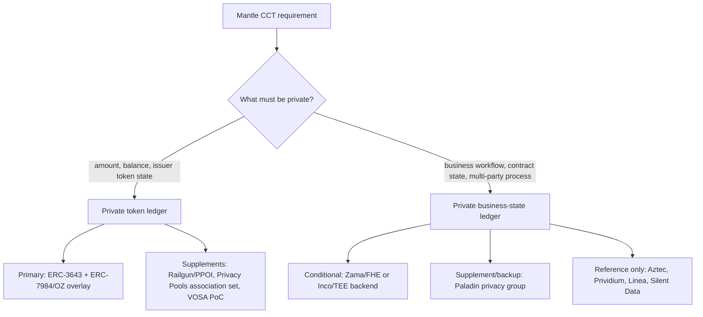
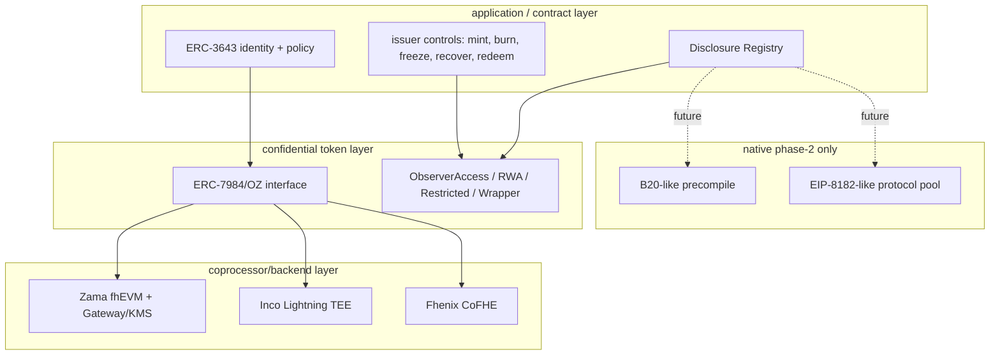
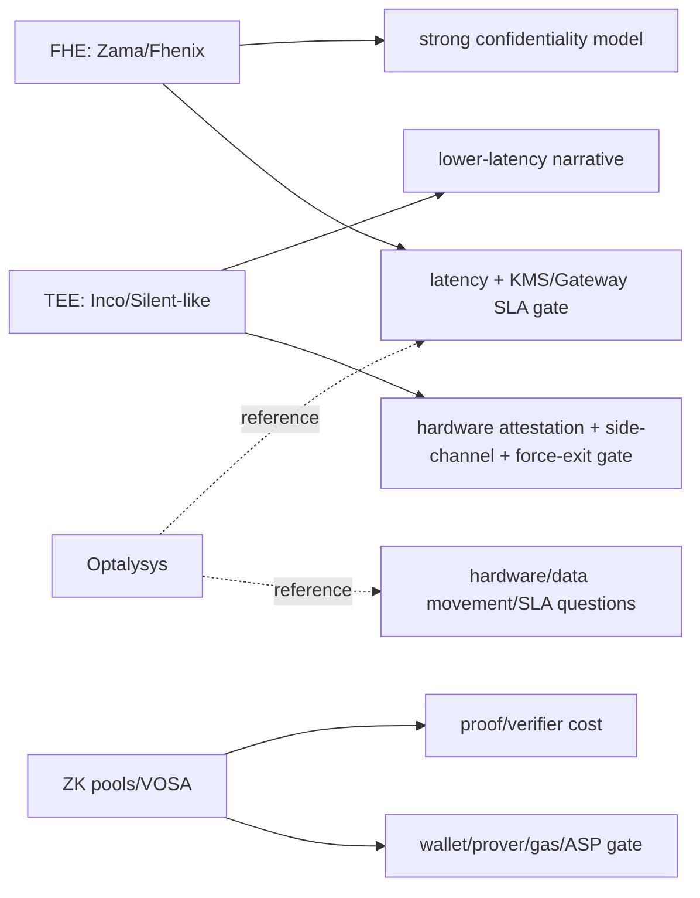
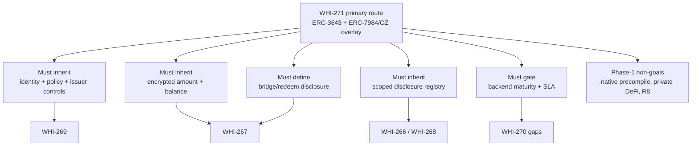
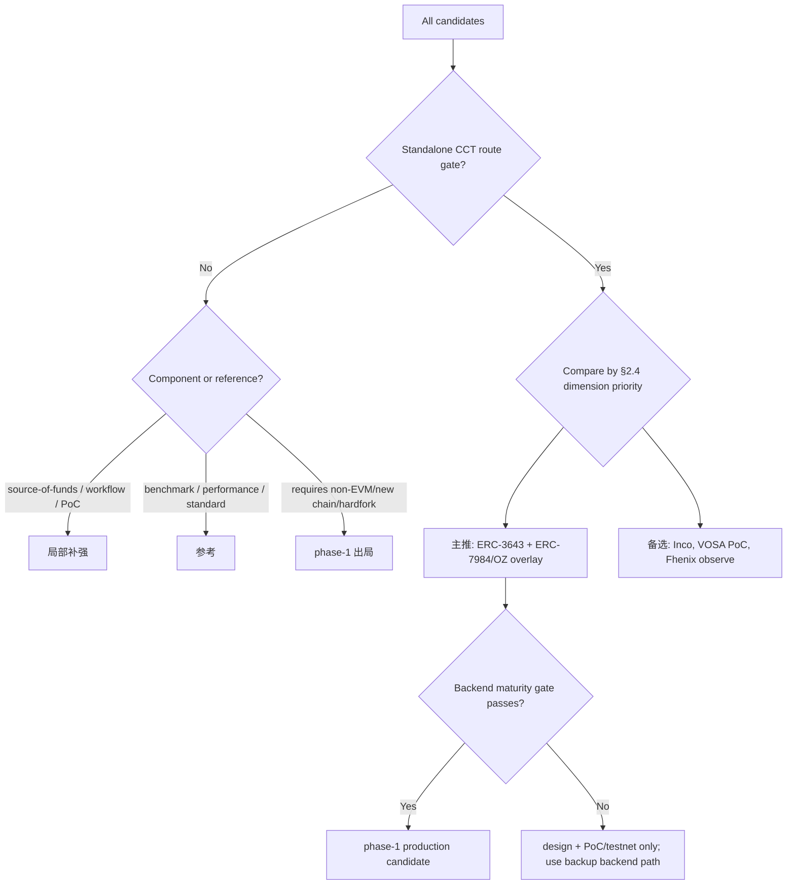

# Confidential Compliance Token 路线横向对比

## 执行摘要（Executive Summary）

本节的路线裁决是：**Mantle phase 1 主推 `ERC-3643 + ERC-7984/OZ confidential overlay` 组合路线**，即用 ERC-3643/ONCHAINID/RBAC/issuer controls 承接合规生命周期，用 ERC-7984/OpenZeppelin Confidential Contracts 作为机密代币（confidential token）接口与 RWA/Observer/Wrapper/Restricted/Freezable 能力边界，并把 Zama fhEVM/OZ 作为第一条需要验证的机密记账后端（confidential accounting backend）。这个主推不是对单一厂商的无条件押注，而是一个**后端可替换的 application/coprocessor hybrid（backend-replaceable application/coprocessor hybrid）**：若 Zama Mantle support 或自托管 Gateway/KMS/Coprocessor 门控（gate）不通过，接口与合规骨架仍应允许 Inco Lightning、Fhenix/CoFHE 或其他具名后端竞争。

`主推` 的理由来自 §2.4 的四步综合规则（synthesis rule）：先过 standalone-route gate，再按 `compliance_capability -> selective_disclosure -> mantle_fit -> deployment_lightweight -> privacy_coverage -> engineering_delta -> maturity -> low_lock_in -> performance_predictability` 逐维比较，而不是简单加总。该规则下，`ERC-3643 + ERC-7984/OZ confidential overlay` 在合规能力、选择性披露（selective disclosure）和 Mantle 适配三个高优先级维度上同时领先；它的主要扣分项是后端成熟度门控（backend maturity gate）、FHE ACL 历史撤销、KMS/Gateway 运维与性能 SLA。

**备选路线**分三类：Inco Lightning 是最快可验证的非 Zama 后端备选，优势是 Base mainnet 近邻与 TEE-first 低延迟路径，劣势是 Mantle support、TEE 信任与 force-exit/liveness 仍需验证；VOSA-RWA 是极轻量 PoC 备选，适合封闭机构试验 exposed graph + compliance attestation，但未审计、论坛草案以及 freeze/force-transfer 弱点使其不能作为生产主线；Fhenix/CoFHE 是后端可替换的 FHE 观察位，当前合规生态与生产证据弱于 Zama/Inco。

**局部补强**包括 Railgun/Privacy Pools 的 source-of-funds / association-set / PPOI 披露能力、Paladin/Pente 的业务流程隐私（business workflow privacy）、Inco confidential ERC20 framework 的工程 PoC 模块边界。**参考/出局**包括 Optalysys（FHE 性能/生产化问题生成器）、Aztec（privacy-native 上界）、Starknet STRK20（非 EVM 原生代币 benchmark）、EIP-8182（protocol shielded-pool benchmark）、B20-like native precompile（phase 2/native route；phase 1 direct route 出局）。

对 WHI-272 的设计约束是：phase 1 必须继承 ERC-3643-style identity/policy/issuer controls、ERC-7984-style encrypted amount/balance interface、受范围限定且可记录的披露（scoped/logged disclosure）、backend maturity gate、bridge/redeem disclosure boundary；必须避免 full-history viewing key、无 issuer controls 的 anonymity-only 方案、无 gas sponsor/paymaster 的隐私 UX、把 backend vendor claim 当生产 SLA、把 native precompile 当 phase 1 轻量方案；暂不进入 phase 1 的能力包括 native FHE/B20 precompile、private identity、fully private DeFi、order-flow privacy 与独立 privacy L2。

## 逐项发现（Item Findings）

### item-1: 候选路线汇总与对比方法论

#### 1.1 硬性输入集（Hard input bundle）

| 输入 | 路径 | Commit pin | 复用内容 |
|---|---|---:|---|
| WHI-266 需求框架 | `confidential-compliance-token-research/research-sections/requirements-framework/final.md` | `9eb29a1` | CCT 定义、七维评分量表（rubric）、轻量否决（lightweight veto）、Inco/Optalysys 分类 |
| WHI-267 Zama 深度研究 | `confidential-compliance-token-research/research-sections/zama-confidential-rwa/final.md` | `1a9fad0` | Zama 架构、ERC-3643/7984 张力、生命周期、评分、风险门控 |
| WHI-268 PSE 约束 | `confidential-compliance-token-research/research-sections/pse-private-transfers-constraints/final.md` | `b54e21b` | 账户模型 vs note 模型、钱包/证明者/gas/披露 反模式 |
| WHI-269 合规代币扩展 | `confidential-compliance-token-research/research-sections/compliance-token-private-extension/final.md` | `bb27379` | ERC-3643/B20/TIP 能力映射、后端成熟度门控（backend maturity gate）、阶段边界 |
| WHI-270 候选调研 | `confidential-compliance-token-research/research-sections/confidential-rwa-candidates/final.md` | `29269d9` | 非 Zama 候选画像、Inco PoC、Optalysys、分桶规则（bucket rule）、审计缺口 |

当前 checkout 中观察到的软性佐证（soft corroboration）：

| 软性输入 | 路径 | Commit pin | 处理方式 |
|---|---|---:|---|
| WHI-262 EVM 隐私横向对比 | `evm-privacy-research/research-sections/cross-comparison/final.md` | `9c81049` | 用于 A/B 账本、可作独立路线（route-capable）vs 组件（component）分类的一致性核对。不用于覆盖 WHI-266..270 的评分。 |
| WHI-263 Mantle 隐私策略 | `evm-privacy-research/research-sections/mantle-privacy-strategy/final.md` | `eefb63d` | 用于 ERC-7984/OZ 与 Zama/Paladin 策略框架的一致性核对。不作为主要评分输入。 |

获批的 outline 记录 WHI-262 为 done/路径缺失，WHI-263 为进行中。本 final 注意到当前 checkout 现已同时包含两份 final，但保留 outline 的非阻塞规则：以下硬性主张（hard claims）与路线裁决均以 WHI-266..270 为基础。

#### 1.2 候选集（Candidate set）

| 路线 ID | 候选 | 纳入身份 | 独立路线门控（Standalone-route gate） |
|---|---|---|---|
| R1 | ERC-3643 + ERC-7984/OZ 机密叠加层，以 Zama/OZ 作为首个待验证后端 | 主推路线候选 | 通过 |
| R2 | Inco Lightning / 机密代币路线 | 后端路线候选 | 通过，附带 Mantle support 注意事项 |
| R3 | VOSA-RWA / VOSA-20 | 轻量 PoC 路线候选 | 通过，附带成熟度注意事项 |
| R4 | Fhenix/CoFHE | 后端路线候选 | 通过，附带合规/成熟度注意事项 |
| R5 | Nightfall/EY 企业方案 | 企业级私有转账路线 | 作为企业级通道可通过；作为 phase-1 Mantle CCT 较弱 |
| R6 | B20 式 native 私有设计 | native 协议路线 | phase 1 不通过；phase 2 参考 |
| C1 | Railgun/Privacy Pools | 披露/资金来源组件 | 作为独立 CCT 路线不通过 |
| C2 | Paladin/Pente privacy groups | 业务工作流组件 | 作为最小代币账本路线不通过；对业务状态隐私有用 |
| C3 | Inco confidential ERC20 framework PoC | 工程模块参考 | 作为生产路线不通过 |
| B1 | Optalysys | FHE 性能/生产化参考 | 不通过；非代币路线 |
| B2 | Aztec | privacy-native 上界 | Mantle phase 1 不通过；参考 |
| B3 | Starknet STRK20 | 非 EVM native 代币 benchmark | Mantle phase 1 不通过；参考 |
| B4 | EIP-8182 | protocol shielded-pool benchmark | phase 1 不通过；协议参考 |

#### 1.3 方法论（Methodology）

对比按四个层次推进：

1. **门控分类（Gate classification）**：在评分前先把可作独立路线（route-capable）的候选与组件（components）、参考（references）区分开。这样可以避免 Railgun/Privacy Pools 或 Paladin 仅凭在图隐私（graph privacy）或工作流隐私（workflow privacy）上的优势就赢得一个代币路线裁决。
2. **九维评分量表（Nine-dimension rubric）**：在 WHI-266 的七维之上扩展出 `low_lock_in` 与 `performance_predictability`。所有评分采用 0-5，越高越好；`low_lock_in=5` 表示厂商/协议/硬件锁定（lock-in）最小。
3. **分叉视图（Forked views）**：代币账本 vs 业务状态账本、部署形态、合规披露以及 FHE/TEE/ZK 生产化约束分别评估，使主矩阵不混淆不同的隐私目标。
4. **裁决综合（Verdict synthesis）**：路线分桶（route bucket）由门控 + 高优先级维度 + 证据质量推导得出。原始合计分（raw totals）仅作为诊断信息展示，不作为排序规则。

### item-2: 扩展 WHI-266 Rubric 与评分校准

#### 2.1 九个维度（Nine dimensions）

| 维度 | 含义 | 5 分代表 | 0 分代表 |
|---|---|---|---|
| privacy_coverage | R1 金额、R2 余额、R3 身份、R4 业务状态、R5 图、R8 订单流 | 代币账本覆盖，可选的 身份/状态/图 边界清晰 | 无实质隐私 |
| compliance_capability | KYC/AML、转账策略（transfer policy）、发行方控制（issuer controls）、恢复（recovery）、赎回（redeem）、审计 | 具备明确控制项的完整 发行方/监管方 生命周期 | 无 RWA 合规生命周期 |
| selective_disclosure | 授权方/触发/载荷/范围/可撤销性/泄露 + 日志 | 受范围限定、可记录、最小披露、撤销边界清晰 | 无披露路径 |
| deployment_lightweight | Mantle phase-1 适配：无需新链、bridge、full node、hardfork | application/contract 可部署，sidecar 有界 | 需要新 VM/chain/hardfork |
| engineering_delta | 钱包/indexer/DeFi/bridge/代币/发行方 工作流增量 | 小型 contract/SDK adapter 表面 | 需要重写 execution-client 或生态 |
| maturity | 标准、实现、审计、生产证据 | 已审计的生产 / 终稿标准 / 已观察到的使用 | 仅停留在概念或缺失 |
| mantle_fit | 对 Mantle 机构/私有 RWA 的适配度 | 直接的机构 RWA 价值与 Mantle 差异化 | 弱适配或非 Mantle 路线 |
| low_lock_in | 厂商/协议/硬件锁定的反向值 | 后端可替换、接口中立、无单一运营方 | 单一厂商/链/硬件依赖 |
| performance_predictability | 延迟、gas、SLA、硬件/运维透明度 | 已测量且可独立界定 | 缺失或纯厂商声明 |

#### 2.2 校准锚点（Calibration anchors）

- Zama/OZ 锚点来自 WHI-267：privacy 4、compliance 3、disclosure 3、lightweight 3、engineering 3、maturity 3、mantle fit 4。本 final 补充 low_lock_in 2 与 performance_predictability 2，因为 Mantle support、Gateway/KMS/coprocessor 运维以及 FHE 延迟仍构成门控。
- Inco 来自 WHI-270：强力的非 Zama 路线、Base mainnet 信号、TEE-first。它在 lightweight/Mantle fit 上得高分，但 low_lock_in 较低，因为 Intel TDX/Inco network 与 Mantle support 仍构成门控。
- VOSA 来自 WHI-270：极度轻量且面向合规，但属论坛草案/未审计（forum-draft/unaudited）。它在 lightweight 上得高分，在 maturity/performance 证据上得低分。
- B20 native 来自 WHI-269：合规/产品表述很强，但 phase-1 lightweight 不通过，因为 Mantle native precompile 意味着 client/hardfork 级工作。
- 组件（components）与参考（references）为透明起见给出完整评分，但除非独立路线门控（standalone-route gate）通过，否则不能成为 `主推`。

#### 2.3 主矩阵（Main matrix）

评分图例：`0` 缺失，`1` 弱，`2` 部分/早期，`3` PoC 或可信但受门控，`4` 强但有已知注意事项，`5` 生产级或最佳适配证据。`low_lock_in` 为反向锁定。

| 候选 | privacy | compliance | disclosure | lightweight | eng_delta | maturity | mantle_fit | low_lock_in | perf_predict | 合计 | 路线分桶 | 证据锚点 |
|---|---:|---:|---:|---:|---:|---:|---:|---:|---:|---:|---|---|
| ERC-3643 + ERC-7984/OZ 机密叠加层，Zama-first 后端 | 4 | 5 | 4 | 4 | 3 | 3 | 5 | 4 | 2 | 34 | 主推（见 §2.4 主推选择综合规则） | WHI-266 @ `9eb29a1`; WHI-267 @ `1a9fad0`; WHI-269 @ `bb27379` |
| Inco Lightning / 机密代币路线 | 4 | 3 | 3 | 4 | 3 | 3 | 4 | 2 | 3 | 29 | 备选 | WHI-270 @ `29269d9`; WHI-269 后端门控 @ `bb27379` |
| VOSA-RWA / VOSA-20 | 3 | 4 | 3 | 5 | 4 | 1 | 4 | 4 | 2 | 30 | 备选 / PoC 兜底 | WHI-270 @ `29269d9`; VOSA 经由 WHI-270 引用的此前 final |
| Fhenix/CoFHE | 4 | 2 | 2 | 4 | 3 | 2 | 3 | 2 | 2 | 24 | 备选 / 后端观察位 | WHI-270 @ `29269d9`; WHI-269 @ `bb27379` |
| Nightfall/EY 企业方案 | 3 | 3 | 4 | 2 | 2 | 3 | 2 | 3 | 2 | 24 | 参考 / 偏企业级备选 | WHI-270 @ `29269d9` |
| B20 式 native 私有设计 | 2 | 5 | 3 | 0 | 0 | 2 | 3 | 4 | 4 | 23 | 参考 / phase-1 出局 | WHI-269 @ `bb27379`; Base B20 此前 pin |
| Railgun/Privacy Pools | 4 | 2 | 4 | 3 | 2 | 3 | 3 | 3 | 3 | 27 | 局部补强 | WHI-268 @ `b54e21b`; WHI-270 @ `29269d9` |
| Paladin/Pente | 3 | 3 | 4 | 3 | 2 | 3 | 3 | 3 | 3 | 27 | 局部补强 | WHI-270 @ `29269d9`; EEA benchmark 此前引用 |
| Inco confidential ERC20 framework PoC | 3 | 3 | 3 | 3 | 4 | 1 | 3 | 2 | 1 | 23 | 局部补强 / 工程 PoC | WHI-270 @ `29269d9`; PoC commit `bb39e4f...` |
| Optalysys | 1 | 0 | 0 | 1 | 1 | 2 | 1 | 1 | 2 | 9 | 参考 | WHI-266 @ `9eb29a1`; WHI-270 @ `29269d9` |
| Aztec | 5 | 3 | 4 | 0 | 0 | 3 | 1 | 1 | 2 | 19 | 参考 / direct-route 出局 | WHI-270 @ `29269d9`; Aztec 此前 final |
| Starknet STRK20 | 4 | 2 | 3 | 0 | 0 | 2 | 1 | 1 | 2 | 15 | 参考 / direct-route 出局 | WHI-270 @ `29269d9` |
| EIP-8182 | 4 | 1 | 3 | 0 | 0 | 1 | 0 | 4 | 2 | 15 | 参考 / phase-1 出局 | WHI-270 @ `29269d9`; EIP 官方规范经由此前 final |

#### 2.4 主推选择综合规则（主推-selection synthesis rule）

本节延续 outline-review 的注意事项，用一条明确规则替换旧的、未定义的「综合最优」措辞。

**第 1 步：门控优先筛选（Gate-first filtering）。** 只有可作独立路线（standalone-route）的候选才能竞争 `主推`。Railgun/Privacy Pools、Paladin、Inco PoC、Optalysys、Aztec、Starknet STRK20 与 EIP-8182 有用，但未能通过直接 CCT phase-1 路线门控（direct CCT phase-1 route gate）。

**第 2 步：备选排序前的生产成熟度下限（Production-maturity floor before backup ordering）。** 在对备选排序应用字典序比较（lexicographic comparison）之前，route-capable 候选先被分为「可作生产备选（production-backup eligible）」与「PoC 兜底（PoC fallback）」。一个候选若满足以下任一条件则未通过该下限：其 maturity 评分低于 2，其唯一证据为论坛/概念/未审计 PoC，或其 发行方控制/恢复（issuer-control/recovery）路径对生产级 RWA 而言结构上不完整。未通过该下限的候选仍可作为有价值的 PoC 兜底或设计参考，但它们不会仅因在 `compliance_capability` 上得分更高就超越可作生产备选的候选。这正是 VOSA-RWA（compliance 4, maturity 1）仍为 PoC 兜底、而 Inco Lightning（compliance 3, maturity 3）为首选非 Zama 生产备选候选的原因。

**第 3 步：维度优先级排序（Dimension-priority ordering）。** 在 `主推` 候选之间以及可作生产备选的候选之间，按如下顺序比较维度：

1. `compliance_capability`
2. `selective_disclosure`
3. `mantle_fit`
4. `deployment_lightweight`
5. `privacy_coverage`
6. `engineering_delta`
7. `maturity`
8. `low_lock_in`
9. `performance_predictability`

主推叠加层路线（primary overlay route）在原始合计分变得重要之前即已胜出：它的 compliance 5 对 Inco 3、VOSA 4、Fhenix 2 与 Nightfall 3；selective disclosure 4 对 Inco/VOSA 3；Mantle fit 5 对 Inco/VOSA 4。

**第 4 步：两两淘汰核对（Pairwise-elimination check）。**

| 对比对 | 更高优先级的决定性维度 | 结果 |
|---|---|---|
| 叠加层 vs Inco | compliance 5 > 3 | 叠加层胜 |
| 叠加层 vs VOSA | compliance 5 > 4 | 叠加层胜 |
| 叠加层 vs Fhenix | compliance 5 > 2 | 叠加层胜 |
| 叠加层 vs Nightfall | compliance 5 > 3 | 叠加层胜 |
| Inco vs VOSA | VOSA 未通过第 2 步生产成熟度下限；Inco 仍可作生产备选 | 无矛盾；VOSA 为 PoC 兜底 |
| Inco vs Fhenix | compliance 3 > 2 且 maturity 3 > 2 | Inco 胜出，作为后端备选 |

在应用 成熟度/门控 注意事项之后，route-capable 候选之间未出现非传递性循环（non-transitive loop）。

**第 5 步：反厂商偏好核对（Anti-vendor-preference check）。**

- 匿名标签可保留结果：即便去掉 Zama/OZ 名称，具备 compliance 5 / disclosure 4 / Mantle fit 5 的 Route-X 仍胜过 compliance/disclosure 更低的候选。
- 主推路线的高 compliance 与 Mantle-fit 评分并非仅厂商声明；它们来自 WHI-269 中的 ERC-3643/B20/TIP 能力映射与 WHI-266 的 CCT 需求模型。后端相关的 Zama 声明仍受门控，在 low_lock_in/performance 上评分更低。
- 没有其他通过门控的候选能在 compliance 与 selective disclosure 两项上同时与主推路线持平。VOSA 为 compliance 4/disclosure 3；Inco 为 3/3；Nightfall 为 3/4 但未通过 lightweight/Mantle fit。

### item-3: 主对比矩阵解读

#### 3.1 为何主推路线是叠加层而非纯后端押注（Why the primary route is an overlay, not a pure backend bet）

Zama/OZ 是硬性输入集（hard input bundle）中最强的具体机密记账栈，但 WHI-267 表明它并非 ERC-3643 的即插即用替换。ERC-3643 `canTransfer(from,to,amount)` 假定明文金额语义；ERC-7984/OZ 将金额与余额隐藏为密文句柄（ciphertext handles）。因此 phase-1 路线不应是「只用 Zama」或「只用 ERC-3643」。它必须结合：

- ERC-3643 式 identity、trusted issuers、转账策略（transfer policy）、agent controls 与恢复（recovery）语义；
- ERC-7984/OZ 式机密金额/余额、ObserverAccess、RWA、Restricted、Freezable、Hooked 与 Wrapper 模块；
- 针对 Zama、Inco、Fhenix 或等价具名后端的后端成熟度门控（backend maturity gate）；
- 针对依赖金额的合规的明确兜底：FHE-native policy、选择性解密（selective decrypt）或排除不受支持的规则。

#### 3.2 为何 B20 式 native 设计属于 phase 2（Why B20-like native design is phase 2）

WHI-269 表明 B20 作为产品词汇很有价值：factory、policy registry、activation registry、RBAC、sender/receiver/executor/mint receiver scopes、asset/stablecoin 变体。但有针对性的核查发现 Base B20 precompile 表面上当前不存在 B20 机密/私有扩展，且 Mantle native precompile 工作将需要 execution-client/hardfork 级的改动。因此它是一个 phase-2 native 优化与产品类比，而非 phase-1 直接路线（direct route）。

#### 3.3 为何 note/pool/privacy-group 工具不是独立 CCT 路线（Why note/pool/privacy-group tools are not standalone CCT routes）

Railgun/Privacy Pools 在解决资金来源（source-of-funds）、关联集（association set）、PPOI/viewing-key 以及 图/可关联性（graph/linkability）问题上优于基于账户的机密代币。但它们本身并不解决 发行方代币生命周期（issuer token lifecycle）、ERC-3643 式转账策略、机密恢复（confidential recovery）、强制转账（forced transfer）、赎回（redemption）或业务代币记账。

Paladin/Pente 在私有业务工作流与域执行（domain execution）上优于代币账本原语。除非 Mantle 的产品范围从机密代币账本转向私有机构工作流编排，否则它应保持为组件/phase-2 业务状态隐私补充。

### item-4: 分叉视图一 - 私有代币账本 vs 私有业务状态账本（private token ledger vs private business-state ledger）

#### 4.1 账本分叉表（Ledger fork table）

| 候选 | 代币账本隐私 | 业务状态账本隐私 | 账户 vs note/域 | 对 CCT 的含义 |
|---|---|---|---|---|
| ERC-3643 + ERC-7984/OZ 叠加层 | 金额/余额 强，默认 图 弱 | 仅通过 backend hooks/FHE policies 部分实现 | 账户/FHE handle | 最佳 phase-1 CCT 适配 |
| Inco Lightning | 金额/余额 强，部分机密应用状态 | 若接受 TEE 模型则强 | 账户/TEE 机密计算 | 后端备选，TEE 信任门控 |
| VOSA-RWA | 金额/余额 加上类隐身（stealth-ish）身份，图 按设计暴露 | 否 | 账户/wrapper + ZK proofs | 轻量 PoC；非业务状态路线 |
| Fhenix/CoFHE | 可实现加密代币状态 | 可实现加密合约变量 | 账户/FHE coprocessor | 后端观察位 |
| Nightfall/EY | 私有代币转账通道 | 有限的业务状态路线 | note/rollup 企业方案 | 企业级参考 |
| Railgun/Privacy Pools | 池内强 流/关联 隐私 | 否 | note/nullifier 池 | 资金来源组件 |
| Paladin/Pente | 可实现私有代币域 | 强 工作流/域 隐私 | privacy group/域 | 业务工作流补充项 |
| B20 式 native | 当前无；假设性的 native 机密记账 | 若后续有 native 加密策略引擎则可实现 | native precompile/协议 | phase 2 |
| Aztec | 强 | 强 | privacy-native L2 | 上界，非 Mantle phase 1 |
| EIP-8182 | 强池隐私 | 否 | protocol shielded pool | 协议参考 |

#### 4.2 分叉决策（Fork decision）

Mantle phase 1 CCT 应针对 **私有代币账本（private token ledger）** 优化：加密金额、加密余额/冻结余额、发行方控制（issuer controls）、受范围限定的披露（scoped disclosure）与赎回（redeem）语义。业务状态隐私应被视为 phase-2，或视为独立的 Paladin/Zama/TEE 工作流轨道，除非 WHI-272 明确扩展范围。

### item-5: 分叉视图二 - 部署形态视图

#### 5.1 部署分组（Deployment grouping）

| 部署形态 | 候选 | 对 Mantle 的工程含义 | 裁决 |
|---|---|---|---|
| 仅 application/contract | ERC-3643 合规基底、VOSA-RWA、部分 wrappers/adapters | 链上增量最低；仍需 钱包/indexer/披露 服务 | 在可行处为 phase 1 的首选表面 |
| coprocessor/backend | Zama/OZ、Inco Lightning、Fhenix/CoFHE、COTI 式的未来后端 | 无 client hardfork，但依赖 Gateway/KMS/TEE/FHE/prover 运营方与 SLA | 若后端成熟度门控通过则可接受 |
| native precompile/协议 | B20 式 native 私有特性、EIP-8182、native FHE precompile | execution clients、fork governance、fraud-proof/client parity、审计 | phase-1 直接路线出局 |
| 独立隐私链 / 非 EVM VM | Aztec、Starknet STRK20、Prividium/Linea/Silent Data 式参考 | 新 VM/chain/bridge/运营方/流动性 | 对 WHI-271 仅作参考 |
| privacy-group sidecar | Paladin/Pente | 未改动的 EVM 基底，但有 sidecar/域/notary 运维 | 业务工作流的组件 |

#### 5.2 混合 phase-1 形态（Hybrid phase-1 shape）

主推路线刻意采用 hybrid（混合）形态：

1. 应用层（Application layer）：ERC-3643 式 identity、发行方控制（issuer controls）、policy registry、disclosure registry。
2. 机密代币层（Confidential token layer）：ERC-7984/OZ 接口、加密金额/余额、observer 与 wrapper 流程。
3. 后端层（Backend layer）：Zama 作为首个验证路径；Inco/Fhenix 作为可替换的后端候选，前提是它们能满足 Mantle support、审计与 SLA 门控。
4. 运维层（Operations layer）：钱包/托管 SDK、gas sponsor/paymaster、审计方/监管方视图、bridge/redeem 服务。

### 分叉视图三: 合规披露视图

CCT 的披露不是单个 viewing key。它需要按 参与方（actor）、载荷（payload）、范围（scope）、撤销（revocation）和泄露（leakage）建模；否则「合规可见」会退化成过度披露。

| 机制 | 授权方 | 触发 | 载荷 | 范围 | 可撤销性 | 残留泄露 | 对路线的含义 |
|---|---|---|---|---|---|---|---|
| ERC-7984/OZ ObserverAccess | 持有人、发行方策略、token admin | 转账、余额观测、审计请求 | 加密 金额/余额 handle 或已披露金额 | 账户/代币 范围 | 仅未来撤销，除非历史 handle 访问被证明可撤销 | 地址、时序、代币图 仍公开 | 主推路线必须约束 observer 角色并记录授权 |
| OZ RWA/Restricted/Freezable/Wrapper | issuer agent / 合规管理员 | mint、burn、freeze、force/recover、wrap/unwrap | 操作结果、冻结金额、赎回金额 | 代币/管理 域 | 角色撤销仅限未来 | 发行方获知操作上下文；赎回披露结算金额 | ERC-3643 + ERC-7984 叠加层的强制项 |
| Zama ACL / public decrypt / user decrypt | 合约、密钥持有人、授权 observer | 链上解密请求或用户委托 | handle value 或定向给用户的解密值 | handle/合约/账户 范围 | 历史 ACL 撤销是已知缺口 | Gateway/KMS 元数据与公开 tx 图 | 后端门控必须测试 ACL 生命周期与审计日志 |
| Inco delegated viewing / TEE disclosure | 持有人、应用策略、TEE operator 流程 | 委托查看、合规检查、callback | 选定的加密状态或解密结果 | 应用/运营方 范围 | 取决于 Inco policy 与 TEE/key 模型 | TEE operator 与 attestation 元数据 | 备选路线需要 TEE 披露威胁模型 |
| VOSA-RWA compliance attestation | 合规服务 + 模块治理 | 每次 transfer / mint / redeem 操作 | proof/attestation、审计方备忘、暴露的图 | 操作/上下文 范围 | 未来 service key 撤销 | 转账图刻意暴露 | PoC 兜底，非生产主线 |
| Railgun viewing key + PPOI | 钱包密钥持有人 / 列表提供方 | 审计导出、proof-of-innocence 生成 | 钱包历史或排除证明（exclusion proof） | 钱包或存款 范围 | viewing key 实际上是永久的 | 池时序与 key 过度披露 | 资金来源补充项 |
| Privacy Pools association set / ASP | ASP、用户证明、池合约 | 提款 / ragequit / 关联更新 | 成员资格证明、批准根（approved root）、ragequit exit | 关联集 范围 | ASP 可更改未来批准；ragequit 是公开的 | 存款/提款 时序、ASP 治理 | 合规池设计参考 |
| Paladin/Pente privacy group | 域成员、notary、组治理 | 私有工作流交易 / endorsement | 域状态、proof、notary 可见数据 | privacy-group 范围 | 强撤销需要 成员资格/域 重建 | 域成员/notary 看到的多于公开链 | 业务工作流补充项 |
| B20 式 native disclosure registry | phase 2 中的 Mantle 协议治理 | native 发行方/监管方 操作 | 协议定义的 操作/披露 记录 | 协议/代币 范围 | 取决于 native 设计 | 协议治理可见性 | phase-2 参考，非 phase-1 路线 |

因此主推路线在 WHI-272 中需要一个 **Disclosure Registry**：每个 observer、issuer agent、审计方（auditor）、监管方（regulator）、后端运营方（backend operator）、ASP 与 privacy-group 成员 都应以 `authority`、`trigger`、`payload`、`scope`、`expiry`、`revocation_status`、`log_reference` 与 `residual_leakage` 表示。WHI-268 的反模式使其成为一项产品需求，而非文档附录。

### item-6: FHE / TEE / ZK 性能与生产化约束视图

#### 6.1 性能与生产化约束（Performance and production constraints）

| 后端 / 原语 | 性能证据类别 | 运维负责方 | 生产化约束 | 对裁决的影响 |
|---|---|---|---|---|
| Zama fhEVM/OZ | 官方文档 + 此前 final；针对 Mantle 的 延迟/SLA 未独立确定 | Zama 运营方或自托管 Gateway/KMS/coprocessor | KMS liveness、Gateway 可用性、ACL 日志、FHE 延迟、license/商业条款 | 主推后端候选，但 performance_predictability=2 |
| Inco Lightning | Base mainnet 厂商声明 + 此前 final；TEE 低延迟叙事 | Inco/TEE 运营方集合 | Intel TDX trust、attestation、callback/finality、force-exit/liveness、公开审计范围 | 后端备选，performance_predictability=3 |
| Fhenix/CoFHE | 文档/博客 + 此前 final；状态张力 | Fhenix/经济安全 运营方 | 生产 mainnet 证明、审计、RWA 合规模块 | 后端观察位 |
| VOSA-RWA | 论坛/设计 声明；无生产 benchmark | 应用/电路 运营方 | proof 成本、freeze/recovery、合规服务治理 | 仅 PoC |
| Railgun/Privacy Pools | ZK proof/协议 文档；池用途的生产信号更强 | 应用/钱包/ASP/broadcaster | proof gas、viewing-key 范围、ASP/ragequit 操作 | 组件 |
| B20 native | native precompile 在协议工作后可具备可预测性 | Mantle 协议/客户端 团队 | client 实现、fork、审计、治理 | 仅 phase 2 |
| Optalysys | 厂商自报的 性能/硬件 叙事 | 硬件/厂商 生态 | photonic acceleration 路线图、数据搬运墙（data movement wall）、SLA 归属 | 仅参考 |

#### 6.2 Optalysys 参考处理（Optalysys reference treatment）

Optalysys 仅作为生产问题生成器（production-question generator）有用：

- 所选的 FHE 后端是否对 mint、transfer、freeze、disclose、redeem 具有可测量的延迟预算（latency budget）？
- 谁负责硬件加速、数据搬运、failover 与事件响应（incident response）？
- benchmark 声明是否独立、可复现，并贴近实际 CCT 策略路径（policy path）？
- SLA 能否向发行方、审计方与监管方表达？

它不是 CCT 路线、代币标准、合规模型、披露向量（disclosure vector）或 Mantle 集成路径。

#### 6.3 生产化清单（Productionization checklist）

| 清单项 | 生产前要求 |
|---|---|
| 延迟预算 | transfer、策略检查、披露、redeem 与 recovery 的 p50/p95 |
| SLA 负责方 | 为 Gateway/KMS/TEE/FHE/prover/ASP/notary 指定具名运营方 |
| 审计姿态 | 对 token contracts、后端集成与 disclosure registry 的公开审计或限定范围的安全报告 |
| 密钥/披露治理 | 谁授权、撤销、轮换、记录并应对泄露 |
| 降级模式 | 当后端宕机、KMS quorum 不可用、TEE attestation 失败、ASP 审查或 prover 停滞时会发生什么 |
| 钱包/托管 UX | 余额解密、披露授予、恢复、gas sponsor 与策略失败表面 |
| Bridge/redeem | 为结算披露明文金额的明确节点 |

### item-7: 路线裁决表

| 分桶 | 路线 | 决策依据 |
|---|---|---|
| 主推 | ERC-3643 + ERC-7984/OZ 机密叠加层，Zama-first 但后端可替换 | 通过独立门控（standalone gate）并赢得 §2.4 四步综合规则。在 compliance、disclosure 与 Mantle fit 上拿到最佳高优先级评分；后端成熟度门控是明确的。 |
| 备选 | Inco Lightning；VOSA-RWA PoC；Fhenix/CoFHE 观察位 | 若 Mantle support 与 TEE 治理厘清，Inco 是最强的非 Zama 后端备选。VOSA 是范围狭窄的轻量 PoC 兜底。Fhenix 是后端可替换的观察位，尚非生产锚点。 |
| 局部补强 | Railgun/Privacy Pools；Paladin/Pente；Inco confidential ERC20 framework PoC | 增加资金来源、关联集、PPOI、业务工作流隐私、wrapper/transfer-rule 工程模式。非独立的 phase-1 CCT 路线。 |
| 参考 | Optalysys；Aztec；Starknet STRK20；EIP-8182；Nightfall/EY 企业方案 | 提供 性能、上界隐私、非 EVM native-token、protocol-pool 或 enterprise-rollup 的经验教训。非直接的 Mantle phase-1 路线。 |
| phase 1 直接路线出局 | B20 式 native 私有 precompile；Aztec 直接路线；Starknet STRK20 直接路线；EIP-8182 直接路线 | 新 precompile、非 EVM VM/chain 或协议激活与 phase-1 lightweight 约束冲突。仅在 phase 2/native roadmap 中重新审视。 |

#### 7.1 五项可追溯的裁决核对（Five traceable verdict checks）

| 受核对的裁决 | 追溯路径 | 结果 |
|---|---|---|
| 主推叠加层需要后端成熟度门控 | WHI-269 表「Required phase-1 confidential backend maturity assessment」@ `bb27379`; WHI-267 item-5/7 @ `1a9fad0` | 门控为强制项；无 Mantle support 或自托管路径则不得有生产声明 |
| Inco 是备选，非自动主推 | WHI-270 Inco 画像与缺口登记 @ `29269d9`; WHI-269 后端表 @ `bb27379` | Base mainnet 信号强，Mantle support 与 TEE trust 仍未决 |
| VOSA 仅为 PoC 兜底 | WHI-270 VOSA 行 @ `29269d9`; source pack 中的 VOSA 此前 final pin | 论坛草案、未审计、暴露的图与 freeze 弱点阻碍生产主线 |
| Railgun/Privacy Pools 为组件 | WHI-268 账户 vs note 模型 @ `b54e21b`; WHI-270 分桶规则 @ `29269d9` | 资金来源/披露 价值高；缺少发行方生命周期 |
| B20 native 属于 phase 2 | WHI-269 阶段边界与代码核查边界 @ `bb27379` | B20 是产品语言；phase 1 无当前私有 precompile 路径 |

### item-8: WHI-272 协议设计约束清单

#### 8.1 必须继承（Must inherit）

| 约束 | WHI-272 要求 | 来源 |
|---|---|---|
| ERC-3643 式合规基底 | identity/KYC registry、trusted issuer、转账策略、agent controls、freeze/recovery/redeem 语义 | WHI-269 @ `bb27379`; WHI-266 @ `9eb29a1` |
| ERC-7984/OZ 机密值接口 | 加密金额、加密余额/冻结余额、机密转账、observer/disclosure 事件 | WHI-267 @ `1a9fad0`; WHI-269 @ `bb27379` |
| 受范围限定的披露矩阵 | 每个参与方的 authority、trigger、payload、scope、revocability、leakage、审计日志 | WHI-266 @ `9eb29a1`; WHI-268 @ `b54e21b` |
| 后端成熟度门控 | 具名后端、链支持、审计/安全 姿态、SLA、运维负责方、失败路径 | WHI-269 @ `bb27379`; WHI-270 @ `29269d9` |
| Bridge/redeem 边界 | unwrap/redeem/现金结算 与 失败恢复 的明文披露节点 | WHI-267 @ `1a9fad0`; WHI-268 @ `b54e21b` |

#### 8.2 必须避免（Must avoid）

| 反模式 | 规避要求 | 来源 |
|---|---|---|
| 以全历史 viewing key 作为默认披露 | 使用受范围限定的授予（scoped grants）与 周期/账户 载荷；将历史访问标记为持久的，除非被证明可撤销 | WHI-268 @ `b54e21b`; WHI-267 ACL 注意事项 @ `1a9fad0` |
| 无发行方控制的仅匿名路线 | CCT 必须包含发行方 freeze/recovery/redeem/audit 与合规策略 | WHI-266 @ `9eb29a1`; WHI-268 @ `b54e21b` |
| 无 adapter 的 ERC-20 DeFi 兼容性声明 | 定义安全 MVP、adapter 可见字段、liquidation/oracle/indexer 边界 | WHI-268 @ `b54e21b` |
| 把后端厂商声明当生产证明 | 要求链地址、审计范围、延迟测量与 SLA 负责方 | WHI-270 缺口登记 @ `29269d9` |
| phase-1 native precompile 假设 | 除非 Mantle 明确资助协议路线，否则将 B20/native 加密策略引擎排除在 phase 1 之外 | WHI-269 @ `bb27379` |

#### 8.3 Phase-1 非目标（Phase-1 non-goals）

- Native Mantle B20/私有代币 precompile。
- Native FHE precompile 或协议级加密策略引擎。
- 私有身份（private identity）或完全隐藏的地址图（address graph）。
- 完全私有的 AMM/借贷/清算。
- R8 订单流隐私（order-flow privacy）/ 加密 mempool。
- 独立 privacy L2 或非 EVM VM 迁移。
- 将硬件加速依赖作为路线前提。

#### 8.4 WHI-272 追溯图（WHI-272 trace diagram）

## 图示（Diagrams）

### diag-1: 九维矩阵热力图（Nine-dimension matrix heatmap）

主评分矩阵见 §2.3。评分刻意采用数值形式，但裁决并非按原始合计分排序。

### diag-2: 账本分叉（Ledger fork）

见 §4.2 的 Mermaid 决策图。

### diag-3: 部署层（Deployment layer）

见 §5.2 的 Mermaid 分层部署图。

### diag-4: FHE/TEE/ZK 约束（FHE/TEE/ZK constraints）

见 §6.3 的 Mermaid 生产化约束图。

### diag-5: 裁决决策树（Verdict decision tree）

### diag-6: WHI-272 约束（WHI-272 constraints）

见 §8.4。

## 来源覆盖（Source Coverage）

| 来源要求 | 状态 | 证据 |
|---|---|---|
| src-1 WHI-266 此前 final | 已覆盖 | `requirements-framework/final.md` @ `9eb29a1`；复用 CCT 定义、rubric、lightweight 约束、Inco/Optalysys 边界 |
| src-2 WHI-267 此前 final | 已覆盖 | `zama-confidential-rwa/final.md` @ `1a9fad0`；复用 Zama/OZ 架构、ERC-3643 张力、生命周期与评分 |
| src-3 WHI-268 此前 final | 已覆盖 | `pse-private-transfers-constraints/final.md` @ `b54e21b`；复用 账户 vs note、披露与 UX 反模式 |
| src-4 WHI-269 此前 final | 已覆盖 | `compliance-token-private-extension/final.md` @ `bb27379`；复用 ERC-3643/B20 能力映射、阶段边界与后端成熟度门控 |
| src-5 WHI-270 此前 final | 已覆盖 | `confidential-rwa-candidates/final.md` @ `29269d9`；复用候选画像、Inco PoC、Optalysys 与分桶规则 |
| src-6 EVM 隐私软性输入 | 软性覆盖 | `cross-comparison/final.md` @ `9c81049` 与 `mantle-privacy-strategy/final.md` @ `eefb63d`；仅用于一致性核对 |
| src-7 合规代币此前 finals | 经由 WHI-266/269 覆盖 | ERC-3643、B20、Mantle 策略 pin 已嵌入 WHI-266/269 的来源覆盖 |
| src-8 外部标准 | 经由此前 finals 覆盖 | ERC-7984、ERC-3643 与 EIP-8182 官方规范通过 WHI-266/267/270 source packs 引用，访问日期为 2026-06-24 |
| src-9 外部厂商/性能 | 带注意事项覆盖 | Zama/Inco/Fhenix/Optalysys 声明仅在此前 finals 标注了证据类别与访问日期处沿用 |
| src-10 issue 记录 | 已覆盖 | Trigger dispatch `e6c83bb4-59df-44a7-aeb9-47619a8b704b`；outline commit `319a9a5` |

## 缺口分析（Gap Analysis）

1. **Outline 文件状态不一致**：持久化的 outline frontmatter 仍为 `status: candidate`；Orchestrator dispatch 提供批准证据。本 final 同时记录两者，且不编辑 outline。
2. **主推路线受门控，并非凭断言即达生产就绪**：叠加层是推荐架构，但生产需要一个具备 Mantle support 或自托管证明的具名后端，以及审计、SLA 与失败语义。
3. **Zama Mantle support 在硬性输入集中仍未证实**：WHI-267/269 将 Zama/OZ 视为最强的 密码学/RWA 参考，而非自动的 Mantle 生产路径。
4. **Inco 是动态变化的**：Base mainnet 证据对备选路线很强，但在 WHI-272 生产设计之前，必须确定 Mantle support、TEE attestation、force-exit 与公开审计范围。
5. **VOSA 不是生产证据**：它有助于测试暴露的图（exposed-graph）的合规接受度，但未审计的论坛级成熟度阻碍生产。
6. **披露撤销（disclosure revocation）在各路线间均未解决**：FHE ACL、ObserverAccess、Hooked grants、viewing keys 与 admin views 都需要明确的历史访问处理。
7. **DeFi 与 R8 仍在范围之外**：加密余额破坏 ERC-20 假设；私有订单流（order flow）需要单独的工作流。
8. **所有机密计算路线的性能/SLA 证据都较弱**：这正是 performance_predictability 不决定 `主推`、以及 Optalysys 仅作参考的原因。

## 修订日志（Revision Log）

| 轮次 | 日期 | 变更 |
|---:|---|---|
| 1 | 2026-06-24 | 基于获批的 round-2 outline 的初次深度草稿。覆盖所有候选路线、九维矩阵、账本/部署/性能 视图、裁决表、反厂商偏好综合规则、WHI-262/263 软性输入处理，以及 WHI-272 协议设计约束。通过在 `主推` 分桶单元格中引用 §2.4，处理了 outline-review 的注意事项。 |
| final | 2026-06-24 | 在 Review Verdict approve（`eeda2187-c53f-458e-b1d2-5cab30eac1e7`）后，将获批的 round-1 草稿 `2b039138d6a07a023fc3437fc777e8826e0c2436` 提升为 `final.md`。解决了两个 minor 注意事项：在 §2.4 中加入生产成熟度下限使 Inco/VOSA 备选排序可复现，并将合规披露作为 item-6 之外的独立分组视图呈现。 |
