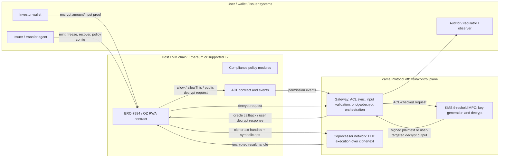
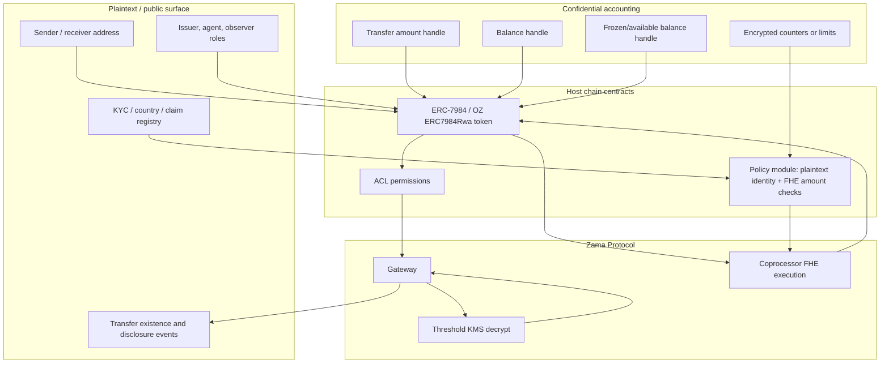
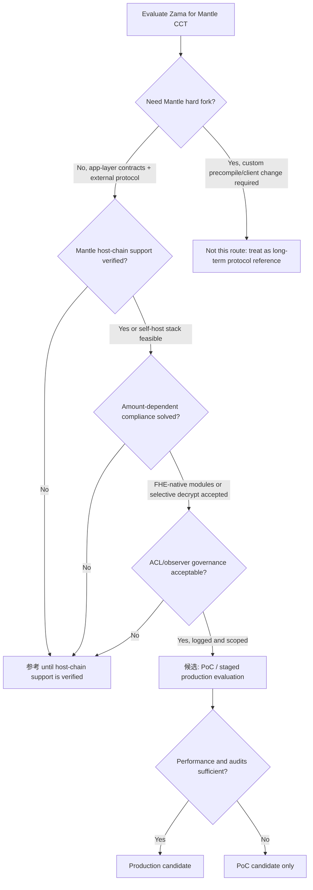

# Zama Confidential RWA Tokenization 深度分析

> 本 draft 评估 Zama 作为 Mantle confidential compliance token（CCT）主候选路线的技术适配性。结论刻意区分产品叙事、协议能力、合约库实现、标准边界与 Mantle 轻量集成约束，避免把 partnership 或官网文案直接等同于生产级能力。

## 执行摘要（Executive Summary）

Zama 是目前最值得 Mantle 深挖的 confidential accounting 路线之一：它把金额和余额表示为 FHE ciphertext handle，在 host chain 上通过 Solidity 合约编排，在 coprocessor 上执行密文计算，经 Gateway 和 threshold KMS 完成 public/user decrypt，并用 ACL 管理谁能计算或解密哪些 handle。与普通 shielded pool 相比，这条路线更贴近账户模型、ERC-7984、OpenZeppelin Confidential Contracts 和 RWA 发行方控制；与独立隐私链相比，它更符合 Mantle “轻量接入、不硬分叉、不换 VM”的方向。

但 Zama 不是“把 ERC-3643 加密一下”这么简单。ERC-3643 / T-REX 的 `canTransfer(from,to,amount)` 语义默认依赖明文 `amount`、明文余额或明文 holder 统计；ERC-7984 / OpenZeppelin Confidential Contracts 则把 amount/balance 变成 ciphertext handle。金额相关的 max-balance、holder cap、per-country/volume limit 等合规模块只有三种可能路径：

1. **FHE-native compliance**：用 Zama FHE 比较和 `select` 在密文上计算政策结果，合约不直接读取明文。适合上限、余额、冻结余额等数值规则，但需要重写 ERC-3643 模块，且失败语义通常变成“转 0 / 选择性更新状态”，不再是普通 Solidity `require(canTransfer(...))`。
2. **Selective decrypt to compliance actor**：把金额或余额 handle 授权给合规模块、observer、issuer agent 或 auditor，经 Gateway/KMS 解密或 re-encrypt 后做决策/审计。它更接近现有 ERC-3643 规则引擎，但牺牲端到端金额隐私，引入异步延迟和权限治理问题。
3. **Unsupported / identity-only fallback**：未改造的 ERC-3643 模块只能做地址、身份、国家、blocklist 等明文状态检查；凡是依赖金额或余额的模块不能直接消费 ERC-7984 ciphertext handle。

因此，本 draft 的初判是 **`候选`，但不是即插即用生产方案**。Zama 可作为 Mantle CCT 的主候选 PoC / 参考架构：privacy coverage 强、合约生态和标准锚点清楚、RWA 叙事贴合；但生产落地前必须验证 Mantle host-chain 支持路径、Gateway/KMS/operator 运维边界、OpenZeppelin Confidential Contracts 的审计版本、FHE-native compliance 模块工程量，以及 selective disclosure 的撤销和日志模型。

评分摘要：

| 维度 | 评分 | 理由 |
|---|---:|---|
| privacy_coverage | 4/5 | 金额/余额/冻结余额可密文化，支持 confidential transfer；不隐藏交易存在性、地址图、业务逻辑或订单流。 |
| compliance_capability | 3/5 | OZ RWA/Restricted/Freezable/ObserverAccess + T-REX partnership 很贴合，但金额相关 ERC-3643 模块必须改造为 FHE-native 或选择性解密。 |
| selective_disclosure | 3/5 | ACL、public decrypt、user decrypt、observer access 明确；历史授权撤销、observer 泄露面、permissionless disclosure 风险需控制。 |
| deployment_lightweight | 3/5 | 不需要 Mantle 硬分叉或执行客户端改动的应用层 PoC 可行；但依赖 Zama host-chain/Gateway/KMS/coprocessor 支持或自运维 stack。 |
| engineering_delta | 3/5 | 需合约、SDK、wallet/indexer、observer/auditor service、bridge/redeem 改造；比 precompile 轻，但不是低运维。 |
| maturity | 3/5 | ERC-7984 draft、OZ docs/source、Zama protocol docs 和主网叙事具备基础；RWA/T-REX integration 仍主要是 partnership/vendor claim。 |
| mantle_fit | 4/5 | 与 Mantle institutional/private RWA 叙事高度匹配；native Mantle 支持和合规模块改造是 gating item。 |

本轮最终建议：**候选**。短期可做 “Mantle CCT with Zama-style confidential accounting” PoC 与 architecture spike；中期要等 Zama multi-chain / Mantle support 或明确 self-host Gateway/KMS/coprocessor 责任；若必须复用未改造 ERC-3643 amount modules 且不接受 selective disclosure，则降级为 **参考**。

## 逐项发现（Item Findings）

### item-1: 产品叙事拆解与 claim 分级

#### 1.1 来源面（Source surface）：`zama.org` 与 `zama.ai`

Orchestrator 要求把 src-1 的 company solution URL 写为：

- `https://www.zama.ai/solutions/confidential-rwa-tokenization-using-fully-homomorphic-encryption`，accessed 2026-06-24.

本 runtime 在 2026-06-24 访问该 URL 时，最终跳转到：

- `https://www.zama.org/solutions/confidential-rwa-tokenization-using-fully-homomorphic-encryption`，HTTP 404.

同时，较短的 company solution URL：

- `https://www.zama.ai/solutions/confidential-rwa-tokenization`，accessed 2026-06-24,

会跳转到 live page：

- `https://www.zama.org/solutions/confidential-rwa-tokenization`，HTTP 200.

处理方式：本 draft **保留 Orchestrator 指定的 `zama.ai` URL 和真实访问结果**，并把该页面只作为产品叙事与网站 surface 证据，不用它支撑关键技术结论。技术结论主要来自 `docs.zama.org`、`zama.org/post/...`、EIP、OpenZeppelin docs/code 与本仓库 commit-pinned research。`zama.org` 在当前站点承载 protocol home、docs、posts 以及实际跳转后的 solution page；`zama.ai` 在本轮证据中表现为 company/marketing surface 的入口域名。

#### 1.2 Zama 产品叙事（Zama product narrative）

| 主张（Claim） | 证据类别（Evidence class） | 来源（Source） | Draft 处理方式 |
|---|---|---|---|
| Confidential onchain finance：处理过程中金额和余额加密、可公开验证、可编程合规。 | official product/protocol narrative | `https://www.zama.org/`, accessed 2026-06-24 | 可作为 Zama 价值主张；不等同于每条 RWA policy 都已生产落地。 |
| Confidential RWA tokenization：把 RWA 上链而不暴露投资人身份、交易条款、cap table 结构。 | official product narrative | `https://www.zama.ai/solutions/confidential-rwa-tokenization-using-fully-homomorphic-encryption`, accessed 2026-06-24；在本 runtime 中它跳转到一个 404 的 `zama.org` 长 slug。已在 `https://www.zama.ai/solutions/confidential-rwa-tokenization` 检查 live fallback，该链接跳转到 `zama.org` 页面。 | 用作叙事目标和 source-stability caveat；技术实现需回到 docs/OZ/ERC。 |
| Zama 成为 T-REX Ledger 的 confidentiality layer；增强而非替代 ERC-3643。 | official partnership claim | `https://www.zama.org/post/zama-becomes-the-confidentiality-layer-for-the-t-rex-ledger`, published 2026-06-11, accessed 2026-06-24 | 可证明 partnership narrative；不能单独证明 Mantle-ready production deployment。 |
| 现有 T-REX 持仓可以 1:1 wrap 成 confidential 等价物。 | partnership/product claim | 同一篇 Zama T-REX post | 合理映射到 wrap lifecycle，但是否有公开 contract/code/evidence 仍未验证。 |
| T-REX / Apex / TVS 指标与 2027 承诺。 | vendor/partner self-report | 同一篇 Zama T-REX post | 标注「未独立验证」，不用于 maturity 加分。 |
| Zama Protocol 组件：host chain、coprocessor、Gateway、KMS、ACL、decrypt modes。 | official documented capability | `docs.zama.org`, accessed 2026-06-24 | 可支撑技术架构。 |
| ERC-7984/OZ confidential token 与 RWA extensions。 | standard + implementation docs | EIP-7984、OpenZeppelin Confidential Contracts docs, accessed 2026-06-24；本地 research commit pins | 可支撑 token interface 与实现分析。 |

#### 1.3 Zama 对 RWA 的真正贡献（What Zama really contributes to RWA）

Zama 的 RWA 价值主张不是完整替代 ERC-3643，也不是独立 RWA chain。它更准确地提供三层能力：

1. **Confidential accounting layer**：金额、余额、冻结余额、transfer amount 可变成 FHE handle，公众只能看到交易和参与地址的存在，无法直接读金额。
2. **Programmable encrypted policy substrate**：Solidity 合约可调用 FHE arithmetic/comparison/select，在密文上维护余额、冻结余额、额度或规则状态。
3. **Selective disclosure and audit rail**：ACL、Gateway、KMS、public/user decrypt、ObserverAccess 等机制允许向特定 actor 披露金额或余额。

它不天然提供：

- ERC-3643 身份注册、KYC claim、claim issuer registry 的完整治理。
- 未改造 ERC-3643 compliance modules 对 encrypted amount 的直接兼容。
- 对地址图、交易存在性、合约调用模式或 MEV/order flow 的隐私。
- Mantle native host-chain support 的公开承诺或上线证据。

### item-2: 技术架构拆解：fhEVM / Gateway / KMS / ACL / decrypt model

#### 2.1 架构概览（Architecture summary）

Zama 的核心设计是把 EVM contract 当成 **host coordination layer**：合约持有 ciphertext handle 和 ACL 状态，实际 FHE 计算由 coprocessor 网络执行。Gateway 作为控制面同步 ACL、验证输入和编排 decrypt，KMS 作为 threshold MPC 网络生成/持有解密权力。

#### 2.2 组件与信任假设（Components and trust assumptions）

| 组件（Component） | 角色（Role） | 信任/活性假设（Trust / liveness assumption） | 来源（Source） |
|---|---|---|---|
| Host contract | 存储加密 handle，编排 FHE 操作，发出 ACL/decrypt 事件，执行 token/policy 逻辑。 | 普通 EVM 正确性；无法查看明文；必须避免像对待明文布尔那样在 encrypted boolean 上分支。 | Zama Solidity guides；OZ docs。 |
| FHE Solidity library | 暴露加密类型与操作，如算术、比较、`select`、ACL 方法。 | 开发者必须理解 encrypted boolean 与异步 decrypt 语义。 | `docs.zama.org/protocol/solidity-guides/smart-contract/functions`, accessed 2026-06-24. |
| Coprocessor | 在加密状态上执行 FHE 操作并返回加密结果 handle。 | 外部 FHE 网络的可用性/性能；正确性模型取决于 Zama 协议设计。 | Zama protocol docs；本地 confidential-coprocessor final。 |
| Gateway | 同步 ACL，验证加密输入，桥接 ciphertext，编排 KMS decrypt。按 Zama docs 实现为协议控制面 / rollup。 | Gateway 可用性与正确的 ACL 镜像至关重要；不应在 Gateway 上保存任何敏感密钥。 | `docs.zama.org/protocol/protocol/overview/gateway`, accessed 2026-06-24. |
| KMS | 面向 public/user decrypt 的 threshold MPC 密钥管理与解密；docs 描述 13 节点 / 9-of-13 风格的门限示例与 <=1/3 恶意假设。 | 密钥治理、活性、operator 去中心化、enclave/审计态势。 | `docs.zama.org/protocol/protocol/overview/kms`, accessed 2026-06-24. |
| ACL | 记录长期、临时、public 与 user-decryptable 权限。 | 永久授权与历史访问是主要治理风险；撤销方式按权限类型不同而异。 | `docs.zama.org/protocol/solidity-guides/smart-contract/acl`, accessed 2026-06-24. |

#### 2.3 Ciphertext handle 与操作（Ciphertext handle and operations）

Zama 合约不会为机密值存储普通的 `uint256 amount`。它们存储加密整数 handle，例如 OZ 实现中的 `euint64` 或 ERC-7984 接口层面的 `bytes32` 指针。FHE 函数集涵盖算术与比较操作；比较产生的是 encrypted boolean（`ebool`），不是明文布尔。这一点对合规很重要：

- `FHE.lt`、`FHE.le`、`FHE.gt`、`FHE.ge`、`FHE.eq`、`FHE.ne` 可比较加密的金额/余额。
- `FHE.select(ebool, a, b)` 可在不暴露条件的前提下有条件地选择加密值。
- 合约不能安全地实现 `require(encryptedCondition)`，因为该条件不是明文 bool。
- 如果需要同步得到明文合规决策，设计必须解密，或者重构 transfer 以避免明文分支。

#### 2.4 ACL 与 decrypt 模式（ACL and decrypt modes）

| 模式（Mode） | 机制（Mechanism） | RWA 用途（RWA use） | 注意事项（Caveat） |
|---|---|---|---|
| Contract access | `FHE.allowThis(handle)` 或类似方法让合约可对该 handle 计算。 | Token 合约可更新余额、冻结状态、policy 状态。 | 不披露明文；仅允许计算。 |
| Long-lived allowance | `FHE.allow(handle, address)` 授予某 user/contract 未来的访问权。 | Observer、auditor、issuer agent、wrapper、hook module 可访问 handle。 | 历史访问难以撤销；先前的 handle 可能仍可访问。 |
| Transient allowance | `FHE.allowTransient(handle, address)`，仅用于当前 tx。 | 临时的 module 检查或 callback。 | 持久性更低，但仍须防止 module 给自己或他人授予永久 ACL。 |
| Public decrypt | `makePubliclyDecryptable` / Gateway+KMS 签名结果流程。 | Unshield/redeem 金额、对特定值的 public audit、disclosure 事件。 | 一旦公开，机密性即丧失；replay/proof 检查需谨慎。 |
| User decrypt | 面向用户的解密或委托流程。 | Holder 看自己的余额，issuer/auditor 看被授权的字段。 | 需要委托/过期/撤销设计；UX 与日志很重要。 |
| ObserverAccess | OZ 扩展赋予 observer 对 balance/transfer handle 的访问权。 | Regulator/auditor/issuer observer 可查看 confidential accounting。 | 强合规特性，但 observer 一旦被攻破泄露面很广；存在历史撤销注意事项。 |

### item-3: 标准关系拆解：ERC-7984、OpenZeppelin Confidential Contracts、ERC-3643 / T-REX

#### 3.1 边界图（Boundary map）

| 层级（Layer） | 它是什么（What it is） | 它负责什么（What it owns） | 它不负责什么（What it does not own） |
|---|---|---|---|
| Zama Protocol / fhEVM | FHE 后端与机密计算协议。 | 加密类型、FHE 操作、Gateway、KMS、ACL、decrypt modes。 | Token 标准语义、ERC-3643 identity registry、RWA 法律流程。 |
| ERC-7984 | 面向 confidential fungible token 的 draft 接口标准。 | `bytes32` 机密金额指针，confidential balance/transfer/operator/disclosure 接口。 | 指针实现、KMS、coprocessor、合规规则、身份。 |
| OpenZeppelin Confidential Contracts | 具体的 fhEVM 实现与扩展库。 | 基于 Zama 加密类型的 ERC-7984 实现；RWA/Restricted/Freezable/ObserverAccess/Wrapper/Hooked 模块。 | 协议级 KMS/Gateway 操作；issuer 法律义务；T-REX 生产主张。 |
| ERC-3643 / T-REX | 许可制 security token / 合规架构。 | Identity Registry、trusted issuers、claims、compliance modules、agent controls、freeze/recovery/forced transfer。 | 默认不做加密会计；confidential transfer 语义；FHE 计算。 |
| Mantle integration adapter | 可能的项目特定胶合层。 | 部署、链支持、policy module 选择、wallet/indexer/decrypt service、bridge/redeem 集成。 | 核心 Zama 协议或上游 ERC 标准行为。 |

#### 3.2 责任矩阵（Responsibility matrix）

| 责任项（Responsibility） | Zama Protocol | ERC-7984 | OZ Confidential Contracts | ERC-3643 / T-REX | Mantle adapter |
|---|---|---|---|---|---|
| Token 接口 | 否 | 是，confidential token 接口 | 是，具体实现 | 兼容 ERC-20 的 security token 接口 | 选择 / wrap / 暴露 app API |
| 加密金额与余额 | 是，经 FHE handle 与操作 | 是，作为 confidential 指针抽象 | 是，经 `euint64`/fhEVM handle | 否，默认明文 token 金额 | 与 UI/indexer/compliance 集成 |
| KYC claim 与身份 | 无协议级 ERC-3643 registry | 否 | 存在 `IdentityCheck` 风格扩展，但非 ERC-3643 完整治理 | 是，核心职责 | 绑定 Mantle issuer/KYC providers |
| Transfer policy | 可计算加密规则 | 仅接口 | Restricted/Rwa/Hooked 模块 | Compliance 合约模块 | 决定明文 vs FHE-native policy |
| 金额相关上限 | 可做 FHE 比较 | 接口不定义 policy | 可用自定义 FHE 模块实现；非自动 | 明文模块预期明文 amount/balance | 关键集成挑战 |
| Freeze / recovery / force transfer | 协议启用加密余额与 ACL | 仅接口级 transfer | `Freezable`、`Rwa`、agent controls | 原生 security-token 控制 | 决定 issuer/agent 治理 |
| Observer disclosure | ACL + decrypt modes | 仅 `AmountDisclosed` 事件 | `ObserverAccess`、public/user decrypt 支持 | Regulator/auditor 概念在 token 标准之外 | 定义 observer 角色、日志、限制 |
| Wrap / redeem / unshield | Gateway/public decrypt 可支持 | 接口可披露金额 | `ERC7984ERC20Wrapper`；unwrap 需要 decrypt relay | 赎回由 issuer/legal agent 处理 | Bridge/redeem 产品工作流 |
| 运维信任 | KMS/Gateway/coprocessor | 实现特定 | 继承 Zama 协议信任 | Issuer/agent/trusted issuer 信任 | 决定可接受的 operator 模型 |

#### 3.3 F2：encrypted amount 与明文 ERC-3643 合规的张力

这是决定性的标准张力。

经典 ERC-3643 模块通常把合规评估为关于 `from`、`to`、`amount` 的明文谓词，常常还附带额外的明文状态，如 holder balances、country counts、investor caps 或 per-country limits。ERC-7984/OpenZeppelin confidential token 刻意把 amount 和 balance 隐藏为 ciphertext handle。这两种模型不会自动组合。

| 合规规则（Compliance rule） | 普通 ERC-3643 假设（Plain ERC-3643 assumption） | ERC-7984/Zama 状态（ERC-7984/Zama state） | 直接兼容？（Directly compatible?） | 可行路径（Viable path） |
|---|---|---|---|---|
| 收款方 KYC / 身份 claim | 地址与 identity registry 是明文。 | 除非采用 omnibus/sub-account 模式，地址仍可见；identity registry 可保持明文。 | 是，对仅身份的检查而言。 | 复用 ERC-3643/T-REX 风格的 identity gate 或 OZ Restricted/IdentityCheck。 |
| 发款方/收款方 blocklist | 明文地址检查。 | 在普通 ERC-7984 transfer 中地址可见。 | 是。 | 复用明文 policy。 |
| 每投资人最大余额 | 需要明文 `amount` 与当前/新余额。 | Amount 与 balance 是 ciphertext handle。 | 否，不能直接。 | 用加密比较与 `select` 做 FHE-native 的 `newBalance <= cap`；或向合规 actor 解密。 |
| Holder cap | 需要明文 holder 数与零/非零转换。 | 若余额私有，余额零/非零是加密的。 | 部分。 | 在 KYC/mint/transfer intent 阶段保持明文 holder registry；或用 FHE 比较 balance-to-zero 并经授权 module 解密/更新计数。 |
| 每国 holder cap | 需要收款方国家与各国 holder 数。 | 国家可保持明文 claim；余额转换可能是加密的。 | 部分。 | 若成员关系已披露则用明文国家 + 明文 registry；仅当成员关系隐藏时才用 FHE。 |
| 每国成交量限额 | 需要按国家/窗口聚合的明文 transfer amount。 | Amount 为 ciphertext。 | 否，不能直接。 | FHE 加密计数器 + 加密比较；周期性授权披露；或不支持。 |
| 最大单笔转账额 | 需要明文 transfer amount。 | Amount 为 ciphertext。 | 否，不能直接。 | FHE 比较 `amount <= limit`，用 encrypted bool 选择实际 transfer amount，或向 policy module 解密 amount。 |
| 冻结金额 / 可用余额 | 需要明文或内部记账来表示 frozen/available。 | OZ Freezable 可维护机密的 frozen/available handle。 | 是，需 FHE-aware 实现。 | 使用 OZ Freezable/RWA 风格而非普通 ERC-3643 模块。 |

**item-3 结论**：

- 如果地址与身份 claim 保持明文，ERC-3643 的身份与角色检查可与 Zama confidential accounting 共存。
- 当 amount/balance 是 ciphertext handle 时，ERC-3643 金额相关合规模块**原样不支持**。
- 金额相关合规要么需要 **FHE-native 重写模块**，要么需要**向受信合规 actor 选择性解密**。
- 这使 `compliance_capability` 目前封顶在 3/5：该路线前景良好且技术上可行，但最难的 RWA 合规规则属于集成工作，不能仅靠 ERC-7984 解决。

### item-4: RWA transfer lifecycle：发行到赎回的端到端流程

#### 4.1 生命周期表（Lifecycle table）

| 步骤（Step） | 角色（Actor） | 组件/模块（Component / module） | 明文状态（Plaintext state） | 加密状态（Encrypted state） | Policy gate | 解密/披露（Decrypt / disclosure） | 证据类别（Evidence class） | 缺口（Gap） |
|---|---|---|---|---|---|---|---|---|
| 1. 资产设置 | Issuer / admin | ERC-3643/T-REX 或 OZ RWA 部署；role registry | Token metadata、issuer roles、agent roles、法律文件 | 尚无 | Admin/agent 权限 | 无 | ERC-3643 spec；OZ docs | 治理设计与法律流程不在范围内。 |
| 2. KYC / claim | Investor、KYC provider、issuer | Identity Registry / trusted issuer / Restricted 或 IdentityCheck module | 地址、国家、accredited 状态、（如披露）制裁状态 | 自定义时可选加密的身份属性 | Holder 资格 | 视 registry 而定，user/issuer 可查看 claims | ERC-3643 + OZ docs + inference | 私密身份非自动；除非额外设计，否则地址图仍可见。 |
| 3. Mint 或 wrap | Issuer / wrapper | `mint`、ERC20 wrapper、RWA token | 收款方地址、总发行事件 metadata | Minted amount/balance handle | 收款方须经验证；issuer role | Issuer 可能需要金额审计；public decrypt 可选 | OZ wrapper/RWA docs；T-REX post claim | T-REX 1:1 wrapping 属 partnership claim；本 draft 未验证公开代码。 |
| 4. Confidential transfer 输入 | Sender / operator | ERC-7984 transfer 函数；input proof | From/to/operator、token 地址、tx 存在性 | Transfer amount handle | Operator 授权、收款方检查 | 输入时无，除非 user/observer 授权 | ERC-7984；OZ docs | Operator 是时间受限的无限额授权；wallet UX 风险。 |
| 5. Policy 检查 | Token contract + compliance module | 如使用，明文 identity/blocklist/country | Amount、balance、frozen balance、加密计数器 | 身份检查明文；金额规则须 FHE-native 或解密 | FHE 比较、`select` 或 selective decrypt | 可能向合规 actor 解密决策/金额 | Zama functions docs；ERC-3643 spec；inference | 核心 F2 缺口：普通 ERC-3643 amount 模块原样不支持。 |
| 6. 余额更新 | Token contract + coprocessor | 含双方的 transfer 事件；可能有加密 handle id | 发款/收款方余额、实际转账金额、frozen balance | 有效性、下溢/上溢、freeze | 除非请求披露，否则无 | OZ docs | 失败可能产生零转账或加密失败状态，而非 ERC-20 风格的 revert。 |
| 7. Observer / 审计披露 | Issuer、auditor、regulator、observer | ACL、Gateway、KMS、ObserverAccess、public/user decrypt | 仅在解密后才有披露值 | Amount/balance handle | ACL 权限与 decrypt 请求验证 | Public decrypt、user decrypt、observer access | Zama ACL/Gateway/KMS docs；OZ docs | 必须配置撤销与泄露边界；observer 被攻破后果严重。 |
| 8. Freeze / recovery | Agent / issuer | OZ Freezable/RWA 或 ERC-3643 agent controls | 目标账户、动作事件 | 冻结的机密余额、恢复的加密金额 | Agent role、收款方资格 | 可能向 auditor/regulator 披露 | OZ RWA docs；ERC-3643 spec | 加密的强制转账需要清晰的法律/审计轨迹。 |
| 9. Redeem / unshield | Holder / issuer / wrapper | Wrapper、redeem service、public decrypt oracle | 赎回收款人、法律赎回记录 | 披露前的 burn/unwrap amount handle | Holder 资格、issuer 流动性、bridge/redeem 检查 | 对金额做 public 或 issuer decrypt 以释放底层资产 | OZ wrapper docs；inference | Unwrap 更复杂，因为 ERC-20/现金腿需要明文金额。 |

#### 4.2 Policy 检查细节：三种实现模式（Policy check detail: three implementation patterns）

**模式 A：FHE-native compliance module（Pattern A: FHE-native compliance module）**

合约保留加密计数器或余额，并使用 FHE 比较：

- `newBalance = FHE.add(oldBalance, amount)`
- `ok = FHE.le(newBalance, encryptedOrPlainCap)`
- `actualAmount = FHE.select(ok, amount, FHE.asEuint64(0))`
- 用 `actualAmount` 更新余额

这保留了金额机密性，但改变了开发者心智模型：

- `ok` 是加密的，因此无法使用普通的 `require(ok)`。
- 失败可能变成零转账、延迟披露或加密失败标志。
- 审计需要 observer/user/public decrypt 或独立的事件语义，以在不泄露的前提下区分“policy 失败”与“零金额”。
- 更复杂的规则（如滚动的国别成交量限额）需要加密计数器与窗口逻辑，而非标准 ERC-3643 模块。

**模式 B：向合规 actor 选择性解密（Pattern B: selective decrypt to compliance actor）**

合约或工作流向某个合规 actor 授予对 amount/balance handle 的访问权。该 actor、observer 或 KMS 支持的服务进行解密或接收面向用户的 re-encryption，运行常规 policy，然后返回决策或触发被允许的动作。

收益：

- 复用更多现有的 ERC-3643 合规逻辑。
- 为 issuer/regulator 产生清晰的审计证据。
- 更易于推理最大余额与成交量限额。

成本：

- 合规 actor 得知敏感的金额/余额。
- 实时转账可能变为异步，或需要预授权工作流。
- 权限授予与历史访问成为治理风险。

**模式 C：不支持的回退（Pattern C: unsupported fallback）**

仅使用明文身份、blocklist 与角色控制；在保留加密 amount/balance 的同时省略金额相关合规。对狭窄的 PoC 这或许可接受，但对于限额与持仓集中度都很重要的生产级证券/RWA 合规则不够。

#### 4.3 生命周期结论（Lifecycle conclusion）

如果产品接受混合模型，Zama 可以表达端到端的 RWA 生命周期：

- 地址与身份资格保持对合规足够可见；
- 金额与余额默认机密；
- 金额敏感规则要么重写为 FHE-native 模块，要么向授权 actor 披露；
- redeem/unshield 显式解密金额以释放底层资产。

除非金额相关合规模块问题已被解决并测试，否则不能诚实地把它描述为“即插即用的 confidential ERC-3643”。

### item-5: Mantle 轻量集成评估

#### 5.1 集成表（Integration table）

| 组件（Component） | PoC 必需？（Required for PoC?） | 由谁运维/拥有（Who operates / owns it） | 需要改 Mantle 链/客户端？（Mantle chain/client change?） | 轻量分类（Lightweight classification） | 生产阻塞项（Production blocker） |
|---|---|---|---|---|---|
| ERC-7984/OZ contracts | 是 | Mantle app team / issuer | 否 | `no chain change` | 审计版本、升级治理、role model。 |
| Zama Solidity library / SDK | 是 | App developers | 否 | `no chain change` | 开发者工具、wallet signing/encryption UX。 |
| Zama host-chain support | 原生 Mantle 部署需要 | Zama protocol / operators，或自建 stack | 原则上无执行 hardfork，但 support 必须存在 | 在 Mantle support 确认前为 `unknown` | 当前公开证据未确认 Mantle 为受支持的 host chain。 |
| Gateway | 是 | Zama protocol 或自建 operator set | 无 hardfork；外部协议依赖 | `sidecar/operator dependency` | ACL sync/decrypt 活性与治理。 |
| KMS threshold network | decrypt 需要 | Zama operator set 或自建 MPC 参与方 | 否 | `sidecar/operator dependency` | Key ceremony、threshold 治理、operator 去中心化。 |
| Coprocessor network | FHE 执行需要 | Zama operators 或自建 | 否 | `sidecar/operator dependency` | 性能/SLA/成本。 |
| Observer/auditor service | 很可能 | Issuer/regulator/auditor | 否 | `app/offchain service` | 披露 policy、日志、安全。 |
| Wallet support | 可用 confidential transfer 需要 | Wallet/app frontend | 否 | `app integration` | Encrypt input、处理 proofs、user decrypt UX。 |
| Indexer/explorer | 运营需要 | Mantle app/explorer provider | 否 | `app integration` | 须在不泄露的前提下展示加密活动；Blockscout 支持的说法是产品/来源特定的。 |
| Bridge/redeem service | RWA 产品需要 | Issuer / custodian / bridge provider | PoC 无需新的 canonical bridge | `app/offchain service` | 明文赎回金额与法律结算路径。 |
| Mantle hard fork / precompile | 应用层路线不需要 | 仅当选择 native precompile 时才需 Mantle protocol | Zama 风格的应用层 PoC 不需要 | `not required` | 仅当 Mantle 想做 native FHE precompile/协议集成时才相关。 |

#### 5.2 Mantle 需要 hard fork 吗？（Does Mantle need a hard fork?）

对本处评估的应用层 Zama 路线：**根据本 draft 的证据，不需要 hard fork**。该路线使用 Solidity 合约、SDK/encryption、外部 Gateway/KMS/coprocessor，以及 application/offchain services。这比 B20 风格的 precompile 工作更契合 requirements-framework 的轻量路径。

然而，“无 hard fork”不等于“今天就能在 Mantle 上就绪”。原生 Mantle 部署需要以下之一：

1. Zama 官方支持 Mantle 作为 host chain。
2. Mantle 或某个 issuer 运行一套经批准/自建的 Zama 兼容 Gateway/KMS/coprocessor stack。
3. 产品先在 Zama 支持的链上线，再 bridge/wrap 进 Mantle，这会削弱 Mantle-native 论点。

先前的 confidential-coprocessor 章节记录了 Zama live support 与 multi-chain roadmap 注意事项，但本 draft 在 2026-06-24 未找到能证明 Mantle host-chain support 的一手来源。因此 item-5 的分类为：

- 对“合约 + 外部 confidential layer”架构而言，**不需要 Mantle 执行客户端改动**。
- 对原生 Mantle host-chain support 而言，**未知 / gating**。
- 对 Gateway、KMS 与 coprocessor 而言，**sidecar/operator dependency**。

#### 5.3 Mantle 契合度含义（Mantle fit implication）

Mantle 应把 Zama 定位为**候选的 confidential layer 依赖**，而非内部协议特性。这能让 PoC 范围保持现实：

- 在受支持的 host 环境上部署一个 ERC-7984/OZ 风格 token，或测试 Mantle support 路径。
- 实现一条 FHE-native 的 max-transfer 或 max-balance 规则以验证 F2。
- 实现用于审计与赎回的 observer/user/public decrypt 流程。
- 测量延迟、失败语义、wallet UX 与披露日志。

如果项目目标要求“纯 Mantle 原生、无外部 operator 依赖”，那么 Zama 变成参考架构，而非即时候选。

### item-6: 风险评估与证据缺口

| 风险（Risk） | 严重度（Severity） | 证据类别（Evidence class） | 为何重要（Why it matters） | 缓解/决策影响（Mitigation / decision impact） |
|---|---|---|---|---|
| 金额相关合规不兼容 | High | 基于 ERC-3643 + ERC-7984/Zama docs 的 research inference | 普通 ERC-3643 模块无法评估 ciphertext amount/balance。 | 生产前构建 FHE-native policy 模块或选择性解密流程；封顶 compliance 评分。 |
| Mantle host-chain support 未知 | High | Gap | 没有受支持的 host chain 或自建 stack，原生 Mantle 部署无法推进。 | 询问 Zama / 验证 SDK 网络支持；归类为 gating item。 |
| KMS/Gateway/coprocessor 活性与治理 | High | Zama docs + 本地 research | Decrypt 与 FHE 执行依赖外部 operators 与 threshold 治理。 | 要求 SLA、operator set、事件处理流程、key rotation、审计日志。 |
| 历史 ACL 撤销 | High | Zama ACL docs + OZ 本地 research | 长期 allowance 与 ObserverAccess 可造成持续的数据访问。 | 最小化永久授权；优先 scoped/transient/user delegation；记录所有授予。 |
| Observer 被攻破或披露过宽 | High | OZ docs + inference | Observer 可以是受监管的披露特性，也可以是隐私后门。 | 拆分 observer 角色、scope handle、要求治理与监控。 |
| FHE 性能与延迟 | Medium/High | Vendor/self-report + 本地 research | RWA 转账或可容忍延迟，但 DeFi/可组合性可能不行。 | 对实际 policy path 做基准测试；不依赖 vendor TPS 主张。 |
| 标准成熟度 | Medium | EIP-7984 draft；OZ docs | 接口与实现可能变化；审计版本特定。 | Pin release/commit；采用升级策略；生产前重新评审。 |
| Hook/module 的 ACL 持久性 | Medium/High | 本地 ERC-7984 research | 受信 hook 模块可能授予在卸载后仍存活的持久 ACL。 | 避免不受信 hook；审计模块；尽量要求 ACL 清理语义。 |
| Redeem/unshield 泄露 | Medium | OZ wrapper docs + inference | 底层 ERC-20/现金赎回需要明文金额。 | 把 redeem 视为有意披露；记录并约束收款人。 |
| 数据/ciphertext 可用性 | Medium | Zama 架构 inference | Host chain 存的是 handle，而非完整 ciphertext；coprocessor/state 可用性很重要。 | 要求可用性监控与恢复计划。 |
| Vendor 锁定 | Medium | 架构依赖 | Zama 特定的加密类型与 Gateway/KMS API 可能限制可移植性。 | 保持 ERC-7984 接口边界；避免深度不可移植的 app 假设。 |
| Partnership 指标夸大 | Medium | Vendor/partnership 主张 | T-REX/Apex/TVS 数字不能证明 Mantle-ready 生产能力。 | 标注未验证；要求第三方证明或 code/audit。 |

### item-7: Rubric 评分与初步裁决（Rubric scoring and initial verdict）

| 维度（Dimension） | 评分（Score） | 证据锚点（Evidence anchors） | 理由（Rationale） |
|---|---:|---|---|
| privacy_coverage | 4 | Zama docs；ERC-7984；OZ docs；本地 ERC-7984 final | 强金额/余额机密性与加密操作。不隐藏交易存在性、普通地址图、业务逻辑或订单流。 |
| compliance_capability | 3 | ERC-3643 spec；OZ RWA docs；Zama T-REX post；F2 分析 | 良好的 identity/issuer/freeze/recovery 构件，但金额相关合规须重写或披露。 |
| selective_disclosure | 3 | Zama ACL/Gateway/KMS docs；OZ ObserverAccess/public decrypt docs | 丰富的披露原语，但撤销、observer scope 与 permissionless 披露风险阻碍更高评分。 |
| deployment_lightweight | 3 | Zama docs；requirements-framework；本地 confidential-coprocessor final | 应用层路线无 hardfork，但原生 Mantle support 与 operator stack 是外部依赖。 |
| engineering_delta | 3 | OZ docs；Zama SDK/docs；生命周期分析 | 需要合约、SDK、proofs、observer service、wallet/indexer、bridge/redeem 与自定义 policy 工程。 |
| maturity | 3 | EIP-7984 draft；OZ docs/source；Zama docs/posts；本地审计注意事项 | 足以支撑 PoC 与认真评估；生产级 RWA 成熟度与确切集成证据仍不完整。 |
| mantle_fit | 4 | Requirements-framework；Mantle 轻量约束；item-5 | 若 Mantle 接受外部 confidential layer，则叙事/技术契合度强。若无原生 host-chain support 或不投入自定义合规工作则下降。 |

#### 裁决（Verdict）

**初步裁决：`候选`**。

应把 Zama 视为 Mantle CCT 最强的 FHE/confidential-accounting 候选，尤其是用于演示以下内容的 PoC：

- 加密的 transfer amount 与余额；
- issuer/agent 控制；
- observer/auditor 披露；
- 一到两条 FHE-native 合规规则；
- 带显式披露的 redeem/unshield。

生产前的决策门：

1. 验证 Mantle host-chain support 或自建 stack 的可行性。
2. 选择 FHE-native 还是 selective-decrypt 合规架构。
3. Pin OpenZeppelin Confidential Contracts 的版本/commit 与审计覆盖范围。
4. 定义 ACL/observer 治理与历史撤销策略。
5. 对实际 transfer + policy + decrypt 延迟做基准测试。
6. 确认 T-REX/RWA 集成代码，或把 partnership 当作非生产证据看待。

若门 1 和门 2 失败，降级为 **参考**。若产品拒绝外部 Gateway/KMS/coprocessor 依赖，则对轻量 Mantle 集成而言归类为 **出局（出局 for lightweight Mantle integration）**，仅作为长期协议研究保留。

## 图示（Diagrams）

### diag-1: Zama Confidential RWA 架构输入（Zama Confidential RWA architecture input）

### diag-2: RWA transfer lifecycle 表（RWA transfer lifecycle table）

见 item-4.1。该表是后续可视化渲染的生命周期图输入。

### diag-3: 责任矩阵（Responsibility matrix）

见 item-3.2。该矩阵是标准边界图的输入。

### diag-4: Mantle 集成评估表（Mantle integration assessment table）

见 item-5.1。该表应作为 Mantle 部署图的输入。

### diag-5: 裁决树（Verdict tree）

## 来源覆盖（Source Coverage）

| ID | 来源（Source） | 访问/锚点（Access / pin） | 覆盖（Coverage） | 置信度（Confidence） |
|---|---|---|---|---|
| src-1a | `https://www.zama.ai/solutions/confidential-rwa-tokenization-using-fully-homomorphic-encryption` | Accessed 2026-06-24；在本 runtime 中跳转到 `zama.org/...using-fully-homomorphic-encryption`，HTTP 404 | Orchestrator 强制要求的 company solution URL；source-stability caveat | 内容置信度低；对 URL 审计轨迹重要 |
| src-1b | `https://www.zama.ai/solutions/confidential-rwa-tokenization` -> `https://www.zama.org/solutions/confidential-rwa-tokenization` | Accessed 2026-06-24；跳转后 HTTP 200 | 产品叙事：confidential RWA，投资人/交易/cap-table 机密性 | 仅叙事层面为中 |
| src-1c | `https://www.zama.org/` | Accessed 2026-06-24 | Protocol/product home 叙事：confidential onchain finance、public verifiability、programmable compliance | 叙事层面为中 |
| src-2 | `https://www.zama.org/post/zama-becomes-the-confidentiality-layer-for-the-t-rex-ledger` | Published 2026-06-11；accessed 2026-06-24 | T-REX partnership、“增强而非替代 ERC-3643”、wrapping 主张、vendor metrics | partnership 为中；未验证 metrics 为低 |
| src-3a | `https://docs.zama.org/protocol/solidity-guides/smart-contract/acl` | Accessed 2026-06-24 | ACL allowance、transient allowance、public/user decrypt 权限模型 | 协议 docs 为高 |
| src-3b | `https://docs.zama.org/protocol/protocol/overview/gateway` | Accessed 2026-06-24 | Gateway 编排、ACL sync、KMS decrypt 流程 | 协议 docs 为高 |
| src-3c | `https://docs.zama.org/protocol/protocol/overview/kms` | Accessed 2026-06-24 | Threshold KMS、MPC nodes、decrypt modes 与信任模型 | 协议 docs 为高 |
| src-3d | `https://docs.zama.org/protocol/solidity-guides/smart-contract/functions` | Accessed 2026-06-24 | FHE arithmetic/comparison/select 与 encrypted boolean 语义 | 协议 docs 为高 |
| src-4a | `https://eips.ethereum.org/EIPS/eip-7984` | Accessed 2026-06-24 | ERC-7984 接口、bytes32 指针、operator、disclosure 事件 | 标准文本为高 |
| src-4b | `https://eips.ethereum.org/EIPS/eip-3643` | Accessed 2026-06-24 | ERC-3643 Identity Registry、Compliance、transfer policy、force/freeze/recover | 标准文本为高 |
| src-5a | `https://docs.openzeppelin.com/confidential-contracts/token` | Accessed 2026-06-24 | ERC-7984 token 行为、wrapper、operator 与 callback docs | 实现 docs 为高 |
| src-5b | `https://docs.openzeppelin.com/confidential-contracts/api/token` | Accessed 2026-06-24 | ERC7984Rwa、ObserverAccess、Restricted、Freezable、public disclosure API | 实现 docs 为高 |
| src-5c | `OpenZeppelin/openzeppelin-confidential-contracts` | 本地先前研究 pins commit `41fe10be35dbcb512d63a334f11bd9ec73a360cf` | Source/audit context；本轮 live `git ls-remote` 尝试不可用 | 中；commit-pinned 本地 research |
| src-6a | `confidential-compliance-token-research/research-sections/requirements-framework/final.md` | Commit `9eb29a150f380f21add9b431b66fea2ee5d12881` | CCT 定义、rubric、Mantle 轻量否决 | 本地复用为高 |
| src-6b | `evm-privacy-research/research-sections/erc7984-confidential-token/final.md` | Commit `fdbda370e9e9137890c5bd2deb7752e03d76d0bc` | ERC-7984/OZ 细节、ACL/Hook caveats、评分 | 本地复用为高 |
| src-6c | `evm-privacy-research/research-sections/confidential-coprocessor/final.md` | Commit `0041e3a1598751a7d121fecc600ba3d6ad42ad05` | Zama 架构、KMS/Gateway、Mantle support caveat、性能 caveat | 本地复用为高 |
| src-7a | `compliance-token-standards/research-sections/erc3643-trex-analysis/final.md` | Commit `a260e40f58b0d8d2e15ba7bd263ab67a3288b6bd` | ERC-3643/T-REX 生命周期与合规模块 | 本地复用为高 |
| src-7b | `compliance-token-standards/research-sections/base-b20-analysis/final.md` | Commit `f42915ecd33c7f099d4ac0de89997390fc52d0b9` | Mantle/Base precompile 与 private feature 对比 | 本地上下文为中 |
| src-8 | OpenZeppelin Confidential Contracts 审计/安全材料，经本地 ERC-7984 与 coprocessor finals | Commit-pinned 本地 research，2026-06-24 从仓库访问 | 对 ObserverAccess/Hooked/disclosure 行为的审计注意事项 | 中；版本特定 |
| src-9 | 独立佐证（Independent corroboration） | 部分：本地 finals 引用二手来源；本 draft 未独立验证 T-REX metrics 或性能 metrics | 部署/性能/partnership 佐证仍不完整 | 低/部分 |

## 缺口分析（Gap Analysis）

1. **来源 URL 不稳定**：Orchestrator 强制要求的长 `zama.ai` solution URL 在本 runtime 中未提供该内容。可达的 live solution page 路径不同。此处如实记录，而非静默归一化。
2. **Mantle host-chain support**：本轮无一手来源能证明 Zama 在 2026-06-24 支持 Mantle 作为 host chain。
3. **T-REX 集成代码/证据**：Zama/T-REX post 是官方 partnership 证据，但公开代码、审计、生产交易样本与确切的 module 架构仍未验证。
4. **金额相关合规**：普通 ERC-3643 合规模块与加密的 ERC-7984 amount/balance handle 不直接兼容。这是最高优先级的技术 spike。
5. **选择性披露治理**：ACL scope、撤销、observer 角色拆分、日志与被攻破响应，需要在生产前完成产品/安全设计。
6. **审计版本化**：OpenZeppelin Confidential Contracts docs 可用，但生产建议需要确切的 release/commit 与刷新的审计覆盖范围。
7. **性能**：此处未独立验证 vendor TPS/latency 或 GPU-roadmap 主张，应在目标 policy path 上做基准测试。
8. **数据可用性与恢复**：Host chain 存的是 handle；运维恢复取决于 coprocessor/Gateway/KMS 可用性与保留保证。
9. **AC-8 `_index.md`**：WHI-267 提到 `_index.md`，但 Orchestrator 选择了无 `report_issue_id` 的轻量 single-issue 模式；本 draft 不写 `_index.md`。

## 修订日志（Revision Log）

| 轮次（Round） | 变更（Change） | 详情（Details） |
|---:|---|---|
| 1 | 初始深度 draft | 为 WHI-267 产出完整 draft，覆盖产品叙事、架构、标准边界、生命周期、Mantle 集成、风险登记册与 rubric 裁决。 |
| 1 | 处理 F1 carry-forward | 添加 `zama.ai` 强制 URL、真实的 2026-06-24 访问结果、redirect/404 caveat，以及 `zama.org` vs `zama.ai` surface 区分。 |
| 1 | 处理 F2 carry-forward | 在 item-3 与 item-4 添加明确的 encrypted-amount 与明文 ERC-3643 合规分析，含 FHE-native/selective-decrypt/unsupported 路径。 |
| 1 | 记录 F3 carry-forward | 在 single-issue 轻量模式下标记 `_index.md` 不适用；未执行 `_index.md` 写入。 |
