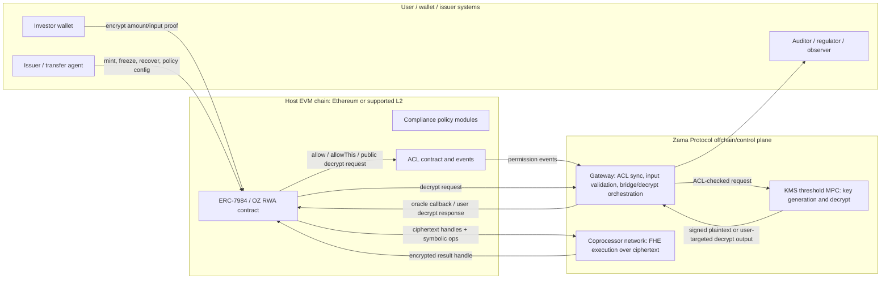
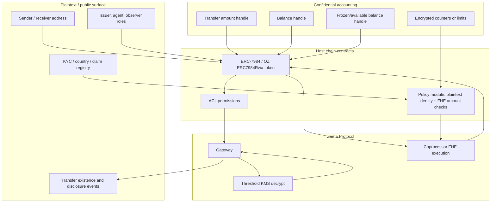
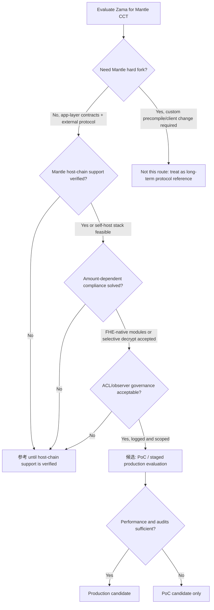

# Zama Confidential RWA Tokenization 深度分析

> 本 section 评估 Zama 作为 Mantle confidential compliance token（CCT）主候选路线的技术适配性。结论刻意区分产品叙事、协议能力、合约库实现、标准边界与 Mantle 轻量集成约束，避免把 partnership 或官网文案直接等同于生产级能力。

## Executive Summary

Zama 是目前最值得 Mantle 深挖的 confidential accounting 路线之一：它把金额和余额表示为 FHE ciphertext handle，在 host chain 上通过 Solidity 合约编排，在 coprocessor 上执行密文计算，经 Gateway 和 threshold KMS 完成 public/user decrypt，并用 ACL 管理谁能计算或解密哪些 handle。与普通 shielded pool 相比，这条路线更贴近账户模型、ERC-7984、OpenZeppelin Confidential Contracts 和 RWA 发行方控制；与独立隐私链相比，它更符合 Mantle “轻量接入、不硬分叉、不换 VM”的方向。

但 Zama 不是“把 ERC-3643 加密一下”这么简单。ERC-3643 / T-REX 的 `canTransfer(from,to,amount)` 语义默认依赖明文 `amount`、明文余额或明文 holder 统计；ERC-7984 / OpenZeppelin Confidential Contracts 则把 amount/balance 变成 ciphertext handle。金额相关的 max-balance、holder cap、per-country/volume limit 等合规模块只有三种可能路径：

1. **FHE-native compliance**：用 Zama FHE 比较和 `select` 在密文上计算政策结果，合约不直接读取明文。适合上限、余额、冻结余额等数值规则，但需要重写 ERC-3643 模块，且失败语义通常变成“转 0 / 选择性更新状态”，不再是普通 Solidity `require(canTransfer(...))`。
2. **Selective decrypt to compliance actor**：把金额或余额 handle 授权给合规模块、observer、issuer agent 或 auditor，经 Gateway/KMS 解密或 re-encrypt 后做决策/审计。它更接近现有 ERC-3643 规则引擎，但牺牲端到端金额隐私，引入异步延迟和权限治理问题。
3. **Unsupported / identity-only fallback**：未改造的 ERC-3643 模块只能做地址、身份、国家、blocklist 等明文状态检查；凡是依赖金额或余额的模块不能直接消费 ERC-7984 ciphertext handle。

因此，本 section 的初判是 **`候选`，但不是即插即用生产方案**。Zama 可作为 Mantle CCT 的主候选 PoC / 参考架构：privacy coverage 强、合约生态和标准锚点清楚、RWA 叙事贴合；但生产落地前必须验证 Mantle host-chain 支持路径、Gateway/KMS/operator 运维边界、OpenZeppelin Confidential Contracts 的审计版本、FHE-native compliance 模块工程量，以及 selective disclosure 的撤销和日志模型。

评分摘要：

| Dimension | Score | Rationale |
|---|---:|---|
| privacy_coverage | 4/5 | 金额/余额/冻结余额可密文化，支持 confidential transfer；不隐藏交易存在性、地址图、业务逻辑或订单流。 |
| compliance_capability | 3/5 | OZ RWA/Restricted/Freezable/ObserverAccess + T-REX partnership 很贴合，但金额相关 ERC-3643 模块必须改造为 FHE-native 或选择性解密。 |
| selective_disclosure | 3/5 | ACL、public decrypt、user decrypt、observer access 明确；历史授权撤销、observer 泄露面、permissionless disclosure 风险需控制。 |
| deployment_lightweight | 3/5 | 不需要 Mantle 硬分叉或执行客户端改动的应用层 PoC 可行；但依赖 Zama host-chain/Gateway/KMS/coprocessor 支持或自运维 stack。 |
| engineering_delta | 3/5 | 需合约、SDK、wallet/indexer、observer/auditor service、bridge/redeem 改造；比 precompile 轻，但不是低运维。 |
| maturity | 3/5 | ERC-7984 draft、OZ docs/source、Zama protocol docs 和主网叙事具备基础；RWA/T-REX integration 仍主要是 partnership/vendor claim。 |
| mantle_fit | 4/5 | 与 Mantle institutional/private RWA 叙事高度匹配；native Mantle 支持和合规模块改造是 gating item。 |

Final recommendation for this round: **候选**。短期可做 “Mantle CCT with Zama-style confidential accounting” PoC and architecture spike；中期要等 Zama multi-chain / Mantle support 或明确 self-host Gateway/KMS/coprocessor 责任；若必须复用未改造 ERC-3643 amount modules 且不接受 selective disclosure，则降级为 **参考**。

## Item Findings

### item-1: 产品叙事拆解与 claim 分级

#### 1.1 Source surface: `zama.org` versus `zama.ai`

Orchestrator 要求把 src-1 的 company solution URL 写为：

- `https://www.zama.ai/solutions/confidential-rwa-tokenization-using-fully-homomorphic-encryption`，accessed 2026-06-24.

本 runtime 在 2026-06-24 访问该 URL 时，最终跳转到：

- `https://www.zama.org/solutions/confidential-rwa-tokenization-using-fully-homomorphic-encryption`，HTTP 404.

同时，较短的 company solution URL：

- `https://www.zama.ai/solutions/confidential-rwa-tokenization`，accessed 2026-06-24,

会跳转到 live page：

- `https://www.zama.org/solutions/confidential-rwa-tokenization`，HTTP 200.

处理方式：本 section **保留 Orchestrator 指定的 `zama.ai` URL 和真实访问结果**，并把该页面只作为产品叙事与网站 surface 证据，不用它支撑关键技术结论。技术结论主要来自 `docs.zama.org`、`zama.org/post/...`、EIP、OpenZeppelin docs/code 与本仓库 commit-pinned research。`zama.org` 在当前站点承载 protocol home、docs、posts 以及实际跳转后的 solution page；`zama.ai` 在本轮证据中表现为 company/marketing surface 的入口域名。

#### 1.2 Zama product narrative

| Claim | Evidence class | Source | Section handling |
|---|---|---|---|
| Confidential onchain finance: amounts and balances encrypted during processing, public verifiability, programmable compliance. | official product/protocol narrative | `https://www.zama.org/`, accessed 2026-06-24 | 可作为 Zama 价值主张；不等同于每条 RWA policy 都已生产落地。 |
| Confidential RWA tokenization: RWA onchain without exposing investor identities, deal terms, cap table structure. | official product narrative | `https://www.zama.ai/solutions/confidential-rwa-tokenization-using-fully-homomorphic-encryption`, accessed 2026-06-24; in this runtime it redirected to a 404 `zama.org` long slug. Live fallback checked at `https://www.zama.ai/solutions/confidential-rwa-tokenization`, which redirected to the `zama.org` page. | 用作叙事目标和 source-stability caveat；技术实现需回到 docs/OZ/ERC。 |
| Zama becomes confidentiality layer for T-REX Ledger; ERC-3643 enhanced but not replaced. | official partnership claim | `https://www.zama.org/post/zama-becomes-the-confidentiality-layer-for-the-t-rex-ledger`, announced approximately 2026-03-24, accessed 2026-06-24 | 可证明 partnership narrative；不能单独证明 Mantle-ready production deployment。 |
| Existing T-REX positions can be wrapped 1:1 into confidential equivalents. | partnership/product claim | Same Zama T-REX post | 合理映射到 wrap lifecycle，但是否有公开 contract/code/evidence 仍未验证。 |
| T-REX / Apex / TVS metrics and 2027 commitments. | vendor/partner self-report | Same Zama T-REX post | 标注「未独立验证」，不用于 maturity 加分。 |
| Zama Protocol components: host chain, coprocessor, Gateway, KMS, ACL, decrypt modes. | official documented capability | `docs.zama.org`, accessed 2026-06-24 | 可支撑技术架构。 |
| ERC-7984/OZ confidential token and RWA extensions. | standard + implementation docs | EIP-7984, OpenZeppelin Confidential Contracts docs, accessed 2026-06-24; local research commit pins | 可支撑 token interface and implementation analysis。 |

#### 1.3 What Zama really contributes to RWA

Zama 的 RWA 价值主张不是完整替代 ERC-3643，也不是独立 RWA chain。它更准确地提供三层能力：

1. **Confidential accounting layer**：金额、余额、冻结余额、transfer amount 可变成 FHE handle，公众只能看到交易和参与地址的存在，无法直接读金额。
2. **Programmable encrypted policy substrate**：Solidity 合约可调用 FHE arithmetic/comparison/select，在密文上维护余额、冻结余额、额度或规则状态。
3. **Selective disclosure and audit rail**：ACL、Gateway、KMS、public/user decrypt、ObserverAccess 等机制允许向特定 actor 披露金额或余额。

它不天然提供：

- ERC-3643 身份注册、KYC claim、claim issuer registry 的完整治理。
- 未改造 ERC-3643 compliance modules 对 encrypted amount 的直接兼容。
- 对地址图、交易存在性、合约调用模式或 MEV/order flow 的隐私。
- Mantle native host-chain support 的公开承诺或上线证据。

### item-2: 技术架构拆解：fhEVM / Gateway / KMS / ACL / decrypt model

#### 2.1 Architecture summary

Zama 的核心设计是把 EVM contract 当成 **host coordination layer**：合约持有 ciphertext handle 和 ACL 状态，实际 FHE 计算由 coprocessor 网络执行。Gateway 作为控制面同步 ACL、验证输入和编排 decrypt，KMS 作为 threshold MPC 网络生成/持有解密权力。

#### 2.2 Components and trust assumptions

| Component | Role | Trust / liveness assumption | Source |
|---|---|---|---|
| Host contract | Stores encrypted handles, coordinates FHE operations, emits ACL/decrypt events, enforces token/policy logic. | Ordinary EVM correctness; cannot inspect plaintext; must avoid branching on encrypted booleans as if they were clear booleans. | Zama Solidity guides; OZ docs. |
| FHE Solidity library | Exposes encrypted types and operations such as arithmetic, comparisons, `select`, ACL methods. | Developers must reason about encrypted boolean and asynchronous decrypt semantics. | `docs.zama.org/protocol/solidity-guides/smart-contract/functions`, accessed 2026-06-24. |
| Coprocessor | Executes FHE operations over encrypted state and returns encrypted result handles. | Availability/performance of external FHE network; correctness model depends on Zama protocol design. | Zama protocol docs; local confidential-coprocessor final. |
| Gateway | Syncs ACLs, validates encrypted inputs, bridges ciphertext, coordinates KMS decrypt. Implemented as protocol control plane / rollup per Zama docs. | Gateway availability and correct ACL mirroring are critical; no sensitive keys should reside on Gateway. | `docs.zama.org/protocol/protocol/overview/gateway`, accessed 2026-06-24. |
| KMS | Threshold MPC key management and decryption for public/user decrypts; docs describe 13 nodes / 9-of-13 style threshold examples and <=1/3 malicious assumption. | Key governance, liveness, operator decentralization, enclave/audit posture. | `docs.zama.org/protocol/protocol/overview/kms`, accessed 2026-06-24. |
| ACL | Records long-lived, transient, public, and user-decryptable permissions. | Permanent allowance and historical access are major governance risks; revocation differs by permission type. | `docs.zama.org/protocol/solidity-guides/smart-contract/acl`, accessed 2026-06-24. |

#### 2.3 Ciphertext handle and operations

Zama contracts do not store ordinary `uint256 amount` for confidential values. They store encrypted integer handles such as `euint64` in OZ implementation or `bytes32` pointer at ERC-7984 interface level. The FHE function set covers arithmetic and comparison operations; comparisons produce encrypted booleans (`ebool`), not clear booleans. This matters for compliance:

- `FHE.lt`, `FHE.le`, `FHE.gt`, `FHE.ge`, `FHE.eq`, `FHE.ne` can compare encrypted amounts/balances.
- `FHE.select(ebool, a, b)` can conditionally choose encrypted values without revealing the condition.
- A contract cannot safely implement `require(encryptedCondition)` because the condition is not a plaintext bool.
- If a clear compliance decision is required synchronously, the design must decrypt or restructure the transfer to avoid clear branching.

#### 2.4 ACL and decrypt modes

| Mode | Mechanism | RWA use | Caveat |
|---|---|---|---|
| Contract access | `FHE.allowThis(handle)` or similar lets the contract compute on the handle. | Token contract can update balances, freezing state, policy state. | Does not disclose plaintext; only allows computation. |
| Long-lived allowance | `FHE.allow(handle, address)` grants future access to a user/contract. | Observer, auditor, issuer agent, wrapper, hook module can access handles. | Historical access revocation is hard; prior handles may remain accessible. |
| Transient allowance | `FHE.allowTransient(handle, address)` for current tx. | Temporary module checks or callbacks. | Lower persistence, but still must prevent module granting itself or others permanent ACL. |
| Public decrypt | `makePubliclyDecryptable` / Gateway+KMS signed result flow. | Unshield/redeem amount, public audit of specific value, disclosure event. | Once public, confidentiality is gone; replay/proof checks need care. |
| User decrypt | User-targeted decrypt or delegation flow. | Holder sees own balance, issuer/auditor sees authorized fields. | Requires delegation/expiration/revocation design; UX and logs matter. |
| ObserverAccess | OZ extension gives observer access to balance/transfer handles. | Regulator/auditor/issuer observer can inspect confidential accounting. | Strong compliance feature, but wide leakage if observer compromised; historical revocation caveat. |

### item-3: 标准关系拆解：ERC-7984、OpenZeppelin Confidential Contracts、ERC-3643 / T-REX

#### 3.1 Boundary map

| Layer | What it is | What it owns | What it does not own |
|---|---|---|---|
| Zama Protocol / fhEVM | FHE backend and confidential computation protocol. | Encrypted types, FHE operations, Gateway, KMS, ACL, decrypt modes. | Token standard semantics, ERC-3643 identity registry, RWA legal process. |
| ERC-7984 | Draft interface standard for confidential fungible tokens. | `bytes32` confidential amount pointer, confidential balance/transfer/operator/disclosure interface. | Pointer implementation, KMS, coprocessor, compliance rules, identity. |
| OpenZeppelin Confidential Contracts | Concrete fhEVM implementation and extension library. | ERC-7984 implementation with Zama encrypted types; RWA/Restricted/Freezable/ObserverAccess/Wrapper/Hooked modules. | Protocol-level KMS/Gateway operations; issuer legal obligations; T-REX production claims. |
| ERC-3643 / T-REX | Permissioned security token / compliance architecture. | Identity Registry, trusted issuers, claims, compliance modules, agent controls, freeze/recovery/forced transfer. | Encrypted accounting by default; confidential transfer semantics; FHE compute. |
| Mantle integration adapter | Potential project-specific glue. | Deployment, chain support, policy module choices, wallet/indexer/decrypt service, bridge/redeem integration. | Core Zama protocol or upstream ERC standard behavior. |

#### 3.2 Responsibility matrix

| Responsibility | Zama Protocol | ERC-7984 | OZ Confidential Contracts | ERC-3643 / T-REX | Mantle adapter |
|---|---|---|---|---|---|
| Token interface | No | Yes, confidential token interface | Yes, concrete implementation | ERC-20-compatible security token interface | Choose / wrap / expose app API |
| Encrypted amount and balance | Yes, via FHE handles and operations | Yes, as confidential pointer abstraction | Yes, via `euint64`/fhEVM handles | No, default plaintext token amount | Integrate with UI/indexer/compliance |
| KYC claim and identity | No protocol-level ERC-3643 registry | No | `IdentityCheck`-style extensions exist, but not ERC-3643 full governance | Yes, core responsibility | Bind Mantle issuer/KYC providers |
| Transfer policy | Can compute encrypted rules | Interface only | Restricted/Rwa/Hooked modules | Compliance contract modules | Decide plaintext vs FHE-native policy |
| Amount-dependent limits | FHE comparisons possible | Interface does not define policy | Possible with custom FHE modules; not automatic | Plaintext modules expect amount/balance | Key integration challenge |
| Freeze / recovery / force transfer | Protocol enables encrypted balances and ACL | Interface-level transfer only | `Freezable`, `Rwa`, agent controls | Native security-token controls | Decide issuer/agent governance |
| Observer disclosure | ACL + decrypt modes | `AmountDisclosed` event only | `ObserverAccess`, public/user decrypt support | Regulator/auditor concepts outside token standard | Define observer role, logs, limits |
| Wrap / redeem / unshield | Gateway/public decrypt can support | Interface can disclose amount | `ERC7984ERC20Wrapper`; unwrap requires decrypt relay | Redemption handled by issuer/legal agent | Bridge/redeem product workflow |
| Operational trust | KMS/Gateway/coprocessor | Implementation-specific | Inherits Zama protocol trust | Issuer/agent/trusted issuer trust | Decide acceptable operator model |

#### 3.3 F2: encrypted amount versus plaintext ERC-3643 compliance

This is the decisive standards tension.

Classic ERC-3643 modules normally evaluate compliance as a clear predicate over `from`, `to`, and `amount`, often with additional clear state such as holder balances, country counts, investor caps, or per-country limits. ERC-7984/OpenZeppelin confidential tokens deliberately hide amount and balance as ciphertext handles. These models do not compose automatically.

| Compliance rule | Plain ERC-3643 assumption | ERC-7984/Zama state | Directly compatible? | Viable path |
|---|---|---|---|---|
| Receiver KYC / identity claim | Address and identity registry are plaintext. | Address still visible unless using omnibus/sub-account pattern; identity registry can remain plaintext. | Yes, for identity-only checks. | Reuse ERC-3643/T-REX-style identity gate or OZ Restricted/IdentityCheck. |
| Sender/receiver blocklist | Plain address check. | Address visible in normal ERC-7984 transfer. | Yes. | Reuse plaintext policy. |
| Max balance per investor | Needs clear `amount` and current/new balance. | Amount and balance are ciphertext handles. | No, not directly. | FHE-native `newBalance <= cap` with encrypted comparison and `select`; or decrypt to compliance actor. |
| Holder cap | Needs clear holder count and zero/non-zero transition. | Balance zero/non-zero is encrypted if balances private. | Partially. | Keep holder registry plaintext on KYC/mint/transfer intent; or FHE compare balance-to-zero and decrypt/update count through authorized module. |
| Per-country holder cap | Needs receiver country and holder count by country. | Country can remain plaintext claim; balance transition may be encrypted. | Partially. | Plain country + plaintext registry if membership disclosed; FHE only if membership hidden. |
| Per-country volume limit | Needs clear transfer amount aggregated by country/window. | Amount ciphertext. | No, not directly. | FHE encrypted counters + encrypted comparison; periodic authorized disclosure; or unsupported. |
| Max transfer size | Needs clear transfer amount. | Amount ciphertext. | No, not directly. | FHE compare `amount <= limit`, use encrypted bool to select actual transfer amount, or decrypt amount to policy module. |
| Freeze amount / available balance | Needs clear or internal accounting for frozen/available. | OZ Freezable can maintain confidential frozen/available handles. | Yes with FHE-aware implementation. | Use OZ Freezable/RWA style rather than plain ERC-3643 module. |

**Conclusion for item-3**:

- ERC-3643 identity and role checks can coexist with Zama confidential accounting if addresses and identity claims remain plaintext.
- ERC-3643 amount-dependent compliance modules are **unsupported as-is** when amount/balance are ciphertext handles.
- Amount-dependent compliance requires either **FHE-native rewritten modules** or **selective decrypt to a trusted compliance actor**.
- This caps `compliance_capability` at 3/5 for now: the route is promising and technically plausible, but the hardest RWA compliance rules are integration work, not solved by ERC-7984 alone.

### item-4: RWA transfer lifecycle：发行到赎回的端到端流程

#### 4.1 Lifecycle table

| Step | Actor | Component / module | Plaintext state | Encrypted state | Policy gate | Decrypt / disclosure | Evidence class | Gap |
|---|---|---|---|---|---|---|---|---|
| 1. Asset setup | Issuer / admin | ERC-3643/T-REX or OZ RWA deployment; role registry | Token metadata, issuer roles, agent roles, legal docs | None yet | Admin/agent authority | None | ERC-3643 spec; OZ docs | Governance design and legal process out of scope. |
| 2. KYC / claim | Investor, KYC provider, issuer | Identity Registry / trusted issuer / Restricted or IdentityCheck module | Address, country, accredited status, sanctions status if disclosed | Optional encrypted identity attributes if custom | Holder eligibility | User/issuer may view claims depending on registry | ERC-3643 + OZ docs + inference | Private identity is not automatic; address graph remains visible unless extra design. |
| 3. Mint or wrap | Issuer / wrapper | `mint`, ERC20 wrapper, RWA token | Receiver address, total issuance event metadata | Minted amount/balance handle | Receiver must be verified; issuer role | Issuer may need amount audit; public decrypt optional | OZ wrapper/RWA docs; T-REX post claim | T-REX 1:1 wrapping is partnership claim; public code not verified in this section. |
| 4. Confidential transfer input | Sender / operator | ERC-7984 transfer function; input proof | From/to/operator, token address, tx existence | Transfer amount handle | Operator authorization, receiver checks | None at input unless user/observer authorized | ERC-7984; OZ docs | Operator is time-limited unlimited authorization; wallet UX risk. |
| 5. Policy check | Token contract + compliance module | Plain identity/blocklist/country if used | Amount, balance, frozen balance, encrypted counters | Identity checks clear; amount rules must be FHE-native or decrypted | FHE comparison, `select`, or selective decrypt | Possibly decrypt decision/amount to compliance actor | Zama functions docs; ERC-3643 spec; inference | Core F2 gap: plain ERC-3643 amount modules unsupported as-is. |
| 6. Balance update | Token contract + coprocessor | Transfer event with parties; maybe encrypted handle id | Sender/receiver balances, actual transferred amount, frozen balance | Validity, underflow/overflow, freeze | None unless disclosure requested | OZ docs | Failure may produce zero transfer or encrypted failure state rather than ERC-20-style revert. |
| 7. Observer / audit disclosure | Issuer, auditor, regulator, observer | ACL, Gateway, KMS, ObserverAccess, public/user decrypt | Disclosed value only if decrypted | Amount/balance handles | ACL permission and decrypt request validation | Public decrypt, user decrypt, observer access | Zama ACL/Gateway/KMS docs; OZ docs | Revocation and leakage boundaries must be configured; observer compromise is serious. |
| 8. Freeze / recovery | Agent / issuer | OZ Freezable/RWA or ERC-3643 agent controls | Target account, action event | Frozen confidential balance, recovered encrypted amount | Agent role, receiver eligibility | May disclose to auditor/regulator | OZ RWA docs; ERC-3643 spec | Need clear legal/audit trail for encrypted forced transfer. |
| 9. Redeem / unshield | Holder / issuer / wrapper | Wrapper, redeem service, public decrypt oracle | Redeem recipient, legal redemption record | Burn/unwrap amount handle until disclosed | Holder eligibility, issuer liquidity, bridge/redeem checks | Public or issuer decrypt of amount to release underlying asset | OZ wrapper docs; inference | Unwrap is more complex because clear amount is needed for ERC-20/cash leg. |

#### 4.2 Policy check detail: three implementation patterns

**Pattern A: FHE-native compliance module**

The contract keeps encrypted counters or balances and uses FHE comparisons:

- `newBalance = FHE.add(oldBalance, amount)`
- `ok = FHE.le(newBalance, encryptedOrPlainCap)`
- `actualAmount = FHE.select(ok, amount, FHE.asEuint64(0))`
- balances update with `actualAmount`

This preserves amount confidentiality, but it changes developer mental model:

- `ok` is encrypted, so ordinary `require(ok)` is unavailable.
- Failure may become a zero transfer, deferred disclosure, or encrypted failure flag.
- Audit needs observer/user/public decrypt or separate event semantics to distinguish “policy failed” from “zero amount” without leaking.
- More complex rules, such as rolling country volume limits, need encrypted counters and windowing logic, not standard ERC-3643 modules.

**Pattern B: selective decrypt to compliance actor**

The contract or workflow grants a compliance actor access to amount/balance handle. The actor, observer, or KMS-backed service decrypts or receives a user-targeted re-encryption, runs conventional policy, and returns a decision or triggers a permitted action.

Benefits:

- Reuses more existing ERC-3643 compliance logic.
- Produces clear audit evidence for issuer/regulator.
- Easier to reason about max-balance and volume limits.

Costs:

- The compliance actor learns sensitive amounts/balances.
- Real-time transfer may become asynchronous or require a pre-authorization workflow.
- Permission grants and historical access become governance risks.

**Pattern C: unsupported fallback**

Use plaintext identity, blocklist and role controls only; omit amount-dependent compliance while keeping encrypted amount/balance. This may be acceptable for narrow PoC, but it is not enough for production securities/RWA compliance where limits and ownership concentration matter.

#### 4.3 Lifecycle conclusion

Zama can express an end-to-end RWA lifecycle if the product accepts a hybrid model:

- addresses and identity eligibility remain visible enough for compliance;
- amounts and balances are confidential by default;
- amount-sensitive rules are either rewritten as FHE-native modules or disclosed to authorized actors;
- redeem/unshield explicitly decrypts the amount to release underlying assets.

It cannot honestly be described as “drop-in confidential ERC-3643” unless the amount-related compliance module problem is solved and tested.

### item-5: Mantle 轻量集成评估

#### 5.1 Integration table

| Component | Required for PoC? | Who operates / owns it | Mantle chain/client change? | Lightweight classification | Production blocker |
|---|---|---|---|---|---|
| ERC-7984/OZ contracts | Yes | Mantle app team / issuer | No | `no chain change` | Audit version, upgrade governance, role model. |
| Zama Solidity library / SDK | Yes | App developers | No | `no chain change` | Developer tooling, wallet signing/encryption UX. |
| Zama host-chain support | Yes for native Mantle deployment | Zama protocol / operators, or self-hosted stack | No execution hardfork in principle, but support must exist | `unknown` until Mantle support confirmed | Current public evidence does not confirm Mantle as supported host chain. |
| Gateway | Yes | Zama protocol or self-hosted operator set | No hardfork; external protocol dependency | `sidecar/operator dependency` | ACL sync/decrypt liveness and governance. |
| KMS threshold network | Yes for decrypt | Zama operator set or self-hosted MPC participants | No | `sidecar/operator dependency` | Key ceremony, threshold governance, operator decentralization. |
| Coprocessor network | Yes for FHE execution | Zama operators or self-hosted | No | `sidecar/operator dependency` | Performance/SLA/cost. |
| Observer/auditor service | Likely | Issuer/regulator/auditor | No | `app/offchain service` | Disclosure policy, logs, security. |
| Wallet support | Yes for usable confidential transfers | Wallet/app frontend | No | `app integration` | Encrypt input, handle proofs, user decrypt UX. |
| Indexer/explorer | Yes for operations | Mantle app/explorer provider | No | `app integration` | Must display encrypted activity without leaking; Blockscout support claim is product/source-specific. |
| Bridge/redeem service | Yes for RWA product | Issuer / custodian / bridge provider | No new canonical bridge required for PoC | `app/offchain service` | Clear redemption amount and legal settlement path. |
| Mantle hard fork / precompile | No for app-layer route | Mantle protocol only if choosing native precompile | Not needed for Zama-style app-layer PoC | `not required` | Only relevant if Mantle wants native FHE precompile/protocol integration. |

#### 5.2 Does Mantle need a hard fork?

For the app-layer Zama route assessed here: **no hard fork is required by the evidence in this section**. The route uses Solidity contracts, SDK/encryption, external Gateway/KMS/coprocessor, and application/offchain services. That fits the requirements-framework lightweight path better than B20-style precompile work.

However, “no hard fork” is not the same as “ready on Mantle today.” Native Mantle deployment requires one of:

1. Zama officially supports Mantle as a host chain.
2. Mantle or an issuer runs an approved/self-hosted Zama-compatible Gateway/KMS/coprocessor stack.
3. The product first launches on a Zama-supported chain and bridges/wraps into Mantle, which weakens the Mantle-native thesis.

The prior confidential-coprocessor section records Zama live support and multi-chain roadmap caveats, but this section did not find a primary source proving Mantle host-chain support as of 2026-06-24. Therefore item-5 classification is:

- **No Mantle execution-client change required** for a contract + external confidential layer architecture.
- **Unknown / gating** for native Mantle host-chain support.
- **Sidecar/operator dependency** for Gateway, KMS and coprocessor.

#### 5.3 Mantle fit implication

Mantle should frame Zama as a **candidate confidential layer dependency**, not as an internal protocol feature. This keeps PoC scope realistic:

- Deploy an ERC-7984/OZ-style token on a supported host environment or test Mantle support path.
- Implement one FHE-native max-transfer or max-balance rule to validate F2.
- Implement observer/user/public decrypt flows for audit and redeem.
- Measure latency, failure semantics, wallet UX and disclosure logs.

If the project goal requires “pure Mantle native, no external operator dependency,” Zama becomes a reference architecture rather than an immediate candidate.

### item-6: 风险评估与证据缺口

| Risk | Severity | Evidence class | Why it matters | Mitigation / decision impact |
|---|---|---|---|---|
| Amount-dependent compliance incompatibility | High | Research inference from ERC-3643 + ERC-7984/Zama docs | Plain ERC-3643 modules cannot evaluate ciphertext amount/balance. | Build FHE-native policy modules or selective decrypt flow before production; caps compliance score. |
| Mantle host-chain support unknown | High | Gap | Without supported host chain or self-host stack, native Mantle deployment cannot proceed. | Ask Zama / validate SDK network support; classify as gating item. |
| KMS/Gateway/coprocessor liveness and governance | High | Zama docs + local research | Decrypt and FHE execution depend on external operators and threshold governance. | Require SLA, operator set, incident process, key rotation, audit logs. |
| Historical ACL revocation | High | Zama ACL docs + OZ local research | Long-lived allowances and ObserverAccess can create persistent data access. | Minimize permanent grants; prefer scoped/transient/user delegation; log all grants. |
| Observer compromise or overbroad disclosure | High | OZ docs + inference | Observer can be a regulated disclosure feature or a privacy backdoor. | Split observer roles, scope handles, require governance and monitoring. |
| FHE performance and latency | Medium/High | Vendor/self-report + local research | RWA transfers may tolerate latency, but DeFi/composability may not. | Benchmark actual policy path; do not rely on vendor TPS claims. |
| Standards maturity | Medium | EIP-7984 draft; OZ docs | Interface and implementations may change; audits version-specific. | Pin release/commit; use upgrade strategy; re-review before production. |
| Hook/module ACL persistence | Medium/High | Local ERC-7984 research | Trusted hook modules may grant persistent ACL that survives uninstall. | Avoid untrusted hooks; audit modules; require ACL cleanup semantics where possible. |
| Redeem/unshield leakage | Medium | OZ wrapper docs + inference | Underlying ERC-20/cash redemption needs plaintext amount. | Treat redeem as intentional disclosure; log and constrain recipients. |
| Data/ciphertext availability | Medium | Zama architecture inference | Host chain stores handles, not full ciphertext; coprocessor/state availability matters. | Require availability monitoring and recovery plan. |
| Vendor lock-in | Medium | Architecture dependency | Zama-specific encrypted types and Gateway/KMS APIs may constrain portability. | Keep ERC-7984 interface boundary; avoid deep non-portable app assumptions. |
| Partnership metrics overclaim | Medium | Vendor/partnership claims | T-REX/Apex/TVS numbers do not prove Mantle-ready production. | Mark unverified; require third-party proof or code/audit. |

### item-7: Rubric scoring and initial verdict

| Dimension | Score | Evidence anchors | Rationale |
|---|---:|---|---|
| privacy_coverage | 4 | Zama docs; ERC-7984; OZ docs; local ERC-7984 final | Strong amount/balance confidentiality and encrypted operations. Does not hide transaction existence, normal address graph, business logic, or order flow. |
| compliance_capability | 3 | ERC-3643 spec; OZ RWA docs; Zama T-REX post; F2 analysis | Good identity/issuer/freeze/recovery building blocks, but amount-dependent compliance must be rewritten or disclosed. |
| selective_disclosure | 3 | Zama ACL/Gateway/KMS docs; OZ ObserverAccess/public decrypt docs | Rich disclosure primitives, but revocation, observer scope and permissionless disclosure risks block higher score. |
| deployment_lightweight | 3 | Zama docs; requirements-framework; local confidential-coprocessor final | No hardfork for app-layer route, but native Mantle support and operator stack are external dependencies. |
| engineering_delta | 3 | OZ docs; Zama SDK/docs; lifecycle analysis | Requires contracts, SDK, proofs, observer service, wallet/indexer, bridge/redeem and custom policy engineering. |
| maturity | 3 | EIP-7984 draft; OZ docs/source; Zama docs/posts; local audit caveats | Enough for PoC and serious evaluation; production RWA maturity and exact integration evidence remain incomplete. |
| mantle_fit | 4 | Requirements-framework; Mantle lightweight constraints; item-5 | Strong narrative/technical fit if Mantle accepts external confidential layer. Drops if native host-chain support is unavailable or if no custom compliance work is funded. |

#### Verdict

**Initial verdict: `候选`**.

Zama should be treated as Mantle CCT's strongest FHE/confidential-accounting candidate, especially for a PoC that demonstrates:

- encrypted transfer amounts and balances;
- issuer/agent controls;
- observer/auditor disclosure;
- one or two FHE-native compliance rules;
- redeem/unshield with explicit disclosure.

Decision gates before production:

1. Verify Mantle host-chain support or self-host stack feasibility.
2. Choose FHE-native versus selective-decrypt compliance architecture.
3. Pin OpenZeppelin Confidential Contracts version/commit and audit coverage.
4. Define ACL/observer governance and historical revocation policy.
5. Benchmark actual transfer + policy + decrypt latency.
6. Confirm T-REX/RWA integration code or treat partnership as non-production evidence.

If gates 1 and 2 fail, downgrade to **参考**. If the product refuses external Gateway/KMS/coprocessor dependency, classify as **出局 for lightweight Mantle integration** and keep only as long-term protocol research.

## Diagrams

### diag-1: Zama Confidential RWA architecture input

### diag-2: RWA transfer lifecycle table

See item-4.1. The table is the lifecycle diagram input for later visual rendering.

### diag-3: Responsibility matrix

See item-3.2. That matrix is the standards-boundary diagram input.

### diag-4: Mantle integration assessment table

See item-5.1. That table should be used as the Mantle deployment diagram input.

### diag-5: Verdict tree

## Source Coverage

| ID | Source | Access / pin | Coverage | Confidence |
|---|---|---|---|---|
| src-1a | `https://www.zama.ai/solutions/confidential-rwa-tokenization-using-fully-homomorphic-encryption` | Accessed 2026-06-24; redirected to `zama.org/...using-fully-homomorphic-encryption`, HTTP 404 in this runtime | Orchestrator-mandated company solution URL; source-stability caveat | Low for content; important for URL audit trail |
| src-1b | `https://www.zama.ai/solutions/confidential-rwa-tokenization` -> `https://www.zama.org/solutions/confidential-rwa-tokenization` | Accessed 2026-06-24; HTTP 200 after redirect | Product narrative: confidential RWA, investor/deal/cap-table confidentiality | Medium for narrative only |
| src-1c | `https://www.zama.org/` | Accessed 2026-06-24 | Protocol/product home narrative: confidential onchain finance, public verifiability, programmable compliance | Medium for narrative |
| src-2 | `https://www.zama.org/post/zama-becomes-the-confidentiality-layer-for-the-t-rex-ledger` | Announced approximately 2026-03-24; accessed 2026-06-24 | T-REX partnership, “enhances not replaces ERC-3643”, wrapping claim, vendor metrics | Medium for partnership; low for unverified metrics |
| src-3a | `https://docs.zama.org/protocol/solidity-guides/smart-contract/acl` | Accessed 2026-06-24 | ACL allowance, transient allowance, public/user decrypt permission model | High for protocol docs |
| src-3b | `https://docs.zama.org/protocol/protocol/overview/gateway` | Accessed 2026-06-24 | Gateway orchestration, ACL sync, KMS decrypt flow | High for protocol docs |
| src-3c | `https://docs.zama.org/protocol/protocol/overview/kms` | Accessed 2026-06-24 | Threshold KMS, MPC nodes, decrypt modes and trust model | High for protocol docs |
| src-3d | `https://docs.zama.org/protocol/solidity-guides/smart-contract/functions` | Accessed 2026-06-24 | FHE arithmetic/comparison/select and encrypted boolean semantics | High for protocol docs |
| src-4a | `https://eips.ethereum.org/EIPS/eip-7984` | Accessed 2026-06-24 | ERC-7984 interface, bytes32 pointer, operator, disclosure event | High for standard text |
| src-4b | `https://eips.ethereum.org/EIPS/eip-3643` | Accessed 2026-06-24 | ERC-3643 Identity Registry, Compliance, transfer policy, force/freeze/recover | High for standard text |
| src-5a | `https://docs.openzeppelin.com/confidential-contracts/token` | Accessed 2026-06-24 | ERC-7984 token behavior, wrapper, operator and callback docs | High for implementation docs |
| src-5b | `https://docs.openzeppelin.com/confidential-contracts/api/token` | Accessed 2026-06-24 | ERC7984Rwa, ObserverAccess, Restricted, Freezable, public disclosure API | High for implementation docs |
| src-5c | `OpenZeppelin/openzeppelin-confidential-contracts` | Local prior research pins commit `41fe10be35dbcb512d63a334f11bd9ec73a360cf` | Source/audit context; live `git ls-remote` attempt was unavailable in this run | Medium; commit-pinned local research |
| src-6a | `confidential-compliance-token-research/research-sections/requirements-framework/final.md` | Commit `9eb29a150f380f21add9b431b66fea2ee5d12881` | CCT definition, rubric, Mantle lightweight veto | High local reuse |
| src-6b | `evm-privacy-research/research-sections/erc7984-confidential-token/final.md` | Commit `fdbda370e9e9137890c5bd2deb7752e03d76d0bc` | ERC-7984/OZ details, ACL/Hook caveats, scores | High local reuse |
| src-6c | `evm-privacy-research/research-sections/confidential-coprocessor/final.md` | Commit `0041e3a1598751a7d121fecc600ba3d6ad42ad05` | Zama architecture, KMS/Gateway, Mantle support caveat, performance caveat | High local reuse |
| src-7a | `compliance-token-standards/research-sections/erc3643-trex-analysis/final.md` | Commit `a260e40f58b0d8d2e15ba7bd263ab67a3288b6bd` | ERC-3643/T-REX lifecycle and compliance modules | High local reuse |
| src-7b | `compliance-token-standards/research-sections/base-b20-analysis/final.md` | Commit `f42915ecd33c7f099d4ac0de89997390fc52d0b9` | Mantle/Base precompile and private feature comparison | Medium local context |
| src-8 | OpenZeppelin Confidential Contracts audit/security material through local ERC-7984 and coprocessor finals | Commit-pinned local research, accessed from repo 2026-06-24 | Audit caveats for ObserverAccess/Hooked/disclosure behavior | Medium; version-specific |
| src-9 | Independent corroboration | Partial: local finals cite secondary sources; this section did not independently verify T-REX metrics or performance metrics | Deployment/performance/partnership corroboration remains incomplete | Low/partial |

## Gap Analysis

1. **Source URL instability**: The Orchestrator-mandated long `zama.ai` solution URL did not serve the content in this runtime. The live reachable solution page path differs. This is recorded rather than silently normalized.
2. **Mantle host-chain support**: No primary source in this run proves Zama supports Mantle as a host chain on 2026-06-24.
3. **T-REX integration code/evidence**: The Zama/T-REX post is official partnership evidence, but public code, audits, production transaction samples and exact module architecture remain unverified.
4. **Amount-dependent compliance**: Plain ERC-3643 compliance modules are not directly compatible with encrypted ERC-7984 amount/balance handles. This is the highest-priority technical spike.
5. **Selective disclosure governance**: ACL scope, revocation, observer role splitting, logs, and compromise response need product/security design before production.
6. **Audit versioning**: OpenZeppelin Confidential Contracts docs are usable, but production recommendations need exact release/commit and audit coverage refresh.
7. **Performance**: Vendor TPS/latency or GPU-roadmap claims are not independently verified here and should be benchmarked on the target policy path.
8. **Data availability and recovery**: Host chain stores handles; operational recovery depends on coprocessor/Gateway/KMS availability and retention guarantees.
9. **AC-8 `_index.md`**: WHI-267 mentions `_index.md`, but the Orchestrator selected lightweight single-issue mode without `report_issue_id`; this section does not write `_index.md`.

## Revision Log

| Round | Change | Details |
|---:|---|---|
| 1 | Initial deep draft | Produced full draft for WHI-267, covering product narrative, architecture, standards boundaries, lifecycle, Mantle integration, risk register and rubric verdict. |
| 1 | F1 carry-forward addressed | Added `zama.ai` mandated URL, real 2026-06-24 access result, redirect/404 caveat, and `zama.org` vs `zama.ai` surface distinction. |
| 1 | F2 carry-forward addressed | Added explicit encrypted-amount versus plaintext ERC-3643 compliance analysis in item-3 and item-4, with FHE-native/selective-decrypt/unsupported paths. |
| 1 | F3 carry-forward noted | Marked `_index.md` as inapplicable in single-issue lightweight mode; no `_index.md` write performed. |
| 1 final | Final promotion | Promoted approved draft `93ab3a92dea692d835689213e1b2768d31bb35b1` to `final.md` after Review Verdict approve (`f61e26f7-4aa2-46b8-80d9-582934b71339`); folded in D1 T-REX announcement-date correction. |
