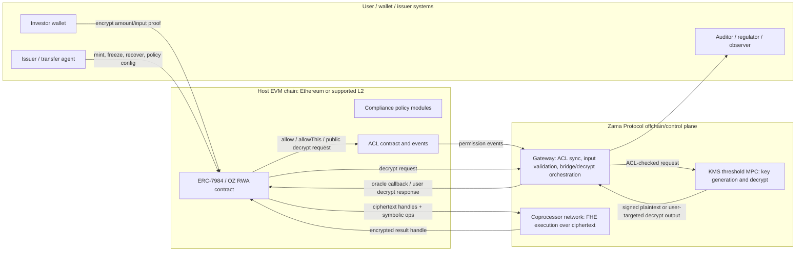
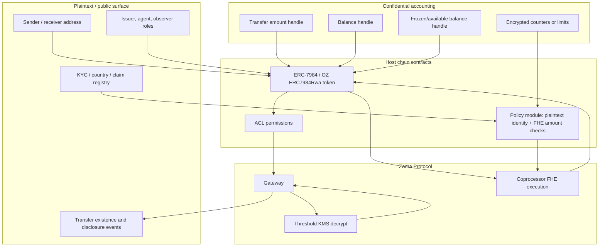
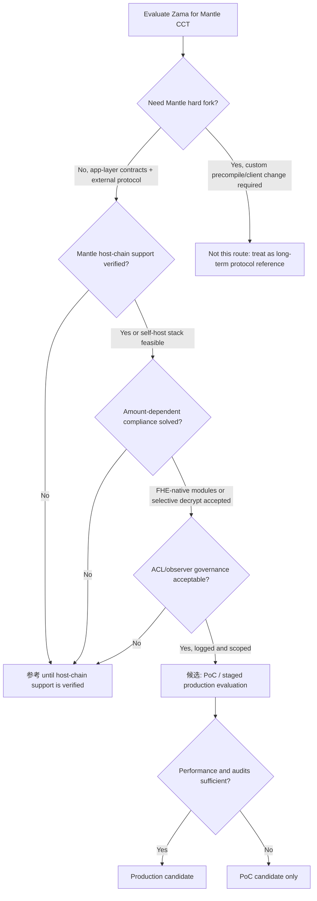

# Zama Confidential RWA Tokenization 深度分析

> 本 section 评估 Zama 作为 Mantle confidential compliance token（CCT）主候选路线的技术适配性。结论刻意区分产品叙事、协议能力、合约库实现、标准边界与 Mantle 轻量集成约束，避免把 partnership 或官网文案直接等同于生产级能力。

## 执行摘要（Executive Summary）

Zama 是目前最值得 Mantle 深挖的机密记账（confidential accounting）路线之一：它把金额和余额表示为 FHE 密文句柄（ciphertext handle），在 host chain 上通过 Solidity 合约编排，在 coprocessor 上执行密文计算，经 Gateway 和 threshold KMS 完成 public/user decrypt，并用 ACL 管理谁能计算或解密哪些 handle。与普通 shielded pool 相比，这条路线更贴近账户模型、ERC-7984、OpenZeppelin Confidential Contracts 和 RWA 发行方控制；与独立隐私链相比，它更符合 Mantle“轻量接入、不硬分叉、不换 VM”的方向。

但 Zama 不是“把 ERC-3643 加密一下”这么简单。ERC-3643 / T-REX 的 `canTransfer(from,to,amount)` 语义默认依赖明文 `amount`、明文余额或明文 holder 统计；ERC-7984 / OpenZeppelin Confidential Contracts 则把 amount/balance 变成 ciphertext handle。金额相关的 max-balance、holder cap、per-country/volume limit 等合规模块只有三种可能路径：

1. **FHE-native 合规（FHE-native compliance）**：用 Zama FHE 比较和 `select` 在密文上计算政策结果，合约不直接读取明文。适合上限、余额、冻结余额等数值规则，但需要重写 ERC-3643 模块，且失败语义通常变成“转 0 / 选择性更新状态”，不再是普通 Solidity `require(canTransfer(...))`。
2. **向合规 actor 选择性解密（Selective decrypt to compliance actor）**：把金额或余额 handle 授权给合规模块、observer、issuer agent 或 auditor，经 Gateway/KMS 解密或 re-encrypt 后做决策/审计。它更接近现有 ERC-3643 规则引擎，但牺牲端到端金额隐私，引入异步延迟和权限治理问题。
3. **不支持 / 仅身份的回退（Unsupported / identity-only fallback）**：未改造的 ERC-3643 模块只能做地址、身份、国家、blocklist 等明文状态检查；凡是依赖金额或余额的模块不能直接消费 ERC-7984 ciphertext handle。

因此，本 section 的初判是 **`候选`，但不是即插即用生产方案**。Zama 可作为 Mantle CCT 的主候选 PoC / 参考架构：隐私覆盖（privacy coverage）强、合约生态和标准锚点清楚、RWA 叙事贴合；但生产落地前必须验证 Mantle host-chain 支持路径、Gateway/KMS/operator 运维边界、OpenZeppelin Confidential Contracts 的审计版本、FHE-native compliance 模块工程量，以及选择性披露（selective disclosure）的撤销和日志模型。

评分摘要：

| 维度（Dimension） | 评分（Score） | 理由（Rationale） |
|---|---:|---|
| privacy_coverage | 4/5 | 金额/余额/冻结余额可密文化，支持机密转账（confidential transfer）；不隐藏交易存在性、地址图、业务逻辑或订单流。 |
| compliance_capability | 3/5 | OZ RWA/Restricted/Freezable/ObserverAccess + T-REX 合作（partnership）很贴合，但金额相关 ERC-3643 模块必须改造为 FHE-native 或选择性解密。 |
| selective_disclosure | 3/5 | ACL、public decrypt、user decrypt、observer access 明确；历史授权撤销、observer 泄露面、无许可披露（permissionless disclosure）风险需控制。 |
| deployment_lightweight | 3/5 | 不需要 Mantle 硬分叉或执行客户端改动的应用层 PoC 可行；但依赖 Zama host-chain/Gateway/KMS/coprocessor 支持或自运维 stack。 |
| engineering_delta | 3/5 | 需合约、SDK、wallet/indexer、observer/auditor 服务、bridge/redeem 改造；比 precompile 轻，但不是低运维。 |
| maturity | 3/5 | ERC-7984 draft、OZ docs/source、Zama protocol docs 和主网叙事具备基础；RWA/T-REX 集成仍主要是合作/厂商声明（partnership/vendor claim）。 |
| mantle_fit | 4/5 | 与 Mantle 机构级/私有 RWA 叙事高度匹配；native Mantle 支持和合规模块改造是门控项（gating item）。 |

本轮最终建议：**候选**。短期可做“Mantle CCT with Zama-style confidential accounting”PoC 与架构试探（architecture spike）；中期要等 Zama multi-chain / Mantle support 或明确 self-host Gateway/KMS/coprocessor 责任；若必须复用未改造的 ERC-3643 amount modules 且不接受 selective disclosure，则降级为 **参考**。

## 逐项发现（Item Findings）

### item-1: 产品叙事拆解与 claim 分级

#### 1.1 来源面分析（Source surface）：`zama.org` 与 `zama.ai`

Orchestrator 要求把 src-1 的 company solution URL 写为：

- `https://www.zama.ai/solutions/confidential-rwa-tokenization-using-fully-homomorphic-encryption`，accessed 2026-06-24。

本 runtime 在 2026-06-24 访问该 URL 时，最终跳转到：

- `https://www.zama.org/solutions/confidential-rwa-tokenization-using-fully-homomorphic-encryption`，HTTP 404。

同时，较短的 company solution URL：

- `https://www.zama.ai/solutions/confidential-rwa-tokenization`，accessed 2026-06-24,

会跳转到 live page：

- `https://www.zama.org/solutions/confidential-rwa-tokenization`，HTTP 200。

处理方式：本 section **保留 Orchestrator 指定的 `zama.ai` URL 和真实访问结果**，并把该页面只作为产品叙事与网站 surface 证据，不用它支撑关键技术结论。技术结论主要来自 `docs.zama.org`、`zama.org/post/...`、EIP、OpenZeppelin docs/code 与本仓库 commit-pinned research。`zama.org` 在当前站点承载 protocol home、docs、posts 以及实际跳转后的 solution page；`zama.ai` 在本轮证据中表现为 company/marketing surface 的入口域名。

#### 1.2 Zama 产品叙事（Zama product narrative）

| 声明（Claim） | 证据类别（Evidence class） | 来源（Source） | 本 section 的处理（Section handling） |
|---|---|---|---|
| 机密链上金融：金额和余额在处理过程中加密，公开可验证，合规可编程。 | 官方产品/协议叙事 | `https://www.zama.org/`，访问于 2026-06-24 | 可作为 Zama 价值主张；不等同于每条 RWA 政策都已生产落地。 |
| 机密 RWA 代币化：RWA 上链而不暴露投资者身份、交易条款、cap table 结构。 | 官方产品叙事 | `https://www.zama.ai/solutions/confidential-rwa-tokenization-using-fully-homomorphic-encryption`，访问于 2026-06-24；本 runtime 中跳转至一个 404 的 `zama.org` 长 slug。回退检查的可用链接为 `https://www.zama.ai/solutions/confidential-rwa-tokenization`，其跳转至 `zama.org` 页面。 | 用作叙事目标和来源稳定性注意事项（source-stability caveat）；技术实现需回到 docs/OZ/ERC。 |
| Zama 成为 T-REX Ledger 的机密层；ERC-3643 被增强但未被替代。 | 官方合作声明 | `https://www.zama.org/post/zama-becomes-the-confidentiality-layer-for-the-t-rex-ledger`，公告于约 2026-03-24，访问于 2026-06-24 | 可证明合作叙事（partnership narrative）；不能单独证明 Mantle-ready 的生产部署。 |
| 现有 T-REX 持仓可 1:1 包装为机密等价物。 | 合作/产品声明 | 同一篇 Zama T-REX 帖子 | 合理映射到 wrap lifecycle，但是否有公开的合约/代码/证据仍未验证。 |
| T-REX / Apex / TVS 指标与 2027 承诺。 | 厂商/合作方自报 | 同一篇 Zama T-REX 帖子 | 标注「未独立验证」，不用于 maturity 加分。 |
| Zama Protocol 组件：host chain、coprocessor、Gateway、KMS、ACL、decrypt modes。 | 官方文档化能力 | `docs.zama.org`，访问于 2026-06-24 | 可支撑技术架构。 |
| ERC-7984/OZ 机密代币与 RWA 扩展。 | 标准 + 实现文档 | EIP-7984、OpenZeppelin Confidential Contracts docs，访问于 2026-06-24；本地研究 commit pins | 可支撑代币接口与实现分析。 |

#### 1.3 Zama 对 RWA 的真正贡献（What Zama really contributes to RWA）

Zama 的 RWA 价值主张不是完整替代 ERC-3643，也不是独立 RWA chain。它更准确地提供三层能力：

1. **机密记账层（Confidential accounting layer）**：金额、余额、冻结余额、transfer amount 可变成 FHE handle，公众只能看到交易和参与地址的存在，无法直接读金额。
2. **可编程加密政策基底（Programmable encrypted policy substrate）**：Solidity 合约可调用 FHE arithmetic/comparison/select，在密文上维护余额、冻结余额、额度或规则状态。
3. **选择性披露与审计轨道（Selective disclosure and audit rail）**：ACL、Gateway、KMS、public/user decrypt、ObserverAccess 等机制允许向特定 actor 披露金额或余额。

它不天然提供：

- ERC-3643 身份注册、KYC claim、claim issuer registry 的完整治理。
- 未改造 ERC-3643 compliance modules 对 encrypted amount 的直接兼容。
- 对地址图、交易存在性、合约调用模式或 MEV/order flow 的隐私。
- Mantle native host-chain support 的公开承诺或上线证据。

### item-2: 技术架构拆解：fhEVM / Gateway / KMS / ACL / 解密模型（decrypt model）

#### 2.1 架构概览（Architecture summary）

Zama 的核心设计是把 EVM contract 当成 **host coordination layer**：合约持有 ciphertext handle 和 ACL 状态，实际 FHE 计算由 coprocessor 网络执行。Gateway 作为控制面同步 ACL、验证输入和编排 decrypt，KMS 作为 threshold MPC 网络生成/持有解密权力。

#### 2.2 组件与信任假设（Components and trust assumptions）

| 组件（Component） | 角色（Role） | 信任 / 活性假设（Trust / liveness assumption） | 来源（Source） |
|---|---|---|---|
| Host contract | 存储加密 handle，协调 FHE 操作，发出 ACL/decrypt 事件，执行 token/policy 逻辑。 | 普通 EVM 正确性；不能检视明文；不得把 encrypted boolean 当成 clear boolean 来分支。 | Zama Solidity guides；OZ docs。 |
| FHE Solidity library | 暴露加密类型与操作，如算术、比较、`select`、ACL 方法。 | 开发者必须正确理解 encrypted boolean 与异步 decrypt 语义。 | `docs.zama.org/protocol/solidity-guides/smart-contract/functions`，访问于 2026-06-24。 |
| Coprocessor | 在加密状态上执行 FHE 操作并返回加密结果 handle。 | 外部 FHE 网络的可用性/性能；正确性模型取决于 Zama 协议设计。 | Zama protocol docs；本地 confidential-coprocessor final。 |
| Gateway | 同步 ACL，验证加密输入，桥接密文，协调 KMS decrypt。按 Zama docs 实现为协议控制面 / rollup。 | Gateway 的可用性和正确的 ACL 镜像至关重要；Gateway 上不应保存敏感密钥。 | `docs.zama.org/protocol/protocol/overview/gateway`，访问于 2026-06-24。 |
| KMS | 为 public/user decrypts 提供 threshold MPC 密钥管理与解密；docs 描述 13 节点 / 9-of-13 风格的 threshold 示例与 <=1/3 恶意假设。 | 密钥治理、活性（liveness）、运营方去中心化、enclave/审计态势。 | `docs.zama.org/protocol/protocol/overview/kms`，访问于 2026-06-24。 |
| ACL | 记录 long-lived、transient、public 与 user-decryptable 权限。 | 永久授权和历史访问是主要治理风险；不同权限类型的撤销方式不同。 | `docs.zama.org/protocol/solidity-guides/smart-contract/acl`，访问于 2026-06-24。 |

#### 2.3 密文 handle 与操作（Ciphertext handle and operations）

Zama 合约不会为机密值存储普通的 `uint256 amount`。它们存储加密整数 handle，例如 OZ 实现中的 `euint64`，或 ERC-7984 接口层面的 `bytes32` 指针。FHE 函数集涵盖算术和比较操作；比较产生的是 encrypted boolean（`ebool`），而非 clear boolean。这对合规很关键：

- `FHE.lt`、`FHE.le`、`FHE.gt`、`FHE.ge`、`FHE.eq`、`FHE.ne` 可比较加密的金额/余额。
- `FHE.select(ebool, a, b)` 可在不暴露条件的情况下有条件地选择加密值。
- 合约无法安全实现 `require(encryptedCondition)`，因为该条件不是明文 bool。
- 若需要同步得到明确的合规判定，设计上必须解密，或重构 transfer 以避免明文分支。

#### 2.4 ACL 与解密模式（ACL and decrypt modes）

| 模式（Mode） | 机制（Mechanism） | RWA 用途（RWA use） | 注意事项（Caveat） |
|---|---|---|---|
| Contract access | `FHE.allowThis(handle)` 或类似方法让合约可在该 handle 上计算。 | Token 合约可更新余额、冻结状态、政策状态。 | 不披露明文；仅允许计算。 |
| Long-lived allowance | `FHE.allow(handle, address)` 授予某 user/contract 未来访问权。 | Observer、auditor、issuer agent、wrapper、hook 模块可访问 handle。 | 历史访问难以撤销；先前的 handle 可能仍可访问。 |
| Transient allowance | `FHE.allowTransient(handle, address)`，针对当前 tx。 | 临时模块检查或回调。 | 持久性更低，但仍须防止模块给自身或他人授予永久 ACL。 |
| Public decrypt | `makePubliclyDecryptable` / Gateway+KMS 签名结果流程。 | Unshield/redeem 金额、对特定值的公开审计、披露事件。 | 一旦公开，机密性即丧失；重放/证明校验需谨慎。 |
| User decrypt | 面向用户的 decrypt 或委托流程。 | Holder 看到自己的余额，issuer/auditor 看到授权字段。 | 需要委托/过期/撤销设计；UX 和日志很重要。 |
| ObserverAccess | OZ extension 让 observer 可访问 balance/transfer handle。 | Regulator/auditor/issuer observer 可检视机密记账。 | 强合规特性，但若 observer 被攻陷则泄露面很大；存在历史撤销注意事项。 |

### item-3: 标准关系拆解：ERC-7984、OpenZeppelin Confidential Contracts、ERC-3643 / T-REX

#### 3.1 边界映射（Boundary map）

| 层（Layer） | 它是什么（What it is） | 它负责什么（What it owns） | 它不负责什么（What it does not own） |
|---|---|---|---|
| Zama Protocol / fhEVM | FHE 后端与机密计算协议。 | 加密类型、FHE 操作、Gateway、KMS、ACL、decrypt modes。 | Token 标准语义、ERC-3643 identity registry、RWA 法律流程。 |
| ERC-7984 | 面向机密同质化代币的 draft 接口标准。 | `bytes32` 机密金额指针、机密 balance/transfer/operator/disclosure 接口。 | 指针实现、KMS、coprocessor、合规规则、身份。 |
| OpenZeppelin Confidential Contracts | 具体的 fhEVM 实现与 extension 库。 | 基于 Zama 加密类型的 ERC-7984 实现；RWA/Restricted/Freezable/ObserverAccess/Wrapper/Hooked 模块。 | 协议层 KMS/Gateway 操作；issuer 法律义务；T-REX 生产级主张。 |
| ERC-3643 / T-REX | 许可制证券代币 / 合规架构。 | Identity Registry、trusted issuers、claims、合规模块、agent 控制、freeze/recovery/forced transfer。 | 默认的加密记账；机密 transfer 语义；FHE 计算。 |
| Mantle integration adapter | 潜在的项目专属粘合层。 | 部署、链支持、政策模块选择、wallet/indexer/decrypt service、bridge/redeem 集成。 | 核心 Zama 协议或上游 ERC 标准行为。 |

#### 3.2 责任矩阵（Responsibility matrix）

| 责任（Responsibility） | Zama Protocol | ERC-7984 | OZ Confidential Contracts | ERC-3643 / T-REX | Mantle adapter |
|---|---|---|---|---|---|
| 代币接口 | 否 | 是，机密 token 接口 | 是，具体实现 | ERC-20 兼容的证券代币接口 | 选择 / wrap / 暴露 app API |
| 加密金额与余额 | 是，经由 FHE handle 和操作 | 是，作为机密指针抽象 | 是，经由 `euint64`/fhEVM handle | 否，默认明文 token amount | 与 UI/indexer/compliance 集成 |
| KYC claim 与身份 | 否，协议层无 ERC-3643 registry | 否 | 存在 `IdentityCheck` 风格的 extensions，但非 ERC-3643 完整治理 | 是，核心职责 | 绑定 Mantle issuer/KYC providers |
| 转账政策 | 可计算加密规则 | 仅接口 | Restricted/Rwa/Hooked 模块 | 合规合约模块 | 决定明文 vs FHE-native 政策 |
| 金额相关限额 | 可做 FHE 比较 | 接口不定义政策 | 可用自定义 FHE 模块实现；非自动 | 明文模块期望 amount/balance | 关键集成挑战 |
| 冻结 / 恢复 / 强制转账 | 协议支持加密余额与 ACL | 仅接口层 transfer | `Freezable`、`Rwa`、agent 控制 | 原生证券代币控制 | 决定 issuer/agent 治理 |
| Observer 披露 | ACL + decrypt modes | 仅 `AmountDisclosed` event | `ObserverAccess`、public/user decrypt 支持 | Regulator/auditor 概念在 token 标准之外 | 定义 observer 角色、日志、限制 |
| Wrap / redeem / unshield | Gateway/public decrypt 可支持 | 接口可披露 amount | `ERC7984ERC20Wrapper`；unwrap 需要 decrypt relay | 赎回由 issuer/legal agent 处理 | Bridge/redeem 产品工作流 |
| 运营信任 | KMS/Gateway/coprocessor | 实现专属 | 继承 Zama 协议信任 | Issuer/agent/trusted issuer 信任 | 决定可接受的 operator 模型 |

#### 3.3 F2：加密金额与明文 ERC-3643 合规（encrypted amount versus plaintext ERC-3643 compliance）

这是决定性的标准张力。

经典 ERC-3643 模块通常把合规评估为对 `from`、`to` 和 `amount` 的明文谓词，往往还附带额外明文状态，如 holder 余额、国家计数、investor caps 或 per-country limits。ERC-7984/OpenZeppelin 机密代币刻意把 amount 和 balance 隐藏为 ciphertext handle。这两套模型无法自动组合。

| 合规规则（Compliance rule） | 普通 ERC-3643 假设（Plain ERC-3643 assumption） | ERC-7984/Zama 状态（ERC-7984/Zama state） | 是否直接兼容？（Directly compatible?） | 可行路径（Viable path） |
|---|---|---|---|---|
| 收款方 KYC / 身份 claim | 地址与 identity registry 为明文。 | 除非使用 omnibus/sub-account 模式，地址仍可见；identity registry 可保持明文。 | 是，对纯身份检查。 | 复用 ERC-3643/T-REX 风格的身份门控或 OZ Restricted/IdentityCheck。 |
| 发送方/收款方 blocklist | 明文地址检查。 | 普通 ERC-7984 transfer 中地址可见。 | 是。 | 复用明文政策。 |
| 单投资者最大余额 | 需要明文 `amount` 和当前/新余额。 | Amount 与 balance 为 ciphertext handle。 | 否，不直接。 | FHE-native 的 `newBalance <= cap`，用加密比较和 `select`；或解密给合规 actor。 |
| Holder cap | 需要明文 holder count 和 zero/non-zero 转变。 | 若余额私有，则 balance zero/non-zero 是加密的。 | 部分兼容。 | 在 KYC/mint/transfer intent 上保持明文 holder registry；或用 FHE 比较 balance-to-zero，并通过授权模块解密/更新计数。 |
| 按国家的 holder cap | 需要 receiver 国家和按国家的 holder count。 | 国家可保持明文 claim；余额转变可能加密。 | 部分兼容。 | 若成员关系已披露，则用明文国家 + 明文 registry；仅当成员关系隐藏时才用 FHE。 |
| 按国家的交易量限额 | 需要按国家/窗口聚合的明文 transfer amount。 | Amount 为密文。 | 否，不直接。 | FHE 加密计数器 + 加密比较；周期性授权披露；或不支持。 |
| 最大转账规模 | 需要明文 transfer amount。 | Amount 为密文。 | 否，不直接。 | FHE 比较 `amount <= limit`，用 encrypted bool 选择实际 transfer amount，或把 amount 解密给政策模块。 |
| 冻结金额 / 可用余额 | 需要明文或内部记账来记录冻结/可用。 | OZ Freezable 可维护机密的 frozen/available handle。 | 是，配合 FHE-aware 实现。 | 使用 OZ Freezable/RWA 风格，而非普通 ERC-3643 模块。 |

**item-3 的结论（Conclusion for item-3）**：

- 若地址和 identity claims 保持明文，ERC-3643 身份和角色检查可与 Zama 机密记账共存。
- 当 amount/balance 为 ciphertext handle 时，ERC-3643 金额相关合规模块**原样无法支持（unsupported as-is）**。
- 金额相关合规要么需要 **FHE-native 重写模块**，要么需要 **选择性解密给受信合规 actor**。
- 这使 `compliance_capability` 目前封顶在 3/5：该路线很有前景且技术上可行，但最难的 RWA 合规规则属于集成工作，单凭 ERC-7984 无法解决。

### item-4: RWA 转账生命周期（RWA transfer lifecycle）：发行到赎回的端到端流程

#### 4.1 生命周期表（Lifecycle table）

| 步骤（Step） | 角色（Actor） | 组件 / 模块（Component / module） | 明文状态（Plaintext state） | 加密状态（Encrypted state） | 政策门控（Policy gate） | 解密 / 披露（Decrypt / disclosure） | 证据类别（Evidence class） | 缺口（Gap） |
|---|---|---|---|---|---|---|---|---|
| 1. 资产设置 | Issuer / admin | ERC-3643/T-REX 或 OZ RWA 部署；role registry | Token 元数据、issuer 角色、agent 角色、法律文件 | 尚无 | Admin/agent authority | 无 | ERC-3643 spec；OZ docs | 治理设计和法律流程超出范围。 |
| 2. KYC / claim | 投资者、KYC provider、issuer | Identity Registry / trusted issuer / Restricted 或 IdentityCheck 模块 | 地址、国家、accredited status、sanctions status（若披露） | 可选的加密身份属性（若自定义） | Holder eligibility | 视 registry 不同，user/issuer 可能查看 claims | ERC-3643 + OZ docs + 推断 | 私密身份非自动；除非额外设计，地址图仍可见。 |
| 3. Mint 或 wrap | Issuer / wrapper | `mint`、ERC20 wrapper、RWA token | Receiver 地址、total issuance event 元数据 | Minted amount/balance handle | Receiver 必须经过验证；issuer 角色 | Issuer 可能需要金额审计；public decrypt 可选 | OZ wrapper/RWA docs；T-REX 帖子声明 | T-REX 1:1 wrapping 属合作声明（partnership claim）；本 section 未验证公开代码。 |
| 4. 机密转账输入 | Sender / operator | ERC-7984 transfer 函数；input proof | From/to/operator、token 地址、tx 存在性 | Transfer amount handle | Operator 授权、receiver 检查 | 输入时无披露，除非授权 user/observer | ERC-7984；OZ docs | Operator 是时间受限的无限授权；钱包 UX 风险。 |
| 5. 政策检查 | Token contract + compliance module | 若使用，则明文 identity/blocklist/country | Amount、balance、frozen balance、加密计数器 | 身份检查为明文；金额规则必须 FHE-native 或解密 | FHE 比较、`select`，或选择性解密 | 可能把 decision/amount 解密给合规 actor | Zama functions docs；ERC-3643 spec；推断 | 核心 F2 缺口：明文 ERC-3643 amount 模块原样无法支持。 |
| 6. 余额更新 | Token contract + coprocessor | 含双方的 transfer 事件；可能含加密 handle id | Sender/receiver 余额、实际转账金额、frozen balance | 合法性、underflow/overflow、freeze | 除非请求披露，否则无 | OZ docs | 失败可能产生 zero transfer 或加密失败状态，而非 ERC-20 风格的 revert。 |
| 7. Observer / 审计披露 | Issuer、auditor、regulator、observer | ACL、Gateway、KMS、ObserverAccess、public/user decrypt | 仅当解密时才披露值 | Amount/balance handle | ACL 权限与 decrypt 请求校验 | Public decrypt、user decrypt、observer access | Zama ACL/Gateway/KMS docs；OZ docs | 必须配置撤销与泄露边界；observer 被攻陷后果严重。 |
| 8. 冻结 / 恢复 | Agent / issuer | OZ Freezable/RWA 或 ERC-3643 agent 控制 | 目标账户、动作事件 | 冻结的机密余额、recovered 加密金额 | Agent 角色、receiver eligibility | 可能向 auditor/regulator 披露 | OZ RWA docs；ERC-3643 spec | 加密的 forced transfer 需要清晰的法律/审计轨迹。 |
| 9. Redeem / unshield | Holder / issuer / wrapper | Wrapper、redeem service、public decrypt oracle | Redeem recipient、法律赎回记录 | Burn/unwrap amount handle（直至披露） | Holder eligibility、issuer liquidity、bridge/redeem 检查 | 公开或 issuer 解密金额以释放底层资产 | OZ wrapper docs；推断 | Unwrap 更复杂，因为 ERC-20/现金 leg 需要明文金额。 |

#### 4.2 政策检查细节：三种实现模式（Policy check detail: three implementation patterns）

**模式 A：FHE-native 合规模块（Pattern A: FHE-native compliance module）**

合约保留加密计数器或余额，并使用 FHE 比较：

- `newBalance = FHE.add(oldBalance, amount)`
- `ok = FHE.le(newBalance, encryptedOrPlainCap)`
- `actualAmount = FHE.select(ok, amount, FHE.asEuint64(0))`
- 余额用 `actualAmount` 更新

这保留了金额机密性，但改变了开发者心智模型：

- `ok` 是加密的，因此无法使用普通的 `require(ok)`。
- 失败可能变成 zero transfer、延迟披露，或加密失败标志。
- 审计需要 observer/user/public decrypt 或单独的事件语义，以在不泄露的前提下区分“policy failed”和“zero amount”。
- 更复杂的规则，例如滚动的 country volume limits，需要加密计数器和窗口逻辑，而非标准 ERC-3643 模块。

**模式 B：选择性解密给合规 actor（Pattern B: selective decrypt to compliance actor）**

合约或工作流授予合规 actor 对 amount/balance handle 的访问权。该 actor、observer 或 KMS 支撑的服务进行解密或接收面向用户的 re-encryption，运行常规政策，并返回判定或触发被允许的动作。

收益：

- 复用更多现有 ERC-3643 合规逻辑。
- 为 issuer/regulator 产生清晰的审计证据。
- 更易于推理 max-balance 和 volume limits。

成本：

- 合规 actor 知悉敏感的金额/余额。
- 实时 transfer 可能变成异步，或需要预授权工作流。
- 权限授予和历史访问成为治理风险。

**模式 C：不支持的回退（Pattern C: unsupported fallback）**

仅使用明文 identity、blocklist 和角色控制；在保留加密 amount/balance 的同时省略金额相关合规。这对狭义 PoC 可能可接受，但对在意限额与持仓集中度的生产级证券/RWA 合规而言不够。

#### 4.3 生命周期结论（Lifecycle conclusion）

如果产品接受混合模型，Zama 可以表达端到端的 RWA lifecycle：

- 地址和身份资格保持足够可见以供合规；
- 金额和余额默认机密；
- 金额敏感规则要么被重写为 FHE-native 模块，要么向授权 actor 披露；
- redeem/unshield 显式解密金额以释放底层资产。

除非金额相关合规模块问题得到解决并经测试，否则它不能被诚实地描述为“drop-in confidential ERC-3643”。

### item-5: Mantle 轻量集成评估

#### 5.1 集成表（Integration table）

| 组件（Component） | PoC 是否必需？（Required for PoC?） | 谁运营 / 拥有（Who operates / owns it） | Mantle 链/客户端改动？（Mantle chain/client change?） | 轻量分类（Lightweight classification） | 生产阻塞项（Production blocker） |
|---|---|---|---|---|---|
| ERC-7984/OZ contracts | 是 | Mantle app team / issuer | 否 | `no chain change` | 审计版本、升级治理、角色模型。 |
| Zama Solidity library / SDK | 是 | App developers | 否 | `no chain change` | 开发者工具、wallet signing/encryption UX。 |
| Zama host-chain support | 是，针对 native Mantle 部署 | Zama protocol / operators，或自托管 stack | 原则上无执行 hardfork，但 support 必须存在 | `unknown`（直至确认 Mantle support） | 当前公开证据未确认 Mantle 是受支持的 host chain。 |
| Gateway | 是 | Zama protocol 或自托管 operator set | 无 hardfork；外部协议依赖 | `sidecar/operator dependency` | ACL sync/decrypt liveness 与治理。 |
| KMS threshold network | 是，针对 decrypt | Zama operator set 或自托管 MPC 参与方 | 否 | `sidecar/operator dependency` | 密钥仪式、threshold 治理、operator 去中心化。 |
| Coprocessor network | 是，针对 FHE execution | Zama operators 或自托管 | 否 | `sidecar/operator dependency` | 性能/SLA/成本。 |
| Observer/auditor service | 可能 | Issuer/regulator/auditor | 否 | `app/offchain service` | 披露政策、日志、安全。 |
| Wallet support | 是，针对可用的机密 transfer | Wallet/app frontend | 否 | `app integration` | Encrypt input、handle proofs、user decrypt UX。 |
| Indexer/explorer | 是，针对运营 | Mantle app/explorer provider | 否 | `app integration` | 必须在不泄露的前提下展示加密活动；Blockscout 支持的说法属产品/来源专属。 |
| Bridge/redeem service | 是，针对 RWA 产品 | Issuer / custodian / bridge provider | PoC 无需新的 canonical bridge | `app/offchain service` | 明文赎回金额和法律结算路径。 |
| Mantle hard fork / precompile | 否，针对应用层路线 | 仅当选择 native precompile 时由 Mantle protocol 负责 | Zama 风格的应用层 PoC 不需要 | `not required` | 仅当 Mantle 想要 native FHE precompile/协议集成时才相关。 |

#### 5.2 Mantle 需要硬分叉吗？（Does Mantle need a hard fork?）

对本处评估的应用层 Zama 路线而言：**根据本 section 的证据，无需 hard fork**。该路线使用 Solidity 合约、SDK/encryption、外部 Gateway/KMS/coprocessor，以及 application/offchain 服务。这比 B20 风格的 precompile 工作更契合 requirements-framework 的轻量路径。

然而，“无 hard fork”并不等于“今天就能在 Mantle 上就绪”。Native Mantle 部署需要满足以下之一：

1. Zama 官方支持 Mantle 作为 host chain。
2. Mantle 或某 issuer 运行经批准/自托管的 Zama 兼容 Gateway/KMS/coprocessor stack。
3. 产品先在受 Zama 支持的链上上线，再 bridge/wrap 进 Mantle —— 这会削弱 Mantle-native 论点。

先前的 confidential-coprocessor section 记录了 Zama live support 和 multi-chain roadmap 的注意事项，但本 section 截至 2026-06-24 未找到证明 Mantle host-chain 支持的一手来源。因此 item-5 分类为：

- **应用层路线（合约 + 外部机密层架构）无需 Mantle 执行客户端改动**。
- 对 native Mantle host-chain 支持为 **未知 / 门控（Unknown / gating）**。
- 对 Gateway、KMS 和 coprocessor 为 **Sidecar/operator 依赖（Sidecar/operator dependency）**。

#### 5.3 Mantle 契合度的含义（Mantle fit implication）

Mantle 应将 Zama 定位为**候选机密层依赖**，而非内部协议特性。这能保持 PoC 范围的现实性：

- 在受支持的 host 环境上部署 ERC-7984/OZ 风格的代币，或测试 Mantle 支持路径。
- 实现一条 FHE-native 的 max-transfer 或 max-balance 规则以验证 F2。
- 实现 observer/user/public decrypt 流程用于审计和赎回。
- 测量延迟、失败语义、wallet UX 和披露日志。

如果项目目标要求“纯 Mantle native、无外部 operator 依赖”，则 Zama 成为参考架构，而非即时候选。

### item-6: 风险评估与证据缺口

| 风险（Risk） | 严重度（Severity） | 证据类别（Evidence class） | 为何重要（Why it matters） | 缓解 / 决策影响（Mitigation / decision impact） |
|---|---|---|---|---|
| 金额相关合规不兼容 | 高 | 基于 ERC-3643 + ERC-7984/Zama docs 的研究推断 | 明文 ERC-3643 模块无法评估密文 amount/balance。 | 生产前构建 FHE-native 政策模块或选择性解密流程；封顶合规评分。 |
| Mantle host-chain 支持未知 | 高 | 缺口（Gap） | 没有受支持的 host chain 或自托管 stack，native Mantle 部署无法推进。 | 询问 Zama / 验证 SDK 网络支持；归类为门控项（gating item）。 |
| KMS/Gateway/coprocessor 活性与治理 | 高 | Zama docs + 本地研究 | Decrypt 和 FHE execution 依赖外部 operators 和 threshold 治理。 | 要求 SLA、operator set、事故流程、密钥轮换、审计日志。 |
| 历史 ACL 撤销 | 高 | Zama ACL docs + OZ 本地研究 | Long-lived allowances 和 ObserverAccess 可造成持久数据访问。 | 最小化永久授权；优先 scoped/transient/user 委托；记录所有授权。 |
| Observer 被攻陷或披露面过宽 | 高 | OZ docs + 推断 | Observer 既可以是受监管的披露特性，也可能是隐私后门。 | 拆分 observer 角色、缩小 handle 范围、要求治理与监控。 |
| FHE 性能与延迟 | 中/高 | 厂商/自报 + 本地研究 | RWA transfers 可能容忍延迟，但 DeFi/composability 未必。 | 对实际政策路径做基准测试；不要依赖 vendor TPS 说法。 |
| 标准成熟度 | 中 | EIP-7984 draft；OZ docs | 接口和实现可能变化；审计是版本专属的。 | Pin release/commit；采用升级策略；生产前重新评审。 |
| Hook/模块 ACL 持久性 | 中/高 | 本地 ERC-7984 研究 | 受信 hook 模块可能授予在卸载后仍存续的持久 ACL。 | 避免不受信 hook；审计模块；尽可能要求 ACL 清理语义。 |
| Redeem/unshield 泄露 | 中 | OZ wrapper docs + 推断 | 底层 ERC-20/现金赎回需要明文金额。 | 把 redeem 视为有意披露；记录并约束收款人。 |
| 数据/密文可用性 | 中 | Zama 架构推断 | Host chain 存储 handle，而非完整密文；coprocessor/state 可用性很重要。 | 要求可用性监控和恢复方案。 |
| 厂商锁定（Vendor lock-in） | 中 | 架构依赖 | Zama 专属的加密类型和 Gateway/KMS API 可能限制可移植性。 | 保留 ERC-7984 接口边界；避免深度的不可移植应用假设。 |
| 合作指标夸大 | 中 | 厂商/合作声明（Vendor/partnership claims） | T-REX/Apex/TVS 数字不能证明 Mantle-ready 生产能力。 | 标注未经核实；要求第三方证明或代码/审计。 |

### item-7: 评分卡打分与初步裁决（Rubric scoring and initial verdict）

| 维度（Dimension） | 评分（Score） | 证据锚点（Evidence anchors） | 理由（Rationale） |
|---|---:|---|---|
| privacy_coverage | 4 | Zama docs；ERC-7984；OZ docs；本地 ERC-7984 final | 强金额/余额机密性和加密操作。不隐藏交易存在性、普通地址图、业务逻辑或订单流。 |
| compliance_capability | 3 | ERC-3643 spec；OZ RWA docs；Zama T-REX 帖子；F2 分析 | 良好的 identity/issuer/freeze/recovery 构件，但金额相关合规必须重写或披露。 |
| selective_disclosure | 3 | Zama ACL/Gateway/KMS docs；OZ ObserverAccess/public decrypt docs | 丰富的披露原语，但撤销、observer scope 和无许可披露（permissionless disclosure）风险阻碍更高评分。 |
| deployment_lightweight | 3 | Zama docs；requirements-framework；本地 confidential-coprocessor final | 应用层路线无 hardfork，但 native Mantle 支持和 operator stack 属外部依赖。 |
| engineering_delta | 3 | OZ docs；Zama SDK/docs；生命周期分析 | 需要合约、SDK、proofs、observer service、wallet/indexer、bridge/redeem 和自定义政策工程。 |
| maturity | 3 | EIP-7984 draft；OZ docs/source；Zama docs/posts；本地审计注意事项 | 足够用于 PoC 和认真评估；生产级 RWA 成熟度和确切的集成证据仍不完整。 |
| mantle_fit | 4 | Requirements-framework；Mantle 轻量约束；item-5 | 若 Mantle 接受外部机密层，则叙事/技术契合度强。若 native host-chain 支持不可得，或没有为自定义合规工作提供资金，则评分下降。 |

#### 裁决（Verdict）

**初步裁决：`候选`（Initial verdict: `候选`）**。

Zama 应被视为 Mantle CCT 最强的 FHE/机密记账候选，尤其适用于演示以下内容的 PoC：

- 加密的 transfer 金额和余额；
- issuer/agent 控制；
- observer/auditor 披露；
- 一两条 FHE-native 合规规则；
- 带显式披露的 redeem/unshield。

生产前的决策门（decision gates）：

1. 验证 Mantle host-chain 支持或自托管 stack 的可行性。
2. 在 FHE-native 与 selective-decrypt 合规架构之间做选择。
3. Pin OpenZeppelin Confidential Contracts 的版本/commit 与审计覆盖范围。
4. 定义 ACL/observer 治理与历史撤销政策。
5. 对实际的 transfer + policy + decrypt 延迟做基准测试。
6. 确认 T-REX/RWA 集成代码，否则将合作（partnership）视为非生产级证据。

若门 1 和门 2 不通过，降级为 **参考**。若产品拒绝外部 Gateway/KMS/coprocessor 依赖，则就轻量 Mantle 集成而言归类为 **出局**，仅作为长期协议研究保留。

## 图示（Diagrams）

### diag-1: Zama 机密 RWA 架构输入（Zama Confidential RWA architecture input）

### diag-2: RWA 转账生命周期表（RWA transfer lifecycle table）

见 item-4.1。该表是后续可视化渲染的 lifecycle 图输入。

### diag-3: 责任矩阵（Responsibility matrix）

见 item-3.2。该矩阵是标准边界图的输入。

### diag-4: Mantle 集成评估表（Mantle integration assessment table）

见 item-5.1。该表应用作 Mantle 部署图的输入。

### diag-5: 裁决树（Verdict tree）

## 来源覆盖（Source Coverage）

| ID | 来源（Source） | 访问 / pin（Access / pin） | 覆盖（Coverage） | 置信度（Confidence） |
|---|---|---|---|---|
| src-1a | `https://www.zama.ai/solutions/confidential-rwa-tokenization-using-fully-homomorphic-encryption` | 访问于 2026-06-24；本 runtime 中跳转至 `zama.org/...using-fully-homomorphic-encryption`，HTTP 404 | Orchestrator 强制要求的 company solution URL；来源稳定性注意事项 | 内容方面低；URL 审计轨迹方面重要 |
| src-1b | `https://www.zama.ai/solutions/confidential-rwa-tokenization` -> `https://www.zama.org/solutions/confidential-rwa-tokenization` | 访问于 2026-06-24；跳转后 HTTP 200 | 产品叙事：机密 RWA、investor/deal/cap-table 机密性 | 仅叙事方面为中 |
| src-1c | `https://www.zama.org/` | 访问于 2026-06-24 | 协议/产品主页叙事：机密链上金融、公开可验证、合规可编程 | 叙事方面为中 |
| src-2 | `https://www.zama.org/post/zama-becomes-the-confidentiality-layer-for-the-t-rex-ledger` | 公告于约 2026-03-24；访问于 2026-06-24 | T-REX 合作、“增强而非替代 ERC-3643”、wrapping 声明、厂商指标 | 合作方面为中；未经核实指标方面低 |
| src-3a | `https://docs.zama.org/protocol/solidity-guides/smart-contract/acl` | 访问于 2026-06-24 | ACL allowance、transient allowance、public/user decrypt 权限模型 | 协议文档方面高 |
| src-3b | `https://docs.zama.org/protocol/protocol/overview/gateway` | 访问于 2026-06-24 | Gateway orchestration、ACL sync、KMS decrypt 流程 | 协议文档方面高 |
| src-3c | `https://docs.zama.org/protocol/protocol/overview/kms` | 访问于 2026-06-24 | Threshold KMS、MPC nodes、decrypt modes 与信任模型 | 协议文档方面高 |
| src-3d | `https://docs.zama.org/protocol/solidity-guides/smart-contract/functions` | 访问于 2026-06-24 | FHE arithmetic/comparison/select 与 encrypted boolean 语义 | 协议文档方面高 |
| src-4a | `https://eips.ethereum.org/EIPS/eip-7984` | 访问于 2026-06-24 | ERC-7984 接口、bytes32 指针、operator、disclosure event | 标准文本方面高 |
| src-4b | `https://eips.ethereum.org/EIPS/eip-3643` | 访问于 2026-06-24 | ERC-3643 Identity Registry、Compliance、transfer policy、force/freeze/recover | 标准文本方面高 |
| src-5a | `https://docs.openzeppelin.com/confidential-contracts/token` | 访问于 2026-06-24 | ERC-7984 token 行为、wrapper、operator 和 callback docs | 实现文档方面高 |
| src-5b | `https://docs.openzeppelin.com/confidential-contracts/api/token` | 访问于 2026-06-24 | ERC7984Rwa、ObserverAccess、Restricted、Freezable、public disclosure API | 实现文档方面高 |
| src-5c | `OpenZeppelin/openzeppelin-confidential-contracts` | 本地先前研究 pin commit `41fe10be35dbcb512d63a334f11bd9ec73a360cf` | 源码/审计上下文；本次运行中 live `git ls-remote` 尝试不可用 | 中；commit-pinned 本地研究 |
| src-6a | `confidential-compliance-token-research/research-sections/requirements-framework/final.md` | Commit `9eb29a150f380f21add9b431b66fea2ee5d12881` | CCT 定义、rubric、Mantle 轻量否决权 | 本地复用度高 |
| src-6b | `evm-privacy-research/research-sections/erc7984-confidential-token/final.md` | Commit `fdbda370e9e9137890c5bd2deb7752e03d76d0bc` | ERC-7984/OZ 细节、ACL/Hook 注意事项、scores | 本地复用度高 |
| src-6c | `evm-privacy-research/research-sections/confidential-coprocessor/final.md` | Commit `0041e3a1598751a7d121fecc600ba3d6ad42ad05` | Zama 架构、KMS/Gateway、Mantle 支持注意事项、性能注意事项 | 本地复用度高 |
| src-7a | `compliance-token-standards/research-sections/erc3643-trex-analysis/final.md` | Commit `a260e40f58b0d8d2e15ba7bd263ab67a3288b6bd` | ERC-3643/T-REX lifecycle 和 compliance modules | 本地复用度高 |
| src-7b | `compliance-token-standards/research-sections/base-b20-analysis/final.md` | Commit `f42915ecd33c7f099d4ac0de89997390fc52d0b9` | Mantle/Base precompile 与私有特性比较 | 本地上下文方面为中 |
| src-8 | 通过本地 ERC-7984 和 coprocessor finals 获得的 OpenZeppelin Confidential Contracts 审计/安全材料 | Commit-pinned 本地研究，2026-06-24 从仓库访问 | ObserverAccess/Hooked/disclosure 行为的审计注意事项 | 中；版本专属 |
| src-9 | 独立佐证 | 部分：本地 finals 引用二手来源；本 section 未独立验证 T-REX 指标或性能指标 | 部署/性能/合作佐证仍不完整 | 低/部分 |

## 缺口分析（Gap Analysis）

1. **来源 URL 不稳定（Source URL instability）**：Orchestrator 强制要求的长 `zama.ai` solution URL 在本 runtime 中未提供该内容。可达的 live solution page 路径不同。此处如实记录，而非默默归一化。
2. **Mantle host-chain 支持（Mantle host-chain support）**：本次运行中无任何一手来源证明 Zama 在 2026-06-24 支持 Mantle 作为 host chain。
3. **T-REX 集成代码/证据（T-REX integration code/evidence）**：Zama/T-REX 帖子是官方合作证据，但公开代码、审计、生产交易样本和确切的模块架构仍未经核实。
4. **金额相关合规（Amount-dependent compliance）**：明文 ERC-3643 合规模块与加密的 ERC-7984 amount/balance handle 不直接兼容。这是最高优先级的技术试探（spike）。
5. **选择性披露治理（Selective disclosure governance）**：ACL scope、撤销、observer 角色拆分、日志和被攻陷响应在生产前需要产品/安全设计。
6. **审计版本管理（Audit versioning）**：OpenZeppelin Confidential Contracts docs 可用，但生产建议需要确切的 release/commit 和刷新的审计覆盖范围。
7. **性能（Performance）**：厂商 TPS/latency 或 GPU-roadmap 说法此处未经独立验证，应在目标政策路径上做基准测试。
8. **数据可用性与恢复（Data availability and recovery）**：Host chain 存储 handle；运营恢复取决于 coprocessor/Gateway/KMS 的可用性和保留保证。
9. **AC-8 `_index.md`**：WHI-267 提及 `_index.md`，但 Orchestrator 选择了无 `report_issue_id` 的 lightweight single-issue 模式；本 section 不写 `_index.md`。

## 修订记录（Revision Log）

| 轮次（Round） | 变更（Change） | 细节（Details） |
|---:|---|---|
| 1 | 初始深度初稿 | 为 WHI-267 产出完整初稿，涵盖产品叙事、架构、标准边界、lifecycle、Mantle 集成、风险登记册与 rubric verdict。 |
| 1 | 处理 F1 carry-forward | 增加 `zama.ai` 强制 URL、真实的 2026-06-24 访问结果、redirect/404 注意事项，以及 `zama.org` vs `zama.ai` surface 区分。 |
| 1 | 处理 F2 carry-forward | 在 item-3 和 item-4 中增加明确的 encrypted-amount 与明文 ERC-3643 合规分析，含 FHE-native/selective-decrypt/unsupported 路径。 |
| 1 | 记录 F3 carry-forward | 标注 `_index.md` 在 single-issue lightweight 模式下不适用；未执行 `_index.md` 写入。 |
| 1 final | 最终提升 | 在 Review Verdict approve（`f61e26f7-4aa2-46b8-80d9-582934b71339`）后，将获批初稿 `93ab3a92dea692d835689213e1b2768d31bb35b1` 提升为 `final.md`；并纳入 D1 T-REX 公告日期更正。 |
