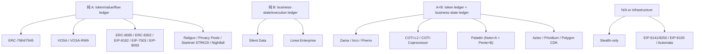
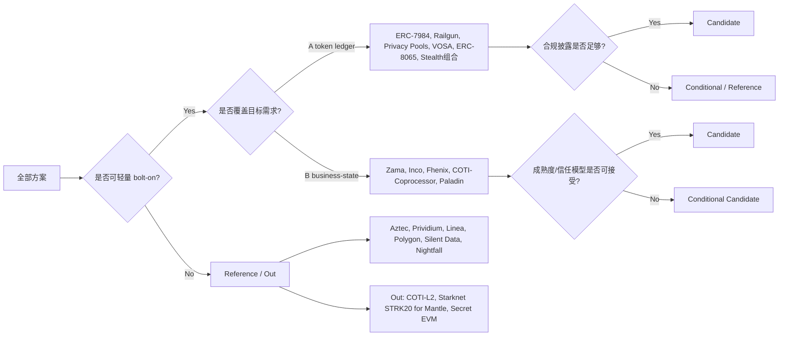

# EVM 隐私方案横向对比分析

> 本 section 是 WHI-254 至 WHI-261 的收敛裁决层：不重新做外部调研，只把 8 个上游 final.md 的标准、协议和竞品归一到同一张可决策矩阵。所有事实锚定上游 artifact path + commit `1eac19ed837c8e9a4df1bb1594d5b23cc5a2e9f0`；所有新判断标注为 `[cross-comparison 推论]`。

## Executive Summary

1. **Mantle 的候选空间由三条硬约束共同压缩：轻量级部署、合规披露、R4 业务状态隐私。** 只要求私密 token ledger(A) 时，bolt-on 候选很多：ERC-7984/7945、ERC-8065、ERC-8302/pERC-20、VOSA、Railgun、Privacy Pools、Stealth 地址组合都可覆盖部分值级或图隐私。若要求私密业务状态(B)，bolt-on 候选立即收缩为 Zama fhEVM、Inco Lightning、Fhenix CoFHE、COTI-Coprocessor、Paladin(Pente)；其中生产成熟度和合规能力仍不均衡。[cross-comparison 推论; WHI-254 item-5/6; WHI-258 item-7; WHI-261 item-7]
2. **真正的首选候选不是单一“最隐私”方案，而是分场景组合。** 值级合规转账优先看 ERC-7984/OZ 合规扩展、Railgun、Privacy Pools、VOSA-RWA；业务状态隐私优先看 Zama/Inco/Paladin/COTI-Coprocessor；匿名集和合规集合设计参考 Railgun/Privacy Pools；全执行密码学上界参考 Aztec，但不可 bolt-on 到 Mantle。[cross-comparison 推论]
3. **F1 已处理：主矩阵不再只列“技术家族”。** WHI-254 轴 1 的子维度被拆成主路线、Trusted Setup、后量子叙事、路线组合四列。结论上，FHE/GC/STARK/TEE 路线在 setup 或 PQ 叙事上优于 Groth16 系 ZK；但成熟、审计、合规集成常常反过来偏向非 PQ 的 Groth16/BN254 生态。PQ 叙事在本 section 中仅作上游继承与 `[cross-comparison 推论]`，未重新核验。
4. **F2 已处理：Privacy Pools 的账本分类裁决为“纯 A + 合规披露层”，不是 B。** WHI-257 将 Privacy Pools 映射到 R5/R6/R7，强调 compliance-gated pool；WHI-260 明确 shielded-pool 范式不覆盖 R4 业务逻辑/合约状态。按 WHI-254 的 A/B 口径，B 必须隐藏合约执行逻辑或业务状态，因此 Privacy Pools 应归为纯 A(token/flow privacy) + R6/R7 合规层；WHI-257 的“A+B”应理解为“隐私池 + 合规能力”的宽泛标注，而非 business-state ledger。[cross-comparison 推论]
5. **最终三档 verdict：** 候选 = Zama、Inco、Railgun、Privacy Pools、ERC-7984/7945、ERC-5564/6538、ERC-8065、VOSA/VOSA-RWA、Paladin、COTI-Coprocessor；条件候选/早期 = Fhenix、ERC-8302/pERC-20、EIP-8093、Automata(TEE 验证积木)；参考 = Aztec、Prividium、Linea Enterprise、Polygon CDK、Silent Data、Nightfall、EIP-8182/7503/8105/8141/8250、Oasis Sapphire、Solana Confidential Transfers、Tornado；出局 = COTI-L2、Starknet STRK20、Secret Network EVM 路线。出局不等于无价值，表示不适合作为 Mantle 轻量级主候选。[cross-comparison 推论]

## Item Findings

### item-1: 方案全集合并与横向对比主矩阵

#### 1.1 去重后的方案全集

主矩阵纳入 27 个 canonical 方案；sidebar/reference 只承担设计参照，不与主矩阵同权重裁决。COTI 保持 L2 / Coprocessor 双行，因为 WHI-254/WHI-261 已证明二者部署形态和成熟度完全不同。

| # | Canonical 方案 | 主源 | 旁证 | 主矩阵 |
|---:|---|---|---|:---:|
| 1 | ERC-7984 Confidential Fungible Token | `erc7984-confidential-token/final.md` | `confidential-coprocessor/final.md`; `eea-enterprise-benchmark/final.md` | Yes |
| 2 | ERC-7945 Confidential Transactions Supported Token | `erc7984-confidential-token/final.md` | - | Yes |
| 3 | VOSA / VOSA-20 | `vosa-standards/final.md` | - | Yes |
| 4 | VOSA-RWA | `vosa-standards/final.md` | - | Yes |
| 5 | ERC-5564 + ERC-6538 Stealth Addresses | `privacy-eips-survey/final.md` | `vosa-standards/final.md` | Yes |
| 6 | ERC-8065 ZK Token Wrapper | `privacy-eips-survey/final.md` | - | Yes |
| 7 | ERC-8302 / pERC-20 Private Fungible Tokens | `privacy-eips-survey/final.md` | `vosa-standards/final.md` caveat | Yes |
| 8 | EIP-8182 Private ETH/ERC-20 Transfers | `privacy-eips-survey/final.md` | - | Yes |
| 9 | EIP-7503 ZK Wormholes | `privacy-eips-survey/final.md` | - | Yes |
| 10 | EIP-8093 Private ERC-20 ZK Burns | `privacy-eips-survey/final.md` | - | Yes |
| 11 | EIP-8250 + EIP-8141 AA/keyed nonce infra | `privacy-eips-survey/final.md` | - | Reference row |
| 12 | EIP-8105 Universal Encrypted Mempool | `privacy-eips-survey/final.md`; `privacy-landscape-framework/final.md` | - | Reference row |
| 13 | Zama fhEVM | `confidential-coprocessor/final.md` | `erc7984-confidential-token/final.md` | Yes |
| 14 | Inco Lightning | `confidential-coprocessor/final.md` | - | Yes |
| 15 | Fhenix CoFHE | `confidential-coprocessor/final.md` | - | Yes |
| 16 | Railgun | `zk-shielded-pool/final.md` | - | Yes |
| 17 | Privacy Pools (0xbow) | `zk-shielded-pool/final.md` | `privacy-eips-survey/final.md` | Yes |
| 18 | Starknet STRK20 / Shieldnet | `zk-shielded-pool/final.md` | `zk-privacy-chain-aztec/final.md` context | Yes, benchmark |
| 19 | Aztec | `zk-privacy-chain-aztec/final.md` | - | Yes, benchmark |
| 20 | COTI-L2 | `eea-enterprise-benchmark/final.md` | `privacy-landscape-framework/final.md` | Yes, benchmark |
| 21 | COTI-Coprocessor | `eea-enterprise-benchmark/final.md` | `privacy-landscape-framework/final.md` | Yes |
| 22 | Nightfall | `eea-enterprise-benchmark/final.md` | `privacy-landscape-framework/final.md` | Yes, benchmark |
| 23 | Paladin | `eea-enterprise-benchmark/final.md` | `privacy-landscape-framework/final.md` | Yes |
| 24 | Prividium | `eea-enterprise-benchmark/final.md` | `privacy-landscape-framework/final.md` | Yes, benchmark |
| 25 | Linea Enterprise | `eea-enterprise-benchmark/final.md` | `privacy-landscape-framework/final.md` | Yes, benchmark |
| 26 | Polygon CDK Enterprise | `eea-enterprise-benchmark/final.md` | `privacy-landscape-framework/final.md` | Yes, benchmark |
| 27 | Silent Data | `eea-enterprise-benchmark/final.md` | `privacy-landscape-framework/final.md` | Yes, benchmark |
| S1 | Oasis Sapphire | `eea-enterprise-benchmark/final.md` §6.1 | - | Sidebar |
| S2 | Secret Network / SecretEVM | `eea-enterprise-benchmark/final.md` §6.2 | - | Sidebar |
| S3 | Automata DCAP verifier | `eea-enterprise-benchmark/final.md` §6.3 | `confidential-coprocessor/final.md` TEE context | Sidebar |
| S4 | Solana Confidential Transfers | `eea-enterprise-benchmark/final.md` §6.4 | - | Sidebar |
| S5 | Tornado Cash | `zk-shielded-pool/final.md` item-6 | `privacy-eips-survey/final.md` | Sidebar |

#### 1.2 口径归一

- **Source policy**：每行以主源为准；旁证只用于校验或登记冲突。所有 source 均为 upstream final.md @ `1eac19ed837c8e9a4df1bb1594d5b23cc5a2e9f0`。
- **标度**：`●` = 完全/强；`◐` = 部分/条件/声称；`○` = 不覆盖；`?` = 上游未核验。
- **成熟度**：不把 Draft / Pilot / GA / 主网 / testnet 强行换算成数值，只保留“统一成熟度 + 原始词表”。
- **Axis-1 子维度**：本稿按 F1 增补 Trusted Setup、PQ 叙事、路线组合。PQ 多为 `[cross-comparison 推论]`，例如 FHE/STARK 较有 PQ 叙事，Groth16/BN254/SECP256k1 非 PQ，TEE/GC 依赖传统通道与实现。

#### 1.3 主矩阵（diagram-1）

> 为保证可读性，R1/R2/R3/R5/R4/R8 以摘要列展示；逐项转置详见 item-4。`TS` = Trusted Setup。`PQ` = post-quantum narrative。`组合` = route composability。

| 方案 | 主路线 | TS | PQ | 组合 | 数据维度摘要 | 信任模型 | 部署/轻量 | 披露摘要 | A/B | 成熟度 | Verdict | Source |
|---|---|---|---|---|---|---|---|---|---|---|---|---|
| ERC-7984 | 机制中立 pointer；OZ/Zama FHE 为主 | 依实现；FHE 通常无 | FHE 实现有 PQ 叙事；标准本身中立 | 可接 OZ RWA/Observer/Hook/Wrapper | R1● R2● R3○ R5○ R4○ R8○ | 标准中立；OZ/fhEVM = Crypto+Org | 合约接口 + FHE 基建；轻量性依实现 | ObserverAccess/ACL/RWA；撤销不足 | A | Draft + OZ 实现 | Candidate | `erc7984.../final.md` §1-4 |
| ERC-7945 | 机制中立 ciphertext/proof | 依实现 | 中立 | Fat Token + ERC-20 | R1● R2● R3○ R5◐ R4○ R8○ | 依 proof/backend | 合约接口；实现缺口 | 无标准披露事件，依实现 | A | Review | Candidate/Reference | `erc7984.../final.md` item-4 |
| VOSA/VOSA-20 | ZKP Groth16+Poseidon | 需要 | 非 PQ | ERC-5564 stealth + VOSA note | R1● R2● R3◐ R5○ R4○ R8○ | Crypto + setup | 纯合约，轻量；未审计 | viewing/auditor key；exposed graph | A | Concept | Conditional Candidate | `vosa.../final.md` item-6 |
| VOSA-RWA | ZKP + 链下合规服务 | 需要 | 非 PQ | VOSA + compliance module | R1● R2● R3◐ R5○ R4○ R8○ | Crypto+Org | 纯合约，轻~中；链下服务 | compliance-gate + key-share；冻结结构缺口 | A | Concept/Pre-pilot | Conditional Candidate | `vosa.../final.md` item-4/6 |
| ERC-5564/6538 | SECP256k1 ECDH stealth | 不需要 | 非 PQ | 与 token/privacy pool 正交组合 | R1○ R2○ R3● R5◐ R4○ R8○ | Crypto | 纯合约/registry，轻量 | viewing key scans identity only | N/A | Final | Candidate as primitive | `privacy-eips.../final.md` item-3 |
| ERC-8065 | ZK burn/remint wrapper | 依 proof | 多为非 PQ | 可与 stealth/underlying compliance 组合 | R1● R2◐ R3◐ R5● R4○ R8○ | Crypto | 合约 wrapper，轻量 | 继承底层 token 合规 | A | Draft | Candidate | `privacy-eips.../final.md` item-5 |
| ERC-8302/pERC-20 | Groth16+Poseidon private token | 需要 | 非 PQ | 新 native private token | R1● R2● R3◐ R5◐ R4○ R8○ | Crypto | 合约，轻量；未合并 | blacklist；披露弱 | A | Open PR | Conditional Candidate | `privacy-eips.../final.md` item-5 |
| EIP-8182 | Groth16 BN254 shielded pool | 需要 | 非 PQ | 协议层 pool + PP 兼容待定 | R1● R2● R3● R5● R4○ R8○ | Crypto | L1 硬分叉，V4 否决 | PP 兼容待确认 | A | Draft Core | Reference | `privacy-eips.../final.md` item-4 |
| EIP-7503 | ZK wormhole burn/mint | 依 proof | 非 PQ | 可作 burn/remint 模式 | R1◐ R2○ R3◐ R5● R4○ R8○ | Crypto | L1/Core，V4 否决 | pool 机制弱 | A/primitive | Stagnant | Reference | `privacy-eips.../final.md` item-5 |
| EIP-8093 | ZK burn extension | 未核验 | 未核验 | ERC-20 burn privacy | R1◐ R2○ R3◐ R5● R4○ R8○ | Crypto | 可能合约，状态不可核验 | 无 | A/primitive | Forum draft | Conditional Reference | `privacy-eips.../final.md` item-5 |
| EIP-8250/8141 | AA/keyed nonce infra | N/A | N/A | 与 privacy pool gas/nonce 组合 | 间接 R3/R5；R4○ R8○ | Infra | L1/Core，V4 否决 | 无 | N/A | Draft Core | Reference | `privacy-eips.../final.md` item-6 |
| EIP-8105 | Encrypted mempool | 依加密方案 | 依方案 | 与 private sequencing 组合 | R8●；R1-R5○ | Threshold/MPC/TEE optional | L1/ePBS，V4 否决 | 无持久隐私 | N/A | Draft Core | Reference | `privacy-eips.../final.md` item-6 |
| Zama fhEVM | FHE(TFHE)+MPC KMS | 无 FHE setup | 有 PQ 叙事 | ERC-7984/OZ 合规栈 | R1● R2● R3○ R5○ R4● R8○ | Crypto+Org+HW(Nitro) | Coprocessor 轻量；Mantle 需官方支持或自托管 | Observer/RWA/ACL；撤销缺口 | A+B | ETH mainnet + Sepolia | Candidate | `confidential-coprocessor/final.md` item-7 |
| Inco Lightning | TEE 当前；Atlas FHE roadmap | 不需要 | 当前 TEE 非 PQ | ERC-3643/Circle 合规叙事 | R1● R2● R3○/◐ R5○ R4● R8○ | HW-Anchored | Base 主网；Mantle 需扩展 | delegated viewing + compliance gate | A+B | Base mainnet | Candidate | `confidential-coprocessor/final.md` item-2/7 |
| Fhenix CoFHE | FHE(TFHE/BFV)+EigenLayer | 无 FHE setup | 有 PQ 叙事 | CoFHE pipeline | R1● R2● R3○ R5○ R4● R8○ | Crypto+Economic | Coprocessor 轻量；成熟度待验 | permit sealing 基础 | A+B | Testnet/early | Conditional Candidate | `confidential-coprocessor/final.md` item-4/7 |
| Railgun | Groth16/Circom shielded pool | 需要方案 ceremony | 非 PQ | PPOI + viewing key | R1● R2● R3● R5● R4○ R8○ | Crypto+list provider | EVM 合约套件，轻量 | viewing-key + PPOI；key 不可撤销 | A | Production/multi-audit | Candidate | `zk-shielded-pool/final.md` item-2/7 |
| Privacy Pools | zk-SNARK Merkle pool | 栈名未由一手证实 | 非 PQ 推论 | ASP + association set + ragequit | R1○/pool asset R2○ R3◐ R5● R4○ R8○ | Crypto+ASP Org | EVM 合约套件，轻量 | association-set/compliance-gate | A | Early production | Candidate | `zk-shielded-pool/final.md` item-3/7 |
| Starknet STRK20 | STARK/Cairo | 无 setup | Strong PQ | Starknet-native privacy pool | R1●† R2●† R3●† R5●† R4○ R8○ | Crypto+rollup trust | Cairo VM/rollup，V1 否决 | encrypted viewing key claimed | A | shipped/unaudited | Out for Mantle | `zk-shielded-pool/final.md` item-4/5 |
| Aztec | ZK private VM/Noir | CRS completed | SNARK stack; PQ not established | full private execution | R1● R2● R3● R5● R4● R8○ | Crypto+sequencer | independent non-EVM L2，V1/V2 否决 | data sharing + ZK proof；some keys reserved | A+B | Alpha | Reference | `zk-privacy-chain-aztec/final.md` item-6 |
| COTI-L2 | GC | 不需要 | GC 不受量子直接威胁 [推论] | +Nightfall/ZK integration | R1● R2● R3◐ R5◐ R4◐ R8○ | Crypto+Org | COTI L2 + bridge，V1/V2 否决 | view-key share；revocability unverified | A+B(partial) | GA | Out | `eea-enterprise.../final.md` item-3/7 |
| COTI-Coprocessor | GC announced | 不需要 | GC PQ-ish [推论] | multichain coprocessor | R1●† R2●† R3◐† R5◐† R4◐† R8○ | Crypto+Org+Axelar | bolt-on 轻量；非 GA | view-key†; unverified revocability | A+B(partial, announced) | Pilot | Candidate | `eea-enterprise.../final.md` item-7 |
| Nightfall | ZKP + X.509 | 取决于 proof | 非 PQ or migration possible [推论] | enterprise PKI | R1● R2● R3◐ R5◐ R4○ R8○ | Crypto+Org(CA) | Rollup operator，中量级 | compliance-gate + viewing-key | A | Pilot | Reference | `eea-enterprise.../final.md` item-3/7 |
| Paladin | Privacy Group + ZKP | Zeto depends; Groth16 risk | 未明确 | Noto(A)+Pente(B)+Zeto | R1● R2● R3◐ R5○ R4◐ R8○ | Org+Crypto | sidecar 轻~中量级 | notary/privacy-domain; partial audit log | A+B | Pilot | Candidate | `eea-enterprise.../final.md` item-2/7 |
| Prividium | ZK Stack + RBAC | 取决于 ZK Stack | 未明确 | permissioned L2 + selective disclosure | R1● R2● R3◐ R5◐ R4● R8◐ | Crypto+Org | independent L2，V1/V2/V3 否决 | regulator+audit-request+auditable-log | A+B | Pilot | Reference | `eea-enterprise.../final.md` item-3/7 |
| Linea Enterprise | Private Validium/ZK | 取决于 prover | zkVM migration claimed | permissioned validium | R1● R2● R3◐ R5◐ R4● R8◐ | Crypto+Org | independent validium，否决 | observer/operator domain-wide | B | Pilot | Reference | `eea-enterprise.../final.md` item-3/7 |
| Polygon CDK | Configurable FHE/TEE/ZKP | 取决于 module | FHE option favorable | configurable stack | R1● R2● R3◐ R5◐ R4◐→● R8◐ | Configurable | private chain，否决 | SSO/operator/compliance gate | A+B configurable | Pilot | Reference | `eea-enterprise.../final.md` item-3/7 |
| Silent Data | TEE full execution | 不需要 | TEE relies on traditional crypto | OP Stack + TEE | R1● R2● R3◐ R5◐ R4● R8◐ | HW-Anchored | independent TEE L2，否决 | smart-contract/auditable-log; audit gap | B | Early Production | Reference | `eea-enterprise.../final.md` item-3/7 |

† = 上游已标注为 claimed / announced / unaudited / 未独立验证。

#### 1.4 主矩阵结论

- **值级隐私方案密度高**：ERC 标准、VOSA、shielded pool、Nightfall、COTI、Paladin Noto 都能覆盖 A 类需求的某个子集。
- **图隐私和合规披露存在取舍**：Railgun/Privacy Pools/Aztec 隐图能力强；ERC-7984/VOSA/COTI 更偏“金额保密、账户/图保留”，合规友好但匿名性弱。
- **R4 是分水岭**：标准层 EIP 与 shielded-pool 几乎都不覆盖 R4；R4 主要由 FHE/TEE/GC/Privacy Group/独立私有 VM 路线提供。

### item-2: 部署形态 / 轻量级分组

#### 2.1 分组视图（diagram-2）

```text
------------------------------------------------------------------------------------------------+
| 轻量级 bolt-on / 可应用层集成                                                                 |
| ERC-5564/6538 | ERC-8065 | ERC-8302* | ERC-7984/7945* | VOSA/VOSA-RWA* | Railgun | Privacy Pools |
| Zama fhEVM* | Inco Lightning* | Fhenix CoFHE* | COTI-Coprocessor* | Paladin(sidecar,边界)          |
+------------------------------------------------------------------------------------------------+
                           | 轻量级阈值: V1 新链/VM, V2 新桥, V3 全节点, V4 硬分叉 |
+------------------------------------------------------------------------------------------------+
| 协议层 / Core 参考（对 Mantle 触发 V4 或架构不匹配）                                          |
| EIP-8182 | EIP-7503 | EIP-8141/8250 | EIP-8105                                                  |
+------------------------------------------------------------------------------------------------+
| 独立链 / 企业链 benchmark（对 Mantle 触发 V1/V2/V3）                                          |
| Aztec | Starknet STRK20 | COTI-L2 | Nightfall(中量级) | Prividium | Linea | Polygon CDK | Silent Data |
+------------------------------------------------------------------------------------------------+
| Sidebar/reference                                                                              |
| Oasis Sapphire | Secret Network | Automata DCAP verifier | Solana Confidential Transfers | Tornado Cash          |
+------------------------------------------------------------------------------------------------+
* 表示轻量部署成立但成熟度、运维或能力边界仍需单独验证。
```

#### 2.2 Bolt-on 候选

| 子类 | 方案 | 通过理由 | 关键 caveat |
|---|---|---|---|
| 合约/标准层 | ERC-5564/6538, ERC-8065, ERC-8302, VOSA, Railgun, Privacy Pools | 无新链、无新桥、无全节点、无硬分叉 | 多数只覆盖 A；VOSA/8302 成熟度不足；Railgun/PP 合规和匿名集各有取舍 |
| FHE/TEE/GC 协处理器 | Zama, Inco, Fhenix, COTI-Coprocessor | 宿主链只部署接口/合约，重计算外包 | Zama/Inco 尚未支持 Mantle；Fhenix/COTI-Coprocessor 成熟度低；ACL/披露撤销需治理 |
| Privacy group sidecar | Paladin | sidecar 非全节点；无需改基础链 | notary/域内可见，组织信任强；Pente 扩展性约束 |

#### 2.3 Benchmark / 出局型部署

- **Aztec / Starknet STRK20**：隐私技术先进，但要求独立 VM/链，触发 V1。Aztec 还是非 EVM/Noir 模式，对 Mantle 只能作概念参考。
- **COTI-L2 / Prividium / Linea / Polygon CDK / Silent Data**：企业链或专用 L2，能力强但触发 V1/V2/V3。它们是能力上界或合规模型参考，不是 Mantle 轻量集成候选。
- **Nightfall**：不是 V1/V2 型独立私有链，但 rollup operator 运维使其偏中量级；且 token-only，不解决 R4。
- **协议层 EIP**：EIP-8182、7503、8141/8250、8105 都属于 L1/Core 参考，无法作为 Mantle L2 bolt-on 直接采用。

#### 2.4 Sidebar 隔离说明

Oasis Sapphire、Secret、Automata、Solana、Tornado 不进入主裁决权重：

- **Sapphire**：机密 EVM ParaTime + OPL 桥，提供 R4 参考，但需独立网络和桥；非 1:1 Mantle L2 隐私替代。
- **Secret**：机密 EVM 路线 2026 暂停，近期不应列为候选。
- **Automata**：可 bolt-on，但只是 TEE attestation verifier，不是隐私执行引擎；适合与 Silent Data/TEE 自建路线组合。
- **Solana Confidential Transfers**：非 EVM，且 token-only；只作 auditor-key 模型参考。
- **Tornado**：架构轻但 R6/R7 失败；只作“无披露=监管死局”教训。

### item-3: 合规-选择性披露分组

#### 3.1 sub-taxonomy（diagram-3）

| 标签 | 方案 | 说明 |
|---|---|---|
| viewing-key | Railgun, Nightfall, ERC-5564, VOSA, ERC-7984 ObserverAccess, COTI, Aztec(current data sharing), Starknet STRK20(claimed) | 密钥/查看权披露；最大风险是撤销性与披露范围 |
| observer / notary | ERC-7984 ObserverAccess, Paladin/Noto, Linea, Polygon CDK, Prividium operator/regulator | 第三方或 operator 持续可见；合规强但组织信任强 |
| association-set | Privacy Pools, Railgun PPOI(排除型) | PP = inclusion/exclusion + ASP; Railgun = exclusion/PPOI |
| compliance-gated | VOSA-RWA, Inco, Nightfall, Privacy Pools, Prividium, Polygon CDK, Paladin, ERC-7984 RWA/Restricted | 事前准入或提款门控；适合机构合规 |
| privacy-group/domain | Paladin, Linea Enterprise, Polygon CDK, Prividium | 域内共享、域外隐藏；不是公共匿名 |
| exposed-graph | ERC-7984/7945, VOSA, COTI, Stealth-only, Paladin notary model | 有意保留地址/图/时序；合规友好但匿名性不足 |
| none / negative lesson | Tornado, EIP-8105, EIP-8141/8250 | Tornado 无披露导致监管死局；8105/AA 类不是持久隐私 |

#### 3.2 合规能力归并

| 合规需求 | 强匹配 | 部分匹配 | 弱/不适用 |
|---|---|---|---|
| AML/CFT 准入 | Prividium, Polygon CDK, Nightfall, VOSA-RWA, Inco, ERC-7984 RWA/Restricted, Privacy Pools | Railgun PPOI, Paladin | Stealth-only, ERC-8065, Tornado |
| 金融审计 | Prividium, Silent Data(但 audit disclosure gap), ERC-7984 Observer/RWA, Paladin(partial), COTI(view key) | Railgun viewing key, Nightfall, Privacy Pools ASP records | ERC-8065/8302 baseline |
| Travel Rule / identity disclosure | Inco, ERC-7984 + identity extension, Nightfall X.509, Prividium/Polygon SSO | VOSA-RWA, Paladin domains | Railgun/PP unless paired with off-chain process |
| GDPR / revocability | Privacy Pools ASP can revoke approval for future private withdrawals; role systems can revoke future access | COTI/Paladin/ERC-7984 have unverified or partial audit/revocation | Railgun viewing key permanently reveals; FHE ACL historical grants may persist |

#### 3.3 Mantle 合规视角

Institutional Mantle 不应把“选择性披露”写成单一 viewing key。更稳妥的组合是：

1. **事前准入**：KYC/allowlist/compliance gate，覆盖 RWA 与机构准入。
2. **事后审计**：auditable-log 或 observer 机制，明确权限、范围、留痕。
3. **隐私最小化**：per-tx/per-account/per-contract scope，而不是全历史永久 key。
4. **逃生/拒绝服务边界**：Privacy Pools 的 ragequit 是合规门控下的非托管兜底；FHE/TEE 协处理器则需确认 force-exit / decrypt-liveness。

### item-4: 原语覆盖矩阵

#### 4.1 轴 2 转置（diagram-4）

| 原语 | 完全覆盖/强候选 | 部分覆盖 | 主要缺口 |
|---|---|---|---|
| R1 金额 | ERC-7984/7945, VOSA, ERC-8065, ERC-8302, EIP-8182, Zama/Inco/Fhenix, Railgun, Aztec, COTI, Nightfall, Paladin, Prividium/Linea/Polygon/Silent Data | Stealth-only no; Privacy Pools more flow/set privacy than amount encryption in token-ledger sense | amount privacy 已不是稀缺项 |
| R2 余额 | ERC-7984/7945, VOSA, ERC-8302, EIP-8182, Zama/Inco/Fhenix, Railgun, Aztec, COTI, Nightfall, Paladin, Prividium/Linea/Polygon/Silent Data | ERC-8065 依 wrapper 设计；Privacy Pools 不是账户余额模型 | 与 UX/审计结合仍难 |
| R3 身份 | Stealth, Railgun, Privacy Pools, Aztec | VOSA, Nightfall, permissioned enterprise chains, COTI | ERC-7984/COTI 地址公开；FHE 协处理器默认不隐地址 |
| R5 转账图 | Railgun, Privacy Pools, Aztec, EIP-8182, ERC-8065/7503/8093 | Stealth/VOSA partial or exposed, Nightfall/COTI partial | 合规友好方案常主动保留图或 operator 可见 |
| R4 合约逻辑 | Zama, Inco, Fhenix, Aztec, Silent Data, Linea, Prividium | Paladin, COTI, Polygon CDK configurable | 标准层 / pool / VOSA / Nightfall 基本不覆盖 |
| R4 合约状态 | Zama, Inco, Fhenix, Aztec, Silent Data, Linea, Prividium | Paladin, COTI, Polygon CDK configurable | 同上 |
| R8 订单流 | EIP-8105 | Silent Data/Linea/Prividium/Polygon operator/TEE or permissioned sequencer partial | 主流隐私转账方案不解决 pre-confirmation MEV |

#### 4.2 Bolt-on 子集中的覆盖缺口

- **R1/R2**：bolt-on 中选择很多，工程问题高于理论问题。
- **R3/R5**：Railgun/Privacy Pools/Stealth/Aztec 系思路更强；FHE/GC 方案默认地址公开，需要与 stealth/omnibus/合规域组合。
- **R4**：bolt-on 内只剩 Zama/Inco/Fhenix、COTI-Coprocessor、Paladin。若 Mantle 的 institutional 隐私目标包含 RWA 业务状态、合规计算、私有合同执行，不能用 Railgun/Privacy Pools/ERC-7984 baseline 单独替代。
- **R8**：本研究范围内几乎没有 Mantle 直接可用的用户隐私 + 订单流统一方案；需另行进入 private sequencing / encrypted mempool 设计。

### item-5: 合约逻辑隐私 + Ledger A/B 候选集合

#### 5.1 A/B 分类（diagram-5）



#### 5.2 私密 token ledger(A) 候选

| 候选 | 适合场景 | 关键限制 |
|---|---|---|
| ERC-7984/7945 | 机密余额/金额、机构 token、RWA 扩展 | 地址/图公开；FHE/OZ 实现基建重；ACL 撤销需治理 |
| Railgun | 成熟 shielded DeFi / viewing-key 审计 | viewing key 不可撤销；PPOI 仅排除 |
| Privacy Pools | 合规隐私池、association set 分离均衡 | 早期生产；ASP 当前半许可；不是 R4 |
| VOSA/VOSA-RWA | 轻量 PoC、合规友好 exposed-graph | 概念草案、未审计、冻结结构缺口 |
| ERC-8065/8302 | 标准化值级隐私方向 | 标准/实现成熟度不足 |
| Stealth 地址 | 收款方匿名补件 | 不保护金额/余额；需与 token privacy 组合 |

#### 5.3 私密业务状态(B) 候选

| 候选 | 是否 bolt-on | 能力 | 关键限制 |
|---|:---:|---|---|
| Zama fhEVM | Yes, conditional | FHE 加密状态和逻辑，OZ 合规栈强 | Mantle 支持未就绪；性能/许可/KMS/ACL 风险 |
| Inco Lightning | Yes, conditional | TEE 机密层，Base 主网，合规叙事强 | 仅 Base；TEE 信任与 force-exit 待确认 |
| Fhenix CoFHE | Yes, early | FHE 协处理器，经济安全路线 | testnet/主网状态张力；合规弱 |
| COTI-Coprocessor | Yes, Pilot | GC partial R4，轻量架构 | announced；multichain 能力未验证 |
| Paladin/Pente | Yes, boundary | Privacy-domain 执行级隐私 | notary/组织信任；Pente N-of-N/扩展性 |
| Aztec | No | 密码学全执行隐私上界 | 非 EVM/Noir/独立链 |
| Silent Data | No | TEE 全执行隐私 | 独立 TEE L2；审计透明度缺口 |
| Prividium/Linea/Polygon CDK | No | 企业 permissioned/validium 状态隐私 | 独立链/私有链 |

#### 5.4 策略含义

如果 Mantle 的近期目标是“机构机密代币/转账”，A 类足够，优先比较 ERC-7984、Railgun、Privacy Pools、VOSA-RWA 和 Nightfall/EEA 参考。如果目标是“机构间私有合约、RWA 生命周期、合规计算”，必须走 B 或 A+B 路线；此时真正可 bolt-on 的候选变成 Zama/Inco/Fhenix/COTI-Coprocessor/Paladin，且每个都有成熟度或信任模型代价。[cross-comparison 推论]

### item-6: 逐方案 verdict + 口径差异登记

#### 6.1 Verdict 定义

- **Candidate**：部署形态可接受，能覆盖某个 Mantle 真实需求，并有足够成熟度或明确试点价值。
- **Conditional Candidate**：架构方向对，但标准/实现/审计/生产成熟度不足。
- **Reference**：不可直接轻量集成，但设计、合规模型或能力上界值得借鉴。
- **Out**：与 Mantle 轻量主候选根本冲突，或路线暂停/绑定非 EVM VM，短期不应投入为主路径。

#### 6.2 逐方案裁决（diagram-6）

| 方案 | Verdict | 理由 |
|---|---|---|
| ERC-7984 | Candidate | 机密 token 标准锚，OZ/Zama 合规扩展最完整；适合 A 类需求。R4 只能由底层 fhEVM 实现提供，不是标准本体能力。 |
| ERC-7945 | Candidate/Reference | 接口更贴 ERC-20/Fat Token，但实现和生态弱于 ERC-7984。 |
| VOSA/VOSA-RWA | Conditional Candidate | 极轻量、合规取向明确；但单作者/未审计/概念阶段，生产前需重新验证。 |
| ERC-5564/6538 | Candidate as primitive | 收款方匿名可组合，部署轻；不能单独解决金额/余额。 |
| ERC-8065 | Candidate | 存量 token wrapper 方向，纯合约；成熟度仍早。 |
| ERC-8302/pERC-20 | Conditional Candidate | 原生 private token 方向；PR open，接口可能变。 |
| EIP-8182 | Reference | 统一匿名集和协议层 pool 值得借鉴；硬分叉不适合 Mantle bolt-on。 |
| EIP-7503 / EIP-8093 | Reference | burn/remint / ZK burn 设计可参考；状态或适用性不足。 |
| EIP-8141/8250 | Reference | AA/keyed nonce 对隐私 UX 间接有用；不是隐私主方案。 |
| EIP-8105 | Reference | R8 订单流保护参考；非持久用户隐私。 |
| Zama fhEVM | Candidate | A+B 能力强，合规扩展成熟，密码学叙事强；Mantle 可用性、性能、许可、KMS 运维是主风险。 |
| Inco Lightning | Candidate | TEE 低延迟、合规叙事好、Base 主网上线；Mantle 支持和 TEE 信任需确认。 |
| Fhenix CoFHE | Conditional Candidate | FHE 协处理器路线对；成熟度和合规生态弱。 |
| Railgun | Candidate | 已生产、多审计、EVM 合约套件、R5 强；viewing key 不可撤销，合规是排除型。 |
| Privacy Pools | Candidate | 合规理论与 association set 最贴“诚实/非法资金分离”；早期生产、ASP 半许可、不是 R4。 |
| Starknet STRK20 | Out for Mantle | STARK/PQ 叙事强，但绑定 Cairo VM / Starknet rollup，触发 V1；隐私组件未审计。 |
| Aztec | Reference | 密码学全执行隐私上界；非 EVM/Noir/独立链，不能 bolt-on。 |
| COTI-L2 | Out | GA 但必须 COTI 网络/桥，触发 V1/V2；不能把 L2 能力直接迁移到 Mantle。 |
| COTI-Coprocessor | Candidate | 架构轻量且 A+B partial；但 Pilot/announced，需跟踪生产验证。 |
| Nightfall | Reference | 企业 token-only + X.509 参考；中量级 rollup operator，非 R4。 |
| Paladin | Candidate | sidecar/Pente 提供 R4，已有 Mantle 集成思路；组织信任和扩展性是主要约束。 |
| Prividium | Reference | 合规向量最完整；独立 L2，不适合轻量主路径。 |
| Linea Enterprise | Reference | Private Validium 状态隐私范式；独立链。 |
| Polygon CDK | Reference | 可配置隐私光谱；私有链/validium，不是 bolt-on。 |
| Silent Data | Reference | TEE 全执行隐私 + Automata 可借鉴；独立 TEE L2、审计透明度不足。 |
| Oasis Sapphire | Reference | 机密 EVM/TEE 范式参考；独立 ParaTime + OPL 桥。 |
| Secret Network | Out/Reference | 机密 EVM 路线暂停，仅作历史教训。 |
| Automata | Conditional Candidate as component | 可 bolt-on TEE attestation verifier；不是隐私执行引擎。 |
| Solana Confidential Transfers | Reference | auditor-key 和双余额模型参考；非 EVM、token-only。 |
| Tornado | Reference negative | 无披露导致监管死局；不可作为合规候选。 |

#### 6.3 F2: Privacy Pools A/B 冲突裁决

**Verdict：Privacy Pools = 纯 A(token/flow privacy) + R6/R7 compliance overlay，不是 B。**

冲突来源：

- `privacy-eips-survey/final.md` 将 Privacy Pools 列为合规门控隐私池，映射 R5/R6/R7；outline 记录其与 A+B 分类存在冲突。
- `zk-shielded-pool/final.md` 明确 shielded-pool 范式覆盖 R1/R2/R3/R5/R6/R7，但 **R4 业务逻辑/合约状态为不覆盖**，并将 Privacy Pools 与 Railgun/Tornado/Starknet 同放在 note/nullifier pool 族。
- `privacy-landscape-framework/final.md` 的 A/B 口径要求 B 隐藏合约逻辑、状态变量或业务规则；Privacy Pools 的 association set 只决定提款能否进入合规集合，不执行私有业务逻辑。

因此，WHI-257 的“A+B”如果存在，应按 `[cross-comparison 推论]` 解释为“token/flow privacy + compliance capability”的宽泛产品标注，而不是 WHI-254 item-6 的 Business-State Ledger(B)。在本主矩阵中，Privacy Pools 归类为 **A**，披露列归类为 **association-set + compliance-gated**，R4 逻辑/状态均为 `○`。

#### 6.4 其他口径差异 / 去重冲突

| 冲突 | 裁决 |
|---|---|
| ERC-7984 standard vs Zama implementation | ERC-7984 本体 = A/token standard；Zama/fhEVM implementation = A+B。矩阵拆成 ERC-7984 与 Zama 两行，不把实现能力倒灌给标准。 |
| COTI-L2 vs COTI-Coprocessor | 两者共享 GC partial R4 叙事，但部署形态、成熟度、置信度不同；必须双行。 |
| VOSA pERC-20 vs ERC-8302/pERC-20 | 名称相似但来源不同；VOSA 内部 pERC-20 关系仍有 gap，不能合并。 |
| EIP-8105/8141/8250 | 只作 related infrastructure；不得计入用户交易数据隐私候选。 |
| Starknet STRK20 | STARK prover 成熟不等于 STRK20 隐私池成熟；PQ/no-setup 叙事需带 shipped/unaudited 折扣。 |
| COTI revocability / Paladin auditable log | 上游已标 unverified-revocable / partial-auditable-log，本稿沿用，不提升为已验证能力。 |

#### 6.5 未独立验证项汇总

- Zama / ERC-7984：OZ v0.5 Hooked ACL 持久授权和历史撤销缺口；Zama Mantle 支持需官方扩展或自托管。
- Inco：Base 主网已上线，但 Mantle 扩展、force-exit、TEE 运营细节需确认。
- Fhenix：主网状态、经济安全、合规能力仍弱。
- COTI-Coprocessor：multichain privacy ability announced，Pilot 阶段。
- VOSA：作者性能/约束/测试、真实 repo、trusted setup ceremony、freeze/forcedTransfer 结构均未独立验证。
- Privacy Pools：证明栈名、审计细节、多 ASP 现实状态需核验。
- Starknet STRK20：隐私组件无公开审计；链上加密 viewing key 机制证据弱。
- Silent Data：EEA 标注 audit firm/date not disclosed。
- Aztec：Alpha、已知 critical 漏洞状态、多密钥部分仍保留/提案。
- EEA 企业 benchmark：事实层继承 WHI-254 同日提取；对外决策前需重新核验最新厂商状态。

## Diagrams

### diagram-1: 横向对比主矩阵

见 item-1 §1.3。该表是主交付矩阵，覆盖 27 个主矩阵方案、WHI-254 五轴 rubric、R4 合约逻辑、A/B 分类和 Mantle verdict。

### diagram-2: 部署形态谱

见 item-2 §2.1。

### diagram-3: 合规-选择性披露分组

见 item-3 §3.1。

### diagram-4: 原语覆盖矩阵

见 item-4 §4.1。

### diagram-5: Ledger A/B 候选集合

见 item-5 §5.1。

### diagram-6: 候选/参考/出局决策漏斗



## Source Coverage

| Requirement | Status | Evidence |
|---|---|---|
| src-1 framework anchor | Covered | `evm-privacy-research/research-sections/privacy-landscape-framework/final.md` @ `1eac19ed` used for five-axis rubric, R1-R8, V1-V4, disclosure vector, A/B ledger口径 |
| src-2 seven upstream inputs | Covered | ERC-7984/7945, VOSA, Privacy EIPs, Confidential Coprocessor, Aztec, ZK Shielded Pool, EEA Benchmark all included in item-1 matrix |
| src-3 traceability | Covered | Main matrix Source column maps every row to upstream final.md; verdict table follows same path |
| src-4 caveat carryforward | Covered | item-6.5 aggregates unverified/caveat labels and does not silently upgrade claims |
| src-5 on-demand external | Not used | No new external research introduced |

## Gap Analysis

1. **Outline file status mismatch**：outline frontmatter remains `status: candidate`, but issue comments contain outline-approved verdict and Orchestrator deep-draft dispatch. This draft proceeds on workflow approval evidence and does not edit the outline.
2. **Matrix cell granularity**：Because 27 schemes x full axis columns is wide, the main matrix compresses primitive coverage into summary cells and uses item-4 for transposed detail. A future TW table may split this into multiple publishable tables.
3. **PQ narrative is not independently reverified**：Per dispatch caveat, PQ is carried from upstream or marked `[cross-comparison 推论]`; no external cryptographic review was performed.
4. **Maturity changes quickly**：Inco, Zama multi-chain, COTI-Coprocessor, Fhenix, Starknet STRK20 and Aztec are all time-sensitive. This synthesis is anchored to upstream artifacts dated 2026-06-23.
5. **Paladin internal-source dependency**：WHI-261 relies on existing Paladin deep-dive material in tree; this draft does not re-open that evidence.

## Revision Log

| Round | Date | Changes |
|---:|---|---|
| 1 | 2026-06-23 | Initial deep draft from approved outline. Covered all 6 outline items and 6 diagram expectations. Addressed F1 by adding Trusted Setup / PQ / route-composability to the main matrix. Addressed F2 by explicitly classifying Privacy Pools as A + compliance overlay, not B. No new external research; all facts synthesized from upstream final.md @ `1eac19ed`. |
