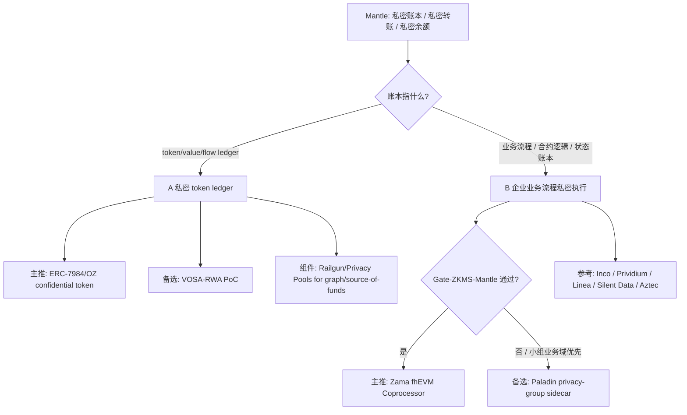
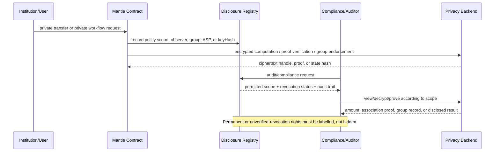

# Mantle 轻量级机构隐私方案策略建议

> 本稿是 WHI-262 横向对比的策略收敛层。它不重新做竞品全集调研，而是把 `cross-comparison/final.md` 与上游 M1 sections 的 verdict 转化为 Mantle 可执行路线。核心边界是：先判断 Mantle 要的是 **A：私密 token ledger**，还是 **B：企业业务流程私密执行**；两者的候选集合、接口、披露机制和生产风险完全不同。

## Executive Summary

### 1. 三需求两约束的决策入口

Mantle 的表述是「私密账本、私密转账、私密余额」，但「私密账本」有二义性。若账本指 token/value ledger，需求是金额、余额、转账图、对手方和资金来源集合；若账本指企业业务账本，需求是 RWA 生命周期、机构间合约、业务状态、合规计算和合约逻辑本身。WHI-262 已把这个分水岭归一为 A/B 分类：A 类候选很多，B 类候选会立即收缩到 FHE/TEE/GC/Privacy-Group/私有 VM 路线。[WHI-262 `cross-comparison/final.md` §Executive Summary/§1.3; WHI-254 `privacy-landscape-framework/final.md` R1-R8 与 A/B ledger 口径]

两条约束同样是硬约束：

- **轻量级 bolt-on**：不引入新链/新 VM、不要求资产桥、不要求 Mantle 方运维完整独立节点/rollup/prover/DA、不要求硬分叉。该口径继承 WHI-254 V1-V4 一票否决。[WHI-254 §5; WHI-262 §2]
- **机构合规-选择性披露**：不是单一 viewing key，而是 authority、trigger、payload、scope、revocability、leakage 六维设计，且要覆盖事前准入、事后审计、审计留痕、范围控制与撤销边界。[WHI-254 §4; WHI-262 §3]

### 2. 最终推荐总表

| 需求分叉 | 主推路径 | 主推成立 gate | 唯一备选 | 不作为主/备的方案 | 不覆盖范围 |
|---|---|---|---|---|---|
| **A 私密 token ledger** | **ERC-7984/OZ Confidential Contracts 作为机构机密代币接口锚点**，优先用 OZ RWA/Observer/Restricted/Hooked/Wrapper 形成合规 token 栈 | Mantle 上可获得可审计的 confidential-token backend；OZ/ACL/Observer/Hooked/RWA 权限日志、历史 ACL 撤销边界、KMS/解密 SLA 和审计通过验证 | **VOSA-RWA**，仅作低风险、封闭机构 PoC / 轻量备选 | Railgun/Privacy Pools 是图隐私/资金来源证明组件，不是本稿的 ledger 备选；ERC-8065/8302/stealth 为观察位 | 不隐藏业务合约逻辑/业务状态；默认不隐藏账户图；不解决 R8 订单流 |
| **B 企业业务流程私密执行** | **Zama fhEVM Coprocessor 路线**，作为条件主推：Mantle 官方支持或 Mantle 自托管 KMS/Gateway/Coprocessor 验证通过时进入主路径 | `Gate-ZKMS-Mantle`：官方 Mantle 支持或自托管 9-of-13 KMS/Gateway/Coprocessor PoC 跑通；商用许可、性能、解密活性、ACL 撤销/审计、OZ RWA/Observer 合规流程通过 | **Paladin privacy-group sidecar（Pente/Noto/Zeto）**，当 Zama gate 失败或企业场景天然是小组域内流程时启用 | Inco 不是本稿备选，列为 watch/conditional alternative；COTI-Coprocessor/Fhenix 因成熟度或合规弱势列观察；Prividium/Linea/Silent Data/Aztec 是参考 | 不默认给公众匿名；Pente 域内成员可见且 N-of-N 扩展受限；R8 仍需另设私有排序/加密 mempool |

该表是本稿对 outline-review guardrail 的落实：**每个分叉只有一个主推和一个备选**。分叉 B 的主推可以被命名 gate 条件化，但不把「避免锁 vendor」变成延迟推荐；若 `Gate-ZKMS-Mantle` 失败，备选明确落到 Paladin，而不是在 Zama/Inco/Paladin 之间继续摇摆。[strategy synthesis]

### 3. 关键策略判断

1. **A 类主推 ERC-7984/OZ，而不是 VOSA 或单独 shielded-pool。** ERC-7984 是更适合机构机密代币的接口锚点：金额/余额以 confidential pointer 表示，OZ 已给出 ObserverAccess、RWA、Restricted、Freezable、Hooked、Wrapper、Omnibus 等合规模块；但它是 value-level token standard，不是业务状态隐私标准，且账户/图默认公开。[WHI-255 `erc7984-confidential-token/final.md` §Executive Summary/§3/§5; WHI-262 §1.3/§5.2]
2. **VOSA 必须降级为备选/PoC。** VOSA 的优点是真轻量、纯合约、合规友好；但其成熟度是论坛草案、单作者、未审计、无已知主网部署，且 exposed-graph 是设计取舍，VOSA-RWA 还引入链下合规服务方信任与链上冻结结构性缺口。因此只能作为低风险机构 PoC，不应作为 Mantle 生产主推。[WHI-256 `vosa-standards/final.md` §1/§4/§5/§6; WHI-262 §5.2/§6.2]
3. **Railgun/Privacy Pools 是 A 类组件，不是 B 类路线。** 它们在交易图、匿名集、PPOI、association set、ragequit 上有价值，特别适合作为资金来源证明和合规集合模板；但 shielded-pool 范式不覆盖 R4 合约逻辑/业务状态。[WHI-260 `zk-shielded-pool/final.md` §Executive Summary/§7; WHI-262 §4/§6.2]
4. **B 类主推 Zama，备选 Paladin。** Zama fhEVM 是 bolt-on 协处理器中同时覆盖 A+B、与 ERC-7984/OZ 合规栈耦合最强的路线；但它不是纯密码学信任模型，而是 **FHE + threshold-MPC KMS + Nitro-TEE 加固** 的混合模型，9-of-13 KMS 解密路径还包含 `<9 节点不可解密` 的活性假设与 `≤1/3 Byzantine` 的容错前提。其主推成立的真实前提是 Mantle 支持或自托管全栈可行，并且 Mantle 接受上述 KMS/TEE/活性假设。Paladin 是备选，因为 Pente 提供 privacy group 内的私有 Solidity/EVM 业务状态执行，sidecar 路线贴近 Mantle 轻量目标，且不依赖等待 Zama 官方链支持；代价是组织/notary 信任、域内可见和 N-of-N 扩展性。[WHI-258 `confidential-coprocessor/final.md` §1.4/§7.3; WHI-261 `eea-enterprise-benchmark/final.md` §2/§7; WHI-262 §5.2/§6.2]
5. **Inco 是 watch/conditional alternative，不是本稿 B 备选。** Inco Lightning 已有 Base 主网信号、低延迟 TEE 和 delegated viewing/compliance narrative，但当前 Mantle 支持缺口、TEE 硬件信任与 force-exit/liveness gap 使其不宜在本稿中替代 Paladin 成为唯一备选。Zama 优于 Inco 的理由不应写成「纯密码学 vs TEE」的简单二分，而是：Zama 以 FHE 保护计算语义，并以 threshold-MPC + Nitro-TEE KMS 管理解密；Inco 当前生产路径则以 Intel TDX TEE 作为核心执行信任根。若未来 Mantle/Inco 官方支持和 TEE 风险接受度明确，可在下一轮决策中重新竞争 B 主推或备选。[WHI-258 §1.4/§2/§7.4; strategy synthesis]

## Item Findings

### item-1: 三需求两约束与「隐私账本」二义分叉基准

#### 1.1 三项需求的拆解

| 用户短语 | A: 私密 token ledger 解释 | B: 企业业务流程私密执行解释 | 典型误判 |
|---|---|---|---|
| 私密账本 | token 持仓、转账金额、资金流、note/commitment、合规集合 | RWA 生命周期状态、订单簿策略状态、机构间合同履约状态、授信/清算/风控计算 | 把 Privacy Pools 或 VOSA 当作业务状态隐私 |
| 私密转账 | 转账金额、收款方、交易图、资金来源证明 | 私有业务动作触发的结算或状态迁移 | 只看 token transfer API，忽略状态机 |
| 私密余额 | 账户余额或 note balance 加密 | 业务状态变量、敞口、净额、清算义务、合规中间结果 | 把 confidential balance 等同 private contract state |

A 类的核心数据维度是 R1/R2/R3/R5/R6/R7：金额、余额、对手方、图结构、合规可审计、选择性披露。B 类的门槛是 R4：业务逻辑/合约状态隐私。R8 订单流/MEV 是另一条线，现有主候选基本不覆盖，需要私有排序、encrypted mempool 或 sequencer-side 设计另开议题。[WHI-254 §2/§3; WHI-257 `privacy-eips-survey/final.md` §6; WHI-262 §4]

#### 1.2 决策树基准

若 Mantle 问题被限定为「发行/流通机构 token，但隐藏余额与金额」，推荐进入 A。若问题包含「RWA 合同生命周期、机构业务状态、业务规则/合规计算不对公众或 operator 暴露」，必须进入 B。这个分叉应发生在所有 vendor pitch 之前。[strategy synthesis]



### item-2: 分叉 A — 私密 token ledger 路线推荐

#### 2.1 分叉 A 的推荐结论

**主推：ERC-7984/OZ Confidential Contracts。** 推荐把 ERC-7984 作为 Mantle 机构机密代币的接口锚点，而不是把 ZK pool、VOSA 或 stealth 地址作为 token ledger 主接口。原因有四点：

1. 它正面覆盖 A 类核心的金额与余额：ERC-7984 将 amount/balance 表示为 `bytes32` confidential pointer，OZ 参考实现以 Zama fhEVM `euint64` 具象化。[WHI-255 §1/§2]
2. 它更接近机构/RWA 控制面：OZ 扩展提供 ObserverAccess、RWA、Restricted、Freezable、Hooked、Wrapper、Omnibus 等模块，能表达审计员、agent、冻结、强制合规动作、ERC-20 wrap/unwrap 等机构需求。[WHI-255 §3]
3. 它和分叉 B 主推 Zama 能形成技术连续性：若 Mantle 未来通过 Zama gate，A 的 token standard 与 B 的私有执行 backend 可以复用 FHE/ACL/KMS 能力。[WHI-258 §1/§7.3; strategy synthesis]
4. 它比 VOSA 更接近可审计工程栈，也比单独 shielded-pool 更适合 account-based institutional token ledger。[WHI-262 §5.2/§6.2]

**唯一备选：VOSA-RWA。** VOSA-RWA 作为备选的适用条件非常窄：封闭机构试点、资金规模低、明确接受 exposed-graph、明确接受链下合规服务方签发 attestation 的信任模型、允许先做内部 PoC 而非生产承诺。它的优势是纯合约、轻量、合规门控原生；缺点是未审计、单作者、论坛草案、无已知生产部署、性能作者声称未复现、链上冻结/forced transfer 结构性缺口。[WHI-256 §1/§4/§5/§6]

Railgun/Privacy Pools 不列为 A 的唯一备选，是因为它们更像 **source-of-funds / graph privacy component**。当 Mantle 的 A 类需求强调匿名集、资金来源证明或合规集合时，应把 Privacy Pools association set 或 Railgun PPOI 作为组件接到 token/treasury/withdrawal 流程，而不是让 pool 单独承担机构 token ledger 主接口。[WHI-260 §2/§3/§7; WHI-262 §6.2; strategy synthesis]

#### 2.2 A 类路线对比矩阵

| 路线 | 覆盖 | 合规披露 | 轻量性 | 成熟度/工程证据 | 推荐角色 | 关键风险 |
|---|---|---|---|---|---|---|
| ERC-7984/OZ | R1/R2 强；R3/R5 默认弱；R4 标准本体不覆盖 | ObserverAccess、AmountDisclosed、RWA agent、Restricted/Freezable/Hooked | 标准/合约轻；若用 fhEVM backend 则依赖 coprocessor/Gateway/KMS | Draft + OZ reference implementation；FHE backend 最具体 | **A 主推** | ACL 历史撤销未验证；Hooked grant 卸载后持久；operator 无限授权期；KMS/解密 SLA |
| Railgun | R1/R2/R3/R5 强；R4 无 | viewing key + PPOI 排除证明 | EVM 合约套件，架构轻 | production、多审计、多链 | component | viewing key 不可撤销；PPOI 仅排除；未部署 Mantle |
| Privacy Pools | R5/R6/R7 强；R1/R2 不按账户余额模型；R4 无 | association set + ASP + ragequit | EVM 合约套件，架构轻 | early production、匿名集较小、单审计信号 | component | ASP 当前半许可；证明栈部分待核；ragequit 放弃隐私 |
| VOSA-RWA | R1/R2；R3 通过 stealth；R5 故意暴露；R4 无 | compliance-gated attestation + auditor memo | 纯合约，非常轻 | Concept/Pre-pilot | **A 备选/PoC** | 单作者未审计；链下合规服务信任；freeze/forcedTransfer 缺口；性能未复现 |
| ERC-8065/8302/stealth | 值级 wrapper / native private token / 收款方匿名 | 继承底层或内置 blacklist，碎片化 | 纯合约 | Draft/Open PR/Final primitive | watch / supplement | 标准未定、生态弱；stealth 不保护金额/余额 |

#### 2.3 A 类集成建议

1. **A0: 先做 ERC-7984/OZ 架构 PoC。** 在 Mantle testnet 上部署 confidential token shell、ObserverAccess/RWA/Restricted/Wrapper 最小组合；如果 Zama official Mantle support 不可用，则先以 mock backend 或外链测试环境证明接口和合规流程。[strategy synthesis]
2. **A1: 把 ACL/披露日志做成上线 gate。** 不要只验证 transfer 成功；必须验证 observer set/remove、AmountDisclosed、agent action、hook install/uninstall、ACL grant 留痕、历史访问权边界。[WHI-255 §3/§5; strategy synthesis]
3. **A2: 引入 Privacy Pools/Railgun 作为资金来源组件。** 对机构入金/出金、treasury withdrawal、合规证明可选接 association-set/PPOI，而不是把它们作为 RWA token 主接口。[WHI-260 §3/§7; WHI-262 §3]
4. **A3: VOSA-RWA 只做封闭 PoC。** PoC 目标应是验证「合规服务 attestation + exposed graph 的监管可接受性」，不是验证生产隐私强度。[WHI-256 §4/§6; strategy synthesis]

### item-3: 分叉 B — 企业业务流程私密执行路线推荐

#### 3.1 为什么 A 类方案不足以覆盖 B

shielded-pool、VOSA、ERC-8065、stealth 地址和 ERC-7984 标准本体都以 token/value/flow 为中心。它们可以隐藏金额、余额、note 所属、收款地址或资金来源集合；但企业业务流程隐私要求隐藏或私有执行合约代码路径、业务状态变量、RWA 生命周期状态、合规中间结果、机构间 netting/settlement 规则。按 WHI-254/WHI-262，只有覆盖 R4 的方案才进入 B。[WHI-254 §2/§6; WHI-257 §7.4; WHI-260 §7; WHI-262 §4/§6.2]

因此：

- **VOSA 不足**：它是值级隐私原语，且转账图公开；VOSA-RWA 合规 gate 不等于私有业务状态执行。[WHI-256 §2/§4]
- **shielded-pool 不足**：Railgun/Privacy Pools 隐藏 note/flow，但不运行私有业务合约。[WHI-260 §7]
- **ERC-7984 本体不足**：它是 confidential fungible token standard；底层 fhEVM 可做更广泛私有计算，但 ERC-7984 不是 private smart-contract execution standard。[WHI-255 §2.5/§5]

#### 3.2 B 类主推：Zama fhEVM Coprocessor

**主推条件化为 Zama fhEVM Coprocessor，gate 名称为 `Gate-ZKMS-Mantle`。** Zama 是 B 类主推，因为它在 bolt-on 协处理器家族中同时具备：

- FHE/TFHE + threshold-MPC KMS + Nitro-TEE 加固的混合路线，可隐藏任意合约状态和比较/条件结果，覆盖 R4；但 KMS 解密要求 13 个 MPC 节点中至少 9 个参与，隐含 `<9 节点不可解密` 的活性风险和 `≤1/3 Byzantine` 容错前提。[WHI-258 §1.4/§3]
- 和 ERC-7984/OZ 的工程耦合最强，便于 A token ledger 与 B business-state privacy 统一到同一 FHE/ACL/Gateway/KMS 体系。[WHI-255 §2/§3; WHI-258 §5]
- 相比 Fhenix/COTI-Coprocessor，成熟度和合规生态证据更强；相比 Inco 当前 TEE-first 路线，Zama 把执行语义放在 FHE 上、把解密治理放在 threshold-MPC + Nitro-TEE KMS 上，信任边界更可拆分，但不是无硬件/无活性假设的纯密码学方案。[WHI-258 §1.4/§7; WHI-262 §5.2; strategy synthesis]

但这个主推不能无条件上线。Zama 当前路径对 Mantle 的成立条件是：

| Gate | 必须验证的事实 | 未通过时的动作 |
|---|---|---|
| `Gate-ZKMS-Mantle-1` | Zama 官方支持 Mantle host chain，或 Mantle 可接受自托管 Coprocessor + Gateway + 9-of-13 KMS + Nitro Enclave 全栈 | 进入 Paladin 备选，不等待 vendor indefinite roadmap |
| `Gate-ZKMS-Mantle-2` | 商用许可、运维 SLA、KMS operator decentralization、Gateway 可用性、解密延迟满足机构用例 | 进入 Paladin 或缩小到 A-only token pilot |
| `Gate-ZKMS-Mantle-3` | FHE ACL 撤销、ObserverAccess、Hooked module grant、RWA agent 权限有审计留痕和治理补偿 | 禁止生产合规 token，只保留 testnet |
| `Gate-ZKMS-Mantle-4` | 性能能支撑目标业务流程，不把 FHE 用在高频/大状态循环上 | 业务流程重构为小状态、批处理或 Paladin 小组域 |

#### 3.3 B 类唯一备选：Paladin privacy-group sidecar

**备选是 Paladin privacy-group sidecar，不是 Inco。** Paladin 的 Pente 在 privacy group 内实例化 ephemeral EVM，私有执行 Solidity 逻辑并把 state hash / proof / endorsement 锚定到宿主 EVM；Noto/Zeto 可覆盖 token/value 隐私，Pente 覆盖 B 类业务流程隐私。[WHI-261 §2; Paladin reused sources as cited by WHI-261]

Paladin 作为备选的适用条件：

- 业务天然发生在少数明确机构成员之间，愿意接受 privacy domain 内成员可见。
- 流程更像 RWA 生命周期、双边/多边结算、DVP、内部机构账本，而不是公众 DeFi 大规模匿名。
- Mantle 不想等待 Zama 官方支持，也不想承担自托管 KMS/Gateway/Coprocessor 的运维重量。
- 机构愿意治理 notary/endorsement/N-of-N liveness 风险，并能把域成员管理、审计日志和 dispute process 写入运营流程。[WHI-261 §2/§7]

Paladin 的边界同样必须明确：notary/组织信任强；Pente N-of-N 背书对 2-10 人小组适合，对大规模动态成员不适合；privacy group 内可见不是公众匿名；Zeto/Groth16 电路带 trusted setup 与升级成本；sidecar 运维虽不等于全节点，但不是纯合约零运维。[WHI-261 §2/§7]

#### 3.4 B 类候选/参考矩阵

| 方案 | R4 能力 | 信任模型 | Mantle 部署重量 | 推荐角色 | 为什么不是本稿主/备 |
|---|---|---|---|---|---|
| Zama fhEVM | 强，任意加密状态/逻辑 | FHE + MPC KMS + Nitro/Org | Coprocessor 轻量，但 Mantle 支持或自托管全栈是 gate | **B 主推** | gate 未通过前不能生产 |
| Paladin | 部分到强，Pente 域内私有 EVM | Privacy group + notary/org + ZK | sidecar 轻~中 | **B 备选** | 适用小组/机构域，不是公众匿名 |
| Inco Lightning | 强，TEE 机密层 | Intel TDX + TEE quorum | 仅 Base 主网；Mantle 需扩展 | watch / conditional alternative | TEE 信任、force-exit/liveness、Mantle support gap；为避免多备选，本稿不列为备选 |
| Fhenix CoFHE | 强，但主网/合规证据弱 | FHE + EigenLayer economic | Coprocessor 轻 | watch | 主网状态/合规细节/经济安全成熟度不足 |
| COTI-Coprocessor | 部分 R4 announced | GC + org/Axelar | 架构轻 | watch | Pilot，multichain 能力未独立验证，合规 revocability/audit gap |
| Prividium | 完全 B | ZK Stack + RBAC/operator | 独立 permissioned L2，一票否决 | reference | 合规向量最完整，但非 Mantle bolt-on |
| Linea Enterprise | 状态级 B | validium + permissioned operator | 独立 validium，一票否决 | reference | 状态级范式参考，非 bolt-on |
| Silent Data | 完全 B，TEE full execution | TEE hardware | 独立 TEE L2，一票否决 | reference | TEE 模型可借鉴，部署不轻 |
| Aztec | 密码学级 A+B 上界 | Cryptographic ZK/PXE | 独立非 EVM L2，一票否决 | reference | 隐私最高但非 EVM、非 bolt-on、Alpha 风险 |

### item-4: 接口策略 — ERC-7984 vs VOSA 与观察位标准

#### 4.1 主接口策略

Mantle 应把 **ERC-7984** 定位为机构 confidential token 的主接口锚点。理由不是「它已经解决所有隐私」，而是它给 account-based confidential fungible token 提供了最完整接口和最具体的 OZ 合规实现生态：metadata、ERC-165、confidential transfers、operator、AmountDisclosed、RWA/Observer/Wrapper 等扩展。[WHI-255 §1/§4/§5]

同时必须把「接口」和「后端」分开：

- ERC-7984 规范本体是机制中立 pointer standard，不自动提供 FHE、ZK、TEE 或 KMS。[WHI-255 §2]
- OZ 参考实现当前最具体地绑定 Zama fhEVM；采用它意味着进入 FHE SDK、ACL、Gateway、KMS、coprocessor 运维体系。[WHI-255 §2.3; WHI-258 §1]
- 若 Mantle 只做 A token ledger，可以先围绕 ERC-7984/OZ token interface 和合规模块做 PoC；若进入 B，需要 Zama gate 或其他 R4 backend。[strategy synthesis]

#### 4.2 VOSA 定位

VOSA/VOSA-RWA 定位为 **轻量 PoC / 备选，不是主推接口标准**。原因包括：论坛草案、单作者、未审计、无已知主网部署、VOSA-RWA 零回复、性能/约束为作者声称、keyHash 标识合规服务方而非用户、链上不证明双方 KYC、转账图 exposed by design。[WHI-256 §1/§4/§6]

VOSA 的正确用途是回答一个非常具体的问题：机构是否接受「金额隐藏但转账图公开 + 链下合规服务签发 attestation」这种轻量合规隐私。如果答案是 yes，可以做封闭 PoC；如果目标是生产级机密 token 标准，仍应回到 ERC-7984/OZ。[strategy synthesis]

#### 4.3 观察位标准

| 标准/提案 | Mantle 策略位 | 原因 |
|---|---|---|
| ERC-7945 | observe | 最小 confidential token surface；实现生态弱于 ERC-7984/OZ |
| ERC-5564/6538 | supplement | 收款方匿名/stealth 基础原语；不保护金额/余额 |
| ERC-8065 | observe/component | ZK wrapper 可为现有 ERC-20 加值级隐私；不覆盖 R4，合规弱 |
| ERC-8302/pERC-20 | observe | native private token open PR；接口未定，生态早 |
| EIP-8182 | reference | 协议层 unified pool，不适合 Mantle bolt-on，但 commitment/nullifier 架构可参考 |
| EIP-8105 | separate track | R8 encrypted mempool / anti-MEV，交易最终解密，非持久隐私；需另议私有排序 |

### item-5: 选择性披露落地设计

#### 5.1 披露设计总原则

Mantle 的机构披露不应被简化成「给监管 viewing key」。应组合四层：

1. **事前准入**：KYC/allowlist/issuer policy/compliance gate。
2. **事中控制**：restricted transfer、operator expiry、RWA agent、privacy group endorsement。
3. **事后审计**：observer ACL、AmountDisclosed、auditable-log、association-set proof、domain notary log。
4. **撤销与最小披露补偿**：明确哪些 access 是 future-only revocation，哪些是 permanent，哪些必须用密钥轮换、域重建或审计流程补偿。[WHI-254 §4; WHI-262 §3]

#### 5.2 A 类 token ledger 披露组合

| 机制 | Authority | Trigger | Payload | Scope | Revocability | Leakage / 风险 | Mantle 用法 |
|---|---|---|---|---|---|---|---|
| ERC-7984 ObserverAccess | account/user 或 issuer policy | automatic / transfer update | balance + transfer amount handle | per-account | future-only；historical ACL revocation unverified | 地址/图/时序仍公开；observer 可能长期可见 | 机构审计员/会计/托管方持续观察 |
| ERC-7984 RWA/Restricted/Freezable | issuer admin/agent | compliance action | mint/burn/freeze/block/force-transfer amount | token/admin domain | role revocation future-only；强 admin 信任 | issuer 权限强，需多签/事件审计 | RWA 发行与监管动作 |
| ERC-7984 Hooked | token admin/module | pre/post transfer | worst-case any token-accessible handle | per-token/global | module uninstall 不撤销已授 ACL grant | module 越权面最大 | 仅在审计后用于强合规 hook |
| Railgun viewing key | key-holder | viewing-key share | all wallet history | wallet/account | permanent | 不可撤销，全历史/未来可见 | 税务/审计披露，但不作最小披露主路径 |
| Railgun PPOI | smart-contract/list provider | shield/deposit | exclusion proof | per-deposit | list 更新依赖 provider | 仅证明不在坏名单 | 入金排除证明 |
| Privacy Pools association set | ASP + user proof | withdrawal | membership/non-membership proof | association set | ASP 可撤销批准；ragequit 公开退出 | ASP 半许可；ragequit 泄露 | 资金来源/合规集合证明模板 |
| VOSA-RWA attestation | compliance service + module owner | per operation | service approval + transaction conservation proof | per-operation/context | keyHash 可停用 future approvals | exposed graph；服务方信任 | 封闭 PoC 的轻量合规 gate |

#### 5.3 B 类 business-state 披露组合

| 机制 | Authority | Trigger | Payload | Scope | Revocability | Leakage / 风险 | Mantle 用法 |
|---|---|---|---|---|---|---|---|
| Zama ACL / public decrypt / re-encrypt | contract, key-holder, observer, regulator | on-chain request / automatic / viewing share | encrypted handle value or decrypted result | per-tx / per-account / per-contract | ACL revoke unverified；persistent grants risk | 地址/tx graph 可见；KMS/Gateway metadata | 私有业务状态结果披露、审计抽样、监管解密 |
| Zama/OZ RWA + Observer | issuer/admin + observer | business event / compliance action | token amount + business-linked token state | per-account/token | future-only + historical gap | 强 issuer 权限 | A+B 一体化 RWA 流程 |
| Paladin privacy group | group members + notary/endorsement | transaction assembly / endorsement | domain state, notary view, commitments/proofs | domain-wide / group | domain membership 重建才可等效撤销 | 域内成员可见；N-of-N liveness | 私有 RWA 生命周期、DVP、多机构流程 |
| Prividium reference | regulator/operator/RBAC | audit request / compliance gate | all or filtered transaction/business data | per-contract/domain | IAM/RBAC 等效撤销 | operator 可见；非 bolt-on | 借鉴 regulator + auditable-log |
| Silent Data/Inco TEE reference | TEE policy/regulator | callback / audit request | enclave-computed result/state | contract/enclave | unverified | hardware side-channel/liveness | 若未来 TEE 路线，需链上 attestation |

#### 5.4 Mantle 披露落地建议

1. **统一 Disclosure Registry。** 无论 A/B，Mantle 应登记 observer、auditor、agent、compliance service、privacy group、ASP 的授权事件、scope、expiry、payload class 和 revocation status。[strategy synthesis]
2. **把永久/不可撤销 access 做成显式风险标签。** Railgun viewing key、OZ Observer historical handle、Hooked module grant、FHE ACL persistent allow 都不能被写成普通可撤销披露。[WHI-255 §3; WHI-258 §5; WHI-260 §2]
3. **将 association set 作为合规证明模板。** 即便主 token 走 ERC-7984，Privacy Pools 的 association-set/ASP/ragequit 仍可启发 Mantle 的入金/出金合规证明设计。[WHI-260 §3; strategy synthesis]
4. **privacy group 不等于 viewing key。** Paladin 的披露是域内成员/notary 可见、域外隐藏，更适合企业流程，不适合公共匿名 token 流动性场景。[WHI-261 §2]

### item-6: 集成路径、里程碑、关键风险与待验证项

#### 6.1 集成路径草图

```mermaid
timeline
    title Mantle 隐私方案集成路径
    section Phase 0: 决策准备
      A/B 需求确认 : token ledger vs business-state ledger
      合规角色建模 : issuer auditor regulator ASP privacy-group member
    section Phase 1: A 类 PoC
      ERC-7984/OZ testnet token : Observer/RWA/Restricted/Wrapper/AmountDisclosed
      VOSA-RWA sealed PoC : exposed-graph + compliance service attestation acceptance test
      Association-set lab : Privacy Pools / PPOI source-of-funds template
    section Phase 2: B 类 Gate
      Gate-ZKMS-Mantle : Zama official support or self-hosted KMS/Gateway/Coprocessor validation
      Paladin sidecar PoC : Pente private workflow + Noto/Zeto settlement domain
    section Phase 3: Institutional Pilot
      Limited issuers : capped assets / capped users / manual compliance review
      Disclosure Registry : ACL/viewing/association/privacy-group audit trail
    section Phase 4: Production Gate
      Audit + performance : contract audit / backend SLA / liveness / revocation policy
      Risk acceptance : governance signoff / incident plan / R8 separate roadmap
```

#### 6.2 里程碑与 go/no-go

| Milestone | 目标 | Go 条件 | No-go 条件 |
|---|---|---|---|
| M0 A/B Scope Freeze | 确定是否只做 A，还是进入 B | 用例逐条映射 R1/R2/R3/R4/R5/R6/R7/R8 | 「隐私账本」仍未定义清楚 |
| M1 ERC-7984/OZ A-PoC | 跑通 confidential token + compliance modules | Observer/RWA/Wrapper/Restricted/AmountDisclosed 可审计；ACL 风险登记 | 无法解释历史 ACL/Hooked grant 风险 |
| M2 VOSA-RWA PoC | 验证轻量合规备选 | 合规团队接受 exposed-graph + 服务方信任 | 试图把 VOSA 升级为 production main route |
| M3 Privacy Pools/Railgun component lab | 验证资金来源证明组件 | association-set/PPOI 可被合规流程消费 | 把 pool 误当 B 类业务状态隐私 |
| M4 Zama Gate | 验证 B 主推成立 | Mantle support/self-host full stack、KMS SLA、license、performance、ACL audit 全部通过 | 任一关键项失败且无 mitigation |
| M5 Paladin Backup PoC | 验证 B 备选可落地 | 小组域业务流程、Pente/Noto/Zeto、notary governance、liveness plan 通过 | 动态大规模成员或公众匿名需求 |
| M6 Institutional Pilot | 限量机构试点 | capped volume + audit + incident plan + disclosure registry | 未审计、无 SLA、无合规 runbook |

#### 6.3 风险清单

| 风险 | 影响 | 关联路线 | 验证动作 |
|---|---|---|---|
| Mantle 上 Zama 官方支持缺失 | B 主推无法轻量落地 | Zama | 与 Zama 确认 chain support；评估 self-host 全栈成本 |
| 自托管 KMS/Gateway/Coprocessor 过重 | 轻量约束被破坏 | Zama | 量化 operator、Nitro、L1/KMS、SLA、成本 |
| FHE ACL 撤销与 Hooked grant 持久性 | 合规/隐私最小化风险 | ERC-7984/OZ/Zama | 源码/测试验证 allow/disallow、历史访问、事件日志 |
| VOSA 未审计/单作者/性能未复现 | 生产安全不可接受 | VOSA-RWA | 只做 PoC；审计前不生产 |
| VOSA-RWA 链下合规服务信任 | 合规证明中心化 | VOSA-RWA | 多签 owner、服务方准入/撤销、context replay test |
| Railgun viewing key 不可撤销 | 审计披露过宽 | Railgun | 仅用于明确接受永久披露的场景 |
| Privacy Pools ASP 半许可与证明栈 gap | 合规集合治理风险 | Privacy Pools | 核查 production proof stack、多 ASP 计划、ASP 审计 |
| Paladin notary/N-of-N/domain-membership | liveness 与扩展性约束 | Paladin | 用 2-10 成员流程试点；制定成员离线和域重建流程 |
| Inco TEE force-exit/liveness | 资金恢复与可用性风险 | Inco watch | 向 Inco 确认 escape hatch；硬件/side-channel 风险评估 |
| Fhenix/COTI 成熟度不足 | 交付风险 | watch | 等待生产部署、审计和合规文档 |
| Prividium/Linea/Silent/Aztec 独立链属性 | 不符合轻量约束 | reference | 只借鉴 RBAC/audit/private-state/TEE/PXE 概念 |
| R8 订单流隐私缺口 | MEV/策略泄露仍存在 | all | 单独研究 private sequencing / encrypted mempool / orderflow |

### item-7: 两类需求的 1 主推 + 1 备选总结

#### 7.1 A 私密 token ledger

| Recommendation | Path | Applicability | Why it wins | Does not cover | Next validation |
|---|---|---|---|---|---|
| **Primary** | **ERC-7984/OZ confidential token stack** | 机构/RWA token 需要金额、余额、发行人合规动作、审计观察、ERC-20 wrap/unwrap | 接口最完整、OZ 合规扩展最具体、可与 Zama/FHE backend 连续 | 默认账户/图公开；不隐藏业务逻辑/状态；R8 无 | Mantle backend、ACL/Observer/Hooked audit、KMS/decrypt SLA |
| **Backup** | **VOSA-RWA sealed PoC** | 封闭机构试点，接受 exposed graph 与链下合规服务信任，优先极轻部署 | 纯合约、合规门控清晰、成本低 | 不适合 production；不隐藏图；不解决 R4；freeze/forced transfer 弱 | 审计前只 PoC；复现 proof/gas；合规服务治理 |

Privacy Pools/Railgun 在 A 中的策略位是 **component**：当 Mantle 要增强 source-of-funds、匿名集或合规集合证明时引入，但不替代 ERC-7984/OZ 作为机构 confidential token 主接口，也不替代 VOSA-RWA 作为唯一轻量备选。[strategy synthesis]

#### 7.2 B 企业业务流程私密执行

| Recommendation | Path | Applicability | Why it wins | Does not cover | Next validation |
|---|---|---|---|---|---|
| **Primary** | **Zama fhEVM Coprocessor, conditional on `Gate-ZKMS-Mantle`** | Mantle 希望在 EVM/Solidity 语境中做私有业务状态、RWA 生命周期、合规计算，且能获得官方支持或接受自托管全栈 | 覆盖 R4；与 ERC-7984/OZ 合规 token 栈最连续；FHE 执行语义 + threshold-MPC/Nitro-TEE KMS 的边界比 Inco 当前 TEE-first 执行信任根更可拆分 | 不隐藏地址/图；性能有限；KMS/Gateway/ACL 是重风险；9-of-13 解密活性和 ≤1/3 Byzantine 假设必须接受 | 官方 Mantle support/self-host PoC、license、SLA、ACL audit、performance、KMS liveness/fault model |
| **Backup** | **Paladin privacy-group sidecar** | 小组机构域、RWA/DVP/多方流程、明确成员与 notary governance，或 Zama gate 失败 | 提供 Pente 私有 EVM 业务状态；sidecar 贴近轻量约束；不等待 Zama chain support | 域内可见；notary/org trust；N-of-N 扩展受限；公众匿名弱 | 2-10 成员业务 PoC、notary governance、liveness、域重建/审计日志 |

Inco、Fhenix、COTI-Coprocessor、Prividium、Linea、Silent Data、Aztec 的角色保持为 watch/reference，不进入本稿「唯一备选」槽位。这样做的原因不是否定它们的价值，而是把 Mantle 当前策略从 vendor list 收敛成可执行路线：B 的 primary 是 Zama，backup 是 Paladin。[strategy synthesis]

## Diagrams

### diag-1: 需求分叉决策树

见 item-1 §1.2 的 Mermaid 决策树。该图可在 TW 阶段转成正式报告图。

### diag-2: 分叉 A 路线对比矩阵

```text
+----------------------+-------------+-------------------------+--------------------+----------------------+
| Route                | Role        | Best for                | Main disclosure    | Hard boundary        |
+----------------------+-------------+-------------------------+--------------------+----------------------+
| ERC-7984/OZ          | PRIMARY     | institutional token     | Observer/RWA ACL   | no R4, graph public  |
| VOSA-RWA             | BACKUP/PoC  | sealed lightweight PoC  | compliance service | unaudited, graph open|
| Railgun              | COMPONENT   | mature graph privacy    | view key + PPOI    | no R4, key permanent |
| Privacy Pools        | COMPONENT   | source-of-funds proof   | association set    | no R4, ASP risk      |
| ERC-8065/8302/5564   | WATCH/SUPP  | wrappers/stealth/native | fragmented         | not main interface   |
+----------------------+-------------+-------------------------+--------------------+----------------------+
```

### diag-3: 分叉 B 路线对比矩阵

```text
+----------------------+-------------+-------------------------+--------------------+----------------------+
| Route                | Role        | R4 capability           | Trust model        | Mantle caveat        |
+----------------------+-------------+-------------------------+--------------------+----------------------+
| Zama fhEVM           | PRIMARY     | strong encrypted state  | FHE+MPC KMS+Nitro  | support/self-host gate|
| Paladin sidecar      | BACKUP      | Pente private EVM       | privacy group+org  | small group/liveness |
| Inco Lightning       | WATCH       | TEE confidential layer  | Intel TDX          | Base-only + TEE risk |
| Fhenix CoFHE         | WATCH       | FHE coprocessor         | FHE+EigenLayer     | maturity/compliance  |
| COTI-Coprocessor     | WATCH       | partial announced       | GC+org/Axelar      | pilot/unverified     |
| Prividium/Linea/etc. | REFERENCE   | strong state privacy    | hybrid/operator    | independent chain    |
| Aztec                | REFERENCE   | cryptographic upper bnd | ZK/PXE             | non-EVM alpha chain  |
+----------------------+-------------+-------------------------+--------------------+----------------------+
```

### diag-4: 选择性披露组合流程



### diag-5: 集成路径时间线

见 item-6 §6.1 的 Mermaid timeline。

### diag-6: 最终 1 主推 + 1 备选表

```text
+--------+-----------------------------------+----------------------------------+-----------------------------------+
| Fork   | Primary                           | Primary gate                     | Backup                           |
+--------+-----------------------------------+----------------------------------+-----------------------------------+
| A      | ERC-7984/OZ confidential token    | backend + ACL/audit validation   | VOSA-RWA sealed PoC              |
| B      | Zama fhEVM Coprocessor            | Gate-ZKMS-Mantle                 | Paladin privacy-group sidecar    |
+--------+-----------------------------------+----------------------------------+-----------------------------------+
```

## Source Coverage

| Source requirement | Status | Coverage |
|---|---|---|
| `src-1 upstream_synthesis` | satisfied | WHI-262 `cross-comparison/final.md` is the main anchor for A/B classification, compliance taxonomy, primitive matrix and Mantle verdicts. |
| `src-2 framework` | satisfied | WHI-254 `privacy-landscape-framework/final.md` supplies R1-R8, V1-V4 lightweight gates, A/B ledger definition and six-dimensional disclosure vector. |
| `src-3 upstream_sections` | satisfied | Covered ERC-7984, VOSA, privacy EIPs, confidential coprocessor, Aztec, ZK shielded-pool, and EEA enterprise benchmark final.md artifacts. |
| `src-4 standard_interface_sources` | satisfied | Interface strategy explicitly cites ERC-7984/OZ and VOSA; VOSA is marked single-author, unaudited, forum draft, Concept/Pre-pilot. |
| `src-5 enterprise_disclosure_sources` | satisfied | Disclosure design covers ERC-7984/OZ, Railgun/Privacy Pools, Paladin/EEA, Zama/Inco/Fhenix family references. |
| `src-6 validation_backlog` | satisfied | Gap Analysis and item-6 list external confirmations still needed: Mantle support, KMS/TEE, proof stack, ACL revocation, audits, R8. |

### Artifact Trace Table

| Artifact | Used for |
|---|---|
| `evm-privacy-research/research-sections/cross-comparison/final.md` | Primary synthesis, candidate verdicts, A/B split, compliance taxonomy |
| `evm-privacy-research/research-sections/privacy-landscape-framework/final.md` | R1-R8, lightweight gates, six-dimensional disclosure vector |
| `evm-privacy-research/research-sections/erc7984-confidential-token/final.md` | ERC-7984/OZ interface, Observer/RWA/Hooked/ACL risks |
| `evm-privacy-research/research-sections/vosa-standards/final.md` | VOSA/VOSA-RWA PoC positioning, exposed graph, keyHash/service trust |
| `evm-privacy-research/research-sections/privacy-eips-survey/final.md` | ERC-5564/8065/8302/8182/8105 observation positions |
| `evm-privacy-research/research-sections/confidential-coprocessor/final.md` | Zama/Inco/Fhenix capabilities, Mantle support gates, KMS/TEE risks |
| `evm-privacy-research/research-sections/zk-shielded-pool/final.md` | Railgun/Privacy Pools/Tornado lessons, association set, PPOI |
| `evm-privacy-research/research-sections/eea-enterprise-benchmark/final.md` | Paladin, Prividium, Linea, Silent Data, COTI benchmark and R4 matrix |
| `evm-privacy-research/research-sections/zk-privacy-chain-aztec/final.md` | Full-execution cryptographic privacy upper bound and non-bolt-on boundary |

## Gap Analysis

1. **Outline frontmatter remains candidate.** Workflow approval came from Multica review/dispatch comments, not from mutating the outline file. This draft records the approval evidence in frontmatter.
2. **No new external verification in this draft.** All facts are inherited from upstream accepted artifacts at `9c81049`; vendor support and deployment status may change and must be rechecked before production decisions.
3. **Zama Mantle support is the decisive B primary gap.** If official Mantle support is unavailable and self-hosting KMS/Gateway/Coprocessor proves too heavy, B primary falls back to Paladin. This is a named gate, not an unresolved recommendation.
4. **Inco deserves re-evaluation when Mantle support is real.** Current draft does not choose Inco as backup because the guardrail requires one backup and Paladin better covers sidecar fallback today. Future Inco Mantle support plus force-exit proof could change this.
5. **VOSA remains PoC-only.** No audit, single-author forum status, unverified repo/performance, exposed-graph privacy boundary and freeze/forcedTransfer questions are production blockers.
6. **FHE/OZ ACL revocation is a cross-cutting risk.** Observer historical ACL, Hooked grants and generic FHE allow/disallow semantics must be tested and documented before institutional use.
7. **Privacy Pools/Railgun are not business-state privacy.** Their component value is high for source-of-funds and graph privacy; using them as B solutions would be category error.
8. **R8 is not covered by the recommended stacks.** Mantle needs a separate private sequencing / encrypted mempool / orderflow protection workstream if execution strategy privacy is in scope.

## Revision Log

| Round | Date | Action | Notes |
|---|---|---|---|
| 1 | 2026-06-23 | Initial deep draft | Produced from approved outline and WHI-262/M1 final artifacts. Addressed draft-phase guardrail by committing to exactly one primary + one backup per fork: A = ERC-7984/OZ primary + VOSA-RWA backup; B = Zama conditional primary + Paladin backup. |
| final | 2026-06-23 | Promoted approved draft to final | Incorporated the draft-review minor clarification: Zama is described as FHE + threshold-MPC + Nitro-TEE hybrid with 9-of-13 KMS liveness/fault-tolerance assumptions, not pure cryptographic trust; recommendation unchanged. |
