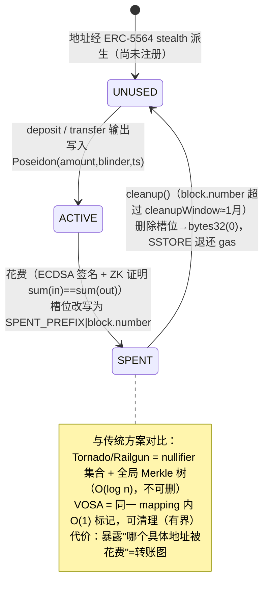
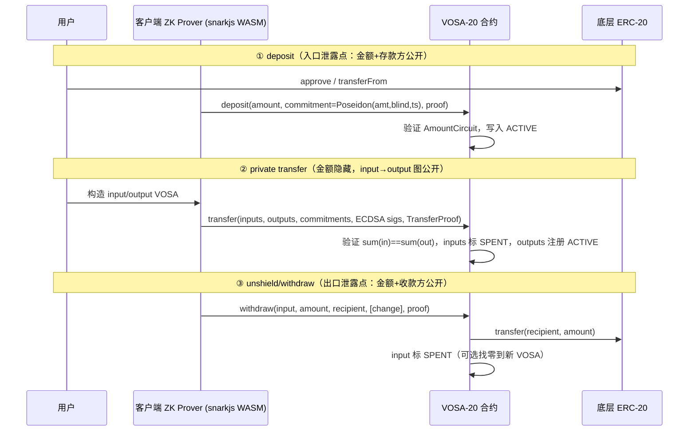
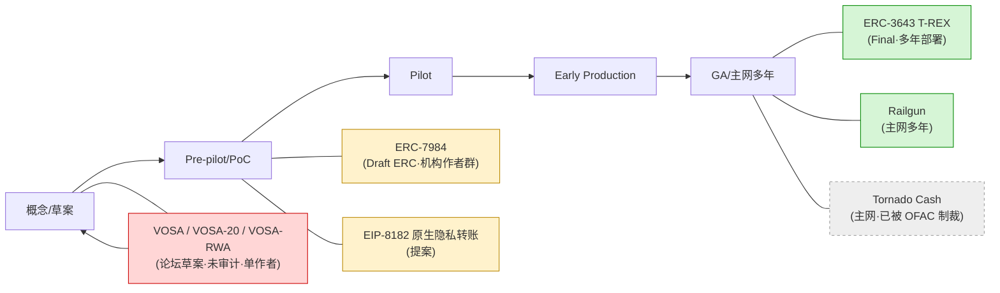

# VOSA 系列标准深度分析（VOSA / VOSA-20 / VOSA-RWA）

> 证据等级标注约定：`[原帖验证]` = 直接来自 VOSA 系列原帖的事实；`[纠偏]` = 与本主题 outline 假设不符、已据原帖修正的结论；`[作者声称]` = 原帖给出但本研究未独立复现的数值/性能声称；`[推论]` = 研究者基于原帖事实的推断；`[研究者分析]` = 研究者独立判断；`[gap]` = 证据不足、需后续核实。所有 web 来源访问日期均为 2026-06-23。

## 1. Executive Summary

VOSA（Virtual One-time Sub-Account）是 ethereum-magicians 论坛上由单一作者 `louisliu2048` 提出的一组隐私代币草案，包含三层：**VOSA 原语**（隐私模式，S1）、**VOSA-20**（隐私包装 ERC-20 标准草案，S2）、**VOSA-RWA**（合规门控 RWA 代币草案，S3）。其设计哲学被作者一句话概括为："a privacy pattern that **trades fund-flow privacy for simplicity and compliance** — UTXO without Merkle trees"`[原帖验证, S1]`。

核心机制（均已对原帖逐项核实）：

- **一次性子账户 + 单一扁平 mapping**：私有余额存放在标准 20 字节 EVM 地址上，每个地址只用一次（UTXO 语义），所有权用标准 ECDSA 签名证明（MetaMask 直接可用）。链上状态是单一 `mapping(address => bytes32) balanceCommitmentHash`：`bytes32(0)`=从未使用，`Poseidon(amount, blinder, timestamp)`=有余额，`SPENT_PREFIX | block.number`=已花费（可清理）`[原帖验证, S1/S2]`。
- **SPENT_MARKER 取代 nullifier + Merkle**：花费时把该地址槽位从 commitment 改写为 `0xDEADDEAD…|block#` 标记，无全局 Merkle 树、无 nullifier 集合。查找/标记 O(1)，状态可有界（epoch cleanup 删除过期 SPENT 槽位）`[原帖验证, S1/S2]`。
- **隐私边界（exposed-graph）**：隐藏金额、余额、（通过 stealth 地址隐藏的）收款方真实身份；**公开转账图**（VOSA→VOSA 的 input→output 连接）、存款方地址、提款收款方。作者明确称"This is NOT a bug — it's designed for compliance-friendly privacy"`[原帖验证, S1]`。
- **VOSA-20**：把上述原语包装成 ERC-20 兼容隐私代币标准（Requires ERC-20 / EIP-712 / ERC-5564），定义 deposit/transfer/withdraw/consolidate 四操作 + Policy/Permit 授权 + 可选 IVOSA20Auditing 审计扩展 + 可选 **Fat Token Mode** + 可选 epoch cleanup`[原帖验证, S2]`。
- **VOSA-RWA**：在 pERC-20（作者的 PrivateERC20 基类）之上叠加**通用合规模块**，把 transfer/mint/burn/consolidate/createPolicy/createPermit 全部 override 为 revert，只保留 `*WithCompliance` 入口；每次操作需**两个独立 Groth16 证明**（合规 attestation 证明 + 交易守恒证明）`[原帖验证, S3]`。

**三处必须强调的纠偏（相对本主题 outline 的假设）**：

1. **Fat Token Mode `[纠偏]`**：不是"把元数据编码进 commitment"，而是**单合约双层架构** —— 同一合约同时持有公开 ERC-20 层与私有 VOSA 层，用户可 `shield()` 把公开余额转入私有、`unshield()` 转回，把隐私做成同一代币上的 opt-in 特性`[原帖验证, S2: "A single contract with both public ERC-20 and private VOSA layers"]`。
2. **keyHash 语义 `[纠偏]`**：VOSA-RWA 的 `keyHash = Poseidon(secret)` 标识的是**被许可的合规服务方**，不是用户。链上 attestation 证明只证明"某个被许可的合规服务方批准了这一笔具体操作（context）"，**并不在链上证明交易双方各自已通过 KYC**。真正的 KYC/AML/制裁名单检查发生在链下合规服务内部。因此这是一个**信任合规服务方**的模型，而非纯密码学无信任合规`[原帖验证, S3]`。
3. **ERC-7984 对照 `[纠偏]`**：ERC-7984（Confidential Fungible Token）是**账户模型 + 指针（pointer）型机密代币**（标准对隐私机制中立 mechanism-agnostic —— `bytes32` 指针不绑定具体技术；FHE 是当前主要参考实现，作者含 Zama / OpenZeppelin），隐藏金额与余额，但**不隐藏转账图**（账户地址公开）。它**不是** shielded pool / 匿名集方案。真正隐藏转账图的对照物是 **Railgun（ZK shielded pool + 匿名集）**`[原帖验证, S5]`。

**成熟度结论（必须如实标注，不可高估）**：三份草案均为**论坛草案、单作者、未审计、无已知主网部署、无同行评议**；VOSA-RWA 帖在访问时**零回复**。所有性能/存储数值均为**作者自测声称**，本研究未独立复现。VOSA 系列在 EEA Readiness 谱上处于 **Concept / Pre-pilot** 阶段，远未达 Early Production`[研究者分析；S1/S2/S3]`。

**对 Mantle 的一句话启示**：VOSA 是一个**真正轻量级**（纯应用层合约、约束数 ~10³、in-browser 可证明、纯 EVM 无协议改动）且**合规取向**的隐私原语 —— 但其"合规友好"建立在**主动暴露转账图** + **信任链下合规服务**两个取舍之上，且当前成熟度只适合**概念验证 / 内部 PoC**，不适合直接作为生产机构隐私方案`[研究者分析]`。

---

## 2. Item Findings

### item-1：VOSA 原语机制深度拆解（critical）

#### 三要素 `[原帖验证, S1]`

| 要素 | 原帖定义 | 含义 |
|------|---------|------|
| **Virtual** | "Addresses exist only as mapping keys, not real EVM accounts" | VOSA 地址只作为合约内 mapping 的键存在，不是真实 EOA，不在全局状态树占常驻账户条目 |
| **One-time** | "Each address used exactly once (like UTXO notes)" | 每个子账户地址只用一次，花费后标记 SPENT |
| **Sub-Account** | "Derived from master key using stealth addresses (ERC-5564)" | 从主密钥经 ERC-5564 stealth 派生 |

#### stealth 派生：复用 ERC-5564（secp256k1），不是 Poseidon stealth `[纠偏]`

VOSA-20 的 Abstract 明确："each private balance lives at a standard 20-byte EVM address … with ownership proven via **standard ECDSA signatures (no custom wallet needed)**"，Backwards Compatibility 段又写"ERC-5564: VOSA addresses follow the stealth address derivation pattern"`[原帖验证, S2]`。ERC-5564（Final，作者含 Vitalik 等）标准化了非交互式 stealth 地址生成，stealth meta-address 含 spending key + viewing key，其首个实现方案基于 **SECP256k1 曲线**`[原帖验证, S4]`。

> **纠偏**：outline 曾假设 VOSA"可能适配 Poseidon 哈希而非 ERC-5564 默认 secp256k1"做 stealth 派生。实际正好相反 —— **stealth 地址派生走标准 ERC-5564/secp256k1（普通 ECDSA 地址），Poseidon 只用于余额承诺**。这是 VOSA "MetaMask 直接可用" 易用性声称的来源。

#### Poseidon 承诺结构 `[原帖验证, S1/S2][纠偏]`

```
commitment = Poseidon(amount, blinder, timestamp)
  - amount:    uint256，MUST < 2^96
  - blinder:   域元素，MUST ≠ 0（CSPRNG 生成）
  - timestamp: uint256，重放保护用（验证落在 ±2 小时窗口内）
Poseidon 参数：t = 3（2 输入 + 1 capacity），RF = 8 full，RP = 57 partial，域 = BN254 Fr
```

> **纠偏**：outline 曾假设 commitment 结构为 `Poseidon(value, owner_pubkey, salt/blinding)`。原帖实际字段是 `(amount, blinder, timestamp)` —— **承诺里不含 owner pubkey**（所有权由地址本身 + ECDSA 签名承载），第三个字段是 timestamp，专门服务于 ±2h 重放窗口校验。

#### 单一扁平 mapping 与状态机 `[原帖验证, S1/S2]`

```
mapping(address => bytes32) balanceCommitmentHash;
//  bytes32(0)                  → UNUSED（从未使用）
//  Poseidon(amt, blind, ts)    → ACTIVE（有余额，承诺隐藏金额）
//  SPENT_PREFIX | block.number → SPENT（已花费，可在配置窗口后删除）

状态机：UNUSED → ACTIVE → SPENT →(cleanup)→ UNUSED
SPENT_PREFIX = 0xDEADDEADDEADDEADDEADDEADDEADDEAD（高 128 位）
MAX_INPUTS = MAX_OUTPUTS = 10（DoS 保护）
```

五种操作 `[原帖验证, S1]`：Deposit（ERC-20 转入→ZK 证明 commitment==Poseidon(amount,blinder,ts)→写入新 VOSA）、Transfer（ECDSA 签名 + ZK 证明 sum(inputs)==sum(outputs)→输入标 SPENT、生成输出）、Withdraw（ECDSA + ZK→标 SPENT、ERC-20 转出）、Consolidate（多 VOSA 合并为一，降低未来 gas）、Cleanup（SPENT 标记内含 block.number，配置窗口（默认约 1 个月）后任何人可调 `cleanup()` 删除过期条目省 gas）。

#### SPENT_MARKER vs nullifier `[原帖验证, S1/S2]`

作者给出的对照（合并 S1 与 S2 两张表）：

| 维度 | 传统 UTXO（Tornado/Railgun）nullifier | VOSA SPENT_MARKER |
|------|--------------------------------------|-------------------|
| 防双花 | nullifier 集合 | SPENT_MARKER（写入同一槽位） |
| 电路复杂度 | 高（含 Merkle membership 证明） | 低（无 Merkle 路径） |
| 状态查找 | O(log n) Merkle proof | O(1) mapping |
| 状态增长 | 无界（nullifier 永久累积） | 有界（epoch cleanup 可删） |
| 转账图 | 隐藏 | **可见（by design）** |
| 10 年存储（10B txs）| ~320 GB | ~2.7 GB `[作者声称]` |

**关键代价 `[研究者分析]`**：nullifier 只暴露"某个 note 被花费"而不暴露是哪一个；SPENT_MARKER 直接把"哪个具体地址被花费"写在链上 —— 这正是转账图被暴露的根因，是 VOSA 与 shielded pool 路线的**根本分歧点**。

#### bounded state 与一个待确认的微妙点 `[研究者分析][open_question]`

bounded-state 论证依赖 cleanup：SPENT 槽位在 `block.number` 超过 `cleanupWindow`（VOSA-20 默认 ~216,000 块 ≈ 1 个月）后可被任何人删除，EVM SSTORE 非零→零有 gas 退还作为激励`[原帖验证, S2]`。两个研究者观察：

1. **清理激励充分性**：作者把"epoch cleanup 激励是否足够"列为自己的 Discussion 问题之一`[原帖验证, S1]`，说明激励充分性尚未定论 —— EIP-3529 后 SSTORE 退还被大幅削减，单条清理的退还能否覆盖调用成本需实测`[研究者分析]`。
2. **cleanup 后槽位回到 `bytes32(0)`=UNUSED**：状态机显式写作 `SPENT →(cleanup)→ UNUSED`。原理上一个已花费且被清理的地址槽位会回到"从未使用"，是否可能被再次 deposit/重放，需依赖 (a) 一次性 stealth 派生使地址碰撞概率 ~2⁻⁸⁰`[原帖验证, S2]`、(b) commitment 内 timestamp 的 ±2h 窗口校验来兜底。本研究判断这是**设计上有意接受的取舍**而非漏洞，但草案未对"清理后地址语义"给出显式安全论证，标为 `[open_question]`。

**source_confidence**：item-1 全部机制结论为 `[原帖验证]`（S1 原语帖 + S2 草案规范交叉印证）；存储/性能数字为 `[作者声称]`。

---

### item-2：隐私边界与 Exposed-Graph 模型（critical，依赖 item-1）

#### VOSA 隐私模型（原帖原文）`[原帖验证, S1]`

> Hidden: Amounts, Balances, Real-world identity of VOSA holders (via stealth addresses)
> Visible: VOSA-to-VOSA transfer graph (input→output links), Depositor address, Withdrawal recipient

#### 对齐框架 8 需求体系（R1–R8）`[对齐 privacy-landscape-framework, S7]`

| 框架需求 | VOSA 保护状态 | 机制依据 | 证据 |
|---------|-------------|---------|------|
| R1 交易金额隐私 | ● 完全 | Poseidon commitment 隐藏金额 + ZK 证明守恒 | `[原帖验证]` |
| R2 账户余额隐私 | ● 完全 | 无 `balanceOf`，余额分散在多个 ACTIVE notes，需 viewing key 重建 | `[原帖验证]` |
| R3 对手方身份隐私 | ◐ 部分 | stealth 隐藏**收款方**真实身份；但 depositor、withdrawal recipient、与合约交互的 sender EOA 可见 | `[原帖验证]` |
| R4 业务逻辑/合约状态隐私 | ✗ | VOSA 是值级隐私原语，不隐藏合约执行逻辑 | `[研究者分析]` |
| R5 交易图/资金流隐私 | ✗（**exposed-graph，by design**）| SPENT_MARKER 暴露被花费地址；同 tx 内新建 VOSA 可见 | `[原帖验证]` |
| R6 合规可审计性 | ● 支持 | IVOSA20Auditing：注册 auditor pubkey + 加密 memo，授权方可解密金额 | `[原帖验证, S2]` |
| R7 选择性披露 | ◐ 部分 | viewing/auditor key 分享 + 加密 memo | `[原帖验证, S2]` |
| R8 执行策略保护（反 MEV）| ✗ | 标准公开 mempool（除非外接 encrypted mempool）| `[研究者分析]` |

#### Exposed-Graph 在框架披露向量中的定位 `[对齐 S7][研究者分析]`

VOSA 的转账图暴露应归入框架"选择性披露 6 维向量"的**维度 f（残余公开泄露 leakage）= graph + existence + timing**。它不是一种可控的披露机制，而是隐私方案的**固有副作用**。链上观察者可稳定获得：哪个地址向 VOSA 合约 shield/deposit、哪些 VOSA 在同一 tx 中被创建（output notes）、哪些 VOSA 被花费（SPENT_MARKER）、以及交互时序与频率。

#### 与完全匿名方案对比（含 ERC-7984 纠偏）`[原帖验证 + 纠偏]`

| 维度 | VOSA | Tornado Cash | Railgun / Privacy Pool | ERC-7984（机密代币）`[纠偏]` |
|------|------|-------------|------------------------|------------------------------|
| 账本模型 | ZK-UTXO（一次性子账户）| 固定面额池 | ZK-UTXO（Merkle+nullifier）| **账户模型 + bytes32 指针** |
| 密码学 | Groth16 + Poseidon | Groth16 + Merkle | Groth16/SNARK + Merkle | **FHE / 指针解析（实现相关）** |
| 匿名集 | 无（exposed graph）| 固定面额存款池 | 全池 UTXO（PP 加 association set）| 无（账户公开）|
| 转账图隐私 | ✗ 暴露 | ● 隐藏 | ● 隐藏 | **✗ 暴露（账户地址公开）** |
| 收款方身份 | ◐ stealth 隐藏 | ● 隐藏 | ● 隐藏 | ✗ 公开账户地址（基础标准无 stealth）|
| 状态增长 | O(1) 可清理（有界）| O(n) 不可清理 | O(n) 不可清理 | 账户状态（随账户数）|
| 合规友好 | 原生（viewing key + RWA 扩展）| 不友好（已被 OFAC 制裁）| PP 的 association set 提供部分路径 | 取决于实现 |

> **纠偏（重要）**：outline 与部分前置框架表述把 ERC-7984 当作"shielded pool / 匿名集"路线，并赋予它"转账图 ● 完全隐藏"。据 ERC-7984 原文，它是 **account-based confidential fungible token via pointers**，"balances and transfer amounts are confidential"，但账户地址公开、**不提供转账图匿名集**`[原帖验证, S5]`。即：在"转账图"这一轴上，**ERC-7984 与 VOSA 同样是暴露的**；二者真正的差异在密码学路线（FHE/指针 vs ZK/UTXO）与收款方身份（ERC-7984 用真实账户、VOSA 用 stealth）。真正在转账图轴上领先的对照物是 Railgun。详见 item-6。

#### "10x fewer constraints / 97% storage" 声称的基线核实 `[原帖验证 + 研究者分析]`

- "~10x fewer ZK circuit constraints"`[作者声称, S1]` 的真实基线是**哈希原语层面**：作者 Rationale 表给出 per-commitment 约束 SHA256 ~30,000 / Pedersen ~3,400 / **Poseidon ~350**`[原帖验证, S2]`。Poseidon 相对 Pedersen ≈ 10x、相对 SHA256 ≈ 85x。叠加"无 Merkle membership 证明"，VOSA-20 整体 transfer 电路只有 ~1,985（2→2）约束（见 item-3），确实远低于 Tornado 量级的 ~30k`[研究者分析]`。
- "~97% storage savings"`[作者声称, S1]`：来自 10 年/100 亿笔 ~2.7GB vs ~320GB 的自测外推，且依赖 cleanup 真正被执行。本研究未独立复现，标 `[作者声称]`。

**source_confidence**：隐私边界 = `[原帖验证]`；ERC-7984 对照纠偏 = `[原帖验证, S5]`；框架定位 = `[对齐 S7]`。

---

### item-3：VOSA-20 隐私包装 ERC-20 标准全流程（high，依赖 item-1）

**草案头**：Status=Draft，Type=Standards Track，Category=ERC，Requires=ERC-20 / EIP-712 / ERC-5564，CC0`[原帖验证, S2]`。自述隐私模型为 **"Selective Privacy"**（金额/余额/持有人身份隐藏，转账图公开可审计）。

#### 顶层架构与操作 `[原帖验证, S2]`

```
ERC-20 (public) ──deposit()──▶ VOSA-20 (private) ──withdraw()──▶ ERC-20 (public)
                                  ├── transfer()     (private→private，金额隐藏)
                                  ├── consolidate()  (合并 N 个 VOSA→1)
                                  ├── createPolicy() (循环授权)
                                  └── createPermit() (一次性授权)
```

接口族：`IVOSA20Metadata`（name/symbol/decimals/underlying/totalSupply/DOMAIN_SEPARATOR）、`IVOSA20VOSA`（balanceCommitmentHash/hasBalance/isEverUsed/batchGet/getAddressType）、`IVOSA20Core`（deposit/transfer/withdraw/consolidate）、`IVOSA20Policy`、`IVOSA20Permit`、`IVOSA20Events`。

- **Policy（循环授权）**：类比 ERC-20 `approve`，但针对一次性地址。spender 花费时 Policy 自动迁移到找零 VOSA（`PolicyMigrated` 事件）`[原帖验证]`。
- **Permit（一次性授权）**：单次使用，用后 `used=true` 消耗，不迁移`[原帖验证]`。
- **授权裁决**：`_getAuthorizedSigner()` 保证任一时刻每个 VOSA 恰好一个授权签名者（Policy 优先于 Permit，二者皆无则地址自身），零并发冲突`[原帖验证]`。

#### Shield / Transfer / Unshield 的隐私泄露点 `[研究者分析，基于 S2]`

- **deposit（入金）**：transferFrom 锁定底层 ERC-20，生成 commitment 注册到 mapping —— **入口泄露点**（哪个地址存了多少，金额此处公开）。
- **private transfer**：花费 input VOSA、生成 output VOSA，附 ZK 证明 `sum(in)==sum(out)`，input 标 SPENT —— 金额隐藏，但 input→output 连接（转账图）公开。
- **withdraw（出金）**：花费 VOSA、解锁 ERC-20 给指定地址（可带找零到新 VOSA）—— **出口泄露点**。

#### Fat Token Mode `[纠偏 — 本轮核心修正点]`

原帖 Optional Extensions 原文：

> **Fat Token Mode** — "A single contract with both public ERC-20 and private VOSA layers. Users can `shield()` public balance into private, or `unshield()` back. Useful for tokens that want privacy as an opt-in feature."

```solidity
interface IFatVOSA20 is IERC20 {
    function shield(uint256 amount, address output, bytes32 commitment, ...) external;
    function unshield(address input, bytes32 inputCommitment, uint256 amount, ...) external;
    function publicBalance(address account) external view returns (uint256);
}
```

> **纠偏**：outline 曾假设 Fat Token Mode = "把 token ID/过期时间/合规标签等元数据编码进 commitment 字段"。**这是错误的**。Fat Token Mode 的确切定义是**单合约双层架构**：同一个合约**同时实现公开 ERC-20 层（`is IERC20`，保留 `publicBalance`）与私有 VOSA 层**，提供 `shield()`/`unshield()` 让用户在同一代币上**按需（opt-in）开启/关闭隐私**。它与"瘦"模式（独立的 wrapper 合约 + 外部底层 ERC-20，靠 deposit/withdraw 桥接）的区别在于：Fat 模式公开与私有余额共存于一个合约，无需外部底层代币。`[原帖验证, S2，已直接对照原帖确认]`

#### IVOSA20Auditing 审计扩展 `[原帖验证, S2]`

```solidity
interface IVOSA20Auditing {
    function registerAuditor(address account, bytes auditorPubKey, bytes ownerSig) external;
    function removeAuditor(address account, bytes ownerSig) external;
    function getAuditor(address account) external view returns (bytes memory);
    function setGlobalAuditor(bytes auditorPubKey) external; // owner only
    function globalAuditorKey() external view returns (bytes memory);
}
```

- **授权机制**：用户（或合约 owner 设全局审计方）链上注册 auditor 公钥；交易内携带**加密 memo**，授权审计方用对应私钥解密金额`[原帖验证]`。
- **粒度**：支持 per-account（`registerAuditor`）与 global（`setGlobalAuditor`）两级。
- **是否需额外 ZK 电路**：**否** —— 审计走"加密 memo + 链下解密"，不是额外的 ZK 证明`[原帖验证]`。这与 VOSA-RWA 的链上 ZK 合规门控是**不同机制**（item-4）。

#### 约束数与证明时延（实测声称）`[作者声称, S1/S2]`

| 电路 | 用途 | 约束数 | 备注 |
|------|------|--------|------|
| AmountCircuit | deposit / withdraw（金额公开核对）| ~782（deposit）/ ~1,240（withdraw 带找零）| Public: txHash, commitments, absAmount, isWithdraw, ts |
| TransferCircuit | transfer / consolidate（金额隐藏守恒）| ~1,985（2→2）/ ~2,886（5→1）| 约束：commitment 一致、`sum(in)==sum(out)`、amount∈[0,2⁹⁶)、blinder≠0 |

证明时延 / gas（Groth16 + snarkjs WASM，Apple M2，链上验证含 ~200K gas）`[作者声称, S1]`：
deposit(0→1) ~92ms / ~300K；transfer(1→2) ~95ms / ~350K；transfer(2→2) ~147ms / ~370K；withdraw(partial) ~92ms / ~330K；consolidate(5→1) ~210ms / ~475K。

> **轻量级判定 `[研究者分析]`**：约束数处于 ~10³ 量级、in-browser <250ms 可证明，确实支撑"轻量级"声称（前提是这些自测数据可被复现 —— 未审计、未独立复现）。

#### Trusted setup `[原帖验证, S2]`

Groth16 需 trusted setup ceremony，RECOMMENDED 采用 Powers of Tau（100+ 参与者 + 公开 transcript）；作者提到未来 MAY 改用 PLONK 以获得 universal setup。

#### 与 pERC-20 的关系 `[原帖验证 + gap]`

- **在 VOSA 语料内部**："pERC-20 / PrivateERC20" 是作者 louisliu2048 自己的私有 ERC-20 基类：VOSA-RWA 头部 `Requires: pERC-20 (Private ERC-20, Draft)`，参考实现目录含 `erc20-native/ … PrivateERC20.sol (pERC-20 base)`，RWAERC20 直接 `extends PrivateERC20``[原帖验证, S3]`。可理解为：PrivateERC20（pERC-20）=原生私有代币基类，VOSA-20 = 其"包装 ERC-20"形态，VOSA-RWA = 其"合规门控"形态，三者同源（同作者、Poseidon+Groth16+VOSA 模型）。
- **与 outline 列出的"pERC-20 (EIP-8287, 作者 Cyimon, ethresear.ch)"是否同一物**：**无法从 VOSA 三帖确认**。VOSA 帖未引用 EIP-8287 编号或 Cyimon。两者可能是同名/相似设计的独立提案，亦可能有承袭关系。标 `[gap]`，避免在本轮断言二者等同。

**source_confidence**：接口/Fat Token/审计/约束数定义 = `[原帖验证]`；性能数字 = `[作者声称]`；pERC-20↔EIP-8287 关系 = `[gap]`。

---

### item-4：VOSA-RWA 合规门控机制与 ERC-3643 对比（high，依赖 item-1/item-3）

**草案头**：Status=Draft，Standards Track / ERC，Requires=pERC-20 / EIP-712 / ERC-5564，CC0，访问时**零回复**`[原帖验证, S3]`。

#### 核心架构：override-to-revert + 合规门控入口 `[原帖验证, S3]`

`RWAERC20 extends PrivateERC20`，把全部 6 个直接操作 override 为 revert，只留 3 个合规入口：

```
transfer/mint/burn/consolidate/createPolicy/createPermit → 全部 revert
仅可用：transferWithCompliance / mintWithCompliance / burnWithCompliance
```

作者明确：禁用 consolidate/Policy/Permit 是因为它们会在无合规 attestation 的情况下改变 VOSA 结构或委托花费监管资产；"There is no code path that allows a state change without a valid compliance proof"`[原帖验证, S3]`。

#### 双 ZK 证明架构（Dual-Proof）`[原帖验证, S3]`

每个合规门控操作需两个**独立** Groth16 证明，分别由不同验证器检查、互不泄露信息：

1. **Compliance proof（attestation 电路）**：证明被许可的合规服务方已批准这一笔具体操作。
2. **Transaction proof（pERC-20 电路）**：证明金额守恒 / commitment 正确（即 item-3 的 TransferCircuit / AmountCircuit）。

#### keyHash 与链下 KYC —— 语义纠偏 `[纠偏 — 重要]`

attestation 电路极简：

```
Public inputs: context, keyHash
Private input: secret
Constraint:    Poseidon(secret) == keyHash
约束数 ~213；证明 snarkjs ~922ms / rapidsnark ~44ms；2 个 public signal；BN254；Poseidon(1 输入)
```

合规流程 `[原帖验证, S3]`：用户向链下合规服务请求证明 → 服务检查 KYC/AML/sanctions/whitelist → 服务用自己持有的 `secret`（其 `keyHash=Poseidon(secret)` 已由 owner 经 `setAllowedKeyHash(hash,true)` 注册到 ComplianceModule）生成绑定到 context 的 Groth16 证明 → 返回 `(proof, context, keyHash)` → 用户调 `*WithCompliance`，合约校验 `boundContext` 未用过、调 `verifyComplianceProof`、通过后执行交易。

> **纠偏（重要）**：outline 假设 "keyHash 包含**用户** public key 的哈希"、且双证明"证明发送者和接收者都在 KYC 白名单中"。**据原帖，这是不准确的**：
> - `keyHash` 标识的是**合规服务方**（`Poseidon(service_secret)`），**不是用户**。链上 `_allowedKeyHashes` 是被许可的**合规服务方集合**，不是用户白名单。
> - attestation 只证明"某个被许可的合规服务方对这个 context 背书"，**链上不验证、不存储交易双方的任何身份或 KYC 状态**。对用户的 KYC/AML/制裁/合格投资人检查**全部在链下服务内部完成**，链上对此"不知情也不关心"（原文 "without the contract knowing or caring what was checked"）。
> - 结论：VOSA-RWA 的合规是**信任链下合规服务 + 信任 ComplianceModule owner 的中心化信任模型**，而非"用密码学无信任地证明双方合规"。这是评估其合规强度时**最关键的一点**。

#### Replay / 跨合约 / 跨链防护 `[原帖验证, S3]`

- 同合约重放：`_usedContexts[boundContext]=true`（CEI 模式：外部调用前先标记，防恶意/可升级合规模块重入复用证明）。
- 跨合约重放：`boundContext = keccak256(abi.encode(address(this), context))` —— A 合约的证明不能用于 B 合约。
- 跨链重放：EIP-712 `DOMAIN_SEPARATOR` 含 `chainId`。
- 注意：**当前没有内建 proof TTL**，过期依赖业务交易 `deadline`；作者把"attestation 电路是否应含 timestamp"列为开放问题`[原帖验证, S3]`。

#### ComplianceModule 的可复用/可升级/多服务方设计 `[原帖验证, S3]`

独立合约（非内嵌）：多个 RWA 代币可共享；`setComplianceModule()` 可热替换；多合规服务方（各自 keyHash）可共存；`verifyComplianceProof(verifierId, …)` 支持电路版本化（多司法辖区）。**信任假设**：ComplianceModule 是受信外部合约，被攻破则可批准非法操作；缓解措施为 owner 用多签（Gnosis Safe）+ 事件监控`[原帖验证, S3]`。

#### 性能（实测声称）`[作者声称, S3]`

Gas（Hardhat 本地，mock verifier，需为每个真实 Groth16 验证 +~200K）：mintWithCompliance 189,999 / transferWithCompliance 164,973 / burnWithCompliance 236,787。合规证明：snarkjs ~1.0s，rapidsnark ~236ms；作者称合规门控 transfer 总证明 ~300ms（合规 ~236ms + transfer ~70ms，rapidsnark）。

#### vs ERC-3643（T-REX）`[原帖验证, S3/S6 + 研究者分析]`

ERC-3643（Final，2021）是机构级证券代币标准：ERC-20 兼容，**必须配合链上 Identity 系统（ONCHAINID）**，含 Identity Registry / Compliance / Trusted Issuers Registry / Claim Topics Registry，**原生支持 pausing 与 freezing**`[原帖验证, S6]`。

| 维度 | VOSA-RWA | ERC-3643（T-REX）|
|------|----------|------------------|
| 身份存储 | 链下 KYC + 链上仅 `keyHash`（合规服务方标识，无 PII）| 链上 ONCHAINID 身份注册表 + claim |
| 持仓/合规可见性 | 隐藏（金额/余额 ZK 承诺）| **公开**（地址级持仓与合规状态可观测）|
| 合规执行点 | per-operation 链下服务签发 ZK attestation，链上验证 | 链上 Identity Registry + Compliance Contract 实时校验 |
| 合规信任模型 | **信任链下合规服务 + ModuleOwner**（中心化）| 链上 Trusted Issuers + 注册表（链上可审计，仍中心化签发 claim）|
| 冻结 freeze | **开放问题（见下）** | 原生支持 `freeze`/`unfreeze` |
| 强制转移 forcedTransfer | 草案未提供/未讨论 | 原生支持 |
| 成熟度 | 论坛草案（2026-03）/ 未审计 / 零回复 | Final ERC，多年生产部署 |
| 互操作设想 | 作者提问：能否用 ZK 合规模块作为 T-REX 的身份验证桥`[原帖验证]` | — |

#### 开放问题（作者明确列出）`[原帖验证, S3]`

1. **Frozen assets（freeze）**：原文 —— "VOSA's one-time address model makes **on-chain address freezing impractical** (user can transfer before freeze). The design relies on the compliance service refusing to issue proofs for frozen users. **Is this sufficient for regulatory requirements?**" → 冻结只能靠"链下服务拒绝为被冻结用户出证明"，**链上无法强制冻结**，作者自己也不确定是否满足监管。`[纠偏：outline 称 freeze "未解决" —— 确认且更严重：是结构性限制，UTXO + 一次性地址模型下无链上冻结手段]`
2. **Compliance proof expiration**：无内建 TTL，依赖交易 deadline；是否该在 attestation 电路加 timestamp。
3. **Generic vs RWA-specific**：合规模块应独立成 ERC 还是与 RWA 代币捆绑。
4. **Multi-jurisdiction**：per-operation verifier 选择（已可经 `verifyComplianceProof(verifierId,…)`）还是应用层关切。
5. **Interop with ERC-3643**：能否与现有 T-REX 基础设施互操作。
- **forcedTransfer**：草案全文未提供强制转移机制 → 对证券监管（错误交易回滚、法院命令转移）是明显缺口`[研究者分析]`。

**source_confidence**：架构/双证明/keyHash 语义/replay/freeze open question = `[原帖验证]`；ERC-3643 特性 = `[原帖验证, S6]`；性能 = `[作者声称]`。

---

### item-5：轻量级与生产就绪评估（critical，依赖 item-1..4）

#### 部署形态 `[对齐 S7][研究者分析]`

VOSA 系列 = 框架"**B. 链上合约套件**"：纯应用层、可部署任意 EVM 链、无 L2/L3、无 sequencer、无独立 DA、无需硬分叉或共识层改动；客户端生成 Groth16 证明`[原帖验证, S1/S2]`。可选 sidecar：relayer / meta-transaction（用于隐藏 sender EOA —— VOSA-RWA 明确"caller(msg.sender) is not checked … enabling relayer/meta-transaction patterns"`[原帖验证, S3]`）。

#### 框架一票否决检查 `[对齐 S7][研究者分析]`

| 否决条件 | VOSA 状态 | 判定 |
|---------|----------|------|
| V1 需部署新 L1/L2/L3/sidechain | 否，纯合约 | ✓ 通过 |
| V2 需新资产桥 | 否，shield/unshield 同链完成 | ✓ 通过 |
| V3 须运维 sequencer/prover/DA 全节点 | 否，证明客户端生成 | ✓ 通过 |
| V4 需基础链硬分叉/共识层改动 | 否，纯 EVM 合约 | ✓ 通过 |

→ **四项全部通过**，部署形态层面是真正的 bolt-on。

#### 成本指标 `[研究者分析，基于原帖数据]`

| 维度 | 评估 | 判定 |
|------|------|------|
| 链上存储增长 | commitment mapping + SPENT_MARKER，可 epoch cleanup | 轻量级（依赖 cleanup 真被执行）|
| 约束数 | ~10³（attestation ~213 / amount ~782–1,240 / transfer ~1,985–2,886）| 轻量级 |
| Prover 硬件 | in-browser WASM <250ms（声称）| 轻量级 |
| Trusted setup | Groth16 需 ceremony（PoT 或专属）| 中量级 |
| 运维复杂度 | 0–1 个可选 relayer + (RWA) 链下合规服务 | 轻量~中量级 |
| 基础链侵入性 | 无修改 | 轻量级 |

#### 信任假设 `[研究者分析]`

- 密码学：BN254 pairing/q-DLOG 安全、Poseidon 抗碰撞/抗原像、Groth16 trusted setup 诚实（1-of-N）。**不抗量子**（pairing-based，与 ERC-7984/Railgun 同）。
- VOSA-RWA 额外：**信任链下合规服务诚实签发 + ComplianceModule owner（建议多签）** —— 这是 VOSA-RWA 区别于纯密码学方案的关键非密码学信任假设（见 item-4 纠偏）。

#### 成熟度风险（如实标注，不可高估）`[原帖验证元数据 + 研究者分析]`

| 风险维度 | 状态 | 严重度 |
|---------|------|-------|
| 标准状态 | ethereum-magicians 论坛草案，**未分配 EIP/ERC 编号、未进入 Review/Final** | 高 |
| 作者 | 单作者 louisliu2048，无已知机构背书 | 高 |
| 社区审查 | VOSA 原语 3 帖 / VOSA-20 14 帖 / **VOSA-RWA 1 帖（0 回复）** | 高 |
| 代码审计 | 无任何已知审计 | 高 |
| 主网部署 | 无已知主网部署 | 高 |
| 参考实现 | 有声称：VOSA-20 列出 contracts/+circuits/ 结构但 GitHub 链接为占位符 `[GitHub link]`；VOSA-RWA 列出目录 + 称 "30 passing" 单测 + 集成测试 —— **本研究未访问/未验证实际仓库** | 中（存在但未核实）|
| 同行评议 | 无学术论文 / 无形式化验证 | 高 |
| 性能数据 | 全部作者自测，未独立复现 | 中 |

**EEA Readiness 对标**：处于 Concept / Pre-pilot，远未达 Early Production 或 GA`[对齐 S7][研究者分析]`。

**mantle_relevance**：部署轻量性对 Mantle 友好（纯合约、in-browser 证明、无协议改动），但成熟度仅支持**内部 PoC / 概念验证**；若要用于机构隐私生产，需要的不只是审计，还要回答 freeze/forcedTransfer 结构性缺口与链下合规服务信任治理`[研究者分析]`。

---

### item-6：五轴 Rubric 评分与横向对比（critical，依赖全部）

> 评分对齐 privacy-landscape-framework（S7）的五轴 rubric。已纳入本轮对 ERC-7984 的纠偏。`●`=完全/强，`◐`=部分/中，`✗`=不/弱。

#### 轴 1 — 密码学路线

| | VOSA 系列 | ERC-7984 | Railgun / Privacy Pool |
|--|----------|----------|------------------------|
| 路线 | ZKP（Groth16 + Poseidon）| **指针型，机制中立**（FHE 为主要参考实现；实现相关）| ZKP（SNARK + Merkle）|
| Trusted setup | 需（Groth16）| 依实现（FHE 实现一般不需）| 需（依电路）|
| 抗量子 | 否 | 否（依方案）| 否 |

#### 轴 2 — 被保护数据维度（7 项）`[纠偏：ERC-7984 转账图列]`

| 数据维度 | VOSA | ERC-7984 | Railgun/PP |
|---------|------|----------|-----------|
| ① 金额 | ● | ● | ● |
| ② 余额 | ● | ● | ● |
| ③ 对手方身份 | ◐（stealth）| ✗（公开账户）| ●（stealth）|
| ④ 业务逻辑 | ✗ | ✗ | ✗ |
| ⑤ 转账图 | ✗（exposed）| **✗（账户公开）** | ●（匿名集）|
| ⑥ 合约状态 | ✗ | ✗ | ✗ |
| ⑦ 订单流/mempool | ✗ | ✗ | ✗ |

> 纠偏要点：在转账图（⑤）轴上，**ERC-7984 与 VOSA 同为暴露**（此前 outline 误记 ERC-7984 为完全隐藏）。VOSA 在对手方身份（③）上反而强于 ERC-7984（stealth vs 真实账户）。`[原帖验证, S5]`

#### 轴 3 — 信任模型

- VOSA-20：Cryptographic Trust（ZK）—— BN254 + Poseidon + trusted setup(1-of-N)。
- **VOSA-RWA：Cryptographic + Organizational 混合** —— 在 ZK 之上叠加"信任链下合规服务 + ComplianceModule owner"，是组织信任，**不应被记为纯密码学信任**`[研究者分析，纠偏]`。
- ERC-7984：Cryptographic（机制中立；以 FHE 为主要实现时，多含解密预言机/阈值委员会信任）。
- Railgun：Cryptographic（ZK）。

#### 轴 4 — 部署形态

- VOSA：B 类链上合约套件，通过四项一票否决，初判轻量级（item-5）。
- ERC-7984：账户模型机密代币；多数实现需 FHE 协处理器 / 解密预言机基础设施 → 形态偏重，`[gap，依实现]`。
- Railgun：B 类链上合约套件，已有多链部署。

#### 轴 5 — 合规-选择性披露 6 维向量

| 维度 | VOSA-20 | VOSA-RWA | ERC-7984 | Railgun/PP |
|------|---------|----------|----------|-----------|
| a. Authority | key-holder | key-holder + **合规服务方/合约** | key-holder（operator）| key-holder |
| b. Trigger | viewing/auditor-key-share | compliance-gate（per-op）+ key-share | operator 授权 | viewing-key-share |
| c. Payload | amount(+memo) | amount + 操作合规背书 | amount（指针解析）| amount |
| d. Scope | per-tx / per-account | per-tx / per-account | per-account | per-tx |
| e. Revocability | auditor 可移除（per-account）| keyHash 可即时撤销（`setAllowedKeyHash(…,false)`）| operator 可撤 | one-time |
| f. Leakage | graph + existence + timing | graph + existence + timing | graph + existence | existence |

#### 横向对比总表（核心差异）`[研究者分析 + 各来源]`

| 维度 | VOSA | ERC-7984（机密代币）| Railgun / Privacy Pool |
|------|------|---------------------|------------------------|
| 设计哲学 | 暴露图换轻量 + 合规 | 机密账户余额（FHE）| 全隐藏（匿名集）|
| 账本/状态 | ZK-UTXO，SPENT_MARKER（有界）| 账户模型 + 指针 | Merkle + nullifier（无界）|
| 约束量级 | ~10³（声称）| N/A（FHE 非约束模型）| ~10⁵–10⁶ |
| 转账图 | 暴露 | 暴露 | 隐藏 |
| 合规路线 | 原生 viewing key + RWA ZK 门控（信任服务方）| 取决于实现 | PP association set |
| 成熟度 | 论坛草案 / 未审计 / 单作者 | Draft ERC（机构作者群）/ 多个实现 | 主网运行多年 |
| Mantle 适配 | 轻量 bolt-on（但不成熟）| 偏重（需 FHE 基建）| 合约可部署（非企业定位）|

#### 五轴评分小结（用于雷达图，10 分制，10=最优）`[研究者分析]`

| 轴 | VOSA | ERC-7984 | Railgun |
|----|------|----------|---------|
| 金额/余额隐私强度 | 9 | 9 | 9 |
| 转账图/匿名性 | 2 | 2 | 9 |
| 部署轻量性 | 9 | 4 | 7 |
| 合规-选择性披露 | 8 | 5 | 6 |
| 成熟度/生产就绪 | 2 | 6 | 8 |

> 评分为研究者基于已核实机制的相对判断，非绝对度量；成熟度轴 VOSA 显著落后是本对比的主结论之一。

**source_confidence**：评分 = `[研究者分析]` 叠加 `[原帖验证]` 的机制事实；ERC-7984 维度 = `[原帖验证, S5]`；框架轴定义 = `[对齐 S7]`。

---

## 3. Diagrams

> 本轮以 Mermaid / 结构化表述给出，便于 review 校对；final/TW 阶段可用 `fireworks-tech-graph` 升级为 SVG。

### diagram-1：VOSA 原语状态机与生命周期（item-1）



### diagram-2：VOSA-20 Shield/Transfer/Unshield 时序与泄露点（item-3）



### diagram-3：VOSA-RWA 双 Groth16 合规门控架构（item-4）

```mermaid
flowchart LR
    subgraph OFFCHAIN[链下]
      CS[Compliance Service<br/>KYC/AML/sanctions/whitelist<br/>持有 secret, keyHash=Poseidon secret]
    end
    subgraph ONCHAIN[链上]
      CM[ComplianceModule<br/>_allowedKeyHashes<br/>verifyComplianceProof]
      RWA[RWAERC20 extends PrivateERC20<br/>transfer/mint/burn/... → revert<br/>仅 *WithCompliance 可用]
    end
    U[用户] -->|请求 attestation| CS
    CS -->|proof1: Poseidon secret==keyHash, 绑定 context| U
    U -->|proof1 + proof2(交易守恒) + 交易参数| RWA
    RWA -->|boundContext=keccak256 addr,context<br/>检查未用过→标记| RWA
    RWA -->|校验 proof1| CM
    CM -->|ok（keyHash 在白名单 且 ZK 验证通过）| RWA
    RWA -->|校验 proof2（pERC-20 电路）→ _executeTransfer| RWA
    note1[纠偏：keyHash=合规服务方标识，非用户身份<br/>链上不验证用户 KYC，只验证'被许可服务方批准了本操作']
    CM -.-> note1
```

### diagram-4：五轴 Rubric 雷达图数据（item-6）

Mermaid 不原生支持雷达图；以下为 final/TW 阶段绘制雷达图的数据表（10 分制，轴见 item-6 小结）：

```
轴顺序：金额余额隐私 / 转账图匿名 / 部署轻量 / 合规选择性披露 / 成熟度
VOSA    : [9, 2, 9, 8, 2]
ERC-7984: [9, 2, 4, 5, 6]
Railgun : [9, 9, 7, 6, 8]
```
直观结论：VOSA 在"部署轻量"与"合规选择性披露"领先，在"转账图匿名"与"成熟度"两轴明显塌陷；ERC-7984 在转账图轴与 VOSA 同样塌陷（纠偏）；Railgun 在匿名/成熟度领先但部署/合规相对弱。

### diagram-5：隐私方案成熟度谱（item-5）



---

## 4. Source Coverage

| Source Requirement（outline）| 覆盖状态 | 本草案使用位置 | 证据等级 |
|------------------------------|---------|---------------|---------|
| VOSA 原语提案（S1）| ✅ 已逐项核实 | item-1/2，diagram-1 | 原帖验证 |
| VOSA-20 草案（S2）| ✅ 已逐项核实（含 Fat Token Mode 直接对照纠偏）| item-3，diagram-2 | 原帖验证 |
| VOSA-RWA 草案（S3）| ✅ 已逐项核实（含 keyHash/freeze 纠偏）| item-4，diagram-3 | 原帖验证 |
| ERC-5564（S4）| ✅ 已核实（secp256k1 stealth）| item-1（stealth 纠偏）| 原帖验证 |
| ERC-7984（S5）| ✅ 已核实（账户/指针/FHE，非 shielded pool）| item-2/6（纠偏）| 原帖验证 |
| ERC-3643（S6）| ✅ 已核实（ONCHAINID/freeze/forcedTransfer）| item-4 对比 | 原帖验证 |
| EIP-8182 原生隐私转账 | ◐ 仅用于成熟度谱定位，未深读 | diagram-5 | gap（未深读）|
| Railgun 文档 | ◐ 基于框架(S7)+领域知识定位，未本轮拉取原文 | item-2/6 对比 | 推论/对齐 S7 |
| pERC-20 / EIP-8287（Cyimon, ethresear.ch）| ✗ 未独立核实与 VOSA pERC-20 是否同一物 | item-3 | gap |
| privacy-landscape-framework（S7）| ✅ 作为 rubric/需求/向量基线引用 | item-2/5/6 | 对齐前置 section |
| CryptoNews pERC-20 报道 | ✗ 未使用 | — | 未使用（非必需）|
| EEA Privacy WG Report | ◐ 经 S7 间接引用（Readiness 阶段）| item-5 | 对齐 S7 |

---

## 5. Gap Analysis

诚实记录本轮证据缺口与未决项：

1. **`[gap]` pERC-20 ↔ EIP-8287 身份关系**：VOSA 语料内的 "pERC-20 / PrivateERC20" 已确认为作者自有基类；但其与 outline 所列 EIP-8287（Cyimon, ethresear.ch, 2026-06-09）是否同一/承袭**无法从 VOSA 三帖确认**。建议后续单独拉取 ethresear.ch / EIP-8287 原文核对，本轮不做等同断言。
2. **`[gap]` 参考实现真实性**：VOSA-20 的 GitHub 链接是占位符 `[GitHub link]`；VOSA-RWA 列出目录结构并声称"30 passing"单测，但**本研究未访问实际仓库**，无法核实代码与帖内规范一致、测试是否真通过。性能/gas/约束数均为作者自测、未独立复现。
3. **`[open_question]` cleanup 后槽位语义**：状态机 `SPENT→cleanup→UNUSED` 使已花费地址回到 `bytes32(0)`，草案未对"清理后地址是否可被重放/再 deposit"给出显式安全论证（实践上靠 2⁻⁸⁰ 碰撞概率 + timestamp ±2h 窗口兜底）。
4. **`[open_question]` freeze / forcedTransfer 结构性缺口**：VOSA-RWA 在 UTXO + 一次性地址模型下**无链上强制冻结手段**（作者承认），且草案未提供 forcedTransfer —— 对证券类 RWA 监管是实质性缺口。
5. **`[gap]` ERC-7984 / Railgun 部署形态深度**：本轮对 ERC-7984 的 FHE 基础设施依赖、Railgun 多链部署细节仅做定位级判断，未拉取各自完整文档；轴 4 标 `[gap，依实现]`。
6. **`[gap]` Groth16 trusted setup 现状**：VOSA 推荐 PoT 但**是否已完成任何 ceremony、是否方案专属未知**；trusted setup 诚实假设的实际成立程度未核实。
7. **EIP-8182** 仅用于成熟度谱定位，未深读其与 VOSA 的机制差异（原生 L1 隐私 vs 应用层合约）。

以上缺口均不影响 item-1/3/4 核心机制结论（皆 `[原帖验证]`），主要影响外部对照与实现可信度的强度。

---

## 6. Revision Log

| Round | 日期 | 变更 | 处理人 |
|-------|------|------|--------|
| 1 | 2026-06-23 | 初稿。完整核实 S1/S2/S3 三份 VOSA 原帖 + S4/S5/S6 三个对照 ERC 原文。落实 Orchestrator 指定的 **Fat Token Mode 纠偏**（单合约双层 public ERC-20 + private VOSA，shield/unshield opt-in，已直接对照 VOSA-20 原帖确认）。另据原帖追加三处纠偏：commitment 字段 = `(amount,blinder,timestamp)` 而非含 owner pubkey；stealth 派生走 ERC-5564/secp256k1 标准 ECDSA 地址（Poseidon 仅用于承诺）；keyHash 标识合规服务方而非用户、合规为信任链下服务的混合信任模型；ERC-7984 为账户/指针(FHE)机密代币、不隐藏转账图（修正对照表与雷达图）。成熟度按论坛草案/单作者/未审计/VOSA-RWA 零回复如实标注。 | Deep Research Agent |
| final | 2026-06-23 | 由 approved round-1 草案（commit `791f6f9`，Review Verdict: approve / minor，评审 cdacfc73）promote 为 final.md。应用评审两条 minor polish：(1) ERC-7984 机制标签软化为「机制中立、FHE 为主要参考实现」（exec-summary / 轴1 / 轴3）；(2) 成熟度社区审查 reply-count 单位统一为「帖」（posts）。无机制结论或 rubric 评分变更。 | Deep Research Agent |

<!-- final.md 由 approved round-1 草案 promote（commit 791f6f9；评审 approve cdacfc73）。轻量级单 issue 模式：不写 _index.md、无 TW handoff；Research Agent 交回 Orchestrator 做 main 集成、删分支、跑 lightweight Done Gate、关 issue。 -->
