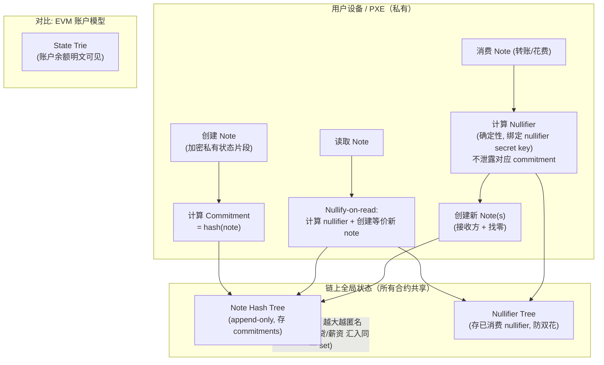
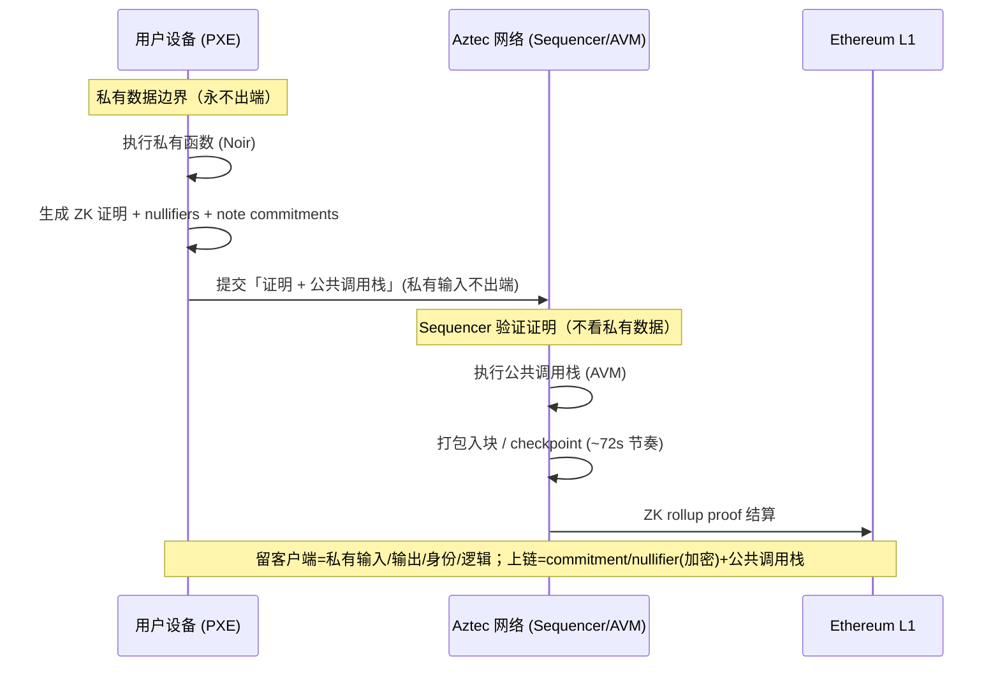
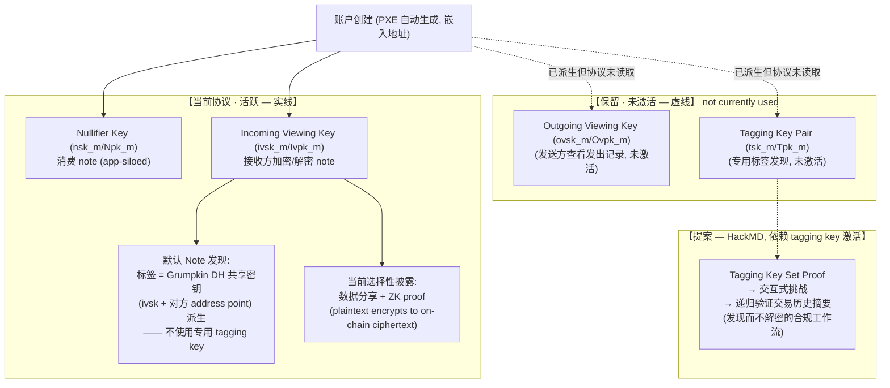
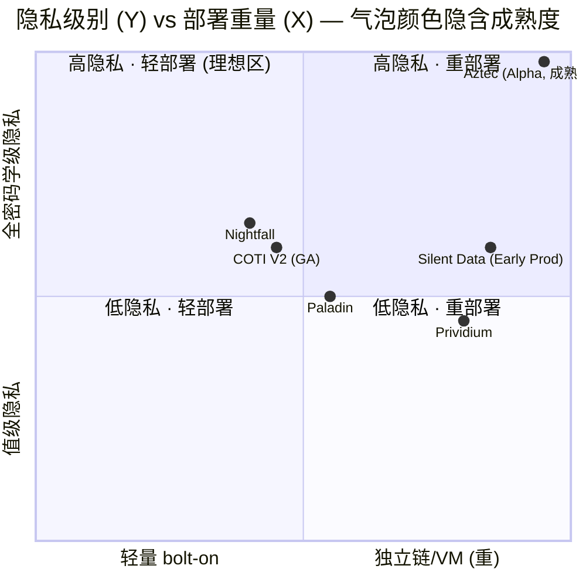

# ZK 隐私优先公链方案分析（Aztec / Noir）

> **研究定位**：Aztec 是隐私优先 ZK 公链的标杆，私密合约、私密状态、私密转账为一等公民。本 section 将其作为「隐私优先原生 VM」设计范式参考，明确其 **「重型 / 独立非 EVM / 非 bolt-on」** 定位，提炼对 Mantle 的可借鉴密码学原语与概念，并按 WHI-254 五轴 rubric 评分。
>
> **关键边界声明（贯穿全文）**：本 section 严格区分 **当前协议已实现能力** 与 **保留/提案能力**。当前协议活跃密钥仅 2 种（nullifier key、incoming viewing key）；outgoing viewing key（Ovpk）与 tagging key pair（Tpk_m/tsk_m）在协议 `PublicKeys` 结构中已定义但 **"not currently used"**；HackMD 合规证明工作流为 **提案**，非当前协议功能。所有此类标注以 `[当前协议]` / `[保留]` / `[提案]` 显式区分。
>
> **评估时间点**：截至 2026-06-23。Aztec 处于 Alpha 主网阶段，存在已知未修复的关键漏洞——成熟度结论具时效性。

---

## 1. Executive Summary（执行摘要）

**Aztec 是什么**：Aztec 是以太坊上首个去中心化、隐私优先的 L2，私密智能合约 / 私密状态 / 私密转账为一等公民。它通过 **note/UTXO 私密状态模型**（commitment + nullifier）+ **PXE 客户端证明**（私有输入永不出端）+ **Noir/Aztec.nr 合约语言** + **多密钥架构**，实现了 EEA 7 方案中无任何方案达到的 **密码学级全执行隐私**。[Aztec Docs: Keys; Note Discovery]

**核心判定**（对应 WHI-254 框架，引用 `[WHI-254 item-N]`）：

1. **隐私级别：最高**。Aztec 保护金额、余额、身份、交易图结构、业务逻辑、合约状态全部维度（WHI-254 轴 2 的 R1–R5 全 ● 完全保护）。这是纯密码学信任（轴 3 = Cryptographic Trust），sequencer 不可见私有数据，仅验证证明。`[WHI-254 item-3 五轴 rubric]`
2. **部署形态：最重 / 非 bolt-on**。Aztec 明确拒绝 EVM、Solidity、账户模型（官方称这些 "are privacy-leaking"）。它是 **独立非 EVM 隐私 L2**（WHI-254 部署形态 C 类），触发轻量级判定 **一票否决** V1（独立 VM/链）+ V2（需资产桥到 L1）。**不可 bolt-on 集成到 Mantle。** `[WHI-254 item-4 轻量级判定]`
3. **成熟度：最低 / 有未修复关键漏洞**。Aztec 处于 **Pilot-Alpha** 阶段。2026-03-17 发现一个 **proving system 整体级别的关键漏洞**，**不受 validator 重执行 training wheel 缓解**，理论后果为协议中断 + 用户资金被盗；修复计划随 **v5（计划 2026-07）** 发布。官方明确警告 **"不要存入不能承受损失的资金"**。`[Aztec Blog: Critical Vulnerability in Alpha v4]`
4. **EVM 兼容性：零**。所有 EEA 7 方案均为 EVM 兼容/目标；Aztec 是唯一完全放弃 EVM 的方案。
5. **可借鉴价值：高（仅概念与密码学原语层面）**。Mantle 在「轻量级 bolt-on」约束下只能借鉴 Aztec 的 **概念**（note/commitment/nullifier 模型、客户端证明模式、ZK proof of plaintext-to-ciphertext 选择性披露、多密钥分层架构理念），不能采用其架构。

**一句话定位**：**Aztec = 隐私最高 + 部署最重 + 成熟度最低 + EVM 兼容性零**——它证明了密码学级隐私在技术上可行，但代价是完全放弃 EVM 生态；对 Mantle 是「范式参考」而非「集成候选」。

**当前 vs 未来披露能力边界**（本 section 最易被误读处）：
- **`[当前协议]`** 选择性披露 = 交互式数据分享 + ZK proof（证明明文加密为链上密文），活跃密钥仅 nullifier + incoming viewing。默认 note 发现基于 incoming viewing key 的 Grumpkin DH 共享密钥派生标签。
- **`[保留]`** outgoing viewing key + 专用 tagging key pair（协议已定义，未激活）。
- **`[提案]`** 基于 tagging key 的「发现而不解密」分层合规工作流（HackMD TKSP），依赖 tagging key 协议激活，**当前不可用**。

---

## 2. Item Findings（逐项研究发现）

### item-1：私密状态模型 — note/UTXO + commitment + nullifier + Noir 合约语言

**结论**：Aztec 用一套 **UTXO 风格的加密 note 模型 + 双 Merkle 树（note hash tree / nullifier tree）** 实现私有状态，并与 EVM 风格的公共状态混合。这是它能做到密码学级隐私的根本结构选择，也是它无法 bolt-on 到 EVM 账户模型链的根本原因。

**1.1 Note（UTXO）模型** `[aztec_component_ref: note hash tree | Aztec Docs: Storage/Notes]`
- **Note** = 一段加密数据，仅持有者可解密，代表一个私有状态片段（如「Alice 有 50 tokens」）。
- 与 Bitcoin UTXO 的关键差异：Aztec note 承载 **任意私有状态**（不限于 token 余额），支持通用可编程逻辑——本质是「可编程的加密 UTXO」。
- Note 生命周期：**创建 → 计算 commitment（写入 note hash tree）→ 读取 → 消费/nullify（写入 nullifier tree）→ 创建新 note**。
- 典型转账：Alice 转 $10 给 Bob → 消费自己的 $100 note（发布其 nullifier）→ 创建 $10 note（Bob 可解密）+ $90 找零 note（Alice 可解密）。观察者只看到「一个 nullifier 出现 + 两个新 commitment 出现」，看不到金额、双方、关联。

**1.2 Commitment + Nullifier 机制** `[data_dimension: 图结构 R5 ● 完全保护]`
- **Note Hash Tree**（append-only Merkle tree）：存储 note commitment（note 的哈希）。
- **Nullifier Tree**（Merkle tree）：存储已消费 note 的 nullifier，用于防双花。
- **关键密码学性质**：nullifier 是 note 的确定性「指纹」，由 note 数据 + nullifier secret key 派生；它 **不泄露其对应的 note**——观察者无法把某个 nullifier 关联到某个 commitment，因此无法判断哪个 note 被花掉。[Aztec Docs: Storage/Notes; Keys]
- **Nullify-on-read**：即使只是「读取」一个 note 而不消费它，协议设计上也会 nullify 旧 note 并创建一个等价新 note，以防「两笔读取同一 note 的交易」被关联。`[推论性强调：这是防关联的设计取舍，代价是读操作也产生状态写入]`

**1.3 全局隐私集（Global Privacy Set）**
- Aztec 维护 **一棵全局 note hash tree + 一棵全局 nullifier tree**，**所有合约共享**。
- 每个私有应用「贡献到」并「取用于」同一个隐私集——无逐应用启动成本、无围墙花园。支付、兑换、借贷、薪资、金库、身份证明全部汇入同一 commitment set。
- **匿名性影响**：隐私集越大，匿名性越强。这是 Aztec 相对「逐应用隐私池」（如 Paladin privacy domains 的域隔离）的结构性优势——后者隔离性好但匿名集被切碎。`[eea_comparison: Aztec 全局隐私集 vs Paladin 域隔离]`

**1.4 私有/公共混合状态** `[trust_model: 混合执行]`
- **Private state**：UTXO 模型（note hash tree + nullifier tree）。
- **Public state**：EVM 风格账户模型（public data tree）。
- **方向性约束**：私有函数可 **排队（enqueue）** 公共函数；公共函数 **不能** 调用私有函数（因为公共执行在网络侧、私有执行在客户端、且私有执行先于提交完成）。
- 价值：让同一应用能同时处理「需要隐私的逻辑」与「需要公开可验证的逻辑」。

**1.5 Noir 合约语言**
- **Noir**：开源、Rust 风格 ZK 编程语言，专为零知识证明电路设计。
- **Aztec.nr**：Noir 之上的智能合约框架，添加合约语法与功能（接近 Solidity 的开发体验，但底层是电路）。
- 私有函数在 **PXE 客户端执行并生成 ZK 证明**；公共函数在 **AVM（Aztec Virtual Machine）网络侧执行**。
- **Noir 1.0 成熟度**：截至 2026-06，Noir 1.0 处于 **pre-release / 即将发布** 阶段（2026-03 roadmap 更新将 Noir 1.0 列为「upcoming」），**尚未发布稳定版**；配套形式化验证工具生态（如 NAVe）仍在早期。`[source_confidence: 行业/roadmap 推断，标注时效]`
- **与 Solidity 的根本差异**：Noir 要求开发者在 ZK 电路范式下思考（约束系统、见证、证明），学习曲线显著高于 Solidity——这是 Mantle EVM 生态采用的根本障碍。

**EEA 对比**（item-1 要求）`[eea_comparison]`：

| 维度 | Aztec | COTI V2 | Nightfall | Paladin |
|------|-------|---------|-----------|---------|
| 状态模型 | 加密 note/UTXO（全局树） | gcEVM 加密账户状态（garbled circuits） | ZK commitment（ERC-20/721 shielded） | ephemeral EVM + privacy domains |
| 隐私域 | 全局共享隐私集 | 账户级加密 | 应用级 commitment 集 | 逐域隔离（围墙花园） |
| 可编程性 | 通用私有合约逻辑 | 通用（gcEVM） | 主要 token 转账 | 通用（EVM 私有域） |
| 匿名集 | 最大（全局） | 受限 | 应用内 | 域内（被切碎） |

- **Priority**: high ｜ **Dependencies**: none ｜ **source_confidence**: 高（核心机制有 Aztec 官方文档直接支撑）

---

### item-2：PXE 客户端证明执行 — 私有函数本地执行、私有输入不出端

**结论**：PXE（Private eXecution Environment，发音 "pixie"）是 Aztec 隐私保障的「信任根」——私有函数 **完全在用户设备上执行并本地生成 ZK 证明**，任何私有输入/输出/账户信息/被调用函数都不离开设备。这是 **纯密码学零信任** 模型（不信任任何服务端），也是它与 COTI（信任 GC 计算方）、Silent Data（信任硬件 TEE）、Nightfall（需 prover 基础设施）的本质区别。`[trust_model: Cryptographic Trust]`

**2.1 PXE 架构** `[aztec_component_ref: PXE | Aztec Docs: Foundational Topics/PXE]`
- PXE 是客户端组件，负责：模拟私有交易、管理私有状态（note）、提供 oracle 接口（向电路喂入私有数据）。
- 私有函数执行 + ZK 证明生成 **完全在用户设备**（手机 / PC / 浏览器）。
- **零泄露边界**：输入、输出、账户信息、执行的函数——都不离开设备。
- PXE（私有）与 AVM（公共）构成 **双执行模型**。

**2.2 交易生命周期**（见 diagram-2）
1. 用户在 PXE 中执行私有函数 → 生成 ZK 证明 + nullifiers + note commitments。
2. 证明连同 **公共调用栈** 提交到 Aztec 网络。
3. **Sequencer 验证证明（不看数据）**，执行公共调用栈。
4. 交易打包入块（checkpoint）→ L1 结算（ZK rollup proof on Ethereum）。
- **关键约束**：私有执行 **先于** 提交完成（提交时证明已生成）；公共执行在提交后由网络执行。这解释了为什么「公共不能调私有」。

**2.3 客户端证明系统 — Client-IVC / CHONK** `[aztec_component_ref: Client-IVC / CHONK]`
- **Client-IVC**（客户端递归证明 / Incrementally Verifiable Computation）：Aztec 的客户端递归证明系统。
- **CHONK**：2026-03 roadmap 更新中提到的、针对低内存设备（手机、浏览器）优化的 **更快客户端证明系统**。[Aztec Blog: Road to Mainnet / Roadmap Update]
- **性能现状与目标**：Alpha 阶段目标 **~1 TPS、~6s 出块**（Alpha 设计目标）；但实际网络的 checkpoint/出块节奏当前为 **~36–72s**，官方目标到 **2026 年底压缩至 ~4s**（快于以太坊 12s）。`[gap: ~6s 与 36–72s 两个数字来自不同口径，见 Gap Analysis G2]`

**2.4 与其他方案的证明/信任模型对比** `[eea_comparison]`：

| 方案 | 计算/证明位置 | 信任假设 | 隐私强度 | UX 代价 |
|------|--------------|---------|---------|---------|
| **Aztec PXE** | 客户端本地证明 | 纯密码学，零信任服务端 | 最强（零泄露） | 高（设备承担证明负载） |
| COTI V2 gcEVM | 服务端 garbled circuit | 信任 GC 计算方 | 中高 | 低（服务端算） |
| Silent Data | 硬件 TEE 隔区 | 信任硬件厂商 + enclave | 中高 | 低 |
| Nightfall | 服务端 ZK rollup | 信任/依赖 prover 基础设施 | 高（但非客户端） | 中 |

- **企业适用性评估** `[mantle_relevance]`：客户端证明对 **终端用户隐私** 是最强保障，但对 **企业批处理 / 高吞吐** 场景，把证明负载放在客户端不现实——企业更可能接受服务端证明（COTI GC、TEE）。这是 Mantle 评估时的关键约束：**Aztec 的客户端证明模式不直接适配企业用户设备能力差异**。

- **Priority**: high ｜ **Dependencies**: item-1 ｜ **source_confidence**: 高（PXE 架构有官方文档；性能数字有口径差异，已标 gap）

---

### item-3：多密钥选择性披露 — 当前协议活跃密钥与保留密钥的区分

> **本 item 是全 section 的最高风险区**（review 明确警示）。下文严格以 `[当前协议]` / `[保留]` / `[提案]` 标注每一项能力的状态。

**结论**：Aztec 当前协议 **仅激活 2 种协议密钥**（nullifier key、incoming viewing key）；outgoing viewing key 和专用 tagging key pair 在协议 `PublicKeys` 结构中已定义但 **"not currently used"**。默认 note 发现使用 **基于 incoming viewing key 的 Grumpkin 曲线 Diffie-Hellman 共享密钥** 派生标签——**不依赖专用 tagging key pair**。基于 tagging key 的「发现而不解密」分层合规工作流是 **提案**（HackMD），当前不可用。即便如此，当前协议的「ZK proof of plaintext-to-ciphertext」选择性披露在 **披露精度** 上已超越多数 EEA 方案。

**3.1 密钥架构概览（当前 vs 保留）** `[aztec_component_ref: Keys | Aztec Docs: Foundational Topics/Accounts/Keys]`

**3.1.1 当前协议活跃密钥** `[当前协议]`（PXE 创建账户时自动生成，嵌入地址不可更改）：

| 密钥对 | 全称 | 当前协议角色（已验证） |
|--------|------|----------------------|
| **Nullifier Key** `nsk_m / Npk_m` | master nullifier secret/public key | 消费 note 的授权——计算 note nullifier。花费时须证明有权 nullify 该 note（标记"已花"而不暴露是哪个 note）。**app-siloed**：按合约隔离派生，限制泄露爆炸半径。协议核心密钥。 |
| **Incoming Viewing Key** `ivsk_m / Ivpk_m` | master incoming viewing secret/public key | 为接收方加密 note（发送方用接收方 Ivpk 加密，接收方用 ivsk 解密，基于椭圆曲线 DH 共享密钥 S）。**默认 note 发现** 的标签也由 ivsk 派生的共享密钥生成。 |

**3.1.2 保留 / 未激活密钥** `[保留]`（协议规范已定义，当前版本 **"not currently used"**，但在账户创建时已派生并存在于 `PublicKeys` 结构）：

| 密钥对 | 全称 | 当前状态（已验证） |
|--------|------|------------------|
| **Outgoing Viewing Key** `ovsk_m / Ovpk_m` | master outgoing viewing secret/public key | **保留**——设计用于发送方查看自己的发出记录；官方文档明确 **"not currently used"**，为未来协议升级保留。 |
| **Tagging Key Pair** `tsk_m / Tpk_m` | master tagging secret/public key | **保留**——设计用于 note 发现方案中计算标签；官方文档明确 **"not currently used"**。**注意**：当前 note 发现的标签由 incoming viewing key 派生的共享密钥生成，**不是** 这个专用 tagging key pair。 |

> **极易误读点（务必保留此边界）**：Aztec 当前 **确实使用 note 标签（tags）做发现**，但这些标签来自 **incoming viewing key 的 DH 共享密钥**；协议规范中那个 **专用的 Tagging Key Pair（tsk_m/Tpk_m）当前未激活**。"使用标签发现 note" ≠ "使用专用 tagging key"。[Aztec Docs: Note Discovery; Keys]

**3.2 密钥管理与安全模型** `[当前协议]`
- 协议密钥（nullifier + incoming viewing）：嵌入地址、**不可原地轮换**；若泄露须部署新账户。
- 签名密钥（signing key）：由账户合约抽象（原生账户抽象），可用任意认证方法（ECDSA / Schnorr / BLS / 多签），**完全可轮换**。
- **App-siloing**：nullifier key 按合约隔离派生——限制单合约密钥泄露的爆炸半径。

**3.3 默认 note 发现机制（当前协议）** `[当前协议]` `[aztec_component_ref: Note Discovery]`
- **机制**：发送方在创建 note 时给日志打一个 **标签（tag）**，标签由 **发送-接收方对、合约、序号** 经分层哈希派生；其底层 **共享密钥** 由双方在 **Grumpkin 曲线上做 Diffie-Hellman** 得到——每方用 **自己的 incoming viewing secret key（ivsk）+ 对方的 address point**。
- Aztec 节点按 tag 索引日志并暴露 `getPrivateLogsByTags()` 之类 API，接收方据此 **秒级定位** 自己的 note，无需暴力扫描全链。
- **约束**：接收方 PXE 必须 **预先知道发送方地址** 才能算出共享标签密钥（故发送方须「注册」）；发给自己的 note 总是可发现（PXE 自动把本地账户加为隐式发送方）。

**3.4 当前协议的选择性披露能力（当前协议）** `[当前协议]` `[disclosure_vector]`
- **核心原则**：用户决定向谁、以加密或解密形式披露什么数据。
- **无合约级 read key**：解密用 **master incoming viewing key**（一把解锁所有合约数据），所以不能简单分发「某合约的 read key」。
- **当前主力机制**：**分享数据本身 + ZK 证明明文与链上密文对应**（ZK proof that plaintext encrypts to on-chain ciphertext）——可证明 note 的 **特定属性**（金额、身份、某计算结果）而不泄露全部数据。
- **「发现而不解密」的文档化属性**：因为「打标签/发现」与「解密/读取」在密钥上可分离，文档描述了 **分享 app-specific tagging secret** 让审计方 **发现（找到）** 你的加密数据但 **不能解密**，足以证明从该数据推导的属性（如税基、损益）。**注意**：这是 **文档化的概念属性**，但完整的、面向合规审计的端到端工作流仍属 **提案**（见 3.5），且 **专用 tagging key pair 当前未激活**。

**3.5 未来 / 提案阶段的增强披露机制** `[提案]`

> ⚠️ 以下来自 HackMD 探索性文档（*Compliance & Selective Disclosure in Aztec*），描述 **提案 / 未来设计**，**非当前协议已实现功能**。

- **Tagging Key 发现机制（提案）**：分享 app-specific tagging secret 给审计方 → 审计方可发现加密数据但不能解密 → 足以证明推导属性。
- **合规证明工作流（提案）**：
  - **Tagging Key Set Proof（TKSP）** → 验证方收集所有相关密文；
  - **交互式挑战** → 验证方逐笔挑战证明方证明 note 属性；
  - **高保密模式** → 验证方对待披露 note hash 建 Merkle tree，证明方递归验证整个交易历史摘要。
- **状态标注**：该工作流依赖 **tagging key 的协议激活**，当前版本不可用；属 Aztec 长期合规路线图。
- **参考实现**：Taurus `private-CMTAT-aztec`（企业级合规代币在 Aztec 上的探索）——验证了「在 Aztec 上做合规代币」的可行性方向，但同样受当前协议密钥激活状态约束。

**3.6 映射到 WHI-254 选择性披露 6 维向量（仅当前协议能力）** `[disclosure_vector]` `[WHI-254 选择性披露 6 维向量模型]`

| 维度 | 标签（当前协议） | 依据 |
|------|----------------|------|
| **a-Authority** | `key-holder` | 用户自主决定向谁分享数据/证明 |
| **b-Trigger** | `data-share`（主动数据分享 + ZK proof） | 当前披露由交互式数据分享触发；tagging-based 分层发现为 `[提案]` |
| **c-Payload** | `amount` / `identity` / `logic`（可选子集） | ZK proof 可按需证明金额/身份/逻辑属性而不泄露全部 |
| **d-Scope** | `per-tx` / `per-account` | 当前披露粒度为交易级或账户级；app-siloed tagging 披露为 `[提案]` |
| **e-Revocability** | `one-time`（分享后不可撤回） | 当前机制下分享的数据/证明不可撤回；tagging secret 轮换为 `[提案]` |
| **f-Leakage** | `existence`（commitment 上链可见）+ `timing`（交易时序可观察） | note commitment 在全局树中公开但内容加密；交易发生时点可观察 |

**3.7 与 EEA 方案的选择性披露对比（基于当前协议能力）** `[eea_comparison]`

| 方案 | 披露机制 | 中间方 | 披露精度 |
|------|---------|--------|---------|
| **Aztec** `[当前协议]` | ZK proof of plaintext-to-ciphertext（证明属性不泄露明文） | 无（纯 P2P 密码学） | 最高（属性级） |
| COTI V2 | permissioned view-keys（密钥分发，解锁全数据） | 无强中间方 | 低（全数据披露） |
| Paladin | notary / observer 公证方 | 依赖 notary | 中（域级） |
| Prividium | RBAC + operator | operator 可见全部 | 低（operator 全可见） |

- **当前协议独特优势**：纯密码学 ZK proof 实现「属性证明而不暴露明文」——**即使不含 tagging key，已超越 EEA 多数方案的披露精度**。
- **未来增强预期** `[提案]`：tagging key 激活后将实现「发现而不解密」的分层披露，是更高阶形态——但当前不可作为已验证能力引用。

- **Priority**: high ｜ **Dependencies**: item-1, item-2 ｜ **source_confidence**: 高（活跃/保留密钥边界、note 发现机制有 Aztec 官方文档直接验证；提案部分明确标注来源与状态）

---

### item-4：成熟度与风险评估 — Alpha 主网、已知严重漏洞、v5 修复目标

**结论**：Aztec 处于 **Pilot-Alpha** 成熟度——超出基本 Pilot（有运行网络 + 大量参与者），但因 **(a) 无命名企业客户生产流量、(b) 存在已知未修复的 proving-system 级关键漏洞、(c) 全面审计仍在进行** 而 **远未达到 Early Production**。`[maturity_assessment]`

**4.1 网络里程碑时间线**（见 diagram-1 时间线变体）`[Aztec Blog: Announcing Ignition / Announcing the Alpha Network / Road to Mainnet]`

| 时间 | 里程碑 | 关键数据（已验证） |
|------|--------|------------------|
| 2025-11 | **Ignition Chain** 上线（首个去中心化 L2 协调层） | 11-19：~500 sequencer 质押并出块、4 家 proving 实体、共识上线、**36–72s 出块**、**初期空块**；早期 **约 185,000 测试网/社区参与者**（非主网交易用户——Ignition 阶段出块为空块、执行层离线） |
| 2026-01-26 | 社区治理通过 **TGE** | 代币可交易；2026-02-11 起 AZTEC/ETH Uniswap 池；**200k $AZTEC** 可运行 sequencer |
| 2026-Q1（early） | **Alpha 网络** 上线（首个私有智能合约执行 L2） | 激活交易；目标 **~1 TPS、~6s 出块** |
| 2026-03-05 | **Roadmap 更新**（八年研发里程碑） | 私有+公共可编程隐私核心代码完成、**CHONK** 客户端证明、Stage 2 去中心化就绪、**Noir 1.0 upcoming** |
| **2026-03-17** | **发现 Alpha v4 关键漏洞** | proving system 整体级别；training wheel 不缓解 |
| 2026-07（计划） | **v5** 发布修复关键漏洞 | 漏洞详情与补丁 v5 前不公开 |
| Beta（条件触发） | 过渡条件 | **>10 TPS** + 减小出块时间 + **99.9% uptime** + **3 个月无关键 bug（bug bounty 口径）** |
| Mainnet 1.0 | 年内完成去中心化；年底出块降至 ~4s | Beta 成功运行足够时间后 |

> **注**：outline 早期稿曾写「185+ 运营商 / 3,400+ sequencer / 99% uptime / 90 天无关键问题」。经本轮核对官方来源更正为：**约 185,000 测试网/社区参与者**（非主网交易用户）、Ignition 启动 **~500 sequencer**（验证方集合后续增长，关键漏洞博客提及 **~3,959 validators**）、Beta 条件为 **99.9% uptime + >10 TPS + 3 个月无关键 bug**。`[Gap Analysis G1]`

**4.2 Alpha v4 关键漏洞** `[Aztec Blog: Critical Vulnerability in Alpha v4]`（已验证）
- **发现日期**：2026-03-17（周三）。
- **分级**：按 Aztec 漏洞矩阵确认为 **Critical**。
- **影响范围**：**proving system 整体**。**不受 validator re-execution committee（training wheel）缓解**——
  - training wheel 机制：每 ~72s 把新提议块打包成 checkpoint 提交 L1；从全体（**当时 ~3,959**）验证方中随机选 **48 人委员会** 重执行所有交易并背书状态根，需 **33/48** 背书才有效；攻击 AVM bug 须控制 33/48 委员会。
  - **但本漏洞在 proving system 层面，重执行保护对它无效。**
- **潜在后果**：严重协议中断 + **用户资金被盗**。
- **修复**：打包进 **v5**（计划 **2026-07**）；漏洞与补丁 **v5 前不公开**。
- **官方警告**：应用/portal 应提醒用户 Alpha 安全保障有限，**「不要存入不能承受损失的资金」**。

**4.3 审计状态** `[Aztec Blog: Security of the Aztec Network: Audits of Bigfield]`
- **Pre-Alpha 审计演练**：**ZKSecurity + Zellic + Spearbit** 对 **Bigfield 原语**（circuit 标准库中最复杂组件之一）审计。
- **AVM**（Aztec Virtual Machine）：内外部审计 **尚未完成**（有意为之——AVM 公共执行受 training wheel 保护）。
- **审计策略**：持续进行；官方预期会在各组件中继续发现漏洞。
- **CRS / Trusted Setup**：Aztec CRS（号称史上最大 MPC setup）**已成功完成**。[Aztec Blog: AZTEC CRS]
- **融资**：累计 **>$178M**（含 a16z 领投 **$100M Series B**）。`[source_confidence: 行业公开信息，约数]`

**4.4 EEA Readiness Matrix 评估** `[maturity_assessment]` `[WHI-254 EEA Readiness Matrix]`

| 阶段 | EEA 判定标准 | Aztec 状况 | 判定 |
|------|-------------|-----------|------|
| Pilot | 有可演示系统 + 命名参与方 | ✓ Alpha 运行中；数千 sequencer/validator | **超出 Pilot** |
| Early Production | ≥1 命名客户生产 + ≥3 月运营 + ≥1 第三方审计 | ✗ 无命名企业客户生产流量；有 Bigfield 审计但非全面；**有关键未修复漏洞** | **未达到** |
| General Availability | ≥3 客户跨 ≥2 机构类别 + ≥12 月运营 + ≥2 审计 | ✗ 远未达到 | **未达到** |

**Aztec 成熟度判定：Pilot → Early-Pilot（Alpha）**。

**4.5 风险评估摘要** `[maturity_assessment]`
- **关键风险**：proving-system 级漏洞未修复（v5 前），用户资金理论可被盗。
- **中等风险**：AVM 审计未完成；Alpha 阶段 **每次部署独立、状态不迁移**。
- **低风险**：Noir 生态早期、工具链不成熟。
- **缓解因素**：training wheel 对公共执行有效（但对本漏洞无效）；顶级审计公司持续审计；CRS MPC 已完成。
- **明确定位**：**独立链、非 bolt-on**——与 EEA 中被一票否决的独立链（Silent Data、Linea Enterprise、Prividium、Polygon CDK）同属一类，但隐私强度更高、成熟度更低。

- **Priority**: high ｜ **Dependencies**: item-1, item-2, item-3 ｜ **source_confidence**: 高（漏洞/roadmap/审计有 Aztec 官方博客直接验证；融资为公开约数）

---

### item-5：Mantle 可借鉴设计 — 从 Aztec 范式中提炼设计启示

**结论**：Aztec **不可 bolt-on 到 Mantle**（非 EVM、UTXO、客户端证明、Noir 全部与 Mantle EVM 账户模型生态冲突）。Mantle 只能借鉴其 **概念与密码学原语**，且需对「当前已验证」与「提案/保留」严格分级——多密钥分层架构是**概念可借鉴**，但 Aztec 当前仅 2 种密钥活跃，完整分层披露尚未在协议层验证。

**5.1 明确「非 bolt-on」定位** `[deployment_pattern]`
- Aztec 官方明确拒绝：**"no EVM, no Solidity, no account-based blockchain architecture — all of which are privacy-leaking"**。
- Aztec = **独立非 EVM 隐私 L2**，**不是** Mantle 可 bolt-on 的方案。
- WHI-254 部署形态分类：**C 类（独立链或 VM）**；触发轻量级判定 **一票否决** V1（部署独立 VM/链）+ V2（需资产桥）。`[WHI-254 item-4 轻量级判定]`

**5.2 可借鉴设计元素**（含「当前验证状态」列，防止误引用提案为已验证）`[mantle_relevance]`：

| 设计元素 | Aztec 实现 | 当前验证状态 | Mantle 借鉴方向 | 可行性 |
|---------|-----------|------------|---------------|-------|
| **Note/UTXO 隐私模型** | 全局 note hash tree + nullifier tree | `[当前协议]` 已验证 | commitment+nullifier 用于 token 级隐私（如 ERC-7984 + nullifier 扩展） | 中（需 UTXO 层，可在 EVM 合约层模拟） |
| **Nullify-on-read** | 防两笔读取关联 | `[当前协议]` 已验证 | 隐私交易设计中纳入防关联考量 | 概念可借鉴，实现需适配 EVM |
| **全局隐私集** | 所有合约共享 commitment set | `[当前协议]` 已验证 | 避免逐应用隐私池，追求跨应用匿名性 | 概念可借鉴，EVM 上需额外设计 |
| **多密钥分层披露（概念）** | 协议定义 4 种密钥对（**活跃 2**：nullifier+incoming viewing；**保留 2**：outgoing viewing+tagging） | 概念明确，**完整分层未在协议层验证** | spend key + view key + audit key 分层架构理念（不依赖 UTXO） | 中——概念可借鉴，但 Aztec 当前仅 2 种活跃 |
| **Tagging Key（发现而不解密）** | **当前未激活**；note 发现用 incoming viewing key 派生标签 | `[保留]` | 未来若 Aztec 激活并验证可参考 | 低（当前）——未在协议层激活，不可作已验证设计引用 |
| **客户端证明（PXE）** | 本地执行+证明 | `[当前协议]` 已验证（Alpha） | 启示方向 | 低——企业用户设备能力差异大，服务端证明更实际 |
| **合规证明工作流（TKSP）** | HackMD 提案：TKSP→交互挑战→递归验证 | `[提案]` | 概念可关注 | 低（当前）——提案阶段，未经协议验证 |

**5.3 不可移植的设计**
- **非 EVM 执行环境**：Noir + AVM 无法 bolt-on 到 Mantle。
- **UTXO 状态模型**：Mantle 用 EVM 账户模型，不可能整体切换到 UTXO。
- **客户端证明依赖**：企业场景 UX 成本过高。
- **全重写合约语言**：要求开发者放弃 Solidity 转 Noir，不符合 Mantle EVM 生态。

**5.4 对 Mantle 隐私选型的启示** `[mantle_relevance]`
- Aztec 证明 **密码学级隐私技术可行**，但代价是 **完全放弃 EVM 兼容**。
- Mantle「轻量级 bolt-on」约束意味着只能借鉴 Aztec 的 **概念与密码学原语**，而非架构。
- **优先借鉴**：commitment/nullifier 隐私模型 + ZK proof of plaintext-to-ciphertext 选择性披露 + 多密钥分层架构 **概念**。
- **明确排除**：直接集成 Aztec 或采用类 Aztec 的非 EVM 架构。

- **Priority**: high ｜ **Dependencies**: item-1, item-2, item-3, item-4 ｜ **source_confidence**: 高（借鉴评估基于已验证机制 + 显式分级）

---

### item-6：WHI-254 框架 Rubric 评分 — 五轴评估 + 选择性披露向量

> 评分口径引用 WHI-254 隐私全景框架（`evm-privacy-research/research-sections/privacy-landscape-framework/final.md`）的五轴 rubric、R1–R8 需求体系、选择性披露 6 维向量、轻量级判定标准、EEA Readiness Matrix。

**6.1 轴 1 — 密码学路线**

| 维度 | 评分 |
|------|------|
| 主技术家族 | ZKP（ZK-SNARK，UltraHonk/PLONK 系） |
| Trusted Setup | **需要**——Aztec CRS（史上最大 MPC setup，**已完成**） |
| 后量子叙事 | **非 PQ**——ZK-SNARK（离散对数/配对）受量子威胁 |
| 路线组合 | 纯 ZKP（客户端 Client-IVC + 网络 rollup proof） |

**6.2 轴 2 — 被保护数据维度** `[data_dimension]`

| 维度 | 评分 | 依据 |
|------|------|------|
| 金额 (R1) | ● 完全保护 | note commitment 加密金额 |
| 余额 (R2) | ● 完全保护 | 余额=加密 note 集合 |
| 身份 (R3) | ● 完全保护 | 私有函数在 PXE 执行，链上无身份 |
| 业务逻辑 (R4) | ● 完全保护 | Noir 私有函数全执行隐私 |
| 合约状态 (R4) | ● 完全保护 | 私有状态以加密 note 存储，公有可选公开 |
| 图结构 (R5) | ● 完全保护 | nullifier 不泄露对应 note + 全局隐私集消除关联 |
| 订单流 (R8) | ◐ 部分保护 | PXE 保护交易意图；提交后 sequencer 可见公共调用栈 |

**6.3 轴 3 — 信任模型** `[trust_model]`

| 维度 | 评分 |
|------|------|
| 主信任模型 | **Cryptographic Trust**（纯密码学） |
| 信任假设 | ZK-SNARK 假设（离散对数/配对）+ CRS trusted setup（MPC，已完成）+ sequencer 活性 |
| 硬件信任 | 无（纯软件密码学） |
| 运营方信任 | 最小——sequencer 不可见私有数据，仅验证证明 |

**6.4 轴 4 — 部署形态** `[deployment_pattern]`

| 维度 | 评分 |
|------|------|
| 部署形态 | **C. 独立链或 VM**（独立非 EVM 隐私 L2） |
| 轻量级判定 | **一票否决** — V1（独立 VM/链）+ V2（资产桥到 L1） |
| 对 Mantle 集成 | **不可 bolt-on**——需部署完整 Aztec 网络 + 资产桥 |

**6.5 轴 5 — 合规-选择性披露**
引用 item-3 §3.6 的 6 维向量（**仅当前协议能力**，不含 tagging key 与 HackMD 合规提案）：
`a=key-holder · b=data-share · c={amount,identity,logic} · d={per-tx,per-account} · e=one-time · f={existence,timing}`

**6.6 Aztec 在全景方案中的定位**

| 定位维度 | Aztec | 对比 |
|---------|-------|------|
| 隐私级别 | **最高**（密码学级全执行隐私） | 超越所有 EEA 7 方案 |
| 部署重量 | **最重**（完全独立非 EVM 链） | 与 Silent Data/Linea Enterprise/Prividium/Polygon CDK 同属 C 类 |
| 成熟度 | **最低**（Pilot-Alpha，有未修复关键漏洞） | 远低于 COTI-L2 (GA)、Silent Data (Early Production) |
| EVM 兼容性 | **零**（明确拒绝 EVM） | 所有 EEA 7 方案均 EVM 兼容/目标 |
| 可借鉴价值 | **高**（概念与密码学原语层面） | 多密钥架构概念、ZK proof of plaintext-to-ciphertext、commitment/nullifier 模型（tagging key 与合规工作流为 `[保留]`/`[提案]`） |

**「隐私账本」二义判定**（引用 WHI-254 item-6）：
- Aztec 属 **B（Business-State Ledger / 状态级账本）**，且是最完整的 B 类；同时覆盖 **A（Token Ledger）**——加密 note 可代表 token 值。
- 判定：**A + B 兼备**，B 类能力来自 **密码学级全执行隐私**（非准入控制）。

- **Priority**: high ｜ **Dependencies**: item-1…5 ｜ **source_confidence**: 高（评分口径对齐 WHI-254；数据维度/信任模型有官方机制支撑）

---

## 3. Diagrams（图示）

### diagram-1：Aztec 私密状态模型 — Note 生命周期与 Commitment/Nullifier 机制（item-1）

**要点**：观察者只见「nullifier 出现 + 新 commitment 出现」，无法关联金额、双方或被花费的具体 note。与 EVM State Trie（明文余额）形成根本对比。

### diagram-2：PXE 双执行模型 — 交易生命周期（item-2）

**要点**：私有执行先于提交完成；sequencer 仅验证证明、看不到私有数据；纯密码学零信任。

### diagram-3：Aztec 多密钥架构与选择性披露数据流（当前协议 vs 保留/提案）（item-3）

**要点**：实线=当前协议；虚线=保留密钥；提案框=依赖 tagging key 激活的未来合规工作流。"用标签发现 note" 当前由 incoming viewing key 派生，**不等于** 使用专用 tagging key pair。

### diagram-4：Aztec 全景定位 — 隐私级别 × 部署重量 × 成熟度（item-6）

**要点**：Aztec 位于「隐私最高 + 部署最重」极端角，且成熟度最低（Alpha + 未修复关键漏洞）——最先进的隐私技术，但最远离 Mantle 的轻量级偏好。理想区（高隐私 + 轻部署）为空，体现 Mantle 选型的根本张力。

---

## 4. Source Coverage（来源覆盖）

| Source Requirement（来自 outline） | 覆盖状态 | 本 section 使用 |
|---|---|---|
| Aztec 官方文档 — Storage/Notes | ✅ 引用 | item-1 note/commitment/nullifier 机制 |
| Aztec 官方文档 — Foundational Topics/PXE | ✅ 引用 | item-2 PXE 架构与交易生命周期 |
| Aztec 官方文档 — Accounts/Keys | ✅ **直接核对**（关键边界） | item-3 活跃/保留密钥区分（"not currently used"） |
| Aztec 官方文档 — Note Discovery | ✅ **直接核对**（关键边界） | item-3 默认发现=ivsk DH 共享密钥，非专用 tagging key |
| Aztec 官方文档 — Protocol Specs/Precompiles | ✅ 引用 | item-3 PublicKeys 结构 / tagging key 定义位置 |
| Aztec Blog — Critical Vulnerability in Alpha v4 | ✅ **直接核对** | item-4 关键漏洞、training wheel、v5 修复 |
| Aztec Blog — Alpha Network Security | ✅ 引用 | item-4 Alpha 安全预期、资金警告 |
| Aztec Blog — Road to Mainnet / Roadmap Update | ✅ 引用 | item-2 CHONK、item-4 roadmap/Beta 条件 |
| Aztec Blog — Announcing Ignition | ✅ 引用 | item-4 Ignition 数据（sequencer/用户/出块） |
| Aztec Blog — Announcing the Alpha Network | ✅ 引用 | item-4 Alpha 上线 |
| Aztec Blog — Audits of Bigfield | ✅ 引用 | item-4 审计状态（ZKSecurity/Zellic/Spearbit） |
| Aztec Blog — AZTEC CRS | ✅ 引用 | item-6 轴 1 trusted setup 已完成 |
| WHI-254 隐私全景框架 final.md | ✅ 引用 | 五轴 rubric / 6 维向量 / Readiness Matrix / 轻量级判定 |
| HackMD — Compliance & Selective Disclosure | ✅ 引用（**标注为提案**） | item-3 §3.5 TKSP 合规工作流（提案） |
| Taurus private-CMTAT-aztec | ✅ 引用（参考实现） | item-3 §3.5 / item-5 企业代币方向 |
| EEA Privacy WG Report (v1, 2026-04) | ◐ 间接引用 | item-1/2/3 EEA 方案对比定位 |

**引用规范遵循**：Aztec 官方结论附 `[Aztec Docs: <path>]` / `[Aztec Blog: <title>]`；WHI-254 引用附 `[WHI-254 item-N]`；提案/保留内容显式标 `[提案]`/`[保留]`；推论标 `[推论]`；外部来源附访问日期 2026-06-23。

---

## 5. Gap Analysis（缺口与不确定性）

- **G1 — Ignition/网络规模数字口径已更正**：outline 早期稿的「185+ 运营商 / 3,400+ sequencer / 99% uptime / 90 天无关键问题」与官方来源不符。本轮按官方来源更正为 **约 185,000 测试网/社区参与者、Ignition 启动 ~500 sequencer、关键漏洞博客提及 ~3,959 validators、Beta=99.9% uptime + >10 TPS + 3 个月无关键 bug**。**注**：约 185,000 为测试网/社区参与者，**非主网交易用户**——Ignition 阶段出块为空块、执行层离线，故该数字不代表 L2 交易活动（draft review minor 警示，已于 final 折叠）；该数字本身未在官方来源逐字回链，引用须谨慎。验证方/sequencer 数量随时间变化，引用须带时点。**置信度：中（数字待官方逐字确认；网络状态结论高）**。
- **G2 — 出块时间存在两个口径**：Alpha 设计目标 **~6s 出块**（Road to Mainnet / Alpha 目标）与实际网络 **~36–72s checkpoint/出块节奏**（Ignition/关键漏洞博客）并存，年底目标 **~4s**。本 section 同时呈现并标注差异；未找到单一权威数字统一二者。**置信度：中**。
- **G3 — 「发现而不解密」的密钥归属**：官方文档把「分享 app-specific tagging secret 实现发现而不解密」描述为协议属性，但同时声明 **专用 tagging key pair（tsk_m/Tpk_m）当前未激活**。二者的精确关系（当前可用的 tagging secret 是否即 ivsk 派生标签的衍生、还是必须等专用 tagging key 激活）在公开文档中表述不完全清晰。本 section 采取保守处理：**将完整面向审计的合规工作流标为 `[提案]`，仅把「ZK proof of plaintext-to-ciphertext」作为当前已验证的选择性披露主力**。**置信度：中——已显式标注边界，建议 review 重点核对**。
- **G4 — v5 漏洞细节不可得**：Alpha v4 关键漏洞的技术细节与补丁 **v5（2026-07 计划）前不公开**，本 section 无法评估其确切根因与影响边界，仅按官方分级（Critical、proving-system 级、资金风险）陈述。**置信度：高（官方已公开存在性与分级）**。
- **G5 — 融资数字为公开约数**：>$178M / $100M Series B（a16z）来自公开行业信息，未在本轮逐一回链官方披露原文。**置信度：中**。
- **G6 — Noir 1.0 状态**：标注为 pre-release/upcoming（2026-03 roadmap），未发布稳定版；具体 GA 日期未确认。**置信度：中**。
- **WebFetch 限制说明**：本轮 `docs.aztec.network` 的直接 WebFetch 被网络策略阻断，关键边界（密钥活跃/保留、note 发现机制、漏洞）通过 WebSearch 对官方文档/博客内容核对完成；结论与官方文档表述一致，但未逐字粘贴原文段落。建议 review 在能直连官方文档时抽查 §3.1 与 §4.2 的原文措辞。

---

## 6. Revision Log（修订日志）

| Round | 日期 | 变更 |
|-------|------|------|
| final-promotion | 2026-06-23 | 由 round-1 草稿（commit `db7e498`，draft review approve / severity minor，approval evidence comment `b4509476`）promote 到 final.md。折叠唯一 minor 警示：将「185,000+ 用户」改标为「约 185,000 测试网/社区参与者（非主网交易用户；Ignition 阶段出块为空块、执行层离线）」并在 §4.1 / §5 G1 同步更正口径与置信度。`$178M` 累计融资保留既有 hedge（G5，non-blocking note）。无其它内容变更，四项核心判定不受影响。 |
| round-1 | 2026-06-23 | 从 outline round-2（commit `0df61ca`）首次产出完整 deep draft。核对并更正网络规模/Beta 条件数字（G1）；精确化默认 note 发现机制为 incoming-viewing-key 派生标签、与专用 tagging key pair（保留）严格区分（item-3 §3.1.2/§3.3，review 关键警示）；将 HackMD TKSP 合规工作流统一标注为 `[提案]`；补全 4 张图（note 生命周期 / PXE 双执行 / 多密钥当前-保留-提案 / 全景定位四象限）；填充五轴 rubric + 6 维选择性披露向量（仅当前协议能力）；显式标注「独立非 EVM 链、非 bolt-on」与 Alpha 关键漏洞现状。前序 5 次运行（stream idle ×3 + 模型容量 ×2）未提交任何草稿，本轮为全新起点。 |

---

> **当前 vs 提案边界最终自检**（review 关注点）：
> - ✅ 活跃密钥 = nullifier key + incoming viewing key（仅 2 种）；
> - ✅ Ovpk + tagging key pair 标注 `[保留]` "not currently used"；
> - ✅ 默认 note 发现 = ivsk DH 共享密钥派生标签，明确 **不使用专用 tagging key**；
> - ✅ HackMD TKSP 合规工作流统一标 `[提案]`；
> - ✅ 选择性披露 6 维向量仅基于当前协议能力填充；
> - ✅ 「独立非 EVM 链、非 bolt-on」+ Alpha 未修复关键漏洞现状已显式标注。
