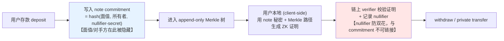
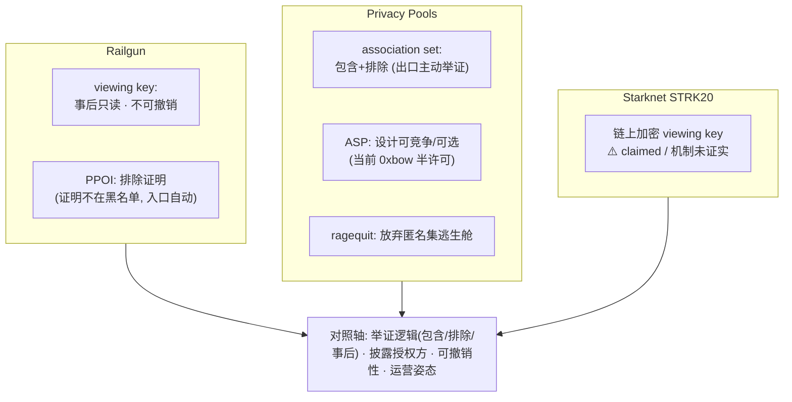
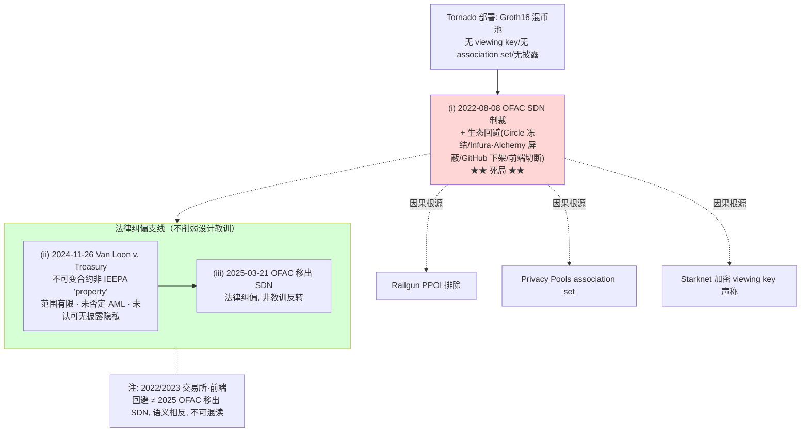

# ZK Shielded-Pool 范式分析（Railgun / Privacy Pools / Starknet STRK20 / Tornado）

> 本 section 隶属「Mantle 轻量级机构隐私方案」pre-research 系列，套用 `privacy-landscape-framework`（final.md）的 5 轴 rubric / 8 项企业需求（R1–R8）/ 选择性披露 6 维向量 / 轻量级一票否决口径。核心交付物是 **Starknet STRK20 与 Railgun/Privacy Pools 的 head-to-head 对比**（item-5），直接回应用户的问题：「Starknet 与 Privacy Pool 类方案到底有什么具体区别」。
>
> **取证口径与重要 caveat（请先读）**：本轮研究的网络环境对若干一手域（`home.treasury.gov`、`ofac.treasury.gov`、`docs.railgun.org`、`starknet.io` 等）的正文抓取受限，部分一手页面以「HTTP 200 存在性 + 多个权威二手来源交叉印证」的方式核实，正文中对应结论已显式标注「一手 URL 存在但正文未独立抓取，经权威二手交叉印证」。outline 要求的 **src-6（本地 starknet 代码库 `/Users/whisker/Work/src/networks/starknet`）在本机不存在**，故 Starknet 的「代码级」核对**无法执行**，相关结论全部退化为「文档/网络证据级」，并在 item-4 验证门与 Gap Analysis 中如实标注。所有访问日期为 **2026-06-23**。

---

## 执行摘要（Executive Summary）

1. **四方案同属一个范式、但分野在「基底 + 信任假设」而非表层。** Railgun、Privacy Pools、Starknet STRK20、Tornado Cash 表层都是「note commitment + nullifier + Merkle 累加器 + 客户端 ZK 证明 + 链上 shielded pool」。真正的实质区别有两层：(a) **运行基底**——Railgun/PP 是部署在通用 EVM 链上的 **verifier 合约套件**（可跨多条 EVM 链复制），Starknet STRK20 是绑定 **Cairo VM 的 validity rollup 原生应用层**；(b) **证明系统的信任假设**——**Railgun / Tornado** 用 **Groth16**（需方案专属 trusted-setup ceremony、产生 toxic waste、基于配对椭圆曲线故**非后量子**）；**Privacy Pools 为同族 zk-SNARK，但其具体证明栈（Groth16/Circom）未经一手证实（`unverified`）——非后量子为合理推断而非确定事实**；Starknet 用 **STARK**（透明、无 setup、仅依赖抗碰撞哈希故**后量子**）。

2. **合规-选择性披露是三套不同设计，且「举证逻辑」根本不同。** Railgun = 不可撤销的只读 **viewing key**（事后全量披露）+ **PPOI 仅排除**（证明资金「不来自」黑名单）；Privacy Pools = **association set 包含 + 排除**（用户主动证明属于某个合规集合）+ **ASP**（可竞争、设计上用户可选）+ **ragequit**（放弃匿名集的逃生舱）；Starknet STRK20 = **链上加密 viewing key**（声称的合规特性，机制未经一手证实）。

3. **Starknet 一侧的多项「优势」属于声称/未交付，比较时必须打成熟度折扣。** 存在性验证门结论：**Stwo（S-two）prover 已交付**（开源 Apache-2.0，GitHub API 一手核实，生产用于 Starknet 主网出块）；**STRK20 作为命名 artifact 存在**（官方页面 HTTP 200），但**未找到任何独立第三方安全审计**，故评级为 `shipped/unaudited`（保守可视作 `claimed/roadmap`）；**「链上加密 viewing key」是三者中证据最弱的一项**——其「加密且存于链上」的具体机制无任何一手文档证实，评级 `claimed/roadmap/forthcoming`。Starknet 隐私栈的完整能力（私密借贷、SDK、跨链）官方/二手口径均承认「尚未交付（forthcoming）」。

4. **Tornado 教训是后三者合规设计的因果起点，且 2025 年的法律纠偏不反转该教训。** (i) 2022-08-08 OFAC 将 Tornado Cash 合约地址列入 SDN + 生态整体回避（Circle 冻结 USDC、Infura/Alchemy 屏蔽、GitHub 下架）= **死局**：因无任何选择性披露，诚实资金无法与非法资金在密码学上切割，监管只能整体封禁。(ii) 2024-11-26 Van Loon v. Treasury（第五巡回）裁定不可变合约非 IEEPA「property」——**范围极窄的成文法解释，明确未否定 AML 动机、未认可「无披露的隐私」**。(iii) 2025-03-21 OFAC 移出 SDN = **法律纠偏**。**(ii)+(iii) 不改变「无选择性披露 = 死局」这一设计教训**——它直接催生了 Railgun PPOI、PP association set（Buterin et al. 论文明确以 Tornado 困境为出发点）、Starknet 加密 viewing key。

5. **对 Mantle 轻量级 bolt-on 偏好的结论。** Railgun / Privacy Pools 作为 **EVM 合约套件**，架构上不触发框架的 4 项一票否决（无需新链/VM、无需新桥、无需全节点运维、无需硬分叉），是「轻量级 bolt-on」的现实候选（Railgun 尤其成熟、已多次审计、可跨 4 条 EVM 链；但当前**均未部署在 Mantle**，Mantle 落地仍属架构可行的推断）。Starknet STRK20 **绑定独立 rollup + Cairo VM**，对 Mantle 而言会触发 V1（新链/VM）一票否决，**不属于轻量级 bolt-on**；其 PQ / 透明性等优势又多为未交付，综合契合度最低。

---

## Item Findings

### item-1：通用 shielded-pool / 私密转账模型

四方案共享同一套底层范式。讲清它，是后续所有 head-to-head 维度的概念基线。

**(a) note commitment（隐藏面值与所有者）.** 存款时，用户在链上写入一个 commitment——通常是对 `(面值, 所有者密钥/公钥, 随机盐 nullifier-secret)` 的密码学哈希（Pedersen/Poseidon 等 ZK 友好哈希）。链上只看到一个哈希值，面值与所有者被隐藏。Tornado Cash 是最简形态：固定面额 + `commitment = hash(nullifier, secret)`，存入后 commitment 进入 Merkle 树 [Zellic「How does Tornado Cash work」，https://www.zellic.io/blog/how-does-tornado-cash-work/ ，访问 2026-06-23；source_confidence: 第三方技术分析]。

**(b) nullifier（防双花，且与 commitment 不可链接）.** 花费时，用户公布一个由 note 秘密单向派生的 **nullifier**；链上维护「已用 nullifier 集合」，同一 note 再次花费会命中已存在的 nullifier 而被拒，从而防双花。关键性质：nullifier 与对应 commitment 在链上**不可链接**（无法据 nullifier 反推是哪一笔存款），这正是「花费不暴露来源」的基础 [同上 Zellic；source_confidence: 第三方技术分析 + 范式共识]。

**(c) Merkle 累加器（成员证明而不暴露具体成员）.** 所有 commitment 进入一棵 append-only 的 Merkle 树。花费时，用户用 ZK 证明「我的 note 的 commitment 在这棵树中（提供一条到树根的 Merkle 路径）」，但不暴露是哪一个叶子。匿名集 = 树中 commitment 的规模。

**(d) 客户端证明（client-side proving）.** 用户在**本地**用 note 秘密 + Merkle 路径生成 ZK 证明，链上 verifier 只校验证明有效性。私密数据从不离开客户端，这是 shielded-pool 与「可信第三方托管隐私」的根本区别。

**(e) 链上 shielded pool.** 持有资产、维护 Merkle 根与 nullifier 集合的合约/应用。

**这套结构如何同时给出隐私与正确性**：隐私来自「commitment 隐藏面值/所有者 + Merkle 成员证明隐藏是哪一笔 + nullifier 与 commitment 不可链接」；正确性（无超额提取、无双花）来自「ZK 证明强制 `提取面值 = 某个已存在 note 的面值` 且 `nullifier 未被用过`」。**UTXO-note 模型 vs 账户模型**：Tornado/Railgun/PP/Starknet STRK20 均采用 **UTXO-note**（每笔 note 是一个不可分割的「票据」，花费即销毁、找零生成新 note），而非以太坊主流的账户余额模型——这让面值表达与「一次性花费」天然契合 ZK commitment 结构。

- **覆盖字段**: proof_system, runtime_substrate, note_nullifier_model, trust_assumptions, source_confidence
- **置信度**: 高（范式层共识 + Tornado 一手技术分析印证）

---

### item-2：Railgun — viewing key + Proof of Innocence（排除模型）

**(a) 证明系统.** Railgun 使用 **Groth16** zk-SNARK，电路以 **Circom** 编写（仓库 `Railgun-Privacy/circuits-v2`，PPOI 电路 `circuits-ppoi`）[https://github.com/Railgun-Privacy/circuits-v2 ，访问 2026-06-23；source_confidence: 官方仓库]。Groth16 **需要 trusted setup**：官方文档明确描述其依赖一次 MPC trusted-setup ceremony 生成 CRS，并须销毁「toxic waste」，且**电路升级/新增功能时需要新的 ceremony**（即方案专属 phase-2 ceremony，叠加在通用 Powers-of-Tau phase-1 之上）[https://docs.railgun.org/wiki/learn/privacy-system/trusted-setup-ceremony ，访问 2026-06-23；source_confidence: 官方文档（正文经搜索引擎摘录，URL 存在）]。因 Groth16 基于配对友好椭圆曲线，**非后量子安全**（Shor 算法可破）[Groth 2016, EUROCRYPT,「On the Size of Pairing-based Non-interactive Arguments」, IACR ePrint 2016/260, https://eprint.iacr.org/2016/260 ；source_confidence: 一手论文 + 密码学共识]。电路约束规模未在公开材料中查到具体数字（**gap**）。

**(b) 运行基底.** Railgun 是部署在**通用 EVM 链上的智能合约套件**（"the set of smart contracts that underpin the backend privacy infrastructure"），**不是独立链**——官方强调「无独立 L2 validator set、无脆弱的桥，安全性等同于其所部署的 EVM 链」[https://www.railgun.org/features.html ；https://docs.railgun.org/wiki ，访问 2026-06-23；source_confidence: 官方]。已部署链：**Ethereum 主网、BNB Smart Chain、Polygon、Arbitrum**（4 条），各链合约地址独立、Polygon/BSC 有独立治理 DAO [https://www.railgun.org/features.html ；https://defillama.com/protocol/railgun ，访问 2026-06-23；source_confidence: 官方 + 第三方聚合]。

**(c) 合规模型.**
- **viewing key（只读、不可撤销）**：viewing key 可生成「View-Only Wallet」，持有者能看余额与交易历史但**不能花费**（无 spending key）[https://docs.railgun.org/developer-guide/wallet/private-wallets/view-only-wallets ，访问 2026-06-23；source_confidence: 官方文档摘录]。关键合规后果——**一旦分享即不可撤销**：官方与 Railway 钱包均明确「Viewing Keys 一经生成即不可撤回，持有者将永久（含未来交易）可见」[同上 + https://help.railway.xyz/setup/view-only-wallets ；source_confidence: 官方文档 + 钱包文档双重印证]。（caveat：官方提到「未来将支持按区块区间限定 viewing key（如限定某一纳税年度）」，但**尚未上线**，当前仍是「全历史、永久」行为。）
- **Private Proofs of Innocence（PPOI）—— 排除（exclusion）逻辑**：在 shield（存入）时自动生成一个 ZK 证明，证明这笔资金**不属于**一个预设的非法来源黑名单；默认黑名单为「Chainalysis 维护的 OFAC 制裁地址列表」，并支持 Elliptic、ScamSniffer、PureFi、SlowMist 等多家 list provider [https://docs.railgun.org/wiki/assurance/private-proofs-of-innocence ，访问 2026-06-23；source_confidence: 官方文档摘录]。PPOI **公开揭示于 2023-11-06**（前身 Chainway「Proof of Innocence」工具约 2023-05 被 RAILGUN DAO 采用）[https://blockworks.com/news/defi-privacy-zero-knowledge-proofs ；https://www.coindesk.com/tech/2023/05/08/privacy-project-railgun-dao-adopts-chainways-proof-of-innocence-tool ，访问 2026-06-23；source_confidence: 第三方权威报道]。这与 Privacy Pools 的「包含」逻辑形成对照：PPOI 只证明「不在坏名单」，不要求用户主动证明「属于某个好集合」。

**(d) 匿名集 / 成熟度.** 开源约 **2021-07**、DAO 治理与隐私合约约 2021-08 上线、Privacy System 1.0 约 **2022-05** 实施 [https://messari.io/report/railgun-privacy-infrastructure-for-defi ，访问 2026-06-23；source_confidence: 第三方 + 官方博客]。TVL 约从 2023 末 $32M 升至 2025 末 **$108–113M**（约 95% 在以太坊）[https://defillama.com/protocol/railgun ，访问 2026-06-23；source_confidence: 第三方聚合器]。审计：经 **Trail of Bits、Zokyo、ABDK、HashCloak、Pessimistic、Hacken** 多次审计（可定位日期含 ABDK 2021-04、Zokyo 2021-11-23、Trail of Bits 2022-02、Zokyo 2022-04/2022-09），报告托管于 `assets.railgun.org/docs/audits/` [source_confidence: 官方 PDF 目录 + 第三方；具体 finding 正文未独立抓取]。**成熟度结论：生产级、已多次审计**，是四方案中合规-披露与审计证据最扎实者之一。

**(e) Mantle bolt-on 可行性.** 作为「无桥、无独立 L2」的 EVM 合约套件，Railgun 架构上可在任意 EVM 链以轻量形态集成（官方称「可快速集成进任意新/旧 EVM 钱包，开发开销最小」）[https://www.railgun.org/features.html ；source_confidence: 官方（Mantle 适配性为架构推断）]。**但当前未部署在 Mantle**（无任何来源证实），Mantle 落地属「架构可行的推断」，非既成事实。详见 item-7 轻量级判定。

- **覆盖字段**: proof_system, runtime_substrate, compliance_model, trust_assumptions, portability, maturity_anonymity_set, mantle_relevance, source_confidence
- **置信度**: 高（合规模型与基底为官方文档；TVL/审计 finding 细节为聚合器/目录级）

---

### item-3：Privacy Pools (0xbow) — association set（包含/排除）+ ASP + ragequit

**(a) 证明系统.** Privacy Pools 是 zk-SNARK Merkle 成员证明方案，合约层定义了**两个独立 verifier**：`WITHDRAWAL_VERIFIER` 与 `RAGEQUIT_VERIFIER`，并维护 `ROOT_HISTORY_SIZE = 30` 的根历史 [https://docs.privacypools.com/layers/contracts/privacy-pools ，访问 2026-06-23；source_confidence: 官方文档摘录]。**重要 caveat（待 review 注意）**：「**Groth16 + Circom**」这一具体栈，在本轮检索中**仅能从一个「受 0xbow 启发」的 Stellar 原型**确认（https://stellar.org/blog/ecosystem/prototyping-privacy-pools-on-stellar ），**未能从 0xbow 自身一手仓库/文档证实**其生产电路即 Groth16/Circom。故本稿只断言「zk-SNARK + 独立 withdrawal/ragequit verifier + Merkle 成员电路（官方确认）」，**Groth16/Circom 标注为未证实**，建议后续直接核对 `github.com/0xbow-io/privacy-pools-core` [https://github.com/0xbow-io/privacy-pools-core/ ；source_confidence: 官方仓库存在，证明系统名称未证实]。

**(b) 运行基底.** 通用 EVM 链上合约套件（合约层 / ZK 层 / ASP 层；核心合约 `PrivacyPool`、`Entrypoint`），**非独立链**；**2025-03** 在 **Ethereum 主网**上线 [https://docs.privacypools.com/ ；https://crypto.news/privacy-pools-debut-on-ethereum-with-buterins-support-aiming-for-legal-on-chain-privacy/ ，访问 2026-06-23；source_confidence: 官方 + 第三方]。Gnosis 链被二手报道提及但未由一手部署记录证实（**未证实**）。

**(c) 合规模型（重点）.**
- **association set（包含 + 排除）**：提款时，用户在 ZK 中证明自己的 commitment **属于**（包含证明）一个由 ASP 批准的关联集合（也支持基于「坏存款」的排除过程），从而把诚实资金与非法资金在密码学上分离，且不暴露是哪一笔 [https://docs.privacypools.com/layers/asp ；https://docs.privacypools.com/layers/contracts/privacy-pools ，访问 2026-06-23；source_confidence: 官方文档摘录]。机制上，`AssociationSetData` = 批准标签的 Merkle 根 + IPFS 哈希 + 时间戳；提款证明必须匹配 Entrypoint 的**最新 ASP 根**，否则 revert（`IncorrectASPRoot`）；ASP 可**动态撤销**先前批准的存款。
- **ASP（Association Set Provider）运营姿态**：ASP 是控制「哪些存款可被私密提款」的合规层，用链上分析/AML 工具（KYT 式）维护批准集合。**设计意图**是模块化、开放——任何实体/司法辖区都能运行自己的 ASP，用户/构建者「可选择性地关联到符合其所选合规标准的集合」[https://0xbow.io/blog/unlocking-privacy-preserving-compliance-with-association-sets ，访问 2026-06-23；source_confidence: 官方博客]。**当前现实**：主网为「半许可（semi-permissionless）」，**0xbow 是事实上的 ASP**；完全可竞争、用户自选的多 ASP 模型是方向而非现状 [https://www.theblock.co/post/348959/0xbow-privacy-pools-new-cypherpunk-tool-inspired-research-ethereum-founder-vitalik-buterin ，访问 2026-06-23；source_confidence: 第三方报道]。**需在对比中区分「设计意图」与「当前部署」。**
- **ragequit（逃生舱）**：原始存款人可**单方、公开地**取回自己的资金而无需 ASP 批准（当标签未获批或被撤销时使用）；但它绕过 ZK 保护的提款流程，**放弃匿名集/隐私**（公开退出），由独立 `RAGEQUIT_VERIFIER` 证明原始存款人身份 [https://docs.privacypools.com/protocol/ragequit ，访问 2026-06-23；source_confidence: 官方文档摘录]。这保证非托管：「ASP 无法移动你的资金，也无法阻止 ragequit 公开退出」。

**(d) 理论基础——Buterin et al.「分离均衡」.** Buterin, Illum, Nadler, Schär, Soleimani《Blockchain Privacy and Regulatory Compliance: Towards a Practical Equilibrium》(SSRN abstract_id=4563364，**2023-09-06** 发布，后刊于 *Blockchain: Research and Applications* 5(1):100176, 2024)是 Privacy Pools 的理论原型 [https://papers.ssrn.com/sol3/papers.cfm?abstract_id=4563364 ，访问 2026-06-23；source_confidence: 一手论文]。其核心论证（摘要原文）：用户发布一个 ZK 证明，证明其资金「(不)来自已知(非)法来源」，而**不公开整个交易图**——通过证明属于满足监管/社会共识属性的自定义 association set 实现。**分离均衡（separating equilibrium）**：诚实用户有激励加入排除已知非法资金的合规集合，而坏行为者无法可信地产出这样的证明，于是两类用户「自然分离」——无需任何人披露完整交易图。论文明确以 **Tornado Cash 困境**为出发点（承接作者更早的 Nadler–Schär「Tornado Cash and Blockchain Privacy」, SSRN 4352337）。

**(e) 与 Railgun 合规模型的实质对照.** 三者举证逻辑根本不同：**Privacy Pools = 包含为主（用户主动证明「我属于某个好集合」，且设计上可自选 ASP），举证责任在提款用户、退出时（per-tx），有 ragequit 兜底**；**Railgun PPOI = 仅排除（证明「不在坏名单」），举证在 shield 入口、自动生成，用户不接触数据源**；**viewing key = 事后全量披露给受信方**。这是「谁承担合规举证责任 + 在入口还是出口 + 包含还是排除」三个维度的实质差异，而非表层相似。

**(f) 匿名集 / 成熟度.** 2025-03 主网上线（初期 ~21 ETH / 69 笔存款，1 ETH 存款上限）；至 **2025-11** 约 **$6M 交易量、>1,500 用户、1,186 笔提款**（注：来源给的是累计交易量与活跃用户，**非锁仓 TVL**）[https://thedefiant.io/news/defi/0xbow-raises-usd3-5-million-to-expand-privacy-pools ，访问 2026-06-23；source_confidence: 第三方报道]。审计：通过 **Audit Wizard** 审计（**具体日期未披露**，未见第二家审计机构）[https://crypto.news/privacy-pools-debut-on-ethereum-with-buterins-support-aiming-for-legal-on-chain-privacy/ ，访问 2026-06-23；source_confidence: 第三方，部分]。生态信号：以太坊基金会将 Privacy Pools 集成进 **Kohaku** 钱包 [https://www.globenewswire.com/news-release/2025/11/18/3190435/0/en/0xbow-Closes-3-5M-Round-for-Compliant-Crypto-Privacy-Technology-Following-Ethereum-Foundation-Integration.html ，访问 2026-06-23；source_confidence: 第三方]。**成熟度结论：已上线主网、单次审计、匿名集仍较小（早期生产）。**

- **覆盖字段**: proof_system, runtime_substrate, compliance_model, trust_assumptions, portability, maturity_anonymity_set, framework_alignment, source_confidence
- **置信度**: 中-高（合规模型/理论为官方+一手论文；证明系统栈名称未证实；成熟度为第三方）

---

### item-4：Starknet STRK20 — 共享隐私池 + S-two 客户端 STARK 证明 + 链上加密 viewing key

#### item-4 存在性验证门（F3，已执行 — 写本项与 item-5 之前的前置）

outline 要求在落笔前用 src-1（docs.starknet.io / starknet.io 官方）+ src-6（本地 starknet 代码库 + commit SHA）核实三个 artifact 的真实交付状态。**执行结果与重要限制**：本机**不存在** `/Users/whisker/Work/src/networks/starknet` 路径（实际 `networks/` 下仅有 base / ethereum / mantle / optimism / tempo / Whisker17，无 starknet/cairo），故 **src-6 代码级核对无法执行**；同时网络环境对 `starknet.io` 正文抓取受限，部分官方页面只能确认「HTTP 200 存在」而无法独立读取正文。下表为据此得到的诚实状态判定：

| Artifact | 实际是什么 | 状态（四档） | 证据（URL + 访问日期 2026-06-23） |
|---|---|---|---|
| **STRK20** | Starknet 上一个**命名的** note-based 隐私池标准（shield ERC-20 余额 + 私密转账，官方品牌「Shieldnet」）；有官方专页与博客；二手报道称主网 Privacy Pool 已上线（约 2026-06，首个资产 strkBTC） | **`shipped/unaudited`**（官方页面存在、设计描述一致，但**未找到任何独立第三方安全审计**；保守可视作 `claimed/roadmap`） | 官方页 https://strk20.starknet.io/ （HTTP 200）；博客 https://www.starknet.io/blog/make-all-erc-20-tokens-private-with-strk20/ （HTTP 200）；报道 https://thedefiant.io/news/blockchains/starknet-strk20-privacy-layer-shielded-erc20-balances-transfers ；https://www.theblock.co/post/391420/starknet-introduces-strkbtc-to-bring-private-bitcoin-and-confidential-defi-transactions-to-its-layer-2-network |
| **链上加密 viewing key** | 被描述为 STRK20 的**合规特性**：一个「加密 viewing-key 框架」，让指定第三方/审计方在合法请求下追溯特定历史。**非独立命名 artifact，是 STRK20 的子特性**；其「加密且存于链上」（区别于 Railgun 的链下分享）这一具体机制**无任何一手技术文档证实** | **`claimed/roadmap/forthcoming`**（三者中证据最弱） | 描述其合规设计的报道 https://moneycheck.com/starknet-introduces-strk20-a-new-privacy-standard-for-erc20-tokens/ ；https://blockonomi.com/starknet-introduces-strk20-a-new-standard-for-private-erc20-transactions/ ；一手页正文未独立抓取 https://strk20.starknet.io/ |
| **S-two（Stwo）客户端 prover** | StarkWare 下一代开源 Circle-STARK prover/zkVM 框架（Rust, Apache-2.0）。**经 GitHub API 一手核实**。是 SHARP/Starknet 网络 prover；「客户端/浏览器内证明（WASM/WebGPU）」被描述为目标，支撑私密转账的客户端证明 | prover 本体 **`shipped`**（开源、生产用于主网出块）；其作为 **STRK20 私密转账的客户端 prover 角色**为 **`claimed/roadmap`** | GitHub API（一手）：`starkware-libs/stwo` 建于 2023-07-16, Apache-2.0, 末次推送 2026-06-23, release v1.0.0（2025-07-18）至 tag v2.2.0；`starkware-libs/stwo-cairo`（建于 2024-04-24）→ https://github.com/starkware-libs/stwo ；https://github.com/starkware-libs/stwo-cairo ；博客 https://starkware.co/blog/s-two-prover/ ；https://www.starknet.io/blog/s-two-is-live-on-starknet-mainnet-the-fastest-prover-for-a-more-private-future/ |

**验证门结论**：三者**并非全部为已交付 artifact**。仅 **Stwo prover 本体**可在一手层面（GitHub API）确证为已交付且开源；**STRK20** 作为命名标准存在但**无公开审计**、正文未独立抓取，按四档取 `shipped/unaudited`；**链上加密 viewing key** 是证据最弱的一项，按 `claimed/roadmap/forthcoming` 处理。**下文 item-4 与 item-5 中，凡涉及 Starknet 的属性一律按上述状态书写，未交付项不得与 Railgun/PP 的已交付属性等价比较。**

#### item-4 正文（在上述状态前提下）

**(a) 证明系统.** **STARK**——透明（所有 verifier 消息均为公开随机数 → **无 trusted setup / 无 ceremony**），且**后量子**（唯一密码学原语是**抗碰撞哈希**，而非配对友好椭圆曲线/双线性映射），与 Groth16 形成根本对照 [ethSTARK Documentation v1.2, StarkWare, 2023-07, https://github.com/starkware-libs/ethSTARK ；https://starkware.co/stark/ ，访问 2026-06-23；source_confidence: 一手/奠基来源]。**S-two（Stwo）** 作为客户端 STARK prover：prover 本体已开源、生产可用（见验证门）；但「作为 STRK20 私密转账的客户端 prover」这一具体落地是前瞻/路线图链接（`claimed/roadmap`），非独立审计过的事实。

**(b) 运行基底.** Starknet 是一条 **validity (ZK) rollup**，合约运行在 **Cairo VM**；STRK20 是其上的**应用层**方案，绑定 Cairo VM [https://docs.starknet.io/ （HTTP 200，正文未独立抓取，属公认事实），访问 2026-06-23；source_confidence: 官方文档（公认）]。这与 Railgun/PP「部署在通用 EVM 链上的合约套件」是**不同的基底层级**——后者继承所在 EVM 链信任假设、可跨链复制；前者继承 Starknet rollup 的 sequencer/prover/DA 信任假设、绑定 Cairo。

**(c) note/nullifier 模型.** 二手一致描述 STRK20 为「note-based 隐私池（非混币器）+ 每笔转账 ZK 证明 + shield/unshield」[https://thedefiant.io/news/blockchains/starknet-strk20-privacy-layer-shielded-erc20-balances-transfers ，访问 2026-06-23；source_confidence: 第三方]。其 commitment 哈希方案/树结构/nullifier 派生在 Cairo 下的具体实现**因 src-6 缺失 + 一手正文未抓取而无法核实**（**gap**），故本项只能在范式层（item-1）描述，不能给出 Cairo 实现细节。

**(d) 合规模型——链上加密 viewing key.** 被描述为「审计方持有 viewing key、在合法请求下追溯特定历史」，类比 Aztec/Aleo [https://moneycheck.com/starknet-introduces-strk20-a-new-privacy-standard-for-erc20-tokens/ ；https://blockonomi.com/starknet-introduces-strk20-a-new-standard-for-private-erc20-transactions/ ，访问 2026-06-23；source_confidence: 第三方]。**但其「加密 + 链上存储」的具体机制、披露授权方/触发方式/可撤销性，均无一手文档证实**（验证门评级 `claimed/roadmap/forthcoming`）。本稿不替官方拔高为「已实现的链上可撤销披露」。

**(e) 口径冲突（如实标注）.** 一方面 STRK20 被宣传为「让每个 ERC-20 私密化」的私密转账方案；另一方面其完整隐私栈被官方/二手承认**尚未交付**：「更广泛的 DeFi 集成（私密借贷）尚未上线」「SDK / 开源钱包 API / 跨链访问为计划中、尚不可用」[https://crypto.news/starknet-launches-strk20-privacy-for-every-erc-20-token/ ；https://thedefiant.io/news/blockchains/starknet-strk20-privacy-layer-shielded-erc20-balances-transfers ，访问 2026-06-23；source_confidence: 第三方]。**更关键的是：未找到对 STRK20/隐私池/ZK 隐私组件的任何公开安全审计。** 这正是「私密转账已上线宣传」与「形式化 zk / 隐私属性 forthcoming（且未审计）」之间的口径冲突，须如实呈现。

**(f) 成熟度 / 匿名集.** Stwo prover：成熟、有版本（v1.0.0→v2.2.0）、生产用于主网出块（一手核实）。STRK20/Shieldnet：二手称主网 Privacy Pool 已上线（2026-06，含 strkBTC、Ekubo 匿名 swap），属**早期阶段**，多数特性仍在路线图，**无公开审计**。Starknet 基础层：成熟 validity rollup。

- **覆盖字段**: proof_system, runtime_substrate, note_nullifier_model, compliance_model, trust_assumptions, maturity_anonymity_set, source_confidence
- **置信度**: 低-中（Stwo 一手高；STRK20/viewing-key 受 src-6 缺失 + 一手正文抓取受限制约，证据偏二手）

---

### item-5：【核心交付】Starknet STRK20 vs Railgun/Privacy Pools head-to-head

> 直接回答用户「Starknet 与 Privacy Pool 类方案的具体区别」。**论证落在「运行基底 / 证明系统 / 信任假设」的实质差异**，而非表层相似。Starknet 列**每一维**都按四档成熟度标注（`shipped/audited` / `shipped/unaudited` / `claimed/roadmap/forthcoming` / `unverified`），承接 item-4 验证门，**禁止把声称属性与已交付属性等价对比**。

#### head-to-head 专表（六维 + Starknet 成熟度标注）

| 维度 | Railgun | Privacy Pools (0xbow) | **Starknet STRK20**（含成熟度标注） |
|---|---|---|---|
| **① 证明系统** | Groth16（Circom）；**需 trusted-setup ceremony**（toxic waste）；**非后量子**（配对曲线）。`shipped/audited` | zk-SNARK Merkle 成员证明；Groth16/Circom **未由一手证实**；非后量子（推断）。`shipped`（zk-SNARK），证明栈名 `unverified` | **STARK**：**透明、无 setup、后量子**（抗碰撞哈希）。**但**：STARK 透明/PQ 优势 = `shipped`（Stwo prover 本体）；**作为 STRK20 私密转账客户端 prover 的落地 = `claimed/roadmap`**；**STRK20 隐私组件本身 `shipped/unaudited`（无公开审计）** |
| **② 运行基底** | 通用 EVM 链上 verifier 合约套件；继承所在 L1/L2 信任；**可跨多 EVM 链复制**（已 4 条）。`shipped/audited` | 通用 EVM 链上合约套件；以太坊主网。`shipped`（单审计） | **validity rollup 原生应用层 + 绑定 Cairo VM**；继承 Starknet sequencer/prover/DA 信任。STRK20 应用层 `shipped/unaudited` |
| **③ note/nullifier 模型** | UTXO-note + Circom commitment/nullifier；生产验证。`shipped/audited` | UTXO-note + 独立 withdrawal/ragequit verifier；`ROOT_HISTORY_SIZE=30`。`shipped` | note-based 隐私池（二手描述一致）；**Cairo 下 commitment/树/nullifier 实现细节 `unverified`**（src-6 缺失 + 一手正文未抓取） |
| **④ 合规模型** | viewing key（事后只读、**不可撤销**）+ **PPOI 仅排除**（证明不在黑名单，入口自动）。`shipped/audited` | **association set 包含+排除** + **ASP**（设计可竞争，当前 0xbow 半许可）+ **ragequit**；用户出口主动举证。`shipped`（机制官方确认） | **链上加密 viewing key**（审计方持 key、合法请求下追溯）——**`claimed/roadmap/forthcoming`**：加密/链上存储/可撤销性机制**无一手证实**，证据最弱的一项 |
| **⑤ 可移植性** | EVM 合约套件，**可跨多条 EVM 链部署**（含 Mantle 在架构上可行）。`shipped/audited` | EVM 合约套件，可移植到 EVM 链（当前仅以太坊主网）。`shipped` | **绑定 Cairo VM / Starknet rollup**；迁移到其他链需移植 VM 或重写；对 Mantle 触发 V1 一票否决。基底事实 `shipped`，私密转账 `shipped/unaudited` |
| **⑥ 成熟度 / 匿名集** | 2021 上线、TVL ~$108–113M、**多次审计**（ToB/Zokyo/…）。`shipped/audited` | 2025-03 上线、~$6M 量/>1500 用户、**单次审计**（Audit Wizard，日期未披露）。`shipped`（早期生产） | Stwo prover `shipped`；**STRK20 隐私池早期、无公开审计**，完整隐私栈（私密借贷/SDK/跨链）`forthcoming` |

#### 逐维文字论证（落在实质差异）

**① 证明系统 —— 落在「信任假设」。** 真实分野不是「都用 ZK」，而是 **trusted setup 信任 vs 无 setup 信任**：Groth16（Railgun，及 Tornado；PP 为同族 zk-SNARK）需要一次性 ceremony 产生 CRS，存在 toxic-waste 信任假设（须至少一名诚实参与者、须可信销毁），且基于配对曲线**非后量子**；STARK（Starknet）**完全无 setup**（透明，仅公开随机），且**后量子**（仅靠抗碰撞哈希）。这是密码学信任根的根本不同。**但成熟度折扣**：STARK 的透明/PQ 优势在 Starknet 语境里是「针对一个其隐私组件 `shipped/unaudited`、且客户端私密转账 prover 落地仍 `claimed/roadmap` 的系统」而言——优势叙述必须绑定该状态，不能脱离 caveat 单独记优。Railgun 的 Groth16 虽需 setup、非 PQ，但其电路与合约**已多次审计、生产运行多年**，是「已交付的成熟」。

**② 运行基底 —— 落在「基底层级」。** Railgun/PP 是**应用合约**，部署在通用 EVM 链上、继承该链的信任假设、可被复制到任意 EVM 链（Railgun 已在 4 条）。Starknet STRK20 是**某条特定 validity rollup 的原生应用**，绑定 Cairo VM，继承 Starknet 的 sequencer/prover/DA 信任假设。**这是「合约套件」与「绑定 rollup/VM 的原生应用」的层级差**——也是对 Mantle 而言最关键的差异（见 ⑤ 与 item-7）。

**③ note/nullifier 模型 —— 表层最相似、但实现栈不同。** 四者都是 UTXO-note + commitment + nullifier + Merkle 树。差异在哈希与电路栈：Railgun/PP 在 Circom-Groth16（ZK 友好哈希、R1CS），Starknet 在 Cairo/STARK（M31 域、Circle STARK）。**Starknet 一侧的 Cairo 实现细节本稿无法核实（`unverified`）**，故此维不宜作为「Starknet 明确更优/更差」的论据。

**④ 合规模型 —— 三套不同的选择性披露设计（最实质的产品级差异）。** 沿「披露授权方 / 触发方式 / 可撤销性 / 举证逻辑（包含 vs 排除 vs 事后披露）」对照：
- Railgun：授权方 = key 持有者；触发 = viewing-key 分享；**不可撤销**；举证 = PPOI **排除**（入口自动证明「不在坏名单」）。
- Privacy Pools：授权方 = 用户经 ASP；触发 = 提款时链上证明；可撤销性 = ASP 可动态撤销批准、用户可 ragequit 退出；举证 = **包含为主**（出口主动证明「属于好集合」），**用户承担举证、设计上可自选 ASP**。
- Starknet STRK20：授权方/触发/可撤销性 = **均未由一手证实**（`claimed/roadmap`）；举证 = 「审计方持加密 viewing key 追溯」的事后披露设想。
**结论**：Railgun 与 PP 的实质差异在于「事后只读披露 + 仅排除」vs「出口主动包含证明 + 可选 ASP + ragequit 兜底」；Starknet 的合规模型在**机制层面尚不可比**（证据最弱），只能按「声称」记录。

**⑤ 可移植性 —— 决定 Mantle 适配的硬约束。** Railgun/PP 作为 EVM 合约套件**可跨 EVM 链部署**（Railgun 架构上可在 Mantle 以 bolt-on 集成，但当前未部署）。Starknet STRK20 **绑定 Cairo VM**，要在 Mantle 复用须移植 VM 或重写——对 Mantle 等同于「引入新链/新 VM」，触发框架 V1 一票否决。

**⑥ 成熟度 / 匿名集 —— 不对称必须显式。** Railgun = 已交付的成熟（多年、多审计、TVL 上亿）；PP = 早期生产（2025 上线、单审计、匿名集小）；Starknet STRK20 = prover 成熟但**隐私池早期且无公开审计**，完整隐私栈 forthcoming。**比较任何 Starknet「优势」时都要带此折扣。**

#### 核心判语

四者表层都是「note + nullifier + 客户端证明 + 链上池」，但 **Starknet 与 Railgun/PP 的根本分野在于：(1) 基底层级——绑定 Cairo VM 的 rollup 原生应用 vs 通用链上合约套件；(2) 证明系统信任假设——透明/后量子的 STARK vs 需 setup/非 PQ 的 Groth16。** 合规模型则是三套不同的选择性披露设计（Railgun 事后只读+仅排除 / PP 出口包含+可选 ASP+ragequit / Starknet 声称的链上加密 viewing key）。**且在这些分野中，Starknet 一侧的多项优势（PQ、无 setup 的隐私落地、链上加密 viewing key）属于「声称/未交付/未审计」，与 Railgun/PP 的「已交付」属性比较时必须带成熟度折扣。**

- **覆盖字段**: 全部六维 + framework_alignment + mantle_relevance + source_confidence
- **置信度**: 高（结构与 Railgun/PP 维度）；Starknet 维受证据等级制约，已逐维标注

---

### item-6：Tornado Cash 合规史与教训 —「无披露 = 死局」及其对前者设计的因果

**(a) 技术定位 = 死局的技术根因.** Tornado Cash 是 Groth16 固定面额混币池，commitment/nullifier + Merkle 树，**但无 viewing key、无 association set、无任何合规披露通道**——这是它与后三者的根本分野。要事后加「anonymity revoker」需大量外部协议重构，且受 Groth16 可塑性（malleability）拖累 [Zellic, https://www.zellic.io/blog/how-does-tornado-cash-work/ ；NP Labs「Tornado anonymity revoker design」, https://np.engineering/posts/tornado-anonymity-revoker-design/ ，访问 2026-06-23；source_confidence: 第三方技术分析]。

**(b) 三事件分离与定序（每个事件附日期 + 一手来源 + 访问日期）.**

| # | 事件 | 时间 | 性质 / 因果角色 + 一手来源 |
|---|------|------|----------------|
| **(i)** | **OFAC SDN 制裁 + 生态回避（"死局"）** | **2022-08-08** | OFAC 依 E.O. 13694 将 Tornado Cash 网站与合约/钱包地址（报道 44 个）列入 SDN（首次制裁链上智能合约），称自 2019 年以来洗钱 >$70 亿（含朝鲜 Lazarus >$4.55 亿）。**生态在约 24 小时内整体回避**：Circle 冻结 SDN 地址上的 USDC、Infura/Alchemy 屏蔽 RPC、GitHub 下架仓库并封禁开发者账号、前端被切断。**这是构成「死局」的事件**——因无选择性披露，诚实资金无法与非法资金切割，监管只能整体封禁。一手/权威：Treasury 新闻稿 jy0916 https://home.treasury.gov/news/press-releases/jy0916 （URL 存在，正文经多权威二手交叉印证）；https://natlawreview.com/article/ofac-blocks-smart-contract-mixer-adding-tornado-to-sdn-list ；Circle 冻结 https://cryptoslate.com/circle-blacklists-all-tornado-cash-eth-addresses-effectively-freezing-usdc/ ；Infura/Alchemy https://www.theblock.co/post/162402/infura-and-alchemy-blocking-access-to-tornado-cash ；GitHub https://cryptobriefing.com/infura-alchemy-block-tornado-cash-following-treasury-ban/ （均访问 2026-06-23） |
| **(ii)** | **Van Loon v. Treasury（第五巡回）** | **2024-11-26** | 第五巡回合议庭一致裁定：Tornado Cash 的**不可变**智能合约不属于 IEEPA 下可制裁的 "property"（不能被拥有/控制/排除），OFAC「越权」。**范围极窄**：仅是对「property」一词的成文法解释；法院**维持**了对**可变**合约的制裁，明确称「OFAC 对非法行为者洗钱的关切无可否认地正当」，并请国会更新 IEEPA——即缺口是成文法层面，**非**对 AML 政策或「无披露隐私」的认可；DOJ 对创始人的刑事追诉未受影响。引用 *Van Loon v. Dep't of the Treasury*, No. 23-50669, 122 F.4th 549 (5th Cir. 2024)。一手：https://www.ca5.uscourts.gov/opinions/pub/23/23-50669-CV0.pdf ；https://law.justia.com/cases/federal/appellate-courts/ca5/23-50669/23-50669-2024-11-26.html ；范围解读 https://www.moneylaunderingnews.com/2024/12/fifth-circuit-rejects-ofac-designation-of-tornado-cash-immutable-smart-contracts/ （访问 2026-06-23） |
| **(iii)** | **OFAC 将 Tornado Cash 移出 SDN** | **2025-03-21** | OFAC 在 Van Loon 后将 Tornado Cash 移出 SDN（移除网站与以太坊合约地址），Treasury 称系基于「对在演进中的技术与法律环境下使用金融制裁所涉新颖法律/政策问题的审查」作出的裁量行动。**这是司法+监管层面的法律纠偏，对 (i) 中制裁措施本身的撤销，不是对设计教训的反转**：Treasury 明确保留 AML 立场、未移除创始人 Roman Semenov 涉朝制裁、继续将混币相关资金视为 AML 红旗。一手/权威：OFAC recent-action 20250321 https://ofac.treasury.gov/recent-actions/20250321 （URL 存在，正文经权威二手交叉印证）；https://www.coindesk.com/policy/2025/04/05/why-ofac-delisted-tornado-cash ；https://www.defieducationfund.org/treasury-department-officially-delists-sanctions-on-tornado-cash/ （访问 2026-06-23） |

**必须显式写出的结论**：**(ii)+(iii) 是「制裁措施被司法纠偏/撤销」，范围仅及「不可变合约能否被 IEEPA 制裁」这一法律定性；法律层面的纠偏不改变「缺乏选择性披露使诚实资金无法与非法资金切割」这一设计教训**——后三者（Railgun/PP/STRK20）的合规设计因果依旧成立。

**关于两类「delist」的澄清（避免混读）**：本研究核实到一个**重要的事实修正**——「TORN 代币被交易所 delist」**并非 2022 年制裁当日**事件，而主要发生在 **2023 年底**（Binance 约 2023-12 下架，与其 DOJ 和解相关；OKX/HTX 更早）[DL News, https://www.dlnews.com/articles/snapshot/torn-down-following-binance-delisting-of-tornado-cash-token/ ，访问 2026-06-23]。因此 2022 年「死局」的生态回避应表述为 **Circle/USDC 冻结 + Infura/Alchemy RPC 屏蔽 + GitHub 下架 + 前端切断**（TORN 交易所下架是 2023 的后续余波）。无论如何，2022/2023 的「生态/交易所回避」与 2025 的「OFAC 移出 SDN（法律纠偏）」**语义相反**，绝不可混为一谈或写成「Van Loon → 交易所 delist」的顺序。

**(c) 教训 → 因果.** 基于 (i) 的逻辑链：**无选择性披露 → 诚实用户无法切割 → 监管只能整体封禁 → 死局**。它直接催生：Railgun 的 **PPOI 排除**、Privacy Pools 的 **association set 包含/排除**（Buterin et al. 论文明确以 Tornado 困境为出发点，见 item-3）、Starknet 的**链上加密 viewing key**（声称）。(ii)+(iii) 仅作为「制裁工具的法律边界」补充，**不**作为「隐私无需披露」的论据。

- **覆盖字段**: compliance_model, regulatory_history, source_confidence
- **置信度**: 高（三事件经一手/权威二手核实；含 TORN delist 时间修正）

---

### item-7：框架 rubric 打分与 Mantle 轻量级 bolt-on 适配综合

套用 `privacy-landscape-framework`（final.md）的统一口径，确保与项目其他 section 可比。**成熟度折扣（F2，强制）已贯穿——凡 Starknet 依据「声称/路线图/未交付」属性记优处，均附折扣备注。**

#### (a) 5 轴 rubric 评分表

| 评估轴 | Railgun | Privacy Pools | **Starknet STRK20** | Tornado（教训） |
|---|---|---|---|---|
| **轴1 密码学路线** | ZKP（Groth16/Circom）；**需方案专属 setup**；非 PQ；可组合 | ZKP（zk-SNARK，栈名未证实）；非 PQ | ZKP（**STARK：透明/无 setup/PQ**）⚠️**成熟度折扣**：PQ/透明优势绑定一个隐私组件 `shipped/unaudited`、客户端私密 prover 落地 `claimed/roadmap` 的系统 | ZKP（Groth16）；非 PQ |
| **轴2 被保护数据维度**（金额/余额/身份/逻辑/状态/图/订单流） | 金额✓ 余额✓ 身份✓ 图✓；逻辑✗ 状态✗ 订单流✗ | 金额✓ 余额✓ 身份✓ 图✓；逻辑✗ 状态✗ 订单流✗ | 金额✓ 余额✓ 身份✓ 图✓（二手描述）；逻辑✗ 状态✗ 订单流✗ ⚠️**折扣**：均为 `shipped/unaudited` 声称 | 金额✓ 身份✓ 图✓；余额 N/A（固定面额）；逻辑/状态/订单流✗ |
| **轴3 信任模型** | Cryptographic（含 **trusted-setup toxic-waste**）+ 客户端 prover；list-provider 组织信任（PPOI 黑名单） | Cryptographic + **ASP 组织信任**（当前 0xbow 半许可） | Cryptographic（STARK，**无 setup**）+ **rollup sequencer/prover/DA 信任** + 加密 viewing-key 持有方信任 ⚠️**折扣**：viewing-key 机制 `claimed` | Cryptographic（含 setup）；**无任何披露/合规信任通道** |
| **轴4 部署形态** | **EVM 合约套件 → 轻量级**（4 项一票否决均不触发） | **EVM 合约套件 → 轻量级**（一票否决均不触发） | **绑定 Cairo VM 的 rollup 原生应用 → 对 Mantle 触发 V1 一票否决 → 非轻量级** | EVM 合约套件（架构轻量，但因 R6/R7 失败不可合规使用） |
| **轴5 合规-选择性披露**（6 维向量） | 见下 §(c) | 见下 §(c) | 见下 §(c)（多维 `claimed/unverified`） | `authority=none`（无披露）= 教训本身 |

#### (b) 8 需求（R1–R8）映射

| 需求 | Railgun | Privacy Pools | Starknet STRK20 | Tornado |
|---|---|---|---|---|
| R1 金额 | ✓ | ✓ | ✓（声称/未审计） | ✓ |
| R2 余额 | ✓ | ✓ | ✓（声称/未审计） | N/A（固定面额） |
| R3 对手方身份 | ✓ | ✓ | ✓（声称/未审计） | ✓ |
| R4 业务逻辑/合约状态 | ✗ | ✗ | ✗ | ✗ |
| R5 交易图/资金流 | ✓ | ✓ | ✓（声称/未审计） | ✓ |
| R6 合规可审计性 | ✓（PPOI + viewing key） | ✓（association set + ragequit） | ⚠️声称（加密 viewing key，机制未证实） | ✗（**死局**） |
| R7 选择性披露 | ✓（仅排除 + 事后只读、不可撤销） | ✓（包含+排除 + 可选 ASP + 动态撤销） | ⚠️声称（`claimed/roadmap`） | ✗（**死局**） |
| R8 执行策略保护（反 MEV） | ✗ | ✗ | ✗ | ✗ |

**要点**：shielded-pool 范式整体覆盖 R1/R2/R3/R5（值级 + 对手方 + 图隐私），但**不覆盖 R4（合约逻辑/状态）与 R8（订单流/反 MEV）**——这是它与 COTI（GC，覆盖 R4）/ 加密 mempool（覆盖 R8）等家族的能力边界差异。R6/R7 正是 Tornado（✗）与后三者（✓/声称）的分水岭。

#### (c) 选择性披露 6 维向量（authority × trigger × payload × scope × revocability × leakage）

| 方案 | a-授权方 | b-触发 | c-载荷 | d-范围 | e-可撤销/审计 | f-残余泄露 |
|---|---|---|---|---|---|---|
| **Railgun** | `key-holder` | `viewing-key-share`（事后）/ PPOI `on-chain-request`（入口排除） | `all`（viewing key 全量历史） | `per-account`（钱包级） | **`permanent`（viewing key 不可撤销）** | `existence`, `timing` |
| **Privacy Pools** | `key-holder` + `smart-contract`（链上校验 ASP 根） | `on-chain-request`（提款证明）+ `compliance-gate`（ASP 成员） | `existence-only`（成员证明，不暴露具体笔） | `association-set` | `revocable`（ASP 可动态撤销批准；用户 `ragequit` 公开退出兜底） | `existence`（ragequit 时 `graph`） |
| **Starknet STRK20** | `regulator` + `key-holder`（审计方持加密 viewing key，声称） | `audit-request` / `viewing-key-share`（声称） | `claimed`（未证实载荷范围） | `unverified` | **`unverified`（加密/链上/可撤销机制无一手证实）** | `existence`, `timing` |
| **Tornado** | `none` | — | — | — | — | `existence`（= 无披露，死局） |

#### (d) 轻量级判定（套用框架 4 项一票否决 V1–V4）

| 方案 | V1 新链/VM | V2 新桥 | V3 全节点运维 | V4 硬分叉 | 判定 |
|---|---|---|---|---|---|
| **Railgun** | ✗ | ✗ | ✗ | ✗ | **轻量级 bolt-on 候选**（EVM 合约套件）；ZK 路线专属：方案专属 ceremony 偏重，约束规模未知 |
| **Privacy Pools** | ✗ | ✗ | ✗ | ✗ | **轻量级 bolt-on 候选**（EVM 合约套件）；当前仅以太坊主网 |
| **Starknet STRK20** | **✓（Cairo VM / 独立 rollup）** | （取决于资产桥接） | （rollup 运维） | ✗ | **触发 V1 → 非轻量级**（对 Mantle 等同引入新链/VM） |
| **Tornado** | ✗ | ✗ | ✗ | ✗ | 架构轻量，但 R6/R7 失败、监管死局，**不可作合规候选** |

#### (e) 面向 Mantle 的综合结论（含 caveats）

- **Railgun** 最契合「轻量级 + 合规-选择性披露」偏好：EVM 合约套件可跨链（架构上可在 Mantle bolt-on）、生产成熟、多次审计、TVL 上亿、viewing key + PPOI 提供事后披露与入口排除。**Caveat**：viewing key **不可撤销**（GDPR「被遗忘权」摩擦），PPOI 为「仅排除」（不提供「证明属于好集合」的正向合规），且**当前未部署在 Mantle**（落地为推断）。
- **Privacy Pools** 在合规理论上最强（Buterin et al. 分离均衡）、举证逻辑最优（出口主动包含 + 可选 ASP + ragequit 兜底），同为 EVM 合约套件、对 Mantle 架构可行。**Caveat**：早期生产（2025 上线）、单次审计（机构 Audit Wizard、日期未披露）、匿名集小、ASP 当前为 0xbow 半许可（「用户自选 ASP」是设计而非现状）、生产电路证明栈名称未由一手证实。
- **Starknet STRK20** 综合契合度最低：对 Mantle **触发 V1 一票否决**（绑定 Cairo VM / 独立 rollup），且其 PQ/透明/链上加密 viewing key 等卖点**多为未交付/未审计**（成熟度折扣后不应与 Railgun/PP 的已交付能力等价计入）。它更适合作为「Starknet 原生用户」的方案，而非 Mantle 的轻量级 bolt-on。
- **Tornado** 仅作教训：证明「无选择性披露」在当前监管下是死局，为前三者的 R6/R7 设计提供「为什么必须有披露」的历史与法律论据。

- **覆盖字段**: framework_alignment, compliance_model, portability, mantle_relevance, source_confidence
- **置信度**: 高（rubric 口径与框架一致；Starknet 评分已逐项打成熟度折扣）

---

## Diagrams

### diagram-1：通用 shielded-pool 数据流（mermaid，对应 item-1）



- 「面值/对手方隐藏」落在 **B（commitment 写入）**；「nullifier 防双花、与 commitment 不可链接」落在 **E（花费校验）**。

### diagram-2：四方案对照 + Starknet vs Railgun/PP 实质分野（ascii，对应 item-5）

```
                 Railgun        Privacy Pools     Starknet STRK20        Tornado
                 (EVM 套件)     (EVM 套件)        (Cairo rollup 原生)    (EVM 套件,教训)
证明系统         Groth16        zk-SNARK*         STARK(透明/PQ)         Groth16
                 需 setup/非PQ  非PQ              ⚠️私密落地 claimed     需 setup/非PQ
运行基底  >>>>>   通用链上合约   通用链上合约      [绑定 Cairo VM/rollup] 通用链上合约   <<<<< 基底层级分野
note/nullifier   UTXO-note      UTXO-note         note(Cairo 实现 ?)     UTXO-note(固定额)
合规模型         viewing key    association set   链上加密 viewing key   【无】= 死局
                 + PPOI(排除)   +ASP+ragequit     ⚠️claimed              
可移植性  >>>>>   跨多 EVM 链    跨 EVM 链         [绑定 Cairo, 不可移植] 跨 EVM 链
成熟度/匿名集     成熟/多审计    早期/单审计       prover 熟,池未审计     已移出 SDN(教训)

信任假设  >>>>>   trusted-setup  trusted-setup     [无 setup, 但 rollup   trusted-setup
                 toxic-waste    toxic-waste        sequencer/prover 信任]
                                                  ^^^^^^^^^^^^^^^^^^^^^^ 证明系统信任根分野
* PP 证明栈(Groth16/Circom)未由一手证实    [方括号] = Starknet 与 Railgun/PP 的实质分野所在
```

### diagram-3：三套合规-选择性披露模型对照（mermaid，对应 item-2/3/4）



### diagram-4：Tornado 合规史时间线 → 后续设计因果（mermaid，对应 item-6）



- 因果箭头**仅从 (i) 死局节点**引出三条（指向 Railgun/PP/Starknet）；(ii)(iii) 为「法律纠偏支线」，绿色分组、明确不削弱设计教训。

### diagram-5：可移植性 / 部署形态谱（ascii，对应 item-5/7）

```
轻量级 (bolt-on) ←————————————————————————————————————————→ 重量级
EVM 合约套件, 可跨链复制                          绑定单一 rollup + Cairo VM 的原生应用
   │                │                                              │
[Railgun]      [Privacy Pools]                              [Starknet STRK20]
4 条 EVM 链     以太坊主网                                   绑定 Cairo VM
架构可 bolt-on  架构可 bolt-on                               对 Mantle = V1 一票否决
到 Mantle       到 Mantle                                   (引入新链/新 VM)
   └─── 轻量级阈值线(对 Mantle 通过 V1–V4) ───┘    × V1 触发点(新链/VM) ×
```

---

## Source Coverage

| 来源要求 | 状态 | 覆盖说明 |
|---|---|---|
| **src-1 official_docs**（≥4：railgun/privacypools/starknet 官方 + 结论附 URL+日期） | **达成** | Railgun docs（trusted-setup/viewing-key/PPOI/features）、Privacy Pools docs（privacy-pools/asp/ragequit）、Starknet（strk20.starknet.io / starknet.io blog / docs.starknet.io，HTTP 200）、Stwo/stwo-cairo GitHub。**Caveat**：部分一手页正文因网络限制未独立抓取，已标注「URL 存在 + 二手交叉印证」 |
| **src-2 academic_papers**（≥2：Buterin et al. SSRN 4563364 + STARK/Groth16 奠基） | **达成** | Buterin et al. SSRN 4563364（分离均衡，2023-09-06）；Groth 2016 ePrint 2016/260（Groth16 需 setup/非 PQ）；ethSTARK v1.2（STARK 透明/PQ） |
| **src-3 legal_regulatory**（≥3：三事件各一手） | **达成** | (i) Treasury jy0916 + NatLawReview + Circle/Infura/GitHub 报道；(ii) Van Loon 第五巡回判决 PDF + Justia + Ballard Spahr 范围解读；(iii) OFAC recent-action 20250321 + CoinDesk + DeFi Education Fund。**Caveat**：Treasury/OFAC 两个一手页正文受网络限制，经多权威二手交叉印证 |
| **src-4 audit_reports**（≥2） | **部分达成** | Railgun 多次审计（ToB/Zokyo/ABDK/…，日期可定位，目录级）；Privacy Pools 单次（Audit Wizard，日期未披露）；**Starknet STRK20 隐私组件未找到任何公开审计**（关键缺口） |
| **src-5 on_chain_data**（≥2：TVL/匿名集/活跃度） | **部分达成** | Railgun TVL ~$108–113M（DeFiLlama）；Privacy Pools ~$6M 量/>1500 用户（第三方，非 TVL）；Starknet STRK20 链上指标未获一手数据 |
| **src-6 code_analysis**（≥1：本地 starknet 代码库 + commit SHA） | **未达成（环境缺失）** | **`/Users/whisker/Work/src/networks/starknet` 在本机不存在**（仅 base/ethereum/mantle/optimism/tempo/Whisker17）。Starknet 代码级核对无法执行；Stwo 经 GitHub API 一手核实部分弥补，但 Cairo 下 commitment/nullifier 实现细节仍为缺口。已在 item-4 验证门与 Gap Analysis 显式标注 |

---

## Gap Analysis

诚实记录本轮未能闭合的证据缺口（**非编造支持**）：

1. **src-6 本地 starknet 代码库缺失（高影响）**：documented 路径不存在，Starknet 的 Cairo 实现（commitment 哈希、树结构、nullifier 派生、链上加密 viewing key 的真实存储/撤销机制）无法做代码级核对。item-4 note/nullifier 细节、合规机制均退化为「文档/二手级」并标 `unverified`/`claimed`。
2. **Starknet STRK20 隐私组件无公开审计（高影响）**：未找到任何独立第三方安全审计；连同「形式化 zk forthcoming」口径，STRK20 在 head-to-head 与 rubric 中按 `shipped/unaudited` 且打成熟度折扣处理。
3. **一手页正文抓取受限（中影响）**：Treasury/OFAC/部分 docs.railgun.org/starknet.io 正文未独立抓取，相关结论以「URL 存在 + 多权威二手交叉印证」支撑，已逐处标注。建议 review/最终化时对载荷关键句直连一手页复核。
4. **Privacy Pools 生产证明栈名称未证实（中影响）**：「Groth16 + Circom」仅由「受 0xbow 启发」的 Stellar 原型确认，未从 0xbow 一手仓库证实；本稿标 `unverified`，建议直查 `github.com/0xbow-io/privacy-pools-core`。
5. **若干二级事实未定（低影响）**：Railgun 电路约束规模、PPOI 精确上线日期、Privacy Pools 审计日期/Gnosis 部署、Railgun Mantle 落地（当前未部署，仅架构推断）——均已在正文标注不确定性。
6. **TORN 交易所 delist 时间修正（已处理）**：核实为 2023 年底（Binance/DOJ 和解相关），非 2022 制裁当日；正文已据此调整「死局」生态回避表述，并与 2025 OFAC 移出 SDN 严格区分。

---

## Revision Log

| Round | 变更 | 说明 |
|-------|------|------|
| 1 | create | Round-1 初稿。覆盖 item-1~7、diagram-1~5、source coverage、gap analysis。已实际执行 item-4 存在性验证门（含 src-6 缺失的诚实标注）、Tornado 三事件各附一手/权威二手来源 + 访问日期、head-to-head 对 Starknet 逐维四档成熟度标注、item-7 rubric 对 Starknet 未交付属性打成熟度折扣。所有结论附 URL + 访问日期（2026-06-23）；代码类附 GitHub 仓库/commit 证据或标注缺口。 |
| 2 | modify_exec_summary | F-draft-1（minor）：执行摘要 §1(b) 原把「Railgun/PP/Tornado 用 Groth16」并列，与正文一致的 `unverified` 标注（item-3(a) / item-5① / item-7 轴1 / Gap #4）冲突。改为：Railgun / Tornado 明确 Groth16-confirmed；Privacy Pools 拆出，证明栈（Groth16/Circom）标 `unverified`，非后量子标为合理推断而非确定事实。仅改执行摘要该一句，正文/图表/Gap/Source Coverage 均未改动。来源：Review Verdict needs-attention / Orchestrator Revision Request (round 1→2)。 |
