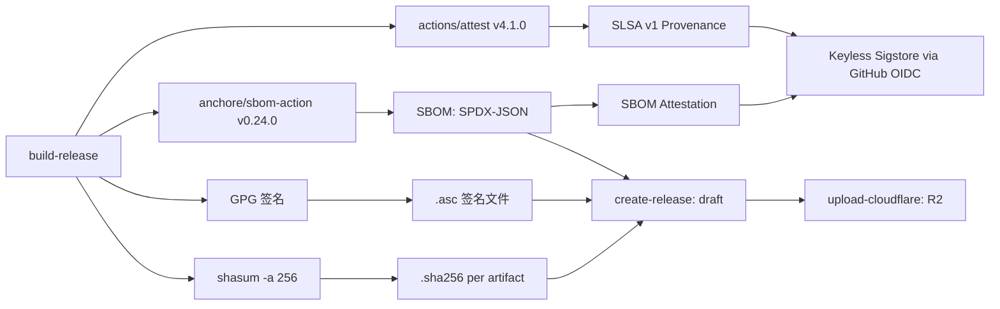
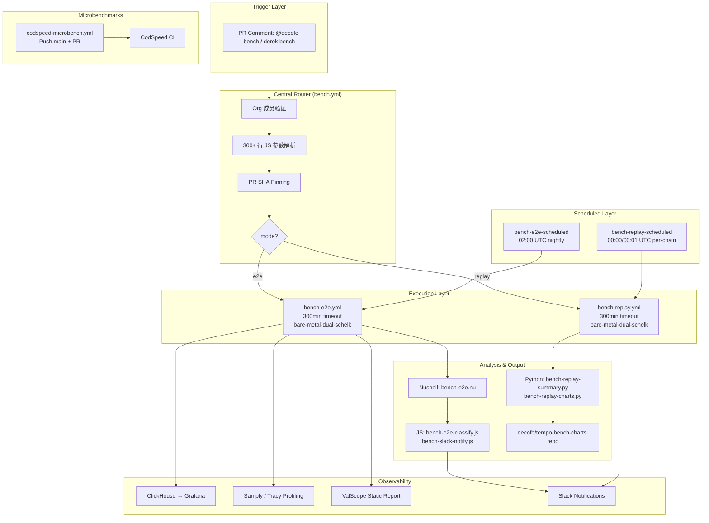
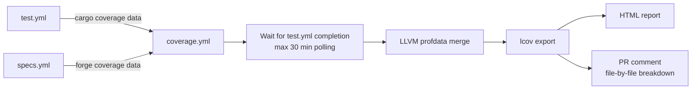
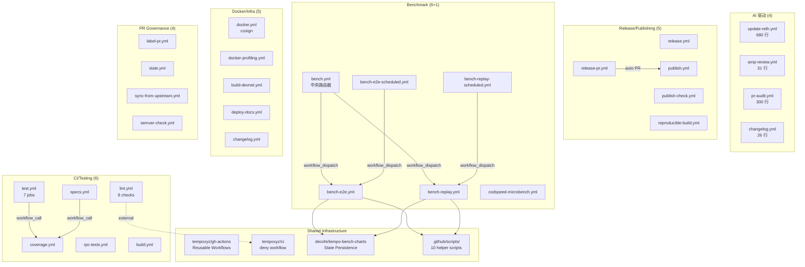

# Tempo GitHub Actions 完整调研

> **调研日期**：2026-06-10
> **源代码版本**：
> - `tempoxyz/tempo` @ [`710b950`](https://github.com/tempoxyz/tempo/commit/710b95007d0344e49b1f197083614325502ad2a1)
> - `tempoxyz/zones` @ [`1ad6d4e`](https://github.com/tempoxyz/zones/commit/1ad6d4e40176d3addd9eeb17e1fc59db0affb016)

## Executive Summary

Tempo 是当前区块链基础设施项目中 AI-augmented CI/CD 集成最成熟的参考案例之一。其 GitHub Actions 体系涵盖 29 个 tempo workflows 和 9 个 zones workflows，覆盖从 AI 驱动的上游自动追踪（`update-reth.yml` 的 Amp CLI 三层修复循环）到多层加密 release pipeline（GPG + SLSA Sigstore + SBOM + cosign）的完整工程链路。

核心创新集中在三个领域：(1) **AI 驱动上游追踪**——行业首创的 cron → upstream detection → merge → AI fix loop → CI verification → PR creation 全自动化流程；(2) **Comment-driven 参数化 Benchmark 系统**——50+ 参数、300+ 行 JS 验证的中央路由器架构；(3) **Event-driven 审计架构**——通过 mTLS 认证的事件发布将 GitHub workflow 与外部审计服务解耦。

在 10 个改进维度评估中，Tempo 在 Upstream Auto-Sync、PR Audit、Interactive Agent、Release Pipeline、Benchmark/Performance Regression 五个维度达到"成熟"评级，在 AI Code Review、CI/Testing、Security & Supply Chain、PR Governance、Documentation & Infrastructure 五个维度达到"基础"评级。没有任何维度评为"缺失"——这在同类项目中极为罕见。

---

## 目录

1. [Workflow 完整清单——tempo repo（29 个 workflow）](#1-workflow-完整清单tempo-repo29-个-workflow)
2. [Workflow 完整清单——zones repo（9 个 workflow）](#2-workflow-完整清单zones-repo9-个-workflow)
3. [Repo 级配置分析](#3-repo-级配置分析)
4. [AI Workflow 深度分析——update-reth.yml](#4-ai-workflow-深度分析update-rethyml)
5. [AI Workflow 深度分析——amp-review.yml 与 pr-audit.yml](#5-ai-workflow-深度分析amp-reviewyml-与-pr-audityml)
6. [Release Pipeline 安全链分析](#6-release-pipeline-安全链分析)
7. [Benchmark 系统架构分析](#7-benchmark-系统架构分析)
8. [CI/Testing 策略分析](#8-citesting-策略分析)
9. [Docker/Infrastructure 与 PR Governance](#9-dockerinfrastructure-与-pr-governance)
10. [10 维度能力矩阵](#10-10-维度能力矩阵)
11. [Mantle 可借鉴模式与 Tempo 独特创新](#11-mantle-可借鉴模式与-tempo-独特创新)

---

## 1. Workflow 完整清单——tempo repo（29 个 workflow）

> **Source**: `tempoxyz/tempo@710b95007d0344e49b1f197083614325502ad2a1`, `.github/workflows/` 目录
> **Investigation date**: 2026-06-10

### 1.1 AI 驱动（3 个）

#### update-reth.yml

```yaml
workflow_name: "Update reth deps"
file: "update-reth.yml"
triggers:
  - type: schedule
    details: "cron: 0 3 * * * (每日 3:00 UTC)"
  - type: workflow_dispatch
    details: "手动触发"
purpose: "每日自动追踪 reth upstream main，AI 修复编译错误，创建/更新 PR"
category: "AI"
ai_features: true
ai_tool: "Amp CLI (ampcode.com)"
permissions:
  - "contents: write"
  - "pull-requests: write"
concurrency:
  group: "update-reth"
  cancel_in_progress: false
timeout_minutes: 120
runner: "depot-ubuntu-latest-32"
notable_patterns:
  - "三层 AI 修复循环：clippy fix (max 10, 60min) → nextest compilation fix (max 10, 60min) → CI fix (max 10, 60min)"
  - "自定义 amp-run wrapper：--stream-json 结构化输出 + --take-me-back 上下文恢复"
  - "Derek bot 账户 token 身份隔离"
  - "rebase 冲突自动解决（Cargo.toml/Cargo.lock 用 theirs，源代码用 ours）"
  - "Amp 生成 PR description（upstream commit 总结 + source migration 总结）"
  - "CI wait loop 30min + CI failure Amp fix"
  - "Slack webhook 通知（emoji-coded 状态）"
  - "graceful degradation：Amp 失败不阻塞 workflow（exit 0 + push partial work）"
```

#### amp-review.yml

```yaml
workflow_name: "Amp Code Review"
file: "amp-review.yml"
triggers:
  - type: pull_request
    details: "opened, reopened, ready_for_review, labeled"
purpose: "对带 'amp' 标签的非 draft PR 执行 AI 代码审查"
category: "AI"
ai_features: true
ai_tool: "Sourcegraph CRA (ghcr.io/sourcegraph/cra-github:latest)"
permissions:
  - "pull-requests: write"
  - "checks: write"
  - "contents: read"
concurrency:
  group: "amp-review-pr-${{ github.event.pull_request.number }}"
  cancel_in_progress: true
timeout_minutes: null
runner: "ubuntu-latest"
notable_patterns:
  - "Docker entrypoint：node /app/dist/bin/review-action.js"
  - "最小配置设计——全部逻辑委托给 Sourcegraph CRA"
  - "label 门控（'amp' 标签）+ draft 过滤"
  - "可配置 AMP_SERVER_URL（vars，非 secret）"
```

#### pr-audit.yml

```yaml
workflow_name: "Pull request audit"
file: "pr-audit.yml"
triggers:
  - type: pull_request (labeled)
    details: "添加 'cyclops' 或 'agentic-audit' 标签"
  - type: issue_comment (created)
    details: "'cyclops audit'、'@decofe cyclops audit'、'derek audit'"
purpose: "触发外部 Cyclops 深度审计服务，支持丰富参数化"
category: "AI"
ai_features: true
ai_tool: "Cyclops (external, via mTLS event)"
permissions:
  - "contents: read"
  - "issues: write (comment trigger)"
  - "pull-requests: write (comment trigger)"
concurrency:
  group: null
  cancel_in_progress: false
timeout_minutes: null
runner: "ubuntu-latest"
notable_patterns:
  - "双触发模式：label + comment"
  - "tempoxyz org 成员 ACL 验证（commenter + PR author）"
  - "300+ 行 JS 参数解析器：key=value、key:value、quoted values、boolean flags"
  - "参数：config、iterations、hours、models、run-label、dry-run、note、fast shorthand"
  - "mTLS 事件发布（EVENTS_KEY + EVENTS_CERT + EVENTS_ARGS）"
  - "Eyes emoji 即时确认 + 回复 comment 展示解析结果"
  - "Token 隔离：DEREK_BENCH_ACK_TOKEN（成员验证）、DEREK_BENCH_TOKEN（comment 操作）"
  - "Base64 编码 note 内容传递"
```

### 1.2 Release/Publishing（5 个）

#### release.yml

```yaml
workflow_name: "Release"
file: "release.yml"
triggers:
  - type: push
    details: "branches: rc/*, tags: v*.*.*"
  - type: workflow_dispatch
    details: "tag, profile, dry_run 参数"
purpose: "完整 release pipeline：multi-platform 构建 + GPG 签名 + SLSA attestation + SBOM + R2 上传"
category: "Release"
ai_features: false
ai_tool: "none"
permissions:
  - "contents: write (create-release job)"
  - "id-token: write (SLSA/SBOM attestation)"
  - "attestations: write"
  - "actions: read"
concurrency:
  group: null
  cancel_in_progress: false
timeout_minutes: null
runner: "depot-ubuntu-latest-16, depot-ubuntu-latest-arm-16, depot-macos-15"
notable_patterns:
  - "多层加密安全链：GPG → SLSA v1 → SBOM (SPDX-JSON) → cosign"
  - "3 平台 matrix（x86_64-linux, aarch64-linux, aarch64-apple-darwin）× 2 binary（tempo, tempo-sidecar）"
  - "GitHub release environment 保护"
  - "Cloudflare R2 双路由：private fork SHA-based + public binaries/"
  - "draft release + auto-detect prerelease（alpha/beta/rc）"
  - "bare binary + archive 双 attestation"
  - "rc/* 分支推送也触发构建（sha-based version）"
```

#### release-pr.yml

```yaml
workflow_name: "Release PR"
file: "release-pr.yml"
triggers:
  - type: push
    details: "branches: [main]"
purpose: "自动创建 SDK crate release changelog PR"
category: "Release"
ai_features: false
ai_tool: "none"
permissions:
  - "(via GitHub App token: contents write, pull-requests write)"
concurrency:
  group: "${{ github.workflow }}-${{ github.ref }}"
  cancel_in_progress: false
timeout_minutes: null
runner: "ubuntu-latest"
notable_patterns:
  - "GitHub App token (RELEASE_BOT_APP_ID + RELEASE_BOT_PRIVATE_KEY)"
  - "Python 脚本过滤：仅保留 SDK crate changelog 条目（tempo-alloy/primitives/chainspec/contracts）"
  - "tempoxyz/changelogs action：conventional-commit 格式"
  - "post-version-command: cargo update -w"
  - "非 v* tag release 降级为 non-latest"
```

#### publish.yml

```yaml
workflow_name: "Publish alloy crates"
file: "publish.yml"
triggers:
  - type: pull_request (closed)
    details: "merged=true && head ref startsWith 'changelog-release/'"
purpose: "合并 changelog release PR 后自动发布 crate 到 crates.io"
category: "Release"
ai_features: false
ai_tool: "none"
permissions:
  - "contents: read"
  - "id-token: write (keyless OIDC)"
concurrency:
  group: "${{ github.workflow }}-${{ github.ref }}"
  cancel_in_progress: false
timeout_minutes: null
runner: "depot-ubuntu-latest-4"
notable_patterns:
  - "keyless OIDC auth via crates-io-auth-action（无需长期 API token）"
  - "sanitize pipeline (publish-crates.sh --publish)"
  - "仅在 changelog release PR 合并时触发"
```

#### publish-check.yml

```yaml
workflow_name: "Publish check"
file: "publish-check.yml"
triggers:
  - type: pull_request
    details: "path-filtered: crates/contracts/**, crates/primitives/**, crates/chainspec/**, crates/alloy/**, scripts/*"
  - type: merge_group
purpose: "SDK crate 发布前 dry-run 验证"
category: "Release"
ai_features: false
ai_tool: "none"
permissions:
  - "contents: read"
concurrency:
  group: "${{ github.workflow }}-${{ github.head_ref || github.run_id }}"
  cancel_in_progress: true
timeout_minutes: 30
runner: "depot-ubuntu-latest-4"
notable_patterns:
  - "path-filtered：仅 SDK crate 变更触发"
  - "publish-crates.sh dry-run（无 --publish flag）"
```

#### reproducible-build.yml

```yaml
workflow_name: "Reproducible Build"
file: "reproducible-build.yml"
triggers:
  - type: push
    details: "branches: [main]"
  - type: workflow_dispatch
    details: "可选 ref 输入"
purpose: "构建 byte-deterministic tempo binary 并输出可重现 SHA256"
category: "Release"
ai_features: false
ai_tool: "none"
permissions:
  - "contents: read"
concurrency:
  group: "reproducible-build-${{ github.ref }}-${{ github.event_name }}"
  cancel_in_progress: true (push only)
timeout_minutes: null
runner: "depot-ubuntu-latest-16"
notable_patterns:
  - "SOURCE_DATE_EPOCH 确定性构建（git log -1 --pretty=%ct）"
  - "Docker Buildx + Dockerfile.reproducible 配方"
  - "3 次重试（30s/60s/90s 退避，处理 snapshot.debian.org 限流）"
  - "输出 reproducible.sha256 供独立重建者对比"
  - "7 天 artifact retention"
```

### 1.3 Benchmark（6 个）

#### bench.yml

```yaml
workflow_name: "bench"
file: "bench.yml"
triggers:
  - type: issue_comment (created)
    details: "'@decofe bench' 或 'derek bench'"
purpose: "Benchmark 中央路由器：参数解析 + org 门控 + 分发到 E2E 或 Replay"
category: "Benchmark"
ai_features: false
ai_tool: "none"
permissions:
  - "contents: read"
  - "actions: write"
  - "issues: write"
  - "pull-requests: write"
concurrency:
  group: null
  cancel_in_progress: false
timeout_minutes: null
runner: "ubuntu-latest (parse), self-hosted (dispatch)"
notable_patterns:
  - "50+ 参数、597 行 workflow（含 300+ 行 JS 验证）"
  - "参数类别：mode/preset、E2E tuning、hardfork testing、feature flags、refs、profiling、observability、replay-specific、run control"
  - "PR head SHA pinning 保证可重现性"
  - "Eyes emoji ACK + 详细配置摘要 comment"
  - "tempoxyz org 成员验证"
  - "workflow_dispatch 分发到 bench-e2e.yml 或 bench-replay.yml"
```

#### bench-e2e.yml

```yaml
workflow_name: "bench-e2e"
file: "bench-e2e.yml"
triggers:
  - type: workflow_dispatch
    details: "从 bench.yml 分发"
purpose: "E2E 双节点对比 Benchmark：baseline vs feature builds"
category: "Benchmark"
ai_features: false
ai_tool: "none"
permissions:
  - "contents: read"
  - "actions: write"
  - "issues: write"
  - "pull-requests: write"
concurrency:
  group: "bench-e2e"
  cancel_in_progress: false
timeout_minutes: 300
runner: "self-hosted, bare-metal-dual-schelk"
notable_patterns:
  - "1124 行 workflow"
  - "Nushell 脚本驱动（bench-e2e.nu）"
  - "State bloat 模拟（0-100 GiB）"
  - "Hardfork A/B 测试（独立 hardfork 版本）"
  - "Profiling 集成：Samply（Firefox Profiler URL）、Tracy（native viewer, duration/offset）"
  - "Observability：OTLP traces/logs → ClickHouse → Grafana 动态 URL"
  - "ValScope 静态报告"
  - "结果 PR comment + Slack 通知"
```

#### bench-e2e-scheduled.yml

```yaml
workflow_name: "bench-e2e-scheduled"
file: "bench-e2e-scheduled.yml"
triggers:
  - type: schedule
    details: "cron: 0 2 * * * (每日 02:00 UTC)"
  - type: push
    details: "tags: v*.*.*"
purpose: "Nightly E2E regression benchmark + release tag 对比"
category: "Benchmark"
ai_features: false
ai_tool: "none"
permissions:
  - "contents: read"
  - "actions: write"
concurrency:
  group: "bench-e2e-scheduled"
  cancel_in_progress: false
timeout_minutes: null
runner: "ubuntu-latest (refs resolution)"
notable_patterns:
  - "Nightly 与上次成功运行对比"
  - "release tag 与前一个 release 对比"
  - "外部 state repo (decofe/tempo-bench-charts) 持久化 baseline"
  - "Stale Docker 检测（>24h）→ Slack 告警"
  - "bench-e2e-scheduled-refs.sh 解析 refs"
```

#### bench-replay.yml

```yaml
workflow_name: "bench-replay"
file: "bench-replay.yml"
triggers:
  - type: workflow_dispatch
    details: "从 bench.yml 分发"
purpose: "链上 block replay benchmark：真实 Tempo blocks 通过 Engine API"
category: "Benchmark"
ai_features: false
ai_tool: "none"
permissions:
  - "contents: read"
  - "actions: write"
  - "issues: write"
  - "pull-requests: write"
concurrency:
  group: "bench-replay"
  cancel_in_progress: false
timeout_minutes: 300
runner: "self-hosted, bare-metal-dual-schelk"
notable_patterns:
  - "714 行 workflow"
  - "Chain 选择：mainnet/testnet"
  - "交替执行：baseline-1 → feature-1 → baseline-2 → feature-2"
  - "Python 分析 + matplotlib 图表（latency_throughput、wait_breakdown、gas_vs_latency）"
  - "图表推送到 decofe/tempo-bench-charts repo"
  - "Samply + OTLP profiling 支持"
  - "Slack 通知策略：always/on-win/on-error/never"
```

#### bench-replay-scheduled.yml

```yaml
workflow_name: "bench-replay-scheduled"
file: "bench-replay-scheduled.yml"
triggers:
  - type: schedule
    details: "cron: 0 0 * * * (mainnet 00:00 UTC), 1 0 * * * (testnet 00:01 UTC)"
  - type: workflow_dispatch
    details: "force run"
purpose: "Nightly per-chain replay regression benchmark"
category: "Benchmark"
ai_features: false
ai_tool: "none"
permissions:
  - "contents: read"
  - "actions: write"
concurrency:
  group: "bench-replay-scheduled-${{ matrix.chain || inputs.chain || 'mainnet' }}"
  cancel_in_progress: false
timeout_minutes: null
runner: "ubuntu-latest (refs resolution)"
notable_patterns:
  - "Per-chain 错峰调度（mainnet 00:00, testnet 00:01）"
  - "State 持久化到 tempo-bench-charts repo"
  - "bench-replay-scheduled-refs.sh 解析 refs"
  - "Stale Docker 检测 + Slack 告警"
```

#### codspeed-microbench.yml

```yaml
workflow_name: "CodSpeed microbenchmarks"
file: "codspeed-microbench.yml"
triggers:
  - type: push
    details: "branches: [main]"
  - type: pull_request
  - type: workflow_dispatch
    details: "packages、targets、filter、mode 参数（backtesting 用）"
purpose: "Criterion-compatible Rust 微基准测试集成"
category: "Benchmark"
ai_features: false
ai_tool: "none"
permissions:
  - "contents: read"
concurrency:
  group: "${{ github.workflow }}-${{ github.head_ref || github.run_id }}"
  cancel_in_progress: true
timeout_minutes: 60
runner: "depot-ubuntu-latest-4"
notable_patterns:
  - "CodSpeed CI integration（codspeed-hq/action）"
  - "cargo-codspeed 从 GitHub repo 安装（pinned revision）"
  - "包：tempo-evm、tempo-precompiles"
  - "Feature 隔离：test-utils feature for tempo-precompiles"
  - "Backtesting 支持：customizable mode（simulation/wall_time）"
```

### 1.4 CI/Testing（6 个）

#### lint.yml

```yaml
workflow_name: "Lint"
file: "lint.yml"
triggers:
  - type: push
    details: "branches: [main]"
  - type: pull_request
  - type: merge_group
purpose: "多层代码质量检查：clippy/fmt/feature powerset/docs/typos/deny/zepter/no-std"
category: "CI"
ai_features: false
ai_tool: "none"
permissions:
  - "contents: read"
concurrency:
  group: "${{ github.workflow }}-${{ github.head_ref || github.run_id }}"
  cancel_in_progress: true
timeout_minutes: 30
runner: "depot-ubuntu-latest-16 (clippy), depot-ubuntu-latest-4 (others)"
notable_patterns:
  - "8 个检查 job + lint-success 聚合器（alls-green）"
  - "clippy: nightly, all-targets, all-features, -D warnings"
  - "crate-checks: feature powerset 2 分区验证"
  - "docs: cargo doc 部署到 GitHub Pages"
  - "no-std: RISC-V 32 (riscv32imac-unknown-none-elf) 交叉编译"
  - "deny: 外部 workflow from tempoxyz/ci"
  - "zepter: feature propagation 一致性"
```

#### test.yml

```yaml
workflow_name: "Test"
file: "test.yml"
triggers:
  - type: push
    details: "branches: [main]"
  - type: pull_request
  - type: merge_group
purpose: "完整测试套件：分区测试 + E2E + flaky + CLI + MSRV"
category: "CI"
ai_features: false
ai_tool: "none"
permissions:
  - "contents: read"
concurrency:
  group: "${{ github.workflow }}-${{ github.head_ref || github.run_id }}"
  cancel_in_progress: true
timeout_minutes: 30
runner: "depot-ubuntu-latest-16"
notable_patterns:
  - "genesis 生成验证（100 accounts + test-genesis.json 一致性）"
  - "test: 2 分区 nextest + 条件覆盖率（precompile change detection）"
  - "e2e: 3 分区, RUST_MIN_STACK=8388608（栈溢出缓解）"
  - "e2e-flaky: continue-on-error 独立 flaky suite"
  - "cli: smoke test (test-cli.sh)"
  - "msrv: Rust 1.93 最低版本检查"
  - "test-success 聚合器"
```

#### coverage.yml

```yaml
workflow_name: "Precompiles Coverage"
file: "coverage.yml"
triggers:
  - type: workflow_call
    details: "从 test.yml 和 specs.yml 调用"
purpose: "合并 cargo + forge 覆盖率数据，生成 HTML 报告和 PR comment"
category: "CI"
ai_features: false
ai_tool: "none"
permissions:
  - "contents: read"
  - "pull-requests: write"
concurrency:
  group: null
  cancel_in_progress: false
timeout_minutes: null
runner: "depot-ubuntu-latest-16"
notable_patterns:
  - "等待 Test workflow 完成（max 30 min polling）"
  - "LLVM profdata → lcov → HTML 报告"
  - "合并 cargo test + forge test 覆盖数据"
  - "PR comment 覆盖率摘要（file-by-file breakdown）"
  - "条件触发（check-precompiles change detection）"
```

#### specs.yml

```yaml
workflow_name: "Specs"
file: "specs.yml"
triggers:
  - type: push
    details: "branches: [main], path-filtered"
  - type: pull_request
    details: "path-filtered"
  - type: merge_group
purpose: "Solidity/Rust precompile 规范验证 + ABI alignment"
category: "CI"
ai_features: false
ai_tool: "none"
permissions:
  - "contents: read"
concurrency:
  group: "${{ github.workflow }}-${{ github.head_ref || github.run_id }}"
  cancel_in_progress: true
timeout_minutes: null
runner: "ubuntu-latest, depot-ubuntu-latest-16 (Rust), depot-ubuntu-latest-4"
notable_patterns:
  - "forge build + ABI alignment check (Rust vs Solidity)"
  - "foundry-resolver-smoke test（依赖变更触发）"
  - "条件 forge test coverage（precompile change detection）"
  - "specs-success 聚合器（foundry-test allowed to fail）"
  - "覆盖率数据传递到 coverage.yml"
```

#### rpc-tests.yml

```yaml
workflow_name: "RPC Tests"
file: "rpc-tests.yml"
triggers:
  - type: pull_request
    details: "path-filtered: crates/node, crates/primitives, crates/revm"
  - type: merge_group
purpose: "Live RPC 端点测试（testnet required, devnet optional）"
category: "CI"
ai_features: false
ai_tool: "none"
permissions:
  - "contents: read"
concurrency:
  group: "${{ github.workflow }}-${{ github.head_ref || github.run_id }}"
  cancel_in_progress: true
timeout_minutes: null
runner: "depot-ubuntu-latest-4"
notable_patterns:
  - "Matrix: testnet (allow_failure: false) + devnet (allow_failure: true)"
  - "ci-rpc nextest profile"
  - "Path-filtered: 仅 node/primitives/revm 变更触发"
```

#### build.yml

```yaml
workflow_name: "Build binaries"
file: "build.yml"
triggers:
  - type: workflow_dispatch
    details: "profile: release/maxperf/profiling"
purpose: "手动触发二进制构建"
category: "CI"
ai_features: false
ai_tool: "none"
permissions:
  - "contents: read"
concurrency:
  group: "build-${{ github.head_ref }}"
  cancel_in_progress: true
timeout_minutes: null
runner: "depot-ubuntu-latest-16"
notable_patterns:
  - "3 profile 选择（release, maxperf, profiling）"
  - "构建 tempo + tempo-sidecar"
  - "cloudposse matrix outputs writer"
```

### 1.5 Docker/Infrastructure（5 个）

#### docker.yml

```yaml
workflow_name: "Docker Build"
file: "docker.yml"
triggers:
  - type: push
    details: "branches: [main, rc/*], tags: v*.*.*"
  - type: merge_group
  - type: workflow_dispatch
    details: "nightly toggle"
  - type: workflow_call
  - type: schedule
    details: "cron: 5 9 * * *（每日 09:05 UTC）"
purpose: "多镜像 Docker 构建 + cosign 签名 + event 发布"
category: "Docker"
ai_features: false
ai_tool: "none"
permissions:
  - "contents: read"
  - "packages: write"
  - "id-token: write"
concurrency:
  group: null
  cancel_in_progress: false
timeout_minutes: null
runner: "depot-ubuntu-latest-16"
notable_patterns:
  - "3 镜像 matrix: tempo, tempo-sidecar, tempo-xtask"
  - "ghcr.io + Docker Hub 双推"
  - "标签策略：semver, latest, edge, nightly, sha, pr"
  - "cosign 递归签名"
  - "mTLS 事件发布（sha tag + nightly tag）"
  - "Friday timeout 延长（172800s vs 18000s）"
  - "fork 过滤（非 tempoxyz/tempo skip main push）"
  - "depot bake-action 多镜像并行构建"
```

#### docker-profiling.yml

```yaml
workflow_name: "Docker Build (Profiling)"
file: "docker-profiling.yml"
triggers:
  - type: workflow_dispatch
    details: "tag 参数"
purpose: "构建性能分析专用 Docker 镜像"
category: "Docker"
ai_features: false
ai_tool: "none"
permissions:
  - "contents: read"
  - "packages: write"
  - "id-token: write"
concurrency:
  group: null
  cancel_in_progress: false
timeout_minutes: null
runner: "depot-ubuntu-latest-16"
notable_patterns:
  - "docker-bake-profiling.hcl 专用配方"
  - "自定义 tag 前缀（默认 'profiling'）"
```

#### build-devnet.yml

```yaml
workflow_name: "Build devnet from branch"
file: "build-devnet.yml"
triggers:
  - type: issue_comment (created)
    details: "'/build-devnet' command"
purpose: "PR comment 触发 devnet 构建"
category: "Docker"
ai_features: false
ai_tool: "none"
permissions:
  - "pull-requests: read"
concurrency:
  group: null
  cancel_in_progress: false
timeout_minutes: null
runner: "ubuntu-latest"
notable_patterns:
  - "MEMBER author_association 权限验证"
  - "mTLS 事件发布到外部编排服务"
  - "Devnet 命名：devnet-pr-{PR_NUMBER}"
```

#### deploy-docs.yml

```yaml
workflow_name: "Deploy TIPs to Docs"
file: "deploy-docs.yml"
triggers:
  - type: push
    details: "branches: [main], paths: tips/**"
  - type: workflow_dispatch
purpose: "TIPs 文档变更触发 Vercel 部署"
category: "Infra"
ai_features: false
ai_tool: "none"
permissions: {}
concurrency:
  group: null
  cancel_in_progress: false
timeout_minutes: null
runner: "ubuntu-latest"
notable_patterns:
  - "极简实现：单步 curl Vercel deploy hook"
  - "path-filtered: 仅 tips/ 变更触发"
```

#### changelog.yml

```yaml
workflow_name: "Changelog"
file: "changelog.yml"
triggers:
  - type: pull_request
    details: "opened, synchronize; path-filtered: crates/contracts, primitives, chainspec, alloy"
purpose: "SDK crate 变更自动生成 changelog 条目"
category: "Infra"
ai_features: true
ai_tool: "AMP codegen (amp -x)"
permissions:
  - "contents: write"
  - "pull-requests: write"
concurrency:
  group: null
  cancel_in_progress: false
timeout_minutes: null
runner: "ubuntu-latest"
notable_patterns:
  - "wevm/changelogs/check action + AI 增强"
  - "amp -x 命令行调用生成 changelog"
  - "Rust 生态系统模式"
  - "path-filtered: 仅 SDK crate 变更触发"
```

### 1.6 PR Governance/Maintenance（4 个）

#### label-pr.yml

```yaml
workflow_name: "Label PRs"
file: "label-pr.yml"
triggers:
  - type: pull_request
    details: "opened"
purpose: "基于文件变更自动添加 PR 标签"
category: "Governance"
ai_features: false
ai_tool: "none"
permissions:
  - "contents: read"
  - "issues: write"
  - "pull-requests: write"
concurrency:
  group: null
  cancel_in_progress: false
timeout_minutes: null
runner: "ubuntu-latest"
notable_patterns:
  - "github-script + 自定义 label_pr.js"
```

#### stale.yml

```yaml
workflow_name: "Close Stale PRs"
file: "stale.yml"
triggers:
  - type: schedule
    details: "cron: 0 0 * * * (每日 00:00 UTC)"
purpose: "过期 PR 清理"
category: "Governance"
ai_features: false
ai_tool: "none"
permissions:
  - "issues: write"
  - "pull-requests: write"
concurrency:
  group: null
  cancel_in_progress: false
timeout_minutes: null
runner: "ubuntu-latest"
notable_patterns:
  - "7 天 stale + 3 天 close"
  - "draft PR 不豁免（exempt-draft-pr: false）"
  - "仅处理 PR（issue stale/close 均设为 -1）"
```

#### sync-from-upstream.yml

```yaml
workflow_name: "Sync main branch with upstream"
file: "sync-from-upstream.yml"
triggers:
  - type: schedule
    details: "cron: 0 * * * * (每小时)"
  - type: workflow_dispatch
purpose: "Fork 每小时自动同步上游 main（仅在非官方 repo 运行）"
category: "Governance"
ai_features: false
ai_tool: "none"
permissions: {}
concurrency:
  group: null
  cancel_in_progress: false
timeout_minutes: null
runner: "ubuntu-latest"
notable_patterns:
  - "GitHub App token（SYNC_APP_ID + SYNC_APP_PRIVATE_KEY）"
  - "官方 repo 自动跳过（github.repository != 'tempoxyz/tempo'）"
  - "git reset --hard upstream/main + force push"
```

#### semver-check.yml

```yaml
workflow_name: "Semver check"
file: "semver-check.yml"
triggers:
  - type: pull_request
    details: "path-filtered: crates/contracts, primitives, chainspec, alloy, scripts, Cargo.toml"
  - type: merge_group
purpose: "SDK crate 语义版本检查"
category: "Governance"
ai_features: false
ai_tool: "none"
permissions:
  - "contents: read"
concurrency:
  group: "${{ github.workflow }}-${{ github.head_ref || github.run_id }}"
  cancel_in_progress: true
timeout_minutes: 30
runner: "depot-ubuntu-latest-4"
notable_patterns:
  - "cargo-semver-checks"
  - "publish-crates.sh --semver-check"
  - "path-filtered: 仅 SDK crate 变更触发"
```

---

## 2. Workflow 完整清单——zones repo（9 个 workflow）

> **Source**: `tempoxyz/zones@1ad6d4e40176d3addd9eeb17e1fc59db0affb016`, `.github/workflows/` 目录
> **Investigation date**: 2026-06-10

#### build.yml (zones)

```yaml
workflow_name: "Build binaries"
file: "build.yml"
triggers:
  - type: workflow_dispatch
    details: "profile: release/maxperf/profiling"
purpose: "手动构建 tempo, tempo-bench, tempo-sidecar 二进制"
category: "CI"
ai_features: false
ai_tool: "none"
notable_patterns:
  - "额外构建 tempo-bench binary（tempo repo 无此 target）"
  - "使用 just build 命令（vs tempo 的 cargo build）"
  - "pinned action versions 与 tempo 略有差异"
```

#### docker.yml (zones)

```yaml
workflow_name: "Docker Build"
file: "docker.yml"
triggers:
  - type: push/pull_request/merge_group/workflow_dispatch/workflow_call/schedule
    details: "双 daily schedule: 09:05, 20:30 UTC"
purpose: "zones Docker 镜像构建"
category: "Docker"
ai_features: false
ai_tool: "none"
notable_patterns:
  - "仅 ghcr.io（无 Docker Hub）"
  - "仅 tempo-zone 镜像（tempo 有 3 个）"
  - "无 cosign 签名"
  - "无 mTLS 事件发布"
  - "双 daily schedule（tempo 仅单次）"
  - "PR 构建不推送"
```

#### docker-profiling.yml (zones)

```yaml
workflow_name: "Docker Build (Profiling)"
file: "docker-profiling.yml"
triggers:
  - type: workflow_dispatch
purpose: "性能分析 Docker 镜像"
category: "Docker"
notable_patterns:
  - "结构与 tempo 版本基本一致"
```

#### label-pr.yml (zones)

```yaml
workflow_name: "Label PRs"
file: "label-pr.yml"
triggers:
  - type: pull_request (opened)
purpose: "自动 PR 标签"
category: "Governance"
notable_patterns:
  - "与 tempo 版本结构一致"
```

#### lint.yml (zones)

```yaml
workflow_name: "Lint"
file: "lint.yml"
triggers:
  - type: push/pull_request/merge_group
purpose: "clippy + fmt + typos 检查"
category: "CI"
notable_patterns:
  - "3 个检查（vs tempo 的 8 个）"
  - "pinned nightly-2026-02-21（shellexpand 兼容性 workaround）"
  - "无 feature powerset / no-std / deny / zepter / docs"
  - "需要先 forge build 以生成 Solidity artifacts"
```

#### pr-audit.yml (zones)

```yaml
workflow_name: "Pull request audit"
file: "pr-audit.yml"
triggers:
  - type: pull_request (labeled)
    details: "required-label: cyclops"
purpose: "PR 审计（通过 reusable workflow）"
category: "AI"
ai_features: true
ai_tool: "Cyclops (via reusable workflow)"
notable_patterns:
  - "Reusable workflow: tempoxyz/gh-actions/.github/workflows/pr-audit.yml@main"
  - "仅 label trigger（无 comment trigger）"
  - "仅传递 secrets（EVENTS_KEY/EVENTS_CERT/EVENTS_ARGS）"
  - "标志着 Tempo 向共享 workflow 基础设施演进"
```

#### release.yml (zones)

```yaml
workflow_name: "Release"
file: "release.yml"
triggers:
  - type: push (tags: v*.*.*) + workflow_dispatch
purpose: "zones 简化版 release pipeline"
category: "Release"
notable_patterns:
  - "无 GPG 签名"
  - "无 SLSA attestation"
  - "无 SBOM 生成"
  - "无 Cloudflare R2 上传"
  - "仅 checksum（.sha256）"
  - "仅 tempo-zone binary"
```

#### specs.yml (zones)

```yaml
workflow_name: "Specs"
file: "specs.yml"
triggers:
  - type: push/pull_request/merge_group
    details: "path-filtered"
purpose: "zone-only forge tests + ABI check"
category: "CI"
notable_patterns:
  - "zone-only: forge fmt/test 仅针对 src/zone + test/zone"
  - "无覆盖率集成"
  - "specs-success 聚合器"
```

#### test.yml (zones)

```yaml
workflow_name: "Test"
file: "test.yml"
triggers:
  - type: push/pull_request/merge_group
purpose: "zones 测试"
category: "CI"
notable_patterns:
  - "单 job（无分区）"
  - "需要 forge build 前置"
  - "test-success 聚合器"
```

### tempo vs zones Workflow 覆盖矩阵 (diag-7)

| 类别 | tempo Workflow | zones 对应 | 差异说明 |
|------|--------------|-----------|---------|
| AI 驱动 | update-reth, amp-review, pr-audit (300 行内联) | pr-audit (reusable, 16 行) | zones 无 AI review/upstream sync；pr-audit 为 reusable workflow 简化版 |
| Release | release (+GPG/SLSA/SBOM/R2), release-pr, publish, publish-check, reproducible-build | release (仅 checksum) | zones 无任何加密签名链，无自动发布流程 |
| Benchmark | bench 全系列 (6 files, ~3200 行) | 无 | zones 完全缺失 benchmark 系统 |
| CI/Testing | lint (8 checks), test (7 jobs), coverage, specs, rpc-tests, build | lint (3 checks), test (1 job), specs (zone-only), build | zones 大幅简化：无 feature powerset, no-std, coverage, rpc-tests, flaky, MSRV |
| Docker | docker (3 镜像, cosign, events, Docker Hub) + profiling | docker (1 镜像, 仅 ghcr.io) + profiling | zones 无 cosign、无 events、无 Docker Hub 双推 |
| Governance | label-pr, stale, sync-from-upstream, semver-check | label-pr | zones 仅保留自动标签 |
| Infra | deploy-docs, changelog | 无 | zones 无文档部署和 AI changelog |

---

## 3. Repo 级配置分析

### 3.1 CODEOWNERS

**tempo repo**（23 条规则）：

路径级所有权覆盖所有核心模块：

| 路径 | 所有者 | 角色 |
|------|-------|------|
| `bin/tempo` | @0xKitsune @klkvr @Zygimantass @SuperFluffy | 核心 binary |
| `bin/tempo-sidecar` | @Zygimantass | Sidecar |
| `contrib/` | @Zygimantass | 贡献指南 |
| `scripts/` | @0xKitsune | 脚本维护 |
| `xtask/` | @0xKitsune @Zygimantass @SuperFluffy | 构建任务 |
| `crates/alloy/` | @klkvr @onbjerg @mattsse | Alloy 集成 |
| `crates/chainspec/` | @0xKitsune @klkvr @mattsse | 链配置 |
| `crates/commonware-node*` | @joshieDo @SuperFluffy @hamdiallam | Commonware 节点 |
| `crates/consensus/` | @joshieDo @SuperFluffy @hamdiallam | 共识 |
| `crates/contracts/` | @0xKitsune @fgimenez @klkvr @mattsse @legion2002 @howydev | 合约 |
| `crates/e2e/` | @joshieDo @SuperFluffy @hamdiallam | E2E 测试 |
| `crates/evm/` | @0xKitsune @klkvr @mattsse | EVM |
| `crates/precompiles/` | @0xrusowsky @0xKitsune @fgimenez @klkvr @mattsse @legion2002 @howydev | Precompiles（最多审查者） |
| `crates/revm/` | @klkvr @mattsse @rakita @0xKitsune | revm 集成 |
| `tips/` | @legion2002 @howydev @0xKitsune @danrobinson @dankrad | TIPs（含学术/协议设计背景审查者） |

**zones repo**：全局通配 `* @mattsse @0xKitsune`

**分析**：tempo 的 CODEOWNERS 粒度与 `specs.yml` 和 `semver-check.yml` 的 path filter 存在协同——两者都针对 `crates/contracts`、`crates/primitives` 等路径。zones 的全局通配反映其作为辅助项目的简化治理。

### 3.2 dependabot.yml

| 配置项 | tempo | zones |
|--------|-------|-------|
| 生态系统数 | 3（cargo, github-actions, docker） | 2（cargo, github-actions） |
| 调度 | weekly (all) | weekly (all) |
| open PR limit | 1 (cargo/actions) | 无显式限制 |
| 分组策略 | minor/patch 分组 | minor/patch 分组 |
| cooldown | 7 天 | 7 天 |
| 标签 | A-dependencies, A-ci | 无 |
| commit 前缀 | chore(ci), chore(deps), chore(docker) | 无 |

**分析**：tempo 额外覆盖 docker 生态系统，且配置更精细（标签、commit 前缀）。zones 缺少 docker 更新追踪。

### 3.3 Helper Scripts

tempo 的 `.github/scripts/` 包含 10 个脚本，全部服务于 benchmark 基础设施：

| 脚本 | 大小 | 功能 | 调用方 |
|------|------|------|--------|
| `bench-e2e-classify.js` | 12K | E2E benchmark 结果分类和 PR comment 生成 | bench-e2e.yml |
| `bench-e2e-scheduled-refs.sh` | 4.9K | Nightly E2E 基线/特性 ref 解析 | bench-e2e-scheduled.yml |
| `bench-replay-charts.py` | 9.7K | Replay benchmark 图表生成（matplotlib） | bench-replay.yml |
| `bench-replay-scheduled-refs.sh` | 4.6K | Nightly replay 基线/特性 ref 解析 | bench-replay-scheduled.yml |
| `bench-replay-summary.py` | 26K | Replay benchmark 结果汇总分析 | bench-replay.yml |
| `bench-slack-notify.js` | 23K | Benchmark Slack 通知（emoji-coded、详细结果） | bench-e2e.yml, bench-replay.yml |
| `bench-slack-users.json` | 860B | Slack 用户映射 | bench-slack-notify.js |
| `bench-tempo-replay.sh` | 18K | Tempo replay 执行核心脚本 | bench-replay.yml |
| `bench-update-status.js` | 1.0K | Benchmark 状态更新到 charts repo | bench-e2e.yml, bench-replay.yml |
| `check_no_std.sh` | 447B | no-std 编译检查 | lint.yml |

**zones** 无 `.github/scripts/` 目录。

### 3.4 Repo Rulesets（Branch Protection）

> **Source**: `gh api repos/tempoxyz/tempo/rulesets` 和 `gh api repos/tempoxyz/zones/rulesets`
> **Investigation date**: 2026-06-10

**tempo repo（3 个活跃 rulesets）**：

| Ruleset | 级别 | 目标分支 | 核心规则 | 执行状态 |
|---------|------|---------|---------|---------|
| **[Global] Block Direct Push to Default Branch + Enforce Squash/Rebase Only** | Organization (tempoxyz) | `~DEFAULT_BRANCH`（排除 `bypass-rules/*`） | 禁止删除、禁止 non-fast-forward、PR 必须（0 approval）、仅允许 squash/rebase merge | active, current_user_can_bypass=never |
| **Restrict creation of release candidate (rc/\*) branches** | Repository | `refs/heads/rc/**/*` | 禁止创建、禁止更新、禁止删除、禁止 non-fast-forward | active, current_user_can_bypass=never |
| **main branch** | Repository | `refs/heads/main`, `refs/heads/release/*` | 禁止删除、禁止 non-fast-forward、**必须 1 review approval**（dismiss stale reviews）、仅 squash merge、**Required status checks**：`lint success`、`test success`、`Review` | active, current_user_can_bypass=never |

**分析**：

- **三层保护**：org 级全局规则（默认分支禁止直推）→ repo 级 RC 分支锁定（防止未授权 release candidate）→ repo 级 main 分支严格门控（review + status checks + squash only）
- **main branch ruleset** 与 CI workflow 形成协同：`lint success` 对应 `lint.yml` 的 `lint-success` 聚合器，`test success` 对应 `test.yml` 的 `test-success` 聚合器，`Review` 由 app integration (id=3551435) 提供
- **Squash-only merge** 保证 main 历史线性，与 `release-pr.yml` 的 conventional-commit changelog 生成兼容
- `current_user_can_bypass=never` 表示即使 admin 也不能绕过——严格的零例外策略
- `bypass-rules/*` 排除路径保留了紧急绕行能力，但仅限 org 级规则

**zones repo（2 个活跃 rulesets）**：

| Ruleset | 级别 | 目标分支 | 核心规则 | 执行状态 |
|---------|------|---------|---------|---------|
| **[Global] Block Direct Push to Default Branch + Enforce Squash/Rebase Only** | Organization (tempoxyz) | `~DEFAULT_BRANCH`（排除 `bypass-rules/*`） | 同 tempo（org 级共享规则） | active, current_user_can_bypass=never |
| **Protect main** | Repository | `~DEFAULT_BRANCH` | 禁止删除、禁止 non-fast-forward、PR 必须（0 approval）、squash/rebase merge | active, current_user_can_bypass=never |

**对比分析**：

| 维度 | tempo | zones |
|------|-------|-------|
| Rulesets 数量 | 3 | 2 |
| Required reviews (main) | 1 approval + dismiss stale | 0 approval |
| Required status checks | lint success, test success, Review | 无 |
| RC 分支保护 | ✅ 创建/更新/删除全禁 | ❌ |
| Merge 策略 (main) | squash only | squash 或 rebase |

zones 缺少 required status checks 和 mandatory review——与其简化的 CI 体系（3 lint + 1 test）一致。

### 3.5 GitHub Environments

> **Source**: `gh api repos/tempoxyz/tempo/environments`
> **Investigation date**: 2026-06-10

**tempo repo（6 个 environment）**：

| Environment | Protection Rules | Branch Policy | Admin Bypass | 使用 Workflow |
|-------------|-----------------|---------------|-------------|--------------|
| **release** | branch_policy | custom (非 protected-only) | **false** | release.yml (`build-release` job) |
| **release-pr** | branch_policy | custom (非 protected-only) | **false** | release-pr.yml |
| **github-pages** | branch_policy | custom (非 protected-only) | true | lint.yml (`docs` job → GitHub Pages 部署) |
| **Preview** | 无 | 无 | true | — |
| **Production** | 无 | 无 | true | — |
| **devnet** | 无 | 无 | true | — |

**分析**：

- **release 和 release-pr** 是安全关键 environment：`can_admins_bypass=false` + custom branch policy，意味着只有满足分支策略的 deployment 才能执行，admin 也无法绕过
- release environment 与 `release.yml` 的 `build-release` job 配合——该 job 拥有 `id-token: write` + `attestations: write` 权限，environment 保护确保这些高权限操作仅在授权分支上执行
- **Preview 和 Production** 虽已创建但没有保护规则——可能用于外部部署系统（Vercel 等），protection 在外部系统而非 GitHub 侧
- **devnet** 无保护规则——与 `build-devnet.yml` 的 MEMBER ACL 验证配合，权限控制在 workflow 层而非 environment 层

**zones repo**：未创建 GitHub Environments（release.yml 也不引用 environment）。

### 3.6 Secrets

> **Source**: `gh api repos/tempoxyz/tempo/actions/secrets`
> **Investigation date**: 2026-06-10

Secrets 名称列表查询返回 HTTP 403：`"You must have repository read permissions or have the repository secrets fine-grained permission."`

**已知 secrets（从 workflow YAML 引用推断）**：

| Secret | 使用 Workflow | 用途推断 |
|--------|-------------|---------|
| `DEREK_UPDATE_RETH_TOKEN` | update-reth.yml | Bot 账户 git/PR 操作 |
| `DEREK_BENCH_ACK_TOKEN` | pr-audit.yml, bench.yml | Org 成员验证 |
| `DEREK_BENCH_TOKEN` | pr-audit.yml, bench.yml | PR/issue comment |
| `AMP_API_KEY` | update-reth, amp-review, changelog | AI 工具认证 |
| `EVENTS_KEY` / `EVENTS_CERT` / `EVENTS_ARGS` | pr-audit, build-devnet, docker | mTLS 双向认证 |
| `RELEASE_BOT_APP_ID` / `RELEASE_BOT_PRIVATE_KEY` | release-pr.yml | GitHub App Release PR |
| `SYNC_APP_ID` / `SYNC_APP_PRIVATE_KEY` | sync-from-upstream.yml | Fork sync GitHub App |
| `GPG_SIGNING_KEY` / `GPG_PASSPHRASE` | release.yml | Binary GPG 签名 |
| `R2_BINARIES_KEY_ID` / `R2_BINARIES_SECRET_KEY` / `R2_BINARIES_BUCKET` / `R2_BINARIES_ENDPOINT` | release.yml | Cloudflare R2 |
| `SLACK_ENG_TEMPO_WORKFLOWS_WEBHOOK_URL` | update-reth, bench-* | Slack 通知 |
| `TEMPO_MAINNET_RPC_URL` / `TEMPO_TESTNET_RPC_URL` / `TEMPO_DEVNET_RPC_URL` | update-reth, rpc-tests | RPC 端点 |
| `CODSPEED_TOKEN` | codspeed-microbench.yml | CodSpeed 集成 |

至少 20+ 个独立 secret，按功能域隔离——与 Section 11 的 Token 隔离策略分析一致。

### 3.7 其他配置

两个 repo 均无 `PULL_REQUEST_TEMPLATE.md`。

以下配置未调查：
- 已配置的 GitHub Apps 完整列表（已知 sync-from-upstream 和 release-pr 使用 GitHub App，rulesets 中 Review status check 关联 app integration id=3551435）

---

## 4. AI Workflow 深度分析——update-reth.yml

> **Source**: `tempoxyz/tempo@710b950`, `.github/workflows/update-reth.yml` (680 行)
> **Investigation date**: 2026-06-10

### 4.1 完整流程

```mermaid
flowchart TD
    A[Cron 3:00 UTC / Manual] --> B[Checkout + Derek git identity]
    B --> C{reth-auto-bump 分支存在?}
    C -->|Yes| D[Rebase onto main]
    C -->|No| E[Create from main]
    D --> F{Rebase 冲突?}
    F -->|Yes| G[自动解决: Cargo.toml→theirs, *.rs→ours]
    F -->|No| H[继续]
    G --> H
    E --> H
    H --> I[获取 reth latest main rev]
    I --> J{已是最新?}
    J -->|Yes| K[跳过，保持现有修复]
    J -->|No| L[sed 更新所有 Cargo.toml reth rev]
    L --> M[Commit rev bump]
    M --> N[Round 1: cargo clippy fix]
    K --> N
    N --> O{clippy pass?}
    O -->|Yes| P[Round 2: nextest compilation fix]
    O -->|No| Q[Amp CLI fix attempt]
    Q --> R{attempt > 10 OR elapsed > 60min?}
    R -->|Yes| S[Push partial work, continue]
    R -->|No| N
    S --> P
    P --> T{tests compile?}
    T -->|Yes| U[Commit source fixes]
    T -->|No| V[Amp CLI fix attempt]
    V --> W{attempt > 10 OR elapsed > 60min?}
    W -->|Yes| X[Push partial work]
    W -->|No| P
    U --> Y[Zepter feature lint + auto-fix]
    X --> Y
    Y --> Z[git push --force-with-lease]
    Z --> AA[Create/Update PR]
    AA --> AB[Amp 生成 PR body: upstream summary + migrations]
    AB --> AC[CI Wait Loop]
    AC --> AD{CI 状态?}
    AD -->|All pass| AE[Done ✅]
    AD -->|Failure| AF[Amp fix from CI logs]
    AD -->|Stuck >30min| AG[Amp investigate stuck jobs]
    AF --> AH{fix attempt > 10 OR elapsed > 60min?}
    AH -->|Yes| AI[Give up ❌]
    AH -->|No| AC
    AG --> AC
    AE --> AJ[Slack notification]
    AI --> AJ
```



### 4.2 AI 修复循环详细分析

**Round 1——Clippy 修复循环**：

- **触发条件**：`cargo clippy --all-targets --all-features` 失败
- **AI 工具**：`amp-run --dangerously-allow-all -x "$AMP_PROMPT"`
- **Prompt 设计**：明确指令"运行 clippy → 看错误 → 修复 → 重复"，关键约束"不要 `#[allow(...)]`、不要修改 reth rev"
- **循环参数**：max 10 attempts, 60 分钟 deadline
- **失败处理**：exit 0（不阻塞后续步骤），标记 `clippy_passed=false`

**Round 2——Nextest 编译修复循环**：

- **触发条件**：`cargo nextest run --profile ci --no-run` 失败
- **结构**：与 Round 1 相同，但目标是测试编译
- **额外指令**：要求同时运行 `cargo check --workspace` 防止编译回归

**Round 3——CI 修复循环**：

- **触发条件**：PR CI check 失败或超时（>30 分钟）
- **工作方式**：
  1. Poll `gh pr checks` 获取状态
  2. 失败 → `gh run view --log-failed` 获取日志 → Amp 分析修复
  3. 超时 → `gh run view --log` 获取进行中日志 → Amp 分析 stuck 原因
- **循环参数**：max 10 attempts, 60 分钟 deadline
- **自动推送**：修复后自动 commit + push 触发新 CI run

### 4.3 amp-run Wrapper 设计

```bash
amp "$@" --stream-json --take-me-back 2>&1
```

- `--stream-json`：结构化 JSON 输出，包含 session_id 和 result
- `--take-me-back`：执行后恢复工作目录上下文
- Thread URL 提取：从首行 JSON 的 `session_id` 构建 Amp 线程链接
- 错误传播：检测 `result.is_error` 决定 exit code

### 4.4 安全模型

| Token | 用途 | 隔离域 |
|-------|------|--------|
| `DEREK_UPDATE_RETH_TOKEN` | Git push、PR 操作、GitHub API | 专用 bot 账户身份 |
| `AMP_API_KEY` | Amp CLI AI 调用 | AI 工具认证 |
| `TEMPO_MAINNET_RPC_URL` | 运行时测试 | RPC 访问 |
| `TEMPO_TESTNET_RPC_URL` | 运行时测试 | RPC 访问 |
| `TEMPO_DEVNET_RPC_URL` | 运行时测试 | RPC 访问 |
| `SLACK_ENG_TEMPO_WORKFLOWS_WEBHOOK_URL` | 通知 | Slack 集成 |

**Derek bot 账户**：通过 `gh api /user` 动态获取用户信息配置 git identity，实现 push 操作与个人账户的完全隔离。

### 4.5 容错设计

1. **Amp 失败不阻塞**：所有 Amp 循环使用 `exit 0`，推送 partial work 而非终止 workflow
2. **Rebase 冲突自动解决**：Cargo.toml/Cargo.lock 接受 main 版本（将被覆盖），源代码保留 our 修复
3. **Force-with-lease push**：避免覆盖他人变更
4. **CI fix 失败明确退出**："Amp made no changes but CI is still failing — giving up"
5. **Job timeout 120 分钟**：硬限制防止无限运行

### 4.6 PR Description AI 生成

Amp CLI 在两个场景生成 PR 内容：
1. **Upstream changes 总结**：从 reth compare API 获取 commit 列表 → Amp 生成按领域分组的 bullet list
2. **Source migrations 总结**：从 `git diff origin/main -- '*.rs' '*.toml'` → Amp 生成迁移说明

两处均有 graceful degradation：Amp 失败时 fallback 到原始 commit 列表或 `git diff --stat`。

---

## 5. AI Workflow 深度分析——amp-review.yml 与 pr-audit.yml

### 5.1 AI Workflow 对比矩阵 (diag-3)

| 维度 | update-reth.yml | amp-review.yml | pr-audit.yml | changelog.yml |
|------|----------------|----------------|--------------|---------------|
| AI 工具 | Amp CLI (ampcode.com) | Sourcegraph CRA (Docker) | Cyclops (external) | AMP codegen (amp -x) |
| 触发方式 | cron 3:00 UTC + manual | PR events + 'amp' label | Label (cyclops/agentic-audit) + comment (cyclops audit/derek audit) | PR opened/sync + path filter |
| 安全模型 | Derek bot token + AMP_API_KEY | GITHUB_TOKEN + AMP_API_KEY | mTLS (EVENTS_KEY/CERT) + org ACL + 2 独立 Derek tokens | AMP_API_KEY |
| 参数化 | 无（自动决策） | 无（Sourcegraph 内部配置） | 300+ 行 JS 解析器：config, iterations, hours, models, run-label, dry-run, note, fast | 无 |
| 输出类型 | PR (代码修复 + AI 生成描述) | PR review comments | mTLS event → 外部审计服务 | Changelog 条目 commit |
| 容错设计 | 三层循环 + graceful degradation | 无（Sourcegraph 内部处理） | continue-on-error event publish + status update comment | 无 |
| 行数 | 680 | 31 | 300 | 26 |

### 5.2 amp-review.yml 详细分析

极简设计——全部逻辑委托给 Sourcegraph CRA Docker 镜像：

```yaml
uses: docker://ghcr.io/sourcegraph/cra-github:latest
env:
  GITHUB_TOKEN: ${{ secrets.GITHUB_TOKEN }}
  AMP_SERVER_URL: ${{ vars.AMP_SERVER_URL }}
  AMP_API_KEY: ${{ secrets.AMP_API_KEY }}
with:
  args: node /app/dist/bin/review-action.js
```

**设计特点**：
- 31 行 workflow，几乎零自定义逻辑
- Label 门控（`amp` 标签）+ draft 过滤确保仅对准备好的 PR 触发
- Per-PR 并发控制（cancel-in-progress: true）——新 push 取消旧 review
- `AMP_SERVER_URL` 使用 vars（非 secret），支持环境切换

### 5.3 pr-audit.yml 详细分析

**双触发架构**：

1. **Label trigger**（`publish` job）：
   - 简单直接：检测 `cyclops` 或 `agentic-audit` 标签 → 发布 mTLS event
   - 最小 payload：`{pr_number, sha}`

2. **Comment trigger**（`publish-comment` job）：
   - 复杂参数解析：支持 `cyclops audit fast iterations=3 hours=2 config=custom.yaml models="claude-opus-4-7,gpt-5.5" note="focus on auth"`
   - Org 成员双重验证：commenter 和 PR author 都必须是 tempoxyz 成员
   - Eyes emoji 即时反馈
   - 详细配置摘要 comment
   - Base64 编码 note 传递

**参数解析器核心逻辑**（300+ 行 JS）：

- 正则分词：`(\S+?[=:]"[^"]*"|\S+?[=:]'[^']*'|\S+?[=:]\S+|\S+)`
- 类型验证：`intArgs` (iterations, hours)、`stringArgs` (config, models, run-label, note)、`boolArgs` (dry-run)
- `fast` 快捷方式 → `iterations=1`
- note 最大 160 字符
- 未知参数报错 + usage 说明

**mTLS 事件发布**：

```bash
curl -sf -o /dev/null -X POST ${{ secrets.EVENTS_ARGS }} \
  -H "Content-Type: application/json" \
  --key "${RUNNER_TEMP}/key" \
  --cert "${RUNNER_TEMP}/cert" \
  -d @"${RUNNER_TEMP}/pr-audit-event.json"
```

EVENTS_ARGS 可能包含 URL 以外的 curl 参数（灵活性设计）。

### 5.4 zones pr-audit.yml——Reusable Workflow 演进

```yaml
jobs:
  audit:
    uses: tempoxyz/gh-actions/.github/workflows/pr-audit.yml@main
    with:
      required-label: cyclops
    secrets:
      EVENTS_KEY: ${{ secrets.EVENTS_KEY }}
      EVENTS_CERT: ${{ secrets.EVENTS_CERT }}
      EVENTS_ARGS: ${{ secrets.EVENTS_ARGS }}
```

16 行 vs tempo 的 300 行。这标志着 Tempo 向共享 workflow 基础设施的演进——复杂逻辑抽取到 `tempoxyz/gh-actions` 仓库，消费方通过 reusable workflow 集成。zones 版本仅支持 label trigger，不支持 comment trigger。

---

## 6. Release Pipeline 安全链分析

### 6.1 tempo release.yml 安全链流程 (diag-5)



**完整安全链步骤**：

1. **Version 验证** (`check-version` job)：
   - `cargo metadata` 版本与 git tag 一致性检查
   - 支持 `v1.4.8` 匹配 `v1.4.8-rc.1`（前缀匹配）
   - rc/* 分支推送跳过版本检查

2. **Multi-platform 构建** (`build-release` job)：
   - Matrix: x86_64-linux × aarch64-linux × aarch64-apple-darwin
   - Binaries: tempo × tempo-sidecar
   - GitHub `release` environment 保护
   - `id-token: write` + `attestations: write` 权限

3. **SBOM 生成**：
   - `anchore/sbom-action@v0.24.0`
   - SPDX-JSON 格式
   - 禁用 action 自身的 artifact/release 上传（保持 asset 列表确定性）

4. **GPG 签名**：
   - `GPG_SIGNING_KEY`（Base64 encoded）+ `GPG_PASSPHRASE`
   - 临时 GNUPGHOME（mktemp -d）
   - 生成 `.asc` detached 签名

5. **SBOM Attestation**：
   - `actions/attest@v4.1.0`
   - 同时 attest archive 和 bare binary
   - `sbom-path` 模式切换到 SBOM attestation

6. **SLSA v1 Build Provenance**：
   - 同一 `actions/attest@v4.1.0`，无 `sbom-path` → 自动 SLSA predicate
   - Keyless Sigstore via GitHub OIDC
   - 同时 attest archive 和 bare binary

7. **Checksum**：
   - archive + bare binary 双 `.sha256` 文件
   - bare binary checksum 供独立重建者对比

8. **Release 创建**：
   - Draft release
   - Auto-detect prerelease（alpha/beta/rc 正则匹配）

9. **Cloudflare R2 上传**：
   - Private fork: `{SHA}/{VERSION}/` 路径
   - Public: `binaries/{VERSION}/` 路径
   - `R2_BINARIES_KEY_ID` + `R2_BINARIES_SECRET_KEY` + `R2_BINARIES_BUCKET` + `R2_BINARIES_ENDPOINT`

### 6.2 zones release.yml 对比

| 安全层 | tempo | zones |
|--------|-------|-------|
| Version check | ✅ cargo metadata vs tag | ✅ |
| Multi-platform build | ✅ 3 platform × 2 binary | ✅ 3 platform × 1 binary |
| SBOM (SPDX-JSON) | ✅ anchore/sbom-action | ❌ |
| GPG 签名 | ✅ .asc detached | ❌ |
| SLSA v1 Attestation | ✅ actions/attest | ❌ |
| SBOM Attestation | ✅ archive + bare binary | ❌ |
| Checksum | ✅ archive + bare binary | ✅ archive only |
| Cloudflare R2 | ✅ 双路由 | ❌ |
| GitHub environment | ✅ release | ❌ |

**设计取舍分析**：zones 作为辅助项目，省略了所有加密签名和 attestation 层。这反映了一个合理的权衡——安全链成本（secret 管理、环境配置、构建时间）在辅助项目上的 ROI 较低。但这也意味着 zones binary 没有独立的供应链验证能力。

### 6.3 相关 Publishing Workflows

| Workflow | 功能 | 关键技术 |
|----------|------|---------|
| release-pr.yml | 自动 changelog PR | GitHub App token, Python SDK crate 过滤, conventional-commit |
| publish.yml | crates.io 发布 | keyless OIDC via crates-io-auth-action, sanitize pipeline |
| publish-check.yml | 发布前验证 | path-filtered dry-run |
| reproducible-build.yml | 确定性二进制 | SOURCE_DATE_EPOCH, Docker Buildx, 3 次重试 |

### 6.4 Docker 签名

`docker.yml` 通过 cosign 签署所有推送的镜像：

```bash
images=(
  "${{ steps.meta-tempo.outputs.tags }}"
  "${{ steps.meta-tempo-sidecar.outputs.tags }}"
  "${{ steps.meta-tempo-xtask.outputs.tags }}"
)
for tags in "${images[@]}"; do
  echo "$tags" | xargs -n1 cosign sign --yes --recursive
done
```

cosign 使用 Sigstore keyless 签名（通过 GitHub OIDC token），与 release pipeline 的 SLSA attestation 形成互补。

---

## 7. Benchmark 系统架构分析

### 7.1 系统架构 (diag-4)



### 7.2 中央参数解析器（bench.yml, 597 行）

**参数类别与详细列表**：

| 类别 | 参数 | 默认值 | 说明 |
|------|------|--------|------|
| Mode/Preset | `mode` | e2e | e2e 或 replay |
| | `preset` | - | tip20, tip20_2d_nonces, mpp, mix 等 |
| E2E 调优 | `duration` | 300s (replay 90s for e2e) | 测试持续时间 |
| | `bloat` | - | State bloat: 1/10/100 GiB |
| | `tps` | - | Transactions per second |
| | `accounts` | - | 账户数量 |
| Hardfork | `baseline-hardfork` | - | T0-T6, 必须与 feature-hardfork 成对 |
| | `feature-hardfork` | - | T0-T6 |
| Feature Flags | `baseline-features` | - | Cargo features for baseline |
| | `feature-features` | - | Cargo features for feature |
| Refs | `baseline` | - | Git ref for baseline build |
| | `feature` | - | Git ref for feature build |
| | `txgen-ref` | - | Transaction generator ref |
| Profiling | `samply` | - | Firefox Profiler |
| | `tracy` | off | off/on/full |
| | `tracy-seconds` | - | Tracy capture duration |
| | `tracy-offset` | - | Tracy capture offset |
| Observability | `otlp` | - | OTLP traces/logs |
| | `valscope` | - | ValScope static report |
| | `metrics` | - | VictoriaMetrics |
| Replay | `blocks` | 5000 | Block count |
| | `warmup` | blocks/4 | Warmup blocks |
| | `chain` | mainnet | mainnet/testnet |
| Run Control | `force-bloat` | false | Force state bloat rebuild |
| | `no-cache` | false | Skip Docker cache |
| | `no-slack` | false | Suppress Slack notification |
| | `run-pairs` | 1 | Number of comparison pairs |

**PR SHA Pinning**：在 ACK 阶段锁定 PR head SHA，确保 benchmark 结果与特定代码版本绑定，保证可重现性。

### 7.3 E2E Benchmark 执行流程

1. **Ref Resolution**：解析 baseline/feature git refs，fallback 到 PR head SHA
2. **Docker Build**：从指定 ref 构建 tempo binary（depot-ubuntu-latest-16）
3. **Dual Node Setup**：bare-metal-dual-schelk runner 部署两组节点
4. **State Bloat**：可选 0-100 GiB 状态膨胀模拟
5. **Hardfork Testing**：独立 hardfork 版本 A/B 对比
6. **Execution**：Nushell 脚本（`bench-e2e.nu`）驱动
7. **Profiling**：
   - Samply → Firefox Profiler URL
   - Tracy → native viewer（可配置 duration/offset）
8. **Observability**：OTLP traces/logs → ClickHouse → Grafana 动态 URL 生成
9. **Results**：`bench-e2e-classify.js` 生成 PR comment，ValScope 静态报告
10. **Notification**：`bench-slack-notify.js` 发送 Slack 通知

### 7.4 Replay Benchmark 执行流程

1. **Chain Selection**：mainnet 或 testnet
2. **交替执行**：baseline-1 → feature-1 → baseline-2 → feature-2（消除系统状态影响）
3. **真实数据**：通过 Engine API replay 链上 blocks
4. **分析**：
   - `bench-replay-summary.py`（26K）——详细结果汇总
   - `bench-replay-charts.py`（9.7K）——matplotlib 图表生成
   - 图表类型：latency_throughput、wait_breakdown、gas_vs_latency
5. **持久化**：图表推送到 `decofe/tempo-bench-charts` repo
6. **Slack**：可配置通知策略（always/on-win/on-error/never）

### 7.5 Nightly Regression 状态管理

**E2E Scheduled**（02:00 UTC）：
- `bench-e2e-scheduled-refs.sh` 从 Docker nightly 标签和 charts repo 解析 refs
- Stale Docker 检测（>24h）→ Slack 告警 → 中止
- 成功运行 → state 更新到 charts repo

**Replay Scheduled**（mainnet 00:00, testnet 00:01）：
- Per-chain 独立 state 分支
- `bench-replay-scheduled-refs.sh` 解析 refs
- 交替 baseline/feature 保证公平性

**Stale Detection 机制**：
```bash
# 检查 Docker nightly 镜像是否超过 24 小时
# 如超过 → Slack 告警 → 中止 benchmark（防止无效数据）
```

### 7.6 CodSpeed Microbenchmarks

- Criterion-compatible Rust benchmarks
- 包：`tempo-evm`、`tempo-precompiles`
- Feature 隔离：`test-utils` feature for `tempo-precompiles`
- 支持 backtesting：customizable mode（simulation/wall_time）
- `cargo-codspeed` 从 GitHub repo 安装（pinned revision）

---

## 8. CI/Testing 策略分析

### 8.1 lint.yml 多层检查架构

| Job | 工具 | Runner | 检查内容 |
|-----|------|--------|---------|
| clippy | cargo clippy (nightly) | depot-ubuntu-latest-16 | all-targets, all-features, -D warnings |
| fmt | cargo fmt (nightly) | depot-ubuntu-latest | 代码格式化检查 |
| crate-checks | cargo hack (feature powerset) | depot-ubuntu-latest-4 | 2 分区验证 feature flag 组合兼容性 |
| docs | cargo doc | depot-ubuntu-latest-4 | 文档构建 + GitHub Pages 部署 |
| typos | crate-ci/typos | depot-ubuntu-latest | 拼写检查 |
| deny | external workflow (tempoxyz/ci) | - | 依赖安全审计 |
| zepter | zepter | depot-ubuntu-latest-4 | Feature propagation 一致性 |
| no-std | check_no_std.sh | depot-ubuntu-latest-4 | RISC-V 32 (riscv32imac-unknown-none-elf) 交叉编译 |
| lint-success | re-actors/alls-green | ubuntu-latest | 聚合所有检查结果 |

**Feature Powerset**：`crate-checks` 使用 `cargo hack` 在 2 个分区中验证 feature flag 的所有组合，确保任何 feature 组合都能编译。这对于有大量 feature flags 的 Rust 项目至关重要。

**No-std**：`check_no_std.sh` 验证 `tempo-primitives` 和 `tempo-alloy` 在 `riscv32imac-unknown-none-elf` target 上编译，确保 no-std 兼容性。

### 8.2 test.yml 分区与条件覆盖

| Job | 分区 | 特殊配置 |
|-----|------|---------|
| check-precompiles | - | precompile change detection (path filter) |
| genesis | - | 生成 genesis + 100 accounts → 验证 vs test-genesis.json |
| test | 2 partitions | nextest + 条件 coverage (LLVM instruments) |
| e2e | 3 partitions | RUST_MIN_STACK=8388608 (8MB, 栈溢出缓解) |
| e2e-flaky | - | continue-on-error, 独立 flaky suite |
| cli | - | test-cli.sh smoke test |
| msrv | - | Rust 1.93 最低版本检查 |

**Conditional Coverage**：
```yaml
# check-precompiles job 检测是否有 precompile 相关文件变更
# 如有 → test job 启用 LLVM source-based coverage instrumentation
# 覆盖率数据传递到 coverage.yml 合并
```

**E2E 栈溢出缓解**：`RUST_MIN_STACK=8388608` 将 Rust 线程栈从默认 2MB 提升到 8MB，解决深递归场景下的栈溢出问题。

**Flaky Test 隔离**：`e2e-flaky` job 使用 `continue-on-error: true`，flaky 测试失败不阻塞 CI，但仍然可见。

### 8.3 coverage.yml 覆盖率合并



覆盖率仅在 precompile 相关变更时触发，避免对每个 PR 都运行昂贵的 instrumented build。

### 8.4 zones CI 差异

| 维度 | tempo | zones |
|------|-------|-------|
| lint jobs | 8 (clippy, fmt, crate-checks, docs, typos, deny, zepter, no-std) | 3 (clippy, fmt, typos) |
| test jobs | 7 (genesis, test×2, e2e×3, flaky, cli, msrv) | 1 (test) |
| Test partitioning | 2 (test) + 3 (e2e) | 无 |
| Coverage | Conditional (precompile changes) | 无 |
| Feature powerset | 2 分区 | 无 |
| No-std check | RISC-V 32 | 无 |
| MSRV | Rust 1.93 | 无 |
| Flaky isolation | e2e-flaky suite | 无 |
| RPC tests | testnet + devnet | 无 |
| Nightly pin | 无 | nightly-2026-02-21 (shellexpand fix) |

---

## 9. Docker/Infrastructure 与 PR Governance

### 9.1 Docker 构建策略

**tempo docker.yml**：
- **镜像矩阵**：tempo, tempo-sidecar, tempo-xtask
- **Registry**：ghcr.io + Docker Hub 双推
- **标签策略**：semver (`v1.2.3`), latest, edge (main), nightly (schedule), sha-prefixed, PR ref
- **cosign 签名**：Sigstore keyless，所有标签递归签名
- **mTLS Events**：
  - SHA tag event：每次构建发布（devnet/registry 编排）
  - Nightly tag event：schedule 触发，包含 `invariant_timeout`（Friday 48h vs 其他 5h）
- **Fork 过滤**：非 `tempoxyz/tempo` 仓库跳过 main push 触发
- **depot bake-action**：基于 `docker-bake.hcl` 的多镜像并行构建

**zones docker.yml**：
- 仅 `tempo-zone` 单镜像
- 仅 ghcr.io（无 Docker Hub）
- 无 cosign 签名
- 无 mTLS event 发布
- 双 daily schedule（09:05, 20:30 UTC vs tempo 单次 09:05）
- PR 构建不推送

### 9.2 build-devnet.yml

```yaml
# PR comment 触发
if: github.event.issue.pull_request && 
    github.event.comment.author_association == 'MEMBER' &&
    startsWith(github.event.comment.body, '/build-devnet')
```

- MEMBER 权限验证（非 org 验证，更宽松）
- mTLS event 发布到外部编排服务
- Devnet 命名：`devnet-pr-{PR_NUMBER}`
- 极简设计：不构建 binary，仅触发外部服务

### 9.3 PR Governance

| Workflow | 触发 | 功能 | 关键配置 |
|----------|------|------|---------|
| label-pr.yml | PR opened | 基于文件变更自动标签 | github-script + label_pr.js |
| stale.yml | Daily cron | 7 天 stale + 3 天 close | Draft PR 不豁免 |
| sync-from-upstream.yml | 每小时 cron | Fork 同步上游 main | GitHub App token, 官方 repo skip |
| semver-check.yml | PR + merge_group | SDK crate 语义版本检查 | cargo-semver-checks, path-filtered |

**stale.yml 严格策略**：`exempt-draft-pr: false` 意味着即使是 draft PR 也会被标记为 stale 并关闭。这是一个激进的选择——强制清理长期未活跃的分支。

**sync-from-upstream.yml**：仅在 fork 中运行，通过 `github.repository != 'tempoxyz/tempo'` 条件。使用 GitHub App token（而非 PAT）进行推送，更安全。

### 9.4 Documentation & Infrastructure

| Workflow | 功能 | 技术 |
|----------|------|------|
| deploy-docs.yml | TIPs 文档部署 | Vercel deploy hook（单步 curl） |
| changelog.yml | AI 辅助 changelog | wevm/changelogs + amp -x |

`deploy-docs.yml` 是整个 repo 最简的 workflow——单步 `curl -X POST` 触发 Vercel webhook。`changelog.yml` 是第四个使用 AI 工具的 workflow（继 update-reth、amp-review、pr-audit 之后），用 AMP codegen 自动生成 SDK crate 的 changelog 条目。

---

## 10. 10 维度能力矩阵

### 能力评级表 (diag-6)

| 维度 | 评级 | 关键 Workflow | 证据摘要 | 可借鉴价值 |
|------|------|--------------|----------|-----------|
| **Upstream Auto-Sync** | 成熟 | update-reth.yml | 680 行完整自动化：cron → upstream detection → rebase (自动冲突解决) → AI 三层修复循环 (clippy/nextest/CI, 各 max 10 attempts, 60min) → PR 创建 (AI 生成描述) → CI wait + fix → Slack 通知。Graceful degradation + Derek bot 身份隔离 | 极高——行业首创模式 |
| **AI Code Review** | 基础 | amp-review.yml | 31 行 Sourcegraph CRA Docker 集成，label 门控，per-PR 并发控制。功能完备但配置极简，完全委托第三方 | 中——集成模式可参考 |
| **PR Audit** | 成熟 | pr-audit.yml (tempo+zones) | 300 行内联实现：双触发(label+comment)、org ACL、300+ 行 JS 参数解析、mTLS 事件发布、UX 设计(emoji+reply)。zones 通过 reusable workflow 复用 | 高——参数化和事件架构 |
| **Interactive Agent** | 成熟 | bench.yml, pr-audit.yml, build-devnet.yml | 3 个 comment-triggered workflow：bench(50+ 参数)、pr-audit(8 参数)、build-devnet(简单)。统一模式：org 验证 → emoji ACK → 参数解析 → dispatch → status update | 高——统一交互模式 |
| **Release Pipeline** | 成熟 | release.yml series (5 files) | GPG + SLSA v1 + SBOM (SPDX-JSON) + cosign Docker 签名。3 平台 matrix、确定性构建(reproducible-build.yml)、keyless OIDC crate 发布、R2 分发、自动 changelog PR。`release` environment (can_admins_bypass=false, custom branch policy) 确保高权限操作仅在授权分支执行 | 极高——完整安全链 |
| **CI / Testing** | 基础 | lint.yml, test.yml, coverage.yml, specs.yml, rpc-tests.yml | 8 lint checks (含 feature powerset, no-std)、7 test jobs (2+3 分区, flaky 隔离, MSRV)、条件覆盖率、ABI alignment、live RPC。但无 mutation testing、无 property-based testing | 高——分区和条件覆盖 |
| **Security & Supply Chain** | 基础 | dependabot.yml, release.yml, docker.yml, rulesets | 三生态 dependabot (7 天 cooldown)、SLSA attestation、SBOM、cosign。3 层 rulesets 强制分支保护（main: 1 review + status checks + squash-only, current_user_can_bypass=never）。release/release-pr environment 禁止 admin bypass。Secrets API 返回 403 (permission-limited)。但无 CodeQL/SAST、无 secret scanning workflow | 中——签名链和分支保护完备但缺 SAST |
| **Benchmark / Perf Regression** | 成熟 | bench.yml series (6 files) + scripts (10) | ~3200 行 workflow + ~100K helper scripts。中央路由器、50+ 参数 JS 验证、E2E 双节点(bare-metal)、replay 真实链上数据、nightly regression(state persistence)、多 profiling 后端(Samply/Tracy/OTLP)、CodSpeed microbench | 极高——系统最完整 |
| **PR Governance** | 基础 | label-pr.yml, stale.yml, semver-check.yml, sync-from-upstream.yml, rulesets | 自动标签、7+3 stale、semver check、fork sync。3 层 rulesets：org 级 squash/rebase 强制 + RC 分支完全锁定 + main 必须 1 review + required status checks (lint/test/Review) + squash-only。但无 PR template、无 merge queue 配置 workflow | 中——rulesets 补强但缺 template/merge queue |
| **Documentation & Infrastructure** | 基础 | deploy-docs.yml, changelog.yml, .github/scripts/ | Vercel TIPs 部署、AI changelog、10 个 benchmark helper scripts。但无 API 文档自动生成、无 architecture decision records | 中——AI changelog 有价值 |

### 能力雷达图描述

```
Upstream Auto-Sync:      ████████████████████ 成熟
AI Code Review:          ████████████         基础
PR Audit:                ████████████████████ 成熟
Interactive Agent:       ████████████████████ 成熟
Release Pipeline:        ████████████████████ 成熟
CI / Testing:            ████████████         基础
Security & Supply Chain: ████████████         基础
Benchmark / Perf:        ████████████████████ 成熟
PR Governance:           ████████████         基础
Documentation & Infra:   ████████████         基础
```

5 个"成熟" + 5 个"基础" + 0 个"缺失"。Tempo 的 CI/CD 体系在所有评估维度都至少达到基础水平，在 AI 驱动（Upstream Auto-Sync、PR Audit、Interactive Agent）、Release Pipeline 和 Benchmark 领域处于行业领先。

---

## 11. Mantle 可借鉴模式与 Tempo 独特创新

### 11.1 Tempo 独特创新点

#### 创新 1：AI 驱动上游追踪（update-reth.yml）

**行业首创**：cron → upstream detection → merge → AI fix loop → CI verification → PR creation 的完整自动化流程。

**核心创新点**：
- **三层修复循环**：clippy（编译错误）→ nextest（测试编译）→ CI（运行时失败），每层独立 max 10 attempts / 60 分钟 deadline
- **Amp CLI wrapper**：`--stream-json` 结构化输出 + `--take-me-back` 上下文恢复，实现 AI 工具的可观测性和状态管理
- **Graceful degradation**：任何层失败都 push partial work 继续，不阻塞后续步骤
- **AI PR description**：自动总结 upstream 变更和 source migration
- **CI fix loop**：不仅修复编译错误，还能分析 stuck jobs（>30 分钟超时）

**适用场景**：任何基于 reth/op-stack/arbitrum-sdk 等活跃上游的 L2 项目。

#### 创新 2：Comment-driven Benchmark 系统

**核心创新点**：
- **50+ 参数 JS 验证框架**：统一的参数解析（key=value、key:value、quoted、flags），支持复杂语法，300+ 行验证逻辑
- **中央路由器模式**：`bench.yml` 解析参数 → workflow_dispatch 分发到专用 workflow
- **PR SHA pinning**：ACK 时锁定 SHA，保证可重现性
- **Nightly regression state management**：外部 charts repo 持久化 baseline，跨运行跟踪性能趋势
- **Stale Docker detection**：防止基于过期 Docker 镜像的无效 benchmark
- **多 profiling 后端**：Samply (Firefox Profiler)、Tracy (native)、OTLP (ClickHouse/Grafana)

#### 创新 3：多层加密安全链

**核心创新点**：
- **四层签名**：GPG (detached .asc) → SLSA v1 (keyless Sigstore) → SBOM attestation (SPDX-JSON) → cosign (Docker)
- **Archive + bare binary 双 attestation**：容器用户和直接下载用户都能验证
- **确定性构建**：SOURCE_DATE_EPOCH + Docker Buildx 配方，支持独立重建者验证
- **Keyless OIDC crate 发布**：无需长期 API token

#### 创新 4：Event-driven 审计架构

**核心创新点**：
- **mTLS 认证事件发布**：将 GitHub workflow 与审计执行完全解耦
- **EVENTS_ARGS 灵活性**：可包含 URL 以外的 curl 参数
- **Reusable workflow 基础设施**：`tempoxyz/gh-actions` repo，zones 通过 16 行 workflow 消费
- **Base64 编码复杂内容**：解决 JSON 中的特殊字符问题

#### 创新 5：Token 隔离策略

| Token | 隔离域 | 使用 Workflow |
|-------|--------|--------------|
| DEREK_UPDATE_RETH_TOKEN | Bot 账户 git identity + PR | update-reth.yml |
| DEREK_BENCH_ACK_TOKEN | Org 成员验证 | pr-audit.yml, bench.yml |
| DEREK_BENCH_TOKEN | PR/issue comment 操作 | pr-audit.yml, bench.yml |
| AMP_API_KEY | AI 工具认证 | update-reth, amp-review, changelog |
| EVENTS_KEY + EVENTS_CERT | mTLS 双向认证 | pr-audit, build-devnet, docker |
| RELEASE_BOT_APP_ID + KEY | Release PR 创建 | release-pr.yml |
| SYNC_APP_ID + KEY | Fork sync | sync-from-upstream.yml |
| GPG_SIGNING_KEY + PASSPHRASE | Binary 签名 | release.yml |
| R2_BINARIES_* | CDN 分发 | release.yml |

每个功能域使用独立 token，避免 blast radius 扩散。

### 11.2 Mantle 可借鉴模式清单

| 模式 | 来源 | 适用场景 | 迁移难度 | 依赖条件 |
|------|------|---------|---------|---------|
| AI 上游追踪自动化 | update-reth.yml | 基于 reth/op-stack 的 L2 | 高 | Amp CLI 或同类 AI coding tool；需调整 upstream 源 |
| Amp CLI wrapper (--stream-json + --take-me-back) | update-reth.yml | 任何 AI CI 集成 | 低 | Amp CLI |
| Comment-triggered benchmark 参数解析框架 | bench.yml | 性能敏感项目 | 中 | JS 参数解析代码可直接移植；需定制参数定义 |
| 中央路由器 benchmark 架构 | bench.yml → bench-e2e/replay | 多类型 benchmark 项目 | 中 | workflow_dispatch 分发模式 |
| Release 安全链 (GPG+SLSA+SBOM+cosign) | release.yml | 任何公开发布的 binary | 中 | GPG key 管理、GitHub environment 配置 |
| 确定性构建 (reproducible-build.yml) | reproducible-build.yml | 需要供应链验证的项目 | 中 | Docker Buildx + SOURCE_DATE_EPOCH 配方 |
| Event-driven PR 审计架构 | pr-audit.yml | 需要外部审计服务集成 | 中 | mTLS 证书管理、外部审计服务 |
| Reusable workflow 基础设施 | zones pr-audit.yml → gh-actions | 多 repo 组织 | 低 | 独立 gh-actions repo |
| Conditional coverage (precompile change detection) | test.yml + coverage.yml | 大型 monorepo | 低 | Path filter + LLVM instruments |
| Feature powerset 验证 | lint.yml (crate-checks) | 多 feature flag 的 Rust 项目 | 低 | cargo-hack |
| Nightly regression state persistence | bench-*-scheduled.yml | 持续性能监控 | 中 | 外部 state repo (charts) |
| Token 隔离策略 | 全局 | 任何 CI/CD 系统 | 低 | Secret 管理规划 |
| AI changelog 生成 | changelog.yml | SDK/library 项目 | 低 | wevm/changelogs + AI tool |

### 11.3 优先推荐

1. **最高优先**：Release 安全链升级（GPG+SLSA+SBOM）——直接提升供应链安全，迁移路径清晰
2. **高优先**：AI 上游追踪自动化——如果 Mantle 基于 reth 或 op-stack，可大幅减少人工 merge 工作
3. **高优先**：Comment-triggered benchmark 框架——参数解析代码可复用，显著提升 benchmark 体验
4. **中优先**：Conditional coverage + Feature powerset——低成本高收益的 CI 增强
5. **中优先**：Token 隔离策略——系统性安全改进，无外部依赖

---

## Diagrams

### diag-1: Tempo GitHub Actions 全景图



### diag-2: update-reth.yml 完整流程图

见 Section 4.1 内嵌的 mermaid flowchart。

### diag-3: AI Workflow 对比矩阵

见 Section 5.1 内嵌的对比表。

### diag-4: Benchmark 系统架构图

见 Section 7.1 内嵌的 mermaid flowchart。

### diag-5: Release 安全链流程图

见 Section 6.1 内嵌的 mermaid flowchart。

### diag-6: 10 维度能力矩阵

见 Section 10 内嵌的评级表和雷达图描述。

### diag-7: tempo vs zones Workflow 覆盖矩阵

见 Section 2 末尾内嵌的对比表。

---

## Source Coverage

| Requirement | Met? | Details |
|-------------|------|---------|
| src-1: tempo workflows (29) | ✅ 29/29 | 全部从本地 `/Users/whisker/Work/src/networks/tempo/tempo/.github/workflows/` 读取 |
| src-2: zones workflows (9) | ✅ 9/9 | 全部从本地 `/Users/whisker/Work/src/networks/tempo/zones/.github/workflows/` 读取 |
| src-3: Config files (4) | ✅ 4/4 | CODEOWNERS×2, dependabot.yml×2 从本地读取 |
| src-4: Helper scripts (10) | ✅ 10/10 | 全部从本地 `.github/scripts/` 枚举 |
| src-5: GitHub API (best effort) | ✅ 部分 | Rulesets: tempo 3 + zones 2 全部获取（含详细规则）。Environments: tempo 6 个全部获取（含 protection rules）。Secrets: 403 permission-limited（已记录）。GitHub Apps 完整列表未尝试。 |
| src-6: External references (2+) | ✅ | GitHub Actions 官方文档特性（OIDC、attestations、reusable workflows）在分析中引用 |
| src-7: Tool docs (2+) | ✅ | Amp CLI (ampcode.com)、Sourcegraph CRA、CodSpeed、anchore/sbom-action 在分析中引用 |

---

## Gap Analysis

1. **GitHub API 部分受限**：Rulesets（tempo 3 + zones 2）和 Environments（6 个）已通过 GitHub API 完整获取并纳入分析。Secrets 名称列表查询返回 403 (permission-limited)，secrets 信息基于 workflow YAML 引用推断。GitHub Apps 完整列表未查询。
2. **Helper scripts 内容未深度分析**：10 个 helper scripts（共约 100K 代码）仅枚举了功能和调用关系，未逐行分析。对 benchmark 系统的理解基于 workflow YAML 级别的调用分析。
3. **外部工具版本和 changelog 未追踪**：Sourcegraph CRA、CodSpeed、Cyclops 等外部工具的具体版本和功能变更未追踪。`ghcr.io/sourcegraph/cra-github:latest` 使用 latest tag 意味着功能可能随时变化。
4. **运行时行为未验证**：所有分析基于 workflow YAML 的静态阅读。AI 修复循环的实际成功率、benchmark 结果的精度、mTLS 事件的可靠性等运行时特性未验证。
5. **benchmark 参数验证逻辑完整性**：bench.yml 的 300+ 行 JS 参数解析器仅从 workflow 嵌入代码分析，未验证所有边界条件。

---

## Revision Log

| Round | Date | Changes |
|-------|------|---------|
| 1 | 2026-06-10 | Initial deep draft. All 11 outline items covered. Pinned commits: tempo@710b95007d0344e49b1f197083614325502ad2a1, zones@1ad6d4e40176d3addd9eeb17e1fc59db0affb016. Adversarial feedback addressed: immutable SHAs pinned throughout. |
| 2 | 2026-06-10 | **[Major] GitHub API data integrated**: fetched rulesets (tempo 3, zones 2) with full rule details, environments (6) with protection rules, secrets confirmed 403. Replaced Section 3.4 "缺失配置" with Sections 3.4–3.7 containing real API data. Updated PR Governance, Release Pipeline, and Security & Supply Chain evidence in Section 10 matrix. **[Minor] 10-dimension matrix reconciled**: executive summary, radar chart description, and roll-up count all now consistently report 5 mature (Upstream Auto-Sync, PR Audit, Interactive Agent, Release Pipeline, Benchmark) + 5 basic. |
