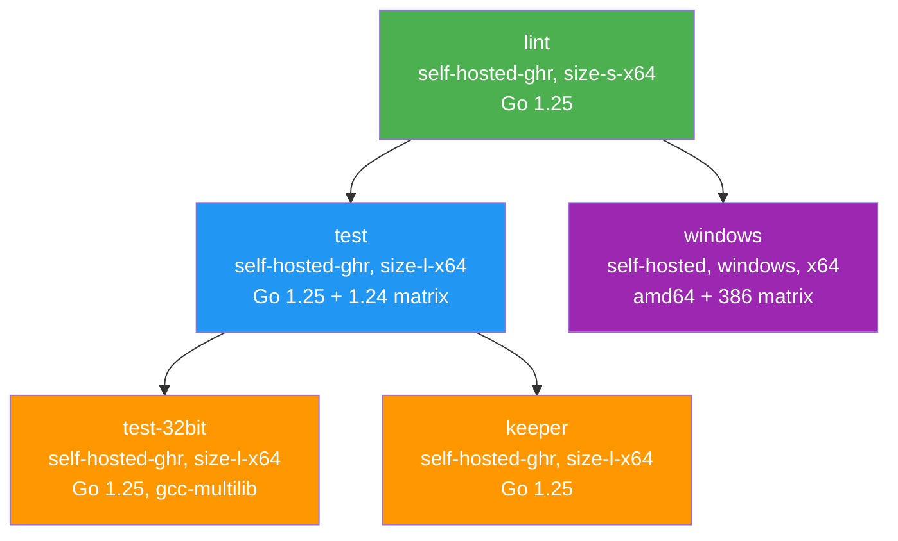
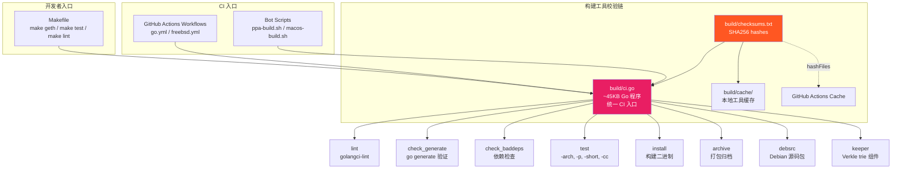

# go-ethereum GitHub Actions 完整调研

> **调研对象**: ethereum/go-ethereum (Go, LGPL-3.0)
> **调研日期**: 2026-06-10
> **Codebase SHA**: `11f0a8318bd8091d1caaf6d47df1bacf83646046` (master)
> **数据来源**: GitHub Contents API、GitHub Rulesets API、GitHub Actions API、代码文件分析

---

## Executive Summary

ethereum/go-ethereum 是 Ethereum 官方 Go 客户端实现，也是 Mantle op-geth 的间接上游。其 GitHub Actions CI 体系精简但成熟：master 分支仅有 3 个 workflow 文件（`go.yml`、`freebsd.yml`、`validate_pr.yml`），但覆盖了 lint、多 Go 版本测试、多平台构建（Linux/Windows/FreeBSD/32-bit）、PR 格式治理等核心场景。

go-ethereum 的 CI 设计有两个显著特点：(1) **统一构建入口 `build/ci.go`** — 一个 ~45KB 的 Go 程序封装了所有 CI 命令（lint、test、install、archive、debsrc、keeper），workflow YAML 仅作调度层；(2) **self-hosted runner 策略** — 使用分级规格的 self-hosted runner（size-s-x64 用于 lint、size-l-x64 用于 test/build），而非 GitHub-hosted runner，提供更好的性能和成本控制。

在 10 维度能力矩阵中，go-ethereum 在 CI/Testing、PR Governance 维度达到"成熟"级别，在 Security & Supply Chain（Rulesets）、Documentation/Infra 维度为"基础"级别，但在 Release Pipeline、AI Code Review、Upstream Auto-Sync、Interactive Agent、Benchmark 维度为"缺失"状态——这与其项目性质一致（go-ethereum 是上游源头而非 fork，且发布流程可能由外部系统管理）。

对 Mantle op-geth 有借鉴价值的核心模式包括：build/ci.go 统一构建入口、Go 版本矩阵（N + N-1）策略、checksums.txt 构建工具校验、PR 标题格式治理、以及 CODEOWNERS 细粒度代码审查分配。

---

## Section 1: Repo 级配置概况 (item-1)

### 1.1 .github/ 目录完整清单

以下通过 GitHub Contents API 在 SHA `11f0a8318bd8091d1caaf6d47df1bacf83646046` 时刻获取：

| Path | Status | Verification Method |
|------|--------|-------------------|
| `.github/workflows/` | **存在** (3 files: go.yml, freebsd.yml, validate_pr.yml) | `GET /repos/ethereum/go-ethereum/contents/.github/workflows` |
| `.github/CODEOWNERS` | **存在** (~30 目录模式, ~10 maintainers) | `GET /repos/ethereum/go-ethereum/contents/.github/CODEOWNERS` |
| `.github/CONTRIBUTING.md` | **存在** | `GET /repos/ethereum/go-ethereum/contents/.github/CONTRIBUTING.md` |
| `.github/ISSUE_TEMPLATE/` | **存在** (bug.md, feature.md, question.md) | `GET /repos/ethereum/go-ethereum/contents/.github/ISSUE_TEMPLATE` |
| `.github/no-response.yml` | **存在** (30-day auto-close) | `GET /repos/ethereum/go-ethereum/contents/.github/no-response.yml` |
| `.github/stale.yml` | **存在** (366-day stale, 42-day close) | `GET /repos/ethereum/go-ethereum/contents/.github/stale.yml` |
| `.github/dependabot.yml` | **缺失** | GitHub Contents API returned HTTP 404；`.github/` 目录 listing 中无此文件 |
| `.github/PULL_REQUEST_TEMPLATE.md` | **缺失** | GitHub Contents API returned HTTP 404；`.github/` 目录 listing 中无此文件 |

### 1.2 CODEOWNERS

go-ethereum 使用细粒度的 CODEOWNERS 文件，覆盖 ~30 个目录/子目录，由 ~10 名核心维护者负责。CODEOWNERS 未被 ruleset 强制执行（`require_code_owner_review: false`），但仍作为 review 引导机制。

关键分配：

| 目录 | 维护者 | 备注 |
|------|--------|------|
| `core/`, `eth/`, `ethdb/`, `trie/`, `triedb/` | @rjl493456442 | 核心状态/存储层 |
| `p2p/` | @fjl, @zsfelfoldi | 网络层 |
| `crypto/` | @gballet, @jwasinger, @fjl | 密码学 |
| `beacon/engine/`, `eth/catalyst/` | @MariusVanDerWijden, @lightclient, @fjl | Consensus/Engine API |
| `rpc/`, `node/`, `event/`, `rlp/`, `ethclient/` | @fjl | 基础设施 |
| `eth/tracers/`, `core/tracing/`, `graphql/`, `internal/ethapi/` | @s1na | 追踪/API |
| `accounts/usbwallet/`, `accounts/scwallet/`, `cmd/keeper/` | @gballet | 账户/Keeper |

### 1.3 Issue 管理自动化

**no-response.yml** — 使用 [no-response](https://github.com/apps/no-response) GitHub App 或 bot 配置：
- 在标记 `need:more-information` label 后 30 天无回复自动关闭
- 关闭时附带说明性评论

**stale.yml** — 使用 [stale](https://github.com/apps/stale) bot 配置：
- 366 天无活动标记为 stale（label: `status:inactive`）
- stale 后 42 天自动关闭
- 豁免标签：`pinned`、`security`
- 宽松策略——接近一年才标记 stale，给予充分讨论时间

### 1.4 Issue 模板

三个标准模板：
- **bug.md**: 结构化 bug 报告（Geth 版本、CL 客户端、OS、commit hash、预期/实际行为、复现步骤、backtrace）
- **feature.md**: 功能请求
- **question.md**: 一般性问题

### 1.5 CONTRIBUTING.md

编码指南要点：
- 代码必须遵循 `gofmt` 格式化
- 代码注释遵循 Go 官方 commentary 标准
- PR 必须基于 `master` 分支
- Commit message 格式：包名前缀 + 描述（例如 `eth, rpc: make trace configs optional`）
- 建议在提交复杂变更前通过 Gitter 与核心开发者沟通

### 1.6 Repo Rulesets

通过 GitHub Rulesets API（`GET /repos/ethereum/go-ethereum/rulesets`）获取到 3 条活跃规则：

#### Ruleset 1: Forbid removal of the repositories from org
- **来源**: Organization level (ethereum)
- **类型**: Repository target
- **执行**: Active
- **创建时间**: 2025-08-04
- **用途**: 防止从组织中意外删除仓库

#### Ruleset 2: master branch protection
- **来源**: Repository level
- **执行**: Active
- **创建时间**: 2026-05-09
- **适用分支**: `refs/heads/master`
- **规则详情**:

| 规则类型 | 配置 |
|---------|------|
| deletion | 禁止删除 |
| non_fast_forward | 禁止非快进推送 |
| creation | 禁止直接创建（只能通过 PR） |
| required_status_checks | `validate-pr` (integration_id: 15368), `Lint` (integration_id: 15368); strict policy: false |
| pull_request | 1 approving review; dismiss_stale_reviews: false; require_code_owner_review: false; require_last_push_approval: false; allowed_merge_methods: merge, squash |

**关键观察**：
- 仅要求 `validate-pr` 和 `Lint` 两个 status check，不要求 `Test` job 通过——这意味着测试失败不阻塞合并（可能依赖人工判断）
- 不要求 CODEOWNERS review，CODEOWNERS 文件仅作参考
- 允许 merge 和 squash 两种合并方式

#### Ruleset 3: release branch protection
- **来源**: Repository level
- **执行**: Active
- **创建时间**: 2026-05-09
- **适用分支**: `refs/heads/release/*`
- **规则**: 禁止 deletion、non_fast_forward、creation

### 1.7 不可访问的配置

| 配置项 | 尝试方式 | 结果 |
|--------|---------|------|
| GitHub Apps | `GET /repos/ethereum/go-ethereum/installation` | HTTP 401 — 需要 App JWT 认证 |
| Secrets 名称 | `GET /repos/ethereum/go-ethereum/actions/secrets` | HTTP 401 — 需要认证 |
| Branch Protection (legacy API) | `GET /repos/ethereum/go-ethereum/branches/master/protection` | HTTP 401 — 需要认证（已迁移至 Rulesets） |

**间接 Secrets 证据**（来自 `build/ci-notes.md`）：`PPA_SIGNING_KEY`、`PPA_SSH_KEY`（用于 Launchpad PPA 上传的 GPG 签名密钥和 SSH 密钥）。

---

## Section 2: go.yml — 主 CI Workflow 分析 (item-2)

### 2.1 基本信息

| Field | Value |
|-------|-------|
| **file_path** | `.github/workflows/go.yml` |
| **triggers** | `push: branches: [master]`, `pull_request: branches: [master]`, `workflow_dispatch` |
| **runner_type** | self-hosted (多规格: size-s-x64, size-l-x64, windows x64) |
| **concurrency_strategy** | Group: `${{ github.workflow }}-${{ github.event.pull_request.number || github.ref }}`; cancel-in-progress: 仅 PR 事件 |

### 2.2 Job 依赖关系 (job_dependency_graph)

```
lint ──┬──→ test [Go 1.25, 1.24] ──┬──→ test-32bit
       │                            └──→ keeper
       └──→ windows [amd64, 386]
```

关键设计决策：
- **lint 作为门控**：所有测试和构建 job 都依赖 lint 通过，避免在代码质量不合格时浪费计算资源
- **test 作为二级门控**：test-32bit 和 keeper 依赖主测试通过
- **windows 与 test 并行**：windows 仅依赖 lint，与 Linux test 并行执行

### 2.3 逐 Job 详细分析

#### Job: lint

| Field | Value |
|-------|-------|
| Runner | `[self-hosted-ghr, size-s-x64]` — 使用较小规格（lint 不需要大量计算） |
| Submodules | false — lint 不需要子模块 |
| Go Version | 1.25（固定最新版） |
| Cache | `actions/cache@v4`, path: `build/cache`, key: `${{ runner.os }}-build-tools-cache-${{ hashFiles('build/checksums.txt') }}` |

执行三个 ci.go 命令：
1. `go run build/ci.go lint` — 运行预选的 linter（通过 golangci-lint）
2. `go run build/ci.go check_generate` — 验证 `go generate` 输出是否已提交
3. `go run build/ci.go check_baddeps` — 检查是否引入了禁止的依赖

**缓存策略亮点**：cache key 基于 `checksums.txt` 的 hash，而非 `go.sum`。这是因为 ci.go 从 `checksums.txt` 中下载并校验 golangci-lint 等构建工具——当构建工具版本更新时缓存自动失效。`setup-go` 的内置缓存被显式禁用（`cache: false`），构建工具缓存完全由自定义 `build/cache` 目录管理。

#### Job: test

| Field | Value |
|-------|-------|
| Runner | `[self-hosted-ghr, size-l-x64]` — 大规格（测试需要更多资源） |
| Submodules | true — 测试需要子模块 |
| Go Version Matrix | `['1.25', '1.24']` — 当前版本 + 前一版本 |

执行：`go run build/ci.go test -p 8`（8 并行）

**Go 版本矩阵策略**：测试 N 和 N-1 两个 Go 版本，确保向后兼容。这是 Go 社区推荐的做法——支持最新的两个 minor release。go-ethereum 是许多 Go 项目的依赖，保持双版本兼容至关重要。

#### Job: test-32bit

| Field | Value |
|-------|-------|
| Runner | `[self-hosted-ghr, size-l-x64]` |
| Go Version | 1.25 |

前置步骤安装 `gcc-multilib` cross-compilation 工具链，然后执行 `go run build/ci.go test -arch 386 -short -p 8`。

**目的**：检测 32-bit 环境下的整数溢出、指针大小假设等问题。使用 `-short` flag 运行缩减版测试套件以控制时间。

#### Job: keeper

| Field | Value |
|-------|-------|
| Runner | `[self-hosted-ghr, size-l-x64]` |
| Go Version | 1.25 |
| Submodules | true |

执行：`go run build/ci.go keeper`

**Keeper** 是 go-ethereum 的 Verkle trie 相关组件（`cmd/keeper/`，由 @gballet 维护）。独立的构建 job 确保此组件始终可编译。

#### Job: windows

| Field | Value |
|-------|-------|
| Runner | `[self-hosted, windows, x64]` — Windows 专用 self-hosted runner |
| Go Version | 1.25 |
| Strategy | `fail-fast: false`; Matrix: amd64 (build+test), 386 (build only) |

使用 MSYS2/MINGW 工具链（`C:\msys64\mingw64` / `C:\msys64\mingw32`），通过环境变量 `GETH_MINGW` 和 `GETH_CC` 配置 C 编译器路径。

**设计细节**：
- amd64: 构建 + 测试（`matrix.test: true`）
- 386: 仅构建（`matrix.test: false`）——32-bit Windows 测试在 Linux 32-bit job 中已覆盖
- `fail-fast: false`——一个 arch 失败不阻塞另一个

### 2.4 安全模式分析 (security_patterns)

| Pattern | Status | Details |
|---------|--------|---------|
| Action pinning by SHA | **否** — 使用 tag (v4/v5/v7) | `actions/checkout@v4`, `actions/cache@v4`, `actions/setup-go@v5` |
| Permissions declaration | **否** — 未声明 permissions | 使用默认 GITHUB_TOKEN 权限 |
| Fork safety | **部分** — concurrency cancel 仅针对 PR | 无 `pull_request_target` 使用 |

**安全观察**：go-ethereum 的 workflow 安全模式相对传统——不使用 SHA pinning、不声明最小权限、不使用 harden-runner。这与其作为成熟、可信的开源项目的身份一致——安全性主要通过人工 review（1 approving review 要求）和 ruleset 保护。

---

## Section 3: freebsd.yml — FreeBSD CI 分析 (item-3)

### 3.1 基本信息

| Field | Value |
|-------|-------|
| **file_path** | `.github/workflows/freebsd.yml` |
| **triggers** | `push: branches: [freebsd-github-action]`, `workflow_dispatch` |
| **runner_type** | ubuntu-latest (host) + vmactions/freebsd-vm@v1 (FreeBSD 15.0 VM) |
| **concurrency_strategy** | 无 |

### 3.2 分析

**触发策略**：不在 master push/PR 上运行，仅在专用 `freebsd-github-action` 分支和手动触发时运行。这是一种低频验证策略——FreeBSD 兼容性不是每次提交都验证，而是按需或定期在专用分支上测试。

**VM-based 跨平台测试模式**：
- Host: ubuntu-latest（GitHub-hosted，不使用 self-hosted）
- VM: [vmactions/freebsd-vm@v1](https://github.com/vmactions/freebsd-vm) — 在 QEMU/KVM 中运行 FreeBSD 15.0
- Go 安装：通过 FreeBSD `pkg install -y go`（使用系统包管理器而非 actions/setup-go）
- 测试：`go run ./build/ci.go test -p 8`

**值得注意的细节**：
- 使用 `actions/checkout@v6`（比 go.yml 的 @v4 更新），说明此 workflow 可能在不同时间点更新
- `submodules: false` — 与 lint job 一致，FreeBSD 测试不需要子模块
- 不使用 `build/cache` 缓存——每次运行从零开始（可接受，因为运行频率低）

### 3.3 安全模式

| Pattern | Status |
|---------|--------|
| Action pinning | 否 — tag only (`@v6`, `@v1`) |
| Permissions | 未声明 |

---

## Section 4: validate_pr.yml — PR 格式验证分析 (item-4)

### 4.1 基本信息

| Field | Value |
|-------|-------|
| **file_path** | `.github/workflows/validate_pr.yml` |
| **name** | PR Format Validation |
| **triggers** | `pull_request: types: [opened, edited, synchronize]` |
| **runner_type** | ubuntu-latest |
| **concurrency_strategy** | 无 |

### 4.2 两阶段验证分析

#### 阶段 1: Spam PR 检测

使用 `actions/github-script@v7` 执行内联 JavaScript：

```javascript
const spamRegex = /^(feat|chore|fix)(\(.*\))?\s*:/i;
```

如果 PR 标题匹配 conventional commit 格式（`feat:`, `fix:`, `chore:`），自动：
1. 发布说明性评论（解释关闭原因）
2. 关闭 PR
3. 标记 workflow 为 failed

**设计理由**：go-ethereum 要求 PR 标题格式为 `directory, ...: description`（如 `eth, rpc: make trace configs optional`），而 conventional commit 格式通常来自不熟悉项目规范的贡献者或自动化 spam。这是一种高效的首道防线。

#### 阶段 2: PR 标题格式验证

```javascript
const titleRegex = /^([\w\s,{}/.]+): .+/;
```

验证逻辑：
1. 检查标题是否匹配 `directory, ...: description` 格式
2. 从标题中提取逗号分隔的目录列表
3. 对每个目录，使用 `fs.existsSync()` 检查是否在仓库中实际存在
4. 不存在的目录触发 failure

**前置步骤**：需要 `actions/checkout@v4` 来获取仓库文件系统，用于目录存在性检查。

### 4.3 Ruleset 集成

`validate-pr` 是 master branch protection ruleset 的 required status check 之一。这意味着不符合格式要求的 PR 无法合并到 master——这是一个强制性的治理机制。

### 4.4 安全模式

| Pattern | Status |
|---------|--------|
| Action pinning | 否 — tag (`@v7`, `@v4`) |
| Permissions | 未声明（默认 GITHUB_TOKEN 权限足够操作 PR） |
| Fork safety | 使用 `pull_request`（非 `pull_request_target`），安全 |

---

## Section 5: build/ci.go 自定义构建系统分析 (item-5)

### 5.1 架构概述

go-ethereum 的 CI 核心不在 workflow YAML 中，而在 `build/ci.go`——一个 ~45KB 的 Go 程序，作为统一构建入口点。所有 workflow 的构建/测试/lint 步骤都通过 `go run build/ci.go <command>` 调用。

### 5.2 命令清单 (ci_go_commands)

| Command | 用途 | 调用 Workflow |
|---------|------|--------------|
| `lint` | 运行 golangci-lint（从 checksums.txt 校验下载） | go.yml (lint job) |
| `check_generate` | 验证 `go generate` 输出已提交 | go.yml (lint job) |
| `check_baddeps` | 检查禁止的依赖引入 | go.yml (lint job) |
| `test` | 运行测试（支持 `-arch`, `-p`, `-short`, `-cc` 参数） | go.yml (test, test-32bit, windows), freebsd.yml |
| `install` | 构建可执行文件（支持 `-arch`, `-cc`, `-dlgo` 参数） | go.yml (windows), macos-build.sh |
| `archive` | 打包发布归档（支持 `-type tar/zip`） | macos-build.sh |
| `debsrc` | 生成 Debian 源码包（支持 `-upload`, `-sftp-user`, `-signer`） | ppa-build.sh |
| `xcode` | iOS/Xcode 构建 | macos-build.sh (commented out) |
| `keeper` | 构建 Verkle trie keeper 组件 | go.yml (keeper job) |

### 5.3 构建工具校验链 (cache_strategy)

```
build/checksums.txt  ──SHA256 hashes──→  build/ci.go (download & verify)
        │                                       ↓
        │                                 build/cache/ (local tool cache)
        │                                       ↓
        └──hashFiles()──→ actions/cache key ──→ GitHub Actions cache
```

`build/checksums.txt` 包含以下构建工具的 SHA256 校验和：

| Tool | Version | 用途 |
|------|---------|------|
| Go | 1.25.10 (全平台) | 编译器（PPA 构建时自行编译 Go） |
| golangci-lint | 2.10.1 (全平台) | Lint 工具 |
| protoc | 27.1 | Protocol Buffers 编译器 |
| protoc-gen-go | 1.34.2 | Go protobuf 代码生成 |
| execution-spec-tests | v5.1.0 | Ethereum 执行规范测试 fixtures |

**PPA Bootstrap 版本**：checksums.txt 还包含 Go 1.19.6、1.21.9、1.23.6 的源码校验和——用于 PPA 构建时从旧版 Go 自举编译最新 Go（inception-y 模式）。

**关键设计优势**：
1. **可审计的供应链**：每个构建工具的确切版本和校验和记录在版本控制中
2. **自动缓存失效**：GitHub Actions cache key 基于 `hashFiles('build/checksums.txt')`——工具版本更新 → hash 变化 → 缓存重建
3. **跨平台一致性**：ci.go 封装了跨平台工具下载和校验逻辑，确保 Linux/Windows/macOS 使用相同版本

### 5.4 Go 版本策略 (go_version_strategy)

| 场景 | 版本 | 来源 |
|------|------|------|
| CI lint | Go 1.25 | `actions/setup-go` in go.yml |
| CI test | Go 1.25 + 1.24 (matrix) | `actions/setup-go` in go.yml |
| CI windows/32bit/keeper | Go 1.25 | `actions/setup-go` in go.yml |
| FreeBSD | 系统包（pkg install go） | freebsd.yml |
| PPA build | 从源码自举（checksum 校验） | checksums.txt → ci.go |
| macOS build | `-dlgo` flag（ci.go 自行下载） | macos-build.sh |

### 5.5 Makefile

`Makefile` 是面向开发者的薄封装层：

| Target | 实际命令 |
|--------|---------|
| `geth` | `$(GORUN) build/ci.go install ./cmd/geth` |
| `evm` | `$(GORUN) build/ci.go install ./cmd/evm` |
| `all` | `$(GORUN) build/ci.go install` |
| `test` | `$(GORUN) build/ci.go test` |
| `lint` | `$(GORUN) build/ci.go lint` |
| `devtools` | 安装 stringer, gencodec, protoc-gen-go, abigen |

---

## Section 6: 其他 CI 系统与外部构建基础设施 (item-6)

### 6.1 历史 Travis CI

**证据**：
- `build/ci-notes.md` 明确提及 Travis CI 用于 PPA 上传："Travis CI makes available to certain builds"
- `build/travis_keepalive.sh` — 防止 Travis CI 10 分钟超时的 keepalive 脚本
- `build/ci-notes.md` 中提到 Travis CI 不支持 FTP，使用 SFTP 传输包

**当前状态**：Travis CI 已不再使用。仓库中无 `.travis.yml` 配置文件。历史文件（`travis_keepalive.sh`、`ci-notes.md` 中的 Travis 引用）保留在仓库中作为遗留参考。

### 6.2 Launchpad PPA — Debian 包构建

`build/bot/ppa-build.sh` 实现 Debian 源码包构建和上传：

| 步骤 | 详情 |
|------|------|
| 环境 | Docker 容器（Debian/Ubuntu），root 用户 |
| 依赖 | devscripts, debhelper, dput, fakeroot |
| SSH 配置 | 添加 ppa.launchpad.net 的 SSH RSA 公钥 |
| 构建 | `go run build/ci.go debsrc -upload ethereum/ethereum -sftp-user geth-ci -signer "Go Ethereum Linux Builder <geth-ci@ethereum.org>"` |
| 签名 | 使用 `PPA_SIGNING_KEY` secret（GPG 密钥，base64 编码存储在环境变量中） |

**Launchpad 工作流**：生成 Debian 源码包 → SFTP 上传到 Launchpad → Launchpad builder 编译 → 发布到 PPA 仓库

**特殊处理**：PPA 构建需要 Go 自举——checksums.txt 中保留了 Go 1.19.6、1.21.9、1.23.6 的源码校验和，用于从旧版 Go 编译最新 Go。

### 6.3 macOS 构建

`build/bot/macos-build.sh`：
- 构建：`go run build/ci.go install -dlgo`（ci.go 自行下载 Go）
- 打包：`go run build/ci.go archive -type tar`
- 上传目标：Azure（`gethstore/builds`，当前被注释）
- CocoaPods/iOS 构建：完全注释掉

### 6.4 GitHub 动态服务

通过 GitHub Actions API（`GET /repos/ethereum/go-ethereum/actions/workflows`）检测到以下 GitHub 自动管理的动态 workflow：

| 服务 | Path | 说明 |
|------|------|------|
| Copilot code review | `dynamic/copilot-pull-request-reviewer` | GitHub Copilot PR 审查（自动启用） |
| Copilot coding agent | `dynamic/copilot-swe-agent` | GitHub Copilot 编码代理 |
| Dependabot Updates | `dynamic/dependabot/dependabot-updates` | 依赖更新（尽管无 dependabot.yml 配置文件） |
| Dependency Graph | `dynamic/dependabot/update-graph` | 依赖图更新 |

**注意**：Dependabot Updates 作为动态 workflow 存在，说明 GitHub 为公共仓库自动启用了 Dependabot 安全更新（即使没有 `dependabot.yml`）。这不等同于配置了版本更新策略。

### 6.5 其他 CI 系统排查

| CI 系统 | 配置文件 | 状态 |
|---------|---------|------|
| CircleCI | `.circleci/config.yml` | **未找到** (HTTP 404) |
| Jenkins | `Jenkinsfile` | **未找到** (HTTP 404) |
| AppVeyor | `appveyor.yml` | **未找到** (HTTP 404) |
| Travis CI | `.travis.yml` | **未找到** (HTTP 404)，仅保留历史脚本 |

**结论**：go-ethereum 当前仅使用 GitHub Actions 作为 CI 系统，辅以 Launchpad PPA 和 macOS bot 脚本用于发布构建。

---

## Section 7: 10 维度能力矩阵 (item-7)

### 7.1 能力评级表

| # | 维度 | 评级 | 关键证据 |
|---|------|------|---------|
| 1 | Upstream Auto-Sync | **缺失** | go-ethereum 是上游源头，不需要同步；无 sync workflow |
| 2 | AI Code Review | **缺失** | 无 AI review workflow；GitHub Copilot code review 为自动启用的动态服务，非主动配置 |
| 3 | PR Audit | **成熟** | validate_pr.yml（spam 检测 + 格式验证）+ CODEOWNERS + ruleset 要求 1 approving review |
| 4 | Interactive Agent | **缺失** | 无 bot/agent workflow；Copilot coding agent 为动态服务 |
| 5 | Release Pipeline | **缺失** | GitHub Actions 中无 release workflow；发布可能通过 PPA bot 脚本和 macOS bot 脚本在外部系统完成 |
| 6 | CI/Testing | **成熟** | go.yml 覆盖 lint + test（Go 版本矩阵）+ 32-bit + Windows + FreeBSD；build/ci.go 统一入口 |
| 7 | Security & Supply Chain | **基础** | Rulesets 保护 master/release 分支；checksums.txt 构建工具校验；但无 SHA pinning、无 harden-runner、无 permissions 声明 |
| 8 | Benchmark | **缺失** | 无 benchmark workflow |
| 9 | PR Governance | **成熟** | validate_pr.yml 格式验证（强制 via ruleset）+ CONTRIBUTING.md 编码指南 + CODEOWNERS + stale/no-response 自动化 |
| 10 | Documentation & Infrastructure | **基础** | stale.yml + no-response.yml + 3 issue templates；但无 dependabot.yml、无 PR template、无 scheduled maintenance |

### 7.2 维度能力热力表 (diag-3)

```
维度                        评级        ▉ 可视化
─────────────────────────────────────────────────
1. Upstream Auto-Sync       缺失        ░░░░░░░░░░
2. AI Code Review           缺失        ░░░░░░░░░░
3. PR Audit                 成熟        ▉▉▉▉▉▉▉▉▉▉
4. Interactive Agent        缺失        ░░░░░░░░░░
5. Release Pipeline         缺失        ░░░░░░░░░░
6. CI/Testing               成熟        ▉▉▉▉▉▉▉▉▉▉
7. Security & Supply Chain  基础        ▉▉▉▉▉░░░░░
8. Benchmark                缺失        ░░░░░░░░░░
9. PR Governance            成熟        ▉▉▉▉▉▉▉▉▉▉
10. Documentation & Infra   基础        ▉▉▉▉▉░░░░░

图例: ▉ = 能力覆盖  ░ = 未覆盖/缺失
成熟 = 8-10 blocks, 基础 = 4-6 blocks, 缺失 = 0 blocks
```

### 7.3 评级说明

**"缺失"不等于"差"**：go-ethereum 的定位决定了某些维度不适用：
- **Upstream Auto-Sync**：go-ethereum 自身就是上游，不存在同步需求
- **Release Pipeline (GitHub Actions)**：发布通过 PPA bot 和 macOS bot 脚本在外部完成——功能存在但不在 GitHub Actions 中
- **AI Code Review / Interactive Agent**：项目体量和维护者团队规模使得人工 review 足够，AI 工具尚未被主动引入
- **Benchmark**：可能在外部系统或手动流程中完成

**"基础"维度的改进空间**：
- **Security**: 可引入 SHA pinning 和 permissions 声明提升安全等级
- **Documentation & Infra**: 可添加 dependabot.yml（版本更新策略）和 PR template

---

## Section 8: 值得 Mantle op-geth 借鉴的模式 (item-8)

### 8.1 推荐模式列表

| # | 模式 | 优先级 | 实施复杂度 | 预期收益 |
|---|------|--------|-----------|---------|
| 1 | build/ci.go 统一构建入口 | **高** | 高 | CI 逻辑集中管理，workflow YAML 仅作调度层 |
| 2 | Go 版本矩阵 (N + N-1) | **高** | 低 | 确保向后兼容，发现版本相关 bug |
| 3 | checksums.txt 构建工具校验 | **高** | 中 | 可审计的供应链，自动缓存失效 |
| 4 | PR 标题格式治理 | **中** | 低 | 规范化 commit history，过滤 spam PR |
| 5 | CODEOWNERS 细粒度分配 | **中** | 低 | 自动 review 分配，明确代码责任 |
| 6 | Self-hosted runner 分级策略 | **中** | 中 | 根据 job 需求分配不同规格 runner |
| 7 | 多平台测试覆盖 | **低** | 中 | Windows/FreeBSD/32-bit 覆盖（按需） |
| 8 | Lint 门控 → Test → Extended Test 分层 | **中** | 低 | 快速失败，节省计算资源 |
| 9 | Concurrency cancel-in-progress | **高** | 低 | 取消过时 PR 运行，释放 runner 容量 |
| 10 | Stale/no-response 自动化 | **低** | 低 | Issue 生命周期管理 |

### 8.2 详细推荐分析

#### 推荐 1: build/ci.go 统一构建入口（高优先级）

**是什么**：将所有 CI 逻辑（lint、test、build、archive、debsrc）封装在一个 Go 程序中，workflow YAML 仅调用 `go run build/ci.go <command>`。

**为什么重要**：
- CI 逻辑可本地运行和调试（`make test` 与 CI 环境一致）
- 构建工具版本和校验由 Go 代码管理，而非分散在 YAML 中
- 跨平台一致性——同一命令在 Linux/Windows/macOS/FreeBSD 上执行
- 减少 YAML 复杂度——workflow 文件仅 ~130 行

**实施复杂度**：高——需要将现有分散的 CI 脚本重构为统一 Go 程序。但 Mantle op-geth 作为 go-ethereum fork，可直接继承上游的 `build/ci.go` 并按需扩展。

**适用场景**：Mantle op-geth 已 fork 自上游，理论上已有 `build/ci.go`——需要评估是否保持与上游同步、以及是否有 Mantle 特有的 CI 需求需要扩展。

#### 推荐 2: Go 版本矩阵 (N + N-1)（高优先级）

**是什么**：在 CI test matrix 中同时测试当前和前一个 Go minor version（如 1.25 + 1.24）。

**为什么重要**：Go 保证最新两个 minor release 的支持。op-geth 作为基础设施软件，其用户可能使用略旧的 Go 版本编译。

**实施复杂度**：低——仅需修改 workflow YAML 中的 matrix 定义。

#### 推荐 3: checksums.txt 构建工具校验（高优先级）

**是什么**：在版本控制中维护一个包含所有构建工具 SHA256 校验和的文件，CI 工具在下载后验证。

**为什么重要**：
- 供应链攻击防护——确保 CI 使用的工具二进制未被篡改
- 版本锁定——构建工具版本变更需要 review 和合并
- 缓存友好——`hashFiles('build/checksums.txt')` 作为 cache key 自动处理版本更新

**实施复杂度**：中——需要创建 checksums.txt 并修改工具下载逻辑。

#### 推荐 4: PR 标题格式治理（中优先级）

**是什么**：workflow 自动验证 PR 标题格式（如 `directory: description`），不合格则阻塞合并。

**为什么重要**：保持 commit history 清晰，自动过滤 spam PR。

**实施复杂度**：低——可直接复用 validate_pr.yml 的模式，调整 regex 匹配 Mantle 的 commit 规范。

**注意**：go-ethereum 的 spam detection（关闭 conventional commit 格式的 PR）对 Mantle 可能不适用——需要根据 Mantle 的实际 spam 模式调整。

#### 推荐 9: Concurrency cancel-in-progress（高优先级）

**是什么**：对同一 PR 的多次推送，自动取消之前未完成的 CI 运行。

**为什么重要**：避免过时的 CI 运行占用 runner 资源。go-ethereum 的实现简洁有效：

```yaml
concurrency:
  group: ${{ github.workflow }}-${{ github.event.pull_request.number || github.ref }}
  cancel-in-progress: ${{ github.event_name == 'pull_request' }}
```

关键设计：仅对 PR 事件取消（push 到 master 不取消），group key 使用 PR 号（而非 branch name），避免不同 PR 互相取消。

**实施复杂度**：低——直接添加到现有 workflow。

---

## Diagrams

### diag-1: go.yml Job 依赖关系流程图



### diag-2: build/ci.go 构建系统架构



### diag-3: 10 维度能力矩阵

（见 Section 7.2 ASCII 热力表）

---

## Source Coverage

| ID | Type | Description | Min | Actual | Status |
|----|------|-------------|-----|--------|--------|
| src-1 | code_analysis | workflow YAML 文件 | 3 | 3 (go.yml, freebsd.yml, validate_pr.yml) | **满足** |
| src-2 | code_analysis | .github/ 配置文件 | 4 | 6 (CODEOWNERS, CONTRIBUTING.md, ISSUE_TEMPLATE/{bug,feature,question}.md, no-response.yml, stale.yml + 2 absent paths) | **满足** |
| src-3 | code_analysis | build/ CI 相关文件 | 3 | 6 (ci.go, Makefile, checksums.txt, ci-notes.md, bot/ppa-build.sh, bot/macos-build.sh, travis_keepalive.sh) | **满足** |
| src-4 | official_docs | GitHub API repo 配置 | 1 | 3 (rulesets API × 3 rules, actions/workflows API, contents API) | **满足** |
| src-5 | code_analysis | GitHub Actions 运行记录 | 1 | 1 (actions/runs API — go.yml active on PRs, validate_pr.yml active) | **满足** |

---

## Gap Analysis

| Gap | Severity | Mitigation |
|-----|----------|------------|
| build/ci.go 源码未完整阅读（~45KB） | **Minor** | 通过 API 确认文件存在和大小；命令清单从 workflow 调用和 Makefile targets 推导，与 ci-notes.md 中的文档一致 |
| GitHub Apps 列表不可访问 | **Minor** | 记录为"不可访问 (HTTP 401)"；从动态 workflow 列表推断 Copilot 和 Dependabot 已启用 |
| Secrets 名称不可访问 | **Minor** | 记录为"不可访问 (HTTP 401)"；从 ci-notes.md 中识别 PPA_SIGNING_KEY 和 PPA_SSH_KEY |
| Release pipeline 未在 GitHub Actions 中发现 | **Info** | go-ethereum 的发布可能通过外部系统（PPA bot、macOS bot 脚本）完成；不等同于"缺少发布流程" |
| build/ci.go 内部实现细节（如 lint 规则集、test flag 解析） | **Minor** | 调研聚焦于 CI workflow 层面的分析，ci.go 内部实现超出当前 scope |

---

## Revision Log

| Round | Changes | Source |
|-------|---------|--------|
| 1 | Initial deep draft covering all 8 outline items, 12 fields, 3 diagrams, 5 source requirements | Deep Research Agent |
