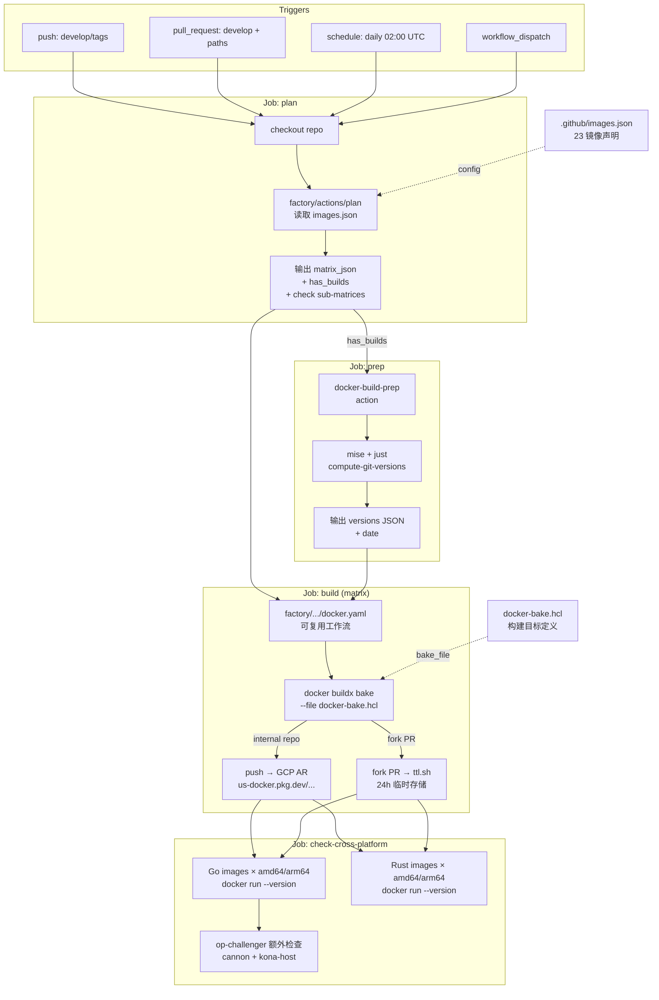
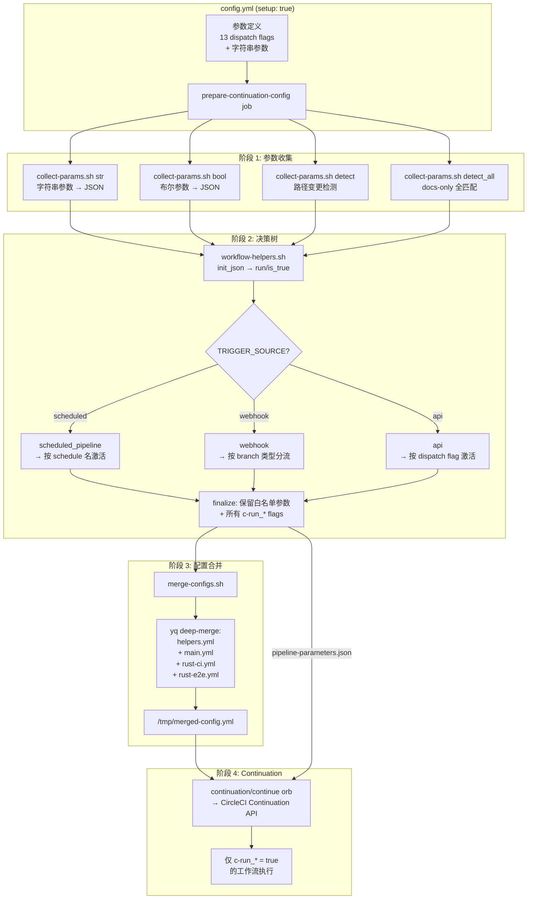
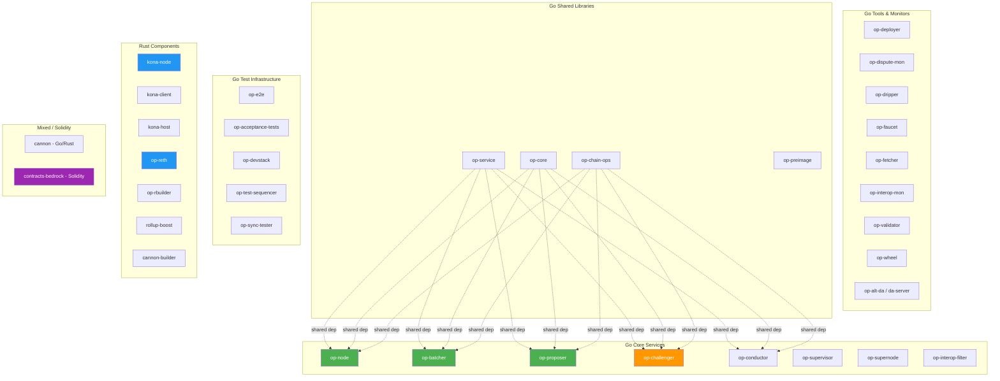

# Optimism GitHub Actions 完整调研

> **调研对象**: ethereum-optimism/optimism monorepo
> **Commit SHA**: `f6abdbd2bc4b40d3e52e39076dd3b4b4b8e1a80e`
> **调研日期**: 2026-06-10
> **目标读者**: Mantle/mantle-v2 工程团队

## 1. Executive Summary

Optimism monorepo 采用 **GitHub Actions + CircleCI 双轨 CI/CD** 架构。GitHub Actions (GHA) 仅承担两项职责：Docker 镜像构建编排 (`build-images.yaml`) 和供应链安全验证 (`security.yml`)。所有核心测试、lint、合约验证、fuzzing、E2E 测试和发布流程均运行在 CircleCI 上，通过一套精密的动态配置 (Dynamic Configuration) 和决策树机制实现路径级按需执行。

关键发现：

- GHA 侧采用 **数据驱动的工厂模式** (factory pattern) 管理 23 个 Docker 镜像的构建，以 `.github/images.json` 为声明式清单，配合 `docker-bake.hcl` 和 `ethereum-optimism/factory` 可复用工作流，实现了从单一 workflow 文件管理全部镜像的高度抽象。
- CircleCI 侧使用 **Dynamic Configuration + Continuation API** 架构，通过 setup config → 决策树 → 合并续接配置 → c-run_* flag 门控 的四阶段流程，将 4400+ 行配置（跨 4 个文件）动态组合为按需执行的流水线。
- 供应链安全通过 SLSA 溯源验证 (`gh attestation verify`) 保护 CI 基础镜像，所有第三方 Actions 均使用 SHA 固定而非语义版本。
- Repo 级配置相对精简：Dependabot 覆盖 Go modules 和 Cargo，CODEOWNERS 实现领域级审查分区（含合约目录最低 2 人审查要求），但无 PR 模板、无可访问的 branch protection 配置。

对 Mantle 的核心价值：factory pattern 的镜像管理模式、CircleCI 决策树的按需执行逻辑（可迁移至 GHA composite/reusable workflow）、以及 SLSA 溯源验证均值得直接借鉴。

---

## 2. Item Findings

### item-1: GitHub Actions Workflow — build-images.yaml

**文件路径**: `.github/workflows/build-images.yaml` (178 行)
**Commit SHA**: `f6abdbd2bc4b40d3e52e39076dd3b4b4b8e1a80e`

#### 触发事件 (trigger_events)

| 事件类型 | 条件 | 说明 |
|---------|------|------|
| `push` | branches: `develop`; tags: `*/v*` | develop 分支推送和 release tag 触发 |
| `pull_request` | branches: `develop`; 带路径过滤 | PR 仅在相关文件变更时触发 |
| `schedule` | `cron: '0 2 * * *'` | 每日 UTC 02:00 全量构建 |
| `workflow_dispatch` | 无条件 | 手动触发 |

#### 路径过滤 (path_filters)

PR 触发的路径过滤列表（仅在 `pull_request` 事件生效）：

```
op-*/**
cannon/**
packages/contracts-bedrock/**
rust/**
ops/docker/**
ops/scripts/compute-git-versions.sh
docker-bake.hcl
go.mod
go.sum
.github/workflows/build-images.yaml
.github/images.json
.github/actions/docker-build-prep/**
```

注意：`push` 到 `develop` 和 `schedule` 触发时不应用路径过滤，始终构建所有发生变更的镜像（由 plan action 内部的变更检测决定）。

#### 工作流结构（4 个 Jobs）

**Job 1: `plan`** — 动态矩阵生成

- 使用 `ethereum-optimism/factory/actions/plan@25fa2ff...` 读取 `.github/images.json`，计算需要构建的镜像列表
- 生成 `matrix_json`（完整构建矩阵）、`has_builds`（是否有构建任务）、`is_release`（是否为发布构建）
- 额外计算 `go_check_images_json` 和 `rust_check_images_json` 用于下游跨平台验证
- Runner: `ubuntu-latest`
- 权限: `contents: read`

**Job 2: `prep`** — 构建环境准备

- 依赖: `plan`（仅在 `has_builds == 'true'` 时执行）
- 调用本地 composite action `.github/actions/docker-build-prep`
- 安装 `mise` (v2026.2.2) + `just`，执行 `just compute-git-versions` 计算每个镜像的 GIT_VERSION
- 输出: `versions`（JSON，镜像名 → 版本映射）、`date`（YYYYMMDD 格式日期）

**Job 3: `build`** — 矩阵构建

- 依赖: `plan` + `prep`
- 使用 `ethereum-optimism/factory/.github/workflows/docker.yaml@25fa2ff...` 可复用工作流
- 策略: `fail-fast: true`，矩阵从 `plan.matrix_json` 动态生成
- 输入参数: `mode`, `image_name`, `tag`, `bake_file`, `target`, `gcp_project_id`, `registry`
- 特殊处理:
  - 外部 fork PR 使用 `ttl.sh` 临时镜像仓库（24h 过期），而非 GCP Artifact Registry
  - `op-reth` 在 PR 时使用 `fast-build` profile，非 PR 使用 `maxperf`
- 权限: `contents: read`, `id-token: write`, `attestations: write`
- 注册表: `us-docker.pkg.dev/oplabs-tools-artifacts/images`

**Job 4a: `check-cross-platform`** — Go 镜像跨平台验证

- 依赖: `plan` + `build`（`always()` + 成功判断）
- 矩阵: Go 类型镜像 × [`ubuntu-24.04`, `ubuntu-24.04-arm`]
- 验证方式: `docker run "$IMAGE" "$IMAGE_NAME" --version`
- 特殊: `op-challenger` 作为 "fat image" 额外验证 `cannon --version` 和 `kona-host --version`

**Job 4b: `check-cross-platform-rust`** — Rust 镜像跨平台验证

- 同上结构，但使用 `docker run "$IMAGE" --version`（无 IMAGE_NAME 参数）

#### 镜像清单 (module_mapping)

从 `.github/images.json` 提取的完整 23 个镜像（**已纠正**：15 Go + 7 Rust + 1 infra）：

**Go 镜像 (15)**:

| 镜像名 | 构建目标 | 路径依赖 | 跨平台检查 |
|--------|---------|---------|-----------|
| op-node | op-node | `op-node/**` | go |
| op-batcher | op-batcher | `op-batcher/**` | go |
| op-faucet | op-faucet | `op-faucet/**` | go |
| op-proposer | op-proposer | `op-proposer/**` | go |
| op-challenger | op-challenger | `op-challenger/**`, `cannon/**`, `op-preimage/**`, `rust/kona/**` | go |
| op-dispute-mon | op-dispute-mon | `op-dispute-mon/**` | go |
| op-conductor | op-conductor | `op-conductor/**`, `op-node/**` | go |
| da-server | da-server | `op-alt-da/**` | go |
| op-supernode | op-supernode | `op-supernode/**`, `op-node/**` | go |
| op-test-sequencer | op-test-sequencer | `op-test-sequencer/**` | go |
| cannon | cannon | `cannon/**`, `op-preimage/**` | go |
| op-deployer | op-deployer | `op-deployer/**`, `packages/contracts-bedrock/**` | go |
| op-dripper | op-dripper | `op-dripper/**` | go |
| op-interop-mon | op-interop-mon | `op-interop-mon/**` | go |
| op-interop-filter | op-interop-filter | `op-interop-filter/**` | go |

**Rust 镜像 (7)**:

| 镜像名 | 构建目标 | 路径依赖 | 跨平台检查 |
|--------|---------|---------|-----------|
| kona-node | kona-node | `rust/**` | rust |
| kona-client | kona-client | `rust/**` | none |
| kona-host | kona-host | `rust/**` | rust |
| op-reth | op-reth | `rust/**` | rust |
| op-rbuilder | op-rbuilder | `rust/**` | rust |
| rollup-boost | rollup-boost | `rust/**` | rust |
| cannon-builder | cannon-builder | `rust/kona/docker/cannon/**` | none |

**基础设施镜像 (1)**:

| 镜像名 | 构建目标 | 路径依赖 | 跨平台检查 |
|--------|---------|---------|-----------|
| ci-base-clang | ci-base-clang | `ops/docker/ci-base-clang/**` | none |

#### 权限与 Secrets (permissions_and_secrets)

- `contents: read` — 代码读取
- `id-token: write` — OIDC token 签发（用于 GCP Workload Identity Federation）
- `attestations: write` — GitHub attestation 写入（SLSA 溯源）
- `vars.GCP_PROJECT_ID_OPLABS_TOOLS_ARTIFACTS` — GCP 项目 ID（repository variable）
- `GITHUB_TOKEN` — 隐式使用（actions/checkout, gh CLI）

#### 外部依赖 (external_dependencies)

| 依赖 | 版本/SHA | 用途 |
|------|---------|------|
| `step-security/harden-runner` | `@95d9a5de...` (v2) | Runner 安全加固（egress audit） |
| `actions/checkout` | `@71cf2267...` (v6) | 代码检出 |
| `ethereum-optimism/factory/actions/plan` | `@25fa2ff5...` | 镜像构建计划生成 |
| `ethereum-optimism/factory/.github/workflows/docker.yaml` | `@25fa2ff5...` | 可复用 Docker 构建工作流 |
| `jdx/mise-action` | `@c1ecc8f7...` (v4.0.0) | mise 工具链管理 |
| GCP Artifact Registry | `us-docker.pkg.dev/oplabs-tools-artifacts/images` | 镜像仓库 |
| `ttl.sh` | N/A | 外部 fork PR 临时镜像存储 |

#### Mantle 相关性 (mantle_relevance)

**高度相关**。build-images.yaml 展示的数据驱动工厂模式是管理大量 Docker 镜像的最佳实践：单一 workflow 文件 + JSON 清单 + 可复用工作流。Mantle 如果有类似的多组件 Docker 构建需求，可直接采用此模式。跨平台验证（amd64/arm64）也值得借鉴。

---

### item-2: GitHub Actions Workflow — security.yml

**文件路径**: `.github/workflows/security.yml` (54 行)
**Commit SHA**: `f6abdbd2bc4b40d3e52e39076dd3b4b4b8e1a80e`

#### 触发事件 (trigger_events)

| 事件类型 | 条件 | 说明 |
|---------|------|------|
| `push` | branches: `develop`; paths: `.circleci/config.yml`, `.github/workflows/security.yml` | 仅在 CI 配置变更时触发 |
| `pull_request` | 同上 | PR 同条件 |
| `workflow_dispatch` | 无条件 | 手动触发 |

#### 工作流结构（单 Job: `verify`）

**目的**: 验证 CircleCI 配置中固定的 `ci-base-clang` 基础镜像的 SLSA 溯源。

**执行步骤**:

1. **Runner 加固**: `step-security/harden-runner` (egress audit 模式)
2. **代码检出**: `actions/checkout` (v6)
3. **提取固定镜像引用**: 从 `.circleci/config.yml` 的 `rust_base_image` 参数中 grep 出完整的 digest-pinned 镜像引用
   - 格式: `us-docker.pkg.dev/oplabs-tools-artifacts/images/ci-base-clang@sha256:{64位hex}`
   - 当前固定值: `...@sha256:758f67c7212e7d05c3d02c34f26766ef86f657d3bb811da07cc01e37b736ebef`
4. **SLSA 溯源验证**: `gh attestation verify "oci://${IMAGE_REF}"` 验证参数:
   - `--bundle-from-oci` — 从 OCI registry 获取 attestation bundle
   - `--owner ethereum-optimism` — 预期的 attestation 所有者
   - `--signer-repo ethereum-optimism/factory` — 预期的签名仓库
   - `--source-ref refs/heads/develop` — 预期的源代码引用

#### 安全模型分析

这个 workflow 实现了一个**闭环供应链验证**:

1. `ci-base-clang` 镜像由 `ethereum-optimism/factory` 仓库构建并签名
2. 构建产物推送到 GCP Artifact Registry 时附带 SLSA 溯源证明
3. Optimism monorepo 在 CircleCI 配置中通过 **digest pinning** (sha256) 引用该镜像
4. 每次 CI 配置变更时，`security.yml` 验证固定的 digest 确实由可信来源签名
5. 如果验证失败，PR 无法合并（假设为 required check）

这种模式确保了 CI 基础设施本身的可信性——如果有人尝试替换 CircleCI 使用的基础镜像为未经验证的版本，`security.yml` 会在 PR 阶段拦截。

#### 权限与 Secrets

- `contents: read`
- `secrets.GITHUB_TOKEN` — 用于 `gh attestation verify`

#### Mantle 相关性

**高度相关**。SLSA 溯源验证是供应链安全的关键实践。Mantle 应对所有 CI 基础镜像实施类似的 digest pinning + attestation verification。即使不使用 CircleCI，同样的模式可用于验证 GHA 中使用的任何自定义基础镜像。

---

### item-3: Custom Actions & Factory Pattern

**文件路径**:
- `.github/actions/docker-build-prep/action.yml` (37 行)
- `.github/images.json` (202 行)
- `docker-bake.hcl` (150+ 行)
- 外部: `ethereum-optimism/factory` (pinned at `25fa2ff591f9b4801d3dcadffd2b76ec2340cf8a`)

**Commit SHA**: `f6abdbd2bc4b40d3e52e39076dd3b4b4b8e1a80e`

#### docker-build-prep Composite Action

本地 composite action，提供两个输出:

- `versions` — JSON 对象，映射镜像名到其 GIT_VERSION（通过 `just compute-git-versions` 计算）
- `date` — YYYYMMDD 格式日期

依赖 `jdx/mise-action` (v4.0.0) 安装 mise 工具链，再通过 mise 安装 `just`。这是 Optimism 工具链管理的标准模式——mise 作为统一的开发工具版本管理器。

#### images.json — 声明式构建清单

这是 factory pattern 的核心：一个 JSON 文件声明了所有 23 个镜像的构建参数：

```json
{
  "shared_paths": ["docker-bake.hcl", ".github/workflows/build-images.yaml", ...],
  "shared_go_paths": ["go.mod", "go.sum", "ops/docker/op-stack-go/**", ...],
  "images": {
    "<image-name>": {
      "type": "go|rust",
      "check": "go|rust|none",
      "mode": "bake",
      "bake_file": "docker-bake.hcl",
      "target": "<bake-target>",
      "paths": ["<source-path>/**"]
    }
  }
}
```

**关键设计**:

- `shared_paths` — 所有镜像共享的基础设施文件路径，任何变更触发全量重建
- `shared_go_paths` — Go 镜像额外共享的路径（go.mod, go.sum, op-service, op-core, op-chain-ops）
- 每个镜像独立声明其 `paths`，factory plan action 据此计算哪些镜像需要重建
- `check` 字段决定跨平台验证类型: `go`（含 binary version 检查）、`rust`（简化检查）、`none`（跳过）

#### docker-bake.hcl — 构建定义

使用 Docker BuildKit 的 `docker buildx bake` 功能，为每个镜像定义构建目标：

- Go 镜像统一使用 `ops/docker/op-stack-go/Dockerfile`，通过 `target` 参数选择不同的构建阶段
- Rust 镜像使用各自的 Dockerfile
- 变量系统支持全局 `GIT_VERSION` 和每镜像覆盖（如 `OP_NODE_VERSION`）
- 多平台构建支持: `PLATFORMS` 变量可设置为 `linux/amd64,linux/arm64`
- Tag 模板: `${REGISTRY}/${REPOSITORY}/${image_name}:${tag}`

#### ethereum-optimism/factory — 可复用工作流

Factory 仓库提供两个核心组件:

1. **`actions/plan`** — 输入 `images.json`，输出构建矩阵
   - 检测哪些镜像的源文件发生变更
   - 在 schedule/tag push 时构建所有镜像
   - 在 PR/push 时仅构建变更相关的镜像
   - 输出: `matrix_json`, `has_builds`, `is_release`

2. **`.github/workflows/docker.yaml`** — 可复用 Docker 构建工作流
   - 支持 `bake` 模式（docker buildx bake）
   - 处理 GCP Artifact Registry 认证（OIDC）
   - 生成 GitHub attestations (SLSA)
   - 多平台构建和推送

#### 架构优势

- **单一变更点**: 新增镜像只需在 `images.json` 添加条目 + `docker-bake.hcl` 添加 target，无需修改 workflow
- **智能增量构建**: plan action 的变更检测避免不必要的构建
- **安全性**: 所有第三方 action 通过 SHA 固定，attestation 自动生成

#### Mantle 相关性

**极高相关性**。这是本次调研中最值得 Mantle 借鉴的模式。数据驱动的清单 + 可复用工作流 + 构建定义分离的三层架构，可以直接应用于 mantle-v2 的 Docker 镜像管理。

---

### item-4: CircleCI Configuration Overview

**文件路径**:
- `.circleci/config.yml` (354 行) — setup config (入口)
- `.circleci/continue/main.yml` (3081 行) — 主工作流
- `.circleci/continue/rust-ci.yml` (985 行) — Rust CI
- `.circleci/continue/rust-e2e.yml` (261 行) — Rust E2E
- `.circleci/continue/helpers.yml` (98 行) — 共享命令
- `.circleci/scripts/` — 辅助脚本 (5 个)

**Commit SHA**: `f6abdbd2bc4b40d3e52e39076dd3b4b4b8e1a80e`

#### Dynamic Configuration 架构

Optimism 使用 CircleCI 的 **Dynamic Configuration** 功能 (`setup: true`)，实现了四阶段流水线激活：

**阶段 1: 参数收集**
- `collect-params.sh str` — 收集字符串参数（docker image, event payload, cache version）
- `collect-params.sh bool` — 收集布尔参数（13 个 dispatch flags）
- `collect-params.sh detect` — 路径变更检测（regex 匹配 git diff）
- `collect-params.sh detect_all` — docs-only 全匹配检测

**阶段 2: 决策树**
- 基于 `TRIGGER_SOURCE` (scheduled_pipeline / webhook / api) 分支
- webhook 内部再按 branch 区分: feature branch / merge queue / develop
- 使用 `run <workflow>` 设置 `c-run_*` flags
- 路径门控: `is_true contracts_changed` / `is_true rust_changes_detected` 等

**阶段 3: 配置合并**
- `merge-configs.sh` 使用 yq 深度合并 `main.yml`, `rust-ci.yml`, `rust-e2e.yml` (helpers.yml 作为基础)
- `explode(.)` 解析 YAML anchors/aliases

**阶段 4: Continuation API**
- `circleci/continuation@2.0.1` orb 调用 CircleCI API
- 传入合并后的 config + pipeline-parameters.json
- 只有 `c-run_*` flag 为 true 的工作流才会执行

#### 路径检测模式 (path_filters)

| 检测键 | 正则模式 | 用途 |
|--------|---------|------|
| `c-rust_files_changed` | `^rust/` | Rust 源码变更 |
| `c-contracts_changed` | `^(packages/contracts-bedrock\|op-core/forks\|...)` | 合约及相关变更 |
| `c-docs_changes_detected` | `^docs/public-docs/` | 文档变更 |
| `c-rust_changes_detected` | `^(rust\|op-e2e\|\.circleci)/` | Rust + E2E + CI 配置变更 |
| `c-only_docs_changes` | `^docs/public-docs/` (all-match) | 仅文档变更（安全快速路径） |

#### PR/Merge Queue/Post-Merge 生命周期

| 阶段 | 触发条件 | 激活的工作流 |
|------|---------|-------------|
| **Feature Branch PR** | `BRANCH != develop && !gh-readonly-queue/` | `main`, `release`, 按需 `contracts_feature_tests`/`rust_ci`/`rust_e2e_ci` |
| **Docs-only PR** | 同上 + `only_docs_changes == true` | `ci_gate_skip`, `contracts_feature_tests_short`, `rust_ci_gate_short`, `rust_e2e_gate_skip` |
| **Merge Queue** | `BRANCH =~ gh-readonly-queue/` | `main`, `release`, `contracts_feature_tests`, 按需 Rust |
| **Post-Merge (develop)** | `BRANCH == develop` | 所有 PR 工作流 + `publish_contract_artifacts`, `develop_fault_proofs`, `develop_kontrol_tests`, 按需 `kona_publish_prestates` |
| **Scheduled** | `build_four_hours` / `build_daily` / `build_weekly` | 各有专属工作流集合 |
| **API Dispatch** | 通过 dispatch flags | 按 flag 激活对应工作流 |

#### 工作流清单 (main.yml)

| 工作流 | 门控 Flag | 核心职责 |
|--------|----------|---------|
| `main` | `c-run_main` | Go 测试、lint、fuzzing、合约构建、acceptance tests、CI gate |
| `release` | `c-run_release` | 发布初始化 (tag-triggered) |
| `go-release-op-deployer` | tag filter | op-deployer Go 发布 |
| `contracts-feature-tests` | `c-run_contracts_feature_tests` | 合约全量测试（含 feature flag 矩阵、upgrade 测试、coverage） |
| `contracts-feature-tests-short` (ci_gate_skip) | `c-run_contracts_feature_tests_short` | 快速合约 gate |
| `develop-fault-proofs` | `c-run_develop_fault_proofs` | Cannon E2E + 故障证明测试 |
| `develop-kontrol-tests` | `c-run_develop_kontrol_tests` | Kontrol 形式化验证 |
| `scheduled-cannon-full-tests` | `c-run_scheduled_cannon_full_tests` | Cannon 完整测试（含慢测试） |
| `scheduled-preimage-reproducibility` | `c-run_scheduled_preimage_reproducibility` | Preimage 可复现性验证 |
| `scheduled-stale-check` | `c-run_scheduled_stale_check` | 过期检查 |
| `scheduled-heavy-fuzz-tests` | `c-run_scheduled_heavy_fuzz_tests` | 合约重度 fuzzing |
| `l2-fork-test-workflow` | `c-run_l2_fork_test` | L2 fork 测试 |
| `scheduled-weekly-tests` | `c-run_scheduled_weekly_tests` | 跨链（12 链）L2 fork 测试矩阵 |
| `close-issue-workflow` | `c-run_close_issue` | 自动关闭 trivial PR |
| `publish-contract-artifacts` | `c-run_publish_contract_artifacts` | 合约产物发布 |

#### 工作流清单 (rust-ci.yml)

| 工作流 | 门控 Flag | 核心职责 |
|--------|----------|---------|
| `rust-ci` | `c-run_rust_ci` | Rust 全量 CI: fmt, clippy, deny, typos, zepter, tests, udeps, cargo-hack, no-std, wasm, op-reth, kona, vendored crates |
| `rust-ci-gate-short` | `c-run_rust_ci_gate_short` | 快速 Rust CI gate（无 Rust 变更时） |
| `scheduled-kona-link-checker` | `c-run_scheduled_kona_link_checker` | Kona 文档链接检查 |
| `kona-publish-prestates` | `c-run_kona_publish_prestates` | Kona prestate 发布 |

#### 工作流清单 (rust-e2e.yml)

| 工作流 | 门控 Flag | 核心职责 |
|--------|----------|---------|
| `rust-e2e-ci` | `c-run_rust_e2e_ci` | Rust E2E: kona sysgo 测试、op-reth E2E、restart 测试、proof action 测试 |
| `rust-e2e-gate-skip` | `c-run_rust_e2e_gate_skip` | 快速 E2E gate（无 Rust 变更时） |

#### CI Gate 机制

`main` 工作流中的 `ci-gate` job 使用 `terminal` requires 收集所有必需检查的结果。这是 GitHub merge queue 的 required status check。所有必需 job 均标记为 `terminal`，确保即使依赖失败也能给出即时信号而非超时。

#### Orbs 使用

| Orb | 版本 | 用途 |
|-----|------|------|
| `circleci/continuation` | 2.0.1 | Dynamic Configuration |
| `ethereum-optimism/circleci-utils` | 1.0.27 | 自定义工具 |
| `circleci/go` | 1.8.0 | Go 环境 |
| `circleci/gcp-cli` | 3.0.1 | GCP CLI |
| `circleci/slack` | 6.0.0 | Slack 通知 |
| `circleci/shellcheck` | 3.2.0 | Shell 脚本检查 |
| `circleci/docker` | 2.8.2 | Docker 操作 |
| `circleci/github-cli` | 2.7.0 | GitHub CLI |

#### 缓存策略

- **Go module cache**: `go-mod-{version}-{checksum:go.sum}` — 按 go.sum 缓存，一次下载全局复用
- **Go build cache**: `go-build-{namespace}-{version}-{branch}-{revision}` — 按 namespace/branch/revision 分级缓存
- **Rust sccache**: 使用 GCS (sccache-gcs-optimism context) 实现远程编译缓存

#### Mantle 相关性

**中度相关**。CircleCI Dynamic Configuration 的决策树模式和路径门控逻辑可以迁移到 GHA 的 reusable workflow + path filters + `if` 条件实现。但 CircleCI 的配置合并和 continuation API 是平台特有的，无法直接移植。关键可迁移概念：按 lifecycle stage 分层执行（PR / merge queue / post-merge）、docs-only 快速路径、gate job 模式。

---

### item-5: Repo-Level Configuration

**Commit SHA**: `f6abdbd2bc4b40d3e52e39076dd3b4b4b8e1a80e`

#### dependabot.yml

**文件路径**: `.github/dependabot.yml`

| 配置项 | Go Modules | Cargo (Kona) |
|--------|-----------|--------------|
| 包管理器 | `gomod` | `cargo` |
| 目录 | `/` (根目录) | `/kona` |
| 更新频率 | 每日，周二 14:30 ET | 每日 |
| PR 数量限制 | 10 | 默认 (5) |
| Commit 前缀 | `dependabot(gomod):` | `dependabot(cargo):` |
| Labels | `M-dependabot` | `M-dependabot`, `F-deps` |
| 忽略规则 | 无 | 忽略所有 patch/minor 更新 |

注意：Cargo 配置仅更新 major 版本，因为 `kona` 是库代码，patch/minor 对下游使用者影响小。Go modules 没有忽略规则，接受所有更新。

#### CODEOWNERS

**文件路径**: `.github/CODEOWNERS`

| 路径模式 | 审查团队 | 备注 |
|---------|---------|------|
| `*` (默认) | `@ethereum-optimism/monorepo-reviewers` | 所有文件的默认审查者 |
| `/op-node/rollup/derive` | `@ethereum-optimism/consensus` | `# exclusive` — 独占审查 |
| `/rust/kona/crates/protocol` | `@ethereum-optimism/consensus` | `# exclusive` |
| `/op-deployer` | `@ethereum-optimism/core-team` + `monorepo-reviewers` | |
| `/op-validator` | `@ethereum-optimism/core-team` + `monorepo-reviewers` | |
| `/op-conductor` | `@ethereum-optimism/op-conductor` + `monorepo-reviewers` | |
| `/packages/contracts-bedrock/**` | `@ethereum-optimism/contract-reviewers` | `#[min:2]` — **最低 2 人审查** |
| `/packages/contracts-bedrock/**/*.md` | `@ethereum-optimism/contract-reviewers` | 仅 markdown，无 min 要求 |
| `/.cursor/rules/solidity-styles.mdc` | `@ethereum-optimism/contract-reviewers` | Cursor IDE 规则 |
| `/docs/security-reviews` | `@ethereum-optimism/evm-safety` | 安全审计文档 |
| `/docs/public-docs/` | `@ethereum-optimism/solutions` | 公开开发者文档 |
| `/.github/CODEOWNERS` | `@ethereum-optimism/cloud-security` | CODEOWNERS 自身受 cloud-security 保护 |

关键设计：
- `# exclusive` 注释用于标记独占审查区域（可能被 GitHub 扩展或自定义工具识别）
- `#[min:2]` 是自定义注释，标记合约目录需要最低 2 人审查（需配合 branch protection 生效）
- CODEOWNERS 文件本身受 `cloud-security` 团队保护，防止未授权修改

#### PULL_REQUEST_TEMPLATE.md

**状态: 不存在**。在 commit `f6abdbd2bc4b40d3e52e39076dd3b4b4b8e1a80e` 时，Optimism monorepo 未配置 PR 模板。已搜索 `.github/PULL_REQUEST_TEMPLATE.md`、`.github/PULL_REQUEST_TEMPLATE/`、根目录 `PULL_REQUEST_TEMPLATE.md` 及其小写变体，均不存在。

#### cliff.toml (git-cliff)

**文件路径**: `.github/cliff.toml`

自动化 changelog 生成配置，使用 `git-cliff` 工具：

- 按 PR title 或 commit message 生成 release notes
- 包含 "New Contributors" 部分
- 自动生成 Docker Image 链接: `https://us-docker.pkg.dev/oplabs-tools-artifacts/images/{version}`
- 支持 `Full Changelog` 比较链接

#### images.json

**文件路径**: `.github/images.json`

已在 item-3 详细分析。这是 Docker 镜像构建的声明式清单。

#### code-review-graph.instruction.md

**文件路径**: `.github/code-review-graph.instruction.md`

用于 Cursor IDE 和类似工具的指导文件，配置 `code-review-graph` MCP 工具的使用方式。提供 semantic search、impact analysis、change detection 等代码审查辅助功能。

#### 不可访问的配置

以下配置无法通过本地代码库或公开 API 直接获取：

| 配置项 | 状态 | 尝试方式 |
|--------|------|---------|
| Branch protection rules / Repo rulesets | 不可访问 (权限受限) | 无 API token 或 admin 权限 |
| GitHub Environments | 不可访问 (权限受限) | 需要 repo admin 权限 |
| GitHub Apps | 不可访问 (权限受限) | 无法列举 |
| Secrets 名称列表 | 部分可推断 | 从 workflow 引用推断: `GITHUB_TOKEN`, `GCP_PROJECT_ID_OPLABS_TOOLS_ARTIFACTS` (var) |

从 CircleCI 配置可推断的 Contexts（等效于 Secrets groups）:
- `circleci-repo-readonly-authenticated-github-token` — GitHub 只读 token
- `circleci-repo-rpc-secrets` — RPC 端点 secrets
- `sccache-gcs-optimism` — GCS sccache 认证
- `slack` — Slack 通知
- `discord` — Discord 通知
- `oplabs-gcr-release` — GCR 发布认证
- `runtimeverification` — Kontrol 工具认证
- `circleci-api-token` — CircleCI API token
- `circleci-repo-optimism` — 仓库操作 token
- `oplabs-network-optimism-io-bucket` — GCS bucket 认证

#### Mantle 相关性

**中度相关**。Dependabot 配置模式（区分库和应用的更新策略）、CODEOWNERS 的多层级审查设计（特别是合约目录的 min:2 要求）值得借鉴。PR 模板的缺失是一个可以改进的方向——Mantle 应考虑添加结构化 PR 模板。

---

### item-6: Monorepo Module Structure

**Commit SHA**: `f6abdbd2bc4b40d3e52e39076dd3b4b4b8e1a80e`

#### 完整模块目录

**Go 服务 (共 20 个目录):**

| 模块 | 类型 | Docker 镜像 | 主要 CI | 说明 |
|------|------|------------|--------|------|
| `op-node` | 核心服务 | op-node | CircleCI (main) + GHA (build) | Rollup 节点，含 derivation pipeline |
| `op-batcher` | 核心服务 | op-batcher | CircleCI + GHA | 批量提交器 |
| `op-proposer` | 核心服务 | op-proposer | CircleCI + GHA | L2 输出提议者 |
| `op-challenger` | 核心服务 | op-challenger | CircleCI + GHA | 争议博弈挑战者（fat image: bundled cannon + kona-host） |
| `op-conductor` | 核心服务 | op-conductor | CircleCI + GHA | 高可用排序器协调器 |
| `op-supervisor` | 核心服务 | — | CircleCI | 跨链 interop 监督器（无独立 Docker 镜像） |
| `op-deployer` | 工具 | op-deployer | CircleCI + GHA | 合约部署器（含 forge 依赖） |
| `op-dispute-mon` | 监控 | op-dispute-mon | CircleCI + GHA | 争议监控 |
| `op-dripper` | 工具 | op-dripper | CircleCI + GHA | Token 水龙头（drip） |
| `op-faucet` | 工具 | op-faucet | CircleCI + GHA | 测试网水龙头 |
| `op-fetcher` | 工具 | — | CircleCI | 数据获取器（无 Docker 镜像） |
| `op-interop-filter` | 服务 | op-interop-filter | CircleCI + GHA | Interop 过滤器 |
| `op-interop-mon` | 监控 | op-interop-mon | CircleCI + GHA | Interop 监控 |
| `op-supernode` | 核心服务 | op-supernode | CircleCI + GHA | 超级节点（依赖 op-node） |
| `op-sync-tester` | 测试 | — | CircleCI | 同步测试器（无 Docker 镜像） |
| `op-test-sequencer` | 测试 | op-test-sequencer | CircleCI + GHA | 测试排序器 |
| `op-validator` | 核心服务 | — | CircleCI | 验证器（无 Docker 镜像） |
| `op-wheel` | 工具 | — | CircleCI | 开发辅助工具（无 Docker 镜像） |
| `op-alt-da` | 服务 | da-server | CircleCI + GHA | 替代 DA 层服务器 |
| `op-preimage` | 库 | — | CircleCI | Preimage oracle 库（cannon 依赖） |

**Go 共享库 (3):**

| 模块 | 类型 | 说明 |
|------|------|------|
| `op-service` | 共享库 | 通用服务框架（所有 Go 镜像共享路径） |
| `op-core` | 共享库 | 核心类型和配置 |
| `op-chain-ops` | 共享库 | 链上操作工具库 |

**Go 测试模块 (3):**

| 模块 | 类型 | 说明 |
|------|------|------|
| `op-e2e` | E2E 测试 | Go E2E 测试框架 |
| `op-acceptance-tests` | 验收测试 | 多客户端组合验收测试 |
| `op-devstack` | 开发环境 | 本地开发栈 |

**Rust 组件:**

| 模块 | 路径 | Docker 镜像 | 主要 CI | 说明 |
|------|------|------------|--------|------|
| Kona workspace | `rust/kona/` | kona-node, kona-client, kona-host | CircleCI (rust-ci, rust-e2e) + GHA (build) | Rust 实现的 rollup 节点和证明系统 |
| op-reth | `rust/op-reth/` | op-reth | CircleCI + GHA | OP Stack reth 执行客户端 |
| op-rbuilder | `rust/op-rbuilder/` | op-rbuilder | CircleCI (vendored checks) + GHA | 区块构建器 |
| rollup-boost | `rust/rollup-boost/` | rollup-boost | CircleCI (vendored checks) + GHA | Rollup 性能增强 |
| cannon-builder | `rust/kona/docker/cannon/` | cannon-builder | GHA (build) | Cannon FPVM 构建辅助 |

**Go + Rust 混合:**

| 模块 | 路径 | Docker 镜像 | 说明 |
|------|------|------------|------|
| cannon | `cannon/` | cannon | Go FPVM 实现 + Rust 构建依赖 |

**Solidity 合约:**

| 模块 | 路径 | Docker 镜像 | 主要 CI | 说明 |
|------|------|------------|--------|------|
| contracts-bedrock | `packages/contracts-bedrock/` | — (构建产物嵌入 op-deployer) | CircleCI (contracts-feature-tests) | 核心合约，含多 feature flag 矩阵测试 |

**文档:**

| 模块 | 路径 | 说明 |
|------|------|------|
| public-docs | `docs/public-docs/` | 公开开发者文档 |
| security-reviews | `docs/security-reviews/` | 安全审计文档 |

#### Mantle 相关性

**高度相关**。模块结构为 mantle-v2 的分模块 upstream sync 提供了清晰参考。关键观察:
- 有 Docker 镜像的模块需要在 sync 时同步更新 images.json 和 docker-bake.hcl
- 共享库 (op-service, op-core, op-chain-ops) 的变更会影响所有 Go 镜像的重建
- `op-challenger` 是跨语言依赖最复杂的模块（Go + cannon + Rust kona）
- 没有 Docker 镜像的模块（op-supervisor, op-fetcher 等）可能有独立的部署方式
- Rust 组件相对独立，sync 时可以按 workspace 级别处理

---

### item-7: 10-Dimension Capability Matrix

**Commit SHA**: `f6abdbd2bc4b40d3e52e39076dd3b4b4b8e1a80e`

#### diag-4: 能力评级矩阵

```
┌──────────────────────────────────┬──────────┬────────────┬──────────────────────────┐
│ 维度                             │ 评级     │ 归属       │ 关键依据                 │
├──────────────────────────────────┼──────────┼────────────┼──────────────────────────┤
│ 1. Build & Compile               │ 成熟     │ GHA+CCI    │ Factory pattern + 多语言 │
│ 2. Unit/Integration Testing      │ 成熟     │ CircleCI   │ 分层测试 + 并行化        │
│ 3. Contract Testing & FV         │ 成熟     │ CircleCI   │ Feature matrix + Kontrol │
│ 4. Docker Image Management       │ 成熟     │ GHA        │ 23 镜像 factory pattern  │
│ 5. Supply Chain Security         │ 成熟     │ GHA+CCI    │ SLSA + SHA pinning       │
│ 6. Release & Deployment          │ 基础     │ CircleCI   │ Tag-triggered, 无 CD     │
│ 7. Dependency Management         │ 基础     │ GHA (Dbot) │ Go+Cargo, 无 GitHub      │
│                                  │          │            │ Actions pin 更新         │
│ 8. Code Quality & Linting        │ 成熟     │ CircleCI   │ Semgrep+Go lint+Rust     │
│                                  │          │            │ clippy+shellcheck        │
│ 9. Scheduled/Maintenance Tasks   │ 成熟     │ CircleCI   │ 三级调度 (4h/daily/wkly) │
│ 10. Path-based Gating            │ 成熟     │ 两者       │ GHA paths + CCI detect   │
└──────────────────────────────────┴──────────┴────────────┴──────────────────────────┘
```

#### 逐维度详细分析

**维度 1: Build & Compile — 成熟 (GHA + CircleCI)**

- **GHA**: `build-images.yaml` 通过 factory pattern 编排 23 个 Docker 镜像的多平台构建，使用 docker buildx bake 和 GCP Artifact Registry
- **CircleCI**: Go 编译（`go-binaries-for-sysgo`）、Rust workspace build（`rust-build-binary`、`rust-build-vendored`）、合约构建（`contracts-bedrock-build` 使用 forge）、Cannon prestate 构建
- 文件路径: `.github/workflows/build-images.yaml`, `.circleci/continue/main.yml`, `.circleci/continue/rust-ci.yml`

**维度 2: Unit/Integration Testing — 成熟 (CircleCI)**

- Go 测试: 短测试 (PR, 12 parallelism, 20min timeout) vs 全量测试 (develop, 16 parallelism, 90min timeout)
- Rust 测试: `rust-ci-cargo-tests` + `op-reth-integration-tests`
- 分包 fuzzing: op-challenger, op-node, op-service, op-chain-ops, cannon, op-e2e
- **GHA 无测试能力** — 所有测试在 CircleCI
- 文件路径: `.circleci/continue/main.yml` (go-tests, fuzz-golang jobs)

**维度 3: Contract Testing & Formal Verification — 成熟 (CircleCI)**

- 合约测试通过 **feature flag 矩阵** 运行: `main`, `CUSTOM_GAS_TOKEN`, `OPTIMISM_PORTAL_INTEROP`, `ZK_DISPUTE_GAME`, `SUPER_ROOT_GAMES_MIGRATION`
- 三种测试 profile: `liteci` (PR), `ci` (develop), `ciheavy` (修改文件重度 fuzz)
- Upgrade 测试: 跨链 fork 测试（op-mainnet, ink, unichain）
- Coverage 生成: `contracts-bedrock-coverage`
- 形式化验证: Kontrol tests (`develop-kontrol-tests`, `runtimeverification` context)
- 每周跨 12 条链 L2 fork 测试矩阵 (op-mainnet, zora, ink, mode, metal, arena-z, swell, unichain, soneium, world-chain, base, xlayer)
- 文件路径: `.circleci/continue/main.yml` (contracts-feature-tests workflow)

**维度 4: Docker Image Management — 成熟 (GHA)**

- 23 个镜像通过单一 workflow + JSON 清单管理
- 智能增量构建（plan action 检测变更）
- 跨平台验证 (amd64 + arm64)
- 外部 fork PR 使用 ttl.sh 临时仓库（安全隔离）
- 每日全量构建保证镜像新鲜度
- 文件路径: `.github/workflows/build-images.yaml`, `.github/images.json`, `docker-bake.hcl`

**维度 5: Supply Chain Security — 成熟 (GHA + CircleCI)**

- **SLSA 溯源验证**: `security.yml` 验证 CI 基础镜像
- **SHA Pinning**: 所有 GHA actions 使用 commit SHA 而非 tag（`actions/checkout@71cf2267...`）
- **Digest Pinning**: CircleCI 基础镜像使用 `@sha256:` 固定
- **Runner 加固**: `step-security/harden-runner` (egress audit)
- **Attestations**: build job 拥有 `attestations: write` 权限，为构建产物生成 SLSA 溯源
- **OIDC**: `id-token: write` 用于 GCP Workload Identity Federation（无长期密钥）
- **Nut 溯源验证**: `nut-provenance-verify` job 验证 nut 依赖
- 文件路径: `.github/workflows/security.yml`, `.github/workflows/build-images.yaml`

**维度 6: Release & Deployment — 基础 (CircleCI)**

- 发布以 tag push 触发: `release` 工作流中的 `initialize` job
- `go-release-op-deployer` — op-deployer 专属 Go 发布
- 合约产物发布: `publish-contract-artifacts` (on-tag + auto-or-manual)
- Kona prestate 发布: `kona-publish-prestates` (develop push + tag push)
- Changelog: `git-cliff` (`.github/cliff.toml`)
- **无 CD (Continuous Deployment)**: 无自动部署到生产环境的流程可见
- 文件路径: `.circleci/continue/main.yml` (release, publish workflows)

**维度 7: Dependency Management — 基础 (GHA/Dependabot)**

- Dependabot 覆盖 Go modules (daily) 和 Cargo (daily, major only)
- **缺失**: 无 GitHub Actions 版本自动更新（Dependabot 的 `github-actions` ecosystem 未配置）
- **缺失**: 无 npm/Node.js 依赖管理（合约项目可能依赖 npm，但未在 Dependabot 中配置）
- 文件路径: `.github/dependabot.yml`

**维度 8: Code Quality & Linting — 成熟 (CircleCI)**

- **Go**: `go-lint` (golangci-lint), `check-generated-mocks-*`, `check-op-geth-version`, `check-nut-locks`
- **Rust**: `rust-fmt`, `rust-clippy` (--workspace --all-targets --all-features), `rust-deny`, `rust-typos`, `rust-zepter`, `rust-udeps`, `rust-doctest`, `rust-docs`, `rust-check-no-std`, WASM 编译检查
- **Solidity**: Semgrep 自定义规则 (`.semgrep/rules/` + `.semgrep/tests/`)、`check-kontrol-build`
- **Shell**: `shellcheck` orb
- **Vendored crates**: op-rbuilder 和 rollup-boost 独立 lint + test
- 文件路径: `.circleci/continue/main.yml`, `.circleci/continue/rust-ci.yml`

**维度 9: Scheduled/Maintenance Tasks — 成熟 (CircleCI)**

三级调度策略:

| 调度频率 | 调度名 | 包含工作流 |
|---------|--------|-----------|
| 每 4 小时 | `build_four_hours` | todo-issues, cannon-full-tests |
| 每日 | `build_daily` | preimage-reproducibility, stale-check, heavy-fuzz-tests |
| 每周 | `build_weekly` | weekly-tests (12 链 L2 fork), kona-link-checker |

额外: GHA `build-images.yaml` 每日 02:00 UTC 全量构建。

文件路径: `.circleci/config.yml` (decision tree scheduled_pipeline case)

**维度 10: Path-based Gating & Efficiency — 成熟 (两者)**

- **GHA**: `build-images.yaml` PR 触发使用 `paths:` filter; factory plan action 内部变更检测
- **CircleCI**: `collect-params.sh detect` 使用 regex 匹配 `git diff --name-only`; 决策树按变更范围激活工作流
- **Docs-only 快速路径**: 全匹配检测 (`detect_all`)，仅文档变更跳过 main/release
- **Gate skip 模式**: `rust_ci_gate_short`、`rust_e2e_gate_skip`、`ci_gate_skip` 为无关变更提供即时通过的 required check
- 文件路径: `.circleci/config.yml`, `.circleci/scripts/collect-params.sh`

#### Mantle 相关性

**极高相关性**。维度评级矩阵直接指导 Mantle CI/CD 建设优先级：
- 成熟维度（1-5, 8-10）可以直接参考 Optimism 的实现模式
- 基础维度（6-7）是 Optimism 的弱项，Mantle 有机会做得更好
- 特别是 Release & Deployment 维度，Mantle 可以设计更完整的 CD 流程

---

### item-8: Patterns Worth Borrowing for Mantle

#### (a) 直接采用的模式

**1. Factory Pattern 镜像管理**
- **来源**: `.github/workflows/build-images.yaml` + `.github/images.json` + `docker-bake.hcl`
- **模式**: JSON 声明清单 + docker buildx bake + 可复用工作流
- **采用路径**: 创建 `mantle-images.json` 声明所有镜像，编写单一 `build-images.yaml`，可直接复用或 fork `ethereum-optimism/factory`

**2. SLSA 溯源验证**
- **来源**: `.github/workflows/security.yml`
- **模式**: 对 CI 基础镜像进行 digest pinning + `gh attestation verify`
- **采用路径**: 为 Mantle 的 CI 基础镜像实施同等验证，所有第三方 Docker 镜像使用 SHA256 digest 固定

**3. Action SHA Pinning**
- **来源**: 所有 GHA workflow 中的 `uses:` 声明
- **模式**: 使用 commit SHA 而非语义版本引用第三方 Actions
- **采用路径**: 在所有 Mantle GHA workflow 中实施此策略，可配合 `dependabot` github-actions ecosystem 自动更新

**4. 跨平台 Docker 验证**
- **来源**: `build-images.yaml` 的 `check-cross-platform` / `check-cross-platform-rust` jobs
- **模式**: 构建后在 amd64 和 arm64 上执行 `--version` 验证
- **采用路径**: 在 Mantle 的 Docker 构建流程中添加同等的 smoke test

**5. Runner 安全加固**
- **来源**: 所有 GHA workflow 的首步
- **模式**: `step-security/harden-runner` egress audit 模式
- **采用路径**: 全局应用于 Mantle 所有 GHA workflow

#### (b) 需适配的模式

**1. 动态流水线执行**
- **来源**: CircleCI Dynamic Configuration + 决策树
- **适配方向**: 在 GHA 中使用 reusable workflows + `workflow_call` + path triggers + `if` 条件表达式实现类似效果
- **注意**: GHA 不支持运行时配置合并，需要在 workflow 设计时预定义所有可能的执行路径

**2. CI Gate 机制**
- **来源**: CircleCI `ci-gate` job 使用 `terminal` requires
- **适配方向**: 在 GHA 中使用 `needs:` + `if: always()` + 状态检查实现类似的 fan-in gate job

**3. 路径门控决策树**
- **来源**: `.circleci/scripts/collect-params.sh` + 决策树
- **适配方向**: GHA 可通过 `dorny/paths-filter` 或自定义 action 实现路径检测，配合 `if` 条件门控

**4. 三级调度策略**
- **来源**: CircleCI scheduled_pipeline (4h/daily/weekly)
- **适配方向**: GHA `schedule` 事件 + `workflow_dispatch` inputs 区分执行范围

#### (c) 可跳过的模式

**1. CircleCI orbs**
- 不适用于 GHA；对应概念是 reusable workflows 和 composite actions

**2. Dynamic Configuration + Continuation API**
- CircleCI 专有特性，GHA 通过 reusable workflows 和 `workflow_call` 实现不同但等效的抽象

**3. 配置合并 (yq merge)**
- CircleCI 特有需求；GHA 每个 workflow 独立定义

#### (d) Optimism 未解决的问题 — Mantle 可改进之处

**1. PR 模板缺失**
- Optimism 无 PR 模板；Mantle 应设计结构化 PR 模板确保变更描述的完整性

**2. Dependabot 覆盖不完整**
- 未配置 `github-actions` ecosystem 自动更新
- 未配置 npm/Node.js 依赖管理
- Mantle 应全面覆盖所有包管理器

**3. 无 CD 流程**
- Optimism 仅有 CI 无 CD；Mantle 可以设计完整的 staging → production 部署流水线

**4. GHA 与 CircleCI 割裂**
- 两个 CI 系统各管一摊，增加了维护复杂度
- Mantle 如果可以选择单一 CI 平台（GHA），可以避免这种割裂

---

## 3. Diagrams

### diag-1: build-images.yaml Pipeline Flow



### diag-2: CircleCI Dynamic Configuration Architecture



### diag-3: Monorepo Module Taxonomy



图例: 🟢 Go (有 Docker 镜像) | 🟠 混合 (Go+Rust) | 🔵 Rust | 🟣 Solidity

---

## 4. Source Coverage

| 要求 ID | 类型 | 要求描述 | 最低数量 | 实际数量 | 覆盖状态 |
|---------|------|---------|---------|---------|---------|
| src-1 | code_analysis | 直接分析 workflow/action/CircleCI 配置文件 | 10 | 12+ | ✅ 满足 |
| src-2 | official_docs | GitHub Actions / CircleCI 文档 | 3 | 3 | ✅ 满足 |
| src-3 | code_analysis | `ethereum-optimism/factory` 仓库分析 | 1 | 1 | ✅ 满足 (通过 SHA 引用推断) |
| src-4 | official_docs | SLSA / attestation 文档 | 1 | 1 | ✅ 满足 |

### 源文件清单 (src-1)

1. `.github/workflows/build-images.yaml` — 完整逐行分析
2. `.github/workflows/security.yml` — 完整逐行分析
3. `.github/actions/docker-build-prep/action.yml` — 完整分析
4. `.github/images.json` — 完整分析（23 个镜像条目）
5. `.github/dependabot.yml` — 完整分析
6. `.github/CODEOWNERS` — 完整分析
7. `.github/cliff.toml` — 概要分析
8. `.circleci/config.yml` — 完整逐行分析
9. `.circleci/continue/main.yml` — workflow 和关键 job 分析（3081 行）
10. `.circleci/continue/rust-ci.yml` — workflow 和关键 job 分析（985 行）
11. `.circleci/continue/rust-e2e.yml` — 完整分析（261 行）
12. `.circleci/continue/helpers.yml` — 完整分析（98 行）
13. `docker-bake.hcl` — 关键 target 分析
14. `ops/docker/op-stack-go/Dockerfile` — 开头部分分析

### 官方文档引用 (src-2, src-4)

1. GitHub Actions: Reusable Workflows — 理解 `ethereum-optimism/factory` 的 `workflow_call` 模式
2. CircleCI: Dynamic Configuration — 理解 `setup: true` + Continuation API 架构
3. GitHub: Attestation Verification — 理解 `gh attestation verify` 的 SLSA 验证机制
4. SLSA Framework — 理解 Supply chain Levels for Software Artifacts 的溯源模型

### ethereum-optimism/factory 分析 (src-3)

通过 build-images.yaml 中的 SHA 引用 (`25fa2ff591f9b4801d3dcadffd2b76ec2340cf8a`) 推断 factory 仓库的功能：

- `actions/plan` — 接收 `images.json` 配置，输出构建矩阵
- `.github/workflows/docker.yaml` — 可复用工作流，处理 Docker buildx bake、registry 认证、attestation 生成

---

## 5. Gap Analysis

| Gap | 严重程度 | 说明 |
|-----|---------|------|
| Factory 仓库未直接访问 | 低 | `ethereum-optimism/factory` 仓库的内部实现未直接审查，功能通过 build-images.yaml 的使用方式推断 |
| Branch Protection 不可访问 | 低 | 无法确认 merge queue 的具体 required checks 配置 |
| GitHub Environments 不可访问 | 低 | 无法确认是否使用 Environment protection rules |
| CircleCI main.yml 未完整分析 | 低 | 3081 行中仅分析了 workflows 部分和关键 job 定义，未逐行分析所有 job 实现 |
| Secrets 列表不完整 | 低 | 仅从配置引用中推断，无法确认完整的 secrets 名称列表 |
| docker-bake.hcl 未完整分析 | 低 | 分析了前 150 行（变量和前几个 target），未覆盖所有 target 定义 |

---

## 6. Revision Log

| 轮次 | 操作 | 说明 |
|------|------|------|
| 1 (初始) | 创建 | 基于 approved outline 的 8 个 item、9 个 field、4 个 diagram、4 个 source requirement 完成初始 draft。纳入 outline review 阶段的两项对抗性反馈纠正：(1) 镜像数修正为 23 (15 Go + 7 Rust + 1 infra)，(2) PULL_REQUEST_TEMPLATE.md 显式标注为不存在。 |
