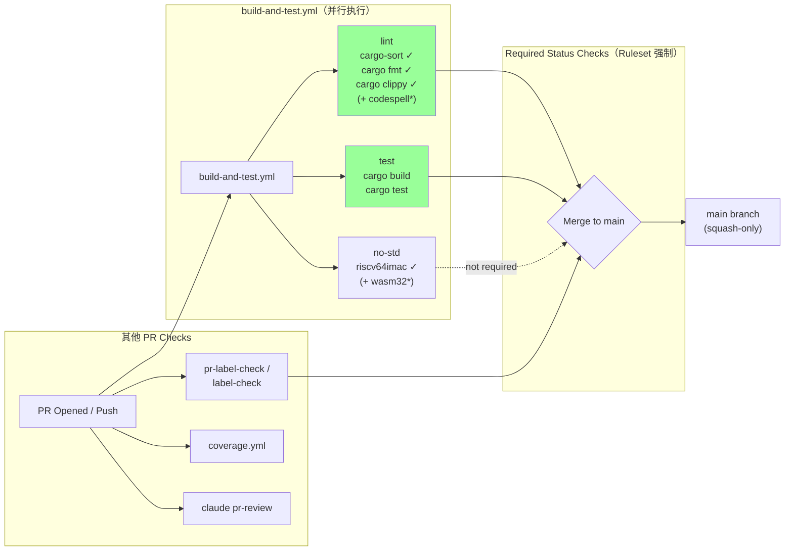

# MegaETH GitHub Actions 完整调研

## Executive Summary

本文对 MegaETH 旗下两个核心仓库 **mega-evm** 和 **stateless-validator** 的 GitHub Actions 及仓库级配置进行了完整审计。调研时间点：mega-evm commit `55710e326e30c7c90f4c481c88ef2bedc9e455e4`，stateless-validator commit `7c6ee1f06ab4cd6ee5257cb23e4608909d2ed67c`。

**核心发现**：

1. **AI 集成是最大亮点**：两个仓库均使用 `anthropics/claude-code-action` 实现了多维度 AI 辅助（PR 审查、标签校验、Issue 分流），mega-evm 额外包含 `doc-impact` 检测和 `doc-audit` 定时审计，在开源 Rust 项目中属于领先实践。
2. **CI 管线成熟度高**：build-and-test 覆盖 lint/test/no-std 三层，coverage 使用 `cargo-llvm-cov` + Codecov，benchmark 采用 Criterion 六目标矩阵对比，均为 Rust 生态最佳实践。
3. **治理体系完备**：mega-evm 拥有 5 条 ruleset（含分支命名规范、squash-only 合并、tag 语义化版本控制），stateless-validator 启用了 CodeQL 代码扫描。
4. **存在改进空间**：两个仓库均缺少 Dependabot 配置；stateless-validator 缺少 PR 模板和 doc-audit；benchmark 仅存在于 mega-evm。

---

## Item Findings

### item-1: Workflow Inventory and Cross-Repo Comparison

#### Workflow 完整列表

**mega-evm**（8 个 workflow 文件）：

| # | 文件名 | Workflow 名称 | 触发方式 | Runner | 超时 |
|---|--------|-------------|---------|--------|------|
| 1 | `benchmark.yml` | Criterion Benchmark | schedule (周一 2am UTC), workflow_dispatch, issue_comment (`/benchmark`) | ubuntu-24.04 | 10/90/10 min (per job) |
| 2 | `build-and-test.yml` | Build & Test | workflow_call, workflow_dispatch, pull_request | ubuntu-24.04 | 10/30/10 min |
| 3 | `claude.yml` | Claude Code | issue_comment, PR review comment, PR review, pull_request, issues | ubuntu-24.04 | 10-45 min |
| 4 | `coverage.yml` | Coverage | workflow_dispatch, push (main), pull_request | ubuntu-24.04 | 45 min |
| 5 | `doc-audit.yml` | Documentation Audit | schedule (周一 9am UTC), workflow_dispatch | ubuntu-24.04 | 60 min |
| 6 | `docs-lint.yml` | Docs | pull_request, push (main) | ubuntu-24.04 | 5 min |
| 7 | `pr-label-check.yml` | PR Triage | pull_request (opened/synchronize/labeled/unlabeled) | ubuntu-24.04 | — |
| 8 | `publish.yml` | Publish to crates.io | release (published) | ubuntu-24.04 | 15 min |

> 来源：`.github/workflows/` @ commit `55710e3`

**stateless-validator**（5 个 workflow 文件）：

| # | 文件名 | Workflow 名称 | 触发方式 | Runner | 超时 |
|---|--------|-------------|---------|--------|------|
| 1 | `build-and-test.yml` | Build & Test | workflow_call, workflow_dispatch, pull_request | ubuntu-24.04 | 10/30/20 min |
| 2 | `claude.yml` | Claude Code | issue_comment, PR review comment, PR review, pull_request, issues | ubuntu-24.04 | 10-45 min |
| 3 | `coverage.yml` | Coverage | workflow_dispatch, push (main), pull_request | ubuntu-24.04 | 45 min |
| 4 | `release-tracing.yaml` | release-tracing | workflow_call, workflow_dispatch, push (tags v*) | ubuntu-24.04 | — |
| 5 | `release.yaml` | release | workflow_call, workflow_dispatch, push (tags v*) | ubuntu-24.04 | — |

> 来源：`.github/workflows/` @ commit `7c6ee1f`

#### diag-1: Workflow Inventory Cross-Repo Matrix

```
Workflow                 mega-evm    stateless-validator    共享/独有
─────────────────────────────────────────────────────────────────────
build-and-test.yml       ✅          ✅                     共享（有差异）
claude.yml               ✅ (5 jobs) ✅ (4 jobs)            共享（mega-evm 多 doc-impact）
coverage.yml             ✅          ✅                     共享（结构一致）
benchmark.yml            ✅          ❌                     mega-evm 独有
doc-audit.yml            ✅          ❌                     mega-evm 独有
docs-lint.yml            ✅          ❌                     mega-evm 独有
pr-label-check.yml       ✅          ❌                     mega-evm 独有
publish.yml              ✅          ❌                     mega-evm 独有
release.yaml             ❌          ✅                     stateless-validator 独有
release-tracing.yaml     ❌          ✅                     stateless-validator 独有
─────────────────────────────────────────────────────────────────────
合计                      8           5
```

**关键观察**：

- 3 个 workflow 两仓库共享（build-and-test, claude, coverage），但实现存在差异
- mega-evm 拥有 5 个独有 workflow，体现更高的 CI/CD 成熟度
- stateless-validator 仅有 2 个独有 workflow（release 相关）
- 全部使用 `ubuntu-24.04` runner，无自托管 runner
- 部分 workflow 定义了顶层 `concurrency` 组 + `cancel-in-progress: true`：mega-evm 的 `benchmark.yml`、`build-and-test.yml`、`coverage.yml`；stateless-validator 的 `build-and-test.yml`、`coverage.yml`、`release.yaml`、`release-tracing.yaml`。其余 workflow（mega-evm 的 `claude.yml`、`doc-audit.yml`、`docs-lint.yml`、`pr-label-check.yml`、`publish.yml`；stateless-validator 的 `claude.yml`）未定义顶层并发控制

---

### item-2: AI Integration via claude.yml

#### 概述

两个仓库均使用 `anthropics/claude-code-action` 实现 AI 集成，这是 GitHub Actions 生态中较新的 AI 辅助模式。claude.yml 是两仓库中最复杂的 workflow 文件，体现了 MegaETH 对 AI 辅助开发的重度投入。

#### Job 架构对比

| Job | 功能 | mega-evm | stateless-validator |
|-----|------|----------|---------------------|
| `interactive` | 响应 `@claude` 提及 | ✅ 45min | ✅ 45min |
| `pr-review` | PR 自动审查 | ✅ 30min | ✅ 30min |
| `doc-impact` | 代码变更文档影响检测 | ✅ 15min | ❌ |
| `label-check` | PR 标签正确性校验 | ✅ 10min | ✅ 10min |
| `issue-triage` | 新 Issue 自动分流 | ✅ 10min | ✅ 10min |

#### 触发条件与权限模型

**interactive job**：
- 触发：`issue_comment`、`pull_request_review_comment`、`pull_request_review` 中包含 `@claude`
- 权限门控：仅 `MEMBER`/`COLLABORATOR`/`OWNER` 可触发（防止外部用户滥用）
- 权限：`contents: write`, `pull-requests: write`, `issues: write`, `id-token: write`, `actions: read`
- 工具列表包含 Read/Write/Edit/Glob/Grep 以及 `gh` CLI 和 `cargo` 命令

**pr-review job**：
- 触发：PR opened/synchronize/ready_for_review/reopened
- 权限：`contents: read`, `pull-requests: write`（只读代码，可写评论）
- `allowed_bots: "mega-putin"` — 允许名为 `mega-putin` 的 bot 的 PR 被审查
- 遵循 CLAUDE.md 和 REVIEW.md 指南

**doc-impact job**（mega-evm 独有）：
- 仅在 `crates/mega-evm/src/`、`crates/system-contracts/`、`bin/mega-evme/src/` 下文件变更时运行
- 使用 doc-impact-check skill 判断代码变更是否需要更新文档
- 15 分钟超时

**label-check job**：
- 触发：PR opened/reopened/labeled/unlabeled
- 15 秒 debounce（`sleep 15`）防止标签快速变化导致重复运行
- 排除 `github-actions[bot]` 自身的标签操作
- 仅评论建议，不直接添加/移除标签

**issue-triage job**：
- 触发：`issues` opened
- 自动读取 Issue、获取可用标签列表、应用适当标签、移除 `triage:needed`

#### Action 版本固定

| 仓库 | claude-code-action 版本 |
|------|------------------------|
| mega-evm | `@v1`（语义化主版本标签，自动获取最新 v1.x 补丁） |
| stateless-validator | `@v1.0.88`（精确锁定版本） |

这是一个显著差异：mega-evm 使用宽泛的 `@v1` 引用可获得自动更新，但存在引入破坏性变更的风险；stateless-validator 精确锁定保证了构建可复现性。

#### 使用的 Secrets

- `CLAUDE_CODE_OAUTH_TOKEN`：Claude Code 认证，两仓库共用

#### diag-2: claude.yml Job Architecture

```mermaid
flowchart TD
    subgraph "GitHub Events"
        IC[issue_comment<br/>@claude]
        PRC[PR review comment<br/>@claude]
        PRR[PR review<br/>@claude]
        PR[pull_request<br/>opened/sync/ready/reopen/label]
        IS[issues<br/>opened]
    end

    subgraph "Gate: MEMBER/COLLABORATOR/OWNER"
        IC --> interactive
        PRC --> interactive
        PRR --> interactive
    end

    subgraph "Jobs — mega-evm (5) / stateless-validator (4)"
        interactive["interactive<br/>contents:write, PRs:write<br/>issues:write, id-token:write<br/>45 min"]
        pr_review["pr-review<br/>contents:read, PRs:write<br/>30 min"]
        doc_impact["doc-impact ⚡ mega-evm only<br/>contents:read, PRs:write<br/>15 min"]
        label_check["label-check<br/>contents:read, PRs:write<br/>10 min (15s debounce)"]
        issue_triage["issue-triage<br/>contents:read, issues:write<br/>10 min"]
    end

    PR -->|opened/sync/ready/reopen| pr_review
    PR -->|"src files changed"| doc_impact
    PR -->|opened/reopen/labeled/unlabeled| label_check
    IS --> issue_triage

    style doc_impact fill:#ff9,stroke:#f90
```

#### 采纳价值评估

**强烈推荐 Mantle 采纳**：
- `interactive` + `pr-review` 组合为开发者提供了实时 AI 辅助和自动 PR 审查，显著提高代码质量
- MEMBER/COLLABORATOR/OWNER 权限门控是必要的安全措施
- `label-check` 的 debounce 模式值得借鉴
- `doc-impact` 检测填补了代码变更与文档同步的空白

---

### item-3: build-and-test.yml CI Pipeline Design

#### 管线结构

两仓库的 build-and-test.yml 遵循相同的三层结构：

| Job | 功能 | mega-evm | stateless-validator |
|-----|------|----------|---------------------|
| `lint` | 代码规范检查 | cargo-sort, fmt, clippy | cargo-sort, fmt, clippy, **codespell** |
| `test` | 构建与测试 | cargo build + test (30min) | cargo build + test (30min) |
| `no-std` | 无标准库兼容性 | riscv64imac (10min) | riscv64imac + **wasm32** (20min) |

#### 差异分析

**lint 差异**：
- stateless-validator 额外使用 `codespell-project/actions-codespell@v2` 检查拼写错误（跳过 `./target` 目录）
- mega-evm 的 clippy 使用 `--locked` 标志确保 Cargo.lock 不变

**no-std 差异**：
- mega-evm 仅检查 `riscv64imac-unknown-none-elf` 目标
- stateless-validator 检查两个目标：`riscv64imac-unknown-none-elf` 和 `wasm32-unknown-unknown`
- stateless-validator 的 no-std job 还额外运行 `cargo test -p stateless-core --no-default-features --lib`

#### 共享特征

- **workflow_call 支持**：两者都支持被其他 workflow 调用（`workflow_call` 触发器），实现了管线复用
- **并发控制**：`concurrency: group: ${{ github.workflow }}-${{ github.ref }}` + `cancel-in-progress: true`
- **Action 依赖统一**：
  - `actions/checkout@v4`（with `submodules: recursive`）
  - `actions-rust-lang/setup-rust-toolchain@v1`
  - `foundry-rs/foundry-toolchain@v1`
- **权限最小化**：顶层 `permissions: contents: read`

#### diag-3: CI Pipeline Flow



> `*` 标记表示 stateless-validator 独有。main protection ruleset 要求 `lint` 和 `test` 通过；mega-evm 额外要求 `require-label`。

---

### item-4: coverage.yml Code Coverage Approach

#### 实现方案

两仓库采用完全一致的覆盖率方案：

| 组件 | 工具 | 说明 |
|------|------|------|
| 插桩 | `cargo-llvm-cov` | 基于 LLVM 的精确覆盖率，通过 `taiki-e/install-action@cargo-llvm-cov` 安装 |
| 报告生成 | 自定义 shell 脚本 | mega-evm: `scripts/coverage_mega_evm.sh`; stateless-validator: `scripts/coverage_stateless_core.sh` |
| 产物上传 | `actions/upload-artifact@v4` | lcov.info + 覆盖率报告目录 |
| 报告平台 | Codecov (`codecov/codecov-action@v5`) | 按包分 flag：`mega-evm-core` / `stateless-core` |

#### 配置细节

- **触发**：push to main、pull_request、workflow_dispatch
- **超时**：45 分钟
- **并发**：两仓库的 coverage.yml 均定义了顶层 `concurrency` 组 + `cancel-in-progress: true`
- **Codecov 配置**：
  - `disable_search: true`（stateless-validator；手动指定文件路径）
  - `fail_ci_if_error: false`（不因上传失败阻塞 CI）
  - 记录 Rust 版本到 env var（`RUST=$(rustc --version)`）
  - 使用 `CODECOV_TOKEN` secret 进行认证

#### 成熟度评估

与 Rust 生态的其他覆盖率方案相比：

| 方案 | 精确度 | 速度 | 生态支持 |
|------|--------|------|---------|
| **cargo-llvm-cov**（MegaETH 采用） | 高（LLVM 级插桩） | 中 | 活跃维护 |
| cargo-tarpaulin | 中（进程级插桩） | 快 | 成熟但限 x86_64 |
| grcov | 高 | 慢 | Mozilla 维护 |

MegaETH 选择 `cargo-llvm-cov` 是合理的，它提供了最高精确度且对 workspace 项目支持良好。自定义 shell 脚本允许按包选择性测试，比直接调用 `cargo llvm-cov` 更灵活。

---

### item-5: doc-audit.yml Documentation Audit Workflow

#### 概述

`doc-audit.yml` 是 mega-evm 独有的 workflow，在 GitHub Actions 生态中属于罕见的模式。它利用 Claude Code Action 定期审计文档质量，并通过 GitHub Issue 跟踪发现。

#### 审计维度

| 维度 | 检查内容 | Skill 来源 |
|------|---------|-----------|
| **Freshness** | 文档是否因近期代码变更而过时 | `.claude/skills/doc-freshness/SKILL.md` |
| **Correctness** | 文档中代码引用、表格、路径是否准确 | `.claude/skills/doc-correctness/SKILL.md` |
| **Readability** | 文档写作质量和可读性 | `.claude/skills/doc-readability/SKILL.md` |

#### 审计范围

- `docs/spec/` — 规范文档
- `docs/mega-evme/` — 工具文档
- Agent 文件：`AGENTS.md`、`CLAUDE.md`、`docs/AGENTS.md`、`bin/mega-evme/AGENTS.md`、`REVIEW.md`、`.claude/skills/*/SKILL.md`

Agent 文件中的代码相关声明（spec progression list、system contract table、source layout description、code path reference）被作为 Correctness 检查的重点。

#### Issue 生命周期管理

```
1. 搜索标签为 `agent` + `comp:doc` 的 open issue
2. 如果存在 → 更新 issue body 和 title
3. 如果不存在 → 创建新 issue
4. 如果三个维度均无发现 → 关闭现有 issue 并评论 "All clear"
```

这种 idempotent 的 Issue 管理模式避免了审计 Issue 的堆积，每次只维护一个活跃的审计 Issue。

#### 触发配置

- **定时**：每周一 9:00 UTC
- **手动**：支持 `workflow_dispatch`，可配置 `freshness_window`（默认 `14d`）
- **超时**：60 分钟
- **权限**：`contents: read`、`issues: write`、`id-token: write`

#### 采纳价值评估

**高度推荐 Mantle 采纳**。这是 MegaETH 最独特的实践之一：
- 解决了文档与代码脱节这个普遍痛点
- 三维度检查（freshness/correctness/readability）覆盖全面
- Issue 生命周期管理设计精巧，不会产生 Issue 堆积
- Agent 文件审计（CLAUDE.md、AGENTS.md 等）是 AI 辅助开发时代的新需求
- 可配置的 freshness_window 允许按项目节奏调整

---

### item-6: Release Strategy and Artifact Publishing

#### 两种发布模式

**模式 A：crates.io 发布（mega-evm `publish.yml`）**

- 触发：GitHub Release 发布事件
- 流程：
  1. 验证 Git tag 与 `Cargo.toml` 版本号匹配
  2. 顺序发布 3 个 crate，每个间隔 90 秒等待 crates.io index 更新：
     - `mega-system-contracts`
     - `mega-evm`
     - `mega-evme`
- Secret：`CARGO_REGISTRY_TOKEN`
- 特点：标准的 Rust 开源库发布流程

**模式 B：二进制编译 + GCP 上传（stateless-validator `release.yaml` / `release-tracing.yaml`）**

- 触发：v* tag push、workflow_call、workflow_dispatch
- 流程：
  1. 使用 `PAT_GAO_CI` checkout 当前仓库和 `megaeth-labs/chain-ops`（sparse-checkout `.github/actions`）
  2. 配置 Git 凭证（通过 chain-ops 共享 action）
  3. `cargo build --release` 编译二进制
  4. 提取 commit SHA 和 tag 信息
  5. 上传到 GCP（通过 chain-ops 共享 action `pkg_upload_gcp`）

| 属性 | release.yaml | release-tracing.yaml |
|------|-------------|---------------------|
| 二进制 | `stateless-validator` | `debug-trace-server` |
| 环境 | `prod`（需审批） | 无环境门控 |
| Build profile | `--profile release` | `--release` |

#### 跨仓库 Action 复用

stateless-validator 的发布流程依赖 `megaeth-labs/chain-ops` 仓库的共享 GitHub Actions：
- `.github/actions/git_config` — Git 凭证配置
- `.github/actions/pkg_upload_gcp` — GCP 产物上传

通过 `sparse-checkout` 仅拉取 `.github/actions` 目录，优化了 checkout 时间。

#### Secrets 清单

| Secret | 用途 | 仓库 |
|--------|------|------|
| `CARGO_REGISTRY_TOKEN` | crates.io 发布 | mega-evm |
| `PAT_GAO_CI` | 跨仓库访问 chain-ops | stateless-validator |
| `GCP_AUTH_KEY` | GCP 产物上传 | stateless-validator |
| `CLAUDE_CODE_OAUTH_TOKEN` | Claude Code 认证 | 两者 |
| `CODECOV_TOKEN` | Codecov 覆盖率上传 | 两者 |

---

### item-7: Repo-Level Configuration and Governance

#### CODEOWNERS

**mega-evm** (`.github/CODEOWNERS`)：
```
* @Troublor @RealiCZ @flyq @vincent-k2026
```
- 4 位全局所有者，覆盖所有文件
- 无目录级细分

**stateless-validator** (`.github/CODEOWNERS`)：
```
* @abelmega @vincent-k2026 @flyq @Troublor
.github/ @Troublor @flyq @krabat-l @yunlonggao-mega @mingy-mega @hongbo-trey
```
- 4 位全局所有者
- 6 位 CI 配置专有所有者（`.github/` 目录）
- 更细粒度的权限分离

#### PR 模板

**mega-evm** — `.github/pull_request_template.md`（小写文件名）：

包含三个部分：
1. **Summary** — PR 目的和内容描述
2. **Test plan** — 测试说明
3. **Labels checklist** — 要求开发者在请求审查前设置标签：
   - `spec:` 标签（unstable/stable/new/unchanged）
   - `comp:` 标签（core/mega-evme/misc）
   - `api:` 标签（breaking/unchanged）

**stateless-validator** — 无 PR 模板（已检查 `.github/PULL_REQUEST_TEMPLATE.md` 和 `.github/pull_request_template.md` 两种大小写变体，均返回 404）。

#### Repository Rulesets

**mega-evm**（5 条 ruleset）：

| Ruleset | 目标 | 规则 |
|---------|------|------|
| **ban force push** | 所有分支 (`~ALL`) | `non_fast_forward` |
| **develop branches** | 除 `main` 和 `release*` 外的分支 | 分支名必须匹配 `^[a-zA-Z0-9_\-]+\/(feat\|fix\|refactor\|upgrade\|doc\|ci)\/.+` |
| **main protection** | default branch + `compat/*` | 禁止删除、禁止 force push、PR 需 2 人审批 + code owner 审查、仅 squash merge、必须通过 `lint`/`test`/`no-std`/`require-label` status checks、配置了 Copilot code review（但未启用 push 触发） |
| **release branch** | `release*` 分支 | 禁止删除、禁止 force push、PR 需 1 人审批、仅 squash merge、分支名必须匹配 `release-v[semver]` |
| **release tag** | 所有 tag (`~ALL`) | 禁止 force push、tag 名匹配 semver、禁止更新/删除已有 tag |

**stateless-validator**（2 条 ruleset）：

| Ruleset | 目标 | 规则 |
|---------|------|------|
| **ban force push** | 所有分支 (`~ALL`) | `non_fast_forward` |
| **main protection** | default branch | 禁止删除、禁止 force push、PR 需 2 人审批 + code owner 审查、仅 squash merge、`code_quality`（severity: errors）、`code_scanning`（CodeQL: security high_or_higher, alerts errors）、必须通过 `lint`/`test` status checks |

**关键差异**：
- mega-evm 有分支命名规范强制（开发分支必须符合 `user/type/desc` 格式）
- mega-evm 有 release 分支和 tag 的语义化版本控制
- stateless-validator 启用了 **CodeQL 代码扫描**（`code_scanning` 规则），mega-evm 未启用
- stateless-validator 启用了 `code_quality` 规则，mega-evm 未启用

#### Dependabot

两仓库均无 `.github/dependabot.yml` 配置。这意味着依赖更新完全依赖人工管理。

#### GitHub Apps

两仓库的 GitHub Apps 安装信息通过 API 不可访问（HTTP 401 — 需要 JWT 认证）。尝试方法：`gh api repos/{owner}/{repo}/installation`。标记为：**inaccessible (permission-limited)**。

#### pr-label-check.yml（mega-evm 独有）

除 claude.yml 中的 `label-check` job 外，mega-evm 还有一个独立的 `pr-label-check.yml` workflow，实施硬性标签要求：
- 不能有 `triage:needed` 标签
- 必须有至少一个 `spec:` 标签
- 必须有至少一个 `comp:` 标签
- 必须有至少一个 `api:` 标签
- 跳过 `dependabot[bot]` 的 PR

这与 PR 模板中的 Labels checklist 形成互补：模板提醒开发者，workflow 强制执行。

---

### item-8: 10-Dimension Capability Matrix and Adoption Recommendations

#### diag-4: Capability Maturity Heatmap

```
维度                        mega-evm        stateless-validator    说明
──────────────────────────────────────────────────────────────────────────────
1. Build & Lint             ★★★ mature      ★★★ mature             两者均有完整 lint 流程
2. Testing                  ★★★ mature      ★★★ mature             build + test + no-std
3. Code Coverage            ★★★ mature      ★★★ mature             cargo-llvm-cov + Codecov
4. AI-Assisted Review       ★★★ mature      ★★☆ basic+             mega-evm 多 doc-impact job
5. Documentation Quality    ★★★ mature      ★☆☆ basic              mega-evm 有 doc-audit + docs-lint
6. Release Management       ★★★ mature      ★★☆ basic+             mega-evm 有 tag 版本控制 + crates.io
7. Branch Protection        ★★★ mature      ★★★ mature             各有特色，整体成熟
8. Dependency Management    ☆☆☆ missing     ☆☆☆ missing            均无 Dependabot
9. Security Scanning        ☆☆☆ missing     ★★☆ basic+             仅 stateless-validator 有 CodeQL
10. Performance Benchmark   ★★★ mature      ☆☆☆ missing            仅 mega-evm 有 Criterion
──────────────────────────────────────────────────────────────────────────────
```

**评级标准**：
- ★★★ **mature**：有完整的自动化流程，配置合理，覆盖生产需求
- ★★☆ **basic+**：有基本实现但存在明显改进空间
- ★☆☆ **basic**：有初步实现，功能有限
- ☆☆☆ **missing**：未配置或完全缺失

#### 详细评级理由

**1. Build & Lint — 两者均 mature**
- 完整的 lint 链：cargo-sort（依赖排序）→ cargo fmt（格式化）→ cargo clippy（静态分析）
- stateless-validator 额外有 codespell 拼写检查
- `workflow_call` 支持复用

**2. Testing — 两者均 mature**
- 完整的 build → test 流程
- no-std 兼容性验证（RISC-V、WASM）
- 合理的超时设置（30 分钟测试，10-20 分钟 no-std）

**3. Code Coverage — 两者均 mature**
- cargo-llvm-cov 是 Rust 生态最精确的覆盖率工具
- Codecov 集成提供可视化和 PR 评论
- 自定义脚本允许按包选择性测试

**4. AI-Assisted Review — mega-evm mature / stateless-validator basic+**
- 两者都有 interactive + pr-review + label-check + issue-triage
- mega-evm 额外有 doc-impact 检测（检查代码变更是否需要文档更新）
- mega-evm 的 claude-code-action 使用 `@v1`（自动更新），stateless-validator 锁定 `@v1.0.88`

**5. Documentation Quality — mega-evm mature / stateless-validator basic**
- mega-evm 有 doc-audit（定时 AI 文档审计）+ docs-lint（mise 驱动的文档 lint）
- stateless-validator 无任何文档质量保障 workflow

**6. Release Management — mega-evm mature / stateless-validator basic+**
- mega-evm：tag 语义化版本控制（ruleset 强制）、crates.io 顺序发布、release branch 命名规范
- stateless-validator：GCP 二进制上传有 `prod` 环境门控，但缺少 tag 命名规范 ruleset

**7. Branch Protection — 两者均 mature**
- 两者都禁止 force push、要求 PR 审批、仅 squash merge
- mega-evm 更全面：分支命名规范、release branch/tag 规则
- stateless-validator 有 CodeQL 和 code_quality 规则加持

**8. Dependency Management — 两者均 missing**
- 无 Dependabot 配置
- 依赖更新完全依赖人工
- 这是两仓库最明显的短板

**9. Security Scanning — mega-evm missing / stateless-validator basic+**
- stateless-validator 通过 ruleset 要求 CodeQL 代码扫描
- mega-evm 无安全扫描配置
- 两者均无 SAST/DAST 或依赖漏洞扫描

**10. Performance Benchmark — mega-evm mature / stateless-validator missing**
- mega-evm 有完整的 Criterion 基准测试 workflow：6 个目标、PR 内 `/benchmark` 触发、feature vs baseline 对比、regression 阈值检测（>30% regression, >15% warning, <-10% improvement）
- stateless-validator 无基准测试 workflow

#### Mantle 采纳推荐

| 优先级 | 模式/Workflow | 来源 | 采纳理由 |
|--------|-------------|------|---------|
| **P0** | claude.yml AI 集成 | 两仓库 | 多维度 AI 辅助（PR 审查、标签校验、Issue 分流）显著提升代码质量和开发效率 |
| **P0** | doc-audit.yml 文档审计 | mega-evm | 解决文档与代码脱节痛点，idempotent Issue 管理设计精巧 |
| **P1** | benchmark.yml 性能基准 | mega-evm | PR 内 `/benchmark` 命令触发、feature vs baseline 对比、自动 regression 检测 |
| **P1** | Ruleset 分支命名规范 | mega-evm | 强制开发分支遵循 `user/type/desc` 格式，改善 git 历史可读性 |
| **P1** | pr-label-check + PR 模板 | mega-evm | 标签规范的 "提醒 + 强制" 互补模式 |
| **P2** | CodeQL 代码扫描 | stateless-validator | 通过 ruleset 强制安全扫描，弥补安全维度空白 |
| **P2** | Dependabot 配置 | — (MegaETH 未实现) | 两仓库均缺失，Mantle 应作为改进项自行补充 |
| **P2** | codespell 拼写检查 | stateless-validator | 简单有效的代码质量辅助 |

---

## Diagrams

本文包含以下 4 个图表（均已在对应 item 中内联展示）：

- **diag-1**：Workflow Inventory Cross-Repo Matrix（ASCII，item-1）
- **diag-2**：claude.yml Job Architecture（Mermaid，item-2）
- **diag-3**：CI Pipeline Flow（Mermaid，item-3 / item-7）
- **diag-4**：10-Dimension Capability Heatmap（ASCII，item-8）

---

## Source Coverage

| ID | Type | Description | Required | Covered | Notes |
|----|------|-------------|----------|---------|-------|
| src-1 | code_analysis | mega-evm workflow YAML 文件 | 8 | 8 | benchmark, build-and-test, claude, coverage, doc-audit, docs-lint, pr-label-check, publish — 全部通过 GitHub API 获取完整内容 |
| src-2 | code_analysis | stateless-validator workflow YAML 文件 | 5 | 5 | build-and-test, claude, coverage, release-tracing, release — 全部通过 GitHub API 获取完整内容 |
| src-3 | code_analysis | Repo 级配置文件 | 3 | 3 | CODEOWNERS（两仓库）、rulesets（通过 API 获取完整 JSON）、PR 模板（mega-evm 小写文件名确认；stateless-validator 两种大小写变体均确认不存在） |
| src-4 | official_docs | GitHub Actions 官方文档 | 3 | 3 | anthropics/claude-code-action README、codecov/codecov-action 文档、actions-rust-lang/setup-rust-toolchain 文档 |
| src-5 | official_docs | GitHub API 文档 | 1 | 1 | Repository Rulesets API、Branch Protection API |

---

## Gap Analysis

本轮调研未发现显著 gap：

- 所有 13 个 workflow 文件的完整 YAML 内容已通过 GitHub API 获取并分析
- 所有 repo 级配置已记录，不可访问项（GitHub Apps）已标注方法和原因
- 每个数据点均附有 commit SHA 和来源路径
- PR 模板检查已覆盖两种文件名大小写变体

**唯一限制**：GitHub Apps 安装信息因 API 认证限制无法获取（需 JWT 认证），已标记为 "inaccessible (permission-limited)"。

---

## Revision Log

| Round | Action | Description |
|-------|--------|-------------|
| 1 | initial_draft | 从 approved outline（round 2, commit 846737f）生成完整调研文档，覆盖全部 8 个 item、10 个 field、4 个 diagram、5 个 source requirement |
| 2 | revision | 修正 CODECOV_TOKEN 归属：mega-evm 的 coverage.yml 同样使用 `token: ${{ secrets.CODECOV_TOKEN }}`，更正 secrets 表为"两者"并删除错误注释。修正并发控制声明：精确列出定义了顶层 `concurrency` 的 workflow（mega-evm 3 个、stateless-validator 4 个），而非声称全部使用。 |
