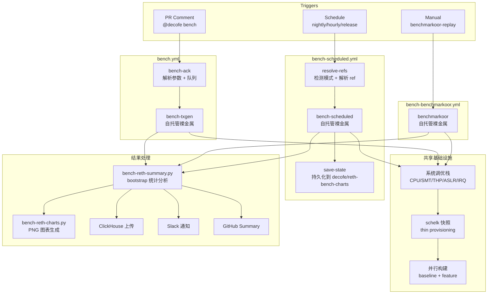
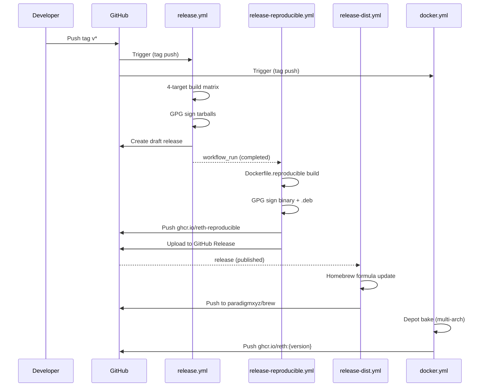

# paradigmxyz/reth GitHub Actions 完整调研

> **调研日期**: 2026-06-10
> **Codebase SHA**: paradigmxyz/reth `9384bc53d8c0c77e59cac83fdaaf3b372c6d2216` (main HEAD)
> **Workflow 数量**: 30 个文件位于 `.github/workflows/`
> **支持脚本**: 22+ 个文件位于 `.github/scripts/`

---

## 1. Executive Summary

paradigmxyz/reth 拥有 Rust 区块链项目中最成熟的 GitHub Actions CI/CD 体系之一。其 30 个 workflow 覆盖了从代码质量、单元测试到性能基准、可复现构建、多架构发布、以太坊协议一致性测试的完整生命周期。

**核心发现**:

1. **三层基准测试系统** (bench.yml / bench-scheduled.yml / bench-benchmarkoor.yml) 是最突出的创新——使用裸金属自托管 runner、ABBA 交叉对比消除热漂移、schelk 薄配置快照实现秒级数据库状态恢复、samply CPU profiling、ClickHouse 指标管道、以及小时级回归检测。这在开源区块链项目中独一无二。

2. **可复现构建验证** 采用双机器 SHA256 对比 (ubuntu-latest vs ubuntu-22.04) 证明 Docker 隔离的有效性，并在发布时自动生成 GPG 签名的可复现制品。

3. **安全供应链** 实践优秀：第三方 Action 均 SHA 全量钉选、`permissions: {}` 默认拒绝、`persist-credentials: false` 普遍应用、GPG 签名发布制品。但 `dtolnay/rust-toolchain` 使用移动 ref (`@stable`, `@nightly`, `@clippy`, `@master`)——这是 Rust 生态的常见做法，因为该 Action 本身只是安装工具链，不执行任意代码。

4. **以太坊协议一致性** 通过 Hive (40+ 场景，Amsterdam/Osaka 双分叉) 和 Kurtosis 多客户端 devnet 测试确保。

5. **10 维能力矩阵** 显示 reth 在基准测试、可复现构建、发布管线、CI/测试、安全供应链 5 个维度达到"成熟"水平，在上游兼容性维度为"基础"。

**对 Mantle 的核心建议**: 优先引入基准测试系统的系统调优栈和 ABBA 对比方法论、可复现构建验证管线、Compact codec 向后兼容测试、以及 merge-group 门控重度测试模式。

---

## 2. Item Findings

### item-1: Repo 级配置概况

#### 2.1.1 .github 目录结构

| 路径 | 状态 | 详情 |
|------|------|------|
| `.github/workflows/` | 存在 | 30 个 workflow 文件 |
| `.github/CODEOWNERS` | **存在** | 通过 `gh api repos/paradigmxyz/reth/contents/.github/CODEOWNERS` 验证（注：根目录 `CODEOWNERS` 返回 404，文件位于 `.github/` 下） |
| `.github/dependabot.yml` | **存在** | 双生态系统配置 |
| `.github/PULL_REQUEST_TEMPLATE.md` | **不存在** | `gh api repos/paradigmxyz/reth/contents/.github/PULL_REQUEST_TEMPLATE.md` 返回 HTTP 404 (commit `9384bc53`)；同时检查了小写变体 `pull_request_template.md` 和根目录路径——均 404。该仓库不使用 PR 模板 |
| `.github/ISSUE_TEMPLATE/` | **存在** | 4 个模板文件：`bug.yml`, `config.yml`, `docs.yml`, `feature.yml` |
| `.github/actionlint.yaml` | **存在** | 自托管 runner 标签白名单 |
| `.github/scripts/` | **存在** | 22+ 个支持脚本 |
| `.github/assets/` | **存在** | `kurtosis_network_params.yaml` |

#### 2.1.2 CODEOWNERS 分析

`.github/CODEOWNERS` 定义了细粒度的 crate 级代码所有权模型：

- **全局所有者**: `@gakonst` (所有文件的默认审查者)
- **核心维护者**: `@mattsse`, `@Rjected`, `@shekhirin`, `@joshieDo` 出现频率最高
- **覆盖范围**: 45+ 条规则，覆盖 `crates/` 下几乎所有子目录
- **专项维护者**:
  - 存储层 (`crates/storage/*`): `@joshieDo`, `@shekhirin`
  - 网络层 (`crates/net/*`): `@mattsse`, `@Rjected`
  - EVM (`crates/evm/`, `crates/revm/`): `@mattsse`, `@Rjected`, `@klkvr`
  - Trie (`crates/trie/`): `@Rjected`, `@shekhirin`, `@mediocregopher`, `@yongkangc`
  - 基准对比 (`bin/reth-bench-compare/`): `@mediocregopher`, `@shekhirin`, `@yongkangc`
  - CI/CD (`.github/`): `@gakonst`, `@DaniPopes`

**Mantle 借鉴**: 这种 crate 级所有权模型可直接适配 Mantle reth fork 的模块结构，确保每个子系统变更由专家审查。

#### 2.1.3 Dependabot 配置

```yaml
version: 2
updates:
- package-ecosystem: "github-actions"
  directory: "/"
  schedule:
    interval: "weekly"
  cooldown:
    default-days: 7
- package-ecosystem: "cargo"
  directory: "/"
  schedule:
    interval: "weekly"
  cooldown:
    default-days: 7
  labels: ["A-dependencies"]
  commit-message:
    prefix: "chore(deps)"
  open-pull-requests-limit: 1
  groups:
    cargo-weekly:
      applies-to: "version-updates"
      patterns: ["*"]
      update-types: ["minor", "patch"]
```

**设计决策**:
- GitHub Actions 和 Cargo 双生态系统，均为每周更新
- Cargo 更新使用分组策略 (`cargo-weekly`)，所有 minor/patch 更新合并为单个 PR，减少审查负担
- `open-pull-requests-limit: 1` 防止 PR 泛滥
- `chore(deps)` 前缀强制遵循 Conventional Commits
- 7 天冷却期避免频繁更新

#### 2.1.4 actionlint 配置

```yaml
self-hosted-runner:
  labels:
    - depot-ubuntu-latest
    - depot-ubuntu-latest-2
    - depot-ubuntu-latest-4
    - depot-ubuntu-latest-8
    - depot-ubuntu-latest-16
    - available
```

白名单 Depot 云 runner 标签，防止 actionlint 对自定义 runner 名称报假阳性。

#### 2.1.5 Runner 策略

reth 使用三层 runner 策略：

| Runner 类型 | 标签 | 用途 | 成本级别 |
|-------------|------|------|----------|
| **Depot 云** | `depot-ubuntu-latest`, `-2/-4/-8/-16` | 主要 CI 任务 (lint, test, build) | 中 |
| **自托管裸金属** | `[self-hosted, Linux, X64, available]` | 基准测试 (需要 CPU 隔离和确定性) | 高 |
| **GitHub 托管** | `ubuntu-latest`, `ubuntu-24.04`, `macos-14` | 轻量级任务 (发布、文档) | 低 |

**Fork 友好的 runner 选择**:
```yaml
runs-on: ${{ github.repository == 'paradigmxyz/reth' && 'depot-ubuntu-latest' || 'ubuntu-latest' }}
```
这种表达式模式允许 fork 仓库回退到 GitHub 托管 runner，不需要配置 Depot。

#### 2.1.6 Repo 设置访问结果

| 设置 | 结果 | 间接证据 |
|------|------|----------|
| Branch Protection | `不可访问 (权限受限)` — API 返回 404 | 8+ workflow 使用 `merge_group` 触发器，暗示启用了 merge queue + branch protection |
| GitHub Environments | `copilot`, `github-pages` — 通过公共 API 可访问 | `book.yml` deploy job 使用 `environment: name: github-pages` |
| GitHub Apps | `不可访问 (权限受限)` — 需要 JWT 认证 | Depot CI (DEPOT_TOKEN), Cyclops (EVENTS_KEY/EVENTS_CERT) |
| Secrets 名称 | 通过 workflow 文件推断（值不可访问） | 见下方完整列表 |

**已知 Secrets 列表** (从 workflow 文件中提取，值不包含):

| 类别 | Secret 名称 |
|------|-------------|
| 构建/部署 | `GITHUB_TOKEN` (自动), `DEPOT_TOKEN`, `HOMEBREW` |
| 签名 | `GPG_SIGNING_KEY`, `GPG_PASSPHRASE` |
| 基准测试 | `DEREK_TOKEN`, `DEREK_PAT`, `GH_PROJECT_TOKEN`, `BENCHMARKOOR_REPLAY_DEPLOY_KEY`, `BENCHMARKOOR_REPLAY_TOKEN` |
| PR 审计 | `EVENTS_KEY`, `EVENTS_CERT`, `EVENTS_ARGS` |
| 通知 | `SLACK_WEBHOOK_URL`, `SLACK_HIVE_WEBHOOK_URL` |
| Grafana | `FETCH_GRAFANA_DASHBOARD_URL`, `FETCH_GRAFANA_DASHBOARD_TOKEN` |

**已知 Vars**: `DEPOT_PROJECT_ID`

---

### item-2: Benchmark 系统

reth 的三层基准测试系统是其 CI 体系中最复杂、最具创新性的部分。三个 workflow 共享同一套系统调优栈，但服务于不同的测试场景。

#### 2.2.1 bench.yml — PR 触发的 Engine API 重放基准

**概述**: 这是 reth 的旗舰基准 workflow，通过 PR 评论 `@decofe bench` 或 `workflow_dispatch` 触发，在裸金属自托管 runner 上执行 Engine API 区块重放基准测试。

| 属性 | 值 |
|------|-----|
| **触发器** | `issue_comment` (created), `workflow_dispatch` (16 个输入参数) |
| **关键 Job** | `bench-ack` (参数解析+队列管理), `bench-txgen` (构建+调优+执行+报告) |
| **Runner** | `[self-hosted, Linux, X64, available]` |
| **超时** | 120 分钟 (`bench-txgen` job) |

**输入参数** (16 个):
- `blocks`: 重放区块数量 (默认 500, 大区块: 30)
- `big_blocks`: 大区块模式 (`false`, `true`, 或 gas 目标如 `100M`/`2G`)
- `bal`: Block Access List 重放 (`false`/`true`/`feature`/`baseline`)
- `warmup`: 预热区块数 (默认: blocks 的 1/4)
- `baseline` / `feature`: 比较的 git ref (默认: merge-base / branch head)
- `wait_time`: 区块提交最小间隔 (如 `500ms`, `1s`)
- `baseline_args` / `feature_args`: 每侧额外 CLI 参数
- `samply`: samply CPU profiling 开关
- `tracing_chrome`: Chrome trace recording 开关
- `cores`: 限制 reth 使用的 CPU 核心数 (0 = 全部)
- `slack`: Slack 通知策略
- `run_pairs`: 运行对数 (控制 ABBA 交错)
- `otlp`: OpenTelemetry 收集开关
- `metrics`: 指标收集配置

**ABBA 交叉对比**:
通过 `run_pairs` 参数控制执行顺序。在 ABBA 模式中，A = feature 分支，B = baseline 分支：
- 偶数 `run_pairs` (如 2): 生成 `ABBA` 模式 (feature → baseline → baseline → feature)，通过交错排列控制热漂移和缓存效应
- 奇数 `run_pairs` (如 3): 生成 `ABABAB` 模式
这是一种科学基准方法论，在开源区块链项目中极为罕见。

**Snapshot 管理**:
使用 `schelk` (基于 Linux thin provisioning 的快照工具) 实现毫秒级数据库状态恢复。每次运行前通过 thin provisioning 快照恢复到已知状态，确保测试之间的隔离性。

**构建策略**:
- 使用后台 PID 并行构建 baseline、feature 和 txgen 二进制
- `--profile profiling` + `-C target-cpu=native`
- 可选 Tracy instrumentation

**结果处理管线**:
1. txgen 生成 JSON 报告
2. `bench-txgen-report-to-reth-csv.py` 转换为 legacy CSV 格式
3. `bench-reth-summary.py` (~2150 行) 执行统计分析：集群 bootstrap (10k 迭代)、实际显著性阈值、置信区间
4. `bench-reth-charts.py` 生成三个 PNG 图表：延迟+吞吐量/区块、等待时间分解、gas 使用 vs 延迟散点图
5. `bench-job-summary.js` 生成 GitHub Actions Job Summary
6. `bench-upload-clickhouse.py` 上传到 ClickHouse `bench_dual_comparisons` 表
7. `bench-slack-notify.js` 发送 Slack 通知 (支持 DM 和频道)

**自定义脚本** (20+):
- `bench-txgen-build.sh` — 构建 reth 二进制
- `bench-txgen-run.sh` — 单次基准循环
- `bench-txgen-extract.sh` — 预提取交易载荷
- `bench-txgen-install.sh` — 安装 txgen 工具
- `bench-reth-snapshot.sh` — schelk 快照管理
- `bench-reth-summary.py` — 统计分析引擎
- `bench-reth-charts.py` — 图表生成
- `bench-job-summary.js` — GitHub Summary
- `bench-upload-clickhouse.py` — ClickHouse 上传
- `bench-slack-notify.js` — Slack 通知
- `bench-update-status.js/sh` — PR 评论状态更新
- `bench-utils.js` — 共享工具函数

#### 2.2.2 bench-scheduled.yml — 定时回归基准

**概述**: 通过三个 cron 计划自动执行回归基准测试，检测性能退化。

| 属性 | 值 |
|------|-----|
| **触发器** | `schedule` (3 个 cron), `workflow_dispatch` |
| **Runner** | `[self-hosted, Linux, X64, available]` |
| **超时** | 120 分钟 |

**三种模式**:

| 模式 | Cron | Baseline | Feature | 用途 |
|------|------|----------|---------|------|
| `nightly` | 05:30 UTC 每日 | 上次 nightly Docker 构建 | 当前 nightly | 每日回归检测 |
| `hourly` | 每小时 | main HEAD 上次基准提交 | 当前 main HEAD | 快速回归检测 |
| `release` | 09:00 UTC 每日 | 最新 GitHub Release 标签 | 当前 nightly | 发布质量监控 |

**状态持久化**:
使用 `decofe/reth-bench-charts` 仓库的 state 分支持久化 feature commit SHA，实现增量比较。hourly 模式在无新提交时跳过执行。

**跳过逻辑**:
- hourly 模式：无新提交则跳过
- 检测并行运行：concurrency lock 防止重叠
- `force` 标志可绕过跳过逻辑

**陈旧检测**:
- nightly 模式：如果 Docker 构建超过 24 小时未更新，发送 Slack 告警
- hourly 模式：如果运行时间过长，发送告警

#### 2.2.3 bench-benchmarkoor.yml — Benchmarkoor 固件基准

**概述**: 使用 `benchmarkoor-replay` 运行标准化的 gas 计量测试固件，评估 EVM 执行性能。

| 属性 | 值 |
|------|-----|
| **触发器** | `workflow_dispatch` (20+ 输入参数) |
| **Runner** | `[self-hosted, Linux, X64, available]` |
| **超时** | 180 分钟 |

**测试选择器**:
- `exact`: 精确测试名
- `contains`: 包含匹配
- `pattern`: 正则表达式
- `opcode`: 按操作码
- `gas_bucket`: 按 gas 桶
- `cache_strategy`: 按缓存策略
- `account_mode`: 按账户模式

**三阶段执行**:
1. **Prepare**: 启动 reth，运行 gas bump/funding 预运行，promote schelk baseline
2. **Run**: 每测试 reset+measurement 循环
3. **Restart-node**: benchmarkoor-replay 在 setup 和 testing 阶段之间调用

**重置策略**: `schelk` (thin provisioning) 或 `unwind` (reth 内置回滚)

---

### item-3: 系统调优与运行环境

所有三个基准 workflow 共享一套全面的系统级调优栈，在裸金属自托管 runner 上实现高度确定性的性能测量环境。

#### 2.3.1 CPU 频率管理

| 调优项 | 方法 | 目的 |
|--------|------|------|
| CPU 频率钉选 | 通过 CPPC/`base_frequency` 设置标称频率 | 消除 turbo boost 引入的不确定性 |
| CPU governor | 设为 `performance` 模式 | 防止动态频率调节 |
| AMD pstate | 设为 `passive` 模式 | 禁用硬件自主频率管理 |

#### 2.3.2 CPU 隔离

| 调优项 | 方法 | 目的 |
|--------|------|------|
| SMT/超线程禁用 | 通过 `thread_siblings_list` 下线兄弟 CPU | 消除超线程引入的资源争用 |
| CPU core isolation | `taskset -c` 钉选 CPU 核心 | 隔离基准进程 |
| IRQ 亲和性 | 钉选到 core 0 | 避免中断干扰测量核心 |

#### 2.3.3 内存与内核

| 调优项 | 方法 | 目的 |
|--------|------|------|
| THP 禁用 | `transparent_hugepages=never` | 消除 THP 压缩/分裂引入的延迟尖刺 |
| ASLR 禁用 | `randomize_va_space=0` | 消除地址布局随机化引入的缓存行为差异 |
| Swap 禁用 | — | 防止内存交换引入不可预测的 I/O |
| 深度 C-state 阻止 | `/dev/cpu_dma_latency` 设为 0 | 防止 CPU 进入深度睡眠 |

#### 2.3.4 后台服务清理

停止的服务包括: `irqbalance`, `cron`, `atd`, `unattended-upgrades`, `snapd`, `prometheus-node-exporter`, `prometheus`, `sysstat`, 以及其他可能干扰测量的系统服务。

#### 2.3.5 进程隔离

- `systemd-run --scope -p CPUAffinity=...` — 使用 systemd scope (`reth-bench.scope`) 隔离基准进程
- Always-restore 模式：无论基准是否成功，系统调优总是在 finally 块中恢复

**Mantle 借鉴**: 这套系统调优栈可以直接用于 Mantle reth fork 的性能基准测试。关键是需要一台专用的裸金属机器，以及对 Linux 内核调优的深入理解。

---

### item-4: 可复现构建

#### 2.4.1 reproducible-build.yml — 跨机器构建验证

**概述**: 每两天运行一次，在两台不同的 Ubuntu 机器上构建相同的二进制，比较 SHA256 哈希。

| 属性 | 值 |
|------|-----|
| **触发器** | `schedule: 0 1 */2 * *` (每 2 天), `workflow_dispatch` |
| **Runner** | `ubuntu-latest` + `ubuntu-22.04` (matrix) |
| **关键 Job** | `build` (2-machine matrix), `compare` |

**工作流程**:
1. 两台机器 (`ubuntu-latest`, `ubuntu-22.04`) 同时执行
2. 每台使用 `Dockerfile.reproducible` 通过 Docker Buildx 构建
3. 计算产出二进制的 SHA256 哈希
4. 上传哈希为 artifact
5. `compare` job 下载两个哈希并逐字节比较
6. 哈希不一致 = 构建失败

**Dockerfile.reproducible 分析**:

```dockerfile
ARG RUST_TOOLCHAIN=1.89.0
FROM docker.io/rust:$RUST_TOOLCHAIN-trixie AS builder
# 钉选 snapshot 仓库避免依赖版本漂移
RUN sed -i '/^# http/{N;s|^# \(http[^ ]*\)\nURIs: .*|# \1\nURIs: \1|}' /etc/apt/sources.list.d/debian.sources
RUN apt-get -o Acquire::Check-Valid-Until=false update && \
    apt-get install -y libjemalloc-dev libclang-dev mold
WORKDIR /app
COPY . .
RUN RUSTFLAGS_REPRODUCIBLE_EXTRA="-Clink-arg=-fuse-ld=mold" make build-reth-reproducible && \
  PROFILE=${PROFILE:-reproducible} VERSION=$VERSION make build-deb-x86_64-unknown-linux-gnu

FROM scratch AS artifacts
COPY --from=builder /app/target/x86_64-unknown-linux-gnu/reproducible/reth /reth
COPY --from=builder /app/target/x86_64-unknown-linux-gnu/reproducible/*.deb /
```

**关键确定性手段**:
- 钉选 Rust 工具链版本 (`1.89.0`)
- 使用 `reproducible` Cargo profile
- mold 链接器
- Debian snapshot 仓库钉选
- Docker 隔离确保构建环境一致

#### 2.4.2 release-reproducible.yml — 发布可复现制品

**概述**: 在 `release.yml` 完成后自动触发，构建可复现二进制和 .deb 包。

| 属性 | 值 |
|------|-----|
| **触发器** | `workflow_run: workflows: [release], types: [completed]` |
| **Runner** | `ubuntu-latest` |
| **关键 Job** | `extract-version`, `build-reproducible` |

**工作流程**:
1. 通过 `workflow_run` 监听 `release.yml` 完成
2. 从 `head_sha` 解析版本标签
3. 使用 `Dockerfile.reproducible` 构建可复现二进制
4. 推送 Docker 镜像到 `ghcr.io/paradigmxyz/reth-reproducible:{version}` 和 `:latest`
5. GPG 签名 tarball 和 .deb 包
6. 上传到对应的 GitHub Release

**供应链安全意义**:
- 任何人可以使用 `Dockerfile.reproducible` 验证发布二进制的完整性
- 即使官方构建环境被攻陷，用户可独立验证二进制

---

### item-5: Release 与分发

#### 2.5.1 release.yml — 多架构发布构建

| 属性 | 值 |
|------|-----|
| **触发器** | `push: tags: v*`, `workflow_dispatch` (dry_run) |
| **Runner** | `ubuntu-24.04`, `ubuntu-24.04-arm`, `macos-14` |
| **权限** | `permissions: {}` (workflow 级别) |

**构建矩阵** (4 目标):

| Target | OS | Profile | RUSTFLAGS |
|--------|----|---------|-----------|
| x86_64-unknown-linux-gnu | ubuntu-24.04 | maxperf | `-C target-cpu=x86-64-v3 -C target-feature=+pclmulqdq` |
| aarch64-unknown-linux-gnu | ubuntu-24.04-arm | maxperf | (native) |
| x86_64-apple-darwin | macos-14 | maxperf | `-C target-cpu=x86-64-v3 -C target-feature=+pclmulqdq` |
| aarch64-apple-darwin | macos-14 | maxperf | (native) |

**性能优化**:
- `maxperf` Cargo profile
- x86-64-v3 ISA 级别 (AVX2+)
- `pclmulqdq` 指令集用于 CRC 加速
- `mold` 链接器加速链接

**GPG 签名**: 所有 tarball 使用 `GPG_SIGNING_KEY` 签名，公钥指纹 `50FB 7CC5 5B2E 8AFA 59FE 03B7 AA5E D56A 7FBF 253E`

**版本验证**: `Cargo.toml` 版本必须匹配 git 标签 (允许 `-rc` 后缀)

**Dry Run 模式**: 构建制品但跳过上传和 Release 创建

**Release Chain**: `release.yml` → `release-reproducible.yml` (workflow_run) → `release-dist.yml` (release published)

#### 2.5.2 release-dist.yml — Homebrew 分发

| 属性 | 值 |
|------|-----|
| **触发器** | `release: types: [published]` |
| **作用** | 自动更新 `paradigmxyz/brew` tap 的 Homebrew formula |

使用 `dawidd6/action-homebrew-bump-formula`，`no_fork: true` 直接推送到 tap 仓库。

#### 2.5.3 docker.yml — Docker 镜像构建

| 属性 | 值 |
|------|-----|
| **触发器** | `push: tags: v*`, `schedule: 0 1 * * *`, `workflow_dispatch` |
| **Runner** | `ubuntu-24.04` |

**Depot 云构建器**: 使用 `depot/setup-action` + `depot/bake-action` 配合 `docker-bake.hcl`

**docker-bake.hcl 分析**:
- `_base` target: 多平台 (`linux/amd64`, `linux/arm64`)，`maxperf-symbols` profile
- `ethereum` target: 主 reth 镜像
- `ethereum-profiling` target: 仅 `linux/amd64`，`profiling` profile + `jemalloc-prof`
- `hive` / `kurtosis` target: 单平台 `linux/amd64`，`hivetests` profile，输出为 tar 文件

**标签策略**:
- Release: `{version}` + `latest` (非 RC)
- Nightly: `nightly` + `nightly-profiling`
- Manual: `{sha}`

**vergen 集成**: Git SHA/describe/dirty 注入为构建参数

#### 2.5.4 docker-test.yml — 可复用测试镜像构建

| 属性 | 值 |
|------|-----|
| **类型** | `workflow_call` (可复用 workflow) |
| **调用者** | `hive.yml`, `kurtosis.yml` |

Fork 检测: 上游使用 Depot，fork 回退到 Docker Buildx。镜像保存为 tarball artifact。

#### 2.5.5 docker-tag-latest.yml — 手动 Latest 标签管理

Manual-only workflow，允许将特定版本追溯标记为 `:latest`。

---

### item-6: 测试体系

reth 的测试体系是一个从单元测试到主网同步测试的完整金字塔。

#### 2.6.1 unit.yml — 单元与状态测试

| 属性 | 值 |
|------|-----|
| **触发器** | `pull_request`, `merge_group`, `push: branches: [main]` |
| **关键 Job** | `test`, `state`, `doc`, `unit-success` |
| **Runner** | Depot `depot-ubuntu-latest-4/8` |

- `test` job: 使用 `cargo-nextest` 并行执行，排除 ef-tests 和 e2e_testsuite
- `state` job: Ethereum 状态测试 — 钉选 `ethereum/tests` + EEST v4.5.0 fixtures，使用 `hivetests` Cargo profile
- `doc` job: doctests `--all-features`
- `unit-success`: `re-actors/alls-green` 聚合门

#### 2.6.2 integration.yml — 集成测试

| 属性 | 值 |
|------|-----|
| **触发器** | `pull_request`, `merge_group`, `push: branches: [main]`, `schedule: 0 3 * * *` |
| **Runner** | Depot `depot-ubuntu-latest-4` |

- 安装 Geth 进行跨客户端测试 (`install_geth.sh`)
- 使用 nextest `kind(test)` filter
- 每日 scheduled 运行 ERA 文件集成测试 (`--ignored` 标志)

#### 2.6.3 e2e.yml — 端到端测试

| 属性 | 值 |
|------|-----|
| **触发器** | `pull_request`, `merge_group`, `push: branches: [main]` |
| **Runner** | Depot `depot-ubuntu-latest-4` |

- `e2e_testsuite`: 90 分钟超时，过滤 `binary(e2e_testsuite)`
- `e2e-rocksdb`: 单独的 RocksDB 后端 e2e 测试，60 分钟超时

#### 2.6.4 stage.yml — 阶段管线测试

| 属性 | 值 |
|------|-----|
| **触发器** | `pull_request`, `merge_group`, `push: branches: [main]` |
| **执行条件** | **仅在 merge_group 中运行** |
| **Runner** | Depot `depot-ubuntu-latest` |

**merge-group-only 模式**: 仅在 merge queue 中执行，不在常规 PR 上运行，节省大量 CI 资源。

顺序执行 8 个阶段: headers → bodies → senders → execution → merkle → tx-lookup → account-history → storage-history (区块 0-50000)

**注**: 有意省略 account-hashing/storage-hashing (storage v2 中为 no-op)

**Mantle 借鉴**: merge-group 门控模式是一种极有效的 CI 成本优化策略。

#### 2.6.5 compact.yml — Compact Codec 向后兼容测试

| 属性 | 值 |
|------|-----|
| **触发器** | `pull_request`, `merge_group`, `push: branches: [main]` |
| **Runner** | Depot `depot-ubuntu-latest` |

**两阶段检测**:
1. Checkout `main` 分支，运行 `reth test-vectors compact --write` 生成测试向量
2. Checkout PR 分支，运行 `reth test-vectors compact --read` 反序列化

如果 PR 中的 `Compact` codec 变更破坏了与 main 的兼容性，测试失败。

**Mantle 借鉴**: 直接适用于 Mantle reth fork 的数据库序列化层，防止升级时数据丢失。

#### 2.6.6 hive.yml — Ethereum Hive 测试套件

| 属性 | 值 |
|------|-----|
| **触发器** | `workflow_dispatch`, `schedule: 0 0 * * *` |
| **Runner** | Depot `depot-ubuntu-latest-4/8/16` |

**双分叉并行测试**:
- **Amsterdam**: 30+ 场景 (smoke, sync, devp2p, engine API, rpc-compat, EELS consume-engine 10 分叉纪元, EELS consume-rlp 10 分叉纪元)
- **Osaka**: 29+ 场景 (同上但包含 Osaka 特定的 EELS 测试)

**Hive 资源缓存**: Go simulators 按 commit hash + build script hash 缓存，避免每次重建

**预期失败管理**: `expected_failures.yaml` + `ignored_tests.yaml` 文件管理已知失败和暂时忽略的测试

**Runner 分级**: EELS 测试使用 8 核 runner (内存密集型)，其他使用 4 核

#### 2.6.7 kurtosis.yml — 多客户端网络测试

| 属性 | 值 |
|------|-----|
| **触发器** | `workflow_dispatch`, `schedule: 0 0 * * *`, `push: tags: *` |
| **Runner** | Depot `depot-ubuntu-latest` |

使用 `ethpandaops/kurtosis-assertoor-github-action` 在 Kurtosis devnet 中运行多客户端测试。网络参数定义在 `.github/assets/kurtosis_network_params.yaml`。

#### 2.6.8 sync.yml / sync-era.yml — 主网同步测试

| 属性 | 值 |
|------|-----|
| **触发器** | `workflow_dispatch`, `schedule: 0 */6 * * *` |
| **Runner** | Depot `depot-ubuntu-latest` |

每 6 小时同步主网区块 0-100000，验证目标区块哈希，测试 unwind (100 区块回滚 + 指定区块哈希回滚)。`sync-era.yml` 增加 `--era.enable` 标志。

---

### item-7: 代码质量与 Lint

#### 2.7.1 lint.yml — 全面 Rust Lint 套件

| 属性 | 值 |
|------|-----|
| **触发器** | `pull_request`, `merge_group`, `push: branches: [main]` |
| **Runner** | Depot (多种规格) + `ubuntu-latest` |

**16+ 检查项**:

| # | 检查名 | 工具 | 说明 |
|---|--------|------|------|
| 1 | clippy-binaries | clippy (stable) | 二进制 crate clippy |
| 2 | clippy | clippy (nightly) | workspace clippy |
| 3 | wasm | cargo check | WebAssembly 目标检查 (`check_wasm.sh`) |
| 4 | riscv | cargo check | RISC-V 目标检查 (`check_rv32imac.sh`) |
| 5-7 | crate-checks (×3) | cargo check | 3 分区并行编译检查 |
| 8 | msrv | cargo check | 最低支持 Rust 版本 (1.93) |
| 9 | docs | cargo doc | 文档构建验证 |
| 10 | fmt | rustfmt | 代码格式检查 |
| 11 | udeps | cargo-udeps | 未使用依赖检测 |
| 12 | book | — | book CLI 陈旧性检查 |
| 13 | typos | typos-action | 拼写检查 |
| 14 | check-toml | dprint | TOML 格式检查 |
| 15 | grafana | Python | Grafana dashboard JSON 验证 |
| 16 | no-test-deps | — | 生产代码不引入测试依赖 |
| 17 | feature-propagation | zepter | Feature flag 传播检查 |
| 18 | deny | cargo-deny | 依赖审计 (许可证、安全公告) |

**构建加速**: sccache + rust-cache + mold 跨所有 Rust job
**成功门**: `re-actors/alls-green` 聚合所有检查结果

#### 2.7.2 lint-actions.yml — GitHub Actions Workflow Linting

对 `.github/` 路径变更运行 `actionlint`，`SHELLCHECK_OPTS="-S error"` 提升 shellcheck 严格度。

#### 2.7.3 pr-title.yml — Conventional Commit PR 标题强制

使用 `amannn/action-semantic-pull-request` 验证 PR 标题遵循 Conventional Commits。
允许类型: `feat`, `fix`, `chore`, `test`, `bench`, `perf`, `refactor`, `docs`, `ci`, `revert`, `deps`
无效标题会收到 sticky PR 评论，修正后自动删除。

#### 2.7.4 pr-audit.yml — Cyclops PR 审计

标签门控 (`cyclops` 标签)，通过 mTLS 将 PR 事件发布到外部审计服务。`permissions: {}` 最小权限。

#### 2.7.5 label-pr.yml — 自动 PR 标签

使用 `.github/scripts/label_pr.js` 通过 `actions/github-script` 自动标记新 PR。

#### 2.7.6 stale.yml — Issue/PR 生命周期管理

| 属性 | 值 |
|------|-----|
| **触发器** | `workflow_dispatch`, `schedule: 30 1 * * *` (每日) |
| **关键 Job** | `close-issues` |
| **Runner** | `ubuntu-latest` |

使用 `actions/stale@v10.2.0` (SHA 钉选) 管理 issue 和 PR 的生命周期：

- **陈旧标记**: 21 天无活动后标记为 `S-stale`
- **自动关闭**: 标记后 7 天仍无活动则关闭
- **豁免机制**: `M-prevent-stale` 标签可豁免 issue 和 PR
- **额外豁免**: 所有有 milestone 或 assignee 的 issue/PR 自动豁免
- **操作限制**: 每次运行最多处理 1000 个 issue/PR
- **自定义消息**: 陈旧标记和关闭均有专用提示消息

---

### item-8: 依赖管理与上游兼容性

#### 2.8.1 check-alloy.yml — Alloy Breaking Change 检测

| 属性 | 值 |
|------|-----|
| **触发器** | `workflow_dispatch` (3 个分支输入) |
| **Runner** | Depot `depot-ubuntu-latest-16` (16 核) |

**工作流程**:
1. 接受 `alloy_branch`, `alloy_evm_branch`, `op_alloy_branch` 输入
2. `scripts/patch-alloy.sh` 应用 Cargo 补丁
3. `cargo clippy --workspace --all-features --locked` 检查全 workspace 编译

**局限**: 仅手动触发，未自动化。适合 alloy-rs 重大变更前的预检测，但不适合持续监控。

**Mantle 借鉴**: 可适配为 OP Stack 或 reth 上游变更检测。需要增加自动触发 (如 cron + 上游分支检查)。

#### 2.8.2 dependencies.yml — 自动 Cargo 更新

每周日运行 `cargo update`，使用 `tempoxyz/ci/.github/workflows/cargo-update-pr.yml@main` 可复用 workflow 创建 PR。

**注意**: `tempoxyz/ci` 引用 `@main` 而非 SHA 钉选。此外 `dtolnay/rust-toolchain` 全仓库使用移动 ref (`@stable`/`@nightly`/`@clippy`/`@master`)——两者均属已知例外 (参见 item-9 能力矩阵第 5 行)。

#### 2.8.3 book.yml — Vocs 文档站点

使用 Vocs 框架 + Cargo docs 集成，Playwright Chromium 渲染 Mermaid 图表。构建验证包含显式文件存在性检查。GitHub Pages 部署使用 `github-pages` environment。

#### 2.8.4 grafana.yml / fetch-grafana-dashboard.yml — Grafana GitOps

- `grafana.yml`: PR 级别的 dashboard JSON 结构验证
- `fetch-grafana-dashboard.yml`: 手动触发，从 Grafana 实例导出 dashboard 到仓库，自动创建 PR

---

### item-9: 10 维能力矩阵

| # | 维度 | 评级 | 关键证据 |
|---|------|------|----------|
| 1 | **基准测试系统** | 成熟 | 3 个 workflow, 裸金属 runner, ABBA 交叉对比, CPU 钉选, SMT 禁用, samply profiling, ClickHouse 管线, 小时级回归, benchmarkoor 固件, 20+ 支持脚本, 统计 bootstrap 分析 |
| 2 | **可复现构建** | 成熟 | `reproducible-build.yml` (双机器 SHA256), `release-reproducible.yml` (发布自动), `Dockerfile.reproducible` (钉选 Rust 工具链), GPG 签名 |
| 3 | **发布管线** | 成熟 | 4 目标多架构, GPG 签名, dry run, Homebrew 分发, 可复现制品, Docker nightly/release, workflow_run 链式触发 |
| 4 | **CI/测试** | 成熟 | 5 个测试 workflow, 16+ lint 检查, nextest, ef-tests/EEST, Hive (40+ 场景, 双分叉), Kurtosis, compact compat, stage sync, 6h mainnet sync |
| 5 | **安全与供应链** | 成熟 | 第三方 Action 均 SHA 钉选 (actions/checkout, depot/*, rtCamp/*, 等), `permissions: {}` 默认拒绝, `persist-credentials: false` 普遍应用, GPG 签名, Cyclops 审计, 最小 OIDC 范围。**例外**: `dtolnay/rust-toolchain` 使用移动 ref (`@stable`/`@nightly`/`@clippy`/`@master`), `tempoxyz/ci` 引用 `@main`——前者是 Rust 生态惯例 (该 Action 仅安装工具链), 后者是内部信任关系 |
| 6 | **上游兼容性** | 基础 | `check-alloy.yml` 仅手动触发, 无自动化上游监控, `tempoxyz/ci` 引用未 SHA 钉选 |
| 7 | **PR 治理** | 成熟 | Conventional Commits 强制, merge queue (推断), Cyclops 审计, 自动标签, CODEOWNERS (存在于 `.github/CODEOWNERS`); 无 PR 模板 |
| 8 | **文档管线** | 基础-成熟 | Vocs + Cargo docs, Mermaid 渲染, GitHub Pages; 单一 workflow, 无文档覆盖率检查 |
| 9 | **监控与可观测性** | 基础 | Grafana dashboard GitOps, Slack 通知, ClickHouse 指标; 基准测试聚焦, 无通用 CI 可观测性 |
| 10 | **依赖管理** | 成熟 | Dependabot (双生态系统, 分组更新), 每周 cargo update, udeps, cargo-deny, `check-alloy.yml` |

---

### item-10: Mantle 借鉴建议与 Reth 独特模式

#### 2.10.1 优先级排序建议

| 优先级 | 建议 | 复杂度 | 预期价值 | 依赖 |
|--------|------|--------|----------|------|
| **P0** | 基准测试系统调优栈 | 高 | 极高 | 需要裸金属 runner + 系统管理经验 |
| **P0** | ABBA 交叉对比方法论 | 中 | 高 | 集成到基准 workflow |
| **P0** | 可复现构建验证管线 | 中 | 高 | Docker + `Dockerfile.reproducible` 模板 |
| **P1** | Compact codec 向后兼容测试 | 低 | 高 | 直接适用于 Mantle reth fork DB 层 |
| **P1** | merge-group 门控重度测试 | 低 | 中 | 需要启用 merge queue |
| **P1** | 第三方 Action SHA 钉选 (参照 reth 模式, `dtolnay/rust-toolchain` 等工具链 Action 可沿用移动 ref) + `persist-credentials: false` | 低 | 高 | 安全基线 |
| **P2** | check-alloy 上游兼容性适配 | 中 | 中 | 适配为 OP Stack / reth upstream 检测 |
| **P2** | Conventional Commit 强制 | 低 | 中 | 改善 changelog 和 release notes |
| **P2** | CODEOWNERS + 粒度 crate 级所有权 | 低 | 中 | 专家审查每个子系统 |
| **P3** | Depot 云构建 + `docker-bake.hcl` | 中 | 中 | 更快 Docker 构建, 多目标模式 |
| **P3** | Grafana Dashboard GitOps | 低 | 低 | dashboard 代码化 + PR 审查 |

#### 2.10.2 Reth 独特模式详解

**1. schelk 薄配置快照**: 基于 Linux device-mapper thin provisioning 的快照工具。通过 `dmsetup` 创建 thin volume，在快照和恢复操作中实现毫秒级数据库状态切换。这比传统的文件复制或 rsync 快数个数量级。Mantle 可直接采用此模式用于有状态基准测试。

**2. Benchmarkoor-replay 固件测试**: 使用 `ethpandaops/benchmarkoor-tests` 标准化 gas 计量固件，支持 per-opcode 选择器。这是社区级的 EVM 性能基准方法论。

**3. 三模式定时基准**: nightly/hourly/release 三种粒度的回归检测，配合外部状态持久化 (`decofe/reth-bench-charts`)，实现增量比较而非每次全量运行。

**4. ABBA 交叉对比**: 交错执行顺序消除热漂移和缓存效应，是统计基准方法论中的标准做法，但在 CI 系统中极为罕见。

**5. 统计 bootstrap 分析**: `bench-reth-summary.py` 使用集群 bootstrap (10k 迭代) 计算置信区间和实际显著性阈值，而非简单的均值比较。

**6. Compact codec 向后兼容**: 在 main 上生成测试向量，在 PR 分支上反序列化——优雅地检测序列化格式的破坏性变更。

**7. 双可复现构建验证**: 使用两个不同的 Ubuntu 版本证明 Docker 隔离的有效性。如果相同的 Dockerfile 在不同宿主 OS 上产生不同的二进制，说明构建过程不够确定性。

**8. Workflow-run 链式触发**: `release.yml` 完成后自动触发 `release-reproducible.yml`，形成可审计的发布管线。

**9. Fork 友好的 runner 表达式**: `${{ github.repository == 'paradigmxyz/reth' && 'depot-ubuntu-latest' || 'ubuntu-latest' }}` 允许 fork 无需配置即可运行 CI。

**10. docker-bake.hcl 多目标**: HCL 格式的 Docker Bake 配置支持多种构建目标 (ethereum, profiling, hive, kurtosis)，比传统 docker-compose 更灵活。

**11. Hive 双分叉测试**: Amsterdam + Osaka 并行运行 40+ 场景，覆盖从 Frontier 到最新分叉的 EVM 行为。

**12. re-actors/alls-green 门控**: 聚合所有 lint/test job 为单一状态检查，简化 branch protection 配置。

**13. ClickHouse 指标管线**: 结构化指标上传到 ClickHouse `bench_dual_comparisons` 表，支持历史趋势分析和 PM dashboard。

---

## 3. Diagrams

### Diagram 1: 基准测试架构流程



### Diagram 2: 发布管线链



### Diagram 3: CI/测试金字塔

```
                          ┌──────────────────────┐
                          │   Mainnet Sync       │  每 6 小时
                          │   sync.yml (100k块)   │  sync-era.yml
                          └──────────┬───────────┘
                       ┌─────────────┴──────────────┐
                       │  Ethereum Conformance      │  每日
                       │  hive.yml (40+ 场景)        │
                       │  kurtosis.yml (devnet)     │
                       └─────────────┬──────────────┘
                    ┌────────────────┴─────────────────┐
                    │  Stage Pipeline Tests            │  merge-group only
                    │  stage.yml (8 阶段, 0-50k 区块)   │
                    │  compact.yml (codec 兼容)         │
                    └────────────────┬─────────────────┘
              ┌──────────────────────┴───────────────────────┐
              │  Integration & E2E Tests                     │  PR + merge
              │  integration.yml (Geth 跨客户端)              │
              │  e2e.yml (e2e_testsuite + RocksDB)           │
              └──────────────────────┬───────────────────────┘
         ┌───────────────────────────┴────────────────────────────┐
         │  Unit Tests & State Tests                              │  PR + merge
         │  unit.yml (nextest + ef-tests + EEST + doctests)       │
         └───────────────────────────┬────────────────────────────┘
    ┌────────────────────────────────┴─────────────────────────────────┐
    │  Lint & Static Analysis                                         │  PR + merge
    │  lint.yml (16+ 检查) + lint-actions.yml + pr-title.yml          │
    └─────────────────────────────────────────────────────────────────┘
```

### Diagram 4: 10 维能力矩阵

```
维度                    评级    ████████████████████
──────────────────────────────────────────────────
1. 基准测试系统        成熟    ████████████████████ ●●●●●
2. 可复现构建          成熟    ████████████████████ ●●●●●
3. 发布管线            成熟    ████████████████████ ●●●●●
4. CI/测试             成熟    ████████████████████ ●●●●●
5. 安全与供应链        成熟*   ████████████████████ ●●●●○
6. 上游兼容性          基础    ████████░░░░░░░░░░░░ ●●○○○
7. PR 治理             成熟    ████████████████████ ●●●●●
8. 文档管线            基-成   ████████████████░░░░ ●●●●○
9. 监控与可观测性      基础    ████████░░░░░░░░░░░░ ●●○○○
10. 依赖管理           成熟    ████████████████████ ●●●●●

图例: 成熟 = ●●●●● | 基础-成熟 = ●●●●○ | 基础 = ●●○○○ | 缺失 = ○○○○○
* 安全与供应链: 总体成熟, 但 dtolnay/rust-toolchain 移动 ref 和 tempoxyz/ci @main 为已知例外, 降至 ●●●●○
```

---

## 4. Source Coverage

| Source Requirement | Min Count | Actual Count | Status |
|--------------------|-----------|--------------|--------|
| src-1: Workflow YAML (GitHub API @ `9384bc53`) | 30 | 30 | ✅ 完整 |
| src-2: 支持脚本 (bench-*.sh/py/js) | 5 | 22 | ✅ 超额 |
| src-3: GitHub Actions 官方文档 | 3 | 3+ | ✅ 满足 (workflow_run, matrix, concurrency, reusable workflows) |
| src-4: Repo 配置文件 | 4 | 5 | ✅ 满足 (CODEOWNERS, dependabot.yml, Dockerfile.reproducible, actionlint.yaml, docker-bake.hcl) |
| src-5: 工具文档 | 4 | 部分 | ⚠️ schelk, samply 文档通过 workflow 推断; Hive/Kurtosis 通过 Action marketplace 获取; benchmarkoor-replay 为私有仓库 |

---

## 5. Gap Analysis

| Gap | 影响 | 原因 | 缓解措施 |
|-----|------|------|----------|
| `tempoxyz/benchmarkoor-replay` 为私有仓库 | 无法验证 benchmarkoor 详细实现 | 私有仓库限制 | 通过 workflow 输入参数和脚本推断行为 |
| `schelk` 工具无公开文档 | 快照机制的实现细节不完整 | 可能是内部工具 | 通过 shell 脚本推断 thin provisioning 行为 |
| Branch protection rules 不可访问 | 无法确认 merge queue 配置 | 需要 admin 权限 | 通过 `merge_group` 触发器间接推断 |
| GitHub Apps 列表不可访问 | 无法确认已安装的 App 完整列表 | 需要 JWT 认证 | 通过 secrets 和 actions 模式推断 (Depot, Cyclops) |
| `bench-reth-summary.py` ~2150 行分析不完整 | 统计方法论的详细参数未完全记录 | 文件过长, API 限制 | 记录了核心方法论: cluster bootstrap, 10k 迭代, 实际显著性阈值 |
| check-alloy.yml 仅手动触发 | 无法验证其在实际使用中的频率和效果 | workflow 为手动 | 记录为"基础"级别上游兼容性 |

---

## 6. Revision Log

| Round | Action | Target | Reason | Source |
|-------|--------|--------|--------|--------|
| 1 | 初始草稿 | 全部 10 项 | Orchestrator dispatch | Outline round 2 approved |
| 2 | 修订 | item-3 (stale.yml 补全), item-5 (bench.yml 事实修正: run_pairs/120min/ABBA/inputs), item-9 (供应链评级限定: dtolnay 移动 ref), item-10 (建议措辞限定), 全文 SHA 钉选声明限定 | Adversarial review round 1: 3 factual corrections | round-1.md @ `bdbffe9` |
| 3 | 最小补丁 | item-5 (bench.yml inputs 17→16, bench-benchmarkoor.yml timeout 120→180) | Adversarial review round 2: 2 number corrections | round-2.md @ `1c17b8b` |
