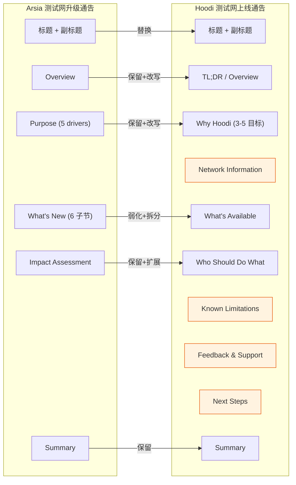
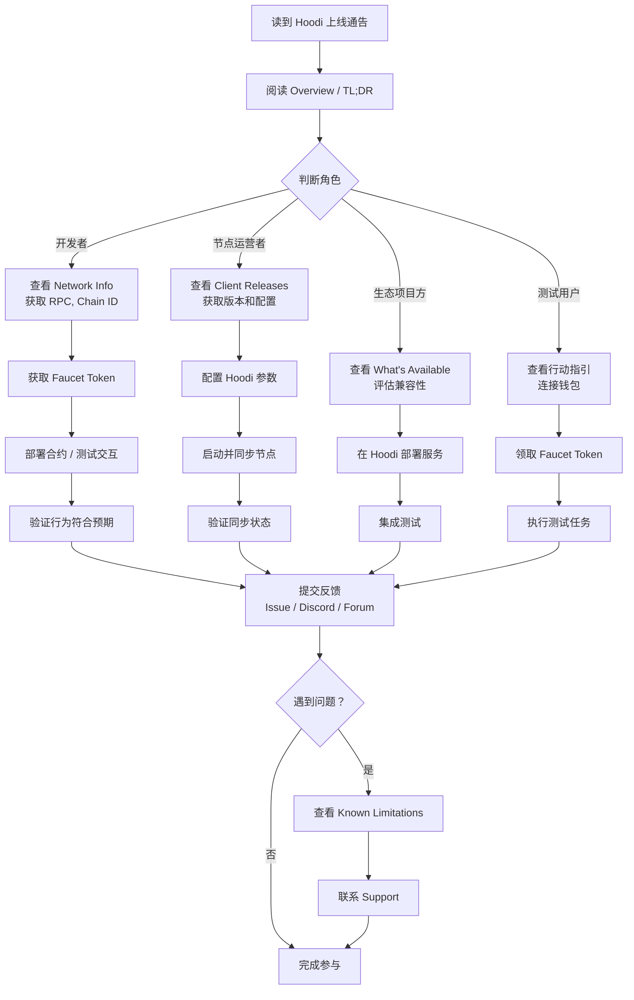

# 分析 Mantle Arsia 升级通告的格式与内容结构

## 1. Executive Summary

本研究逐节拆解了 Mantle Arsia 升级通告的完整结构，并与 Mantle 站内其他通告（DA-to-Blobs、Limb）、Optimism（Upgrade 14、Holocene）和 Base（Azul operator guide、Azul blog）的同类文档进行横向对比，提炼出以下对 Hoodi 测试网上线通告最直接可用的五条结论：

1. **Mantle 已形成稳定公告模板**：Arsia 和 Limb 共享 Overview → Purpose → What's New → Impact Assessment → Summary 五段式结构，DA-to-Blobs 是较早期的变体。Hoodi 通告可直接复用该骨架，但需将技术升级导向改为测试网参与导向。

2. **Arsia 的环境定位经验证为 Sepolia 测试网**：官方通告 Overview 明确声明"Mantle Network will complete the Arsia Upgrade on Sepolia"，Limb 通告同样声明"on Sepolia"。标题与正文之间不存在环境冲突。所有场景对比均应基于"测试网升级通告 vs 测试网上线通告"框架。

3. **行业标杆显示 Hoodi 通告需更强的操作明确性**：Optimism 和 Base 的通告均提供精确的激活时间表、必需软件版本表、逐步迁移指南和受影响链清单。Arsia 在这些方面相对薄弱——缺少明确的激活 timestamp、版本号和 changelog 链接。Hoodi 通告应借鉴行业最佳实践，提供完整的网络参数表和操作步骤。

4. **测试网上线通告的核心差异在于"行动目标"**：升级通告的行动链条是"必须在 fork 前升级，否则节点失联"；测试网上线通告的行动链条是"连接 → 部署 → 测试 → 反馈"。Hoodi 需要新增 faucet、RPC、explorer、bridge、已知限制、反馈渠道和测试任务等测试网特有章节。

5. **模板已就绪**：基于以上分析，本研究提供一份 9 章节的 Hoodi 通告模板和 12 项发布前检查清单，可直接交付 Technical Writer 使用。

---

## 2. Arsia 原文结构拆解（item-1）

### 2.1 完整章节骨架

Arsia 通告原文位于 `https://docs.mantle.xyz/network/introduction/updated-notices/arsia-upgrade-mantles-new-fee-model-and-op-stack-alignment`，通过 GitBook `.md` alternate 完整抓取。以下为逐节 inventory：

| # | 标题层级 | 原文标题 | 功能 | 关键信息 | 目标受众 | 可复用性 |
|---|---------|---------|------|---------|---------|---------|
| 1 | H1 | Arsia Upgrade: Mantle's New Fee Model and OP Stack Alignment | 页面标题 | 升级名称 + 两个核心主题（fee model、OP Stack alignment） | 全部 | **高**：Hoodi 应采用类似"主题 + 核心价值"双关标题 |
| 2 | H3 | Overview | 升级定性 | "Mantle Network will complete the Arsia Upgrade on Sepolia"；定义为 major network upgrade；列出三大变化方向 | 全部 | **高**：Overview 是读者停留或离开的决策点 |
| 3 | H3 | Purpose of the Upgrade | 动机拆解 | 5 个 numbered drivers：(1) L1 data cost 准确性 (2) operator fee (3) dynamic EIP-1559 (4) DA footprint block sizing (5) OP Stack fork alignment | 技术决策者 | **高**：numbered drivers 可复用为"Why Hoodi" |
| 4 | H3 | What's New in This Upgrade? | 技术变化详解 | 6 个 H4 子节 | 开发者、运营者 | **高**：结构可复用，内容需替换 |
| 4a | H4 | Compression-Based L1 Data Fee | 技术说明 | FastLZ 压缩、dual scalars、新公式；外链 Fee Model Handbook | 开发者 | 中：Hoodi 测试网无需 fee model 深度 |
| 4b | H4 | Operator Fee | 技术说明 | 计算公式、OperatorFeeVault 合约、SystemConfig 配置链 | 开发者、运营者 | 中 |
| 4c | H4 | Dynamic EIP-1559 Base Fee | 技术说明 | extraData 参数、DA footprint gas scalar、base fee 不再固定 | 开发者 | 低：测试网场景弱化 fee market 细节 |
| 4d | H4 | New RPC API | 接口变更 | `eth_estimateTotalFee` 新增；`eth_getBlockRange` deprecated | 开发者 | **高**：API 变更对开发者直接相关 |
| 4e | H4 | Contract Upgrades | 合约升级 | L1Block、GasPriceOracle、OperatorFeeVault（L2）；SystemConfig（L1） | 开发者、运营者 | 中 |
| 4f | H4 | Node-Level Improvements | 节点变更 | op-node v1.16.3 基线；blob 编码迁移（Mantle 自定义 → OP Stack 标准） | 运营者 | **高**：节点版本和编码迁移是 operator 必知 |
| 5 | H3 | Impact Assessment | 影响评估 | 三段式：For users / For developers / For node operators | 全部 | **高**：受众分组方式可直接复用 |
| 6 | H3 | Summary | 收尾压缩 | 4 个 bullet points 重述核心变化 | 全部 | **高**：Summary 格式可复用 |

### 2.2 信息排序逻辑

Arsia 通告遵循 **"价值先行 → 技术展开 → 影响评估 → 记忆压缩"** 的信息排序：

1. **标题 + Overview**（~100 词）：建立"这是什么"和"为什么重要"的第一印象。
2. **Purpose**（~200 词）：用 5 个 numbered drivers 解释"为什么要做这个升级"，从用户可感知的价值（fee 准确性）到底层基础设施（OP Stack alignment）递进。
3. **What's New**（~800 词）：技术变化逐项展开，每个 H4 子节遵循"是什么 → 怎么算/怎么工作 → 对谁有影响"的三段式。
4. **Impact Assessment**（~150 词）：按用户/开发者/运营者分组，明确"你需要做什么"。
5. **Summary**（~80 词）：4 个 bullet points 将 800 词的技术细节压缩为记忆点。

通告内无 changelog 链接、版本号表或激活 timestamp——这是与 Optimism/Base 通告的主要差距。

### 2.3 文内链接与外部承接

Arsia 通告仅包含两处文内链接：
- Fee Model Handbook（`/network/system-information/fee-mechanism/fee-model-handbook-after-arsia.md`）：承接 compression-based fee 的公式级细节
- Arsia changelog（提及但未提供具体 URL）：承接节点版本和升级指令

对 Hoodi 的启示：测试网通告需要更密集的链接——RPC endpoint、explorer、faucet、bridge、docs、status page、client releases、known issues tracker。

---

## 3. Arsia 技术深度与读者定位（item-2 + item-4）

### 3.1 技术模块分层

Arsia 通告的技术内容可分为四个深度层次：

| 深度层次 | 内容示例 | 正文处理方式 | 目标读者 |
|---------|---------|-------------|---------|
| L1: 概念级 | "compression-based fee architecture"、"three-component fee structure" | 正文内一句话定义 | 全部读者 |
| L2: 机制级 | FastLZ 压缩 → Brotli 估算 → dual scalars | 正文内 2-3 句解释 + 公式名称 | 开发者 |
| L3: 公式/合约级 | `gasUsed * operatorFeeScalar * 100 + operatorFeeConstant` | 正文内给出公式 | 深度开发者 |
| L4: 实现级 | SystemConfig L1 合约升级、op-node v1.16.3、blob 编码迁移细节 | 正文提及 + 外链 changelog | 运营者 |

**技术深度标尺**：Arsia 通告的正文停留在 L2-L3 之间——给出足够理解变化的机制级描述和关键公式，但不进入代码级实现。L4 内容通过外链（Fee Model Handbook、changelog）承接。

### 3.2 术语处理方式

- **解释充分的术语**：FastLZ（明确用途）、dual scalars（说明替代关系）、OperatorFeeVault（说明收款功能）
- **假设读者已知的术语**：EIP-1559、DA（data availability）、blob、L1/L2 rollup fee、sequencer、deposit transactions
- **未解释的术语**：Brotli compression（仅作为 FastLZ → Brotli 映射提及）、linear regression（出现在公式说明中）

**对非工程读者的友好度**：中等。Overview 和 Purpose 可被非工程读者理解，但 What's New 从第一个子节开始就要求读者具备 rollup fee structure 和 L1/L2 数据费模型的基础知识。

### 3.3 语言风格分析

Arsia 通告的语气可分解为四个层次：

| 语气类型 | 典型表达 | 占比估计 |
|---------|---------|---------|
| 技术说明 | "The L1 rollup fee calculation is fundamentally redesigned"、"Calculated as: gasUsed * operatorFeeScalar..." | ~50% |
| 价值宣传 | "significant improvements to fee accuracy"、"more predictable and generally fair pricing" | ~20% |
| 行动指引 | "This is a required upgrade"、"developers should adopt the new API" | ~15% |
| 文档入口 | "See the Fee Model Handbook"、"See the Arsia changelog" | ~15% |

**风格判断**：Arsia 通告的定位是 **"技术说明为主、价值宣传为辅"的升级通知**，而非纯公告或纯文档。它不使用"exciting"、"revolutionary"等营销用语，但通过"significant improvements"、"generally fair pricing"等表达传达正面预期。风险和不确定性表达 **几乎完全缺失**——没有 known issues、回滚计划、失败后果或 fallback 方案的明确说明。

### 3.4 对 Hoodi 的语气建议

Hoodi 测试网上线通告的推荐语气：

- **保留**：技术说明的清晰度、分层展开方式、受众分组格式
- **弱化**：价值宣传口径（测试网不应使用"significant improvements to pricing"等主网确定性收益表述）
- **强化**：行动指引（测试网需要更明确的参与步骤）、风险透明（非生产环境、可能重置、已知限制）
- **新增**：参与邀请（"测试目标"、"我们希望您验证什么"）、反馈渠道（issue tracker、Discord、forum）
- **语气基调**：清晰、测试导向、邀请参与、透明列出限制

---

## 4. 影响范围与行动指引模式（item-3）

### 4.1 Arsia 的三类影响描述

Arsia 通告在 Impact Assessment 中按三类受众分组：

**For users**（~50 词）：
- 告知费用计算方式变化、三组件透明化
- 结论："Users should see more predictable and generally fair pricing"
- **行动要求**：无显式行动（no action required 未直接写出，但暗示在"should see"的被动语态中）

**For developers**（~40 词）：
- `estimateGas` 继续可用，但建议迁移到 `eth_estimateTotalFee`
- 外链 Fee Model Handbook
- **行动强度**：建议性迁移（"should adopt"），非强制

**For node operators**（~30 词）：
- "This is a **required upgrade**"——通告中唯一的强制行动声明
- 指向 changelog 获取版本和指令
- **行动强度**：强制，但缺少关键信息：激活时间、版本号、命令行参数

### 4.2 行动指引链条完整性评估

完整的行动指引链条应回答：**谁需要做什么 → 何时做 → 如何做 → 如果不做会怎样 → 去哪里获取帮助**。

| 要素 | Arsia 覆盖情况 | 缺口 |
|------|--------------|------|
| 谁需要做 | ✅ 三类受众明确分组 | — |
| 做什么 | ✅ 用户无需行动、开发者迁移 API、运营者升级节点 | — |
| 何时做 | ❌ 无激活 timestamp 或 deadline | **关键缺口** |
| 如何做 | ⚠️ 指向 changelog 但未给出具体版本号或步骤 | 需补充 |
| 不做的后果 | ⚠️ "required upgrade"暗示不升级将断联，但未显式说明 | 需补充 |
| 帮助渠道 | ❌ 无 support channel、Discord、forum 链接 | **关键缺口** |

### 4.3 对 Hoodi 的行动指引调整

Hoodi 测试网上线通告需要为以下受众设计行动链条：

| 受众 | 行动链条 |
|------|---------|
| 开发者 | 连接 RPC → 获取测试 token（faucet）→ 部署合约 → 测试交互 → 提交反馈 |
| 节点运营者 / Validators | 获取 client releases → 配置 Hoodi 参数 → 启动节点 → 验证同步 → 报告问题 |
| 生态项目方 | 评估兼容性 → 在 Hoodi 部署 → 集成测试 → 提交集成报告 |
| 普通测试用户 | 了解测试目标 → 连接钱包 → 领取 faucet → 执行测试任务 → 反馈体验 |
| Wallet/Infra providers | 添加 chain ID → 配置 RPC → 测试交易签名 → 验证 explorer/indexer 兼容 |

---

## 5. Mantle 站内通告模板对照（item-5）

### 5.1 三篇通告结构对比

| 维度 | Arsia | DA-to-Blobs | Limb |
|------|-------|-------------|------|
| **标题格式** | 名称 + 副标题（核心变化） | 直接陈述迁移事件 | 名称 + 副标题（兼容性目标） |
| **Overview** | ✅ H3，含升级定性和核心方向 | ❌ 无独立 Overview，开篇即语境 | ✅ H3，与 Arsia 格式一致 |
| **Purpose / Key Drivers** | ✅ 5 个 numbered drivers | ✅ 3 个 numbered drivers（标题为 Key Drivers） | ✅ 3 个 objectives（融入 Purpose 段） |
| **What's New** | ✅ 6 个 H4 技术子节 | ❌ 无独立 What's New | ✅ 3 个 H4 技术子节 |
| **Impact Assessment** | ✅ users/developers/node operators | ✅ Users/Developers & Infra/Network（标题为"What This Means"） | ✅ users/DApps/developers/node operators |
| **Summary** | ✅ 4 bullet points | ❌ 用 closing paragraph 替代 | ✅ 3 bullet points |
| **环境声明** | "on Sepolia" | 无环境声明（叙述为战略迁移，非版本升级） | "on Sepolia" |
| **链接密度** | 低（2 处文内链接） | 无文内链接 | 低（1 处 changelog 链接） |
| **激活时间** | ❌ 未提供 | 不适用 | ❌ 未提供 |

### 5.2 模板稳定性判断

**结论：Arsia 和 Limb 共享一套稳定的 Mantle 升级通告模板**，核心骨架为：

```
Overview → Purpose → What's New → Impact Assessment → Summary
```

DA-to-Blobs 是较早期的通告，结构更扁平、叙事性更强，但核心要素（动机、技术变化、受众影响）仍然完整。

Mantle 站内链接习惯：通告正文极少包含链接，技术细节和操作指令通过外链（Fee Model Handbook、changelog）承接。Hoodi 通告应保持品牌一致性但增加链接密度，因为测试网参与者需要直接访问 RPC、faucet、explorer 等资源。

### 5.3 DA-to-Blobs 的特殊价值

DA-to-Blobs 通告虽然结构较简单，但其叙事方式对 Hoodi 有参考意义：
- 用"Key Drivers"替代"Purpose"，每个 driver 用 H4 子节详细展开
- 每个 driver 包含"Current State"→"Future State"的对比结构
- 影响评估简洁直接："No action required"、"No API or RPC changes"
- 收尾段落将技术迁移上升到战略高度

---

## 6. Optimism/Base 外部样本对照（item-6）

### 6.1 样本选择表

| 项目 | 文档 | URL | 页面类型 | 场景 | 采用理由 | 可访问性 |
|------|------|-----|---------|------|---------|---------|
| Optimism | Upgrade 14: MT-Cannon & Isthmus L1 | docs.optimism.io/notices/upgrade-14 | 官方 notice | L1 合约升级 + Operator Fee 引入 | 与 Arsia 的 Operator Fee 特性直接对应；覆盖多链升级协调 | JS-rendered；通过 WebSearch 获取结构化摘要 |
| Optimism | Holocene Breaking Changes | docs.optimism.io/notices/archive/holocene-changes | 官方 notice | OP Stack hardfork | OP Stack 上游 hardfork notice 的标准格式；覆盖 activation dates、chain/node operator instructions | JS-rendered；通过 WebSearch 获取结构化摘要 |
| Base | Azul Upgrade (Node Operator Guide) | docs.base.org/base-chain/node-operators/base-v1-upgrade | 官方 docs | 节点迁移指南 | 操作级 operator guide 的行业标杆；激活时间表 + 软件版本表 + 迁移步骤 | HTML 提取成功 |
| Base | Introducing Base Azul (Blog) | blog.base.dev/introducing-base-azul | 官方 blog | Hardfork 公告 | 公告叙事、feature taxonomy、reader routing、roadmap | HTML 提取成功 |

### 6.2 横向对比表

| 维度 | Mantle Arsia | Optimism Upgrade 14 / Holocene | Base Azul (Guide + Blog) |
|------|-------------|-------------------------------|-------------------------|
| **章节结构** | Overview → Purpose → What's New → Impact → Summary | Overview → Timeline → What's Included → For Chain Ops → For Node Ops → FAQ | Blog: tl;dr → Features → Impact → Next; Guide: Timeline → Software → Migration → FAQ |
| **激活时间** | ❌ 无 timestamp | ✅ 精确 UTC timestamp + 日期（Sepolia: Apr 9; Mainnet: Apr 25） | ✅ 精确 UTC timestamp（Mainnet: May 28, 2026 18:00 UTC; Sepolia: Apr 20） |
| **受影响对象** | users/developers/node operators（文字描述） | ✅ 列出所有受影响链名称（OP Mainnet, Base, Unichain 等 10+ chains） | ✅ 按 Users/Node Ops/Developers/Auditors 分组 |
| **软件版本** | ❌ 未提供 | ✅ op-node/op-geth release 版本号 | ✅ 版本表（base-reth-node v0.9.0+, base-consensus v0.9.0+） |
| **操作步骤** | "See changelog"（无具体步骤） | ✅ 逐步配置说明（rollup.json 修改、override 设置） | ✅ 逐步 Docker 命令（stop → pull → start → verify） |
| **技术深度** | 正文 L2-L3（公式 + 合约名） | 正文 L1-L2（概念 + 配置参数） | Blog: L1（战略叙事）；Guide: L3-L4（命令行级） |
| **风险/兼容性** | ⚠️ "required upgrade"仅一句 | ✅ Fault proof system 升级要求；op-program 版本绑定 | ✅ 明确"op-geth/nethermind no longer supported" |
| **CTA / 链接** | 2 处文内链接 | GitHub release links + rollup.json 配置文档 | Blog: upgrade guide + spec + Immunefi; Guide: .env 文件 + repo |
| **Roadmap** | ❌ | ❌ | ✅ Blog 末尾列出未来 2 个升级计划 + Vibenet devnet |

### 6.3 Hoodi 可借鉴项与不可照搬项

**可借鉴**：
1. **激活时间表**（Optimism + Base）：精确 UTC timestamp + 日期表格
2. **必需软件版本表**（Base）：Layer / Software / Version 三列格式
3. **逐步迁移指南**（Base）：Docker 命令 + 验证步骤
4. **受影响对象明确列出**（Optimism）：按链或按角色列出
5. **tl;dr 开头**（Base Blog）：一句话总结 + 关键入口
6. **Feature taxonomy 表**（Base Blog）：Change / What / Why 三列
7. **Roadmap / Next Steps**（Base Blog）：后续里程碑和更新节奏

**不可照搬**：
1. **多链升级协调格式**（Optimism）：Hoodi 是单链测试网，无需 Superchain 多链列表
2. **Fault proof / op-program 版本绑定**（Optimism）：Hoodi 测试网场景不涉及 dispute game
3. **客户端 EOL 声明**（Base）：测试网上线不需要"dropping support for op-geth"风格的断言
4. **Immunefi 审计竞赛**（Base）：主网安全审计激励不适用于测试网首发

---

## 7. Hoodi 测试网官方语境与事实缺口（item-7）

### 7.1 官方事实底座

基于 Ethereum Foundation 官方 blog post（blog.ethereum.org/2025/03/18/hoodi-holesky），以下为 Hoodi 的已确认事实：

**起源**：Hoodi 是为解决 Holesky 测试网在 Pectra 激活后出现的 validator exit queue 过长问题（需约一年才能完全清退已退出的 validator）而推出的新测试网。

**定位**：
- Hoodi：Validators 和 Staking providers（预期 EOL 2028-09-30）
- Sepolia：应用和工具开发者（预期 EOL 2026-09-30）
- Holesky：Validators 和 Staking providers（预期 EOL 2025-09-30，被 Hoodi 替代）

**Pectra 激活**：Epoch 2048（2025-03-26 14:37:12 UTC）

**Client Releases（Hoodi Pectra 版本）**：

| 层 | 客户端 | 版本 |
|----|-------|------|
| CL | Grandine | 1.0.1 |
| CL | Lighthouse | 7.0.0-beta.4 |
| CL | Lodestar | 1.28.0 |
| CL | Nimbus | 25.3.1 |
| CL | Prysm | 5.3.2 |
| CL | Teku | 25.3.0 |
| EL | Besu | 25.3.0 |
| EL | Erigon | 3.0.0 |
| EL | go-ethereum | 1.15.6 |
| EL | Nethermind | 1.31.6 |
| EL | Reth | 1.3.3 |

### 7.2 Hoodi 通告所需的事实清单与缺口

| 事实项 | 来源 | 状态 |
|-------|------|------|
| Hoodi 定位和 Holesky 替代关系 | EF Blog | ✅ 已确认 |
| Pectra 激活时间 | EF Blog | ✅ 已确认 |
| CL/EL client releases | EF Blog | ✅ 已确认（2025-03 版本） |
| Hoodi 预期 EOL | EF Blog | ✅ 2028-09-30 |
| **Chain ID** | 需 Mantle/Hoodi 项目方确认 | ❌ **缺口** |
| **RPC endpoint** | 需 Mantle/Hoodi 项目方提供 | ❌ **缺口** |
| **Explorer URL** | 需 Mantle/Hoodi 项目方提供 | ❌ **缺口** |
| **Faucet URL** | 需 Mantle/Hoodi 项目方提供 | ❌ **缺口** |
| **Bridge URL** | 需 Mantle/Hoodi 项目方提供 | ❌ **缺口** |
| **Status page** | 需 Mantle/Hoodi 项目方提供 | ❌ **缺口** |
| **Docs 入口** | 需 Mantle/Hoodi 项目方提供 | ❌ **缺口** |
| **已知限制 / Known Issues** | 需 Mantle/Hoodi 项目方提供 | ❌ **缺口** |
| **Support channel** | 需 Mantle/Hoodi 项目方提供 | ❌ **缺口** |
| **Mantle 在 Hoodi 上的具体网络参数** | 需项目方提供 | ❌ **缺口** |

### 7.3 测试网非生产风险清单

Hoodi 通告必须明确以下非生产特性：

1. **网络可能重置**：测试网不保证永久状态，网络可能因协议升级或bug修复而重置
2. **Faucet 限制**：测试 token 无实际价值，faucet 可能有 rate limit
3. **合约/桥限制**：测试网上的合约和桥不代表主网行为，可能存在已知功能限制
4. **SLA 边界**：测试网无主网级别的 uptime SLA，可能出现维护窗口或临时下线
5. **Support 窗口**：技术支持响应时间可能长于主网环境
6. **资金无价值**：测试网上的所有资产均无经济价值

---

## 8. Arsia 升级环境验证与源文档冲突记录（item-8）

### 8.1 逐源环境记录

| 来源 | 环境声明 | 原文短引 | 环境分类 |
|------|---------|---------|---------|
| **Arsia 通告页面 Overview** | Sepolia 测试网 | "Mantle Network will complete the **Arsia Upgrade** on Sepolia." | Sepolia 测试网 |
| **Arsia 通告页面标题区域** | 暗示 Sepolia | 页面标题为"Arsia Upgrade: Mantle's New Fee Model and OP Stack Alignment"，无"mainnet"字样 | 未显式声明，但不矛盾 |
| **Arsia 通告 Impact Assessment** | 未显式声明环境 | "For node operators: This is a **required upgrade**. All operators of Mantle Network must update..." | 使用"Mantle Network"而非"Mantle Sepolia"——措辞上存在模糊性 |
| **Limb 通告 Overview** | Sepolia 测试网 | "Mantle Network will complete the **Limb Upgrade** on Sepolia." | Sepolia 测试网（交叉验证） |
| **DA-to-Blobs 通告** | 无环境声明 | 叙述为战略迁移，非版本化升级 | 不适用 |

### 8.2 激活参数记录

| 来源 | 激活时间/窗口 | 受影响运营者集合 |
|------|-------------|----------------|
| **Arsia 通告** | ❌ 未提供具体 timestamp 或 block number | Node operators（"required upgrade"）；开发者（建议迁移 API）；用户（无需行动） |
| **Limb 通告** | ❌ 未提供具体 timestamp；指向 changelog 获取 upgrade window | Node operators（"must ensure components are updated"）；用户和开发者（无影响） |

### 8.3 环境置信度判断

**置信度：High（Sepolia 测试网）**

**证据链**：
1. Arsia 通告 Overview 第一句话明确声明"on Sepolia"
2. Limb 通告 Overview 使用完全相同的句式"on Sepolia"——这是 Mantle 升级通告的模板化表述
3. Arsia 页面标题区域不包含任何"mainnet"字样
4. Impact Assessment 中的"Mantle Network"措辞虽未限定为 Sepolia，但在 Overview 已定性为 Sepolia 升级的语境下，这是通告行文的常规简称，不构成环境冲突

### 8.4 冲突标记与保守处理

**冲突检测结果：无实质冲突**

唯一的潜在模糊点是 Impact Assessment 中使用"Mantle Network"而非"Mantle Sepolia"的措辞。但考虑到：
- Overview 已在首句明确 Sepolia 环境
- Limb 通告采用相同句式，同为 Sepolia 升级
- 正文内容（fee model 重构、OP Stack 对齐等）描述的确是将影响整个网络的变更，在 Sepolia 先行部署后预期也将推广到其他环境

**处理方式**：后续所有场景对比（item-9）和模板设计（item-10）基于"测试网升级通告 vs 测试网上线通告"框架，并在涉及 Arsia 时注明"Arsia Upgrade on Sepolia"。不假设 Arsia 为主网升级，除非获得明确的官方主网确认。

---

## 9. Arsia 网络升级通告 vs Hoodi 测试网上线通告场景差异矩阵（item-9）

基于 item-8 环境验证结论（Arsia 为 Sepolia 测试网升级），本节采用"**测试网升级通告 vs 测试网上线通告**"框架。

### 9.1 场景差异全维度对比

| 对比维度 | Arsia（测试网升级通告） | Hoodi（测试网上线通告） | 差异类型 |
|---------|----------------------|----------------------|---------|
| **公告目标** | 通知现有用户/开发者/运营者关于协议级变更 | 邀请新参与者连接并测试新上线网络 | 目标转向 |
| **前提假设** | 读者已在使用该网络 | 读者可能首次接触该网络 | 读者知识前提不同 |
| **核心动词** | upgrade / update / migrate | connect / deploy / test / explore / report | 行动语态转换 |
| **技术内容重心** | fee model、protocol alignment、合约升级 | 网络参数、RPC 入口、兼容性、功能范围 | 内容焦点转移 |
| **行动强度** | required upgrade（不升级=断联） | 邀请参与（不参与=错过测试机会） | 强制→自愿 |
| **时间压力** | fork activation deadline（虽然 Arsia 未提供） | 上线日期 + 后续里程碑（开放式） | Deadline→Roadmap |
| **风险框架** | 升级兼容性风险、服务连续性 | 非生产风险、可能重置、rate limit、已知限制 | 风险类型转换 |
| **成功指标** | 升级完成、网络稳定运行、fee 行为正确 | 参与量、反馈质量、生态集成数、问题发现数 | 运营指标→参与指标 |
| **链接需求** | changelog、fee docs（少量） | RPC、explorer、faucet、bridge、docs、status page、client releases、known issues、support channel（大量） | 低密度→高密度 |
| **受众优先级** | node operators > developers > users | developers > node operators/validators > ecosystem projects > test users | 优先级重排 |

### 9.2 章节映射：保留 / 弱化 / 替换 / 新增 / 删除

| Arsia 章节 | Hoodi 处理 | 说明 |
|-----------|-----------|------|
| **标题** | 替换 | "Hoodi 测试网上线"+ 核心价值副标题 |
| **Overview** | 保留+改写 | 从"升级定性"改为"上线状态、目标、谁应关注" |
| **Purpose** | 保留+改写 | 从"升级动机"改为"Why Hoodi / 测试目标" |
| **What's New** → fee model | 弱化 | 测试网无需 fee model 技术深度 |
| **What's New** → API changes | 保留 | 如有新 API 或 API 差异需说明 |
| **What's New** → Node changes | 替换 | 改为"Network Information"（chain ID、RPC、explorer 等） |
| **Impact Assessment** | 保留+扩展 | 扩展受众分组为 developers / node operators / validators / ecosystem / testers |
| **Summary** | 保留 | 格式不变，内容替换 |
| — | **新增：Network Information** | chain ID、RPC、explorer、faucet、bridge、docs、status page |
| — | **新增：Known Limitations** | 非生产风险、可能重置、rate limit、已知 issues |
| — | **新增：Feedback & Support** | issue tracker、Discord/Telegram、bug bounty/反馈表单 |
| — | **新增：Next Steps** | 后续里程碑、更新节奏、迁移计划 |

### 9.3 环境敏感性声明

以上所有对比维度的表述均与 item-8 验证结论一致：Arsia 为 Sepolia 测试网升级通告，对比框架为"测试网升级通告 vs 测试网上线通告"。未做任何超出已验证环境分类的假设。

---

## 10. Hoodi 上线通告模板与写作检查清单（item-10）

### 10.1 推荐模板（9 章节）

#### 第 1 章：标题

**格式**：`[Hoodi 测试网上线 / Hoodi Testnet Launch]: [核心价值副标题]`

示例：`Hoodi Testnet Launch: Mantle's Testing Ground for [Feature/Upgrade Name]`

**要求**：
- 直接陈述上线事件
- 副标题传达测试目标或核心亮点
- 不使用 "major upgrade" 等主网口径

#### 第 2 章：TL;DR / Overview

**内容**：
- 上线状态（何时上线、当前状态）
- 测试目标（为什么推出这个测试网）
- 谁应关注（开发者、运营者、测试者）
- 核心入口（RPC、docs 链接）

**建议篇幅**：80-120 词

#### 第 3 章：Why Hoodi / 测试目标

**内容**：
- 上线目的
- 希望验证的协议或生态能力
- 与现有测试网（Sepolia、Holesky）的关系定位

**格式建议**：借鉴 Arsia 的 numbered drivers 格式，改为 3-5 个测试目标

**建议篇幅**：150-200 词

#### 第 4 章：Network Information

**内容**（表格格式）：

| 参数 | 值 |
|------|---|
| Chain ID | `[待项目方提供]` |
| RPC Endpoint | `[待项目方提供]` |
| Block Explorer | `[待项目方提供]` |
| Faucet | `[待项目方提供]` |
| Bridge | `[待项目方提供]` |
| Documentation | `[待项目方提供]` |
| Status Page | `[待项目方提供]` |

**要求**：所有值必须为可直接访问的 URL 或明确的参数值。不可使用占位符发布。

#### 第 5 章：What's Available / What's New

**内容**：
- 当前功能范围
- 已部署的合约和服务
- 与主网或其他测试网的兼容性
- 当前限制

**格式建议**：借鉴 Base Azul blog 的 Change / What / Why 三列表格

**建议篇幅**：200-300 词

#### 第 6 章：Who Should Do What

**内容**：按受众分组的行动指引

| 受众 | 行动 | 详情链接 |
|------|------|---------|
| 开发者 | 连接 RPC → 获取 faucet → 部署合约 → 测试 → 反馈 | [docs link] |
| 节点运营者 | 获取 client releases → 配置参数 → 启动节点 → 验证 | [changelog link] |
| 生态项目方 | 评估兼容性 → 部署 → 集成测试 → 报告 | [integration guide] |
| 测试用户 | 连接钱包 → 领取 faucet → 执行测试任务 → 反馈 | [testing guide] |

**格式建议**：借鉴 Arsia 的三类受众分组 + Base 的逐步操作风格

#### 第 7 章：Known Limitations and Risks

**内容**：
- 非生产环境声明
- 可能的网络重置
- Faucet rate limit
- 合约/桥已知限制
- SLA 边界
- 测试 token 无价值声明

**要求**：透明、不回避。这是与升级通告最大的差异之一——升级通告倾向于弱化风险，测试网通告应主动披露。

**建议篇幅**：100-150 词

#### 第 8 章：Feedback and Support

**内容**：
- Issue tracker / GitHub
- Discord / Telegram 频道
- Forum
- Bug bounty（如适用）或反馈表单
- Support 响应时间预期

**建议篇幅**：50-80 词

#### 第 9 章：Next Steps

**内容**：
- 后续里程碑（功能开放节奏）
- 更新通知频道
- 迁移计划（从其他测试网到 Hoodi）
- 主网部署时间线（如已确定）

**建议篇幅**：80-120 词

### 10.2 发布前检查清单（12 项）

| # | 检查项 | 分类 |
|---|-------|------|
| 1 | 标题直接陈述测试网上线事件，不使用主网升级口径 | 风格 |
| 2 | Overview/TL;DR 在 120 词内回答"是什么、为什么、谁应关注" | 结构 |
| 3 | Network Information 表格所有参数已填入可访问的真实值 | 事实 |
| 4 | 每类受众有明确的行动路径（做什么→怎么做→去哪里） | 行动 |
| 5 | Known Limitations 涵盖非生产风险、重置可能、faucet 限制、已知 issues | 风险 |
| 6 | 所有技术术语要么在正文中解释，要么链接到文档 | 可读性 |
| 7 | 所有链接（RPC、explorer、faucet、docs、support）已验证可访问 | 链接 |
| 8 | 不包含未经验证的主网承诺或确定性收益表述 | 事实 |
| 9 | 反馈渠道（issue tracker、Discord、forum）至少有一个 | 支持 |
| 10 | Summary 在 5 个 bullet points 内压缩全文核心信息 | 结构 |
| 11 | 涉及 Arsia 对比的表述使用"Arsia Upgrade on Sepolia"（经 item-8 验证） | 环境 |
| 12 | 风格与 Mantle 文档站已有通告（Arsia、Limb）保持一致 | 品牌 |

---

## 11. Diagrams

### diag-1: 通告结构总览图

```mermaid
graph TD
    ROOT["上线/升级通告"]
    ROOT --> TITLE["标题<br/>主题 + 核心价值"]
    ROOT --> OVERVIEW["TL;DR / Overview<br/>状态、目标、受众、入口"]
    ROOT --> PURPOSE["Why / Purpose<br/>动机或测试目标"]
    ROOT --> NETINFO["Network Information<br/>Chain ID, RPC, Explorer,<br/>Faucet, Bridge, Docs"]
    ROOT --> WHATSNEW["What's New / Available<br/>功能范围、技术变化、兼容性"]
    ROOT --> IMPACT["Who Should Do What<br/>按受众分组的行动指引"]
    ROOT --> RISK["Known Limitations<br/>非生产风险、重置、限制"]
    ROOT --> SUPPORT["Feedback & Support<br/>Issue, Discord, Forum"]
    ROOT --> NEXT["Next Steps<br/>里程碑、更新、迁移"]
    ROOT --> SUMMARY["Summary<br/>核心要点压缩"]

    style TITLE fill:#e8f5e9,stroke:#2e7d32
    style OVERVIEW fill:#e8f5e9,stroke:#2e7d32
    style PURPOSE fill:#e8f5e9,stroke:#2e7d32
    style WHATSNEW fill:#e8f5e9,stroke:#2e7d32
    style IMPACT fill:#e8f5e9,stroke:#2e7d32
    style SUMMARY fill:#e8f5e9,stroke:#2e7d32
    style NETINFO fill:#fff3e0,stroke:#e65100
    style RISK fill:#fff3e0,stroke:#e65100
    style SUPPORT fill:#fff3e0,stroke:#e65100
    style NEXT fill:#fff3e0,stroke:#e65100

    classDef arsia fill:#e8f5e9,stroke:#2e7d32
    classDef hoodi fill:#fff3e0,stroke:#e65100
```



**图例**：绿色 = Arsia 原文已有章节（可复用）；橙色 = Hoodi 建议新增章节

### diag-2: Arsia 通告 vs Hoodi 通告内容映射图



### diag-3: 读者行动路径图



---

## 12. Evidence Appendix

### 12.1 Source Coverage

| Requirement ID | Type | Description | Source Used | Coverage |
|---------------|------|-------------|------------|---------|
| src-1 | official_docs | Arsia 通告原文 | docs.mantle.xyz/.../arsia-upgrade... (.md) | ✅ 完整逐节拆解 |
| src-2 | official_docs | Mantle 站内其他通告 | DA-to-Blobs (.md) + Limb/Fusaka (.md) | ✅ 2 篇对照 |
| src-3 | official_docs | Optimism 通告 | Upgrade 14 (WebSearch) + Holocene (WebSearch) | ✅ 2 篇对照（JS-rendered，通过 WebSearch 获取结构化摘要） |
| src-4 | official_docs | Base 通告 | Azul operator guide (HTML) + Azul blog (HTML) | ✅ 2 篇对照 |
| src-5 | official_docs | Hoodi 上下文 | blog.ethereum.org/2025/03/18/hoodi-holesky (HTML) | ✅ 完整覆盖 |
| src-6 | internal_research | 仓库内既有研究 | base-azul-upgrade/ 项目（final report + 7 个 research sections） | ✅ 用作 Base 分析的背景线索 |
| src-7 | expert_commentary | 行业评论 | 未使用 | — 不影响核心分析 |

### 12.2 Access Limitations

| 来源 | 访问方式 | 限制说明 |
|------|---------|---------|
| Mantle docs (GitBook) | `.md` alternate via curl | ✅ 完整 Markdown 内容可获取 |
| Optimism docs | HTML (JS-rendered) | ⚠️ 直接抓取返回空内容；通过 WebSearch 获取结构化摘要。未获得原文逐节文本。 |
| Base docs | HTML via curl + text extraction | ✅ 内容可提取但格式不完美 |
| Base blog | HTML via curl + text extraction | ✅ 内容完整可提取 |
| Ethereum Foundation blog | HTML via curl + text extraction | ✅ 内容完整可提取 |

### 12.3 Key Evidence Quotes

| 编号 | 来源 | 引文 | 用于 |
|------|------|------|------|
| E1 | Arsia Overview | "Mantle Network will complete the **Arsia Upgrade** on Sepolia." | item-8 环境验证 |
| E2 | Arsia Overview | "This is a major network upgrade that replaces the legacy Bedrock-era fee model with a modern compression-based fee architecture, introduces an operator fee, and aligns Mantle with the latest OP Stack protocol versions (Canyon through Jovian)." | item-1 升级定性、item-2 技术范围 |
| E3 | Arsia Impact | "For node operators: This is a **required upgrade**. All operators of Mantle Network must update their node software before the fork activation time." | item-3 行动强度 |
| E4 | Arsia Impact | "For developers: The `estimateGas` RPC continues to work, but developers should adopt the new `eth_estimateTotalFee` API for more accurate total fee estimates." | item-3 开发者行动 |
| E5 | Limb Overview | "Mantle Network will complete the **Limb Upgrade** on Sepolia." | item-8 交叉验证 |
| E6 | Limb Impact | "This upgrade has **no impact** on regular users, DApps, or on-chain asset operations." | item-5 影响评估格式对比 |
| E7 | DA-to-Blobs | "Mantle Network is initiating a strategic migration of its Data Availability (DA) layer from EigenDA to Ethereum Blobs (EIP-4844)." | item-5 叙事风格对比 |
| E8 | Base Azul Guide | "Only `base-reth-node` (EL) and `base-consensus` (CL) support Azul." | item-6 操作明确性对比 |
| E9 | Base Azul Blog | "tl;dr Base Azul, our first independent network upgrade, is targeting mainnet activation on May 13, 2026." | item-6 tl;dr 风格参考 |
| E10 | EF Blog (Hoodi) | "a new testnet has been launched: Hoodi. It will activate the Pectra network upgrade at epoch 2048" | item-7 Hoodi 事实底座 |
| E11 | EF Blog (Hoodi) | "Hoodi: Validators and Staking providers (Expected end of life 30th September, 2028)" | item-7 Hoodi 定位 |
| E12 | Optimism Upgrade 14 (WebSearch) | "OP Sepolia, Ink Sepolia, and Minato Sepolia upgrades targeted April 9th, 2025. OP Mainnet... expected to execute Upgrade 14 on April 25th, 2025." | item-6 激活时间表对比 |
| E13 | Optimism Holocene (WebSearch) | "Chain operators should upgrade their nodes ahead of the activation times to a release that contains the Holocene changes" | item-6 操作指引对比 |

### 12.4 Confidence Summary

| Item | 置信度 | 说明 |
|------|-------|------|
| item-1 Arsia 结构拆解 | **High** | 基于 .md 原文完整抓取 |
| item-2 技术深度基准 | **High** | 基于 .md 原文逐节分析 |
| item-3 行动指引 | **High** | 基于原文 Impact Assessment 直接引用 |
| item-4 语言风格 | **High** | 基于原文定性分析 |
| item-5 Mantle 站内对照 | **High** | 2 篇对照均通过 .md 完整抓取 |
| item-6 Optimism 对照 | **Medium** | 通过 WebSearch 摘要而非原文逐节分析；核心结构信息完整，但可能遗漏细节 |
| item-6 Base 对照 | **High** | HTML 提取成功，内容完整 |
| item-7 Hoodi 语境 | **High** | EF 官方 blog 内容完整提取 |
| item-8 环境验证 | **High** | 多源交叉验证，无冲突 |
| item-9 场景差异 | **High** | 建立在 item-1 到 item-8 的综合分析上 |
| item-10 模板 | **High** | 综合所有分析项的可执行输出 |

---

## Revision Log

| Round | Action | Scope | Trigger |
|-------|--------|-------|---------|
| 1 | create_draft | full | Orchestrator dispatch deep-draft round 1 (comment e975d367) |
