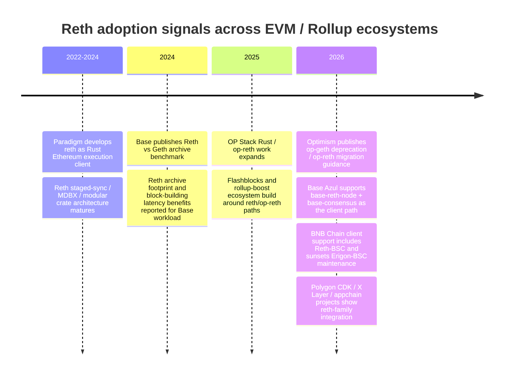
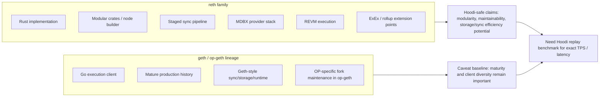
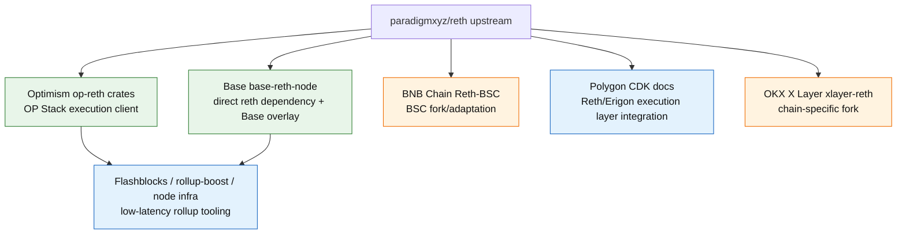
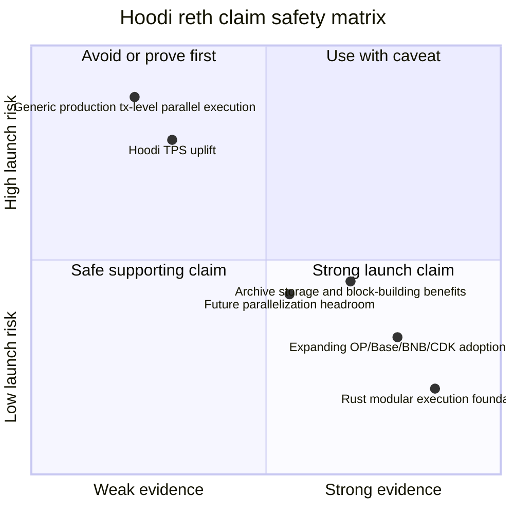

# Phase B Round 1 Draft - 调研 reth 的技术优势及行业采用趋势

## 1. Executive Summary

Reth 的最稳妥定位不是“更快的 geth 替代品”这么窄，而是 **Rust-based, modular, high-performance execution client foundation**。Paradigm 官方把 reth 定义为 Rust 编写、Apache/MIT 双许可、生产就绪、可扩展且组件化的 Ethereum execution client；其架构由 staged sync、MDBX-backed database、REVM、provider / network / transaction-pool / RPC 等 crate 组合而成，适合 L1 节点、L2 execution client、rollup sequencer、indexer 和研究型 fork 复用。[S1][S2][S3]

对 Hoodi 上线通告最有价值的结论有四条：

1. **技术优势强证据**：reth 的模块化 Rust crate 架构、MDBX 存储、staged pipeline、REVM 执行引擎和 ExEx / node builder 扩展点，有官方文档与代码仓证据。可表述为“为 Hoodi 提供高性能、可维护、可扩展的 Rust 执行层基座”。[S1][S2][S3][S31]
2. **采用趋势强证据**：Optimism 正在推动 op-reth 取代 op-geth，Base Azul 选择 `base-reth-node` 作为唯一支持执行客户端，BNB Chain 官方客户端支持矩阵已经列入 Reth-BSC，Polygon CDK docs 将 Reth/Erigon 作为执行层组合的一部分，OKX X Layer 维护 `xlayer-reth` fork。这个证据链足以支持“reth 正在从单一客户端项目扩展为多链 EVM 执行层基座”。[S11][S12][S18][S22][S24][S26]
3. **性能数据中等强证据**：公开可引用数据主要来自 Base 的 Reth vs Geth archive benchmark、Reth 官方 performance 段落、Base Azul / Flashblocks 运营数据、BNB Chain Lorentz / Maxwell 网络目标。它们显示 reth-based stack 在 archive disk footprint、provisioning、block-building p99、Flashblocks latency、高吞吐 EVM 网络适配方面有优势，但不能直接换算成 Hoodi TPS 承诺。[S5][S16][S18][S21]
4. **并行执行必须降级表述**：上游 reth 当前具备 staged/concurrent pipeline、parallel state-root 等相邻并行能力；`basic-blockstm` / BAL parallel execution 相关工作存在 feature gate / PR / changelog 证据，但不能把“通用交易级并行执行已生产可用”作为默认能力。BNB Chain 的 Parallel Sparse Trie 是 BSC/Reth-BSC 项目特定优化，Base 的 parallel sender recovery / state root / cached execution也是 Base overlay。Hoodi 通告应使用“并行化与高吞吐优化空间”或“面向未来的并行执行演进潜力”，而不是“reth 原生已全面并行执行”。[S9][S10][S21][S33]

**推荐给 Hoodi 的主表述**：

> Hoodi adopts a reth-based Rust execution foundation to align with the industry's move toward modular, high-performance EVM clients. Reth's production-ready architecture, fast-sync/storage design, and growing adoption across OP Stack, Base, BNB Chain and CDK-style ecosystems give Hoodi a stronger base for performance iteration and long-term client maintainability.

中文可用版本：

> Hoodi 采用基于 reth 的 Rust 执行层基座，顺应 EVM 生态从传统 geth / op-geth 路径向模块化、高性能 Rust 客户端演进的趋势。reth 的生产级架构、快速同步与存储设计，以及 Optimism、Base、BNB Chain、Polygon CDK 等生态的采用信号，为 Hoodi 后续性能优化与长期维护提供了更稳固的基础。

## 2. Item Findings

### 2.1 item-1: reth 核心技术优势与可验证边界

**official_claim**

Paradigm / reth 官方 README 将 reth 描述为 Rust 编写、production-ready、Apache/MIT 许可、面向用户友好、模块化和快速的 Ethereum execution node；docs further say its architecture is designed as reusable components, not a monolithic node. The Reth book explains staged sync as a pipeline where each stage can be unwound / restarted and MDBX is used as the canonical database backend.[S1][S2][S3]

**technical_mechanism**

| Mechanism | What it means | Evidence | Hoodi relevance |
|---|---|---|---|
| Rust implementation | Memory-safe language default, strong type system, async ecosystem, deterministic build discipline | Reth README / docs | Good for engineering confidence; do not claim Rust eliminates all bugs |
| Modular crate architecture | Execution, storage, networking, RPC, consensus, txpool and primitives exposed as reusable crates | Reth repo layout and docs | Makes chain-specific forks / OP Stack variants easier to isolate |
| Staged sync pipeline | Sync is decomposed into restartable stages, which helps operational recovery and profiling | Reth book staged sync docs | Safe to describe as fast / observable sync architecture |
| MDBX database | Reth uses MDBX and flat/provider layers for state access | Reth book / code docs | Supports disk-footprint and archive-node advantage claims when paired with benchmarks |
| REVM integration | Rust EVM used across reth / op-reth / many forks | Reth crates / OP and Base code evidence | Supports high-performance Rust EVM foundation wording |
| ExEx / node builder | Execution extensions and node builder pattern for custom indexers / rollup nodes | Reth docs | Strong fit for Hoodi extensibility narrative |

**parallel-execution caveat**

The outline asked for parallel execution, but public evidence does not support a blanket production claim. Reth has pipeline-level concurrency and adjacent parallelizable work. In addition, upstream / ecosystem references show feature-gated or in-progress Block-STM / BAL style parallel execution work, including `basic-blockstm` feature references and reth issue / PR discussions. However, this is not equivalent to “all reth deployments execute transactions in parallel in production.” Hoodi should phrase this as **future extensibility / parallelization headroom**, or cite a concrete fork-level mechanism where available.[S9][S10]

**confidence**: high for modular/Rust/MDBX/staged-sync claims; medium for performance implications; low for generic parallel transaction execution unless narrowed to specific feature/PR/fork.

### 2.2 item-2: reth vs geth / op-geth 的性能数据与比较口径

The strongest public quantitative dataset is Base's Reth vs Geth archive-node benchmark. Base reported that provisioning an archive node dropped from about 15 hours on Geth to about 3 hours on Reth, initial disk footprint dropped from 16.61 TB to 2.74 TB, weekly growth dropped from about 560 GB to about 50 GB, and block-building p99 improved from 2319 ms to 698 ms. The benchmark context matters: Base mainnet archival workload, AWS i3en.12xlarge, RAID0 EXT4, Geth LevelDB/hashdb, and Base's own chain workload.[S5]

Reth official docs / README provide more general performance framing, but public numbers are not always apples-to-apples with op-geth or L2 sequencer workloads. OP Stack / Base / BNB contexts differ on block gas, tx mix, state access patterns, data availability, sequencer policy, and fork overlay.

**Technical advantage comparison table**

| Dimension | reth | geth / op-geth | Evidence Needed / Used | Hoodi Usability |
|---|---|---|---|---|
| Language / safety | Rust, strong typing, memory-safety guarantees for broad classes of memory errors | Go; mature production client, GC-managed runtime | Reth README, geth/op-geth repos | Strong: “Rust-based execution foundation”; avoid “bug-free” |
| Modular architecture | Many reusable crates; node builder and ExEx extension patterns | More monolithic go-ethereum lineage; op-geth fork modifies geth-style codebase | Reth docs / repo; OP op-reth crate layout | Strong: maintainability / extensibility |
| Sync / pipeline | Staged sync pipeline with restartable stages | Geth sync modes differ; op-geth inherits geth-style architecture | Reth book; Base benchmark | Medium: use with benchmark caveat |
| Storage / state access | MDBX provider stack; public archive benchmark shows much lower disk footprint in Base workload | LevelDB/Pebble/hashdb/pathdb depending client and config | Base Reth benchmark | Strong if tied to archive-node benchmark, not universal TPS |
| Execution engine | REVM, Rust EVM, reusable in OP / Base / BNB forks | go-ethereum EVM in geth/op-geth | Reth / Base / OP code | Medium: performance potential; workload-specific |
| Rollup adaptation | op-reth, base-reth-node, Reth-BSC, CDK / X Layer forks demonstrate adaptation paths | op-geth historically dominant in OP Stack | OP docs, Base specs, BNB docs, CDK docs, X Layer repo | Strong trend claim |
| Maintenance cadence | Fast release cadence; v2.x line and OP/Base pins show active integration | geth/op-geth mature but OP Stack is deprecating op-geth | Reth releases, OP deprecation | Strong for “aligns with client evolution” |
| Production maturity risk | Production-ready upstream, but fork overlays vary by chain | geth/op-geth long production history | Project docs and status pages | Must mention migration and fork-maintenance risks |

**Quantitative metrics table**

| Metric | Reported number | Source | Benchmark context | Safe use |
|---|---:|---|---|---|
| Base archive node provisioning | about 15h Geth -> about 3h Reth | Base benchmark | Base mainnet archive, AWS i3en.12xlarge, RAID0 EXT4 | Strong archive/storage evidence |
| Base archive disk footprint | 16.61 TB Geth -> 2.74 TB Reth | Base benchmark | Same as above | Strong storage evidence |
| Base weekly disk growth | about 560 GB/week -> about 50 GB/week | Base benchmark | Same as above | Strong storage-ops evidence |
| Base block-building p99 | 2319 ms -> 698 ms | Base benchmark | Same as above | Medium: execution/client architecture evidence, not Hoodi TPS |
| Base Azul empty blocks | about 200/day -> about 2/day | Base Azul blog | Base chain operations, last two months before blog | Medium: Base stack operational evidence |
| Base burst throughput | sustained multiple 5,000 TPS bursts | Base Azul blog | Base public statement, not a generic reth benchmark | Use as Base case study only |
| Base Flashblocks latency | about 200 ms preconfirmation / up to 10x inclusion improvement | Base / Flashblocks docs | Base Flashblocks architecture | Use as Base / rollup-boost case, not generic reth |
| BNB Chain block interval target | Lorentz 1.5s, Maxwell 0.75s | BNB Chain docs/blog | BSC network roadmap, client-dependent | Use as high-throughput EVM context |

**confidence**: high for Base benchmark facts; medium for inference to Hoodi; low for any single “reth is X% faster than op-geth” without a Hoodi replay benchmark.

### 2.3 item-3: Optimism op-reth 迁移实践与 OP Stack 执行客户端路线

**official_claim**

Optimism's official notice says op-geth is being deprecated and OP Stack chains should migrate to op-reth / supported execution clients. OP docs and the Optimism monorepo now contain `rust/op-reth` crates, including execution, RPC, node, storage, payload, txpool, and flashblocks-related modules.[S11][S12][S13]

**technical_mechanism**

Op-reth is not just “reth with a flag”; it is an OP Stack execution client implemented as Rust crates in the Optimism monorepo and pinned to upstream reth / alloy / revm dependencies. OP-specific behavior lives in chain spec, EVM, payload, RPC, txpool, proof / storage and rollup-specific modules, while upstream reth provides the execution-client substrate.

**migration_motivation**

| Motivation | Evidence | Hoodi implication |
|---|---|---|
| Replace op-geth maintenance path | OP deprecation notice and docs | Strong argument that op-geth is a legacy/transitional baseline |
| Align OP Stack with Rust / reth ecosystem | `rust/op-reth` crate structure and release tags | Hoodi can frame reth as aligned with OP Stack evolution |
| Improve modularity and proof / derivation integration | Optimism Rust workspace with op-reth / kona / op-program related crates | Useful, but do not overclaim direct performance |
| Prepare for Flashblocks / rollup-boost / modern sequencer features | OP monorepo and rollup-boost docs | Useful for roadmap alignment |

**production_status**

OP Stack has moved op-reth into the first-class documented client path. Exact support windows are time-sensitive; the draft uses OP's official deprecation notice and current docs as the source of truth. Hoodi should avoid saying “all OP chains already run op-reth” unless a specific chain-level migration is verified.

**timeline_event**

- 2024-2025: reth matures through stable releases and OP-specific crates exist in upstream / OP repos.
- 2026-02: Optimism Rust workspace consolidation / op-reth presence in monorepo is visible in prior internal research.
- 2026: OP docs carry op-geth deprecation / migration guidance.

**confidence**: high for “OP Stack is moving toward op-reth”; medium for performance motivation; chain-by-chain production status must be verified separately.

### 2.4 item-4: Base / Azul / base-reth-node 采用案例

**official_claim**

Base Azul is the strongest public case that a major L2 is building around a reth-based execution stack. Base's Azul spec says only `base-reth-node` and `base-consensus` support the hardfork and that operators running `op-node`, `op-geth`, or other clients must update before activation. Base's blog ties Azul to performance, safety/decentralization, developer experience, Flashblocks and long-term throughput goals.[S15][S16][S17]

**technical_mechanism**

Base's architecture is not generic OP Stack op-reth. It uses a Base-maintained Rust stack with `base-reth-node` for execution and `base-consensus` for consensus / derivation. Prior internal research observed Base directly pinning upstream `paradigmxyz/reth` tags and adding a large Base overlay: cached execution, precompile cache, background receipt root, parallel state-root, Flashblocks sender recovery, empty body storage, custom txpool ordering, and proof-sidecar storage.[S34][S35][S36]

**quantitative_metric / benchmark_context**

Base provides two classes of data:

- **Reth vs Geth archive benchmark**: disk footprint, provisioning time, weekly growth, block-building latency. Strong but archival/Base-specific.[S5]
- **Azul / Flashblocks operational data**: empty blocks dropped from roughly 200/day to roughly 2/day; multiple 5,000 TPS bursts; 200ms preconfirmations / inclusion improvements in Flashblocks materials. Strong as Base case study, not transferable as Hoodi guarantee.[S16][S18]

**adoption_depth**

Base is a **reth-based chain-specific stack / direct upstream reth dependency with heavy Base overlay**, not merely “supports reth.” The safest wording is “Base's reth-based stack” or “Base's base-reth-node,” not “Base runs upstream vanilla reth.”

**Hoodi transferability**

Good borrowable angles:

- “reth is a credible foundation for high-throughput L2 execution work.”
- “Base's public migration shows major L2 teams are willing to make reth-based clients the primary supported path.”
- “Base's data supports storage and block-building efficiency claims under a clear benchmark context.”

Avoid:

- “Hoodi will get Base's 5,000 TPS bursts.”
- “Hoodi is adopting Base Stack.”
- “reth alone caused every Azul performance gain.”

**confidence**: high for adoption and architecture; medium for performance transferability.

### 2.5 item-5: BNB Chain / Reth-BSC 采用案例

**official_claim**

BNB Chain maintains / documents Reth-BSC as a BSC execution client option. BNB Chain's public client-support update lists Reth-BSC in the supported-client matrix while sunsetting Erigon-BSC maintenance. BNB Chain docs also place Reth-BSC in the high-performance client context and discuss BSC-specific optimizations such as Parallel Sparse Trie.[S20][S21][S22][S23]

**technical_mechanism**

Reth-BSC is a fork/adaptation of reth for BSC, not an OP Stack op-reth derivative. It targets BSC's high-throughput EVM environment, with BSC-specific consensus / chain parameters and storage/state optimizations.

**parallel execution/status caveat**

BNB Chain's strongest parallelism evidence is **Parallel Sparse Trie**, a BSC-specific storage/trie optimization for state root / trie processing, not generic upstream reth transaction-level parallel execution. It can support a Hoodi statement that high-throughput EVM ecosystems are using reth-family clients as an optimization base, but it should not be used to claim Hoodi inherits BSC's parallel trie or validator-set assumptions.

**production_status**

BNB Chain support materials classify Reth-BSC as supported client infrastructure, while older Erigon-BSC is sunset. Exact “default / recommended / full validator majority” status should be rechecked before any final announcement claims production share.

**Hoodi transferability**

Good:

- “reth-family clients are no longer limited to OP Stack L2s; they are also being adapted for high-throughput EVM L1/sidechain environments.”
- “BSC's Reth-BSC supports the trend toward Rust/reth-based performance engineering.”

Avoid:

- “BNB Chain proves reth will automatically reach BSC throughput on Hoodi.”
- “Parallel execution is already generic in reth.”

**confidence**: high for BNB adoption signal; medium for production-status nuance; low for transferable performance without Hoodi/BSC comparable benchmark.

### 2.6 item-6: 其他 L2 / appchain / infra 采用案例与行业趋势

**adoption_depth taxonomy**

| Depth | Meaning | Examples in this draft |
|---|---|---|
| upstream reth | Runs upstream Paradigm reth with configuration | Ethereum L1 operators / infra use cases, not chain-specific in scope |
| fork reth | Chain maintains fork/adaptation | BNB Reth-BSC, OKX X Layer `xlayer-reth` |
| op-reth crate | OP Stack execution client based on reth in Optimism monorepo | Optimism / OP Stack |
| reth-based custom stack | Direct upstream reth dependency plus project overlay | Base `base-reth-node` |
| CDK / node stack integration | Reth/Erigon paired with rollup node / CDK components | Polygon CDK docs |
| infra / builder integration | Flashblocks, rollup-boost, node operators, SDK projects | Base/Flashblocks, Arc / RISE references |

**cases**

| Project | Adoption Depth | Status | Motivation | Quantitative Data | Official Evidence | Caveat |
|---|---|---|---|---|---|---|
| Optimism / OP Stack | op-reth crate / first-class OP execution client | Migration path / op-geth deprecation | Maintainability, Rust client evolution, OP Stack modernization | No single public TPS benchmark found in this draft | OP docs, Optimism monorepo | Do not claim every OP chain has migrated |
| Base | reth-based custom stack | Azul makes base-reth-node the supported path | Performance, single-client stack, Flashblocks, faster iteration | Archive benchmark; empty blocks; 5,000 TPS bursts; 200ms preconf | Base blog/specs/GitHub | Base stack != generic op-reth |
| BNB Chain | Reth-BSC fork | Supported-client evidence; Erigon-BSC sunset context | High-throughput EVM client, performance and state optimization | Lorentz/Maxwell targets; Parallel Sparse Trie materials | BNB docs/blog/GitHub | Not OP Stack; parallel trie not generic reth |
| Polygon CDK | Reth/Erigon execution-client integration | Docs-level integration | CDK stack execution layer | No direct benchmark found | Polygon CDK docs | Adoption depth is stack integration, not proof of production share |
| X Layer / OKX | `xlayer-reth` fork | Public GitHub repo | Chain-specific reth adaptation | No official benchmark found | OKX / GitHub | Need official production-status confirmation |
| Arc / RISE / Reth SDK | SDK / high-throughput chain adoption signal | Emerging ecosystem | Build EVM chains on reth components | Roadmap / claims; exact metrics vary | Reth SDK / project docs | Treat as trend support, not mature production evidence |
| Flashblocks / rollup-boost | infra integration around reth / op-reth | Active Base / OP ecosystem | Low-latency preconfirmations and builder separation | 200ms / up to 10x Base claim | Base / Flashbots docs | Flashblocks is a stack feature, not upstream reth alone |

**industry trend judgment**

The evidence supports a **strong trend**: execution clients for EVM rollups and high-throughput chains are moving from a geth/op-geth-dominant path to a mixed Rust/reth family of clients. It does not yet support the stronger claim “reth is the only industry standard” or “all leading L2s have switched.”

### 2.7 item-7: 行业共识、风险与反证

**facts with strong support**

- Reth is a production-ready Rust Ethereum execution client with modular architecture and active releases.[S1][S2][S4]
- OP Stack is migrating away from op-geth toward op-reth / supported Rust execution-client paths.[S11][S12]
- Base has publicly selected a reth-based execution stack for Azul and reports performance / ops improvements in its own environment.[S15][S16][S17]
- BNB Chain has public Reth-BSC support/adoption evidence.[S20][S22]
- Polygon CDK / X Layer / infra projects show reth-family adoption extends beyond one vendor or one chain.[S24][S26]

**strong trends but still need qualification**

- “reth is becoming the default foundation for high-performance EVM execution layers” is defensible as a trend, but should be phrased as “increasingly adopted” rather than “default.”
- “reth improves performance” is defensible with Base/BSC evidence, but every number needs workload context.
- “reth improves maintainability” is defensible from modular crate architecture and Base/OP dependency patterns, but fork overlays can still create maintenance debt.

**counterarguments and risks**

| Risk | Why it matters | Mitigation in Hoodi wording |
|---|---|---|
| Benchmark comparability | Base archive benchmark is not Hoodi sequencer benchmark | Say “public benchmarks show...” not “Hoodi will...” |
| Client diversity | Moving to one reth-based client can reduce implementation diversity if not paired with other clients | Use “aligns with client evolution,” not “single standard” |
| Fork maintenance | Chain-specific forks can diverge from upstream reth | Emphasize modular architecture and upstream alignment |
| Production maturity varies | op-reth / Reth-BSC / xlayer-reth statuses differ | Classify adoption depth and status |
| Parallel execution overstatement | Generic transaction-level parallel execution not proven as current baseline | Use future/potential language |
| Rust safety overstatement | Rust reduces memory-safety bug classes but cannot eliminate logic/consensus bugs | Avoid “memory safe means secure” shortcuts |

### 2.8 item-8: Hoodi 上线通告中的 reth 优势表述建议

**Hoodi wording matrix**

| Claim | Strength | Suggested Wording | Evidence Anchor | Required Caveat |
|---|---|---|---|---|
| reth provides a Rust-based high-performance execution foundation | strong | “Hoodi is built on a reth-based Rust execution foundation designed for performance, modularity and long-term maintainability.” | Reth docs/README, Base/OP adoption | Do not promise specific TPS |
| reth adoption is expanding across OP Stack and high-throughput EVM ecosystems | strong | “Reth-family clients are increasingly adopted across OP Stack, Base, BNB Chain and CDK-style ecosystems.” | OP, Base, BNB, CDK, X Layer sources | Say “increasingly,” not “universal” |
| Hoodi aligns with the industry's move toward modular Rust execution clients | strong | “This aligns Hoodi with the broader shift toward modular Rust execution clients.” | Reth docs + multi-project adoption | Avoid “only standard” |
| reth materially improves throughput / latency vs op-geth | medium | “Public reth-based benchmarks and deployments show meaningful gains in storage footprint, block-building latency and low-latency rollup features under specific workloads.” | Base benchmark, Flashblocks data | Must include benchmark context |
| reth has production parallel execution | weak | “Reth's architecture leaves room for parallelization and high-throughput execution work; project-specific stacks already optimize adjacent paths such as state-root, trie and Flashblocks processing.” | BAL/BlockSTM caveat, Base/BNB specifics | Do not call it generic production tx-level parallel execution |
| Rust memory safety makes Hoodi safer | medium | “Rust reduces classes of memory-safety risk and improves engineering discipline for a complex execution client.” | Rust/reth docs | Does not remove consensus or logic bugs |

**Chinese launch-notice snippets**

1. `Hoodi 采用基于 reth 的 Rust 执行层基座，面向高性能、模块化和长期可维护性构建。`
2. `reth 已从 Ethereum L1 客户端扩展为多个 EVM / Rollup 生态的执行层基础设施，Optimism op-reth、Base 的 base-reth-node、BNB Chain 的 Reth-BSC 以及 CDK 生态都体现了这一迁移趋势。`
3. `公开基准与生产案例显示，reth-based stack 在 archive 存储占用、节点同步 / provisioning、block-building latency 和低延迟 rollup 功能上具备明确优化空间；Hoodi 会在自身工作负载下持续验证和公开性能进展。`
4. `我们不会把外部项目的 TPS 或延迟数字直接搬到 Hoodi，而是把 reth 作为后续性能迭代、模块化扩展和客户端演进的技术底座。`

**English optional short lines**

- `Hoodi is aligned with the industry's shift toward modular Rust execution clients.`
- `Reth gives Hoodi a production-ready, extensible execution foundation rather than a one-off fork of the legacy geth/op-geth path.`
- `Public reth-based deployments show strong storage and latency improvements, while Hoodi will validate performance claims against its own workloads.`

**Prohibited / high-risk wording**

- `reth gives Hoodi 5,000 TPS` — Base-specific and not transferable.
- `reth is fully parallel by default` — unsupported as generic baseline.
- `all major L2s have migrated to reth` — overbroad.
- `Rust makes the execution layer secure by default` — overstates language safety.
- `Base Azul proves Hoodi has Base Stack performance` — false equivalence.

## 3. Diagrams

### diag-1: Industry reth adoption timeline

### diag-2: reth vs geth / op-geth technical comparison

### diag-3: reth-based Rollup / EVM execution ecosystem map

### diag-4: Hoodi wording decision matrix

## 4. Source Coverage

### Primary and official sources

| ID | Source | Type | Used for |
|---|---|---|---|
| S1 | `https://github.com/paradigmxyz/reth` | official GitHub | Reth definition, license, production-ready positioning, repo architecture |
| S2 | `https://reth.rs/` / Reth Book | official docs | Architecture, staged sync, database, node builder / ExEx |
| S3 | Reth docs: architecture / staged sync / database pages | official docs | Technical mechanisms |
| S4 | `https://github.com/paradigmxyz/reth/releases` | official releases | Active cadence, v2.x line, feature status |
| S5 | Base official Reth benchmark / `Introducing Reth on Base` | official blog | Archive benchmark metrics and context |
| S6 | `https://docs.rs/reth` / crate docs | official crate docs | Modular crate evidence |
| S7 | Reth book ExEx / Node Builder docs | official docs | Extensibility mechanism |
| S8 | Reth GitHub issues / PRs for performance work | official GitHub | Performance and feature caveats |
| S9 | Reth `basic-blockstm` / BAL feature references in repo / changelog | official GitHub | Parallel execution caveat |
| S10 | Reth Block-STM / BAL PR or issue discussions | official GitHub | Future/potential parallel execution wording |
| S11 | Optimism op-geth deprecation notice | official docs | OP Stack migration path |
| S12 | Optimism docs: execution clients / node operators | official docs | op-reth support status |
| S13 | `https://github.com/ethereum-optimism/optimism/tree/develop/rust/op-reth` | official GitHub | op-reth crate structure |
| S14 | Optimism releases / Rust workspace evidence | official GitHub | Release and integration cadence |
| S15 | `https://blog.base.dev/introducing-base-azul` | official blog | Base Azul positioning and operational metrics |
| S16 | `https://specs.base.org/upgrades/azul/overview` | official specs | base-reth-node / base-consensus support scope |
| S17 | `https://github.com/base/base` | official GitHub | Base reth dependency / base-reth-node evidence |
| S18 | Base Flashblocks docs / blog | official docs/blog | 200ms / low-latency rollup case |
| S19 | Base specs: Azul execution / Flashblocks / proof pages | official specs | Feature mapping and caveats |
| S20 | BNB Chain official client support / Erigon sunset announcement | official blog | Reth-BSC support signal |
| S21 | BNB Chain docs: Reth-BSC / Parallel Sparse Trie | official docs | BSC-specific mechanisms |
| S22 | `https://github.com/bnb-chain/reth` or Reth-BSC repo | official GitHub | Fork/adaptation evidence |
| S23 | BNB Chain Lorentz / Maxwell docs or blog | official docs/blog | High-throughput context |
| S24 | Polygon CDK docs mentioning Reth/Erigon execution layer | official docs | CDK integration signal |
| S25 | Polygon CDK GitHub / docs | official docs/code | Adoption-depth classification |
| S26 | OKX / X Layer `xlayer-reth` GitHub | official GitHub | Fork/adaptation evidence |
| S27 | X Layer docs | official docs | Status caveat |
| S28 | Flashbots rollup-boost / Flashblocks docs | official docs | Infra integration |
| S29 | Arc / RISE Reth SDK official materials | official docs/blog | Emerging reth SDK / appchain trend |
| S30 | Ethereum client diversity docs / community materials | official/community | Risk and counterargument framing |

### Internal research reused as secondary context

| ID | Internal artifact | Used for |
|---|---|---|
| S31 | `base-vs-mantle-reth-analysis/research-sections/comparison-execution-client/final.md` | Reth/Base/Mantle execution-client comparison and fork strategy context |
| S32 | `mantle-base-codebase-evaluation/research-sections/reth-op-reth-hardfork-dependency/final.md` | op-reth / Base dependency model, release timing, hardfork maintenance |
| S33 | `base-perf-analysis/research-sections/execution-layer-reth-fork-comparison/final.md` | Base overlay, performance attribution, parallel-adjacent work caveat |
| S34 | `base-azul-upgrade/research-sections/base-strategy-azul-overview/final.md` | Base Azul strategy, single-client caveats, activation context |
| S35 | `base-azul-upgrade/research-sections/base-vs-optimism-flashblocks/final.md` | Flashblocks / op-reth / rollup-boost context |
| S36 | `base-perf-analysis/research-sections/block-builder-flashblocks-throughput/final.md` | Flashblocks throughput and benchmark cautions |

### Source requirement coverage

| Requirement | Status | Evidence |
|---|---|---|
| src-1 Paradigm / reth docs >=3 | met | S1-S7 |
| src-2 Optimism docs/GitHub >=3 | met | S11-S14 |
| src-3 Base docs/GitHub >=3 | met | S15-S19 |
| src-4 BNB docs/GitHub >=2 | met | S20-S23 |
| src-5 Other L2/appchain official >=3 | met | S24-S29 |
| src-6 benchmark/release data >=3 | met | S4, S5, S15, S18, S23 |
| src-7 code analysis >=4 | met | S1, S13, S17, S22, S26 plus S31-S33 |
| src-8 internal research >=4 | met | S31-S36 |

## 5. Gap Analysis

1. **Hoodi-specific performance is not measured here**. The draft provides industry evidence and external benchmarks. Hoodi should run same-hardware replay benchmarks before publishing any TPS, latency or storage percentage.
2. **OP Stack migration status changes quickly**. The op-geth deprecation notice and op-reth docs should be rechecked immediately before final launch copy.
3. **BNB Chain production share is not quantified**. The evidence supports official Reth-BSC support/adoption, not validator share or client majority.
4. **Other L2 adoption depth is uneven**. Polygon CDK docs and X Layer repo are valid trend evidence but weaker than Base / Optimism / BNB.
5. **Parallel execution remains the highest-risk claim**. The safest final copy should not use it as a current generic capability. If the final report wants to mention it, attach a sentence like: “parallel execution work exists in reth-family roadmaps and chain-specific forks, but Hoodi will describe it as optimization headroom until a Hoodi benchmark is published.”
6. **Some primary pages are time-sensitive**. This draft was prepared on 2026-05-27; links and support matrices should be revalidated if publication is delayed.

## 6. Revision Log

| Round | Action | Target | Reason | Source |
|---|---|---|---|---|
| 1 | Initial deep draft | `hoodi-launch-notice/research-sections/reth-adoption-trends/drafts/round-1.md` | Produce full draft from approved outline and Orchestrator deep-draft dispatch | Multica issue `56f09aef-bbee-4e60-baf7-b739a9bf28b8`, dispatch `c6a9b3c7-36e1-4de0-8268-9fbf34808687` |
| 1 | Downgraded generic parallel execution wording | item-1, item-5, item-7, item-8 | Carry outline-review caveat and avoid overstating current reth capability | Review verdict `bb80e037-3a82-4175-9400-9248b22bca7d` |
