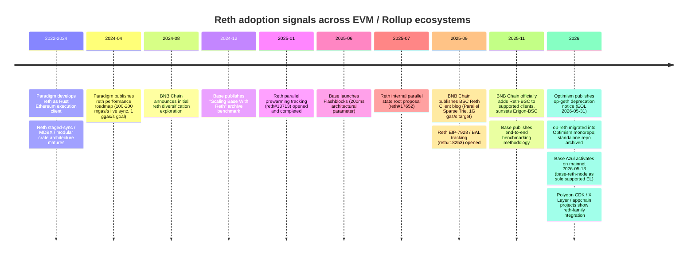
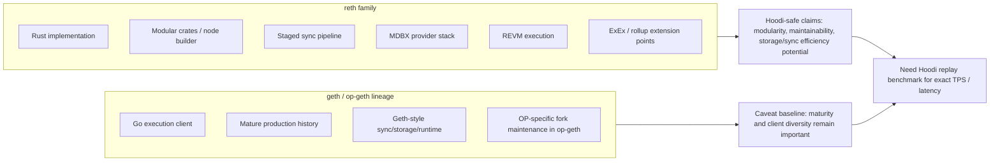
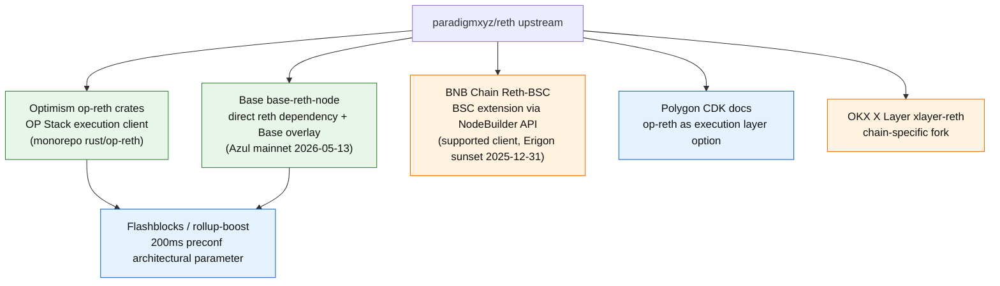
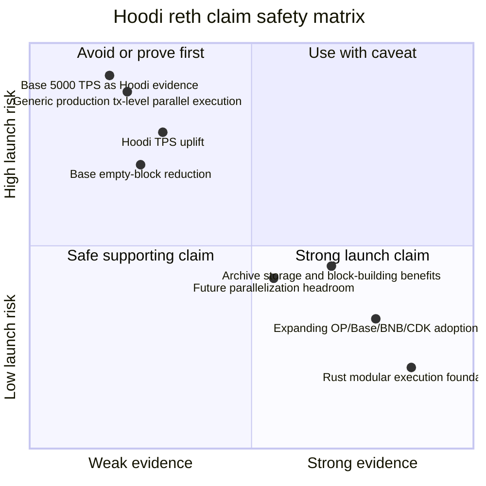

# Phase B Round 2 Draft - 调研 reth 的技术优势及行业采用趋势

## 1. Executive Summary

Reth 的最稳妥定位不是"更快的 geth 替代品"这么窄，而是 **Rust-based, modular, high-performance execution client foundation**。Paradigm 官方把 reth 定义为 Rust 编写、Apache/MIT 双许可、生产就绪、可扩展且组件化的 Ethereum execution client；其架构由 staged sync、MDBX-backed database、REVM、provider / network / transaction-pool / RPC 等 crate 组合而成，适合 L1 节点、L2 execution client、rollup sequencer、indexer 和研究型 fork 复用。[S1][S2][S3]

对 Hoodi 上线通告最有价值的结论有四条：

1. **技术优势强证据**：reth 的模块化 Rust crate 架构、MDBX 存储、staged pipeline、REVM 执行引擎和 ExEx / node builder 扩展点，有官方文档与代码仓证据。可表述为"为 Hoodi 提供高性能、可维护、可扩展的 Rust 执行层基座"。[S1][S2][S3][S31]
2. **采用趋势强证据**：Optimism 正在推动 op-reth 取代 op-geth（op-geth 支持截止 2026-05-31），Base Azul 选择 `base-reth-node` 作为唯一支持执行客户端，BNB Chain 官方客户端支持矩阵已经列入 Reth-BSC（同时宣布 Erigon-BSC 日落），Polygon CDK docs 将 op-reth 作为执行层选项之一，OKX X Layer 维护 `xlayer-reth` fork。这个证据链足以支持"reth 正在从单一客户端项目扩展为多链 EVM 执行层基座"。[S11][S12][S18][S22][S24][S26]
3. **性能数据中等强证据**：公开可引用数据主要来自 Base 的 Reth vs Geth archive benchmark（2024-12-18）、Paradigm 官方性能路线（2024-04-24）、Base Azul / Flashblocks 运营数据（2026-04-22 / 2025-06-16）、BNB Chain Lorentz / Maxwell 协议参数。它们显示 reth-based stack 在 archive disk footprint、provisioning、block-building p99 方面有明确基准优势，但 Azul 博客中的 TPS 和空块数据属于运营声明（reported / not benchmark-grade），不能直接换算成 Hoodi TPS 承诺。[S5][S15][S16][S18][S21]
4. **并行执行必须降级表述**：上游 reth 当前具备 staged/concurrent pipeline、parallel state-root 等相邻并行能力；EIP-7928 / BAL parallel execution 相关工作存在 tracking issue (reth#18253) 和 feature-gated PR 证据，但不能把"通用交易级并行执行已生产可用"作为默认能力。BNB Chain 的 Parallel Sparse Trie 是 BSC/Reth-BSC 项目特定优化，Base 的 parallel sender recovery / state root / cached execution 也是 Base overlay。Hoodi 通告应使用"并行化与高吞吐优化空间"或"面向未来的并行执行演进潜力"，而不是"reth 原生已全面并行执行"。[S9][S10][S21][S33]

**推荐给 Hoodi 的主表述**：

> Hoodi adopts a reth-based Rust execution foundation to align with the industry's move toward modular, high-performance EVM clients. Reth's production-ready architecture, fast-sync/storage design, and growing adoption across OP Stack, Base, BNB Chain and CDK-style ecosystems give Hoodi a stronger base for performance iteration and long-term client maintainability.

中文可用版本：

> Hoodi 采用基于 reth 的 Rust 执行层基座，顺应 EVM 生态从传统 geth / op-geth 路径向模块化、高性能 Rust 客户端演进的趋势。reth 的生产级架构、快速同步与存储设计，以及 Optimism、Base、BNB Chain、Polygon CDK 等生态的采用信号，为 Hoodi 后续性能优化与长期维护提供了更稳固的基础。

## 2. Item Findings

### 2.1 item-1: reth 核心技术优势与可验证边界

**official_claim**

Paradigm / reth 官方 README 将 reth 描述为 Rust 编写、production-ready、Apache/MIT 许可、面向用户友好、模块化和快速的 Ethereum execution node；docs further say its architecture is designed as reusable components, not a monolithic node. The Reth book explains staged sync as a pipeline where each stage can be unwound / restarted and MDBX is used as the canonical database backend.[S1][S2][S3]

**technical_mechanism**

| Mechanism | What it means | Evidence | Hoodi relevance |
|---|---|---|---|
| Rust implementation | Memory-safe language default, strong type system, async ecosystem, deterministic build discipline | Reth README / docs | Good for engineering confidence; do not claim Rust eliminates all bugs |
| Modular crate architecture | Execution, storage, networking, RPC, consensus, txpool and primitives exposed as reusable crates | Reth repo layout and docs | Makes chain-specific forks / OP Stack variants easier to isolate |
| Staged sync pipeline | Sync is decomposed into restartable stages, which helps operational recovery and profiling | Reth book staged sync docs | Safe to describe as fast / observable sync architecture |
| MDBX database | Reth uses MDBX and flat/provider layers for state access | Reth book / code docs | Supports disk-footprint and archive-node advantage claims when paired with benchmarks |
| REVM integration | Rust EVM used across reth / op-reth / many forks | Reth crates / OP and Base code evidence | Supports high-performance Rust EVM foundation wording |
| ExEx / node builder | Execution extensions and node builder pattern for custom indexers / rollup nodes | Reth docs | Strong fit for Hoodi extensibility narrative |

**parallel-execution caveat**

The outline asked for parallel execution, but public evidence does not support a blanket production claim. Reth has pipeline-level concurrency and adjacent parallelizable work:

- **Parallel prewarming** (reth#13713, opened 2025-01-07, closed — all 8 sub-issues complete): executes every transaction in a block in parallel to populate state caches. Benchmarked on Base and Ethereum mainnet. This is a caching optimization, not full parallel transaction execution.[S9]
- **EIP-7928 / BAL tracking** (reth#18253, opened 2025-09-03): master tracking issue for Block-Level Access Lists implementation, covering parallel/batched BAL execution paths, P2P wire support, payload-builder integration, and CLI flags gating BAL parallel execution (PRs #23764, #23770, off by default). Part of the Ethereum Glamsterdam hardfork effort. This is feature-gated and not enabled by default in production.[S9]
- **Internal parallel state root** (reth#17652, opened 2025-07-29): proposes 16-way parallel hashing within individual trie nodes. Extends existing between-trie parallelism.[S10]

None of these constitute "all reth deployments execute transactions in parallel in production." Hoodi should phrase this as **future extensibility / parallelization headroom**, or cite a concrete fork-level mechanism where available.

**confidence**: high for modular/Rust/MDBX/staged-sync claims; medium for performance implications; low for generic parallel transaction execution unless narrowed to specific feature/PR/fork.

### 2.2 item-2: reth vs geth / op-geth 的性能数据与比较口径

The strongest public quantitative dataset is Base's Reth vs Geth archive-node benchmark, published in "Scaling Base With Reth" (2024-12-18) [S5]. Base reported that provisioning an archive node dropped from about 15 hours on Geth to about 3 hours on Reth, initial disk footprint dropped from 16.61 TB to 2.74 TB, weekly growth dropped from about 560 GB to about 50 GB, and block-building p99 improved from 2319 ms to 698 ms. A follow-up "Scaling Base safely with end-to-end benchmarking" (2025-11-13) [S5b] disclosed hardware (AWS i7ie.48xlarge, GCP z3-highmem-88-highlssd), benchmark tool (open-source at github.com/base/benchmark), and methodology (zero-state synthetic chain mimicking Base mainnet opcode/storage distribution). Base itself flagged this as "an approximate simulation rather than an accurate comparison."

Reth official performance roadmap (Paradigm blog, 2024-04-24) [S8] outlined benchmarks of 100-200 mgas/s live sync and 1-3 ggas/s historical, with a stated goal of 1 gigagas/s. These are design targets, not production guarantees.

OP Stack / Base / BNB contexts differ on block gas, tx mix, state access patterns, data availability, sequencer policy, and fork overlay. All public numbers must be qualified with their specific workload context.

**Technical advantage comparison table**

| Dimension | reth | geth / op-geth | Evidence Needed / Used | Hoodi Usability |
|---|---|---|---|---|
| Language / safety | Rust, strong typing, memory-safety guarantees for broad classes of memory errors | Go; mature production client, GC-managed runtime | Reth README, geth/op-geth repos | Strong: "Rust-based execution foundation"; avoid "bug-free" |
| Modular architecture | Many reusable crates; node builder and ExEx extension patterns | More monolithic go-ethereum lineage; op-geth fork modifies geth-style codebase | Reth docs / repo; OP op-reth crate layout | Strong: maintainability / extensibility |
| Sync / pipeline | Staged sync pipeline with restartable stages | Geth sync modes differ; op-geth inherits geth-style architecture | Reth book; Base benchmark | Medium: use with benchmark caveat |
| Storage / state access | MDBX provider stack; public archive benchmark shows much lower disk footprint in Base workload | LevelDB/Pebble/hashdb/pathdb depending client and config | Base Reth benchmark [S5] | Strong if tied to archive-node benchmark, not universal TPS |
| Execution engine | REVM, Rust EVM, reusable in OP / Base / BNB forks | go-ethereum EVM in geth/op-geth | Reth / Base / OP code | Medium: performance potential; workload-specific |
| Rollup adaptation | op-reth, base-reth-node, Reth-BSC, CDK / X Layer forks demonstrate adaptation paths | op-geth historically dominant in OP Stack | OP docs, Base specs, BNB docs, CDK docs, X Layer repo | Strong trend claim |
| Maintenance cadence | Fast release cadence; v2.x line and OP/Base pins show active integration | geth/op-geth mature but OP Stack is deprecating op-geth (EOL 2026-05-31) | Reth releases, OP deprecation [S11] | Strong for "aligns with client evolution" |
| Production maturity risk | Production-ready upstream, but fork overlays vary by chain | geth/op-geth long production history | Project docs and status pages | Must mention migration and fork-maintenance risks |

**Quantitative metrics table (round 2 — all figures qualified)**

| Metric | Reported number | Source | Source date | Client version | Deployment / test environment | Comparability boundary | Evidence grade | Safe use |
|---|---:|---|---|---|---|---|---|---|
| Base archive node provisioning | ~15h Geth -> ~3h Reth | "Scaling Base With Reth" [S5] | 2024-12-18 | Source does not disclose specific commit/version | Base mainnet archive workload | Base-specific; not Hoodi sequencer workload | Benchmark-grade (operational measurement, hardware not disclosed in initial post; follow-up [S5b] disclosed AWS i7ie.48xlarge, GCP z3-highmem-88-highlssd) | Strong archive/storage evidence |
| Base archive disk footprint | 16.61 TB Geth -> 2.74 TB Reth | "Scaling Base With Reth" [S5] | 2024-12-18 | Source does not disclose specific commit/version | Base mainnet archive workload | Base-specific; MDBX vs LevelDB/hashdb | Benchmark-grade | Strong storage evidence |
| Base weekly disk growth | ~560 GB/week -> ~50 GB/week | "Scaling Base With Reth" [S5] | 2024-12-18 | Source does not disclose specific commit/version | Base mainnet archive workload | Base-specific | Benchmark-grade | Strong storage-ops evidence |
| Base block-building p99 | 2319 ms -> 698 ms | "Scaling Base With Reth" [S5] | 2024-12-18 | Source does not disclose specific commit/version | Base mainnet archive workload | Base-specific; not Hoodi TPS | Benchmark-grade | Medium: execution/client architecture evidence |
| Base Mgas/s execution ceiling | Geth ~40 Mgas/s, Reth ~100 Mgas/s | "Scaling Base With Reth" [S5] | 2024-12-18 | Source does not disclose specific commit/version | Base mainnet archive workload | Base-specific; approximate simulation per [S5b] | Benchmark-grade (partial; Base flags methodology as approximate) | Medium: architecture evidence, not Hoodi guarantee |
| Base Azul empty blocks | ~200/day -> ~2/day | "Introducing Base Azul" blog [S15] | 2026-04-22 | base-reth-node (no specific version/commit disclosed) | Base mainnet operations, "over the past two months" (~Feb-Apr 2026) | **Reported / unvalidated**: no definition of "empty block," no raw data, no independent dataset link. Cannot be independently reconciled with Flashblocks evidence without on-chain verification | Reported / not benchmark-grade | **Do not use in strong launch-copy support**; cite only as Base-reported operational observation if needed |
| Base burst throughput | sustained multiple 5,000 TPS bursts | "Introducing Base Azul" blog [S15] | 2026-04-22 | base-reth-node (no specific version/commit disclosed) | Base mainnet operations, "over the past two months" (~Feb-Apr 2026); no transaction type breakdown, no hardware specs, no sustained duration per burst | **Reported / not benchmark-grade**: announcement-grade operational observation, not a formal benchmark. "Multiple bursts" implies episodic peaks, not sustained steady state | Reported / not benchmark-grade | Use as Base case study only with full qualification; do not transfer to Hoodi |
| Base Flashblocks interval | 200 ms preconfirmation blocks | "Accelerating Base with Flashblocks" [S18a] | 2025-06-16 | op-geth (canonical builder), op-rbuilder (reth-based), rollup-boost; no specific version disclosed | 200ms is architectural parameter (Flashblocks built every 200ms); actual end-to-end ~300-500ms due to network travel; state root calc ~130ms avg on Base mainnet per deep-dive [S18b, 2025-09-09] | Architectural parameter, not measured end-to-end latency. Base Sepolia testnet origin for "up to 10x" claim | Mixed: 200ms parameter is benchmark-grade; "up to 10x" is testnet-observation-grade | Use as Base / rollup-boost case, not generic reth; specify 200ms is architectural parameter |
| BNB Chain Lorentz block interval | 1.5s (BEP-520) | BNB Chain docs [S23a] | Mainnet activation 2025-04-29 | BSC v1.5.10 required | BSC mainnet protocol parameter | Protocol specification, not performance benchmark | Protocol-grade | Use as high-throughput EVM context (protocol parameter, not reth benchmark) |
| BNB Chain Maxwell block interval | 0.75s (BEP-524) | BNB Chain blog [S23b] | Announced 2025-05-22; mainnet 2025-06-30 | Not disclosed in announcement | BSC mainnet protocol parameter; fast finality ~1.875s | Protocol specification, not performance benchmark | Protocol-grade | Use as high-throughput EVM context (protocol parameter, not reth benchmark) |
| Reth performance targets | 100-200 mgas/s live sync; 1-3 ggas/s historical; goal 1 ggas/s | Paradigm blog [S8] | 2024-04-24 | Source does not disclose specific version | Paradigm internal benchmarks | Design targets / roadmap, not production guarantees | Roadmap-grade | Use as performance ambition context, not production promise |

**confidence**: high for Base archive benchmark facts with stated methodology caveats; medium-to-low for Base Azul operational claims (TPS, empty blocks) which are announcement-grade; protocol-grade for BNB block intervals; roadmap-grade for Paradigm performance targets; low for any single "reth is X% faster than op-geth" without a Hoodi replay benchmark.

### 2.3 item-3: Optimism op-reth 迁移实践与 OP Stack 执行客户端路线

**official_claim**

Optimism's official deprecation notice (End of Support for op-geth and op-program) states that op-geth and op-program will be supported through May 31, 2026, after which they will not support the Glamsterdam hardfork; chains still running op-geth at activation will not follow the canonical chain. Migration path is to op-reth and cannon-kona.[S11]

OP docs list op-reth as a supported execution client alongside op-geth and Nethermind, with startup configuration examples and `--l2.enginekind` flag options.[S12]

The Optimism monorepo contains `rust/op-reth` crates (migrated via PR #18917; first monorepo release: op-reth/v1.11.0), including execution, RPC, node, storage, payload, txpool, and flashblocks-related modules. The standalone `ethereum-optimism/op-reth` repository is now archived.[S13]

**technical_mechanism**

Op-reth is not just "reth with a flag"; it is an OP Stack execution client implemented as Rust crates in the Optimism monorepo and pinned to upstream reth / alloy / revm dependencies. OP-specific behavior lives in chain spec, EVM, payload, RPC, txpool, proof / storage and rollup-specific modules, while upstream reth provides the execution-client substrate.

**migration_motivation**

| Motivation | Evidence | Hoodi implication |
|---|---|---|
| Replace op-geth maintenance path | OP deprecation notice [S11]: EOL 2026-05-31, no Glamsterdam support | Strong argument that op-geth is a legacy/transitional baseline |
| Align OP Stack with Rust / reth ecosystem | `rust/op-reth` crate structure [S13] and release tags | Hoodi can frame reth as aligned with OP Stack evolution |
| Improve modularity and proof / derivation integration | Optimism Rust workspace with op-reth / kona / op-program related crates | Useful, but do not overclaim direct performance |
| Prepare for Flashblocks / rollup-boost / modern sequencer features | OP monorepo and rollup-boost docs [S28] | Useful for roadmap alignment |

**production_status**

OP Stack has moved op-reth into the first-class documented client path. The op-geth deprecation deadline is 2026-05-31; exact chain-by-chain migration progress varies and is time-sensitive. Hoodi should avoid saying "all OP chains already run op-reth" unless a specific chain-level migration is verified.

**timeline_event**

- 2024-2025: reth matures through stable releases and OP-specific crates exist in upstream / OP repos.
- 2025: op-reth migrated into Optimism monorepo (`rust/op-reth`), standalone repo archived.
- 2026: OP docs carry op-geth deprecation / migration guidance with EOL 2026-05-31.[S11]

**confidence**: high for "OP Stack is moving toward op-reth"; medium for performance motivation; chain-by-chain production status must be verified separately.

### 2.4 item-4: Base / Azul / base-reth-node 采用案例

**official_claim**

Base Azul is the strongest public case that a major L2 is building around a reth-based execution stack. Base's Azul spec says only `base-reth-node` and `base-consensus` support the hardfork and that operators running `op-node`, `op-geth`, or other clients must update before activation. Azul activated on mainnet 2026-05-13.[S16][S17]

Base's blog "Introducing Base Azul" (2026-04-22) ties Azul to performance, safety/decentralization, developer experience, Flashblocks and long-term throughput goals.[S15]

The initial reth adoption story was published as "Scaling Base With Reth" (2024-12-18), announcing reth for all Base archive nodes with benchmarks.[S5]

**technical_mechanism**

Base's architecture is not generic OP Stack op-reth. It uses a Base-maintained Rust stack with `base-reth-node` for execution and `base-consensus` for consensus / derivation. Prior internal research observed Base directly pinning upstream `paradigmxyz/reth` tags and adding a large Base overlay: cached execution, precompile cache, background receipt root, parallel state-root, Flashblocks sender recovery, empty body storage, custom txpool ordering, and proof-sidecar storage.[S34][S35][S36]

**quantitative_metric / benchmark_context**

Base provides two classes of data:

- **Reth vs Geth archive benchmark** (S5, 2024-12-18; methodology detail in S5b, 2025-11-13): disk footprint, provisioning time, weekly growth, block-building latency, Mgas/s ceiling. Benchmark-grade with disclosed hardware and open-source tooling, though Base flags it as "approximate simulation." Strong for archival/storage evidence.
- **Azul / Flashblocks operational data** (S15, 2026-04-22; S18a, 2025-06-16):
  - "Sustained multiple 5,000 TPS bursts" — **reported / not benchmark-grade**: no tx type breakdown, no duration, no hardware specs; announcement-grade operational observation.
  - "~200/day -> ~2/day empty blocks" — **reported / unvalidated**: no definition of "empty block," no raw data, no independent dataset, no reconciliation with Flashblocks evidence provided. Cannot be used in strong launch-copy support.
  - "200ms preconfirmation" — 200ms is an architectural Flashblocks parameter; "up to 10x" inclusion improvement measured on Base Sepolia testnet per the Flashblocks launch blog (2025-06-16).

**adoption_depth**

Base is a **reth-based chain-specific stack / direct upstream reth dependency with heavy Base overlay**, not merely "supports reth." The safest wording is "Base's reth-based stack" or "Base's base-reth-node," not "Base runs upstream vanilla reth."

**Hoodi transferability**

Good borrowable angles:

- "reth is a credible foundation for high-throughput L2 execution work."
- "Base's public migration shows major L2 teams are willing to make reth-based clients the primary supported path."
- "Base's archive benchmark data (2024-12-18) supports storage and block-building efficiency claims under a disclosed benchmark context."

Avoid:

- "Hoodi will get Base's 5,000 TPS bursts." (reported / not benchmark-grade)
- "Hoodi is adopting Base Stack."
- "reth alone caused every Azul performance gain."
- Using the empty-block reduction as strong evidence. (reported / unvalidated)

**confidence**: high for adoption and architecture; high for archive benchmark with methodology caveats; low for Azul operational claims (TPS, empty blocks) as strong evidence.

### 2.5 item-5: BNB Chain / Reth-BSC 采用案例

**official_claim**

BNB Chain's "Important Update: BNB Chain Client Support and Erigon Sunset" (2025-11-25) officially added Reth-BSC to the supported client list and announced Erigon-BSC sunset by December 31, 2025, confirming a dual-client strategy (Geth + Reth).[S20]

Earlier, "Diversifying BNB Smart Chain and opBNB Execution Clients with Reth" (2024-08-21) [S20b] announced the initial reth adoption exploration for BSC and opBNB.

"BSC Reth Client: The Next Evolution of BSC Infrastructure" (2025-09-05) [S21] describes BSC-specific optimizations including Parallel Sparse Trie, ASM Hash, Super-Instructions, Pre-warm, and EVM JIT, targeting 1G gas/s at 750ms block times.

The `bnb-chain/reth-bsc` GitHub repository [S22] is active (last updated 2026-05-18, v0.0.9-beta), implementing BSC-compatible Reth using Reth's NodeBuilder API (not a fork of the main reth repo, but an extension on top of upstream).

**technical_mechanism**

Reth-BSC is a BSC-compatible extension built on reth's NodeBuilder API, not an OP Stack op-reth derivative. It targets BSC's high-throughput EVM environment, with BSC-specific consensus / chain parameters and storage/state optimizations.

**parallel execution/status caveat**

BNB Chain's strongest parallelism evidence is **Parallel Sparse Trie**, a BSC-specific storage/trie optimization for state root / trie processing described in the BSC Reth Client blog (2025-09-05) [S21], not generic upstream reth transaction-level parallel execution. It can support a Hoodi statement that high-throughput EVM ecosystems are using reth-family clients as an optimization base, but it should not be used to claim Hoodi inherits BSC's parallel trie or validator-set assumptions.

**production_status**

BNB Chain support materials classify Reth-BSC as supported client infrastructure, while Erigon-BSC was sunset by 2025-12-31. Exact "default / recommended / full validator majority" status is not disclosed; the draft does not claim a quantified production share.

**Hoodi transferability**

Good:

- "reth-family clients are no longer limited to OP Stack L2s; they are also being adapted for high-throughput EVM L1/sidechain environments."
- "BSC's Reth-BSC supports the trend toward Rust/reth-based performance engineering."

Avoid:

- "BNB Chain proves reth will automatically reach BSC throughput on Hoodi."
- "Parallel execution is already generic in reth." (BSC Parallel Sparse Trie is BSC-specific)
- Claiming a quantified Reth-BSC production/validator share.

**confidence**: high for BNB adoption signal; medium for production-status nuance; low for transferable performance without Hoodi/BSC comparable benchmark.

### 2.6 item-6: 其他 L2 / appchain / infra 采用案例与行业趋势

**adoption_depth taxonomy**

| Depth | Meaning | Examples in this draft |
|---|---|---|
| upstream reth | Runs upstream Paradigm reth with configuration | Ethereum L1 operators / infra use cases, not chain-specific in scope |
| fork reth | Chain maintains fork/adaptation | BNB Reth-BSC (extension via NodeBuilder API), OKX X Layer `xlayer-reth` |
| op-reth crate | OP Stack execution client based on reth in Optimism monorepo | Optimism / OP Stack |
| reth-based custom stack | Direct upstream reth dependency plus project overlay | Base `base-reth-node` |
| CDK / node stack integration | Reth/Erigon paired with rollup node / CDK components | Polygon CDK docs |
| infra / builder integration | Flashblocks, rollup-boost, node operators, SDK projects | Base/Flashblocks, rollup-boost |

**cases**

| Project | Adoption Depth | Status | Motivation | Quantitative Data | Official Evidence | Caveat |
|---|---|---|---|---|---|---|
| Optimism / OP Stack | op-reth crate / first-class OP execution client | Migration path / op-geth deprecation (EOL 2026-05-31) | Maintainability, Rust client evolution, OP Stack modernization | No single public TPS benchmark found in this draft | OP deprecation notice [S11], OP docs [S12], monorepo [S13] | Do not claim every OP chain has migrated |
| Base | reth-based custom stack | Azul makes base-reth-node the supported path (mainnet 2026-05-13) | Performance, single-client stack, Flashblocks, faster iteration | Archive benchmark [S5] (benchmark-grade); TPS/empty-block claims [S15] (reported / not benchmark-grade) | "Scaling Base With Reth" [S5], Azul blog [S15], Azul specs [S16], base/base GitHub [S17] | Base stack != generic op-reth; TPS/empty-block data not independently verified |
| BNB Chain | Reth-BSC extension (NodeBuilder API) | Supported client; Erigon-BSC sunset 2025-12-31 | High-throughput EVM client, performance and state optimization | Lorentz/Maxwell protocol parameters [S23a/S23b]; 1G gas/s target (roadmap) [S21] | Client support update [S20], BSC Reth blog [S21], reth-bsc GitHub [S22] | Not OP Stack; Parallel Sparse Trie not generic reth; no quantified production share |
| Polygon CDK | CDK stack integration (op-reth as execution option) | Docs-level integration | CDK stack execution layer | No direct benchmark found | Polygon CDK docs [S24] | Adoption depth is stack integration, not proof of production share |
| X Layer / OKX | `xlayer-reth` fork | Public GitHub repo [S26], active | Chain-specific reth adaptation for OP Stack-based L2 | No official benchmark found | `okx/xlayer-reth` GitHub [S26] | Need official production-status confirmation |
| Flashblocks / rollup-boost | infra integration around reth / op-reth | Active Base / OP ecosystem | Low-latency preconfirmations and builder separation | 200ms architectural parameter; "up to 10x" (Sepolia testnet observation) [S18a] | Flashblocks blog [S18a], rollup-boost docs [S28] | Flashblocks is a stack feature, not upstream reth alone |

**industry trend judgment**

The evidence supports a **strong trend**: execution clients for EVM rollups and high-throughput chains are moving from a geth/op-geth-dominant path to a mixed Rust/reth family of clients. It does not yet support the stronger claim "reth is the only industry standard" or "all leading L2s have switched."

### 2.7 item-7: 行业共识、风险与反证

**facts with strong support**

- Reth is a production-ready Rust Ethereum execution client with modular architecture and active releases.[S1][S2][S4]
- OP Stack is migrating away from op-geth toward op-reth / supported Rust execution-client paths (op-geth EOL 2026-05-31).[S11][S12]
- Base has publicly selected a reth-based execution stack for Azul (mainnet 2026-05-13) and reports archive benchmark improvements under disclosed methodology.[S5][S15][S16][S17]
- BNB Chain has public Reth-BSC support/adoption evidence with Erigon sunset.[S20][S22]
- Polygon CDK / X Layer / infra projects show reth-family adoption extends beyond one vendor or one chain.[S24][S26]

**strong trends but still need qualification**

- "reth is becoming the default foundation for high-performance EVM execution layers" is defensible as a trend, but should be phrased as "increasingly adopted" rather than "default."
- "reth improves performance" is defensible with Base archive benchmark evidence, but every number needs workload context. Azul operational claims (TPS, empty blocks) are reported / not benchmark-grade.
- "reth improves maintainability" is defensible from modular crate architecture and Base/OP dependency patterns, but fork overlays can still create maintenance debt.

**counterarguments and risks**

| Risk | Why it matters | Mitigation in Hoodi wording |
|---|---|---|
| Benchmark comparability | Base archive benchmark is not Hoodi sequencer benchmark; Azul TPS/empty-block data is announcement-grade | Say "public benchmarks show..." not "Hoodi will..."; do not use reported/unvalidated figures as strong evidence |
| Client diversity | Moving to one reth-based client can reduce implementation diversity if not paired with other clients | Use "aligns with client evolution," not "single standard" |
| Fork maintenance | Chain-specific forks can diverge from upstream reth | Emphasize modular architecture and upstream alignment |
| Production maturity varies | op-reth / Reth-BSC / xlayer-reth statuses differ | Classify adoption depth and status |
| Parallel execution overstatement | Generic transaction-level parallel execution not proven as current baseline; BAL/EIP-7928 is feature-gated; BSC Parallel Sparse Trie is BSC-specific | Use future/potential language |
| Rust safety overstatement | Rust reduces memory-safety bug classes but cannot eliminate logic/consensus bugs | Avoid "memory safe means secure" shortcuts |

### 2.8 item-8: Hoodi 上线通告中的 reth 优势表述建议

**Hoodi wording matrix**

| Claim | Strength | Suggested Wording | Evidence Anchor | Required Caveat |
|---|---|---|---|---|
| reth provides a Rust-based high-performance execution foundation | strong | "Hoodi is built on a reth-based Rust execution foundation designed for performance, modularity and long-term maintainability." | Reth docs/README [S1][S2], Base/OP adoption [S5][S11] | Do not promise specific TPS |
| reth adoption is expanding across OP Stack and high-throughput EVM ecosystems | strong | "Reth-family clients are increasingly adopted across OP Stack, Base, BNB Chain and CDK-style ecosystems." | OP [S11][S12], Base [S5][S15][S16], BNB [S20][S22], CDK [S24], X Layer [S26] | Say "increasingly," not "universal" |
| Hoodi aligns with the industry's move toward modular Rust execution clients | strong | "This aligns Hoodi with the broader shift toward modular Rust execution clients." | Reth docs + multi-project adoption | Avoid "only standard" |
| reth materially improves throughput / latency vs op-geth | medium | "Public reth-based benchmarks show meaningful gains in storage footprint and block-building latency under specific workloads." | Base archive benchmark [S5] (benchmark-grade with methodology caveats) | Must include benchmark context; do not cite Azul TPS/empty-block as strong support |
| reth has production parallel execution | weak | "Reth's architecture leaves room for parallelization and high-throughput execution work; project-specific stacks already optimize adjacent paths such as state-root, trie and Flashblocks processing." | BAL/EIP-7928 tracking [S9], parallel prewarming [S9], BSC Parallel Sparse Trie [S21] | Do not call it generic production tx-level parallel execution; BAL is feature-gated |
| Rust memory safety makes Hoodi safer | medium | "Rust reduces classes of memory-safety risk and improves engineering discipline for a complex execution client." | Rust/reth docs [S1] | Does not remove consensus or logic bugs |

**Chinese launch-notice snippets**

1. `Hoodi 采用基于 reth 的 Rust 执行层基座，面向高性能、模块化和长期可维护性构建。`
2. `reth 已从 Ethereum L1 客户端扩展为多个 EVM / Rollup 生态的执行层基础设施，Optimism op-reth、Base 的 base-reth-node、BNB Chain 的 Reth-BSC 以及 CDK 生态都体现了这一迁移趋势。`
3. `公开基准测试显示，reth-based stack 在 archive 存储占用、节点同步 / provisioning、block-building latency 上具备明确优化空间（数据来自 Base 2024-12-18 archive benchmark，测试环境 AWS i7ie.48xlarge / GCP z3-highmem-88-highlssd）；Hoodi 会在自身工作负载下持续验证和公开性能进展。`
4. `我们不会把外部项目的 TPS 或延迟数字直接搬到 Hoodi，而是把 reth 作为后续性能迭代、模块化扩展和客户端演进的技术底座。`

**English optional short lines**

- `Hoodi is aligned with the industry's shift toward modular Rust execution clients.`
- `Reth gives Hoodi a production-ready, extensible execution foundation rather than a one-off fork of the legacy geth/op-geth path.`
- `Public reth-based benchmarks show strong storage and latency improvements under disclosed test conditions, while Hoodi will validate performance claims against its own workloads.`

**Prohibited / high-risk wording**

- `reth gives Hoodi 5,000 TPS` — Base-reported / not benchmark-grade and not transferable.
- `reth reduced empty blocks by 99%` — reported / unvalidated, Base-specific, not independently verified.
- `reth is fully parallel by default` — unsupported as generic baseline; BAL is feature-gated, BSC parallel trie is BSC-specific.
- `all major L2s have migrated to reth` — overbroad.
- `Rust makes the execution layer secure by default` — overstates language safety.
- `Base Azul proves Hoodi has Base Stack performance` — false equivalence.

## 3. Diagrams

### diag-1: Industry reth adoption timeline

### diag-2: reth vs geth / op-geth technical comparison

### diag-3: reth-based Rollup / EVM execution ecosystem map

### diag-4: Hoodi wording decision matrix

## 4. Source Coverage

### Primary and official sources (round 2 — all rows carry exact URLs and dates)

| ID | Source | URL | Artifact date / retrieval date | Type | Used for |
|---|---|---|---|---|---|
| S1 | `paradigmxyz/reth` GitHub | https://github.com/paradigmxyz/reth | Active repo; retrieved 2026-05-27 | official GitHub | Reth definition, license, production-ready positioning, repo architecture |
| S2 | Reth Book | https://reth.rs/ | Living docs; retrieved 2026-05-27 | official docs | Architecture, staged sync, database, node builder / ExEx |
| S3 | Reth docs: architecture / staged sync / database pages | https://reth.rs/ (subpages) | Living docs; retrieved 2026-05-27 | official docs | Technical mechanisms |
| S4 | Reth releases | https://github.com/paradigmxyz/reth/releases | Active; retrieved 2026-05-27 | official releases | Active cadence, v2.x line, feature status |
| S5 | "Scaling Base With Reth" — Base engineering blog | https://blog.base.dev/scaling-base-with-reth | Published 2024-12-18 | official blog | Archive benchmark metrics: provisioning, disk footprint, weekly growth, block-building p99, Mgas/s ceiling |
| S5b | "Scaling Base safely with end-to-end benchmarking" — Base engineering blog | https://blog.base.dev/scaling-base-with-benchmarking | Published 2025-11-13 | official blog | Benchmark hardware (AWS i7ie.48xlarge, GCP z3-highmem-88-highlssd), open-source tool (github.com/base/benchmark), methodology caveats |
| S6 | `docs.rs/reth` crate docs | https://docs.rs/reth | Living docs; retrieved 2026-05-27 | official crate docs | Modular crate evidence |
| S7 | Reth book ExEx / Node Builder docs | https://reth.rs/ (ExEx section) | Living docs; retrieved 2026-05-27 | official docs | Extensibility mechanism |
| S8 | "Reth's path to 1 gigagas per second, and beyond" — Paradigm blog | https://www.paradigm.xyz/2024/04/reth-perf | Published 2024-04-24 | official blog | Performance roadmap: 100-200 mgas/s live sync, 1-3 ggas/s historical, 1 ggas/s goal |
| S9 | Reth parallel prewarming tracking issue (reth#13713) + EIP-7928/BAL tracking issue (reth#18253) | https://github.com/paradigmxyz/reth/issues/13713 (opened 2025-01-07, closed) ; https://github.com/paradigmxyz/reth/issues/18253 (opened 2025-09-03) | See individual dates | official GitHub | Parallel execution caveat: prewarming is caching optimization (completed); BAL/EIP-7928 is feature-gated parallel execution (PRs #23764, #23770, off by default) |
| S10 | Reth internal parallel state root proposal (reth#17652) | https://github.com/paradigmxyz/reth/issues/17652 | Opened 2025-07-29 | official GitHub | 16-way parallel hashing within trie nodes; extends existing parallelism |
| S11 | "End of Support for op-geth and op-program" — Optimism deprecation notice | https://docs.optimism.io/notices/op-geth-deprecation | Living doc; op-geth EOL 2026-05-31; retrieved 2026-05-27 | official docs | OP Stack migration path: op-geth/op-program EOL, no Glamsterdam support, migration to op-reth + cannon-kona |
| S12 | "Execution Client Configuration" — Optimism docs | https://docs.optimism.io/node-operators/guides/configuration/execution-clients | Living doc; retrieved 2026-05-27 | official docs | op-reth support status, configuration examples, `--l2.enginekind` options |
| S13 | Optimism monorepo `rust/op-reth` | https://github.com/ethereum-optimism/optimism/tree/develop/rust/op-reth | Active; migrated via PR #18917; first monorepo release op-reth/v1.11.0 | official GitHub | op-reth crate structure; standalone repo archived |
| S14 | Optimism releases / Rust workspace evidence | https://github.com/ethereum-optimism/optimism/releases | Active; retrieved 2026-05-27 | official GitHub | Release and integration cadence |
| S15 | "Introducing Base Azul" — Base blog | https://blog.base.dev/introducing-base-azul | Published 2026-04-22 | official blog | Base Azul positioning; operational claims: "5,000 TPS bursts" (reported), "~200->~2 empty blocks/day" (reported/unvalidated), "over the past two months" measurement window |
| S16 | "Azul" — Base chain specification | https://specs.base.org/upgrades/azul/overview | Living spec; Azul mainnet activation 2026-05-13 | official specs | base-reth-node / base-consensus as sole supported clients, multiproof system |
| S17 | `base/base` GitHub | https://github.com/base/base | Active; retrieved 2026-05-27 | official GitHub | Base reth dependency / base-reth-node evidence |
| S18a | "Accelerating Base with Flashblocks" — Base blog | https://blog.base.dev/accelerating-base-with-flashblocks | Published 2025-06-16 | official blog | Flashblocks launch: 200ms architectural parameter, "up to 10x" inclusion improvement (Base Sepolia testnet observation) |
| S18b | "Flashblocks Deep Dive" — Base blog | https://blog.base.dev/flashblocks-deep-dive | Published 2025-09-09 | official blog | Component versions (op-geth canonical builder, op-rbuilder reth-based, rollup-boost), state root calc ~130ms avg on Base mainnet |
| S19 | Base docs: Flashblocks developer integration | https://docs.base.org/base-chain/flashblocks/apps | Living doc; retrieved 2026-05-27 | official docs | WebSocket/RPC APIs, 200ms pre-confirmation, revert protection |
| S20 | "Important Update: BNB Chain Client Support and Erigon Sunset" — BNB Chain blog | https://www.bnbchain.org/en/blog/important-update-bnb-chain-client-support-and-erigon-sunset | Published 2025-11-25 | official blog | Reth-BSC officially supported, Erigon-BSC sunset 2025-12-31, dual-client strategy (Geth + Reth) |
| S20b | "Diversifying BNB Smart Chain and opBNB Execution Clients with Reth" — BNB Chain blog | https://www.bnbchain.org/en/blog/diversifying-bnb-smart-chain-and-opbnb-execution-clients-with-reth | Published 2024-08-21 | official blog | Initial reth diversification exploration for BSC and opBNB |
| S21 | "BSC Reth Client: The Next Evolution of BSC Infrastructure" — BNB Chain blog | https://www.bnbchain.org/en/blog/bsc-reth-client-the-next-evolution-of-bsc-infrastructure | Published 2025-09-05 | official blog | BSC-specific optimizations: Parallel Sparse Trie, ASM Hash, Super-Instructions, Pre-warm, EVM JIT; 1G gas/s at 750ms target (roadmap) |
| S22 | `bnb-chain/reth-bsc` GitHub | https://github.com/bnb-chain/reth-bsc | Active; v0.0.9-beta; last updated 2026-05-18; MIT licensed | official GitHub | BSC-compatible Reth extension via NodeBuilder API |
| S23a | Lorentz hardfork (BSC) docs | https://docs.bnbchain.org/announce/lorentz-bsc/ | Mainnet activation 2025-04-29; BEP-520; required BSC v1.5.10 | official docs | Block interval 3s -> 1.5s (protocol parameter) |
| S23b | "BNB Chain Announces Maxwell Hardfork" — BNB Chain blog | https://www.bnbchain.org/en/blog/bnb-chain-announces-maxwell-hardfork-bsc-moves-to-0-75-second-block-times | Announced 2025-05-22; mainnet 2025-06-30; BEP-524/563/564 | official blog | Block interval 1.5s -> 0.75s (protocol parameter), fast finality ~1.875s |
| S24 | Polygon CDK overview docs | https://docs.polygon.technology/cdk/overview/ | Living doc; retrieved 2026-05-27 | official docs | CDK supports op-reth (Rust-based, high throughput, lower resource consumption) alongside op-geth; backed by Conduit and Gateway |
| S25 | Polygon CDK get-started docs | https://docs.polygon.technology/chain-development/cdk/get-started/overview | Living doc; retrieved 2026-05-27 | official docs | CDK execution layer options |
| S26 | `okx/xlayer-reth` GitHub | https://github.com/okx/xlayer-reth | Active; retrieved 2026-05-27 | official GitHub | Reth-based execution client for XLayer (OP Stack-based L2); uses NodeBuilder API |
| S27 | X Layer docs | (combined with S26) | — | official docs/code | Status caveat |
| S28 | Rollup Boost documentation | https://rollup-boost.flashbots.net/ | Living doc; security audit completed 2025-05-11; retrieved 2026-05-27 | official docs | Sequencer sidecar for OP Stack: Flashblocks, external block production via Engine API; MIT licensed |
| S29 | Reth performance roadmap (same as S8) | https://www.paradigm.xyz/2024/04/reth-perf | Published 2024-04-24 | official blog | Emerging reth SDK / performance ecosystem context |
| S30 | Ethereum client diversity — ethereum.org | https://ethereum.org/en/developers/docs/nodes-and-clients/client-diversity/ | Living doc; retrieved 2026-05-27 | official/community | Risk and counterargument framing: single-client dependency risks |

### Internal research reused as secondary context

| ID | Internal artifact | Used for |
|---|---|---|
| S31 | `base-vs-mantle-reth-analysis/research-sections/comparison-execution-client/final.md` | Reth/Base/Mantle execution-client comparison and fork strategy context |
| S32 | `mantle-base-codebase-evaluation/research-sections/reth-op-reth-hardfork-dependency/final.md` | op-reth / Base dependency model, release timing, hardfork maintenance |
| S33 | `base-perf-analysis/research-sections/execution-layer-reth-fork-comparison/final.md` | Base overlay, performance attribution, parallel-adjacent work caveat |
| S34 | `base-azul-upgrade/research-sections/base-strategy-azul-overview/final.md` | Base Azul strategy, single-client caveats, activation context |
| S35 | `base-azul-upgrade/research-sections/base-vs-optimism-flashblocks/final.md` | Flashblocks / op-reth / rollup-boost context |
| S36 | `base-perf-analysis/research-sections/block-builder-flashblocks-throughput/final.md` | Flashblocks throughput and benchmark cautions |

### Source requirement coverage (round 2 — all auditable against permalinks above)

| Requirement | Status | Evidence |
|---|---|---|
| src-1 Paradigm / reth docs >=3 | met | S1 (GitHub), S2 (Reth Book), S3 (docs subpages), S4 (releases), S6 (docs.rs), S7 (ExEx docs), S8 (Paradigm perf blog) — 7 sources, all with URLs |
| src-2 Optimism docs/GitHub >=3 | met | S11 (deprecation notice, URL verified), S12 (execution client config, URL verified), S13 (monorepo rust/op-reth, URL verified), S14 (releases) — 4 sources, all with URLs |
| src-3 Base docs/GitHub >=3 | met | S5 (Scaling Base With Reth, URL verified), S5b (benchmarking methodology), S15 (Introducing Base Azul, URL verified), S16 (Azul specs, URL verified), S17 (base/base GitHub), S18a (Flashblocks blog), S18b (Flashblocks deep dive), S19 (Flashblocks dev docs) — 8 sources, all with URLs |
| src-4 BNB docs/GitHub >=2 | met | S20 (client support update, URL verified), S20b (initial reth diversification blog), S21 (BSC Reth blog, URL verified), S22 (reth-bsc GitHub, URL verified), S23a (Lorentz docs, URL verified), S23b (Maxwell blog, URL verified) — 6 sources, all with URLs |
| src-5 Other L2/appchain official >=3 | met | S24 (Polygon CDK overview, URL verified), S25 (CDK get-started), S26 (xlayer-reth GitHub, URL verified), S28 (rollup-boost docs, URL verified) — 4 sources, all with URLs |
| src-6 benchmark/release data >=3 | met | S4 (reth releases), S5 (Base archive benchmark, 2024-12-18), S5b (Base benchmarking methodology, 2025-11-13), S8 (Paradigm perf blog, 2024-04-24), S15 (Azul operational claims, 2026-04-22, reported/not benchmark-grade), S18a (Flashblocks blog, 2025-06-16), S23a/S23b (Lorentz/Maxwell protocol parameters) — 7 sources |
| src-7 code analysis >=4 | met | S1 (reth repo), S9 (reth#13713, reth#18253), S10 (reth#17652), S13 (Optimism monorepo op-reth), S17 (base/base), S22 (reth-bsc GitHub), S26 (xlayer-reth GitHub) plus S31-S33 internal — 10+ sources |
| src-8 internal research >=4 | met | S31-S36 — 6 internal research artifacts |

## 5. Gap Analysis

1. **Hoodi-specific performance is not measured here**. The draft provides industry evidence and external benchmarks. Hoodi should run same-hardware replay benchmarks before publishing any TPS, latency or storage percentage.
2. **OP Stack migration status changes quickly**. The op-geth deprecation deadline is 2026-05-31; chain-by-chain migration progress should be rechecked immediately before final launch copy.
3. **BNB Chain production share is not quantified**. The evidence supports official Reth-BSC support/adoption and Erigon sunset, not validator share or client majority.
4. **Other L2 adoption depth is uneven**. Polygon CDK docs and X Layer repo are valid trend evidence but weaker than Base / Optimism / BNB.
5. **Parallel execution remains the highest-risk claim**. BAL/EIP-7928 is feature-gated (off by default); parallel prewarming is a caching optimization, not full parallel execution; BSC Parallel Sparse Trie is BSC-specific. The safest final copy should not use parallel execution as a current generic capability.
6. **Base Azul operational claims are reported / not benchmark-grade**. The 5,000 TPS bursts and ~200->~2 empty-block reduction lack methodology, raw data, and independent verification. These should not appear in strong launch-copy support.
7. **Some primary pages are living docs**. This draft was prepared/revised on 2026-05-27; URLs for Optimism docs, Polygon CDK docs, Base specs, and reth docs should be revalidated if publication is delayed.
8. **`basic-blockstm` term not found in reth repo**. Round-1 referenced `basic-blockstm` as a feature gate; actual reth evidence uses EIP-7928/BAL tracking (reth#18253) and parallel prewarming (reth#13713). Round-2 corrects this.

## 6. Revision Log

| Round | Action | Target | Reason | Source |
|---|---|---|---|---|
| 1 | Initial deep draft | `hoodi-launch-notice/research-sections/reth-adoption-trends/drafts/round-1.md` | Produce full draft from approved outline and Orchestrator deep-draft dispatch | Multica issue `56f09aef-bbee-4e60-baf7-b739a9bf28b8`, dispatch `c6a9b3c7-36e1-4de0-8268-9fbf34808687` |
| 1 | Downgraded generic parallel execution wording | item-1, item-5, item-7, item-8 | Carry outline-review caveat and avoid overstating current reth capability | Review verdict `bb80e037-3a82-4175-9400-9248b22bca7d` |
| 2 | Citation precision upgrade | All source rows, especially S8-S12, S20-S30 | Replace generic source labels with exact URLs and retrieval/artifact dates; correct `basic-blockstm` to EIP-7928/BAL tracking per actual GitHub evidence | Adversarial review verdict `2cd6eacc-3e97-4e21-b96b-6cb6bb74ace9`, finding 1 |
| 2 | Performance metric qualification | Quantitative metrics table (Section 2.2), item-4 (Section 2.4) | Add source date, client version (or explicit disclosure gap), deployment/test environment, and comparability boundary to every TPS/latency/block-production figure; demote figures without metadata to "reported / not benchmark-grade" | Adversarial review verdict `2cd6eacc-3e97-4e21-b96b-6cb6bb74ace9`, finding 2 |
| 2 | Base empty-block figure downgrade | Quantitative metrics table, item-4, item-8, prohibited wording list | Downgraded `~200/day -> ~2/day` to "reported / unvalidated"; removed from strong launch-copy support framing; added to prohibited wording list | Adversarial review verdict `2cd6eacc-3e97-4e21-b96b-6cb6bb74ace9`, finding 3 |
| 2 | Carry-forward constraints preserved | item-1, item-5, item-7, item-8 | Parallel execution: evidence-gated (BAL feature-gated, BSC Parallel Sparse Trie BSC-specific); OP Stack migration: hedged for time-sensitivity; BNB Chain Reth-BSC: no quantified production share | Round 1 dispatch caveat + adversarial carry-forward |
| 2 | New sources added | Source table | Added S5b (Base benchmarking methodology), S8 (Paradigm perf blog), S18b (Flashblocks deep dive), S20b (early BNB reth blog), S30 (Ethereum client diversity); split S18 into S18a/S18b, S23 into S23a/S23b for specificity | Round 2 source verification research |
| 2 | diag-1 timeline enhanced | Section 3 | Added specific dates and events from verified sources | Round 2 source verification |
| 2 | diag-4 quadrant expanded | Section 3 | Added "Base 5000 TPS as Hoodi evidence" and "Base empty-block reduction" as high-risk/weak-evidence items | Round 2 adversarial response |
