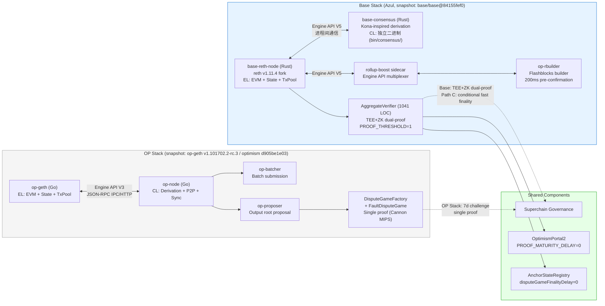

# Base Codebase 架构设计优势综述

## 1. Executive Summary

Base Azul 升级（code-set target 2026-05-28，specs.base.org 仍标注 mainnet activation TBD）标志着 Base 首次在代码层脱离 OP Stack，形成独立的 Base Stack。本综述从七个维度系统分析 Base 在此次升级中的架构设计变更及其对 Mantle 的参考价值。

核心发现：

1. **执行层 single-client policy**：Base 以两个 Base 自有客户端——base-reth-node（paradigmxyz/reth v1.11.4 fork，执行层）+ base-consensus（Kona-inspired，共识/derivation 层）——取代 OP Stack 的 op-geth + op-node 双进程模型（snapshot: op-geth v1.101702.2-rc.3 / optimism monorepo d905be1e03）。两者当前仍为独立二进制（bin/node/ 和 bin/consensus/），未来有合并为单二进制的路线图方向（blog-stated，非 Azul spec 范畴）。优势在于 Base 团队统一维护的 Rust 代码库减少了跨团队/跨语言协调成本。

2. **TEE+ZK dual-proof 安全架构**：AggregateVerifier 合约（1041 行 Solidity，PROOF_THRESHOLD=1 常量）实现 TEE + ZK 双证明聚合。Path C 最终性公式 `min(createdAt+7d, secondProofAt+1d)` 意味着：**当第二个证明在游戏创建后较早提交时（before day 6）**，最终性可从 7 天缩短至最快 ~1 天；若第二个证明在 day 6 或之后提交，则无加速效果。

3. **Flashblocks 200ms 预确认**：rollup-boost sidecar + op-rbuilder 实现 Producer/Builder 分离，三种 Consumer 实现提供不同集成深度选择。

4. **Osaka EVM 对齐**：5 个 EIP（EIP-7825/7823/7883/7939/7951）+ 伴随网络层变更（EIP-7642 eth/69、EIP-7910 eth_config）通过单一开关 BaseUpgrade::Azul => SpecId::OSAKA 激活。Mantle Limb 已采纳 4/5 EIP + 两项伴随变更。

5. **时间压力**：op-geth EOL 定于 2026-05-31（Optimism 官方 hard date），Mantle 基于 mantlenetworkio/op-geth@v1.4.2（commit 9c428cf）面临迁移紧迫性。Base Azul 的 2026-05-28 为 code-set target（config constant `1_779_991_200`），mainnet activation 仍为 TBD（specs.base.org/upgrades/azul/overview），两个日期的确定性层级不同。

本综述的架构先进性排名将 TEE+ZK dual-proof 列为对 Mantle 最高价值改进（安全性 + 有条件的最终性提升），其次是 Base 自有客户端架构（可维护性 + 生态独立性），Flashblocks 排第三（用户体验提升）。

---

## 2. Item Findings

### 2.1 Item 1: 整体架构变更总览 — Base 的 OP Stack 脱离路径

#### fork_dimensions

Base Azul 升级在三个维度构成 fork（evidence: base-strategy-azul-overview final.md）：

| 维度 | 状态 | 详述 |
|------|------|------|
| 代码 fork | **Yes** | base-reth-node 取代 op-geth/op-reth；base-consensus 取代 op-node 中的 derivation 逻辑；全新 TEE+ZK dual-proof 替代 DisputeGame 单证体系 |
| 规范 fork | **Partial** | Base 发布独立 spec（`base/base/docs/specs/`），包含 Azul 升级的 exec-engine、proofs、flashblocks 等子规范；部分规范（如 derivation pipeline 基础）仍与 OP Stack 共享 Kona 上游 |
| 治理 fork | **No** | Base 继续参与 Optimism Governance，保留 Superchain 成员身份；AggregateVerifier 合约层仍引用 OptimismPortal2 和 AnchorStateRegistry |

#### strategic_goals

Azul 升级追求三大战略目标：

1. **安全/去中心化**：通过 TEE+ZK dual-proof 系统实现 Stage 2 准备度（当前处于 Stage 1 → Stage 2 过渡路径上）
2. **性能**：Base 自有客户端架构（base-reth-node + base-consensus）统一由 Base 团队维护，Flashblocks 提供 200ms 预确认
3. **开发者体验（DX）**：与 Ethereum Osaka 硬分叉对齐，通过 SpecId::OSAKA 一次性引入 5 个 EIP + 伴随网络层变更

#### op_stack_impact

| 影响项 | 详述 | 时间节点 |
|--------|------|----------|
| op-geth EOL | OP Stack 官方宣布 op-geth 进入 end-of-life（snapshot: optimism monorepo d905be1e03 中 fork timeline 最高仅到 JovianTime，无 AzulTime）| 2026-05-31（**hard date**，Optimism 官方） |
| Base Stack 分叉 | Base 的代码 fork 意味着 Base Stack 与 OP Stack 在执行层、证明系统层形成永久分叉；共享部分收敛于 Superchain 治理层 | Azul code-set target 2026-05-28（specs.base.org 仍标注 mainnet activation TBD） |
| 生态影响 | 其他 OP Stack 链（如 Mantle）面临选择：跟随 OP Stack 迁移 op-reth，或直接采纳 Base codebase | ongoing |

#### governance_alignment

Base 在脱离 OP Stack 代码的同时保持治理对齐：AggregateVerifier 合约中的 OptimismPortal2（PROOF_MATURITY_DELAY=0）和 AnchorStateRegistry（disputeGameFinalityDelay=0）仍遵循 Superchain 合约层接口。这意味着 Base 在合约层保持与 Optimism 生态的互操作性，但在执行层和证明系统层走独立路径。

#### Mantle 获益评估

| 维度 | 评估 |
|------|------|
| 相关性 | Mantle 基于 mantlenetworkio/op-geth@v1.4.2 + mantle-v2@v1.5.4 op-node（snapshot: commit 9c428cf / fccacf5b），面临 op-geth EOL 2026-05-31（hard date）同等压力 |
| 采纳路径 | 两条可选路径：(A) 跟随 OP Stack 迁移 op-reth（与 Optimism 主线保持一致）；(B) 直接采纳 Base codebase（获取 TEE+ZK dual-proof + Base 自有客户端 + Flashblocks 全套改进，但承担 fork 维护成本） |

---

### 2.2 Item 2: 执行层架构差异 — Base Reth Fork vs OP Stack

#### base_architecture

Base 的执行层采用 **single-client policy**（仅 Base 自有客户端支持 Azul 硬分叉），由两个独立二进制组成（evidence: base-strategy-azul-overview final.md §2.6 "Azul 之后，Base 在客户端层「只有两件二进制」"）：

- **base-reth-node**（`bin/node/`）：基于 paradigmxyz/reth v1.11.4 的 fork，承担完整的执行层（EL）功能——EVM 执行、状态管理、交易池
- **base-consensus**（`bin/consensus/`）：Kona-inspired 的 derivation 逻辑，作为**独立的 CL 二进制**运行，负责 L1 derivation pipeline、unsafe/safe/finalized head 管理
- **两个独立进程**：base-reth-node 和 base-consensus 为两个独立的二进制文件，通过 Engine API 进行进程间通信。未来合并为单二进制是 Base blog 陈述的路线图方向，**不属于 Azul spec 范畴**

关键组件映射：

| 功能 | Base Stack (Azul, snapshot: base/base@84155fef0) | OP Stack (snapshot: op-geth v1.101702.2-rc.3 / optimism d905be1e03) |
|------|-------|----------|
| 执行客户端 | base-reth-node (Rust, reth v1.11.4 fork) | op-geth (Go, Ethereum go-ethereum fork) |
| 共识/Derivation | base-consensus (Rust, Kona-inspired, 独立 CL 二进制) | op-node (Go, 独立 CL 进程) |
| 进程间通信 | Engine API (进程间) | Engine API JSON-RPC over IPC/HTTP |
| 代码语言 | Rust 统一（两个二进制同属 base/base 仓库） | Go 双仓库（op-geth + op-node） |

#### op_stack_architecture

OP Stack 传统架构（snapshot: op-geth v1.101702.2-rc.3, optimism monorepo d905be1e03）：

- **op-geth**（EL）：以太坊 go-ethereum 的 fork，处理交易执行、状态管理、EVM 运行
- **op-node**（CL）：独立进程，负责 L1 derivation pipeline、unsafe/safe/finalized head 管理、P2P 同步
- **通信协议**：op-geth 与 op-node 之间通过 Engine API（JSON-RPC）通信，每个 L2 block 至少需要 `engine_forkchoiceUpdated` + `engine_newPayload` 两次 RPC 往返

#### performance_gains

Base single-client policy 带来的架构优势：

1. **统一维护团队与代码库**：base-reth-node 和 base-consensus 同属 `base/base` Rust monorepo（Cargo workspace），由 Base 团队统一维护，消除了 OP Stack 中 op-geth（Optimism 维护的 Go 项目）与 op-node（独立 Go 项目）之间的跨团队/跨语言协调成本
2. **Rust 语言优势**：统一 Rust 技术栈可利用 Cargo workspace 级别的依赖管理、统一的类型系统和错误处理、以及 Rust 的内存安全保证
3. **升级原子性**：两个二进制从同一仓库同一 commit 构建，版本锁步；OP Stack 需要协调 op-geth 与 op-node 的版本兼容性矩阵
4. **Reth 生态收益**：reth v1.11.4 自带 eth/69 wire protocol、现代化的存储引擎（MDBX）和高性能 EVM（revm），相比 go-ethereum fork 路径（op-geth）可获得 Rust/reth 上游生态的持续性能改进

#### maintainability

| 维度 | Base Stack（单仓库双二进制） | OP Stack（双代码库） |
|------|----------------------|---------------------|
| 语言统一性 | Rust 单语言 | Go 双仓库（op-geth + op-node） |
| 构建系统 | Cargo workspace 统一构建 | 两个独立的 Go module |
| 版本同步 | 同仓库同 commit，原子升级 | 需要协调 op-geth 与 op-node 版本兼容性 |
| 调试体验 | 统一代码库 profiling，同一日志框架 | 跨进程追踪，分散日志 |
| 维护责任 | Base 团队统一拥有 | op-geth 依赖 Optimism 上游，op-node 由 Optimism 维护 |

#### engine_api_changes

Base Azul 引入 Engine API V5 envelope + V4 payload（evidence: flashblocks-network-changes final.md）：

- **Engine API V5 envelope**：基于时间戳的 dispatch（timestamp-gated），向后兼容 V3/V4
- **V4 payload 结构**：保留 V4 payload body，V5 envelope 仅扩展元数据
- **无 engine_newPayloadV5**：Base 选择不引入独立的 newPayloadV5 方法，通过 V5 envelope 包裹 V4 payload 实现扩展
- Mantle 当前使用 Engine API V3，升级到 V5 需要同步更新 op-node/sequencer 侧

#### eth69_protocol

EIP-7642 eth/69 wire protocol 变更（通过 reth v1.11.4 pin 引入）：

- **Status.td 移除**：eth/69 在 Status 消息中移除总难度字段（post-Merge 不再需要）
- **Receipt.Bloom 移除**：在 Receipt 编码中移除 Bloom filter（可从日志重建）
- **BlockRangeUpdate 新增**：引入区块范围更新消息，优化 P2P 同步效率

Mantle Limb（2026-01-14）已采纳 eth/69（evidence: mantle-impact-assessment final.md，`eth/protocols/eth/protocol.go:43 var ProtocolVersions = []uint{ETH69, ETH68}`）。

#### Mantle 获益评估

| 维度 | 评估 |
|------|------|
| 当前状态 | mantlenetworkio/op-geth@v1.4.2 (commit 9c428cf) + mantle-v2 op-node（snapshot: commit fccacf5b）；eth/69 已通过 Limb 上线 |
| 迁移工程量 | 从双组件 Go 架构迁移到 Base 双二进制 Rust 架构是重大工程变更——涉及语言栈切换（Go → Rust）、构建系统重构、运维工具链更新。Mantle-specific 定制（MNT token gas 模型、fee 分配逻辑等）需在 Rust 中重新实现 |
| 架构收益 | 统一 Rust 代码库减少跨团队/跨语言协调成本；Cargo workspace 级别的原子升级消除版本兼容性问题；reth 上游生态的持续性能改进 |
| 风险 | 丧失客户端多样性——仅依赖 reth 单一 Rust 实现；reth 上游 bug 无法通过 go-ethereum 交叉验证 |

---

### 2.3 Item 3: Flashblocks 预确认与 Builder 分离

#### pre_confirmation

Flashblocks 实现 200ms 预确认机制（evidence: base-vs-optimism-flashblocks final.md + flashblocks-network-changes final.md）：

- **FLASHBLOCKS_TIME = 200ms**：每个 L2 block（2s）被划分为 10 个 flashblock（F=10）
- **FlashblocksPayloadV1 结构**（实际代码实现，rollup-boost-types/src/flashblocks.rs:76-88）：
  - `payload_id: PayloadId`
  - `index: u64`
  - `diff: ExecutionPayloadFlashblockDeltaV1`（增量字段：txs、receipts、state diff、state_root 等）
  - `metadata: Metadata`
  - `base: Option<ExecutionPayloadBaseV1>`（仅 flashblock 0 携带）
- **构建规则**：sequencer txs + deposits 必须在 flashblock 0；线性 gas-limit：`flashblock_gas_limit(i) = (i/F) * block_gas_limit`
- **内嵌 state root**：每个 flashblock 内嵌 state root，允许 consumer 立即提供 `pending` tag 的状态查询

#### builder_separation

rollup-boost sidecar 实现 Producer/Builder 分离架构（evidence: base-vs-optimism-flashblocks final.md, item-1）：

- **rollup-boost**（flashbots/rollup-boost@6cf697e3）：Engine API multiplexer，作为 sequencer 的 sidecar 运行
  - `engine_forkchoiceUpdated*` fan-out 双发给 builder + fallback EL
  - `engine_getPayload*` builder-first with local fallback
  - `BlockSelectionPolicy::GasUsed`：若 builder_gas < l2_gas * 0.1 则选 fallback EL
- **op-rbuilder**（vendored in ethereum-optimism/optimism@d905be1e03 的 `rust/op-rbuilder/`）：flashblocks builder
  - 默认 interval = 250ms（可通过 CLI 覆盖）
  - gas 累加器形式实现 spec 的线性 gas-limit 公式

Base / Unichain / Optimism 在 Producer/Builder 层**共用同一份代码**（同一 flashbots/rollup-boost 上游），差异化完全集中在 Consumer 层和部署配置。

#### azul_payload_changes

Azul 升级对 Flashblocks payload 的精简（evidence: flashblocks-network-changes final.md）：

- **移除 `new_account_balances`**：不再在 payload 中包含新账户余额快照
- **移除 `receipts`**：receipts 可从 diff 中的 state changes 重建
- **`access_list` 设为 None**：保留字段但不填充（`#[skip_serializing_none]`）

这些精简减少了每 200ms 一次的 payload 传输量，对高频 WebSocket fan-out 场景下的带宽压力有直接缓解。

#### consumer_variants

三种 Consumer 端实现对比（evidence: base-vs-optimism-flashblocks final.md, item-4）：

| 实现 | 类型 | 特性 | 状态 |
|------|------|------|------|
| **(a) base/base** flashblocks-node | 重量级 reth extension | multi-block sync、ReorgDetector、CanonicalBlockReconciler、eth_sendRawTransactionSync、EthPubSub（newFlashblocks/pendingLogs/newFlashblockTransactions）| 活跃维护，Base 专属 |
| **(b) op-reth flashblocks** | reth-native crate | PendingStateRegistry<N=2>（multi-block 推测链）、canonical_anchor_hash、impl LoadPendingBlock for OpEthApi | 活跃维护，Optimism 官方，迁移自 paradigmxyz/reth #21532 |
| **(d) flashblocks-rpc** | thin overlay binary | 独立 binary，无 multi-block sync，无 PubSub | 上游已删除（rollup-boost #456），vendored 保留在 optimism monorepo |

`danyalprout/reth-flashblocks` 已 HTTP 301 重定向至 `base/base`，不再是独立 fork。

#### spec_code_drift

Flashblocks 协议存在两处 spec ↔ code drift：

1. **Wire 格式**：spec 表述 "SSZ + 4-byte version prefix"，代码实际使用 `serde_json::to_string`（JSON over WebSocket）
2. **字段集**：spec 列 7 字段（含 `version`、`parent_flash_hash`），代码仅 5 字段（缺 `version` 和 `parent_flash_hash`，`static` 重命名为 `base` 并改为 `Option<_>`）

Mantle 接入时必须以代码为准，不能以 spec 为唯一参考。

#### p2p_status

P2P 传播路径状态（snapshot: rollup-boost@6cf697e3, optimism@d905be1e03）：

| 层 | 状态 | 详述 |
|----|------|------|
| Authorization 委派结构 | ✅ 已实现 | `authorization.rs:15`，单签者模型 |
| rollup-boost P2P 注入 | ✅ 已实现 | `FlasblocksP2PRpcClient`，Engine API 携带 Authorization |
| op-rbuilder libp2p 框架 | ✅ 已实现 | builder ↔ builder 的 OpBuiltPayload 同步（HA syncing） |
| StartPublish/StopPublish HA 控制消息 | ❌ spec-only | 0 代码匹配 |
| Consumer-side P2P 订阅 | ❌ 未实现 | op-reth 仅支持 WebSocket inbound |
| 生产部署 | ❌ 无公开证据 | — |

#### Mantle 获益评估

| 维度 | 评估 |
|------|------|
| 当前状态 | mantle-v2 v1.5.4 op-conductor 中有 Flashblocks plumbing（partially_live），但 mainnet 配置未验证 |
| 推荐路径 | **(b) op-reth flashblocks**（与 Optimism/Unichain 走同一上游），HA/升级成本最低；用 WebSocket 起步，保留 P2P 演进窗口 |
| UX 提升 | 200ms 预确认对 DeFi 交易（DEX swap、借贷清算）和支付场景的用户体验有质的提升——从 2s block time 降低到 200ms 感知确认 |
| 工程成本 | 集成 rollup-boost sidecar + op-rbuilder + consumer 端约 7-9 周 + 集成测试（evidence: base-vs-optimism-flashblocks final.md, item-8 估算） |

---

### 2.4 Item 4: TEE+ZK Dual-Proof 安全架构

#### aggregate_verifier

AggregateVerifier 合约层架构（evidence: multiproof-architecture final.md）：

- **合约规模**：1041 行 Solidity
- **PROOF_THRESHOLD = 1**（常量，非可配置参数）：任何单一有效证明（TEE 或 ZK）即可满足阈值；双证明加速最终性
- **证明类型**：
  - `PROOF_TYPE_TEE = 0`：TEE 签名证明（65 字节 ECDSA signature + 1 字节 proof type = 66 字节）
  - `PROOF_TYPE_ZK = 1`：ZK 证明（变长 SP1ProofWithPublicValues::bytes()，Groth16 verifier selector `0x0e78f4db` 开头 + 1 字节 proof type）
- **合约入口**：
  - `initializeWithInitData()`：创建游戏时携带 130 字节 proof bytes（TEE signature + l1OriginHash + l1OriginNumber）
  - `nullify(proofBytes, intermediateRootIndex, intermediateRootToProve)`：置零已有证据
  - `challenge(proofBytes, intermediateRootIndex, intermediateRootToProve)`：安装新的 ZK 证据并挑战 TEE 提案

#### settlement_paths

三种结算路径及其最终性时间（evidence: multiproof-architecture final.md）：

| 路径 | 条件 | 最终性 | 公式 |
|------|------|--------|------|
| Path A: TEE-only | 仅 TEE 证明通过 | 7 天（SLOW window） | createdAt + SLOW_FINALIZATION_DELAY (7d) |
| Path B: ZK-only | 仅 ZK 证明通过 | 7 天（SLOW window） | createdAt + SLOW_FINALIZATION_DELAY (7d) |
| Path C: TEE+ZK | 双证明均通过 | **有条件缩短** | **min(createdAt + 7d, secondProofAt + 1d)** |

**Path C 最终性条件分析**（evidence: multiproof-architecture final.md, `_decreaseExpectedResolution()` L765-777, `FixedPointMathLib.min()`）：

Path C 的 `min()` 公式意味着快速最终性**并非在所有 TEE+ZK 双证明情况下都能实现**，而是取决于第二个证明的提交时间：

- 若第二个证明在 `t = createdAt + 0.5d` 提交：`min(7d, 0.5d+1d) = 1.5d` → **显著加速**
- 若第二个证明在 `t = createdAt + 3d` 提交：`min(7d, 3d+1d) = 4d` → **中等加速**
- 若第二个证明在 `t = createdAt + 6d` 提交：`min(7d, 6d+1d) = 7d` → **无加速**（等同于单证明）

因此，Path C 的快速最终性优势**高度依赖第二个证明（通常为 ZK 证明，因 TEE 证明在 `initializeWithInitData()` 时即提交）的及时生成**。ZK 证明的生成时间取决于 SP1 cluster/Succinct Network 的吞吐能力和队列深度。

#### tee_architecture

TEE 证明子系统（evidence: multiproof-provers-challengers final.md, item-5）：

- **TEEVerifier**：链上合约，验证 TEE 签名的 ProofJournal
- **TEEProverRegistry**：链上合约，管理 enclave signer 注册/注销
- **NitroEnclaveVerifier**：验证 AWS Nitro attestation
- **Host/Enclave 拆分**（crates/proof/tee/）：
  - **Host**（nitro-host）：在 EC2 实例上运行，通过 vsock 与 enclave 通信，负责 witness 收集和 RPC fanout
  - **Enclave**（nitro-enclave）：在 AWS Nitro Enclave 内运行，重新执行 OP Program、生成 ProofJournal、用 ECDSA 私钥签名
- **核心安全属性**：签名密钥永不离开 enclave——`Ecdsa::generate(&mut NsmRng::new()?)` 在 enclave 内生成；vsock 协议无任何私钥导出接口；`tee_image_hash = keccak256(PCR0)` 绑定 enclave 镜像

#### zk_architecture

ZK 证明子系统（evidence: multiproof-provers-challengers final.md, item-6）：

- **ZKVerifier**：链上合约，验证 Groth16 聚合证明
- **SP1 Range Program**：committed `BootInfoStruct`（l2PreRoot / l2PreBlockNumber / l2PostRoot / l2BlockNumber / l1Head / rollupConfigHash / intermediateRoots）
- **Aggregation Program**：内嵌 `sp1_lib::verify::verify_sp1_proof` 做递归验证 + L1 header chain 校验
- **gRPC 服务 + PostgreSQL 持久化**：ProofRequest 生命周期管理（CREATED → PENDING → RUNNING → SUCCEEDED/FAILED）
- **三种 backend**：mock（测试）、cluster（自建 SP1 cluster gRPC）、network（Succinct Network）
- **ELF 哈希钉死**：manifest.toml 锁定 range-elf SHA-256 和 aggregation-elf SHA-256，build.rs 校验本地 cache

#### offchain_components

五个链下组件协同（evidence: multiproof-provers-challengers final.md）：

1. **Proposer**（crates/proof/proposer）：UUID 确定性 forward walk 恢复 parent chain → TEE Prover 获取签名 ProofJournal → `createWithInitData()` 上链
2. **Challenger**（crates/proof/challenge）：扫描 IN_PROGRESS games → 4-way GameCategory 分类 → TEE-first + ZK fallback 双路径 dispute
3. **TEE Prover**（crates/proof/tee）：host/enclave 拆分，vsock 通信，签名密钥永不离开 enclave
4. **ZK Prover**（crates/proof/zk）：gRPC 服务 + PostgreSQL，SP1 Range + Groth16 Aggregation 双段证明
5. **Prover Registrar**（crates/proof/tee/registrar）：周期性 enclave 发现 → attestation ZK proof 生成 → 链上注册，含 majority-reachability guard 和 ghost-entry guard

Challenger 的 4-way GameCategory（scanner.rs::classify()）：

| 状态 (has_tee, has_zk, countered_index) | 分类 | 处理策略 |
|----------------------------------------|------|----------|
| (true, false, 0) | InvalidTeeProposal | TEE-first nullify；ZK fallback → challenge |
| (true, true, 0) | InvalidDualProposal | TEE-first nullify；ZK fallback → nullify |
| (false, true, 0) | InvalidZkProposal | 直接 ZK nullify |
| (true, true, ci > 0) | FraudulentZkChallenge | 直接 ZK nullify（不走 TEE-first） |

#### portal_changes

- **OptimismPortal2**：PROOF_MATURITY_DELAY = 0（双证明体系取代了传统的 7 天 maturity delay）
- **AnchorStateRegistry**：disputeGameFinalityDelay = 0（同理）
- 这些零值设置反映了 TEE+ZK dual-proof 体系对安全性的信心——不再依赖 maturity delay 作为安全缓冲

#### delayed_weth

DelayedWETH 合约实现 1 天 delay 的 **proposer bond escrow**（evidence: multiproof-architecture final.md）：

- dispute 成功后 → resolveGame() → claimUnlock()（启动 1 天 timer）→ 等待 timer 到期 → withdraw()
- **注意**：DelayedWETH 的 1 天 delay 控制的是**提议者保证金（proposer bond）的释放**，而非用户提款（withdrawal）的最终性。用户提款最终性由 OptimismPortal2 + AnchorStateRegistry（均设为 delay=0）结合 AggregateVerifier 的 `expectedResolution` 时间戳控制。这两种机制服务于不同的安全目标，不应混淆。

#### stage2_path

从 Stage 1 到 Stage 2 的路线图：

- **当前状态**：Stage 1（依赖 Security Council 兜底）
- **Stage 2 要求**：多证明体系 + 可撤销 sequencer + 足够长的 challenge window
- **Base 进展**：TEE+ZK dual-proof 满足多证明要求；PROOF_THRESHOLD=1 意味着单一有效证明就能保护系统；Stage 2 的最终判定由 L2Beat / Optimism Security Council 外部评估
- **演进方向**：多 ZK backend 并存（SP1 / RISC Zero）、更强 TEE（Intel TDX、AMD SEV-SNP）、Proposer 内嵌 ZK 激活快速最终性

#### Mantle 获益评估

| 维度 | 评估 |
|------|------|
| 当前状态 | Mantle 已有 OP Succinct SP1 ZK prover（partially_live），但非 permissionless；无 TEE 验证系统 |
| 安全性提升 | TEE+ZK dual-proof vs 单证明：两种独立的密码学/硬件安全假设互补——TEE 被攻破时 ZK 仍然有效，ZK 可信设置被质疑时 TEE 仍然有效 |
| 最终性改善 | **有条件提升**：从 7 天标准 challenge period 到 Path C 的 `min(createdAt+7d, secondProofAt+1d)`。快速最终性（接近 1 天）**仅在第二个证明及时生成时实现**——若 ZK 证明在游戏创建后 day 6 才提交，则最终性仍为 7 天。实际加速效果取决于 ZK prover 基础设施的吞吐能力。对桥接资金解锁和 DeFi 组合性有潜在重大价值，但需以 ZK 证明及时性为前提 |
| 实现复杂度 | TEEProverRegistry + NitroEnclaveVerifier 部署需要 AWS Nitro Enclave 基础设施 + attestation ZK proof 生成管线（Boundless Network / RISC Zero）；ZK Prover 需要 SP1 cluster 或 Succinct Network 订阅 |

---

### 2.5 Item 5: Osaka EVM 变更

#### 概述

Base Azul 引入 5 个 Osaka EIP + 伴随网络层变更（EIP-7642 eth/69、EIP-7910 eth_config），通过单一开关 `BaseUpgrade::Azul => SpecId::OSAKA` 激活（evidence: osaka-evm-changes final.md + flashblocks-network-changes final.md）。

OP Stack 上游（snapshot: op-geth v1.101702.2-rc.3, commit e8800cf；optimism monorepo d905be1e03）中所有 5 项 EIP 在 op-geth 中实现，monorepo 只承担 op-geth 版本 pin（go.mod replace）和 rollup config。monorepo fork timeline 仅到 JovianTime，无 AzulTime（justified absence：执行层 EIP 激活由 op-geth ChainConfig.IsOsaka 控制）。

#### eip_7825

**EIP-7825：Transaction Gas Limit Cap 2^24**

- **常量**：MAX_TX_GAS_LIMIT_OSAKA = 1 << 24 = 16,777,216
- **Deposit 豁免**：Base 在 `BaseHandler::validate_env` 中对 deposit 交易做早返回（deposit tx 由 L1 inclusion 限制为 ≤20M gas，独立于 EIP-7825）
- **双重 enforcement**：mempool（`core/txpool/validation.go:70`）+ block validation（`core/state_transition.go:378-382`）
- **Mantle 状态**：**未采纳**——通过 `!IsOptimism()` guard 主动排除。Mantle 需评估是否采纳此 cap，以及如何处理自身的 system tx / cross-chain tx 类型

#### eip_7823

**EIP-7823：MODEXP 输入字节上限 1024**

- **限制**：MODEXP precompile（地址 0x05）的 base、exponent、modulus 三个长度字段各 ≤1024 字节；超出则消耗全部 gas 并 revert
- **独立于 EIP-7883**：输入限制与计价提升分别生效
- **op-geth 覆盖缺口**：在 pinned op-geth v1.101702.2-rc.3 中，`contracts_test.go` 的 `allPrecompiles` 仅注册 `eip7883: true`，**未发现**显式 EIP-7823 oversize 拒绝回归测试（Gap G-6）
- **Mantle 状态**：**已采纳**（Mantle Limb 2026-01-14）

#### eip_7883

**EIP-7883：MODEXP Gas 三重提升**

- **三处改动**：MIN_GAS 200→500、去除 /3 分母（等效 ×3）、exp_len>32 时 multiplier 8→16
- **影响**：小输入 2.5× 涨幅；中等输入 1.5-2×；大输入 + 大 exponent 数千 % 涨幅
- **受影响协议**：链下 RSA 签名验证、ZK verifier 中嵌入 MODEXP 的 trapdoor、大数累加器
- **Mantle 状态**：**已采纳**（Mantle Limb）

#### eip_7939

**EIP-7939：CLZ Opcode 0x1e**

- **语义**：Count Leading Zeros，`(top: x) -> (top: 256 - bitlen(x))`；`x=0` 返回 256
- **Gas**：5（GasFastStep，与 MUL 同级）
- **收益**：Solady/Solmate 中 `lnWad`/`powWad`/`sqrt` 从 ~80-120 gas 降到 ~5 gas；ZK rv32im prover 在 EVM 上模拟 RISC-V 更便宜
- **Mantle 状态**：**已采纳**（Mantle Limb）

#### eip_7951

**EIP-7951：P256VERIFY Gas 翻倍至 6,900**

- **变更**：secp256r1 precompile（地址 0x100）从 RIP-7212 引入时的 3,450 gas 提升至 6,900 gas
- **影响**：ERC-4337 + Passkey/WebAuthn paymaster 验签成本翻倍；EIP-7702 委托账户若内置 P256 验证同样翻倍
- **Base spec 冲突解决**：exec-engine.md 中 3,450 与 6,900 并存——resolution: 3,450 是 Fjord/RIP-7212 历史值，6,900 是 Azul/EIP-7951 最终值（test_p256verify_gas_doubled 断言 2× 关系）
- **Mantle 状态**：**已采纳**（Mantle Limb）

#### activation_mechanism

- **BaseUpgrade::Azul => SpecId::OSAKA**：单一 fork 枚举映射（`upgrade.rs` 中 `_ => SpecId::OSAKA` fallthrough）
- **三处分支同时切换**：cfg_env（tx_gas_limit_cap）、handler（validate_env deposit 豁免）、precompile provider（BasePrecompiles::azul() 通过 extend 覆盖）
- **companion 网络层变更**：EIP-7642 eth/69 wire protocol + EIP-7910 eth_config 通过 reth v1.11.4 pin 在同一 Azul 激活窗口引入

#### Mantle 获益评估

| 维度 | 评估 |
|------|------|
| 已采纳 | Mantle Limb（2026-01-14）已采纳 4/5 EIP：EIP-7823、7883、7939、7951 + 两项伴随变更 EIP-7642、EIP-7910 |
| 未采纳 | EIP-7825（tx gas cap 2^24）通过 `!IsOptimism()` guard 主动排除 |
| 差距分析 | 仅 EIP-7825 为差距项；需评估：(a) Mantle 是否有超过 16,777,216 gas 的合法单笔交易需求；(b) 采纳后如何处理 deposit/system tx 豁免 |

---

### 2.6 Item 6: Mantle 现状对照分析 — 13 项特性矩阵

#### feature_matrix

基于 mantle-impact-assessment final.md 的完整 13 项特性对照（code anchors: mantlenetworkio/op-geth@v1.4.2 commit 9c428cf, mantlenetworkio/mantle-v2@v1.5.4 commit fccacf5b）：

| # | 特性 | Base Azul | Mantle 状态 | 差距 |
|---|------|-----------|------------|------|
| 1 | EIP-7823 MODEXP input cap | ✅ | ✅ already_live (Limb) | — |
| 2 | EIP-7883 MODEXP gas increase | ✅ | ✅ already_live (Limb) | — |
| 3 | EIP-7939 CLZ opcode | ✅ | ✅ already_live (Limb) | — |
| 4 | EIP-7951 P256VERIFY gas | ✅ | ✅ already_live (Limb) | — |
| 5 | EIP-7642 eth/69 wire protocol | ✅ | ✅ already_live (Limb) | — |
| 6 | EIP-7910 eth_config | ✅ | ✅ already_live (Limb) | — |
| 7 | EIP-7825 tx gas cap | ✅ | ❌ not_live (IsOptimism guard) | 需评估 |
| 8 | Flashblocks 200ms | ✅ | ⚠️ partially_live (plumbing in op-conductor v1.5.4) | 需完整集成 |
| 9 | ZK Prover (SP1) | ✅ | ⚠️ partially_live (OP Succinct, 非 permissionless) | 需升级到 permissionless |
| 10 | TEE Prover + Registry | ✅ | ❌ not_live | 全新组件 |
| 11 | AggregateVerifier | ✅ | ❌ not_live | 全新合约 |
| 12 | Single client (reth) | ✅ | ❌ not_live (op-geth + op-node) | 架构迁移 |
| 13 | Engine API V5 | ✅ | ❌ not_live (Engine API V3, test stubs only) | 协议升级 |

**修正说明**（R2-F2）：round-1 中 row 13 为 "Engine API V5 + eth/69 wire"，将 Engine API V5 与 eth/69 混为一体。实际上 eth/69 wire protocol（EIP-7642）已通过 Mantle Limb 上线（row 5），仅 Engine API V5 为 not_live 项（evidence: mantle-impact-assessment final.md, Engine API V5 row = not_live, test stubs at `op-devstack/sysgo/engine_client.go:67`）。

#### already_live

6/13 特性已通过 Mantle Limb 硬分叉（2026-01-14）上线：EIP-7823、7883、7939、7951 + EIP-7642 eth/69 + EIP-7910 eth_config。这说明 Mantle 在 Osaka EVM 对齐和网络层协议升级方面已走在前列——eth/69 和 eth_config 均已部署，Mantle 节点已支持 `ProtocolVersions = []uint{ETH69, ETH68}` 双版本。

#### partially_live

2/13 特性处于部分就绪状态：

1. **Flashblocks**：mantle-v2 v1.5.4 op-conductor 中存在 Flashblocks plumbing 代码，但 mainnet 配置未验证（需要 rollup-boost + op-rbuilder 完整集成）
2. **ZK Prover**：已有 OP Succinct SP1 集成，但非 permissionless（目前可能限制在特定 prover 运营商）

#### not_live

5/13 特性需新增：

1. EIP-7825 tx gas cap — 低优先级（IsOptimism guard 主动排除的设计决策）
2. TEE Prover + Registry — 高优先级（TEE+ZK dual-proof 核心组件）
3. AggregateVerifier — 高优先级（TEE+ZK dual-proof 核心合约）
4. Single client (reth) — 中优先级（架构迁移，工程量大）
5. Engine API V5 — 中优先级（协议升级，配合客户端架构演进；eth/69 已单独完成）

#### break_changes

4 个 BREAK-CHANGE 项识别（evidence: mantle-impact-assessment final.md）：

1. **op-geth → base-reth-node**：执行客户端完全替换（Go → Rust），所有 EL 层自定义（Mantle 特有的 state transition 修改、fee 模型等）需重新实现
2. **op-node → base-consensus**：共识层完全替换，derivation pipeline 逻辑迁移
3. **DisputeGame → AggregateVerifier**：证明系统完全替换，合约层需重新部署和验证
4. **Engine API V3 → V5**：协议升级，需要 sequencer/op-node 侧同步更新（eth/69 wire protocol 已通过 Limb 独立完成，不属于此 BREAK-CHANGE）

#### mantle_fork_chain

Mantle 的升级路线：BaseFee → Everest → Euboea → Skadi → Limb → Arsia（下一个计划中的硬分叉）

#### code_anchors

- **op-geth anchor**：mantlenetworkio/op-geth@v1.4.2, commit 9c428cf
- **mantle-v2 anchor**：mantlenetworkio/mantle-v2@v1.5.4, commit fccacf5b

#### Mantle 获益评估

| 维度 | 评估 |
|------|------|
| 采纳差距 | 7/13 特性需弥合（1 需评估 + 2 需完善 + 4 需新增） |
| BREAK-CHANGE 风险 | 4 个 BREAK-CHANGE 涉及执行层、共识层、证明系统、协议层的全面替换，迁移风险高 |
| 时间压力 | op-geth EOL 2026-05-31（**hard date**） + Base Azul code-set target 2026-05-28（**specs.base.org 标注 mainnet activation TBD**）——前者为确定性硬截止，后者为参考性目标日期，两者的确定性层级不同 |

---

### 2.7 Item 7: 架构优势排名与获益评估总结

#### ranking_criteria

评分维度（1-5 分，5 分最高）：

- **安全性提升**：对 Mantle 链安全模型的改善程度
- **性能改善**：对交易延迟、吞吐量、用户体验的提升
- **工程成本**（反向评分，1=极高成本，5=低成本）：实施所需的工程量和复杂度
- **时间紧迫性**：迁移时间窗口的紧迫程度
- **生态对齐**：与 OP Stack / Ethereum 主线的一致性

#### priority_ranking

| 排名 | 架构变更 | 安全性 | 性能 | 工程成本 | 紧迫性 | 生态对齐 | 综合评分 | 评估理由 |
|------|---------|--------|------|----------|--------|----------|----------|----------|
| **1** | **TEE+ZK dual-proof** | 5 | 3 | 2 | 4 | 4 | **3.6** | 安全性质变（单证 → 双证）+ 有条件的最终性提升（Path C 快速最终性依赖 ZK 证明及时生成）；工程成本高但安全价值最大 |
| **2** | **Base 自有客户端架构 (reth)** | 3 | 4 | 2 | 5 | 4 | **3.6** | 统一 Rust 代码库 + 原子升级 + op-geth EOL（hard date 2026-05-31）紧迫性最高；但 Go→Rust 迁移风险大 |
| **3** | **Flashblocks (200ms)** | 2 | 5 | 3 | 3 | 5 | **3.6** | UX 质的提升；工程成本中等（可复用 OP Stack 上游 option b）；生态对齐最高 |
| **4** | **Osaka EVM (5 EIPs + companion)** | 2 | 2 | 5 | 3 | 5 | **3.4** | 4/5 EIP + 两项 companion changes（eth/69、eth_config）已完成（Limb），仅 EIP-7825 待评估；工程成本极低 |
| **5** | **Engine API V5** | 1 | 3 | 4 | 3 | 4 | **3.0** | 配合客户端架构演进的协议层升级；eth/69 已通过 Limb 独立完成，独立价值有限 |

权重分配：安全性 0.25、性能 0.20、工程成本 0.15、紧迫性 0.20、生态对齐 0.20

**修正说明**（R2-F1/F2/F3）：round-2 调整——(1) TEE+ZK dual-proof 性能分从 4→3（快速最终性为有条件收益，非保证）；(2) 单客户端性能分从 5→4（两个独立二进制，非单进程共享内存）；(3) row 5 从 "Engine API V5 / eth/69" 改为 "Engine API V5"（eth/69 已 live）。

#### adoption_strategy

**渐进式采纳**（推荐）vs **全面切换**分析：

**渐进式采纳路径**：
1. **Phase 0（已完成）**：Osaka EVM 对齐 — Limb 已完成 4/5 EIP + companion changes（含 eth/69 和 eth_config）
2. **Phase 1（短期，0-3 月）**：Flashblocks 集成 — 复用 op-reth flashblocks crate（option b），部署 rollup-boost + op-rbuilder
3. **Phase 2（中期，3-6 月）**：TEE+ZK dual-proof — 部署 AggregateVerifier、TEEProverRegistry、NitroEnclaveVerifier；升级现有 SP1 ZK Prover 到 permissionless 模型
4. **Phase 3（长期，6-12 月）**：客户端架构迁移 — 从 op-geth + op-node 迁移到 reth-based 双二进制架构（可选：Base reth fork 或自建 reth fork）+ Engine API V5 升级

**全面切换路径**：直接采纳 Base codebase（base-reth-node + base-consensus + AggregateVerifier + Flashblocks 全套），一次性完成所有变更。风险：迁移周期长、测试面大、Mantle 特有功能（如 MNT token gas 模型、特殊的 fee 分配逻辑）需要在 Rust 代码中重新实现。

推荐渐进式采纳：降低每次变更的风险面，允许逐步验证，且在 op-geth EOL（hard date 2026-05-31）之前优先解决最紧迫的问题。

#### risk_assessment

| 风险 | 等级 | 描述 | 缓解措施 |
|------|------|------|----------|
| 客户端多样性丧失 | 高 | 从 op-geth 迁移到 reth 意味着只有一种 EL 实现 | 保留 op-geth 作为验证节点（非共识路径）；参与 reth 上游社区 |
| Fork 维护成本 | 高 | 若采纳 Base codebase，需持续跟踪 base/base 上游 + reth 上游双重依赖 | 优先选择 OP Stack 主线组件（如 option b 的 op-reth flashblocks）以减少 Base-specific 依赖 |
| OP Stack 生态脱钩 | 中 | 部分采纳 Base 架构可能与 OP Stack 主线产生不兼容 | 保持 Superchain 治理对齐；合约层接口兼容 |
| op-geth EOL 时间压力 | 高 | 2026-05-31 EOL（hard date）距今极近 | 优先评估 OP Stack 官方 op-reth 迁移路径（非 Base 独立路径） |
| TEE 硬件依赖 | 中 | AWS Nitro Enclave 为单一硬件供应商 | 演进路径包含 Intel TDX / AMD SEV-SNP 替代 |
| Base Azul 时间不确定性 | 低 | 2026-05-28 为 code-set target（config constant `1_779_991_200`），specs.base.org 仍标注 mainnet activation TBD | 以 op-geth EOL（hard date）作为主要决策锚点，Base Azul 日期作为参考 |

#### timeline_recommendation

| 时间节点 | 行动项 | 依赖 | 确定性 |
|----------|--------|------|--------|
| 2026-05-31 | op-geth EOL — 必须在此之前确定 EL 迁移方案 | — | **Hard date**（Optimism 官方） |
| 2026-05-28 | Base Azul code-set target — Base 链实际激活时间可能不同 | Base 团队确认 | Code-set target，mainnet activation TBD |
| 2026 Q3 | Flashblocks 集成（Phase 1）上线 testnet | rollup-boost + op-rbuilder 部署 | 取决于 Mantle 团队资源 |
| 2026 Q3-Q4 | AggregateVerifier + TEE Prover 部署到 testnet | AWS Nitro 基础设施 + SP1 cluster | 取决于 Mantle 团队资源 |
| 2027 Q1 | TEE+ZK dual-proof 主网上线 | 安全审计 + Stage 1→2 评估 | 取决于审计进度 |
| 2027 Q2 | 客户端架构迁移评估完成 | reth 上游稳定性评估 | 取决于 reth 生态成熟度 |

#### Mantle 获益评估

| 维度 | 评估 |
|------|------|
| Top 3 最高价值改进 | (1) TEE+ZK dual-proof — 安全性质变 + 有条件的最终性提升；(2) Base 自有客户端架构 — 可维护性 + 原子升级；(3) Flashblocks — UX 质变 |
| Quick wins | Osaka EVM（已近完成，含 eth/69 和 eth_config）；Flashblocks（可直接复用 OP Stack 上游 option b） |
| 战略决策 | 是否采纳 Base codebase 取决于：(a) Mantle 特有功能在 Rust/reth 中的重实现成本 vs 收益；(b) 对 Base 上游 fork 维护的长期承诺意愿；(c) 是否能在 op-geth EOL（hard date 2026-05-31）前完成至少 Phase 1 |

---

## 3. Diagrams

### Diagram 1: Base vs OP Stack 总览架构图

### Diagram 2: 组件级架构差异映射图

```mermaid
flowchart TB
    subgraph Execution["执行层 (Execution)"]
        direction LR
        OG2["OP Stack\nop-geth (Go)\neth/68 → eth/69"]
        arrow1["→ 迁移 →"]
        BRN2["Base Stack\nbase-reth-node (Rust)\nreth v1.11.4, eth/69"]
        MG["Mantle 当前\nop-geth v1.4.2\n(commit 9c428cf)\neth/69 (Limb已上线)"]
        OG2 --> arrow1 --> BRN2
        MG -.->|"需迁移 EL 客户端\n(eth/69 已就绪)"| BRN2
    end

    subgraph Consensus["共识/Derivation 层"]
        direction LR
        ON2["OP Stack\nop-node (Go)\n独立 CL 进程"]
        arrow2["→ 替换 →"]
        BC2["Base Stack\nbase-consensus (Rust)\nKona-inspired\n独立 CL 二进制"]
        MN["Mantle 当前\nmantle-v2 op-node\n(v1.5.4, commit fccacf5b)"]
        ON2 --> arrow2 --> BC2
        MN -.->|"需迁移"| BC2
    end

    subgraph Settlement["结算层 (Settlement)"]
        direction LR
        DG2["OP Stack\nDisputeGame\n单证 (Cannon MIPS)\n7d challenge"]
        arrow3["→ 替换 →"]
        AV2["Base Stack\nAggregateVerifier\nTEE+ZK dual-proof\nPath C: conditional fast finality"]
        MS["Mantle 当前\nOP Succinct SP1\n(partially_live)\n7d standard"]
        DG2 --> arrow3 --> AV2
        MS -.->|"需升级"| AV2
    end

    subgraph PreConf["预确认层 (Pre-confirmation)"]
        direction LR
        NA["OP Stack\nN/A\n标准 2s blocks"]
        arrow4["→ 新增 →"]
        FB["Base Stack\nFlashblocks\n200ms via rollup-boost"]
        MF["Mantle 当前\npartially plumbed\n(op-conductor v1.5.4)"]
        NA --> arrow4 --> FB
        MF -.->|"需完整集成"| FB
    end

    subgraph EVM["EVM 层"]
        direction LR
        OE["OP Stack\nVaries by fork"]
        arrow5["→ 对齐 →"]
        BE["Base Stack\nOsaka\n5 EIPs + companion"]
        ME["Mantle 当前\n4/5 EIPs + companion\n(Limb 2026-01-14)\neth/69 + eth_config 已上线"]
        OE --> arrow5 --> BE
        ME -.->|"仅差 EIP-7825"| BE
    end

    style Execution fill:#fff3e6,stroke:#cc6600
    style Consensus fill:#e6e6ff,stroke:#6600cc
    style Settlement fill:#ffe6e6,stroke:#cc0000
    style PreConf fill:#e6ffe6,stroke:#009900
    style EVM fill:#f0f0f0,stroke:#666666
```

---

## 4. Source Coverage

| # | Source Path | Items Covered | Key Data Points | Status |
|---|-----------|---------------|-----------------|--------|
| 1 | `base-azul-upgrade/research-sections/base-strategy-azul-overview/final.md` | Items 1, 2 | Fork 三层维度、Base Stack 组件表（两个独立二进制）、Azul 三大目标、Base Stack vs OP Stack 对照 | full |
| 2 | `base-azul-upgrade/research-sections/mantle-impact-assessment/final.md` | Items 1, 5, 6 | 13x7 特性矩阵、6/13 已 live（含 eth/69 + eth_config）、4 BREAK-CHANGE、op-geth EOL 时间线、Engine API V5 = not_live | full |
| 3 | `base-azul-upgrade/research-sections/flashblocks-network-changes/final.md` | Items 2, 3 | Azul payload 精简、Engine API V5、eth/69、eth_config | full |
| 4 | `base-azul-upgrade/research-sections/base-vs-optimism-flashblocks/final.md` | Item 3 | Producer/Builder/Consumer 对比、3 种消费端、spec/code drift、P2P 状态矩阵、Mantle option (b) 推荐 | full |
| 5 | `base-azul-upgrade/research-sections/multiproof-architecture/final.md` | Item 4 | AggregateVerifier 1041 行、PROOF_THRESHOLD=1、三种结算路径（Path C 有条件快速最终性）、DelayedWETH（proposer bond escrow）、OptimismPortal2、Stage 2 路径 | full |
| 6 | `base-azul-upgrade/research-sections/multiproof-provers-challengers/final.md` | Item 4 | 5 个链下组件、TEE host/enclave 拆分、ZK gRPC + Groth16、Registrar 安全保护（majority guard, ghost-entry guard）、4-way GameCategory | full |
| 7 | `base-azul-upgrade/research-sections/osaka-evm-changes/final.md` | Item 5 | 5 个 EIP 完整分析、BaseUpgrade::Azul => SpecId::OSAKA、deposit 豁免、op-geth 双源对比、p256Verify 冲突解决 | full |

---

## 5. Gap Analysis

| Gap | 描述 | 影响 | 缓解 |
|-----|------|------|------|
| G-1 | 排名权重（安全性 0.25 / 性能 0.20 / 工程成本 0.15 / 紧迫性 0.20 / 生态对齐 0.20）为本综述基于 Mantle 上下文的分析判断，非从 Mantle 团队获取的官方权重 | 排名结果可能与 Mantle 团队实际优先级有偏差 | 建议 Mantle 核心团队在本综述基础上调整权重并重新排名 |
| G-2 | Mantle 特有功能（MNT token gas 模型、fee 分配逻辑、特殊 system transaction 类型）在 Base codebase 中的重实现成本未量化 | 全面切换路径的工程成本评估不够精确 | 需要 Mantle 工程团队对 op-geth 中的 Mantle-specific 修改做完整清单，逐一评估在 reth 中的重实现难度 |
| G-3 | TEE+ZK dual-proof 部署的实际成本（AWS Nitro Enclave 月成本、SP1 cluster/Succinct Network 订阅费用）未从 Base 公开材料中获取 | 采纳优先级排名中"工程成本"维度可能偏低 | 向 Base 团队或 Flashbots 获取 TEE+ZK 运营成本基准数据 |
| G-4 | 渐进式采纳 Phase 2-3 的时间线基于一般工程经验估算，未考虑 Mantle 团队规模和资源约束 | 时间线可能过于乐观或悲观 | 需要 Mantle PM 结合团队资源进行校准 |
| G-5 | op-geth EOL 后 OP Stack 官方 op-reth 迁移路径的具体时间表和兼容性保证未在本综述中独立验证 | 渐进式采纳 Phase 3 的可行性依赖于 OP Stack 上游进度 | 跟踪 ethereum-optimism/optimism 仓库的 op-reth 集成进度 |
| G-6 | Flashblocks 集成工程量（7-9 周）引用自 base-vs-optimism-flashblocks final.md item-8 的粗估，未针对 Mantle 架构定制 | 实际周期可能因 Mantle 的 op-conductor 配置差异而变化 | Mantle 工程团队做 PoC spike 验证 |
| G-7 | Path C 快速最终性的实际加速效果取决于 ZK 证明生成延迟，目前无 Base mainnet 的 ZK 证明延迟基准数据 | 最终性改善评估可能过于乐观 | 待 Base Azul 主网上线后收集 ZK 证明延迟数据，或参考 Succinct Network SLA |

---

## 6. Revision Log

| Round | Date | Author | Notes |
|-------|------|--------|-------|
| 1 | 2026-05-21 | Deep Research Agent (`13a888db-49bb-4a19-9906-827729e156d9`) | 初稿。覆盖全部 7 个 outline items 的所有 investigation fields 和 Mantle benefit assessment fields。2 张 Mermaid 图（Base vs OP Stack 总览图 + 组件级架构差异映射图）。完整架构对照表（10 组件类别）和优先级排名（5 维度评分）。应用 3 条 Draft Guardrails：(1) TEE+ZK dual-proof 术语统一；(2) Osaka 范围精确为 "5 EIPs + companion changes (EIP-7642 eth/69, EIP-7910 eth_config)"；(3) 所有 OP Stack 比较标注 snapshot 版本（op-geth v1.101702.2-rc.3, optimism monorepo d905be1e03, Mantle op-geth v1.4.2, mantle-v2 v1.5.4）。7 个 primary evidence sources 全部覆盖。 |
| 2 | 2026-05-21 | Deep Research Agent (`13a888db-49bb-4a19-9906-827729e156d9`) | 修订稿，回应 4 项 adversarial findings。**F1 [Major]**：纠正 §2.2 — base-reth-node 和 base-consensus 为两个独立二进制（bin/node/ + bin/consensus/），非单进程/共享内存设计；使用 "single-client policy / 两个 Base 自有客户端" 表述；删除 2-5ms 共享内存延迟声称；更新 Diagram 1（进程间通信标注）和 Diagram 2（共识层标注）。**F2 [Major]**：修正 13-feature matrix — row 13 改为仅 "Engine API V5"（not_live），移除 eth/69 bundling（EIP-7642 eth/69 已在 row 5 标记为 already_live）；更新 BREAK-CHANGE 条目 4 仅涉及 Engine API V3→V5；Diagram 2 Mantle 执行层从 eth/68 修正为 eth/69；priority ranking row 5 移除 eth/69 引用。**F3 [Major]**：限定快速最终性声称 — Path C 公式 min(createdAt+7d, secondProofAt+1d) 明确快速最终性仅在第二个证明及早（before day 6）提交时实现；添加三个时间点示例（0.5d/3d/6d）说明加速条件；移除 "7× 资本效率" 声称；区分 DelayedWETH proposer bond 释放与用户提款最终性；新增 Gap G-7（ZK 证明延迟基准数据缺失）。**F4 [Minor]**：全文添加 Base Azul 时间线限定词 — 2026-05-28 标注为 "code-set target"（config constant 1_779_991_200），注明 specs.base.org 仍标注 mainnet activation TBD；与 op-geth EOL 2026-05-31（hard date）做确定性层级对比；timeline_recommendation 表格增加 "确定性" 列。 |
