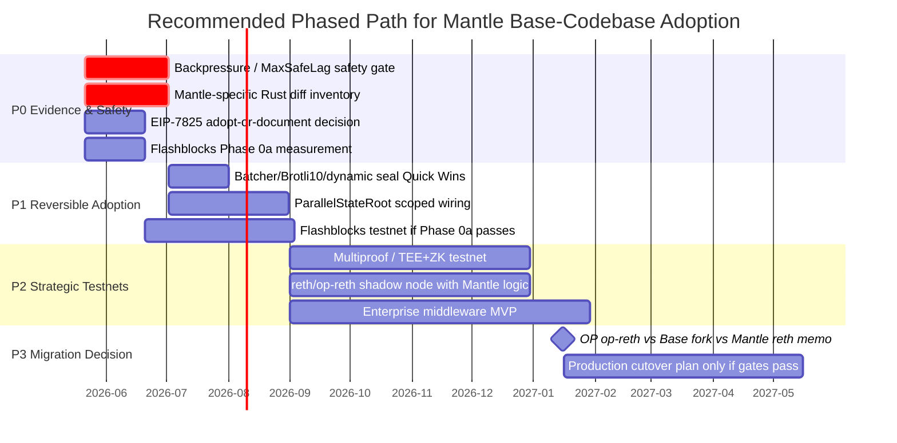
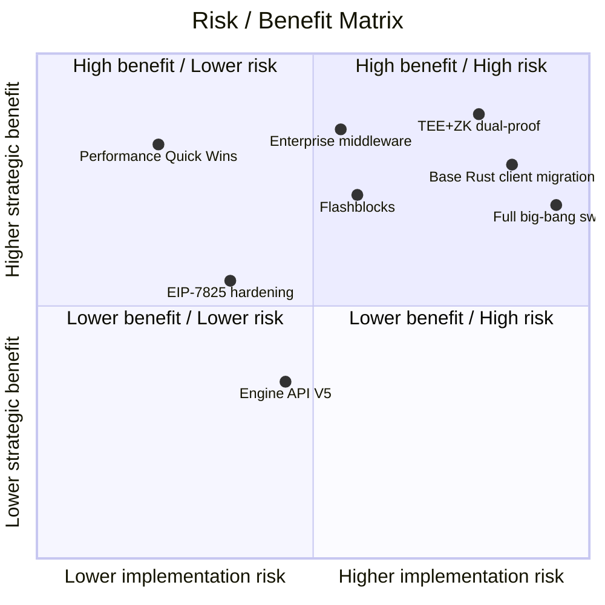
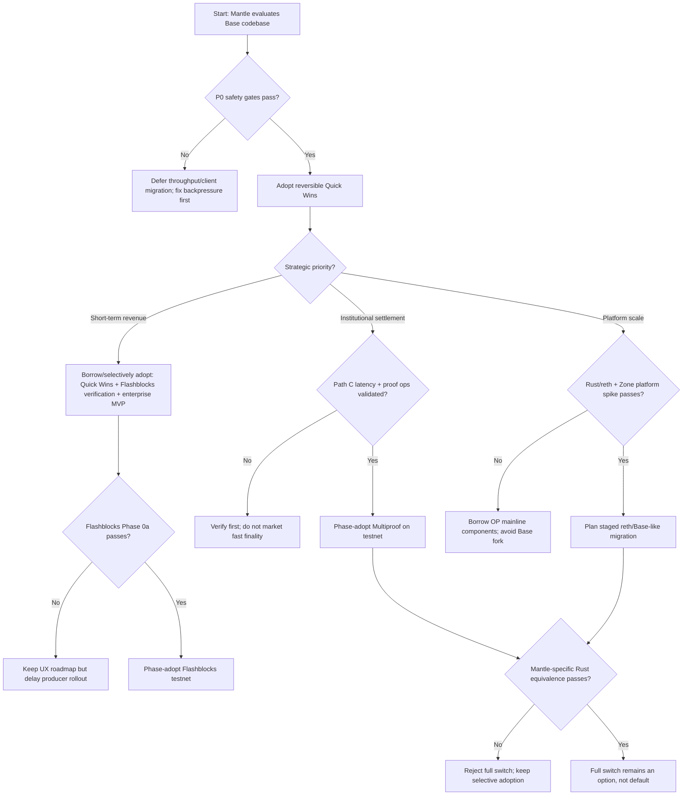
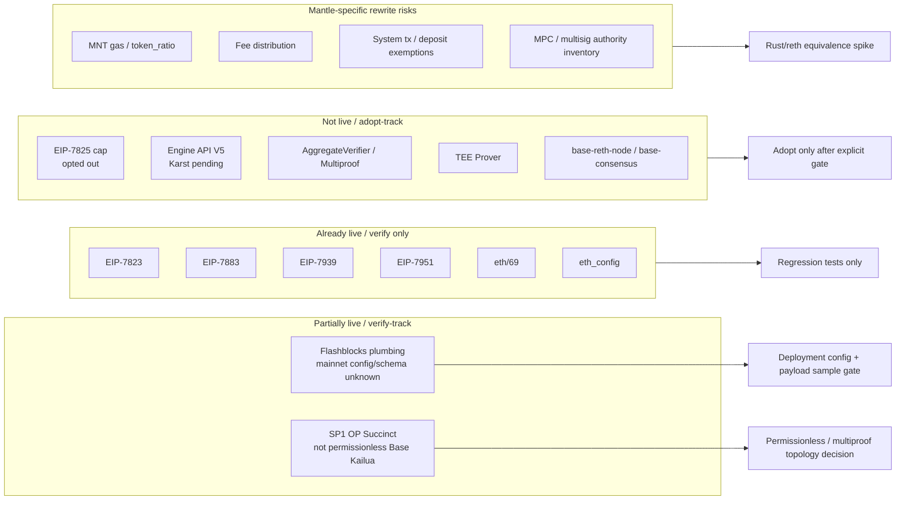

# Mantle 切换 Base Codebase 综合评估与建议

## 1. Executive Summary

### 1.1 决策建议

本轮综合建议是：**不要立即做 Base codebase 全量切换；采用 "分阶段采纳 + 强 gate 的可逆迁移" 作为主路径**。Mantle 应先完成 P0 安全与证据收集，优先落地不依赖全量切换的 Quick Wins；随后验证 Flashblocks、EIP-7825、op-reth/reth 迁移、TEE+ZK dual-proof 的真实 ROI 与兼容性；只有在 Rust/reth 迁移 spike、Mantle-specific 功能重实现清单、Flashblocks mainnet schema、ZK 证明延迟和 Base 上游维护模型全部通过 gate 后，才进入 Base codebase 深度迁移。

**结论分层**：

1. **架构维度**：Base codebase 的最高价值在 TEE+ZK dual-proof、Stage 2 路径、Base 自有 Rust 客户端与原子升级能力；但这些收益绑定 Go->Rust 迁移、Base/reth 双上游维护、证明系统运维和 Mantle-specific 逻辑重写。适合 "verify first, phase adopt"，不适合 big-bang。
2. **性能维度**：性能差距的主因是 demand-bound，而不是 Mantle 当前供给侧天花板不足。可在不全量切换的情况下先做 Batcher 参数、Brotli10、dynamic seal、背压恢复、EIP-7825 等 P0/P1 工作。Flashblocks 对 UX 有高价值，但 ROI 依赖 timing-recoverable 空块比例，必须先做 Phase 0a。
3. **企业/ToB 维度**：Base codebase 是增强版 L2 底座，不是完整企业解决方案。它对机构结算和平台规模战略有正增量，对短期企业收入反而可能因迁移成本和上市时间下降而弱于标准 L2 路径。RWA、合规稳定币、Payment L3 是最佳适配；xStocks HFT 和强隐私供应链不是 Base codebase 能直接解决的场景。

**一句话建议**：Mantle 应把 Base codebase 当作可借鉴和可分阶段迁移的能力包，而不是一次性替换目标。优先顺序是 P0 安全与 Quick Wins -> Flashblocks 验证 -> EIP-7825/Engine V5/Karst 跟踪 -> op-reth/reth 迁移 spike -> TEE+ZK dual-proof testnet -> 决策是否深度迁移。

### 1.2 为什么不是全量切换

全量切换的收益是真实的，但收益确定性与落地节奏不均衡：

| 维度 | 全量切换收益 | 主要扣分项 | 本 draft 判断 |
|---|---|---|---|
| 架构 | TEE+ZK dual-proof、Stage 2 路径、统一 Rust codebase、Base 上游能力预集成 | Go->Rust 迁移、客户端多样性下降、MNT gas/fee/system tx 重写、Base fork 维护 | 长期有价值，短期不宜一次性切 |
| 性能 | Flashblocks <=250ms、ParallelStateRoot、5-actor pipeline、reth 生态 | 当前 demand-bound；Quick Wins 不需要全量切换；Flashblocks ROI 未验证 | 先做可逆 Quick Wins 和 Phase 0a |
| ToB | RWA/合规稳定币/机构结算信心提升，L3 Zone 模块化空间 | 隐私、身份、访问控制、合规审计仍需独立开发；模型 A 低于标准 L2 | 适合作为企业底座增强，不是企业产品本身 |

### 1.3 关键日期与证据状态

- `op-geth` EOL：2026-05-31 是 hard date，构成 Mantle 必须处理执行层迁移或自维护的外部约束 [architecture §1, §2.7; mantle-impact §1, §4]。
- Base Azul mainnet：2026-05-28 18:00 UTC 是 `base/base` code-set timestamp；公开 spec 在上游研究快照中仍标注 mainnet TBD。因此它是规划参考，不应作为不可变承诺日期 [base-strategy §1; architecture §1; mantle-impact §1]。
- Mantle 当前兼容性：6/13 Azul canonical features 已 live，2/13 partially live（Flashblocks plumbing、SP1 ZK），5/13 not live；Flashblocks mainnet config 与 Base Azul payload schema 未验证 [mantle-impact §1, §3-5]。

---

## 2. Item Findings

### 2.1 item-1: 决策层综合结论框架

**decision_question**：Mantle 应该全量切换 Base codebase、分阶段切换、只借鉴，还是暂缓？

**结论**：推荐 **phase_adopt / verify_first**。不建议现在承诺全量切换；也不建议完全不借鉴。理由是三份主研究一致显示：Base 的架构/性能/企业能力增量显著，但收益释放条件不同，且风险集中在一次性切换路径。

**高管口径**：

1. **切换的核心价值不是 TPS 立刻暴涨，而是安全信任、最终性路径、客户端维护模式和企业底座上限**。性能 Quick Wins 大多可先独立落地；Base codebase 的差异化价值主要体现在中长期架构与企业信任。
2. **短期业务收入优先时，Base codebase 不一定优于标准 L2 演进**。企业适配研究的模型 A 显示 Base codebase 3.90 低于标准 L2 4.15，迁移成本与上市时间扣分超过能力提升 [enterprise §2.1, §2.9]。
3. **机构结算或平台规模优先时，Base codebase 才明显加分**。模型 B 中 Base 3.70 高于标准 L2 3.30；模型 C 中 Base 3.70 高于标准 L2 3.45 [enterprise §2.1, §2.7]。
4. **最保守且有效的默认路径是先借鉴、再分阶段切换**：先做 P0 safety gates、Quick Wins、Flashblocks verification、Mantle-specific Rust spike，再决定是否进入 reth/Base 深迁移。

**primary_evidence**：

- Architecture final：TEE+ZK dual-proof 排名第一；Base 自有客户端第二；Flashblocks 第三；推荐渐进式采纳 [architecture §2.7]。
- Performance final：Mantle 当前 demand-bound；Batcher Quick Wins 可把 saturated ceiling 从约 36 TPS 提升至约 1,083 TPS；DA Throttling 是 P0 前置 [performance §1, §10-11]。
- Enterprise final：Base codebase 是增强版 L2，不直接解决隐私/身份/合规间隙；模型 A/B/C 结果高度分化 [enterprise §1, §2.7-2.9]。
- Mantle impact final：EIP-7825 not_live，Flashblocks partially_live 但 mainnet config/schema 未验证，base-reth-node not_live [mantle-impact §1, §3-5]。

**evidence_confidence**：medium-high。三份主 section 已完成 final 并包含 adversarial 修订；兼容性结论有代码锚点。仍未确认的是 Mantle 生产部署配置、团队 Rust 迁移能力、Base Azul mainnet 正式激活公告和 ZK 证明延迟基准。

**recommendation**：`phase_adopt`。

---

### 2.2 item-2: 三维度综合优势评估矩阵

#### 2.2.1 Scoring Formula

为回应 outline review caveat，本 draft 明确使用如下公式。所有单项基础分均为 1-5 分。

```text
certainty_adjusted_score = importance_score × feasibility_score × certainty_score / 25

strategy_weighted_value(strategy) =
  certainty_adjusted_score × strategic_weight(strategy)

normalized_value(strategy) =
  strategy_weighted_value(strategy) / 5
```

解释：

- `importance_score`：该能力对 Mantle 总体战略的重要性，1=边缘，5=战略核心。
- `feasibility_score`：工程、组织、上游成熟度、审计和运维可实现性，1=极难，5=较易。
- `certainty_score`：收益确定性，扣除 demand-bound、Path C 条件性、Flashblocks ROI 未验证、Base mainnet date caveat 等，1=低，5=高。
- `strategic_weight(strategy)`：在三种战略下的权重，1=低相关，5=核心相关。
- `certainty_adjusted_score` 仍在 0.2-5 区间内，可与 1-5 框架直观对齐。

三种战略：

- **A 短期收入**：Payment、稳定币、交易 UX、尽快上市。
- **B 机构结算**：RWA、合规稳定币、资管、桥接资金效率、风险委员会信任。
- **C 平台规模**：多租户 L3 Zone、企业平台、长期模块化、Stage 2 / proving / client autonomy。

#### 2.2.2 Dimension Matrix

| 维度/能力包 | importance | feasibility | certainty | certainty-adjusted | A 短期收入权重 | B 机构结算权重 | C 平台规模权重 | 主要证据 | 结论 |
|---|---:|---:|---:|---:|---:|---:|---:|---|---|
| TEE+ZK dual-proof / Multiproof | 5 | 2 | 3 | 1.20 | 2 | 5 | 4 | PROOF_THRESHOLD=1；Path C `min(createdAt+7d, secondProofAt+1d)`；Mantle AggregateVerifier not_live | verify_first -> phase_adopt |
| Base 自有 Rust 客户端 / reth path | 5 | 2 | 3 | 1.20 | 2 | 3 | 5 | op-geth EOL hard date；base-reth-node/base-consensus 两个 Base 自有二进制；Mantle not_live | verify_first |
| Flashblocks / Builder 分离 | 4 | 3 | 3 | 1.44 | 5 | 3 | 3 | <=250ms UX；Mantle op-conductor plumbing partially_live；mainnet config/schema unknown | verify_track -> phase_adopt |
| Performance Quick Wins | 4 | 5 | 4 | 3.20 | 5 | 2 | 4 | MaxPendingTx/TargetNumFrames/Brotli10/dynamic seal；~36 -> ~1,083 TPS saturated | adopt_now |
| EIP-7825 / gas protocol hardening | 3 | 4 | 5 | 2.40 | 2 | 3 | 2 | Mantle constant exists but `!IsOptimism()` opt-out；DoS hardening | adopt_or_document |
| Enterprise middleware / compliance layer | 5 | 3 | 4 | 2.40 | 4 | 5 | 5 | Base does not solve privacy/identity/compliance; independent Predeploy/middleware roadmap required | build_independently |
| L3 Zone / modular platform extension | 4 | 3 | 3 | 1.44 | 3 | 2 | 5 | Best fit for platform scale; requires Zone tooling and cross-Zone protocol | phase_adopt |

#### 2.2.3 Sensitivity View

将 `certainty_adjusted_score × strategic_weight` 作为敏感性得分，越高表示该战略下越应优先投入。

| 能力包 | A 短期收入 | B 机构结算 | C 平台规模 | 敏感性解读 |
|---|---:|---:|---:|---|
| Performance Quick Wins | **16.00** | 6.40 | **12.80** | 短期收入和平台规模都应立即做；不要求全量切换 |
| Enterprise middleware / compliance layer | 9.60 | **12.00** | **12.00** | 三种战略都必须做；Base codebase 不能替代 |
| Flashblocks / Builder 分离 | **7.20** | 4.32 | 4.32 | 短期收入最敏感，但必须先做 mainnet config/schema/empty-block attribution gate |
| EIP-7825 / gas hardening | 4.80 | 7.20 | 4.80 | 机构客户更重视安全 posture；工程相对可控 |
| TEE+ZK dual-proof | 2.40 | **6.00** | 4.80 | 机构结算优先时价值最高；Path C 条件性降低短期分 |
| Base Rust client / reth path | 2.40 | 3.60 | **6.00** | 平台规模/长期维护收益更高；短期收入不应被它阻塞 |
| L3 Zone / modular platform | 4.32 | 2.88 | **7.20** | 平台规模战略才应显著提前投入 |

**敏感性结论**：

- **短期收入战略**：先做 Performance Quick Wins、Flashblocks verification、企业中间件最小闭环。全量切换 Base codebase 得分不占优。
- **机构结算战略**：TEE+ZK、Path C、Stage 2、EIP-7825、合规中间件权重上升。可以推动 Multiproof testnet，但仍需 ZK 延迟和审计 gate。
- **平台规模战略**：Base Rust client/reth path、L3 Zone、企业平台模块化权重上升。适合启动长期迁移 spike，但不要与 P0 Quick Wins 绑死。

**recommendation**：`phase_adopt`，并按战略方向调整投入权重。

---

### 2.3 item-3: 核心优势 Top-N 清单与量化预期

| Rank | 核心优势 | 量化/预期 | 证据与限制 | 推荐 |
|---:|---|---|---|---|
| 1 | Performance Quick Wins 不依赖全量切换即可释放巨大供给侧空间 | saturated ceiling 约 36 -> 1,083 TPS；成本约 0.1 person-month；Brotli10 +5-15% compression ratio；dynamic seal 0-30ms/block | 当前实际 TPS 仍 demand-bound；背压修复是 P0 前置 [performance §1, §10-11] | `adopt_now` |
| 2 | TEE+ZK dual-proof 提升安全审计信心与 Stage 2 路径 | 单证 7d；双证 Path C 为 `min(createdAt+7d, secondProofAt+1d)`；最快约 1d 级别，但依赖第二证明及时提交 | Mantle AggregateVerifier/TEE not_live；SP1 partially_live 但不是 Base permissionless model [architecture §2.4; multiproof §Executive; mantle-impact §2.10-2.12] | `verify_first` |
| 3 | Flashblocks <=250ms 预确认改善支付/交易 UX | 2s -> <=250ms 感知确认，约 8x UX 改善；empty-block timing-recoverable 场景可提高 gas utilization | Mantle plumbing partially_live；mainnet config 与 Azul schema 未验证；ROI 场景 1.0x-2.13x [performance §4.5; flashblocks-network §Executive; mantle-impact §2.8] | `verify_track` |
| 4 | Base/reth Rust 客户端路径降低长期维护摩擦 | 同仓库同 commit 构建、Cargo workspace 原子升级、reth 生态；op-geth EOL 形成迁移压力 | base-reth-node/base-consensus 是两个独立二进制，不是单进程；Go->Rust 与 Mantle-specific 重写成本高 [architecture §2.2, §2.7] | `verify_first` |
| 5 | EIP-7825 / Osaka 对齐提升 DoS posture 与 L1 等价性 | per-tx cap 16,777,216 gas；Mantle 已 live 4/5 Osaka EIPs + eth/69/eth_config，仅 7825 not_live | Mantle `!IsOptimism()` opt-out 明确；需处理 deposit/system tx 豁免与生态通知 [osaka §item-1; mantle-impact §2.2] | `adopt_or_document` |
| 6 | Builder 分离与 MEV/排序控制为 ToB 产品提供 future option | rollup-boost builder-first + fallback policy；可为支付/RWA 的稳定 UX 和排序策略留接口 | rollup-boost 不是 CPU offload；更多是 gas utilization / preconfirm UX / builder policy [performance §4.1; base-vs-optimism-flashblocks §Executive] | `phase_adopt` |
| 7 | L3 Zone / 模块化平台空间增强企业产品线 | RWA、合规稳定币、Payment L3 适配较好；平台规模战略有正向加权 | Base codebase 不提供隐私、身份、访问控制、合规审计；仍需企业中间件和 Zone 工具链 [enterprise §1, §2.8-2.9] | `build_independently_on_enhanced_l2` |

**重要限定**：上述 Top-N 不等价于 "全量切换 Top-N"。其中 Performance Quick Wins、EIP-7825、部分 Flashblocks verification 和企业中间件都可在不全量切换 Base codebase 的条件下启动。

---

### 2.4 item-4: Mantle 现有特性兼容性与整合缺口

#### 2.4.1 Compatibility Matrix

| Mantle 现有/相关能力 | 当前状态 | 与 Base codebase 关系 | 主要缺口 | 建议 |
|---|---|---|---|---|
| MPC / 多签 / 治理控制面 | verify_track | Base codebase 保留 OP 风格合约治理面，但 Multiproof 新增 TEE/ZK registrar/verifier 管理面 | 需要确认 Mantle 现有 MPC/多签是否覆盖 AggregateVerifier、TEEProverRegistry、ZKVerifier、ProxyAdmin 等新增权力 | 做 governance authority inventory |
| EigenDA / Arsia 后 DA 切换 | partially_live / changed | Mantle 已从 EigenDA 走向 4844 blobs；Base codebase 本身不解决私有 DA/Validium | Arsia date 有 L2BEAT vs config timestamp delta；企业私有 DA 仍未实现 | 以 on-chain config 为行为准；企业 DA 另建路线 |
| SP1 / OP Succinct ZK Prover | partially_live | Mantle 已有 SP1-based OP Succinct；Base Kailua-style permissionless harness 未验证 | AggregateVerifier 不存在；permissionless prover interface 不在 mantle-v2 repo | 保留现有 SP1，评估 permissionless + multiproof topology |
| Flashblocks plumbing | partially_live | op-conductor 已有 rollup-boost WS handler、flags、service lifecycle、tests、Kurtosis devnet | `RollupBoostWsURL` mainnet config unknown；payload schema vs Base Azul unknown | 作为 verify-track，不要宣传 full parity |
| MNT gas / token_ratio / BVM_ETH | Mantle-specific | Base/reth 迁移需在 Rust/revm 路径重实现 | per-tx overhead、state transition 修改、fee accounting 未量化 | Rust spike + exhaustive diff inventory |
| Fee 分配逻辑 | Mantle-specific | Base codebase 没有 Mantle fee policy | L1/L2 fee、MNT economics、sequencer revenue split 需重写/审计 | 迁移 gate 必须包含 economic equivalence tests |
| 特殊 system transaction | Mantle-specific | EIP-7825 和 Base deposit exemption 不能直接套用 | 哪些 system tx 应豁免 per-tx cap 未明确 | tx type inventory + explicit tests |
| op-geth / op-node 运维栈 | live legacy | Base path 替换为 base-reth-node + base-consensus 或 OP op-reth/kona path | Go->Rust、observability、runbooks、incident playbook 迁移 | 先做 shadow node / non-consensus validation |
| Engine API V5 | not_live | Base Azul uses V5 envelope + V4 payload pattern；Mantle production op-node 无 V5 dispatch | OP Stack Karst pending；test stubs only | 跟踪 Karst，不作为短期 blocker |
| EIP-7825 | not_live | Base 已执行；Mantle constant exists but opted out | dApp 预期差异与 DoS posture | adopt 或明确 document permanent opt-out |

#### 2.4.2 Compatibility Takeaways

1. **Mantle 已 live 的部分不能被重复计算为切换收益**：EIP-7823/7883/7939/7951/7642/7910 已 live，Base codebase 对这些的边际收益较低 [mantle-impact §1, §3]。
2. **Flashblocks 是 "代码存在但生产/Schema 未验证"**：把它计为 full live 会误导；把它计为 absent 也不准确。正确处理是 verify-track [mantle-impact §2.8, §5]。
3. **SP1 已经是 Mantle 的资产，不应被 Base codebase 叙事吞掉**：Base 的增量是 multiproof/permissionless/topology，不是 "有 ZK" 本身。
4. **Base full switch 最大的兼容性成本在 Mantle-specific economics 与 system tx**：这决定了 reth/Rust 迁移是否可行，必须在决策前量化。

**recommendation**：`verify_first`。

---

### 2.5 item-5: 风险与挑战严重程度排序

| Rank | 风险 | Severity | Likelihood | 触发条件 | 缓解 / Gate | 默认保守选择 |
|---:|---|---|---|---|---|---|
| 1 | Mantle-specific economics / MNT gas / fee / system tx 在 Rust 中重实现失败或偏离 | critical | medium | 进入 base-reth/reth migration 前未完成行为等价测试 | 完整 diff inventory；state-transition golden tests；economic invariant tests；shadow node | 不进入全量切换 |
| 2 | 背压缺失下提升吞吐造成 unsafe span 或 DA fee spiral 风险 | critical | medium | 在 DA Throttling / MaxSafeLag 修复前调高 batcher/sequencer 吞吐 | P0 backpressure gate；恢复 DA Throttling RPC；SequencerMaxSafeLag | 先修背压再提吞吐 |
| 3 | Go->Rust / reth 迁移导致客户端多样性与运维能力下降 | high | high | op-geth 替换为 reth-only production path | Shadow validation；保留 op-geth 非共识验证；Rust on-call readiness；upstream participation | 先 OP op-reth path，不直接 Base fork |
| 4 | Base 上游 fork 维护成本过高 | high | medium | Mantle 长期跟踪 base/base + reth + OP Stack 三方变化 | 优先采用 OP Stack 主线组件；建立 upstream rebase policy | 借鉴而非 fork whole stack |
| 5 | Flashblocks ROI 不达预期 | high | medium | 空块主要 demand-empty，而非 timing-recoverable | Phase 0a mempool arrival / empty block attribution；>=20%-50% recoverable threshold | 延后 producer rollout |
| 6 | Flashblocks payload/schema 与 Base Azul 不兼容 | medium | unknown | Mantle WS payload 仍为 pre-Azul shape 或 mainnet not enabled | Capture sample；decode against Azul schema；client compatibility tests | 只声明 plumbing，避免 parity claim |
| 7 | Path C finality 被过度营销 | high | medium | 第二证明延迟接近 day 6 或 ZK queue 不稳定 | 收集 ZK proof latency；用 min() 公式展示 conditional finality | 不承诺固定 1d finality |
| 8 | TEE 硬件/registrar/prover 运维复杂度 | medium-high | medium | 引入 Nitro/TDX/SEV-SNP registrar + key lifecycle | TEE threat model；incident response；attestation tests；audits | 先 testnet |
| 9 | EIP-7825 行为差异破坏 dApp 预期或保留 DoS 面 | medium | medium | Mantle 继续 opt-out 但未通知生态，或开启 cap 未处理豁免 | Governance/product decision；mempool + block validation + estimateGas tests | document opt-out 或 hardfork adopt |
| 10 | 企业隐私/身份/合规间隙被误认为 Base 已解决 | high | high | ToB roadmap 把 Base codebase 当作 enterprise solution | 独立企业中间件 roadmap；privacy/compliance owner | 不把 Base 当成完整 ToB 产品 |
| 11 | OP Stack / Superchain 生态脱钩 | medium | medium | 长期 fork Base-specific contracts/client path | 保持 bridge/settlement interface compatibility；track Karst | 组件级采纳优先 |
| 12 | Base Azul date / upstream spec uncertainty | low-medium | medium | 规划依赖 2026-05-28 作为已承诺 mainnet date | Treat as code-set target; revalidate official specs | 以 op-geth EOL 为主锚 |

**最高优先级风险门槛**：若 Rank 1-3 未通过，不能进入全量切换；若 Rank 5-7 未通过，不能对外承诺 Flashblocks/fast-finality 产品收益；若 Rank 10 未处理，不能把 Base codebase 作为 ToB 方案发布。

---

### 2.6 item-6: 切换路径方案比较

#### 2.6.1 Path Comparison

| 路径 | 描述 | 收益 | 风险 | 适用条件 | 本 draft 建议 |
|---|---|---|---|---|---|
| Path A: 全量切换 | 直接迁移到 Base codebase：base-reth-node/base-consensus/AggregateVerifier/Flashblocks/Engine V5 | 一次获得完整能力包，长期架构统一 | 最大 blast radius；Mantle-specific 重写；Rust 运维；Base fork 维护 | 只有在所有 gate 全通过且战略明确转向机构结算/平台规模时 | 暂不推荐 |
| Path B: 分阶段切换 | 先 Quick Wins 与 safety；再 Flashblocks；再 proof/client testnet；最后决定 production cutover | 可逆、可度量、风险隔离 | 总周期更长，需要强 PM/governance discipline | 当前最匹配证据状态 | 推荐 |
| Path C: 只借鉴/选择性采用 | 不切换 Base fork，只 backport EIP-7825、Flashblocks OP mainline、Batcher/DA/Sequencer improvements、enterprise middleware | 最低风险，最快释放一部分收益 | 无法完整获得 Base multiproof/client integration；长期可能继续维护 legacy stack | 短期收入优先或 Rust 迁移能力不足 | 推荐作为默认初始模式 |
| Path D: 暂缓 | 维持现状，仅观察 OP Stack Karst/Base Azul | 避免错误迁移 | 错过 op-geth EOL 和安全/性能 Quick Wins；DoS posture 不变 | 仅在资源极度不足时 | 不推荐 |

#### 2.6.2 Recommended Timeline

```text
P0 0-6 weeks: evidence and safety gates
- Restore/verify DA backpressure and SequencerMaxSafeLag before throughput increases.
- Build Mantle-specific economics/system-tx diff inventory.
- Decide EIP-7825: adopt with explicit exemptions or document permanent opt-out.
- Run Flashblocks Phase 0a: mempool arrival, empty-block attribution, mainnet config, payload schema sample.
- Launch reth/Rust spike for MNT gas, fee logic, system tx, observability.

P1 6-12 weeks: reversible Quick Wins and verify-track adoption
- Apply Batcher params, Brotli10, dynamic seal after P0 safety gate.
- Wire ParallelStateRoot / state-root task if scoped independently.
- If Flashblocks Phase 0a passes, test op-reth flashblocks consumer + rollup-boost/op-rbuilder on testnet.
- Produce public-facing compatibility notes for EIP-7825 and Flashblocks status.

P2 3-6 months: strategic testnets
- Multiproof/AggregateVerifier testnet with existing SP1 path and optional TEE prover.
- Shadow reth/op-reth node with Mantle-specific economics tests.
- Enterprise middleware MVP: RPC auth, identity/compliance registry, audit log, sequencer policy hook.

P3 6-12 months: migration decision
- Decide OP op-reth path vs Base fork path vs self-maintained Mantle reth fork.
- Only if P2 passes: production cutover plan for reth-based EL/CL and proof system.
- Keep rollback and non-consensus validation path.

P4 12-18+ months: full platform expansion
- L3 Zone / enterprise platform, hybrid/private DA, privacy/compliance proving, multi-zone tooling.
```

#### 2.6.3 Path Recommendation

**Recommended path**：Path B + Path C hybrid。也就是：先按 "只借鉴/选择性采用" 获得低风险收益；同时启动分阶段切换 gates；等证据充分后再决定是否进入 full Base-like architecture。

**不推荐 big-bang 的根本原因**：当前证据中最确定的收益（Quick Wins、EIP-7825、部分 Flashblocks verification）并不需要全量切换；最差的风险（Mantle-specific 重写、Rust 运维、Base fork 维护、企业间隙）恰恰由全量切换引入。

---

### 2.7 item-7: ToB 业务战略影响分析

#### 2.7.1 战略模型映射

| ToB 战略 | Base codebase 影响 | 主要受益场景 | 主要限制 | 建议 |
|---|---|---|---|---|
| 模型 A: 短期企业收入 | 相对标准 L2 为 -0.25；迁移成本/上市时间扣分显著 | Payment UX、稳定币转账、非 HFT 交易体验 | 不应让 full migration 阻塞产品上市 | 选择性采用，Quick Wins 优先 |
| 模型 B: 机构结算基础设施 | 相对标准 L2 为 +0.40；终局性/安全信心/自主权权重最高 | RWA、合规稳定币、资管、桥接资金解锁 | Path C 条件性；合规/身份/隐私仍需独立开发 | Multiproof testnet + enterprise middleware |
| 模型 C: 企业平台规模 | 相对标准 L2 为 +0.25；模块化/L3 Zone/Stage 2 价值更高 | 多租户 L3 Zone、Payment Zone、企业平台 | 需要大量 Zone tooling、privacy/DA/cross-zone 开发 | reth/client spike + L3 roadmap |

#### 2.7.2 场景适配排序

| 场景 | 适配度 | Base codebase 贡献 | 未解决问题 | 推荐路径 |
|---|---|---|---|---|
| RWA / 代币化资产 | high | Multiproof 审计信心、Path C 有条件快速最终性、Flashblocks UX | DVP 硬终局、隐私、合规、托管/储备证明 | 模型 B 优先；proof + compliance middleware |
| 合规稳定币 | high | 安全信任、支付 UX、EIP-7825 DoS posture、L3/issuer path | 储备证明、冻结/合规策略、身份层 | L2+L3 hybrid |
| Payment L3 | medium-high | <=250ms preconfirm、Quick Wins、Zone 内更强语义空间 | 商户最终提款仍受 L2/L1 finality；>10K TPS 需 L3 | Quick Wins + Flashblocks gate |
| 资管 | medium | 安全信心、审计轨迹、模块化扩展 | 权限、审计、策略合规需中间件 | 先 enterprise MVP |
| xStocks 非 HFT | medium | 预确认 UX、EVM 兼容 | 硬终局不够快；监管/合规复杂 | 非 HFT only |
| xStocks HFT | low | Flashblocks 是软确认，不是亚秒硬终局 | L2 无法给亚秒确定性硬终局 | 不以 Base L2 作为核心方案 |
| 供应链/强隐私业务 | low-medium | 模块化底座有限帮助 | 隐私、选择性披露、企业数据边界未解决 | 需 private DA/privacy layer |

**ToB strategic conclusion**：Base codebase 会加速 Mantle 的机构结算和平台规模叙事，但不会自动加速短期 ToB 收入；它更像 "可信、高性能、可扩展 L2 底座"，不是 "可直接销售的企业链产品"。

---

### 2.8 item-8: 行动建议、决策门槛与后续验证清单

#### 2.8.1 Decision Gates

| Gate | Owner 类型 | 所需证据 | Pass 后动作 | Fail / unknown 默认 |
|---|---|---|---|---|
| G0 Backpressure Safety | Infra / Protocol Eng | DA Throttling restored; MaxSafeLag non-zero; unsafe span bounded under load | 允许调高 Batcher/sequencer throughput | 不提升吞吐 |
| G1 Mantle-specific Rust Feasibility | EL / Economics Eng | MNT gas、fee、system tx、token_ratio 行为等价 tests；Rust spike estimate | 进入 reth/op-reth shadow node | 不做 full switch |
| G2 EIP-7825 Decision | Protocol / Governance | 超大 tx 使用情况；deposit/system tx exemption list；mempool/block/RPC tests | adopt cap 或公开 document opt-out | 维持 opt-out 但必须披露 |
| G3 Flashblocks ROI | Sequencer / Data Eng | timing-recoverable empty-block ratio；mempool arrival traces；rollup-boost config | 启动 testnet Flashblocks | 延后 producer |
| G4 Flashblocks Schema | Infra / RPC | Live payload sample；Azul schema compatibility；client parser tests | 对外声明兼容级别 | 仅声明 plumbing |
| G5 Path C Finality | Proof / Security | ZK proof latency distribution；TEE/ZK prover reliability；audit result | testnet multiproof / institution pitch | 不承诺 fast finality |
| G6 Enterprise Middleware | Product / Enterprise Eng | Identity, access-control, audit, compliance, privacy roadmap with owners | ToB launch on enhanced L2 | 不把 Base 作为 enterprise solution |
| G7 Upstream Strategy | CTO / Protocol Leads | OP op-reth vs Base fork vs Mantle reth decision memo; maintenance staffing | Production migration planning | stay selective |

#### 2.8.2 Immediate Action List

1. **This week**：将 op-geth EOL 风险与 EIP-7825 opt-out 写入决策 memo；明确 Mantle 是否独立维护 legacy op-geth。
2. **0-2 weeks**：完成 DA backpressure / MaxSafeLag / batcher parameter safety gate，再执行 Quick Wins。
3. **0-3 weeks**：Flashblocks Phase 0a：empty-block attribution、mainnet op-conductor config、payload sample、schema diff。
4. **0-4 weeks**：Mantle-specific Rust/reth spike：MNT gas、fee split、system tx、token_ratio、observability。
5. **1-2 months**：企业中间件 MVP plan：identity/compliance registry、audit logs、RPC auth、sequencer policy hooks。
6. **3-6 months**：Multiproof testnet only after Path C latency and TEE/ZK operations evidence is available.

#### 2.8.3 Final Decision Rules

| 最终状态 | 触发条件 |
|---|---|
| `adopt_now` | 仅限 Quick Wins、背压安全修复、Brotli10/dynamic seal 等可逆且证据充分的项目 |
| `phase_adopt` | Flashblocks、EIP-7825、ParallelStateRoot、enterprise middleware 等通过局部 gate 的项目 |
| `verify_first` | TEE+ZK dual-proof、Base/reth client migration、Engine V5/Karst、permissionless ZK |
| `borrow_only` | 若 Rust spike 失败或 Base fork 维护不可接受，则只借鉴 OP mainline/reth/Flashblocks/Osaka 能力 |
| `defer` | 若 demand remains low、Flashblocks ROI 低、Path C latency 不可控，则延后高成本项目 |
| `reject_full_switch` | 若 Mantle-specific economics 无法等价重写或团队无法承担 Rust/Base fork 运维 |

---

## 3. Diagrams

### diag-1: 三维度综合评估雷达图

Mermaid 不支持原生 radar，本图用 xychart 将三维度在 `importance / feasibility / certainty / risk_adjusted` 四项上展开；`risk_adjusted` 对应 certainty-adjusted score 的 1-5 直观归一。

```mermaid
xychart-beta
  title "Mantle -> Base Codebase 三维度综合评分"
  x-axis ["Architecture", "Performance", "Enterprise"]
  y-axis "Score (1-5)" 0 --> 5
  bar "Importance" [5, 4, 5]
  bar "Feasibility" [2, 5, 3]
  bar "Certainty" [3, 4, 4]
  line "Risk-adjusted" [2.6, 3.8, 3.2]
```



### diag-2: 切换路径时间线图



### diag-3: 风险收益矩阵图



### diag-4: 决策树图



### diag-5: Mantle 现有特性兼容性矩阵



---

## 4. Source Coverage

| ID | Requirement | Coverage | How met / caveat |
|---|---|---|---|
| src-1 | `architecture-advantage-summary/final.md` | full | Used for TEE+ZK, Base client architecture, Flashblocks ranking, risk assessment, gradual adoption path, date caveats. |
| src-2 | `performance-advantage-summary/final.md` | full | Used for demand-bound diagnosis, Quick Wins, TPS milestones, backpressure P0, Flashblocks ROI scenario, component weights. |
| src-3 | `enterprise-tob-adaptability/final.md` | full | Used for model A/B/C sensitivity, ToB scenario ranking, enterprise gaps, decision framework. |
| src-4 | `base-azul-upgrade/research-sections/mantle-impact-assessment/final.md` | full | Used for 13-feature Mantle compatibility matrix, EIP-7825 opt-out, Flashblocks partially_live, SP1/DA timeline, BREAK-CHANGE list. |
| src-5 | Base Azul final sections | full | Used `base-strategy-azul-overview`, `flashblocks-network-changes`, `base-vs-optimism-flashblocks`, `multiproof-architecture`, `multiproof-provers-challengers`, `osaka-evm-changes`. |
| src-6 | Mantle official docs/repo | partial | Satisfied mainly through integrated code analysis in `mantle-impact-assessment` against `mantlenetworkio/op-geth@9c428cf` and `mantle-v2@fccacf5b`; this draft did not independently re-fetch Mantle official docs beyond those artifacts. |
| src-7 | Code analysis | full_via_integrated_code_analysis | Relies on upstream final sections with line-level anchors for op-geth, mantle-v2, base/base, base/contracts, rollup-boost, op-rbuilder, op-reth paths. |
| src-8 | Base / Optimism / OP Stack official docs/specs | full | Covered via Base specs, OP docs, `base-strategy`, `flashblocks-network-changes`, `osaka`, and op-geth EOL evidence inherited from final sections. |
| src-9 | Expert / industry sources | partial | Covered via final sections citing L2BEAT, Succinct, Flashbots, Paradigm/reth, Base blog; this synthesis does not add new external industry sources. |

---

## 5. Gap Analysis

| Gap | Severity | Impact | Mitigation |
|---|---|---|---|
| Mantle production deployment config for Flashblocks unavailable | high | Cannot determine whether Flashblocks is product-live or just code-present | Pull production `op-conductor` invocation and payload sample |
| Mantle-specific Rust migration cost unquantified | critical | Full switch cost and risk cannot be estimated | Diff inventory + Rust spike + golden tests |
| Path C proof latency unavailable | high | Fast finality may be overestimated | Collect Base/Mantle testnet ZK proof latency distributions |
| Enterprise middleware roadmap not part of Base codebase | high | ToB recommendation could overstate Base contribution | Treat privacy/identity/compliance/audit as separate workstream |
| Base Azul mainnet date still code-set/spec-TBD in source artifacts | low-medium | Timeline planning uncertainty | Revalidate official specs before calendar commitments |
| Strategic weights are analyst-defined | medium | Different Mantle priorities may reorder recommendations | Provide formula and sensitivity table; Mantle leadership should recalibrate weights |

---

## 6. Revision Log

| Round | Change | Notes |
|---|---|---|
| 1 | Initial deep draft | Covers all eight outline items, explicit scoring formula, sensitivity view across three strategies, five Mermaid diagrams, source coverage and gap analysis. |
