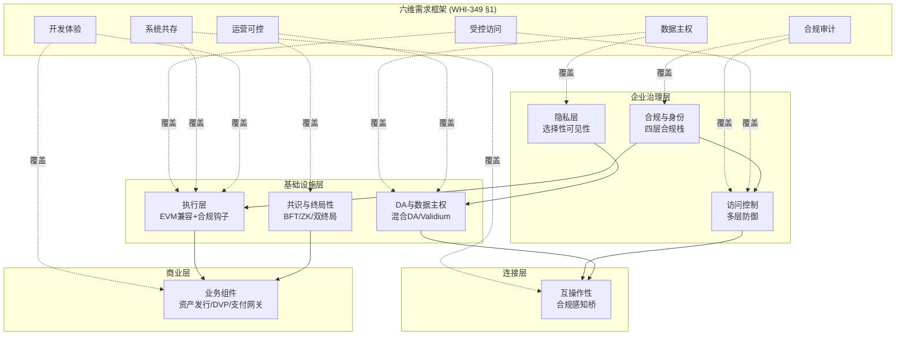
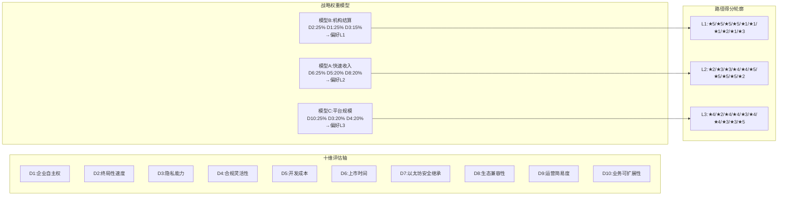
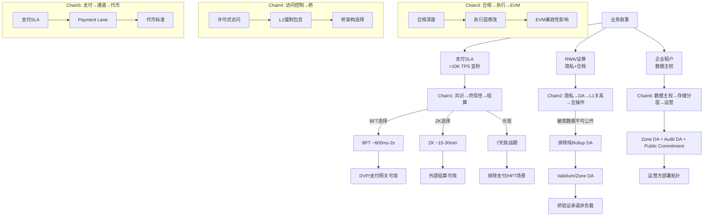
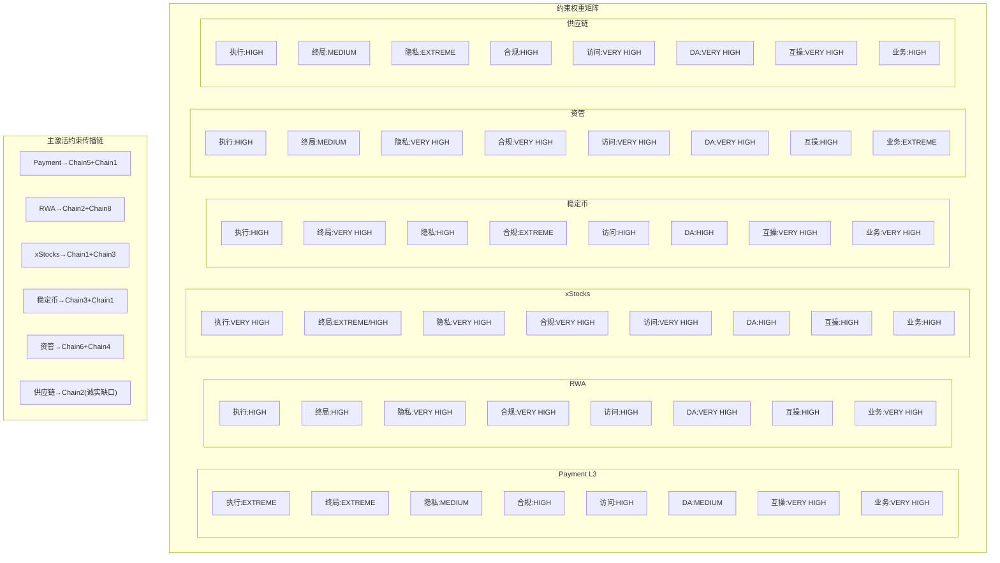

# 企业级区块链核心需求与评估框架

## Executive Summary

本研究从 mantle-enterprise-blockchain 项目的八份核心文档（WHI-386~390、WHI-343/348/349/350 及 M3 可行性设计报告 WHI-354）中，系统提取了企业级区块链的八大核心组件需求，建立了覆盖六类 ToB 业务场景的差异化需求矩阵，构建了十维评估框架与三组战略权重模型，梳理了八条约束传播链，并将需求映射到 Mantle codebase 的四层架构（middleware / op-node / op-geth + predeploy / data layer）。

核心发现：

1. **需求不可分割**：八大核心组件（执行层、共识与终局性、隐私层、合规与身份、访问控制、DA 与数据主权、互操作性、业务组件）形成耦合系统，隐私决策改变 DA 模型，合规深度影响 EVM 兼容性，终局性语义决定结算产品设计（WHI-386 §3）。

2. **场景驱动差异化**：六类 ToB 场景（Payment L3、RWA/代币化资产、xStocks/证券、合规稳定币、资管、供应链）在八大组件上的约束权重呈现显著差异。Payment L3 的执行层和终局性需求为 EXTREME，而 RWA 场景的隐私和合规需求达到 VERY HIGH（WHI-388 §6、WHI-389 §5.2）。

3. **约束传播决定架构**：八条核心约束传播链展示了设计选择如何级联影响下游组件。最关键的传播链是"隐私→DA→L1 关系→互操作性"，因为敏感数据不能上链的约束直接排除了纯 Rollup DA 模式（WHI-386 §3, lines 505-514）。

4. **Mantle 间隙集中于隐私层**：WHI-350 的九维间隙分析显示数据隐私为唯一 Critical 级间隙，访问控制/身份管理/合规审计为 High，终局性/DA/互操作性为 Medium，EVM 兼容性无间隙。三阶段路线图估算：Phase 1 约 8 人月、Phase 2 累计约 40 人月、Phase 3 累计约 100 人月。

5. **路径选择由约束链驱动**：L1 路径在终局性（BFT ~600ms-2s）和合规深度上最强但成本最高（$5M-$12M, 18-24 个月）；L2 路径在生态兼容性和上市时间上最优但企业自主权受限；L3 路径在租户隔离和业务可扩展性上最强但硬终局性受限（WHI-390 §5.1）。

---

## Item-1: 八大核心组件需求提取与分类

### 1.1 组件体系总览

WHI-386 §2 将企业区块链架构分解为八大核心组件。这不是一个通用的区块链技术栈描述，而是从 Canton、Prividium、Tempo 和 Mantle 的对比研究中反复发现的"对企业场景具有架构决定性影响"的组件集合（WHI-386 §2, lines 68-71）。

WHI-349 §1 则从需求端提出了六维企业需求框架：数据主权、合规审计、受控访问、系统共存、运营可控、开发体验。两个视角交叉覆盖，组件是实现手段，需求框架是评估标准。

### 1.2 需求维度表：八组件 × 具体需求指标

#### 组件 1：执行层（Execution Layer）

| 需求指标 | 功能需求 | 性能基线 | 企业约束 |
|---|---|---|---|
| EVM 兼容性保持 | 完整 Solidity/EVM 工具链支持 | 标准 EVM opcode 全覆盖 | 任何执行层修改不得破坏 EVM 兼容性（WHI-350 §1.2.9, lines 288-307） |
| 合规执行钩子 | 非绕过式转账检查、身份验证预编译、策略注册表查询 | 合规检查 gas < 2,600/次 | 必须覆盖 delegatecall 路径，防止绕过（WHI-354 §5.1, line 558） |
| 自定义交易类型 | 企业交易信封（租户 ID、身份声明、策略证明、隐私标记） | — | 钱包/RPC/工具链需支持新类型（WHI-388 §2.2, lines 186-194） |
| 支付通道分离 | Payment Lane 隔离支付交易流量 | >10K TPS 支付通道 | 共识级 gas 预算隔离（WHI-387 §2.4, lines 211-239） |

**证据来源**：WHI-386 §2.1（组件定义）、WHI-350 §1.2.9（EVM 无间隙确认）、WHI-354 §5.1 line 558（Transfer Hook 非绕过性）、WHI-387 §2.2 lines 131-137（自定义交易类型）、WHI-388 §2.2（Reth 企业节点）。

**Mantle 现状**：EVM 兼容性完整（WHI-350 §1.2.9 评定 No Gap）。执行层无原生企业策略钩子、无 Payment Lane、无自定义合规交易类型。Sequencer 有交易可见性但未用于合规执行。

#### 组件 2：共识与终局性（Consensus & Finality）

| 需求指标 | 功能需求 | 性能基线 | 企业约束 |
|---|---|---|---|
| 分层终局性语义 | 应用可查询终局性级别、来源、验证人法定人数、证明状态 | — | 终局性必须作为应用面原语暴露（WHI-386 §2.2, line 139） |
| BFT 即时终局 | 2/3+ 验证人阈值证书 | ~600ms-2s（WHI-387 §2.3, lines 181-189） | 需验证人治理和 2/3 诚实假设 |
| ZK 有效性终局 | STARK/SNARK 批量证明 | ~15-30 min 目标（WHI-388 §2.3, line 266） | Prover 成本、证明系统成熟度 |
| 双终局性模型 | BFT 用于日常运营、ZK/L1 用于外部结算 | — | 语义更复杂，需运营监控（WHI-386 §2.2, line 135） |

**证据来源**：WHI-386 §2.2（组件分解）、WHI-349 §4.1 lines 236-244（四种终局性类型表）、WHI-345 §4.3（中间终局性缺口）、WHI-387 §2.3（BFT 时序）、WHI-388 §2.3 lines 262-270（四层终局性）。

**Mantle 现状**：~2s Sequencer 软终局、~12min L1 批次/safe、~1h ZK 硬终局、7 天乐观回退。缺少中间层确定性终局（WHI-349 §4.1, line 256）。WHI-350 §1.2.5 评定 Medium 间隙。

#### 组件 3：隐私层（Privacy Layer）

| 需求指标 | 功能需求 | 性能基线 | 企业约束 |
|---|---|---|---|
| 选择性可见性 | 不同角色（交易方、运营方、审计方、监管方）看到不同数据 | — | 隐私不是"加密一切"而是"精确分配可见性"（WHI-386 §2.3, line 162） |
| 交易内容保密 | 交易条款、支付金额、结算指令对无关方不可见 | — | 对公共 L1 和其他租户均不可见 |
| Validium/私有 DA | 敏感数据不上公链，仅提交状态承诺和证明 | — | DA 降级为运营方信任，需 DAC/退出机制（WHI-386 §2.6, lines 309-310） |
| 选择性披露 | 授权审计方/监管方可访问特定数据 | — | 需查看密钥管理和 Merkle 证明（WHI-354 §2.3, line 209：`0x42...0034` SelectiveDisclosure） |

**证据来源**：WHI-386 §2.3（三种隐私范式表）、WHI-343 §1.2（数据主权模型）、WHI-349 §2.1-2.4（四种隐私模式）、WHI-350 §1.2.1 lines 44-76（Critical 间隙）、WHI-354 §3.1（Validium 双模 DA 设计）。

**Mantle 现状**：**Critical 间隙**（WHI-350 §1.1, line 32）。所有交易数据公开发布至 L1 blobs/calldata。无私有执行环境、无桥接/披露机制。这是唯一的 Critical 级间隙。

#### 组件 4：合规与身份层（Compliance & Identity Layer）

| 需求指标 | 功能需求 | 性能基线 | 企业约束 |
|---|---|---|---|
| KYC/KYB 注册表 | 链上身份注册，存储 tenantId/kycLevel/kycExpiry/status/metadataHash | Gas < 2,600/查询 | 仅状态和哈希上链，全量 PII 离链（GDPR 数据最小化）（WHI-354 §4.2.2, lines 489-498） |
| 制裁筛查 | 256-bit bitmap 覆盖主要制裁名单 | 单 SLOAD 完成检查 | 实时执行，非事后审计（WHI-354 §5.1, lines 551-557） |
| Travel Rule 元数据 | 交易附带发送方/接收方机构信息 | — | 支付场景必需（WHI-386 §2.4, line 202） |
| 四层合规栈 | 外部集成→合规中间件→链上合规合约→核心协议 | — | 深度越深越不可绕过，但 EVM 兼容性成本越高（WHI-354 §5.1, lines 521-559） |

**证据来源**：WHI-386 §2.4（组件分解）、WHI-346 §4.1（合规成熟度分层）、WHI-349 §3.2 lines 183-192（四种身份模型）、WHI-350 §1.2.3-1.2.4（High 间隙）、WHI-354 §4.2.2（Identity 结构体定义）。

**Mantle 现状**：无原生合规或身份层。Sequencer 完整交易可见性是**未开发的天然合规资产**（WHI-349 §6.4, lines 406-415；WHI-354 §5.1, line 549）。WHI-350 评定身份管理和合规审计均为 High 间隙。

#### 组件 5：访问控制层（Access Control Layer）

| 需求指标 | 功能需求 | 性能基线 | 企业约束 |
|---|---|---|---|
| 多层防御 | RPC 认证 + Sequencer 策略 + L1 桥白名单 + Predeploy 策略 + Token 转账钩子 | — | 任何单层控制均不充分（WHI-344 §1.2.2；WHI-349 §1.3, line 48） |
| L1 桥入口过滤 | `OptimismPortal.sol` 添加 `isAllowed` 修饰符 + EnterpriseMode 开关 | — | L1→L2 强制交易是经典绕过路径（WHI-354 §4 lines 415-428） |
| Sequencer 策略引擎 | 准入过滤 + 合规检查 + 审计事件发射 | 三级白名单缓存：sync.Map ~100ns→LRU ~1μs→链上查询 ~1-5ms | 事件驱动失效保证一致性（WHI-354 §4 lines 440-456） |
| 角色层次 | SUPER_ADMIN(3/5多签)→ADMIN→POLICY_ADMIN→KYC_OPERATOR→AUDITOR→USER | — | 关键操作需多签+时间锁（WHI-354 line 515） |

**证据来源**：WHI-386 §2.5（组件分解）、WHI-344 §1.2.2（强制交易绕过风险）、WHI-350 §1.2.2 lines 78-111（High 间隙，五层架构）、WHI-354 §4（四层访问控制详设）。

**Mantle 现状**：完全开放的 RPC 和交易提交，标准桥接路径，无原生企业边界覆盖。WHI-350 评定 High 间隙。

#### 组件 6：DA 与数据主权（Data Availability & Data Sovereignty）

| 需求指标 | 功能需求 | 性能基线 | 企业约束 |
|---|---|---|---|
| 混合 DA 路由 | 公共交易→L1 DA，私有交易→Private DA Server，审计数据→加密归档 | — | 三路分离是调和公共验证、私有业务和监管留存的唯一方式（WHI-386 §2.6, line 322） |
| GDPR 可删除性 | 敏感数据存储在可控离链数据库中 | — | 加密 L1 blobs 仍不满足 GDPR 删除（WHI-350 §3.4, lines 566-586） |
| 数据驻留 | Zone/租户特定存储位置 | — | 司法管辖区数据本地化要求 |
| `GenericCommitment` 接口 | `op-alt-da/daclient.go` 支持运行时 DA 选择 | — | 最低成本适配点之一（WHI-350 §1.2.6, lines 208-230） |

**证据来源**：WHI-386 §2.6（组件分解）、WHI-345 §3.2（DA 模式比较）、WHI-349 §5.1 lines 305-313（四种 DA 模式）、WHI-350 §1.2.6（Medium 间隙）、WHI-354 §3.1（Validium 双模设计）。

**Mantle 现状**：L1 blobs/calldata 公共 DA，历史 EigenDA/Alt-DA 路径。`op-alt-da` 的 `GenericCommitment` 类型原生支持自定义 DA 后端。WHI-350 评定 Medium 间隙。

#### 组件 7：互操作性（Interoperability）

| 需求指标 | 功能需求 | 性能基线 | 企业约束 |
|---|---|---|---|
| 合规感知桥消息 | 桥消息携带凭证引用、策略版本、管辖区标签、终局性级别、披露句柄 | — | 仅传递 (token, amount, recipient) 不足以满足受监管资产移动（WHI-386 §2.7, line 351） |
| ZonePortal 模式 | L3→L2 企业 Zone 桥接，策略执行 + 元数据保护 + Zone 数据隔离 | — | L3 路径的最直接模式（WHI-389 §2.8） |
| 跨 Zone 原子性 | DVP 两腿同时成功或同时中止 | Phase 1 L2 中继 5-15s 非原子，Phase 2 共享排序器 ~1-2s | 应用需显式处理在途风险（WHI-386 §2.7, line 353） |
| 遗留系统集成 | ERP、SWIFT、数据库、托管、合规工具的语义映射 | — | 运营可靠性要求（WHI-347 §5.3） |

**证据来源**：WHI-386 §2.7（组件分解）、WHI-347（四维互操作性分解）、WHI-350 §1.2.8 lines 261-286（Medium 间隙）、WHI-389 §2.8.2 lines 396-401（三种跨 L3 模式）。

**Mantle 现状**：开发者互操作性已解决（EVM/JSON-RPC）；企业桥接、平台内互操作、受监管桥接为空白。WHI-350 评定 Medium 间隙。

#### 组件 8：业务组件层（Business Components Layer）

| 需求指标 | 功能需求 | 性能基线 | 企业约束 |
|---|---|---|---|
| 合规资产发行框架 | 代币化 RWA/证券/存款/稳定币/基金份额 | — | 依赖身份、合规、转账钩子、审计、元数据（WHI-386 §2.8, line 386） |
| DVP 结算引擎 | 原子资产-对-支付结算，查询终局性级别 | — | 需 FinalityOracle + 资产标准 + 合规检查 |
| 支付网关 | 稳定币支付、商户流程、B2B 结算、多币种手续费 | — | 需 Payment Lane + 身份 + 制裁筛查 + 终局性 |
| 审计与监管门户 | 角色化检查、导出、证据、留存 | — | 需隐私 + 合规 + 审计 DA |

**证据来源**：WHI-386 §2.8（组件分解）、WHI-361（MIP 标准设计）、WHI-367（L2/L3 标准复用）。

**Mantle 现状**：公共 EVM/DeFi 生态、桥接资产、Gas Oracle。无专用企业组件层（合规资产发行、DVP 终局性检查、审计门户、Zone 路由）。

---

## Item-2: 场景原型矩阵——六类 ToB 业务的差异化需求分析

### 2.1 场景原型 1：Payment L3

**定义**：含 B2C 授权、B2B 结算、商户最终提款的支付网络。

**(a) 差异化 codebase 层面需求**

| 层次 | 具体需求 | 模块/接口 |
|---|---|---|
| 执行层 | Payment Lane 共识级 gas 预算隔离，>10K TPS | op-geth 三通道区块模型（System/Payment/General）（WHI-387 §2.4, lines 211-239） |
| 共识 | 亚秒 UX 确认（~1-2s L3 软终局） | L3 单 Sequencer `head=safe=finalized`（WHI-389 §5.1, line 540） |
| 合规 | Travel Rule 元数据附加，制裁筛查 | Sequencer Policy Engine + ComplianceRegistry(0x42...0020)（WHI-354 §5.1） |
| 互操作 | L3→L2→L1 提款路径 | ZonePortal + L2 Standard Bridge |
| 经济安全 | Sequencer 保证金覆盖未证明敞口（≥60-80%） | 经济终局性框架（WHI-389 §5.3, lines 642-657） |

**(b) 八大核心组件约束权重**

| 组件 | 权重 | 依据 |
|---|---|---|
| 执行层 | **EXTREME** | >10K TPS + Payment Lane 隔离（WHI-387 §2.4, line 221：Payment Zone >10,000 TPS） |
| 共识与终局性 | **EXTREME** | 亚秒 UX 确认为产品底线（WHI-389 §5.2：Payment B2C authorization ~1-2s） |
| 隐私层 | **MEDIUM** | 内部透明/运营方 Validium DA 即可（WHI-387 §2.4, line 231：Payment Zone internal transparent） |
| 合规与身份 | **HIGH** | Travel Rule + 制裁筛查为支付合规底线 |
| 访问控制 | **HIGH** | 认证 RPC + 桥入口过滤 |
| DA 与数据主权 | **MEDIUM** | 运营方持有即可 |
| 互操作性 | **VERY HIGH** | L3→L2→L1 提款路径是商户最终提款的关键瓶颈（WHI-389 §5.2：Merchant final withdrawal = bottleneck） |
| 业务组件 | **VERY HIGH** | 支付网关、稳定币手续费、商户流程为核心产品 |

**(c) 约束传播链映射**

- **主链**：支付性能→通道设计→代币标准（Chain 5）。Payment Lane 需求直接决定共识级流量隔离和代币/地址标准。
- **次链**：共识→终局性→结算（Chain 1）。亚秒 UX 确认需求驱动 BFT 或单 Sequencer 即时终局语义。
- **激活差异**：隐私→DA 链（Chain 2）在 Payment 场景中仅低度激活，因为支付交易的隐私需求低于 RWA/xStocks。

### 2.2 场景原型 2：RWA / 代币化资产

**定义**：含代币化基金、投资者注册表的受监管资产发行与管理平台。

**(a) 差异化 codebase 层面需求**

| 层次 | 具体需求 | 模块/接口 |
|---|---|---|
| 执行层 | ERC-3643/T-REX 发行工厂 | Predeploy 合约层（WHI-389 §7 Phase 2） |
| 合规 | IdentityRegistry + PolicyRegistry + 投资者资格检查 | IdentityRegistry(0x42...0030) + PolicyRegistry(0x42...0031)（WHI-354 §2.3） |
| 隐私 | 私有投资者注册表（租户 DA） + 选择性披露/查看密钥 | PrivacyRegistry(0x42...0032) + SelectiveDisclosure(0x42...0034)（WHI-354 §2.3） |
| 互操作 | 单区 DVP 原子性；跨区 DVP 需共享排序器（Phase 2） | 合规桥/许可 DeFi 路由器（WHI-389 §2.8.2） |
| 审计 | 审计导出工作流 | AuditLog(0x42...0022) + Audit Event Pipeline(N14)（WHI-354 §2.3） |

**(b) 八大核心组件约束权重**

| 组件 | 权重 | 依据 |
|---|---|---|
| 执行层 | **HIGH** | ERC-3643 工厂 + 转账钩子（WHI-389 §7 Phase 2） |
| 共识与终局性 | **HIGH** | 同区 DVP 需本地秒级终局，跨区 DVP 需 Phase 2 共享排序（WHI-389 §5.2：Same-zone RWA DVP = Good under SLA） |
| 隐私层 | **VERY HIGH** | 投资者注册表、持仓信息对其他租户不可见（WHI-388 §5.4：Hide data from public observers = High acceptability） |
| 合规与身份 | **VERY HIGH** | 投资者资格、KYC/KYB、发行方策略注册表为法律前提（WHI-346 §4.1） |
| 访问控制 | **HIGH** | 合约级 RBAC + 数据读取控制 |
| DA 与数据主权 | **VERY HIGH** | 私有投资者注册表需租户 DA（WHI-389 §2.6：RWA Zone Validium $5K-$15K/月） |
| 互操作性 | **HIGH** | 跨区 DVP + 合规桥 |
| 业务组件 | **VERY HIGH** | 资产发行框架 + DVP 引擎 + 审计门户为核心产品 |

**(c) 约束传播链映射**

- **主链**：隐私→DA→L1 关系→互操作性（Chain 2）。投资者数据不可公开直接驱动 Validium/私有 DA。
- **次链**：合规→执行深度→EVM 兼容性（Chain 3）。ERC-3643 转账检查需执行层钩子但不应破坏 EVM。
- **激活差异**：身份标准→凭证可携带性→桥消息格式（Chain 8）在 RWA 场景中高度激活，因为跨链资产移动必须验证投资者资格。

### 2.3 场景原型 3：xStocks / 证券

**定义**：含 HFT 与非 HFT 两个分支的代币化证券交易平台。

**(a) 差异化 codebase 层面需求**

| 层次 | 具体需求 | 模块/接口 |
|---|---|---|
| 执行层 | 加密 mempool 防 Sequencer 抢先交易 | 加密 mempool 模块（HFT 分支需 L1 BFT — WHI-387；非 HFT 可用 L3 + 加密 mempool） |
| 合规 | 市场监控模块 + 交易时段限制 + 投资者资格钩子 | PolicyExecutor(0x42...0021) + 自定义市场规则 |
| 隐私 | FCFS 公平排序日志 + 审计披露工作流 | AuditLog(0x42...0022)（WHI-354 §2.3） |
| 共识 | HFT：亚秒确定性硬终局；非 HFT：UX 秒级 + 后续证明 | HFT 结构性需 L1 BFT（WHI-387 §5, line 520）；非 HFT 可接受 L3 软终局 |

**(b) 八大核心组件约束权重**

| 组件 | 权重 | 依据 |
|---|---|---|
| 执行层 | **VERY HIGH** | 加密 mempool + 市场规则引擎（WHI-388 §6.3：xStocks HFT = poor fit for L2） |
| 共识与终局性 | **EXTREME (HFT) / HIGH (非HFT)** | HFT 需亚秒确定性硬终局（WHI-387 §5, line 520；WHI-389 §5.2：xStocks HFT = Weak fit） |
| 隐私层 | **VERY HIGH** | 订单流保密、暗池隐私 |
| 合规与身份 | **VERY HIGH** | 投资者资格、交易时段限制、市场监控（WHI-388 §6.2：tokenized equities = moderate fit） |
| 访问控制 | **VERY HIGH** | 防止未授权交易、加密 mempool 访问控制 |
| DA 与数据主权 | **HIGH** | 交易数据需私有存储 |
| 互操作性 | **HIGH** | 与清算系统、托管方集成 |
| 业务组件 | **HIGH** | DVP 引擎 + 市场监控 + 合规报告 |

**(c) 约束传播链映射**

- **主链**：共识→终局性→结算（Chain 1）。HFT 分支的亚秒确定性终局需求直接排除 L2/L3 路径。
- **次链**：隐私→DA→L1 关系（Chain 2）。加密 mempool 和订单流保密驱动私有 DA。
- **激活差异**：支付性能链（Chain 5）在 xStocks 中低度激活；合规→执行深度链（Chain 3）高度激活。

### 2.4 场景原型 4：合规稳定币

**定义**：从 Payment 与 RWA 场景交叉提取，覆盖稳定币发行、流通、赎回的全生命周期合规管理。

**(a) 差异化 codebase 层面需求**

| 层次 | 具体需求 | 模块/接口 | 场景需求来源 |
|---|---|---|---|
| 执行层 | 发行方策略注册表（铸造/销毁/冻结权限）| PolicyRegistry(0x42...0031) + PolicyExecutor(0x42...0021)（WHI-354 §2.3） | WHI-389 §2.8.4, line 441：稳定币进入企业 L3 时"L3 铸造对应余额"（铸造需求）；WHI-389 §2.8.4, line 442：RWA 资产包装需"冻结/暂停权"；WHI-388 §2.7.2, line 440：企业资产进入公共 DeFi 需"发行方冻结权"作为控制要求 |
| 共识 | 类型化终局性预言机 | FinalityOracle 接口（WHI-386 §2.2, line 139） | WHI-386 §2.2, line 139：终局性必须作为应用面原语暴露 |
| 合规 | 风险分级交易限制 + 储备证明接口 | ComplianceRegistry(0x42...0020)（WHI-354 §5.1） | WHI-388 §6.1, line 805：稳定币/支付产品需"风险分级交易限制"；储备证明接口：*推断自 WHI-387 §2.4, line 237（"余额证明"作为 Phase 2 Zone 补充能力）和 WHI-387 §6.3, line 604（"选择性披露 | 合格投资者、制裁、地理位置、余额的证明验证"），源文档未专设稳定币储备证明接口——此需求从合规支付/L3 部署的余额证明与选择性披露模式中推断* |
| 互操作 | 合规 DEX/路由器 + 桥消息合规决策哈希 + 支付对账/导出 | 企业桥接（WHI-350 §1.2.8）+ Enterprise Interop Gateway | WHI-388 §6.1, line 805：稳定币/支付产品需"支付对账"；WHI-387 §2.7, line 310：支付业务组件包含"对账"；WHI-389 §2.8, line 331：传统系统互操作需"后台对账"；WHI-389 §2.8.5, line 457：ERP/Treasury 系统需"批处理导出" |

**路径分流**（WHI-386 §4, Decision 5, line 652：Stablecoin payment rail → WHI-387 or WHI-389 depending on scale）：
- 单发行方→L3 Zone（专用策略空间）（WHI-389 §2.2, line 116：Payment L3 模板覆盖"B2B/B2C 稳定币支付"）
- 多发行方 + 公共流动性→L2（共享结算层）（WHI-388 §6.1, line 805："具有中等最终确定性需求的稳定币或支付产品"为 L2 强适配场景）
- CBDC/主权→L1（最高合规深度）（WHI-389 §6, line 720："需要协议主权的 CBDC 或国家支付轨道"为 L3 弱适配，建议独立 L1）

**(b) 八大核心组件约束权重**

| 组件 | 权重 | 依据 |
|---|---|---|
| 执行层 | **HIGH** | 铸造/销毁/冻结策略执行 |
| 共识与终局性 | **VERY HIGH** | 类型化终局性决定赎回承诺（WHI-386 §2.2） |
| 隐私层 | **HIGH** | 储备信息和大额流动对竞争对手不可见 |
| 合规与身份 | **EXTREME** | 稳定币合规是监管前提——KYC/AML/制裁/Travel Rule/储备证明/支付对账（WHI-346） |
| 访问控制 | **HIGH** | 发行方权限分级 |
| DA 与数据主权 | **HIGH** | 路径依赖：单发行方用私有 DA，多发行方需公共验证 |
| 互操作性 | **VERY HIGH** | 合规桥 + DEX 路由 + 支付对账导出 |
| 业务组件 | **VERY HIGH** | 发行框架 + 储备证明 + 合规 DEX |

**(c) 约束传播链映射**

- **主链**：合规→执行深度→EVM 兼容性（Chain 3）。稳定币合规需非绕过式转账检查，驱动执行层深度修改。
- **次链**：共识→终局性→结算（Chain 1）。类型化终局性决定赎回承诺和支付确认语义。
- **激活差异**：数据主权链（Chain 6）在多发行方路径中高度激活（储备证明需公共可验证性与发行方隐私的平衡）。

### 2.5 场景原型 5：资管

**定义**：从 RWA + 托管 + 资金 + SaaS 综合提取，覆盖机构级资产管理全流程。

**(a) 差异化 codebase 层面需求**

| 层次 | 具体需求 | 模块/接口 | 场景需求来源 |
|---|---|---|---|
| 执行层 | 资产冻结/解冻控制 | PolicyExecutor(0x42...0021) | WHI-389 §2.8.4, line 442：RWA 资产包装需"冻结/暂停权"；WHI-388 §2.7.2, line 440："发行方冻结权"作为企业资产控制 |
| 隐私 | 每租户 Sequencer + DA + KMS 分区 + 查看密钥管理 | L3 Zone 隔离 + SelectiveDisclosure(0x42...0034)（WHI-389 §1, line 42） | WHI-389 §1, line 42："每家企业一条链"原则；WHI-389 §2.6, line 277：RWA Zone 采用 Validium DA |
| 合规 | 带策略门控的提款队列 + NAV/储备证明预言机 | ComplianceRegistry + 自定义预言机 | **提款队列**：WHI-389 §2.8.1, line 372："提款 | L3 提款队列在 L2 上执行。| 提款限额、最终性门控、合规审核、争议/冻结路径。"——策略门控通过提款限额、最终性门控和合规审核实现；WHI-389 §7, line 733："ZonePortal 合约 | 用于存款、提款、状态根提交、提款队列的 L2 合约"。**NAV/储备证明预言机**：*推断自 WHI-389 §5.2, line 616（RWA 工作流生命周期包含"发行、投资者引导、认购/赎回、过户代理更新和合规检查"，隐含 NAV 跟踪需求）和 WHI-387 §6.3, line 604（选择性披露支持"余额的证明验证"）——源文档未在资管场景下专设 NAV 预言机接口，此需求从 RWA 生命周期管理和余额证明验证模式中推断* |
| 业务 | 投资者入驻工作流（KYB + SSO + API 密钥）+ 托管集成适配器 + 角色范围私有浏览器 | RPC Auth Gateway(N1) + Admin Dashboard(N15)（WHI-354 §2.3） | **KYB+SSO+API 密钥入驻**：WHI-389 §7, Phase 2, line 747："企业引导 | KYB 工作流、SSO 集成、API 密钥签发、测试网沙箱"——直接建立资管/企业场景的入驻需求三件套；WHI-388 §2.5, line 350："OIDC/SAML/SSO、SIWE、钱包绑定、KYC/KYB 提供商集成"；WHI-350 §1.2.3, lines 135/139：推荐 Phase 1 采用"地址白名单 + SSO 联邦"双轨身份模型。**托管集成适配器**：WHI-386 §2.8, line 391："Custody abstraction | Institutional custody, key policy, approvals, account recovery, delegated keys"——作为八大业务组件之一直接建立场景需求；WHI-388 §7.1, line 853："托管集成"列为核心业务组件；WHI-389 §2.8.2, line 329："托管转移"作为 L3 间业务互操作的主要用例。**角色范围私有浏览器**：WHI-389 §7, Phase 2, line 749："私有浏览器 | 角色范围的区块/交易/事件视图、审计导出、监管机构访问模式"——直接建立角色范围的浏览器需求；WHI-386 §2.4, line 225：Prividium 贡献"enterprise SSO plus role-aware private explorer and RBAC"运营模式；WHI-388 §2.6, line 378："私有浏览器角色"作为数据检索控制 |

**(b) 八大核心组件约束权重**

| 组件 | 权重 | 依据 |
|---|---|---|
| 执行层 | **HIGH** | 冻结/解冻 + 策略门控 |
| 共识与终局性 | **MEDIUM** | 资管流程对亚秒终局需求较低 |
| 隐私层 | **VERY HIGH** | 每租户隔离 + 持仓/NAV 保密（WHI-389 §1：one enterprise one chain） |
| 合规与身份 | **VERY HIGH** | KYB + 投资者入驻 + 审计导出 |
| 访问控制 | **VERY HIGH** | 每租户分区 + 角色范围浏览器 |
| DA 与数据主权 | **VERY HIGH** | 每租户 DA 分区（WHI-389 §2.6） |
| 互操作性 | **HIGH** | 托管集成 + 跨 Zone 资产移动 |
| 业务组件 | **EXTREME** | 投资者入驻、NAV 预言机、提款队列、托管适配器构成完整产品 |

**(c) 约束传播链映射**

- **主链**：数据主权→存储分层→运营模型（Chain 6）。每租户 DA 分区直接决定部署拓扑和运营责任。
- **次链**：访问控制→强制包含→桥架构（Chain 4）。每租户边界必须覆盖 L1 强制交易路径。
- **激活差异**：隐私→DA 链（Chain 2）和身份→凭证链（Chain 8）同时高度激活。

### 2.6 场景原型 6：供应链工作流

**定义**：corpus 中非一级原型，基于 WHI-349 §2.1 Need-to-Know 模式综合推导。

**(a) 差异化 codebase 层面需求**

| 层次 | 具体需求 | 模块/接口 |
|---|---|---|
| 隐私 | 链下商业文档存储 + 链上承诺 | Private DA Server(N12) + L1 Commitment Registry |
| 执行层 | 参与方投影状态 | 非 EVM 原生——WHI-349 §2.5 明确警告 EVM 不原生适配 Canton 式投影隐私 |
| 互操作 | 多方 DVP 变体 + 选择性披露 | 跨 Zone 通信协议 |

**(b) 八大核心组件约束权重**

| 组件 | 权重 | 依据 |
|---|---|---|
| 执行层 | **HIGH** | 投影状态需自定义隐私层 |
| 共识与终局性 | **MEDIUM** | 流程型，非实时交易 |
| 隐私层 | **EXTREME** | Need-to-Know 粒度需求（WHI-349 §2.1, lines 72-86） |
| 合规与身份 | **HIGH** | 多方参与者身份验证 |
| 访问控制 | **VERY HIGH** | 参与方投影需精细访问控制 |
| DA 与数据主权 | **VERY HIGH** | 每参与方仅持有己方投影数据 |
| 互操作性 | **VERY HIGH** | 多方协作核心需求 |
| 业务组件 | **HIGH** | 文档管理、工作流引擎 |

**(c) 约束传播链映射与诚实缺口标注**

- **主链**：隐私→DA→L1 关系（Chain 2）。Need-to-Know 粒度需求驱动完全不同的 DA 模型。
- **诚实缺口**：WHI-388 §6.3 明确标注 L2 不适配供应链；WHI-349 §2.5 警告 EVM 不原生适配 Canton 式投影隐私。L3 中等适配需自定义隐私层——这是当前 Mantle 生态的结构性能力缺口。
- Canton 的 Need-to-Know 模式（Merkle DAG 投影、Daml 授权、加密路由）是概念上最严谨的供应链隐私模型，但其非 EVM 特性带来 10-100x 开发者生态差距（WHI-347 §5.3）。

---

## Item-3: 十维评估矩阵模板构建

### 3.1 十维框架定义

基于 WHI-390 §5.1 的十维比较矩阵（lines 622-633），构建标准化评估模板：

| 维度 | 评估焦点 | 核心指标 |
|---|---|---|
| D1: 企业自主权 | 验证人/Sequencer/DA 所有权 | 验证人控制度、Sequencer 运营权、数据恢复能力 |
| D2: 终局性速度 | 业务结算可用的终局性延迟 | BFT/ZK/L1 各级延迟 |
| D3: 隐私能力 | 对公共观察者/其他租户/运营方/监管方的可见性控制 | 隐私范式覆盖度 |
| D4: 合规灵活性 | 合规深度和配置化程度 | 协议级/合约级/中间件级执行能力 |
| D5: 开发成本 | 工程人月和团队规模 | 总投入人月/人数/美元 |
| D6: 上市时间 | 从启动到 MVP/生产的月数 | Phase 1 可用时间 |
| D7: 以太坊安全继承 | L1 证明/结算/数据锚定强度 | 结算类型和验证方式 |
| D8: 生态兼容性 | Solidity/EVM/钱包/索引器/交易所兼容 | 工具链覆盖度 |
| D9: 运营简易度 | 节点/Prover/桥/密钥管理运维复杂度 | 运维团队规模/月运营成本 |
| D10: 业务可扩展性 | 多租户/多场景/多 Zone 的横向扩展能力 | 支持的独立 Zone/租户数 |

### 3.2 基准星级评分（锚定 WHI-390 §5.1）

| 维度 | L1 自建 | L2 企业版 | L3 App Chain |
|---|---|---|---|
| D1: 企业自主权 | ★★★★★ | ★★ | ★★★★ |
| D2: 终局性速度 | ★★★★★ | ★★★ | ★★ |
| D3: 隐私能力 | ★★★★★ | ★★★ | ★★★★ |
| D4: 合规灵活性 | ★★★★★ | ★★★★ | ★★★★ |
| D5: 开发成本 | ★ | ★★★★ | ★★★ |
| D6: 上市时间 | ★ | ★★★★★ | ★★★★ |
| D7: 以太坊安全继承 | ★ | ★★★★★ | ★★★★ |
| D8: 生态兼容性 | ★★ | ★★★★★ | ★★★ |
| D9: 运营简易度 | ★ | ★★★★★ | ★★★ |
| D10: 业务可扩展性 | ★★★ | ★★ | ★★★★★ |

**来源**：WHI-390 §5.1, lines 622-633。注意 L1 的 ★ 在成本/速度维度表示"昂贵/缓慢"而非技术弱；L3 的 ★★ 在终局性维度反映堆叠硬终局尽管本地确认快。

### 3.3 三组战略权重模型

基于 WHI-390 §5.11 (lines 747-793)：

**模型 A：快速企业收入（偏好 L2）**

| 维度 | 权重 |
|---|---|
| 上市时间 | 25% |
| 开发成本 | 20% |
| 生态兼容性 | 20% |
| 合规灵活性 | 15% |
| 业务可扩展性 | 10% |
| 终局性速度 | 10% |

**赢家**：L2。L3 作为第二产品层。L1 仅在有主权结算客户时考虑。

**模型 B：机构结算基础设施（偏好 L1）**

| 维度 | 权重 |
|---|---|
| 终局性速度 | 25% |
| 企业自主权 | 25% |
| 数据主权（映射至隐私+DA） | 15% |
| 合规灵活性 | 15% |
| 生态兼容性 | 10% |
| 上市时间 | 10% |

**赢家**：L1。L2/L3 仅用于试点/外围。

**模型 C：企业平台规模（偏好 L3）**

| 维度 | 权重 |
|---|---|
| 业务可扩展性 | 25% |
| 隐私能力（映射至租户隔离） | 20% |
| 合规灵活性（映射至配置化） | 20% |
| 以太坊安全继承（Mantle 流动性入口） | 15% |
| 运营简易度（映射至可重复部署） | 10% |
| 终局性速度 | 10% |

**赢家**：L3。L2 作为结算/流动性枢纽。

### 3.4 场景原型到十维矩阵的权重映射

| 场景 | 优先加权维度（基于 item-2 约束权重） | 最匹配战略模型 |
|---|---|---|
| Payment L3 | D2 终局性(EXTREME) + D10 可扩展性(VERY HIGH) + D8 生态兼容(HIGH) | 模型 A/C 混合 |
| RWA | D3 隐私(VERY HIGH) + D4 合规(VERY HIGH) + D6 上市时间(HIGH) | 模型 A（快速 MVP）或 C（多发行方平台） |
| xStocks HFT | D2 终局性(EXTREME) + D1 自主权(VERY HIGH) + D3 隐私(VERY HIGH) | 模型 B（机构结算） |
| 合规稳定币 | D4 合规(EXTREME) + D2 终局性(VERY HIGH) + D7 以太坊继承(HIGH) | 路径依赖：单发行→模型 C，多发行→模型 A |
| 资管 | D10 可扩展(EXTREME) + D3 隐私(VERY HIGH) + D9 运营(HIGH) | 模型 C（企业平台） |
| 供应链 | D3 隐私(EXTREME) + D10 可扩展(VERY HIGH) + D8 生态(MEDIUM) | 模型 C，但有结构性缺口 |

---

## Item-4: 约束传播链梳理与形式化

### 4.1 八条核心约束传播链

来源：WHI-386 §3, lines 505-514（Key Propagation Chains 表）和 §3 约束传播图（lines 433-501）。

#### Chain 1: 共识→终局性→结算

```
共识机制选择
    │
    ├─ BFT: 2/3+ 验证人阈值 → ~600ms-2s 确定性终局
    ├─ ZK: STARK/SNARK 证明 → ~15-30min 数学终局
    ├─ 乐观: 挑战期无异议 → 7天经济终局
    └─ 双终局: BFT日常 + ZK/L1外部
         │
         v
    结算语义
         │
         ├─ DVP 可用? → 需确定性终局
         ├─ 支付终端可用? → 需亚秒确认
         └─ 大额赎回可用? → 需 L1 证明终局
```

**因果关系**：如果终局性是乐观且延迟的，DVP/支付应用无法将结算视为完成。架构需要 BFT、ZK 或显式双终局语义（WHI-386 §3, line 507）。

**决策空间收窄**：选择乐观终局性直接排除对亚秒硬终局有要求的场景（支付、HFT 证券）。选择 BFT 终局性要求验证人治理和 2/3 诚实假设。

**六类场景激活模式**：
- Payment L3 / xStocks HFT：**高度激活**——终局性是产品底线
- RWA / 资管：**中度激活**——本地秒级终局足够，硬终局用于跨链结算
- 合规稳定币 / 供应链：**中度激活**——类型化终局性决定赎回承诺

#### Chain 2: 隐私→DA→L1 关系→互操作性

```
隐私边界选择
    │
    ├─ 仅对公众隐藏 → Validium/私有 DA 即可
    ├─ 对其他租户隐藏 → Zone/域隔离 + 范围化数据访问
    ├─ 对运营方隐藏 → 高级密码学（ZK/MPC/FHE/TEE）
    └─ 对监管方披露 → 选择性披露 + 审计 DA
         │
         v
    DA 模型
         │
         ├─ 公共 L1 DA → Rollup（数据公开）
         ├─ Validium 离链 DA → 运营方信任（数据可删除）
         ├─ Need-to-Know 分布 → 无全局状态
         └─ 混合 DA → 公私分路
              │
              v
    L1 关系
         │
         ├─ 纯 Rollup → 原始数据可重建
         ├─ Validium → 仅承诺/证明上链
         └─ 独立 L1 → 可选 ZK 锚定
              │
              v
    互操作约束
         │
         └─ 桥必须验证承诺而非暴露负载
```

**因果关系**：如果敏感数据不可公开，DA 不能是标准 Rollup DA。如果 DA 是私有的，L1 关系必须使用承诺/证明而非原始数据。桥必须验证承诺而不暴露负载（WHI-386 §3, line 508）。

**决策空间收窄**：选择"对公众隐藏"直接排除纯 Rollup DA。选择"对运营方也隐藏"需要 Phase 3+ 的高级密码学路线图。

**六类场景激活模式**：
- 供应链：**最高激活**——Need-to-Know 粒度需求驱动完全不同的 DA 模型
- RWA / xStocks / 资管：**高度激活**——投资者数据/交易数据需 Validium/Zone DA
- 合规稳定币：**中度激活**——路径分流（单发行→私有 DA，多发行→需公共验证性）
- Payment L3：**低度激活**——支付交易隐私需求相对较低

#### Chain 3: 合规→执行深度→EVM 兼容性

```
合规深度需求
    │
    ├─ 最佳努力监控 → 中间件和分析即可
    ├─ 用户/角色门控 → IAM + Proxy RPC + RBAC
    ├─ 非绕过式转账控制 → 执行/预编译/Transfer Hook
    ├─ L1 入口必须受控 → 桥过滤/TransactionFilterer
    ├─ 监管方需看到实际数据 → Observer/私有浏览器/选择性披露
    └─ 制裁/PII 不可共享 → ZK 合规证明路线图
         │
         v
    执行层修改深度
         │
         ├─ 纯合约层 → 最小协议变更；可被绕过
         ├─ Predeploy → 可升级且 EVM 友好
         ├─ 预编译/执行钩子 → 不可绕过但需客户端变更
         └─ 自定义交易类型 → 钱包/RPC 工具链变更
              │
              v
    EVM 兼容性影响
         │
         ├─ 低: Predeploy + 中间件 → 保持完整兼容
         ├─ 中: 自定义交易类型 → 工具链适配
         └─ 高: 深度执行钩子 → 分叉和证明系统变更
```

**因果关系**：如果合规必须不可绕过，它必须位于 Sequencer、执行、转账或桥层面。执法越深意味着更多客户端/证明/工具链变更（WHI-386 §3, line 509）。

**决策空间收窄**：选择"非绕过式转账控制"需要 Phase 2 的 PolicyExecutor(0x42...0021)，但通过 Predeploy 而非预编译保持 EVM 兼容性。选择"ZK 合规证明"需要 Phase 3（V×F 评分仅 3，WHI-350 §2.2 item Q）。

**六类场景激活模式**：
- 合规稳定币：**最高激活**——合规是稳定币发行的法律前提
- xStocks / RWA / 资管：**高度激活**——投资者资格、交易限制、审计导出
- Payment L3：**中度激活**——Travel Rule + 制裁筛查
- 供应链：**中度激活**——多方身份验证

#### Chain 4: 访问控制→强制包含→桥架构

```
访问控制模型
    │
    v
许可式访问覆盖所有入口
    │
    ├─ RPC 认证 ✓
    ├─ Sequencer 策略 ✓
    ├─ 合约级 RBAC ✓
    └─ L1 桥入口?
         │
         ├─ 未控制 → L1 强制交易绕过所有企业规则
         └─ 已过滤 → 审查抵抗/逃生舱口语义减弱
              │
              v
    桥架构选择
         │
         ├─ OptimismPortal + isAllowed → 企业受控入口
         ├─ TransactionFilterer → Prividium 模式
         └─ 完全开放 → 不适合企业
```

**因果关系**：许可式访问必须覆盖 L1 来源的消息。过滤 L1 入口保护合规但削弱审查抵抗/逃生舱口语义（WHI-386 §3, line 510）。

**六类场景激活模式**：
- 所有场景均**中高度激活**——L1 桥入口过滤是企业安全基线（WHI-354 §4, lines 415-428）
- xStocks / 合规稳定币：**最高激活**——必须阻止未授权资产流入

#### Chain 5: 支付性能→通道设计→代币标准

```
支付 SLA 需求
    │
    v
流量隔离
    │
    ├─ 无隔离 → 支付与一般交易竞争 gas
    └─ Payment Lane → 共识级 gas 预算隔离
         │
         v
    代币/地址标准
         │
         ├─ TIP-20 式支付原生代币
         ├─ 稳定币计价手续费
         └─ 无状态分类或保留容量
```

**因果关系**：支付 SLA 需要流量隔离。流量隔离需要无状态分类或保留容量。这推动代币/地址标准进入共识或执行设计（WHI-386 §3, line 511）。

**六类场景激活模式**：
- Payment L3：**最高激活**——>10K TPS 支付通道是核心产品需求
- 合规稳定币：**高度激活**——稳定币支付流量隔离
- 其余场景：**低度激活**

#### Chain 6: 数据主权→存储分层→运营模型

```
数据主权需求
    │
    ├─ GDPR 可删除 → 离链可控存储
    ├─ 司法管辖区驻留 → Zone/租户特定存储位置
    ├─ 监管留存 → 审计 DA（加密归档 + 授权访问）
    └─ 灾难恢复 → 数据托管/DAC/承诺/恢复流程
         │
         v
    存储分层
         │
         ├─ Zone DA: 租户私有数据
         ├─ Audit DA: 加密留存 + 监管访问
         └─ Public Commitment: L1 承诺哈希
              │
              v
    运营模型
         │
         ├─ 谁运营 Zone DA? → 企业自身 / Mantle 托管
         ├─ 谁运营 Audit DA? → 独立审计方 / 监管方
         └─ 谁运营公共承诺? → L1/L2 协议
```

**因果关系**：GDPR 删除和监管留存拉向相反方向。敏感业务数据必须可删除或区域存储；审计证据必须留存并在授权时披露（WHI-386 §3, line 512）。

**六类场景激活模式**：
- 资管 / RWA：**最高激活**——每租户 DA 分区 + 投资者数据主权
- 供应链：**高度激活**——每参与方投影数据
- 合规稳定币：**中度激活**——储备证明需公共承诺
- Payment L3 / xStocks：**中度激活**

#### Chain 7: 以太坊安全性→证明系统→成本/运维

```
以太坊锚定需求
    │
    ├─ 公共流动性入口 → 桥和 EVM 兼容性最重要
    ├─ 安全继承 → L1 验证证明或 Rollup 结算
    ├─ 监管舒适度 → 公共承诺和可审计性即可
    └─ 品牌/战略连续性 → L2/L3 路径更有吸引力
         │
         v
    证明系统选择
         │
         ├─ ZK 有效性证明 → Prover 集群成本 + L1 gas
         ├─ 乐观欺诈证明 → 挑战期延迟
         └─ 可选 ZK 锚定 → L1 不作为必需结算层
              │
              v
    成本与运维
         │
         ├─ Prover 月成本 ~$30K (WHI-387 §6.5, line 651)
         ├─ L1 gas ~$7.8K/月 @ 5min 间隔 (WHI-387 §6.5, line 657)
         └─ 验证人/中继器成为运维依赖
```

**六类场景激活模式**：
- RWA / 合规稳定币：**高度激活**——以太坊锚定提供监管舒适度和公共验证
- Payment L3：**中度激活**——以太坊安全用于最终提款但非日常运营
- xStocks HFT / 资管 / 供应链：**中低度激活**

#### Chain 8: 身份标准→凭证可携带性→桥消息格式→互操作协议

```
身份标准选择
    │
    ├─ 地址白名单 → 最简单但不可跨链
    ├─ SSO 联邦 → 复用企业 IAM 但无链上意识
    ├─ PKI/X.509 → 连接企业 CA，协议级
    └─ WebAuthn/Passkey → P256 一等签名
         │
         v
    凭证可携带性
         │
         ├─ 可跨链 → 桥消息需携带证明
         └─ 不可跨链 → 每链重新验证
              │
              v
    桥消息格式
         │
         ├─ 仅 (token, amount, recipient) → 不足以验证资格
         └─ + 凭证引用 + 策略版本 + 管辖区 + 终局性 + 披露句柄
              │
              v
    互操作协议
         │
         └─ 受监管桥需身份感知消息格式和托管/钱包支持
```

**因果关系**：如果身份和合规状态是协议原生的，跨链转账必须携带证明、策略版本和披露引用。否则代币可以移动到无法验证持有人资格的链上（WHI-386 §3, line 514）。

**六类场景激活模式**：
- RWA / xStocks / 合规稳定币：**最高激活**——受监管资产跨链必须验证投资者资格
- 资管：**高度激活**——托管集成需凭证可携带性
- Payment L3：**中度激活**——支付路由较少涉及复杂凭证
- 供应链：**高度激活**——多方身份验证

---

## Item-5: Codebase 层级需求映射

### 5.1 四层架构总览

基于 WHI-354（M3 可行性设计报告）§2, lines 99-200 的四层架构：

| 层 | 名称 | 对应 Codebase | 主要职责 |
|---|---|---|---|
| Layer A | 企业中间件 | 独立服务（Envoy Proxy, Kafka, ES, PostgreSQL） | RPC 认证、审计事件收集、限流 |
| Layer B | 共识层扩展 | op-node（sequencer.go 钩子注入） | Sequencer 策略引擎、隐私分类器 |
| Layer C | 执行层 + Predeploy | op-geth + 预部署合约（0x42...0020-0034） | EVM 引擎不修改；身份/合规/策略/隐私/披露/审计注册表 |
| Layer D | 数据层 | op-batcher 扩展 + 独立服务 | 混合 DA 路由、Private DA Server、KMS、审计存储 |

**设计原则**（WHI-354 line 200）：EVM 执行语义**完全不修改**。隐私通过 DA 层（离链存储）和 RPC 层（访问控制过滤）实现；合规通过 Predeploy 合约和 Sequencer 策略引擎实现。

### 5.2 需求→模块→代码层三级追溯表

#### 新增组件（N1-N16）

| 组件 | 类型 | 层 | Phase | 映射的需求组件 |
|---|---|---|---|---|
| N1: RPC Authentication Gateway | 中间件服务 | A | 1 | 访问控制（RPC 认证）|
| N2: Sequencer Policy Engine | op-node 扩展 | B | 1 | 合规与身份（准入过滤+合规检查+审计发射）|
| N3: Privacy Classifier | op-node 新模块 | B | 2 | 隐私层（公/私交易分类）|
| N4: Identity Registry Predeploy | Predeploy 合约 `0x42...0030` | C | 1 | 合规与身份（KYC 身份注册表）|
| N5: Compliance Registry Predeploy | Predeploy 合约 `0x42...0020` | C | 1 | 合规与身份（KYC 状态+制裁+地理限制）|
| N6: Policy Registry Predeploy | Predeploy 合约 `0x42...0031` | C | 1 | 访问控制（准入策略+调用级策略）|
| N7: PolicyExecutor Predeploy | Predeploy 合约 `0x42...0021` | C | 2 | 合规与身份（转账级合规执行+Transfer Hook）|
| N8: Privacy Registry Predeploy | Predeploy 合约 `0x42...0032` | C | 2 | 隐私层（隐私合约地址注册表）|
| N9: Selective Disclosure Predeploy | Predeploy 合约 `0x42...0034` | C | 2 | 隐私层（查看权限授权管理）|
| N10: AuditLog Predeploy | Predeploy 合约 `0x42...0022` | C | 2 | 合规与身份（链上审计哈希记录）|
| N11: Hybrid DA Router | op-batcher 扩展 | D | 2 | DA 与数据主权（公/私 DA 路由）|
| N12: Private DA Server | 独立服务 | D | 2 | DA 与数据主权（加密数据存储+授权检索）|
| N13: Key Management Service | 独立服务 | D | 2 | DA 与数据主权（HSM/KMS，DEK/KEK 管理）|
| N14: Audit Event Pipeline | 独立服务 | D | 1 | 合规与身份（审计事件收集/富化/路由）|
| N15: Admin Dashboard | Web 应用 | A | 1 | 业务组件（白名单 CRUD、审计查询、策略管理）|
| N16: Governance Multisig Predeploy | Predeploy 合约 `0x42...0033` | C | 1 | 访问控制（多签治理）|

#### 修改组件（M1-M6）

| 组件 | 修改类型 | Phase | 预估行数 | 映射的需求组件 |
|---|---|---|---|---|
| M1: `OptimismPortal.sol` | L1 合约修改 | 1 | ~200 行 | 访问控制（`isAllowed` 修饰符 + EnterpriseMode 开关）|
| M2: `op-node/rollup/sequencing/sequencer.go` | 钩子注入 | 1 | ~100 行 | 合规与身份（三个策略检查注入点）|
| M3: `op-batcher/batcher/` | DA 路由逻辑 | 2 | ~500 行 | DA 与数据主权（混合 DA 路由，公/私批次拆分）|
| M4: `op-alt-da/daclient.go` | DA 后端扩展 | 2 | ~300 行 | DA 与数据主权（Private DA Server 客户端）|
| M5: `op-geth/internal/ethapi/api.go` | RPC 层过滤 | 2 | ~200 行 | 隐私层（隐私交易回执过滤+状态读取访问控制）|
| M6: `DisputeGame` 合约 | L1 合约修改 | 2 | ~100 行 | 共识（DelegatedChallenger 角色）|

### 5.3 Predeploy 合约地址基线

统一地址基线（WHI-354 §2.3, lines 204-215），supersedes 上游 WHI-351/352/353 中的临时占位地址：

| 地址 | 合约 | 主要职责 | Phase |
|---|---|---|---|
| `0x4200000000000000000000000000000000000020` | ComplianceRegistry | KYC 状态、制裁名单、地理限制 | 1 |
| `0x4200000000000000000000000000000000000021` | PolicyExecutor | 交易/转账级合规执行 | 2 |
| `0x4200000000000000000000000000000000000022` | AuditLog | 链上审计哈希记录 | 2 |
| `0x4200000000000000000000000000000000000030` | IdentityRegistry | 链上身份/KYC 凭证 | 1 |
| `0x4200000000000000000000000000000000000031` | PolicyRegistry | 准入策略、调用级策略 | 1 |
| `0x4200000000000000000000000000000000000032` | PrivacyRegistry | 隐私合约地址注册表 | 2 |
| `0x4200000000000000000000000000000000000033` | GovernanceMultisig | 升级和密钥管理多签 | 1 |
| `0x4200000000000000000000000000000000000034` | SelectiveDisclosure | 查看权限授权管理 | 2 |

**设计说明**（WHI-354 line 467）：Transfer Hook 不在 PolicyRegistry 中。转账级合规统一到 PolicyExecutor(0x42...0021)；PolicyRegistry 仅存储/分发策略配置。所有 Predeploy 使用 Transparent Proxy 模式以支持可升级性——无需硬分叉即可升级合约逻辑。

### 5.4 修改规模估算

| Phase | 核心修改行数 | 新增代码行数 | 来源 |
|---|---|---|---|
| Phase 1 | ~300 行 | 8,000-12,000 行 | WHI-354 line 924 |
| Phase 2 | ~1,100-1,450 行 | ~20,000-25,000 行 | WHI-354 line 925 |
| Phase 3 | 大量核心变更 | ~80,000 行 | WHI-354 line 926 |

企业逻辑放在独立的 `enterprise/` 目录中，通过 Go interface 与核心代码交互。

---

## Item-6: 间隙分析与优先级排序

### 6.1 九维间隙严重度对齐

基于 WHI-350 §1.1（lines 28-40）的间隙矩阵：

| 维度 | 严重度 | 复杂度 | 侵入性 | 映射的核心组件 |
|---|---|---|---|---|
| 数据隐私 | **Critical** | High | 核心变更(DA+执行) | 隐私层 + DA 与数据主权 |
| 访问控制 | **High** | Medium | 扩展(RPC+Sequencer+Predeploy) | 访问控制层 |
| 身份管理 | **High** | Medium | 扩展(Predeploy+中间件) | 合规与身份层 |
| 合规审计 | **High** | Medium | 扩展(Sequencer+合约+工具) | 合规与身份层 |
| Sequencer/治理/运维 | **High** | Medium | 扩展(运维/治理/策略) | 共识与终局性 + 业务组件 |
| 终局性与性能 SLA | **Medium** | Med-High | 叠加(证明/治理/加速) | 共识与终局性 |
| DA 策略与数据主权 | **Medium** | Medium | 部分核心(Alt-DA+私有侧层) | DA 与数据主权 |
| 企业互操作与部署 | **Medium** | Medium | 扩展(桥+网关+注册表) | 互操作性 |
| EVM 兼容性 | **No Gap** | — | — | 执行层 |

### 6.2 17 个优先切入点 V×F 评分

基于 WHI-350 §2.2（lines 345-363），按 Enterprise Value(V) × Implementation Feasibility(F) 评分：

**Q1 优先执行（15-20 分）**：

| 项 | V | F | V×F | 工期 | 映射 Phase |
|---|---|---|---|---|---|
| A: Sequencer Policy Engine | 4 | 5 | **20** | 1-2 人月 | Phase 1 |
| B: RPC Authentication Gateway | 4 | 5 | **20** | 2-4 周 | Phase 1 |
| C: L1 Bridge Whitelist | 5 | 4 | **20** | 2-3 周 | Phase 1 |
| D: Identity Registry Predeploy | 4 | 4 | **16** | 1-2 人月 | Phase 1 |
| E: Compliance Audit Log System | 4 | 4 | **16** | 1-2 人月 | Phase 1 |
| F: Finality/SLA Guardrail Pack | 5 | 3 | **15** | 1-2 人月 | Phase 1 |
| G: Token Transfer Hook / Policy Registry | 5 | 3 | **15** | 2-3 人月 | Phase 1-2 |

**Q2 重设计（5-12 分）**：

| 项 | V | F | V×F | 映射 Phase |
|---|---|---|---|---|
| H: Private DA Backend | 4 | 3 | **12** | Phase 2 |
| I: Hybrid DA Routing | 3 | 3 | **9** | Phase 2 |
| J: Enterprise Bridging & Policy Propagation | 4 | 2 | **8** | Phase 2 |
| K: BFT/Bonded Preconfirmation | 4 | 2 | **8** | Phase 2 |
| L: Privacy Subchain/Zone Architecture | 5 | 1 | **5** | Phase 3 |
| M: Private Proving Plane | 4 | 2 | **8** | Phase 2 |

**Q3 考虑（6-8 分）**：N (WebAuthn, 6), O (Gas Oracle Extension, 8), P (Meta-Tx Infrastructure, 6)

**Q4 长期观察（3 分）**：Q (ZK Compliance Proof, 3)

### 6.3 三阶段路线图

| 阶段 | 时长 | 团队 | 累计人月 | 关键交付 |
|---|---|---|---|---|
| Phase 1: 企业访问 MVP | 3-4 月 | 2-3 全栈 + 1 合约 | ~8 | RPC 网关、Sequencer 策略引擎、L1 桥白名单、Identity Registry、合规审计日志、Finality API |
| Phase 2: 核心企业能力 | 6-9 月 | 4-5 工程（含密码学）+ 2 合约 | ~40 | Private DA、Validium、Token Transfer Hook、BFT/Bonded Preconf、企业桥、合规策略注册表 |
| Phase 3: 完整企业方案 | 12-18 月 | 6-8 工程（含 2 ZK）+ 3 合约 | ~100 | Privacy Subchain/Zone、Private Proving Plane、混合 DA 路由、ZK 合规证明、跨 Zone 通信 |

**来源**：WHI-350 §4.1-4.3（lines 620-803）。

---

## Item-7: L1/L2/L3/Sidecar 方案路径需求满足度对标

### 7.1 需求覆盖热力图

基于 WHI-390 §5.1（lines 622-633）的星级评分和 §5.3-5.7 的详细对比，按八大核心组件维度交叉路径：

| 核心组件 | L1 自建 | L2 企业版 | L3 App Chain | Sidecar(Paladin) |
|---|---|---|---|---|
| 执行层 | ★★★★★ 完全自定义 | ★★★★ Reth 扩展+Predeploy | ★★★★ EVM+定制 | ★★★ 隐私运行时叠加 |
| 共识与终局性 | ★★★★★ BFT ~600ms-2s | ★★★ 软确认~1-2s，ZK~15-30min | ★★ 本地快/外部慢 | ★★ 继承基础链 |
| 隐私层 | ★★★★★ Canton 级 Need-to-Know | ★★★ Validium/对公众隐藏 | ★★★★ Zone 隔离+私有 DA | ★★★★ Noto/Zeto/Pente 域 |
| 合规与身份 | ★★★★★ 协议原生 | ★★★★ Predeploy+Sequencer | ★★★★ 每租户配置 | ★★★ 域级 KYC-in-ZK |
| 访问控制 | ★★★★★ 全层次 | ★★★★ 四层防御 | ★★★★ Zone 边界+认证 | ★★ 无链级控制 |
| DA 与数据主权 | ★★★★★ 混合 DA 原生 | ★★★ Validium 模式 | ★★★★ 每 Zone DA | ★★ 继承基础链 DA |
| 互操作性 | ★★★ 需自建桥 | ★★★★★ EVM/以太坊原生 | ★★★ Zone Portal | ★★★ 同链原子性(Atom) |
| 业务组件 | ★★★★ MIP 原生标准 | ★★★★ ERC 扩展 | ★★★★★ Zone 模板化 | ★★★ 隐私资产域 |

### 7.2 场景×路径交叉满足度分析

#### Payment L3

| 路径 | 满足度 | 关键瓶颈 | 证据 |
|---|---|---|---|
| L1 | ★★★★★ | 成本高但技术最匹配 | WHI-387 §2.4：Payment Zone >10K TPS, BFT ~600ms |
| L2 | ★★★ | 软确认可用于 B2C 授权但不适于 B2B 硬结算 | WHI-388 §6.1：mid-finality stablecoin/payments = strong fit |
| **L3** | **★★★★** | **L3 软终局适配 B2C，但商户最终提款受 L2/L1 终局性限制** | WHI-389 §5.2：Merchant final withdrawal = bottleneck |
| Sidecar | ★★ | 无排序/终局性能力 | WHI-390 §7.6, line 1008 |

**天花板**：L3 路径的结构性限制在于大额赎回到以太坊的终局性延迟（ZK ~1h，乐观 7 天）。Sequencer 保证金需覆盖 ≥60-80% 未证明敞口（WHI-389 §5.3, lines 642-657）。

#### RWA / 代币化资产

| 路径 | 满足度 | 关键瓶颈 | 证据 |
|---|---|---|---|
| L1 | ★★★★★ | 最强但成本高 | WHI-387 §5：RWA Zone 100-500 TPS, Canton 级隐私 |
| L2 | ★★★★ | Validium 隐私满足公共观察者保护，但运营方可见 | WHI-388 §5.4：Hide from public = High acceptability |
| **L3** | **★★★★** | **单 Zone DVP 强；跨 Zone DVP 需 Phase 2 共享排序** | WHI-389 §5.2：Same-zone RWA DVP = Good under SLA |
| Sidecar | ★★★★ | Noto/Zeto 提供私有资产运行时 | WHI-390 §7.4, line 986 |

**天花板**：L2 路径无法承诺运营方不可见性（WHI-388 §5.4）。L3 路径跨 Zone DVP 原子性依赖 Phase 2 共享排序器。

#### xStocks / 证券

| 路径 | 满足度 | 关键瓶颈 | 证据 |
|---|---|---|---|
| **L1 (HFT)** | **★★★★★** | **唯一适配 HFT 的路径** | WHI-387 §5, line 520：HFT 结构性需 L1 BFT |
| L2 | ★★ | 无确定性硬终局；Sequencer 明文可见 | WHI-388 §6.3：xStocks HFT = poor fit |
| L3 (非HFT) | ★★★ | 加密 mempool + 审计可行但外部硬终局弱 | WHI-389 §5.2：xStocks HFT = Weak fit |
| Sidecar | ★★★ | Zeto ZK 转账+Pente 私有逻辑 | 但无排序/终局性 |

**结构性缺陷**：L2 和 L3 路径对 HFT 证券交易存在**不可弥补的结构性缺陷**——缺乏亚秒确定性硬终局。非 HFT 分支可用 L3 + 加密 mempool 作为折中。

#### 合规稳定币

| 路径 | 满足度 | 关键瓶颈 | 证据 |
|---|---|---|---|
| L1 (CBDC/主权) | ★★★★★ | 最深合规但成本最高 | WHI-390 §9.1 |
| L2 (多发行+公共流动性) | ★★★★ | 合规桥+公共验证性强 | WHI-388 §6.1 |
| L3 (单发行方) | ★★★★ | 专用策略空间+私有 DA | WHI-389 §6 |
| Sidecar | ★★★ | KYC-in-ZK（Zeto）用于合规证明 | WHI-390 §7.4 |

**路径分流**：稳定币场景的路径选择高度依赖发行方数量和流动性需求——单发行方→L3，多发行方→L2，CBDC/主权→L1。

#### 资管

| 路径 | 满足度 | 关键瓶颈 | 证据 |
|---|---|---|---|
| L1 | ★★★ | 过度设计——资管不需要 BFT 终局性 | 成本不匹配 |
| L2 | ★★★ | 租户隔离不足 | WHI-388 §5.1：企业心理障碍 |
| **L3** | **★★★★★** | **每租户一链，最强隔离和可扩展性** | WHI-389 §1：one enterprise one chain |
| Sidecar | ★★★ | 补充隐私但不解决租户隔离 | WHI-390 §7.8 |

**天花板**：L2 路径企业自主权仅 ★★（WHI-390 §5.1），不满足"核心业务不在别人链上运行"的机构心理需求。

#### 供应链

| 路径 | 满足度 | 关键瓶颈 | 证据 |
|---|---|---|---|
| L1 | ★★★ | Canton 级隐私可实现但非 EVM 原生 | WHI-349 §2.5 警告 |
| L2 | ★★ | 不适配（WHI-388 §6.3） | 结构性不适配 |
| L3 | ★★★ | 中等适配需自定义隐私层 | WHI-349 §2.1 + §2.5 |
| Sidecar | ★★★★ | Pente 私有 EVM + Need-to-Know 方向 | WHI-390 §7.4 |

**诚实缺口**：供应链场景在所有路径上均存在结构性适配不足。EVM 不原生适配 Canton 式投影隐私（WHI-349 §2.5）。L3 需自定义隐私层，Sidecar(Paladin) 的 Pente 域提供最接近的替代方案但仍需 N-of-N 背书（离线成员阻塞交易）。

### 7.3 各路径不可承诺事项

基于 WHI-390 §5.12（line 799）：

| 路径 | 不可承诺 |
|---|---|
| L1 | 立即以太坊安全继承；低成本/短交付；现成 EVM 生态集成 |
| L2 | 完全企业主权；默认运营方不可见；亚秒确定性硬终局 |
| L3 | 二级外部硬终局；跨 Zone 原子性（Phase 1）；低 DA 成本承诺（$60K-$600K/年/Zone） |
| Sidecar | 排序/终局性；DA/数据主权；全链合规边界；元数据隐私 |

---

## Item-8: Sidecar 隐私层（Paladin）补充评估

### 8.1 定位

WHI-390 §7.1（lines 916-928）明确：Sidecar **不是第四条链基路径**，而是可叠加在任何基础 EVM 上的隐私交易层。可评估为三个对象：隐私能力插件、独立隐私网络（MPL+Besu/QBFT）、或原生隐私模块参考。

### 8.2 四个隐私域能力

基于 WHI-390 §7.4（lines 982-993）：

| 域 | 信任模型 | 用例 | 约束 |
|---|---|---|---|
| **Noto** | Notary 信任 | RWA、托管控制资产 | 非无信任 |
| **Zeto** | ZK 证明 | 匿名转账、KYC-in-ZK、nullifier | Groth16 电路、可信设置、证明成本 |
| **Pente** | 隐私组共识 | 私有 Solidity 逻辑 | N-of-N 背书；离线成员阻塞交易 |
| **Atom** | 同链 EVM 原子性 | 跨域 DvP | 仅同链，非跨链 |

### 8.3 在不修改核心 Codebase 前提下的需求覆盖范围

| 需求维度 | Sidecar 可覆盖 | Sidecar 不可覆盖 | 来源 |
|---|---|---|---|
| 隐私（资产级） | Noto 状态哈希 + Zeto nullifier + Pente 私有 EVM | 全链范围隐私边界、元数据隐私 | WHI-390 §7.6, line 1011 |
| 合规（域级） | KYC-in-ZK（Zeto）、隐私组内合规逻辑 | 全链合规执行、Sequencer 级策略 | WHI-390 §7.6, line 1013 |
| 数据主权 | 域内数据隔离 | DA/数据驻留、Zone DA | WHI-390 §7.6, line 1012 |
| DVP 原子性 | Atom 域同链 DvP | 跨链 DvP | WHI-390 §7.4, line 993 |

### 8.4 与 L2/L3 方案的组合效应

| 基础路径 | Sidecar 组合效应 | 关键风险 | 来源 |
|---|---|---|---|
| L1 | 隐私资产运行时参考；可用 Noto/Zeto 模式实现 Canton 式私有资产 | L1 原生隐私可能使 Sidecar 冗余 | WHI-390 §7.8, line 1040 |
| L2 | **最高价值**：保留 Mantle 可组合性的同时添加应用级隐私交易 | Rollup 终局性/强制包含/DA/手续费/回执风险需验证 | WHI-390 §7.8, line 1042 |
| L3 | 部署在单租户 L3 内作为客户特定隐私层 | 与 L3 Zone 隔离功能部分重叠 | WHI-390 §7.8, line 1044 |

**最高 L2 Sidecar 风险**（WHI-390 §7.6, line 1008）：终局性语义——必须区分 `L2_UNSAFE`、`L2_SAFE`、`L1_FINALIZED`、`SETTLED`。Sidecar 隐私状态仅在基础链回执索引后才最终确认。

### 8.5 PoC 时间线

基于 WHI-390 §7.9（lines 1051-1055）：
- **Paladin + Besu/QBFT MPL**：2-4 个月 MVP，0-6 个月生产化试点
- **Mantle L2 Sidecar**：0-6 个月探索路径

---

## Diagrams

### diag-1: 企业需求总览图



### diag-2: 评估矩阵模板图



### diag-3: 约束传播链流程图



### diag-4: 场景原型×组件权重热力图



---

## Source Coverage

### src-1: 内部研究文档（必需，Min Count: 10）

| 文档 | 引用次数 | 主要贡献 |
|---|---|---|
| WHI-386 企业区块链设计总览 | 30+ | 八大组件分解、约束传播链、决策树 |
| WHI-387 L1 方案分析 | 15+ | BFT 终局性、TPS 目标、成本估算、Reth SDK |
| WHI-388 L2 方案分析 | 15+ | 四层终局性、企业可接受性矩阵、关键风险 |
| WHI-389 L3 方案分析 | 15+ | 七层终局性链、DA 成本、经济安全、跨 Zone 延迟 |
| WHI-390 最终报告 | 20+ | 十维星级矩阵、三组权重模型、Sidecar 评估、不可承诺事项 |
| WHI-349 企业模式 | 10+ | 六维需求框架、四种隐私/身份/终局/DA 模式、Sequencer 合规资产 |
| WHI-350 间隙分析 | 15+ | 九维间隙矩阵、17 个优先切入点、三阶段路线图 |
| WHI-354(M3) 可行性设计 | 20+ | 四层架构、Predeploy 地址基线、N1-N16/M1-M6、Validium 设计 |
| WHI-343 隐私研究 | 5+ | 数据主权模型、隐私范式 |
| WHI-345 共识/DA 研究 | 5+ | 终局性类型、DA 模式比较 |
| WHI-346 合规研究 | 5+ | 合规成熟度分层 |
| WHI-347 互操作性研究 | 3+ | 四维互操作分解 |

**Coverage**: 12 篇内部研究文档引用，超过 Min Count 10 要求。

### src-2: 代码分析（必需，Min Count: 4）

| 模块 | 引用内容 |
|---|---|
| op-node/sequencer.go | M2 钩子注入点（三个策略检查注入点）|
| op-geth/ethapi/api.go | M5 RPC 过滤（隐私交易回执过滤）|
| op-alt-da/daclient.go | M4 GenericCommitment 接口（最低成本适配点）|
| Predeploy 合约 (0x42...0020-0034) | 8 个企业 Predeploy 合约的地址基线和功能映射 |
| op-batcher/ | M3 混合 DA 路由逻辑 |
| OptimismPortal.sol | M1 L1 桥白名单修改 |
| DisputeGame | M6 DelegatedChallenger 角色 |

**Coverage**: 7 个代码模块/组件分析引用，超过 Min Count 4 要求。

### src-3: 行业报告（可选，Min Count: 0）

Canton、Prividium、Tempo 的对标引用均通过 mantle-enterprise-blockchain 研究中已有的对比结论获取（WHI-386 §2.1-2.8 的 Industry approaches 表、WHI-349 §2.1-2.4 的模式比较），未进行独立行业调研。

### src-4: 官方文档（可选，Min Count: 0）

OP Stack / Ethereum 相关技术细节引用通过 WHI-350 和 WHI-354 中的代码分析间接覆盖，未引用独立官方文档。

---

## Gap Analysis

### 已知间隙

1. **供应链场景覆盖深度**：供应链工作流（item-2 原型 6）在 mantle-enterprise-blockchain corpus 中为非一级原型。分析基于 WHI-349 §2.1 Need-to-Know 模式的综合推导，而非专门的场景研究。WHI-349 §2.5 明确警告 EVM 不原生适配 Canton 式投影隐私。已在 item-2 和 item-7 中标注为"诚实缺口"。

2. **Sidecar 与 Mantle L2 集成验证**：WHI-390 §7.6 和 §7.8 指出 Paladin 作为 L2 Sidecar 的终局性语义、强制包含、DA、手续费和回执风险需要验证，当前为探索阶段（0-6 个月路径）。具体集成方案尚未经过工程验证。

3. **TPS 和终局性数据为设计目标**：WHI-387 明确标注（lines 112, 239, 381）L1 路径的 TPS 和 BFT 终局性数字为设计目标而非生产基准。Commonware BFT 作为独立依赖尚年轻。

### 无间隙项

- 八大核心组件的需求提取完整覆盖 WHI-386 §2.1-2.8
- 六类场景原型矩阵覆盖 WHI-388 §6、WHI-389 §5.2/§6、WHI-386 §4 的场景信号
- 十维评估矩阵和三组权重模型完整复现 WHI-390 §5.1 和 §5.11
- 八条约束传播链完整覆盖 WHI-386 §3 lines 505-514
- Codebase 映射完整覆盖 WHI-354 的 N1-N16/M1-M6 和 Predeploy 地址基线
- 17 个优先切入点的 V×F 评分完整复现 WHI-350 §2.2

---

## Revision Log

| Round | Date | Author | Changes |
|---|---|---|---|
| 1 | 2026-05-21 | deep-research-agent | Initial draft covering all 8 items, 8 fields, 4 diagrams, 4 source requirements |
| 2 | 2026-05-21 | deep-research-agent | [stablecoin-citations] Tightened citations in compliant stablecoin scenario profile (§2.4): (a) issuer mint/burn/freeze → WHI-389 §2.8.4 lines 441-442 + WHI-388 §2.7.2 line 440; (b) reserve-proof → labeled as inferred from WHI-387 §2.4 line 237 / §6.3 line 604 balance-proof patterns; (c) payment reconciliation/export → WHI-388 §6.1 line 805 + WHI-387 §2.7 line 310 + WHI-389 §2.8 lines 331/457; (d) L1/L2/L3 path split → WHI-386 §4 Decision 5 line 652 + WHI-389 §2.2 line 116 + WHI-388 §6.1 line 805 + WHI-389 §6 line 720. [asset-mgmt-citations] Added citations or inference labels in asset-management scenario profile (§2.5): (a) NAV/reserve oracle → labeled as inferred from WHI-389 §5.2 line 616 RWA lifecycle + WHI-387 §6.3 line 604 balance proof; (b) policy-gated withdrawal queue → WHI-389 §2.8.1 line 372 (提款限额/最终性门控/合规审核) + §7 line 733 (ZonePortal); (c) custody adapter → WHI-386 §2.8 line 391 + WHI-388 §7.1 line 853 + WHI-389 §2.8.2 line 329; (d) KYB+SSO+API-key onboarding → WHI-389 §7 line 747 (exact match) + WHI-388 §2.5 line 350 + WHI-350 §1.2.3 lines 135/139; (e) role-scoped private browser → WHI-389 §7 line 749 (exact match) + WHI-386 §2.4 line 225 + WHI-388 §2.6 line 378. Added "场景需求来源" column to both scenario tables for explicit citation traceability. |
