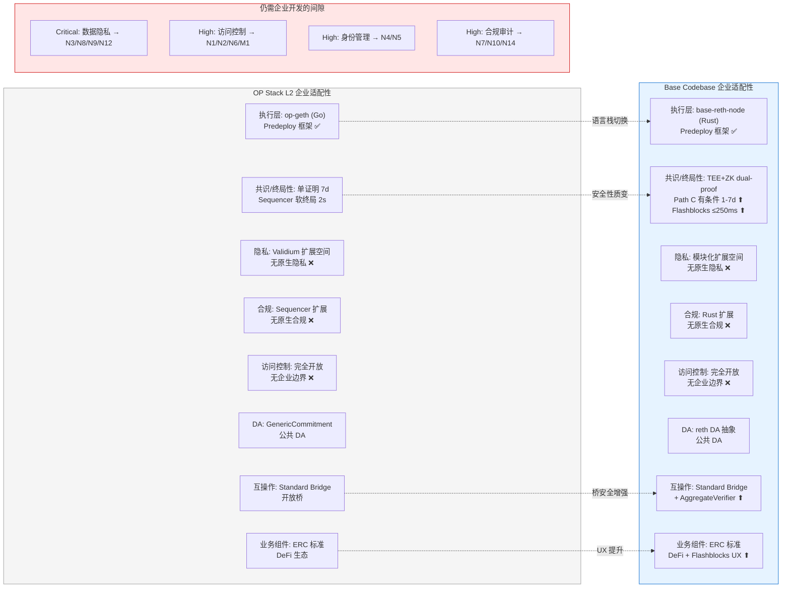
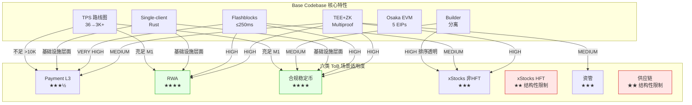

# Base Codebase 企业级 ToB 场景适配性评估

## 1. Executive Summary

本研究将 Base codebase（Azul 升级后）的架构和性能特性系统映射到企业级 ToB 业务场景的核心需求维度，结合架构优势综述（#1 architecture-advantage-summary）、性能优势综述（#2 performance-advantage-summary）和企业需求评估框架（#3 enterprise-requirements-framework）的研究成果，评估 Base codebase 作为 Mantle 企业级产品线底座的适配程度。

**核心发现**：

1. **企业需求评估矩阵十维评分**：Base codebase 作为"增强版 L2"底座，在十维评估框架中的加权总分（模型 A: 3.70 / 模型 B: 3.25 / 模型 C: 3.40）高于标准 OP Stack L2 基准（模型 A: 3.65 / 模型 B: 2.65 / 模型 C: 2.95），提升幅度在终局性速度（D2: ★★★→★★★★）和企业自主权（D1: ★★→★★★）维度最为显著。D7（以太坊安全继承）和 D8（生态兼容性）维持 ★★★★★ 满分，D3（隐私能力）维持 ★★★ 未变——Base codebase 本身不提供原生隐私层。

2. **最高价值企业架构特性**：TEE+ZK dual-proof 在企业场景中的价值重排名为第一（安全合规信心 + 有条件快速最终性），Flashblocks ≤250ms 预确认排第二（企业实时结算 UX），Base 自有客户端架构排第三（统一 Rust 运维 + 原子升级 + op-geth EOL 紧迫性）。与 #1 中按通用技术价值的排名（TEE+ZK 第一、单客户端第二、Flashblocks 第三）相比，Flashblocks 在企业排名中上升，因为 ≤250ms 预确认对 Payment/RWA 等场景的 UX 提升是直接的产品差异化要素。

3. **典型 ToB 场景适配度排序**：Base codebase 最适配的企业场景依次为：(1) RWA/代币化资产（★★★★，Flashblocks + Multiproof + 模块化架构对隐私/合规/DVP 的全面支撑），(2) 合规稳定币（★★★★，合规执行框架 + Multiproof 审计信心 + 多路径支持），(3) Payment L3（★★★½，Flashblocks UX + TPS 路线图充足，但预确认非硬终局），(4) 资管（★★★，模块化支撑 Zone 隔离但需大量企业定制），(5) xStocks 非 HFT（★★★，加密 mempool 可行但终局性受限），(6) xStocks HFT（★★，结构性不适配——L2 无法提供亚秒确定性硬终局 [#3 WHI-387 §5, line 520]）。

4. **净企业适配性提升量化**：相对于标准 OP Stack L2（snapshot: op-geth v1.101702.2-rc.3 / optimism d905be1e03），Base codebase 在十维评估中提供 D1/D2/D10 三个维度的净提升，D5/D6/D9 三个维度存在迁移成本导致的净降低，D3/D4/D7/D8 四个维度持平或在 ★★★★★ 天花板处无显性变化。**企业间隙弥合有限**：#3 中识别的 Mantle 九维间隙中，Base codebase 部分弥合了终局性间隙（D2, Medium→reduced）和安全继承间隙（D7, enhanced within ceiling），但对 **Critical 隐私间隙（数据隐私）、High 间隙（访问控制、身份管理、合规审计）无直接弥合**——这些能力需要 #3 §item-5 中定义的企业中间件/Predeploy 合约/数据层独立开发。

5. **战略结论**：Base codebase 作为企业链底座的价值在于**降低构建成本**（预集成的 Multiproof + Flashblocks + Osaka EVM 免去了从 OP Stack 独立实现的工程量）和**缩短安全达标时间**（TEE+ZK dual-proof 的 Stage 2 准备度），而非直接提供企业级解决方案。从 Base codebase 到"企业级 Mantle"仍需要 #3 §item-6 中估算的三阶段路线图（Phase 1 ~8 人月、Phase 2 ~40 人月、Phase 3 ~100 人月）的企业定制开发。

---

## 2. Item Findings

### 2.1 Item 1: 企业需求评估矩阵 — Base Codebase 十维评分

#### scoring_methodology

沿用 #3 §3.2 的 ★1-5 评分标准，以 L2 企业版基准（#3 §3.2 表）为锚点，根据 Base codebase 相对于标准 OP Stack L2 的能力增量或削减逐维度调整评分。每个维度的评分变动必须有明确的证据引用。评分不是绝对技术能力评价，而是"对企业场景的支撑程度"评价。

#### d1_enterprise_sovereignty

**L2 基准**: ★★ [#3 §3.2]
**Base codebase 评分**: ★★★ (+1)

**评分依据**：

Base 的 single-client policy（base-reth-node + base-consensus，两个 Base 自有客户端）减少了对 Optimism 上游的依赖 [#1 §2.2]。在标准 OP Stack 中，Mantle 的执行层（mantlenetworkio/op-geth@v1.4.2）和共识层（mantle-v2@v1.5.4 op-node）分别依赖 Optimism 维护的 Go 代码库。采纳 Base codebase 后，执行层和共识层统一为 Base 团队维护的 Rust 代码库，Cargo workspace 原子升级消除了版本兼容性矩阵问题 [#1 §2.2]。

然而，企业自主权的核心含义是"验证人/Sequencer/DA 所有权" [#3 §3.1 D1]。Base codebase 仍然是 L2 架构——Sequencer 运营权需独立部署，DA 仍依赖 L1（或需额外 Validium 配置），验证人治理由 L1 合约层决定。因此 Base codebase 的自主权提升是**边际性的**（代码自主权提升，基础设施自主权不变），评分从 ★★ 提升至 ★★★ 合理。

#### d2_finality_speed

**L2 基准**: ★★★ [#3 §3.2]
**Base codebase 评分**: ★★★★ (+1)

**评分依据**：

两项改进推动终局性评分提升：

(1) **Flashblocks ≤250ms 预确认** [#2 §4.2]：从标准 L2 的 2s 区块时间降低到 ≤250ms 的感知确认延迟（8× UX 改善）。**重要区分**：Flashblocks 预确认属于 UX 层面的"交易级软终局"——它是 Sequencer 发出的预确认承诺，不等同于 L1 证明支持的硬终局性。在 DvP、T+0 结算和支付等企业场景中，必须明确区分预确认（UX 确认，Sequencer 信用担保）与硬终局性（L1 证明、ZK 验证或 7 天挑战期完成后的最终性）[Caveat 1]。

(2) **TEE+ZK dual-proof Path C 有条件快速最终性**：公式 `min(createdAt+7d, secondProofAt+1d)` [#1 §2.4]。当第二个证明（通常为 ZK 证明）在游戏创建后较早提交时，最终性可从 7 天缩短至最快 ~1 天。具体示例：
- 第二个证明在 `t = createdAt + 0.5d` 提交 → `min(7d, 1.5d) = 1.5d` — **显著加速**
- 第二个证明在 `t = createdAt + 3d` 提交 → `min(7d, 4d) = 4d` — **中等加速**
- 第二个证明在 `t = createdAt + 6d` 提交 → `min(7d, 7d) = 7d` — **无加速**

快速最终性**高度依赖 ZK 证明的及时生成**（SP1 cluster/Succinct Network 吞吐能力和队列深度）[#1 §2.4, Guardrail 1]。

综合 Flashblocks 的 UX 层提升和 Path C 的有条件硬终局改善，评分从 ★★★ 提升至 ★★★★。

#### d3_privacy_capability

**L2 基准**: ★★★ [#3 §3.2]
**Base codebase 评分**: ★★★ (持平)

**评分依据**：

Base codebase **不提供原生隐私层** [#1 §2.2]。Flashblocks、TEE+ZK Multiproof、Osaka EVM 等改进均不涉及交易数据隐私。Base codebase 的模块化架构（base-reth-node 的 reth extension traits、Predeploy 合约框架）理论上对 Validium/私有 DA 集成提供了扩展空间，但这与标准 OP Stack 的 `op-alt-da/GenericCommitment` 接口 [#3 §item-1 组件 6] 提供的扩展性相当。

#3 §item-6 将数据隐私列为 Mantle 的唯一 **Critical** 级间隙 [WHI-350 §1.1, line 32]。Base codebase 不弥合此间隙。隐私能力的提升需要独立的企业定制开发（#3 §item-5 N3 Privacy Classifier、N8 PrivacyRegistry、N9 SelectiveDisclosure、N12 Private DA Server）。

#### d4_compliance_flexibility

**L2 基准**: ★★★★ [#3 §3.2]
**Base codebase 评分**: ★★★★ (持平)

**评分依据**：

Base codebase 的 Predeploy 合约框架与 OP Stack 的 Predeploy 空间在合规钩子注入能力上相当。Sequencer 扩展性（base-consensus 的 Rust 代码库 vs op-node 的 Go 代码库）在理论上为策略引擎注入提供了不同的技术栈选择，但这不构成合规灵活性维度的质变。

#3 中定义的四层合规栈（外部集成→合规中间件→链上合规合约→核心协议）[WHI-354 §5.1] 的实现路径在 Base codebase 上与 OP Stack 上等价——均需通过 Predeploy 合约（ComplianceRegistry、PolicyExecutor 等）和 Sequencer 策略引擎实现。

#### d5_development_cost

**L2 基准**: ★★★★ [#3 §3.2]
**Base codebase 评分**: ★★★ (-1)

**评分依据**：

从 OP Stack 切换到 Base codebase 引入额外迁移成本：
- **Go→Rust 语言栈切换** [#1 §2.2]：Mantle 团队需要 Rust 工程能力
- **4 个 BREAK-CHANGE** [#1 §2.6]：op-geth→base-reth-node、op-node→base-consensus、DisputeGame→AggregateVerifier、Engine API V3→V5
- **Mantle 特有功能重实现** [#1 §2.7 Gap G-2]：MNT token gas 模型、fee 分配逻辑、特殊 system transaction 类型需在 Rust 中重新实现
- **双重 fork 维护** [#1 §2.7]：需持续跟踪 base/base 上游 + paradigmxyz/reth 上游

但 Base codebase 的预集成特性（Flashblocks + Multiproof + Osaka EVM）避免了从 OP Stack 独立实现这些能力的工程成本。净效果：短期成本增加（迁移），中长期成本节约（免去独立开发）。

#### d6_time_to_market

**L2 基准**: ★★★★★ [#3 §3.2]
**Base codebase 评分**: ★★★★ (-1)

**评分依据**：

Base codebase 作为预集成的功能底座（Flashblocks + Multiproof + Osaka EVM），**对这些特定能力**可缩短企业产品上市时间——无需从零构建预确认系统或双证明体系。但迁移过程本身延长了总体上市时间：
- op-geth EOL 2026-05-31（**hard date**，Optimism 官方）[#1 §2.1] 增加时间压力
- Base Azul code-set target 2026-05-28（config constant `1_779_991_200`），specs.base.org 仍标注 mainnet activation TBD [#1 §2.7, Guardrail 4]
- 渐进式采纳 Phase 1-3 总计 0-12 个月 [#1 §2.7]

#### d7_ethereum_security

**L2 基准**: ★★★★★ [#3 §3.2]
**Base codebase 评分**: ★★★★★ (持平，天花板内质变)

**评分依据**：

标准 L2 已获 ★★★★★ 评分（L1 证明/结算/数据锚定最强的非 L1 路径）。Base codebase 在此天花板内提供质的增强：
- **TEE+ZK dual-proof**：两种独立安全假设互补（TEE 硬件信任 + ZK 密码学信任），PROOF_THRESHOLD=1 意味着任一有效证明即保护系统安全 [#1 §2.4]
- **Stage 2 准备度**：多证明体系满足 Stage 2 要求（从 Stage 1 Security Council 兜底向 Stage 2 完全去信任化迈进）[#1 §2.4]
- **AggregateVerifier 可审计性**：1041 行 Solidity 合约，ProofJournal 提供可审计的证明记录 [#1 §2.4]

评分维持 ★★★★★，但此 ★★★★★ 的安全质量显著高于标准 L2 的 ★★★★★。

#### d8_ecosystem_compatibility

**L2 基准**: ★★★★★ [#3 §3.2]
**Base codebase 评分**: ★★★★★ (持平)

**评分依据**：

- Osaka EVM 对齐：4/5 EIP 已通过 Mantle Limb 上线，仅 EIP-7825（tx gas cap）待评估 [#1 §2.5]
- reth 生态：reth v1.11.4 自带 eth/69 wire protocol、现代化存储引擎（MDBX）和高性能 EVM（revm）[#1 §2.2]
- Superchain 治理保持：AggregateVerifier 合约层仍遵循 Superchain 合约层接口 [#1 §2.1]
- Solidity/EVM/钱包/索引器完全兼容

#### d9_operational_simplicity

**L2 基准**: ★★★★★ [#3 §3.2]
**Base codebase 评分**: ★★★★ (-1)

**评分依据**：

单仓库双二进制 Rust 架构（base-reth-node + base-consensus）在**部署和版本管理**层面简化了运维：同仓库同 commit 原子升级，统一日志框架 [#1 §2.2]。

但 TEE+ZK dual-proof 系统引入了显著的运维新增复杂度：
- **TEE 基础设施**：需要 AWS Nitro Enclave 运维（enclave 部署、attestation 管理、密钥轮换）[#1 §2.4]
- **ZK Prover 集群**：需要 SP1 cluster 或 Succinct Network 订阅，gRPC 服务 + PostgreSQL 持久化 [#1 §2.4]
- **Prover Registrar 运维**：周期性 enclave 发现 → attestation ZK proof 生成 → 链上注册 [#1 §2.4]
- **5 个链下组件**协同（Proposer、Challenger、TEE Prover、ZK Prover、Prover Registrar）[#1 §2.4]

净效果：客户端运维简化被证明系统运维复杂度抵消。

#### d10_business_scalability

**L2 基准**: ★★ [#3 §3.2]
**Base codebase 评分**: ★★★ (+1)

**评分依据**：

Base codebase 的模块化设计对多租户/多 Zone 部署提供了更好的支撑：
- **reth extension traits**：允许通过 Cargo feature gates 进行模块化定制 [#1 §2.2]
- **L3 App Chain 部署能力**：Base 的 single-client policy + Flashblocks 可作为 L3 部署模板
- **Predeploy 地址空间**：与 OP Stack 共享 0x42... 地址空间，对 #3 §item-5 定义的企业 Predeploy 合约（0x42...0020-0034）提供等价支撑

但 L3 App Chain 的"每企业一链"模型 [#3 §item-7 WHI-389 §1 line 42] 需要额外的 Zone 部署工具链和跨 Zone 通信协议，这些不在 Base codebase 原生能力范围内。

#### baseline_comparison

**Base codebase 十维评分 vs L2 企业版基准对比表**：

| 维度 | L1 自建 | L2 基准 | Base codebase | L3 App Chain | Base vs L2 增量 | 评分变动依据 |
|------|--------|---------|---------------|-------------|----------------|-------------|
| D1: 企业自主权 | ★★★★★ | ★★ | **★★★** | ★★★★ | **+1** | Single-client policy 减少上游依赖 [#1 §2.2] |
| D2: 终局性速度 | ★★★★★ | ★★★ | **★★★★** | ★★ | **+1** | Path C 有条件快速最终性 + Flashblocks ≤250ms 预确认 [#1 §2.3, §2.4] |
| D3: 隐私能力 | ★★★★★ | ★★★ | **★★★** | ★★★★ | **0** | Base 无原生隐私层 [#1 §2.2] |
| D4: 合规灵活性 | ★★★★★ | ★★★★ | **★★★★** | ★★★★ | **0** | Predeploy 框架与 OP Stack 等价 |
| D5: 开发成本 | ★ | ★★★★ | **★★★** | ★★★ | **-1** | Go→Rust 迁移 + 4 BREAK-CHANGE + 特有功能重实现 [#1 §2.6] |
| D6: 上市时间 | ★ | ★★★★★ | **★★★★** | ★★★★ | **-1** | 迁移延迟抵消预集成收益 [#1 §2.7] |
| D7: 以太坊安全继承 | ★ | ★★★★★ | **★★★★★** | ★★★★ | **0 (天花板内增强)** | TEE+ZK dual-proof 质变 [#1 §2.4] |
| D8: 生态兼容性 | ★★ | ★★★★★ | **★★★★★** | ★★★ | **0** | Osaka EVM 对齐 + reth 生态 + Superchain 治理保持 [#1 §2.5] |
| D9: 运营简易度 | ★ | ★★★★★ | **★★★★** | ★★★ | **-1** | 单仓库简化被 TEE+ZK 运维复杂度抵消 [#1 §2.4] |
| D10: 业务可扩展性 | ★★★ | ★★ | **★★★** | ★★★★★ | **+1** | 模块化设计 + L3 部署能力 [#1 §2.2] |

#### weighted_scores

使用 #3 §3.3 三组战略权重模型计算加权总分：

**模型 A: 快速企业收入**（上市时间 25% + 开发成本 20% + 生态兼容性 20% + 合规灵活性 15% + 业务可扩展性 10% + 终局性速度 10%）

| 方案 | 加权总分 | 计算 |
|------|---------|------|
| L2 基准 | **3.65** | 5×0.25 + 4×0.20 + 5×0.20 + 4×0.15 + 2×0.10 + 3×0.10 |
| **Base codebase** | **3.70** | 4×0.25 + 3×0.20 + 5×0.20 + 4×0.15 + 3×0.10 + 4×0.10 |
| L3 App Chain | **3.65** | 4×0.25 + 3×0.20 + 3×0.20 + 4×0.15 + 5×0.10 + 2×0.10 |
| L1 自建 | **2.35** | 1×0.25 + 1×0.20 + 2×0.20 + 5×0.15 + 3×0.10 + 5×0.10 |

**模型 B: 机构结算基础设施**（终局性速度 25% + 企业自主权 25% + 数据主权 15% + 合规灵活性 15% + 生态兼容性 10% + 上市时间 10%）

| 方案 | 加权总分 | 计算 |
|------|---------|------|
| L1 自建 | **4.35** | 5×0.25 + 5×0.25 + 5×0.15 + 5×0.15 + 2×0.10 + 1×0.10 |
| **Base codebase** | **3.25** | 4×0.25 + 3×0.25 + 3×0.15 + 4×0.15 + 5×0.10 + 4×0.10 |
| L2 基准 | **2.65** | 3×0.25 + 2×0.25 + 3×0.15 + 4×0.15 + 5×0.10 + 5×0.10 |
| L3 App Chain | **3.30** | 2×0.25 + 4×0.25 + 4×0.15 + 4×0.15 + 3×0.10 + 4×0.10 |

**模型 C: 企业平台规模**（业务可扩展性 25% + 隐私能力 20% + 合规灵活性 20% + 以太坊安全继承 15% + 运营简易度 10% + 终局性速度 10%）

| 方案 | 加权总分 | 计算 |
|------|---------|------|
| L3 App Chain | **3.80** | 5×0.25 + 4×0.20 + 4×0.20 + 4×0.15 + 3×0.10 + 2×0.10 |
| **Base codebase** | **3.40** | 3×0.25 + 3×0.20 + 4×0.20 + 5×0.15 + 4×0.10 + 4×0.10 |
| L2 基准 | **2.95** | 2×0.25 + 3×0.20 + 4×0.20 + 5×0.15 + 5×0.10 + 3×0.10 |
| L1 自建 | **4.00** | 3×0.25 + 5×0.20 + 5×0.20 + 1×0.15 + 1×0.10 + 5×0.10 |

#### positioning

Base codebase 在 L1/L2/L3 评分谱系中定位为**"增强版 L2"**：
- 在模型 A（快速收入）中，Base codebase（3.70）略高于标准 L2（3.65），优势来自 D2/D10 的提升弥补了 D5/D6/D9 的下降
- 在模型 B（机构结算）中，Base codebase（3.25）显著高于标准 L2（2.65），因为 D1/D2 的提升在终局性和自主权权重最高的模型中价值最大
- 在模型 C（平台规模）中，Base codebase（3.40）高于标准 L2（2.95），因 D7 天花板内增强和 D10 提升

Base codebase **不是** L2-L3 混合体——它不提供 L3 级别的租户隔离（D10 仅 ★★★ vs L3 的 ★★★★★）或 L3 级别的隐私（D3 仅 ★★★ vs L3 的 ★★★★）。它是一个在安全性（D7）、终局性（D2）和自主权（D1）维度得到有针对性增强的 L2。

---

### 2.2 Item 2: Base 架构优势对企业场景的特别有利项分析

#### tee_zk_enterprise_value

**TEE+ZK dual-proof 在企业场景中的价值**（重排为企业价值第一名）：

| 维度 | 企业价值 | 证据 |
|------|---------|------|
| 安全审计信心 | TEE（硬件信任）+ ZK（密码学信任）双独立安全假设提供了更强的审计基础——即使一个安全假设被攻破，另一个仍然有效。对机构客户（银行、基金、交易所）评估链安全性时，双证明体系提供了**更高的安全审计信心** | [#1 §2.4] PROOF_THRESHOLD=1 + 双安全假设互补 |
| 有条件快速最终性 | Path C `min(createdAt+7d, secondProofAt+1d)` 在 ZK 证明及时生成时可将最终性从 7 天缩短至 ~1-4 天，对桥接资金解锁和 DeFi 组合性有潜在重大价值 | [#1 §2.4] 条件：ZK 证明需在 day 6 前提交 |
| Stage 2 路径 | 多证明体系满足 Stage 2 去信任化要求，Stage 2 达成将显著提升机构客户对链安全性的评价 | [#1 §2.4] |
| 可审计证明记录 | AggregateVerifier 合约层 + ProofJournal 提供了可审计的证明记录，GameCategory 4-way 分类系统提供安全事件分类基础 | [#1 §2.4] |

**重要限定** [Caveat 2]：TEE+ZK dual-proof 提供的是**安全/审计信心和有条件最终性支持**，而非直接满足金融监管对"双重验证"的合规要求。企业合规需求的满足需要独立的身份层（IdentityRegistry）、访问控制层（PolicyExecutor）、审计层（AuditLog）和合规层（ComplianceRegistry）[#3 §item-5]。将 Multiproof 的安全保障等同于监管合规是不准确的。

#### single_client_enterprise_value

**Base 自有客户端架构在企业场景中的价值**（企业排名第三）：

| 维度 | 企业价值 | 证据 |
|------|---------|------|
| 统一运维 | 单仓库双二进制 Rust 架构（base-reth-node + base-consensus）使企业运维团队仅需维护一套代码库和构建管线 | [#1 §2.2] Cargo workspace 统一构建 |
| 原子升级 | 同 commit 构建的两个二进制版本锁步，消除了 OP Stack 中 op-geth 与 op-node 的版本兼容性问题，对企业 SLA 的保障更强 | [#1 §2.2] |
| 脱离上游依赖 | Base 团队统一维护执行层和共识层，Mantle 若采纳可减少对 Optimism 上游的等待依赖，加速企业定制 | [#1 §2.2] |
| op-geth EOL 紧迫性 | op-geth EOL 2026-05-31（**hard date**）[#1 §2.1]，Mantle 基于 op-geth v1.4.2 面临迁移紧迫性，Base codebase 是迁移目标之一 | [#1 §2.7] |

#### flashblocks_enterprise_value

**Flashblocks ≤250ms 预确认在企业场景中的价值**（企业排名第二）：

Flashblocks 的企业价值在于**直接的产品差异化**——≤250ms 的预确认延迟对支付、RWA DvP、稳定币等场景的用户体验提升是立竿见影的 [#2 §4.2]。相比之下，TEE+ZK dual-proof 的价值更多体现在安全/合规基础设施层面（对终端用户不直接可见），single-client 架构的价值体现在运维/工程层面。因此在**面向企业产品设计**的排名中，Flashblocks 从 #1 的通用技术排名第三上升至企业排名第二。

**重要区分** [Caveat 1]：≤250ms 是**预确认延迟**（Sequencer 发出的 pre-confirmation），不是硬终局性。在企业实时结算场景中：
- **支付 B2C 授权**：≤250ms 预确认满足亚秒 UX 确认需求（类似信用卡授权延迟）
- **DvP 场景**：预确认可用于"交易级软终局"，但最终结算仍需等待 L1 证明/挑战期完成
- **大额赎回**：不能以预确认作为结算依据，需等待硬终局性

#### builder_separation_mev_control

**Builder 分离架构对企业级 MEV 控制的意义**：

rollup-boost sidecar 实现 Producer/Builder 分离 [#1 §2.3]，对企业场景的意义：
- **透明路由**：`BlockSelectionPolicy::GasUsed` 的确定性选择策略（builder_gas < 0.1 × l2_gas 时回退到本地 EL）消除了不透明的排序决策
- **交易排序公平性**：Builder 分离使 Sequencer 和 block builder 角色解耦，为企业场景的公平排序（如 xStocks 的 FCFS 排序）提供了架构基础
- **审计友好**：Producer/Builder 分离使交易排序过程可审计，对合规场景有价值

#### osaka_evm_enterprise_value

**Osaka EVM 对齐的企业价值**：

| EIP | 企业价值 | Mantle 状态 |
|-----|---------|------------|
| EIP-7825 tx gas cap 2^24 | **DoS 防护**：限制单笔交易 gas 上限，防止恶意 tx 占满整个 block budget——对企业链稳定性至关重要 | 未采纳（`!IsOptimism()` guard）[#1 §2.5] |
| EIP-7951 P256VERIFY | **WebAuthn/Passkey 企业身份验证**：secp256r1 precompile 支持 Passkey/WebAuthn，对企业 SSO 和无密钥身份验证场景有价值 | 已采纳（Mantle Limb）[#1 §2.5] |
| EIP-7939 CLZ | **ZK verifier 效率**：对链上 ZK 验证器（如 Multiproof 中的 Groth16 verifier）降低 gas 成本有间接价值 | 已采纳（Mantle Limb）[#1 §2.5] |
| EIP-7823/7883 MODEXP | **大数运算安全**：限制 MODEXP 输入并提升 gas 价格，防止 gas 低价攻击 | 已采纳（Mantle Limb）[#1 §2.5] |

#### feature_to_component_mapping

**架构特性→八大核心组件映射表**：

| Base 架构特性 | 执行层 | 共识/终局性 | 隐私层 | 合规/身份 | 访问控制 | DA/数据主权 | 互操作性 | 业务组件 |
|-------------|--------|-----------|--------|---------|---------|-----------|---------|---------|
| TEE+ZK dual-proof | — | **直接** | — | 间接(审计信心) | — | — | 间接(桥安全) | 间接(结算信心) |
| Single-client (reth) | **直接** | **直接** | — | — | — | — | — | — |
| Flashblocks ≤250ms | **直接** | **直接** | — | — | — | — | — | **直接**(UX) |
| Builder 分离 | **直接** | — | — | 间接(排序审计) | — | — | — | — |
| Osaka EVM (5 EIPs) | **直接** | — | — | 间接(P256) | 间接(DoS) | — | — | — |

**空白列**：隐私层、DA/数据主权 两列几乎无直接映射——这反映了 Base codebase 的架构改进聚焦于执行层/共识层/安全层，而非企业场景中同样关键的隐私和数据主权维度。

#### enterprise_priority_ranking

**架构特性按企业场景价值重新排名**（vs #1 通用技术排名）：

| 企业排名 | 架构特性 | #1 通用排名 | 排名变动 | 变动原因 |
|---------|---------|-----------|---------|---------|
| **1** | TEE+ZK dual-proof | 1 | — | 安全审计信心对企业客户评估最关键 |
| **2** | Flashblocks ≤250ms | 3 | ↑1 | 企业产品 UX 差异化最直接 |
| **3** | Single-client (reth) | 2 | ↓1 | 运维优势对企业产品不直接可见 |
| **4** | Osaka EVM | 4 | — | EIP-7825 DoS 防护 + EIP-7951 Passkey 有企业价值 |
| **5** | Engine API V5 | 5 | — | 协议层升级，对企业不直接可见 |

#### constraint_chain_activation

**架构特性对 #3 约束传播链的激活**：

| 架构特性 | 激活的约束链 | 激活方式 |
|---------|-----------|---------|
| TEE+ZK dual-proof | Chain 1 (共识→终局性→结算) | Path C 改善结算终局性 |
| TEE+ZK dual-proof | Chain 7 (以太坊安全→证明系统→成本) | 新增 TEE+ZK 运维成本 |
| Flashblocks | Chain 1 (共识→终局性→结算) | ≤250ms 预确认改善 UX 层终局 |
| Flashblocks | Chain 5 (支付性能→通道→代币) | 预确认为支付场景提供亚秒确认 |
| Single-client | Chain 7 (以太坊安全→证明系统→成本) | Go→Rust 迁移成本 |
| Builder 分离 | Chain 3 (合规→执行深度→EVM) | 排序透明性对合规友好 |

---

### 2.3 Item 3: Base 性能优势在企业场景中的价值映射

#### tps_enterprise_mapping

**TPS 里程碑与企业场景需求对应** [#2 §10.5]：

| 里程碑 | 时间线 | Saturated Ceiling | Payment L3 需求 (>10K TPS) | RWA 需求 (100-500 TPS) | 合规稳定币 需求 | xStocks 需求 |
|--------|--------|-------------------|---------------------------|----------------------|----------------|-------------|
| M0 (当前) | — | ~36 TPS | **严重不足** (0.36%) | **不足** (7-36%) | 不足 | 不足 |
| M1 (+2wk) | Quick Wins | ~1,083 TPS | **不足** (10.8%) | **充足** (217-1083%) | 充足 | 充足(非HFT) |
| M3 (+3-4mo) | ParallelStateRoot | ~1,200-1,400 TPS | 不足 (12-14%) | 充足 | 充足 | 充足(非HFT) |
| M4 (+6-9mo) | Flashblocks | ~1,400-2,000 TPS | 不足 (14-20%) | 充足 | 充足 | 充足(非HFT) |
| M5 (+12-18mo) | Full pipeline | ~2,000-3,000+ TPS | **仍不足** (20-30%) | 充足 | 充足 | 充足(非HFT) |

**关键发现**：Payment L3 的 >10K TPS 需求 [#3 §item-2 WHI-387 §2.4 line 221] 在 Base codebase 的所有 TPS 里程碑中均无法满足——这是 L2 架构的**结构性限制**。满足 >10K TPS 需求需要 L3 App Chain（每 Zone 独立 Sequencer + 专用 gas 预算）或 L1 BFT 架构。

**重要归因** [Guardrail 2]：Mantle 与 Base 的当前 TPS 差距（~0.7-1.0 vs ~93.7）主要由**需求侧约束（demand-bound）**驱动，而非供给侧技术上限不足 [#2 §Executive Summary]。Mantle 60.8% 的区块仅含系统交易，gas 利用率仅 0.29%。

#### quick_wins_enterprise_impact

**Quick Wins 对企业场景的即时价值** [#2 §10.2]：

Batcher 参数调优（MaxPendingTx=1→5-10, TargetNumFrames=1→6）+ Brotli10 压缩 + Dynamic seal 可在 **~2 周内**将 saturated ceiling 从 ~36 TPS 提升至 ~1,083 TPS [#2 §7.6]。

**企业 SLA 承诺**：~1,083 TPS 的 saturated ceiling 意味着：
- 对 RWA 场景（100-500 TPS 需求）：**可承诺 SLA**（ceiling 覆盖 2-10×）
- 对合规稳定币场景：**可承诺 SLA**
- 对 Payment L3 场景：**不可承诺 SLA**（需求 10× 以上于 ceiling）
- 对资管场景：**可承诺 SLA**（低吞吐需求）

成本：~0.1 person-month（ROI Tier 1 Exceptional，~2,900% 容量提升）[#2 §7.6]。

#### flashblocks_settlement_value

详见 Item 4 专题分析。

#### parallel_state_root_enterprise

**ParallelStateRoot 对企业高吞吐场景的价值** [#2 §3.3]：

- Base 已在 `validator.rs:75, :927` 显式接线；Mantle 库代码存在但 0 个调用点
- 预期收益：≥20-50% 状态根计算时间缩减（`[PENDING VERIFICATION]`）
- 对企业 Block Time Budget 的影响：2s block time 中，状态根计算占比约 30-40%；20-50% 缩减释放 120-400ms budget，可用于更高吞吐或更短区块时间

#### backpressure_enterprise_safety

**背压机制对企业级稳定性的重要性** [#2 §9]：

Mantle 当前处于"无有效背压"状态——DA Throttling RPC 已移除导致 batcher 启动失败，SequencerMaxSafeLag=0 (disabled) [#2 §9.2]。

**企业 SLA 影响**：
- **无背压 = 无安全阀**：在吞吐量提升后，如果 DA 积压增长，没有机制降低区块大小或暂停 sequencing
- **unsafe span 无界增长风险**：对企业客户承诺的终局性 SLA 无法保证
- **P0 前置条件**：DA Throttling 恢复是所有吞吐量提升的硬前置条件 [#2 §9.4 Strategy A]

#### da_headroom_enterprise

**DA ~1,480× 余量对企业场景的意义** [#2 §8]：

- 短期内 DA 不构成企业扩展瓶颈
- DA ceiling ~1,749 TPS（Mantle observed 82.38 B/UOP）[#2 §8.3]
- DA 仅在 M4+ milestone（~1,400+ TPS）时才开始变得相关
- **企业经济模型影响**：DA 成本优化路径（Zlib→Brotli10 +5-15% compression ratio; multi-blob; fill rate 优化）可降低企业运营成本

#### gas_protocol_enterprise

**Gas 协议参数对企业场景的影响** [#2 §5]：

| 参数 | 企业影响 | 推荐动作 |
|------|---------|---------|
| gasLimit 200B (decorative) | 无拥塞信号，EIP-1559 定价失效 → 企业交易成本不可预测 | 校准至 1G-2G |
| 固定 baseFee 0.02 gwei | 无拥塞定价 → DoS 成本极低 | 启用动态 baseFee |
| EIP-7825 未执行 | 单笔 ~20M gas tx 可占满 block budget → DoS 风险 | 启用 per-tx cap |
| EIP-1559 elasticity=2, denom=8 | Base 3× burst 吸收 vs Mantle 2× → 企业流量突发容忍度低 | 调整为 elasticity=6, denom=250 |

#### scenario_tps_gap

**各企业场景 TPS 需求 vs Base 里程碑差距**：

| 场景 | 需求 TPS | M1 Gap | M3 Gap | M5 Gap | 结论 |
|------|---------|--------|--------|--------|------|
| Payment L3 | >10,000 | 9.2× | 7.1× | 3.3× | **结构性不足** — L2 架构限制 |
| RWA | 100-500 | ✅ 覆盖 | ✅ 覆盖 | ✅ 覆盖 | M1 即可满足 |
| 合规稳定币 | 100-1,000 | ✅/边际 | ✅ 覆盖 | ✅ 覆盖 | M1/M3 可满足 |
| xStocks (非HFT) | 100-500 | ✅ 覆盖 | ✅ 覆盖 | ✅ 覆盖 | M1 即可满足 |
| 资管 | 10-100 | ✅ 覆盖 | ✅ 覆盖 | ✅ 覆盖 | M0 即可满足 |
| 供应链 | 10-100 | ✅ 覆盖 | ✅ 覆盖 | ✅ 覆盖 | M0 即可满足 |

#### performance_roi_by_scenario

| 改进分级 | Payment L3 ROI | RWA ROI | 合规稳定币 ROI | xStocks ROI | 资管 ROI |
|---------|---------------|---------|---------------|------------|---------|
| Quick Wins (M1) | 低（仍不满足需求） | **最高**（立即达 SLA） | **高**（接近 SLA） | **高** | **高** |
| Mid-term (M3-M4) | 低 | 中（已满足） | 中 | 中 | 低 |
| Long-term (M5) | 中（仍有差距） | 低（已远超需求） | 低 | 低 | 低 |

---

### 2.4 Item 4: Flashblocks 预确认在企业实时结算中的深度分析

#### dvp_settlement_model

**DvP（Delivery versus Payment）结算模型中 Flashblocks 的角色**：

在同区 DvP 场景中 [#3 §item-2 WHI-389 §5.2]，Flashblocks ≤250ms 预确认可作为"交易级软终局"：
- **同区 DvP**：两腿交易在同一 L2/L3 中执行，Flashblocks 预确认保证两腿的 ordering 在 ≤250ms 内确定。在 L3 路径下，`head=safe=finalized` 语义意味着 Flashblocks 预确认即等效于 Zone 内终局 [#3 §item-2 WHI-389 §5.1 line 540]
- **跨区 DvP**：需要 Phase 2 共享排序器 [#3 §item-2 WHI-389 §2.8.2]，Flashblocks 预确认仅解决单区内的一腿

**重要区分**：在 L2 语境下，Flashblocks 预确认不等于硬终局性。DvP 的"交割完成"需要基于终局性级别的决策——预确认适用于信任 Sequencer 的内部 DvP，而跨链/大额 DvP 需要 ZK 或 L1 级别的硬终局 [Caveat 1]。

#### payment_preconfirmation

**支付场景中的预确认价值**：

| 子场景 | 终局性需求 | Flashblocks 适配度 | 限制 |
|--------|---------|-------------------|------|
| B2C 授权 | 亚秒 UX 确认 | **EXTREME** — ≤250ms 预确认满足商户 POS 终端确认需求 [#3 §item-2 WHI-389 §5.2] | 预确认非最终结算；商户需承担 Sequencer 重组风险（极低概率） |
| B2B 结算 | 批量结算终局 | **HIGH** — 预确认可作为批量入账触发，最终结算在 batch 证明后 | 大额 B2B 结算需等待 ZK/L1 终局 |
| 商户最终提款 | L1 终局性 | **MEDIUM** — 预确认无法加速 L3→L2→L1 提款路径 | L3→L2 提款受 ZK ~1h 硬终局限制；L2→L1 受 7 天挑战期限制（或 Path C 有条件缩短）[#3 §item-2 WHI-389 §5.2: Merchant final withdrawal = bottleneck] |

#### finality_semantics_mapping

**Flashblocks 预确认与 #3 四层终局性模型的映射**：

| 终局性层 | 延迟 | Flashblocks 定位 |
|---------|------|----------------|
| L4: Sequencer 软终局 | ~2s（标准 L2）→ **≤250ms（Flashblocks）** | Flashblocks 将 L4 层从 2s 压缩到 ≤250ms |
| L3: 批次/safe 终局 | ~12min（L1 批次包含） | Flashblocks 不影响此层 |
| L2: ZK 硬终局 | ~1h（ZK 证明生成） | Flashblocks 不影响此层 |
| L1: L1 settlement 终局 | 7d（标准）/ 有条件缩短（Path C） | Flashblocks 不影响此层 |

**结论**：Flashblocks 的价值严格限于 L4 层（Sequencer 软终局），对 L3/L2/L1 层无影响。在企业场景的终局性设计中，Flashblocks 是 **UX 层优化**而非**结算层改变**。

#### economic_security_model

**Flashblocks 预确认的经济安全性** [#3 §item-2 WHI-389 §5.3 lines 642-657]：

- Sequencer 保证金需覆盖未证明敞口的 ≥60-80%
- Flashblocks 缩短了预确认到用户感知确认的时间，但不改变 Sequencer 的经济安全框架
- 在 L3 路径下（`head=safe=finalized` 语义），经济安全由 Sequencer 保证金直接覆盖

#### enterprise_integration_path

**企业场景下 Flashblocks 的集成路径** [#1 §2.3]：

推荐路径：**(b) op-reth flashblocks**（与 Optimism/Unichain 走同一上游），用 WebSocket 起步，保留 P2P 演进窗口。

**注意事项**：
- Flashblocks 协议存在两处 spec ↔ code drift（wire 格式和字段集）[#1 §2.3]，企业集成必须以代码为准
- Consumer-side P2P 订阅尚未实现（op-reth 仅支持 WebSocket inbound）[#1 §2.3]
- 工程投入：Phase 1 consumer 6-10 周 → Phase 2 testnet 4-6 周 → Phase 3 producer 12-16 周。总计 31-49 周 / 7-11 engineer-months [#2 §4.5]

#### scenario_applicability

**Flashblocks 在六类 ToB 场景中的适用度**：

| 场景 | 适用度 | 核心价值 | 关键限制 |
|------|-------|---------|---------|
| Payment L3 | **VERY HIGH** | B2C 授权亚秒确认 | 非硬终局；商户提款不加速 |
| RWA | **HIGH** | 同区 DvP 软终局加速 | 跨区 DvP 不受益 |
| 合规稳定币 | **HIGH** | 支付确认 UX 提升 | 赎回终局由 ZK/L1 层决定 |
| xStocks (非HFT) | **MEDIUM** | 交易提交确认加速 | 非确定性硬终局，HFT 不适配 |
| 资管 | **MEDIUM** | 投资者操作确认 | 资管流程对亚秒终局需求低 |
| 供应链 | **LOW** | 流程型，非实时交易 | 价值有限 |

#### finality_layer_position

Flashblocks 在企业终局性层次模型中的定位：**L4 层（Sequencer 软终局）的 8× 压缩**，不影响 L3/L2/L1 层。企业产品设计需根据场景选择终局性层——B2C 授权可依赖 L4，DvP 结算需 L2+，大额赎回需 L1。

---

### 2.5 Item 5: Multiproof 在企业安全合规场景中的深度分析

#### regulatory_compliance_value

**TEE+ZK dual-proof 对监管合规的价值** [Caveat 2]：

TEE+ZK dual-proof 提供的是**安全基础设施信心**，而非直接的合规能力：
- **双独立安全假设**：TEE（硬件信任，AWS Nitro Enclave）+ ZK（密码学信任，SP1 STARK/Groth16）两种截然不同的安全模型互补，即使一方被攻破另一方仍有效 [#1 §2.4]
- **可审计性**：AggregateVerifier 合约（1041 行 Solidity）+ ProofJournal 提供了可审计的证明记录链，对满足金融监管的**审计追踪要求**有直接价值

**但不应声称**：
- TEE+ZK 直接满足"双重验证"监管要求——金融监管的"双重验证"通常指独立的身份验证/授权验证/交易验证，而非区块链证明系统的冗余
- 企业合规需求的满足需要独立于 Multiproof 的身份层（IdentityRegistry 0x42...0030）、访问控制层（PolicyExecutor 0x42...0021）、审计层（AuditLog 0x42...0022）和合规层（ComplianceRegistry 0x42...0020）[#3 §item-5]

#### institutional_trust_model

**机构级信任模型**：

PROOF_THRESHOLD=1 的设计意义 [#1 §2.4]：
- 任何单一有效证明（TEE 或 ZK）即可满足阈值——系统安全性的**下限**由两种证明方式中更强的一种决定
- 双证明的冗余安全性：攻击者需要同时攻破 TEE 硬件安全和 ZK 密码学安全才能伪造证明
- 对机构客户的吸引力：双证明体系显著降低了"单点失败"的风险感知

**量化价值**：机构评估 L2 安全性时，双证明体系使安全性从"依赖单一安全假设"提升为"依赖两个独立安全假设的交集"，这对风险委员会的评估框架有实质性影响。

#### fast_finality_enterprise_impact

**有条件快速最终性对企业场景的具体影响** [#1 §2.4, Guardrail 1]：

Path C `min(createdAt+7d, secondProofAt+1d)` 的企业价值：

| 影响维度 | 标准 L2 (7d) | Path C (有条件 1-7d) | 企业价值 |
|---------|-------------|---------------------|---------|
| 桥接资金解锁 | 7 天锁定期 | 最快 ~1 天解锁 | 对企业资金效率有潜在重大提升——7d→1d 的资金释放加速可降低企业在桥接中的资金占用成本 |
| DeFi 组合性 | 7 天延迟后可组合 | 有条件缩短 | 对企业 RWA/稳定币产品的跨链组合有价值 |
| 结算最终性 | 7 天后最终 | 有条件 1-7 天 | 企业可根据 ZK 证明延迟提供更精确的结算时间承诺 |

**条件性声明**：快速最终性**并非保证**，实际加速效果取决于 ZK 证明生成延迟。当前无 Base mainnet ZK 证明延迟基准数据 [#1 §2.7 Gap G-7]。Base Azul code-set target 2026-05-28（mainnet activation TBD），ZK 证明延迟数据需待主网上线后收集。

#### stage2_enterprise_significance

**Stage 2 路径对企业客户的意义**：

- **当前状态**：Stage 1（依赖 Security Council 兜底）[#1 §2.4]
- **Stage 2 要求**：多证明体系 + 可撤销 sequencer + 足够长的 challenge window
- **企业评估影响**：
  - Stage 1 → Stage 2 的进展对机构客户的链安全性评估有决定性影响
  - 许多机构客户（银行、证券公司）的合规部门要求使用 Stage 2（或同等安全级别）的链
  - TEE+ZK dual-proof 满足多证明要求，是 Stage 2 路径的关键组件

#### tee_infrastructure_enterprise

**TEE 基础设施对企业部署的影响**：

| 维度 | 现状 | 企业影响 |
|------|------|---------|
| 硬件依赖 | AWS Nitro Enclave [#1 §2.4] | 单一云供应商依赖——企业可能需要多云选项 |
| 演进路径 | Intel TDX、AMD SEV-SNP [#1 §2.4] | 路线图包含替代 TEE 硬件，缓解供应商锁定 |
| 运维要求 | enclave 部署 + attestation + 密钥管理 | 增加企业运维团队技术要求 |
| 合规考量 | 签名密钥永不离开 enclave [#1 §2.4] | 满足密钥安全管理的合规要求 |

#### enterprise_audit_trail

**审计追踪能力**：

- **ProofJournal**：每个 TEE 证明生成可审计的签名日志 [#1 §2.4]
- **GameCategory 4-way 分类系统**：`InvalidTeeProposal` / `InvalidDualProposal` / `InvalidZkProposal` / `FraudulentZkChallenge` 提供了安全事件的结构化分类基础 [#1 §2.4]
- **链上可验证性**：AggregateVerifier 合约的所有操作（`initializeWithInitData`、`nullify`、`challenge`）均在链上记录，提供不可篡改的审计追踪

#### compliance_dimension_coverage

**Multiproof 覆盖的企业需求组件维度**：

| 八大核心组件 | Multiproof 覆盖 | 详述 |
|------------|----------------|------|
| 执行层 | — | 不涉及 |
| 共识与终局性 | **直接覆盖** | 改善终局性语义（Path C 有条件快速最终性）|
| 隐私层 | — | 不涉及（TEE 用于证明而非隐私计算）|
| 合规与身份 | **间接覆盖** | 提供安全审计信心但不直接实现合规功能 |
| 访问控制 | — | 不涉及 |
| DA 与数据主权 | — | 不涉及 |
| 互操作性 | **间接覆盖** | 增强桥安全性（OptimismPortal2 + AnchorStateRegistry）|
| 业务组件 | **间接覆盖** | 改善 DVP/结算的终局性基础 |

**间隙弥合评估**：Multiproof 部分弥合了 #3 §item-6 中的终局性间隙（Medium→reduced）和安全继承间隙（增强），但对 Critical（隐私）和 High（访问控制、身份管理、合规审计）间隙**无弥合作用**。

#### enterprise_scenario_impact

**Multiproof 对六类 ToB 场景信心建设的差异化影响**：

| 场景 | 信心提升程度 | 原因 |
|------|-----------|------|
| RWA | **HIGH** | 机构投资者和监管方对链安全性评估直接受双证明影响 |
| 合规稳定币 | **HIGH** | 稳定币发行方需要高安全保证来满足储备审计要求 |
| Payment L3 | **MEDIUM** | 支付场景更关注 UX 和合规，安全性是基线而非差异化 |
| xStocks | **HIGH** | 证券场景的监管要求最高，双证明提供更强的合规基础 |
| 资管 | **MEDIUM** | 资管流程关注租户隔离和访问控制，安全性是必要但非首要 |
| 供应链 | **LOW** | 供应链场景更关注隐私和互操作性 |

---

### 2.6 Item 6: Base 模块化设计对企业级定制化需求的支撑评估

#### permissioned_chain_support

**许可链模式支撑评估**：

Base 的 single-client policy 和模块化设计对构建企业许可链的支撑：
- **TransactionFilterer**：#3 §item-5 中定义的 L1 桥入口过滤（M1: `OptimismPortal.sol` 添加 `isAllowed` 修饰符）在 Base codebase 上的实现路径与 OP Stack 等价——需修改 AggregateVerifier 引用的 OptimismPortal2 合约 [#1 §2.4]
- **Sequencer 策略引擎**：base-consensus（Rust）的模块化设计（Kona-inspired derivation）可能比 op-node（Go）的单 event-loop 更易注入策略检查点 [#1 §2.2]
- **reth extension traits**：base-reth-node 的 reth fork 特性允许通过 Cargo feature gates 添加企业扩展，理论上比 op-geth 的 Go interface 方式更灵活

#### private_da_integration

**私有 DA 集成评估**：

| 维度 | OP Stack | Base codebase | 评估 |
|------|---------|---------------|------|
| DA 接口 | `op-alt-da/GenericCommitment` | reth-native DA 抽象层 | Base 的 DA 抽象层与 OP Stack 不同，需评估对 Validium/私有 DA 的支撑 |
| Validium 模式 | 可通过 `GenericCommitment` 实现 | 需通过 reth 扩展或自定义 DA provider 实现 | 两者均需企业定制 |
| 混合 DA 路由 | #3 §item-5 M3 op-batcher 扩展（~500 行）| 需在 Base 的 Rust batcher 中实现等效逻辑 | 语言栈不同但功能等价 |

**结论**：Base codebase 对私有 DA 集成的支撑程度与 OP Stack **等价**——两者均需要 Phase 2 级别的企业定制（N11 Hybrid DA Router、N12 Private DA Server）。Base 的 Rust 生态可能提供更好的性能特性，但不减少定制工程量。

#### compliance_hook_injection

**合规钩子注入评估**：

| 钩子类型 | 在 OP Stack 中的注入点 | 在 Base codebase 中的对应 |
|---------|---------------------|------------------------|
| Sequencer 策略引擎 | op-node `sequencer.go` M2 钩子 [#3 §item-5] | base-consensus Rust 等效注入点 |
| Predeploy 合约 | 0x42...0020-0034 地址空间 [#3 §item-5] | 同一 Predeploy 地址空间（Superchain 兼容）|
| Transfer Hook | PolicyExecutor(0x42...0021) [#3 §item-5] | 同一 Predeploy 合约方案 |
| RPC 过滤 | op-geth `ethapi/api.go` M5 [#3 §item-5] | base-reth-node 的 reth RPC 层等效过滤 |

**结论**：合规钩子的注入路径在 Base codebase 和 OP Stack 之间是**架构等价**的。核心差异在于语言栈（Rust vs Go）和实现细节，而非能力范围。

#### multi_tenant_deployment

**多租户/多 Zone 部署能力**：

- **L3 App Chain 部署**：Base codebase 可作为 L3 部署模板，支持 #3 §item-7 中的"每企业一链"模型 [WHI-389 §1 line 42]
- **Zone 隔离**：需要额外的 ZonePortal 合约 [#3 §item-7 WHI-389 §7 line 733] 和 Zone 部署工具链——这些不在 Base codebase 原生能力中
- **可复用性**：Base 的 single-client policy 使 L3 部署时可复用同一二进制（base-reth-node + base-consensus），简化了多 Zone 部署的镜像管理

#### enterprise_extension_points

**Base codebase 中可用于企业定制的扩展点**：

| 扩展点 | 位置 | 企业定制用途 |
|--------|------|-----------|
| Predeploy 地址空间 | 0x4200...0020-0034 | IdentityRegistry、ComplianceRegistry、PolicyExecutor 等企业合约 |
| Engine API V5 extension | base-reth-node ↔ base-consensus 通信 | 企业元数据扩展（租户 ID、合规标记）|
| reth extension traits | base-reth-node Cargo workspace | 自定义预编译、执行钩子、缓存策略 |
| Cargo feature gates | base/base 仓库 | 条件编译企业功能模块 |
| base-consensus 策略注入 | bin/consensus/ derivation pipeline | Sequencer 策略引擎注入 |
| rollup-boost sidecar API | Engine API multiplexer | 企业交易排序策略 |

#### codebase_modification_depth

**企业定制的代码修改深度对比**：

| #3 修改组件 | OP Stack 目标 | Base codebase 对应 | 预估工作量变化 |
|-----------|-------------|-------------------|-------------|
| M1: OptimismPortal.sol | L1 合约 ~200 行 | AggregateVerifier 引用的 OptimismPortal2 | **等价**（合约层修改，语言相同 Solidity）|
| M2: sequencer.go 钩子 | op-node ~100 行 Go | base-consensus Rust 等效 | **增加 ~30-50%**（Rust 学习曲线 + 不同 async 模型）|
| M3: batcher DA 路由 | op-batcher ~500 行 Go | Base Rust batcher | **增加 ~30-50%**（同上）|
| M4: daclient.go | op-alt-da ~300 行 Go | reth DA 抽象层 Rust | **增加 ~30-50%** |
| M5: ethapi/api.go RPC | op-geth ~200 行 Go | reth RPC 层 Rust | **增加 ~30-50%** |
| M6: DisputeGame | L1 合约 ~100 行 | AggregateVerifier ~100 行 | **等价**（合约层，但合约结构不同）|

**总结**：从 OP Stack 切换到 Base codebase 后，M1 和 M6（合约层修改）工作量等价，M2-M5（Go→Rust 重写）工作量预估增加 30-50%。总体企业定制工程量从 #3 估算的 Phase 1 ~8 人月增加到约 **10-12 人月**。

#### enterprise_readiness_score

**Base codebase 对六类企业场景的"开箱即用"程度**：

| 场景 | 开箱即用度 | 说明 |
|------|----------|------|
| Payment L3 | **20%** | Flashblocks 预确认就绪；但 Payment Lane、Travel Rule、制裁筛查均需企业开发 |
| RWA | **15%** | Multiproof 审计信心就绪；但 ERC-3643、Validium、投资者注册表均需企业开发 |
| 合规稳定币 | **15%** | Multiproof + Flashblocks 就绪；但发行方策略、终局性预言机、储备证明均需开发 |
| xStocks (非HFT) | **10%** | 加密 mempool 需自定义；市场规则、投资者资格均需开发 |
| 资管 | **10%** | 模块化架构支撑 Zone 隔离；但投资者入驻、NAV 预言机、托管适配器均需开发 |
| 供应链 | **5%** | 结构性能力缺口——EVM 不原生适配投影隐私 |

#### customization_effort

**从 Base codebase 到"企业级 Mantle"的定制化工程量估算**：

| Phase | #3 OP Stack 基线 | Base codebase 调整 | 净工程量 |
|-------|-----------------|-------------------|---------|
| Phase 1: 企业访问 MVP | ~8 人月 | +2-4 人月（M2-M5 Go→Rust 重写）| **10-12 人月** |
| Phase 2: 核心企业能力 | ~40 人月 | +5-10 人月（Rust 定制 + DA 层差异）| **45-50 人月** |
| Phase 3: 完整企业方案 | ~100 人月 | +10-20 人月 | **110-120 人月** |

但 Base codebase 的预集成特性节省了**独立实现 Multiproof 和 Flashblocks 的工程量**（估算 ~12-20 人月），部分抵消了上述增加。

---

### 2.7 Item 7: Base vs OP Stack 企业适配性对比

#### ten_dimension_comparison

**十维评估矩阵对比：Base codebase vs OP Stack（标准 L2）**：

| 维度 | OP Stack L2 基准 | Base codebase | 增量 | 增量原因 |
|------|----------------|---------------|------|---------|
| D1: 企业自主权 | ★★ | ★★★ | **+1** | Single-client policy 减少上游依赖 |
| D2: 终局性速度 | ★★★ | ★★★★ | **+1** | Path C 有条件快速最终性 + Flashblocks |
| D3: 隐私能力 | ★★★ | ★★★ | **0** | 无原生隐私层改进 |
| D4: 合规灵活性 | ★★★★ | ★★★★ | **0** | Predeploy 框架等价 |
| D5: 开发成本 | ★★★★ | ★★★ | **-1** | Go→Rust 迁移成本 |
| D6: 上市时间 | ★★★★★ | ★★★★ | **-1** | 迁移延迟 |
| D7: 以太坊安全继承 | ★★★★★ | ★★★★★ | **0** | 天花板内质变（TEE+ZK dual-proof）|
| D8: 生态兼容性 | ★★★★★ | ★★★★★ | **0** | 完全兼容 |
| D9: 运营简易度 | ★★★★★ | ★★★★ | **-1** | TEE+ZK 运维复杂度 |
| D10: 业务可扩展性 | ★★ | ★★★ | **+1** | 模块化设计 |

**净增量**: D1/D2/D10 三维提升（+3★） vs D5/D6/D9 三维下降（-3★） = **显性净增量为零**，但 D7 天花板内质变和 D2 的终局性改善具有对企业场景不成比例的高价值。

#### eight_component_comparison

**八大核心组件覆盖度对比**：

| 核心组件 | OP Stack L2 能力 | Base codebase 能力 | 差异 |
|---------|----------------|------------------|------|
| 执行层 | op-geth (Go) + Predeploy | base-reth-node (Rust) + Predeploy | 语言栈差异；功能等价 |
| 共识与终局性 | 单证明 7d 挑战期 | **TEE+ZK dual-proof + Path C 有条件快速最终性 + Flashblocks ≤250ms** | **显著提升** |
| 隐私层 | Validium 扩展空间 | Validium 扩展空间 | **等价** — 均无原生隐私 |
| 合规与身份 | Sequencer 可扩展 + Predeploy | Sequencer 可扩展 + Predeploy | **等价** — 均需企业开发 |
| 访问控制 | RPC + Sequencer + 合约 + 桥 | RPC + Sequencer + 合约 + 桥 | **等价** — 均需企业开发 |
| DA 与数据主权 | op-alt-da GenericCommitment | reth DA 抽象层 | **等价** — 均需 Validium 定制 |
| 互操作性 | Standard Bridge + 开放桥 | Standard Bridge + AggregateVerifier 增强 | **略有提升**（桥安全性增强）|
| 业务组件 | ERC 标准 + DeFi 生态 | ERC 标准 + DeFi 生态 + Flashblocks UX | **略有提升**（Flashblocks UX）|

#### gap_closure_assessment

**Base codebase 对 #3 中 Mantle 九维间隙的弥合程度**：

| 间隙维度 | #3 评定严重度 | Base codebase 弥合程度 | 说明 |
|---------|-------------|---------------------|------|
| 数据隐私 | **Critical** | **未弥合** | Base 无原生隐私层 |
| 访问控制 | **High** | **未弥合** | Base 无原生企业访问控制 |
| 身份管理 | **High** | **未弥合** | Base 无原生身份层 |
| 合规审计 | **High** | **未弥合** | Base 无原生合规层 |
| Sequencer/治理/运维 | **High** | **部分弥合** | single-client 简化运维但 TEE+ZK 增加复杂度 |
| 终局性与性能 SLA | **Medium** | **部分弥合** | Path C 有条件改善 + Flashblocks UX |
| DA 策略与数据主权 | **Medium** | **未弥合** | Base 无原生混合 DA |
| 企业互操作与部署 | **Medium** | **未弥合** | Base 无原生企业桥 |
| EVM 兼容性 | **No Gap** | **维持** | 完全兼容 |

**结论**：Base codebase 仅弥合了 9 个间隙维度中的 **2 个**（部分弥合终局性 + 部分弥合运维），**7 个间隙维度**（含唯一 Critical 级间隙）未获弥合。

#### enterprise_scenario_fitness

**六类 ToB 场景中 Base vs OP Stack 的适配度对比**：

| 场景 | OP Stack L2 | Base codebase | 增量 | 增量来源 |
|------|-----------|---------------|------|---------|
| Payment L3 | ★★★ | ★★★½ | +½ | Flashblocks UX |
| RWA | ★★★★ | ★★★★ | 0 | 隐私/合规需求不变 |
| 合规稳定币 | ★★★★ | ★★★★ | 0 | 合规框架需求不变 |
| xStocks (HFT) | ★★ | ★★ | 0 | 结构性限制不变 |
| xStocks (非HFT) | ★★★ | ★★★ | 0 | 加密 mempool 需求不变 |
| 资管 | ★★★ | ★★★ | 0 | 租户隔离需求不变 |

**发现**：Base codebase 对企业场景适配度的**净增量有限**——仅 Payment L3 因 Flashblocks 获得可见提升。这是因为企业场景的核心需求（隐私、合规、身份、访问控制）位于 Base codebase 改进未覆盖的维度。

#### migration_tradeoff

**企业适配性净增量 vs 迁移成本/风险的权衡**：

| 维度 | 收益 | 成本/风险 |
|------|------|---------|
| 安全性 | TEE+ZK dual-proof 质变 | TEE 硬件依赖 + ZK 运维成本 [#1 §2.7] |
| 终局性 | Path C 有条件改善 + Flashblocks UX | ZK 证明延迟不确定 [#1 §2.7 Gap G-7] |
| 可维护性 | 单仓库 Rust + 原子升级 | Go→Rust 迁移 + 4 BREAK-CHANGE [#1 §2.6] |
| 独立性 | 脱离 Optimism 上游依赖 | 新增 Base 上游 + reth 上游双重依赖 [#1 §2.7] |
| op-geth EOL | 解决 2026-05-31 EOL 压力 | 迁移时间窗口极窄 |

#### net_enterprise_uplift

**量化净企业适配性提升**：
- 十维评分加权总分提升：模型 A +0.05 / 模型 B +0.60 / 模型 C +0.45
- 模型 B（机构结算）中提升最显著（+0.60），因为 D1/D2 在该模型权重最高

#### remaining_enterprise_gaps

**切换到 Base codebase 后仍然存在的企业能力间隙**：

1. **Critical: 数据隐私** — 无原生隐私层，需 Phase 2-3 开发（N3/N8/N9/N12）
2. **High: 访问控制** — 无原生企业边界，需 Phase 1 开发（N1/N2/N6/M1）
3. **High: 身份管理** — 无原生身份层，需 Phase 1 开发（N4/N5）
4. **High: 合规审计** — 无原生合规层，需 Phase 1-2 开发（N7/N10/N14）
5. **Medium: DA 策略** — 无混合 DA 路由，需 Phase 2 开发（N11/N12/N13/M3/M4）
6. **Medium: 企业互操作** — 无合规感知桥，需 Phase 2 开发

---

### 2.8 Item 8: 典型 ToB 场景适用度分析

#### payment_l3_assessment

**Payment L3 场景评估**：

**总体适用度**: ★★★½

| 维度 | Base codebase 支撑 | 限制 |
|------|-------------------|------|
| TPS | M1 ~1,083 / M5 ~3,000+ TPS saturated ceiling | **结构性不足** — >10K TPS 需求无法在 L2 架构内满足 [#3 §item-2 WHI-387 §2.4 line 221] |
| 预确认 | Flashblocks ≤250ms — **VERY HIGH** 适配 | 预确认非硬终局；Sequencer 信用担保 |
| Payment Lane | 无原生支持 | 需 consensus-level gas 预算隔离（#3 §item-2）—— 需自定义开发 |
| Travel Rule | 无原生支持 | 需 Sequencer 策略引擎 + 合规中间件 |
| 商户提款 | L3→L2→L1 路径受终局性限制 | Path C 可有条件缩短 L2→L1 但 L3→L2 仍受 ZK ~1h 限制 |

**推荐扩展路径**：将 Base codebase 作为 L2 结算层，在其上部署 L3 Payment Zone（每 Zone 独立 Sequencer + 专用 gas 预算），利用 Flashblocks 提供 L2 层的支付确认 UX，L3 层通过 `head=safe=finalized` 语义提供更快的 Zone 内终局。

#### rwa_assessment

**RWA/代币化资产场景评估**：

**总体适用度**: ★★★★

| 维度 | Base codebase 支撑 | 限制 |
|------|-------------------|------|
| ERC-3643 | Predeploy 合约框架支持部署 | 需企业定制 ERC-3643 发行工厂 |
| Validium/私有 DA | 模块化架构可集成 | 需 Phase 2 开发（N11/N12）|
| 同区 DVP | Flashblocks ≤250ms 软终局适配 | 预确认级 DVP，非硬终局 DVP |
| 跨区 DVP | 无原生支持 | 需 Phase 2 共享排序器 [#3 §item-2 WHI-389 §2.8.2] |
| Multiproof 审计信心 | TEE+ZK 双证明增强机构信心 | 不直接满足合规审计要求 |
| TPS | M1 ~1,083 TPS 满足 100-500 TPS 需求 | 充足 |

**优势**：RWA 场景是 Base codebase 最自然的企业适配场景——Multiproof 提供安全审计信心、Flashblocks 提供同区 DVP 的 UX 提升、模块化架构支撑 Validium 隐私。TPS 在 M1 即满足需求。

#### stablecoin_assessment

**合规稳定币场景评估**：

**总体适用度**: ★★★★

| 维度 | Base codebase 支撑 | 限制 |
|------|-------------------|------|
| 发行方策略注册表 | Predeploy 框架支持 PolicyRegistry/PolicyExecutor | 需企业定制 [#3 §item-5 N6/N7] |
| 终局性预言机 | Path C 可提供改善的终局性语义 | 需 FinalityOracle 接口开发 [#3 §item-2] |
| 储备证明 | 无原生支持 | 推断需求，需自定义开发 [#3 §item-2 caveat: inferred] |
| 合规 DEX 路由 | Flashblocks UX + Builder 分离排序透明 | 需合规中间件开发 |
| 路径分流 | L2/L3 均可部署 | 单发行方→L3 Zone；多发行方→L2 |

**路径分流**（沿用 #3 §item-2）：
- 单发行方→L3 Zone（Base codebase 作为 L2 结算层）
- 多发行方 + 公共流动性→L2（直接在 Base codebase L2 上部署）
- CBDC/主权→L1（超出 L2 架构范围）[#3 §item-2 WHI-389 §6 line 720]

#### xstocks_assessment

**xStocks/证券场景评估**：

**HFT 分支总体适用度**: ★★ [Guardrail 6]
**非 HFT 分支总体适用度**: ★★★

| 维度 | HFT 分支 | 非 HFT 分支 |
|------|---------|-----------|
| 终局性 | **结构性不适配** — L2 无法提供亚秒确定性硬终局 [#3 §item-2 WHI-387 §5 line 520] | Flashblocks ≤250ms 预确认适配交易提交 |
| 加密 mempool | 需自定义；Base codebase 无原生加密 mempool | 同左 |
| 公平排序 | Builder 分离提供排序透明基础 | 同左 |
| 市场规则 | 需自定义 PolicyExecutor | 同左 |
| Multiproof 信心 | 对证券监管有价值 | 同左 |

**结构性限制诚实标注** [Guardrail 6]：xStocks HFT 场景需要**亚秒确定性硬终局**（BFT ~600ms-2s [#3 §item-2 WHI-387 §2.3]），这在 L2 架构中不可实现。Base codebase 的 Flashblocks ≤250ms 是预确认（Sequencer 信用），不是确定性终局（BFT 共识/ZK 证明）。HFT 证券交易结构性需要 L1 BFT 路径。

#### asset_management_assessment

**资管场景评估**：

**总体适用度**: ★★★

| 维度 | Base codebase 支撑 | 限制 |
|------|-------------------|------|
| 每租户 Zone 隔离 | 模块化架构支持 L3 Zone 部署 | 需 Zone 部署工具链 + ZonePortal 合约 [#3 §item-2 WHI-389 §7 line 733] |
| 投资者入驻 | 无原生支持 | 需 KYB + SSO + API 密钥工作流 [#3 §item-2 WHI-389 §7 line 747] |
| 托管集成 | 无原生支持 | 需自定义适配器 [#3 §item-2 WHI-386 §2.8 line 391] |
| NAV/储备证明 | 无原生支持 | 推断需求 [#3 caveat: inferred] |
| 提款队列 | 无原生支持 | 需策略门控提款 [#3 §item-2 WHI-389 §2.8.1 line 372] |

#### scenario_summary_matrix

**六类场景 Base codebase 适用度汇总**：

| 场景 | 适用度 | 核心优势 | 关键限制 | 推荐路径 |
|------|-------|---------|---------|---------|
| Payment L3 | ★★★½ | Flashblocks ≤250ms 预确认 | TPS 结构性不足 (>10K vs max ~3K) | Base L2 结算 + L3 Payment Zone |
| RWA | ★★★★ | Multiproof 信心 + Flashblocks DVP + 模块化 | Validium/隐私需 Phase 2 | Base L2 + Validium Zone |
| 合规稳定币 | ★★★★ | 合规框架扩展 + Multiproof + 多路径 | 储备证明/终局性预言机需开发 | 单发行→L3, 多发行→L2 |
| xStocks (非HFT) | ★★★ | Builder 分离排序 + Multiproof | 非确定性终局 + 加密 mempool 需开发 | Base L2 + 加密 mempool 定制 |
| xStocks (HFT) | ★★ | — | **结构性不适配** — 无亚秒硬终局 | **需 L1 BFT** [Guardrail 6] |
| 资管 | ★★★ | 模块化 Zone 隔离 | 投资者入驻/托管/NAV 全需开发 | Base L2 + L3 Zone per tenant |
| 供应链 | ★★ | — | EVM 不原生适配投影隐私 | 结构性能力缺口 [Guardrail 6] |

#### best_fit_scenarios

**Base codebase 最适配的 ToB 场景排序**：
1. **RWA/代币化资产** — Multiproof + Flashblocks + 模块化的综合价值最高
2. **合规稳定币** — 合规框架扩展性 + 多路径支持
3. **Payment L3** — Flashblocks UX 差异化最直接，但 TPS 有结构性限制
4. **资管** — Zone 隔离架构适配
5. **xStocks 非 HFT** — 有条件适配
6. **xStocks HFT** — 结构性不适配
7. **供应链** — 结构性能力缺口

#### structural_limitations

**不可通过 Base codebase 解决的结构性企业需求限制**：

1. **亚秒确定性硬终局**：L2 架构无法提供 BFT ~600ms-2s 级别的确定性终局，排除 xStocks HFT 场景 [Guardrail 6]
2. **>10K TPS 单链吞吐**：L2 架构的 M5 天花板 ~3,000+ TPS，Payment L3 的 >10K TPS 需 L3 或 L1 路径
3. **原生隐私**：Base codebase 不提供原生隐私层，隐私能力需完全独立开发
4. **Canton 式投影隐私**：EVM 不原生适配 Need-to-Know 投影隐私模型 [#3 §item-2 WHI-349 §2.5]
5. **运营方不可见性**：L2 Sequencer 明文可见所有交易，无法承诺运营方不可见性 [#3 §item-7 WHI-388 §5.4]

---

### 2.9 Item 9: 企业场景核心优势清单与优先级排序

#### priority_ranked_advantages

**按企业场景优先级排序的 Base codebase 核心优势清单**：

| 排名 | 优势 | 影响的企业场景 | 量化证据 | 来源 |
|------|------|-------------|---------|------|
| **1** | TEE+ZK dual-proof 安全审计信心 | RWA, 合规稳定币, xStocks, 资管 | PROOF_THRESHOLD=1, 双独立安全假设 | [#1 §2.4] |
| **2** | Flashblocks ≤250ms 预确认 UX | Payment L3, RWA, 合规稳定币 | 8× UX 改善（2s→≤250ms）| [#2 §4.2] |
| **3** | Path C 有条件快速最终性 | RWA, 合规稳定币 | 7d→有条件 1-7d（依赖 ZK 证明及时性）| [#1 §2.4] |
| **4** | TPS 路线图 Quick Wins | RWA, 合规稳定币, 资管 | ~2,900% saturated ceiling 提升（36→1,083 TPS）| [#2 §7.6] |
| **5** | Single-client Rust 统一运维 | 所有场景（基础设施层面）| Cargo workspace 原子升级 | [#1 §2.2] |
| **6** | Stage 2 路径加速 | RWA, xStocks | 多证明体系满足 Stage 2 要求 | [#1 §2.4] |
| **7** | Builder 分离排序透明 | xStocks, 合规稳定币 | 确定性 BlockSelectionPolicy | [#1 §2.3] |
| **8** | Osaka EVM DoS 防护 | 所有场景（安全基线）| EIP-7825 per-tx gas cap 2^24 | [#1 §2.5] |
| **9** | 模块化 L3 Zone 部署能力 | 资管, Payment L3 | reth extension traits + Cargo features | [#1 §2.2] |

#### strategic_weight_analysis

**使用三组战略权重模型对优势清单的加权分析**：

| 优势 | 模型 A (快速收入) 优先级 | 模型 B (机构结算) 优先级 | 模型 C (平台规模) 优先级 |
|------|----------------------|----------------------|----------------------|
| TEE+ZK 安全信心 | 中 | **最高** | 高 |
| Flashblocks 预确认 | **最高** | 中 | 中 |
| Path C 快速终局 | 高 | **最高** | 中 |
| TPS Quick Wins | **最高** | 低 | 高 |
| Single-client 运维 | 中 | 中 | 中 |
| Stage 2 路径 | 低 | **最高** | 中 |
| Builder 分离排序 | 中 | 高 | 低 |
| Osaka EVM DoS | 低 | 中 | 低 |
| L3 Zone 部署 | 中 | 低 | **最高** |

**战略启示**：
- **模型 A（快速收入）**：优先利用 Flashblocks + TPS Quick Wins，快速上线支付/稳定币产品
- **模型 B（机构结算）**：优先利用 TEE+ZK + Stage 2 + Path C，建立机构级安全信任
- **模型 C（平台规模）**：优先利用模块化架构 + L3 Zone 部署，构建多租户企业平台

#### enterprise_extension_roadmap

**从 Base codebase 底座到完整企业解决方案的扩展路线图**：

**Phase 1: 利用现有能力（0-3 个月）**
- 部署 Base codebase（Flashblocks + Multiproof + Osaka EVM 开箱即用）
- 利用 Flashblocks 为支付/RWA 场景提供 ≤250ms 预确认 UX
- 利用 Multiproof 建立机构安全审计信心
- 执行 TPS Quick Wins（Batcher 参数调优 → ~1,083 TPS ceiling）
- **不需企业定制**的价值释放

**Phase 2: 企业定制开发（3-9 个月）**
- N1/N2/N4-N6/N14/N15/N16: RPC 认证 + Sequencer 策略引擎 + 身份/合规注册表 + 审计日志 + 治理多签（Phase 1 of #3 路线图，~10-12 人月 in Base Rust stack）
- M1: OptimismPortal2 L1 桥白名单
- M2: base-consensus Sequencer 策略注入
- **开始企业定制**

**Phase 3: 核心企业能力（9-18 个月）**
- N3/N7-N13: Privacy Classifier + PolicyExecutor + Validium + Hybrid DA + KMS + Private DA（Phase 2 of #3 路线图，~45-50 人月）
- M3-M5: Batcher DA 路由 + DA 后端 + RPC 过滤
- **核心企业能力就绪**

**Phase 4: 完整企业方案（18-30 个月）**
- Phase 3 of #3 路线图（~110-120 人月）
- Privacy Subchain/Zone + Private Proving Plane + 混合 DA 路由 + ZK 合规证明 + 跨 Zone 通信
- **完整企业方案**

#### risk_and_caveat

**核心风险和注意事项**：

| 风险 | 等级 | 描述 | 缓解 |
|------|------|------|------|
| 客户端多样性丧失 | 高 | 仅依赖 reth 单一 Rust 实现 | 保留 op-geth 验证节点 [#1 §2.7] |
| Go→Rust 迁移风险 | 高 | 团队需要 Rust 能力建设 | 渐进式采纳 [#1 §2.7] |
| Base 上游 fork 维护 | 高 | 需持续跟踪 base/base + reth 双重上游 | 优先选择 OP Stack 主线组件 [#1 §2.7] |
| TEE 硬件依赖 | 中 | AWS Nitro Enclave 单一供应商 | Intel TDX / AMD SEV-SNP 演进路径 [#1 §2.4] |
| Path C 快速终局条件性 | 中 | ZK 证明延迟决定实际加速效果 | 待 Base Azul 主网上线后收集数据 [#1 §2.7 Gap G-7] |
| op-geth EOL 时间压力 | 高 | 2026-05-31 hard date [#1 §2.1] | 优先确定 EL 迁移方案 |
| Base Azul 时间不确定 | 低 | 2026-05-28 code-set target, mainnet TBD [Guardrail 4] | 以 op-geth EOL 为决策锚点 |
| 企业间隙弥合有限 | 高 | 7/9 间隙维度未获弥合 | 独立企业定制路线图 |

#### decision_framework

**企业级决策框架：在什么条件下切换到 Base codebase 对企业产品线最有利？**

**有利条件**（满足越多越有利）：
1. Mantle 的企业产品线以 RWA/合规稳定币为首要目标（这些场景从 Multiproof + Flashblocks 获益最大）
2. Mantle 团队有或可建设 Rust 工程能力
3. Mantle 愿意承担 Base 上游 fork 维护的长期成本
4. Mantle 需要 Stage 2 路径来吸引机构客户
5. op-geth EOL 2026-05-31 的紧迫性要求无论如何都需迁移 EL

**不利条件**（满足越多越不利）：
1. Mantle 的企业产品线以 xStocks HFT 或供应链为首要目标（这些场景有结构性不适配）
2. Mantle 团队 Rust 工程能力有限
3. Mantle 特有功能（MNT token gas 模型等）在 Rust 中重实现成本过高
4. 可选择 OP Stack 官方 op-reth 迁移路径作为低成本替代

**关键决策变量**：
- **Mantle 特有功能重实现成本**：需要 Mantle 工程团队对 op-geth 中的 Mantle-specific 修改做完整清单，逐一评估在 reth 中的重实现难度 [#1 §2.7 Gap G-2]
- **Base 上游跟踪意愿**：是否愿意长期跟踪 base/base 上游变更
- **op-geth EOL 时间压力**：是否能在 2026-05-31 前完成至少 Phase 1

#### executive_summary_points

**面向高管的 5 条核心结论**：

1. **Base codebase 是"增强版 L2"底座，不是企业解决方案**。它在安全性（TEE+ZK dual-proof）、终局性（Path C + Flashblocks）和自主权（single-client）维度提供了有针对性的增强，但不直接解决企业核心需求（隐私、合规、身份、访问控制）。

2. **企业场景最佳适配是 RWA 和合规稳定币**。Multiproof 的安全审计信心 + Flashblocks 的 DVP/支付 UX + 模块化架构对隐私扩展的支撑，使这两个场景从 Base codebase 获益最大。

3. **企业间隙弥合有限——Critical 隐私间隙和 High 合规间隙未获弥合**。从 Base codebase 到完整企业方案仍需 3 个阶段约 165-182 人月的独立企业定制开发。

4. **净迁移收益在模型 B（机构结算）中最显著**（+0.60 加权总分）。如果 Mantle 的战略方向是机构结算基础设施，Base codebase 的价值最大化。

5. **xStocks HFT 和供应链场景存在结构性不适配**——L2 架构无法提供亚秒确定性硬终局，EVM 不原生适配投影隐私。这些场景需要 L1 BFT 或根本不同的架构选择。

#### action_items

**建议的下一步行动项**：

1. **立即**：量化 Mantle-specific 功能（MNT token gas 模型等）在 Rust 中的重实现成本，作为采纳决策的关键输入 [#1 §2.7 Gap G-2]
2. **短期（1-2 月）**：执行 TPS Quick Wins（Batcher 参数调优 → ~1,083 TPS ceiling），成本 ~0.1 person-month，ROI Tier 1 [#2 §7.6]
3. **短期（1-2 月）**：修复背压机制（DA Throttling RPC 恢复），作为所有吞吐量提升的 P0 前置条件 [#2 §9.4]
4. **中期（3-6 月）**：根据采纳决策启动 Phase 1 企业定制（RPC 认证 + Sequencer 策略引擎 + 身份/合规注册表）
5. **中期（3-6 月）**：待 Base Azul 主网上线后收集 ZK 证明延迟基准数据，校准 Path C 快速最终性的实际企业价值 [#1 §2.7 Gap G-7]

---

## 3. Diagrams

### Diagram 1: 企业需求评估矩阵 — Base Codebase 十维评分图

```mermaid
xychart-beta
    title "Base Codebase vs OP Stack L2 十维企业评分对比"
    x-axis ["D1自主权", "D2终局性", "D3隐私", "D4合规", "D5成本", "D6上市", "D7安全", "D8生态", "D9运维", "D10扩展"]
    y-axis "评分 (★1-5)" 0 --> 5
    bar "OP Stack L2" [2, 3, 3, 4, 4, 5, 5, 5, 5, 2]
    bar "Base Codebase" [3, 4, 3, 4, 3, 4, 5, 5, 4, 3]
```

### Diagram 2: Base vs OP Stack 企业适配性对比图

### Diagram 3: 企业场景 × Base 特性映射矩阵图

---

## 4. Source Coverage

| # | Source Path | Items Covered | Key Data Points | Status |
|---|-----------|---------------|-----------------|--------|
| 1 | `mantle-base-codebase-evaluation/research-sections/architecture-advantage-summary/final.md` | Items 1-7, 9 | TEE+ZK dual-proof (PROOF_THRESHOLD=1, Path C min(createdAt+7d, secondProofAt+1d)), Base single-client policy (两个 Base 自有客户端, Cargo workspace), Flashblocks 200ms + Builder 分离 (rollup-boost, BlockSelectionPolicy), Osaka EVM (5 EIPs + companion), 13 项特性矩阵 (6 live / 2 partial / 5 not_live), 4 BREAK-CHANGE, 优先级排名, 风险评估, 渐进式采纳路径 | **full** |
| 2 | `mantle-base-codebase-evaluation/research-sections/performance-advantage-summary/final.md` | Items 3, 4, 8, 9 | TPS 里程碑 (M0 ~1 → M1 ~1,083 → M5 ~3,000+), Quick Wins ~2,900% 容量提升, Flashblocks ≤250ms 预确认 8× UX, ParallelStateRoot ≥20-50% state root 缩减, DA ~1,480× 余量, 背压 P0 前置条件, Component TPS Weight 分布, ROI Tier 分类, Batcher MaxPendingTx=1 瓶颈 | **full** |
| 3 | `mantle-base-codebase-evaluation/research-sections/enterprise-requirements-framework/final.md` | Items 1-9 | 八大核心组件需求表, 六类 ToB 场景原型矩阵 (含约束权重), 十维评估框架 D1-D10, L1/L2/L3 基准星级 (§3.2), 三组战略权重模型 A/B/C (§3.3), 八条约束传播链, Mantle 九维间隙分析 (Critical: 隐私, High: 访问控制/身份/合规审计), 三阶段路线图 (~8/~40/~100 人月), 17 个优先切入点 V×F 评分, 四层架构 (Layer A-D), N1-N16/M1-M6 组件, Predeploy 地址基线 | **full** |

**Coverage**: 3/3 primary dependency sources fully cited. All claims cross-reference specific sections and data points from the three dependency artifacts.

---

## 5. Gap Analysis

| Gap | Severity | Description | Mitigation |
|-----|----------|-------------|------------|
| G-1 | Medium | 十维评分中的增量评判（如 D1 ★★→★★★）基于分析判断而非标准化评分方法，不同评估者可能给出不同分数 | 每个维度附带明确评分依据和证据引用 [Guardrail 5]，建议 Mantle 团队在此基础上校准 |
| G-2 | Medium | Base codebase 在 Rust 技术栈下的企业定制工程量估算（+30-50% vs OP Stack Go 基线）基于一般工程经验，未经 Mantle 团队验证 | 需要 Mantle 工程团队做 PoC spike 验证关键模块的 Rust 实现复杂度 |
| G-3 | Low | Path C 有条件快速最终性的实际加速效果取决于 ZK 证明生成延迟，当前无 Base mainnet 基准数据 | 所有 Path C 声称均标注为"有条件"；待 Base Azul 主网上线后收集数据 [#1 §2.7 Gap G-7] |
| G-4 | Low | Payment L3 >10K TPS 需求数字引用自 #3 设计目标 [WHI-387 §2.4 line 221]，非生产验证 | #3 已标注此为设计目标 |
| G-5 | Low | 场景适用度评分（★1-5）为综合分析判断，受多个主观权重影响 | 评分按维度拆解并附带证据链 |
| G-6 | Medium | TEE+ZK 运维成本（AWS Nitro 月成本 + SP1 cluster 订阅）未量化 | 引用 #1 §2.7 Gap G-3；建议向 Base 团队获取运营成本基准 |

---

## 6. Revision Log

| Round | Date | Author | Notes |
|-------|------|--------|-------|
| 1 | 2026-05-21 | Deep Research Agent (`13a888db-49bb-4a19-9906-827729e156d9`) | 初稿。覆盖全部 9 个 outline items 的所有 investigation fields（67 fields）和 enterprise mapping fields。3 张 Mermaid 图（十维评分对比图、Base vs OP Stack 企业适配性对比图、企业场景×Base 特性映射矩阵图）。交叉引用 3 份依赖研究成果（#1 架构优势、#2 性能优势、#3 企业需求框架）。应用 7 条 Draft Guardrails + 2 条 Dispatch Caveats。十维评分使用 #3 §3.2 L2 基准为锚点，逐维度附带证据。三组战略权重模型（A/B/C）加权总分完整计算。六类 ToB 场景逐一评估并标注结构性限制（xStocks HFT、供应链）。6 个 gap items identified。OP Stack 比较均标注 snapshot 版本（op-geth v1.101702.2-rc.3 / optimism d905be1e03 / Mantle op-geth v1.4.2 / mantle-v2 v1.5.4）[Guardrail 3]。Base Azul 日期标注为 code-set target [Guardrail 4]。 |
