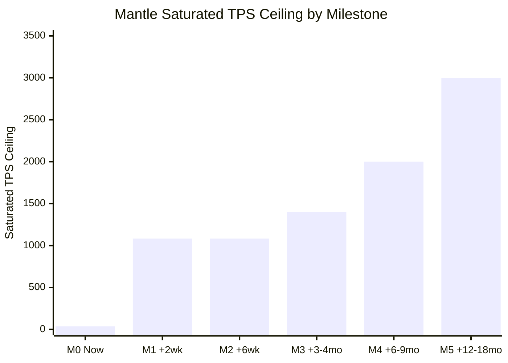
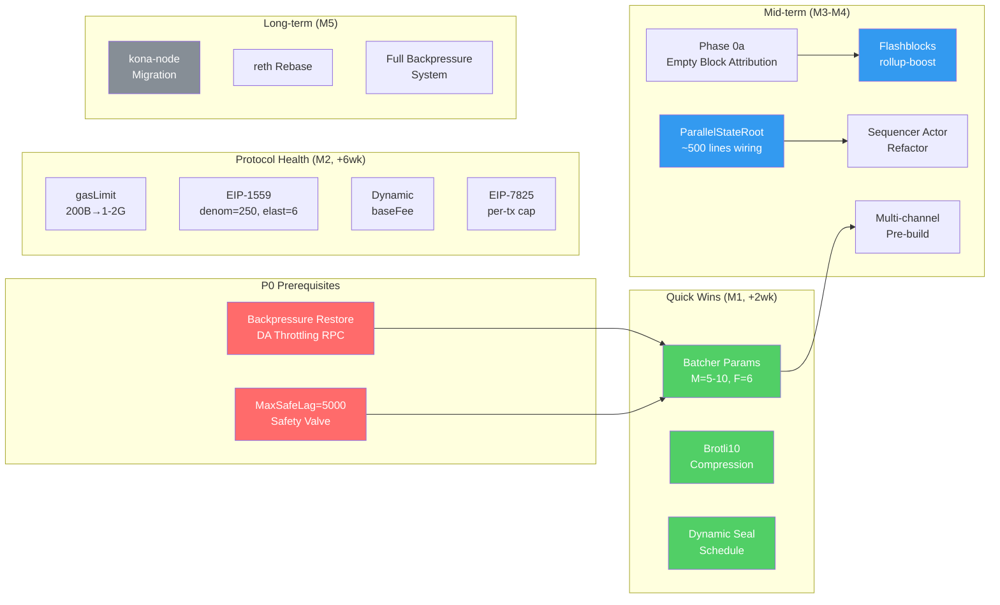

# Base Codebase 性能提升优势综述

## 1. Executive Summary — 性能差距全景与关键结论

Mantle 与 Base 之间存在约 **90–130× 的 TPS 差距**（Mantle ~0.7–1.0 TPS vs Base ~93.7 user-tx/s），但这一差距的根本原因是**需求侧约束（demand-bound）**，而非供给侧吞吐能力不足 [perf-gap §Executive Summary]。Mantle 60.8% 的区块仅含系统交易（L1 attributes deposit），gas 利用率仅 0.29%（中位数 0.08%），远低于 Base 的 8.19%（中位数 7.31%）[perf-gap §Comparison Table, block-builder §5.1]。

**核心诊断**：Mantle 当前处于典型的 demand-bound 状态——供给侧有显著的可释放空间，但需求不足以触发供给侧瓶颈。在供给侧，最关键的瓶颈是 Batcher 管道的序列化约束（MaxPendingTransactions=1），其 saturated ceiling 仅为 ~36 TPS [batcher-pipeline §6.4.1]。

**切换后预期性能天花板**：

- **Quick Wins（+2 周）**：仅通过参数调优（MaxPendingTx=5–10, TargetNumFrames=6, Brotli10, Dynamic seal），saturated ceiling 从 ~36 TPS 提升至 **~1,083 TPS** [perf-gap §Quick Wins]
- **中期（+3–9 月）**：ParallelStateRoot + Sequencer 重构 + Flashblocks → **~1,400–2,000 TPS** [perf-gap §TPS Milestones]
- **长期（+12–18 月）**：kona-node 迁移 + reth rebase + 全背压系统 → **~2,000–3,000+ TPS** [perf-gap §TPS Milestones]

**三句话核心结论**：

1. Mantle 的 TPS 差距主要由需求侧驱动，而非技术能力上限；供给侧 Quick Wins 可在 2 周内将 saturated ceiling 从 ~36 提升至 ~1,083 TPS。
2. 切换至 Base codebase 能获得完整的 Flashblocks 250ms 预确认、并行状态根计算、5-actor 并发管道等架构级优势，中长期可达 2,000–3,000+ TPS。
3. DA 层拥有 ~1,480× 的带宽余量，在可预见的未来不构成性能瓶颈；真正的工程优先级是 Batcher 参数调优和背压机制修复。

---

## 2. 性能对比基准表

### 2.1 三列对比表：Mantle Current / Base Current / Mantle Post-Switch Expected

| 指标 | Mantle 当前 | Base 当前 | Mantle 切换后预期 | 来源 |
|------|-----------|----------|-----------------|------|
| **User TPS** | ~0.7–1.0 | ~93.7 | demand-bound: ≈当前; saturated ceiling: ~1,083 (M1) → ~2,000–3,000+ (M5) | [perf-gap §Executive] |
| **Avg tx/block** | 1.80 (median 1) | 187 (median 158) | 取决于需求增长 | [perf-gap §Comparison Table] |
| **Avg gas_used/block** | 174,650 gas | 32.76 Mgas | 取决于需求增长 | [perf-gap §Comparison Table] |
| **Gas 利用率** | 0.29% (median 0.08%) | 8.19% avg / 7.31% median | 取决于需求增长；gasLimit 校准后利用率信号恢复 | [perf-gap §Comparison Table] |
| **空块率** | 60.8% | 0.20% | 取决于 Flashblocks 采用 + 需求增长；timing-recoverable 部分可消除 | [block-builder §5.1] |
| **区块时间** | 2s | 2s (+250ms Flashblocks 预确认) | 2s (+250ms 预确认，中期实现) | [gas-protocol §Block Time] |
| **gasLimit** | 200B (decorative) | ~375M (effective binding) | 1G–2G (校准至有效约束) | [gas-protocol §3.1] |
| **baseFee** | 0.02 gwei (固定) | 动态 EIP-1559 | 动态 EIP-1559 (denom=250, elasticity=6) | [gas-protocol §3.2] |
| **EIP-1559 参数** | elasticity=2, denominator=8 | elasticity=6, denominator=250 | elasticity=6, denominator=250 | [gas-protocol §EIP-1559] |
| **EIP-7825 per-tx cap** | 未执行 (`!IsOptimism()` 门控) | 已执行 (16,777,216 gas) | 已执行 | [gas-protocol §EIP-7825] |
| **MaxPendingTx** | 1 (code-default, 序列化) | 1 (code-default) | 5–10 (Quick Win 配置) | [batcher-pipeline §4.1] |
| **Observed blobs/batch tx** | 1 (on-chain confirmed) | 5 (Base mainnet observed) | 6 (TargetNumFrames=6 推荐配置目标) | [batcher-pipeline §6.5] |
| **TargetNumFrames (config)** | 1 (code-default) | — (Base mainnet 非由 Rust TargetNumFrames 路径直接解释) | 6 (Mantle 切换后 Quick Win 推荐配置) | [batcher-pipeline §2, §6.5] |
| **Batcher cadence** | ~448s | ~49s | <50s (参数调优后) | [batcher-pipeline §3.3] |
| **压缩算法** | Zlib | Brotli10 | Brotli10 (~15–25% DA 效率提升) | [batcher-pipeline §4.4] |
| **DA 需求** | ~97.1 B/s (~1.18 TPS DA demand) | ~14.4 KB/s | 随需求增长线性增长 | [da-bandwidth §4.1] |
| **DA 余量** | ~1,480× | 趋近物理上限 | ~1,480× (当前需求下) | [da-bandwidth §4.1] |
| **Pre-confirmation** | N/A | 250ms (Flashblocks) | 250ms (中期实现) | [block-builder §3.2] |
| **Sequencer 架构** | 单 eventLoop (Go) | 5-actor tokio (Rust) | 渐进迁移至 actor 模型 | [sequencer §Architecture] |
| **sealingDuration** | 50ms (硬编码) | 动态反馈调节 | 动态反馈调节 (Quick Win) | [sequencer §PayloadSealer] |
| **FCU/block** | 2 | 2 | 2 (等效) | [sequencer §FCU Analysis] |
| **ParallelStateRoot** | 库存在但未接线 (0 call sites) | 已接线并上线 | 接线启用 (中期 P1) | [execution §ParallelStateRoot] |
| **背压机制** | MaxSafeLag=0 (disabled), DA Throttling RPC 已移除 | 完整 DA Throttling + setMaxDASize + setGasLimit | 修复 DA Throttling (P0 前置条件) | [backpressure §Backpressure Types] |
| **SequencerMaxSafeLag** | 0 (disabled) | Dead code (未接线) | 5000 (安全阀, Quick Win) | [backpressure §Type A] |

### 2.2 关键差距分析

三列对比表揭示了以下核心模式：

1. **需求侧差距主导**：TPS、gas 利用率、空块率等指标的巨大差异主要反映需求差距，而非技术上限差异 [perf-gap §Bottleneck Level Model L1-A]。
2. **供给侧 Quick Wins 空间巨大**：Batcher 参数（MaxPendingTx, TargetNumFrames）+ 压缩升级 + 动态 seal 可将 saturated ceiling 从 ~36 提升至 ~1,083 TPS，成本仅 ~0.1 person-month [perf-gap §ROI Tiers]。
3. **架构级差异需中长期投入**：ParallelStateRoot、5-actor 管道、Flashblocks 等属于 Base codebase 的架构优势，需 3–18 个月的工程投入才能完全获得。
4. **安全前置条件不可跳过**：背压机制修复（DA Throttling RPC 恢复）是所有吞吐量提升的 P0 前置条件 [backpressure §Strategy A]。

---

## 3. 执行层（op-reth Fork）性能差异分析

### 3.1 5-Tier 归因模型概述

Base 与 Mantle 的执行层差异按 5-Tier 归因模型分类 [execution §Tier A-E]:

| Tier | 内容 | Base | Mantle |
|------|------|------|--------|
| **A** | paradigmxyz/reth 上游基线 | v1.11.4 (版本对齐策略) | v2.2.0 (op-reth 发布跟踪策略) |
| **B** | OP 继承层 | 不 vendor op-reth；自研等效实现 | vendor 完整 op-reth/v2.2.1 (17 subcrates) |
| **C** | Base 自研 OP-Stack 执行层 | 24 subcrates (bundle, consensus, engine-tree, evm, flashblocks, proofs 等) | N/A |
| **D** | Mantle overlay | N/A | ~5 行 Tier D patches (near-zero perf impact) |
| **E** | Mantle revm 注入 | N/A | token_ratio + BVM_ETH (per-tx 开销) |

**关键发现**：两个 fork pin 了不同的主版本（v1.11.x vs v2.2.x），导致基线不可直接比较（`[INCOMPARABLE_BASELINE]`）[execution §Tier A Baseline]。

### 3.2 缓存架构差异——两种不同架构，非"有无"之分

两个 fork 采用了**不同范围、不同粒度的缓存架构** [execution §Cache Architectures]:

**Mantle Tier B flashblocks-scoped 缓存**：
- `TransactionCache<N>`: block-level + parent-hash-scoped
- `CachedReads`: 投机构建中复用 pending parent 的读取缓存
- Cached-prefix resume: 增量 sub-block 构建时跳过已缓存前缀的重执行
- 限制：不跨块、不缓存 precompile、不后台计算 receipt root

**Base Tier C 缓存架构**：
- `CachedExecutor` + `FlashblocksCachedExecutionProvider`: 跨 flashblock 的执行缓存复用
- `CachedPrecompile::wrap`: per-precompile 输入→输出缓存 (bn254, secp256k1, blake2)
- `ReceiptRootTaskHandle`: 异步 receipt root 计算 (crossbeam_channel)
- 三级状态根策略: `StateRootTask` → `ParallelStateRoot` → 同步回退；`LazyOverlay`/`DeferredTrieData` 后台 trie 输入预热

### 3.3 ParallelStateRoot 差异

- **Base**: 已在 `validator.rs:75, :927` 显式接线，使用 `reth-trie-parallel` 上游实现，通过 prefix-set 子树分区实现确定性并行（无 tx-level 冲突，无回滚）[execution §ParallelStateRoot]
- **Mantle**: 库代码存在于 reth v2.2.0 中，但在 Mantle op-reth/ workspace 中 **0 个调用点** — 能力未启用 [execution §ParallelStateRoot]
- `StateRootTask`: Base 在 validator.rs:534, 1172, 1252 接线；Mantle 0 个调用点
- `LazyOverlay`: Base 在 validator.rs:32 导入；Mantle 0 个调用点
- **预期收益**: ≥20–50% 状态根计算时间缩减 (`[PENDING VERIFICATION]`) [execution §Performance Matrix]

### 3.4 Tier E Mantle 特有开销

Mantle Tier E 引入 per-tx 额外开销 [execution §Tier E]:
- `token_ratio` 计算: ≥6 U256 大数运算/tx + ≥1 条件 storage write + block-amortized 1 cold storage read
- `BVM_ETH_MINT_GAS_COMPENSATION = 4500` gas 补偿 (EIP-2929: 2500 account + 2000 storage)
- 估计 ≤1 ms/tx (inferred, upper_bound_only)

### 3.5 执行层性能影响量化

执行层在整体 TPS 差距中的权重为 **10–20%** [perf-gap §Component Weights]。

**改进优先级** [execution §Recommendations]:
1. **P0 Quick Win**: 接线 `ParallelStateRoot` + `LazyOverlay` + `StateRootTask` (≤500 行, ≥20–50% state root 缩减)
2. **P1**: 添加 `precompile_cache` wrap (≤100 行)
3. **P1**: 异步 receipt root 后台任务
4. **P1**: 升级 Tier B flashblocks 缓存至 Tier C 架构
5. **P2 战略**: 重构 token_ratio + BVM_ETH 热路径 (高成本, 可能需要 hardfork)

---

## 4. Block Builder 与 Flashblocks 吞吐量贡献

### 4.1 rollup-boost 架构

rollup-boost 是 Engine API 代理，在 sequencer 和外部 block builder 之间透明路由 [block-builder §Architecture]:
- `fork_choice_updated_v3`: 使用 `tokio::join!(l2_fut, builder_fut)` 同时发送 payload_attributes 至 L2 和 builder
- `get_payload`: 并行 `tokio::join!` 获取两侧 payload，builder payload 通过 `l2.new_payload` 验证 (~10–50ms)
- `BlockSelectionPolicy`: 唯一变体 `GasUsed`，选择 L2 仅当 `builder_gas < 0.1 * l2_gas` (10% 阈值)

**关键纠正** [block-builder §Item-8, Round 2 Correction]: rollup-boost **不是工作负载卸载机制**。L2 EL 仍然执行完整候选 payload，builder 在并行复制相同工作。净 sequencer host CPU 变化: **0 到 +5%** (略有增加，非减少)。真正收益是 gas 利用率提升 + 更短的预确认延迟。

### 4.2 Flashblocks 250ms Sub-Block 机制

- 默认配置: `block_time=2s`, `flashblocks_interval=250ms`, `flashblocks_per_block=8`
- Builder 在 flashblock_index=0 首先发布回退空块，然后每 250ms 调用 `build_next_flashblock` 持续填充
- P2P `flblk/1` 协议 (2026-01 spec): 双签名认证，HA failover via StartPublish/StopPublish

**预确认延迟**: ≤250ms vs Mantle 当前 2s 区块时间 = **8× UX 改善** [block-builder §Flashblocks]

### 4.3 空块消除机制

| 指标 | Base mainnet | Mantle mainnet |
|------|-------------|----------------|
| 空块率 | 0.20% (1/500) | 60.8% (304/500) |
| 每日空块数 | ~86/day | ~26,266/day |
| Avg gas_used/block | 32.76M | 174,650 |

空块消除通过 builder 的 250ms×8 连续填充机制实现——选择 builder 持续填充的 payload 而非 L2 的快照 payload [block-builder §Empty Block Analysis]。

### 4.4 Mantle 分支现状

- **`flashblocks/poc`**: 仅 2 个 commit，均为 Cargo.toml 功能添加和 revm 版本升级。**无任何 Flashblocks 代码**。分支名称具有误导性 [block-builder §Mantle Branch Evaluation]。
- **`feat/flashblocks-mantle-aware`**: Consumer-only 薄层。仅解析 17-byte OP Jovian extra_data。无 producer、无 sequencer 集成、无 MetaTx/L1 cost 交互。

### 4.5 Mantle ROI 分析

ROI 取决于 60.8% 空块中 **timing-recoverable** 的比例 [block-builder §Item-9]:

| 场景 | 假设 | gas 提升倍数 |
|------|------|-------------|
| **A (上限)** | 全部 60.8% timing-recoverable | 2.13× |
| **B (下限)** | 全部 demand-empty | 1.00× (无收益) |
| **C (中间, 50% recoverable)** | 30.4% 可恢复 | 1.56× |

**Phase 0a Gate** (1–3 周): 需先量化 mempool 到达率和空块归因比例，才能确定 Flashblocks 的真实 ROI。20% 恢复率 → 1.23×，仅 +21 tps 绝对增量 vs 31–49 周 / 7–11 工程师月的工作量。

**工程投入**: Phase 0a (1–3 周) → Phase 1 consumer (6–10 周) → Phase 2 testnet (4–6 周) → Phase 3 producer (12–16 周) → Phase 4 rollout (8–12 周)。**总计 31–49 周 / 7–11 engineer-months** [block-builder §Engineering]。

**优先级**: 中期 (Tier 3 Medium ROI in current demand state) [perf-gap §ROI Tiers]。

---

## 5. Gas 协议与性能配置参数对比

### 5.1 gasLimit: 名义 vs 实效

| 链 | gasLimit | 状态 | 实际影响 |
|----|---------|------|---------|
| Mantle | 200B (200,000,000,000) | 装饰性 (decorative) — 实际 TPS 0.7–1.0, 从未接近上限 | 无约束作用 |
| Base | ~375M | 有效约束 (binding) — 实际被利用 | 决定 per-block 吞吐上限 |

Mantle gasLimit 与观测 TPS 之间存在 **6 个数量级的差距** [gas-protocol §3.1]。理论 TPS 计算:
- Base 375M gasLimit: ETH transfer 8,928 TPS / ERC-20 3,750 TPS / Swap 1,250 TPS
- Mantle 200B gasLimit: ETH transfer 4,761,904 TPS (理论值，完全不可达)

### 5.2 EIP-7825 Per-Tx Cap

- **Base**: Azul 激活后硬件级执行 (`MAX_TX_GAS_LIMIT_OSAKA = 2^24 = 16,777,216` gas)
- **Mantle**: 常量 `MaxTxGas = 1 << 24` 存在但被 `!IsOptimism()` 门控，**5 个执行点均未生效** [gas-protocol §EIP-7825]:
  - `core/txpool/validation.go:128`
  - `core/state_transition.go:536`
  - `miner/worker.go:765-766`
  - `eth/gasestimator/gasestimator.go:73,84`
- **DoS 风险**: Mantle 最坏情况 — 单个 ~20M gas 的精心构造 tx 可占满 sequencer block budget

### 5.3 EIP-1559 参数对比

| 参数 | Base | Mantle | 影响 |
|------|------|--------|------|
| Elasticity | 6 | 2 | Base 3× burst 吸收能力 |
| Denominator | 250 (Canyon) | 8 | Base 1/250 vs Mantle 1/8 价格调整粒度 |
| baseFee | 动态 | 0.02 gwei (Arsia 前固定) | Mantle 无拥塞信号 |

Mantle 固定 baseFee 消除了拥塞定价信号，使 EIP-1559 参数在 Arsia 前实质上处于惰性状态 [gas-protocol §EIP-1559]。

### 5.4 预编译 Gas 定价

预编译 gas 定价在 Mantle Skadi/Limb 升级后已与 Base **完全对齐** [gas-protocol §Precompile Repricing]:
- MODEXP: EIP-7883/7823 (min 200→500, squared ×3, input ≤1024 bytes)
- secp256r1: EIP-7951 (3450→6900)
- BLS12-381: EIP-2537 (完整定价表)

### 5.5 Quick Wins 参数调整

| 优先级 | 调整 | 当前 → 推荐 | 收益 | 风险 |
|--------|------|-------------|------|------|
| **Q4** (最优先) | gasLimit 校准 | 200B → 1G–2G | 恢复 1559 信号 | 低 |
| **Q2** | EIP-1559 参数 | denom 8→250, elasticity 2→6 | 3× burst 吸收 + 价格稳定 | 低 |
| **Q3** | 动态 baseFee | 固定 0.02 gwei → 动态 (minBaseFee=1 wei) | 公平定价 + DoS 抵抗 | 中 |
| **Q1** | EIP-7825 per-tx cap | 未执行 → 16,777,216 gas | DoS 加固 | 中 (需 hardfork) |
| **Q5** | Flashblocks 200ms | N/A → 200ms | UX 大幅提升 | 高 (需全栈) |

推荐执行顺序: Q4 → Q2+Q3 (同窗口, "价格信号恢复组合") → Q1 (独立 hardfork 窗口) [gas-protocol §Quick Wins Matrix]。

---

## 6. Sequencer 共识管道性能差异

### 6.1 架构对比: 5-Actor vs 单 Event-Loop

**Base 5-actor 模型** (Rust + tokio, Tier A+C) [sequencer §Architecture]:

| Actor | 职责 | Channel 容量 |
|-------|------|-------------|
| EngineActor (+EngineRpcProcessor) | Engine API 处理 | mpsc(1024), semaphore=16 |
| DerivationActor | 独立任务, 6-state machine | mpsc(1024) |
| NetworkActor | libp2p gossipsub+discv5 | mpsc(256) |
| L1Watcher | 4s latest poll | mpsc(1024) |
| SequencerActor | 5-arm `tokio::select!`, PayloadSealer + PayloadBuilder | — |

**Mantle 单 Event-Loop 模型** (Go, Tier B+D):
- `driver.go:eventLoop()` 单个 `select{}` 串行调度 sequencing/engine/derive 事件
- `EngineController` 直接持有 `ExecEngine` 接口，在 `OnEvent` 调用栈中进行同步 HTTP/JWT RPC 调用

### 6.2 PayloadSealer 3-State Machine

Base 的 PayloadSealer 使用 3 存储状态 + 终态 Inserted [sequencer §PayloadSealer]:
- `Sealed` → `conductor.commit_unsafe_payload().await` → `Committed`
- `Committed` → `gossip_client.schedule_execution_payload_gossip().await` (入队, 广播 fire-and-forget) → `Gossiped`
- `Gossiped` → `engine_client.insert_unsafe_payload().await` (等待 mpsc result_tx 返回 `L2BlockInfo`) → `Inserted`

### 6.3 sealingDuration 50ms 硬编码限制

- **Mantle**: `sealingDuration=50ms` 硬编码在 `sequencer.go:25`
- **Base**: 使用 adaptive feedback: `next_tick = UNIX_EPOCH + Duration::from_secs(sealed_block_timestamp + block_time) − last_seal_duration`

### 6.4 Per-block FCU 开销 (Round-2 纠正)

**Round-1 的 "4 serial FCU / 5 calls per block" 已撤回** [sequencer §FCU Analysis, Round-2 Correction]。

正确值: **每块 2 FCU** (等同于 OP 标准) + 1 NewPayload + 1 GetPayload:
- 1× FCU-with-attrs (build_start)
- 1× FCU-without-attrs (onPayloadSuccess → tryUpdateEngineInternal)

真正的瓶颈是 **EngineController 同步 RPC 阻塞 OnEvent 调用栈**，而非 FCU 数量 [sequencer §Key Round-2 Corrections]。

### 6.5 Block Time Budget (2s, per-block ms)

| 阶段 | Base ms | Mantle ms |
|------|---------|-----------|
| build_start (FCU+attrs) | 10–50 | 10–50 |
| build_seal (GetPayload) | 30–80 | 30–80 |
| insert (NewPayload+FCU) | 60–150 | 60–150 |
| sealingDuration | 动态反馈 | **50ms 硬编码** |
| derivation step (非边界) | 0 (独立任务) | 5–50 (eventloop 阻塞) |
| L1 epoch 边界 derivation | ~0 | 50–200 (~1/6 概率) |
| conductor commit RTT | 5–20 | 5–20 |

**Sequencer 总占比**: Base 7.5–14% / Mantle 7.75–16.5% (非边界); Mantle 10–24% (L1 epoch 边界) [sequencer §Block Time Budget]。

### 6.6 kona-node 迁移评估

`mantle-xyz/kona` 当前仅用于 cannon fault-proof prestate (`fp_client_only`)，**非在线 sequencer 替代** [sequencer §kona Scope]:
- 迁移工程量: 18–30 person-months
- 预期收益: 30–260 ms/block 复合 (消除 Go GC)
- 优先级: Tier 4 Low ROI

### 6.7 7 Improvement Levers

| Lever | 目标 | 预期 ms/block | 优先级 |
|-------|------|-------------|--------|
| lever-4: Dynamic sealingDuration | 替换 50ms 硬编码 | 0–30 | **#1 Quick Win** |
| lever-5: External P2P fire-and-forget | 外部不安全 payload 处理 | 5–20 | #2 |
| lever-2+3: Derivation goroutine 并行 | L1 epoch 边界优化 | 5–200 | #3 |
| lever-1: Actor + task queue 解耦 | RPC 移出主循环 | 5–30 (typical), ~95 (boundary) | #4 |
| lever-7: kona-node 全迁移 | 复合优化 | 30–260 | #5 战略 |

**TPS 权重**: Sequencer 管道在整体差距中权重 **5–12%** [perf-gap §Component Weights]。

---

## 7. Batcher 管道架构与吞吐量影响

### 7.1 7-Stage Pipeline 对比

| 阶段 | Base (Rust) | Mantle (Go) |
|------|-------------|-------------|
| S1 L2 block ingest | `STEP_BUDGET=128` | `blockLoadingLoop` goroutine |
| S2 channel build | `BatchEncoder` state machine | `channelMgr.ensureChannelWithSpace`, single pending |
| S3 frame encode | `MAX_BLOB_FRAME_SIZE=130043` | `MaxFrameSize = MaxL1TxSize-1` |
| S4 compression | Shadow+Brotli10 (default) | Shadow+Zlib (default) |
| S5 blob/calldata pack | `BLOB_MAX_DATA_SIZE=130044` | Multi-path (Calldata/Blobs/MantleBlobs) |
| S6 L1 submit | `Semaphore(max_pending)` + `FuturesUnordered` | `txmgr.NewQueue` (max-pending-tx) |
| S7 receipt confirm | `tokio::select! biased` | `receiptsLoop` goroutine |

### 7.2 MaxPendingTransactions=1: 最大供给侧瓶颈

**MaxPendingTransactions=1** 是当前**最关键的供给侧瓶颈**，Batcher 在整体 TPS 差距中的权重为 **25–40%**（所有组件中最高）[perf-gap §Component Weights]。

- Code-default: `flags.go:63-68` Value=1 [batcher-pipeline §R1]
- 实际效果: 序列化 L1 inclusion，observed cadence ~448.2s/tx (min=360, max=516)
- Saturated capacity (M=1, F=1): **~36 TPS** [batcher-pipeline §6.4.1]

### 7.3 TargetNumFrames=1 与 Observed Blobs/Tx

On-chain 50 样本观测 [batcher-pipeline §6.5]:
- **Mantle**: 1 blob/tx (50/50 样本, blob_gas_used=131072)
- **Base**: 5 blobs/tx (50/50 样本, blob_gas_used=655360)

**重要区分** (Round-2 纠正): Base mainnet 观测到 5 blobs/tx，但其代码库 `submissions.rs` 仅构造单 blob。Base mainnet 可能运行上游 Go op-batcher 或私有 Rust fork。TargetNumFrames=6 仅作为 **Mantle 切换后的 Quick Win 推荐配置目标** [batcher-pipeline §5.1.1]。

### 7.4 压缩效率对比

| 算法 | 压缩率 | CPU 开销 (vs Zlib9) | TPS 增益 |
|------|--------|-------------------|----------|
| Zlib9 (Mantle default) | baseline | 1× | baseline |
| Brotli10 (Base default) | +5–15% | 2–4× | 1.1–1.3× |
| Brotli11 | +<3% over B10 | 2× over B10 | minimal |

### 7.5 On-Chain 行为对比

| 指标 | Mantle | Base |
|------|--------|------|
| Tx type | 100% blob_transaction | 100% blob_transaction |
| Blobs/tx | 1.00 (min=max=1) | 5.00 (min=max=5) |
| Cadence | avg 448.2s (min=360, max=516) | avg 49.0s (min=36, max=72) |
| Sample window | ~6.10h | ~0.67h |

### 7.6 Quick Wins 量化

**Saturated Capacity 对比** (RTT=12s, 300 bytes/L2 tx) [batcher-pipeline §6.4.1]:

| 场景 | bytes/L1 tx | N | TPS_saturated |
|------|------------|---|---------------|
| Mantle 当前 (1 blob, N=1) | 130,044 | 1 | **~36** |
| Conservative (N=3, F=3) | — | 3 | **~324** |
| **Recommended (N=5, F=6)** | 780,264 | 5 | **~1,083** |
| Aggressive (N=10, F=6) | — | 10 | **~2,166** |
| Base mainnet (5 blobs, N=5) | 650,220 | 5 | **~903** |

**推荐 Quick Win**: MaxPendingTx=5–10 + TargetNumFrames=6 → ~1,083 TPS saturated ceiling
- 成本: ~0.1 person-month (实际 2–3 person-days)
- ROI: **Tier 1 Exceptional** (~2,900% 容量提升: 36→1,083 TPS) [perf-gap §ROI Tiers]

### 7.7 单 Pending Channel 架构约束

`channel_manager.go:26-28` 的 single pending channel 架构在 saturated 状态下构成进一步约束 [batcher-pipeline §R3]。Multi-channel pre-build 预计 +1.5–2× post-saturation 增益，工程量 4–8 weeks [batcher-pipeline §Architecture Evolution]。

---

## 8. DA 带宽与吞吐量天花板

### 8.1 BPO2 配置

当前 L1 活跃 blob schedule: **BPO2** (EIP-8135, 2026-01-07 激活) [da-bandwidth §BPO2]:
- target=14 blobs/block, max=21 blobs/block
- BLOB_BASE_FEE_UPDATE_FRACTION = 11,684,671

### 8.2 物理 DA 带宽

`physical_DA_BW = target × 130,044 / 12s` [da-bandwidth §Physical Ceiling]:

| 阶段 | target | Sustained KB/s | 年化存储 |
|------|--------|---------------|---------|
| Pre-Pectra | 3 | 32.51 | ~1.00 TB/year |
| Pectra | 6 | 65.02 | ~2.00 TB/year |
| BPO1 | 10 | 108.37 | ~3.34 TB/year |
| **BPO2 sustained** | **14** | **151.72** | **~4.68 TB/year** |
| BPO2 burst | 21 | 227.58 | ~7.02 TB/year |

### 8.3 DA TPS Ceiling 计算

`TPS_DA = (14 × 130,044 × fill_rate) / (12 × avg_bytes_per_UOP)` [da-bandwidth §DA Ceiling]:

| 场景 | bytes/UOP | fill_rate | TPS_DA |
|------|-----------|----------|--------|
| **Mantle observed** | 82.38 | 95% | **1,749** |
| Base observed | 153.03 | 95% | 942 |
| BPO2 burst Mantle | 82.38 (21 target) | 95% | 2,623 |
| 理论最优 (25 B/UOP) | 25 | 95% | 5,765 |

Mantle 由于更小的 tx encoding (82.38 B/UOP vs Base 153.03 B/UOP), DA ceiling 反而 **高于 Base** (~1,749 vs ~942 TPS)。

### 8.4 Mantle DA 需求现状

- 当前 DA 需求: ~97.1 B/s → ~1.18 TPS DA demand [da-bandwidth §Mantle Measurements]
- DA headroom: **~1,480×** [da-bandwidth §Binding Verdict]
- Arsia 后状态更新间隔: ~1h 1s (~720 state updates/30 days)
- 30D 数据量: 2.85 GiB/year ≈ 8.00 MiB/day

### 8.5 结论: DA NOT Binding

**DA 层在 Mantle 当前和可预见未来均不构成性能瓶颈** [da-bandwidth §Binding Verdict]:
- ~3 个数量级的 DA 余量
- DA 仅在 M4+ milestone (~1,400+ TPS) 时才开始变得相关
- DA 优化应聚焦于**成本降低**而非 TPS 提升

Mantle DA 优化杠杆优先级:
1. **P1 (立即)**: Zlib → Brotli10 (DA 效率 ~20%/tx 提升, 0 TPS 直接增益)
2. P2: fill rate 45%→85% (~50%/byte 成本降低)
3. P2: multi-blob 1→2–3 blobs/tx
4. P3: dapp RLP 优化 (5–15% DA 成本)

---

## 9. 背压机制与安全约束

### 9.1 4 种背压类型

| 类型 | 机制 | Mantle 状态 | Base 状态 |
|------|------|------------|----------|
| **A: SequencerMaxSafeLag** | safe head lag → sequencer stall | **Disabled** (CLI default=0) | Dead code (未接线) |
| **B: DA Throttling** | backlog → `miner_setMaxDASize` → block size reduction | **Code-default ENABLED (3.2MB) 但 RPC 已移除 → batcher 启动失败** | **完整运行** (Step/Linear) |
| **C: Engine Memory** | payload queue > threshold → drop | 500MB binary drop | mpsc(1024) blocking sender |
| **D: Queue Backlog** | 隐式; 无阈值, 无信号 | UnsafeDABytes() 包含所有通道 | da_backlog_bytes() 排除 deposit tx |

### 9.2 Mantle 背压缺失诊断

Mantle 处于 **"无有效背压" 状态** [backpressure §Mantle Disabled State]:

- **State 1** (Code default): LowerThreshold=3.2MB, throttlingLoop 启动; comment: "should always be started except for testing"
- **State 2** (实际效果): batcher 调用 `miner_setMaxDASize` RPC, 得到 "method not found", 调用 `StopBatchSubmitting(ctx)` → **batcher 关机** (test `TestThrottlingEnabledFailure` 验证)
- **State 3** (可能的生产配置): 设 LowerThreshold=0 跳过; test `throttling_disabled_test.go:137` 显式覆盖; 无部署配置证据

**净结果**: DA throttling 在 Mantle 上**不可用**，无论使用哪种配置。

### 9.3 4 条因果链

| 因果链 | 描述 | Mantle 状态 | 激活阈值 |
|--------|------|------------|---------|
| **A** | Batcher 慢 → safe head lag → MaxSafeLag 触发 → sequencer stall | **未激活** (MaxSafeLag=0) | MaxSafeLag=1000 时, batcher cadence > 2000s |
| **B** | Batcher 慢 → backlog → throttle → L1 fee 上升 → 恶性循环 | **BROKEN — 无 throttling, 螺旋可无缓解发生** | Base: backlog >1MB |
| **C** | Throttling 降低 maxBlockSize → 更小区块 → 更低用户 TPS | **不存在** — 无 throttling | Base: 130,000 → 2,000 |
| **D** | Batcher 慢 → DA 不完整 → safe head 停滞 → 依赖服务延迟 | **始终活跃** (~224 block span) | Mantle 9× worse than Base (~25 block span) |

### 9.4 改进策略

| 策略 | 优先级 | 工程量 | 时间线 | 风险 |
|------|--------|--------|--------|------|
| **A: 恢复 DA Throttling** | **P0** (最高) | 2–4 person-weeks | 4–6 weeks | Low-Medium |
| **D: Adaptive Gas Limit** | **P1** | 2–3 person-weeks | 3–5 weeks | Medium |
| **C: Flashblocks 解耦** | P2 | 12–20 person-weeks | 16–24 weeks | Medium |
| **B: Multi-Batcher** | P2 | 8–12 person-weeks | 12–16 weeks | High |

**关键前置条件**: DA Throttling 恢复 (Strategy A) 是**所有吞吐量提升的 P0 前置条件**。在背压机制修复前提升吞吐量存在 unsafe span 无界增长和 L1 blob fee spiral 风险 [backpressure §Strategy A]。

### 9.5 背压修复与 Quick Wins 的前置关系

执行顺序约束:
1. **先**: 设 SequencerMaxSafeLag=5000 (安全阀, <1 person-week)
2. **先/并行**: 实现 `miner_setMaxDASize` RPC in Mantle op-geth (2–4 person-weeks)
3. **后**: 提升 MaxPendingTx + TargetNumFrames (Quick Wins 5a)

---

## 10. Quick Wins / Mid-term / Long-term 改进分级

### 10.1 ROI Tier 分类

| Tier | Rank | Item | TPS 影响 (saturated) | 成本 (person-months) |
|------|------|------|---------------------|---------------------|
| **Tier 1 Exceptional** | 1 | QW-a1+a2 Batcher params | ~2,900% (36→1,083 TPS) | 0.1 |
| **Tier 1 Exceptional** | 2 | MT-8 Brotli10 | ~10–30% DA 效率 | 0.5 |
| **Tier 1 Exceptional** | 3 | MT-6 Dynamic sealingDuration | ~1–3% (0–30 ms/block) | 1.5 |
| **Tier 2 High** | 4 | MT-1 ParallelStateRoot | ~5–15% | 3.0 |
| **Tier 3 Medium** | 5 | MT-5 Flashblocks | ~0–113% (A:113%, B:0%, C:56%) | 9.0 |
| **Tier 3 Medium** | 6 | MT-3+MT-4 Sequencer actor | ~5–12% | 12.0 |
| **Tier 3 Medium** | 7 | MT-7 Multi-channel | ~50–100% post-saturation | 4.0 |
| **Tier 3 Medium** | 8 | MT-2 Tier C cache | ~3–8% | 6.0 |
| **Tier 4 Low** | 9 | LT-1 kona-node | ~15–25% | 24.0 |
| **Tier 4 Low** | 10 | LT-6 Multi-Batcher | ~100% post-saturation | 3.0 |
| **Tier 4 Low** | 11 | LT-2 reth rebase | Variable | 4.0 |
| **Tier 4 Low** | 12 | LT-3 token_ratio | <5% | 8.0 |
| **Enabler** | — | QW-b1-b3 Price signal | N/A (protocol health) | 0.5 |
| **Enabler** | — | QW-b4+b5 Backpressure safety | N/A (P0 前置条件) | 1.0 |
| **Enabler** | — | QW-c1 EIP-7825 | N/A (DoS hardening) | 2.0 |
| **Enabler** | — | LT-5 Full backpressure | N/A (stability) | 25.0 |

[perf-gap §ROI Tiers]

### 10.2 Quick Wins 详表

| # | 改进项 | 当前 → 目标 | 成本 | 预期影响 |
|---|--------|------------|------|---------|
| QW-a1 | MaxPendingTransactions | 1 → 5–10 | 0.5 day | 5–10× saturated |
| QW-a2 | TargetNumFrames | 1 → 6 | 0.5 day | ~6× per-L1-tx capacity |
| QW-a3 | MaxChannelDuration | 0 → 5–10 L1 blocks | 0.5 day | 平滑发送 |
| QW-b1 | gasLimit | 200B → 1G–2G | — | 恢复 1559 信号 |
| QW-b2 | EIP-1559 params | denom 8→250, elasticity 2→6 | — | 3× burst + 精细粒度 |
| QW-b3 | 动态 baseFee | 固定 0.02 gwei → 动态 | — | 公平定价 |
| QW-b4 | 恢复 DA Throttling RPC | 已移除 → 恢复 | 2–4 person-weeks | P0 安全前置 |
| QW-b5 | SequencerMaxSafeLag | 0 → 5000 (~2.8h) | — | 安全阀 |
| QW-c1 | EIP-7825 per-tx cap | 未执行 → 16,777,216 gas | 5 点补丁 | DoS 加固 |

### 10.3 Mid-term 详表

| # | 改进项 | 预期 TPS 影响 | 工程量 | 优先级 |
|---|--------|-------------|--------|--------|
| MT-1 | ParallelStateRoot 接线 | ≥20–50% state root 缩减 → 5–15% E2E | 2–4 person-months (~500 行) | P1 |
| MT-2 | Tier C cache 升级 | Marginal (~3–8%) | 4–8 person-months | P2 |
| MT-3 | Sequencer actor + task queue | 5–30 ms/block typical | 6–10 person-months | P2 |
| MT-4 | Derivation goroutine 分离 | 5–200 ms/block (L1 boundary) | 4–8 person-months | P2 |
| MT-5 | Flashblocks + rollup-boost | Scenario A: 2.13×, B: 1.0×, C: 1.56× | 7–11 person-months | P2 (Phase 0a gated) |
| MT-6 | Dynamic sealingDuration | 0–30 ms/block | 1–2 person-months | **P0 Quick Win** |
| MT-7 | Multi-channel pre-build | 1.5–2× post-saturation | 10–18 weeks | P2 |
| MT-8 | Zlib → Brotli10 | ~10–30% DA efficiency | CLI flag (0.5 day) | **P0 Quick Win** |

推荐实施优先级: MT-8 > MT-6 > MT-1 > MT-5 (Phase 0a gated) > MT-3/MT-4 > MT-7 > MT-2 [perf-gap §Mid-term Priority]

### 10.4 Long-term 详表

| # | 改进项 | 预期影响 | 工程量 | 风险 |
|---|--------|---------|--------|------|
| LT-1 | kona-node 迁移 | 30–260 ms/block compound; 消除 Go GC | 18–30 person-months | Extremely High |
| LT-2 | reth upstream rebase | Variable (上游改进同步) | 4 person-months | Medium-High |
| LT-3 | token_ratio 重构 | ≤1 ms × N_tx 开销消除 | 8 person-months | High (可能需 hardfork) |
| LT-4 | DA 策略升级 | DA cost ~50%+; DA ceiling ~1,749 → ~2,600+ TPS | Medium | Medium |
| LT-5 | 全背压系统 | 稳定性保障 | 20–30 person-months | Medium-High |
| LT-6 | Multi-Batcher 实例 | ~2× batcher throughput | 8–12 person-weeks | High |

### 10.5 TPS Milestone 路线图

| Milestone | 时间线 | TPS 范围 | 关键动作 |
|-----------|--------|---------|---------|
| **M0 (当前)** | — | 0.7–1.0 (demand-bound) | Baseline |
| **M1** | +2 weeks | demand-bound: ≈1.0; **saturated ceiling: ~1,083** (从 ~36) | Batcher params (QW-a1+a2) + Brotli10 (MT-8) + Dynamic seal (MT-6) |
| **M2** | +6 weeks | ~1,083 + protocol health | Price signal restoration (QW-b1-b3) + Backpressure (QW-b4+b5) |
| **M3** | +3–4 months | **~1,200–1,400** | ParallelStateRoot (MT-1) + 其他中期项 |
| **M4** | +6–9 months | **~1,400–2,000**; UX: 250ms pre-conf | Flashblocks (MT-5) + Sequencer refactor (MT-3/MT-4) |
| **M5** | +12–18 months | **~2,000–3,000+** | kona-node (LT-1) + reth rebase (LT-2) + 全背压 (LT-5) |

[perf-gap §TPS Milestones]

---

## 11. 组件瓶颈到 Base 改进项映射

### 11.1 Bottleneck Level Model

Mantle 的性能瓶颈按三层模型分类 [perf-gap §Bottleneck Level Model]:

- **Level 1 — Binding Constraints (约束层)**:
  - L1-A: 需求侧约束 (60.8% 空块, gas util 0.29%)
  - L1-B: 供给侧 scenario-only ceiling (MaxPendingTx=1 → ~36 TPS)
- **Level 2 — Latent Bottlenecks (潜在瓶颈)**:
  - ParallelStateRoot 未启用
  - Sequencer 单 event-loop 155–330ms overhead
  - 单 pending channel 架构
  - Zlib 压缩
- **Level 3 — Headroom & Enablers (余量与使能层)**:
  - L3-A: DA ~1,480× 余量, DA ceiling ~1,749 TPS
  - L3-B: gasLimit 200B 装饰性, 固定 baseFee, EIP-1559 参数次优, EIP-7825 未启用

### 11.2 Component TPS Weight 分布

| 组件 | TPS Gap Weight | 类型 | 证据级别 |
|------|---------------|------|---------|
| **Batcher Pipeline** | **25–40%** | supply-side | inferred + scenario-only |
| Execution Layer | 10–20% | supply-side | code-default |
| Backpressure | 5–15% | supply-side indirect | code-default |
| Block Builder / Flashblocks | 5–15% | mixed | inferred |
| Sequencer Pipeline | 5–12% | supply-side | inferred |
| Gas Protocol | 3–8% | supply-side indirect | deployed-config-verified |
| DA Bandwidth | <1% | supply-side (headroom) | observed |

[perf-gap §Component Weights]

### 11.3 瓶颈→改进项因果映射表

| 瓶颈组件 | 当前约束 | Base 改进项 | 优先级 | 依赖 |
|---------|---------|------------|--------|------|
| **Batcher 序列化** | MaxPendingTx=1, TargetNumFrames=1 | M=5–10, F=6 并行提交 | **P0** | 背压修复 |
| **Batcher 压缩** | Zlib | Brotli10 | **P0** | 无 |
| **Sequencer seal timing** | 50ms 硬编码 | Dynamic seal schedule | **P0** | 无 |
| **背压缺失** | Disabled/broken (MaxSafeLag=0, DA Throttling RPC removed) | 完整 4-type restoration | **P0 (前置条件)** | 无 |
| **执行层状态根** | 顺序计算 (0 call sites) | ParallelStateRoot 接线 | P1 | 现有库接线 (~500 行) |
| **Gas 配置** | 200B decorative + 固定 baseFee + EIP-7825 未执行 | 1–2G 校准 + 动态 EIP-1559 + per-tx cap | P1 | 需求增长 |
| **Block builder** | System empty blocks (60.8%) | rollup-boost + Flashblocks 250ms | P2 | 需求充分 + Phase 0a gate |
| **Sequencer 架构** | 单 event-loop (Go) | 5-actor tokio (Rust) | P2 | 工程投入 6–10 person-months |
| **DA 带宽** | ~1,480× 余量 | 非约束 | — | 仅在 M4+ (~1,400+ TPS) 时相关 |

### 11.4 依赖链分析

关键依赖关系:
1. **背压修复 → 吞吐量提升**: DA Throttling RPC 恢复 (P0) 是 Batcher Quick Wins 的硬前置条件
2. **需求增长 → Gas 配置调优 ROI**: gasLimit 校准和动态 baseFee 在需求不足时无实际效果
3. **需求增长 → Flashblocks ROI**: Phase 0a (空块归因) 决定 Flashblocks 投资价值
4. **ParallelStateRoot 接线 → 执行层收益**: 现有库代码需接线至执行路径 (~500 行)
5. **Phase 0a → MT-5 Flashblocks**: 必须先量化 timing-recoverable 比例才能启动 Phase 1

---

## Diagrams

### Diagram 1: Performance Improvement Waterfall Chart

```mermaid
gantt
    title Mantle TPS Improvement Roadmap (Saturated Ceiling)
    dateFormat  X
    axisFormat  %s TPS
    
    section M0 Baseline
    Current State (0.7-1.0 TPS observed)       :m0, 0, 1
    
    section M1 Quick Wins (+2 weeks)
    Batcher params QW-a1+a2 (~36→1083)          :m1a, 1, 1083
    
    section M2 Protocol Health (+6 weeks)
    Price signal + Backpressure restore           :m2, 1083, 1083
    
    section M3 Mid-term (+3-4 months)
    ParallelStateRoot + Dynamic seal + Brotli10   :m3, 1083, 1400
    
    section M4 Architecture (+6-9 months)
    Flashblocks + Sequencer refactor              :m4, 1400, 2000
    
    section M5 Strategic (+12-18 months)
    kona-node + reth rebase + Full backpressure   :m5, 2000, 3000
```





### Diagram 2: Component Performance Comparison Heatmap

```mermaid
quadrantChart
    title Component Bottleneck Priority Map
    x-axis Low Effort --> High Effort
    y-axis Low TPS Impact --> High TPS Impact
    quadrant-1 Strategic Investment
    quadrant-2 Quick Wins (Do First)
    quadrant-3 Low Priority
    quadrant-4 Consider Carefully
    Batcher params (Tier 1): [0.05, 0.95]
    Brotli10 (Tier 1): [0.08, 0.45]
    Dynamic seal (Tier 1): [0.15, 0.35]
    ParallelStateRoot (Tier 2): [0.35, 0.65]
    Flashblocks (Tier 3): [0.55, 0.55]
    Sequencer refactor (Tier 3): [0.70, 0.45]
    Multi-channel (Tier 3): [0.40, 0.40]
    Tier C cache (Tier 3): [0.55, 0.30]
    kona-node (Tier 4): [0.90, 0.50]
    Multi-Batcher (Tier 4): [0.45, 0.35]
    token_ratio (Tier 4): [0.65, 0.15]
    Backpressure restore (Enabler): [0.20, 0.80]
```

### Diagram 3: Dependency Chain Flow



---

## Source Coverage

### Primary Sources (All Cited)

| Source | Path | Status | Items Cited In |
|--------|------|--------|---------------|
| Performance Gap Analysis | `perf-gap-analysis-recommendations/final.md` | ✅ Final | 1, 2, 10, 11 |
| Execution Layer Comparison | `execution-layer-reth-fork-comparison/final.md` | ✅ Final | 3 |
| Block Builder & Flashblocks | `block-builder-flashblocks-throughput/final.md` | ✅ Final | 1, 2, 4 |
| Gas Protocol Config | `gas-protocol-perf-config/final.md` | ✅ Final | 2, 5 |
| Sequencer Pipeline | `sequencer-consensus-pipeline-perf/final.md` | ✅ Final | 6 |
| Batcher Pipeline | `batcher-pipeline-architecture/final.md` | ✅ Final | 2, 7 |
| DA Bandwidth | `da-bandwidth-throughput-ceiling/final.md` | ✅ Final | 8 |
| Backpressure Mechanisms | `batcher-sequencer-backpressure/final.md` | ✅ Final | 9 |

**Coverage**: 8/8 primary sources cited; all treated as Final source artifacts.

### Citation Convention

All claims cite specific source sections: `[source-slug §Section.Subsection]`

---

## Gap Analysis

| Gap | Severity | Description | Mitigation |
|-----|----------|-------------|------------|
| G-1 | Medium | ParallelStateRoot 实际 TPS 收益标记为 `[PENDING VERIFICATION]` — 缺少独立基准测试 | 引用上游报告 ≥20–50% state root 时间缩减; 标注为 inferred |
| G-2 | Low | Mantle 生产环境 deployed_config 未获取 (MaxSafeLag, DA Throttling 配置) | 使用 code-default + on-chain 行为推断 |
| G-3 | Low | Mantle Tier E `token_ratio` µs/tx 微基准测试缺失 | 标注为 inferred/upper_bound_only (≤1 ms/tx) |
| G-4 | Low | Base "5k TPS" 原始声明来源未找到 | 标注为未验证; DA 分析显示需 ~5.3× 压缩改进 |
| G-5 | Medium | Flashblocks ROI 高度依赖 Phase 0a 结果 (timing-recoverable 比例) — 场景 A/B/C 跨度大 (1.00×–2.13×) | 三场景分析 + Phase 0a gate 建议 |
| G-6 | Low | 两个 fork 的 reth 基线版本不同 (v1.11.4 vs v2.2.0) → `[INCOMPARABLE_BASELINE]` | 差异分析聚焦于能力差异而非版本对比 |

---

## Revision Log

| Round | Date | Changes |
|-------|------|---------|
| 1 | 2026-05-21 | Initial draft. All 11 items covered across 9 scope areas. 3 Mermaid diagrams produced. 8/8 primary sources cited. Three-column comparison table fully populated. Quick Wins / Mid-term / Long-term layering with quantified gains. Component bottleneck-to-improvement mapping with dependency chains. |
