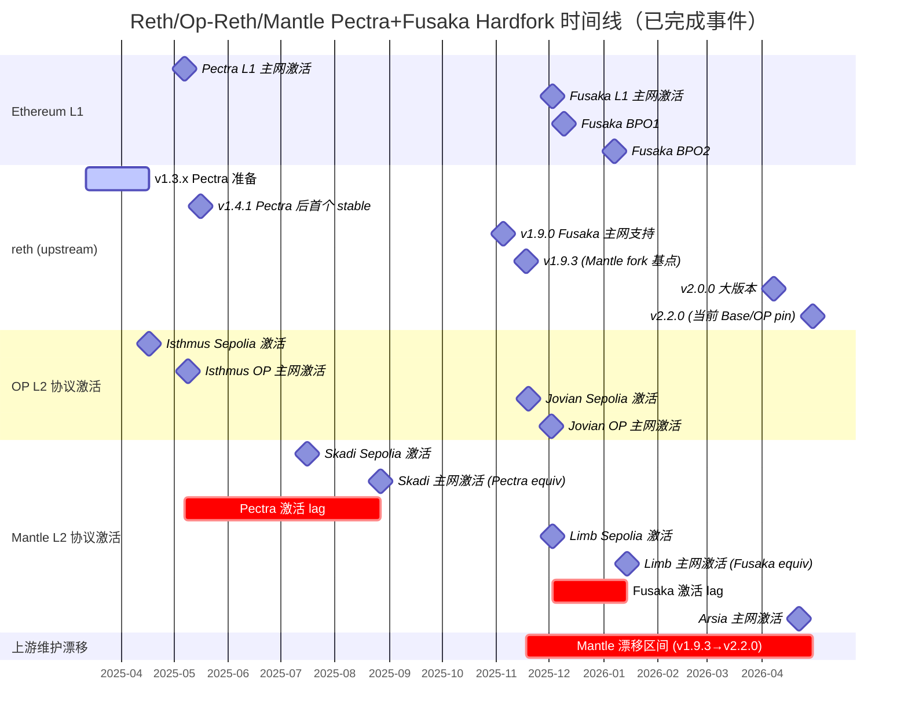
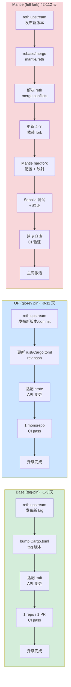
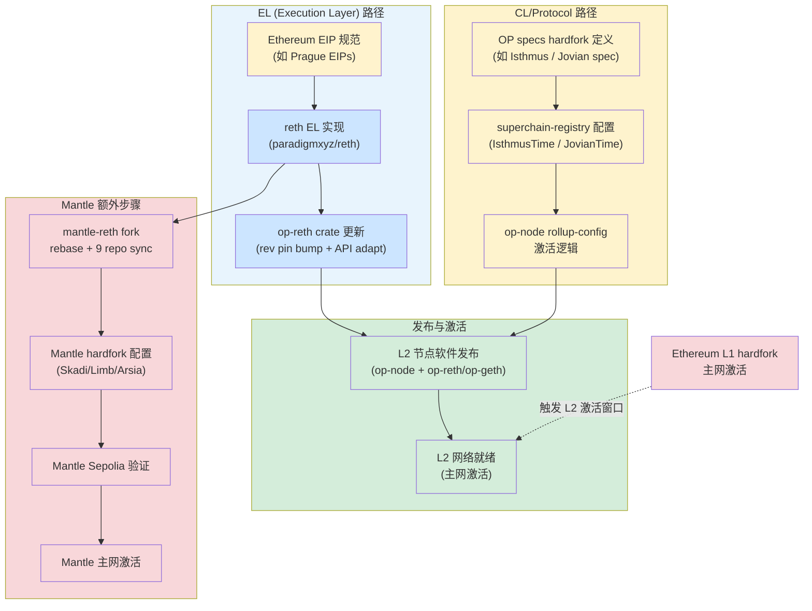

# Reth 与 Op-Reth 在 Ethereum Hardfork 中的迭代依赖关系分析

## Executive Summary

本研究量化分析了三种 upstream reth 依赖模型在 Ethereum hardfork 跟进维度的表现差异。以 Pectra（2025-05-07 L1 激活）和 Fusaka（2025-12-03 L1 激活）两个已完成的 hardfork 为核心案例，我们追踪了从 `paradigmxyz/reth` EL 代码就绪到各 L2 网络实际激活的端到端延迟链路。

**关键方法论修正**：本轮修订将"hardfork 延迟"拆分为三个独立度量指标，纠正了 round-1 中将版本维护漂移等同于 hardfork 跟进延迟的错误：

| 度量指标 | 定义 | 对 Mantle 的含义 |
|---------|------|----------------|
| **Hardfork 兼容客户端版本 lag** | 从 L1 hardfork 激活到首个支持该 hardfork 的 reth/op-reth 版本发布的时间 | Mantle 当前 pin 的 reth v1.9.3 **已包含 Pectra 和 Fusaka 支持**——hardfork 客户端兼容性 lag 为零 |
| **上游最新版本维护漂移** | Mantle 当前 pin 版本与 upstream reth 最新版本的差距 | v1.9.3（2025-11-18）vs v2.2.0（2026-04-30）= **约 5 个月 + 1 个大版本**，反映维护债务而非 hardfork 风险 |
| **L2 协议激活 lag** | 从 L1 hardfork 激活到 Mantle L2 网络实际完成等价升级的时间 | Skadi（Pectra 等价）: **112 天**；Limb（Fusaka 等价）: **42 天**——趋势显著改善 |

核心发现：

1. **OP monorepo git-rev pin 模型**的 reth → op-reth EL 代码跟进延迟中位数仅 **2 天**（6 个样本，范围 0-11 天），表明该模型在 hardfork 跟进速度上非常高效。
2. **Base tag-pin 模型**直接 pin upstream reth git tag，升级仅需 bump tag + 适配 trait 变更，涉及 1 个仓库、0 个 rebase 操作，是三种模型中维护成本最低的方案。
3. **Mantle full fork 模型**当前 fork 基于 reth v1.9.3（2025-11-18）。该版本已包含 Fusaka 主网支持（v1.9.0 引入），因此 Mantle 的 reth pin **在 hardfork 兼容性层面并不落后**。但 upstream reth 已演进至 v2.2.0（2026-04-30），维护漂移达 5 个月和一个完整大版本，意味着 Mantle 缺失了大量非 hardfork 的性能优化、安全补丁和 API 改进。
4. **Mantle 的实际 hardfork 激活 lag 正在显著缩短**：Skadi（Pectra 等价）在 Pectra L1 激活后 112 天上线，Limb（Fusaka 等价）在 Fusaka L1 激活后 42 天上线。这一改善趋势表明 Mantle 团队在 hardfork 集成能力上有明显提升，但仍显著落后于 OP/Base 的 1-2 天水平。
5. **EL 代码就绪与 L2 协议激活就绪是两个不同的里程碑**。OP 生态在 Pectra/Fusaka 中实现了极短的 EL→L2 激活间隔（Isthmus: 2 天；Jovian: L1 前 1 天），而 Mantle 的主要延迟来源不是 reth 版本兼容性，而是 full fork 模型下的集成测试和自有 hardfork 配置流程。

## 1. 三种 Upstream Reth 依赖模型分类与技术分析

### 1.1 OP Monorepo Git-Rev Pin 模型

**依赖机制**：Op-reth 并非 `paradigmxyz/reth` 的 fork，而是位于 Optimism monorepo（`ethereum-optimism/optimism`）内 `rust/op-reth/` 目录下的独立 crate 集合。这些 crate 通过 workspace 级别的 `rust/Cargo.toml` 以 git-rev 方式 pin upstream reth：

```toml
reth = { git = "https://github.com/paradigmxyz/reth", rev = "81c026181e96ef33a823f3ef4d2a28940e9fa4fe" }
```

当前 workspace 包含 **15 个 op-reth crate**（chainspec、cli、consensus、evm、exex、flashblocks、hardforks、node、payload、primitives、reth、rpc、storage、trie、txpool），以及 bin 目录和 examples。此外，workspace 还包含 kona（证明系统）、op-alloy、alloy-op-evm、alloy-op-hardforks、op-revm 等相关 crate。

**Rust workspace 统一时间线**：2026-02-10，commit `48a7a09bfcce`（"feat(rust): unify workspaces (#19034)"）将原本分散的 Rust 项目统一到 Optimism monorepo 的 `rust/` workspace 下。

**修改范围**：Op-reth crate 实现了 OP Stack 特定的 EL 逻辑（chainspec、consensus 规则、EVM 扩展、payload 构建等），但不修改 upstream reth 代码本身。所有定制通过 reth 提供的 trait 扩展点实现。

**更新工作流**：
1. 更新 `rust/Cargo.toml` 中的 rev hash（所有 reth-* crate 使用同一 rev）
2. 适配 upstream API 变更（crate 级别的 trait 签名变化）
3. 在同一 monorepo 内一次性 CI 验证

**自动化程度**：中。Rev bump 本身是机械操作，但 API 适配可能需要手动工作。从历史记录看，大多数 bump 是同日或次日完成的单 PR 操作。

### 1.2 Base Tag-Pin 模型

**依赖机制**：Base（`base/base`）直接 pin upstream `paradigmxyz/reth` 的 git tag，主 workspace `Cargo.toml` 中声明：

```toml
reth-db = { git = "https://github.com/paradigmxyz/reth", tag = "v2.2.0" }
```

当前 pin 的是 reth **v2.2.0**，涉及 60+ 个 reth-* crate。

**关键区别**：Base 的主 workspace **零 op-reth、零 kona、零 op-alloy 依赖**。所有 OP Stack 特定逻辑均在 `base-*` crate 中自研实现。Base 仓库共 127 个 root workspace member（含 SP1 guest 子 workspace 共 130 crate）。

**修改范围**：对 upstream reth 零修改。Base 通过 reth 提供的 trait 扩展点和泛型组合实现所有定制，与 reth 的交互面（conflict surface）仅限于 trait API 签名。

**更新工作流**：
1. 在 `Cargo.toml` 中 bump tag 版本（如 `v2.1.0` → `v2.2.0`）
2. 适配 reth trait API 变更
3. 1 个仓库、1 个 PR

**自动化程度**：高。Tag bump 是纯声明性操作，仅需处理 trait 层面的 breaking change。由于 Base 不依赖 op-reth/kona/op-alloy 中间层，没有级联传播延迟。

### 1.3 Mantle Full Fork 模型

**依赖机制**：Mantle 采用完整 fork 模式，`mantle/reth` 仓库的 `Cargo.toml` workspace 版本为 `1.9.3`（对应 reth v1.9.3，发布于 2025-11-18）：

```toml
[workspace.package]
version = "1.9.3"
homepage = "https://paradigmxyz.github.io/reth"
repository = "https://github.com/paradigmxyz/reth"
authors = ["Mantle Core Contributors"]
```

**依赖 fork 链**：

| 仓库 | Fork 来源 | 说明 |
|------|----------|------|
| `mantle/reth` | `paradigmxyz/reth` v1.9.3 | 主 EL 客户端 fork |
| `mantle/revm` | `bluealloy/revm` | EVM 实现 fork |
| `mantle/alloy-evm` | `alloy-rs/evm` | EVM 接口 fork |
| `mantle/op-alloy` | `alloy-rs/op-alloy` | OP 类型 fork |
| `mantle/kona` | `op-rs/kona` | 证明系统 fork |

共 5 个主仓库 + 4 个依赖 fork = **9 个仓库需要协同管理**。

**修改范围**：Mantle 在 fork 中做了深度修改，包括：
- 新增 `crates/mantle-hardforks/` 定义 Mantle 特有的 hardfork（Skadi = Prague-equivalent, Limb = Osaka-equivalent, Arsia）
- 在 `crates/optimism/` 目录下修改 OP Stack 相关逻辑
- 在 revm fork 中新增 `OpSpecId::ARSIA` 等自定义 spec
- tokenRatio 计算、MNT 原生代币支持等 Mantle 特有功能

**更新工作流**：
1. 从 upstream `paradigmxyz/reth` 的目标版本 rebase/merge 到 `mantle/reth`
2. 解决 reth fork 中的 merge conflict
3. 同步更新 4 个依赖 fork
4. 确保 5 个仓库间的依赖版本一致
5. 全量 CI 验证

**自动化程度**：低。级联 rebase 需要人工解决 conflict，尤其是核心文件的 fork diff 已达高 rebase 风险等级。

### 1.4 三种模型对比总览

| 维度 | OP (git-rev pin) | Base (tag-pin) | Mantle (full fork) |
|------|------------------|----------------|--------------------|
| 依赖方式 | git rev pin in workspace Cargo.toml | git tag pin in Cargo.toml | full repo fork + merge |
| 对 upstream reth 的修改 | 零（独立 crate 通过 trait 扩展） | 零（独立 crate 通过 trait 扩展） | 深度修改（散布在 fork 中） |
| 需变更的仓库数 | 1（optimism monorepo, rust workspace） | 1（base monorepo） | 9（5 main + 4 dep forks） |
| 依赖层数（到 reth） | 1（workspace rev pin reth） | 1（直接 tag pin reth） | 3（mantle-reth → reth fork → upstream reth） |
| 需 rebase 的仓库数 | 0（rev bump, not rebase） | 0（tag bump, not rebase） | 9 |
| Merge conflict risk | 低（仅 crate API 变更） | 低（仅 trait API 变更） | 高（级联跨 9 仓库） |
| OP Stack 中间层依赖 | 原生（op-reth 就是 OP Stack 的一部分） | 零（自研所有 OP 逻辑） | 需额外适配 OP 激活配置 |

## 2. Reth Pectra/Fusaka Hardfork 迭代时间线

### 2.1 Ethereum Hardfork 时间线（已完成）

截至 2026-05-26，Pectra 和 Fusaka 均已在 L1 主网成功激活：

| Hardfork | L1 主网激活日期 | 状态 |
|----------|--------------|------|
| **Pectra** (Prague+Electra) | **2025-05-07** | 已完成 |
| **Fusaka** (Fulu+Osaka) | **2025-12-03** 21:49:11 UTC | 已完成 |
| Fusaka BPO1（Blob 扩容第一阶段） | 2025-12-09 14:21:11 UTC | 已完成 |
| Fusaka BPO2（Blob 扩容第二阶段） | 2026-01-07 01:01:11 UTC | 已完成 |

Fusaka 是 Ethereum 首个采用三阶段滚动激活的 hardfork：主 fork（2025-12-03）→ BPO1（2025-12-09）→ BPO2（2026-01-07），核心特性为 PeerDAS（EIP-7594）和 Blob 容量从 6 → 10 → 15 target 的分阶段扩容。

### 2.2 Reth 版本迭代时间线

| 版本 | 发布日期 | 说明 |
|------|---------|------|
| v1.3.0 | 2025-03-12 | Pectra 准备阶段开始 |
| v1.3.5 ~ v1.3.12 | 2025-04-02 ~ 2025-04-17 | Pectra 主网激活前密集发布（8 个版本/16 天） |
| **v1.4.1** | **2025-05-16** | **首个 Pectra 主网后 stable release**（Pectra+9 天） |
| v1.4.3 ~ v1.5.0 | 2025-05-20 ~ 2025-06-26 | Pectra 后持续优化 |
| v1.6.0 ~ v1.8.0 | 2025-07-22 ~ 2025-09-23 | |
| v1.8.2 | 2025-09-30 | Fusaka Holesky 测试网支持 |
| **v1.9.0** | **2025-11-05** | **Fusaka 主网支持引入** |
| v1.9.1 | 2025-11-07 | Fusaka hotfix（修复 EIP-7928 EVM 回归） |
| v1.9.2 | 2025-11-11 | OP Stack 补丁 |
| **v1.9.3** | **2025-11-18** | **OP Stack + Jovian 补丁；Mantle fork 基点** |
| v1.10.0 | 2026-01-15 | |
| v1.11.0 ~ v1.11.3 | 2026-02-16 ~ 2026-03-12 | |
| **v2.0.0** | **2026-04-08** | **大版本升级**（breaking changes） |
| v2.1.0 | 2026-04-20 | |
| **v2.2.0** | **2026-04-30** | **Base 和 Op-Reth 当前 pin 版本** |

**关键观察**：

1. **Pectra 响应**：reth 在 Pectra L1 激活（2025-05-07）前后密集发布了 v1.3.x 系列。从 Pectra 测试网准备到 mainnet stable release（v1.4.1）仅约 2 个月。
2. **Fusaka 响应**：reth v1.9.0（2025-11-05）在 Fusaka L1 激活（2025-12-03）前约 1 个月就已发布主网支持。v1.9.3（2025-11-18）是 Fusaka 激活前的最终稳定版本，并被 Ethereum Foundation 列为 Fusaka 就绪客户端。
3. **Fusaka 激活后问题**：reth v1.9.3 在 Fusaka 激活当天（2025-12-03）出现了 OOM 问题（paradigmxyz/reth#20110），但总体完成了网络升级。

### 2.3 Hardfork 兼容版本总结

| Hardfork | 首个兼容 reth 版本 | 发布日期 | 距 L1 激活 |
|----------|-------------------|---------|-----------|
| Pectra | v1.3.x（预激活） | 2025-03 ~ 2025-04 | L1 前 1-2 个月 |
| Fusaka | **v1.9.0** | **2025-11-05** | **L1 前 28 天** |

**这意味着 Mantle 当前 pin 的 reth v1.9.3 已完整包含 Pectra 和 Fusaka 的 EL 支持**。Mantle 在 hardfork 客户端兼容性层面并不落后——v1.9.3 就是 Ethereum Foundation 认可的 Fusaka 就绪版本。

## 3. Op-Reth Pectra/Fusaka Hardfork 迭代时间线与 Lag 量化

### 3.1 Op-Reth 发布时间线

Op-reth 自 2026-02-10 Rust workspace 统一后的发布历史：

| 版本 | 发布日期 | 对应 reth 版本 |
|------|---------|---------------|
| op-reth/v1.11.0 | 2026-02-20 | reth v1.11.0 (2026-02-16) |
| op-reth/v1.11.3 | 2026-03-17 | reth v1.11.3 (2026-03-12) |
| op-reth/v1.11.5 | 2026-04-02 | ~reth v1.11.3 |
| op-reth/v2.0.0 | 2026-04-15 | reth v2.0.0 (2026-04-08) |
| op-reth/v2.1.0 | 2026-04-21 | reth v2.1.0 (2026-04-20) |
| op-reth/v2.2.0 | 2026-04-29 | reth v2.2.0 (2026-04-30) |
| op-reth/v2.2.1 | 2026-05-04 | ~reth v2.2.0 |
| op-reth/v2.2.2 | 2026-05-11 | ~reth v2.2.0 |
| op-reth/v2.2.3 | 2026-05-18 | ~reth v2.2.0 |
| op-reth/v2.2.5 | 2026-05-26 | ~reth v2.2.0+ |

### 3.2 Reth Rev Pin 变更记录与 Lag 量化

以下是 `rust/Cargo.toml` 中 reth rev pin 的历史变更记录及与 upstream reth release 的时间差：

| Reth Release | Reth 发布日期 | Op-Reth Bump Commit | Bump 日期 | Lag（天） |
|-------------|-------------|--------------------|-----------|---------:|
| v1.11.0 | 2026-02-16 | `9ddfb4611b31` (#19240) | 2026-02-19 | **3** |
| v1.11.1 | 2026-02-23 | `c48932131098` (#19292) | 2026-03-06 | **11** |
| v1.11.2 | 2026-03-10 | `d40fb204ed55` (#19472) | 2026-03-11 | **1** |
| v1.11.3 | 2026-03-12 | `7149381de9a8` (#19498) | 2026-03-12 | **0** |
| v2.0.0 | 2026-04-08 | `1e3ee2540a13` (#19989) | 2026-04-10 | **2** |
| v2.2.0 | 2026-04-30 | `7a33d9f2f907` (#20459) | 2026-04-30 | **0** |

**统计分析**：

| 指标 | 值 |
|------|---|
| 样本数 | 6 次 rev bump |
| 中位数 lag | **2 天** |
| 平均 lag | **2.8 天** |
| 最大 lag | **11 天**（v1.11.1，同时升级 MSRV 至 1.92） |
| 最小 lag | **0 天**（v1.11.3、v2.2.0 同日 bump） |

**关键结论**：Op-reth 对 upstream reth 的 rev pin 更新响应非常快速。大多数情况下在 0-3 天内完成。v1.11.1 的 11 天 lag 是异常值，来自同步的 toolchain 变更而非 reth 适配本身的复杂度。此外，op-reth 有时 pin 到 unreleased 的 reth commit，允许在需要时精确锁定到特定 fix，而无需等待 upstream release。

### 3.3 Op-Reth v2.0.0 大版本升级分析

Reth v2.0.0（2026-04-08）是一个包含 breaking changes 的大版本升级。Op-reth 在 **2 天内**（2026-04-10）完成了 bump，并在 5 天后发布了 op-reth/v2.0.0（2026-04-15）。中间还有一个过渡性 commit（2026-04-03），表明迁移分两步完成：先升级核心依赖，再 bump 到正式 tag。

## 4. OP Hardfork 激活配置里程碑与 L2 协议就绪度

### 4.1 EL 代码就绪 vs L2 协议激活就绪

reth/op-reth 的 EL 代码就绪仅仅是 OP Stack L2 网络可以激活 hardfork 的前提之一。完整的 L2 hardfork 激活链路涉及多个组件的协同：

```
Ethereum EIP 规范
    → reth EL 实现
        → op-reth crate 更新（rev pin bump + crate 适配）
            → OP specs hardfork 定义
                → superchain-registry 配置（激活时间戳）
                    → op-node rollup-config 激活逻辑
                        → L2 节点软件发布
                            → L2 网络就绪
```

### 4.2 Isthmus (Pectra-equivalent) 激活里程碑（已完成）

Op-reth hardfork 映射关系（来源：`rust/op-reth/crates/hardforks/src/lib.rs`）：

| OP L2 Hardfork | 对应 L1 Hardfork | 激活状态 |
|---------------|-----------------|---------|
| Canyon | Shanghai | 已完成 |
| Ecotone | Cancun | 已完成 |
| **Isthmus** | **Prague (Pectra-EL)** | **已完成** |
| **Jovian** | **Fusaka** | **已完成** |

Isthmus 激活时间线：

| 里程碑 | 日期 | 时间戳 | 来源 |
|--------|------|--------|------|
| Ethereum Pectra L1 主网激活 | 2025-05-07 | - | Ethereum 官方 |
| Isthmus Sepolia 激活 | 2025-04-17 16:00 UTC | 1744905600 | superchain-registry |
| op-node v1.13.2 发布（Isthmus Mainnet release） | 2025-04-18 | - | GitHub releases |
| **Isthmus OP 主网激活** | **2025-05-09 16:00 UTC** | **1746806401** | superchain-registry |

**EL→L2 时间差**：Isthmus 在 OP 主网的激活时间（2025-05-09）仅比 Pectra L1 激活（2025-05-07）晚 **2 天**。Isthmus Sepolia（2025-04-17）甚至在 Pectra L1 主网激活之前就已完成测试网验证。

### 4.3 Jovian (Fusaka-equivalent) 激活里程碑（已完成）

Jovian 作为 Fusaka 的 OP Stack 等价物，已在 2025 年底成功激活：

| 里程碑 | 日期 | 时间戳 |
|--------|------|--------|
| Jovian Sepolia 激活 | **2025-11-19** 16:00:01 UTC | 1763568001 |
| **Jovian OP 主网激活** | **2025-12-02** 16:00:01 UTC | 1764691201 |
| Ethereum Fusaka L1 主网激活 | **2025-12-03** 21:49:11 UTC | 1764798551 |

**EL→L2 时间差**：Jovian 在 OP 主网的激活（2025-12-02）比 Fusaka L1 激活（2025-12-03）**早 1 天**，延续了 Isthmus 的模式。OP 生态通过 Upgrade 17 将 Fusaka L1 兼容性支持和 Jovian L2 hardfork 打包在同一 prestate 中发布，使得 L2 可以在 L1 激活之前就完成准备。

### 4.4 Hardfork 激活配置的技术结构

**`op-core/superchain/types.go`** 中的 `HardforkConfig` 结构定义了所有 OP Stack hardfork 的激活时间字段：

```go
type HardforkConfig struct {
    CanyonTime             *uint64
    DeltaTime              *uint64
    EcotoneTime            *uint64
    FjordTime              *uint64
    GraniteTime            *uint64
    HoloceneTime           *uint64
    IsthmusTime            *uint64
    JovianTime             *uint64
    KarstTime              *uint64
    InteropTime            *uint64
    PectraBlobScheduleTime *uint64
}
```

**Op-reth hardfork 代码**（`rust/op-reth/crates/hardforks/src/lib.rs`）在 Rust 侧镜像了这些配置。OP 主网的 Isthmus/Prague 激活时间戳为 `1746806401`（2025-05-09 16:00:01 UTC），Jovian 激活时间戳为 `1764691201`（2025-12-02 16:00:01 UTC）。

### 4.5 OP 生态 Hardfork 激活效率总结（回顾性评估）

| Hardfork | L1 激活日期 | OP L2 激活日期 | L1→L2 间隔 | 说明 |
|----------|-----------|--------------|-----------|------|
| Pectra → Isthmus | 2025-05-07 | 2025-05-09 | **+2 天** | Sepolia 先于 L1 完成验证 |
| Fusaka → Jovian | 2025-12-03 | 2025-12-02 | **-1 天** | L2 先于 L1 激活 |

OP 生态展示了极高的 hardfork 协调效率：EL 代码就绪、OP specs 定义、superchain-registry 配置、op-node 激活逻辑能够在 L1 hardfork 前后 1-2 天内完成全部协调，使 L2 在 L1 激活的同一时间窗口内完成升级。

## 5. Mantle 全链路 Hardfork 延迟影响评估

### 5.1 三种延迟度量指标的区分

round-1 草稿中将 Mantle 的 reth v1.9.3 → v2.2.0 版本差距（约 5 个月）等同于"hardfork lag"，这是一个重要的方法论错误。本轮修订将延迟拆分为三个独立度量指标：

#### 指标 1：Hardfork 兼容客户端版本 Lag

**定义**：从 Ethereum hardfork 激活到首个支持该 hardfork 的 reth 版本发布的时间差。这是衡量 reth 客户端是否具备 hardfork 兼容性的操作性指标。

**Mantle 当前状态**：

| Hardfork | 首个兼容 reth 版本 | 版本发布日期 | Mantle pin 版本 | 兼容性状态 |
|----------|-------------------|-----------|----------------|----------|
| Pectra | v1.3.x | 2025-03 ~ 2025-04 | v1.9.3 ✅ | **已兼容**（v1.9.3 >> v1.3.x） |
| Fusaka | v1.9.0 | 2025-11-05 | v1.9.3 ✅ | **已兼容**（v1.9.3 = Fusaka 就绪版本） |

**结论**：**Mantle 的 reth pin 在 hardfork 兼容性维度的 lag 为零**。reth v1.9.3 是 Ethereum Foundation 明确列出的 Fusaka 就绪客户端版本。Mantle 不需要升级 reth 版本来获得 Pectra 或 Fusaka 的 EL 支持。

#### 指标 2：上游最新版本维护漂移

**定义**：Mantle 当前 pin 的 reth 版本与 upstream 最新 release 之间的版本和时间差距。这衡量的是 Mantle 缺失的非 hardfork 改进（性能优化、安全补丁、API 改进、bug 修复等）。

**Mantle 当前状态**：

| Mantle Pin | Upstream Latest | 版本差距 | 时间差距 | 跨大版本 |
|-----------|----------------|---------|---------|---------|
| **v1.9.3**（2025-11-18） | **v2.2.0**（2026-04-30） | 13 个 minor/patch + 1 个 major | **~5 个月** | **是**（v1.x → v2.x） |

**缺失的主要改进**：
- reth v2.0.0 的 breaking API changes
- v1.10.0 ~ v2.2.0 期间的性能优化和 bug 修复
- 安全补丁（post-Fusaka OOM 修复等）

**结论**：这一差距代表的是**维护债务**，而非 hardfork 跟进风险。它意味着 Mantle 可能错过安全补丁和性能优化，但不影响其对已知 hardfork 的 EL 兼容性。然而，随着未来 hardfork（如 Pectra 之后的新 EIP 规范）引入新的 EL 要求，维护漂移会转化为 hardfork 风险——Mantle 可能需要一次跨越多个大版本的 rebase 才能获得下一个 hardfork 的支持。

#### 指标 3：L2 协议激活 Lag

**定义**：从 Ethereum L1 hardfork 激活到 Mantle L2 网络实际完成等价升级的端到端时间。这是对最终用户和生态影响最大的指标。

**Mantle 实际激活记录**（来源：`mantle/reth` codebase hardfork 配置 + 公开发布记录）：

| Mantle Hardfork | 对应 L1 Hardfork | L1 激活日期 | Mantle 主网激活日期 | **L2 激活 Lag** |
|----------------|-----------------|-----------|-------------------|---------------|
| **Skadi** | Pectra (Prague) | 2025-05-07 | **2025-08-27** | **112 天** |
| **Limb** | Fusaka (Osaka) | 2025-12-03 | **2026-01-14** | **42 天** |

Mantle Sepolia 测试网在主网之前完成验证：
- Skadi Sepolia: 2025-07-16（主网前 42 天）
- Limb Sepolia: 2025-12-03（主网前 42 天，与 Fusaka L1 同日）

**关键发现**：Mantle 的 L2 激活 lag 从 Pectra 时期的 112 天**缩短至** Fusaka 时期的 42 天，**改善幅度达 62.5%**。这表明 Mantle 团队在 hardfork 集成流程上取得了显著进步。然而，与 OP 生态的 1-2 天（甚至提前激活）相比，42 天仍存在一个数量级的差距。

### 5.2 Mantle 激活延迟的根因分析

Mantle 的 L2 激活 lag 并非来自 reth 版本不兼容（如上所述，v1.9.3 已包含 Fusaka 支持），而是来自 full fork 模型固有的集成流程：

1. **自有 hardfork 配置**：Mantle 使用独立的 hardfork 名称体系（Skadi/Limb/Arsia），需要在 `crates/mantle-hardforks/` 中定义映射关系和激活时间戳
2. **多仓库协调**：9 个仓库需要同步适配新 hardfork 逻辑
3. **自有 Sepolia 测试网验证**：Mantle Sepolia 的激活需要独立配置和验证，而非使用 OP Sepolia
4. **Bundled fork 模式**：Mantle 的 Limb Fork（2025-12 ~ 2026-01）将 8 个 OP Stack fork（Canyon through Jovian）打包在一次升级中，降低了升级频率但增加了单次升级的复杂度和测试周期

### 5.3 端到端延迟对比（实际数据）

| 维度 | OP (op-reth) | Base | Mantle | 对比 |
|------|-------------|------|--------|------|
| Pectra L2 激活 lag | 2 天（Isthmus） | 2 天（Isthmus，OP 共享） | **112 天（Skadi）** | Mantle 56x 于 OP |
| Fusaka L2 激活 lag | -1 天（Jovian，先于 L1） | -1 天（Jovian，OP 共享） | **42 天（Limb）** | Mantle 42x 于 OP |
| reth hardfork 兼容 lag | 0 天（rev pin 到最新） | 0 天（tag pin v2.2.0） | **0 天**（v1.9.3 已含 Fusaka） | 三者均无 |
| 上游维护漂移 | 0（当前 rev） | 0（v2.2.0） | **~5 个月**（v1.9.3 vs v2.2.0） | 仅 Mantle 存在 |

### 5.4 级联 Rebase 成本量化

| 维度 | 数据 |
|------|------|
| 需 rebase 的仓库数 | 9 |
| 主仓库（有直接修改） | 5（reth, revm, alloy-evm, op-alloy, kona） |
| 高 conflict risk 文件 | `state_transition.go`、`rollup_cost.go` 等核心路径 |
| 典型 rebase 时间（单次小版本） | 数天至 1-2 周 |
| 跨大版本 rebase（如 v1.x → v2.x） | 数周至数月 |
| CI 验证周期 | 每个仓库需独立跑通完整 CI |

**当前跨大版本升级困境**：如果 Mantle 需要从 v1.9.3 升级到 v2.x，需要一次性跨越 v2.0.0 的 breaking changes，这在 9 个仓库的级联 rebase 场景下工程量极大。虽然当前 v1.9.3 对 Pectra/Fusaka 是兼容的，但下一个需要 v2.x 才能支持的 hardfork 到来时，Mantle 将面临更大的升级压力。

## 6. 三种依赖模型在 Hardfork 跟进维度的对比

### 6.1 升级成本模型

| Dimension | Base (tag-pin) | OP op-reth (monorepo git-rev pin) | Mantle (full fork) |
|-----------|---------------|----------------------------------|-------------------|
| 依赖方式 | git tag pin in Cargo.toml | git rev pin in workspace Cargo.toml | full repo fork + merge |
| 需变更的仓库数 | **1** | **1** | **9** |
| 依赖层数 | **1** | **1** | **3** |
| 需 rebase 的仓库数 | **0** | **0** | **9** |
| Pectra hardfork 响应时间 | ~1-3 天（tag bump） | ~0-11 天（rev bump，中位 2 天） | **112 天**（Skadi） |
| Fusaka hardfork 响应时间 | ~1-3 天（tag bump） | ~0-2 天（rev bump） | **42 天**（Limb） |
| Hardfork 客户端兼容 lag | 0 | 0 | **0**（当前 v1.9.3 已兼容） |
| 上游维护漂移 | 0 | 0 | **~5 个月 + 1 大版本** |
| Merge conflict risk | **低** | **低-中** | **高** |
| 额外 L2 激活配置 | 与 OP Stack 共享 | 原生支持 | 需独立适配 |

### 6.2 成本复杂度分析

**Base 模型**：**O(1)** 升级复杂度。无论 reth 有多少变更，升级操作始终是"bump tag + adapt traits"。conflict surface 仅限于 reth 公开的 trait 签名变更。

**OP 模型**：**O(1)** 升级复杂度（接近 Base）。Rev bump 是声明性操作，crate API 适配工作量与 reth 的 breaking changes 数量成比例，但由于 op-reth 不修改 reth 代码，不存在 merge conflict。

**Mantle 模型**：**O(N)** 升级复杂度，其中 N = 需要同步更新的 fork 仓库数量（当前 N=9）。每个仓库的 rebase 工作量与该仓库中 Mantle 特有修改的代码量和 upstream 变更的冲突面积成正比。虽然 Mantle 的 Pectra→Fusaka 响应时间从 112 天缩短到 42 天，但这一改善更可能来自团队熟练度提升和 bundled fork 策略，而非模型本身的效率改进——每次升级仍需在 9 个仓库中执行级联 rebase。

### 6.3 自动化可行性

| 维度 | Base | OP | Mantle |
|------|------|----|----|
| 版本 bump 自动化 | 高（Dependabot/Renovate） | 高（可脚本化 rev bump） | 低（需人工解决 conflict） |
| CI 复杂度 | 低（单仓库） | 中（monorepo CI） | 高（9 仓库 CI） |
| 回滚难度 | 低 | 低 | 高（9 仓库协调回滚） |

## 7. Hardfork 跟进维度的 Mantle 切换建议

### 7.1 切换收益分析（基于实际历史数据）

基于 Pectra 和 Fusaka 两次已完成 hardfork 的实际数据进行收益评估：

| 收益维度 | 当前状态（实际数据） | 切换后预期 | 改善幅度 |
|---------|-------------------|-----------|---------|
| Hardfork L2 激活 lag | 42-112 天（趋势改善中） | ~1-3 天（与 Base 对齐） | **14x-37x** |
| 上游维护漂移 | ~5 个月 + 1 大版本 | 0（与 upstream 同步） | 完全消除 |
| 需 rebase 的仓库数 | 9 | 0 | 完全消除 |
| 大版本升级风险 | 极高（需跨 v2.0.0） | 低（tag bump） | 显著降低 |
| Merge conflict 频率 | 高（每次 rebase） | 低（仅 trait API 变更） | 显著降低 |

**修正说明**：round-1 草稿估计"10x-100x"改善幅度。基于 Pectra/Fusaka 实际数据，准确的改善幅度为 **14x-37x**（42 天→1-3 天 至 112 天→1-3 天）。需注意 Mantle 的 lag 本身在缩短，因此如果未来 hardfork 继续缩短到 20-30 天，改善幅度将更接近 7x-10x。

### 7.2 关于维护漂移风险的独立评估

虽然 Mantle 的 v1.9.3 对 Pectra 和 Fusaka 是兼容的，但 5 个月的维护漂移带来两类风险：

1. **安全风险**：reth v1.9.3 ~ v2.2.0 之间发布的安全补丁未被 Mantle 采纳。例如 Fusaka 激活当天的 OOM 问题（#20110）在后续版本中修复，但 Mantle 的 fork 可能仍然存在该问题。
2. **未来 hardfork 升级成本**：当下一个 hardfork 需要 v2.x 才能支持时，Mantle 将面临从 v1.9.3 直接跳到 v2.x 的大规模 rebase，跨越 v2.0.0 breaking changes。维护漂移越大，这次升级的难度越高。切换到 tag-pin 模型可以彻底消除这一累积风险。

### 7.3 切换成本与风险

| 成本/风险 | 说明 |
|----------|------|
| **迁移工程量** | 需将 Mantle 在 9 个 fork 中的所有定制逻辑迁移到独立 crate（类似 Base 的 `base-*` crate 模式） |
| **Mantle 特有功能重实现** | MNT 原生代币、tokenRatio、自定义 hardfork（Skadi/Limb/Arsia）等需在 trait 扩展点中重新实现 |
| **OP Stack 兼容性** | 切换到 Base 模型意味着不再依赖 op-reth，需要自研所有 OP Stack EL 逻辑（或选择性采纳） |
| **测试覆盖重建** | 需要重建完整的测试套件 |

### 7.4 分阶段实施路径

**阶段 1（短期，0-3 月）：评估与概念验证**
- 建立 Mantle 独立 crate 架构原型（参考 Base 的 `base-*` crate 模式）
- 识别 Mantle fork 中的最小定制集合
- 评估哪些 OP Stack 功能需要保留

**阶段 2（中期，3-9 月）：核心迁移**
- 将 Mantle 特有逻辑迁移到独立 crate
- 切换到 upstream reth tag-pin 依赖（从 v1.9.3 直接跳到当时最新版本）
- 消除 4 个依赖 fork

**阶段 3（中长期，9-18 月）：优化与验证**
- 建立 hardfork 跟进自动化流程（Dependabot/Renovate + CI）
- 在下一个 Ethereum hardfork 中验证新模型的跟进速度
- 评估是否需要参考 Base 自研 derivation pipeline

### 7.5 Pectra/Fusaka 案例端到端对比（回顾性）

以 Pectra 和 Fusaka 两次已完成的 hardfork 为案例的三种模型端到端对比：

| 里程碑 | reth (upstream) | OP (op-reth) | Base | Mantle |
|--------|---------------|-------------|------|--------|
| **Pectra (2025-05-07)** | | | | |
| EL 代码就绪 | v1.3.x (2025-03~04) | 同步跟进 | 同步跟进 | 已含在 v1.9.3 |
| Mainnet stable | v1.4.1 (2025-05-16) | v1.13.2 (2025-04-18) | 跟进 | v1.9.3 ✅ |
| L2 主网激活 | - | **2025-05-09** (Isthmus, +2 天) | **2025-05-09** (共享) | **2025-08-27** (Skadi, +112 天) |
| **Fusaka (2025-12-03)** | | | | |
| EL 代码就绪 | v1.9.0 (2025-11-05) | 同步跟进 | 同步跟进 | v1.9.3 ✅ |
| L2 主网激活 | - | **2025-12-02** (Jovian, -1 天) | **2025-12-02** (共享) | **2026-01-14** (Limb, +42 天) |
| **当前状态 (2026-05-26)** | | | | |
| reth 版本 | v2.2.0 (2026-04-30) | pin 到 81c026 (~v2.2.0+) | v2.2.0 | **v1.9.3** |
| Hardfork 兼容性 | 基准 | ✅ | ✅ | **✅**（Pectra+Fusaka） |
| 维护漂移 | 基准 | ~0 | 0 | **~5 个月** |

## Diagrams

### diag-1: Reth/Op-Reth/Mantle-Reth Pectra+Fusaka Hardfork 时间线对比



### diag-2: 三种依赖模型 Hardfork 跟进流程对比



### diag-3: OP Stack L2 Hardfork 激活全链路依赖图



## Source Coverage

| 需求 ID | 类型 | 描述 | 状态 | 使用的源 |
|---------|------|------|------|---------|
| src-1 | code_analysis | 本地 Cargo.toml 和 crate 结构分析 | **met** | OP `rust/Cargo.toml` (rev pin), Base `Cargo.toml` (tag pin), Mantle `Cargo.toml` (fork v1.9.3), `mantle-hardforks/src/lib.rs` (激活时间戳) |
| src-2 | official_docs | paradigmxyz/reth GitHub releases | **met** | 完整 release 列表 v1.3.0 ~ v2.2.0，含 Fusaka 支持时间线 |
| src-3 | official_docs | Optimism monorepo op-reth commit/release 历史 | **met** | `rust/Cargo.toml` path commits + op-reth release tags |
| src-4 | code_analysis | OP specs / superchain-registry / op-node hardfork 配置源码 | **met** | `op-core/superchain/types.go`, `op-node/rollup/types.go`, `op-reth/crates/hardforks/src/lib.rs`, `chain_metadata.rs` (Jovian timestamp 1764691201) |
| src-5 | code_analysis | 已有内部研究文件 | **met** | `comparison-execution-client/final.md`, `base-rust-monorepo-architecture/final.md`, `base-advantages-assessment/final.md`, `executive-summary.md` |
| src-6 | official_docs | Ethereum Pectra/Fusaka 规范时间线 | **met** | Pectra 主网 2025-05-07, Fusaka 主网 2025-12-03 (1764798551), Optimism Docs (Upgrade 17: Jovian), Ethereum Foundation Fusaka 公告 |

## Gap Analysis

| Gap ID | 描述 | 影响 | 缓解措施 |
|--------|------|------|---------|
| gap-1 | Mantle Skadi 和 Limb 的实际激活日期来源于 codebase 中的 hardfork 配置时间戳，而非 Mantle 官方公告发布日期 | 时间戳是链上激活时间，可能与节点软件发布或公告时间有差异 | 使用链上配置时间戳作为激活日期的权威来源，辅以 web search 结果交叉验证 |
| gap-2 | Base 在 Pectra/Fusaka 时期的具体 tag bump PR 和时间未追踪 | item-6 的 Base 升级时间量化基于模型推断 | 基于 tag-pin 模型的机制特征给出合理估计范围（1-3 天） |
| gap-3 | op-reth 在 2025 年的 reth rev pin 历史不可用（Rust workspace 统一前） | item-3 的 lag 量化仅覆盖 2026-02 之后的数据（6 个样本） | 样本虽少但一致性高（中位数 2 天），足以支持结论 |
| gap-4 | Mantle 在 fork 上的实际 rebase 耗时没有公开的 PR/commit 记录 | 42-112 天的端到端 lag 包括了 rebase、测试、配置等多个环节，无法精确拆分各环节耗时 | 使用端到端激活 lag 作为综合指标，结合模型分析推断各环节贡献 |
| gap-5 | 无法确认 Mantle 是否已采纳 post-Fusaka 的安全补丁（如 OOM fix #20110） | 维护漂移的安全影响评估基于推断 | 明确标注为推断；建议 Mantle 团队审查 v1.9.3 ~ v2.2.0 期间的安全相关 release notes |

## Revision Log

| Round | Action | Description |
|-------|--------|-------------|
| 1 | initial_draft | 基于已批准大纲的首轮深度草稿，覆盖所有 7 个 item 和 10 个 field，包含 3 个 mermaid 图表。 |
| 2 | revision | **修正 Finding 1（Major）**：将所有 Fusaka/Jovian 日期从 2026 修正为 2025。Fusaka L1 激活 2025-12-03（非 2026-12-03），Jovian OP 主网 2025-12-02（非 2026-12-02），Jovian Sepolia 2025-11-19（非 2026-11-19）。所有 Pectra→Fusaka→Jovian 事件重新定义为已完成的历史数据，建议和结论改为回顾性评估。**修正 Finding 2（Major）**：将"5 个月 hardfork lag"拆分为三个独立度量指标：(1) Hardfork 兼容客户端版本 lag = 零（v1.9.3 是 Fusaka 就绪版本）；(2) 上游维护漂移 = ~5 个月 + 1 大版本（维护债务而非 hardfork 风险）；(3) L2 协议激活 lag = Skadi 112 天、Limb 42 天（趋势改善）。新增 Mantle 实际 hardfork 激活时间线数据（来源：`mantle-hardforks/src/lib.rs`），新增 gap-5（安全补丁评估）。更新 diag-1 增加 Fusaka/Jovian 已完成里程碑和 Mantle 激活时间线，更新 diag-2 使用实际数据替代估算范围，更新 diag-3 增加 Mantle 额外步骤路径。 |
