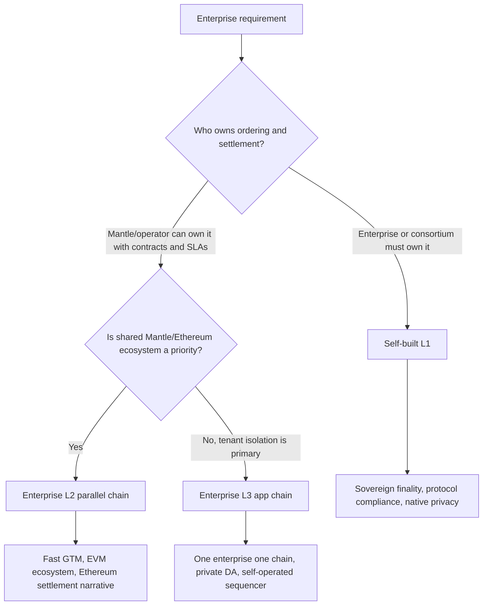
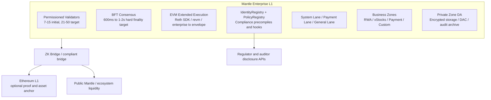
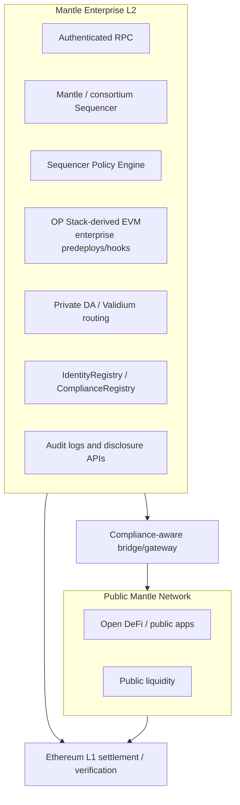
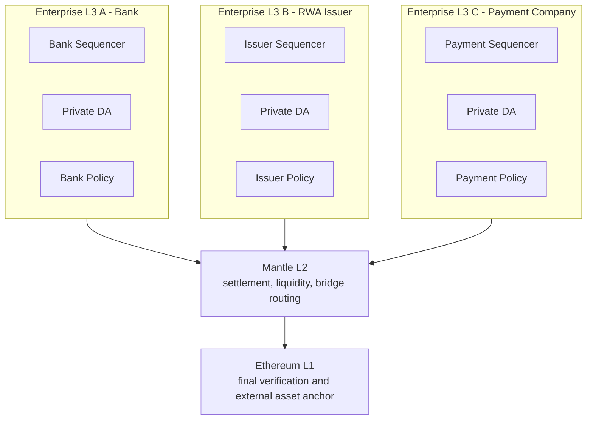
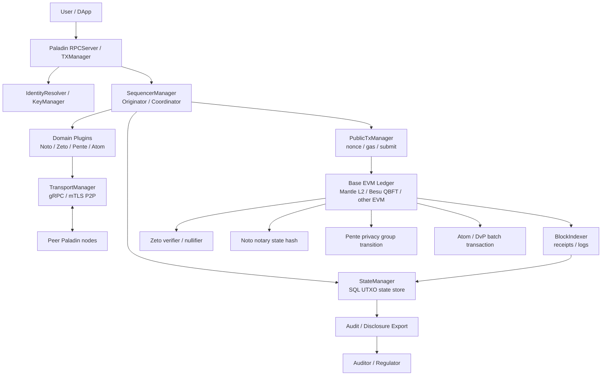

# WHI-390：企业区块链方案分析
## L1 / L2 / L3 / Sidecar 深度分析与决策框架
- **里程碑**：M5 - 方案分析与最终交付
- **日期**：2026-05-10
- **状态**：草稿
- **受众**：Mantle 决策层（CEO / CTO / VP Engineering）
- **分类**：内部 - 机密

## 执行摘要

本文是一份面向 Mantle 决策层的中立决策支持材料，不预设推荐方案。它比较三条链底座路径：自建 L1 企业区块链、Mantle 企业 L2 平行链、在 Mantle L2 上结算的企业 L3 app chain，并单独评估一条 Sidecar 隐私交易层路径。本文的目标不是替管理层选择路径，而是说明每条路径能提供什么企业保障、要求什么投入、暴露什么风险，以及哪些前置业务条件会改变决策。

Mantle 探索企业区块链的背景是：机构客户通常不是在寻找另一条开放零售链，而是在寻找受控参与、私有业务数据、可审计合规、明确最终性语义、数据驻留、运营问责以及与现有金融系统集成的链上基础设施。前期研究表明，这些需求会改变架构。如果 bridge 路径、sequencer 提交、合约部署、数据可用性和最终性语义仍然不受控，那么一条仅在入口处添加 KYC 的链在结构上仍然是公链。

这些路径不是简单的成熟度阶梯。它们分别对应不同的购买理由和信任模型：

| 路径 | 核心定位 | 主要保障 | 主要代价 |
|---|---|---|---|
| 自建企业 L1 | 主权企业结算基础设施 | 自有验证节点、BFT 最终性、协议级合规、原生隐私和数据主权 | 建设周期最长、成本最高、安全与运营责任最大 |
| 企业 L2 平行链 | 受监管的 Mantle/Ethereum 扩展 | EVM 兼容、Ethereum/Mantle 对齐、Sequencer 合规控制、较快上线 | 企业自主性较弱、operator 可见性和合规责任需明确 |
| 企业 L3 App Chain | 客户/应用专属企业环境 | 租户隔离、每客户策略、私有 DA、自有或共管 sequencer | 外部硬最终性依赖 L3 -> L2 -> L1，跨 L3 互操作和多链运维复杂 |
| Sidecar 隐私交易层 | 叠加在 EVM 旁的私有交易 runtime | 不改基础链即可支持 Noto、Zeto、Pente、Atom/DvP 等隐私工作流 | 不拥有排序、最终性、DA、bridge 或全链合规边界 |

L1 路径的关键问题是：目标客户是否需要拥有排序、验证节点、数据可用性和事件响应，并将秒级 BFT 最终性作为业务结算依据。如果这些要求成立，L1 的架构保障最完整；如果这些要求尚未被客户明确提出，L1 的 18-24 个月建设周期、15-25 名核心构建者、大规模审计、验证节点治理和长期运营责任会成为主要决策约束。

L2 路径的关键问题是：目标客户是否接受 Mantle/operator 作为企业链运营方，并将 Ethereum/Mantle 对齐、EVM 工具链、公共流动性邻近性和较快上线作为主要价值。如果这些条件成立，L2 能以较低改造成本提供许可访问、合规 bridge、身份注册表、审计日志、私有 DA 或 Validium 式数据路由；如果客户要求自有排序、operator 不可见性或秒级硬法律结算，L2 的信任模型可能不足。

L3 路径的关键问题是：企业需求是否主要来自客户隔离、每租户策略、数据驻留、升级独立性和专用运营边界。如果这些条件成立，L3 可以把"一个企业，一条链"做成可复用平台；如果用例依赖跨客户原子结算、高价值外部提款或统一共享流动性，L3 的多层最终性和跨 zone 复杂度需要重点评估。

Sidecar 路径的关键问题是：目标客户是否已经明确需要 confidential transfer、ZK token、notary token、私有 Solidity 合约或同链 DvP，但不一定要求 Mantle 从第一天就重建链底座。如果这些条件成立，Paladin 类 Sidecar 可作为隐私能力加速器；如果客户真正购买的是排序权、硬最终性、数据主权、bridge 责任或全链合规控制，Sidecar 不能替代 L1/L2/L3。

本文后续章节按照同一结构展开：先说明企业区块链的共同设计模块，再分别分析 L1、L2、L3 的架构、能力、适用条件、成本和风险，随后给出链底座横向比较、场景适配、Sidecar 方案评估、可选实施路线和管理层决策问题清单。

---

## 第一章：企业区块链设计原则

### 1.1 企业链不是加了白名单的公链

前期研究的核心教训是，企业区块链设计改变了信任边界。公链假设所有参与者都能观察到足够的共享状态来验证系统。企业金融通常假设相反：只有正确的参与方才应该看到相关的交易数据，无关方应该几乎看不到任何内容。设计任务不仅仅是隐藏数据，而是分配谁可以查看、谁可以验证、谁可以审计、谁可以恢复、谁可以覆盖、以及谁承担法律责任。

差异体现在每一层：

| 维度 | 公链默认 | 企业区块链需求 | 设计后果 |
|---|---|---|---|
| 参与 | 开放账户和开放交易提交 | 已知机构、角色、司法管辖区和法律实体 | 身份和策略成为协议或 sequencer 相邻原语 |
| 数据可见性 | 公共状态和公共元数据 | 按需知晓或选择性披露数据 | DA、RPC、索引、日志和 bridge 事件需要隐私设计 |
| 最终性 | 经济/概率性、sequencer 软确认或 rollup 硬最终性 | 业务定义的结算状态 | 应用需要类型化最终性，而非单一的"已确认"状态 |
| 合规 | 主要在应用层或链下执行 | 不可绕过的 KYC/KYB、AML、制裁、Travel Rule、审计、撤销 | 控制必须覆盖 RPC、sequencer、合约、bridge 和管理操作 |
| 运营 | 尽力而为的去中心化可用性 | SLA、灾难恢复、事件指挥、受监管的变更管理 | SRE、密钥管理、监控和审计证据成为产品特性 |
| 治理 | 代币或协议治理 | 法律实体问责和司法管辖策略 | 需要许可制治理和面向监管者的手册 |
| 数据主权 | 数据复制到节点运行的任何地方 | 驻留、删除、保留、导出和审计需求 | 公共 DA 通常与敏感企业流程不兼容 |
| 生态系统 | 无许可可组合性 | 受控互操作性 | Bridge 必须携带身份、策略、最终性和披露上下文 |

这就是为什么"许可制公链"是不够的。如果用户可以通过 bridge 路径绕过身份验证 RPC，如果智能合约可以绕过合规检查，如果交易数据仍然发布到公共 DA，或者 sequencer 可以悄然重排机密订单流，企业声明就会在绕过存在的层级上崩溃。企业架构必须枚举每条入站路径、读取路径、写入路径、管理路径和跨链路径。

M2 模式研究将企业需求框定为六项基线要求：数据主权、合规与可审计性、访问控制、与现有系统共存、运营控制和开发者体验。EVM 兼容性被视为底线而非奢侈品，因为非 EVM 技术栈面临更小的开发者和工具生态系统。这并不意味着 EVM 就足够了，而是意味着企业解决方案应在可能的地方保留 EVM，同时添加公共 EVM 堆栈所缺乏的控制。

### 1.2 核心组件概览

M5 设计概览将企业区块链分解为八个耦合组件。关键词是耦合。隐私选择约束 DA。DA 选择约束结算和退出权利。合规选择约束 sequencer 设计。最终性选择约束产品承诺。互操作性选择约束身份和审计设计。

| 组件 | 企业设计问题 | 管理层需要决定什么 | 为什么重要 |
|---|---|---|---|
| 执行层 | 哪些规则必须在 EVM 内部或周围不可绕过？ | 是否使用标准 EVM 加钩子、EVM 扩展、自定义 precompile 或更深层的执行替换 | 决定隐私、身份和合规能在多大程度上原生化 |
| 共识与最终性 | 何时业务系统可以将交易视为已结算？ | BFT 硬最终性、sequencer 软最终性、ZK 证明最终性、L1 锚定最终性，或类型化组合 | 决定链是否能支持 DVP、支付、证券和外部结算 |
| 隐私层 | 谁可以看到交易内容、参与者、余额、元数据和审计数据？ | 按需知晓路由、Validium/私有 DA、加密字段、加密 mempool、TEE、ZK 证明或选择性披露 | 决定银行和受监管发行方能否将系统用于敏感工作流 |
| 合规与身份 | KYC/KYB、制裁、Travel Rule、角色、审计、撤销和监管者访问如何执行？ | IdentityRegistry、PolicyRegistry、ComplianceCheck、审计流、披露工作流、策略层级 | 决定系统能否作为受监管基础设施出售 |
| 访问控制 | 哪些边界受到保护？ | RPC、sequencer、P2P、bridge、合约部署、代币转账、数据读取、管理、紧急和跨链路径 | 决定控制是可执行的还是装饰性的 |
| DA 与数据主权 | 完整交易数据存储在哪里，谁能重建状态？ | 公共 DA、加密公共 DA、私有 DA、DAC、Validium、混合 DA 或企业控制的归档 | 决定隐私、恢复、退出、成本和司法管辖合规 |
| 互操作性 | 资产和消息如何携带最终性、隐私、身份和合规上下文移动？ | Bridge 证明格式、合规存取款、跨链策略、最终性标签、披露元数据 | 决定企业流程能否安全连接 Mantle/Ethereum |
| 业务组件 | 基础设施如何成为企业产品？ | 合规资产发行、DVP、支付通道、稳定币 gas、监管者控制台、审计导出、SDK、模板 | 决定链是解决客户工作流还是仅提供基础设施 |

三个行业原型有助于落实这些组件。Canton 代表按需知晓账本模型：通过交易投影和参与者特定可见性实现隐私。Prividium 代表带公共证明的私有 EVM 模型：敏感数据留在链下，正确性被提交或证明到公共结算层。Tempo/Zones 代表公共基础链加私有 zone：一条面向支付的共享 L1 配合私有执行环境。Mantle 当前基线是第四种原型：具有强大生态系统兼容性但没有原生企业隐私、身份、合规或数据主权模型的公共 EVM rollup 基础设施。

### 1.3 约束传播

企业区块链决策会传播。超过 10,000 TPS 且亚秒级结算的支付 SLA 不仅影响吞吐量。它推动设计走向 BFT 或高度优化的本地最终性、支付通道调度、低成本执行和严格的运营 SLO。RWA 或证券隐私不仅影响加密，它推动设计远离公共 DA，走向私有或混合 DA，并强制要求 bridge 证明不泄露敏感信息。租户数据主权推动设计走向 zone 级数据驻留、企业控制的密钥、保留策略和审计导出。合规推动设计走向身份验证 RPC、sequencer 策略、执行钩子、bridge 过滤器和监管者响应工作流。

最重要的传播链是：

| 业务需求 | 技术压力 | 架构后果 |
|---|---|---|
| 支付级用户体验和结算 | 高吞吐量、可预测费用、亚秒级业务最终性 | L1 BFT 或可信本地 L3 最终性；支付通道；费用赞助；最终性预言机 |
| 机密 RWA 工作流 | 参与者隐私、资产隐私、投资者注册表控制 | 私有 DA、批准工厂、选择性披露、合规感知 bridge |
| 银行或经纪商运营 | 法律问责、订单公平性、审计跟踪、事件控制 | Sequencer 治理、加密 mempool 或 BFT 委员会、审计日志、策略层级 |
| 公共流动性复用 | Mantle/Ethereum 互操作性、EVM 兼容性、bridge 访问 | L2 或 L3 路径；显式合规网关；最终性标签 |
| 受监管的多租户产品 | 每租户策略、数据隔离、运营边界 | L3 app chain 框架或 L2 中的强租户分区 |
| 主权基础设施 | 自有验证节点、自有数据、自有升级、自有灾难恢复 | 自建 L1 或联盟运营 L1 |

这意味着三条路径不可互换。相同的智能合约表面可能看起来相似，但底层保障不同。L1 BFT 上的代币转账、L2 软确认和 L3 本地最终性可能都返回成功的交易哈希，但该哈希的业务含义不同。对于企业产品，Mantle 必须显式暴露这些差异。

### 1.4 通往三种链底座方案的决策树

设计树从隐私边界和结算边界开始。

如果企业要求受监管机构或联盟必须拥有验证节点集、拥有排序路径、在协议级执行合规、将敏感数据保存在受控域中，并将结算视为一至两秒内最终确定，L1 是需要重点评估的路径。最自然的例子是支付通道、系统性结算网络、证券 DVP、具有严格最终性的 xStocks 场所以及参与者不能成为第三方 sequencer 租户的多银行网络。

如果企业要求创建一个仍然接近 Mantle 和 Ethereum、使用 Solidity 工具链、通过显式合规网关连接到公共流动性且能在一年内启动的受监管环境，L2 是需要重点评估的路径。它不是最强的主权模型，但复用了现有技术、运营和生态资产。

如果企业要求按客户、按应用或按合规域进行隔离，L3 是需要重点评估的路径。它更接近具有自有 sequencer、DA、访问控制、策略和运营边界的专用企业环境，适用于多条企业特定链而非单一共享企业链的产品形态。

如果需求仅限于 IAM、合规门控、审计日志和半公开资产，较轻量的 M3 式改造或 L2 中间件层可能就足够了。然而，WHI-390 有意聚焦于三种更深层的架构路径，因为 Mantle 领导层需要决定公司愿意承担哪种企业保障。

三条链底座路径的设计树可概括为：

### 1.5 中立评估原则

本文使用的评估原则是：不要将企业需求压缩到单一链中。每条路径都只在特定信任模型、客户类型、预算、时间线和运营责任下成立。

L1 拥有主权最终性、支付级调度、验证节点问责和协议级合规。L2 拥有 Ethereum 结算对齐、广泛的 EVM 兼容性、共享机构流动性以及较短的企业试点路径。L3 拥有租户隔离、客户特定合规域、私有 DA 和产品化企业部署。Sidecar 拥有更快叠加隐私交易能力的优势，但它不是链底座，也不改变基础链的排序、最终性和运营责任。最终选择可以是单一路径，也可以是组合路径，取决于管理层优先级和客户证据。

---

## 第二章：方案一——自建 L1 企业区块链

### 2.1 架构概览

自建 L1 路径是一条完全主权的企业区块链。Mantle 将构建一条独立的 EVM 兼容 L1，拥有自己的许可验证节点集、BFT 共识、企业执行扩展、原生隐私和数据主权模块、协议级合规、业务特定 Zone 以及自己的运营控制平面。Ethereum 和 Mantle 不再是运行时依赖，而是成为 bridge、流动性、证明和锚定目标。

该架构最接近 Tempo 式企业支付 L1 结合 Canton 式隐私原则和 Prividium 式证明/DA 技术，但实现为 Mantle 拥有的企业平台。

L1 分析中提议的技术栈包括 Reth SDK、`reth-node-builder`、`revm`、MDBX、Commonware Simplex BFT 或等效 BFT 引擎、BLS12-381 DKG 和阈值签名、ECIES 加密、Chaum-Pedersen 证明、STARK 证明组件、身份验证的验证节点 P2P、私有 Zone RPC、加密 Zone DA 和 Ethereum 验证器或 bridge 合约。这些是规划选择而非已完成的实现事实。L1 报告明确警告，主链吞吐量和支付通道数字是需要基准测试优先验证的设计目标。

### 2.2 技术能力概要

L1 路径赋予 Mantle 最大的自由度，可将企业原语直接设计到链中。

| 能力 | L1 设计 |
|---|---|
| 执行 | EVM 兼容基础，带企业交易信封、合规感知转账钩子、密码学 precompile 和业务特定模块 |
| 共识 | 许可制 BFT 验证节点集，确定性最终性目标约 600ms 至 1-2s |
| 验证节点 | KYB/法律实体绑定的验证节点，初始约 7-15 个，扩展至 21-50 个 |
| 隐私 | 原生 Zone、私有 DA、加密存款、选择性披露、可选的证明支持隐私 |
| 合规 | IdentityRegistry、PolicyRegistry、ComplianceCheck、MIP-20 式合规代币、bridge 过滤器、审计流 |
| 调度 | System Lane、Payment Lane 和 General Lane，允许支付或合规操作获得优先级 |
| 吞吐量目标 | 公共主链 3,000-5,000 TPS 目标；RWA Zone 100-500 TPS；xStocks 1,000-3,000 TPS 带更高峰值；Payment Zone 10,000+ TPS 目标 |
| 互操作性 | ZK bridge、定期 Ethereum 提交、Mantle bridge 路径、适当时使用 CCIP、SWIFT/ISO 20022/CSD/KYC/Travel Rule 适配器 |
| 运营 | 自有验证节点运营、自有事件指挥、自有治理、自有灾难恢复、自有审计证据 |

与 L2 和 L3 最重要的技术差异是硬最终性。L1 可以使业务最终性原生化。在 BFT 网络中，一旦验证节点法定人数最终确定一个区块，系统就可以向应用暴露确定性最终性事件。这与 rollup sequencer 确认根本不同——后者对用户体验可能有用，但与外部结算不同。

这一区别对 DVP、支付结算和证券操作很重要。如果验证节点集、治理、法律框架和运营控制可接受，金融机构可以合同方式接受许可制 BFT 最终性事件作为结算。除非在其周围分层额外的法律和经济保障，否则它不能以同样方式对待中心化 L2 sequencer 软确认。

### 2.3 优势

L1 最大的优势是自主性。Mantle 或 Mantle 主导的联盟控制验证节点、共识、交易准入、数据可用性、升级治理、事件响应和合规策略。正常运营不依赖于 Ethereum 最终性、L2 结算节奏或外部 rollup 框架。

第二个优势是确定性最终性。BFT L1 可以目标 600ms 至 1-2s 的硬最终性。这使它成为唯一能可信支持支付级结算、实时抵押品移动、T+0 证券和机构 DVP 的路径，而无需依赖后续证明或 bridge 状态。系统可能仍然向 Ethereum 锚定证明用于外部验证，但业务操作无需等待该锚定。

第三个优势是原生隐私和数据主权。L1 可以将 Zone、私有 DA、加密存款、身份验证 RPC、监管者披露 API、保留策略和数据驻留定义为一等架构。它可以避免将敏感数据发布到公共 L1 或公共 DA。它还可以设计使验证节点、审计员和参与者仅接收其角色所需的数据。

第四个优势是协议级合规。合规可以在多个不可绕过的层级执行：身份注册表、sequencer 准入、交易信封、执行钩子、代币转账、bridge 入站和出站以及审计导出。这比仅应用层合规强大得多，比 L2 中 Mantle/operator 责任必须与租户策略共享更具主权性。

第五个优势是业务特定性能。Payment Lane 调度、稳定币费用逻辑、最终性预言机、合规资产标准和专用 Zone 可以针对企业工作流优化，而非围绕公共 DeFi 流量进行改造。L1 还可以创建清晰的法律和运营问责模型：具名验证节点、具名 operator、具名事件指挥官、具名审计义务。

### 2.4 劣势与风险

L1 路径很昂贵。L1 分析估计 18-24 个月、15-25 名核心构建者、16-22 人的长期运营、约 $5M-$12M 的工程薪资、$0.5M-$1.5M 的构建基础设施、$85K-$130K/月的初始生产基础设施、$160K-$300K+/月的规模基础设施、$850K-$1.7M+ 的安全审计、$1M 以上的漏洞赏金储备以及 $1M-$3M 的企业集成成本。对于主权链来说这些数字并不罕见，但它们是一项重大承诺。

L1 路径还使 Mantle 对安全负责。L2 可以声称 Ethereum 结算并继承部分 Ethereum 安全叙事。自建 L1 必须通过验证节点治理、审计、正式审查、BFT 实现质量、密钥管理、灾难恢复、监控和事件处理来赢得信任。验证节点集是许可制且可问责的，但它不是 Ethereum。这对主权来说是特性，对市场认知来说是负担。

生态系统冷启动是另一个主要风险。独立 L1 不会自动继承 Mantle 流动性、公共 DeFi 可组合性、钱包、浏览器、bridge 和开发者行为。即使链是 EVM 兼容的，用户和机构仍必须桥接资产、部署合约、集成 API、信任验证节点并接受新的结算环境。对于依赖共享流动性的用例，这是严重的劣势。

运营复杂性很高。Mantle 需要运行或协调验证节点、证明器集群、bridge 中继器、私有 DA 基础设施、合规服务、审计系统、密钥仪式、升级治理、事件指挥、客户支持和监管披露。对于企业买家来说，这可能正是他们想从平台提供商那里得到的。对于 Mantle 来说，这意味着成为更受监管意义上的基础设施 operator。

L1 隐私故事也有一个重要的第一阶段警告。早期 L1 Zone 默认不是 operator 不可见的。在最早的 Zone 阶段，Zone sequencer 对明文可见性是可信的，并且在实现有效性证明之前，对正确的 Zone 执行也是可信的。Sequencer 可以看到 Zone 内部交易，因为它必须解密存款、运行合规检查和构建 Zone 区块。当 Zone 由机构本身或法律上可问责的联盟运营时，这可能是可接受的，但这与密码学隐私不同。Operator 不可见性是后期能力，需要 ZK 证明、加密 mempool 或阈值解密、精心设计的披露工作流和更强的 DA/证明基础设施。这一警告使 L1 优势更精确：L1 具有随时间推移使隐私原生化的最佳能力，但在第一天并非完全 operator 不可见。

技术就绪性是另一个时间表风险。Tempo 验证了基于 Reth 的自定义 L1 配合 BFT 和 Zone 的广泛模式，但它不消除 Mantle 的集成风险。Commonware/Simplex BFT 前景看好且在 Tempo 参考路径中使用，但与较老的 BFT 堆栈相比，其独立生产多样性有限。分析的 Tempo Zone 代码也具有证明路径准备而非完全活跃的无信任 Zone 证明流。因此，Tempo 和 Commonware 更适合作为设计参考和领先候选者，而非已去风险的即插即用组件。

还存在产品过度扩张风险。自建 L1 在理论上可以支持一切：支付、RWA、xStocks、DeFi、Zone、隐私、合规和互操作性。同时尝试所有这些可能会延迟项目并分散工程精力。L1 路径仅在 Mantle 识别出一个有锚定客户的窄切入点时才有意义。

### 2.5 目标场景

L1 路径最适合需要主权结算基础设施的强监管金融机构和联盟。银行、证券公司、托管方、保险公司、受监管支付公司和跨国企业联盟是自然买家。他们较少关注无许可可组合性，更多关注法律问责、确定性结算、数据控制、监管者访问和运营韧性。

最强的场景包括：

| 场景 | 为什么 L1 适合 |
|---|---|
| 大型金融机构联盟 | 参与者可以共同治理验证节点、数据、合规和升级 |
| T+0 证券结算或 DVP | 如果法律框架支持，BFT 硬最终性可被视为结算 |
| 支付通道或稳定币支付网络 | Payment Lane 可目标高吞吐量、可预测费用和亚秒级业务最终性 |
| xStocks 或受监管证券场所 | 原生排序、市场监控、隐私和最终性可以一起设计 |
| 资金和抵押品移动 | 机构可以使用确定性最终性和强审计控制 |
| 强数据主权要求 | 完整数据栈可以放置在批准的司法管辖区或企业控制的域中 |

L1 路径不适合三至六个月时间线的短期企业试点、小预算、主要需要 Mantle 流动性的 DeFi 应用、简单的 KYC 门控代币发行以及明确希望 Ethereum rollup 安全继承的客户。作为没有锚定客户验证的投机性构建，它同样不适合。

### 2.6 实施估算

L1 路线图有三个阶段。

| 阶段 | 持续时间 | 团队 | 主要交付物 | 退出标准 |
|---|---:|---:|---|---|
| 第一阶段：核心执行和 BFT MVP | 6-9 个月 | 9-15 人 | 基于 Reth 的 EVM、BFT 共识、验证节点 P2P、基本企业交易信封、测试网 | 4-11 节点 BFT PoC、基本最终性基准测试、故障测试 |
| 第二阶段：隐私、合规、首批 Zone | 6-9 个月 | 15-25 人 | IdentityRegistry、PolicyRegistry、私有 Zone DA、加密存款、合规钩子、首个 RWA/支付 Zone | 策略绕过红队、隐私审计、初始客户工作流 |
| 第三阶段：业务组件和生产就绪 | 6 个月 | 19-25 人 | Payment Lane、合规资产、bridge、监控、SRE 运行手册、审计、生产治理 | Bridge 审计、无关键未解决发现、锚定客户签核 |

构建可由证据点而非日历乐观主义来门控。第一个 go/no-go 门控可以是具有真实验证节点拓扑和故障测试的 Reth+BFT PoC。第二个可以是测试吞吐量、延迟、费用稳定性和拥塞隔离的 Payment Lane 基准测试。第三个可以是隐私存款审计和合规绕过红队。第四个可以是锚定客户验证，因为 L1 路径若缺少需要主权结算的买家，其商业合理性需要重新评估。

### 2.7 L1 评估

L1 是最高控制路径，也是最容易将确定性硬最终性作为原生企业保障的路径。当客户购买的是基础设施而非链服务时，L1 的保障最直接。它的主要约束不在架构连贯性，而在 Mantle 是否有足够客户、资金和组织能力支撑该级别主权。

对于 Mantle，L1 可以被评估为完整主权路径、战略选项或基准测试路径。是否进入全面建设，应取决于锚定客户是否证明 L2/L3 信任假设不可接受，以及客户是否愿意在商业、法律和运营上支持主权企业网络。

---
---

## 第三章：方案二——Mantle 企业 L2 平行链

### 3.1 架构概览

Mantle 企业 L2 路径创建了一条与公共 Mantle Network 平行运行的独立许可制企业链。它并非公共 Mantle 内部的许可模式，而是拥有独立的链 ID、状态、sequencer 端点、bridge 合约、治理流程、策略注册表、审计模型和运营控制机制。在可能的情况下，它复用 Mantle 的 OP Stack 衍生基础设施和运营经验。

公共 Mantle Network 继续作为开放的 DeFi 和零售基础设施。Mantle 企业 L2 则成为银行、发行方、托管方、支付公司、RWA 平台及机构应用的受监管环境。两者均可锚定至 Ethereum，它们之间的互操作通过显式合规网关实现。

其运营理念务实：Mantle 通过复用其已熟悉的系统，能够更快速地构建出企业级链。该路径可分阶段启动：首先作为具备许可和合规能力的受控 L2，然后演进为私有 DA 或 Validium 风格的环境，若需求能够证明执行层或证明系统变更的必要性，后续再发展为更深层的原生隐私平台。

### 3.2 与 Mantle Network 的关系

与公共 Mantle 的关系具有战略意义。企业 L2 与公共链须足够接近，以复用 Mantle 的工程、工具链、生态、流动性访问和 Ethereum 结算叙事；同时须足够分离，使公共 Mantle 的无许可假设不会破坏企业级保障。

这意味着：

| 维度 | Public Mantle | Enterprise L2 |
|---|---|---|
| 参与方式 | 开放 | 许可制或策略门控 |
| Sequencer 端点 | 公链运营 | 带准入策略的企业端点 |
| 状态 | 公开 | 独立企业状态 |
| DA | 公共 rollup/链模型 | 非敏感流程使用公共 DA；敏感流程使用私有/Validium |
| Bridge | 公共 bridge 假设 | 带身份/策略检查的合规感知 bridge |
| 合规 | 应用层或生态层 | 链层策略、审计、披露及事件工作流 |
| 治理 | 公共生态治理 | Mantle/运营商/联盟治理，含企业 SLA |
| 流动性 | 开放 DeFi 流动性 | 通过合规网关受控访问公共流动性 |

这种分离至关重要，因为企业需求与仅向公共 Mantle 添加白名单并不兼容。若公开状态、公开内存池假设、开放合约部署和开放 bridge 依然存在，企业环境就无法对隐私、合规和受控参与作出有力承诺。

### 3.3 技术能力总结

企业 L2 路径的起步应保持保守。第一阶段应保留与 Mantle 兼容的 `op-geth` 或 OP Stack 衍生执行层，使推导机制、bridge 模式、监控、EVM 工具链和运营保持熟悉。企业控制首先应添加在边界和策略层面：经认证的 RPC、sequencer 钩子、预部署注册表、bridge 过滤器、私有 DA 路由、审计服务、终态 API 和 SDK。

"执行层替换"这一表述应理解为分阶段方向，而非第一阶段的承诺。标准 OP Stack 风格 L2 主要可在边界处执行合规和隐私控制。原生可编程隐私需要更深层的变更：隐私标记交易、合规标记交易、企业费用赞助交易、审计元数据信封、承诺或加密预编译、nullifier/证明验证、策略感知转账钩子以及证明系统集成。这些变更具有价值，但会增加 fork 维护和验证风险。

| 能力 | 第一阶段 L2 | 后续原生隐私方向 |
|---|---|---|
| 交易准入 | 经认证的 RPC 和 sequencer 策略 | 策略感知交易信封 |
| 合规 | 注册表、bridge 过滤器、预部署钩子 | 执行层集成合规检查 |
| 隐私 | 私有 DA 路由、加密载荷指针、选择性披露 | 隐私标记交易、加密字段、承诺验证、ZK 证明 |
| 终态 | 1-2 秒软确认；延迟硬终态 | 类型化终态加证明加速 |
| 运营商可见性 | Sequencer 默认可见明文 | TEE、加密内存池、阈值解密、应用特定 ZK |
| 工具链 | 高 EVM 兼容性 | 兼容性取决于 fork 深度 |
| 成本/风险 | 深度路径中最低 | 工程和证明维护风险较高 |

### 3.4 优势

企业 L2 是 Mantle 最快速可信的企业生产路径。它契合 Mantle 现有资产：EVM 兼容性、Solidity 工具链、Ethereum 结算叙事、rollup 运营、bridge 知识、DeFi 生态、监控能力和工程熟悉度。它可以在数月内而非数年内交付 MVP。

第二个优势是生态系统连续性。机构可部署熟悉的 EVM 合约，使用熟悉的钱包和 SDK，并通过受控网关连接公共 Mantle 流动性。这对于 RWA、代币化基金、托管网络和许可制 DeFi 尤为重要——在这些场景中，公共流动性和现有开发者工具链的重要性可能超过完整的协议主权。

第三个优势是成本与风险。L2 路线图预计以 8-15 人团队历时 8-12 个月完成。第一阶段可专注于许可管理、策略、bridge 控制和审计日志，而非构建全新的共识网络。工程路径富有挑战但并非难以为继。

第四个优势是合规可行性。中心化或运营商控制的 sequencer 在公共 crypto 领域常受批评，但在企业环境中可能有用。它提供了一个已知的控制点，用于制裁筛查、市场监察、交易拒绝、审计日志、SLA 执行和事件响应。当运营商受信任且承担法律责任时，sequencer 可见性可成为合规资产。

第五个优势是市场清晰度。Prividium 风格的私有 EVM Validium 为企业 EVM 系统提供了先例——在此类系统中，敏感交易数据无需公开发布，但正确性仍可被锚定或证明。Mantle 可采用这一模式，同时保持自身的生态定位。

### 3.5 劣势与风险

决定性弱点是企业自主权。默认情况下，企业是 Mantle 运营或 Mantle 主导的链上的租户。Mantle 控制或严重影响着排序、中断恢复、升级、紧急响应、批次提交、证明提交、sequencer 策略、bridge 策略和运营事件管理。SLA 和治理权利可减轻这一担忧，但无法等同于企业自有验证者。

第二个弱点是运营商可见性。私有 DA 可对 Ethereum 和公共观察者隐藏交易数据。租户分区可对其他租户隐藏数据。经编辑的 RPC 可对未授权用户隐藏数据。但 sequencer 和私有 DA 运营商默认情况下仍可能看到明文。对于代币化基金、托管网络和许多支付产品而言，若 Mantle 是受监管的基础设施运营商，这可能是可接受的。但对于保密银行间工作流、券商经纪商订单流或类似暗池的 xStocks 而言，若没有加密内存池、阈值解密、TEE 序列化或应用特定 ZK，这可能是不可接受的。

第三个弱点是终态。L2 可提供 1-2 秒软确认，但硬结算依赖于 DA、批处理、证明生成、L1 接受和 bridge 规则。成熟的 ZK 有效性终态可能目标为 15-30 分钟，但当前或过载系统可能更长。乐观回退可达七天。这对于许多 UX 流程和部分风险分级支付是可接受的，但不等同于 BFT 硬终态。

第四个弱点是法律责任。若 Mantle 的 sequencer 对交易进行筛查、阻止、冻结、披露或路由，Mantle 就成为受监管运营模式的一部分。若链层合规执行处于激活状态，该产品就无法以中立基础设施来销售。它需要责任矩阵、策略层级、监管响应手册、数据处理协议、事件指挥模型、披露工作流、审计证据标准和司法管辖路由规则。

第五个弱点是 rollup 架构张力。Bridge 过滤和强制包含限制对合规而言可能是必要的，但与纯公共 rollup 逃生舱口理想相冲突。私有 DA 提升了保密性，但削弱了公开状态重建能力。深度 OP Stack 定制化可能造成持续的 fork 和证明系统维护负担。

最重要的 L2 风险应以明确的严重性标注，因为采购和风险委员会不会平等对待它们。

| 风险 | 严重程度 | 重要原因 | 缓解后残余风险 |
|---|---|---|---|
| 企业自主权有限 | 严重 | 企业是租户，无法独立排序交易、恢复链或变更协议规则 | 共享序列化、联合治理、SLA 和紧急操作手册可降低但无法消除与 L1 的差距 |
| Sequencer 明文可见性 | 严重 | Sequencer 可能看到订单流、交易对手、金额、时序和商业策略 | 私有 DA 对公共观察者隐藏数据，但完整运营商隐私仍难以实现 |
| 强运营商信任假设 | 高 | Mantle/运营商控制排序、批次提交、私有 DA 运营、升级和事件响应 | 外部观察者和审计权利提升透明度，但不提升控制权 |
| 强制包含与合规的冲突 | 高 | L1 发起的消息若未过滤可绕过正常准入 | 过滤削弱了纯公共 rollup 逃生舱口语义 |
| 监管责任模糊 | 高 | 合规执法将 Mantle/运营商变为受监管主体 | 法律协议有帮助，但跨司法管辖冲突依然存在 |
| 企业心理障碍 | 高 | 部分董事会无论控制措施如何，都会拒绝"核心业务跑在他人链上" | 专属品牌和退出计划可能无法克服战略控制顾虑 |

### 3.6 企业顾虑深度分析

#### 3.6.1 密钥不在我手中

企业买家通常会询问出现问题时谁控制基础设施。在 L2 模型中，答案不是"企业"，而是 Mantle、Mantle 主导的运营商，或包含企业参与者的治理结构。这影响着交易排序、审查制度、升级时机、紧急暂停、证明提交、bridge 运营、数据恢复和事件响应。

缓解措施包括：共享序列化委员会、观察节点、紧急治理矩阵、私有 DA 托管、退出权利、独立证明方或挑战方集合、灾难恢复承诺、审计权利和合同 SLA。这些缓解措施可使 L2 对许多客户可接受，但残余顾虑依然存在：L2 租户无法像 L1 联盟控制验证者那样控制底层链。

销售 L2 自主权的正确方式是"有限自主权"，而非"完全自主权"。

| 自主权维度 | 企业 L2 能提供什么 | 企业 L2 无法完全提供什么 |
|---|---|---|
| 策略配置 | 租户特定的白名单、角色、交易限额、披露策略、合规提供商设置 | 与链级策略冲突的单方面协议层规则 |
| 运营可见性 | 仪表盘、审计日志、终态状态、事件报告、观察节点 | 完整的独立出块权限 |
| 数据控制 | 私有 DA 分区、加密备份、租户管理密钥、数据保留策略 | 对 sequencer/私有 DA 运营商信任的完全独立 |
| 治理参与 | 顾问委员会、客户对特定变更的否决权、共享紧急程序 | 对协议升级、排序和 bridge 策略的唯一权威 |
| 恢复 | 合同 DR 承诺、备用 sequencer、状态导出、迁移计划 | 无需 Mantle/运营商配合的规范链单方面恢复 |
| 退出 | 状态导出、资产提取、审计记录导出、身份映射导出 | 活跃跨链头寸不受 bridge/终态约束的即时退出 |

此表是采购工件。若客户可接受"能提供"一列，则 L2 可行。若客户需要"无法完全提供"一列，则需要同时评估 L3 或 L1，而非对 L2 进行过度定制。

#### 3.6.2 数据可见性

L2 隐私问题有三类受众：公共观察者、其他租户和运营商。私有 DA 和加密载荷可应对公共观察者。租户分区和访问控制 RPC 可应对其他租户。运营商隐私则更难实现。标准 sequencer 通常需要看到足够的明文，以便对交易排序、执行交易、计算状态转换并进行合规检查。

Sequencer 明文问题在结构上存在，并非仅为配置默认值。Sequencer 通常需要交易明文来验证签名和 nonce、模拟执行、对发送方、接收方、功能、代币、金额、地理位置、风险评分和制裁状态运行合规检查，将交易路由至正确的公共或私有 DA 路径，以及发出审计日志或披露包。若设计对 sequencer 隐藏一切，这些功能就必须转移到其他地方：受信任的客户端、网关证明、TEE、阈值解密或 ZK 策略证明。每一种替代方案都会增加成本，并收窄通用 EVM 的承诺范围。

缓解选项构成一个频谱：

| 缓解措施 | 有助于 | 残余问题 |
|---|---|---|
| 私有 DA / Validium | 对公共 DA 和 Ethereum 隐藏完整交易数据 | 运营商仍可能看到明文 |
| 企业 KMS/HSM | 让企业控制存储数据密钥 | 执行时可见性依然存在 |
| TEE sequencer | 在经认证的 enclave 内处理明文 | 硬件信任、侧信道、监管接受度 |
| 加密内存池 + 阈值解密 | 降低预交易/订单流可见性 | 明文最终仍会在执行时出现 |
| 客户端加密 | 保护特定字段 | 需要应用特定重新设计，非通用 EVM 隐私 |
| 应用特定 ZK 证明 | 在不暴露完整数据的情况下证明策略 | 用例范围窄，证明复杂度高 |
| 完全加密执行 | 强理论隐私 | 对近期 Mantle L2 路线图不切实际 |

诚实的产品声明不是"L2 解决所有隐私问题"，而是"L2 可以对公共观察者和其他租户隐藏敏感企业数据，并可为愿意支付复杂度成本的客户提供更强的运营商隐私层级"。

#### 3.6.3 监管合规所有权

合规所有权不是智能合约细节，而是商业和法律架构问题。若不同司法管辖的制裁名单相互冲突，谁的策略优先？若监管机构命令 Mantle 冻结企业客户使用的地址，谁来响应？若 KYT 提供商在软确认后但硬终态前标记了一笔交易，该交易处于什么状态？若 bridge 提款被阻止，谁承担客户责任？

核心角色冲突在于：

| 合规功能 | 企业通常拥有 | Mantle/运营商可能控制 | 冲突问题 |
|---|---|---|---|
| KYC/KYB 入驻 | 客户关系、入驻证据、司法管辖资格 | 租户层级证明和准入要求 | 若入驻有误，谁承担责任？ |
| 制裁筛查 | 本地法律解释和客户特定义务 | 全球封锁名单或 sequencer 时间拒绝 | 若名单冲突，谁的策略优先？ |
| 交易监控 | 业务背景和可疑活动工作流 | 链级 KYT 信号、审计日志、策略引擎 | 谁提交报告，谁接收警报？ |
| 资产冻结 | 发行方或受监管实体可能持有法律授权 | Sequencer、bridge 或紧急管理员可阻止流动 | 谁响应监管命令？ |
| 监管披露 | 企业拥有客户数据和保密义务 | 运营商可能持有审计日志、私有 DA 和披露工具 | 谁可以向谁披露什么？ |

应在上线前测试具体的策略冲突场景：

| 场景 | 为何困难 | 所需设计答案 |
|---|---|---|
| 监管机构命令 Mantle 冻结企业客户使用的地址 | 企业可能对司法管辖或法律依据提出异议 | 策略层级必须定义全局运营商冻结是否优先于租户策略 |
| 企业要求 Mantle 向审计师披露私有交易数据 | 数据可能包含其他租户或司法管辖的交易对手 | 披露工作流必须强制执行范围、审批和通知 |
| KYT 提供商在软确认后但硬结算前标记交易 | 应用程序可能已将其视为完成 | 终态/风险规则必须定义可逆的运营状态 |
| Bridge 存款在密码学上有效但 KYC 未通过 | 公共 rollup 语义通常会包含此存款 | 企业门户必须拒绝、隔离或退回不合规的入账 |
| 运营商中断导致制裁更新无法传播 | 链可能在过时策略下处理活动 | 策略缓存过期和失败关闭/失败开放规则必须明确 |

企业 L2 需要定义：

| 工件 | 用途 |
|---|---|
| 责任矩阵 | 分离 Mantle、租户、发行方、托管方、审计师和监管机构的义务 |
| 策略层级 | 定义全局运营商策略与租户策略及资产策略之间的关系 |
| 披露工作流 | 定义谁可以请求数据、审批披露及接收审计导出 |
| 事件指挥模型 | 定义在停机、漏洞、制裁命中、证明失败或数据泄露期间谁来主导 |
| 数据处理协议 | 定义保留、驻留、访问、删除和子处理商 |
| 终态和撤销策略 | 定义软确认和硬结算之间的业务状态 |
| 审计证据标准 | 定义日志模式、签名、保留和监管可读导出 |

若没有这些工件，链在技术上可能运行正常，但会在采购和合规审查中失败。

### 3.7 目标场景

企业 L2 非常适合 Mantle 生态系统和 Ethereum 对齐至关重要的场景。最佳示例包括合规 RWA 发行、代币化基金、许可制 DeFi 场所、托管商主导的网络、机构试点以及中等终态的稳定币或支付产品。这些客户受益于 EVM 工具链、公共流动性邻近性、已知运营商和更快的上线路径。

企业 L2 在跨银行结算、xStocks、受监管支付处理商和多司法管辖 RWA 平台方面是中等适配。若隐私层级、终态标记、市场监察、加密内存池和治理足够强健，这些场景可能有效。但若自主权和硬终态成为不可妥协的要求，它们也可能超出 L2 的能力范围。

企业 L2 不适合中央银行轨道、系统性支付基础设施、高频证券交易、保密双边银行间工作流、完整自恢复授权，以及无法允许 Mantle 成为第三方处理商的客户。

### 3.8 实施估算

| 阶段 | 时长 | 团队规模 | 交付物 | 风险 |
|---|---:|---:|---|---|
| 第一阶段：企业 L2 MVP | 0-4 个月 | 8-10 人 | 独立链、经认证的 RPC、sequencer 策略、bridge 控制、注册表、审计日志、SLA 仪表盘 | 若范围受控，风险为低至中 |
| 第二阶段：隐私和执行层扩展 | 4-8 个月 | 10-13 人 | 私有 DA/Validium 路由、披露元数据、隐私交易信封、执行层预部署或钩子、密钥管理 | 中至高 |
| 第三阶段：业务组件和入驻 | 8-12 个月 | 12-15 人 | RWA/支付工作流、终态预言机、合规资产、SDK、合规中间件、客户入驻 | 中 |

原始资料未提供 L2 路径的完整美元预算，但提供了人员配置参考：第二阶段结束时约 72-92 人月，完整 12 个月路线图约 120-152 人月。成本明显低于 L1，因为 Mantle 无需从头构建新的验证者网络和完整的主权安全栈。

### 3.9 L2 评估

企业 L2 是市场验证和客户学习速度较快的路径。它不是最具主权性的路径，但可以测试企业买家更看重 EVM/Ethereum 对齐和上市时间，还是更看重完整的基础设施所有权。

关键原则是边界清晰。企业 L2 不应被等同于 L1 主权或 Canton 风格的需知隐私。它更适合被描述为具备公共观察者隐私、受控访问、明确合规运营及可选更强隐私层级的受监管 Ethereum/Mantle 基础设施。若客户需要运营商盲目性、确定性硬终态或自有排序，则需要同时评估 L3 或 L1。

---

## 第四章：方案三——企业 L3 App Chain

### 4.1 架构概览

企业 L3 app chain 路径围绕一个简单承诺构建：一个企业，一条链。每家银行、发行方、支付公司、市场平台或受监管客户都拥有专属的 L3，具备独立的 sequencer、私有 DA、访问规则、合规策略、审计日志、升级节奏和运营边界。L3 结算至 Mantle L2，Mantle L2 结算至 Ethereum L1。

这不仅仅是工程架构，也是产品架构。Mantle 成为企业链平台提供商，客户获得隔离的运营环境，Mantle 提供模板、SDK、证明和 DA 服务、bridge 合约、合规网关模式、监控、审计导出和流动性访问。

L3 路径将 OP Stack 或 ZK Stack 风格的 app chain 部署与企业需求相结合：经认证的 RPC、私有 Validium DA、sequencer 策略、经批准的合约部署模式、合规预部署、身份注册表、审计导出和类型化终态。它在精神上最接近 Tempo Zones 和 Prividium，但以 Mantle L2 作为公共结算和流动性骨干。

### 4.2 三层模型

| 层级 | 角色 | 信任与终态特征 |
|---|---|---|
| Enterprise L3 | 每公司执行、排序、私有 DA、访问控制、合规、审计、治理 | 若企业信任其 sequencer，可实现快速本地终态；强租户隔离 |
| Mantle L2 | 结算层、流动性枢纽、ZonePortal 合约、证明聚合、bridge 路由 | 受 Mantle 证明/DA 节奏约束的共享 Mantle 域结算 |
| Ethereum L1 | 最终验证、外部资产安全、终极锚点 | L2 证明/终态/退出路径后的硬外部结算 |

L3 的核心优势是隔离性。在共享 L2 中，多家企业共享状态机、sequencer、DA 策略和升级节奏。在 L3 中，每个客户可拥有独立的状态边界、数据边界、策略边界、事件边界和合规边界。这是受监管 SaaS 的自然产品模型：一个平台，多个隔离的客户环境。

L3 的核心弱点是堆叠终态。每次外部结算都依赖多个层级。交易首先获得 L3 sequencer 确认，L3 状态提交至 Mantle L2，Mantle L2 结算或向 Ethereum 证明。外部提款或高价值跨链转账必须关注完整的链路。

### 4.3 企业自营 Sequencer

企业自营 sequencer 是关键卖点。它赋予客户对交易准入、KYC/KYB 检查、制裁筛查、排序策略、MEV 或公平性规则、故障转移、审计日志和事件响应的控制权。在第一阶段，中心化企业 sequencer 未必是弱点。对于许多企业工作流而言，它是所期望的运营模式：一个已知的法律实体在明确义务下运营该系统。

这将 sequencer 转变为合规官员。它可以拒绝未授权交易、执行司法管辖策略、生成审计证据、监控可疑活动、应用市场监察并协调事件响应。对于内部账本、RWA 注册表和支付工作流，这是强适配。

然而，sequencer 控制并不等同于密码学隐私。若企业 sequencer 接收明文交易，运营商可以看到订单流和业务数据。当运营商即企业本身时，这可能是可接受的。当 sequencer 由竞争对手的服务提供商运营时，接受度就会降低。对于银行间网络，可能需要 BFT 委员会或共享序列化网络。对于类似暗池的 xStocks，加密内存池和阈值解密应成为路线图的一部分。

### 4.4 技术能力总结

| 能力 | L3 设计 |
|---|---|
| 执行 | EVM 兼容的 app chain 模板，可选企业预部署和经批准的合约工厂 |
| 排序 | 企业自营 sequencer、委托运营商、BFT 委员会或共享 sequencer（取决于用例） |
| DA | 敏感区域默认使用私有 Validium DA；低敏感应用可选公共 DA |
| 隐私 | 租户隔离、私有 DA、经认证的 RPC、加密存款、选择性披露、可选加密内存池 |
| 合规 | 策略网关、sequencer 过滤、合约钩子、bridge 检查点、审计导出 |
| 终态 | L3 软/本地终态：秒级；L2 可见承诺：秒至分钟级；硬外部终态受 Mantle L2 和 Ethereum 约束 |
| 互操作 | L3 -> Mantle bridge、合规网关、可能的 L3 对 L3 中继、用于跨区原子性的共享序列化 |
| 产品模型 | 链模板、托管 sequencer、私有 DA 层级、监控、合规工具包、SDK、审计控制台 |

该路径可提供多种模板。RWA L3 可能使用 ERC-3643 风格的合规代币、经批准的工厂、监管机构 API 和保守的合约部署。支付 L3 可能优化高 TPS、稳定币 gas、旅行规则元数据和商户结算。私有证券 L3 可能添加加密内存池、公平性策略、市场监察和受限参与者。开发者沙箱 L3 可能保留开放 EVM 部署，但隐私声明较弱。

### 4.5 优势

第一个优势是租户主权。L3 赋予客户比共享企业 L2 更多的控制权，而无需 Mantle 为每个客户构建新的 L1。企业可以运营或联合运营自己的 sequencer，选择 DA 策略，定义访问规则，安排升级，并维护自己的审计边界。

第二个优势是数据隔离。敏感数据保留在 L3 环境和私有 DA 域内。Mantle 上的其他租户不共享相同的执行状态。Mantle L2 或 Ethereum 上的公共观察者看到的是承诺、根、证明、bridge 事件或聚合元数据，而非完整交易内容。

第三个优势是合规可配置性。每个 L3 可拥有独立的司法管辖规则、资产策略、参与者角色、披露程序、密钥管理和事件操作手册。这比强制所有企业客户进入一个共享的 L2 策略体制要容易得多。

第四个优势是比 L1 交付更快。L3 路线图预计以 10-15 人的平台/SDK 团队历时 9-13 个月完成。Mantle 可复用 L2 结算、rollup 框架、EVM 工具链和平台服务，同时仍可销售专属环境。

第五个优势是业务可扩展性。单个 L2 可成为许多 L3 链的平台骨干。Mantle 可通过链部署、托管序列化、私有 DA、证明服务、合规模块、审计导出、bridge 路由、监控和支持来实现商业化。这更接近 SaaS 商业模式，而非一次性基础设施咨询。

### 4.6 劣势与风险

最大弱点是硬终态。L3 的外部结算链最长：L3 -> Mantle L2 -> Ethereum L1。内部企业运营通常可以将 L3 本地终态视为最终结果，因为企业信任自己的 sequencer。但外部资产流动、高价值结算、对手方可见证明和 Ethereum 提款必须等待更深层的终态。

第二个弱点是 bridge 复杂性。L3 增加了另一个 bridge 层级。L3 对 L2 加上 L2 对 L1 意味着更多合约、中继器、证明路径、DA 依赖项、紧急控制和攻击面。若多个 L3 需要跨区原子性，第一阶段的中继模型可能不够，可能需要共享序列化。

第三个弱点是流动性碎片化。每个企业一条链可能会分散流动性和用户活动。Mantle L2 可提供共享流动性枢纽，但在 L3 之间移动资产会引入终态、合规和隐私约束。

第四个弱点是运营负担。若企业自营，则必须处理 sequencer 运营、密钥、DA 复制、备份、监控、事件响应、策略更新和审计。若 Mantle 管理这些组件，客户获得的主权就会减少，Mantle 则继承更多受监管的运营责任。

第五个弱点是 Validium DA 风险。若完整交易数据被扣留或丢失，公链合约可能无法重建状态。只有当 DA 模型包含复制、托管、数据可用性委员会治理、恢复程序，且客户充分理解时，这才是可接受的。

RWA 二级流动性碎片化值得特别关注。私有 L3 对发行和初级生命周期管理很有吸引力，但二级市场需要价格发现和库存深度。若 50 家发行方各自运营自己的 L3，买卖报价将分散在 50 个场所，跨 L3 执行将基于中继而非同步。共享 L2 报价枢纽、RFQ 路由器或选定的共享 sequencer 可缓解这一问题，但每种缓解措施都需要牺牲部分隐私或主权。

Validium DA 模型还需要 GDPR 和保留设计。金融法规可能要求保留五至七年的交易和通信记录，而隐私制度可能要求删除或使个人数据不可读。实际的产品需求是密钥分离：将交易元数据和 PII 置于不同的加密层级下，为审计保留非 PII 结算记录，并在依法需要删除时销毁或轮换 PII 密钥。这比公共 DA 具有明显优势——发布到 Ethereum 上的数据无法删除。

### 4.7 终态问题分析

L3 终态链应直接向应用程序公开。单一的"已确认"标签是不够的。

| 阶段 | 大致延迟 | 业务含义 |
|---|---:|---|
| L3 软确认 | ~1-2 秒 | 面向用户的确认和内部待处理状态 |
| L3 本地终态 | ~1-5 秒 | 若企业信任 sequencer 或 BFT 委员会，则为内部账本终态 |
| L3 提交至 Mantle L2 | ~2-15 秒典型中继 | L2 可见状态根或提款证据 |
| Mantle L2 包含 | 提交后约 2 秒 | Mantle 域软结算 |
| Mantle L2 L1 批次/安全确认 | 当前 Mantle 基线约 12 分钟 | 更强的 L1 锚定证据 |
| Mantle L2 ZK 硬终态 | 当前基线约 1 小时；目标 15-30 分钟 | 高价值证明路径 |
| 乐观回退 | 7 天 | 对大多数企业关键路径不可接受 |
| 外部提款或最终 bridge 结算 | 相关证明/终态路径完成后 | 外部资产释放完成 |

这创造了一条产品规则：L3 非常适合本地终态有意义且外部结算可以延迟或风险分级的工作流。对于每笔交易都需要立即外部硬终态的工作流，L3 表现较弱。

最危险的窗口是 `L2_SUBMITTED` 和 `L1_PROVEN` 之间的中间状态。一旦 L3 状态根到达 Mantle L2，交易对手就有了共同参考点，但尚未获得 Ethereum 验证的终态。该状态仍可能面临 L2 sequencer 行为、延迟 L1 发布、证明生成失败、治理回退或 bridge 策略干预的风险。若企业在 `L2_SUBMITTED` 后释放商品、现金或证券，则在证明终态赶上之前承担了交易对手/运营商风险。

只有量化这一风险才能加以管理。经济终态应根据最大软终态敞口来确定规模，而非平均交易规模。若跨区 RWA 场所在 `L1_PROVEN` 之前允许 1000 万美元的未结算敞口，则 100 万美元的 sequencer 保证金形同虚设。保守的初步规则是将未证明敞口上限设为保证或投保追索权的 60-80%。对于 1000 万美元的敞口，这意味着约 1250 万至 1670 万美元的保证金、保险或信贷额度，或设置更低的敞口上限。这并不能将 L3 变成数学终态，但它为风险委员会提供了具体的信用决策，而非未定义的信任假设。

每种缓解措施都留有残余风险。签名预确认创造了证据，但不保证偿付能力。Sequencer 质押支持罚没，但需要争议裁决。快速 L2 确认改善了共享可见性，但不能加速 L2 至 Ethereum 的硬终态。共享序列化改善了跨区原子性，但削弱了独立 sequencer 主权。ZK L3 证明改善了状态正确性，但不能解决 DA 可用性、bridge 元数据泄露或证明方活性问题。流动性提供商可改善提款用户体验，但引入了 LP 信用、欺诈和 bridge 风险。

| 业务场景 | 实际终态 | 影响 |
|---|---|---|
| 内部记账 | L3 软/本地，~1-5 秒 | 强适配，因为企业信任自己的 sequencer |
| 内部资金工作流 | L3 本地加审计日志，~1-5 秒 | 若外部结算分开处理，则强适配 |
| B2B 支付 | L3 本地或 L2 提交，~2-15 秒并带保障 | 若结算语义明确，则适配良好 |
| RWA 发行/管理 | 秒至分钟 | 强适配 |
| 单发行方区内 RWA DVP | L3 本地（若参与者接受运营商） | 适配良好 |
| 跨两个区的 RWA DVP | 第一阶段中继约 5-15 秒非原子性；共享序列化可目标约 1-2 秒 | 共享序列化后可行 |
| 大额赎回至 Ethereum | ~1 小时 ZK 硬终态或 7 天回退风险 | 瓶颈 |
| xStocks 非 HFT 私有场所 | L3 本地加加密内存池和审计 | 可能适配 |
| HFT 证券或亚秒级确定性硬结算 | 堆叠硬终态路径不支持 | 弱适配 |
| 合规审计 | 本地日志加周期性锚点 | 强适配 |

Tempo 比较防止了一个常见误解。Tempo Zones 可以展示约 600 毫秒级的终态，因为父 Tempo 链本身是一条 BFT L1，Zone 区块由该父链节奏驱动。其教训不是任何 Zone 架构都具有 600 毫秒硬终态。Mantle L3 结算至 Mantle L2，其当前基线更接近约 2 秒软序列化、约 12 分钟 L1 批次/安全确认、约 1 小时 ZK 硬终态，以及若使用乐观模式则为七天回退。Tempo 验证了私有 Zone 隔离；它同时也证明父链终态主导产品。

所需的终态标签至少包括 `L3_SOFT_CONFIRMED`、`L3_LOCALLY_FINAL`、`L2_SUBMITTED`、`L2_SAFE`、`L1_PROVEN` 和 `L1_FINAL_EXIT`。应用程序需要在不同状态下显示并执行不同的限制。100 美元的内部工作流可接受本地终态。5000 万美元的赎回则不宜如此。

### 4.8 目标场景

L3 路径最适合租户特定的受监管环境：

| 场景 | 为何 L3 适配 |
|---|---|
| 银行内部代币化存款账本 | 银行可运营 sequencer 并将数据保留在自己的环境中 |
| RWA 发行方私有投资者注册表 | 发行方可控制参与者、披露和资产策略 |
| B2B 支付处理商 | 快速本地确认、私有 DA、自定义费用和合规规则 |
| 企业 SaaS 链平台 | 每租户一条链创造可扩展的隔离性和商业包装 |
| 私有资金工作流 | 内部终态和审计日志比立即 Ethereum 退出更重要 |
| 受监管非 HFT 证券场所 | 专属策略、加密内存池路线图、审计和监察 |
| 联盟试点 | DAC 或 BFT 委员会可创建共享控制，无需新的 L1 |

弱适配场景包括：HFT 证券交易、支付终端最终结算、CBDC 或国家支付轨道、需要原生主权终态的系统性银行间结算，以及主要需要共享流动性的公共 DeFi 应用。

### 4.9 实施估算

| 阶段 | 时长 | 团队规模 | 交付物 |
|---|---:|---:|---|
| 第一阶段：L3 SDK 和首个实例 | 4-6 个月 | 10-12 人 | L3 模板、单一 sequencer、ZonePortal、私有 DA v1、经认证的 RPC、策略引擎、可观测性、首个试点 |
| 第二阶段：隐私和合规工具包 | 3-4 个月 | 12-15 人 | 部署自动化、合规工具包、私有浏览器、DA 加固、签名预确认、HSM/密钥管理 |
| 第三阶段：互操作和首批客户 | 2-3 个月 | 12-15 人 | 跨区中继、共享 sequencer 原型、ZK 证明路线图、SRE 操作手册、1-3 家企业客户 |

L3 分析和支撑隐私/DA 研究的成本估算表明，私有 Validium 区域在规模化情况下可将每笔交易成本控制在 0.0001 美元以下，RWA 区域每月基础设施估算为 5,000-15,000 美元，xStocks 区域为 15,000-50,000 美元，支付区域为 5,000-20,000 美元。每区域年度估算从 60,000 美元到 600,000 美元不等，具体取决于工作负载。多区域 DA/证明方/归档估算每年从 355,000 美元到 124 万美元不等。这些是规划数字，不是有保障的生产成本。

### 4.10 L3 评估

若 Mantle 希望实现企业规模化而不强制每个客户共享一个合规域，L3 是需要重点评估的产品平台路径。它为客户提供隔离性，并允许 Mantle 构建可复用的模板。它在租户隐私方面强于 L2，在硬终态方面弱于 L1。

L3 可以与企业 L2 并行评估，也可以在 L2 验证后启动。L2 提供共享结算和流动性；L3 提供企业特定环境。是否采用组合架构取决于客户是否同时需要共享流动性和租户隔离。

---
## 第五章：链底座三路径多维度比较

### 5.1 综合比较矩阵

| 维度 | L1 自建 | L2 企业级 | L3 App Chain |
|-----------|:---:|:---:|:---:|
| 企业自主性 | ★★★★★ | ★★☆☆☆ | ★★★★☆ |
| 最终性速度 | ★★★★★ | ★★★☆☆ | ★★☆☆☆ |
| 隐私能力 | ★★★★★ | ★★★☆☆ | ★★★★☆ |
| 合规灵活性 | ★★★★★ | ★★★★☆ | ★★★★☆ |
| 开发成本 | ★☆☆☆☆ | ★★★★☆ | ★★★☆☆ |
| 上市速度 | ★☆☆☆☆ | ★★★★★ | ★★★★☆ |
| Ethereum 安全继承 | ★☆☆☆☆ | ★★★★★ | ★★★★☆ |
| 生态兼容性 | ★★☆☆☆ | ★★★★★ | ★★★☆☆ |
| 运营简单性 | ★☆☆☆☆ | ★★★★★ | ★★★☆☆ |
| 业务可扩展性 | ★★★☆☆ | ★★☆☆☆ | ★★★★★ |

此矩阵应被解读为 Mantle 企业决策的相对评分，而非通用区块链质量评分。L1 在成本和上市速度上得一星是因为它昂贵且缓慢，而非技术薄弱。L2 在自主性上得两星是因为其 operator 模型结构上是租户制的，而非设计不佳。L3 在最终性上得两星是因为其硬最终性链是堆叠的，尽管本地用户确认可以很快。

### 5.2 关键指标概要

| 维度 | L1 自建 | L2 企业级 | L3 App Chain |
|---|---|---|---|
| 核心保障 | 主权确定性结算 | 受监管的 Ethereum/Mantle 扩展 | 租户特定企业环境 |
| 正常软确认 | 600ms 至 1-2s 硬 BFT 目标 | ~1-2s sequencer 软确认 | ~1-2s L3 软确认 |
| 硬最终性 | 原生 BFT 硬最终性；可选 ZK/Ethereum 锚定 5-30 分钟 | ZK 目标成熟路径 15-30 分钟，当前/高负载系统可能更长；optimistic 回退 7 天 | L3 本地秒级，但外部硬最终性受 L2/L1 限制，当前 Mantle 基线约 1 小时或 7 天回退 |
| 自主权所有者 | 企业/联盟验证节点 | Mantle/operator/联盟与租户 | 每个 L3 的企业/operator，但结算继承自 Mantle L2 |
| 默认隐私边界 | 原生 Zone 和私有 DA | 私有 DA 下公共观察者隐私强；operator 隐私默认弱 | 强租户隔离和私有 DA；sequencer 可见性取决于 operator 模型 |
| 团队/时间 | 15-25 人，18-24 个月 | 8-15 人，8-12 个月 | 10-15 人，9-13 个月 |
| 成本概况 | 最高：$5M-$12M 工程加审计、基础设施、集成 | 较低：人员和基础设施复用；无完整 L1 安全栈 | 中等：平台构建加每 zone 基础设施 |
| 更匹配的客户类型 | 购买基础设施的金融联盟 | 需要受监管 Mantle/Ethereum 访问的企业 | 需要专用链环境的企业 |
| 主要风险 | 成本、安全自负、生态系统冷启动 | 自主性、operator 可见性、法律合规归属 | 硬最终性、bridge 复杂性、zone 蔓延 |

### 5.3 最终性比较

最终性是最重要的技术区分因素，因为企业结算不仅是用户体验问题。它影响会计、法律确定性、风险限额、bridge 释放、DVP、支付和监管报告。

L1 最强，因为它可以使 BFT 最终性原生化。如果验证节点集和治理模型在法律上被接受，交易可以在约 600ms 至 1-2s 内成为业务最终确定。ZK 证明或 Ethereum 锚定可以提供后续的外部验证，但业务系统无需等待 Ethereum 来将交易视为在企业网络内已结算。

L2 是混合的。它可以在约 1-2s 内提供快速的 sequencer 确认，这对用户体验和低风险操作有利。但硬结算取决于 DA、证明生成、输出提交、Ethereum 包含和 bridge 规则。成熟的 ZK 路径可能目标 15-30 分钟。当前 Mantle 特定基线研究显示约 2s 软最终性、约 12 分钟的 L1 batch/safe 确认、约 1 小时的 ZK 硬最终性以及 optimistic 回退下的 7 天。因此，L2 对用户体验和中等风险工作流强劲，但对支付级确定性结算较弱。

L3 对本地工作流最终性最强，对外部硬最终性最弱。企业可以将自己的 L3 sequencer 视为内部会计的权威，但第三方必须评估完整的 L3 -> L2 -> L1 链。这对内部账本、RWA 注册表和风险分级的 B2B 支付是可接受的。对 Ethereum 退出、高价值跨链结算和外部 DVP 来说是瓶颈。

| 用例 | L1 | L2 | L3 |
|---|---|---|---|
| 内部账本更新 | 优秀 | 良好 | 优秀 |
| 支付用户体验确认 | 优秀 | 良好 | 良好 |
| 联盟内法律结算 | 优秀 | 中等，取决于合同/SLA | 中等，取决于 sequencer/operator 信任 |
| 外部 Ethereum 提款 | Bridge/证明后良好 | 中等到慢 | 最慢 |
| 高价值 DVP | 优秀 | 中等到弱 | 单个 L3 内良好，跨层无 shared sequencing 则弱 |
| 高频交易或亚秒级硬结算 | 最适合 | 弱 | 弱 |

跨 zone 延迟以更具体的方式展示了同样的分裂。在 L1/BFT 式设计中，同最终性域的 zone 转账可以约 600ms 级，如果所有 zone 共享父 BFT 最终性域。L3 到 L3 通过 Mantle L2 的 relay 在第一阶段非原子设计中接近 ~5-15s。第二阶段 shared sequencer 可以目标 ~1-2s 原子 bundle，但仅通过引入共享排序信任和额外元数据暴露。这就是为什么 L3 对隔离租户工作流可以很优秀，而对共享二级市场或跨 zone DVP 则较弱。

### 5.4 自主性比较

自主性回答的问题是：谁可以保持系统运行、更改它、暂停它、审查它、恢复它、审计它，以及承担法律责任？

L1 给予最高自主性。企业联盟或 Mantle 主导的网络拥有验证节点、共识、DA、升级、治理、事件响应和合规策略。这就是 L1 适合金融联盟和支付通道的原因。这也是 L1 沉重的原因：自主性就是运营责任。

L2 给予最低自主性。即使有租户策略和合同保护，企业也不是默认的基础设施所有者。Mantle 或 Mantle 主导的 operator 控制核心 sequencing 和结算运营。当 Mantle 旨在成为受监管平台提供商时，这是可接受的。当客户想要自有基础设施时，这就有问题了。

L3 在本地环境上给予高租户自主性，但在结算上不给予完全自主性。企业可以运行自己的 sequencer 和 DA、定义本地策略并控制升级。但外部结算仍然依赖 Mantle L2 和 Ethereum。这使 L3 成为强有力的中间方案：比 L2 更多控制，不如 L1 主权。

### 5.5 隐私比较

企业系统中的隐私至少有四个受众：公共观察者、其他租户、operator 和监管者/审计员。对公共观察者隐藏的设计可能仍然向 sequencer 暴露数据。对其他租户隐藏的设计可能仍然通过 bridge 事件泄露元数据。隐藏一切的设计可能因监管者需要选择性披露而违反合规。

L1 可以提供最深层隐私，因为链可以围绕受控可见性构建。Zone、私有 DA、加密存款、策略感知执行和选择性披露可以是原生的。L1 还可以从第一性原理设计验证节点可见性和数据驻留。它是唯一能在保留 EVM 兼容性的同时接近 Canton 式按需知晓原则的路径。

L2 如果实施私有 DA 或 Validium 式路由，可提供强公共观察者隐私。它还可以保护租户免受彼此影响。但 operator 隐私默认较弱，因为 sequencer 通常必须看到明文。更强的缓解措施是可能的，但会增加复杂性且可能是应用特定的。

L3 提供强租户隔离。每个 L3 可以是自己的隐私边界。公共观察者看到的更少。其他租户被隔离。Operator 隐私取决于谁运营 sequencer。如果企业自身运行 sequencer，operator 可见性可能是可接受的。如果 Mantle 为竞争对手运行它，加密 mempool 或 BFT/shared sequencing 就变得更重要。

### 5.6 合规比较

L1 具有最强的合规深度，因为合规可以是协议原生的：验证节点准入、交易信封、身份注册表、策略注册表、代币标准、bridge 过滤器、审计日志和监管者 API 都可以一起设计。这是系统性受监管基础设施的正确模型。

L2 具有强合规实用性，因为 sequencer 是自然执行点。身份验证 RPC、sequencer 策略、bridge 过滤器和 predeploy 钩子可以创建有效的合规边界。弱点是责任：如果 Mantle 执行策略，Mantle 就成为合规 operator。

L3 具有强合规灵活性，因为每个客户可以配置自己的策略域。不同的银行、发行方、司法管辖区和产品线可以接收不同的模板。这避免了强制所有客户进入一个全局企业 L2 策略。挑战是在多个 zone 之间保持一致性和可审计性。

| 合规需求 | 更匹配的路径 | 原因 |
|---|---|---|
| 由联盟控制的系统性策略 | L1 | 治理和执行是原生的 |
| 具有已知 operator 的快速受监管产品 | L2 | Sequencer 和 bridge 提供实用控制点 |
| 按租户的客户特定策略 | L3 | 每条链可以有自己的策略域 |
| 监管者直接审计访问 | L1 或 L3 | 数据边界和披露工作流可以更清晰 |
| 多司法管辖策略冲突 | L3 | 租户/域分离减少全局策略冲突 |

### 5.7 成本与上市速度比较

L1 是最昂贵且最慢的路径。它需要 15-25 人、18-24 个月、大型审计、安全计划、验证节点治理和新运营。成本仅在主权结算的业务价值很高时才合理。

L2 是最快且成本最低的深度路径。它可以在约四个月内达到第一阶段，在 8-12 个月内达到生产方向，团队 8-15 人。它复用 Mantle 的基础设施和生态系统，因此适合用于验证偏向 EVM/Ethereum 对齐和较快上线的企业需求。

L3 处于中间。它需要平台框架、模板、ZonePortal、私有 DA、策略工具、可观测性、部署自动化和互操作。9-13 个月的估计如果围绕可重复模板和少量试点客户定范围是现实的。它可以变得商业上可扩展，因为每个新客户可以复用平台。

| 路径 | 团队 | 时间线 | 成本特征 |
|---|---:|---:|---|
| L1 | 15-25 名核心构建者加 16-22 名长期运营 | 18-24 个月 | 最高：$5M-$12M 工程加审计、基础设施、集成 |
| L2 | 8-15 人 | 8-12 个月 | 深度路径中最低；高复用 |
| L3 | 10-15 人 | 9-13 个月 | 中等平台成本；每 zone 基础设施 $60K-$600K/年规划范围 |

### 5.8 互操作性与生态系统比较

L2 在生态系统兼容性方面最强。它保留了 Mantle/Ethereum 邻近性、EVM 工具链、钱包、bridge、流动性和公共 DeFi 关系。如果企业客户重视公共市场访问，L2 很有吸引力。

L3 适中。它可以通过网关连接到 Mantle L2 流动性，但每个 L3 增加了一个单独的流动性和 bridge 域。这对客户特定工作流是可管理的，但对开放可组合性不太理想。

L1 在生态系统兼容性方面最弱，因为它是独立的。它可以桥接到 Ethereum 和 Mantle，但必须自力更生地建立流动性、工具和信任。对于主权金融基础设施，这可能是可接受的。对于面向 DeFi 的企业产品，这是劣势。

### 5.9 运营简单性比较

L2 对 Mantle 来说运营最简单，因为它扩展了 Mantle 已经了解的运营模型。它仍然引入了企业策略、合规、私有 DA 和法律运营，但避免了新的验证节点网络。

L3 以不同方式运营复杂。一个 L3 是可管理的；多个 L3 会产生 zone 蔓延。Mantle 必须构建部署自动化、监控、版本管理、DA 备份、事件手册、密钥管理和客户支持。如果 Mantle 将 L3 视为平台产品，这种复杂性是可接受的。

L1 最复杂，因为 Mantle 拥有完整的链栈。包括共识、验证节点、DA、证明、bridge、合规、业务模块和生产安全。仅当 Mantle 吸收了复杂性时，对客户才是简单的。

### 5.10 雷达图描述

领导层的雷达图可以使用十个轴：企业自主性、最终性速度、隐私能力、合规灵活性、开发成本效率、上市速度、Ethereum 安全继承、生态兼容性、运营简单性和业务可扩展性。

L1 多边形会在自主性、最终性、隐私和合规上突出，而在成本、上市速度、Ethereum 继承、生态兼容性和运营简单性上收缩。L2 多边形会在上市速度、Ethereum 继承、生态兼容性和运营简单性上突出，而在自主性和 operator 隐私上下降。L3 多边形会在业务可扩展性、租户自主性、隐私隔离和合规灵活性上突出，而在硬最终性和与 L2 相比的运营简单性上下降。

视觉信息是：L1 偏向主权最大化，L2 偏向市场进入速度，L3 偏向产品可扩展性。

### 5.11 按战略优先级的决策权重

比较会因 Mantle 优化的目标不同而变化。单一等权矩阵可能隐藏实际决策。因此，领导层应在三种战略权重模型下评估三条路径。

#### 权重模型 A：快速企业收入

此模型假设 Mantle 最高优先级是在一年内创建可信的企业产品、获得设计合作伙伴并从真实集成中学习。上市速度、生态兼容性、运营复用和开发成本比主权最终性更重要。

| 维度 | 权重 | 更匹配的路径 | 原因 |
|---|---:|---|---|
| 上市速度 | 25% | L2 | 8-12 个月路线图和最强复用 |
| 开发成本 | 20% | L2 | 避免新验证节点网络和完整 L1 安全栈 |
| 生态兼容性 | 20% | L2 | 最强的 Mantle/Ethereum 延续性 |
| 合规 MVP | 15% | L2 | Sequencer 和 bridge 是实用控制点 |
| 客户隔离 | 10% | L3 | 重要但可在首次 L2 验证后跟进 |
| 主权最终性 | 10% | L1 | 有价值但对快速收入非决定性 |

在此模型下，企业 L2 在评分上占优；L3 可作为第二产品层评估；L1 的合理性主要取决于是否存在主权结算客户。

#### 权重模型 B：机构结算基础设施

此模型假设 Mantle 想要竞争高价值的银行、证券、支付通道或联盟基础设施。确定性最终性、自主性、数据主权和协议级合规占主导。

| 维度 | 权重 | 更匹配的路径 | 原因 |
|---|---:|---|---|
| 确定性硬最终性 | 25% | L1 | 原生 BFT 最终性结构上最强 |
| 企业自主性 | 25% | L1 | 客户/联盟可拥有验证节点和治理 |
| 数据主权 | 15% | L1 | DA 和可见性可从第一性原理设计 |
| 协议合规 | 15% | L1 | 控制可跨层不可绕过 |
| 生态兼容性 | 10% | L2 | 有用但次要 |
| 交付速度 | 10% | L2 | 仅在结算保障可接受时才重要 |

在此模型下，L1 在评分上占优。L2 和 L3 可以支持试点、报告或外围工作流，但其信任模型不同于主权结算。

#### 权重模型 C：企业平台规模

此模型假设 Mantle 想要服务具有不同策略、司法管辖区、产品和数据边界的众多企业客户。可重复性、隔离和平台包装比单一共享通道更重要。

| 维度 | 权重 | 更匹配的路径 | 原因 |
|---|---:|---|---|
| 租户隔离 | 25% | L3 | 一企业一链是最清晰的隔离边界 |
| 业务可扩展性 | 20% | L3 | 模板和托管服务可商业化扩展 |
| 合规可配置性 | 20% | L3 | 策略域可按客户不同 |
| Mantle 流动性访问 | 15% | L2/L3 | L3 可使用 Mantle L2 作为枢纽 |
| 运营可重复性 | 10% | L3（如自动化） | 需要强大的部署和监控平台 |
| 硬外部最终性 | 10% | L1 | 重要但非主要平台需求 |

在此模型下，L3 在评分上占优，企业 L2 可作为结算和流动性枢纽。如果 Mantle 想要类 SaaS 企业业务，这是需要重点评估的长期架构。

### 5.12 每条路径不得承诺什么

机构采购通常会重点审查保障边界。每条路径都需要明确的非承诺。

| 路径 | 不得承诺 | 原因 |
|---|---|---|
| L1 | 立即的 Ethereum 安全继承 | L1 拥有自己的验证节点和安全模型；Ethereum 锚定是可选的外部验证 |
| L1 | 低成本快速启动 | 18-24 个月和 15-25 人的估算是架构现实的一部分 |
| L2 | 完全企业主权 | 租户不拥有默认的 sequencing、升级、证明操作或紧急响应 |
| L2 | 默认 operator 不可见性 | 私有 DA 对公共观察者隐藏，但不一定对 sequencer/operator 隐藏 |
| L2 | 秒级硬法律结算 | 除非额外的法律/经济框架另行定义，否则 sequencer 确认是软的 |
| L3 | 秒级外部硬最终性 | L3 外部结算受 Mantle L2 和 Ethereum 最终性限制 |
| L3 | 免费跨 zone 原子性 | 跨 L3 DVP 需要 shared sequencing、relay 设计或显式风险接受 |
| L3 | 无运营负担 | 专用环境需要 sequencer、DA、密钥、监控、升级和事件运营 |

此非承诺表可作为高管讨论材料的一部分，用于防止宣传一条路径的优势，同时默默继承另一条路径的弱点。

---

## 第六章：基于场景的适配分析

### 6.1 场景 A：大型金融机构联盟

**重点评估路径：L1 自建企业区块链。**

由银行、证券公司、托管方或受监管支付机构组成的联盟与企业试点有不同的需求。它需要成员机构能够理解和控制的治理。它需要具名验证节点、法律问责、确定性最终性、监管者访问、数据主权和运营独立性。如果联盟在结算高价值资产，它不能依赖第三方 sequencer 软确认或因 L2/L1 栈而外部结算延迟的 L3 链。

L1 路径适合，因为它允许联盟拥有验证节点集、定义 BFT 最终性模型、执行协议级合规、运营私有 DA 并创建业务特定 zone。证券 DVP 系统可以将结算定义为联盟内 BFT 最终确定。支付网络可以创建具有可预测性能和费用的支付通道。多银行网络可以分配验证节点席位、治理投票、数据责任和事件义务。

这里的判断不是 Mantle 必须为此场景投机性地构建 L1，而是如果此场景是目标，需要严肃评估 L2 或 L3 缓解措施能否满足同等保障。共享 sequencing 委员会、SLA、观察节点和私有 DA 可以改善 L2/L3，但它们没有给予联盟对排序和结算的同等所有权。

在此场景中重点评估 L1 的决策标准：

| 问题 | 对路径选择的含义 |
|---|---|
| 成员机构是否必须共同拥有验证节点或排序？ | L1 匹配度上升 |
| 亚秒级硬结算是否是法律或业务要求？ | L1 匹配度上升 |
| Bridge/证明延迟对正常业务结算是否不可接受？ | L1 匹配度上升 |
| 数据可用性是否必须留在联盟管辖范围内？ | L1 匹配度上升 |
| 联盟是否将资助或共同承诺 18-24 个月的基础设施建设？ | L1 变得可行 |

主要风险是执行。如果 Mantle 无法获得锚定承诺、验证节点治理和资金，L1 就变成了没有客户拉动的昂贵平台建设。

### 6.2 场景 B：Mantle 生态系统企业扩展

**重点评估路径：Mantle 企业 L2 平行链。**

此场景假设 Mantle 希望将其现有生态系统扩展到受监管的机构用例：代币化基金、合规 RWA 发行、托管人网络、许可 DeFi、机构市场准入以及受益于 Ethereum 和 Mantle 流动性的稳定币/支付产品。买家不需要拥有整条链，而是想要一个具有熟悉 EVM 工具和可信公共结算叙事的受监管环境。

L2 在此场景中匹配度较高，因为它利用了 Mantle 的既有优势。它可以快速启动、复用运营、保留 EVM 兼容性，并通过合规网关连接到 Mantle 流动性。它也形成了一种清晰产品边界：公共 Mantle 保持开放；企业 L2 是受控的机构环境。

L2 产品边界可围绕它能明确保证的内容来定范围：

| 产品声明 | L2 是否适合声明 | 备注 |
|---|---|---|
| 许可制交易提交 | 是 | 身份验证 RPC 和 sequencer 策略可以执行 |
| 合规感知 bridge | 是 | 必须覆盖入站和出站路径 |
| 公共观察者隐私 | 是，配合私有 DA/Validium | 数据不公开发布 |
| 其他租户隔离 | 是，配合适当分区 | 需要受限 RPC/索引 |
| Operator 不可见性 | 仅作为高级层级 | 需要 TEE/加密 mempool/ZK，非默认 |
| 秒级硬最终性 | 否 | Sequencer 软最终性不是硬结算 |
| 中立公共基础设施 | 否，如果执行合规 | Mantle 成为合规运营的一部分 |

主要风险是过度定位。如果 Mantle 将 L2 作为等同于主权 L1 来出售，成熟机构可能拒绝。如果 Mantle 将其作为具有明确信任假设的受监管 Ethereum/Mantle 基础设施来出售，它更适合重视速度、工具和生态系统访问的客户。

### 6.3 场景 C：多租户企业服务平台

**重点评估路径：企业 L3 app chain 平台。**

此场景假设 Mantle 希望服务众多需求因行业、司法管辖区、资产和运营模型而异的企业客户。共享 L2 变得困难，因为每个客户想要不同的隐私、合规、数据驻留、升级时机和运营控制。为每个客户建一条单独的 L1 不现实。L3 通过将租户隔离作为产品来解决这个问题。

每个企业获得一个链模板。银行可以运行私有存款账本。发行方可以运行 RWA 注册表。支付公司可以运行支付 L3。市场可以运行受监管交易环境。Mantle 提供共享平台服务：L2 结算、bridge 路由、流动性访问、模板、SDK、证明/DA 工具、监控、合规模块和支持。

这条路径可能创造可扩展的商业模型。Mantle 可以出售托管链环境和平台服务，而非一次性企业集成。定价可以与链部署、sequencer 管理、私有 DA 使用、审计导出、合规模块和 bridge/流动性服务对齐。

L3 在以下情况下匹配度较高：

| 需求 | 为什么 L3 有帮助 |
|---|---|
| 每客户一套策略 | 每个 L3 有自己的策略注册表和 sequencer 规则 |
| 数据驻留因租户而异 | DA 和日志可以按客户域放置 |
| 升级风险必须隔离 | 一个 L3 可以升级而不强制所有租户 |
| 企业需要运营控制 | 客户可以运行或共同运行 sequencer |
| 业务需要可重复部署 | 模板减少边际启动成本 |

主要风险是最终性和复杂性。Mantle 需要清晰定义最终性标签，避免把 L3 本地最终性等同于外部硬结算。它还需要通过平台自动化控制 zone 蔓延。

### 6.4 场景 D：混合/渐进式方法

**可选组合路径：L2 核心加 L3 卫星，附带有门控的 L1 选项。**

一种可选策略是渐进式组合：从企业 L2 开始快速验证需求，并行构建 L3 模板使客户特定隔离可用，同时将 L1 作为基准测试和客户发现路径运行，直到主权结算买家证明完全承诺的合理性。

有两种可评估的混合模型：

#### 模型 1：L2 优先，L1 长期

此模型从企业 L2 开始用于 RWA、机构试点、合规资产和许可 DeFi。它使用 L2 来了解企业需求、构建合规服务、创建审计工具和验证客户付费意愿。并行地，Mantle 运行 L1 PoC 用于 BFT 最终性、支付通道、隐私存款和策略绕过阻力。如果锚定客户要求主权结算，Mantle 提升 L1 路径。

此模型降低了在市场证明之前构建 L1 的风险。其弱点是 L2 架构假设可能过度塑造产品，导致 Mantle 对需要主权的客户投资不足。

#### 模型 2：L2 核心加 L3 卫星

此模型将企业 L2 视为共享结算、流动性、bridge 和平台层。L3 成为客户特定环境。大多数企业客户从 L3 模板开始。共享流动性和跨链服务驻留在 L2 上。敏感工作流保留在 L3 中。公共流动性访问通过合规网关中介。

这个组合模型与 Mantle 现有的 rollup 身份一致，同时解决部分租户隔离问题。它不解决亚秒级外部硬最终性，因此对最高端结算用例仍需评估 L1。

### 6.5 迁移路径

迁移是可能的，但前提是最终性和数据模型从一开始就设计好。

当租户隔离变得重要时，L2 客户可以迁移到 L3。资产可以通过合规 bridge 合约移动。如果 schema 标准化，身份和策略注册表可以复用。审计历史可以保留在 L2 上，新活动转移到 L3。

L3 客户仅在 L1 支持兼容的资产标准、身份 schema、披露格式和 bridge 证明时才能迁移到 L1。这是更大的迁移，因为结算和验证节点模型发生变化。

L2 或 L3 产品不能简单地"升级为 L1"而不产生业务中断。L1 不是部署目标；它是不同的信任模型。因此，如果管理层希望保留迁移选项，需要设计可移植的原语：身份凭证、策略定义、最终性标签、审计事件 schema、资产元数据、bridge 消息和披露 API。目标不是无缝链替换，而是在层级之间移动时最小化客户重新集成。

---

## 第七章：方案四——Sidecar 隐私交易层

### 7.1 方案定位

Sidecar 方案不是第四条链底座路径，而是一条叠加在基础 EVM 旁边的隐私交易层。本文主要参考 Paladin：基础链继续负责公开排序、最终性、费用、链上合约和可验证事实；Paladin Sidecar 负责私有状态处理、证明生成、背书协调、身份解析、节点间私有状态分发和域插件执行。

这个定位有两个直接后果。第一，Sidecar 可以在不 fork EVM client 的情况下较快获得隐私交易能力。第二，Sidecar 不能单独回答企业采购中最核心的链底座问题：谁拥有排序，谁负责最终性，谁负责 DA，谁处理 bridge 风险，谁承担监管和事故责任。

因此，Sidecar 最适合作为以下三类对象评估：

| 对象 | 含义 | 适用条件 |
|---|---|---|
| 隐私能力插件 | 将 Paladin 连接到 Mantle L2、企业 L2 或企业 L3 的 EVM 接口旁 | 客户需要 confidential transfer 或私有合约，但接受基础链信任模型 |
| 独立隐私网络 | 以 Paladin + Besu/QBFT 构建 MPL，再与 Mantle 互操作 | 客户优先需要企业隐私工作流和即时许可链最终性 |
| 原生隐私模块参考 | 借鉴 Noto、Zeto、Pente、Atom 的设计，把能力重建进 L1/L2/L3 | 长期追求协议级隐私，但不希望直接引入完整 Paladin runtime |

### 7.2 架构概览

Paladin 的关键判断是把企业隐私交易拆成两个平面：链上只保留 hash、commitment、nullifier、签名验证结果、状态 ID 或外部调用结果；金额、owner、salt、witness、私有合约 storage 和业务 payload 留在授权 Paladin 节点之间保存和分发。

同一结构也可以用 Mermaid 表示：

三层边界如下：

| 层级 | 作用 | 关键内容 |
|---|---|---|
| Layer A：Base EVM Ledger | 排序、最终性、链上仲裁和公开可验证事实 | Zeto verifier/nullifier、Noto 状态 hash、Pente transition、Atom 原子批处理 |
| Layer B：Paladin Runtime | 私有交易协调和状态管理 | TXManager、StateManager、Sequencer、PublicTxManager、BlockIndexer、Transport、KeyManager |
| Layer C：Pente Private EVM | 仅 Pente 使用的隐私组内 EVM 执行 | 临时 Besu EVM、隐私组成员背书、私有 account state、externalCalls |

### 7.3 交易生命周期

Paladin 的私有交易共用五阶段骨架：`Init -> Assemble -> Endorse -> Prepare -> Submit`。差异主要出现在 Assemble 和 Endorse，因为每个隐私域对“谁能证明状态转换有效”有不同答案。

| 阶段 | 主要任务 | 说明 |
|---|---|---|
| Init | 身份解析、ABI 和域合约定位 | Zeto 解析 BabyJubJub key；Noto 解析 notary/sender/recipient；Pente 解析 privacy group scoped identities |
| Assemble | 选择状态、生成 proof 或私有执行结果 | StateManager 查询 UTXO；Zeto 生成 witness/proof；Pente 运行临时 EVM |
| Endorse | 完成背书或自证明 | Zeto 用 proof 自证；Noto 由 notary 背书；Pente 要求隐私组成员重放并签署 EIP-712 transition |
| Prepare | 编码公共 EVM calldata | 生成可提交给基础链的交易意图 |
| Submit | 提交、索引 receipt、最终化私有状态 | PublicTxManager 提交交易；BlockIndexer 处理确认；StateManager 写入 spend/read/confirm/finalize |

这一模型的企业价值在于：隐私状态不会因为本地发送交易而提前变成终态。只有基础链区块和 receipt 被索引后，Paladin 私有 UTXO 才进入最终化状态。这使得系统可以重试公共交易、重发背书请求、恢复未完成交易，并在链上合约层处理双花或状态冲突。

### 7.4 隐私域能力

Paladin 的价值不是单一隐私协议，而是把不同信任模型放进同一个 runtime。

| 域 / 组件 | 信任模型 | 适合场景 | 主要约束 |
|---|---|---|---|
| Noto | Notary 信任 | 受控发行资产、托管资产、RWA 发行方控制转让 | Notary 是明确可信方；不是去信任化隐私 |
| Zeto | ZK proof | 匿名转账、金额加密、nullifier 防双花、KYC-in-ZK | Groth16 电路、trusted setup、proof 成本和电路版本管理 |
| Pente | Privacy group 共识 | 私有 Solidity 业务逻辑、组内共享状态、保密工作流 | 当前更接近 N-of-N 背书；成员离线会阻塞交易 |
| Atom | 同链 EVM 原子性 | Noto / Zeto / Pente / 公开合约之间的 DvP | 解决同链原子性，不解决跨链或跨 bridge 原子性 |

对 Mantle 来说，最有战略价值的是三类能力。第一，Zeto 可支持隐私稳定币、KYC proof 和受监管匿名转账。第二，Pente 可支持少数机构之间的私有合约工作流。第三，Atom 可把不同隐私域和公开 EVM 调用组合进同一笔 EVM 交易，用于同链 DvP。

### 7.5 优势

Sidecar 最大优势是改造深度较浅。它不要求 Mantle 立即 fork op-geth，也不要求企业 L2/L3 从第一天就内置所有隐私原语。只要基础链满足所需 JSON-RPC、receipt、precompile、gas 和合约执行条件，Paladin 就可以作为相邻 runtime 运行。

第二个优势是 EVM 工具链延续性。企业团队可以继续使用 Solidity、EVM 合约审计经验、现有钱包和基础链合约部署方式，同时把敏感状态放在 Paladin 私有状态层。

第三个优势是信任模型可选。Noto 用制度化 notary 换取简单性；Zeto 用 ZK 证明减少对第三方的信任；Pente 用组成员背书换取私有合约执行；Atom 借用 EVM 单笔交易原子性处理同链 DvP。这种组合比只提供一种隐私模型更适合企业场景。

第四个优势是 PoC 速度。Paladin + Besu/QBFT 是更自然的部署形态，可较快验证完整功能；Paladin 连接 Mantle L2 的 Sidecar 模式也具备技术可行性，但需要额外验证 L2 最终性、费用、DA 和 receipt 行为。

### 7.6 劣势与风险

Sidecar 的短板也来自同一个边界：它不是链本身。

| 维度 | 原生 L1/L2/L3 可以处理的问题 | Sidecar 的不足 |
|---|---|---|
| 排序与最终性 | L1 可设计 BFT 最终性；L2/L3 可定义 sequencer、proof、settlement 多级最终性 | Sidecar 不拥有基础链最终性。私有状态只有在基础链区块/receipt 被索引后才 finalization |
| 数据可用性与数据主权 | 原生方案可以把 DA、归档、恢复、数据驻留作为链架构的一部分 | Paladin 保存私有明文状态，但不替代基础链 DA；状态库、消息和密钥仍需企业级备份恢复 |
| 全链合规边界 | 原生方案可以覆盖 RPC、mempool/sequencer、bridge、合约部署、资产转移和管理操作 | Sidecar 只覆盖进入 Paladin runtime 的私有交易；普通 EVM 交易和 bridge 路径仍需基础链合规层处理 |
| Operator / 治理责任 | L1/L3 可让企业或联盟拥有 sequencer/validator/DA；L2 可明确 Mantle/operator 责任 | Sidecar 不能改变基础链 operator 模型，也不能赋予客户基础设施主权 |
| 元数据隐私 | 原生隐私链可在交易类型、DA 路由、sequencer 策略和日志层减少泄漏 | 链上仍暴露提交地址、合约地址、时间、gas、commitment 数量和 externalCalls 等元数据 |
| 运维面 | 原生方案可把节点、DA、密钥、监控、审计做成统一控制平面 | Sidecar 增加 Paladin 节点、SQL 状态库、transport 证书、Key Manager、BlockIndexer、proof pipeline 和状态分发 |
| L2 适配 | 原生 L2/L3 可在设计阶段定义 fee、receipt、fork、precompile、proof、finality 语义 | Mantle L2 接入需要专项验证 MNT gas、L1 data fee、DA 模式、receipt 完整性和 safe/finalized 语义 |

对于 Mantle L2 的直接 Sidecar 接入，最高风险是最终性语义。Paladin 在 Besu/QBFT 环境中可以自然地把已提交区块视为应用最终状态；在 sequencer L2 中，`latest` 头部只是软信号。生产部署必须区分 `L2_UNSAFE`、`L2_SAFE`、`L1_FINALIZED` 和 `SETTLED`，否则私有交易 runtime 会把用户体验确认误当成结算确认。

### 7.7 目标场景

Sidecar 适合隐私交易需求明确、链底座需求相对可控的场景。

| 场景 | 为什么 Sidecar 适合 |
|---|---|
| 私密稳定币或国库转账 | Zeto 可隐藏参与者和金额，并可加入 KYC 成员证明 |
| RWA 或托管资产发行 | Noto 可表达发行方、notary 或托管方控制的资产生命周期 |
| 两到少数几家机构之间的私有合约 | Pente privacy group 可运行私有 Solidity 逻辑 |
| 同链 DvP | Atom 可把现金腿、资产腿和私有域操作放入一笔 EVM 交易 |
| 企业隐私 PoC | 不必先重建 L1/L2/L3，即可验证客户是否真的需要 confidential workflow |

Sidecar 不适合把“企业链底座”作为核心采购对象的客户。如果客户要求拥有验证节点、排序路径、DA、灾难恢复、升级治理和监管事件响应，Sidecar 只能成为上层隐私能力，不能成为完整答案。

### 7.8 与 L1 / L2 / L3 的关系

Paladin 对三条链底座路径的意义不同：

| 路径 | Sidecar 可能作用 | 需要验证的问题 |
|---|---|---|
| L1 | 作为 confidential asset runtime 的参考，或在早期作为相邻隐私网络 | 若追求协议级隐私，应决定是否将 Noto/Zeto/Pente 思路重建为 L1 原生模块 |
| L2 | 作为独立隐私层或应用级 Sidecar，保留 Mantle L2 资产和 DeFi 可组合性 | Rollup finality、forced inclusion、DA、fee model、receipt 和 Atom/DvP 结算解释 |
| L3 | 部署在单租户 L3 内，作为客户专属隐私交易层 | 每个 L3 是否愿意承担 Paladin 节点、状态库、transport、key manager 和 proof pipeline 运维 |

如果 Mantle 选择企业 L2 作为快速试点路径，Sidecar 可以作为并行验证轨道。它能在不改变核心 L2 的情况下测试 confidential transfer 和私有合约需求。如果 Mantle 选择 L3 平台，Sidecar 可成为部分高隐私租户的可选组件。如果 Mantle 选择 L1，Sidecar 更适合用作设计参考，而不是长期链外补丁。

### 7.9 实施估算与门控

Sidecar 路径应分成两个不同 PoC，而不是混成一个计划。

| PoC | 目标 | 估算 | 退出标准 |
|---|---|---:|---|
| Paladin + Besu/QBFT 隐私网络 | 验证完整 Noto/Zeto/Pente/Atom 功能和企业工作流 | 2-4 个月 MVP，0-6 个月生产化试点 | 私密稳定币转账、KYC proof、Pente 隐私组和 DvP 示例跑通 |
| Mantle L2 Sidecar | 验证 Paladin 是否可安全连接 Mantle L2 | 0-6 个月探索轨道 | safe/finalized 处理、MNT 费用、DA 模式、receipt 完整性、Zeto proof 成本均有测试网证据 |

这两个 PoC 的商业含义不同。前者更像 MPL 独立隐私产品，牺牲 Mantle L2 原生可组合性来换取完整 Paladin 功能和许可链最终性。后者更像 Mantle 原生隐私扩展，保留 L2 可组合性，但必须处理 L2 生产风险。

### 7.10 评估输出

Sidecar 方案值得进入 Mantle 企业方案组合，但不应替代 L1/L2/L3 主决策树。它最强的结论是：如果客户的痛点是 confidential asset、私有多方工作流、KYC-in-ZK 或同链 DvP，Paladin 是可优先 PoC 的 EVM 原生隐私框架。它最重要的限制是：如果客户的痛点是主权结算、硬最终性、数据所有权、全链合规或运营问责，Sidecar 只能补充隐私交易层，不能成为完整企业区块链方案。

---

## 第八章：可选实施路线图

### 8.1 四种启动工作流：0-12 个月

0-12 个月路线图可以围绕四种不同启动方式设计。选择哪一种，取决于管理层优先级和客户验证结果。

短期目标可以是验证市场、验证租户隔离、验证主权结算可行性，或验证客户是否真的需要私有交易 runtime。这些目标对应不同工作流，不应混为同一个默认计划。

可选短期工作流：

| 工作流 | 0-4 个月 | 4-8 个月 | 8-12 个月 |
|---|---|---|---|
| 企业 L2 | 独立链、身份验证 RPC、sequencer 策略、bridge 过滤器、身份/合规注册表、审计日志 | 私有 DA 路由、披露元数据、隐私交易封装、密钥管理、最终性 API | RWA/支付模块、SDK、客户入驻、治理工件 |
| L3 基础 | 定义模板、ZonePortal 设计、最终性标签、私有 DA 接口 | 以单一 sequencer 和身份验证 RPC 启动首个试点 L3 | 添加部署自动化、私有区块浏览器、监控、合规工具包 |
| L1 可行性 | Reth+BFT 设计与基准测试计划 | 4-11 节点 PoC、支付通道基准测试、隐私存款原型 | 基于客户需求和技术结果的 go/no-go 评估 |
| Sidecar 隐私 | 选择 Paladin + Besu/QBFT 或 Mantle L2 Sidecar PoC 范围 | 跑通 Zeto/Noto/Pente/Atom 示例，验证最终性、费用、receipt 和状态恢复 | 决定 MPL、L2 Sidecar 或仅作为原生隐私设计参考 |
| 法律/合规 | 责任矩阵、策略层级、数据处理模板 | 监管披露工作流、事件指挥模型、审计证据标准 | 客户专属运营协议 |
| 客户发现 | 10-20 场结构化企业访谈 | 2-3 个设计合作伙伴 | 1-2 个具有生产意向的试点 |

无论选择哪条启动路线，短期产品都需要避免六个陷阱：

1. 在没有具体隐私机制的情况下，不承诺 operator 不可见性。
2. 不将 sequencer 软确认标记为硬结算。
3. 如果 bridge 或合约路径绕过策略，仅依赖 RPC 白名单是不够的。
4. 如果选择 L2 路线，第一阶段需要控制 OP Stack 定制深度，以免丧失升级兼容性。
5. 如果选择 L1 路线，需要明确锚定客户证据、资金和验证节点治理安排。
6. 如果选择 Sidecar 路线，需要明确它验证的是隐私交易需求，而不是链底座主权需求。

### 8.2 中期路线图：12-24 个月

在中期，Mantle 需要判断企业业务是否正在向 L2 平台、L3 SaaS、L1 主权基础设施，还是独立隐私交易网络收敛。

如果 L2 试点显示来自 RWA 发行方、托管方、代币化基金和许可 DeFi 的强劲需求，可强化企业 L2：证明加速、私有 DA 可靠性、合规中间件、bridge 审计、策略模拟、审计导出、观察节点、shared sequencing 治理以及客户 SLA。

如果客户反复要求隔离、每租户策略和自运营环境，可投资 L3：链模板、托管 sequencer、私有 DA 复制、密钥管理、部署自动化、跨 zone relay、用于 DVP 的 shared sequencing、客户仪表盘以及每 zone 合规模块。

如果多个高价值客户因需要主权最终性而拒绝 L2/L3，可资助 L1 路径。中期 L1 计划不必从零开始，可复用来自 L2/L3 的经验：身份 schema、策略注册表、审计格式、资产标准、bridge 规则、客户工作流和运营手册。

如果客户的强需求集中在 confidential transfer、KYC-in-ZK、私有合约和同链 DvP，而不是排序主权或专用链环境，可将 Sidecar 或 MPL 作为独立中期产品评估。此时 Mantle 需要决定是优先保留 Mantle L2 原生可组合性，还是优先采用 Paladin + Besu/QBFT 的完整功能覆盖和许可链最终性。

中期决策触发点：

| 信号 | 可选行动 |
|---|---|
| 3 个以上可信客户接受 L2 信任模型并为生产试点付费 | 扩大企业 L2 投入 |
| 客户接受 Mantle 结算但要求专用环境 | 加速 L3 平台评估 |
| 客户需要自有 sequencer 和私有 DA，但可容忍延迟的外部结算 | 路由至 L3 |
| 客户需要自有验证节点和亚秒级硬最终性 | 启动 L1 资金决策 |
| 客户明确购买 confidential asset 或私有多方工作流 | 启动 Sidecar/MPL PoC |
| Mantle L2 Sidecar 的最终性、费用、DA 和 receipt 风险无法降到可接受水平 | 将 Paladin 保持为 MPL 或设计参考，而非 L2 生产路径 |
| 合规审查阻止 Mantle 运营 sequencing | 转向 L3 自运营或 L1 联盟 |
| Bridge/最终性风险阻止高价值结算 | L1 对该细分市场变得必要 |

### 8.3 长期路线图：24 个月以上

一种可能的长期架构是分层企业组合：

| 层级 | 长期角色 |
|---|---|
| 公共 Mantle | 开放 DeFi、零售流动性、公共生态系统 |
| 企业 L2 | 受监管的共享机构通道、合规流动性、bridge 枢纽、结算接口 |
| 企业 L3 | 用于私有工作流、租户数据、策略域和特定应用运营的客户专属链 |
| 企业 L1（如激活） | 用于支付通道、金融联盟和确定性 DVP 的主权结算网络 |
| Sidecar/MPL（如激活） | 用于 confidential asset、KYC-in-ZK、私有合约和同链 DvP 的隐私交易 runtime |

这一组合可以让 Mantle 服务不同的企业买家，而无需强制用一种架构满足所有需求。代币化基金可以从企业 L2 起步；银行可以为内部账本工作流运营 L3；联盟如果需要主权结算，可以迁移至 L1；需要 confidential workflow 的客户可以先通过 Sidecar/MPL 验证隐私交易需求。公共 Mantle 通过合规网关保持连接，而不是被改造成许可链。

长期战略问题是，Mantle 是否只想成为企业 rollup 提供商，还是更广泛的企业结算平台。L2 和 L3 使 Mantle 成为受监管的 Ethereum/Mantle 平台；L1 使 Mantle 成为主权金融基础设施提供商。这是两种不同的公司形态。

### 8.4 决策触发点与终止标准

Mantle 可以在过度投入之前定义明确的触发点。

| 路径 | 继续条件 | 暂停或终止条件 |
|---|---|---|
| L2 | 客户接受 operator 模型；试点转化；合规工件通过审查；bridge 控制可审计 | 客户拒绝 operator 信任；隐私层级变得过于复杂；法律责任不可接受 |
| L3 | 客户为专用环境付费；模板减少部署工作量；最终性标签被接受 | Zone 运营变得无法管理；bridge 复杂性阻碍采用；流动性碎片化占主导 |
| L1 | 锚定客户需要主权最终性并共同承诺；PoC 达到延迟/吞吐量/安全门控指标；资金可用 | 需求是推测性的；基准测试失败；验证节点治理无法达成一致；成本超过战略价值 |
| Sidecar/MPL | 客户明确需要 confidential transfer、私有合约或 DvP；PoC 验证最终性、费用、状态恢复和披露流程 | 客户真正需要链底座主权；L2 适配风险不可接受；隐私需求可由私有 DA 或应用层控制满足 |

最重要的终止标准不是技术失败，而是缺乏合格需求。企业基础设施需要面向具有特定结算、隐私、合规和运营需求的具体买家，而不是抽象市场。

### 8.5 前 90 天执行计划

前 90 天可产出证据，而不仅仅是架构。Mantle 可以在这一阶段结束时获得更清晰的客户切入点、可信的 L2 MVP 设计、L3 平台骨架、L1 可行性读出以及 Sidecar 隐私 PoC 范围。

| 时间段 | 工作流 | 产出 |
|---|---|---|
| 第 0-15 天 | 客户切入点选择 | 选择两个主要切入点：一个 RWA/托管式 L2 切入点和一个租户隔离 L3 切入点 |
| 第 0-30 天 | 企业 L2 架构 | 确定第一阶段范围、威胁模型、策略绕过图、bridge 控制设计、最终性标签 |
| 第 0-30 天 | 合规运营模型 | 起草责任矩阵、策略层级、披露工作流和事件指挥模型 |
| 第 15-45 天 | L3 模板设计 | 定义首个 L3 模板、sequencer 模式、私有 DA 接口、ZonePortal API 和部署流程 |
| 第 15-60 天 | Sidecar PoC 设计 | 选择 Paladin + Besu/QBFT、Mantle L2 Sidecar 或双轨验证；定义 Noto/Zeto/Pente/Atom 最小演示 |
| 第 30-60 天 | L2 原型 | 搭建具有身份验证 RPC、白名单策略、审计事件、bridge 模拟控制的开发链 |
| 第 30-75 天 | L1 可行性 | 构建或规范 Reth+BFT 基准测试工具、验证节点拓扑、支付通道基准测试、隐私存款 PoC |
| 第 45-90 天 | 设计合作伙伴验证 | 与 5-10 个合格机构买家审查架构、隐私工作流和运营假设 |
| 第 75-90 天 | 投资门控 | 决定下一季度是否资助 L2 生产试点、L3 客户模板、L1 PoC 扩展、Sidecar/MPL PoC，或其中多项 |

前 90 天最有价值的可交付成果不仅仅是代码，而是经过客户验证的信任模型。Mantle 需要了解：买家是否接受 Mantle 运营的 sequencing；他们是否需要自运营的 L3 sequencing；他们是否关注 Ethereum 结算叙事；是否有任何买家愿意为主权 L1 结算付费；以及是否存在愿意为 confidential transfer、私有合约或同链 DvP 付费的客户。这些答案比内部偏好更能决定架构方向。

### 8.6 运营模型要求

企业区块链的本质同样是运营模型，与协议同等重要。在进入生产之前，Mantle 需要具备公共链团队通常视为次要的能力。

| 运营能力 | L2 需求 | L3 需求 | L1 需求 | Sidecar/MPL 需求 |
|---|---|---|---|---|
| 事件指挥 | Sequencer 中断、bridge 冻结、策略冲突、证明延迟 | 每 zone 事件加上平台事件 | 验证节点、共识、bridge、DA 和策略事件 | Paladin 节点中断、proof pipeline、P2P 分发、状态恢复 |
| 密钥管理 | Sequencer、bridge、策略管理员、DA 加密 | 每 zone sequencer 和 DA 密钥、客户 HSM 集成 | 验证节点密钥、阈值密钥、bridge 密钥、治理密钥 | 提交密钥、BabyJubJub key、notary key、transport 证书、HSM 插件 |
| 变更管理 | 企业升级窗口和租户通知 | 每 zone 升级调度和回滚 | 验证节点治理和协议升级流程 | Paladin binary、domain 合约、电路、trusted setup 和状态迁移 |
| 审计证据 | 策略决策、被拒绝的交易、bridge 操作、披露日志 | 每 zone 审计导出和数据保留 | 面向监管者和联盟的全链审计标准 | 私有状态披露、ZK/KYC 证明、notary 记录、Pente 背书记录 |
| 灾难恢复 | Sequencer 故障转移、DA 恢复、bridge 暂停 | Zone 故障转移、客户备份、DA 复制 | 验证节点恢复、共识恢复、跨区域运营 | SQL 状态库、reliable messages、privacy group metadata、key mapping 恢复 |
| 客户支持 | 集成支持和合规审查 | 托管链支持 | 联盟和关键任务基础设施支持 | SDK、节点入驻、证书连通性、隐私交易排障 |

如果 Mantle 选择先做 L2，这些能力可以逐步构建。如果 Mantle 选择先做 L1，它们是可信度的前提条件。如果 Mantle 选择将 L3 作为平台产品，自动化将成为核心运营挑战：部署、监控、密钥轮换、策略更新、审计导出和事件响应必须能够跨多个 zone 运作，而无需为每个客户进行定制手工处理。

---

## 第九章：决策问题清单

### 9.1 三条链底座和 Sidecar 的核心定位

L1 是主权产品。当买家需要拥有结算基础设施时，需要重点评估它：验证节点、最终性、数据、合规、治理和事件响应。它在技术上提供最完整的企业控制，在商业上也是要求最高的。

L2 是市场进入产品。当 Mantle 希望在保留 EVM 兼容性、Ethereum 锚定、公共流动性邻近性和运营复用的同时，提供受监管企业环境时，需要重点评估它。它不是主权路径，但上线速度和复用度较高。

L3 是企业平台产品。当客户特定隔离是主要需求时，需要重点评估它。它允许每家企业拥有一条链，具备私有 DA、自有 sequencer、自有策略和自有运营边界，同时仍使用 Mantle L2 作为结算和流动性骨干。

Sidecar 是隐私交易 runtime。当买家已经明确需要 confidential transfer、KYC-in-ZK、私有合约或同链 DvP，但尚未要求 Mantle 重建链底座时，需要重点评估它。它不是主权链方案，也不替代 L2/L3 的访问控制、DA、bridge 和最终性设计。

| 路径 | 一句话定位 | 更适合 | 不适合 |
|---|---|---|---|
| L1 | 主权企业结算基础设施 | 金融联盟、支付通道、确定性 DVP | 快速试点、以公共流动性为主的产品 |
| L2 | 受监管的 Mantle/Ethereum 扩展 | RWA、代币化基金、企业 DeFi、机构试点 | 需要自主排序或秒级硬最终性的客户 |
| L3 | 专用企业链环境 | SaaS 模型、租户隔离、私有账本、每客户合规 | 外部对硬最终性敏感的结算 |
| Sidecar/MPL | 隐私交易 runtime 或独立隐私网络 | confidential asset、KYC-in-ZK、私有合约、同链 DvP | 需要链底座主权、全链合规或硬最终性的客户 |

### 9.2 需要管理层选择的路径问题

本文不提出单一最终建议。管理层需要在以下路径问题上做选择：

| 决策问题 | 如果答案偏向“是” | 更需要评估 |
|---|---|---|
| 首批客户是否要求拥有验证节点、排序权和数据可用性？ | 客户购买的是基础设施主权 | L1 |
| 首批客户是否接受 Mantle/operator 运营 sequencing 和合规执行？ | 客户购买的是受监管链服务 | L2 |
| 首批客户是否主要要求专用数据边界、私有 DA、独立策略和自运营能力？ | 客户购买的是专属企业环境 | L3 |
| 业务是否要求秒级硬法律结算？ | 软确认和延迟证明不足 | L1 |
| 业务是否重视 Ethereum/Mantle 流动性和 EVM 上线速度？ | 生态连接和交付速度优先 | L2 |
| 企业需求是否高度多样化，难以放入单一共享策略域？ | 每客户一套合规/隐私环境 | L3 |
| 客户是否明确需要 confidential transfer、DvP 隐私或私有合约？ | 需要额外隐私 runtime | Sidecar/MPL 或 L1/L2/L3 原生隐私模块 |

### 9.3 管理层的下一步决策

Mantle 领导层需要回答以下具体问题：

| 决策 | 所需答案 |
|---|---|
| 目标切入点 | 首个客户细分是哪类：RWA 发行方、托管方、支付公司、银行联盟，还是企业 DeFi 场所？ |
| Operator 定位 | Mantle 是否愿意成为受监管的 sequencer/合规 operator，还是仅作为技术提供商？ |
| 隐私承诺 | 第一阶段是否仅承诺公共观察者隐私，还是同时承诺 operator 隐私？ |
| 最终性承诺 | 产品将暴露哪些交易状态，每种状态下允许哪些业务操作？ |
| 数据主权 | 敏感交易数据是否允许进入公共 DA、第三方 DA 或 Mantle/operator 控制的数据面？ |
| L1 触发条件 | 什么样的客户承诺、基准测试结果或资金门槛将触发全面 L1 投资？ |
| L3 触发条件 | 什么样的客户隔离、数据驻留或自运营需求将触发 L3 平台投资？ |
| Sidecar/MPL 触发条件 | 什么样的隐私客户需求将触发独立 Sidecar/MPL PoC、Mantle L2 Sidecar PoC 或合作评估？ |

没有这些决策，工程容易漂向通用基础设施。有了这些决策，L1、L2、L3 和 Sidecar/MPL 才能被放进同一个投资组合中比较。

### 9.4 会改变路径选择的主要风险

如果目标企业市场不愿意以 operator 信任基础设施为起点，L2 的匹配度会下降。如果最高价值的买家立即要求主权验证节点、确定性硬最终性和完整数据所有权，L1 的匹配度会上升。如果大多数客户接受 Mantle 结算但要求专用数据边界和自运营 sequencer，L3 的匹配度会上升。如果客户核心需求是 confidential transfer 或私有多方工作流，Sidecar/MPL 的优先级会上升。

因此，路径选择应由客户证据、技术 PoC、合规责任边界和资金能力共同决定，而不是由单一技术偏好决定。

### 9.5 决策规则摘要

如果客户购买的是主权结算，重点评估 L1。

如果客户购买的是受监管的 Mantle/Ethereum 访问，重点评估 L2。

如果客户购买的是专用企业环境，重点评估 L3。

如果客户购买的是私有交易 runtime 或 confidential asset network，额外评估 Sidecar/MPL。

---

## 来源可追溯性

本报告综合了以下上游研究文档：

| Issue | 文件 | 用途 |
|---|---|---|
| WHI-386 | `m5-solution/overview/WHI-386-enterprise-blockchain-design-overview.md` | 组件分类体系、决策树、约束图 |
| WHI-387 | `m5-solution/l1-solution/WHI-387-l1-enterprise-chain-analysis.md` | L1 架构、成本、路线图、最终性、风险 |
| WHI-388 | `m5-solution/l2-solution/WHI-388-l2-enterprise-chain-analysis.md` | L2 架构、与 Mantle 的关系、企业关切、路线图 |
| WHI-389 | `m5-solution/l3-solution/WHI-389-l3-enterprise-appchain-analysis.md` | L3 架构、三层模型、最终性链、成本估算 |
| WHI-349 | `m2-comparison/report-2/WHI-349-report-2-enterprise-patterns.md` | 企业需求和设计模式 |
| WHI-363 | `m4-rebuild/report-4/WHI-363-report-4-multi-path-comparison.md` | 前期 M3/M4 比较、叙事适配性、路线图/成本锚点 |
| WHI-364 | `m4-rebuild/fork-analysis/WHI-364-fork-analysis.md` | L1 与 L2/L3 分叉维度及决策框架 |
| WHI-348 | `m2-comparison/report-1/WHI-348-report-1-project-analysis.md` | 行业背景：Canton、Prividium、Tempo/Zones |
| WHI-354 | `m3-design/report-3/WHI-354-report-3-mantle-enterprise-design.md` | Mantle 企业改造基线及 M3 约束 |
| Paladin Deep Dive PDF | `/Users/whisker/Downloads/Paladin Deep Dive.pdf` | Sidecar 章节的 Paladin 架构、交易生命周期、Noto/Zeto/Pente/Atom 能力和风险输入 |
| Paladin Deep Dive Markdown | `/Users/whisker/Work/src/networks/paladin/overview-research/output.md` 与 `/Users/whisker/Work/src/networks/paladin/overview-research/output/cn/` | PDF 内容交叉核对、Paladin 集成路径、技术风险和 MPL 评估输入 |

关键量化声明来源于 M5 主要分析：L1 团队/时间/成本及 BFT 最终性来自 WHI-387；L2 的 8-12 个月路线图、8-15 人团队及 sequencer/最终性关切来自 WHI-388；L3 的 9-13 个月路线图、10-15 人团队、最终性链及私有 zone 基础设施估算来自 WHI-389；前期 M3/M4 比较成本和叙事覆盖锚点来自 WHI-363；Sidecar/MPL 定位、Paladin 架构和 PoC 风险来自 Paladin Deep Dive。
