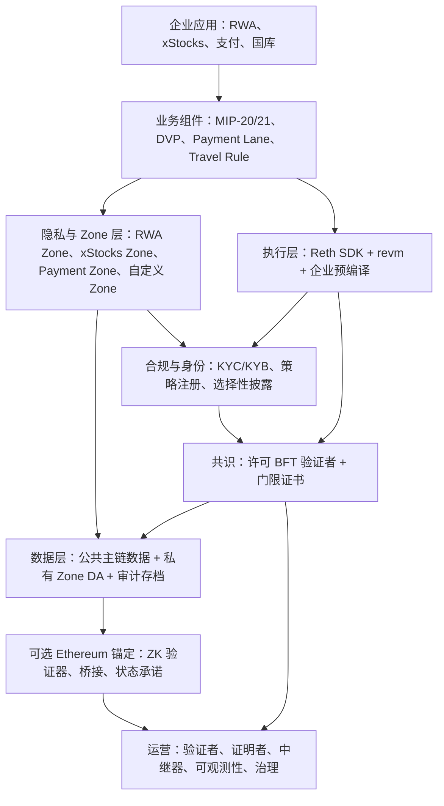
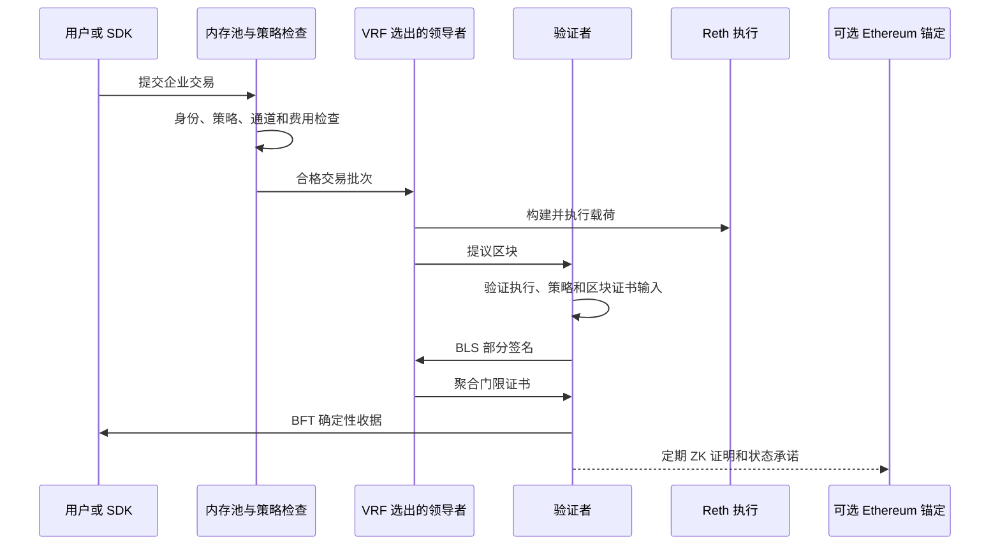

# WHI-387: 方案一 — 自建 L1 企业区块链
- **里程碑**: M5 — 方案分析与最终交付
- **日期**: 2026-05-08
- **状态**: 草稿
- **路径**: 全新 L1 从头构建

## 来源依据与研究范围

本分析评估 Mantle 最具雄心的企业链路径：一条专为受监管金融、高性能支付和私有企业 Zone 而构建的完全独立 Layer 1 网络。本文主要依据 M4 L1 架构文件，并参考 M1 Canton 和 Tempo 研究作为技术先例。提示文件引用 `m1-research/tempo-zones/WHI-340-tempo-codebase-analysis.md`；仓库中实际存放的输入文件路径为 `m1-research/tempo-zones/WHI-340-tempo-code-analysis.md`，本文使用后者。

| 来源 | 在本分析中的作用 |
|---|---|
| `m5-solution/overview/WHI-386-enterprise-blockchain-design-overview.md` | M5 组件分类体系、决策树及三路径比较框架 |
| `m4-rebuild/architecture-blueprint/WHI-357-architecture-blueprint.md` | 重建企业链的主蓝图 |
| `m4-rebuild/execution-consensus/WHI-358-execution-consensus-design.md` | 执行引擎、自定义交易类型、BFT 共识、确定性、性能模型 |
| `m4-rebuild/privacy-data/WHI-359-privacy-data-sovereignty-design.md` | 多 Zone 隐私、ECIES、选择性披露、数据主权、审计访问 |
| `m4-rebuild/compliance-access/WHI-360-compliance-identity-design.md` | 身份、KYC/KYB、策略注册、合规预编译、访问控制 |
| `m4-rebuild/business-components/WHI-361-business-components-design.md` | RWA、xStocks、支付、稳定币、国库、对账、SDK 组件 |
| `m4-rebuild/interop-deployment/WHI-362-interop-deployment-design.md` | Ethereum 锚定、桥接模型、部署模型、运营、成本、路线图 |
| `m4-rebuild/fork-analysis/WHI-364-fork-analysis.md` | L1 与 L2/L3 权衡、业务叙事适配、安全/成本/生态风险 |
| `m1-research/tempo-zones/WHI-339-tempo-docs-research.md` 和 `WHI-340-tempo-code-analysis.md` | Reth SDK、Simplex BFT、Payment Lane、Zones、TIP-403 先例 |
| `m1-research/canton/WHI-335-canton-architecture-analysis.md` | 知情必要性隐私、子交易投影、企业 BFT/2PC 先例 |

本文结论刻意保持平衡。自建 L1 是唯一能干净地提供协议原生 BFT 确定性、自定义执行语义、原生隐私 Zone 和不可绕过合规的路径。同时，它也是工程成本最高、安全负担最重、即时生态系统继承最弱、机构信任冷启动问题最难的路径。

## 1. 方案概述

**定义：** 一条完全自主的企业 L1 区块链，具备独立 BFT 共识、协议原生隐私和内置合规——不依赖任何现有 Rollup 框架。

L1 路径要求 Mantle 不再将企业区块链视为当前 OP Stack L2 的延伸，而是从企业需求出发，从第一性原理设计一条全新链。该链将兼容 EVM，但不会是 Ethereum Rollup。它将拥有自己的验证者集合、自己的共识协议、自己的出块机制、自己的隐私 Zone、自己的合规执行路径，以及自己的运营控制平面。Ethereum 作为桥接、公共流动性来源和可选 ZK 锚定层仍然具有意义，但 Ethereum 不是该链的运行时依赖项。

这一区别至关重要。Rollup 从 Ethereum 继承了强大的安全性和生态系统优势，但同时也继承了结构性约束：L1 数据发布、强制包含路径、证明或挑战延迟、排序器信任假设，以及变更执行语义的有限能力。自建 L1 路径消除了这些约束。作为回报，Mantle 必须承担 Rollup 通常继承的所有责任：验证者安全、客户端实现安全、网络活跃性、链治理、生态冷启动、流动性引导，以及长期协议维护。

目标客户是要求最大自主权并能证明专用基础设施成本合理的企业。银行联盟、证券结算场所、稳定币支付网络或受监管的 RWA 平台，可能对无许可 DeFi 的可组合性关心较少，而更看重确定性确定性、法律上可追责的验证者、私有数据驻留、不可绕过的合规以及运营 SLA。对这些客户而言，"由 Ethereum 保障安全"可能远不如"由已知受监管机构在可执行治理下运营"重要。Canton 的先例表明，当隐私和工作流模型足够强大时，大型金融机构可以采用非 Ethereum 的企业账本。Tempo 的先例表明，Reth SDK 加 BFT L1 的架构可以为支付和合规专门构建。

核心定位如下：

| 设计维度 | L1 定位 |
|---|---|
| 自主权 | Mantle 及所选机构控制完整技术栈：执行、共识、验证者治理、Zone 部署、合规和数据本地化 |
| 结算 | BFT 共识在亚秒至 1-2 秒范围内提供硬操作确定性，无需等待 Ethereum 证明/挑战窗口 |
| 隐私 | 每个企业或业务场景可运营专用 Zone，具有独立的 DA、RPC、状态、排序器、密钥和披露策略 |
| 合规 | KYC、策略检查、制裁、Travel Rule 和资产限制位于协议路径和预编译中，而非仅限于应用合约 |
| Ethereum 关系 | Ethereum 是桥接和可选 ZK 锚定层，而非该链普通出块必须依赖的基础结算层 |
| 业务适配 | 最适合 xStocks T+0 结算、支付轨道、受监管 RWA DVP 以及大型机构控制的联盟网络 |
| 成本结构 | 最高构建成本和最高责任：完整 L1 核心团队、安全审计、验证者运营、ZK/证明者运营和生态开发 |

架构口号为**企业原生主权，可选公链保障**。该链应能在 Ethereum 拥堵或暂时不可用时独立运行并完成交易确定。同时，它可以向 Ethereum 定期提交状态承诺和有效性证明，以用于高价值桥接提款、面向监管机构的保障以及市场信心建立。

### 战略适配性

选择自建 L1 路径最强的理由不是它更优雅，而是若干企业需求在 Rollup 中结构性地不易满足：

| 需求 | L1 更适合的原因 |
|---|---|
| 亚秒确定性结算 | BFT 共识可以使确定性成为正常出块确认路径；Rollup 通常将排序器软确认与硬 L1/证明确定性分开 |
| 不能接触公共 DA 的数据 | Zone 数据可保留在机构控制的私有存储中；L1 锚定仅需发布承诺/证明 |
| 不可绕过合规 | 链可以联合定义交易准入、内存池策略、预编译、代币标准和桥接过滤器 |
| 支付 QoS | Payment Lane 燃气预算和区块构建规则可由共识强制执行，而非拼凑到 OP Stack 假设之上 |
| 机构自有 Zone | 每个企业 Zone 可拥有自己的排序器、密钥、DA 后端、保留策略和监管访问模型 |

不选择该路径的最强理由同样明确：Mantle 将构建一套全新的金融市场基础设施技术栈，而非增量扩展现有链。组织必须愿意在 18-24 个月内资助协议工程，承担独立共识的安全负担，赢得机构对新验证者集合的信心，并在正常 Mantle Network 路径之外引导流动性和开发者生态。

## 2. 技术架构深度分析

L1 架构最好理解为 M5 概述中的八个相互依存的组件：执行、共识/确定性、隐私、合规/身份、访问控制、数据可用性/数据主权、互操作性和业务组件。关键设计特性是这些组件中没有任何一个可以单独决定。隐私决定 DA 模型。DA 决定与 Ethereum 的关系。合规决定执行变更必须达到的深度。确定性决定支付和 DVP 工作流是否可以将链上事件视为结算。

### 2.1 技术栈

提议的技术栈是使用 Reth SDK 和许可 BFT 共识引擎构建的自定义 EVM 等效 L1。

| 层级 | 提议选择 | 重要性 |
|---|---|---|
| 执行框架 | Reth SDK、`reth-node-builder`、`revm v38+`、MDBX | 提供模块化 Rust EVM 执行，无需从头重写 EVM |
| 执行模式 | EVM Extended | 标准 Solidity/Vyper 合约正常运行；企业功能以新预编译、交易类型和燃气策略形式出现 |
| 共识 | Commonware Simplex BFT 或等效许可 BFT | 目标为亚秒确定性和紧凑门限证书 |
| 密码学 | BLS12-381 DKG、门限签名、ECIES、Chaum-Pedersen 验证、STARK 证明 | 支持验证者证书、隐私存款、选择性披露和可选 ZK 锚定 |
| 网络 | 验证者经过身份验证的 P2P；私有 Zone RPC 和可选 libp2p/Noise 链路 | 保持验证者网络许可且可审计，同时允许企业 Zone 隔离 |
| 数据 | MDBX 用于链状态；私有 PostgreSQL/加密存储用于 Zone DA；审计存档用于保留 | 将公共承诺与私有企业数据分离 |
| Ethereum 链接 | ZK 验证器合约、桥接合约、锚定中继器 | 提供可选公共保障，同时不将 Ethereum 作为运行时依赖项 |

Reth SDK 的选择依据 WHI-357 和 WHI-358。它避免了 `go-ethereum -> op-geth -> Mantle` 的三层 fork 负担，同时保留 EVM 兼容性。它还为自定义预编译、自定义交易封装、自定义交易池行为和 `no_std` 友好的密码模块创造了更清晰的路径，后者未来可在 SP1/RISC-V 证明客体内运行。

Tempo 研究是主要先例。WHI-340 将 Tempo L1 确定为基于 Reth SDK 的活跃自定义链，具有自定义原语、预编译、交易池逻辑、payment lane 区块构建和 Commonware BFT 集成。这并不意味着 Mantle 应直接复制 Tempo 代码。WHI-340 明确将若干组件视为架构蓝图而非直接引入，尤其是 Commonware/Simplex BFT，原因是其紧密的运行时耦合以及在 Tempo 之外有限的独立生产使用。正确的教训是其架构形态可行，而非实现风险消失。

有两点注意事项应向决策者明确说明。第一，Tempo 验证了架构模式，但它未发布完整的公开吞吐量基准来证明 Mantle 的目标数字。3,000-5,000 TPS 主链目标和 >10,000 TPS Payment Zone 目标是基于 Reth/MDBX、通道隔离、并行执行假设和专用硬件推导的设计目标，而非观察到的 Tempo 生产基准。第二，Commonware/Simplex BFT 可信但作为独立生态系统依赖项仍然年轻。WHI-340 指出 Tempo 使用紧密集成的 Commonware 路径和特定的打补丁依赖设置；只有一个明确确认的生产参考。因此，Mantle 应将 Commonware 视为领先候选和设计参考，但在提交 L1 路线图之前，仍需运行独立的 BFT 选型和 PoC 流程。

### 2.2 执行层能力

执行层必须对 Ethereum 开发者保持熟悉，同时获得普通应用合约无法保障的企业语义。设计目标不是发明新的 VM，而是保留标准 EVM 行为，并在旁路抵抗、燃气可预测性或密码学性能需要协议级支持的地方添加原生企业轨道。

| 能力 | L1 实现 | 企业价值 |
|---|---|---|
| 标准 EVM 兼容性 | 保留标准操作码和 Ethereum 交易类型；使用 `revm` 和 Reth SDK | Solidity/Foundry/Hardhat/OpenZeppelin 兼容性保持完整 |
| 自定义交易类型 | 添加企业封装，如账户抽象、合规交易、隐私存款、治理交易 | 合规证明、隐私载荷和治理元数据可在执行前验证 |
| 身份预编译 | `IdentityRegistry` 风格接口，用于 KYC 级别、司法管辖区、身份绑定、认证锚点 | 每一层都可查询相同的身份真实来源 |
| 策略预编译 | `PolicyRegistry` / `ComplianceCheck`，用于全局、Zone、资产和自定义策略 | 不可绕过的转账和交易门控 |
| 密码预编译 | ECIES、Chaum-Pedersen、BLS/门限签名验证、选择性披露验证 | 高效的原生密码学，无需脆弱的 Solidity 实现 |
| 合规代币标准 | 带内置转账授权钩子的 MIP-20 风格代币 | 受监管资产无法通过未授权路径移动 |
| Payment Lane | 针对 `0x20C0` 风格支付代币的共识验证燃气通道 | 在通用链拥堵下支付仍保持可预测 |
| 确定性预言机 | BFT、ZK 证明和 L1 锚定状态的合约接口 | 业务合约可要求正确的结算级别 |

WHI-358 定义了几种自定义交易类型。对企业使用最重要的是：

| 类型 | 目的 | 关键设计特性 |
|---|---|---|
| 账户抽象交易 | 支持批量调用、WebAuthn/P-256、委托企业密钥 | 减少企业密钥管理摩擦 |
| 合规交易 | 包含策略 ID、证明、司法管辖区和证明书 | 验证者可在区块打包前拒绝不合规交易 |
| 隐私存款交易 | 携带加密 Zone 载荷和目标 Zone 元数据 | 公链观察者无法看到 Zone 接收方/备注字段 |
| 治理交易 | 编码验证者、Zone、策略、升级和紧急操作 | 保持协议操作可审计且受治理 |

协议级合规是与普通 EVM 应用的关键区别。在普通应用层设计中，代币合约或 dApp 可能会检查白名单，但用户可能通过封装器、桥接、多重调用、delegatecall 模式或未经批准的合约路由资产。自建 L1 可以在多个位置强制执行合规：RPC 准入、交易池过滤、排序器策略、预编译转账钩子和桥接过滤器。这不能消除所有风险，但将合规从"每个应用尽力而为"转变为"链执行合约的一部分"。

Payment Lane 是执行控制重要性最清晰的例证。WHI-358 和 WHI-361 描述了三通道区块模型：

| 通道 | 优先级 | 典型内容 | 约束 |
|---|---:|---|---|
| 系统通道 | 最高 | 验证者配置、治理、协议维护、奖励、紧急控制 | 即使在用户交易负载下也必须保持可用 |
| 支付通道 | 第二 | MIP-20/TIP-20 风格稳定币支付转账、支付通道结算、商户支付流 | 在满足系统需求后获得受保护容量 |
| 通用通道 | 最低 | 普通 DeFi、NFT、自定义合约、非支付调用 | 受通用燃气上限约束，无法消耗支付容量 |

关键在于分类刻意保持低成本。支付路由可基于代币地址前缀和选择器约束，而非存储读取或外部合约调用。这允许区块验证在不运行复杂策略引擎的情况下验证通道限制。恶意合约不应能伪装任意 DeFi 交易为支付以访问受保护通道。反之，真实的商户支付也不应因流行的 NFT 铸造或 AMM 清算消耗整个区块而失败。

这种通道模型也是 L1 路径与 L2/L3 路径差异最大之处。在 OP Stack 衍生链中，添加共识强制燃气通道意味着更改交易池、区块构建器、推导规则、验证规则，以及可能的证明逻辑。在自建 L1 中，通道语义可以从创世块起成为一等公民。这仍然是困难的工程，但避免了在公共 Rollup 区块空间模型上为支付特定 SLA 进行改造。

并行执行是第二个执行层机会。WHI-358 描述了 Block-STM 风格路径：乐观并行执行交易，追踪读写集，检测冲突，仅重新执行冲突交易。这对企业流量尤其有吸引力，因为许多交易在 Zone、代币、参与者和业务通道上天然可分离。Payment Zone 转账、RWA 股息更新和 xStocks 订单事件在其状态访问不相交时不应都串行化通过一个全局 EVM 瓶颈。

性能注意事项同样重要。并行执行仅在冲突低且预编译标注了准确读写行为时有帮助。身份读取、策略读取、密码学验证和确定性查询可以是并行安全的。余额变更、身份更新、治理变更和合规列表更新可能需要锁或串行化。L1 架构因此应为预编译公开并行安全元数据，并将吞吐量声明视为基准目标，而非保证。

### 2.3 共识与确定性

L1 路径的存在主要因为企业结算通常需要 Rollup 模型无法自然提供的确定性。WHI-358 提议以 Commonware Simplex BFT 作为主要共识参考，使用 BLS12-381 门限签名和许可验证者集合。

提议的确定性模型有三个级别：

| 确定性级别 | 机制 | 预期延迟 | 用于 |
|---|---|---:|---|
| BFT 即时确定性 | 许可 BFT 下 2/3+ 验证者证书 | 目标条件下约 600ms 至 1-2 秒 | 零售支付、xStocks 撮合、正常企业结算 |
| ZK 证明确定性 | 批次或选定状态转换的 STARK/SP1 证明 | 根据证明系统和批处理约 5-30 分钟 | 桥接提款、跨 Zone 证明、高价值 DVP |
| L1 锚定确定性 | ZK 证明/状态根被 Ethereum 验证器接受并在 Ethereum 上最终化 | Ethereum 确定性加上证明提交延迟 | 最高保障的外部结算和面向监管机构的公共承诺 |

这与 Rollup 硬确定性不同。即使 Ethereum 锚定延迟，链在 BFT 层已经确定。Ethereum 锚定提供额外的保障层，而非普通区块有效性。这是决定性的自主性优势。

验证者设计遵循企业假设，而非无许可公链假设：

| 验证者属性 | 设计目标 |
|---|---|
| 准入 | 许可；验证者运营商必须是已识别的企业或基础设施提供商 |
| 身份 | 绑定到 KYC/KYB、司法管辖区、法律实体、HSM 密钥和治理权限 |
| 初始规模 | 7-15 个验证者，扩展至 21-50 个 |
| 容错性 | 标准 BFT 假设：安全性/活跃性要求拜占庭或不可用者少于三分之一超过阈值 |
| 密钥管理 | BLS12-381 DKG、HSM 存储、轮换仪式、基于 epoch 的验证者集合变更 |
| 治理 | 验证者准入、移除、惩罚和升级由链上治理加上紧急守护者控制 |
| 地理分布 | 多地区部署以避免相关联的司法管辖区或数据中心故障 |

优势是硬确定性和已知可追责性。劣势是安全性依赖该验证者集合。Ethereum Rollup 可以指向 Ethereum 经济安全。自建 L1 必须说服企业，其验证者治理、法律协议、密钥管理、监控以及惩罚/治理流程对受监管结算足够可信。这不是技术脚注；这是核心机构采用风险。

VRF 领导者选举是该可信度故事的重要部分。确定性轮换领导者计划简单但可预测：交易员、验证者或交易对手可以提前知道哪个机构将提议下一个区块。对于 xStocks 和支付流，这种可预测性增加了 MEV、审查和定向基础设施攻击风险。提议的 BFT 设计改用可验证随机选择，使下一个领导者在轮次前难以预测。验证者可以验证领导者资格，但攻击者无法轻易围绕已知的下一个提议者预置贿赂、DDoS 或订单流策略。

运营负担是 VRF 和 BLS 门限签名增加了密钥管理复杂性。验证者需要 HSM 支持的签名、门限密钥的 DKG 仪式、受监控的密钥轮换，以及针对失败轮次或验证者退出的事件处置手册。只有在明确预算的情况下，这些对受监管基础设施来说才是可接受的成本。将其视为普通 DevOps 会低估运营 BFT L1 的难度。

### 2.4 隐私架构

L1 隐私模型是多 Zone 架构。每个 Zone 是具有独立状态、排序器、DA 后端、RPC 端点、密钥、参与者、合规规则和数据保留策略的物理隔离执行环境。一个 Zone 可以映射到一个企业、一个联盟、一个受监管场所或一个业务用例。

| Zone | 目标用例 | 隐私模型 | DA 模型 | 性能目标 |
|---|---|---|---|---|
| 公共主链 | 公共资产注册、治理、DeFi 兼容资产 | 透明 | 公共主链数据 | 目标 3,000-5,000 TPS |
| RWA Zone | 代币化真实资产和 DVP 工作流 | 受 Canton 启发的子交易隐私 | 运营商/机构 Validium DA | 100-500 TPS |
| xStocks Zone | 代币化股票、ATS 类交易、暗池逻辑 | ZK 增强订单隐私加市场监控 | 运营商/机构 Validium DA | 1,000-3,000 TPS，峰值更高 |
| Payment Zone | 稳定币支付轨道 | Zone 内部透明，外部隐私 | 运营商 Validium DA | 目标超过 10,000 TPS |
| 自定义 Zone | 企业特定部署 | 可配置 T1-T3 隐私 | 可配置 | 可配置 |

隐私策略不是"加密一切并寄希望于此"，而是选择性透明。不同参与者看到不同数据，因为他们的业务和监管角色不同。

| 层级 | 机制 | 保护内容 |
|---|---|---|
| 准入控制隐私 | 经过身份验证的 RPC、签名访问令牌、按账户过滤、基于角色的数据访问 | 未授权用户无法查询或提交 Zone 活动 |
| DA 层隐私 | Zone 交易数据存储在私有 DA 中，不发布到公链或 Ethereum | 公共观察者无法重建敏感交易 |
| 密码学隐私 | ECIES 加密存款、门限 ECIES、选择性披露证明、ZK 合规证明 | 接收方、备注、身份事实和选定合规数据对未授权方隐藏 |
| 子交易隐私 | RWA 交易封装分解为参与者特定可见账目 | 每一方只看到多方交易中与自己相关的部分 |
| 审计隐私 | 查看密钥、范围限定审计沙箱、门限解密、不可变访问日志 | 监管机构在授权时可检查，而不暴露整个 Zone 数据 |

Canton 先例对 RWA 最为重要。Canton 证明子交易隐私可以支持金融工作流，通过向每个参与者只显示其所需数据。WHI-335 描述了其 Merkle DAG 投影模型、Observer 角色和确定性确定性。L1 设计无法直接复制 Canton，因为 Mantle 需要 EVM 兼容性而非 Daml。但它可以采用这一原则：DVP 交易应可分解，使银行看到支付账目、登记机构看到资产账目、买方看到交付、卖方看到支付，无关参与者什么都看不到。

Tempo 先例对 Zone 最为重要。Tempo Zones 展示了一个更简单的模型：公共 L1 加私有 validium 风格 Zone、ECIES 加密存款、经过身份验证的 Zone RPC 以及从 L1 到 Zone 的策略镜像。WHI-340 还指出 Tempo 的 Zone 证明路径已准备好但在分析的代码中尚未完全实现。因此，Mantle 应将 Tempo 视为架构参考，而非已去风险的成品模型。

早期采用者应理解第一阶段信任模型。WHI-359 的路线图从有意义的隐私和运营隔离开始，但尚未完全降低密码学信任。在最早的 Zone 阶段，Zone 排序器被信任为明文可见性，以及在实现有效性证明之前，为正确的 Zone 执行而信任。排序器可以看到 Zone 内部交易，因为它必须解密存款、运行合规检查并构建 Zone 区块。这对于机构运营的 Zone 是可接受的，其中运营商本身就是受监管的合规官，但这不等同于运营商盲目隐私。

可以通过启动范围管理该风险。第一阶段 Zone 应使用低价值限制、已知参与者、机构自有排序器、强审计日志、提款限制和保守的桥接上限。第二阶段可添加合规证明、余额证明、门限 ECIES 和选择性披露。第三阶段可添加完整状态转换证明和更高级的跨 Zone 隐私。这种分阶段模型务实可行，但文档不应暗示第一个生产试点具备所有最终隐私保障。

吞吐量也因 Zone 而存在显著差异。3,000-5,000 TPS 主链目标并非每种业务流的正确数字。WHI-359 将 RWA Zone 置于更低范围，大约 100-500 TPS，因为子交易隐私、生命周期检查、DVP 协调和审计要求创造了开销。这个较低的数字对于机构 RWA 发行、赎回、分红和 DVP 流仍然可能足够，但它与支付吞吐量存在实质性差异。支付可以目标 >10,000 TPS，因为其隐私模型更简单，交易类型更窄。xStocks 介于两者之间：比 RWA 更高的性能需求，但比纯支付更多的隐私和市场监控复杂性。

### 2.5 合规与身份

这条 L1 路径中的合规是协议原生的。它不是仪表板，不仅仅是链下筛查供应商，也不是每个代币合约内的可选修改器。

合规栈有五个层级：

| 层级 | 功能 | 它防止的故障模式 |
|---|---|---|
| IAM 层 | SSO/OIDC/JWT、企业身份绑定、钱包映射 | 匿名或未授权用户访问企业端点 |
| 经过身份验证的 RPC 层 | Zone 范围、函数级 RBAC、按账户过滤 | 通过 RPC 的数据泄漏和未授权提交 |
| 排序器策略层 | 内存池/预执行检查、加密存款检查、制裁/KYC 筛查 | 不合规交易进入区块 |
| 预编译合规层 | EVM 执行期间的身份和策略检查、转账钩子、仅直接调用约束 | 合约级绕过和 delegatecall 滥用 |
| 桥接过滤层 | 存款/提款过滤器、L1/Ethereum 桥接控制、提款限制 | 跨链绕过本地合规规则 |

身份同样分层：

| 身份层级 | 示例 |
|---|---|
| 密钥层 | EOA、P-256/WebAuthn、HSM、委托企业密钥 |
| DID/链上锚点 | 身份 ID、地址绑定、恢复策略 |
| 可验证凭证 | KYC、KYB、合格投资者、VASP 注册、经纪/自营商执照、司法管辖区 |
| 合规属性 | KYC 级别、制裁状态、允许司法管辖区、风险评分、到期时间 |
| 业务角色 | 验证者、Zone 运营商、发行方、经纪商、做市商、审计员、监管机构 |

PolicyRegistry 设计遵循 Tempo TIP-403/TIP-1015 概念，但为 Mantle 企业需求进行了泛化。策略可以是全局、Zone 特定、资产特定或自定义的。它们可以允许、拒绝、白名单、黑名单、检查属性、组合发送方和接收方策略，或运行自定义 DSL。策略快照同步到 Zone，使 Zone 区块使用一致的策略版本。

| 策略级别 | 示例 |
|---|---|
| 全局策略 | 制裁列表、最低 KYC 级别、紧急暂停 |
| Zone 策略 | RWA 合格投资者规则、xStocks 经纪商访问、Payment VASP 准入 |
| 资产策略 | 转账限制、锁定期、持有人限制、日限额、Reg D/Reg S 约束 |
| 自定义策略 | 内部风险限制、交易对手批准、部门隔离墙、地区规则 |

选择性披露是隐私与合规之间的桥梁。用户可以证明诸如合格投资者状态、非制裁状态、Travel Rule 完成、余额阈值或允许司法管辖区等事实，而无需披露所有个人身份信息。对于监管机构，链可以支持四级升级模型：ZK 报告、汇总统计、范围限定数据沙箱，以及仅在紧急治理下的完全解密。这是比普通私有数据库更结构化的披露模型，同时仍避免了 Rollup 的公开数据暴露。

### 2.6 互操作性

L1 路径不应试图成为孤立孤岛。它需要在三个方向上进行受控互操作：Ethereum/Mantle/公共加密、其他企业链或跨链协议，以及传统金融/企业 IT 系统。

| 互操作界面 | 提议设计 | 关键权衡 |
|---|---|---|
| Ethereum 桥接 | ZK 桥接加验证器合约、提款证明、Guardian 暂停、限制、高价值延迟 | 比乐观提款更快更强，但需要证明者操作和桥接审计 |
| Ethereum 锚定 | 定期向 Ethereum 验证器提交状态根/证明 | 提供公共保障而无普通运行时依赖 |
| Mantle L2 连接 | 初期通过 Ethereum L1 桥接路由；之后可能直接 CCIP/桥接 | 风险最低但造成流动性碎片化和桥接延迟 |
| 跨链消息 | 适当情况下使用 CCIP 等机构级协议 | 避免构建冷启动跨链网络 |
| 传统金融系统 | SWIFT ISO 20022 适配器、CSD 桥接、KYC 桥接、Travel Rule 网络、AML 筛查、对账 | 企业采用必要；增加集成范围 |
| 企业 IT | 经过身份验证的 RPC、SDK、webhooks、Kafka/WebSocket 事件、ERP 对账 | 将协议能力转化为可用的企业工作流 |

Ethereum 关系应精确描述：

| 模型 | L1 路径答案 |
|---|---|
| 这是 Ethereum Rollup 吗？ | 否 |
| 它是否依赖 Ethereum 进行普通确定性？ | 否 |
| 它能与 Ethereum 桥接吗？ | 是 |
| 它能向 Ethereum 发布承诺吗？ | 是 |
| 它是否像 Rollup 那样继承 Ethereum 安全性？ | 否 |
| Ethereum 锚定能帮助机构信任吗？ | 是，对于有证明支持的承诺和高价值桥接结算 |

这一区别对决策者必须明确。称该链"锚定到 Ethereum"有用，但不等同于"由 Ethereum 保障安全"。该链主要由其自身验证者集合保障安全；Ethereum 为选定承诺提供可选的外部验证。

### 2.7 原生业务组件

自建 L1 路径在链不仅是基础设施而是业务平台时最为强大。WHI-361 定义了三个主要组件系列。

| 业务界面 | 原生组件 | L1 的作用 |
|---|---|---|
| RWA | MIP-20 合规代币、生命周期引擎、发行/赎回、公司行为、DVP 结算、资产注册 | 转账限制、身份、结算和审计在应用层以下强制执行 |
| xStocks | MIP-21 代币化股票标准、交易规则引擎、混合订单簿、暗池、监控、T+0 结算 | 低延迟 BFT 确定性和隐私 Zone 支持 ATS 类工作流 |
| 支付 | Payment Lane、稳定币注册、FX 自动转换、稳定币燃气、Travel Rule 引擎、国库钱包、对账 | 专用燃气通道和亚秒确定性提供支付级用户体验 |

对于支付，关键特性是 Payment Lane 隔离。支付转账可以获得有保障的区块空间和可预测费用，而非与 DeFi/NFT/通用交易竞争。对于代币化证券，关键特性不仅是确定性，还有在执行前强制执行市场规则、监控、最佳执行义务和参与者资格的能力。对于 RWA，关键特性是隐私、身份、DVP 和监管访问的组合。

## 3. 核心优势分析

| 优势 | 详情 |
|---|---|
| 最大自主权 | Mantle 控制执行、共识、验证者准入、隐私、合规、DA、升级节奏和业务原语 |
| 亚秒硬确定性 | BFT 共识为业务工作流提供确定性确定性，无需等待 Rollup 挑战/证明窗口 |
| 最深定制 | 链可以修改交易类型、预编译、燃气通道、验证者治理、Zone 机制和桥接语义 |
| 原生隐私 | 隐私内置于 Zone 拓扑、DA 路由、RPC 访问、加密、选择性披露和审计设计 |
| 协议级合规 | 身份和策略检查可在执行前、执行期间和桥接边界强制执行 |
| 数据主权 | 敏感 Zone 数据保留在机构控制的 DA 中，可支持保留、删除、导出和本地性规则 |
| 无外部瓶颈 | 正常吞吐量和确定性不依赖 Ethereum 区块空间、L1 拥堵或 Rollup 证明/挑战时间 |
| 支付级性能 | Payment Lane 和 Zone 并行主义目标支付工作流 >10,000 TPS，费用可预测 |
| 强企业可追责性 | 许可验证者、HSM 密钥、KYB、治理和法律协议比匿名运营商更适合受监管金融 |
| 业务特定 Zone | 每个企业、场所或产品可获得量身定制的隐私、合规、数据驻留和性能设置 |

### 最大自主权

L1 路径赋予 Mantle 最广泛的设计权限。执行可以基于 Reth SDK 构建，而非受 OP Stack 继承约束。共识可以是 BFT，而非中心化排序器加 L1 结算。隐私可以使用独立 Zone 和私有 DA，而非公共 calldata/blob 发布。合规可以成为交易准入和代币转账语义的一部分。升级可以遵循企业治理，而非上游 Rollup 发布节奏。

这种自主权在产品需求不可妥协时最有价值。如果 xStocks 结算需要确定性亚秒确定性，协议可以为此构建。如果支付流量需要隔离燃气预算，区块构建器可以强制执行。如果欧盟银行需要其 Zone 数据存储在欧盟基础设施中且在保留期后可删除，Zone DA 模型可以在无需要求 Ethereum 更改的情况下实现。

### 亚秒硬确定性

软确认与硬结算之间的差异对企业系统不是学术问题。支付接受、DVP 资产释放、抵押品移动、证券结算和国库操作都触发下游义务。支付终端无法告诉商户最终结算需要挑战窗口。证券场所无法在撤销语义持续数天的情况下运行 T+0 结算。

BFT 共识为 L1 路径提供了清晰答案：一旦区块具有门限证书，链即将交易视为最终确定。对于更高风险的外部结算，应用可以等待 ZK 证明或 Ethereum 锚定确定性。这种类型化确定性模型让业务可以根据每笔交易价值和用例选择正确的确认阈值。

### 最深定制

Rollup 框架强大但有固执己见。它们假设特定的数据流、桥接流、批处理流、排序器角色、证明/挑战语义和上游兼容性要求。自建 L1 可以定制每一层：

| 定制领域 | 示例 |
|---|---|
| 交易格式 | 合规证明、隐私存款、治理操作、企业 AA |
| 内存池策略 | 在区块打包前拒绝不合规交易 |
| 燃气模型 | 稳定币计价燃气、固定支付费用、独立通道预算 |
| 执行钩子 | 仅直接调用预编译、转账授权钩子、密码学验证 |
| 共识 | 许可验证者、VRF 领导者选举、门限证书 |
| Zone 拓扑 | 具有不同隐私层级的专用 RWA/xStocks/Payment/自定义 Zone |
| 数据路由 | 公共主链数据 vs 私有 Zone 数据 vs 审计存档 vs Ethereum 承诺 |

这是 L1 路径能够满足最苛刻需求的主要技术原因。这也是该路径昂贵的原因。

### 原生隐私与数据主权

最强的企业隐私属性不是向公共 RPC 端点隐藏数据。而是确保敏感交易数据从一开始就不被放置在公共 DA 层。L1 Zone 架构将敏感数据路由到私有 DA，只对外暴露承诺和证明，并使用查看密钥或范围限定披露进行授权审计。

数据主权是比保密性更广泛的需求。企业需要知道数据驻留在哪里、谁运营数据库、记录保留多长时间、如何处理删除请求、SEC/MiFID/AML 保留如何覆盖 GDPR 删除，以及监管机构如何获得合法访问。自建 L1 可以将这些规则纳入 Zone 配置和运营商协议。

### 协议级合规

企业合规不能依赖每个应用开发者正确实现策略。这条路径可以在交易有效性强制执行的同一级别强制执行合规。转账可能因发送方未经 KYC 资格认证、接收方受制裁、资产处于锁定期、司法管辖区不被允许、Travel Rule 数据包缺失或桥接过滤器拒绝目的地而失败。

这很重要，因为受监管机构通常通过故障模式评估基础设施。如果用户可以通过桥接、封装器或强制交易路径绕过白名单，则该系统并非真正许可制。自建 L1 可以消除或严格定义这些路径。

### 无外部瓶颈

L1 路径不会等待 Ethereum 生产区块、包含 blob、接受证明或在普通业务确定性之前完成挑战期。Ethereum 拥堵可能延迟锚定，但不会停止 BFT 出块。这对需要可预测 SLA 行为的支付网络和交易场所是重大优势。

话虽如此，"无外部瓶颈"并不意味着"无瓶颈"。它意味着瓶颈在 Mantle 控制之下：验证者网络、执行吞吐量、Zone 排序器容量、证明者吞吐量和桥接中继器操作。

### 支付级性能

支付性能不仅仅是 TPS 数字。支付网络需要可预测的确认、可预测的费用、低运营方差以及与无关流量的隔离。自建 L1 可以结合四种在 Rollup 改造中难以干净组装的机制：BFT 硬确定性、稳定币计价燃气、受保护 Payment Lane 容量，以及具有更简单隐私模型的专用 Payment Zone。

最强的声明是支付流量可以被设计为一等工作负载，而非又一个智能合约类别。区块构建器可以预留支付容量。代币标准可以使合规检查廉价且统一。费用模型可以目标亚分转账。Zone 运营商可以为支付吞吐量而非通用 DeFi 可组合性调整硬件、数据库和 RPC 路径。Travel Rule 引擎可以集成到支付路径中，而非作为事后合规工作流附加。

注意事项是 >10,000 TPS 仍是需要验证的目标。它依赖于专用硬件、准确的通道分类、低冲突执行、优化的预编译和仔细的状态访问。因此，正确的路线图是基准优先：在将 L1 推销为支付轨道之前，在专用测试网上验证 Payment Lane 吞吐量。

### 强企业可追责性

企业决策者通常更倾向于可追责的基础设施而非抽象的去中心化。许可 BFT L1 可以使可追责性明确：验证者是已知实体，Zone 运营商签署法律协议，密钥存放在 HSM 中，升级遵循时间锁和投票，监管机构可被授予定义的审计角色。这比关键操作由匿名或松散可追责方执行的网络更适合受监管金融。

这种可追责性不能替代密码学安全。它是额外的企业控制平面。如果验证者错过区块，有一个运营实体可以联系。如果 Zone 违反保留义务，有一个负责任的运营商。如果合规策略更新不正确，治理记录和审计日志显示谁更改了它以及何时更改。对于银行、经纪商、托管机构和支付机构，这种程序性证据可能与底层共识证明同样重要。

权衡是可追责性降低了无许可的开放性。L1 路径在目标市场比开放验证者准入或匿名参与更看重法律身份、运营 SLA 和治理控制时最为强大。

### 业务特定 Zone

Zone 模型是一个主要优势，因为企业需求并不均质。RWA、xStocks 和支付希望不同的隐私、吞吐量、确定性、合规和数据保留设置。单一共享执行环境迫使所有工作负载成为一种妥协。独立 Zone 允许链围绕每个环境的业务目的进行调整。

| Zone 设计问题 | RWA 可能答案 | xStocks 可能答案 | 支付可能答案 |
|---|---|---|---|
| 隐私粒度 | 子交易可见性和监管机构观察员访问 | 订单隐私、暗池控制、交易后披露 | 外部隐私；参与者在网络内可能看到更多 |
| 吞吐量优先级 | 适中，正确性/审计优先 | 高峰吞吐量、低延迟 | 非常高的持续吞吐量 |
| 合规重点 | 投资者资格、锁定期、资产生命周期 | 经纪/自营商权限、市场监控、交易规则 | KYC/VASP 状态、制裁、Travel Rule |
| 数据位置 | 通常特定于司法管辖区 | 特定于场所和监管机构 | 特定于支付网络和 VASP |
| 升级节奏 | 保守 | 市场规则驱动 | 产品/SLA 驱动 |

这就是为什么 L1 设计应避免假装"企业链"是一个统一产品。公共主链协调身份、治理、承诺和资产移动。Zone 承载业务特定执行环境。

## 4. 核心劣势与风险分析

| 劣势 | 详情 | 严重性 |
|---|---|---|
| 极高开发成本 | 从执行到共识到网络的完整技术栈，Zone、合规、桥接、SDK、审计；15-25 人构建团队；可信的 18-24 个月时程 | 关键 |
| 安全自我负责 | 不自动继承 Ethereum L1 安全性；验证者集合、客户端 bug、共识 bug、桥接 bug 和治理失败都是 Mantle 的负担 | 关键 |
| 冷启动生态系统 | 独立 L1 需要钱包、RPC、浏览器、索引器、流动性、桥接、开发者文档、资产发行方、验证者和机构信任 | 高 |
| 不继承 Ethereum 价值 | 无法诚实声称与 Rollup 相同的"由 Ethereum 保障安全"模型；Ethereum 锚定是保障层，而非基础安全 | 高 |
| 运营复杂性 | 必须操作 BFT 验证者、DKG、HSM、ZK 证明者、中继器、Zone 排序器、私有 DA、审计存档、监控、事件响应 | 高 |
| Mantle 生态系统解耦 | 流动性和用户不自动从 Mantle Network 转移；桥接和做市成为核心启动问题 | 中 |
| 治理复杂性 | 验证者准入、Zone 运营商批准、紧急暂停、升级、策略变更、监管访问和跨机构争议需要流程 | 中 |
| 人才稀缺 | Rust 协议工程师、BFT 共识工程师、密码学家、ZK 工程师和企业 SRE 比 Solidity 应用团队更难招聘 | 中 |
| 产品过度扩张风险 | 同时构建所有层次可能在验证产品市场契合之前创建大型技术上令人印象深刻的平台 | 高 |
| 供应商/参考风险 | Reth SDK 和 Tempo 提供有用模式，但 Mantle 特定的 Reth+BFT+Zone 集成仍需验证和审计 | 中 |

### 关键风险 1：开发成本和进度

自建 L1 路径不是增量特性。它是一个协议项目。WHI-362 的路线图显示了一个 18 个月的路径，甚至在考虑审计发现和企业合作伙伴延迟之前。18-24 个月的现实估计适合决策。

构建需要：

| 工作流 | 示例 |
|---|---|
| 核心执行 | Reth 节点组装、自定义原语、交易池、预编译、燃气模型、载荷构建器 |
| 共识 | BFT 集成、DKG、验证者生命周期、网络层、证书、分叉选择、活跃性/恢复 |
| 隐私 Zone | Zone 工厂、Zone 排序器、Zone DA、ECIES、经过身份验证的 RPC、ZonePortal、选择性披露 |
| 合规 | 身份注册、策略注册、合规检查、Travel Rule、制裁、审计数据 |
| ZK 和桥接 | 证明生成、验证器合约、桥接合约、中继器、确定性预言机 |
| 业务组件 | MIP-20/21、DVP、稳定币注册、payment lane、国库、对账、SDK |
| 运营 | 监控、HSM、灾难恢复、密钥轮换、升级治理、事件处置手册 |
| 安全 | 多次审计、密码学审查、桥接审查、红队、漏洞赏金 |

如果 Mantle 无法为这些工作流配备拥有高级所有权的人员，则不应将 L1 路径选为主要近期产品。

### 关键风险 2：安全自我负责

Rollup 将其大部分安全叙事转移给 Ethereum。L1 路径不能。其普通确定性依赖于其验证者集合和自身实现。如果证明系统对相关流程完整且被使用，Ethereum 锚定可以检测或防止某些无效状态转换，但这不使链成为 Rollup。

主要安全义务包括：

| 安全领域 | 风险 |
|---|---|
| 共识 | BFT 实现 bug、DKG 失败、验证者双重签名、网络分区、视图变更失败 |
| 执行 | 预编译 bug、燃气定价错误、交易类型 bug、自定义内存池绕过 |
| 桥接 | 无效提款证明、验证器升级 bug、中继器错误、Guardian 被捕获 |
| 隐私 | ECIES 实现缺陷、密钥泄露、元数据泄漏、Zone RPC 泄露 |
| 合规 | 策略缓存竞争、陈旧身份数据、强制路径绕过、错误的制裁/Travel Rule 处理 |
| 治理 | 紧急权力被滥用、验证者被捕获、慢速升级响应、监管访问冲突 |

对于受监管客户，问题不仅是系统在密码学上是否健全。而是当系统失败时谁负责。Mantle 需要一个更接近受监管金融市场基础设施提供商的运营模型，而非典型的 L2 生态系统项目。

### 高风险：生态系统和流动性冷启动

链的独立性赋予了控制权，但削弱了自动生态系统继承。开发者可以重用 Solidity，但仍需要链特定的工具、预编译 ABI、RPC 行为、索引器支持、钱包支持、浏览器和部署管道。流动性必须通过桥接移动或本地发行。做市商和稳定币发行方必须支持新链。机构必须在提交资产之前信任验证者集合和治理。

最强的采用策略因此不是"启动通用 L1 并等待"。而是围绕 L1 优势决定性的窄企业产品启动：支付轨道、xStocks 场所或拥有锚定合作伙伴的受监管 RWA DVP 平台。没有楔形进入点，冷启动问题可能主导技术优势。

### 高风险：运营复杂性

WHI-362 的模型 C 部署务实但运营繁重。Mantle 运营核心层，而机构运营 Zone。这以正确的方式分割了责任，但创建了许多故障域。

| 运营领域 | 所需能力 |
|---|---|
| 验证者运营 | 24/7 BFT 验证者监控、HSM 管理、网络延迟控制、DKG 仪式 |
| 证明者运营 | GPU 集群调度、证明延迟监控、备用证明者故障转移、验证器兼容性 |
| 中继器运营 | Ethereum 燃气管理、锚定节奏、交易重提交、L1 中断处理 |
| Zone 运营 | 排序器正常运行时间、PostgreSQL 加密/备份、Zone DA 保留、密钥轮换、本地合规 |
| 可观测性 | 基础设施、链、Zone、业务和合规仪表板，带 P0/P1 告警 |
| 灾难恢复 | Zone RTO/RPO、全网络恢复演练、密钥重建测试、桥接事件处置手册 |

这并非不可能。这只是一种不同的业务。Mantle 将成为企业级链运营的提供商，而不仅仅是协议软件。

### 中风险：Mantle 生态系统解耦

Mantle 现有的网络、品牌、流动性和开发者社区是真实资产。完全独立的 L1 仍然可以使用 EVM 工具并桥接到 Mantle/Ethereum，但链接比 L2 或 L3 路径弱。这对 DeFi 可组合性、资产流动性和开发者思维份额很重要。如果主要企业产品需要直接访问 Mantle 流动性，并行 L2 或 L3 可能更好。如果产品比开放流动性更需要确定性和数据控制，L1 路径变得更有吸引力。

### 高风险：产品过度扩张

架构很容易变得过于广泛。Reth SDK 迁移、BFT 共识、Payment Lane、RWA 子交易隐私、xStocks 暗池、Travel Rule 自动化、ZK 证明、桥接基础设施、企业 SDK 和传统金融适配器，每一个都是实质性项目。在验证一个窄企业楔形之前构建所有这些，将创建一个需求排序不明确的大型平台。

缓解措施不是削弱长期架构。而是强制执行启动顺序。Mantle 应选择一个有真实锚定合作伙伴的楔形，让第一个生产范围服务于该楔形。如果楔形是支付，优先考虑 Payment Lane、稳定币燃气、Travel Rule 和商户/国库 SDK。如果楔形是 RWA DVP，优先考虑身份、MIP-20、生命周期引擎、子交易隐私和审计访问。如果楔形是 xStocks，优先考虑确定性、交易规则、市场监控和订单隐私。其余组件应设计为扩展点，而非作为未完成的表面积交付。

### 中风险：供应商和参考成熟度

L1 设计基于真实参考，但这些参考不能消除 Mantle 的集成风险。Reth SDK 可信且日益重要，但深度定制的基于 Reth 的链仍依赖于快速变化的 Rust 客户端 API。Tempo 展示了活跃的自定义 L1 模式，但其确切 TPS 配置文件不是 Mantle 的公开基准。Tempo Zone 在架构上具有相关性，但 WHI-340 指出证明路径在分析的 Zone 代码中已准备好但并非完全活跃。Commonware/Simplex BFT 有前途且被 Tempo 使用，但与 CometBFT 等较旧的 BFT 技术栈相比，其独立生产多样性有限。

这建议在完全构建承诺之前进行正式技术关卡：

| 组件 | 承诺前关卡 |
|---|---|
| Reth SDK | 在维护的 Reth 版本上演示 Mantle 特定的自定义交易类型、预编译和载荷构建器 |
| BFT 引擎 | 运行具有验证者流失、DKG/密钥轮换、数据包丢失和亚秒确定性目标的 4-11 节点测试网 |
| Payment Lane | 在对抗性通用通道负载和支付突发流量下基准测试通道隔离 |
| Zone 证明路径 | 在公共测试部署上证明存款、状态转换、余额证明和提款流 |
| Commonware 或替代方案 | 在集成成本、确定性、运营、审计和生态系统支持方面将 Simplex BFT 与成熟替代方案进行比较 |

如果这些关卡失败，正确的决策不是强制执行 L1 路径。而是通过 L2 或 L3 实现保留企业产品策略，同时继续对独立 L1 进行研发。

## 5. 目标场景

L1 路径不是通用企业答案。它适合需求能够证明新基础设施层合理的客户。

### 5.1 重度受监管金融机构

银行、证券公司、托管机构、保险公司和受监管支付机构是天然买家。他们通常需要：

| 需求 | L1 适配性 |
|---|---|
| 已知验证者/运营商 | 具有 KYB 和法律可追责性的许可 BFT 验证者集合 |
| 确定性结算 | 支付、DVP、抵押品释放、国库移动的 BFT 确定性 |
| 监管访问 | 查看密钥、范围限定审计、合规报告、不可变访问日志 |
| 数据驻留 | 具有本地 DA 和保留规则的机构运营 Zone |
| 策略执行 | KYC/KYB、资产限制、制裁、Travel Rule、司法管辖规则 |

L1 路径在监管机构或内部风险委员会要求基础设施主权时尤为相关。如果机构不希望敏感交易数据出现在 Ethereum blob 中，也不希望第三方排序器成为单一信任根，那么具有机构运营验证者和 Zone 的专用企业 L1 将变得可信。

### 5.2 大型跨国企业联盟

联盟场景包括银行间结算、供应链融资、跨境支付、代币化基金分发和受监管资产网络。这些环境有已知参与者、法律协议和治理委员会。这很好地映射到许可 BFT 和 Zone 治理。

关键优势不是最大去中心化，而是共享控制。联盟可以在成员机构之间分配验证者角色，按司法管辖区或业务线分配 Zone 运营商，定义升级/否决规则，并为监管机构提供明确的审计角色。Canton 证明，当隐私模型和治理模型符合机构预期时，这种企业账本可以大规模采用。

### 5.3 极端确定性需求

当秒或分钟不够时，或软确认在法律上不足时，L1 路径最为强大。

| 用例 | L1 的作用 |
|---|---|
| T+0 证券结算 | 资产和现金账目可在 BFT 确定性下原子性结算 |
| xStocks 交易场所 | 订单执行和交易后结算可避免 Rollup 挑战/证明延迟 |
| B2C 稳定币支付 | 商户确认可以是硬确定而非排序器信任 |
| 国库/抵押品移动 | 下游财务系统可在确定性收据上触发 |
| 实时 DVP | 交易对手可基于确定性确定性释放资产 |

Rollup 有时可以提供快速内部确认，但 L1 路径消除了普通操作的软/硬确定性分割。

### 5.4 强数据主权要求

某些企业客户要求敏感数据永远不离开司法管辖区，永远无法公开重建，并在保留期后保持可删除或逻辑可擦除。纯 Rollup DA 与该需求冲突。自建 L1 可以将 Zone 数据保留在私有 DA 中，只对外发布承诺/证明。

这对欧盟 GDPR、证券记录保留、AML 保留和跨境数据传输规则尤为重要。自建 L1 可以在 Zone 配置和运营商义务中编码这些规则。

### 5.5 L1 不适合的场景

当客户的主要价值在于生态系统连接而非主权时，应拒绝或推迟 L1 路径。

| 场景 | 更好的路径 |
|---|---|
| 需要 Mantle 流动性和公开可组合性的 DeFi 应用 | 企业 L2 或当前 Mantle |
| 简单的 KYC 门控代币发行 | L2/M3 风格改造可能足够 |
| 吞吐量适中的租户特定私有应用链 | L3 应用链 |
| 3-6 个月内需要试点 | 先做 L2 或专注 L3 |
| 小团队和有限协议预算 | 避免自建 L1 |
| 客户要求明确的 Ethereum Rollup 安全继承 | 企业 L2/ZK Validium |

## 6. 实施路线图估算

提示要求三阶段估算。WHI-362 提供了更细粒度的六阶段路线图。为决策者清晰起见，以下将工作分组为三个主要程序阶段，同时保留底层里程碑。

### 6.1 路线图摘要

| 阶段 | 持续时间 | 团队规模 | 关键交付物 | 退出标准 |
|---|---:|---:|---|---|
| 第一阶段：核心执行与共识 MVP | 6-9 个月 | 9-15 人 | Reth SDK 节点、BFT 测试网、自定义交易类型、初始预编译、验证者生命周期、基本监控 | 多节点测试网达到目标确定性并运行标准 EVM 合约加初始企业预编译 |
| 第二阶段：隐私、合规和首个 Zone | 6-9 个月 | 15-25 人 | ZoneFactory、ZonePortal、Payment/RWA/xStocks 试点 Zone、ECIES、经过身份验证的 RPC、IdentityRegistry、PolicyRegistry、ComplianceCheck、Travel Rule MVP | 试点企业 Zone 可以存款、私下交易、执行策略、导出审计数据并安全提款 |
| 第三阶段：业务组件、互操作、审计、生产就绪 | 6 个月 | 19-25 人 | MIP-20/21、DVP、Payment Lane、稳定币燃气、ZK 桥接、Ethereum 锚定、SDK、可观测性、DR、审计、漏洞赏金 | 具有已审计桥接、受监控验证者/证明者运营和至少一个锚定企业用例的生产候选版本 |

总计：**18-24 个月**，主要实施期间拥有 **15-25 人核心构建团队**。长期运营可能需要 **16-22 人**，涵盖核心协议、SRE、安全、ZK/证明者运营、合规支持和 Zone 支持。

### 6.2 第一阶段：核心执行层与共识 MVP

**持续时间：** 6-9 个月  
**主要目标：** 证明 Mantle 可以运营具有 BFT 确定性和企业扩展点的 EVM 兼容 Reth SDK L1。

| 工作项 | 详情 |
|---|---|
| Reth SDK 节点 | 自定义 `NodeTypes`、`EngineTypes`、`EnterpriseTxEnvelope`、链规格、载荷属性 |
| EVM Extended 模式 | 标准合约正常运行；添加预编译注册和自定义燃气计算 |
| BFT 集成 | Simplex BFT 或等效方案、验证者 P2P、门限证书、VRF 领导者选举 |
| 验证者生命周期 | 注册、验证者集合变更、密钥轮换、DKG、HSM 集成设计 |
| 初始预编译 | 身份、策略查找、密码学验证、验证者配置 |
| 交易池 | 合规准入、通道分类、治理交易处理 |
| 测试网 | 4-11 个验证者、可重复部署、混沌/活跃性测试 |
| 监控 | 共识健康、出块时间、验证者在线率、交易池、执行延迟 |

关键技术验证是在现实负载下展示亚秒至 1-2 秒硬确定性的多节点 BFT 测试网。如果 Reth+BFT 集成失败或证明脆弱，应在更深层投资之前暂停 L1 路径。

### 6.3 第二阶段：隐私层、合规层和首个 Zone

**持续时间：** 6-9 个月  
**主要目标：** 将 L1 转变为企业基础设施，而非仅仅是快速 EVM 链。

| 工作项 | 详情 |
|---|---|
| Zone 系统 | ZoneFactory、ZoneRegistry、ZonePortal、Zone 排序器、NoopConsensus、Zone DA |
| ECIES 存款 | 加密接收方/备注、Chaum-Pedersen 验证、退回处理 |
| 经过身份验证的 RPC | 基于令牌的访问、角色范围、按账户过滤、净化区块视图 |
| 合规身份 | KYC/KYB 级别、VC、多地址身份、CA 注册、策略快照 |
| 策略执行 | 全局、Zone、资产和自定义策略；EVM 前检查；转账授权 |
| 选择性披露 | 合格投资者、制裁、地理位置、余额的证明验证 |
| Payment Zone | Payment Lane 集成、稳定币注册、固定低费用、Travel Rule |
| RWA Zone | MIP-20 代币化、生命周期引擎、DVP 模型、子交易封装 MVP |
| xStocks Zone | 交易规则、市场监控 MVP、隐私增强订单流设计 |

本阶段具有最高产品复杂性，因为设计必须同时满足隐私、合规和业务需求。主要风险是在一个 Zone 类型被锚定客户验证之前构建太多 Zone 类型。务实的实施应优先考虑一个企业楔形，可能是 Payment Zone 或 RWA DVP，同时为其他 Zone 设计扩展点。

### 6.4 第三阶段：业务组件、互操作和生产就绪

**持续时间：** 6 个月  
**主要目标：** 使系统可用、可审计且可启动。

| 工作项 | 详情 |
|---|---|
| ZK/证明层 | SP1/RISC-V 或等效证明管道、状态转换证明、余额证明 |
| Ethereum 锚定 | 验证器合约、状态根提交、确定性预言机、锚定中继器 |
| ZK 桥接 | 存款/提款流、证明验证、提款限制、紧急暂停 |
| 业务 SDK | TypeScript SDK、Zone 部署工具、国库、支付、RWA、xStocks 模块 |
| 企业集成 | Webhooks、Kafka、ERP 对账、ISO 20022 适配器、KYC 桥接 |
| 可观测性 | 管理层、运营、Zone、合规和业务仪表板 |
| DR 和操作手册 | RTO/RPO、验证者故障演练、Zone 恢复、HSM 重建、桥接事件响应 |
| 安全 | 共识审计、预编译审计、密码学审计、桥接/ZK 审计、红队、漏洞赏金 |

桥接和 ZK 层应获得最多审计关注。即使 L1 共识健全，桥接失败也可能危及外部资产。

### 6.5 成本估算

以下估算将 WHI-362 基础设施估算与 WHI-387 所需的更广泛项目范围相结合。

| 成本类别 | 估算 | 备注 |
|---|---:|---|
| 核心工程薪酬 | 18-24 个月 500 万-1200 万美元 | 15-25 人团队，包括高级 Rust/协议/安全/ZK 人才 |
| 构建期间基础设施 | 50 万-150 万美元 | 测试网、验证者、GPU 证明者、HSM、监控、存储 |
| 生产基础设施初始运行率 | 每月 8.5 万-13 万美元 | 模型 C 初始规模，含验证者、证明者、中继器、Zone、HSM、监控 |
| 规模化生产基础设施 | 每月 16 万-30 万美元以上 | 更多验证者、更多 Zone、更多证明者、更大存档 |
| 安全审计 | 85 万-170 万美元以上 | 共识、预编译、Zone/ECIES、桥接、ZK 验证器、集成、红队 |
| 漏洞赏金储备 | 100 万美元以上 | 适合桥接/协议暴露 |
| 企业集成 | 100 万-300 万美元 | SDK、ERP/SWIFT/CSD/KYC/Travel Rule 集成、合作伙伴支持 |
| 生态系统/流动性启动 | 可变，可能重大 | 做市商、稳定币发行方、钱包、浏览器、索引器、开发者关系 |

在 WHI-362 所述的初始模型 C 规模下，月度基础设施成本主要由验证者、证明者、HSM 和 Zone 基础设施驱动，而非普通 RPC 托管。

| 初始月度基础设施项目 | 大约成本 | 驱动因素 |
|---|---:|---|
| 验证者节点 | 约 2.2 万美元/月 | 11 台高规格验证者机器，配备快速网络和 NVMe 存储 |
| ZK 证明者集群 | 约 3 万美元/月 | A100/H100 级 GPU 容量、冗余和证明工作负载方差 |
| Zone 排序器 | 约 8,000 美元/月 | 四个初始 Zone，配备加密存储和 HSM 支持运营 |
| RPC/API 基础设施 | 约 6,000 美元/月 | 公共 RPC、负载均衡、CDN、经过身份验证的企业端点 |
| 存档和监控节点 | 约 4,500 美元/月 | 历史数据、可观测性、告警、合规仪表板 |
| L1 锚定中继器 | 约 1,000 美元/月 | 向 Ethereum 提交证明/状态根的冗余中继器 |
| Ethereum L1 燃气 | 约 7,800 美元/月（5 分钟锚定节奏） | 锚定频率和 L1 燃气价格波动 |
| HSM 和密钥基础设施 | 约 6,000 美元/月 | 验证者、Zone、Guardian、中继器和 RPC 签名密钥 |
| Zone PostgreSQL/存储 | 约 4,000 美元/月 | 私有 DA、备份、保留、加密 |
| 网络和运营工具 | 约 7,000 美元/月 | 跨地区带宽、VPN/私有链路、PagerDuty/Grafana/安全工具 |
| **指示性合计** | **约 9.6 万美元/月** | 范围约 8.5 万-13 万美元，取决于证明者和锚定策略 |

成本随安全态势呈非线性增长。从 11 个验证者增加到 21 或 50 个，会增加机器、HSM、监控、治理协调和 DKG 复杂性。添加 Zone 会增加更多私有 DA、更多客户支持、更多监管特定保留要求和更多运营方差。增加 Ethereum 锚定频率可以提高外部保障但增加燃气成本。增加 ZK 证明频率可以提高信任降低但增加 GPU 成本。因此预算不是固定的链托管费；它是关于保障、延迟、冗余和监管覆盖的一组政策选择。

WHI-362 中估算的相对于更简单 M3 风格方法的年增量基础设施成本约为高六位数。这个数字低估了战略成本，因为它排除了团队、审计和生态系统启动。真正的决策是 Mantle 是否愿意资助一项多年企业基础设施业务。

### 6.6 通过/不通过里程碑

| 里程碑 | 通过条件 | 若失败 |
|---|---|---|
| Reth+BFT PoC | 4-11 个节点在现实执行负载下达到目标确定性 | 停止 L1 构建；倾向于 L2/L3 路径 |
| Payment Lane 基准 | Payment Zone 在不饿死通用通道的情况下达到目标吞吐量 | 缩小支付雄心或重新设计区块构建器 |
| 隐私存款审计 | ECIES/门限密钥/存款流通过密码学审查 | 不启动私有 Zone |
| 策略绕过测试 | 红队无法通过 RPC、预编译、桥接或封装器路径绕过合规 | 保持试点状态；在受监管资产启动前修复 |
| 锚定客户验证 | 一个受监管合作伙伴承诺具有真实集成需求的试点 | 直到需求得到验证前重新聚焦至 L2/L3 |
| 桥接审计 | 无未解决的关键桥接/ZK 验证器问题 | 不启用高价值桥接 |

## 7. 与其他方案的关键差异化

### 7.1 L1 vs L2 vs L3 摘要

| 维度 | 自建 L1 | 企业 L2 平行链 | 企业 L3 应用链 |
|---|---|---|---|
| 自主权 | 最大：执行、共识、DA、隐私、合规、治理 | 中等：比公共 L2 有更多控制，但仍受 Rollup/Validium 约束 | 每个应用中高，但继承 L2 约束 |
| 确定性 | 亚秒至 1-2 秒范围内的 BFT 硬确定性 | 排序器软确定性加 ZK/证明/L1 确定性 | L3 软确定性加 L2/L1 继承确定性 |
| Ethereum 安全继承 | 可选锚定，而非原生 Rollup 继承 | 若设计为具有 Ethereum 证明结算的 ZK/rollup/Validium 则最强 | 通过 L2 继承，具有额外层次 |
| 数据主权 | 最强：Zone DA 可以是机构控制且私有的 | 可通过 Validium/私有 DA 实现，但 Rollup 语义使强制路径复杂化 | 每个应用/租户 Zone 强，但依赖 L2 结算 |
| 合规深度 | 最深：交易池、预编译、桥接、代币标准、验证者策略 | 中高：排序器/RPC/桥接/预部署控制 | 每个应用链中高 |
| 支付性能 | 最强：Payment Lane、专用 Zone、无外部 DA 瓶颈 | 可能，但需要深度排序器/区块构建器修改 | 受 L2/L3 分层和 DA 限制 |
| 生态系统复用 | EVM 工具是；Mantle 流动性无自动复用 | 最佳 Mantle/Ethereum 连续性 | 良好的租户隔离，一定程度的 Mantle 连续性 |
| 构建成本 | 最高 | 中等 | 低中 |
| 试点时间 | 最慢 | 中等 | 最快 |
| 最佳适配 | xStocks、B2C 支付、受监管 DVP、联盟结算 | RWA/DeFi 含 Ethereum 锚定、需要 Mantle 连续性的企业资产 | 租户特定私有应用、银行/客户 Zone、试点 |

### 7.2 L1 明显更好的场景

当产品需要以下条件时，L1 路径具有明显优势：

| 需求 | L1 胜出原因 |
|---|---|
| 硬确定性作为日常结算 | BFT 证书是正常确认，而非之后的 L1/证明事件 |
| 协议原生合规 | 无需改造每个 OP Stack 入口和桥接路径 |
| Payment Lane QoS | 共识可以强制通道燃气预算和无状态支付分类 |
| 机构自有数据 | Zone DA 永远不需要放置在 Ethereum blob 中 |
| 治理主权 | 验证者、Zone、合规和升级规则是原生的 |
| 自定义密码学 | 预编译和交易类型可以围绕企业加密需求设计 |

### 7.3 L1 明显更差的场景

当产品需要以下条件时，L1 路径明显较差：

| 需求 | L1 失败原因 |
|---|---|
| 即时 Mantle 流动性 | 独立链从依赖桥接的流动性开始 |
| Ethereum 安全叙事 | 锚定有用，但不等同于是 Rollup |
| 快速试点 | 构建从协议工程开始，而非应用配置 |
| 低运营负担 | 验证者、证明者、中继器、Zone、HSM 和审计都是一等责任 |
| 广泛无许可 DeFi | 许可合规设计可能与开放可组合性冲突 |
| 小团队执行 | 需要专业协议、密码学、ZK、SRE 和安全人才 |

### 7.4 决策建议

只有当 Mantle 的企业战略锚定在至少一个无法由 L2 或 L3 可信服务的高价值用例时，才应选择自建 L1 路径：

1. xStocks 或证券结算，需要确定性 T+0 确定性和深度市场合规控制。
2. 支付 B2C，需要 >10,000 TPS、稳定低费用和支付终端速度的硬确认。
3. 受监管 RWA DVP，需要子交易隐私、机构自有 DA 和监管级审计。
4. 大型联盟愿意作为验证者或 Zone 运营商参与并资助多年基础设施采用。

实际决策阈值可以更直白地陈述：

| 若需求是… | L1 含义 |
|---|---|
| 1-3 秒内的软确认可以接受 | L1 可能不必要；先评估 L2/L3 |
| 硬业务结算必须在 1-2 秒内 | L1 成为最干净的架构 |
| 敏感交易数据可以存在私有 DA 但 Ethereum 证明结算在战略上是必需的 | 企业 L2/ZK Validium 可能是更好的平衡 |
| 数据必须保留在机构/司法管辖区控制下，永远不进入公共 DA | 需要 L1 或 L3 Zone 架构 |
| 合规可以在应用或中间件层处理 | L1 可能过度构建 |
| 合规必须在 RPC、内存池、执行、代币转账和桥接路径上不可绕过 | L1 具有最强的设计适配性 |
| 3-6 个月内需要可信试点 | 从 L2/L3 开始，将 L1 保留为后期迁移路径 |
| 程序可以资助 18-24 个月的协议、安全和运营工作 | 若产品需求足够强，L1 仍然可行 |

若这些条件不存在，更务实的路径是从 WHI-388 或 WHI-389 开始。并行 L2 或 L3 可以验证需求、更快交付、复用 Mantle/Ethereum 资产，并保留未来向 L1 演进的选项。自建 L1 应被视为战略基础设施项目，而非功能路线图项目。

### 7.5 最终评估

自建 L1 路径在技术上是最强大的答案。它是唯一赋予 Mantle 对确定性、隐私、合规、数据主权和业务特定执行语义完全控制的路径。它也是最不容错的路径。错误代价昂贵，安全责任直接，运营繁重，采用需要不仅仅是技术上合理的链。

因此，平衡的决策是：

| 若 Mantle 想要… | 决策 |
|---|---|
| 最大控制的企业金融市场基础设施 | 选择 L1 并作为重大项目资助 |
| 与 Mantle/Ethereum 流动性挂钩的更快企业产品 | 倾向于 L2 |
| 租户特定隐私环境和更快试点 | 倾向于 L3 |
| 在验证需求后的可选长期主权 | 启动 L2/L3，设计向 L1 的迁移路径 |

对于 WHI-390 的最终比较，WHI-387 应代表决策空间中高自主权、高成本的极点。它不是每个企业用例的默认建议。它只有在确定性确定性、原生合规、数据主权和基础设施控制比 Ethereum 继承、上市时间和生态系统复用更有价值时，才是正确路径。
