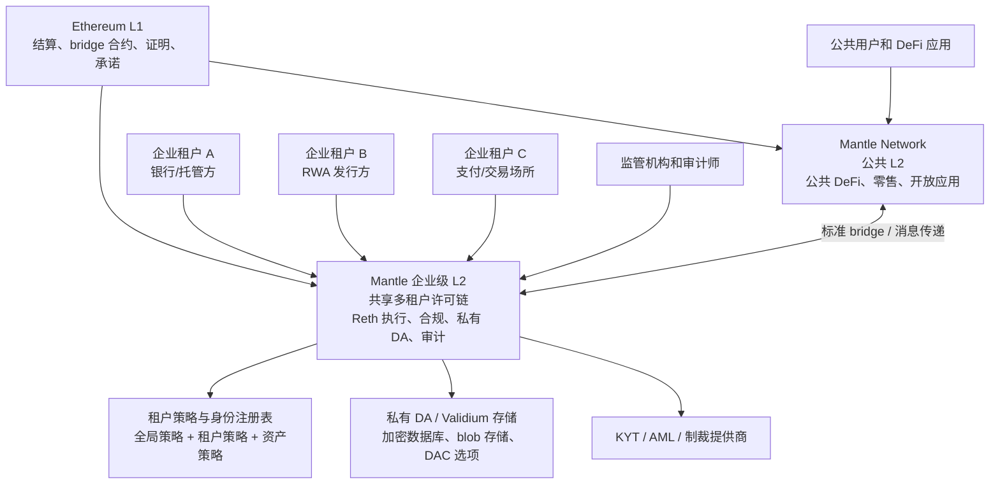
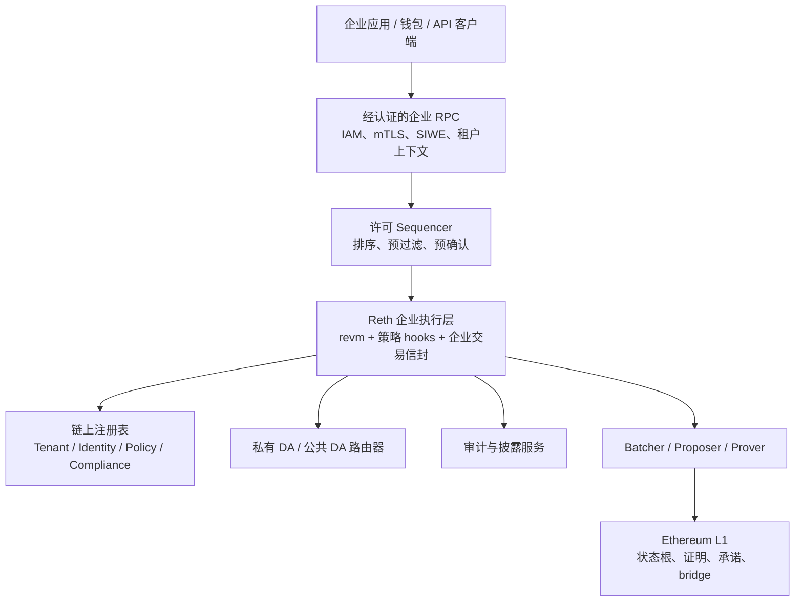
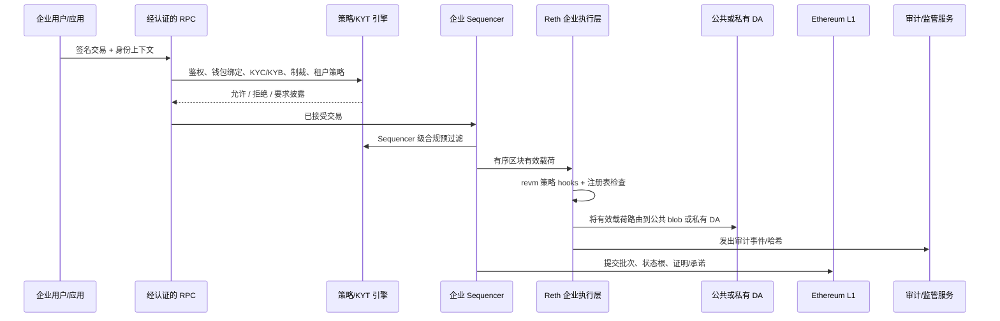
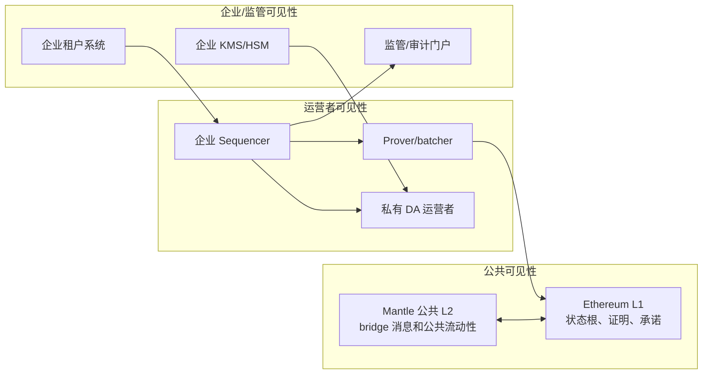
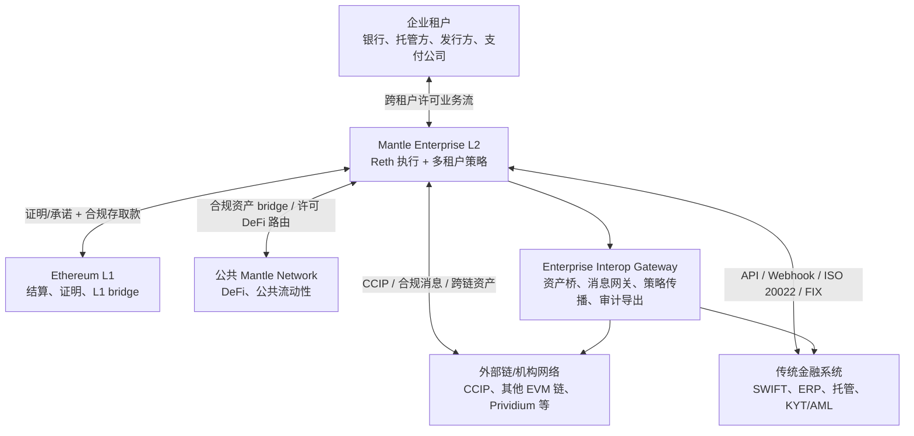

# WHI-388: 方案二 — Mantle 企业级 L2 平行链
- **里程碑**: M5 — 方案分析与最终交付
- **日期**: 2026-05-08
- **状态**: 草稿
- **路径**: 与 Mantle Network 并行的企业级 L2，结算至 Ethereum L1

## 执行摘要

Mantle 企业级 L2 平行链是最具实操性的企业路径——如果首要目标是保留 Ethereum 结算、与 Mantle 生态保持对齐、保持 Solidity/EVM 兼容性，并在不污染公共 Mantle Network 的情况下服务多个受监管企业。本文采用一个更明确的最终方案：**不是每家企业各自部署一条 L2，而是建设一条共享的、多租户的企业级 L2**。银行、发行方、支付公司、托管方和 RWA 平台通过准入流程成为这条链上的企业租户；它们共享同一个 chain ID、同一个规范状态、同一套排序与结算系统，但在身份、策略、私有 DA、审计披露、合约权限和运营 SLA 上按租户隔离。

一句话定义：

**基于 Reth/revm 执行层和 Mantle/OP Stack 衍生结算组件构建的一条共享多租户企业级 L2，与 Mantle Network 并行运行，结算至 Ethereum L1——在同一条链上为多个企业租户提供合规性、隐私性、访问控制和受控互操作。**

这条路径之所以具有吸引力，是因为它无需 Mantle 重新构建完整的独立 L1，也无需把企业合规逻辑强行塞进公共 Mantle Network。它保留了最强的公链叙事：Ethereum 锚定、EVM 兼容性，以及通往公共流动性的可信 bridge。与原先偏渐进式的 `op-geth` 改造思路不同，本文将最终方案直接设定为 **Reth-first**：使用 Reth/revm 作为企业执行层基础，在交易准入、策略执行、隐私交易信封、私有 DA 路由、审计事件和合规预编译/预部署上形成原生扩展。同时，企业 L2 不能只是一个封闭许可链；它必须提供受控互操作：面向 Ethereum L1 和公共 Mantle 的结算/流动性互操作，面向租户之间的许可业务互操作，面向其他机构链和跨链协议的合规消息互操作，以及面向 SWIFT、托管、ERP、KYT/AML 等传统金融系统的链下互操作。Prividium 仍是最接近的行业先例：它表明，一条私有化、许可制、兼容 EVM 的 Validium 可以支持企业工作流，同时将状态根和证明发布至 Ethereum。

使 L2 路径实用化的同样原因，也界定了它的上限。企业级 L2 无法为每个企业提供对区块生产、最终确定性或底层执行规则的完全自主控制。在推荐的运营模式下，Mantle 团队或 Mantle 主导的受监管运营者联盟负责运营核心链基础设施。企业成为同一条许可制企业链上的高价值租户。他们可以获得合同 SLA、租户级策略配置、审计访问权、私有 DA 分区控制、委托运营权，甚至共享治理权，但他们并不以独立 L1 验证者或专用私有网络那种方式拥有自己的 Sequencer。

关键问题在于企业自主权。对于严肃的银行、经纪商、支付网络或受监管的 RWA 发行方而言，核心异议很简单：**密钥不在我手中**。如果 Sequencer 由 Mantle 或 Mantle 主导的联盟控制，企业就无法独立排序交易、保证交易被纳入、从 Sequencer 故障中恢复，也无法向监管机构保证没有任何第三方运营者能够查看敏感订单流。Validium 式 DA 向 Ethereum L1 观察者隐藏了原始交易数据，但这并不能自动向 Sequencer 或私有 DA 运营者隐藏明文。合规过滤器可以阻止未授权活动，但这也使 L2 运营者成为监管行为者。

因此，正确的结论是平衡的：

| 问题 | 答案 |
|---|---|
| 平行 L2 路径在技术上可行吗？ | 是的。最终方案是一条共享多租户企业 L2，复用 Mantle 的 rollup/bridge/结算运营经验，并以 Reth/revm 作为企业执行层。 |
| 每家企业是否各自一条 L2？ | 否。WHI-388 默认是一条共享企业 L2，企业是通过准入的租户；只有需要独立排序、独立 chain ID 或完全隔离治理时，才应升级为 WHI-389 L3/Zone 或 WHI-387 L1。 |
| 对于所有受监管用例，它是否具有企业公信力？ | 否。对于接受运营者信任的中高合规用例具有公信力，但对于需要完全数据主权或独立最终确定性的机构而言则较弱。 |
| Prividium 是相关先例吗？ | 是的。Prividium 验证了私有 EVM Validium 模式，但同时也确认了运营者信任边界。 |
| 互操作性如何定位？ | 不是无许可可组合性，而是合规感知互操作：企业 L2 通过受控 bridge、消息网关、策略传播、身份/合规证明和传统系统适配器连接 Ethereum、公共 Mantle、其他机构链和企业后台系统。 |
| 最大风险是什么？ | 企业自主权：Sequencer 控制、明文可见性和监管责任仍集中于运营者。 |
| Mantle 应何时选择此路径？ | 当 Ethereum/Mantle 对齐、EVM 生态复用、公共结算叙事和上市时间比最大机构主权更重要时。 |

本文档将 WHI-386 组件分类框架——执行、共识/最终确定性、隐私、合规/身份、访问控制、数据可用性/数据主权、互操作性和业务组件——应用于 L2 路径。结论并非 L2"好"或"坏"，而是 L2 是一种产品和风险选择。对于企业 DeFi、与 Mantle 流动性挂钩的 RWA 平台、合规资产发行、受监管的钱包网络，以及需要在 6-12 个月内建立可信 Ethereum 叙事的试点项目，一条 Reth-first 的多租户企业 L2 是正确的生产路径。对于支付级确定性最终确定、高频代币化股权、高度机密的银行间工作流，或监管机构要求金融机构自身控制排序和数据平面的用例，它并非正确的终态架构。

## 来源基础与依赖说明

实现提示中列出了两条 Prividium 路径，名称与仓库中稍有不同。本分析使用工作区中实际存在的 WHI-337 和 WHI-338 文件。

| 类别 | 使用的来源文档 | 在本分析中的作用 |
|---|---|---|
| M5 概述 | `m5-solution/overview/WHI-386-enterprise-blockchain-design-overview.md` | 组件分类框架、决策框架、L1/L2/L3 定位。 |
| M3 OP Stack 设计 | `WHI-350` 至 `WHI-354` | Mantle 企业差距分析、隐私层、访问控制、合规运营及集成报告。 |
| M4 L2/L3 设计 | `WHI-365` 至 `WHI-368` | L2 执行/sequencer、隐私/DA、合规/业务、互操作/部署。 |
| M2 互操作横向比较 | `WHI-347` | 企业链、公链、传统系统和平台内互操作的需求维度、协议选择和安全模型。 |
| M1 参考资料 | `WHI-337`、`WHI-338`、`WHI-341`、`WHI-364` | Prividium 先例、Mantle v2 基线、L1 与 L2/L3 分叉权衡。 |

M3 集成报告（`WHI-354`）尤为重要，因为它阐明了本 L2 分析采纳的核心实现立场：中心化或许可制 Sequencer 在被视为合规控制点时是一项企业资产，模块化 L2 架构提供了清晰的插入点，而 EVM 兼容性消除了大部分生态系统迁移负担。本文在此基础上调整执行层路线：不再将 `op-geth` 作为长期执行层，而是将 Reth/revm 作为最终执行层底座，通过企业交易信封、原生策略 hooks、合规预编译/预部署、私有 DA 路由和审计事件，把企业能力做进执行路径，而不是只停留在外围中间件。

## 1. 方案概述

Mantle 企业级 L2 平行链是一条独立于公共 Mantle Network 的共享企业链，而非现有公共 Mantle Network 的许可模式。它拥有自己的 chain ID、自己的 Sequencer 端点、自己的状态、自己的 bridge 合约、自己的策略注册表，以及自己的合规运营模型。它共享 Mantle 的技术基础和运营知识，但不会将企业流量合并到公共 Mantle L2 状态中。

多企业模型需要先说清楚：

**WHI-388 默认不是"每个企业一条 L2"。它是一条面向多个企业租户的共享企业 L2。**

每个企业在这条链上被建模为一个 `tenant`：拥有自己的租户 ID、IAM 集成、钱包/机构白名单、策略配置、私有 DA 分区、审计披露权限、合约命名空间、费率/SLA 配置和治理参与权。所有租户共享同一个链状态和同一个规范排序流，因此可以在许可条件下共享流动性、合规资产、机构 DeFi 场所和公共 Mantle/Ethereum bridge 连接。租户之间不通过不同 chain ID 隔离，而是通过链内策略、数据平面隔离、合约权限和披露控制隔离。

只有当某个企业提出以下不可谈判要求时，才不应放在 WHI-388 这条共享企业 L2 上：独立 chain ID、独立 Sequencer、独立升级治理、独立数据平面、完全自我恢复，或监管要求的单机构控制。在这种情况下，正确产品不是 WHI-388，而是 WHI-389 的专用 L3/Zone，或者 WHI-387 的独立 L1。

核心定位如下：

| 设计轴 | 定位 |
|---|---|
| 链模型 | 单条共享多租户企业 L2，不是每家企业一条 L2，也不是公共 Mantle 子网。 |
| 结算 | 通过 rollup/validity/Validium 承诺在 Ethereum L1 上结算。 |
| 技术基础 | Reth/revm 企业执行层 + Mantle/OP Stack 衍生派生、batcher、bridge、证明/承诺和运营组件。 |
| 运营者模型 | Mantle 团队或 Mantle 主导的受监管运营者联盟运营核心基础设施。 |
| 企业角色 | 企业是租户、锚定客户、共同治理参与者或委托运营者；默认情况下不是 Sequencer 的所有者。 |
| 租户隔离 | 租户通过身份、策略、私有 DA 分区、合约权限、审计视图和 SLA 隔离，而不是通过独立链隔离。 |
| 隐私模型 | 公开数据流保持类 rollup 方式；敏感流使用私有 DA/Validium 式承诺和选择性披露。 |
| 合规模型 | RPC 准入、Sequencer 预过滤、合约/预部署策略检查、bridge 过滤、审计日志，以及外部 KYT/AML 集成。 |
| 主要优势 | 最大限度地复用 Mantle 现有基础设施、技能积累、开发者工具和 Ethereum 叙事。 |
| 主要劣势 | 有限的自主权和运营者信任假设。 |

该架构有意选择共享企业基础设施，而非为每个客户复制一条链。它的逻辑是：多数企业客户需要合规、隐私、审计、托管集成和 Ethereum 结算叙事，但不想运营一条完整链；Mantle 则需要一个能够承载多个企业客户的产品化网络，而不是为每个客户维护一套重复的 L2 运维面。相反，创建一个受控的多租户 L2 环境，在最重要的边界处插入企业功能：谁可以提交交易、谁可以接收 bridge 消息、私有交易数据存储在哪里、谁可以披露审计数据、哪些合规检查在纳入前运行，以及应用程序可以依赖什么级别的最终确定性。

这并不意味着"公链加白名单"。WHI-386 明确指出，企业区块链设计涉及具有可强制问责机制的选择性验证和选择性透明。仅凭白名单无法阻止 L1 数据发布、强制纳入、合约层绕过或 Sequencer 可见性。L2 路径只有在将企业链视为具有不同信任封装的不同产品时才是可行的，而不是将其视为公链前端的品牌化 RPC 端点。

### 为什么选择平行 L2 而非改造 Mantle 主网？

对公共 Mantle Network 进行改造，意味着尝试在现有公链中添加企业功能。这对流动性有利，但对隐私和合规来说较弱，因为公共状态、公共内存池预期、公共 bridge 假设和无许可可组合性制约着每一个设计选择。平行 L2 更为清晰：

| 需求 | 改造公共 Mantle | 平行企业 L2 |
|---|---|---|
| 企业 chain ID | 否，共享公链 | 是，独立 chain ID。 |
| 许可准入 | 在不改变公共用户预期的情况下难以强制执行 | 自然默认值。 |
| 私有 DA | 困难，因为公链预期公共数据发布语义 | 作为链级模式可行。 |
| 合规 bridge 规则 | 与无许可 bridge 预期冲突 | 可设计到企业 bridge 中。 |
| 运营 SLA | 共享的公共基础设施使客户特定保证难以实现 | 企业链可以提供客户级 SLA。 |
| 生态复用 | 最大化直接公共可组合性 | 高度 EVM/工具复用，但通过 bridge 实现可组合性。 |
| 企业自主权 | 仍然有限 | 有限，但在合同上明确且可配置。 |

因此，平行 L2 是轻量级 M3 改造与完整 L1 重建之间最实用的中间路径。它使 Mantle 与现有能力足够接近，可以按时交付，同时为企业系统提供足够的独立性，能够强制执行许可控制、私有 DA 和合规性，而不损害公共网络的中立性。

### 多租户架构选择

多企业环境下有三种可能形态：

| 模型 | 含义 | 优势 | 问题 | 本文选择 |
|---|---|---|---|---|
| 每个企业一条 L2 | 每个企业拥有独立 chain ID、Sequencer、bridge 和状态。 | 隔离最强，治理最清晰。 | 运维、流动性、bridge、安全审计和升级成本线性增加；失去共享企业网络效应。 | 不作为 WHI-388 默认方案。 |
| 单条共享企业 L2 | 多个企业作为租户进入同一条许可制 L2，共享状态、排序和结算。 | 产品化程度最高；流动性、资产模板、合规组件和审计系统可复用。 | 租户隔离必须由策略、数据平面和合约权限强制执行；企业自主权有限。 | WHI-388 推荐方案。 |
| 企业专属 L3/Zone | 对需要更强隔离的企业，在 Mantle 或企业 L2 之上部署专属应用链/Zone。 | 比共享 L2 更隔离，比独立 L1 更轻。 | 多一层 bridge 和继承风险；生态碎片化。 | 作为 WHI-389 处理。 |

因此，WHI-388 的产品定义应是：**Mantle Enterprise L2 是一条共享的机构网络，企业不是链的复制实例，而是经过准入的租户。** 每个租户拥有自己的配置和数据边界，但交易最终进入同一条规范链。这样才能让 RWA 发行方、托管方、做市商、支付公司和合规 DeFi 应用在同一个受监管执行环境里交互，而不是被分散到许多互不组合的私有链中。

租户隔离在五个层面实现：

| 隔离层 | 设计 |
|---|---|
| 身份隔离 | 每个租户接入自己的 IAM/KYC/KYB 提供商，并将法人、用户、钱包、角色和权限映射到链上身份注册表。 |
| 策略隔离 | 全局链策略定义最低合规底线；租户策略定义本企业白名单、额度、资产限制、地域限制和披露规则；资产策略定义发行方级别的转让限制。 |
| 数据隔离 | 私有 DA 按租户、资产或业务域分区；租户可控制 KMS/HSM、备份副本、保留策略和披露授权。 |
| 合约隔离 | 企业资产、结算应用和业务模块通过命名空间、注册表、工厂模板和角色权限隔离；共享合约只暴露明确许可的跨租户接口。 |
| 审计隔离 | 私有浏览器、审计导出和监管视图按租户、资产、交易对手和司法辖区授权，避免一个租户看到另一个租户的商业数据。 |

共享状态并不意味着所有租户彼此可见或可互相调用。默认规则应是：跨租户交互必须显式授权，跨租户资产流动必须经过合规 bridge/路由器或许可合约，跨租户数据披露必须经过披露工作流。

### 运营理念

L2 路径应诚实地进行销售：

1. 它不是主权企业链。它是由 Mantle 或 Mantle 主导的联盟运营的受监管企业 rollup/Validium。
2. 默认情况下，它对运营者并非不可见。它可以向 Ethereum 和公共观察者隐藏数据；向 Sequencer 隐藏数据需要高级加密内存池、TEE、阈值解密或应用层密码学。
3. 它不具备确定性硬最终确定性。它提供快速软确认和延迟的 Ethereum 锚定最终确定性。
4. 它不是每个客户一条定制链。它通过共享 Reth/revm 执行层、共享 Sequencer 和共享结算路径获得产品化效率，并把差异化放在租户策略、私有 DA、合约模板和披露权限上。
5. 它仍然非常有用。对于许多企业 DeFi/RWA 产品而言，这些权衡是可以接受的，因为 Ethereum 锚定、流动性、托管集成和交付速度比完全自主更重要。

## 2. 技术架构深度解析

### 2.1 与 Mantle Network 的关系

企业级 L2 与 Mantle Network 并行运行，但其内部是一个多租户企业网络：

这一关系具有五个具体属性：

| 属性 | 含义 | 企业影响 |
|---|---|---|
| 平行但独立 | Mantle Network 和 Mantle 企业级 L2 不共享状态、chain ID、内存池或 Sequencer 端点。 | 企业策略失败不会直接污染公共 Mantle 状态；公共拥塞不会直接决定企业执行。 |
| 企业 L2 内部共享 | 多个企业租户共享同一条企业 L2 的 chain ID、状态、Sequencer 和结算路径。 | 租户之间可以在许可规则下组合资产和业务，但必须通过策略、私有 DA 和审计视图隔离数据。 |
| 共享技术栈 | 企业 L2 复用 Mantle 的 rollup/bridge/batcher/prover/DA 运营知识，但执行层以 Reth/revm 为长期目标。 | 比构建独立 L1 更低的工程成本，同时比 `op-geth` 边界改造更适合做原生企业执行语义。 |
| 共享结算层 | 两者最终都通过状态根、证明、承诺、bridge 合约和提款机制锚定到 Ethereum L1。 | Mantle 可以保留 Ethereum 安全性和中立性叙事。 |
| 受控互操作 | 资产和消息通过明确的 bridge 和合规感知网关在公共 Mantle 和企业 L2 之间传递。 | 企业可以选择性地访问 Mantle 流动性，而不是将所有企业状态暴露于公共可组合性。 |
| 共享运营者知识 | Mantle 现有的 Sequencer、batcher、DA、证明和事件响应经验可以复用。 | 系统可以更早作为产品运营，但企业依赖于 Mantle 的运营能力。 |

架构不应将企业 L2 呈现为公共 Mantle 上的"私有通道"，也不应呈现为"每个客户一条私有 Mantle"。前者掩盖了公共链和企业链的信任差异，后者会制造难以维护的链碎片化。企业 L2 需要独立的创世配置、明确的升级治理、独立的紧急程序、独立的数据保留策略、独立的审计导出，以及租户特定的策略配置。其与 Mantle Network 的关联应被视为互操作性，而非共享执行；其内部多个企业之间的关系应被视为受控多租户，而非互相独立的链。

### 2.2 Reth/revm 执行层最终方案

执行层面的问题不是"能否在外围网关上加白名单"，而是企业语义是否能成为链的原生执行规则。本文采用明确的最终立场：**Mantle 企业级 L2 的执行层应使用 Reth/revm，而不是长期沿用 `op-geth`。**

原因很直接。企业链需要在交易进入、排序、执行、数据发布、审计和披露的每一步都理解租户、身份、策略、资产约束和私有数据边界。`op-geth` 适合保持 OP Stack 兼容性和快速启动，但长期来看会把企业能力挤压到 RPC、Sequencer wrapper、合约 hooks 和外部服务中。Reth/revm 的模块化更适合作为企业执行层底座：可以在交易池、payload 构建、EVM 执行、状态提交、日志输出和 DA 路由之间建立清晰的企业扩展点。

最终执行层应包含以下能力：

| 模块 | 设计 | 作用 |
|---|---|---|
| Reth 企业节点 | 基于 Reth 的 L2 执行客户端，保留 EVM 字节码、Solidity、ERC 标准和常见 JSON-RPC 兼容性。 | 让企业链仍然是 EVM 链，而不是专有 VM。 |
| revm 策略执行层 | 在 revm 执行前后插入策略检查、身份解析、资产规则、租户限制和审计 hooks。 | 将合规和访问控制从应用建议变成执行规则。 |
| 企业交易信封 | 在标准 EVM 交易外携带租户 ID、身份声明、策略证明、隐私标记、DA 路由、披露元数据和费用赞助信息。 | 让 Sequencer、执行层、DA 和审计系统理解同一笔交易的企业上下文。 |
| 原生预编译/预部署 | IdentityRegistry、TenantRegistry、PolicyExecutor、ComplianceRegistry、DisclosureRegistry、DACommitmentRegistry。 | 为合约、钱包和后台系统提供统一的企业控制平面。 |
| 私有 DA 路由器 | 按交易标记、租户策略和资产类型，将数据路由到公共 DA、私有 DA 或混合承诺路径。 | 使隐私不是外部存储约定，而是执行结果的一部分。 |
| 审计事件管线 | 执行层产生结构化审计事件、策略决策哈希、披露引用和状态承诺。 | 支持监管、内部风控、争议处理和取证。 |
| 兼容性边界 | 对普通 Solidity 合约保持 EVM 行为；企业功能通过预编译、预部署、交易信封和 SDK 暴露。 | 避免把链变成只有定制应用才能使用的封闭系统。 |

Reth 执行层与 L2 结算组件的关系如下：

这个设计保留 Mantle/OP Stack 衍生组件中最有价值的部分：L2 派生、batch 提交、bridge 模式、证明/承诺路径、监控和运营经验。但执行语义不再受 `op-geth` 的长期结构约束。企业能力应从一开始就按 Reth/revm 的模块化边界设计，而不是先做一套网关控制，再在未来大迁移。

Reth-first 并不意味着牺牲 EVM 生态。相反，它的约束应是：

- Solidity 合约、ERC-20/ERC-721/ERC-1155、ERC-3643/T-REX、ERC-4337 和常见钱包/托管集成应尽量保持兼容。
- 普通公开交易应像标准 EVM 交易一样执行，除非命中链级或租户级策略。
- 企业交易信封应由 SDK、托管方和企业 RPC 生成，避免要求普通合约开发者理解所有底层细节。
- 深度定制应集中在交易准入、执行前后 hooks、预编译/预部署、DA 路由和审计管线，而不是随意改变 EVM 基础语义。
- 与证明系统的接口必须从一开始定义清楚：哪些执行结果进入公共 batch，哪些进入私有 DA 承诺，哪些审计事件只对授权方可见。

关键差异化因素因此更明确：

**标准 OP Stack 链主要在边界处强制执行访问和合规；Reth/revm 企业执行层可以让租户、身份、策略、隐私和审计成为一等执行语义。WHI-388 的最终方案应直接面向这一目标设计。**

### 2.3 Sequencer 与最终确定性

企业 L2 使用中心化或许可制 Sequencer，这与 Mantle 当前的运营现实和企业合规要求一致。Sequencer 接收交易、验证来源通道、运行策略检查、对交易排序、构建区块、将数据路由到公共或私有 DA、发出审计事件，并在下游提交批次/证明/承诺。

最终确定性必须分层解释：

| 最终确定性层 | 大约时间 | 含义 | 企业信任假设 |
|---|---:|---|---|
| T0：Sequencer 软确认 | ~1-2 秒 | Sequencer 已接受并排序该交易。应用程序可以立即显示 UX 确认。 | 信任 Mantle/企业 Sequencer 不会在批次发布前重新排序、审查或回滚。 |
| T1：DA/批次确认 | 许多设计中约 10-30 分钟 | 批次数据或私有 DA 承诺已发布并被结算路径确认。 | 信任 DA 可用性和批次/proposer 活跃性。 |
| T2：ZK validity 最终确定性 | 成熟 ZK 路径下目标约 15-30 分钟，prover 负载下可能更长 | Validity 证明在 L1 或结算层被接受。 | 信任证明系统和 L1 确认。 |
| T2-alt：乐观硬最终确定性 | ~7 天挑战期 | 提款/状态在欺诈挑战窗口后变为最终确定。 | 信任故障证明的可用性和挑战流程。 |

这一区别至关重要。软最终确定性对于用户体验、报价执行、内部工作流状态和低风险转账非常有用。它与受监管的支付、DVP 或代币化证券工作流的法律结算最终确定性不同。如果下游银行系统在 T0 时释放法币、更新账簿或转移法律所有权，则依赖的是 Sequencer 运营者，而非 Ethereum 最终确定性。

Sequencer 也是核心自主权问题。在独立的 L1 中，机构可以运行验证者、加入共识、操作数据存储、参与治理，并围绕自身运营模型设计确定性 BFT 最终确定性。在这一 L2 设计中，企业通常无法为同一条链运行自己的独立 Sequencer。他们可以成为委托共同运营者、灾难恢复合作伙伴，或参与许可共享排序委员会，但不能在不成为 Mantle 定义的排序权威一部分的情况下单方面产生规范区块。

最终 Sequencer 设计不应只是一台中心化排序器，而应是一个受监管的排序运营系统：

| 组件 | 设计 | 解决的问题 | 残余限制 |
|---|---|---|---|
| 许可 Sequencer 集群 | Mantle 或 Mantle 主导的受监管运营者联盟运行主排序服务，具备 HA、备用区域和明确 SLA。 | 提供稳定的规范排序、合规预过滤和快速软确认。 | 企业仍不能单方面生产规范区块。 |
| 共享排序治理 | 锚定企业、托管方或受监管机构可参与排序治理、多签、升级审批、紧急暂停和策略变更窗口。 | 降低单一运营者权力，改善机构信任。 | 这是共同治理，不是每个企业拥有自己的 Sequencer。 |
| 公平排序与隐私输入 | 支持加密内存池、阈值解密、TEE Sequencer 或批量拍卖等可选机制。 | 降低订单流泄露、抢跑和排序操控风险。 | 合规筛查与加密排序之间存在设计张力。 |
| 观察者/挑战者节点 | 企业和第三方可运行观察者节点，验证状态、监控审查、复核 DA 承诺和接收审计事件。 | 增强透明度、取证能力和运营问责。 | 观察者不等于排序权。 |
| 最终确定性服务 | 对外暴露 T0/T1/T2 状态、风险等级、批次状态、证明状态和 bridge 状态。 | 应用可以区分 UX 确认、运营确认和法律/结算确认。 | 不能把 T0 软确认包装成硬最终确定性。 |

### 2.4 隐私实现

隐私是 Mantle 企业适配中严重程度最高的差距。公共 rollup 数据发布与许多企业工作流在结构上不兼容，因为交易对手、观察者、竞争对手和分析公司可以从 calldata、日志、状态差异、地址、金额、时间和 bridge 流量中推导出敏感行为。因此，企业 L2 必须在选择密码学之前确定隐私边界。

两个主要选项是：

| 选项 | 描述 | 最适合场景 | 主要优势 | 主要弱点 |
|---|---|---|---|---|
| 选项 A：Validium/私有 DA | 敏感交易数据存储在公共 L1 之外的私有 DA 中；L1 接收状态根、承诺和证明。遵循 Prividium 模式。 | RWA、机构转账、私有结算、企业资产。 | 向 Ethereum 和公共观察者隐藏原始数据。 | DA/运营者信任；Sequencer/私有 DA 仍可看到明文，除非进一步保护。 |
| 选项 B：Sequencer/执行层隐私 | Sequencer 与 Reth 执行层共同对公开/私有交易进行分类，编辑 RPC/浏览器输出，路由有效载荷，并提供选择性披露。 | 中等隐私、合规审计、企业生产网络。 | 与 Reth/revm hooks、企业交易信封和私有 DA 路由自然结合。 | 默认无法向 Sequencer 隐藏；元数据泄露依然存在。 |

推荐的 WHI-388 设计结合了两者：

1. 将 Sequencer 层分类和策略路由作为第一个实用控制平面。
2. 对敏感交易数据使用 Validium/私有 DA，使 Ethereum 和公共 Mantle 观察者无法获取原始业务数据。
3. 向监管机构、审计师、交易对手和企业管理员提供选择性披露。
4. 仅对运营者可见性不可接受的用例添加加密内存池、阈值解密、TEE Sequencer 或客户端加密。

Prividium 先例在此处至关重要。Prividium 将交易数据保存在链外，使用私有/许可部署，通过 Proxy RPC 对用户进行身份验证，并将状态根/证明发布到 Ethereum。这验证了企业 Validium 模式。但 Prividium 也展示了边界：运营者、Sequencer、prover 和私有存储基础设施都位于可信区域内。ZK 证明证明了状态转换的正确性；它们本身并不能向产生这些转换的运营者隐藏明文。

因此，隐私架构应绘制为多个可见性区域：

关键隐私声明应限于设计实际能交付的范围：

| 隐私目标 | L2 路径能否实现？ | 如何实现 | 残余风险 |
|---|---|---|---|
| 向公共 L1 观察者隐藏交易 calldata | 是 | 私有 DA/Validium 承诺。 | bridge 时间、承诺和公共资产的元数据可能泄露。 |
| 向其他租户隐藏交易详情 | 大体上是 | 经认证的 RPC、租户策略、私有 DA 分区、编辑浏览器、审计访问规则。 | 共享 Sequencer 和运营者系统仍然是公共基础设施。 |
| 向 Mantle Sequencer 隐藏交易明文 | 默认情况下不能 | 需要加密内存池、阈值解密、TEE、客户端加密或 ZK 应用设计。 | 合规筛查和排序变得更难；并非所有 EVM 应用都能支持。 |
| 实现监管机构披露 | 是 | 查看密钥、审计节点、选择性披露 API、不可变审计哈希。 | 法律和运营流程与密码学同等重要。 |
| Canton 式知情必要隐私 | 否，不干净 | 需要根本不同的交易/状态模型。 | OP Stack/EVM 并非为子交易可见性投影而设计。 |

### 2.5 合规层

对于受监管的用例，合规必须是不可绕过的。普通的 dApp 层合规检查是不够的，因为用户可以通过不同合约、代理、delegatecall 模式、bridge 消息或 L1 发起的交易进行交互。因此，企业 L2 需要分层执行：

| 层 | 组件 | 功能 | 重要性 |
|---|---|---|---|
| 身份/IAM | OIDC/SAML/SSO、SIWE、钱包绑定、KYC/KYB 提供商集成 | 将人/法人身份与钱包和租户关联。 | 企业需要用户和机构问责，而不仅仅是地址。 |
| RPC 准入 | 经认证的 RPC 网关 | 在交易提交前阻止未授权用户。 | 低侵入性的第一道防线；Prividium 先例。 |
| Sequencer 预过滤 | 在排序前调用策略引擎和 KYT/AML | 在纳入前拒绝受制裁、不符合资格或违反策略的交易。 | 中心化 Sequencer 模型下强有力的运营控制点。 |
| 执行/合约 hooks | IdentityRegistry、ComplianceRegistry、PolicyExecutor、ERC-3643/T-REX hooks | 在执行期间强制执行转账和合约权限。 | 防止交易到达执行层后被绕过。 |
| Bridge 过滤器 | L1 门户白名单和合规感知存款/取款检查点 | 阻止 L1 发起的绕过路径。 | Rollup 强制纳入是企业的关键弱点。 |
| 审计/披露 | AuditLog、监管机构 API、私有浏览器、披露工作流 | 为监管机构、审计师和内部风险产生证据。 | 没有审计证据的合规在运营上不可信。 |

合规栈应集成外部提供商，而非尝试从头重建：

- 用于交易筛查和风险评分的 KYT/AML 服务。
- 制裁名单提供商，如 OFAC/EU/UN 等效项。
- 企业 IAM 系统，如 Okta、Azure AD、Google Workspace 和银行内部 IAM。
- KYC/KYB 供应商和可验证凭证发行方。
- 面向监管机构的导出系统，用于 SAR/STR、旅行规则、审计报告和调查包。

该设计与 M3 和 M4 的映射良好。M3 提供了四层合规栈：外部 KYT/AML/OFAC 提供商、合规中间件、链上预部署和最小化的 Mantle 核心变更。M4 L2/L3 将其细化为 Sequencer 过滤、合约层 hooks 和 L1 bridge 检查点。对于 WHI-388，最终方案应把这些控制合并进 Reth/revm 执行路径、企业交易信封和租户策略注册表，而不是停留在外围控制面。

### 2.6 访问控制

访问控制比"谁可以调用 RPC"更为广泛。每条进入路径都必须被识别并分配到控制层。

| 进入路径 | 所需控制 | 若省略则导致的失败 |
|---|---|---|
| 企业 API 客户端 | API 网关、mTLS、JWT/OIDC、租户配额、SIWE 钱包绑定 | 未授权客户端可以提交交易或抓取私有视图。 |
| 钱包用户 | 经认证的 RPC、钱包白名单、会话绑定、策略质询 | 白名单地址可能在批准的身份上下文之外使用。 |
| Sequencer 交易接收 | 准入过滤器、策略缓存、制裁/KYT 检查、租户策略 | RPC 绕过或直接 Sequencer 提交可以绕过访问规则。 |
| L1 存款/强制交易 | EnterpriseOptimismPortal 过滤器、bridge 白名单、存款元数据验证 | 公共 L1 消息绕过企业许可控制。 |
| 合约调用 | PolicyExecutor、ERC-3643/T-REX 规则、基于角色的权限 | 用户可以绕过应用层控制。 |
| 数据检索 | 经认证的 RPC 层级、私有浏览器角色、审计视图控制 | 即使写操作受限，敏感状态也可能通过读 API 泄露。 |
| 运营者/管理操作 | 多签/HSM 批准、审计跟踪、紧急运营手册 | 策略更新或升级成为内部风险向量。 |

访问控制设计应采用默认拒绝原则。Prividium 的"默认禁止"RBAC 姿态是一个有用的先例，因为企业许可控制在失败时应关闭。一个接受未知调用、之后试图回滚错误状态的企业 L2 是不可信的。

最重要的 L2 特定访问问题是 L1 bridge。公共 rollup 特意支持 L1 发起的交易和强制纳入，以作为抗审查工具。企业链特意将活动限制于已知参与者。这两个目标相互冲突。WHI-388 设计必须为企业 L2 明确选择受监管的进入控制，即使这样做削弱了纯公共 rollup 逃生舱叙事。

### 2.7 互操作性设计

企业 L2 的互操作性不能等同于公链上的无许可可组合性。公共 Mantle 的互操作目标是让资产、消息和合约尽可能开放流动；企业 L2 的互操作目标是让经过许可的资产、身份、策略、审计证据和业务消息在正确边界内流动。因此，WHI-388 的互操作性应被设计为**合规感知互操作**，而不是简单地"接上更多 bridge"。

互操作范围分为四层：

| 互操作层 | 连接对象 | 主要用途 | 核心控制 |
|---|---|---|---|
| L1 结算互操作 | Enterprise L2 ↔ Ethereum L1 | 存款、提款、状态根、证明/承诺、L1 合规门户。 | EnterpriseOptimismPortal、TransactionFilterer、提款限额、Travel Rule 元数据、证明最终性检查。 |
| Mantle 生态互操作 | Enterprise L2 ↔ 公共 Mantle Network | 访问公共流动性、DeFi 路由、资产包装、MNT/ETH/稳定币流动。 | 合规 bridge、许可路由器、资产白名单、KYT/AML、最终确定性标签。 |
| 企业租户互操作 | 企业租户 A ↔ 企业租户 B | RWA 交易、DVP、托管转移、做市商报价、支付和结算。 | 租户策略、资产策略、对手方白名单、跨租户披露授权、审计事件。 |
| 外部系统互操作 | 其他机构链、CCIP/跨链协议、SWIFT/ERP/托管/KYT 系统 | 跨机构资产转移、传统金融消息、对账、报告、监管调查。 | 消息网关、身份/合规证明、mTLS/OIDC、ISO 20022/FIX 适配器、审计导出。 |

推荐架构如下：

#### 2.7.1 与 Ethereum L1 的互操作

Ethereum L1 是企业 L2 的结算锚点和最高安全边界。这里的互操作不只是资产桥，还包括状态根、证明、承诺、提款最终性和紧急退出。

| 能力 | 设计 |
|---|---|
| 合规存款 | L1 门户在接收存款时检查资产、地址、租户、司法辖区和 Travel Rule 元数据；不合规存款应被拒绝或隔离，而不是自动进入 L2。 |
| 合规提款 | 提款需要满足租户策略、资产策略、KYT/AML 规则、提款限额和最终确定性要求；高价值提款可要求额外延迟、多签或审计确认。 |
| 状态与证明 | L2 向 L1 提交状态根、证明或 Validium 承诺；私有交易只提交承诺和必要元数据，不发布原始业务数据。 |
| 强制纳入处理 | 公共 rollup 的 L1 强制交易必须被企业门户过滤。否则未授权用户可绕过企业 RPC 和 Sequencer 准入。 |
| 最终确定性标注 | 所有 L1 相关资产流动都必须携带 T0/T1/T2 状态，避免企业系统把 Sequencer 软确认误认为法律结算。 |

这一层的基本原则是：**L1 是结算和证明边界，不是绕过企业合规的后门。**

#### 2.7.2 与公共 Mantle Network 的互操作

企业 L2 与公共 Mantle 的关系应是受控互操作，而不是共享执行。企业资产可以进入公共流动性，但必须经过明确的许可路径。

| 场景 | 推荐设计 | 风险控制 |
|---|---|---|
| 企业资产进入公共 DeFi | 通过合规 bridge 或许可路由器铸造 wrapped asset / permissioned wrapper。 | 资产白名单、持有人资格检查、赎回限制、KYT、发行方冻结权。 |
| 公共资产进入企业 L2 | ETH、MNT、稳定币或主流 ERC-20 通过企业门户进入，附带来源地址、风险评分和租户归属。 | 高风险来源隔离、额度限制、延迟结算、审计记录。 |
| 企业 L2 调用公共流动性 | 使用受许可的 DeFi router，只有符合策略的资产和交易对可被路由。 | 禁止未知合约、模拟交易、价格偏离检查、MEV/滑点限制。 |
| 公共 Mantle 用户参与企业资产 | 用户必须先完成身份/KYC 绑定，再进入企业资产白名单。 | 不允许公共地址仅凭持币参与受监管资产。 |

这种设计牺牲了公共 DeFi 的完全无许可组合性，但保留了 Mantle 最重要的商业价值：企业资产可以在合规边界内访问公共流动性。

#### 2.7.3 企业租户之间的互操作

因为 WHI-388 是单条共享多租户企业 L2，租户之间可以共享同一条规范状态。这比"每家企业一条 L2"更适合 RWA、托管、做市和支付场景，但必须避免默认开放。

跨租户互操作应采用默认拒绝：

| 交互类型 | 允许条件 | 执行位置 |
|---|---|---|
| 租户 A 向租户 B 转移资产 | 双方租户策略允许；资产策略允许；接收方身份满足 KYC/KYB 和司法辖区要求。 | Reth/revm hooks + PolicyExecutor + 资产合约。 |
| 租户 A 请求租户 B 披露交易详情 | 披露范围、目的、审批人和保留期明确；必要时通知相关交易对手。 | DisclosureRegistry + 审计门户。 |
| 做市商为多个租户报价 | 做市商被各租户白名单；报价资产和交易对被允许；订单流隐私策略被接受。 | Sequencer 策略 + 合约权限 + 审计事件。 |
| 托管方代表多个租户操作 | 托管方角色、钱包权限、签名策略和资产范围被注册。 | TenantRegistry + IdentityRegistry + 托管合约。 |
| 跨租户 DVP | 现金腿、证券腿、最终确定性阈值和失败回滚规则预先定义。 | DVP 合约 + 最终确定性服务 + 审计日志。 |

跨租户互操作的关键不是桥，而是**策略互认**。如果两个租户都在同一条企业 L2 上，但 KYC 标准、制裁名单、资产转让规则或披露权限不同，系统必须有明确的策略层级：

1. 全局链策略定义最低底线，例如制裁名单、禁止资产、紧急冻结。
2. 租户策略定义企业自己的客户准入、额度、地域和披露规则。
3. 资产策略定义发行方规则，例如 ERC-3643/T-REX 转让限制。
4. 交易策略在执行时合并上述规则，冲突时按预定义优先级拒绝或隔离。

#### 2.7.4 与外部链和机构网络的互操作

企业 L2 不应试图成为新的通用跨链协议提供者。更现实的定位是成为一个合规、EVM 兼容、Ethereum 锚定的受信端点，接入已有机构级互操作网络。

| 外部互操作方式 | 适合场景 | 推荐程度 | 原因 |
|---|---|---:|---|
| Ethereum L1 中继 | 高价值资产提款、最终安全结算、与其他 L2 的保守互操作。 | 高 | 安全模型最清晰，但延迟较高。 |
| Chainlink CCIP | 机构级跨链消息、代币化资产跨链、与银行/市场基础设施试点对接。 | 高 | WHI-347/WHI-368 均将 CCIP 视为机构互操作优先选项；可把 Enterprise L2 作为连接端点。 |
| Circle CCTP / 稳定币原生桥 | 稳定币跨链支付、企业资金调拨。 | 中高 | 适合标准稳定币流动，但不解决复杂合规资产语义。 |
| LayerZero / Hyperlane 等通用消息 | 非核心资产、应用级消息、生态合作。 | 中 | 灵活，但企业安全和合规责任需要额外审查。 |
| 自建直连桥 | Mantle Enterprise L2 与特定机构链的深度合作。 | 低到中 | 可定制，但桥安全和审计负担最高，应限于战略合作。 |

跨链消息必须携带企业语义，而不是只携带 `to/value/data`：

| 消息字段 | 用途 |
|---|---|
| `sourceTenantId` / `destinationTenantId` | 标识发送和接收租户。 |
| `assetPolicyId` | 指向资产发行方规则和转让限制。 |
| `identityProofRef` | 引用 KYC/KYB、VC、白名单或链上身份证明。 |
| `complianceDecisionHash` | 记录交易通过哪些策略检查。 |
| `finalityLevel` | 标明消息依赖 T0、T1 还是 T2 最终确定性。 |
| `disclosurePolicyId` | 定义审计、监管或交易对手可见范围。 |

如果外部协议无法承载这些字段，则 Enterprise Interop Gateway 必须在链下保存映射，并把哈希或承诺写入链上审计记录。

#### 2.7.5 与传统金融系统的互操作

企业采用区块链通常不是为了替换所有后台系统，而是为了让链上资产、结算和审计结果进入现有金融流程。因此 WHI-388 必须包含传统系统适配层。

| 系统 | 集成方式 | 说明 |
|---|---|---|
| SWIFT / ISO 20022 | 将链上支付、DVP、赎回和对账事件映射为 ISO 20022 消息；反向接收入金和结算通知。 | 适合银行支付、资金调拨和监管报送。 |
| FIX / 交易系统 | 将报价、订单、成交、取消和分配映射到链上 RFQ/DVP/结算模块。 | 适合代币化证券、xStocks、机构交易场所。 |
| 托管系统 | 钱包白名单、签名策略、资产余额、交易审批和冷/热钱包状态同步。 | 托管方是企业 L2 的关键入口。 |
| ERP / 财务系统 | Invoice、PO、付款状态、链上交易哈希和对账单同步。 | 适合企业支付、贸易金融和资金管理。 |
| KYT/AML/制裁系统 | 实时风险评分、地址筛查、交易监控和可疑活动工作流。 | 结果必须进入策略引擎和审计日志。 |
| 监管/审计系统 | 披露包、查看密钥、审计导出、哈希证明和查询 API。 | 必须按权限和范围输出，不能全量泄露租户数据。 |

技术上，这一层应由 Enterprise Interop Gateway 承担：

- 对外提供 REST/GraphQL/Webhook/Kafka/SFTP 等企业接口。
- 对内连接企业 RPC、策略引擎、审计事件流、私有 DA 和披露服务。
- 使用 mTLS、OIDC、HMAC、IP allowlist 和硬件密钥保护机构连接。
- 所有链下消息转换都必须产生可追溯的链上或链下审计哈希。

#### 2.7.6 互操作安全原则

互操作是企业 L2 的最大攻击面之一。桥和消息网关必须按高价值金融基础设施设计。

| 原则 | 要求 |
|---|---|
| 最小连接面 | 默认只支持少量经过审计的 bridge、router 和消息协议；禁止任意第三方桥接进入核心资产。 |
| 策略随消息传播 | 资产跨链或跨租户移动时，身份、合规状态、资产限制和披露规则必须随消息传播或可验证引用。 |
| 最终确定性门控 | 高价值跨链操作必须等待 T2 或指定证明状态；低价值 UX 可以使用 T0/T1，但必须标注风险。 |
| 速率限制与熔断 | 对桥、router、租户和资产设置额度、频率、异常检测和紧急暂停。 |
| 双向审计 | 每一条跨链/链下消息都要能从源系统追溯到目标系统，并能证明中间未被篡改。 |
| 数据最小化 | 跨链消息不应泄露完整业务数据；敏感字段使用引用、哈希、承诺或选择性披露。 |
| 协议分级 | L1 原生桥和 CCIP 可用于高价值路径；通用应用桥只应用于低风险或非核心资产。 |

结论是：**WHI-388 的互操作能力应服务于合规资产流动和企业系统集成，而不是复制公共 DeFi 的无限组合性。** 它的卖点不是"任何人和任何链都能接入"，而是"经过准入的企业、资产和系统可以在可审计、可撤销、可解释的边界内互操作"。

## 3. 核心优势分析

L2 路径的优势是真实的，不应被低估。对于许多企业机会而言，这些优势具有决定性意义。

| 优势 | 说明 | 来自先前工作的证据 | 企业价值 |
|---|---|---|---|
| 最快的可信生产路径 | 平行 L2 复用了 Mantle 的 rollup 运营、Sequencer、bridge 模式、DA/证明管道、监控和事件响应，同时用 Reth/revm 建立企业执行层。 | WHI-350 展示了 RPC 网关、Sequencer 策略、bridge 白名单、身份注册表和审计日志的必要性；本文将这些能力收敛到最终企业 L2 架构中。 | 在完整 L1 重建可以被设计、审计和运营之前，使试点和第一批客户能够上线。 |
| EVM 和 Solidity 兼容性 | 该链保留了 Ethereum 的思维模型：账户、ERC 代币、钱包、Solidity、Hardhat/Foundry、托管方、索引器和 DeFi 标准。 | WHI-350 将 EVM 兼容性视为无差距但硬约束；WHI-367 推荐 ERC-3643/T-REX 和 ERC-4337 兼容的身份/账户模型。 | 减少企业开发者再培训，让 Mantle 利用公共 Ethereum 工具。 |
| Ethereum 结算叙事 | 状态根、证明、承诺和 bridge 合约将企业 L2 锚定到 Ethereum L1。 | WHI-386 将 WHI-388 定位为 Ethereum 锚定和 EVM 生态复用的最佳平衡。 | 机构可以向利益相关者表明，该系统不仅仅是私有数据库；它具有公共结算和可验证性。 |
| Mantle 生态连续性 | 公共 Mantle 流动性、MNT 生态关系、DeFi 集成、bridge 知识、gas 模型经验和公链公信力仍然具有相关性。 | WHI-341 识别了可复用的 Mantle 组件和插入点：txpool/排序策略、`op-alt-da`、预部署注册表、自定义 Sequencer 包装器、gas oracle、预确认、batcher 限流。 | 企业产品可以在保持敏感工作流私密的同时连接到公共流动性。 |
| 清晰的 Prividium 先例 | Prividium 展示了一个真实的企业 Validium 模型：私有 EVM、Proxy RPC、许可访问、链外数据、Ethereum 证明/结算。 | WHI-337 和 WHI-338 分析了 Prividium 的 Proxy RPC、私有 DA、状态根/证明和交易过滤器。 | 使 Mantle 提案更易于向客户和投资者解释：该模式已在市场上存在。 |
| 实用合规控制点 | 中心化 Sequencer 对去中心化是弱点，但对受监管的准入、KYT、制裁过滤和审计是优势。 | WHI-352 和 WHI-367 都将 Sequencer 策略引擎用作主要执行点。 | 企业往往更喜欢有责任的运营者，而非纯粹的无许可基础设施。 |
| 私有 DA 可以解决公共数据泄露 | Validium/私有 DA 使原始交易数据远离 Ethereum L1 的 blobs/calldata。 | WHI-351 推荐 Validium 模式和混合 DA 路由；WHI-366 推荐针对公共 DeFi、企业区域和审计档案的混合 DA。 | 敏感业务数据不会全局复制到公共观察者。 |
| 低于独立 L1 的成本 | 无需从零构建新的验证者网络、共识协议、钱包生态系统、bridge 栈或浏览器生态系统。 | WHI-364 将 L2 定位为比 L1 更快的市场验证和更强的生态连接。 | 对于有近期客户的 Mantle 企业产品线更为现实可行。 |
| 通往合规 DeFi 的强力 bridge | 许可 L2 可以支持受监管资产，同时保留通往公共 Mantle/Ethereum 流动性的受控路由。 | WHI-367 映射了 RWA 抵押品、xStocks RFQ/衍生品、合规 DEX 路由、支付收益和 ERC 式合规代币。 | 创造差异化产品：具有可选 DeFi 可组合性的受监管企业资产。 |
| 合规感知互操作 | Enterprise L2 可以把资产、身份、策略、最终确定性和审计证据一起传递给公共 Mantle、Ethereum、外部链和传统金融系统。 | WHI-347 将企业互操作拆成企业链↔公链、企业链↔企业链、企业链↔传统系统和平台内互操作四类；WHI-368 给出 L2/L3 bridge、CCIP 和企业 API Gateway 设计。 | 企业客户获得的不是孤立私链，而是可接入流动性、托管、支付、审计和监管流程的受控网络。 |
| 运营产品化 | Mantle 可以将 RPC、合规、审计、私有 DA、披露和入职作为托管服务打包。 | WHI-353 推荐混合部署和合规运营；WHI-368 定义了企业 API 网关、SSO、部署拓扑和 SLA 设计。 | 企业购买的是产品和 SLA，而非原始协议分叉。 |

### 为什么这些优势在商业上重要

企业市场并不总是购买技术上最纯粹的架构。它购买的是满足风险、时间表、预算、集成和治理约束的系统。独立 L1 在最终确定性和自主权方面在架构上可能更清晰，但它要求客户接受新网络、新安全模型、新验证者、新治理，通常流动性也较弱。L3 可能提供更好的租户隔离，但增加了另一个 bridge 和继承层。当客户已经希望贴近 Ethereum 时，L2 路径更易销售。

L2 路径在以下场景中尤为强大：

- 需要合规发行和转账、但仍想要 Ethereum/Mantle 流动性的 RWA 平台。
- 白名单参与者交易代币化资产或结构化产品的企业 DeFi 场所。
- 托管方主导的产品，托管方已接受运营者模式并希望熟悉的 EVM 集成。
- 软确认对 UX 已足够且硬结算可以滞后的稳定币/支付项目。
- 前 12 个月重点在于验证需求、入职合作伙伴和集成合规工作流的试点网络。

在这些场景中，"Mantle 运营该链"可以成为一项功能而非致命缺陷。企业通常更愿意选择有名可问责的基础设施提供商，而非松散的验证者集合——前提是运营者能满足安全、隐私、监管和合同要求。

## 4. 核心劣势与风险分析

L2 路径的风险并非次要问题；它们界定了客户边界。该架构只对接受这些风险或能够通过合同和技术加以缓解的企业才是可行的。

| 风险 | 严重程度 | 重要性 | 缓解措施 | 残余风险 |
|---|---|---|---|---|
| 有限的企业自主权 | 关键 | 企业是租户，而非完全所有者。他们无法独立排序交易、恢复链，或更改协议规则。 | 共享排序委员会、共同治理、客户特定 SLA、委托运营、紧急运营手册。 | 仍不等同于企业控制的验证者或独立 L1。 |
| Sequencer 明文可见性 | 关键 | Sequencer 可能看到订单流、交易对手、金额、时间和业务策略。 | 用于公共隐藏的 Validium/私有 DA、加密内存池、TEE Sequencer、阈值解密、客户端加密、应用 ZK。 | 合规筛查和 EVM 兼容性使完全运营者隐私难以实现。 |
| 最终确定性瓶颈 | 高 | 软确认速度快但基于信任；L1/证明最终确定性有延迟。 | 最终确定性预言机、风险分级结算规则、ZK validity 路径、预确认 SLA。 | 无法匹配 BFT L1 亚秒级确定性硬最终确定性。 |
| 强运营者信任假设 | 高 | Mantle 运营者控制 Sequencer、批次提交、升级协调、私有 DA 运营和事件响应。 | 受监管的运营者治理、HSM/多签、外部观察者、客户审计权、独立挑战者/prover。 | 该链仍以运营者为中心。 |
| 强制纳入与合规的冲突 | 高 | L1 发起的消息可以绕过正常的 RPC/Sequencer 控制，除非被过滤。 | 企业门户白名单、TransactionFilterer 式 bridge、合规检查点。 | 削弱无许可逃生舱并产生监管/运营者责任。 |
| Reth 企业分叉维护 | 高 | 原生企业功能需要维护 Reth/revm 扩展、L2 派生适配、证明/承诺接口和上游兼容性。 | 将企业扩展集中在交易信封、revm hooks、预编译/预部署、DA 路由和审计管线；保持 EVM 基础语义稳定。 | 长期仍存在执行客户端维护和证明兼容性风险。 |
| 隐私上限 | 高 | 私有 DA 向公共观察者隐藏数据，但不一定向运营者或元数据分析隐藏。 | 元数据填充、固定 gas、私有区域、加密存款、编辑 RPC、选择性披露。 | 共享 Sequencer 仍是可见性集中点。 |
| 监管责任模糊 | 高 | 如果 Sequencer 过滤或冻结活动，谁在法律上负责：Mantle 还是企业？ | 法律协议、角色矩阵、合规所有权模型、监管机构手册。 | 跨司法管辖区和产品类型的模糊性依然存在。 |
| 企业心理障碍 | 高 | "核心业务在他人链上"是采购和董事会层面的异议。 | 专属链品牌、租户治理、本地私有 DA、审计权、退出计划。 | 无论控制措施如何，某些机构都会拒绝该模式。 |
| DA/运营者活跃性 | 中高 | 私有 DA 故障可能阻止验证、退出或重建。 | 复制存储、企业控制的备份、DAC、保留策略、灾难恢复。 | Validium 以隐私换取公共 DA 保证。 |
| Bridge 风险 | 中高 | 企业资产依赖于 L1/L2 bridge 合约和消息正确性。 | 审计、速率限制、紧急暂停、合规 bridge、独立监控。 | Bridge 仍是高价值攻击面。 |
| 互操作语义丢失 | 中高 | 资产跨链或进入传统系统时，身份、合规状态、最终确定性和披露规则可能丢失。 | 合规消息信封、Enterprise Interop Gateway、策略哈希、最终确定性标签、双向审计。 | 外部协议不一定原生理解企业语义，需要适配层维护。 |
| 生态碎片化 | 中 | 公共 Mantle 和企业 L2 拥有独立的状态和流动性。 | 标准 bridge、流动性项目、合规 DeFi 路由器、规范资产。 | 可组合性比同链公共 DeFi 更慢、更受控。 |

### 结构性问题：L2 既是产品优势，也是信任约束

L2 路径从 Ethereum 和 Mantle 借用可信度，但也借用了约束。Rollup 和 Validium 不仅仅是部署选择；它们编码了关于谁排序交易、数据存储在哪里、退出如何工作、证明如何生成以及状态何时最终确定的假设。企业需求往往朝相反方向推进：已知参与者、私有数据、确定性结算、本地问责制和不可绕过的策略。

结果是一种持久的张力：

| 企业诉求 | L2 继承结构 | 张力 |
|---|---|---|
| 将敏感数据排除在公众视野之外 | Rollup 发布数据以供公众重建 | 必须迁移到 Validium/私有 DA，削弱公共 DA 保证。 |
| 控制交易排序 | 中心化 Sequencer 排序区块 | 企业必须信任或加入 Sequencer 治理。 |
| 在任何地方阻止未授权用户 | L1 强制纳入是抗审查功能 | 企业 bridge 必须过滤 L1 消息。 |
| 快速将结算视为最终确定 | L1/证明最终确定性有延迟 | 应用程序需要风险分级的最终确定性语义。 |
| 满足监管所有权要求 | 运营者运行基础设施 | 法律协议必须定义责任和响应义务。 |
| 保留 EVM 工具 | 深度隐私/合规需要原生执行变更 | 必须在兼容性和执行深度之间做出选择。 |

这种张力对于中等合规和生态驱动的用例是可管理的。对于主权金融市场基础设施则不那么可管理。

## 5. 企业关切深度分析

本节是成败分析。只有当 Mantle 能够以令企业买家、其监管机构和内部风险委员会满意的方式回答以下三个问题时，L2 路径才能在商业上成功：

1. 谁控制排序、升级、恢复和紧急响应的密钥？
2. 谁可以看到交易数据，包括运营者在内？
3. 当合规执行发生在链层面时，谁拥有监管责任？

### 5.1 "密钥不在我手中"问题

对企业 L2 的核心异议不是技术性能，而是控制权。

在提议的架构中，Sequencer 由 Mantle 或 Mantle 主导的运营者组运营。Sequencer 决定哪些交易进入规范排序流、何时排序、是否被审查或延迟、使用哪条私有 DA 路由、发出哪些审计事件，以及何时提交批次。即使有透明的策略、日志和 SLA，这也是一个权力位置。

对于企业而言，这产生了几个具体的担忧：

| 关切 | 企业解读 | 重要性 |
|---|---|---|
| 交易排序控制 | "第三方可以决定我们的交易、转账或结算的顺序。" | 排序影响 MEV、市场公平性、支付优先级、抵押品清算和 DVP 排序。 |
| 审查/控制 | "如果 Mantle 的策略引擎拒绝或延迟我们，我们无法独立纳入该交易。" | 业务运营可能依赖及时结算。 |
| 中断恢复 | "如果 Sequencer 停机，我们的业务就会停止，但我们无法自行恢复。" | 金融机构需要他们能够自己掌控的连续性计划。 |
| 升级依赖 | "协议变更取决于 Mantle 的升级治理和多签流程。" | 受监管系统需要变更管理问责制和提前通知。 |
| 紧急权限 | "Mantle 可以在事件中暂停、冻结或更改系统。" | 紧急权力必须映射到法律权限和客户同意。 |
| 退出依赖 | "如果私有 DA 或 bridge 运营失败，退出可能依赖运营者配合。" | Validium 隐私降低了公共重建保证。 |

这是租户与所有者之间的区别。租户可以获得服务保证、审计权和治理输入。所有者可以运营基础设施、替换失败的运营者，并向监管机构展示直接控制。

#### 为什么这对 L2 比 L1 更难

在独立的企业 L1 中，机构可以运行验证者、加入共识、运营数据存储、参与治理，并围绕自身运营模型设计确定性 BFT 最终确定性。该链可以被构建成银行、联盟或市场运营者拥有明确运营控制权的形式。

在共享的企业 L2 中，Sequencer 是所有租户的单一规范排序功能。如果每个企业都为同一条链运行"自己的 Sequencer"，系统就不再具有单一排序权威——除非它变成许可共享排序协议。这是可能的，但它将产品从 Mantle 运营的 L2 转变为治理和运营复杂性显著更高的联盟运营基础设施网络。

因此，L2 路径无法诚实地承诺完全的企业自主权。它可以承诺有界的自主权：

| 自主权维度 | L2 能提供什么 | L2 无法完全提供什么 |
|---|---|---|
| 策略配置 | 租户特定白名单、角色、限制、披露策略、合规提供商设置。 | 与链范围策略冲突的单方面协议层规则。 |
| 运营可见性 | 仪表板、审计日志、最终确定性状态、事件报告、观察者节点。 | 完全独立的区块生产权限。 |
| 数据控制 | 企业控制的 KMS/HSM、私有 DA 分区、备份副本、保留策略。 | 除非使用高级密码学设计，否则无法保证 Sequencer 无法看到数据。 |
| 治理 | 客户委员会、多签参与、升级通知、否决窗口。 | 完全单方面的升级控制。 |
| 恢复 | DR SLA、备用 Sequencer、运营手册、数据复制、客户运营的观察者/备份。 | 在没有运营者框架的情况下自行恢复到规范链。 |
| 退出 | Bridge 提款、数据导出、迁移工具包、合同退出。 | 在使用私有 DA 的情况下，具有完整公共数据可用性的无信任退出。 |

#### 缓解方案包

Mantle 不应依赖泛泛保证。它需要一个具体的自主权缓解方案包：

| 缓解措施 | 描述 | 解决什么问题 | 不解决什么问题 |
|---|---|---|---|
| Sequencer SLA 和事件合同 | 明确的正常运行时间、恢复时间、批次提交、证明生成和沟通义务。 | 为企业提供采购级运营保证。 | 不赋予他们控制权。 |
| 受监管的共享排序委员会 | Mantle 加上锚定机构运营许可排序委员会或批准排序检查点。 | 降低单一运营者权力，改善机构信任。 | 增加治理延迟和复杂性；仍非企业特定所有权。 |
| 客户运营的观察者节点 | 企业运行验证状态、监控审查、审计策略决策和警报异常的节点。 | 提高透明度和证据。 | 观察者是旁观者；他们不排序。 |
| 紧急治理矩阵 | 定义谁可以暂停、冻结、升级或覆盖策略，包括阈值和审计跟踪。 | 将隐藏的运营者自由裁量权转化为明确程序。 | 监管机构可能仍质疑运营者权限。 |
| 私有 DA 托管和备份 | 企业收到加密数据备份或控制其租户数据的密钥。 | 降低 DA 人质/活跃性风险。 | 不解决 Sequencer 排序自主权问题。 |
| 退出和迁移权利 | 导出状态、资产、审计记录和身份映射的合同和技术路径。 | 降低锁定担忧。 | 对活跃资产和跨链头寸来说较为复杂。 |
| 独立 prover/挑战者集合 | 第三方或客户可以验证证明、挑战无效行为或证明数据可用性。 | 降低证明/运营者信任。 | 如果私有数据不能广泛获取，则受到限制。 |

诚实的残余结论是：

**L2 路径可以减少自主权担忧，但无法消除它。如果买家的不可谈判要求是"我们必须自己控制排序和恢复"，则 WHI-388 不是正确的终态架构；WHI-387 L1 或 WHI-389 专用 L3/Zone 更为合适。**

### 5.2 数据可见性问题

第二个企业关切更为敏感：即使 Ethereum 看不到数据，Mantle 能看到吗？

对于许多金融机构而言，"是的，Sequencer 可以看到明文"的答案是不可接受的。订单流、客户支付行为、发行方活动、财库动向、结算失败、投资组合再平衡和交易对手关系都是机密的。第三方基础设施运营者看到这些数据可能违反内部策略、客户保密义务、监管义务、竞争担忧或市场滥用控制。

L2 设计必须区分三个隐私问题：

| 问题 | 基本 Validium L2 中的典型答案 | 重要性 |
|---|---|---|
| 公共 Ethereum 观察者可以看到原始交易数据吗？ | 否，如果私有 DA/Validium 正确实现。 | 防止公共分析和竞争对手监控。 |
| 其他企业租户可以看到原始交易数据吗？ | 否，如果 RPC/浏览器/数据分区得到执行。 | 保护租户保密性。 |
| Sequencer/私有 DA 运营者可以看到明文吗？ | 是的，默认情况下。 | 这是金融机构的核心关切。 |

Prividium 是正确的先例，也是正确的警告。其 Validium 架构将数据保存在 Ethereum 之外，并使用私有运营者控制的存储。这对外部隐私来说非常好。但其信任边界将 Sequencer、prover 和私有存储置于可信运营者域内。除非添加额外的密码学或硬件控制，Mantle 企业 L2 也会如此。

#### 为什么 Sequencer 明文存在

Sequencer 通常需要交易明文来：

- 验证签名、nonce、gas 和交易格式。
- 模拟执行并构建有效区块。
- 对发送者、接收者、函数、代币、金额、地理位置、风险评分和制裁状态运行合规检查。
- 检测格式错误或恶意交易。
- 路由公共与私有 DA 有效载荷。
- 发出审计日志和披露包。

如果一切都向 Sequencer 加密，系统必须：

1. 在加密前移动合规检查，信任客户端或网关证明。
2. 使用 TEE，使 Sequencer 在受保护的飞地中处理明文。
3. 使用阈值解密，使交易在明文被揭示前完成排序。
4. 使用 ZK 证明，使用户在不揭示完整数据的情况下证明策略合规性。
5. 使用应用特定加密，其中仅隐藏选定字段。

每个选项都有权衡。

| 缓解措施 | 技术可行性 | 优势 | 弱点 |
|---|---|---|---|
| 仅 Validium/私有 DA | 高 | 向 L1 和公共观察者隐藏。 | 不向 Sequencer/运营者隐藏。 |
| 编辑 RPC/私有浏览器 | 高 | 防止偶然的租户/用户数据泄露。 | 运营者系统仍持有数据。 |
| 用于私有 DA 的企业控制 KMS/HSM | 中高 | 运营者在没有企业密钥策略的情况下无法读取存储的加密数据。 | Sequencer 在执行期间可能仍看到明文。 |
| TEE Sequencer | 中 | 运营者基础设施在飞地内处理明文；证明可以证明代码身份。 | TEE 信任、侧信道、运营复杂性、监管机构接受度。 |
| 加密内存池 + 阈值解密 | 中 | 降低交易前/订单流可见性和抢先交易。 | 明文最终向执行揭示；合规筛查时机较难。 |
| 客户端加密/应用 ZK | 通用 EVM 中低；特定应用中较高 | 可以向运营者隐藏选定的业务字段。 | 需要应用重新设计；非通用 EVM 隐私。 |
| 完全同态或通用加密执行 | 目前低 | 强大的理论运营者隐私。 | 对于 Mantle 企业 L2 最终方案不实用。 |
| Canton 式知情必要投影 | OP Stack 内低 | 通过数据最小化实现强隐私。 | 需要不同的账本模型，不是干净的 OP Stack 扩展。 |

#### 按客户类型推荐的隐私立场

并非每个企业都需要相同级别的运营者隐私。

| 客户/用例 | 所需运营者隐私 | L2 适合度 |
|---|---|---|
| 面向白名单投资者的公共 RWA 分发 | 中等 | 如果投资者数据和转账详情受到保护，不对公共观察者和未授权用户开放，则非常适合。 |
| 托管方管理的代币化基金运营 | 中到高 | 是否适合取决于托管方/运营者信任协议和审计权。 |
| 机密支付的银行间结算 | 高 | 弱，除非添加 TEE/阈值/客户端隐私并且监管机构接受运营者模型。 |
| 经纪商/经销商订单流或代币化股权 | 非常高 | 对中央 L2 弱；专用 L3/Zone 或 L1 可能更好。 |
| 具有已知参与者的企业 DeFi 场所 | 中等 | 如果参与者接受 Sequencer 作为受监管场所运营者，则适合。 |
| 零售稳定币支付 | 低到中等 | 如果隐私义务更多关于公共泄露而非运营者盲目性，则适合。 |

因此，最强的 WHI-388 立场不是"我们解决所有隐私问题"，而是：

**我们通过私有 DA/Validium 和受控披露解决公链数据泄露。我们可以通过 TEE、加密内存池、阈值解密和企业控制的密钥降低运营者可见性，但完全运营者盲目性不是 OP Stack 衍生企业 L2 的默认属性。**

### 5.3 监管合规所有权问题

第三个关切是法律和运营层面的：当链执行合规时，谁负责？

在公共加密系统中，协议通过作为中立基础设施通常避免直接合规责任。在企业系统中，这个答案是不可信的。如果 Sequencer 检查制裁、封锁地址、冻结资产、将可疑活动路由给审计师，或授予监管机构披露权，则运营者正在执行受监管或准受监管的功能。如果 Mantle 运营该 Sequencer，Mantle 就成为合规运营模型的一部分。

问题可以表述为角色冲突：

| 功能 | 由企业执行 | 由 Mantle/运营者执行 | 模糊性 |
|---|---|---|---|
| KYC/KYB 入职 | 企业了解其客户和法律义务。 | 运营者可能只看到租户层面的证明。 | 如果入职有误，谁负责？ |
| 制裁筛查 | 企业拥有客户关系和司法管辖权。 | Sequencer 可能在交易时执行全局封锁名单。 | 如果名单冲突，谁的策略获胜？ |
| 交易监控 | 企业理解业务上下文。 | 运营者看到全链行为，可以检测网络滥用。 | 谁提交报告或升级警报？ |
| 资产冻结 | 发行方或受监管实体可能有法律权限。 | Sequencer/bridge 可以封锁或暂停移动。 | 谁响应监管机构命令？ |
| 监管机构披露 | 企业可能拥有客户数据和保密义务。 | 运营者可能持有审计日志和私有 DA。 | 谁可以向谁披露什么？ |
| 事件响应 | 企业拥有客户影响。 | 运营者控制基础设施。 | 在时间压力下谁做出紧急决策？ |

这不是小的合同问题，它影响架构：

- 如果 Mantle 拥有合规决策，则策略引擎、审计日志和监管机构 API 必须为 Mantle 问责而设计。
- 如果企业拥有合规决策，则 Mantle 必须在不成为策略作者的情况下执行租户提供的策略。
- 如果双方共享责任，则链需要策略层级和冲突解决流程。

#### 所需法律/运营框架

L2 路径需要合规运营协议，就像需要智能合约一样。

| 所需文件 | 目的 |
|---|---|
| 责任矩阵 | 定义 Mantle、企业、发行方、托管方、审计师、监管机构和第三方提供商的责任。 |
| 策略层级 | 定义全局链策略、租户策略、资产策略、司法管辖策略和紧急覆盖规则。 |
| 监管机构响应手册 | 定义如何处理传票、冻结命令、制裁更新、可疑活动请求和数据请求。 |
| 数据处理协议 | 定义哪方是个人数据、审计日志和私有 DA 的控制者/处理者。 |
| 披露授权工作流 | 定义谁可以发布查看密钥、审计导出和交易详情。 |
| 事件指挥模型 | 定义在 Sequencer 故障、bridge 漏洞、制裁命中、数据泄露或证明失败期间谁主导。 |
| 审计证据标准 | 定义日志、哈希、时间戳、签名、保留和导出格式。 |
| 司法管辖路由规则 | 定义来自不同地区的交易是否使用不同策略或 DA 存储。 |

#### 策略冲突示例

| 场景 | 可能出什么问题 | 所需设计答案 |
|---|---|---|
| 监管机构命令 Mantle 冻结企业客户使用的地址。 | 企业表示客户在其司法管辖区未受制裁；Mantle 看到全网风险。 | 策略层级必须说明全局运营者冻结是否覆盖租户策略。 |
| 企业要求 Mantle 向审计师披露私有交易数据。 | 数据包括来自另一租户或司法管辖区的交易对手。 | 披露工作流必须执行范围并在必要时通知受影响方。 |
| KYT 提供商在 Sequencer 软确认后但 L1 最终确定前标记交易。 | 应用程序可能已将该交易视为完成。 | 最终确定性/风险规则必须在硬结算前定义可逆的运营状态。 |
| Bridge 存款来自 L1，通过密码有效性检查但 KYC 失败的路径。 | 公共 rollup 语义通常会将其纳入。 | 企业门户必须拒绝或隔离不合规的进入。 |
| 运营者故障阻止制裁更新传播。 | 链可能在过时策略下处理交易。 | 策略缓存过期和失败关闭/失败开放规则必须明确。 |

残余结论：

**如果 Sequencer 执行合规，Mantle 企业 L2 就不能被销售为中立基础设施。它必须被销售为受监管的、可问责的基础设施，在 Mantle 和企业租户之间有清晰的责任划分。**

### 5.4 整体企业可接受性矩阵

| 企业需求 | L2 的回答 | 可接受性 |
|---|---|---|
| "我们需要 Ethereum 锚定和 EVM 兼容性。" | 强。这是 L2 路径存在的主要原因。 | 高 |
| "我们需要合规访问和白名单参与者。" | 如果 RPC、Sequencer、合约和 bridge 控制得到实现，则强。 | 高 |
| "我们需要向公共观察者隐藏数据。" | 使用私有 DA/Validium 则强。 | 高 |
| "我们需要向运营者隐藏数据。" | 默认情况下弱；需要高级缓解措施。 | 低到中 |
| "我们需要在一秒内确定性硬最终确定性。" | 弱；Sequencer 确认是软确认。 | 低 |
| "我们需要运营自己的排序基础设施。" | 弱，除非共享排序治理可以接受。 | 低到中 |
| "我们需要审计/监管机构披露。" | 如果构建了选择性披露和审计门户，则强。 | 高 |
| "我们需要完整的数据主权和本地恢复。" | 通过企业控制的 DA/KMS/备份部分实现；不完整。 | 中 |
| "我们需要快速的试点和生产路径。" | 强。 | 高 |
| "我们需要董事会层面的放心，确保核心业务不在他人链上。" | 取决于客户风险承受能力和合同控制。 | 中到低 |

## 6. 目标场景

L2 路径应该有针对性，而非普遍适用。当企业客户重视 Ethereum/Mantle 对齐且可以接受受监管的运营者信任模式时，L2 路径最为强大。

### 6.1 强适合场景

| 场景 | 为什么 L2 适合 | 所需控制 |
|---|---|---|
| 与 Mantle 流动性绑定的企业 DeFi/RWA 平台 | 需要 EVM、ERC 标准、bridge、公共流动性、合规路由。 | ERC-3643/T-REX、身份注册表、合规 DEX/路由器、用于敏感交易的私有 DA、bridge 过滤器。 |
| 代币化基金或 RWA 发行 | 发行方希望受控的投资者访问和 Ethereum 结算叙事，而无需运营链。 | KYC/KYB、白名单转账 hooks、审计日志、私有投资者注册表、选择性披露。 |
| 托管方主导的数字资产网络 | 托管方可以接受运营者协议并想要熟悉的 EVM/托管流程。 | 经认证的 RPC、钱包绑定、策略注册表、审计导出、资产冻结控制。 |
| 机构沙箱/试点 | 快速实施比完美的主权更重要。 | 租户准入、合规策略、清晰 SLA、有限资产范围、回滚计划。 |
| 许可 DeFi 场所 | 参与者已知；运营者可以像场所运营者一样运作。 | Sequencer 公平策略、市场监控、KYT、交易审计、最终确定性标注。 |
| 具有中等最终确定性需求的稳定币或支付产品 | 软确认可以支持 UX；硬结算可以延迟。 | 风险分级交易限制、最终确定性预言机、旅行规则元数据、制裁筛查、支付对账。 |

### 6.2 中等适合场景

| 场景 | 为什么可能适合 | 主要关切 |
|---|---|---|
| 跨银行结算联盟 | 共享基础设施和 Ethereum 证明叙事有帮助。 | 银行可能拒绝 Mantle 控制的排序和运营者数据可见性。 |
| 代币化股权/xStocks | EVM 和 DeFi 组合有帮助。 | 市场公平性、订单流隐私和硬最终确定性要求可能超出 L2 能力。 |
| 受监管的支付处理商 | 现有钱包和 bridge 工具有帮助。 | 支付级确定性结算和数据隐私可能需要 L1 或专用 Zone。 |
| 多司法管辖区 RWA 平台 | 策略路由和私有 DA 有帮助。 | 数据本地化和监管所有权变得复杂。 |

### 6.3 不适合场景

| 场景 | 为什么 L2 较弱 |
|---|---|
| 需要主权控制的中央银行或系统性支付轨道 | Sequencer/运营者信任和延迟的 L1 最终确定性是硬障碍。 |
| 高频证券交易 | 亚秒级软确认与确定性硬最终确定性不同；Sequencer 订单流可见性是问题所在。 |
| 具有严格知情必要隐私的机密双边/银行间工作流 | 共享 EVM 执行模型不提供 Canton 式投影交易隐私。 |
| 需要完全自我恢复和本地控制的企业 | Validium/私有 DA 和 Sequencer 运营仍以运营者为中心。 |
| 运营者不能是第三方处理器的高度受监管基础设施 | Mantle 的运营角色可能不被接受。 |

### 6.4 客户细分

| 客户类型 | 对 L2 的可能态度 | 销售立场 |
|---|---|---|
| 加密原生 RWA 发行方 | 积极；重视 EVM、流动性、速度。 | 以合规 DeFi 和 Ethereum 结算为主打。 |
| 托管方或钱包提供商 | 积极到中性；需要运营保证。 | 以 SLA、审计、钱包兼容性、策略控制为主打。 |
| 银行创新团队 | 试点积极，生产谨慎。 | 以有限范围沙箱和退出计划为主打。 |
| 银行核心基础设施团队 | 持怀疑态度。 | 以治理、数据控制为主打，并与 L1/L3 诚实比较。 |
| 经纪商/交易所 | 持怀疑态度，除非私有排序/隐私强大。 | 以市场监控、公平性、加密内存池为主打；考虑 L3。 |
| 支付公司 | 混合态度。 | 以 UX 软确认为主打，但清晰定义结算风险。 |

## 7. 最终方案蓝图

本文不再将 WHI-388 描述为若干过渡阶段，而是直接给出应当交付的目标形态：**一条 Reth-first 的共享多租户企业 L2**。它不是公共 Mantle 的白名单模式，也不是每家企业一条链，而是 Mantle 运营或 Mantle 主导联盟运营的机构网络。

### 7.1 目标架构

| 层 | 最终设计 | 必须满足的要求 |
|---|---|---|
| 链与结算 | 独立企业 L2 chain ID，结算至 Ethereum L1，与公共 Mantle 通过合规 bridge 互操作。 | 公共 Mantle Network 不受企业策略影响；企业链拥有独立创世、升级、bridge、状态和审计规则。 |
| 执行层 | Reth/revm 企业执行层，带企业交易信封、策略 hooks、预编译/预部署、DA 路由和审计事件。 | 保持 Solidity/EVM 兼容，同时让租户、身份、策略和隐私成为原生执行上下文。 |
| Sequencer | 许可 Sequencer 集群，支持合规预过滤、公平排序策略、软确认、HA、SLA 和共享治理。 | 未授权交易不得通过 RPC、直接 Sequencer 或 L1 bridge 绕过准入。 |
| 租户模型 | 多企业共享同一条 L2；企业通过 TenantRegistry、IAM、钱包绑定、KYC/KYB 和租户策略入驻。 | 租户间默认隔离；跨租户交互必须显式授权和审计。 |
| 隐私与 DA | 公共交易使用公共 DA 语义；敏感交易使用私有 DA/Validium 承诺、租户分区、KMS/HSM 和选择性披露。 | 原始敏感交易数据不向 Ethereum L1 或公共观察者发布；运营者可见性必须被明确披露和缓解。 |
| 合规与身份 | 全局链策略 + 租户策略 + 资产策略 + 司法辖区策略，通过执行层和合约层共同强制。 | 合规不可只依赖 dApp 前端；bridge、合约调用、数据读取和运营动作都必须纳入策略面。 |
| 互操作 | 合规 bridge、许可 DeFi 路由器、Enterprise Interop Gateway、CCIP/外部链连接、传统金融系统适配器。 | 资产、消息、身份、策略和审计证据可以跨 Ethereum、公共 Mantle、企业租户、外部链和传统系统流动，但必须保持权限和审计边界。 |
| 审计与披露 | 结构化审计事件、私有浏览器、监管 API、查看密钥、披露工作流和不可篡改哈希。 | 审计证据可按租户、资产、交易对手和司法辖区授权导出。 |
| 业务组件 | 合规资产发行、RWA/基金模板、DVP、支付、托管集成、合规 DeFi 路由、最终确定性查询 API。 | 企业购买的是可入职、可审计、可运营的产品，而不是原始协议分叉。 |

### 7.2 最终交付清单

| 交付物 | 内容 |
|---|---|
| Reth 企业执行客户端 | Reth/revm 扩展、企业交易信封、策略 hooks、隐私/合规预编译或预部署、审计事件输出。 |
| 企业 Sequencer 服务 | 准入过滤、租户策略缓存、制裁/KYT 检查、公平排序配置、预确认、异常隔离和 SLA 指标。 |
| Tenant 控制平面 | TenantRegistry、租户配置 API、IAM/OIDC/SAML、SIWE 钱包绑定、角色权限、租户配额和费率配置。 |
| 策略系统 | 全局策略、租户策略、资产策略、司法辖区策略、紧急覆盖规则、策略模拟和策略审计日志。 |
| 合规 bridge | L1 门户过滤、存款/取款白名单、合规消息格式、bridge 速率限制、暂停机制和事件审计。 |
| Enterprise Interop Gateway | 连接公共 Mantle、Ethereum L1、CCIP/外部链、SWIFT/ISO 20022、FIX、托管、ERP、KYT/AML 和审计系统。 |
| 合规消息标准 | 跨链/跨系统消息携带租户 ID、资产策略、身份引用、合规决策哈希、最终确定性级别和披露策略。 |
| 许可 DeFi/流动性路由器 | 控制企业资产进入公共 Mantle/Ethereum 流动性的路径，支持白名单交易对、价格/滑点检查、KYT 和发行方限制。 |
| 私有 DA 系统 | 租户分区存储、加密 blob/数据库、KMS/HSM、备份副本、保留策略、DA 承诺和恢复流程。 |
| 审计与披露产品 | 私有区块浏览器、审计师门户、监管导出、查看密钥管理、披露审批和证据包生成。 |
| 企业 SDK/API | ethers.js 兼容 SDK、策略模拟、隐私交易构造、最终确定性查询、披露请求和租户管理 API。 |
| 业务模板 | ERC-3643/T-REX、RWA 发行、托管钱包、DVP、支付、合规 DEX/RFQ、旅行规则元数据。 |
| 运营治理 | 多签/HSM、升级通知、客户委员会、事件指挥手册、责任矩阵、退出和迁移工具包。 |

### 7.3 架构验收标准

- 一条企业 L2 可以同时服务多个企业租户，而不是为每个企业复制一条 L2。
- 未授权用户不能通过企业 RPC、直接 Sequencer 路径、合约绕过或 L1 bridge 发起有效交易。
- 租户策略、资产策略和全局链策略发生冲突时，有明确的策略层级和审计记录。
- 私有交易不会向 Ethereum L1、公共 Mantle 或未授权租户发布原始 calldata。
- 授权审计师和监管机构可以在范围内获得披露，但不能越权查看其他租户数据。
- Reth/revm 执行层保持 EVM/Solidity 兼容，普通合约开发者不需要理解所有企业扩展即可部署受许可应用。
- 企业应用可以查询 T0/T1/T2 最终确定性状态，并据此区分 UX 确认、运营确认和结算确认。
- 公共 Mantle Network 与企业 L2 之间的资产和消息流动必须经过合规 bridge 或许可路由器。
- 跨链或跨租户消息必须携带或引用身份、合规、资产策略和最终确定性信息，不能只传递裸 `to/value/data`。
- Enterprise Interop Gateway 输出到 SWIFT、FIX、ERP、托管或监管系统的消息必须能回溯到链上交易、策略决策和审计哈希。
- 企业客户可以运行观察者节点或获得等效证明，以监控状态、审查、DA 承诺和运营事件。
- 运营者可见性、数据处理角色、制裁响应、冻结权限、升级权限和退出权利在技术和法律文件中一致。

### 7.4 团队构成

| 角色 | 人数 | 备注 |
|---|---:|---|
| Reth/L2 协议工程师 | 3-4 | Reth/revm 扩展、L2 派生适配、Sequencer、执行 hooks、bridge 集成。 |
| 后端/平台工程师 | 2-3 | 企业 RPC、租户控制平面、策略引擎、私有 DA、审计服务。 |
| 智能合约工程师 | 2 | 注册表、bridge 过滤器、合规 hooks、代币模板。 |
| 安全/协议审查员 | 1-2 | Reth 扩展、bridge、DA、证明/承诺、策略绕过和事件设计审查。 |
| 合规产品工程师 | 1 | KYT/AML 提供商集成、审计导出、策略配置。 |
| DevOps/SRE | 1-2 | HA Sequencer、监控、部署、备份/DR。 |
| 产品/解决方案架构师 | 1 | 客户入职、需求、工作流。 |
| 技术写作/开发者关系 | 0.5-1 | SDK 文档、运营手册、集成指南。 |

### 7.5 关键实现风险

| 风险 | 缓解措施 |
|---|---|
| Reth 企业扩展维护成本过高 | 将扩展集中在 revm hooks、交易信封、预编译/预部署、DA 路由和审计管线；保持 EVM 基础语义稳定；持续跟踪上游 Reth。 |
| 私有 DA 破坏公共验证假设 | 明确 Validium 信任模型、委托挑战者、客户 DA 备份、数据恢复流程和证明/承诺边界。 |
| 合规规则通过 bridge 或合约模式被绕过 | Bridge 过滤器、执行层 hooks、策略模拟、已批准合约的静态分析、直接 Sequencer 准入控制。 |
| 互操作路径成为绕过合规的后门 | 所有 bridge、router、CCIP 消息和传统系统适配器必须接入同一策略引擎；跨链消息携带合规证明和审计哈希；高风险路径设置额度、延迟和熔断。 |
| 外部跨链协议引入额外信任风险 | 按资产价值分级选择协议；高价值路径优先 L1 证明或经审计的 CCIP；通用桥只用于低风险资产；建立协议准入和持续监控流程。 |
| Sequencer 故障破坏企业信心 | HA Sequencer、备用区域、灾难恢复演练、透明 SLA、观察者节点和事件指挥手册。 |
| 多租户数据泄露 | 租户级 DA 分区、KMS/HSM、私有浏览器权限、披露审批、审计访问范围校验。 |
| 运营者可见性阻碍金融机构采用 | 提供 TEE、加密内存池、阈值解密、企业控制密钥；无法接受运营者模型的客户引导至 L3/Zone 或 L1。 |
| 法律责任未解决 | 在生产上线前完成责任矩阵、数据处理协议、监管机构响应手册、冻结/披露权限和退出安排。 |

## 8. 与其他方案的关键差异化因素

M5 方案集包含三条路径：WHI-387 独立 L1、WHI-388 平行企业 L2 和 WHI-389 企业 L3 应用链。WHI-388 是中间路径。

| 维度 | WHI-387 独立 L1 | WHI-388 企业 L2 | WHI-389 企业 L3 |
|---|---|---|---|
| 核心论点 | 最大原生控制和企业特定架构。 | 在添加企业控制的同时保留 Ethereum/Mantle 对齐。 | 将每个租户/应用程序隔离在结算到 Mantle 的独立 Zone 中。 |
| 企业自主权 | 最高：企业/联盟可以控制验证者和共识。 | 中低：Mantle/运营者控制核心 Sequencer，除非添加共享排序。 | 中：应用/租户可以获得更多隔离运营，但继承 Mantle L2 结算。 |
| 最终确定性 | 最强：可能具有 BFT 确定性最终确定性。 | 软 Sequencer 最终确定性加延迟的 L1/证明最终确定性。 | Zone 软最终确定性加继承的 L2/L1 最终确定性。 |
| 隐私 | 如果使用知情必要或自定义 DA 原生设计，则最强。 | 使用私有 DA 对公共观察者强；默认对运营者弱。 | 比共享 L2 更强的租户隔离；仍有运营者/DA 信任。 |
| 合规深度 | 可能的原生协议执行。 | Sequencer、bridge、合约/预部署执行。 | Zone 特定策略和模板；减少全链复杂性。 |
| EVM/生态兼容性 | 取决于设计；可能分叉。 | 最强的 Mantle/Ethereum 兼容性。 | 如果使用 EVM Zone 模板则强，但按 Zone 碎片化。 |
| 上市时间 | 最慢且成本最高。 | 最快可信的生产路径。 | 对于聚焦租户快速，对于共享流动性较慢。 |
| 公共流动性访问 | 需要来自新 L1 的 bridge。 | 通过 Mantle/Ethereum bridge 强大。 | 需要 Zone 到 Mantle 的 bridge。 |
| 最佳适用 | 支付级结算、主权基础设施、严格数据控制。 | 企业 DeFi/RWA、合规资产、与 Mantle 关联的流动性产品。 | 租户特定隐私、银行特定 zone、隔离应用。 |
| 主要风险 | 成本、生态引导、新验证者网络安全。 | 自主权、Sequencer 信任、最终确定性上限、运营者可见性、互操作路径合规绕过。 | Bridge 复杂性、继承的 L2 限制、Zone 蔓延。 |

### 通往 WHI-390 的决策桥梁

WHI-390 不应将各路径普遍排序为更好或更差。它应按不可谈判的约束推荐：

| 如果客户说... | 首选 |
|---|---|
| "我们需要对排序、最终确定性和数据的完全控制。" | WHI-387 独立 L1。 |
| "我们需要 Ethereum/Mantle 对齐、EVM 工具、公共结算叙事，以及在 6-12 个月内的产品。" | WHI-388 企业 L2。 |
| "我们需要每家银行、发行方或应用程序都隔离，但仍需要 Mantle 结算。" | WHI-389 企业 L3。 |
| "我们需要向公共观察者隐藏，但可以信任受监管的运营者。" | 根据租约模型，WHI-388 或 WHI-389。 |
| "我们需要向运营者隐藏。" | WHI-387 或具有更强隐私的专用 WHI-389；只有在高级缓解措施下才考虑 WHI-388。 |
| "我们最重视 DeFi 可组合性和流动性。" | WHI-388。 |
| "我们需要支付级确定性结算。" | WHI-387。 |

## 最终评估

Mantle 企业级 L2 平行链是 Mantle 最具实操性的企业路径，因为它在与公共 Mantle Network 足够分离以支持许可控制、私有 DA、合规、审计和企业入职的同时，最大化了复用。最终形态应是一条 Reth-first 的共享多租户企业 L2：多个企业作为租户进入同一条许可制机构网络，共享状态、排序和结算，但通过身份、策略、私有 DA、合约权限和审计视图隔离。Prividium 提供了真实世界的 Validium 先例，而 Mantle 的战略优势仍然是 EVM 兼容性、Ethereum 锚定、rollup 运营和 DeFi 生态连接。

它不是最具主权性的路径。决定性的限制是，企业是运营者控制的排序和结算系统的租户。私有 DA 向公共观察者隐藏数据，但不会自动向 Sequencer 隐藏。软最终确定性不是硬结算。Bridge 过滤保护合规但削弱了纯 rollup 逃生舱模型。这些不是实现上的 bug；它们是使用 L2/Validium 架构进行企业金融的结构性属性。

因此，正确的产品策略应围绕这个最终架构展开：

- 对于企业 DeFi、合规 RWA 发行、代币化基金分发、托管集成产品，以及重视 Ethereum/Mantle 对齐的试点项目，以共享多租户 WHI-388 为主打。
- 明确告诉客户：WHI-388 不是每家企业一条 L2；企业是经过准入的租户。如果客户需要独立 chain ID、独立排序或独立治理，应进入 WHI-389 L3/Zone 或 WHI-387 L1。
- 提供更强的隐私选项——私有 DA、企业控制的密钥、TEE Sequencer、加密内存池、阈值解密和选择性披露——作为付费企业层级，同时记录其限制。
- 将互操作作为产品能力交付：合规 bridge、许可 DeFi 路由器、Enterprise Interop Gateway、CCIP/外部链连接、SWIFT/ISO 20022/FIX/托管/ERP 适配器都必须纳入同一策略和审计框架。
- 使用共享排序治理、观察者节点、审计权、SLA 和退出计划来减少自主权异议。
- 不要将 WHI-388 强加给不可谈判要求为主权最终确定性、运营者盲目性或自有排序的客户。将他们引导至 WHI-387 或 WHI-389。

总结：

**WHI-388 不是每个企业区块链需求的最终答案。它的清晰定位是一条 Reth-first、共享多租户、结算到 Ethereum 的 Mantle 企业 L2；当 Ethereum 对齐、EVM 生态复用和受控公共流动性比完全机构主权更重要时，它是 Mantle 最快可信的企业产品路径。**
