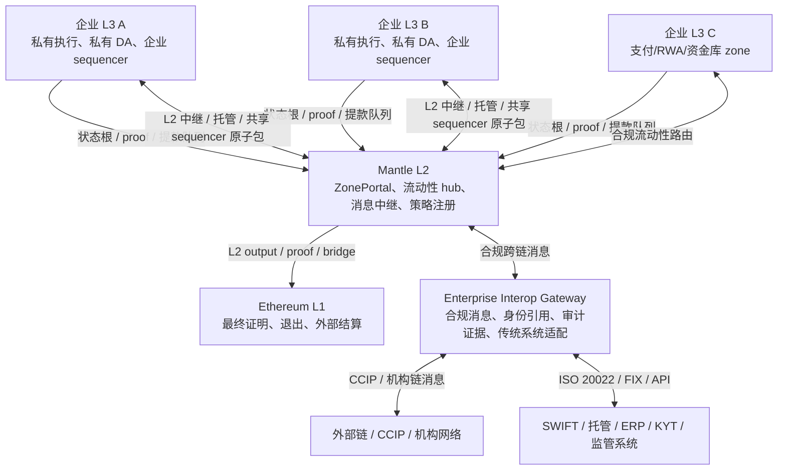

# WHI-389: 方案三 - 企业级 L3 App Chain（结算至 Mantle L2）
- **里程碑**: M5 - 方案分析与最终交付
- **日期**: 2026-05-08
- **状态**: 草稿
- **路径**: 每家企业独立拥有一条 L3 链，结算至 Mantle L2，Mantle L2 再结算至 Ethereum L1

## 来源依赖说明

本分析基于 M5 概述及 M4 L2/L3 路径设计文档，并以 M1 Tempo Zones、Prividium 和 Mantle 基线报告作为实施先例参考。提示词中列出的若干 M1 文件使用旧文件名，本文实际使用的对应 WHI 编号文件如下：

| 提示词依赖 | 实际使用文件 |
|---|---|
| WHI-337 Prividium 文档 | `m1-research/prividium/WHI-337-prividium-official-docs-research.md` |
| WHI-338 Prividium 架构 | `m1-research/prividium/WHI-338-prividium-architecture-deep-analysis.md` |
| WHI-340 Tempo 代码库 | `m1-research/tempo-zones/WHI-340-tempo-code-analysis.md` |
| WHI-341 Mantle 基线 | `m1-research/mantle/WHI-341-mantle-v2-architecture-baseline.md` |

本文档中的最终性数据来自两层证据。第一层，WHI-365/366/368 中的通用 L2/L3 设计采用标准 rollup 框架：L3 软确认在秒级，L2/L1 乐观最终性约七天，ZK 最终性视 prover 和批处理方式约需数分钟至数小时。第二层，WHI-341 中 Mantle 的当前基线显示，Mantle 于 2025-09-16 升级及 Arsia 变更后已成为基于 OP Stack 衍生的 ZK validity rollup，使用 OP Succinct/SP1，软确认约 2 秒，L1 批次/安全确认约 12 分钟，ZK 最终性约 1 小时，仅在系统切换至乐观回退模式时才需 7 天。本文将 WHI-341 视为当前 Mantle 专属基线，并将通用的 15-30 分钟 ZK 指标作为改进目标，而非当前保证。

## 执行摘要

企业级 L3 App Chain 路径是三种 M5 方案中"租户主权"最强的路径。其产品承诺简单明了：一家企业，一条链。每家银行、发行机构、支付网络、市场或受监管客户，均可运行一条专属 L3，拥有独立的 sequencer、私有数据可用性、访问规则、合规策略、升级节奏和运营边界。Mantle L2 成为共同的结算与流动性骨干，Ethereum L1 则是最终验证与资产安全的锚点。

这使该路径对主要需要隔离性、可配置性、以及对"谁控制这条链"有明确答案的企业客户极具吸引力。它比共享企业 L2 灵活得多，因为一个客户无需与另一个客户共享执行状态、mempool 可见性、数据保留策略或 sequencer 运营。与完整独立 L1 相比，它的产品化速度也更快，因为 Mantle 可以复用其 OP Stack 技术积累、EVM 工具链、bridge 基础设施、proof 路线图以及 DeFi 流动性。

该路径的核心弱点同样简单明了：最终性是叠加的。一笔交易首先获得 L3 sequencer 软确认，然后 L3 状态结算至 Mantle L2，再由 Mantle L2 结算至 Ethereum L1。每次外部资产转移、高价值结算或第三方正确性证明都必须关注这条 L3 -> L2 -> L1 链路。结果是三种方案中最慢的硬最终性路径。对于企业内部工作流，这通常是可接受的，因为企业信任自己的 L3 sequencer。但对于企业间结算、跨区 DVP、bridge 提款和 Ethereum 退出，漫长的硬最终性路径是真实的产品约束，而非实现细节。

互操作性是 L3 路径中必须单独设计的产品层，而不能假设为公链式无许可可组合性。因为每家企业都是独立 L3，企业间交互不再是同一状态机内的合约调用，而是通过 Mantle L2 上的 ZonePortal、合规消息网关、托管/超时机制、共享 sequencer 或后续 ZK 跨区 proof 完成。L3 的互操作目标不是让所有 zone 默认开放，而是在保护私有 DA、企业策略和披露边界的同时，让经过许可的资产、付款、审计证据和业务消息可以跨 zone、Mantle L2、Ethereum L1、外部链和传统金融系统流动。

因此，诚实的可行性边界如下：

| 适用场景 | 评估 |
|---|---|
| 内部企业账本、私有 RWA 工作流、租户专属合规环境 | 强适配 |
| 多租户企业平台，每个客户需要独立策略和数据边界 | 强适配 |
| B2B 结算，可接受软最终性加经济担保，稍后再获 proof 最终性 | 适配良好 |
| 毗邻 DeFi 的企业产品，需要 Mantle 流动性但私有企业执行 | 适配良好，bridge/元数据有注意事项 |
| xStocks HFT、亚秒级确定性证券最终性、支付终端最终结算 | 弱适配；独立 L1/BFT 路径在结构上更优 |
| 需要硬最终性的 Ethereum 提款或高价值跨链资产转移 | 受限于 Mantle L2 -> Ethereum 最终性 |

## 1. 方案概述

**每家企业独立拥有一条 L3 应用链——企业自主拥有并运营自己的链，结算至 Mantle L2，Mantle L2 再结算至 Ethereum L1。企业获得链级主权，同时继承 Mantle 和 Ethereum 的安全性。**

核心定位是"每家企业一条链"。企业不仅仅获得一个私有 RPC 端点或共享链中的应用命名空间，而是获得一个专属的 L3 链实例。该链可拥有专属 sequencer、专属全节点、专属数据可用性存储、专属认证 RPC 端点、专属监控、专属审计导出、专属治理密钥以及专属升级窗口。

Mantle 的角色从单纯的公共 L2 网络转变为企业链平台：

| Mantle 角色 | 在 L3 路径中的含义 |
|---|---|
| L2 结算层 | 接收 L3 状态根、批次承诺、proof、提款哈希和 bridge 消息 |
| 流动性枢纽 | 托管共享资产、DeFi 场所、合规路由和跨区结算池 |
| SDK/框架提供商 | 提供 L3 模板、部署工具、ZonePortal 合约、策略注册表、bridge 适配器和可观测性工具 |
| Proof/DA 协调者 | 聚合或验证 L3 proof，管理 proof 提交节奏，定义 DA 模式模板 |
| 治理/安全层 | 提供 guardian 紧急路径、升级标准、审计要求和企业 SLA |

类比是 Cosmos App Chains 或 OP Stack App Chains，但面向企业级。如同 Cosmos app chains，每条企业链可以专业化定制。如同 OP Stack L3 或 Arbitrum Orbit 链，每条链可复用 rollup 框架并结算至父链。企业差异在于，这种专业化不仅是技术层面的，更是法律、合规、数据主权和运营层面的专业化。

WHI-386 将企业区块链设计框架为八个耦合组件：执行、共识/最终性、隐私、合规/身份、访问控制、数据可用性/数据主权、互操作性以及业务组件。L3 路径在受益于隔离性的组件方面最强：隐私、访问控制、DA 主权、合规配置和应用专属业务组件。在依赖共享结算栈的组件方面最弱：硬最终性、bridge 复杂性、L1 退出保证以及跨区原子性。

## 2. 技术架构深度解析

### 2.1 三层架构

该方案采用三层结算栈：

```text
┌─────────────────────────────────────────────┐
│  企业 L3 App Chain（每家公司独立一条）       │  <- 企业运营
├─────────────────────────────────────────────┤
│  Mantle L2（结算 + 流动性 + DA 枢纽）        │  <- Mantle 运营 / 平台运营
├─────────────────────────────────────────────┤
│  Ethereum L1（最终结算）                     │  <- 去中心化公共锚点
└─────────────────────────────────────────────┘
```

每家企业部署自己的 L3 实例。L3 定期向 Mantle L2 提交状态根、批次承诺、提款队列哈希，以及在成熟阶段提交有效性 proof。Mantle L2 聚合多条 L3 的状态，并将自身的 L2 状态根和 proof 提交至 Ethereum L1。Ethereum 仍是资产退出 Mantle 生态系统或第三方需要 L1 可验证承诺时的最终外部结算层。

架构的直接价值在于隔离性：

| 隔离边界 | 企业控制的内容 |
|---|---|
| 执行 | 链参数、允许的合约、gas 模型、自定义预部署合约、策略钩子、代币标准 |
| Sequencing | 交易准入、排序策略、审查策略、MEV 策略、运营密钥、故障切换 |
| 数据可用性 | Rollup 模式、Validium 模式、DAC 成员、私有数据库位置、备份策略、保留策略 |
| 访问 | RPC 认证、基于角色的查询、参与者成员资格、KYC/KYB 阈值、审计员访问 |
| 治理 | 升级时机、紧急密钥、参数变更、业务策略生命周期 |

该架构应理解为 Zone 平台。WHI-366 将选定的隐私模式定义为带 Validium DA 的 L3 Privacy Zones。WHI-368 将其转化为部署组件：Zone Sequencer、Zone 执行节点、可选的 Zone Prover、Zone DA 节点、Zone Privacy RPC 以及 Zone 管理控制台。Tempo Zones 提供了最接近的现实先例：公共父链加上私有 validium 风格的 zone，将 zone 数据保留在父链之外。Prividium 提供了最接近的企业 Validium 先例：私有链数据保存在链下，状态转换正确性通过 STARK proof 证明，结算层无需接收敏感交易数据即可验证正确性。

### 2.2 L3 执行层

L3 执行层应保持 EVM 兼容，除非特定企业产品有理由进行更深层次的 VM 改造。最优默认选项是带企业扩展的基于 EVM 的 app chain 框架：

| 执行设计选择 | 建议 |
|---|---|
| 基础 VM | EVM 兼容执行，可选轻量级 OP Stack L3、ZK Stack Hyperchain/Validium、类 Arbitrum Orbit 链，或基于 Reth SDK 的链 |
| 合约兼容性 | 尽可能保留 Solidity、Foundry、Hardhat、OpenZeppelin、Ethers/Viem 及标准索引器兼容性 |
| 企业扩展 | 添加用于身份、策略、审计、加密存款处理和合规钩子的预部署合约或受控 precompile |
| 合约部署策略 | 支持企业可配置模式：开放部署、仅批准工厂部署，或高隐私 zone 禁止任意 CREATE/CREATE2 |
| Gas 模型 | 每家企业独立的 gas 策略，可选企业 gas 赞助、稳定币 gas 支付，或特定支付流程的固定 gas |
| 升级模型 | 每个 zone 的代理升级和版本固定，平台级兼容性要求 |

有两条可行的框架路径。

第一条是近期路径，可使用简化的 OP Stack L3 或类 Tempo Zone 模型。这条路径构建速度快，因为 Mantle 已在 OP Stack 上积累了深厚经验，包括 op-geth 定制化、预确认基础设施、batcher 专业知识、op-conductor 高可用性和 bridge 经验。对于第一阶段企业试点，一个带私有 DA、认证 RPC、受控合约和 ZonePortal 结算的单 sequencer L3 已足以验证客户需求。

第二条是中期路径，应向 ZK Validium 或 ZK Stack 风格 L3 收敛，用于高价值企业结算。WHI-365 推荐 ZK Validium 作为主要企业方向，因为乐观 Rollup 安全性需要公开数据可用性和七天挑战期语义，这两者都与企业隐私和结算预期相冲突。Prividium 的架构验证了这一方向：交易数据保存在链下，状态转换正确性通过 STARK proof 证明，结算层无需接收敏感交易数据即可验证正确性。

执行层可以按企业定制，但定制有其边界。如果每条 L3 都独立修改 op-geth 或 zkEVM 语义，Mantle 将继承一个无法维护的平台。正确的产品边界是少量经过认证的链模板：

| 模板 | 目标用途 | 执行限制 |
|---|---|---|
| RWA L3 | 代币化基金、债券、房地产、私人信贷 | ERC-3643、合规钩子、批准合约工厂、监管审计 API |
| xStocks L3 | 代币化证券场所、非 HFT 交易、暗池式撮合 | 严格参与者身份、FCFS/加密 mempool、市场监控钩子、受限合约部署 |
| Payment L3 | B2B/B2C 稳定币支付、商户结算 | 高 TPS、稳定币 gas、Travel Rule 元数据、低成本转账 precompile/合约 |
| 企业沙箱 L3 | 定制企业工作流 | 广泛 EVM 兼容性、可配置策略、可选私有 DA |
| 公共 DeFi L3 | 应用专属公共 DeFi | 公开 DA、开放合约、较低隐私要求 |

这种模板化方式在保持 app chain 主权的同时，防止了平台碎片化。

### 2.3 L3 Sequencer：核心卖点

企业自运营的 sequencer 是核心价值主张。该路径解决的客户痛点是："密钥不在我手中。"在共享 L2 中，即使链上有许可制智能合约，企业也不拥有排序路径。其交易仍需进入由 Mantle 或其他第三方运营的 sequencer。在 L3 路径中，企业可以自行运营 sequencer，或选择明确合同约定的运营商。

L3 sequencer 控制的内容：

| 控制面 | 企业价值 |
|---|---|
| 交易准入 | 执行 KYC/KYB、制裁检查、账户状态、司法管辖区、资产资格、API 认证 |
| 排序策略 | FCFS 排序、市场公平规则、批量拍卖、优先通道、内部 BFT 排序或共享 sequencer 原子包 |
| 审查策略 | 在执行前拒绝不合规、未授权、可疑或格式错误的交易 |
| Mempool 可见性 | 将订单流保留在企业边界内；后续可为敏感用例转向加密 mempool |
| 可用性 | 运行热备 sequencer、区域故障切换、紧急模式和企业事件响应 |
| 审计 | 哈希链排序日志、合规决策、被拒绝交易和运营商操作 |

有三种 sequencer 运营模型：

| 模型 | 描述 | 最适合场景 | 主要风险 |
|---|---|---|---|
| 中心化企业 sequencer | 一家企业或 Mantle 托管运营商运行主 sequencer 并配备热备 | 单租户内部链、RWA 发行方、支付处理器 | 运营商可审查、重排序、停止或泄露数据 |
| 带 BFT 委员会的企业 sequencer | 一小组内部或联盟节点对排序/最终性进行签名 | 多银行网络、DVP 平台、受监管市场 | 更多运营工作、委员会治理、密钥管理 |
| 共享 sequencing 网络 | 多条 L3 共享一个排序层以实现跨区原子性 | RWA 加 Payment DvP、多区结算 | 隐私和主权需在原子性方面有所取舍 |

在第一阶段，中心化 sequencer 并非失败。对许多企业工作流而言，这正是关键所在：企业需要一个具有法律义务、可审计程序和服务级别承诺的受控运营商。WHI-365 将此称为"Sequencer 即合规官"。Sequencer 的可见性成为一项合规特性：它可以在执行前筛查交易、监控 AML 模式、执行市场监控规则，并生成面向监管机构的审计日志。

然而，这只有在信任边界明确的情况下才有效。Sequencer 可见性不等于密码学隐私。中心化 L3 sequencer 能看到明文订单流，除非实现了加密 mempool 或阈值解密。对于 RWA，如果运营商是发行方或受监管服务提供商，这可能是可接受的。但对于 xStocks 暗池，这还不够；最终 sequencer 应先对加密交易进行排序，承诺排序后再解密。对于跨机构网络，可能需要一个许可制 BFT sequencer 委员会，以避免一家银行运营竞争对手的结算排序层。

### 2.4 结算与最终性模型：核心痛点

L3 方案在三种方案中结算链路最长：

```text
用户交易
  -> L3 sequencer 软确认
  -> L3 批次/状态根/proof 提交至 Mantle L2
  -> Mantle L2 批次/proof 提交至 Ethereum L1
  -> Ethereum L1 最终性和 bridge 执行
```

这形成了分层最终性：

| 阶段 | 大致延迟 | 保证 | 需要信任谁 |
|---|---:|---|---|
| L3 sequencer 接收 | ~1-2s | 软排序承诺，结算前通常可撤销 | L3 sequencer/运营商 |
| L3 区块 / 本地最终性 | ~1-5s（取决于 L3 设计） | 本地链承诺；在单 sequencer Zone 语义下 `head=safe=finalized` 可能指向同一哈希 | L3 sequencer 及其可用性 |
| L3 提交至 Mantle L2 | ~2-15s（简单中继）；批处理或 proof 门控时更长 | L2 可见的状态承诺或 bridge 事件 | L3 提交方/prover 加 Mantle L2 包含 |
| Mantle L2 安全/L1 批次确认 | WHI-341 基线约 12 分钟 | L2 数据/批次有 L1 确认，取决于数据路径 | Mantle batcher 加 Ethereum DA |
| Mantle L2 ZK 硬最终性 | WHI-341 当前基线约 1 小时；改进目标 15-30 分钟 | L2 状态根被 L1 有效性验证接受 | SP1/prover/output submitter 活跃性和 Ethereum 验证 |
| 乐观回退硬最终性 | 7 天 | 挑战窗口已过 | 诚实挑战者且治理未意外切换模式 |
| Ethereum 退出/bridge 结算 | 相关 L2/L1 最终性完成后 | 外部资产转移可视为最终 | 完整的 L3 + L2 + L1 链路 |

核心矛盾在于：企业内部运营通常可以接受 L3 软最终性，因为企业信任自己的 sequencer；但外部结算需要硬最终性，而硬最终性受限于 Mantle L2 向 Ethereum L1 的结算。

对于内部记账、库存移动、内部支付状态和私有工作流状态，企业可以将自己的 sequencer 视为权威来源。这类似于银行处理内部账本的方式：一笔交易在外部结算之前可以在运营层面视为最终。对于企业间结算，交易对手会提出更难的问题：为什么要信任你的 sequencer？此时，系统需要经济担保、BFT 联合签名、共享 sequencing 或 Mantle L2 上的 proof 最终性。对于 Ethereum 退出，这些捷径都无法完全替代 L2 -> L1 最终性路径。

这不是一个微小的 UX 问题，它决定了哪些业务叙事适合该路径：

| 业务场景 | 可用的最终性级别 | 影响 |
|---|---|---|
| 内部记账 | L3 软/本地最终性（~1-2s） | 影响最小；企业信任自己的 sequencer |
| 内部资金库工作流 | L3 本地最终性加审计日志（~1-5s） | 若外部结算可单独延迟，适配良好 |
| 企业间 B2B 支付 | L3 软最终性加经济担保，或 L2 可见承诺（~2-15s） | 许多 B2B 场景可接受，但必须定义结算语义 |
| 同一发行方 Zone 内的 RWA DVP | L3 本地最终性，后续 proof 锚定 | 若参与者在合同上接受 Zone 运营商，适配良好 |
| 跨两家企业的 RWA DVP | 共享 sequencer 或 L2 中继最终性 | 较复杂；非原子的第一阶段存在风险 |
| 跨链资产转移至 Ethereum | Mantle L2 硬最终性（当前 ZK 约 1h，回退 7d） | 瓶颈；无法隐藏 |
| 合规审计 | 大多数读取不依赖最终性 | 影响最小；审计数据可本地保留并稍后锚定 |

缓解措施存在，但均无法消除分层结构：

| 缓解措施 | 改善内容 | 残余风险 |
|---|---|---|
| Sequencer 质押/惩罚 | 为软最终性提供经济担保 | 仍非密码学最终性；惩罚争议流程至关重要 |
| 签名预确认 | 使 L3 接收可归因且可惩罚 | 仍依赖 sequencer 密钥和法律/经济执行 |
| Mantle L2 对 L3 提交的快速确认 | 缩短至 L2 可见承诺的时间 | 不加速 L2 -> Ethereum 硬最终性 |
| 许可制 BFT 委员会 | 提供确定性本地/业务最终性 | 增加对委员会的信任；外部退出仍需等待 L1 |
| 共享 sequencer 原子包 | 改善跨区原子性和延迟 | 要求各 zone 共享排序信任和元数据暴露 |
| ZK L3 proof | 改善状态正确性保证 | proof 生成/提交增加成本和延迟；DA 仍重要 |
| 快速 bridge/流动性提供商 | 改善提款用户体验 | 增加 LP、欺诈、重组和 bridge 信任风险 |

### 2.5 隐私架构

L3 路径的隐私优势来自自然隔离。在共享 L2 中，所有企业应用共享同一个状态机。即使合约数据经过加密或访问控制，区块元数据、合约交互和流动性流动仍可能揭示规律。在每家企业独立的 L3 中，整条链构成一个隐私边界。

默认架构应为：

```text
企业 L3 私有执行
  - 完整交易数据
  - 账户状态
  - 合约存储
  - 审计日志
  - 身份映射
  - 业务记录
        |
        | 提交承诺
        v
Mantle L2 ZonePortal
  - L3 状态根
  - 批次 proof 哈希 / proof
  - 提款队列哈希
  - 公开 bridge 事件
        |
        | 聚合 L2 状态/proof
        v
Ethereum L1
  - Mantle L2 状态承诺
  - proof 验证 / output root
```

外部观察者不应看到原始 L3 交易。Mantle L2 应仅看到处理存款、提款、proof 验证和跨区中继所需的最小结算数据。Ethereum L1 应仅看到 Mantle 自身的 L2 结算产出物。

这与 Tempo Zones 模型接近。Tempo Zones 是锚定至 Tempo Mainnet 的 validium 风格链：zone sequencer 控制区块生产和可见性；父链上不发布任何 zone 数据；存款和提款通过 ZonePortal 传递；一旦 proof 启用，sequencer 便无法伪造有效的状态转换，但它可以停止、审查、重排序并以明文形式查看数据。这正是 Mantle 必须明确说明的企业权衡。

隐私模型应包含五个层次：

| 层次 | 控制 |
|---|---|
| 物理链隔离 | 每家企业/租户/业务单元独立一条链 |
| 私有 DA | 交易数据存储在企业控制的数据库或 DAC 中 |
| 认证 RPC | JWT/SIWE/mTLS 访问、角色范围读取、经过脱敏的公开响应 |
| 执行限制 | 可选的禁止 CREATE/CREATE2、批准合约工厂、敏感操作固定 gas |
| 选择性披露 | 监管/审计员视图、参与者范围导出、合规声明的 ZK proof |

主要挑战是跨 L3 隐私。如果 Zone A 向 Mantle L2 提款并存入 Zone B，Mantle L2 可能看到源 zone、目标 zone、资产、金额和时间戳。WHI-366 提出了批处理、金额拆分、加密存款载荷、共享 sequencing 以及最终的 ZK 跨区 proof 等方案。这些措施有用，但它们引入了复杂性，且无法使跨区隐私免费。

隐私设计还应明确说明"企业拥有这条链"意味着什么以及不意味着什么。拥有 L3 链将其他租户排除在执行和 DA 边界之外，但不会自动向 L3 sequencer、企业运营商、bridge 合约或观察 ZonePortal 事件的 L2 观察者隐藏数据。因此，L3 模型应将四类隐私受众分开处理：

| 受众 | 默认可见性 | 所需控制 |
|---|---|---|
| 以太坊公开观察者 | 仅 Mantle L2 承诺/proof | 将 L3 交易数据保留在 Ethereum DA 之外 |
| Mantle L2 观察者 | ZonePortal 事件、状态根、提款哈希、时间戳 | 批处理、加密载荷、延迟/聚合结算 |
| L3 sequencer/运营商 | 第一阶段明文交易 | 法律控制、审计日志、第二阶段加密 mempool |
| 监管机构/审计员 | 范围化披露，而非全局状态 | 私有浏览器、阈值密钥、审计 API |

对于敏感 zone，路线图应包含加密 mempool。第一阶段模型可以在 sequencer 是企业自身或合同约定的受监管运营商时接受 sequencer 明文可见性。但对于运营商可能利用订单流的暗池式 xStocks 或银行间工作流而言，这还不够。在第二阶段，用户应将交易加密至阈值 sequencer 密钥；sequencer 先对加密 blob 排序，承诺排序后，由阈值组解密。这可以在不取消合规检查的情况下降低抢先交易风险：系统可以在排序后/执行前阶段运行制裁、KYC 和市场监控检查。TEE sequencing 可作为高价值场所的可选第三阶段增强功能，但不应作为基础保证，因为它引入了硬件信任、认证操作和供应链风险。

Tempo Zones 也表明，更强的隐私可能需要更少的智能合约自由度。Tempo 限制 Zone 仅使用预部署/系统合约并屏蔽 `CREATE`/`CREATE2`，这降低了恶意合约和侧信道风险，但阻止了完全开放的应用平台。Mantle 不应盲目将该限制复制到每条 L3，而应作为模板级别的选择：RWA 和 xStocks zone 可使用批准合约工厂或禁止任意部署，而面向开发者沙箱或 DeFi 的 L3 可保留正常 EVM 部署并接受较弱的隐私声明。

### 2.6 数据可用性

推荐的 DA 策略是混合式，私有 L3 默认使用 Validium：

| DA 模式 | 提交至 Mantle L2 的内容 | 完整数据存储位置 | 安全性 | 隐私性 | 成本 | 最适用场景 |
|---|---|---|---|---|---|---|
| Validium | 状态根、proof/proof 哈希、提款哈希 | 企业数据库或 DAC | 正确性来自 proof；可用性来自运营商/DAC | 最高 | 最低 | RWA、xStocks、私有支付 |
| Rollup | 压缩交易数据加状态承诺 | Mantle/Ethereum DA 路径 | 最强重建保证 | 弱 | 较高 | 公共 DeFi、非敏感资产 |
| Volition | 每笔交易或每批次选择 | 混合 | 可配置 | 可配置 | 可变 | 含私有细节的支付摘要 |
| DAC 支持的 Validium | 状态根加 DAC 证明/proof | N-of-M 机构 | 可用性强于单一运营商 | 高 | 低至中 | 联盟或多银行 zone |

Validium 是最佳默认选项，因为企业客户通常更在乎数据主权而非无许可重建能力。运营自有 L3 的银行可能接受 DA 依赖于其自身基础设施，就像它接受内部核心账本备份的责任一样。这是 Prividium 的经验：Validium 模型在公开证明状态转换正确性的同时，将交易数据保存在链下。但限制必须被精确表述：如果运营商丢失数据库，Ethereum 或 Mantle 单凭公开数据无法重建私有 L3 状态。

成本论据应予以量化。WHI-366 估计，在使用 Airbender 级 GPU proving 的大规模场景下，Validium 风格私有 zone 每笔交易成本低于 $0.0001，年度 zone 层 DA/prover/数据库成本大致如下：

| Zone | DA 模式 | 每笔交易 DA/proving 成本目标 | 月度基础设施估算 | 年度估算 |
|---|---|---:|---:|---:|
| RWA Zone | Validium | <$0.0001 | $5K-$15K | $60K-$180K |
| xStocks Zone | Validium，较高 TPS prover | <$0.0001 | $15K-$50K | $180K-$600K |
| Payment Zone | Validium | <$0.0001 | $5K-$20K | $60K-$240K |

综合公开 DA、私有 zone DA 和审计归档层，WHI-366 估计多 zone 设计每年约需 $355K-$1.24M，比将所有企业交易数据发布至 Ethereum L1 低一个数量级。这些数字应视为规划参考，而非有保障的生产成本。Prividium 研究中引用的 Airbender 性能和成本声明是官方/供应商声明，附有可复现的基准参考，但未在本代码库中独立重新基准测试。

DAC 治理是单一企业主权与联盟信任之间的主要设计选择。当企业自身是唯一负责任的运营商时，单运营商 Validium 最为简单。联盟 Zone 则应使用由受监管成员组成的 DAC，并具备阈值证明、地理/管辖区多样性、HSM 支持密钥、响应时间 SLA、成员轮换、数据扣留惩罚和紧急重建程序。实际上，3-of-5 或 5-of-7 DAC 比大型公共 DA 网络更易治理，同时仍能为交易对手提供比"信任发行方数据库"更好的保障。

GDPR 与金融记录保留在 DA 方面存在对立需求。金融规则可能要求五至七年的交易和通信记录；GDPR 式删除权可能要求删除或使 PII 不可读。L3 DA 设计应将交易元数据与 PII 字段分离，并在不同密钥层次下加密。销毁 PII 密钥可提供逻辑删除，同时为监管机构保留非 PII 结算记录。在保留窗口到期后，可从私有 DA 存储中物理清除元数据和 PII。这是 Validium 相比 rollup DA 的具体优势之一：从未发布至 Ethereum 的数据可以被真正删除或密码学抹除。

因此，生产级 L3 平台必须将 DA 打造为运营产品：

| 必需的 DA 产品功能 | 重要性 |
|---|---|
| 加密多区域复制 | 防止单区域数据丢失 |
| 时间点恢复 | 支持灾难恢复和审计重建 |
| 哈希链审计日志 | 证明数据未被静默篡改 |
| 保留策略引擎 | 将 SEC/MiFID/AML/GDPR 要求映射至存储生命周期 |
| 密钥分离 | 允许 PII 删除/逻辑抹除，同时保留非 PII 交易记录 |
| DAC 模式 | 让多方网络避免单运营商数据控制 |
| DA 健康证明 | 向 L2 合约或监控工具提供数据可用的证据 |

### 2.7 合规与访问控制

在 L3 中，合规比共享 L2 更强，因为企业控制整个交易入口路径。L3 sequencer 是唯一正常入口点。认证 RPC 可以强制执行。企业可以拒绝直接的 sequencer 访问。链可以将所有用户流量路由通过策略网关。这类似于 Prividium 的 Proxy RPC 模型和 Tempo 的认证私有 Zone RPC 模型。

合规架构应采用纵深防御：

| 层次 | 执行点 | 示例 |
|---|---|---|
| 网络/API | 认证 RPC、mTLS、API 密钥、SIWE、OIDC、速率限制 | 仅批准的用户和系统可提交/读取 |
| Sequencer | 执行前检查 | 制裁、KYC 级别、司法管辖区、市场监控、Travel Rule 元数据、FCFS 承诺 |
| 执行 | 预部署合约、合规钩子、代币标准 | IdentityRegistry、PolicyRegistry、ERC-3643、合规路由 |
| Bridge | ZonePortal、L2 bridge、类 TransactionFilterer 合约 | 存款白名单、提款审核、L1 强制包含限制 |
| 审计 | 哈希链日志、监管门户、私有浏览器 | 被拒绝的交易、排序日志、角色范围披露 |

L3 路径可采用 WHI-367 的三层框架：Sequencer 合规过滤、合约层合规钩子和 bridge 合规检查点。在每家企业独立的 L3 中，该框架更具可信度，因为企业还可以控制节点配置、RPC 暴露和合约部署策略。

然而，rollup 式强制包含仍是一个结构性张力点。在公共 rollup 中，L1 强制包含是一项安全特性：它防止 sequencer 永久审查用户。在企业链中，如果任何 L1 用户可以绕过企业策略网关注入交易，强制包含可能成为合规绕过途径。Prividium 通过 `PrividiumTransactionFilterer` 解决了这一问题；Mantle L3 需要在 L2/L3 bridge 边界处设置等效机制。这改善了合规性，但削弱了无许可逃生通道。只有在明确记录并通过运营 SLA、合规用户紧急退出和 bridge 过滤器多方治理进行补偿的情况下，这才是可接受的企业权衡。

### 2.8 互操作性设计

L3 的互操作性与共享企业 L2 不同。共享 L2 中，多个企业租户位于同一个规范状态机内，跨租户交互可以表现为同链合约调用，只是在身份、策略和披露层面受限。L3 中，每家企业拥有独立 chain ID、状态、sequencer、DA 和治理边界，因此跨企业交互默认是跨链交互。它更像"受监管的企业 zone 网络"，而不是"一条大企业链"。

因此，WHI-389 的互操作目标不是无许可可组合性，而是**以 Mantle L2 为结算和流动性 hub 的合规感知跨 zone 互操作**。Mantle L2 应承担父层路由、状态承诺、资产托管、提款队列、消息中继、策略注册和流动性协调的角色；企业 L3 则保留私有执行、私有 DA、认证 RPC、企业 sequencer 和选择性披露边界。

互操作范围分为五层：

| 互操作层 | 连接对象 | 主要用途 | 核心控制 |
|---|---|---|---|
| 垂直结算互操作 | 企业 L3 -> Mantle L2 -> Ethereum L1 | 状态根、proof/commitment、存款、提款、退出、L1 可验证性。 | ZonePortal、提款队列、proof 验证、最终性标签、L2/L1 bridge 安全。 |
| Mantle 流动性互操作 | 企业 L3 ↔ Mantle L2 公共或许可流动性 | 稳定币流动性、RWA 抵押品、合规 DeFi 路由、做市商资金调拨。 | 许可 bridge、资产白名单、KYT/AML、额度、快速 bridge 风险控制。 |
| L3 间业务互操作 | 企业 L3 A ↔ 企业 L3 B | 跨企业付款、RWA DVP、托管转移、跨发行方赎回、B2B 对账。 | L2 中继、托管/超时/退款、对手方白名单、共享 sequencer、跨区审计日志。 |
| 外部链互操作 | 企业 L3 ↔ 其他 L2/L1/机构链 | 跨链资产转移、外部托管网络、机构级消息协议。 | CCIP/合规消息、风险分级 bridge、源链最终性验证、消息策略信封。 |
| 传统系统互操作 | 企业 L3 ↔ SWIFT、托管、ERP、KYT/AML、监管系统 | 法币结算、报表、Travel Rule、制裁筛查、审计调查、后台对账。 | Enterprise Interop Gateway、mTLS/OIDC、ISO 20022/FIX 适配、选择性披露 API。 |

推荐架构如下：



#### 2.8.1 L3 与 Mantle L2 的互操作

Mantle L2 是每条企业 L3 的父层，不应被视为隐私层，而应被视为结算、流动性和中继层。每条 L3 通过 ZonePortal 风格合约向 Mantle L2 提交状态根、批次承诺、proof、提款队列哈希和必要的 bridge 事件。Mantle L2 不应接收完整 L3 交易数据，除非该 L3 明确选择公开 DA 模式。

L3 -> Mantle L2 的互操作应包含以下接口：

| 接口 | 内容 | 风险控制 |
|---|---|---|
| 状态提交 | L3 状态根、批次编号、DA commitment、proof 引用。 | 提交者白名单、proof/commitment 格式校验、延迟窗口、异常暂停。 |
| 存款 | L2 资产锁定或铸造进入指定 L3。 | L3 注册表、资产启用列表、接收方 KYC/KYB、加密存款载荷。 |
| 提款 | L3 提款队列在 L2 上执行。 | 提款限额、最终性门控、合规审核、争议/冻结路径。 |
| 消息中继 | L3 向 L2 或其他 L3 发送业务消息。 | 消息类型白名单、策略哈希、审计事件、重放保护。 |
| 策略同步 | L2 上的全局资产、身份或制裁策略同步至 L3。 | 版本号、签名、有效期、回滚规则、人工紧急更新。 |

这一层的关键原则是数据最小化：Mantle L2 只需要看到足以完成结算、路由和合规验证的元数据，而不应看到 L3 内部订单、客户身份映射、完整交易 payload 或商业记录。

#### 2.8.2 L3 之间的跨 Zone 互操作

跨 L3 互操作是该方案中最复杂的部分，因为它同时触及最终性、隐私、原子性和合规。默认路径应是通过 Mantle L2 中继，而不是让两条 L3 直接互信。

第一阶段推荐使用"托管 + 超时 + 退款"模型：

```text
Zone A 锁定资产或业务状态
  -> 向 Mantle L2 发布跨区消息 commitment
  -> Zone B 验证 L2 上的消息、策略和最终性标签
  -> Zone B 执行对应付款/交割/记账
  -> 若超时或合规拒绝，则按预设规则退款或回滚业务状态
```

这种模型不是原子跨链执行，但适合许多 B2B 支付、RWA 赎回、资金调拨和对账场景。它要求业务合约明确处理 `pending`、`accepted`、`rejected`、`expired` 和 `refunded` 状态，不能把跨区消息当成同链同步调用。

跨 L3 互操作应提供三种模式：

| 模式 | 机制 | 适合场景 | 限制 |
|---|---|---|---|
| L2 中继模式 | Zone A/B 通过 Mantle L2 交换消息、commitment 和提款/存款事件。 | 普通跨企业付款、RWA 赎回、低频托管转移。 | 非原子；延迟取决于 L2 包含和最终性策略。 |
| 共享 sequencer 模式 | 多条 L3 暂时或长期接入同一许可 sequencer/委员会，支持原子包。 | 跨区 DVP、二级市场、做市商报价。 | 降低单企业 sequencer 主权；增加元数据暴露。 |
| ZK 跨区 proof 模式 | 用 proof 证明源 zone 事件和状态条件，无需披露完整交易。 | 高价值结算、隐私敏感的跨机构工作流。 | 复杂度高；需要成熟 proving、标准见证和验证合约。 |

对于跨企业 DVP，第一阶段不应承诺完全原子性。更现实的设计是托管、超时、最终性门控和经济担保。若业务确实需要原子交割，应把该资产市场配置为共享 sequencer 市场集群，而不是让每家企业完全独立排序后再尝试拼接原子性。

#### 2.8.3 隐私保护下的选择性披露

L3 互操作不能要求源 zone 向目标 zone 或 Mantle L2 披露完整交易数据。正确模式是"承诺在父层，证据按需披露"：

| 数据类型 | 默认跨区可见性 | 披露方式 |
|---|---|---|
| 状态根 / 批次承诺 | Mantle L2 可见 | 公开 commitment。 |
| 源 zone 和目标 zone | Mantle L2 可能可见 | 可通过批处理、延迟中继或中继池降低关联性。 |
| 资产类型和金额 | 默认最小化；高隐私场景不直接公开 | 金额拆分、加密载荷、承诺金额、授权方查看密钥。 |
| 交易对手身份 | 默认不公开 | 身份引用、KYC 证明、监管查看密钥、选择性披露 API。 |
| 合规判断 | 公开哈希或证明，不公开完整规则输入 | 策略版本哈希、合规 attestation、ZK membership/eligibility proof。 |
| 审计证据 | 仅授权方可见 | 私有审计门户、阈值解密、监管导出包。 |

选择性披露流程应支持四类请求方：交易对手、发行方、审计师和监管机构。交易对手只应获得完成业务所需的最小信息，例如资产资格、最终性状态和付款证明。发行方可以获得与其资产相关的持有人和转让信息。审计师可以获得时间范围、资产范围或事件范围内的导出。监管机构可在合法授权下获得更完整的身份映射、交易证据和合规决策记录。

实现上，跨区消息不应只携带 `to/value/data`，而应使用企业消息信封：

| 字段 | 作用 |
|---|---|
| `sourceZoneId` / `targetZoneId` | 标识源和目标 L3，但高隐私模式可使用临时路由 ID。 |
| `messageType` | DVP、payment、redemption、custodyTransfer、auditRequest 等类型。 |
| `assetRef` | 资产合约、发行方、资产策略版本或外部 ISIN/CUSIP 引用。 |
| `finalityLevel` | `L3_SOFT`、`L2_SUBMITTED`、`L2_SAFE`、`L1_PROVEN` 等类型化最终性。 |
| `policyHash` | 源 zone 执行的策略版本和合规判断哈希。 |
| `identityAttestation` | 对参与者资格的证明或引用，而非完整身份数据。 |
| `disclosurePolicy` | 谁可以查看哪些字段、在什么条件下查看、披露是否需要多签。 |
| `auditCommitment` | 源交易、排序日志和合规决策的哈希引用。 |
| `encryptedPayload` | 仅目标方、审计方或监管方可解密的业务数据。 |

这种设计使目标 zone 可以验证"这笔跨区消息来自被批准的企业 L3、经过指定策略、达到指定最终性、拥有可审计证据"，而不要求源 zone 把完整私有账本暴露给目标方或 Mantle L2。

#### 2.8.4 与公共 Mantle 和 Ethereum 的互操作

企业 L3 应通过 Mantle L2 访问公共 Mantle 流动性，而不是直接把私有业务状态暴露给公共 DeFi。正确模式是将私有业务处理留在 L3，将可流通资产、抵押品或包装资产通过合规 bridge 路由到 Mantle L2。

| 场景 | 推荐路径 | 控制要求 |
|---|---|---|
| 稳定币进入企业 L3 | 用户或托管方在 Mantle L2 锁定/转入资产，L3 铸造对应余额。 | 资产白名单、存款方资格、Travel Rule 元数据、额度控制。 |
| RWA 抵押品进入 Mantle DeFi | L3 验证资产和持有人资格，在 L2 铸造许可 wrapper。 | 发行方批准、持有人资格、赎回限制、KYT、冻结/暂停权。 |
| 企业资金退出至 Ethereum | L3 提款 -> Mantle L2 -> Ethereum L1。 | 等待指定最终性；高价值提款不应只依赖 L3 软确认。 |
| 公共 DeFi 收益回流 L3 | Mantle L2 收益或资产通过合规路由进入指定 L3。 | 收益来源 KYT、资产策略校验、会计和税务元数据。 |

与 Ethereum L1 的互操作主要是最终结算、退出和第三方可验证性。L3 不应把 Ethereum 退出包装成秒级最终结算。产品和 SDK 必须暴露完整状态：L3 已执行、L2 已包含、L2 已安全、L1 已证明、退出已完成。

#### 2.8.5 与外部链和传统金融系统的互操作

L3 平台不应尝试成为通用跨链桥市场，而应提供一个企业互操作网关，将区块链消息、身份/合规证明和传统金融消息统一纳入审计和策略框架。

| 外部系统 | 集成方式 | 主要用途 |
|---|---|---|
| CCIP / 机构级跨链协议 | 作为受控消息通道，连接其他 L2/L1 或机构链。 | 跨链资产、跨链合规消息、托管网络互通。 |
| 托管方 / 交易所 / 银行核心系统 | API、mTLS、OIDC、签名消息、对账文件。 | 资产托管、入出金、账户状态、链下结算。 |
| SWIFT / ISO 20022 | 消息适配器和引用 ID 映射。 | 法币付款指令、收款确认、Travel Rule 信息。 |
| ERP / Treasury 系统 | 事件订阅、账务 API、批处理导出。 | 企业资金管理、发票、应收应付、内部对账。 |
| KYT/AML/制裁服务 | 实时 API 和批量筛查。 | 存款、提款、跨区消息、公共 DeFi 路由前检查。 |
| 监管和审计系统 | 私有浏览器、导出包、查看密钥、证明验证工具。 | 调查、报表、抽样审计、争议处理。 |

所有外部互操作都应进入同一策略引擎和审计管线。否则，跨链桥、后台 API 或传统系统适配器会成为绕过 L3 合规控制的后门。

#### 2.8.6 互操作安全原则

L3 的互操作安全边界比 L2 更复杂，因为它同时继承 L3 本地风险、Mantle L2 父层风险和外部 bridge 风险。设计原则应是：

| 原则 | 要求 |
|---|---|
| 默认隔离 | 新 L3 默认不能与其他 L3 互操作；必须显式注册对手方、资产和消息类型。 |
| 父层可验证 | 跨 zone 消息应以 Mantle L2 上的 commitment、事件或 proof 作为共同参考点。 |
| 最终性门控 | 高价值操作按 `L2_SAFE`、`L1_PROVEN` 或业务约定的 BFT 证书放行；低价值 UX 可使用软确认但必须有额度。 |
| 策略随消息传播 | 身份、资产限制、司法辖区、制裁检查、披露规则和最终性级别必须随消息携带或可验证引用。 |
| 数据最小化 | 跨区消息默认传哈希、承诺、证明和加密载荷，不传完整交易数据。 |
| 可撤销和可暂停 | bridge、router、共享 sequencer 集群和外部网关必须有暂停、限额、冻结和人工复核路径。 |
| 双向审计 | 每个跨区/跨链/链下消息必须能从源系统追溯到目标系统，并能证明处理过程未被篡改。 |
| 风险分级 | 普通支付、RWA DVP、Ethereum 提款、公共 DeFi 路由和监管披露使用不同最终性、额度和审批阈值。 |

结论是：**L3 的互操作性应被设计为企业间的受控业务互通，而不是公共 DeFi 式的即时组合性。** L3 的价值来自隔离和主权；互操作层的职责是在不破坏这些边界的前提下，让资产、付款、身份资格、合规判断和审计证据能够跨 zone 流动。

## 3. 核心优势分析

| 优势 | 重要性 | 强度 | 最适合场景 |
|---|---|---:|---|
| 企业 sequencer 主权 | 客户控制准入、排序、故障切换和审计追踪 | 极高 | 银行、支付处理器、私有场所、发行方 |
| 物理数据隔离 | 每条企业链有独立的状态、存储、RPC 和日志 | 极高 | 机密 RWA、私人信贷、资金库、客户专属账本 |
| 可配置合规 | 策略可按企业、司法管辖区、产品或资产类型差异化配置 | 高 | 受监管资产发行、KYC 门控支付、xStocks |
| 默认私有 DA | 敏感交易数据无需发布至 Mantle/Ethereum | 高 | GDPR 敏感及商业机密工作流 |
| 比 L1 更快的产品化 | 复用 Mantle/EVM/rollup 工具链，无需构建新验证者网络 | 高 | 6-12 个月企业平台上线 |
| 比 L2 更好的隔离性 | 避免将所有企业放入同一个共享状态机 | 高 | 多租户企业 SaaS 模型 |
| Mantle 流动性访问 | L3 可 bridge 至 Mantle L2 DeFi 和资产池 | 中高 | RWA 抵押品、稳定币流动性、合规 DeFi |
| 每个 zone 独立升级节奏 | 一个客户的升级需求不会强迫所有客户同时升级 | 中高 | 企业 SLA 和受监管变更窗口 |
| 规模扩展成本效率 | 新客户意味着新 L3，而非整套 L1 网络 | 中高 | 长尾企业客户引导 |
| 真实先例 | Tempo Zones 和 Prividium 验证了架构的部分内容 | 中高 | 投资者/客户信心与设计复用 |

最大的产品优势是主权变得模块化。独立企业 L1 给 Mantle 最大的主权，但需要大规模重建。共享企业 L2 保持生态连续性，但让租户共处于同一状态机。L3 链将主权作为产品 SKU 提供。Mantle 可以销售托管 zone、自托管 zone 和混合 zone，而无需将每家企业强制纳入同一运营模型。

L3 路径也为企业销售异议提供了清晰的答案：

| 异议 | L3 答案 |
|---|---|
| "我们无法向其他客户暴露数据。" | 您的链有独立的私有 DA 和认证 RPC。 |
| "我们需要自己的合规策略。" | 您的 sequencer 和策略注册表按链配置。 |
| "我们不能依赖另一个客户或竞争对手作为运营商。" | 您可以自行运营或选择合同约定的运营商。 |
| "我们需要监管/审计员门户。" | 您的链可以提供范围化审计 API，而不会暴露其他租户。 |
| "我们需要 Mantle 流动性。" | 通过 Mantle L2 bridge，同时保持核心工作流私有。 |

## 4. 核心劣势与风险分析

| 风险 | 严重性 | 概率 | 重要性 | 缓解措施 |
|---|---:|---:|---|---|
| 三种路径中最差的硬最终性 | 严重 | 高 | L3 -> L2 -> L1 形成最长的外部结算路径 | 类型化最终性、经济担保、BFT 本地最终性、明确场景边界 |
| 跨链结算受限于 Mantle L2 | 严重 | 高 | Ethereum 退出和第三方结算等待 Mantle proof/bridge 路径 | ZK proof 加速、专属 prover 容量、带风险控制的快速 bridge |
| 三层运营复杂性 | 高 | 高 | 调试跨越 L3 sequencer、L3 DA、Mantle L2、Ethereum L1、bridge 和 proof | 统一可观测性、运营手册、SLA、混沌测试 |
| 流动性碎片化 | 高 | 中高 | 每家企业一条链会分散资产、流动池和市场深度 | L2 流动性枢纽、合规路由、共享结算池 |
| 企业运营负担 | 高 | 中 | 自托管企业必须运行节点、DA、密钥、备份、监控 | 托管/混合模式、托管 SRE、认证部署套件 |
| 累积 bridge 风险 | 高 | 中 | L3 -> L2 bridge 加 L2 -> L1 bridge 扩大了攻击面 | 审计、时间锁、限制、监控、紧急暂停、保险 |
| Sequencer 明文可见性 | 高 | 中 | 运营商可以看到订单流和敏感数据，除非存在加密 mempool | 法律控制、加密 mempool、阈值解密、敏感 zone 的 TEE |
| Validium DA 可用性风险 | 高 | 中 | 若私有 DA 丢失/扣押，公链无法重建状态 | 复制、DAC、备份证明、恢复演练 |
| 强制包含与合规的张力 | 高 | 中 | 合规过滤器削弱了 rollup 逃生通道 | 明确的 TransactionFilterer 治理、合规紧急退出 |
| 跨 L3 原子性复杂性 | 中高 | 中 | 跨 zone 的 DVP 在第一阶段是非原子的 | 共享 sequencer 原子包、ZK 跨区 proof、托管/超时 |
| bridge 边界的元数据泄露 | 中高 | 中 | L2 中继事件可能泄露资产、金额、时间戳和 zone 对 | 批处理、加密载荷、金额拆分、私有中继 |
| RWA 二级流动性碎片化 | 高 | 中高 | 若 50 家发行方各运行一条 L3，买卖报价分散在 50 个场所，跨 L3 结算增加延迟 | L2 报价枢纽、RFQ 路由、共享结算池、二级市场选择性共享 sequencer |
| 框架/供应商锁定 | 中 | 中 | ZK Stack/OP Stack/Orbit 的选择制约未来 proof/互操作路径 | 模板抽象、可移植合约、DA/proof 适配器接口 |
| 继承 Mantle L2 治理 | 中高 | 中 | L3 结算继承 L2 proof 模式和升级治理假设 | 企业专属治理强化、时间锁、客户披露 |

主要战略风险不是 L3 行不通，它是可行的。风险在于将其包装成既拥有主权又能在 Ethereum 上即时实现最终性的产品。它在应用链层面拥有主权；在最终结算层面则没有。它继承了 Mantle L2。这种继承对安全性、流动性和生态连续性有价值，但也是最终性和 bridge 约束的根源。

RWA 二级交易的流动性碎片化问题值得特别关注。私有 L3 对于发行和初级生命周期管理很有吸引力，但二级市场需要价格发现和库存深度。如果每家发行方或机构将资产保留在自己的 L3 内，企业 A 的 L3 中的买家就无法同步接受企业 B 的 L3 中的报价。在第一阶段，路径是：在 Zone B 提款或锁定，通过 Mantle L2 中继，在 Zone A 存款或释放，并处理非原子失败案例。这对于谈判式 RFQ 或低频二级转让是可接受的，但对于订单簿式市场很糟糕。共享 L2 报价枢纽可以在不暴露完整私有状态的情况下聚合询价；然而，执行仍需要托管/超时或共享 sequencer。相比之下，拥有原生 zone 的独立企业 L1 可以将所有 zone 保持在一个 BFT 最终性域内，这在结构上更适合共享二级市场流动性。

## 5. 最终性问题深度分析

### 5.1 最终性链路分析

L3 最终性链路必须分层分析，因为不同的业务系统会将不同层次视为"结算"。

```text
T0：用户向企业 L3 RPC 提交交易
T1：L3 sequencer 接受并返回软确认
T2：L3 区块构建完成并在 L3 规则下本地最终化
T3：L3 批次/状态根/proof 提交至 Mantle L2
T4：Mantle L2 包含 L3 结算交易
T5：Mantle L2 批次通过 Ethereum DA 路径发布/确认
T6：Mantle L2 output/proof 在 Ethereum 上验证
T7：跨链资产转移或 L1 提款可执行/最终完成
```

大致延迟：

| 时间节点 | 距提交的延迟 | 重组/撤销风险 | 业务解读 |
|---|---:|---|---|
| T1 L3 软确认 | ~1-2s | L3 sequencer 理论上可在结算前重排序或停止 | UX 确认，内部待处理状态 |
| T2 L3 本地最终性 | ~1-5s | 取决于 L3 设计；单 sequencer 意味着运营商信任 | 若企业信任运营商，则为内部账本最终性 |
| T3 L3 -> Mantle 提交 | ~2-15s 典型中继；批处理/proof 门控时更长 | L3 状态承诺在 L2 可见，但非 L1 最终 | Mantle 域内的跨系统证据 |
| T4 L2 包含 | 提交后约 2s | Mantle sequencer 软确认 | Mantle 域软结算 |
| T5 L1 DA/安全确认 | WHI-341 基线约 12 分钟 | L2 批次锚定至 L1 数据路径 | 中等价值跨域结算的较强证据 |
| T6 L2 ZK 硬最终性 | 当前 Mantle 基线约 1h；更快 proof/批处理目标 15-30min | proof 在 Ethereum 上验证；回滚需要破解 proof/治理假设 | 当前 ZK 路径下的高价值结算 |
| T6 回退乐观最终性 | 7 天 | 挑战期风险 | 大多数企业关键路径不可接受 |
| T7 外部提款完成 | T6 后加 bridge 执行 | bridge 特定 | 最终外部资产释放 |

关键观察是：L3 的吸引人产品体验发生在 T1/T2，而其最强外部结算保证发生在 T6/T7。产品可以感觉很快，而结算很慢。这本身不一定是坏事；传统金融通常将授权、清算和结算分开。但产品和法律设计必须明确说明哪一层具有约束力。

T4 和 T6 之间还存在中间风险：Mantle 域的软状态或安全状态与 Ethereum 已证明的最终性不同。已到达 Mantle L2 的 L3 状态根仍可能受到 L2 sequencer 行为、充分确认前的 L1 重组、延迟批次提交、proof 生成失败或治理触发的乐观模式回退影响。当前 Ethereum 深度重组在正常最终性假设下很罕见，但业务问题不仅仅是概率，还有影响范围。如果企业在 `L2_SUBMITTED` 而非 `L1_PROVEN` 后释放商品、现金或证券，它就承担了从 L2 软包含到 L1 已证明结算这段时间的交易对手和运营商风险。

实际规则应为：

| 业务操作 | 最低最终性级别 | 原因 |
|---|---|---|
| UI 更新、内部待处理余额 | `L3_SOFT_CONFIRMED` | 可撤销状态可接受 |
| 单一企业内部账本过账 | `L3_LOCALLY_FINAL` 加审计日志 | 企业控制运营商和争议处理流程 |
| 跨企业临时信用 | `L2_SUBMITTED` 加企业保证金 | 若 L3/L2 路径回退，交易对手需要经济追索权 |
| 企业间不可撤销的 DVP 释放 | 至少 `L2_SAFE`，优选 BFT/共享 sequencer 证书或 `L1_PROVEN` | 仅 L2 软包含不足够 |
| Ethereum 提款、大额赎回、外部抵押品释放 | `L1_PROVEN` / `L1_FINAL_EXIT` | 只有 L1 已证明状态才支持外部最终结算 |

因此，L3 路径应暴露类型化最终性 API：

| 最终性标签 | 所需证据 | 适用场景 |
|---|---|---|
| `L3_SOFT_CONFIRMED` | sequencer 签名收据 | UI 确认、低价值内部操作 |
| `L3_LOCALLY_FINAL` | L3 区块/哈希加 sequencer/BFT 最终性证书 | 企业账本过账、内部库存/记账 |
| `L2_SUBMITTED` | Mantle L2 交易哈希和 ZonePortal 状态根 | 跨区工作流启动、待处理跨区转账 |
| `L2_SAFE` | L1 确认的 Mantle 批次或数据承诺 | 中等价值外部依赖 |
| `L1_PROVEN` | Ethereum 上接受的 L2 output/proof | 高价值结算、bridge 提款资格 |
| `L1_FINAL_EXIT` | 提款/bridge 已最终完成 | 外部资产转移完成 |

若没有类型化最终性，开发者会将软确认误用为硬结算。这是让 L3 路径产生业务风险的最快途径。

### 5.2 业务场景影响矩阵

M4/M5 的目标叙事是 RWA、xStocks、Payment 和 DeFi。每种叙事对最终性问题有不同的看法。

| 场景 | 所需业务最终性 | L3 可用最终性 | 影响 | 结论 |
|---|---|---|---|---|
| RWA 发行管理 | 秒至分钟 | L3 本地约 1-5s；L2/L1 稍后 | 低；发行管理可异步 | 强适配 |
| 同一企业 Zone 内的 RWA DVP | 本地秒级，稍后 proof | L3 本地最终性（若参与者信任运营商） | 在合同/SLA 下可接受 | 适配良好 |
| 跨两个企业 Zone 的 RWA DVP | 原子或近原子结算 | 第一阶段 L2 中继 5-15s 非原子；第二阶段共享 sequencer 1-2s | 实质性复杂性 | 共享 sequencing 后可行 |
| 大额 RWA 赎回至 Ethereum | L1 硬最终性 | 当前 ZK 约 1h；回退 7d | 明显瓶颈 | 仅在赎回窗口可容忍延迟时可接受 |
| xStocks HFT | 亚秒级确定性最终性和公平排序 | L3 软/本地最终性，无 Ethereum 硬最终性 | 结构上不足 | 弱适配 |
| xStocks 非 HFT 私有场所 | 秒级 UX，稍后结算 proof | L3 + 加密 mempool + 审计 | 若无 HFT 承诺则可接受 | 可能适配 |
| Payment B2C 授权 | 亚秒至 2s UX | ~1-2s L3 软确认 | 可作为授权使用，非最终结算 | 加经济担保后可行 |
| Payment B2B 结算 | 秒至分钟 | L3 本地 + L2 可见承诺 | 适配良好 | 强适配 |
| 商户最终提款至 Ethereum | 硬最终性 | L2/L1 proof 或回退 | 慢 | 瓶颈 |
| Mantle 流动性上的 DeFi | 通常 2s 软最终性 | Mantle/L3 软最终性 | 加密 UX 标准 | 若公共流动性操作保留在 L2，适配良好 |
| 合规审计 | 证据可用性，非即时最终性 | 本地审计日志加定期锚定 | 影响最小 | 强适配 |

跨区延迟是 L3 路径最明显地输给独立 L1 路径的地方：

| 跨域操作 | L1 原生 zone 路径 | L3-on-Mantle 路径 | 解读 |
|---|---:|---:|---|
| 同链 / 同最终性域 zone 转账 | Tempo/L1 风格模型中约 600ms 确定性 BFT 最终性 | 不适用；zone 是独立的 L3 | L1 在原生共享最终性方面胜出 |
| Zone A -> 父链 -> Zone B 中继 | 若两个约 600ms BFT 区块约 1.2s | 第一阶段通过 L2 中继约 5-15s | L3 增加了父链和批处理延迟 |
| 原子跨区 DVP | 协议/共享同步器或 BFT 域设计 | 第二阶段共享 sequencer 约 1-2s，但需增加信任 | L3 只能通过放弃部分 sequencer 主权来缩小延迟差距 |
| 硬外部结算 | 内部结算的本地 BFT 最终性，可选 ZK/L1 锚定 | Mantle L2 硬最终性加 L3 proof 路径 | L3 在外部 proof 最终性方面仍较慢 |

#### RWA

RWA 工作流通常不追求极低延迟。发行、投资者引导、认购/赎回、过户代理更新和合规检查可以容忍秒至分钟。当关键需求是隐私和策略隔离时，L3 路径适配良好。基金发行方可以运行一条 L3，其中投资者身份、认购记录、转让限制和私有资产元数据保留在发行方环境中。状态根可以锚定至 Mantle 以实现外部可验证性。

DVP 和赎回会使最终性问题变得严峻。如果代币化资产交割和付款发生在同一条 L3 内，企业可以将本地最终性定义为具有约束力的。如果资产在一条 L3 而付款腿在另一条 L3 或 Mantle L2，第一阶段中继是非原子的并暴露元数据。这需要托管、超时、退款或共享 sequencing。如果赎回退出至 Ethereum 或另一条链，业务必须等待 Mantle 硬最终性或使用引入信用/流动性风险的快速 bridge。

#### xStocks

xStocks 分为两类产品。非 HFT、受监管的私有证券场所可以使用 L3，如果它专注于受控成员资格、市场监控、私有订单流和最终结算。该链可以执行投资者资格、限制交易时间、记录审计日志，并使用加密 mempool 防止 sequencer 抢先交易。

HFT 或亚秒级确定性证券最终性是弱适配。WHI-364/365 反复表明，rollup 硬最终性在结构上受限于 proof 生成和 L1 结算。L3 又增加了一层。即使 L3 本地最终性为 1s，外部硬最终性也慢得多。对于需要 <100ms 或 <1s 确定性、法律约束力执行的场所，独立 L1 BFT 路径在结构上更为合理。

#### Payment

支付最终性取决于产品语义。对于零售支付，用户期望商户快速获得确认，但银行卡网络已将授权与最终结算分开。L3 软确认加 sequencer 质押可以支持类似模型：商户在约 1-2s 内接受 sequencer 签名的授权，而结算 proof 稍后跟上。残余风险由 sequencer 保证金、欺诈准备金、客户限额和争议规则覆盖。

对于 B2B 支付，秒至分钟通常是可接受的，尤其是当交易对手有合同和信用关系时。L3 在此表现强劲，因为每家支付处理器或企业资金库可以拥有自己的链，包含私有支付流、Travel Rule 数据和审计导出。

对于最终资产转移至 Ethereum，支付再次变慢。从 L3 到 L2 再到 L1 的稳定币提款必须遵守完整的最终性路径或依赖流动性提供商。

#### DeFi

DeFi 是创建私有 L3 最不自然的理由。L3 路径有助于毗邻 DeFi 的企业工作流，如 RWA 抵押品或合规收益路由，但公共 DeFi 受益于共享流动性和透明状态。正确的架构是将公共 DeFi 保留在 Mantle L2 上，使用 L3 进行私有企业发起、合规检查和资产准备。L3 资产随后可通过合规包装器或路由 bridge 至 L2。

### 5.3 缓解策略

#### 经济最终性

经济最终性使违反软确认的代价变得高昂。

```text
Sequencer 签名预确认：
  "交易 X 将在 L3 区块 B 的位置 P 被包含"

若 sequencer 违反：
  - 保证金被惩罚
  - 受损方获得补偿
  - 运营商失去认证/SLA 状态
  - 审计日志证明违规
```

经济最终性对于支付和中等价值企业工作流是实用的。当 sequencer 保证金和法律责任超过风险价值时有效。它不变为数学最终性。它还需要可信的惩罚裁决路径。如果争议由运营 sequencer 的同一企业解决，交易对手会打折扣该保证。

一个具体的规模调整规则是：保证金应覆盖最大软最终性敞口，而非平均交易规模。如果 RWA DVP 场所允许在 `L1_PROVEN` 前有 $1000 万的未结跨区敞口，$100 万的 sequencer 保证金只是形式。保证金、保险基金或承诺信用额度应超过最大敞口加罚款。保守的初始设计将未证明敞口上限设为可用追索权的 60-80%；对于 $1000 万敞口，这意味着约 $1250 万-$1670 万的保证金或保险追索权，或更低的敞口上限。这成本高昂，但将"信任 sequencer"转变为一个量化的信用决策。

#### Mantle L2 快速确认

Mantle L2 可以快速确认 L3 状态提交。这很有帮助，因为交易对手可以看到 L3 状态根或提款哈希已到达父链。对于跨区工作流，这提供了一个共同参考点。

限制在于，Mantle L2 软确认仍非 Ethereum 硬最终性。如果业务需要 L1 已证明结算，快速 L2 确认只是缩短了路径的第一部分。

具体示例是跨 L3 资产转移。如果 Zone A 向 Mantle L2 提交提款哈希，且 L2 sequencer 在约 2 秒内包含它，Zone B 可以将存款视为"待父链包含"。它不应仅凭该信号就释放不可撤销的资产腿，除非各方有经济追索权。更安全的路径是：L2 包含用于待处理状态，L2 安全/L1 批次确认用于中等价值临时释放，L1 已证明 output 用于大额最终释放。

#### 预批准企业的乐观信任

Mantle 可以维护一个经认证企业注册表，其 L3 提交享有优先处理：

| 机制 | 效果 |
|---|---|
| 企业保证金 | 覆盖 proof 最终性前的违规行为 |
| 白名单提交方 | 减少垃圾信息并支持快速接受 |
| SLA 和审计要求 | 将技术风险转化为法律/运营责任 |
| 风险等级 | 限制硬最终性前的交易价值 |

这适合许可制企业平台。不应将其作为等同于无许可结算进行营销。这是一个信任和风险管理层。

自然的用例是拥有持续 SLA 的已知银行或发行方。Mantle 可以为该企业提供更高的软最终性限额，因为该企业已通过 KYB、提交了保证金、同意了审计并在法律合同下运营。新的或低级别企业在获得 proof 最终性之前应获得更低限额。这反映了传统结算风险限制：可信交易对手获得更大的日间敞口；未知交易对手则不然。

#### BFT 本地最终性

对于高价值企业间工作流，L3 可以使用许可制 BFT 委员会代替单一 sequencer。3-of-5 或 5-of-7 机构委员会可以签署本地最终性证书。这在委员会假设下提供了确定性业务最终性，并且可以比单独运营商更好地支持 DVP 或 B2B 结算。

残余风险是架构开始在 L3 内重建 L1。此时，Mantle 必须询问该客户是否应该走独立 L1 路径。

BFT 委员会在成员稳定且交易图高价值时最有用。例如，一个 5 家银行的 RWA 结算 zone 可以要求 4-of-5 最终性签名再进行 DVP 释放。这比单一发行方 sequencer 给交易对手更强的追索权，但也意味着 L3 不再是轻量级 app chain。它现在需要验证者引导、密钥仪式、法定人数监控、视图变更处理和验证者移除治理。

#### 共享 Sequencer 原子包

共享 sequencing 是最佳的跨区缓解措施。如果 Zone A 和 Zone B 共享一个 sequencer 或 sequencer 委员会，原子包可以在两个 zone 中各包含一笔交易并一起提交排序。这支持跨区 DVP：资产腿和付款腿要么都执行，要么都不执行。

权衡是主权和隐私。企业选择 L3 部分是为了控制自己的 sequencing。共享 sequencer 意味着接受共享排序规则、共享元数据暴露和共享治理。

重要的产品区分是：共享 sequencing 应该是每个市场的可选项，而非每条 L3 强制执行。私有资金库 zone 可能更倾向于完全的 sequencing 主权，并接受偶尔转账的慢 L2 中继。RWA 二级市场可能更倾向于共享 sequencer，因为原子性和流动性比独立排序控制更重要。这论证了双产品策略：默认私有 L3，以及需要跨企业交易的资产的共享 sequencer"市场集群"。

#### ZK Proof 加速

L3 ZK proof 加上更快的 Mantle L2 proof 提交可降低正确性延迟。Prividium 的 Airbender 声明和 WHI-365 的 ZK Stack 方向指向在最佳情况下亚秒级区块 proving 和分钟级聚合。Mantle 当前的 WHI-341 基线约为 1 小时硬最终性，但设计目标应是企业结算 15-30 分钟，并为特定高价值路径最终降至更低。

残余风险是运营层面的：prover 集群故障、队列积压、GPU 容量昂贵以及 proof 系统有升级和审计风险。ZK 改善正确性保证，但本身不解决 DA 可用性或 bridge 元数据泄露问题。

proof 加速目标不应与当前保证混淆。未来的 L3 stack 可能在不到一秒内证明单个 L3 区块并在数分钟内聚合，但端到端结算路径仍包括 L2 包含、L2 proof 聚合、Ethereum 验证和 bridge 执行。因此，"亚秒级 proving"应作为吞吐量/成本改进来销售，而非亚秒级外部结算。

## 6. 目标场景

L3 路径适合主要产品需求是"我自己的受控环境"而非"尽可能快的全球结算"的客户。

| 客户/场景 | 适配度 | 原因 |
|---|---|---|
| 银行内部代币化存款账本 | 强 | 银行控制 sequencer、私有 DA、身份、审计和策略 |
| 拥有私有投资者注册表的 RWA 发行方 | 强 | 发行方专属链对应发行方专属合规和数据保留 |
| 拥有商户/客户分区的支付处理器 | 强 | 高 TPS、私有流、Travel Rule 元数据、受控 API |
| 为受监管租户服务的企业 SaaS 平台 | 强 | 每个租户一条 L3 提供清晰的数据分离 |
| 少数机构间的联盟试点 | 良好 | DAC/BFT/共享 sequencer 可随信任成熟而添加 |
| 代币化证券非 HFT 场所 | 良好，有注意事项 | 需要加密 mempool 和市场监控；硬最终性仍有延迟 |
| 公共 DeFi 协议 | 中等 | 除非需要应用专属隔离，否则更适合在 Mantle L2 上 |
| 高频证券交易 | 弱 | 硬最终性和确定性延迟在结构上差于 L1 BFT |
| 需要协议主权的 CBDC 或国家支付轨道 | 弱至中 | 可能希望独立 L1 或专属主权基础设施 |

最强的初始切入点不是"用数千条 L3 替换 Mantle L2"，而是"为每家企业客户提供一个私有生产 zone，在需要流动性、proof 或互操作性时可结算至 Mantle"。这个切入点与 Mantle 当前的公共 L2 业务兼容，而非蚕食它。

## 7. 实施路线图估算

提示词要求 9-13 个月的路线图，配备 10-15 人团队。若范围严格控制且第一阶段不追求完整 ZK/隐私完美，该估算对于一个专注的 L3 平台 MVP 是合理的。应将其理解为 Mantle 平台/SDK 团队规模，而非总生态系统人数。每条自托管企业 L3 都为客户增加了节点运营、sequencer 密钥、DA 备份、监控、事件响应、审计导出和合规策略管理的运营工作；托管或混合模式降低了该负担，但将更多 SLA 责任转回给 Mantle。

### 第一阶段：L3 SDK 框架和首个 L3 实例（4-6 个月）

| 工作流 | 交付物 |
|---|---|
| 链模板 | 带可配置链 ID、gas、区块时间、预部署合约集的单 sequencer EVM L3 模板 |
| ZonePortal 合约 | 用于存款、提款、状态根提交、提款队列的 L2 合约 |
| 私有 DA v1 | 加密的 PostgreSQL/对象存储、备份、恢复、哈希链审计日志 |
| 认证 RPC | JWT/SIWE/mTLS、角色范围读取、写入 API、公开脱敏 RPC 模式 |
| Sequencer 策略引擎 | 白名单、KYC 级别、制裁钩子、FCFS 排序日志 |
| 首个试点 L3 | 测试网上的 RWA 或 Payment Zone，然后是有限的主网试点 |
| 可观测性 | sequencer、DA、bridge、proof 接口状态、RPC 认证、队列健康的仪表板 |

第一阶段不应过度承诺硬最终性。应从第一天起暴露类型化最终性，并将 L3 本地最终性仅视为运营最终性。

### 第二阶段：隐私扩展、合规工具包、部署工具（3-4 个月）

| 工作流 | 交付物 |
|---|---|
| 合规工具包 | IdentityRegistry、PolicyRegistry、ERC-3643 工厂、制裁预言机接口 |
| 企业引导 | KYB 工作流、SSO 集成、API 密钥签发、测试网沙箱 |
| 部署自动化 | Docker 镜像、Helm chart、Terraform 模块、自托管/混合安装指南 |
| 私有浏览器 | 角色范围的区块/交易/事件视图、审计导出、监管机构访问模式 |
| DA 模式 | 单运营商 Validium 生产加固、DAC 设计预览 |
| Sequencer 保证 | 签名预确认、质押/保证金模型设计、违规证据 |
| 安全 | bridge 审计、RPC 威胁模型、密钥管理/HSM 集成 |

第二阶段将链模板转变为产品。这是 Mantle 可以打包托管、自托管和混合 L3 的阶段。

### 第三阶段：L3 间互操作、监控/运营平台、首批企业客户（2-3 个月）

| 工作流 | 交付物 |
|---|---|
| 跨区中继 | 带托管、超时、退款、合规拒绝处理的 L2 中继路径 |
| 共享 sequencer 原型 | 选定配对 zone 的原子包 |
| ZK proof 路线图 | L3 proof 接口、prover 集成计划、proof 聚合目标 |
| 企业 SRE | RTO/RPO 运营手册、事件响应、混沌测试、备份恢复演练 |
| 生产上线 | 受控范围内的首批 1-3 家企业客户 |
| SLA 套餐 | 最终性标签、可用性、proof 节奏、数据保留、支持条款 |

完整团队应为 10-15 人：

| 角色 | 人数 |
|---|---:|
| 协议/rollup 工程师 | 3-4 |
| 智能合约工程师 | 2 |
| 后端/平台工程师 | 2-3 |
| SRE/DevOps | 2 |
| 安全工程师 | 1 |
| 前端/SDK 工程师 | 1-2 |
| 产品/方案架构师 | 1 |
| 合规/企业集成专家 | 1 |

总历时：9-13 个月建立可信的企业 L3 平台。具备成熟加密 mempool、DAC、共享 sequencing 和 ZK 跨区 proof 的生产级 ZK L3 是 18-24 个月的更长期项目。

## 8. 与其他方案的关键差异化

| 维度 | 方案一：独立企业 L1 | 方案二：Mantle 企业 L2 | 方案三：企业 L3 App Chain |
|---|---|---|---|
| 核心承诺 | 最大原生控制 | Ethereum/Mantle 对齐的企业链 | 每家企业一条链 |
| 最终性 | 最强；BFT 可达亚秒级 | 中等；L2 软确认快，硬最终性受限于 L1/proof | 最弱硬最终性；L3 -> L2 -> L1 |
| 隐私 | 若原生设计则最强 | 通过 Validium/私有 DA 良好 | 极强租户隔离，配合私有 DA |
| 合规深度 | 最深；协议级钩子 | 强，但受共享链约束 | 每链策略强，弱于原生 L1 协议 |
| 生态复用 | 最弱；必须冷启动 | 最强；Mantle/Ethereum 原生 | 中高；bridge 至 Mantle L2 |
| 客户主权 | 链级，Mantle 级 | 共享/并行 L2 内受限 | 每客户/租户高度主权 |
| 上市时间 | 最慢 | 中等 | 隔离企业 zone 最快 |
| 运营负担 | Mantle 高 | Mantle 平台高 | 可变；托管/混合/自托管 |
| 流动性 | 冷启动 | 最佳 | 碎片化，但可路由至 L2 |
| 跨区延迟 | 最佳（若 zone 共享一个 BFT 最终性域，L1 设计中约 600ms 级） | L2 状态机内良好；私有域间较弱 | 第一阶段中继约 5-15s；第二阶段共享 sequencing 约 1-2s，需额外信任 |
| 最适合 | 支付级轨道、HFT、主权受监管网络 | 与 Mantle 关联的企业 DeFi/RWA 平台 | 租户专属私有企业链 |

L3 的差异化不在于它最安全或最快。它是最具产品模块化的。它让 Mantle 能够服务不同企业客户，而无需强制统一全局企业设计。一个客户可以运行带严格投资者规则的 RWA Validium L3。另一个可以运行带稳定币 gas 和 Travel Rule 元数据的 Payment L3。另一个可以运行带自定义业务工作流合约的私有沙箱。所有这些都可以结算至 Mantle L2 并可选地访问共享流动性。

## 9. 现实世界先例

### Tempo Zones

Tempo Zones 是"锚定至父链的私有 app chain"最接近的架构先例。关键经验是：

| Tempo 经验 | Mantle L3 启示 |
|---|---|
| Zone 可以是父链上没有公开交易数据的单 sequencer validium | Mantle L3 可以在发布承诺的同时将私有数据保留在 Mantle L2 之外 |
| ZonePortal 处理存款、提款、代币启用和 proof 验证 | Mantle 需要 ZonePortal 风格的 L2 合约作为 L3 结算接口 |
| Sequencer 控制可见性和活跃性 | Mantle 必须将 sequencer 信任视为明确且需缓解的，而非隐藏的 |
| 父链策略可以镜像至 Zone 中 | Mantle L2 身份/合规注册表可以为 L3 策略执行提供数据 |
| 跨区转移路由通过父链 | Mantle L3 间的可组合性默认将基于中继/共享 sequencer，而非同步 |

最重要的 Tempo 经验是最终性而非隐私。Tempo Zones 继承父 Tempo L1 的 Simplex BFT 节奏：研究记录的目标区块/最终性约为 600ms（正常条件下），WHI-340 确认 Zone 引擎将 `head = safe = finalized` 设置为相同哈希。Zone 区块由父链事件驱动；每个父链区块可以驱动下一个 Zone 区块。这给 Tempo Zones 提供了一种 L3-on-Mantle 无法复制的最终性特性。Mantle 的父链不是约 600ms 的 BFT L1；它是 Ethereum 结算的 L2，具有约 2s 软 sequencing、约 12 分钟 L1 批次/安全确认、WHI-341 中约 1 小时当前 ZK 硬最终性，以及切换至乐观模式时的 7 天回退。因此，Tempo 验证了 Zone 隔离模式，但也证明了为什么父链最终性的选择主导了产品走向。

Tempo 还暴露了该架构的成熟度风险。WHI-340 显示，分析的 Zone 代码有 proof 槽和 SP1/TEE 准备，但当前批次提交使用空 proof 字节（`verifierConfig` 和 `proof` 使用 `Bytes::new()`）。换言之，即使是专门构建的 L1+Zone 架构，在分析版本中也尚未完成无信任的 Zone proof 验证。对于 Mantle，这意味着第一阶段不应假定完整的 ZK L3 proving。应将 proof 接口、见证格式和验证合约视为分阶段路线图，第一个生产风险边界仍以 sequencer 信任、DA 运营和 bridge 控制为核心。

Tempo 的跨 Zone 限制同样相关。Zone 间转移通过父链路由，而非通过同步共享状态。这直接支持了本文中的风险分析：私有 zone 提供强隔离但弱的原生可组合性。Mantle L3 将面临相同的模式，并多出一层结算。没有共享 sequencing，跨 L3 转移是基于中继的、非原子的，且在父层可见元数据。有了共享 sequencing，原子性改善，但独立 sequencer 主权减弱。

最后，Tempo 的执行限制是对过度声称 EVM 灵活性的警告。Tempo Zones 屏蔽 `CREATE`/`CREATE2` 并大量依赖预部署/系统合约。这是合理的隐私和安全决策，但它缩窄了开发者自由度。Mantle 可以提供更灵活的 EVM L3 模板，但最强隐私模板可能应采用类似限制或批准部署工厂。

### Prividium

Prividium 是最强的企业 Validium 先例。它展示了：

| Prividium 经验 | Mantle L3 启示 |
|---|---|
| Validium 可以在锚定状态正确性的同时将交易数据保留在公链之外 | 若有 proof 和运营支持，私有 L3 DA 是可接受的 |
| Proxy RPC 加 SSO/RBAC 可以门控链访问 | Mantle L3 应将认证 RPC 作为一等产品 |
| L1 TransactionFilterer 解决了强制交易绕过问题 | Mantle 必须在 bridge 边界解决强制包含问题 |
| ZK proof 提供结算正确性，而非 DA 或排序公平性 | Mantle 必须单独解决 DA、sequencer 公平性和许可问题 |
| 运营商可见性仍是信任问题 | 加密 mempool/阈值解密对敏感 zone 很重要 |

主要可移植性注意事项是 Prividium 绑定于 ZK Stack，并包含 Proxy RPC、仪表板和私有浏览器等企业模块，这些并非全部开放或可直接复用。Mantle 应复用模式，而非假设可以即插即用。

Prividium 也为 L3 成本和 proof 假设提供了依据。Prividium 研究引用了 Airbender/Atlas 的官方声明：超过 15,000 TPS、亚秒级区块 proving，以及在商用 GPU 上每笔交易 proving 成本低于 $0.0001，同时警告这些数字是官方声明而非本代码库中的独立基准测试。对于 Mantle L3，这些数字证明了将 Validium 视为经济上可行的私有 DA 路径的合理性，但在实施过程中它们应保持为需要基准测试的假设，而非合同保证。

### Mantle 基线

Mantle 当前基线既是资产也是约束。它提供了 EVM 兼容性、OP Stack 运营经验、MNT 原生 gas 经济模型、预确认基础设施、高可用性 sequencer 工具、SP1 ZK proof 方向、Ethereum blob DA 以及公共 DeFi 生态系统。它也带来了公开 DA 约束、中心化 sequencer/proposer 风险、双代币 bridge 复杂性、治理/多签假设和 proof 模式回退风险。

对于 L3，最重要的 Mantle 基线点是：Mantle L2 应被视为结算/流动性层，而非隐私层。敏感企业数据应保留在 L3 私有 DA 内。Mantle L2 应接收承诺、proof、bridge 事件和结算消息。

## 10. 建议

企业 L3 App Chain 路径应作为产品化的企业 Zone 平台来推进，而非作为唯一的长期企业架构。它是客户专属隔离、私有 DA、企业自运营 sequencing 和更快市场验证的近中期最佳路径。它不是确定性亚秒级硬最终性、HFT 级证券结算或主权支付轨道的最佳路径。

推荐的产品策略是：

1. 为 RWA 或 B2B 支付构建第一阶段托管/混合 L3，其中本地企业最终性和私有 DA 有价值，且 L1 硬最终性可以延迟。
2. 将 Mantle L2 作为流动性和结算骨干；不要将私有 L3 数据发布至 Mantle/Ethereum。
3. 在每个 SDK、API、浏览器和 SLA 中暴露类型化最终性。绝不让开发者将 L3 软确认与 Ethereum 最终结算混淆。
4. 立即添加 sequencer 经济担保和审计日志；随着客户价值证明，逐步添加加密 mempool、DAC 和共享 sequencing。
5. 将 xStocks HFT 和支付终端最终结算视为纯 L3 的超出范围场景，除非配合 BFT 本地最终性或独立 L1 路径。

最终决策规则是：

| 若客户说… | 首选路径 |
|---|---|
| "我们需要自己的链、自己的数据边界和自己的合规策略。" | L3 App Chain |
| "我们需要 Mantle/Ethereum 流动性和共享企业平台。" | 企业 L2 |
| "我们需要确定性亚秒级结算和协议原生控制。" | 独立企业 L1 |

因此，L3 路径是最具扩展性的企业引导模型，但前提是 Mantle 必须对最终性问题保持诚实。当本地主权是需求时，该产品可以非常出色。如果将其作为即时 Ethereum 级结算进行销售，则会变得脆弱。

## 来源锚点

| Issue | 文件 | 相关章节 |
|---|---|---|
| WHI-386 | `m5-solution/overview/WHI-386-enterprise-blockchain-design-overview.md` | 文档摘要；核心组件分解；关键决策树；三条路径如何配合 |
| WHI-364 | `m4-rebuild/fork-analysis/WHI-364-fork-analysis.md` | 2.3 L3 应用链路径；3.2 性能/最终性；3.6 企业能力适配；4.5 场景矩阵；6.2 混合选项 |
| WHI-365 | `m4-rebuild/l2l3-execution-sequencer/WHI-365-l2l3-execution-sequencer-design.md` | 框架选择；proof 选择；企业 sequencer；最终性模型；L3 App Chain 设计；性能比较 |
| WHI-366 | `m4-rebuild/l2l3-privacy-da/WHI-366-l2l3-privacy-da-design.md` | 带 Validium DA 的 L3 Privacy Zones；sequencer 隐私；混合 DA；认证 RPC；跨区互操作 |
| WHI-367 | `m4-rebuild/l2l3-compliance-business/WHI-367-l2l3-compliance-business-design.md` | 三层合规框架；身份；代币标准；合规 DeFi；风险分析 |
| WHI-368 | `m4-rebuild/l2l3-interop-deployment/WHI-368-l2l3-interop-deployment-design.md` | L3 部署架构；L3 成本；运营；升级；迁移；局限性 |
| WHI-337 | `m1-research/prividium/WHI-337-prividium-official-docs-research.md` | Validium 模型；Proxy RPC；TransactionFilterer；结算路径；性能和客户 |
| WHI-338 | `m1-research/prividium/WHI-338-prividium-architecture-deep-analysis.md` | 信任边界；DA 权衡；RBAC；局限性；Mantle 适配经验 |
| WHI-339 | `m1-research/tempo-zones/WHI-339-tempo-docs-research.md` | Zones 架构；TIP-403；Simplex BFT；企业采用；Mantle 适配 |
| WHI-340 | `m1-research/tempo-zones/WHI-340-tempo-code-analysis.md` | Zone 节点架构；NoopConsensus；ZoneEngine；proof 状态；Reth SDK 扩展模型 |
| WHI-341 | `m1-research/mantle/WHI-341-mantle-v2-architecture-baseline.md` | Mantle OP Stack/ZK 基线；最终性；DA；sequencer 风险；企业切入点；约束 |
