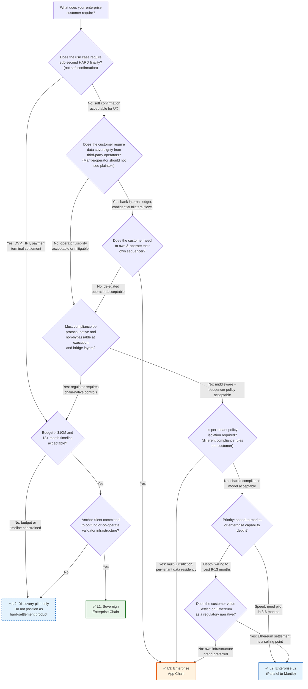

# WHI-395: Three-Path Horizontal Comparison & Decision Matrix
## L1 / Enterprise L2 / Enterprise L3
- **Milestone**: M6 — Decision-Layer Presentation & Three-Path Selection
- **Date**: 2026-05-12
- **Status**: Draft
- **Dependencies**: WHI-391, WHI-393, WHI-394, WHI-387, WHI-388, WHI-389, WHI-390, WHI-364, WHI-363

---

## 1. Three-Path Master Comparison Table

The following table compares L1, Enterprise L2, and Enterprise L3 across 14 horizontal dimensions. Each cell contains a specific, substantive assessment — not a simplified rating. All assessments are traceable to upstream M4/M5/M6 research (WHI-387, WHI-388, WHI-389, WHI-390, WHI-393, WHI-394).

| # | Dimension | L1 Self-Built Chain | Enterprise L2 (Parallel to Mantle) | Enterprise L3 (App Chain on Mantle) |
|---|-----------|--------------------|------------------------------------|-------------------------------------|
| 1 | **Time-to-market** | Slowest: 18–24 months to production, 6–9 months to testnet MVP. Team of 15–25 senior protocol engineers required from day one. | Fastest: 3–4 months to Phase 1 MVP, 8–12 months to full production. Team of 8–15, growing to 12–15. Reuses Mantle's entire OP Stack operational foundation. | Middle: 4–6 months to first pilot L3, 9–13 months to production platform. Team of 10–15. Full production with encrypted mempool and shared sequencing: 18–24 months. |
| 2 | **Engineering cost** | Highest: $8M–$18M+ total (engineering $5M–$12M, audits $850K–$1.7M, bug bounty $1M+, integration $1M–$3M, build-phase infra $500K–$1.5M). Monthly ops at scale: $160K–$300K+. | Lowest: significantly lower than L1 due to OP Stack reuse. ~120–152 person-months for full 12-month roadmap. Audit scope narrower (bridge, private DA, compliance hooks only). | Middle: platform build 10–15 people over 9–13 months. Per-zone annual infra $60K–$600K depending on workload. Multi-zone DA/prover/archive: $355K–$1.24M/year. Scales per customer. |
| 3 | **Enterprise sovereignty** | Maximum: full control over execution, consensus, validator admission, privacy, compliance, DA, upgrade cadence, and business primitives. Enterprise co-owns validators. | Minimum: enterprises are tenants on Mantle-operated infrastructure. Cannot independently sequence, recover the chain, or change protocol rules. "The key is not in our hands." | High: each enterprise owns and operates its own L3 sequencer, private DA, access rules, compliance policies, and upgrade cadence. Settlement still depends on Mantle L2. |
| 4 | **Finality semantics** | Strongest: BFT hard finality ~600ms–2s via 2/3+ validator threshold certificate. BFT certificate IS settlement — no challenge windows. Optional ZK/Ethereum anchor at 5–30 min for external assurance. | Split: ~1–2s sequencer soft confirmation (NOT legal settlement). ZK hard finality ~15–30 min target (currently ~1 hour on Mantle). 7-day optimistic fallback. Soft finality ≠ legal settlement finality. | Weakest external chain: ~1–2s L3 soft confirmation, but external hard finality is L3→L2→L1 chain: ~1 hour ZK (current), 7 days optimistic. Typed Finality API with 6 explicit labels mitigates misrepresentation risk. |
| 5 | **Privacy strength** | Deepest: architecturally native multi-Zone topology with independent state, DA, RPC, and disclosure policy per Zone. ECIES encrypted deposits, sub-transaction privacy (Canton-inspired), threshold decryption, scoped view-keys. | Middle: Validium/private DA hides data from public observers. Authenticated RPC + tenant partitioning. **Default weakness**: sequencer sees plaintext order flow, counterparties, amounts. Canton-style need-to-know privacy NOT achievable within OP Stack/EVM model. | Strongest tenant isolation: physically separate state machine, DA, and RPC per enterprise. Private DA default. **Limitation**: L3 sequencer sees plaintext (encrypted mempool is Phase 2). Cross-L3 transfers leak metadata at ZonePortal bridge layer. |
| 6 | **Compliance enforceability** | Deepest — protocol-native at 5 layers: authenticated RPC, sequencer policy, precompile compliance (identity + policy checks during EVM execution), custom transaction types with compliance proofs, and bridge filters. No bypass possible through wrappers, bridge messages, delegatecall, or unauthorized contracts. | Strong at boundaries, weaker at depth: authenticated RPC, sequencer pre-filtering, smart contract hooks (ERC-3643), bridge filters, audit logs. **Gap**: OP Stack forced inclusion via L1 conflicts with enterprise permissioning — must explicitly filter L1-originated messages. | Strong per-chain: enterprise controls entire transaction entry via own sequencer. Same 5-layer structure as L2 but enterprise-operated. **Gap**: cross-L3 compliance sharing is an open problem; forced inclusion tension same as L2. |
| 7 | **Data sovereignty** | Full: Zone DA is institution-controlled and private. Only commitments and ZK proofs published externally. Enables jurisdictional data residency, configurable retention, GDPR logical erasure (destroy decryption keys). Data never touches Ethereum blobs. | Partial: private DA/Validium hides data from Ethereum and public observers. **But**: sequencer and private DA operator (Mantle) see plaintext by default. Enterprise-controlled KMS partially addresses stored data but not execution-time visibility. | Strongest per-tenant: each L3 has own private DA storage. Data never reaches Mantle L2 or Ethereum. GDPR-compatible — data never published to Ethereum can be genuinely deleted. **Caveat**: ZonePortal events on L2 enable metadata inference about inter-enterprise transfers. |
| 8 | **Ethereum/Mantle ecosystem reuse** | Lowest: EVM tooling (Solidity, Foundry, ethers.js) reused. No automatic inheritance of Mantle liquidity, validators, bridge infrastructure, or Ethereum security. Wallets, explorers, indexers, and DeFi liquidity must be bootstrapped independently. | Highest: full reuse of Mantle OP Stack operations, EVM tooling, sequencer/batcher/prover infrastructure, Ethereum settlement narrative, Mantle DeFi liquidity via bridge, existing wallets/explorers/indexers. | High for EVM tooling, moderate for liquidity: reuses EVM toolchain and Mantle OP Stack knowledge. Access to Mantle L2 DeFi requires a bridge hop with latency and metadata exposure. Public DeFi composability weaker than shared L2 path. |
| 9 | **Operator trust assumption** | Trust permissioned validator set (7–15 initial, scaling to 21–50 identified institutions) bound by KYB, legal agreements, HSM keys, and on-chain governance. Ethereum anchoring adds optional external verification. NOT "secured by Ethereum." | Trust Mantle as sequencer operator — controls ordering, data routing, batch submission. Trust private DA operator. Trust ZK proof system + Ethereum for hard finality. Enterprises are tenants, not owners. Centralized sequencer is simultaneously a compliance asset and a sovereignty limitation. | Trust enterprise's own L3 sequencer for internal finality (enterprise IS the trusted party). Trust Mantle L2 as settlement backbone. External counterparties must trust L3 sequencer OR wait for L2/L1 finality for cross-enterprise settlement. |
| 10 | **Customer type fit** | Regulated financial market infrastructure operators, bank consortia, securities settlement venues, payment networks requiring terminal-speed hard confirmation, institutions requiring data never leave jurisdiction. **Not a fit**: DeFi-native apps, teams needing 3–6 month pilots. | Crypto-native RWA issuers (value EVM, liquidity, speed), custodians accepting operator trust, bank innovation teams for pilots, permissioned DeFi venues. **Weak fit**: central bank/systemic payment rails, HFT securities, confidential interbank workflows. | Banks needing internal tokenized ledgers, RWA issuers with private investor registries, payment processors with tenant-partitioned flows, enterprise SaaS platforms, consortium pilots. **Weak fit**: HFT securities, CBDC/national payment rails, time-sensitive Ethereum withdrawals. |
| 11 | **Business model** | Enterprise financial market infrastructure provider. Revenue: infrastructure SLA contracts, Zone deployment services, compliance tooling, enterprise SDK licensing, consortium participation fees. High upfront capital, high per-customer revenue. | Managed enterprise blockchain service. Revenue: RPC access, compliance tooling, audit access, private DA, selective disclosure, onboarding as managed service tiers. Lower upfront capital, faster time-to-first-customer. | Enterprise chain platform provider ("Cosmos App Chains for enterprises"). Revenue: managed/hosted L3 instances, SDK licensing, ZonePortal infrastructure, proof/DA coordination, compliance toolkit subscriptions. Scales by adding L3 customers. | 
| 12 | **Key risks** | (1) Extreme cost/timeline with unvalidated demand. (2) Full security self-ownership — no inherited Ethereum security. (3) Cold-start ecosystem for wallets, liquidity, validators, and developer tooling. | (1) Limited enterprise autonomy — tenants, not owners. (2) Sequencer plaintext visibility — fundamental trust issue for financial institutions. (3) Finality ceiling — cannot match BFT sub-second hard finality for DVP/payments. | (1) Worst hard finality of three paths — L3→L2→L1 is the longest settlement chain. (2) Three-layer operational complexity. (3) Liquidity fragmentation — 50 issuers on 50 L3s fragments order books. |
| 13 | **Choose-when trigger** | Anchor client confirms need for sovereign settlement + sub-second hard finality. Rust+BFT+ZK team recruited (2+ ZK, 2+ BFT engineers). Budget >$10M available. 18-month timeline acceptable. Canton-model demand validated. | Clients accept operator trust model and pay for production pilot. Speed-to-market is the priority. "Settled on Ethereum" brand matters. Budget <$8M. Competing institutions value mathematical settlement neutrality (Prividium model). | Clients require dedicated environment with own compliance/data boundary. Per-tenant policy isolation needed. Data residency varies by tenant. Mantle wants repeatable deployment and customer-scaling GTM model. |
| 14 | **Do-not-choose-if** | Soft confirmation is acceptable for all target use cases. No committed anchor partner with sovereignty requirement. Team under 15 senior protocol engineers. Pilot needed within 3–6 months. Budget under $8M. | Enterprise requires full control of sequencing/finality/data plane. Sub-second deterministic hard finality required for core use case. Operator-blind processing non-negotiable. Each tenant needs isolated execution with independent recovery. | Sub-second deterministic hard finality required (structural mismatch). Atomic cross-zone DVP required immediately (Phase 1 is non-atomic). Protocol-level sovereignty needed (CBDC, national payment rails). Secondary market liquidity depth is core product requirement. |

---

## 2. Decision Tree

The following decision tree guides non-engineer leadership through path selection. Each question addresses a business requirement; every leaf terminates at a recommended path.



**Reading the tree**: Start at the top. Answer each question based on what the customer's business or regulator actually requires — not what would be nice to have. The first "Yes" that matches a structural constraint (hard finality, data sovereignty, tenant isolation) narrows the path. Budget and timeline gates prevent over-commitment.

**Operator-visibility note**: "No third-party operator sees plaintext" does not mean the execution operator is cryptographically blind in Phase 1. A customer-operated L3 sequencer, and early L1 Zone sequencers, may still see plaintext while executing policy and ordering transactions; operator-blind privacy requires later encrypted mempool, threshold decryption, TEE, or ZK execution work.

**Key insight**: The tree's first gate — sub-second hard finality — is the sharpest discriminator. If the answer is "No," L1's highest cost is unjustified regardless of other factors. If the answer is "Yes" but the budget, timeline, or anchor-client gate fails, the honest recommendation is not to pretend L2/L3 can satisfy the same settlement requirement; it is to use an L2 discovery pilot only for customer learning while deferring the hard-settlement product until the L1 gate is funded.

**Board-use rule**: Treat the tree as a gating instrument, not a ranking exercise. A path should advance only if it passes the hard requirement that matters most for the target buyer. L2 wins when the buyer values speed, Ethereum alignment, and Mantle operational reuse more than sovereignty. L3 wins when the buyer accepts Mantle as settlement backbone but needs its own execution, data, and policy boundary. L1 wins only when the buyer requires sovereign hard settlement and is willing to fund the time, talent, and governance burden. This framing keeps the discussion away from generic "best chain" claims and forces leadership to name the customer segment, legal settlement expectation, operator trust model, and delivery deadline before approving spend.

---

## 3. Business Scenario → Recommended Path Matrix

| Business Scenario | Recommended Path | Why | Key Condition |
|-------------------|:---:|-----|---------------|
| **RWA tokenization** | L2 (short-term) → L3 (scale) | RWA issuance values EVM composability, Ethereum settlement narrative, and existing DeFi liquidity for secondary markets. Soft confirmation acceptable for most issuance/redemption workflows. L3 adds per-issuer isolation as volume grows. | If issuer requires sub-second DVP settlement or complete operator-blind privacy → escalate to L1. |
| **xStocks / synthetic equities** | L1 | T+0 deterministic settlement is a structural requirement for synthetic equity trading. Sub-second hard finality eliminates counterparty exposure windows. No Rollup model can provide this — the finality gap is architectural, not an implementation quality issue (WHI-364). | Must have committed anchor client and $10M+ budget. If HFT latency requirement is relaxed to "same-day settlement," L3 with local finality may suffice. |
| **Cross-border payments (B2C)** | L1 (preferred) / L2 (acceptable) | Payment terminal UX requires near-instant confirmation perceived as final. L1 BFT provides this natively. L2 soft confirmation is technically sufficient for UX but creates legal ambiguity if Sequencer reorgs. | If payment network accepts soft confirmation + SLA (not hard settlement) → L2 is viable and much faster to deploy. |
| **Enterprise DeFi** | L2 | Institutional DeFi requires EVM composability, access to Mantle/Ethereum liquidity, and the "Settled on Ethereum" regulatory narrative. L2 provides maximum ecosystem continuity. Canton and Tempo validate that non-EVM/isolated chains struggle to attract DeFi liquidity. | If enterprise requires operator-blind execution (dark pool) → L3 with encrypted mempool (Phase 2+). |
| **Bank internal ledger** | L3 (primary) / L1 (if sovereignty required) | Banks need physical chain isolation: own sequencer, own DA, own compliance policy, own upgrade cadence. "Your chain, your data" is the strongest auditable claim. L3 delivers this without requiring L1's full protocol build. | If the bank's regulator demands protocol-level sovereignty (no dependency on Mantle L2) → L1. If the bank accepts Mantle as settlement backbone → L3. |
| **B2B payment domain** | L3 | B2B payments involve known counterparties with per-relationship compliance. L3's per-tenant isolation maps naturally to per-payment-domain chains. Cross-domain settlement via Mantle L2 relay is acceptable for B2B (not latency-critical). | If competing banks refuse to share any infrastructure (even settlement) → L1 consortium. If counterparties accept Mantle L2 as neutral settlement → L3. |
| **Securities DVP settlement** | L1 (high-value) / L3 (standard) | High-value DVP requires simultaneous, irreversible asset-vs-payment exchange. L1 BFT provides atomic DVP within ~600ms. L3 can handle standard securities DVP within a single Zone but cross-Zone DVP is non-atomic in Phase 1. | Atomic cross-entity DVP → L1 (or L3 Phase 3 with shared sequencer). Single-issuer DVP with known counterparties → L3. |
| **Multi-tenant enterprise SaaS** | L3 | L3 is purpose-built for this: one enterprise = one chain. Mantle provides managed/hosted L3 templates with per-tenant compliance, data residency, and upgrade isolation. Most scalable enterprise GTM of the three paths. | If all tenants accept shared infrastructure and compliance → L2 is cheaper. If tenants require isolation → L3 is the only credible option. |

**Source alignment**: This matrix is consistent with WHI-390 §6 scenario recommendations and WHI-364 §6.2 narrative alignment matrix. xStocks and Payment B2C structurally require L1; Enterprise DeFi structurally requires L2; the remaining scenarios distribute based on sovereignty and isolation requirements.

---

## 4. Capability Depth vs. Time-to-Market Positioning

### Positioning Description

The three paths occupy distinct zones in a two-dimensional space defined by **enterprise capability depth** (Y-axis: shallow → deep) and **time-to-market** (X-axis: fast → slow). Critically, each path is a zone, not a single point — reflecting the range of deployment configurations available.

```
Enterprise Capability Depth
(Privacy, Compliance, Sovereignty, Finality)

  Deep │                              ┌─────────────┐
       │                              │             │
       │                              │     L1      │
       │                              │  Sovereign  │
       │                              │   Chain     │
       │                              └─────────────┘
       │                                18-24 months
       │         ┌──────────────┐
       │         │              │
       │         │     L3       │
       │         │  App Chain   │
       │         │              │
       │         └──────────────┘
       │           9-13 months
       │
       │  ┌──────────────┐
       │  │              │
  Mid  │  │     L2       │
       │  │  Enterprise  │
       │  │    Rollup    │
       │  └──────────────┘
       │    3-12 months
       │
Shallow│
       └──────────────────────────────────────────────
        Fast                                      Slow
                    Time-to-Market
```

**Key observations from the positioning**:

1. **No path occupies the top-left quadrant** (deep capability + fast delivery). This is the fundamental strategic tension: enterprises want Canton-level capability with L2-level speed. The honest answer is that this combination does not exist. Leadership must choose which axis to prioritize.

2. **L2 is the only path that delivers a credible product within 6 months.** This makes it the default market-entry vehicle regardless of long-term architecture ambitions.

3. **L3 occupies the middle ground** — meaningfully more capable than L2 (tenant sovereignty, per-chain compliance, data isolation) at a moderate time premium (9–13 months vs. 3–12 months). This is why WHI-390 recommends L3 as the scalable enterprise delivery model.

4. **L1 is isolated in the top-right** — maximum capability at maximum cost and time. The gap between L1 and L3 on the capability axis is primarily finality semantics and protocol-level compliance depth. The gap on the time axis is 6–12 months.

5. **The strategic question is the slope of the path**: L2-first → L3-scale → L1-gated follows a northeast trajectory that progressively deepens capability while maintaining market presence. Jumping directly to L1 leaves an 18-month zero-revenue window.

### Suggested Deck Visual

A 2D scatter/zone chart with:
- X-axis: "Time-to-Market" labeled "3 months → 6 months → 12 months → 18 months → 24 months"
- Y-axis: "Enterprise Capability Depth" with labeled bands: "Permissioned RPC" → "Compliance Middleware" → "Tenant Isolation + Private DA" → "Protocol-Native Privacy + BFT Finality"
- Three colored oval zones for L1 (green), L2 (blue), L3 (orange)
- An arrow showing the recommended progressive trajectory: L2 → L3 → L1 (gated)
- Canton and Prividium plotted as reference points (Canton near L1, Prividium between L2 and L3)

---

## 5. Strongest Arguments & Objections

### L1: Sovereign Enterprise Chain

**Three strongest arguments FOR choosing L1:**

1. **Sub-second hard finality is a structural monopoly.** BFT certificate IS settlement — no challenge windows, no proof delays, no sequencer trust assumptions. For xStocks T+0 and payment terminal settlement, no Rollup model can substitute. This is an architectural floor, not an implementation gap (WHI-364 §5.2). If Mantle's target customers require this, only L1 delivers.

2. **Deepest compliance enforceability eliminates the "cosmetic KYC" problem.** Protocol-native compliance at 5 layers (RPC, mempool, execution precompiles, custom tx types, bridge) means compliance cannot be bypassed through wrappers, delegatecall, or unauthorized contract deployment. For regulators who require non-bypassable enforcement, L1 is the only honest answer (WHI-393 Module 4).

3. **Full data sovereignty with a credible path to operator-blind privacy.** Zone DA is institution-controlled, and sensitive data does not need to reach Mantle, Ethereum, or a public DA committee. Phase 1 Zone sequencers may still see plaintext while executing policy, but L1 gives Mantle the cleanest architecture for threshold decryption, scoped view keys, and ZK/TEE-based operator-blind phases under strict data residency regimes (WHI-387 §4.6, WHI-394 §2).

**Three strongest objections AGAINST choosing L1:**

1. **$8M–$18M+ and 18–24 months with unvalidated demand is the definition of product risk.** No enterprise client has committed to paying for sovereign BFT settlement. Building the most expensive path first, before market validation, violates basic product strategy. Canton and Tempo are the only comparable reference architectures, and neither has achieved broad commercial adoption (WHI-390 §6.1).

2. **Full security self-ownership is an ongoing liability, not a one-time cost.** No inherited Ethereum economic security means every validator bug, every governance failure, every bridge exploit is entirely Mantle's burden. The security audit surface is 3–5x larger than L2, and the ongoing bug bounty and incident response requirements never end (WHI-387 §7.3).

3. **Cold-start ecosystem fragmentation.** Wallets, block explorers, indexers, DeFi liquidity, and developer tooling must all be bootstrapped from scratch. Canton and Tempo validate that even technically superior chains struggle to build ecosystems without existing network effects. Mantle's $2B+ TVL on L2 provides zero automatic benefit to L1 (WHI-364 §5.5).

---

### L2: Enterprise L2 (Parallel to Mantle)

**Three strongest arguments FOR choosing L2:**

1. **Fastest credible production path — and speed IS the product.** Phase 1 MVP in 3–4 months. In a market where Canton, Prividium, and Tempo are all pre-production or early-production, being first with a credible enterprise chain creates customer relationships, design partner feedback, and revenue that fund subsequent paths. The 18-month head start over L1 is itself a strategic asset (WHI-394 §3).

2. **Strongest "Settled on Ethereum" regulatory narrative.** State roots, ZK validity proofs, and bridge contracts anchor to Ethereum L1. For institutional stakeholders and regulators who view Ethereum as the most credible public settlement layer, L2 provides the strongest verifiability story. Prividium's market positioning validates this narrative's commercial value (WHI-388 §4.8, WHI-364 §5.3).

3. **Maximum Mantle ecosystem continuity.** Full access to Mantle/Ethereum liquidity, DeFi composability, existing developer tooling, and the Mantle brand. For enterprise DeFi and RWA use cases where secondary market liquidity matters, L2's shared ecosystem is a structural advantage that L1 and L3 cannot replicate without significant investment (WHI-393 Module 8).

**Three strongest objections AGAINST choosing L2:**

1. **"The key is not in our hands" is a deal-killer for sovereign buyers.** Enterprises are tenants on Mantle-operated infrastructure. They cannot independently sequence, recover, or change protocol rules. For bank risk committees and central bank pilots, this operator dependency is a categorical disqualifier — not a concern to be mitigated, but a structural property to be accepted or rejected (WHI-388 §7.1, WHI-390 §6.2).

2. **Sequencer plaintext visibility is a fundamental trust violation for financial institutions.** The Mantle sequencer sees order flow, counterparties, amounts, and business strategy by default. TEE sequencer and encrypted mempool are future mitigations, not current capabilities. Any financial institution performing competitive trading or confidential bilateral flows cannot accept this (WHI-388 §4.4, WHI-393 Module 3).

3. **Soft confirmation ≠ legal settlement creates a finality illusion.** Downstream systems that release fiat or transfer legal title based on L2 soft confirmation are trusting the sequencer operator, not Ethereum finality. This gap between UX finality and legal finality is a liability time bomb: acceptable until the first dispute, catastrophic thereafter (WHI-390 §5.3).

---

### L3: Enterprise App Chain

**Three strongest arguments FOR choosing L3:**

1. **"One enterprise, one chain" is the most natural enterprise sales motion.** Each customer gets a physically separate state machine, sequencer, DA, and compliance policy — "your chain, your data" is auditable, not aspirational. New customer = new L3 instance, not a shared-infrastructure negotiation. This is the most scalable enterprise GTM of the three paths (WHI-389 §3, WHI-394 §4).

2. **Enterprise sequencer sovereignty directly answers the L2 objection.** Enterprises own and operate their own sequencer (or choose a specifically contracted operator). This eliminates the "key is not in our hands" objection that defeats L2 for sovereignty-conscious buyers, without requiring the full $8M+ L1 build. L3 is the sovereignty sweet spot (WHI-389 §4.2, WHI-390 §5.1).

3. **Strongest GDPR-compatible data sovereignty story.** Private DA data never published to Ethereum can be genuinely deleted or cryptographically erased. For EU-regulated enterprises subject to GDPR Article 17 (right to erasure), L3's data lifecycle is the cleanest of the three paths — L1 achieves similar results but at 3–5x the cost (WHI-389 §4.6, WHI-393 Module 6).

**Three strongest objections AGAINST choosing L3:**

1. **Worst hard finality of the three paths creates a structural ceiling.** L3 → L2 → L1 is the longest external settlement chain: ~1 hour ZK (current), 7 days optimistic fallback. For any use case requiring time-sensitive Ethereum withdrawal finality or cross-entity atomic settlement, L3 is structurally constrained. This is not improvable — it is the mathematical consequence of three-layer proving (WHI-389 §4.3, WHI-364 §5.2).

2. **Liquidity fragmentation is a secondary market killer.** 50 RWA issuers on 50 L3 chains means 50 fragmented order books. Secondary market depth — the lifeblood of asset liquidity — requires either a shared L2 quoting hub or cross-L3 atomic swaps, neither of which exists in Phase 1. This limits L3 to primary issuance markets until shared sequencing matures (WHI-389 §7.3).

3. **Three-layer operational complexity compounds debugging and incident response.** A single transaction failure may span L3 sequencer, L3 DA, Mantle L2, Ethereum L1, two bridge contracts, and the proof pipeline. Unified observability and runbooks across all layers are non-trivial to build and maintain. Enterprise SLAs become harder to guarantee as layer count increases (WHI-389 §7.2).

---

## 6. Five Conclusions for Leadership

1. **L2 is the only path that delivers a credible enterprise product within 6 months.**
   **Evidence**: L2 Phase 1 MVP (permissioned access, compliance admission, audit logs, bridge controls) is achievable in 3–4 months with an 8–10 person team, while L3 needs 4–6 months for the first pilot and L1 needs 6–9 months even for testnet (WHI-388, WHI-394).
   *Traceable to: WHI-388 §3 (L2 phased timeline), WHI-394 §3.2 (comparative timeline), WHI-390 §6.4 (progressive roadmap).*

2. **L3 is the scalable enterprise delivery model — the product Mantle sells at scale.**
   **Evidence**: "One enterprise, one chain" turns customer isolation into a repeatable SKU with dedicated sequencer, compliance policy, private DA, and upgrade cadence, while avoiding L1's $8M–$18M+ upfront commitment (WHI-389, WHI-390, WHI-394).
   *Traceable to: WHI-389 §3 (L3 architecture), WHI-390 §5.1 (scoring matrix), WHI-394 §4 (L3 detailed analysis).*

3. **L1 should be activated only when a specific, confirmed trigger fires, not as a parallel speculative build.**
   **Evidence**: L1 requires 18–24 months, 15–25 senior protocol engineers, full security self-ownership, and a budget above $10M, so it has positive expected value only when an anchor client or regulator requires sovereign BFT settlement (WHI-387, WHI-364, WHI-390).
   *Traceable to: WHI-387 §7 (L1 risk assessment), WHI-364 §7.3 (decision triggers), WHI-390 §6.1 (scenario A conditions).*

4. **The target business narratives split into two irreconcilable architectural camps: hard-settlement infrastructure and Ethereum-aligned enterprise access.**
   **Evidence**: xStocks HFT, high-value DVP, and payment-terminal settlement require deterministic BFT finality, while Enterprise DeFi and many RWA products depend more on EVM tooling, Ethereum settlement narrative, and liquidity continuity (WHI-364, WHI-363, WHI-393).
   *Traceable to: WHI-364 §6.2 (narrative alignment matrix), WHI-363 §7 (multi-path conclusion), WHI-393 Module 2 (consensus divergence).*

5. **The recommended composite strategy is L2 market entry → L3 scalable delivery → L1 gated option, with explicit decision gates at 6 and 12 months.**
   **Evidence**: This sequence validates demand and generates early enterprise revenue through L2, adds tenant sovereignty through L3, and preserves L1 for proven sovereign-settlement demand without accepting an 18-month zero-revenue window upfront (WHI-390, WHI-363, WHI-394).
   *Traceable to: WHI-390 §6.4 (progressive roadmap), WHI-363 §10 (phased recommendation), WHI-394 §5 (three-path comparative assessment).*

---

## Appendix A: Weighted Decision Model Summary

Three strategic weighting models demonstrate how path preference shifts with organizational priorities (source: WHI-390 §5.5, WHI-394 §5.1):

| Weighting Model | Priority Weights | Winner |
|-----------------|-----------------|--------|
| **Model A: Fast Enterprise Revenue** | Time-to-market 25%, Development cost 20%, Ecosystem compatibility 20%, Compliance MVP 15%, Tenant isolation 10%, Sovereign finality 10% | **L2** |
| **Model B: Institutional Settlement Infrastructure** | Deterministic hard finality 25%, Enterprise autonomy 25%, Data sovereignty 15%, Protocol compliance 15%, Ecosystem compatibility 10%, Delivery speed 10% | **L1** |
| **Model C: Enterprise Platform Scale** | Tenant isolation 25%, Business scalability 20%, Compliance configurability 20%, Mantle liquidity access 15%, Operational repeatability 10%, Hard external finality 10% | **L3** |

**Interpretation**: No path is universally superior. The "right" path depends on which weights leadership assigns. The composite strategy (L2 → L3 → L1 gated) is the recommendation precisely because it does not require committing to a single weighting model before market validation.

## Appendix B: Finality Comparison Detail

| Finality Type | L1 | L2 | L3 |
|---------------|-----|-----|-----|
| Soft confirmation | ~600ms–2s (= hard finality) | ~1–2s | ~1–2s |
| Hard finality (chain-local) | ~600ms–2s (BFT cert) | ~15–30 min ZK target / 7d optimistic | ~1–5s (single-sequencer) |
| Ethereum-verifiable settlement | 5–30 min (optional ZK anchor) | ~15–30 min ZK / 7d optimistic | ~1 hr ZK / 7d optimistic |
| External asset withdrawal | After optional ZK anchor | After ZK proof acceptance | After L3→L2→L1 chain |

*Source: WHI-387 §4.3, WHI-388 §4.3, WHI-389 §4.3, WHI-394 §2–4.*

## Appendix C: Cost Comparison Summary

| Cost Category | L1 | L2 | L3 |
|---------------|-----|-----|-----|
| Engineering (total build) | $5M–$12M | Significantly lower (OP Stack reuse) | Platform: 10–15 people, 9–13 months |
| Security audits | $850K–$1.7M+ | Narrower scope (bridge, DA, hooks) | Per-zone scope |
| Bug bounty reserve | $1M+ | Lower (shared with Mantle) | Lower (shared with Mantle) |
| Monthly infra (initial) | $85K–$130K | Lower (Mantle-operated) | $5K–$50K per zone |
| Monthly infra (scaled) | $160K–$300K+ | Lower | $355K–$1.24M/year (multi-zone) |
| Team size (peak) | 15–25 | 12–15 | 10–15 |
| Time to production | 18–24 months | 8–12 months (MVP 3–4 mo) | 9–13 months |

*Source: WHI-387 §3, WHI-388 §3, WHI-389 §3, WHI-390 §5.2.*

## Appendix D: Decision Trigger Checklist

| Signal Observed | Recommended Action |
|-----------------|-------------------|
| 3+ credible clients accept L2 trust model and pay for production pilot | Double down on Enterprise L2 |
| Clients accept Mantle settlement but require dedicated environment | Accelerate L3 platform build |
| Clients need self-operated sequencer + private DA, tolerate delayed external settlement | Route to L3 self-operated |
| Clients need self-owned validators + sub-second hard finality | Activate L1 funding decision gate |
| Compliance review blocks Mantle from operating sequencing for regulated clients | Shift to L3 self-operated or L1 consortium |
| Bridge/finality risk blocks high-value DVP settlement | L1 becomes necessary for that segment |
| OP Stack upstream divergence becomes unmanageable | Accelerate migration planning |
| Enterprise client count exceeds 10 (market validation complete) | Evaluate full M4 migration from M3 |
| Regulatory requirement for protocol-level non-bypassable compliance | L1 or deep L3 customization required |

*Source: WHI-390 §6.4, WHI-363 §10.3, WHI-364 §7.3.*
