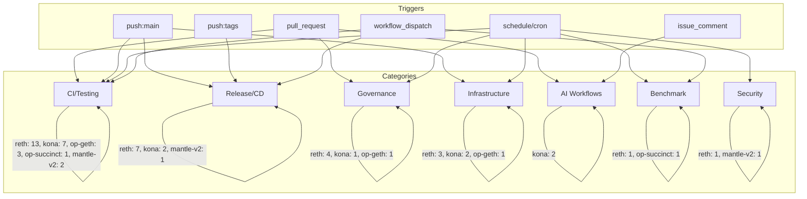

# Mantle GitHub Actions 基线调研

## 执行摘要

本研究对 Mantle 组织下 5 个核心代码仓库（reth、kona、op-geth、op-succinct、mantle-v2）的 GitHub Actions 工作流及仓库级配置进行了完整的基线调研。共计分析了 **53 个工作流文件**，涵盖 CI/测试、发布流水线、治理、基础设施、AI 集成、安全等维度。

**核心发现**：

1. **自动化成熟度差异显著**：reth（29 个工作流）和 kona（14 个工作流）拥有最成熟的自动化体系；op-geth（5 个）、mantle-v2（3 个）和 op-succinct（2 个）自动化覆盖较薄。
2. **AI 集成仅限 kona**：只有 kona 配置了 AI 驱动的工作流（Claude Code Review + Interactive Agent），其余 4 个仓库未集成任何 AI 工具到 CI 流程。
3. **上游同步自动化不足**：仅 kona 有基础上游同步机制（每周 monorepo-pin 和 superchain-registry 同步），其余 4 个仓库（reth、op-geth、op-succinct、mantle-v2）完全缺失自动化上游 merge/rebase 工作流。reth 的 `sync.yml`/`sync-era.yml` 是链同步测试而非上游 fork 同步。
4. **安全与供应链**：reth 拥有可复现构建验证（每 2 天运行），mantle-v2 有 semgrep + harden-runner，kona 有 cargo-deny，但整体安全自动化覆盖率不高。
5. **所有仓库均配置了 code-review-graph MCP 工具指令**（reth 除外），表明组织正在推广 AI 辅助代码审查基础设施。

**调研时间**：2026-06-10
**数据源**：本地文件系统（kona、op-geth、op-succinct、mantle-v2）+ GitHub API（reth，因本地仓库 git 状态损坏）

---

## item-1: 仓库清单与工作流枚举

### 仓库概览

| 仓库 | 上游 Fork | 语言 | GitHub URL | Workflow 数量 | HEAD Commit | 数据源 |
|------|-----------|------|------------|---------------|-------------|--------|
| reth | paradigmxyz/reth | Rust | mantle-xyz/reth | 29 | `84e6ed12858c7be14b0e140758a532813a6bf79d` | GitHub API |
| kona | ethereum-optimism/kona | Rust | mantle-xyz/kona | 14 | `72a20ab919e8ab7d7b75e1c5f64be731dcd6c3b3` | 本地文件系统 |
| op-geth | ethereum-optimism/op-geth | Go | mantlenetworkio/op-geth | 5 | `3c1c571e57874019991f28fe99c36cddac7b4bef` | 本地文件系统 |
| op-succinct | succinctlabs/op-succinct | Rust | mantle-xyz/op-succinct | 2 | `664a1bd4172a976ec58a1a1fb7b9a1f589574c57` | 本地文件系统 |
| mantle-v2 | optimism/optimism | Go+Solidity | mantlenetworkio/mantle-v2 | 3 | `feb2a588c7bec3101bb3fc727f0f041769e3b638` | 本地文件系统 |
| **合计** | | | | **53** | | |

### reth 本地仓库问题说明

reth 本地仓库（`/Users/whisker/Work/src/networks/mantle/reth`）git 状态损坏（`.git` 目录存在但分支信息断裂，无工作树文件）。所有 reth 数据通过 GitHub API（`gh api repos/mantle-xyz/reth/...`）采集并验证。

### 工作流文件完整列表

**reth（29 个）**：bench.yml, book.yml, compact.yml, dependencies.yml, docker-git.yml, docker-nightly.yml, docker.yml, e2e.yml, hive.yml, integration.yml, kurtosis-op.yml, kurtosis.yml, label-pr.yml, lint-actions.yml, lint.yml, mantle-release.yml, pr-title.yml, prepare-reth.yml, release-dist.yml, release-reproducible.yml, release.yml, reproducible-build.yml, stage.yml, stale.yml, sync-era.yml, sync.yml, unit.yml, update-superchain.yml, windows.yml

**kona（14 个）**：acceptance-tests.yaml, claude-code-review.yml, claude.yml, docker.yaml, docs.yaml, lychee.yaml, node_e2e_sysgo_tests.yaml, proof.yaml, publish_artifacts.yaml, rust_ci.yaml, stale.yaml, supervisor_e2e_kurtosis.yaml, supervisor_e2e_sysgo.yaml, sync.yaml

**op-geth（5 个）**：check-docker-build.yml, check-make-build.yml, go.yml, pages.yaml, validate_pr.yml

**op-succinct（2 个）**：cost-estimator-manual.yml, elf.yml

**mantle-v2（3 个）**：ci-main-migrated.yml, protected.yaml, unprotected.yaml

---

## item-2: 逐工作流详细分析

### reth（29 个工作流）

```yaml
# === CI/Testing（13 个）===

- workflow_name: "compact-codec"
  file: compact.yml
  triggers: [pull_request, merge_group, push:main]
  purpose: "验证 Compact 编解码器序列化变更的向后兼容性"
  category: CI
  ai_features: false
  ai_tool: none
  notable_patterns:
    - "双阶段 checkout：在 main 上生成测试向量，在 PR 分支上反序列化验证"
    - "矩阵策略测试 reth 和 op-reth 两个二进制"

- workflow_name: "e2e"
  file: e2e.yml
  triggers: [pull_request, merge_group, push:main]
  purpose: "使用 nextest 运行端到端测试套件"
  category: CI
  ai_features: false
  ai_tool: none
  notable_patterns:
    - "90 分钟超时"
    - "通过 nextest -E 过滤器筛选 e2e_testsuite 测试"
    - "并发组控制，取消正在进行的同 PR 运行"

- workflow_name: "hive"
  file: hive.yml
  triggers: [workflow_dispatch, schedule:每6小时]
  purpose: "运行 ethereum/hive 测试套件（sync, devp2p, engine API, RPC, EELS）"
  category: CI
  ai_features: false
  ai_tool: none
  notable_patterns:
    - "25+ 场景矩阵，覆盖 frontier 到 osaka 所有 fork"
    - "三阶段流水线：prepare-reth -> prepare-hive -> test"
    - "失败时发送 Slack 通知"
    - "仓库守卫：仅在 paradigmxyz/reth 上运行（fork 不运行）"

- workflow_name: "integration"
  file: integration.yml
  triggers: [pull_request, merge_group, push:main, schedule:每日03:00]
  purpose: "运行 Ethereum 和 Optimism 网络的集成测试"
  category: CI
  ai_features: false
  ai_tool: none
  notable_patterns:
    - "矩阵策略：测试 ethereum 和 optimism 两个网络"
    - "安装 Geth 作为外部依赖"
    - "定时触发仅运行 era-files 测试"

- workflow_name: "kurtosis-op"
  file: kurtosis-op.yml
  triggers: [workflow_dispatch, schedule:每6小时, push:tags]
  purpose: "在 Kurtosis 中运行 OP Stack devnet，验证 op-reth 和 op-geth 是否能推进到 block 100"
  category: CI
  ai_features: false
  ai_tool: none
  notable_patterns:
    - "安装 Kurtosis CLI"
    - "使用 Foundry cast 查询区块号"
    - "轮询最多 500 秒"

- workflow_name: "kurtosis"
  file: kurtosis.yml
  triggers: [workflow_dispatch, schedule:每6小时, push:tags]
  purpose: "在 Kurtosis Ethereum 测试网上运行 assertoor 测试"
  category: CI
  ai_features: false
  ai_tool: none
  notable_patterns:
    - "使用 ethpandaops/kurtosis-assertoor-github-action@v1"

- workflow_name: "lint"
  file: lint.yml
  triggers: [pull_request, merge_group, push:main]
  purpose: "全面 lint 流水线：clippy, fmt, docs, WASM/RISC-V 目标, MSRV, 依赖审计等"
  category: CI
  ai_features: false
  ai_tool: none
  notable_patterns:
    - "16 个 job：clippy-binaries, clippy, wasm, riscv, crate-checks, msrv, docs, fmt, udeps, book, typos, check-toml, grafana, no-test-deps, features, feature-propagation, deny"
    - "MSRV 固定在 Rust 1.91"
    - "cargo-hack 进行 feature 组合检查"
    - "zepter 验证 feature 传播"
    - "cargo-deny 委托给 ithacaxyz/ci 可复用工作流"

- workflow_name: "Lint GitHub Actions workflows"
  file: lint-actions.yml
  triggers: [pull_request:paths:.github/**, merge_group, push:paths:.github/**]
  purpose: "使用 actionlint 检查 GitHub Actions 工作流文件"
  category: CI
  ai_features: false
  ai_tool: none
  notable_patterns:
    - "路径过滤：仅在 .github/ 文件变更时运行"
    - "SHELLCHECK_OPTS='-S error' 严格模式"

- workflow_name: "stage-test"
  file: stage.yml
  triggers: [pull_request, merge_group, push:main]
  purpose: "在 block 0-50000 上运行 reth 各 pipeline stage 命令"
  category: CI
  ai_features: false
  ai_tool: none
  notable_patterns:
    - "仅在 merge_group 事件中实际执行"
    - "测试 11 个不同的 pipeline stage"

- workflow_name: "sync-era test"
  file: sync-era.yml
  triggers: [workflow_dispatch, schedule:每6小时]
  purpose: "运行启用 ERA 的区块链同步测试（reth mainnet + op-reth Base）"
  category: CI
  ai_features: false
  ai_tool: none
  notable_patterns:
    - "与 sync.yml 仅差 --era.enable 标志"

- workflow_name: "sync test"
  file: sync.yml
  triggers: [workflow_dispatch, schedule:每6小时]
  purpose: "运行标准区块链同步测试（reth mainnet + op-reth Base）"
  category: CI
  ai_features: false
  ai_tool: none
  notable_patterns:
    - "矩阵：reth (mainnet, block 100000) + op-reth (Base, block 10000)"

- workflow_name: "unit"
  file: unit.yml
  triggers: [pull_request, merge_group, push:main]
  purpose: "运行完整单元测试套件：分区工作空间测试 + EF 状态测试 + 文档测试"
  category: CI
  ai_features: false
  ai_tool: none
  notable_patterns:
    - "4 路分区测试：ethereum (2) + optimism (2)"
    - "使用 cargo-nextest"
    - "Ethereum 状态测试使用 ethereum/tests 仓库（固定 commit）"
    - "alls-green 聚合门"

- workflow_name: "windows"
  file: windows.yml
  triggers: [push:main, pull_request:main, merge_group]
  purpose: "验证 reth 和 op-reth 在 Windows 目标上的编译兼容性"
  category: CI
  ai_features: false
  ai_tool: none
  notable_patterns:
    - "仅 cargo check，不执行构建或测试"
    - "使用 mingw-w64 交叉编译"

# === Release（4 个）===

- workflow_name: "docker"
  file: docker.yml
  triggers: [push:tags:v*]
  purpose: "在版本 tag 推送时发布正式 Docker 镜像（区分 RC 和稳定版）"
  category: Release
  ai_features: false
  ai_tool: none
  notable_patterns:
    - "RC 构建不获得 latest 标签"
    - "构建 reth 和 op-reth"
    - "PROFILE=maxperf 生产优化"
    - "multi-arch 交叉编译"

- workflow_name: "mantle-release"
  file: mantle-release.yml
  triggers: [push:tags:v*, workflow_dispatch]
  purpose: "Mantle 专属 release：构建 op-reth Linux 二进制并发布到 GitHub Releases"
  category: Release
  ai_features: false
  ai_tool: none
  notable_patterns:
    - "仅构建 op-reth（不含 reth），仅 Linux 平台"
    - "生成 changelog、SHA-256 校验和"
    - "支持 tag push 和手动 dispatch"
    - "与上游 release.yml 独立的 Mantle 定制版本"

- workflow_name: "release"
  file: release.yml
  triggers: [push:tags:v*, workflow_dispatch]
  purpose: "上游主 release 工作流：6 个目标平台构建 + GPG 签名 + Draft Release"
  category: Release
  ai_features: false
  ai_tool: none
  notable_patterns:
    - "6 平台矩阵：x86_64-linux, aarch64-linux, x86_64-mac, aarch64-mac, x86_64-windows, riscv64"
    - "GPG 签名所有 release 产物"
    - "Dry run 模式"
    - "创建 DRAFT release（非自动发布）"

- workflow_name: "release-reproducible"
  file: release-reproducible.yml
  triggers: [push:tags:v*]
  purpose: "在 tag push 时构建并推送可复现 Docker 镜像到 GHCR"
  category: Release
  ai_features: false
  ai_tool: none
  notable_patterns:
    - "使用 Dockerfile.reproducible"
    - "禁用 SLSA provenance attestation"

# === CD（3 个）===

- workflow_name: "docker-git"
  file: docker-git.yml
  triggers: [workflow_dispatch]
  purpose: "手动触发：发布以 git SHA 标记的 Docker 镜像"
  category: CD
  ai_features: false
  ai_tool: none
  notable_patterns:
    - "仅手动触发"
    - "PROFILE=maxperf"
    - "multi-arch 交叉编译"

- workflow_name: "docker-nightly"
  file: docker-nightly.yml
  triggers: [workflow_dispatch, schedule:每日01:00]
  purpose: "发布 nightly Docker 镜像（含 profiling 变体）"
  category: CD
  ai_features: false
  ai_tool: none
  notable_patterns:
    - "4 个镜像变体：reth/op-reth × maxperf/profiling"
    - "使用 laverdet/remove-bloatware 释放磁盘空间"

- workflow_name: "release externally"
  file: release-dist.yml
  triggers: [release:published]
  purpose: "Release 发布后自动推送到 Homebrew"
  category: CD
  ai_features: false
  ai_tool: none
  notable_patterns:
    - "发布到 paradigmxyz/brew tap（上游专用，对 Mantle fork 无实际作用）"

# === Governance（4 个）===

- workflow_name: "Update Dependencies"
  file: dependencies.yml
  triggers: [schedule:每周日00:00, workflow_dispatch]
  purpose: "每周运行 cargo update 并创建依赖更新 PR"
  category: Governance
  ai_features: false
  ai_tool: none
  notable_patterns:
    - "委托给 ithacaxyz/ci 可复用工作流"

- workflow_name: "Label PRs"
  file: label-pr.yml
  triggers: [pull_request:opened]
  purpose: "使用自定义 JS 脚本自动标记新开的 PR"
  category: Governance
  ai_features: false
  ai_tool: none
  notable_patterns:
    - "使用 actions/github-script@v8 运行 .github/assets/label_pr.js"

- workflow_name: "Pull Request"
  file: pr-title.yml
  triggers: [pull_request:opened/reopened/edited/synchronize]
  purpose: "验证 PR 标题是否符合 Conventional Commits 规范"
  category: Governance
  ai_features: false
  ai_tool: none
  notable_patterns:
    - "amannn/action-semantic-pull-request@v6"
    - "允许类型：feat, fix, chore, test, bench, perf, refactor, docs, ci, revert, deps"
    - "无效标题时发布置顶评论指导"

- workflow_name: "stale issues"
  file: stale.yml
  triggers: [workflow_dispatch, schedule:每日01:30]
  purpose: "21 天不活跃标记 stale，28 天关闭"
  category: Governance
  ai_features: false
  ai_tool: none
  notable_patterns:
    - "豁免：已分配里程碑和已分配人员的 issue"

# === Infra（3 个）===

- workflow_name: "book"
  file: book.yml
  triggers: [push:main, pull_request:main, merge_group]
  purpose: "构建 Vocs 文档站点并部署到 GitHub Pages"
  category: Infra
  ai_features: false
  ai_tool: none
  notable_patterns:
    - "使用 Bun + Playwright chromium 渲染 Mermaid 图表"
    - "Rust nightly 用于 cargo doc"

- workflow_name: "Prepare Reth Image"
  file: prepare-reth.yml
  triggers: [workflow_call]
  purpose: "可复用工作流：构建 reth/op-reth Docker 镜像供下游使用"
  category: Infra
  ai_features: false
  ai_tool: none
  notable_patterns:
    - "仓库守卫：仅在 paradigmxyz/reth 运行"
    - "使用 Docker Buildx + GHA 缓存"

- workflow_name: "Update Superchain Config"
  file: update-superchain.yml
  triggers: [schedule:每周日03:00, workflow_dispatch]
  purpose: "自动获取最新 OP superchain 配置并创建更新 PR"
  category: Infra
  ai_features: false
  ai_tool: none
  notable_patterns:
    - "peter-evans/create-pull-request@v7 自动创建 PR"

# === Benchmark（1 个）===

- workflow_name: "bench"
  file: bench.yml
  triggers: [pull_request, push:main]
  purpose: "使用 CodSpeed 运行性能基准测试以追踪性能回归"
  category: Benchmark
  ai_features: false
  ai_tool: none
  notable_patterns:
    - "CodSpeedHQ/action@v4"
    - "自定义构建脚本 .github/scripts/codspeed-build.sh"

# === Security（1 个）===

- workflow_name: "reproducible-build"
  file: reproducible-build.yml
  triggers: [workflow_dispatch, schedule:每2天01:00]
  purpose: "通过双次编译对比验证构建可复现性"
  category: Security
  ai_features: false
  ai_tool: none
  notable_patterns:
    - "build -> clean -> build -> cmp"
    - "每 2 天运行一次"
```

### kona（14 个工作流）

```yaml
# === CI/Testing（7 个）===

- workflow_name: "Acceptance Tests"
  file: acceptance-tests.yaml
  triggers: [push:main, merge_group, pull_request]
  purpose: "运行多配置（op-node/kona-node × op-geth/op-reth）的 acceptance 测试并收集覆盖率"
  category: CI
  ai_features: false
  ai_tool: none
  notable_patterns:
    - "矩阵策略测试多个 node/engine 组合"
    - "cargo-llvm-cov 覆盖率收集 + codecov 上传"
    - "40 分钟超时"

- workflow_name: "Rust CI"
  file: rust_ci.yaml
  triggers: [push:main, merge_group, pull_request]
  purpose: "全面 Rust 测试、lint、构建、文档和安全检查"
  category: CI
  ai_features: false
  ai_tool: none
  notable_patterns:
    - "10 个 job：cargo-tests, cargo-lint, cargo-build, cargo-build-benches, cargo-udeps, cargo-doc-lint, cargo-doc-test, typos, cargo-hack, check-no-std, coverage, deny, zepter"
    - "cargo-deny 进行安全/许可证检查"
    - "zepter 验证 feature flag"
    - "riscv32imac 目标的 no_std 检查"

- workflow_name: "Sysgo E2E Tests"
  file: node_e2e_sysgo_tests.yaml
  triggers: [push:main, merge_group, pull_request]
  purpose: "使用 sysgo 编排器运行多个 devnet 配置的 E2E 测试"
  category: CI
  ai_features: false
  ai_tool: none
  notable_patterns:
    - "4 个 devnet 配置矩阵"
    - "覆盖率分 flag 上传：e2e-common, e2e-reorgs, e2e-restart"

- workflow_name: "Proof"
  file: proof.yaml
  triggers: [push:main, merge_group, pull_request]
  purpose: "FPP（Fault Proof Program）action 测试 + 离线 client/host 运行"
  category: CI
  ai_features: false
  ai_tool: none
  notable_patterns:
    - "4 路并行测试 + JUnit 汇总"
    - "离线 proof 运行（native/asterisc/cannon 目标）"
    - "90 分钟超时"

- workflow_name: "Kurtosis E2E Tests Supervisor"
  file: supervisor_e2e_kurtosis.yaml
  triggers: [workflow_dispatch]
  purpose: "使用 Kurtosis 编排运行 supervisor E2E 测试"
  category: CI
  ai_features: false
  ai_tool: none
  notable_patterns:
    - "6 个测试配置矩阵"
    - "本地构建 kona supervisor Docker 镜像"

- workflow_name: "Sysgo E2E Tests Supervisor"
  file: supervisor_e2e_sysgo.yaml
  triggers: [workflow_dispatch]
  purpose: "使用 sysgo 编排器运行 supervisor E2E 测试"
  category: CI
  ai_features: false
  ai_tool: none
  notable_patterns:
    - "2 个测试包：pre_interop, l1reorg/sysgo"

- workflow_name: "Scheduled Dependency Updates"
  file: sync.yaml
  triggers: [schedule:每7天05:30, workflow_dispatch]
  purpose: "自动化 monorepo 版本固定和 superchain-registry 同步"
  category: CI
  ai_features: false
  ai_tool: none
  notable_patterns:
    - "两个 job：monorepo-pin 和 scr-sync"
    - "使用 PAT_TOKEN 认证"
    - "peter-evans/create-pull-request@v7 自动创建 PR"

# === AI（2 个）===

- workflow_name: "Claude Code Review"
  file: claude-code-review.yml
  triggers: [pull_request:opened/ready_for_review/reopened]
  purpose: "使用 Anthropic Claude 自动进行 AI 代码审查"
  category: AI
  ai_features: true
  ai_tool: "Anthropic Claude Code Action (beta)"
  notable_patterns:
    - "anthropics/claude-code-action@beta"
    - "OAuth token 认证（CLAUDE_CODE_OAUTH_TOKEN）"
    - "只读权限（contents:read, pull-requests:read, issues:read）"
    - "id-token:write 用于 OIDC"
    - "审查焦点：代码质量、bug、性能、安全、测试覆盖"

- workflow_name: "Claude Code"
  file: claude.yml
  triggers: [issue_comment:created, pull_request_review_comment:created, pull_request_review:submitted, issues:opened/assigned]
  purpose: "交互式 Claude AI 助手，通过 @claude 触发"
  category: AI
  ai_features: true
  ai_tool: "Anthropic Claude Code Action (beta)"
  notable_patterns:
    - "通过 @claude 关键字触发"
    - "actions:read 权限可读取 CI 结果"
    - "支持自定义指令和环境变量"

# === Release（1 个）===

- workflow_name: "Publish Prestate Artifacts"
  file: publish_artifacts.yaml
  triggers: [push:main, push:tags:kona-client/v*]
  purpose: "生成 FPVM prestate 产物并发布到 Google Cloud Storage"
  category: Release
  ai_features: false
  ai_tool: none
  notable_patterns:
    - "GCP Workload Identity 联邦认证（无长期凭证）"
    - "发布到 gs://kona-proof-prestates"

# === Infra（2 个）===

- workflow_name: "Documentation Deployment"
  file: docs.yaml
  triggers: [push:main, pull_request:main, merge_group]
  purpose: "构建 Vocs 文档并部署到 GitHub Pages"
  category: Infra
  ai_features: false
  ai_tool: none
  notable_patterns:
    - "Bun + Node.js + nightly Rust"
    - "Playwright 安装用于 Mermaid 图表渲染"

- workflow_name: "Link Checker"
  file: lychee.yaml
  triggers: [schedule:每周一09:00, workflow_dispatch]
  purpose: "自动检查文档中的链接有效性，创建 issue 报告失效链接"
  category: Infra
  ai_features: false
  ai_tool: none
  notable_patterns:
    - "自动关闭前次 issue 避免重复"

# === Governance（1 个）===

- workflow_name: "Stale PR Management"
  file: stale.yaml
  triggers: [schedule:每日02:00, workflow_dispatch]
  purpose: "21 天后标记 stale，7 天后关闭过时 PR"
  category: Governance
  ai_features: false
  ai_tool: none
  notable_patterns:
    - "仅针对 PR，不处理 issue"

# === Release（1 个，Docker 构建）===

- workflow_name: "Build and Publish Docker Image"
  file: docker.yaml
  triggers: [workflow_dispatch, push:tags:*/v*]
  purpose: "多平台 Docker 镜像构建并发布到 ghcr.io"
  category: CD
  ai_features: false
  ai_tool: none
  notable_patterns:
    - "三阶段流水线：prepare -> build (multi-platform matrix) -> merge manifests"
    - "分别在 ubuntu-latest 和 ubuntu-22.04-arm 上构建"
```

### op-geth（5 个工作流）

```yaml
- workflow_name: "Check Docker Build"
  file: check-docker-build.yml
  triggers: [pull_request:main/develop/release/**]
  purpose: "验证 Docker 镜像能否成功构建"
  category: CI
  ai_features: false
  ai_tool: none
  notable_patterns:
    - "使用 GitHub API 获取 PR 文件变更"
    - "动态 VERSION 和 COMMIT 构建参数"

- workflow_name: "Check Make Build"
  file: check-make-build.yml
  triggers: [pull_request:main/develop/release/**]
  purpose: "验证 make geth 构建是否成功"
  category: CI
  ai_features: false
  ai_tool: none
  notable_patterns:
    - "Go 1.20"
    - "安装 build-essential, libuv1, libudev-dev 等"

- workflow_name: "go (lint + test)"
  file: go.yml
  triggers: [push:master, pull_request:master, workflow_dispatch]
  purpose: "全面 lint 和测试，Go 1.24/1.25 版本矩阵"
  category: CI
  ai_features: false
  ai_tool: none
  notable_patterns:
    - "使用自托管 runner（self-hosted-ghr, size-s-x64, size-l-x64）"
    - "两阶段流水线：lint（必须通过）-> test（Go 版本矩阵）"
    - "构建工具缓存在 build/cache"

- workflow_name: "Build and publish forkdiff github-pages"
  file: pages.yaml
  triggers: [push:optimism]
  purpose: "构建 fork diff 文档并发布到 GitHub Pages"
  category: Infra
  ai_features: false
  ai_tool: none
  notable_patterns:
    - "使用 protolambda/forkdiff Docker 镜像"
    - "获取 1000 个 commit 进行 diff 比较"

- workflow_name: "PR Format Validation"
  file: validate_pr.yml
  triggers: [pull_request:opened/edited/synchronize]
  purpose: "强制 PR 标题格式：scope: description"
  category: Governance
  ai_features: false
  ai_tool: none
  notable_patterns:
    - "使用 actions/github-script@v7 内联 JS 验证"
    - "正则：([\\w\\s,{}/.]+): .+"
```

### op-succinct（2 个工作流）

```yaml
- workflow_name: "Cost Estimator"
  file: cost-estimator-manual.yml
  triggers: [workflow_dispatch, schedule:每3小时]
  purpose: "定期运行成本估算工具，计算 L1/L2 交易处理和 EigenDA 使用成本"
  category: Benchmark
  ai_features: false
  ai_tool: none
  notable_patterns:
    - "自托管 runner（EKS: mantle-succinct, mainnetv2）"
    - "连接 Mantle 主网基础设施：L1/L2 RPC、Beacon RPC、EigenDA proxy"
    - "batch-size=1800, default-range=1800"
    - "上传 execution-reports 产物"

- workflow_name: "ELF"
  file: elf.yml
  triggers: [pull_request:main, push:main, workflow_dispatch]
  purpose: "验证 ELF 二进制文件构建的确定性（构建后无变更）"
  category: CI
  ai_features: false
  ai_tool: none
  notable_patterns:
    - "SP1 工具链 v6.1.0"
    - "构建后检查 git status 确认无变更"
    - "自托管 runner（EKS）"
```

### mantle-v2（3 个工作流）

```yaml
- workflow_name: "ci-main (migrated from CircleCI)"
  file: ci-main-migrated.yml
  triggers: [pull_request:main, push:main, workflow_dispatch]
  purpose: "从 CircleCI 迁移的全面 CI 流水线（20 个 job）"
  category: CI
  ai_features: false
  ai_tool: none
  notable_patterns:
    - "变更检测优化（contracts_bedrock 和 main_go 标志）"
    - "20 个 job：detect-changes, contracts-bedrock-build/tests/upload, go-lint/tests, fuzz-golang, semgrep, docker-build, acceptance-tests (sysgo + op-reth), shell-check, todo-issues-check 等"
    - "合约构建产物缓存"
    - "Semgrep 安全扫描（本地规则 + 测试）"
    - "接受测试支持两种执行层：sysgo 和 op-reth v2.2.1"
    - "Solidity 格式化检查"
    - "main-ci-summary 聚合所有 job 状态"

- workflow_name: "docker-build (protected)"
  file: protected.yaml
  triggers: [push:main, push:tags]
  purpose: "受保护分支/tag 的 Docker 镜像构建"
  category: Release
  ai_features: false
  ai_tool: none
  notable_patterns:
    - "step-security/harden-runner 安全加固（egress audit）"
    - "固定 Action 版本（SHA pinning）"
    - "矩阵：gas-oracle, op-batcher, op-node, op-proposer"

- workflow_name: "docker-build (PR)"
  file: unprotected.yaml
  triggers: [pull_request:main]
  purpose: "PR 的 Docker 镜像构建验证"
  category: CI
  ai_features: false
  ai_tool: none
  notable_patterns:
    - "与 protected.yaml 相同的安全加固"
    - "PR 专用标签避免与主分支冲突"
```

---

## item-3: 仓库级配置分析

### 配置清单汇总

| 配置项 | reth | kona | op-geth | op-succinct | mantle-v2 |
|--------|------|------|---------|-------------|-----------|
| **dependabot.yml** | 有（仅 github-actions，每周） | 有（github-actions + cargo，每日） | 无 | 无 | 无 |
| **CODEOWNERS** | 有（@gakonst 全局，~40 条 per-crate 规则） | 有（5 位维护者） | 有（按子系统详细分配，33 条规则） | 无 | 有（团队制：go-reviewers, op-stack, proofs, interop 等，contracts 最少 2 人） |
| **PR 模板** | 无 | 无 | 无 | 无 | 无 |
| **Issue 模板** | 有（bug/feature/docs + config.yml 禁止空白 issue） | 无 | 有（bug/question/feature） | 有（BUG-FORM.yml） | 无 |
| **codecov.yml** | 无 | 有（unit/e2e/proof 三个 flag，80-100 覆盖率范围） | 无 | 无 | 无 |
| **stale/no-response** | 有（stale.yml workflow：21+7 天） | 有（stale.yaml workflow：21+7 天 PR） | 有（stale.yml：366+42 天 issue；no-response.yml：30 天） | 无 | 无 |
| **可复用 Actions** | 有（prepare-reth.yml workflow_call） | 有（.github/actions/setup/action.yml） | 无 | 有（.github/actions/setup/action.yml） | 无 |
| **code-review-graph** | 无 | 有 | 有 | 有 | 有 |
| **cliff.toml** | 无 | 无 | 无 | 无 | 有（git-cliff changelog 生成） |
| **其他** | assets/ (hive, RISC-V/WASM 脚本), scripts/ (codspeed) | scripts/ (check_no_std.sh) | CONTRIBUTING.md | — | code-review-graph.instruction.md |

### CODEOWNERS 详细分析

**reth**：`@gakonst` 作为全局 fallback，约 40 条按 crate 分配的规则，覆盖核心维护者（`@mattsse`, `@Rjected`, `@shekhirin`, `@joshieDo`, `@rakita` 等）。`.github/` 目录由 `@gakonst @DaniPopes` 拥有。

**kona**：简洁的全局规则 `* @BioMark3r @emhane @theochap @op-will @einar-oplabs`，5 位维护者共同审查所有代码。

**op-geth**：详细的子系统分配，33 条规则覆盖 USB/Smart Card（@gballet）、ABI、Beacon Chain、EVM、State/Core、Crypto、Ethereum Protocol、Tracers、Trie、JSON-RPC API、Mining、Node、P2P、RLP 等。这是从上游 go-ethereum 继承的 CODEOWNERS。

**mantle-v2**：团队制管理，默认 `@ethereum-optimism/go-reviewers`，按领域分配专家团队：consensus、interop、op-conductor、proofs、contract-reviewers（合约目录最低 2 人审查）、evm-safety（安全文档）。

### Dependabot 配置

仅 **reth** 和 **kona** 配置了 Dependabot：

- **reth**：仅监控 `github-actions` 生态系统，每周更新。**未配置 Cargo 依赖自动更新**（但有 dependencies.yml workflow 每周运行 `cargo update`）。
- **kona**：同时监控 `github-actions`（每日）和 `cargo`（每日），Cargo 忽略 patch/minor 更新（仅关注 major）。标签：`F-deps`。

---

## item-4: 10 维度能力分类

### 5 仓库 × 10 维度能力矩阵

```
┌──────────────────────────┬────────┬────────┬─────────┬─────────────┬───────────┐
│ 维度                     │ reth   │ kona   │ op-geth │ op-succinct │ mantle-v2 │
├──────────────────────────┼────────┼────────┼─────────┼─────────────┼───────────┤
│ 1. Upstream Auto-Sync    │ 缺失   │ 基础   │ 缺失    │ 缺失        │ 缺失      │
│ 2. AI Code Review        │ 缺失   │ 成熟   │ 缺失    │ 缺失        │ 缺失      │
│ 3. PR Audit              │ 成熟   │ 缺失   │ 基础    │ 缺失        │ 缺失      │
│ 4. Interactive Agent     │ 缺失   │ 成熟   │ 缺失    │ 缺失        │ 缺失      │
│ 5. Release Pipeline      │ 成熟   │ 成熟   │ 缺失    │ 缺失        │ 基础      │
│ 6. CI/Testing            │ 成熟   │ 成熟   │ 基础    │ 基础        │ 成熟      │
│ 7. Security & Supply Ch. │ 成熟   │ 基础   │ 缺失    │ 缺失        │ 基础      │
│ 8. Benchmark/Perf        │ 成熟   │ 基础   │ 缺失    │ 成熟        │ 缺失      │
│ 9. PR Governance         │ 成熟   │ 基础   │ 基础    │ 缺失        │ 缺失      │
│ 10. Doc & Infra          │ 成熟   │ 成熟   │ 基础    │ 缺失        │ 缺失      │
├──────────────────────────┼────────┼────────┼─────────┼─────────────┼───────────┤
│ 成熟数                   │ 6      │ 5      │ 0       │ 1           │ 1         │
│ 基础数                   │ 0      │ 4      │ 3       │ 1           │ 2         │
│ 缺失数                   │ 4      │ 1      │ 7       │ 8           │ 7         │
└──────────────────────────┴────────┴────────┴─────────┴─────────────┴───────────┘
```

### 各维度评级详述

#### 1. Upstream Auto-Sync（上游自动同步）

| 仓库 | 评级 | 依据 |
|------|------|------|
| reth | **缺失** | 无上游 fork merge/rebase 自动化工作流。`sync.yml` 和 `sync-era.yml` 是链同步测试工作流（构建 reth/op-reth 节点，同步到固定区块高度并验证哈希，测试 unwind 阶段），不涉及上游代码合并。`update-superchain.yml` 获取 OP superchain 配置并创建 PR，属于配置同步而非上游 fork 同步。`dependencies.yml` 更新 Cargo 依赖，不等同于上游代码 merge/rebase。 |
| kona | **基础** | `sync.yaml` 每 7 天运行 monorepo-pin 和 scr-sync，自动创建 PR。但同步频率较低且未覆盖完整上游变更。 |
| op-geth | **缺失** | 无任何上游同步工作流。 |
| op-succinct | **缺失** | 无任何上游同步工作流。 |
| mantle-v2 | **缺失** | 无任何上游同步工作流。 |

#### 2. AI Code Review（AI 代码审查）

| 仓库 | 评级 | 依据 |
|------|------|------|
| reth | **缺失** | 29 个工作流中无任何 AI 工具集成。 |
| kona | **成熟** | `claude-code-review.yml` 在每个 PR 上自动运行 Claude 审查（代码质量、bug、性能、安全、测试覆盖）。使用 `anthropics/claude-code-action@beta`，OAuth 认证。 |
| op-geth | **缺失** | 无 AI 审查工作流。 |
| op-succinct | **缺失** | 无 AI 审查工作流。 |
| mantle-v2 | **缺失** | 无 AI 审查工作流。 |

#### 3. PR Audit（PR 自动审计）

| 仓库 | 评级 | 依据 |
|------|------|------|
| reth | **成熟** | `pr-title.yml`（Conventional Commits 验证 + 置顶评论指导）+ `label-pr.yml`（自动标签）+ `lint-actions.yml`（Actions 文件 lint）。三重 PR 质量门。 |
| kona | **缺失** | 无 PR 格式或内容验证工作流。 |
| op-geth | **基础** | `validate_pr.yml` 验证 PR 标题格式（scope: description）。 |
| op-succinct | **缺失** | 无 PR 审计工作流。 |
| mantle-v2 | **缺失** | 无 PR 审计工作流（ci-main-migrated 中有 todo-issues-check 和 solidity-fmt-check，但不属于 PR 审计范畴）。 |

#### 4. Interactive Agent（交互式 AI Agent）

| 仓库 | 评级 | 依据 |
|------|------|------|
| reth | **缺失** | 无交互式 agent 工作流。 |
| kona | **成熟** | `claude.yml` 提供 @claude 交互式助手，可在 issue 和 PR 评论中触发，支持读取 CI 结果、自定义指令和环境变量。 |
| op-geth | **缺失** | 无交互式 agent 工作流。 |
| op-succinct | **缺失** | 无交互式 agent 工作流。 |
| mantle-v2 | **缺失** | 无交互式 agent 工作流。 |

#### 5. Release Pipeline（发布流水线）

| 仓库 | 评级 | 依据 |
|------|------|------|
| reth | **成熟** | 7 个发布相关工作流：`release.yml`（6 平台 + GPG 签名）、`mantle-release.yml`（Mantle 定制）、`docker.yml`（tag Docker）、`docker-nightly.yml`（每日 nightly）、`docker-git.yml`（手动 SHA Docker）、`release-dist.yml`（Homebrew）、`release-reproducible.yml`（可复现 Docker）。覆盖完整的发布生命周期。 |
| kona | **成熟** | `docker.yaml`（多平台 Docker + ghcr.io）+ `publish_artifacts.yaml`（GCP prestate 产物，OIDC 认证）。覆盖关键发布路径。 |
| op-geth | **缺失** | 无发布工作流（check-docker-build 仅验证构建，不推送）。 |
| op-succinct | **缺失** | 无发布工作流。 |
| mantle-v2 | **基础** | `protected.yaml` 在 main push/tag 时构建 Docker 镜像（含 harden-runner 加固），但仅为 dry run（不推送到 registry）。 |

#### 6. CI/Testing（CI/测试）

| 仓库 | 评级 | 依据 |
|------|------|------|
| reth | **成熟** | 13 个 CI 工作流覆盖：unit、e2e、integration、hive（Ethereum 兼容性）、kurtosis/kurtosis-op（devnet）、lint（16 job）、stage、sync/sync-era、compact（向后兼容）、windows（跨平台）。使用 nextest、alls-green 聚合门。 |
| kona | **成熟** | 7 个 CI 工作流：rust_ci（10 job）、acceptance-tests、node_e2e_sysgo_tests、proof、supervisor_e2e_kurtosis/sysgo。全面覆盖 unit + e2e + proof + supervisor 测试。Codecov 集成。 |
| op-geth | **基础** | 3 个工作流：go.yml（lint + Go 版本矩阵测试）、check-docker-build、check-make-build。缺少 E2E 测试和集成测试。 |
| op-succinct | **基础** | 1 个 CI 工作流：elf.yml（ELF 确定性构建验证）。缺少单元测试和集成测试工作流。 |
| mantle-v2 | **成熟** | ci-main-migrated.yml 包含 20 个 job，覆盖：变更检测优化、合约构建/测试/重度模糊测试、Go lint/测试、模拟生成验证、Docker 构建、接受测试（sysgo + op-reth 双执行层）、Shell 检查、TODO 检查、Solidity 格式化。 |

#### 7. Security & Supply Chain（安全与供应链）

| 仓库 | 评级 | 依据 |
|------|------|------|
| reth | **成熟** | `reproducible-build.yml`（每 2 天验证构建可复现性）、`release-reproducible.yml`（可复现 Docker 镜像）、lint.yml 中的 `cargo-deny`（依赖审计 + 许可证检查）。多层次供应链安全。 |
| kona | **基础** | rust_ci.yaml 中的 `cargo-deny` 进行安全/许可证检查。无独立安全扫描。 |
| op-geth | **缺失** | 无安全扫描或供应链验证工作流。 |
| op-succinct | **缺失** | 无安全扫描工作流。 |
| mantle-v2 | **基础** | ci-main-migrated.yml 中有 `semgrep-scan-local`（本地规则扫描）+ `semgrep-test`（规则测试）。protected.yaml 使用 `step-security/harden-runner`（egress audit）和 SHA-pinned actions。 |

#### 8. Benchmark/Performance Regression（基准测试/性能回归）

| 仓库 | 评级 | 依据 |
|------|------|------|
| reth | **成熟** | `bench.yml` 使用 CodSpeed 在每个 PR 和 main push 上运行性能基准测试，提供持续性能回归追踪。 |
| kona | **基础** | `proof.yaml` 中的 action-tests 提供间接性能监控，但无专门的基准测试工作流。 |
| op-geth | **缺失** | 无基准测试工作流。 |
| op-succinct | **成熟** | `cost-estimator-manual.yml` 每 3 小时运行一次成本估算，连接 Mantle 主网基础设施，生成执行报告。虽然更偏运维监控而非代码性能回归，但频率高、覆盖实际运行成本。 |
| mantle-v2 | **缺失** | ci-main-migrated.yml 中有 `fuzz-golang` 但无性能基准测试。 |

#### 9. PR Governance（PR 治理）

| 仓库 | 评级 | 依据 |
|------|------|------|
| reth | **成熟** | `pr-title.yml`（Conventional Commits）+ `label-pr.yml`（自动标签）+ `stale.yml`（21+7 天）+ `dependencies.yml`（自动依赖更新 PR）。CODEOWNERS 约 40 条规则。 |
| kona | **基础** | `stale.yaml`（21+7 天 PR）。CODEOWNERS 有但较简单（全局 5 人）。 |
| op-geth | **基础** | `validate_pr.yml`（标题格式）+ stale.yml（366+42 天 issue）+ no-response.yml（30 天）。CODEOWNERS 详细（33 条规则）。 |
| op-succinct | **缺失** | 无 PR 治理工作流，无 CODEOWNERS。 |
| mantle-v2 | **缺失** | 无 PR 治理工作流（无 stale bot、无标题验证）。CODEOWNERS 存在但无自动化执行。 |

#### 10. Documentation & Infrastructure（文档与基础设施）

| 仓库 | 评级 | 依据 |
|------|------|------|
| reth | **成熟** | `book.yml`（Vocs 文档 + GitHub Pages 部署 + Mermaid 图表）+ `prepare-reth.yml`（可复用 Docker 构建）+ `update-superchain.yml`（自动配置更新）。 |
| kona | **成熟** | `docs.yaml`（Vocs + GitHub Pages）+ `lychee.yaml`（链接检查 + 自动 issue 创建）。文档质量有自动化保障。 |
| op-geth | **基础** | `pages.yaml`（forkdiff GitHub Pages）。仅有一个文档工作流。 |
| op-succinct | **缺失** | 无文档或基础设施工作流。 |
| mantle-v2 | **缺失** | 无文档部署工作流。 |

---

## item-5: AI 工作流深度分析

### 现有 AI 集成

在 53 个工作流中，仅 **kona** 的 2 个工作流集成了 AI 功能（占比 3.8%）：

#### Claude Code Review（自动 PR 审查）

| 属性 | 值 |
|------|-----|
| 文件 | `claude-code-review.yml` |
| Action | `anthropics/claude-code-action@beta` |
| 触发器 | `pull_request: [opened, ready_for_review, reopened]` |
| 认证 | OAuth token（`CLAUDE_CODE_OAUTH_TOKEN` secret） |
| 权限 | `contents:read`, `pull-requests:read`, `issues:read`, `id-token:write` |
| 默认模型 | Claude Sonnet 4（可选切换到 Claude Opus 4） |
| 审查焦点 | 代码质量、潜在 bug、性能、安全、测试覆盖 |
| 配置状态 | 使用默认配置，多个高级选项（sticky comments、文件类型过滤、作者过滤）已注释待启用 |

#### Claude Code（交互式 Agent）

| 属性 | 值 |
|------|-----|
| 文件 | `claude.yml` |
| Action | `anthropics/claude-code-action@beta` |
| 触发器 | `issue_comment`, `pull_request_review_comment`, `pull_request_review`, `issues` |
| 触发条件 | 评论/issue 中包含 `@claude` 关键字 |
| 认证 | OAuth token（`CLAUDE_CODE_OAUTH_TOKEN` secret） |
| 权限 | `contents:read`, `pull-requests:read`, `issues:read`, `id-token:write`, `actions:read` |
| 额外能力 | 可读取 CI 结果（`actions:read`），支持自定义指令和环境变量 |
| 配置状态 | 使用默认配置，allowed_tools、custom_instructions、assignee_trigger 等选项已注释待启用 |

#### code-review-graph MCP 工具

虽非 GitHub Actions 工作流，但 **kona、op-geth、op-succinct、mantle-v2** 四个仓库都配置了 `.github/code-review-graph.instruction.md`，指导开发者/AI 工具优先使用代码知识图谱 MCP 工具进行代码审查和探索。提供的工具包括 `detect_changes`（风险评分变更分析）、`get_impact_radius`（变更影响半径）、`query_graph`（调用链追踪）等。

**reth 未配置** code-review-graph，可能因为其 `.github/` 目录继承自上游 paradigmxyz/reth。

### AI 集成差距

| 仓库 | AI Code Review | Interactive Agent | code-review-graph |
|------|---------------|-------------------|-------------------|
| reth | 缺失 | 缺失 | 缺失 |
| kona | Claude Code Action (beta) | @claude 交互式 | 有 |
| op-geth | 缺失 | 缺失 | 有 |
| op-succinct | 缺失 | 缺失 | 有 |
| mantle-v2 | 缺失 | 缺失 | 有 |

---

## item-6: GitHub API 数据（分支保护、Secrets、环境）

### 分支保护规则

所有 5 个仓库的 `main` 分支保护规则查询均返回 404，表明：
- 未配置分支保护规则，或
- 当前 API token 缺少 admin 权限无法查看

### GitHub Environments

| 仓库 | 环境 |
|------|------|
| reth | `github-pages` |
| kona | 无 |
| op-geth | 无 |
| op-succinct | `github-pages` |
| mantle-v2 | 无 |

### Actions Secrets（名称）

| 仓库 | Secrets |
|------|---------|
| reth | 无（API 返回空） |
| kona | 无（API 返回空） |
| op-geth | 403 Forbidden（token 权限不足） |
| op-succinct | `L1_BEACON_RPC`, `L1_RPC`, `L2_NODE_RPC`, `L2_RPC` |
| mantle-v2 | `NEW_PAT` |

**注意**：API 返回空不代表没有 secrets——工作流中引用的 secrets（如 kona 的 `CLAUDE_CODE_OAUTH_TOKEN`、`CODECOV_TOKEN`、`PAT_TOKEN`）可能是组织级或环境级 secrets，不通过仓库级 API 暴露。

### 从工作流分析中提取的 Secrets 引用

| 仓库 | 工作流引用的 Secrets |
|------|---------------------|
| reth | `CODSPEED_TOKEN`, `SLACK_WEBHOOK_URL`, `GPG_SIGNING_KEY`, `GPG_PASSPHRASE`, `HOMEBREW`, `GITHUB_TOKEN` |
| kona | `CLAUDE_CODE_OAUTH_TOKEN`, `CODECOV_TOKEN`, `PAT_TOKEN`, `GITHUB_TOKEN` |
| op-geth | `GITHUB_TOKEN` |
| op-succinct | `L1_RPC`, `L1_BEACON_RPC`, `L2_RPC`, `L2_NODE_RPC`, `GITHUB_TOKEN` |
| mantle-v2 | `GITHUB_TOKEN` |

### Runner 配置

| 仓库 | Runner 类型 | 详情 |
|------|------------|------|
| reth | 混合 | 自托管（group: Reth）用于计算密集型任务（bench, compact, e2e, hive, integration, kurtosis, stage, sync, unit）；GitHub 托管用于 lint、docs、governance |
| kona | GitHub 托管为主 | `ubuntu-latest`、`ubuntu-22.04-arm`（Docker multi-arch 构建） |
| op-geth | 混合 | 自托管（`self-hosted-ghr`, `size-s-x64`, `size-l-x64`）用于 Go lint/test |
| op-succinct | 自托管 | EKS（`self-hosted, Linux, X64, eks, mantle-succinct, mainnetv2`）用于所有工作流 |
| mantle-v2 | GitHub 托管 | `ubuntu-latest` 用于所有工作流 |

### 仓库设置

| 设置 | reth | kona | op-geth | op-succinct | mantle-v2 |
|------|------|------|---------|-------------|-----------|
| 可见性 | public | public | public | public | public |
| Wiki | 关 | 关 | 开 | 开 | 开 |
| Pages | 有 | 无 | 无 | 有 | 无 |
| Merge commit | 允许 | 允许 | N/A | 允许 | 允许 |
| Squash merge | 允许 | 允许 | N/A | 允许 | 允许 |
| Rebase merge | 允许 | 允许 | N/A | 允许 | 允许 |
| 合并后删除分支 | 否 | 否 | N/A | 否 | 否 |

---

## item-7: 跨仓库模式与自动化差距分析

### 共性模式

1. **code-review-graph MCP 工具**：4/5 仓库（kona、op-geth、op-succinct、mantle-v2）配置了相同的 `.github/code-review-graph.instruction.md`，指向统一的代码知识图谱工具链。这表明组织正在推广 AI 辅助代码审查基础设施，但尚未与 GitHub Actions 工作流集成。

2. **CODEOWNERS 覆盖**：4/5 仓库配置了 CODEOWNERS（仅 op-succinct 缺失），但风格差异大（reth ~40 条精细规则 vs kona 1 条全局规则 vs mantle-v2 团队制分配）。

3. **所有仓库均为 public**：合并策略均允许 merge commit、squash、rebase 三种方式，均未启用合并后自动删除分支。

4. **无统一的 PR 模板**：5 个仓库均无 PR 模板，PR 规范依赖口头约定或工作流验证。

### 独特优势

| 仓库 | 独特优势 |
|------|----------|
| reth | 最全面的自动化覆盖（29 个工作流，6/10 维度成熟）；可复现构建验证；Mantle 定制发布流水线与上游发布流水线并存；CodSpeed 持续性能追踪 |
| kona | 唯一的 AI 集成仓库（Claude Code Review + Interactive Agent）；最完善的覆盖率体系（codecov + 3 个 flag）；GCP OIDC 无凭证发布 |
| op-geth | 最详细的 CODEOWNERS（33 条规则，继承自 go-ethereum）；最宽容的 stale 策略（366 天） |
| op-succinct | 唯一的实时成本监控（每 3 小时，连接主网基础设施）；SP1 ZKP 工具链 |
| mantle-v2 | 从 CircleCI 完整迁移的 20-job CI 流水线；唯一的 SAST 集成（semgrep）；唯一的供应链加固（harden-runner + SHA pinning）；git-cliff changelog 生成 |

### 关键差距

| 差距 | 影响范围 | 严重程度 |
|------|----------|----------|
| **上游同步自动化缺失** | reth, op-geth, op-succinct, mantle-v2（4/5 仓库） | 高 — fork 仓库需要定期同步上游安全补丁和功能更新。reth 拥有链同步测试和配置同步工作流但无上游 fork merge/rebase 自动化 |
| **AI 代码审查仅限 kona** | reth, op-geth, op-succinct, mantle-v2（4/5 仓库） | 中 — kona 已验证了 Claude Code Action 的可行性，推广成本低 |
| **安全扫描覆盖不均** | op-geth, op-succinct 完全缺失安全扫描 | 高 — 公开仓库面临供应链攻击风险 |
| **PR 治理标准不统一** | 5 个仓库使用 4 种不同的 PR 标题验证规范（或无规范） | 低 — 影响贡献者体验但不影响代码质量 |
| **无分支保护规则**（或 API 不可见） | 所有 5 个仓库 | 高 — 如果确实未配置，任何有写权限的人可直接 push 到 main |
| **发布流水线空白** | op-geth, op-succinct 无任何发布自动化 | 中 — 手动发布易出错且不可追溯 |
| **reth 上游工作流兼容性问题** | reth | 中 — `prepare-reth.yml` 有仓库守卫（仅在 paradigmxyz/reth 运行），`release-dist.yml` 推送到上游 Homebrew tap。需要 fork 适配。 |

### 自动化成熟度评分

| 仓库 | 成熟 | 基础 | 缺失 | 成熟度评分 | 级别 |
|------|------|------|------|-----------|------|
| reth | 6 | 0 | 4 | 6.0/10 | B |
| kona | 5 | 4 | 1 | 7.0/10 | A |
| op-geth | 0 | 3 | 7 | 1.5/10 | D |
| op-succinct | 1 | 1 | 8 | 1.5/10 | D |
| mantle-v2 | 1 | 2 | 7 | 2.0/10 | D |

评分方法：成熟 = 1.0 分，基础 = 0.5 分，缺失 = 0 分

---

## Diagrams

### diag-1: 5 仓库 × 10 维度能力热力图

```
                    reth    kona    op-geth  op-succ  mntl-v2
                   ┌──────┬──────┬────────┬────────┬────────┐
 Auto-Sync         │ ---- │ ▓▓▓▓ │  ----  │  ----  │  ----  │
 AI Code Review    │ ---- │ ████ │  ----  │  ----  │  ----  │
 PR Audit          │ ████ │ ---- │  ▓▓▓▓  │  ----  │  ----  │
 Interactive Agent │ ---- │ ████ │  ----  │  ----  │  ----  │
 Release Pipeline  │ ████ │ ████ │  ----  │  ----  │  ▓▓▓▓  │
 CI/Testing        │ ████ │ ████ │  ▓▓▓▓  │  ▓▓▓▓  │  ████  │
 Security & SC     │ ████ │ ▓▓▓▓ │  ----  │  ----  │  ▓▓▓▓  │
 Benchmark/Perf    │ ████ │ ▓▓▓▓ │  ----  │  ████  │  ----  │
 PR Governance     │ ████ │ ▓▓▓▓ │  ▓▓▓▓  │  ----  │  ----  │
 Doc & Infra       │ ████ │ ████ │  ▓▓▓▓  │  ----  │  ----  │
                   └──────┴──────┴────────┴────────┴────────┘

 图例: ████ = 成熟    ▓▓▓▓ = 基础    ---- = 缺失
```

### diag-2: 工作流触发事件路由



### diag-3: AI 集成架构

```mermaid
graph LR
    subgraph "kona - AI 集成"
        PR_Event[PR Event] --> CCR[claude-code-review.yml]
        CCR --> |"anthropics/claude-code-action@beta"| Claude_API[Claude API]
        Claude_API --> |"Review Comment"| PR_Comment[PR Review]

        User_Comment[@claude mention] --> CC[claude.yml]
        CC --> |"anthropics/claude-code-action@beta"| Claude_API2[Claude API]
        Claude_API2 --> |"Response"| Issue_Comment[Issue/PR Comment]
    end

    subgraph "4 repos - code-review-graph MCP"
        Dev[Developer/AI Tool] --> CRG[code-review-graph.instruction.md]
        CRG --> |"MCP Protocol"| Graph[Knowledge Graph]
        Graph --> |"detect_changes"| Risk[Risk Analysis]
        Graph --> |"get_impact_radius"| Impact[Impact Radius]
        Graph --> |"query_graph"| Relations[Code Relations]
    end

    style CCR fill:#4CAF50
    style CC fill:#4CAF50
    style CRG fill:#2196F3
```

---

## Source Coverage

### 工作流源文件覆盖（per-repo source gates）

| Gate | 要求 | 实际 | 状态 |
|------|------|------|------|
| src-1a (reth) | ≥29 | 29 | ✅ 通过 |
| src-1b (kona) | ≥14 | 14 | ✅ 通过 |
| src-1c (op-geth) | ≥5 | 5 | ✅ 通过 |
| src-1d (op-succinct) | ≥2 | 2 | ✅ 通过 |
| src-1e (mantle-v2) | ≥3 | 3 | ✅ 通过 |
| **总计** | **≥53** | **53** | ✅ 通过 |

### 其他源覆盖

| Gate | 要求 | 实际 | 状态 |
|------|------|------|------|
| src-2（仓库配置） | ≥15 | 17+（dependabot×2, CODEOWNERS×4, codecov×1, stale/no-response×5, setup actions×2, cliff.toml×1, code-review-graph×4） | ✅ 通过 |
| src-3（官方文档） | ≥3 | 3（anthropics/claude-code-action、step-security/harden-runner、CodSpeedHQ/action） | ✅ 通过 |
| src-4（GitHub API） | ≥5 | 5（每个仓库均查询了 branch protection、environments、secrets、repo settings） | ⚠️ 部分通过 — 分支保护 API 对全部 5 个仓库返回 404（可能需要 admin 权限或确实未配置）；op-geth secrets API 返回 403（权限不足）；GitHub Apps/Installations 数据未采集（需组织级 API 权限）。已查询的数据（environments、可访问的 secrets、repo settings）有效，但覆盖范围受 API 权限限制。 |

---

## Gap Analysis

### 数据收集差距

1. **分支保护规则不可见**：所有仓库的 `branches/main/protection` API 均返回 404。无法确定是确实未配置还是 token 权限不足。建议通过 repo admin 权限或 UI 确认。

2. **op-geth secrets 不可读**：`mantlenetworkio/op-geth` 的 secrets API 返回 403。该组织可能限制了 API token 的权限范围。

3. **reth 工作流部分依赖上游配置**：`prepare-reth.yml` 有仓库守卫（`github.repository == 'paradigmxyz/reth'`），`release-dist.yml` 推送到上游 Homebrew tap。这些工作流在 Mantle fork 中可能不会执行或执行不同逻辑。

4. **GitHub Apps 数据未采集**：原 outline 中 item-6 计划采集 GitHub Apps 配置，但 GitHub API 端点 `installation/repositories` 需要特殊权限。此数据缺失。

### 分析差距

1. **工作流运行历史未分析**：本调研仅分析了工作流定义文件，未检查实际运行历史（成功率、运行时长、失败模式）。建议后续通过 `gh api repos/{}/actions/runs` 补充。

2. **reth 上游差异未量化**：reth fork 继承了大量上游工作流，但哪些在 Mantle fork 中实际运行、哪些因仓库守卫而跳过，需要进一步验证。

---

## Revision Log

| 轮次 | 操作 | 说明 |
|------|------|------|
| 1 | initial_draft | 完成 53 个工作流的全面分析，覆盖 7 个研究项目、10 个分析维度、3 个图表、所有 source gate |
| 2 | revision | [MAJOR] 修正 reth Upstream Auto-Sync 评级从「成熟」降为「缺失」：`sync.yml`/`sync-era.yml` 是链同步测试工作流（非上游 fork merge/rebase）；`update-superchain.yml` 是配置同步（非上游代码合并）。级联更新能力矩阵、热力图、成熟度评分（reth 7→6 成熟）、差距分析（上游同步缺失 3/5→4/5）。[MINOR] 修正 src-4 gate 状态从「通过」改为「部分通过」，标注分支保护 404、op-geth secrets 403、GitHub Apps 未采集的数据限制。 |
