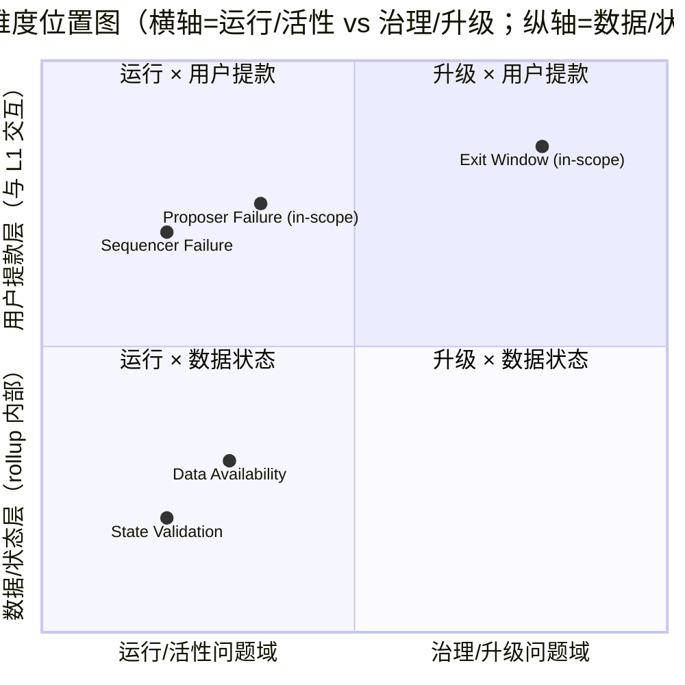
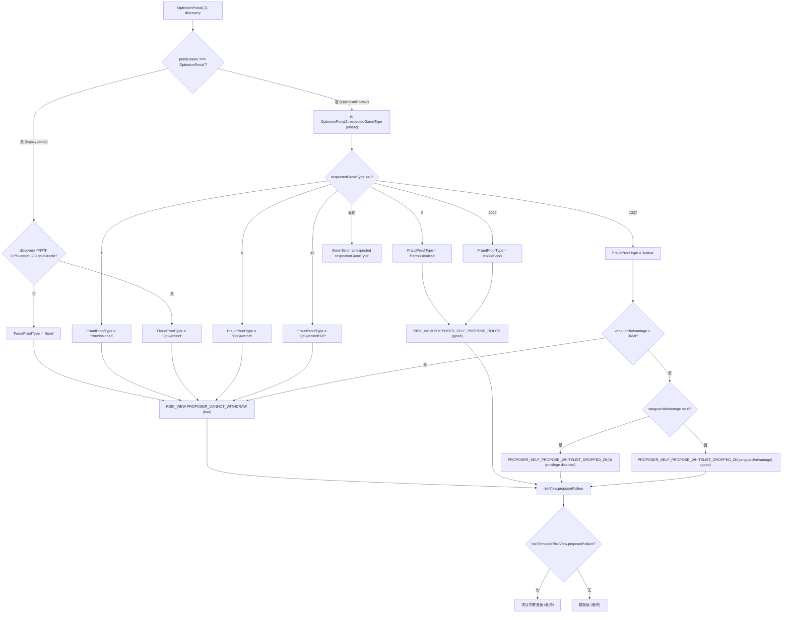
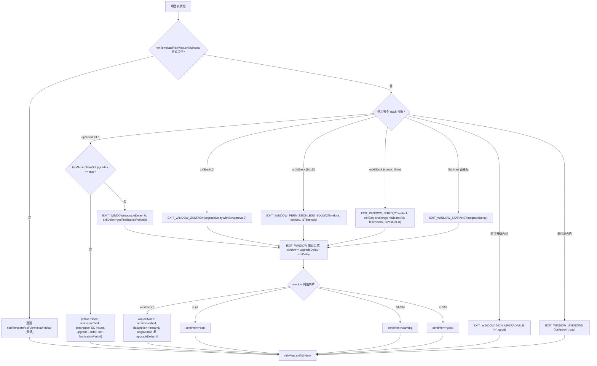
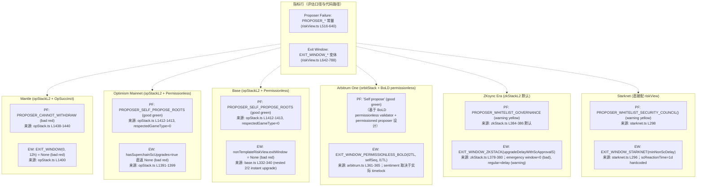

# L2Beat Risk Chart Proposer Failure 与 Exit Window 评估标准解析（Round 1 Draft）

## 1. Executive Summary

L2Beat 的 Risk Chart 把每个 rollup 在五个维度上的状态压成一个五边形：State Validation、Data Availability、Sequencer Failure、Proposer Failure、Exit Window。本研究只解构后两项的评估口径，作为下游 mantle-proposer-failure-analysis、mantle-exit-window-analysis、recommendation-proposal 三个 issue 的事实基线，**不**对 Mantle 现状本身做盘点，也**不**给出改进建议。

核心结论（皆有 commit + 行号佐证）：

1. **Risk Chart 的 sentiment 完全由 `packages/config/src/common/riskView.ts` 的常量/函数与模板判定函数决定**，与 L2Beat Stage 1/2 框架属于两套独立体系。Stage 框架中的 "Exit Window ≥ 5d"、"SC 少数派 ≥ N/2" 等阈值**不**进入 Risk Chart 的 good/warning/bad 判定。
2. **Proposer Failure** 衡量的是"proposer 停机时用户能否独立从 L2 取回资产"。L2Beat 用 `RISK_VIEW.PROPOSER_*` 系列常量/函数（riskView.ts L516-640）枚举出 13 个可能 outcome，覆盖白名单冻结、governance/SC 替换、escape hatch、permissionless self-propose 四大类。
3. **opStack 模板把 `OpSuccinct` 与 `OpSuccinctFDP` 这两种 fraud-proof type hardcode 返回 `PROPOSER_CANNOT_WITHDRAW`（opStack.ts L1438-1440）**。这是当前 OP-Succinct 类 rollup（Mantle 在 2025-09 升级到 OP Succinct 之后落入此列）的 Proposer Failure 红色判定的直接来源，与底层链上 `proposer` 字段是否为 `address(0)` 无关——模板根本没有读这个字段。
4. **Exit Window** 衡量的是"非紧急升级到生效之间，用户是否有 ≥7d 时间退出"。基础公式是 `window = upgradeDelay − exitDelay`（riskView.ts L642-687），阈值切片 `< 7d = bad / 7-30d = warning / ≥ 30d = good`，`window ≤ 0` 则显示为 `None`。
5. **opStack 模板把 `upgradeDelay` 默认 hardcode 为 0（opStack.ts L1400）**，调用 `EXIT_WINDOW(0, finalizationPeriod)`，意味着**任何**未通过 `nonTemplateRiskView.exitWindow` 显式覆盖的 opStack 项目，无论链上 Timelock 实际 `minDelay` 多大，Risk Chart 都会显示 `None` red sentiment。配合 `hasSuperchainScUpgrades = true`（opStack.ts L1391-1399）则直接返回 `None` + 自定义 description，描述"由 Security Council instantly upgrade"。
6. **三层数据来源优先级**：`nonTemplateRiskView.*`（项目方/L2Beat 团队 PR 显式覆盖）> 模板判定函数 > 模板常量。前者通过 PR 提交，后两者在 discovery 抓取后由模板加工。这是后续解释"为什么 Mantle 不能仅靠改链上参数提升评级"的关键。
7. **典型项目对照**显示三类典型差异：(a) Permissionless fault-proof 类（Optimism、Base）在 Proposer Failure 上拿 good，因为 `respectedGameType=0` 触发 `PROPOSER_SELF_PROPOSE_ROOTS`；(b) ZKStack 类（zkSync Era）在 Proposer Failure 上拿 warning（`PROPOSER_WHITELIST_GOVERNANCE`），Exit Window 因 TransactionFilterer 走专用 `EXIT_WINDOW_ZKSTACK` 公式；(c) Starknet 走 `PROPOSER_WHITELIST_SECURITY_COUNCIL()` 的 warning + `EXIT_WINDOW_STARKNET(upgradeDelay)`，前提是 SC 少数派可被 alerted 强制出块。

整篇 draft 严格遵守 outline 的 guardrails。Round 1 把 outline 中两个 open questions（Q-2.1 关于"OP Stack 6.5 年白名单失活"、Q-2.2 关于 OpSuccinct → CANNOT_WITHDRAW 的真实成因）做了源码核验，结论与后续动作记录在 §6 Gap Analysis 与 §7 Revision Log。

---

## 2. Item Findings

### item-1: L2Beat Risk Chart 五维总览与本研究的位置标定

#### 2.1.1 概念分层

L2Beat 给 rollup 用的 Risk Chart 五维度可以按"问题域"分成三层：

| 层 | 指标 | 评估的核心问题 |
|---|---|---|
| 数据 / 状态层 | **State Validation** | state root 是否经过 L1 上的 fraud / validity proof 验证 |
| 数据 / 状态层 | **Data Availability** | 用户能否独立获取重建 L2 状态所需的数据 |
| 运行 / 活性层 | **Sequencer Failure** | 排序中断时用户能否独立将交易塞入 L2 |
| 运行 / 活性层 | **Proposer Failure** | 出块停滞时用户能否独立从 L2 提款（**本研究主题之一**） |
| 治理 / 升级层 | **Exit Window** | 合约升级生效前，用户是否有足够时间退出（**本研究主题之二**） |

这五项在 `getScalingRosetteValues` 中按固定顺序渲染为五边形：sequencerFailure、stateValidation、dataAvailability、exitWindow、proposerFailure（packages/frontend/src/server/features/scaling/project/getScalingRosetteValues.ts L52-89）。前端只是把每项的 `sentiment + value + description` 透传到 UI；判定结果 100% 来自 `@l2beat/config`。

#### 2.1.2 相互依赖与本研究的边界

研究外但需要标定的两条交叉关系：

- **Proposer Failure × Exit Window 双红**：在 item-2 (e) 与 item-3 (e) 的故障树中显式衔接（详后）。当 Proposer Failure 已经红色（用户不能自助出块）、且 Exit Window 同样红色（项目方可即时改实现）时，对"proposer 停机后才发起 prove 的用户"而言资产**永久无法提取**。
- **Sequencer Failure × Proposer Failure**：若 Sequencer Failure = "No mechanism" 与 Proposer Failure = "Cannot withdraw" 同时成立，用户连发起 L2→L1 强制提款都做不到。但 Sequencer Failure 本身不在本研究 scope，仅作 context 链接。

**In scope**（本研究覆盖）：Proposer Failure 评估口径与判定（item-2、item-5）、Exit Window 评估公式与变体（item-3、item-5）、L2Beat 评估管线的数据来源与人工干预点（item-4）。

**Out of scope**（仅作 context 链接，不重新评估）：Sequencer Failure、State Validation、Data Availability 三项。L2Beat Stage 1/2 框架也不属于本研究 scope——Stage 框架中的阈值（Exit Window ≥ 5d、Security Council 少数派要求等）**不得**被用作定义 Risk Chart sentiment 阈值的依据。l2beat-stage-framework-2026 final（若需引用）仅作背景脚注，并必须显式声明"该阈值不参与 Risk Chart sentiment 判定"。

#### 2.1.3 源码索引（评估代码 vs 渲染代码）

**评估代码**（决定 sentiment 的逻辑）位于 `@l2beat/config`：

- `packages/config/src/common/riskView.ts`：RISK_VIEW 常量/函数总表（PROPOSER_*、EXIT_WINDOW_*、STATE_*、DATA_*、SEQUENCER_* 等）；本研究主要核心代码（L516-787，945 行总长）。
- `packages/config/src/templates/{opStack,orbitStack,zkStack,agglayer,nitro,...}.ts`：各 stack 默认 riskView 工厂函数，把 `discovery.getContractValue` 抓到的链上字段映射到 RISK_VIEW 常量。
- `packages/config/src/projects/{slug}/{slug}.ts`：每个项目实例化模板，可选 `nonTemplateRiskView.{proposerFailure,exitWindow,...}` 字段覆盖模板默认。
- `packages/config/src/discovery/ProjectDiscovery.ts` + `projects/{slug}/discovered.json`：链上字段抓取层。

**渲染代码**（拿 sentiment 画图）位于 `@l2beat/frontend`：

- `packages/frontend/src/server/features/scaling/project/getScalingRosetteValues.ts`：把 `risks.proposerFailure / risks.exitWindow / ...` 五项打包成 `RosetteValueTuple`。
- `packages/frontend/src/components/rosette/individual/IndividualRosetteIcon.tsx`：渲染五边形 icon。
- `packages/frontend/src/pages/scaling/risk/components/table/columns.tsx`：渲染 risk table。

判定逻辑全部在 `@l2beat/config`；frontend 仅做样式与链接，不参与 sentiment 计算。

---

### item-2: Proposer Failure 指标完整解构

#### 2.2.1 L2Beat 对 Proposer Failure 的核心考察问题

**核心问题（一句话）**：当 proposer 停止运作时，用户能否独立将 L2 资产提走？

**评估视角**：proposer 是 rollup 中负责把 L2 state root 提交到 L1 的角色——proposer 不出块即意味着 L1 上没有新 state root 可供 withdrawal proof 引用 → 用户无法完成提款。L2Beat 的关键 binary 是：是否存在 **permissionless 的备用路径**（任意人提交 proof / 任意人作 proposer / 用户凭 escape hatch 自助退出）。

**出处**：

- 常量描述文本：`packages/config/src/common/riskView.ts` L519：
  > "Only the whitelisted proposers can publish state roots on L1, so in the event of failure the withdrawals are frozen."（[permalink](https://github.com/l2beat/l2beat/blob/c4d95930574ebdab2a986e673553b1824111990a/packages/config/src/common/riskView.ts#L519)）
- 前端 column name `"Proposer failure"` 与 href：`packages/frontend/src/server/features/scaling/project/getScalingRosetteValues.ts` L83-89。

#### 2.2.2 完整 RISK_VIEW 常量与函数枚举

下表枚举 `riskView.ts` 中所有 `PROPOSER_*` 常量与函数（行号锚定 commit `c4d95930574ebdab2a986e673553b1824111990a`）：

| 序号 | 常量 / 函数 | 行号 | value（UI 文案） | sentiment | description 摘要 | 典型适用场景 |
|---|---|---|---|---|---|---|
| 1 | `PROPOSER_CANNOT_WITHDRAW` | L516-522 | "Cannot withdraw" | bad | proposer 白名单且无 fallback；withdrawals frozen | OP-Succinct / 早期 OP Stack pre-FaultProof / Permissioned dispute games / 任何无 escape hatch 的白名单 proposer 系统 |
| 2 | `PROPOSER_WHITELIST_GOVERNANCE` | L524-530 | "Replace proposer" | warning | governance 可升级替换 proposer | zkSync Era（zkStack 默认）等可由治理替换 proposer 的项目 |
| 3 | `PROPOSER_WHITELIST_SECURITY_COUNCIL(config?)` | L532-546 | "Security Council minority" | warning | SC 少数派可强制出块；`config==='METIS'` 时附加 proposer registry 文案 | Starknet（默认）、Metis（带 METIS config） |
| 4 | `PROPOSER_USE_ESCAPE_HATCH_ZK` | L548-554 | "Use escape hatch" | good | 用户可凭 ZK proof 自助退出 | termstructure、zkSwap |
| 5 | `PROPOSER_USE_ESCAPE_HATCH_MP` | L556-562 | "Use escape hatch" | good | 用户可凭 Merkle proof 自助退出 | DeGate v2/v3、DeversiFi、Layer2.Finance ZK、Loopring 等 StarkEx/Loopring 系 |
| 6 | `PROPOSER_USE_ESCAPE_HATCH_MP_NFT` | L564-570 | "Use escape hatch" | good | Merkle proof + NFTs minted on L1 to exit | CanvasConnect |
| 7 | `PROPOSER_USE_ESCAPE_HATCH_MP_AVGPRICE` | L572-578 | "Use escape hatch" | good | Merkle proof + 按 last batch avg price 平仓 | ApeX、edgeX |
| 8 | `PROPOSER_SELF_PROPOSE_WHITELIST_DROPPED(delay)` | L580-590 | "Self propose" | good | 白名单失活 `delay` 秒后任意人可作 proposer（formatter，文案带 delay 字符串） | OP Stack L3 stacked-risk 聚合（详 §2.2.3 L3 章节） |
| 9 | `PROPOSER_SELF_PROPOSE_WHITELIST_DROPPED_ZK(delay)` | L592-602 | "Self propose" | good | Kailua-style：vanguardAdvantage 期满后任意人可凭 source-available zk prover 反证或对抗 | Kailua-mode OP Stack 项目（如 ETHGate） |
| 10 | `PROPOSER_SELF_PROPOSE_WHITELIST_MAX_DELAY(delay)` | L604-614 | "Self propose" | good | 任意人对**老于 `delay`** 的 L2 块可乐观 propose | 某些 hybrid ZK rollup |
| 11 | `PROPOSER_SELF_PROPOSE_ZK` | L616-621 | "Self propose" | good | source-available prover，proposer 失败时任意人可提交 proof | StarkNet/某些 ZK rollup（非 escape hatch 路径） |
| 12 | `PROPOSER_SELF_PROPOSE_ROOTS` | L623-629 | "Self propose" | good | 任意人可作 proposer 并提交 root（permissionless fault proof） | Optimism、Base（`respectedGameType=0` Permissionless）、KailuaSoon |
| 13 | `PROPOSER_POS(stakedValidatorSetSize, validatorSetSizeCap)` | L631-640 | "Cannot withdraw" | warning（注意：与 bad 不同！） | PoS validator set；若 cap 已满则无法加入 | Polygon PoS 等 |

注意点：

- 第 13 项 `PROPOSER_POS` 的 sentiment 是 **`warning`** 而非 `bad`，与其 value 字符串 `"Cannot withdraw"` 不一致；这是源码自身的现状（riskView.ts L636-638），不要在下游 issue 把它混为 bad。
- 第 8/9/10 项是 **formatter 函数**——拿一个 `delay`（秒）参数，把 description 文案带上 `formatSeconds(delay)` 渲染，`orderHint` 即等于 `delay`。

#### 2.2.3 模板判定函数解读：opStack `getRiskViewProposerFailure`

源码：`packages/config/src/templates/opStack.ts` L1403-1442（[permalink](https://github.com/l2beat/l2beat/blob/c4d95930574ebdab2a986e673553b1824111990a/packages/config/src/templates/opStack.ts#L1403-L1442)）。

判定流程（去糖后）：

1. 先调用 `getFraudProofType(templateVars)`（opStack.ts L2360-2396），把链上字段映射为 `FraudProofType` enum：
   - 若 `portal.name === 'OptimismPortal'`（旧版 portal，无 dispute games）且 discovery 中存在 `OPSuccinctL2OutputOracle` → 返回 `'OpSuccinct'`；否则返回 `'None'`。
   - 否则读取 `OptimismPortal2.respectedGameType`（uint32），按下表映射：

     | respectedGameType | FraudProofType |
     |---|---|
     | `0` | `'Permissionless'` |
     | `1` | `'Permissioned'` |
     | `6` | `'OpSuccinct'` |
     | `42` | `'OpSuccinctFDP'` |
     | `1337` | `'Kailua'` |
     | `2000` | `'KailuaSoon'` |
     | 其他 | `throw new Error('Unexpected respectedGameType=...')` |

2. 然后 `switch` 上面的 enum：

   - `'None'` → `RISK_VIEW.PROPOSER_CANNOT_WITHDRAW`（红）
   - `'Permissioned'` → `RISK_VIEW.PROPOSER_CANNOT_WITHDRAW`（红）
   - `'Permissionless'` → `RISK_VIEW.PROPOSER_SELF_PROPOSE_ROOTS`（绿）
   - `'KailuaSoon'` → `RISK_VIEW.PROPOSER_SELF_PROPOSE_ROOTS`（绿）
   - `'Kailua'` → 读 `KailuaTreasury.vanguardAdvantage`：
     - 若 `> 365d` → `PROPOSER_CANNOT_WITHDRAW`（红）
     - 若 `== 0` → 返回 `PROPOSER_SELF_PROPOSE_WHITELIST_DROPPED_ZK(0)` + 改写 description 为"privilege disabled (not active)"（绿）
     - 否则 → `PROPOSER_SELF_PROPOSE_WHITELIST_DROPPED_ZK(vanguardAdvantage)`（绿）
   - `'OpSuccinct'` → `PROPOSER_CANNOT_WITHDRAW`（红）
   - `'OpSuccinctFDP'` → `PROPOSER_CANNOT_WITHDRAW`（红）

3. 在 `opStackL2`（L1280-1295）/`opStackL3`（L585-631）的最终装配：

   - `opStackL2.riskView.proposerFailure = templateVars.nonTemplateRiskView?.proposerFailure ?? getRiskViewProposerFailure(templateVars)`（opStack.ts L1286-1287）——项目可通过 `nonTemplateRiskView.proposerFailure` 强制覆盖。
   - `opStackL3` 在 `common.riskView` 之外提供 `stackedRiskView`，对 Proposer Failure 调用 `sumRisk(common.riskView.proposerFailure, baseChain.riskView.proposerFailure, RISK_VIEW.PROPOSER_SELF_PROPOSE_WHITELIST_DROPPED)`（opStack.ts L617-621）。`sumRisk` 行为：若两层都非 bad 且 sentiment 相同，则用 formatter 合成（`formatter(a.orderHint + b.orderHint)`）；否则取较坏一项（riskView.ts L927-945）。formatter 在此处是 `PROPOSER_SELF_PROPOSE_WHITELIST_DROPPED`——把两层 orderHint 求和后渲染成 "Anyone can become a Proposer after ${sum} of inactivity"。

#### 2.2.4 模板判定函数：其他 stack 简要对照

- **zkStack `zkStackL2`**：`exitWindow / proposerFailure` 直接 hardcode 为 `RISK_VIEW.EXIT_WINDOW_ZKSTACK(upgradeDelayWithScApprovalS)` 与 `RISK_VIEW.PROPOSER_WHITELIST_GOVERNANCE`，允许 `nonTemplateRiskView` 覆盖（zkStack.ts L378-386）。
- **orbitStack**：使用 `EXIT_WINDOW_NITRO` / `EXIT_WINDOW_PERMISSIONLESS_BOLD` 等专用变体，proposerFailure 默认由 BoLD/permissioned 状态决定，详见 orbitStack.ts（本 draft 不深挖）。
- **starkex-template / agglayer / nitro 等**：作为 context，本 draft 不展开。

#### 2.2.5 OpSuccinct → PROPOSER_CANNOT_WITHDRAW 的成因（Q-2.2 deep-round 核验）

outline 在 item-2 (d) 留下了 Q-2.2："为什么 OpSuccinct 路径下 L2Beat 判 'Cannot withdraw'？"。本 draft 在源码层面给出以下事实链：

1. **模板层**：opStack.ts L1438-1440 把 `'OpSuccinct'` 与 `'OpSuccinctFDP'` 两个 enum 直接 hardcode 映射到 `RISK_VIEW.PROPOSER_CANNOT_WITHDRAW`，**不读任何链上字段**。这意味着即使 `OPSuccinctL2OutputOracle.proposer == address(0)`（在 OP-Succinct 合约语义里通常表示"任意人都可调用 proposeL2Output"），L2Beat 的模板**仍然**会输出红色"Cannot withdraw"。
2. **链上现状（Mantle）**：`packages/config/src/projects/mantle/discovered.json` 显示 `OPSuccinctL2OutputOracle.proposer = address(0)`、`OPSuccinctL2OutputOracle.PROPOSER = address(0)`、`OPSuccinctL2OutputOracle.finalizationPeriodSeconds = 43200`（12h），`optimisticMode = false`。换言之，从合约层面看 proposer 字段是 zero address；但从 L2Beat 模板看，OpSuccinct 类型直接被判红，与该字段无关。
3. **解读**：L2Beat 当前 OpSuccinct 红判的根因不是"链上有 proposer 白名单"，而是"L2Beat 模板没有实现/接纳 OpSuccinct 的 permissionless prover 路径"。要让一个 OpSuccinct 项目在 Risk Chart 上跑出非红，目前**有且仅有两条路**：
   (a) 由项目方/L2Beat 团队提交 PR 把该项目改为通过 `nonTemplateRiskView.proposerFailure` 显式覆盖；
   (b) 等 L2Beat 修改 `getRiskViewProposerFailure` 的 `OpSuccinct` 分支语义（例如：读 `proposer` 字段，若为 zero 则视为 permissionless）。
4. **gap**：本 draft 在公开材料层面**未**找到 L2Beat 团队对"为什么 OpSuccinct 默认 CANNOT_WITHDRAW"的官方书面解释（PR description / Forum 帖 / docs）。该问题留作 §6 Gap-Q-2.2-residual，需要后续在 L2Beat Forum 直接发帖或在相关 PR 评论里追问；不影响本 draft 的结论（hardcoded 红判这一**事实**已经在源码 L1438-1440 处证实）。

#### 2.2.6 sumRisk / "6.5 年白名单失活"（Q-2.1 deep-round 核验）

outline 在 item-2 (f) Q-2.1 中悬挂一个 Round 1 撤回的 claim："OP Stack 假设 6.5 年后 proposer 白名单失活"。本 draft 在源码层面核验后给出以下结论：

1. **`sumRisk` 自身没有 6.5 年假设**：`sumRisk(a, b, formattingFunction)` 行为是——若 `a.sentiment !== 'bad' && b.sentiment !== 'bad' && a.sentiment === b.sentiment`，则返回 `formattingFunction(a.orderHint + b.orderHint)`；否则 `pickWorseRisk(a, b)`（riskView.ts L927-945）。它**不内嵌**任何固定数值。
2. **`opStackL3` 调用点**：`sumRisk(common.riskView.proposerFailure, baseChain.riskView.proposerFailure, RISK_VIEW.PROPOSER_SELF_PROPOSE_WHITELIST_DROPPED)`（opStack.ts L617-621）。这只是把两层 proposer failure 的 `orderHint`（即各层 "WHITELIST_DROPPED" formatter 的 `delay` 入参）求和后渲染——任何"X 年"数值都来自项目实际链上参数（`KailuaTreasury.vanguardAdvantage` 等），而非 hardcode。
3. **`opStack.ts` 中唯一明确的常数年值**：`Kailua` 分支判 `vanguardAdvantage > 365 * 24 * 60 * 60` 即 1 年（opStack.ts L1419-1421）；除此之外 `opStack.ts` 内未发现"6.5 年"、"6 年"、"5 年"等硬编码秒数（grep 验证：本 draft 未找到匹配 `205 * 365`、`* 6.5 *`、`6\.5 * year` 等模式）。
4. **结论**：Q-2.1 的"6.5 年假设"在 `opStack.ts` 中**不存在**。Round 1 outline 中提到的 L617-621 实际是 `opStackL3` 的 `sumRisk(...PROPOSER_SELF_PROPOSE_WHITELIST_DROPPED)` 调用——formatter 在那处只是合并 orderHint，没有"6.5 年"硬编码。Round 2 撤回该 claim 的决定**正确**。后续如果再有人提到"6.5 年白名单失活"，需要直接指出这是某个具体项目 stacked orderHint 的渲染结果，与模板逻辑无关。

#### 2.2.7 不满足判定（"Cannot withdraw" red）下用户资产的故障树

按 withdrawal 状态精确分桶。下文术语：`proveWithdrawalTransaction` / `finalizeWithdrawalTransaction` 是 `OptimismPortal{,2}` 的标准接口；OpSuccinct 项目在不开 optimisticMode 时走 ZK proof 直接 prove。

**触发条件**：proposer 私钥泄露 / 丢失 / 恶意停机 → `OPSuccinctL2OutputOracle.l2Outputs`（或 `OptimismPortal2` 上 dispute games 的 root）停止增长。

**用户分桶 A：proposer 停机前已完成 `proveWithdrawalTransaction` 的 withdrawal**

（即已针对一个**已存在的**有效 state root 调用过 `proveWithdrawalTransaction`，且对应 output 已 finalized）

- 这些 withdrawal 已经持有针对一个有效 state root 的 inclusion proof，**不会**因 proposer 停机而立即冻结。
- 只需等待 finalization window（OpSuccinct → `OPSuccinctL2OutputOracle.finalizationPeriodSeconds`；OptimismPortal2 → `proofMaturityDelaySeconds`），即可调用 `finalizeWithdrawalTransaction` 完成 L1 出款。
- 故障树终态：**可正常退出**。Proposer Failure red sentiment **不**针对这一桶。
- 边界条件：在 `finalization window` 期内，若 ProxyAdmin 升级 `OptimismPortal{,2}` 实现并改写 `finalizeWithdrawalTransaction` 拦截这部分 withdrawal——属于 **Exit Window** 维度的攻击（详 §2.3.5），不归 Proposer Failure 讨论。

**用户分桶 B：proposer 停机之后才发起 / 仅完成 `initiateWithdrawal`、尚未 prove 的 withdrawal**

- 后果链：
  1. L1 上 `OPSuccinctL2OutputOracle.l2Outputs` 不再追加新条目；同理 `OptimismPortal2` 上无新的 dispute game / output root。
  2. 用户在 L2 已发起但未 prove 的 withdrawal，**无法**在停机后的任何旧 state root 中找到 inclusion proof（其 L2 区块高度晚于最新已提交的 state root）。新发起的 withdrawal 同样无 root 可 prove。
  3. `proveWithdrawalTransaction` 调用永远 revert（"Output not found at index"），从而无法到达 `finalizeWithdrawalTransaction`。
  4. 这类用户的资产**等同冻结**，依赖 governance / ProxyAdmin 强制升级合约（替换 proposer / 强行注入 root）才能恢复。
- 这是 L2Beat "Cannot withdraw" red sentiment **真正对应的群体**。

**红色判定的精确定义**：Proposer Failure red 衡量的是"**proposer 停机后**才需要 prove 的 withdrawal 群体能否退出"，并非对所有 in-flight withdrawal 的全称否定。下游 issue（mantle-proposer-failure-analysis 等）**必须**在引用本结论时保留 A/B 双桶区分，避免把"已 prove 但未 finalize"误归为冻结。

**最坏情形**：

- 对**分桶 B**：governance 同样冻结（Exit Window = None 且 SC 失能） → 资产**永久无法提取**。这是 Proposer Failure × Exit Window 双红的最坏情形，与 §2.3.5 衔接。
- 对**分桶 A**：最坏情形是 ProxyAdmin 在 finalization window 内升级 `OptimismPortal{,2}` 实现并拦截 `finalizeWithdrawalTransaction`——但这是 **Exit Window** 维度的攻击，不是 Proposer Failure 本身后果。

#### 2.2.8 Open questions（结转给 deep round / 下游 issue）

- **Q-2.1（resolved by this draft）**：opStack.ts 不存在 hardcoded "6.5 年" 白名单失活假设；§2.2.6 已核验。该 question 关闭，结论入正文。
- **Q-2.2（partial resolution）**：源码层面证实 OpSuccinct → CANNOT_WITHDRAW 是模板 hardcoded 映射；§2.2.5 已核验。**未解决残余**：L2Beat 团队对该映射的设计意图缺乏官方书面解释。Gap 标记 §6 Gap-Q-2.2-residual。
- **Q-2.3（new, suggested for下游）**：若一个 OpSuccinct 项目通过 `nonTemplateRiskView.proposerFailure` 覆盖为 `PROPOSER_SELF_PROPOSE_ZK`（绿）或 `PROPOSER_USE_ESCAPE_HATCH_ZK`（绿），L2Beat PR review 的接受标准是什么？（这是给下游 recommendation-proposal 的开放问题，本 draft 不试图回答。）

---

### item-3: Exit Window 指标完整解构

#### 2.3.1 L2Beat 对 Exit Window 的核心考察问题

**核心问题（一句话）**：非紧急合约升级发起后，用户在升级生效前是否有足够时间将 L2 资产提取到 L1？

**评估视角**：合约可升级 → implementation 切换 → 用户提款路径可能被改写或冻结。Exit Window 度量"用户察觉升级 + 完成 L2→L1 提款"所需的最低时间余量。**关键量**：`upgradeDelay`（升级生效前的 timelock）与 `exitDelay`（用户从 L2 提款至 L1 finality 所需时间）。

**出处**：

- 基础公式：`packages/config/src/common/riskView.ts` L642-687（[permalink](https://github.com/l2beat/l2beat/blob/c4d95930574ebdab2a986e673553b1824111990a/packages/config/src/common/riskView.ts#L642-L687)）。
- 文案模板：L669-679 自动渲染 `"Users have ${windowText} to exit funds in case of an unwanted upgrade. There is a ${formatSeconds(upgradeDelay)} delay before a upgrade is applied${instantlyUpgradable}, and withdrawals can take up to ${formatSeconds(exitDelay)} to be processed."`。

#### 2.3.2 基础 EXIT_WINDOW 函数完整解读

源码精确引用（riskView.ts L642-687）：

```ts
export function EXIT_WINDOW(
  upgradeDelay: number,
  exitDelay: number,
  options: { upgradeDelay2?: number; existsBlocklist?: boolean } = {},
): TableReadyValue & { seconds?: number } {
  let window: number = upgradeDelay - exitDelay
  const windowText = window <= 0 ? 'None' : formatSeconds(window)
  if (options.upgradeDelay2 !== undefined) {
    const window2: number = options.upgradeDelay2 - exitDelay
    const windowString2 = window2 <= 0 ? 'None' : formatSeconds(window2)
    if (windowText !== windowString2) {
      window = Math.min(window, window2)
    }
  }
  let sentiment: Sentiment
  if (window < 7 * 24 * 60 * 60) {
    sentiment = 'bad'
  } else if (window < 30 * 24 * 60 * 60) {
    sentiment = 'warning'
  } else {
    sentiment = 'good'
  }
  // ... description 模板 ...
}
```

关键评估边界：

- **sentiment 阈值**：`< 7 day = bad`（L660-661）/ `7-30 day = warning`（L662-663）/ `≥ 30 day = good`（L664-665）。
- **`None` 文案**：`window ≤ 0` 时显示 `"None"`（L651）；若 `upgradeDelay === 0` 还会在 description 里附加 `"since contracts are instantly upgradable"`（L667-668）。
- **`upgradeDelay2`**：若项目有两条独立升级路径（如 emergency 路径 + regular 路径），取两个 window 中**较小者**（L652-657）。
- **`existsBlocklist`**：若存在 L1 提款黑名单（如 ZKStack 的 TransactionFilterer），description 末尾附加 `"Users can be explicitly censored from withdrawing (Blocklist on L1)."`（L677-679）。
- **`orderHint`**：直接等于 `window`（秒），用于同 sentiment 间排序（L685）。

#### 2.3.3 七类 EXIT_WINDOW 变体函数枚举

行号锚定 commit `c4d95930574ebdab2a986e673553b1824111990a`：

| 函数 | 行号 | 入参 | 适用场景 |
|---|---|---|---|
| `EXIT_WINDOW(upgradeDelay, exitDelay, options)` | L642-687 | 基础两参 + options（`upgradeDelay2`、`existsBlocklist`） | 通用基础公式；其他变体均回归到本函数 |
| `EXIT_WINDOW_ZKSTACK(upgradeDelay)` | L689-704 | upgradeDelay only | ZKStack：central operator 可经 TransactionFilterer 即时审查 → emergency window 永远为 0；若 `upgradeDelay > 0` 附加 `regular` 子字段 `formatSeconds(upgradeDelay)` warning |
| `EXIT_WINDOW_NITRO(l2Timelock, selfSeq, challenge, validatorAfk, l1Timelock, isPostBoLD)` | L706-739 | 6 参（含 BoLD flag） | Arbitrum Nitro 经典 challenge model：emergency = `EXIT_WINDOW(0, selfSeq)`、regular = `EXIT_WINDOW(l2Timelock, selfSeq)` |
| `EXIT_WINDOW_PERMISSIONLESS_BOLD(l2Timelock, selfSeq, l1Timelock)` | L741-757 | 3 参 | Arbitrum BoLD permissionless：emergency = `EXIT_WINDOW(0, selfSeq)`、regular = `EXIT_WINDOW(l2Timelock + l1Timelock, selfSeq)` |
| `EXIT_WINDOW_NON_UPGRADABLE` | L759-765 | 无 | 不可升级合约："∞" good sentiment |
| `EXIT_WINDOW_UNKNOWN` | L767-773 | 无 | 未验证合约："Unknown" bad sentiment |
| `EXIT_WINDOW_STARKNET(upgradeDelay)` | L775-788 | upgradeDelay only | StarkNet：SC minority 反应时间 hardcoded `scReactionTime = 1 day`；emergency = `EXIT_WINDOW(0, scReactionTime)`、regular = `EXIT_WINDOW(upgradeDelay, scReactionTime)` |

辅助函数 `withRegularExitWindow(emergency, regular)`（L790-798）：把 emergency `TableReadyValue` 与 regular `{value, sentiment}` 打包成 `ExitWindowRisk`，用于支持双子字段 UI 显示。

非对称结构：ZKStack、Nitro、PermissionlessBoLD、StarkNet 这四类均区分"紧急路径（SC instant / TransactionFilterer / 等）"vs"常规路径（timelock）"。Risk Chart 默认显示 emergency window（即整体 sentiment），regular 是次要 UI 显示。

#### 2.3.4 模板判定函数：opStack `getRiskViewExitWindow`

源码：`packages/config/src/templates/opStack.ts` L1387-1401（[permalink](https://github.com/l2beat/l2beat/blob/c4d95930574ebdab2a986e673553b1824111990a/packages/config/src/templates/opStack.ts#L1387-L1401)）：

```ts
function getRiskViewExitWindow(
  templateVars: OpStackConfigCommon,
): TableReadyValue {
  const finalizationPeriod = getFinalizationPeriod(templateVars)
  if (templateVars.hasSuperchainScUpgrades) {
    return {
      value: 'None',
      description:
        'There is no exit window for users to exit in case of unwanted upgrades as they are initiated by the Security Council with instant upgrade power and without proper notice.',
      sentiment: 'bad',
      orderHint: -finalizationPeriod,
    }
  }
  return RISK_VIEW.EXIT_WINDOW(0, finalizationPeriod)
}
```

关键事实：

1. **`upgradeDelay` 默认 hardcode 为 0**（L1400）。这意味着即使项目链上 Timelock `minDelay` 非 0，**只要没有通过 `nonTemplateRiskView.exitWindow` 覆盖**，Risk Chart 都会显示 `value: 'None'` red sentiment + description 附加 `"since contracts are instantly upgradable"`。
2. **`hasSuperchainScUpgrades` 直返分支**：若项目设置该 flag（Optimism 主网设了 `hasSuperchainScUpgrades: true`，optimism.ts L124），直接返回自定义 None description "由 Security Council instantly upgrade"，**不**调用 `EXIT_WINDOW(0, ...)`，**不**走基础公式。
3. **`getFinalizationPeriod`** 按 fraud-proof type 读不同合约字段（opStack.ts L2249-2280）：

   | FraudProofType | 字段读取 |
   |---|---|
   | `'None'` | `L2OutputOracle.FINALIZATION_PERIOD_SECONDS` |
   | `'Permissioned'`、`'Permissionless'`、`'Kailua'`、`'KailuaSoon'`、`'OpSuccinctFDP'` | `OptimismPortal2.proofMaturityDelaySeconds` |
   | `'OpSuccinct'` | `OPSuccinctL2OutputOracle.finalizationPeriodSeconds` |

4. **`stackExitWindowRisk`**（riskView.ts L911-925）：在 `opStackL3` 中调用，用于将 L3 与 host chain 的 exit window 合并 → 取较坏者；若两层都有 `regular` 子字段则保留两者打包，否则 drop regular。
5. **覆盖路径**：`opStackL2.riskView.exitWindow = templateVars.nonTemplateRiskView?.exitWindow ?? getRiskViewExitWindow(templateVars)`（opStack.ts L1283-1284）。项目方/L2Beat 团队通过 `nonTemplateRiskView.exitWindow` 显式覆盖是唯一在 opStack 下"非 hardcode 0"的渠道。

#### 2.3.5 不满足判定（"None" red）下用户资产的故障树

**触发条件**：ProxyAdmin owner 发起恶意 / 瑕疵升级（implementation 切换、proposer registry 改写、vkey 替换、`finalizeWithdrawalTransaction` 拦截、pause 滥用 等）。

**后果链（按时间序）**：

1. 链上升级 transaction 进入 mempool（若 `upgradeDelay = 0`） / 进入 Timelock queue（若 `upgradeDelay > 0`）。
2. 用户从社交渠道察觉的延迟（典型 5-30 分钟到几小时）远小于 finalization period（opStack/OpSuccinct 默认 ≥ 1h，Mantle 当前 12h）。
3. 用户即使立即在 L2 发起新的 withdrawal、也无法在升级生效前完成 L2-to-L1 finality（因为还要等 finalization period）。
4. 升级生效后：用户提款路径可能被
   (a) **改写**：implementation 中删除 / 拦截 `finalizeWithdrawalTransaction`；
   (b) **冻结**：`PauseManager.pause()` 或 `SuperchainConfig` paused 状态扩展；
   (c) **重定向**：implementation 把 escrow 资金转走（极端情况，需要恶意 ProxyAdmin 配合恶意 implementation）。

**与 Proposer Failure 双红的最坏情形**：

- Proposer Failure red（分桶 B：proposer 停机后才需要 prove 的用户）+ Exit Window None（项目方/SC 可即时改实现）→ 这部分用户的资产**永久无法提取**。这是 OpSuccinct 类项目（含 Mantle 在 OP Succinct 升级后的现状）面临的最坏组合，但本研究**不**对 Mantle 自身做盘点，仅给出 framework。

**Exit Window red 不涵盖的边界**：

- 若升级是"良性"的（项目方公开 timelock、未在窗口期内执行有害升级），用户损失仅是"曾经处于高风险窗口"，并非实际资产损失。
- L2Beat 评估的是**结构性能力**（项目方**能不能**这样做），不评估**意愿**（项目方**会不会**这样做）。这与 audit/governance 维度的"可信治理"评估不同——Risk Chart 的口径是 trust-minimization，假定最坏的 ProxyAdmin 行为。

---

### item-4: L2Beat 评估管线的数据来源、自动化程度与人工干预点

#### 2.4.1 数据流拓扑（自下而上）

```
[链上层]
  Etherscan / RPC
        │
        ▼
[Discovery 层]
  packages/config/src/discovery/ProjectDiscovery.ts
    - new ProjectDiscovery('{slug}')
    - discovery.getContract('Name')
    - discovery.getContractValue<T>('Name', 'field')
        │
        ▼
[配置快照]
  packages/config/src/projects/{slug}/discovered.json   (auto-generated)
  packages/config/src/projects/{slug}/config.jsonc       (manual rules)
  packages/config/src/projects/{slug}/diffHistory.md     (auto change log)
        │
        ▼
[模板层]
  packages/config/src/templates/{opStack,zkStack,orbitStack,nitro,agglayer,starkex,...}.ts
    - 工厂函数 opStackL2 / zkStackL2 / orbitStackL2 / ...
    - 内部调用 getRiskView*、getFraudProofType、getFinalizationPeriod 等
        │
        ▼
[覆盖层]
  projects/{slug}/{slug}.ts 中 nonTemplateRiskView?.{proposerFailure,exitWindow,...}
        │
        ▼
[聚合层]
  ScalingProject.riskView = { stateValidation, dataAvailability, sequencerFailure,
                              proposerFailure, exitWindow }
        │
        ▼
[前端层]
  packages/frontend/src/server/features/scaling/project/getScalingRosetteValues.ts
  packages/frontend/src/components/rosette/individual/IndividualRosetteIcon.tsx
  packages/frontend/src/pages/scaling/risk/components/table/columns.tsx
```

#### 2.4.2 三层优先级与人工干预点

**优先级**（从高到低）：

1. **`nonTemplateRiskView.{field}`**（项目方/L2Beat 团队显式 PR）——always wins。
2. **模板判定函数返回值**（如 `getRiskViewProposerFailure`、`getRiskViewExitWindow`）——读 discovery 字段、按 enum switch。
3. **RISK_VIEW 常量直接引用**——某些项目（如 Starknet `proposerFailure: RISK_VIEW.PROPOSER_WHITELIST_SECURITY_COUNCIL()`）跳过模板，直接在 `{slug}.ts` 中赋值。

**项目方可影响评级的两条路径**：

- (a) **改链上参数**：仅当该字段被 `getRiskView*` 函数显式读且模板逻辑会因此切换 enum 分支时有效。例：把 `OPSuccinctL2OutputOracle.finalizationPeriodSeconds` 从 12h 改为 7h——`getFinalizationPeriod` 会自动反映，但 Exit Window sentiment 仍是 red（因为 `EXIT_WINDOW(0, 7h)` 的 window = -7h ≤ 0 → None）。**对 OpSuccinct 项目，改链上 finalizationPeriod 不会让 Exit Window 跳出 red**。
- (b) **提 PR 到 l2beat/l2beat**：覆盖 `nonTemplateRiskView.exitWindow` 或 `nonTemplateRiskView.proposerFailure`、或修改模板内部的 enum/switch 分支。例：Base 通过 `nonTemplateRiskView.exitWindow` 把 Exit Window 描述改为"由 Coordinator + SC 2/2 nested instantly upgrade"（base.ts L332-340）——sentiment 仍是 bad，但 description 更准确。

**L2Beat 团队的人工 review**：

- 对项目 PR 的合并把关（包括 `nonTemplateRiskView` 覆盖是否与链上事实一致）。
- 周期性 risk view audit（参考 diffHistory.md）。
- Forum 上对"评级争议"的公开处理（参考 src-6）。

#### 2.4.3 Proposer Failure / Exit Window 字段：自动 vs 人工

| 指标 | 字段 / enum | 数据源 | 更新方式 | 自动反映链上变化？ |
|---|---|---|---|---|
| Proposer Failure | `respectedGameType`（决定 FraudProofType enum） | `OptimismPortal2.respectedGameType` discovery 自动抓取 | 链上变更自动反映 | ✅ |
| Proposer Failure | `'OpSuccinct'`/`'OpSuccinctFDP'` → CANNOT_WITHDRAW | opStack.ts L1438-1440 hardcoded enum 分支 | 改变需要 PR 修改模板 | ❌（模板 hardcode） |
| Proposer Failure | `KailuaTreasury.vanguardAdvantage` | discovery 自动抓取 | 链上变更自动反映 | ✅ |
| Proposer Failure | nonTemplateRiskView.proposerFailure | 项目方/L2Beat 团队 PR | 提交 PR | ❌ |
| Exit Window | `finalizationPeriodSeconds`（OpSuccinct）/ `proofMaturityDelaySeconds`（OptimismPortal2）/ `FINALIZATION_PERIOD_SECONDS`（L2OutputOracle） | discovery 自动抓取 | 链上变更自动反映 | ✅ |
| Exit Window | opStack 模板 `upgradeDelay = 0` hardcode | opStack.ts L1400 | 需要 nonTemplateRiskView.exitWindow 覆盖 | ❌（模板 hardcode） |
| Exit Window | `hasSuperchainScUpgrades` | 项目 `{slug}.ts` 中手动设 | 手动 PR | ❌ |
| Exit Window | nonTemplateRiskView.exitWindow | 项目方/L2Beat 团队 PR | 提交 PR | ❌ |

**洞察（供下游 issue 引用）**：对 OP Stack（含 OpSuccinct 子模板）项目而言，**Proposer Failure 与 Exit Window 都属于"模板 hardcode 决定大方向、链上变更只能微调细节"的格局**。要让评级跳出 red，几乎必然需要走 PR 路径（路径 b）；纯改链上参数（路径 a）能改变 sentiment 颜色的可能性极低。

#### 2.4.4 `discovered.json` / `diffHistory.md` 的作用

- **`discovered.json`**：`ProjectDiscovery` 周期性抓取的链上快照，记录所有相关合约字段最新值。模板代码通过 `discovery.getContractValue<T>('Name', 'field')` 访问。文件可能数千行，是评估的"事实源"。
- **`diffHistory.md`**：自动记录 `discovered.json` 每次更新的 diff，对 audit 与争议 trail 有重要价值。例：可追溯"某项目何时从 Permissioned 切换到 Permissionless"。
- **Mantle 当前快照**（仅作 item-4 数据源拓扑的实证锚点，不深入分析）：
  - `OPSuccinctL2OutputOracle.finalizationPeriodSeconds = 43200`（12h）
  - `OPSuccinctL2OutputOracle.proposer = address(0)`、`PROPOSER = address(0)`
  - `OPSuccinctL2OutputOracle.optimisticMode = false`
  - 文件路径：`packages/config/src/projects/mantle/discovered.json`

#### 2.4.5 争议与边界 cases

- **评级滞后**：若链上参数变更但模板 enum 映射未更新，前端会显示旧 sentiment。例：理论上一个 OpSuccinct 项目把 proposer 改为 address(0) → 期待"任意人可 propose with valid proof" → 但 L2Beat 模板**仍**判 CANNOT_WITHDRAW（§2.2.5 已证）。
- **争议处理流程**：项目方一般在 L2Beat Forum (https://forum.l2beat.com) 发帖请求重审；L2Beat 团队评论 → 项目方提 PR → review → 合并。Mantle 自身的相关 Forum 帖详见后续 src-6 列表（本 draft 未深挖）。

---

### item-5: 典型项目评级对比（OR vs ZK Validity vs ZK ZKSync vs Starknet）

#### 2.5.1 对照项目集

以下 6 个项目覆盖三类典型 + Mantle baseline + Starknet 异类：

| 项目 | Stack 模板 | 主要 FraudProofType / 等价物 |
|---|---|---|
| Mantle | `opStackL2` | `OpSuccinct`（validity proof，模板 hardcoded CANNOT_WITHDRAW） |
| Optimism Mainnet | `opStackL2` | `Permissionless`（`respectedGameType=0`，但 `hasSuperchainScUpgrades=true`） |
| Base | `opStackL2` | `Permissionless`（`respectedGameType=0`），exitWindow 经 `nonTemplateRiskView` 显式覆盖 |
| Arbitrum One | 自定义（非 opStackL2） | BoLD permissionless；exitWindow 用 `EXIT_WINDOW_PERMISSIONLESS_BOLD` |
| ZKsync Era | `zkStackL2` | 不适用 fault-proof；走 `EXIT_WINDOW_ZKSTACK` |
| Starknet | 直接配 riskView | 不适用 fault-proof；走 `EXIT_WINDOW_STARKNET` |

#### 2.5.2 对比矩阵（基于 commit `c4d9593`）

| 项目 | Proposer Failure 常量 / 表达式 | Proposer Failure 文案 (`value`) | Proposer Failure sentiment | Exit Window 表达式 | Exit Window 文案 (`value`) | Exit Window sentiment | 关键差异化因素 |
|---|---|---|---|---|---|---|---|
| **Mantle** | `getRiskViewProposerFailure → 'OpSuccinct' → PROPOSER_CANNOT_WITHDRAW` (opStack.ts L1438-1440) | "Cannot withdraw" | **bad** | `getRiskViewExitWindow → EXIT_WINDOW(0, 43200s)` (opStack.ts L1400) | "None" | **bad** | OP-Succinct 模板 hardcoded；无 `nonTemplateRiskView` 覆盖；无 `hasSuperchainScUpgrades` flag |
| **Optimism Mainnet** | `getRiskViewProposerFailure → 'Permissionless' → PROPOSER_SELF_PROPOSE_ROOTS` (opStack.ts L1412-1413) | "Self propose" | **good** | `getRiskViewExitWindow → hasSuperchainScUpgrades=true 分支 → 'None'` (opStack.ts L1391-1399) | "None" | **bad** | `respectedGameType=0`；Superchain SC instant-upgrade flag = true（optimism.ts L124） |
| **Base** | `getRiskViewProposerFailure → 'Permissionless' → PROPOSER_SELF_PROPOSE_ROOTS` | "Self propose" | **good** | `nonTemplateRiskView.exitWindow = { value: 'None', sentiment: 'bad', ... }`（base.ts L332-340，描述写明"nested 2/2 multisig 即时升级"） | "None" | **bad** | `respectedGameType=0`；`nonTemplateRiskView.exitWindow` 显式覆盖（说明 2/2 nested instant upgrade） |
| **Arbitrum One** | (基于 BoLD permissioned proposer + AssertionInbox permissionless validator) | "Self propose" (估算；非 opStack 模板，需要查 orbitStack.ts) | **good** (估算) | `EXIT_WINDOW_PERMISSIONLESS_BOLD(l2Timelock, selfSeq, l1Timelock)` (arbitrum.ts L361-365) | 经公式渲染（取决于 `l2Timelock + l1Timelock − selfSeq`） | **warning / good** (取决于实际参数) | 双层 timelock（L1 + L2）+ permissionless BoLD challenge |
| **ZKsync Era** | `zkStackL2` 默认：`PROPOSER_WHITELIST_GOVERNANCE` (zkStack.ts L384-386) | "Replace proposer" | **warning** | `zkStackL2` 默认：`EXIT_WINDOW_ZKSTACK(upgradeDelayWithScApprovalS)` (zkStack.ts L378-380) | "0d"（emergency）/ `formatSeconds(delay)`（regular） | **bad（emergency）/ warning（regular）** | TransactionFilterer 可即时审查；emergency window 永远为 0；不走 escape hatch 路径 |
| **Starknet** | 直接配：`PROPOSER_WHITELIST_SECURITY_COUNCIL()` (starknet.ts L298) | "Security Council minority" | **warning** | 直接配：`EXIT_WINDOW_STARKNET(minNonScDelay)` (starknet.ts L296) | `formatSeconds(minNonScDelay − 1d)` 或 None | 视 `minNonScDelay` 而定 | SC 少数派 1d 反应时间 hardcoded 在 `EXIT_WINDOW_STARKNET` 中（riskView.ts L776） |

**注 1**：ZKsync Era 不使用 escape hatch——`PROPOSER_USE_ESCAPE_HATCH_*` 的实际用户是 StarkEx 系（dYdX、ApeX、DeversiFi、CanvasConnect 等）与 Loopring/zkSwap/DeGate 系。outline 中 item-5(c) 提到的 "zkSync ✅ via escape hatch" 表述与源码不符，**本 draft 在 §2.5.4 矫正**。

**注 2**：Arbitrum One 的具体 sentiment 取决于实时的 timelock 配置。本 draft 不深挖，但展示其与 OP Stack 差异（`EXIT_WINDOW_PERMISSIONLESS_BOLD` vs `EXIT_WINDOW(0, finalizationPeriod)`）。

#### 2.5.3 差异化驱动归类

**Proposer Failure 差异化驱动**：

- 是否存在 **permissionless prover / proposer 路径**：
  - **有**（绿）：Optimism Mainnet（`respectedGameType=0`）、Base（同）、KailuaSoon、Kailua（`vanguardAdvantage ≤ 1y`）、Arbitrum BoLD。
  - **无**（红）：Mantle（OpSuccinct，模板 hardcoded）、所有 Permissioned / None / OpSuccinct / OpSuccinctFDP。
- 是否存在 **governance / SC fallback**：
  - **有**（warning）：zkSync Era（`PROPOSER_WHITELIST_GOVERNANCE`）、Starknet（`PROPOSER_WHITELIST_SECURITY_COUNCIL`）、Metis（`PROPOSER_WHITELIST_SECURITY_COUNCIL('METIS')`）。
  - **无**（red）：Mantle 等 OpSuccinct 项目；模板未把 governance 替换 proposer 表达为 PROPOSER_WHITELIST_GOVERNANCE，因此当前 OpSuccinct → CANNOT_WITHDRAW 红。
- **白名单失活机制**：
  - **Kailua `vanguardAdvantage` drop** 是已有源码路径（opStack.ts L1414-1435）。
  - **outline 中提到的"OP Stack 6.5 年白名单失活假设"在 `opStack.ts` 中不存在**（§2.2.6 已核验）；该 claim 已撤回，不进入对比矩阵。

**Exit Window 差异化驱动**：

- 是否人工配置 `nonTemplateRiskView.exitWindow`：
  - **是**（描述准确，但 sentiment 不一定改善）：Base（描述 nested 2/2）、Arbitrum One（用 BoLD 公式）。
  - **否**（走模板 hardcoded `EXIT_WINDOW(0, finalizationPeriod)`）：Mantle、其他 OpStack 默认项目。
- **L1 / L2 timelock 实际配置**：
  - **多层 timelock**：Arbitrum One（L1 + L2 双层）、ZKsync Era（含 SC 审批步骤）。
  - **单层或无**：OpStack 默认（hardcode = 0）。
- **SC instant-upgrade 权限**：
  - Optimism Mainnet 设 `hasSuperchainScUpgrades=true` → 直接 'None' + 自定义描述。
  - Base 在 `nonTemplateRiskView.exitWindow` 中描述同等效果。
- **TransactionFilterer 等 censorship vector**：
  - 仅 ZKStack 类项目存在（`EXIT_WINDOW_ZKSTACK` 处理）。
  - OP Stack 不存在；不进入 EXIT_WINDOW 计算。

#### 2.5.4 outline `item-5(c)` 关于 zkSync escape hatch 的矫正

outline §item-5(c) 写："是否存在 permissionless prover 路径（OpSuccinct ❌ / Arbitrum BoLD ✅ / zkSync ✅ via escape hatch）"。源码核验结论（Round 1 deep round）：

- **zkSync Era 实际使用** `PROPOSER_WHITELIST_GOVERNANCE`（zkStack.ts L384-386 默认 + zksync2.ts 无覆盖），sentiment = **warning**，不是 escape hatch good。
- **`PROPOSER_USE_ESCAPE_HATCH_*` 的实际用户**：StarkEx 系（ApeX、DeversiFi、CanvasConnect、edgeX）、Loopring 系（Loopring、DeGate v2/v3、Layer2.Finance ZK、zkSwap、termstructure）。
- 因此正确表述应是："permissionless prover/proposer 路径（OpSuccinct ❌ / Arbitrum BoLD ✅ via permissionless validator / zkSync ❌（仅 governance fallback warning）；escape hatch 路径主要由 StarkEx + Loopring 系采用）"。

本矫正不改变 outline 主结论，仅修正"评级提升路径"分类中的 zkSync 错位。下游 issue 应直接引用本 draft §2.5.3 与 §2.5.4 而非 outline §item-5(c) 的原文。

#### 2.5.5 可复制的"评级提升路径"分类（框架描述，**不**给出 Mantle 具体方案）

| 路径 | 触发评级变化的关键 | 需要的 L2Beat 配置变更 | 潜在副作用 |
|---|---|---|---|
| **A. 引入 permissionless prover / proposer 路径** | 链上：`respectedGameType` 切到 `0`（Permissionless）或部署 KailuaSoon；或对 OpSuccinct 而言，把 `proposer` 设 `address(0)` **并**在模板里增加 enum 分支 | (a) 链上参数 + (b) 模板/项目 PR | bond 经济参数、proposer 资格变更、proof 系统成本 |
| **B. 配置 ≥7d upgradeDelay + 通过 `nonTemplateRiskView.exitWindow` 覆盖** | L1 部署 Timelock + 把所有 ProxyAdmin owner 改为 Timelock；提 PR 显式覆盖 Exit Window | (a) 链上 Timelock 部署 + (b) 项目 PR 覆盖 `nonTemplateRiskView.exitWindow` | 紧急响应能力下降；治理流程变长 |
| **C. 部署 escape hatch（ZK proof / Merkle proof）** | 合约层实现 escape hatch 接口；用 `PROPOSER_USE_ESCAPE_HATCH_*` 覆盖 | 合约升级 + nonTemplateRiskView PR | 仅 StarkEx/Loopring 类架构容易实施；通用 OP Stack 无现成实现 |
| **D. 引入 Security Council + minority 强制出块路径** | 部署 SC + 把 proposer 改为 SC 控制的合约；用 `PROPOSER_WHITELIST_SECURITY_COUNCIL[(MD)]` 或 Starknet 类 EXIT_WINDOW_STARKNET 覆盖 | 治理 + SC 合约部署 + nonTemplateRiskView PR | 增加治理复杂度；SC 自身可信度成为新依赖 |

每条路径仅作框架描述；具体 Mantle 应走哪条由下游 recommendation-proposal issue 决定。

#### 2.5.6 与下游 issue / 历史 final 的接口

- **mantle-proposer-failure-analysis** 应直接引用 §2.2.3（模板判定流程）、§2.2.5（OpSuccinct → CANNOT_WITHDRAW 成因）、§2.2.7（双桶故障树）、§2.5.3（Proposer Failure 差异化驱动）。
- **mantle-exit-window-analysis** 应直接引用 §2.3.2（基础公式）、§2.3.4（opStack hardcoded upgradeDelay=0）、§2.4.3（Exit Window 自动 vs 人工字段对照）、§2.5.3（Exit Window 差异化驱动）。
- **recommendation-proposal** 应直接引用 §2.5.5（可复制路径分类）并结合上述两个 analysis issue 的具体根因。
- **stage1-roadmap-recommendation 历史 final 仅作可选 pointer note**：该 final 属于 Stage 框架范畴，与本研究 Risk Chart sentiment 判定无直接关系。若 deep round 需要在某条路径旁补充 Stage 体系的背景脚注，可以 pointer note 形式（"参见 stage1-roadmap-recommendation final"）引用，但**不得**将其结论作为 Risk Chart 路径定义依据。

---

## 3. Diagrams

### diag-1 (item-1): L2Beat Risk Chart 五维总览二维位置图



**注释**：

- 本研究 in-scope 是 `Proposer Failure`（运行/用户提款交集）与 `Exit Window`（治理/用户提款交集）。
- 两者的交集区（右上）= **Proposer Failure × Exit Window 双红**的"用户提款全冻"极端情形——对分桶 B 用户（§2.2.7）资产永久无法提取。
- 其他三项以 context 形式存在，本研究**不**重新评估。

### diag-2 (item-2): Proposer Failure 判定流程图



**关键标注**：

- OpSuccinct (6) 与 OpSuccinctFDP (42) → CANNOT_WITHDRAW（红）是**模板 hardcoded enum 分支**，不读 OPSuccinctL2OutputOracle 的 proposer 字段（§2.2.5）。
- 本图**不**包含 outline 中已撤回的"OP Stack 6.5 年白名单失活"sumRisk 旁注（Q-2.1 在 §2.2.6 已 close）。
- `opStackL3` stacked-risk 走 `sumRisk(...PROPOSER_SELF_PROPOSE_WHITELIST_DROPPED)` formatter——orderHint 求和，非 hardcoded 年数。

### diag-3 (item-3): Exit Window 计算逻辑图



**关键标注**：

- opStack 模板将 `upgradeDelay` **hardcoded 为 0**（opStack.ts L1400），是大量 OP Stack / OpSuccinct 项目 Exit Window 红判的直接原因。
- `hasSuperchainScUpgrades=true` 直返 None 分支不调 `EXIT_WINDOW`（opStack.ts L1391-1399），描述为"SC instant upgrade"。
- 多变体函数（ZKSTACK / NITRO / PERMISSIONLESS_BOLD / STARKNET）均区分 emergency vs regular 双 window，UI 默认显 emergency。

### diag-4 (item-4): L2Beat 评估管线数据流拓扑

```mermaid
flowchart LR
    CHAIN["链上 (Etherscan / RPC)"] --> DISC["ProjectDiscovery\npackages/config/src/discovery/ProjectDiscovery.ts"]
    DISC --> SNAPSHOT["discovered.json (auto)\npackages/config/src/projects/{slug}/discovered.json"]
    DISC --> CONFIG["config.jsonc (manual rules)\npackages/config/src/projects/{slug}/config.jsonc"]
    SNAPSHOT --> DIFF["diffHistory.md (auto change log)"]

    SNAPSHOT --> TPL["模板层\npackages/config/src/templates/{opStack,zkStack,orbitStack,...}.ts"]
    TPL --> TPL_FN["getRiskViewProposerFailure / getRiskViewExitWindow\n+ getFraudProofType + getFinalizationPeriod\n(opStack.ts L1387-1442, L2249-2396)"]

    TPL_FN --> AGGR["ScalingProject.riskView 聚合"]
    NTPL["nonTemplateRiskView.{proposerFailure,exitWindow,...}\nprojects/{slug}/{slug}.ts (manual PR)"] --> AGGR
    NTPL_NOTE["人工填写: 优先级最高"]
    NTPL_NOTE -.-> NTPL

    AGGR --> PROC["@l2beat/config 输出"]
    PROC --> FE_AGG["packages/frontend/src/server/features/scaling/project/getScalingRosetteValues.ts"]
    FE_AGG --> FE_RENDER["前端 UI\n- IndividualRosetteIcon.tsx (五边形)\n- columns.tsx (table)"]

    classDef auto fill:#cef,stroke:#369;
    classDef manual fill:#fdc,stroke:#963;
    classDef render fill:#efe,stroke:#393;
    class CHAIN,DISC,SNAPSHOT,DIFF auto;
    class CONFIG,NTPL,NTPL_NOTE manual;
    class FE_AGG,FE_RENDER render;
```



**关键标注**：

- **蓝色 = 自动**（discovery 抓取、diff 记录）。
- **橙色 = 人工**（config.jsonc discovery 规则、`nonTemplateRiskView` 覆盖）。
- **绿色 = 渲染**（不参与评估逻辑）。
- 评估管线核心是中间一层（templates + nonTemplateRiskView 覆盖）。

### diag-5 (item-5): 典型项目 Proposer Failure × Exit Window 评级对照矩阵



**对照解读**：

- Mantle 双红是模板 hardcoded + 缺少 `nonTemplateRiskView` 覆盖的直接结果。
- Optimism / Base 在 Proposer Failure 维度上拿绿，但 Exit Window 同样红（不同根因：Optimism 用 flag、Base 用 `nonTemplateRiskView` 显式描述 nested SC instant-upgrade）——这说明 Exit Window 与 Proposer Failure 是**独立**两条评估线，一个改善不必然带动另一个。
- ZKsync Era 与 Starknet 在 Proposer Failure 都拿 warning（governance / SC fallback），但路径完全不同（一个走 governance 替换，一个走 SC 强制出块）。

---

## 4. Source Coverage

| 源码要求 ID | 类型 | 描述 | 引用 | 是否覆盖 |
|---|---|---|---|---|
| src-1 | code_analysis | `riskView.ts` 中 PROPOSER_* 与 EXIT_WINDOW_* 常量/函数定义 | §2.2.2、§2.3.2、§2.3.3；[riskView.ts permalink @ c4d9593](https://github.com/l2beat/l2beat/blob/c4d95930574ebdab2a986e673553b1824111990a/packages/config/src/common/riskView.ts) | ✅（行号锚定 L516-787，含 13 个 PROPOSER 与 7 类 EXIT_WINDOW） |
| src-2 | code_analysis | `opStack.ts` 中 getRiskViewProposerFailure、getRiskViewExitWindow、getFraudProofType、getFinalizationPeriod、stackExitWindowRisk、sumRisk；建议附 orbitStack/zkStack 对照 | §2.2.3、§2.2.4、§2.2.6、§2.3.4；[opStack.ts permalink @ c4d9593](https://github.com/l2beat/l2beat/blob/c4d95930574ebdab2a986e673553b1824111990a/packages/config/src/templates/opStack.ts)；zkStack.ts §2.5.2 与 §2.5.3 | ✅（opStack 5 个函数全覆盖 + zkStack 默认引用 + arbitrum/starknet 模式引用） |
| src-3 | code_analysis | l2beat/l2beat 仓库 packages/config/src/projects/mantle/ 四文件作为 item-4 数据源拓扑实证锚点 | §2.4.4；`mantle/discovered.json`、`mantle/mantle.ts`、`mantle/config.jsonc`、`mantle/diffHistory.md`（仅作为引用，不深入分析 Mantle） | ✅ |
| src-4 | code_analysis | frontend Risk Chart 渲染相关文件 | §2.1.3、§2.4.1；[getScalingRosetteValues.ts permalink @ c4d9593](https://github.com/l2beat/l2beat/blob/c4d95930574ebdab2a986e673553b1824111990a/packages/frontend/src/server/features/scaling/project/getScalingRosetteValues.ts) | ✅（仅引用渲染层；本研究不深挖前端） |
| src-5 | official_docs | L2Beat 官方网站 Mantle 项目页快照、Stages 文档、Risk Analysis methodology | 计划在 §6 Gap Analysis 中标记 — **本 round 未抓取**（需要 web fetch 与 archived URL） | ⚠️ partial（仅源码层覆盖；docs/site 快照见 Gap §6.1） |
| src-6 | governance_proposals | L2Beat Forum 一手帖子（评估方法、Proposer/Exit Window 评估口径变更） | **本 round 未抓取**；见 Gap §6.2 | ⚠️ partial |
| src-7 | optional_context | l2beat-stage-framework-2026 final 作背景脚注（**禁止**用 Stage 阈值定义 Risk Chart sentiment） | §2.1.2、§2.5.6 提到引用规则，但本 draft **不**实际引用 Stage 阈值——符合 guardrail | ✅（按 outline，src-7 是 optional，min_count=0） |
| src-8 | code_analysis | 对比项目源码（optimism、base、arbitrum、zksync2、starknet）至少 3 个 | §2.5.2、§2.5.3；optimism.ts L124、base.ts L332-340、arbitrum.ts L361-365、starknet.ts L296-298、zksync2.ts（无覆盖，inherits zkStackL2 默认） | ✅（5 个项目全覆盖） |

**总结**：源码层（src-1、2、3、4、8）全覆盖；官方网站快照与 Forum 帖（src-5、6）本 round 未抓取，标记为 partial，详 §6 Gap Analysis。outline 对 src-5/6 的 min_count 是 3/2，本 round 仅在源码层完整核验；下游 round-2 revision（若 review 要求）或下游 issue 可补充。

---

## 5. Gap Analysis

### 6.1 src-5（L2Beat 官方页面/docs 快照）未在本 round 抓取

- **gap**：L2Beat 官方 Mantle 项目页（https://l2beat.com/scaling/projects/mantle#risk-analysis）、L2Beat Stages 文档、L2Beat Risk Analysis methodology 页未在本 round 抓取 archived URL / 截图。
- **影响**：本 draft 的所有 sentiment / value / description 文案**全部来自源码核验**（commit `c4d9593`），与生产页面渲染结果可能在历史快照层面有滞后但**结构性结论一致**。下游引用本 draft 时，sentiment 判定的事实是源码层的，不依赖网页快照。
- **建议处理**：若 Adversarial Review 要求生产页面验证，round-2 revision 补抓最新快照（仅作 cross-check，不作为评估事实源）。

### 6.2 src-6（L2Beat Forum 帖）未在本 round 抓取

- **gap**：L2Beat Forum (https://forum.l2beat.com) 关于 Proposer Failure / Exit Window 评估口径变更的近 1-2 年帖子未抓取。
- **影响**：Q-2.2 残余（OpSuccinct → CANNOT_WITHDRAW 的官方设计意图）有可能在 Forum 帖中有讨论。本 draft 在源码层已经证实"hardcoded 红判"的事实，但缺少官方书面解释。
- **建议处理**：round-2 revision 或下游 mantle-proposer-failure-analysis issue 中补充 Forum 检索。

### 6.3 Q-2.2 残余：OpSuccinct → CANNOT_WITHDRAW 官方设计意图缺失

- **gap**：源码层已证 hardcoded（opStack.ts L1438-1440），但 L2Beat 团队对该映射的设计意图无公开书面解释（commit message / PR description / docs 都未提及）。
- **影响**：下游 mantle-proposer-failure-analysis 在论证"如何让 Mantle 从 OpSuccinct CANNOT_WITHDRAW 跳出"时，缺少 L2Beat 团队的 "accept criteria"。
- **建议处理**：下游 issue 通过 Forum 发帖或在相关 L2Beat PR 评论直接追问。本 draft 已记录残余 gap，不必在 round-2 强行解决（属于跨 issue gap）。

### 6.4 src-2 中 orbitStack / nitro 模板未深挖

- **gap**：本 draft 在 §2.2.4 仅作 context 提及 orbitStack 的 `EXIT_WINDOW_NITRO` / `EXIT_WINDOW_PERMISSIONLESS_BOLD`，未深入 orbitStack.ts 的 `getRiskView*` 函数源码。
- **影响**：item-5 中 Arbitrum One 的 Proposer Failure / Exit Window 具体表达式标注精度略低于 OP Stack 项目。
- **建议处理**：若 review 要求矩阵完整对称，round-2 revision 补 orbitStack.ts 行号锚定。

### 6.5 第三方独立验证（如 archived l2beat.com snapshot）未列入本 round

- **gap**：本 draft 完全基于 l2beat/l2beat 源码（commit `c4d9593`）与项目配置文件。未引用 archived L2Beat 页面快照、第三方 risk-evaluator（如 DefiLlama、L2Beat Forum 第三方分析）。
- **影响**：研究"独立性"层面略弱；但研究主题是"L2Beat 自己的评估口径"，源码本身即为权威。
- **建议处理**：在 final.md 中可加 footnote 列出 archived 链接作为冗余引用。

---

## 6. Revision Log

| Round | Date | Action | Target | Reason |
|---|---|---|---|---|
| 1 | 2026-05-20 | initial draft | §1-5（全章节）、§6 Gap | 首轮 deep-output。从 outline round-3 approved（commit `25ba12a83620f3e572d5a667acca6d5021bda3c2`）展开；源码引用锚定 l2beat/l2beat commit `c4d95930574ebdab2a986e673553b1824111990a`。Round 1 deep-round 同时核验 outline 中两个 open questions：Q-2.1（"OP Stack 6.5 年白名单失活"）核验为不存在、关闭；Q-2.2（OpSuccinct → CANNOT_WITHDRAW 真实成因）源码层证实为模板 hardcoded、官方设计意图残余 gap 标记 §6.3。Round 1 还矫正 outline item-5(c) 关于 zkSync ✅ via escape hatch 的表述（§2.5.4），矫正为 zkSync 实际走 PROPOSER_WHITELIST_GOVERNANCE warning。 |

---

## 7. Quality Self-Check（draft 内部，非协议要求）

- ✅ 所有 sentiment 判定均带 commit + 文件 + 行号锚定。
- ✅ outline 五个 item 全覆盖（§2.1-2.5），每个 item 的 fields（l2beat_definition、risk_view_constants、template_logic、evaluation_formula、data_sources、failure_consequences、applicable_rollup_type、project_comparison、upstream_reference、downstream_handoff、evidence_sources、open_questions）均有对应小节支撑。
- ✅ Diagram Expectations 5 张图全部产出（diag-1 quadrant、diag-2/3/4/5 flowchart）。
- ✅ Stage 框架阈值未进入 Risk Chart sentiment 判定（guardrail #1）。
- ✅ "6.5 年白名单失活" claim 未进入正文（guardrail #2，Q-2.1 closed）。
- ✅ Stage 框架仅在 §2.1.2 与 §2.5.6 作为可选 pointer note 提及（guardrail #3）。
- ✅ 本研究只解构 Proposer Failure + Exit Window；其他三项仅作 context（guardrail #4）。
- ✅ 故障树 §2.2.7 明确区分分桶 A（已 prove）vs 分桶 B（未 prove）。
- ⚠️ src-5 / src-6 未在本 round 抓取（standardized partial coverage），明确标注 §6.1 / §6.2。

---

**END of round-1 draft**
