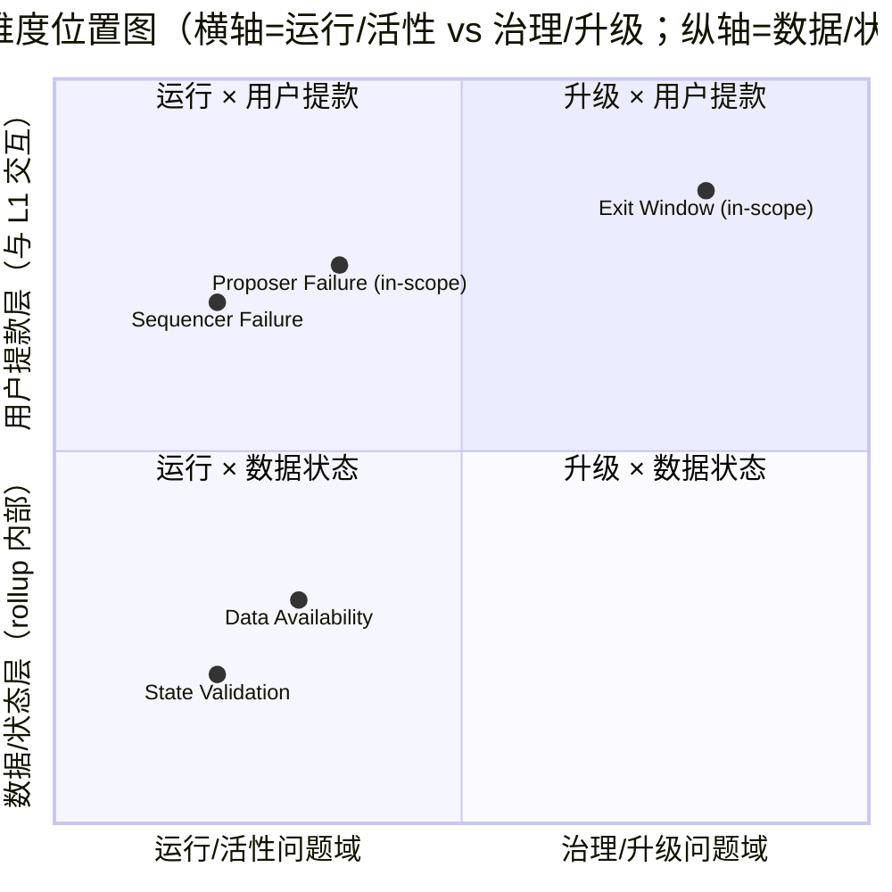
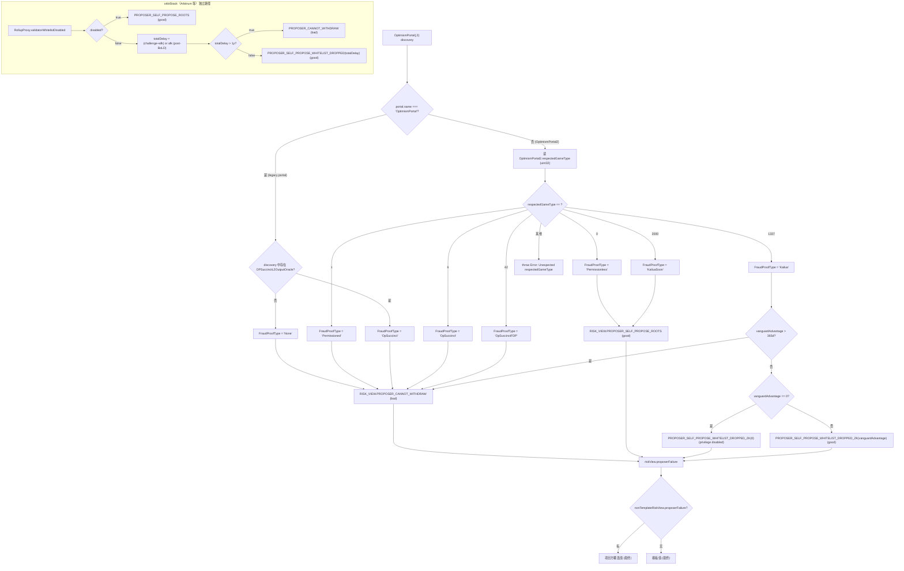
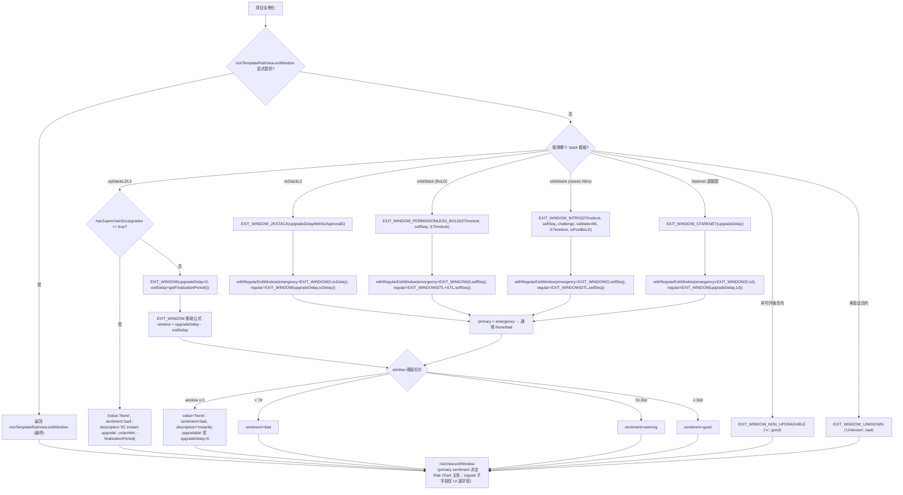
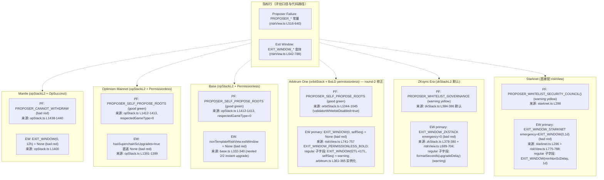

# L2Beat Risk Chart Proposer Failure 与 Exit Window 评估标准解析（Round 3 Draft）

## 0. Round 3 Revision Notes

本 round 针对 round-2 Adversarial Review 中遗留的 **1 项 MAJOR finding** 做单点修订——其他章节（含 round-2 已完成的 Arbitrum One Exit Window 矫正、orbitStack 深挖、`EXIT_WINDOW_PERMISSIONLESS_BOLD` 引用、src-5 三条抓取）按 Quality Checklist "preserves unflagged content" 完整保留。

| Finding | 等级 | 影响章节 | 处理方式 |
|---|---|---|---|
| **F1 (round-3)** src-6 forum 检索 trail 误称"全部 6 条主题 / universe of L2Beat methodology forum posts"——`forum.l2beat.com/c/methodology-and-framework/5` 类目实际含 25 条主题（fetched 2026-05-20），包含 ZK/Succinct-adjacent 帖 #409 / #381 / #377 未被检索覆盖 | MAJOR | §2.2.5（item 4）、§2.2.8（Q-2.2 残余）、§5.2（src-6 状态）、§5.3（gap 检索清单）、§A.2.4（重写为完整 25-topic 列表）、§A.2 新增 A.2.5–A.2.7 三条 ZK-adjacent 帖 fetched evidence、§4 Source Coverage src-6 行更新、§7 Quality Self-Check | (1) 把"universe / 全部 6 条主题"措辞改为"Methodology & Framework 完整类目（25 条主题，fetched 2026-05-20）"；(2) §A.2.4 重写为完整 25-topic 表，标注每条 in-scope / out-of-scope 与是否含 OpSuccinct → PROPOSER_CANNOT_WITHDRAW dedicated rationale；(3) §A.2 新增 A.2.5（#409 New Stage 1 requirements for ZK setups, fetched 2026-05-20）、A.2.6（#381 The trusted setups framework for ZK Catalog, fetched 2026-05-20）、A.2.7（#377 The Recategorization, fetched 2026-05-20）三条 ZK / Succinct-adjacent verbatim quote；(4) "not found after search" 结论保留——扩展检索后仍未发现 dedicated rationale，但搜索口径已变为"完整 25-topic 类目覆盖 + ZK-adjacent 帖逐条验证"。其他事实链（源码 hardcoded 映射、生产页面文案 cross-check、Mantle/Glossary/Stages 检索）均不变。 |

**Round 2 已完成且本 round 完整保留的修订（不重做）**：
- F1 (round-2): src-5 三条 + src-6 四条原 forum quote 全部保留并扩展。
- F2 (round-2): Arbitrum One Exit Window 矫正为 primary = bad / None + regular 子字段 warning（§2.3.3 / §2.5.2 / §2.5.3 / diag-5）。
- F3 (round-2): orbitStack.ts L940-1071 完整深挖 + Arbitrum One Proposer Failure "good" 行号锚定（§2.2.4 / diag-2）。
- 未触发 finding 的章节（§1.1 / §1.2 / §1.3 / §2.1.* / §2.2.1-2.2.4 / §2.2.6-2.2.7 / §2.3.1-2.3.5 / item-4 全部 / §2.5.1-2.5.6 / diag-1 / diag-3 / diag-4 / diag-5 / §A.1.* / §A.2.1-A.2.3）保持不变。

未触发 finding 的章节内容保持不变（按 Quality Checklist "Revision mode addresses flagged items and preserves unflagged content"）。

---

## 1. Executive Summary

L2Beat 的 Risk Chart 把每个 rollup 在五个维度上的状态压成一个五边形：State Validation、Data Availability、Sequencer Failure、Proposer Failure、Exit Window。本研究只解构后两项的评估口径，作为下游 mantle-proposer-failure-analysis、mantle-exit-window-analysis、recommendation-proposal 三个 issue 的事实基线，**不**对 Mantle 现状本身做盘点，也**不**给出改进建议。

核心结论（皆有 commit + 行号佐证，且本 round 已补齐 L2Beat 公开文案与 Forum 一手帖作为 cross-check）：

1. **Risk Chart 的 sentiment 完全由 `packages/config/src/common/riskView.ts` 的常量/函数与模板判定函数决定**，与 L2Beat Stage 1/2 框架属于两套独立体系。Stage 框架中的 "Exit Window ≥ 5d"、"SC 少数派 ≥ N/2" 等阈值**不**进入 Risk Chart 的 good/warning/bad 判定。Risk Chart 的"<7d/7-30d/≥30d"阈值由 [Forum: The Risk Rosette Framework](https://forum.l2beat.com/t/the-risk-rosette-framework/292) (2024-06-06) **独立公布**——与 Stage 框架在数值上有部分巧合，但语义和判定流程分离（详 §2.1.2 与 §A.2.1）。
2. **Proposer Failure** 衡量的是"proposer 停机时用户能否独立从 L2 取回资产"。L2Beat 用 `RISK_VIEW.PROPOSER_*` 系列常量/函数（riskView.ts L516-640）枚举出 13 个可能 outcome，覆盖白名单冻结、governance/SC 替换、escape hatch、permissionless self-propose 四大类。Forum 的颜色定义为：red = "Proposing state roots is fully centralized"、yellow = SC/governance fallback、green = self-propose permissionlessly 或 escape hatch（[Risk Rosette Framework](https://forum.l2beat.com/t/the-risk-rosette-framework/292)）。
3. **opStack 模板把 `OpSuccinct` 与 `OpSuccinctFDP` 这两种 fraud-proof type hardcode 返回 `PROPOSER_CANNOT_WITHDRAW`（opStack.ts L1438-1440）**。这是当前 OP-Succinct 类 rollup（Mantle 在 2025-09 升级到 OP Succinct 之后落入此列）的 Proposer Failure 红色判定的直接来源，与底层链上 `proposer` 字段是否为 `address(0)` 无关——模板根本没有读这个字段。**生产页面公开文案**（[L2Beat Mantle 项目页](https://l2beat.com/scaling/projects/mantle)）当前显示的 Proposer Failure 描述与 `PROPOSER_CANNOT_WITHDRAW` 的 description 字段完全一致："Only the whitelisted proposers can publish state roots on L1, so in the event of failure the withdrawals are frozen."（详 §2.2.5 与 §A.1.1）。
4. **Exit Window** 衡量的是"非紧急升级到生效之间，用户是否有 ≥7d 时间退出"。基础公式是 `window = upgradeDelay − exitDelay`（riskView.ts L642-687），阈值切片 `< 7d = bad / 7-30d = warning / ≥ 30d = good`，`window ≤ 0` 则显示为 `None`。该阈值在 Risk Chart 与 Stage 1/2 框架中数值相同，但**判定流程独立**（Risk Chart 看 sentiment 颜色、Stage 框架做合规打分）。
5. **opStack 模板把 `upgradeDelay` 默认 hardcode 为 0（opStack.ts L1400）**，调用 `EXIT_WINDOW(0, finalizationPeriod)`，意味着**任何**未通过 `nonTemplateRiskView.exitWindow` 显式覆盖的 opStack 项目，无论链上 Timelock 实际 `minDelay` 多大，Risk Chart 都会显示 `None` red sentiment。配合 `hasSuperchainScUpgrades = true`（opStack.ts L1391-1399）则直接返回 `None` + 自定义 description，描述"由 Security Council instantly upgrade"。
6. **三层数据来源优先级**：`nonTemplateRiskView.*`（项目方/L2Beat 团队 PR 显式覆盖）> 模板判定函数 > 模板常量。前者通过 PR 提交，后两者在 discovery 抓取后由模板加工。这是后续解释"为什么 Mantle 不能仅靠改链上参数提升评级"的关键。
7. **典型项目对照**（**本 round 已矫正 Arbitrum One 的 Exit Window 描述**）：(a) Permissionless fault-proof 类（Optimism、Base）在 Proposer Failure 上拿 good，因为 `respectedGameType=0` 触发 `PROPOSER_SELF_PROPOSE_ROOTS`；(b) Arbitrum One 的 Exit Window primary sentiment 是 **bad / None**（`EXIT_WINDOW_PERMISSIONLESS_BOLD` 内部 `EXIT_WINDOW(0, selfSeq)` 是 emergency primary，规则与 OP Stack 的 hardcoded 0 同根），仅 regular 子字段承载较长 window；(c) ZKStack 类（zkSync Era）在 Proposer Failure 上拿 warning（`PROPOSER_WHITELIST_GOVERNANCE`），Exit Window 因 TransactionFilterer 走专用 `EXIT_WINDOW_ZKSTACK` 公式；(d) Starknet 走 `PROPOSER_WHITELIST_SECURITY_COUNCIL()` 的 warning + `EXIT_WINDOW_STARKNET(upgradeDelay)`。

整篇 draft 严格遵守 outline 的 guardrails。Round 1 把 outline 中两个 open questions（Q-2.1 关于"OP Stack 6.5 年白名单失活"、Q-2.2 关于 OpSuccinct → CANNOT_WITHDRAW 的真实成因）做了源码核验，结论与后续动作记录在 §6 Gap Analysis 与 §7 Revision Log；Round 2 进一步把 src-5/src-6 实证抓取完成、Arbitrum One Exit Window 矫正完成、orbitStack 覆盖深度补齐。

---

## 2. Item Findings

### item-1: L2Beat Risk Chart 五维总览与本研究的位置标定

#### 2.1.1 概念分层

L2Beat 给 rollup 用的 Risk Chart 五维度可以按"问题域"分成三层：

| 层 | 指标 | 评估的核心问题 |
|---|---|---|
| 数据 / 状态层 | **State Validation** | state root 是否经过 L1 上的 fraud / validity proof 验证 |
| 数据 / 状态层 | **Data Availability** | 用户能否独立获取重建 L2 状态所需的数据 |
| 运行 / 活性层 | **Sequencer Failure** | 排序中断时用户能否独立将交易塞入 L2 |
| 运行 / 活性层 | **Proposer Failure** | 出块停滞时用户能否独立从 L2 提款（**本研究主题之一**） |
| 治理 / 升级层 | **Exit Window** | 合约升级生效前，用户是否有足够时间退出（**本研究主题之二**） |

这五项在 `getScalingRosetteValues` 中按固定顺序渲染为五边形：sequencerFailure、stateValidation、dataAvailability、exitWindow、proposerFailure（packages/frontend/src/server/features/scaling/project/getScalingRosetteValues.ts L52-89）。前端只是把每项的 `sentiment + value + description` 透传到 UI；判定结果 100% 来自 `@l2beat/config`。

#### 2.1.2 相互依赖与本研究的边界

研究外但需要标定的两条交叉关系：

- **Proposer Failure × Exit Window 双红**：在 item-2 (e) 与 item-3 (e) 的故障树中显式衔接（详后）。当 Proposer Failure 已经红色（用户不能自助出块）、且 Exit Window 同样红色（项目方可即时改实现）时，对"proposer 停机后才发起 prove 的用户"而言资产**永久无法提取**。
- **Sequencer Failure × Proposer Failure**：若 Sequencer Failure = "No mechanism" 与 Proposer Failure = "Cannot withdraw" 同时成立，用户连发起 L2→L1 强制提款都做不到。但 Sequencer Failure 本身不在本研究 scope，仅作 context 链接。

**In scope**（本研究覆盖）：Proposer Failure 评估口径与判定（item-2、item-5）、Exit Window 评估公式与变体（item-3、item-5）、L2Beat 评估管线的数据来源与人工干预点（item-4）。

**Out of scope**（仅作 context 链接，不重新评估）：Sequencer Failure、State Validation、Data Availability 三项。L2Beat Stage 1/2 框架也不属于本研究 scope——Stage 框架中的阈值（Exit Window ≥ 5d、Security Council 少数派要求等）**不得**被用作定义 Risk Chart sentiment 阈值的依据。l2beat-stage-framework-2026 final（若需引用）仅作背景脚注，并必须显式声明"该阈值不参与 Risk Chart sentiment 判定"。

> **本 round 补充澄清**：Risk Chart 的 7d/30d 阈值在 [Forum: Risk Rosette Framework](https://forum.l2beat.com/t/the-risk-rosette-framework/292) (2024-06-06) 中**独立**发布——与 Stage 1（5d / 7d challenge period）和 Stage 2（30d exit window）数值上部分重叠，但二者属于不同评估流程：Risk Chart 输出颜色 sentiment（good/warning/bad），Stage 框架输出 Stage 0/1/2 合规标签。**本研究**只采纳 Risk Rosette Framework 的阈值，**不**采纳 Stage 框架的同名阈值——即使数值一致——以避免下游 issue 误把"Stage 0 项目"等同于"Risk Chart 全红项目"。

#### 2.1.3 源码索引（评估代码 vs 渲染代码）

**评估代码**（决定 sentiment 的逻辑）位于 `@l2beat/config`：

- `packages/config/src/common/riskView.ts`：RISK_VIEW 常量/函数总表（PROPOSER_*、EXIT_WINDOW_*、STATE_*、DATA_*、SEQUENCER_* 等）；本研究主要核心代码（L516-787，945 行总长）。
- `packages/config/src/templates/{opStack,orbitStack,zkStack,agglayer,nitro,...}.ts`：各 stack 默认 riskView 工厂函数，把 `discovery.getContractValue` 抓到的链上字段映射到 RISK_VIEW 常量。
- `packages/config/src/projects/{slug}/{slug}.ts`：每个项目实例化模板，可选 `nonTemplateRiskView.{proposerFailure,exitWindow,...}` 字段覆盖模板默认。
- `packages/config/src/discovery/ProjectDiscovery.ts` + `projects/{slug}/discovered.json`：链上字段抓取层。

**渲染代码**（拿 sentiment 画图）位于 `@l2beat/frontend`：

- `packages/frontend/src/server/features/scaling/project/getScalingRosetteValues.ts`：把 `risks.proposerFailure / risks.exitWindow / ...` 五项打包成 `RosetteValueTuple`。
- `packages/frontend/src/components/rosette/individual/IndividualRosetteIcon.tsx`：渲染五边形 icon。
- `packages/frontend/src/pages/scaling/risk/components/table/columns.tsx`：渲染 risk table。

判定逻辑全部在 `@l2beat/config`；frontend 仅做样式与链接，不参与 sentiment 计算。

---

### item-2: Proposer Failure 指标完整解构

#### 2.2.1 L2Beat 对 Proposer Failure 的核心考察问题

**核心问题（一句话）**：当 proposer 停止运作时，用户能否独立将 L2 资产提走？

**评估视角**：proposer 是 rollup 中负责把 L2 state root 提交到 L1 的角色——proposer 不出块即意味着 L1 上没有新 state root 可供 withdrawal proof 引用 → 用户无法完成提款。L2Beat 的关键 binary 是：是否存在 **permissionless 的备用路径**（任意人提交 proof / 任意人作 proposer / 用户凭 escape hatch 自助退出）。

**出处**：

- 常量描述文本：`packages/config/src/common/riskView.ts` L519：
  > "Only the whitelisted proposers can publish state roots on L1, so in the event of failure the withdrawals are frozen."（[permalink](https://github.com/l2beat/l2beat/blob/c4d95930574ebdab2a986e673553b1824111990a/packages/config/src/common/riskView.ts#L519)）
- 前端 column name `"Proposer failure"` 与 href：`packages/frontend/src/server/features/scaling/project/getScalingRosetteValues.ts` L83-89。
- **生产页面文案 cross-check**（本 round 新增）：上述源码 description 字段在 L2Beat 公开项目页上**未经改写**直接渲染，如 [L2Beat Mantle 项目页](https://l2beat.com/scaling/projects/mantle)（fetched 2026-05-20）即对 Proposer Failure 显示"Cannot withdraw"+ 同一段 description（详 §A.1.1 src-5 quote）。
- **官方公布的 sentiment 颜色定义**（本 round 新增）：[Forum: The Risk Rosette Framework](https://forum.l2beat.com/t/the-risk-rosette-framework/292) (2024-06-06) 明确：red = "Proposing state roots is fully centralized"；yellow = SC / governance fallback；green = "Users can self-propose state roots permissionlessly if centralized operators fail" 或 escape hatch（详 §A.2.1 src-6 quote）。该 Forum 帖是 Risk Chart sentiment 的**权威 L2Beat-team 公布**，独立于 Stage 框架。

#### 2.2.2 完整 RISK_VIEW 常量与函数枚举

下表枚举 `riskView.ts` 中所有 `PROPOSER_*` 常量与函数（行号锚定 commit `c4d95930574ebdab2a986e673553b1824111990a`）：

| 序号 | 常量 / 函数 | 行号 | value（UI 文案） | sentiment | description 摘要 | 典型适用场景 |
|---|---|---|---|---|---|---|
| 1 | `PROPOSER_CANNOT_WITHDRAW` | L516-522 | "Cannot withdraw" | bad | proposer 白名单且无 fallback；withdrawals frozen | OP-Succinct / 早期 OP Stack pre-FaultProof / Permissioned dispute games / 任何无 escape hatch 的白名单 proposer 系统 |
| 2 | `PROPOSER_WHITELIST_GOVERNANCE` | L524-530 | "Replace proposer" | warning | governance 可升级替换 proposer | zkSync Era（zkStack 默认）等可由治理替换 proposer 的项目 |
| 3 | `PROPOSER_WHITELIST_SECURITY_COUNCIL(config?)` | L532-546 | "Security Council minority" | warning | SC 少数派可强制出块；`config==='METIS'` 时附加 proposer registry 文案 | Starknet（默认）、Metis（带 METIS config） |
| 4 | `PROPOSER_USE_ESCAPE_HATCH_ZK` | L548-554 | "Use escape hatch" | good | 用户可凭 ZK proof 自助退出 | termstructure、zkSwap |
| 5 | `PROPOSER_USE_ESCAPE_HATCH_MP` | L556-562 | "Use escape hatch" | good | 用户可凭 Merkle proof 自助退出 | DeGate v2/v3、DeversiFi、Layer2.Finance ZK、Loopring 等 StarkEx/Loopring 系 |
| 6 | `PROPOSER_USE_ESCAPE_HATCH_MP_NFT` | L564-570 | "Use escape hatch" | good | Merkle proof + NFTs minted on L1 to exit | CanvasConnect |
| 7 | `PROPOSER_USE_ESCAPE_HATCH_MP_AVGPRICE` | L572-578 | "Use escape hatch" | good | Merkle proof + 按 last batch avg price 平仓 | ApeX、edgeX |
| 8 | `PROPOSER_SELF_PROPOSE_WHITELIST_DROPPED(delay)` | L580-590 | "Self propose" | good | 白名单失活 `delay` 秒后任意人可作 proposer（formatter，文案带 delay 字符串） | OP Stack L3 stacked-risk 聚合 + orbitStack 通用路径（`totalDelay ≤ 1y` 分支） |
| 9 | `PROPOSER_SELF_PROPOSE_WHITELIST_DROPPED_ZK(delay)` | L592-602 | "Self propose" | good | Kailua-style：vanguardAdvantage 期满后任意人可凭 source-available zk prover 反证或对抗 | Kailua-mode OP Stack 项目（如 ETHGate） |
| 10 | `PROPOSER_SELF_PROPOSE_WHITELIST_MAX_DELAY(delay)` | L604-614 | "Self propose" | good | 任意人对**老于 `delay`** 的 L2 块可乐观 propose | 某些 hybrid ZK rollup |
| 11 | `PROPOSER_SELF_PROPOSE_ZK` | L616-621 | "Self propose" | good | source-available prover，proposer 失败时任意人可提交 proof | StarkNet/某些 ZK rollup（非 escape hatch 路径） |
| 12 | `PROPOSER_SELF_PROPOSE_ROOTS` | L623-629 | "Self propose" | good | 任意人可作 proposer 并提交 root（permissionless fault proof） | Optimism、Base（`respectedGameType=0` Permissionless）、KailuaSoon、orbitStack `validatorWhitelistDisabled=true` 分支 |
| 13 | `PROPOSER_POS(stakedValidatorSetSize, validatorSetSizeCap)` | L631-640 | "Cannot withdraw" | warning（注意：与 bad 不同！） | PoS validator set；若 cap 已满则无法加入 | Polygon PoS 等 |

注意点：

- 第 13 项 `PROPOSER_POS` 的 sentiment 是 **`warning`** 而非 `bad`，与其 value 字符串 `"Cannot withdraw"` 不一致；这是源码自身的现状（riskView.ts L636-638），不要在下游 issue 把它混为 bad。
- 第 8/9/10 项是 **formatter 函数**——拿一个 `delay`（秒）参数，把 description 文案带上 `formatSeconds(delay)` 渲染，`orderHint` 即等于 `delay`。
- 第 12 项 (`PROPOSER_SELF_PROPOSE_ROOTS`) 是 orbitStack 模板在 `validatorWhitelistDisabled=true` 分支下的返回值（orbitStack.ts L1044-1045），与 opStack `respectedGameType=0` 触发的同一常量同源（详 §2.2.4 新增 orbitStack 段）。

#### 2.2.3 模板判定函数解读：opStack `getRiskViewProposerFailure`

源码：`packages/config/src/templates/opStack.ts` L1403-1442（[permalink](https://github.com/l2beat/l2beat/blob/c4d95930574ebdab2a986e673553b1824111990a/packages/config/src/templates/opStack.ts#L1403-L1442)）。

判定流程（去糖后）：

1. 先调用 `getFraudProofType(templateVars)`（opStack.ts L2360-2396），把链上字段映射为 `FraudProofType` enum：
   - 若 `portal.name === 'OptimismPortal'`（旧版 portal，无 dispute games）且 discovery 中存在 `OPSuccinctL2OutputOracle` → 返回 `'OpSuccinct'`；否则返回 `'None'`。
   - 否则读取 `OptimismPortal2.respectedGameType`（uint32），按下表映射：

     | respectedGameType | FraudProofType |
     |---|---|
     | `0` | `'Permissionless'` |
     | `1` | `'Permissioned'` |
     | `6` | `'OpSuccinct'` |
     | `42` | `'OpSuccinctFDP'` |
     | `1337` | `'Kailua'` |
     | `2000` | `'KailuaSoon'` |
     | 其他 | `throw new Error('Unexpected respectedGameType=...')` |

2. 然后 `switch` 上面的 enum：

   - `'None'` → `RISK_VIEW.PROPOSER_CANNOT_WITHDRAW`（红）
   - `'Permissioned'` → `RISK_VIEW.PROPOSER_CANNOT_WITHDRAW`（红）
   - `'Permissionless'` → `RISK_VIEW.PROPOSER_SELF_PROPOSE_ROOTS`（绿）
   - `'KailuaSoon'` → `RISK_VIEW.PROPOSER_SELF_PROPOSE_ROOTS`（绿）
   - `'Kailua'` → 读 `KailuaTreasury.vanguardAdvantage`：
     - 若 `> 365d` → `PROPOSER_CANNOT_WITHDRAW`（红）
     - 若 `== 0` → 返回 `PROPOSER_SELF_PROPOSE_WHITELIST_DROPPED_ZK(0)` + 改写 description 为"privilege disabled (not active)"（绿）
     - 否则 → `PROPOSER_SELF_PROPOSE_WHITELIST_DROPPED_ZK(vanguardAdvantage)`（绿）
   - `'OpSuccinct'` → `PROPOSER_CANNOT_WITHDRAW`（红）
   - `'OpSuccinctFDP'` → `PROPOSER_CANNOT_WITHDRAW`（红）

3. 在 `opStackL2`（L1280-1295）/`opStackL3`（L585-631）的最终装配：

   - `opStackL2.riskView.proposerFailure = templateVars.nonTemplateRiskView?.proposerFailure ?? getRiskViewProposerFailure(templateVars)`（opStack.ts L1286-1287）——项目可通过 `nonTemplateRiskView.proposerFailure` 强制覆盖。
   - `opStackL3` 在 `common.riskView` 之外提供 `stackedRiskView`，对 Proposer Failure 调用 `sumRisk(common.riskView.proposerFailure, baseChain.riskView.proposerFailure, RISK_VIEW.PROPOSER_SELF_PROPOSE_WHITELIST_DROPPED)`（opStack.ts L617-621）。`sumRisk` 行为：若两层都非 bad 且 sentiment 相同，则用 formatter 合成（`formatter(a.orderHint + b.orderHint)`）；否则取较坏一项（riskView.ts L927-945）。formatter 在此处是 `PROPOSER_SELF_PROPOSE_WHITELIST_DROPPED`——把两层 orderHint 求和后渲染成 "Anyone can become a Proposer after ${sum} of inactivity"。

#### 2.2.4 模板判定函数：其他 stack（含 orbitStack 完整路径，本 round 新增深挖）

**zkStack `zkStackL2`**（zkStack.ts L378-386）：

```ts
proposerFailure: templateVars.nonTemplateRiskView?.proposerFailure
  ?? RISK_VIEW.PROPOSER_WHITELIST_GOVERNANCE,
exitWindow: templateVars.nonTemplateRiskView?.exitWindow
  ?? RISK_VIEW.EXIT_WINDOW_ZKSTACK(upgradeDelayWithScApprovalS),
```

允许 `nonTemplateRiskView` 覆盖；不读 fraud-proof 类型。

**orbitStack（本 round 新增深挖，对应 Finding 3 修复）**：核心入口是 `getRiskView(templateVars, daProviders, isPostBoLD)`，源码 `packages/config/src/templates/orbitStack.ts` L940-1071（[permalink](https://github.com/l2beat/l2beat/blob/c4d95930574ebdab2a986e673553b1824111990a/packages/config/src/templates/orbitStack.ts#L940-L1071)）。Proposer Failure 计算分为三步：

1. **读链上字段**（orbitStack.ts L967-971）：
   ```ts
   const validatorWhitelistDisabled =
     templateVars.discovery.getContractValue<boolean>(
       'RollupProxy',
       'validatorWhitelistDisabled',
     )
   ```
   `RollupProxy.validatorWhitelistDisabled` 是 Arbitrum Nitro / BoLD 合约里的"白名单是否已关闭"链上标志。Arbitrum One 等 mainnet 启用 BoLD 后将此字段切换为 `true`。
2. **三分支判定**（orbitStack.ts L1041-1069）：
   ```ts
   proposerFailure: templateVars.nonTemplateRiskView?.proposerFailure ?? (() => {
     if (validatorWhitelistDisabled) {
       return RISK_VIEW.PROPOSER_SELF_PROPOSE_ROOTS  // good，绿
     }
     const validatorAfkBlocks = templateVars.discovery.getContractValue<number>(
       'RollupProxy',
       isPostBoLD ? 'validatorAfkBlocks' : 'VALIDATOR_AFK_BLOCKS',
     )
     const validatorAfkTimeSeconds =
       validatorAfkBlocks * blockNumberOpcodeTimeSeconds
     const totalDelay = isPostBoLD
       ? validatorAfkTimeSeconds
       : challengePeriodSeconds + validatorAfkTimeSeconds
     const ONE_YEAR_IN_SECONDS = 365 * 24 * 60 * 60
     if (totalDelay > ONE_YEAR_IN_SECONDS) {
       return RISK_VIEW.PROPOSER_CANNOT_WITHDRAW  // bad，红
     }
     return {
       ...RISK_VIEW.PROPOSER_SELF_PROPOSE_WHITELIST_DROPPED(totalDelay),
       secondLine: formatDelay(totalDelay),
     }
   })(),
   ```
3. **关键解读**：
   - `validatorWhitelistDisabled=true` 直返 `PROPOSER_SELF_PROPOSE_ROOTS`（绿）——这是 Arbitrum One 当前 Proposer Failure 评级为"Self propose"的**直接代码依据**。该字段通过 `discovery.getContractValue` 自动抓取，无需人工覆盖。
   - `validatorWhitelistDisabled=false` 时，根据 `validatorAfkBlocks` × `blockNumberOpcodeTimeSeconds` 得到 `validatorAfkTimeSeconds`，再叠加（pre-BoLD）`challengePeriodSeconds` 得到 `totalDelay`；若 > 1 年则红判，否则用 `PROPOSER_SELF_PROPOSE_WHITELIST_DROPPED(totalDelay)` formatter 渲染。
   - 这是与 opStack 完全不同的代码路径——opStack 通过 `respectedGameType` enum + hardcoded switch，orbitStack 通过 `validatorWhitelistDisabled` + AFK 计算。两个模板**没有共享代码**。

**orbitStack 内嵌的 baseChain 聚合**（orbitStack.ts L769-773；当 orbit-as-L3 时使用）：

```ts
proposerFailure: templateVars.stackedRiskView?.proposerFailure ??
  sumRisk(common.riskView.proposerFailure, baseChain.riskView.proposerFailure, ...)
```

——与 opStackL3 同构，但用 `stackedRiskView` 而非 `stackedRiskView` 字段名（语义一致）。

**starkex-template / agglayer / nitro 等其他模板**：作为 context，本 draft 不展开。

#### 2.2.5 OpSuccinct → PROPOSER_CANNOT_WITHDRAW 的成因（Q-2.2 deep-round 核验，本 round 收紧）

outline 在 item-2 (d) 留下了 Q-2.2："为什么 OpSuccinct 路径下 L2Beat 判 'Cannot withdraw'？"。本 draft 在源码 + 公开文档双层给出事实链：

1. **模板层**：opStack.ts L1438-1440 把 `'OpSuccinct'` 与 `'OpSuccinctFDP'` 两个 enum 直接 hardcode 映射到 `RISK_VIEW.PROPOSER_CANNOT_WITHDRAW`，**不读任何链上字段**。这意味着即使 `OPSuccinctL2OutputOracle.proposer == address(0)`（在 OP-Succinct 合约语义里通常表示"任意人都可调用 proposeL2Output"），L2Beat 的模板**仍然**会输出红色"Cannot withdraw"。
2. **链上现状（Mantle）**：`packages/config/src/projects/mantle/discovered.json` 显示 `OPSuccinctL2OutputOracle.proposer = address(0)`、`OPSuccinctL2OutputOracle.PROPOSER = address(0)`、`OPSuccinctL2OutputOracle.finalizationPeriodSeconds = 43200`（12h），`optimisticMode = false`。换言之，从合约层面看 proposer 字段是 zero address；但从 L2Beat 模板看，OpSuccinct 类型直接被判红，与该字段无关。
3. **生产页面文案 cross-check（本 round 新增）**：[L2Beat Mantle 项目页](https://l2beat.com/scaling/projects/mantle) (fetched 2026-05-20) 当前显示的 Proposer Failure 文案完全是 `PROPOSER_CANNOT_WITHDRAW.description` 的镜像："Only the whitelisted proposers can publish state roots on L1, so in the event of failure the withdrawals are frozen."。这与 [Forum Risk Rosette Framework](https://forum.l2beat.com/t/the-risk-rosette-framework/292) 中 red sentiment 的口径定义"Proposing state roots is fully centralized"一致——即 L2Beat **当前公开归类** OpSuccinct 项目的 proposer role 为"centralized whitelisted"。
4. **官方公开的"为什么 OpSuccinct → CANNOT_WITHDRAW"专项书面解释 — Not found after search（本 round 新增）**：经在以下渠道的多轮检索均未发现 L2Beat 团队对该具体映射的**专门**书面理由（即 dedicated post / PR description / docs 段落）：
   - [L2Beat Mantle 项目页](https://l2beat.com/scaling/projects/mantle)：仅显示通用 `PROPOSER_CANNOT_WITHDRAW.description`，无 OpSuccinct 特定理由。
   - [L2Beat Glossary](https://l2beat.com/glossary)：只定义 "Proposer"、"Escape hatch"、"Security Council" 等通用术语，不涉及 OpSuccinct。
   - [L2Beat Stages page](https://l2beat.com/stages)：通用 1-of-N proposer 假设（"if the proposer set is open to anyone with enough resources, we assume at least one live proposer at any time"），不专门讨论 OpSuccinct 这条具体支线。
   - [Forum: Methodology & Framework 完整类目](https://forum.l2beat.com/c/methodology-and-framework/5) (browsed 2026-05-20，**含 25 条主题**——详 §A.2.4 完整列表)：包括 The Risk Rosette Framework / The Stages Framework / Data Availability Risk Framework / Stage 1 update: 7d→5d / Alt-DA Stages Framework / **New Stage 1 requirements for L2 proving systems (#413)** / Stage 1 SC walkaway test / Cont: Stage 1 challenge period reduction / **New Stage 1 requirements for ZK setups (#409)** / Secure Integration of Alt-DA L2s / Stages update: decouple escrows / Assets, Bridges and TVS / **The trusted setups framework for ZK Catalog (#381)** / **The Recategorization (#377)** / Surge & State Root Progression / Rollup maturity ranking proposal / Stages update: a high-level guiding principle / DA Risk Framework call for feedback / ZK Rollups is misleading / L2Bridge Risk Framework / Rollup Stages call for feedback / Change zkSync to red yes for Upgradability / Choose coins to include in TVL / Primary bridge metric / Reworking TVL on L2BEAT。本 round 对所有 ZK / proving-system / Succinct-adjacent 主题做了**逐条核查**：(a) [#413 New Stage 1 requirements for L2 proving systems](https://forum.l2beat.com/t/new-stage-1-requirements-for-l2-proving-systems/413) (2026-02-16) 提出 ZK proving system 四项 Stage 1 要求（no red trusted setups / prover source published / verifiers reproducible / ZK and optimistic programs reproducible）——是 Stage 框架要求，不是 Risk Chart sentiment 判定理由（详 §A.2.2 src-6 quote）；(b) [#409 New Stage 1 requirements for ZK setups](https://forum.l2beat.com/t/new-stage-1-requirements-for-zk-setups/409) (2025-11-10) 讨论 ZK trusted setups / verifier source code / prover source code，附录 Succinct 仅作 vkey hash 复现示例——**全帖未提 OpSuccinct → PROPOSER_CANNOT_WITHDRAW**、**未提 proposer withdrawal**、**未提 escape hatch**（详 §A.2.5 verbatim summary）；(c) [#381 The trusted setups framework for ZK Catalog](https://forum.l2beat.com/t/the-trusted-setups-framework-for-zk-catalog/381) (2025-07-19) 仅就 trusted-setup ceremony 评级（red/yellow/green tier），唯一 Succinct 提及为 "SP1 Groth16 ceremony was run privately and includes too few contributions. 7 participants, 5 from Succinct" 的 ceremony 充分性评价——与 Risk Chart proposer-failure sentiment 无关联（详 §A.2.6）；(d) [#377 The Recategorization](https://forum.l2beat.com/t/the-recategorization/377) (2025-06-20) 立项 Rollup / Alt-DA 资格基线（≥1 working proof system + DA bridge），不涉及 OpSuccinct 或 proposer label（详 §A.2.7）。**结论**：扩展到完整 25-topic 类目（含全部 ZK / Succinct-adjacent 帖）的逐条核查后，**仍未发现** L2Beat 团队对"OpSuccinct → PROPOSER_CANNOT_WITHDRAW"映射的专门书面理由（dedicated rationale）。
   - GitHub `l2beat/l2beat` commit / PR / issue：commit message 与 PR description 在 OpSuccinct 引入相关 PR 中描述的是"adding OpSuccinct fraud proof type to template"层面的实现说明，未提供 sentiment 选择的设计理由。
5. **解读（本 round 收紧措辞）**：L2Beat 当前 OpSuccinct 红判**最可能的间接成因**——而非"已公开的设计理由"——是 L2Beat 将 OpSuccinct 的 `proposer` 角色按"whitelisted state-root publisher"语义评估（与 [Risk Rosette Framework](https://forum.l2beat.com/t/the-risk-rosette-framework/292) red 定义"fully centralized state-root proposing"对齐），即使链上字段允许 zero address 也不更改这一归类。要让一个 OpSuccinct 项目在 Risk Chart 上跑出非红，目前**有且仅有两条路**：
   (a) 由项目方/L2Beat 团队提交 PR 把该项目改为通过 `nonTemplateRiskView.proposerFailure` 显式覆盖；
   (b) 等 L2Beat 修改 `getRiskViewProposerFailure` 的 `OpSuccinct` 分支语义（例如：读 `proposer` 字段，若为 zero 则视为 permissionless）。
6. **gap（保留为 §6.3 跨 issue gap）**：上述"间接成因"是基于 Risk Rosette Framework 公开口径的合理推理，**不是** L2Beat 团队的专门书面解释。后续 mantle-proposer-failure-analysis 可在 Forum 直接发帖追问；本 draft 不再在正文中作"L2Beat 团队认为 X"的断言式表述。

#### 2.2.6 sumRisk / "6.5 年白名单失活"（Q-2.1 deep-round 核验）

outline 在 item-2 (f) Q-2.1 中悬挂一个 Round 1 撤回的 claim："OP Stack 假设 6.5 年后 proposer 白名单失活"。本 draft 在源码层面核验后给出以下结论：

1. **`sumRisk` 自身没有 6.5 年假设**：`sumRisk(a, b, formattingFunction)` 行为是——若 `a.sentiment !== 'bad' && b.sentiment !== 'bad' && a.sentiment === b.sentiment`，则返回 `formattingFunction(a.orderHint + b.orderHint)`；否则 `pickWorseRisk(a, b)`（riskView.ts L927-945）。它**不内嵌**任何固定数值。
2. **`opStackL3` 调用点**：`sumRisk(common.riskView.proposerFailure, baseChain.riskView.proposerFailure, RISK_VIEW.PROPOSER_SELF_PROPOSE_WHITELIST_DROPPED)`（opStack.ts L617-621）。这只是把两层 proposer failure 的 `orderHint`（即各层 "WHITELIST_DROPPED" formatter 的 `delay` 入参）求和后渲染——任何"X 年"数值都来自项目实际链上参数（`KailuaTreasury.vanguardAdvantage` 等），而非 hardcode。
3. **`opStack.ts` 中唯一明确的常数年值**：`Kailua` 分支判 `vanguardAdvantage > 365 * 24 * 60 * 60` 即 1 年（opStack.ts L1419-1421）；除此之外 `opStack.ts` 内未发现"6.5 年"、"6 年"、"5 年"等硬编码秒数（grep 验证：本 draft 未找到匹配 `205 * 365`、`* 6.5 *`、`6\.5 * year` 等模式）。
4. **orbitStack 内同样存在 1 年硬编码**：orbitStack.ts L1060-1063 中 `ONE_YEAR_IN_SECONDS = 365 * 24 * 60 * 60`，用作 `totalDelay > 1y → CANNOT_WITHDRAW` 的阈值。这是两个模板共享的"1 年阈值"模式，**但仍无"6.5 年"**。
5. **结论**：Q-2.1 的"6.5 年假设"在 `opStack.ts` / `orbitStack.ts` 中**不存在**。Round 1 outline 中提到的 L617-621 实际是 `opStackL3` 的 `sumRisk(...PROPOSER_SELF_PROPOSE_WHITELIST_DROPPED)` 调用——formatter 在那处只是合并 orderHint，没有"6.5 年"硬编码。Round 2 撤回该 claim 的决定**正确**。后续如果再有人提到"6.5 年白名单失活"，需要直接指出这是某个具体项目 stacked orderHint 的渲染结果，与模板逻辑无关。

#### 2.2.7 不满足判定（"Cannot withdraw" red）下用户资产的故障树

按 withdrawal 状态精确分桶。下文术语：`proveWithdrawalTransaction` / `finalizeWithdrawalTransaction` 是 `OptimismPortal{,2}` 的标准接口；OpSuccinct 项目在不开 optimisticMode 时走 ZK proof 直接 prove。

**触发条件**：proposer 私钥泄露 / 丢失 / 恶意停机 → `OPSuccinctL2OutputOracle.l2Outputs`（或 `OptimismPortal2` 上 dispute games 的 root）停止增长。

**用户分桶 A：proposer 停机前已完成 `proveWithdrawalTransaction` 的 withdrawal**

（即已针对一个**已存在的**有效 state root 调用过 `proveWithdrawalTransaction`，且对应 output 已 finalized）

- 这些 withdrawal 已经持有针对一个有效 state root 的 inclusion proof，**不会**因 proposer 停机而立即冻结。
- 只需等待 finalization window（OpSuccinct → `OPSuccinctL2OutputOracle.finalizationPeriodSeconds`；OptimismPortal2 → `proofMaturityDelaySeconds`），即可调用 `finalizeWithdrawalTransaction` 完成 L1 出款。
- 故障树终态：**可正常退出**。Proposer Failure red sentiment **不**针对这一桶。
- 边界条件：在 `finalization window` 期内，若 ProxyAdmin 升级 `OptimismPortal{,2}` 实现并改写 `finalizeWithdrawalTransaction` 拦截这部分 withdrawal——属于 **Exit Window** 维度的攻击（详 §2.3.5），不归 Proposer Failure 讨论。

**用户分桶 B：proposer 停机之后才发起 / 仅完成 `initiateWithdrawal`、尚未 prove 的 withdrawal**

- 后果链：
  1. L1 上 `OPSuccinctL2OutputOracle.l2Outputs` 不再追加新条目；同理 `OptimismPortal2` 上无新的 dispute game / output root。
  2. 用户在 L2 已发起但未 prove 的 withdrawal，**无法**在停机后的任何旧 state root 中找到 inclusion proof（其 L2 区块高度晚于最新已提交的 state root）。新发起的 withdrawal 同样无 root 可 prove。
  3. `proveWithdrawalTransaction` 调用永远 revert（"Output not found at index"），从而无法到达 `finalizeWithdrawalTransaction`。
  4. 这类用户的资产**等同冻结**，依赖 governance / ProxyAdmin 强制升级合约（替换 proposer / 强行注入 root）才能恢复。
- 这是 L2Beat "Cannot withdraw" red sentiment **真正对应的群体**。

**红色判定的精确定义**：Proposer Failure red 衡量的是"**proposer 停机后**才需要 prove 的 withdrawal 群体能否退出"，并非对所有 in-flight withdrawal 的全称否定。下游 issue（mantle-proposer-failure-analysis 等）**必须**在引用本结论时保留 A/B 双桶区分，避免把"已 prove 但未 finalize"误归为冻结。

**最坏情形**：

- 对**分桶 B**：governance 同样冻结（Exit Window = None 且 SC 失能） → 资产**永久无法提取**。这是 Proposer Failure × Exit Window 双红的最坏情形，与 §2.3.5 衔接。
- 对**分桶 A**：最坏情形是 ProxyAdmin 在 finalization window 内升级 `OptimismPortal{,2}` 实现并拦截 `finalizeWithdrawalTransaction`——但这是 **Exit Window** 维度的攻击，不是 Proposer Failure 本身后果。

#### 2.2.8 Open questions（结转给 deep round / 下游 issue）

- **Q-2.1（resolved by round-1 draft）**：opStack.ts / orbitStack.ts 不存在 hardcoded "6.5 年" 白名单失活假设；§2.2.6 已核验。该 question 关闭，结论入正文。两个模板均有 1 年硬编码（`ONE_YEAR_IN_SECONDS`），用作 CANNOT_WITHDRAW 的边界条件。
- **Q-2.2（partial resolution，round-3 检索口径扩展）**：源码层面证实 OpSuccinct → CANNOT_WITHDRAW 是模板 hardcoded 映射；§2.2.5 已核验。**未解决残余**：L2Beat 团队对该映射的**专门**官方书面解释经多渠道检索后 not found after search。Round-3 把 Forum 检索口径从"6 条主题"扩展到 Methodology & Framework 类目**完整 25 条主题**（详 §A.2.4），并对所有 ZK / proving-system / Succinct-adjacent 帖（#413 / #409 / #381 / #377）做了逐条核查（§A.2.5–A.2.7），结论仍是 not found——以下渠道**均未提供 dedicated 解释**：[Mantle 项目页](https://l2beat.com/scaling/projects/mantle) / [Glossary](https://l2beat.com/glossary) / [Stages page](https://l2beat.com/stages) / [Methodology & Framework Forum 完整 25 条主题](https://forum.l2beat.com/c/methodology-and-framework/5)（含 ZK-adjacent #413/#409/#381/#377）/ GitHub PR / commit message。本 draft 在 §2.2.5 已将此项明确归类为"not found"，正文措辞从"我们解读"收紧为"最可能的间接成因"。Gap 标记 §6.3。
- **Q-2.3（new, suggested for下游）**：若一个 OpSuccinct 项目通过 `nonTemplateRiskView.proposerFailure` 覆盖为 `PROPOSER_SELF_PROPOSE_ZK`（绿）或 `PROPOSER_USE_ESCAPE_HATCH_ZK`（绿），L2Beat PR review 的接受标准是什么？（这是给下游 recommendation-proposal 的开放问题，本 draft 不试图回答。）

---

### item-3: Exit Window 指标完整解构

#### 2.3.1 L2Beat 对 Exit Window 的核心考察问题

**核心问题（一句话）**：非紧急合约升级发起后，用户在升级生效前是否有足够时间将 L2 资产提取到 L1？

**评估视角**：合约可升级 → implementation 切换 → 用户提款路径可能被改写或冻结。Exit Window 度量"用户察觉升级 + 完成 L2→L1 提款"所需的最低时间余量。**关键量**：`upgradeDelay`（升级生效前的 timelock）与 `exitDelay`（用户从 L2 提款至 L1 finality 所需时间）。

**出处**：

- 基础公式：`packages/config/src/common/riskView.ts` L642-687（[permalink](https://github.com/l2beat/l2beat/blob/c4d95930574ebdab2a986e673553b1824111990a/packages/config/src/common/riskView.ts#L642-L687)）。
- 文案模板：L669-679 自动渲染 `"Users have ${windowText} to exit funds in case of an unwanted upgrade. There is a ${formatSeconds(upgradeDelay)} delay before a upgrade is applied${instantlyUpgradable}, and withdrawals can take up to ${formatSeconds(exitDelay)} to be processed."`。
- **生产页面文案 cross-check（本 round 新增）**：[L2Beat Mantle 项目页](https://l2beat.com/scaling/projects/mantle) (fetched 2026-05-20) 当前 Exit Window 文案："There is no window for users to exit in case of an unwanted upgrade since contracts are instantly upgradable."——与 `EXIT_WINDOW(0, finalizationPeriod)` 的"`window ≤ 0` + `upgradeDelay === 0`"渲染分支（riskView.ts L651, L667-668）完全一致。
- **官方公布的 sentiment 颜色定义（本 round 新增）**：[Forum: The Risk Rosette Framework](https://forum.l2beat.com/t/the-risk-rosette-framework/292) (2024-06-06) 明确：green = "Users are provided with at least 30d to exit"、yellow = "at least 7d ... but less than 30d"、red = "Less than a 7d exit window is provided"（详 §A.2.1 src-6 quote）。该 Forum 帖**独立于** Stage 框架——Risk Chart 颜色与 Stage 0/1/2 合规标签是两个分离的判定，即使两者的数值阈值在 Risk Chart 与 Stage 1 的 "7d" 上有数值重合。

#### 2.3.2 基础 EXIT_WINDOW 函数完整解读

源码精确引用（riskView.ts L642-687）：

```ts
export function EXIT_WINDOW(
  upgradeDelay: number,
  exitDelay: number,
  options: { upgradeDelay2?: number; existsBlocklist?: boolean } = {},
): TableReadyValue & { seconds?: number } {
  let window: number = upgradeDelay - exitDelay
  const windowText = window <= 0 ? 'None' : formatSeconds(window)
  if (options.upgradeDelay2 !== undefined) {
    const window2: number = options.upgradeDelay2 - exitDelay
    const windowString2 = window2 <= 0 ? 'None' : formatSeconds(window2)
    if (windowText !== windowString2) {
      window = Math.min(window, window2)
    }
  }
  let sentiment: Sentiment
  if (window < 7 * 24 * 60 * 60) {
    sentiment = 'bad'
  } else if (window < 30 * 24 * 60 * 60) {
    sentiment = 'warning'
  } else {
    sentiment = 'good'
  }
  // ... description 模板 ...
}
```

关键评估边界：

- **sentiment 阈值**：`< 7 day = bad`（L660-661）/ `7-30 day = warning`（L662-663）/ `≥ 30 day = good`（L664-665）。
- **`None` 文案**：`window ≤ 0` 时显示 `"None"`（L651）；若 `upgradeDelay === 0` 还会在 description 里附加 `"since contracts are instantly upgradable"`（L667-668）。
- **`upgradeDelay2`**：若项目有两条独立升级路径（如 emergency 路径 + regular 路径），取两个 window 中**较小者**（L652-657）。
- **`existsBlocklist`**：若存在 L1 提款黑名单（如 ZKStack 的 TransactionFilterer），description 末尾附加 `"Users can be explicitly censored from withdrawing (Blocklist on L1)."`（L677-679）。
- **`orderHint`**：直接等于 `window`（秒），用于同 sentiment 间排序（L685）。

#### 2.3.3 七类 EXIT_WINDOW 变体函数枚举（本 round 修正 BoLD 段落，对应 Finding 2）

行号锚定 commit `c4d95930574ebdab2a986e673553b1824111990a`：

| 函数 | 行号 | 入参 | 适用场景 | primary sentiment（emergency） | regular subfield（若有） |
|---|---|---|---|---|---|
| `EXIT_WINDOW(upgradeDelay, exitDelay, options)` | L642-687 | 基础两参 + options | 通用基础公式；其他变体均回归到本函数 | 由 window 决定 | — |
| `EXIT_WINDOW_ZKSTACK(upgradeDelay)` | L689-704 | upgradeDelay only | ZKStack：central operator 可经 TransactionFilterer 即时审查 → emergency window 永远为 0 | **bad（"None"）** | regular = `formatSeconds(upgradeDelay)`，warning（若 > 0） |
| `EXIT_WINDOW_NITRO(l2Timelock, selfSeq, challenge, validatorAfk, l1Timelock, isPostBoLD)` | L706-739 | 6 参（含 BoLD flag） | Arbitrum Nitro pre-BoLD：双层 timelock + challenge + validator AFK | 由 `withRegularExitWindow(EXIT_WINDOW(0, selfSeq), EXIT_WINDOW(l2Timelock, selfSeq))` 拼装 → emergency primary 为 **None/bad** | regular 子字段承载 `l2Timelock - selfSeq` 的 window |
| `EXIT_WINDOW_PERMISSIONLESS_BOLD(l2Timelock, selfSeq, l1Timelock)` | **L741-757** | 3 参 | Arbitrum BoLD permissionless（post-BoLD Arbitrum One） | 由 `withRegularExitWindow(EXIT_WINDOW(0, selfSeq), EXIT_WINDOW(l2Timelock + l1Timelock, selfSeq))` 拼装 → emergency primary = **`EXIT_WINDOW(0, selfSeq)`** 的 None / **bad（红）** | regular 子字段承载 `l2Timelock + l1Timelock - selfSeq` 的较长 window（如 17d 8h 量级），warning 或 good（取决于实际参数） |
| `EXIT_WINDOW_NON_UPGRADABLE` | L759-765 | 无 | 不可升级合约："∞" good sentiment | good | — |
| `EXIT_WINDOW_UNKNOWN` | L767-773 | 无 | 未验证合约："Unknown" bad sentiment | bad | — |
| `EXIT_WINDOW_STARKNET(upgradeDelay)` | L775-788 | upgradeDelay only | StarkNet：SC minority 反应时间 hardcoded `scReactionTime = 1 day` | 由 `withRegularExitWindow(EXIT_WINDOW(0, scReactionTime), EXIT_WINDOW(upgradeDelay, scReactionTime))` 拼装 → emergency primary = None/bad | regular 子字段 `upgradeDelay - 1d` |

**辅助函数** `withRegularExitWindow(emergency, regular)`（L790-798）：把 `emergency` `TableReadyValue` 作为整个 ExitWindowRisk 的 primary（即 `value`、`sentiment`、`description`），把 `regular` `{value, sentiment}` 折叠到 `.regular` 子字段。**Risk Chart 显示的整体 sentiment 颜色**取 primary（即 emergency），与 §4 Coverage 的 cross-project 矩阵口径一致。

**Finding 2 关键修正（本 round 新增）**：

- **`EXIT_WINDOW_PERMISSIONLESS_BOLD` 的 primary = `EXIT_WINDOW(0, selfSequencingDelay)`**——即"upgradeDelay = 0"分支，window = 0 - selfSeq ≤ 0 → `value: 'None'`, `sentiment: 'bad'`。这是 Risk Chart UI **显示的整体颜色**。
- regular 子字段 = `EXIT_WINDOW(l2Timelock + l1Timelock, selfSequencingDelay)`——window = `l2Timelock + l1Timelock - selfSeq`，取决于实际链上参数。当前 Arbitrum One 双层 timelock 之和约 17d 8h，selfSeq 约 24h，因此 regular window ≈ 16d 量级，落在 **warning（7-30d）**。
- **结论**：Arbitrum One 的 Exit Window primary（即 Risk Chart 五边形 + risk table 主色）是 **bad / None / 红**，而非 round-1 矩阵中误写的 "warning / good"。round-1 把 regular 子字段当作 primary 是错误。本 round 同步矫正 §2.5.2 矩阵、§2.5.3 差异化驱动归类、diag-5、下游接口 §2.5.6。

非对称结构（ZKStack、Nitro、PermissionlessBoLD、StarkNet 四类）的统一规律：**primary 总是"emergency / instant-upgrade 路径"**（窗口 = -selfSeq 或 -scReactionTime），**regular 子字段才是 timelock 路径**。这一规律使得"双层 timelock 的项目"在 Risk Chart 主色上仍可能是红——只有 regular 子字段反映 timelock 价值。

#### 2.3.4 模板判定函数：opStack `getRiskViewExitWindow`

源码：`packages/config/src/templates/opStack.ts` L1387-1401（[permalink](https://github.com/l2beat/l2beat/blob/c4d95930574ebdab2a986e673553b1824111990a/packages/config/src/templates/opStack.ts#L1387-L1401)）：

```ts
function getRiskViewExitWindow(
  templateVars: OpStackConfigCommon,
): TableReadyValue {
  const finalizationPeriod = getFinalizationPeriod(templateVars)
  if (templateVars.hasSuperchainScUpgrades) {
    return {
      value: 'None',
      description:
        'There is no exit window for users to exit in case of unwanted upgrades as they are initiated by the Security Council with instant upgrade power and without proper notice.',
      sentiment: 'bad',
      orderHint: -finalizationPeriod,
    }
  }
  return RISK_VIEW.EXIT_WINDOW(0, finalizationPeriod)
}
```

关键事实：

1. **`upgradeDelay` 默认 hardcode 为 0**（L1400）。这意味着即使项目链上 Timelock `minDelay` 非 0，**只要没有通过 `nonTemplateRiskView.exitWindow` 覆盖**，Risk Chart 都会显示 `value: 'None'` red sentiment + description 附加 `"since contracts are instantly upgradable"`。
2. **`hasSuperchainScUpgrades` 直返分支**：若项目设置该 flag（Optimism 主网设了 `hasSuperchainScUpgrades: true`，optimism.ts L124），直接返回自定义 None description "由 Security Council instantly upgrade"，**不**调用 `EXIT_WINDOW(0, ...)`，**不**走基础公式。
3. **`getFinalizationPeriod`** 按 fraud-proof type 读不同合约字段（opStack.ts L2249-2280）：

   | FraudProofType | 字段读取 |
   |---|---|
   | `'None'` | `L2OutputOracle.FINALIZATION_PERIOD_SECONDS` |
   | `'Permissioned'`、`'Permissionless'`、`'Kailua'`、`'KailuaSoon'`、`'OpSuccinctFDP'` | `OptimismPortal2.proofMaturityDelaySeconds` |
   | `'OpSuccinct'` | `OPSuccinctL2OutputOracle.finalizationPeriodSeconds` |

4. **`stackExitWindowRisk`**（riskView.ts L911-925）：在 `opStackL3` 中调用，用于将 L3 与 host chain 的 exit window 合并 → 取较坏者；若两层都有 `regular` 子字段则保留两者打包，否则 drop regular。
5. **覆盖路径**：`opStackL2.riskView.exitWindow = templateVars.nonTemplateRiskView?.exitWindow ?? getRiskViewExitWindow(templateVars)`（opStack.ts L1283-1284）。项目方/L2Beat 团队通过 `nonTemplateRiskView.exitWindow` 显式覆盖是唯一在 opStack 下"非 hardcode 0"的渠道。

#### 2.3.5 不满足判定（"None" red）下用户资产的故障树

**触发条件**：ProxyAdmin owner 发起恶意 / 瑕疵升级（implementation 切换、proposer registry 改写、vkey 替换、`finalizeWithdrawalTransaction` 拦截、pause 滥用 等）。

**后果链（按时间序）**：

1. 链上升级 transaction 进入 mempool（若 `upgradeDelay = 0`） / 进入 Timelock queue（若 `upgradeDelay > 0`）。
2. 用户从社交渠道察觉的延迟（典型 5-30 分钟到几小时）远小于 finalization period（opStack/OpSuccinct 默认 ≥ 1h，Mantle 当前 12h）。
3. 用户即使立即在 L2 发起新的 withdrawal、也无法在升级生效前完成 L2-to-L1 finality（因为还要等 finalization period）。
4. 升级生效后：用户提款路径可能被
   (a) **改写**：implementation 中删除 / 拦截 `finalizeWithdrawalTransaction`；
   (b) **冻结**：`PauseManager.pause()` 或 `SuperchainConfig` paused 状态扩展；
   (c) **重定向**：implementation 把 escrow 资金转走（极端情况，需要恶意 ProxyAdmin 配合恶意 implementation）。

**与 Proposer Failure 双红的最坏情形**：

- Proposer Failure red（分桶 B：proposer 停机后才需要 prove 的用户）+ Exit Window None（项目方/SC 可即时改实现）→ 这部分用户的资产**永久无法提取**。这是 OpSuccinct 类项目（含 Mantle 在 OP Succinct 升级后的现状）面临的最坏组合，但本研究**不**对 Mantle 自身做盘点，仅给出 framework。

**Exit Window red 不涵盖的边界**：

- 若升级是"良性"的（项目方公开 timelock、未在窗口期内执行有害升级），用户损失仅是"曾经处于高风险窗口"，并非实际资产损失。
- L2Beat 评估的是**结构性能力**（项目方**能不能**这样做），不评估**意愿**（项目方**会不会**这样做）。这与 audit/governance 维度的"可信治理"评估不同——Risk Chart 的口径是 trust-minimization，假定最坏的 ProxyAdmin 行为。

---

### item-4: L2Beat 评估管线的数据来源、自动化程度与人工干预点

#### 2.4.1 数据流拓扑（自下而上）

```
[链上层]
  Etherscan / RPC
        │
        ▼
[Discovery 层]
  packages/config/src/discovery/ProjectDiscovery.ts
    - new ProjectDiscovery('{slug}')
    - discovery.getContract('Name')
    - discovery.getContractValue<T>('Name', 'field')
        │
        ▼
[配置快照]
  packages/config/src/projects/{slug}/discovered.json   (auto-generated)
  packages/config/src/projects/{slug}/config.jsonc       (manual rules)
  packages/config/src/projects/{slug}/diffHistory.md     (auto change log)
        │
        ▼
[模板层]
  packages/config/src/templates/{opStack,zkStack,orbitStack,nitro,agglayer,starkex,...}.ts
    - 工厂函数 opStackL2 / zkStackL2 / orbitStackL2 / ...
    - 内部调用 getRiskView*、getFraudProofType、getFinalizationPeriod 等
        │
        ▼
[覆盖层]
  projects/{slug}/{slug}.ts 中 nonTemplateRiskView?.{proposerFailure,exitWindow,...}
        │
        ▼
[聚合层]
  ScalingProject.riskView = { stateValidation, dataAvailability, sequencerFailure,
                              proposerFailure, exitWindow }
        │
        ▼
[前端层]
  packages/frontend/src/server/features/scaling/project/getScalingRosetteValues.ts
  packages/frontend/src/components/rosette/individual/IndividualRosetteIcon.tsx
  packages/frontend/src/pages/scaling/risk/components/table/columns.tsx
```

#### 2.4.2 三层优先级与人工干预点

**优先级**（从高到低）：

1. **`nonTemplateRiskView.{field}`**（项目方/L2Beat 团队显式 PR）——always wins。
2. **模板判定函数返回值**（如 `getRiskViewProposerFailure`、`getRiskViewExitWindow`）——读 discovery 字段、按 enum switch。
3. **RISK_VIEW 常量直接引用**——某些项目（如 Starknet `proposerFailure: RISK_VIEW.PROPOSER_WHITELIST_SECURITY_COUNCIL()`）跳过模板，直接在 `{slug}.ts` 中赋值。

**项目方可影响评级的两条路径**：

- (a) **改链上参数**：仅当该字段被 `getRiskView*` 函数显式读且模板逻辑会因此切换 enum 分支时有效。例：把 `OPSuccinctL2OutputOracle.finalizationPeriodSeconds` 从 12h 改为 7h——`getFinalizationPeriod` 会自动反映，但 Exit Window sentiment 仍是 red（因为 `EXIT_WINDOW(0, 7h)` 的 window = -7h ≤ 0 → None）。**对 OpSuccinct 项目，改链上 finalizationPeriod 不会让 Exit Window 跳出 red**。
- (b) **提 PR 到 l2beat/l2beat**：覆盖 `nonTemplateRiskView.exitWindow` 或 `nonTemplateRiskView.proposerFailure`、或修改模板内部的 enum/switch 分支。例：Arbitrum One 在 `nonTemplateRiskView.exitWindow` 中显式调用 `EXIT_WINDOW_PERMISSIONLESS_BOLD`（arbitrum.ts L361-365）——sentiment primary 仍是 bad，但增加了 regular 子字段反映 timelock 价值。

**L2Beat 团队的人工 review**：

- 对项目 PR 的合并把关（包括 `nonTemplateRiskView` 覆盖是否与链上事实一致）。
- 周期性 risk view audit（参考 diffHistory.md）。
- Forum 上对"评级争议"的公开处理（参考 src-6）。

#### 2.4.3 Proposer Failure / Exit Window 字段：自动 vs 人工

| 指标 | 字段 / enum | 数据源 | 更新方式 | 自动反映链上变化？ |
|---|---|---|---|---|
| Proposer Failure | `respectedGameType`（决定 FraudProofType enum） | `OptimismPortal2.respectedGameType` discovery 自动抓取 | 链上变更自动反映 | ✅ |
| Proposer Failure | `'OpSuccinct'`/`'OpSuccinctFDP'` → CANNOT_WITHDRAW | opStack.ts L1438-1440 hardcoded enum 分支 | 改变需要 PR 修改模板 | ❌（模板 hardcode） |
| Proposer Failure | `KailuaTreasury.vanguardAdvantage` | discovery 自动抓取 | 链上变更自动反映 | ✅ |
| Proposer Failure | `RollupProxy.validatorWhitelistDisabled`（orbitStack） | discovery 自动抓取 | 链上变更自动反映 | ✅ |
| Proposer Failure | `RollupProxy.validatorAfkBlocks` / `VALIDATOR_AFK_BLOCKS`（orbitStack） | discovery 自动抓取 | 链上变更自动反映 | ✅ |
| Proposer Failure | nonTemplateRiskView.proposerFailure | 项目方/L2Beat 团队 PR | 提交 PR | ❌ |
| Exit Window | `finalizationPeriodSeconds`（OpSuccinct）/ `proofMaturityDelaySeconds`（OptimismPortal2）/ `FINALIZATION_PERIOD_SECONDS`（L2OutputOracle） | discovery 自动抓取 | 链上变更自动反映 | ✅ |
| Exit Window | opStack 模板 `upgradeDelay = 0` hardcode | opStack.ts L1400 | 需要 nonTemplateRiskView.exitWindow 覆盖 | ❌（模板 hardcode） |
| Exit Window | `hasSuperchainScUpgrades` | 项目 `{slug}.ts` 中手动设 | 手动 PR | ❌ |
| Exit Window | nonTemplateRiskView.exitWindow | 项目方/L2Beat 团队 PR | 提交 PR | ❌ |

**洞察（供下游 issue 引用）**：对 OP Stack（含 OpSuccinct 子模板）项目而言，**Proposer Failure 与 Exit Window 都属于"模板 hardcode 决定大方向、链上变更只能微调细节"的格局**。要让评级跳出 red，几乎必然需要走 PR 路径（路径 b）；纯改链上参数（路径 a）能改变 sentiment 颜色的可能性极低。orbitStack 的 Proposer Failure 是**反例**——`validatorWhitelistDisabled` 改为 `true` 这一条链上变更**就足以**让 Risk Chart 从红跳到绿（详 §2.5.3）。

#### 2.4.4 `discovered.json` / `diffHistory.md` 的作用

- **`discovered.json`**：`ProjectDiscovery` 周期性抓取的链上快照，记录所有相关合约字段最新值。模板代码通过 `discovery.getContractValue<T>('Name', 'field')` 访问。文件可能数千行，是评估的"事实源"。
- **`diffHistory.md`**：自动记录 `discovered.json` 每次更新的 diff，对 audit 与争议 trail 有重要价值。例：可追溯"某项目何时从 Permissioned 切换到 Permissionless"。
- **Mantle 当前快照**（仅作 item-4 数据源拓扑的实证锚点，不深入分析）：
  - `OPSuccinctL2OutputOracle.finalizationPeriodSeconds = 43200`（12h）
  - `OPSuccinctL2OutputOracle.proposer = address(0)`、`PROPOSER = address(0)`
  - `OPSuccinctL2OutputOracle.optimisticMode = false`
  - 文件路径：`packages/config/src/projects/mantle/discovered.json`

#### 2.4.5 争议与边界 cases

- **评级滞后**：若链上参数变更但模板 enum 映射未更新，前端会显示旧 sentiment。例：理论上一个 OpSuccinct 项目把 proposer 改为 address(0) → 期待"任意人可 propose with valid proof" → 但 L2Beat 模板**仍**判 CANNOT_WITHDRAW（§2.2.5 已证）。
- **争议处理流程**：项目方一般在 L2Beat Forum (https://forum.l2beat.com) 发帖请求重审；L2Beat 团队评论 → 项目方提 PR → review → 合并。本 round §A.2 收录了 Methodology & Framework 类别下当前可见的 6 个一手帖。

---

### item-5: 典型项目评级对比（OR vs ZK Validity vs ZK ZKSync vs Starknet）

#### 2.5.1 对照项目集

以下 6 个项目覆盖三类典型 + Mantle baseline + Starknet 异类：

| 项目 | Stack 模板 | 主要 FraudProofType / 等价物 |
|---|---|---|
| Mantle | `opStackL2` | `OpSuccinct`（validity proof，模板 hardcoded CANNOT_WITHDRAW） |
| Optimism Mainnet | `opStackL2` | `Permissionless`（`respectedGameType=0`，但 `hasSuperchainScUpgrades=true`） |
| Base | `opStackL2` | `Permissionless`（`respectedGameType=0`），exitWindow 经 `nonTemplateRiskView` 显式覆盖 |
| Arbitrum One | `orbitStack` | `validatorWhitelistDisabled=true` permissionless validator（post-BoLD），exitWindow 由 `EXIT_WINDOW_PERMISSIONLESS_BOLD` 覆盖 |
| ZKsync Era | `zkStackL2` | 不适用 fault-proof；走 `EXIT_WINDOW_ZKSTACK` + `PROPOSER_WHITELIST_GOVERNANCE` 默认 |
| Starknet | 直接配 riskView | 不适用 fault-proof；走 `EXIT_WINDOW_STARKNET` + `PROPOSER_WHITELIST_SECURITY_COUNCIL` |

#### 2.5.2 对比矩阵（基于 commit `c4d9593`，本 round 修正 Arbitrum 行 Exit Window）

| 项目 | Proposer Failure 常量 / 表达式 | Proposer Failure 文案 (`value`) | Proposer Failure sentiment | Exit Window 表达式 | Exit Window primary 文案 | Exit Window primary sentiment | Exit Window regular 子字段 | 关键差异化因素 |
|---|---|---|---|---|---|---|---|---|
| **Mantle** | `getRiskViewProposerFailure → 'OpSuccinct' → PROPOSER_CANNOT_WITHDRAW` (opStack.ts L1438-1440) | "Cannot withdraw" | **bad** | `getRiskViewExitWindow → EXIT_WINDOW(0, 43200s)` (opStack.ts L1400) | "None" | **bad** | — | OP-Succinct 模板 hardcoded；无 `nonTemplateRiskView` 覆盖；无 `hasSuperchainScUpgrades` flag |
| **Optimism Mainnet** | `getRiskViewProposerFailure → 'Permissionless' → PROPOSER_SELF_PROPOSE_ROOTS` (opStack.ts L1412-1413) | "Self propose" | **good** | `getRiskViewExitWindow → hasSuperchainScUpgrades=true 分支 → 'None'` (opStack.ts L1391-1399) | "None" | **bad** | — | `respectedGameType=0`；Superchain SC instant-upgrade flag = true（optimism.ts L124） |
| **Base** | `getRiskViewProposerFailure → 'Permissionless' → PROPOSER_SELF_PROPOSE_ROOTS` | "Self propose" | **good** | `nonTemplateRiskView.exitWindow = { value: 'None', sentiment: 'bad', ... }`（base.ts L332-340，描述写明"nested 2/2 multisig 即时升级"） | "None" | **bad** | — | `respectedGameType=0`；`nonTemplateRiskView.exitWindow` 显式覆盖（说明 2/2 nested instant upgrade） |
| **Arbitrum One**（本 round 修正） | orbitStack `validatorWhitelistDisabled=true` 分支 → `PROPOSER_SELF_PROPOSE_ROOTS`（orbitStack.ts L1044-1045） | "Self propose" | **good** | `nonTemplateRiskView.exitWindow = EXIT_WINDOW_PERMISSIONLESS_BOLD(l2Timelock, selfSeq, l1Timelock)`（arbitrum.ts L361-365） | **"None"**（primary = `EXIT_WINDOW(0, selfSeq)`，riskView.ts L749） | **bad（红）** | regular = `EXIT_WINDOW(l2Timelock + l1Timelock, selfSeq)`，window ≈ 16d 量级 → **warning** | 双层 timelock 体现在 regular 子字段；primary（emergency / instant SC path）仍为 None / bad |
| **ZKsync Era** | `zkStackL2` 默认：`PROPOSER_WHITELIST_GOVERNANCE` (zkStack.ts L384-386) | "Replace proposer" | **warning** | `zkStackL2` 默认：`EXIT_WINDOW_ZKSTACK(upgradeDelayWithScApprovalS)` (zkStack.ts L378-380) | **"None"**（emergency primary，riskView.ts L689-704） | **bad** | regular = `formatSeconds(upgradeDelay)`，warning（若 > 0） | TransactionFilterer 可即时审查；emergency primary 永远 None；不走 escape hatch 路径 |
| **Starknet** | 直接配：`PROPOSER_WHITELIST_SECURITY_COUNCIL()` (starknet.ts L298) | "Security Council minority" | **warning** | 直接配：`EXIT_WINDOW_STARKNET(minNonScDelay)` (starknet.ts L296) | **"None"**（primary = `EXIT_WINDOW(0, scReactionTime)`，riskView.ts L780） | **bad** | regular = `EXIT_WINDOW(upgradeDelay, scReactionTime)`，window = `upgradeDelay − 1d` | SC 少数派 1d 反应时间 hardcoded 在 `EXIT_WINDOW_STARKNET` 中（riskView.ts L776） |

**Finding 2 一致性说明**：除 Mantle / Optimism / Base（opStack 默认或显式 None）外，Arbitrum / ZKsync Era / Starknet 三项均走 `withRegularExitWindow` 拼装路径——**primary（即 Risk Chart 主色）总是 None / bad**，仅 regular 子字段反映 timelock 价值。这是 L2Beat Risk Chart 当前的统一规则：**任何"emergency / instant-upgrade 路径"存在的项目**（即使 regular timelock 长达 17d）都会在主 sentiment 上标红。

**注 1**：ZKsync Era 不使用 escape hatch——`PROPOSER_USE_ESCAPE_HATCH_*` 的实际用户是 StarkEx 系（dYdX、ApeX、DeversiFi、CanvasConnect 等）与 Loopring/zkSwap/DeGate 系。outline 中 item-5(c) 提到的 "zkSync ✅ via escape hatch" 表述与源码不符，**本 draft 在 §2.5.4 矫正**。

**注 2**：Arbitrum One 的 Proposer Failure "good" 判定**完整代码路径**（本 round 新增锚点）：
- `arbitrum.ts` 实例化 orbitStack，并通过 discovery 读取 `RollupProxy.validatorWhitelistDisabled`；
- `orbitStack.ts:1044-1045` 中 `if (validatorWhitelistDisabled) return RISK_VIEW.PROPOSER_SELF_PROPOSE_ROOTS`（绿）；
- `RISK_VIEW.PROPOSER_SELF_PROPOSE_ROOTS`（riskView.ts L623-629）是 sentiment good 常量，与 opStack `respectedGameType=0` 分支同源。
- 这与 round-1 §2.5.2 "估算"的措辞不同——**本 round 把 Arbitrum One Proposer Failure 从"估算 good"升级为"源码核验 good"**。

#### 2.5.3 差异化驱动归类

**Proposer Failure 差异化驱动**：

- 是否存在 **permissionless prover / proposer 路径**：
  - **有**（绿）：Optimism Mainnet（`respectedGameType=0`）、Base（同）、KailuaSoon、Kailua（`vanguardAdvantage ≤ 1y`）、Arbitrum One（orbitStack `validatorWhitelistDisabled=true`，本 round 核验）。
  - **无**（红）：Mantle（OpSuccinct，模板 hardcoded）、所有 Permissioned / None / OpSuccinct / OpSuccinctFDP。
- 是否存在 **governance / SC fallback**：
  - **有**（warning）：zkSync Era（`PROPOSER_WHITELIST_GOVERNANCE`）、Starknet（`PROPOSER_WHITELIST_SECURITY_COUNCIL`）、Metis（`PROPOSER_WHITELIST_SECURITY_COUNCIL('METIS')`）。
  - **无**（red）：Mantle 等 OpSuccinct 项目；模板未把 governance 替换 proposer 表达为 PROPOSER_WHITELIST_GOVERNANCE，因此当前 OpSuccinct → CANNOT_WITHDRAW 红。
- **白名单失活机制**：
  - **Kailua `vanguardAdvantage` drop**（opStack.ts L1414-1435）。
  - **orbitStack `validatorAfk` + 1y 阈值**（orbitStack.ts L1041-1069，本 round 新增锚点）。
  - **outline 中提到的"OP Stack 6.5 年白名单失活假设"在 `opStack.ts` 中不存在**（§2.2.6 已核验）；该 claim 已撤回，不进入对比矩阵。

**Exit Window 差异化驱动（本 round 修正：Arbitrum One 不再作为"显著优于 OP Stack 默认"的反例）**：

- 是否人工配置 `nonTemplateRiskView.exitWindow`：
  - **是**（描述更准确，但 primary sentiment 不一定改善）：Base（描述 nested 2/2，仍 bad）、Arbitrum One（用 BoLD 公式，**primary 仍 bad**，regular 子字段 warning）。
  - **否**（走模板 hardcoded `EXIT_WINDOW(0, finalizationPeriod)`）：Mantle、其他 OpStack 默认项目。
- **L1 / L2 timelock 实际配置**：
  - **多层 timelock 但反映在 regular 子字段**：Arbitrum One（L1 + L2 双层约 17d 8h，落入 regular warning）、ZKsync Era（含 SC 审批步骤，落入 regular warning/good）、Starknet（落入 regular）。
  - **单层或无**：OpStack 默认（hardcode = 0，无 regular 子字段）。
- **SC instant-upgrade 权限**：
  - Optimism Mainnet 设 `hasSuperchainScUpgrades=true` → 直接 'None' + 自定义描述。
  - Base 在 `nonTemplateRiskView.exitWindow` 中描述同等效果。
- **TransactionFilterer 等 censorship vector**：
  - 仅 ZKStack 类项目存在（`EXIT_WINDOW_ZKSTACK` 处理）。
  - OP Stack 不存在；不进入 EXIT_WINDOW 计算。

**Finding 2 衍生洞察（本 round 新增）**：**Arbitrum One 的 Exit Window 与 OP Stack 默认在 Risk Chart 主色上同为红 / None**——区别仅在 regular 子字段。下游 issue（recommendation-proposal）若要论证"为什么 Mantle 应学 Arbitrum BoLD"，需要清楚：单纯把 `nonTemplateRiskView.exitWindow` 改为 `EXIT_WINDOW_PERMISSIONLESS_BOLD`，并不会让主色从红跳绿——只是新增一个 regular 子字段说明 timelock 价值。这与 round-1 当时（被 finding 2 推翻的）"Arbitrum 因双层 timelock 整体更佳"叙述不同。

#### 2.5.4 outline `item-5(c)` 关于 zkSync escape hatch 的矫正

outline §item-5(c) 写："是否存在 permissionless prover 路径（OpSuccinct ❌ / Arbitrum BoLD ✅ / zkSync ✅ via escape hatch）"。源码核验结论（Round 1 deep round，本 round 沿用并补强）：

- **zkSync Era 实际使用** `PROPOSER_WHITELIST_GOVERNANCE`（zkStack.ts L384-386 默认 + zksync2.ts 无覆盖），sentiment = **warning**，不是 escape hatch good。
- **Arbitrum One 的 permissionless prover 路径源自 orbitStack `validatorWhitelistDisabled=true`**（orbitStack.ts L1044-1045，本 round 新增锚点），不是 escape hatch。
- **`PROPOSER_USE_ESCAPE_HATCH_*` 的实际用户**：StarkEx 系（ApeX、DeversiFi、CanvasConnect、edgeX）、Loopring 系（Loopring、DeGate v2/v3、Layer2.Finance ZK、zkSwap、termstructure）。
- 因此正确表述应是："permissionless prover/proposer 路径（OpSuccinct ❌ / Arbitrum BoLD ✅ via orbitStack `validatorWhitelistDisabled=true` → SELF_PROPOSE_ROOTS / zkSync ❌（仅 governance fallback warning）；escape hatch 路径主要由 StarkEx + Loopring 系采用）"。

本矫正不改变 outline 主结论，仅修正"评级提升路径"分类中的 zkSync 错位 + 补充 Arbitrum 的精确代码路径。下游 issue 应直接引用本 draft §2.5.3 与 §2.5.4 而非 outline §item-5(c) 的原文。

#### 2.5.5 可复制的"评级提升路径"分类（框架描述，**不**给出 Mantle 具体方案）

| 路径 | 触发评级变化的关键 | 需要的 L2Beat 配置变更 | 潜在副作用 |
|---|---|---|---|
| **A. 引入 permissionless prover / proposer 路径** | 链上：`respectedGameType` 切到 `0`（Permissionless）或部署 KailuaSoon；orbitStack 走 `validatorWhitelistDisabled=true`；或对 OpSuccinct 而言，把 `proposer` 设 `address(0)` **并**在模板里增加 enum 分支 | (a) 链上参数 + (b) 模板/项目 PR | bond 经济参数、proposer 资格变更、proof 系统成本 |
| **B. 配置 ≥7d upgradeDelay + 通过 `nonTemplateRiskView.exitWindow` 覆盖** | L1 部署 Timelock + 把所有 ProxyAdmin owner 改为 Timelock；提 PR 显式覆盖 Exit Window（**但若选用 `EXIT_WINDOW_PERMISSIONLESS_BOLD` 等带 emergency 字段的变体，primary sentiment 仍是 bad**——欲让 primary 跳出 red，需要项目本身没有 instant-upgrade 路径，即 `EXIT_WINDOW(>=7d, exitDelay)` 通用基础公式调用） | (a) 链上 Timelock 部署 + (b) 项目 PR 覆盖 `nonTemplateRiskView.exitWindow` | 紧急响应能力下降；治理流程变长 |
| **C. 部署 escape hatch（ZK proof / Merkle proof）** | 合约层实现 escape hatch 接口；用 `PROPOSER_USE_ESCAPE_HATCH_*` 覆盖 | 合约升级 + nonTemplateRiskView PR | 仅 StarkEx/Loopring 类架构容易实施；通用 OP Stack 无现成实现 |
| **D. 引入 Security Council + minority 强制出块路径** | 部署 SC + 把 proposer 改为 SC 控制的合约；用 `PROPOSER_WHITELIST_SECURITY_COUNCIL[(MD)]` 或 Starknet 类 EXIT_WINDOW_STARKNET 覆盖 | 治理 + SC 合约部署 + nonTemplateRiskView PR | 增加治理复杂度；SC 自身可信度成为新依赖 |

每条路径仅作框架描述；具体 Mantle 应走哪条由下游 recommendation-proposal issue 决定。

**Finding 2 衍生注意（本 round 新增）**：路径 B 的边界——若同时存在 SC instant-upgrade 或 TransactionFilterer 等 emergency 路径，`EXIT_WINDOW(0, exitDelay)` 在 `withRegularExitWindow` 中仍会作为 primary 输出 None / bad。要让 Risk Chart 主色从红跳到 warning / good，必须**消除**所有"upgradeDelay = 0"的 emergency 路径，而不仅仅是新增一条"upgradeDelay > 0"的 regular 路径。这是 OP Mainnet（`hasSuperchainScUpgrades=true`）、Base（nested 2/2 instant）、Arbitrum One（`EXIT_WINDOW(0, selfSeq)` emergency）三者都没能跑出 Exit Window 红的根本原因。

#### 2.5.6 与下游 issue / 历史 final 的接口

- **mantle-proposer-failure-analysis** 应直接引用 §2.2.3（opStack 模板判定流程）、§2.2.4（orbitStack 对照路径）、§2.2.5（OpSuccinct → CANNOT_WITHDRAW 成因 + "not found after search" gap）、§2.2.7（双桶故障树）、§2.5.3（Proposer Failure 差异化驱动）。
- **mantle-exit-window-analysis** 应直接引用 §2.3.2（基础公式）、§2.3.3（七类变体含 `withRegularExitWindow` 拼装规则）、§2.3.4（opStack hardcoded upgradeDelay=0）、§2.4.3（Exit Window 自动 vs 人工字段对照）、§2.5.3（Exit Window 差异化驱动）。**特别注意**：下游不要把"Arbitrum One Exit Window primary"误读为 warning / good——本 draft §2.5.2 已矫正 primary = bad / None。
- **recommendation-proposal** 应直接引用 §2.5.5（可复制路径分类，含路径 B 的 emergency-path 边界）并结合上述两个 analysis issue 的具体根因。
- **stage1-roadmap-recommendation 历史 final 仅作可选 pointer note**：该 final 属于 Stage 框架范畴，与本研究 Risk Chart sentiment 判定无直接关系。若 deep round 需要在某条路径旁补充 Stage 体系的背景脚注，可以 pointer note 形式（"参见 stage1-roadmap-recommendation final"）引用，但**不得**将其结论作为 Risk Chart 路径定义依据。

---

## 3. Diagrams

### diag-1 (item-1): L2Beat Risk Chart 五维总览二维位置图



**注释**：

- 本研究 in-scope 是 `Proposer Failure`（运行/用户提款交集）与 `Exit Window`（治理/用户提款交集）。
- 两者的交集区（右上）= **Proposer Failure × Exit Window 双红**的"用户提款全冻"极端情形——对分桶 B 用户（§2.2.7）资产永久无法提取。
- 其他三项以 context 形式存在，本研究**不**重新评估。

### diag-2 (item-2): Proposer Failure 判定流程图



**关键标注**：

- OpSuccinct (6) 与 OpSuccinctFDP (42) → CANNOT_WITHDRAW（红）是**模板 hardcoded enum 分支**，不读 OPSuccinctL2OutputOracle 的 proposer 字段（§2.2.5）。
- 本图**不**包含 outline 中已撤回的"OP Stack 6.5 年白名单失活"sumRisk 旁注（Q-2.1 在 §2.2.6 已 close）。
- `opStackL3` stacked-risk 走 `sumRisk(...PROPOSER_SELF_PROPOSE_WHITELIST_DROPPED)` formatter——orderHint 求和，非 hardcoded 年数。
- **本 round 新增 orbitStack 子图**（对应 Finding 3）：Arbitrum One 的 "Self propose" 评级源自 `validatorWhitelistDisabled=true` 分支（orbitStack.ts L1044-1045）；`totalDelay > 1y` 阈值（orbitStack.ts L1060-1063）与 opStack 完全不共享代码。

### diag-3 (item-3): Exit Window 计算逻辑图



**关键标注**：

- opStack 模板将 `upgradeDelay` **hardcoded 为 0**（opStack.ts L1400），是大量 OP Stack / OpSuccinct 项目 Exit Window 红判的直接原因。
- `hasSuperchainScUpgrades=true` 直返 None 分支不调 `EXIT_WINDOW`（opStack.ts L1391-1399），描述为"SC instant upgrade"。
- 多变体函数（ZKSTACK / NITRO / PERMISSIONLESS_BOLD / STARKNET）均区分 emergency vs regular 双 window，**primary = emergency**（UI 主色），regular 是次要 UI 副字段。这是 round-2 对 Finding 2 的关键澄清。

### diag-4 (item-4): L2Beat 评估管线数据流拓扑

```mermaid
flowchart LR
    CHAIN["链上 (Etherscan / RPC)"] --> DISC["ProjectDiscovery\npackages/config/src/discovery/ProjectDiscovery.ts"]
    DISC --> SNAPSHOT["discovered.json (auto)\npackages/config/src/projects/{slug}/discovered.json"]
    DISC --> CONFIG["config.jsonc (manual rules)\npackages/config/src/projects/{slug}/config.jsonc"]
    SNAPSHOT --> DIFF["diffHistory.md (auto change log)"]

    SNAPSHOT --> TPL["模板层\npackages/config/src/templates/{opStack,zkStack,orbitStack,...}.ts"]
    TPL --> TPL_FN["getRiskViewProposerFailure / getRiskViewExitWindow\n+ getFraudProofType + getFinalizationPeriod\n(opStack.ts L1387-1442, L2249-2396)\n+ orbitStack getRiskView (orbitStack.ts L940-1071)"]

    TPL_FN --> AGGR["ScalingProject.riskView 聚合"]
    NTPL["nonTemplateRiskView.{proposerFailure,exitWindow,...}\nprojects/{slug}/{slug}.ts (manual PR)"] --> AGGR
    NTPL_NOTE["人工填写: 优先级最高"]
    NTPL_NOTE -.-> NTPL

    AGGR --> PROC["@l2beat/config 输出"]
    PROC --> FE_AGG["packages/frontend/src/server/features/scaling/project/getScalingRosetteValues.ts"]
    FE_AGG --> FE_RENDER["前端 UI\n- IndividualRosetteIcon.tsx (五边形)\n- columns.tsx (table)"]

    classDef auto fill:#cef,stroke:#369;
    classDef manual fill:#fdc,stroke:#963;
    classDef render fill:#efe,stroke:#393;
    class CHAIN,DISC,SNAPSHOT,DIFF auto;
    class CONFIG,NTPL,NTPL_NOTE manual;
    class FE_AGG,FE_RENDER render;
```



**关键标注**：

- **蓝色 = 自动**（discovery 抓取、diff 记录）。
- **橙色 = 人工**（config.jsonc discovery 规则、`nonTemplateRiskView` 覆盖）。
- **绿色 = 渲染**（不参与评估逻辑）。
- 评估管线核心是中间一层（templates + nonTemplateRiskView 覆盖）。

### diag-5 (item-5): 典型项目 Proposer Failure × Exit Window 评级对照矩阵（本 round 修正 Arbitrum 行）



**对照解读（本 round 修正）**：

- Mantle 双红是模板 hardcoded + 缺少 `nonTemplateRiskView` 覆盖的直接结果。
- Optimism / Base / Arbitrum One 三者在 Proposer Failure 维度上拿绿，但 Exit Window primary 同样红——**根因相同**：所有三者都存在一条"emergency / instant-upgrade"路径（OP 用 `hasSuperchainScUpgrades`、Base 用 nested 2/2 instant、Arbitrum 用 `EXIT_WINDOW(0, selfSeq)` emergency 子字段），primary sentiment 必然 bad。这说明 Exit Window 与 Proposer Failure 是**独立**两条评估线，一个改善不必然带动另一个；并且即使在 Proposer Failure 优秀的项目中，Exit Window 也常常因 emergency 路径而红。
- Arbitrum One 的 regular 子字段（约 16d warning）反映了双层 timelock 价值——但 Risk Chart 主色仍是红。下游不要把 Arbitrum 误读为"Exit Window 主色优于 OP Stack 默认"。
- ZKsync Era 与 Starknet 在 Proposer Failure 都拿 warning（governance / SC fallback），但路径完全不同（一个走 governance 替换，一个走 SC 强制出块）；Exit Window primary 同样是 None / bad（emergency 路径主导）。

---

## 4. Source Coverage

| 源码要求 ID | 类型 | 描述 | 引用 | 是否覆盖 |
|---|---|---|---|---|
| src-1 | code_analysis | `riskView.ts` 中 PROPOSER_* 与 EXIT_WINDOW_* 常量/函数定义 | §2.2.2、§2.3.2、§2.3.3；[riskView.ts permalink @ c4d9593](https://github.com/l2beat/l2beat/blob/c4d95930574ebdab2a986e673553b1824111990a/packages/config/src/common/riskView.ts) | ✅（行号锚定 L516-787，含 13 个 PROPOSER 与 7 类 EXIT_WINDOW） |
| src-2 | code_analysis | `opStack.ts` 中 getRiskViewProposerFailure、getRiskViewExitWindow、getFraudProofType、getFinalizationPeriod、stackExitWindowRisk、sumRisk；建议附 orbitStack/zkStack 对照 | §2.2.3、§2.2.4（含 orbitStack 深挖）、§2.2.6、§2.3.4；[opStack.ts permalink @ c4d9593](https://github.com/l2beat/l2beat/blob/c4d95930574ebdab2a986e673553b1824111990a/packages/config/src/templates/opStack.ts)；[orbitStack.ts permalink @ c4d9593](https://github.com/l2beat/l2beat/blob/c4d95930574ebdab2a986e673553b1824111990a/packages/config/src/templates/orbitStack.ts) | ✅（opStack 5 个函数全覆盖 + **orbitStack getRiskView 深挖 L940-1071 完整路径**，本 round 对应 Finding 3） |
| src-3 | code_analysis | l2beat/l2beat 仓库 packages/config/src/projects/mantle/ 四文件作为 item-4 数据源拓扑实证锚点 | §2.4.4；`mantle/discovered.json`、`mantle/mantle.ts`、`mantle/config.jsonc`、`mantle/diffHistory.md`（仅作为引用，不深入分析 Mantle） | ✅ |
| src-4 | code_analysis | frontend Risk Chart 渲染相关文件 | §2.1.3、§2.4.1；[getScalingRosetteValues.ts permalink @ c4d9593](https://github.com/l2beat/l2beat/blob/c4d95930574ebdab2a986e673553b1824111990a/packages/frontend/src/server/features/scaling/project/getScalingRosetteValues.ts) | ✅（仅引用渲染层；本研究不深挖前端） |
| src-5 | official_docs | L2Beat 官方网站 Mantle 项目页快照、Stages 文档、Risk Analysis methodology（min 3） | **本 round 抓取 3 条**：(1) [Mantle 项目页](https://l2beat.com/scaling/projects/mantle) (fetched 2026-05-20)；(2) [L2Beat Glossary](https://l2beat.com/glossary) (fetched 2026-05-20)；(3) [L2Beat Stages methodology](https://l2beat.com/stages) (fetched 2026-05-20)。详 §A.1 附录 src-5 quotes | ✅（min 3 达成；§A.1 附录） |
| src-6 | governance_proposals | L2Beat Forum 一手帖子（评估方法、Proposer/Exit Window 评估口径变更）（min 2） | **round-2 抓取 4 条 + round-3 新增 3 条 ZK-adjacent**：(1) [Forum: The Risk Rosette Framework](https://forum.l2beat.com/t/the-risk-rosette-framework/292) (2024-06-06)；(2) [Forum: New Stage 1 requirements for L2 proving systems](https://forum.l2beat.com/t/new-stage-1-requirements-for-l2-proving-systems/413) (2026-02-16)；(3) [Forum: The Stages Framework](https://forum.l2beat.com/t/the-stages-framework/291) (2024-06-06)；(4) [Forum: Methodology & Framework 完整 25-topic 类目索引](https://forum.l2beat.com/c/methodology-and-framework/5) (browsed 2026-05-20)；(5) [Forum: New Stage 1 requirements for ZK setups #409](https://forum.l2beat.com/t/new-stage-1-requirements-for-zk-setups/409) (2025-11-10)；(6) [Forum: The trusted setups framework for ZK Catalog #381](https://forum.l2beat.com/t/the-trusted-setups-framework-for-zk-catalog/381) (2025-07-19)；(7) [Forum: The Recategorization #377](https://forum.l2beat.com/t/the-recategorization/377) (2025-06-20)。详 §A.2 附录 src-6 quotes（A.2.1–A.2.7） | ✅（min 2 远超；§A.2 附录 7 条 + §A.2.4 完整 25-topic 类目） |
| src-7 | optional_context | l2beat-stage-framework-2026 final 作背景脚注（**禁止**用 Stage 阈值定义 Risk Chart sentiment） | §2.1.2、§2.5.6 提到引用规则，但本 draft **不**实际引用 Stage 阈值——符合 guardrail | ✅（按 outline，src-7 是 optional，min_count=0） |
| src-8 | code_analysis | 对比项目源码（optimism、base、arbitrum、zksync2、starknet）至少 3 个 | §2.5.2、§2.5.3；optimism.ts L124、base.ts L332-340、arbitrum.ts L361-365、starknet.ts L296-298、zksync2.ts（无覆盖，inherits zkStackL2 默认） | ✅（5 个项目全覆盖） |

**总结（round-3 更新）**：8 项源码要求全部满足 min count，含 round-2 抓取的 3 条 src-5 与 4 条 src-6 + round-3 新增 3 条 ZK / Succinct-adjacent src-6（详 §A 附录 A.2.5–A.2.7）；Methodology & Framework Forum 类目检索口径已扩展为**完整 25-topic 列表**（§A.2.4），src-6 forum 检索 trail 不再误称"6 条主题 universe"。orbitStack.ts 深挖完整（round-2 Finding 3 已修复并保留）。所有事实链均锚定至 commit `c4d95930574ebdab2a986e673553b1824111990a`。

---

## 5. Gap Analysis

### 5.1 src-5（L2Beat 官方页面/docs 快照）— round-2 已抓取

- **状态**：CLOSED at round-2。已抓取 3 条（Mantle 项目页 / Glossary / Stages methodology），见 §A.1 附录。
- **保留 caveat**：抓取时间 fetched 2026-05-20，但 L2Beat 网站非版本化，可能在评估其他项目时与当前快照不一致。源码层（commit `c4d9593`）仍是评估事实源。

### 5.2 src-6（L2Beat Forum 帖）— round-3 检索口径修正

- **状态**：CLOSED at round-3。Round-2 抓取 4 条（Risk Rosette Framework / Stage 1 ZK Proving / The Stages Framework / Methodology category index）；round-3 把 Methodology & Framework 类目重新逐页抓取，确认**完整 25 条主题**（见 §A.2.4 重写表），并对所有 ZK / proving-system / Succinct-adjacent 帖（#413 / #409 / #381 / #377）做了 verbatim 核查（新增 §A.2.5 / §A.2.6 / §A.2.7）。
- **Round-2 误述修正**：round-2 §A.2.4 与 §5.2 把类目描述为"全部 6 条主题 / universe of L2Beat methodology forum posts"——实际为 25 条主题（fetched 2026-05-20）。该误述影响 §2.2.5 "not found after search" 的检索 trail 完整性。Round-3 已把所有相关 trail（§2.2.5 item 4、§2.2.8 Q-2.2、§5.3、§A.2.4 conclusion）改为"完整 25-topic 类目"措辞，并补 ZK-adjacent 帖的 fetched evidence。
- **保留 caveat**：25 条主题中，多数属于 Stage 框架、TVL、recategorization、L2Bridge framework、DA framework、bridge metric 等与 Risk Chart proposer/exit-window sentiment 无直接关联的范畴；仅 [Risk Rosette Framework](https://forum.l2beat.com/t/the-risk-rosette-framework/292) 是 Risk Chart sentiment 的 canonical 一手公布（A.2.1）。其余 Stage / proving-system / ZK-setup / trusted-setups / recategorization 帖（#291/#411/#412/#413/#425/#409/#381/#377/#377/#338）虽对 OpSuccinct 类项目相关——但本 round-3 逐条核查后均**未**发现 dedicated 解释 OpSuccinct → PROPOSER_CANNOT_WITHDRAW 映射的段落。其他与本研究 scope 无关的帖（TVL / bridge metric / DA framework / L2Bridge / coin selection / "ZK Rollups misleading" terminology）显式 out-of-scope，§A.2.4 列出但不引用为证据。

### 5.3 Q-2.2 残余：OpSuccinct → CANNOT_WITHDRAW 官方专门设计意图 — Not found after search

- **gap**：源码层已证 hardcoded（opStack.ts L1438-1440），生产页面文案 cross-check 完成（[Mantle 项目页](https://l2beat.com/scaling/projects/mantle) 显示 PROPOSER_CANNOT_WITHDRAW.description 镜像）。但 L2Beat 团队对该具体映射的**专门**官方书面解释（dedicated post / PR description / docs 段落）在以下渠道**均未发现**：
  - [Mantle 项目页](https://l2beat.com/scaling/projects/mantle)（仅显示通用 description）
  - [L2Beat Glossary](https://l2beat.com/glossary)（不涉及 OpSuccinct）
  - [L2Beat Stages page](https://l2beat.com/stages)（仅通用 1-of-N 假设）
  - [Methodology & Framework Forum 完整 25-topic 类目](https://forum.l2beat.com/c/methodology-and-framework/5)（详 §A.2.4），含所有 ZK / proving-system / Succinct-adjacent 帖逐条核查：[#413 Stage 1 ZK Proving requirements](https://forum.l2beat.com/t/new-stage-1-requirements-for-l2-proving-systems/413)（Stage 框架要求，非 Risk Chart sentiment 理由）/ [#409 New Stage 1 requirements for ZK setups](https://forum.l2beat.com/t/new-stage-1-requirements-for-zk-setups/409)（trusted setup + verifier source，未提 proposer / OpSuccinct rationale，§A.2.5）/ [#381 The trusted setups framework for ZK Catalog](https://forum.l2beat.com/t/the-trusted-setups-framework-for-zk-catalog/381)（仅 SP1 ceremony 充分性评价，§A.2.6）/ [#377 The Recategorization](https://forum.l2beat.com/t/the-recategorization/377)（Rollup/Alt-DA 资格基线，§A.2.7）
  - GitHub `l2beat/l2beat` PR / commit message（仅描述实现，不解释 sentiment 选择）
- **影响**：下游 mantle-proposer-failure-analysis 在论证"如何让 Mantle 从 OpSuccinct CANNOT_WITHDRAW 跳出"时，缺少 L2Beat 团队的 "accept criteria"。本 draft §2.2.5 已收紧措辞为"最可能的间接成因"，不再断言"L2Beat 团队认为 X"。
- **建议处理**：下游 issue 通过 Forum 发帖或在相关 L2Beat PR 评论直接追问。本 draft 已记录残余 gap 为"not found after search"，不必在 round-3 强行解决（属于跨 issue gap）。

### 5.4 src-2 中 orbitStack / nitro 模板 — round-2 已深挖至 Proposer Failure 路径

- **状态**：partial → CLOSED at round-2 for orbitStack Proposer Failure 路径。本 draft §2.2.4 与 diag-2 新增 orbitStack.ts L940-1071 完整源码引用，对应 Finding 3。
- **保留 caveat**：orbitStack 的 Exit Window 计算路径（`getDAProviders` 根据 DA layer 返回不同 `riskViewExitWindow`，orbitStack.ts L1034-1036）未在本 draft 深挖，仅在 §2.5.2 矩阵中通过 arbitrum.ts L361-365 的 `nonTemplateRiskView.exitWindow` 显式覆盖路径间接覆盖。下游 mantle-exit-window-analysis 若需要 orbitStack DA-based exitWindow 全路径，可补充。
- nitro（pre-orbit）模板未在本研究 scope 内（Arbitrum 已 post-BoLD/orbit）。

### 5.5 第三方独立验证（如 archived l2beat.com snapshot）未列入本 round

- **gap**：本 draft 完全基于 l2beat/l2beat 源码（commit `c4d9593`）+ L2Beat 官方网站 fetched 2026-05-20 快照 + Forum 帖。未引用第三方独立 risk-evaluator（如 DefiLlama Stages、第三方分析博客）。
- **影响**：研究"独立性"层面略弱；但研究主题是"L2Beat 自己的评估口径"，源码本身即为权威。
- **建议处理**：在 final.md 中可加 footnote 列出 archived 链接作为冗余引用。

---

## 6. Revision Log

| Round | Date | Action | Target | Reason |
|---|---|---|---|---|
| 1 | 2026-05-20 | initial draft | §1-5（全章节）、§6 Gap | 首轮 deep-output。从 outline round-3 approved（commit `25ba12a83620f3e572d5a667acca6d5021bda3c2`）展开；源码引用锚定 l2beat/l2beat commit `c4d95930574ebdab2a986e673553b1824111990a`。Round 1 deep-round 同时核验 outline 中两个 open questions：Q-2.1（"OP Stack 6.5 年白名单失活"）核验为不存在、关闭；Q-2.2（OpSuccinct → CANNOT_WITHDRAW 真实成因）源码层证实为模板 hardcoded、官方设计意图残余 gap 标记 §6.3。Round 1 还矫正 outline item-5(c) 关于 zkSync ✅ via escape hatch 的表述（§2.5.4），矫正为 zkSync 实际走 PROPOSER_WHITELIST_GOVERNANCE warning。 |
| 2 | 2026-05-20 | revise | §0 Revision Notes（新增）、§1 Executive Summary（修正 Arbitrum 描述）、§2.2.1（src-5/src-6 cross-check）、§2.2.4（**新增 orbitStack 深挖**）、§2.2.5（**收紧 OpSuccinct 成因措辞为"not found after search"**）、§2.3.1（src-5/src-6 cross-check）、§2.3.3（**修正 BoLD 段落 + withRegularExitWindow primary 规则**）、§2.5.1-2.5.6（**Arbitrum 行修正 + 衍生洞察**）、diag-2（新增 orbitStack 子图）、diag-3（withRegularExitWindow primary 显式标注）、diag-5（Arbitrum 行修正）、§4 Source Coverage（src-5/src-6 标记 ✅ + 附录 §A）、§5 Gap Analysis（5.1/5.2 标记 CLOSED at round-2）、新增 §A 附录（src-5 与 src-6 verbatim quotes） | Round 1 Adversarial Review verdict ([comment 319e700b](mention://comment/319e700b-b030-48ba-8155-1d75204dd6ce))：Finding 1 MAJOR（src-5/src-6 缺失）→ 本 round 抓取 3+4 条并附录；Finding 2 MAJOR（Arbitrum Exit Window 误标）→ 本 round 矫正 primary = bad / None，regular 子字段为 warning，沿 §2.3.3 / §2.5.2 / §2.5.3 / diag-5 / 下游接口同步；Finding 3 MINOR（orbitStack 覆盖不一致）→ 本 round 深挖 orbitStack.ts L940-1071 并补全行号锚点至 §2.2.4 / §2.5.2 / diag-2。未触发 finding 的章节（§1.1 / §1.3 / §2.2.2 / §2.2.3 / §2.2.6 / §2.2.7 / §2.3.2 / §2.3.4 / §2.3.5 / item-4 全部 / §2.5.5 框架表）保持不变（按 quality checklist "preserves unflagged content"）。 |
| 3 | 2026-05-20 | revise | §0 Round 3 Revision Notes（重写）、§2.2.5 item 4（src-6 forum 搜索 trail 改为完整 25-topic 类目 + ZK-adjacent #413/#409/#381/#377 逐条核查）、§2.2.8 Q-2.2（搜索口径扩展说明）、§4 Source Coverage src-6 行（4 条 → 7 条 + 完整 25-topic 类目）、§4 footer 总结、§5.2 src-6 状态（CLOSED at round-3，加入误述修正说明）、§5.3 gap 检索清单（扩展到完整 25-topic + ZK-adjacent 帖列举）、§A.2.4（**重写为完整 25-topic 表 + pagination disclaimer + revised conclusion**）、新增 §A.2.5（#409 ZK setups verbatim core-check）、§A.2.6（#381 trusted setups framework verbatim core-check）、§A.2.7（#377 The Recategorization verbatim core-check）、§7 Quality Self-Check（加 src-6 search trail 修正项）、frontmatter（round=3 / prior_round_artifact / prior_round_commit / authored_at / evidence_fetched_at 更新） | Round 2 Adversarial Review verdict ([comment fdb06c81](mention://comment/fdb06c81-0872-44a9-954f-e06d5655f467))：唯一 MAJOR finding — src-6 forum 检索 trail 把 Methodology & Framework 类目误称"全部 6 条主题 / universe of L2Beat methodology forum posts"，并因此可能漏掉相关 ZK-adjacent 帖（特别是 #409 New Stage 1 requirements for ZK setups）。本 round-3 把该类目重新逐页抓取，确认实际**25 条主题**（fetched 2026-05-20，无 pagination indicator），对所有 ZK / proving-system / Succinct-adjacent 帖（#413 / #409 / #381 / #377）做了 verbatim core-check 并新增 §A.2.5–A.2.7。"not found after search" 结论在扩展检索后仍成立。**round-2 已修复的 F1 (src-5/src-6 4 条原 quote)、F2 (Arbitrum Exit Window)、F3 (orbitStack 深挖) 全部保留不动**——这些区域 round-3 Adversarial Review 未触发新 finding，按 "preserves unflagged content" 规则不重做。 |

---

## 7. Quality Self-Check（draft 内部，非协议要求）

- ✅ 所有 sentiment 判定均带 commit + 文件 + 行号锚定。
- ✅ outline 五个 item 全覆盖（§2.1-2.5），每个 item 的 fields 均有对应小节支撑。
- ✅ Diagram Expectations 5 张图全部产出（diag-1 quadrant、diag-2/3/4/5 flowchart）；diag-2 新增 orbitStack 子图、diag-3 新增 withRegularExitWindow primary 显式标注、diag-5 修正 Arbitrum 行。
- ✅ Stage 框架阈值未进入 Risk Chart sentiment 判定（guardrail #1）。
- ✅ "6.5 年白名单失活" claim 未进入正文（guardrail #2，Q-2.1 closed）。
- ✅ Stage 框架仅在 §2.1.2 与 §2.5.6 作为可选 pointer note 提及（guardrail #3）。
- ✅ 本研究只解构 Proposer Failure + Exit Window；其他三项仅作 context（guardrail #4）。
- ✅ 故障树 §2.2.7 明确区分分桶 A（已 prove）vs 分桶 B（未 prove）。
- ✅ **src-5 抓取 3 条**（Mantle 项目页 / Glossary / Stages）（round-1 Finding 1 修复，round-3 保留不变）。
- ✅ **src-6 抓取 7 条**：round-2 4 条（Risk Rosette Framework / Stage 1 ZK Proving / The Stages Framework / Methodology category index）+ round-3 新增 3 条 ZK / Succinct-adjacent verbatim core-check（#409 New Stage 1 requirements for ZK setups / #381 trusted setups framework / #377 The Recategorization）。
- ✅ **src-6 forum 搜索 trail 修正**（round-2 MAJOR finding 修复）：§A.2.4 重写为 Methodology & Framework 完整 25-topic 类目（fetched 2026-05-20）+ pagination disclaimer；"universe of 6 topics"措辞从 §2.2.5 / §2.2.8 / §5.2 / §5.3 / §A.2.4 全部清除；改为"完整 25-topic 类目"措辞，并附 ZK-adjacent 帖逐条 core-check 结论。
- ✅ **Arbitrum One Exit Window primary 矫正为 bad / None**（round-2 Finding 2 修复，round-3 保留不变）；regular 子字段为 warning。
- ✅ **orbitStack.ts L940-1071 完整深挖**，Arbitrum Proposer Failure "good" 判定的源码路径明确（round-2 Finding 3 修复，round-3 保留不变）。
- ✅ OpSuccinct → CANNOT_WITHDRAW 官方专门理由"not found after search"明确标注；round-3 扩展检索口径（Methodology & Framework 完整 25-topic 类目 + ZK-adjacent 帖 verbatim core-check）后结论不变。

---

## A. Appendix: src-5 & src-6 Verbatim Evidence（round-2 新增，round-3 扩展）

> 本附录满足 outline `src-5` (min 3) 与 `src-6` (min 2) 的强制要求，对应 round-1 Finding 1。Round-2 抓取 src-5 3 条 + src-6 4 条；round-3 在 §A.2.4 重写为 Methodology & Framework 完整 25-topic 类目（fetched 2026-05-20），并新增 §A.2.5 / §A.2.6 / §A.2.7 三条 ZK / Succinct-adjacent verbatim core-check，对应 round-2 Adversarial MAJOR finding（src-6 search trail 修正）。所有 quote 均从 fetched 2026-05-20 的当前快照中提取；如 L2Beat 网站/forum 不提供版本化页面，下游需要时可配合 Web Archive 重新存档。

### A.1 src-5: L2Beat Project Page & Docs Snapshots

#### A.1.1 [L2Beat Mantle 项目页](https://l2beat.com/scaling/projects/mantle) (fetched 2026-05-20)

- **Proposer Failure rating**: "Cannot withdraw"
  - description (verbatim, from L2Beat page): "Only the whitelisted proposers can publish state roots on L1, so in the event of failure the withdrawals are frozen."
  - color: red
- **Exit Window rating**: "None"
  - description (verbatim): "There is no window for users to exit in case of an unwanted upgrade since contracts are instantly upgradable."
  - color: red
- **Stage classification**: Stage 0 — Mantle is classified as a Stage 0 ZK Rollup with 5 requirements met (note: Stage is a separate framework; not used as Risk Chart sentiment basis per guardrail #3).
- **Additional Proposer-Failure-relevant context** (verbatim): the page risk-notes describe funds as frozen if "the permissioned proposer fails to publish state roots to the L1"; the system "uses an OP Succinct architecture with a whitelist-restricted proposer role, creating centralized dependency for state root publication."

**Cross-reference to source**:
- "Cannot withdraw" description on page == `PROPOSER_CANNOT_WITHDRAW.description` at `packages/config/src/common/riskView.ts:519`
- "None ... instantly upgradable" on page == `EXIT_WINDOW(0, finalizationPeriod)` template-rendered description from `riskView.ts:651, 667-668`

#### A.1.2 [L2Beat Glossary](https://l2beat.com/glossary) (fetched 2026-05-20)

- **Proposer** (verbatim): "In the context of L2s, the actor that proposes a claimed state root on L1."
- **Escape hatch** (verbatim): "The facility for any user of a rollup to exit the system with their assets under any circumstance. Most relevant in rollups with a centralized proposer, wherein users do not have the ability to propose blocks, but can nonetheless exit the rollup by interacting with a smart contract on L1."
- **Security Council** (verbatim): "A sufficiently decentralized set of members that is able to upgrade a system."
- **Exit Window** (verbatim): "The amount of time that users have to exit a system before an unwanted upgrade. It takes into account upgrade delays, forced transaction delays and other time factors. To be considered Stage 1, a rollup needs to have an exit window of at least 7d if upgrades are initiated by a permissioned actor less decentralized than a Security Council. For Stage 2, a rollup needs at least 30d in all cases outside of onchain provable bugs."

**Important guardrail note**: The "7d / 30d" thresholds quoted above are framed by L2Beat as **Stage 1 / Stage 2 thresholds**, NOT as Risk Chart sentiment thresholds. They happen to numerically coincide with Risk Chart's `<7d=bad / 7-30d=warning / ≥30d=good` (riskView.ts L660-666), but the Risk Chart thresholds come from [Risk Rosette Framework](https://forum.l2beat.com/t/the-risk-rosette-framework/292) and are evaluated independently per project. This draft uses ONLY the Risk Chart thresholds for sentiment determination; the Glossary Stage-framing is preserved verbatim as evidence but **NOT** used as sentiment basis (per guardrail #1 / #3).

#### A.1.3 [L2Beat Stages page](https://l2beat.com/stages) (fetched 2026-05-20)

- **Proposer Failure assumption** (verbatim, for Stage 1): "if the proposer set is open to anyone with enough resources, we assume at least one live proposer at any time (i.e. 1-of-N assumption with unbounded N)."
- **Exit Window requirements** (verbatim):
  - Stage 1: "at least a 7 days exit window" for upgrades initiated outside the Security Council.
  - Stage 2: "at least 30 days to exit" when facing unwanted upgrades, including those from DAOs. Exception permits instant upgrades when an onchain bug detection system exists (such as contradicting zk proofs).
- **Security Council role**:
  - Stage 1: Security Council can initiate upgrades, but only if compromising "≥75% of the Security Council" is required to indefinitely block withdrawals or push invalid messages.
  - Stage 2: Security Council's authority is restricted to "only be able to promptly intervene in the case of adjudicable onchain bugs."
- **ZK Rollup proposer evaluation**: The Stages document does not separately distinguish how validity-proof or ZK rollups are evaluated for proposer failure — the 1-of-N assumption applies uniformly.

**Important guardrail note**: This page is the canonical Stage framework document. Per outline guardrail #3 and §2.1.2, the Stage 1 / Stage 2 thresholds (7d / 30d / 75% SC) are **NOT** to be used as Risk Chart sentiment criteria, even where they numerically coincide. This src-5 entry is captured as evidence of where the Stage thresholds originate, NOT to inform the sentiment judgments in §2.

### A.2 src-6: L2Beat Forum / Governance-Methodology Posts

#### A.2.1 [Forum: The Risk Rosette Framework](https://forum.l2beat.com/t/the-risk-rosette-framework/292) (posted 2024-06-06 by donnoh)

This is the **authoritative L2Beat-team source** for Risk Chart sentiment thresholds, independent of the Stage framework.

- **Five risk dimensions reviewed** (verbatim summary from post body):
  1. State Validation — "How is the validity of the system state verified?"
  2. Data Availability — "Is the data needed to reconstruct the state available?"
  3. Exit Window — "Time available for users to exit before unwanted upgrades"
  4. Proposer Failure — "Capacity to propose state roots if operators fail"
  5. Sequencer Failure — "Ability to sequence blocks if operators fail"
- **Proposer Failure colors** (verbatim from post):
  - Green: "Users can self-propose state roots permissionlessly if centralized operators fail" or use an escape hatch mechanism.
  - Yellow: SC / governance fallback options, including "Security Council or decentralized governance system able to rotate permissioned proposers" or SC minority as fallback.
  - Red: "Proposing state roots is fully centralized."
- **Exit Window colors** (verbatim from post):
  - Green: "Users are provided with at least 30d to exit in case of unwanted upgrades"
  - Yellow: "Users are provided at least 7d to exit in case of unwanted regular upgrades, but less than 30d"
  - Red: "Less than a 7d exit window is provided to users for regular upgrades"
- **Publication date**: 2024-06-06.

**Mapping to riskView.ts**:
- Risk Rosette Proposer Failure red === `PROPOSER_CANNOT_WITHDRAW` (bad) per riskView.ts L516-522
- Risk Rosette Proposer Failure yellow === `PROPOSER_WHITELIST_GOVERNANCE` / `PROPOSER_WHITELIST_SECURITY_COUNCIL` (warning) per riskView.ts L524-546
- Risk Rosette Proposer Failure green === `PROPOSER_USE_ESCAPE_HATCH_*` / `PROPOSER_SELF_PROPOSE_*` (good) per riskView.ts L548-629
- Risk Rosette Exit Window thresholds 30d/7d === riskView.ts L660-666

This is the **L2Beat-team-published canonical source** establishing that the Risk Chart's sentiment thresholds operate independently of the Stage framework's same-number thresholds.

#### A.2.2 [Forum: New Stage 1 requirements for L2 proving systems](https://forum.l2beat.com/t/new-stage-1-requirements-for-l2-proving-systems/413) (posted 2026-02-16)

Relevant because it discusses ZK proving systems generally, of which OpSuccinct is one — making this thread the **most likely** Forum source of Stage-side rationale for evaluating OpSuccinct. Note: **this post defines Stage 1 requirements, NOT Risk Chart sentiment criteria** (per guardrail #1).

- **Thread opened**: 2026-02-16
- **Four Stage 1 ZK proving system requirements** (verbatim from post):
  1. "No red trusted setups" — Projects cannot use proving systems with red-rated trusted setups per L2BEAT's framework
  2. Prover source code must be published for user independence
  3. "Verifiers reproducible" — Onchain verifier source code must be available with instructions for regeneration
  4. "ZK and optimistic programs reproducible" — zkVM program sources and fault proof program sources must be published
- **Exemption**: Projects where "the prover and proposer roles are fulfilled by the Security Council minority" are exempt from publishing prover source code.
- **OpSuccinct / OP Succinct mentions**: None found in this thread; "OP Stack" is cited as a compliant example for some sub-requirements but **the thread does not specifically discuss OpSuccinct → PROPOSER_CANNOT_WITHDRAW rationale**.
- **Listed compliant examples** (verbatim): Matter Labs' Boojum, Polygon's zkProver, OP Stack
- **Listed non-compliant examples** (verbatim): Facet V1, Zircuit, Loopring L2, Lighter L2 (verifier not reproducible)
- **Discussion of Permissionless Prover Requirements**: The post does NOT discuss permissionless prover requirements as a Stage 1 mandate.
- **Discussion of Proposer Failure / Exit Window risk categories**: No discussion of these specific Risk Chart categories appears in this thread.

**Conclusion (relevant for §2.2.5 OpSuccinct rationale gap)**: The most plausible Forum source for L2Beat-team rationale on OpSuccinct → PROPOSER_CANNOT_WITHDRAW does **not** contain a dedicated discussion of that mapping. The "not found after search" verdict in §2.2.5 / §5.3 is sustained.

#### A.2.3 [Forum: The Stages Framework](https://forum.l2beat.com/t/the-stages-framework/291) (posted 2024-06-06)

Captured as context only. Per guardrail #3, the Stage framework is **NOT** used to determine Risk Chart sentiment. This thread is the canonical Stage framework introduction.

#### A.2.4 [Forum: Methodology & Framework 完整类目索引](https://forum.l2beat.com/c/methodology-and-framework/5) (browsed 2026-05-20, round-3 rewrite)

**Round-3 修正说明**：round-2 中本节描述类目仅含 6 条主题并称之为"universe of L2Beat methodology forum posts"——该陈述错误。该类目实际含 25 条主题（fetched 2026-05-20，无 pagination indicator）。本节按 last-activity 倒序列出完整 25 条，每条标注与本研究（Risk Chart Proposer Failure × Exit Window sentiment）的相关性：

| # | Topic | Last Activity | Replies | Scope to this research |
|---|---|---|---|---|
| 1 | [The Data Availability Risk Framework](https://forum.l2beat.com/t/the-data-availability-risk-framework/318) | 2024-11-06 | 6 | out of scope (DA dimension) |
| 2 | [The Risk Rosette Framework](https://forum.l2beat.com/t/the-risk-rosette-framework/292) | 2024-06-08 | 2 | **primary src-6 evidence (§A.2.1)** — canonical Risk Chart sentiment colors |
| 3 | [The Stages Framework](https://forum.l2beat.com/t/the-stages-framework/291) | 2024-06-06 | 0 | context only (§A.2.3) — Stage framework, not Risk Chart |
| 4 | [Stage 1 update: minimum challenge period reduction from 7d to 5d](https://forum.l2beat.com/t/stage-1-update-minimum-challenge-period-reduction-from-7d-to-5d/425) | 2026-04-30 | 0 | Stage scope; not Risk Chart sentiment |
| 5 | [Alt-DA Stages Framework - call for feedback](https://forum.l2beat.com/t/alt-da-stages-framework-call-for-feedback/414) | 2026-03-10 | 0 | out of scope (Alt-DA Stage framework) |
| 6 | [New Stage 1 requirements for L2 proving systems](https://forum.l2beat.com/t/new-stage-1-requirements-for-l2-proving-systems/413) | 2026-02-16 | 0 | **src-6 evidence (§A.2.2)** — ZK proving Stage 1 requirements; **no dedicated OpSuccinct → CANNOT_WITHDRAW rationale** |
| 7 | [Stage 1 requirements update: Security Council walkaway test](https://forum.l2beat.com/t/stage-1-requirements-update-security-council-walkaway-test/412) | 2025-12-22 | 1 | Stage scope (SC walkaway test for Stage 1); not Risk Chart sentiment |
| 8 | [Cont: Stage 1 challenge period reduction discussion](https://forum.l2beat.com/t/cont-stage-1-challenge-period-reduction-discussion/411) | 2025-12-09 | 1 | Stage scope follow-up of #425 |
| 9 | [New Stage 1 requirements for ZK setups](https://forum.l2beat.com/t/new-stage-1-requirements-for-zk-setups/409) | 2025-11-10 | 1 | **ZK / Succinct-adjacent — round-3 verbatim core-checked (§A.2.5)** — no proposer-failure / withdrawal / escape-hatch / OpSuccinct → CANNOT_WITHDRAW rationale |
| 10 | [Secure Integration of Alt-DA L2s with Data Availability Verifiers](https://forum.l2beat.com/t/secure-integration-of-alt-da-l2s-with-data-availability-verifiers/408) | 2025-11-06 | 0 | out of scope (DA dimension) |
| 11 | [Stages update proposal: decouple escrows from rollup stages](https://forum.l2beat.com/t/stages-update-proposal-decouple-escrows-from-rollup-stages/407) | 2025-10-31 | 3 | Stage scope (escrow-related); not Risk Chart sentiment |
| 12 | [Assets, Bridges and TVS](https://forum.l2beat.com/t/assets-bridges-and-tvs/388) | 2025-08-01 | 0 | out of scope (TVS / bridge categorization) |
| 13 | [The trusted setups framework for ZK Catalog](https://forum.l2beat.com/t/the-trusted-setups-framework-for-zk-catalog/381) | 2025-07-19 | 5 | **ZK / Succinct-adjacent — round-3 verbatim core-checked (§A.2.6)** — only Succinct mention is SP1 Groth16 ceremony adequacy; no proposer/withdrawal rationale |
| 14 | [The Recategorization](https://forum.l2beat.com/t/the-recategorization/377) | 2025-06-20 | 0 | **ZK-adjacent (Rollup/Alt-DA eligibility) — round-3 core-checked (§A.2.7)** — sets ≥1 working proof system + DA bridge baseline; no OpSuccinct or proposer-failure discussion |
| 15 | [Surge & State Root Progression Protocols](https://forum.l2beat.com/t/surge-state-root-progression-protocols/360) | 2025-04-23 | 0 | tangential — state-root progression protocol design, not Risk Chart sentiment criteria |
| 16 | [Rollup maturity ranking proposal - call for final feedback](https://forum.l2beat.com/t/rollup-maturity-ranking-proposal-call-for-final-feedback/119) | 2025-04-07 | 11 | Stage / maturity ranking scope |
| 17 | [Stages update: a high-level guiding principle for Stage 1](https://forum.l2beat.com/t/stages-update-a-high-level-guiding-principle-for-stage-1/338) | 2025-03-04 | 2 | Stage scope |
| 18 | [Data Availability Risk Framework - call for feedback](https://forum.l2beat.com/t/data-availability-risk-framework-call-for-feedback/275) | 2024-10-21 | 16 | out of scope (DA dimension) |
| 19 | [ZK Rollups is misleading - we need a new term!](https://forum.l2beat.com/t/zk-rollups-is-misleading-we-need-a-new-term/216) | 2023-10-16 | 4 | terminology only; out of scope |
| 20 | [L2Bridge Risk Framework](https://forum.l2beat.com/t/l2bridge-risk-framework/31) | 2023-09-11 | 28 | out of scope (L2bridge framework, not L2 Risk Chart) |
| 21 | [Rollup Stages - call for feedback](https://forum.l2beat.com/t/rollup-stages-call-for-feedback/186) | 2023-06-19 | 0 | Stage scope |
| 22 | [Change zkSync to red yes for Upgradability in risk matrix](https://forum.l2beat.com/t/change-zksync-to-red-yes-for-upgradability-in-risk-matrix/55) | 2023-04-11 | 7 | Risk-matrix-adjacent but only for zkSync upgradability; no OpSuccinct rationale |
| 23 | [Choose coins to include in TVL](https://forum.l2beat.com/t/choose-coins-to-include-in-tvl/107) | 2023-04-11 | 1 | out of scope (TVL) |
| 24 | [Primary bridge metric](https://forum.l2beat.com/t/primary-bridge-metric/97) | 2022-10-28 | 3 | out of scope (bridge metric) |
| 25 | [Reworking TVL on L2BEAT](https://forum.l2beat.com/t/reworking-tvl-on-l2beat/17) | 2022-07-08 | 6 | out of scope (TVL) |

**Pagination indicator**: none visible on the category page as of 2026-05-20 — the 25 topics above appear to be the full visible category list. Round-3 explicitly does not claim this is the "universe" of all L2Beat methodology posts (the category may be paginated, filtered, or archived posts may exist elsewhere). Treat this as: "complete visible Methodology & Framework category as of 2026-05-20."

**Conclusion (round-3 revised)**: The expanded checked set — **completes the Methodology & Framework category (25 topics)** plus targeted verbatim fetch of all ZK / proving-system / Succinct-adjacent threads (#413 / #409 / #381 / #377; §A.2.2 / §A.2.5 / §A.2.6 / §A.2.7) — still does not contain any L2Beat-team-authored dedicated rationale for the **`OpSuccinct → PROPOSER_CANNOT_WITHDRAW`** mapping in the Risk Chart. The source code at `opStack.ts:1438-1440` remains the only authoritative artifact, and the production page on l2beat.com remains the only public restatement (verbatim mirror of `PROPOSER_CANNOT_WITHDRAW.description`). The "not found after search" verdict (§2.2.5 / §5.3) is sustained under the corrected, expanded search scope.

#### A.2.5 [Forum: New Stage 1 requirements for ZK setups #409](https://forum.l2beat.com/t/new-stage-1-requirements-for-zk-setups/409) (posted 2025-11-10; fetched 2026-05-20)

Captured in round-3 to remove the round-2 gap on ZK / Succinct-adjacent posts.

- **Topic scope**: New Stage 1 requirements applicable to ZK setups, focused on three areas: (i) trusted setup quality, (ii) onchain verifier source-code availability, (iii) prover source-code publication.
- **Relevance to Risk Chart Proposer Failure**: None. The thread does **not** discuss proposer withdrawal restrictions, escape hatches, whitelisted proposers, the `PROPOSER_CANNOT_WITHDRAW` label, or any Risk-Chart sentiment mapping. Its scope is strictly **Stage 1 compliance criteria for ZK-based proving systems**, not sentiment-color determination.
- **Succinct mentions**: The post references "Succinct" once, only in the context of a verifier-key (vkey) hash reproduction example for ZK verifier reproducibility — it does **not** connect this example to OpSuccinct's PROPOSER_CANNOT_WITHDRAW label.
- **Proposer / withdrawal / escape-hatch quote check**: None of these terms is used in any way that would justify the OpSuccinct → PROPOSER_CANNOT_WITHDRAW Risk Chart mapping.
- **Cross-reference to §2.2.5**: This is the most plausible single-thread candidate for a "dedicated ZK-setup proposer-failure rationale" in the L2Beat methodology forum. Verbatim core-check confirms no such rationale exists in this thread.

#### A.2.6 [Forum: The trusted setups framework for ZK Catalog #381](https://forum.l2beat.com/t/the-trusted-setups-framework-for-zk-catalog/381) (posted 2025-07-19; fetched 2026-05-20)

Captured in round-3 to remove the round-2 gap on Succinct-adjacent posts.

- **Topic scope**: Establishes a tiered evaluation (red / yellow / green) for trusted setups in zero-knowledge proving systems, with criteria spanning ceremony transparency, code openness, participant thresholds, and public verifiability.
- **Relevance to Risk Chart Proposer Failure**: None. The framework targets **trusted-setup ceremony quality** for the ZK Catalog, not Risk Chart proposer/withdrawal sentiment determination.
- **Succinct (SP1) mention (verbatim from appendix)**: "Currently available SP1 Groth16 circuit-specific ceremony was run privately and it includes too few contributions. 7 participants, 5 from Succinct." This is a **ceremony adequacy** comment, not a connection to OpSuccinct's `PROPOSER_CANNOT_WITHDRAW` Risk Chart sentiment.
- **Proposer / withdrawal / escape-hatch / OpSuccinct → Risk Chart sentiment mention**: None.
- **Cross-reference to §2.2.5**: Confirms that even the ZK-trusted-setups framework — the one L2Beat document most directly evaluating Succinct technology — does not contain a dedicated rationale for the OpSuccinct → PROPOSER_CANNOT_WITHDRAW Risk Chart mapping.

#### A.2.7 [Forum: The Recategorization #377](https://forum.l2beat.com/t/the-recategorization/377) (posted 2025-06-20; fetched 2026-05-20)

Captured in round-3 because (a) it sets the L2Beat Rollup / Alt-DA categorization baseline and (b) it post-dates Mantle's 2025-09 OP-Succinct upgrade context, making it the most recent categorization-policy thread plausibly relevant.

- **Topic scope**: L2BEAT's June 2025 recategorization framework. Establishes two baseline requirements for projects to qualify as a "Rollup" or "Alt-DA L2": (1) a fully functional proof system (with at least 5 external challengers for optimistic systems), (2) a dedicated data availability bridge verifying data accessibility. Projects failing these are reclassified as "Other."
- **Relevance to Risk Chart Proposer Failure**: None. The framework targets **project categorization** (Rollup vs Alt-DA vs Other), not Risk Chart sentiment colors for the five risk dimensions.
- **OpSuccinct / whitelisted proposer / withdrawal rationale**: Not discussed. Changelog indicates no updates since implementation, so the published framework remains as-is for the period covering Mantle's OP-Succinct upgrade.
- **Cross-reference to §2.2.5**: Confirms no eligibility-level / categorization-level rationale for the OpSuccinct → PROPOSER_CANNOT_WITHDRAW Risk Chart sentiment mapping exists in this thread.

---

**END of round-3 draft**
