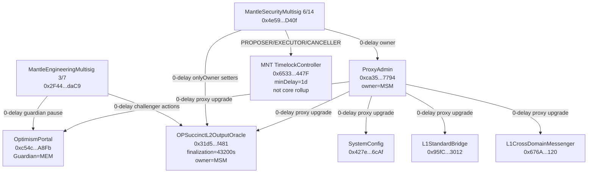
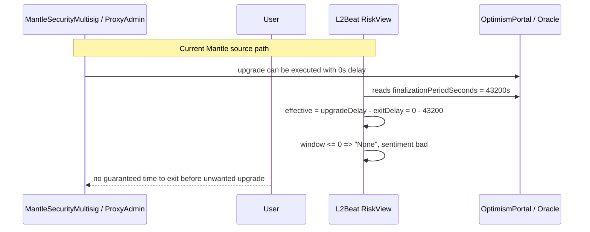
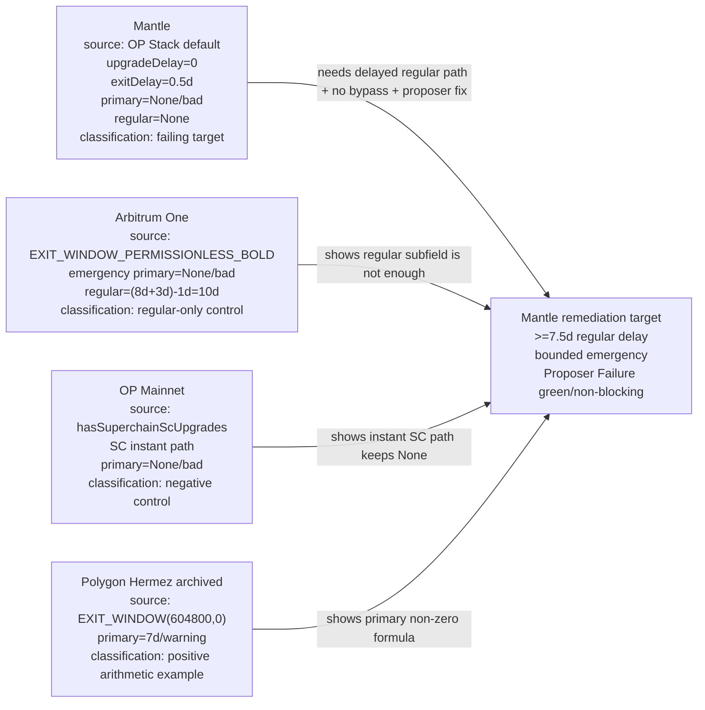
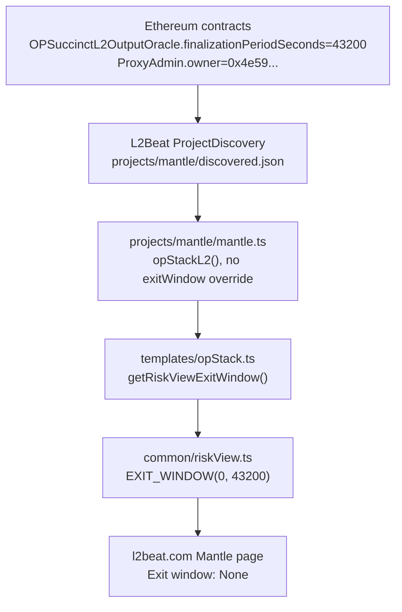
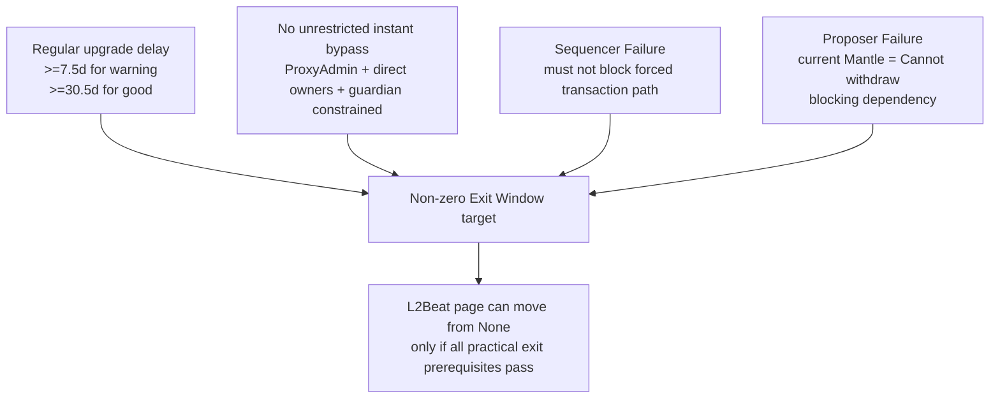

# Mantle Exit Window 根因分析与对标研究

## 1. Executive Summary

Mantle 当前在 L2Beat Risk Analysis 的 Exit Window 维度为 **None / bad**。直接原因不是一个"差几天"的 timelock 参数，而是 L2Beat 当前 OP Stack 模板对 Mantle 的计算路径：Mantle 项目配置没有 `nonTemplateRiskView.exitWindow` 覆盖，模板函数 `getRiskViewExitWindow()` 读取 `OPSuccinctL2OutputOracle.finalizationPeriodSeconds = 43200`，再调用 `RISK_VIEW.EXIT_WINDOW(0, 43200)`。因此 `upgradeDelay = 0`、`exitDelay = 43200`，effective window = `0 - 43200 = -43200s`，页面显示 `None`，sentiment = `bad`。

链上与 L2Beat discovery 均显示 Mantle core rollup 合约仍由 `ProxyAdmin 0xca35...7794` 管理，`ProxyAdmin.owner()` 为 MantleSecurityMultisig `0x4e59...D40f`，没有 core-rollup TimelockController。`OPSuccinctL2OutputOracle.owner()` 也是同一 6/14 Safe，`OptimismPortal.GUARDIAN()` 为 MantleEngineeringMultisig `0x2F44...daC9`，这些关键权限都可在没有用户退出窗口的情况下执行高影响升级或参数动作。

与 7 天 Risk Chart 阈值相比，Mantle 当前差距按 L2Beat 公式为 **7.5 天**：要让 `upgradeDelay - 0.5d >= 7d`，regular path 至少需要 **7.5d** 的可审计延迟。仅把 timelock 加到 7d 仍只有 6.5d effective window，会保持红色。更重要的是，prior framework 明确的 gating claim 也在 Mantle 上失败：Mantle 当前 Proposer Failure 为 `Cannot withdraw` / bad，Sequencer Failure 即使按 OP Stack 默认为 self-sequence，也不能单独支撑 non-zero Exit Window。换言之，"只延长 timelock"不足以让 Mantle 在 L2Beat 上变成合格，还必须同时解决 Proposer Failure / walkaway 路径与任何 instant-upgrade bypass。

对标结论也需要纠偏：Arbitrum One 和 OP Mainnet 都不是当前 primary Exit Window 正向通过样本。Arbitrum One 有 `Regular: 10d`，但 primary/emergency path 仍是 `Exit window: None`；OP Mainnet 因 `hasSuperchainScUpgrades = true` 直接显示 Security Council instant upgrade power 导致 `None`。两者适合作为 control cases：Arbitrum 说明 regular 子字段可以存在但不改变 primary red；OP Mainnet 说明成熟治理也可能因 instant SC path 在 Risk Chart Exit Window 上为 `None`。作为正向样本，已归档的 Polygon Hermez 页面显示 `Exit window: 7d`，源码为 `RISK_VIEW.EXIT_WINDOW(604800, 0)`，说明 Risk Chart 只要 primary path 没有 instant bypass 且 `upgradeDelay - exitDelay >= 7d` 就能给出 non-zero 窗口。

## 2. Item Findings

### item-1: 证据基线与 Mantle 合约地址清单

本 draft 使用三类 evidence baseline：

| Evidence bucket | Source | Fetched / observed |
|---|---|---|
| L2Beat source | `l2beat/l2beat` commit `aa147da36dc2b8d307d8e09b17d18109b2286235` | 2026-05-21T10:47:07Z |
| L2Beat project pages | Mantle, Arbitrum One, OP Mainnet pages | 2026-05-21T10:47:07Z |
| Ethereum on-chain reads | `cast call ... --rpc-url https://ethereum-rpc.publicnode.com` | 2026-05-21T10:47:07Z |

Canonical Mantle production contract inventory:

| Contract / role | Address | Evidence | Current value relevant to Exit Window |
|---|---:|---|---|
| Rollup ProxyAdmin | `0xca35F8338054739D138884685e08b39EE2217794` | L2Beat discovery + `owner()` on-chain read | `owner = 0x4e59...D40f`; no timelock delay in core rollup path |
| MantleSecurityMultisig | `0x4e59e778a0fb77fBb305637435C62FaeD9aED40f` | L2Beat discovery + prior final | 6/14 Safe controlling ProxyAdmin and OPSuccinct owner |
| MantleEngineeringMultisig | `0x2F44BD2a54aC3fB20cd7783cF94334069641daC9` | L2Beat discovery + `GUARDIAN()` / `challenger()` reads | 3/7 Safe; OptimismPortal Guardian and OPSuccinct challenger |
| `OPSuccinctL2OutputOracle` proxy | `0x31d543e7BE1dA6eFDc2206Ef7822879045B9f481` | L2Beat discovery + on-chain reads | `finalizationPeriodSeconds = 43200`, `owner = 0x4e59...D40f`, `challenger = 0x2F44...daC9`, `proposer = 0x0` |
| `OptimismPortal` proxy | `0xc54cb22944F2bE476E02dECfCD7e3E7d3e15A8Fb` | L2Beat discovery + on-chain reads | `version = 1.7.0`, `GUARDIAN = 0x2F44...daC9`, `paused = false` |
| `SystemConfig` proxy | `0x427Ea0710FA5252057F0D88274f7aeb308386cAf` | L2Beat discovery | proxy admin `0xca35...7794`, owner field `0x4e59...D40f` |
| `L1StandardBridge` proxy | `0x95fC37A27a2f68e3A647CDc081F0A89bb47c3012` | L2Beat discovery | proxy admin `0xca35...7794` |
| `L1CrossDomainMessenger` proxy | `0x676A795fe6E43C17c668de16730c3F690FEB7120` | L2Beat discovery | proxy admin `0xca35...7794` |
| L1 MNT TimelockController | `0x65331ff6F8B0fc2612F2a0deBD9d04Fce60a447F` | on-chain `getMinDelay()` / `hasRole()` | `minDelay = 86400`; same MantleSecurityMultisig has proposer/executor/canceller |

The L1 MNT TimelockController is real but is not the core rollup upgrade path. It proves Mantle has at least one 1d token-governance timelock, but not a core-rollup exit window. L2Beat's Exit Window calculation for the Mantle project page is driven by OP Stack template risk view and the OP Succinct finalization period, not by the MNT token timelock.

### item-2: Mantle 合约升级权限链与 timelock 精确参数

Current core rollup upgrade chain:

1. `ProxyAdmin 0xca35...7794` is the EIP-1967 admin for the core proxies in L2Beat discovery, including `OPSuccinctL2OutputOracle`, `OptimismPortal`, `SystemConfig`, `L1StandardBridge`, and `L1CrossDomainMessenger`.
2. `ProxyAdmin.owner()` returned `0x4e59e778a0fb77fBb305637435C62FaeD9aED40f` on 2026-05-21T10:47:07Z.
3. That owner is the MantleSecurityMultisig 6/14 Safe per prior Mantle architecture research and L2Beat discovery labels.
4. No TimelockController sits between the Safe and ProxyAdmin for core rollup proxies. Therefore implementation upgrades have `upgradeDelay = 0` for Risk Chart purposes.

Current non-upgrade but still safety-relevant parameter authority:

| Function family | Current authority | Delay | Why it matters |
|---|---|---:|---|
| Proxy implementation upgrades via `ProxyAdmin` | MantleSecurityMultisig `0x4e59...D40f` | 0 | Can change bridge/portal/oracle implementations without exit notice |
| `OPSuccinctL2OutputOracle` owner setters | MantleSecurityMultisig `0x4e59...D40f` | 0 | Can update verifier, vkeys, rollup config hash, submission interval, proposers, owner |
| `OPSuccinctL2OutputOracle` challenger actions | MantleEngineeringMultisig `0x2F44...daC9` | 0 | Can enable/disable optimistic mode, update finalization period, delete outputs in current implementation family |
| `OptimismPortal` Guardian | MantleEngineeringMultisig `0x2F44...daC9` | 0 | Can pause portal operations; current v1.7.0 has no auto-expiring pause field in prior chain read |
| MNT token proxy admin through TimelockController | MantleSecurityMultisig roles on `0x6533...447F` | 86400s | Token-governance path; not enough for Risk Chart 7d and not the core rollup path |

The only precise timelock read found in Mantle's scope is `getMinDelay() = 86400` on the L1 MNT token TimelockController. For the core rollup contracts that determine L2Beat Exit Window, the effective delay is 0 because the ProxyAdmin owner is a multisig.

### item-3: 即时升级或 timelock 绕过路径排查

Mantle has a direct instant-upgrade path for core rollup proxies:

```text
MantleSecurityMultisig 6/14
  -> ProxyAdmin.owner()
  -> ProxyAdmin upgrade / upgradeAndCall
  -> OPSuccinctL2OutputOracle / OptimismPortal / bridge / messenger / SystemConfig implementations
```

This path is sufficient for L2Beat to treat the core rollup as instantly upgradable. The project page text matches the generic `EXIT_WINDOW(0, finalizationPeriod)` output: there is no user exit window in case of an unwanted upgrade because contracts are instantly upgradable.

There are also non-implementation parameter paths that can affect safety without a timelock. They do not change the core `EXIT_WINDOW(0, 43200)` calculation, but they strengthen the same root cause: the same project multisigs can materially alter proving, output, and portal behavior without a delay. The most important are:

| Path | Current authority | Risk interpretation |
|---|---|---|
| `OPSuccinctL2OutputOracle.owner` setters | MantleSecurityMultisig | Bypass any future ProxyAdmin-only delay unless ownership is also moved behind delayed governance |
| `OPSuccinctL2OutputOracle.challenger` setters | MantleEngineeringMultisig | Can affect finalization / optimistic mode / output deletion; should be part of any exit-window remediation review |
| `OptimismPortal.GUARDIAN` | MantleEngineeringMultisig | Pause can obstruct withdrawal workflow; bounded-pause / walkaway design remains a prerequisite |

Conclusion: effective Exit Window should be treated as 0 for upgrade delay until both ProxyAdmin and directly owned critical contracts are moved behind a real delayed path, and emergency paths are separated and bounded.

### item-4: Mantle force inclusion / withdrawal exit delay 与 effective exit window 计算

L2Beat OP Stack source path:

1. `packages/config/src/projects/mantle/mantle.ts` instantiates `opStackL2({ discovery, ... })` and does not set `nonTemplateRiskView.exitWindow`.
2. `packages/config/src/templates/opStack.ts` assembles `riskView.exitWindow` as `nonTemplateRiskView?.exitWindow ?? getRiskViewExitWindow(templateVars)`.
3. `getRiskViewExitWindow()` gets `finalizationPeriod = getFinalizationPeriod(templateVars)`.
4. For `FraudProofType = OpSuccinct`, `getFinalizationPeriod()` reads `OPSuccinctL2OutputOracle.finalizationPeriodSeconds`.
5. Mantle discovery and direct chain read both return `finalizationPeriodSeconds = 43200`.
6. Because `hasSuperchainScUpgrades` is not set for Mantle, the function returns `RISK_VIEW.EXIT_WINDOW(0, finalizationPeriod)`.

Formula:

```text
upgradeDelay = 0 seconds
exitDelay = finalizationPeriodSeconds = 43200 seconds = 12 hours = 0.5 days
effectiveExitWindow = upgradeDelay - exitDelay
                    = 0 - 43200
                    = -43200 seconds = -12 hours = -0.5 days

L2Beat display: windowText = "None" when window <= 0
L2Beat sentiment: bad when window < 7 days
```

Gap to Risk Chart 7d threshold:

```text
Required effective window >= 7d = 604800 seconds
With current exitDelay 43200 seconds:
required upgradeDelay >= 604800 + 43200 = 648000 seconds = 7.5 days

Current upgradeDelay = 0
absolute upgradeDelay gap = 648000 seconds = 180 hours = 7.5 days
```

If Mantle only used a 7d timelock while `exitDelay` remains 12h, the effective window would be 6.5d and still red. A minimum 7.5d regular delay is the arithmetic threshold for Risk Chart non-red. A 30.5d delay would be needed for the Risk Chart green threshold if exitDelay remains 12h.

Prerequisite gate imported from `l2beat-risk-assessment-framework`:

The prior framework final separates Risk Chart from Stage scoring and identifies a key interpretation for this downstream issue: non-zero Exit Window should not be presented as fixed unless users can actually use the window to exit. That depends on Sequencer Failure and Proposer Failure not blocking user-initiated withdrawal. Mantle currently fails the Proposer side because OP Stack template maps `OpSuccinct` and `OpSuccinctFDP` to `PROPOSER_CANNOT_WITHDRAW`. L2Beat Mantle page currently displays Proposer Failure as `Cannot withdraw`, so Proposer Failure is a blocking dependency. This draft does not redo the Proposer Failure root-cause analysis; it imports the prior final and verifies the current Mantle config still uses the same template branch.

Sequencer Failure appears to use OP Stack default `SEQUENCER_SELF_SEQUENCE(HARDCODED.OPTIMISM.SEQUENCING_WINDOW_SECONDS)` because Mantle has no override in `mantle.ts`. That is not the current blocker in this draft. The current explicit blocker is Proposer Failure red + instant upgrade path.

### item-5: L2Beat Mantle 标红判定定位

Four-layer mapping from source to page:

| Layer | Evidence | Mantle observation |
|---|---|---|
| Source file | [`packages/config/src/projects/mantle/mantle.ts`](https://github.com/l2beat/l2beat/blob/aa147da36dc2b8d307d8e09b17d18109b2286235/packages/config/src/projects/mantle/mantle.ts) | `opStackL2({...})`; no `nonTemplateRiskView.exitWindow` override |
| Template function | [`packages/config/src/templates/opStack.ts`](https://github.com/l2beat/l2beat/blob/aa147da36dc2b8d307d8e09b17d18109b2286235/packages/config/src/templates/opStack.ts) | default `getRiskViewExitWindow()` returns `RISK_VIEW.EXIT_WINDOW(0, finalizationPeriod)` |
| Risk helper | [`packages/config/src/common/riskView.ts`](https://github.com/l2beat/l2beat/blob/aa147da36dc2b8d307d8e09b17d18109b2286235/packages/config/src/common/riskView.ts) | `window = upgradeDelay - exitDelay`; `window <= 0` displays `None`; `<7d` sentiment bad |
| Page text | L2Beat Mantle project page, fetched 2026-05-21T10:47:07Z | `Exit window: None`; description says there is no window because contracts are instantly upgradable |

Why the Mantle slice is red:

1. Mantle has no project-specific Risk View override for Exit Window.
2. The OP Stack template hardcodes `upgradeDelay = 0` for non-Superchain-SC projects.
3. The template reads OP Succinct `finalizationPeriodSeconds = 43200` as `exitDelay`.
4. `EXIT_WINDOW(0, 43200)` yields `None` and `bad`.
5. Current on-chain authority confirms the template's conservative assumption: core ProxyAdmin is owned by a multisig, not by a timelock.
6. Proposer Failure remains `Cannot withdraw`, so even a future regular delay improvement must be paired with proposer / walkaway remediation.

Important boundary: The MNT token TimelockController does not rescue this Risk Chart slice. It has `minDelay = 1d` and is governed by the same MantleSecurityMultisig roles, but it is not the ProxyAdmin owner for core rollup contracts and is not used by the L2Beat Mantle `riskView.exitWindow` source path.

### item-6: Arbitrum One 对标：current Exit Window 分类

Arbitrum One is a useful control case, not a clean primary pass example.

Source path:

| Field | Arbitrum One current value |
|---|---|
| Project config | [`packages/config/src/projects/arbitrum/arbitrum.ts`](https://github.com/l2beat/l2beat/blob/aa147da36dc2b8d307d8e09b17d18109b2286235/packages/config/src/projects/arbitrum/arbitrum.ts) |
| Source expression | `nonTemplateRiskView.exitWindow = RISK_VIEW.EXIT_WINDOW_PERMISSIONLESS_BOLD(l2TimelockDelay, selfSequencingDelay, l1TimelockDelay)` |
| `l2TimelockDelay` | `L2Timelock.getMinDelay = 691200s = 8d` |
| `l1TimelockDelay` | `L1Timelock.getMinDelay = 259200s = 3d` |
| `selfSequencingDelay` | `SequencerInbox.maxTimeVariation.delaySeconds = 86400s = 1d` |
| Regular formula | `(8d + 3d) - 1d = 10d` |
| Primary/emergency formula | `EXIT_WINDOW(0, 1d) = None / bad` |
| Page classification | `Exit window: None`, `Regular: 10d` |
| Comparator classification | regular-only comparator / negative-control for primary sentiment |

Why Arbitrum still helps: it demonstrates how L2Beat separates emergency/primary path from regular path. The regular path has a non-zero 10d window, but `withRegularExitWindow()` returns the emergency `EXIT_WINDOW(0, selfSequencingDelay)` as the primary table value and attaches the 10d value as `regular`. That means Mantle cannot rely on a regular timelock if any instant emergency or bypass path remains primary.

### item-7: OP Mainnet 对标：OP Stack 项目的通过路径与限制

OP Mainnet is also a negative/control comparator for current primary Exit Window.

Source path:

| Field | OP Mainnet current value |
|---|---|
| Project config | [`packages/config/src/projects/optimism/optimism.ts`](https://github.com/l2beat/l2beat/blob/aa147da36dc2b8d307d8e09b17d18109b2286235/packages/config/src/projects/optimism/optimism.ts) |
| Template | `opStackL2` |
| Special flag | `hasSuperchainScUpgrades: true` |
| Template branch | `getRiskViewExitWindow()` returns a custom `None` / `bad` object before calling `EXIT_WINDOW()` |
| Page classification | `Exit window: None` because upgrades can be initiated by Security Council with instant upgrade power and without proper notice |
| Comparator classification | negative-control for primary sentiment |

OP Mainnet's lesson for Mantle is not "copy OP and pass." It is the opposite: even a mature OP Stack governance structure can remain red in primary Exit Window if the Security Council path has instant upgrade power. Mantle's remediation therefore needs to distinguish:

- regular non-emergency upgrades with a long enough delay;
- emergency actions that are constrained to narrow selector/target pairs;
- direct owner or guardian powers that can bypass the regular delay;
- user withdrawal paths that remain usable when proposer or security-council actors fail.

### item-7b: Positive comparator sanity check - Polygon Hermez

Because both named high-profile comparators are current controls rather than primary pass examples, this draft adds one small positive sanity check: archived Polygon Hermez.

| Field | Polygon Hermez value |
|---|---|
| Project config | [`packages/config/src/projects/hermez/hermez.ts`](https://github.com/l2beat/l2beat/blob/aa147da36dc2b8d307d8e09b17d18109b2286235/packages/config/src/projects/hermez/hermez.ts) |
| Source expression | `const upgradeDelay = 604800`; `exitWindow: RISK_VIEW.EXIT_WINDOW(upgradeDelay, 0)` |
| Page text | `Exit window: 7d`; users have 7d to exit funds; 7d delay before upgrade, withdrawals 0s |
| Sequencer / Proposer status | `SEQUENCER_FORCE_VIA_L1()` and `PROPOSER_SELF_PROPOSE_ZK` in source |
| Comparator classification | positive Risk Chart example, but archived and payment-focused rather than a live OP Stack universal rollup |

This is not a direct architecture blueprint for Mantle. It only proves the exact L2Beat riskView arithmetic: when the primary upgrade path has `upgradeDelay = 604800` and `exitDelay = 0`, the Risk Chart displays a non-zero 7d window. Mantle's current OP Succinct path has `exitDelay = 43200`, so Mantle needs at least 648000s, not merely 604800s, even before dealing with bypass and Proposer Failure gating.

### item-8: 根因归纳与改进路径的运营影响

Root causes:

1. **Core rollup upgrade delay is effectively 0**. ProxyAdmin is owned by MantleSecurityMultisig and not by a timelock. L2Beat source reflects this through OP Stack default `EXIT_WINDOW(0, finalizationPeriod)`.
2. **Critical direct-owner paths also have 0 delay**. `OPSuccinctL2OutputOracle.owner`, `challenger`, and `OptimismPortal.GUARDIAN` are multisig-controlled. A remediation that only moves ProxyAdmin but leaves these paths instant would remain weak and likely fail review.
3. **Proposer Failure blocks a meaningful non-zero Exit Window**. Mantle's OP Succinct branch maps to `PROPOSER_CANNOT_WITHDRAW`; users cannot rely on the exit window if they cannot independently get a withdrawable state root when the proposer path fails.

Minimum arithmetic improvement:

| Target | Required regular upgrade delay if exitDelay remains 43200s |
|---|---:|
| Risk Chart non-red lower bound (`effective >= 7d`) | `648000s = 7.5d` |
| Risk Chart green lower bound (`effective >= 30d`) | `2635200s = 30.5d` |

Operational impact:

- Emergency bug fixes cannot simply use the same unrestricted owner path. Any immediate path should be selector/target-limited and auditable, otherwise L2Beat will still treat it like an instant upgrade bypass.
- A 7.5d+ regular timelock requires monitoring and public diff review before execution. Mantle would need runbooks for scheduled upgrades, cancellation, and public alerting.
- Portal pause / guardian actions require bounded recovery. If a pause can persist indefinitely or block prove/finalize paths, it undermines walkaway assumptions.
- Proposer remediation likely becomes the gating long pole: without permissionless/self-propose or an L2Beat-accepted fallback, longer timelock alone does not make the Exit Window slice meaningfully usable.

## 3. Diagrams

### diag-1: Mantle 当前合约升级权限链



### diag-2: Exit Window calculation



### diag-3: Mantle vs Arbitrum vs OP Mainnet classification



### diag-4: L2Beat data path for Mantle Exit Window



### diag-5: Exit Window improvement prerequisites



## 4. Source Coverage

| Requirement | Required | Covered in this draft | Status |
|---|---:|---|---|
| src-1 verified_contracts | 5 | 9 Mantle Ethereum addresses with Etherscan/discovery refs | met |
| src-2 on_chain_data | 8 | 9 direct/current reads plus prior final chain reads | met |
| src-3 l2beat_source | 5 | Mantle config, discovered.json, opStack template, riskView helper, Arbitrum config, OP config, orbitStack proposer helper | met |
| src-4 l2beat_project_pages | 3 | Mantle, Arbitrum One, OP Mainnet current pages | met |
| src-5 benchmark_primary_sources | 6 | Arbitrum + OP L2Beat source/config; Polygon Hermez positive source/page; prior final contains governance docs | met |
| src-6 operational_context | 3 | prior Mantle Stage1 upgrade/security final, OZ Timelock docs in prior final, OP/Arbitrum control lessons | met |
| src-7 methodology_context | 1 | prior `l2beat-risk-assessment-framework/final.md` imported and tested against Mantle current source path | met |
| src-8 source_metadata_audit | 1 | source ledger below | met |

## 5. Source Metadata Audit

| ID | Source | Type | fetched_at | Commit / permalink | Observed value |
|---|---|---|---|---|---|
| S1 | `packages/config/src/projects/mantle/mantle.ts` | l2beat_source | 2026-05-21T10:47:07Z | [`aa147da` L12-16](https://github.com/l2beat/l2beat/blob/aa147da36dc2b8d307d8e09b17d18109b2286235/packages/config/src/projects/mantle/mantle.ts#L12-L16) · [L68-71](https://github.com/l2beat/l2beat/blob/aa147da36dc2b8d307d8e09b17d18109b2286235/packages/config/src/projects/mantle/mantle.ts#L68-L71) · [L143-158](https://github.com/l2beat/l2beat/blob/aa147da36dc2b8d307d8e09b17d18109b2286235/packages/config/src/projects/mantle/mantle.ts#L143-L158) | Mantle uses `opStackL2`, OP Succinct badge, no `nonTemplateRiskView.exitWindow` |
| S2 | `packages/config/src/templates/opStack.ts` | l2beat_source | 2026-05-21T10:47:07Z | [`aa147da` L1274-1287](https://github.com/l2beat/l2beat/blob/aa147da36dc2b8d307d8e09b17d18109b2286235/packages/config/src/templates/opStack.ts#L1274-L1287) · [L1387-1400](https://github.com/l2beat/l2beat/blob/aa147da36dc2b8d307d8e09b17d18109b2286235/packages/config/src/templates/opStack.ts#L1387-L1400) · [L2268-2278](https://github.com/l2beat/l2beat/blob/aa147da36dc2b8d307d8e09b17d18109b2286235/packages/config/src/templates/opStack.ts#L2268-L2278) | default exitWindow path; OpSuccinct finalization period read |
| S3 | `packages/config/src/common/riskView.ts` | l2beat_source | 2026-05-21T10:47:07Z | [`aa147da` L642-687](https://github.com/l2beat/l2beat/blob/aa147da36dc2b8d307d8e09b17d18109b2286235/packages/config/src/common/riskView.ts#L642-L687) · [L741-798](https://github.com/l2beat/l2beat/blob/aa147da36dc2b8d307d8e09b17d18109b2286235/packages/config/src/common/riskView.ts#L741-L798) | formula, thresholds, `None`, regular subfield helper |
| S4 | `packages/config/src/projects/mantle/discovered.json` | l2beat_source/discovery | 2026-05-21T10:47:07Z | [`aa147da` (file)](https://github.com/l2beat/l2beat/blob/aa147da36dc2b8d307d8e09b17d18109b2286235/packages/config/src/projects/mantle/discovered.json) | ProxyAdmin owner, OPSuccinct values, OptimismPortal Guardian/version |
| S5 | Ethereum RPC direct reads | on_chain_data | 2026-05-21T10:47:07Z | publicnode mainnet RPC | `ProxyAdmin.owner=0x4e59...`; `finalizationPeriodSeconds=43200`; `owner=0x4e59...`; `challenger/GUARDIAN=0x2F44...`; `proposer=0x0`; `version=1.7.0`; MNT timelock `getMinDelay=86400`; three roles true |
| S6 | L2Beat Mantle page | l2beat_page | 2026-05-21T10:47:07Z | page URL `https://l2beat.com/scaling/projects/mantle` | `Exit window: None`; instant-upgrade description; `Proposer failure: Cannot withdraw` |
| S7 | `packages/config/src/projects/arbitrum/arbitrum.ts` | l2beat_source | 2026-05-21T10:47:07Z | [`aa147da` L28-48](https://github.com/l2beat/l2beat/blob/aa147da36dc2b8d307d8e09b17d18109b2286235/packages/config/src/projects/arbitrum/arbitrum.ts#L28-L48) · [L360-365](https://github.com/l2beat/l2beat/blob/aa147da36dc2b8d307d8e09b17d18109b2286235/packages/config/src/projects/arbitrum/arbitrum.ts#L360-L365) | regular formula uses `EXIT_WINDOW_PERMISSIONLESS_BOLD` |
| S8 | Arbitrum discovery | l2beat_source/discovery | 2026-05-21T10:47:07Z | [`aa147da` (file)](https://github.com/l2beat/l2beat/blob/aa147da36dc2b8d307d8e09b17d18109b2286235/packages/config/src/projects/arbitrum/discovered.json) | `L2Timelock=691200`, `L1Timelock=259200`, `selfSequencingDelay=86400` |
| S9 | L2Beat Arbitrum page | l2beat_page | 2026-05-21T10:47:07Z | page URL `https://l2beat.com/scaling/projects/arbitrum` | `Exit window: None`, `Regular: 10d` |
| S10 | `packages/config/src/projects/optimism/optimism.ts` | l2beat_source | 2026-05-21T10:47:07Z | [`aa147da` L17-25](https://github.com/l2beat/l2beat/blob/aa147da36dc2b8d307d8e09b17d18109b2286235/packages/config/src/projects/optimism/optimism.ts#L17-L25) · [L124](https://github.com/l2beat/l2beat/blob/aa147da36dc2b8d307d8e09b17d18109b2286235/packages/config/src/projects/optimism/optimism.ts#L124) | OP Mainnet uses `hasSuperchainScUpgrades: true` |
| S11 | L2Beat OP Mainnet page | l2beat_page | 2026-05-21T10:47:07Z | page URL `https://l2beat.com/scaling/projects/op-mainnet` | `Exit window: None`, instant Security Council upgrade-power text |
| S12 | `packages/config/src/projects/hermez/hermez.ts` | l2beat_source | 2026-05-21T10:47:07Z | [`aa147da` L19](https://github.com/l2beat/l2beat/blob/aa147da36dc2b8d307d8e09b17d18109b2286235/packages/config/src/projects/hermez/hermez.ts#L19) · [L75-80](https://github.com/l2beat/l2beat/blob/aa147da36dc2b8d307d8e09b17d18109b2286235/packages/config/src/projects/hermez/hermez.ts#L75-L80) | positive arithmetic example: `EXIT_WINDOW(604800, 0)` |
| S13 | L2Beat Polygon Hermez page | l2beat_page | 2026-05-21T10:47:07Z | page URL `https://l2beat.com/scaling/projects/hermez` | archived project; `Exit window: 7d`; source-compatible page text |
| S14 | `l2beat-risk-assessment-framework/final.md` | methodology_context | 2026-05-21T10:47:07Z | final commit `b088ac3...`; internal L2Beat source commit `c4d959...` | Risk Chart thresholds; OpSuccinct proposer failure mapping; Proposer/Exit Window dependency framing |
| S15 | `upgrade-exitwindow-securitycouncil/final.md` | operational_context | 2026-05-21T10:47:07Z | prior final, promoted 2026-05-19 | Mantle core-rollup 0d path, MNT 1d timelock, operational remediation patterns |

## 6. Gap Analysis

1. **Outline frontmatter mismatch**: the approved outline file still says `status: candidate`, while Orchestrator and Research Review comments approved round 2 and dispatched deep draft from commit `b86f800...`. This draft follows the issue state and dispatch as authoritative but records the metadata mismatch for cleanup.
2. **Positive comparator is archived, not live universal OP Stack**: Polygon Hermez is a clean arithmetic example but not a live Mantle-like OP Stack rollup. The live named comparators (Arbitrum One / OP Mainnet) remain controls for the current primary/emergency path issue.
3. **Etherscan verified-source line refs not re-opened in this draft**: L2Beat discovery plus on-chain reads are sufficient for current Risk Chart calculation. The prior Mantle Stage1 final contains deeper verified-contract/source references for OPSuccinct implementation setters and portal behavior.
4. **No L2Beat team statement that "both Sequencer and Proposer must be green" was newly found**: this draft imports the prior framework's gating interpretation and applies it conservatively. The strongest current direct blocker is Proposer Failure = `Cannot withdraw`.
5. **Future remediation requires L2Beat review**: even if Mantle deploys a 7.5d+ timelock, L2Beat may require explicit `nonTemplateRiskView.exitWindow` or template/discovery changes before the page changes, especially for emergency-path and proposer-path treatment.

## 7. Revision Log

| Round | Date | Changes |
|---|---|---|
| 1 | 2026-05-21 | Initial deep draft from approved outline. Covered Mantle current upgrade chain, L2Beat source mapping, effective window calculation, Sequencer/Proposer prerequisite check, Arbitrum/OP control comparators, Polygon Hermez positive arithmetic comparator, five diagrams, source coverage, and source ledger. |
| final | 2026-05-21 | Promoted from round-1 draft (commit de726e94). Applied source-hygiene polish: upgraded page observation dates from date-only to full ISO `fetched_at` timestamps (2026-05-21T10:47:07Z); upgraded L2Beat source citations from commit+line ranges to full line-level GitHub permalinks at commit aa147da36dc2b8d307d8e09b17d18109b2286235. No substantive content changes. |
