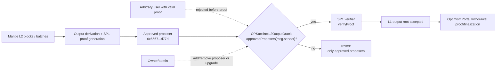
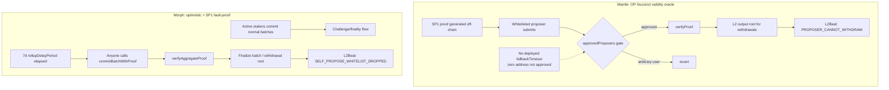
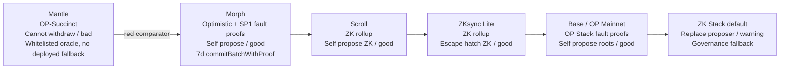
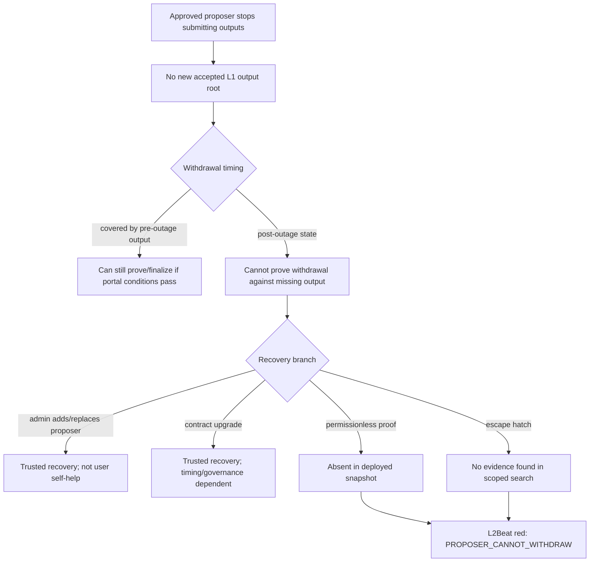

# Mantle Proposer Failure Root-Cause Analysis and SP1 Comparison

## Executive Summary

- Mantle is red on L2Beat Proposer Failure because the current L2Beat OP Stack template classifies Mantle as `OpSuccinct`, and `getRiskViewProposerFailure()` maps both `OpSuccinct` and `OpSuccinctFDP` to `RISK_VIEW.PROPOSER_CANNOT_WITHDRAW`. That constant is the red "Cannot withdraw" outcome: only whitelisted proposers can publish state roots, so withdrawals freeze if proposers fail.
- The contract-level fact behind the rating is that Mantle's deployed `OPSuccinctL2OutputOracle` accepts ZK proofs only through an authorization gate. At the locked Ethereum snapshot, `optimisticMode=false`, only the initial proposer `0x6667...d77d` was confirmed approved, the zero address was not approved, and `fallbackTimeout()` reverted. The deployed ABI also lacks any fallback timeout or permissionless-propose getter.
- Morph is the important counterexample, but not because "SP1 always passes." L2Beat models Morph as an optimistic rollup with SP1 ZK fault proofs, not as the OP-Succinct validity-template path. Morph's `riskView.proposerFailure` is a hand-authored self-propose timeout: after the 7-day `rollupDelayPeriod`, `commitBatchWithProof()` can be called permissionlessly with a ZK proof.
- The root cause is therefore a combination of L1 boundary permissioning and L2Beat template semantics: Mantle's proof validity is not sufficient for permissionless liveness because an approved proposer must submit before proof verification; no deployed user self-help fallback was found; L2Beat has no Mantle-specific override proving a stronger fallback.
- Operational or governance recovery can still exist. It is not equivalent to L2Beat "user self-help": a user cannot independently publish a new Mantle output root for a post-outage withdrawal using only a valid SP1 proof on the deployed oracle snapshot.

## Item Findings

### Item 1: Evidence Baseline and L2Beat Proposer Failure Framework Binding

**Evaluation rules used in this section**

| Rule | Source / Evidence | Consequence |
|---|---|---|
| Proposer Failure asks whether users can exit if proposers fail, not whether the state validation proof system is sound. | WHI-49 final is background only; current draft re-verified L2Beat `riskView.ts` at commit `aa147da`. | A validity proof can still be red if only whitelisted proposers can submit it. |
| `PROPOSER_CANNOT_WITHDRAW` is the red baseline. | `l2beat/packages/config/src/common/riskView.ts:516-522` defines value `Cannot withdraw`, description "Only the whitelisted proposers can publish state roots on L1..." and sentiment `bad`. | Mantle's displayed red condition is not an inference; it is the named L2Beat constant. |
| Self-propose / escape-hatch constants are the non-red comparators. | `riskView.ts:548-621` defines ZK/MP escape hatch and self-propose variants with `good` sentiment; `riskView.ts:623-628` defines permissionless roots. | Passing projects either let users self-propose/prove or use an explicit escape hatch / governance fallback with weaker warning semantics. |
| Dynamic facts are locked per source type. | L2Beat commit `aa147da`; Ethereum block `25143121` at `2026-05-21T10:48:11Z`; Morph and source repos at commits in frontmatter. | Later L2Beat commits or contract upgrades can change this conclusion and must be re-run. |

Source priority for this draft:

1. L2Beat source config/discovery at locked commit.
2. Live Ethereum calls and L2Beat discovery for deployed contract addresses/state.
3. Verified source/checked source for exact contract behavior.
4. Official project docs/source comments.
5. L2Beat production UI only as a cross-check, not as primary evidence.

### Item 2: Mantle SuccinctL2OutputOracle Contract and Proposer Authorization

**Locked deployed addresses and chain state**

| Field | Value | Evidence |
|---|---|---|
| Oracle proxy | `0x31d543e7BE1dA6eFDc2206Ef7822879045B9f481` | L2Beat discovery `mantle/discovered.json:129-151` |
| Implementation | `0x4059509fFb703B048D1e9Ce3118F90E759076f50` | L2Beat discovery `mantle/discovered.json:149-151,192-195` |
| Proxy admin | `0xca35F8338054739D138884685e08b39EE2217794` | L2Beat discovery `mantle/discovered.json:149-151` |
| Initial proposer | `0x6667961f5e9c98a76a48767522150889703ed77d` | L2Beat discovery `mantle/discovered.json:165-173`; live `approvedProposers(...) == true` |
| Additional proposers | `[]` | L2Beat discovery `mantle/discovered.json:165` |
| Zero address permissionless flag | `false` | live `approvedProposers(0x000...000) == false` |
| Optimistic mode | `false` | L2Beat discovery `mantle/discovered.json:179`; live `optimisticMode() == false` |
| Version | `2.0.1` | L2Beat discovery `mantle/discovered.json:190`; live `version() == "2.0.1"` |
| Fallback timeout | Absent on deployed ABI / live call reverted | L2Beat ABI `mantle/discovered.json:1147-1208` has no `fallbackTimeout`; live `fallbackTimeout()` reverted |

**Authorization and proof ordering**

The deployed ABI exposes two `proposeL2Output` overloads: optimistic mode and non-optimistic mode. The non-optimistic selector is the one L2Beat tracks for Mantle's OP-Succinct state updates (`mantle.ts:110-123`) and accepts proof bytes.

Sourcify has a full match for the deployed implementation `0x4059509fFb703B048D1e9Ce3118F90E759076f50`. The matched source file is `src/validity/OPSuccinctL2OutputOracle.sol`, with metadata source keccak `0x397c09565d4bfba9bfcc4a5293fbf78bd5fcfd14731433af17222ba89a8fe0cb`. That exact source shows this order for the non-optimistic function:

1. Function entry is guarded by `whenNotOptimistic`.
2. The first substantive check is `approvedProposers[msg.sender] || approvedProposers[address(0)]`.
3. Only after that does the contract check block monotonicity, output nonzero, checkpointed L1 block hash, build public values, and call `ISP1Verifier(verifier).verifyProof(...)`.
4. Only after proof verification does it emit `OutputProposed` and append the L2 output.

Line evidence from the Sourcify full-match source: `Semver(2, 0, 1)` at lines 190-192, proposer approval initialized at lines 226-227, non-optimistic `proposeL2Output` at lines 305-361, the authorization gate at lines 318-322, and `verifyProof` at line 350. The currently checked `op-succinct` HEAD is newer and includes v3/fallback code, so it is not treated as deployed Mantle source.

**Function access-control table**

| Function | Caller restriction | Proof verification | State mutation | Admin/fallback path |
|---|---|---|---|---|
| `proposeL2Output(bytes32,uint256,uint256,bytes)` | Deployed ABI; non-optimistic mode. Sourcify full-match v2.0.1 source requires `approvedProposers[msg.sender] || approvedProposers[address(0)]` before proof verification. | Calls SP1 verifier after authorization and L1 block hash checks. | Appends `l2Outputs` after successful proof. | Zero address can make permissionless only if approved; live zero address is not approved. No deployed `fallbackTimeout`. |
| `proposeL2Output(bytes32,uint256,bytes32,uint256)` | Optimistic-mode overload; Mantle live `optimisticMode=false`, so currently inactive. | No proof in optimistic mode. | Appends `l2Outputs`. | Same approval-or-zero-address pattern in Sourcify full-match v2.0.1 source; inactive unless owner toggles mode. |
| `addProposer(address)` / `removeProposer(address)` | ABI exposes owner-managed proposer updates. | None. | Mutates `approvedProposers`. | Recovery is operator/governance/admin action, not user self-help. |
| `deleteL2Outputs(uint256)` | Challenger only in Sourcify full-match v2.0.1 source. | None. | Deletes unfinalized outputs. | Does not let users publish a missing output root. |
| `updateVerifier` / `update*` / `enableOptimisticMode` | Owner/admin functions exposed in ABI. | N/A. | Changes verifier/config/mode. | Upgrade/admin recovery, not permissionless fallback. |

The important contract-level conclusion is narrow: at the L1 oracle boundary, a valid SP1 proof from an arbitrary caller is not sufficient unless that caller is approved or the zero-address permissionless flag is enabled. At the locked snapshot neither was true for arbitrary users.

### Item 3: Mantle Failure Mode and User Withdrawal Path Under Proposer Outage

Mantle withdrawals depend on an L1 output root accepted by the output oracle. The Mantle `OptimismPortal` source pattern proves a withdrawal by reading `L2_ORACLE.getL2Output(_l2OutputIndex).outputRoot` and checking the output-root proof against it (`OptimismPortal.sol:201-222`). Finalization later checks that the withdrawal has been proven, the proven-output and proposal finalization periods elapsed, and the current oracle output still matches the proven root (`OptimismPortal.sol:277-327`).

This means a proposer outage has different effects depending on timing:

| User state | Can an already-posted output help? | Outcome if proposer stops |
|---|---|---|
| Withdrawal initiated and covered by an already accepted output root | Yes, if proof/finalization periods and portal state permit. | Existing outputs can still support those withdrawals. |
| Withdrawal initiated after the last accepted output root | No. The L1 proof needs a post-withdrawal output root including the withdrawal hash. | User cannot prove/finalize through the normal path until a new output is accepted. |
| Operator/governance replaces proposer or upgrades oracle | Eventually maybe. | This is recovery by trusted/admin path, not user self-help. |
| Arbitrary user submits valid SP1 proof to deployed Mantle oracle | No, unless approved or zero address is approved. | At the locked snapshot, arbitrary user submission is rejected before proof verification. |

**Fallback/escape-hatch negative evidence**

Searched and checked:

- Deployed Mantle `OPSuccinctL2OutputOracle` ABI in L2Beat discovery (`mantle/discovered.json:1147-1208`): no `fallbackTimeout`, no `commitBatchWithProof`, no alternate public `submitProof`, no permissionless timeout getter.
- Live call `fallbackTimeout()(uint256)` against the deployed proxy reverted at Ethereum block `25143121`.
- Live `approvedProposers(address(0)) == false`; L2Beat discovery shows `additionalProposers: []`.
- L2Beat Mantle project config has no `nonTemplateRiskView.proposerFailure` override (`mantle.ts` invokes `opStackL2` and defines proof/tracked tx metadata, but does not override proposer failure).
- Source grep in checked repos found newer OP-Succinct branches with `fallbackTimeout`, but those are not the deployed ABI/state; they are treated as future/newer code, not current Mantle evidence.

Therefore the crisp answer is: Mantle has operator/admin recovery surfaces, but no deployed user-accessible proposer-failure fallback or escape hatch was found for post-outage withdrawals.

### Item 4: L2Beat Mantle Risk Configuration and Exact Red Reason

**Code path**

1. Mantle is declared via `opStackL2({...})` in `l2beat/packages/config/src/projects/mantle/mantle.ts:14`.
2. Mantle's description and proof metadata identify OP Succinct / SP1 validity proofs (`mantle.ts:22-23`, `mantle.ts:68-71`).
3. L2Beat tracks both optimistic and non-optimistic `OPSuccinctL2OutputOracle.proposeL2Output` calls (`mantle.ts:94-123`), including the non-optimistic proof-taking selector `0x9ad84880`.
4. The OP Stack template uses `nonTemplateRiskView?.proposerFailure ?? getRiskViewProposerFailure(...)` (`opStack.ts:1285-1287`). Mantle has no project override in its file.
5. For a legacy `OptimismPortal`, `getFraudProofType()` returns `OpSuccinct` if discovery has `OPSuccinctL2OutputOracle` (`opStack.ts:2360-2368`).
6. `getRiskViewProposerFailure()` maps `OpSuccinct` and `OpSuccinctFDP` to `RISK_VIEW.PROPOSER_CANNOT_WITHDRAW` (`opStack.ts:1403-1440`).
7. `PROPOSER_CANNOT_WITHDRAW` is red/bad and describes whitelisted proposers freezing withdrawals if they fail (`riskView.ts:516-522`).

**Exact "why red" paragraph**

Mantle is red because L2Beat's Mantle config runs through the OP Stack template, discovery contains an `OPSuccinctL2OutputOracle`, and the legacy `OptimismPortal` path classifies the proof type as `OpSuccinct`. The OP Stack template then hardcodes `OpSuccinct` proposer failure to `RISK_VIEW.PROPOSER_CANNOT_WITHDRAW`. That constant says only whitelisted proposers can publish state roots on L1 and withdrawals freeze if they fail. Mantle supplies no `nonTemplateRiskView.proposerFailure` override and no deployed fallback evidence that would move it into a self-propose or escape-hatch constant.

### Item 5: Morph Proposer Mechanism and L2Beat Passing Logic

Morph is not the same L2Beat path as Mantle. L2Beat's Morph config declares a standalone project, not `opStackL2`, and labels its proof system `Optimistic`, name `SP1`, challenge protocol `Single-step` (`morph.ts:59-70`). Its state-validation text says Morph is an optimistic rollup with ZK fault proofs, at least five whitelisted challengers, and SP1 as the zkVM (`morph.ts:226-233`). This is SP1 used as a ZK fault-proof mechanism, not the same OP-Succinct validity-oracle template path as Mantle.

Official Morph docs cross-check that framing: the Optimistic zkEVM / RVP documentation describes Morph as combining optimistic-rollup settlement with ZK proofs that are produced when challenged, and its "SP1 on Morph Mainnet" section says the RVP system was enhanced by SP1. The docs are useful for architecture context, but the L2Beat config and contract code remain the source of truth for the Proposer Failure rating. Source: https://docs.morphl2.io/docs/how-morph-works/optimistic-zkevm/

**Morph L2Beat pass condition**

Morph's `riskView.proposerFailure` is hand-authored as:

- `RISK_VIEW.PROPOSER_SELF_PROPOSE_WHITELIST_DROPPED(rollupDelayPeriod)`, with extra text requiring a source-available prover to submit a ZK validity proof (`morph.ts:195-201`).
- `rollupDelayPeriod` is discovered from the `Rollup` contract (`morph.ts:32-35`), and L2Beat discovery records it as `604800` seconds / 7 days (`morph/discovered.json:838-853`).
- The Morph discovery description explicitly states that if sequencers are censoring or down for more than 7 days, users can permissionlessly propose and prove via `commitBatchWithProof()` (`morph/discovered.json:722-732`).

**Morph contract facts**

| Fact | Evidence | Interpretation |
|---|---|---|
| Normal batch commit is permissioned. | `Rollup.sol:236-251` has `commitBatch(...) external ... onlyActiveStaker`. `L1Staking.sol:146-169` owner-managed whitelist and registration; `L1Staking.sol:379-386` active staker check. | Morph still has a whitelisted normal proposer/sequencer set. |
| Permissionless delayed batch+proof path exists. | `Rollup.sol:383-430` defines `commitBatchWithProof(...) external` without `onlyActiveStaker`, requiring rollup delay or L1 message queue delay, then `_verifyProof(...)`. | After delay, arbitrary callers can submit a batch proposal with proof at the L1 boundary. |
| Proof verification is real and occurs inside the permissionless path. | `Rollup.sol:752-777` computes public input and calls `IRollupVerifier(verifier).verifyAggregateProof(...)`. | L2Beat can credit self-propose because the fallback still verifies a proof. |
| Challenge proof path remains permissioned. | `Rollup.sol:599-627` has `proveState(...) ... onlyActiveStaker`. | Morph's pass should not be overgeneralized to all proof submission paths. |
| Finalization is public after challenge conditions. | `Rollup.sol:629-673` defines `finalizeBatch(...) public` and records withdrawal roots. | Once committed/proven and challenge-safe, users are not dependent on the original staker to call finalization. |

**Direct answer: Morph 是否允许任何人提交有效 ZK proof?**

For the L2Beat Proposer Failure-relevant fallback path, yes after the configured delay: `commitBatchWithProof()` is external, lacks `onlyActiveStaker`, requires the 7-day delay condition, and verifies the submitted proof before finalizing the batch timestamp path. For Morph's ordinary `commitBatch()` and challenged-state `proveState()`, no: those are active-staker restricted. This is why the Morph comparison must be framed as delayed permissionless self-propose, not as universally permissionless proving.

**Mantle vs Morph table**

| Dimension | Mantle | Morph | Why it matters for L2Beat Proposer Failure |
|---|---|---|---|
| L2Beat modeling path | OP Stack template + OP Succinct discovery. | Hand-authored Morph config, optimistic + SP1 ZK fault proofs. | Template branch differs; SP1 label is not the rating determinant. |
| Normal submitter | Approved proposer(s) for `OPSuccinctL2OutputOracle`. | Active stakers for `commitBatch`. | Both have permissioned fast paths. |
| Proof boundary | Proof-taking `proposeL2Output` checks proposer approval before verifier. | Delayed `commitBatchWithProof` is not active-staker-gated and verifies proof. | Mantle rejects arbitrary proofs at L1 boundary; Morph has a delayed public proof path. |
| Permissionless flag | `approvedProposers(address(0)) == false` live. | `commitBatchWithProof` callable by anyone after delay. | This is the key difference. |
| Timeout fallback | No deployed `fallbackTimeout`; live call reverted. | `rollupDelayPeriod = 604800` seconds. | L2Beat's Morph risk constant is a whitelist-dropped self-propose timeout. |
| Admin recovery | Owner can manage proposer/config/mode. | Owner can manage whitelist and rollup parameters. | Admin recovery is not what makes Morph green; the delayed public path does. |
| L2Beat outcome | `PROPOSER_CANNOT_WITHDRAW` / bad. | `PROPOSER_SELF_PROPOSE_WHITELIST_DROPPED(604800)` / good. | Exact red-vs-green reason. |

### Item 6: Other Passing Project Benchmarks

| Project | Stack / proof class | L2Beat Proposer Failure constant | Sentiment | Mechanism class | Evidence |
|---|---|---|---|---|---|
| Mantle | OP Stack + OP Succinct validity oracle | `PROPOSER_CANNOT_WITHDRAW` via template | bad | Whitelisted proposer, no deployed user fallback | `mantle.ts:14,68-71`; `opStack.ts:1403-1440`; live oracle reads |
| Morph | Optimistic rollup with SP1 ZK fault proofs | `PROPOSER_SELF_PROPOSE_WHITELIST_DROPPED(604800)` | good | Delayed permissionless self-propose with ZK proof | `morph.ts:195-201`; `Rollup.sol:383-430` |
| Scroll | ZK rollup | `PROPOSER_SELF_PROPOSE_ZK` | good | Users can use source-available prover / L1 bridge proof path | `scroll.ts:390-400`; `riskView.ts:616-620` |
| ZKsync Lite | ZK rollup / archived | `PROPOSER_USE_ESCAPE_HATCH_ZK` | good | Escape hatch with ZK proof of funds | `zksync.ts:178-201`; `riskView.ts:548-553` |
| ZK Stack template projects | ZK Stack | default `PROPOSER_WHITELIST_GOVERNANCE` unless overridden | warning | Governance can replace proposer, weaker than self-help | `zkStack.ts:384-386`; `riskView.ts:524-530` |
| Base / OP Mainnet | OP Stack fault proofs | Template maps permissionless games to `PROPOSER_SELF_PROPOSE_ROOTS` | good | Permissionless fault-proof root proposal path | `base.ts:17,263-266`; `optimism.ts:17`; `opStack.ts:1412-1413` |
| Arbitrum One | Nitro / BoLD | L2Beat stage metadata says permissionless proof system | good/control class | Permissionless validators/proof games | `arbitrum.ts:398-410` |

Patterns that pass:

- A public L1 path that lets anyone self-propose roots or proof-backed batches after no delay or a bounded delay.
- A trustless escape hatch that lets users exit without waiting for the regular proposer.
- A weaker but non-red warning path where decentralized governance/security council can replace the proposer. This is not equivalent to self-help but is treated differently from "Cannot withdraw."

Patterns that remain red:

- A validity proof system whose only L1 acceptance path is behind a whitelist and has no deployed permissionless timeout.
- Admin-only proposer replacement with no proven governance/security council fallback in the L2Beat config.
- Project docs or future source branches suggesting a fallback, without deployed ABI/state evidence.

### Item 7: Root Cause Synthesis and Residual Gaps

| Root cause | Evidence | Compared project evidence | Confidence | What would falsify it |
|---|---|---|---|---|
| Mantle's L1 acceptance path is whitelisted before proof verification. | Sourcify full-match v2.0.1 source checks `approvedProposers` before `verifyProof`; live zero address not approved; L2Beat discovery has only initial proposer. | Morph's `commitBatchWithProof` lacks `onlyActiveStaker` and verifies proof after delay. | High | Verified deployed Mantle source showing arbitrary valid proof can bypass proposer approval. |
| Mantle lacks a deployed user self-help fallback/escape hatch. | Deployed ABI has no `fallbackTimeout`; live call reverts; no `nonTemplateRiskView` override; no alternate public proof route found. | Morph has 7-day `rollupDelayPeriod`; Scroll/ZKsync have self-propose/escape-hatch constants. | High | On-chain proof that `approvedProposers(address(0))` was enabled, fallback timeout exists, or an alternate escape hatch is deployed and used by L2Beat. |
| L2Beat's OP-Succinct template is conservative and Mantle supplies no override. | `opStack.ts` maps `OpSuccinct` to `PROPOSER_CANNOT_WITHDRAW`; Mantle invokes `opStackL2` with `OPSuccinctL2OutputOracle`; no Mantle proposer override. | Morph is hand-authored as a different proof model and explicitly overrides proposer failure with self-propose delay. | High | L2Beat changes OP-Succinct mapping or Mantle adds project-specific source-backed override. |

**Final answers to dispatch key questions**

1. Does Mantle `proposeL2Output` have access control? Yes. The deployed ABI and Sourcify full-match v2.0.1 implementation show `approvedProposers` gating, and the proof-taking path checks authorization before `verifyProof`.
2. Does Mantle have a proposer-failure fallback/escape hatch? No deployed user self-help path was found. Admin/owner proposer management exists, but current deployed ABI lacks `fallbackTimeout`, zero-address permissionless proposing is disabled, and live `fallbackTimeout()` reverted.
3. What is Morph's mechanism? Morph has permissioned normal commits, but after `rollupDelayPeriod` (7 days in discovery), `commitBatchWithProof()` allows permissionless batch submission with a ZK proof. L2Beat credits exactly that delayed self-propose path.
4. What differs in L2Beat Mantle vs Morph? Mantle goes through the OP Stack OP-Succinct template, which maps to `PROPOSER_CANNOT_WITHDRAW`; Morph uses hand-authored optimistic+SP1 fault-proof risk config, mapping to `PROPOSER_SELF_PROPOSE_WHITELIST_DROPPED`.

## Diagrams

### Diagram 1: Mantle Current Proposer Flow

### Diagram 2: Mantle vs Morph Architecture Comparison

### Diagram 3: Project Rating Comparison

### Diagram 4: Mantle Proposer Outage Fault Tree

## Source Coverage

| Requirement | Coverage | Source details |
|---|---|---|
| Mantle `SuccinctL2OutputOracle` proposer authorization | Covered | L2Beat discovery addresses/ABI/state; live Ethereum reads; Sourcify full-match deployed source for ordering. |
| Current proposer whitelist / role configuration | Covered with direct and discovery evidence | `initialProposer` approved, `additionalProposers=[]`, zero address not approved at block `25143121`. |
| Proof-verification ordering | Covered | Sourcify full-match v2.0.1 code shows authorization before `verifyProof`; deployed ABI confirms the same proof-taking signature. |
| Fallback/escape hatch mechanisms | Covered with negative evidence | Deployed ABI lacks `fallbackTimeout`; live call reverted; no zero-address permissionless flag; no alternate public proof route found. |
| L2Beat Mantle config | Covered | `mantle.ts`, `opStack.ts`, `riskView.ts`, `mantle/discovered.json` at commit `aa147da`. |
| Morph comparison | Covered | `morph.ts`, `morph/discovered.json`, `Rollup.sol`, `L1Staking.sol`, Morph official Optimistic zkEVM / RVP docs, source comments. |
| Other passing projects | Covered | Scroll, ZKsync, zkStack, Base/Optimism, Arbitrum source/config references. |
| Diagrams | Covered | Four Mermaid diagrams: Mantle flow, Mantle-vs-Morph architecture, rating comparison, outage fault tree. |

## Gap Analysis

- Exact deployed Mantle oracle source was verified through Sourcify full match for implementation `0x4059509fFb703B048D1e9Ce3118F90E759076f50`, not through Etherscan. If reviewers require Etherscan-specific provenance, that can be added, but the function ordering and ABI claims are already backed by full-match source plus live reads.
- The checked `op-succinct` HEAD is newer than Mantle's deployed oracle and includes `fallbackTimeout` / v3-style fallback logic. This is intentionally excluded from current Mantle conclusions except as negative contrast: those mechanisms are not present in deployed ABI/live reads.
- L2Beat production UI pages were searched/opened only as secondary cross-checks; the locked source config is the primary evidence. Any UI deployment lag is out of scope for the root cause.
- Morph's enforced transaction gateway was not treated as the Proposer Failure pass reason. L2Beat's own Morph config and contract evidence point to `commitBatchWithProof()` after `rollupDelayPeriod`; EnforcedTxGateway status should be handled separately if Sequencer Failure is studied.
- Recommendations are intentionally omitted. This draft only identifies why Mantle fails and what technical differences make Morph/others pass.

## Revision Log

| Round | Date | Changes |
|---|---|---|
| 1 | 2026-05-21 | Initial deep draft. Locked L2Beat commit and Ethereum block, traced Mantle L2Beat OP-Succinct red path, verified deployed oracle state, compared Morph delayed permissionless proof path, summarized passing project patterns, and produced required diagrams. |
