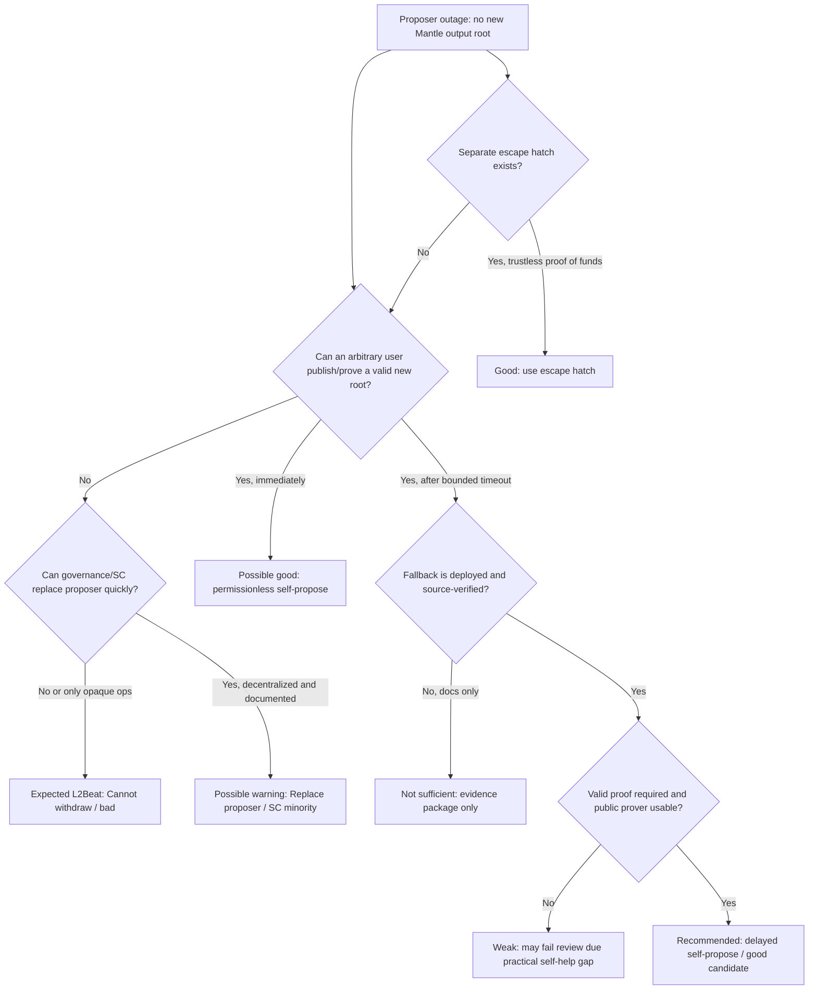
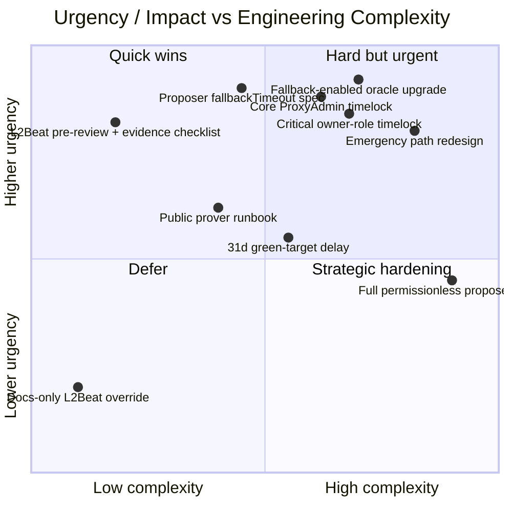
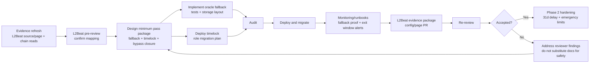

# Proposer Failure 与 Exit Window 综合推荐改进方案（Round 1 Draft）

## 1. Executive Summary

Mantle 要让 L2Beat Risk Analysis 中的 **Proposer Failure** 与 **Exit Window** 两个缺陷项通过复核，最小可信路线不是"提交说明让 L2Beat 改页面"，而是同时交付两类可验证的部署属性：

1. **Proposer Failure**：上线一个真实的用户自助 / permissionless fallback。推荐优先级最高的方案是 **OP Succinct validity oracle fallbackTimeout 或等价 delayed self-propose**：保留受控 proposer 快路径，但当最后一次有效 output 超过固定 timeout 后，任意用户可提交有效 SP1 proof 推进 output root。短期可选参数为 **7d fallback**；若希望和退出窗口、审查口径更保守地对齐，可采用 **14d fallback**，但会降低故障恢复速度。仅扩大白名单、仅增加多签/治理替换 proposer、仅提交 L2Beat override 都不足以构成强通过方案。
2. **Exit Window**：把 core rollup upgrade path 从当前 0-delay Safe/ProxyAdmin 模式迁移到 **TimelockController 或等价 delayed executor**，并覆盖 ProxyAdmin 与直接 owner 权限。若 Mantle 的 exitDelay 仍为 `OPSuccinctL2OutputOracle.finalizationPeriodSeconds = 43200s`，Risk Chart 非红最低门槛为 **upgradeDelay >= 7.5d**，绿色目标为 **upgradeDelay >= 30.5d**。推荐目标不是刚好 7.5d，而是 **30.5d regular timelock + narrow emergency path**；若需要分阶段，第一阶段至少 8d 或 10d 以避免边界误差。
3. 两条线可并行工程实施，但 **L2Beat 复核应按一个 minimum pass package 提交**：Proposer fallback、core timelock、owner-role timelock、emergency bypass 限定、监控/公告/evidence package 一起交付。只修一个维度会留下明显审查缺口：只修 Proposer Failure 仍有 instant upgrade；只修 timelock 仍可能无法让用户在 proposer outage 下真实退出。

本 draft 继承上游三个 final sections 的结论，并在 2026-05-21 对 L2Beat `main` 做 fresh source verification：`ff492aa2567be30d83a07b666f5cc9079bbd46a5` 仍显示 Mantle 通过 OP Stack template 评估，Mantle 项目配置未设置 `nonTemplateRiskView` 覆盖，`OpSuccinct` / `OpSuccinctFDP` 仍被映射到 `PROPOSER_CANNOT_WITHDRAW`，Exit Window 仍走 `EXIT_WINDOW(0, finalizationPeriod)`。同轮 Ethereum RPC read 仍显示 Mantle core `ProxyAdmin` 与 `OPSuccinctL2OutputOracle.owner` 为 MantleSecurityMultisig、oracle finalization period 为 43200s、zero-address permissionless proposer 未启用，且 deployed v2.0.1 oracle 没有 callable `fallbackTimeout()` getter。

## 2. Item Findings

### item-1: Evidence Baseline and Decision Criteria

#### 2.1 Imported facts from prior final sections

| Upstream final | Key imported facts | How it constrains this recommendation |
|---|---|---|
| `l2beat-risk-assessment-framework/final.md` | Risk Chart sentiment comes from `riskView.ts` and template/project config; Proposer Failure evaluates user self-help under proposer outage; Exit Window uses `window = upgradeDelay - exitDelay`, with `<7d bad`, `7-30d warning`, `>=30d good`; Stage 1/2 thresholds are separate from Risk Chart. | Recommendation must map each option to actual `RISK_VIEW` outcomes, not Stage labels. |
| `mantle-proposer-failure-analysis/final.md` | Mantle is red because L2Beat classifies it as OP Succinct and maps `OpSuccinct` to `PROPOSER_CANNOT_WITHDRAW`; deployed Mantle oracle v2.0.1 authorizes proposers before proof verification; zero address permissionless flag was not enabled; deployed ABI lacked `fallbackTimeout`; Morph passes because it has delayed permissionless `commitBatchWithProof()`. | Passing requires a deployed public fallback/self-propose path, not merely SP1 proof validity or proposer documentation. |
| `mantle-exit-window-analysis/final.md` | Mantle has `upgradeDelay=0`, `exitDelay=43200s`, so effective window is `-43200s`; core ProxyAdmin and critical owner roles are 0-delay Safe controlled; Proposer Failure remains a dependency for meaningful exit. | Passing requires a real delayed upgrade path and closure of bypass roles; minimum arithmetic threshold is 7.5d if exitDelay remains 12h. |

#### 2.2 Fresh verification used in this draft

| Observation | Evidence | Status |
|---|---|---|
| L2Beat current source still defines `PROPOSER_CANNOT_WITHDRAW` as bad and self-propose / escape-hatch constants as good. | `l2beat/l2beat@ff492aa`, `packages/config/src/common/riskView.ts` L502-L672. | Verified 2026-05-21. |
| OP Stack template still uses project `nonTemplateRiskView` override first, otherwise template logic; `getRiskViewExitWindow()` still returns `EXIT_WINDOW(0, finalizationPeriod)` unless `hasSuperchainScUpgrades`; `OpSuccinct` and `OpSuccinctFDP` still map to `PROPOSER_CANNOT_WITHDRAW`. | `packages/config/src/templates/opStack.ts` L1278-L1440 at `ff492aa`. | Verified 2026-05-21. |
| Mantle project config still calls `opStackL2`, describes OP Succinct SP1 validity proofs, and tracks `OPSuccinctL2OutputOracle.proposeL2Output`; no Mantle `nonTemplateRiskView` override exists in the inspected file. | `packages/config/src/projects/mantle/mantle.ts` L14-L130 at `ff492aa`. | Verified 2026-05-21. |
| Mantle live chain state still matches the upstream root-cause findings: core ProxyAdmin owner and oracle owner are `0x4e59...D40f`, portal guardian is `0x2F44...daC9`, oracle finalization period is 43200s, optimistic mode is false, initial proposer is approved, zero-address proposer is not approved, and `fallbackTimeout()` reverts. | Ethereum mainnet block 25144243 via `https://ethereum-rpc.publicnode.com`. | Verified 2026-05-21. |
| Morph remains the strongest comparator in L2Beat source: its config credits `PROPOSER_SELF_PROPOSE_WHITELIST_DROPPED(rollupDelayPeriod)`, while discovery documents 7d permissionless `commitBatchWithProof()`. | `packages/config/src/projects/morph/morph.ts` and `morph/discovered.json` at `ff492aa`. | Verified 2026-05-21. |
| Current `mantle-xyz/op-succinct` source contains a validity-oracle `fallbackTimeout` that allows anyone to propose after inactivity, and docs list default `FALLBACK_TIMEOUT_SECS = 1209600` (2 weeks). | `mantle-xyz/op-succinct@664a1bd`, `contracts/src/validity/OPSuccinctL2OutputOracle.sol` L46, L107-L110, L323-L328; `book/validity/contracts/environment.md` L26-L29. | Available implementation source, not deployed Mantle property. |

#### 2.3 Decision criteria

Scores in later matrices use these criteria:

| Criterion | Definition | Weight |
|---|---|---:|
| L2Beat pass likelihood | Whether the option maps cleanly to a known good/warning Risk View outcome and can be evidenced with source/deployment facts. | 30% |
| Real safety improvement | Whether users gain actual self-help or delayed-exit protection, not just documentation. | 25% |
| Engineering complexity | Contract changes, migration work, prover infra, monitoring, test/audit burden. Lower complexity scores higher. | 15% |
| Time to ship | Calendar duration to implementation, audit, deployment, and evidence package. | 10% |
| Operational risk | Incident-response latency, DoS/gas griefing, governance friction, emergency-path abuse. Lower risk scores higher. | 10% |
| Auditability / explainability | Whether L2Beat and external reviewers can independently verify the property. | 10% |

### item-2: Proposer Failure Remediation Options and Recommendation

#### 2.4 Recommendation

Recommended Proposer Failure path:

1. **Primary target**: upgrade Mantle's OP Succinct validity oracle to an implementation with a bounded permissionless fallback. The concrete pattern is `fallbackTimeout`: while proposer operation is healthy, only approved proposers submit outputs; once no valid proposal has appeared for the configured timeout, any caller can submit a valid SP1 proof and advance the output oracle.
2. **Parameter**: choose **7d fallback** if optimizing for L2Beat self-propose comparability to Morph; choose **14d fallback** if prioritizing conservative prover/DoS readiness and matching OP Succinct upstream defaults. Either value should be documented as "fallback after last accepted output", not "governance may replace proposer".
3. **Evidence target**: after deployment, L2Beat should be able to observe a callable timeout getter or immutable parameter, source code showing the fallback condition, deployed ABI/source verification, `approvedProposers(address(0))` / timeout status, and a testnet or mainnet dry-run proof transaction demonstrating arbitrary caller success after timeout.
4. **Do not rely on documentation-only override**: a `nonTemplateRiskView.proposerFailure` PR can be part of re-review only after the deployed fallback exists. It should describe observed deployed behavior, not ask L2Beat to trust an operational promise.

#### 2.5 Option matrix

| Option | User self-help property | Expected L2Beat effect | Engineering effort | Security / ops risk | Recommendation |
|---|---|---|---|---|---|
| Add more approved proposers / wider whitelist | No. More actors reduce single-key outage but users still cannot independently submit proofs. | Likely remains `Cannot withdraw` unless L2Beat accepts governance/SC replacement as warning, which current Mantle config does not evidence. | Low, 1-2 weeks. | Lower liveness concentration but larger key-management attack surface. | Useful mitigation only; not a pass strategy. |
| Governance or Security Council can replace proposer | No direct user self-help; depends on governance/SC liveness and speed. | Could target warning-like `Replace proposer` / `Security Council minority`, but weaker than good and may conflict with Exit Window if replacement path is instant. | Medium, 3-6 weeks. | Governance capture, emergency abuse, process ambiguity. | Not recommended as primary; can be backup. |
| Enable `approvedProposers(address(0))` fully permissionless | Yes, any caller can submit proof immediately. | Could support self-propose/good if proof system, source, and gas costs are acceptable. | Medium, 3-8 weeks. | Highest DoS/proof-cost exposure; in optimistic mode, zero-address permissionless is dangerous because outputs may not require proof. | Long-term target only after strict mode separation and DoS review. |
| Delayed `fallbackTimeout` permissionless proof path | Yes, after inactivity timeout any caller can submit valid proof. | Best mapping to `PROPOSER_SELF_PROPOSE_WHITELIST_DROPPED(delay)` style good outcome or a Mantle-specific override. | Medium-high, 6-12 weeks including audit/migration. | Proof generation cost, calldata/gas griefing, stale L1 head derivation, fallback monitoring. | **Recommended minimum pass path.** |
| Morph-style `commitBatchWithProof()` delayed fallback | Yes, after rollup delay users can commit/prove. | Strong positive comparator; Morph is already self-propose on L2Beat. | High, 10-20 weeks because Mantle architecture differs. | Broader rollup contract changes; data/derivation edge cases. | Good design reference, not the fastest Mantle path. |
| OP Succinct Fault Dispute Game + AccessManager fallback | Potentially yes for fault-dispute-game architecture; AccessManager allows timeout-based permissionless proposing. | Could move OP Succinct FDP projects toward self-propose if L2Beat template changes or project override is accepted. | High, 12-24 weeks plus architecture migration. | FDP migration risk, challenger economics, game resolution risk. | Long-term hardening track, not short-term fix. |
| Escape hatch separate from oracle | Yes if users can withdraw with proof of funds without new output root. | Known good class in L2Beat, but architecture-specific. | Very high, 4-9 months. | New bridge withdrawal path risk, heavy audit scope. | Not recommended unless Mantle wants a larger bridge redesign. |
| L2Beat override / docs only | No. | May support re-review only if it describes real deployed behavior. | Low, days. | Reputational/review risk if used as substitute for safety. | Evidence package only; not a remediation. |

#### 2.6 Proposer Failure implementation notes

The latest checked `mantle-xyz/op-succinct` validity oracle already contains the mechanism Mantle needs conceptually:

- `InitParams` includes `fallbackTimeout`.
- State includes `uint256 public fallbackTimeout`.
- The non-optimistic proof-taking `proposeL2Output` allows the call when proposer is approved, zero address is approved, **or** `block.timestamp - lastProposalTimestamp() > fallbackTimeout`.
- The environment docs describe `FALLBACK_TIMEOUT_SECS` default as two weeks and only active in permissioned mode.

This is only an implementation source, not current Mantle deployed safety. The final engineering design must answer:

| Question | Required answer before deployment |
|---|---|
| Is Mantle upgrading only the oracle implementation or also changing portal/dispute-game architecture? | Prefer minimal oracle upgrade for short-term pass; avoid broader migration unless needed for compatibility. |
| What timeout should be used? | 7d for Morph-like L2Beat comparison; 14d for upstream default. If 14d is chosen, explain why it still gives user self-help and how users will know when fallback is active. |
| Does fallback use `msg.sender` or `tx.origin`? | Current source uses `tx.origin` in the new non-optimistic path due CWIA / dispute-game use. Mantle should audit phishing/composability assumptions before using it in production. |
| Can owner later set a blocking config or remove fallback? | If owner remains instant, Exit Window remediation is undermined. Fallback-critical owner setters must be timelocked or tightly scoped. |
| Are proofs source-available and reproducible enough for users? | Need prover instructions, binary/source pinning, hardware/cost estimate, and monitoring so fallback is practically usable. |

### item-3: Exit Window Remediation Options and Recommendation

#### 2.7 Recommendation

Recommended Exit Window path:

1. **Move core ProxyAdmin ownership behind a real timelock** for all core rollup contracts: `OPSuccinctL2OutputOracle`, `OptimismPortal`, `SystemConfig`, `L1StandardBridge`, `L1CrossDomainMessenger`, and any other bridge/rollup proxy with user-fund impact.
2. **Move direct critical owner roles behind the same or stricter delayed path**: `OPSuccinctL2OutputOracle.owner`, verifier/vkey/config setters, proposer management, optimistic mode toggles, finalization period updates, challenger role changes, and any portal guardian action that can block withdrawals.
3. **Set regular delay above the arithmetic minimum**. If `exitDelay=43200s`, exact minimum is 648000s = 7.5d. Recommended production phase:
   - **Phase 1 minimum**: 10d regular timelock, producing a 9.5d effective window.
   - **Phase 2 target**: 31d regular timelock, producing a 30.5d effective window and a green-class arithmetic target.
4. **Constrain emergency path**. A Security Council/emergency route can exist, but should not be an unrestricted instant ProxyAdmin/owner bypass. It should be selector/target-limited, event-rich, time-bounded, and ideally subject to a short delay plus post-action ratification. If an unrestricted instant route remains primary, L2Beat can still show `None`, as Arbitrum and OP Mainnet controls demonstrate.

#### 2.8 Exit Window option matrix

| Option | Upgrade delay / exit delay effect | Bypass handling | Expected L2Beat effect | Engineering effort | Recommendation |
|---|---|---|---|---|---|
| Keep current Safe-owned ProxyAdmin, submit explanation | `0 - 0.5d = None` | No bypass closure. | Remains bad. | None. | Reject. |
| Use existing MNT 1d TimelockController as evidence | Not core rollup path; even if applied, `1d - 0.5d = 0.5d < 7d`. | Direct owner roles remain. | Remains bad. | Low. | Reject for Risk Chart; unrelated governance artifact. |
| Add 7d timelock to ProxyAdmin only | `7d - 0.5d = 6.5d < 7d`. | Direct owner/guardian bypass remains. | Still likely bad. | Medium. | Reject as insufficient threshold. |
| Add 8-10d timelock to ProxyAdmin only | Arithmetic non-red if no bypass; e.g. `10d - 0.5d = 9.5d`. | Direct owner/guardian bypass remains. | Weak; likely blocked by bypass review. | Medium. | Only as intermediate if owner roles migrate immediately after. |
| 10d timelock for ProxyAdmin + critical owner roles | Non-red warning arithmetic. | Must remove unrestricted emergency path. | Strong minimum-pass candidate. | Medium-high, 6-10 weeks. | **Recommended Phase 1.** |
| 31d timelock for ProxyAdmin + critical owner roles | `31d - 0.5d = 30.5d`, green arithmetic target. | Same bypass closure required. | Strong target; may map to good if no primary instant route remains. | Medium-high, 8-12 weeks plus ops readiness. | **Recommended Phase 2 / target state.** |
| Pure timelock, no emergency path | Cleanest for L2Beat; no instant bypass. | Fully closed. | Highest pass likelihood. | High operational friction. | Good long-term if Mantle accepts slower emergency fixes. |
| Security Council emergency path + regular timelock | Regular path can be 10d/31d; emergency may make primary `None` if instant/unrestricted. | Must be narrow and auditable. | Could pass if L2Beat treats emergency as limited, not an upgrade bypass. | High design/review burden. | Acceptable only with strict limits. |

#### 2.9 Timelock design requirements

The timelock should be designed as a security boundary, not just a cosmetic owner address:

| Requirement | Rationale | Evidence / comparator |
|---|---|---|
| `minDelay >= 648000s`; recommended `864000s` then `2678400s` | Mantle exitDelay is 43200s, so 7d effective requires 7.5d raw delay; 30d effective requires 30.5d. | L2Beat `EXIT_WINDOW(upgradeDelay, exitDelay)` formula. |
| ProxyAdmin owner must be the timelock, not a Safe that can also act directly | If Safe can bypass timelock, upgradeDelay remains effectively 0. | Mantle page currently lists no-delay ProxyAdmin upgrades. |
| `OPSuccinctL2OutputOracle.owner` must be timelocked or reduced | Direct setters can change verifier/vkeys/config/proposers/mode without ProxyAdmin. | Prior Exit Window final and L2Beat page permissions. |
| Guardian/challenger powers must be bounded | Pause/output deletion can obstruct withdrawals or fallback. | Prior Exit Window final and Mantle role inventory identify guardian/challenger as direct withdrawal-safety bypass surfaces. |
| Timelock delay changes must be self-administered | If a Safe can reduce delay directly, the delay is not credible. | Implementation invariant to verify in Mantle's chosen timelock design and deployment reads. |
| Public upgrade calendar and cancellation runbook | Users and L2Beat need observable notice to use the exit window. | L2Beat review depends on public evidence, not private process. |

### item-4: Cross-Dimension Dependencies and Minimum Passing Package

#### 2.10 Dependency analysis

| Scenario | Proposer Failure outcome | Exit Window outcome | Why it is insufficient or sufficient |
|---|---|---|---|
| Only submit L2Beat override/docs | Unchanged safety; may change page only if accepted, but no user self-help. | Unchanged safety. | Fails the adversarial caveat; no deployed property. |
| Only expand proposer whitelist | Better operator redundancy but no user self-help. | Still None. | Does not solve either root cause. |
| Only deploy proposer fallback | Could move Proposer Failure toward self-propose/good. | Still instant upgrade. | Users can self-propose but an unwanted upgrade can still preempt exit. |
| Only deploy timelock | Proposer outage still freezes post-outage withdrawals. | Arithmetic window may improve. | Exit window is not practically usable if users cannot obtain a post-withdrawal output root. |
| Proposer fallback + 10d core/owner timelock + no unrestricted emergency bypass | Self-help after timeout. | Warning-class effective window. | Minimum credible L2Beat pass package. |
| Proposer fallback + 31d core/owner timelock + constrained emergency path | Self-help after timeout. | Green arithmetic target if emergency path accepted as bounded. | Best-practice target package. |

#### 2.11 Minimum viable L2Beat pass package

**Scope**:

1. Upgrade OP Succinct oracle to include `fallbackTimeout` or equivalent delayed permissionless proof submission.
2. Configure fallback timeout and publish exact parameter.
3. Move ProxyAdmin owner for all core rollup/bridge proxies to a timelock with at least 10d delay.
4. Move `OPSuccinctL2OutputOracle.owner` and high-impact direct roles behind timelock, or make them immutable/role-reduced where possible.
5. Define emergency actions as narrowly as possible; remove unrestricted instant implementation upgrade.
6. Publish source verification, deployment addresses, role inventory, timelock reads, and proof/fallback runbook.
7. Submit L2Beat config/page PR only after the above is live.

**Residual risks**:

- 10d delay gives warning-class window, not green target.
- Emergency path may still lead L2Beat to show `None` if it can upgrade core contracts instantly.
- Fallback proof generation may be too expensive for ordinary users unless Mantle publishes reliable tooling and potentially sponsors proof generation.
- If fallback timeout is longer than the timelock exit window, reviewers may question whether users can both wait for fallback activation and exit before a malicious upgrade. This is why Proposer fallback and timelock need coordinated parameter design.

#### 2.12 Best-practice target package

**Scope**:

1. 7d or 14d delayed self-propose fallback with public prover tooling and monitored readiness.
2. 31d regular timelock on ProxyAdmin and critical owner roles.
3. Emergency path limited to pause/unpause, verifier route disablement, or narrowly pre-approved fix selectors; no arbitrary implementation upgrade without public delay.
4. Guardian pause has a bounded duration and clear unpause/walkaway handling.
5. Long-term evaluation of full permissionless proposer/prover mode once DoS and optimistic-mode hazards are resolved.

**Residual risks**:

- Longer regular delay slows non-emergency upgrades and requires stronger release discipline.
- Emergency constraints can make some critical bugs harder to patch quickly.
- Full permissionless proving can expose proving-cost and gas-griefing surfaces.

### item-5: Engineering Effort, Audit Scope, and Operational Impact

#### 2.13 Engineering estimates

| Workstream | Scope | Estimated duration | Main dependencies | Audit requirement |
|---|---|---:|---|---|
| Proposer fallback spec | Define fallback condition, timeout, proof route, prover tooling, emergency interactions. | 1-2 weeks | Mantle protocol/security, OP Succinct maintainers. | Design review. |
| Oracle implementation upgrade | Adapt/upstream OP Succinct `fallbackTimeout` or equivalent to Mantle deployed oracle line; preserve storage layout and existing outputs. | 3-6 weeks | Storage-layout analysis, deployment scripts, integration tests. | Required. Focus: storage, auth, proof verification, timeout correctness. |
| Prover/fallback tooling | Public docs/scripts to build proof, submit fallback tx, monitor last output age. | 2-5 weeks | Prover infra, L1 head derivation, cost estimates. | Security review; less formal than contract audit. |
| Core timelock deployment | Deploy TimelockController/equivalent, configure roles, transfer ProxyAdmin ownership. | 2-4 weeks | Safe ops, role inventory, dry-run. | Required for migration transaction set and role safety. |
| Critical role migration | Transfer oracle owner/direct roles; constrain guardian/challenger. | 3-6 weeks | Contract support for ownership transfers; emergency-policy design. | Required. |
| Emergency path redesign | Define allowed targets/selectors, delay exceptions, cancel/ratify process. | 3-8 weeks | Governance/security agreement. | Required if any instant path remains. |
| Evidence package + L2Beat PR | Prepare source permalinks, deployment addresses, read outputs, config diff, explanatory PR. | 1-2 weeks | Completion of deployed changes. | No contract audit, but must pass L2Beat review. |

Overall realistic timeline:

- **Minimum pass**: 8-12 weeks if using an existing OP Succinct fallback implementation pattern and a conservative timelock migration.
- **Best-practice target**: 12-20 weeks if adding 31d target, emergency-path redesign, stronger prover tooling, and broader audit scope.

#### 2.14 Audit focus areas

| Area | Specific risks to audit |
|---|---|
| Storage layout | Upgrading Mantle's existing `OPSuccinctL2OutputOracle` from deployed v2.0.1 to a fallback-enabled implementation must not corrupt output arrays, proposer mapping, owner/challenger state, verifier config, or initialized values. |
| Fallback authorization | Timeout arithmetic, reset condition, lastProposalTimestamp source, `tx.origin`/`msg.sender` assumptions, zero-address permissionless mode interactions, optimistic-mode hazards. |
| Proof verification | Fallback must still require valid SP1 proof in non-optimistic mode; route/config name must not let a malicious caller select unsafe verifier parameters. |
| DoS and griefing | Invalid proof spam, expensive proof verification attempts, calldata bloat, fallback activation manipulation, public prover cost. |
| Timelock migration | Ownership transfer correctness, role revocation, executor/proposer/canceller permissions, ability to reduce delay, transaction batching safety. |
| Emergency powers | Whether any actor can bypass delay to upgrade bridge/oracle/portal implementations, pause withdrawals indefinitely, delete valid outputs, or disable fallback. |

#### 2.15 Operational impact

| Function | Current mode | After recommended changes | Required operational adaptation |
|---|---|---|---|
| Routine upgrades | 0-delay Safe execution. | 10d then 31d public delay. | Upgrade calendar, public announcement, cancellation window, monitoring. |
| Critical bridge/oracle bug | Fast Safe action. | Emergency path only if narrow; otherwise delayed. | Pre-approved emergency runbooks and severity taxonomy. |
| Proposer outage | Trusted operator/governance recovery. | Users can trigger fallback after timeout with proof. | Last-output-age alerts, public fallback guide, proof infra readiness. |
| Verifier/vkey update | Owner setter can act quickly. | Timelocked owner action. | Batch verifier updates with public review; emergency route only for clearly broken verifier. |
| L2Beat review | Source/config inference and public page. | Requires evidence package and likely config PR. | Maintain stable source permalinks, deployment scripts, on-chain read logs. |

### item-6: Prioritized Roadmap, Action Items, and L2Beat Re-Review Plan

#### 2.16 Priority table

| Priority | Action cluster | Urgency | Difficulty | Rationale |
|---:|---|---|---|---|
| P0 | Freeze evidence baseline and confirm L2Beat reviewer expectations | High | Low | Avoid building a path L2Beat will not credit; confirm whether fallbackTimeout maps to self-propose or needs `nonTemplateRiskView`. |
| P1 | Proposer fallback design and implementation | High | Medium-high | Without user self-help, Proposer Failure remains red and Exit Window remains practically weak. |
| P1 | Core ProxyAdmin + critical owner timelock migration | High | Medium-high | Without delayed upgrade path, Exit Window remains `None`. |
| P1 | Emergency bypass inventory and restriction | High | High | Unrestricted instant emergency path can keep primary Exit Window red. |
| P2 | Public prover/fallback runbook and monitoring | Medium-high | Medium | A theoretical fallback is weaker if users cannot realistically operate it. |
| P2 | L2Beat evidence package and config PR | Medium-high | Low-medium | Required for visible Risk Chart update; must not precede deployed properties. |
| P3 | 31d green-target hardening | Medium | Medium | Moves from minimum pass to stronger target; can follow after P1 if rollout risk is high. |
| P3 | Permissionless proposer / FDP migration research | Medium | High | Long-term decentralization beyond minimum risk-chart repair. |

#### 2.17 Action items

| ID | Action item | Owner type | Dependencies | Acceptance criteria | Evidence deliverable |
|---|---|---|---|---|---|
| A1 | Send L2Beat pre-review note asking whether a deployed OP Succinct `fallbackTimeout` plus source-available prover would be treated as self-propose or needs project override. | L2Beat liaison / protocol lead | This draft. | Written response or issue/PR discussion captured. | Link to L2Beat forum/GitHub discussion. |
| A2 | Produce Mantle Proposer Fallback Specification. | Protocol engineering | A1 optional but recommended. | Spec defines timeout, proof route, mode interactions, roles, failure cases. | Markdown spec with threat model. |
| A3 | Implement or import fallback-enabled oracle upgrade. | Smart contract engineering | A2. | Tests show approved proposer fast path and arbitrary caller success after timeout with valid proof. | Git commit, test report, storage layout report. |
| A4 | Commission audit for oracle fallback upgrade. | Security | A3. | No unresolved critical/high findings; major findings remediated or accepted with rationale. | Audit report / internal review sign-off. |
| A5 | Deploy oracle upgrade and configure fallback timeout. | Protocol ops / Safe signers | A4. | On-chain reads show new implementation, fallback timeout, unchanged critical state, successful output progression. | Deployment txs, verified source, post-deploy read log. |
| A6 | Deploy core rollup timelock with initial `minDelay >= 864000s`. | Governance / protocol ops | Role inventory. | Timelock source verified; roles assigned; delay cannot be reduced except through timelock self-call. | Contract address, role read log, `getMinDelay()` output. |
| A7 | Transfer ProxyAdmin ownership to timelock. | Protocol ops | A6. | Core proxy upgrades can only be executed through delayed path. | Ownership transfer tx; ProxyAdmin owner read. |
| A8 | Transfer or constrain `OPSuccinctL2OutputOracle.owner` and other critical roles. | Protocol engineering / ops | A6. | Direct setters no longer bypass timelock or are reduced to bounded emergency functions. | Owner/role read log and role map. |
| A9 | Define emergency action matrix and remove unrestricted instant implementation upgrades. | Security council / governance | A6-A8. | Emergency powers list allowed targets/selectors, max duration, disclosure rules. | Emergency runbook and on-chain role evidence. |
| A10 | Publish fallback prover and exit-window user runbooks. | DevRel / protocol engineering | A5-A9. | User can independently understand fallback activation, proof generation, and exit timing. | Docs, scripts, testnet/mainnet dry-run tx. |
| A11 | Prepare L2Beat evidence package and PR. | L2Beat liaison | A5-A10. | PR includes source permalinks, deployment txs, role reads, timing formulas, caveats. | GitHub PR / issue link. |
| A12 | Plan Phase 2 migration to 31d delay. | Governance / protocol | A6-A11. | Target date and proposal for 31d regular timelock. | Governance proposal or roadmap item. |

#### 2.18 L2Beat re-review package

The re-review package should include:

- Deployed contract addresses and implementation hashes for oracle/timelock/ProxyAdmin.
- Verified source links showing fallback condition and proof verification.
- `fallbackTimeout`, `lastProposalTimestamp`, `finalizationPeriodSeconds`, `getMinDelay`, owner/role reads, with block numbers.
- Storage-layout diff and audit report for oracle upgrade.
- Timelock role list, delay-change rules, emergency-path allowlist.
- Fallback prover instructions and evidence that source/prover is available enough for independent operation.
- Calculation table: `effectiveExitWindow = upgradeDelay - exitDelay`; current, Phase 1, Phase 2 values.
- L2Beat config PR proposal with clear distinction between deployed properties and requested Risk View mapping.

## 3. Diagrams

### diag-1: Proposer Failure 改进方案决策树



### diag-2: Exit Window 改进实施时间线

```mermaid
gantt
  title Mantle Exit Window Remediation Timeline
  dateFormat  YYYY-MM-DD
  axisFormat  %b %d
  section Baseline
  Current: upgradeDelay=0, exitDelay=0.5d, window=None :milestone, m0, 2026-05-21, 1d
  Role inventory and L2Beat pre-review              :a1, 2026-05-22, 10d
  section Phase 1 Minimum Pass
  Timelock + emergency spec                         :a2, after a1, 14d
  Deploy timelock and transfer ProxyAdmin/owners    :a3, after a2, 21d
  Set delay >=10d; effective window >=9.5d          :milestone, m1, after a3, 1d
  section Phase 2 Target
  Harden emergency path and monitoring              :a4, after m1, 21d
  Increase regular delay to 31d                     :a5, after a4, 7d
  Effective window >=30.5d green arithmetic target  :milestone, m2, after a5, 1d
  section Review
  L2Beat evidence package and PR                    :a6, after m1, 14d
```

### diag-3: 综合优先级四象限



### diag-4: 推荐实施路径流程图



## 4. Source Coverage

| Source requirement | Coverage in this draft | Notes / gaps |
|---|---|---|
| prior_final_sections (3) | Covered. Imported all three final sections and cited their key findings in §2.1. | Local artifacts are the primary baseline. |
| l2beat_source (8+) | Covered by current `ff492aa` source checks: `riskView.ts`, `opStack.ts`, Mantle config, Morph config, Arbitrum config, OP Mainnet config, Mantle discovery, Morph discovery. | Full line-by-line appendix omitted for brevity; key line ranges included in §2.2. |
| l2beat_project_pages (4) | Partially covered through prior final sections and current source/config. | This draft does not rely on fresh page snapshots; final evidence package should attach dated page snapshots for Mantle and comparators. |
| mantle_contract_state (10) | Covered through imported Proposer/Exit finals, current L2Beat discovery, and fresh Ethereum RPC reads at block 25144243. | Safe owner/member threshold reads can be refreshed again during final evidence packaging. |
| option_implementation_sources (6) | Covered by OP Succinct current source/docs, Morph source/discovery, L2Beat templates, Arbitrum regular/emergency page evidence, and OP Mainnet source-control example. | Need final Mantle-specific implementation design before audit. |
| governance_and_operations (4) | Partially covered by Mantle L2Beat permissions, Arbitrum page evidence, and OP Mainnet source-control example. | Need Mantle internal governance preference for emergency path; no new dedicated OpenZeppelin/OP governance-doc deep dive was performed in this round. |
| audit_and_security (3) | Partially covered through risk analysis and OP Stack role docs; specific third-party audit sourcing remains a gap. | Before final, add public audit links if Mantle has selected implementation/auditor. |
| l2beat_review_process (2) | Partially covered by L2Beat config/source pattern and project-page evidence. | Need L2Beat pre-review / PR link once initiated. |

## 5. Gap Analysis

1. **L2Beat page snapshots are not persisted in this draft.** The recommendation relies on source/config and chain reads; the final evidence package should attach dated page snapshots for Mantle, Morph, OP Mainnet, Arbitrum, and any positive Exit Window comparator used in the L2Beat PR.
2. **L2Beat reviewer intent remains an open question.** The technical recommendation is designed to map to existing self-propose semantics, but only L2Beat can confirm whether OP Succinct `fallbackTimeout` should become a template-level change or Mantle-specific `nonTemplateRiskView`.
3. **Emergency path design requires Mantle policy input.** This draft recommends constraining instant powers, but cannot select the final allowed selector/target list without Mantle's incident-response requirements.
4. **Audit schedule is estimated, not vendor-confirmed.** Duration ranges assume one major contract upgrade and one governance/role migration review.
5. **Storage-layout migration remains unverified.** Current OP Succinct source contains `fallbackTimeout`, but Mantle deployed v2.0.1 lacks the getter; a safe upgrade requires exact storage compatibility analysis against deployed source.

## 6. Revision Log

| Round | Date | Changes |
|---|---|---|
| 1 | 2026-05-21 | Initial deep draft. Synthesized upstream final sections, verified current L2Beat source/page state, checked current OP Succinct fallback implementation source, produced Proposer Failure and Exit Window recommendation matrices, prioritized roadmap/action items, engineering/audit estimates, risk analysis, and 4 Mermaid diagrams. |
