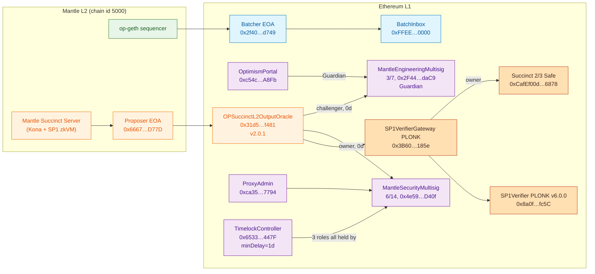
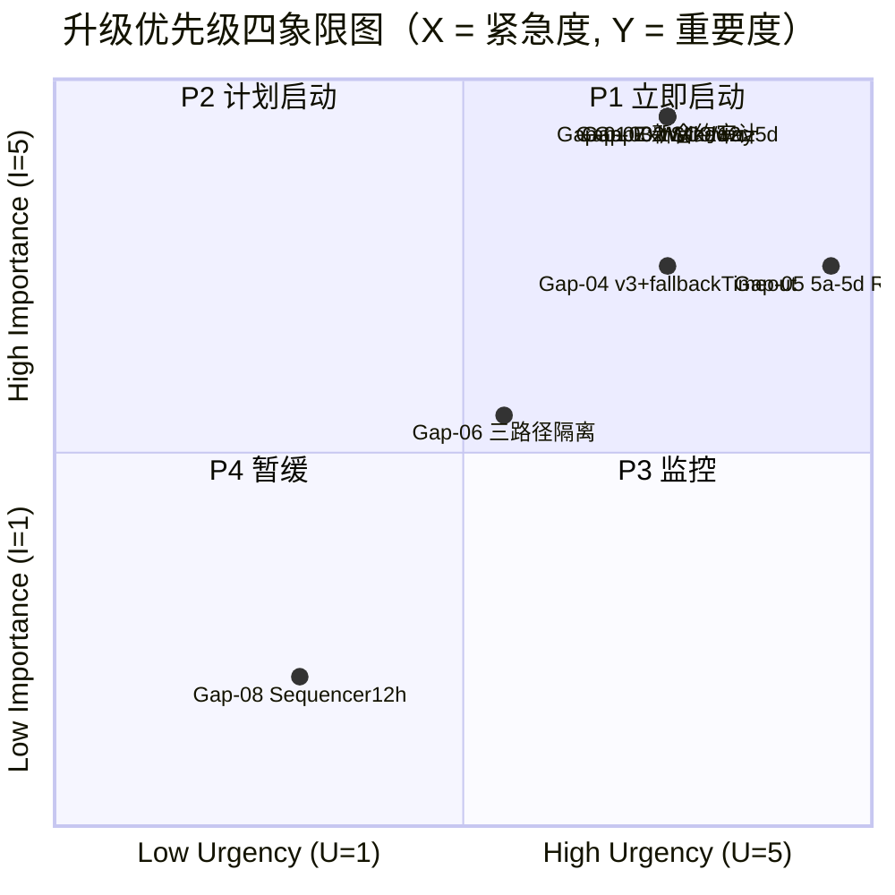
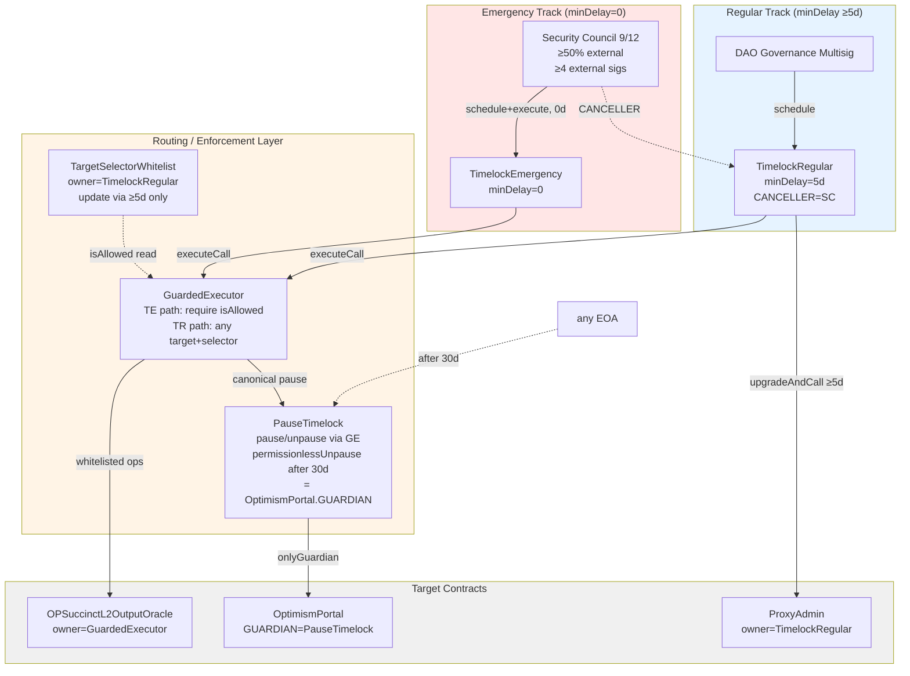
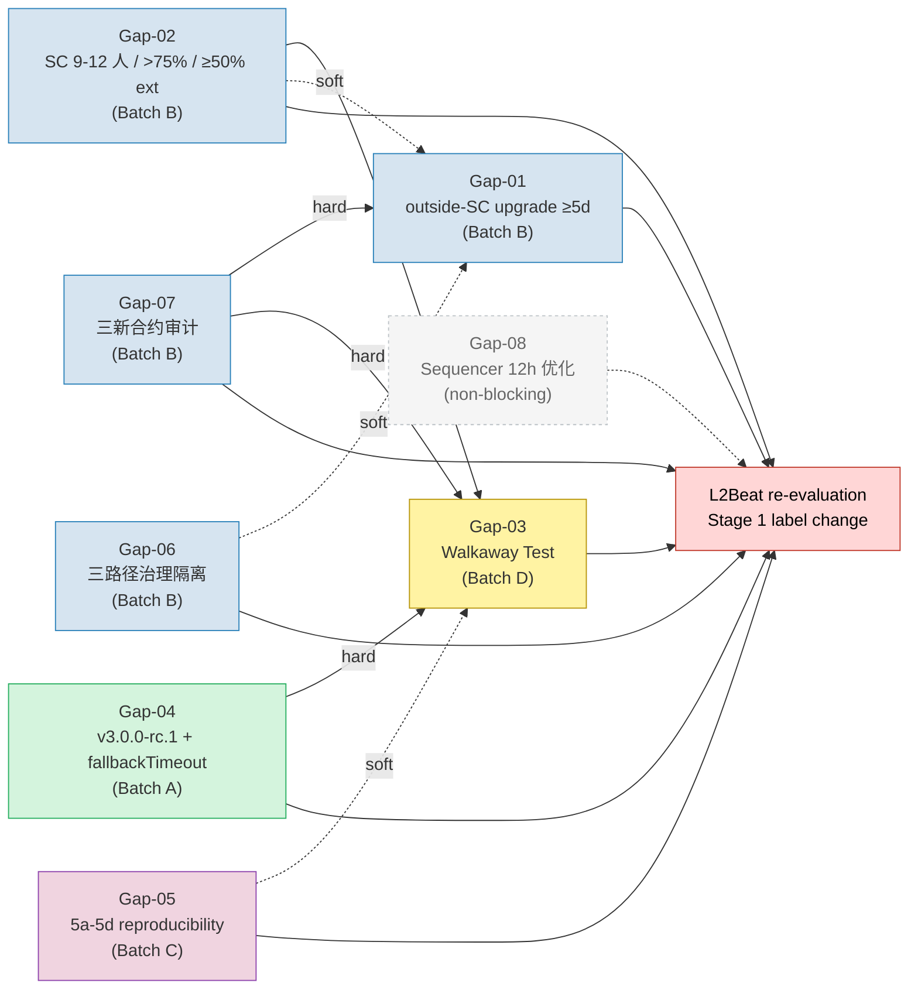
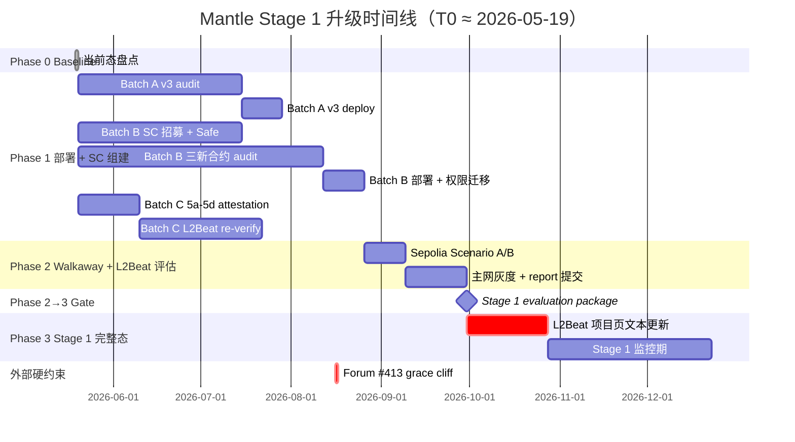
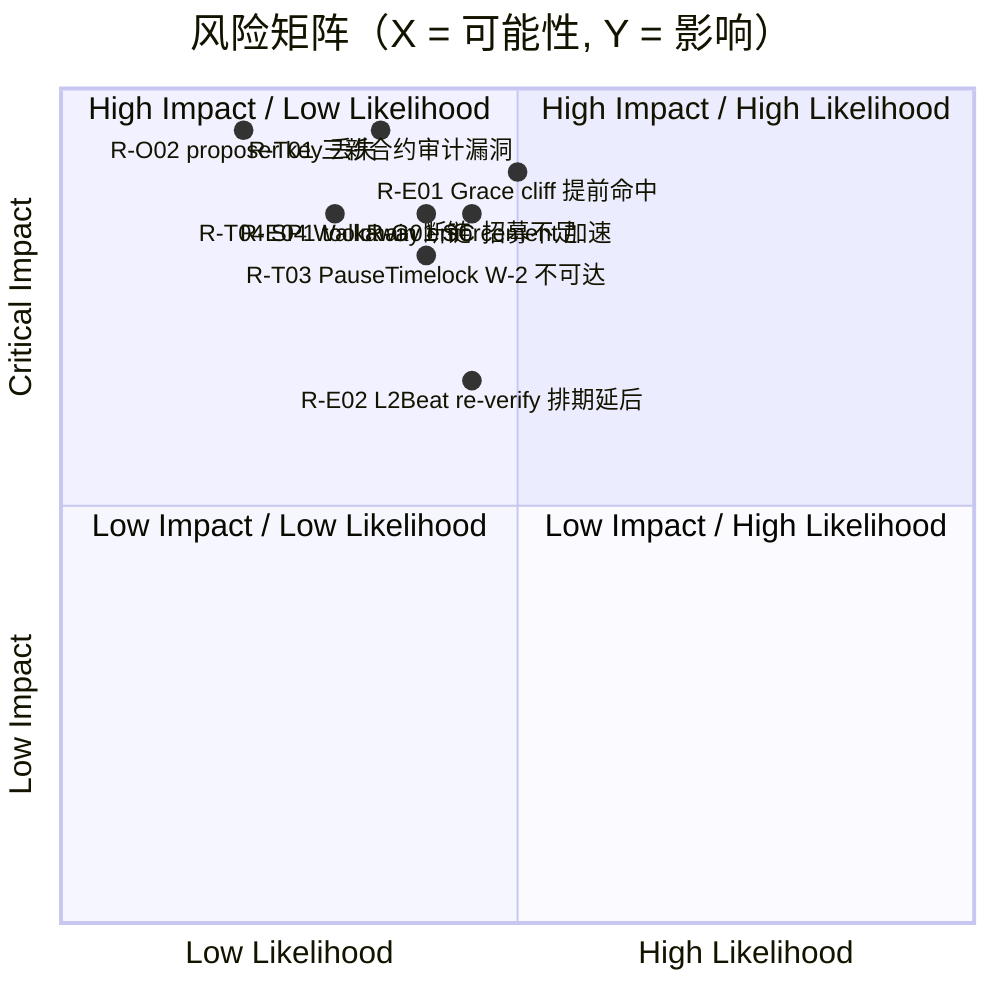

# Mantle 如何进入 Stage 1 Rollups

**最终研究报告**

---

## 1 执行摘要

Mantle 当前被 L2Beat 评定为 **Stage 0**（5/5 Stage 0 要求已满足），总锁仓价值约 $1.42B（2026-05-19 快照）。距离达到 Stage 1 评级，Mantle 至少需要解决 **7 项硬性阻断项（hard blockers）和 1 项非阻断改进项**。

**三项最关键差距（CRITICAL 级）**：

1. **合约升级无延迟**：核心 rollup 合约通过 `ProxyAdmin` 可被 MantleSecurityMultisig 6/14 以 0 秒延迟即时升级，不满足 Stage 1 要求的 ≥5 天退出窗口。
   *(来源: [WHI-42] upgrade-exitwindow-securitycouncil §Item-2; [WHI-40] mantle-architecture-2026 item-3)*

2. **无合规 Security Council**：当前 MantleSecurityMultisig 为 6/14 阈值（≈42.86%），远低于 Stage 1 要求的 >75% 投票阈值、≥8 成员、≥50% 外部独立成员。
   *(来源: [WHI-42] upgrade-exitwindow-securitycouncil §Item-3; [WHI-39] l2beat-stage-framework-2026 §3.2)*

3. **Proposer 单点故障**：唯一 Proposer EOA `0x6667…D77D` 失效时，v2.0.1 合约无 `fallbackTimeout` 兜底，用户提款将被无限期冻结。
   *(来源: [WHI-43] proposer-decentralization-zk-compliance §item-1; [WHI-40] mantle-architecture-2026 item-4)*

**推荐总体路径**："三批次并行 + 审计前置 + Walkaway 收口"——

- **Batch A**（Proposer liveness 升级）：部署 v3.0.0-rc.1 + `fallbackTimeout=14d`
- **Batch B**（SC + 治理 + 新合约）：组建 9/12 SC、审计部署三新合约、权限迁移
- **Batch C**（ZK 透明度）：SP1 5a-5d reproducibility attestation + L2Beat re-verification
- **Batch D**（收口）：Walkaway Test 端到端模拟

**时间线**：最优 **16 周（≈4 个月）**，保守 **30 周（≈7 个月）**。

**硬约束**：Forum #413 ZK Proving System grace cliff ≈ 2026-08-16（estimate），距研究 cutoff 仅约 13 周。

*(来源: [WHI-44] stage1-roadmap-recommendation §0, §Item-2, §Item-3)*

---

## 2 L2Beat Stage 框架标准（2026 年版）

### 2.1 Stage 0 / 1 / 2 分级体系

L2Beat Stages 框架以用户安全保障递进为核心逻辑：

| Stage | 核心特征 | 用户保护程度 |
|-------|---------|-------------|
| **Stage 0** | 具备基本的 rollup 证明系统；链上可验证状态根 | 用户依赖运营方善意 |
| **Stage 1** | 受限升级能力 + Security Council 保护 + 退出窗口 | 用户可在合理时间窗口内退出 |
| **Stage 2** | 完全去中心化升级 + 最小化信任 | 用户完全自主保护 |

*(来源: [WHI-39] l2beat-stage-framework-2026 §Item-1)*

### 2.2 Stage 1 关键要求

Stage 1 的核心要求覆盖六个维度：

1. **证明系统**：on-chain 可验证的 validity 或 fault proof
2. **Security Council**：≥8 成员 / >75% 投票阈值 / ≥50% 外部独立成员 / ≥2 外部签名
3. **退出窗口（三轨制）**：
   - (3a) outside-SC 升级延迟 ≥5 天（适用于所有 rollup）
   - (3b) OR challenge period ≥5 天（仅适用于 Optimistic Rollup，Forum #425 从 7d 降至 5d）
   - (3c) ZK challenge period 概念不存在（显式否定）
4. **Walkaway Test**（Forum #412, 2025.12）：Security Council 全员消失后，用户仍能安全退出
5. **L2 Proving System 透明度四子项**（Forum #413, 2026.02）：
   - (5a) 无 🔴 trusted setups — 适用于**所有**证明系统
   - (5b) prover 源码公开 — 适用于**所有**
   - (5c) verifier 可复现 — 适用于**所有**
   - (5d) 分流：zkVM program 可复现（ZK）/ fault-proof prestate 可复现（OR）
6. **Proposer/Sequencer 去中心化**：提款不可因 proposer 失效而被冻结

**重要发现**：5a-5d 四子项**不限于 ZK rollup**。Forum #413 (2026.02) 收敛后的文本与项目页执行显示 5a/5b/5c 对所有被评级的 proving system 部署均适用。交叉证据：Facet v1（OR 项目）正因 trusted setup + verifier reproducibility 不达标被列入约 90 天降级倒计时。

*(来源: [WHI-39] l2beat-stage-framework-2026 §Item-3, §Item-5, §Item-9)*

### 2.3 关键框架更新时间线

| 日期 | 更新 | 影响 |
|------|------|------|
| 2024.12 | Proof System 成为 Stage 0 硬性条件 | 无证明系统 = 不评级 |
| 2025.12 | Forum #412 Walkaway Test | SC 消失后用户仍可退出 |
| 2026.02 | Forum #413 L2 Proving System 5a-5d | grace period ≈ 6 个月（cliff ≈ 2026-08-16, estimate） |
| 2026.04 | Forum #425 OR challenge period 7d→5d | 仅 OR 适用；Mantle ZK 路径不直接适用 |

**Walkaway Test 执行现状**（2026-05-19 项目页快照）：

- **PASS**：Arbitrum One, OP Mainnet, Base
- **FAIL**（项目页显式标注 "does not pass the walkaway test"）：Starknet, Scroll

*(来源: [WHI-39] l2beat-stage-framework-2026 §Item-4, §Item-5, §Item-9)*

---

## 3 Mantle 当前技术架构

### 3.1 四维度架构概览

Mantle 的技术架构可从四个维度分析（均基于 2026-05-19 链上确认数据）：

**数据可用性 (DA)**：2026-04-16 Arsia 升级后从 EigenDA 迁移至 Ethereum blobs。Batcher EOA `0x2f40…d749` 通过 EIP-4844 blob 提交至 BatchInbox `0xFFEE…0000`。

**证明系统**：OP Succinct 架构，使用 SP1 zkVM 生成 PLONK validity proof。

| 组件 | 地址 / 版本 | 关键配置 |
|------|------------|---------|
| OPSuccinctL2OutputOracle (proxy) | `0x31d5…f481` | v2.0.1, `optimisticMode()=false` |
| SP1VerifierGateway PLONK | `0x3B60…185e` | owner = Succinct 2/3 Safe `0xCafEf00d…6878` |
| SP1Verifier PLONK v6.0.0 | `0x8a0f…fc5C` | selector `0xbb1a6f29`（当前活动路由） |
| `finalizationPeriodSeconds` | — | 43200 (12h) |
| Proposer EOA | `0x6667…D77D` | **单一 proposer，无 fallback** |
| `fallbackTimeout()` | — | **REVERT（v2.0.1 不支持）** |

**治理**：三条治理路径，均由同一组 multisig 控制：

| 路径 | 控制方 | 延迟 |
|------|--------|------|
| Core Rollup（ProxyAdmin + OPSuccinctL2OutputOracle） | MantleSecurityMultisig 6/14 `0x4e59…D40f` | **0 秒** |
| MNT Token（TimelockController） | 同一 6/14 Safe（持 PROPOSER/EXECUTOR/CANCELLER 三角色） | 1 天 |
| mETH / LSP | 治理信息不公开 | 未知 |

**Sequencer/Proposer**：单一 Sequencer EOA `0x2f40…d749`（与 Batcher 共用）；单一 Proposer EOA `0x6667…D77D`。Force-inclusion 通过 `OptimismPortal.depositTransaction`，`seq_window_size = 3600 L1 blocks ≈ 12h`。

*(来源: [WHI-40] mantle-architecture-2026 §Item-1 ~ §Item-4)*

### 3.2 架构概览图



*(来源: [WHI-40] mantle-architecture-2026 diag-1)*

### 3.3 L2Beat 风险标签

L2Beat 项目页（2026-05-19 快照）列出 8 项风险：

| # | 风险描述 | 严重度 | 根因 |
|---|---------|--------|------|
| 1 | 恶意代码升级，无延迟 | **CRITICAL** | ProxyAdmin 0d 升级 |
| 2 | Validity proof 密码学被破解 | HIGH | ZK 证明系统固有风险 |
| 3 | Optimistic mode 启用后无 challenger | HIGH | Engineering 3/7 可随时切换 |
| 4 | Proposer 使用不安全的 verifier route | HIGH | SP1VerifierGateway 多路由 |
| 5 | 中心化 validator 宕机导致冻结 | **CRITICAL** | 单一 Proposer，无 fallback |
| 6 | 受限 proposer 失败 | HIGH | 白名单制 proposer |
| 7 | SP1VerifierGateway 无法路由 | HIGH | 外部 Succinct Safe 控制 |
| 8 | MEV 通过 sequencer 抢跑 | MEDIUM | 单一 sequencer |

**历史 liveness 事件**：2026-04-22 07:44–15:12 UTC 发生 7h28m state-update 中断（L2Beat 确认），根因未公开披露，与单一 proposer / proof pipeline 单点故障一致。

*(来源: [WHI-40] mantle-architecture-2026 §Item-5, §Item-4)*

---

## 4 Stage 1 差距分析

### 4.1 总览

基于上游 6 个研究课题的综合分析，识别出 **8 项核心差距**，按紧急度 (U) × 重要度 (I) 评分后分为三个优先级：

| 优先级 | 数量 | 处置策略 |
|--------|------|---------|
| **P1**（U≥4 且 I≥4） | 6 项 | 立即启动 |
| **P2**（P≥9 但不满足 P1） | 1 项 | 计划启动 |
| **P4**（P<4） | 1 项 | 暂缓 / 改进项 |

*(来源: [WHI-44] stage1-roadmap-recommendation §Item-1)*

### 4.2 Master Gap List

| Gap ID | 维度 | 当前状态 | Stage 1 要求 | 严重度 | P |
|--------|------|---------|--------------|--------|---|
| **Gap-01** | 退出窗口 ≥5d | core rollup 0d; MNT 1d | outside-SC 升级路径 ≥5d delay | CRITICAL | P1 |
| **Gap-02** | Security Council | 6/14（≈42.86%），无公开身份 | ≥8 人 / >75% / ≥50% 外部 / ≥2 外部签名 | CRITICAL | P1 |
| **Gap-03** | Walkaway Test | 无 auto-expiring pause；proposer 失效 = 冻结 | W-1 auto-expire + W-2 finalize + W-3 permissionless prover | CRITICAL | P1 |
| **Gap-04** | Proposer liveness | v2.0.1 单 proposer，无 fallbackTimeout | v3.0.0-rc.1 + fallbackTimeout=14d | CRITICAL | P1 |
| **Gap-05** | ZK 5a-5d 透明度 | 5a ✅; 5b/5c/5d ⚠️; L2Beat 标 "Code: unknown" | 全部 PASS + L2Beat 项目页更新 | CRITICAL | P1 |
| **Gap-06** | 三路径治理隔离 | 6/14 Safe 同时持 core rollup + MNT 三角色 | core → TimelockRegular; MNT → 独立 DAO | HIGH | P2 |
| **Gap-07** | 三新合约审计 | 设计完成，未审计 | 两家独立审计 + 30d bug bounty | CRITICAL | P1 |
| **Gap-08** | Sequencer 12h | force-inclusion 12h，可接受 | 推荐优化至 6h（非阻断） | MEDIUM | P4 |

**最严重单项**是 **Gap-05（ZK 5a-5d 透明度）**：Forum #413 grace cliff ≈ 2026-08-16 距 T0 仅约 13 周，且 L2Beat 项目页当前标注 *"Code: unknown / Verification: None"*，即使其他 7 项全部闭合，此项不通过即在 cliff 后被降级回 Stage 0。

*(来源: [WHI-44] stage1-roadmap-recommendation §Item-1; [WHI-43] §item-2; [WHI-42] §Item-2; [WHI-40] §Item-6)*

### 4.3 升级优先级四象限图



*(来源: [WHI-44] stage1-roadmap-recommendation §Item-4.5 diag-4)*

---

## 5 行业案例研究：经验与教训

### 5.1 五大 Stage 1 L2 项目对照（2026-05-19 快照确认均为 Stage 1）

| 维度 | Arbitrum One | OP Mainnet | Base | Starknet | Scroll |
|------|-------------|------------|------|----------|--------|
| **SC 配置** | 12 人, 9/12 (75%) | 13 人, 10/13 (≈77%) | 12 人 (policy), 9/12 | 12 人, 9/12 | SC + Foundation parallel |
| **嵌套拓扑** | 独立 | 2/2 (SC + OpFoundation 5/7) | 2/2 (SC + Coordinator) | — | — |
| **退出窗口** | 17d8h (L2 8d + Outbox 6d8h + L1 3d) | ≥5d | **0d（即时升级）** | 非统一 ≥5d | 7d → ≥5d |
| **Walkaway** | PASS | PASS | PASS | **FAIL** | **FAIL** |
| **Proving 5a-5d** | PASS | PASS | PASS | gate-4 ⚠️ | PASS |

*(来源: [WHI-41] stage1-case-studies §Item-1 ~ §Item-7)*

### 5.2 关键教训

**正面模板**：
- **Base 的嵌套 2/2 SC + Coordinator 拓扑** 是 Mantle OP Stack 架构最可复制的参考。但 Base 的 0d 即时升级是应避免的缺陷——Mantle 应采用 nested 2/2 + ≥5d delay 的组合。
- **Arbitrum One 的 17d8h 多层退出窗口**展示了深度防御设计的最佳实践。

**反面教训（Anti-patterns）**：
- **Starknet**：3/12 SC 成员同时担任 Backup Operator，导致 Walkaway FAIL。Starknet 当前处于降级倒计时（≈175d → Stage 0，约 2026-08-17）。
- **Scroll**：SC 与 Foundation multisig 并行升级路径；2026-04-13 SCR-001 提案解散 SC。

**OP Mainnet 2024-08 Rollback 经验**：2024-08-16 因 Cannon / PreimageOracle / FaultDisputeGame 三处 High 级 bug 进行 Stage 1 回滚，2024-09-11 Granite 升级后恢复。这是唯一有记录的 Stage 1 回滚案例，证明了 SC bug-recovery 角色的实际效用，也提醒 Stage 1 不是终点——部署后 6-12 个月是 incident 高发期。

*(来源: [WHI-41] stage1-case-studies §Item-3, §Item-5, §Item-8)*

### 5.3 对 Mantle 的五项核心建议

1. 采用嵌套 2/2 Coordinator 拓扑 + ≥5d timelock（取 Base 长处，修正其 0d 缺陷）
2. SC 投票阈值 ≥75%，且 ≥4 外部签名（修正当前 6/14 ≈ 42.86%）
3. 部署 permissionless prover 路径（避免 Starknet 的 SC=Backup Operator 反模式）
4. 实现 auto-expiring pause（借鉴 Scroll Forum #412 讨论）
5. 确保 Council 成员与 proposer/sequencer EOA 角色严格分离

*(来源: [WHI-41] stage1-case-studies §Item-8 top-5 recommendations)*

---

## 6 升级方案设计

### 6.1 合约升级与退出窗口：双轨制架构 B'

**推荐方案**：双 TimelockController + GuardedExecutor 路由 + TargetSelectorWhitelist 强制约束 + PauseTimelock 30d auto-expiry。

**架构核心组件**：

| 组件 | 功能 | 关键参数 |
|------|------|---------|
| **TimelockEmergency** | SC 紧急路径 | minDelay=0, PROPOSER/EXECUTOR=SC |
| **TimelockRegular** | 常规升级路径 | minDelay=5d, PROPOSER=DAO, CANCELLER=SC |
| **GuardedExecutor** | 路由 + 白名单执行器 | 接受 TE/TR 调用；TE 路径强制白名单检查 |
| **TargetSelectorWhitelist** | (target, selector) 二元组白名单 | owner=TimelockRegular（白名单变更需 ≥5d） |
| **PauseTimelock** | Guardian 包装层 | MAX_PAUSE_DURATION=30d + permissionlessUnpause() |

**Canonical pause 调用链**（Round 3 规范化）：

```
SC 9/12 → TimelockEmergency → GuardedExecutor.executeCall(PauseTimelock, pause(bytes32 reason), 0)
  → require TSW.isAllowed(PauseTimelock, pause(bytes32))
  → PauseTimelock.pause(bytes32)
  → OptimismPortal.pause()  (msg.sender=PauseTimelock satisfies onlyGuardian)
```

**白名单初始条目**（SC 紧急路径可执行范围）：

| Target | Selector |
|--------|----------|
| PauseTimelock | `pause(bytes32)` |
| PauseTimelock | `unpause()` |
| OPSuccinctL2OutputOracle | `updateVerifier` |
| OPSuccinctL2OutputOracle | `updateAggregationVkey` |
| OPSuccinctL2OutputOracle | `updateRangeVkeyCommitment` |
| OPSuccinctL2OutputOracle | `updateRollupConfigHash` |

所有未在白名单中的操作（如 `transferOwnership`、`addProposer`、`updateSubmissionInterval`）必须走 TimelockRegular ≥5d 路径。

**架构选型过程**：经评估 5 种方案，仅 Architecture B'（target+selector 对 + GuardedExecutor 强制）满足全部 Stage 1 要求。其他方案的淘汰原因：

- Architecture A（单 TimelockController 双角色）：单一 minDelay 设计无法同时满足 0d 紧急 + ≥5d 常规
- Architecture B'_naive（doc-only 白名单）：白名单完全可绕过
- Architecture B'_v2（selector-only mapping）：跨 target 选择器碰撞风险
- Architecture C（dual ProxyAdmin）：EIP-1967 单 admin slot 限制

*(来源: [WHI-42] upgrade-exitwindow-securitycouncil §Item-6, §Item-4)*

### 6.2 推荐 Stage 1 双轨制架构图



*(来源: [WHI-42] upgrade-exitwindow-securitycouncil diag-2)*

### 6.3 Security Council 设计

**推荐配置**：

| 参数 | 值 | 依据 |
|------|---|------|
| 成员数 | 9-12 人 | L2Beat ≥8 + 行业最佳实践 |
| 投票阈值 | 9/12 = 75% | L2Beat >75% |
| 外部独立比例 | ≥50%（推荐 7/12） | L2Beat ≥50% |
| 外部签名下限 | ≥4 | max(0, Q-I) = max(0, 9-5) = 4 |
| 硬件钱包 | 必须 | 安全最佳实践 |
| 身份公开 | 全部公开 | L2Beat 要求可独立验证 |

**四条强禁止规则**（成员资格隔离）：

1. SC 成员不得同时担任 Proposer/Sequencer EOA 角色
2. SC 成员不得同时控制 MNT TimelockController 角色
3. SC 成员身份不得与 Succinct 2/3 Safe 成员重叠
4. 至少跨 3 个法域分布

*(来源: [WHI-42] upgrade-exitwindow-securitycouncil §Item-3; [WHI-39] l2beat-stage-framework-2026 §3.2(2))*

### 6.4 Walkaway Test 合规设计

Walkaway Test 要求 SC 全员消失后用户仍可安全退出。设计通过三个不变量保障：

| 不变量 | 机制 | 验证方式 |
|--------|------|---------|
| **W-1** Auto-expiring pause | PauseTimelock: MAX_PAUSE_DURATION=30d + permissionlessUnpause() | Scenario B 演练 |
| **W-2** Finalize 不被 pause 阻断 | finalizeWithdrawalTransaction 不在 pausable surface（如不满足则 fall back W-1） | 链上 trace simulation |
| **W-3** Permissionless prover | v3.0.0-rc.1 fallbackTimeout=14d + permissionless self-propose | Scenario A 演练 |

**两个演练场景**：

- **Scenario A（SC 消失前未 pause）**：用户通过 force-inclusion → proposer post state root → prove → finalize。若 proposer 也失效，fallbackTimeout 14d 后任何人可 self-propose。
- **Scenario B（SC pause 后消失）**：30d 后任何人调用 `PauseTimelock.permissionlessUnpause()` → 系统恢复正常。

*(来源: [WHI-42] upgrade-exitwindow-securitycouncil §Item-5 W-1/W-2/W-3)*

### 6.5 Proposer 去中心化与 ZK Verifier 合规

**当前两项 Stage 1 阻断**：

1. 单一 Proposer EOA + 无 fallbackTimeout → indefinite freeze
2. ZK 5a-5d 透明度不足（5b/5c/5d 状态为 ⚠️）

**推荐方案：Scheme C**（v3.0.0-rc.1 + fallbackTimeout=14d）

经评估三种方案：

| 方案 | 描述 | 判定 |
|------|------|------|
| Scheme A | 仅扩展白名单 proposer 数量 | ❌ 不充分（仍无 permissionless fallback） |
| Scheme B | 完全 permissionless prover | ❌ 过激（Stage 1 阶段不必要） |
| **Scheme C** | v3.0.0-rc.1 + fallbackTimeout=14d | ✅ 推荐 |

v3.0.0-rc.1（`mantle-xyz/op-succinct` 分支 `feature/sp1-v6.0.2`, commit `f2bb062`）新增：

- `fallbackTimeout` 参数（建议 1209600s = 14d）
- permissionless self-propose 入口
- `opSuccinctConfigs` mapping
- `tx.origin` auth for `whenNotOptimistic`（高风险模式，已在信任模型中记录为可接受）

**ZK 5a-5d 合规路径**：

| 子项 | 当前状态 | 需要动作 |
|------|---------|---------|
| 5a 无 🔴 trusted setup | ✅ PASS（PLONK route 借 Aztec Ignition 2019 KZG SRS） | 须锁定 PLONK route，防止 Groth16 fallback 触发 🔴 |
| 5b prover source 公开 | ⚠️ 源码公开但 binary attestation 未发布 | 发布 toolchain triple（Rust nightly-2025-09-15 + SP1 SDK =6.1.0 + Docker tag） |
| 5c verifier 可复现 | ⚠️ "Verification: None" | L2Beat re-verification 协作 |
| 5d zkVM program 可复现 | ⚠️ 指令存在但未公开执行 | 发布 reproducibility attestation（vKey 链上匹配证据） |

**硬截止**：Forum #413 grace_period_end ≈ 2026-08-16（estimate）。

*(来源: [WHI-43] proposer-decentralization-zk-compliance §item-1 ~ §item-7)*

---

## 7 Stage 1 升级路线图

### 7.1 四阶段路线图

| 阶段 | 名称 | 描述 |
|------|------|------|
| **Phase 0** | Baseline | Stage 0 5/5 met; 当前状态盘点 |
| **Phase 1** | 合约部署 + SC 组建 | 部署三新合约 + v3 升级 + SC 组建 + 双 Timelock + 治理迁移 |
| **Phase 2** | Walkaway 模拟 + L2Beat 评估 | Sepolia + 主网灰度 Scenario A/B; 触发 L2Beat re-verification |
| **Phase 3** | Stage 1 完整态 | L2Beat 项目页 stage_label → Stage 1; 30d 监控期 |

*(来源: [WHI-44] stage1-roadmap-recommendation §Item-3.1; [WHI-42] upgrade-exitwindow-securitycouncil §Item-2)*

### 7.2 升级依赖关系图



*(来源: [WHI-44] stage1-roadmap-recommendation §Item-2.2 diag-1)*

### 7.3 四批次并行计划

| Batch | 包含 Gap | 启动 | 时长（最优 / 保守） | 关键交付物 | 并行性 |
|-------|---------|------|---------------------|-----------|--------|
| **A** | Gap-04 | T0 | 10w / 15w | v3.0.0-rc.1 部署 + fallbackTimeout=14d | 与 B/C 完全并行 |
| **B** | Gap-02, 06, 07, 01 | T0 | 9w / 18w | SC 9/12 上线; 三新合约 audit + deploy; ProxyAdmin owner 迁移 | 内部串行（SC ∥ audit; audit → deploy → owner 迁移） |
| **C** | Gap-05 | T0 | 6w / 12w | Mantle/Succinct attestation; L2Beat re-verification | 与 A/B 完全并行 |
| **D** | Gap-03 | max(A,B,C) | 4w / 6w | Sepolia + 主网灰度 Walkaway PASS | 串行收口 |

**Gap-07 30d bug bounty** 与 Phase 1 audit/deploy 工作 overlap，不延长 critical path。

*(来源: [WHI-44] stage1-roadmap-recommendation §Item-2.3, §Item-2.4)*

### 7.4 Critical Path 分析

**Critical Path**：`max(Batch A, Batch B, Batch C) → Batch D → L2Beat re-evaluation`

| 估算 | Batch A | Batch B | Batch C | Batch D | L2Beat | **总计** |
|------|---------|---------|---------|---------|--------|---------|
| **最优** | 10w | 9w | 6w | 4w | 2w | **16 周 (≈4 个月)** |
| **保守** | 15w | 18w | 12w | 6w | 6w | **30 周 (≈7 个月)** |

**⚠️ Batch C 受 Forum #413 grace cliff 硬约束**：若 T0=2026-05-19，距 cliff 约 13 周。Batch C 最优估算 6 周 + buffer 仍可行；保守估算 12 周下仅剩约 1 周 buffer。

**Backward induction 结论**：T0 不应晚于 2026-05-19（即应立即采纳路线图）。

*(来源: [WHI-44] stage1-roadmap-recommendation §Item-2.4, §Item-3.4)*

### 7.5 分阶段时间线



*(来源: [WHI-44] stage1-roadmap-recommendation §Item-3.2 diag-2)*

### 7.6 阶段退出准则

| 过渡 | 准则 | 失败回退 |
|------|------|---------|
| **0→1** | 路线图采纳 + T0 锚定 | 全表推迟 |
| **1→2** | Batch A/B/C 全部完成（链上可验证） | 若 audit 发现 critical → 修复 + 再审 |
| **2→3** | Walkaway Scenario A/B PASS + L2Beat 5a-5d PASS（双 gate） | 若 Walkaway 失败 → 回 Phase 1 修补 |
| **3→完成** | L2Beat stage_label=1 + 30d zero-incident | 若未变 → 与 L2Beat 协商重审 |

*(来源: [WHI-44] stage1-roadmap-recommendation §Item-3.3)*

### 7.7 关键决策点

| 决策点 | 时间 | Go 条件 | No-Go 回退 |
|--------|------|---------|-----------|
| D-1 | T0+8w | 三新合约 audit 无 critical finding | Phase 1 暂停，修补 |
| D-2 | T0+12w | SC 9/12 招募完成 + Safe deploy | Path A（partial pass） |
| D-3 | T0+13w | Batch C attestation 已发布 + L2Beat 窗口确认 | Path B（push grace 延期） |
| D-4 | T0+18w | Batch A/B/C 全部 done; contracts on Sepolia | 回 Phase 1 修补 |
| D-5 | T0+24w | Walkaway 主网 PASS + L2Beat 5a-5d PASS | Path A（partial Stage 1） |

*(来源: [WHI-44] stage1-roadmap-recommendation §Item-3.5)*

---

## 8 风险评估

### 8.1 风险矩阵热力图



*(来源: [WHI-44] stage1-roadmap-recommendation §Item-4.2 diag-3)*

### 8.2 关键风险条目

| Risk ID | 类别 | L×I | 缓解措施 |
|---------|------|-----|---------|
| **R-T01** | 技术 | High | 两家平行 audit + 30d bug bounty |
| **R-T03** | 技术 | High | Phase 1 部署前 Sepolia chain trace simulation |
| **R-G01** | 治理 | High | 提前 6-12 周公开招募；跨法域协调 |
| **R-E01** | 外部 | High | Path A/B 双轨准备；C.1 attestation 优先级最高 |
| **R-E04** | 外部 | High | 前推 Batch B/C 优先级；Walkaway 模拟部分前移 |

*(来源: [WHI-44] stage1-roadmap-recommendation §Item-4.3)*

### 8.3 复合风险场景

**场景 1（治理×外部）**：SC 组建延迟 + Forum #413 grace cliff → 框架强制降级 Stage 0。早期信号：T0+8w SC 招募 <40%。缓解：T0 前即启动招募 + Path A/B 双轨。

**场景 2（技术×运营）**：v3 audit 延期 + proposer 私钥泄露 → 当前 v2.0.1 无 fallback，唯一恢复路径 = 6/14 Safe 紧急 addProposer。缓解：v3 Sepolia 灰度先行 + proposer key 多重备份。

**场景 3（技术×治理）**：PauseTimelock 配置错误 + SC 召集失败 → Walkaway Scenario B 失败。缓解：initializer 调用前 multi-sig 4-eye 检查 + Sepolia 多轮 end-to-end 演练。

*(来源: [WHI-44] stage1-roadmap-recommendation §Item-4.4)*

### 8.4 应急路径

| 路径 | 适用场景 | 核心策略 |
|------|---------|---------|
| **Path A** | 5a-5d 某子项或 Walkaway partial PASS | 与 L2Beat 协商 partial Stage 1 + 公开 caveat |
| **Path B** | Batch C 即将命中 cliff | forum 帖 + 公开论据请求 grace 延期 |
| **Path C** | OptimismPortal 上游进度不及预期 | 采用 PauseTimelock outer wrapper（已是 default） |
| **Path D** | 所有 Path A-C 失败 | 保持 Stage 0（优于强行宣称 Stage 1） |

*(来源: [WHI-44] stage1-roadmap-recommendation §Item-8.3)*

---

## 9 审计与验证计划

### 9.1 Tier-A 必审清单（Stage 1 hard prerequisite）

| 编号 | 审计项 | 类型 | 预计周期 |
|------|--------|------|---------|
| A-1 | GuardedExecutor + TargetSelectorWhitelist + PauseTimelock | Full audit（两家平行） | 8-16 周 |
| A-2 | OPSuccinctL2OutputOracle v2.0.1→v3.0.0-rc.1 | Differential audit | 4-8 周 |
| A-3 | OptimismPortal 升级路径（option 1 outer wrapper） | Differential audit | 4-10 周 |
| A-4 | 双 Timelock 配置 | Focused audit | 2-4 周 |

**Tier-A 总时长**：max 并行 ≈ 8-16 周。

### 9.2 L2Beat Reproducibility Re-verification 协作

| 步骤 | 描述 | 时间窗 | 交付物 |
|------|------|--------|--------|
| L-1 | SP1 toolchain pin 公告 | T0+0 ~ T0+2w | repo commit + Dockerfile |
| L-2 | Reproducibility attestation | T0+2w ~ T0+4w | vKey 链上匹配证据 |
| L-3 | L2Beat forum + issue tracker 提交 | T0+4w ~ T0+6w | forum URL + issue 号 |
| L-4 | L2Beat 项目页更新 | T0+6w ~ T0+13w | "Code: verified / Verification: reproducible" |

*(来源: [WHI-44] stage1-roadmap-recommendation §Item-5; [WHI-43] proposer-decentralization-zk-compliance §item-2)*

---

## 10 可执行 Action Items 清单（32 项）

### Phase 0 → Phase 1（启动）

| AI ID | Action | Gap | Owner |
|-------|--------|-----|-------|
| AI-01 | 公开发布路线图采纳通告 + T0 锚定 | 全部 | COMM/GOV |
| AI-02 | 启动 SC 成员公开招募（≥8 候选，目标 9-12） | Gap-02 | GOV |
| AI-03 | 启动 v3.0.0-rc.1 differential audit | Gap-04 | AUDIT/EXT |
| AI-04 | 启动三新合约 full audit（两家平行） | Gap-07 | AUDIT/EXT |
| AI-05 | 发布 SP1 toolchain pin 公告 | Gap-05 | PE/COMM |

### Phase 1（早期 → 中期）

| AI ID | Action | Gap | Owner |
|-------|--------|-----|-------|
| AI-06 | 发布 SP1 reproducibility attestation | Gap-05 | PE/AUDIT |
| AI-07 | 与 L2Beat 对接 re-verification request | Gap-05 | L2BEAT/COMM |
| AI-08 | 完成 SC 候选评估 + KYC 程序 | Gap-02 | GOV |
| AI-09 | 部署 SC 9/12 multisig + 公开成员身份 | Gap-02 | GOV/PE |
| AI-10 | 三新合约 audit mid-review (D-1) | Gap-07 | AUDIT |
| AI-11 | 三新合约 audit final report | Gap-07 | AUDIT/EXT |

### Phase 1（中期 → 末期：部署 + 迁移）

| AI ID | Action | Gap | Owner |
|-------|--------|-----|-------|
| AI-12 | 部署三新合约 to mainnet | Gap-07 | PE |
| AI-13 | TimelockEmergency (0d) + TimelockRegular (5d) initializer | Gap-01 | PE |
| AI-14 | TargetSelectorWhitelist 初始化白名单 | Gap-07 | PE/GOV |
| AI-15 | v3 升级（fallbackTimeout=14d） | Gap-04 | PE |
| AI-16 | ProxyAdmin owner → TimelockRegular | Gap-01/06 | PE/GOV |
| AI-17 | OPSuccinctL2OutputOracle.owner → GuardedExecutor | Gap-01 | PE |
| AI-18 | OptimismPortal.GUARDIAN → PauseTimelock | Gap-03 | PE |
| AI-19 | MNT TimelockController 三角色 → 独立 MNT DAO multisig | Gap-06 | GOV/PE |
| AI-20 | 三路径治理隔离自检脚本部署 | Gap-06 | PE |

### Phase 2（Walkaway + 评估）

| AI ID | Action | Gap | Owner |
|-------|--------|-----|-------|
| AI-21 | L2Beat 项目页 5a-5d 标 PASS | Gap-05 | L2BEAT/COMM |
| AI-22 | Sepolia 部署所有 Phase 1 合约 mirror | Gap-03 | PE |
| AI-23 | Walkaway Scenario A 演练 | Gap-03 | PE/GOV |
| AI-24 | Walkaway Scenario B 演练 | Gap-03 | PE/GOV |
| AI-25 | 主网灰度 Walkaway dress rehearsal | Gap-03 | PE/GOV |
| AI-26 | 向 L2Beat 提交 Stage 1 评估请求 | Gap-01/02/03 | L2BEAT/COMM |

### Phase 3（Stage 1 完整态）+ 后续

| AI ID | Action | Gap | Owner |
|-------|--------|-----|-------|
| AI-27 | L2Beat stage_label → Stage 1 | 全部 | L2BEAT |
| AI-28 | 部署 incident response monitoring | 全部 | PE/COMM |
| AI-29 | 30d zero-incident review | 全部 | PE/GOV |
| AI-30 | Tier-B 选审清单逐项启动 | Gap-08+ | AUDIT/EXT |
| AI-31 | Tier-C 自查 SOP 公开发布 | Gap-02/06 | GOV/COMM |
| AI-32 | Stage 2 准备项启动（12h→6h + minDelay 评估） | Gap-08 | PE/GOV |

*(来源: [WHI-44] stage1-roadmap-recommendation §Item-7.1)*

---

## 11 总结与建议

### 11.1 核心结论

1. **Mantle 距 Stage 1 的差距是明确且可弥合的**。7 项 hard blocker 中没有任何一项需要根本性的架构重建，均可通过合约升级、治理改革和透明度发布来解决。[TW inference]

2. **时间是最大约束**。Forum #413 grace cliff ≈ 2026-08-16 距 T0 仅约 13 周，Batch C（ZK 5a-5d reproducibility）必须在此前完成 L2Beat re-verification。路线图的 critical path 在最优估算下可行（6 周 + buffer），但保守估算下仅剩约 1 周 buffer。

3. **三新合约（GuardedExecutor / TargetSelectorWhitelist / PauseTimelock）是最大的技术创新点和审计瓶颈**。这是 Mantle 本次升级中唯一的全新合约设计（而非对已有合约的配置调整），其审计时间直接影响 Batch B 的 critical path。

4. **SC 组建是最大的非技术瓶颈**。9/12 成员的招募、KYC、硬件钱包配置和公开身份发布需要 6-12 周的治理流程，且无法通过技术手段加速。

5. **OP Mainnet 2024-08 回滚经验证明 Stage 1 不是终点**。Phase 3 完成后的 6-12 个月是 incident 高发期，需要完善的 incident response 体系。

### 11.2 立即行动建议

| 优先级 | 行动 | 理由 |
|--------|------|------|
| **最高** | T0 锚定 + AI-05 SP1 toolchain pin 公告 | Grace cliff 约束；Batch C 必须最早启动 |
| **最高** | AI-02 SC 招募公告 | 招募周期长，无法加速 |
| **高** | AI-03/AI-04 审计启动 | Batch A/B critical path 起点 |
| **高** | Path A/B 应急准备 | cliff 不确定性需要双轨保底 |

### 11.3 未覆盖事项（Carry-Forward）

以下事项超出本研究范围，建议后续专项处理：

- Stage 2 完整路线图（TimelockRegular minDelay→≥30d; SC 收敛至 onchain-bug-only 角色）
- PauseTimelock 概念 upstream PR 给 OP Stack
- 主网 incident response runbook 正式撰写
- mETH / LSP 治理路径独立审计（依赖 Mantle 产品团队公开材料）

*(来源: [WHI-44] stage1-roadmap-recommendation §G-Carry-Forward; [TW inference] for §11.1 point 1)*

---

## 附录 A：源材料溯源表

| 研究课题 | Issue | Final Section Path | Commit | 对抗审查 |
|---------|-------|-------------------|--------|---------|
| L2Beat Stage 框架解析 | WHI-39 | `mantle-stage1-rollup/research-sections/l2beat-stage-framework-2026/final.md` | `d1834f9` | approve (0.84) |
| Mantle 架构全景 | WHI-40 | `mantle-stage1-rollup/research-sections/mantle-architecture-2026/final.md` | `6025374` | approve (0.82) |
| Stage 1 案例研究 | WHI-41 | `mantle-stage1-rollup/research-sections/stage1-case-studies/final.md` | `146ad79` | accept-risk (0.76) |
| 升级/退出窗口/SC 设计 | WHI-42 | `mantle-stage1-rollup/research-sections/upgrade-exitwindow-securitycouncil/final.md` | `f8ecb76` | approve (0.84) |
| Proposer/ZK 合规 | WHI-43 | `mantle-stage1-rollup/research-sections/proposer-decentralization-zk-compliance/final.md` | `3a7cb95` | approve (0.84) |
| 路线图综合建议 | WHI-44 | `mantle-stage1-rollup/research-sections/stage1-roadmap-recommendation/final.md` | `b3fdd0f` | approve (0.88) |

## 附录 B：Caveats Registry

| ID | 来源 | 描述 | 处置方式 |
|----|------|------|---------|
| **C1** | stage1-case-studies | OP Mainnet 和 Scroll 退出窗口矩阵需对 L2Beat 实时数据再验证 | 所有受影响引用标 [UNVERIFIED - C1]；Mantle 决策不依赖这些单元格值 |
| **C2** | stage1-case-studies | Starknet gate-4 program-commitment 风险来源需再验证 | 所有受影响引用标 [UNVERIFIED - C2]；仅作框架演进示例 |

## 附录 C：术语表

| 术语 | 含义 |
|------|------|
| **SC** | Security Council（安全委员会） |
| **Exit Window** | 用户在合约升级前的退出时间窗口 |
| **Walkaway Test** | SC 全员消失后用户仍能安全退出的测试 |
| **5a-5d** | L2Beat Forum #413 定义的 L2 Proving System 透明度四子项 |
| **fallbackTimeout** | Proposer 失效后允许 permissionless self-propose 的等待时间 |
| **PauseTimelock** | 带 auto-expiring 功能的 Guardian 包装合约 |
| **GuardedExecutor** | SC 紧急权限的路由 + 白名单执行器 |
| **TargetSelectorWhitelist** | (target, selector) 对的链上白名单合约 |

---

*本报告由 Technical Writer Agent 基于 6 个已完成研究课题综合生成。所有结论均可溯源至上游 final sections（见附录 A），TW 推断已标注 `[TW inference]`。报告不包含新研究，不重新评估上游事实。*

*研究 cutoff: 2026-05-19 | 报告生成: 2026-05-20*
