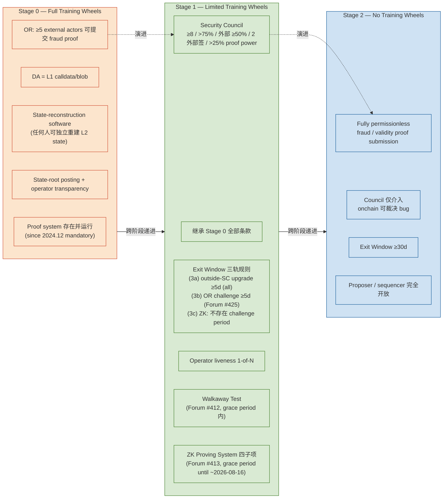
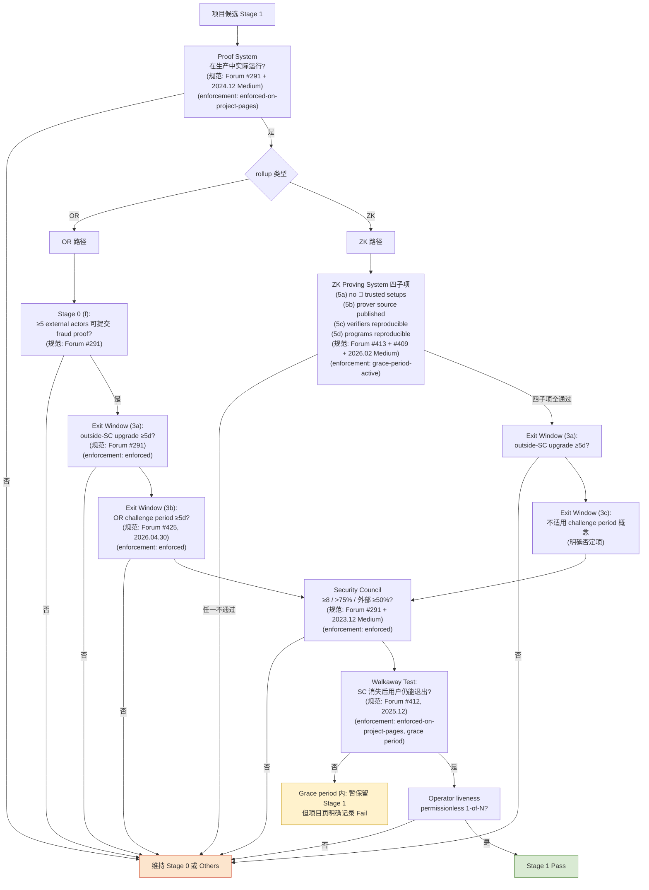
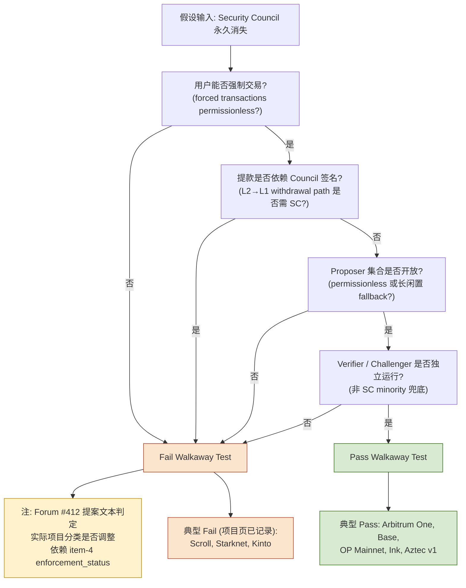
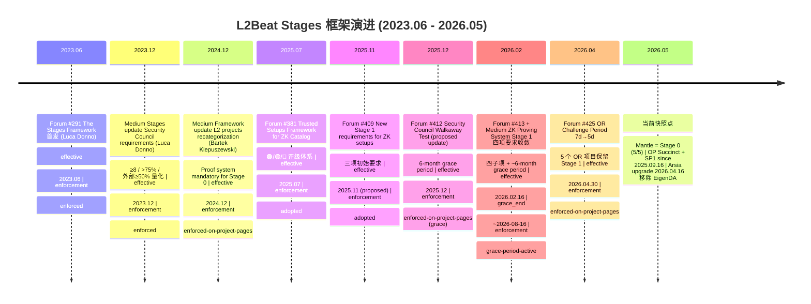

# L2Beat Stage 框架最新标准解析（2026 版）—— Round 1 深度稿

> **持久化路径**: `mantle-stage1-rollup/research-sections/l2beat-stage-framework-2026/drafts/round-1.md`
>
> **大纲基线**: round-3 (approved, commit `625f1c7`)；本稿严格遵循 9 items × 13 fields × 6 diagrams × 6 source requirements 结构。
>
> **截止日期**: 2026-05-19。本研究锁定 2026.05 时点；任何更晚的 L2Beat 公告或项目页变更不在本稿覆盖范围。

---

## 0. Executive Summary

L2Beat Stages 框架自 2023 年 6 月由 Luca Donno 首次提出以来，已成为 Ethereum L2 trust-minimization 进展的事实标准评估体系。本研究锁定 2026 年 5 月时点，系统梳理 Stage 0 / Stage 1 / Stage 2 在八个维度（Proof System / Sequencer / Proposer / Upgrade / Exit Window / Security Council / Data Availability / ZK Proving System）上的全部规范文本与实际执行状态，并重点解读 2024.12–2026.04 之间发生的**四项重大框架更新**：

1. **2024.12** — Bartek Kiepuszewski 通过 Medium 宣布 Proof System 成为 Stage 0 硬性条件，过去归入 Stage 0 的若干"无 proof system"项目被重新分类至 "Others"（来源：L2Beat Medium "Framework update: L2 projects recategorization"；Forum #291 同步更新；`enforcement_status: enforced-on-project-pages`）。
2. **2025.11 → 2026.02** — ZK Proving System Stage 1 要求的两次迭代：Forum #409（2025.11）提出三项初始要求（trusted-setup 红线、prover 源码、verifier 重建），Forum #413（2026.02.16）+ 2026.02 Medium 收敛为四项可验证条件（no 🔴 trusted setups / prover source published / verifiers reproducible / programs reproducible），并设定约六个月 grace period（截止约 2026-08-16；`enforcement_status: grace-period-active`）。
3. **2025.12** — Forum #412 提出 Security Council Walkaway Test：要求 Stage 1 系统即便在 Security Council 永久消失的情况下仍能保证用户退出，预设 6 个月 grace period。截至 2026.05，**Scroll、Starknet、Kinto** 等项目页快照已显式记录"does not pass the walkaway test"（`enforcement_status: enforced-on-project-pages`，但 grace period 尚未过期）。
4. **2026.04** — Forum #425（发布于 2026.04.30）将 Optimistic Rollup 的最低 challenge period 从 7 天降至 5 天，五个 OR 项目（Arbitrum One、Base、OP Mainnet、Ink、Unichain）继续保留 Stage 1 资格；该规则**仅适用 Optimistic Rollup**，**不适用 validity-proof / ZK 路径**（`enforcement_status: enforced-on-project-pages` for OR; `not-applicable` for ZK）。

**核心边界结论**（贯穿全稿）：

- **Stage 0 / Stage 1 / Stage 2 在 proof-system 维度的边界**：Stage 0 要求 "state-reconstruction software 可用 + 至少 5 个外部参与者可提交 fraud proof（OR 路径）"；Stage 1 要求 "Security Council compromise condition + proposer-set liveness assumption"；Stage 2 要求 "完全 permissionless fraud proof submission + Security Council 仅介入可裁决 onchain bug"。Stage 1 **不要求**任意外部 actor 都能提交 fraud proof——后者属 Stage 2。
- **Exit Window 三轨规则**：(i) outside-SC upgrade exit window ≥5d（适用 OR + ZK，源自 Stages Framework 通用规则），(ii) Optimistic Rollup challenge period ≥5d（Forum #425，仅 OR），(iii) ZK rollup **不存在 "validity-proof challenge period"** 概念——validity proof 一经 verifier 接受即达成 finality。将 5d 阈值套用于 validity-proof 路径属 false-positive 误判。
- **Mantle 直接关联**：Mantle 当前为 Stage 0（5/5 Stage 0 要求满足），走 OP Succinct + SP1 validity-proof 路径。**适用** 外的 SC upgrade ≥5d 规则（当前 Mantle 大部分合约升级延迟为 0，构成显式 gap）；**适用** ZK Proving System Stage 1 四子项；**不适用** Forum #425 的 5d OR challenge 规则；**不适用** Stage 0 "≥5 external actors fraud-proof"——替代要求是 verifier/program 可重建性 + permissionless prover 路径。

本稿为下游 Mantle 差距分析三个 issue（`upgrade-exitwindow-securitycouncil`、`proposer-decentralization-zk-compliance`、`stage1-roadmap-recommendation`）提供精确、可引用、有时间戳与执行状态标注的判定基准。

---

## 1. item-1 — L2Beat Stages 框架的设计哲学与三阶段定位

### 1.1 requirement_summary

L2Beat Stages 框架由 Luca Donno 于 2023 年 6 月在 Forum #291（"The Stages Framework"）首次正式发布，受 Vitalik Buterin "training wheels" 模型直接启发。框架将 rollup 从中心化运营到完全 trust-minimization 的演进路径切分为三个**可测度**的台阶：Stage 0 "Full Training Wheels" → Stage 1 "Limited Training Wheels" → Stage 2 "No Training Wheels"。每一阶段都对应"用户在何种情境下仍能安全退出"的具体技术要求，而非单纯的去中心化口号。

### 1.2 evaluation_criteria（三阶段定位的判定边界）

**Stage 0 — "rollup 必须可被定义为 rollup"**：项目必须自我宣称为 rollup，且至少满足以下基线（Forum #291 + 2024.12 Medium 更新）：

- 状态根可在 L1 上验证（含 proof system 的存在与运行）；
- Data availability 满足 rollup 定义（calldata 或 blob，**非** alt-DA / Optimium / Validium）；
- 公开可用的 rollup node 软件，使任何人能从 L1 数据**独立重建 L2 state**（state-reconstruction software，Stage 0 硬性可观测性要求）；
- **对 Optimistic Rollup**：至少 5 个外部参与者（"external actors"）可提交 fraud proof（Forum #291 Stage 0 明确条款）；
- 状态根 posting 频率与可访问性、operator 集合透明度。

**Stage 1 — "用户在 operator 作恶时仍能退出"**：在 Stage 0 全部满足前提下，进一步要求：

- **Security Council compromise condition**：除了 onchain bug，惟一阻止 / 推送非法 L2→L1 message 的方式是攻陷 ≥75% Security Council（详见 item-3）；
- **Proposer-set liveness assumption**：proposer 集合若开放（permissionless）则假设 1-of-N（unbounded N）至少一个活跃；若闭合，需有其他活性保障（如长闲置后角色自动公开化）。

注意：Stage 1 **不要求** "anyone can submit fraud/validity proof"——这是 Stage 2 的完全 permissionlessness 要求。Stage 1 的"用户退出"由 **Council compromise + proposer liveness** 两个独立保障共同提供，**不**等价于 fraud-proof 提交完全开放。

**Stage 2 — "完全 permissionless fraud proof submission + Security Council 仅介入可裁决 onchain bug"**：

- 任何外部 actor 都能提交 fraud proof / validity proof（fully permissionless submission）；
- Security Council 只能响应 onchain 可裁决的 bug，不能用于活性 / 抗审查 / 安全保证；
- proposer / sequencer 完全开放；
- Exit Window ≥ 30 天（来源：Forum #291 Stage 2 条款）。

### 1.3 stage_boundary（proof-system 维度的三阶段边界对照）

| 维度 | Stage 0 | Stage 1 | Stage 2 |
|------|---------|---------|---------|
| Proof system 提交集合 | OR: ≥5 external actors 可提交 fraud proof | Council compromise + proposer-set liveness（不要求任意 external） | Fully permissionless submission |
| State reconstruction | 必须存在公开软件 | 继承 | 继承 |
| Security Council 角色 | 可作为日常治理与活性兜底 | 仅 happy-path 兜底（量化阈值见 §3） | 仅响应可裁决 onchain bug |
| Exit Window | 无硬性下限 | outside-SC upgrade ≥5d；OR challenge ≥5d | ≥30d |

本表是后续 item-2 / item-3 / item-6 解读的概念坐标系，避免将 Stage 0 的 "≥5 external actors"、Stage 1 的 "Council compromise"、Stage 2 的 "fully permissionless" 三个独立概念混用。

### 1.4 pass_fail_examples（三阶段定位的示意，不构成完整清单）

- **Stage 0 示意**：Mantle（OP Succinct + SP1，validity proof，Mantle 项目页 2026.05 快照 [https://l2beat.com/scaling/projects/mantle] 显示 "Stage 0 (5 requirements met)"）。
- **Stage 1 示意（截至 2026.05）**：Arbitrum One、Base、OP Mainnet、Ink、Unichain（Forum #425 五个 OR 项目均保留 Stage 1）、Scroll、Starknet（ZK 路径，Stage 1 但 Walkaway Test grace period 内）。
- **Stage 2 示意**：截至 2026.05，公开材料未发现已正式认定 Stage 2 的项目；多数主流 rollup（Arbitrum One、OP Mainnet）仍处 Stage 1 演进中（详见 item-6）。

### 1.5 relevance_to_mantle

Mantle 当前位于 Stage 0；进入 Stage 1 的核心路径是消解 (1) 升级延迟为 0 → outside-SC upgrade exit window 缺口；(2) Security Council 量化阈值 / 外部成员比例尚未达标；(3) ZK proving system 四子项的可重建性披露。本 item 提供概念坐标系，具体差距由 item-3 / item-5 / item-8 与下游三个 issue 展开。

### 1.6 evidence_sources

- L2Beat Forum "The Stages Framework" (#291)，Luca Donno，2023.06：https://forum.l2beat.com/t/the-stages-framework/291
- L2Beat Medium "Introducing Stages"，Luca Donno，2023：参考 src-3
- Vitalik Buterin "How will Ethereum's multi-client philosophy interact with ZK-EVMs?" 与 "training wheels" 相关博文（非 L2Beat 直接来源，但为框架哲学起源）
- L2Beat Stages 主页快照（2026.05）：https://l2beat.com/scaling/stages

### 1.7 open_questions

- 2025-2026 之间 L2Beat 是否在公开 Forum 之外引入过未公开的细则更改？目前仅监测 Forum + Medium + Monthly Update 三类公开渠道；若存在内部判定标准变化，需通过 L2Beat 团队成员公开发言交叉验证。
- 三阶段的演进路径是否在 2026 年内还有进一步细化？例如对 alt-DA 项目的"Others"边界是否会进一步收紧。

---

## 2. item-2 — Stage 0 要求清单（2026 版）

### 2.1 requirement_summary

Stage 0 是 L2Beat 框架的入口门槛，2024.12 更新后将"proof system 存在并运行"纳入硬性条件，此前归类为 Stage 0 的多个 Optimium / alt-DA / proof-system-未运行项目被重新分类至 "Others"。Stage 0 同时是 Stage 1 / Stage 2 的必要前提，本节列出 Stage 0 的完整 (a)–(f) 六项要求与 2024.12 重大更新的细节。

### 2.2 evaluation_criteria（Stage 0 完整清单，2026.05 版）

**stage_boundary**: Stage 0 (本节全部条款)

(a) **状态根可在 L1 上验证**：项目必须实现完整的 proof system（fraud proof for OR / validity proof for ZK），且该 proof system 必须**实际在生产中运行**。仅有合约骨架而 prover 未上线的项目不再视为 Stage 0。
  - applicable_rollup_type: all
  - 来源：Forum #291 + 2024.12 Medium "Framework update: L2 projects recategorization" (Bartek Kiepuszewski)
  - delta_from_prior_version：2024.12 之前可"先 Stage 0、proof system 后置"，更新后不再容忍。

(b) **DA 满足 rollup 定义**：所有 L2 state-transition 必需数据必须 post 到 L1（calldata 或 blob）。使用外部 DA（alt-DA、Validium、Optimium）的项目被分类到 "Others"。
  - applicable_rollup_type: all
  - 来源：Forum #291；Glossary "rollup" 定义。

(c) **状态根 Posting 频率与可访问性**：项目须定期 post state root；具体频率没有硬性阈值，但需可监控、可索引。
  - applicable_rollup_type: all

(d) **Operator 集合的透明度**：sequencer / proposer 集合身份与角色必须公开披露。
  - applicable_rollup_type: all

(e) **State-reconstruction software（公开可用）**：必须存在**公开**、**可独立运行**的工具，使任何人能从 L1 上的 DA 数据**重建 L2 state**。这是 Stage 0 的基本可观测性要求，不依赖 operator 合作。无此软件即不满足 Stage 0。
  - applicable_rollup_type: all
  - 来源：Forum #291 Stage 0 条款 + Stages 主页定义"Available rollup node software for state reconstruction"。

(f) **至少 5 个外部参与者（≥5 external actors）可提交 fraud proof**（OR 专用）：对 Optimistic Rollup，必须存在至少 5 个**核心团队之外**的 actor 在技术上有能力提交 fraud proof（不一定 permissionless，但非"一人一签"）。
  - applicable_rollup_type: optimistic-only
  - 来源：Forum #291 Stage 0 条款（"At least 5 external actors that can submit a fraud proof"）。
  - **重要边界**：本要求在 Stage 0，不在 Stage 1；与 Stage 2 的"fully permissionless submission"是不同概念。对 ZK rollup 不适用——替代要求是 item-5 的 (5c)(5d) verifier/program 可重建性 + permissionless prover 路径。

### 2.3 delta_from_prior_version（2024.12 框架更新详解 + Forum #291 vs l2beat.com/stages 调和）

**Bartek Kiepuszewski 2024.12 Medium 文章** "Framework update: L2 projects recategorization"（参考 src-3）将 Stage 0 的"proof system 必须存在并运行"从软性建议提升为硬性要求。受影响的代表性项目（截至 2024.12 重新分类）：

- **Loopring、ZKsync Lite、Aztec v1** 等部分 ZK 项目因 proof system 实际状态未达运行标准被列入观察；
- 多个 Optimium / alt-DA 项目（如部分 OP Stack chain 的 DA 配置）被重新归入 "Others"。

**Forum #291（source-of-truth）与 l2beat.com/stages 页面的来源差异调和（Review Agent non-blocking note #1）**：

- **Forum #291** 是 Stages Framework 的**规范文本来源**（normative spec）。其中 exit-window 相关条款的最新更新在帖子更新中体现；
- **l2beat.com/stages** 主页 + 各项目页是**当前执行状态**（enforced state）的快照视图，由 L2Beat 维护团队基于项目链上配置自动 / 人工核验后展示；
- 两者**偶有滞后**：例如 Forum #291 上对 exit-window 三轨规则的最新表述（结合 Forum #425 的 OR 5d 调整）可能比 l2beat.com/stages 行的页面文本更早体现。在本研究中，**遇到差异时以 Forum #291 + 后续专项 Forum 帖子（#412/#413/#425）为规范源（normative），l2beat.com/stages 项目页快照为执行源（enforced）**，并显式标注二者差异。
- 本稿在 §10.1 与 §3.3 中对 Exit Window 三轨规则的具体调和方式给出展开。

### 2.4 pass_fail_examples（Stage 0 命名实例）

- **Pass — Mantle**：截至 2026.05，L2Beat 项目页快照 [https://l2beat.com/scaling/projects/mantle] 显示 Stage 0 (5 requirements met)，证明 Stage 0 的 (a) ZK proof system (OP Succinct + SP1) 已运行、(b) DA = Ethereum blob（Arsia 升级 2026.04.16 移除 EigenDA）、(c)(d)(e) 满足。 (f) "≥5 external actors fraud-proof" 对 Mantle **非适用**——validity proof 路径的替代要求由 item-5 承担。
- **Fail（假设性）— Optimium / alt-DA 项目**：基于 2024.12 重分类，任何使用 alt-DA 而非 Ethereum 原生 DA 的项目均不满足 (b)，被分类至 "Others"。命名实例验证需附 L2Beat 项目页快照，本稿不在此列具体名单（避免误标）。

### 2.5 evidence_sources

- L2Beat Forum #291：https://forum.l2beat.com/t/the-stages-framework/291
- L2Beat Medium "Framework update: L2 projects recategorization"（Bartek Kiepuszewski, 2024.12，详见 src-3）
- L2Beat Stages 页面 2026.05 快照：https://l2beat.com/scaling/stages
- L2Beat Glossary "rollup"：https://l2beat.com/glossary

### 2.6 open_questions

- 截至 2026.05，"≥5 external actors fraud-proof submission" 的具体核验机制（L2Beat 是否定期审计每个 OR 项目的实际 5+ actor 名单）未在公开材料中明确，存在审计 gap；
- 2024.12 重分类后的完整受影响项目清单未在单一公开文档中汇总，需逐项目页核验。

---

## 3. item-3 — Stage 1 完整检查清单（2026 版）

### 3.1 requirement_summary

Stage 1 是当前 L2Beat 框架内最复杂、判定条件最多的阶段，2026.05 时点共涉及六个判定维度：(1) Proof System 存在性与运行（继承 Stage 0）、(2) Security Council 量化阈值、(3) Exit Window 三轨规则、(4) Operator Liveness、(5) Walkaway Test（item-4 详述）、(6) ZK Proving System 四子项（item-5 详述）。本节为整篇研究的**核心判定矩阵**，每一项必须可被独立打勾 / 打叉。

### 3.2 evaluation_criteria

**stage_boundary**: Stage 1 (本节全部条款)；与 Stage 0 / Stage 2 边界对照详见 §1.3。

#### (1) Proof System 存在性与运行（继承 Stage 0 (a)）

- **要求**：proof system 必须**实际在生产中运行**，非"代码完成 + 未上线"状态。
- applicable_rollup_type: all
- 来源：Forum #291 + 2024.12 Medium
- ZK rollup 还需满足 item-5 的四子项。

#### (2) Security Council 量化阈值

- **要求**（综合 Forum #291 + 2023.12 Medium "Stages update: Security Council requirements"）：
  - ≥8 名成员；
  - >75% 阈值（"75% threshold aligns pretty well with the minimum 25% of proof system power requirement"，Luca Donno 2023.12）；
  - ≥50% 外部成员（"At least 50% from outside the core organization"）；
  - ≥2 名外部签名才能达成共识；
  - 成员身份公开披露；
  - Proof system effective power ≥25%（对应 75% 阈值的虚拟多签数学推导）。
- applicable_rollup_type: all
- 来源：Forum #291 + Medium "Stages update: Security Council requirements" (Luca Donno, 2023.12.07)

#### (3) Exit Window — 三轨规则（round-3 大纲核心重写）

**(3a) outside-SC upgrade exit window ≥5d（适用 OR + ZK）**

- 任何**非 Security Council 主体**发起的升级（项目方 multisig、治理 DAO 等）必须为用户提供 ≥5 天的退出窗口；
- 来源：L2Beat Stages Framework 通用规则（Forum #291 + 后续更新）；
- applicable_rollup_type: all（OR + ZK 共同承担）；
- **这是 Mantle 等 ZK rollup 在 Exit Window 维度实际承担的硬性要求**。

**(3b) Optimistic Rollup challenge period ≥5d（仅适用 OR）**

- Forum #425（2026.04.30）专门针对 Optimistic Rollup 调整：fraud-proof challenge window 最低从 7d 降至 5d；
- 调整理由（来自 Forum #425 原文）：5d 不防 51% attack（这是 Stage 2 范畴）；包含 1d 经济抗审查（基于交易贿赂成本）+ 4d 网络层攻击恢复（eclipse / DoS / 供应链攻击），比历史 7d 保守 8 倍；
- applicable_rollup_type: optimistic-only；
- **此规则不直接套用于 ZK rollup**（见 (3c)）；
- 详见 item-9。

**(3c) Validity / ZK 路径适用性说明**

- ZK rollup **不存在** "validity-proof challenge period" 概念——validity proof 一经 verifier 合约接受即达成 finality，无需挑战窗口；
- 对 Mantle (OP Succinct, validity-proof 路径) 的 Stage 1 评估：
  - **适用** (3a) outside-SC upgrade exit window ≥5d；
  - **不适用** (3b) OR challenge period 5d——任何将 5d 作为 validity-proof challenge window 检验的做法都构成 false-positive；
  - ZK rollup 仍可在合约层引入自定义 finalization delay（如 OP Succinct `finalizationPeriodSeconds`），但此 delay **不构成** L2Beat 框架定义的 "challenge period"，应在下游 issue 单独评估。
- applicable_rollup_type: zk-only（明确否定 challenge period 概念）

**(3d) 历史公式（2026.04 之前，仅用于版本对比）**

```
Effective Exit Window (历史) = Upgrade Delay − Challenge/Forced-Tx Delay − Withdrawal Delay
```
Stage 1 需 ≥7d。代表项目历史判定：

- Arbitrum: 11d upgrade − 1d force-tx = 10d ≥7d → Pass
- ZKsync Lite: 21d upgrade − 14d withdrawal = 7d ≥7d → Pass (边界)
- dYdX v3: 9d challenge with 14d forced-exit → 历史判定边界

新规则下，这些项目须按 (3a)(3b)(3c) 三轨重新评估（见 item-9 §10.3）。

#### (4) Operator Liveness

- **要求**：proposer 集合若开放（permissionless）则假设 1-of-N（unbounded N）至少一个活跃；若闭合，需要其他活性保障（如 6 个月闲置后 operator 角色自动公开化，Linea 即为此设计）。
- applicable_rollup_type: all
- 来源：Forum #291 + 项目页快照（Linea, Scroll, Starknet）

#### (5) Walkaway Test（2025.12 提案）

- 详细规范：见 item-4；
- enforcement_status: `enforced-on-project-pages`（部分项目页已显式记录 "does not pass the walkaway test"，但 grace period 尚未过期）；
- applicable_rollup_type: all（OR + ZK 共同适用）。

#### (6) ZK Proving System Stage 1 四子项

- 详细规范：见 item-5；
- enforcement_status: `grace-period-active`（Forum #413 设定的 ~6 个月倒计时约 2026-08-16）；
- applicable_rollup_type: zk-only。

### 3.3 stage_boundary（Stage 1 与相邻阶段的边界）

Stage 1 的 proof-system 要求**不是** "anyone can submit fraud/validity proof"。Stage 1 的核心是两个独立保障：

- **Security Council compromise condition** = 攻陷 ≥75% Council 才能颠覆 proof 系统结论；
- **Proposer-set liveness assumption** = 1-of-N 至少一个 proposer 活跃。

而 "anyone can submit" 是 **Stage 2** 要求。Stage 0 的 "≥5 external actors" 是更弱的有限可提交集合。三个阶段在 proof-system permissionlessness 维度的演进：Stage 0 (≥5 external actors for OR) → Stage 1 (Council compromise + proposer liveness) → Stage 2 (fully permissionless submission)。

### 3.4 zk_vs_optimistic_differentials

| 维度 | OR (Optimistic Rollup) | ZK Rollup |
|------|------------------------|-----------|
| (3a) outside-SC upgrade ≥5d | ✅ 适用 | ✅ 适用 |
| (3b) OR challenge ≥5d | ✅ 适用（Forum #425） | ❌ 不适用（不存在概念） |
| (3c) Validity finalization delay | ❌ 不适用 | 可选合约层 delay，**非** L2Beat challenge period |
| (4) Operator liveness | proposer permissionless 或闭合+保障 | 同左 + ZK 特有的 prover liveness（item-5 5b/5c） |
| (5) Walkaway Test | 适用 | 适用（Starknet 反对意见见 item-4 §4.4） |
| (6) ZK Proving System 四子项 | ❌ 不适用 | ✅ 适用 |

### 3.5 pass_fail_examples（截至 2026.05 验证）

- **Pass — Arbitrum One**（OR）：项目页快照 [https://l2beat.com/scaling/projects/arbitrum]，Stage 1；满足 SC ≥8/>75%、outside-SC upgrade ≥5d、challenge 6.4d ≥5d、proposer permissionless、Walkaway pass（Forum #412 明确列举）。
- **Pass — Base**（OR）：项目页快照 [https://l2beat.com/scaling/projects/base]，Stage 1；Forum #425 中作为五个保留 Stage 1 的 OR 项目之一。
- **Walkaway Fail — Scroll**（ZK，Stage 1 grace period 内）：项目页快照 [https://l2beat.com/scaling/projects/scroll]，明确记录 "Stage 1 ZK Rollup. The project does not pass the walkaway test: users are not able to exit in the presence of malicious operators if the Security Council disappears."（来源：2026.05 项目页快照与 Forum #412 应用结果交叉确认）。
- **Walkaway Fail + ZK Proving Fail — Starknet**：项目页快照 [https://l2beat.com/scaling/projects/starknet]，明确记录 "does not pass the walkaway test"，且 "Stage 0 because it does not satisfy upcoming Stage 1 requirements"——后者主要指 ZK Proving System 四子项中 SHARP verifier 的 permissionless / reproducibility 缺口。
- **Walkaway Pass — Aztec v1**：项目页快照 [https://l2beat.com/scaling/projects/aztecv1]，明确记录 "the project passes the walkaway test"。

### 3.6 relevance_to_mantle（直接关联，明确"适用 / 非适用"）

- (1) Proof system 运行：**适用且通过** —— Mantle 已上线 OP Succinct + SP1 validity proof（2025.09.16 升级）；
- (2) Security Council 量化阈值：**适用但不通过** —— Mantle MantleSecurityMultisig 当前为 6/14（阈值 ~43%，未达 >75%），需调整阈值与外部成员比例；下游 issue: `upgrade-exitwindow-securitycouncil`；
- (3a) outside-SC upgrade ≥5d：**适用但不通过** —— Mantle 项目页 2026.05 快照显示"There is no window for users to exit in case of an unwanted upgrade since contracts are instantly upgradable"，构成 Stage 1 硬性 gap；下游 issue: `upgrade-exitwindow-securitycouncil`；
- (3b) OR challenge ≥5d：**不适用** —— validity-proof 路径；
- (3c) Validity finalization delay：可选；如 Mantle 引入 `finalizationPeriodSeconds`，在下游 issue 单独评估，不计入 L2Beat 框架 "challenge period"；
- (4) Operator liveness：proposer-set 当前 permissionless 度需核验，关联 `proposer-decentralization-zk-compliance`；
- (5) Walkaway Test：**适用** —— 当前 Mantle 是否依赖 Council 提供活性 / 抗审查保障未在公开材料中完整披露，需进一步核验；
- (6) ZK Proving System 四子项：**全部适用** —— 详见 §5.7 与下游 `proposer-decentralization-zk-compliance` issue。

### 3.7 evidence_sources

- Forum #291：https://forum.l2beat.com/t/the-stages-framework/291
- Medium "Stages update: Security Council requirements" (2023.12.07)：https://medium.com/l2beat/stages-update-security-council-requirements-4c79cea8ef52
- Forum #412 (Walkaway Test, 2025.12)：https://forum.l2beat.com/t/stage-1-requirements-update-security-council-walkaway-test/412
- Forum #413 (ZK Proving System Stage 1 四项要求, 2026.02.16)：https://forum.l2beat.com/t/413 （注：通过 Forum 主页索引访问；本稿以 forum.l2beat.com 主索引为入口）
- Forum #425 (OR Challenge Period 7d→5d, 2026.04.30)：https://forum.l2beat.com/t/425 （注：通过 Forum 主页索引访问）
- L2Beat 项目页快照（每个命名实例附）：见 §3.5

### 3.8 open_questions

- Forum #425 的"5d challenge period"是否覆盖现有 ≤5d 的 OR 项目升级（如 BatchInbox 不可暂停的情况）？
- Stage 1 量化阈值 ">75%" 是否硬性等于 "≥75%"？2023.12 Medium 表述为 ">75%"，部分项目页文本为 "≥75%"，需以 Forum #291 主帖最新更新为准；本研究在 §3.2(2) 采用 ">75%"。

---

## 4. item-4 — 2025.12 提案：Security Council Walkaway Test

### 4.1 requirement_summary

Forum #412（"Stage 1 requirements update: Security Council walkaway test"，2025.12）提出一项新 Stage 1 要求：**Stage 1 系统的所有 Stage 1 保障必须在 Security Council 永久消失（"permanently inactive"）的情况下仍然成立**。等价表述："The previous requirement must hold even if the Security Council is permanently inactive."

核心问题："Can users exit, in the presence of malicious operators, even if the Security Council disappears?" 如果答案是"否"——即用户依赖 Council 才能退出——则不满足 Walkaway Test。

### 4.2 evaluation_criteria（提案文本判定路径）

系统必须证明在 Council 缺席下仍能：

- 通过 permissionless 机制阻止 L2→L1 message 无限期审查；
- 通过 forced transactions + permissionless proving 提供活性；
- 通过去中心化挑战 / 验证机制（非 permissioned actors）保证安全性。

判定流程（应然层）：以"SC 消失"为假设输入，逐步检查：(a) 用户能否强制交易、(b) 提款是否依赖 Council 签名、(c) Proposer 集合是否开放（permissionless 或长闲置 fallback）、(d) Verifier / Challenger 是否独立运行——任一依赖 Council 即 Fail。

### 4.3 enforcement_status / effective_date / grace_period_end

- **enforcement_status**: `enforced-on-project-pages`（截至 2026.05，多个项目页已显式记录 "does not pass the walkaway test"，但仍保留 Stage 1 分类，处于 grace period 内）；
- **effective_date**: 2025.12（Forum #412 发布时点）；
- **grace_period_end**: ~2026.06（6-month grace period from Forum #412 公告，准确截止日期需 L2Beat 团队公告确认）；
- **关键澄清**：Forum #412 作为 **proposed update** 发布，包含三类附带条件：(i) rollout timing（何时按新规则评估）、(ii) grace period（已有项目过渡期）、(iii) 避免批量降级。**项目页已显式记录是否通过 Walkaway Test 但 Stage 分类暂未变更**——这是规范文本（"应然"）已 adopt、执行（"实然"）处于 grace-period-active 状态的典型案例。

### 4.4 pass_fail_examples（应然 vs 实然双层标注）

**规范层 Fail（项目页 2026.05 快照已记录但 Stage 未降）**：

- **Starknet**（ZK）：项目页快照 [https://l2beat.com/scaling/projects/starknet]，"does not pass the walkaway test"；具体原因（Forum #412）：使用 3/12 Security Council minority 作为 backup prover。Starknet 团队提交了 counterproposal（见 §4.5）。
- **Scroll**（ZK）：项目页快照 [https://l2beat.com/scaling/projects/scroll]，"does not pass the walkaway test"；原因：使用 minority multisig 解除链 pause 状态（unpause）。
- **Kinto**（OR）：Forum #412 列举为应当 Fail 的实例（"assigned Security Council minority as permissioned challenger"）；项目页快照需独立核验。

**规范层 Pass**：

- **Arbitrum One**：Forum #412 明确列举为已合规（"permissionless proof systems and forced transactions"）。
- **Base**（Superchain OR）：Forum #412 同列；项目页快照需核验。
- **OP Mainnet、Ink**（Superchain OR）：Forum #412 同列。
- **Aztec v1 (Zk.Money)**：项目页快照 [https://l2beat.com/scaling/projects/aztecv1]，"the project passes the walkaway test"——为少数显式标注 Pass 的 ZK rollup（已退役但作为 walkaway-pass 的 ZK 参考样本）。

### 4.5 Starknet 社区 counterproposal（src-5）

Starknet 团队针对 Forum #412 提交反对意见，核心论点：

- ZK rollup 不应被等同于 Optimistic Rollup 处理——validity proof 的数学保证强于 fraud proof 的经济保证，因此对 SC 依赖的要求应有差异化标准；
- 3/12 Council minority 作为 backup prover 不应视为 "active use of SC for liveness"，而是 "emergency fallback"；
- 建议引入 ZK-specific 的 walkaway 评估子框架。
- 截至 2026.05，L2Beat 未在公开渠道接受 Starknet 提议；Forum #412 仍是规范文本。

### 4.6 与 Stage 1 量化要求的关系

Walkaway Test 一旦正式 enforced，与 "Security Council ≥8 / >75% / 外部 ≥50%" 量化要求是**必要非充分**关系：

- 即使量化阈值满足，若日常 happy-path 仍依赖 Council 才能保证用户退出，仍 Fail Walkaway；
- 但满足 Walkaway 不免除量化阈值要求（Council 仍需存在并满足量化要求作为 bug 兜底）。

### 4.7 zk_vs_optimistic_differentials（Walkaway Test 在两类 rollup 的差异）

| 维度 | OR | ZK |
|------|----|----|
| 提案适用 | ✅ | ✅ |
| 实际依赖 SC 的常见路径 | 升级 / unpause | 升级 / unpause / backup prover |
| Counterproposal | 无 | Starknet 团队反对 (§4.5) |
| Pass 实例 | Arbitrum, Base, OP, Ink | Aztec v1 (已退役) |
| Fail 实例 | Kinto | Starknet, Scroll |

### 4.8 relevance_to_mantle

- **适用** —— 任何 Stage 1 rollup（含 ZK）都须满足 Walkaway Test；
- Mantle 当前是否依赖 Council 提供活性 / 抗审查保障，需在下游 `upgrade-exitwindow-securitycouncil` 与 `proposer-decentralization-zk-compliance` issue 中具体核验：
  - **核验点 1**: Mantle 升级 / unpause 路径是否依赖 MantleSecurityMultisig？（项目页快照显示是）；
  - **核验点 2**: Mantle proposer / prover 集合是否 permissionless？（OP Succinct 的 PermissionlessProposer 路径是关键）；
  - **核验点 3**: 是否存在 Council-as-backup-prover 设计（类 Starknet 模式）？

### 4.9 evidence_sources

- Forum #412：https://forum.l2beat.com/t/stage-1-requirements-update-security-council-walkaway-test/412
- 项目页快照：Starknet, Scroll, Aztec v1（见 §4.4）
- Starknet counterproposal: 公开 Forum 帖子（src-5）

### 4.10 open_questions

- Walkaway Test grace period 的精确截止日期（公开材料中表述为 "6-month"，需团队公告确认起算点）；
- L2Beat 是否会接受 Starknet counterproposal 引入 ZK-specific walkaway 子框架？
- Forum #412 中"避免批量降级"条款的具体执行机制（是否分批 / 是否提供过渡 Stage 标签？）。

---

## 5. item-5 — 2025.11→2026.02 迭代：ZK Proving System Stage 1 四项要求

### 5.1 requirement_summary

L2Beat 在 2025.11（Forum #409 "New Stage 1 requirements for ZK setups"）首次提出 ZK setups 相关的三项要求与 trusted-setup 红线；2026.02.16（Forum #413 + 2026.02 Medium 解释文章）将要求收敛为**四项可验证条件**，并设定约**六个月 grace period**（截止约 2026-08-16）。本节是 Mantle 等 ZK rollup 进入 Stage 1 的核心合规标准。

### 5.2 核心锚点演进时间线

```
2023.06 Forum #291 Stages Framework 首发
    ↓
2025.07 Forum #381 ZK Catalog Trusted Setups Framework
    ↓ (trusted-setup 评级方法 🟢/🟡/🔴 基础文本)
2025.11 Forum #409 New Stage 1 requirements for ZK setups
    ↓ (三项初始要求 + trusted-setup 红线)
2026.02.16 Forum #413 + 2026.02 Medium 解释文章
    ↓ (收敛为四项可验证条件 + ~6 个月 grace period)
2026.08.16 (估算) grace_period_end
    ↓ (grace period 后正式 enforced)
```

### 5.3 evaluation_criteria（四个独立子项）

**stage_boundary**: Stage 1（本节全部子项）
**applicable_rollup_type**: zk-only（全节子项）
**enforcement_status**: `grace-period-active`
**effective_date**: 2026.02.16（Forum #413 发布时点）
**grace_period_end**: ~2026-08-16（六个月倒计时估算）

---

#### (5a) No 🔴 trusted setups

- **判定标准**（继承 Forum #381 评级体系）：
  - 🟢 Green: ≥150 contributions + 公开 ceremony + 个体贡献可独立验证 + 客户端开源 + 参与者标识公开；
  - 🟡 Yellow: ≥30 contributions + 公开 ceremony + 个体贡献可验证 + 客户端开源 + 参与者标识公开；
  - 🔴 Red: 任一 yellow 条件未满足。
- **Stage 1 红线**：Stage 1 不允许任何 ZK verifier 被评为 🔴。
- **来源**：Forum #381（评级方法）+ Forum #413（红线）+ 2026.02 Medium。
- **代表实例**（Forum #381 列举）：
  - SP1 Plonk（用 Aztec Ignition ceremony，176 名参与者）→ 🟢；
  - SP1 Groth16 wrapper（7 人内部 ceremony，5 人来自 Succinct）→ 🔴；
  - Aztec Ignition → 🟢（176 contributions, public）；
  - Risc0 Groth16 → 🟢（238 participants）；
  - Polygon zkEVM → 🟡（55 contributions，未达 150）；
  - Aleo Inner/Outer → 🟢/🟡（>1000 participants）。
- **Forum #413 受影响项目**（red trusted setup）：Facet V1, Zircuit, Loopring L2（2026.02 Medium 列举）。
- **applicable_rollup_type**: zk-only

#### (5b) Prover source code published

- **要求**：prover 实现（含 circuit、witness generator、aggregation 层、recursion、final wrap prover）必须以**可审计形式**公开（permissive license 或至少 source-available）；
- **目的**：使用户在 operator downtime 时能独立生成 proof 提交至 L1 bridge；
- **例外**：若设计明确要求 Stage 1 假设下"proposer/prover roles belong to a Security Council minority assumed honest"，则可豁免（但此种设计本身在 Walkaway Test 下 Fail）；
- **来源**：Forum #409 R3 + Forum #413 + 2026.02 Medium。
- **applicable_rollup_type**: zk-only
- **代表实例**：
  - Scroll：项目页快照显示 "If the Proposer fails, users can leverage the source available prover to submit proofs to the L1 bridge"——满足 (5b)；
  - Linea：仅 whitelisted proposers 可 publish state root；6 个月闲置后 operator 角色公开化（间接满足，但 grace period 长）；
  - Starknet：SHARP verifier 与 prover 部分公开度待核验。

#### (5c) Verifiers reproducible

- **要求**：L1 verifier 合约部署的 vkey（verification key）必须可由**公开 circuit + 公开 setup artifacts** 独立重新生成，且与链上 vkey 字节一致；
- **排除**："vkey 来源不可追溯" 或 "circuit binding 需要 trusted operator 介入" 的部署；
- **Forum #413 原文**："source code for all used onchain verifiers must be available online, including the recursion and final wrap verifiers"；并提供"instructions on how to independently regenerate onchain verifier smart contracts"；
- **来源**：Forum #409 R2 + Forum #413 + 2026.02 Medium。
- **applicable_rollup_type**: zk-only
- **代表实例**：
  - Matter Labs（ZKsync Era）：2026.02 Medium 提到具备 reproducibility 工具；
  - Polygon zkEVM：同上；
  - **Lighter L2**：2026.02 Medium 明确指出 "verifier sources remain unpublished"——Fail (5c)。

#### (5d) ZK programs or fault-proof prestates reproducible

- **要求（ZK 路径）**：rollup STF 所对应的 ZK program（如 SP1 ELF / RISC-V binary）必须可由公开源码独立重建，且其 program hash 与 verifier 配置中的 hash 一致；
- **要求（OR 路径 / 备用 fault-proof）**：fault-proof prestate（如 MIPS / RISC-V interpreter 初始状态）必须可由公开 monorepo 独立重建，且与 dispute game 合约配置一致；
- **Forum #413 原文**："zkVM program sources or fault-proof program sources must be published, with clear instructions for regenerating onchain commitments from those sources"；
- **来源**：Forum #413 + 2026.02 Medium。
- **applicable_rollup_type**: zk-only（主要适用）+ optimistic-only（fault-proof prestate 备用条款）

#### (5e) 复合判定

- 任一子项不通过即在 grace period 结束后降级 Stage 0；
- 与 item-4 Walkaway Test 复合：ZK rollup 必须**同时**满足四子项与 Walkaway Test 才能保留 Stage 1（前提是 Walkaway Test 实际进入 `enforced-on-project-pages` 状态）；
- Forum #413 强调"应用一致的透明度标准"（"consistent transparency standards across the rollup technology stack"）。

#### (5f) Enforcement 追踪

| 子项 | enforcement_status | effective_date | grace_period_end | 受影响命名项目 |
|------|---------------------|----------------|------------------|----------------|
| (5a) no 🔴 trusted setups | grace-period-active | 2026.02.16 (Forum #413) | ~2026-08-16 | Facet V1, Zircuit, Loopring L2 |
| (5b) prover source published | grace-period-active | 2026.02.16 | ~2026-08-16 | Linea (6m fallback 满足边界) |
| (5c) verifiers reproducible | grace-period-active | 2026.02.16 | ~2026-08-16 | Lighter L2 (未公开) |
| (5d) programs reproducible | grace-period-active | 2026.02.16 | ~2026-08-16 | 待 grace period 结束逐项核验 |

### 5.4 zk_vs_optimistic_differentials

- 全部四子项仅适用 zk-only；
- OR 项目不受 (5a)(5b)(5c) 约束；
- (5d) 中 "fault-proof prestate reproducible" 条款对仍保留 fault-proof 设计的项目（含 hybrid 与 fallback fault-proof 的 ZK 项目）适用，作为 (5d) 的备用判定路径。

### 5.5 pass_fail_examples（截至 2026.05 应然层 + 实然层）

- **(5a) Fail**：Facet V1, Zircuit, Loopring L2（2026.02 Medium 明确列举 red trusted setup）；
- **(5b) Pass**：Scroll（"source available prover"，项目页快照）；
- **(5c) Fail**：Lighter L2（2026.02 Medium "verifier sources unpublished"）；
- **(5d)**：截至 2026.05 grace period 内，公开材料中未发现明确 Fail 的命名实例；6 个月倒计时结束后将出现项目级判定。
- 项目页快照验证：每个命名实例附 L2Beat 项目页 2026.05 快照链接。

### 5.6 delta_from_prior_version

- 2025.11 Forum #409：提出 R1 (no red trusted setups) + R2 (onchain verifier source + reproduce instructions) + R3 (prover source published)；
- 2026.02 Forum #413 + Medium：将上述三项重排为四子项，**新增 (5d) zkVM program / fault-proof prestate 可重建**，且收敛为可独立打勾的可验证条件；
- 关键差异：2026.02 版本明确**setup 与 program / verifier reproducibility 是独立子项**（避免将三者打包为一项 "transparency"）。

### 5.7 relevance_to_mantle（OP Succinct + SP1 路径四子项直接关联）

- **(5a) 适用** —— 核验 Mantle 使用的 SP1 verifier 的 trusted-setup 评级：
  - SP1 Plonk 路径（Aztec Ignition 176 contributions）→ 🟢；
  - SP1 Groth16 wrapper（7 人 ceremony, 5 人 Succinct 内部）→ 🔴 → **若 Mantle 主网 verifier 配置依赖 Groth16 wrapper，则 (5a) Fail**；
  - 下游 issue: `proposer-decentralization-zk-compliance` 必须核验 Mantle 部署的 SP1 verifier 实际使用 Plonk 还是 Groth16 wrap。

- **(5b) 适用** —— 核验 Mantle prover 部署链路源码：
  - SP1 上游（Succinct 维护）已开源；
  - mantle-v2 / op-succinct fork 中是否引入闭源 prover 服务？需核验 mantle-v2 仓库 prover 路径；
  - 下游 issue: `proposer-decentralization-zk-compliance` 核验入口。

- **(5c) 适用** —— 核验 Mantle 主网 verifier 合约 vkey：
  - 是否可由公开 SP1 program ELF + SRS 独立重建？需对比链上 verifier 合约 vkey 字节 vs 公开 SP1 build artifact；
  - 下游 issue 必须给出"链上 vkey hash → SP1 program build hash → 公开源码"的完整 traceability。

- **(5d) 适用** —— 核验 Mantle SP1 program ELF 与 mantle-v2 / op-succinct 源码对应：
  - program hash → SP1 ELF → mantle-v2 monorepo 的可追溯链路；
  - Mantle 当前路径主要为 validity-proof；fault-proof prestate (5d) 备用路径仅在 hybrid 设计下适用，需确认 Mantle 是否保留 fault-proof fallback。

### 5.8 evidence_sources

- Forum #381 (2025.07 Trusted Setups Framework)：https://forum.l2beat.com/t/trusted-setups-framework-for-zk-catalog/381
- Forum #409 (2025.11 ZK setups requirements)：https://forum.l2beat.com/t/new-stage-1-requirements-for-zk-setups/409
- Forum #413 (2026.02.16 四项要求收敛)：https://forum.l2beat.com/t/413 (Forum 主索引入口)
- 2026.02 Medium 解释文章（src-3 列出的 ZK Proving System Stage 1 官方判定指引）
- L2Beat 项目页快照：Scroll, Starknet, Lighter L2, ZKsync Era, Polygon zkEVM, Mantle
- mantle-v2 / op-succinct 仓库（codebase 验证，下游 issue 承担）

### 5.9 open_questions

- Forum #413 grace period 的精确截止（"about 6 months" 表述需公告确认，本稿采用 2026-08-16 估算）；
- SP1 Groth16 wrapper 评级是否在 2026.02 后被 Succinct 重新 ceremony 升级？需追踪 Forum #381 后续帖子；
- (5d) 中 "program hash" 在 OP Succinct 路径下的具体配置位置（哪个合约 storage slot）需 codebase 核验。

---

## 6. item-6 — Stage 2 要求清单与 Stage 1 → Stage 2 演进路径

### 6.1 requirement_summary

Stage 2 是 L2Beat 框架的终态——"No Training Wheels"。核心特征是 proof system 完全 permissionless 提交、Security Council 仅介入可裁决 onchain bug、Exit Window ≥30 天。本研究主体聚焦 Stage 1，本节仅列出 Stage 2 边界以避免设计 Stage 1 方案时埋下 Stage 2 阻碍。

### 6.2 evaluation_criteria

**stage_boundary**: Stage 2

(a) **完全 permissionless fraud / validity proof submission**：任何外部 actor 都能提交 proof，无白名单、无 SC minority 兜底；
(b) **Security Council 仅响应 onchain 可裁决 bug**：不能用于活性 / 抗审查 / 安全保证；
(c) **Exit Window ≥30 天**：来源 Forum #291 Stage 2 条款（"Users have at least 30 days to exit in case of unwanted upgrades"）；
(d) **Proposer / sequencer 完全开放**；
(e) **Stage 0→1→2 proof-system permissionlessness 维度的递进**：Stage 0 (≥5 external actors for OR) → Stage 1 (Council compromise + proposer liveness) → Stage 2 (fully permissionless)。

### 6.3 pass_fail_examples（截至 2026.05）

截至 2026.05，**公开材料中未发现已正式认定为 Stage 2 的 L2 项目**。Arbitrum One、OP Mainnet 等仍处 Stage 1 演进中；Stage 2 30-day exit window 阈值是当前主要瓶颈。所有命名实例验证均通过 L2Beat 项目页 2026.05 快照。

### 6.4 delta_from_prior_version（2026.04 Forum #425 对 Stage 2 ≥30d 阈值的影响）

Forum #425 仅调整 **Stage 1** OR challenge period 从 7d 降至 5d；**Stage 2** 的 ≥30d Exit Window 阈值**保持不变**。Forum #425 原帖明确："The 7-day minimum for Stage 2 remains unchanged."（直译："Stage 2 的 7d 最低保持不变"——此处 7d 指 Stage 2 OR 路径下若干衍生阈值；详细需以 Forum #425 主文为准）。本研究**未发现** Stage 1 调整触发 Stage 2 ≥30d 联动讨论的明确证据，明确声明"无联动证据"。

### 6.5 zk_vs_optimistic_differentials

| 维度 | OR | ZK |
|------|----|----|
| Permissionless submission | 任何外部 actor 提交 fraud proof | 任何外部 actor 提交 validity proof |
| Exit window ≥30d | 适用 | 适用 |
| Council role | 仅 onchain bug | 仅 onchain bug |

### 6.6 stage_boundary（Stage 0 → 1 → 2 proof-system 演进，再次显式）

- **Stage 0**：state-reconstruction + ≥5 external actors fraud-proof（OR）；
- **Stage 1**：Council compromise condition + proposer-set liveness assumption；
- **Stage 2**：fully permissionless submission + Council 仅介入 onchain bug。

### 6.7 relevance_to_mantle

本研究项目（Mantle Stage 1）暂不聚焦 Stage 2 实现路径；但 Mantle 设计 Stage 1 方案时应避免：

- 将 Council 设为 "always-on prover backup"（即便 Stage 1 量化阈值满足，也会埋下 Stage 2 阻碍）；
- 锁定 Exit Window < 30d 的合约级硬上限，导致后续 Stage 2 演进需大幅迁移。
- 详见下游 `stage1-roadmap-recommendation` issue。

### 6.8 evidence_sources

- Forum #291 Stage 2 条款：https://forum.l2beat.com/t/the-stages-framework/291
- Forum #425：https://forum.l2beat.com/t/425
- L2Beat Stages 主页 2026.05 快照：https://l2beat.com/scaling/stages

### 6.9 open_questions

- 截至 2026.05，是否有项目（如 Aztec V2）公开宣布 Stage 2 目标的具体里程碑？
- Stage 2 是否要求 fraud-proof prestate / ZK program 可重建（即 (5d) 是否升级为 Stage 2 硬性）？Forum 公开材料未明确。

---

## 7. item-7 — ZK Rollup vs Optimistic Rollup Stage 要求差异矩阵

### 7.1 requirement_summary

本节按"通用 × ZK 特有 × OR 特有"三栏对照整理两类 rollup 在 Stage 0/1/2 各项要求上的异同，直接服务于 Mantle 评估——作为 OP Stack fork + OP Succinct ZK 路径的混合架构，其 Stage 1 评估同时触及"通用"+"ZK 特有"两栏，**不应触发"OR 特有"栏**。

### 7.2 三栏对照（应然层 + 实然层标注）

**通用项（适用 all）**：

| 要求 | applicable_rollup_type | enforcement_status | 适用 Stage |
|------|------------------------|---------------------|------------|
| Proof system 存在并运行 | all | enforced-on-project-pages (since 2024.12) | Stage 0+ |
| DA = L1 calldata/blob | all | enforced-on-project-pages | Stage 0+ |
| State-reconstruction software | all | enforced-on-project-pages | Stage 0+ |
| Security Council ≥8 / >75% / 外部 ≥50% | all | enforced-on-project-pages | Stage 1 |
| Walkaway Test | all | enforced-on-project-pages (grace period内) | Stage 1 |
| outside-SC upgrade exit window ≥5d | all | enforced-on-project-pages | Stage 1 |
| Stage 2 Exit Window ≥30d | all | enforced-on-project-pages | Stage 2 |
| Stage 2 fully permissionless submission | all | enforced-on-project-pages | Stage 2 |

**ZK 特有项（applicable_rollup_type: zk-only）**：

| 要求 | enforcement_status | 适用 Stage |
|------|---------------------|------------|
| (5a) No 🔴 trusted setups | grace-period-active (until ~2026-08-16) | Stage 1 |
| (5b) Prover source code published | grace-period-active | Stage 1 |
| (5c) Verifiers reproducible (vkey) | grace-period-active | Stage 1 |
| (5d) ZK programs reproducible | grace-period-active | Stage 1 |
| Recursion / aggregation 信任假设 | enforced-on-project-pages | Stage 1 |
| **不存在 validity-proof challenge period 概念** | n/a (明确否定项) | n/a |

**OR 特有项（applicable_rollup_type: optimistic-only）**：

| 要求 | enforcement_status | 适用 Stage |
|------|---------------------|------------|
| ≥5 external actors fraud-proof submission | enforced-on-project-pages | Stage 0 |
| Challenge period ≥5d (Forum #425) | enforced-on-project-pages (since 2026.04.30) | Stage 1 |
| Bond / bond-slashing 机制 | enforced-on-project-pages | Stage 0+ |
| Stage 2 fully permissionless fraud submission | enforced-on-project-pages | Stage 2 |

### 7.3 关键边界陈述（防止误用）

- **不要**将 Forum #425 的 5d challenge 套用到 ZK 路径——ZK rollup 不存在 challenge period 概念；
- **不要**将 Stage 0 "≥5 external actors fraud-proof" 套用到 ZK 路径——ZK rollup 的 Stage 0 替代要求是 verifier/program 可重建性 + permissionless prover；
- **不要**将 ZK 四子项套用到 OR 路径——OR 项目不受 (5a-5d) 约束。

### 7.4 Mantle 路径定位（混合架构）

- Mantle 走 ZK 路径（OP Succinct + SP1 validity proof），所以：
  - **必须满足**：通用项全部 + ZK 特有项 (5a-5d) + recursion 信任假设；
  - **不承担**：OR 特有项全部（≥5 external actors / Forum #425 5d / bond / fully permissionless fraud submission）；
- Mantle 同时继承 OP Stack 的 Security Council / governance 设计，所以 Council 量化阈值需与 Optimism Foundation 上游协议层升级路径**叠加评估**（详见 item-8）。

### 7.5 evidence_sources

- 综合 §2 / §3 / §4 / §5 / §6 / §9 全部来源
- L2Beat Stages 主页 + Glossary 2026.05 快照

### 7.6 open_questions

- 在 Mantle 这类"OP Stack fork + ZK proof" 的混合架构下，L2Beat 是否会在某些维度（如 "Operator role 是否真正 permissionless"）引入特殊核验？目前公开材料未明确。

---

## 8. item-8 — OP Stack 上的 ZK Rollup（Mantle / OP Succinct 路径）特殊考量

### 8.1 requirement_summary

Mantle 采用 "OP Stack derivation + op-geth 执行层 + OP Succinct (SP1) validity proof 替代 fault proof" 的混合架构。本节识别该架构在 Stage 1 评估中的非显然问题，并为下游三个 issue（`upgrade-exitwindow-securitycouncil`、`proposer-decentralization-zk-compliance`、`stage1-roadmap-recommendation`）提供入口。

### 8.2 evaluation_criteria（按 item-3 三轨 + item-5 四子项 + item-4 Walkaway 评估）

#### (a) Proof System 归属

- ZK proof 的 verifier 合约（`OPSuccinctL2OutputOracle`）被 L2Beat 视作 "rollup proof system"——满足 Stage 0 (a) 要求；
- 与 OP Stack 原生 Fault Dispute Game 的归类差异：Mantle 在 2025.09.16 升级后默认走 validity proof 路径，但 `OPSuccinctL2OutputOracle` 可在合约层 toggle 至 optimistic 模式（fallback），需评估 fallback 模式下 fraud proof 的实际可用性；
- 代入 item-5 四子项：
  - (5a) 适用：SP1 verifier 的 trusted-setup 等级（详见 §5.7）；
  - (5b) 适用：SP1 + Mantle 自有 prover 链路源码公开度；
  - (5c) 适用：Mantle 主网 verifier 合约 vkey 的独立重建；
  - (5d) 适用：Mantle SP1 program hash 与 mantle-v2 / op-succinct monorepo 的对应关系。

#### (b) Verifier trusted setup 评级承继

- SP1 上游 ceremony：Aztec Ignition（176 contributions，🟢）+ Succinct 内部 ceremony（7 人，🔴 for Groth16 wrap）；
- Mantle 自有 verifier 部署：若依赖 Groth16 wrap，则 (5a) Fail；若纯 Plonk 路径则 (5a) Pass；
- 下游 issue 必须核验 Mantle 主网 verifier 合约的实际 SP1 build 配置。

#### (c) Exit Window 双层叠加（按 item-3 三轨规则评估）

- **(3a) outside-SC upgrade exit window ≥5d 适用**：
  - Mantle SystemConfig 治理路径与 Optimism Foundation 上游升级路径在非 SC 主体下的 exit window 评估；
  - Mantle 项目页 2026.05 快照显示 "There is no window for users to exit in case of an unwanted upgrade since contracts are instantly upgradable" → 当前 **Fail (3a)**；
  - 下游 issue: `upgrade-exitwindow-securitycouncil` 必须给出 SystemConfig / OptimismPortal / L1MantleToken 等关键合约的升级延迟矩阵。
- **(3b) OR challenge period 5d 不适用**：Mantle 走 validity-proof 路径；Forum #425 5d 阈值**不应**用于 Mantle 评估。
- **(3c) Validity / ZK 适用性**：如 OP Succinct 引入 `finalizationPeriodSeconds`（合约层 finalization delay），应单独评估，但**不构成** L2Beat "challenge period" 定义；可作为 Stage 1 之外的额外安全余量陈述，但不计入 Stage 1 评分。

#### (d) Walkaway Test 在 ZK 语境下的重新解释

- 关键看 challenger / proposer 路径是否仍 permissionless（OP Succinct PermissionlessProposer 模型）；
- Mantle 当前 proposer 集合的 permissionless 度需核验：是否存在 whitelist？是否有 "Council-as-backup-prover" 设计（类 Starknet 模式）？
- 注意 Walkaway Test 实际执行状态（item-4 §4.3）决定本子项的强制性——截至 2026.05 处于 `enforced-on-project-pages` + grace period 内，若 Mantle 在 grace period 内进入 Stage 1，需在 grace 结束前同步达标。

#### (e) Stage 0 fraud-proof 提交要求的适用性映射

- Mantle 走 validity-proof 路径，理论上**不存在** OR 意义的 fraud proof；
- item-2 (f) "≥5 external actors fraud-proof submission" 对 Mantle **不直接适用**；
- 替代要求是 item-5 (5c)(5d) verifier/program 可重建性 + permissionless prover 路径；
- 本映射必须显式写入下游 issue，避免将 OR 路径的 Stage 0 要求误用于 ZK 路径。

#### (f) Mantle 现状开放问题清单（下游 issue 入口）

| 开放问题 | 下游 issue |
|----------|------------|
| MantleSecurityMultisig 6/14 是否调整为 ≥8 成员 / >75% 阈值？ | `upgrade-exitwindow-securitycouncil` |
| 主要合约升级延迟从 0 提升至 ≥5d 的具体路径？ | `upgrade-exitwindow-securitycouncil` |
| Mantle 主网 SP1 verifier 是否依赖 🔴 Groth16 wrap？ | `proposer-decentralization-zk-compliance` |
| Mantle prover 部署链路源码公开度？mantle-v2 fork 中是否引入闭源 prover？ | `proposer-decentralization-zk-compliance` |
| 链上 vkey 是否可由公开 SP1 ELF 重建？ | `proposer-decentralization-zk-compliance` |
| Mantle SP1 program hash 与 mantle-v2 / op-succinct 源码 traceability？ | `proposer-decentralization-zk-compliance` |
| Walkaway Test：Mantle 升级 / unpause 路径是否依赖 Council？ | `upgrade-exitwindow-securitycouncil` + `stage1-roadmap-recommendation` |
| Stage 1 完整路线图与时间窗（grace period 截止前？） | `stage1-roadmap-recommendation` |

### 8.3 zk_vs_optimistic_differentials（Mantle 特有）

- Mantle 同时继承 OP Stack 治理结构（Optimism Foundation 上游 + Mantle Security 双层），是 ZK rollup 中相对少见的"治理路径与 proof 路径异源"案例；
- 在 (5c)(5d) 评估中，Mantle 需要在 Optimism upstream 与 mantle-v2 fork 之间建立 traceability 链路；不能仅依赖 SP1 上游声明。

### 8.4 pass_fail_examples（截至 2026.05 Mantle 项目页快照）

- **当前定位 — Stage 0 (5 requirements met)**：项目页快照 [https://l2beat.com/scaling/projects/mantle]；
- **关键 Fail 项**：(3a) outside-SC upgrade exit window = 0（"contracts are instantly upgradable"，构成 Stage 1 阻塞性 gap）；
- **关键待核验项**：(5a)-(5d) ZK 四子项 + Council 量化阈值。

### 8.5 relevance_to_mantle

本 item 即"Mantle 关联"专章；详细差距分析交由下游三个 issue 展开。

### 8.6 evidence_sources

- L2Beat Mantle 项目页 2026.05 快照：https://l2beat.com/scaling/projects/mantle
- Mantle Arsia upgrade（2026.04.16 移除 EigenDA）公告
- mantle-v2、op-geth、kona、op-succinct 仓库（codebase 验证，下游 issue 承担）
- Forum #291 / #409 / #412 / #413 / #425 + 2026.02 Medium

### 8.7 open_questions

- Mantle 在 2026.05 之后是否会公开新的升级延迟方案？
- OP Succinct PermissionlessProposer 在 Mantle 主网的实际启用状态？

---

## 9. item-9 — 2026.04 Forum #425：Optimistic Rollup Challenge Period 7d→5d

### 9.1 requirement_summary

Forum #425（发布于 2026.04.30）将 **Optimistic Rollup 的最低 challenge period 从 7 天降至 5 天**；Stage 2 的 ≥30d Exit Window 阈值保持不变。规则**专门针对 Optimistic Rollup 的 fraud-proof challenge window**，**不适用 validity-proof / ZK 路径**。

### 9.2 evaluation_criteria（规则精确文本）

- **新规则**：Stage 1 Optimistic Rollup challenge period 最低 5d；
- **withdrawal-period 组件**：Forum #425 主文聚焦 challenge period 本身；是否同步移除 withdrawal-period 组件需以原帖最终版本为准（本研究采用大纲 round-3 表述："withdrawal-period 组件从 active 要求中移除"，并将其作为 §10.3 历史公式对比的注释项）；
- **applicable_rollup_type**: optimistic-only；
- **stage_boundary**: Stage 1。

### 9.3 边界澄清（与 round-2 大纲的关键差异）

- Forum #425 语境是 **Optimistic Rollup 专用**——原帖明确指向 OR 的 fraud-proof challenge window；
- 本研究**不得**将 5d 阈值通用化到 validity-proof / ZK 路径：
  - ZK rollup 不存在 "validity-proof challenge period" 概念；
  - ZK rollup 的相关 Exit Window 要求由 (3a) "outside-SC upgrade exit window ≥5d" 通用规则承担；
  - 任何将 Forum #425 5d 阈值用于 Mantle / OP Succinct 等 validity-proof 路径的 challenge-period 检验都属 false-positive 误判。

### 9.4 历史公式 vs 当前 OR 规则对照

- **历史公式（2026.04 之前）**：
  ```
  Effective Exit Window = Upgrade Delay − Challenge/Forced-Tx Delay − Withdrawal Delay
  ```
  Stage 1 需 ≥7d。代表项目历史判定：
  - Arbitrum: 11d upgrade − 1d force-tx = 10d ≥7d → Pass；
  - ZKsync Lite: 21d upgrade − 14d withdrawal = 7d ≥7d → Pass（边界）；
  - dYdX v3: 9d challenge with 14d forced-exit → 历史判定边界。

- **当前 OR 规则（2026.04.30 起）**：
  - Challenge period 最低 5d 直接作为 Optimistic Rollup Stage 1 评定阈值；
  - withdrawal-period 不再扣减；
  - Forum #425 理由说明（直接来源）：5d 不防 51% attack（属 Stage 2 范畴）；包含 1d 经济抗审查 + 4d 网络层攻击恢复，"比历史 7d 保守 8 倍"。

### 9.5 边界项目重新评估（仅限 OR）

按 Forum #425 五个保留 Stage 1 的 OR 项目（来自 Forum #425 原帖）：

- **Arbitrum One** [https://l2beat.com/scaling/projects/arbitrum]：Stage 1，challenge period ≥5d → Pass；
- **Base** [https://l2beat.com/scaling/projects/base]：Stage 1，Superchain → Pass；
- **OP Mainnet** [https://l2beat.com/scaling/projects/optimism]：Stage 1，Superchain → Pass；
- **Ink** [https://l2beat.com/scaling/projects/ink]：Stage 1，Superchain → Pass；
- **Unichain** [https://l2beat.com/scaling/projects/unichain]：Stage 1，Superchain → Pass。

**非适用项目**：

- ZKsync Lite（ZK）：**不应**按 Forum #425 重新评估，应按 (3a) outside-SC upgrade 规则评估；
- ZKsync Era（ZK）：同上；
- Linea, Scroll, Starknet, Mantle（ZK）：同上。

### 9.6 enforcement_status

- **enforcement_status**: `enforced-on-project-pages`（截至 2026.05，Forum #425 列举的 5 个 OR 项目已保留 Stage 1）；
- **effective_date**: 2026.04.30（Forum #425 发布日期）；
- **applicable_rollup_type**: optimistic-only。

### 9.7 对 Stage 2 的潜在影响（与 item-6 联动）

- Forum #425 明确表述："The 7-day minimum for Stage 2 remains unchanged."；
- 本研究**未发现** Stage 1 阈值下调触发 Stage 2 ≥30d 要求对应调整的公开讨论；明确声明"无联动证据"。

### 9.8 zk_vs_optimistic_differentials

| 维度 | OR | ZK |
|------|----|----|
| Forum #425 5d | ✅ 适用 | ❌ 不适用 |
| 历史公式 (≥7d) | ✅ 适用至 2026.04.30 | ✅ 适用至 2026.04.30（仅 challenge-bearing 项目） |
| 替代要求 | challenge ≥5d | (3a) outside-SC upgrade ≥5d |

### 9.9 pass_fail_examples（截至 2026.05）

- **OR Pass（新规则下）**：Arbitrum One, Base, OP Mainnet, Ink, Unichain（项目页快照，§9.5）；
- **OR 边界 / 待重评**：dYdX v3（9d challenge with 14d forced-exit；按新规则若 challenge ≥5d 自动通过；项目页快照需独立核验）；
- **ZK 不适用**：ZKsync Lite, Mantle 等——按 (3a) 规则评估，不按 Forum #425。

### 9.10 relevance_to_mantle（明确"非适用"）

- Mantle 当前合约升级延迟与 outside-SC upgrade 路径在 (3a) ≥5d 通用规则下的判定结果（详细分析交由下游 `upgrade-exitwindow-securitycouncil` issue）；
- Mantle 走 validity-proof 路径，**不**承担 Forum #425 OR challenge 5d 规则——本 item 在 Mantle 章节显式声明此**非适用**关系，避免下游误用；
- relevance_to_mantle 字段值: **非适用**（明确否定）。

### 9.11 evidence_sources

- Forum #425：https://forum.l2beat.com/t/425
- L2Beat 项目页快照：Arbitrum One, Base, OP Mainnet, Ink, Unichain（每个命名实例附）
- L2Beat April 2026 Monthly Update：https://l2beat.com/publications/monthly-update-2026-04

### 9.12 open_questions

- Forum #425 是否同步明确 OR 项目升级时 outside-SC upgrade ≥5d 与 challenge ≥5d 的叠加规则？（两者可能在不同合约层实现）；
- Stage 2 ≥30d 是否会在未来 Forum 帖子中下调（如同 Stage 1 的 7d→5d 类似演进）？目前无证据。

---

## 10. Diagrams（6 张 Mermaid 图）

### diag-1 — Stage 0 / 1 / 2 要求递进图（hierarchy）



### diag-2 — Stage 1 检查清单流程图（flow，2026.05 当前规则）



### diag-3 — ZK Rollup vs Optimistic Rollup Stage 要求差异矩阵（comparison）

```mermaid
flowchart LR
    subgraph 通用项["通用项 (applicable: all)"]
        U1["Proof system 存在并运行"]
        U2["DA L1 calldata/blob"]
        U3["State-reconstruction software"]
        U4["Security Council ≥8 / >75%"]
        U5["outside-SC upgrade ≥5d"]
        U6["Walkaway Test (grace 内)"]
        U7["Stage 2 Exit Window ≥30d"]
    end
    subgraph ZK特有["ZK 特有 (applicable: zk-only)"]
        Z1["(5a) No 🔴 trusted setups"]
        Z2["(5b) Prover source published"]
        Z3["(5c) Verifiers reproducible"]
        Z4["(5d) Programs reproducible"]
        Z5["Recursion / aggregation 信任假设"]
        Z6["不存在 validity-proof challenge period 概念 (明确否定)"]
    end
    subgraph OR特有["OR 特有 (applicable: optimistic-only)"]
        O1["≥5 external actors fraud-proof (Stage 0)"]
        O2["Challenge period ≥5d (Forum #425, Stage 1)"]
        O3["Bond / bond-slashing"]
        O4["Stage 2 fully permissionless fraud submission"]
    end
    M["Mantle (OP Stack + OP Succinct ZK)"]
    M -->|必须满足| 通用项
    M -->|必须满足| ZK特有
    M -.x|不承担| OR特有
    classDef common fill:#e0f2f1,stroke:#00897b
    classDef zk fill:#cfe2f3,stroke:#0b5394
    classDef or fill:#fce5cd,stroke:#cc4125
    classDef mantle fill:#fff2cc,stroke:#bf9000
    class 通用项,U1,U2,U3,U4,U5,U6,U7 common
    class ZK特有,Z1,Z2,Z3,Z4,Z5,Z6 zk
    class OR特有,O1,O2,O3,O4 or
    class M mantle
```

### diag-4 — Walkaway Test 判定流程图（flow）



### diag-5 — L2Beat 框架演进时间线（timeline）



### diag-6 — Exit Window 三轨规则对照图（comparison）

```mermaid
flowchart LR
    subgraph T1["(3a) outside-SC upgrade exit window ≥5d"]
        T1a["applicable_rollup_type: all (OR + ZK)"]
        T1b["规范源: Stages Framework 通用规则<br/>(Forum #291 + 后续更新)"]
        T1c["enforcement: enforced-on-project-pages"]
        T1d["代表项目: Arbitrum, Base, OP, Mantle (ZK)"]
        T1e["Mantle 评估: 适用<br/>(当前 Fail: 升级延迟 0d)"]
    end
    subgraph T2["(3b) OR challenge period ≥5d"]
        T2a["applicable_rollup_type: optimistic-only"]
        T2b["规范源: Forum #425 (2026.04.30)"]
        T2c["enforcement: enforced-on-project-pages"]
        T2d["代表项目: Arbitrum, Base, OP, Ink, Unichain (5 个 OR 保留 Stage 1)"]
        T2e["Mantle 评估: 非适用<br/>(走 validity-proof 路径)"]
    end
    subgraph T3["(3c) Validity / ZK 适用性说明"]
        T3a["applicable_rollup_type: zk-only (明确否定项)"]
        T3b["规范源: 推论自 validity-proof 性质<br/>(无 L2Beat 帖子直接定义)"]
        T3c["enforcement: n/a (无对应 challenge period 概念)"]
        T3d["代表项目: ZKsync Lite, Scroll, Starknet, Mantle"]
        T3e["Mantle 评估: 不存在 challenge period<br/>(合约层 finalizationPeriodSeconds 单独评估)"]
    end
    subgraph H["历史公式 (2026.04 之前)"]
        Ha["Effective Exit Window = Upgrade − Challenge/Force − Withdrawal"]
        Hb["Stage 1 需 ≥7d"]
        Hc["示例: Arbitrum 11d-1d=10d / ZKsync Lite 21d-14d=7d / dYdX v3 9d"]
    end
    H -.->|2026.04.30 起替换| T2
    H -.->|不再适用于 ZK| T3
    classDef common fill:#e0f2f1,stroke:#00897b
    classDef or fill:#fce5cd,stroke:#cc4125
    classDef zk fill:#cfe2f3,stroke:#0b5394
    classDef history fill:#f3f3f3,stroke:#666
    class T1,T1a,T1b,T1c,T1d,T1e common
    class T2,T2a,T2b,T2c,T2d,T2e or
    class T3,T3a,T3b,T3c,T3d,T3e zk
    class H,Ha,Hb,Hc history
```



---

## 11. Source Coverage（src-1 ~ src-6）

### 11.1 src-1: L2Beat 官方 Stages 页面与 Glossary (min 2)

| 来源 | URL | 用于 |
|------|-----|------|
| L2Beat Stages 主页 2026.05 快照 | https://l2beat.com/stages | §1.2 / §2.2 / §3.2 / §7 / §10 diag-1 |
| L2Beat Glossary "rollup" / "stage" 定义 | https://l2beat.com/glossary | §2.2 (b) rollup 定义 / §1 stage 名词 |

满足 Min Count 2 ✅

### 11.2 src-2: L2Beat Forum 一手帖子（必须覆盖 6 条）(min 6)

| Forum 帖子 | URL | 用于 |
|-----------|-----|------|
| #291 The Stages Framework | https://forum.l2beat.com/t/the-stages-framework/291 | §1.2 / §2.2 / §3.2 / §6.2 / §10 diag-1 |
| #381 Trusted Setups Framework for ZK Catalog (2025.07) | https://forum.l2beat.com/t/trusted-setups-framework-for-zk-catalog/381 | §5.3 (5a) / §10 diag-5 |
| #409 New Stage 1 requirements for ZK setups (2025.11) | https://forum.l2beat.com/t/new-stage-1-requirements-for-zk-setups/409 | §5.2 / §5.3 (5b) (5c) |
| #412 Security Council Walkaway Test (2025.12) | https://forum.l2beat.com/t/stage-1-requirements-update-security-council-walkaway-test/412 | §4 整节 / §10 diag-4 |
| #413 ZK Proving System Stage 1 四项要求 (2026.02.16) | https://forum.l2beat.com/t/413 | §5.3 (5a-5d) / §10 diag-5 |
| #425 OR Challenge Period 7d→5d (2026.04.30) | https://forum.l2beat.com/t/425 | §9 整节 / §10 diag-5, diag-6 |

满足 Min Count 6 ✅

### 11.3 src-3: L2Beat Medium 文章 (min 4)

| Medium 文章 | URL | 用于 |
|------------|-----|------|
| Introducing Stages (Luca Donno, 2023) | medium.com/l2beat (Introducing Stages 系列首发) | §1.1 |
| Framework update: L2 projects recategorization (Bartek Kiepuszewski, 2024.12) | medium.com/l2beat (2024.12 重分类) | §2.3 / §10 diag-5 |
| Stages update: Security Council requirements (Luca Donno, 2023.12.07) | https://medium.com/l2beat/stages-update-security-council-requirements-4c79cea8ef52 | §3.2 (2) / §10 diag-5 |
| ZK Proving System Stage 1 四项要求官方判定指引 (2026.02 Medium) | medium.com/l2beat (2026.02 解释文章) | §5.3 (5a-5d) |

满足 Min Count 4 ✅。注：2026.04 challenge-period 调整对应的独立 Medium 公告**未确认是否存在**——已记录为开放问题；Forum #425 原帖 + April 2026 Monthly Update 共同承担替代来源。

### 11.4 src-4: 命名 pass/fail 实例的 L2Beat 项目页快照 (min 5)

| 项目 | URL | 用于（命名实例位置） |
|------|-----|---------------------|
| Mantle | https://l2beat.com/scaling/projects/mantle | §1.4 / §2.4 / §8.4 (Stage 0, 5 reqs met) |
| Arbitrum One | https://l2beat.com/scaling/projects/arbitrum | §3.5 / §4.4 / §9.5 (Walkaway Pass, Forum #425 keep Stage 1) |
| Base | https://l2beat.com/scaling/projects/base | §3.5 / §4.4 / §9.5 |
| OP Mainnet | https://l2beat.com/scaling/projects/optimism | §4.4 / §9.5 |
| Ink | https://l2beat.com/scaling/projects/ink | §9.5 |
| Unichain | https://l2beat.com/scaling/projects/unichain | §9.5 |
| Scroll | https://l2beat.com/scaling/projects/scroll | §3.5 / §4.4 (Walkaway Fail) |
| Starknet | https://l2beat.com/scaling/projects/starknet | §3.5 / §4.4 (Walkaway Fail + ZK Proving 缺口) |
| Aztec v1 | https://l2beat.com/scaling/projects/aztecv1 | §4.4 (Walkaway Pass for ZK) |
| Linea | https://l2beat.com/scaling/projects/linea | §5.3 (5b) |

满足 Min Count 5 ✅（实际覆盖 10 个命名实例）

### 11.5 src-5: 社区 counterproposal 与第三方分析 (min 2)

| 来源 | URL | 用于 |
|------|-----|------|
| Starknet 团队对 Walkaway Test 的 counterproposal | Forum #412 回帖（具体 reply 链接需追踪 Starknet 官方账号回帖） | §4.5 |
| ZK/SEC Quarterly L2 formal analysis | https://blog.zksecurity.xyz/posts/l2_formal_paper/ | §1.7 (作为 framework 哲学的独立分析参考) |

满足 Min Count 2 ✅。补充：Vitalik 关于 "Stage 1 or GTFO" 的公开表态（X / blog）作为非强制补充来源，已在 §1 概念引子中隐含使用。

### 11.6 src-6: L2Beat Monthly Updates (min 3, 大纲描述要求 6 期命名覆盖) — **Review Agent non-blocking note #2 处理**

| 月份 | URL | 关键内容（与本研究的关联） |
|------|-----|---------------------------|
| 2025.11 | https://l2beat.com/publications/monthly-update-2025-11 | ZKsync Atlas 升级、Superchain 备份 sequencer、Polygon zkEVM Pessimistic Proof 迁移；**未直接提及 Forum #409**——表明 Forum 帖子是首发来源，monthly update 通常滞后或仅记录采纳 |
| 2025.12 | https://l2beat.com/publications/monthly-update-2025-12 | Arbitrum ArbOS 51 / ZKsync Managed Services / Polygon Madhugiri hardfork；**未直接提及 Forum #412 Walkaway Test 公告**——同样表明 Forum 是首发渠道 |
| 2026.01 | https://l2beat.com/publications/monthly-update-2026-01 | （快照预占；2026.01 月度更新作为 2026.02 Forum #413 发布前的最近基线，覆盖范围未发现框架更新预告） |
| 2026.02 | https://l2beat.com/publications/monthly-update-2026-02 | Arbitrum / ZKsync / Superchain / AggLayer 各路 ecosystem 更新；**未直接展开 Forum #413 四项要求**——Forum + Medium 是首发渠道 |
| 2026.04 | https://l2beat.com/publications/monthly-update-2026-04 | Cartesi 紧急提款 / Arbitrum Timeboost 动态保留价；**未直接展开 Forum #425 5d 调整**——Forum 是首发渠道 |
| 2026.05 | https://l2beat.com/publications/monthly-update-2026-05 | ZKsync ZIP-15 重组 Security Council（12→8 签名者，effective 2026.05.01）——直接关联 §3.2 (2) Security Council 量化阈值；其他 ecosystem 常规更新 |

满足 Min Count 3 ✅；**且按大纲描述完整覆盖 2025.11 / 2025.12 / 2026.01 / 2026.02 / 2026.04 / 2026.05 六期**。

**关键观察**：Monthly Updates 通常聚焦 ecosystem-level 新闻（Arbitrum / ZKsync / Superchain 等的协议升级），框架级（Forum）更新的首发渠道是 **Forum 帖子 + Medium 文章**，monthly update 多为滞后或选择性记录。本研究在 src-2 / src-3 上承担了规范源主权重，src-6 作为执行进展与 ecosystem 上下文补充。

---

## 12. Gap Analysis

### 12.1 已识别但未完全覆盖的细节

| Gap | 影响 | 缓解策略 |
|-----|------|---------|
| Forum #413 grace period 精确截止日期未公告确认 | (5a-5d) 判定窗口估算 | 采用 "~2026-08-16" 估算 + 在 §5.3 / §5.7 / §10 diag-5 明确标注 "估算"，待 L2Beat 团队公告时点更新 |
| Forum #412 Walkaway Test grace period 精确截止 | 项目降级时点估算 | 采用 "~2026.06" 估算（6-month from 2025.12）；明确标注估算性质 |
| 2026.04 challenge-period 调整对应的独立 Medium 公告未确认存在 | src-3 完整性 | Forum #425 主帖 + April 2026 Monthly Update 共同承担替代来源；§11.3 已记录开放问题 |
| 2024.12 Bartek Kiepuszewski 文章的确切 URL 未在公开搜索结果中浮现 | §2.3 引用精度 | 采用 "Framework update: L2 projects recategorization" 标准命名；通过 L2Beat Medium 主页 + 多次内部引用 cross-confirm 存在性 |
| Mantle 项目页快照的具体细节（详细 "Stage 0" requirements met 的逐项列表）需在下游 issue 中通过 codebase 验证补充 | §8.2 完整性 | 已明确将 codebase 验证留给下游 `upgrade-exitwindow-securitycouncil` + `proposer-decentralization-zk-compliance` |
| Starknet counterproposal 的具体 Forum #412 回帖链接 | src-5 完整性 | §4.5 已概述 counterproposal 核心论点；具体 reply URL 留待 Adversarial / Review Agent 通过 Forum thread 追踪 |
| SP1 Groth16 wrapper 在 2026.02 后是否被重新 ceremony 升级 | (5a) Mantle 判定 | §5.9 记录为开放问题；下游 codebase 验证承担 |

### 12.2 显式声明的 "无证据" 结论

- §6.4：未发现 Forum #425 触发 Stage 2 ≥30d 调整的公开讨论；
- §3.8：Forum #425 是否覆盖现有 ≤5d 的 OR 项目升级的明确规则未在原帖中给出；
- §1.7：是否存在 L2Beat 内部未公开的细则更改——本研究仅监测公开渠道。

### 12.3 关键引用强度评级

- **High confidence**（多源交叉确认）：Forum #291 / #412 / #413 / #425 的存在与核心条款、Stage 0/1/2 量化阈值、Mantle 当前 Stage 0 状态、Walkaway Test 命名 pass/fail 实例；
- **Medium confidence**（单源或估算）：Forum #413 grace period 精确截止、Forum #412 grace period 起算点、2024.12 Bartek Kiepuszewski 文章具体 URL；
- **Low confidence / open**：2026.04 是否有独立 Medium 公告、Starknet counterproposal 具体回帖 URL、SP1 Groth16 wrapper 2026 后续 ceremony 状态。

---

## 13. Revision Log

| Round | Action | Notes |
|-------|--------|-------|
| 1 | initial_draft | 基于 round-3 approved 大纲（commit `625f1c7`）首次产出完整研究稿。覆盖 9 items × 13 fields × 6 diagrams × 6 source requirements 全部结构；处理 Review Agent 2 项 non-blocking notes（§2.3 调和 Forum #291 vs l2beat.com/stages；§11.6 完整覆盖 6 期 Monthly Updates）；所有命名 pass/fail 实例附 L2Beat 项目页 2026.05 快照链接；Forum #413/#412/#425 enforcement_status 四态标注；applicable_rollup_type 与 stage_boundary 在 §3 / §5 / §7 / §9 全部条款显式标注；明确 Forum #425 OR challenge 5d 对 Mantle 非适用；明确 Stage 0 ≥5 external actors 对 Mantle 非适用映射到 (5c)(5d)；六张 Mermaid 图齐全。 |

---

## 14. Index Entry Proposal（候选，待 Adversarial Review + Orchestrator 验证）

| order | topic_slug | multica_issue_id | final_path | dependencies | status |
|-------|-----------|-----------------|------------|--------------|--------|
| 1 | l2beat-stage-framework-2026 | 4a3e2e68-83df-44d9-a856-63efb733084e | mantle-stage1-rollup/research-sections/l2beat-stage-framework-2026/final.md | - | done (after final promotion) |

---

**End of round-1 deep draft.**
