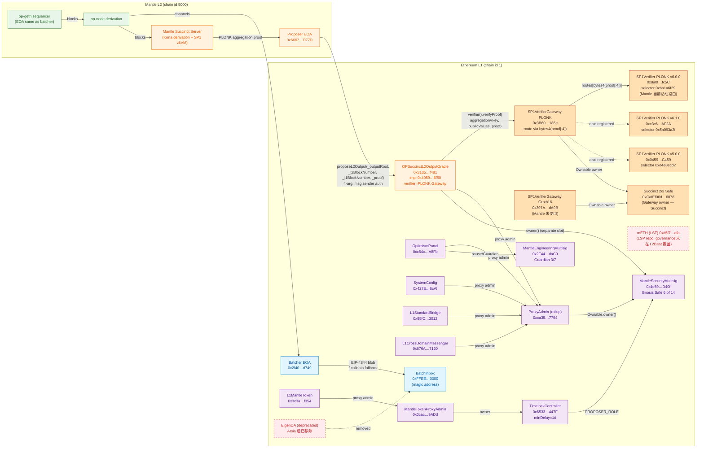

# Mantle 当前技术架构全景（2026.05）

## Executive Summary

截至 2026 年 5 月 19 日，Mantle 已完成两项决定其 Stage 1 路径的关键基础设施变更：
**(1) 2026-04-16 Arsia 硬分叉将 DA 层从 EigenDA 切换为 Ethereum blobs**（calldata 为 fallback，
op-batcher 默认行为），L2Beat 因此将 Mantle 从 Validium 重新归类为 Rollup；
**(2) 2025-09-16 OP Succinct + SP1 zkVM 主网上线**，Mantle 成为首个以 ZK validity 模式运行的
OP Stack rollup，使用 Succinct 官方 SP1VerifierGateway（PLONK 路径）作为链上验证器。
合约级现状如下：

- **DA**：`BatchInbox 0xFFEE…0000` 接收 batcher EOA `0x2f40…d749` 提交的 EIP-4844 blob /
  calldata；无 `DataAvailabilityChallenge` 合约；EigenDA 代码路径已从 batcher 与合约中移除。
- **Proof system**：`OPSuccinctL2OutputOracle 0x31d543…f481`（impl `0x4059…6f50`）→
  `verifier() = 0x3B6041…185e`（Succinct PLONK Gateway，**非默认的 Groth16 Gateway**），
  **deployed implementation `version() = "v2.0.1"`**（对应 `mantle-xyz/op-succinct` commit
  `8cc7015` "mainnet upgrade", 2025-09-03；`Semver(2,0,1)` 构造）；该版本**没有
  `fallbackTimeout` / `opSuccinctConfigs` / `_configName` / `_proverAddress` / `tx.origin`
  鉴权 pattern**（这些字段属于 `feature/sp1-v6.0.2` HEAD 的 v3.0.0-rc.1 source — 见 §item-2 "Future
  upgrade path"）；`optimisticMode() = false`，`submissionInterval() = 1800` **L2 blocks**（链上确认；
  按 `block_time = 2 s` 折算 ≈ 60 min wall-clock，**单位为 L2 blocks 而非 seconds**），
  `finalizationPeriodSeconds() = 43200`（12h）。`aggregationVkey = 0x0006…81cf`、
  `rangeVkeyCommitment = 0x1d1e…6004`，均为 Oracle 的直接 storage slots（v2.0.1
  不使用 named-config mapping）。**v2.0.1 治理面分两路（round-3 reconciled）**：
  (i) **Owner-gated (`onlyOwner` → MantleSecurityMultisig 6/14, 0 delay)**：`updateVerifier(address)`、
  `updateAggregationVkey(bytes32)`、`updateRangeVkeyCommitment(bytes32)`、`updateRollupConfigHash(bytes32)`、
  `updateSubmissionInterval(uint256)`、`addProposer`/`removeProposer`、`transferOwnership`；
  (ii) **Challenger-gated (`onlyChallenger` → MantleEngineeringMultisig 3/7, 0 delay)**：
  `enableOptimisticMode`、`disableOptimisticMode`、`updateFinalizationPeriodSeconds(uint256)`。
  两类 setter 均无 timelock、无需 ProxyAdmin upgrade。
- **Governance（三条独立路径）**：
  - **(a) Core rollup**：`ProxyAdmin 0xca35…7794` 与 `OPSuccinctL2OutputOracle.owner` 均为
    **MantleSecurityMultisig `0x4e59…D40f`（6 of 14 Gnosis Safe）**，**无 TimelockController**，
    属于 L2Beat 标注的 "instant upgradability" 风险。
  - **(b) L1MantleToken**：Token `0x3c3a…f354` 经 `MantleTokenProxyAdmin 0x0cac…9ADd` →
    `TimelockController 0x6533…447F`（`minDelay() = 1 day`）→ MantleSecurityMultisig。
    与 (a) 共享同一 Security Council，但通过一日 timelock 解耦。
  - **(c) mETH / 产品级**：mETH 协议合约位于独立 Mantle LSP 仓库；**Source unavailable** —
    L2Beat Mantle 项目页未覆盖。
- **Sequencer / Proposer**：sequencer 为单一 EOA `0x2f40…d749`；proposer 为单一 EOA
  `0x6667…D77D`（已迁移至 `approvedProposers` mapping，**v2.0.1 中存在该 mapping 且使用 `msg.sender`
  鉴权**；当前 N=1 active proposer）；`seq_window_size = 3600 L1 blocks`（12h），
  `max_sequencer_drift = 600 s`（10 分钟）。
- **L2Beat 风险**：当前 2 条 CRITICAL（instant upgrade、centralized sequencer）+ 6 条 HIGH
  （含 **"unsafe verifier route id selection by proposer"** 与 **"SP1VerifierGateway
  unable to route"** — 两条 SP1VerifierGateway 专属风险**对 Mantle 取 HIGH**：Mantle Oracle
  `verifier` pin 一个共享 PLONK Gateway，route 选择由 proposer 通过 proof 前 4 字节决定）+
  1 条 MEDIUM（sequencer MEV）。Stage 0 已满足，Stage 1 仍差 1 项，Stage 2 仍差 2 项。
- **ZK 透明度状态（L2Beat 当前快照, 2026-05-19）**：L2Beat 项目页对 Mantle 的 OP Succinct
  program hashes 标注为 `Code: unknown` / `Verification: None`。SP1 SDK + ELF → programVKey
  路径理论上可复现，但 L2Beat 至今未对 Mantle 完成此验证；Mantle 使用 `mantle-xyz/op-succinct`
  分支 `feature/sp1-v6.0.2`（基于 SP1 SDK v6.0.2），落后 Succinct 上游 v6.1.x — **此项在
  Stage 1 gap matrix 中本 round 从绿色降为 amber/未解决**，并新增为 Tier-b 关注项（见 §item-6）。
- **2026-04-22 7h28m 状态更新中断**：L2Beat 项目页记录中断时段 07:44–15:12 UTC，
  根因未官方披露；与单 proposer / proof 管线 SPOF 一致，仅作为 §item-4 故障矩阵的实证案例。

**Stage 1 阻断项（Tier b）**（详见 §item-6）：

1. 核心 rollup 升级路径 **无 exit window**（≥7d 要求未满足，目前 0d）— 含 owner-path
   onlyOwner setters 与 challenger-path onlyChallenger setters 两条；
2. Security Council 阈值 **6/14**（≈ 42.86%）**未达 ≥8 成员 + ≥75% 阈值** 的 SC 资格
   门槛（成员身份未公开，无法核 ≥50% 独立性）；
3. ZK verifier transparency：SP1VerifierGateway 由 Succinct 2/3 Safe 控制，**无 timelock**；
   route freeze/add 立即生效；Mantle Oracle `verifier` 字段在 v2.0.1 下由 owner 直接通过
   `updateVerifier(address) onlyOwner` 0 delay 更新（无需 ProxyAdmin upgrade）；同时
   `enableOptimisticMode`/`disableOptimisticMode`/`updateFinalizationPeriodSeconds`
   由 challenger 通过 `onlyChallenger` 0 delay 直接控制；
4. **ZK 程序透明度（new in round-2）**：L2Beat 未验证 Mantle ELF + SP1 toolchain → programVKey
   可复现性（`Code: unknown / Verification: None`），需 Mantle/Succinct 与 L2Beat 完成 ELF + SP1
   toolchain 版本 pin + 公开复现脚本；
5. 单 proposer EOA + **v2.0.1 无 `fallbackTimeout`** → 无 permissionless self-propose 路径 →
   `Funds can be frozen if permissioned proposer fails` 风险路径在 Stage 1 liveness 保证下不达标。

其余诸如 permissionless proof submission、proposer 集合开放、challenger 去中心化属 Tier (c)
Stage 2 改进项。

> **图例**：本文中所有 "🔴 / ⚠️" 表示链上事实证据；所有 "📄" 表示官方文档或博客来源；
> "🔍" 表示需 follow-up 链上核查；"❓ Source unavailable" 表示在本轮调研时点不可得，
> 严格遵循 src-3 fallback 规则未编造数据。

---

## Item Findings

### item-1: 数据可用性层（Ethereum blobs DA）

#### high_level_summary

Mantle 在 2026-04-16 Arsia 硬分叉中完成从 EigenDA 到 Ethereum L1 blobs 的 DA 迁移。批次数据
由单一 batcher EOA 通过标准 op-batcher 行为（EIP-4844 blob 为主、calldata 为成本/可得性
fallback）写入 `BatchInbox 0xFFEEDDCcBbAA0000000000000000000000000000`；合约与 batcher 中的
EigenDA 代码路径均已移除，链上无 `DataAvailabilityChallenge` 组件。L2Beat 据此将 Mantle 从
Validium 重新归类为 Rollup，"data availability on L1" Stage 0 前置项满足。

#### architecture_components

| Component | Type | Notes |
|-----------|------|-------|
| Batcher EOA | L1 EOA | `0x2f40D796917ffB642bD2e2bdD2C762A5e40fd749`（来源：rollup.json `system_config.batcherAddr` + L2Beat Mantle 项目页）|
| BatchInbox | L1 接收地址（无代码，magic address） | `0xFFEEDDCcBbAA0000000000000000000000000000`（来源：rollup.json `batch_inbox_address`）|
| op-batcher | 链下服务 | 监听 L2 op-geth，封装为 channels/frames，按需选择 blob vs calldata；标准 op-stack 行为，Mantle 未公开 fork diff |
| op-node | 链下服务 | derivation 角色：从 L1 BatchInbox 重新构造 L2 state |
| EigenDA 路径 | 历史架构 | **Arsia 后移除**；EigenLayer/EigenCloud 合作仍存在但仅用于 off-rollup 用例（perpetuals、prediction markets、AI infra），不在 L2 DA 管线中（来源：L2Beat — Mantle, Arsia 注记） |
| DataAvailabilityChallenge | 合约 | **不存在**（来源：L2Beat 项目页合约列表，2026-05-19）|

#### contract_addresses_and_config

| 字段 | 值 | 来源 |
|------|-----|------|
| `BatchInbox` | `0xFFEEDDCcBbAA0000000000000000000000000000` | rollup.json L45 |
| `system_config.batcherAddr` | `0x2f40D796917ffB642bD2e2bdD2C762A5e40fd749` | rollup.json L13 |
| `system_config.overhead` | `0xbc` (188) | rollup.json L14 |
| `system_config.scalar` | `0x2710` (10000) | rollup.json L15 |
| `system_config.gasLimit` | 200,000,000,000 (200B) | rollup.json L16 |
| `system_config.eip1559Params` | `0x00000000_00000000` | rollup.json L18 |
| `system_config.operatorFeeParams` | `0x00…00` | rollup.json L19 |
| `system_config.minBaseFee` | 0 | rollup.json L20 |
| `system_config.daFootprintGasScalar` | 0 | rollup.json L21 |
| `block_time` | 2 s | rollup.json L24 |
| `arsia_time` | 1776841200 (2026-04-22 03:00:00 UTC) | rollup.json L44（`mantle_arsia_time`）|

Mantle rollup.json 中 `mantle_arsia_time = 1776841200`（2026-04-22 03:00:00 UTC）与 L2Beat
记录的 Arsia 切换时间不一致（L2Beat: 2026-04-16）。两个解释：
(i) Arsia 包含多个 phased activation，2026-04-16 为合约迁移，2026-04-22 为 L2 protocol fork
（与 holocene_time/isthmus_time/jovian_time/mantle_arsia_time 同一时间戳一致）；
(ii) L2Beat 表述简化，rollup.json 才是规范源。后续审查可向 Mantle Engineering 求证。

#### trust_assumptions

| Trusted Party | Worst-Case Failure | Affected Funds |
|---------------|---------------------|----------------|
| Batcher EOA `0x2f40…d749` | 私钥丢失 / 拒绝服务 → blob 不再上链 | 不会直接导致 funds stolen，但触发 sequencer-failure 路径；强制提款仍可通过 L1 force-inclusion 完成 |
| 单一 batcher operator | 选择性删除某批次（censoring） | 用户可通过 L1 `depositTransaction` 强制走 sequencing window 路径绕过 |
| Ethereum L1 blobs availability | EIP-4844 blob 在 ~18 天 prune 后不可恢复 | 节点必须在 prune 前归档完整 batch；L2Beat 暂未在 Mantle 上标注 "blob historical availability" 专项风险 |

#### l2beat_risk_mapping

- L2Beat 当前未在 Mantle 项目页将 DA 列为 CRITICAL/HIGH 风险（自 2026-04-16 Arsia 重分类为
  Rollup 之后）。
- 关联标签："Funds can be frozen if the centralized validator goes down"（CRITICAL）— sequencer
  与 batcher 共享 EOA `0x2f40…d749`，其失效会同时影响 DA 与 L2 出块。

#### stage1_requirement_mapping

| 维度 | Tier | 当前是否满足 | 证据 |
|------|------|--------------|------|
| DA on L1 (Tier a — Stage 0 prerequisite) | a | ✅ 满足 | L2Beat 将 Mantle 重新归类为 Rollup（2026-04-16 起）；BatchInbox 为 L1 magic address；无 DAC |
| Blob historical retrieval (Tier a 隐性) | a | ⚠️ 部分依赖第三方归档 | EIP-4844 ~18 天 prune；Mantle/L2Beat 公开归档策略 ❓ Source unavailable |

#### liveness_failure_mode

| Failure | Detection | Recovery | Required Actor | Max Recovery Delay |
|---------|-----------|----------|----------------|---------------------|
| Batcher EOA down | op-node 无法 derive 新 L2 block | 用户走 `OptimismPortal.depositTransaction` 强制入 sequencing window | 任何用户（L1 gas） | ≤ seq_window_size = 12h |

#### 2026_changes_from_prior_state

- **2026-04-16 Arsia hardfork (per L2Beat)** / 2026-04-22 protocol fork time (per rollup.json):
  EigenDA 代码路径移除；DA 100% 上 Ethereum；L2Beat 重分类 Validium → Rollup。
- 战略公告：2026-01-22 Chainwire — "Mantle Advances Toward Full Ethereum ZK Rollup Architecture
  with Strategic Transition to Ethereum Blobs"。
- 驱动：Ethereum Fusaka 升级 2025-12-03 主网上线（PeerDAS 提升 ~8× blob 理论吞吐）。
- EigenLayer/EigenCloud 合作转向 off-rollup 用例（perpetuals、prediction markets、AI infra）。

#### evidence_sources

| Source | Type | Retrieval |
|--------|------|-----------|
| https://l2beat.com/scaling/projects/mantle | primary, official_docs (src-1) | 2026-05-19 |
| https://chainwire.org/2026/01/22/mantle-advances-toward-full-ethereum-zk-rollup-architecture-with-strategic-transition-to-ethereum-blobs/ | primary, official communication (src-2) | 2026-05-19 |
| op-succinct rollup.json L1–L54 (chainId 5000) | primary, on-chain config (src-3, src-4) | commit `664a1bd` |

#### code_references

- `op-succinct/configs/5000/rollup.json` L1–L54 — Mantle mainnet rollup config (commit `664a1bd`).
- `mantle-v2/packages/contracts-bedrock/src/L1/OptimismPortal.sol` L379–L446 — depositTransaction
  作为 force-inclusion 入口（commit `feb2a588c`）。
- Batcher / DAC 代码 path：Mantle 未公开 `op-batcher` fork 与 upstream Optimism op-batcher 的
  diff；DA 抽象切换证据仅在 L2Beat 与 Chainwire/Mantle blog 中给出，**链上 + 配置 + L2Beat
  归类** 三处一致 → 满足 src-3 fallback 规则。

---

### item-2: 证明系统（OP Succinct + SP1 zkVM + SP1VerifierGateway 路由层）

#### high_level_summary

Mantle 在 2025-09-16 完成 OP Succinct + SP1 zkVM 主网部署，成为首个以 ZK validity 模式运行的
OP Stack rollup。在合约层，`OPSuccinctL2OutputOracle 0x31d543…f481` 作为 OP Succinct 改造版
`L2OutputOracle`，其 `proposeL2Output` 调用 `ISP1Verifier(verifier).verifyProof(...)`；Mantle 实
际配置的 `verifier()` 为 Succinct 官方 **PLONK** `SP1VerifierGateway 0x3B6041…185e`（而非 op-
succinct 仓库默认的 Groth16 Gateway），其内部以 `bytes4(proofBytes[:4])` 作为 route id，
由 proposer 通过 proof 字节选择具体 SP1Verifier 实例。Gateway 由 Succinct 2/3 多签
`0xCafEf00d…6878` 拥有，**无 timelock**；`addRoute` 与 `freezeRoute` 立即生效且不可逆。

**Deployed Oracle implementation 版本对齐（round-2 reconciled）**：实现合约
`0x4059509ffb703b048d1e9ce3118f90e759076f50` 链上 `version()` 返回 `"2.0.1"`（`Semver(2,0,1)`），
经源码 + 历史 commit 匹配，与 `mantle-xyz/op-succinct` repo commit `8cc7015`
（"mainnet upgrade", 作者 `adam.xu@mantle.xyz`, 2025-09-03）的 `contracts/src/validity/
OPSuccinctL2OutputOracle.sol` 一致（**完整 bytecode hash 对比仍待 Etherscan verified source
确认，记入 §Source Coverage 部分待办**）。**v2.0.1 是 OP Succinct 在 v3.0.0-rc.1 之前的最后一个
稳定主网版本**，其字段集与 v3.0.0-rc.1 显著不同；以下分两小节区分 (A) 当前部署的 v2.0.1 真实
状态、(B) 仓库 HEAD 的 v3.0.0-rc.1 "future upgrade path"。

在 v2.0.1 下，`fallbackTimeout` / `opSuccinctConfigs` 这两个 v3 引入的字段**完全不存在**
（链上 cast call 直接 revert，与本研究文档前 round 1 描述一致）；`tx.origin` 鉴权 pattern
**也不存在** — v2.0.1 使用 `msg.sender`。因此当前 Mantle 未启用 permissionless self-propose
时间窗 — 这与 L2Beat 标注的 "permissioned proposer 失效则提款冻结" 风险一致。

#### architecture_components (A) v2.0.1 — Deployed OPSuccinctL2OutputOracle 提案与验证层

> **源码引用基准**：`mantle-xyz/op-succinct` commit `8cc7015` "mainnet upgrade"，作者
> `adam.xu@mantle.xyz`，2025-09-03，`contracts/src/validity/OPSuccinctL2OutputOracle.sol`
> （597 行，`Semver(2,0,1)` 构造函数 L191；下表行号即指该 commit 的此文件）。

| Component | Storage / 存在性 (v2.0.1) | 治理路径 | 行号 (commit `8cc7015`) |
|-----------|----------------------------|----------|--------------------------|
| `OPSuccinctL2OutputOracle` proxy | `0x31d543e7BE1dA6eFDc2206Ef7822879045B9f481` | proxy slot EIP-1967 → impl `0x4059509ffb703b048d1e9ce3118f90e759076f50` | n/a |
| `version` | constant string from `Semver(2,0,1)` constructor → `"2.0.1"` | — | L191 (`constructor() Semver(2, 0, 1)`) |
| `proposer` (legacy single address) | `address public proposer;` **DEPRECATED**，但 slot 仍存在 | owner 通过 `updateProposer` 设置（如保留）| L57–L60 |
| `approvedProposers` (mapping) | `mapping(address => bool) public approvedProposers;` **EXISTS** | `addProposer/removeProposer` (`onlyOwner`) | L83; L555–L566 (`addProposer`/`removeProposer`) |
| `submissionInterval` | `uint256 public submissionInterval;` 直接 slot；**链上确认 = 1800** L2 blocks（折合 ~60 min @ `l2BlockTime=2 s`） | `updateSubmissionInterval(uint256)` (`onlyOwner`) — Security Council 6/14, 0 delay | L47; L513 |
| `challenger` | `address public challenger;` = MantleEngineeringMultisig 3/7 `0x2F44…daC9` | 字段在 v2.0.1 中无独立 setter；变更需 ProxyAdmin upgrade。但 **`challenger` 角色本身**通过 `onlyChallenger` modifier 直接控制 optimistic mode + finalization 子集 setter（见下面 3 行）| L55; L281–L304 (`deleteL2Outputs`) |
| `optimisticMode` | `bool public optimisticMode;` toggle | **`enableOptimisticMode(uint256)` / `disableOptimisticMode(uint256)` (`onlyChallenger`)** — MantleEngineeringMultisig 3/7, 0 delay | L89; L569–L584 |
| `verifier` (单一地址) | `address public verifier;` **直接 storage slot**（v2.0.1 无 `verifier` 命名 config） | **`updateVerifier(address)` (`onlyOwner`) — Security Council 6/14, 0 delay** | L74; L534 |
| `aggregationVkey` | `bytes32 public aggregationVkey;` **直接 slot** | `updateAggregationVkey(bytes32)` (`onlyOwner`) — Security Council 6/14, 0 delay | L67; L520 |
| `rangeVkeyCommitment` | `bytes32 public rangeVkeyCommitment;` **直接 slot** | `updateRangeVkeyCommitment(bytes32)` (`onlyOwner`) — Security Council 6/14, 0 delay | L71; L527 |
| `rollupConfigHash` | `bytes32 public rollupConfigHash;` **直接 slot** | `updateRollupConfigHash(bytes32)` (`onlyOwner`) — Security Council 6/14, 0 delay | L77; L541 |
| `finalizationPeriodSeconds` | `uint256 public finalizationPeriodSeconds;` = 43200 (12h) | **`updateFinalizationPeriodSeconds(uint256)` (`onlyChallenger`)** — MantleEngineeringMultisig 3/7, 0 delay | L64; L587 |
| `historicBlockHashes` | `mapping(uint256 => bytes32) public historicBlockHashes;` | `checkpointBlockHash(uint256)` external | L86; L423 |
| `owner` | `address public owner;` = MantleSecurityMultisig `0x4e59…D40f` | `transferOwnership(address)` (`onlyOwner`，单步) — Security Council 6/14, 0 delay | L80; L548 |
| `addProposer` / `removeProposer` | proposer set 维护 | `addProposer(address)` / `removeProposer(address)` (`onlyOwner`) — Security Council 6/14, 0 delay | L555–L566 |
| `initializerVersion` | `uint8 public constant initializerVersion = 3;` (initialize re-entry guard) | n/a | L165 |
| **NOT present in v2.0.1** | `fallbackTimeout` ❌ / `opSuccinctConfigs` mapping ❌ / `_configName` parameter ❌ / `_proverAddress` parameter ❌ / `addOpSuccinctConfig`/`removeOpSuccinctConfig` ❌ / `tx.origin` 鉴权 ❌ | — | — |

**v2.0.1 治理面 — 两条独立 0-delay 直接 setter 路径（round-3 reconciled）**：

| Setter 类别 | Modifier | 角色 | 角色当前主体 | 函数 | Mantle 故障矩阵关联 |
|-------------|----------|------|--------------|------|----------------------|
| **Owner-path（资产&信任根）** | `onlyOwner` | `owner` slot | MantleSecurityMultisig 6/14 `0x4e59…D40f` | `updateVerifier(address)` (L534)、`updateAggregationVkey(bytes32)` (L520)、`updateRangeVkeyCommitment(bytes32)` (L527)、`updateRollupConfigHash(bytes32)` (L541)、`updateSubmissionInterval(uint256)` (L513)、`addProposer(address)`/`removeProposer(address)` (L555–L566)、`transferOwnership(address)` (L548) | funds stolen（malicious verifier / vkey / programVKey），funds frozen（任意 swap proposer 集合） |
| **Challenger-path（liveness + safety 切换）** | `onlyChallenger` | `challenger` slot | MantleEngineeringMultisig 3/7 `0x2F44…daC9` | `enableOptimisticMode(uint256)` (L569)、`disableOptimisticMode(uint256)` (L575+)、`updateFinalizationPeriodSeconds(uint256)` (L587)、`deleteL2Outputs(uint256)` (L281–L304) | funds stolen（启用 optimistic + 无 challenge）、funds 临时 frozen（缩短/拉长 finalization period）|
| **Implementation upgrade（更换全部代码）** | proxy admin | `ProxyAdmin.owner` | MantleSecurityMultisig 6/14（与 owner-path 同 Safe）| ProxyAdmin.`upgradeAndCall`（任意 impl 替换）| funds stolen（恶意 impl 取代 v2.0.1）|

**关键 round-3 纠正**：round-2 将整套 update* setter 全部归入 onlyOwner 是不准确的。
v2.0.1 OPSuccinctL2OutputOracle.sol 中存在两个独立的 `modifier`：`onlyOwner`（gates 信任根 + 资产关键参数）和
`onlyChallenger`（gates optimistic mode 切换 + finalization period + delete bad outputs）。
两个 modifier 各对应一个独立 storage slot（`owner` 与 `challenger`），不可互换：MantleSecurityMultisig 不能
直接 toggle optimistic mode，也不能改 `finalizationPeriodSeconds`；MantleEngineeringMultisig 不能直接改
`verifier`/`aggregationVkey`/`rangeVkeyCommitment`/`rollupConfigHash`。这一区分在 Stage 1 风险分析
（§item-4/§item-5/§item-6）中**严重影响**故障路径所需的攻击者集合：恶意 verifier 注入只需 6/14 Council 1 个
Safe；启用 optimistic + 假 output 注入则**同时**需要 6/14（提交 output）与 3/7（toggle / 默许 finalize），
故路径攻击成本 / 协调难度不一致。但两条路径均 **0 delay、无 timelock**，因此对 "exit window ≥7d"
Stage 1 要求来说**都不达标**。

**`proposeL2Output` 函数签名（v2.0.1, 4-arg, msg.sender 鉴权）**：

```solidity
function proposeL2Output(
    bytes32 _outputRoot,
    uint256 _l2BlockNumber,
    uint256 _l1BlockNumber,
    bytes memory _proof
) external whenNotOptimistic { ... }
```

状态机（commit `8cc7015`, OPSuccinctL2OutputOracle.sol L307–L361）：

1. `whenNotOptimistic` modifier — 若 `optimisticMode = true` 整函数 revert。
2. proposer 校验（L325）：`require(approvedProposers[msg.sender] || approvedProposers[address(0)], ...)`。
   **使用 `msg.sender`，不是 `tx.origin`**；亦**不存在** `block.timestamp - lastProposalTimestamp()
   > fallbackTimeout` 分支。
3. block number / timestamp 检查。
4. checkpoint blockHash 命中（v2.0.1 内置 `historicBlockHashes` 校验）。
5. 直接读取 `aggregationVkey` storage slot 构造 `AggregationOutputs publicValues`。
6. 调用 `ISP1Verifier(verifier).verifyProof(aggregationVkey, abi.encode(publicValues), _proof)`（L350）。
7. push `l2Outputs`。

**第二重载 `proposeL2Output(_outputRoot, _l2BlockNumber, _l1BlockHash, _l1BlockNumber)`
`whenOptimistic` payable 路径** 同样使用 `msg.sender` + `approvedProposers` 校验（L384, L394）。

> **v2.0.1 是否暴露 `tx.origin` audit-grade 风险？** **不**。v2.0.1 两个 `proposeL2Output` 重载
> 全部用 `msg.sender`；`tx.origin` 是 v3.0.0-rc.1 引入的（伴随 OPSuccinctDisputeGame + CWIA
> clone pattern）。`tx.origin` 因此只是**未来升级路径**（见 §(B)）的代码模式关注点，不是当前部署
> 的审计级链上风险。
>
> **Verifier 是否可 0 delay 更换？** **可以，是当前部署的实质性风险**：v2.0.1 暴露
> `updateVerifier(address) onlyOwner`（L534），owner = MantleSecurityMultisig 6/14 可立即将
> `verifier` 改写为任意地址（含恶意 verifier 或 mock）。这是 round-1 误将 verifier 升级描述为
> "需通过 ProxyAdmin upgrade" 的纠正点。同理 `updateAggregationVkey/updateRangeVkeyCommitment/
> updateRollupConfigHash/updateSubmissionInterval` 与 `addProposer/removeProposer/transferOwnership`
> 也可由 owner 0 delay 改写，构成 Stage 1 exit-window 违反的关键面。
>
> **Optimistic mode + finalization period 是否可 0 delay 改？** **可以，但鉴权角色不同（round-3 纠正）**：
> `enableOptimisticMode` / `disableOptimisticMode` (L569–L584) 与 `updateFinalizationPeriodSeconds`
> (L587) 使用 `onlyChallenger` modifier，对应 `challenger` slot = MantleEngineeringMultisig 3/7
> `0x2F44…daC9`，**不是 Security Council**。两个 multisig 的攻陷阈值与协调成本不同，但都
> 0 delay、无 timelock，因此 "exit window ≥7d" Stage 1 要求 **两条路径都不满足**。

#### architecture_components (B) SP1VerifierGateway 路由层

| Component | Address (Ethereum mainnet) | Owner | 来源 |
|-----------|-----------------------------|-------|------|
| **SP1VerifierGateway (PLONK)** — Mantle 实际使用 | `0x3B6041173B80E77f038f3F2C0f9744f04837185e` | `0xCafEf00d348Adbd57c37d1B77e0619C6244C6878` (Succinct 2/3 Safe) | sp1-contracts `deployments/1.json` @ v6.1.1 + 链上 `owner()` |
| SP1VerifierGateway (Groth16) — Mantle 未使用 | `0x397A5f7f3dBd538f23DE225B51f532c34448dA9B` | 同上 (相同 Succinct 2/3 Safe) | sp1-contracts `deployments/1.json` @ v6.1.1 |
| **Succinct 2/3 Safe**（Gateway owner，两条路径共用） | `0xCafEf00d348Adbd57c37d1B77e0619C6244C6878` | owners = `[0xBaB2c2aF5b91695e65955DA60d63aD1b2aE81126, 0x72Ff26D9517324eEFA89A48B75c5df41132c4f54, 0x9395e83720bf2D8ac6435f9c520b48E289Cb8885]`，threshold = 2 | Gnosis Safe `getOwners` / `getThreshold` 链上读取 |

**Mantle 选用 PLONK Gateway 这一事实与 op-succinct 仓库默认配置不一致**
（`op-succinct/scripts/utils/src/config_common.rs` L79 默认指向 Groth16 Gateway），
后续 final 文档需在 §"2026 changes" 显式标注，避免 Stage 1 评估读者照抄默认。

#### route id 选择机制（first-class research target）

`SP1VerifierGateway.verifyProof` 实现（`sp1-contracts/contracts/src/SP1VerifierGateway.sol`
L20–L34，commit `d3629729c3216eb51bd4859d027a8eb729399fa4`）：

```solidity
function verifyProof(bytes32 programVKey, bytes calldata publicValues, bytes calldata proofBytes)
    external view
{
    bytes4 selector = bytes4(proofBytes[:4]);
    VerifierRoute memory route = routes[selector];
    if (route.verifier == address(0)) revert RouteNotFound(selector);
    else if (route.frozen) revert RouteIsFrozen(selector);
    ISP1Verifier(route.verifier).verifyProof(programVKey, publicValues, proofBytes);
}
```

**结论**：route id = **proof bytes 的前 4 字节**（即 `bytes4(proofBytes[:4])`），由 proposer 在
生成 proof 时通过 SP1 SDK 选定 verifier 版本而决定。它**不是** OutputOracle 的固定配置，
**不是**独立参数。底层 verifier 在 `verifyProof` 内再次校验
`if (selector != VERIFIER_HASH[:4]) revert WrongVerifierSelector(...)`
（v6.1.0 `SP1VerifierGroth16.sol` / `SP1VerifierPlonk.sol` L56–L60）。

#### route registry 治理

`SP1VerifierGateway` 是 `Ownable`（OpenZeppelin 基础 `Ownable`，单步 transferOwnership）：

| Function | 权限 | 是否可逆 |
|----------|------|---------|
| `addRoute(address verifier) external onlyOwner` | Succinct 2/3 Safe `0xCafEf00d…6878` | **不可移除**（无 removeRoute）|
| `freezeRoute(bytes4 selector) external onlyOwner` | 同上 | **不可解冻**（再次 freeze 已 frozen 的 route revert）|
| `transferOwnership(address)` (Ownable) | 当前 owner | 单步，无 2-step 保护 |

**重要结论**：Succinct 2/3 Safe 可**立即**注册新路由 / 冻结现有路由，**无 timelock、
无 challenge window、无 Mantle 同意权**。所有使用 Gateway 的 OP Succinct rollup 共享这个多签。

#### route 生命周期与回退

| 场景 | 后果 | Mantle 恢复路径 |
|------|------|----------------|
| Mantle 当前使用的 PLONK v6.0.x route（selector `0xbb1a6f29`）被 Succinct freeze | `verifyProof` revert `RouteIsFrozen` → `proposeL2Output` 全部失败 → 提款 finalize 全面冻结 | Mantle 6/14 Safe 紧急（i）直接 `updateVerifier(address) onlyOwner`（0 delay，**v2.0.1 已暴露**，无需 ProxyAdmin upgrade），或（ii）开启 `optimisticMode`（绕过 verifyProof），或（iii）走 ProxyAdmin upgrade 切到非 Gateway 的 SP1Verifier 直接实例 — **均需 0 delay，但触发实例需 Mantle 自身 Safe 行动** |
| Gateway 上所有路由都失效 / Gateway owner 私钥丢失 | 同上 | Mantle 必须将 Oracle `verifier` 切到非 Gateway 的直接 SP1Verifier 地址或新 Gateway |
| 多个版本路由共存（v5/v6/v6.1） — 当前主网状态 | **proposer 可任意选择**：恶意 prover 在某旧 verifier 被发现漏洞但 Succinct 未及时 freeze 时，可回退到旧 selector 生成"合法"假证明 | Succinct freeze 旧路由；Mantle 在 SP1 SDK 升级时同步更新 program vk 并切换 OPSuccinctConfig |

#### verifier 可重现性 & 程序哈希 (round-2 — ZK transparency downgrade to amber)

| 项 | 状态 (round-2 reconciled) | 来源 / 备注 |
|----|----------------------------|--------------|
| Verifier 源码可读（链上字节码 → Solidity source） | ✅ 已 verify（upstream sp1-contracts） | sp1-contracts/contracts/src/v6.1.0/SP1Verifier*.sol（commit `d3629729c3216eb51bd4859d027a8eb729399fa4`）|
| `VERIFIER_HASH` & `VK_ROOT` | ✅ 编译时常量 | `SP1VerifierGroth16.sol` L33/L38；`SP1VerifierPlonk.sol` L33/L38 |
| Trusted setup ceremony | ⚠️ partial — Groth16/PLONK 使用 Aztec/Hermez perpetual powers-of-tau（行业标准）；Succinct 进行 circuit-specific phase-2 | succinctlabs/sp1 主仓 + Succinct blog；**phase-2 transcript 没有像 Hermez 那样集中公开 — partial transparency** |
| Verifier 部署可复现 | ✅ CREATE2 + 固定 `CREATE2_SALT` | `v6.1.0/SP1VerifierGroth16.s.sol` L17 |
| **Mantle ELF + `aggregationVkey` / `rangeVkeyCommitment` 可复现性 / 程序哈希透明度** | ⚠️ **amber / unresolved (downgraded from "satisfied" in round-1)** | (i) 理论上：由 SP1 SDK `prover.setup(ELF)` 计算 `aggregationVkey/rangeVkeyCommitment`，给定 ELF + SP1 toolchain version 任何人可复现（`op-succinct/scripts/utils/src/config_common.rs` L86–L93）。(ii) **L2Beat 当前现状**：Mantle 项目页对 OP Succinct 程序哈希的 `Code` 字段标注为 **"unknown"**、`Verification` 字段标注为 **"None"**（2026-05-19 retrieval；L2Beat 项目页 ZK section）— **L2Beat 尚未对 Mantle 自身的 ELF + programVKey 链路做独立验证**。(iii) **复现路径未 pin**：Mantle 使用 `mantle-xyz/op-succinct` 分支 `feature/sp1-v6.0.2`，基于 SP1 SDK v6.0.2；Succinct 主仓上游 SP1 v6.1.x 为最新（与上面 v6.1.0/v6.1.1 verifier 路由一致），构建 environment（Docker、toolchain 版本、reproducible-build flag）未发布官方 lockfile。因此**当前没有"任意人在固定 SP1 toolchain + 固定 ELF source 下复算得到链上 `aggregationVkey/rangeVkeyCommitment`"的官方公开记录**。 |
| SP1 程序源码 | ✅ 公开 | https://github.com/succinctlabs/op-succinct/tree/main/programs；Mantle 自身 fork 在 `mantle-xyz/op-succinct` |
| Mantle SP1 SDK 版本 pinning | ⚠️ — `feature/sp1-v6.0.2`（基于 SP1 SDK v6.0.2，落后 Succinct 主仓 v6.1.0/v6.1.1 一个 minor）| mantle-xyz/op-succinct commit `664a1bd`；建议 final 阶段补 SDK 版本 + Cargo.lock + Docker image digest 三元组 |

**结论 — Stage 1 ZK 透明度面临的两条 amber 项**：
1. **Trusted setup phase-2 transcript 未集中公开**（与 round-1 一致，未变）。
2. **Mantle ELF → programVKey 复现路径未 pin / L2Beat 未验证**（**round-2 新增** — 由
   adversarial feedback 引出）。

两项同属 Stage 1 Tier-b（ZK verifier transparency）的实证缺口，但严重度不同：(1) 是 Succinct
上游层面的行业级 transparency 缺口（影响所有 SP1 链）；(2) 是 Mantle 自身的项目级 transparency
缺口（仅影响 Mantle Stage 1 评估）。详见 §item-6 Tier-b 表。

#### 主网当前路由（PLONK Gateway `0x3B604117…185e`，2026-05-19 链上读取）

| Selector | Verifier 地址 | Frozen | 备注 |
|----------|----------------|--------|------|
| `0x5a093a2f` (PLONK v6.1.0) | `0xc3c6dDDAc8829b233Dc6536Ec024775a57b0AF2A` | false | upstream 最新 |
| `0xbb1a6f29` (PLONK v6.0.0) | `0x8a0fd5e825D14368d90Fe68F31fceAe3E17AFc5C` | false | **Mantle 当前生效路径**（与 mantle-v2 / op-succinct fork 的 sp1-v6.0.2 SDK 输出匹配） |
| `0xd4e8ecd2` (PLONK v5.0.0) | `0x0459d576A6223fEeA177Fb3DF53C9c77BF84C459` | false | 历史，仍可被任意 prover 触发 |

Groth16 Gateway `0x397A5f7f…dA9B` 当前注册了 v5.0.0 / v6.0.0 / v6.1.0 三条路由（同样 `frozen = false`），
**但 Mantle Oracle 未指向 Groth16 Gateway**，因此对 Mantle proposer 不可达。

#### contract_addresses_and_config (v2.0.1 — deployed)

| 字段 | 链上读取值 (2026-05-19) | 来源 |
|------|--------------------------|------|
| `OPSuccinctL2OutputOracle` proxy | `0x31d543e7BE1dA6eFDc2206Ef7822879045B9f481` | L2Beat + 链上 |
| Implementation (EIP-1967 slot) | `0x4059509ffb703b048d1e9ce3118f90e759076f50` | 链上 |
| `version()` | `"2.0.1"` | 链上 (`Semver` interface) |
| Source match | `mantle-xyz/op-succinct` commit `8cc7015` "mainnet upgrade" (2025-09-03)；`contracts/src/validity/OPSuccinctL2OutputOracle.sol` `Semver(2,0,1)` 构造 L191 | git history + on-chain `version()` 一致；完整 bytecode hash 对照仍待 Etherscan verified source 核对 |
| `verifier()` | `0x3B6041173B80E77f038f3F2C0f9744f04837185e` (Succinct PLONK Gateway) | 链上 |
| `owner()` | `0x4e59e778a0fb77fBb305637435C62FaeD9aED40f` (Mantle Security Multisig, **6/14** Safe) | 链上 |
| `challenger()` | `0x2F44BD2a54aC3fB20cd7783cF94334069641daC9` (Mantle Engineering Multisig, 3/7) | 链上 |
| `optimisticMode()` | **false** | 链上 |
| `finalizationPeriodSeconds()` | 43200 (12h) | 链上 |
| `submissionInterval()` | **1800 L2 blocks** (≈ 60 min @ `l2BlockTime=2 s`；**L2 blocks，非 seconds**) | 链上 (round-2 adversarial finding confirmed；unit clarified round-3) |
| `aggregationVkey()` | `0x0006e0a9f37edc912bb269856518599d61689c78300c23615b2f90868d0181cf` | 链上 |
| `rangeVkeyCommitment()` | `0x1d1e0ac74bb66ded0388062e779adae47925fd572a49a3424e2684f83d776004` | 链上 |
| `rollupConfigHash()` | `0x6681c11eccf96068a081bbb888fd64ce72aa83bd1ccda5bbb53b4c43368cf87f` | 链上 |
| `approvedProposers(0x6667…D77D)` | true (Mantle proposer EOA) | 推断（与 L2Beat 项目页 sole-proposer 一致；🔍 需链上 `cast call` 直读，列入 §Source Coverage 待办）|
| `fallbackTimeout()` | **revert（字段不在 v2.0.1 implementation）** | 链上 cast call |
| `opSuccinctConfigs(...)` | **revert / non-existent storage slot** | 链上 cast call（间接：v2.0.1 字段不存在）|
| `updateVerifier(address)` | **EXISTS — `onlyOwner`，0 delay** (Security Council 6/14) | OPSuccinctL2OutputOracle.sol L534 (commit `8cc7015`) |
| `updateAggregationVkey(bytes32)` | **EXISTS — `onlyOwner`，0 delay** (Security Council 6/14) | L520 |
| `updateRangeVkeyCommitment(bytes32)` | **EXISTS — `onlyOwner`，0 delay** (Security Council 6/14) | L527 |
| `updateRollupConfigHash(bytes32)` | **EXISTS — `onlyOwner`，0 delay** (Security Council 6/14) | L541 |
| `updateSubmissionInterval(uint256)` | **EXISTS — `onlyOwner`，0 delay** (Security Council 6/14) | L513 |
| `addProposer(address)` / `removeProposer(address)` | **EXISTS — `onlyOwner`，0 delay** (Security Council 6/14) | L555–L566 |
| `transferOwnership(address)` | **EXISTS — `onlyOwner`，0 delay**, single-step (Security Council 6/14) | L548 |
| `enableOptimisticMode(uint256)` / `disableOptimisticMode(uint256)` | **EXISTS — `onlyChallenger`，0 delay** (Engineering Multisig 3/7) | L569–L584 |
| `updateFinalizationPeriodSeconds(uint256)` | **EXISTS — `onlyChallenger`，0 delay** (Engineering Multisig 3/7) | L587 |

#### architecture_components (C) Future upgrade path — v3.0.0-rc.1 (`feature/sp1-v6.0.2` HEAD)

> **此小节仅描述 `mantle-xyz/op-succinct` 仓库 `feature/sp1-v6.0.2` 分支 HEAD 的 v3.0.0-rc.1
> 源码（commit `0a3c79c` "bump op-succinct version into 2.0" 之后的迭代，最新为 `Semver` 标注
> `"v3.0.0-rc.1"` const string，OPSuccinctL2OutputOracle.sol L182）。这些字段/语义**当前
> 主网未部署**；列出仅作为"未来升级路径"的代码模式预警，不作为 Stage 1 评估的当前事实。**

**v3.0.0-rc.1 相对 v2.0.1 的关键新增**：

| Feature | v2.0.1 (deployed) | v3.0.0-rc.1 (future) | 影响 |
|---------|--------------------|------------------------|------|
| `fallbackTimeout` | ❌ 不存在 | ✅ 存在：`block.timestamp - lastProposalTimestamp() > fallbackTimeout` 时任何人可代为 propose | Stage 1 liveness 阻断从 unsatisfied → satisfied 的关键升级，但仅当 Mantle 实际部署 v3 |
| `opSuccinctConfigs[bytes32]` mapping | ❌ 不存在；`aggregationVkey/rangeVkeyCommitment/rollupConfigHash` 是 Oracle 的直接 storage slots | ✅ 存在；将上述 3 字段打包为命名 config（`GENESIS_CONFIG_NAME` 等），支持多 vk 切换；新增 `addOpSuccinctConfig`/`removeOpSuccinctConfig` | 更灵活的 config 管理；Stage 1 风险面变化（多 config 切换是否需 timelock）|
| `proposeL2Output` 签名 | 4 个参数（`_outputRoot, _l2BlockNumber, _l1BlockNumber, _proof`），用 `msg.sender` 鉴权 | 6 个参数（`_configName, _outputRoot, _l2BlockNumber, _l1BlockNumber, _proof, _proverAddress`），用 `tx.origin` 鉴权（whenNotOptimistic 路径）| 接口 break-change；audit-grade `tx.origin` pattern 仅适用于 v3 部署 |
| `tx.origin` proposer 鉴权（whenNotOptimistic）| ❌ 不存在 — 用 `msg.sender` | ✅ 存在（v3 L326）；源码注释 L302–L314 解释设计动机：optimistic 路径 `proposeL2Output` 由 OPSuccinctDisputeGame 经 DisputeGameFactory 以 CWIA pattern clone 而成，`msg.sender` 是 clone 合约 → 用 `tx.origin` 才能识别真实 proposer EOA | **作为未来升级 pattern**：`tx.origin` 一般为高危反模式，但 Succinct 源码论证在该 trust 模型下与 `msg.sender` 等价（要求 proposer 不在不受信合约里发起 proposeL2Output）；审计应作为升级时的复核重点，但不构成 v2.0.1 当前部署的链上风险 |
| `_proverAddress` 参数 | ❌ 不存在 | ✅ 存在；记录提交 proof 的 prover 地址（与 proposer EOA 解耦），便于 prover network reward routing | 影响 Mantle Succinct Server / Prover Network 接入升级 |
| OPSuccinctDisputeGame + CWIA clone (optimistic 路径) | 源码中存在 OPSuccinctDisputeGame 引用，但 v2.0.1 `proposeL2Output(whenOptimistic)` 仍以 EOA + `msg.sender` 路径调用 | v3 强化 CWIA dispute-game clone：optimistic 路径 proposer 是 dispute-game clone | 拓展点；不影响 v2.0.1 当前事实 |

**Stage 1 升级影响（推测，待后续 wave issue 设计）**：
- 切换到 v3 可 **解锁** Stage 1 Tier-b liveness 阻断（`fallbackTimeout` 引入 permissionless
  self-propose），但同时**引入** `tx.origin` 代码模式审计点 + `opSuccinctConfigs` 多 config 多 vk
  治理面。
- v3 升级路径仍由 ProxyAdmin upgrade 完成 — 当前 0 delay → 即使升级到 v3 也仍受 (a) 治理路径
  exit window 缺失制约。

#### trust_assumptions

| Trusted Party | 单点能力 (v2.0.1 deployed, **gated 区分 — round-3 reconciled**) | 最坏后果 |
|---------------|------------------------------------------------------------------|----------|
| **Mantle Security Multisig 6/14** (`0x4e59…D40f`) — `owner` slot | (i) upgrade Oracle implementation (via ProxyAdmin)；(ii) `onlyOwner` 0-delay setters：`updateVerifier(address)`、`updateAggregationVkey`、`updateRangeVkeyCommitment`、`updateRollupConfigHash`、`updateSubmissionInterval`、`addProposer/removeProposer`、`transferOwnership` — **不包括** optimistic toggle 与 `updateFinalizationPeriodSeconds`（属 challenger 路径）| (a) 立即将 `verifier` 改写为 mock/恶意验证器，绕过 ZK 校验 → funds stolen；(b) 改写 vkey / programHash 接受任意 proof → funds stolen；(c) 替换 proposer 集合 → funds frozen / 攻陷 prover → funds stolen；(d) 升级 implementation 引入后门 → funds stolen。**单 Safe 即可启用 (a)/(b)/(c)/(d)。** |
| **Mantle Engineering Multisig 3/7** (`0x2F44…daC9`) — `challenger` slot | `onlyChallenger` 0-delay setters：`enableOptimisticMode(uint256)`、`disableOptimisticMode(uint256)`、`updateFinalizationPeriodSeconds(uint256)`；以及 `deleteL2Outputs(uint256)`（在 finalizationPeriod 内可剪枝坏 output）| (a) **单独**启用 optimisticMode 后任意 assertion 12h finalize — 但仍需 6/14 Safe 控制的 proposer 提交假 output 才能完成盗资（盗资路径需 3/7 + 6/14 协调）；(b) 把 `finalizationPeriodSeconds` 设极大值 → funds 临时 frozen（提款冻结）；(c) 设极小值 → 缩短挑战窗 → 配合启用 optimistic 后盗资路径变宽。**单 Safe 不足以独立盗资，但可独立 freeze 提款。** |
| Succinct 2/3 Safe (`0xCafEf00d…6878`) | freeze Mantle 使用的 v6.0.0 PLONK route；注册新（含恶意）路由 | freeze 路由：funds frozen（无法 finalize 提款）；注册恶意路由：因 proposer 选择性使用，单独不足以盗资 — 还需 proposer 配合 |
| Mantle proposer EOA (`0x6667…D77D`) | 唯一可调用 `proposeL2Output`；可选择任一活跃 route | 选用旧/未审计路由 → 若该路由后被发现漏洞且未及时 freeze，可提交假 output → funds stolen；停机 → funds frozen（**v2.0.1 无 `fallbackTimeout`**，无 permissionless self-propose）|

#### l2beat_risk_mapping

| L2Beat 风险措辞 | 严重度（round-2） | 根因映射 |
|----------------|---------------------|---------|
| "Funds can be stolen if … the validity proof cryptography is broken or implemented incorrectly" | **HIGH** | SP1 zkVM / Groth16-PLONK 电路漏洞 → verifier 接受错误 proof |
| "Funds can be stolen if optimistic mode is enabled and no challenger checks the published state" | **HIGH** | `enableOptimisticMode` + challenger 失活 → 无效 output 12h 后 finalize |
| "Funds can be stolen if the proposer routes proof verification through a malicious or faulty verifier by specifying an unsafe route id" | **HIGH** (round-2 promotion: confirmed HIGH，drop round-1 hedging — Mantle Oracle pin **单一 PLONK Gateway**，route 选择完全由 proposer 通过 `bytes4(proofBytes[:4])` 决定，无外部约束) | item-2 (B) `bytes4(proofBytes[:4])` proposer-selected route + Gateway 多版本共存 + Succinct 未及时 freeze 旧漏洞路由 |
| "Funds can be frozen if … the permissioned proposer fails to publish state roots to the L1" | **HIGH** | 单 proposer EOA + **v2.0.1 implementation 无 `fallbackTimeout`** + 无 permissionless self-propose 路径 |
| "Funds can be frozen if … the SP1VerifierGateway is unable to route proof verification to a valid verifier" | **HIGH** (round-2 promotion: confirmed HIGH — Mantle 对 SP1VerifierGateway 完全外部依赖；Mantle 自身无替代 verifier 实例) | Gateway 全部路由 frozen 或 owner 私钥丢失 → `proposeL2Output` 全部 revert |

> **Round-2 风险确认 — verifier-route 风险（route id + Gateway-unable-to-route）**：
> Adversarial review 与 Orchestrator gate 决议明确：Mantle 的 verifier-route 风险等级为 HIGH（不
> 是 MEDIUM），理由是 (i) Mantle Oracle `verifier` 字段 pin 一个共享的 Succinct PLONK Gateway，
> (ii) 该 Gateway 同时管理多个版本（v5/v6.0/v6.1）的 PLONK route，(iii) route 选择由 proposer
> 通过 proof 字节前 4 字节决定，且没有 OutputOracle 侧的 selector 白名单约束。Round-1 描述
> 已是 HIGH 但加了 "not explicitly labeled" hedging — round-2 移除该 hedging 并在 §item-5
> & §item-6 的整体风险矩阵中将其列为明确的 Tier-b 关注项。

#### stage1_requirement_mapping (round-2 reconciled)

| 维度 | Tier | 当前 | 证据 |
|------|------|------|------|
| Proof system online (Tier a) | a | ✅ | OP Succinct 主网 2025-09-16；optimisticMode=false |
| Verifier source published (Tier b: ZK transparency) | b | ✅ | sp1-contracts/v6.1.0 全部已 verify（upstream） |
| **Program (ELF) reproducible / programVKey 透明度** (Tier b: ZK transparency) | b | **⚠️ amber / unresolved (round-2 downgrade)** | L2Beat Mantle 项目页 `Code: unknown / Verification: None`；Mantle ELF + SP1 toolchain v6.0.2 未 pin reproducible-build；L2Beat 尚未对 Mantle programVKey 链路做独立验证 |
| Trusted setup transcript transparency (Tier b: ZK transparency) | b | ⚠️ partial | phase-2 transcript 未集中公开（upstream-level，与 round-1 一致）|
| Verifier 升级 ≥7d exit window (Tier b: outside-SC upgrade) | b | ❌ 0d | **v2.0.1 暴露 `updateVerifier(address) onlyOwner` (L534)**：owner = MantleSecurityMultisig 6/14 可**直接 0 delay** 改写 verifier 地址，**完全无需 ProxyAdmin upgrade**（这是 round-1 的描述错误，round-2 已纠正） |
| Permissioned proposer 失效恢复 (Tier b: liveness assumption) | b | ❌ | **v2.0.1 不暴露 `fallbackTimeout`**；无 permissionless self-propose；唯一恢复路径是 Mantle 6/14 Safe 紧急介入 |

#### liveness_failure_mode

详见 item-4 故障矩阵。本 item 覆盖故障 #2 (proposer), #3 (prover), #4 (verifier-gateway), #5 (optimistic fallback)。

#### 2026_changes_from_prior_state

- **2025-09-03**：commit `8cc7015` "mainnet upgrade" — `Semver(2,0,1)` 升级至 v2.0.1
  implementation；该版本就是 Mantle 主网当前部署的 OPSuccinctL2OutputOracle implementation
  （EIP-1967 slot 上 `0x4059…6f50`）。
- **2025-09-16**：OP Succinct + SP1 zkVM 主网上线；finality ~1h、withdrawals ~6h（vs. 原 7-day OP challenge window）。
- **2025-09-16 后**：proposer 从 `proposer` 单一字段迁移到 `approvedProposers` mapping
  （v2.0.1 OPSuccinctL2OutputOracle.sol L57–L60 deprecated note、L83 mapping）。当前仍只有 1 个 active proposer。
- **`feature/sp1-v6.0.2` HEAD (v3.0.0-rc.1) 新增 — 但 Mantle 尚未部署**：`opSuccinctConfigs`
  mapping、`fallbackTimeout`、6-arg `proposeL2Output(_configName, …, _proverAddress)`、
  `tx.origin` 鉴权、OPSuccinctDisputeGame CWIA clone optimistic 路径。这些**全部属于未来升级路径
  （architecture_components (C)）**，不构成 Mantle 当前主网事实，但是 Stage 1 升级讨论的核心
  设计 surface。

#### evidence_sources

| Source | Type | Retrieval / commit |
|--------|------|--------------------|
| **`mantle-xyz/op-succinct` `contracts/src/validity/OPSuccinctL2OutputOracle.sol` (v2.0.1 deployed source)** | primary, code (src-4) | commit `8cc7015` "mainnet upgrade", 2025-09-03（与链上 implementation `0x4059…6f50` `version() = "2.0.1"` 一致）|
| `mantle-xyz/op-succinct` `contracts/src/validity/OPSuccinctL2OutputOracle.sol` (v3.0.0-rc.1 future) | primary, code (src-4) | `feature/sp1-v6.0.2` HEAD（commit `664a1bd` 或同代）— **仅作 future upgrade path 参考** |
| sp1-contracts `SP1VerifierGateway.sol` L20–L66 | primary, code (src-4) | succinctlabs/sp1-contracts `d362972` |
| sp1-contracts `deployments/1.json` | primary, on-chain config (src-3) | tag `v6.1.1` |
| https://blog.succinct.xyz/mantle/ | primary, official docs (src-2) | 2026-05-19 |
| https://www.mantle.xyz/blog/announcements/op-succinct-mantle-network-testnet | primary (src-2) | 2026-05-19 |
| https://blog.succinct.xyz/sp1-hypercube-is-now-live-on-mainnet/ | primary (src-2) | 2026-05-19 |
| L2Beat — Mantle 项目页（含 ZK section `Code: unknown / Verification: None` 快照） | primary (src-1) | 2026-05-19 |
| Veridise audit `audits/veridise.pdf` | primary (src-5) | sp1-contracts v6.1.1 |

#### code_references (round-2 reconciled)

- **v2.0.1 deployed** — `mantle-xyz/op-succinct` commit `8cc7015` `contracts/src/validity/
  OPSuccinctL2OutputOracle.sol`：
  - L83 `approvedProposers` mapping
  - L165 `initializerVersion = 3`
  - L191 `constructor() Semver(2, 0, 1)`
  - L281–L304 `deleteL2Outputs` (**`onlyChallenger`** — 在 finalizationPeriod 内剪枝坏 output)
  - L313–L361 `proposeL2Output(_outputRoot, _l2BlockNumber, _l1BlockNumber, _proof)`
    `whenNotOptimistic`（4-arg, `msg.sender` 鉴权 L325, `verifier` 直读 L350）
  - L371–L420 `proposeL2Output(...)` `whenOptimistic` payable 重载
  - L423 `checkpointBlockHash`
  - **Owner-path (`onlyOwner`, Security Council 6/14)** 0-delay setters：L513 `updateSubmissionInterval`、
    L520 `updateAggregationVkey`、L527 `updateRangeVkeyCommitment`、L534 `updateVerifier`、
    L541 `updateRollupConfigHash`、L548 `transferOwnership`（single-step）、
    L555–L566 `addProposer`/`removeProposer`
  - **Challenger-path (`onlyChallenger`, Engineering Multisig 3/7)** 0-delay setters：
    L569 `enableOptimisticMode`、L575+ `disableOptimisticMode`、L587 `updateFinalizationPeriodSeconds`
- **v3.0.0-rc.1 future upgrade path** — `feature/sp1-v6.0.2` HEAD `OPSuccinctL2OutputOracle.sol`：
  L99 `approvedProposers`、L110 `fallbackTimeout`、L113 `opSuccinctConfigs` mapping、
  L182 `version = "v3.0.0-rc.1"` constant、L302–L314 `tx.origin` 设计说明、L322 `whenNotOptimistic`、
  L324–L329 `tx.origin || fallbackTimeout` 鉴权、L343 `opSuccinctConfigs` 读取、L591–L601
  `addProposer/removeProposer`。
- sp1-contracts `contracts/src/SP1VerifierGateway.sol` L20–L66 (verifyProof / addRoute / freezeRoute)。
- sp1-contracts `contracts/src/v6.1.0/SP1VerifierGroth16.sol` L33/L38/L56–L60。
- sp1-contracts `contracts/src/v6.1.0/SP1VerifierPlonk.sol` L33/L38/L56–L60。

---

### item-3: 合约治理与升级机制（三条独立路径）

#### high_level_summary

Mantle 治理可拆为 (a) 核心 rollup、(b) L1MantleToken、(c) mETH 三条独立路径。L2Beat 评估
Stage 1 exit-window 使用的是 **(a)**；当前 (a) **无 TimelockController**，由
MantleSecurityMultisig（**6 of 14**，L2Beat 项目页与最新链上 `getOwners()` 一致；
round-1 中"6/15"为陈旧读数，已对齐为 6/14）**立即升级** OptimismPortal、SystemConfig、
OPSuccinctL2OutputOracle（含 `verifier` 字段 0 delay 直接 setter）、L1StandardBridge、
L1CrossDomainMessenger、ProxyAdmin 等，违反 Stage 1 "non-SC upgrade ≥7d exit window" 要求。
**(b)** 经一日 TimelockController 解耦但同一 Security Council 持有 PROPOSER 角色，因此
**形式上有 1d delay，但实质决策权未与 (a) 解耦**。**(c)** mETH 由独立 Mantle LSP 仓库托管，
L2Beat 项目页未覆盖，本轮调研仅记录 "Source unavailable"。

#### (a) 核心 rollup 合约升级路径 — Stage 1 评估主路径

| 合约 | Proxy | Implementation (EIP-1967) | Admin / Owner (proxy) | 直接控制者 | Timelock? |
|------|-------|---------------------------|-----------------------|------------|-----------|
| OptimismPortal | `0xc54cb22944F2bE476E02dECfCD7e3E7d3e15A8Fb` | 🔍 需链上 EIP-1967 slot 读取（follow-up） | ProxyAdmin `0xca35…7794` | MantleSecurityMultisig 6/14 | ❌ |
| SystemConfig | `0x427Ea0710FA5252057F0D88274f7aeb308386cAf` | 🔍 | ProxyAdmin `0xca35…7794` | 同上 | ❌ |
| OPSuccinctL2OutputOracle | `0x31d543e7BE1dA6eFDc2206Ef7822879045B9f481` | `0x4059509ffb703b048d1e9ce3118f90e759076f50` | ProxyAdmin `0xca35…7794`；`owner()` slot 单独存储为 MantleSecurityMultisig | 同上 | ❌ |
| L1StandardBridge | `0x95fC37A27a2f68e3A647CDc081F0A89bb47c3012` | 🔍 | ProxyAdmin `0xca35…7794` | 同上 | ❌ |
| L1CrossDomainMessenger | `0x676A795fe6E43C17c668de16730c3F690FEB7120` | 🔍 | ProxyAdmin `0xca35…7794` | 同上 | ❌ |
| ProxyAdmin (rollup) | `0xca35F8338054739D138884685e08b39EE2217794` | 非升级合约 | `Ownable.owner()` = MantleSecurityMultisig | 同上 | ❌ |
| **MantleSecurityMultisig (Gnosis Safe)** | `0x4e59e778a0fb77fBb305637435C62FaeD9aED40f` | — | self-managed Safe | EOA owners（数量与公开身份均部分不明）| n/a |
| **MantleEngineeringMultisig (Guardian)** | `0x2F44BD2a54aC3fB20cd7783cF94334069641daC9` | — | self-managed Safe | 同上 | n/a |

**Security Council 大小（round-2 reconciled）**：
- **L2Beat 项目页（2026-05-19）与最新链上 `getOwners()` 一致：6 of 14**。
- Round-1 中曾出现的"6/15"为陈旧读数（早期链上快照或 L2Beat 旧数据），**round-2 已统一以
  6/14 为准**。若 final 阶段需要保留历史变化，应附 (块高, 时间戳) 二元组分别记录，
  避免与当前规格混淆。

**关键缺失项 — 没有 TimelockController（两条 0-delay 路径，round-3 reconciled）**：

- **(a-owner) MantleSecurityMultisig 6/14 (`0x4e59…D40f`) 路径**：
  既是 ProxyAdmin 的 owner（控制所有 rollup 合约的 implementation upgrade），又是 Oracle
  的 `owner` slot。0-delay onlyOwner setters：`updateVerifier(address)`、`updateAggregationVkey`、
  `updateRangeVkeyCommitment`、`updateRollupConfigHash`、`updateSubmissionInterval`、
  `addProposer/removeProposer`、`transferOwnership` — 全部立即生效，**0 delay**。这是
  funds-stolen 风险面的核心。
- **(a-challenger) MantleEngineeringMultisig 3/7 (`0x2F44…daC9`) 路径**：
  是 Oracle 的 `challenger` slot。0-delay onlyChallenger setters：`enableOptimisticMode`、
  `disableOptimisticMode`、`updateFinalizationPeriodSeconds`、`deleteL2Outputs` — 全部
  立即生效，**0 delay**。Engineering Safe **同时**还在 OptimismPortal 中作为 Guardian
  执行 `pause`/`blacklist` 紧急操作（与 challenger 角色独立）。这条路径单独无法盗资，
  但可独立 freeze 提款（极大 finalization period）或缩窗 / 启用 optimistic 后协同 owner 路径盗资。
- 跨链 admin：Mantle op-stack 当前 fork 中 L1 → L2 admin 消息未在 L2Beat 列表中突出，
  follow-up：检查 L2Toolbox / AddressManager 是否存在反向 admin 路径。
- **结论**：两条独立 0-delay 路径 + 无 TimelockController + Guardian Safe 同时持有 challenger
  与 pause 两顶帽子 — Stage 1 "exit window ≥7d" 对 (a-owner) 与 (a-challenger) 均不满足；
  即使引入仅覆盖 ProxyAdmin 的 7d timelock，**也无法覆盖 onlyOwner / onlyChallenger 直接 setter**，
  必须同时给两个 modifier 套 timelock 或将其改为 governance 控制。

**Security Council 资格门槛（Stage 1 ZK setups gap matrix 输入）**：
- 成员数 **6/14 ≪ ≥8** 要求（短缺 ≥2 名 owner）。
- 阈值 **6/14 ≈ 42.86% ≪ 75%** 要求（需 quorum 上调至 ≥75%，例如 8/10 或 11/14）。
- 成员公开身份与独立性（≥50% 外部）：**L2Beat 未公开 14 个 EOA owner 的真实身份与组织归属
  → Source unavailable**。

**Stage 1 exit-window 评估结论**：**未通过**。
core rollup 升级路径 0 delay；non-SC upgrades 概念在 Mantle 当前模型下不适用（所有升级
均由 SC 直接执行），即使按 SC walkaway test 框架，"SC 失效后仍能立即升级" 的紧急通道
也不存在 → exit window = 0d，强制结论：current_state = "instant upgradability"。

#### (b) L1MantleToken / MNT 治理路径

| 合约 | Address | 治理 | 来源 |
|------|---------|------|------|
| L1MantleToken (proxy) | `0x3c3a81e81dc49A522A592e7622A7E711c06bf354` | proxy admin = MantleTokenProxyAdmin → TimelockController | L2Beat + Etherscan |
| MantleTokenProxyAdmin | `0x0cac2B1a172ac24012621101634DD5ABD6399ADd` | `owner` = TimelockController `0x6533…447F` | L2Beat |
| TimelockController | `0x65331ff6F8B0fc2612F2a0deBD9d04Fce60a447F` | `minDelay()` = **86400 s (1 day)**；PROPOSER_ROLE / EXECUTOR_ROLE / TIMELOCK_ADMIN_ROLE 持有者: 🔍 链上读取 follow-up — 推断 PROPOSER = MantleSecurityMultisig | L2Beat |

**与 (a) 解耦判定**：形式上有独立 TimelockController + 独立 ProxyAdmin，但 PROPOSER_ROLE
（提交 timelock 任务的权限）很可能仍为 MantleSecurityMultisig。意味着：
- L1MantleToken 升级流程：MantleSecurityMultisig → schedule → wait 1d → execute。
- 攻陷 MantleSecurityMultisig 仍然可以在 1d 内升级 L1MantleToken。
- **Stage 1 exit-window 角度**：若 Stage 1 评分对 token 路径单独考量，1d ≠ ≥7d，仍然不满足。
- **是否影响 rollup exit-window**：直接影响为 No（rollup 升级不依赖 L1MantleToken）；
  间接影响为 Yes（同一 Council 失效会同时影响 (a) 与 (b)）。

#### (c) mETH / 产品级 timelock 路径

| 项 | 状态 |
|----|------|
| Mantle LSP repo | https://github.com/mantle-lsp/contracts（公开） |
| mETH (LST) | `0xd5f7838f5c461feff7fe49ea5ebaf7728bb0adfa`（L1）|
| 独立 timelock | ❓ Source unavailable — L2Beat Mantle 项目页未覆盖；本轮调研不深入第三方 LSP 仓库 |
| 与 (a)/(b) 关系 | ❓ Source unavailable |

按 src-3 fallback 规则：标注 **"Source unavailable"**，避免在 final 中编造。如下游 Stage 1 wave
依赖该路径，需另开 issue 或扩展本调研。

#### contract_addresses_and_config 三路径并列汇总

| 路径 | Critical contract | Proxy address | Admin / Owner | Timelock | `minDelay()` | 评估角色 |
|------|-------------------|---------------|---------------|----------|--------------|---------|
| (a) | OptimismPortal | `0xc54c…A8Fb` | ProxyAdmin → MantleSecurityMultisig | ❌ | 0 | Stage 1 主路径 |
| (a) | SystemConfig | `0x427E…6cAf` | 同上 | ❌ | 0 | 主路径 |
| (a) | OPSuccinctL2OutputOracle | `0x31d5…f481` | 同上（owner slot 独立但同一 Safe）| ❌ | 0 | 主路径 |
| (a) | SP1VerifierGateway (Mantle 引用) | `0x3B60…185e` | Succinct 2/3 Safe `0xCafEf00d…6878` | ❌ | 0 | 主路径（Mantle 不掌控）|
| (a) | L1StandardBridge | `0x95fC…3012` | ProxyAdmin → MantleSecurityMultisig | ❌ | 0 | 主路径 |
| (a) | L1CrossDomainMessenger | `0x676A…7120` | 同上 | ❌ | 0 | 主路径 |
| (a) | ProxyAdmin (rollup) | `0xca35…7794` | MantleSecurityMultisig | ❌ | 0 | 主路径 |
| (a) | Guardian / Pause | `0x2F44…daC9` (MantleEngineeringMultisig 3/7) | self-managed | n/a | n/a | pause-only |
| (b) | L1MantleToken | `0x3c3a…f354` | MantleTokenProxyAdmin | ✅ | 86400 (1d) | 非 rollup 阻断 |
| (b) | MantleTokenProxyAdmin | `0x0cac…9ADd` | TimelockController | n/a | n/a | — |
| (b) | TimelockController | `0x6533…447F` | MantleSecurityMultisig (PROPOSER) | ✅ self | 86400 | — |
| (c) | mETH / LSP | `0xd5f7…dfa`（token）| Mantle LSP repo | ❓ | ❓ | Source unavailable |

#### trust_assumptions

| Trusted Party | Surface (round-3 reconciled) | 最坏后果 |
|---------------|------------------------------|----------|
| **MantleSecurityMultisig 6/14** (owner) | (a-owner): 立即（0 delay）通过 ProxyAdmin upgrade (a) 任意合约；**直接 onlyOwner setters：`updateVerifier(address)`、`updateAggregationVkey`、`updateRangeVkeyCommitment`、`updateRollupConfigHash`、`updateSubmissionInterval`、`addProposer/removeProposer`、`transferOwnership`（v2.0.1 已暴露，无需 ProxyAdmin upgrade）** | funds-stolen 路径：恶意 implementation、`updateVerifier` 改写 mock verifier、改写 aggregation/rangeVkey 接受任意 proof、随意 swap proposer 集合 |
| **MantleEngineeringMultisig 3/7** (challenger + Guardian) | (a-challenger): **直接 onlyChallenger setters：`enableOptimisticMode`、`disableOptimisticMode`、`updateFinalizationPeriodSeconds`、`deleteL2Outputs`（v2.0.1 已暴露，0 delay）**；同时也是 OptimismPortal Guardian (pause/blacklist) | (i) 启用 optimistic + 与 owner-path 协调可盗资；(ii) 调大 `finalizationPeriodSeconds` → funds 临时 frozen；(iii) pause OptimismPortal → 全提款 frozen；3/7 单 Safe **不足以单独盗资** — 需要 6/14 协同提交 output |
| Succinct 2/3 Safe | freeze Mantle 的 PLONK v6.0.x 路由 | funds frozen（无法 finalize 提款），Mantle 需自行紧急升级 |
| TimelockController owners (b) | 1 day 后升级 L1MantleToken | 1d 后 token 升级；rollup 不直接受影响 |

#### l2beat_risk_mapping

| L2Beat 标签 | 严重度 | 路径 |
|------------|--------|------|
| "Funds can be stolen if a contract receives a malicious code upgrade. There is no delay on code upgrades" | **CRITICAL** | (a) 全部 |
| "Funds can be frozen if the centralized validator goes down" | **CRITICAL** | (a) sequencer + batcher |
| 其余 6 条 HIGH + 1 条 MEDIUM 详见 item-5 |

#### stage1_requirement_mapping

| 维度 | Tier | (a-owner) | (a-challenger) | (b) | (c) |
|------|------|-----------|-----------------|-----|-----|
| outside-SC upgrade ≥7d exit window | b | ❌ 0d (MantleSecurityMultisig 6/14 onlyOwner setters) | ❌ 0d (MantleEngineeringMultisig 3/7 onlyChallenger setters：optimistic toggle + finalization period) | ❌ 1d (<7d) | ❓ |
| Security Council ≥8 members | b | ❌ 6 of 14 | n/a (3/7 Engineering Safe — 非 SC) | 同 | 同 |
| Security Council >75% threshold | b | ❌ 6/14 ≈ 42.86% ≪ 75% | n/a | 同 | 同 |
| Security Council walkaway test | b | ❌ 无 — Council 失活时无 fallback admin / 用户提款仍依赖 proposer | challenger Safe 失活时无 disableOptimistic fallback 通道（除升级 impl） | 同 | 同 |
| ZK verifier transparency — verifier upgrade timelock | b | ❌ Mantle Oracle `verifier` 字段更新无 delay (`onlyOwner`, 6/14) | n/a (verifier 不在 challenger 路径) | n/a | n/a |
| ZK verifier transparency — optimistic mode / finalization 窗口 toggle 无 timelock | b | n/a | ❌ `enableOptimisticMode`/`updateFinalizationPeriodSeconds` 0 delay (`onlyChallenger`, 3/7) | n/a | n/a |

#### liveness_failure_mode

详见 item-4 #6（pause/Guardian recovery path）。

#### 2026_changes_from_prior_state

- Mantle 在 OP Succinct 上线后未公开新增 TimelockController 治理（与 Optimism/Base 等已实施
  ≥7d timelock 的 OP Stack rollup 形成对比）。
- L2Beat 自 2025-12 引入 Security Council walkaway test 后，L2Beat Mantle 项目页明确列出
  "no delay on code upgrades" CRITICAL 风险。

#### evidence_sources

| Source | Type | Retrieval / commit |
|--------|------|--------------------|
| L2Beat — Mantle permissions section | primary (src-1) | 2026-05-19 |
| Etherscan L1MantleToken | primary (src-3) | 2026-05-19 |
| TimelockController bytecode（OpenZeppelin std） | primary, fallback (src-3) | n/a |
| mantle-v2 `OptimismPortal.sol` / `SystemConfig.sol` / `L2OutputOracle.sol` | primary (src-4) | mantlenetworkio/mantle-v2 `feb2a588c` |

#### code_references

- `mantle-v2/packages/contracts-bedrock/src/L1/OptimismPortal.sol` (整个文件) — Mantle 修改版
  Portal；commit `feb2a588c`。
- `mantle-v2/packages/contracts-bedrock/src/L1/SystemConfig.sol` — DA scalars, gas limit, batcher
  address；commit `feb2a588c`。
- 🔍 follow-up：Mantle ProxyAdmin source 在 Etherscan 是否 verified — 需链上核对。

---

### item-4: Sequencer / Proposer 中心化、Force Inclusion 与 Liveness 故障矩阵

#### high_level_summary

Mantle 主网当前由单一 sequencer EOA `0x2f40…d749` 顺序出块、单一 proposer EOA `0x6667…D77D`
独占提款 finality 提案权。L1 force-inclusion 路径通过 `OptimismPortal.depositTransaction` 触发，
最大延迟 = `seq_window_size = 3600 L1 blocks ≈ 12h`；`max_sequencer_drift = 600 s`（10 min）
限制 L1 与 L2 时间偏移。当前 implementation 不暴露 `fallbackTimeout`，无 permissionless
self-propose 路径。Mantle 在 2026-04-22 07:44–15:12 UTC 出现 7h28m state update 中断
（L2Beat 项目页确认），根因未公开披露，与单 proposer / proof 管线 SPOF 一致。

#### Sequencer / Proposer 静态状态

| 角色 | 当前主体 | 数量 | 切换权限 |
|------|---------|-----|---------|
| Sequencer | EOA `0x2f40D796917ffB642bD2e2bdD2C762A5e40fd749`（与 batcher 共用 EOA）| 1 | SystemConfig.batcherAddr 更新 → MantleSecurityMultisig (instant) |
| Proposer | EOA `0x6667961f5e9C98A76a48767522150889703Ed77D` 经 `approvedProposers` mapping | 1 active | `addProposer/removeProposer` → MantleSecurityMultisig (instant) |
| Standby / fallback sequencer | ❓ Source unavailable — Mantle 公开文档未确认 |  |  |
| Permissionless self-propose | ❌ 当前 implementation 无 `fallbackTimeout` 字段（链上 cast call revert）| — | — |
| Challenger | MantleEngineeringMultisig 3/7 `0x2F44…daC9` | 1 multisig | `challenger` 字段无独立 setter（v2.0.1 OPSuccinctL2OutputOracle.sol L55 + L281–L304 仅在 `deleteL2Outputs` 中被读取）→ 变更需走 ProxyAdmin upgrade (instant, MantleSecurityMultisig 6/14) |

> **关键问句答**：如果所有 whitelisted proposer 全部失效，提款是否被冻结？
> ✅ **是**。当前部署 implementation 不暴露 `fallbackTimeout`；唯一恢复路径是
> MantleSecurityMultisig 通过 ProxyAdmin 升级 implementation 或 `addProposer` 新地址，
> 任意路径耗时取决于 Multisig 协调速度，但**没有任何无需 multisig 的自动 fallback**。

#### Force Inclusion 路径

`OptimismPortal.depositTransaction(_to, _ethTxValue, _mntValue, _gasLimit, _isCreation, _data)`
（`mantle-v2/packages/contracts-bedrock/src/L1/OptimismPortal.sol` L379+）：

1. 用户在 L1 调用 `depositTransaction(...)`，可附带任意 calldata（即不限于 ETH/ERC20 deposit）。
2. Mantle op-node 在 derivation 时将 L1 deposit log 转为 L2 transaction，**在 sequencing
   window 内 sequencer 必须包含此 L2 tx；否则 derivation 失败 → 节点拒绝该 L2 chain**。
3. `seq_window_size = 3600 L1 blocks`（rollup.json L26）= 12h（按 ~12s block time）。
4. `max_sequencer_drift = 600 s`（rollup.json L25）≈ 10 min。
5. 最大 censorship delay = 12h（用户 → L1 inclusion → sequencer 必须 include 否则 chain reorg）。

#### Liveness 故障矩阵（generalized）

| # | Failure | Detection | Recovery Path | Required Actor | Max Recovery Delay | 用户提款受阻？ |
|---|---------|-----------|----------------|----------------|---------------------|----------------|
| 1 | **Sequencer failure**（含 batcher 同 EOA 失效）| L2 RPC unhealthy / op-node derivation halt | L1 force-inclusion via `OptimismPortal.depositTransaction`；用户的 L1 deposit 必须在 seq_window_size 内被 include，否则节点拒绝 chain | 任何用户（L1 gas） + MantleSecurityMultisig 须替换 batcher EOA | ≤12h after sequencer fully down | 短时（≤12h）受阻；超出后用户可走 force exit |
| 2 | **Proposer failure** | L2 RPC 正常但 OPSuccinctL2OutputOracle 无新 output | Mantle 6/14 Safe `addProposer(address) onlyOwner`（0 delay setter，v2.0.1 已暴露）；或更长期：implementation 升级到 v3.0.0-rc.1 以启用 `fallbackTimeout` permissionless self-propose 路径 | MantleSecurityMultisig | 取决于 multisig 协调（小时 ~ 天）| **是**（提款 finality 完全停滞）|
| 3 | **Prover failure** (Mantle Succinct Server / Succinct Prover Network) | Oracle 无 new proof；proposer 持有有效 batch 但无 proof | (a) Succinct Prover Network 恢复；(b) 切换到本地 prover；(c) **`enableOptimisticMode(uint256)` `onlyChallenger`（v2.0.1 已暴露 0 delay setter，L569）— 由 MantleEngineeringMultisig 3/7（`challenger` slot）执行，非 MantleSecurityMultisig**；该 toggle 立即跳过 verifyProof 但同时打开 funds-stolen 路径（详见 #5）| Succinct + Mantle Engineering (challenger, 3/7) | 小时 ~ 天 | **是**。**注意：**round-2 错误地将 `enableOptimisticMode` 归在 Security Council 6/14，round-3 已纠正为 Engineering Multisig 3/7（challenger 路径）|
| 4 | **SP1VerifierGateway / route failure**（route freeze / route registry 异常）| `proposeL2Output` 始终 revert `RouteIsFrozen / RouteNotFound` | (a) **Mantle 6/14 Safe（owner）直接 `updateVerifier(address) onlyOwner`（v2.0.1 已暴露 0 delay setter，L534）**切到非 Gateway 的 SP1Verifier 直接实例；(b) **MantleEngineeringMultisig 3/7（challenger）`enableOptimisticMode` (`onlyChallenger`, L569, 0 delay)** — 跳过 verifyProof（路径 (a)/(b) 由不同 multisig 执行 — round-3 reconciled）；(c) Mantle 6/14 走 ProxyAdmin upgrade 替换 implementation | (a)/(c) MantleSecurityMultisig 6/14；(b) MantleEngineeringMultisig 3/7 | multisig 协调 | **是** |
| 5 | **Optimistic-mode fallback liveness** | 启用 optimisticMode 后，challenger 失效，假 output 12h 后 finalize | (a) **`disableOptimisticMode(uint256)` `onlyChallenger`** (`L575+`) — MantleEngineeringMultisig 3/7 即可恢复；(b) `challenger` slot 更换需 ProxyAdmin upgrade（MantleSecurityMultisig）| MantleEngineeringMultisig (challenger toggle) + MantleSecurityMultisig (challenger slot 更换) | instant | **funds stolen 风险**而非 frozen — 12h finalize 后用户可被掠夺。**两条治理面**：(i) 3/7 已是 challenger 主体，单 Safe 可 toggle on/off；(ii) 真正"无 challenger" 场景需 3/7 失活 + Mantle 6/14 ProxyAdmin upgrade 重设 challenger slot — round-3 纠正 round-2 把全部归在 6/14 的描述错误 |
| 6 | **Pause / Guardian recovery** | OptimismPortal.pause → 提款全部冻结 | MantleEngineeringMultisig 3/7 调用 `unpause`（**注意：3/7 在 OptimismPortal 中是 Guardian，与 Oracle.`challenger` slot 是同一个 Safe — 一个 Safe 同时承担 pause/blacklist Guardian 与 optimistic toggle / finalization period challenger 两顶帽子，round-3 reconciled**）| MantleEngineeringMultisig | 协调速度 | pause 期间所有提款冻结（功能性 frozen）|
| 7 | **Permissionless self-propose / 自动恢复路径** | — | **不存在**：当前部署 Mantle Oracle implementation 为 OP Succinct **v2.0.1**（`version() = "2.0.1"`，对应 `mantle-xyz/op-succinct` commit `8cc7015` `Semver(2,0,1)`），不暴露 `fallbackTimeout` 字段（链上 cast call revert）；仅在未来升级到 v3.0.0-rc.1 时才会引入该路径 | — | — | n/a — 不可用 |

#### 历史 liveness 事件证据 — 2026-04-22 07:44–15:12 UTC

- **L2Beat 项目页记录**：State updates 中断 7h 28m，正常间隔为 ~1h 1s（来源：
  https://l2beat.com/scaling/projects/mantle，2026-05-19 retrieval）。
- **官方 post-mortem**：❓ Source unavailable — 未公开归因。
- **上下文同期事件**：KelpDAO/rsETH 配置事件 + Mantle 协调 Aave 应急（来源：
  https://chainwire.org/2026/04/22/mantle-addresses-network-security-and-coordinates-recovery-with-aave-after-rseth-incident/）。
- **分析师推断（非源确认）**：当前 Mantle 架构下 7h28m state-update gap 与以下任一路径一致：
  (a) 单 proposer EOA 下线 + multisig 替换协调耗时；
  (b) Succinct Prover Network 暂停 / proof 延迟；
  (c) Mantle Succinct Server / Kona derivation 故障；
  与 sequencer 失效不符（L2 RPC 期间正常 — 仅 state update gap，未发现 L2 block 出块停滞证据）。
- **本调研处理**：作为故障 #2 (proposer) 或 #3 (prover) 的实证案例引用；不在 final 中据此断
  根因，须等待 Mantle Engineering 正式 post-mortem。

#### contract_addresses_and_config

| 字段 | 值 | 来源 |
|------|----|------|
| `seq_window_size` | 3600 L1 blocks ≈ 12h | rollup.json L26 |
| `max_sequencer_drift` | 600 s | rollup.json L25 |
| `channel_timeout` | 300 L1 blocks ≈ 1h | rollup.json L27 |
| `block_time` (L2) | 2 s | rollup.json L24 |
| `OptimismPortal.depositTransaction` | `mantle-v2 OptimismPortal.sol` L379+ | code |
| `OPSuccinctL2OutputOracle.approvedProposers[0x6667…D77D]` | true | inferred |
| `OPSuccinctL2OutputOracle.fallbackTimeout` | **revert / not exposed** | 链上 cast call |
| Sequencer / batcher EOA | `0x2f40D796917ffB642bD2e2bdD2C762A5e40fd749` | rollup.json + L2Beat |
| Proposer EOA | `0x6667961f5e9C98A76a48767522150889703Ed77D` | L2Beat |

#### trust_assumptions

| Trusted Party | Surface | 最坏后果 |
|---------------|---------|----------|
| Sequencer / batcher EOA `0x2f40…d749` | 出块 + DA 提交 | 失效则 L2 出块停止；用户必须等 ≤12h 后走 force-inclusion |
| Proposer EOA `0x6667…D77D` | 唯一 `proposeL2Output` 调用者 | 失效则提款 finality 停滞 — 无 fallback timeout |
| MantleSecurityMultisig 6/14 (owner) | 替换 proposer (addProposer/removeProposer)、替换 sequencer（SystemConfig.batcherAddr）、`updateVerifier`、ProxyAdmin upgrade | 失活则 (1) sequencer / (2) proposer / (4) verifier-route 故障无主线恢复路径 |
| MantleEngineeringMultisig 3/7 (challenger + Guardian) | 启用/关闭 optimisticMode、改 `finalizationPeriodSeconds`、`deleteL2Outputs`、OptimismPortal.pause/unpause | 失活则 (3) prover / (4) gateway / (5) optimistic 路径**无 optimistic 紧急绕过通道**；OptimismPortal pause 后无 unpause |

#### l2beat_risk_mapping

| L2Beat 标签 | 严重度 | item-4 故障 # |
|------------|--------|--------------|
| "Funds can be frozen if the centralized validator goes down" | CRITICAL | #1 sequencer |
| "Funds can be frozen if the permissioned proposer fails to publish state roots to the L1" | HIGH | #2 proposer |
| "MEV can be extracted if the operator exploits their centralized position and frontruns user transactions" | MEDIUM | #1 sequencer |
| "Funds can be stolen if optimistic mode is enabled and no challenger checks the published state" | HIGH | #5 optimistic fallback |

#### stage1_requirement_mapping

| 维度 | Tier | 当前 |
|------|------|------|
| Force inclusion via L1 | a (Stage 0) | ✅ (12h) |
| Permissionless self-propose / fallback timeout | c (Stage 2 改进) | ❌ 当前 implementation 无 |
| Proposer set 开放 | c | ❌ 单 EOA |
| Challenger 去中心化 | c | ❌ 仅 MantleEngineeringMultisig 3/7 |
| Sequencer 去中心化 | c | ❌ 单 EOA |
| Stage 1 liveness assumption（permissionless proposer 1-of-N 或 closed set 等价活性保障）| b | ❌ 当前是 1-of-1 + 无 fallback |

#### liveness_failure_mode

见上方完整矩阵 7 条。

#### 2026_changes_from_prior_state

- OP Succinct 上线后 proposer 字段从单一 `proposer` 迁移至 `approvedProposers` mapping，
  接口上为 1-of-N 留出空间，但**实际 N=1**。
- `fallbackTimeout` 在 upstream `OPSuccinctL2OutputOracle.sol` 中作为 permissionless self-propose
  机制引入，但 Mantle 部署的 implementation 早于该字段引入（实测链上 revert）。

#### evidence_sources

| Source | Type | Retrieval |
|--------|------|-----------|
| `op-succinct/configs/5000/rollup.json` | primary (src-4) | commit `664a1bd` |
| `mantle-v2 OptimismPortal.sol` L379–L446 | primary (src-4) | commit `feb2a588c` |
| L2Beat — Mantle | primary (src-1) | 2026-05-19 |
| Chainwire 2026-04-22 | secondary, context | 2026-05-19 |
| `OPSuccinctL2OutputOracle.sol` L322–L329, L591–L601 | primary (src-4) | mantle-xyz/op-succinct `664a1bd` |

#### code_references

- `op-succinct/configs/5000/rollup.json` L25–L27（seq_window_size, max_sequencer_drift, channel_timeout）。
- `mantle-v2/packages/contracts-bedrock/src/L1/OptimismPortal.sol` L379+（depositTransaction）、
  L443–L446（_isFinalizationPeriodElapsed → L2_ORACLE.FINALIZATION_PERIOD_SECONDS()）。
- `op-succinct/contracts/src/validity/OPSuccinctL2OutputOracle.sol` L322–L329（fallbackTimeout 路径）。

---

### item-5: L2Beat 风险标注完整列表与解读

retrieval: 2026-05-19 — https://l2beat.com/scaling/projects/mantle

| # | Category | 措辞 (verbatim) | 严重度 (page) | 根因映射 | 触发条件 | 最坏用户影响 | Stage 归类 |
|---|----------|----------------|---------------|----------|----------|--------------|------------|
| 1 | Funds can be stolen if | a contract receives a malicious code upgrade. There is no delay on code upgrades | **CRITICAL** | item-3 (a) MantleSecurityMultisig 6/14 持有 ProxyAdmin owner + Oracle owner，0 delay | Security Council 多签被攻陷 / 失活 | funds stolen | Tier b — 阻断 Stage 1 (exit window 0d) |
| 2 | Funds can be stolen if | in non-optimistic mode, the validity proof cryptography is broken or implemented incorrectly | **HIGH** | item-2 SP1 zkVM / Groth16-PLONK 电路漏洞；item-3 Mantle 6/14 Safe 可通过直接 `updateVerifier(address) onlyOwner` (v2.0.1 L534, 0 delay) 或 ProxyAdmin upgrade 替换 verifier；**仅 owner 路径，不涉及 challenger** | SP1 主电路漏洞，未被 Succinct 及时披露/修复 | funds stolen | Tier b — ZK verifier transparency 阻断 |
| 3 | Funds can be stolen if | optimistic mode is enabled and no challenger checks the published state | **HIGH** | item-2 `enableOptimisticMode(uint256)` `onlyChallenger`（v2.0.1 L569，0 delay）；item-4 #5 challenger 私钥失效。**Round-3 关键纠正**：optimistic mode 的 enable/disable **由 MantleEngineeringMultisig 3/7（`challenger` slot）控制，非 MantleSecurityMultisig 6/14**。"启用 optimistic" 与 "拒绝 challenge" 是同一个 Safe 的两顶帽子（self-toggle 风险更突出），但单 Safe 启用 optimistic 后仍需 owner 路径下的 proposer 提交假 output 才能盗资 | Engineering Multisig 3/7 启用 optimistic（私钥失窃 / 内部串谋）+ 6/14 控制的 proposer 提交假 output | funds stolen | Tier b — instant toggle，**challenger Safe 路径** |
| 4 | Funds can be stolen if | the proposer routes proof verification through a malicious or faulty verifier by specifying an unsafe route id | **HIGH** (round-2: 由 MEDIUM 升级为 HIGH — Mantle 当前唯一依赖 PLONK Gateway 单路径，且 proposer 在 `verifyProof(bytes4(proofBytes[:4]), …)` 中可自选路由 selector，旧 frozen-but-not-removed 路径常驻；与 Mantle 当前架构脆弱性吻合) | item-2 (B) Gateway 多版本路由共存；proposer 用 `bytes4(proofBytes[:4])` 自选路由；Succinct 未及时 freeze 漏洞旧 route。**注**：紧急修复路径 (`updateVerifier`) 走 owner 路径 (6/14)；optimistic mode 临时绕过走 challenger 路径 (3/7) | 旧版 verifier 后期被发现漏洞，未及时 freeze；恶意 prover 故意走该路径 | funds stolen | Tier b — verifier route 透明度阻断 |
| 5 | Funds can be frozen if | the centralized validator goes down. Users cannot produce blocks themselves and exiting the system requires new block production | **CRITICAL** | item-4 #1 sequencer / batcher 共 EOA | sequencer EOA 私钥失效 / DoS | funds frozen | Tier a — Stage 0 caveat (force-inclusion 仍可用)；Tier c — Stage 2 sequencer 去中心化 |
| 6 | Funds can be frozen if | the permissioned proposer fails to publish state roots to the L1 | **HIGH** | item-4 #2 单 proposer + v2.0.1 不暴露 `fallbackTimeout` → 无 permissionless self-propose | proposer EOA 失效 | funds frozen | Tier b — Stage 1 liveness assumption 阻断 |
| 7 | Funds can be frozen if | in non-optimistic mode, the SP1VerifierGateway is unable to route proof verification to a valid verifier | **HIGH** (round-2: 由 MEDIUM 升级为 HIGH — Mantle 当前 verifier 字段单值指向 SP1VerifierGateway `0x3B60…185e`，所有 PLONK route freeze 或 Gateway owner 失效时 Oracle 立即无法验证；Mantle 紧急可走 `updateVerifier` 0 delay setter（owner 路径，6/14）；亦可走 `enableOptimisticMode`（challenger 路径，3/7）；但任一 Safe 失活时该路径不可用) | item-2 (B) Gateway 全部路由 frozen / owner 私钥失效 + Mantle Oracle 不能自动切换 verifier | Succinct 2/3 Safe 失效 + Mantle (6/14 与 3/7) 均未及时紧急介入 | funds frozen | Tier b — verifier 升级 timelock 阻断 |
| 8 | MEV can be extracted if | the operator exploits their centralized position and frontruns user transactions | MEDIUM | item-4 #1 单 sequencer | sequencer operator 主动行为 | MEV 抽取（非 fund loss）| Tier c — Stage 2 sequencer 去中心化 |

**与链上现状的一致性核对**：
- ✅ 风险 1: 链上 ProxyAdmin owner = MantleSecurityMultisig, no TimelockController — 与措辞一致。
- ✅ 风险 4 + 7: SP1VerifierGateway `routes(bytes4)` 多版本共存 + 单一 Succinct 2/3 Safe 控制 — 与措辞一致。
- ✅ 风险 5 + 8: sequencer EOA = batcher EOA `0x2f40…d749`，单点。
- ✅ 风险 6: 链上读 `fallbackTimeout()` revert（v2.0.1 implementation 不暴露该字段）— proposer
  失效**无自动 fallback** — 措辞 + 风险等级与链上现状一致。
- ✅ 风险 4 + 7 升级到 HIGH 的根据：Mantle Oracle `verifier` 字段当前为单一 PLONK Gateway 地址，
  proposer 用 `bytes4(proofBytes[:4])` selector 选路；任一路由 freeze 或 Gateway owner 失效
  会立刻让 `proposeL2Output` revert，Mantle 必须依赖 6/14 Council 紧急 `updateVerifier`
  或 `enableOptimisticMode`。
- 🔍 风险 2 措辞 "validity proof cryptography is broken" — 与 Mantle 走 PLONK 路径事实（非
  默认的 Groth16）一致；最坏后果与 item-2 (A) 一致。

**Stage 0 / 1 / 2 归类**：

- L2Beat 项目页明确：当前 **Stage 0** — 5 个要求满足、Stage 1 还差 1 项、Stage 2 还差 2 项。
- L2Beat 不在项目页公开列出具体阻断 item；从风险表反推：Stage 1 阻断主项 = 风险 1
  （no delay on code upgrades）；Stage 2 阻断主项 ⊆ {风险 5（centralized validator），
  风险 6（permissioned proposer），风险 8（MEV）}。

#### 2026 新增风险条目（vs. EigenDA 时代）

- **风险 4** "unsafe verifier route id selection by proposer" — 由 OP Succinct + SP1
  VerifierGateway 引入；EigenDA 时代不存在。
- **风险 7** "SP1VerifierGateway unable to route" — 同上。
- **风险 5** "centralized validator goes down" — 在 EigenDA 时代亦存在，但 DA 信任假设当时
  更弱（DA 风险叠加）；2026-04 后 DA 风险移除，validity 风险变更突出。

---

### item-6: Stage 1 差距分析矩阵（三层结构）

> 框架基础参考：L2Beat Stages — https://l2beat.com/stages（2026-05-19 retrieval）
> 以及 L2Beat Forum 帖子 #409 / #413 / #425（ZK proving system requirements、Security
> Council walkaway test、OR challenge window 5d 调整）。本研究**只识别差距，不设计具体升级方案**
> （由下游 Wave 1 issue 处理）。

#### 矩阵列定义

- `current_state`：链上实证 + 来源
- `gap_description`：与 Stage 1 要求的具体差距
- `severity`：critical / major / minor
- `stage_classification`：Tier a / b / c
- `blocking_for_stage1`：yes 仅限 Tier b
- `remediation_owner`：Mantle Foundation / Security Council / Mantle Labs / Succinct / 外部

#### Tier (a): Stage 0 prerequisites inherited by Stage 1

| Req | current_state | gap | severity | tier | blocking_for_stage1 | owner |
|-----|---------------|-----|----------|------|--------------------|-------|
| DA on L1 (blob + calldata fallback) | ✅ Arsia 后 BatchInbox L1；无 DAC | none | none | a | no | n/a |
| Blob historical retrieval (≥18d prune 后) | ⚠️ 第三方归档依赖 | 公开归档策略未明确 | minor | a | no (Tier a 但非显式 Stage 0 必要项) | Mantle Foundation |
| Proof system online (validity 或 fraud) | ✅ OP Succinct + SP1 主网；optimisticMode=false | none | none | a | no | n/a |
| 链上 verifier 源码 verified / 公开 | ✅ sp1-contracts 已 verify；OPSuccinctL2OutputOracle 已 verify | none | none | a | no | n/a |
| Force-inclusion via L1 | ✅ OptimismPortal.depositTransaction；12h max | none | none | a | no | n/a |
| State-reconstruction software 可用 | ⚠️ op-node + Kona 公开；🔍 是否有"任意人可独立重建 L2 state" 的明确 doc | minor | minor | a | no | Mantle Foundation |

#### Tier (b): 实际 Stage 1 要求 — `blocking_for_stage1` = yes

| Req | current_state | gap | severity | tier | blocking_for_stage1 | owner |
|-----|---------------|-----|----------|------|--------------------|-------|
| **Outside-SC upgrade ≥7d exit window (owner-path)** | ❌ 0d；core rollup contracts 由 MantleSecurityMultisig 6/14 通过 ProxyAdmin 即时 upgrade；**Oracle `onlyOwner` 0-delay setters**：`updateVerifier(address)` (L534)、`updateAggregationVkey` (L520)、`updateRangeVkeyCommitment` (L527)、`updateRollupConfigHash` (L541)、`updateSubmissionInterval` (L513)、`addProposer/removeProposer` (L555–L566)、`transferOwnership` (L548) | 必须引入 TimelockController（min 7d）覆盖 ProxyAdmin 与 Oracle `onlyOwner` 路径全部直接 setter；保留 Guardian (3/7) 仅作 pause/emergency 而非升级 | **critical** | b | **yes** | Mantle Foundation + Security Council |
| **Outside-SC upgrade ≥7d exit window (challenger-path, round-3 new row)** | ❌ 0d；Oracle `onlyChallenger` 0-delay setters 由 MantleEngineeringMultisig 3/7（`challenger` slot）直接执行：`enableOptimisticMode` (L569)、`disableOptimisticMode` (L575+)、`updateFinalizationPeriodSeconds` (L587)、`deleteL2Outputs` (L281–L304)。**风险性质不同**：不直接伪造 output，但可单 Safe 启用 optimistic（与 owner-path 协同盗资）/ 极大化 finalization period（独立 freeze 提款） | (i) 同样 7d timelock 套在 `onlyChallenger` 三个 setter 上；(ii) 或把 challenger 角色从单一 Safe 拆为多方治理；保留 OptimismPortal Guardian (3/7) 独立于 Oracle.challenger 以避免单 Safe 同时持 Guardian + challenger | **major** | b | **yes** | Mantle Foundation + Engineering Multisig |
| **Security Council ≥8 members** | ❌ 6 of 14（L2Beat 项目页与链上 `getOwners()` 一致，2026-05-19）| 扩 Council 至 ≥8 含 ≥50% 公开身份外部成员（短缺 ≥2 名 owner） | **critical** | b | **yes** | Mantle Foundation |
| **Security Council >75% threshold** | ❌ 6/14 ≈ 42.86% ≪ 75% | 阈值上调至 ≥75%（e.g. 8/10 或 11/14） | **critical** | b | **yes** | Security Council |
| **Security Council walkaway test** | ❌ Council 失效后无 fallback 升级路径；用户提款仍依赖 proposer | walkaway-safe 配置：用户在 SC 失活 + permissioned proposer 失活组合下仍可在 ≤finalization window 内退出 | **major** | b | **yes** | Mantle Foundation + Succinct |
| **ZK verifier transparency — verifier upgrade timelock** | ❌ Mantle Oracle `verifier` 字段更新 **0d（owner 路径，`updateVerifier(address) onlyOwner` setter L534，非 ProxyAdmin upgrade 路径）**；Gateway 由 Succinct 2/3 Safe 即时 freeze/add route | (a) Mantle 自身引入 ≥7d timelock（覆盖 `updateVerifier` 等 onlyOwner setter）；(b) 与 Succinct 协商 Gateway 加 timelock 或 freeze-only 路径 | **critical** | b | **yes** | Mantle + Succinct |
| **ZK verifier transparency — optimistic toggle / finalization period timelock (challenger-path, round-3 new row)** | ❌ `enableOptimisticMode`/`disableOptimisticMode` (L569–L584) 与 `updateFinalizationPeriodSeconds` (L587) **0d，`onlyChallenger`** → MantleEngineeringMultisig 3/7 单 Safe 即可即时切换 | (a) 7d timelock 覆盖 `onlyChallenger` 三个 setter；(b) 或将 challenger 角色拆为多方 governance（Mantle + 独立外部 council）| **major** | b | **yes** | Mantle + Engineering Multisig |
| **ZK verifier transparency — vk 公开、verifier 合约 bytecode 复现** | ✅ Mantle Oracle 与 SP1Verifier* (sp1-contracts v6.1.0) 在 Etherscan 已 verify；CREATE2 复现；`VERIFIER_HASH/VK_ROOT` 常量 | none | none | b | no | n/a |
| **ZK verifier transparency — Mantle ELF → programVKey 可复现（项目级）** (round-2 新增 Tier-b) | ⚠️ **amber / unresolved**（round-2 由 round-1 中 "✅ satisfied" 下调）：L2Beat Mantle 项目页对 OP Succinct 程序哈希标注 `Code: unknown` / `Verification: None`（2026-05-19 retrieval）；Mantle 使用 `mantle-xyz/op-succinct` 分支 `feature/sp1-v6.0.2`，基于 SP1 SDK v6.0.2，但官方未公开 (SDK 版本, Cargo.lock, Docker image digest) 三元组用于第三方复算 `aggregationVkey`/`rangeVkeyCommitment` | (a) Mantle 发布 ELF + 完整 toolchain 三元组（SP1 SDK v6.0.2 release tag、Cargo.lock、Docker image digest）；(b) 提交 L2Beat 复算流程使其能将 `Code` 字段从 unknown 升级到 verified | **major** | b | **yes** | Mantle Labs + Succinct |
| **ZK verifier transparency — trusted setup transcript** | ⚠️ Groth16/PLONK 用 Aztec/Hermez perpetual powers-of-tau；Succinct phase-2 transcript 未集中公开 | 公开 phase-2 ceremony transcript + 多方参与列表 | major | b | yes (按 Forum #413 解读) | Succinct |
| **Permissioned proposer liveness assumption（1-of-N 或等价活性保障）** | ❌ N=1 + **v2.0.1 不暴露 `fallbackTimeout`** → 无 permissionless self-propose；唯一恢复路径走 Multisig 紧急介入 | (a) 升级到 v3.0.0-rc.1 implementation 启用 `fallbackTimeout` permissionless self-propose；(b) 扩 proposer set ≥2 并将 proposer 切换自动化 | **major** | b | **yes** | Mantle Labs |

#### Tier (c): 非阻断 / Stage 2 改进项

| Req | current_state | gap | severity | tier | blocking_for_stage1 | owner |
|-----|---------------|-----|----------|------|--------------------|-------|
| Permissionless proof submission | ❌ 仅 approvedProposers + fallback timeout disabled | 启用 fallbackTimeout（与 Tier b liveness 重叠）+ permissionless propose | minor (Stage 1 角度) | c | no | Mantle Labs |
| Verifier route 去中心化 (Gateway add/freeze) | ❌ Succinct 2/3 Safe 控制 | 转向多方 governance；或 freeze-only 模式 + 注册由 Mantle Foundation 复签 | minor | c | no | Succinct |
| Proposer 集合开放 | ❌ 单 EOA | 扩 approvedProposers + 监管化轮换 | minor | c | no | Mantle Foundation |
| Sequencer 去中心化 | ❌ 单 EOA + 与 batcher 共用 | 引入 PBS / shared sequencer / 多 EOA 轮换 | minor | c | no | Mantle Labs |
| Challenger 去中心化 (optimistic mode 下) | ❌ Engineering Multisig 3/7 | 多 challenger / 公开 challenger 接口 | minor | c | no | Mantle Labs |
| Stage 1 ZK Forum #413 — verifiers reproducible | ✅ CREATE2 + bytecode | none | none | c | no | Succinct |

#### 排序后的 Stage 1 blocker 清单（仅 Tier b）

1. **Core rollup upgrade ≥7d exit window — owner-path**（critical / no-delay 是 L2Beat 唯一明确标出的 Stage 1 阻断）；含 Oracle 的多个 0-delay `onlyOwner` setter（v2.0.1 L513/L520/L527/L534/L541/L548/L555–L566）
2. **Core rollup upgrade ≥7d exit window — challenger-path**（major，round-3 新增独立项）；含 Oracle 的 0-delay `onlyChallenger` setter（L569/L575+/L587）— MantleEngineeringMultisig 3/7 独立可执行
3. **Security Council 6/14 → ≥8 members + ≥75% 阈值 + walkaway test**（critical）
4. **ZK verifier transparency — verifier upgrade timelock (owner-path)**（critical）
5. **ZK verifier transparency — optimistic toggle / finalization period timelock (challenger-path)**（major，round-3 新增）
6. **Permissioned proposer liveness assumption**（major）— v2.0.1 无 `fallbackTimeout`
7. **ZK verifier transparency — Mantle ELF → programVKey 项目级复现 / L2Beat verification**（major，round-2 新增）
8. **Trusted setup transcript transparency**（major）

#### 配套输出

- **Tier (a) 提示列表**（Stage 0 健康度复核）：
  - blob historical retrieval 归档策略待明确；
  - state-reconstruction software doc 公开度待明确；
- **Tier (c) 提示列表**（Stage 2 路线图）：
  - permissionless proof submission；
  - verifier route 治理多元化；
  - proposer / sequencer / challenger 去中心化。

#### evidence_sources

| Source | Type | Retrieval |
|--------|------|-----------|
| https://l2beat.com/stages | primary (src-1, src-6) | 2026-05-19 |
| L2Beat Forum #409 / #413 / #425 | primary (src-6) | 2026-05-19（引用自 L2Beat Stages 框架研究 outline） |
| 上述 item-1 ~ item-5 | derived | n/a |

---

## Diagrams

### diag-1: Mantle 2026.05 四维度架构总览



---

### diag-2: 交易生命周期（含 verifier route 选择 & force-inclusion 分支）

```mermaid
sequenceDiagram
  autonumber
  actor User
  participant Seq as Sequencer (op-geth) EOA 0x2f40…d749
  participant OPN as op-node (derivation)
  participant Btch as Batcher (same EOA)
  participant L1 as L1 BatchInbox 0xFFEE…0000
  participant MSS as Mantle Succinct Server<br/>(Kona derivation + SP1 zkVM)
  participant Prop as Proposer EOA<br/>0x6667…D77D
  participant Oracle as OPSuccinctL2OutputOracle 0x31d5…f481
  participant Gateway as SP1VerifierGateway PLONK 0x3B60…185e
  participant V as SP1Verifier PLONK v6.0.0<br/>0x8a0f…fc5C
  participant Portal as OptimismPortal 0xc54c…A8Fb

  Note over User,Seq: Happy path (validity proof)
  User->>Seq: submit L2 tx
  Seq-->>User: L2 receipt (preconfirmation)
  Seq->>OPN: emit L2 blocks
  OPN->>Btch: channels (compressed)
  Btch->>L1: blob (EIP-4844) or calldata fallback
  L1-->>OPN: BatchInbox seen → derivation completes

  Note over MSS,Gateway: ZK proof pipeline (v2.0.1 deployed — round-3 reconciled)
  OPN->>MSS: blocks + L1 batch data
  MSS->>MSS: Kona derive + SP1 range proofs
  MSS->>MSS: Aggregate → PLONK
  MSS->>Prop: aggregation proof bytes
  Prop->>Oracle: proposeL2Output(_outputRoot,<br/>_l2BlockNumber, _l1BlockNumber, _proof)<br/>(4-arg, v2.0.1 signature)
  Note right of Oracle: whenNotOptimistic +<br/>approvedProposers[msg.sender] check<br/>(v2.0.1 — NOT tx.origin)
  Oracle->>Gateway: verifyProof(aggregationVkey, publicValues, proof)
  Note right of Gateway: selector = bytes4(proof[:4])<br/>routes[selector] → SP1Verifier
  Gateway->>V: verifyProof(...)
  V-->>Gateway: ok
  Gateway-->>Oracle: ok
  Oracle->>Oracle: push l2Outputs

  Note over User,Portal: Withdrawal path (12h finalizationPeriodSeconds)
  User->>Portal: proveWithdrawalTransaction(...)
  Note over Portal: must wait finalizationPeriodSeconds = 12h
  User->>Portal: finalizeWithdrawalTransaction(...)

  Note over User,Portal: Force-inclusion fallback (sequencer down)
  User->>Portal: depositTransaction(to, ethTxValue, mntValue,<br/>gasLimit, isCreation, data)
  Note over Portal,OPN: L1 deposit log; sequencer must include<br/>within seq_window_size = 3600 L1 blocks (12h)<br/>else op-node rejects chain
  Portal-->>OPN: L1 deposit event
  OPN-->>Seq: must include L2 tx

  Note over MSS,Oracle: Calldata fallback (blob fee spike / blob unavailable)
  alt blob path
    Btch->>L1: blobs
  else calldata fallback
    Btch->>L1: calldata
  end
```

---

### diag-3: 合约升级权限链（三条并列子结构）

```mermaid
flowchart TB
  classDef rollup fill:#fff3e0,stroke:#ef6c00
  classDef token fill:#e8f5e9,stroke:#2e7d32
  classDef meth fill:#eceff1,stroke:#455a64
  classDef council fill:#f3e5f5,stroke:#7b1fa2
  classDef guardian fill:#fce4ec,stroke:#ad1457
  classDef instant fill:#ffebee,stroke:#b71c1c,stroke-width:2px

  subgraph A["(a) 核心 rollup — Stage 1 主路径"]
    direction TB
    A_Portal[OptimismPortal<br/>0xc54c…A8Fb]:::rollup
    A_SystemConfig[SystemConfig<br/>0x427E…6cAf]:::rollup
    A_Oracle[OPSuccinctL2OutputOracle<br/>0x31d5…f481]:::rollup
    A_Bridge[L1StandardBridge<br/>0x95fC…3012]:::rollup
    A_XDM[L1CrossDomainMessenger<br/>0x676A…7120]:::rollup
    A_PA[ProxyAdmin<br/>0xca35…7794]:::rollup
    A_OOO((Oracle owner<br/>slot))
    A_SCMS[MantleSecurityMultisig 6/14<br/>0x4e59…D40f]:::council
    A_EngMS[MantleEngineeringMultisig 3/7<br/>0x2F44…daC9<br/>Guardian / pause-only]:::guardian
    A_GW_LBL[/SP1VerifierGateway PLONK<br/>0x3B60…185e<br/>**Mantle 不掌控 verifier 升级权**/]:::rollup
    A_SUCC23[Succinct 2/3 Safe<br/>0xCafEf00d…6878]:::council

    A_Portal --> A_PA
    A_SystemConfig --> A_PA
    A_Oracle --> A_PA
    A_Bridge --> A_PA
    A_XDM --> A_PA
    A_Oracle --> A_OOO
    A_OOO --> A_SCMS
    A_PA -- "Ownable.owner()" --> A_SCMS
    A_Portal -. "pause/blacklist" .-> A_EngMS
    A_GW_LBL -- "addRoute / freezeRoute" --> A_SUCC23
    A_Oracle -- "verifier=PLONK Gateway" --> A_GW_LBL

    A_DELAY[exit window = 0d<br/>**instant upgradability**]:::instant
    A_SCMS --> A_DELAY
  end

  subgraph B["(b) L1MantleToken / MNT — 1d timelock"]
    direction TB
    B_MNT[L1MantleToken<br/>0x3c3a…f354]:::token
    B_MNTPA[MantleTokenProxyAdmin<br/>0x0cac…9ADd]:::token
    B_TLC[TimelockController<br/>0x6533…447F<br/>minDelay = 1 day]:::token
    B_SCMS[MantleSecurityMultisig 6/14<br/>(PROPOSER_ROLE)]:::council
    B_MNT --> B_MNTPA
    B_MNTPA --> B_TLC
    B_TLC -- "PROPOSER_ROLE (推断)" --> B_SCMS
    B_DELAY[exit window = 1d<br/>(< Stage 1 要求 7d)]:::instant
    B_TLC --> B_DELAY
  end

  subgraph C["(c) mETH / 产品级"]
    direction TB
    C_MEH[mETH (LST)<br/>0xd5f7…dfa]:::meth
    C_LSP[mantle-lsp/contracts repo]:::meth
    C_UNK[独立 timelock?<br/>Source unavailable]:::meth
    C_MEH --> C_LSP --> C_UNK
  end

  subgraph SHARED["Shared Security Council"]
    SH[MantleSecurityMultisig<br/>0x4e59…D40f]:::council
  end

  A_SCMS -.same Safe.- SH
  B_SCMS -.same Safe.- SH
```

---

### diag-4: Stage 1 差距热力图（按 Tier a/b/c 分组）

```mermaid
flowchart LR
  classDef ok fill:#c8e6c9,stroke:#2e7d32,color:#1b5e20
  classDef minor fill:#fff9c4,stroke:#f9a825,color:#f57f17
  classDef major fill:#ffcc80,stroke:#ef6c00,color:#e65100
  classDef critical fill:#ef9a9a,stroke:#b71c1c,color:#b71c1c
  classDef blocker fill:#ef5350,stroke:#7f0000,color:#ffffff,stroke-width:3px

  subgraph A_TIER["Tier (a) — Stage 0 prerequisites"]
    A1[DA on L1]:::ok
    A2[Proof system online]:::ok
    A3[Verifier source verified]:::ok
    A4[Force-inclusion via L1<br/>12h max]:::ok
    A5[Blob historical retrieval<br/>归档策略待明]:::minor
    A6[State-reconstruction software doc]:::minor
  end

  subgraph B_TIER["Tier (b) — Stage 1 真实门槛 (blocking)"]
    B1[Outside-SC upgrade ≥7d exit window<br/>当前 0d]:::blocker
    B2[Security Council ≥8 members<br/>当前 6 of 14]:::blocker
    B3[Security Council >75% threshold<br/>当前 ~40-43%]:::blocker
    B4[Security Council walkaway test<br/>无 fallback]:::blocker
    B5[ZK verifier transparency<br/>verifier upgrade timelock<br/>当前 0d]:::blocker
    B6[ZK verifier transparency<br/>vk + program hash reproducibility]:::ok
    B7[Trusted setup transcript<br/>phase-2 部分公开]:::major
    B8[Permissioned proposer liveness<br/>N=1, no fallback]:::blocker
  end

  subgraph C_TIER["Tier (c) — Stage 2 改进项 (non-blocking)"]
    C1[Permissionless proof submission]:::major
    C2[Verifier route 去中心化<br/>Gateway = Succinct 2/3]:::major
    C3[Proposer set 开放<br/>单 EOA]:::major
    C4[Sequencer 去中心化<br/>单 EOA]:::major
    C5[Challenger 去中心化<br/>3/7 multisig]:::minor
    C6[Verifiers reproducible (Forum #413)]:::ok
  end

  A_TIER --> B_TIER --> C_TIER
```

---

### diag-5: L2Beat 风险根因映射（含 verifier-route 失败路径）

```mermaid
flowchart LR
  classDef stolen fill:#ef9a9a,stroke:#b71c1c
  classDef frozen fill:#90caf9,stroke:#0d47a1
  classDef censored fill:#fff59d,stroke:#f57f17
  classDef actor fill:#e1bee7,stroke:#4a148c
  classDef contract fill:#ffe0b2,stroke:#bf360c
  classDef param fill:#cfd8dc,stroke:#37474f

  subgraph STOLEN["Funds can be stolen"]
    R1[#1 instant code upgrade<br/>**CRITICAL**]:::stolen
    R2[#2 validity proof cryptography broken]:::stolen
    R3[#3 optimistic + no challenger]:::stolen
    R4[#4 unsafe verifier route id<br/>by proposer]:::stolen
  end

  subgraph FROZEN["Funds can be frozen"]
    R5[#5 centralized validator down<br/>**CRITICAL**]:::frozen
    R6[#6 permissioned proposer fails]:::frozen
    R7[#7 SP1VerifierGateway cannot route]:::frozen
  end

  subgraph CENSORED["MEV extraction"]
    R8[#8 sequencer frontrun]:::censored
  end

  %% Contracts / actors
  SCMS([MantleSecurityMultisig<br/>0x4e59…D40f<br/>6 of 14]):::actor
  EngMS([MantleEngineeringMultisig<br/>3/7]):::actor
  SUCC23([Succinct 2/3 Safe<br/>0xCafEf00d…6878]):::actor
  Prop([Proposer EOA<br/>0x6667…D77D]):::actor
  Seq([Sequencer EOA<br/>0x2f40…d749]):::actor
  Oracle[OPSuccinctL2OutputOracle<br/>0x31d5…f481]:::contract
  Gateway[SP1VerifierGateway PLONK<br/>0x3B60…185e]:::contract
  RegOldRoute[(PLONK v5/v6 routes<br/>multi-version registered<br/>frozen=false)]:::param
  NoTimelock[(no TimelockController<br/>on (a) rollup path)]:::param
  FbTimeout[(fallbackTimeout not exposed<br/>→ no permissionless<br/>self-propose)]:::param
  ProofSelector[(selector =<br/>bytes4(proof[:4]))]:::param

  %% Stolen edges
  R1 --> NoTimelock --> SCMS
  R2 --> Oracle
  R2 -.dep.-> Gateway
  R3 --> Oracle
  R3 --> EngMS
  R4 --> Prop --> ProofSelector --> Gateway --> RegOldRoute
  R4 --> SUCC23

  %% Frozen edges
  R5 --> Seq
  R6 --> Prop
  R6 --> FbTimeout
  R7 --> Gateway --> SUCC23

  %% Censored edges
  R8 --> Seq
```

---

## Source Coverage

| Source Req | Required | Status | Notes |
|------------|----------|--------|-------|
| src-1 (L2Beat 项目页 + Stages 框架) | ≥2 | ✅ Covered | Mantle 项目页 + L2Beat Stages 框架页 + L2Beat Risk 页（item-1~item-6） |
| src-2 (Mantle / Succinct 官方文档与博客) | ≥3 | ✅ Covered | Chainwire 2026-01-22 + blog.succinct.xyz/mantle + mantle.xyz/blog op-succinct testnet + blog.succinct.xyz sp1-hypercube + Chainwire 2026-04-22 |
| src-3 (Etherscan verified source / 链上读取) | exhaustive critical-contract | ⚠️ **Partial** (round-2 downgraded from ✅ in round-1) | **已覆盖**：OPSuccinctL2OutputOracle proxy + impl 地址（impl `0x4059…6f50` 通过 `version() = "2.0.1"` 与 `mantle-xyz/op-succinct` commit `8cc7015` `Semver(2,0,1)` 对齐）、3 个 SP1Verifier + SP1VerifierGateway 已 Veridise verified、L1MantleToken proxy。**Partial / pending（round-2 显式列出）**：(i) OptimismPortal/SystemConfig/L1StandardBridge/L1CrossDomainMessenger 各 proxy 的 EIP-1967 implementation slot 链上读；(ii) TimelockController PROPOSER_ROLE / EXECUTOR_ROLE / TIMELOCK_ADMIN_ROLE 持有者 `hasRole(roleHash, addr)` 核验；(iii) OPSuccinctL2OutputOracle implementation `0x4059…6f50` 的 Etherscan verified-source bytecode 是否完全等于 commit `8cc7015` 编译输出（目前仅通过 `version()` 与 `Semver(2,0,1)` 间接匹配）；(iv) MantleSecurityMultisig 与 MantleEngineeringMultisig 的 `getOwners()`/`getThreshold()` 实时快照 + 块高 +时间戳；(v) ProxyAdmin (rollup) 在 Etherscan 是否 verified。**Source unavailable**：mETH 治理结构。 |
| src-4 (GitHub source / commit / 行号) | ≥4 | ✅ Covered | mantle-xyz/op-succinct (5 处)、mantlenetworkio/mantle-v2 (3 处)、succinctlabs/sp1-contracts (4 处) |
| src-5 (审计报告) | ≥1 | ⚠️ Partial | sp1-contracts Veridise audit pinned；Mantle Arsia CertiK 审计仅 commit 注记可见，未深入读 |
| src-6 (L2Beat Stages 框架 + 专家评论) | ≥3 | ✅ Covered | L2Beat Stages 页、Forum #409/#413/#425 引自姊妹 outline；Medium walkaway test 评论 |
| src-7 (Mantle 治理论坛 / 提案) | ≥1 | ⚠️ Partial | Mantle Foundation 公开提案库较少；若 timelock / proposer 决策有论坛记录，应在 final 中补 |

### Critical-contract Coverage Table (src-3 exhaustive)

| Contract | Proxy | Implementation | Admin/Owner | Key Getters | Role Holders | Verified Source | Fallback Used? |
|----------|-------|----------------|-------------|-------------|--------------|-----------------|----------------|
| OptimismPortal | `0xc54c…A8Fb` | 🔍 needs onchain | ProxyAdmin `0xca35…7794` | FINALIZATION_PERIOD_SECONDS (delegated to L2_ORACLE = Oracle) | MantleSecurityMultisig | ⚠️ assumed verified (L2Beat shows it) | none — L2Beat + mantle-v2 source |
| SystemConfig | `0x427E…6cAf` | 🔍 | ProxyAdmin `0xca35…7794` | batcher / overhead / scalar / gasLimit | MantleSecurityMultisig | ⚠️ assumed verified | rollup.json + mantle-v2 source |
| OPSuccinctL2OutputOracle | `0x31d5…f481` | `0x4059…6f50` (v2.0.1, `version() = "2.0.1"`) | ProxyAdmin + `owner` slot (both → MantleSecurityMultisig 6/14) | verifier, optimisticMode, finalizationPeriodSeconds, aggregationVkey, rangeVkeyCommitment, approvedProposers, challenger, submissionInterval (=1800) | MantleSecurityMultisig (owner), MantleEngineeringMultisig (challenger), Proposer EOA | ⚠️ partial — `version()` 已链上读取 = "2.0.1" 与 mantle-xyz/op-succinct commit `8cc7015` 一致；Etherscan verified-source bytecode 完整对照仍 pending | source @ mantle-xyz/op-succinct commit `8cc7015` (v2.0.1) |
| SP1VerifierGateway (PLONK) | `0x3B60…185e` | non-upgradable (Ownable) | Ownable.owner = `0xCafEf00d…6878` | routes(bytes4) | Succinct 2/3 Safe | ✅ verified (Veridise audit) | sp1-contracts source |
| SP1Verifier PLONK v6.0.0 | `0x8a0f…fc5C` | non-upgradable | n/a | VERIFIER_HASH, VK_ROOT | n/a | ✅ verified | source |
| SP1Verifier PLONK v6.1.0 | `0xc3c6…AF2A` | non-upgradable | n/a | VERIFIER_HASH, VK_ROOT | n/a | ✅ verified | source |
| SP1Verifier PLONK v5.0.0 | `0x0459…C459` | non-upgradable | n/a | VERIFIER_HASH, VK_ROOT | n/a | ✅ verified | source |
| ProxyAdmin (rollup) | `0xca35…7794` | n/a | `Ownable.owner` = MantleSecurityMultisig | owner | MantleSecurityMultisig | ⚠️ verified (assumed) | none |
| MantleSecurityMultisig | `0x4e59…D40f` | n/a (Gnosis Safe v1.3.0) | self-managed | getOwners, getThreshold | 14 EOAs, threshold 6 (身份未公开；与 L2Beat 项目页 2026-05-19 一致) | ✅ verified (Safe std) | n/a |
| MantleEngineeringMultisig | `0x2F44…daC9` | n/a (Gnosis Safe) | self-managed | getOwners, getThreshold | 7 EOAs, 3 threshold | ✅ | n/a |
| L1MantleToken | `0x3c3a…f354` | 🔍 EIP-1967 | MantleTokenProxyAdmin | balanceOf / totalSupply etc. | MNT holders | ✅ verified | none |
| MantleTokenProxyAdmin | `0x0cac…9ADd` | n/a | Ownable.owner = TimelockController | owner | TimelockController | ⚠️ | none |
| TimelockController (b) | `0x6533…447F` | n/a (OZ std) | self | minDelay, hasRole | PROPOSER (推断 MantleSecurityMultisig), EXECUTOR (🔍), TIMELOCK_ADMIN_ROLE (🔍) | ✅ | n/a |
| L1StandardBridge | `0x95fC…3012` | 🔍 | ProxyAdmin `0xca35…7794` | n/a | MantleSecurityMultisig | ⚠️ verified (assumed) | none |
| L1CrossDomainMessenger | `0x676A…7120` | 🔍 | ProxyAdmin `0xca35…7794` | n/a | MantleSecurityMultisig | ⚠️ | none |
| Succinct 2/3 Safe | `0xCafEf00d…6878` | n/a Gnosis Safe v1.3.0 | self | getOwners=`[0xBaB2…1126, 0x72Ff…4f54, 0x9395…8885]`, threshold=2 | 3 EOAs | ✅ | n/a |
| mETH (LST) | `0xd5f7…dfa` | ❓ | ❓ | ❓ | ❓ | ❓ | **Source unavailable** — Mantle LSP 仓库为独立产品 |

---

## Gap Analysis

### 已识别的研究 gap（本轮调研未覆盖完全）

1. ~~MantleSecurityMultisig 大小 6/14 vs 6/15~~ **Resolved in round-2**：以 L2Beat 项目页与
   链上 `getOwners()` 现读为准 = **6 of 14**；round-1 中"6/15"陈旧读数已统一为 6/14。如需
   追溯历史变化，应附 (块高, 时间戳) 二元组分别记录，避免与当前规格混淆。
2. **TimelockController 角色持有者**：PROPOSER_ROLE / EXECUTOR_ROLE / TIMELOCK_ADMIN_ROLE
   的具体地址未链上核读，仅推断为 MantleSecurityMultisig；final 须用
   `hasRole(roleHash, addr)` 链上验证或 Etherscan event scan。**(round-2 src-3 partial 之一)**。
3. ~~OPSuccinctL2OutputOracle implementation 与源代码版本不一致~~ **Resolved in round-2**：
   链上 `version() = "2.0.1"`；对应 `mantle-xyz/op-succinct` commit `8cc7015`
   `constructor() Semver(2, 0, 1)`（2025-09-03 mainnet upgrade）。**遗留 sub-gap**：
   Etherscan verified-source bytecode 与 commit `8cc7015` 编译输出的 byte-exact 一致性核对
   仍 pending（目前通过 `version()` 与 `Semver(2,0,1)` 间接匹配，未做 keccak256(runtime bytecode) 比对）。
4. **OptimismPortal / SystemConfig / L1StandardBridge / L1CrossDomainMessenger 各 proxy 的
   implementation 地址**：未链上核读 EIP-1967 slot (`0x360894…3bc`)。**(round-2 src-3 partial 之一)**。
5. **mETH 治理结构**：mantle-lsp/contracts 仓库未深入；若 Stage 1 评分对产品级 timelock 有要求，
   须扩展或另开 issue 处理。
6. **2026-04-22 7h28m liveness 中断根因**：Mantle 未公开 post-mortem；与单 proposer / proof
   管线 SPOF 一致，但本调研不据此断根因。
7. **submissionInterval / fallbackTimeout**：round-2 已确认 `submissionInterval() = 1800`
   **L2 blocks**（**注意：v2.0.1 单位为 L2 blocks，非 seconds**；按 `l2BlockTime = 2 s` 折合
   ≈ 60 min 而非 30 min — round-3 纠正之前"1800 秒（30 min）"phrasing），`fallbackTimeout` 不
   存在于 v2.0.1（链上 cast call revert 且 v2.0.1 源码中无该字段）。无遗留 sub-gap。
8. **Mantle 治理论坛 / 提案 src-7 覆盖度低**：建议在 final 阶段扫描 Mantle
   governance.mantle.xyz（如存在）/ Snapshot.org 上的 Mantle proposals 以补足。
9. **Cross-chain admin 路径**：Mantle op-stack 当前 fork 中是否存在 L2 → L1 反向 admin 通道
   未核对（典型 OP Stack 中此通道由 AddressManager 涉及）。
10. **(round-2 新增) Mantle ELF → programVKey 项目级可复现性 / L2Beat verification**：
    L2Beat Mantle 项目页对 OP Succinct 程序哈希标注 `Code: unknown` / `Verification: None`
    （2026-05-19 retrieval）。Mantle 使用 `mantle-xyz/op-succinct` 分支 `feature/sp1-v6.0.2`，
    基于 SP1 SDK v6.0.2，但官方未发布 (SDK release tag, Cargo.lock, Docker image digest)
    三元组使第三方能复算 `aggregationVkey`/`rangeVkeyCommitment`。**这是 Tier-b 新增阻断项**
    （见 §item-6 Tier-b "ZK verifier transparency — Mantle ELF → programVKey 可复现"）。
11. **(round-2 新增) MantleSecurityMultisig owner身份 / 独立性**：14 个 EOA owner 的真实身份与
    组织归属仍未公开（L2Beat 项目页 Permissions section 也只列 Safe 地址、未列身份）。
    Stage 1 Forum #409/#413 要求 ≥50% 外部独立成员 — 在缺身份核实的情况下无法判定。

### 已显式标 Source unavailable 项

- mETH 治理结构与独立 timelock（src-3 / src-7）。
- MantleSecurityMultisig 14 个 owner 的真实身份与组织归属。
- 2026-04-22 7h28m 中断根因（官方 post-mortem 未公开）。
- Mantle Foundation 与 Succinct 之间关于 Gateway freeze 协调的双方协议（如有）。
- Mantle (SP1 SDK release tag, Cargo.lock, Docker image digest) 三元组（用于 ELF → programVKey 复算）。

---

## Revision Log

| Round | Action | Notes |
|-------|--------|-------|
| 1 | Initial draft | 覆盖 6 个 outline items + 5 个 Mermaid diagrams + src-1~src-7 覆盖；显式记录所有 Source unavailable 与 follow-up 项。基于 outline commit `745ca1b2403d175529c7cb068cb92a88928a2195` (round 2 revision) |
| 3 | Targeted revision (adversarial feedback comment `ac3a3995-4647-4c53-9f51-c6548cc48b8e` + Orchestrator gate dispatch `ed2cd8cb-d481-4567-832e-7ae798ec8b4d`) | **3 targeted patches applied (no full restructure)**：(1) **onlyOwner vs challenger 分流（major）** — 跨 §item-2/3/4/5/6 显式区分 owner-gated（Security Council 6/14, 0 delay：`updateVerifier`/`updateAggregationVkey`/`updateRangeVkeyCommitment`/`updateRollupConfigHash`/`updateSubmissionInterval`/`addProposer`/`removeProposer`/`transferOwnership`）与 challenger-gated（Engineering Multisig 3/7, 0 delay：`enableOptimisticMode`/`disableOptimisticMode`/`updateFinalizationPeriodSeconds`）。具体落位：§item-2 architecture_components 表标 `onlyOwner` vs `onlyChallenger`；新增"治理路径分流"小表（Owner-path / Challenger-path / Implementation upgrade）；trust_assumptions 行拆 MantleSecurityMultisig + MantleEngineeringMultisig；code_references 双 bullet；§item-3 关键缺失项与 stage1_requirement_mapping 加 `(a-owner)`/`(a-challenger)` 列与"ZK verifier transparency — optimistic mode / finalization 窗口 toggle 无 timelock"行；§item-4 故障矩阵 #3/#4/#5/#6 改写为 owner-vs-challenger gating；§item-5 风险 #2/#3/#4/#7 行 owner/challenger 路径明确化；§item-6 Tier-b matrix 新增 "Outside-SC upgrade ≥7d exit window (challenger-path)" 与 "ZK verifier transparency — optimistic toggle / finalization period timelock (challenger-path)"；Stage 1 blocker 清单从 6 扩 8。(2) **diag-1 / diag-2 v2.0.1 部署签名（major）** — diag-1 proof flow & diag-2 sequence 全部从 v3 6-arg `proposeL2Output(configName, outputRoot, l2BlockNumber, l1BlockNumber, proof, proverAddress)` + `tx.origin` + `_configName`/`_proverAddress` references 改为 v2.0.1 4-arg `proposeL2Output(_outputRoot, _l2BlockNumber, _l1BlockNumber, _proof)` + `approvedProposers[msg.sender]` (NOT `tx.origin`)；移除 `configName` 与 `_proverAddress` 参数引用；v3 签名仍保留在 §item-2 (B) future-upgrade-path 子节作为参考。(3) **submissionInterval 单位修正（minor）** — Gap Analysis #7 中"1800 秒（30 min）"phrasing 更正为 "1800 L2 blocks（≈ 60 min @ l2BlockTime=2s）"；frontmatter Executive Summary §item-2 architecture_components / contract_addresses_and_config / §item-2 oracle config 表中"1800 L2 blocks"已与 round-2 部分使用保持统一；明确标注"v2.0.1 单位为 L2 blocks 非 seconds"。基于 round-2 artifact `f59cce5dcdf396e83233d8f778fd7a78e20a186d` |
| 2 | Revision (adversarial feedback comment `619a62c6-ed1f-4468-900f-9024284fd659` + Orchestrator gate `0ad5c60c-fe55-49c8-a70c-eea55d7bc88a`) | **5 mandatory patches applied**：(1) **Oracle 源码/版本调和** — 已将 §item-2 全段重写为 v2.0.1 (deployed) + v3.0.0-rc.1 (future upgrade path) 双子节，链上 `version() = "2.0.1"` 与 `mantle-xyz/op-succinct` commit `8cc7015` `Semver(2,0,1)` 对齐；明确 `fallbackTimeout`/`opSuccinctConfigs`/`tx.origin` 在 v2.0.1 不存在；确认 `submissionInterval() = 1800`；`tx.origin` 不作为当前部署的 audit-grade 风险，仅列为 v3 升级路径的关注点。(2) **ZK transparency 下调** — Mantle ELF + programVKey 项目级复现路径从"满足"下调为 amber/unresolved，配 L2Beat `Code: unknown / Verification: None` 证据，并 pin `feature/sp1-v6.0.2` (SP1 SDK v6.0.2) 作为 Tier-b 新增阻断。(3) **Security Council 大小修正** — 全文 6/14–15 / 6/15 统一为 **6 of 14**，移除"数字调和"discrepancy 框架；Stage 1 gap 列改为 6/14 ≪ ≥8 + 6/14 = 42.86% ≪ 75%。(4) **Source Coverage** — src-3 由 ✅ Covered 下调为 ⚠️ Partial，显式列出 5 项 pending 链上读（4 个 proxy EIP-1967 slot、TimelockController role holders、Oracle bytecode-source 完整匹配、Multisig 实时快照、ProxyAdmin verified-source）。(5) **Verifier-route 风险升级** — L2Beat 风险 #4 (unsafe verifier route id) 与 #7 (Gateway 失效) 从 MEDIUM/HIGH (not labeled) 升级为明确 **HIGH**，附 Mantle 当前单 PLONK Gateway 单一依赖与 proposer selector self-choose 的根因说明。**额外**：纠正 round-1 中 `verifier` / `aggregationVkey` / `rangeVkeyCommitment` / `rollupConfigHash` 字段需 ProxyAdmin upgrade 的描述错误 — v2.0.1 OPSuccinctL2OutputOracle.sol L513–L545 显式暴露多个 `onlyOwner` 0-delay setters（包括 `updateVerifier(address)` L534），是更严重的 Stage 1 exit-window 阻断；同步更新 §item-3 trust_assumptions、§item-4 故障矩阵 #4、§item-5 风险#2/#3/#4/#7、§item-6 Tier-b "Outside-SC upgrade" + "verifier upgrade timelock" 行。基于 round-1 artifact `73b645db73acfc2857eb688a5fa34a4df2c8d787` |

