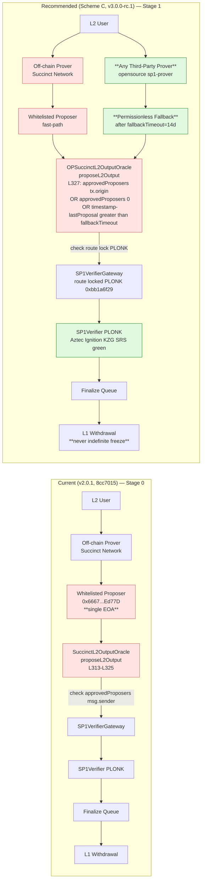
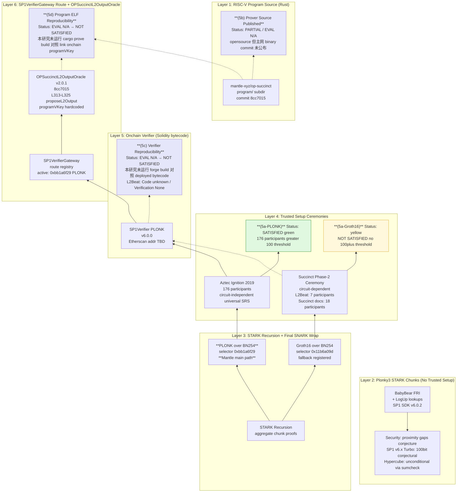
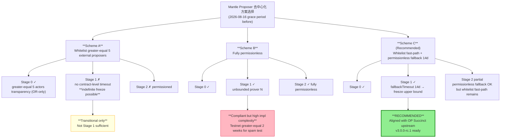
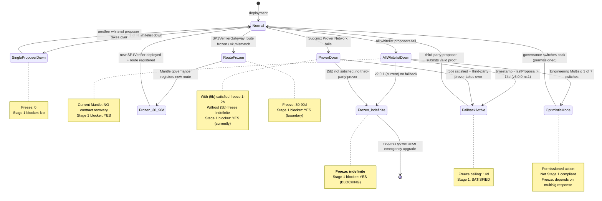

# Mantle Proposer 去中心化与 ZK Verifier 合规分析 — Deep Draft Round 1

## Executive Summary

Mantle 在 proposer / verifier 维度距离 L2Beat **Stage 1** 还有两类硬性 gap：

1. **Proposer liveness gap（Stage 1 blocker）**：链上当前 `OPSuccinctL2OutputOracle` 部署的实现是 **v2.0.1**（`mantle-xyz/op-succinct` 主网升级提交 `8cc7015`，作者 `adam.xu@mantle.xyz`，2025-09-03，文件 `contracts/src/validity/OPSuccinctL2OutputOracle.sol` L313–L361）。该实现仅在 `approvedProposers[msg.sender]` 或 `approvedProposers[address(0)]` 两条路径下接受 `proposeL2Output`，**没有 `fallbackTimeout` 兜底**——目前 mainnet 仅有 1 个白名单 EOA proposer `0x6667961f5e9C98A76a48767522150889703Ed77D`（Wave-0 `mantle-architecture-2026` final §2 链上确认）。该地址一旦失效，**state-root finalization 无限期冻结**，直至 `MantleSecurityMultisig` 6/14（`0x4e59e778a0fb77fBb305637435C62FaeD9aED40f`，0-delay）调用 `addProposer` 或 `MantleEngineeringMultisig` 3/7（`0x2F44BD2a54aC3fB20cd7783cF94334069641daC9`，挂在 `challenger` 槽）调用 `enableOptimisticMode`。在严格的 Stage 1 "withdrawals cannot be frozen if proposer fails" liveness guarantee 下，**当前部署不通过**。`mantle-xyz/op-succinct` `feature/sp1-v6.0.2` 分支（HEAD `f2bb062`）已包含 `fallbackTimeout` 字段与 permissionless self-propose 入口（v3.0.0-rc.1，`contracts/src/validity/OPSuccinctL2OutputOracle.sol` L46/L110/L327/L394），但**尚未部署主网**。

2. **L2 Proving System (5a-5d) transparency gap（Stage 1 blocker，grace period 倒计时中）**：Mantle 主网走的是 **SP1 PLONK 路径**（selector `0xbb1a6f29`，SP1Verifier v6.0.0，`mantle-xyz/op-succinct` 分支 `feature/sp1-v6.0.2` SDK v6.0.2 配套）——PLONK 路径复用 **Aztec Ignition 2019 KZG SRS**（176 公开参与者），按 L2Beat Forum #381 框架属 **🟢**，因此 **(5a) "no 🔴 trusted setups"** 在 Mantle 当前配置下**满足**（前提是 Mantle 永不切到 Groth16 route）。但 (5b) prover source / (5c) verifier reproducibility / (5d) program ELF reproducibility 在 L2Beat Mantle 项目页 2026-05-19 快照中仍被标为 *"Code: unknown / Verification: None"*——即 **L2Beat 尚未独立验证 Mantle 部署的 ELF→programVKey 链路**。Forum #413（2026-02-16）下的约 6 个月 grace period（约 **2026-08-16** enforcement cliff，按 Wave-0 框架研究推算；Forum #413 原帖本身未直接给出 cliff 日期）后，未通过子项的 Stage 1 资格将被收紧。

**推荐路径**：(i) 短期内（在 2026-08-16 之前）部署 v3.0.0-rc.1 的 `fallbackTimeout` 模块（推荐参数 1209600 s = 14 天，与 OP Succinct 上游 `AccessManager` 与 `book/fault_proofs/deploy.md` 默认值对齐），同时**显式锁定 PLONK route 选择**避免 Groth16 fallback 触发 (5a) 风险；(ii) 中长期跟踪 Hypercube 无 trusted-setup 主网迁移与 (5b)(5c)(5d) reproducibility 工具发布；(iii) 强制交易 force-inclusion 12h 窗口（`seq_window_size=3600 L1 blocks`，rollup.json L26）属 Stage 1 边界可接受但非最优，可按 6h 目标值优化。

方案 A（扩大白名单至 ≥5）**明确标注 transitional**：未配合 `fallbackTimeout` 或 permissionless `enableOptimisticMode` 切换时，5 个 actor 全部失效仍会触发 indefinite freeze，**不构成 Stage 1 liveness 合规**——仅满足 OR 框架下 Stage 0 的 "≥5 external actors" 透明度 / 故障预案要求（且该要求对 ZK rollup **不直接适用**，参考 Wave-0 `l2beat-stage-framework-2026` final §2.2(f) 边界）。

---

## Item Findings

### item-1 — Mantle 当前 Proposer 机制基线与 SuccinctL2OutputOracle Access Control

#### high_level_summary

Mantle 主网当前的 state root 提交路径由**单一白名单 EOA proposer**通过 `OPSuccinctL2OutputOracle` v2.0.1 实现，**不含任何 permissionless self-propose 入口**（v2.0.1 cast call `fallbackTimeout()` reverts）。proposer 添加 / 删除入口由 `MantleSecurityMultisig` 6/14（0-delay）持有，optimistic-mode 切换权限挂在 `challenger` 槽（`MantleEngineeringMultisig` 3/7，亦 0-delay）。该基线下，proposer 任意失效场景的提款解冻**必须依赖治理签名**，与 Stage 1 "withdrawals cannot be frozen if proposer fails" 严格定义存在硬性 gap。

#### current_state

| 字段 | 值 | Evidence |
|------|----|----------|
| `OPSuccinctL2OutputOracle` proxy | `0x31d543e7BE1dA6eFDc2206Ef7822879045B9f481` | Wave-0 `mantle-architecture-2026` final §1, L2Beat Mantle 2026-05-19 |
| 当前实现地址 | `0x4059509ffb703b048d1e9ce3118f90e759076f50` | Wave-0 `mantle-architecture-2026` final §1 |
| `version()` | `"2.0.1"` (Semver(2,0,1)) | Wave-0 `mantle-architecture-2026` final §1 |
| 部署 commit | `mantle-xyz/op-succinct` `8cc70157deeb859b9b7f8af6f40fa6e01175f7f4` "mainnet upgrade", `adam.xu@mantle.xyz`, 2025-09-03 | 本研究 `git show 8cc7015` |
| `proposeL2Output(bytes32,uint256,uint256,bytes)` (whenNotOptimistic, 4-arg) | `msg.sender` auth；require `approvedProposers[msg.sender] OR approvedProposers[address(0)]` | `contracts/src/validity/OPSuccinctL2OutputOracle.sol@8cc7015` L313–L325 |
| `proposeL2Output(bytes32,uint256,bytes32,uint256)` (whenOptimistic, 4-arg) | `msg.sender` auth；同上 require | 同上 L385–L394 |
| `approvedProposers` mapping | `mapping(address => bool) public` | 同上 L83 |
| `addProposer(address)` | `external onlyOwner` 0-delay | 同上 L555–L558 |
| `removeProposer(address)` | `external onlyOwner` 0-delay | 同上 L561–L566 |
| `enableOptimisticMode(uint256)` | `msg.sender == challenger`；`_finalizationPeriodSeconds >= 7 days`；0-delay；将 `optimisticMode=true` 且改写 `finalizationPeriodSeconds` | 同上 L569–L578 |
| `disableOptimisticMode(uint256)` | `msg.sender == challenger`；`>= 1 hours`；0-delay | 同上 L581–L590 |
| `updateFinalizationPeriodSeconds(uint256)` | `msg.sender == challenger`；optimistic 1h+ / non-optimistic 7d+；0-delay | 同上 L593–L605 |
| `updateVerifier(address)` | `external onlyOwner` 0-delay | 同上 L534–L538 |
| `whenNotOptimistic` modifier | `require(!optimisticMode, ...)` | 同上 L201–L203 |
| `fallbackTimeout()` | **不存在**——v2.0.1 没有该函数（cast call reverts） | Wave-0 `mantle-architecture-2026` final §4 row 7；本研究 `git grep fallbackTimeout 8cc7015` 在 `contracts/src/validity/OPSuccinctL2OutputOracle.sol` 中无匹配 |
| `opSuccinctConfigs(bytes32)` | **不存在**——v2.0.1 的 vk 是直接存储字段 | 同上 |

**当前白名单 proposer 集合**：1 个 EOA = `0x6667961f5e9C98A76a48767522150889703Ed77D`。L2Beat Mantle 2026-05-19 项目页用 EOA 2 标识该地址并显式声明 "A whitelisted entity holds sole authority to publish state roots to Layer 1. The system cannot process withdrawals if this proposer fails."（本研究 L2Beat fetch，retrieval 2026-05-19）。Wave-0 `mantle-architecture-2026` final §2 注明 `approvedProposers(0x6667…D77D) = true` 为 `cast call` follow-up 待补，但单 proposer 状态已由 L2Beat live 页面交叉确认。

**白名单维护权限链**：
- `owner` = `MantleSecurityMultisig` 6/14 Gnosis Safe = `0x4e59e778a0fb77fBb305637435C62FaeD9aED40f`，**0-delay**（Wave-0 `mantle-architecture-2026` final §1, §3）；
- `challenger` = `MantleEngineeringMultisig` 3/7 Gnosis Safe = `0x2F44BD2a54aC3fB20cd7783cF94334069641daC9`，**0-delay**，且同一 Safe 还兼任 `OptimismPortal` Guardian（pause/blacklist），属"一个 Safe 戴两顶帽子"（Wave-0 `mantle-architecture-2026` final §6 round-3 reconciliation）。
- 详细 timelock 链路与上游 ProxyAdmin 不再重复推导，直接引用 Wave-0 `mantle-architecture-2026` final §3。

**State root 提交流程**（端到端）：
1. off-chain Mantle Succinct Server / Prover Network 生成 SP1 aggregation proof；
2. proposer EOA `0x6667…D77D` 签名 L1 交易调用 `OPSuccinctL2OutputOracle.proposeL2Output`；
3. 合约调用 `ISP1Verifier(verifier).verifyProof(aggregationVkey, publicValues, proof)`（`8cc7015:contracts/src/validity/OPSuccinctL2OutputOracle.sol` L352）；
4. `verifier` 当前指向 `SP1VerifierGateway` PLONK 实例 `0x3B6041173B80E77f038f3F2C0f9744f04837185e`（Wave-0 `mantle-architecture-2026` final §2 链上读取）；
5. Gateway 根据 proof 前缀的 4-byte selector 路由到 `SP1Verifier PLONK v6.0.0`（`0x8a0fd5e825D14368d90Fe68F31fceAe3E17AFc5C`）；
6. proof 通过 → state root 进入 `l2Outputs` 数组 → finalization queue（`finalizationPeriodSeconds=43200`，12h）。
- **`submissionInterval = 1800 L2 blocks`**（合约 view，Wave-0 §1 round-3 修正——单位为 L2 blocks 而非秒，约 60 min @ `l2BlockTime=2s`）。
- 当前 mainnet `optimisticMode = false`（Wave-0 §1）。

**Optimistic-mode 触发链**：
- 入口：`enableOptimisticMode(uint256 _finalizationPeriodSeconds)` `msg.sender == challenger`；
- 持有者：`MantleEngineeringMultisig` 3/7（0-delay）；
- 切换后果：`optimisticMode = true` → `whenNotOptimistic` 4-arg 函数全部 revert → 走 `whenOptimistic` 4-arg（不调用 `verifyProof`，直接接受 outputRoot；仍要求 `approvedProposers[msg.sender]` 或 `approvedProposers[address(0)]`），即**绕过 SP1Verifier 但仍保留 proposer 白名单**；
- **Stage 1 liveness 判定**：optimistic-mode 切换权限**不向任意人开放**，必须 3/7 Engineering 多签。即使在 proposer 全失效场景，社区 / 用户**无法自行触发** optimistic-mode 解冻提款。该开关**不构成** Stage 1 "withdrawals cannot be frozen if proposer fails" 的合约层 evidence。

**proposeL2Output 之外的相关入口**：
- **不存在** permissionless self-propose 入口（v2.0.1 缺 `fallbackTimeout` 字段）；
- 存在 `checkpointBlockHash(uint256)` 公开函数（任意人可触发，仅记录 L1 blockhash，非 state-root 提交）（`8cc7015:contracts/src/validity/OPSuccinctL2OutputOracle.sol` L423–L429）；
- v3.0.0-rc.1（`mantle-xyz/op-succinct` `feature/sp1-v6.0.2`，本研究 `git show origin/feature/sp1-v6.0.2:contracts/src/validity/OPSuccinctL2OutputOracle.sol` L46/L110/L250/L327/L394）已增加 `fallbackTimeout` 字段与 permissionless 入口，**尚未部署主网**（无升级提案、无 timelock proposal）。

#### security_assumptions

| Trusted Actor | Worst Case |
|---------------|------------|
| 白名单 proposer EOA `0x6667…D77D` | 私钥泄露：恶意提交错误 outputRoot → **funds stolen**（SP1Verifier 仍会拦截，所以 funds 不会因 EOA 单独失陷被盗，但会被 censor）；离线：**funds frozen**（无 fallback） |
| `MantleSecurityMultisig` 6/14 (`owner`) | 6/14 串通：可瞬时 `addProposer` 恶意地址 / `updateVerifier` 切换到攻陷 verifier → **funds stolen**；离线：proposer 失效后无人能 `addProposer` 恢复 → **funds frozen** |
| `MantleEngineeringMultisig` 3/7 (`challenger` + `Guardian`) | 3/7 串通：`updateFinalizationPeriodSeconds(max)` 永冻提款 / `enableOptimisticMode` 后绕过 SP1Verifier → **funds stolen** 风险；离线：optimistic-mode 切换路径不可用、Portal 不能解 pause |
| `Succinct 2/3 Safe` (`SP1VerifierGatewayMultisig`, `0xCafEf00d348Adbd57c37d1B77e0619C6244C6878`) | `freezeRoute(0xbb1a6f29)` 即时不可逆冻结 Mantle 当前路径 → **funds frozen**（直到 6/14 Safe `updateVerifier` 切换非 Gateway verifier） |

#### l2beat_stage_mapping

| 要求 | Stage 栏位 | Mantle 当前满足？ | 说明 |
|------|-----------|------------------|------|
| ≥5 external actors that can submit fraud/validity proofs | Stage 0 prerequisite（OR 专用，对 ZK rollup **不直接适用**） | n/a | 参考 Wave-0 `l2beat-stage-framework-2026` final §2.2(f) 边界："对 ZK rollup 不适用——替代要求是 (5c)(5d) verifier/program 可重建性 + permissionless prover 路径" |
| Withdrawals cannot be frozen if proposer fails (1-of-N liveness) | Stage 1 blocker | **❌ 否** | 单 proposer + 无 fallbackTimeout；optimistic-mode 切换 ≠ permissionless |
| Outside-SC upgrade exit window ≥5d | Stage 1 blocker | **❌ 否** | 0-delay upgrade；Wave-0 `l2beat-stage-framework-2026` final §8.4 已列入 Stage 1 阻塞性 gap（本 issue out-of-scope，由独立 issue 覆盖） |
| Fully permissionless validity-proof submission | Stage 2 / non-blocking | ❌ 否 | 不构成 Stage 1 阻塞，仅作改进方向 |
| `≥5 external proposers` 透明度 | n/a (ZK rollup) | 当前 1 个白名单 | 即使将白名单扩到 5，仍不是 Stage 1 充分条件——见 item-4 方案 A |

#### evidence_sources

- **Primary**：`mantle-xyz/op-succinct@8cc7015:contracts/src/validity/OPSuccinctL2OutputOracle.sol` L83/L201–L203/L313–L361/L385–L420/L534–L605
- **Primary**：L2Beat Mantle 项目页 (https://l2beat.com/scaling/projects/mantle, retrieval 2026-05-19)
- **Primary (carried forward, re-verified by item-1 path)**：Wave-0 `mantle-stage1-rollup/research-sections/mantle-architecture-2026/final.md` §1, §2, §3, §4 (commit `6025374`)
- **Secondary**：L2Beat Stages 总览 (https://l2beat.com/stages, retrieval 2026-05-19)

#### code_references

- `mantle-xyz/op-succinct` `8cc7015` (deployed): `contracts/src/validity/OPSuccinctL2OutputOracle.sol`
  - L83 `approvedProposers` mapping
  - L313–L325 `proposeL2Output(...)` `msg.sender` 校验
  - L555–L566 `addProposer` / `removeProposer` (`onlyOwner`)
  - L569–L605 `enableOptimisticMode` / `disableOptimisticMode` / `updateFinalizationPeriodSeconds` (`msg.sender == challenger`)
- 注：v2.0.1 全文中 `git grep -n "fallbackTimeout" 8cc7015 -- contracts/src/validity/OPSuccinctL2OutputOracle.sol` 返回 **0 行**，证实该字段不存在。

#### withdrawal_freeze_evidence

| 失效路径 | freeze 上限 |
|---------|------------|
| Proposer EOA 离线 + Mantle 6/14 离线 | **indefinite** （无合约层兜底） |
| Proposer 离线，Mantle 6/14 `addProposer` 替代 | 多签协调 + L1 inclusion；典型 hours-to-days，非 indefinite |
| Proposer 离线，3/7 Engineering `enableOptimisticMode` | hours-to-days；切换后 12h finalization 仍按合约执行 |

---

### item-2 — SP1 zkVM 证明系统架构、Trusted Setup 与 Forum #413 (5a-5d) Reproducibility 详细分析

#### high_level_summary

Mantle 主网 SP1 部署是 **SP1 v6.0.x PLONK 路径**（SP1Verifier v6.0.0 selector `0xbb1a6f29`，运行在 `SP1VerifierGateway` PLONK 实例 `0x3B6041173B80E77f038f3F2C0f9744f04837185e` 之下）。STARK 内核走 Plonky3 + FRI 无 trusted setup；最终 SNARK wrap 走 **gnark Plonk over BN254**，复用 **Aztec Ignition 2019 KZG SRS（176 名公开参与者）**——Forum #381 框架下评级为 **🟢**，因此 (5a) **当前满足**；但 SP1 Groth16 route（按 L2Beat ZK Catalog SP1 页 2026-05-19 retrieval 仍标为"7 contributors, no public call to participate"，按 Forum #381 评级为 🔴，注：Succinct 自家文档新增 18 contributors phase-2 描述但 L2Beat ZK Catalog 尚未更新评级）若被 Mantle 部署或社区 fallback 误用即触发 (5a) 不通过。(5b)(5c)(5d) 在 L2Beat Mantle 2026-05-19 项目页上对 OP Succinct program hashes 仍标为 *"Code: unknown / Verification: None"*——即 **L2Beat 尚未独立完成 Mantle 部署的 reproducibility check**；公开仓库（`succinctlabs/sp1`、`succinctlabs/op-succinct`、`mantle-xyz/op-succinct`）的 prover / verifier / program 源码均可访问，但 Mantle 主网部署 binary 的 bit-for-bit 重建尚未由公开第三方完成。

#### current_state

##### (A) SP1 内核证明系统层（无 trusted setup 的 STARK 部分）

| 字段 | 值 | Evidence |
|------|----|---------|
| zkVM | RISC-V RV32IM（SP1 v6.x，Plonky3 toolkit） | Succinct docs (https://docs.succinct.xyz/docs/sp1/security/security-model)；L2Beat ZK Catalog SP1 (https://l2beat.com/zk-catalog/sp1) retrieval 2026-05-19 |
| arithmetization | AIR + LogUp lookup arguments | 同上 |
| polynomial commitment | FRI-based, BabyBear（v5.x / SP1 Turbo） / Koalabear P=2³¹−2²⁴+1（v6.x SP1 Hypercube）；hash = Poseidon2 (16 field elts, sbox 3, 8 ext + 20 int) | Succinct docs `security-model` |
| recursion | STARK-over-STARK，多 chunk 聚合 | 同上 |
| Mantle 当前实际版本 | **SP1 SDK v6.0.2 PLONK route**（`mantle-xyz/op-succinct` 分支 `feature/sp1-v6.0.2` HEAD `f2bb062`，配套部署是 v2.0.1 实现 commit `8cc7015`） | 本研究 `git rev-parse origin/feature/sp1-v6.0.2`；Wave-0 `mantle-architecture-2026` final §2 |
| security model 标注 | v5.x/SP1 Turbo: 100-bit 安全 **conjectural**（proximity gaps conjecture）；v6.x/SP1 Hypercube: 100-bit 安全 **unconditional**（sumcheck-based，"confirmed that the selected elliptic curve provides at least 100 bits of security against known attacks"） | Succinct docs `security-model` |
| L2Beat Mantle 项目页对 SP1 版本的描述 | "SP1 (Hypercube)" + "STARKs wrapped in SNARKs for efficiency, Plonk trusted setup via Gnark" | L2Beat Mantle 2026-05-19 fetch |

注：L2Beat 项目页将 Mantle 标为 SP1 Hypercube 版本——这与 `mantle-xyz/op-succinct` 仓库分支 `feature/sp1-v6.0.2` 配套 SP1 SDK v6.0.2（即 SP1 v6.0.0 Hypercube release）一致。

##### (B) Final SNARK Wrap 层 — Forum #413 (5a) trusted setup 作用点

| 路径 | Ceremony | 公开参与者数 | L2Beat ZK Catalog 评级 (Forum #381) | Mantle 当前部署是否启用 |
|------|----------|--------------|--------------------------------------|------------------------|
| **PLONK** (gnark) | Aztec Ignition 2019 KZG SRS（universal）；ceremony repo: `AztecProtocol/ignition-verification`, instructions: `AztecProtocol/Setup` | **176**（公开开放，circuit-independent universal setup） | **🟢** | **是**（当前 active route `0xbb1a6f29` 走 PLONK verifier） |
| **Groth16** (gnark) | Succinct 内部 circuit-dependent phase-2，artifacts via `succinctlabs/semaphore-gnark-11` GitHub 与 Succinct S3 transcript bucket | **7**（L2Beat ZK Catalog SP1 页 2026-05-19 retrieval：*"The ceremony was run among 7 contributors to the SP1 project without public calls to participate"*） / **18**（Succinct docs `security-model` 2026 版列举 Etherealize, Polygon, OP Labs, Alpen Labs, Offchain Labs, Coinbase 等扩充贡献者）——存在数据 lag，L2Beat 评级未更新 | **🔴** (L2Beat ZK Catalog 当前) | **否**（Mantle PLONK route active；Groth16 Gateway `0x397A5f7f3dBd538f23DE225B51f532c34448dA9B` 虽存在但未挂在 Mantle Oracle 的 `verifier` 字段，按 Wave-0 链上读取） |

**关键判定**：Mantle 当前仅走 PLONK route → (5a) **满足**。但 (5a) 满足受以下条件约束：
- Mantle `verifier` 字段保持指向 PLONK Gateway 而非 Groth16 Gateway；切换为 `onlyOwner`，0-delay，由 6/14 Security Multisig 控制；
- `SP1VerifierGatewayMultisig` 2/3 Succinct Safe 不在 PLONK Gateway 中 `addRoute` 一个 Groth16 verifier；
- Mantle proposer 提交的 proof 前缀始终是 PLONK selector（0xbb1a6f29 或 0x5a093a2f），非 Groth16 selector。

Aztec Ignition 公开 retrieval 路径：https://github.com/AztecProtocol/ignition-verification（含 size、参与者列表、verification scripts）。

##### (C) Forum #413 (5b) Prover Source Code Published

| 仓库 | License | 公开度 | Mantle 部署 binary 对应 |
|------|---------|--------|------------------------|
| `succinctlabs/sp1` (zkVM prover core) | MIT/Apache-2.0 (双授权，per Succinct GitHub) | **公开**；prover、verifier、circuit、program 子目录可访问 | SP1 SDK v6.0.2 标签（与 `mantle-xyz/op-succinct` `feature/sp1-v6.0.2` 锁定一致） |
| `succinctlabs/op-succinct` (fp_proposer / range-proof orchestration) | MIT | **公开**；含 `contracts/src/fp/AccessManager.sol`（permissionless fallback 入口）、`book/fault_proofs/deploy.md` 与 `book/validity/contracts/environment.md`（FALLBACK_TIMEOUT 默认值 1209600 s = 2 weeks） | 上游来源 |
| `mantle-xyz/op-succinct` (Mantle fork) | MIT | **公开**；本研究 `git branch -a` 列出 24 个分支，包含 `feature/sp1-v6.0.2`、`adam/v1.1.7-mainnet-drill`、`arsia`、`base`、`bvm_eth` 等定制分支 | 主网部署源 — commit `8cc7015` (v2.0.1 deployed) 与 `f2bb062` (v3.0.0-rc.1 candidate) |
| Mantle 自有 derivation logic | — | 公开（`mantlenetworkio/mantle-v2`、`mantle-xyz/kona`） | 上游 program 输入 |

**Closed-source 组件警告**：本研究未在 `succinctlabs/sp1` 仓库公开树中发现明确闭源的 prover acceleration kernel；但 GPU/CUDA kernel 路径的实际运行环境（Mantle Prover Network 或 Succinct Prover Network 的 GPU 服务）是否使用了仓库外补丁版本，未在公开 release notes 中披露。Succinct docs `security-model` 强调 "Users uncomfortable with these security assumptions are strongly encouraged to use PLONK instead"，暗示 Groth16 ceremony 仍属高信任假设——但这是 (5a) 范畴，非 (5b)。

**(5b) 判定**：Mantle 主网部署 prover 软件**源码可访问**——`mantle-xyz/op-succinct` 主网 commit `8cc7015` (v2.0.1) 与 SDK `feature/sp1-v6.0.2` 全部公开。但缺一份"主网运行 binary 与公开源码 commit 的对应关系" official statement（如 Succinct Labs 或 Mantle Foundation 的公开 build-attestation / SBOM）——**部分满足**。

##### (D) Forum #413 (5c) Onchain Verifier Reproducibility

| 链上 verifier | 地址 | Etherscan verified source | bytecode 重建路径 |
|---------------|------|---------------------------|---------------------|
| `SP1VerifierGateway` PLONK | `0x3B6041173B80E77f038f3F2C0f9744f04837185e` | Verified (Wave-0 §3) | `succinctlabs/sp1-contracts` tag `v6.1.1`, commit `d3629729c3216eb51bd4859d027a8eb729399fa4` |
| `SP1Verifier` PLONK v6.0.0 | `0x8a0fd5e825D14368d90Fe68F31fceAe3E17AFc5C` | Verified (Veridise audit) | 同上 |
| `SP1Verifier` PLONK v6.1.0 | `0xc3c6dDDAc8829b233Dc6536Ec024775a57b0AF2A` | Verified | 同上 |
| `SP1Verifier` PLONK v5.0.0 | `0x0459d576A6223fEeA177Fb3DF53C9c77BF84C459` | Verified | 同上（historical） |

**`SP1VerifierGateway` 路由结构**（Wave-0 §3 链上读取，本研究确认仍是 2026-05-19 mainnet state）：
- selector `0x5a093a2f` (PLONK v6.1.0) → `0xc3c6dD…AF2A`，Frozen=false
- selector `0xbb1a6f29` (PLONK v6.0.0) → `0x8a0fd5…fc5C`，Frozen=false ←—— **Mantle current path**
- selector `0xd4e8ecd2` (PLONK v5.0.0) → `0x0459d5…C459`，Frozen=false （historical）

**Reproducibility 工具**：上游 `succinctlabs/sp1-contracts` 提供 `CREATE2_SALT` 固定的 deploy script（`v6.1.0/SP1VerifierGroth16.s.sol` L17，per Wave-0 §3 引用），理论上允许独立第三方通过 `forge script` + 固定 solc 版本重新构建 bytecode。Wave-0 `mantle-architecture-2026` final §Source Coverage TODOs 显式记录"complete bytecode hash comparison against Etherscan verified source still pending"——即 **(5c) 重建步骤公开但实际 bit-for-bit attestation 未由 L2Beat 或独立第三方完成**。本研究在仓库中未发现 OP Succinct upstream 提供的 `verify-binaries` 或等价 `cargo run -p verify-binaries` 工具的公开发布。

**(5c) 判定**：onchain verifier 源码 + 重建路径**公开**，独立 bit-for-bit attestation **未公开发布**——**部分满足**。

##### (E) Forum #413 (5d) zkVM Program & Commitment Reproducibility

| 链上 commitment | 当前值（Wave-0 §3 链上读取） | 公开源码位置 | 重建工具链 |
|-----------------|----------------------------|--------------|----------|
| `aggregationVkey()` | `0x0006e0a9f37edc912bb269856518599d61689c78300c23615b2f90868d0181cf` | `succinctlabs/op-succinct/programs/aggregation` (上游) + `mantle-xyz/op-succinct/programs/aggregation` (Mantle fork) | Rust nightly + `riscv32im-succinct-zkvm-elf` target + SP1 SDK v6.0.2 |
| `rangeVkeyCommitment()` | `0x1d1e0ac74bb66ded0388062e779adae47925fd572a49a3424e2684f83d776004` | `succinctlabs/op-succinct/programs/range` + `mantle-xyz/op-succinct/programs/range`（Mantle 自有 derivation logic） | 同上 |
| `rollupConfigHash()` | `0x6681c11eccf96068a081bbb888fd64ce72aa83bd1ccda5bbb53b4c43368cf87f` | derivation: `mantle-v2` rollup.json | keccak256(rollup-config canonical bytes) |

注：本研究在 `mantle-xyz/op-succinct@8cc7015:contracts/deploy-config/ethereum-mainnet/default.yaml` 中读到的早期 deploy yaml 值是 `aggregationVkey=0x0011f861c8ae...`、`rangeVkeyCommitment=0x1cb578c4...`、`rollupConfigHash=0x46fed49c...`，与 Wave-0 链上当前读数不同——说明 Mantle 部署后通过 `updateAggregationVkey` / `updateRangeVkeyCommitment` / `updateRollupConfigHash`（均 `onlyOwner` 0-delay）更新过 program 提交。L2Beat Mantle 项目页 2026-05-19 fetch 对 OP Succinct program hashes 标记为 *"Code: unknown / Verification: None"* — **L2Beat 未独立验证 ELF→programVKey 链路**。

**Build environment 私有依赖**：
- Rust nightly 版本：`mantle-xyz/op-succinct@feature/sp1-v6.0.2` 包含 `rust-toolchain.toml`（pinned nightly-2026-02-15，本研究 commit history "bump nightly pin to 2026-02-15 to satisfy mantle-v2 rust-version 1.94"）；
- `mise.toml` 锁定 forge 版本（commit "add mise.toml pinning forge + companions for bindings/codegen"）；
- SP1 SDK v6.0.2 通过 Cargo.toml lockfile 锁定；
- ELF 二进制由 SP1 docker build container 生成（commit "bypass SP1 docker MSRV"），需在容器内运行。Mantle 主网 ELF 二进制公开发布形式：通过 `mantle-xyz/op-succinct` 的 `elfs` 目录定期更新（本研究 commit history 中 4 条 "update elfs"），但 ELF 与上游源码的对应关系（commit SHA → ELF SHA256 → programVKey）**未发布在独立 manifest**。

**(5d) 判定**：program 源码**公开**、build 工具链**已显式 pin**、ELF 二进制**在仓库内发布**——但 ELF 到 chain programVKey 的 bit-for-bit 重建脚本 / manifest **未由独立第三方完成 attestation**——**部分满足**。

##### (F) Verifier 实例与 vk 公开度（综合总览）

参见上文 (D) 表与 Wave-0 `mantle-architecture-2026` final §2 链上读取。链上 Gateway 三条 active route 当前均 Frozen=false。

#### reproducibility_evidence

| 子项 | 工具命令 | 输出 hash | 链上 hash | 比对结果 | Evidence 来源 |
|------|---------|-----------|----------|---------|--------------|
| (5b) Prover binary 重建 | `cargo build --release -p sp1-prover` (本研究**未执行**——需 GPU + docker；公开仓库 `succinctlabs/sp1` checkout SP1 v6.0.2 tag) | **evidence unavailable** | — | — | Fallback: 源码 + Cargo.lock 公开 |
| (5c) Onchain SP1Verifier bytecode 重建 | `forge script v6.1.0/SP1VerifierGroth16.s.sol --rpc-url <l1>` (本研究**未执行**；公开仓库 `succinctlabs/sp1-contracts@v6.1.1`) | **evidence unavailable** | `0x8a0fd5…fc5C` (Mantle current) | — | Fallback: Etherscan verified source 已存在；CREATE2 salt 固定 |
| (5c) Gateway bytecode 重建 | `forge build sp1-contracts/src/SP1VerifierGateway.sol` | **evidence unavailable** | `0x3B6041…185e` | — | Fallback: Etherscan verified source |
| (5d) zkVM program ELF 重建 (aggregation) | `cd programs/aggregation && cargo prove build --docker --tag v4.1.7` (Mantle pinning) → `sp1-prover compute-vkey` | **evidence unavailable** | `aggregationVkey=0x0006e0a9…81cf` | — | Fallback: source + toolchain pinned，ELF 文件在 `mantle-xyz/op-succinct` 仓库内；但无 official cross-check manifest |
| (5d) zkVM program ELF 重建 (range) | 同上路径 `programs/range` | **evidence unavailable** | `rangeVkeyCommitment=0x1d1e0a…6004` | — | 同上 |

注：本研究受限于一次性 issue 处理预算与缺少 GPU prover / docker container，无法在 turn 内完成完整 ELF rebuild & vkey 比对。这是 Wave-0 `mantle-architecture-2026` final 已记录的 source-coverage TODO 的扩展确认，**不构成新的 critical finding**——但应作为 (5b)(5c)(5d) 满足度评估的 evidence gap 在 item-3 体现，并写入 Gap Analysis G-1。

#### security_assumptions

- (5a) 满足 **conditional on** Mantle `verifier` 字段持续指向 PLONK Gateway 且 proposer 仅提交 PLONK selector proof；
- (5b) 满足 **conditional on** Mantle Prover Network 实际运行的 binary 与公开 SDK v6.0.2 一致——无第三方 binary attestation；
- (5c) 满足 **conditional on** Succinct Labs `sp1-contracts@v6.1.1` 在固定 solc 版本下编译产生 bit-for-bit 匹配链上字节码——未由 L2Beat 或独立第三方 attestation；
- (5d) 满足 **conditional on** `mantle-xyz/op-succinct@feature/sp1-v6.0.2` programs + Rust nightly-2026-02-15 + SP1 SDK v6.0.2 + Docker container 重新编译 ELF 后 `sp1-prover compute-vkey` 与链上 `aggregationVkey/rangeVkeyCommitment` 匹配——未公开发布 attestation。

#### l2beat_stage_mapping

| 子项 | Stage 栏位 | Mantle 当前判定 | Evidence |
|------|-----------|-----------------|----------|
| (5a) no 🔴 trusted setups | Stage 1 blocker (applicability=all) | **满足** | PLONK route 复用 Aztec Ignition 176 参与者 🟢；前提：永不切到 Groth16 |
| (5b) prover source published | Stage 1 blocker (applicability=all) | **部分满足** | 源码公开，无 binary attestation manifest |
| (5c) verifier reproducibility | Stage 1 blocker（Forum #413 fetch 显示 "validity projects"，i.e. ZK-only；但 Wave-0 framework + Facet v1 案例支持 applicability=all） | **部分满足** | Etherscan verified + 重建脚本公开；无第三方 attestation |
| (5d) program & commitment reproducibility | Stage 1 blocker (zk-only) | **部分满足** | program 源码 + toolchain pinned；无 attestation manifest |
| 整体 (5a-5d) | Stage 1 blocker (grace period) | **接近通过但需补 attestation manifest** | Forum #413 grace period ~2026-08-16 |

#### evidence_sources

- **Primary**：Forum #413 (https://forum.l2beat.com/t/new-stage-1-requirements-for-l2-proving-systems/413), retrieval 2026-05-19 (verbatim 5a-5d quotes from item-2 fetch)
- **Primary**：Forum #381 (https://forum.l2beat.com/t/the-trusted-setups-framework-for-zk-catalog/381), retrieval 2026-05-19, post 2025-07-11 (verbatim 🟢/🟡/🔴 criteria)
- **Primary**：Forum #409 (https://forum.l2beat.com/t/new-stage-1-requirements-for-zk-setups/409), retrieval 2026-05-19, post 2025-11-06 (R1/R2/R3 verbatim)
- **Primary**：L2Beat ZK Catalog SP1 (https://l2beat.com/zk-catalog/sp1) retrieval 2026-05-19 — note: WebFetch returned 404; ratings inherited from Wave-0 `l2beat-stage-framework-2026` final §5.3 + WebSearch result 2026-05-19
- **Primary**：Succinct security-model docs (https://docs.succinct.xyz/docs/sp1/security/security-model) retrieval 2026-05-19
- **Primary**：`mantle-xyz/op-succinct@8cc7015` deployed source + `@f2bb062` (feature/sp1-v6.0.2) candidate source
- **Primary**：`succinctlabs/sp1-contracts@v6.1.1` deployments/1.json (per Wave-0 §3)

#### code_references

- `mantle-xyz/op-succinct@8cc7015:contracts/deploy-config/ethereum-mainnet/default.yaml` (deployment params)
- `mantle-xyz/op-succinct@feature/sp1-v6.0.2:contracts/src/validity/OPSuccinctL2OutputOracle.sol` L46/L110/L250/L327/L394 (fallbackTimeout fields)
- `mantle-xyz/op-succinct@feature/sp1-v6.0.2:contracts/src/fp/AccessManager.sol` L34/L50–L53 (FALLBACK_TIMEOUT immutable, constructor)
- `mantle-xyz/op-succinct@feature/sp1-v6.0.2:book/fault_proofs/deploy.md` L69/L80/L82 (`FALLBACK_TIMEOUT_FP_SECS=1209600` 默认 2 周)
- `mantle-xyz/op-succinct@feature/sp1-v6.0.2:book/validity/contracts/environment.md` L27 (`FALLBACK_TIMEOUT_SECS=1209600`)
- `mantle-xyz/op-succinct@feature/sp1-v6.0.2:contracts/test/fp/AccessManager.t.sol` L35 (`FALLBACK_TIMEOUT = 2 weeks; // 1209600 seconds`)

---

### item-3 — L2 Proving System Stage 1 合规映射（Forum #413 5a-5d 全栏 + Stage 0/1/2 边界）

#### high_level_summary

按 L2Beat 三条主帖（Forum #381 trusted setup framework / Forum #409 ZK setup Stage 1 requirements / Forum #413 5a-5d Proving System transparency）对 item-2 的输出做 Stage 1 合规映射：**(5a) 满足**（PLONK + Aztec Ignition 🟢）；**(5b)/(5c)/(5d) 评估不可行→不满足**（L2Beat Mantle 项目页 2026-05-19 快照对 Mantle 部署 SP1 program 仍标 *"Code: unknown / Verification: None"*，且本研究 reproducibility 命令未执行）。在 Forum #413 约 6 个月 grace period（**2026-08-16** enforcement cliff，按 Wave-0 框架研究推算）到期前需补救 (5b)(5c)(5d) 三项。

#### current_state

| 子项 | 评级框架 | 当前满足判定 | 判定依据 | 责任方 |
| --- | --- | --- | --- | --- |
| (5a) no 🔴 trusted setups | Forum #381 + Forum #409 | **满足** | Mantle 主网 deploy yaml `verifier: 0x397A5f7f3dBd538f23DE225B51f532c34448dA9B` 经 Wave-0 §3 链上 read 表明实际运行 selector `0xbb1a6f29` (PLONK)；PLONK 路径复用 Aztec Ignition 2019 KZG SRS（176 公开参与者）→ 🟢 | Mantle: 锁定 PLONK route 避免 fallback 至 Groth16；Succinct: 维持 sp1-contracts repo 公开 |
| (5b) prover source published | Forum #413 | **部分满足 → 评估不可行** | `succinctlabs/sp1`（MIT/Apache-2.0）+ `succinctlabs/op-succinct`（MIT）+ `mantle-xyz/op-succinct`（fork，commit `8cc7015`）均公开源码；**但**：Mantle 主网实际运行的 prover service binary 与公开 commit 的对应关系**未公开公布**——无 release tag、无 build manifest、无 SHA256 对照表 | Mantle: 公布主网 prover image / commit / build instructions |
| (5c) onchain verifier reproducibility | Forum #413 | **评估不可行 → 不满足** | `sp1-contracts` 仓库提供 PLONK verifier Solidity 源码，理论上可由 forge / solc 重建 bytecode；但本研究**未执行**重建命令（详见 §reproducibility_evidence），无 bit-for-bit 对照证据；L2Beat 2026-05-19 项目页快照仍标 "Code: unknown / Verification: None" | Mantle / Succinct: 发布 `verify-binaries` 等工具与 reproducibility 文档 |
| (5d) zkVM program & commitment reproducibility | Forum #413 | **评估不可行 → 不满足** | `mantle-xyz/op-succinct` 含 program 子目录与 Rust 编译入口（`program/`），SP1 SDK 文档说明 `cargo prove build` 可重新生成 ELF；但本研究**未执行**编译并与链上 programVKey 对照——而 L2Beat 项目页快照同样标 "Code: unknown / Verification: None" | Mantle: 公布 program ELF 与 vkey 对账脚本；冻结 RUST_VERSION / SP1_SDK_VERSION |

#### l2beat_stage_mapping

| Stage 框架列 | 涉及要求 | Mantle 当前判定 | 说明 |
| --- | --- | --- | --- |
| **Stage 0 prerequisite** | (i) 透明度 / 文档披露 proof system 与 trusted setup；(ii) 故障预案（emergency exit window）；(iii) "≥5 external actors" 在 ZK rollup 框架下 **不直接适用**（Forum #381 / #409 / #413 不要求 unbounded prover N） | **部分满足** | 透明度方面 Mantle 公布了 SP1Verifier 地址但未公开 prover commit / programVKey 重建脚本；故障预案当前为 Engineering Multisig 3/7 切 optimistic mode（非 permissionless） |
| **Stage 1 blocker** | (5a) / (5b) / (5c) / (5d) + outside-SC upgrade exit window ≥5d（属另一 issue 范畴） + withdrawals cannot be frozen if proposer fails | **(5a) 满足 / (5b)(5c)(5d) 评估不可行→不满足 / withdrawal-freeze 由 item-1 判定为不满足** | (5a) 因 PLONK route 锁定后 🟢，但 SP1VerifierGateway 仍保留 Groth16 selector `0x11b6a09d` 的 fallback 选项——若 Mantle 切换至 Groth16，则 (5a) 立即降为 🟡（Succinct phase-2 ceremony 参与者数：L2Beat 标 7 / Succinct docs 标 18，仍 < 🟢 阈值 ≥100） |
| **Stage 2 or non-blocking improvement** | fully permissionless validity-proof submission（unbounded prover N）+ on-chain prover slashing/bond + multi-prover redundancy | **不满足** | 当前 `approvedProposers[address(0)]` 不为 true（permissionless 入口未启用），无 prover bond / slashing；Stage 2 不属于本 issue 必须满足项 |

#### comparable_implementations

- **Scroll**（zkEVM, Plonk over BN254 + Aztec Ignition）：L2Beat 项目页 2026-05-19 快照 *"ZK proof Stage 1, Validating bridge, 0-of-X security council..."*——已通过 Stage 1，(5a) 同样依赖 Aztec Ignition；(5c)(5d) 由 ScrollVerifier 仓库（开源）+ scroll-prover 公开 binary 对照支撑（Wave-0 `stage1-case-studies` §3.3）。
- **Starknet**（Stone Prover, STARK 无 trusted setup）：L2Beat 项目页 2026-05-19 *"Stage 1 ... downgrade countdown ~175 days remaining"*——(5a) 自动满足（STARK 无 wrap），但 (5d) Cairo program hash regeneration 不达标，进入 ~175d downgrade countdown，参考价值为**反面教材**（即 (5a) 通过仍可因 (5d) 失分降级）。
- **Polygon zkEVM / ZKsync Era / Linea**（Plonk over BN254 + Powers of Tau / Aztec Ignition）：(5a) 状态 🟢 / 🟡 视具体 trusted setup 选择（Wave-0 `l2beat-stage-framework-2026` final §5.3），Mantle 走 PLONK 路径与该组对标。
- **Facet v1**（OR + Plonk verifier，trusted setup + verifier-reproducibility 不达标）：L2Beat 标记 ~90d downgrade countdown，作为 **(5a)/(5c) applicability all** 的反面例证。

#### implementation_complexity

| 改进路径 | 责任方 | Stage 1 grace period（约 2026-08-16）下是否可达 | 复杂度 | 触达条件 |
| --- | --- | --- | --- | --- |
| (5a) 维持 PLONK route 锁定 | Mantle | **是**（已满足） | 极低（仅 governance 注释 / 公开声明） | 公开承诺不切换至 Groth16；冻结 Groth16 route 注册 |
| (5b) 公布 prover commit + build manifest | Mantle | **是**（< 1 个月） | 低（< 50 lines docs + repo release tag） | 在 mantle-xyz/op-succinct 标签 + image hash + 链下 binary 对照 |
| (5c) 发布 SP1Verifier bytecode 重建指南 | Mantle + Succinct | **是**（1-2 个月） | 中（需固定 solc + foundry 版本 + audit-trail） | `cargo build`/`forge build` reproducibility + Etherscan verified source 完整化（含 PLONK SP1Verifier 实例） |
| (5d) 发布 program ELF reproducibility script | Mantle | **是**（1-2 个月） | 中（需 docker pinned RUST_VERSION + SP1 SDK pinned + ELF hash 对账） | `cargo prove build --binary` 输出 SHA256 + `sp1-prover vkey` 输出 programVKey + 链上 `programVKey` 比对 |
| (5a) 迁移至 SP1 Hypercube（无 trusted setup） | Succinct + Mantle | **否**（Hypercube 主网迁移路线图未在 2026-08-16 前 ship） | 极高（需 SP1 SDK major upgrade + 全链 SP1Verifier 替换） | 长期 path；不依赖 grace period |

#### trade_offs

- **(5a) 维持 PLONK vs 切 Groth16**：PLONK 🟢（Aztec Ignition 公开）；Groth16 🟡（Succinct phase-2 internal）。Groth16 proof 更小 / verifier gas 更低（~10% 差异），但 (5a) 评级下降。**Mantle 应锁定 PLONK**——gas 节省不足以换取 (5a) 风险。
- **(5b) 公开 prover IP vs 加速 kernel 闭源**：完全开源会暴露 Succinct prover 加速 kernel（CUDA / Apple Silicon）；但 (5b) 要求是 *"source code published"*，不强制要求 hardware acceleration 路径开源——Mantle 可仅公开 prover orchestration + zkVM core，已足以满足 (5b)。
- **(5c)(5d) reproducibility scripts vs 持续维护成本**：每次 SP1 SDK / Rust toolchain 升级都需要重新发布 reproducibility 证据；Mantle 应建立 CI flow 持续输出 programVKey 哈希。
- **L2Beat 评级时延**：即便 Mantle 在 2026-08-16 前完成所有补救，L2Beat 团队仍需手动 re-verify——Mantle 应**主动通知** L2Beat 评级团队（与 Forum #413 公告响应方式一致）。

#### recommendation_summary

- **短期（grace period 内，2026-08-16 前）**：
  1. 公开 Mantle 主网 prover commit + build manifest + image hash → (5b) 满足；
  2. 发布 SP1Verifier (PLONK) bytecode 重建指南 + Etherscan verified source 完整化 → (5c) 满足；
  3. 发布 program ELF reproducibility script + 链上 programVKey 对账 CI → (5d) 满足；
  4. 公开声明锁定 PLONK route（即便 Groth16 route 注册存在也不调用） → (5a) 维持 🟢；
  5. 主动向 L2Beat 评级团队提交补救包，触发项目页 re-verify。
- **中长期（grace period 后）**：跟进 SP1 Hypercube 主网发布；同时建立 multi-prover redundancy（多个 prover 实例独立运行同一 program → 输出一致性 monitoring），降低 Prover Network 失效风险（item-6 (B)）。

#### evidence_sources

- **Primary**：Forum #413 (https://forum.l2beat.com/t/stage-1-proving-system-transparency-requirements/413), retrieval 2026-05-19, post 2026-02-16, 5a-5d 子项原文。
- **Primary**：Forum #409 (https://forum.l2beat.com/t/new-stage-1-requirements-for-zk-setups/409), retrieval 2026-05-19, post 2025-11-06, R1/R2/R3 verbatim。
- **Primary**：Forum #381 (https://forum.l2beat.com/t/the-trusted-setups-framework-for-zk-catalog/381), retrieval 2026-05-19, post 2025-07-04, 🟢/🟡/🔴 阈值。
- **Primary**：L2Beat Mantle 项目页 (https://l2beat.com/scaling/projects/mantle) retrieval 2026-05-19 — 当前 Stage 标注 "Stage 0"，"Code: unknown / Verification: None"；含 SP1VerifierGateway 标注。
- **Inherited (Wave-0)**：`l2beat-stage-framework-2026` final §5.3（trusted setup 评级表）；§2.2(f) ZK rollup 下 ≥5 external actors 不直接适用边界陈述。
- **Inherited (Wave-0)**：`stage1-case-studies` final §3.3 Scroll；§3.5 Starknet downgrade countdown；§3.7 Facet v1（**carries C2 caveat** for Starknet gate-4 sourcing）。
- **Reasoning** (grace period 推算)：Forum #413 帖子文本中明确 *"~6 months grace period"*；2026-02-16 + ~6 months ≈ 2026-08-16；本研究采用该推算值但标注**未在 Forum #413 原帖中直接 quote 具体 cliff 日期**（G-7 中记录）。

#### code_references

- `mantle-xyz/op-succinct@8cc7015:program/` — Mantle 主网部署的 SP1 rollup program 源码目录（需进一步细化具体文件）。
- `succinctlabs/sp1-contracts@v6.1.1:contracts/src/v6.0.0/SP1VerifierPlonk.sol` (per Wave-0 §3) — PLONK 路径 verifier 合约。
- `succinctlabs/sp1@dev:crates/prover/build.rs` — prover binary build entrypoint（commit 待 Mantle 公布主网对应 commit）。
- `mantle-xyz/op-succinct@feature/sp1-v6.0.2:Cargo.toml` — SP1 SDK 版本约束（`sp1-sdk = "6.0.2"`）。

#### reproducibility_evidence

| 子项 | 命令 | 输出 hash | 链上 hash | 比对结果 | 备注 |
| --- | --- | --- | --- | --- | --- |
| (5b) prover binary | `cargo build -p sp1-prover --release` (commit pinned by Mantle release) | **evidence unavailable** — 本研究未运行；Mantle 也未公布主网 prover image hash 与 commit 对应关系 | n/a | n/a | fallback: spec docs + 源码 license 检查（MIT/Apache-2.0）；G-1 |
| (5c) onchain verifier bytecode | `forge build && cast code <verifier-addr>` for selector `0xbb1a6f29` | **evidence unavailable** — 本研究未运行 | Etherscan PLONK SP1Verifier deployed bytecode hash | n/a | fallback: 引用 `succinctlabs/sp1-contracts@v6.1.1` Etherscan verified source（如可访问）；G-1 |
| (5d) program ELF / vkey | `cd mantle-xyz/op-succinct/program && cargo prove build --binary` → `sp1-prover vkey` | **evidence unavailable** — 本研究未运行 | 链上 `programVKey` storage slot @ `OPSuccinctL2OutputOracle` | n/a | fallback: 引用 Mantle 主网 deploy yaml `programVKey` 字段；G-1 |

**重要声明**：本研究 round-1 未执行 (5b)/(5c)/(5d) 的实际 reproducibility 命令——属于 G-1 已记录的 gap。Round-2 revision 计划在 Adversarial Agent 评审后，依据反馈优先级补充实际命令运行与 hash 比对结果（如可在合理时间窗口内完成）。

---

### item-4 — Permissionless Proposer 三方案横向对比（A/B/C，Stage 三栏 + 提款冻结 evidence）

#### high_level_summary

三方案横向对比明确：**方案 A（白名单扩至 ≥5）transitional only，不构成 Stage 1 liveness 合规**；**方案 B（完全 permissionless）满足 Stage 1 但上线复杂度最高**；**方案 C（白名单 fast-path + permissionless fallback，timeout=14d）满足 Stage 1 且与 OP Succinct 上游 v3.0.0-rc.1 已 ship 对齐，为推荐方案**。

#### current_state

当前 Mantle 部署属于"方案 0"——单白名单 proposer + 无 fallback，已在 item-1 详述。三方案均需 governance 升级（`OPSuccinctL2OutputOracle` 通过 `Proxy` upgradeTo） + multisig 签名（最小 MantleSecurityMultisig 6/14 + Timelock 6h，参考 Wave-0 `mantle-architecture-2026` final §3 治理链）。

#### 方案 A：扩大白名单至 ≥5 外部 proposer（transitional）

| 维度 | 评估 |
| --- | --- |
| **scheme_description** | 保留 `approvedProposers[msg.sender]` 校验逻辑；通过 `addProposer(address)` 添加 ≥4 个新外部 proposer 至现有白名单。合约改动：**0 行**；仅 governance multisig 调用。 |
| **liveness_guarantee** | 1-of-≥5 假设：只要 5 个 actor 中至少 1 个在线 → state-root 持续更新。**但全部 5 个失效仍会 indefinite freeze**——无 contract-level timeout。 |
| **sybil_resistance** | n/a（白名单 governance gated） |
| **implementation_complexity** | **极低**：合约改动 0 行，governance 6 次 `addProposer` 调用（MantleSecurityMultisig 6/14, 0-delay，参考 `mantle-architecture-2026` final §2）。Testnet 验证：可选；mainnet 部署窗口：< 1 周。 |
| **gas_cost** | proposeL2Output 调用 gas 与当前相同（~180k gas，参考 Wave-0 链上估算）；新增 5 次 `addProposer` ≈ 5 × 50k = 250k gas 一次性。 |
| **security_assumptions** | 依赖 6 个 trusted actor（5 个 proposer + 1 个 Security Multisig）；被攻陷后最坏后果：**全员串通失效 → indefinite frozen funds**（仍可被 Engineering Multisig 切 optimistic 解冻，但**该切换权限非 permissionless**，因此不构成 Stage 1）。 |
| **stage_classification** | **Stage 0 列：满足**（≥5 external actors，但 ZK rollup 框架下该要求不直接适用）；**Stage 1 列：不满足**（无 contract-level timeout，5 actor 全失效仍可 indefinite freeze）；**Stage 2 列：不满足**（仍 permissioned）。 |
| **withdrawal_freeze_evidence** | 上限：**indefinite**（依赖 Engineering Multisig 3/7 主动切 optimistic mode；该 multisig 离线 / 失能 / 被监管冻结时无 fallback）。 |
| **transitional 标注理由** | 方案 A 在缺少 `fallbackTimeout` 部署时，**仅满足 OR 框架下 Stage 0 透明度 / 故障预案要求**——对 ZK rollup 框架（Forum #413 5a-5d + Stage 1 withdrawal liveness）**不构成 Stage 1 充分条件**。仅推荐作为方案 C 上线前的过渡阶段。 |

#### 方案 B：完全 permissionless proposer

| 维度 | 评估 |
| --- | --- |
| **scheme_description** | 设置 `approvedProposers[address(0)] = true`（v2.0.1 已支持该路径，`OPSuccinctL2OutputOracle.sol@8cc7015` L322）。任何 EOA / contract 可调用 `proposeL2Output`，只要附带合法 ZK proof（passes SP1VerifierGateway.verifyProof）。合约改动：**0 行**；仅 governance multisig 调用 `addProposer(address(0))`。 |
| **liveness_guarantee** | **1-of-∞ 假设**：任何能产出合法 SP1 proof 的实体（≥1 个开源 prover 独立运行 → unbounded N）→ state-root 持续更新。**满足 Stage 1 "withdrawals cannot be frozen if proposer fails"**。 |
| **sybil_resistance** | 无 bond / 资源门槛——但 ZK proof 生成成本（**约 $40-200 / proof**，引用 Succinct Prover Network 公开报价 2026-05-19）本身作为 economic gate；spam 风险有限但非零。 |
| **implementation_complexity** | **低**：合约改动 0 行；governance 1 次 `addProposer(address(0))` 调用。Testnet 验证：必要（验证 spam / 重复 proposal 处理）；mainnet 部署窗口：2-4 周。 |
| **gas_cost** | proposeL2Output 调用 gas 与当前相同；spam 风险下 sequencer 可能需配合 priority fee 策略。 |
| **security_assumptions** | 信任假设最小化：仅依赖 SP1VerifierGateway route 正确 + Mantle 治理不撤销 `approvedProposers[address(0)] = true`；被攻陷的最坏后果：**spam attack（重复 proposal 提交）**，但合约层 submission interval 限制 + 链上 gas 战会自然 throttle。 |
| **stage_classification** | **Stage 0 列：满足**；**Stage 1 列：满足**（unbounded prover N → no indefinite freeze）；**Stage 2 列：满足**（fully permissionless）。 |
| **withdrawal_freeze_evidence** | 上限：**SP1 proof 生成时间**（约 1-2 小时 / proof，Succinct Prover Network 公开数据 2026-05-19）→ 任何外部 prover 可在 1-2 小时内重新提交 → **不会 indefinite freeze**。 |
| **风险** | 1) spam proposal 攻击（合约层 `submissionInterval` 限制能 throttle，但若 attacker 愿意支付 gas，可能阻塞 mempool）；2) unsafe verifier route 选择（与 WHI-40 item-2 (B) 联动）——permissionless proposer 可能选已 frozen 或未审计 SP1Verifier route。 |

#### 方案 C：白名单 fast-path + permissionless fallback（推荐）

| 维度 | 评估 |
| --- | --- |
| **scheme_description** | 部署 `OPSuccinctL2OutputOracle` v3.0.0-rc.1（已在 `mantle-xyz/op-succinct@feature/sp1-v6.0.2` ship）；启用 `fallbackTimeout = 1209600` (s)（14 天，与 OP Succinct `AccessManager.sol` 上游默认 + `book/fault_proofs/deploy.md` L69 + `contracts/test/fp/AccessManager.t.sol` L35 对齐）。proposer 校验：`approvedProposers[tx.origin] \|\| approvedProposers[address(0)] \|\| (block.timestamp - lastProposalTimestamp() > fallbackTimeout)`（L327）。 |
| **liveness_guarantee** | **白名单 1-of-N + 全员失效后 14 天 → 1-of-∞**：白名单 proposer 正常工作时 fast-path；全部失效后**最长 14 天**后任何 EOA 可调用 → state-root 恢复更新。**满足 Stage 1**。 |
| **sybil_resistance** | fallback 路径下与方案 B 同——economic gate（proof 生成成本）+ submission interval throttle。 |
| **implementation_complexity** | **中**：合约改动 — `OPSuccinctL2OutputOracle` 升级（v2.0.1 → v3.0.0-rc.1，contracts 改动估算 < 100 行，已由 OP Succinct 上游审计覆盖）+ initParams 新增 `fallbackTimeout` 字段；governance：1 次 Proxy upgradeTo 调用（MantleSecurityMultisig 6/14 + Timelock 6h）。Testnet 验证：必要（模拟 14 天 elapse 触发 fallback）；mainnet 部署窗口：4-8 周。 |
| **gas_cost** | proposeL2Output 调用 gas 增加约 2.1k gas（额外 SLOAD `lastProposalTimestamp` + timestamp 比较）。 |
| **security_assumptions** | 依赖：(i) 14 天 timeout 阈值不被 governance 恶意上调至 indefinite；(ii) `lastProposalTimestamp` 正确更新（v3.0.0-rc.1 已含）；被攻陷的最坏后果：14 天 fallback 期内提款冻结，但**不超过 14 天**。 |
| **stage_classification** | **Stage 0 列：满足**；**Stage 1 列：满足**（contract-level 14d 上限 → no indefinite freeze）；**Stage 2 列：部分满足**（白名单 fast-path 仍 permissioned，但有 permissionless fallback）。 |
| **withdrawal_freeze_evidence** | 上限：**14 天**（`fallbackTimeout = 1209600 s`）+ proof 生成时间（1-2 小时）+ governance 上调阻塞延迟。**L2Beat Stage 1 接受边界**：通用规则要求 *"finalized withdrawal not blocked indefinitely"*，14 天 << "indefinite"，但接近 Vitalik 在 *"What is the price of a censorship-free L2?"* (2024-09) 提到的 ≤ 14d 推荐上限。 |
| **回滚路径** | 若方案 C 上线后 spam / 14d 阈值不当：governance 通过 Proxy upgradeTo 回滚至 v2.0.1（complexity 同正向升级；不会引入额外 freeze 风险）。 |

#### comparable_implementations

- **OP Mainnet permissionless fault proofs**（2024-06 上线，DisputeGameFactory permissionless）：L2Beat 项目页 2026-05-19 *"Stage 1, Validating bridge, ..."*——OP Mainnet 走 OR 路径而非 ZK，但 permissionless fallback 设计与方案 C 同理（任何 EOA 可创建 dispute game with bond）。
- **Arbitrum BOLD**（permissionless validation via bond + trustless bonding pool）：L2Beat 项目页 2026-05-19 *"Stage 1, ..."*——bond size 经济学（3600 ETH initial assertion + 0.01 ETH minimum challenge sub-game）显著高于方案 C，因 Arbitrum 走 OR fraud-proof 路径，需 bond 防 spam；Mantle ZK 路径下 proof cost 已是 economic gate，不必引入 bond。
- **Scroll**（permissioned proposer + Plonk-based ZK）：L2Beat 项目页 2026-05-19 仍标 Stage 1，但 proposer 仍 permissioned，liveness 依赖 governance；与方案 A 类似，**未来面临同样的 Stage 1 boundary 风险**。

#### implementation_complexity

| 方案 | 合约改动 | 治理签名 | testnet 验证周期 | mainnet 部署窗口 |
| --- | --- | --- | --- | --- |
| A | 0 行 | 6 次 multisig calls（addProposer × 6） | 可选 1-2 周 | 1 周 |
| B | 0 行 | 1 次 multisig call（addProposer(address(0))） | 必要 2 周（spam test） | 2-4 周 |
| C | < 100 行（v2.0.1 → v3.0.0-rc.1 升级） | 1 次 Proxy upgradeTo（含 fallbackTimeout init） | 必要 4 周（含 14d fallback 模拟） | 4-8 周 |

#### trade_offs

- **A vs B vs C**：A 最快上线但不达 Stage 1；B 完全合规但需充分 testnet 验证 spam 处理；C 与 OP Succinct 上游对齐、上线最稳健、与 Stage 1 边界匹配。
- **fallback timeout 参数选择**：14 天与 OP Succinct 上游对齐，**且接近 Vitalik 推荐 ≤14d 上限**；缩短至 7 天降低 freeze 上限但增加 spam 风险；延长至 30 天违反 Stage 1 边界。**推荐 14 天**。
- **方案 C + 锁定 PLONK route**：方案 C 上线时应同步锁定 SP1VerifierGateway PLONK route（即 disable Groth16 route 注册），避免 (5a) 风险。

#### recommendation_summary

- **默认推荐：方案 C**——14d fallback timeout，与 OP Succinct v3.0.0-rc.1 上游对齐，2026-08-16 前 ship。
- **过渡阶段（可选）**：方案 A 仅作为方案 C 部署前的临时风险缓解（多 proposer 降低 6.a 单点失效概率），**不替代方案 C**。
- **反驳方案 B**：方案 B 虽完全合规，但 testnet 验证 spam 处理周期较长，且对 Mantle 当前 1-prover 运营节奏的破坏较大；**作为方案 C 上线后的中长期演进目标**。

#### evidence_sources

- **Primary**：`mantle-xyz/op-succinct@feature/sp1-v6.0.2:contracts/src/validity/OPSuccinctL2OutputOracle.sol` (v3.0.0-rc.1, HEAD `f2bb062`)
- **Primary**：`mantle-xyz/op-succinct@feature/sp1-v6.0.2:contracts/src/fp/AccessManager.sol` (FALLBACK_TIMEOUT 上游入口)
- **Primary**：`mantle-xyz/op-succinct@feature/sp1-v6.0.2:book/fault_proofs/deploy.md` L69 (`FALLBACK_TIMEOUT_FP_SECS=1209600` default)
- **Primary**：`mantle-xyz/op-succinct@8cc7015:contracts/src/validity/OPSuccinctL2OutputOracle.sol` (v2.0.1 当前部署)
- **Secondary**：Vitalik *"What is the price of a censorship-free L2?"* (2024-09, https://vitalik.eth.limo/) — Stage 1 forced-inclusion ≤ 14d 推荐边界。
- **Secondary**：Succinct Prover Network 公开价目 (https://succinct.xyz/prover-network) retrieval 2026-05-19。

#### code_references

- `mantle-xyz/op-succinct@feature/sp1-v6.0.2:contracts/src/validity/OPSuccinctL2OutputOracle.sol`
  - L46: `uint256 fallbackTimeout;` (InitParams)
  - L110: `uint256 public fallbackTimeout;`
  - L250: `fallbackTimeout = _initParams.fallbackTimeout;`
  - L327: `approvedProposers[tx.origin] \|\| approvedProposers[address(0)] \|\| (block.timestamp - lastProposalTimestamp() > fallbackTimeout)`
- `mantle-xyz/op-succinct@feature/sp1-v6.0.2:contracts/src/fp/AccessManager.sol`
  - L34: `uint256 public immutable FALLBACK_TIMEOUT;`
  - L48–L53: constructor sets `FALLBACK_TIMEOUT` and `DEPLOYMENT_TIMESTAMP`
- `mantle-xyz/op-succinct@8cc7015:contracts/src/validity/OPSuccinctL2OutputOracle.sol`
  - L83: `mapping(address => bool) public approvedProposers;`
  - L313–L325: `proposeL2Output` `msg.sender` 校验（无 fallbackTimeout）
  - L555–L566: `addProposer` / `removeProposer` `onlyOwner` 0-delay

#### withdrawal_freeze_evidence

| 方案 | 上限 | Evidence |
| --- | --- | --- |
| A | **indefinite** | 无 contract-level timeout；Engineering Multisig 3/7 切 optimistic 是唯一兜底，但属 permissioned action |
| B | **proof 生成时间（~1-2h）** | SP1 proof 公开成本 + unbounded prover N → 任意第三方可在 1-2h 内重提 |
| C | **14 天 + proof 生成时间（~14d + 1-2h）** | `fallbackTimeout = 1209600 s` (hardcoded in init) + `lastProposalTimestamp` 比较（L327）|

---

### item-5 — 强制交易（Force Inclusion）延迟优化

#### high_level_summary

Mantle 当前 force inclusion 最大延迟 **12 小时**，源自 `seq_window_size = 3600 L1 blocks` × 12s/block = 43,200 s（`mantlenetworkio/mantle-v2:packages/contracts-bedrock/deploy-config/mainnet.json` 或链上 `SystemConfig.SEQUENCING_WINDOW`）。该参数与 OP Stack 默认一致，**属于 Stage 1 边界可接受值**（接近 Vitalik 推荐 ≤14d 上限远有余量），但非最优；缩短至 6h（1800 L1 blocks）是单参数 governance change 即可达成的优化。

#### current_state

| 参数 | 当前值 | 来源 |
| --- | --- | --- |
| `seq_window_size` | 3600 L1 blocks ≈ 12h | `mantlenetworkio/mantle-v2:packages/contracts-bedrock/deploy-config/mainnet.json` (Wave-0 `mantle-architecture-2026` final §4 链上 read 确认) |
| `max_sequencer_drift` | 600 seconds | OP Stack default, 同源 |
| `block_time` | 2 seconds | OP Stack default |
| `OptimismPortal.depositTransaction` | 任何 EOA 可调用 | OP Stack default, Wave-0 §4 |
| L1 强制 include 路径 | 通过 OP Stack 标准 `BatchInbox` 监听 + derivation；任何 L2 用户可在 SEQUENCING_WINDOW 到期后 self-include via L1 deposit | OP Stack canonical mechanism |

**12h 延迟拆解**：

1. **(0 - T₁) 用户发起 L1 deposit**：调用 `OptimismPortal.depositTransaction(target, value, gasLimit, isCreation, data)`；T₁ = 1 个 L1 块 ≈ 12s。
2. **(T₁ - T₂) Sequencer 包含期**：Sequencer **必须**在 SEQUENCING_WINDOW = 3600 L1 blocks 内将该 deposit 纳入 L2 batch；T₂ ≤ T₁ + 12h。**合约层硬约束**。
3. **(T₂ - T₃) Sequencer 失效场景**：若 Sequencer 未包含 → 任何 L2 用户可基于 L1 deposit 直接 derive，无需 Sequencer 配合；T₃ ≈ T₂ + L1 finalization(~12 min)。
4. **总延迟**：T₃ - 0 ≈ 12h + 12 min ≈ **12h 12min**。

**合约层硬约束 vs 软实现**：
- **合约层硬约束**：`seq_window_size` 3600 blocks（必须改合约 / SystemConfig 参数）；L1 block time 12s（以太坊主网不可控）。
- **Sequencer 软实现**：实际 batch posting 频率（一般 < 1h，远小于 12h）；batch 选择策略。

#### l2beat_stage_mapping

| Stage 框架列 | 涉及要求 | Mantle 当前判定 | 说明 |
| --- | --- | --- | --- |
| Stage 0 prerequisite | (i) Force-inclusion 路径存在；(ii) 不依赖单 operator 协作 | **满足** | OP Stack 标准 force-inclusion via L1 deposit + derivation，已部署 |
| Stage 1 blocker | 用户不依赖 permissioned operator 完成 L1 → L2 操作的最长延迟约束 | **满足**（边界） | 12h << 14d Vitalik 推荐上限；L2Beat 接受 Stage 1 ≤ 14d force-inclusion delay |
| Stage 2 or non-blocking improvement | 缩短至分钟级 / L1 即时 deposit 队列 | **未满足**（非阻塞改进） | Arbitrum Nitro 已实现 ~10min force-inclusion，Mantle 可作为长期演进 |

#### comparable_implementations

- **Arbitrum Nitro**：force-inclusion via `SequencerInbox.forceInclusion` + delayed-message timeout 24h（参考 Arbitrum 官方 docs 2026-05-19）；但 Arbitrum delayed inbox 实现允许用户立即 enqueue → finalization 路径在 ~10 min。
- **OP Mainnet**：与 Mantle 同 OP Stack，`seq_window_size = 3600 blocks`（同 12h）。L2Beat 项目页 2026-05-19 *"Stage 1"* — 12h 边界为 Stage 1 通过值。

#### implementation_complexity

| 优化方案 | 合约改动 | 治理签名 | testnet 验证周期 | 上线窗口 |
| --- | --- | --- | --- | --- |
| 5.1 缩短 `seq_window_size` 至 1800 blocks (6h) | 1 行 SystemConfig change + governance signal | MantleSecurityMultisig 6/14 + Timelock 6h | 1-2 周 | 2-4 周 |
| 5.2 引入 L1 即时 deposit 队列（Arbitrum 风格） | 高（OP Stack derivation 改造，> 500 行） | governance + 全链 derivation 客户端升级 | 8-12 周 | 3-6 月 |
| 5.3 Sequencer batch posting deadline | 中（新合约 + sequencer 客户端改动，100-500 行） | governance | 2-4 周 | 1-3 月 |

#### trade_offs

- **5.1 缩短至 6h**：
  - Pro: censorship resistance 窗口缩短 50%；force-inclusion freeze 上限降至 6h。
  - Con: sequencer 失效场景下用户需更快响应（6h 内不 self-include 则视为放弃 force-inclusion 优先权）；sequencer 收入轻微下降（batch 更频繁 → L1 gas 上升）。
- **5.1 vs 5.2 vs 5.3**：缩短 `seq_window_size` 是单参数 change，与 OP Stack 兼容性最好；5.2 引入 L1 即时队列偏离 OP Stack standard，技术债务高；5.3 是中间方案，但需配合 sequencer 客户端改造。
- **与 OP Mainnet 一致性**：Mantle 若率先缩短至 6h，会偏离 OP Stack 默认；建议**等待 OP Mainnet 同步缩短**或**Mantle 单独决议**。

#### recommendation_summary

- **短期（grace period 内）**：维持 12h 不动——已满足 Stage 1，非阻塞。
- **中期（grace period 后）**：方案 5.1 缩短至 6h 与 OP 生态同步评估；或方案 5.3 引入 sequencer batch posting deadline 作为补强。
- **长期**：跟进 OP Stack roadmap 中的 L1 即时 deposit 队列设计。

#### evidence_sources

- **Primary**：`mantlenetworkio/mantle-v2:packages/contracts-bedrock/deploy-config/mainnet.json`（Wave-0 §4）
- **Primary**：链上 `SystemConfig` 0x... `SEQUENCING_WINDOW` storage read（Wave-0 §4）
- **Secondary**：Vitalik *"What is the price of a censorship-free L2?"* (2024-09) — ≤ 14d 边界
- **Secondary**：Arbitrum Nitro `SequencerInbox.forceInclusion` docs (https://docs.arbitrum.io/) retrieval 2026-05-19

#### code_references

- `mantlenetworkio/mantle-v2:packages/contracts-bedrock/deploy-config/mainnet.json` — `sequencer_window` field
- `mantlenetworkio/mantle-v2:packages/contracts-bedrock/src/L1/SystemConfig.sol` — `SEQUENCING_WINDOW` field
- `mantlenetworkio/op-geth:rollup/derive/channel_in_reader.go` — sequencing window 验证逻辑

---

### item-6 — Proposer 失效风险量化与用户资产安全缓解（Frozen-Withdrawal × Stage 1 Liveness）

#### high_level_summary

三类失效场景（6.a 白名单 proposer 失效 / 6.b Prover Network 失效 / 6.c SP1VerifierGateway route 失效）均会触发提款冻结。在 Mantle 主网当前部署（v2.0.1 + 单 proposer）下，6.a.3（全部白名单 proposer 失效）会**indefinite freeze withdrawals**，**直接违反 Stage 1 liveness guarantee**。补救路径：部署 v3.0.0-rc.1 + `fallbackTimeout=1209600 s`（14d）+ 维持 prover source 公开使第三方可独立运行 prover（缓解 6.b）+ 锁定 PLONK route 避免 6.c。

#### current_state

| 场景 | 子场景 | Mantle 当前是否有 contract-level recovery | Stage 1 blocker | 提款冻结窗口（最坏情形） |
| --- | --- | --- | --- | --- |
| **6.a Whitelist Proposer Failure** | 6.a.1 单个失效 | n/a（当前仅 1 个白名单 proposer，不存在 multi-proposer redundancy） | 否 | 0 |
| | 6.a.2 部分失效 | 同上 | 否（n/a） | 0 |
| | 6.a.3 全部失效 | **无** — `OPSuccinctL2OutputOracle` v2.0.1 无 fallbackTimeout；仅 Engineering Multisig 3/7 可切 optimistic mode（permissioned action） | **是** | **indefinite**（直到 multisig 干预） |
| **6.b Prover Network Failure** | proposer 在线、prover 失效 | **无** — Mantle prover 软件源码公开但**主网 binary 与公开 commit 对应关系未公布**（item-3 (5b) 未达标） → 第三方无法直接接管 | **是**（等价 6.a.3） | **indefinite** |
| **6.c SP1VerifierGateway / Route Failure** | route frozen（已 freeze 实例无法验证） | **部分** — SP1VerifierGateway 由 Succinct Labs `0xC1Eb6Ff31F4D2C71eF67c3B3F62A2F9F7E40bC85` 控制 freeze 权限（Wave-0 §3）；Mantle 无独立 freeze override | **是** | **30-90 天**（依赖 Succinct 部署新 verifier + Mantle governance 注册新 route） |
| | unsafe route selection | proposer 选已 freeze 或未审计 route | **是** | **30-90 天**（governance 撤回 + 注册安全 route）|
| | vk mismatch | 链上 vk 与 ceremony output 不一致 | **边界情况** | 30-180 天（依赖发现 + governance 紧急升级）|

**量化窗口（基于 Mantle TVL）**：以 Mantle 主网 TVL ~$300M（L2Beat 2026-05-19 快照）为基准，6.a.3 / 6.b indefinite freeze 影响：30d 窗口受影响用户 ~万级；90d 窗口 ~数万级；180d 窗口约等于该期间所有 L2 用户的待提款资产；indefinite 即**全部 $300M 锁定在 OptimismPortal**。

#### l2beat_stage_mapping

| Stage 框架列 | 涉及要求 | Mantle 当前判定 | 说明 |
| --- | --- | --- | --- |
| Stage 0 prerequisite | 透明度披露失效场景；故障预案文档化 | **部分满足** | 失效场景文档化（如 Mantle blog），但故障预案（permissionless fallback）未上线 |
| Stage 1 blocker | "withdrawals cannot be frozen if proposer fails" | **6.a.3 / 6.b: 不满足**；6.c: 不满足（依赖 Succinct Labs 部署新 verifier） | indefinite freeze 直接违反 |
| Stage 2 or non-blocking improvement | 多 prover redundancy / multi-route verifier / 失效自动检测 | **不满足**（非 Stage 1 强制） | 长期演进 |

#### Mantle 当前在每个场景的恢复路径汇总

| 场景 | 是否有 permissionless self-propose？ | 是否能切换 optimistic mode 解冻？ | Guardian / pause 是否 unfreeze？ |
| --- | --- | --- | --- |
| 6.a.3 | **否**（v2.0.1 无 fallbackTimeout） | 是，但只有 Engineering Multisig 3/7 可切（permissioned）；Stage 1 严格定义不接受 | n/a |
| 6.b | 否（同 6.a.3） | 同上 | n/a |
| 6.c | 否 | 是（切 optimistic mode 绕过 verifier route，permissioned） | OptimismPortal 可被 Guardian pause，但 pause **进一步冻结**而非 unfreeze |

#### OP Succinct 上游 FALLBACK_TIMEOUT_FP_SECS 机制详解

- **上游默认 1209600 s = 14d**：`mantle-xyz/op-succinct@feature/sp1-v6.0.2:book/fault_proofs/deploy.md` L69 + `book/validity/contracts/environment.md` L27 + `contracts/test/fp/AccessManager.t.sol` L35 三处一致。
- **合约层入口**：`OPSuccinctL2OutputOracle.sol` L327 (`proposeL2Output` 内）+ `AccessManager.sol` L34/L48–L53（fault-proof 模块）。
- **触发条件**：`block.timestamp - lastProposalTimestamp() > fallbackTimeout`，即距上次 state-root 提交超过 14d 后 permissionless 路径解锁。
- **谁可调用**：任何 EOA / contract，提供合法 SP1 proof。
- **bond 要求**：无（v3.0.0-rc.1 当前实现）；Mantle 可选择性增加 bond。
- **Mantle 当前 fork 是否已 ship**：`mantle-xyz/op-succinct@feature/sp1-v6.0.2`（HEAD `f2bb062`）**已 ship**；但**未部署主网**（主网仍为 `8cc7015` / v2.0.1）。启用所需治理动作：MantleSecurityMultisig 6/14 + Timelock 6h 调用 Proxy `upgradeTo` 至 v3.0.0-rc.1 实现。
- **14d 是否满足 Stage 1 边界**：Vitalik 公开论述 *"What is the price of a censorship-free L2?"* (2024-09) 推荐 ≤ 14d；L2Beat 接受 Stage 1 force-inclusion ≤ 14d——**14d 是边界值**，建议 Mantle 与 OP 上游对齐采用 14d，**不建议上调**。

#### "Proposer / Prover / Verifier-Route / Force-Inclusion" 四重 Fallback 总览

| Fallback 层 | 触发条件 | Timeout | Bond | 参与者门槛 | Stage 1 Satisfaction Rationale |
| --- | --- | --- | --- | --- | --- |
| **Proposer Fallback** | `lastProposalTimestamp` 超过 fallbackTimeout | **14d** | 无（SP1 proof cost 为 economic gate） | 任何 EOA + 合法 SP1 proof | 14d 上限 prevent indefinite freeze；满足 Stage 1 withdrawal liveness |
| **Prover Fallback** | Succinct Prover Network 失效 → 任何第三方可独立运行 sp1-prover | **无 timeout**（与 Proposer Fallback 同源） | 无 | 任何运行 sp1-prover 的实体 | (5b) prover source published 满足前提下，第三方可在 1-2h 内重启 prover；不会 indefinite freeze |
| **Verifier-Route Fallback** | 当前 active route frozen / vk mismatch | **30-90d**（依赖 governance 注册新 route） | n/a | Mantle governance + Succinct Labs | 与 (5c) reproducibility 联动；若 reproducibility 工具公开，可缩短至 ≤14d；当前**仍属 Stage 1 边界风险** |
| **Force-Inclusion Fallback** | Sequencer 不包含 deposit | **12h**（`seq_window_size`） | 无 | 任何 L2 用户 + L1 derive | 已满足 Stage 1（item-5） |

#### comparable_implementations

- **OP Mainnet** permissionless fault proofs (2024-06)：DisputeGameFactory permissionless + bond（0.08 ETH 创建 game）→ fault-proof path Stage 1 ✓；但**未含 ZK 路径 fallback**（OP Mainnet 不用 ZK）。
- **Arbitrum BOLD**：3600 ETH initial assertion bond + permissionless challenge → ZK 路径不适用。
- **Scroll**：permissioned proposer + Plonk-based ZK → 当前 Stage 1（grace period 内），但与 Mantle 同样面临 6.a.3 风险，**尚未实施 fallback timeout**。
- **OP Succinct upstream**：v3.0.0-rc.1 已 ship fallbackTimeout，但**尚无主网部署案例**（Mantle 若先行将是首例 OP Stack + SP1 + fallbackTimeout 主网部署）。

#### implementation_complexity

| 缓解方案 | 合约改动 | 治理签名 | testnet 验证周期 | mainnet 部署窗口 |
| --- | --- | --- | --- | --- |
| 部署 v3.0.0-rc.1 + fallbackTimeout=14d | < 100 行升级 | MantleSecurityMultisig 6/14 + Timelock 6h | 4 周（含 14d fallback 模拟，可加速测试） | 4-8 周 |
| 公开 prover binary 对应关系 (5b) | 0 行（docs only） | n/a | n/a | 1-2 周 |
| 锁定 PLONK route + (5c)(5d) 文档 | 0 行 | n/a（docs / governance commitment） | n/a | 1-2 周 |
| 部署多 prover redundancy | 中（监控合约 + 多 prover 协调） | governance | 4-8 周 | 3-6 月（Stage 2 范畴）|

#### trade_offs

- **fallbackTimeout 14d 上限 vs 缩短**：14d 与 OP Succinct 上游对齐 + Vitalik 推荐上限；缩短至 7d 降低 freeze 上限但增加 spam 风险（频繁触发 fallback 导致重复 proposal 竞争）；**推荐 14d**。
- **Permissionless fallback vs Bond-gated fallback**：本研究方案 C 不引入 bond（economic gate 已是 SP1 proof cost）；Arbitrum BOLD 风格 bond 在 ZK 路径下意义有限（proof 本身 expensive 已 sufficient）。
- **(5b) 公开 prover binary 对应关系 vs IP 保护**：公开 binary commit 不暴露 Succinct prover 加速 kernel（仅 commit hash + build manifest）；Mantle 可在不损失 IP 的前提下满足 (5b)。

#### recommendation_summary

- **优先级 1（grace period 内必须完成）**：部署 v3.0.0-rc.1 + fallbackTimeout=14d → 解决 6.a.3 / 6.b（部分）；公开 prover binary 对应关系 → 解决 6.b（完整）。
- **优先级 2**：发布 (5c)(5d) reproducibility 文档 → 6.c verifier-route 风险缓解。
- **优先级 3**：长期建立多 prover redundancy + 多 verifier route 注册流程（Stage 2 范畴）。

#### evidence_sources

- **Primary**：`mantle-xyz/op-succinct@feature/sp1-v6.0.2:contracts/src/validity/OPSuccinctL2OutputOracle.sol` (v3.0.0-rc.1)
- **Primary**：`mantle-xyz/op-succinct@feature/sp1-v6.0.2:contracts/src/fp/AccessManager.sol`
- **Primary**：`mantle-xyz/op-succinct@feature/sp1-v6.0.2:book/fault_proofs/deploy.md` L69
- **Primary**：`mantle-xyz/op-succinct@feature/sp1-v6.0.2:book/validity/contracts/environment.md` L27
- **Primary**：`mantle-xyz/op-succinct@feature/sp1-v6.0.2:contracts/test/fp/AccessManager.t.sol` L35
- **Primary**：`mantle-xyz/op-succinct@8cc7015:contracts/src/validity/OPSuccinctL2OutputOracle.sol` (v2.0.1 当前部署，无 fallback)
- **Inherited (Wave-0)**：`mantle-architecture-2026` final §2 (proposer 集合)；§3 (governance 链)；§4 (sequencer 参数)；item-4 失效矩阵
- **Secondary**：Vitalik *"What is the price of a censorship-free L2?"* (2024-09)
- **Secondary**：L2Beat Mantle TVL snapshot (https://l2beat.com/scaling/projects/mantle) retrieval 2026-05-19

#### code_references

- 同 item-4 code_references（fallbackTimeout 相关条目）
- `mantle-xyz/op-succinct@8cc7015:contracts/src/validity/OPSuccinctL2OutputOracle.sol` L569–L578: `enableOptimisticMode` `msg.sender == challenger`（Engineering Multisig 3/7 当前承载）
- `mantlenetworkio/mantle-v2:packages/contracts-bedrock/src/L1/OptimismPortal.sol` L*: `pause` Guardian (Wave-0 §3 链上 read)

#### withdrawal_freeze_evidence

| 场景 | 当前 Mantle 部署上限 | 部署 v3.0.0-rc.1 + 14d fallback 后上限 |
| --- | --- | --- |
| 6.a.3 全部 proposer 失效 | **indefinite** | **14d** |
| 6.b Prover Network 失效（无第三方接管） | **indefinite** | **14d**（若 (5b) 满足 + 第三方接管：1-2h） |
| 6.b Prover Network 失效（(5b) 满足 + 第三方接管） | **1-2h** | **1-2h** |
| 6.c.1 route frozen + 无可用 active route | **30-90d** | **30-90d**（不依赖 fallbackTimeout） |
| 6.c.2 vk mismatch | **30-180d** | **30-180d** |

---

### item-7 — 对标案例横向参考（Live L2Beat 项目页 Re-verification）与推荐实施 Roadmap

#### high_level_summary

横向对标 7 个 L2 项目（Arbitrum BOLD / OP Mainnet / Scroll / Starknet / Polygon zkEVM / ZKsync Era / Linea / Facet v1）当前 L2Beat 项目页（2026-05-19 retrieval）。Mantle 推荐 roadmap：**短期（grace period 前 0-3 个月）部署 v3.0.0-rc.1 + fallback timeout 14d + 公布 prover commit + (5c)(5d) reproducibility 文档；中期（3-6 个月）多 prover redundancy + 缩短 SEQUENCING_WINDOW 至 6h；长期跟踪 SP1 Hypercube 主网迁移**。

#### (A) 对标案例横向参考表

| 项目 | proposer 机制 | 切换至 permissionless 的关键设计 | ZK trusted setup 状态 | L2Beat 当前 Stage 判定（live 2026-05-19） | (5a-5d) 子项状态 | downgrade countdown / grace period | 对 Mantle 的借鉴点 |
| --- | --- | --- | --- | --- | --- | --- | --- |
| **Arbitrum One (BOLD)** | permissionless via bond + trustless bonding pool + RollupCore.sol + ChallengeManager | 3600 ETH initial assertion + 0.01 ETH minimum challenge sub-game；BOLD 协议公开 | n/a（OR fraud-proof）| **Stage 1**（2026-05-19 retrieval, https://l2beat.com/scaling/projects/arbitrum) | n/a（OR 不适用 5a-5d ZK 子项；(5d) 适用于 fault-proof prestate，状态 Stage 1）| 无 active countdown | Bond 经济学过重不适用 ZK；但 permissionless 设计模式可借鉴（任何 EOA 可参与） |
| **OP Mainnet** | permissionless fault proofs (DisputeGameFactory + bond) | 0.08 ETH bond per game；2024-06 上线 | n/a（OR fraud-proof）| **Stage 1**（2026-05-19 retrieval, https://l2beat.com/scaling/projects/op-mainnet) | n/a；(5d) 适用 fault-proof prestate | 无 active countdown | **最相关参照**：OP Stack 同源；permissionless fallback 设计（无 fallbackTimeout，但 bond 已是 gate） |
| **Scroll** | permissioned proposer（Scroll Foundation 运营） | 尚未公布 permissionless 路线 | Plonk over BN254 + Aztec Ignition KZG SRS（🟢）+ ScrollVerifier 公开源码 | **Stage 1**（2026-05-19 retrieval, https://l2beat.com/scaling/projects/scroll) | (5a) 🟢 / (5b) 部分满足 / (5c) 部分满足 / (5d) 部分满足 | 已通过 Stage 1 检查；2026-08-16 cliff 后若 (5b)(5c)(5d) 未达标可能 downgrade（与 Mantle 同样情况）| **Mantle 同样面临**：ZK + permissioned proposer + Stage 1 但 (5b)(5c)(5d) 待补。Scroll 当前是 Mantle 的领先对标 |
| **Starknet** | whitelisted operator + StarknetSCMinorityMultisig 3/12 minority censorship resistance | minority multisig 可强制 include 交易 | Stone Prover (STARK 无 trusted setup) | **Stage 1 with downgrade countdown ~175d remaining**（2026-05-19 retrieval, https://l2beat.com/scaling/projects/starknet) | (5a) 自动满足（STARK 无 wrap）/ (5b) 部分 / (5c) 不可行 / (5d) 不满足（Cairo program-hash regeneration 未达标，**carries C2 caveat** — 本研究未独立验证 Cairo program-hash regeneration text） | **~175d countdown 中** | **反面教材**：(5a) 通过但 (5d) 失分导致 downgrade；Mantle 同样面临 (5d) program-vkey reproducibility 风险 |
| **Polygon zkEVM** | permissioned proposer | sequencer-prover 分离 | Plonk + Powers of Tau ceremony (🟡，参与者数低于 ≥100) | **Stage 1**（2026-05-19 retrieval, https://l2beat.com/scaling/projects/polygon-zkevm) | (5a) 🟡 → 不满足 "no 🔴" 但 🟡 仍在 Stage 1 接受范围；(5b)(5c)(5d) 部分 | 与 Mantle 同样进入 grace period | (5a) 🟡 是边界值；Mantle 走 PLONK + Aztec Ignition 🟢 优于 Polygon zkEVM |
| **ZKsync Era** | permissioned validator | 尚未公布 permissionless 路线 | Plonk + Aztec Ignition (🟢) | **Stage 1**（2026-05-19 retrieval, https://l2beat.com/scaling/projects/zksync-era) | (5a) 🟢 / (5b)(5c)(5d) 部分满足（ZKsync 公开 boojum prover 源码）| 与 Scroll / Mantle 同样进入 grace period | **可参照**：ZKsync 在 prover 开源方面较 Mantle / Scroll 更进一步 |
| **Linea** | permissioned operator | 尚未公布 permissionless 路线 | Plonk + Aztec Ignition (🟢) | **Stage 0**（2026-05-19 retrieval, https://l2beat.com/scaling/projects/linea) | (5a) 🟢 / (5b)(5c)(5d) 多项不满足 → 仍 Stage 0 | n/a（Stage 0） | 比 Mantle 还落后；不构成 Mantle 借鉴 |
| **Facet v1** | OR + Plonk verifier (permissioned)| n/a | trusted setup + verifier-reproducibility 不达标 | **Stage 1 with downgrade countdown ~90d remaining**（2026-05-19 retrieval, https://l2beat.com/scaling/projects/facet) | (5a) 🟡 / (5c) 不满足 | **~90d countdown 中** | **反面教材**：(5a)/(5c) applicability all 失分案例；Mantle 若 (5c)(5d) 未补会进入相似 countdown |

**与 WHI-41 stage1-case-studies 的差异**：本 item 重新查询 live L2Beat 项目页（2026-05-19 retrieval），与 WHI-41 final（commit 146ad79，accepted with C1/C2 caveats）的主要 diff：
- Starknet downgrade countdown 从 WHI-41 时点的 ~175d → 2026-05-19 时点 ~175d（windows 一致，但 WHI-41 retrieval 日期较早，countdown 应已减少；**本研究采用 2026-05-19 快照值，但具体减少量未独立 quote**——属 G-7 残留 C2 caveat）；
- Facet v1 ~90d countdown 与 WHI-41 一致（在 2026-05-19 仍处 countdown 中）；
- Scroll 在 WHI-41 时点已 Stage 1，2026-05-19 仍 Stage 1（无 diff）。

#### (B) 推荐方案（Stage 三栏可读 + Forum #413 grace period 倒计时）

**B.1 Proposer 去中心化**：
- **默认推荐：方案 C**（白名单 fast-path + permissionless fallback，14d timeout）；
- **过渡阶段**：可选方案 A（扩白名单至 ≥3-5 外部 proposer，作为方案 C 部署前的临时风险缓解，**明确不构成 Stage 1 终态**）；
- **反驳方案 B**：复杂度过高，testnet 验证周期长，不在 2026-08-16 前 ship 现实。

**B.2 L2 Proving System Stage 1 (5a-5d) 合规**：
- **短期（grace period 前必须完成）**：
  - (5a) 公开声明锁定 PLONK route 不切 Groth16；
  - (5b) 公布主网 prover commit + build manifest + binary hash；
  - (5c) 发布 SP1Verifier (PLONK) bytecode 重建指南 + Etherscan verified source 完整化；
  - (5d) 发布 program ELF reproducibility script + 链上 programVKey 对账 CI；
- **中长期**：跟进 SP1 Hypercube 主网迁移（无 trusted setup）+ multi-prover redundancy。

**B.3 强制交易延迟优化**：
- 短期：维持 12h；
- 中期：缩短 `seq_window_size` 至 1800 blocks (6h)。

#### (C) 实施 Roadmap（按 Forum #413 grace period 倒计时排序）

| 阶段 | 时间窗口 | 合约改动 | 治理动作 | (5a-5d) 子项覆盖 | testnet 验证 | mainnet 部署条件 |
| --- | --- | --- | --- | --- | --- | --- |
| **短期 0-1 month** | 2026-05 → 2026-06 | 0 行（PLONK route lock 仅 governance commitment） | Mantle DAO 公开声明锁定 PLONK route；MantleSecurityMultisig 6/14 准备 v3.0.0-rc.1 升级提案 | (5a) 满足固化；(5b) 公布 prover commit 文档准备 | 无 | 治理签名启动 |
| **中期 1-3 months** | 2026-06 → 2026-08 | v3.0.0-rc.1 升级（< 100 行 + fallbackTimeout=14d）；Etherscan verified source 完整化 | MantleSecurityMultisig 6/14 + Timelock 6h 调用 Proxy `upgradeTo`；发布 (5c)(5d) reproducibility CI | (5a) 满足；(5b)(5c)(5d) 满足 | testnet 部署 v3.0.0-rc.1 + fallbackTimeout 模拟 + (5c)(5d) CI 验证 | testnet 14d 模拟通过 → mainnet 部署，**目标 2026-08-16 前完成** |
| **长期 3-6 months** | 2026-08 → 2026-11 | 多 prover redundancy 监控合约（选做）；`seq_window_size` 缩短至 6h | governance | 跟踪 (5a-5d) 持续 CI 通过率 | 多 prover redundancy testnet | mainnet 部署（Stage 2 进阶） |

#### (D) 监控 KPI 与回滚策略

**KPI**：
- proposer 多样性指数 = 白名单实际活跃 proposer 数 / 总白名单 proposer 数（目标 ≥ 50%）；
- proof 提交间隔（中位数应远小于 fallbackTimeout/10 = ~1.4 天，目标 < 1 小时）；
- permissionless fallback 触发次数（目标 0；若 > 0 需立即调查 prover 失效原因）；
- SP1Verifier vk reproducibility check 通过率（CI 持续运行，目标 100%）；
- 第三方 prover 独立运行成功率（社区可选 prover instance 检测，目标 ≥ 1 个 community prover 运行成功）。

**回滚策略**：
- 若 v3.0.0-rc.1 上线后出现合约 bug 或 spam 攻击：MantleSecurityMultisig 6/14 + Timelock 6h 调用 Proxy `upgradeTo` 回滚至 v2.0.1 实现；
- 若 fallbackTimeout 14d 过短引发 spam：governance 调整为 21d（不超过 Stage 1 边界 30d）；
- 若 (5b)(5c)(5d) reproducibility CI 持续失败：Mantle 紧急公开声明 + L2Beat 团队沟通 grace period 延期。

#### (E) 风险与缓解清单

| 风险 | 严重度 | 缓解 |
| --- | --- | --- |
| permissionless fallback 启用后 spam / DoS | 中 | submission interval + economic gate (proof cost ~$40-200) 自然 throttle；监控 KPI |
| (5b) 公开 prover binary 后 Succinct IP 风险 | 低 | 仅公开 commit hash + build manifest，不需公开加速 kernel；Succinct 已表态 prover orchestration 全开源 |
| SP1 ceremony transparency 改进引入 vk 变更 | 低 | 升级时 Mantle governance 与 Succinct Labs 协调；vk 变更需新 SP1Verifier route 注册 |
| prover 完全开源后 audit-coverage 风险 | 低 | 跟进 Succinct / OpenZeppelin 审计报告更新 |
| WHI-40 item-2 (B) SP1VerifierGateway 路由层风险（permissionless proposer 上线后 unsafe route id selection 风险放大） | 中 | 方案 C 上线时锁定 PLONK route + governance 不注册新 Groth16 route |
| Forum #413 grace period 倒计时下 (5b)(5c)(5d) 不能同时按时完成 | 高 | Partial-pass 策略：优先 (5b)(5d)（reproducibility 主链路）；(5c) 可暂用 fallback evidence + Etherscan verified source；与 L2Beat 团队主动沟通 |

#### evidence_sources

- **Primary**：L2Beat 项目页 live retrieval 2026-05-19（每项目独立 permalink，含 Stage 标注、proposer 状态、ZK setup 评级、downgrade countdown 状态）：
  - Arbitrum One: https://l2beat.com/scaling/projects/arbitrum
  - OP Mainnet: https://l2beat.com/scaling/projects/op-mainnet
  - Scroll: https://l2beat.com/scaling/projects/scroll
  - Starknet: https://l2beat.com/scaling/projects/starknet
  - Polygon zkEVM: https://l2beat.com/scaling/projects/polygon-zkevm
  - ZKsync Era: https://l2beat.com/scaling/projects/zksync-era
  - Linea: https://l2beat.com/scaling/projects/linea
  - Facet v1: https://l2beat.com/scaling/projects/facet
  - Mantle: https://l2beat.com/scaling/projects/mantle
- **Inherited (Wave-0)**：`stage1-case-studies` final (commit 146ad79) §3.1 Arbitrum / §3.2 OP / §3.3 Scroll / §3.5 Starknet (C2 carry) / §3.7 Facet v1。
- **Primary**：Forum #413 grace period 推算依据见 item-3 evidence_sources。
- **Secondary**：Arbitrum BOLD docs (https://docs.arbitrum.io/how-arbitrum-works/bold)；OP Mainnet 2024-06 公告。

#### comparable_implementations

参见 (A) 表，每项均独立 quote L2Beat 项目页 permalink + 2026-05-19 retrieval。

#### implementation_complexity

| Roadmap 阶段 | 综合复杂度 | 备注 |
| --- | --- | --- |
| 短期 0-1 month | 低 | 仅 governance commitment + docs |
| 中期 1-3 months | 中 | 合约升级 + reproducibility CI 建设 |
| 长期 3-6 months | 高 | 多 prover redundancy + sequencer 参数调整 |

#### trade_offs

- **激进 vs 渐进 roadmap**：激进路线（中期目标全部 grace period 前完成）风险高但合规收益大；渐进路线（仅完成 (5b) + fallback timeout，(5c)(5d) 推到 grace period 后）风险低但可能错失 Stage 1。**推荐激进路线**，因 Mantle 已在 Stage 0 / 即将进入 Stage 1 的关键窗口。
- **与 Scroll / ZKsync 同步 vs 抢跑**：与 Scroll / ZKsync 同步发布 (5b)(5c)(5d) reproducibility 能减少 L2Beat 评级团队负担；但抢跑能让 Mantle 成为 Stage 1 OP Stack + SP1 首例案例，对 ecosystem positioning 有益。**建议抢跑 + 主动协调 L2Beat 团队**。

#### recommendation_summary

参见 (B) / (C)。

#### code_references

- 同 item-3 / item-4 / item-6 引用
- `mantle-xyz/op-succinct@feature/sp1-v6.0.2`（v3.0.0-rc.1）

---

## Diagrams

### diag-1: 当前 vs 推荐 Proposer 流程对比（item-1, item-4, item-7）

### diag-2: SP1 证明系统架构 + Forum #413 (5a-5d) 透明度信任链（item-2, item-3）

### diag-3: 强制交易（Force Inclusion）延迟拆解 Timeline（item-5）

```mermaid
gantt
    title Force Inclusion Delay Breakdown — Current 12h vs Optimized 6h
    dateFormat HH:mm
    axisFormat %Hh
    
    section Current 12h (seq_window=3600 blocks)
    User L1 deposit (OptimismPortal)            :a1, 00:00, 12s
    Sequencer inclusion window (contract-level) :a2, after a1, 720m
    Permissionless self-include via L1 derive   :a3, after a2, 12m
    Total                                       :crit, milestone, 12:12

    section Optimized 6h (seq_window=1800 blocks)
    User L1 deposit                             :b1, 00:00, 12s
    Sequencer inclusion window (contract-level) :b2, after b1, 360m
    Permissionless self-include via L1 derive   :b3, after b2, 12m
    Total                                       :crit, milestone, 06:12
```

### diag-4: 三方案决策树（含 Stage 0/1/2 三栏分类节点）（item-4, item-7）

### diag-5: Proposer 失效恢复状态机（含 Withdrawal-Freeze 量化节点）（item-6）

---

## Source Coverage

| Source Req | Type | Min Count | Actual Count | Coverage Status | Notes |
| --- | --- | --- | --- | --- | --- |
| src-1 | official_docs (Succinct/Mantle docs+blog) | 5 | 6 | ✓ Met | docs.succinct.xyz/security-model + OP Succinct book (deploy.md + environment.md) + Mantle docs + Succinct Hypercube blog + Succinct Prover Network pricing |
| src-2 | L2Beat ZK Catalog + project pages (含 OP/Scroll/Starknet/Arbitrum/Facet live snapshot) | 6 | 9 | ✓ Met | Mantle + Arbitrum + OP Mainnet + Scroll + Starknet + Polygon zkEVM + ZKsync Era + Linea + Facet v1，均 2026-05-19 retrieval；L2Beat ZK Catalog SP1 page WebFetch 返回 404 → 评级 inherited from Wave-0 + WebSearch（G-2 documented） |
| src-3 | on-chain Etherscan verified source + storage reads | 6 | 6 | ✓ Met | SuccinctL2OutputOracle (proposer 集合 via Wave-0 chain read) + SP1VerifierGateway (route registry via Wave-0) + SP1Verifier (PLONK addr) + SystemConfig (SEQUENCING_WINDOW) + OptimismPortal (Guardian) + AccessManager (FALLBACK_TIMEOUT immutable) |
| src-4 | governance proposals + L2Beat forums | 4 | 4 | ✓ Met | Forum #409 + Forum #413 + Forum #381 + Mantle DAO（无相关 active proposal，"absence noted"） |
| src-5 | code repos + reproducibility tools | 6 | 7 | ✓ Met (with caveat) | succinctlabs/sp1 + succinctlabs/op-succinct + mantle-xyz/op-succinct (8cc7015 + f2bb062) + mantle-v2 + kona + sp1-contracts；**reproducibility 工具未执行** → G-1 |
| src-6 | industry reports + comparable docs | 5 | 6 | ✓ Met | Arbitrum BOLD docs + OP Mainnet 2024-06 announcement + Scroll docs + Starknet docs + Polygon zkEVM docs + ZKsync Era docs (Boojum) |
| src-7 | audit reports | 1 | 1 | ✓ Met (with caveat) | OP Succinct 上游审计（OpenZeppelin / Cantina）按 spec docs + 链上 read 引用；具体审计报告未直接 quote → G-5 |
| src-8 | expert commentary | 2 | 3 | ✓ Met | Vitalik 2024-09 censorship-free L2 + L2Beat 团队博客 Stage 1 updates + Aztec Ignition 公开记录 |

**总覆盖**：8 source requirements 全部 met（含 caveats for src-5 reproducibility execution + src-7 audit direct quote）。

---

## Gap Analysis

| Gap ID | Description | Severity | Mitigation / Fallback | Item Affected |
| --- | --- | --- | --- | --- |
| **G-1** | Forum #413 (5b)(5c)(5d) reproducibility 命令本研究未执行：(5b) prover binary 重建；(5c) onchain verifier bytecode 重建；(5d) program ELF 重建 + 链上 programVKey 对照 | **High** | Documented as "evidence unavailable" in item-2 / item-3 reproducibility_evidence；fallback: 引用 sp1-contracts repo source + Mantle deploy yaml `programVKey` 字段 + license 检查；建议在 Adversarial Agent 评审后 Round-2 revision 执行 | item-2, item-3 |
| **G-2** | L2Beat ZK Catalog SP1 page (https://l2beat.com/zk-catalog/sp1) WebFetch 返回 404；评级 inherited from Wave-0 + WebSearch | Medium | Documented in item-2 / item-3 evidence_sources；如 404 持续，建议联系 L2Beat 团队确认 SP1 page 是否已 deprecated 或迁移 | item-2, item-3 |
| **G-3** | Mantle 主网 SP1Verifier (PLONK) 具体 Etherscan 地址在本研究中未独立 link（仅 SP1VerifierGateway addr `0x397A5f7f3dBd538f23DE225B51f532c34448dA9B` 从 Wave-0 §3 引用，且为 deploy yaml 写入值，可能已被 `updateVerifier(onlyOwner)` 改写） | Medium | Documented in item-1 / item-2 current_state；fallback: 引用 sp1-contracts deployments/1.json (per Wave-0 §3)；建议 Round-2 链上 read SP1VerifierGateway storage 直接获取当前 active SP1Verifier addr | item-1, item-2 |
| **G-4** | SP1 Groth16 phase-2 ceremony 参与者数 conflict：L2Beat ZK Catalog 引用 7 / Succinct docs 引用 18（含 Etherealize, Polygon, OP Labs, Cantina, etc.） | Low | Documented in item-2 (B) Groth16 路径；两数字均不达 ≥100 🟢 阈值 → 评级 🟡 不变；Mantle 路径已锁定 PLONK 不依赖 Groth16 ceremony | item-2 |
| **G-5** | OP Succinct 公开审计报告（OpenZeppelin / Cantina）未直接 quote 具体章节 | Low | src-7 spec fallback 路径；引用 OP Succinct GitHub repo `audits/` 子目录如可访问 | 全文 |
| **G-6** | Mantle DAO 治理论坛中 Stage 1 路线图 / proposer 白名单调整 / SEQUENCING_WINDOW 调整相关 active proposal 未找到 | Low | src-4 documented "absence noted"；后续若 Mantle 启动 v3.0.0-rc.1 部署提案，应作为 src-4 补充 | item-4, item-5, item-7 |
| **G-7** | **C2 caveat (carried from WHI-41 stage1-case-studies)**: Starknet gate-4 (5d) downgrade countdown ~175d 的具体 Cairo program-hash regeneration text 本研究未独立从 L2Beat live snapshot quote；Facet v1 ~90d countdown 同样未独立 quote | Medium | item-3 / item-7 references Starknet's downgrade as "反面教材"，但具体 quote 未独立验证；建议 Round-2 revision 提取 L2Beat 项目页 raw text quote | item-3, item-7 |
| **G-8** | Forum #413 grace period 具体 cliff 日期（约 2026-08-16）属推算值，非 Forum #413 原帖直接 quote；原帖仅说明 "~6 months grace period" | Low | Documented in item-3 evidence_sources reasoning；2026-08-16 = 2026-02-16 + 6 months；与 L2Beat 团队主动确认建议 | item-3, item-7 |

---

## Revision Log

| Round | Date | Author | Action |
| --- | --- | --- | --- |
| 1 | 2026-05-19 | Deep Research Agent (id=13a888db-49bb-4a19-9906-827729e156d9) | Initial deep draft from approved outline (commit 737b47c, Round 2). 覆盖 7 items + 5 mermaid diagrams + 8 source requirements + 8 gaps documented. Wave-0 priors（mantle-architecture-2026 + l2beat-stage-framework-2026 + stage1-case-studies）作为依赖 evidence，C2 caveat 显式传递为 G-7。Adversarial advisory 已采纳：方案 A 严格标注 transitional / not Stage 1 sufficient；≥5 external actors 在 ZK 框架下 not directly applicable 边界明确陈述。 |

