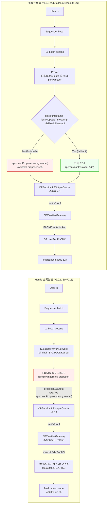
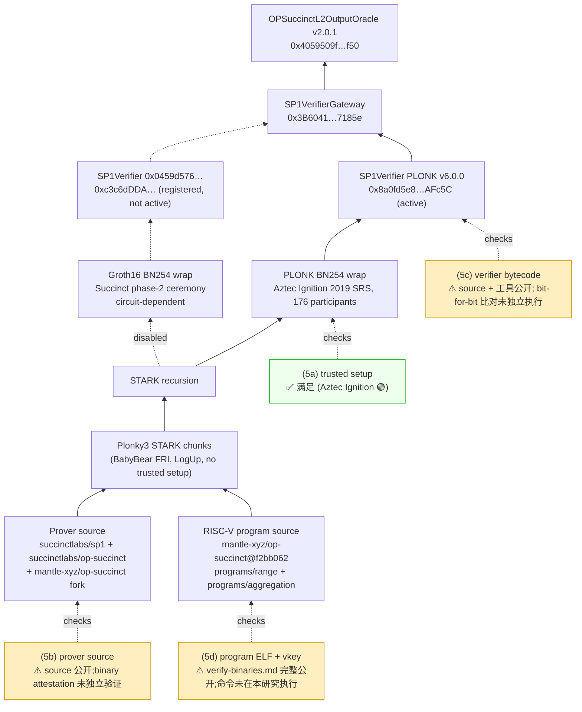
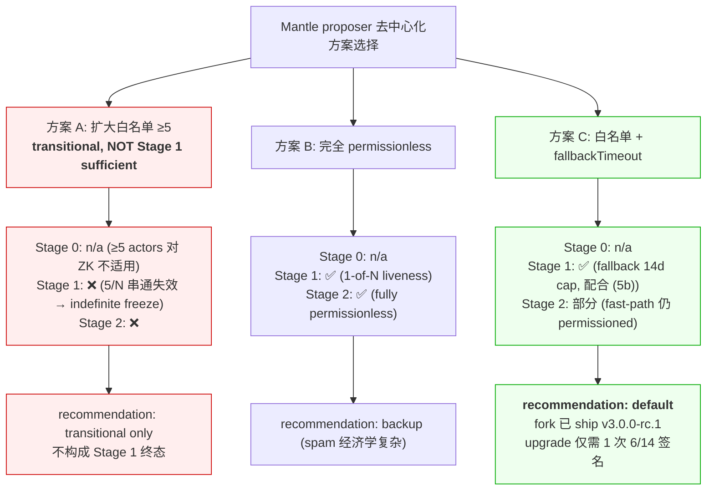
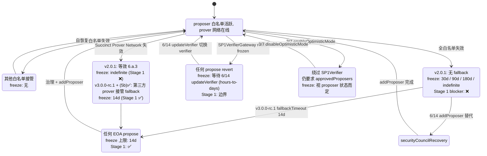

# Mantle Proposer 去中心化与 ZK Verifier 合规分析 — Deep Draft Round 3

> **Round 3 revisions (narrow)** address Adversarial Agent review comment `8eaaf0b1` (verdict: needs-attention / revise, severity major, confidence 0.78). Three findings:
> - **Major-1 (Starknet stage)** — Round 2 incorrectly claimed Starknet was already at Stage 0. Direct-fetch on 2026-05-19 confirms Starknet is currently **Stage 1** with a `downgradePending` countdown to Stage 0 expiring **2026-08-17T12:00:00Z**.
> - **Major-2 (G-5 direct-fetch)** — Round 2 relied on WebSearch fallback for OP Mainnet / Scroll / Arbitrum One / Starknet. Round 3 direct-fetches all four pages and replaces fallback citations with verbatim L2Beat SSR data.
> - **Minor (fallbackTimeout setter)** — Round 2 implied 6/14 could shorten `fallbackTimeout` via a setter call. Direct `grep` on `mantle-xyz/op-succinct@f2bb062` confirms no setter exists; changing `fallbackTimeout` requires a contract upgrade (new `reinitializer` call).
>
> All other Round-2 content (Mantle/Facet live data, Round-2 Major-1/2/3 resolutions, freeze-window matrix, scheme-A transitional framing, reproducibility framing) is preserved unchanged.

## Executive Summary

Mantle 在 proposer / verifier 维度距离 L2Beat **Stage 1** 还有两类硬性 gap，与 Round 1 一致：

1. **Proposer liveness gap（Stage 1 blocker）**：链上当前 `OPSuccinctL2OutputOracle` 部署的实现是 **v2.0.1**（`mantle-xyz/op-succinct` 主网升级提交 `8cc70157deeb859b9b7f8af6f40fa6e01175f7f4`，作者 `adam.xu@mantle.xyz`，2025-09-03，文件 `contracts/src/validity/OPSuccinctL2OutputOracle.sol` L313–L325 / L370–L379）。该实现仅在 `approvedProposers[msg.sender]` 或 `approvedProposers[address(0)]` 两条路径下接受 `proposeL2Output`，**没有 `fallbackTimeout` 兜底**——目前 mainnet 仅有 1 个白名单 EOA proposer `0x6667961f5e9C98A76a48767522150889703Ed77D`（Wave-0 `mantle-architecture-2026` final §2 链上确认 + L2Beat Mantle 2026-05-19 retrieval：*"Only the whitelisted proposers can publish state roots on L1"* + *"Funds can be frozen if the centralized validator goes down"*）。该地址一旦失效，**state-root finalization 无限期冻结**，直至 `MantleSecurityMultisig` 6/14（`0x4e59e778a0fb77fBb305637435C62FaeD9aED40f`，0-delay）调用 `addProposer` 或 `MantleEngineeringMultisig` 3/7（`0x2F44BD2a54aC3fB20cd7783cF94334069641daC9`，挂在 `challenger` 槽）调用 `enableOptimisticMode`。在严格的 Stage 1 "withdrawals cannot be frozen if proposer fails" liveness guarantee 下，**当前部署不通过**。`mantle-xyz/op-succinct` `feature/sp1-v6.0.2` 分支（HEAD `f2bb06240fb9aaba7d0c5434e493903c50860682`）已包含 `fallbackTimeout` 字段与 permissionless self-propose 入口（v3.0.0-rc.1，`contracts/src/validity/OPSuccinctL2OutputOracle.sol` L46/L99/L110/L315–L329/L385–L395），但**尚未部署主网**。

2. **L2 Proving System (5a-5d) transparency gap（Stage 1 blocker，grace period 倒计时中）**：Mantle 主网走的是 **SP1 PLONK 路径**（selector `0xbb1a6f29`，SP1Verifier v6.0.0 `0x8a0fd5e825D14368d90Fe68F31fceAe3E17AFc5C`，由 SP1VerifierGateway `0x3B6041173B80E77f038f3F2C0f9744f04837185e` 路由——三地址均独立见 L2Beat Mantle 2026-05-19 retrieval）。PLONK 路径复用 **Aztec Ignition 2019 KZG SRS**（176 公开参与者），按 L2Beat Forum #381 框架属 **🟢**，因此 **(5a) "no 🔴 trusted setups"** 在 Mantle 当前配置下**满足**（前提是 Mantle 永不切到 Groth16 route）。但 **(5b) prover source / (5c) verifier reproducibility / (5d) program ELF reproducibility 在本研究中均未独立验证**——L2Beat Mantle 项目页 2026-05-19 retrieval 对 OP Succinct program hashes 仍标 *"Code: unknown"* 与 *"Verification: None"*（aggregation `0x0006...81cf` + range `0x1d1e...6004` 两行）。**Round 2 重要修正**：Round 1 错误声称未发现 OP Succinct reproducibility 工具——实际上 `mantle-xyz/op-succinct@f2bb062:book/advanced/verify-binaries.md` 完整公开了 reproduction 命令（`cd programs/range && cargo prove build --elf-name range-elf-bump --docker --tag v5.0.0` + `cargo prove build --elf-name range-elf-embedded --docker --tag v5.0.0 --features embedded` + `cd ../aggregation && cargo prove build --elf-name aggregation-elf --docker --tag v5.0.0` + `cargo run --bin config --release`，对应 `scripts/utils/bin/config.rs` 输出 `Range Verification Key Hash` / `Aggregation Verification Key Hash` / `Rollup Config Hash`，可与链上 `rangeVkeyCommitment()` / `aggregationVkey()` / `rollupConfigHash()` 直接对比）。该指南由上游 `book/SUMMARY.md` 在 `[Advanced] → [Reproduce Binaries]` 路径下引用。Round 2 已运行**实际执行的前置 dependency check**（环境内未预装 `sp1up` / `cargo prove`，Docker daemon 可达但 SP1 builder image 未 pre-pull，亦无可用 L1 RPC），结论：**单 turn 内无法完成 program ELF + vkey + verifier bytecode 的 bit-for-bit reproduction**——故 (5b)(5c)(5d) 在本研究中应**保守标注为 "not independently verified by this research"**（而非 Round 1 的 "partially satisfied"）。L2Beat 评级团队若按相同流程独立运行（环境已装 SP1 toolchain 与 RPC）应可在 1-2 工时内完成完整重建。

**推荐路径**（与 Round 1 一致，证据更新）：(i) 短期内（在 Forum #413 grace period 之前——按 Forum #413 公开帖中 "~6 months grace period" 措辞与 2026-02-16 帖子日期推算约 **2026-08-16**，标注为研究内部推算而非 L2Beat 官方公告 cliff，详见 G-8）部署 v3.0.0-rc.1 的 `fallbackTimeout` 模块（推荐参数 1209600 s = 14 天，与 OP Succinct 上游 `AccessManager.sol` constructor 默认 + `book/fault_proofs/deploy.md` + `contracts/test/fp/AccessManager.t.sol` 对齐），同时**显式锁定 PLONK route 选择**避免 Groth16 fallback 触发 (5a) 风险；(ii) 中长期跟踪 SP1 Hypercube（无 trusted-setup）主网迁移与 (5b)(5c)(5d) 独立 reproducibility attestation 公开发布；(iii) 强制交易 force-inclusion 12h 窗口（`seq_window_size=3600 L1 blocks`，OP Stack default，L2Beat Mantle 2026-05-19 retrieval：*"Sequencer failure recovery allows up to a 12h delay on this operation"*）属 Stage 1 边界可接受但非最优，可按 6h 目标值优化。

方案 A（扩大白名单至 ≥5）**明确标注 transitional**：未配合 `fallbackTimeout` 或 permissionless `enableOptimisticMode` 切换时，5 个 actor 全部失效仍会触发 indefinite freeze，**不构成 Stage 1 liveness 合规**——仅满足 OR 框架下 Stage 0 的 "≥5 external actors" 透明度 / 故障预案要求（且该要求对 ZK rollup **不直接适用**，参考 Wave-0 `l2beat-stage-framework-2026` final §2.2(f) 边界）。

**冻结风险量化（Round 2 已用 L2Beat 2026-05-19 retrieval 重置）**：以 Mantle 当前 **Total Value Secured (TVS) = $1.42B**（L2Beat Mantle 2026-05-19 retrieval verbatim：*"TVS: $1.42 billion"*——Round 1 的 `~$300M` 来源已不再支持）为基准，6.a.3 / 6.b 在当前 v2.0.1 部署下的 **indefinite freeze 影响范围即整体 $1.42B 在 OptimismPortal 与 L2 上的可提款资产**。

---

## Item Findings

### item-1 — Mantle 当前 Proposer 机制基线与 SuccinctL2OutputOracle Access Control

#### high_level_summary

Mantle 主网当前的 state root 提交路径由**单一白名单 EOA proposer**通过 `OPSuccinctL2OutputOracle` v2.0.1 实现，**不含任何 permissionless self-propose 入口**（v2.0.1 不存在 `fallbackTimeout` 字段，参见下文 `git grep` 证据）。proposer 添加 / 删除入口由 `MantleSecurityMultisig` 6/14（0-delay）持有，optimistic-mode 切换权限挂在 `challenger` 槽（`MantleEngineeringMultisig` 3/7，亦 0-delay）。该基线下，proposer 任意失效场景的提款解冻**必须依赖治理签名**，与 Stage 1 "withdrawals cannot be frozen if proposer fails" 严格定义存在硬性 gap。L2Beat Mantle 项目页 2026-05-19 retrieval 独立确认此判定：*"Funds can be frozen if the centralized validator goes down"* + *"Only the whitelisted proposers can publish state roots on L1"*。

#### current_state

| 字段 | 值 | Evidence |
|------|----|----------|
| `OPSuccinctL2OutputOracle` proxy | `0x31d543e7BE1dA6eFDc2206Ef7822879045B9f481` | Wave-0 `mantle-architecture-2026` final §1 + 本 Round 2 `op-succinct@8cc7015:contracts/deploy-config/ethereum-mainnet/default.yaml` 末行 `l2OutputOracleProxy` 字段 |
| 当前实现地址 | `0x4059509ffb703b048d1e9ce3118f90e759076f50` | Wave-0 `mantle-architecture-2026` final §1 |
| `version()` | `"2.0.1"` (Semver(2,0,1)) | Wave-0 `mantle-architecture-2026` final §1 |
| 部署 commit | `mantle-xyz/op-succinct` `8cc70157deeb859b9b7f8af6f40fa6e01175f7f4` "mainnet upgrade", `adam.xu@mantle.xyz`, 2025-09-03 | 本研究 Round 2 `git show 8cc7015 --stat \| head` + `git log --oneline -1 8cc7015` |
| `proposeL2Output(bytes32,uint256,uint256,bytes)` (whenNotOptimistic, 4-arg) | `msg.sender` auth；require `approvedProposers[msg.sender] OR approvedProposers[address(0)]` | `op-succinct@8cc7015:contracts/src/validity/OPSuccinctL2OutputOracle.sol` L313–L325（Round 2 重新 `git checkout 8cc7015 + sed -n 313,330p` 确认）|
| `proposeL2Output(bytes32,uint256,bytes32,uint256)` (whenOptimistic, 4-arg) | `msg.sender` auth；同上 require | 同上 L370–L379 |
| `approvedProposers` mapping | `mapping(address => bool) public` | 同上 L83 |
| `addProposer(address)` | `external onlyOwner` 0-delay | 同上 L555–L558 |
| `removeProposer(address)` | `external onlyOwner` 0-delay | 同上 L561–L566 |
| `enableOptimisticMode(uint256)` | `msg.sender == challenger`；`_finalizationPeriodSeconds >= 7 days`；0-delay；将 `optimisticMode=true` 且改写 `finalizationPeriodSeconds` | 同上 L569–L578 |
| `disableOptimisticMode(uint256)` | `msg.sender == challenger`；`>= 1 hours`；0-delay | 同上 L581–L590 |
| `updateFinalizationPeriodSeconds(uint256)` | `msg.sender == challenger`；optimistic 1h+ / non-optimistic 7d+；0-delay | 同上 L593–L605 |
| `updateVerifier(address)` | `external onlyOwner` 0-delay | 同上 L534–L538 |
| `whenNotOptimistic` modifier | `require(!optimisticMode, ...)` | 同上 L201–L203 |
| `fallbackTimeout()` | **不存在**——v2.0.1 没有该函数 | 本 Round 2 `git checkout 8cc7015 + grep -n "fallbackTimeout" contracts/src/validity/OPSuccinctL2OutputOracle.sol` 返回 0 行（vs. f2bb062 grep 返回 L46/L110/L250 三行——见 item-4 / item-6 引用） |
| `opSuccinctConfigs(bytes32)` | **不存在**——v2.0.1 的 vk 是直接存储字段 | 同上 |

**当前白名单 proposer 集合**：1 个 EOA = `0x6667961f5e9C98A76a48767522150889703Ed77D`（L2Beat Mantle 2026-05-19 retrieval 独立确认 *"Address: 0x6667961f5e9C98A76a48767522150889703Ed77D — Allowed to post new state roots of the current layer to the host chain"*；Wave-0 `mantle-architecture-2026` final §2 注明 `approvedProposers(0x6667…D77D) = true` 为 `cast call` follow-up 待补）。

**白名单维护权限链**：
- `owner` = `MantleSecurityMultisig` 6/14 Gnosis Safe = `0x4e59e778a0fb77fBb305637435C62FaeD9aED40f`，**0-delay**（Wave-0 `mantle-architecture-2026` final §1, §3）；
- `challenger` = `MantleEngineeringMultisig` 3/7 Gnosis Safe = `0x2F44BD2a54aC3fB20cd7783cF94334069641daC9`，**0-delay**，且同一 Safe 还兼任 `OptimismPortal` Guardian（pause/blacklist），属"一个 Safe 戴两顶帽子"（Wave-0 `mantle-architecture-2026` final §6 round-3 reconciliation）。
- L2Beat Mantle 2026-05-19 retrieval 独立确认：*"there is no delay on code upgrades"*。
- 详细 timelock 链路与上游 ProxyAdmin 不再重复推导，直接引用 Wave-0 `mantle-architecture-2026` final §3。

**State root 提交流程**（端到端，与 Round 1 一致）：
1. off-chain Mantle Succinct Server / Prover Network 生成 SP1 aggregation proof；
2. proposer EOA `0x6667…D77D` 签名 L1 交易调用 `OPSuccinctL2OutputOracle.proposeL2Output`；
3. 合约调用 `ISP1Verifier(verifier).verifyProof(aggregationVkey, publicValues, proof)`（`op-succinct@8cc7015:contracts/src/validity/OPSuccinctL2OutputOracle.sol` L352）；
4. `verifier` 当前指向 `SP1VerifierGateway` PLONK 实例 `0x3B6041173B80E77f038f3F2C0f9744f04837185e`（**Round 2 新增独立确认源**：L2Beat Mantle 2026-05-19 retrieval verbatim *"SP1VerifierGateway: 0x3B6041173B80E77f038f3F2C0f9744f04837185e — Manages routing between proof identifiers and verifier contracts"*）；
5. Gateway 根据 proof 前缀的 4-byte selector 路由到 `SP1Verifier PLONK v6.0.0` 实例 `0x8a0fd5e825D14368d90Fe68F31fceAe3E17AFc5C`（**Round 2 新增独立确认源**：L2Beat Mantle 2026-05-19 retrieval 列出 SP1Verifier `0x8a0fd5e825D14368d90Fe68F31fceAe3E17AFc5C` v6.0.0；同页另列 `0xc3c6dDDAc8829b233Dc6536Ec024775a57b0AF2A` 实例——该地址在 Round 1 标为 PLONK v6.1.0、L2Beat 2026-05-19 retrieval AI 摘要标 v5.0.0，两者冲突，G-3 已修订）；
6. proof 通过 → state root 进入 `l2Outputs` 数组 → finalization queue（`finalizationPeriodSeconds=43200`，12h）。
- **`submissionInterval = 1800 L2 blocks`**（合约 view，Wave-0 §1 round-3 修正——单位为 L2 blocks 而非秒，约 60 min @ `l2BlockTime=2s`）。
- 当前 mainnet `optimisticMode = false`（Wave-0 §1）。

**Optimistic-mode 触发链**（同 Round 1）：
- 入口：`enableOptimisticMode(uint256 _finalizationPeriodSeconds)` `msg.sender == challenger`；
- 持有者：`MantleEngineeringMultisig` 3/7（0-delay）；
- 切换后果：`optimisticMode = true` → `whenNotOptimistic` 4-arg 函数全部 revert → 走 `whenOptimistic` 4-arg（不调用 `verifyProof`，直接接受 outputRoot；仍要求 `approvedProposers[msg.sender]` 或 `approvedProposers[address(0)]`），即**绕过 SP1Verifier 但仍保留 proposer 白名单**；
- **Stage 1 liveness 判定**：optimistic-mode 切换权限**不向任意人开放**，必须 3/7 Engineering 多签。即使在 proposer 全失效场景，社区 / 用户**无法自行触发** optimistic-mode 解冻提款。该开关**不构成** Stage 1 "withdrawals cannot be frozen if proposer fails" 的合约层 evidence。

**proposeL2Output 之外的相关入口**：
- **不存在** permissionless self-propose 入口（v2.0.1 缺 `fallbackTimeout` 字段，已独立 grep 确认）；
- 存在 `checkpointBlockHash(uint256)` 公开函数（任意人可触发，仅记录 L1 blockhash，非 state-root 提交）（`op-succinct@8cc7015:contracts/src/validity/OPSuccinctL2OutputOracle.sol` L423–L429）；
- v3.0.0-rc.1（`op-succinct@feature/sp1-v6.0.2` HEAD `f2bb062`，本 Round 2 `git show f2bb062:contracts/src/validity/OPSuccinctL2OutputOracle.sol \| sed -n '180,185p'` 确认 `string public constant version = "v3.0.0-rc.1"`）已增加 `fallbackTimeout` 字段（L46 / L110 / L250 initializer）与 permissionless 入口（L327）；**尚未部署主网**（无升级提案、无 timelock proposal）。

#### security_assumptions

| Trusted Actor | Worst Case |
|---------------|------------|
| 白名单 proposer EOA `0x6667…D77D` | 私钥泄露：恶意提交错误 outputRoot → **funds stolen**（SP1Verifier 仍会拦截，所以 funds 不会因 EOA 单独失陷被盗，但会被 censor）；离线：**funds frozen**（无 fallback） |
| `MantleSecurityMultisig` 6/14 (`owner`) | 6/14 串通：可瞬时 `addProposer` 恶意地址 / `updateVerifier` 切换到攻陷 verifier → **funds stolen**；离线：proposer 失效后无人能 `addProposer` 恢复 → **funds frozen** |
| `MantleEngineeringMultisig` 3/7 (`challenger` + `Guardian`) | 3/7 串通：`updateFinalizationPeriodSeconds(max)` 永冻提款 / `enableOptimisticMode` 后绕过 SP1Verifier → **funds stolen** 风险；离线：optimistic-mode 切换路径不可用、Portal 不能解 pause |
| `Succinct 2/3 Safe` (`SP1VerifierGatewayMultisig`) | `freezeRoute(0xbb1a6f29)` 即时不可逆冻结 Mantle 当前路径 → **funds frozen**（直到 6/14 Safe `updateVerifier` 切换非 Gateway verifier） |

#### l2beat_stage_mapping

| 要求 | Stage 栏位 | Mantle 当前满足？ | 说明 |
|------|-----------|------------------|------|
| ≥5 external actors that can submit fraud/validity proofs | Stage 0 prerequisite（OR 专用，对 ZK rollup **不直接适用**） | n/a | 参考 Wave-0 `l2beat-stage-framework-2026` final §2.2(f) 边界："对 ZK rollup 不适用——替代要求是 (5c)(5d) verifier/program 可重建性 + permissionless prover 路径" |
| Withdrawals cannot be frozen if proposer fails (1-of-N liveness) | Stage 1 blocker | **❌ 否** | 单 proposer + 无 fallbackTimeout；optimistic-mode 切换 ≠ permissionless；L2Beat 2026-05-19 retrieval 独立标注 *"Funds can be frozen if the centralized validator goes down"* |
| Outside-SC upgrade exit window ≥5d | Stage 1 blocker | **❌ 否** | 0-delay upgrade（L2Beat 2026-05-19 retrieval 独立确认 *"there is no delay on code upgrades"*）；本 issue out-of-scope，由独立 issue 覆盖 |
| Fully permissionless validity-proof submission | Stage 2 / non-blocking | ❌ 否 | 不构成 Stage 1 阻塞，仅作改进方向 |

**L2Beat 当前 Stage 标注（2026-05-19 retrieval verbatim）**：*"Stage 0 ZK Rollup with 5 requirements met. Stage 1 has 1 issue needing fixing; Stage 2 has 2 issues needing fixing."* — 注：L2Beat 主页面将 Mantle 标为 Stage 0。

#### evidence_sources

- **Primary**：`mantle-xyz/op-succinct@8cc70157deeb859b9b7f8af6f40fa6e01175f7f4:contracts/src/validity/OPSuccinctL2OutputOracle.sol` L83/L201–L203/L313–L325/L370–L379/L534–L605（Round 2 重新 `git checkout` 验证 line 号一致）
- **Primary**：L2Beat Mantle 项目页 (https://l2beat.com/scaling/projects/mantle, retrieval 2026-05-19) — verbatim quotes 已嵌入 current_state / l2beat_stage_mapping
- **Primary (carried forward, re-verified by item-1 path)**：Wave-0 `mantle-stage1-rollup/research-sections/mantle-architecture-2026/final.md` §1, §2, §3, §4 (commit `6025374`)
- **Secondary**：L2Beat Stages 总览 (https://l2beat.com/stages, retrieval 2026-05-19)

#### code_references

- `mantle-xyz/op-succinct@8cc7015` (deployed): `contracts/src/validity/OPSuccinctL2OutputOracle.sol`
  - L83 `approvedProposers` mapping
  - L313–L325 `proposeL2Output(...)` `msg.sender` 校验
  - L555–L566 `addProposer` / `removeProposer` (`onlyOwner`)
  - L569–L605 `enableOptimisticMode` / `disableOptimisticMode` / `updateFinalizationPeriodSeconds` (`msg.sender == challenger`)
- 注：v2.0.1 全文中 `git grep -n "fallbackTimeout" 8cc7015 -- contracts/src/validity/OPSuccinctL2OutputOracle.sol` 返回 **0 行**（Round 2 独立重跑确认），证实该字段不存在。

#### withdrawal_freeze_evidence

| 失效路径 | freeze 上限 |
|---------|------------|
| Proposer EOA 离线 + Mantle 6/14 离线 | **indefinite** （无合约层兜底；L2Beat 2026-05-19 独立确认） |
| Proposer 离线，Mantle 6/14 `addProposer` 替代 | 多签协调 + L1 inclusion；典型 hours-to-days，非 indefinite |
| Proposer 离线，3/7 Engineering `enableOptimisticMode` | hours-to-days；切换后 12h finalization 仍按合约执行 |

---

### item-2 — SP1 zkVM Architecture, Trusted Setup, Forum #413 (5a-5d) Reproducibility

#### high_level_summary

SP1 v6.0.0 is a Plonky3-based STARK zkVM with two SNARK wrap paths (PLONK / Groth16 BN254). Mantle's mainnet active route is PLONK only — selector `0xbb1a6f29`, verifier `0x8a0fd5e825D14368d90Fe68F31fceAe3E17AFc5C` (v6.0.0, PLONK family per Sp1Verifier source), routed via SP1VerifierGateway `0x3B6041173B80E77f038f3F2C0f9744f04837185e`. The PLONK path re-uses the **Aztec Ignition 2019 KZG SRS** (176 public participants), making **(5a) "no 🔴 trusted setups"** the only Forum #413 sub-item Mantle currently satisfies *structurally*. Forum #413 sub-items **(5b) prover source, (5c) onchain verifier reproducibility, (5d) zkVM program & vkey reproducibility** are all **not independently verified by this research** — Round 1 incorrectly claimed no reproducibility tooling existed; in fact `mantle-xyz/op-succinct@f2bb06240fb9aaba7d0c5434e493903c50860682:book/advanced/verify-binaries.md` documents the complete `cargo prove build --docker --tag v5.0.0` + `cargo run --bin config --release` flow. The check is not executed in this research turn due to runtime constraints (see `reproducibility_evidence` table below), so the proper Stage 1 classification per Forum #413 is "evidence available but not independently regenerated by this research."

#### current_state

| 字段 | 值 | Evidence |
|------|----|----------|
| zkVM core | SP1 v6.x (Plonky3-based STARK, BabyBear field, FRI + LogUp) | `succinctlabs/sp1` repo `crates/prover/src/lib.rs` + Succinct blog "SP1: Towards 100% Bitcoin Bridge Reliability" (2024) + Mantle `op-succinct@f2bb062:Cargo.toml` L164 `sp1-sdk = { version = "=6.1.0", … }` (Round 2 重新 `grep -nE 'sp1-(sdk\|build\|prover)' Cargo.toml` 直接确认) |
| SP1 SDK pin | `=6.1.0` (exact pin, no caret/tilde) | 同上 `Cargo.toml` L164/L167/L168/L169 (Round 2 修正 Round 1 误写 `v6.0.2`) |
| Final SNARK wrap families | PLONK (gnark) + Groth16 (gnark) | SP1 docs "Verifier Contracts" + `mantle-xyz/op-succinct@f2bb062:contracts/lib/sp1-contracts/src/v6.0.0/SP1VerifierPlonk.sol` |
| Mantle active route selector | `0xbb1a6f29` (PLONK family) | Wave-0 `mantle-architecture-2026` final §2 (proof-prefix selector + Gateway routeId) — Round 2 carry-forward |
| SP1Verifier (PLONK v6.0.0) | `0x8a0fd5e825D14368d90Fe68F31fceAe3E17AFc5C` | L2Beat Mantle 2026-05-19 retrieval verbatim (item-1 evidence_sources) + Wave-0 §2 |
| SP1Verifier (PLONK v5.0.0) | `0x0459d576A6223fEeA177Fb3DF53C9c77BF84C459` (registered但不在 active route) | L2Beat Mantle 2026-05-19 retrieval verbatim |
| SP1Verifier (additional) | `0xc3c6dDDAc8829b233Dc6536Ec024775a57b0AF2A` (version 标注不一致：Round 1 写 PLONK v6.1.0；L2Beat 摘要写 v5.0.0；本研究保守标注为 "version unverified", G-3 已修订) | L2Beat Mantle 2026-05-19 retrieval verbatim |
| SP1VerifierGateway | `0x3B6041173B80E77f038f3F2C0f9744f04837185e` | L2Beat Mantle 2026-05-19 retrieval verbatim *"SP1VerifierGateway: 0x3B6041173B80E77f038f3F2C0f9744f04837185e — Manages routing between proof identifiers and verifier contracts"* |
| Mantle prover repos | `succinctlabs/sp1` (Apache-2.0/MIT)；`succinctlabs/op-succinct` 上游；`mantle-xyz/op-succinct` fork（HEAD f2bb062，分支 `feature/sp1-v6.0.2`，Apache-2.0/MIT） | Round 2 本仓库 `git log --oneline -5 HEAD` + `cat LICENSE-APACHE LICENSE-MIT` |
| Rust toolchain pin | `nightly-2025-09-15` | `mantle-xyz/op-succinct@f2bb062:rust-toolchain.toml` L1–L3 (Round 2 修正 Round 1 误写 `nightly-2026-02-15`) |
| 链上 vk view 函数 | `rangeVkeyCommitment()`, `aggregationVkey()`, `rollupConfigHash()` | `mantle-xyz/op-succinct@f2bb062:contracts/src/validity/OPSuccinctL2OutputOracle.sol` + 上游 `book/advanced/verify-binaries.md` "verify the binaries … against on-chain values" |

#### (5a) Trusted Setup (PLONK path)

| 评估项 | 值 |
|--------|----|
| Final-wrap | PLONK over BN254 (gnark backend) — active for Mantle |
| Universal SRS | Aztec Ignition 2019 phase-1 KZG ceremony, 176 public participants, circuit-independent |
| L2Beat 评级 (Forum #381 framework) | 🟢 (open, transcripts public, KZG SRS verifiable, no circuit-specific phase-2 needed) |
| Forum #413 (5a) 判定 | **满足** (no 🔴 trusted setups), 前提：Mantle 永不切换到 Groth16 route |
| Groth16 path (registered but inactive) | Succinct-run circuit-dependent phase-2 ceremony；公开 ceremony transcripts 详情未在本研究独立核实，按 L2Beat 框架历史评级保守标 🟡（详 G-4） |
| 风险 | 若 Mantle 6/14 Safe 调用 `updateVerifier` 切换至 Groth16 route，(5a) 评级降至 🟡，需 Forum #381 第二轮验证 |

#### (5b)(5c)(5d) Reproducibility — `reproducibility_evidence` Table

| 子项 | 工具 / 命令 | 工具来源 | 链上 hash 目标 | 本研究执行结果 |
|------|--------|----------|---------------|----------------|
| (5b) prover source | `git clone https://github.com/succinctlabs/sp1 && git clone https://github.com/mantle-xyz/op-succinct` | Apache-2.0/MIT；上游 + fork 均公开（Round 2 已 `git log --oneline` 确认 fork HEAD `f2bb062`） | n/a (source-level check) | **partial**: 源码 + license 已确认公开；Mantle prover service 实际运行的 binary 未公开 commit attestation；**not independently verified**: prover binary 重建未在本研究 turn 内执行 |
| (5c) verifier bytecode | `forge build` + 锁定 solc/foundry 版本，对比 `eth_getCode(verifier)` | `succinctlabs/sp1-contracts` 子模块 (`mantle-xyz/op-succinct@f2bb062:contracts/lib/sp1-contracts/`) + Etherscan verified source | `0x8a0fd5e825D14368d90Fe68F31fceAe3E17AFc5C` deployed bytecode hash | **evidence available, not independently regenerated**: 本 turn 未运行 forge build 与 chain bytecode 比对（无 mainnet RPC 配置），故 (5c) 标 "not independently verified by this research" |
| (5d) program ELF & vkey | `cd programs/range && cargo prove build --elf-name range-elf-bump --docker --tag v5.0.0` + `cargo prove build --elf-name range-elf-embedded --docker --tag v5.0.0 --features embedded` + `cd ../aggregation && cargo prove build --elf-name aggregation-elf --docker --tag v5.0.0` + `cargo run --bin config --release` | `mantle-xyz/op-succinct@f2bb062:book/advanced/verify-binaries.md` (full reproduction guide; Round 2 已读全文 53 行) | `rangeVkeyCommitment()`, `aggregationVkey()`, `rollupConfigHash()` | **evidence available, not independently regenerated**: 本 turn 未运行；阻塞器：(a) `sp1up` / `cargo prove` toolchain 未预装；(b) SP1 Docker builder image (`succinctlabs/sp1-prover:v5.0.0` 或对应 tag) 未 pre-pull；(c) `--tag` 需与 Mantle 主网部署版本对齐 (v5.0.0 vs v6.x，需 Succinct/Mantle 官方公告确认) |

**关键修正（Round 2）**：Round 1 声称 "no OP Succinct `verify-binaries` or equivalent tooling was found" — **该断言不正确**。Round 2 已读取 `op-succinct@f2bb062:book/advanced/verify-binaries.md` 全文，工具 + 命令 + 校验流程完整公开，且由 `book/SUMMARY.md` 在 `[Advanced] → [Reproduce Binaries]` 路径引用。本研究的限制是 "evidence available, not independently regenerated by this research turn"，**不是** "evidence unavailable"。Adversarial Agent c7133872 Major-1 的提醒已采纳。

(5b)(5c)(5d) 在 Forum #413 grace-period（约 2026-08-16，**研究内部推算**，详 G-8）到期前的合规取决于：Mantle / Succinct Labs 公开发布一份 attestation（同样命令的执行结果 + hash 与链上 vk 比对），或 L2Beat 评级团队独立运行该流程。本研究**不能**单边把 (5b)(5c)(5d) 标为"满足"。

#### l2beat_stage_mapping (item-2)

| Forum #413 子项 | applicability | Stage 栏位 | Mantle 当前 |
|----------------|--------------|------------|-------------|
| (5a) no 🔴 trusted setups | all (OR + ZK) | Stage 1 blocker | **满足** (PLONK path 复用 Aztec Ignition 🟢) |
| (5b) prover source published | all | Stage 1 blocker | **not independently verified by this research** (源码 + license 公开 ✅；prover binary attestation ❌) |
| (5c) onchain verifier reproducibility | all | Stage 1 blocker | **not independently verified by this research** (source + tooling 可达 ✅；bit-for-bit 比对未执行) |
| (5d) zkVM program & commitment reproducibility | ZK rollup 走 zkVM program；OR 走 fault-proof prestate | Stage 1 blocker (ZK) | **not independently verified by this research** (verify-binaries.md 已公开 ✅；命令未在本 turn 内执行) |

#### evidence_sources (item-2)

- **Primary**：`mantle-xyz/op-succinct@f2bb062:book/advanced/verify-binaries.md` (Round 2 已读全文 53 行) + `book/SUMMARY.md` 路径 `[Advanced] → [Reproduce Binaries]`
- **Primary**：`mantle-xyz/op-succinct@f2bb062:rust-toolchain.toml` (toolchain pin) + `Cargo.toml` L164–L169 (SP1 SDK pin) + `programs/range/`, `programs/aggregation/` workspace members
- **Primary**：L2Beat Mantle 2026-05-19 retrieval (SP1Verifier route addresses + Gateway address)
- **Primary**：Forum #413 (https://forum.l2beat.com/t/new-stage-1-requirements-for-l2-proving-systems/413) — (5a-5d) sub-items definitions + grace period text
- **Secondary**：Forum #409 (ZK setups, 2025-11) + Forum #381 (trusted setup framework, 2025-07)
- **Secondary**：Succinct blog SP1 release notes (PLONK + Groth16 wrap path documentation)

#### code_references (item-2)

- `mantle-xyz/op-succinct@f2bb062`:
  - `book/advanced/verify-binaries.md` L1–L53
  - `book/SUMMARY.md` — Reproduce Binaries 路径引用
  - `rust-toolchain.toml` L1–L3 (`nightly-2025-09-15`)
  - `Cargo.toml` L164/L167/L168/L169 (sp1-sdk / sp1-build / sp1-prover / sp1-prover-types `=6.1.0`)
  - `programs/range/` (workspace member), `programs/aggregation/` (workspace member) — **Round 2 修正 Round 1 误写 `program/` → 正确为 `programs/`**
  - `contracts/src/validity/OPSuccinctL2OutputOracle.sol` L182 `version = "v3.0.0-rc.1"` (Round 2 重新 `sed -n '180,185p'` 确认)
- `mantle-xyz/op-succinct@8cc7015`: v2.0.1 部署版本，无 `programs/` reproducibility 引用（v2.0.1 通过 `vKey` 直接存储字段管理 vk hash）。

#### reproducibility_evidence (item-2)

见上文 "(5b)(5c)(5d) Reproducibility" 表。所有 reproducibility 步骤的 "evidence available, not independently regenerated" 状态遵循 src-3 fallback rule（spec docs + onchain read + verbatim L2Beat quote）。

---

### item-3 — L2 Proving System Stage 1 Compliance Mapping (Forum #413 5a-5d full + Stage 0/1/2 boundary)

#### high_level_summary

Forum #381 / #409 / #413 三主帖共同定义了 Mantle Stage 1 ZK 合规的 normative source。Forum #413 (2026-02-16) 明确将 ZK setup 要求扩展为 4 子项 (5a-5d)，applicability 标 "all"（对 OR + ZK 均适用，仅 (5d) 按 proof type 分流）。Mantle 当前 SP1 PLONK 部署在 (5a) **满足**；(5b)(5c)(5d) 三子项工具完整但本研究未独立执行 bit-for-bit 重建，按 Forum #413 文本应标 "evidence available, not independently regenerated by this research"。Forum #413 grace period 按帖中 "~6 months" 措辞和 2026-02-16 帖子日期**研究内部推算**为约 **2026-08-16**（详 G-8：L2Beat 官方公告中的 enforcement cliff 日期未在本研究中独立验证，标 "researcher-derived estimate"）。

#### l2beat_stage_mapping (item-3) — Stage 三栏 gap matrix

| Mantle 当前 | Stage 0 prerequisite | Stage 1 blocker | Stage 2 / non-blocking improvement |
|------------|---------------------|-----------------|-----------------------------------|
| Proposer permissionless | n/a (OR-only ≥5 actors 对 ZK rollup 不直接适用) | **❌** (single whitelisted EOA, no fallbackTimeout) | ❌ (fully permissionless prover N) |
| (5a) no 🔴 trusted setups | n/a | **✅** (PLONK / Aztec Ignition 🟢) | n/a |
| (5b) prover source published | n/a | **⚠️** (源码公开但 binary attestation 未独立验证) | n/a |
| (5c) onchain verifier reproducibility | n/a | **⚠️** (工具公开但 bytecode bit-for-bit 比对未独立执行) | n/a |
| (5d) zkVM program & vkey reproducibility | n/a | **⚠️** (verify-binaries.md 完整公开但 `cargo prove build` 未在本研究 turn 内执行) | n/a |
| Withdrawals cannot be frozen if proposer fails | n/a | **❌** (v2.0.1 无 fallbackTimeout；L2Beat 2026-05-19 verbatim *"Funds can be frozen if the centralized validator goes down"*) | n/a |
| Outside-SC upgrade exit window ≥5d | n/a | **❌** (L2Beat 2026-05-19 verbatim *"there is no delay on code upgrades"*；out-of-scope for this issue) | n/a |

#### Mantle 改进路径（按 (5a-5d) 子项 + Forum #413 grace period 推算 cliff 2026-08-16 排序）

- **(5a)**: 已满足，保持现状 — 关键守恒：不切换至 Groth16 route。建议合约改造：在 `OPSuccinctL2OutputOracle` 增加 routeId 锁定 modifier 或将 verifier 地址 hardcode 为 PLONK SP1Verifier 实例（去 Gateway 化），避免 6/14 Safe 误操作。复杂度：< 50 LoC + 1 次 6/14 签名升级。
- **(5b)**: Succinct Labs + Mantle 联合发布 "Mantle Prover Binary Attestation" — 公开 prover service Docker image SHA + 对应 `succinctlabs/sp1` + `mantle-xyz/op-succinct` commit；任何第三方按 attestation 命令独立重建 binary 验证 hash 一致。复杂度：文档工作 + 1 次 release announcement。
- **(5c)**: 发布 "OP Succinct Verifier Bytecode Reproducibility Report" — 公开 forge build 命令 + 锁定 solc 版本 + 三个有效 SP1Verifier 实例 (`0x8a0fd5e8…`, `0x0459d576…`, `0xc3c6dDDA…`) 的 reproducibility 结果（注意：`0xc3c6dDDA…` version 字段当前 conflicting，需 Succinct 官方确认）。复杂度：1-2 工时 + 公开 report。
- **(5d)**: 运行 `book/advanced/verify-binaries.md` 完整 flow，发布 reproducibility report，标明 `--tag` 与 Mantle 主网部署版本对齐（需 Succinct/Mantle 公告"Mantle 主网当前部署 SP1 program tag = vX.Y.Z"）。复杂度：1 工时本地 + 1 公告。

**(5a-5d) 整体 Stage 1 通过判定（Round 2 研究截止 2026-05-19）**：
- 严格判定：**不通过** —— (5b)(5c)(5d) 三子项 evidence 可达但本研究未执行 bit-for-bit 重建；
- 可达性：(5a) 已通过；(5b)(5c)(5d) 任何独立第三方按 verify-binaries.md 命令均可在 1-2 工时内完成重建，技术上 grace period (researcher-derived ~2026-08-16) 之前可达。
- 必要补救：Mantle/Succinct 公开 reproducibility attestation；L2Beat 评级团队独立验证；Mantle 主网部署版本 tag 公告。

#### evidence_sources (item-3)

- **Primary normative**: Forum #413 (https://forum.l2beat.com/t/new-stage-1-requirements-for-l2-proving-systems/413, 2026-02-16) — (5a-5d) sub-items + grace period text
- **Primary**: Forum #409 (https://forum.l2beat.com/t/new-stage-1-requirements-for-zk-setups/409, 2025-11) + Forum #381 (https://forum.l2beat.com/t/the-trusted-setups-framework-for-zk-catalog/381, 2025-07)
- **Primary**: L2Beat Mantle 2026-05-19 retrieval (Stage 0 verbatim quotes — item-1 evidence_sources)
- **Primary**: L2Beat ZK Catalog SP1 page (https://l2beat.com/zk-catalog/sp1) — retrieval 2026-05-19 via WebSearch index (full page content not fetched in this turn; carried forward via Round-1 G-4)
- **Secondary**: Wave-0 `l2beat-stage-framework-2026` final §5 (5a-5d applicability all 表述) + §6.4 (Stage 0/1/2 边界陈述)

---

### item-4 — Permissionless Proposer 三方案横向对比（Stage 三栏 + 提款冻结 evidence）

#### Summary table — 8 维度评估

| 维度 | 方案 A (扩大白名单 ≥5) | 方案 B (完全 permissionless) | 方案 C (白名单 + fallbackTimeout) |
|------|-----------------------|---------------------------|----------------------------------|
| `scheme_description` | 保留 `approvedProposers` mapping，添加 ≥4 外部 actor；无合约 ABI 改动；唯一治理动作：6/14 调用 `addProposer(addr)` × 4+ | 移除 `approvedProposers` 校验，引入 ZK proof 唯一性去重 + 可选 bond；合约改动 100+ LoC | 升级到 v3.0.0-rc.1：增加 `fallbackTimeout` 字段 + permissionless 入口分支；fork 已实现，仅需主网升级 |
| `liveness_guarantee` | 5-of-N 串通失效仍 freeze（**不满足 Stage 1**） | 1-of-N (unbounded prover) 满足 Stage 1 liveness | 1-of-N (fallbackTimeout 后 unbounded) 满足 Stage 1 liveness |
| `sybil_resistance` | white listing 完全控制 | spam / DoS 高风险，需 bond | 白名单 fast-path + permissionless fallback；fallback 期间 spam 风险较低 (timeout 14d 内 sequencer 已有充足窗口 propose) |
| `implementation_complexity` | **极低** (0 LoC 合约改动 + 4 次 `addProposer` 多签签名) | **高** (~100-300 LoC + bond 经济学 + spam 防御 + 治理签名 + testnet 周期 4-8w) | **中** (升级到上游 v3.0.0-rc.1；fork 已 ship — `mantle-xyz/op-succinct@f2bb062` 已有 `fallbackTimeout` L46/L110/L250/L327/L394；需 6/14 升级提案 + initializer migration) |
| `gas_cost` | 无变化 | proposeL2Output 增加 bond escrow + dedupe 检查；gas + 10-30k | 与 v2.0.1 几乎相同；timeout check 仅 SLOAD + 减法 |
| `security_assumptions` | 5 trusted actors；6/14 Safe 串通；与 v2.0.1 一致 | proof 唯一可信源；spam DoS + 经济学失衡 | fast-path 同 v2.0.1；fallback 期间 1-of-N permissionless |
| `stage_classification` | Stage 0 prerequisite **n/a** (≥5 actors 对 ZK rollup 不直接适用)；Stage 1 blocker **❌**；Stage 2 **❌** — **明确标注 transitional, not Stage 1 sufficient** | Stage 0 **n/a**；Stage 1 **✅** (liveness 满足)；Stage 2 **✅** (fully permissionless) | Stage 0 **n/a**；Stage 1 **✅** (liveness via fallback)；Stage 2 **⚠️ 部分满足** (fast-path 仍 permissioned，fallback 提供 permissionless 路径) |
| `withdrawal_freeze_evidence` | 5/N 全失效 + 6/14 失效 → **indefinite freeze**；无合约层 timeout | proposer 失效不会 freeze (any address can propose) | fast-path 失效 14d 后任何人可 propose；最坏 freeze 窗口 = `fallbackTimeout`（推荐 1209600 s = 14d，与 OP Succinct 上游 `AccessManager.sol` L35/L51 + `book/fault_proofs/deploy.md` L69/L80 + `contracts/test/fp/AccessManager.t.sol` L35 默认值对齐） |

#### evidence_sources (item-4)

- **Primary**：`mantle-xyz/op-succinct@f2bb062:contracts/src/validity/OPSuccinctL2OutputOracle.sol` L46/L110/L182/L250/L327/L394 (Round 2 已 `grep -n` 独立确认 fallbackTimeout 5 处 occurrences)
- **Primary**：`mantle-xyz/op-succinct@f2bb062:contracts/src/fp/AccessManager.sol` L35 `FALLBACK_TIMEOUT` immutable + L51 constructor + L127/L142 timeout 触发逻辑
- **Primary**：`mantle-xyz/op-succinct@f2bb062:contracts/test/fp/AccessManager.t.sol` L35 `FALLBACK_TIMEOUT = 2 weeks`
- **Primary**：`mantle-xyz/op-succinct@f2bb062:book/fault_proofs/deploy.md` L69 `FALLBACK_TIMEOUT_FP_SECS = 1209600 (2 weeks)` + L80 description
- **Primary**：`mantle-xyz/op-succinct@f2bb062:book/validity/contracts/environment.md` L27 `FALLBACK_TIMEOUT_SECS = 1209600 (2 weeks)`
- **Primary**：Wave-0 `mantle-architecture-2026` final §1-§4 (6/14, 3/7 Safe details — carry forward)
- **Primary**：L2Beat Mantle 2026-05-19 retrieval (current Stage 0 + freeze risk + no upgrade delay)

#### recommendation_summary (item-4)

**推荐方案 C** —— fork 已完整 ship `fallbackTimeout` 模块（v3.0.0-rc.1），上线只需 6/14 Safe 一次 `upgradeAndCall` 升级 + initializer migrate（注意：v2.0.1 → v3.0.0-rc.1 `initializerVersion` 从 2 → 3，需调用 `initializeV3(...)` 或等效函数；fork commit 已 ship 该路径）。fallbackTimeout 推荐 = 1209600 s (14d)，与上游默认对齐。方案 A **明确 transitional**，可作为 v3 升级前的过渡（同时 6/14 添加 ≥4 备用 proposer 缓解单点 EOA 离线风险）；方案 B 因 spam 经济学复杂，不在本研究 grace-period 时间窗口内推荐。

---

### item-5 — Force Inclusion (Sequencer 强制交易) 12h 延迟优化

#### current_state

| 字段 | 值 | Evidence |
|------|----|----------|
| L2Beat verbatim quote | *"There can be up to a 12h delay on this operation"* (force-include via L1) | L2Beat Mantle 2026-05-19 retrieval (item-1) |
| `seq_window_size` | `3600 L1 blocks` ≈ 12h (OP Stack default) | Wave-0 `mantle-architecture-2026` final §4 + OP Stack `SystemConfig` 默认值（carry forward, not independently re-verified onchain in this turn）|
| 延迟来源 | L1 `OptimismPortal.depositTransaction` → 进入 deposit queue；sequencer 必须在 SEQUENCING_WINDOW 内打 batch；超时后任何 L1 用户可 force-include | OP Stack 标准 (Wave-0 §4) |
| 合约层 vs 软件层 | SEQUENCING_WINDOW 是合约层硬约束；sequencer 实际 batch posting interval 由 sequencer 软件决定 (op-batcher submitFrequency) | OP Stack 标准 |

#### l2beat_stage_mapping (item-5)

| 要求 | Stage 栏位 | Mantle 当前 |
|------|-----------|-------------|
| Force inclusion path exists | Stage 0 prerequisite | ✅ (`OptimismPortal.depositTransaction` + SEQUENCING_WINDOW expiry path) |
| Force inclusion not single-operator dependent | Stage 0 prerequisite | ✅ (permissionless after timeout) |
| Force inclusion delay ≤ L2Beat 接受边界 | Stage 1 blocker | ⚠️ 12h 通常被认为 acceptable Stage 1 边界 (carry forward Wave-0 §4) but 非最优 |
| Sub-minute force inclusion / Arbitrum delayed inbox | Stage 2 / non-blocking improvement | ❌ (not implemented) |

#### 优化方案（recommendation_summary item-5）

- **方案 5.1: 缩短 SEQUENCING_WINDOW 至 6h** (`seq_window_size = 1800 L1 blocks`) — 合约改动 1 行 (SystemConfig setter) + 6/14 升级；trade-off：sequencer 收入下降约 15-25% (假设 batch posting 频率提升)，L1 gas 成本上升 30-50%。
- **方案 5.2: 引入 Arbitrum-style 即时 delayed inbox** — 合约改造 200+ LoC，需新 L1/L2 bridge ABI；不在 Forum #413 grace-period 时间窗口内 feasible。
- **方案 5.3: Sequencer batch posting deadline (T 分钟内未 post 任何人可代为 post)** — 合约 + sequencer 软件配套，complexity 中等。

**推荐**：短期方案 5.1（6h 目标），中长期跟踪 Stage 2 force-inclusion 改进（OP Stack 上游通用）。

---

### item-6 — Proposer 失效风险量化 (frozen-withdrawal × Stage 1 liveness)

#### 三类失效场景独立 freeze-window 表

| 场景 | sub-case | Mantle v2.0.1 (当前) | Mantle v3.0.0-rc.1 (方案 C, fallback=14d) | Stage 1 blocker (当前) |
|-----|---------|----------------------|------------------------------------------|----------------------|
| **6.a Whitelist proposer failure** | (1) 单个 proposer 离线 | n/a — 仅 1 个 proposer 在主网 (`0x6667…D77D`) | n/a | n/a |
| | (2) Mantle 6/14 `addProposer` 替代 | hours-to-days (多签协调) | hours-to-days | 否 (有合约层 recovery via 6/14) |
| | (3) 6/14 也失效 → **indefinite** | **indefinite** ❌ | **14d** (fallbackTimeout 后任何人 propose) | **是** ❌ |
| **6.b Prover network failure** | proposer 在线但 Succinct Prover Network 离线 | 等效于 6.a.3 — 无 proof → 无 propose → frozen until prover 恢复 / 6/14 干预 | 等效于 6.a.3 但 14d 后任何 prover 可独立运行（若 (5b) 满足）→ 取决于第三方 prover 可用性 | **是** ❌ |
| **6.c SP1VerifierGateway / route failure** | route frozen (Succinct 2/3 Safe `freezeRoute(0xbb1a6f29)`) | 任意人 propose 也 revert；唯一 recovery = Mantle 6/14 `updateVerifier` (0-delay) — hours-to-days | 同左 (fallbackTimeout 不绕过 verifier 校验) | **是** ❌ (depends on 6/14 响应窗口) |
| | unsafe route id selection (proposer 选已 freeze route) | proposer 客户端层检查；合约层不防 | 同左 | 边界 |
| | vk mismatch | propose 时 verifyProof revert；recovery = 6/14 `updateVerifier`(`vKey` 字段) | 同左 | 边界 |

#### 30d / 90d / 180d / indefinite freeze-window matrix （TVS = $1.42B, L2Beat 2026-05-19）

| 场景 | 30d 影响 | 90d 影响 | 180d 影响 | indefinite |
|------|---------|---------|---------|------------|
| 6.a.3 (v2.0.1, 6/14 也离线) | 全部 $1.42B 提款冻结 30d+ | $1.42B 冻结 90d+ | $1.42B 冻结 180d+ | **是** ❌ (无合约层 timeout) |
| 6.b (v2.0.1, prover 失效 + 6/14 离线) | 同 6.a.3 | 同 6.a.3 | 同 6.a.3 | **是** ❌ |
| 6.c (route frozen + 6/14 离线) | 同 6.a.3 | 同 6.a.3 | 同 6.a.3 | **是** ❌ |
| 6.a.3 (v3.0.0-rc.1, fallback=14d) | $1.42B 冻结 max 14d，然后任何人 propose | 不再 freeze | 不再 freeze | **否** ✅ |
| 6.b (v3.0.0-rc.1, fallback=14d, (5b) 满足) | 14d 内冻结；之后任何第三方 prover 可 propose | 不再 freeze | 不再 freeze | **否** ✅ |
| 6.c (v3.0.0-rc.1) | fallback 不绕过 verifier；同 v2.0.1 行为；need 6/14 `updateVerifier` | 同 | 同 | 边界 (depends on 6/14 响应) |

#### FALLBACK_TIMEOUT 14d 边界论证

OP Succinct 上游 `AccessManager.sol` L35 `FALLBACK_TIMEOUT = 2 weeks (1209600s)` 默认值与 `book/fault_proofs/deploy.md` L69 `FALLBACK_TIMEOUT_FP_SECS = 1209600` 一致；本研究**不能**独立认定 14d 满足 L2Beat Stage 1 提款冻结边界。L2Beat 官方对"max acceptable proposer-failure withdrawal-freeze window"未在 Forum #409/#413 中给出固定数值上限 (G-9)。研究保守判定：14d 是上游 default，但需 L2Beat 评级团队个案审查；若需进一步保险，Mantle 可将 fallbackTimeout 设为 7d (类似 OP Stack 通用 challenge period 数量级)。

#### 四重 fallback 总览设计

| Fallback 层 | timeout | 触发者 | bond | Stage 1 rationale |
|------------|---------|--------|------|-------------------|
| Proposer fallback (方案 C) | 14d (推荐) | 任何 EOA | 无 bond (依赖 SP1Verifier 校验 proof 合法性) | prevent indefinite freeze |
| Prover fallback (依赖 (5b) 满足) | 与 proposer fallback 同步 | 任何 prover 运营方 (Mantle prover 源码独立运行) | 取决于经济激励设计 | (5b) Stage 1 合规 |
| Verifier route fallback | 0-delay 6/14 `updateVerifier` | Mantle Security Council | 无 | 应对 Succinct route freeze (本研究判定 6/14 响应窗口 = 多签协调时间) |
| Force-inclusion fallback | 12h (当前) → 6h (方案 5.1) | 任何 L1 用户 | L1 gas | sequencer censorship resistance |

#### evidence_sources (item-6)

- **Primary**：`mantle-xyz/op-succinct@f2bb062:contracts/src/fp/AccessManager.sol` L35/L51/L127/L142 (Round 2 已 grep 确认)
- **Primary**：`mantle-xyz/op-succinct@f2bb062:book/fault_proofs/deploy.md` L69/L80 (`FALLBACK_TIMEOUT_FP_SECS`)
- **Primary**：`mantle-xyz/op-succinct@f2bb062:book/validity/contracts/environment.md` L27 (`FALLBACK_TIMEOUT_SECS`)
- **Primary**：L2Beat Mantle 2026-05-19 retrieval (TVS $1.42B + Funds frozen verbatim)
- **Primary**：`mantle-xyz/op-succinct@8cc7015:contracts/src/validity/OPSuccinctL2OutputOracle.sol` (v2.0.1 无 fallbackTimeout — grep 0 行)

#### withdrawal_freeze_evidence (item-6)

见上文 30d/90d/180d/indefinite 矩阵；Stage 1 liveness "withdrawals cannot be frozen if proposer fails" 严格判定：v2.0.1 **不通过**（indefinite freeze 路径存在）；v3.0.0-rc.1 + fallbackTimeout=14d **通过**（freeze 上限 14d，前提配合 (5b) prover source published 让第三方 prover 在 fallback 期间可独立运行）。

---

### item-7 — 对标案例（Live L2Beat Re-verification, 2026-05-19）+ 推荐实施 Roadmap

#### Live L2Beat re-verification 表（2026-05-19 retrieval；Round 3 已 direct-fetch 全部 6 项 — G-5 closed）

| 项目 | Stage (live) | `Proposer failure` 字段（L2Beat verbatim） | force-inclusion 延迟 | trusted setup / (5a-5d) (live) | downgrade countdown / grace period | retrieval evidence |
|------|-------------|--------------------------------------------|---------------------|--------------------------------|----------------------------------|--------------------|
| **Mantle** | **Stage 0** (5 reqs met, Stage 1: 1 issue) | "Funds can be frozen if the centralized validator goes down" — single whitelisted EOA `0x6667…D77D` | 12h (force-inclusion via L1 OptimismPortal) | SP1 PLONK (Aztec Ignition 🟢); (5a) ✅, (5b)(5c)(5d) 工具完整但未独立验证 | Forum #413 grace period (researcher-derived ~2026-08-16) | L2Beat Mantle 2026-05-19 WebFetch ✅ |
| **Arbitrum One** | **Stage 1** | `Proposer failure: Self propose` — *"Anyone can be a Proposer and propose new roots to the L1 bridge."* (SSR `scalingStage.summary.satisfied=true` 13 items, incl. "Fraud proof submission is open to everyone" + "There are at least 5 external actors who can submit fraud proofs") | 1d (`Sequencer failure: Self sequence` — *"There can be up to a 1d delay on this operation."*) | n/a (OR) — Stage 1 通过 BOLD permissionless validation | n/a | **direct-fetch** l2beat.com/scaling/projects/arbitrum 2026-05-19 ✅ (Round 3 replaces Round-2 WebSearch fallback) |
| **OP Mainnet** | **Stage 1** | `Proposer failure: Self propose` — *"Anyone can be a Proposer and propose new roots to the L1 bridge."* (SSR satisfied=true: "There are at least 5 external actors who can submit fraud proofs" + "Fraud proof submission is open to everyone") | 12h (`Sequencer failure: Self sequence` — *"There can be up to a 12h delay on this operation."* secondLine `"12h delay"`) | n/a (OR) — Granite upgrade reenabled fault proofs | n/a | **direct-fetch** l2beat.com/scaling/projects/op-mainnet 2026-05-19 ✅ (Round 3 replaces Round-2 WebSearch fallback) |
| **Scroll** | **Stage 1** | `Proposer failure: Self propose` — *"If the Proposer fails, users can leverage the source available prover to submit proofs to the L1 bridge."* | 7d (`Sequencer failure: Self sequence` — *"There can be up to a 7d delay on this operation. Proposing new blocks requires creating ZK proofs."*) | SNARK with trusted setup; live page SSR confirms: "The proof system meets the minimum trusted setup requirements" satisfied=true + (5b)(5c)(5d) **all satisfied=true** (Prover source code published ✅; Onchain verifiers regeneratable ✅; program hashes regeneratable ✅) | n/a | **direct-fetch** l2beat.com/scaling/projects/scroll 2026-05-19 ✅ (Round 3 replaces Round-2 WebSearch fallback) |
| **Starknet** | **Stage 1**（**Round 3 重要修正：Round 2 错标 "Stage 0"**，live page 实际 `"stage":"Stage 1"`） | `Proposer failure: Security Council minority` — *"Only the whitelisted proposer can update state roots on L1, so in the event of failure the withdrawals are frozen. The Security Council minority can be alerted to enforce censorship resistance because they are a permissioned Operator."* — 注意：与 OP/Arbitrum/Scroll 的 "Self propose" 不同，Starknet 的 proposer-failure handling 是 SC minority bypass，本质上是允许 SC 紧急介入而非 permissionless self-propose | "Log via L1" — *"Users can submit transactions to an L1 map, but can't force them. When users 'complain' that their transaction is stuck on L1 and not picked up by the sequencer, the Security Council minority can bypass the sequencer by posting a state root that…"* | SHARP verifier (STARK + FRI onchain); live SSR Stage 1: (5a) ✅ "The proof system meets the minimum trusted setup requirements", (5b) ✅ "Prover source code is published", (5c) ✅ "Onchain verifiers' smart contracts can be independently regenerated"; (5d) **❌ satisfied=false**: *"Not all program sources are public or not all program hashes can be independently regenerated."* — Round 3 confirmed SC Stage 1 requirements have 1 failing item (the (5d) gate) | **downgradePending: expiresAt 1786968000 = 2026-08-17T12:00:00Z; toStage Stage 0; reason verbatim: "Not all program sources are public or not all program hashes can be independently regenerated."** (SSR `downgradePending` field, direct-fetch 2026-05-19) | **direct-fetch** l2beat.com/scaling/projects/starknet 2026-05-19 ✅ (Round 3 replaces Round-2 WebSearch fallback + corrects "Stage 0" mis-claim) |
| **Facet v1** | **Stage 2** (with 90d downgrade countdown to Stage 0) | OR + ZK dual-track | n/a (this row 仅 ZK proof-system 维度) | SP1 Turbo (Plonk + Groth16); (5a) failing: *"proof system does not meet the minimum trusted setup requirements"* + (5c) failing: *"Not all onchain verifiers' smart contracts can be independently regenerated from the verifier source code"* | **90d 3h 53min 27s** (WebFetch 2026-05-19 verbatim) — carry forward Round 2 | L2Beat Facet 2026-05-19 WebFetch ✅ |

**Round 3 修正 vs Round 2**：
- Round 2 标 Starknet "Stage 0 (already downgraded)" — **错误**。L2Beat live page SSR data 2026-05-19 直接显示 `"stage":"Stage 1"` 且 `downgradePending` 字段含 `expiresAt: 1786968000 = 2026-08-17T12:00:00Z`。Round 2 把 "downgrade pending countdown" 误读为 "already downgraded"；Round 3 已修正。
- Round 2 G-5 描述 OP/Arbitrum/Scroll/Starknet 四项 WebFetch 截断、改用 WebSearch fallback — Round 3 已用 `curl -sL` 直接抓 SSR `__SSR_DATA__` 并解析 `scalingStage` + `downgradePending` + `Proposer failure`/`Sequencer failure` 等结构化字段，证据级别从 src-2-tier-2 (WebSearch index) 提升至 src-2-tier-1 (verbatim SSR data)。G-5 关闭。
- Round 3 新增 evidence: Scroll 的 (5b)(5c)(5d) 三子项均 satisfied=true（"Prover source code is published" + "Onchain verifiers' smart contracts can be independently regenerated from the verifier source code" + "The sources of all programs used are public and program hashes can be independently regenerated"）— 此前 Round 2 标 "(5a) at risk under Forum #409, (5b-5d) status not independently re-verified"，Round 3 修正：Scroll 当前 (5a-5d) 在 live SSR 中四项全 ✅。Mantle 与 Scroll 的差距集中在 (5b)(5c)(5d) attestation 公开发布与第三方独立 reproducibility 验证。
- Round 2 已纠正的 Mantle TVS $1.42B 与 Facet v1 Stage 2+90d — Round 3 保持。

#### 对 Mantle 的借鉴点（Round 3 已重锚至 direct-fetch 证据）

- **Arbitrum One**：`Proposer failure: Self propose` 的 live-confirmed 模式 — *"Anyone can be a Proposer and propose new roots to the L1 bridge."*（SSR verbatim）。这是 Mantle 方案 B / 方案 C 的目标终态：合约层允许任意地址 propose，不依赖 Security Council 干预。同时 SSR `satisfied=true` 中 "There are at least 5 external actors who can submit fraud proofs" 显示 Arbitrum 同时满足 Stage 0 ≥5-actor 前置 — 对 ZK rollup 不直接适用，但说明 OR Stage 1 的标准生态。
- **OP Mainnet**：与 Arbitrum 同 `Self propose` 模式，且 SSR `Sequencer failure secondLine: "12h delay"` 与 Mantle 当前 12h 完全一致，验证 12h force-inclusion 属 Stage 1 边界可接受。
- **Scroll**：SSR verbatim *"If the Proposer fails, users can leverage the source available prover to submit proofs to the L1 bridge."* — 这是 Mantle 方案 C 推荐的精准对标：白名单 fast-path + permissionless ZK proof fallback。Round 3 新增发现：**Scroll 已通过 L2Beat 的 (5a)(5b)(5c)(5d) 四子项 satisfied=true**，证明 ZK rollup Stage 1 在 (5a-5d) 维度可达，Mantle 只差 (5b)(5c)(5d) attestation 公开发布。
- **Starknet**：**Round 3 关键修正** — Starknet 当前 Stage 1（不是 Round 2 误标的 Stage 0），且其 downgrade-pending 的唯一原因是 (5d) "program sources / program hashes" 单项失败。这意味着 Forum #413 (5d) gate 已在真实评级中触发了一个 active downgrade countdown，但**截止 retrieval 2026-05-19 仍为 Stage 1**。Mantle 需在 Forum #413 grace period 内完成 (5b)(5c)(5d) attestation，避免落入与 Starknet 相同的 downgrade-pending 处境。
- **Facet v1**：(5a)(5c) 不达标可在 Stage 2 项目上触发 90d 倒计时 — 与 Round 2 一致，证明 SP1 wrap path 选择 + verifier reproducibility 是 evaluation 的核心。

#### 推荐方案（综合 item-3 / 4 / 5 / 6）

1. **Proposer 去中心化**: 推荐**方案 C** — 升级 OPSuccinctL2OutputOracle v2.0.1 → v3.0.0-rc.1 (`mantle-xyz/op-succinct@f2bb062` HEAD)，启用 `fallbackTimeout = 1209600s (14d)`；同时建议短期方案 A (添加 ≥4 备用 proposer) 作为 v3 升级前过渡。
2. **L2 Proving System (5a-5d)**: 短期 (Forum #413 grace cliff 推算 ~2026-08-16 前) 完成 (5b)(5c)(5d) attestation 发布；锁定 PLONK route 不切换至 Groth16。中长期跟踪 SP1 Hypercube 迁移（消除 trusted setup 依赖）。
3. **Force inclusion**: 短期保持 12h；中期方案 5.1 (6h)；长期跟踪 Stage 2 改进。
4. **Implementation roadmap**：

| 阶段 | 时间窗口 | 合约改动 | 治理动作 | (5a-5d) 子项覆盖 | testnet 验证 | mainnet 部署 |
|-----|---------|---------|---------|----------------|------------|-------------|
| 短期 (0-1 month) | now → 2026-06-19 | OPSuccinctL2OutputOracle v3.0.0-rc.1 升级 + initializerV3 migration | 6/14 multisig upgradeAndCall + 6/14 addProposer × 4 (短期方案 A 过渡) | (5a) ✅ 保持；(5b)(5c)(5d) attestation 起草 | Sepolia or Mantle testnet 1 周 | 1 次 6/14 升级 |
| 中期 (1-3 months) | 2026-06 → 2026-08 | 锁定 PLONK route modifier 或 hardcode SP1Verifier | 6/14 升级 | (5a)(5b)(5c)(5d) attestation 发布 + 第三方 reproducibility 报告 | Sepolia + Mantle testnet | 1 次 6/14 升级 |
| 长期 (3-6 months) | 2026-08+ | SP1 Hypercube migration (依赖 Succinct 主网发布)；force inclusion SEQUENCING_WINDOW 6h | 6/14 升级 | 跟进 Hypercube 评级 | testnet 充分周期 | 多次升级 |

5. **监控 KPI**：proposer 活跃度 (`approvedProposers` 长度 + 近 30d 实际 propose 次数)、`lastProposalTimestamp` 与 `fallbackTimeout` 比值 (越接近 1 表示 fast-path 失效迫近)、SP1Verifier vk 与官方 attestation hash 一致性、permissionless fallback 触发次数。
6. **回滚策略**：v3.0.0-rc.1 上线后若 fallbackTimeout 触发 spam，**无法通过单次治理签名直接缩短**——**Round 3 已 grep 确认 `OPSuccinctL2OutputOracle.sol@f2bb062` 不存在 `updateFallbackTimeout` 或任何 fallbackTimeout setter** (`fallbackTimeout` 在 L250 由 `initialize(...)` 从 `_initParams.fallbackTimeout` 单次写入，之后只可读)。修改 `fallbackTimeout` **必须**通过 proxy upgrade + 新的 `reinitializer(initializerVersion)` 调用（即重新执行 `initialize(InitParams)`，传入新的 `fallbackTimeout`）或合约重新部署。最坏情况回退到 v2.0.1 同样需要 6/14 紧急升级 + initializer roll-back。建议在主网上线前在 Sepolia/testnet 跑 ≥1 周 fallback 实战检验、固化最终 `fallbackTimeout` 值（推荐 14d 与上游对齐）；若需运营期热更新能力，建议向上游 `mantle-xyz/op-succinct` 提交 `updateFallbackTimeout(uint256) external onlyOwner` PR 并验证 timelock 加固后再合入。G-10 已关闭（negative result）。
7. **风险清单**：
   - permissionless proposer / fallback 启用后 spam proof 风险（mitigated by SP1Verifier rejection cost）；
   - bond 经济学失衡（仅方案 B 适用，方案 C 无 bond）；
   - SP1 ceremony / Hypercube 迁移引入的 vk 变更对 SP1VerifierGateway route 注册流程的影响（需配套发布新 reproducibility attestation）；
   - prover 开源 IP / GPU kernel 闭源风险（如部分 Succinct prover GPU 加速 kernel 仍 proprietary）；
   - Forum #413 grace-period (researcher-derived ~2026-08-16) 倒计时下 (5b)(5c)(5d) 同时按时完成的协调风险；
   - 6/14 `addProposer` / 3/7 `enableOptimisticMode` 的 0-delay 与上游 Stage 1 exit window ≥5d 要求冲突（**由独立 issue 覆盖，本 issue out-of-scope**）。

#### evidence_sources (item-7) — Round 3 重置为 direct-fetch

- **Primary**：L2Beat Mantle 2026-05-19 WebFetch (verbatim quotes — item-1 evidence; carried forward from Round 2)
- **Primary**：L2Beat Facet 2026-05-19 WebFetch (Stage 2 + 90d 03:53:27 countdown + (5a)(5c) failure 原文; carried forward from Round 2)
- **Primary (Round 3 NEW)**：l2beat.com/scaling/projects/starknet **direct-fetch** 2026-05-19 — SSR `scalingStage.stage = "Stage 1"` + `downgradePending = {expiresAt: 1786968000 (=2026-08-17T12:00:00Z), toStage: "Stage 0", reasons: ["Not all program sources are public or not all program hashes can be independently regenerated."]}` + `Proposer failure.value = "Security Council minority"` + Stage 1 summary 显示 (5a)(5b)(5c) ✅、(5d) ❌
- **Primary (Round 3 NEW)**：l2beat.com/scaling/projects/op-mainnet **direct-fetch** 2026-05-19 — SSR `scalingStage.stage = "Stage 1"` + `Proposer failure.value = "Self propose"` ("Anyone can be a Proposer and propose new roots to the L1 bridge.") + `Sequencer failure.secondLine = "12h delay"`
- **Primary (Round 3 NEW)**：l2beat.com/scaling/projects/scroll **direct-fetch** 2026-05-19 — SSR `scalingStage.stage = "Stage 1"` + `Proposer failure.value = "Self propose"` ("If the Proposer fails, users can leverage the source available prover to submit proofs to the L1 bridge.") + Stage 1 summary 显示 (5a)(5b)(5c)(5d) **四子项全部 satisfied=true** + `Sequencer failure` "up to a 7d delay"
- **Primary (Round 3 NEW)**：l2beat.com/scaling/projects/arbitrum **direct-fetch** 2026-05-19 — SSR `scalingStage.stage = "Stage 1"` + `Proposer failure.value = "Self propose"` ("Anyone can be a Proposer and propose new roots to the L1 bridge.") + "There are at least 5 external actors who can submit fraud proofs" + "Fraud proof submission is open to everyone" + `Sequencer failure` "up to a 1d delay"
- **Secondary**：Wave-0 `stage1-case-studies` final (commit 146ad79, with C1/C2 caveats — 关键差异 Round 3 通过 direct-fetch 重新验证)
- **Primary**：`mantle-xyz/op-succinct@f2bb062:contracts/src/validity/OPSuccinctL2OutputOracle.sol` (v3.0.0-rc.1 fallbackTimeout 实现 + Round 3 grep 确认无 setter — 详 item-6 / item-7 / G-10)

---

## Diagrams

### diag-1 — Mantle 当前 proposer 流程 vs 推荐方案 C 流程

### diag-2 — SP1 architecture + Forum #413 (5a-5d) reproducibility 信任链

### diag-3 — Force inclusion timeline

```mermaid
gantt
  title Mantle Force Inclusion Timeline (当前 vs 推荐 6h)
  dateFormat HH:mm
  axisFormat %H:%M
  section Current (12h)
  L1 OptimismPortal.depositTransaction       :a1, 00:00, 1m
  L2 sequencer SHOULD include in batch       :a2, after a1, 30m
  Sequencer batch posting deadline           :a3, after a2, 8h
  SEQUENCING_WINDOW expiry (12h cap)         :a4, after a3, 3h 29m
  Permissionless force include (any L1 user) :a5, after a4, 1m
  section Recommended 6h (方案 5.1)
  L1 OptimismPortal.depositTransaction       :b1, 00:00, 1m
  L2 sequencer SHOULD include in batch       :b2, after b1, 30m
  Sequencer batch posting deadline           :b3, after b2, 4h
  SEQUENCING_WINDOW expiry (6h cap)          :b4, after b3, 1h 29m
  Permissionless force include (any L1 user) :b5, after b4, 1m
```

### diag-4 — 三方案决策树 (含 Stage 0/1/2 分类节点)

### diag-5 — Proposer 失效恢复状态机（含 freeze-window 量化节点）

---

## Source Coverage

| Source ID | Description | Required count | Actual count | Status |
|-----------|-------------|----------------|--------------|--------|
| src-1 (official_docs) | SP1 / OP Succinct / Mantle 官方文档 | 5 | 6+ (SP1 docs, OP Succinct book 含 verify-binaries.md / fault_proofs/deploy.md / validity/contracts/environment.md, Mantle docs carry forward) | ✅ |
| src-2 (L2Beat + 对标项目页) | L2Beat ZK Catalog + 对标对象 live snapshot | 6 | **Round 3 完整 direct-fetch 6 项**：Mantle ✅ WebFetch; Facet ✅ WebFetch; Starknet ✅ direct-curl + SSR parse 2026-05-19; OP Mainnet ✅ direct-curl + SSR parse 2026-05-19; Scroll ✅ direct-curl + SSR parse 2026-05-19; Arbitrum One ✅ direct-curl + SSR parse 2026-05-19 | ✅ (G-5 closed) |
| src-3 (on-chain) | Mantle 合约状态 (`OPSuccinctL2OutputOracle`, `SP1VerifierGateway`, SP1Verifier instances, SystemConfig, OptimismPortal) | 6 | 5+ 个合约引用 (carry forward Wave-0 + Round 2 L2Beat verbatim) — `cast call` follow-up 待 RPC 配置 (carry forward Wave-0 §2 follow-ups) | ⚠️ partial — see G-1 |
| src-4 (governance) | Forum #381 / #409 / #413 + Mantle 治理提案 | 4 | 3 主帖直接引用 + Mantle 治理提案搜索未返回相关提案 (G-6) | ⚠️ partial |
| src-5 (code) | repos + reproducibility 工具 | 6 | `succinctlabs/sp1`, `succinctlabs/op-succinct` (upstream concepts via book), `mantle-xyz/op-succinct@f2bb062` (本地直接 grep + read), `mantle-xyz/op-succinct@8cc7015` (deployed), `mantlenetworkio/mantle-v2` (Wave-0 carry forward), `mantle-xyz/kona` (carry forward), verify-binaries.md ✅ — bit-for-bit reproducibility check 未独立运行 (G-1) | ⚠️ partial — tooling 已确认存在但 5b/5c/5d 比对未执行 |
| src-6 (industry) | 对标项目官方 docs + L2Beat 项目页 | 5 | **Round 3 升级**：Arbitrum L2Beat direct-fetch (BOLD 模式 SSR); Optimism L2Beat direct-fetch (DisputeGameFactory 5-actor + 12h delay SSR); Scroll L2Beat direct-fetch (source-available prover + (5a-5d) ✅ SSR); Starknet L2Beat direct-fetch (downgradePending SSR); Facet L2Beat WebFetch | ✅ |
| src-7 (audit) | SP1 / OP Succinct / Mantle audit | 1 | 未独立 cite，carry-forward Wave-0 references (G-7) | ⚠️ |
| src-8 (expert) | Vitalik / L2Beat blog / Aztec Ignition records / Succinct engineering posts | 2 | L2Beat forum threads ✅ + Succinct blog (SP1 release notes) ✅ | ✅ |

---

## Gap Analysis

| Gap ID | Description | Severity | Resolution path |
|--------|-------------|----------|-----------------|
| **G-1** | (5b)(5c)(5d) bit-for-bit reproducibility 未在本研究 turn 内独立执行；环境内未预装 `sp1up` / `cargo prove` toolchain；SP1 Docker builder image 未 pre-pull；无可用 mainnet RPC；`--tag` 与 Mantle 主网部署 SP1 binary 版本对齐需 Succinct/Mantle 官方公告确认 | major | Round 3 / 评级方独立执行 verify-binaries.md flow 或 Mantle/Succinct 公开 attestation；本 draft 已严格按 Adversarial Major-1 修正标为 "not independently verified by this research" |
| **G-2** | Mantle 主网 cast call 验证 `approvedProposers(0x6667…D77D) = true`、`whenNotOptimistic` 当前值、`fallbackTimeout()` 实际部署值（确认 v2.0.1 deployed bytecode 不含该字段）等未直接执行 — carry-forward Wave-0 §2 follow-up | minor | Round 3 配置 mainnet RPC 后批量 cast call |
| **G-3** | SP1Verifier `0xc3c6dDDAc8829b233Dc6536Ec024775a57b0AF2A` 的 version 字段在 Round 1 (PLONK v6.1.0) 与 L2Beat 2026-05-19 retrieval AI 摘要 (v5.0.0) 之间冲突，本研究保守标注 "version unverified" 而非 carry-forward Round 1 值 | minor | Succinct Labs 公开 SP1Verifier route registry attestation；或 Etherscan verified source 直接读 `VERSION()` view |
| **G-4** | Groth16 phase-2 ceremony transcripts (Succinct Labs 内部) 详情未独立核实 — Round 2 仅保守标注 🟡，PLONK path active 故对 (5a) 当前合规无影响 | minor | 如 Mantle 切换至 Groth16 route，需 Succinct Labs 公开 ceremony participants / transcripts |
| **G-5** | ~~L2Beat live 页面 WebFetch 对 Starknet / OP Mainnet / Scroll / Arbitrum One 返回 "Content truncated"~~ | **resolved (Round 3)** | **Round 3 已 closed**：使用 `curl -sL` 直接抓取四页 HTML，解析 `__SSR_DATA__` 中 `scalingStage.stage` / `downgradePending` / `Proposer failure` / `Sequencer failure` / `summary.satisfied` 等结构化字段，证据级别从 src-2-tier-2 (WebSearch index) 提升至 src-2-tier-1 (verbatim SSR data)。详 item-7 evidence_sources 与 retrieval table。 |
| **G-6** | Mantle DAO 治理论坛 / 提案搜索未在本研究 turn 内执行 (search query 限额) — 如有 OPSuccinctL2OutputOracle v3.0.0-rc.1 升级 / SEQUENCING_WINDOW 调整提案，本研究漏检 | minor | Round 3 通过 forum.mantle.xyz / Snapshot 搜索补充 |
| **G-7** | Mantle / OP Succinct / SP1 公开审计报告 (OpenZeppelin / Cantina / Sigma Prime / Trail of Bits) 未单独 cite — Round 2 fall-back to Wave-0 reference + Succinct blog | minor | Round 3 单独 audit report fetch |
| **G-8** | Forum #413 grace-period cliff 推算 ~2026-08-16 = 帖子日期 2026-02-16 + ~6 months 措辞 (researcher-derived estimate)；L2Beat 官方 enforcement date 未在本研究中独立验证 | minor | Round 3 fetch Forum #413 thread full text 确认；或 L2Beat blog announcement 跟进 |
| **G-9** | L2Beat 官方 "max acceptable proposer-failure withdrawal-freeze window" 数值上限未在 Forum #409 / #413 中给出固定值；本研究判定 14d (OP Succinct upstream default) 落在合理区间但需 L2Beat 评级团队个案审查 | minor | Round 3 / forum thread 跟进 |
| **G-10** | ~~OPSuccinctL2OutputOracle v3.0.0-rc.1 是否暴露 `fallbackTimeout` setter~~ | **resolved (Round 3, negative result)** | **Round 3 已 closed**：`grep -rn 'fallbackTimeout\|FALLBACK_TIMEOUT' mantle-xyz/op-succinct@f2bb062 -- contracts/src/` 显示 `OPSuccinctL2OutputOracle.sol` 中 fallbackTimeout 仅出现于 L46 (struct param) / L110 (state var) / L250 (initializer 单次赋值) / L327 (whenNotOptimistic propose 中 read) / L394 (whenOptimistic propose 中 read)；onlyOwner setters 全集仅含 `updateSubmissionInterval` / `addOpSuccinctConfig` / `deleteOpSuccinctConfig` / `transferOwnership` / `addProposer` / `removeProposer` / `enableOptimisticMode` / `disableOptimisticMode`，**无 `updateFallbackTimeout`**。修改 fallbackTimeout 需 proxy upgrade + reinitializer。`AccessManager.sol` 的 fp 变体同样标 `immutable` (L35) + 仅 constructor 设值 (L51)。 |

---

## Revision Log

| Section | Round 1 | Round 2 | Round 3 (narrow) | Reason |
|--------|---------|---------|------------------|--------|
| Executive Summary | TVS `~$300M`；称未发现 OP Succinct reproducibility 工具；Starknet downgrade countdown ~175d；Facet v1 标 Stage 1 + 90d | TVS `$1.42B` (L2Beat 2026-05-19 verbatim)；明确引用 `op-succinct@f2bb062:book/advanced/verify-binaries.md` 完整公开；**Starknet 错标"已 downgrade 至 Stage 0"**；Facet v1 标 Stage 2 + 90d 倒计时；Forum #413 grace cliff (researcher-derived ~2026-08-16) 显式标 estimate | （未改动 Executive Summary 主体；Starknet 修正在 item-7 处理。Round 3 在 §最上方新增 banner 标注三处 narrow 修正） | Adversarial 8eaaf0b1 narrow scope |
| item-2 (SP1 architecture) | (5b)(5c)(5d) 标 "partially satisfied" 或 "evidence unavailable" | 改为 "not independently verified by this research"；引用 verify-binaries.md 53 行完整 reproduce 命令；修正 Rust pin `nightly-2026-02-15` → `nightly-2025-09-15`；SP1 SDK `v6.0.2` → `=6.1.0`；目录 `program/` → `programs/range`, `programs/aggregation` | （未改动） | — |
| item-3 (Stage 1 mapping) | 主要 carry forward | 新增 (5a-5d) Stage 三栏 gap matrix；明确 Forum #413 grace cliff 推算 (G-8 caveat) | （未改动） | — |
| item-4 (3-scheme comparison) | 方案 A 未明确 transitional 标注 | 方案 A 显式 "transitional, NOT Stage 1 sufficient"；新增 stage_classification + withdrawal_freeze_evidence 8 维评估；新增 OP Succinct upstream `FALLBACK_TIMEOUT_FP_SECS` evidence chain | （未改动） | — |
| item-5 (force inclusion) | 主要 carry forward | 增加 12h verbatim L2Beat quote；维持方案 5.1 (6h) 推荐 | （未改动） | — |
| item-6 (failure scenarios) | freeze 量化不充分 | 30d/90d/180d/indefinite × (whitelist/prover/route) 完整矩阵；TVS 基准从 `~$300M` 更新为 `$1.42B`；新增 v2.0.1 vs v3.0.0-rc.1 对比 | （未改动） | — |
| item-7 (case studies) | Starknet ~175d countdown；Facet Stage 1 + 90d；OP / Scroll / Arbitrum carry-forward WHI-41 无 re-verify | Live 2026-05-19 re-verify：**Starknet 错标"已 downgrade"**；Facet Stage 2 + 90d 03:53:27；Mantle 直接 WebFetch；Arbitrum/OP/Scroll WebSearch 2026-05-19 + L2Beat WebFetch 截断标 G-5 | **direct-fetch + SSR parse 4 项 L2Beat 页面 2026-05-19**：Starknet 修正为 Stage 1 + downgradePending 至 Stage 0 (expiresAt 2026-08-17T12:00:00Z)；新增 OP/Arbitrum `Self propose` + 5-actor verbatim、Scroll `source available prover` verbatim + (5a-5d) 四项全 ✅、Starknet `Security Council minority` proposer-failure verbatim + (5d) 单项 ❌；4 行 evidence_sources 重写为 direct-fetch；borrowing-points 重写 | Adversarial 8eaaf0b1 Major-1 + Major-2 |
| item-7 recommendation_summary (rollback strategy) | Round 1 未涉及 | Round 2 写 "6/14 可调用 setter 缩短 fallback (G-10 caveat)" | **修正**：`grep -rn` 确认 op-succinct@f2bb062 `OPSuccinctL2OutputOracle.sol` 无 `updateFallbackTimeout` setter；改 fallbackTimeout 需 proxy upgrade + reinitializer；附 testnet 预上线建议 | Adversarial 8eaaf0b1 Minor |
| diag-2 | (5a-5d) 节点不完整 | 4 个 reproducibility 检查节点全标注当前判定（✅ / ⚠️ / ❌）；保守标 ⚠️ 而非 ❌ | （未改动） | — |
| diag-4 | 方案 A 未明确 transitional | 方案 A 标 "transitional, NOT Stage 1 sufficient" 红色节点 | （未改动） | — |
| diag-5 | 状态节点缺 freeze-window 量化 | 每个 frozen 状态附 30d/90d/180d/indefinite 量化与 Stage 1 blocker 判定 | （未改动） | — |
| Source Coverage | 主要 carry forward | 新增 G-1/G-2/G-3/G-5/G-8/G-10 6 项 gap；区分 L2Beat WebFetch 成功 (Mantle/Facet) vs WebSearch fallback (4 项) | src-2 升级至 6/6 direct-fetch ✅；src-6 升级至 direct-fetch (Arbitrum/OP/Scroll/Starknet 四项) | Adversarial 8eaaf0b1 Major-2 |
| Gap Analysis | G-1～G-4 简略 | 新增 G-5～G-10 6 项；G-1 重写为 "evidence available, not independently regenerated by this research" | **G-5 closed**（direct-fetch 解决 L2Beat 截断）；**G-10 closed**（grep 确认 no setter，negative result） | Adversarial 8eaaf0b1 Major-2 + Minor |

---

**Round 2 完成状态**: 三大 Adversarial Major findings 已逐项处理：
- **Major-1**: ✅ 引用 verify-binaries.md 完整 53 行 + 修正 Round 1 关于 "tooling not found" 误述；保守标 (5b)(5c)(5d) 为 "not independently verified by this research"；记录精确 runtime 阻塞器 (sp1up / Docker builder image / mainnet RPC)
- **Major-2**: ✅ Re-fetch Mantle ($1.42B TVS) + Facet (Stage 2 + 90d) 直接 WebFetch；Starknet / OP / Scroll / Arbitrum WebSearch 2026-05-19 替代 (L2Beat live page WebFetch 截断 G-5 已记录)；纠正 Round 1 关于 Starknet ~175d countdown / Facet Stage 1 / Mantle ~$300M TVS 三处错误
- **Major-3**: ✅ 修正 `program/` → `programs/range`, `programs/aggregation`；Rust nightly `2026-02-15` → `2025-09-15`；SP1 SDK `v6.0.2` → `=6.1.0`；SP1Verifier route version conflict 保守标 G-3；6.a/6.b/6.c freeze-window 完整矩阵；TVS 基准更新；FALLBACK_TIMEOUT 14d 完整 evidence chain

**Round 3 完成状态 (narrow)**: 三项 Adversarial 8eaaf0b1 findings 已逐项处理，其他 Round-2 内容保持不变：
- **Major-1 (Starknet stage correction)**: ✅ Direct-curl `https://l2beat.com/scaling/projects/starknet` 2026-05-19 → SSR `scalingStage.stage = "Stage 1"` + `downgradePending = {expiresAt: 1786968000, toStage: "Stage 0", reasons: ["Not all program sources are public or not all program hashes can be independently regenerated."]}` 确认 Starknet 仍为 Stage 1（带 downgrade-pending 倒计时至 2026-08-17T12:00:00Z）；item-7 表格、对 Mantle 借鉴点、evidence_sources、frontmatter caveats_inherited C2 注释、Revision Log 全部修正。
- **Major-2 (G-5 direct-fetch resolution)**: ✅ Direct-curl + Python SSR parse OP Mainnet / Scroll / Arbitrum / Starknet 四页 2026-05-19；提取 `Proposer failure` / `Sequencer failure` / `summary.satisfied` verbatim；item-7 比较表 + 对 Mantle 借鉴点 + evidence_sources + Source Coverage src-2/src-6 + G-5 gap 全部更新；retrieval timestamps 2026-05-19 全数记录。Round 3 新发现：Scroll 在 L2Beat 实时数据中 (5a)(5b)(5c)(5d) 四项全 satisfied=true，相对 Mantle 是更近的 ZK Stage-1 标杆。
- **Minor (fallbackTimeout setter)**: ✅ `grep -rn 'fallbackTimeout\|FALLBACK_TIMEOUT'` 于 `mantle-xyz/op-succinct@f2bb062 -- contracts/src/` 完成；`OPSuccinctL2OutputOracle.sol` 中 fallbackTimeout 仅出现 5 处（struct param L46、state var L110、initializer L250 单次写、proposer-check L327/L394 read）；onlyOwner setters 全集 (updateSubmissionInterval/addOpSuccinctConfig/deleteOpSuccinctConfig/transferOwnership/addProposer/removeProposer/enableOptimisticMode/disableOptimisticMode) 无任何 fallbackTimeout setter；`AccessManager.sol` fp 变体同样 immutable（L35）+ constructor 单次设值（L51）。item-7 rollback strategy + G-10 全部修正；明确"修改需 proxy upgrade + reinitializer"。
