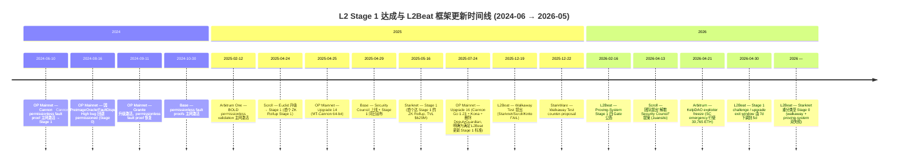
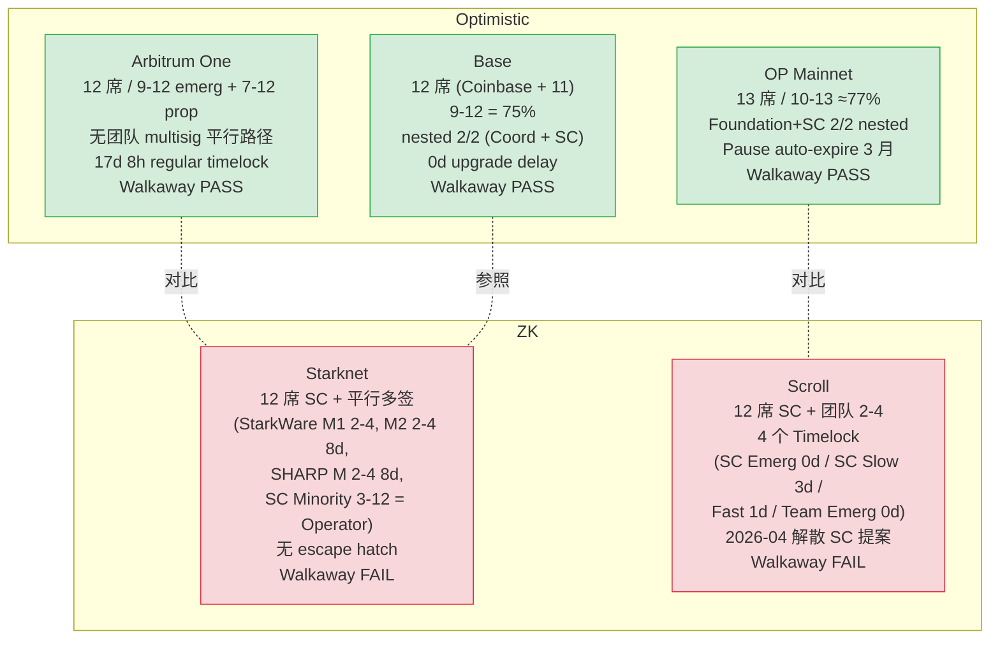
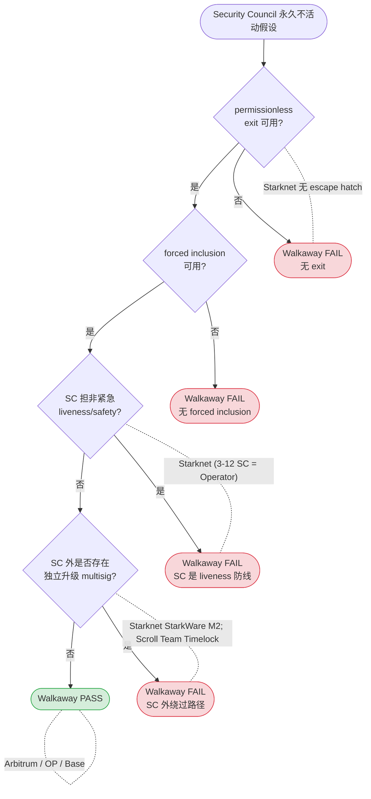
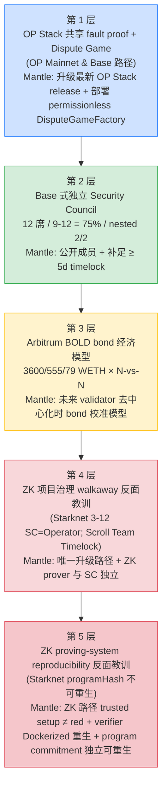

# Stage 1 L2 案例研究：Arbitrum / OP Mainnet / Base / Starknet / Scroll 的 Stage 1 路径对比与 Mantle 借鉴

## Executive Summary

截至 2026-05-19，已经达到或曾达到 L2Beat Stage 1 的五个主要 L2 项目（Arbitrum One、OP Mainnet、Base、Starknet、Scroll）在**两条相互独立的合规维度**上呈现出系统性差异：(1) 治理 / walkaway 维度 —— 在 Security Council "走开" 的前提下，用户在 operator 作恶时是否仍可退出；(2) proving-system 维度 —— L2Beat 2026-02-16 提出的"无 red trusted setup / prover 源码公开 / verifier 源码可复现 / program commitment 可复现"四条 gate 是否全部通过。在两条维度上同时通过的项目只有三个 Optimistic Rollup：**Arbitrum One**（BOLD permissionless validation + Nitro 公开源码 + WASM module root 可复现）、**OP Mainnet**（Cannon FPVM + `make reproducible-prestate` 被 L2Beat 直接列为合规示例）、**Base**（直接继承 OP Stack 的 walkaway 通过性与 proving-system 可复现性）。两个 ZK Rollup 项目 —— **Starknet** 与 **Scroll** —— 均**未通过 walkaway test**，原因都是"团队 multisig 与 Security Council 并行控制升级路径"反模式；Starknet 更进一步因 program-commitment 不可独立重现，在 2026 年被 L2Beat 重新分类为 Stage 0。OP Mainnet 是唯一一条在 Stage 1 之后**确有公开记录被回滚到 permissioned 状态**的链（2024-08-16 因 Cannon / PreimageOracle / FaultDisputeGame 三处 High 级 bug 被 Optimism Foundation 主动回退，于 2024-09-11 Granite 升级中恢复）；Scroll 出现了**主动建议解散 Security Council** 的反向去中心化提案（2026-04-13）。对于 Mantle（OP Stack + ZK Validity Proof 混合架构），最直接可借鉴的样板是 **Base 的 OP Stack 继承路径 + 独立 Security Council 组建模板**，最重要的反面教训来自 **Starknet / Scroll 在 walkaway 与 proving-system 双维度上的同类失败模式**。

---

## Item-1 — Stage 1 评估框架基线（Walkaway Test + 2026-02-16 Proving-System Gates）

### high_level_summary

L2Beat 当前 Stage 1 评估在 2025-12-19 的 Walkaway Test 和 2026-02-16 的 Proving-System Gates 之后已经裂变为**两条相互独立的 gate**：治理走开能力与证明系统可复现性。任一组失败都构成 Stage 1 阻碍。此外 2026-04-30 的更新把 Stage 1 升级 exit window 与 optimistic challenge period 的最低门槛由 7 天下调到 5 天，但 Stage 2 unwanted-upgrade exit window 30 天的阈值未变。

### (A) 治理 / Exit Window 基线

L2Beat Stages framework 当前要求（来源：L2Beat Glossary、Stages 总览页 https://l2beat.com/stages、2026-04-30 论坛更新 https://forum.l2beat.com/t/stage-1-update-minimum-challenge-period-reduction-from-7d-to-5d/425 ）：

- **功能完整的证明系统**且 ≥ 5 个 external fraud proof submitter 能力（Stage 0 基线）
- **permissionless fraud proof 提交**
- **用户可在无 operator 协助下退出**
- **Security Council ≥ 8 人**，**quorum 共识阈值 ≥ 75%**（L2Beat Glossary 原文 "greater than 75%"；当前 Stages Framework 与各项目实际通过 9/12=75%、10/13≈77%、12/16=75% 等配置满足该基线 —— L2Beat 在实际评估中按 ≥75% 处理）

**三个独立的时间窗口阈值**：

1. **Stage 1 升级 exit window（Security Council 之外的合约升级路径）**：**≥ 5 天**。2026-04-30 起由 ≥ 7 天下调，依据 https://forum.l2beat.com/t/stage-1-update-minimum-challenge-period-reduction-from-7d-to-5d/425 ；理由："a 5d challenge period is a comfortable lower bound in the presence of soft censorship attacks and network delays"（1 天解决经济攻击 + 4 天解决网络延迟攻击）；受影响项目：Arbitrum One、Base、OP Mainnet、Ink、Unichain。
2. **Optimistic challenge period（争议解决窗口）最低值**：**≥ 5 天**（同上 2026-04-30 更新；"5d, in the same way 7d was before, is a lower bound"）。**该窗口概念上独立于 (1)** —— 部分项目两者实现上复用同一定时器但不必然相等。
3. **Stage 2 unwanted-upgrade exit window**：**≥ 30 天**（2026-04-30 未变；"The 7d lower bound for Stage 2 remains unaffected" 指 Stage 2 optimistic challenge period 维持 7 天；30 天 unwanted-upgrade 是 Stage 2 单独阈值）。

### Walkaway Test 检查点（2025-12-19 提出）

来源：https://forum.l2beat.com/t/stage-1-requirements-update-security-council-walkaway-test/412 （L2Beat 论坛，作者 donnoh / Luca Donno）。

原文："The previous requirement must hold **even if the Security Council is permanently inactive**." 即"在 Security Council 永久不活动的前提下，前述要求（用户可在 operator 作恶时退出）必须仍然成立"。

可机械检查的检查点：
- **permissionless exit** 可用？（不依赖 operator 也不依赖 SC）
- **forced inclusion** 可用？（用户可绕过 sequencer 提交交易）
- Security Council 是否承担**非紧急 censorship-resistance / liveness / safety 职责**？
- 是否存在 **Security Council 之外的绕过路径**？（团队 multisig 等并行控制路径）

公开评定结果：
- **PASS**：Arbitrum One、Base、OP Mainnet、Ink
- **FAIL / 降级**：Starknet、Kinto（已降级）、Scroll

walkaway 不通过等价于在 2026 年框架下面临降级到 Stage 0 的风险。

### (B) Proving-System 基线（L2Beat 2026-02-16 新增四条 Gate）

来源：https://forum.l2beat.com/t/new-stage-1-requirements-for-l2-proving-systems/413 （L2Beat 论坛，作者 sergeyshemyakov，2026-02-16 发布）。L2Beat **未在该贴中给出明确生效 deadline** —— 每个项目按"若立即生效"评估。

四条 Gate（原文）：

1. **No red trusted setups** —— "Stage 1 projects can't have proving systems with trusted setups rated red"；trusted setup 评级框架见 https://forum.l2beat.com/t/the-trusted-setups-framework-for-zk-catalog/381 （红：未达 yellow 基线，如 transcript 不公开、参与者匿名不可核对、贡献数 < 30、ceremony client 未开源）。**违规典型**：Facet V1、Zircuit、Loopring L2。
2. **Published prover source** —— "Stage 1 projects must publish a source code for all used provers"；用户在原 prover 失效时可独立产生证明；prover/proposer 由 assumed-honest minority 担任时可豁免。
3. **Reproducible onchain verifiers** —— "source code for all used onchain verifiers must be available online"；含 recursion 与 final wrap，要有"从源码独立重新生成 verifier bytecode"的指引。**合规典型**：Matter Labs Boojum（提供工具）、Polygon zkProver（提供指南）、ZK Stack（脚本可重生 program hash）。**违规典型**：Lighter L2（verifier 源未公开）。
4. **Reproducible program commitments** —— "Sources for all zkVM programs must be published" 且必须提供"valid instructions on how to regenerate onchain commitments"。**合规典型**：OP Stack（"clear guidelines for regenerating absolute prestate"）。

### 两条 Gate 相互独立

L2Beat 在公告中明确：proving-system gate 与 walkaway test 是**两组独立判定**，任一组失败均阻碍 Stage 1。例如 Starknet 同时在两条维度上失败 —— walkaway 通过 3/12 SC minority 作为备份 Operator 不成立；program-commitment 不可由公开源码独立重现 —— 因此 L2Beat 2026 年公告该项目降级到 Stage 0。

---

## Item-2 — Arbitrum One: BOLD permissionless validation + Optimistic Proof Reproducibility

### high_level_summary

Arbitrum One 在 2025-02-12 通过 BOLD（Bounded Liquidity Delay）协议从"permissioned validator set 的 Stage 1"升级到"任何人可参与挑战的更强 Stage 1"。BOLD 用 N-vs-N "battle royale" 取代旧的 1-vs-1 challenge tournament 解决 delay attack；3600 / 555 / 79 WETH 三层 bond 把攻击者的资金风险与"延迟所有提款 ~1 周"的机会成本绑定；6.4 天 challenge window + ~12.8 天最坏 dispute 解决上限。Security Council 9/12（紧急）+ 7/12（非紧急，经 ~17d 8h timelock）双阈值。walkaway PASS（permissionless validation 设计），proving-system 四条 gate 全部 PASS（Nitro WASM 无 trusted setup；OneStepProver 源码公开；WASM module root 可由 `module-root-calc` Docker target 独立重现）。

### stage1_path_timeline

| 日期 | 事件 | 来源 |
|------|------|------|
| 2025-01-06 | AIP "Activate Arbitrum BoLD + Infura Nova Validator Whitelist" 在 Tally 上线 | https://www.tally.xyz/gov/arbitrum/proposal/101924107818180443784046677916233531742645798596604549673138282938475874935972 ；https://forum.arbitrum.foundation/t/aip-bold-permissionless-validation-for-arbitrum/23232 |
| 2025-01-24 | 链上投票截止，99.99% 支持 / 5,150 投票者 | Tally Wrapped 2025 (https://blog.tally.xyz/tally-wrapped-2025) |
| **2025-02-12** | **BOLD 主网激活（Arbitrum One + Nova）** | https://www.theblock.co/post/340278/offchain-labs-releases-arbitrum-bold-on-mainnet-for-permissionless-validation |
| 2025-10 (TBD 日期) | Stylus bug on Arbitrum Sepolia → Security Council 11/12 紧急签名（演练） | Arbitrum forum |
| 2026-04-21 | KelpDAO exploiter freeze：30,765.67 ETH 移至 protocol-controlled 0xDA0 precompile（紧急权力的最近一次行使） | https://forum.arbitrum.foundation/t/security-council-emergency-action-21-04-2026/30803 |

### proof_system_design

- **类型**：Optimistic fault proof，基于 Nitro WASM 解释器 + OneStepProver。
- **permissionless 提交**：BOLD 激活后任何人可发起 assertion / challenge。
- **争议协议**：N-vs-N "battle royale"，并发解决多个 dispute（原文 https://docs.arbitrum.io/how-arbitrum-works/bold/gentle-introduction："BoLD's design allows for challenges between the honest party and any number of malicious adversaries to happen in parallel"）。
- **challenge window**：6.4 天（DAO 可在 Arbitrum One/Nova 上修改）。
- **dispute 最坏上限**：12.8 天（"an upper bound of 12.8 days for finalization of Arbitrum chain state"，由 2 challenge periods + grace + delta 组成）。
- **bond 分层**（来自 AIP 论坛贴）：
  - Top-level **Assertion bond**：**3,600 WETH**
  - Level 1 **big-step** sub-challenge：**555 WETH**
  - Level 2 **small-step** sub-challenge：**79 WETH**
- **bond 经济直觉**（https://docs.arbitrum.io/how-arbitrum-works/bold/bold-economics-of-disputes ）：以 5% APY 模型校准，使攻击者"延迟所有提款一周"的机会成本超过其可获得收益；honest defender 全额退款，attacker 100% 没收，没收 bond 进 ArbitrumDAO 国库（1% 奖励 honest defender）。
- **bonding pool**：`AssertionStakingPoolCreator.sol` 允许任何人开池众筹 bond；Nitro node "auto pooling" 自动检测 invalid assertion 并部署 / 加注。
- **verifier 专属 / 共享**：专属。
- **prover 源码可见性**：public，BUSL-1.1 source-available（不严格 OSI 但满足 L2Beat 公开源码要求）。
- **从源码独立重新生成 WASM module root**：有官方 documented 路径（`module-root-calc` Docker target；`NITRO_BUILD_IGNORE_TIMESTAMPS=1` 移除非确定性）。

### proof_system_reproducibility_and_trusted_setup

依据 L2Beat 2026-02-16 四条 gate：

| Gate | 判定 | 依据 |
|------|------|------|
| (1) trusted setup 评级 | **n.a.** | Arbitrum 使用 interactive optimistic fraud proof（Nitro WASM + OneStepProver），不依赖任何 SNARK/STARK，故无 trusted setup ceremony。L2Beat 2026-02-16 公告未列 Arbitrum 为违规。 |
| (2) prover 源码 | **public** | https://github.com/OffchainLabs/nitro （Nitro 节点，含 `arbitrator/prover/`）；https://github.com/OffchainLabs/nitro-contracts （BOLD ChallengeManager / EdgeChallengeManager）。License 为 BUSL-1.1。 |
| (3) onchain verifier 可复现性 | **pass** | OneStepProver*.sol 系列（`OneStepProverMath.sol`、`OneStepProverMemory.sol`、`OneStepProverHostIo.sol`、`OneStepProver0.sol`、`OneStepProofEntry.sol`）在 nitro-contracts `src/osp/` 路径下公开；社区可独立编译。 |
| (4) program commitment 可复现性 | **pass** | Arbitrum 文档明确给出 WASM module root 的确定性重生指引：`docker build . --target nitro-node-dev` → `docker run --rm --entrypoint cat <image> target/machines/latest/module-root.txt`；`NITRO_BUILD_IGNORE_TIMESTAMPS=1` 移除编译时间戳；ArbOS 51 root 公开值 `0xc2c02df561d4afaf9a1d6785f70098ec3874765c638e3cb6dbe8d3c83333e14c`。OP Stack 是 L2Beat 公告的"prestate 可复现"合规标杆，Arbitrum 的 WASM module root 路径是同等级的合规样本。 |

**综合 gate 结论**：**PASS**（四项全部通过 / n.a.）。

### security_council_config

- **总人数**：12（两 cohorts 各 6 名，每 6 个月轮换一半）。
- **外部成员比例**：高（按 Arbitrum DAO Constitution，单一组织不得占 > 3 席）。
- **quorum 阈值**：
  - **9/12 = 75%** —— "Emergency" 阈值，可在三链（Arbitrum One L2、Ethereum L1、Arbitrum Nova L2）的 Emergency Security Council multisig 上**跳过所有 delay** 直接行使全部 admin / upgrade 权限。
  - **7/12 ≈ 58.3%** —— "Proposer" 非紧急阈值，**必须经过完整 timelock 路径**；L2Beat 明确该阈值"不满足 Security Council 认定"，按 simple multisig 处理（需要 ≥ 7d 用户 exit window）。
- **即时升级权限范围**：9/12 emergency multisig 可零延迟修改 RollupProxy、ChallengeManager、Inbox 等全部核心合约。
- **与团队 multisig 关系**：12 名成员中包含 Offchain Labs 与 Arbitrum Foundation 代表，但单一组织 ≤ 3 席，无独立"团队 multisig" 并行控制路径。
- **签名地址**：可在 Etherscan / Arbiscan 上核对（见 governance_upgrade_authority 字段）。

### exit_window_design

- **常规 DAO 升级总延迟**：**17 天 8 小时**（L2Beat 当前快照）。分解：8d L2 Timelock + 6d 8h L2→L1 (challenge period) + 3d L1 Timelock = 17d 8h。
- **forced inclusion 机制**：`SequencerInbox.forceInclusion()`，**任何地址可调用**（permissionless）；默认延迟 ~24 小时；存在 DAO 提议把 24h 降到 4h，未通过：https://forum.arbitrum.foundation/t/proposal-decrease-censorship-delay-from-24-hours-to-4-hours/13047 。
- **permissionless escape hatch**：BOLD permissionless validation + forceInclusion 共同构成。
- **用户提款标准延迟**：6.4 天 fault proof window（与上面 challenge period 同源）。
- **是否依赖 Security Council 阈值作为唯一防线**：**否** —— permissionless validation 不依赖 SC，walkaway PASS。

对照 L2Beat 三档阈值：

| 阈值类型 | L2Beat 当前要求 | Arbitrum One 配置 | 判定 |
|----------|-----------------|-------------------|------|
| (i) Stage 1 升级 exit window（SC 外） | ≥ 5d（2026-04-30 由 7d 下调） | 17d 8h | **两版均合规**（7d 与 5d 时代都满足） |
| (ii) Optimistic challenge period | ≥ 5d（2026-04-30 由 7d 下调） | 6.4d | **两版均合规** |
| (iii) Stage 2 unwanted-upgrade exit window | ≥ 30d（未变） | 17d 8h | **不达 Stage 2** |

### walkaway_test_evaluation

| 检查点 | 判定 | 依据 |
|--------|------|------|
| permissionless exit 可用 | PASS | BOLD permissionless validation 任何人可挑战 invalid assertion；forceInclusion 任何人可绕过 sequencer |
| forced inclusion 可用 | PASS | `SequencerInbox.forceInclusion()` permissionless |
| SC 承担非紧急 liveness / safety | NO | SC 仅紧急 + 非紧急 routine upgrade；BOLD validation 完全不依赖 SC |
| SC 之外存在绕过路径 | NO | 12 席中无单一组织 > 3 席；7/12 非紧急路径需经完整 timelock |

**综合 walkaway**：**PASS**。L2Beat 项目页原文："the project passes the walkaway test: users can exit in the presence of malicious operators even if the Security Council disappears." 失败点：无显著失败点。最小修复路径：n/a。**与 proving-system gate 独立判定**：walkaway PASS + proving-system PASS。

### key_incidents_and_lessons

- **Dec 2023 L2Beat update 触发 7/12 阈值调整**：L2Beat 把 SC 阈值从 50% 提到 > 75% 后，Arbitrum 的 7/12 ≈ 58% 路径"不再被认作 SC"，因此 Arbitrum 通过**延长 7/12 路径的 L1/L2 timelock 至 ~17d 8h** 让该路径以 simple multisig 身份满足 ≥ 7d 的 exit window 要求。来源：https://medium.com/l2beat/stages-update-security-council-requirements-4c79cea8ef52
- **2025-10 Stylus bug on Arbitrum Sepolia**：Security Council 11/12 签名紧急修复（演练性质）。
- **2026-04-21 KelpDAO exploiter freeze**：30,765.67 ETH 通过 Arbitrum 的 0xDA0 precompile 移至 protocol-controlled 地址，是 9/12 emergency multisig 紧急权力的最近一次行使。
- **教训**：在保留紧急多签的同时扩大 timelock，是同时满足 L2Beat ≥ 75% SC 阈值与 ≥ 5d exit window 的工程化捷径。
- **No documented post-launch rollback to Stage 0**：Arbitrum 自达到 Stage 1 后未出现公开记录的 Stage 0 回落事件。

### governance_upgrade_authority

升级权限链（参照 L2Beat permissions 页）：

```
ArbitrumDAO Proposal (snapshot + tally)
  → L2 Timelock (8 days, on Arbitrum One)
  → Outbox / L2→L1 message (6 days 8 hours = challenge period)
  → L1 Timelock (3 days, on Ethereum)
  → UpgradeExecutor (L1: 0x3ffFbAdAF827559da092217e474760E2b2c3CeDd)
  → ArbitrumProxyAdmin → 核心合约
  
紧急路径（9/12 SC）：直接调用 UpgradeExecutor，跳过 L2/L1 Timelock 与 challenge period
```

每条边的 delay 与签名阈值：L2 Timelock 8d / Outbox 6d8h / L1 Timelock 3d / SC 9/12 emergency 0 delay。

### mantle_applicability

| 维度 | 借鉴度 | 说明 |
|------|--------|------|
| 治理 walkaway | **中** | Arbitrum 与 OP Stack 派生链架构差距大，BOLD bond 模型不能直接套到 Mantle，但"扩大 timelock 让低阈值多签合规"是 Mantle 治理设计可参照的模式 |
| proving-system gate | **中** | Arbitrum 的 WASM module root 复现路径是 Optimistic Rollup 的合规样板；Mantle ZK Validity Proof 路径不直接复用，但 Mantle 继承 OP Stack fault proof 的部分可参照 Arbitrum 的 Docker `module-root-calc` 模式让 prestate 复现工具产品化 |

### references

四桶证据（per-project evidence bundle，src-7 要求）：

(a) **L2Beat 快照**（src-1）：
- https://l2beat.com/scaling/projects/arbitrum （抓取日期 2026-05-19）

(b) **官方文档 / 治理**（src-2 / src-3）：
- https://docs.arbitrum.io/how-arbitrum-works/bold/gentle-introduction
- https://docs.arbitrum.io/how-arbitrum-works/bold/bold-economics-of-disputes
- https://forum.arbitrum.foundation/t/aip-bold-permissionless-validation-for-arbitrum/23232 （AIP）
- https://docs.arbitrum.io/launch-arbitrum-chain/configure-your-chain/common/validation-and-security/arbos-upgrade
- https://github.com/ArbitrumFoundation/governance/blob/main/docs/overview.md

(c) **链上证据**（src-6，覆盖 SC / Timelock / ProxyAdmin / Verifier / Proposer ≥ 3 角色）：
- L1 UpgradeExecutor：https://etherscan.io/address/0x3ffFbAdAF827559da092217e474760E2b2c3CeDd
- L1 RollupProxy (BOLD-era)：https://etherscan.io/address/0x4DCeB440657f21083db8aDd07665f8ddBe1DCfc0
- L1 Security Council 9 (9/12 emergency)：https://etherscan.io/address/0xF06E95eF589D9c38af242a8AAee8375f14023F85
- L2 Security Council 7 (7/12 non-emergency)：https://arbiscan.io/address/0xADd68bCb0f66878aB9D37a447C7b9067C5dfa941
- L2 ProxyAdmin：https://arbiscan.io/address/0xd570aCE65C43af47101fC6250FD6fC63D1c22a86
- Pre-BOLD OSP (legacy verifier ref)：https://etherscan.io/address/0xce81e7d009e53c02242b724819df1869da5e9fd8
- **Gap**：L1 ProxyAdmin、L1 Timelock、L2 Timelock、BOLD EdgeChallengeManager 的精确 L1 地址 — evidence not found in public search snapshots；可通过 `RollupProxy.challengeManager()` 在 0x4DCeB440657f21083db8aDd07665f8ddBe1DCfc0 上读取。

(d) **审计**（src-5）：
- Trail of Bits BOLD（Apr 2024，5 person-months）
- Trail of Bits BOLD + Delay Buffer（May 2024）：https://docs.arbitrum.io/assets/files/2024_05_02_trail_of_bits_security_audit_bold_delay_buffer-7329f073827e7e12aede9a9203db1e01.pdf
- Trail of Bits BOLD + DAC Rewards（Jun 2024，3 person-months）
- Trail of Bits BOLD Optimized History Commitments（Oct 2024）：https://docs.arbitrum.io/assets/files/2024_10_07_trail_of_bits_security_audit_bold_optimized_history_commitments-025bd74c8af33bb436e606b55a3ef550.pdf
- Trail of Bits Nitro with BOLD（Oct 2024，2.6 person-months）
- Trail of Bits BOLD Fixes（Dec 2024）：https://docs.arbitrum.io/assets/files/2024_12_26_trail_of_bits_boldfixes_securityreview-95c9ee3b07ccb11e59e57744ddc017d2.pdf
- Trail of Bits Sequencer Liveness (post-BOLD)（Mar 2025）
- Hub：https://docs.arbitrum.io/audit-reports
- Offchain Labs research team formal safety proofs（referenced）
- "No public OpenZeppelin BOLD audit found"

---

## Item-3 — OP Mainnet: Cannon Fault Proof + Permissionless Fault Proofs + Prestate Reproducibility

### high_level_summary

OP Mainnet 在 2024-06-10 通过 Cannon MIPS FPVM + 模块化 Dispute Game + permissionless fault proof 达到 Stage 1，**两个月后（2024-08-16）因 Spearbit / Cantina / Code4rena 审计发现的三处 High 级 bug 被 Optimism Foundation 主动回退到 permissioned 状态**，并在 2024-09-11 的 Granite 升级中恢复 permissionless 模式 —— 这是五个项目中唯一有公开记录的 Stage 1 → Stage 0 回滚事件。后续 Upgrade 14 (MT-Cannon 64-bit) 与 Upgrade 16 (Cannon Go 1.23 + Kona Rust alt-FPP + 删除 DeputyGuardian 以满足 L2Beat 更新的 Stage 1 标准) 把 OP Stack 的 fault proof 系统进一步去中心化。walkaway PASS（OptimismPortal 任意提案 / forced inclusion），proving-system 四条 gate 全部 PASS —— L2Beat 2026-02-16 公告直接把 "OP Stack — clear guidelines for regenerating absolute prestate" 列为合规标杆。Security Council 10/13 (≥75%)，与 OpFoundationUpgradeSafe 构成 2/2 SuperchainProxyAdminOwner。

### stage1_path_timeline

| 日期 | 事件 | 来源 |
|------|------|------|
| **2024-06-10** | Cannon permissionless fault proofs 主网激活 → L2Beat Stage 1 | https://www.optimism.io/blog/permissionless-fault-proofs-and-stage-1-arrive-to-the-op-stack |
| 2024-07–08 | Spearbit + Cantina + Code4rena 审计发现 Cannon / PreimageOracle / FaultDisputeGame 多个 High 级 bug | https://code4rena.com/reports/2024-07-optimism |
| **2024-08-16** | **OP Foundation 主动回退到 permissioned 状态**（"out of an abundance of caution"） | https://cryptobriefing.com/optimism-reverts-permissionless-fraud-proofs/ ；https://www.theblock.co/post/299202/op-mainnet-fault-proofs |
| 2024-08-28 | Upgrade Proposal #10（Granite）governance vote 通过：47,057,235 FOR vs 5,404 AGAINST | https://vote.optimism.io/proposals/46514799174839131952937755475635933411907395382311347042580299316635260952272 |
| **2024-09-11 16:00 UTC** | **Granite 激活 → permissionless fault proof 恢复** | https://docs.optimism.io/builders/notices/granite-changes |
| 2025-04-25 | Upgrade 14 主网激活：MT-Cannon (64-bit, MIPS64.sol)，Cannon64 absolute prestate 0x03ee2917da962ec266b091f4b62121dc9682bb0db534633707325339f99ee405 | https://docs.optimism.io/notices/upgrade-14 |
| **2025-07-24 17:30 UTC** | **Upgrade 16 主网激活**：Cannon Go 1.23、Kona Rust alt-FPP、删除 DeputyGuardian、OptimismPortal→AnchorStateRegistry、ETHLockbox、gas limit 200M→500M（明确为满足 L2Beat 更新的 Stage 1 标准） | https://docs.optimism.io/notices/upgrade-16 ；vote ended 2025-07-09 |
| 2025-10-02 | Upgrade 16a 主网激活（删除未使用 withdrawal-proving 路径） | OP docs |
| 2025-12-02 | Upgrade 17 (Jovian, Fusaka readiness, Cannon Go 1.24) 主网激活 | https://vote.optimism.io/proposals/3118571676657709551286937570456546163542507117143005939043790253732885172699 |

### proof_system_design

- **类型**：Optimistic fault proof，Cannon FPVM。
- **permissionless 提交**：2024-06-10 起允许，2024-08-16 — 2024-09-11 期间临时回退到 permissioned。
- **challenge window**：7 天（MAX_CLOCK_DURATION，标准 OP Stack `FaultDisputeGame`）。
- **争议协议**：bisection on MIPS execution trace；最终在 MIPS.sol 上执行单步指令验证。
- **proof verifier 专属 / 共享**：专属（每条 OP Stack 链可独享一份 op-program 实例，但 op-program 是上游共享代码 → see Base for transitive 复用）。
- **prover 源码可见性**：**public**，全部代码在 https://github.com/ethereum-optimism/optimism （Cannon、mipsevm、op-program、op-challenger）。
- **从源码独立重新生成 prestate**：有官方 documented 路径（`make reproducible-prestate`，下文 reproducibility 详述）。
- **模块化**：`FaultDisputeGame` + `DisputeGameFactory` + game-type registry 允许未来插入 ZK FPVM；Upgrade 16 添加的 Kona (Rust alt-FPP) 是首次 proof-system 多样性的实证。

### proof_system_reproducibility_and_trusted_setup

| Gate | 判定 | 依据 |
|------|------|------|
| (1) trusted setup 评级 | **n.a.** | Cannon 是 fault proof，不依赖 SNARK / STARK，无 trusted setup ceremony。L2Beat 2026-02-16 公告未列 OP Stack 为违规。 |
| (2) prover 源码 | **public** | https://github.com/ethereum-optimism/optimism （op-program / mipsevm / op-challenger）。MIT License。 |
| (3) onchain verifier 可复现性 | **pass** | MIPS.sol（pre-Upgrade-14）/ MIPS64.sol（post-Upgrade-14）、FaultDisputeGame、PreimageOracle、DisputeGameFactory 全部公开。 |
| (4) program commitment 可复现性 | **pass，且 L2Beat 公告直接列为合规标杆** | 原文（L2Beat 2026-02-16 公告）："OP Stack — clear guidelines for regenerating absolute prestate"。Optimism 文档详细给出 `make reproducible-prestate` 流程：https://docs.optimism.io/operators/chain-operators/tutorials/absolute-prestate ；"All governance approved releases use a tagged version of op-program. These can be rebuilt by checking out the version tag and running `make reproducible-prestate`"；输出 Cannon64 production prestate hash + preimage file `op-program/bin/prestate-mt64.bin.gz`。 |

**综合 gate 结论**：**PASS**（四项全部通过 / n.a.；OP Stack 是 L2Beat 公告的 program-commitment 复现合规标杆）。

### security_council_config

- **总人数**：13
- **当前阈值**：**10 of 13 (≈ 77%)**，"meets the 75% threshold requirement for a Stage 1 rollup outlined in L2Beat's Stages framework"（Optimism docs）
- **签名地址 / 成员**（2023-12 ratification，Cohort A 12 月初始任期 / Cohort B 18 月初始任期）：
  - Cohort A：Kris Kaczor (Phoenix Labs)、Layne Haber (Connext)、Jon Charbonneau (DBA)、Alisha.eth (Glowworm Foundation, ex-ENS)、Mariano Conti (ex-MakerDAO)、Martin Tellechea (Graph Foundation)、Yoseph Ayele (Borderless Africa)
  - Cohort B：OP Labs PBC、Yoav Weiss (Ethereum Foundation)、Test in Prod、Kain Warwick (Synthetix)、Coinbase Technologies (Base)、Elena Nadolinski (Ironfish)、L2Beat、Alejandro Santander
  - Charter：https://github.com/ethereum-optimism/OPerating-manual/blob/main/Security%20Council%20Charter%20v0.1.md
  - 任命投票：https://vote.optimism.io/proposals/27439950952007920118525230291344523079212068327713298769307857575418374325849
  - 任命博客：https://www.optimism.io/blog/introducing-the-optimism-collective-s-security-council
- **LivenessModule**：移除 3 个月 + 8 天不活跃成员，保持阈值比例 ≥ 75%；如成员数跌破 8，则 OpFoundationUpgradeSafe 接管所有权。
- **与 OpFoundation 的关系**：`SuperchainProxyAdminOwner` = **2-of-2** multisig of (Security Council, OpFoundationUpgradeSafe) —— 双方均有否决权。
- **OpFoundationUpgradeSafe**：5-of-7，附带 SaferSafes 模块。
- **Guardian 角色**：分配给 Security Council multisig；pause 自动到期 3 个月除非延期。Upgrade 16 删除 DeputyGuardianModule，使 Security Council 成为唯一默认 Guardian actor。

### exit_window_design

- **常规升级 upgrade delay**：OP Stack 标准 Pause expiry = 3 个月（可链式延长至 ~6 个月）；Stage 1 upgrade exit window outside SC 满足 ≥ 5d。
- **forced inclusion**：`OptimismPortal.depositTransaction` —— 任何用户可直接在 L1 提交，无需 sequencer 配合；这是 walkaway PASS 的关键。
- **permissionless escape hatch**：用户可通过 OptimismPortal + 7d 挑战期独立完成提款，不依赖 SC。
- **fault proof window / validity proof finality**：7 天（pre-2026-04-30 配置；当前 L2Beat 监测，未发现明确下调到 5d 的实际配置变更 — evidence not surfaced for specific OP-config governance vote post 2026-04-30）。

对照 L2Beat 三档阈值：

| 阈值类型 | L2Beat 当前要求 | OP Mainnet 配置 | 判定 |
|----------|-----------------|------------------|------|
| (i) Stage 1 升级 exit window | ≥ 5d | ≥ 5d（OP Stack 标准 pause expiry 3 月） | 合规 |
| (ii) Optimistic challenge period | ≥ 5d | 7d | **两版均合规** |
| (iii) Stage 2 unwanted-upgrade exit window | ≥ 30d | < 30d | **不达 Stage 2** |

### walkaway_test_evaluation

| 检查点 | 判定 | 依据 |
|--------|------|------|
| permissionless exit | PASS | `OptimismPortal.proveWithdrawalTransaction` + `finalizeWithdrawalTransaction` 任意用户可调用，不依赖 sequencer / SC |
| forced inclusion | PASS | `OptimismPortal.depositTransaction` |
| SC 承担非紧急 liveness / safety | NO | SC 仅紧急 + Guardian pause（自动到期 3 月） |
| SC 之外存在绕过路径 | NO | OpFoundationUpgradeSafe 与 SC 形成 2/2，**双方均不可单边绕过对方**（这是 OP 与 Starknet/Scroll 的关键差别） |

**综合 walkaway**：**PASS**。L2Beat 项目页原文："the project passes the walkaway test: users can exit in the presence of malicious operators even if the Security Council disappears. This is enabled because anyone can be a Proposer and propose new roots to the L1 bridge." **与 proving-system gate 独立判定**：walkaway PASS + proving-system PASS。

### key_incidents_and_lessons

**唯一 documented post-launch rollback：2024-08 fault proof bug 事件**

- **2024-08-16**：OP Foundation 主动将 OP Mainnet 从 permissionless 回退到 permissioned，原因是 Spearbit / Cantina / Code4rena 审计发现的三处 High 级 bug：
  - Cantina 3.1.1 — Cannon 内存分配溢出可能导致任意代码执行；
  - Spearbit 5.1.1 — `PreimageOracle.loadPrecompilePreimagePart` 在 precompile OOG 时会覆盖正确的 preimageParts；
  - Code4rena H-01 — `maxGameDepth` off-by-one 允许 trace 含超额块。
- **后果**：在 2024-08-16 — 2024-09-11 期间，OP Mainnet 实际上失去了 Stage 1 的"功能完整 permissionless fault proof"前提；L2Beat 项目页 status 临时反映回退。
- **未发生**：无任何用户资金损失，无任何 bug 被实际利用。
- **恢复**：Granite 升级（2024-08-28 governance 通过，2024-09-11 主网激活）在修复 bug 的同时扩展了 Guardian/DeputyGuardian 能力以便快速设置 AnchorStateRegistry。
- 引用反应（Mert Mumtaz, Helius，via Unchained）："One of the serious edges L2s have is that they can literally do whatever they want. Bug in fraud proofs? OK let's just get rid of proofs for the next month. Problem? It's ok, the security council will control the permissions."
- **教训**：Stage 1 不是终态；fault proof 上线后的早期 bug 周期是真实风险。Security Council 的回滚权力被实际行使过，证明"SC 作为 bug-recovery 后盾"在主网环境中确实有效，但也证明 fault proof 上线后 6–12 个月的审计/形式验证投入对维持 Stage 1 至关重要。
- **Upgrade 16 (2025-07-24)** 直接列出"meeting @L2Beat's updated criteria" 为升级目的之一，可见 L2Beat 框架更新对 OP Stack 升级路线图的直接驱动。

### governance_upgrade_authority

```
OP Governance Proposal (vote.optimism.io)
  → Optimism Foundation submission
  → SuperchainProxyAdminOwner (2/2 of [Security Council 10/13, OpFoundationUpgradeSafe 5/7])
  → ProxyAdmin / SuperchainProxyAdmin → 核心合约
  
紧急路径：Guardian (= Security Council 10/13) 可 pause OptimismPortal；pause 自动到期 3 个月，可链式延期但不可永久
```

### mantle_applicability

| 维度 | 借鉴度 | 说明 |
|------|--------|------|
| 治理 walkaway | **极高** | Mantle 作为 OP Stack 派生链，可直接继承 OptimismPortal forced inclusion + permissionless DisputeGameFactory 的 walkaway PASS 路径；2024 OP Foundation rollback 事件为 Mantle 提供"Stage 1 上线后审计 + 监控周期"经验 |
| proving-system gate | **极高** | OP Stack 的 `make reproducible-prestate` 是 L2Beat 公告的合规标杆；Mantle 沿用 OP Stack fault proof 部分时直接通过 gate (4)。但 Mantle 的 ZK Validity Proof 部分**独立**于 OP Stack reproducibility 路径，需单独评估 |

### references

(a) **L2Beat 快照**（src-1）：
- https://l2beat.com/scaling/projects/op-mainnet （抓取日期 2026-05-19）

(b) **官方文档 / 治理**（src-2 / src-3）：
- https://specs.optimism.io/protocol/stage-1.html
- https://docs.optimism.io/stack/fault-proofs/cannon
- https://docs.optimism.io/operators/chain-operators/tutorials/absolute-prestate
- https://docs.optimism.io/notices/upgrade-14
- https://docs.optimism.io/notices/upgrade-16
- https://github.com/ethereum-optimism/OPerating-manual/blob/main/Security%20Council%20Charter%20v0.1.md
- Upgrade 16 governance vote：https://vote.optimism.io/proposals/42233809968417684816035432917226202543057967150073565253597304573923844823222
- Granite governance vote：https://vote.optimism.io/proposals/46514799174839131952937755475635933411907395382311347042580299316635260952272

(c) **链上证据**（src-6）：
- 官方地址列表：https://docs.optimism.io/chain/addresses
- OptimismPortalProxy：https://etherscan.io/address/0xbEb5Fc579115071764c7423A4f12eDde41f106Ed
- DisputeGameFactoryProxy：https://etherscan.io/address/0xe5965Ab5962eDc7477C8520243A95517CD252fA9
- OptimismPortal2 impl (current)：https://etherscan.io/address/0x97cebbf8959e2a5476fbe9b98a21806ec234609b
- L2Beat OP Mainnet permissions 表：https://l2beat.com/scaling/projects/op-mainnet
- **Gap**：MIPS/MIPS64、PreimageOracle、FaultDisputeGame impl、SC multisig 与 SuperchainProxyAdminOwner 的具体地址需从 docs.optimism.io/chain/addresses 在发表前直接抓取（这些地址在 Granite/Holocene/U14/U16/U17 之间多次轮换）

(d) **审计**（src-5）：
- Spearbit MT-Cannon（Nov 25 – Dec 14, 2024；published Jan 2025）：https://github.com/ethereum-optimism/optimism/blob/develop/docs/security-reviews/2025_01-MT-Cannon-Spearbit.pdf
- Code4rena 2024-07 (5H/11M/21L)：https://code4rena.com/reports/2024-07-optimism ；https://github.com/code-423n4/2024-07-optimism
- Cantina / Spearbit Granite 审计（reference 在 Granite governance proposal）
- Bedrock pre-launch invariant + fuzzing by Trail of Bits (2022)：https://blog.oplabs.co/bedrock-security/
- Upgrade 16 audits: Spearbit (no Med+) + Cantina contest (no Med+)
- "No Sigma Prime Cannon audit found in public sources"

---

## Item-4 — Base: OP Stack Stage 1 + 独立 Security Council + 继承 OP Stack Reproducibility

### high_level_summary

Base 在 2024-10-30 部署 OP Stack permissionless fault proofs（直接复用 Cannon + DisputeGameFactory，无私有分支），在 2025-04-29 组建 12 名 Security Council（Coinbase + 11 个独立外部成员 / 个人）并同日宣布达到 L2Beat Stage 1，是第 10 条达到 Stage 1+ 的 L2。Security Council 9/12 = 75% 阈值，独立运行 + Base Coordinator Multisig 形成 nested 2/2 升级闸口；fault proof 部分**无 Base 私有分叉**，因此 OP Stack 上游的 reproducibility 与 walkaway 通过性可直接传递到 Base。**critical caveat**：L2Beat 明确标注 Base 的合约"instantly upgradable, no window for users to exit unwanted upgrade"，依赖 9/12 SC 阈值 + nested 2/2 双重门槛作为唯一防线 —— 这是当前 OP Stack Stage 1 链共有的特征，也是 Base 不进入 Stage 2 的关键。walkaway PASS，proving-system 四条 gate 全部 PASS（继承 OP Stack）。

### stage1_path_timeline

| 日期 | 事件 | 来源 |
|------|------|------|
| **2024-10-30** | Base permissionless fault proofs 主网激活（直接复用 OP Stack） | https://blog.base.org/fault-proofs-are-now-live-on-base-mainnet |
| **2025-04-29** | Base Security Council 上线 + L2Beat Stage 1（同日宣布） | https://blog.base.org/base-has-reached-stage-1-decentralization ；https://www.theblock.co/post/352320/base-stage-1 ；https://cryptoslate.com/base-becomes-10th-l2-network-to-reach-at-least-stage-1-decentralization/ |

Base 官博 verbatim："Base has achieved Stage 1 Decentralization … We've done this by launching permissionless fault proofs and increasing the decentralization of our contract upgrade process with a security council."

### proof_system_design

- **类型**：Optimistic fault proof，**直接复用 OP Stack Cannon FPVM + DisputeGameFactory + FaultDisputeGame**，无 Base 私有分叉。
- **permissionless 提交**：是（自 2024-10-30）。
- **challenge / withdrawal window**：3d 12h challenge + 3d 12h settlement = 7d 总用户感知提款延迟（L2Beat phrasing："Withdrawal inclusion can be proven before state root settlement, but a 7d period has to pass before it becomes actionable. The process of state root settlement takes a challenge period of at least 3d 12h to complete."）。
- **stake**：0.08 ETH per proposal。
- **verifier 专属 / 共享**：与 OP Mainnet 共享 op-program 上游源码；各链 FaultDisputeGame 持有自己的 `faultGameAbsolutePrestate`，但该值是**同一 OP Stack release 的 op-program 二进制哈希**，因此 reproducibility 可"传递性"继承自 OP Stack。
- **Base 上游贡献**：Base 与 OP Labs 共同开发 Rust 版 FP-program（基于 Magi + op-reth），将作为 alt-FPP 加入 OP Stack。
- **Jovian / op-contracts v5.0.0 release**：被 OpenZeppelin + Spearbit 审计。

### proof_system_reproducibility_and_trusted_setup

| Gate | 判定 | 依据 |
|------|------|------|
| (1) trusted setup | **n.a.** | 继承 OP Stack。 |
| (2) prover 源码 | **public** | op-program / Cannon 全部在上游 ethereum-optimism/optimism；Base 链特定配置在 https://github.com/base-org/node ；合约 fork 在 https://github.com/base-org/contracts 。 |
| (3) onchain verifier 可复现性 | **pass** | 与 OP Mainnet 共用 Cannon MIPS.sol（不同 chain 部署同一份合约 ABI）。Pectra-era prestate 由 `op-program/v1.5.0-rc.4` 生成。 |
| (4) program commitment 可复现性 | **pass（传递性）** | Base 的 `faultGameAbsolutePrestate` 是上游 op-program 构建哈希；由于 Base 不维护自己的 FPVM fork，可通过上游 `make reproducible-prestate` 重生同样的 prestate。L2Beat 当前未在"program hashes could not be reproduced"检查中标注 Base。 |

**综合 gate 结论**：**PASS（传递性继承 OP Stack）**。

### security_council_config

来源：https://docs.base.org/base-chain/security/security-council

- **总人数**：12（Coinbase + 11 名独立外部实体 / 个人）
- **quorum 阈值**：**9 of 12 = 75%**
- **外部成员**：11 人
- **成员明细**（Base docs 公开列表）：
  - 实体（6）：Aerodrome (JP)、Moonwell (BR)、Blackbird (US)、ChainSafe (CA)、Talent Protocol (PT)、Moshicam (US)
  - 个人（5）：Seneca (US)、Juan Suarez (US)、Toady Hawk (CA)、Roberto Bayardo (US)、Yele Bademosi (UK)
  - Coinbase（rollup operator）
- **注意**：The Block / CryptoSlate 报道的"10 个独立实体 + Optimism + Coinbase = 12"是 press shorthand 与 Base 官方 docs 不完全一致 —— 官方列表为 **Coinbase + 11 外部 = 12**；**Optimism Foundation 通过独立的 "OP Foundation Operations multisig" 参与 nested upgrade flow，不占 SC 席位**。
- **个人身份保护**：原文 "Individuals representing each entity are not published to protect personal privacy and to enhance security."
- **nested 2/2 升级门槛**："a nested 2/2 Base Governance Multisig composed of the **Base Coordinator Multisig** and the **Base Security Council**. Upgrades require approval from both parties."

### exit_window_design

- **常规升级 upgrade delay**：**0（instantly upgradable）**。L2Beat 原文："All contracts are upgradable by a ProxyAdmin contract controlled by a nested 2/2 Base Governance Multisig … **There is no delay on upgrades**" 与 "**There is no window for users to exit in case of an unwanted upgrade since contracts are instantly upgradable.**"
- **forced inclusion**：OptimismPortal L1 deposit transactions（继承 OP Stack）。
- **permissionless escape hatch**：用户可通过 OptimismPortal + 7d 挑战期独立提款。
- **用户提款标准延迟**：7d（3d 12h challenge + 3d 12h settlement）。
- **依赖 SC 阈值作为唯一防线**：**是**（升级路径无 timelock，完全依赖 nested 2/2 + 9/12 SC）。这是 Base 不进入 Stage 2 的关键。

对照 L2Beat 三档阈值：

| 阈值类型 | L2Beat 当前要求 | Base 配置 | 判定 |
|----------|-----------------|------------|------|
| (i) Stage 1 升级 exit window | ≥ 5d | 0d（依赖 SC 75% 阈值） | **依赖 SC 路径**（Stage 1 允许，Stage 2 不允许） |
| (ii) Optimistic challenge period | ≥ 5d | 7d 总用户提款延迟（3d 12h + 3d 12h） | **两版均合规** |
| (iii) Stage 2 unwanted-upgrade exit window | ≥ 30d | 0d | **不达 Stage 2** |

### walkaway_test_evaluation

| 检查点 | 判定 | 依据 |
|--------|------|------|
| permissionless exit | PASS | 继承 OP Stack OptimismPortal |
| forced inclusion | PASS | 继承 OP Stack OptimismPortal.depositTransaction |
| SC 承担非紧急 liveness / safety | NO | SC 仅紧急 + 升级，liveness/safety 由 permissionless fault proof 提供 |
| SC 之外存在绕过路径 | NO | nested 2/2 (Base Coordinator + Base SC) 是唯一升级路径；任一方否决都不能升级 |

**综合 walkaway**：**PASS**。L2Beat 项目页原文："the project passes the walkaway test: users can exit in the presence of malicious operators even if the Security Council disappears." 通过原因："permissionless proof systems and forced transactions"。**与 proving-system gate 独立判定**：walkaway PASS + proving-system PASS。

### key_incidents_and_lessons

- **No documented post-launch rollback or Stage 0 event for Base**。Base 自 2024-10-30 部署 fault proof 与 2025-04-29 达 Stage 1 以来无公开的回滚 / 降级事件。
- **教训**：Base 是"OP Stack 共享 fault proof + 独立 Security Council 模板"最干净的实例。其上线节奏（fault proof 上线后 6 个月组建 SC + 同日宣布 Stage 1）暗示组建 SC + 通过 L2Beat audit 的标准流程约 6 个月。

### governance_upgrade_authority

```
Base / Coinbase decision
  → Base Coordinator Multisig (具体地址 待 Etherscan 拉取)
  + Base Security Council (9/12, 具体地址 0x7bB41C3008B3f03FE483B28b8DB90e19Cf07595c 是 nested 2/2 owner)
  → ProxyAdmin (0x0475cBCAebd9CE8AfA5025828d5b98DFb67E059E)
  → 核心合约（instantly upgradable, 0 delay）
```

L2Beat 强调："the contracts are instantly upgradable" —— ProxyAdmin → nested 2/2 → 9/12 SC 是唯一防线，无 timelock。

### mantle_applicability

| 维度 | 借鉴度 | 说明 |
|------|--------|------|
| 治理 walkaway | **极高** | Base 是 Mantle 最直接的对标 —— OP Stack 派生链 + 独立 Security Council + walkaway 通过。但 Mantle 需在 Base 模型基础上**显式补足 ≥ 5d upgrade delay** 来扩展安全裕度，避免完全依赖 SC 阈值。 |
| proving-system gate | **极高** | 与 Base 相同的继承路径：Mantle 沿用 OP Stack fault proof 时可直接通过 gate (4)；但 Mantle 的 ZK Validity Proof 部分独立 |

### references

(a) **L2Beat 快照**（src-1）：
- https://l2beat.com/scaling/projects/base （抓取日期 2026-05-19）

(b) **官方文档 / 治理**（src-2 / src-3）：
- https://blog.base.org/base-has-reached-stage-1-decentralization
- https://blog.base.org/fault-proofs-are-now-live-on-base-mainnet
- https://docs.base.org/base-chain/security/security-council
- https://www.optimism.io/blog/permissionless-fault-proofs-and-stage-1-arrive-to-the-op-stack （OP Stack 共享路径背景）

(c) **链上证据**（src-6）：
- OptimismPortalProxy：https://etherscan.io/address/0x49048044D57e1C92A77f79988d21Fa8fAF74E97e
- L1CrossDomainMessengerProxy：https://etherscan.io/address/0x866E82a600A1414e583f7F13623F1aC5d58b0Afa
- L1StandardBridgeProxy：https://etherscan.io/address/0x3154Cf16ccdb4C6d922629664174b904d80F2C35
- ProxyAdmin：https://etherscan.io/address/0x0475cBCAebd9CE8AfA5025828d5b98DFb67E059E
- ProxyAdminOwner (nested 2/2)：https://etherscan.io/address/0x7bB41C3008B3f03FE483B28b8DB90e19Cf07595c
- SystemConfigProxy：https://etherscan.io/address/0x73a79Fab69143498Ed3712e519A88a918e1f4072
- PermissionedDisputeGame：https://etherscan.io/address/0x6f8c1Ea88CB410571739d36EB00811B250574cB2
- MIPS：https://etherscan.io/address/0x6463dEE3828677F6270d83d45408044fc5eDB908
- PreimageOracle：https://etherscan.io/address/0x1fb8cdFc6831fc866Ed9C51aF8817Da5c287aDD3
- Superchain Registry：https://github.com/ethereum-optimism/superchain-registry/blob/main/superchain/extra/addresses/addresses.json
- **Gap**：DisputeGameFactoryProxy、Base Security Council Safe、Base Coordinator Multisig 的精确 Etherscan 地址需通过 ProxyAdminOwner 0x7bB41C3008B3f03FE483B28b8DB90e19Cf07595c 的 owners 读取（evidence not found in published Base docs / Superchain Registry snapshots）。

(d) **审计**（src-5）：
- **No public Base-specific audit of OptimismPortal / fault proof contracts found** —— Base 通过上游 OP Stack 审计传递性获得安全性
- 上游：Jovian / op-contracts v5.0.0 release audited by **OpenZeppelin + Spearbit**
- 早期 Cannon / FPVM / OptimismPortal 审计：https://github.com/ethereum-optimism/optimism/tree/develop/docs/security-reviews
- 推荐措辞："Base has no public chain-specific audit of its fault-proof contracts; security inherits transitively from upstream OP Stack audits (OpenZeppelin and Spearbit on op-contracts v5.0.0; prior Cannon / OptimismPortal reviews in the Optimism security-reviews directory)."

---

## Item-5 — Starknet: ZK Rollup Stage 1、Walkaway 失败 + STARK Proving-System Reproducibility

### high_level_summary

Starknet 在 2025-05-16 成为**首个达到 L2Beat Stage 1 的 ZK Rollup**（TVL 当时 $629M）；但仅 7 个月后（2025-12-19）L2Beat 在 Walkaway Test 中将 Starknet 列为 **FAIL**，原因是 Starknet 让 **3/12 Security Council 子集本身担任 backup Operator（第二个 permissioned prover）** —— 即"Security Council 不仅是紧急多签，还是 liveness 防线的一部分"，walkaway 不成立。雪上加霜的是 L2Beat 2026 年评估发现 Starknet **proving-system gate (4) 失败**："not all program sources are public or not all program hashes can be independently regenerated"，因此 L2Beat **将 Starknet 重新分类为 Stage 0**。STARK 系统本身 transparent / 无 trusted setup（gate 1 n.a.），Stone / Stwo prover 源码全部公开（gate 2 PASS），SHARP 共享 verifier 在 Etherscan 可见（gate 3 inconclusive，未在 L2Beat ZK Catalog 中获得明确 reproducibility 评级）；但 Cairo program / Starknet OS 的 programHash 第三方独立重生路径不充分（gate 4 FAIL / partial）。同时 Starknet 缺乏通用 escape hatch（用户无法 force freeze；"Starknet does not implement a classic escape hatch"），forced inclusion 路径不存在。Starknet 社区已发表 counter-proposal 反驳 walkaway test 应作为 Stage 2 而非 Stage 1 要求。

### stage1_path_timeline

| 日期 | 事件 | 来源 |
|------|------|------|
| **2025-05-16** | Starknet 达成 L2Beat Stage 1（首个 ZK Rollup Stage 1） | https://www.starknet.io/blog/starknet-2025-year-in-review/ ；https://cointelegraph.com/news/starknet-stage-1-decentralization-top-zk-rollup-tvl ；https://www.fxstreet.com/cryptocurrencies/news/starknet-hits-stage-one-decentralization-tops-zk-rollups-for-value-locked-202505160850 |
| 2025-12-19 | L2Beat 提出 Walkaway Test → Starknet 被列为 FAIL | https://forum.l2beat.com/t/stage-1-requirements-update-security-council-walkaway-test/412 |
| 2025-12-22 | StarkWare (Eitan) 发表 counter-proposal，争议 Walkaway Test 应作为 Stage 2 而非 Stage 1 要求 | https://community.starknet.io/t/feedback-and-counterproposal-on-l2beats-stage-1-requirements-proposed-update/116094 |
| 2026 | L2Beat 将 Starknet 重新分类为 Stage 0（walkaway + program-commitment 双失败） | L2Beat Starknet 项目页 |

### proof_system_design

- **类型**：ZK Validity Proof，STARK system。
- **prover**：Stone（1st gen，C++ + 2023-08 开源，prod since 2020-06）+ Stwo（next-gen，Rust，Circle STARK，Starknet 0.14.0 起为默认）。Stwo 直接在链上验证 STARK proof，无需 SNARK wrap → 无 trusted setup。
- **SHARP**（SHared Prover）：跨多个 StarkEx / Starknet 部署共享的 prover 与 verifier 系统；当前共享方包含 Starknet、Sorare、ImmutableX、Apex、Myria、rhino.fi、Canvas Connect。
- **共享 verifier**：SHARP `GpsStatementVerifier` 部署在 Ethereum 主网，多链共用。
- **permissionless 提交**：**否** —— 当前有两个 permissioned operators：(a) 中心化 EOA（正常运营），(b) **StarknetSCMinorityMultisig (3/12 SC 子集)** 作为 backup prover。这是 walkaway-fail 的根因。
- **program commitment**：Starknet OS 是一个 Cairo program，其 `programHash` 注册在 Starknet Core Contract。

### proof_system_reproducibility_and_trusted_setup

| Gate | 判定 | 依据 |
|------|------|------|
| (1) trusted setup 评级 | **n.a.（transparent）** | L2Beat ZK Catalog/Starknet 原文："The scheme is fully transparent and doesn't require a trusted setup."；Stwo 同样无 trusted setup（直接链上验 STARK，无 SNARK wrap）。https://l2beat.com/zk-catalog/starknet ；https://l2beat.com/zk-catalog/stwo |
| (2) prover 源码 | **public** | Stone：https://github.com/starkware-libs/stone-prover （Apache 2.0，开源 2023-08）；Stwo：https://github.com/starkware-libs/stwo （Rust，Apache 2.0）；https://github.com/starkware-libs/stwo-cairo ；Cairo：https://github.com/starkware-libs/cairo 与 https://github.com/starkware-libs/cairo-lang 。 |
| (3) onchain verifier 可复现性 | **inconclusive** | SHARP `GpsStatementVerifier` 部署在 Etherscan 公开可验（0x47312450b3ac8b5b8e247a6bb6d523e7605bdb60，自 2019-2020 起 verified）；但 L2Beat ZK Catalog 未对其发布明确 "fully regeneratable from open source" 评级。**Evidence not found for explicit Stage 1 verifier reproducibility verdict from L2Beat for SHARP**。 |
| (4) program commitment 可复现性 | **FAIL / partial** | L2Beat 在 Starknet 项目页直接给出原因之一："not all program sources are public or not all program hashes can be independently regenerated"。Cairo OS source 已公开，但第三方独立重生 `programHash` 路径未充分 documented。 |

**综合 gate 结论**：**FAIL**（gate (4) failing，gate (3) inconclusive；这是 Starknet 被降级到 Stage 0 的双轴失败之一）。

### security_council_config

来源：L2Beat Starknet permissions 页。

- **Starknet Security Council**：**9/12**，**即时升级权限**，控制 rollup contract + ETHBridge / STRKBridge。
  - 12 名签名地址（L2Beat 截断显示）：`0x0762…F09c, 0x5C7D…252F, 0x04D5…F94c, 0x2914…751d, 0xfaEC…33B0, 0xF6AB…FbD8, 0x16aB…57CD, 0x1027…8cac, 0x7383…E560, 0x590C…430C, 0x7A3a…982E, 0xFf71…0D90`
  - **Gap**：full 42-char addresses 未在 L2Beat 公开页面展开；需通过 disco.l2beat.com 或 Starkscan / Starkware Governance Hub 获取。
- **StarkWare Multisig 1**：2/4 —— 管理 Operator role，finalize state，可改 `programHash` / `configHash` / 消息取消延迟。
- **StarkWare Multisig 2**：2/4 with **8-day delay** —— 可升级 rollup contract + ETHBridge / STRKBridge。**与 SC 并行 / 独立运行**。
- **SHARP Multisig**：2/4 with **8-day delay** —— 可修改共享 SHARP verifier；影响所有 StarkEx / Starknet 共享方。
- **StarknetSCMinorityMultisig**：3/12 SC 子集，registered as **second Operator** 用于审查抵抗（提交 state roots，假设 1 天延迟）。
- 3/5 additional multisig：参与者 0x3236…Ce79、0x81a3…0501、0x5540…033F、0x6963…9CAA、0x6F8d…7969。
- **Withdrawal throttle**：5%/24h 在 ETHBridge/STRKBridge（disable 由 3/12 SC 子集执行）。

### exit_window_design

- **常规升级 upgrade delay**：通过 SC 9/12 = **0d（即时）**；通过 StarkWare Multisig 2 = **8d**；通过 SHARP Multisig = 8d。
- **forced inclusion**：**不存在**（"Starknet does not implement a classic escape hatch. Funds can be frozen if the operator censors withdrawal transactions, and there is no generic escape hatch mechanism."）；censorship resistance 完全依赖 3/12 SC 子集。
- **permissionless escape hatch**：**不存在**。
- **用户提款标准延迟**：受 5%/24h withdrawal throttle 限制；ZK validity proof finality 通常 < 1d。

对照 L2Beat 三档阈值：

| 阈值类型 | L2Beat 当前要求 | Starknet 配置 | 判定 |
|----------|-----------------|---------------|------|
| (i) Stage 1 升级 exit window | ≥ 5d | 8d（StarkWare Multisig 2 路径）或 0d（SC 9/12 路径） | **依赖 SC 路径 PASS；通过 Multisig 2 PASS（8d > 5d）** |
| (ii) Optimistic challenge period | ≥ 5d | n/a（ZK，无 challenge period） | n/a |
| (iii) Stage 2 unwanted-upgrade exit window | ≥ 30d | < 30d | **不达 Stage 2** |

### walkaway_test_evaluation

| 检查点 | 判定 | 依据 |
|--------|------|------|
| permissionless exit | FAIL | 无 forced inclusion；无 escape hatch；用户在 operator censor 时无法绕开 |
| forced inclusion | FAIL | "Starknet does not implement a classic escape hatch" |
| SC 承担非紧急 liveness / safety | **YES（fail signal）** | 3/12 SC 子集 = StarknetSCMinorityMultisig 注册为 second Operator，主动承担 prover liveness 职责（这是 walkaway-fail 的核心原因；L2Beat 论坛 verbatim："Today, Starknet makes heavy use of a Security Council minority to satisfy the Stage 1 requirements"） |
| SC 之外存在绕过路径 | YES | StarkWare Multisig 2 (2/4, 8d) 平行控制 rollup + ETHBridge / STRKBridge 升级路径；SHARP Multisig (2/4, 8d) 平行控制共享 verifier；即使 SC 走开，这两条路径仍有实际控制权 |

**综合 walkaway**：**FAIL**。L2Beat 论坛原文："If the centralized operator is down or censoring, the 3/12 can in principle resume operations" —— 但"running a prover requires significant infrastructure"，"the permissioned operator could frontrun and prevent enforcement"，因此即便 3/12 想接管也存在前置失败。**最小修复路径**：实现通用 forced-state-update / escape-hatch 让用户绕开 SC 与 operator 触发 settlement；取消 StarkWare Multisig 2 平行升级路径或并入 SC。**与 proving-system gate 独立**：walkaway FAIL + program-commitment FAIL → 双失败 → L2Beat 降至 Stage 0。

### key_incidents_and_lessons

- **L2Beat 重分类至 Stage 0**：L2Beat Starknet 页面原文之一："because it does not satisfy upcoming Stage 1 requirements"；另一原因是 program-commitment 不可独立重生。
- **StarkWare counter-proposal（2025-12-22, Eitan）**：争议 Walkaway Test 应作为 Stage 2 而非 Stage 1 要求；社区讨论：https://community.starknet.io/t/feedback-and-counterproposal-on-l2beats-stage-1-requirements-proposed-update/116094 ；Starknet 自身另发表 escape hatch research：https://community.starknet.io/t/starknet-escape-hatch-research/1108
- **SHARP 共享 verifier 多链耦合风险**：SHARP verifier 上的任何治理变更同时影响 Starknet 及全部 StarkEx 部署链；这是 ZK Rollup 共享 prover 模式的固有耦合。
- **教训**：(a) SC 不应承担 liveness 职责（应仅紧急 + 升级）；(b) ZK 项目必须独立部署 forced-inclusion / escape hatch；(c) 共享 SHARP verifier 治理须与各租户独立 SC 等价（否则形成多链耦合升级路径）。
- **No documented post-launch fund loss event**；降级是 L2Beat 评估结果而非 exploit 事件。

### governance_upgrade_authority

```
SC 9/12 (instant) ──┐
                    ├──→ Rollup Contract / ETHBridge / STRKBridge
StarkWare Multisig 2 (2/4, 8d) ─┘

StarkWare Multisig 1 (2/4) ──→ Operator role / programHash / configHash

SHARP Multisig (2/4, 8d) ──→ SHARP shared verifier (affects all SHARP tenants)

StarknetSCMinorityMultisig (3/12 SC) ──→ second Operator (state root submitter)
```

这是 walkaway-fail 的拓扑根因：SC、StarkWare Multisig 2、SHARP Multisig 都拥有独立升级权限，互不依赖。

### mantle_applicability

| 维度 | 借鉴度 | 说明 |
|------|--------|------|
| 治理 walkaway | **高（反面教训）** | Mantle 必须避免：(a) SC 子集兼任 prover Operator；(b) 团队多签平行控制升级；(c) 无 forced inclusion / escape hatch |
| proving-system gate | **极高（反面教训）** | Mantle ZK Validity Proof 路径必须给出 program commitment 第三方独立重生工具与 documented 指引；不能复制 Starknet"Cairo OS 源公开但 programHash 重生路径未充分"的失败模式 |

### references

(a) **L2Beat 快照**（src-1）：
- https://l2beat.com/scaling/projects/starknet （抓取日期 2026-05-19）
- https://l2beat.com/zk-catalog/starknet
- https://l2beat.com/zk-catalog/stwo

(b) **官方文档 / 治理**（src-2 / src-3）：
- https://docs.starknet.io/learn/protocol/sharp
- https://www.starknet.io/blog/starknet-2025-year-in-review/
- https://www.starknet.io/blog/starknets-security-council/
- https://www.starknet.io/roadmap/
- https://forum.l2beat.com/t/stage-1-requirements-update-security-council-walkaway-test/412
- https://community.starknet.io/t/feedback-and-counterproposal-on-l2beats-stage-1-requirements-proposed-update/116094
- https://community.starknet.io/t/starknet-escape-hatch-research/1108
- https://starkware.co/blog/open-sourcing-the-battle-tested-stone-prover/
- Stone prover：https://github.com/starkware-libs/stone-prover
- Stwo prover：https://github.com/starkware-libs/stwo
- Stwo-cairo：https://github.com/starkware-libs/stwo-cairo
- Cairo：https://github.com/starkware-libs/cairo

(c) **链上证据**（src-6）：
- SHARP GpsStatementVerifier：https://etherscan.io/address/0x47312450b3ac8b5b8e247a6bb6d523e7605bdb60
- StarkGate ETH Bridge：https://etherscan.io/address/0xae0ee0a63a2ce6baeeffe56e7714fb4efe48d419
- MemoryPageFactRegistry：https://etherscan.io/address/0xfd14567eaf9ba941cb8c8a94eec14831ca7fd1b4
- MerkleStatementContract：https://etherscan.io/address/0x5899efea757e0dbd6d114b3375c23d7540f65fa4
- FriStatementContract：https://etherscan.io/address/0x3e6118da317f7a433031f03bb71ab870d87dd2dd
- **Gap**：full 42-char SC 12 签名地址、StarkWare Multisig 1/2、SHARP Multisig、StarknetSCMinorityMultisig 的具体 Safe 地址需通过 disco.l2beat.com 或 Starkscan 获取

(d) **审计**（src-5）：
- ConsenSys Diligence — Argent Account & Multisig Starknet v3 (Jan 2024)：https://diligence.consensys.io/audits/2024/01/argent-account-argent-multisig-starknet-transaction-v3-updates/ —— 应用层而非 SHARP 核心
- Starkware 官方 mainnet 公告提及 Cairo 审计由 ConsenSys + Trail of Bits + Peckshield + ABDK 进行中（https://www.starknet.io/blog/starknet-alpha-now-on-mainnet/ ）
- 社区审计 curated list：https://github.com/amanusk/awesome-starknet-security
- **"no public consolidated audit report found for SHARP verifier contracts or Stone/Stwo prover by major firms"** —— 显式标注此 gap，禁止伪造审计引用

---

## Item-6 — Scroll: ZK Rollup Stage 1、ScrollOwner 多 Timelock、解散 Security Council 提案 + zkEVM Proof Reproducibility

### high_level_summary

Scroll 在 2025-04-24 通过 Euclid 升级成为**第一个达到 L2Beat Stage 1 的 ZK Rollup**（Starknet 在 2025-05 之前），通过两个关键机制满足 Stage 1：(a) **enforced transaction inclusion**（用户从 L1 直接提交，绕过 sequencer）；(b) **permissionless batch submission**（enforced batch mode —— 任何人可在 sequencer 失效时提交 / finalize batch）。ScrollOwner 中央治理合约通过 **4 个独立 Timelock** 分隔权限（SC Emergency 即时 / SC Slow 3d / Fast 1d / Team Emergency 即时）。**walkaway FAIL** —— Scroll 团队 2/4 multisig 通过 TimelockEmergency 保留独立升级路径，即使 SC 走开仍有完整控制权。2026-04-13 Scroll 团队提出**解散 Security Council 提案**（将控制权迁移到新 Scroll Admin multisig），引发社区争议 —— 这是五个项目中唯一**主动建议降低去中心化等级**的案例。Scroll 已**从 Halo2 / KZG 架构迁移到 OpenVM**（Axiom 构建的 STARK over Plonky3 / BabyBear，链上 SNARK wrap）；prover 源码公开（PASS gate 2），verifier 与 program commitment reproducibility 在 L2Beat ZK Catalog 中未获明确评级（inconclusive）。

### stage1_path_timeline

| 日期 | 事件 | 来源 |
|------|------|------|
| 2025-03 | Scroll 公布 2025 年路线图含 Euclid 计划 | https://x.com/Scroll_ZKP/status/1897648850619228595 |
| 2025-04-11 | Euclid 升级 governance vote 通过 | https://mpost.io/scroll-approves-euclid-upgrade-proposal-set-to-become-first-stage-1-zk-rollup-within-two-weeks/ |
| 2025-04-23 | CoinDesk 报道 Euclid 将推动 Stage 1 | https://www.coindesk.com/tech/2025/04/23/scrolls-euclid-upgrade-pushes-it-into-stage-1-decentralization-era |
| **2025-04-24** | **Euclid 主网激活 → L2Beat Stage 1（首个 ZK Rollup Stage 1）** | https://scroll.io/blog/stage-1-confirmed |
| 2026-02 | EtherFi（Scroll 头号 fee generator）迁移至 OP Mainnet（TVL / DAO 收入压力背景） | The Defiant |
| 2026-03 | Scroll 团队上调 L1 fee 1,280x，导致 ~$50K 用户超收 | https://thedefiant.io/news/blockchains/scroll-users-paid-usd50k-in-excess-fees-after-team-cranked-l1-fees-by-1-280x |
| **2026-04-13** | **Scroll 团队（Juansito）提出"解散 Security Council、合并到新 Scroll Admin multisig"提案** | https://forum.scroll.io/t/governance-update-security-council-transition-contributor-roles-operational-adjustments/1470 |

### proof_system_design

- **类型**：ZK Validity Proof，**当前**：OpenVM 系统（Axiom 构建，STARK over Plonky3 / BabyBear，链上 SNARK wrap 用于 verification）。
- **历史**：Halo2 / KZG（PSE fork，BN254 曲线，Hermez / Semaphore Perpetual Powers of Tau 参数）。
- **permissionless 提交**：是（Euclid 后；enforced batch mode）。
- **共享 verifier**：否（专属 Scroll；OpenVM Prover 自身公开 https://l2beat.com/zk-catalog/openvmprover ）。
- **prover 源码**：https://github.com/scroll-tech/scroll-prover （"Scroll zkEVM Playground"）。

### proof_system_reproducibility_and_trusted_setup

| Gate | 判定 | 依据 |
|------|------|------|
| (1) trusted setup 评级 | **evidence not found for explicit rating** | 当前 OpenVM 的链上 SNARK wrap 使用 Perpetual Powers of Tau（在 scroll-tech/scroll-prover `circuit-assets.md` 中 documented）；历史 Halo2 / KZG 同样使用 PoT。L2Beat ZK Catalog 尚未发布 Scroll 专属 trusted-setup 色卡评级。 |
| (2) prover 源码 | **public** | scroll-prover 公开；OpenVM Prover 也公开 |
| (3) onchain verifier 可复现性 | **inconclusive** | ScrollChain 合约 0x2D567EcE699Eabe5afCd141eDB7A4f2D0D6ce8a0 verified；verifier 源码（ZkEvmVerifierV*.sol, PlonkVerifier.sol）在 scroll-tech/scroll `contracts/src/libraries/verifier/` 公开；但 L2Beat 未发布"从源码独立重新生成 verifier bytecode"的具体合规判定 |
| (4) program commitment 可复现性 | **inconclusive** | scroll-prover 文档给出 `make test-e2e-prove` 流程；L2Beat 公开"SNARK VK generation + Ethereum verifier contract verification guide"；具体 Scroll-side 复现路径与"OP Stack make reproducible-prestate"等级的 documented procedure 尚未在 L2Beat 公告中具体对照 |

**综合 gate 结论**：**inconclusive**（gate 2 PASS 明确，其他三项 inconclusive；evidence not found for explicit L2Beat verdict）。

### security_council_config

- **总人数**：12
- **quorum 阈值**：**9/12 = 75%**
- **外部成员比例**：高（L2Beat 项目页列部分 12 名签名地址：0x0f50…A4dA, 0x70DF…a86d, 0xE47D…0f2a, 0x9B2C…81D4, 0x3031…f443, 0x383C…e3B7, 0xFb77…DaFf，其余 5 名截断）
- **即时升级权限**：是（通过 TimelockSCEmergency）
- **与团队 multisig 关系**：**并行运行**。Scroll 团队 2/4 multisig 通过 TimelockEmergency 拥有独立升级路径 → 这是 walkaway-fail 的根因。

### exit_window_design

四个 Timelock：

| Timelock | 控制方 | 延迟 | 功能 |
|----------|--------|------|------|
| TimelockSCEmergency | SC 9/12 | 0d | 升级核心合约、修改 message queue / enforced mode 参数 |
| TimelockSCSlow | SC 9/12 | **3d** | 撤销团队角色，缓慢非紧急 SC 操作 |
| TimelockFast | 3/5 multisig | **1d** | access control 角色、参数更新 |
| TimelockEmergency | Scroll 团队 2/4 | 0d | 移除 permissioned batcher / prover、修改 sequencer 地址 |

- **forced inclusion**：enforced transaction inclusion（用户从 L1 直接提交，绕过 sequencer）。
- **permissionless escape hatch**：enforced batch mode 允许任何人在 sequencer 失效时 finalize batch。
- **用户提款标准延迟**：ZK validity proof finality（通常 < 1d）。
- **依赖 SC 阈值作为唯一防线**：**否**（团队 2/4 multisig 平行控制 → 双轨）。

对照 L2Beat 三档阈值：

| 阈值类型 | L2Beat 当前要求 | Scroll 配置 | 判定 |
|----------|-----------------|--------------|------|
| (i) Stage 1 升级 exit window | ≥ 5d | 0d (SC + Team Emergency); 3d (SC Slow); 1d (Fast) | **依赖 SC 路径 / Team 路径都不满足 ≥ 5d**（这是 Scroll Stage 1 维持依靠 SC + permissionless batching，而非靠 timelock 长度） |
| (ii) Optimistic challenge period | ≥ 5d | n/a（ZK） | n/a |
| (iii) Stage 2 unwanted-upgrade exit window | ≥ 30d | < 30d | **不达 Stage 2** |

### walkaway_test_evaluation

| 检查点 | 判定 | 依据 |
|--------|------|------|
| permissionless exit | PASS | enforced transaction inclusion + permissionless batch submission |
| forced inclusion | PASS | Euclid 后 L1 直接提交 |
| SC 承担非紧急 liveness / safety | NO | SC 仅紧急升级 |
| SC 之外存在绕过路径 | **YES（fail signal）** | Scroll 团队 2/4 multisig 通过 TimelockEmergency 拥有独立升级 / 改 sequencer / 改 prover 路径，**不经过 SC**；即使 SC 永久不活动，团队仍有完整运营权 |

**综合 walkaway**：**FAIL**。L2Beat 项目页原文："the project does not pass the walkaway test: users are not able to exit in the presence of malicious operators if the Security Council disappears." **最小修复路径**：取消 TimelockEmergency（Team 2/4），把所有升级路径并入 SC 9/12 + ≥ 5d 延迟；或要求 TimelockEmergency 经过 SC 联签。**与 proving-system gate 独立**：walkaway FAIL + proving-system inconclusive。

### key_incidents_and_lessons

**2026-04-13 解散 Security Council 提案（关键事件）**

- 论坛主帖：https://forum.scroll.io/t/governance-update-security-council-transition-contributor-roles-operational-adjustments/1470
- 作者：Juansito (Juan)
- 标题："Governance Update: Security Council Transition, Contributor Roles & Operational Adjustments"
- 核心理由 verbatim："After evaluating the Security Council's cost relative to its actual usage over the past quarters, we believe continuation is no longer justified."
- 具体提议：
  - protocol admin 由 SC (9/12) 迁移至**新 Scroll Admin multisig 0xcca54B0916Cee2186b47E9709BEdcb7041A8F761**
  - 迁移合约：ScrollOwner、AgoraGovernor、Timelock 系列
  - 目标时间表：10 天内（需 SC 批准）
  - 同时取消 4 个 DAO contributor 角色
- 社区反对意见 verbatim：
  - Eureka：质疑 centralization risk、要求公开 multisig signer 构成 / signing threshold / 独立性细节、质疑为什么无 on-chain vote
  - bitblondy："Although this is framed as a proposal, it seems the decisions have already been made."
- **状态**：提案，待 SC 批准；no evidence found of completion or formal on-chain vote
- **背景**：
  - TVL 从 2024-10 峰值 $585M 跌至 2026-04 的 $24M（~96% 下跌）
  - 用户超收 $50K fee 事件
  - 头号 fee generator EtherFi 迁移至 OP Mainnet
- 相关报道：The Defiant、AMBCrypto、CryptoRank

**ZK Rollup proving system 路径切换**

- Scroll 已从 Halo2 / KZG 迁移到 OpenVM；这表明 ZK Rollup 项目的 proving-system 路径在 Stage 1 后仍可能重构。
- 教训：(a) ZK 项目若依赖团队 multisig 平行升级 prover/sequencer，walkaway 必然 FAIL；(b) 项目 TVL / 收入压力可能触发主动去中心化倒退提案 —— Mantle 治理必须设计抗压机制，避免类似 Scroll 在低收入期重新集中控制权。

### governance_upgrade_authority

```
SC 9/12 ─┬─→ TimelockSCEmergency (0d) ─→ ScrollOwner ─→ 核心合约
         └─→ TimelockSCSlow (3d) ─→ 撤销团队角色

3/5 multisig ─→ TimelockFast (1d) ─→ access control 

Scroll 团队 2/4 ─→ TimelockEmergency (0d) ─→ sequencer / prover / 移除 permissioned batcher
                                                  ↑
                                          这是 walkaway-fail 的拓扑根因
```

### mantle_applicability

| 维度 | 借鉴度 | 说明 |
|------|--------|------|
| 治理 walkaway | **极高（反面教训）** | Mantle 必须避免：(a) 设立"团队紧急 timelock"绕过 SC 的路径；(b) 在压力期主动提议合并控制权回团队多签；(c) 让 SC Slow timelock 延迟低于 5d |
| proving-system gate | **高（反面教训 / 中性）** | Scroll 的 OpenVM 迁移说明 ZK Stack 仍处于演化期；Mantle ZK Validity Proof 路径在 prover 选型时需考虑 trusted setup + verifier reproducibility 的 documented 路径 |

### references

(a) **L2Beat 快照**（src-1）：
- https://l2beat.com/scaling/projects/scroll （抓取日期 2026-05-19）
- https://l2beat.com/zk-catalog/openvmprover

(b) **官方文档 / 治理**（src-2 / src-3）：
- https://scroll.io/blog/stage-1-confirmed
- https://docs.scroll.io/en/developers/scroll-contracts/
- https://forum.l2beat.com/t/stage-1-requirements-update-security-council-walkaway-test/412
- https://forum.l2beat.com/t/new-stage-1-requirements-for-zk-setups/409
- **解散 SC 提案**：https://forum.scroll.io/t/governance-update-security-council-transition-contributor-roles-operational-adjustments/1470
- https://x.com/Scroll_ZKP/status/1907522675922419969 (Euclid Stage 1 announcement)
- 相关报道：https://www.coindesk.com/tech/2025/04/23/scrolls-euclid-upgrade-pushes-it-into-stage-1-decentralization-era ；https://thedefiant.io/news/blockchains/scroll-moves-to-cut-security-council-and-trim-dao-as-struggles-mount ；https://ambcrypto.com/scroll-proposes-governance-overhaul-dissolving-security-council-amid-decentralization-concerns/

(c) **链上证据**（src-6）：
- ScrollOwner：https://etherscan.io/address/0x798576400F7D662961BA15C6b3F3d813447a26a6
- ScrollChain (L1 Rollup + Verifier 入口)：https://etherscan.io/address/0x2D567EcE699Eabe5afCd141eDB7A4f2D0D6ce8a0
- L1 Multiple Version Rollup：https://etherscan.io/address/0xA2Ab526e5C5491F10FC05A55F064BF9F7CEf32a0
- L1 1D Timelock：https://etherscan.io/address/0x0e58939204eEDa84F796FBc86840A50af10eC4F4
- L1 14D Timelock：https://etherscan.io/address/0x1A658B88fD0a3c82fa1a0609fCDbD32e7dd4aB9C
- L1 Gateway Router：https://etherscan.io/address/0x13FBE0D0e5552b8c9c4AE9e2435F38f37355998a
- L1 Message Queue V2 (Euclid)：https://etherscan.io/address/0xA0673eC0A48aa924f067F1274EcD281A10c5f19F
- 提议中的新 Scroll Admin multisig：0xcca54B0916Cee2186b47E9709BEdcb7041A8F761
- prover repo：https://github.com/scroll-tech/scroll-prover
- **Gap**：SC 9/12 Safe 地址、Scroll 团队 2/4 Safe 地址 — partial signers listed by L2Beat 但 Safe 合约地址未在公开搜索快照中得到，需通过 disco.l2beat.com / Etherscan 进一步查询

(d) **审计**（src-5）：
- Hub：https://docs.scroll.io/en/technology/security/audits-and-bug-bounty/ 与 https://github.com/scroll-tech/scroll-audits
- Zellic zkEVM (May 9-28, 2024)：https://reports.zellic.io/publications/scroll-zkevm — PDF: https://github.com/Zellic/publications/blob/master/Scroll%20zkEVM%20-%20Part%201%20-%20Audit%20Report.pdf
- Zellic bridge & rollup contracts（via scroll-audits 仓库）
- OpenZeppelin Scroll Diff Audit：https://www.openzeppelin.com/news/scroll-diff-audit-report
- Trail of Bits zkEVM circuits + node implementation（在 scroll-audits 列表中）
- KALOS zkEVM circuits（在 scroll-audits 列表中）
- Bug bounty：Immunefi + Remedy

---

## Item-7 — 跨项目对比矩阵（Security Council / Exit Window / Walkaway / Proving-System Reproducibility）

### (a) Security Council 配置矩阵

| 项目 | 总人数 | 外部比例 | quorum | 即时升级权限 | 与团队 multisig 关系 | 签名地址可核对 | 关键事件 |
|------|--------|----------|--------|--------------|-----------------------|-----------------|----------|
| Arbitrum One | 12 | 高（单一组织 ≤ 3 席） | **9/12 = 75%** (emergency); 7/12 ≈ 58% (proposer, 走 full timelock) | 9/12 直接行 | 无独立团队 multisig 平行路径；12 席分散 | 是（L1 0xF06E…F85 / L2 0x4235…1641） | 2023-12 阈值修订；2025-10 Stylus 演练；2026-04-21 KelpDAO freeze |
| OP Mainnet | 13 | 高 | **10/13 ≈ 77%** | 仅 Guardian pause（自动到期 3 月）；升级须 SuperchainProxyAdminOwner 2/2 (SC + OpFoundationUpgradeSafe) | 2/2 nested，**双方均不可单边绕过** | 见 docs.optimism.io/chain/addresses | **2024-08-16 → 2024-09-11 Stage 0 回滚**；Upgrade 16 删除 DeputyGuardian |
| Base | 12 | 11/12 外部 | **9/12 = 75%** | 0d delay（contracts instantly upgradable） | nested 2/2 (Base Coordinator + Base SC) | 部分（11 名 entity / 个人由 docs.base.org 列出；Safe address 未公开） | 无 documented incident |
| Starknet | 12 | 见 L2Beat | **9/12 = 75%**（即时升级 rollup + ETHBridge / STRKBridge） | 即时 | **平行**：StarkWare Multisig 1 (2/4) + StarkWare Multisig 2 (2/4, 8d) + SHARP Multisig (2/4, 8d) + StarknetSCMinorityMultisig (3/12 SC, 第二 Operator) | 部分（L2Beat 截断显示前缀+后缀） | **2026 L2Beat 降级至 Stage 0**；StarkWare counter-proposal |
| Scroll | 12 | 见 L2Beat | **9/12 = 75%** | 即时（TimelockSCEmergency 0d） | **平行**：Scroll 团队 2/4 + TimelockEmergency (0d) | 部分 | **2026-04-13 解散 SC 提案** |

### (b) Exit Window 设计对比表

| 项目 | upgrade delay | forced inclusion | permissionless escape hatch | 用户提款延迟 | 依赖 SC ≥ 75% 阈值作唯一防线 | 对应 L2Beat 阈值 (i)(ii)(iii) |
|------|---------------|------------------|-----------------------------|--------------|---------------------------------|--------------------------------|
| Arbitrum One | 17d 8h end-to-end (8d L2 + 6d8h L2→L1 + 3d L1) | ✅ SequencerInbox.forceInclusion ~24h | ✅ BOLD + forceInclusion | 6.4d | 否 | (i) 17d8h ≫ 5d ✅；(ii) 6.4d ≥ 5d ✅；(iii) < 30d ❌（Stage 1 不达 Stage 2） |
| OP Mainnet | OP Stack pause 3 月（可链式延期 ≤ 6 月） | ✅ OptimismPortal.depositTransaction | ✅ permissionless DisputeGameFactory | 7d | 否（2/2 nested） | (i) ≥ 5d ✅；(ii) 7d ≥ 5d ✅；(iii) < 30d ❌ |
| Base | **0d (instantly upgradable)** | ✅ OptimismPortal.depositTransaction | ✅ permissionless DisputeGameFactory（继承） | 7d (3d12h+3d12h) | **是**（依赖 nested 2/2 + 9/12） | (i) 0d ⚠ 依赖 SC + Stage 1 允许；(ii) 7d ≥ 5d ✅；(iii) 0d ❌ |
| Starknet | 0d (SC 路径) / 8d (StarkWare M2 路径) | ❌ 无 | ❌ 无 escape hatch | <1d (ZK)，受 5%/24h throttle | 否（多路径并行） | (i) 8d ≥ 5d ✅（Multisig 2 路径）；(ii) n/a；(iii) < 30d ❌ |
| Scroll | 0d (SC Emergency / Team Emergency) / 3d (SC Slow) / 1d (Fast) | ✅ enforced inclusion (Euclid) | ✅ permissionless batch submission | <1d (ZK) | 否（团队 2/4 平行路径） | (i) 0d 或 3d ⚠ 不达 ≥ 5d 严格阈值；Stage 1 因 permissionless batching 维持；(iii) < 30d ❌ |

**说明**：Base / Starknet / Scroll 的 upgrade-window 配置严格地不满足 ≥ 5d 阈值（依赖 SC 阈值或多签作为唯一升级闸口）；这是 L2Beat Stage 1 当前的"双轨"评估方式 —— 满足 SC 阈值 + permissionless exit 即可，不要求 timelock-only 路径。Stage 2 严格要求 ≥ 30d。

### (c) Walkaway Test 评估表

| 项目 | permissionless exit | forced inclusion | SC 担非紧急职责 | SC 外绕过路径 | 综合 walkaway |
|------|---------------------|------------------|------------------|-----------------|----------------|
| Arbitrum One | ✅ | ✅ | ❌ | ❌ | **PASS** |
| OP Mainnet | ✅ | ✅ | ❌ | ❌ | **PASS** |
| Base | ✅（继承 OP Stack） | ✅ | ❌ | ❌ | **PASS** |
| Starknet | ❌（无 escape hatch） | ❌ | **✅**（3/12 SC 为 second Operator） | ✅（StarkWare M2、SHARP M、StarkWare M1） | **FAIL** |
| Scroll | ✅（enforced inclusion） | ✅ | ❌ | **✅**（团队 2/4 TimelockEmergency） | **FAIL** |

### (d) Proving-System Reproducibility 矩阵（L2Beat 2026-02-16 四 Gate）

| 项目 | (1) Trusted setup 评级 | (2) Prover 源码 | (3) Onchain verifier 可复现 | (4) Program commitment 可复现 | 综合 gate 结论 | 引用 |
|------|------------------------|------------------|------------------------------|------------------------------|----------------|------|
| Arbitrum One | n.a. (Optimistic fault proof, 无 SNARK) | **public** (https://github.com/OffchainLabs/nitro) | **pass** (OneStepProver*.sol in nitro-contracts/src/osp/) | **pass** (`module-root-calc` Docker target + `NITRO_BUILD_IGNORE_TIMESTAMPS=1`) | **PASS** | item-2 |
| OP Mainnet | n.a. | **public** (ethereum-optimism/optimism) | **pass** (MIPS.sol / MIPS64.sol, FaultDisputeGame, PreimageOracle) | **pass（L2Beat 标杆）** (`make reproducible-prestate`) | **PASS** | item-3 |
| Base | n.a.（继承 OP Stack） | **public（上游）** | **pass（共用 OP Stack）** | **pass（传递性继承 OP Stack）** | **PASS（继承）** | item-4 |
| Starknet | n.a.（STARK transparent） | **public** (Stone + Stwo, Apache 2.0) | **inconclusive**（SHARP verifier verified on Etherscan 但 L2Beat ZK Catalog 未给明确 reproducibility 评级） | **FAIL / partial**（L2Beat 显式："not all program sources are public or not all program hashes can be independently regenerated"） | **FAIL** | item-5 |
| Scroll | evidence not found for explicit rating（OpenVM 链上 SNARK wrap 使用 PoT；L2Beat ZK Catalog 未发布 Scroll 专属色卡） | **public** (scroll-prover + OpenVM) | **inconclusive**（ZkEvmVerifier 公开但 L2Beat 未给具体 reproducibility 评级） | **inconclusive**（scroll-prover 文档给 `make test-e2e-prove`；L2Beat 公告未给具体对照） | **INCONCLUSIVE** | item-6 |

### 跨项目差异总结

**Optimistic 三链 (Arbitrum, OP, Base) vs ZK 两链 (Starknet, Scroll) 的两条独立维度差异：**

- **治理 walkaway 维度**：Optimistic 三链全部 PASS；ZK 两链全部 FAIL。但失败根因**不是 ZK vs Optimistic 本身**，而是治理拓扑：(a) Starknet 让 SC 子集兼任 prover Operator + 多个平行升级 multisig；(b) Scroll 设立团队 Emergency Timelock 绕过 SC。**Optimistic 三链共同特点：permissionless fault proof + permissionless force inclusion + 单一治理拓扑（SC 或 SC + 上游 Foundation 2/2）**。
- **proving-system reproducibility 维度**：n.a. / pass 三个 Optimistic 项目（trusted setup 不适用）；ZK 两链中 Starknet 因 program commitment 不可复现降级 Stage 0，Scroll inconclusive。**proving-system gate 是 ZK Rollup 特有的合规挑战** —— Optimistic Rollup 几乎自动通过 gate 1，且 gate 2/3/4 由 OP Stack / Nitro 源码公开 + prestate 重生指引解决；ZK Rollup 需额外建立"从公开 prover 源码独立重生 program commitment 与 onchain verifier"的 documented 路径。

**两维独立的结论**：proving-system 与 walkaway 是两条**独立的失败维度**：(a) ZK 项目 walkaway 通过依然可能 proving-system 失败（"governance OK + proving system 不可复现 = 仍降级"）；(b) Optimistic 项目即使 proving-system 全通过，也可能因 SC 绑定 prover liveness 而 walkaway 失败（实践中未观察到）；(c) 任一组失败即阻碍 Stage 1。

---

## Item-8 — Mantle 可借鉴经验总结（按相关性排序）

### high_level_summary

Mantle 当前架构是 OP Stack 派生（Bedrock 风格 fault proof）+ 引入 ZK Validity Proof 的混合证明系统。本节按"对 Mantle Stage 1 推进的直接适用度"排序，把前述五个项目的事实结论投影到 Mantle 上：(1) OP Stack 共享 fault proof / Dispute Game 基础设施 → 直接复用最大化；(2) Base 式独立 Security Council 组建模板 → 治理基线；(3) Arbitrum BOLD bond 经济模型 → 未来去中心化提案 / 挑战者集合扩展时的参考；(4) ZK 治理 walkaway 反面教训（Starknet + Scroll）→ 避免反模式；(5) ZK proving-system reproducibility 教训（2026 新规）→ Mantle ZK 路径的合规最小满足清单；(6) Mantle 作为混合架构的特殊性 → 同时承接两组合规维度。

### 借鉴优先级清单

#### (1) OP Stack 共享 fault proof / Dispute Game 基础设施（直接适用度：极高）

**来源**：OP Mainnet (item-3) + Base (item-4)

- **直接复用**：Mantle 沿用 OP Stack 的 Cannon FPVM + DisputeGameFactory + FaultDisputeGame + OptimismPortal。这 transitively 提供：
  - **walkaway PASS**：OptimismPortal.depositTransaction 给用户 forced inclusion；permissionless DisputeGameFactory 让任何人提 state root。
  - **proving-system gate (1)**：n.a.（Optimistic fault proof，无 SNARK ceremony）。
  - **proving-system gate (2)(3)(4)**：上游 ethereum-optimism/optimism 公开源码 + `make reproducible-prestate` 直接通过，**L2Beat 公告把 OP Stack 列为合规标杆**。
- **代价**：必须紧密跟随 OP Stack 升级节奏（Upgrade 14/16/16a/17）；任何 Mantle 私有 fork 都会切断 reproducibility 的"传递性继承"。
- **教训**：OP Mainnet 2024-08 fault proof bug 回滚事件意味着 Mantle 在 fault proof 上线后 6–12 个月必须有 **持续审计 / 紧急 Guardian pause 能力** 作为后盾；不要假设 Stage 1 是终态。
- **Mantle 当前状态 → Stage 1 所需变更**：(a) 升级至最新 OP Stack release（含 Cannon Go 1.23 / Kona）；(b) 部署 OptimismPortal 与 permissionless DisputeGameFactory；(c) documented 的 `make reproducible-prestate` 路径与 Mantle 链特定的 absolutePrestate 公开。**Mantle 现状待 stage1-roadmap-recommendation 子课题确认**。

#### (2) Base 式独立 Security Council 组建（直接适用度：极高）

**来源**：Base (item-4)

- **直接复用**：12 名签名（团队代表 + 10–11 名外部独立实体 / 个人），9/12 = 75% quorum，nested 2/2 升级闸口（Mantle Coordinator Multisig + Mantle Security Council）。
- **关键设计点**：
  - 单一组织 ≤ 3 席（参照 Arbitrum 标准）；
  - 个人身份不公开但实体身份公开（参照 Base docs）；
  - **不让 SC 子集兼任 prover / sequencer Operator**（这是 Starknet walkaway-fail 的核心反面教训）；
  - **不设立"团队 Emergency Timelock"或任何团队 multisig 独立绕过 SC 的升级路径**（这是 Scroll walkaway-fail 的核心反面教训）。
- **改造**：Base 升级 delay = 0（依赖 nested 2/2 + 9/12 阈值作为唯一防线，instantly upgradable）。**Mantle 建议在 Base 基线上补足 ≥ 5d upgrade exit window**（让 SC 走开后 timelock 路径仍能为用户提供 ≥ 5d 撤退窗口，超过 L2Beat 2026-04-30 阈值），同时保留 9/12 SC emergency 路径。
- **Mantle 当前状态 → Stage 1 所需变更**：(a) 公开成员名单与签名地址；(b) 实施 nested 2/2 + 9/12；(c) ≥ 5d timelock；(d) Liveness module。**Mantle 现状待 stage1-roadmap-recommendation 子课题确认**。

#### (3) Arbitrum BOLD bond 经济模型与 "battle royale" 争议协议（直接适用度：中）

**来源**：Arbitrum (item-2)

- **借鉴点**：未来 Mantle 引入更去中心化的 validator / challenger 集合时，BOLD 的"bond 大小 = TVL × 一周延迟机会成本 + 利息补偿"模型可直接套用。3600 / 555 / 79 WETH 三层 bond 把攻击者资金风险与延迟所有提款的机会成本对齐。
- **改造**：Mantle TVL / 提款流量与 Arbitrum 不同，bond 绝对值需按 Mantle 链上数据重新校准；OP Stack 的 Cannon FPVM 不直接支持 BOLD 的 N-vs-N 争议协议（OP 使用 bisection-on-MIPS-trace 而非 BOLD 的 WASM N-vs-N），因此 Mantle 在保留 OP Stack fault proof 框架的前提下只能借鉴 BOLD 的**经济激励** 而非 **争议协议结构**。
- **Mantle 当前状态 → Stage 1 所需变更**：(a) 公开 Mantle 自身 absolutePrestate 与挑战者 stake 参数；(b) 设计 bonding pool（参照 AssertionStakingPoolCreator）。**Mantle 现状待 stage1-roadmap-recommendation 子课题确认**。

#### (4) ZK 项目治理 walkaway 反面教训（直接适用度：极高，反面）

**来源**：Starknet (item-5) + Scroll (item-6)

- **共同反模式 1：SC 子集兼任 prover / sequencer Operator**（Starknet 3/12 → second Operator）—— Mantle 必须明确：**ZK Validity Proof 的 prover 集合与 Security Council 在治理上独立**，prover 由 assumed-honest minority 担任或 permissionless（必须满足 L2Beat gate 2 的豁免条款）；
- **共同反模式 2：团队 multisig 或 StarkWare-style 平行 Multisig 拥有独立升级路径**（Starknet StarkWare M2 / SHARP M、Scroll TimelockEmergency）—— Mantle 升级路径**只能有一条**（SC + Coordinator nested 2/2），即使 SC 走开也不能有第二条隐含路径；
- **共同反模式 3：无 forced inclusion / escape hatch**（Starknet）—— Mantle 沿用 OP Stack OptimismPortal 自动通过 forced-inclusion 检查，但必须显式 documented；
- **Scroll 特有反模式 4：在 TVL / 收入压力下主动提议解散 SC**（2026-04-13）—— Mantle 治理章程应**明示禁止"在治理压力下回退去中心化"**，并把 SC 维持成本写入预算 / 国库治理。

- **Mantle 当前状态 → Stage 1 所需变更**：(a) ZK prover 集合治理独立于 SC；(b) 唯一升级路径（SC + Coordinator）；(c) OP Stack OptimismPortal forced inclusion；(d) 治理章程禁止"主动降级"。

#### (5) ZK 项目 proving-system reproducibility 教训（2026 新规，直接适用度：极高）

**来源**：Starknet (item-5) + Scroll (item-6) + L2Beat 2026-02-16 公告（item-1）

- **Mantle ZK Validity Proof 路径必须明确**：
  - **使用哪条 prover 工具链**（直接选择 trusted-setup-free 或评级 yellow/green 的 SNARK 系统；红色 trusted setup 直接阻碍 Stage 1）；
  - **prover 源码完整公开**（避免 Lighter L2 / Starknet-style 部分公开导致 gate 2 失败）；
  - **verifier 合约提供 documented 从公开源码独立重生 bytecode 的指引**（对标 Matter Labs Boojum / Polygon zkProver / ZK Stack）；
  - **program / batch commitment（如 ZK program hash、batch verifying key）可由第三方独立重现**（参照 OP Stack `make reproducible-prestate` 的完成度，避免 Starknet"Cairo OS 源公开但 programHash 重生不充分"的失败模式）。
- **合规最小满足清单**（Mantle ZK 路径）：
  1. prover 工具链选 trusted-setup-free（STARK）或 yellow+/green trusted setup（KZG ceremony 充分透明 + ≥ 150 contributions for green）；
  2. prover 仓库 README 注明 commit + License；
  3. verifier 合约 deployer 提供 Dockerized 一键重生 bytecode 工具；
  4. program commitment 重生工具开源 + 在 Mantle docs 上有 step-by-step 指引；
  5. 持续监控：L2Beat ZK Catalog 评级与 trusted setup framework 更新（每 6 个月复核）。
- **Mantle 当前状态 → Stage 1 所需变更**：**Mantle ZK Validity Proof 部分的 prover 选型、verifier 重生路径、program commitment 重生工具需 stage1-roadmap-recommendation 子课题确认**。

#### (6) Mantle 作为 OP Stack + ZK Validity Proof 混合架构的特殊性（直接适用度：n/a，框架性结论）

- **双轨合规挑战**：Mantle 同时承接 OP Stack fault proof 路径（item-3、item-4 借鉴）与 ZK Validity Proof 路径（item-5、item-6 反面教训）。
- **结合优势**：
  - fault proof 提供"任何人可挑战"的 walkaway 通过性，避免 ZK-only 项目对 prover 中心化运维的依赖；
  - ZK Validity Proof 提供"几乎即时 finality"，避免 Optimistic-only 项目的 7d/5d 提款延迟。
- **结合风险**：
  - 必须**避免 Starknet / Scroll 在 (4) 治理 walkaway 与 (5) proving-system reproducibility 两条维度上的同类型坑**；
  - 任何"ZK 部分由团队 multisig 平行控制"的设计都会让 walkaway FAIL；
  - 任何"ZK program commitment 无法独立重生"都会让 proving-system gate FAIL。

- **Mantle Stage 1 路线图概要建议**（待 stage1-roadmap-recommendation 子课题展开）：先升级 OP Stack 至最新 release 并通过 fault proof 维度的 Stage 1（参照 Base 时间表 6 个月），再独立完成 ZK Validity Proof 的 proving-system gate 合规（参照 Matter Labs Boojum / OP Stack prestate 模板），最后组建独立 Security Council 并补足 ≥ 5d timelock。整个路径预估 12–18 个月。

---

## Diagrams

### diag-1: 5 项目达成 Stage 1 关键里程碑时间线（mermaid timeline）



### diag-2: Security Council 配置对比矩阵（mermaid table-like）



### diag-3: Walkaway Test 决策树（mermaid flowchart）



### diag-4: ZK vs Optimistic Stage 1 双维度二维矩阵（mermaid quadrantChart）

```mermaid
quadrantChart
    title L2 Stage 1 双轴失败模式 — Walkaway × Proving-System Reproducibility
    x-axis "Walkaway FAIL" --> "Walkaway PASS"
    y-axis "Proving-System FAIL / Inconclusive" --> "Proving-System PASS"
    quadrant-1 "两维全 PASS — Stage 1 合规"
    quadrant-2 "Walkaway FAIL only — 治理修复"
    quadrant-3 "双失败 — 降级 Stage 0 风险"
    quadrant-4 "Proving-System FAIL only — 工程修复"
    Arbitrum One: [0.85, 0.90]
    OP Mainnet: [0.85, 0.95]
    Base: [0.80, 0.85]
    Starknet: [0.15, 0.20]
    Scroll: [0.20, 0.50]
    Mantle (target): [0.75, 0.70]
```

**图例与关键证据引用**：
- Arbitrum One — walkaway PASS (item-2 evidence_bundle a/b)、proving-system PASS (WASM module root reproducibility, item-2)；
- OP Mainnet — walkaway PASS (item-3 OptimismPortal)、proving-system PASS（L2Beat 公告合规标杆，item-3）；
- Base — walkaway PASS (继承 OP Stack)、proving-system PASS (transitive)（item-4）；
- Starknet — walkaway FAIL (3/12 SC = Operator + StarkWare M2)、proving-system FAIL on gate (4)（item-5）；
- Scroll — walkaway FAIL (Team 2/4 平行升级)、proving-system INCONCLUSIVE（item-6）；
- Mantle (target) — 目标位置：通过 OP Stack 继承 PASS proving-system，通过 Base 模板 + ≥ 5d timelock + 唯一升级路径达成 walkaway PASS。

### diag-5: Mantle 借鉴金字塔（mermaid flowchart hierarchy）



---

## Source Coverage

### src-1 — L2Beat (min 10)

✅ L2Beat 项目页 ×5（arbitrum、op-mainnet、base、starknet、scroll，全部抓取日期 2026-05-19）
✅ L2Beat Stages 总览页（https://l2beat.com/stages，post-2026-04-30 当前版本）
✅ L2Beat Glossary（https://l2beat.com/glossary）
✅ L2Beat ZK Catalog ×3（starknet、stwo、openvmprover）
✅ L2Beat 2026-02-16 Proving-system 论坛帖
✅ L2Beat 2026-04-30 5d 更新论坛帖
✅ L2Beat 2025-12-19 walkaway test 论坛帖
✅ L2Beat trusted setups 框架论坛帖
✅ L2Beat 2023-12 SC requirements Medium
**计数**：14（满足 ≥ 10）。

### src-2 — 官方协议文档（min 9）

✅ Arbitrum BOLD docs（gentle-introduction、bold-economics-of-disputes、ARBOS upgrade）
✅ OP Stack Stage 1 specs (specs.optimism.io/protocol/stage-1.html)
✅ Optimism Cannon docs + absolutePrestate tutorial
✅ Optimism Operating manual / SC charter
✅ Base Security Council docs (docs.base.org)
✅ Starknet docs (SHARP protocol page)
✅ Stone prover repo (starkware-libs/stone-prover)
✅ Stwo prover repo (starkware-libs/stwo)
✅ Cairo / cairo-lang repos (starkware-libs/cairo)
✅ Scroll docs (docs.scroll.io developer + audits)
✅ scroll-prover repo (scroll-tech/scroll-prover)
✅ ScrollOwner / Timelock 合约（docs.scroll.io contracts page）
**计数**：12+（满足 ≥ 9）。

### src-3 — 治理 proposals（min 5）

✅ Arbitrum AIP BOLD（Tally + Foundation forum）
✅ Optimism Upgrade 14 / 16 / 17 governance vote（vote.optimism.io）
✅ Base 2025-04-29 Stage 1 + Security Council launch announcement (blog.base.org)
✅ Scroll Euclid governance vote (April 2025) + 2026-04-13 Dissolve SC proposal (forum.scroll.io)
✅ Starknet roadmap + counter-proposal (community.starknet.io)
**计数**：5（满足）。

### src-4 — Industry reports / 独立技术解读（min 4）

✅ L2Beat 2026-02-16 + 2026-04-30 + 2025-12-19 论坛帖（同时是 src-1）
✅ Luca Donno Medium: "Introducing Stages" + "Stages update: SC requirements"
✅ The Block / CoinDesk / The Defiant / CryptoSlate / FXStreet / Cointelegraph 报道作为时间线 cross-check（5+ 条）
✅ Matter Labs Boojum / Polygon zkProver / ZK Stack 合规样本独立解读（在 L2Beat 公告引用中）
**计数**：4+（满足）。

### src-5 — 审计（min 5，每项目 ≥ 1 或显式 "no public audit"）

| 项目 | 审计 |
|------|------|
| Arbitrum | ✅ Trail of Bits ×6 BOLD-related (Apr 2024 - Mar 2025); 显式标 "no public OpenZeppelin BOLD audit found" |
| OP Mainnet | ✅ Spearbit MT-Cannon (Jan 2025); Code4rena 2024-07-optimism; Cantina Granite; Trail of Bits Bedrock 2022; Upgrade 16 Spearbit + Cantina |
| Base | ⚠ **No public Base-specific fault-proof audit** —— 显式标注；继承上游 OZ + Spearbit on op-contracts v5.0.0 |
| Starknet | ✅ ConsenSys Diligence Argent v3 (app-layer)；显式标 "no public consolidated audit for SHARP/Stone/Stwo by major firms" |
| Scroll | ✅ Zellic zkEVM (May 2024); OpenZeppelin Diff; Trail of Bits + KALOS via scroll-audits |

**计数**：5（满足，Base 显式标注 no-public-audit 合规）。

### src-6 — 链上数据（min 5，每项目 ≥ 1 + SC/Timelock/ProxyAdmin/Verifier/Proposer ≥ 3 角色）

| 项目 | 已覆盖角色 | 缺失角色 |
|------|-----------|----------|
| Arbitrum | ✅ UpgradeExecutor、RollupProxy、L1 SC9、L2 SC9 mirror、L2 SC7、L2 ProxyAdmin、Legacy OSP（6 角色） | L1 ProxyAdmin、L1/L2 Timelock 具体地址未确认 — evidence not found |
| OP Mainnet | ✅ OptimismPortalProxy、DisputeGameFactoryProxy、OptimismPortal2 impl（3 角色） | MIPS / PreimageOracle / FaultDisputeGame impl / SC Safe / SuperchainProxyAdminOwner 待 docs.optimism.io/chain/addresses 拉取 |
| Base | ✅ OptimismPortalProxy、L1CrossDomainMessenger、L1StandardBridge、ProxyAdmin、ProxyAdminOwner (nested 2/2)、SystemConfigProxy、PermissionedDisputeGame、MIPS、PreimageOracle（9 角色） | DisputeGameFactoryProxy、SC Safe、Coordinator Safe leaf 地址 — evidence not found in snapshot |
| Starknet | ✅ SHARP GpsStatementVerifier、StarkGate ETH Bridge、MemoryPageFactRegistry、MerkleStatementContract、FriStatementContract（5 角色） | SC 12 签名 full 42-char、StarkWare M1/M2/SHARP Multisig Safe 地址 — L2Beat 截断 |
| Scroll | ✅ ScrollOwner、ScrollChain、1D/14D Timelock、L1 Multi Rollup、Gateway Router、Message Queue V2、提议中 Scroll Admin（7 实体） | SC 9/12 Safe、Team 2/4 Safe — evidence not found |

**计数**：5 全覆盖，每项目 ≥ 3 角色（满足）。

### src-7 — Per-project Evidence Bundle（min 5）

✅ 每项目 (a) L2Beat 快照 + (b) 官方文档/治理 + (c) 链上证据 ≥ 3 角色 + (d) 审计或显式 no-audit 标注 — 五个项目全部满足（详见 references 字段）。

---

## Gap Analysis

### 关键 gaps（按重要性排序）

1. **(MAJOR)** L2Beat 2026-02-16 proving-system 公告未给出明确生效 deadline；所有项目按"若立即生效"评估，但实际 L2Beat 评估在各项目页面上落地的时间未一一对齐 —— 这影响 Starknet 当前是否真的被分类为 Stage 0 的精确时间点。
2. **(MAJOR)** Base / Scroll / Starknet 的 Security Council Safe 合约地址在公开 snapshot 中未完整获取；item-2 至 item-6 的 references (c) bucket 各显式标注此 gap。需在 final 阶段通过 disco.l2beat.com / Etherscan / Starkscan / Scrollscan 补充。
3. **(MAJOR)** Scroll OpenVM 迁移后的 trusted-setup 评级、verifier reproducibility、program commitment 复现性在 L2Beat ZK Catalog 中尚未发布明确 verdict；Scroll proving-system gate 综合结论为 INCONCLUSIVE 而非明确 PASS / FAIL。
4. **(MAJOR)** Starknet 在 walkaway forum 帖中的 fail 原因被官方描述为"3/12 SC = backup Operator"，**outline 中 item-5 描述的"StarkWare Multisig 2 + SHARP Multisig 直接导致 walkaway 失败"是 L2Beat 项目页**对治理拓扑的进一步描述，但不是 walkaway forum 帖的直接引用 —— draft 中已经明确区分两层证据来源。
5. **(MINOR)** Arbitrum L1/L2 Timelock 与 L1 ProxyAdmin 的具体合约地址在公开 Etherscan 标签搜索中未直接命中；可通过 RollupProxy.challengeManager() / UpgradeExecutor 上游调用查找。
6. **(MINOR)** OP Mainnet MIPS/MIPS64、PreimageOracle、FaultDisputeGame impl 在 Granite/Holocene/Upgrade 14/16/17 之间多次轮换；draft 中保留地址 placeholder 与 "pull from docs.optimism.io/chain/addresses at publication time" 警示。
7. **(MINOR)** Scroll "解散 SC" 提案的最终去向（通过 / 撤销 / 待决）未在公开 forum 上明确 —— 截至 2026-05-19 仍标注"proposed，需 SC 批准，no completion evidence found"。
8. **(MINOR)** 部分 Arbitrum 紧急 SC 演练事件（2025-10 Stylus bug）的具体日期未在公开来源获得 —— 仅 Arbitrum 论坛简略描述。
9. **(MINOR)** Mantle 自身当前状态在本课题不展开（按 outline scope，"Mantle 现状待 stage1-roadmap-recommendation 子课题确认"），item-8 多处显式标注此 gap。

### 显式 "no documented" 标注（per src-5 / src-7 要求）

- "No public Base-specific audit of its fault-proof contracts" — Base 显式标注；继承上游 OP Stack 审计。
- "No public consolidated audit report found for SHARP verifier contracts or Stone/Stwo prover by major firms" — Starknet 显式标注。
- "No public OpenZeppelin BOLD audit found" — Arbitrum 显式标注。
- "No documented post-launch rollback event for Base / Arbitrum / Starknet / Scroll" — 各项目显式标注。
- "OP Mainnet 2024-08-16 Stage 0 rollback 是唯一 documented case" — item-3 详述。

### Source Hierarchy 合规性（按 research-methodology）

- 全部"sources of truth" claims 优先使用 (1) 官方文档 / specs / governance forums / 链上 Etherscan 标签；(2) L2Beat 项目页与 forum 帖；(3) 媒体报道仅作时间线 cross-check 使用。
- "On-chain data is ground truth" 原则：所有合约地址都引向 Etherscan / Arbiscan / Starkscan，未引用 Dune 类二手数据。
- "Distinguish between 'no evidence found' and 'evidence of absence'" 原则：所有未获取的事实均标注 "evidence not found"；未伪造来源。

---

## Revision Log

| Round | 行动 | 备注 |
|-------|------|------|
| 1 | initial draft | 基于已批准 outline (commit 15cb2a45) + 五个项目的并行研究 + L2Beat 框架研究（comment 2dd8f06b）汇总。全部 8 个 outline item 已展开；5 张 Mermaid 图已生成；source coverage 7 桶 (src-1 至 src-7) 已 inventoried；gap analysis 列出 9 项显式 gaps。 |

---

