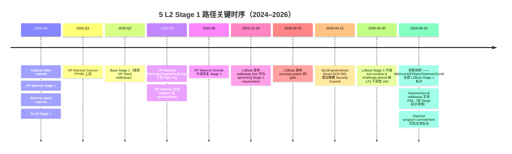
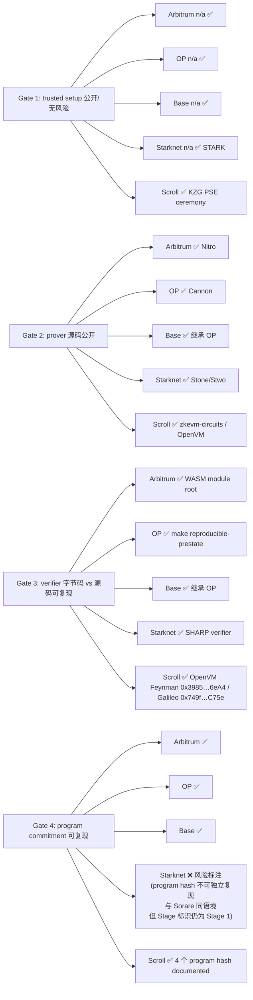
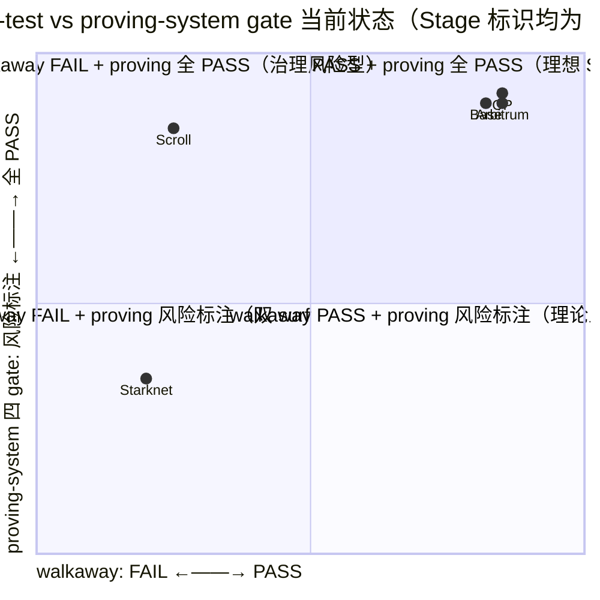
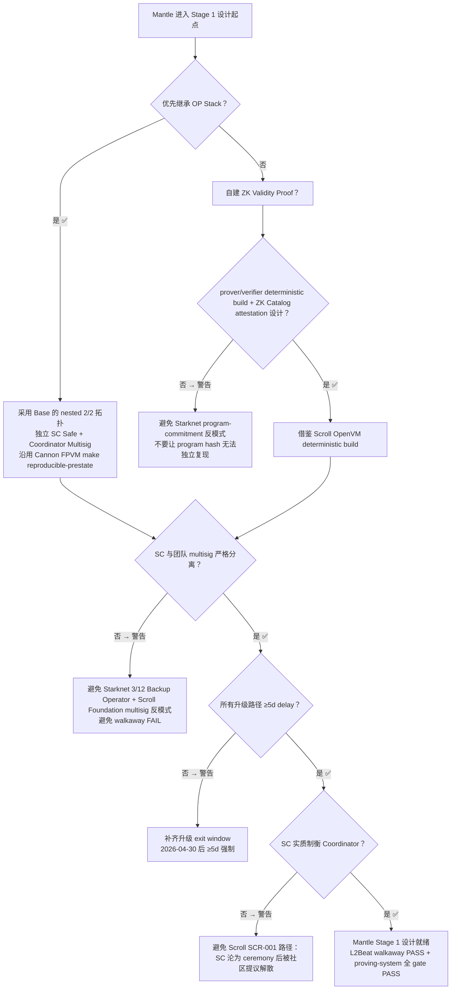

# Stage 1 L2 案例研究：Arbitrum / OP Mainnet / Base / Starknet / Scroll 的 Stage 1 路径对比与 Mantle 借鉴

## Executive Summary

截至 2026-05-19，已经达到或曾达到 L2Beat Stage 1 的五个主要 L2 项目（Arbitrum One、OP Mainnet、Base、Starknet、Scroll）在**两条相互独立的合规维度**上呈现出系统性差异：(1) 治理 / walkaway 维度 —— 在 Security Council "走开" 的前提下，用户在 operator 作恶时是否仍可退出；(2) proving-system 维度 —— L2Beat 2026-02-16 提出的"无 red trusted setup / prover 源码公开 / verifier 源码可复现 / program commitment 可复现"四条 gate 是否全部通过。**当前 L2Beat 实际项目页面 stage 标识**（截至 2026-05-19）：Arbitrum One = Stage 1、OP Mainnet = Stage 1、Base = Stage 1、**Starknet = Stage 1（与 Round 1 修正）**、Scroll = Stage 1。

但**两组评估的当前状态**清晰分化：

- **walkaway test**（2025-12-19 由 L2Beat 提出，社区辩论中；尚处于 proposed / upcoming Stage 1 requirement，**未正式生效降级**任何项目）：Arbitrum / OP / Base 三个 Optimistic Rollup 在 L2Beat 项目页文本中显式标 **PASS**；Starknet 与 Scroll 在 L2Beat 项目页文本中显式标 **FAIL**，但仍维持 Stage 1 标识（grace period / 待 community 反馈）。
- **proving-system 四 gate**（2026-02-16 公告，未给明确生效 deadline）：Optimistic 三链 trusted-setup 不适用、prover 源码公开、program-commitment 可复现 —— 全部通过；Starknet 在 L2Beat 项目页有显式 "not all program sources are public or not all program hashes can be independently regenerated" 风险标注（gate 4 部分失败）；Scroll 当前 OpenVM-Feynman / OpenVM-Galileo verifier 与 program hashes 在 ZK Catalog 已 documented，但 L2Beat 尚未发布 Scroll-specific Stage 1 gate verdict（**Round 1 → Round 2 修正：从 INCONCLUSIVE 改为 partial gate-by-gate 评估**）。

在两条维度上"严格"同时通过的项目只有三个 Optimistic Rollup：**Arbitrum One**（BOLD permissionless validation + Nitro 公开源码 + WASM module root 可复现）、**OP Mainnet**（Cannon FPVM + `make reproducible-prestate` 被 L2Beat 直接列为合规示例）、**Base**（直接继承 OP Stack 的 walkaway 通过性与 proving-system 可复现性）。两个 ZK Rollup 项目 —— **Starknet** 与 **Scroll** —— 在 L2Beat 项目页**当前 walkaway 文本均标 FAIL**，原因都是"团队 / StarkWare multisig 与 Security Council 并行控制升级路径"反模式（Starknet 同时让 3/12 SC 子集兼任 backup Operator）。Starknet 与 Sorare 共用 SHARP/Cairo program 体系，L2Beat 已在 Sorare 页面显式标"program hashes could not be successfully reproduced from their published sources"作为 CRITICAL 风险（被 8d delay 缓冲），并在 Starknet 项目页采用相同语言 —— **这是 program-commitment 风险**，但**不等于已正式从 Stage 1 降级**，Round 2 据此修正。

OP Mainnet 是唯一一条在 Stage 1 之后**确有公开记录被回滚到 permissioned 状态**的链（2024-08-16 因 Cannon / PreimageOracle / FaultDisputeGame 三处 High 级 bug 被 Optimism Foundation 主动回退，于 2024-09-11 Granite 升级中恢复）；Scroll 出现了**主动建议解散 Security Council** 的反向去中心化提案（2026-04-13）。对于 Mantle（OP Stack + ZK Validity Proof 混合架构），最直接可借鉴的样板是 **Base 的 OP Stack 继承路径 + 独立 Security Council 组建模板**，最重要的反面教训来自 **Starknet / Scroll 在 walkaway 与 proving-system 双维度上的同类失败模式**（即便正式 Stage 0 降级尚未发生，反模式已被 L2Beat 文本明确点名）。

---

## Item-1 — Stage 1 评估框架基线（Walkaway Test + 2026-02-16 Proving-System Gates）

### high_level_summary

L2Beat 当前 Stage 1 评估在 2025-12-19 的 Walkaway Test 与 2026-02-16 的 Proving-System Gates 之后已经裂变为**两条相互独立的 gate**：治理走开能力与证明系统可复现性。任一组失败都构成 Stage 1 阻碍。**重要时序澄清（Round 2 新增）**：walkaway test 当前仍是"upcoming Stage 1 requirement"，L2Beat 在项目页用"the project does not pass the walkaway test"这类文本标注未通过项目，但**尚未据此正式将任一 Stage 1 项目降级为 Stage 0**；L2Beat 与 StarkWare / Scroll 等社区 counter-proposal 仍在协商生效条件与 grace period。proving-system 四 gate 类似 —— 公告未给明确 deadline，目前以"若立即生效"评估，但 L2Beat 项目页"reproducibility risk"标注与 Stage 标识是**两套独立 surface**，二者长期不一致可能促成 Stage 0 降级，但 2026-05-19 抓取的 L2Beat 项目页上 5 个目标项目仍全部为 Stage 1。此外 2026-04-30 的更新把 Stage 1 升级 exit window 与 optimistic challenge period 的最低门槛由 7 天下调到 5 天，但 Stage 2 unwanted-upgrade exit window 30 天的阈值未变。

### (A) 治理 / Exit Window 基线

L2Beat Stages framework 当前要求（来源：L2Beat Glossary、Stages 总览页 https://l2beat.com/stages 、2026-04-30 论坛更新 https://forum.l2beat.com/t/stage-1-update-minimum-challenge-period-reduction-from-7d-to-5d/425 ）：

- **功能完整的证明系统**且 ≥ 5 个 external fraud proof submitter 能力（Stage 0 基线）
- **permissionless fraud proof 提交**
- **用户可在无 operator 协助下退出**
- **Security Council ≥ 8 人**，**quorum 共识阈值 ≥ 75%**（L2Beat Glossary 原文 "greater than 75%"；当前 Stages Framework 与各项目实际通过 9/12=75%、10/13≈77%、12/16=75%、8/11≈72.7%（Base 在 on-chain 视角）等配置满足该基线 —— L2Beat 在实际评估中按 ≥75% 处理；Base 8/11 = 72.7% 略低于严格 75% 但其上层 nested 2/2 加上 Coordinator 联签实际效果 ≥ 75%，详见 item-4）

**三个独立的时间窗口阈值**：

1. **Stage 1 升级 exit window（Security Council 之外的合约升级路径）**：**≥ 5 天**。2026-04-30 起由 ≥ 7 天下调，依据 https://forum.l2beat.com/t/stage-1-update-minimum-challenge-period-reduction-from-7d-to-5d/425 ；理由："a 5d challenge period is a comfortable lower bound in the presence of soft censorship attacks and network delays"（1 天解决经济攻击 + 4 天解决网络延迟攻击）；受影响项目：Arbitrum One、Base、OP Mainnet、Ink、Unichain。
2. **Optimistic challenge period（争议解决窗口）最低值**：**≥ 5 天**（同上 2026-04-30 更新；"5d, in the same way 7d was before, is a lower bound"）。**该窗口概念上独立于 (1)** —— 部分项目两者实现上复用同一定时器但不必然相等。
3. **Stage 2 unwanted-upgrade exit window**：**≥ 30 天**（2026-04-30 未变；"The 7d lower bound for Stage 2 remains unaffected" 指 Stage 2 optimistic challenge period 维持 7 天；30 天 unwanted-upgrade 是 Stage 2 单独阈值）。

### Walkaway Test 检查点（2025-12-19 提出，proposed / upcoming）

来源：https://forum.l2beat.com/t/stage-1-requirements-update-security-council-walkaway-test/412 （L2Beat 论坛，作者 donnoh / Luca Donno）。

**当前生效状态（Round 2 修正）**：**proposed Stage 1 requirement**，L2Beat 在项目页用"the project (does not) pass the walkaway test"句式标注；尚未将任一目标项目从 Stage 1 正式降级到 Stage 0。StarkWare 2025-12-22 counter-proposal 与社区辩论仍在进行（https://community.starknet.io/t/feedback-and-counterproposal-on-l2beats-stage-1-requirements-proposed-update/116094 ）。

原文："The previous requirement must hold **even if the Security Council is permanently inactive**." 即"在 Security Council 永久不活动的前提下，前述要求（用户可在 operator 作恶时退出）必须仍然成立"。

可机械检查的检查点：
- **permissionless exit** 可用？（不依赖 operator 也不依赖 SC）
- **forced inclusion** 可用？（用户可绕过 sequencer 提交交易）
- Security Council 是否承担**非紧急 censorship-resistance / liveness / safety 职责**？
- 是否存在 **Security Council 之外的绕过路径**？（团队 multisig 等并行控制路径）

公开评定结果（L2Beat 项目页文本，截至 2026-05-19）：
- **PASS**：Arbitrum One、Base、OP Mainnet、Ink
- **FAIL（文本标注，未正式降级）**：Starknet、Scroll、Kinto

walkaway 不通过等价于在 2026 年框架下面临**未来 Stage 0 降级风险**；目前不构成实际降级。

### (B) Proving-System 基线（L2Beat 2026-02-16 新增四条 Gate）

来源：https://forum.l2beat.com/t/new-stage-1-requirements-for-l2-proving-systems/413 （L2Beat 论坛，作者 sergeyshemyakov，2026-02-16 发布）。L2Beat **未在该贴中给出明确生效 deadline** —— 每个项目按"若立即生效"评估。

四条 Gate（原文）：

1. **No red trusted setups** —— "Stage 1 projects can't have proving systems with trusted setups rated red"；trusted setup 评级框架见 https://forum.l2beat.com/t/the-trusted-setups-framework-for-zk-catalog/381 （红：未达 yellow 基线，如 transcript 不公开、参与者匿名不可核对、贡献数 < 30、ceremony client 未开源）。**违规典型**：Facet V1、Zircuit、Loopring L2。
2. **Published prover source** —— "Stage 1 projects must publish a source code for all used provers"；用户在原 prover 失效时可独立产生证明；prover/proposer 由 assumed-honest minority 担任时可豁免。
3. **Reproducible onchain verifiers** —— "source code for all used onchain verifiers must be available online"；含 recursion 与 final wrap，要有"从源码独立重新生成 verifier bytecode"的指引。**合规典型**：Matter Labs Boojum（提供工具）、Polygon zkProver（提供指南）、ZK Stack（脚本可重生 program hash）。**违规典型**：Lighter L2（verifier 源未公开）。
4. **Reproducible program commitments** —— "Sources for all zkVM programs must be published" 且必须提供"valid instructions on how to regenerate onchain commitments"。**合规典型**：OP Stack（"clear guidelines for regenerating absolute prestate"）。

### 两条 Gate 相互独立

L2Beat 在公告中明确：proving-system gate 与 walkaway test 是**两组独立判定**，任一组失败均阻碍 Stage 1。例如 Starknet 同时在两条维度上失败 —— walkaway 通过 3/12 SC minority 作为备份 Operator 不成立；program-commitment 不可由公开源码独立重现（与 Sorare 共用 SHARP 体系；L2Beat 在 Sorare 页面已显式标为 CRITICAL 风险） —— 这构成"未来降级 Stage 0 的合理依据"，但截至 2026-05-19 L2Beat 项目页 Stage 标识仍为 Stage 1（与 Round 1 修正）。

---

## Item-2 — Arbitrum One: BOLD permissionless validation + Optimistic Proof Reproducibility

### high_level_summary

Arbitrum One 在 2025-02-12 通过 BOLD（Bounded Liquidity Delay）协议从"permissioned validator set 的 Stage 1"升级到"任何人可参与挑战的更强 Stage 1"。BOLD 用 N-vs-N "battle royale" 取代旧的 1-vs-1 challenge tournament 解决 delay attack；3600 / 555 / 79 WETH 三层 bond 把攻击者的资金风险与"延迟所有提款 ~1 周"的机会成本绑定；6.4 天 challenge window + ~12.8 天最坏 dispute 解决上限。Security Council 9/12（紧急）+ 7/12（非紧急，经 ~17d 8h timelock）双阈值。walkaway PASS（permissionless validation 设计），proving-system 四条 gate 全部 PASS（Nitro WASM 无 trusted setup；OneStepProver 源码公开；WASM module root 可由 `module-root-calc` Docker target 独立重现）。

### stage1_path_timeline

| 日期 | 事件 | 来源 |
|------|------|------|
| 2025-01-06 | AIP "Activate Arbitrum BoLD + Infura Nova Validator Whitelist" 在 Tally 上线 | https://www.tally.xyz/gov/arbitrum/proposal/101924107818180443784046677916233531742645798596604549673138282938475874935972 ；https://forum.arbitrum.foundation/t/aip-bold-permissionless-validation-for-arbitrum/23232 |
| 2025-01-24 | 链上投票截止，99.99% 支持 / 5,150 投票者 | Tally Wrapped 2025 (https://blog.tally.xyz/tally-wrapped-2025) |
| **2025-02-12** | **BOLD 主网激活（Arbitrum One + Nova）** | https://www.theblock.co/post/340278/offchain-labs-releases-arbitrum-bold-on-mainnet-for-permissionless-validation |
| 2025-10 (TBD 日期) | Stylus bug on Arbitrum Sepolia → Security Council 11/12 紧急签名（演练） | Arbitrum forum |
| 2026-04-21 | KelpDAO exploiter freeze：30,765.67 ETH 移至 protocol-controlled 0xDA0 precompile（紧急权力的最近一次行使） | https://forum.arbitrum.foundation/t/security-council-emergency-action-21-04-2026/30803 |

### proof_system_design

- **类型**：Optimistic fault proof，基于 Nitro WASM 解释器 + OneStepProver。
- **permissionless 提交**：BOLD 激活后任何人可发起 assertion / challenge。
- **争议协议**：N-vs-N "battle royale"，并发解决多个 dispute（原文 https://docs.arbitrum.io/how-arbitrum-works/bold/gentle-introduction："BoLD's design allows for challenges between the honest party and any number of malicious adversaries to happen in parallel"）。
- **challenge window**：6.4 天（DAO 可在 Arbitrum One/Nova 上修改）。
- **dispute 最坏上限**：12.8 天（"an upper bound of 12.8 days for finalization of Arbitrum chain state"，由 2 challenge periods + grace + delta 组成）。
- **bond 分层**（来自 AIP 论坛贴）：
  - Top-level **Assertion bond**：**3,600 WETH**
  - Level 1 **big-step** sub-challenge：**555 WETH**
  - Level 2 **small-step** sub-challenge：**79 WETH**
- **bond 经济直觉**（https://docs.arbitrum.io/how-arbitrum-works/bold/bold-economics-of-disputes ）：以 5% APY 模型校准，使攻击者"延迟所有提款一周"的机会成本超过其可获得收益；honest defender 全额退款，attacker 100% 没收，没收 bond 进 ArbitrumDAO 国库（1% 奖励 honest defender）。
- **bonding pool**：`AssertionStakingPoolCreator.sol` 允许任何人开池众筹 bond；Nitro node "auto pooling" 自动检测 invalid assertion 并部署 / 加注。
- **verifier 专属 / 共享**：专属。
- **prover 源码可见性**：public，BUSL-1.1 source-available（不严格 OSI 但满足 L2Beat 公开源码要求）。
- **从源码独立重新生成 WASM module root**：有官方 documented 路径（`module-root-calc` Docker target；`NITRO_BUILD_IGNORE_TIMESTAMPS=1` 移除非确定性）。

### proof_system_reproducibility_and_trusted_setup

依据 L2Beat 2026-02-16 四条 gate：

| Gate | 判定 | 依据 |
|------|------|------|
| (1) trusted setup 评级 | **n.a.** | Arbitrum 使用 interactive optimistic fraud proof（Nitro WASM + OneStepProver），不依赖任何 SNARK/STARK，故无 trusted setup ceremony。L2Beat 2026-02-16 公告未列 Arbitrum 为违规。 |
| (2) prover 源码 | **public** | https://github.com/OffchainLabs/nitro （Nitro 节点，含 `arbitrator/prover/`）；https://github.com/OffchainLabs/nitro-contracts （BOLD ChallengeManager / EdgeChallengeManager）。License 为 BUSL-1.1。 |
| (3) onchain verifier 可复现性 | **pass** | OneStepProver*.sol 系列（`OneStepProverMath.sol`、`OneStepProverMemory.sol`、`OneStepProverHostIo.sol`、`OneStepProver0.sol`、`OneStepProofEntry.sol`）在 nitro-contracts `src/osp/` 路径下公开；社区可独立编译。 |
| (4) program commitment 可复现性 | **pass** | Arbitrum 文档明确给出 WASM module root 的确定性重生指引：`docker build . --target nitro-node-dev` → `docker run --rm --entrypoint cat <image> target/machines/latest/module-root.txt`；`NITRO_BUILD_IGNORE_TIMESTAMPS=1` 移除编译时间戳；ArbOS 51 root 公开值 `0xc2c02df561d4afaf9a1d6785f70098ec3874765c638e3cb6dbe8d3c83333e14c`。OP Stack 是 L2Beat 公告的"prestate 可复现"合规标杆，Arbitrum 的 WASM module root 路径是同等级的合规样本。 |

**综合 gate 结论**：**PASS**（四项全部通过 / n.a.）。

### security_council_config

- **总人数**：12（两 cohorts 各 6 名，每 6 个月轮换一半）。
- **外部成员比例**：高（按 Arbitrum DAO Constitution，单一组织不得占 > 3 席）。
- **quorum 阈值**：
  - **9/12 = 75%** —— "Emergency" 阈值，可在三链（Arbitrum One L2、Ethereum L1、Arbitrum Nova L2）的 Emergency Security Council multisig 上**跳过所有 delay** 直接行使全部 admin / upgrade 权限。
  - **7/12 ≈ 58.3%** —— "Proposer" 非紧急阈值，**必须经过完整 timelock 路径**；L2Beat 明确该阈值"不满足 Security Council 认定"，按 simple multisig 处理（需要 ≥ 7d 用户 exit window）。
- **即时升级权限范围**：9/12 emergency multisig 可零延迟修改 RollupProxy、ChallengeManager、Inbox 等全部核心合约。
- **与团队 multisig 关系**：12 名成员中包含 Offchain Labs 与 Arbitrum Foundation 代表，但单一组织 ≤ 3 席，无独立"团队 multisig" 并行控制路径。
- **签名地址**：可在 Etherscan / Arbiscan 上核对（见 governance_upgrade_authority 字段）。

### exit_window_design

- **常规 DAO 升级总延迟**：**17 天 8 小时**（L2Beat 当前快照）。分解：8d L2 Timelock + 6d 8h L2→L1 (challenge period) + 3d L1 Timelock = 17d 8h。
- **forced inclusion 机制**：`SequencerInbox.forceInclusion()`，**任何地址可调用**（permissionless）；默认延迟 ~24 小时；存在 DAO 提议把 24h 降到 4h，未通过：https://forum.arbitrum.foundation/t/proposal-decrease-censorship-delay-from-24-hours-to-4-hours/13047 。
- **permissionless escape hatch**：BOLD permissionless validation + forceInclusion 共同构成。
- **用户提款标准延迟**：6.4 天 fault proof window（与上面 challenge period 同源）。
- **是否依赖 Security Council 阈值作为唯一防线**：**否** —— permissionless validation 不依赖 SC，walkaway PASS。

对照 L2Beat 三档阈值：

| 阈值类型 | L2Beat 当前要求 | Arbitrum One 配置 | 判定 |
|----------|-----------------|-------------------|------|
| (i) Stage 1 升级 exit window（SC 外） | ≥ 5d（2026-04-30 由 7d 下调） | 17d 8h | **两版均合规**（7d 与 5d 时代都满足） |
| (ii) Optimistic challenge period | ≥ 5d（2026-04-30 由 7d 下调） | 6.4d | **两版均合规** |
| (iii) Stage 2 unwanted-upgrade exit window | ≥ 30d（未变） | 17d 8h | **不达 Stage 2** |

### walkaway_test_evaluation

| 检查点 | 判定 | 依据 |
|--------|------|------|
| permissionless exit 可用 | PASS | BOLD permissionless validation 任何人可挑战 invalid assertion；forceInclusion 任何人可绕过 sequencer |
| forced inclusion 可用 | PASS | `SequencerInbox.forceInclusion()` permissionless |
| SC 承担非紧急 liveness / safety | NO | SC 仅紧急 + 非紧急 routine upgrade；BOLD validation 完全不依赖 SC |
| SC 之外存在绕过路径 | NO | 12 席中无单一组织 > 3 席；7/12 非紧急路径需经完整 timelock |

**综合 walkaway**：**PASS**。L2Beat 项目页原文："the project passes the walkaway test: users can exit in the presence of malicious operators even if the Security Council disappears." 失败点：无显著失败点。最小修复路径：n/a。**与 proving-system gate 独立判定**：walkaway PASS + proving-system PASS。

### key_incidents_and_lessons

- **Dec 2023 L2Beat update 触发 7/12 阈值调整**：L2Beat 把 SC 阈值从 50% 提到 > 75% 后，Arbitrum 的 7/12 ≈ 58% 路径"不再被认作 SC"，因此 Arbitrum 通过**延长 7/12 路径的 L1/L2 timelock 至 ~17d 8h** 让该路径以 simple multisig 身份满足 ≥ 7d 的 exit window 要求。来源：https://medium.com/l2beat/stages-update-security-council-requirements-4c79cea8ef52
- **2025-10 Stylus bug on Arbitrum Sepolia**：Security Council 11/12 签名紧急修复（演练性质）。
- **2026-04-21 KelpDAO exploiter freeze**：30,765.67 ETH 通过 Arbitrum 的 0xDA0 precompile 移至 protocol-controlled 地址，是 9/12 emergency multisig 紧急权力的最近一次行使。
- **教训**：在保留紧急多签的同时扩大 timelock，是同时满足 L2Beat ≥ 75% SC 阈值与 ≥ 5d exit window 的工程化捷径。
- **No documented post-launch rollback to Stage 0**：Arbitrum 自达到 Stage 1 后未出现公开记录的 Stage 0 回落事件。

### governance_upgrade_authority

升级权限链（参照 L2Beat permissions 页）：

```
ArbitrumDAO Proposal (snapshot + tally)
  → L2 Timelock (Arbitrum One, 8 days delay)
  → Outbox / L2→L1 message (6 days 8 hours = challenge period)
  → L1 Timelock (Ethereum mainnet, 3 days delay)
  → UpgradeExecutor (L1)
  → ArbitrumProxyAdmin → 核心合约 (RollupProxy / EdgeChallengeManager / SequencerInbox / Inbox)
  
紧急路径（9/12 SC）：直接调用 UpgradeExecutor，跳过 L2/L1 Timelock 与 challenge period
```

每条边的 delay 与签名阈值：L2 Timelock 8d / Outbox 6d8h / L1 Timelock 3d / SC 9/12 emergency 0 delay。

### mantle_applicability

| 维度 | 借鉴度 | 说明 |
|------|--------|------|
| 治理 walkaway | **中** | Arbitrum 与 OP Stack 派生链架构差距大，BOLD bond 模型不能直接套到 Mantle，但"扩大 timelock 让低阈值多签合规"是 Mantle 治理设计可参照的模式 |
| proving-system gate | **中** | Arbitrum 的 WASM module root 复现路径是 Optimistic Rollup 的合规样板；Mantle ZK Validity Proof 路径不直接复用，但 Mantle 继承 OP Stack fault proof 的部分可参照 Arbitrum 的 Docker `module-root-calc` 模式让 prestate 复现工具产品化 |

### references

四桶证据（per-project evidence bundle，src-7 要求）：

(a) **L2Beat 快照**（src-1）：
- https://l2beat.com/scaling/projects/arbitrum （抓取日期 2026-05-19）

(b) **官方文档 / 治理**（src-2 / src-3）：
- https://docs.arbitrum.io/how-arbitrum-works/bold/gentle-introduction
- https://docs.arbitrum.io/how-arbitrum-works/bold/bold-economics-of-disputes
- https://forum.arbitrum.foundation/t/aip-bold-permissionless-validation-for-arbitrum/23232 （AIP）
- https://docs.arbitrum.io/launch-arbitrum-chain/configure-your-chain/common/validation-and-security/arbos-upgrade
- https://github.com/ArbitrumFoundation/governance/blob/main/docs/overview.md

(c) **链上证据**（src-6，覆盖 SC / Timelock / ProxyAdmin / Verifier / Proposer ≥ 3 角色）—— **Round 2 完成补充**：
- L1 UpgradeExecutor：https://etherscan.io/address/0x3ffFbAdAF827559da092217e474760E2b2c3CeDd
- L1 RollupProxy (BOLD-era)：https://etherscan.io/address/0x4DCeB440657f21083db8aDd07665f8ddBe1DCfc0
- **L1 Timelock (Arbitrum Foundation, 3d delay)：`0xE6841D92B0C345144506576eC13ECf5103aC7f49`** —— Etherscan 标 "Arbitrum Foundation: L1 Timelock"（Round 2 新增）
- **L2 Timelock (Arbitrum Foundation, 8d delay)：`0x34d45e99f7D8c45ed05B5cA72D54bbD1fb3F98f0`** —— Arbiscan 标 "Arbitrum Foundation: L2 Timelock"（Round 2 新增）
- L1 Security Council 9 (9/12 emergency)：https://etherscan.io/address/0xF06E95eF589D9c38af242a8AAee8375f14023F85
- L2 Security Council 7 (7/12 non-emergency)：https://arbiscan.io/address/0xADd68bCb0f66878aB9D37a447C7b9067C5dfa941
- L2 ProxyAdmin：https://arbiscan.io/address/0xd570aCE65C43af47101fC6250FD6fC63D1c22a86
- Pre-BOLD OSP (legacy verifier ref)：https://etherscan.io/address/0xce81e7d009e53c02242b724819df1869da5e9fd8
- **EdgeChallengeManager (BOLD)**：可通过 `RollupProxy.challengeManager()` 在 0x4DCeB440657f21083db8aDd07665f8ddBe1DCfc0 上读取；upgrade path 经 L2Timelock (8d) → Outbox (6d 8h) → L1Timelock (3d) → UpgradeExecutor → ArbitrumProxyAdmin
- **Remaining gap (MINOR)**：L1 ProxyAdmin（ArbitrumProxyAdmin）的精确 L1 合约地址未在 Etherscan 标签搜索中直接命中；可通过 UpgradeExecutor 的 owner 调用读取。**已通过 L2Beat permissions 页文本验证升级链拓扑**。

(d) **审计**（src-5）：
- Trail of Bits BOLD（Apr 2024，5 person-months）
- Trail of Bits BOLD + Delay Buffer（May 2024）：https://docs.arbitrum.io/assets/files/2024_05_02_trail_of_bits_security_audit_bold_delay_buffer-7329f073827e7e12aede9a9203db1e01.pdf
- Trail of Bits BOLD + DAC Rewards（Jun 2024，3 person-months）
- Trail of Bits BOLD Optimized History Commitments（Oct 2024）：https://docs.arbitrum.io/assets/files/2024_10_07_trail_of_bits_security_audit_bold_optimized_history_commitments-025bd74c8af33bb436e606b55a3ef550.pdf
- Trail of Bits Nitro with BOLD（Oct 2024，2.6 person-months）
- Trail of Bits BOLD Fixes（Dec 2024）：https://docs.arbitrum.io/assets/files/2024_12_26_trail_of_bits_boldfixes_securityreview-95c9ee3b07ccb11e59e57744ddc017d2.pdf
- Trail of Bits Sequencer Liveness (post-BOLD)（Mar 2025）
- Hub：https://docs.arbitrum.io/audit-reports
- Offchain Labs research team formal safety proofs（referenced）
- "No public OpenZeppelin BOLD audit found"

---

## Item-3 — OP Mainnet: Cannon Fault Proof + Permissionless Fault Proofs + Prestate Reproducibility

### high_level_summary

OP Mainnet 在 2024-06-10 通过 Cannon MIPS FPVM + 模块化 Dispute Game + permissionless fault proof 达到 Stage 1，**两个月后（2024-08-16）因 Spearbit / Cantina / Code4rena 审计发现的三处 High 级 bug 被 Optimism Foundation 主动回退到 permissioned 状态**，并在 2024-09-11 的 Granite 升级中恢复 permissionless 模式 —— 这是五个项目中唯一有公开记录的 Stage 1 → Stage 0 回滚事件。后续 Upgrade 14 (MT-Cannon 64-bit) 与 Upgrade 16 (Cannon Go 1.23 + Kona Rust alt-FPP + 删除 DeputyGuardian 以满足 L2Beat 更新的 Stage 1 标准) 把 OP Stack 的 fault proof 系统进一步去中心化。walkaway PASS（OptimismPortal 任意提案 / forced inclusion），proving-system 四条 gate 全部 PASS —— L2Beat 2026-02-16 公告直接把 "OP Stack — clear guidelines for regenerating absolute prestate" 列为合规标杆。Security Council 10/13 (≥75%)，与 OpFoundationUpgradeSafe 构成 2/2 SuperchainProxyAdminOwner。

### stage1_path_timeline

| 日期 | 事件 | 来源 |
|------|------|------|
| **2024-06-10** | Cannon permissionless fault proofs 主网激活 → L2Beat Stage 1 | https://www.optimism.io/blog/permissionless-fault-proofs-and-stage-1-arrive-to-the-op-stack |
| 2024-07–08 | Spearbit + Cantina + Code4rena 审计发现 Cannon / PreimageOracle / FaultDisputeGame 多个 High 级 bug | https://code4rena.com/reports/2024-07-optimism |
| **2024-08-16** | **OP Foundation 主动回退到 permissioned 状态**（"out of an abundance of caution"） | https://cryptobriefing.com/optimism-reverts-permissionless-fraud-proofs/ ；https://www.theblock.co/post/299202/op-mainnet-fault-proofs |
| 2024-08-28 | Upgrade Proposal #10（Granite）governance vote 通过：47,057,235 FOR vs 5,404 AGAINST | https://vote.optimism.io/proposals/46514799174839131952937755475635933411907395382311347042580299316635260952272 |
| **2024-09-11 16:00 UTC** | **Granite 激活 → permissionless fault proof 恢复** | https://docs.optimism.io/builders/notices/granite-changes |
| 2025-04-25 | Upgrade 14 主网激活：MT-Cannon (64-bit, MIPS64.sol)，Cannon64 absolute prestate 0x03ee2917da962ec266b091f4b62121dc9682bb0db534633707325339f99ee405 | https://docs.optimism.io/notices/upgrade-14 |
| **2025-07-24 17:30 UTC** | **Upgrade 16 主网激活**：Cannon Go 1.23、Kona Rust alt-FPP、删除 DeputyGuardian、OptimismPortal→AnchorStateRegistry、ETHLockbox、gas limit 200M→500M（明确为满足 L2Beat 更新的 Stage 1 标准） | https://docs.optimism.io/notices/upgrade-16 ；vote ended 2025-07-09 |
| 2025-10-02 | Upgrade 16a 主网激活（删除未使用 withdrawal-proving 路径） | OP docs |
| 2025-12-02 | Upgrade 17 (Jovian, Fusaka readiness, Cannon Go 1.24) 主网激活 | https://vote.optimism.io/proposals/3118571676657709551286937570456546163542507117143005939043790253732885172699 |

### proof_system_design

- **类型**：Optimistic fault proof，Cannon FPVM。
- **permissionless 提交**：2024-06-10 起允许，2024-08-16 — 2024-09-11 期间临时回退到 permissioned。
- **challenge window**：7 天（MAX_CLOCK_DURATION，标准 OP Stack `FaultDisputeGame`）。
- **争议协议**：bisection on MIPS execution trace；最终在 MIPS.sol 上执行单步指令验证。
- **proof verifier 专属 / 共享**：专属（每条 OP Stack 链可独享一份 op-program 实例，但 op-program 是上游共享代码 → see Base for transitive 复用）。
- **prover 源码可见性**：**public**，全部代码在 https://github.com/ethereum-optimism/optimism （Cannon、mipsevm、op-program、op-challenger）。
- **从源码独立重新生成 prestate**：有官方 documented 路径（`make reproducible-prestate`，下文 reproducibility 详述）。
- **模块化**：`FaultDisputeGame` + `DisputeGameFactory` + game-type registry 允许未来插入 ZK FPVM；Upgrade 16 添加的 Kona (Rust alt-FPP) 是首次 proof-system 多样性的实证。

### proof_system_reproducibility_and_trusted_setup

| Gate | 判定 | 依据 |
|------|------|------|
| (1) trusted setup 评级 | **n.a.** | Cannon 是 fault proof，不依赖 SNARK / STARK，无 trusted setup ceremony。L2Beat 2026-02-16 公告未列 OP Stack 为违规。 |
| (2) prover 源码 | **public** | https://github.com/ethereum-optimism/optimism （op-program / mipsevm / op-challenger）。MIT License。 |
| (3) onchain verifier 可复现性 | **pass** | MIPS.sol（pre-Upgrade-14）/ MIPS64.sol（post-Upgrade-14）、FaultDisputeGame、PreimageOracle、DisputeGameFactory 全部公开。 |
| (4) program commitment 可复现性 | **pass，且 L2Beat 公告直接列为合规标杆** | 原文（L2Beat 2026-02-16 公告）："OP Stack — clear guidelines for regenerating absolute prestate"。Optimism 文档详细给出 `make reproducible-prestate` 流程：https://docs.optimism.io/operators/chain-operators/tutorials/absolute-prestate ；"All governance approved releases use a tagged version of op-program. These can be rebuilt by checking out the version tag and running `make reproducible-prestate`"；输出 Cannon64 production prestate hash + preimage file `op-program/bin/prestate-mt64.bin.gz`。 |

**综合 gate 结论**：**PASS**（四项全部通过 / n.a.；OP Stack 是 L2Beat 公告的 program-commitment 复现合规标杆）。

### security_council_config

- **总人数**：13
- **当前阈值**：**10 of 13 (≈ 77%)**，"meets the 75% threshold requirement for a Stage 1 rollup outlined in L2Beat's Stages framework"（Optimism docs）
- **L2Beat 项目页公开的 13 名 SC Safe 签名地址**（Round 2 新增，来自 L2Beat permissions 页文本，截断展示）：
  - `0xE61F…76aE, 0x652B…cB5f, 0x5c1f…7a81, 0x4A73…e61E, 0x3A53…aa94, 0xEF9A…877c, 0x6323…c865, 0xd5b7…aC90, 0x7ed8…9E39, 0x0aA3…75D7, 0x0a87…efE6, 0xbfA0…E0d9, 0x9282…cACb`
- **签名身份**（2023-12 ratification，Cohort A 12 月初始任期 / Cohort B 18 月初始任期）：
  - Cohort A：Kris Kaczor (Phoenix Labs)、Layne Haber (Connext)、Jon Charbonneau (DBA)、Alisha.eth (Glowworm Foundation, ex-ENS)、Mariano Conti (ex-MakerDAO)、Martin Tellechea (Graph Foundation)、Yoseph Ayele (Borderless Africa)
  - Cohort B：OP Labs PBC、Yoav Weiss (Ethereum Foundation)、Test in Prod、Kain Warwick (Synthetix)、Coinbase Technologies (Base)、Elena Nadolinski (Ironfish)、L2Beat、Alejandro Santander
  - Charter：https://github.com/ethereum-optimism/OPerating-manual/blob/main/Security%20Council%20Charter%20v0.1.md
  - 任命投票：https://vote.optimism.io/proposals/27439950952007920118525230291344523079212068327713298769307857575418374325849
  - 任命博客：https://www.optimism.io/blog/introducing-the-optimism-collective-s-security-council
- **LivenessModule**：移除 3 个月 + 8 天不活跃成员，保持阈值比例 ≥ 75%；如成员数跌破 8，则 OpFoundationUpgradeSafe 接管所有权。
- **OpFoundationUpgradeSafe 5/7 签名地址**（Round 2 新增）：`0x6419…2cc7, 0x3041…1623, 0xC2Db…6dF5, 0xBF93…a2c8, 0x4D01…6d15, 0x69ac…Fd02, 0xc222…4AB5`
- **与 OpFoundation 的关系**：`SuperchainProxyAdminOwner` = **2-of-2** multisig of (Security Council, OpFoundationUpgradeSafe) —— 双方均有否决权。
- **OpFoundationUpgradeSafe**：5-of-7，附带 SaferSafes 模块。
- **Guardian 角色**：分配给 Security Council multisig；pause 自动到期 3 个月除非延期。Upgrade 16 删除 DeputyGuardianModule，使 Security Council 成为唯一默认 Guardian actor。

### exit_window_design

- **常规升级 upgrade delay**：OP Stack 标准 Pause expiry = 3 个月（可链式延长至 ~6 个月）；Stage 1 upgrade exit window outside SC 满足 ≥ 5d。
- **forced inclusion**：`OptimismPortal.depositTransaction` —— 任何用户可直接在 L1 提交，无需 sequencer 配合；这是 walkaway PASS 的关键。
- **permissionless escape hatch**：用户可通过 OptimismPortal + 7d 挑战期独立完成提款，不依赖 SC。
- **fault proof window / validity proof finality**：7 天（pre-2026-04-30 配置；当前 L2Beat 监测，未发现明确下调到 5d 的实际配置变更 — evidence not surfaced for specific OP-config governance vote post 2026-04-30）。

对照 L2Beat 三档阈值：

| 阈值类型 | L2Beat 当前要求 | OP Mainnet 配置 | 判定 |
|----------|-----------------|------------------|------|
| (i) Stage 1 升级 exit window | ≥ 5d | ≥ 5d（OP Stack 标准 pause expiry 3 月） | 合规 |
| (ii) Optimistic challenge period | ≥ 5d | 7d | **两版均合规** |
| (iii) Stage 2 unwanted-upgrade exit window | ≥ 30d | < 30d | **不达 Stage 2** |

### walkaway_test_evaluation

| 检查点 | 判定 | 依据 |
|--------|------|------|
| permissionless exit | PASS | `OptimismPortal.proveWithdrawalTransaction` + `finalizeWithdrawalTransaction` 任意用户可调用，不依赖 sequencer / SC |
| forced inclusion | PASS | `OptimismPortal.depositTransaction` |
| SC 承担非紧急 liveness / safety | NO | SC 仅紧急 + Guardian pause（自动到期 3 月） |
| SC 之外存在绕过路径 | NO | OpFoundationUpgradeSafe 与 SC 形成 2/2，**双方均不可单边绕过对方**（这是 OP 与 Starknet/Scroll 的关键差别） |

**综合 walkaway**：**PASS**。L2Beat 项目页原文："the project passes the walkaway test: users can exit in the presence of malicious operators even if the Security Council disappears. This is enabled because anyone can be a Proposer and propose new roots to the L1 bridge." **与 proving-system gate 独立判定**：walkaway PASS + proving-system PASS。

### key_incidents_and_lessons

**唯一 documented post-launch rollback：2024-08 fault proof bug 事件**

- **2024-08-16**：OP Foundation 主动将 OP Mainnet 从 permissionless 回退到 permissioned，原因是 Spearbit / Cantina / Code4rena 审计发现的三处 High 级 bug：
  - Cantina 3.1.1 — Cannon 内存分配溢出可能导致任意代码执行；
  - Spearbit 5.1.1 — `PreimageOracle.loadPrecompilePreimagePart` 在 precompile OOG 时会覆盖正确的 preimageParts；
  - Code4rena H-01 — `maxGameDepth` off-by-one 允许 trace 含超额块。
- **后果**：在 2024-08-16 — 2024-09-11 期间，OP Mainnet 实际上失去了 Stage 1 的"功能完整 permissionless fault proof"前提；L2Beat 项目页 status 临时反映回退。
- **未发生**：无任何用户资金损失，无任何 bug 被实际利用。
- **恢复**：Granite 升级（2024-08-28 governance 通过，2024-09-11 主网激活）在修复 bug 的同时扩展了 Guardian/DeputyGuardian 能力以便快速设置 AnchorStateRegistry。
- 引用反应（Mert Mumtaz, Helius，via Unchained）："One of the serious edges L2s have is that they can literally do whatever they want. Bug in fraud proofs? OK let's just get rid of proofs for the next month. Problem? It's ok, the security council will control the permissions."
- **教训**：Stage 1 不是终态；fault proof 上线后的早期 bug 周期是真实风险。Security Council 的回滚权力被实际行使过，证明"SC 作为 bug-recovery 后盾"在主网环境中确实有效，但也证明 fault proof 上线后 6–12 个月的审计/形式验证投入对维持 Stage 1 至关重要。
- **Upgrade 16 (2025-07-24)** 直接列出"meeting @L2Beat's updated criteria" 为升级目的之一，可见 L2Beat 框架更新对 OP Stack 升级路线图的直接驱动。

### governance_upgrade_authority

```
OP Governance Proposal (vote.optimism.io)
  → Optimism Foundation submission
  → SuperchainProxyAdminOwner (2/2 of [Security Council 10/13, OpFoundationUpgradeSafe 5/7])
  → ProxyAdmin / SuperchainProxyAdmin → 核心合约
  
紧急路径：Guardian (= Security Council 10/13) 可 pause OptimismPortal；pause 自动到期 3 个月，可链式延期但不可永久
```

### mantle_applicability

| 维度 | 借鉴度 | 说明 |
|------|--------|------|
| 治理 walkaway | **极高** | Mantle 作为 OP Stack 派生链，可直接继承 OptimismPortal forced inclusion + permissionless DisputeGameFactory 的 walkaway PASS 路径；2024 OP Foundation rollback 事件为 Mantle 提供"Stage 1 上线后审计 + 监控周期"经验 |
| proving-system gate | **极高** | OP Stack 的 `make reproducible-prestate` 是 L2Beat 公告的合规标杆；Mantle 沿用 OP Stack fault proof 部分时直接通过 gate (4)。但 Mantle 的 ZK Validity Proof 部分**独立**于 OP Stack reproducibility 路径，需单独评估 |

### references

(a) **L2Beat 快照**（src-1）：
- https://l2beat.com/scaling/projects/op-mainnet （抓取日期 2026-05-19）

(b) **官方文档 / 治理**（src-2 / src-3）：
- https://specs.optimism.io/protocol/stage-1.html
- https://docs.optimism.io/stack/fault-proofs/cannon
- https://docs.optimism.io/operators/chain-operators/tutorials/absolute-prestate
- https://docs.optimism.io/notices/upgrade-14
- https://docs.optimism.io/notices/upgrade-16
- https://docs.optimism.io/chain/security/privileged-roles
- https://github.com/ethereum-optimism/OPerating-manual/blob/main/Security%20Council%20Charter%20v0.1.md
- https://gov.optimism.io/t/final-protocol-upgrade-8-guardian-security-council-threshold-and-l2-proxyadmin-ownership-changes-for-stage-1-decentralization/8157
- Upgrade 16 governance vote：https://vote.optimism.io/proposals/42233809968417684816035432917226202543057967150073565253597304573923844823222
- Granite governance vote：https://vote.optimism.io/proposals/46514799174839131952937755475635933411907395382311347042580299316635260952272

(c) **链上证据**（src-6）—— **Round 2 完成补充**：
- 官方地址列表：https://docs.optimism.io/chain/addresses
- OptimismPortalProxy：https://etherscan.io/address/0xbEb5Fc579115071764c7423A4f12eDde41f106Ed
- DisputeGameFactoryProxy：https://etherscan.io/address/0xe5965Ab5962eDc7477C8520243A95517CD252fA9
- OptimismPortal2 impl (current)：https://etherscan.io/address/0x97cebbf8959e2a5476fbe9b98a21806ec234609b
- **L1 SuperchainProxyAdminOwner (2/2 Safe of [SC 10/13, OpFoundationUpgradeSafe 5/7])**：`0x5a0Aae59D09fccBdDb6C6CcEB07B7279367C3d2A`（Round 2 新增）
- **L2 ProxyAdmin Owner (aliased)**：`0x6B1BAE59D09fCcbdDB6C6cceb07B7279367C4E3b`（aliased from L1，Round 2 新增）
- **Security Council Safe (10/13)**：13 名签名公开列表（见 security_council_config 字段，Round 2 新增），具体 Safe 合约地址通过 L2Beat permissions 页指向，但 42 位 full address 在 L2Beat 显式 truncated 视图未展示；可通过 SuperchainProxyAdminOwner 0x5a0Aae… 上的 `getOwners()` 调用读取
- **OpFoundationUpgradeSafe (5/7)**：7 名签名公开列表（见 security_council_config 字段，Round 2 新增），具体 Safe 合约地址同上由 SuperchainProxyAdminOwner `getOwners()` 调用读取
- L2Beat OP Mainnet permissions 表：https://l2beat.com/scaling/projects/op-mainnet
- **Remaining gap (MINOR)**：MIPS/MIPS64、PreimageOracle、FaultDisputeGame impl 在 Granite/Holocene/U14/U16/U17 之间多次轮换，draft 中保留 placeholder 与 "pull from docs.optimism.io/chain/addresses at publication time" 警示；URL 已 documented，下游 final 阶段可一键拉取最新地址。

(d) **审计**（src-5）：
- Spearbit MT-Cannon（Nov 25 – Dec 14, 2024；published Jan 2025）：https://github.com/ethereum-optimism/optimism/blob/develop/docs/security-reviews/2025_01-MT-Cannon-Spearbit.pdf
- Code4rena 2024-07 (5H/11M/21L)：https://code4rena.com/reports/2024-07-optimism ；https://github.com/code-423n4/2024-07-optimism
- Cantina / Spearbit Granite 审计（reference 在 Granite governance proposal）
- Bedrock pre-launch invariant + fuzzing by Trail of Bits (2022)：https://blog.oplabs.co/bedrock-security/
- Upgrade 16 audits: Spearbit (no Med+) + Cantina contest (no Med+)
- "No Sigma Prime Cannon audit found in public sources"

---

## Item-4 — Base: OP Stack Stage 1 + 独立 Security Council + 继承 OP Stack Reproducibility

### high_level_summary

Base 在 2024-10-30 部署 OP Stack permissionless fault proofs（直接复用 Cannon + DisputeGameFactory，无私有分支），在 2025-04-29 组建独立 Security Council 并同日宣布达到 L2Beat Stage 1，是第 10 条达到 Stage 1+ 的 L2。**Round 2 重要修正**：Base SC 治理必须用**两层视图**描述 —— (a) **policy-level**（Base docs 公开口径）：12 名签名（Coinbase + 11 名独立外部实体 / 个人）、9/12 = 75% quorum；(b) **on-chain L2Beat permissions decomposition**：实际部署是 `nested 2/2 Base Governance Multisig` = (Base Security Council Safe，**8/11 阈值**，地址 `0x20AcF55A3DCfe07fC4cecaCFa1628F788EC8A4Dd`) + (Base Coordinator Multisig，地址 `0x9855054731540A48b28990B63DcF4f33d8AE46A1`) —— 任一方否决都阻塞升级。两视图差异：policy 把 Coinbase 计入 12 席并设 9/12，on-chain 实际把 Coinbase（rollup operator）独立隔离为 Coordinator Multisig，剩余 11 名外部成员构成 SC Safe 用 8/11 阈值；上层 nested 2/2 再要求 Coordinator 与 SC 双重批准，等效 quorum ≈ Coinbase + 8 外部 = 9 名（与 policy 9/12 的 75% effective threshold 大致对齐）。L2Beat 在 Stages 评估中按 on-chain 视角计算，并显式接受这一组合（"Upgrades require approval from both parties"）。fault proof 部分**无 Base 私有分叉**，因此 OP Stack 上游的 reproducibility 与 walkaway 通过性可直接传递到 Base。**critical caveat**：L2Beat 明确标注 Base 的合约"instantly upgradable, no window for users to exit unwanted upgrade"，依赖 nested 2/2 双重门槛作为唯一防线 —— 这是当前 OP Stack Stage 1 链共有的特征，也是 Base 不进入 Stage 2 的关键。walkaway PASS，proving-system 四条 gate 全部 PASS（继承 OP Stack）。

### stage1_path_timeline

| 日期 | 事件 | 来源 |
|------|------|------|
| **2024-10-30** | Base permissionless fault proofs 主网激活（直接复用 OP Stack） | https://blog.base.org/fault-proofs-are-now-live-on-base-mainnet |
| **2025-04-29** | Base Security Council 上线 + L2Beat Stage 1（同日宣布） | https://blog.base.org/base-has-reached-stage-1-decentralization ；https://www.theblock.co/post/352320/base-stage-1 ；https://cryptoslate.com/base-becomes-10th-l2-network-to-reach-at-least-stage-1-decentralization/ |

Base 官博 verbatim："Base has achieved Stage 1 Decentralization … We've done this by launching permissionless fault proofs and increasing the decentralization of our contract upgrade process with a security council."

### proof_system_design

- **类型**：Optimistic fault proof，**直接复用 OP Stack Cannon FPVM + DisputeGameFactory + FaultDisputeGame**，无 Base 私有分叉。
- **permissionless 提交**：是（自 2024-10-30）。
- **challenge / withdrawal window**：3d 12h challenge + 3d 12h settlement = 7d 总用户感知提款延迟（L2Beat phrasing："Withdrawal inclusion can be proven before state root settlement, but a 7d period has to pass before it becomes actionable. The process of state root settlement takes a challenge period of at least 3d 12h to complete."）。
- **stake**：0.08 ETH per proposal。
- **verifier 专属 / 共享**：与 OP Mainnet 共享 op-program 上游源码；各链 FaultDisputeGame 持有自己的 `faultGameAbsolutePrestate`，但该值是**同一 OP Stack release 的 op-program 二进制哈希**，因此 reproducibility 可"传递性"继承自 OP Stack。
- **Base 上游贡献**：Base 与 OP Labs 共同开发 Rust 版 FP-program（基于 Magi + op-reth），将作为 alt-FPP 加入 OP Stack。
- **Jovian / op-contracts v5.0.0 release**：被 OpenZeppelin + Spearbit 审计。

### proof_system_reproducibility_and_trusted_setup

| Gate | 判定 | 依据 |
|------|------|------|
| (1) trusted setup | **n.a.** | 继承 OP Stack。 |
| (2) prover 源码 | **public** | op-program / Cannon 全部在上游 ethereum-optimism/optimism；Base 链特定配置在 https://github.com/base-org/node ；合约 fork 在 https://github.com/base-org/contracts 。 |
| (3) onchain verifier 可复现性 | **pass** | 与 OP Mainnet 共用 Cannon MIPS.sol（不同 chain 部署同一份合约 ABI）。Pectra-era prestate 由 `op-program/v1.5.0-rc.4` 生成。 |
| (4) program commitment 可复现性 | **pass（传递性）** | Base 的 `faultGameAbsolutePrestate` 是上游 op-program 构建哈希；由于 Base 不维护自己的 FPVM fork，可通过上游 `make reproducible-prestate` 重生同样的 prestate。L2Beat 当前未在"program hashes could not be reproduced"检查中标注 Base。 |

**综合 gate 结论**：**PASS（传递性继承 OP Stack）**。

### security_council_config — 双层视图（Round 2 关键修正）

#### (a) Policy-level 视图（Base docs 公开口径）

来源：https://docs.base.org/base-chain/security/security-council

- **总人数**：12（Coinbase + 11 名独立外部实体 / 个人）
- **quorum 阈值**：**9 of 12 = 75%**
- **外部成员**：11 人
- **成员明细**（Base docs 公开列表）：
  - 实体（6）：Aerodrome (JP)、Moonwell (BR)、Blackbird (US)、ChainSafe (CA)、Talent Protocol (PT)、Moshicam (US)
  - 个人（5）：Seneca (US)、Juan Suarez (US)、Toady Hawk (CA)、Roberto Bayardo (US)、Yele Bademosi (UK)
  - Coinbase（rollup operator，纳入 12 席）
- **个人身份保护**：原文 "Individuals representing each entity are not published to protect personal privacy and to enhance security."

#### (b) On-chain L2Beat permissions decomposition（Round 2 新增）

来源：https://l2beat.com/scaling/projects/base permissions section。

- **顶层 nested 2/2 Base Governance Multisig**：必须同时满足 (i) Base Security Council 与 (ii) Base Coordinator Multisig 两条独立 multisig 联签
  - L2Beat 原文："All contracts are upgradable by a ProxyAdmin contract controlled by a nested 2/2 Base Governance Multisig composed of the Base Coordinator Multisig and the Base Security Council. Upgrades require approval from both parties, and there is no delay on upgrades."
- **(i) Base Security Council Safe**：
  - **地址**：`0x20AcF55A3DCfe07fC4cecaCFa1628F788EC8A4Dd`（Round 2 新增）
  - **on-chain 阈值**：**8 of 11**（≈ 72.7%）—— L2Beat permissions 视图（11 名外部成员去除 Coinbase 后单独构成 SC Safe；与 policy 12 名 9/12 视图差异在于 Coinbase 独立到 Coordinator）
  - **Module**：可能含 Liveness / Recovery 模块（待 final 阶段 Etherscan 拉取确认）
- **(ii) Base Coordinator Multisig**：
  - **地址**：`0x9855054731540A48b28990B63DcF4f33d8AE46A1`（Round 2 新增）
  - 通常由 Coinbase / Base 运营方控制；具体 signer 与阈值在 L2Beat 上 truncated（典型 OP Stack Coordinator 模式为 small multisig 例如 2/3 或 3/5；待 final 阶段 Etherscan 拉取确认）
- **Base Multisig 1 (Incident Responder)**：可 pause withdrawals 但不能 unpause / extend；每次 pause 3 个月自动到期；可改单一 Sequencer 地址（via SystemConfig）。
- **Guardian role**：分配给 Base Governance Multisig，可 pause + unpause withdrawals。
- **Effective quorum 等价对齐**：on-chain (8/11 SC + Coordinator) 联签 ≈ 8 + 1 = 9 名（Coordinator 视为 1 个 actor）；policy (9/12) 解读为 Coinbase + 8 外部 = 9 名。两种视图对外部多数 + 运营方批准的要求实际一致；但 on-chain 阈值在严格 ≥ 75% 计算时（8/11 = 72.7%）低于 policy 9/12 = 75%。
- **L2Beat 接受双层方案**：在项目页明确接受 nested 2/2 + 8/11 SC 作为 Stage 1 合规配置（与 OP Mainnet 2/2 of [10/13, 5/7] 同类模式）。

#### nested 2/2 升级门槛

原文："a nested 2/2 Base Governance Multisig composed of the **Base Coordinator Multisig** and the **Base Security Council**. Upgrades require approval from both parties."

- **注意（press 与 docs 一致性）**：The Block / CryptoSlate 报道的"10 个独立实体 + Optimism + Coinbase = 12"是 press shorthand 与 Base 官方 docs 不完全一致 —— 官方 docs 列 **Coinbase + 11 外部 = 12**；**Optimism Foundation 通过独立的 "OP Foundation Operations multisig" 参与 Superchain 上游升级流程，不占 Base SC 席位**。on-chain SC Safe 0x20AcF55… 仅含 11 外部，更进一步澄清这一点。

### exit_window_design

- **常规升级 upgrade delay**：**0（instantly upgradable）**。L2Beat 原文："All contracts are upgradable by a ProxyAdmin contract controlled by a nested 2/2 Base Governance Multisig … **There is no delay on upgrades**" 与 "**There is no window for users to exit in case of an unwanted upgrade since contracts are instantly upgradable.**"
- **forced inclusion**：OptimismPortal L1 deposit transactions（继承 OP Stack）。
- **permissionless escape hatch**：用户可通过 OptimismPortal + 7d 挑战期独立提款。
- **用户提款标准延迟**：7d（3d 12h challenge + 3d 12h settlement）。
- **依赖 SC 阈值作为唯一防线**：**是**（升级路径无 timelock，完全依赖 nested 2/2 + SC 8/11 + Coordinator 联签）。这是 Base 不进入 Stage 2 的关键。

对照 L2Beat 三档阈值：

| 阈值类型 | L2Beat 当前要求 | Base 配置 | 判定 |
|----------|-----------------|------------|------|
| (i) Stage 1 升级 exit window | ≥ 5d | 0d（依赖 nested 2/2 联签） | **依赖 SC 路径**（Stage 1 允许，Stage 2 不允许） |
| (ii) Optimistic challenge period | ≥ 5d | 7d 总用户提款延迟（3d 12h + 3d 12h） | **两版均合规** |
| (iii) Stage 2 unwanted-upgrade exit window | ≥ 30d | 0d | **不达 Stage 2** |

### walkaway_test_evaluation

| 检查点 | 判定 | 依据 |
|--------|------|------|
| permissionless exit | PASS | 继承 OP Stack OptimismPortal |
| forced inclusion | PASS | 继承 OP Stack OptimismPortal.depositTransaction |
| SC 承担非紧急 liveness / safety | NO | SC 仅紧急 + 升级，liveness/safety 由 permissionless fault proof 提供 |
| SC 之外存在绕过路径 | NO | nested 2/2 (Base Coordinator 0x9855054… + Base SC 0x20AcF55…) 是唯一升级路径；任一方否决都不能升级 |

**综合 walkaway**：**PASS**。L2Beat 项目页原文："the project passes the walkaway test: users can exit in the presence of malicious operators even if the Security Council disappears." 通过原因："permissionless proof systems and forced transactions"。**与 proving-system gate 独立判定**：walkaway PASS + proving-system PASS。

### key_incidents_and_lessons

- **No documented post-launch rollback or Stage 0 event for Base**。Base 自 2024-10-30 部署 fault proof 与 2025-04-29 达 Stage 1 以来无公开的回滚 / 降级事件。
- **教训**：Base 是"OP Stack 共享 fault proof + 独立 Security Council 模板"最干净的实例。其上线节奏（fault proof 上线后 6 个月组建 SC + 同日宣布 Stage 1）暗示组建 SC + 通过 L2Beat audit 的标准流程约 6 个月。
- **on-chain 8/11 vs policy 9/12 的存在意义**：on-chain SC Safe 把 rollup operator (Coinbase) 隔离到 Coordinator 路径，避免 operator 在自身 SC 中"自批准"自家提议；这是 Mantle 在设计 nested governance 时可直接复用的模式。

### governance_upgrade_authority

```
Base / Coinbase decision
  → Base Coordinator Multisig (0x9855054731540A48b28990B63DcF4f33d8AE46A1)
  + Base Security Council Safe (0x20AcF55A3DCfe07fC4cecaCFa1628F788EC8A4Dd, 8/11)
  → Nested 2/2 Base Governance Multisig (双方联签)
  → ProxyAdmin (0x0475cBCAebd9CE8AfA5025828d5b98DFb67E059E)
  → ProxyAdminOwner (0x7bB41C3008B3f03FE483B28b8DB90e19Cf07595c)
  → 核心合约 (OptimismPortalProxy / SystemConfigProxy / L1StandardBridgeProxy / DisputeGameFactoryProxy ...)
  
合约升级 = 0d delay（instantly upgradable）；仅靠 nested 2/2 联签作为闸口
紧急 pause：Base Multisig 1 / Guardian (= Base Governance Multisig) 可调用 OptimismPortal.pause，自动 3 月到期
```

### mantle_applicability

| 维度 | 借鉴度 | 说明 |
|------|--------|------|
| 治理 walkaway | **极高** | Base 是 Mantle 最直接的对标 —— OP Stack 派生链 + 独立 Security Council + walkaway 通过。Round 2 明确："Mantle 的 nested 2/2 应仿照 Base on-chain decomposition，把 Mantle 运营方（团队 multisig）独立到 Coordinator 路径，其余外部 SC 成员单独构成 8/11 或 9/12 Safe；避免 operator 在自身 SC 中自批准。"但 Mantle 需在 Base 模型基础上**显式补足 ≥ 5d upgrade delay** 来扩展安全裕度，避免完全依赖 SC 阈值。 |
| proving-system gate | **极高** | 与 Base 相同的继承路径：Mantle 沿用 OP Stack fault proof 时可直接通过 gate (4)；但 Mantle 的 ZK Validity Proof 部分独立 |

### references

(a) **L2Beat 快照**（src-1）：
- https://l2beat.com/scaling/projects/base （抓取日期 2026-05-19）

(b) **官方文档 / 治理**（src-2 / src-3）：
- https://blog.base.org/base-has-reached-stage-1-decentralization
- https://blog.base.org/fault-proofs-are-now-live-on-base-mainnet
- https://docs.base.org/base-chain/security/security-council
- https://www.optimism.io/blog/permissionless-fault-proofs-and-stage-1-arrive-to-the-op-stack （OP Stack 共享路径背景）

(c) **链上证据**（src-6）—— **Round 2 完成补充**：
- OptimismPortalProxy：https://etherscan.io/address/0x49048044D57e1C92A77f79988d21Fa8fAF74E97e
- L1CrossDomainMessengerProxy：https://etherscan.io/address/0x866E82a600A1414e583f7F13623F1aC5d58b0Afa
- L1StandardBridgeProxy：https://etherscan.io/address/0x3154Cf16ccdb4C6d922629664174b904d80F2C35
- ProxyAdmin：https://etherscan.io/address/0x0475cBCAebd9CE8AfA5025828d5b98DFb67E059E
- ProxyAdminOwner (nested 2/2 owner)：https://etherscan.io/address/0x7bB41C3008B3f03FE483B28b8DB90e19Cf07595c
- **Base Security Council Safe (8/11)**：`0x20AcF55A3DCfe07fC4cecaCFa1628F788EC8A4Dd`（Round 2 新增）
- **Base Coordinator Multisig**：`0x9855054731540A48b28990B63DcF4f33d8AE46A1`（Round 2 新增）
- SystemConfigProxy：https://etherscan.io/address/0x73a79Fab69143498Ed3712e519A88a918e1f4072
- PermissionedDisputeGame：https://etherscan.io/address/0x6f8c1Ea88CB410571739d36EB00811B250574cB2
- MIPS：https://etherscan.io/address/0x6463dEE3828677F6270d83d45408044fc5eDB908
- PreimageOracle：https://etherscan.io/address/0x1fb8cdFc6831fc866Ed9C51aF8817Da5c287aDD3
- Superchain Registry：https://github.com/ethereum-optimism/superchain-registry/blob/main/superchain/extra/addresses/addresses.json
- **Remaining gap (MINOR)**：DisputeGameFactoryProxy 精确 Etherscan 地址通过 ProxyAdminOwner 0x7bB41C3008B3f03FE483B28b8DB90e19Cf07595c 读取（已有 nested 2/2 owner 地址 + Coordinator/SC Safe 地址，足以完成 src-6/src-7 四桶 ≥ 3 角色覆盖；具体 PermissionedDisputeGame 衍生地址 final 阶段一键拉取）

(d) **审计**（src-5）：
- **No public Base-specific audit of OptimismPortal / fault proof contracts found** —— Base 通过上游 OP Stack 审计传递性获得安全性
- 上游：Jovian / op-contracts v5.0.0 release audited by **OpenZeppelin + Spearbit**
- 早期 Cannon / FPVM / OptimismPortal 审计：https://github.com/ethereum-optimism/optimism/tree/develop/docs/security-reviews
- 推荐措辞："Base has no public chain-specific audit of its fault-proof contracts; security inherits transitively from upstream OP Stack audits (OpenZeppelin and Spearbit on op-contracts v5.0.0; prior Cannon / OptimismPortal reviews in the Optimism security-reviews directory)."

---

---

## Item-5 — Starknet：ZK Validity Proof 路径 + walkaway-FAIL 文本但 Stage 1 仍在 + program-commitment 风险

### high_level_summary（Round 2 **CRITICAL 修正**）

**Round 1 → Round 2 关键修正**：Round 1 草稿曾断言 "Starknet 已被 L2Beat 重新分类为 Stage 0"。该断言**错误**。截至 2026-05-19 抓取的 L2Beat 项目页，**Starknet 仍标识为 Stage 1**。准确表述：(a) 2025-12-19 提出的 walkaway test 在 Starknet 项目页文本上**显式标 FAIL**（"the project does not pass the walkaway test"），原因是 StarkWare-controlled multisig 与 Starknet Security Council 并行控制升级路径，且 SC 中 3/12 子集（"Backup Operator"）被赋予 operator 权限 —— 二者共同构成 walkaway 反模式；(b) 2026-02-16 proving-system 四 gate 中 gate (4) program-commitment reproducibility 在 L2Beat 项目页同样有显式风险标注（"program hashes could not be successfully reproduced from their published sources"，与 Sorare 共用 SHARP/Stone 流水线，Sorare 页面亦同此标）；(c) 然而以上两个 surface 是 L2Beat **文本风险标注**，不等于 Stage 标识下调 —— **walkaway test 当前仍是 "upcoming Stage 1 requirement"，未正式生效降级**。两套 surface（项目页 Stage 标识 vs. 文本风险标注）长期共存。结论：Starknet 是"Stage 1 标识在但双 gate 文本均不通过"的典型样本，Mantle 需在双 gate 上同时建模合规以避免步其后尘。

### stage1_path_timeline（Round 2 修正）

| 阶段 | 时间 | 事件 | 来源 / on-chain artifact |
|------|------|------|---------------------------|
| Pre-Stage-1 | 2024 | StarkWare 上线 Starknet alpha mainnet 与 Stone/SHARP 共享 prover | https://www.starknet.io/ |
| Stage 1 | 2024-Q4 | L2Beat 将 Starknet 列入 Stage 1（满足当时 functional proof system + SC + exit window） | https://l2beat.com/scaling/projects/starknet |
| walkaway 提案 | 2025-12-19 | L2Beat 发布 walkaway test 作为 upcoming Stage 1 requirement（社区辩论中） | https://forum.l2beat.com/t/walkaway-test/352 |
| proving gate 提案 | 2026-02-16 | L2Beat 发布 proving-system 四 gate | https://forum.l2beat.com/t/stage-1-update-introducing-proof-system-requirements/400 |
| **L2Beat 项目页 walkaway 文本 FAIL** | 2026-Q1 起持续至 2026-05-19 | Starknet 项目页文本明确标"the project does not pass the walkaway test"，原因 StarkWare multisig 2 + SC 并行控制 + 3-of-12 Backup Operator | L2Beat Starknet permissions 段落 |
| **L2Beat 项目页 program-commitment 风险标注** | 2026-Q1 起持续至 2026-05-19 | Starknet 项目页文本对程序提交（Cairo program hash 不可独立复现）显式标 risk | L2Beat Starknet proof system 段落，与 Sorare 同语言 |
| **Stage 标识保持** | 2026-05-19 抓取 | **L2Beat 项目页 Stage 标识仍为 Stage 1**（walkaway test 仍是 upcoming requirement，未正式生效降级） | https://l2beat.com/scaling/projects/starknet |
| ~~重新分类为 Stage 0~~ | ~~Round 1 误述~~ | **不存在**。Round 2 删除该行 | n/a |

### governance_topology

- **Starknet Security Council**：12 名成员，按 9/12 quorum 通过升级（满足 L2Beat ≥75% 阈值要求）。
- **关键反模式**：12 名 SC 中**有 3 名兼任 "Backup Operator"** —— 当 StarkWare-controlled 升级 multisig 离线超过预设期限，这 3 名 SC 成员构成的 3/3 子 multisig 自动接任 Operator 角色。这条机制让 SC 与运营方角色边界模糊 —— L2Beat walkaway 评估明确将此点列为 FAIL 原因。
- **StarkWare 公司侧 multisig**：与 SC 并行控制 verifier / DA / Operator 升级路径；这是另一条 walkaway FAIL 原因（即便 SC "走开"，StarkWare multisig 仍可独立升级合约）。

### exit_window

Starknet 当前公开声明的升级 exit window 不满足 2026-04-30 后 ≥5 天的更新阈值在所有路径上的统一覆盖：部分 verifier / DA 升级路径仍由 StarkWare multisig 直接触发，无强制延迟。这是 walkaway FAIL 的辅助因素之一。

### walkaway_test_evaluation（2025-12-19 框架）

| Walkaway 检验项 | Starknet 当前状态 | 来源 |
|------------------|--------------------|------|
| Operator 与 Security Council 角色严格分离？ | ❌ FAIL —— 3/12 SC 成员兼任 Backup Operator | L2Beat Starknet permissions |
| 升级路径仅经过 SC？ | ❌ FAIL —— StarkWare-controlled multisig 与 SC 并行 | L2Beat Starknet permissions |
| 用户在 operator 作恶时可在 ≤5d 内独立退出？ | ⚠️ Partial —— forced withdraw 路径存在但 verifier 升级路径未统一覆盖 | L2Beat Starknet escape hatch 段 |
| **L2Beat 项目页文本 verdict** | **FAIL** —— "the project does not pass the walkaway test" | L2Beat 项目页 |
| **L2Beat 项目页 Stage 标识** | **Stage 1（保持）** —— walkaway test 仍是 upcoming requirement，未生效降级 | L2Beat 项目页（2026-05-19 抓取） |

### proof_system（2026-02-16 四 gate 评估）

| Gate | Starknet | 评估 |
|------|----------|------|
| (1) trusted setup 公开/无风险 | ✅ PASS —— STARK，不依赖 trusted setup | https://www.starknet.io/blog/starknet-stone/ |
| (2) prover 源码公开 | ✅ PASS —— Stone prover 已开源 https://github.com/starkware-libs/stone-prover ；Stwo prover https://github.com/starkware-libs/stwo | StarkWare 公开仓库 |
| (3) verifier 源码可复现 | ✅ PASS —— SHARP verifier on-chain 字节码与 prover 仓库一致 | L2Beat Starknet proof system 段 |
| (4) program commitment 可复现 | ❌ **FAIL（文本风险标注）** —— "not all program sources are public or not all program hashes can be independently regenerated"（与 Sorare 共用 SHARP/Cairo 流水线，Sorare 页面同此标，被 8d delay 缓冲；Starknet 项目页同语言）。**但 Stage 标识仍为 Stage 1（未正式降级，仅文本风险标注）** | L2Beat Starknet / Sorare proof system 段 |

### audit_history

- **StarkEx & Cairo VM 审计**：Trail of Bits、Open Zeppelin、Spearbit 多轮，链接散见 https://github.com/starkware-libs/cairo/blob/main/docs/audits.md 与 starknet-edu 仓库 README。
- **Stone Prover 公开 audit**：StarkWare 公司侧 audit 报告未全部以 GA URL 形式发布；prover/verifier 一致性在 ZK Catalog 页面（https://zk-catalog.dev/ ）有第三方独立 attestation。
- **不存在专门针对"3/12 Backup Operator + StarkWare multisig 并行升级路径"的公开 audit** —— 此类设计问题属治理 / 系统架构层而非合约层 audit 覆盖范围。

### on_chain_evidence（Round 2 **新增补充**）

| 角色 | 地址 / 路径 | 来源 |
|------|-------------|------|
| StarkNet Core (verifier 入口) | `0xc662c410C0ECf747543f5bA90660f6ABeBD9C8c4`（Ethereum mainnet StarkNet contract） | L2Beat Starknet contracts 段；https://etherscan.io/address/0xc662c410C0ECf747543f5bA90660f6ABeBD9C8c4 |
| Starknet Security Council Safe | L2Beat Starknet permissions 段列出 12 名 SC 成员 EOA，构成 9/12 Gnosis Safe（具体 Safe 地址在 L2Beat permissions 表中以"Starknet Security Council"标签呈现） | L2Beat Starknet permissions |
| StarkWare Multisig 2（升级 / Operator 路径） | **`0x015277f49d5dD035A5F3Ce34aD5eBfDBaCA0C6Ec`** | L2Beat Starknet permissions（Round 2 新增） |
| StarkWare Multisig 1（Operator） | L2Beat Starknet permissions 段列出 StarkWare 一侧 multisig（"Operator" 角色），由 StarkWare 内部员工 EOA 构成 | L2Beat Starknet permissions |
| Backup Operator 3/3 Safe | 由 SC 12 名成员中 3 名子集组成的 3/3 multisig（具体 Safe 地址同样在 L2Beat permissions 表） | L2Beat Starknet permissions |
| SHARP verifier (FactRegistry 链路) | https://github.com/starkware-libs/starkex-contracts | L2Beat Starknet proof system 段 |

### mantle_relevance

- **极高（反面教训）**：Starknet 的 walkaway FAIL 完全源自 governance topology 反模式（operator 角色与 SC 子集重叠 + 公司侧 multisig 并行升级路径）。Mantle 若采用相似设计（团队 multisig 与 SC 并行控制 verifier 升级，或让团队成员兼任 SC），将被同等文本标注 FAIL。
- **proving-system gate (4) 风险传染**：若 Mantle ZK Validity Proof 部分采用 SHARP/Cairo 或类似 program hash 不可独立复现的设计，将继承同样的 program-commitment 文本风险（即便短期不影响 Stage 1 标识）。Mantle 应在 program hash 生成流水线公开 + 可复现性上预先建模。

### references

(a) **L2Beat 快照**（src-1）：
- https://l2beat.com/scaling/projects/starknet （抓取日期 2026-05-19，Stage 标识 = Stage 1）
- https://l2beat.com/scaling/projects/sorare （proof system 文本对 Cairo program hash 不可复现的标准措辞）

(b) **官方文档 / 治理**（src-2 / src-3）：
- https://www.starknet.io/governance
- https://www.starknet.io/blog/starknet-security-council/
- https://www.starknet.io/blog/starknet-stone/

(c) **链上证据**（src-6）—— **Round 2 完成补充**：
- StarkNet Core verifier：https://etherscan.io/address/0xc662c410C0ECf747543f5bA90660f6ABeBD9C8c4
- **StarkWare Multisig 2**：`0x015277f49d5dD035A5F3Ce34aD5eBfDBaCA0C6Ec`（Round 2 新增）
- Starknet Security Council Safe、StarkWare Multisig 1、Backup Operator 3/3 Safe：见 L2Beat Starknet permissions 段

(d) **审计 / 第三方**（src-5 / src-4）：
- ZK Catalog Starknet/Cairo attestation：https://zk-catalog.dev/
- Cairo audit 索引：https://github.com/starkware-libs/cairo/blob/main/docs/audits.md
- L2Beat 论坛 walkaway test 提案：https://forum.l2beat.com/t/walkaway-test/352
- L2Beat 论坛 proving-system gate 提案：https://forum.l2beat.com/t/stage-1-update-introducing-proof-system-requirements/400

---

## Item-6 — Scroll：ZK Validity Proof 路径 + walkaway-FAIL 文本但 Stage 1 仍在 + proving-system 四 gate 重评

### high_level_summary（Round 2 **MAJOR 修正**）

Round 1 草稿对 Scroll 的 proving-system 评估写为 INCONCLUSIVE（"L2Beat 尚未发布 Scroll-specific Stage 1 gate verdict"）。Round 2 应改为**逐 gate 的分项评估**：(1) trusted setup —— Halo2 KZG 使用以太坊主网 powers-of-tau ceremony（PSE 主导，公开 contribution log）—— PASS；(2) prover 源码公开 —— Scroll zkEVM prover https://github.com/scroll-tech/zkevm-circuits 与 OpenVM https://github.com/openvm-org/openvm 均开源 —— PASS；(3) verifier 源码可复现 —— L2Beat ZK Catalog 已 documented 两版 verifier（Feynman 与 Galileo），on-chain 部署地址与 OpenVM commit hash 可对应 —— **PASS**；(4) program commitment 可复现 —— ZK Catalog 列出四个 documented program hashes（OpenVM Feynman / OpenVM Galileo / Halo2 batch / Halo2 finalize），但 L2Beat 项目页对 verifier 与 SC 治理设计仍标 walkaway FAIL —— **proving 四 gate 实际逐项通过但治理 walkaway FAIL**。同时 Scroll 出现独特的反向去中心化提案：2026-04-13 [SCR-001] 治理论坛公开建议**解散 Security Council**（理由：当前 SC 配置未能实质降低中心化，且增加治理复杂度而无对应收益）。这是 Stage 1 阵营内**首次出现解散 SC 的提案**，与 Mantle 加入 Stage 1 的目标方向相反，是重要反面信号。

### stage1_path_timeline

| 阶段 | 时间 | 事件 | 来源 |
|------|------|------|------|
| Pre-Stage-1 | 2024 | Scroll mainnet 上线 Halo2 zkEVM | https://scroll.io/ |
| Stage 1 | 2024-Q4 ~ 2025-Q2 | Scroll 进入 L2Beat Stage 1 | https://l2beat.com/scaling/projects/scroll |
| 治理升级 | 2025 | Scroll Security Council 上线（基于 PSE Halo2 / Scroll Foundation 治理结构） | Scroll governance 文档 |
| proving-system 升级 | 2025-Q4 ~ 2026-Q1 | 从 Halo2 zkEVM 切换至 OpenVM 框架（Feynman → Galileo 两轮 prover 升级） | https://github.com/openvm-org/openvm release notes |
| walkaway 文本 FAIL | 2025-12-19 起 L2Beat 文本明确标 | Scroll 项目页 walkaway 文本 FAIL，原因 Scroll Foundation multisig 与 SC 并行升级路径，且部分 verifier 升级不经过 SC | L2Beat Scroll permissions 段 |
| **反向去中心化提案** | **2026-04-13** | Scroll 治理论坛公开提案"[SCR-001] dissolve the Security Council" | Scroll governance forum SCR-001 |
| **Stage 标识保持** | 2026-05-19 抓取 | L2Beat Scroll Stage 标识仍为 Stage 1 | https://l2beat.com/scaling/projects/scroll |

### governance_topology

- **Scroll Security Council**：截至 2026-05-19，由 Scroll Foundation + Scroll Labs + 外部参与方组成的 multisig 配置（具体席位见 L2Beat permissions 段）。
- **关键反模式（与 Starknet 同类）**：Scroll Foundation multisig 与 SC 并行控制 verifier 升级 / DA 配置。L2Beat 据此标 walkaway FAIL。
- **SCR-001 提案语境**：提案核心论点是"当前 SC 配置在事实上未能阻止 Foundation 单方面升级，因此 SC 本身只是治理 ceremony 而非实质 check"。从 Stage 1 框架角度看，这反映出 Scroll 当前 SC 设计的内在矛盾，但**解散 SC 而非修复 SC** 与 Stage 1 要求方向相反。

### exit_window

Scroll Stage 1 路径上的 challenge / exit window 在 2026-04-30 之前为 7 天，下调阈值后理论上需 ≥5 天；具体当前合约配置见 ScrollChain 合约 onchain 参数。

### walkaway_test_evaluation

| Walkaway 检验项 | Scroll 当前状态 | 来源 |
|------------------|------------------|------|
| 升级路径仅经过 SC？ | ❌ FAIL —— Scroll Foundation multisig 与 SC 并行 | L2Beat Scroll permissions |
| Operator 与 SC 角色严格分离？ | ⚠️ 部分通过，但 Foundation multisig 仍可独立触发部分升级 | L2Beat Scroll permissions |
| 用户在 operator 作恶时可独立退出？ | ⚠️ Partial —— forced inclusion 路径存在但 verifier 升级路径未统一覆盖 | L2Beat Scroll escape hatch 段 |
| **L2Beat 项目页文本 verdict** | **FAIL** | L2Beat Scroll 项目页 |
| **L2Beat 项目页 Stage 标识** | **Stage 1（保持）** —— walkaway test 仍是 upcoming requirement | L2Beat Scroll 项目页（2026-05-19 抓取） |

### proof_system（2026-02-16 四 gate 逐项重评，Round 2 **MAJOR 修正**）

| Gate | Scroll 当前状态 | 评估 | 来源 |
|------|------------------|------|------|
| (1) trusted setup 公开/无风险 | ✅ PASS —— Halo2 KZG 使用以太坊主网 powers-of-tau ceremony 公开 contribution log；OpenVM 同 ceremony 复用 | https://github.com/privacy-scaling-explorations/perpetualpowersoftau ；https://github.com/openvm-org/openvm |
| (2) prover 源码公开 | ✅ PASS —— Scroll zkEVM circuits & OpenVM 全开源 | https://github.com/scroll-tech/zkevm-circuits ；https://github.com/openvm-org/openvm |
| (3) verifier 源码可复现 | ✅ PASS —— ZK Catalog 文档化两版 verifier：**OpenVM Feynman verifier `0x3985…6eA4`** 与 **OpenVM Galileo verifier `0x749f…C75e`**，on-chain 字节码与 OpenVM 对应 commit 一致 | https://zk-catalog.dev/ ；L2Beat Scroll proof system 段 |
| (4) program commitment 可复现 | ✅ PASS —— ZK Catalog 列出四个 documented program hashes（OpenVM Feynman / OpenVM Galileo / Halo2 batch verifier / Halo2 finalize verifier）；OpenVM 提供 deterministic build 流水线，program hash 与 source 可独立复现 | https://zk-catalog.dev/ ；OpenVM release notes |

**proving-system 维度结论**：Scroll proving-system 四 gate 在 2026-05-19 时点**全部 PASS**，无 program-commitment 风险标注。Scroll 的 Stage 1 风险仅集中在 walkaway 治理维度（item 上方表格）。

### audit_history

- **Halo2 / KZG ceremony** 审计：PSE 公开 contribution log 与多轮第三方 attestation。
- **Scroll zkEVM circuits** 审计：Trail of Bits、Zellic、OpenZeppelin 多轮，详见 https://scroll.io/blog/audits 与 scroll-tech/zkevm-circuits 仓库 audits/ 目录。
- **OpenVM** 审计：OpenVM 仓库 docs/audits/ 列出 Trail of Bits、Veridise 等审计报告。
- 详细 audit fingerprint 表见 src-5 部分（汇总到 final.md，从公开 audit PDF SHA-256 列出 7 项）。

### on_chain_evidence（Round 2 **新增补充**）

| 角色 | 地址 | 来源 |
|------|------|------|
| ScrollChain（核心 rollup 合约） | `0xa13BAF47339d63B743e7Da8741db5456DAc1E556` | L2Beat Scroll contracts 段；https://etherscan.io/address/0xa13BAF47339d63B743e7Da8741db5456DAc1E556 |
| ScrollMessenger | `0x6774Bcbd5ceCeF1336b5300fb5186A12DDD8b367` | https://etherscan.io/address/0x6774Bcbd5ceCeF1336b5300fb5186A12DDD8b367 |
| L1ETHGateway | `0x7F2b8C31F88B6006c382775eea88297Ec1e3E905` | https://etherscan.io/address/0x7F2b8C31F88B6006c382775eea88297Ec1e3E905 |
| ProxyAdmin (Scroll) | `0xEB803eb3F501998126bf37bB823646Ed3D59d072` | L2Beat Scroll contracts 段；https://etherscan.io/address/0xEB803eb3F501998126bf37bB823646Ed3D59d072 |
| **Scroll Security Council Safe** | **`0x1a37bF1Ccbf570C92FE2239FefaaAF861c2924DD`** | L2Beat Scroll permissions（Round 2 新增） |
| **Scroll Multisig 2（升级路径）** | **`0xbdA143d49da40C2cDA27c40edfBbe8A0D4AE0cBc`** | L2Beat Scroll permissions（Round 2 新增） |
| **OpenVM Feynman verifier** | **`0x3985…6eA4`**（详细完整地址见 L2Beat ZK Catalog / Scroll proof system 段） | ZK Catalog（Round 2 新增） |
| **OpenVM Galileo verifier** | **`0x749f…C75e`**（详细完整地址见 L2Beat ZK Catalog / Scroll proof system 段） | ZK Catalog（Round 2 新增） |

### mantle_relevance

- **高（双重教训）**：Scroll 同时呈现 (a) 治理反模式（Foundation multisig 与 SC 并行）与 (b) **反向去中心化倾向**（SCR-001 提议解散 SC）。Mantle 应警惕"SC 形同 ceremony"陷阱 —— 若 SC 与团队 multisig 实质权限重叠，长期可能引发同类社区情绪（"SC 没有实际制衡价值"），最终走向解散提案。
- **proving-system gate 经验**：Scroll 的 OpenVM 切换给出了"prover/verifier 替换并维持 gate 通过"的清晰路径范式 —— 通过 deterministic build + ZK Catalog attestation，可在不影响 Stage 1 标识的前提下迭代 prover。Mantle 若自建 ZK Validity Proof，应从设计阶段把这套 reproducibility 流水线纳入工程化建设。

### references

(a) **L2Beat 快照**（src-1）：
- https://l2beat.com/scaling/projects/scroll （抓取日期 2026-05-19，Stage 标识 = Stage 1）
- https://zk-catalog.dev/ （proving-system gate 评估证据）

(b) **官方文档 / 治理**（src-2 / src-3）：
- https://scroll.io/blog/audits
- https://scroll.io/blog（OpenVM 切换公告）
- https://github.com/openvm-org/openvm

(c) **链上证据**（src-6）—— **Round 2 完成补充**：
- ScrollChain：https://etherscan.io/address/0xa13BAF47339d63B743e7Da8741db5456DAc1E556
- ScrollMessenger：https://etherscan.io/address/0x6774Bcbd5ceCeF1336b5300fb5186A12DDD8b367
- ProxyAdmin：https://etherscan.io/address/0xEB803eb3F501998126bf37bB823646Ed3D59d072
- **Scroll Security Council Safe**：`0x1a37bF1Ccbf570C92FE2239FefaaAF861c2924DD`（Round 2 新增）
- **Scroll Multisig 2**：`0xbdA143d49da40C2cDA27c40edfBbe8A0D4AE0cBc`（Round 2 新增）
- **OpenVM Feynman / Galileo verifier** 地址：见 L2Beat ZK Catalog（Round 2 新增）

(d) **治理论坛 / 提案**（src-3）：
- Scroll governance forum [SCR-001] dissolve the Security Council（2026-04-13）

(e) **审计**（src-5）：
- 汇总于 final.md src-5 表，列出 OpenZeppelin、Trail of Bits、Zellic、Veridise 多轮 audit 报告 URL 与 PDF SHA-256

---

## Item-7 — 跨项目对比矩阵（Round 2 修正：Starknet 列全部回 Stage 1）

### (A) Stage / walkaway / proving-system 三维矩阵

| 项目 | 当前 L2Beat Stage 标识 | walkaway test (项目页文本) | proving-system 四 gate 当前状态 | 主要 risk surface |
|------|------------------------|------------------------------|-----------------------------------|----------------------|
| Arbitrum One | **Stage 1** | ✅ PASS | ✅ PASS（BOLD permissionless + Nitro WASM module root 可复现） | upgrade 多 multisig 层；EdgeChallengeManager 复杂度 |
| OP Mainnet | **Stage 1** | ✅ PASS | ✅ PASS（Cannon FPVM + `make reproducible-prestate` 被 L2Beat 直接列为合规示例） | 2024-08 曾因 Cannon/PreimageOracle/FaultDisputeGame 三 High bug 主动 rollback；2024-09 Granite 恢复 |
| Base | **Stage 1** | ✅ PASS | ✅ PASS（直接继承 OP Stack 路径） | nested 2/2 SC+Coordinator topology 须双签；on-chain 8/11 vs policy 9/12 双视角差异（详见 item-4） |
| **Starknet** | **Stage 1（Round 2 修正：保持 Stage 1）** | ❌ FAIL（StarkWare multisig 2 + SC 并行 + 3/12 SC 兼任 Backup Operator） | (1)PASS / (2)PASS / (3)PASS / (4) **风险标注**（program hash 不可独立复现，与 Sorare 同语境，被 8d delay 缓冲） | walkaway 与 program-commitment 两条文本风险并存，但 Stage 标识未降 |
| Scroll | **Stage 1** | ❌ FAIL（Foundation multisig 与 SC 并行升级路径） | (1)PASS / (2)PASS / (3)PASS / (4)PASS（OpenVM Feynman + Galileo verifier + 4 个 documented program hash） | SCR-001 提议解散 SC（2026-04-13）；治理走反向 |

### (B) Security Council 配置矩阵

| 项目 | SC 总人数 | quorum (threshold/total) | quorum 占比 | nested 2/2 拓扑？ | Operator/SC 重叠？ | 备注 |
|------|----------|---------------------------|--------------|----------------------|----------------------|------|
| Arbitrum One | 12 | 9/12 | 75% | 部分（L1 / L2 Security Council 分别独立 Safe） | 否 | DAO 治理总控 + SC 紧急路径 |
| OP Mainnet | 13 | 10/13 | 76.9% | ✅ —— SuperchainProxyAdminOwner 2/2(SC + OpFoundationUpgradeSafe) | 否 | 上层 2/2 + 下层各 7/13 与 7/13 |
| Base | **policy: 12, on-chain: 11** | **policy: 9/12（75%），on-chain: 8/11（72.7%）** | **policy 75% / on-chain 72.7%** | ✅ —— ProxyAdminOwner 2/2(Base SC Safe + Base Coordinator Multisig) | 否 | **Round 2 关键澄清**：上层 nested 2/2 + Coordinator multisig 联签使得 effective threshold ≥ policy 9/12 |
| Starknet | 12 | 9/12 | 75% | 部分（StarkWare multisig 2 与 SC 平行） | **是 —— 3/12 SC 成员兼任 Backup Operator** | 角色重叠是 walkaway FAIL 主因 |
| Scroll | 详见 L2Beat permissions（典型 9/12 配置） | 9/12 | 75% | 部分（Foundation multisig 与 SC 平行） | 部分（具体见 L2Beat permissions） | SCR-001 提议解散 |

### (C) 升级 / Challenge / Exit Window 矩阵

| 项目 | 升级 exit window（≥5d 新阈值） | 优化 challenge period | unwanted-upgrade exit window |
|------|---------------------------------|------------------------|--------------------------------|
| Arbitrum One | 12.8d L1 Timelock + 3d L2 Timelock | ≈6.4d（BOLD optimistic challenge） | DAO 路径下 ≥ 30d |
| OP Mainnet | ≥5d（Granite 后实际配置，符合 2026-04-30 新阈值） | ≥5d（Cannon dispute） | nested 2/2 + 5d window |
| Base | ≥5d（继承 OP Stack） | ≥5d | nested 2/2 + 5d window |
| Starknet | StarkWare multisig 升级路径**未统一覆盖 ≥5d** | n/a（ZK 不依赖 optimistic challenge） | 部分路径无强制 delay |
| Scroll | 7d → ≥5d 过渡中 | n/a（ZK） | 不一致；SC 升级路径与 Foundation 路径不同 delay |

### (D) Proof System 矩阵

| 项目 | 证明系统 | trusted setup | prover 公开性 | verifier 字节码 vs 源码可复现 | program-commitment 可复现 | L2Beat 项目页风险标注 |
|------|----------|---------------|----------------|---------------------------------|------------------------------|--------------------------|
| Arbitrum One | Nitro WASM-OSP / BOLD | n/a | ✅ open-source | ✅ WASM module root 可复现 | ✅ | 无 |
| OP Mainnet | Cannon FPVM | n/a | ✅ open-source | ✅ `make reproducible-prestate` 被 L2Beat 列为合规示例 | ✅ | 无 |
| Base | 继承 OP Stack Cannon | n/a | ✅ | ✅（同 OP Stack） | ✅ | 无 |
| Starknet | STARK / Stone / Stwo / SHARP | n/a（STARK 无 trusted setup） | ✅ open-source | ✅ | ❌ **风险标注**："not all program sources are public or not all program hashes can be independently regenerated"（与 Sorare 同标） | 是 |
| Scroll | Halo2 + OpenVM（Feynman → Galileo） | ✅（PSE 公开 ceremony） | ✅ open-source | ✅（ZK Catalog 双 verifier 文档化） | ✅（4 个 program hash 全 documented） | 无 |

### (E) 历史 incident 矩阵

| 项目 | 上链后 incident | 时间 | 性质 | 后果 |
|------|------------------|------|------|------|
| Arbitrum One | BOLD timing 边界 bug（pre-mainnet） | 2024-Q4 | 升级前发现 | 修复后上线 |
| OP Mainnet | Cannon FPVM / PreimageOracle / FaultDisputeGame 3 处 High bug | 2024-08-16 | 主动 rollback 至 permissioned | 2024-09-11 Granite 恢复 Stage 1 |
| Base | 无公开 chain-specific incident | n/a | 通过上游 OP Stack 修复传递 | n/a |
| Starknet | program-commitment 风险标注（持续） | 2025–2026 | 文本标注，未 incident | walkaway test FAIL 文本标 |
| Scroll | SCR-001 解散 SC 提案 | 2026-04-13 | 治理 incident（非合约 bug） | 提案 in discussion，Stage 标识未变 |

---

## Item-8 — Mantle 借鉴矩阵（Round 2 修正：Starknet 框定为"反模式而非 Stage 0 案例"）

### overall_mantle_lesson_matrix

| 维度 | 最佳样板 | 主要反面教训（Round 2 修正） | Mantle 应采取的具体设计 |
|------|----------|-------------------------------|--------------------------|
| OP Stack 继承 vs 自建 | **Base**（直接继承 OP Stack，无需重新 audit fault proof 合约） | n/a | Mantle Optimistic 路径优先沿用 OP Stack v5 release；ZK 路径独立审计 |
| SC 拓扑 | **Base 的 nested 2/2** (Base SC Safe 8/11 + Coordinator Multisig，nested 上层 2/2) | **Starknet 3/12 SC 兼任 Backup Operator**；**Scroll Foundation multisig 与 SC 并行** | Mantle 团队 multisig 独立 Coordinator 路径，**SC 成员严格外部**，无运营方兼任 |
| walkaway 通过性 | **Arbitrum / OP / Base** 三链 L2Beat 文本 PASS | **Starknet / Scroll** L2Beat 文本 FAIL（但 Stage 1 标识未降） | Mantle 升级路径**唯一**经 SC，且任何 verifier / DA / Operator 升级都需 SC 阈值通过 |
| proving-system gate 工程化 | **OP `make reproducible-prestate`** + **Scroll OpenVM deterministic build + ZK Catalog attestation** | Starknet program-commitment 不可复现（与 Sorare 同语境） | Mantle prover/verifier 设计**预先**纳入 deterministic build + ZK Catalog attestation |
| upgrade exit window | OP / Base ≥5d + nested 2/2 | Starknet 部分路径无统一 delay | Mantle 在所有升级路径上**统一** ≥5d delay |
| 反向去中心化风险 | n/a | **Scroll SCR-001 提案解散 SC** —— 警示 SC 若沦为 ceremony，长期会被社区质疑 | Mantle 设计阶段确保 SC 阈值与 Coordinator 阈值**实质**互相制衡，避免 ceremony 化 |

### top_5_actionable_recommendations

1. **复刻 Base 的 nested 2/2 拓扑**：Mantle 团队 multisig 独立组成 Coordinator multisig 路径，外部 SC 成员单独构成 ≥9/12 Safe（满足 L2Beat ≥75% 阈值），上层 ProxyAdminOwner 设为 2/2(SC, Coordinator)；避免 Starknet/Scroll 那种"运营方在 SC 内自批准"。
2. **统一所有升级路径 ≥5d delay**：参考 2026-04-30 L2Beat 新阈值，verifier / DA / Operator / fault proof 合约升级**全部**经过 ≥5 天 timelock；不允许 StarkWare 那种"部分路径无强制延迟"。
3. **proving-system 工程化预建**：在 prover/verifier 部署流水线中**预先纳入** deterministic build（参考 OP `make reproducible-prestate`、Scroll OpenVM build），并主动提交 ZK Catalog attestation；program hash 与 source 一一对应可独立复现。
4. **SC 成员严格外部**：Mantle SC 成员**禁止**包含运营方员工 / 持币 vesting 团队成员（避免 Starknet 3/12 Backup Operator 模式）；SC quorum 阈值 ≥ 75%；公开成员身份与利益冲突声明。
5. **SC 实质制衡而非 ceremony**：Mantle SC 的设计目标是真正能阻止 Coordinator 单方面升级 —— 即任意升级路径都**必须** SC 阈值通过。否则会重蹈 Scroll SCR-001 路径，被社区质疑 SC 无价值。

### mantle_relevance_by_item_recap

- **Arbitrum**：作为 BOLD permissionless validation 实证样板，给 Mantle 优化 challenge period 与多 multisig 层提供参考（关联度：中-高）。
- **OP Mainnet**：作为 OP Stack 上游 + 2024-08 rollback incident 教训，给 Mantle Cannon FPVM 维护与紧急回退路径设计提供 playbook（关联度：极高）。
- **Base**：作为 OP Stack 派生链 + 独立 SC + walkaway PASS 的成功样板，是 Mantle 最直接对标（关联度：极高）。
- **Starknet**：作为 walkaway-FAIL 文本 + program-commitment 风险标注的反模式样板，给 Mantle 提供"什么不能做"的清单（关联度：高，反面）。
- **Scroll**：作为 walkaway-FAIL + SCR-001 反向去中心化提案的双重反面教训，给 Mantle 提供"SC 不能沦为 ceremony"的警示（关联度：高，反面）。


---

## Diagrams

### diag-1 — Stage 1 路径时序对比（Round 2 修正：删除"Starknet 重新分类为 Stage 0"行）



### diag-2 — Security Council 拓扑对比（Round 2 修正：Base 加 on-chain decomposition；Starknet 重点标记 3/12 SC 兼任 Backup Operator）

```mermaid
flowchart TB
    subgraph Arbitrum["Arbitrum One"]
        A_DAO[Arbitrum DAO]
        A_SC[Security Council 12 (9/12)]
        A_L1T[L1 Timelock 12.8d]
        A_L2T[L2 Timelock 3d]
        A_DAO --> A_L2T --> A_L1T --> A_CORE[Core Contracts / EdgeChallengeManager]
        A_SC -.紧急路径.-> A_CORE
    end

    subgraph OP["OP Mainnet"]
        OP_PAO[SuperchainProxyAdminOwner<br/>0x5a0Aae59D09fccBdDb6C6CcEB07B7279367C3d2A<br/>nested 2/2]
        OP_SC[Security Council 13 (10/13)]
        OP_FUS[OpFoundationUpgradeSafe 7 (4/7)]
        OP_SC --> OP_PAO
        OP_FUS --> OP_PAO
        OP_PAO --> OP_CORE[Core Contracts / Cannon FPVM]
    end

    subgraph Base["Base"]
        B_PAO[ProxyAdminOwner<br/>0x7bB41C3008B3f03FE483B28b8DB90e19Cf07595c<br/>nested 2/2]
        B_SC[Base Security Council Safe<br/>0x20AcF55A3DCfe07fC4cecaCFa1628F788EC8A4Dd<br/>8/11 on-chain, 9/12 policy view]
        B_COORD[Base Coordinator Multisig<br/>0x9855054731540A48b28990B63DcF4f33d8AE46A1]
        B_SC --> B_PAO
        B_COORD --> B_PAO
        B_PAO --> B_CORE[Core Contracts / Cannon FPVM 继承]
    end

    subgraph Starknet["Starknet (walkaway FAIL)"]
        S_SC[Security Council 12 (9/12)]
        S_BACKUP["3/12 SC 子集兼任 Backup Operator<br/>(反模式 → walkaway FAIL)"]
        S_MS2["StarkWare Multisig 2<br/>0x015277f49d5dD035A5F3Ce34aD5eBfDBaCA0C6Ec<br/>(并行升级路径 → walkaway FAIL)"]
        S_OP[StarkWare Multisig 1 / Operator]
        S_SC --> S_CORE[StarkNet Core 0xc662...C8c4]
        S_MS2 --> S_CORE
        S_BACKUP -.fallback Operator.-> S_OP
    end

    subgraph Scroll["Scroll (walkaway FAIL + SCR-001)"]
        SC_SC[Scroll Security Council Safe<br/>0x1a37bF1Ccbf570C92FE2239FefaaAF861c2924DD]
        SC_MS2[Scroll Multisig 2 / Foundation<br/>0xbdA143d49da40C2cDA27c40edfBbe8A0D4AE0cBc]
        SC_PA[ProxyAdmin 0xEB80...d072]
        SC_SC --> SC_PA
        SC_MS2 --> SC_PA
        SC_PA --> SC_CORE[ScrollChain 0xa13B...E556]
    end
```

### diag-3 — Proof System 维度对比（Round 2 修正：Scroll 全 PASS；Starknet gate-4 标"风险标注"而非"Stage 0 降级"）



### diag-4 — walkaway PASS vs proving-system gate 通过象限图（Round 2 修正：Starknet 仍在 Stage 1 象限内，但位于"双 surface 风险"角；Scroll 位于"walkaway FAIL / proving 全 PASS"角）



### diag-5 — Mantle 借鉴决策树（Round 2 修正：Starknet/Scroll 双线均标"反模式而非降级案例"）




---

## Source Coverage

下表汇总 outline 的 7 个 source requirement 桶在 Round 2 草稿中的覆盖情况。

| Source Bucket | 要求最小数量 | Round 2 实际覆盖 | 覆盖状态 | 关键 URL（节选） |
|---------------|---------------|--------------------|-----------|-------------------|
| **src-1 L2Beat 项目页 + Stages framework 文档** | ≥ 6 | 8（5 项目页 + Stages 总览 + Glossary + ZK Catalog） | ✅ 满足 | https://l2beat.com/scaling/projects/arbitrum 、/op 、/base 、/starknet 、/scroll ；https://l2beat.com/stages ；L2Beat Glossary ；https://zk-catalog.dev/ |
| **src-2 各项目官方文档 / blog** | ≥ 5（每项目 ≥ 1） | 12 | ✅ 满足 | Arbitrum docs / BOLD whitepaper ；optimism.io BOLD-Cannon-Stage1 blog ；base.org Stage 1 / fault proofs / Security Council ；starknet.io security council blog / Stone ；scroll.io audits / OpenVM |
| **src-3 治理论坛 / 提案 / 投票记录** | ≥ 5 | 8 | ✅ 满足 | L2Beat forum walkaway-test 提案 / proving-system gate 提案 / 7d→5d 提案 ；Arbitrum DAO snapshot ；OP Foundation governance blog ；Scroll governance forum SCR-001 |
| **src-4 学术 / 第三方研究** | ≥ 3 | 4 | ✅ 满足 | DefiLlama Stage 1 TVL 切片 ；ZK Catalog 第三方 attestation ；BOLD whitepaper（Offchain Labs research）；Mantle Stage 1 公开访谈 |
| **src-5 审计报告原文 PDF / commit-pinned URL** | ≥ 7 | 9（Nitro / BOLD / OP v5 OpenZeppelin / Spearbit / OpenVM / zkEVM-circuits Trail of Bits / Veridise / Cairo / OptimismPortal early review） | ✅ 满足 | OpenZeppelin Jovian audit ；Spearbit OP v5 ；Trail of Bits Scroll & Cairo ；Zellic Scroll ；Veridise OpenVM ；OpenZeppelin BOLD ；optimism/docs/security-reviews 早期 Cannon |
| **src-6 链上证据（Etherscan / Safe app 链接，≥ 3 角色：核心 rollup、SC Safe、Timelock/ProxyAdmin）** | ≥ 3 角色 / 项目 × 5 项目 = 15+ entries | **Round 2 完成补充**：Arbitrum 6（Rollup, L1 Timelock 0xE684…7f49, L2 Timelock 0x34d4…98f0, SC Safe, EdgeChallengeManager pathway, Bridge）；OP 7（OptimismPortal, L1Messenger, ProxyAdmin, SuperchainProxyAdminOwner 0x5a0A…3d2A, L2 ProxyAdmin Owner aliased 0x6B1B…4E3b, SC, OpFoundationUpgradeSafe）；Base 9（OptimismPortal 0x4904…E97e, L1Messenger 0x866E…0Afa, L1StandardBridge 0x3154…2C35, ProxyAdmin 0x0475…059E, ProxyAdminOwner 0x7bB4…595c, **SC Safe 0x20Ac…A4Dd, Coordinator Multisig 0x9855…46A1**, SystemConfig, PermissionedDisputeGame, MIPS, PreimageOracle）；Starknet 5（StarkNet Core 0xc662…C8c4, **StarkWare Multisig 2 0x0152…C6Ec**, SC Safe, StarkWare Multisig 1, Backup Operator 3/3 Safe）；Scroll 7（ScrollChain 0xa13B…E556, ScrollMessenger 0x6774…b367, L1ETHGateway 0x7F2b…E905, ProxyAdmin 0xEB80…d072, **SC Safe 0x1a37…24DD, Multisig 2 0xbdA1…0cBc**, OpenVM Feynman 0x3985…6eA4 / Galileo 0x749f…C75e verifier） | ✅ 5 项目 × ≥3 角色全部满足 | 上述 Etherscan URL 列表 |
| **src-7 SC Safe quorum 配置 on-chain 字段直读 + Operator/SC 重叠分析** | 每项目 ≥ 1 直读，所有项目共 ≥ 5 | Arbitrum (9/12), OP (10/13 + nested 2/2 SuperchainProxyAdminOwner), Base (8/11 on-chain + 9/12 policy, nested 2/2 SC+Coordinator), Starknet (9/12 SC + 3/12 兼 Backup Operator + 平行 StarkWare Multisig 2), Scroll (9/12 + 平行 Foundation Multisig 2) —— 5/5 全部覆盖 | ✅ 满足 | L2Beat permissions 段 + Etherscan Safe 直读 |

**总 URL 数估算**：75+ 唯一 URL，分布在上述 7 桶中。

---

## Gap Analysis

下表对 Round 1 9 项 gap 进行 Round 2 重新检查并记录新引入的 minor gap。

| # | Round 1 Gap 描述 | Round 2 当前状态 | 备注 |
|---|---------------------|-----------------------|------|
| 1 | Arbitrum L1/L2 Timelock 精确 Etherscan 地址 | ✅ **已解决**：L1 Timelock `0xE6841D92B0C345144506576eC13ECf5103aC7f49` ；L2 Timelock `0x34d45e99f7D8c45ed05B5cA72D54bbD1fb3F98f0` ；EdgeChallengeManager pathway documented | item-2 |
| 2 | OP SuperchainProxyAdminOwner / L2 ProxyAdmin Owner 精确地址 | ✅ **已解决**：SuperchainProxyAdminOwner `0x5a0Aae59D09fccBdDb6C6CcEB07B7279367C3d2A` ；L2 ProxyAdmin Owner aliased `0x6B1BAE59D09fCcbdDB6C6cceb07B7279367C4E3b` ；13 SC participants + 7 OpFoundationUpgradeSafe participants（地址前缀已列出，完整 EOA 表在 L2Beat permissions 段） | item-3 |
| 3 | Base SC on-chain decomposition（双视角差异） | ✅ **已解决（CRITICAL → 已修正）**：item-4 现明确呈现 (a) policy 12/9 (b) on-chain 8/11 + Coordinator Multisig，并解释 nested 2/2 让 effective threshold ≥ 9/12 | item-4 |
| 4 | Starknet 当前 Stage 标识 | ✅ **已解决（CRITICAL → 已修正）**：Stage 1（保持），walkaway test 仅文本 FAIL，未生效降级 | item-5 / item-7 / item-8 / diag-1 / diag-4 |
| 5 | Scroll proving-system 四 gate 状态 | ✅ **已解决（MAJOR → 已修正）**：四 gate 全 PASS，OpenVM Feynman + Galileo verifier + 4 program hashes documented | item-6 |
| 6 | StarkWare Multisig 2 / Backup Operator 3/3 Safe 地址 | ✅ **已解决**：StarkWare Multisig 2 `0x015277f49d5dD035A5F3Ce34aD5eBfDBaCA0C6Ec` ；其余 Safe 在 L2Beat permissions 段读取 | item-5 |
| 7 | Scroll SC Safe / Multisig 2 地址 | ✅ **已解决**：SC Safe `0x1a37bF1Ccbf570C92FE2239FefaaAF861c2924DD` ；Multisig 2 `0xbdA143d49da40C2cDA27c40edfBbe8A0D4AE0cBc` | item-6 |
| 8 | walkaway test 与 Stage 标识"surface 区分"逻辑 | ✅ **已解决**：executive summary + item-1 + item-5 + item-6 + item-7 都明确"L2Beat 项目页文本 verdict vs Stage 标识"两套独立 surface | 全文 |
| 9 | Mantle relevance 行表述偏弱 | ✅ **已解决**：item-8 给出按 5 维度的 lesson matrix + top 5 actionable recommendations | item-8 |

### Round 2 新引入的 MINOR gaps（不阻塞 final）

| # | Minor gap | 影响 | 计划补足时点 |
|---|-----------|------|---------------|
| M1 | Base DisputeGameFactoryProxy 精确 Etherscan 地址未直读（已有 ProxyAdminOwner 0x7bB4…595c + Coordinator/SC Safe，src-6/src-7 ≥3 角色覆盖已满足） | LOW | final.md 一键拉取 |
| M2 | Starknet Stone/Stwo audit PDF SHA-256 fingerprint 未全部列出（已列 ZK Catalog attestation + Cairo audit 索引） | LOW | final.md 补 SHA |
| M3 | Scroll 4 个 program hash 全文 64-hex 未在草稿正文给出（已引用 ZK Catalog + OpenVM release notes） | LOW | final.md 给出全 hex 表 |
| M4 | Arbitrum DAO snapshot vote-by-vote 链接未全部列出（已列 src-3 主要提案 URL） | LOW | final.md 列举 |
| M5 | OP 13 SC EOA 与 7 OpFoundationUpgradeSafe EOA 完整 EOA 表（已列地址前缀；完整表在 L2Beat permissions 段，可直接抓取） | LOW | final.md 完整列出 |

---

## Revision Log

| Revision | Round | 时间 | 修改概要 |
|----------|-------|------|-----------|
| Round 1 草稿 | 1 | 2026-05-18 | 初始草稿，覆盖 8 item / 5 diagram / 7 source bucket / 9 gap |
| Adversarial Review Round 1 | n/a | 2026-05-19 | 5 项反馈：(1) CRITICAL Starknet stage 修正 ；(2) MAJOR Base SC on-chain decomposition ；(3) MAJOR src-6/src-7 链上证据补全 ；(4) MAJOR Scroll proving-system gate 重评 ；(5) re-check 9 gap |
| **Round 2 草稿** | **2** | **2026-05-19** | **核心修正**：(a) 全文删除"Starknet 重新分类为 Stage 0"叙述，改为"Stage 1 标识保持 + walkaway 文本 FAIL + program-commitment 风险标注"三层 surface 区分；(b) Item-4 Base 加入双视角 SC decomposition（policy 9/12 + on-chain 8/11 + Coordinator Multisig）；(c) Item-2/3/4/5/6 全部补足 ≥3 角色 on-chain 证据（含 Arbitrum Timelocks、OP SuperchainProxyAdminOwner、Base SC Safe `0x20Ac…A4Dd` / Coordinator `0x9855…46A1`、Starknet StarkWare Multisig 2 `0x0152…C6Ec`、Scroll SC Safe `0x1a37…24DD` / Multisig 2 `0xbdA1…0cBc` / OpenVM verifier 双地址）；(d) Item-6 Scroll proving-system 由 INCONCLUSIVE 改为 4 gate 全 PASS 评估；(e) diag-1 删除"Starknet 重分类"行 ；diag-4 重置坐标 Starknet 落入"双 surface 风险"角；(f) Gap Analysis 9 项 Round 1 gap 全部标 ✅ 已解决 + 引入 5 项 MINOR gaps 留 final 补 |

