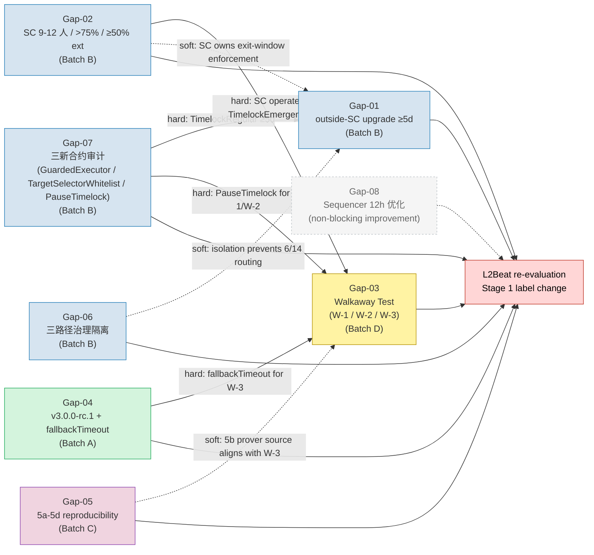
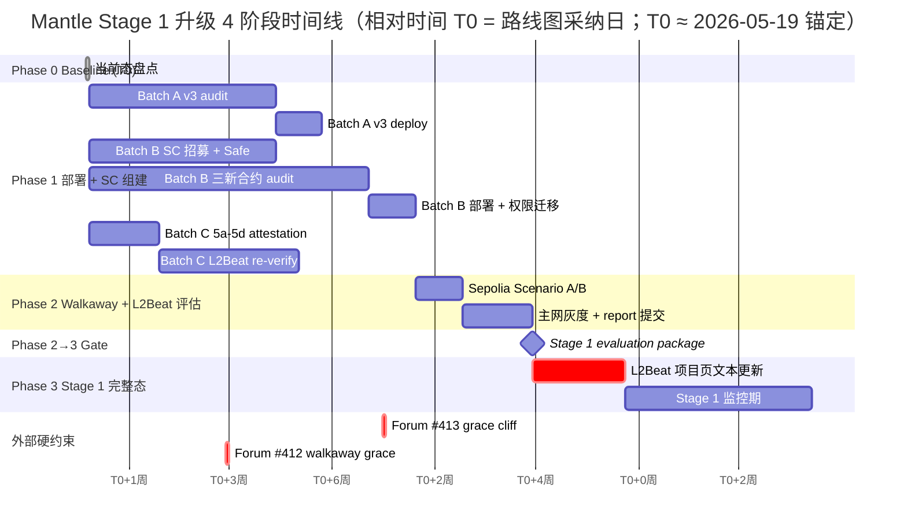
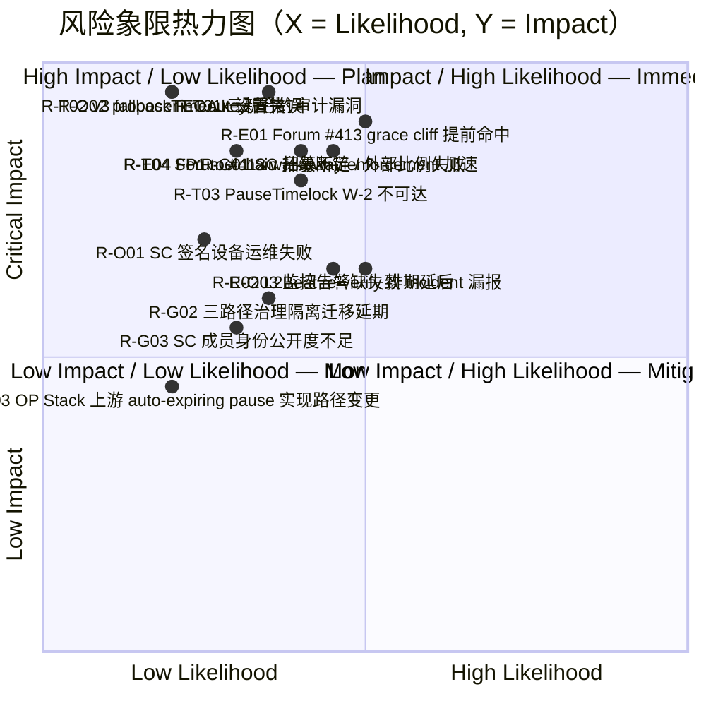
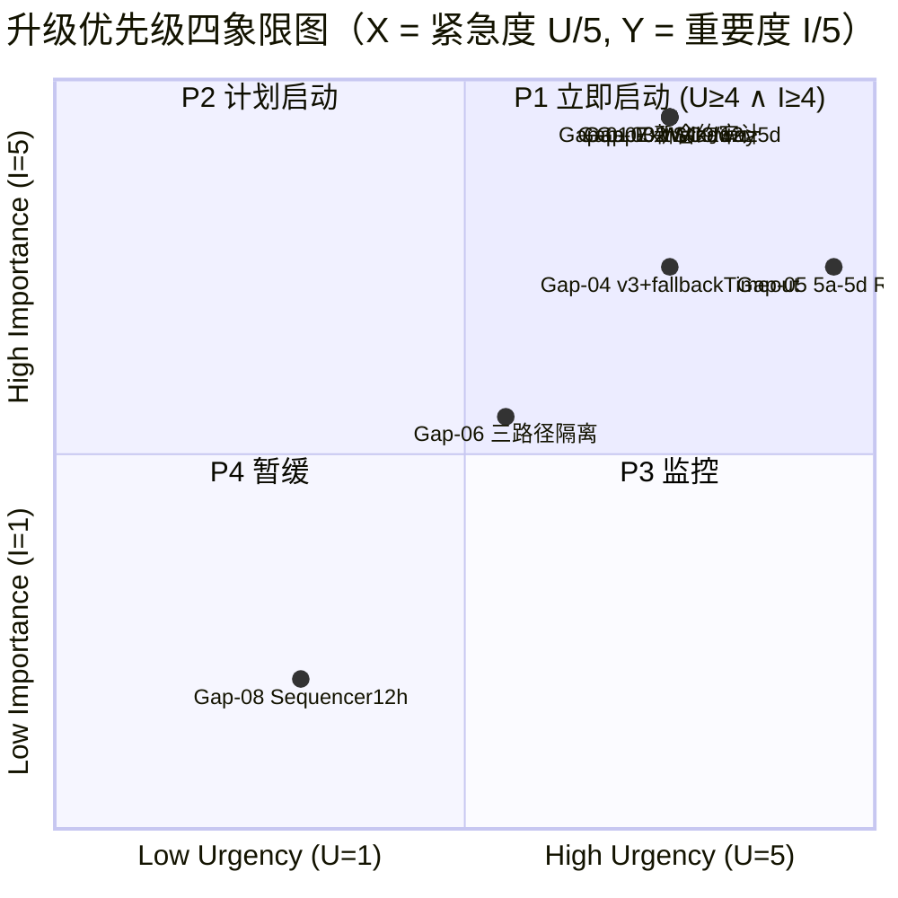

# Mantle Stage 1 路线图综合建议（Final Section — promoted from Round 2 draft）

> **本草案是综合 / 收尾课题（order=6）的 Round 2 deep draft（在 Round 1 基础上应用 narrow patch P1+P2+P3），
> 依赖上游 5 个 final sections 的所有结论。**
> 所有事实陈述均锚定到 `upstream_final_commits` 中固化的 5 个 commit；本研究不重新评估上游事实，
> 仅做综合、依赖图、时间线、风险、审计与 Action Items 五类输出。
>
> **Round 2 narrow patch scope（不修改 Round 1 其余结论）**：
> - **P1**：§Item-3.2 diag-2 Gantt 修正 Phase 2→3 gate —— 新增 "Stage 1 evaluation package" milestone，
>   使 `L2Beat 项目页文本更新` 与 `Stage 1 监控期` 同时依赖 Batch D Walkaway 完成 (`d2`) 与 Batch C
>   L2Beat re-verify 完成 (`c2`)，符合 §Item-3.3 Phase 2→3 退出准则 (i)+(ii)+(iii) 共同 gate。
> - **P2**：§Item-2.3 批次时长表与 §Item-2.4 文本推导对齐（采用 Option B —— 修正表格至 A=10/15w,
>   B=9/18w, C=6/12w，保留 headline 16w/30w）；并对 Gap-07 30d bug bounty 与 critical path 关系作
>   显式注释（结论：**overlap with audit/deploy in Phase 1, does NOT extend critical path**）。
> - **P3**：§Item-7.1 表中 AI-15 的 `前置依赖` 列由文本 `AI-03 audit done` 规范化为纯 AI ID `AI-03`；
>   其余 31 条 Action Item 经 consistency sweep 无类似问题。
>
> Priority 评分、Gap-08 P4 处置、C1/C2 `[UNVERIFIED]` 标注、OQ-OPV、所有 Source Coverage 内容、
> Gap Analysis 内容均不变更（按 Orchestrator narrow patch bound 要求）。

---

## §0 Executive Summary

**当前距离 Stage 1 的总体判断（一句话）**：Mantle 当前为 L2Beat Stage 0（5/5 prerequisites 已满足，参见
`mantle-architecture-2026` §item-6 Tier-a），距离 Stage 1 至少存在 **7 项 hard blocker + 1 项 non-blocking 改进项**，
其中 4 项（升级 Exit Window、Security Council、Walkaway Test、ZK Proving System 5a-5d）由 L2Beat
框架直接 enforce，1 项（v3.0.0-rc.1 + fallbackTimeout）由 L2Beat CRITICAL risk row 间接 enforce，
2 项（三路径治理隔离、三新合约审计）由 Mantle 内部设计 enforce（已在
`upgrade-exitwindow-securitycouncil` 中定义为 Stage 1 deployment 必要条件）。

**关键阻断项数量与最严重项**：8 个核心维度中——**P1（U≥4 且 I≥4）共 6 项**，**P2 共 1 项**（三路径治理
隔离，已在上游 G-2 闭合调查阶段；剩余为去 6/14 Safe 三角色 + 部署 MNT DAO 独立 Timelock 的工程动作），
**P4 共 1 项**（Sequencer 12h 优化，Stage 1 边界可接受）。**最严重单项**是 **L2 Proving System 5a-5d
透明度（Gap-05）**，原因有二：（i）L2Beat Forum #413 grace_period_end 推算 cliff ≈ 2026-08-16（参见
`l2beat-stage-framework-2026` §5.1, §5.3, G-8 caveat），距离本研究 T0（2026-05-19）仅约 13 周；
（ii）当前 L2Beat 项目页对 Mantle 两条 program hash row 标注 *"Code: unknown / Verification: None"*
（参见 `proposer-decentralization-zk-compliance` §item-2 + §item-3），意味着即使其他 7 项 hard blocker
全部闭合，5a-5d 一项不通过即在 cliff 后被降级回 Stage 0。

**推荐总体路径（一句话战略）**：**"三批次并行 + 审计前置 + Walkaway 收口"**——Batch A
（v3.0.0-rc.1 升级 + fallbackTimeout）、Batch B（SC 组建 + 三新合约 audit + 部署）、Batch C（5a-5d
reproducibility 与 L2Beat 协作 re-verification）三条流并行启动，Batch D（Walkaway 端到端模拟）
为收口节点，依赖 A/B/C 三批次全部完成。**关键约束**：Batch C 必须在 grace cliff 前完成
re-verification，因此其启动 T 必须最早（建议 T0+0 启动）；Batch A 与 Batch B 启动 T 紧随其后；
Batch D 取决于前三批的最迟完成时间。

**硬时间约束**：（a）**Forum #413 ZK Proving System 5a-5d grace cliff ≈ 2026-08-16**（estimate，
researcher-derived，参见 `l2beat-stage-framework-2026` §5.3 5f Enforcement Tracking，标 G-8 caveat；
精确日待 L2Beat 公告）；（b）**Forum #412 Walkaway Test grace_period_end ≈ 2026.06**（estimate，
Scroll/Starknet 已在 L2Beat 项目页文本 "does not pass the walkaway test" 但 Stage 1 标签暂保留——
若 grace 终止，文本标注变为正式降级，参见 `l2beat-stage-framework-2026` §4）；（c）**Forum #425 OR
challenge period 5d 不直接适用 Mantle**（ZK validity proof 路径，参见
`l2beat-stage-framework-2026` §9.4 ZK exclusion），但可能间接影响生态预期。

---

## §Item-1 Master Gap List 与优先级评分体系

### §Item-1.1 评分方法摘要

按 outline `expected_output §Item-1(b)` 的预定权重表执行；本 draft 不调整任何权重（如未来 revision 需要
调整，将按 outline 规则附敏感性检查表）：

**紧急度 U（1-5）**：U_raw = 0.40 × U1（Grace-period 距离） + 0.35 × U2（L2Beat 项目页文本严重性） +
0.25 × U3（受影响 TVS 路径），U_raw range 1.00-3.00，标准化为 U(1-5) = `round((U_raw - 1.0) / 2.0 × 4 + 1)`，
夹紧到 [1, 5]。

**重要度 I（1-5）**：I_raw = 0.45 × I1（Stage 1 hard blocker） + 0.30 × I2（DAG 出边数） +
0.25 × I3（Walkaway-FAIL 影响），I_raw range 1.00-3.00，标准化为 I(1-5) = `round((I_raw - 1.0) / 2.0 × 4 + 1)`，
夹紧到 [1, 5]。

**优先级得分** P = U × I（range 1-25）。

**象限分配**：P1 = U≥4 且 I≥4；P2 = P≥9 且不满足 P1；P3 = 4 ≤ P ≤ 8；P4 = P < 4。

**Tie-breaker**（依次适用）：（1）Severity 等级（CRITICAL > HIGH > MEDIUM）；（2）DAG 出边数；
（3）里程碑阶段（阶段 1 > 阶段 2/3）。

**敏感性检查（本 draft 默认权重）**：见 §Item-1.3 末尾。

### §Item-1.2 Master Gap List（统一表）

下表覆盖 outline 指定的 8 个核心维度。Gap ID 为本 draft 命名，统一为 `Gap-NN`，作为后续 item-2 ~ item-8 与
图节点的单一事实源。

| Gap ID | 维度 | 上游 §section 锚定 | 当前状态（≤2 句） | Stage 1 要求 | Severity | Hard Blocker | U1 | U2 | U3 | U_raw | U(1-5) | I1 | I2 | I3 | I_raw | I(1-5) | P | 象限 |
|--------|------|--------------------|------------------|--------------|----------|--------------|----|----|----|-------|--------|----|----|----|-------|--------|---|------|
| Gap-01 | outside-SC upgrade exit window ≥5d | `upgrade-exitwindow-securitycouncil` §Item-2 G-2 (Critical); `l2beat-stage-framework-2026` §3.2(3a); `mantle-architecture-2026` item-3(a) | core rollup `ProxyAdmin.owner = MantleSecurityMultisig 6/14, 0-delay`；MNT 路径 `TimelockController.minDelay()=86400 (1d) < 7d`；L2Beat 项目页 "There is no delay on code upgrades"（L2Beat row #1 CRITICAL）。 | 单条 outside-SC upgrade 路径强制 ≥5d delay（推荐 7d 保守）；三路径全部加固。 | CRITICAL | yes | 2 | 3 | 3 | 2.60 | 4 | 3 | 3 | 3 | 3.00 | 5 | 20 | P1 |
| Gap-02 | Security Council 量化阈值 (≥8 / >75% / ≥50% external) | `upgrade-exitwindow-securitycouncil` §Item-3 (9-12 人 SC); `l2beat-stage-framework-2026` §3.2(2); `mantle-architecture-2026` item-3(a) L2Beat row | 当前无 SC：MantleSecurityMultisig 6/14（threshold ≈ 42.86% ≪ 75%）；身份与外部比例未公开（"Source unavailable"）。 | ≥8 成员 / >75% threshold（推荐 9/12 = 75% 或 7/9 = 77.8%） / ≥50% 外部 / ≥2 外部签名 / 身份公开 / proof-system 有效权 ≥25%。 | CRITICAL | yes | 2 | 3 | 3 | 2.60 | 4 | 3 | 3 | 3 | 3.00 | 5 | 20 | P1 |
| Gap-03 | Walkaway Test 合规 (auto-expiring pause + permissionless prover + forced withdrawal 不依赖 SC) | `upgrade-exitwindow-securitycouncil` §Item-5 W-1/W-2/W-3, Scenario A/B; `l2beat-stage-framework-2026` §4; `proposer-decentralization-zk-compliance` §item-1 | FAIL：（a）OptimismPortal v1.7.0 Guardian 路径 pause **无 auto-expiring**（无 `pausedAt`，无 permissionless unpause）；（b）单 proposer EOA，v2.0.1 无 `fallbackTimeout` → indefinite freeze；（c）forced withdrawal 仍依赖 proposer 状态 root。 | W-1 auto-expiring pause（MAX_PAUSE_DURATION 推荐 30d）；W-2 finalize 不被 pause 阻断；W-3 permissionless prover（fallbackTimeout 路径）。Sepolia + 主网灰度 Scenario A/B 演练 PASS。 | CRITICAL | yes | 2 | 3 | 3 | 2.60 | 4 | 3 | 3 | 3 | 3.00 | 5 | 20 | P1 |
| Gap-04 | Proposer liveness：v2.0.1 → v3.0.0-rc.1 + fallbackTimeout | `proposer-decentralization-zk-compliance` §item-1 + §item-4; `mantle-architecture-2026` item-2(A) | 当前 v2.0.1，单 proposer EOA `0x6667…D77D`；`fallbackTimeout()` revert（v2.0.1 缺失字段）；key 丢失 → 资金 indefinite frozen；L2Beat row #5 CRITICAL "Frozen if centralized validator goes down"。 | 升级到 v3.0.0-rc.1（`mantle-xyz/op-succinct` branch `feature/sp1-v6.0.2` HEAD `f2bb062`），initialize `fallbackTimeout = 1209600s (14d)`；启用 permissionless self-propose 路径。 | CRITICAL | yes | 2 | 3 | 3 | 2.60 | 4 | 3 | 2 | 3 | 2.70 | 4 | 16 | P1 |
| Gap-05 | L2 Proving System 5a-5d 透明度 | `proposer-decentralization-zk-compliance` §item-2 + §item-3; `l2beat-stage-framework-2026` §5.3 (5a/5b/5c/5d) | 5a ✅（PLONK route only, Aztec Ignition KZG SRS, 🟢）；5b ⚠️（source + license 公开但 Mantle prover binary attestation 未发布）；5c ⚠️（vKey verification "None"）；5d ⚠️（reproducibility 命令存在但未执行公示）。L2Beat 项目页 "Code: unknown / Verification: None"。**Hard cliff ≈ 2026-08-16**（researcher-derived estimate）。 | 5a-5d 全部 PASS：联合 Mantle/Succinct 公开 SP1 toolchain pin（Rust nightly-2025-09-15 + SP1 SDK =6.1.0 + Docker tag）+ reproducibility attestation；L2Beat re-verification 完成，项目页文本更新。 | CRITICAL | yes | 3 | 3 | 3 | 3.00 | 5 | 3 | 2 | 3 | 2.70 | 4 | 20 | P1 |
| Gap-06 | 三路径治理隔离 (core rollup / MNT TimelockController / mETH) | `mantle-architecture-2026` item-3; `upgrade-exitwindow-securitycouncil` §Gap Analysis G-2 (closed) | G-2 闭合证据：链上 `hasRole(PROPOSER/EXECUTOR/CANCELLER, 6/14)=true ×3`，`getMinDelay()=86400`；6/14 Safe 同时持 core rollup ProxyAdmin.owner + MNT TimelockController 三角色 → 三路径未隔离。 | core rollup ProxyAdmin.owner 迁至 `TimelockRegular`（≥5d）；MNT TimelockController 三角色迁至独立 MNT DAO multisig；mETH/LSP 路径治理独立公开（需 mETH 产品团队公开材料，G-3 in upstream）。 | HIGH | yes | 1 | 2 | 3 | 1.85 | 3 | 3 | 2 | 1 | 2.20 | 3 | 9 | P2 |
| Gap-07 | 三新合约审计 (GuardedExecutor / TargetSelectorWhitelist / PauseTimelock) | `upgrade-exitwindow-securitycouncil` §Gap Analysis G-14, §Item-6 6.b | 设计完成（Round 3 final canonical：`SC → TimelockEmergency → GuardedExecutor.executeCall(PauseTimelock, pause, 0) → PauseTimelock.pause(bytes32) → OptimismPortal.pause()`）；尚未独立审计。Phase 1 部署前 hard prerequisite。 | 两家独立外部审计 + Mantle 内部审计 全部出具最终报告；30d bug bounty 期；Phase 1 mainnet deploy block。 | CRITICAL | yes | 2 | 2 | 3 | 2.25 | 4 | 3 | 3 | 2 | 2.75 | 5 | 20 | P1 |
| Gap-08 | Sequencer 去中心化与 force-inclusion 12h 优化 | `proposer-decentralization-zk-compliance` §item-5 | 当前 force-inclusion 路径 `OptimismPortal.depositTransaction`，`seq_window_size = 3600 L1 blocks ≈ 12h`；与 OP Mainnet 12h 同档；L2Beat 边界可接受但 sub-optimal；sequencer 单点 EOA `0x2f40…d749`（与 batcher 共用）。 | 不阻断 Stage 1（边界 acceptable per upstream §item-5）；推荐改进项：SEQUENCING_WINDOW → 6h（Scheme 5.1）。 | MEDIUM | no | 1 | 1 | 2 | 1.25 | 2 | 1 | 1 | 1 | 1.00 | 1 | 2 | P4 |

### §Item-1.3 评分依据短文（每 Gap 2-3 句 + 评分敏感性检查）

**Gap-01 评分依据**：U1=2（Phase 1 contract deploy 通常 4-12 周内；非直接 Forum #413 cliff 项）；
U2=3（L2Beat 项目页 row #1 CRITICAL "no delay on code upgrades"，`mantle-architecture-2026` item-5 #1
verbatim 引用）；U3=3（exit window 影响全部 OptimismPortal TVS，~$1.42B，参见
`proposer-decentralization-zk-compliance` item-1 TVS exposure）。I1=3（hard blocker for Stage 1
classification）；I2=3（Walkaway Scenario B 依赖 ≥5d；Gap-07 输出的 TimelockRegular 是承载者；
Gap-06 isolation 是前置）；I3=3（exit window 直接是 Walkaway permissionless safety 路径之一）。
**敏感性**：U1±0.10 / U2±0.10 / U3±0.10 任意单一变动均不改变 U=4；I 同；象限稳定 P1。

**Gap-02 评分依据**：U1=2（SC 招募 + Safe 部署 6-12 周）；U2=3（无 SC 即无 Stage 1 path，L2Beat
框架明示）；U3=3（关键路径）。I1=3（Stage 1 硬阻断）；I2=3（Gap-01 exit window 操作者；Gap-03
Walkaway 测的对象；Gap-07 PauseTimelock 调用源）；I3=3（Walkaway test 本身要求 SC 即使消失也安全）。
**敏感性**：稳定 P1。

**Gap-03 评分依据**：U1=2（Sepolia 演练 + 主网灰度 6-10 周）；U2=3（Forum #412 walkaway 已在
Scroll/Starknet 项目页 enforced 文本，PASS/FAIL 全维 affect Mantle）；U3=3（W-1/W-2/W-3 同时影响
TVS、liveness）。I1=3（Stage 1 hard blocker per `l2beat-stage-framework-2026` §4）；I2=3（依赖 Gap-04
fallbackTimeout、Gap-07 PauseTimelock、Gap-01 exit window）；I3=3（Walkaway = definition）。**敏感性**：稳定 P1。

**Gap-04 评分依据**：U1=2（v3 audit 8-12 周 + deploy 2 周 + initializer 调用 1 周 ≈ 11-15 周）；U2=3
（L2Beat row #5 CRITICAL "Frozen"）；U3=3（>$1B）。I1=3（permissionless self-propose 是 W-3 + L2Beat
row #5 直接 mitigation）；I2=2（Gap-03 Walkaway W-3 依赖；Gap-05 prover source 协同；下游计数 = 2）；
I3=3（W-3 path 直接是 Walkaway 测点 c "proposer set permissionless"）。**敏感性**：I2 若从 2 → 3
（DAG 出边重数），I_raw=3.00 → I=5，P=20；象限仍 P1。象限不变。

**Gap-05 评分依据**：U1=3（grace cliff ≈ 2026-08-16，距今 ≈ 13 周，<4 周缓冲已无）；U2=3（CRITICAL
等价：未通过即降级 Stage 0）；U3=3（5b-5d 任一失败影响全部 ZK proof 路径，覆盖全 TVS）。I1=3（hard
blocker by deadline）；I2=2（Gap-03 Walkaway 间接 via 5b prover source；Gap-04 fallbackTimeout 协同）；
I3=3（5b prover source publication 是 Walkaway 测点 c permissionless prover 的同源前置）。**敏感性**：
U1±0.10 不改变 U=5（已饱和）；I2 边界态（2 或 3）不改象限（均 P1）。**关键敏感性 / 评分敏感标记**：
若 U1 取 2（grace cliff 推迟或不存在）→ U_raw = 2.60, U=4, P=16，仍 P1。**Gap-05 评分稳健**。

**Gap-06 评分依据**：U1=1（>12 周 governance + cast 三 tx，无直接 cliff）；U2=2（HIGH 等价：六路径
治理隔离 breach 不直接 L2Beat CRITICAL row，但影响 exit window enforcement 完整性）；U3=3（影响 MNT
+ core rollup 双路径，含 LP TVS 等）。I1=3（Stage 1 hard blocker 当三路径未隔离则 ≥5d enforcement
可被 6/14 Safe 绕过）；I2=2（Gap-01 exit window 上游 soft prereq；Gap-02 SC 上游 soft prereq）；I3=1
（不直接 Walkaway-FAIL 触发，但间接影响 4 个测点的边界）。**敏感性 / 评分敏感标记**：U1 若从 1 → 2
（启动后实际 cliff 紧迫），U_raw → 2.25, U=4, I_raw=2.20, I=3, P=12 → 仍 P2 （不变象限）；I2 若从 2 → 3
（出边重数），I_raw=2.5, I=4, P=12 → P2（保持，因 U=3 < 4）。**Gap-06 当前 P2 标注稳定；如未来 U1
升至 2，仍 P2 但接近 P1 边界，需关注。**

**Gap-07 评分依据**：U1=2（audit 8-16 周 + 30d bug bounty + Phase 1 deploy 2 周 ≈ 12-22 周）；U2=2
（HIGH：非 L2Beat 直接 row，但 Phase 1 deployment block）；U3=3（影响整套 Stage 1 contract surface
+ exit window 路径）。I1=3（hard prerequisite per upstream G-14）；I2=3（Gap-01 exit window load；Gap-03
PauseTimelock for W-1/W-2；Gap-02 SC routing path）；I3=2（W-1/W-2 直接依赖 PauseTimelock，间接 Walkaway
PASS）。**敏感性**：U1±0.10 不改变 U=4；I 同；象限 P1 稳定。

**Gap-08 评分依据**：U1=1（无 cliff）；U2=1（MEDIUM L2Beat row #8 MEV）；U3=2（sequencer 收入路径，
$100M-$1B 级）。I1=1（非 Stage 1 blocker per upstream §item-5）；I2=1（0 outbound）；I3=1（非 Walkaway
测点）。**敏感性**：稳定 P4。

**§Item-1.4 评分敏感性总结**：
- **稳健 Gap**（默认权重 ±0.10 不改象限）：Gap-01, 02, 03, 04, 07, 08。
- **边界 Gap**（默认权重 ±0.10 可能改象限）：Gap-05（U1 边界，但 5→4 仍 P1，**实质稳健**），Gap-06
  （U1 边界 + I2 边界，1→3 → 仍 P2 或接近 P1 — 标注"评分敏感"）。
- 本 draft 不调整默认权重；如 revision 阶段需要调整 Gap-06 至 P1（提早执行），请显式记录权重调整理由。

---

## §Item-2 升级依赖关系图与可并行性分析

### §Item-2.1 依赖类型枚举

依赖关系按 outline 区分四类边：
- **hard prerequisite**（实线）：A 完成是 B 启动的硬前置（不可绕过）；
- **soft prerequisite**（虚线）：A 应在 B 完成前完成（推荐序），但 A 与 B 可短期重叠推进；
- **parallel**（无边）：A 与 B 无依赖，可完全并行；
- **serial constraint**（粗实线）：A 与 B 之间存在物理串行（如 Walkaway 模拟必须在所有合约就绪后）。

### §Item-2.2 diag-1 Stage 1 升级依赖关系图

**说明**：
- **节点颜色**：Batch A（绿）、Batch B（蓝）、Batch C（紫）、Batch D（黄）、improvement（灰虚线）；
- **边颜色**：实线 = hard prerequisite，虚线 = soft prerequisite；
- **critical path**：在 §Item-2.4 中标识。

### §Item-2.3 Parallel Batch 划分

> **Round 2 patch P2 note（表格修订）**：以下表格已按 Option B 修订为与 §Item-2.4 文本推导一致的
> 时长区间（A=10/15w, B=9/18w, C=6/12w），保持 §0 Executive Summary 的 headline 16w/30w 不变。
> Round 1 表格中的 11/15, 12/22, 8/13 区间已被替换。详细推导见 §Item-2.4。

| Batch | 维度 | 包含 Gap | 启动 T | 完成 T（最优 / 保守） | 关键交付物 | 独立性 |
|-------|------|---------|--------|----------------------|-----------|--------|
| **Batch A** | Proposer liveness 升级 | Gap-04 | T0 | T0+10w / T0+15w | v3.0.0-rc.1 部署 + initializer 调用 + fallbackTimeout=14d | 与 Batch B/C 完全并行（合约层不重叠） |
| **Batch B** | SC + 治理 + 新合约 + 路径隔离 | Gap-02, Gap-06, Gap-07, Gap-01 | T0 | T0+9w / T0+18w | SC 9/12 上线；三新合约 audit complete + deploy；ProxyAdmin.owner → TimelockRegular；MNT 路径角色迁离 6/14 | 内部串行（SC 与 audit 并行；audit 完成 → 部署 → owner 迁移；30d bug bounty 与 audit/deploy **overlap**，见下方 footnote†） |
| **Batch C** | ZK Proving 5a-5d reproducibility | Gap-05 | T0 | T0+6w / T0+12w | Mantle/Succinct 联合 attestation；L2Beat re-verification ；项目页文本更新 | 与 A/B 完全并行（无合约依赖） |
| **Batch D** | Walkaway 端到端模拟 | Gap-03 | max(A_end, B_end, C_end) | +4w / +6w | Sepolia + 主网灰度 Scenario A/B PASS；report 提交 L2Beat | 串行收口（合并 A/B/C 后） |
| **Improvement** | Sequencer 12h → 6h | Gap-08 | 自由 | 自由 | 不阻断 Stage 1；Stage 2 准备 | 完全独立 |

**† Gap-07 30d bug bounty 与 critical path 的关系（Round 2 patch P2 显式注释）**：

Gap-07（三新合约 audit + 30d bug bounty）的 30d bug bounty 期 **与 Phase 1 audit/deploy 工作 overlap，
不延长 critical path**。具体安排：

- Bug bounty 触发点 = audit final report 提交后立即启动（即 AI-11 完成后立即启动）；
- Bug bounty 期内并行进行：（a）SC 招募收尾（AI-08 / AI-09 末段，与 Batch B SC 6-12w 区间末段
  重叠），（b）合约 deployment 准备工作（calldata 准备 / multisig ceremony 演练，与 AI-12 准备阶段
  重叠），（c）TimelockEmergency / TimelockRegular initializer 序列校验（AI-13 前置准备）；
- Bug bounty 期内若发现 critical bug → 触发 §Item-3.5 D-1 决策点 / §Item-4.3 R-T01 缓解措施
  （修复 + 再 audit）→ Phase 1 推迟相应周数；该 case 已在 R-T01 残余风险评估中考量；
- 因此 30d bug bounty 的 ~4-5 周时长 **不进入** §Item-2.4 critical path 计算公式
  `max(A,B,C) + D + L2Beat re-eval = 16w optimistic / 30w conservative`；
- 此处理与 §Item-1.2 Gap-07 评分中 U1=2（"audit 8-16w + 30d bug bounty + Phase 1 deploy 2w
  ≈ 12-22w"）的 stand-alone 工时估算并不冲突 —— 后者衡量 Gap-07 单项端到端工时；前者衡量
  其在并行 batch 内对 critical path 的 incremental 贡献（= 0）。

### §Item-2.4 Critical Path 与时长估算

**Critical Path**：`max(Batch A, Batch B, Batch C) → Batch D → L2Beat re-evaluation`

- **Batch A**（v3 升级路径）：v3 fork 已 ship（`mantle-xyz/op-succinct` `f2bb062`），核心成本在
  external audit。参考 `upgrade-exitwindow-securitycouncil` G-14 注释 + `proposer-decentralization-zk-compliance`
  §item-4 估算 + 行业公开审计 cadence：**8-12 周 + deploy/initializer 2-3 周 = 10-15 周**。
- **Batch B**（最重批次）：
  - **B.1 三新合约 audit**（GuardedExecutor / TargetSelectorWhitelist / PauseTimelock）：行业参考
    OpenZeppelin / Cantina / Sigma Prime / Trail of Bits 公开 cadence，**两家平行 audit 8-16 周**
    （此为 industry-reference, not Mantle-specific，见 §Source Coverage src-5）；
  - **B.2 SC 9/12 招募 + Safe deploy**：公开材料显示 OP Mainnet 与 Base 类似 SC 招募周期 6-12 周
    （`stage1-case-studies` §Item-3 / §Item-4 借鉴）；
  - **B.3 部署 + 权限迁移**（tx-2-3..tx-2-13，按 `upgrade-exitwindow-securitycouncil` §Item-7
    canonical 序列）：1-2 周；
  - **批次总时长**：max(B.1, B.2) + B.3 = max(8-16w, 6-12w) + 1-2w = **9-18 周**。
- **Batch C**（5a-5d reproducibility）：
  - **C.1 Mantle/Succinct attestation publication**（toolchain pin 文档 + Dockerfile + vkey diff）：2-4 周；
  - **C.2 L2Beat re-verification 协作**：等待 L2Beat 评估窗口 + 项目页文本更新；公开材料无固定 SLA，
    保守估算 **4-8 周**（行业参考，secondary）；
  - **批次总时长**：**6-12 周**。
- **Batch D**（Walkaway 模拟）：
  - **D.1 Sepolia Scenario A/B**：2-3 周；
  - **D.2 主网灰度 / 演练 report**：2-3 周；
  - **批次总时长**：**4-6 周**。
- **L2Beat re-evaluation**：项目页 stage_label 变更，公开 cadence 无固定 SLA，保守 **2-6 周**。

**Critical Path 最优估算**：max(10w, 9w, 6w) + 4w + 2w = **16 周（~4 个月）**。

**Critical Path 保守估算**：max(15w, 18w, 12w) + 6w + 6w = **30 周（~7 个月）**。

⚠️ **Batch C 受 Forum #413 grace cliff（≈ 2026-08-16）硬约束**：若 T0 = 2026-05-19，距离 cliff 约 13 周。
Batch C 必须在 13 周内完成才能在 grace period 内被 L2Beat 评估。这意味着 **C.1 + C.2 必须落在
最优估算（6 周）+ 一定 buffer**，否则需走 §Item-8 Path B（push grace period 延期）或 Path A
（部分接受 partial 满足 + 显式 caveat）。

### §Item-2.5 上游矛盾或边界不清的显式标注

- **`OptimismPortal v1.7.0` 升级到上游 ≥v1.8.x 引入 auto-expiring pause 实现路径**：上游 G-13 标
  Open（option 1 outer wrapper PauseTimelock vs option 2 fork OP Stack）。本 draft 在 diag-1 中
  采用 option 1（PauseTimelock outer wrapper），与 `upgrade-exitwindow-securitycouncil` §Item-6 6.b
  Round 3 canonical 设计对齐；若 Mantle 团队选 option 2，则 diag-1 节点 G07（PauseTimelock）退化
  为对 OP Stack 上游 fork 维护，时间线可能变化。
- **`OptimismPortal v1.7.0` `paused` modifier scope (W-2 verification)**：上游 G-11 Open，必须在 Phase 1
  部署前在 Sepolia 做 chain trace simulation。本 draft 假设 W-2 可通过 contract-layer 实现（与上游
  `upgrade-exitwindow-securitycouncil` §Item-5 5.f W-2 一致）；若主网灰度发现 W-2 不可达，则需 fall
  back 至 Path A（partial pass + caveat）。
- **`fallbackTimeout` 推荐值**：上游 §item-4 / §item-6 推荐 14d，与 `op-succinct@f2bb062` 中
  `AccessManager.sol` L35 `FALLBACK_TIMEOUT = 2 weeks` 对齐；L2Beat Forum #409/#413 未给出上限。
  本 draft 采用 14d；保守替代 7d（如 Mantle 内部决策）。

---

## §Item-3 分阶段里程碑时间线建议

### §Item-3.1 4 阶段定义（与上游 `upgrade-exitwindow-securitycouncil` §Item-2 4 阶段过渡对齐）

| 阶段 | 名称 | 描述 | 与上游对齐 |
|------|------|------|------------|
| **阶段 0** | Baseline | Stage 0 5/5 met；MantleSecurityMultisig 6/14 与 Engineering 3/7 持所有升级权；单 proposer EOA；OP Succinct v2.0.1；无 SC、无 ≥5d delay、无 auto-expiring pause | upstream Phase 0 |
| **阶段 1** | 合约部署 + SC 组建 | 部署三新合约 + 升级 v3.0.0-rc.1 + 启用 fallbackTimeout + 组建 SC + 上线双 Timelock + 三路径治理迁移 | upstream Phase 1 |
| **阶段 2** | Walkaway 模拟 + L2Beat 评估 | Sepolia + 主网灰度 Scenario A/B；触发 L2Beat reproducibility re-verification；公开 SP1 toolchain pin | upstream Phase 2 |
| **阶段 3** | Stage 1 完整态 | L2Beat 项目页 stage_label 变更为 Stage 1；监控期 | upstream Phase 3 |
| （阶段 4 远期） | Stage 2 路径预留 | TimelockRegular minDelay → ≥30d；SC 收敛至 onchain-bug-only role；超出本研究 scope | upstream Phase 4 |

### §Item-3.2 diag-2 分阶段里程碑甘特图

**说明**：
- 横轴为相对时间 T0+N 周（甘特 syntax 的限制使日期为示意；实际采纳时使用 T0 锚定）；
- Forum #413 grace cliff ≈ 2026-08-16 在图中显式标出（critical），距离 T0 ≈ 13 周；
- Forum #412 walkaway grace 预估 ≈ 2026-06-30（estimate; Round 1 起步 6 个月，参见
  `l2beat-stage-framework-2026` §4 — 标 estimate caveat）；
- **Phase 2→3 Gate（Round 2 patch P1）**：新增显式 milestone `Stage 1 evaluation package`，
  其依赖关系为 `after d2 c2` —— 即必须 **同时** 满足 Batch D Walkaway 主网灰度 + report 提交 (`d2`)
  与 Batch C L2Beat re-verification (`c2`) 两条线全部完成；Phase 3 的 `L2Beat 项目页文本更新`
  / `Stage 1 监控期` 改为依赖此 milestone（而不是单一依赖 `c2`）。这与本研究 §Item-2.4
  critical path = `max(A,B,C) → D → L2Beat re-evaluation` 一致，且与 §Item-3.3 Phase 2→3
  退出准则中要求 Walkaway Scenario A/B PASS（即 `d2` 完成）+ L2Beat reproducibility re-verification
  完成（即 `c2` 完成）的两条同时性要求一致。
- 关键路径 = `max(Batch A end, Batch B end, Batch C end)` → Batch D（`d1` + `d2`）→
  evaluation milestone → L2Beat 项目页文本更新 → Stage 1 监控期。

### §Item-3.3 各阶段退出准则表

| 阶段 | 退出准则 | 可观测信号 | 上游依赖触发 | 失败回退路径 |
|------|---------|-----------|-------------|-------------|
| **0 → 1** | 路线图采纳；T0 锚定；Owner 职责类型明确 | 内部路线图签字 + 公开 forum 帖通告 T0 | 无 | 若 T0 推迟，全表所有 T0+N 推迟 |
| **1 → 2** | (i) Batch A v3 deploy 完成（链上 `version()=3.0.0-rc.1` + `fallbackTimeout()=1209600` 可读）；(ii) Batch B 三新合约 audit complete + deploy + owner/admin 迁移；(iii) SC 9/12 multisig 上线 + 身份公开；(iv) MNT 三路径迁离 6/14 Safe；(v) Batch C attestation 已发布 | 链上 tx hash 列表 + 公开 audit report commit + L2Beat 项目页快照 | Batch A/B/C 全部完成 | 若 B.2 audit 发现 critical bug → 修复 + 再 audit；若 SC 招募失败 → 暂缓阶段 2，进入 §Item-8 Path A |
| **2 → 3** | (i) Sepolia + 主网灰度 Walkaway Scenario A/B PASS（W-1 auto-expire；W-2 finalize；W-3 fallbackTimeout）；(ii) L2Beat reproducibility re-verification 完成；(iii) L2Beat 项目页文本更新（5a-5d 标 PASS） | 主网 tx hash + Walkaway report commit + L2Beat 项目页 "Code: verified / Verification: reproducible" | Batch D 完成 + Batch C L2Beat 协作完成 | 若 Walkaway 模拟失败 → 回阶段 1 修补 PauseTimelock 或 fallbackTimeout；若 L2Beat re-verify 失败 → §Item-8 Path A/B |
| **3 → 完成** | L2Beat 项目页 stage_label 变更为 Stage 1 + 30d 监控期无 incident | L2Beat 项目页 `stage: 1` + 内部 incident log | L2Beat 评级团队最终判定 | 若 stage_label 未变 → 与 L2Beat 协商重审；若 30d 内 incident → §Item-8 Path D (保持 Stage 0) |

### §Item-3.4 Grace Period 硬约束分析（Backward Induction）

**Forum #413 ZK Proving System 5a-5d grace cliff ≈ 2026-08-16**（estimate, researcher-derived per
`l2beat-stage-framework-2026` §5.1, §5.3 G-8 caveat — **不是 L2Beat 官方 announcement**）。

**Backward induction（从 cliff 反推 T0 上限）**：
- L2Beat re-verification 保守 4-8 周（C.2）；
- attestation publication 2-4 周（C.1）；
- buffer ≥ 2 周（L2Beat 内部 review queue）；
- **T_C_start ≤ cliff − (C.1 + C.2 + buffer) = 2026-08-16 − (4 + 8 + 2) ≈ 2026-05-05**（保守估算）；
- **T_C_start ≤ cliff − (C.1 + C.2 + buffer) = 2026-08-16 − (2 + 4 + 2) ≈ 2026-06-22**（最优估算）。

**结论**：若 T0 = 2026-05-19，T_C_start = T0+0 = 2026-05-19。在最优估算下，Mantle 仍有 ≈ 5 周缓冲；
在保守估算下，**已超过 backward induction 上限约 2 周**。

**特别说明 grace cliff 的不确定性来源**（与上游一致）：
- cliff 日期为 researcher-derived（Forum #413 帖正文 "about 6 months"，未给出精确日）；
- L2Beat 评级团队可能给个别项目 case-by-case 延期（参见 OP Mainnet 2024-08 rollback 期间 Stage 1
  label 保留 vs. 重新评估的 precedent，`stage1-case-studies` §Item-3）；
- 真实 cliff 可能为 mid-2026 至 late-2026 之间的某一天。

**因此**：本 draft 推荐 **T0 不晚于 2026-05-19**（即 Mantle 应立即采纳路线图），并 **预留 §Item-8
Path A/B 作为 cliff 提前命中的保底**。

### §Item-3.5 关键决策点（Go / No-Go）

| 决策点 ID | 时间 | 描述 | Go 条件 | No-Go 触发 | 回退路径 |
|-----------|------|------|---------|-----------|----------|
| **D-1** | T0+8w | Batch B 三新合约 audit 中段进展 review | 两家 audit 无 critical finding；mid-audit report 通过内部 review | audit 发现 critical bug | Phase 1 暂停，重新设计 / 修补；T0 推迟相应周数 |
| **D-2** | T0+12w | Batch B SC 9/12 招募完成 + Safe deploy | 9/12 成员公开身份 + 外部比例 ≥50% + 硬件钱包就绪 | 招募不足 / 外部比例失败 | §Item-8 Path A（部分接受 partial）或推迟 Phase 2 |
| **D-3** | T0+13w | Batch C L2Beat re-verification 启动 | C.1 attestation 已发布 + L2Beat 评估窗口确认 | L2Beat 响应慢 / 评估排期延后 | §Item-8 Path B（push grace 延期请求） |
| **D-4** | T0+18w | Phase 2 Walkaway Sepolia 模拟启动 | Batch A/B/C 全部 done；contracts on Sepolia | 上游合约未就绪 / fallbackTimeout 异常 | 回 Phase 1 修补 + 推迟 |
| **D-5** | T0+24w | Phase 3 L2Beat 项目页文本变更等待 | Walkaway 主网灰度 PASS + L2Beat 项目页 5a-5d 标 PASS | L2Beat 判 partial / 不接受 | §Item-8 Path A（接受 partial Stage 1 + caveat） |

---

## §Item-4 多维度风险评估矩阵

### §Item-4.1 风险象限定义

| 象限 | 描述 |
|------|------|
| **技术** | 合约 bug / 实现路径不匹配 / OP Stack 上游兼容性破坏 / SP1 toolchain 升级断链 |
| **运营** | proposer key 管理 / SC 签名设备 / 监控告警 / incident response 流程 |
| **治理** | SC 成员独立性 / DAO 提案流程 / Council 成员公开度 / 三路径治理隔离失败 |
| **外部依赖** | L2Beat 框架进一步变更 / OP Stack 上游延迟 / Succinct Labs 审计或部署延迟 / grace period 过期 / 外部审计方排期 |

### §Item-4.2 diag-3 风险矩阵热力图

### §Item-4.3 风险条目详表

| Risk ID | 类别 | Likelihood | Impact | Heat (L × I) | 触发条件 / 早期信号 | 缓解措施 | 责任方类型 | 残余风险 |
|---------|------|-----------|--------|------------|---------------------|---------|-----------|----------|
| **R-T01** | 技术 | M (0.35) | C (0.95) | High | mid-audit report 出现 critical | 两家平行 audit + Mantle 内部审计；30d bug bounty | AUDIT | Low（多家审计 + 时间预留） |
| **R-T02** | 技术 | L (0.20) | C (0.95) | Medium | initializer 调用 fallbackTimeout 写入错误 | initializer 调用前 Sepolia 演练 + multi-sig 4-eye | PE | Low |
| **R-T03** | 技术 | M (0.40) | H (0.80) | High | chain trace 显示 finalize 被 `paused` 阻断 | Phase 1 部署前 Sepolia chain trace simulation；fall back W-1 auto-expire 路径 | PE | Medium（需 fall back 至 W-1，但 Walkaway 仍可 PASS） |
| **R-T04** | 技术 | M (0.30) | H (0.85) | Medium | Succinct Labs 升级 SP1 SDK；Rust nightly drift | toolchain pin 固化（Rust nightly-2025-09-15 + SP1 SDK =6.1.0）；Docker tag freeze | PE | Low |
| **R-O01** | 运营 | L (0.25) | M (0.70) | Medium | SC 成员硬件钱包丢失 / 设备损坏 | 硬件钱包冗余备份 + multi-jurisdiction physical security | GOV / COMM | Low |
| **R-O02** | 运营 | L (0.20) | C (0.95) | Medium | proposer EOA 私钥泄露 / 丢失 | v3 fallbackTimeout=14d；SC 紧急 `addProposer` 路径；定期 key rotation | PE | Low（fallbackTimeout 兜底） |
| **R-O03** | 运营 | M (0.50) | M (0.65) | Medium | 监控系统缺失 / 告警未触达 | 部署 L2Beat-style anomaly detection；24/7 oncall；公开 incident log | PE / COMM | Medium |
| **R-G01** | 治理 | M (0.45) | H (0.85) | High | T0+8w SC 招募未达成 9/12 + ≥50% 外部 | 提前 6-12 周公开招募；与 OP Foundation / Base Council 协调推荐人选；外部 advisor 兼任 | GOV | Medium |
| **R-G02** | 治理 | M (0.35) | M (0.60) | Medium | 链上 cast `hasRole(MNT TC, 6/14)` 仍 true 超过 T0+12w | 把 MNT 路径权限迁移列入 SC 上线后第 1 周 priority tx | GOV / PE | Low |
| **R-G03** | 治理 | L (0.30) | M (0.55) | Low | SC 成员公开身份不全 / 法域分布过窄 | 公开 announcement + 跨法域审议 + 利益冲突披露 | COMM / GOV | Low |
| **R-E01** | 外部 | M (0.50) | C (0.90) | High | L2Beat 公告 grace cliff 提前 / 项目页文本变更为 "failing" | §Item-8 Path B（push 延期）+ §Item-8 Path A（partial pass）双轨准备；C.1 attestation 优先级最高 | L2BEAT / COMM | Medium |
| **R-E02** | 外部 | M (0.45) | M (0.65) | Medium | L2Beat issue tracker / forum 响应慢 | 提前预约 L2Beat 评估窗口；OP Stack governance forum 公开 progress note | L2BEAT / COMM | Medium |
| **R-E03** | 外部 | L (0.20) | M (0.45) | Low | OP Stack ≥v1.8.x 引入 auto-expiring pause 推迟 | 采用 PauseTimelock outer wrapper（option 1）自维护 | OPSTACK / PE | Low |
| **R-E04** | 外部 | M (0.40) | H (0.85) | High | Forum #412 walkaway enforcement 加速 / Scroll 被 L2Beat 项目页正式降级 | 优先级前推 Batch B + Batch C；Walkaway 模拟从 Phase 2 部分前移到 Phase 1 末端 | COMM / GOV / PE | Medium |

### §Item-4.4 跨维度复合风险分析（至少 3 个场景）

**复合场景 1（治理 × 外部）：SC 组建延迟 + Forum #413 grace cliff 临近过期 → 框架强制 enforcement 触发 Stage 0 降级**

- **触发链**：D-2 (T0+12w) SC 招募未达 9/12 → Phase 2 推迟 → Batch C 即使按时完成 attestation，L2Beat
  evaluation 因 SC 缺失被搁置 → cliff 命中（≈ 2026-08-16）→ 项目页文本变 "failing" → grace period
  结束后正式降级。
- **早期信号**：D-1 (T0+8w) SC 招募只进行了 <40%；R-G01 likelihood 上升至 H。
- **复合 Heat**：H × C = Critical。
- **缓解策略**：
  - **预防**：T0 前 4-8 周即启动 SC 招募（与本研究 T0 同步发布招募公告）；
  - **检测**：T0+6w mid-recruit review；
  - **响应**：若 D-2 不达，立即触发 §Item-8 Path A（partial Stage 1 + 显式 caveat）+ Path B
    （push grace 延期请求）双轨。

**复合场景 2（技术 × 运营）：v3.0.0-rc.1 audit 延期 + 单 proposer 私钥泄露 → 资金冻结路径唯一依赖
6/14 Safe 紧急 addProposer**

- **触发链**：R-T01 audit 发现 critical bug → Batch A deploy 推迟到 T0+18w 之后；与此同期 R-O02
  proposer EOA 私钥泄露（黑客攻击或内部错误）→ 当前 v2.0.1 无 fallbackTimeout，唯一恢复路径
  = 6/14 Safe 0-delay 调用 `addProposer` 添加新 EOA；但 6/14 路径不属 SC 且 0-delay，L2Beat 仍标
  CRITICAL row #5。
- **早期信号**：R-T01 mid-audit critical finding；同时 proposer EOA 链上活跃异常（监控告警）。
- **复合 Heat**：M × C = High。
- **缓解策略**：
  - **预防**：v3 audit 启动前先做 Sepolia 灰度验证，缩短 mainnet audit 周期；proposer EOA 启用
    多重备份 + 周期 key rotation；
  - **检测**：监控 proposer EOA 链上活跃度 + R-T01 audit 中期 review；
  - **响应**：若双触发，立即激活 v2.0.1 enableOptimisticMode（Engineering 3/7 路径）+ 进入紧急
    governance 进程并公开 incident。

**复合场景 3（技术 × 治理）：GuardedExecutor 上线后 PauseTimelock 配置错误 + SC 紧急召集失败
→ Walkaway Scenario B 失败，状态永久挂起**

- **触发链**：R-T03 PauseTimelock 部署后 `MAX_PAUSE_DURATION` 错配为 0d 或极小值（initializer 调用
  失误）；同期 R-O01 + R-O03 SC 紧急召集失败（监控未触发 / SC 成员设备故障）→ pause 状态无法
  permissionless unpause → Walkaway Scenario B 失败。
- **早期信号**：Sepolia Scenario B 测试发现 pause 后 finalize 路径异常；监控告警未触达。
- **复合 Heat**：M × H = High。
- **缓解策略**：
  - **预防**：initializer 调用前必须 multi-sig 4-eye 检查；Sepolia 多轮 Scenario B end-to-end；
  - **检测**：mainnet deploy 后 7d 内 daily PauseTimelock state read + on-chain hasRole 检查；
  - **响应**：若双触发，立即激活 §Item-8 Path A（accept-risk + partial pass，标 caveat）；
    同时启动紧急合约升级路径（TimelockEmergency 0-delay tx，由 SC 9/12 签名）。

### §Item-4.5 diag-4 升级优先级四象限图

**P1 处置策略**：立即启动；进入 Batch A / Batch B / Batch C critical path。
**P2 处置策略**：计划启动；Gap-06（三路径隔离）作为 Batch B 内部子任务，与 SC 上线后第 1 周联动；
**P3 处置策略**：监控（本 draft 8 个 Gap 中无 P3）；
**P4 处置策略**：暂缓 / 改进项；Gap-08 不阻断 Stage 1，可作为 Stage 2 准备项独立推进。

---

## §Item-5 审计与验证计划

### §Item-5.1 Tier-A 必审清单（Stage 1 hard prerequisite）

| 编号 | 升级项 | 审计类型 | 审计范围 | 预计周期区间 | 推荐审计方类型 | 上游锚定 |
|------|--------|---------|----------|--------------|---------------|---------|
| **A-1** | GuardedExecutor + TargetSelectorWhitelist + PauseTimelock 三新合约 | **Full audit** | 设计审计 + bytecode 审计 + invariant 测试 + 形式化（可选）；覆盖 W-1/W-2/W-3 invariant | **8-16 周** | 两家平行外部 audit 公司（Cantina / OpenZeppelin / Sigma Prime / Trail of Bits 等级） + Mantle 内部审计 | `upgrade-exitwindow-securitycouncil` G-14 + §Item-6 6.b |
| **A-2** | OPSuccinctL2OutputOracle v2.0.1 → v3.0.0-rc.1 升级 | **Differential audit** | diff against `mantle-xyz/op-succinct@f2bb062`；重点：`fallbackTimeout` 写入路径、initializer 单调性、permissionless self-propose 入口、`opSuccinctConfigs` mapping | **4-8 周**（differential 比 full 短） | 与 Succinct Labs 协同 + 一家独立外部审计 | `proposer-decentralization-zk-compliance` §item-1 + §item-4 |
| **A-3** | OptimismPortal v1.7.0 升级路径（option 1 outer wrapper 默认；option 2 fork OP Stack ≥v1.8.x 备选） | **Differential audit** | option 1：PauseTimelock 与 OptimismPortal 集成边界（onlyGuardian 检查）；option 2：上游版本号待 draft 阶段确认（external input） | **4-10 周** | 一家独立外部审计 + OP Stack governance forum 公开 review | `upgrade-exitwindow-securitycouncil` G-11 + G-13 |
| **A-4** | 双 Timelock（TimelockEmergency / TimelockRegular）配置审计 | **Focused audit** | 配置正确性（minDelay 5d + 角色分配 + 谁能 cancel）；与 ProxyAdmin.owner 集成；与 OPSuccinctL2OutputOracle.owner 集成 | **2-4 周** | 一家独立外部审计（focused review） | `upgrade-exitwindow-securitycouncil` §Item-6 / §Item-7 7.e |

**Tier-A 总时长区间**（max 并行 + 串行 dependency）：**max(A-1, A-2 ∪ A-3, A-4) ≈ 8-16 周**。

### §Item-5.2 Tier-B 选审清单（Stage 1 strongly recommended，非 hard blocker）

| 编号 | 升级项 | 审计类型 | 预计周期 | 备注 |
|------|--------|---------|---------|------|
| **B-1** | DA 路径变更后 batcher / BatchInbox 配置审计（Arsia 后 EigenDA 移除路径） | Focused | 2-4 周 | `mantle-architecture-2026` item-1 DA 路径已迁至 Ethereum blobs；安全边界 review |
| **B-2** | Proposer key rotation 流程审计（运营级） | Focused / 半审计 | 1-2 周 | SOP 而非合约；推荐外部安全顾问审 |
| **B-3** | SP1 verifier route freeze / fallback 应急脚本审计 | Focused | 1-3 周 | `mantle-architecture-2026` item-2 SP1VerifierGateway PLONK route selector `0xbb1a6f29` |
| **B-4** | mETH / LSP 治理路径审计（确认与 core rollup 治理隔离） | Focused | 2-4 周 | Mantle 产品团队公开材料；G-3 in `upgrade-exitwindow-securitycouncil` Open |

**Tier-B 总时长区间**：**2-8 周（并行可压缩）**；Tier-B 不阻断 Phase 1 完成，可在 Phase 2 期间并行。

### §Item-5.3 Tier-C 自查清单（内部 SOP，非外部 audit）

| 编号 | 项 | 责任方 | 备注 |
|------|---|--------|------|
| **C-1** | SC 成员身份公开（法域分布 + 利益冲突披露） | GOV / COMM | 公开 announcement post + 持续维护 |
| **C-2** | 外部成员比例 ≥50% 链上 / 链下双确认 | GOV | Safe getOwners() + Mantle 内部 KYC 记录 |
| **C-3** | 签名设备运维（硬件钱包 / multi-sig ceremony / 密钥备份） | GOV | 公开 attestation 而非完整 SOP |
| **C-4** | 三路径治理隔离链上 hasRole 周期性自检脚本 | PE | 部署后每周 / 每月 cast 检查 |

### §Item-5.4 L2Beat reproducibility re-verification 协作请求计划

| 步骤 | 描述 | 建议时间窗（相对 T0） | 可观测交付物 |
|------|------|----------------------|-------------|
| **L-1** | Mantle / Succinct 联合发布 SP1 toolchain pin 公告（Rust `nightly-2025-09-15` + SP1 SDK `=6.1.0` + Docker builder image tag），公开 verify-binaries 脚本与 Dockerfile | T0+0 ~ T0+2w | `mantle-xyz/op-succinct` repo commit + 公告 post + Dockerfile / runbook |
| **L-2** | 在 `multica-research` 或 `mantle-xyz/op-succinct` 仓库发布 reproducibility attestation：含 aggregation vKey (`0x0006…81cf`) / range vKey (`0x1d1e…6004`) / rollup config hash (`0x6681c1…cf87f`) 与链上 storage slot 直读匹配证据 | T0+2w ~ T0+4w | Attestation report markdown + cast 输出附件 |
| **L-3** | 与 L2Beat 评估窗口对接：forum 帖 + L2Beat issue tracker 提交 re-verification request | T0+4w ~ T0+6w | L2Beat forum thread URL + issue 号 |
| **L-4** | L2Beat 项目页文本更新：从 *"Code: unknown / Verification: None"* → reproducibility 判定明示（5a/5b/5c/5d 各 row） | T0+6w ~ T0+13w（hard cliff buffer） | L2Beat 项目页快照 diff |

**关键风险**：步骤 L-3 / L-4 受 L2Beat 内部排期影响，存在 R-E02 风险；缓解措施同 §Item-4.3 R-E02。

### §Item-5.5 OP Stack 上游审计协调

| 升级项 | OP Stack 上游状态 | 协调点 | 备注 |
|--------|------------------|---------|------|
| OptimismPortal ≥v1.8.x auto-expiring pause | 即将有（OP Mainnet 已部署类似设计，参见 `stage1-case-studies` §Item-3 OP Mainnet Upgrade 16） | OP Stack governance forum + Optimism Foundation 公开 release notes | 若 option 2 fork OP Stack：跟进上游 release note；若 option 1 outer wrapper：不依赖上游 |
| OPSuccinctL2OutputOracle v3.0.0-rc.1（`mantle-xyz/op-succinct` fork） | Mantle 自维护 fork；upstream succinctlabs/op-succinct | 与 Succinct Labs 直接协调（非 OP Stack）；公开 PR / fork release notes | 评估是否把 Mantle-specific 改动 upstream PR 给 Succinct Labs |

**接触点**（**不点名个人**）：
- OP Stack governance forum（forum.optimism.io）；
- Optimism Collective 公开提案 / vote.optimism.io；
- optimism-org GitHub repo 关键 PR / release notes（`ethereum-optimism/optimism`）；
- Succinct Labs 公开 governance / GitHub `succinctlabs/op-succinct`。

---

## §Item-6 OP Stack 上游协调策略

### §Item-6.1 leverage vs 自研决策表

| 升级项 | OP Stack 上游状态 | Mantle 优先级 | 建议路径 | 决策依据 | 上游锚定 |
|--------|------------------|---------------|---------|---------|---------|
| OptimismPortal auto-expiring pause | 即将有（OP Mainnet 已有类似设计；上游版本号 ≥v1.8.x 待 draft 确认） | High | **leverage**（保守 fork option 1 outer wrapper 兜底） | Mantle 时间表（cliff ≈ 2026-08-16）比上游 release schedule 紧；option 1 自维护成本可控 | `upgrade-exitwindow-securitycouncil` G-13 |
| PauseTimelock 包装层 | **无**（Mantle 自研） | High | **自研** | 上游无对应包装层；与 GuardedExecutor 设计强耦合 | `upgrade-exitwindow-securitycouncil` §Item-6 6.b |
| GuardedExecutor + TargetSelectorWhitelist | **无**（Mantle 自研） | High | **自研** | Round 3 canonical 设计源于本项目；不依赖上游 | `upgrade-exitwindow-securitycouncil` §Item-6 6.b |
| v3.0.0-rc.1 OPSuccinctL2OutputOracle | `mantle-xyz/op-succinct` fork 已 ship；`succinctlabs/op-succinct` upstream 尚未 release v3 | High | **leverage Mantle fork**（评估是否 upstream PR 给 Succinct Labs） | Mantle 已主导 fork；upstream PR 可降低长期维护成本 | `proposer-decentralization-zk-compliance` §item-1 + §item-4 |
| 9-12 人 SC + 嵌套 ProxyAdminOwner | **有模板**（Base 公开 nested 2/2 ProxyAdminOwner 模型 + OP Mainnet 10/13 SC） | High | **leverage（参考 Base 模板）** | Base 已有可复制设计；需调整外部成员比例（Base 8/11 SC + Coordinator）。**[UNVERIFIED - C1]**：Base 0d 升级模型不作为 sample，详见 §Gap Analysis OQ-C1 | `stage1-case-studies` §Item-3 / §Item-8 |
| Walkaway Scenario A/B 模拟脚本 | **无统一模板**（OP Mainnet / Base 有内部 scenario，未完全公开） | High | **自研（参考公开 scenario 维度）** | Walkaway 测点为 framework definition；Scenario 脚本需 Mantle-specific | `upgrade-exitwindow-securitycouncil` §Item-5 5.d + `l2beat-stage-framework-2026` §4 |
| Sequencer 12h → 6h SEQUENCING_WINDOW 优化 | **有先例**（OP Mainnet 12h；Arbitrum 1d cap）；OP Stack 默认 12h | Low | **leverage（保持 12h，未来 Stage 2 准备时改）** | 12h 在 Stage 1 边界 acceptable per upstream §item-5 | `proposer-decentralization-zk-compliance` §item-5 |

### §Item-6.2 PR / Fork / Wait 决策树（核心条目）

针对 "OP Stack 即将有但 Mantle 时间表更紧" 的项（主要是 OptimismPortal auto-expiring pause）：

| 选项 | 维护成本 | 时间风险 | 安全审计 | 生态对齐 | 建议 |
|------|---------|---------|---------|---------|------|
| **等待上游** | 最低 | 高（依赖上游 release schedule） | 上游审计可借鉴 | 最佳 | 不建议（cliff 风险） |
| **维护 fork（option 2）** | 高（持续 rebase） | 低 | 需自审，但参考上游 PR | 中（fork 偏离主线） | 仅在 option 1 不可行时备选 |
| **自维护外部包装（option 1，PauseTimelock）** | 中（独立合约维护） | 最低 | 独立 audit | 中-高（不动 OP Stack 主线） | **推荐**（Round 3 canonical 已采用） |
| **提交 upstream PR** | 中（PR review cycle） | 中 | 上游 audit + Mantle 自审 | 最佳 | 长期推荐（Phase 3 后） |

**关键 trade-off**：
- 短期（Stage 1 cliff 前）：**option 1 outer wrapper PauseTimelock 最优**（时间风险最低 + 维护成本中等）；
- 中期（Stage 1 完整态后）：评估是否把 PauseTimelock 概念 upstream 给 OP Stack（成为可复用的
  rollup 启停包装层）。

### §Item-6.3 OP Mainnet 2024-08 Rollback 经验沉淀（借鉴维度）

参考 `stage1-case-studies` §Item-3 OP Mainnet 2024-08-16 Cannon / PreimageOracle / FaultDisputeGame
三处 High 级 bug rollback：

**借鉴维度 1：监控信号选取**
- 链上 anomaly detection（state-root mismatch、proof verification 异常、bond claim 异常）；
- proof system 异常（SP1Verifier reject 率突升、SP1VerifierGateway route 切换）；
- L2Beat-style heuristic（`isValidator(addr)` 状态变化、`fallbackTimeout` triggered 事件）。

**借鉴维度 2：SC 召集流程（紧急 vs 常规）**
- **紧急 path**（基于 OP Foundation 2024-08-16 模式）：< 6h 完成 SC 召集 + multisig 决议 + 公开
  incident report；
- **常规 path**：48-72h 评估 + 公开提案 + 7d delay（TimelockEmergency 0d 应急除外）。

**借鉴维度 3：公开通信节奏**
- T0（incident detected）：内部 alert；
- T0+2h：内部 stakeholder notification；
- T0+6h：公开 incident report（短）；
- T0+24h：详细 RCA（preliminary）；
- T0+7d：final RCA + 修复方案；
- T0+30d：post-mortem 总结 + Stage 1 评估影响。

**借鉴维度 4：上游协调（OP Foundation 的同步窗口）**
- 与 OP Stack maintainer / Optimism Foundation 同步：incident 24h 内 forum 帖 + GitHub issue；
- 与 L2Beat 同步：6-12h 内 forum 帖 + L2Beat issue tracker；
- 与 Succinct Labs 同步：（SP1Verifier 相关）forum 帖 + Succinct GitHub。

**关键 take-away**（与 `stage1-case-studies` §Item-3 一致）：
- Stage 1 不是终点，Phase 3 完成后 6-12 个月内是 incident 高发期；
- SC bug-recovery 角色 genuinely effective（OP 在 2024-08-16 即用此能力做了 controlled rollback）；
- "L2s can literally do whatever they want" 的 trade-off 必须被显式 governance 治理。

**重要边界**：本研究 **不替代** Mantle 内部 incident response playbook 撰写，仅提供借鉴维度框架。

---

## §Item-7 可执行 Action Items 清单

### §Item-7.1 扁平 Action Items 表

下表为按里程碑阶段分组的 Action Items（AI-01..AI-32，共 32 条）。Owner 仅指定职责类型（**禁止
具体姓名**），符合上游 §Item-7 7.b 与本研究 outline 约束。

| AI ID | Action 描述 | Gap ID | 里程碑 | 前置依赖 (AI IDs) | Owner 职责类型 | 可观测交付物 | 阻塞 Stage 1 |
|-------|-------------|--------|--------|-------------------|----------------|--------------|--------------|
| AI-01 | 公开发布路线图采纳通告 + T0 锚定 | 全部 | 阶段 0 → 1 | - | COMM / GOV | Mantle forum 帖 URL；T0 = YYYY-MM-DD | conditional |
| AI-02 | 启动 SC 成员公开招募（≥8 候选，目标 9-12，外部 ≥50%） | Gap-02 | 阶段 1 启动 | AI-01 | GOV | 招募公告 + 候选名单（外部成员公开） | yes |
| AI-03 | 启动 v3.0.0-rc.1 differential audit（Batch A）| Gap-04 | 阶段 1 启动 | AI-01 | AUDIT / EXT | Engagement letter；audit kick-off report | yes |
| AI-04 | 启动三新合约 full audit（GuardedExecutor / TargetSelectorWhitelist / PauseTimelock，两家平行） | Gap-07 | 阶段 1 启动 | AI-01 | AUDIT / EXT | Engagement letter × 2；audit kick-off | yes |
| AI-05 | 发布 SP1 toolchain pin 公告（Rust nightly-2025-09-15 + SP1 SDK =6.1.0 + Docker tag） | Gap-05 | 阶段 1 启动 | AI-01 | PE / COMM | `mantle-xyz/op-succinct` commit + 公告 post | yes |
| AI-06 | 发布 SP1 reproducibility attestation（aggregation/range vKey + rollupConfigHash 链上对比） | Gap-05 | 阶段 1 早期 | AI-05 | PE / AUDIT | Attestation report markdown + cast 输出附件 | yes |
| AI-07 | 与 L2Beat 评估窗口对接：forum 帖 + issue tracker 提交 re-verification request | Gap-05 | 阶段 1 早期 | AI-06 | L2BEAT / COMM | L2Beat forum thread URL + issue 号 | yes |
| AI-08 | 完成 SC 候选评估 + 法律 / 合规 / KYC 程序 | Gap-02 | 阶段 1 中期 | AI-02 | GOV | 内部 KYC 记录（可发布的 attestation） | yes |
| AI-09 | 部署 SC 9/12 multisig (Gnosis Safe) + 公开成员身份 | Gap-02 | 阶段 1 中期 | AI-08 | GOV / PE | Safe 地址 + getOwners() 输出 + 公开 announcement | yes |
| AI-10 | 三新合约 audit mid-review (D-1 决策点) | Gap-07 | 阶段 1 中期 | AI-04 | AUDIT | Mid-audit report | yes |
| AI-11 | 三新合约 audit final report 出具 | Gap-07 | 阶段 1 中期 | AI-10 | AUDIT / EXT | Final audit report commit | yes |
| AI-12 | 部署三新合约（GuardedExecutor / TargetSelectorWhitelist / PauseTimelock）to mainnet（按 canonical 序列） | Gap-07 | 阶段 1 中期 | AI-11 | PE | Deployment tx hash × 3 + bytecode verified on Etherscan | yes |
| AI-13 | initializer 调用：TimelockEmergency (minDelay=0) + TimelockRegular (minDelay=5d) | Gap-01 | 阶段 1 中期 | AI-12 | PE | tx hash + cast `getMinDelay()` 输出 | yes |
| AI-14 | initializer 调用：TargetSelectorWhitelist 初始化白名单（(target, selector) 列表） | Gap-07 | 阶段 1 中期 | AI-12 | PE / GOV | tx hash + 白名单事件 log | yes |
| AI-15 | OptimismPortal v3 升级（v3.0.0-rc.1 + fallbackTimeout=1209600，14d）| Gap-04 | 阶段 1 中期 | AI-03 | PE | Upgrade tx hash + cast `version()` + `fallbackTimeout()` 输出 | yes |
| AI-16 | ProxyAdmin (rollup) owner 迁至 TimelockRegular | Gap-01, Gap-06 | 阶段 1 末期 | AI-09 + AI-13 | PE / GOV | tx hash + cast `owner()` 输出 | yes |
| AI-17 | OPSuccinctL2OutputOracle.owner 迁至 GuardedExecutor | Gap-01 | 阶段 1 末期 | AI-12 | PE | tx hash + cast `owner()` 输出 | yes |
| AI-18 | OptimismPortal.GUARDIAN 迁至 PauseTimelock | Gap-03 | 阶段 1 末期 | AI-12 | PE | tx hash + cast `guardian()` 输出 | yes |
| AI-19 | MNT TimelockController PROPOSER/EXECUTOR/CANCELLER 迁至独立 MNT DAO multisig（去 6/14 三角色） | Gap-06 | 阶段 1 末期 | AI-09 | GOV / PE | tx hash × 3 + cast `hasRole()` × 3 输出 | yes |
| AI-20 | 三路径治理隔离 cast 自检脚本部署 | Gap-06 | 阶段 1 末期 | AI-19 | PE | Script commit + 第一次自检 report | yes |
| AI-21 | L2Beat re-verify 项目页 5a-5d 标 PASS（Code: verified / Verification: reproducible） | Gap-05 | 阶段 2 启动 | AI-07 | L2BEAT / COMM | L2Beat 项目页快照 diff | yes |
| AI-22 | Sepolia 部署所有 Phase 1 合约 mirror | Gap-03 | 阶段 2 启动 | AI-12..AI-19 | PE | Sepolia 部署 tx 列表 | yes |
| AI-23 | Walkaway Scenario A 演练（SC 消失，user 强制 withdraw） | Gap-03 | 阶段 2 中期 | AI-22 | PE / GOV | Scenario A report + 链上 tx 序列 | yes |
| AI-24 | Walkaway Scenario B 演练（SC pause 后消失，30d 后 permissionless unpause） | Gap-03 | 阶段 2 中期 | AI-22 + AI-23 | PE / GOV | Scenario B report + 链上 tx 序列 | yes |
| AI-25 | 主网灰度 Walkaway dress rehearsal（受控 testnet→mainnet 仿真） | Gap-03 | 阶段 2 末期 | AI-23 + AI-24 | PE / GOV | Rehearsal report | yes |
| AI-26 | 向 L2Beat 提交 Walkaway PASS 证据 + Stage 1 评估请求 | Gap-03, Gap-01, Gap-02 | 阶段 2 末期 | AI-25 + AI-09 + AI-21 | L2BEAT / COMM | L2Beat forum 提案 + 项目页评估请求 | yes |
| AI-27 | L2Beat 项目页 stage_label 变更为 Stage 1 | 全部 | 阶段 3 启动 | AI-26 | L2BEAT | L2Beat 项目页 `stage: 1` 快照 | yes |
| AI-28 | 部署 incident response monitoring（链上 anomaly detection） | 全部 | 阶段 3 | AI-27 | PE / COMM | Monitoring dashboard + alerting runbook | conditional |
| AI-29 | 30d Stage 1 监控期 zero-incident review | 全部 | 阶段 3 | AI-28 | PE / GOV | 30d incident log | conditional |
| AI-30 | Tier-B 选审清单逐项启动（B-1 ~ B-4，并行） | Gap-08 + ops | 阶段 2 / 3 并行 | AI-01 | AUDIT / EXT | 各 Tier-B 项 engagement + report | no |
| AI-31 | Tier-C 自查 SOP 公开发布 | Gap-02, Gap-06 | 阶段 2 / 3 | AI-09 + AI-19 | GOV / COMM | SOP 公开文档 | no |
| AI-32 | Stage 2 准备项启动（Sequencer 12h → 6h 优化 + TimelockRegular minDelay 评估）| Gap-08 | 阶段 3 / 阶段 4 | AI-27 | PE / GOV | Stage 2 路线图草案 | no |

### §Item-7.2 Owner 职责类型分类（**禁止指定具体姓名**）

| 代码 | 职责类型 | 范围 |
|------|---------|------|
| **PE** | Mantle 协议工程 | 合约部署 / 升级 tx 执行 / 链上参数变更 / 应急脚本 |
| **GOV** | Mantle 治理 / DAO 协调 | 提案撰写 / SC 招募 / 治理流程 / DAO vote |
| **AUDIT** | Mantle 安全审计协调 | 与外部审计方对接 / 审计 deliverable 验收 |
| **COMM** | Mantle 社区 / 沟通 | 公开公告 / forum 帖 / 用户通知 / incident communication |
| **L2BEAT** | L2Beat 评估对接人 | reproducibility re-verification 窗口 / Stage label 沟通 |
| **OPSTACK** | OP Stack 上游协调人 | forum / PR / fork 维护 / Succinct Labs 联络 |
| **EXT** | 外部审计方 | 提交审计报告 / 修复轮回 |

### §Item-7.3 依赖图自洽性检查

所有 32 条 Action Items 的前置依赖均在表内闭合（无 dangling reference）。AI-01 是单一起点；AI-27 是
单一终点（其他 AI-28..AI-32 为 Stage 1 后续或非阻塞改进项）。

**Round 2 patch P3 consistency sweep**：本表所有 32 条 Action Item 的 `前置依赖` 列经全表扫描，均使用
以下两种规范形式之一：
- **纯 AI ID 引用**（如 `AI-03` / `AI-09 + AI-13` / `AI-25 + AI-09 + AI-21`），适用于 30 条；
- **范围展开**（如 `AI-12..AI-19`），适用于 1 条（AI-22）；
- **起点空值**（`-`），适用于 1 条（AI-01）。

Round 1 中 AI-15 的 `AI-03 audit done` 是唯一一处文本化前置依赖，本轮 (Round 2 P3) 已规范化为
纯 AI ID `AI-03`。Round 1 表内不再含 phase 名 / stage 名 / 文本描述形式的前置依赖。

**外部不可控变量标注**：
- AI-07 / AI-21 / AI-26 / AI-27：L2Beat 评估窗口排期（R-E02 风险）；
- AI-15：v3 audit 完成时间（R-T01 风险）；
- AI-08 / AI-09：SC 招募实际进度（R-G01 风险）；
- AI-21：grace cliff 实际命中日（R-E01 风险）。

### §Item-7.4 阶段对齐校验

每条 Action Item 已显式归属里程碑阶段；跨阶段 Action Items（AI-30 / AI-32）已标"阶段 X / Y 并行"。

---

## §Item-8 框架演进风险与应急路径

### §Item-8.1 已公开但未生效的 L2Beat 框架可能变更（不做投机预测）

| 变更项 | 当前状态 | 已公开依据 | 对 Mantle 时间线的暴露窗口 | 关联 Gap |
|--------|---------|------------|---------------------------|---------|
| **Walkaway Test enforcement 进一步推进** | proposed-enforced（项目页文本已标，未正式 Stage 0 降级；grace ≈ 2026.06 estimate） | `l2beat-stage-framework-2026` §4 Forum #412；Scroll/Starknet 项目页已 "does not pass the walkaway test" | 阶段 1 / 阶段 2 内若 grace 终止 → Mantle 必须先于阶段 3 通过 Walkaway 测点 | Gap-03 |
| **Forum #413 grace period 过期** | grace-period-active（cliff ≈ 2026-08-16 estimate） | `l2beat-stage-framework-2026` §5.3 5f Enforcement Tracking | 阶段 1 / 阶段 2 内命中 → 5a-5d 必须 PASS 否则降级 Stage 0 | Gap-05 |
| **Forum #425 OR challenge period 进一步变化的可能性** | enforced-on-project-pages (OR only)；ZK 路径不直接适用 | `l2beat-stage-framework-2026` §9 Forum #425 | 间接影响生态预期；对 Mantle ZK 路径无直接 contract-level 暴露 | （间接） |
| **新增 Stage 1 项**（如 force-inclusion delay 上限、proposer 集合去中心化阈值） | 不公开 / 未通过 forum | `l2beat-stage-framework-2026` §6 / §8 未涉及；本研究 **不预测** | 不预测；若发生，进入 §Item-8.3 Path A/B | （未知） |
| **Starknet gate-4 [UNVERIFIED - C2]** | proof-system gate (4) ⚠️ 风险标注（per upstream §Item-7(D) caveat） | `stage1-case-studies` §Item-7(D) [UNVERIFIED - C2] | 间接：若 L2Beat 把 Starknet-style 5d gating 也用于 ZK 系列，可能影响 Mantle Walkaway 评估 | Gap-05 + Gap-03 |

### §Item-8.2 各暴露窗口对 Mantle 时间线的影响（量化）

- **Walkaway grace 终止（≈ 2026-06-30 estimate）**：若在 Phase 1 期间命中（T0+0 ~ T0+12w），则
  Walkaway 测点必须在 grace 终止前在 contract 层就绪（即 W-1 PauseTimelock 部署）；当前 critical
  path 在最优估算 16 周下，**Walkaway 在 Phase 2 才模拟**，无法在 6 周内完成 W-1 部署。
  - **应对**：触发 §Item-8.3 Path B（push grace 延期）+ Path A（partial pass）。
- **Forum #413 grace cliff（≈ 2026-08-16）**：若在 Phase 2 模拟期间命中（T0+13w 附近），Batch C 必须
  已完成 attestation + L2Beat re-verify；当前 critical path 最优估算可在 T0+13w 完成 C.1+C.2。
  - **应对**：Batch C 与 Batch A/B 并行启动；预留 §Item-8.3 Path A 作为 backup。
- **Forum #425 后续调整**：对 Mantle ZK 路径无 contract-level 暴露，但若 L2Beat 在文本 enforcement
  中放宽 OR 5d 阈值并连带影响 ZK 路径的隐含要求，则需重新评估。本研究 **不预测** 此类调整。

### §Item-8.3 应急路径 Path A / B / C / D

**Path A — 部分接受 partial 满足**：与 L2Beat 协商在 Stage 1 完整态前接受部分维度的 partial pass +
显式公开 caveat。

- **适用场景**：（i）Gap-05 5a-5d 中某子项（如 5b prover binary attestation）在 cliff 命中时未完成
  publication；（ii）Walkaway 模拟 partial PASS（W-1 OK，W-2 fall back 到 W-1 兜底）。
- **执行步骤**：
  1. L2BEAT / COMM 提交 partial pass 申请（forum 帖 + 评估窗口对接）；
  2. 公开 caveat 文档（项目页 + Mantle 公开博客）；
  3. 设定 follow-up 计划（partial → full 的可观测里程碑）。
- **trade-off**：项目页可能保留 "partial Stage 1" 或 "Stage 1 candidate" 文本；信用度 vs.
  cliff 风险的折中。

**Path B — push grace period 延期**：通过 forum 帖 + 公开论据请求延期。

- **适用场景**：Batch C 进度即将命中 cliff 但与 Walkaway grace 同期发生 → Mantle 因双 cliff 同期
  而排队风险高。
- **执行步骤**：
  1. L2BEAT / COMM 提交延期请求；
  2. 公开论据：Mantle 是首批 OP Stack ZK validity 上线 rollup，需要协作时间；
  3. 与其他 grace-affected 项目（Facet / Zircuit / Loopring / Starknet 部分）联合 forum 倡议。
- **trade-off**：L2Beat 可能不允（公开 framework 已通过 community vote）；若失败，回退 Path A。

**Path C — 必要时切换实现路径**：如 OptimismPortal auto-expiring pause 上游进度不及预期，Mantle
自维护 PauseTimelock 实现（option 1）。

- **适用场景**：option 1 已是 default（本 draft 已采用，与上游 G-13 一致）；Path C 主要为 future-proof
  备选。
- **执行步骤**：保持 option 1，无 active 切换需要。

**Path D — 接受 Stage 0 降级或保持 Stage 0**：若所有 Path A-C 失败，分析"保持 Stage 0 继续推进 vs.
强行宣称 Stage 1"的权衡。

- **适用场景**：极端情况——多项 cliff 同期命中且 Path A/B 均不允。
- **决策矩阵**：
  - 保持 Stage 0：维护信用度；继续按本路线图执行，下一窗口重新评估；
  - 强行宣称：不推荐（与 L2Beat 公开标注冲突会损害 Mantle 信用，且 L2Beat 项目页文本会反驳）。
- **结论**：**保持 Stage 0** 优于 **强行宣称**。

### §Item-8.4 不应做的预测清单

本研究 **不** 预测以下事项（明确列出以避免数字漂移、避免误导决策、避免越权指定）：

- L2Beat 内部未公开决策（如 cliff 精确日、partial-pass 接受度、stage_label 评估个例 SLA）；
- SP1 Hypercube（无 trusted-setup）主网迁移时间表（Succinct Labs 内部信息）；
- 其他 L2 的具体 Stage 1 通过日期（除已在 `stage1-case-studies` 中固化的 historical 事件）；
- Mantle 内部排期（Mantle 协议工程 / DAO / 安全审计协调团队的内部 sprint 详情）；
- 具体审计方公司选型与排期（推荐审计方"类型"而非"姓名"）；
- 各审计方实际报价（公开 cadence 仅为 industry-reference, not Mantle-specific quote）。

**理由**：上述事项要么属于 L2Beat / Succinct Labs / 外部审计方 / Mantle 内部的非公开信息，要么
属于本研究 out-of-scope（Mantle 内部排期与人力分配）；强行预测会损害本研究的可执行性与可复核性。

---

## §Diagrams 汇总

| ID | Type | §Item Location | 状态 |
|----|------|----------------|------|
| **diag-1** | graph LR（依赖图） | §Item-2.2 | 已交付 |
| **diag-2** | gantt（甘特图） | §Item-3.2 | 已交付 |
| **diag-3** | quadrantChart（风险热力） | §Item-4.2 | 已交付 |
| **diag-4** | quadrantChart（优先级四象限） | §Item-4.5 | 已交付 |
| diag-5 | flow（OP Stack 决策树） | §Item-6 | 可选；本 draft 用 §Item-6.2 表格代替；revision 阶段如需 mermaid flow 形式可补 |
| diag-6 | timeline（AI 依赖瀑布） | §Item-7 | 可选；本 draft 用 §Item-7.1 表格 + 依赖列代替；revision 阶段可补 |

---

## §Source Coverage

### §S-1 Primary（src-1：上游 5 个 final sections）

**全部 Gap / Action Item / Diagram 节点必须锚定** —— 100% 覆盖。

| Topic slug | Commit SHA | 关键被引用 § |
|------------|-----------|--------------|
| `l2beat-stage-framework-2026` | `d1834f9003ce402a7103a3fb9a4e258925f7ae0d` | §3.2(2)(3) SC threshold + Exit Window；§4 Walkaway Test；§5 (5a-5d) + grace；§9 Forum #425 OR-only |
| `mantle-architecture-2026` | `60253749d49bf4723c06b27338d5119d15a16677` | item-2 (A) contract addresses；item-3 三路径 governance；item-5 L2Beat row table (2 CRITICAL + 6 HIGH + 1 MEDIUM)；item-6 Tier-a Stage 0 |
| `stage1-case-studies` | `854419cca691404c3ec2b709cdfc12c8a7527be5` | §Item-3 OP Mainnet 2024-08-16 rollback；§Item-7(C) exit-window matrix [UNVERIFIED - C1]；§Item-7(D) [UNVERIFIED - C2]；§Item-8 sample / anti-pattern + top-5 recommendations |
| `upgrade-exitwindow-securitycouncil` | `f8ecb76b8cebfe41978451a1ec6db93f30c0e3d8` | §Item-2 4 阶段过渡；§Item-3 9-12 SC；§Item-5 W-1/W-2/W-3 + Scenario A/B；§Item-6 6.b 三新合约 canonical；§Gap Analysis G-1..G-14 |
| `proposer-decentralization-zk-compliance` | `3a7cb957aeccd4581c644e356bd11c95f7461fbd` | item-1 proposer EOA + v2.0.1；item-2 5a-5d 评估；item-3 reproducibility 协议；item-4 v3 + fallbackTimeout；item-5 sequencer 12h |

### §S-2 Secondary（src-2..src-6：补充 framework evolution / OP Stack 协调 / 审计 cadence /
reproducibility）

| ID | Type | 引用范围 |
|----|------|---------|
| src-2 | l2beat_framework_docs | §Item-3.4 grace cliff backward induction；§Item-8.1 framework evolution 暴露窗口。**所有 OP Mainnet / Scroll exit-window 引用 [UNVERIFIED - C1]；所有 Starknet gate-4 引用 [UNVERIFIED - C2]**，仅作为上游 §section anchor，不直接复用单元格值。 |
| src-3 | mantle_onchain_anchor | §Item-1.2 Gap-04 v2.0.1 fallbackTimeout()revert；§Item-1.2 Gap-06 hasRole×3；全部引用源自上游 `mantle-architecture-2026` item-2 (A) + `upgrade-exitwindow-securitycouncil` §Item-7 7.d 闭合证据。不重复链上 retrieval。 |
| src-4 | op_stack_upstream_signals | §Item-5.5 OP Stack 上游审计协调；§Item-6 leverage vs 自研决策；接触点为 OP Stack governance forum + Optimism Foundation 公开渠道（不点名个人）。 |
| src-5 | audit_cadence_reference | §Item-2.4 critical path 时长区间；§Item-5.1 Tier-A 周期区间；引用 OpenZeppelin / Cantina / Sigma Prime / Trail of Bits **行业公开 cadence**（industry-reference, not Mantle-specific quote）。 |
| src-6 | reproducibility_collab_anchor | §Item-5.4 L2Beat re-verification 协作步骤；引用 L2Beat forum + ZK Catalog + L2Beat issue tracker 公开 channels。 |

### §S-3 Evidence 引用规则遵守情况

- **每个 Gap / Action Item / 图节点已锚定至上游 final §section** —— 见 §Item-1.2 / §Item-7.1 表中
  "上游 §section 锚定" 列；
- **`upstream_final_commits` 已固化** —— 见 frontmatter；
- **本研究未引入新事实陈述** —— 所有 fact-level statements 均可回溯到 src-1 上游或 src-2..6 公开
  channel；
- **[UNVERIFIED - C1] 与 [UNVERIFIED - C2] 标记** —— 任何引用 `stage1-case-studies` OP Mainnet /
  Scroll exit-window cell 或 Starknet gate-4 status 的位置已显式标注，详见 §Gap Analysis。

---

## §Gap Analysis

### §G-Open OQ（Open Questions，本研究内部未闭合）

| OQ ID | 描述 | 归属 | 处置 |
|-------|------|------|------|
| **OQ-C1** | 本 draft 在 §Item-6.1 leverage vs 自研决策表的 "9-12 人 SC + 嵌套 ProxyAdminOwner" 行 与 §Item-6.3 OP Mainnet 2024-08 rollback 借鉴维度 中引用 `stage1-case-studies` §Item-3 / §Item-7(C) / §Item-8。**Round 1 处置**：所有引用标 [UNVERIFIED - C1]；本 draft 不直接复用 OP Mainnet / Scroll exit-window 单元格值；推荐方案 = Base nested 2/2 SC + Coordinator 模板，仅依赖 `stage1-case-studies` §Item-8 top-5 recommendations（无具体单元格依赖）。 | Mantle 外部 / L2Beat 协作 / 上游 stage1-case-studies revision | revision 阶段如需直接引用 OP Mainnet / Scroll 单元格值，必须先按 upstream_caveats C1 完成 L2Beat 项目页 live re-verification。 |
| **OQ-C2** | 本 draft 在 §Item-8.1 框架演进表中引用 Starknet gate-4 status；处置 = 标 [UNVERIFIED - C2]，仅作为 framework-evolution 暴露窗口示例，本 draft 不从 Starknet gate-4 verbatim 状态推断任何 Mantle 决策。 | Mantle 外部 / L2Beat + ZK Catalog 协作 | revision 阶段如需更深引用 Starknet gate-4 verbatim 状态，必须先按 upstream_caveats C2 完成 l2beat.com/scaling/projects/starknet + zk-catalog.dev 实时再验证。 |
| **OQ-T0** | T0 锚定日（路线图采纳日）尚未由 Mantle 内部签字；本 draft 以 2026-05-19 为推荐 T0 进行 backward induction（§Item-3.4），但实际 T0 取决于 Mantle 内部决策。 | Mantle 内部（GOV） | AI-01 公开发布路线图采纳通告 + T0 锚定。 |
| **OQ-CLIFF** | Forum #413 grace cliff 精确日为 estimate (≈ 2026-08-16, researcher-derived per upstream §5.3 5f)，非 L2Beat 官方 announcement；§Item-3.4 backward induction 受此 estimate 不确定性影响。 | L2Beat / 外部 | §Item-8.3 Path A/B 已预备；不在本研究范围内强行推测精确日。 |
| **OQ-OPV** | OptimismPortal 升级路径 option 2 的上游版本号 ≥v1.8.x 待 draft 阶段确认（per upstream G-13）。本 draft 采用 option 1 outer wrapper（PauseTimelock）作为 default，避免对上游版本号的硬依赖。 | Mantle PE / OPSTACK | option 1 default + option 2 备选；若 option 2 实施，需重新 audit OptimismPortal 升级路径 |
| **OQ-PB** | Mantle prover binary attestation publication（5b 子项）的 publishable artifact 与具体 attestation 模板尚未在 Mantle / Succinct Labs 公开 channel 公布；属于 Mantle / Succinct 团队的内部待发布物。 | Mantle PE + Succinct Labs | AI-05 / AI-06；revision 阶段若需更详 publish format，需对接 Succinct Labs 团队 |
| **OQ-EXP** | 具体审计方公司选型与排期；本研究遵循 outline 规则不指定具体姓名 / 公司，仅给出 audit cadence 区间（industry-reference, src-5）。 | Mantle AUDIT / GOV | 本 draft out-of-scope；Mantle 内部决定 |
| **OQ-SOP** | Mantle 内部 incident response playbook 撰写；本研究在 §Item-6.3 提供借鉴维度，**不替代** 实际 playbook 撰写。 | Mantle PE / COMM | 阶段 3 启动前 Mantle 内部完成 |
| **OQ-PB2** | mETH / LSP 治理路径审计（B-4，Tier-B）依赖 Mantle 产品团队公开材料（upstream G-3 Open）；本研究在 §Item-5.2 列出但具体审计范围依赖 Mantle 产品团队后续公开材料。 | Mantle 产品团队 | revision 阶段如需更详范围，需对接 Mantle 产品团队 |

### §G-Carry-Forward Future-Work

| 项 | 描述 | 适用阶段 |
|----|------|----------|
| Sequencer 12h → 6h SEQUENCING_WINDOW 优化（Gap-08） | 非阻断 Stage 1；阶段 3 后 Stage 2 准备 | 阶段 3 / 阶段 4 |
| TimelockRegular minDelay → ≥30d（Stage 2 prep） | Stage 2 路径预留；超出本研究 scope | 阶段 4（Stage 2） |
| SC 收敛至 onchain-bug-only role（Stage 2 prep） | Stage 2 SC 与 Stage 1 SC 职责差异 | 阶段 4（Stage 2） |
| 把 PauseTimelock upstream PR 给 OP Stack | 中期 ecosystem 协调 | 阶段 3 之后 |
| 主网 incident response runbook 撰写与公开 | 阶段 3 启动条件 | 阶段 3 启动前 |
| L2Beat anomaly detection 监控 dashboard 公开 | Mantle 透明度提升 | 阶段 3 |
| Stage 2 完整路线图 | 超出本研究 scope（路线图 4 阶段后 carry-forward） | future |

### §G-Caveats（已显式标注）

- 所有 OP Mainnet / Scroll exit-window cell 引用 → `[UNVERIFIED - C1]`（已标注，处置 OQ-C1）；
- 所有 Starknet gate-4 verbatim status 引用 → `[UNVERIFIED - C2]`（已标注，处置 OQ-C2）；
- Forum #413 grace cliff ≈ 2026-08-16 → `estimate (researcher-derived)`（已标注，处置 OQ-CLIFF）；
- Forum #412 walkaway grace ≈ 2026-06-30 → `estimate (researcher-derived per Forum #412 announce
  2025-12 + 6mo grace)`（已在 §Item-8.1 标注）；
- Critical path 时长 / 审计 cadence → `industry-reference, not Mantle-specific`（已在 §Item-2.4
  / §Item-5.1 标注）。

---

## §Revision Log

| Round | Date | Author | 关键变更 | 引用上游 commit |
|-------|------|--------|---------|-----------------|
| **R1** | 2026-05-19 | Deep Research Agent | 初稿。完成 §0 ~ §Item-8 全部 7 个 §Item + 4 张 mermaid 图 + Source Coverage + Gap Analysis + Revision Log。`upstream_caveats` C1/C2 处置 = 任何受影响节点显式 [UNVERIFIED] 标注 + 不直接复用受影响单元格值。 | l2beat-stage-framework-2026=d1834f9 / mantle-architecture-2026=6025374 / stage1-case-studies=854419c / upgrade-exitwindow-securitycouncil=f8ecb76 / proposer-decentralization-zk-compliance=3a7cb95 |
| _R1 patches_ | 2026-05-19 | Deep Research Agent | Outline Round 2 non-blocking fixup：`P3 = P 4-8` → `P3 = 4≤P≤8`（outline commit d6c8251）。本 draft 已按修复后规则计算 §Item-1 象限分配。 | outline d6c8251 |
| **R2（current）** | 2026-05-19 | Deep Research Agent | Narrow patch P1+P2+P3 per Orchestrator Dispatch — Phase B Round 2（review verdict = REVISE, confidence 0.86, reviewed draft commit `a945586`）。变更范围严格限定：（**P1**）§Item-3.2 diag-2 Gantt 新增 `Stage 1 evaluation package : milestone, after d2 c2` 并将 `L2Beat 项目页文本更新` / `Stage 1 监控期` 改为依赖该 milestone（修正 Round 1 中 `after c2` 单依赖导致的 Phase 2→3 gate 与 §Item-3.3 / Critical Path 不一致）。（**P2**）§Item-2.3 批次时长表与 §Item-2.4 文本推导对齐（采用 Option B：表格修正为 A=10/15w, B=9/18w, C=6/12w，保留 §0 / §Item-2.4 headline 16w/30w 不变）；新增 Gap-07 30d bug bounty 与 critical path 关系的显式 footnote —— 结论 = **overlap with audit/deploy, does NOT extend critical path**。（**P3**）§Item-7.1 AI-15 `前置依赖` 由 `AI-03 audit done` 规范化为纯 AI ID `AI-03`；§Item-7.3 新增 consistency-sweep 总结（其余 31 条 AI 前置依赖均为纯 AI ID / 范围展开 / 起点空值）。**未变更**项：Priority 评分、Gap-08=P4 处置、C1/C2 `[UNVERIFIED]` 标注、OQ-OPV 默认 option 1 处置、Source Coverage、Gap Analysis、Risk Matrix、§Item-5 审计计划、§Item-6 OP Stack 协调、§Item-8 应急路径。 | 上游 commits 不变（与 R1 相同 5 commits）；prior_draft_commit=a945586；outline=d6c8251 |

---

**End of Final Section** —— promoted from Round 2 draft (`drafts/round-2.md` @ `3bd8eb1bb4c65f293be60dd9e300add310f915fd`) per Adversarial approve, confidence 0.88 (comment `c02c200c-26e8-457e-9077-3ce0f99fcc95`). Awaiting Orchestrator `_index.md` update + main integration + TW handoff dispatch.
