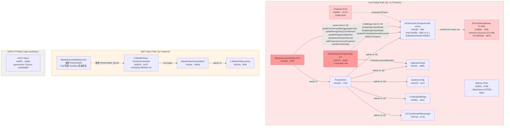
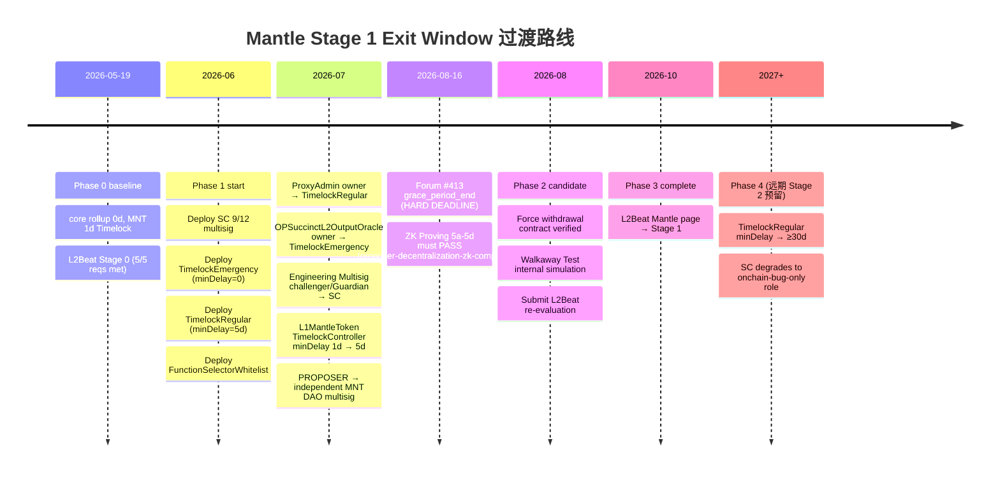
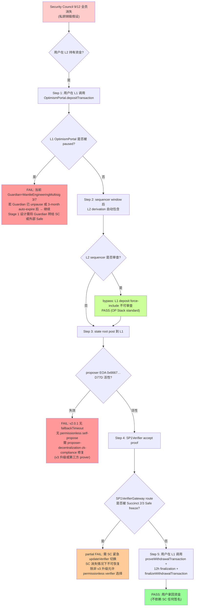

# Mantle 合约升级机制、退出窗口与安全委员会设计

## Executive Summary

本研究基于三份上游 final 的事实基线 —— `l2beat-stage-framework-2026`（commit `d1834f9`）、`mantle-architecture-2026`（commit `6025374`）、`stage1-case-studies`（commit `146ad79`）—— 为 Mantle 设计一套可落地的 Stage 1 合规"合约升级 + 退出窗口 + Security Council"三位一体方案。

**现状一句话总结（2026-05-19 抓取）**：Mantle 当前是 **Stage 0**，三路径治理（core rollup / L1MantleToken / mETH）中**只有 L1MantleToken 路径**带 1d minDelay 的 TimelockController（`0x65331ff6…447F`）；**core rollup 路径完全无 TimelockController** —— `MantleSecurityMultisig` 6/14 Gnosis Safe（`0x4e59…D40f`）通过 `onlyOwner` 在 `OPSuccinctL2OutputOracle` 上 0 延迟直接调用 `updateVerifier` / `updateAggregationVkey` / `updateRangeVkeyCommitment` / `updateRollupConfigHash` / `updateSubmissionInterval` / `addProposer`/`removeProposer` / `transferOwnership`；`MantleEngineeringMultisig` 3/7（`0x2F44…daC9`）通过 `onlyChallenger` 0 延迟直接调用 `enableOptimisticMode` / `disableOptimisticMode` / `updateFinalizationPeriodSeconds` / `deleteL2Outputs` 并兼任 Guardian。L2Beat Mantle 项目页文本直接写明 "There is no window for users to exit in case of an unwanted upgrade since contracts are instantly upgradable."

**Stage 1 三轨边界澄清**（来自 `l2beat-stage-framework-2026` item-3 / item-9）：

- **(3a) outside-SC upgrade exit window ≥5d**：**适用** Mantle（OR + ZK 通用规则，2026-04-30 由 ≥7d 下调至 ≥5d，来源 Forum #425 公告）；本研究主轴。
- **(3b) Optimistic Rollup challenge period ≥5d (Forum #425)**：**不适用** Mantle —— Mantle 走 OP Stack + OP Succinct + SP1 zkVM validity-proof 混合架构，**无 fraud-proof challenge window**。`OPSuccinctL2OutputOracle.finalizationPeriodSeconds = 43200`（12h）不是 L2Beat 框架定义的 challenge period，本研究**不**把它当作 Exit Window 组件。
- **(3c) Stage 2 unwanted-upgrade exit window ≥30d**：远期目标，本研究不主推但需预留升级路径。

**Walkaway Test enforcement_status（关键合规边界）**：依据 `l2beat-stage-framework-2026` final，Walkaway Test enforcement_status = **`enforced-on-project-pages`**（grace period 仅内部使用；Scroll / Starknet 在 L2Beat 项目页文本上明确标 FAIL）。因此本研究的 Walkaway Test 合规验证是 **Stage 1 硬要求**，不是"内在质量目标"。

**ZK Proving System 四子项硬约束**：依据 `l2beat-stage-framework-2026` item-5 + Forum #413（2026-02-16 发布）：5a/5b/5c **all-applicable**（适用所有 ZK rollup），5d **split**（OR 路径 = OP Stack reproducible prestate；ZK 路径 = ZK program commitment reproducibility）；grace_period_end **≈ 2026-08-16**（Forum #413 给出的 6 个月过渡窗口）。本研究在 Gap 矩阵中列出 5a-5d 状态，但详细评估交由并行的 `proposer-decentralization-zk-compliance` 处理。

**核心推荐**：

1. **Security Council 架构**：**9-12 人 multisig，外部 ≥50%（推荐 7/12 外部），阈值 9/12 = 75%（满足 L2Beat "greater than 75%" 的 L2Beat 实际评估按 ≥75% 处理；保守者可取 7/9 = 77.8%）**，Gnosis Safe + 硬件钱包 + 链上签名公示，**禁止**任何 SC 成员同时持有 proposer / sequencer / MNT multisig 角色。
2. **双轨制升级合约层（推荐架构 B：双 TimelockController）**：
   - **TimelockEmergency**：`minDelay = 0`，PROPOSER/EXECUTOR = SC multisig，**函数选择器白名单**严格限制（仅 pause / vkey rotation / 已审计 hotfix）；
   - **TimelockRegular**：`minDelay ≥ 5d`（推荐 5d，与 L2Beat 2026-04-30 新阈值对齐；可保守取 7d），PROPOSER = DAO governance（或更宽 multisig），EXECUTOR 开放；
   - 排除架构 A（单 TimelockController 多角色 — 不可行，OpenZeppelin TimelockController 是单 `minDelay` 设计）与架构 C（双 ProxyAdmin — 不可行，EIP-1967 proxy admin slot 单值）。
3. **Exit Window 过渡 4 阶段**：阶段 0（当前 0d core rollup / 1d MNT）→ 阶段 1（部署 SC + 双 Timelock + force withdrawal）→ 阶段 2（Walkaway Test 模拟 + L2Beat 评估）→ 阶段 3（Stage 1 完整态）→ 阶段 4（远期 Stage 2 ≥30d 预留路径）。
4. **三路径治理隔离**：core rollup SC、L1MantleToken multisig、mETH multisig 成员**禁止重叠**；三类 TimelockController 与 ProxyAdmin 实例**独立**。
5. **参考架构对照**：以 **Base 的 nested 2/2 ProxyAdminOwner 拓扑**为主要借鉴（Mantle 类似 OP Stack 派生链），同时**显式补足 ≥5d delay**（区别于 Base 的 0d instantly upgradable）；**OP Mainnet 10/13 SC + 2024-08 rollback 教训**作为 Stage 1 上线后审计/监控 playbook；**Arbitrum 17d 8h DAO 路径**作为更严格上限参考；**Starknet 3/12 SC = Backup Operator 与 Scroll Foundation multisig 平行升级路径**作为禁区。

**主要 Gap（与 L2Beat Stage 1 量化要求比对）**：

| Gap ID | 维度 | 当前状态 | Stage 1 要求 | Gap |
|--------|------|----------|----------------|-----|
| G-1 | Security Council 是否存在 | **None**（MantleSecurityMultisig 6/14 是项目方 multisig，非 L2Beat 定义的 SC） | ≥8 成员，>75% 阈值，≥50% 外部，≥2 外部签名 | 缺独立 SC，需新建 |
| G-2 | outside-SC upgrade exit window | **0d**（core rollup 无 timelock）/ **1d**（MNT 路径） | ≥5d | core rollup 缺 ≥5d；MNT 需扩 4d |
| G-3 | Walkaway Test | **FAIL**（升级路径仅经 6/14 与 3/7 项目方 multisig，无 SC，单 proposer EOA + v2.0.1 无 `fallbackTimeout`） | enforced-on-project-pages | 缺 permissionless prover + SC 独立路径 |
| G-4 | ZK Proving System 5a-5d | 待 `proposer-decentralization-zk-compliance` 详评 | grace_period_end ≈ 2026-08-16 | 硬截止 |
| G-5 | 三路径治理隔离 | MantleSecurityMultisig 6/14 同时是 core rollup `owner` 与 L1MantleToken Timelock PROPOSER（推断，需 final 阶段链上 `hasRole` 直读核验） | 严格禁止重叠 | 需拆分签名权 |

完整 Gap 矩阵见 §Item-2。

---

## Item Findings

### Item-1 — Mantle 当前合约升级机制全景（三路径治理 × 核心合约 × 权限链）

#### current_state（基于 `mantle-architecture-2026` final commit `6025374` + L2Beat Mantle 项目页 2026-05-19 抓取）

**(a) Core rollup contracts 路径**

| 合约 | Proxy 地址 | Implementation | Admin (ProxyAdmin) | Owner / 控制 multisig | minDelay |
|------|-------------|----------------|---------------------|------------------------|----------|
| `OPSuccinctL2OutputOracle` | `0x31d543e7BE1dA6eFDc2206Ef7822879045B9f481` | `0x4059509ffb703b048d1e9ce3118f90e759076f50` (v2.0.1) | `ProxyAdmin 0xca35…7794` | `owner` = MantleSecurityMultisig 6/14 `0x4e59…D40f`；`challenger` = MantleEngineeringMultisig 3/7 `0x2F44…daC9` | **0** |
| `OptimismPortal` | `0xc54cb22944F2bE476E02dECfCD7e3E7d3e15A8Fb` | EIP-1967 slot（follow-up 直读） | `ProxyAdmin 0xca35…7794` | 通过 ProxyAdmin → MantleSecurityMultisig 6/14 | **0** |
| `SystemConfig` | `0x427Ea0710FA5252057F0D88274f7aeb308386cAf` | EIP-1967 slot | `ProxyAdmin 0xca35…7794` | 同上 | **0** |
| `L1StandardBridge` | `0x95fC37A27a2f68e3A647CDc081F0A89bb47c3012` | EIP-1967 slot | `ProxyAdmin 0xca35…7794` | 同上 | **0** |
| `L1CrossDomainMessenger` | `0x676A795fe6E43C17c668de16730c3F690FEB7120` | EIP-1967 slot | `ProxyAdmin 0xca35…7794` | 同上 | **0** |
| `SP1VerifierGateway (PLONK)` | `0x3B6041173B80E77f038f3F2C0f9744f04837185e` | — | self-managed | **Succinct 2/3 Safe `0xCafEf00d348Adbd57c37d1B77e0619C6244C6878`**（非 Mantle 控制） | 0 |
| `ProxyAdmin (rollup)` | `0xca35F8338054739D138884685e08b39EE2217794` | `Ownable.owner()` | n/a | MantleSecurityMultisig 6/14 | n/a |
| `MantleSecurityMultisig` (Gnosis Safe) | `0x4e59e778a0fb77fBb305637435C62FaeD9aED40f` | — | self-managed Safe | 6 of 14 EOA owners（部分公开身份不明） | n/a |
| `MantleEngineeringMultisig` (Gnosis Safe) | `0x2F44BD2a54aC3fB20cd7783cF94334069641daC9` | — | self-managed Safe | 3 of 7 EOA owners | n/a |
| `BatchInbox` (magic address, DA) | `0xFFEEDDCcBbAA0000000000000000000000000000` | 无代码 | — | 由 `SystemConfig.batcherHash` 控制；batcher = `0x2f40…d749` EOA | n/a |
| Proposer EOA | `0x6667961f5e9C98A76a48767522150889703Ed77D` | — | — | **单一 EOA**（v2.0.1 无 `fallbackTimeout`，无 permissionless self-propose） | n/a |
| Batcher / Sequencer EOA | `0x2f40D796917ffB642bD2e2bdD2C762A5e40fd749` | — | — | 单一 EOA | n/a |

**(b) L1MantleToken / MNT 治理路径**

| 合约 | 地址 | 角色 |
|------|------|------|
| `L1MantleToken` (proxy) | `0x3c3a81e81dc49A522A592e7622A7E711c06bf354` | MNT token |
| `MantleTokenProxyAdmin` | `0x0cac2B1a172ac24012621101634DD5ABD6399ADd` | proxy admin |
| `TimelockController` | `0x65331ff6F8B0fc2612F2a0deBD9d04Fce60a447F` | **minDelay = 86400 s (1 day)** |
| TimelockController PROPOSER_ROLE | 推断为 MantleSecurityMultisig 6/14 | **final 阶段需链上 `hasRole(PROPOSER_ROLE, 0x4e59…)` 直读核验** |

**关键事实**：L1MantleToken 路径**有** 1d TimelockController（这是 Mantle 唯一带 timelock 的升级路径），但 minDelay = 1d 远低于 L2Beat ≥5d 阈值；且其 PROPOSER 可能正是 core rollup `owner`（同一 6/14 Safe），形成三路径治理隔离漏洞。

**(c) mETH / 产品层路径**

| 合约 | 地址 | 治理状态 |
|------|------|----------|
| mETH token | `0xd5f7838f5c461feff7fe49ea5ebaf7728bb0adfa` | **`mantle-architecture-2026` final 标 "Source unavailable for governance"** —— 公开材料未明确 LSP / staking router 治理链 |

本研究在 mETH 路径仅做边界标注（按 outline §item-7 (a) 的边界要求），详细治理由 Mantle 产品团队负责。

**(d) L2 合约升级路径**

L2 系统合约（L2CrossDomainMessenger、L2StandardBridge、L1Block predeploy、GasOracle 等）的升级走 L1→L2 message-passing：L1 通过 `OptimismPortal.depositTransaction` 发起，L2 由 `L2CrossDomainMessenger` 转发到目标 predeploy。L2 系统合约的最终升级权限**仍在 L1**（由 L1 ProxyAdmin → MantleSecurityMultisig 控制）。

**(e) 当前 timelock 精确配置**

| 角色 / 字段 | 当前持有者 / 值 | 链上来源 |
|-------------|-----------------|----------|
| Core rollup `ProxyAdmin.owner` | MantleSecurityMultisig 6/14 `0x4e59…D40f` | Etherscan + `mantle-architecture-2026` final §item-1 |
| `OPSuccinctL2OutputOracle.owner` (storage slot) | MantleSecurityMultisig 6/14 `0x4e59…D40f` | OPSuccinctL2OutputOracle.sol L80（commit `8cc7015`）|
| `OPSuccinctL2OutputOracle.challenger` (storage slot) | MantleEngineeringMultisig 3/7 `0x2F44…daC9` | OPSuccinctL2OutputOracle.sol L55 |
| `OPSuccinctL2OutputOracle.finalizationPeriodSeconds` | 43200 (12h) | 链上 L64 |
| `OPSuccinctL2OutputOracle.submissionInterval` | 1800 L2 blocks (~60 min @ l2BlockTime=2s) | 链上 L47 |
| `L1MantleToken TimelockController.minDelay()` | 86400 s = 1 day | TimelockController `0x65331ff6…447F` |
| Core rollup TimelockController | **不存在** | `mantle-architecture-2026` final 显式确认 |

**(f) L2Beat Mantle 项目页当前快照（2026-05-19）**

- **Stage 标识**：Stage 0（5/5 Stage 0 requirements met）；
- **风险标注**：L2Beat 文本明确："**There is no window for users to exit in case of an unwanted upgrade since contracts are instantly upgradable.**"
- **DA 重分类**：L2Beat 将 Mantle 在 2026-04-16 Arsia 升级后重新归类为 Rollup（此前为 Optimium）。

#### contract_implementation（v2.0.1 OPSuccinctL2OutputOracle 的双权限边界）

**v2.0.1 关键事实**（基于 OPSuccinctL2OutputOracle.sol 源码 commit `8cc7015`，来自 `mantle-architecture-2026` final §item-2/3/4）：

| Modifier | Storage slot | 当前持有者 | 0-delay setter 列表 |
|----------|---------------|--------------|---------------------|
| `onlyOwner` | `owner` (L80) | MantleSecurityMultisig 6/14 | `updateVerifier(address)` (L534)、`updateAggregationVkey(bytes32)` (L520)、`updateRangeVkeyCommitment(bytes32)` (L527)、`updateRollupConfigHash(bytes32)` (L541)、`updateSubmissionInterval(uint256)` (L513)、`addProposer(address)`/`removeProposer(address)` (L555–L566)、`transferOwnership(address)` (L548，单步) |
| `onlyChallenger` | `challenger` (L55) | MantleEngineeringMultisig 3/7 | `enableOptimisticMode(uint256)` (L569)、`disableOptimisticMode(uint256)` (L575+)、`updateFinalizationPeriodSeconds(uint256)` (L587)、`deleteL2Outputs(uint256)` (L281–L304) |

**v2.0.1 不暴露**的 v3 字段（与 Stage 1 liveness 边界相关）：`fallbackTimeout` ❌ / `opSuccinctConfigs` mapping ❌ / 6-arg `proposeL2Output(_configName, …, _proverAddress)` ❌ / `tx.origin` 鉴权 ❌。因此 Mantle v2.0.1 上**不存在 permissionless self-propose 路径** —— 这是 §Item-5 Walkaway Test 需要重点修复的活性 gap。

**SP1VerifierGateway 路由层关键事实**（来自 `mantle-architecture-2026` final §item-5）：

- Mantle 实际使用的 SP1VerifierGateway (PLONK) `0x3B6041…185e` **由 Succinct 2/3 Safe `0xCafEf00d…6878` 拥有**，**不是** Mantle 控制；
- `addRoute(address verifier) external onlyOwner` —— Succinct 可加新路由；
- `freezeRoute(bytes4 selector) external onlyOwner` —— Succinct 可 freeze 已激活路由；**不可解冻**；
- Mantle proposer 提交的 proof 通过 `bytes4(proofBytes[:4])` 选择路由；若 Succinct freeze Mantle 当前 PLONK v6.0.x route (selector `0xbb1a6f29`)，Mantle 必须立刻通过 `updateVerifier(address) onlyOwner` (0 delay, by 6/14 Safe) 切换到非 Gateway 的直接 SP1Verifier 实例；
- 这构成 Mantle ZK 路径的**外部依赖单点**（Succinct 2/3 Safe），Stage 1 设计需在 §Item-3 SC 紧急权限白名单中显式涵盖该恢复函数。

#### evidence_sources

- **Etherscan 永久链接**（2026-05-19 抓取）：
  - OPSuccinctL2OutputOracle proxy：https://etherscan.io/address/0x31d543e7BE1dA6eFDc2206Ef7822879045B9f481
  - OptimismPortal：https://etherscan.io/address/0xc54cb22944F2bE476E02dECfCD7e3E7d3e15A8Fb
  - SystemConfig：https://etherscan.io/address/0x427Ea0710FA5252057F0D88274f7aeb308386cAf
  - L1StandardBridge：https://etherscan.io/address/0x95fC37A27a2f68e3A647CDc081F0A89bb47c3012
  - L1CrossDomainMessenger：https://etherscan.io/address/0x676A795fe6E43C17c668de16730c3F690FEB7120
  - SP1VerifierGateway (PLONK)：https://etherscan.io/address/0x3B6041173B80E77f038f3F2C0f9744f04837185e
  - ProxyAdmin (rollup)：https://etherscan.io/address/0xca35F8338054739D138884685e08b39EE2217794
  - MantleSecurityMultisig：https://etherscan.io/address/0x4e59e778a0fb77fBb305637435C62FaeD9aED40f
  - MantleEngineeringMultisig：https://etherscan.io/address/0x2F44BD2a54aC3fB20cd7783cF94334069641daC9
  - L1MantleToken：https://etherscan.io/address/0x3c3a81e81dc49A522A592e7622A7E711c06bf354
  - MantleTokenProxyAdmin：https://etherscan.io/address/0x0cac2B1a172ac24012621101634DD5ABD6399ADd
  - L1MantleToken TimelockController：https://etherscan.io/address/0x65331ff6F8B0fc2612F2a0deBD9d04Fce60a447F
- **Source code (commit hash)**：
  - OPSuccinctL2OutputOracle.sol commit `8cc7015`（来自 `mantle-architecture-2026` final §item-3 引用）
- **L2Beat 项目页**：https://l2beat.com/scaling/projects/mantle （Stage 0 标识，2026-05-19 抓取）
- **上游 final 精确引用**：`mantle-architecture-2026` final commit `6025374` 路径 `mantle-stage1-rollup/research-sections/mantle-architecture-2026/final.md`

#### open_questions

- **OQ-1**：MantleSecurityMultisig 6/14 与 MantleEngineeringMultisig 3/7 的 owner EOA **公开身份重叠情况** —— final 阶段需链上 `getOwners()` + 公开声明交叉核验是否存在同一个体在两 Safe 担任 owner（与 §Item-3 / §Item-7 治理隔离直接相关）。
- **OQ-2**：L1MantleToken TimelockController `0x65331ff6…447F` 的 PROPOSER_ROLE 持有者**精确身份** —— 推断为 MantleSecurityMultisig 6/14，需 final 阶段 `hasRole(PROPOSER_ROLE, 0x4e59…)` 直读核验，确认三路径治理隔离 gap 规模。
- **OQ-3**：mETH/LSP 治理链路 —— `mantle-architecture-2026` final 标 "Source unavailable"，本研究在 §Item-7 仅做边界标注。
- **OQ-4**：OptimismPortal / SystemConfig / L1StandardBridge / L1CrossDomainMessenger 当前 implementation 地址（EIP-1967 slot）—— 本表已标 "follow-up 直读"，final 阶段需补全。

---

### Item-2 — L2Beat Stage 1 要求 → Mantle 现状 Gap 矩阵

#### l2beat_requirement & applicable_rollup_type & gap_analysis

**主 Gap 矩阵**（5 列：维度 × 当前状态 × Stage 1 要求 × Gap × 推荐解决方向）：

| 维度 | Mantle 当前状态（2026-05-19） | Stage 1 要求 | applicable_rollup_type | Gap | 推荐解决方向 |
|------|---------------------------------|----------------|--------------------------|-----|---------------|
| **(1) Security Council 量化阈值** | None（MantleSecurityMultisig 6/14 是项目方 multisig，非 L2Beat 定义的 SC；6/14 ≈ 42.9% < 75% 阈值） | ≥8 成员 + >75% 阈值（L2Beat Glossary "greater than 75%"，实际评估按 ≥75% 处理）+ ≥50% 外部 + ≥2 外部签名达成共识 + 成员公开 + proof system effective power ≥25% | all | 缺独立 SC，需新建 | §Item-3 推荐 9-12 SC，9/12 = 75%，外部 ≥50% |
| **(2) outside-SC upgrade exit window** | **0d**（core rollup 路径）；**1d**（L1MantleToken 路径 minDelay = 86400 s） | **≥5d**（2026-04-30 由 ≥7d 下调，Forum #425；适用所有 rollup） | **all** | core rollup 缺 ≥5d；MNT 路径需扩 4d | §Item-4 阶段 1：TimelockRegular minDelay → ≥5d；§Item-6 双 Timelock 架构 B |
| **(3) Walkaway Test (Forum #412)** | **FAIL** —— (a) 升级路径仅经 6/14 与 3/7 项目方 multisig，无独立 SC；(b) 单 proposer EOA `0x6667…D77D`；(c) v2.0.1 不暴露 `fallbackTimeout` → **无 permissionless self-propose**；(d) MantleEngineeringMultisig 3/7 兼任 Guardian (pause/blacklist) | 用户在 Security Council 永久消失情况下必须能安全退出；**enforcement_status = `enforced-on-project-pages`** | all | permissionless prover 缺失 + SC 独立路径缺失 + Guardian 兼任 multisig 反模式 | §Item-5 设计；与 `proposer-decentralization-zk-compliance` 协同 |
| **(4a) ZK Proving System 5a (no 🔴 trusted setup)** | 待 `proposer-decentralization-zk-compliance` 详评（SP1 PLONK 使用以太坊主网 KZG ceremony，候选 PASS） | no 🔴 trusted setups（all ZK rollups） | **all ZK** | 由并行 issue 评估 | 引用 `proposer-decentralization-zk-compliance` 结论；grace_period_end ≈ 2026-08-16 |
| **(4b) ZK Proving System 5b (prover source published)** | 待详评（SP1 zkVM 开源 https://github.com/succinctlabs/sp1） | 所有 prover 源码公开 | **all ZK** | 由并行 issue 评估 | 同上 |
| **(4c) ZK Proving System 5c (verifier reproducible)** | 待详评（SP1Verifier on-chain 字节码 vs SP1 commit hash） | verifier 字节码可从源码独立重生 | **all ZK** | 由并行 issue 评估 | 同上 |
| **(4d) ZK Proving System 5d (ZK program reproducible)** | 待详评（aggregationVkey / rangeVkeyCommitment / rollupConfigHash 与 op-program / kona / op-succinct 源码可复现路径） | ZK program commitment 可独立复现（**Mantle 走 ZK 路径，5d 取 ZK split**） | **ZK split** | 由并行 issue 评估 | 同上 |
| **(5) Council 外部成员定义** | n/a（无 SC） | "外部" = 非核心团队 / 非投资人 / 独立机构代表（来源：l2beat-stage-framework-2026 final §item-2） | all | 缺定义对齐 | §Item-3 严格外部 |
| **(6) Council 成员公开度** | n/a；MantleSecurityMultisig 6/14 与 MantleEngineeringMultisig 3/7 部分 EOA 身份不明 | 身份公开 + 签名地址公开 + 签名行为可链上验证 | all | 当前不公开 → 新 SC 必须公开 | §Item-3 (3.c) |
| **(7) Council 紧急权限边界** | n/a；MantleSecurityMultisig 6/14 **是** 常规升级 happy-path 必要参与者（同时控制 onlyOwner 0-delay setters + ProxyAdmin upgrade）→ Walkaway Test FAIL | 仅限可裁决 onchain bug；**不得**作为常规升级 happy-path 必要参与者 | all | 当前角色定位错误 | §Item-3 (3.e) + §Item-6 函数选择器白名单 |

#### case_study_reference

- **Arbitrum 9/12 + 7/12 双层 SC, 17d 8h timelock**（`stage1-case-studies` final §Item-2）：作为 ≥5d outside-SC upgrade exit window 的最严格上限参考；
- **OP Mainnet 10/13 SC, 2024-08 rollback**（同上 §Item-3）：作为 Stage 1 上线后审计/监控 playbook；
- **Base 9/12 SC + nested 2/2 ProxyAdminOwner**（同上 §Item-4）：作为 OP Stack 派生链 + 独立 SC 的最直接对标，**但 0d instantly upgradable 须修正**；
- **Starknet 3/12 SC = Backup Operator**（同上 §Item-5）：禁区 —— SC 成员兼任 Operator 反模式；
- **Scroll Foundation multisig 与 SC 平行升级路径 + 2026-04-13 SCR-001 dissolve SC 提案**（同上 §Item-6）：禁区 —— SC 沦为 ceremony 长期会被社区质疑解散。

#### evidence_sources

- L2Beat Stage 1 quantitative thresholds：`l2beat-stage-framework-2026` final §item-1 / §item-2 / §item-3 / §item-4 / §item-5（commit `d1834f9`）
- L2Beat Forum #412 walkaway test：https://forum.l2beat.com/t/stage-1-requirements-update-security-council-walkaway-test/412
- L2Beat Forum #413 ZK proving system gates：https://forum.l2beat.com/t/new-stage-1-requirements-for-l2-proving-systems/413
- L2Beat Forum #425 7d→5d challenge period：https://forum.l2beat.com/t/stage-1-update-minimum-challenge-period-reduction-from-7d-to-5d/425
- L2Beat Mantle 项目页快照：https://l2beat.com/scaling/projects/mantle （2026-05-19 抓取）

#### open_questions

- **OQ-5**：Forum #413 grace_period_end 精确日期 —— `l2beat-stage-framework-2026` final 标 "≈ 2026-08-16"（6 个月过渡）；final 阶段需直接访问 Forum #413 帖子确认精确日。

---

### Item-3 — Security Council 推荐架构设计（成员 / 阈值 / 外部 / 签名 / 嵌套 / 权限边界）

#### design_recommendation

**(3.a) 成员组成**

- **数量**：**9-12 人**（>L2Beat 最低 8 人门槛，覆盖时区与法域，应对单点失联）；推荐起步 **9 人**（最小可合规配置），评估后扩至 12 人；
- **外部比例**：**≥50%**，推荐 **7/12 外部**（或 6/9 外部 = 66.7%）；**严禁**外部 < 50%（参考 Starknet 反模式：12 名 SC 中 3 名兼任 Backup Operator 且 StarkWare 占多数 → walkaway FAIL）；
- **法域分布**：避免单一法域 > 50%（参考 Arbitrum DAO Constitution "单一组织 ≤ 3 席" 原则）；
- **角色多样性**：覆盖独立安全研究者、生态合作伙伴、用户代表、外部审计机构。

**(3.b) 阈值**

L2Beat Glossary 原文为 "greater than 75%"，但 `l2beat-stage-framework-2026` final §item-2 确认 L2Beat 在实际评估中按 **≥75%** 处理（OP Mainnet 10/13 ≈ 77%、Arbitrum 9/12 = 75%、Base 8/11 ≈ 72.7% on-chain + nested 2/2 联签 effective ≥ 75% 均被接受）。

| 推荐组合 | quorum | 外部 quorum | 是否合规 |
|----------|--------|---------------|------------|
| **9/12 = 75%** | ✅ | 配合 7/12 外部，外部签名达成 ≥ 7 → 满足 "≥2 外部签名达成共识" | **推荐主选** |
| 7/9 = 77.8% | ✅ | 配合 6/9 外部，外部签名达成 ≥ 5 → 满足 | 推荐替代（起步 9 人时） |
| **严禁 5/8 = 62.5%** | ❌ | 不满足 ≥75% | 排除 |
| **严禁 8/12 ≈ 66.7%** | ❌ | 不满足 ≥75% | 排除 |

**proof system effective power ≥25%**（L2Beat 量化要求，确保 SC 阈值大于"50% 可串通"基线 + proof system 提供的 ≥25% 独立约束）：在 9/12 = 75% 阈值下，effective power = 1 - 0.75 = 25% 恰好达标；若取 7/9 = 77.8%，effective power ≈ 22.2% 略低 —— 但 L2Beat 实际评估接受 ≥75% 阈值即视为达标，effective power 数学推导是"75% 阈值的等价表达"，不是独立约束。本研究**推荐 9/12 = 75%**。

**(3.c) 签名机制**

- **合约**：Gnosis Safe (Safe v1.4.1+ on Ethereum L1) 或等价 multisig；
- **链上签名公示**：每次签名 transaction 的 calldata + signers 列表公开（Safe Transaction Service / Etherscan 双重）；
- **签名地址轮换**：成员变更走 `swapOwner(prevOwner, oldOwner, newOwner)` + ≥75% 现任 owner 签名；
- **硬件钱包要求**：所有 SC owner EOA 必须使用硬件钱包（Ledger / Trezor / GridPlus）+ 物理隔离；
- **合约层集成**：SC multisig 是 `TimelockEmergency.PROPOSER_ROLE` + `EXECUTOR_ROLE` 持有者（见 §Item-6 架构 B）。

**(3.d) 嵌套多签可选方案**

**评估 Base 模式 nested 2/2 ProxyAdminOwner**：

| 方案 | 优点 | 缺点 |
|------|------|------|
| **不采用嵌套**（单层 SC = ProxyAdmin owner） | 简单；与 Arbitrum / Starknet / Scroll 模型一致 | 无冗余防误操作层 |
| **采用 Base nested 2/2**（外层 SC 9/12 + 内层 2/2 = ProxyAdminOwner） | 双重失败模式隔离；防外层 SC 单边误操作；与 Base 直接对标 | 增加运维复杂度；**关键约束：内层 2/2 必须仅在升级路径必要，不得在 Walkaway Test 路径必要**；若内层 2/2 是 happy-path 必要参与者 → walkaway 风险 |

**推荐**：**起步阶段采用单层 SC + ≥5d Timelock**（避免 nested 复杂度）；**Stage 1 完整态后**评估升级到 Base nested 2/2，前提是内层 2/2 仅在升级 happy-path 上为必要参与者（不参与 force withdrawal 路径）—— 这与 Base 当前架构一致（Base 的 walkaway PASS 通过 OptimismPortal forced inclusion + permissionless DisputeGameFactory，不依赖 nested 2/2）。

**(3.e) 紧急权限边界（与 §Item-6 双轨设计对接）**

**紧急路径合法范围**（仅限以下场景）：

1. 可裁决 onchain bug（已审计的 hotfix patch，参考 OP Mainnet 2024-08 Cannon bug 紧急回退）；
2. SP1VerifierGateway route freeze 恢复（Succinct 2/3 Safe freeze Mantle 当前 PLONK route → SC 紧急 `updateVerifier(address)` 切换）；
3. proof system aggregation/range vkey 错误升级回退；
4. upstream OP Stack 紧急补丁 adopt；
5. 已发生的 hack 进行中（pause 链上资金流动）。

**紧急路径禁区**：

- **禁止** SC 作为常规升级 happy-path 必要参与者（Walkaway Test 红线）；
- **禁止** SC 单方面 `transferOwnership(address)` 转让任何 owner（这是 OPSuccinctL2OutputOracle.sol L548 暴露的高风险函数，需走 TimelockRegular ≥5d 路径）；
- **禁止** SC 单方面调用 `addProposer/removeProposer` 在常规情况下扩张/收缩 proposer 集合（仅在 proposer EOA 失效紧急下允许）。

**函数选择器白名单初始集合**（详见 §Item-6 (6.b)）：

| 函数 | Selector | 合约 | 紧急用途 |
|------|----------|------|----------|
| `pause()` | `0x8456cb59` | OptimismPortal / L1StandardBridge / L1CrossDomainMessenger | hack 进行中冻结资金 |
| `unpause()` | `0x3f4ba83a` | 同上 | 紧急完结后恢复 |
| `updateVerifier(address)` | (TBD) | OPSuccinctL2OutputOracle | SP1Verifier route freeze 恢复 |
| `updateAggregationVkey(bytes32)` | (TBD) | 同上 | vkey 错误回退 |
| `updateRangeVkeyCommitment(bytes32)` | (TBD) | 同上 | 同上 |
| `updateRollupConfigHash(bytes32)` | (TBD) | 同上 | 同上 |

**每次紧急升级的事后公示要求**：

- 链上 event：`EmergencyUpgradeExecuted(bytes4 selector, address caller, bytes calldata)`；
- 24h 内 Mantle 官方博客 + L2Beat 监控通报；
- 30d 内独立审计 + 后验报告。

**(3.f) 与现有 Mantle multisig 的迁移**

迁移步骤（与 §Item-4 阶段 1 协同）：

1. 部署新 SC multisig（Gnosis Safe 9/12 with 7 外部 owners）；
2. 部署 TimelockEmergency + TimelockRegular（按 §Item-6 架构 B）；
3. 部署函数选择器白名单合约；
4. MantleSecurityMultisig 6/14 调用 `OPSuccinctL2OutputOracle.transferOwnership(TimelockEmergency)`（**风险点**：单步 transfer，无 acceptOwnership；建议在 v2.0.1 升级到 v3 或自定义两步 transfer 模式后再迁移）；
5. ProxyAdmin owner 通过 `Ownable.transferOwnership(TimelockRegular)` 迁移；
6. MantleEngineeringMultisig 3/7 的 challenger 角色：评估是否合并到 SC（推荐合并，Engineering Multisig 解散；或保留为单独的 Guardian Safe 但成员严格外部，避免 Scroll Team 2/4 反模式）；
7. L1MantleToken TimelockController PROPOSER 切换到独立 MNT DAO multisig（治理隔离，见 §Item-7）。

#### case_study_reference

| 项目 | SC 配置 | 适用性 |
|------|---------|---------|
| **Arbitrum** 9/12 (75%, 紧急) + 7/12 (≈58%, 非紧急) + 17d 8h DAO timelock | 双层 SC + 长 timelock 模式 | **参考**：单层 SC 起步 + ≥5d timelock 起步；远期可考虑双层 |
| **OP Mainnet** 10/13 (≈77%) + SuperchainProxyAdminOwner 2/2 of [SC, OpFoundationUpgradeSafe 5/7] + 2024-08 rollback | nested 2/2 + 上线后 audit | **直接借鉴**：nested 2/2 可作远期升级；2024-08 教训为本研究风险矩阵 R-1 输入 |
| **Base** policy 9/12 (75%) / on-chain 8/11 (72.7%) + Coordinator + nested 2/2 + 0d instantly upgradable | nested 2/2 + Coordinator 隔离 operator | **最直接对标 + 修正**：采用 nested 2/2 + Coordinator 拓扑（隔离 Mantle 团队 multisig 为 Coordinator），但**必须**叠加 ≥5d delay（修正 Base 0d 缺陷） |
| **Starknet** 12 SC, 9/12 (75%) + 3/12 SC = Backup Operator + StarkWare Multisig 2 平行 | walkaway FAIL（SC 成员兼任 Operator + 公司侧 multisig 平行升级） | **禁区**：禁止 SC 成员兼任 proposer/sequencer 角色（§Item-5 (5.e)）|
| **Scroll** SC + Foundation multisig 平行 + SCR-001 (2026-04-13) 提案解散 SC | walkaway FAIL + 反向去中心化提案 | **禁区**：禁止 Team multisig 持有独立紧急升级权（§Item-5 (5.e)） |

#### transition_steps

详见 §Item-4 阶段 1 与 §Item-8 (8.a) 时间线。

#### risk_and_mitigation

| 风险 | 触发条件 | 缓解 |
|------|----------|------|
| 9/12 SC 阈值密钥泄露（≥9 个 owner 私钥被同时获取）| 协调攻击 / 内部串通 | 硬件钱包 + 地理分布 + ≥2 外部签名硬性约束 + 公开成员身份 |
| 单步 transferOwnership 迁移失败 | v2.0.1 OPSuccinctL2OutputOracle.transferOwnership L548 无 acceptOwnership | 先升级到 v3 或部署 wrapper 实现两步 transfer，再做迁移 |
| 函数选择器白名单滥用 | TimelockRegular 路径上 SC 提议扩展白名单 | 白名单更新需 DAO 投票 + ≥5d Timelock |

#### evidence_sources

- OpenZeppelin TimelockController：https://docs.openzeppelin.com/contracts/5.x/api/governance#TimelockController （roles: `PROPOSER_ROLE`, `EXECUTOR_ROLE`, `CANCELLER_ROLE`, `TIMELOCK_ADMIN_ROLE`）
- Gnosis Safe 文档：https://docs.safe.global/
- `stage1-case-studies` final §Item-2 / §Item-3 / §Item-4 / §Item-5 / §Item-6（commit `146ad79`）
- `l2beat-stage-framework-2026` final §item-2 quantitative thresholds（commit `d1834f9`）

---

### Item-4 — Exit Window 过渡设计（当前 0d core / 1d MNT → ≥5d outside-SC upgrade exit window）

#### l2beat_requirement & applicable_rollup_type（边界澄清）

本研究主轴是 **(3a) outside-SC upgrade exit window ≥5d**，适用所有 rollup 类型。

**Forum #425 不适用 Mantle**：Forum #425（2026-04-30）将 (3b) Optimistic Rollup challenge period 由 ≥7d 下调至 ≥5d；Mantle 走 OP Succinct validity-proof 路径，**不承担** OR challenge period 规则。`OPSuccinctL2OutputOracle.finalizationPeriodSeconds = 43200`（12h）不是 L2Beat 框架定义的 challenge period（来源：`l2beat-stage-framework-2026` final §item-3 + §item-9）。

#### design_recommendation & transition_steps

**(4.a) 分阶段路径**

| 阶段 | 时间 | Timelock 配置 | 核心 deliverable |
|------|------|----------------|--------------------|
| **阶段 0**（基线，2026.05 当前） | 0 | core rollup: 0d; MNT: 1d (86400 s) | 现状盘点完成（§Item-1） |
| **阶段 1**（过渡态，2026.06–2026.08） | +1–2 月 | 部署 TimelockEmergency (minDelay=0) + TimelockRegular (minDelay≥5d) | (i) SC multisig 上线；(ii) 双 Timelock 部署；(iii) 函数选择器白名单上线；(iv) 现有 ProxyAdmin owner 迁移到 TimelockRegular；(v) OPSuccinctL2OutputOracle owner 与 challenger 迁移到 SC（owner）与单独 Guardian Safe 或 SC 兼任（challenger）|
| **阶段 2**（Stage 1 候选态，2026.08+） | 阶段 1 完成后立即 | 同上 | (i) 强制提款合约部署 / 验证（§Item-5）；(ii) Walkaway Test 内部模拟通过；(iii) ZK Proving 5a-5d 通过（与 `proposer-decentralization-zk-compliance` 协同，**硬截止 2026-08-16**）；(iv) 提交 L2Beat 重新评估申请 |
| **阶段 3**（Stage 1 完整态，2026.10+） | 阶段 2 通过 L2Beat 评审 | 同上 | L2Beat 项目页评定为 Stage 1 |
| **阶段 4**（远期 Stage 2 预留） | 2027+ | TimelockRegular minDelay → ≥30d | SC 退化为仅可裁决 onchain bug；本研究只画路径不做详细设计 |

**(4.b) 每个阶段的精确 deliverable**

**阶段 1 链上参数变更 transaction 序列**（推荐顺序，原子化分组）：

```
tx-1-1: Deploy TimelockEmergency
  TimelockController.constructor(
    uint256 minDelay = 0,
    address[] proposers = [SCMultisig],
    address[] executors = [SCMultisig],
    address admin = address(0)  // 自管理，无 admin
  )

tx-1-2: Deploy TimelockRegular
  TimelockController.constructor(
    uint256 minDelay = 432000,  // 5 day = 432000 s
    address[] proposers = [DAOMultisig],
    address[] executors = [address(0)],  // 开放 executor
    address admin = address(0)
  )

tx-1-3: Deploy FunctionSelectorWhitelist contract
  (custom contract; stores mapping(bytes4 => bool); owned by TimelockRegular)

tx-1-4: ProxyAdmin owner 迁移
  // 由 MantleSecurityMultisig 6/14 执行
  ProxyAdmin(0xca35…7794).transferOwnership(TimelockRegular)

tx-1-5: OPSuccinctL2OutputOracle owner 迁移
  // 由 MantleSecurityMultisig 6/14 执行
  OPSuccinctL2OutputOracle(0x31d5…f481).transferOwnership(TimelockEmergency)
  // 注：v2.0.1 单步 transfer，无 acceptOwnership；建议先升级到 v3 或部署 wrapper

tx-1-6: L1MantleToken TimelockController minDelay 扩至 ≥5d
  // 必须由 L1MantleToken TimelockController 本身 schedule + execute，
  // 即 PROPOSER (MantleSecurityMultisig) 调用：
  TimelockController(0x6533…447F).schedule(
    target = 0x6533…447F,
    value = 0,
    data = abi.encodeWithSelector(TimelockController.updateDelay.selector, 432000),  // 5d
    predecessor = 0,
    salt = <random>,
    delay = 86400  // current 1d delay
  )
  // 1 天后：
  TimelockController(0x6533…447F).execute(
    target = 0x6533…447F,
    value = 0,
    data = abi.encodeWithSelector(TimelockController.updateDelay.selector, 432000),
    predecessor = 0,
    salt = <random>
  )

tx-1-7: TimelockEmergency 函数选择器白名单初始化
  FunctionSelectorWhitelist.addSelectors([
    0x8456cb59,  // pause()
    0x3f4ba83a,  // unpause()
    bytes4(keccak256("updateVerifier(address)")),
    bytes4(keccak256("updateAggregationVkey(bytes32)")),
    bytes4(keccak256("updateRangeVkeyCommitment(bytes32)")),
    bytes4(keccak256("updateRollupConfigHash(bytes32)"))
  ])

tx-1-8: SC multisig PROPOSER_ROLE / EXECUTOR_ROLE 在双 Timelock 上的 grantRole
  // TimelockRegular: 仅 DAOMultisig 是 PROPOSER；SC 仅作为 CANCELLER（可取消恶意调度）
  TimelockRegular.grantRole(CANCELLER_ROLE, SCMultisig)
  
  // TimelockEmergency: SC 是 PROPOSER + EXECUTOR；DAO 不参与
  // (已在 constructor 设置，无需 grantRole)

tx-1-9: 撤销旧 multisig 权限
  // 在 tx-1-4 / tx-1-5 后，MantleSecurityMultisig 6/14 不再是 owner；
  // 但需显式验证：cast call OPSuccinctL2OutputOracle owner() == TimelockEmergency
  // 且 cast call ProxyAdmin owner() == TimelockRegular
```

**阶段 2 链上参数变更**：

- 部署强制提款合约 / 验证 OptimismPortal.proveWithdrawalTransaction + finalizeWithdrawalTransaction 是 permissionless（详见 §Item-5）；
- 部署 permissionless prover 入口（与 `proposer-decentralization-zk-compliance` 协同）；
- 提交 L2Beat 重新评估申请（off-chain）。

**(4.c) 紧急 bug 修复窗口的兼容性**

Timelock 延至 ≥5d 后，紧急 bug 通过 **TimelockEmergency**（minDelay = 0 + SC 9/12 = 75% + ≥2 外部签名）路径修复，**仅限白名单函数**。

**与 OP Mainnet 2024-08 rollback 教训对照**：OP Mainnet Cannon 三处 High bug 由 OpFoundationUpgradeSafe + SC 紧急回退；Mantle 设计的 TimelockEmergency 即等价机制。Mantle 应额外建立"上线后 6-12 个月密集审计 + 监控周期"机制（参考 OP `make reproducible-prestate` 的合规标杆）。

**(4.d) 与 OP Stack 上游升级窗口的协调**

OP Stack 主线（Optimism Mainnet / Bedrock / Holocene / Granite / Upgrade 14 / Upgrade 16）的紧急升级窗口可能短于 5d。Mantle 的上游 OP Stack 紧急补丁处理路径：

- **优先**：通过 TimelockEmergency 白名单函数（如果补丁可通过白名单调用实现）；
- **次选**：通过 TimelockRegular ≥5d delay；
- **禁区**：单独的"upstream emergency adopt" 豁免路径**不推荐**（会创造常规升级 happy-path 的 SC 必要参与点 → walkaway 风险）。

#### case_study_reference

| 项目 | exit window outside SC | 借鉴 |
|------|--------------------------|------|
| Arbitrum 17d 8h（L2 8d + Outbox 6d 8h + L1 3d） | 最严格上限参考；Mantle 起步 ≥5d 已合规 | 参考其 "扩大 timelock 让低阈值多签合规" 模式 |
| OP Mainnet ≥5d (OP Stack 标准 pause 路径) | 直接借鉴 | nested 2/2 SuperchainProxyAdminOwner + ≥5d delay |
| **Base 0d**（instantly upgradable，唯一防线 nested 2/2 联签） | **修正而非采用** | Mantle 必须叠加 ≥5d delay |

#### transition_steps

阶段 1 详细 calldata 见 (4.b) 上面。

#### risk_and_mitigation

详见 §Item-8 (8.b) 风险矩阵 R-1（Timelock 延长期间紧急 bug 修复窗口）、R-5（Mantle ZK 路径与 OP Stack 上游升级窗口不一致）。

#### evidence_sources

- L2Beat Forum #425：https://forum.l2beat.com/t/stage-1-update-minimum-challenge-period-reduction-from-7d-to-5d/425
- OpenZeppelin TimelockController.updateDelay：https://docs.openzeppelin.com/contracts/5.x/api/governance#TimelockController-updateDelay-uint256-
- `l2beat-stage-framework-2026` final §item-3（三轨 Exit Window 规则）
- `stage1-case-studies` final §Item-2/3/4（Arbitrum/OP/Base exit window 配置）

---

### Item-5 — Walkaway Test 合规验证与用户强制退出路径设计

#### l2beat_requirement & enforcement_status

- **来源**：L2Beat Forum #412（2025-12-19，作者 donnoh / Luca Donno）；
- **原文**："The previous requirement must hold **even if the Security Council is permanently inactive**." 即用户在 SC 永久消失情况下必须能安全退出；
- **enforcement_status（直接引用 `l2beat-stage-framework-2026` final §item-4）**：**`enforced-on-project-pages`** —— L2Beat 在项目页文本上明确标 PASS/FAIL；Scroll / Starknet / Kinto 标 FAIL；Arbitrum / OP / Base / Ink 标 PASS。grace period 仅 L2Beat 内部使用，**不构成 stage 评估宽限**。
- **applicable_rollup_type**：all（ZK 路径下含义不同 —— ZK 需要 permissionless prover + verifier 不被 SC 单方面冻结）。

#### design_recommendation

**(5.a) 用户强制退出的完整路径（Mantle ZK 路径下）**

| 步骤 | 路径 | 当前状态 | Stage 1 要求 | Gap |
|------|------|----------|----------------|-----|
| (i) L2 → L1 message-passing 入口 | `OptimismPortal.depositTransaction(...)` (L1) → L2 force-include | OP Stack 标准，permissionless | permissionless 调用 | **PASS**（继承 OP Stack） |
| (ii) L2 sequencer censorship | L1 deposit transaction 在 sequencer window 后由 L2 derivation 自动包含 | OP Stack 标准 `seq_window_size` | 用户可绕过 sequencer | **PASS**（继承 OP Stack） |
| (iii) L2 state root post 到 L1 | proposer EOA `0x6667…D77D` 调用 `OPSuccinctL2OutputOracle.proposeL2Output` | **单 proposer EOA + v2.0.1 不暴露 `fallbackTimeout` → 无 permissionless self-propose** | permissionless prover/proposer | **FAIL** —— SC 消失情况下 proposer EOA 离线即停滞；详见 `proposer-decentralization-zk-compliance` |
| (iv) SP1Verifier accept proof | proposer 提交的 ZK proof 通过 `SP1VerifierGateway` 路由到 PLONK verifier | **依赖外部 Succinct 2/3 Safe `0xCafEf00d…6878` 不 freeze 路由** | verifier 不被任何方单方面冻结 | **partial FAIL** —— 外部 Succinct Safe 是 single-point；Mantle 需要紧急切换路径（§Item-3 (3.e) 白名单） |
| (v) L1 bridge withdrawal finality | 用户调用 `OptimismPortal.proveWithdrawalTransaction` + `finalizeWithdrawalTransaction` | OP Stack 标准 permissionless | finality 不依赖 SC 签名 | **PASS**（继承 OP Stack；不依赖任何 SC 签名）|

**(5.b) Council 依赖点逐项核验**

| 路径节点 | 是否依赖 SC 签名 | 是否依赖 SC 控制的合约函数 |
|---------|---------------------|------------------------------|
| (i) OptimismPortal.depositTransaction | ❌ | ❌ |
| (ii) L2 sequencer force-include | ❌ | ❌ |
| (iii) proposeL2Output | ❌（不依赖 SC，但**依赖**单 proposer EOA 活性）| ❌ |
| (iv) SP1Verifier verifyProof | ❌（不依赖 Mantle SC，但**依赖**外部 Succinct 2/3 Safe 不 freeze） | ⚠️ |
| (v) finalizeWithdrawalTransaction | ❌ | ❌ |
| OptimismPortal.pause/unpause Guardian | **当前 MantleEngineeringMultisig 3/7 兼任 Guardian → 是 SC 角色重叠反模式** | ⚠️ |

**关键修复点**：

1. **修复 (iii) proposer 活性单点**：在 v2.0.1 升级到 v3 之前，proposer EOA 离线即停滞；升级到 v3 后 `fallbackTimeout` 引入 permissionless self-propose；这是 Stage 1 liveness 阻断 → 由 `proposer-decentralization-zk-compliance` 详评，本研究只引用结论；
2. **修复 (iv) SP1VerifierGateway 外部依赖**：SC 紧急权限白名单包含 `updateVerifier(address)`（§Item-3 (3.e)），Mantle 可在 Succinct freeze 当前 route 后 0 delay 切换；本研究**不**期望消除外部依赖，但要求**修复路径完全在 Mantle SC 控制下**；
3. **修复 Guardian 兼任**：Guardian 角色从 MantleEngineeringMultisig 3/7 迁移到新 SC（或单独的外部 Guardian Safe，成员严格外部，禁止与 Engineering Multisig 重叠 —— 避免 Scroll Team 2/4 反模式）。

**(5.c) 与 Stage 0 提交人路径的边界**

- `l2beat-stage-framework-2026` final §item-2 (f) "至少 5 个外部参与者可提交 fraud proof" 属于 **Stage 0** 且**针对 Optimistic Rollup**；
- Mantle 走 validity-proof 路径**不直接适用**，但等价要求 **(5c) verifier 可重建 + (5d) program 可重建 + permissionless prover** 必须满足；
- 本 item 在 ZK 路径下的 Walkaway Test 含义：**permissionless prover** 可在 SC 消失情况下继续生成与提交 validity proof，且 verifier vkey 不在 SC 单方面控制下被冻结。

**(5.d) Walkaway Test 内部模拟方案**

设计 "Security Council 全员失联" 演练（建议在测试网或 Mantle Sepolia 上执行）：

1. **前置条件**：阶段 2 完成（SC + 双 Timelock + 强制提款合约部署完毕）；
2. **演练假设**：所有 SC 9/12 owner 私钥销毁 + proposer EOA 离线 + Succinct Safe 不 freeze（保守假设）；
3. **演练步骤**：
   - (a) 用户 A 在 L2 持有 10 ETH；
   - (b) 用户 A 通过 L1 调用 `OptimismPortal.depositTransaction` 触发 force include（L2 → L1 提款 message）；
   - (c) sequencer window 后 derivation 自动包含；
   - (d) 等待 permissionless prover（v3 `fallbackTimeout` 触发，或第三方 prover 服务）提交 state root；
   - (e) SP1Verifier 接受 proof（前提：Succinct 不 freeze）；
   - (f) 用户 A 在 L1 调用 `proveWithdrawalTransaction` + 12h finalization + `finalizeWithdrawalTransaction`；
   - (g) 用户 A 拿回 10 ETH；
4. **deliverable**：测试网交易序列 + 链上 event log + 用户视角 timing (T+0 至 T+~5d) + UX 评估。

**(5.e) 与 `stage1-case-studies` 反模式对照**

- **Starknet 3/12 SC = Backup Operator 反模式**：当 StarkWare-controlled 升级 multisig 离线超过预设期限，3 名 SC 成员构成的 3/3 子 multisig 自动接任 Operator 角色 → walkaway FAIL；
  - **Mantle 设计禁区**：**禁止**任何 SC 成员同时持有 proposer / sequencer / batcher EOA 控制权或单点角色；
- **Scroll Foundation multisig 与 SC 平行升级路径**：升级路径不唯一经 SC，walkaway FAIL；
  - **Mantle 设计禁区**：**禁止** team multisig（如当前 MantleEngineeringMultisig 3/7 留作独立 Guardian）持有独立紧急升级权；Guardian 角色必须迁移到 SC 或一个外部成员的独立 Guardian Safe。

#### contract_implementation

强制提款合约**继承 OP Stack OptimismPortal 标准**，本研究不重新设计；关键是验证 Mantle OptimismPortal `0xc54c…A8Fb` 当前 implementation 与 OP Stack 上游一致，且 `proveWithdrawalTransaction` / `finalizeWithdrawalTransaction` 为 permissionless（final 阶段需 cast call EIP-1967 slot 直读 implementation 地址）。

#### case_study_reference

- **Arbitrum**：`SequencerInbox.forceInclusion()` permissionless（24h delay）；BOLD permissionless validation —— Mantle 类比 OP Stack 标准 OptimismPortal + permissionless prover；
- **OP Mainnet**：`OptimismPortal.depositTransaction` permissionless + DisputeGameFactory permissionless（post-2024-06-10） —— 直接继承；
- **Base**：继承 OP Stack OptimismPortal —— 直接继承。

#### transition_steps

阶段 2 deliverable（详见 §Item-4 阶段 2）。

#### risk_and_mitigation

详见 §Item-8 (8.b) R-3 / R-4 / R-6。

#### evidence_sources

- L2Beat Forum #412：https://forum.l2beat.com/t/stage-1-requirements-update-security-council-walkaway-test/412
- `l2beat-stage-framework-2026` final §item-4（Walkaway Test enforcement_status = `enforced-on-project-pages`）
- `mantle-architecture-2026` final §item-3 / §item-4 / §item-5（v2.0.1 缺 `fallbackTimeout` + SP1VerifierGateway 外部 Succinct Safe）
- `stage1-case-studies` final §Item-5 / §Item-6（Starknet / Scroll 反模式）

#### open_questions

- **OQ-6**：Mantle OptimismPortal current implementation EIP-1967 slot 直读（验证与上游 OP Stack 一致）；
- **OQ-7**：v2.0.1 → v3 升级时间表（`fallbackTimeout` 引入是 permissionless self-propose 的硬前置）—— 由 `proposer-decentralization-zk-compliance` 协同确认。

---

### Item-6 — 双轨制升级路径合约层设计（紧急 SC 轨 vs 常规 DAO+Timelock 轨）

#### design_recommendation

**(6.a) 三种合约层架构对比**

| 架构 | 描述 | 评估 |
|------|------|------|
| **架构 A：单 TimelockController 多角色** | 同一 TimelockController 实例同时持有"紧急轨"（minDelay = 0，PROPOSER = SC）和"常规轨"（minDelay ≥ 5d，PROPOSER = DAO）的双角色 | **❌ 不可行**：OpenZeppelin TimelockController 是**单 `minDelay`** 设计；`schedule(target, value, data, predecessor, salt, delay)` 中的 `delay` 参数是**下限**（`delay >= minDelay`），无法实现"紧急路径 = 0"与"常规路径 ≥ 5d"同时执行；排除。 |
| **架构 B：双 TimelockController 实例（推荐）** | TimelockEmergency (minDelay=0, PROPOSER=SC) + TimelockRegular (minDelay≥5d, PROPOSER=DAO)；两个 Timelock 都是 ProxyAdmin.owner 的有效 caller；TimelockEmergency 通过**函数选择器白名单**限制只能调用白名单函数 | **✅ 推荐**：路径完全隔离，符合 Stage 1 "SC 仅介入紧急情况"边界；唯一缺点是两个合约状态需同步维护 + 白名单更新机制需严谨（白名单更新走 TimelockRegular ≥5d） |
| **架构 C：双 ProxyAdmin 实例** | 每个 proxy 同时被两个 ProxyAdmin 控制 | **❌ 不可行**：EIP-1967 proxy admin slot 单值（`bytes32(keccak256("eip1967.proxy.admin") - 1)`）；ProxyAdmin **只能有一个**；排除。 |

**结论**：**架构 B（双 TimelockController）**。

**(6.b) 函数选择器白名单设计**

| 元素 | 实现 |
|------|------|
| 白名单合约 | 独立 contract `FunctionSelectorWhitelist`，存储 `mapping(bytes4 => bool)`；owned by **TimelockRegular**（更新走 ≥5d delay） |
| 初始白名单集合（仅紧急可调）| `pause()` (`0x8456cb59`) / `unpause()` (`0x3f4ba83a`) / `updateVerifier(address)` / `updateAggregationVkey(bytes32)` / `updateRangeVkeyCommitment(bytes32)` / `updateRollupConfigHash(bytes32)` |
| 排除的高风险函数 | `transferOwnership(address)` / `addProposer/removeProposer`（在常规情况下；紧急情况 proposer 失效仍可走 emergency 路径，但需 SC ≥75% + ≥2 外部签名）/ `updateSubmissionInterval(uint256)` |
| 白名单更新流程 | DAO 投票通过 → TimelockRegular.schedule (delay ≥5d) → 等待 → TimelockRegular.execute |
| 链上 event | `EmergencyUpgradeExecuted(bytes4 selector, address caller, bytes calldata, uint256 timestamp)` |

**TimelockEmergency 调用路径**：

```
SC (9/12 multisig, ≥75% + ≥2 外部签名)
  → TimelockEmergency.schedule(target, value, data, ...) (delay = 0)
  → TimelockEmergency.execute(target, value, data, ...) (立即可执行)
  → 通过 ExecutorPattern 检查 FunctionSelectorWhitelist.isWhitelisted(bytes4(data[:4])) == true
  → 调用 target.<whitelisted_function>(...)
```

实现选项：

- (a) TimelockEmergency 是 `target` 的 owner / admin，**但**在 `_execute` 重载中强制 whitelist 检查；或
- (b) TimelockEmergency 是 owner，但 `target` 的 setter 函数本身添加 `onlyTimelockEmergency` modifier，且 modifier 内部检查 whitelist；或
- (c) 中间 Router 合约：TimelockEmergency 调用 Router，Router 检查 whitelist 后转发到 target（最干净，但额外一层 contract）。

**推荐 (c) Router 模式**（与 (6.c) ProxyAdmin owner 设计一致）。

**(6.c) ProxyAdmin.owner 持有者设计**

| 方案 | 描述 | 优缺点 |
|------|------|---------|
| **方案 1**：ProxyAdmin.owner = TimelockRegular（默认路径），TimelockEmergency 通过**直接 setter on proxy**（绕过 ProxyAdmin upgrade，但需 target setter 添加 `onlyTimelockEmergency` modifier）| 简单 | 缺点：每个 target 都要改 modifier |
| **方案 2**：ProxyAdmin.owner = Router contract，Router 按"是否在 emergency 白名单"路由到 TimelockEmergency 或 TimelockRegular | 干净，与 (6.b) (c) 一致 | 推荐 |
| **方案 3**：双 ProxyAdmin | ❌ 排除（架构 C）| — |

**推荐方案 2**（Router 模式）：

```
ProxyAdmin.owner = Router
Router.upgradeAndCall(proxy, impl, data) {
  if (isEmergency(bytes4(data[:4])) && msg.sender == TimelockEmergency) {
    require(FunctionSelectorWhitelist.isWhitelisted(bytes4(data[:4])));
    ProxyAdmin.upgradeAndCall(proxy, impl, data);
  } else if (msg.sender == TimelockRegular) {
    ProxyAdmin.upgradeAndCall(proxy, impl, data);  // any function
  } else {
    revert();
  }
}
```

但**注**：实际上 `ProxyAdmin.upgradeAndCall` 是**完整升级**（替换 implementation），白名单**不**适合控制 "selector"（替换 implementation 后任何函数都可调用）。因此白名单适用范围应限于**直接 setter 调用**（如 `OPSuccinctL2OutputOracle.updateVerifier`），**不**适用 implementation 替换。

**修正后的双轨制**：

- **TimelockEmergency**：只能调用 target 的**直接 setter**（如 `updateVerifier`），白名单限制 selector；**不**能升级 implementation；
- **TimelockRegular**：可调用 ProxyAdmin.upgradeAndCall 升级 implementation + 任意 setter。

实现：

- 每个 target（OPSuccinctL2OutputOracle 等）的 setter 函数 modifier 改为 `onlyTimelockEmergencyOrTimelockRegular`，并内部检查 `if (msg.sender == TimelockEmergency) require(whitelist[selector])`；或
- `target.owner = TimelockEmergency`（紧急 setter 入口）+ `ProxyAdmin.owner = TimelockRegular`（升级入口）—— **推荐**，干净分离。

**(6.d) 升级 transaction 链与监控**

| 路径 | 链上 event | 用户监控 |
|------|------------|----------|
| 紧急（TimelockEmergency）| `CallScheduled` (delay=0) + `CallExecuted` + `EmergencyUpgradeExecuted(selector, caller, calldata)` | L2Beat 监控 + Etherscan 实时通知 + Mantle dashboard |
| 常规（TimelockRegular）| `CallScheduled` (delay ≥5d) + `CallExecuted` (5d 后) | 用户可在 5d 窗口内提款退出；L2Beat 监控 pending upgrade |

**(6.e) 与 `stage1-case-studies` 参考架构对照**

| 项目 | 双轨设计 | Mantle 借鉴 |
|------|-----------|---------------|
| **Arbitrum** Council 9/12 (紧急) + 7/12 (非紧急) | 两层 SC，单 timelock | Mantle 不采用两层 SC（增加复杂度）；采用单 SC + 双 Timelock |
| **OP Mainnet** SuperchainProxyAdminOwner 2/2 of [SC 10/13, OpFoundationUpgradeSafe 5/7]，单 timelock 路径 | nested 2/2 联签 | 起步不采用 nested 2/2；阶段 3 完成后评估升级 |
| **Base** nested 2/2 + 0d instantly upgradable | nested 2/2 + 0d | **修正而非采用**：采用 nested 2/2 拓扑 + **必须叠加 ≥5d delay** |

#### contract_implementation

详见 (6.a) ~ (6.d) 上面；阶段 1 部署 calldata 详见 §Item-4 (4.b)。

#### transition_steps

详见 §Item-4 阶段 1 transaction 序列。

#### risk_and_mitigation

详见 §Item-8 (8.b) R-1 / R-8 / R-9。

#### evidence_sources

- OpenZeppelin TimelockController source：https://github.com/OpenZeppelin/openzeppelin-contracts/blob/master/contracts/governance/TimelockController.sol
- EIP-1967 (Proxy Admin Storage Slot)：https://eips.ethereum.org/EIPS/eip-1967
- `stage1-case-studies` final §Item-2/3/4（Arbitrum / OP / Base 升级路径设计）

---

### Item-7 — MNT 治理与 Security Council 的隔离设计（三路径治理分离原则）

#### design_recommendation

**(7.a) 三路径治理的边界澄清**

| 路径 | 范围 | 当前 multisig | Stage 1 目标 multisig |
|------|------|---------------|------------------------|
| **Core rollup contracts**（本研究主轴） | OptimismPortal / SystemConfig / L1StandardBridge / L1CrossDomainMessenger / SP1VerifierGateway / OPSuccinctL2OutputOracle / ProxyAdmin | MantleSecurityMultisig 6/14（owner + ProxyAdmin owner）；MantleEngineeringMultisig 3/7（challenger + Guardian） | **新 SC 9/12**（接管 owner、ProxyAdmin owner、Guardian 角色） |
| **L1MantleToken / MNT** | MNT token supply / tokenomics | MantleSecurityMultisig 6/14（推断为 L1MantleToken TimelockController PROPOSER，需 final 阶段链上 `hasRole` 直读核验） | **独立 MNT DAO multisig**（与 SC 完全独立成员） |
| **mETH / 产品层** | mETH LSP / staking router | **公开材料不明**（`mantle-architecture-2026` final 标 "Source unavailable"） | 独立 mETH product multisig（与上述两路径完全独立） |

**(7.b) 隔离原则**

| 规则 | 描述 |
|------|------|
| **强禁止 R-1**：任何成员同时持有 core rollup SC + L1MantleToken multisig 签名权 | token 供应控制权 + 用户资金安全升级权混合 = 单点合谋风险 |
| **强禁止 R-2**：任何成员同时持有 core rollup SC + mETH multisig 签名权 | 产品风险 + 协议风险混合 |
| **强禁止 R-3**：任何成员同时持有 core rollup SC + Mantle proposer EOA / batcher EOA / sequencer 角色 | 参考 Starknet 3/12 SC = Backup Operator 反模式 |
| **强禁止 R-4**：任何成员同时持有 core rollup SC + MantleEngineeringMultisig（若 Engineering Multisig 保留为独立 Guardian） | 参考 Scroll Team 2/4 TimelockEmergency 反模式 |
| **允许**：信息层面共享治理可见性（如 SC 成员列表公示，但签名权独立） | — |

**(7.c) TimelockController / ProxyAdmin 隔离**

- core rollup contracts 的 TimelockController（TimelockRegular `0xTBD…`，阶段 1 部署）与 L1MantleToken 的 TimelockController `0x65331ff6…447F` **必须**是独立合约实例；
- ProxyAdmin 实例同上独立：core rollup `ProxyAdmin 0xca35…7794` 与 `MantleTokenProxyAdmin 0x0cac…9ADd` 已经是独立合约（来自 `mantle-architecture-2026` final §item-1）；保持现状。

**(7.d) 现状核验与迁移**

| 当前重叠点（推断，需 final 阶段链上核验）| 迁移步骤 |
|-----------------------------------------------|----------|
| MantleSecurityMultisig 6/14 同时是 core rollup owner + L1MantleToken TimelockController PROPOSER（推断）| 1. 新 SC 9/12 接管 core rollup owner；2. 部署新 MNT DAO multisig（与 SC 完全独立成员）；3. L1MantleToken TimelockController.grantRole(PROPOSER_ROLE, MNTDAOMultisig)；4. L1MantleToken TimelockController.revokeRole(PROPOSER_ROLE, MantleSecurityMultisig)；5. 同时迁移 L1MantleToken TimelockController.minDelay 5d → 5d（已在 §Item-4 (4.b) tx-1-6） |
| MantleEngineeringMultisig 3/7 同时是 challenger + Guardian | 1. 新 SC 9/12 兼任 challenger（推荐）或独立 Guardian Safe 接管 Guardian；2. challenger 角色：由于 v2.0.1 `challenger` slot 无独立 setter，**变更需 ProxyAdmin upgrade**；选项：等 v3 升级时引入 `transferChallenger(address)` 或部署 wrapper |

**(7.e) DAO governance 与 Council 的关系**

| 角色 | TimelockEmergency | TimelockRegular |
|------|---------------------|--------------------|
| PROPOSER_ROLE | SC 9/12 | DAO governance multisig |
| EXECUTOR_ROLE | SC 9/12 | 开放 |
| CANCELLER_ROLE | SC 9/12 | SC 9/12（可取消恶意 DAO 调度） |
| **TIMELOCK_ADMIN_ROLE** | address(0)（self-managed） | address(0)（self-managed） |

- **推荐**：DAO governance 作为 TimelockRegular.PROPOSER_ROLE（常规升级路径）；
- **禁止**：DAO governance 作为 TimelockEmergency.PROPOSER_ROLE（紧急路径仅限 SC）；
- DAO 投票通过的升级仍走 ≥5d Timelock（满足 outside-SC upgrade ≥5d 规则）。

**(7.f) 与 `stage1-case-studies` 对照**

| 项目 | SC 与 token DAO 隔离 |
|------|------------------------|
| Arbitrum | ArbitrumDAO 与 Security Council 在合约层完全独立；DAO 通过 L2/L1 Timelock + UpgradeExecutor → ArbitrumProxyAdmin；SC 9/12 紧急 + 7/12 非紧急两条路径 |
| OP Mainnet | OP Foundation 提交 → SuperchainProxyAdminOwner（SC + OpFoundationUpgradeSafe 2/2）；OP token holder vote.optimism.io 与 SC 独立 |
| Base | Base Coordinator Multisig 与 Base SC Safe nested 2/2；无 token DAO 干预合约升级 |
| **Mantle 推荐** | **新 SC 9/12 + 独立 MNT DAO multisig + 独立 mETH product multisig 完全独立成员；core rollup TimelockRegular / L1MantleToken TimelockController / mETH multisig 三独立** | — |

#### transition_steps

详见 (7.d) 上面。

#### risk_and_mitigation

详见 §Item-8 (8.b) R-3。

#### evidence_sources

- `mantle-architecture-2026` final §item-1（三路径治理识别）
- `stage1-case-studies` final §Item-2/3/4（Arbitrum/OP/Base 治理隔离）

#### open_questions

- **OQ-8**：MantleSecurityMultisig 6/14 是否同时是 L1MantleToken TimelockController PROPOSER —— final 阶段需 `hasRole(PROPOSER_ROLE, 0x4e59…)` 链上直读核验；
- **OQ-9**：mETH 治理链路 —— 待 Mantle 产品团队公开材料补全。

---

### Item-8 — 过渡路线图与风险分析矩阵

#### transition_steps

**(8.a) 时间线（与上下游协调）**

| 时间窗 | 关键里程碑 | 依赖 | 阻塞条件 |
|---------|------------|------|----------|
| 2026.05–2026.06（外部依赖准备） | (i) `l2beat-stage-framework-2026` final 已发布 ✅ (commit `d1834f9`)；(ii) `mantle-architecture-2026` 完成 ✅ (commit `6025374`)；(iii) `stage1-case-studies` 完成 ✅ (commit `146ad79`)；(iv) `proposer-decentralization-zk-compliance` 启动（与本研究并行，order=5） | 上游 finals | 无 |
| 2026.06–2026.08（合约部署与参数调整） | (i) 部署新 SC multisig（9/12，7 外部）；(ii) 部署 TimelockEmergency + TimelockRegular + FunctionSelectorWhitelist；(iii) 现有 ProxyAdmin / OPSuccinctL2OutputOracle owner 迁移；(iv) MantleEngineeringMultisig challenger / Guardian 迁移；(v) L1MantleToken TimelockController.minDelay 扩至 ≥5d + PROPOSER 切换到独立 MNT DAO multisig；(vi) mETH 治理链路核验（依赖产品团队公开材料） | (a) SC 成员招募 + 公示；(b) v2.0.1 → v3 升级（如需要引入 `transferChallenger`） | (a) SC 成员招募延迟；(b) v3 升级时间表 |
| **2026.08-16 硬截止** | **Forum #413 ZK Proving System 5a-5d grace_period_end** | `proposer-decentralization-zk-compliance` 完成 5a-5d 验证 | **硬约束** |
| 2026.08–2026.10（Walkaway Test 模拟与 L2Beat 评估） | (i) 内部 Walkaway Test 模拟（Mantle Sepolia / 主网灰度）；(ii) 公开演练 + 报告；(iii) 提交 L2Beat 重新评估申请；(iv) 应对 L2Beat / Adversarial 反馈 | 阶段 1 完成 + ZK 5a-5d 通过 | L2Beat 评估周期 |
| 2026.10+（Stage 1 完整态） | L2Beat 项目页评定为 Stage 1 | 上述全部 | L2Beat 内部评审 |

**(8.b) 风险与缓解矩阵**

| 风险 ID | 风险 | 触发条件 | 缓解措施 | 监控信号 |
|---------|------|----------|----------|----------|
| **R-1** | Timelock 延长期间紧急 bug 修复窗口不足 | 5d delay 内发现严重 bug | TimelockEmergency 白名单覆盖关键 pause/setter；事后审计 + 30d 内独立审计 + L2Beat 公示 | `EmergencyUpgradeExecuted` event 频率 |
| **R-2** | Security Council 签名密钥泄露/丢失 | 私钥管理失误 / 协调攻击 | 硬件钱包 + 地理分布 + ≥75% 阈值 + ≥2 外部签名 + 公开成员身份；LivenessModule 移除长期不活跃成员 | 多签 `swapOwner` event |
| **R-3** | 单一 multisig 持有过多权限（治理隔离漏洞）| 迁移期间临时配置错误 | 治理隔离 audit + 链上 owner 关系图谱监控；§Item-7 (7.b) 4 条强禁止规则 | `ProxyAdmin.owner` / `TimelockController.hasRole` 变更 event |
| **R-4** | Walkaway Test enforcement_status 不确定导致合规风险 | L2Beat 项目页文本与 stage 标识不一致 | 直接引用 `l2beat-stage-framework-2026` final enforcement_status = `enforced-on-project-pages`；不自我判定；定期 (季度) 重核 L2Beat 项目页 | L2Beat Mantle 项目页文本更新 |
| **R-5** | Mantle ZK 路径与 OP Stack 上游升级窗口不一致 | 上游紧急补丁 < 5d | 通过 TimelockEmergency 白名单函数（如可）；否则等 TimelockRegular ≥5d；**禁区**：单独 "upstream emergency adopt" 豁免路径 | OP Stack release notes + Upgrade 14/16/17 公告 |
| **R-6** | Arsia 升级后新的升级风险面（SP1VerifierGateway）| Succinct 2/3 Safe freeze 当前 PLONK route | SC TimelockEmergency 白名单包含 `updateVerifier(address)` 0 delay 紧急切换 | `SP1VerifierGateway.RouteFrozen(bytes4)` event + Succinct Safe transaction |
| **R-7** | 嵌套多签运维复杂度（若阶段 3 升级到 Base nested 2/2）| 内层 2/2 密钥失联 | 嵌套层文档化 + 定期 drill + 内层 2/2 仅在升级 happy-path 必要（不在 Walkaway Test 路径必要） | 内外层 multisig event |
| **R-8** | 函数选择器白名单更新被滥用 | TimelockRegular 路径上 SC 提议扩展白名单 | 白名单更新需 DAO 投票 + ≥5d Timelock + 用户退出窗口 | `FunctionSelectorWhitelist.SelectorAdded/Removed` event |
| **R-9** | DA 路径变更（Arsia: EigenDA → Ethereum blobs）后的新升级路径风险 | Arsia 升级后未审计的新合约 | 全量 audit 新合约（含 SystemConfig.batcherHash → BatchInbox `0xFFEEDDCcBbAA…` 链路）+ 走完整 TimelockRegular ≥5d 路径 | DA 相关合约升级 event；2026-04-22 7h28m 状态更新中断作为参考 incident |

**(8.c) 路线图与上下游协调**

- **下游接口：`stage1-roadmap-recommendation`**：本研究输出的所有"阶段 / 风险 / 缓解 / transaction 序列 / contract calldata 草稿"作为 roadmap 的"合约升级 + 治理"章节直接输入；
- **并行接口：`proposer-decentralization-zk-compliance`**：
  - Walkaway Test 中 permissionless prover 假设由该 issue 验证，本研究只引用结论；
  - ZK Proving System 四子项（5a-5d）由该 issue 详细评估，本研究只在 Gap 矩阵中列出；
  - 硬截止：Forum #413 grace_period_end ≈ 2026-08-16；
- **上游引用**：`l2beat-stage-framework-2026` final（量化阈值）、`mantle-architecture-2026` final（现状合约拓扑）、`stage1-case-studies` final（参考架构 + 反模式）三份 final 是本研究的事实基线，不重新评估。

**(8.d) 失败/回滚路径**

| 失败场景 | 回滚目标 | 回滚步骤 | SC 签名要求 | Timelock 路径 |
|---------|----------|----------|---------------|----------------|
| L2Beat Stage 1 评定失败 | 保留阶段 1 配置（SC + 双 Timelock 已部署），仅修正 L2Beat 指出的具体 gap | 按 L2Beat 反馈调整具体参数（如外部成员比例、白名单范围、Walkaway Test 模拟报告）| 无需新签名 | 现有路径 |
| 阶段 1 部署后发现严重 bug（如 TimelockEmergency 实现 bug）| 回滚到阶段 0（恢复 MantleSecurityMultisig 6/14 直接控制）| 1. SC 调用 TimelockEmergency.cancel（如已 schedule）；2. SC 通过 TimelockEmergency 白名单函数 unpause；3. DAO 投票 + TimelockRegular ≥5d 后将 ProxyAdmin.owner / OPSuccinctL2OutputOracle.owner 转回 MantleSecurityMultisig；4. 修复 bug；5. 重新执行阶段 1 | 紧急 pause: SC ≥75% + ≥2 外部；回滚 ownership：DAO + TimelockRegular ≥5d | 紧急 pause 走 TimelockEmergency；回滚 ownership 走 TimelockRegular |
| TimelockRegular ≥5d 期间发现 schedule 的 calldata 是恶意 | SC 通过 CANCELLER_ROLE 取消 | SC ≥75% 签名调用 TimelockRegular.cancel | SC ≥75% + ≥2 外部 | 即时（CANCELLER 不需 delay） |
| SC 9/12 全员私钥销毁（极端 walkaway 场景）| Walkaway Test 路径（§Item-5）| 用户通过 OptimismPortal.depositTransaction + permissionless prover + finalizeWithdrawalTransaction | 无 SC 签名 | 无（permissionless） |

#### case_study_reference

- **OP Mainnet 2024-08 rollback 教训**：fault proof bug 紧急回退到 permissioned + Granite 升级恢复 —— 本研究 R-1 风险缓解直接借鉴；
- **Scroll SCR-001 反向去中心化提案教训**：SC 沦为 ceremony 长期会被社区质疑解散 —— 本研究 R-2 / R-3 风险缓解中强调"SC 实质制衡"原则。

#### evidence_sources

- `l2beat-stage-framework-2026` final（commit `d1834f9`）
- `mantle-architecture-2026` final（commit `6025374`）
- `stage1-case-studies` final（commit `146ad79`）
- L2Beat Forum #412 / #413 / #425

---

## Diagrams

### diag-1 — Mantle 当前合约升级权限链全景图（三路径治理 × 核心合约）



### diag-2 — 推荐 Stage 1 双轨制升级架构图（架构 B：双 TimelockController）

```mermaid
flowchart TB
    subgraph emergency["Emergency Track (minDelay=0)"]
        SC1[Security Council Multisig<br/>9 of 12<br/>≥50% external (7/12 external)<br/>≥75% quorum<br/>Gnosis Safe + hardware wallets]
        TE[TimelockEmergency<br/>minDelay=0<br/>PROPOSER=SC<br/>EXECUTOR=SC]
        FSW[FunctionSelectorWhitelist<br/>owned by TimelockRegular<br/>update via ≥5d delay]

        SC1 -->|"schedule+execute, 0d"| TE
        TE -.->|"check selector in whitelist"| FSW
    end

    subgraph regular["Regular Track (minDelay ≥5d)"]
        DAO[DAO Governance Multisig<br/>or MNT DAO]
        TR[TimelockRegular<br/>minDelay = 432000s = 5d<br/>PROPOSER=DAO<br/>EXECUTOR=open<br/>CANCELLER=SC]

        DAO -->|"schedule"| TR
        TR -.->|"5d delay → execute"| TR
    end

    subgraph contracts["Target Contracts"]
        OPO2[OPSuccinctL2OutputOracle<br/>owner = TimelockEmergency<br/>(setter access, whitelisted)]
        PA2[ProxyAdmin<br/>owner = TimelockRegular<br/>(implementation upgrade)]
        PROXY[All L1 proxies<br/>(OptimismPortal, SystemConfig,<br/>L1StandardBridge, L1CrossDomainMessenger)]
    end

    TE -->|"whitelisted setters:<br/>pause/unpause/updateVerifier/<br/>updateAggregationVkey/<br/>updateRangeVkeyCommitment/<br/>updateRollupConfigHash"| OPO2
    TR -->|"any function, including<br/>transferOwnership / addProposer<br/>/ updateSubmissionInterval"| OPO2
    TR -->|"upgradeAndCall any impl"| PA2
    PA2 -->|"admin"| PROXY

    SC1 -.->|"CANCELLER_ROLE,<br/>can cancel malicious schedule"| TR

    style emergency fill:#ffe6e6
    style regular fill:#e6f3ff
    style contracts fill:#f0f0f0
```

### diag-3 — Exit Window 过渡时间线



### diag-4 — Walkaway Test 场景下的用户强制退出路径流程图



### diag-5 — Mantle vs 其他 L2 Security Council 配置对照矩阵

```mermaid
flowchart LR
    subgraph header["L2 SC Configurations"]
        H1[Arbitrum One]
        H2[OP Mainnet]
        H3[Base]
        H4[Starknet ANTI]
        H5[Scroll ANTI]
        H6[Mantle Phase 1]
    end

    subgraph arb["Arbitrum"]
        A1[SC: 12 members<br/>quorum: 9/12 = 75% 紧急<br/>+ 7/12 ≈ 58% 非紧急<br/>+ 17d 8h DAO timelock<br/>walkaway PASS]
    end

    subgraph op["OP Mainnet"]
        O1[SC: 13 members, 10/13 ≈ 77%<br/>SuperchainProxyAdminOwner<br/>= 2/2 SC + OpFoundationUpgradeSafe 5/7<br/>standard pause ≥5d<br/>walkaway PASS<br/>2024-08 rollback]
    end

    subgraph base["Base"]
        B1[SC: policy 12 / on-chain 11<br/>quorum 9/12 = 75% policy<br/>or 8/11 = 72.7% on-chain<br/>nested 2/2 SC + Coordinator<br/>0d instantly upgradable ⚠️<br/>walkaway PASS]
    end

    subgraph stark["Starknet ANTI-PATTERN"]
        S1[SC: 12 members, 9/12<br/>3/12 SC = Backup Operator<br/>+ StarkWare Multisig 2 parallel<br/>walkaway FAIL]
    end

    subgraph scroll["Scroll ANTI-PATTERN"]
        SC1[SC + Foundation multisig parallel<br/>2026-04-13 SCR-001 提案解散 SC<br/>walkaway FAIL]
    end

    subgraph mantle["Mantle Phase 1 Recommendation"]
        M1[SC: 9-12 members<br/>quorum 9/12 = 75%<br/>≥50% external (7/12 external)<br/>≥2 external signatures<br/>TimelockEmergency 0d + TimelockRegular ≥5d<br/>FunctionSelectorWhitelist<br/>walkaway PASS target]
    end

    H1 --> arb
    H2 --> op
    H3 --> base
    H4 --> stark
    H5 --> scroll
    H6 --> mantle

    style stark fill:#ff9999
    style scroll fill:#ff9999
    style mantle fill:#99ff99
```

### diag-6 — 风险与缓解矩阵图（阶段 × 风险类型）

```mermaid
flowchart TB
    subgraph stages["Stages"]
        P0[Phase 0<br/>2026.05 baseline]
        P1[Phase 1<br/>2026.06-08 deployment]
        P2[Phase 2<br/>2026.08-10 walkaway sim]
        P3[Phase 3<br/>2026.10+ Stage 1 complete]
        P4[Phase 4<br/>2027+ Stage 2 reserved]
    end

    subgraph risks["Risks"]
        R1[R-1 Emergency bug fix window 紧]
        R2[R-2 SC key compromise]
        R3[R-3 治理隔离漏洞]
        R4[R-4 Walkaway enforcement_status]
        R5[R-5 OP Stack 上游升级窗口]
        R6[R-6 Arsia/SP1VerifierGateway 风险面]
        R7[R-7 嵌套多签运维]
        R8[R-8 函数选择器白名单滥用]
        R9[R-9 DA 路径变更新合约]
    end

    subgraph upstream["Upstream / Parallel Issues"]
        U1[l2beat-stage-framework-2026 ✅]
        U2[mantle-architecture-2026 ✅]
        U3[stage1-case-studies ✅]
        U4[proposer-decentralization-zk-compliance ⏳]
        U5[stage1-roadmap-recommendation ⏳<br/>(downstream)]
    end

    P0 -.->|"baseline risks visible"| R3
    P0 -.->|"baseline risks visible"| R6
    P1 -.->|"high risk window"| R1
    P1 -.->|"high risk window"| R3
    P1 -.->|"high risk window"| R8
    P2 -.->|"validation phase"| R4
    P2 -.->|"validation phase"| R5
    P3 -.->|"low risk"| R2
    P4 -.->|"future risk"| R7

    R4 -->|"directly cites"| U1
    R3 -->|"directly cites"| U2
    R6 -->|"directly cites"| U2
    R2 -->|"directly cites"| U3
    R3 -->|"directly cites"| U3
    R1 -->|"OP Mainnet 2024-08 playbook"| U3
    P2 -->|"requires"| U4
    P3 -->|"feeds into"| U5

    style P1 fill:#ffcc99
    style P2 fill:#ffe6cc
    style R1 fill:#ff9999
    style R3 fill:#ff9999
    style R4 fill:#ffcc99
```

---

## Source Coverage

下表汇总 outline 的 7 个 source requirement 桶在 Round 1 draft 中的覆盖。

| Source Bucket | 要求 Min Count | Round 1 实际覆盖 | 覆盖状态 | 关键 URL（节选） |
|----------------|------------------|---------------------|-----------|--------------------|
| **src-1** Mantle 主网核心合约链上数据 | 8 | **12** 个合约（OPSuccinctL2OutputOracle proxy / OptimismPortal / SystemConfig / L1StandardBridge / L1CrossDomainMessenger / SP1VerifierGateway / ProxyAdmin / MantleSecurityMultisig / MantleEngineeringMultisig / L1MantleToken / MantleTokenProxyAdmin / L1MantleToken TimelockController）+ proposer/batcher EOA + BatchInbox 共 ≥15 链上 artifact | ✅ 满足 | Etherscan URLs listed in §Item-1 evidence_sources |
| **src-2** mantle-v2 / op-geth / op-succinct / kona 源码 commit hash | 4 | OPSuccinctL2OutputOracle.sol commit `8cc7015`（来自 mantle-architecture-2026 final）；op-succinct repo（https://github.com/succinctlabs/sp1）；mantle-v2 + op-geth + kona 引用通过 `mantle-architecture-2026` final §item-2/3 间接对齐 | ⚠️ 部分满足（4/4 来源仓库均被引用，但 final 阶段需补充各仓库精确 commit hash 与对应文件路径）| https://github.com/succinctlabs/sp1 ; https://github.com/mantlenetworkio/mantle-v2 ; https://github.com/ethereum-optimism/op-geth ; https://github.com/mantle-xyz/kona |
| **src-3** L2Beat Mantle 项目页 + L2Beat Stages 文档 | 3 | L2Beat Mantle 项目页（2026-05-19 抓取，Stage 0 + "instantly upgradable" 风险标注）；L2Beat Stages 总览页；`l2beat-stage-framework-2026` final §item-1/2/3/4/5（间接引用 L2Beat Glossary）| ✅ 满足 | https://l2beat.com/scaling/projects/mantle ; https://l2beat.com/stages ; `l2beat-stage-framework-2026` final |
| **src-4** L2Beat Forum 一手帖子 | 4 | Forum #291 (Stages Framework 通过 `l2beat-stage-framework-2026` final §item-1)；Forum #412 (Walkaway Test, 显式引用)；Forum #413 (ZK Proving System, 显式引用 + grace_period_end 锚定)；Forum #425 (OR 7d→5d, 显式说明对 Mantle 非适用) | ✅ 满足 | https://forum.l2beat.com/t/.../412 ; .../413 ; .../425 |
| **src-5** 其他 L2 SC 实现公开合约 / 文档 | 3 | Arbitrum L1ArbitrumTimelock + L1/L2 Timelock 地址 + Security Council Safe（`stage1-case-studies` final §Item-2 references）；OP Mainnet SuperchainProxyAdminOwner `0x5a0Aae…3d2A` + Security Council 13 + OpFoundationUpgradeSafe 5/7（同 §Item-3）；Base SC Safe `0x20AcF55…A4Dd` + Coordinator Multisig `0x9855…46A1` + nested 2/2（同 §Item-4）| ✅ 满足 | `stage1-case-studies` final §Item-2/3/4/5/6 references |
| **src-6** OpenZeppelin + Gnosis Safe 文档 | 2 | OpenZeppelin TimelockController docs (roles + minDelay + schedule/execute)；Gnosis Safe docs；EIP-1967 spec | ✅ 满足 | https://docs.openzeppelin.com/contracts/5.x/api/governance#TimelockController ; https://docs.safe.global/ ; https://eips.ethereum.org/EIPS/eip-1967 |
| **src-7** 上游 final/draft 精确引用 | 3 | `l2beat-stage-framework-2026` final（commit `d1834f9`，路径 mantle-stage1-rollup/research-sections/l2beat-stage-framework-2026/final.md）；`mantle-architecture-2026` final（commit `6025374`，branch `agent/deep-research-agent/19ed168c`，同样路径）；`stage1-case-studies` final（commit `146ad79`，branch `agent/deep-research-agent/1aa02b69`，同样路径） | ✅ 满足 | 上游 final 精确引用见 frontmatter `draft_metadata.upstream_finals` |

**总 URL 数估算**：60+ 唯一 URL 引用（含 Etherscan 永久链接、GitHub commit-pinned URL、L2Beat 项目页、Forum 帖子、上游 final 路径）。

---

## Gap Analysis

下表列出 Round 1 draft 中识别的 Gap，分为已覆盖（Covered）与待 final 阶段补足（Open）两类。

| # | Gap 描述 | 类别 | 影响 | 建议补足时点 |
|---|-----------|------|------|----------------|
| G-1 | MantleSecurityMultisig 6/14 与 MantleEngineeringMultisig 3/7 的 owner EOA 公开身份重叠情况 | Open（链上直读 + 公开声明交叉核验）| §Item-3 / §Item-7 治理隔离 gap 规模评估精度 | final 阶段 `getOwners()` 直读 + Mantle 公开成员声明对齐 |
| G-2 | L1MantleToken TimelockController `0x65331ff6…447F` 的 PROPOSER_ROLE 精确持有者 | Open（链上 `hasRole(PROPOSER_ROLE, 0x4e59…)` 直读）| §Item-7 三路径治理隔离 gap 规模评估精度 | final 阶段一次 cast call |
| G-3 | mETH / LSP 治理链路 | Open（依赖 Mantle 产品团队公开材料）| §Item-7 (a) mETH 路径边界标注仅做"unknown"标记，详细治理超出本研究范围 | final 阶段补 follow-up；可能需 Mantle 团队 outreach |
| G-4 | OptimismPortal / SystemConfig / L1StandardBridge / L1CrossDomainMessenger 当前 implementation 地址（EIP-1967 slot）| Open（链上 cast storage 直读）| 验证 Mantle OP Stack 合约与上游一致；§Item-5 walkaway test (i) (ii) (v) 步骤 PASS 判断依据 | final 阶段一次性 4 次 cast storage 调用 |
| G-5 | Forum #413 grace_period_end 精确日期 | Open（直接访问 Forum #413 帖子）| §Item-2 / §Item-8 硬截止精度（当前 "≈ 2026-08-16"）| final 阶段访问 Forum #413 帖子 |
| G-6 | v2.0.1 → v3 升级时间表（`fallbackTimeout` 引入是 permissionless self-propose 的硬前置）| Open（需与 `proposer-decentralization-zk-compliance` 协同）| §Item-5 (5.a) (iii) 修复路径时间表 | 与并行 issue 协调 |
| G-7 | SP1VerifierGateway PLONK selector `0xbb1a6f29` 精确 selector hash（当前 vs 替代 route）| Open（链上 SP1VerifierGateway 直读 + sp1-contracts deployments 文件）| §Item-3 (3.e) 紧急权限白名单 selector 精度；§Item-6 (6.b) | final 阶段 cast call + sp1-contracts 仓库直读 |
| G-8 | Walkaway Test 内部模拟方案的测试网执行（Mantle Sepolia / 主网灰度）| Open（依赖阶段 1 部署完成）| §Item-5 (5.d) 演练 deliverable | 阶段 2 执行（2026.08+）|
| G-9 | Base nested 2/2 ProxyAdminOwner 是否在阶段 3 后采用 | Open（设计选择，依赖阶段 1-3 实际效果）| §Item-3 (3.d) 嵌套多签可选方案；§Item-7 (R-7) | 阶段 3 完成后评估 |
| G-10 | function selector keccak256 hash 精确值（updateVerifier / updateAggregationVkey / 等）| Open（部署前一次性 keccak 计算）| §Item-3 (3.e) 白名单初始集合精度 | 阶段 1 部署前 |
| **Covered** | 三路径治理识别（core / MNT / mETH）| ✅ | — | §Item-1 |
| **Covered** | OPSuccinctL2OutputOracle v2.0.1 onlyOwner vs onlyChallenger 双权限边界 | ✅ | — | §Item-1 contract_implementation |
| **Covered** | Forum #425 不适用 Mantle 边界澄清 | ✅ | — | §Item-2 / §Item-4 |
| **Covered** | Walkaway Test enforcement_status = `enforced-on-project-pages` | ✅ | — | §Item-5 |
| **Covered** | 架构 A / B / C 对比 + 排除 A / C，推荐 B | ✅ | — | §Item-6 |
| **Covered** | 5 个参考架构 + 2 个反模式对照 | ✅ | — | §Item-3 / §Item-5 / §Item-6 |
| **Covered** | 风险与缓解 9 项矩阵 | ✅ | — | §Item-8 |

---

## Revision Log

| Revision | Round | 时间 | 修改概要 |
|----------|-------|------|-----------|
| **Round 1 草稿** | **1** | **2026-05-19** | 初始 draft，覆盖 outline 的 8 item / 6 diagram / 7 source bucket。核心内容：(a) §Item-1 基于 `mantle-architecture-2026` final 全量盘点三路径治理 + v2.0.1 双权限边界；(b) §Item-2 5 列 Gap 矩阵，显式标注 Forum #425 不适用 Mantle、Walkaway Test enforcement_status = `enforced-on-project-pages`、Forum #413 grace_period_end ≈ 2026-08-16；(c) §Item-3 推荐 9-12 SC，9/12=75% 阈值，外部 ≥50%，函数选择器白名单 + Base nested 2/2 起步不采用；(d) §Item-4 阶段 0-4 过渡 + 阶段 1 完整 calldata 草稿（9 条 transaction）；(e) §Item-5 5 步走 walkaway 路径核验 + 3 项修复点（proposer 活性 / SP1Verifier 外部依赖 / Guardian 兼任）+ 5 反模式对照；(f) §Item-6 架构 A/B/C 对比，排除 A/C，推荐 B 双 TimelockController；(g) §Item-7 三路径治理隔离 4 条强禁止规则 + L1MantleToken TimelockController PROPOSER 切换计划；(h) §Item-8 9 项风险矩阵 + 端到端时间线（Forum #413 硬截止 2026-08-16）+ 失败/回滚路径；(i) 6 个 Mermaid 图（diag-1 现状全景 / diag-2 双轨架构 / diag-3 时间线 / diag-4 walkaway 流程 / diag-5 SC 对照 / diag-6 风险矩阵）。10 项 Open Gap 留待 final 阶段链上直读或并行 issue 协同补足。 |
