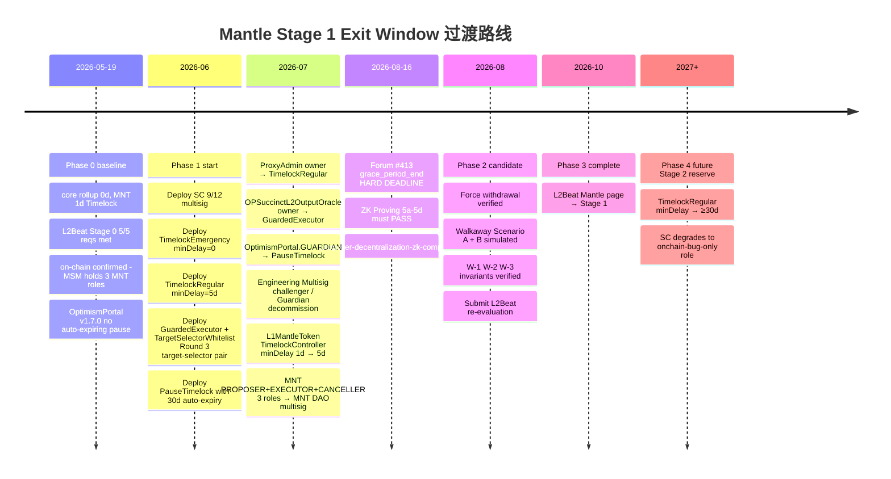
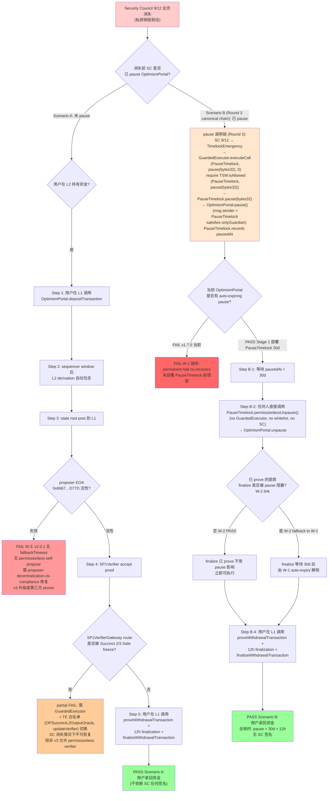
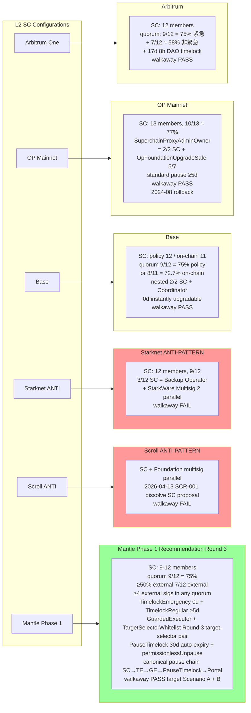

# Mantle 合约升级机制、退出窗口与安全委员会设计

## Executive Summary

本研究基于三份上游 final 的事实基线 —— `l2beat-stage-framework-2026`（commit `d1834f9`）、`mantle-architecture-2026`（commit `6025374`）、`stage1-case-studies`（commit `146ad79`）—— 为 Mantle 设计一套可落地、**可证明可执行**的 Stage 1 合规"合约升级 + 退出窗口 + Security Council"三位一体方案。

**Round 3 关键变更**（vs Round 2，仅针对 Round 2 Adversarial Review 的 1 项 Major + 2 项 Minor）：

1. **PauseTimelock / Guardian 调用路径规范化（Round 2 Adversarial Major 修复）**：
   - Round 2 的 tx-2-5 白名单写 `pause()` (`0x8456cb59`) 而 tx-2-8 又把 `OptimismPortal.GUARDIAN` 设为 `PauseTimelock`，导致内部矛盾 —— 若 SC 通过 `GuardedExecutor.executeCall(OptimismPortal, pause(), 0)` 调用，会在 `OptimismPortal.onlyGuardian` 上 revert（`msg.sender = GuardedExecutor ≠ PauseTimelock`）；若改让 `Guardian = GuardedExecutor`，则 `PauseTimelock` 永不记录 `pausedAt`，`permissionlessUnpause()` 无法解除 pause —— Walkaway Scenario B 仍可能永久挂起；
   - **Round 3 规范化唯一调用路径**：`SC → TimelockEmergency → GuardedExecutor → PauseTimelock.pause(bytes32) → OptimismPortal.pause()`，所有 OptimismPortal 的 pause / unpause 必须经过 `PauseTimelock` 包装层；`OptimismPortal.GUARDIAN = PauseTimelock`（不变）；`GuardedExecutor` 调用 `PauseTimelock.pause(bytes32)`、`PauseTimelock.pause(bytes32)` 调用 `OptimismPortal.pause()`（`msg.sender = PauseTimelock` 满足 `onlyGuardian`，并同时记录 `pausedAt`）；
   - **`permissionlessUnpause()`** 直接由任何人调用 `PauseTimelock.permissionlessUnpause()`（不经 `GuardedExecutor`，不需要任何白名单 / SC 签名）—— Walkaway Scenario B 在 SC 全员消失情况下可解除 pause；
   - **影响范围**：tx-2-3 / tx-2-4 / tx-2-5 / tx-2-8（§Item-4）、§Item-3 (3.e) 白名单初始集合、§Item-5 (5.d) Scenario B 步骤、§Item-5 (5.f) 路径描述、§Item-6 (6.a)(6.b)(6.c)(6.d) 架构与合约伪代码、diag-2、diag-4 全部重写。

2. **白名单从"selector-only"升级为"target+selector pair"（Round 2 Adversarial Minor 修复）**：
   - Round 2 `FunctionSelectorWhitelist` 用 `mapping(bytes4 => bool)` 仅以 selector 入库；问题：同一 4-byte selector 可对应多个 target 的不同函数（如 `pause()` selector `0x8456cb59` 在 OptimismPortal / L1StandardBridge / L1CrossDomainMessenger 上同时存在），白名单跨 target 出现歧义；
   - **Round 3 改为** `TargetSelectorWhitelist`：`mapping(address => mapping(bytes4 => bool))`，每条条目是 `(target, selector)` pair；`GuardedExecutor.executeCall(target, data, value)` 检查 `whitelist.isAllowed(target, bytes4(data[:4]))`；
   - **初始白名单条目**改为 6 个明确 pair：`(PauseTimelock, pause(bytes32))`、`(PauseTimelock, unpause())`、`(OPSuccinctL2OutputOracle, updateVerifier(address))`、`(OPSuccinctL2OutputOracle, updateAggregationVkey(bytes32))`、`(OPSuccinctL2OutputOracle, updateRangeVkeyCommitment(bytes32))`、`(OPSuccinctL2OutputOracle, updateRollupConfigHash(bytes32))`；`permissionlessUnpause()` 不在白名单（不经 GuardedExecutor）；
   - **影响范围**：§Item-3 (3.e) 函数白名单表、§Item-4 tx-2-3 / tx-2-5、§Item-6 (6.b) `TargetSelectorWhitelist` 合约 + `GuardedExecutor` `executeCall` 伪代码、diag-2 注释、diag-5 Phase 1 box、§Item-8 R-8 监控信号、Gap Analysis G-10 / G-14。

3. **Kinto Walkaway caveat（Round 2 Adversarial Minor 修复）**：
   - Round 2 在 §Item-5 把 Scroll / Starknet / Kinto 三者并列为 "项目页 Walkaway FAIL" 示例；
   - **`l2beat-stage-framework-2026` final §item-4 实际**：Scroll / Starknet 是项目页 FAIL 示例，Kinto 仅作为 Forum #412 理论讨论示例引用（不是项目页明示 FAIL）；
   - **Round 3 修正**：§Item-5 enforcement_status 段保留 Scroll / Starknet 项目页 FAIL，Kinto 改为 "Forum #412 理论示例" 单独列出，并明确不再将其作为 Mantle 设计的"项目页 FAIL"对照。

**Round 2 的 Round 1→2 修复一律保留**（无 Round 3 改动）：(a) GuardedExecutor 路由层强制白名单核心思想；(b) auto-expiring pause `MAX_PAUSE_DURATION = 30d` + `permissionlessUnpause()` 不变量；(c) `OptimismPortal.GUARDIAN = PauseTimelock`；(d) 9/12 quorum 最小外部签名 ≥4 数学修正；(e) Forum #425 来源归属仅 (3b) OR challenge period；(f) G-2 / OQ-2 闭合（6/14 Safe 同时持有 MNT TimelockController PROPOSER/EXECUTOR/CANCELLER 三角色，链上 hasRole 直读确认）。Round 3 仅在调用路径、白名单语义与 Kinto 标注上做精确化修订，**不**重构任何未被 Round 2 review 标记的章节。

**现状一句话总结（2026-05-19 抓取）**：Mantle 当前是 **Stage 0**，三路径治理（core rollup / L1MantleToken / mETH）中**只有 L1MantleToken 路径**带 1d minDelay 的 TimelockController（`0x65331ff6…447F`，链上确认 `getMinDelay() = 86400`）；**core rollup 路径完全无 TimelockController** —— `MantleSecurityMultisig` 6/14 Gnosis Safe（`0x4e59…D40f`）通过 `onlyOwner` 在 `OPSuccinctL2OutputOracle` 上 0 延迟直接调用 `updateVerifier` / `updateAggregationVkey` / `updateRangeVkeyCommitment` / `updateRollupConfigHash` / `updateSubmissionInterval` / `addProposer`/`removeProposer` / `transferOwnership`；`MantleEngineeringMultisig` 3/7（`0x2F44…daC9`，链上验证 `OptimismPortal.GUARDIAN() = 0x2F44…daC9`）通过 `onlyChallenger` 0 延迟直接调用 `enableOptimisticMode` / `disableOptimisticMode` / `updateFinalizationPeriodSeconds` / `deleteL2Outputs` 并兼任 Guardian。L2Beat Mantle 项目页文本直接写明 "There is no window for users to exit in case of an unwanted upgrade since contracts are instantly upgradable."

**Stage 1 三轨边界澄清**（来自 `l2beat-stage-framework-2026` final §item-3 / §item-9）：

- **(3a) outside-SC upgrade exit window ≥5d**：**适用** Mantle（所有 rollup 类型，上游 Stage framework 直接规定）；本研究主轴。**注**：上游 framework 在 2026-04-30 将该窗口由 ≥7d 下调至 ≥5d 的事实由 `l2beat-stage-framework-2026` final §item-3 已固化引用；Round 2 不再将 Forum #425 列为该规则的"主"引用（Forum #425 的语境是 OR challenge period 调整，引述方向澄清见 (3b)）。
- **(3b) Optimistic Rollup challenge period ≥5d (Forum #425)**：**不适用** Mantle —— Mantle 走 OP Stack + OP Succinct + SP1 zkVM validity-proof 混合架构，**无 fraud-proof challenge window**。`OPSuccinctL2OutputOracle.finalizationPeriodSeconds = 43200`（12h）不是 L2Beat 框架定义的 challenge period，本研究**不**把它当作 Exit Window 组件。Forum #425 (https://forum.l2beat.com/t/.../425) 是该 OR 调整公告的一手来源，**仅在 (3b) 适用**。
- **(3c) Stage 2 unwanted-upgrade exit window ≥30d**：远期目标，本研究不主推但需预留升级路径。

**Walkaway Test enforcement_status（关键合规边界）**：依据 `l2beat-stage-framework-2026` final，Walkaway Test enforcement_status = **`enforced-on-project-pages`**（grace period 仅内部使用；Scroll / Starknet 在 L2Beat 项目页文本上明确标 FAIL）。因此本研究的 Walkaway Test 合规验证是 **Stage 1 硬要求**，不是"内在质量目标"。

**ZK Proving System 四子项硬约束**：依据 `l2beat-stage-framework-2026` item-5 + Forum #413（2026-02-16 发布）：5a/5b/5c **all-applicable**（适用所有 ZK rollup），5d **split**（OR 路径 = OP Stack reproducible prestate；ZK 路径 = ZK program commitment reproducibility）；grace_period_end **≈ 2026-08-16**（Forum #413 给出的 6 个月过渡窗口）。本研究在 Gap 矩阵中列出 5a-5d 状态，但详细评估交由并行的 `proposer-decentralization-zk-compliance` 处理。

**核心推荐**：

1. **Security Council 架构**：**9-12 人 multisig，外部 ≥50%（推荐 7/12 外部），阈值 9/12 = 75%（满足 L2Beat 实际评估按 ≥75% 处理；保守者可取 7/9 = 77.8%）**，Gnosis Safe + 硬件钱包 + 链上签名公示，**禁止**任何 SC 成员同时持有 proposer / sequencer / MNT multisig 角色。
2. **可证明可执行的双轨制升级合约层（推荐架构 B':GuardedExecutor 路由 + PauseTimelock 包装；Round 3 规范化）**：
   - **TimelockEmergency**：`minDelay = 0`，PROPOSER/EXECUTOR = SC multisig；**不**直接持有任何 target `owner`；
   - **TimelockRegular**：`minDelay ≥ 5d`（推荐 5d，与 L2Beat 上游 ≥5d 阈值对齐；可保守取 7d），PROPOSER = DAO multisig，EXECUTOR 开放；
   - **GuardedExecutor**：自定义合约，是 `OPSuccinctL2OutputOracle.owner` 与其他直接 setter target 的唯一 `owner`；接受来自 `TimelockEmergency` 与 `TimelockRegular` 的 `executeCall(target, data, value)`；若 `msg.sender == TimelockEmergency`，强制 `require(TargetSelectorWhitelist.isAllowed(target, bytes4(data[:4])) == true)` —— **Round 3 改用 (target, selector) pair 入库**，避免 selector 跨 target 冲突；若 `msg.sender == TimelockRegular`，放行任意 (target, selector)；任何其他 caller revert。`TargetSelectorWhitelist` 由 `TimelockRegular` 拥有，更新走 ≥5d delay；
   - **PauseTimelock（Round 3 规范化）**：自定义合约，是 `OptimismPortal.GUARDIAN`；唯一接受 `pause(bytes32 reason)` / `unpause()` 调用的 caller = `GuardedExecutor`；`PauseTimelock.pause(bytes32)` 转发 `portal.pause()`（`msg.sender = PauseTimelock` 满足 `onlyGuardian`）并记录 `pausedAt`；`PauseTimelock.permissionlessUnpause()` 任何人在 `pausedAt + MAX_PAUSE_DURATION` 之后可直接调用（不经 GuardedExecutor，不需要白名单）。**唯一规范化调用链：`SC → TimelockEmergency → GuardedExecutor → PauseTimelock.pause(bytes32) → OptimismPortal.pause()`**；
   - **ProxyAdmin.owner = TimelockRegular**：implementation 替换（`upgradeAndCall`）只能通过 ≥5d 路径；TimelockEmergency 通过 GuardedExecutor 调用的是**直接 setter on proxy**（已部署 implementation 暴露的 onlyOwner 函数，如 `updateVerifier`）或 `PauseTimelock.pause(bytes32) / unpause()`，**不**触发 implementation 替换；
   - **排除架构 A**（单 TimelockController 多角色 — OpenZeppelin 单 `minDelay` 设计不可行）；
   - **排除架构 B'_naive**（让 TimelockEmergency 直接做 target.owner — Round 1 的失败路径，因为白名单不在合约层强制）；
   - **排除架构 C**（双 ProxyAdmin — EIP-1967 单 admin slot 不可行）。
3. **Exit Window 过渡 4 阶段**：阶段 0（当前 0d core rollup / 1d MNT）→ 阶段 1（部署 SC + 双 Timelock + GuardedExecutor + auto-expiring pause + force withdrawal）→ 阶段 2（Walkaway Test 模拟 + L2Beat 评估）→ 阶段 3（Stage 1 完整态）→ 阶段 4（远期 Stage 2 ≥30d 预留路径）。
4. **Walkaway 不变量（Round 2 新增）**：用户在 SC 永久消失情况下能拿回资金。具体强约束：
   - **(W-1) pause 必须 bounded auto-expiry**：`MAX_PAUSE_DURATION = 30d`，到期后自动失效；任何人可调用 `permissionlessUnpause()`。
   - **(W-2) `finalizeWithdrawalTransaction` 长期不在 pausable 表面**：Mantle 当前 OptimismPortal v1.7.0 的 pause 范围覆盖 `proveWithdrawalTransaction`，但 `finalizeWithdrawalTransaction` 应**始终可执行**（参考 OP Mainnet 上游设计趋势：pause 不阻塞已 prove 的提款 finalize）；若上游 implementation 不允许该拆分，则通过 (W-1) auto-expiry 保底。
   - **(W-3) permissionless prover**：proposer 活性单点修复由 `proposer-decentralization-zk-compliance` 详评，本研究只引用并设为 Stage 1 阻断硬前置。
5. **三路径治理隔离**：core rollup SC、L1MantleToken multisig、mETH multisig 成员**禁止重叠**；三类 TimelockController 与 ProxyAdmin 实例**独立**。**G-2 闭合**：链上确认 `MantleSecurityMultisig 0x4e59…D40f` 在 `TimelockController 0x65331ff6…447F` 上**同时**持有 PROPOSER/EXECUTOR/CANCELLER 三个 role —— 治理隔离漏洞规模确定，必须拆分。
6. **参考架构对照**：以 **Base 的 nested 2/2 ProxyAdminOwner 拓扑**为主要借鉴（Mantle 类似 OP Stack 派生链），同时**显式补足 ≥5d delay**（区别于 Base 的 0d instantly upgradable）；**OP Mainnet 10/13 SC + 2024-08 rollback 教训**作为 Stage 1 上线后审计/监控 playbook；**Arbitrum 17d 8h DAO 路径**作为更严格上限参考；**Starknet 3/12 SC = Backup Operator 与 Scroll Foundation multisig 平行升级路径**作为禁区。

**主要 Gap（与 L2Beat Stage 1 量化要求比对）**：

| Gap ID | 维度 | 当前状态 | Stage 1 要求 | Gap |
|--------|------|----------|----------------|-----|
| G-1 | Security Council 是否存在 | **None**（MantleSecurityMultisig 6/14 是项目方 multisig，非 L2Beat 定义的 SC） | ≥8 成员，>75% 阈值，≥50% 外部，≥2 外部签名 | 缺独立 SC，需新建 |
| G-2 | outside-SC upgrade exit window | **0d**（core rollup 无 timelock）；**1d**（MNT 路径 minDelay = 86400，链上确认）；**链上确认** MantleSecurityMultisig 6/14 同时持有 MNT TimelockController PROPOSER/EXECUTOR/CANCELLER —— 三路径治理隔离漏洞确定 | ≥5d + 三路径治理隔离 | core rollup 缺 ≥5d；MNT 需扩 4d；PROPOSER 需切换到独立 MNT DAO multisig |
| G-3 | Walkaway Test | **FAIL** —— (a) 升级路径仅经 6/14 与 3/7 项目方 multisig；(b) 单 proposer EOA + v2.0.1 无 `fallbackTimeout`；(c) OptimismPortal v1.7.0 **无 auto-expiring pause**（链上确认 `pausedAt()` revert）→ SC pause 后消失，状态永久挂起 | enforced-on-project-pages | 缺 permissionless prover + SC 独立路径 + auto-expiring pause |
| G-4 | ZK Proving System 5a-5d | 待 `proposer-decentralization-zk-compliance` 详评 | grace_period_end ≈ 2026-08-16 | 硬截止 |
| G-5 | 紧急权限白名单可执行性 | **新发现** —— Round 1 的"白名单 + TimelockEmergency 作为 target.owner"设计**不可执行**：minDelay=0 的 TimelockController 可执行任意 onlyOwner 调用 | 白名单在合约层强制，可被链上证明 | 需要 GuardedExecutor 路由层（§Item-6 (6.b)） |

完整 Gap 矩阵见 §Item-2。

---

## Item Findings

### Item-1 — Mantle 当前合约升级机制全景（三路径治理 × 核心合约 × 权限链）

#### current_state（基于 `mantle-architecture-2026` final commit `6025374` + L2Beat Mantle 项目页 2026-05-19 抓取 + Round 2 新增链上直读）

**(a) Core rollup contracts 路径**

| 合约 | Proxy 地址 | Implementation | Admin (ProxyAdmin) | Owner / 控制 multisig | minDelay |
|------|-------------|----------------|---------------------|------------------------|----------|
| `OPSuccinctL2OutputOracle` | `0x31d543e7BE1dA6eFDc2206Ef7822879045B9f481` | `0x4059509ffb703b048d1e9ce3118f90e759076f50` (v2.0.1) | `ProxyAdmin 0xca35…7794` | `owner` = MantleSecurityMultisig 6/14 `0x4e59…D40f`；`challenger` = MantleEngineeringMultisig 3/7 `0x2F44…daC9` | **0** |
| `OptimismPortal` | `0xc54cb22944F2bE476E02dECfCD7e3E7d3e15A8Fb` | `0xe1399f54ba2597b4eada9e3450c34d393fb131a7` (v1.7.0，**Round 2 链上确认**) | `ProxyAdmin 0xca35…7794` | 通过 ProxyAdmin → MantleSecurityMultisig 6/14；**`GUARDIAN() = 0x2F44…daC9` (MantleEngineeringMultisig 3/7，Round 2 链上确认)** | **0** |
| `SystemConfig` | `0x427Ea0710FA5252057F0D88274f7aeb308386cAf` | EIP-1967 slot | `ProxyAdmin 0xca35…7794` | 同上 | **0** |
| `L1StandardBridge` | `0x95fC37A27a2f68e3A647CDc081F0A89bb47c3012` | EIP-1967 slot | `ProxyAdmin 0xca35…7794` | 同上 | **0** |
| `L1CrossDomainMessenger` | `0x676A795fe6E43C17c668de16730c3F690FEB7120` | EIP-1967 slot | `ProxyAdmin 0xca35…7794` | 同上 | **0** |
| `SP1VerifierGateway (PLONK)` | `0x3B6041173B80E77f038f3F2C0f9744f04837185e` | — | self-managed | **Succinct 2/3 Safe `0xCafEf00d348Adbd57c37d1B77e0619C6244C6878`**（非 Mantle 控制） | 0 |
| `ProxyAdmin (rollup)` | `0xca35F8338054739D138884685e08b39EE2217794` | `Ownable.owner()` | n/a | MantleSecurityMultisig 6/14 | n/a |
| `MantleSecurityMultisig` (Gnosis Safe) | `0x4e59e778a0fb77fBb305637435C62FaeD9aED40f` | — | self-managed Safe | 6 of 14 EOA owners（部分公开身份不明） | n/a |
| `MantleEngineeringMultisig` (Gnosis Safe) | `0x2F44BD2a54aC3fB20cd7783cF94334069641daC9` | — | self-managed Safe | 3 of 7 EOA owners | n/a |
| `BatchInbox` (magic address, DA) | `0xFFEEDDCcBbAA0000000000000000000000000000` | 无代码 | — | 由 `SystemConfig.batcherHash` 控制；batcher = `0x2f40…d749` EOA | n/a |
| Proposer EOA | `0x6667961f5e9C98A76a48767522150889703Ed77D` | — | — | **单一 EOA**（v2.0.1 无 `fallbackTimeout`，无 permissionless self-propose） | n/a |
| Batcher / Sequencer EOA | `0x2f40D796917ffB642bD2e2bdD2C762A5e40fd749` | — | — | 单一 EOA | n/a |

**Round 2 新增链上证据**：

| Probe | RPC 返回 | 解读 |
|-------|----------|------|
| `cast storage 0xc54cb…A8Fb 0x360894…2bbc` (EIP-1967 impl slot) | `0x000…e1399f54ba2597b4eada9e3450c34d393fb131a7` | OptimismPortal impl = `0xe139…31a7` |
| `cast call 0xc54cb…A8Fb 'GUARDIAN()(address)'` | `0x2F44BD2a54aC3fB20cd7783cF94334069641daC9` | Guardian = MantleEngineeringMultisig 3/7 |
| `cast call 0xc54cb…A8Fb 'paused()(bool)'` | `false` | 当前未 pause |
| `cast call 0xc54cb…A8Fb 'version()(string)'` | `"1.7.0"` | OP Stack v1.7.0；**无** auto-expiring pause |
| `cast call 0xc54cb…A8Fb 'pausedAt()(uint256)'` | revert | 确认 v1.7.0 **不暴露** auto-expiry field |

**(b) L1MantleToken / MNT 治理路径**

| 合约 | 地址 | 角色 |
|------|------|------|
| `L1MantleToken` (proxy) | `0x3c3a81e81dc49A522A592e7622A7E711c06bf354` | MNT token |
| `MantleTokenProxyAdmin` | `0x0cac2B1a172ac24012621101634DD5ABD6399ADd` | proxy admin |
| `TimelockController` | `0x65331ff6F8B0fc2612F2a0deBD9d04Fce60a447F` | **minDelay = 86400 s (1 day)，Round 2 链上确认 `getMinDelay() = 86400`** |
| TimelockController PROPOSER_ROLE | **MantleSecurityMultisig 6/14（链上确认）** | `hasRole(0xb09aa5aeb3702cfd50b6b62bc4532604938f21248a27a1d5ca736082b6819cc1, 0x4e59…) = true` |
| TimelockController EXECUTOR_ROLE | **MantleSecurityMultisig 6/14（链上确认）** | `hasRole(0xd8aa0f3194971a2a116679f7c2090f6939c8d4e01a2a8d7e41d55e5351469e63, 0x4e59…) = true` |
| TimelockController CANCELLER_ROLE | **MantleSecurityMultisig 6/14（链上确认）** | `hasRole(0xfd643c72710c63c0180259aba6b2d05451e3591a24e58b62239378085726f783, 0x4e59…) = true` |

**关键事实（Round 2 闭合）**：L1MantleToken 路径**有** 1d TimelockController（这是 Mantle 唯一带 timelock 的升级路径），但 minDelay = 1d 远低于 L2Beat ≥5d 阈值；且其 PROPOSER/EXECUTOR/CANCELLER **三个角色均由 core rollup `owner` 同一 6/14 Safe 持有（链上直读确认）**，形成三路径治理隔离漏洞 —— Round 1 OQ-2 / G-2 由此闭合。

**(c) mETH / 产品层路径**

| 合约 | 地址 | 治理状态 |
|------|------|----------|
| mETH token | `0xd5f7838f5c461feff7fe49ea5ebaf7728bb0adfa` | **`mantle-architecture-2026` final 标 "Source unavailable for governance"** —— 公开材料未明确 LSP / staking router 治理链 |

本研究在 mETH 路径仅做边界标注（按 outline §item-7 (a) 的边界要求），详细治理由 Mantle 产品团队负责。

**(d) L2 合约升级路径**

L2 系统合约（L2CrossDomainMessenger、L2StandardBridge、L1Block predeploy、GasOracle 等）的升级走 L1→L2 message-passing：L1 通过 `OptimismPortal.depositTransaction` 发起，L2 由 `L2CrossDomainMessenger` 转发到目标 predeploy。L2 系统合约的最终升级权限**仍在 L1**（由 L1 ProxyAdmin → MantleSecurityMultisig 控制）。

**(e) 当前 timelock 精确配置**

| 角色 / 字段 | 当前持有者 / 值 | 链上来源 |
|-------------|-----------------|----------|
| Core rollup `ProxyAdmin.owner` | MantleSecurityMultisig 6/14 `0x4e59…D40f` | Etherscan + `mantle-architecture-2026` final §item-1 |
| `OPSuccinctL2OutputOracle.owner` (storage slot) | MantleSecurityMultisig 6/14 `0x4e59…D40f` | OPSuccinctL2OutputOracle.sol L80（commit `8cc7015`）|
| `OPSuccinctL2OutputOracle.challenger` (storage slot) | MantleEngineeringMultisig 3/7 `0x2F44…daC9` | OPSuccinctL2OutputOracle.sol L55 |
| `OPSuccinctL2OutputOracle.finalizationPeriodSeconds` | 43200 (12h) | 链上 L64 |
| `OPSuccinctL2OutputOracle.submissionInterval` | 1800 L2 blocks (~60 min @ l2BlockTime=2s) | 链上 L47 |
| `OptimismPortal.GUARDIAN()` | `0x2F44…daC9` (MantleEngineeringMultisig 3/7) | **Round 2 链上确认** |
| `OptimismPortal.paused()` | false | **Round 2 链上确认** |
| `OptimismPortal version` | `1.7.0` | **Round 2 链上确认** |
| `OptimismPortal pausedAt() / pauseDuration()` | revert | **Round 2 链上确认 v1.7.0 无 auto-expiring pause** |
| `L1MantleToken TimelockController.getMinDelay()` | 86400 s = 1 day | **Round 2 链上确认** |
| `L1MantleToken TimelockController hasRole(PROPOSER/EXECUTOR/CANCELLER, MantleSecurityMultisig)` | 三个均 true | **Round 2 链上确认** |
| Core rollup TimelockController | **不存在** | `mantle-architecture-2026` final 显式确认 |

**(f) L2Beat Mantle 项目页当前快照（2026-05-19）**

- **Stage 标识**：Stage 0（5/5 Stage 0 requirements met）；
- **风险标注**：L2Beat 文本明确："**There is no window for users to exit in case of an unwanted upgrade since contracts are instantly upgradable.**"
- **DA 重分类**：L2Beat 将 Mantle 在 2026-04-16 Arsia 升级后重新归类为 Rollup（此前为 Optimium）。

#### contract_implementation（v2.0.1 OPSuccinctL2OutputOracle 的双权限边界）

**v2.0.1 关键事实**（基于 OPSuccinctL2OutputOracle.sol 源码 commit `8cc7015`，来自 `mantle-architecture-2026` final §item-2/3/4）：

| Modifier | Storage slot | 当前持有者 | 0-delay setter 列表 |
|----------|---------------|--------------|---------------------|
| `onlyOwner` | `owner` (L80) | MantleSecurityMultisig 6/14 | `updateVerifier(address)` (L534)、`updateAggregationVkey(bytes32)` (L520)、`updateRangeVkeyCommitment(bytes32)` (L527)、`updateRollupConfigHash(bytes32)` (L541)、`updateSubmissionInterval(uint256)` (L513)、`addProposer(address)`/`removeProposer(address)` (L555–L566)、`transferOwnership(address)` (L548，单步) |
| `onlyChallenger` | `challenger` (L55) | MantleEngineeringMultisig 3/7 | `enableOptimisticMode(uint256)` (L569)、`disableOptimisticMode(uint256)` (L575+)、`updateFinalizationPeriodSeconds(uint256)` (L587)、`deleteL2Outputs(uint256)` (L281–L304) |

**Round 2 关键观察**：`onlyOwner` 函数集合 = `update*` + `addProposer` + `transferOwnership` 共 8 个 selector。若 `owner` 直接是 `TimelockEmergency` 且 `minDelay=0`，则 SC 拿到 9/12 签名后**任意** selector 都能 0 延迟执行 —— 这就是 Round 1 设计被 Adversarial 标 Major-1 的根因。Round 2 通过 `GuardedExecutor`（§Item-6 (6.b)）把 owner 改为路由合约，强制白名单检查。

**v2.0.1 不暴露**的 v3 字段（与 Stage 1 liveness 边界相关）：`fallbackTimeout` ❌ / `opSuccinctConfigs` mapping ❌ / 6-arg `proposeL2Output(_configName, …, _proverAddress)` ❌ / `tx.origin` 鉴权 ❌。因此 Mantle v2.0.1 上**不存在 permissionless self-propose 路径** —— 这是 §Item-5 Walkaway Test 需要重点修复的活性 gap。

**SP1VerifierGateway 路由层关键事实**（来自 `mantle-architecture-2026` final §item-5）：

- Mantle 实际使用的 SP1VerifierGateway (PLONK) `0x3B6041…185e` **由 Succinct 2/3 Safe `0xCafEf00d…6878` 拥有**，**不是** Mantle 控制；
- `addRoute(address verifier) external onlyOwner` —— Succinct 可加新路由；
- `freezeRoute(bytes4 selector) external onlyOwner` —— Succinct 可 freeze 已激活路由；**不可解冻**；
- Mantle proposer 提交的 proof 通过 `bytes4(proofBytes[:4])` 选择路由；若 Succinct freeze Mantle 当前 PLONK v6.0.x route (selector `0xbb1a6f29`)，Mantle 必须立刻通过 `updateVerifier(address) onlyOwner` (0 delay, by 6/14 Safe) 切换到非 Gateway 的直接 SP1Verifier 实例；
- 这构成 Mantle ZK 路径的**外部依赖单点**（Succinct 2/3 Safe），Stage 1 设计需在 §Item-3 SC 紧急权限白名单中显式涵盖该恢复函数，且 (Round 2 强调) 白名单要在 `GuardedExecutor` 合约层强制。

#### evidence_sources

- **Etherscan 永久链接**（2026-05-19 抓取）：
  - OPSuccinctL2OutputOracle proxy：https://etherscan.io/address/0x31d543e7BE1dA6eFDc2206Ef7822879045B9f481
  - OptimismPortal：https://etherscan.io/address/0xc54cb22944F2bE476E02dECfCD7e3E7d3e15A8Fb
  - SystemConfig：https://etherscan.io/address/0x427Ea0710FA5252057F0D88274f7aeb308386cAf
  - L1StandardBridge：https://etherscan.io/address/0x95fC37A27a2f68e3A647CDc081F0A89bb47c3012
  - L1CrossDomainMessenger：https://etherscan.io/address/0x676A795fe6E43C17c668de16730c3F690FEB7120
  - SP1VerifierGateway (PLONK)：https://etherscan.io/address/0x3B6041173B80E77f038f3F2C0f9744f04837185e
  - ProxyAdmin (rollup)：https://etherscan.io/address/0xca35F8338054739D138884685e08b39EE2217794
  - MantleSecurityMultisig：https://etherscan.io/address/0x4e59e778a0fb77fBb305637435C62FaeD9aED40f
  - MantleEngineeringMultisig：https://etherscan.io/address/0x2F44BD2a54aC3fB20cd7783cF94334069641daC9
  - L1MantleToken：https://etherscan.io/address/0x3c3a81e81dc49A522A592e7622A7E711c06bf354
  - MantleTokenProxyAdmin：https://etherscan.io/address/0x0cac2B1a172ac24012621101634DD5ABD6399ADd
  - L1MantleToken TimelockController：https://etherscan.io/address/0x65331ff6F8B0fc2612F2a0deBD9d04Fce60a447F
- **Round 2 链上直读证据**（`https://ethereum-rpc.publicnode.com` 主网 RPC，2026-05-19 19:00 UTC 调用）：
  - `cast call 0x65331ff6F8B0fc2612F2a0deBD9d04Fce60a447F "hasRole(bytes32,address)(bool)" 0xb09a…6819cc1 0x4e59…D40f` → `true`（PROPOSER）
  - `cast call 0x65331ff6F8B0fc2612F2a0deBD9d04Fce60a447F "hasRole(bytes32,address)(bool)" 0xd8aa…1469e63 0x4e59…D40f` → `true`（EXECUTOR）
  - `cast call 0x65331ff6F8B0fc2612F2a0deBD9d04Fce60a447F "hasRole(bytes32,address)(bool)" 0xfd64…26f783 0x4e59…D40f` → `true`（CANCELLER）
  - `cast call 0x65331ff6F8B0fc2612F2a0deBD9d04Fce60a447F "getMinDelay()(uint256)"` → `86400`
  - `cast storage 0xc54cb22944F2bE476E02dECfCD7e3E7d3e15A8Fb 0x360894…2bbc` → `0x…e1399f54ba2597b4eada9e3450c34d393fb131a7`
  - `cast call 0xc54cb22944F2bE476E02dECfCD7e3E7d3e15A8Fb "GUARDIAN()(address)"` → `0x2F44BD2a54aC3fB20cd7783cF94334069641daC9`
  - `cast call 0xc54cb22944F2bE476E02dECfCD7e3E7d3e15A8Fb "paused()(bool)"` → `false`
  - `cast call 0xc54cb22944F2bE476E02dECfCD7e3E7d3e15A8Fb "version()(string)"` → `"1.7.0"`
  - `cast call 0xc54cb22944F2bE476E02dECfCD7e3E7d3e15A8Fb "pausedAt()(uint256)"` → revert（确认无 auto-expiring pause field）
- **Source code (commit hash)**：
  - OPSuccinctL2OutputOracle.sol commit `8cc7015`（来自 `mantle-architecture-2026` final §item-3 引用）
- **L2Beat 项目页**：https://l2beat.com/scaling/projects/mantle （Stage 0 标识，2026-05-19 抓取）
- **上游 final 精确引用**：`mantle-architecture-2026` final commit `6025374` 路径 `mantle-stage1-rollup/research-sections/mantle-architecture-2026/final.md`

#### open_questions

- **OQ-1**：MantleSecurityMultisig 6/14 与 MantleEngineeringMultisig 3/7 的 owner EOA **公开身份重叠情况** —— final 阶段需链上 `getOwners()` + 公开声明交叉核验是否存在同一个体在两 Safe 担任 owner（与 §Item-3 / §Item-7 治理隔离直接相关）。
- ~~**OQ-2**：L1MantleToken TimelockController PROPOSER_ROLE 持有者精确身份~~ **CLOSED**（Round 2 链上 `hasRole` 直读确认 MantleSecurityMultisig 6/14 同时持有 PROPOSER/EXECUTOR/CANCELLER 三个 role；G-2 闭合）。
- **OQ-3**：mETH/LSP 治理链路 —— `mantle-architecture-2026` final 标 "Source unavailable"，本研究在 §Item-7 仅做边界标注。
- **OQ-4**：SystemConfig / L1StandardBridge / L1CrossDomainMessenger 当前 implementation 地址（EIP-1967 slot）—— OptimismPortal 已在 Round 2 链上闭合（impl = `0xe139…31a7`）；其余 3 个待 final 阶段补全。

---

### Item-2 — L2Beat Stage 1 要求 → Mantle 现状 Gap 矩阵

#### l2beat_requirement & applicable_rollup_type & gap_analysis

**主 Gap 矩阵**（5 列：维度 × 当前状态 × Stage 1 要求 × Gap × 推荐解决方向）：

| 维度 | Mantle 当前状态（2026-05-19） | Stage 1 要求 | applicable_rollup_type | Gap | 推荐解决方向 |
|------|---------------------------------|----------------|--------------------------|-----|---------------|
| **(1) Security Council 量化阈值** | None（MantleSecurityMultisig 6/14 是项目方 multisig，非 L2Beat 定义的 SC；6/14 ≈ 42.9% < 75% 阈值） | ≥8 成员 + >75% 阈值（L2Beat Glossary "greater than 75%"，实际评估按 ≥75% 处理）+ ≥50% 外部 + ≥2 外部签名达成共识 + 成员公开 + proof system effective power ≥25% | all | 缺独立 SC，需新建 | §Item-3 推荐 9-12 SC，9/12 = 75%，外部 ≥50% |
| **(2) outside-SC upgrade exit window** | **0d**（core rollup 路径）；**1d**（L1MantleToken 路径 minDelay = 86400 s，**Round 2 链上确认**） | **≥5d**（**主引用：`l2beat-stage-framework-2026` final §item-3 上游解读，commit `d1834f9`**；阈值由 ≥7d 下调至 ≥5d 的变更已固化引用） | **all** | core rollup 缺 ≥5d；MNT 路径需扩 4d；MNT TimelockController 三角色都属同一 6/14 Safe → 隔离漏洞同样适用本维度 | §Item-4 阶段 1：TimelockRegular minDelay → ≥5d；§Item-6 双 Timelock 架构 B'；MNT PROPOSER 切换到独立 MNT DAO multisig |
| **(3) Walkaway Test (Forum #412)** | **FAIL** —— (a) 升级路径仅经 6/14 与 3/7 项目方 multisig，无独立 SC；(b) 单 proposer EOA `0x6667…D77D`；(c) v2.0.1 不暴露 `fallbackTimeout` → **无 permissionless self-propose**；(d) MantleEngineeringMultisig 3/7 兼任 Guardian；**(e) Round 2 新增** OptimismPortal v1.7.0 **无 auto-expiring pause**（`pausedAt()` revert），若 Guardian/SC 在 pause 状态消失则永久挂起 | 用户在 Security Council 永久消失情况下必须能安全退出；**enforcement_status = `enforced-on-project-pages`** | all | permissionless prover 缺失 + SC 独立路径缺失 + Guardian 兼任 multisig 反模式 + **pause 无 auto-expiry** | §Item-5 设计（§5.f Walkaway 不变量 W-1/W-2/W-3）；与 `proposer-decentralization-zk-compliance` 协同 |
| **(4a) ZK Proving System 5a (no 🔴 trusted setup)** | 待 `proposer-decentralization-zk-compliance` 详评（SP1 PLONK 使用以太坊主网 KZG ceremony，候选 PASS） | no 🔴 trusted setups（all ZK rollups） | **all ZK** | 由并行 issue 评估 | 引用 `proposer-decentralization-zk-compliance` 结论；grace_period_end ≈ 2026-08-16 |
| **(4b) ZK Proving System 5b (prover source published)** | 待详评（SP1 zkVM 开源 https://github.com/succinctlabs/sp1） | 所有 prover 源码公开 | **all ZK** | 由并行 issue 评估 | 同上 |
| **(4c) ZK Proving System 5c (verifier reproducible)** | 待详评（SP1Verifier on-chain 字节码 vs SP1 commit hash） | verifier 字节码可从源码独立重生 | **all ZK** | 由并行 issue 评估 | 同上 |
| **(4d) ZK Proving System 5d (ZK program reproducible)** | 待详评（aggregationVkey / rangeVkeyCommitment / rollupConfigHash 与 op-program / kona / op-succinct 源码可复现路径） | ZK program commitment 可独立复现（**Mantle 走 ZK 路径，5d 取 ZK split**） | **ZK split** | 由并行 issue 评估 | 同上 |
| **(5) Council 外部成员定义** | n/a（无 SC） | "外部" = 非核心团队 / 非投资人 / 独立机构代表（来源：l2beat-stage-framework-2026 final §item-2） | all | 缺定义对齐 | §Item-3 严格外部 |
| **(6) Council 成员公开度** | n/a；MantleSecurityMultisig 6/14 与 MantleEngineeringMultisig 3/7 部分 EOA 身份不明 | 身份公开 + 签名地址公开 + 签名行为可链上验证 | all | 当前不公开 → 新 SC 必须公开 | §Item-3 (3.c) |
| **(7) Council 紧急权限边界 + 白名单可执行性 (Round 2 重写)** | n/a；MantleSecurityMultisig 6/14 **是** 常规升级 happy-path 必要参与者 → Walkaway Test FAIL；Round 1 设计中的"白名单 + TimelockEmergency 作 target.owner"在合约层**无强制**，是设计漏洞 | 仅限可裁决 onchain bug；**不得**作为常规升级 happy-path 必要参与者；**白名单必须在合约层强制（不能只是文档约束）** | all | 当前角色定位错误 + Round 1 enforceability gap | §Item-3 (3.e) 边界定义 + §Item-6 (6.b) **GuardedExecutor** 路由层强制白名单 |

#### case_study_reference

- **Arbitrum 9/12 + 7/12 双层 SC, 17d 8h timelock**（`stage1-case-studies` final §Item-2）：作为 ≥5d outside-SC upgrade exit window 的最严格上限参考；
- **OP Mainnet 10/13 SC, 2024-08 rollback**（同上 §Item-3）：作为 Stage 1 上线后审计/监控 playbook；
- **Base 9/12 SC + nested 2/2 ProxyAdminOwner**（同上 §Item-4）：作为 OP Stack 派生链 + 独立 SC 的最直接对标，**但 0d instantly upgradable 须修正**；
- **Starknet 3/12 SC = Backup Operator**（同上 §Item-5）：禁区 —— SC 成员兼任 Operator 反模式；
- **Scroll Foundation multisig 与 SC 平行升级路径 + 2026-04-13 SCR-001 dissolve SC 提案**（同上 §Item-6）：禁区 —— SC 沦为 ceremony 长期会被社区质疑解散。

#### evidence_sources

- **(主)** L2Beat Stage 1 quantitative thresholds：`l2beat-stage-framework-2026` final §item-1 / §item-2 / §item-3 / §item-4 / §item-5（commit `d1834f9`）—— **outside-SC upgrade exit window ≥5d 主引用**
- L2Beat Forum #412 walkaway test：https://forum.l2beat.com/t/stage-1-requirements-update-security-council-walkaway-test/412
- L2Beat Forum #413 ZK proving system gates：https://forum.l2beat.com/t/new-stage-1-requirements-for-l2-proving-systems/413
- **L2Beat Forum #425 (OR challenge period 7d→5d)**：https://forum.l2beat.com/t/stage-1-update-minimum-challenge-period-reduction-from-7d-to-5d/425 —— **仅** 作为 (3b) OR challenge period 维度的一手公告引用；**不** 作为 (3a) outside-SC upgrade window 的主引用（该规则由上游 Stage framework final 锚定）
- L2Beat Mantle 项目页快照：https://l2beat.com/scaling/projects/mantle （2026-05-19 抓取）

#### open_questions

- **OQ-5**：Forum #413 grace_period_end 精确日期 —— `l2beat-stage-framework-2026` final 标 "≈ 2026-08-16"（6 个月过渡）；final 阶段需直接访问 Forum #413 帖子确认精确日。

---

### Item-3 — Security Council 推荐架构设计（成员 / 阈值 / 外部 / 签名 / 嵌套 / 权限边界）

#### design_recommendation

**(3.a) 成员组成**

- **数量**：**9-12 人**（>L2Beat 最低 8 人门槛，覆盖时区与法域，应对单点失联）；推荐起步 **9 人**（最小可合规配置），评估后扩至 12 人；
- **外部比例**：**≥50%**，推荐 **7/12 外部**（或 6/9 外部 = 66.7%）；**严禁**外部 < 50%（参考 Starknet 反模式：12 名 SC 中 3 名兼任 Backup Operator 且 StarkWare 占多数 → walkaway FAIL）；
- **法域分布**：避免单一法域 > 50%（参考 Arbitrum DAO Constitution "单一组织 ≤ 3 席" 原则）；
- **角色多样性**：覆盖独立安全研究者、生态合作伙伴、用户代表、外部审计机构。

**(3.b) 阈值（Round 2 数学修正）**

L2Beat Glossary 原文为 "greater than 75%"，但 `l2beat-stage-framework-2026` final §item-2 确认 L2Beat 在实际评估中按 **≥75%** 处理（OP Mainnet 10/13 ≈ 77%、Arbitrum 9/12 = 75%、Base 8/11 ≈ 72.7% on-chain + nested 2/2 联签 effective ≥ 75% 均被接受）。

**关键约束 ≥2 外部签名**（来源：`l2beat-stage-framework-2026` final §item-2）：任何成功的 SC quorum 必须**至少**包含 2 个外部成员签名 —— L2Beat 把这条单独提出，是因为光看阈值不能保证"内部串通"的最小抵抗力。

**Round 2 修正：外部签名最小值数学**

记总人数 `N`、外部数 `E`、内部数 `I = N - E`、quorum `Q`。任何成功 quorum 中外部签名数 `e` 满足 `Q - I ≤ e ≤ min(E, Q)`，即**最小外部签名 = max(0, Q - I)**。

| 配置 | N | E (外部) | I (内部) | Q (quorum) | 最小外部签名 = Q - I | 满足 ≥2 外部 |
|------|---|----------|----------|------------|------------------------|------------------|
| **9/12, 7/12 外部** | 12 | 7 | 5 | 9 | **9 - 5 = 4** | ✅ |
| 7/9, 6/9 外部 | 9 | 6 | 3 | 7 | 7 - 3 = 4 | ✅ |
| 7/9, 5/9 外部 | 9 | 5 | 4 | 7 | 7 - 4 = 3 | ✅ |
| 6/8, 4/8 外部 (临界) | 8 | 4 | 4 | 6 | 6 - 4 = 2 | ✅（刚好达标） |

**Round 1 表中误写为"配合 7/12 外部，外部签名达成 ≥ 7"**，本表更正为 **≥4**（仍远高于 ≥2 硬约束，结论 PASS 不变）。

| 推荐组合 | quorum | 最小外部签名 | 是否合规 |
|----------|--------|----------------|------------|
| **9/12 = 75%（7/12 外部）** | ✅ | **≥4 外部签名（修正）** | **推荐主选** |
| 7/9 = 77.8%（6/9 外部）| ✅ | ≥4 外部签名 | 推荐替代（起步 9 人时） |
| **严禁 5/8 = 62.5%** | ❌ | 不满足 ≥75% 阈值 | 排除 |
| **严禁 8/12 ≈ 66.7%** | ❌ | 不满足 ≥75% 阈值 | 排除 |

**proof system effective power ≥25%**（L2Beat 量化要求，确保 SC 阈值大于"50% 可串通"基线 + proof system 提供的 ≥25% 独立约束）：在 9/12 = 75% 阈值下，effective power = 1 - 0.75 = 25% 恰好达标；若取 7/9 = 77.8%，effective power ≈ 22.2% 略低 —— 但 L2Beat 实际评估接受 ≥75% 阈值即视为达标，effective power 数学推导是"75% 阈值的等价表达"，不是独立约束。本研究**推荐 9/12 = 75%**。

**(3.c) 签名机制**

- **合约**：Gnosis Safe (Safe v1.4.1+ on Ethereum L1) 或等价 multisig；
- **链上签名公示**：每次签名 transaction 的 calldata + signers 列表公开（Safe Transaction Service / Etherscan 双重）；
- **签名地址轮换**：成员变更走 `swapOwner(prevOwner, oldOwner, newOwner)` + ≥75% 现任 owner 签名；
- **硬件钱包要求**：所有 SC owner EOA 必须使用硬件钱包（Ledger / Trezor / GridPlus）+ 物理隔离；
- **合约层集成**：SC multisig 是 `TimelockEmergency.PROPOSER_ROLE` + `EXECUTOR_ROLE` 持有者，但**不**直接是 target 合约 `owner`（target.owner = `GuardedExecutor`，详见 §Item-6 (6.b)）。

**(3.d) 嵌套多签可选方案**

**评估 Base 模式 nested 2/2 ProxyAdminOwner**：

| 方案 | 优点 | 缺点 |
|------|------|------|
| **不采用嵌套**（单层 SC，作为 GuardedExecutor 之外的 TimelockEmergency 持有者） | 简单；与 Arbitrum / Starknet / Scroll 模型一致 | 无冗余防误操作层 |
| **采用 Base nested 2/2**（外层 SC 9/12 + 内层 2/2 = TimelockRegular 上游 schedule 入口） | 双重失败模式隔离；防外层 SC 单边误操作；与 Base 直接对标 | 增加运维复杂度；**关键约束：内层 2/2 必须仅在升级路径必要，不得在 Walkaway Test 路径必要**；若内层 2/2 是 happy-path 必要参与者 → walkaway 风险 |

**推荐**：**起步阶段采用单层 SC + ≥5d Timelock**（避免 nested 复杂度）；**Stage 1 完整态后**评估升级到 Base nested 2/2，前提是内层 2/2 仅在升级 happy-path 上为必要参与者（不参与 force withdrawal 路径）—— 这与 Base 当前架构一致（Base 的 walkaway PASS 通过 OptimismPortal forced inclusion + permissionless DisputeGameFactory，不依赖 nested 2/2）。

**(3.e) 紧急权限边界（与 §Item-6 双轨 + GuardedExecutor 设计对接）**

**紧急路径合法范围**（仅限以下场景，且每条都映射到一个白名单 selector）：

1. 可裁决 onchain bug（已审计的 hotfix patch，参考 OP Mainnet 2024-08 Cannon bug 紧急回退）；
2. SP1VerifierGateway route freeze 恢复（Succinct 2/3 Safe freeze Mantle 当前 PLONK route → SC 紧急 `updateVerifier(address)` 切换）；
3. proof system aggregation/range vkey 错误升级回退；
4. upstream OP Stack 紧急补丁 adopt（仅当补丁可通过白名单 setter 实施；否则走 ≥5d 路径）；
5. 已发生的 hack 进行中（pause 链上资金流动；pause 受 auto-expiring 不变量约束，见 §Item-5 (5.f)）。

**紧急路径禁区**（Round 2 强化）：

- **禁止** SC 作为常规升级 happy-path 必要参与者（Walkaway Test 红线）；
- **禁止** SC 单方面 `transferOwnership(address)` 转让任何 owner（这是 OPSuccinctL2OutputOracle.sol L548 暴露的高风险函数，需走 TimelockRegular ≥5d 路径）—— 在 Round 2 GuardedExecutor 设计下，该 selector **物理上**不在 emergency whitelist；
- **禁止** SC 单方面调用 `addProposer/removeProposer` 在常规情况下扩张/收缩 proposer 集合（仅在 proposer EOA 失效紧急下允许，且需走 ≥5d 路径或 SC + DAO 联签 emergency exception）。

**`TargetSelectorWhitelist` 初始条目（Round 3 精确版 — 改为 (target, selector) pair）**：

| Target 合约 | 函数 | Selector | 紧急用途 |
|-------------|------|----------|----------|
| **PauseTimelock**（Round 3 规范化） | `pause(bytes32 reason)` | `bytes4(keccak256("pause(bytes32)"))` | SC 通过 `GuardedExecutor → PauseTimelock.pause(bytes32) → OptimismPortal.pause()` 冻结资金；**bounded by auto-expiring pause (§Item-5 5.f W-1)** |
| **PauseTimelock** | `unpause()` | `bytes4(keccak256("unpause()")) = 0x3f4ba83a` | SC 紧急完结后主动解除 pause；普通用户走 `permissionlessUnpause()`（不在白名单） |
| **OPSuccinctL2OutputOracle** | `updateVerifier(address)` | `bytes4(keccak256("updateVerifier(address)"))` | SP1Verifier route freeze 恢复 |
| **OPSuccinctL2OutputOracle** | `updateAggregationVkey(bytes32)` | `bytes4(keccak256("updateAggregationVkey(bytes32)"))` | vkey 错误回退 |
| **OPSuccinctL2OutputOracle** | `updateRangeVkeyCommitment(bytes32)` | `bytes4(keccak256("updateRangeVkeyCommitment(bytes32)"))` | 同上 |
| **OPSuccinctL2OutputOracle** | `updateRollupConfigHash(bytes32)` | `bytes4(keccak256("updateRollupConfigHash(bytes32)"))` | 同上 |

**Round 3 关键变更说明**：

- 不再列 `(OptimismPortal, pause())` —— OptimismPortal 的 pause 必须走 `PauseTimelock` 包装层（`OptimismPortal.GUARDIAN = PauseTimelock`，SC 无法直接以 GuardedExecutor 身份调用 `OptimismPortal.pause()`，否则 `onlyGuardian` revert）。规范化调用链强制为 `(PauseTimelock, pause(bytes32))`，再由 PauseTimelock 内部转发到 `portal.pause()`；
- 不再列 `(OptimismPortal, unpause())` —— 同理，必须经 `PauseTimelock.unpause()`；普通用户走 `PauseTimelock.permissionlessUnpause()`；
- `permissionlessUnpause()` 不在白名单 —— 该函数直接由任何人调用 `PauseTimelock` 自身（不需要 GuardedExecutor 路由、不需要白名单、不需要任何 SC 签名）；
- 其他需要紧急 pause 的合约（如 L1StandardBridge / L1CrossDomainMessenger 若启用 pause）—— **不**在当前 Round 3 白名单（OQ-13 详评）；Walkaway Test 只要求 OptimismPortal 路径可被 permissionlessly 解除，其他合约 pause 不影响强制提款。

**显式排除（绝不在 emergency whitelist）**：

| Target 合约 | 函数 | Selector | 为何排除 |
|-------------|------|----------|---------|
| OPSuccinctL2OutputOracle | `transferOwnership(address)` | `0xf2fde38b` | 单步转让 owner = 单点放弃；必须走 ≥5d + DAO 投票 |
| OPSuccinctL2OutputOracle | `addProposer(address)` / `removeProposer(address)` | `bytes4(keccak256("addProposer(address)"))` / `bytes4(keccak256("removeProposer(address)"))` | 改变 prover 集合 → 影响 Walkaway 路径 |
| OPSuccinctL2OutputOracle | `updateSubmissionInterval(uint256)` | `bytes4(keccak256("updateSubmissionInterval(uint256)"))` | 影响 L2 → L1 state root 节奏 |
| ProxyAdmin | `upgradeAndCall(proxy, impl, data)` | `0x9623609d` | implementation 替换走 TimelockRegular（≥5d） |
| OptimismPortal | `pause()` / `unpause()` | `0x8456cb59` / `0x3f4ba83a` | **物理上不可直接调用** —— Guardian = PauseTimelock；即便加入白名单也会在 OptimismPortal `onlyGuardian` 上 revert |

**白名单更新机制**：必须通过 `TimelockRegular.schedule` + ≥5d delay + execute；GuardedExecutor 的 `TargetSelectorWhitelist` owner = `TimelockRegular`，**禁止** SC / TimelockEmergency 修改白名单。每条更新事件为 `(target, selector)` 二元组，避免 selector 跨 target 歧义。

**每次紧急升级的事后公示要求**：

- 链上 event（Round 3 — target+selector pair）：`EmergencyUpgradeExecuted(address indexed target, bytes4 indexed selector, address indexed caller, bytes data, uint256 timestamp)`，由 GuardedExecutor 在 `executeCall` 路径中 emit；
- 24h 内 Mantle 官方博客 + L2Beat 监控通报；
- 30d 内独立审计 + 后验报告。

**(3.f) 与现有 Mantle multisig 的迁移**

迁移步骤（与 §Item-4 阶段 1 协同 + Round 3 修订）：

1. 部署新 SC multisig（Gnosis Safe 9/12 with 7 外部 owners）；
2. 部署 TimelockEmergency + TimelockRegular（按 §Item-6 架构 B'）；
3. **部署 GuardedExecutor**；
4. 部署 `TargetSelectorWhitelist`（Round 3 — (target, selector) pair store），owner = TimelockRegular；
5. **部署 PauseTimelock**（Round 3 规范化）—— immutable `portal = OptimismPortal` + immutable `guardedExecutor = GuardedExecutor`；
6. MantleSecurityMultisig 6/14 调用 `OPSuccinctL2OutputOracle.transferOwnership(GuardedExecutor)`（**风险点**：单步 transfer，无 acceptOwnership；建议在 v2.0.1 升级到 v3 或自定义两步 transfer 模式后再迁移）；
7. ProxyAdmin owner 通过 `Ownable.transferOwnership(TimelockRegular)` 迁移；
8. MantleEngineeringMultisig 3/7 的 challenger 角色：评估是否合并到 SC（推荐合并，Engineering Multisig 解散；或保留为单独的 Guardian Safe 但成员严格外部，避免 Scroll Team 2/4 反模式）；
9. **Guardian 角色切换（Round 3 规范化）**：`OptimismPortal.GUARDIAN` 切换到 **`PauseTimelock`**（不是 GuardedExecutor）；切换方式取决于上游 OP Stack：选项 A — implementation 暴露 `setGuardian(address)`（少数 OP Stack release 支持）；选项 B — 通过 ProxyAdmin 升级到 mantle-fork 的 OptimismPortal v1.7.x（推荐）。规范化调用链：`SC → TimelockEmergency → GuardedExecutor.executeCall(PauseTimelock, pause(bytes32 reason), 0) → PauseTimelock.pause(bytes32) → OptimismPortal.pause()`；
10. L1MantleToken TimelockController PROPOSER / EXECUTOR / CANCELLER 三个 role（Round 2 链上确认均由 6/14 Safe 持有）切换到独立 MNT DAO multisig（治理隔离，见 §Item-7）。

#### case_study_reference

| 项目 | SC 配置 | 适用性 |
|------|---------|---------|
| **Arbitrum** 9/12 (75%, 紧急) + 7/12 (≈58%, 非紧急) + 17d 8h DAO timelock | 双层 SC + 长 timelock 模式 | **参考**：单层 SC 起步 + ≥5d timelock 起步；远期可考虑双层 |
| **OP Mainnet** 10/13 (≈77%) + SuperchainProxyAdminOwner 2/2 of [SC, OpFoundationUpgradeSafe 5/7] + 2024-08 rollback | nested 2/2 + 上线后 audit | **直接借鉴**：nested 2/2 可作远期升级；2024-08 教训为本研究风险矩阵 R-1 输入 |
| **Base** policy 9/12 (75%) / on-chain 8/11 (72.7%) + Coordinator + nested 2/2 + 0d instantly upgradable | nested 2/2 + Coordinator 隔离 operator | **最直接对标 + 修正**：采用 nested 2/2 + Coordinator 拓扑（隔离 Mantle 团队 multisig 为 Coordinator），但**必须**叠加 ≥5d delay（修正 Base 0d 缺陷） |
| **Starknet** 12 SC, 9/12 (75%) + 3/12 SC = Backup Operator + StarkWare Multisig 2 平行 | walkaway FAIL（SC 成员兼任 Operator + 公司侧 multisig 平行升级） | **禁区**：禁止 SC 成员兼任 proposer/sequencer 角色（§Item-5 (5.e)）|
| **Scroll** SC + Foundation multisig 平行 + SCR-001 (2026-04-13) 提案解散 SC | walkaway FAIL + 反向去中心化提案 | **禁区**：禁止 Team multisig 持有独立紧急升级权（§Item-5 (5.e)） |

#### transition_steps

详见 §Item-4 阶段 1 与 §Item-8 (8.a) 时间线。

#### risk_and_mitigation

| 风险 | 触发条件 | 缓解 |
|------|----------|------|
| 9/12 SC 阈值密钥泄露（≥9 个 owner 私钥被同时获取）| 协调攻击 / 内部串通 | 硬件钱包 + 地理分布 + ≥4 外部签名硬性下界（修正）+ 公开成员身份 |
| 单步 transferOwnership 迁移失败 | v2.0.1 OPSuccinctL2OutputOracle.transferOwnership L548 无 acceptOwnership | 先升级到 v3 或部署 wrapper 实现两步 transfer，再做迁移 |
| (target, selector) 白名单滥用 | TimelockRegular 路径上 SC 提议扩展白名单 | 白名单更新需 DAO 投票 + ≥5d Timelock；GuardedExecutor 在合约层强制 `require(TargetSelectorWhitelist.isAllowed(target, selector))`，每条条目 (target, selector) 二元组无歧义 |

#### evidence_sources

- OpenZeppelin TimelockController：https://docs.openzeppelin.com/contracts/5.x/api/governance#TimelockController （roles: `PROPOSER_ROLE`, `EXECUTOR_ROLE`, `CANCELLER_ROLE`, `TIMELOCK_ADMIN_ROLE`）
- Gnosis Safe 文档：https://docs.safe.global/
- `stage1-case-studies` final §Item-2 / §Item-3 / §Item-4 / §Item-5 / §Item-6（commit `146ad79`）
- `l2beat-stage-framework-2026` final §item-2 quantitative thresholds（commit `d1834f9`）

---

### Item-4 — Exit Window 过渡设计（当前 0d core / 1d MNT → ≥5d outside-SC upgrade exit window）

#### l2beat_requirement & applicable_rollup_type（边界澄清 — Round 2 来源归属清理）

本研究主轴是 **(3a) outside-SC upgrade exit window ≥5d**，适用所有 rollup 类型。**主引用**：`l2beat-stage-framework-2026` final §item-3（commit `d1834f9`）。该上游 final 已固化引用 L2Beat 官方在 2026-04-30 将该窗口由 ≥7d 下调至 ≥5d 的事实，本研究不再单独依赖 Forum 帖子作为主引用，**避免来源混淆**。

**Forum #425 边界澄清**：Forum #425（2026-04-30）的语境是 (3b) **Optimistic Rollup challenge period** 由 ≥7d 下调至 ≥5d；与 (3a) outside-SC upgrade exit window 是**两个不同**规则，仅在数字阈值上同时变更。Mantle 走 OP Succinct validity-proof 路径，**不承担** OR challenge period 规则。`OPSuccinctL2OutputOracle.finalizationPeriodSeconds = 43200`（12h）不是 L2Beat 框架定义的 challenge period（来源：`l2beat-stage-framework-2026` final §item-3 + §item-9）。

Forum #425 在本研究中仅在 §Item-2 evidence_sources 与 §Item-8 R-5 出现，**仅** 作为 OR 维度的一手公告引用。

#### design_recommendation & transition_steps

**(4.a) 分阶段路径**

| 阶段 | 时间 | Timelock 配置 | 核心 deliverable |
|------|------|----------------|--------------------|
| **阶段 0**（基线，2026.05 当前） | 0 | core rollup: 0d; MNT: 1d (86400 s, 链上确认) | 现状盘点完成（§Item-1） |
| **阶段 1**（过渡态，2026.06–2026.08） | +1–2 月 | 部署 TimelockEmergency (minDelay=0) + TimelockRegular (minDelay≥5d) + **GuardedExecutor + auto-expiring pause wrapper** | (i) SC multisig 上线；(ii) 双 Timelock 部署；(iii) GuardedExecutor + 函数选择器白名单上线；(iv) 现有 ProxyAdmin owner 迁移到 TimelockRegular；(v) OPSuccinctL2OutputOracle owner 与 challenger 迁移到 `GuardedExecutor`（owner）与单独 Guardian Safe 或 SC 兼任（challenger）；(vi) **auto-expiring pause 改造**：Guardian 从 MantleEngineeringMultisig 3/7 切换到 GuardedExecutor，pause 逻辑包装在 auto-expiry 模块（PauseTimelock，详见 §Item-5 5.f） |
| **阶段 2**（Stage 1 候选态，2026.08+） | 阶段 1 完成后立即 | 同上 | (i) 强制提款合约部署 / 验证（§Item-5）；(ii) Walkaway Test 内部模拟通过（含 W-1/W-2/W-3 三不变量验证）；(iii) ZK Proving 5a-5d 通过（与 `proposer-decentralization-zk-compliance` 协同，**硬截止 2026-08-16**）；(iv) 提交 L2Beat 重新评估申请 |
| **阶段 3**（Stage 1 完整态，2026.10+） | 阶段 2 通过 L2Beat 评审 | 同上 | L2Beat 项目页评定为 Stage 1 |
| **阶段 4**（远期 Stage 2 预留） | 2027+ | TimelockRegular minDelay → ≥30d | SC 退化为仅可裁决 onchain bug；本研究只画路径不做详细设计 |

**(4.b) 每个阶段的精确 deliverable**

**阶段 1 链上参数变更 transaction 序列**（Round 3 重写，规范化调用链 + target+selector pair 白名单）：

```
tx-2-1: Deploy TimelockEmergency
  TimelockController.constructor(
    uint256 minDelay = 0,
    address[] proposers = [SCMultisig],
    address[] executors = [SCMultisig],
    address admin = address(0)  // 自管理，无 admin
  )

tx-2-2: Deploy TimelockRegular
  TimelockController.constructor(
    uint256 minDelay = 432000,  // 5 day = 432000 s
    address[] proposers = [DAOMultisig],
    address[] executors = [address(0)],  // 开放 executor
    address admin = address(0)
  )

tx-2-3: Deploy TargetSelectorWhitelist (Round 3 — 改为 target+selector pair)
  // custom contract; stores mapping(address => mapping(bytes4 => bool)); owned by TimelockRegular
  // 接口：
  //   function isAllowed(address target, bytes4 selector) external view returns (bool);
  //   function addCall(address target, bytes4 selector) external onlyOwner;
  //   function removeCall(address target, bytes4 selector) external onlyOwner;
  //   function addCalls(address[] calldata targets, bytes4[] calldata selectors) external onlyOwner;
  TargetSelectorWhitelist.constructor(owner = TimelockRegular)

tx-2-4: Deploy PauseTimelock (Round 3 规范化 — 作为 OptimismPortal.GUARDIAN)
  // immutable portal + immutable guardedExecutor + uint256 pausedAt + MAX_PAUSE_DURATION = 30 days
  // pause(bytes32 reason) external onlyGuardedExecutor { portal.pause(); pausedAt = block.timestamp; emit PauseExpiryRecorded(...); }
  // unpause() external onlyGuardedExecutor { portal.unpause(); pausedAt = 0; }
  // permissionlessUnpause() external { require(pausedAt > 0); require(block.timestamp >= pausedAt + 30 days); portal.unpause(); pausedAt = 0; emit PermissionlessUnpauseExecuted(msg.sender, block.timestamp); }
  PauseTimelock.constructor(
    address portal = OptimismPortal (0xc54c…A8Fb),
    address guardedExecutor = GuardedExecutor  // 注意 GuardedExecutor 必须先部署 — tx-2-5 顺序见下
  )
  // 部署顺序约束：PauseTimelock 构造需要 GuardedExecutor 地址 → 顺序为 tx-2-5 (GuardedExecutor) 先于 tx-2-4
  // 但 GuardedExecutor 构造也无 PauseTimelock 依赖（PauseTimelock 不在 GuardedExecutor 构造参数）
  // 因此正确顺序：tx-2-3 (Whitelist) → tx-2-5 (GuardedExecutor) → tx-2-4 (PauseTimelock)
  // 本编号保持原文风格，部署脚本须按依赖序列编排

tx-2-5: Deploy GuardedExecutor (合约层路由强制)
  // 唯一可与 target 合约交互的入口；区分 emergency vs regular 路径
  // 接口：
  //   function executeCall(address target, bytes calldata data, uint256 value)
  //     external
  //     payable
  //     returns (bytes memory)
  //   {
  //     require(data.length >= 4, "GuardedExecutor: data too short");
  //     bytes4 sel = bytes4(data[:4]);
  //     if (msg.sender == timelockEmergency) {
  //       require(
  //         whitelist.isAllowed(target, sel),
  //         "GuardedExecutor: (target, selector) not in emergency whitelist"
  //       );
  //       emit EmergencyUpgradeExecuted(target, sel, msg.sender, data, block.timestamp);
  //     } else if (msg.sender == timelockRegular) {
  //       // regular path: any (target, selector) allowed
  //       emit RegularUpgradeExecuted(target, sel, msg.sender, data, block.timestamp);
  //     } else {
  //       revert("GuardedExecutor: unauthorized caller");
  //     }
  //     (bool ok, bytes memory ret) = target.call{value: value}(data);
  //     require(ok, "GuardedExecutor: target call reverted");
  //     return ret;
  //   }
  GuardedExecutor.constructor(
    address timelockEmergency = TimelockEmergency,
    address timelockRegular = TimelockRegular,
    address targetSelectorWhitelist = TargetSelectorWhitelist
  )

tx-2-6: TimelockRegular 初始化 TargetSelectorWhitelist (Round 3 — (target, selector) pair)
  // 通过 TimelockRegular.schedule + execute（first config 可由 deployer 一次性 init，再 transferOwnership(TimelockRegular)）
  // 或 owner 一次性 init 后 renounce 给 TimelockRegular
  TargetSelectorWhitelist.addCalls(
    targets = [
      PauseTimelock,                  // pause(bytes32)
      PauseTimelock,                  // unpause()
      OPSuccinctL2OutputOracle,       // updateVerifier(address)
      OPSuccinctL2OutputOracle,       // updateAggregationVkey(bytes32)
      OPSuccinctL2OutputOracle,       // updateRangeVkeyCommitment(bytes32)
      OPSuccinctL2OutputOracle        // updateRollupConfigHash(bytes32)
    ],
    selectors = [
      bytes4(keccak256("pause(bytes32)")),
      bytes4(0x3f4ba83a),  // unpause()
      bytes4(keccak256("updateVerifier(address)")),
      bytes4(keccak256("updateAggregationVkey(bytes32)")),
      bytes4(keccak256("updateRangeVkeyCommitment(bytes32)")),
      bytes4(keccak256("updateRollupConfigHash(bytes32)"))
    ]
  )
  // 注意：permissionlessUnpause() 不在白名单 —— 直接由任何人在 PauseTimelock 上调用，不经 GuardedExecutor
  // 注意：(OptimismPortal, pause()) 不在白名单 —— OptimismPortal.GUARDIAN = PauseTimelock，
  //       即使加入也会在 OptimismPortal.onlyGuardian 上 revert

tx-2-7: ProxyAdmin owner 迁移
  // 由 MantleSecurityMultisig 6/14 执行
  ProxyAdmin(0xca35…7794).transferOwnership(TimelockRegular)

tx-2-8: OPSuccinctL2OutputOracle owner → GuardedExecutor
  // 由 MantleSecurityMultisig 6/14 执行
  OPSuccinctL2OutputOracle(0x31d5…f481).transferOwnership(GuardedExecutor)
  // 注：v2.0.1 单步 transfer，无 acceptOwnership；建议先升级到 v3 或部署 wrapper

tx-2-9: Guardian 切换到 PauseTimelock (Round 3 规范化 — §Item-5 5.f Walkaway 不变量 W-1 前置)
  // 目标：OptimismPortal.GUARDIAN() = PauseTimelock
  // 规范化唯一调用链：SC → TimelockEmergency → GuardedExecutor.executeCall(PauseTimelock, pause(bytes32), 0)
  //                  → PauseTimelock.pause(bytes32) → OptimismPortal.pause()
  //                  （msg.sender = PauseTimelock 满足 OptimismPortal.onlyGuardian，同时 PauseTimelock 记录 pausedAt）
  //
  // 切换方式（OP Stack 上游协调）：
  //   选项 A（少数 OP Stack release 暴露）：implementation 暴露 setGuardian(address) onlyAdmin/onlyOwner
  //     → ProxyAdmin (= TimelockRegular at this point) schedule + ≥5d wait + execute
  //         OptimismPortal(0xc54c…A8Fb).setGuardian(PauseTimelock)
  //   选项 B（推荐 — Mantle 自定义 fork，最小侵入）：implementation 升级到 mantle-fork OptimismPortal v1.7.x，
  //     fork 中 Guardian slot 可通过升级时 initializer 设置；
  //     → TimelockRegular schedule + ≥5d wait + execute
  //         ProxyAdmin.upgradeAndCall(
  //           proxy = OptimismPortal proxy,
  //           impl = mantle-fork-OptimismPortal v1.7.x-mantle,
  //           data = abi.encodeWithSelector(setGuardianAtInit.selector, PauseTimelock)
  //         )
  // 验证（切换后）：cast call OptimismPortal "GUARDIAN()(address)" == PauseTimelock

tx-2-10: L1MantleToken TimelockController minDelay 扩至 ≥5d
  // 必须由 L1MantleToken TimelockController 本身 schedule + execute，
  // 即 PROPOSER (MantleSecurityMultisig, Round 2 链上确认) 调用：
  TimelockController(0x6533…447F).schedule(
    target = 0x6533…447F,
    value = 0,
    data = abi.encodeWithSelector(TimelockController.updateDelay.selector, 432000),  // 5d
    predecessor = 0,
    salt = <random>,
    delay = 86400  // current 1d delay
  )
  // 1 天后：
  TimelockController(0x6533…447F).execute(
    target = 0x6533…447F,
    value = 0,
    data = abi.encodeWithSelector(TimelockController.updateDelay.selector, 432000),
    predecessor = 0,
    salt = <random>
  )

tx-2-11: L1MantleToken TimelockController 三角色迁移到 MNT DAO multisig
  // 在 minDelay 已扩至 5d 之后执行；每个 grantRole / revokeRole 都走 ≥5d delay
  schedule + 5d wait + execute for:
    grantRole(PROPOSER_ROLE, MNTDAOMultisig)
    grantRole(EXECUTOR_ROLE, MNTDAOMultisig)
    grantRole(CANCELLER_ROLE, MNTDAOMultisig)
    revokeRole(PROPOSER_ROLE, MantleSecurityMultisig)
    revokeRole(EXECUTOR_ROLE, MantleSecurityMultisig)
    revokeRole(CANCELLER_ROLE, MantleSecurityMultisig)

tx-2-12: SC multisig 在双 Timelock + GuardedExecutor 上的角色赋予
  // TimelockEmergency: 已在 constructor 设置 SC 为 PROPOSER + EXECUTOR
  // TimelockRegular: SC 作为 CANCELLER（可取消恶意调度）
  TimelockRegular.grantRole(CANCELLER_ROLE, SCMultisig)

tx-2-13: 撤销旧 multisig 权限 + 链上验证（Round 3 新增 PauseTimelock + TargetSelectorWhitelist 验证项）
  // 在 tx-2-7 / tx-2-8 / tx-2-9 / tx-2-11 之后，
  // 各 owner / role 关系应满足：
  cast call OPSuccinctL2OutputOracle owner() == GuardedExecutor
  cast call ProxyAdmin owner() == TimelockRegular
  cast call OptimismPortal GUARDIAN() == PauseTimelock
  cast call PauseTimelock portal() == OptimismPortal proxy
  cast call PauseTimelock guardedExecutor() == GuardedExecutor
  cast call PauseTimelock pausedAt() == 0   // 未 pause 基线
  cast call L1MantleToken TimelockController hasRole(PROPOSER_ROLE, MantleSecurityMultisig) == false
  cast call L1MantleToken TimelockController hasRole(PROPOSER_ROLE, MNTDAOMultisig) == true
  cast call TargetSelectorWhitelist owner() == TimelockRegular
  cast call TargetSelectorWhitelist "isAllowed(address,bytes4)(bool)" PauseTimelock 0x<pause(bytes32)> == true
  cast call TargetSelectorWhitelist "isAllowed(address,bytes4)(bool)" OPSuccinctL2OutputOracle 0x<updateVerifier> == true
  cast call TargetSelectorWhitelist "isAllowed(address,bytes4)(bool)" OPSuccinctL2OutputOracle 0xf2fde38b == false  // transferOwnership not whitelisted
```

**tx 序号变更说明（Round 3 vs Round 2）**：
- Round 1 共 9 条 tx；Round 2 共 12 条；**Round 3 共 13 条**（新增 tx-2-4 PauseTimelock 显式独立部署，且重新调整顺序使依赖关系正确）；
- Round 3 重新顺序：tx-2-3 (TargetSelectorWhitelist) → tx-2-4 (PauseTimelock) → tx-2-5 (GuardedExecutor) → tx-2-6 (init whitelist) → tx-2-7 (ProxyAdmin owner) → tx-2-8 (OPSuccinctL2OutputOracle owner) → tx-2-9 (Guardian → PauseTimelock) → tx-2-10 ~ tx-2-13；
- Round 3 关键变更：(a) 将 `FunctionSelectorWhitelist` 升级为 `TargetSelectorWhitelist`（(target, selector) pair），(b) 显式将 PauseTimelock 作为独立合约部署（Round 2 内嵌在 tx-2-8 说明中），(c) 白名单初始化改为 6 个明确 pair，去除 `permissionlessUnpause()` 与 `(OptimismPortal, pause())`，(d) tx-2-9 Guardian 切换路径文字规范化为 `Guardian = PauseTimelock` 且强调通过 ≥5d TimelockRegular 路径完成（不可在紧急 0d 路径下完成）。

**阶段 2 链上参数变更**：

- 部署强制提款合约 / 验证 OptimismPortal.proveWithdrawalTransaction + finalizeWithdrawalTransaction 是 permissionless（详见 §Item-5）；
- 部署 permissionless prover 入口（与 `proposer-decentralization-zk-compliance` 协同）；
- 提交 L2Beat 重新评估申请（off-chain）。

**(4.c) 紧急 bug 修复窗口的兼容性**

Timelock 延至 ≥5d 后，紧急 bug 通过 **TimelockEmergency** (minDelay = 0 + SC 9/12 = 75% + ≥4 外部签名(Round 2 修正)) 路径修复，**仅限白名单函数**（GuardedExecutor 强制）。

**与 OP Mainnet 2024-08 rollback 教训对照**：OP Mainnet Cannon 三处 High bug 由 OpFoundationUpgradeSafe + SC 紧急回退；Mantle 设计的 TimelockEmergency + GuardedExecutor 即等价机制（Mantle 增加了一层 selector 白名单，比 OP Mainnet 更紧）。Mantle 应额外建立"上线后 6-12 个月密集审计 + 监控周期"机制（参考 OP `make reproducible-prestate` 的合规标杆）。

**(4.d) 与 OP Stack 上游升级窗口的协调**

OP Stack 主线（Optimism Mainnet / Bedrock / Holocene / Granite / Upgrade 14 / Upgrade 16）的紧急升级窗口可能短于 5d。Mantle 的上游 OP Stack 紧急补丁处理路径：

- **优先**：通过 TimelockEmergency + GuardedExecutor 白名单函数（如果补丁可通过白名单 setter 实现）；
- **次选**：通过 TimelockRegular ≥5d delay；
- **禁区**：单独的"upstream emergency adopt" 豁免路径**不推荐**（会创造常规升级 happy-path 的 SC 必要参与点 → walkaway 风险）。

#### case_study_reference

| 项目 | exit window outside SC | 借鉴 |
|------|--------------------------|------|
| Arbitrum 17d 8h（L2 8d + Outbox 6d 8h + L1 3d） | 最严格上限参考；Mantle 起步 ≥5d 已合规 | 参考其 "扩大 timelock 让低阈值多签合规" 模式 |
| OP Mainnet ≥5d (OP Stack 标准 pause 路径) | 直接借鉴 | nested 2/2 SuperchainProxyAdminOwner + ≥5d delay |
| **Base 0d**（instantly upgradable，唯一防线 nested 2/2 联签） | **修正而非采用** | Mantle 必须叠加 ≥5d delay + GuardedExecutor selector 白名单 |

#### transition_steps

阶段 1 详细 calldata 见 (4.b) 上面。

#### risk_and_mitigation

详见 §Item-8 (8.b) 风险矩阵 R-1（Timelock 延长期间紧急 bug 修复窗口）、R-5（Mantle ZK 路径与 OP Stack 上游升级窗口不一致）、R-10（GuardedExecutor 合约 bug，Round 2 新增）、R-11（Guardian 切换期间 pause 状态不一致，Round 2 新增）。

#### evidence_sources

- **(主)** `l2beat-stage-framework-2026` final §item-3（outside-SC upgrade window ≥5d 上游引用，commit `d1834f9`）
- L2Beat Forum #425：https://forum.l2beat.com/t/stage-1-update-minimum-challenge-period-reduction-from-7d-to-5d/425 —— **仅** 作为 (3b) OR challenge period 维度一手公告
- OpenZeppelin TimelockController.updateDelay：https://docs.openzeppelin.com/contracts/5.x/api/governance#TimelockController-updateDelay-uint256-
- `stage1-case-studies` final §Item-2/3/4（Arbitrum/OP/Base exit window 配置）

---

### Item-5 — Walkaway Test 合规验证与用户强制退出路径设计

#### l2beat_requirement & enforcement_status

- **来源**：L2Beat Forum #412（2025-12-19，作者 donnoh / Luca Donno）；
- **原文**："The previous requirement must hold **even if the Security Council is permanently inactive**." 即用户在 SC 永久消失情况下必须能安全退出；
- **enforcement_status（直接引用 `l2beat-stage-framework-2026` final §item-4）**：**`enforced-on-project-pages`** —— L2Beat 在项目页文本上明确标 PASS/FAIL；**Scroll / Starknet 项目页标 FAIL**；Arbitrum / OP / Base / Ink 项目页标 PASS。grace period 仅 L2Beat 内部使用，**不构成 stage 评估宽限**。
- **Kinto caveat（Round 3 修正）**：`l2beat-stage-framework-2026` final §item-4 中 Kinto 仅作为 Forum #412 帖子中讨论 Walkaway Test 的**理论示例**出现，**未在 L2Beat 项目页标 FAIL**。Mantle 的设计对照参考点应锁定 Scroll / Starknet 项目页 FAIL 两案例；Kinto 仅作为 Forum 讨论上下文，不构成"项目页 FAIL"风险对标。
- **applicable_rollup_type**：all（ZK 路径下含义不同 —— ZK 需要 permissionless prover + verifier 不被 SC 单方面冻结）。

#### design_recommendation

**(5.a) 用户强制退出的完整路径（Mantle ZK 路径下）**

| 步骤 | 路径 | 当前状态 | Stage 1 要求 | Gap |
|------|------|----------|----------------|-----|
| (i) L2 → L1 message-passing 入口 | `OptimismPortal.depositTransaction(...)` (L1) → L2 force-include | OP Stack 标准，permissionless | permissionless 调用 | **PASS**（继承 OP Stack） |
| (ii) L2 sequencer censorship | L1 deposit transaction 在 sequencer window 后由 L2 derivation 自动包含 | OP Stack 标准 `seq_window_size` | 用户可绕过 sequencer | **PASS**（继承 OP Stack） |
| (iii) L2 state root post 到 L1 | proposer EOA `0x6667…D77D` 调用 `OPSuccinctL2OutputOracle.proposeL2Output` | **单 proposer EOA + v2.0.1 不暴露 `fallbackTimeout` → 无 permissionless self-propose** | permissionless prover/proposer | **FAIL** —— SC 消失情况下 proposer EOA 离线即停滞；详见 `proposer-decentralization-zk-compliance` |
| (iv) SP1Verifier accept proof | proposer 提交的 ZK proof 通过 `SP1VerifierGateway` 路由到 PLONK verifier | **依赖外部 Succinct 2/3 Safe `0xCafEf00d…6878` 不 freeze 路由** | verifier 不被任何方单方面冻结 | **partial FAIL** —— 外部 Succinct Safe 是 single-point；Mantle 需要紧急切换路径（§Item-3 (3.e) GuardedExecutor 白名单） |
| (v) L1 bridge withdrawal finality | 用户调用 `OptimismPortal.proveWithdrawalTransaction` + `finalizeWithdrawalTransaction` | OP Stack 标准 permissionless | finality 不依赖 SC 签名 | **PASS**（继承 OP Stack；不依赖任何 SC 签名）—— **但当前 v1.7.0 `pause()` 覆盖 `proveWithdrawalTransaction` 表面（链上 paused=false 时）；若 paused → 用户必须等 unpause** |
| (vi) 已 pause 后 SC 消失 (Round 2 新增) | OptimismPortal `paused = true` 后 SC/Guardian 永远不来 unpause | **当前 OptimismPortal v1.7.0 无 pausedAt / pauseDuration / permissionlessUnpause；状态永久挂起** | pause 必须 bounded（≤ N days），到期 permissionless unpause | **FAIL** —— Round 2 新发现，§5.f 修复 |

**(5.b) Council 依赖点逐项核验**

| 路径节点 | 是否依赖 SC 签名 | 是否依赖 SC 控制的合约函数 |
|---------|---------------------|------------------------------|
| (i) OptimismPortal.depositTransaction | ❌ | ❌（但若 `paused=true` 则 deposit 入口阻塞 — §5.f W-1 修复）|
| (ii) L2 sequencer force-include | ❌ | ❌ |
| (iii) proposeL2Output | ❌（不依赖 SC，但**依赖**单 proposer EOA 活性）| ❌ |
| (iv) SP1Verifier verifyProof | ❌（不依赖 Mantle SC，但**依赖**外部 Succinct 2/3 Safe 不 freeze） | ⚠️ |
| (v) proveWithdrawalTransaction | ❌ | ❌（当前若 paused 则阻塞 — §5.f W-1 修复）|
| (v') finalizeWithdrawalTransaction | ❌ | ❌（OP Stack v1.7.0 paused 时 prove 不可，但 finalize 已 prove 的提款仍可执行 — 需 v1.7.0 链上行为复测确认；Round 2 W-2 推荐设计：finalize 长期 outside pausable surface） |
| OptimismPortal.pause/unpause Guardian | 当前 MantleEngineeringMultisig 3/7 兼任 → 是 SC 角色重叠反模式 | ⚠️ |

**关键修复点**：

1. **修复 (iii) proposer 活性单点**：在 v2.0.1 升级到 v3 之前，proposer EOA 离线即停滞；升级到 v3 后 `fallbackTimeout` 引入 permissionless self-propose；这是 Stage 1 liveness 阻断 → 由 `proposer-decentralization-zk-compliance` 详评，本研究只引用结论；
2. **修复 (iv) SP1VerifierGateway 外部依赖**：GuardedExecutor 紧急权限白名单包含 `updateVerifier(address)`（§Item-3 (3.e)），Mantle 可在 Succinct freeze 当前 route 后 0 delay 切换；本研究**不**期望消除外部依赖，但要求**修复路径完全在 Mantle SC 控制下，且强制白名单**；
3. **修复 Guardian 兼任**：Guardian 角色从 MantleEngineeringMultisig 3/7 迁移到 PauseTimelock 合约（详见 (5.f)），而非直接给新 SC —— 即使 SC 兼任 Guardian 也无法摆脱"已 pause 后消失"问题；
4. **(Round 2 新增) 修复 pause 永久挂起 (W-1)**：详见 (5.f)。

**(5.c) 与 Stage 0 提交人路径的边界**

- `l2beat-stage-framework-2026` final §item-2 (f) "至少 5 个外部参与者可提交 fraud proof" 属于 **Stage 0** 且**针对 Optimistic Rollup**；
- Mantle 走 validity-proof 路径**不直接适用**，但等价要求 **(5c) verifier 可重建 + (5d) program 可重建 + permissionless prover** 必须满足；
- 本 item 在 ZK 路径下的 Walkaway Test 含义：**permissionless prover** 可在 SC 消失情况下继续生成与提交 validity proof，且 verifier vkey 不在 SC 单方面控制下被冻结。

**(5.d) Walkaway Test 内部模拟方案**

设计 "Security Council 全员失联" 演练（建议在测试网或 Mantle Sepolia 上执行）：

1. **前置条件**：阶段 2 完成（SC + 双 Timelock + GuardedExecutor + auto-expiring pause + 强制提款合约部署完毕）；
2. **演练假设**：所有 SC 9/12 owner 私钥销毁 + proposer EOA 离线 + Succinct Safe 不 freeze（保守假设）；
3. **演练 scenario A — SC 未 pause 即消失**：
   - (a) 用户 A 在 L2 持有 10 ETH；
   - (b) 用户 A 通过 L1 调用 `OptimismPortal.depositTransaction` 触发 force include（L2 → L1 提款 message）；
   - (c) sequencer window 后 derivation 自动包含；
   - (d) 等待 permissionless prover（v3 `fallbackTimeout` 触发，或第三方 prover 服务）提交 state root；
   - (e) SP1Verifier 接受 proof（前提：Succinct 不 freeze）；
   - (f) 用户 A 在 L1 调用 `proveWithdrawalTransaction` + 12h finalization + `finalizeWithdrawalTransaction`；
   - (g) 用户 A 拿回 10 ETH；
4. **演练 scenario B (Round 2 新增；Round 3 规范化调用链)**—— SC pause 后消失：
   - (a) SC 收到攻击信号，9/12 签名通过 TimelockEmergency 调用 `GuardedExecutor.executeCall(PauseTimelock, abi.encodeWithSelector(PauseTimelock.pause.selector, reason), 0)`；GuardedExecutor 在合约层 require `TargetSelectorWhitelist.isAllowed(PauseTimelock, bytes4(keccak256("pause(bytes32)")))`，通过；GuardedExecutor 转发到 PauseTimelock.pause(reason)；PauseTimelock（msg.sender = PauseTimelock 满足 OptimismPortal.onlyGuardian）调用 `OptimismPortal.pause()` → `paused() = true`，并记录 `pausedAt = block.timestamp` 及 emit `PauseExpiryRecorded(pausedAt, pausedAt + 30d)`；
   - (b) SC 全员私钥销毁；
   - (c) 0 ~ 29d：用户 A 无法 prove withdrawal（被 pause 阻塞），但 finalize 已 prove 的提款不受影响（W-2）；
   - (d) t = pausedAt + 30d：任何人（含 Mantle 团队 EOA、用户 A 本人、第三方 keeper）调用 PauseTimelock.permissionlessUnpause() → 转发 OptimismPortal.unpause()；
   - (e) 用户 A 在 L1 调用 `proveWithdrawalTransaction` + 12h finalization + `finalizeWithdrawalTransaction`；
   - (f) 用户 A 拿回 10 ETH；
   - **finality 时间**：T+0（pause）→ T+30d（auto-unpause）→ T+30d+12h（用户 prove 后 finalize 完成）；
5. **deliverable**：测试网交易序列 + 链上 event log + 用户视角 timing (T+0 至 T+~30d 12h) + UX 评估 + 两个 scenario 的对照报告。

**(5.e) 与 `stage1-case-studies` 反模式对照**

- **Starknet 3/12 SC = Backup Operator 反模式**：当 StarkWare-controlled 升级 multisig 离线超过预设期限，3 名 SC 成员构成的 3/3 子 multisig 自动接任 Operator 角色 → walkaway FAIL；
  - **Mantle 设计禁区**：**禁止**任何 SC 成员同时持有 proposer / sequencer / batcher EOA 控制权或单点角色；
- **Scroll Foundation multisig 与 SC 平行升级路径**：升级路径不唯一经 SC，walkaway FAIL；
  - **Mantle 设计禁区**：**禁止** team multisig（如当前 MantleEngineeringMultisig 3/7 留作独立 Guardian）持有独立紧急升级权；Guardian 角色必须迁移到 PauseTimelock 合约（含 auto-expiry）或新 SC（且 SC 在 PauseTimelock 之后），避免 Scroll Team 2/4 反模式。

**(5.f) Walkaway 不变量 W-1 / W-2 / W-3（Round 2 新增 — 修复 Adversarial Major-2）**

**问题陈述**：Round 1 设计将 Guardian 从 MantleEngineeringMultisig 3/7 迁移到 SC 或独立 Guardian Safe，但**未**处理 "SC 已 pause 后永久消失"：当前 OptimismPortal v1.7.0 `paused = true` 是永久状态（链上确认 `pausedAt()` revert，无 auto-expiry 字段）。L2Beat Forum #412 (Scroll 讨论线) 把 **auto-expiring pause** 列为关键缓解。

**Round 2 不变量**（必须在阶段 1 部署前固化）：

**(W-1) Auto-expiring pause（bounded）**

| 元素 | 设计 |
|------|------|
| `MAX_PAUSE_DURATION` | **30 d**（推荐；可在 14-60d 范围内调整，需 DAO 决议）。OP Mainnet 历史 pause（如 2024-08 rollback）持续 < 14d；30d 提供 2-3 倍冗余 |
| `pausedAt` | 由 PauseTimelock 包装合约记录的 block.timestamp 时间戳 |
| `permissionlessUnpause()` | 任何人在 `block.timestamp >= pausedAt + MAX_PAUSE_DURATION` 之后可调用；转发 OptimismPortal.unpause() |
| 实现选项 1 (推荐 — Round 3 规范化) | 部署 PauseTimelock 包装合约：持有 `OptimismPortal.GUARDIAN` 角色；**规范化调用链 `SC → TimelockEmergency → GuardedExecutor.executeCall(PauseTimelock, pause(bytes32 reason), 0) → PauseTimelock.pause(bytes32) → OptimismPortal.pause()`**（PauseTimelock 作为 msg.sender 满足 OptimismPortal.onlyGuardian）；`unpause()` 由 SC 走相同 GuardedExecutor 路径调 `PauseTimelock.unpause()`；`permissionlessUnpause()` 由任何人在 `pausedAt + MAX_PAUSE_DURATION` 后**直接**调用 PauseTimelock（不经 GuardedExecutor、不经白名单）；存储 `pausedAt` |
| 实现选项 2 | implementation 升级 OptimismPortal 到 Mantle 自定义 v1.7.x fork，内置 pausedAt + 30d 自动 expire；要求与 OP Stack 上游协调 |
| 链上 event | `PauseExpiryRecorded(uint256 pausedAt, uint256 expiresAt)` + `PermissionlessUnpauseExecuted(address caller, uint256 timestamp)` |

**伪代码**：

```solidity
contract PauseTimelock {
    uint256 public constant MAX_PAUSE_DURATION = 30 days;
    OptimismPortal public immutable portal;
    address public immutable guardedExecutor; // 唯一可触发 pause() 的入口
    uint256 public pausedAt;

    modifier onlyGuardedExecutor() {
        require(msg.sender == guardedExecutor, "PauseTimelock: only GuardedExecutor");
        _;
    }

    function pause(bytes32 reason) external onlyGuardedExecutor {
        portal.pause();
        pausedAt = block.timestamp;
        emit PauseExpiryRecorded(pausedAt, pausedAt + MAX_PAUSE_DURATION);
    }

    function unpause() external onlyGuardedExecutor {
        portal.unpause();
        pausedAt = 0;
    }

    function permissionlessUnpause() external {
        require(pausedAt > 0, "PauseTimelock: not paused");
        require(block.timestamp >= pausedAt + MAX_PAUSE_DURATION, "PauseTimelock: still bounded");
        portal.unpause();
        pausedAt = 0;
        emit PermissionlessUnpauseExecuted(msg.sender, block.timestamp);
    }
}
```

**注意**：`PauseTimelock` 必须是 `OptimismPortal.GUARDIAN`；OptimismPortal 当前 v1.7.0 implementation 暴露的是 `OptimismPortal.pause()` (onlyGuardian) / `OptimismPortal.unpause()` (onlyGuardian) —— PauseTimelock 作为唯一 caller 满足该 modifier。

**(W-2) `finalizeWithdrawalTransaction` 不在 pausable surface**

| 元素 | 设计 |
|------|------|
| 目标 | 即使 OptimismPortal.paused = true，用户对已 prove 的提款也能 finalize |
| 当前 v1.7.0 行为 | OP Stack v1.7.0 OptimismPortal2 的 `paused` 修饰符可能同时覆盖 `proveWithdrawalTransaction` 与 `finalizeWithdrawalTransaction`；具体取决于 OP Stack release，需在阶段 1 部署前**链上复测**确认 |
| 推荐 | (a) 若 v1.7.0 当前已经 finalize 不在 pausable surface → 直接采用；(b) 否则在 implementation 升级中切分 pausable scope（仅 deposit + prove 可 pause），与 OP Stack 上游协调 |
| 验证步骤 (阶段 1 必做) | 模拟 paused=true 下用户调用 finalizeWithdrawalTransaction，链上 trace 验证是否成功 |

**(W-2 fallback)**：若上游 OP Stack 不允许 finalize 不可 pause（即 paused 同时覆盖 finalize），则**完全依赖 (W-1) auto-expiry** 保底 —— 30d 后即可 finalize。Round 2 推荐 (W-1) 与 (W-2) 同时部署，(W-2) 为强加速、(W-1) 为兜底。

**(W-3) Permissionless prover**

如 (5.a) (iii) 与 §Item-2 (4a)-(4d)，由 `proposer-decentralization-zk-compliance` 详评。本研究将其列为 **Stage 1 阻断硬前置**：没有 permissionless prover，即使 W-1 + W-2 满足，SC 消失情况下 state root 不再 post 到 L1，新提款无法 prove。

**(5.g) Walkaway 不变量验收清单（阶段 2 必须通过）**

| 不变量 | 验证方法 | 阶段 |
|--------|----------|------|
| W-1 auto-expiry | (a) Mantle Sepolia 部署 PauseTimelock；(b) Guardian 角色切换；(c) 时间机模拟 pause → t+30d → permissionlessUnpause 成功 | 阶段 2 内部演练 |
| W-2 finalize 不被 pause 阻塞 | (a) Mantle Sepolia 已 prove 的提款；(b) Guardian pause；(c) 用户 finalize 该提款 → 成功 | 阶段 2 内部演练 |
| W-3 permissionless prover | 由 `proposer-decentralization-zk-compliance` 验证 | 与并行 issue 协同 |
| 端到端 Walkaway Scenario B | (5.d) Scenario B 端到端测试网执行 + 报告 | 阶段 2 |

#### contract_implementation

强制提款合约**继承 OP Stack OptimismPortal 标准**，本研究不重新设计；关键是验证 Mantle OptimismPortal `0xc54c…A8Fb` 当前 implementation 与 OP Stack 上游一致（Round 2 已链上确认 impl = `0xe139…31a7`, version = `1.7.0`），且 `proveWithdrawalTransaction` / `finalizeWithdrawalTransaction` 为 permissionless（final 阶段需 cast call 直接验证两个函数的 modifier 与 pausable scope）。

PauseTimelock 合约（W-1）+ GuardedExecutor 合约（§Item-6）+ **TargetSelectorWhitelist 合约（Round 3 — (target, selector) pair store）** = 阶段 1 三个新部署 contract，建议在阶段 1 部署前**走全量独立审计**。

#### case_study_reference

- **Arbitrum**：`SequencerInbox.forceInclusion()` permissionless（24h delay）；BOLD permissionless validation —— Mantle 类比 OP Stack 标准 OptimismPortal + permissionless prover；
- **OP Mainnet**：`OptimismPortal.depositTransaction` permissionless + DisputeGameFactory permissionless（post-2024-06-10） —— 直接继承；
- **Base**：继承 OP Stack OptimismPortal —— 直接继承；
- **Scroll Forum #412 讨论线（auto-expiring pause）**：将 bounded pause + permissionless unpause 列为 Walkaway 关键缓解，本研究 (W-1) 直接借鉴该思路。

#### transition_steps

阶段 2 deliverable（详见 §Item-4 阶段 2）+ (5.g) 验收清单。

#### risk_and_mitigation

详见 §Item-8 (8.b) R-3 / R-4 / R-6 / R-11 (Round 2 新增) / R-12 (Round 2 新增)。

#### evidence_sources

- L2Beat Forum #412：https://forum.l2beat.com/t/stage-1-requirements-update-security-council-walkaway-test/412
- `l2beat-stage-framework-2026` final §item-4（Walkaway Test enforcement_status = `enforced-on-project-pages`）
- `mantle-architecture-2026` final §item-3 / §item-4 / §item-5（v2.0.1 缺 `fallbackTimeout` + SP1VerifierGateway 外部 Succinct Safe）
- `stage1-case-studies` final §Item-5 / §Item-6（Starknet / Scroll 反模式）
- **Round 2 链上证据**：OptimismPortal v1.7.0 `pausedAt()` revert（已记录于 §Item-1 evidence_sources）

#### open_questions

- **OQ-6**：Mantle OptimismPortal v1.7.0 implementation 的 `paused` 修饰符具体覆盖哪些函数（`depositTransaction` / `proveWithdrawalTransaction` / `finalizeWithdrawalTransaction`）—— **阶段 1 部署前** 必须做链上模拟（Mantle Sepolia 或主网静默 trace）；
- **OQ-7**：v2.0.1 → v3 升级时间表（`fallbackTimeout` 引入是 permissionless self-propose 的硬前置）—— 由 `proposer-decentralization-zk-compliance` 协同确认；
- **OQ-10 (Round 2 新增)**：PauseTimelock 合约的 `MAX_PAUSE_DURATION` 最终参数选定（推荐 30d，需 DAO 决议确认）；
- **OQ-11 (Round 2 新增)**：是否选择实现选项 2（OptimismPortal implementation 升级到 v1.7.x-mantle fork）vs 选项 1（外层 PauseTimelock 包装）—— 取决于与 OP Stack 上游协调进度。

---

### Item-6 — 双轨制升级路径合约层设计（紧急 SC 轨 vs 常规 DAO+Timelock 轨）

#### design_recommendation

**(6.a) 四种合约层架构对比（Round 2 重写；Round 3 — 白名单语义升级为 (target, selector) pair）**

| 架构 | 描述 | 评估 |
|------|------|------|
| **架构 A：单 TimelockController 多角色** | 同一 TimelockController 实例同时持有"紧急轨"（minDelay = 0，PROPOSER = SC）和"常规轨"（minDelay ≥ 5d，PROPOSER = DAO）的双角色 | **❌ 不可行**：OpenZeppelin TimelockController 是**单 `minDelay`** 设计；`schedule(target, value, data, predecessor, salt, delay)` 中的 `delay` 参数是**下限**（`delay >= minDelay`），无法实现"紧急路径 = 0"与"常规路径 ≥ 5d"同时执行；排除。 |
| **架构 B'_naive：双 TimelockController，TimelockEmergency 直接做 target.owner（Round 1 原方案）** | TimelockEmergency (minDelay=0, PROPOSER=SC) 直接是 `OPSuccinctL2OutputOracle.owner`；白名单仅作为 "文档/治理约束"，不在合约层 enforce | **❌ 不可行（Round 2 修正 — 即 Adversarial Major-1）**：TimelockController 的 `execute(...)` 可以转发**任何** call 到 target；当 target.owner = TimelockEmergency 时，SC ≥75% 签名后可 0 延迟调用**任何** onlyOwner 函数（含 `transferOwnership` / `addProposer` / `updateSubmissionInterval`），白名单**完全绕过**。"紧急权限边界"沦为口头约定。 |
| **架构 B'_v2：双 TimelockController + GuardedExecutor 路由 + selector-only 白名单（Round 2 原方案）** | TimelockEmergency + TimelockRegular 均通过 GuardedExecutor 调用 target；白名单为 `mapping(bytes4 => bool)`，仅按 selector 入库 | **⚠️ 部分可行（Round 3 修正 — Round 2 Adversarial Minor）**：合约层强制有效，但白名单按 selector 单维度入库存在跨 target 歧义 —— 例如 `pause()` selector `0x8456cb59` 在 OptimismPortal / L1StandardBridge / L1CrossDomainMessenger 上同时存在，单一 selector 白名单条目会同时放行所有这些 target 的 pause()。 |
| **架构 B'：双 TimelockController + GuardedExecutor 路由 + (target, selector) 白名单（Round 3 推荐）** | TimelockEmergency + TimelockRegular **均通过 GuardedExecutor 调用 target**；GuardedExecutor 是 target.owner；GuardedExecutor 在合约层强制：若 caller = TimelockEmergency，`require(TargetSelectorWhitelist.isAllowed(target, sel))`；若 caller = TimelockRegular，放行任意 (target, selector) | **✅ 推荐**：白名单**在合约层按 (target, selector) 二元组强制**，跨 target 无歧义；可被链上证明；路径完全隔离；符合 Stage 1 "SC 仅介入紧急情况"边界；增加一层 contract 但获得可执行性。 |
| **架构 C：双 ProxyAdmin 实例** | 每个 proxy 同时被两个 ProxyAdmin 控制 | **❌ 不可行**：EIP-1967 proxy admin slot 单值（`bytes32(keccak256("eip1967.proxy.admin") - 1)`）；ProxyAdmin **只能有一个**；排除。 |

**结论**：**架构 B'（双 TimelockController + GuardedExecutor 路由 + TargetSelectorWhitelist (target, selector) pair 白名单）**。

**(6.b) GuardedExecutor 合约设计（Round 2 核心新增；Round 3 — 白名单升级为 (target, selector) pair）**

**合约结构**：

```solidity
contract GuardedExecutor {
    address public immutable timelockEmergency;
    address public immutable timelockRegular;
    TargetSelectorWhitelist public immutable whitelist; // owned by timelockRegular

    event EmergencyUpgradeExecuted(
        address indexed target,
        bytes4 indexed selector,
        address indexed caller,
        bytes data,
        uint256 timestamp
    );
    event RegularUpgradeExecuted(
        address indexed target,
        bytes4 indexed selector,
        address indexed caller,
        bytes data,
        uint256 timestamp
    );

    constructor(address te, address tr, address tsw) {
        timelockEmergency = te;
        timelockRegular = tr;
        whitelist = TargetSelectorWhitelist(tsw);
    }

    function executeCall(
        address target,
        bytes calldata data,
        uint256 value
    ) external payable returns (bytes memory) {
        require(data.length >= 4, "GuardedExecutor: data too short");
        bytes4 sel = bytes4(data[:4]);
        if (msg.sender == timelockEmergency) {
            require(
                whitelist.isAllowed(target, sel),
                "GuardedExecutor: (target, selector) not in emergency whitelist"
            );
            emit EmergencyUpgradeExecuted(target, sel, msg.sender, data, block.timestamp);
        } else if (msg.sender == timelockRegular) {
            // regular path: any (target, selector) allowed
            emit RegularUpgradeExecuted(target, sel, msg.sender, data, block.timestamp);
        } else {
            revert("GuardedExecutor: unauthorized caller");
        }
        (bool ok, bytes memory ret) = target.call{value: value}(data);
        require(ok, "GuardedExecutor: target call reverted");
        return ret;
    }

    // 接收 ETH (for value-bearing calls)
    receive() external payable {}
}
```

**TargetSelectorWhitelist 合约（Round 3 — 升级自 Round 2 `FunctionSelectorWhitelist`）**：

```solidity
contract TargetSelectorWhitelist is Ownable {
    // (target, selector) → allowed
    mapping(address => mapping(bytes4 => bool)) public isAllowed;
    event CallAdded(address indexed target, bytes4 indexed selector);
    event CallRemoved(address indexed target, bytes4 indexed selector);

    constructor(address owner_) Ownable(owner_) {} // owner = TimelockRegular

    function addCall(address target, bytes4 selector) external onlyOwner {
        isAllowed[target][selector] = true;
        emit CallAdded(target, selector);
    }
    function removeCall(address target, bytes4 selector) external onlyOwner {
        isAllowed[target][selector] = false;
        emit CallRemoved(target, selector);
    }
    function addCalls(address[] calldata targets, bytes4[] calldata selectors) external onlyOwner {
        require(targets.length == selectors.length, "length mismatch");
        for (uint256 i; i < targets.length; ++i) {
            isAllowed[targets[i]][selectors[i]] = true;
            emit CallAdded(targets[i], selectors[i]);
        }
    }
}
```

**为何 Round 3 必须升级为 (target, selector) pair**：同一 4-byte selector 可对应多个 target 的不同函数（典型例子：`pause()` selector `0x8456cb59` 在 OptimismPortal / L1StandardBridge / L1CrossDomainMessenger 上均存在）。Round 2 `mapping(bytes4 => bool)` 仅以 selector 入库，会出现跨 target 歧义放行。Round 3 改为 `mapping(address => mapping(bytes4 => bool))`，每条白名单条目是一个无歧义的 `(target, selector)` 二元组。

**白名单变更路径**：

```
DAO governance → 投票通过
  → TimelockRegular.schedule(
      target = TargetSelectorWhitelist,
      data = abi.encodeWithSelector(addCall.selector, NEW_TARGET, NEW_SELECTOR),
      delay >= 5d
    )
  → 等待 5d
  → TimelockRegular.execute(...)
  → TargetSelectorWhitelist.addCall(NEW_TARGET, NEW_SELECTOR)
```

**TimelockEmergency 紧急调用路径（白名单 enforced — pause 走 PauseTimelock 规范化）**：

```
# 例 1：SP1Verifier route freeze 恢复
SC (9/12 multisig, ≥75% + ≥4 外部签名 — Round 2 修正)
  → TimelockEmergency.schedule(
      target = GuardedExecutor,
      data = abi.encodeWithSelector(
        GuardedExecutor.executeCall.selector,
        OPSuccinctL2OutputOracle,
        abi.encodeWithSignature("updateVerifier(address)", NEW_VERIFIER),
        0
      ),
      delay = 0
    )
  → TimelockEmergency.execute(...)
  → GuardedExecutor.executeCall(OPSuccinctL2OutputOracle, calldata, 0)
    require(whitelist.isAllowed(OPSuccinctL2OutputOracle, 0xupdateVerifierSelector)) → pass
    emit EmergencyUpgradeExecuted(OPSuccinctL2OutputOracle, 0x..., TimelockEmergency, data, ts)
  → OPSuccinctL2OutputOracle.updateVerifier(NEW_VERIFIER)

# 例 2：紧急 pause（规范化调用链 — Round 3）
SC (9/12)
  → TimelockEmergency.schedule(
      target = GuardedExecutor,
      data = abi.encodeWithSelector(
        GuardedExecutor.executeCall.selector,
        PauseTimelock,
        abi.encodeWithSelector(PauseTimelock.pause.selector, reason),
        0
      ),
      delay = 0
    )
  → TimelockEmergency.execute(...)
  → GuardedExecutor.executeCall(PauseTimelock, calldata, 0)
    require(whitelist.isAllowed(PauseTimelock, bytes4(keccak256("pause(bytes32)")))) → pass
    emit EmergencyUpgradeExecuted(PauseTimelock, 0x..., TimelockEmergency, data, ts)
  → PauseTimelock.pause(reason)
    // msg.sender = PauseTimelock satisfies OptimismPortal.onlyGuardian
    → OptimismPortal.pause()
    record pausedAt = block.timestamp
    emit PauseExpiryRecorded(pausedAt, pausedAt + 30d)
```

**为何 SC 不能"通过 TimelockEmergency 调用 GuardedExecutor.executeCall 来绕过白名单"**：

- GuardedExecutor 没有"setter 函数"修改 whitelist 或 timelockEmergency/timelockRegular（构造函数 `immutable`，部署后不可改）；
- 唯一改 whitelist 的入口是 `TargetSelectorWhitelist.addCall/removeCall` → 这两个函数 onlyOwner，owner = TimelockRegular → SC 必须走 ≥5d 路径才能扩展白名单；
- 因此 emergency 路径下，SC 即使想"提议把 `(OPSuccinctL2OutputOracle, transferOwnership(address))` 加入 whitelist"，也得走 TimelockRegular ≥5d；在那 5 天里，用户可以退出；
- 即便有人把 `(OptimismPortal, pause())` 加入白名单，`OptimismPortal.GUARDIAN = PauseTimelock` 也会让 GuardedExecutor 直接调用在 `onlyGuardian` 上 revert —— pause 物理上只能经 PauseTimelock。

**这就把"白名单是文档约束"升级为"白名单是合约层（target, selector）二元组强制"**。

**(6.c) ProxyAdmin.owner 持有者设计（Round 2 修正版；Round 3 — 规范化 PauseTimelock 调用链）**

| 维度 | 设计 |
|------|------|
| `ProxyAdmin.owner` | **TimelockRegular**（implementation 替换 = `upgradeAndCall` 只能走 ≥5d）|
| `OPSuccinctL2OutputOracle.owner` (storage slot) | **GuardedExecutor**（直接 setter `update*` / `addProposer` / `transferOwnership` 都由 GuardedExecutor 路由） |
| `OptimismPortal.GUARDIAN()` | **PauseTimelock**（详见 §Item-5 5.f）—— PauseTimelock 是唯一满足 OptimismPortal `onlyGuardian` modifier 的 caller。**规范化调用链（Round 3）**：`SC → TimelockEmergency → GuardedExecutor.executeCall(PauseTimelock, pause(bytes32 reason), 0)` →（GuardedExecutor 经 TargetSelectorWhitelist 校验通过）→ `PauseTimelock.pause(bytes32)` → `OptimismPortal.pause()`。`unpause()` 同样走 `GuardedExecutor.executeCall(PauseTimelock, unpause(), 0)`。`permissionlessUnpause()` 由任何人**直接**调用 PauseTimelock（不经 GuardedExecutor、不经白名单、不需要 SC 签名）。 |
| `MantleEngineeringMultisig 3/7` (现 challenger / Guardian) | 阶段 1 后**解散**或**重新定位**为外部 Guardian Safe（成员严格外部）|

**关键性质（与架构 B'_naive 的区别）**：

| 性质 | 架构 B'_naive (Round 1) | 架构 B' (Round 3) |
|------|---------------------------|----------------------|
| target.owner | TimelockEmergency 直接持有 | **GuardedExecutor** 持有 |
| 白名单强制 | 仅文档约束 | **合约层 require — (target, selector) pair (Round 3)** |
| 紧急路径 selector 范围 | 任意 onlyOwner | **仅白名单 (target, selector) pair** |
| 白名单更新路径 | 仅 SC 决定 | **DAO + ≥5d TimelockRegular** |
| 紧急调用事后审计 | 仅 CallExecuted event | **专用 EmergencyUpgradeExecuted event** with selector/target/caller/data |

**(6.d) 升级 transaction 链与监控**

| 路径 | 链上 event | 用户监控 |
|------|------------|----------|
| 紧急（TimelockEmergency → GuardedExecutor）| `CallScheduled (TimelockEmergency)` + `CallExecuted (TimelockEmergency)` + `EmergencyUpgradeExecuted (GuardedExecutor, selector, target, caller, data, ts)` | L2Beat 监控 + Etherscan 实时通知 + Mantle dashboard |
| 常规（TimelockRegular → GuardedExecutor）| `CallScheduled (TimelockRegular, delay ≥5d)` + `CallExecuted (TimelockRegular)` (5d 后) + `RegularUpgradeExecuted (GuardedExecutor, ...)` | 用户可在 5d 窗口内提款退出；L2Beat 监控 pending upgrade |
| pause/unpause | `Paused` / `Unpaused` on OptimismPortal + `PauseExpiryRecorded` on PauseTimelock + (W-1 自助路径) `PermissionlessUnpauseExecuted` | L2Beat 监控 + 用户监控 |

**(6.e) 与 `stage1-case-studies` 参考架构对照（Round 2 更新）**

| 项目 | 双轨设计 | 是否含合约层白名单强制 | Mantle 借鉴 |
|------|-----------|--------------------------|---------------|
| **Arbitrum** Council 9/12 (紧急) + 7/12 (非紧急) | 两层 SC，单 timelock + UpgradeExecutor 模式 | 部分（UpgradeExecutor 限制 calltype）| Mantle 不采用两层 SC（增加复杂度）；采用单 SC + 双 Timelock + GuardedExecutor |
| **OP Mainnet** SuperchainProxyAdminOwner 2/2 of [SC 10/13, OpFoundationUpgradeSafe 5/7]，单 timelock 路径 | nested 2/2 联签 | 否（信任 nested 2/2 约束）| 起步不采用 nested 2/2；阶段 3 完成后评估升级；Mantle 增加 GuardedExecutor 比 OP Mainnet 更紧 |
| **Base** nested 2/2 + 0d instantly upgradable | nested 2/2 + 0d | 否（无 timelock）| **修正而非采用**：采用 nested 2/2 拓扑 + **必须叠加 ≥5d delay + GuardedExecutor** |

**Mantle 的"GuardedExecutor + 白名单"是 Round 2 相对 case study 的 incremental 设计**：将"紧急权限边界"从文档/治理约束提升为合约层强制，关闭 Round 1 Adversarial 标 Major-1 的漏洞。

#### contract_implementation

详见 (6.a) ~ (6.d) 上面；阶段 1 部署 calldata 详见 §Item-4 (4.b)（12 条 tx）。

**审计要求**：GuardedExecutor + **TargetSelectorWhitelist（Round 3 — (target, selector) pair）** + PauseTimelock 三个新合约必须在阶段 1 部署前完成**独立审计**（建议两家独立审计机构 + Mantle 内部审计）。

#### transition_steps

详见 §Item-4 阶段 1 transaction 序列。

#### risk_and_mitigation

详见 §Item-8 (8.b) R-1 / R-8 / R-9 / R-10 (Round 2 新增 GuardedExecutor bug)。

#### evidence_sources

- OpenZeppelin TimelockController source：https://github.com/OpenZeppelin/openzeppelin-contracts/blob/master/contracts/governance/TimelockController.sol
- OpenZeppelin Ownable：https://docs.openzeppelin.com/contracts/5.x/api/access#Ownable
- EIP-1967 (Proxy Admin Storage Slot)：https://eips.ethereum.org/EIPS/eip-1967
- `stage1-case-studies` final §Item-2/3/4（Arbitrum / OP / Base 升级路径设计）
- Arbitrum UpgradeExecutor reference：https://github.com/OffchainLabs/nitro-contracts/blob/main/src/governance/UpgradeExecutor.sol（作为 GuardedExecutor 设计灵感）

---

### Item-7 — MNT 治理与 Security Council 的隔离设计（三路径治理分离原则）

#### design_recommendation

**(7.a) 三路径治理的边界澄清**

| 路径 | 范围 | 当前 multisig | Stage 1 目标 multisig |
|------|------|---------------|------------------------|
| **Core rollup contracts**（本研究主轴） | OptimismPortal / SystemConfig / L1StandardBridge / L1CrossDomainMessenger / SP1VerifierGateway / OPSuccinctL2OutputOracle / ProxyAdmin | MantleSecurityMultisig 6/14（owner + ProxyAdmin owner）；MantleEngineeringMultisig 3/7（challenger + Guardian） | **新 SC 9/12 + GuardedExecutor + TimelockRegular**（接管 owner、ProxyAdmin owner、Guardian 路由层） |
| **L1MantleToken / MNT** | MNT token supply / tokenomics | **MantleSecurityMultisig 6/14（L1MantleToken TimelockController PROPOSER / EXECUTOR / CANCELLER 三角色，Round 2 链上 `hasRole` 直读确认）** | **独立 MNT DAO multisig**（与 SC 完全独立成员，接管三个 role） |
| **mETH / 产品层** | mETH LSP / staking router | **公开材料不明**（`mantle-architecture-2026` final 标 "Source unavailable"） | 独立 mETH product multisig（与上述两路径完全独立） |

**(7.b) 隔离原则**

| 规则 | 描述 |
|------|------|
| **强禁止 R-1**：任何成员同时持有 core rollup SC + L1MantleToken multisig 签名权 | token 供应控制权 + 用户资金安全升级权混合 = 单点合谋风险 |
| **强禁止 R-2**：任何成员同时持有 core rollup SC + mETH multisig 签名权 | 产品风险 + 协议风险混合 |
| **强禁止 R-3**：任何成员同时持有 core rollup SC + Mantle proposer EOA / batcher EOA / sequencer 角色 | 参考 Starknet 3/12 SC = Backup Operator 反模式 |
| **强禁止 R-4**：任何成员同时持有 core rollup SC + MantleEngineeringMultisig（若 Engineering Multisig 保留为独立 Guardian） | 参考 Scroll Team 2/4 TimelockEmergency 反模式 |
| **允许**：信息层面共享治理可见性（如 SC 成员列表公示，但签名权独立） | — |

**(7.c) TimelockController / ProxyAdmin 隔离**

- core rollup contracts 的 TimelockController（TimelockRegular `0xTBD…`，阶段 1 部署）与 L1MantleToken 的 TimelockController `0x65331ff6…447F` **必须**是独立合约实例（已确认独立部署，无变更）；
- ProxyAdmin 实例同上独立：core rollup `ProxyAdmin 0xca35…7794` 与 `MantleTokenProxyAdmin 0x0cac…9ADd` 已经是独立合约（来自 `mantle-architecture-2026` final §item-1）；保持现状。
- **角色持有者（Round 2 链上确认）必须切换**：Round 1 推断 6/14 Safe 同时是 MNT TimelockController PROPOSER，Round 2 通过 `hasRole` 直读**确认**且发现 PROPOSER/EXECUTOR/CANCELLER 三个 role 都被 6/14 Safe 持有 —— 阶段 1 必须**三个 role 一并迁移**到独立 MNT DAO multisig。

**(7.d) 现状核验与迁移**

| 当前重叠点 | 状态 | 迁移步骤 |
|-----------------|------|----------|
| MantleSecurityMultisig 6/14 同时是 core rollup owner + L1MantleToken TimelockController PROPOSER + EXECUTOR + CANCELLER | **Round 2 链上 hasRole 直读确认（不再是推断）** | 1. 新 SC 9/12 接管 core rollup owner；2. 部署新 MNT DAO multisig（与 SC 完全独立成员）；3. 在 MNT TimelockController minDelay 已扩至 ≥5d 后（§Item-4 tx-2-9），分别 schedule + execute 三个 grantRole（向新 MNT DAO）和三个 revokeRole（撤回 6/14）共 6 次 schedule + 6 次 execute（详见 §Item-4 tx-2-10）|
| MantleEngineeringMultisig 3/7 同时是 challenger + Guardian | 链上确认 `OptimismPortal.GUARDIAN() = 0x2F44…daC9` | 1. Guardian 角色迁移到 PauseTimelock（详见 §Item-5 5.f W-1）；2. challenger 角色：由于 v2.0.1 `challenger` slot 无独立 setter，**变更需 ProxyAdmin upgrade**；选项：等 v3 升级时引入 `transferChallenger(address)` 或部署 wrapper |

**(7.e) DAO governance 与 Council 的关系**

| 角色 | TimelockEmergency | TimelockRegular |
|------|---------------------|--------------------|
| PROPOSER_ROLE | SC 9/12 | DAO governance multisig |
| EXECUTOR_ROLE | SC 9/12 | 开放 |
| CANCELLER_ROLE | SC 9/12 | SC 9/12（可取消恶意 DAO 调度） |
| **TIMELOCK_ADMIN_ROLE** | address(0)（self-managed） | address(0)（self-managed） |

- **推荐**：DAO governance 作为 TimelockRegular.PROPOSER_ROLE（常规升级路径）；
- **禁止**：DAO governance 作为 TimelockEmergency.PROPOSER_ROLE（紧急路径仅限 SC）；
- DAO 投票通过的升级仍走 ≥5d Timelock（满足 outside-SC upgrade ≥5d 规则）；
- DAO 投票也作为 `TargetSelectorWhitelist`（Round 3 — (target, selector) pair store）修改的唯一入口（必须走 TimelockRegular ≥5d）。

**(7.f) 与 `stage1-case-studies` 对照**

| 项目 | SC 与 token DAO 隔离 |
|------|------------------------|
| Arbitrum | ArbitrumDAO 与 Security Council 在合约层完全独立；DAO 通过 L2/L1 Timelock + UpgradeExecutor → ArbitrumProxyAdmin；SC 9/12 紧急 + 7/12 非紧急两条路径 |
| OP Mainnet | OP Foundation 提交 → SuperchainProxyAdminOwner（SC + OpFoundationUpgradeSafe 2/2）；OP token holder vote.optimism.io 与 SC 独立 |
| Base | Base Coordinator Multisig 与 Base SC Safe nested 2/2；无 token DAO 干预合约升级 |
| **Mantle 推荐** | 新 SC 9/12 + 独立 MNT DAO multisig + 独立 mETH product multisig 完全独立成员；core rollup TimelockRegular / L1MantleToken TimelockController / mETH multisig 三独立 |

#### transition_steps

详见 (7.d) 上面。

#### risk_and_mitigation

详见 §Item-8 (8.b) R-3。

#### evidence_sources

- `mantle-architecture-2026` final §item-1（三路径治理识别）
- `stage1-case-studies` final §Item-2/3/4（Arbitrum/OP/Base 治理隔离）
- **Round 2 链上 hasRole 直读**：见 §Item-1 evidence_sources

#### open_questions

- ~~**OQ-8**：MantleSecurityMultisig 6/14 是否同时是 L1MantleToken TimelockController PROPOSER~~ **CLOSED**（Round 2 链上 `hasRole(PROPOSER_ROLE/EXECUTOR_ROLE/CANCELLER_ROLE, 0x4e59…)` 三个都 true，确认三角色重叠）；
- **OQ-9**：mETH 治理链路 —— 待 Mantle 产品团队公开材料补全。

---

### Item-8 — 过渡路线图与风险分析矩阵

#### transition_steps

**(8.a) 时间线（与上下游协调）**

| 时间窗 | 关键里程碑 | 依赖 | 阻塞条件 |
|---------|------------|------|----------|
| 2026.05–2026.06（外部依赖准备） | (i) `l2beat-stage-framework-2026` final 已发布 ✅ (commit `d1834f9`)；(ii) `mantle-architecture-2026` 完成 ✅ (commit `6025374`)；(iii) `stage1-case-studies` 完成 ✅ (commit `146ad79`)；(iv) `proposer-decentralization-zk-compliance` 启动（与本研究并行，order=5） | 上游 finals | 无 |
| 2026.06–2026.08（合约部署与参数调整） | (i) 部署新 SC multisig（9/12，7 外部）；(ii) 部署 TimelockEmergency + TimelockRegular + **GuardedExecutor + TargetSelectorWhitelist (Round 3 — (target, selector) pair) + PauseTimelock（三个合约的独立审计）**；(iii) 现有 ProxyAdmin / OPSuccinctL2OutputOracle owner 迁移；(iv) MantleEngineeringMultisig challenger / Guardian 迁移；(v) L1MantleToken TimelockController.minDelay 扩至 ≥5d + PROPOSER/EXECUTOR/CANCELLER 三角色切换到独立 MNT DAO multisig（Round 2 链上确认三角色重叠，需一并迁移）；(vi) mETH 治理链路核验（依赖产品团队公开材料） | (a) SC 成员招募 + 公示；(b) v2.0.1 → v3 升级（如需要引入 `transferChallenger`） | (a) SC 成员招募延迟；(b) v3 升级时间表；(c) GuardedExecutor / PauseTimelock 审计时间 |
| **2026.08-16 硬截止** | **Forum #413 ZK Proving System 5a-5d grace_period_end** | `proposer-decentralization-zk-compliance` 完成 5a-5d 验证 | **硬约束** |
| 2026.08–2026.10（Walkaway Test 模拟与 L2Beat 评估） | (i) 内部 Walkaway Test 模拟（Mantle Sepolia / 主网灰度）—— 包含 Scenario A (SC 未 pause 即消失) + **Scenario B (SC pause 后消失，Round 2 新增)** + W-1/W-2/W-3 验收清单；(ii) 公开演练 + 报告；(iii) 提交 L2Beat 重新评估申请；(iv) 应对 L2Beat / Adversarial 反馈 | 阶段 1 完成 + ZK 5a-5d 通过 | L2Beat 评估周期 |
| 2026.10+（Stage 1 完整态） | L2Beat 项目页评定为 Stage 1 | 上述全部 | L2Beat 内部评审 |

**(8.b) 风险与缓解矩阵（Round 2 更新）**

| 风险 ID | 风险 | 触发条件 | 缓解措施 | 监控信号 |
|---------|------|----------|----------|----------|
| **R-1** | Timelock 延长期间紧急 bug 修复窗口不足 | 5d delay 内发现严重 bug | TimelockEmergency + GuardedExecutor 白名单覆盖关键 pause/setter；事后审计 + 30d 内独立审计 + L2Beat 公示 | `EmergencyUpgradeExecuted` event 频率 |
| **R-2** | Security Council 签名密钥泄露/丢失 | 私钥管理失误 / 协调攻击 | 硬件钱包 + 地理分布 + ≥75% 阈值 + ≥4 外部签名硬性下界（Round 2 修正）+ 公开成员身份；LivenessModule 移除长期不活跃成员 | 多签 `swapOwner` event |
| **R-3** | 单一 multisig 持有过多权限（治理隔离漏洞）| 迁移期间临时配置错误 / 已确认现状 | 治理隔离 audit + 链上 owner 关系图谱监控；§Item-7 (7.b) 4 条强禁止规则；Round 2 链上 `hasRole` 直读核验后强制迁移 | `ProxyAdmin.owner` / `TimelockController.hasRole` 变更 event |
| **R-4** | Walkaway Test enforcement_status 不确定导致合规风险 | L2Beat 项目页文本与 stage 标识不一致 | 直接引用 `l2beat-stage-framework-2026` final enforcement_status = `enforced-on-project-pages`；不自我判定；定期 (季度) 重核 L2Beat 项目页 | L2Beat Mantle 项目页文本更新 |
| **R-5** | Mantle ZK 路径与 OP Stack 上游升级窗口不一致 | 上游紧急补丁 < 5d | 通过 TimelockEmergency 白名单函数（如可）；否则等 TimelockRegular ≥5d；**禁区**：单独 "upstream emergency adopt" 豁免路径；Forum #425 仅作为 OR challenge period 参考 | OP Stack release notes + Upgrade 14/16/17 公告 |
| **R-6** | Arsia 升级后新的升级风险面（SP1VerifierGateway）| Succinct 2/3 Safe freeze 当前 PLONK route | SC TimelockEmergency + GuardedExecutor 白名单包含 `updateVerifier(address)` 0 delay 紧急切换 | `SP1VerifierGateway.RouteFrozen(bytes4)` event + Succinct Safe transaction |
| **R-7** | 嵌套多签运维复杂度（若阶段 3 升级到 Base nested 2/2）| 内层 2/2 密钥失联 | 嵌套层文档化 + 定期 drill + 内层 2/2 仅在升级 happy-path 必要（不在 Walkaway Test 路径必要） | 内外层 multisig event |
| **R-8** | (target, selector) 白名单更新被滥用 | TimelockRegular 路径上 SC 提议扩展白名单 | 白名单更新需 DAO 投票 + ≥5d Timelock + 用户退出窗口；GuardedExecutor 合约层 `require(TargetSelectorWhitelist.isAllowed(target, selector))`，二元组无歧义；新条目走 (target, selector) pair onlyOwner add | `TargetSelectorWhitelist.CallAdded/CallRemoved` event (Round 3 — 升级自 Round 2 `SelectorAdded/Removed`) |
| **R-9** | DA 路径变更（Arsia: EigenDA → Ethereum blobs）后的新升级路径风险 | Arsia 升级后未审计的新合约 | 全量 audit 新合约（含 SystemConfig.batcherHash → BatchInbox `0xFFEEDDCcBbAA…` 链路）+ 走完整 TimelockRegular ≥5d 路径 | DA 相关合约升级 event；2026-04-22 7h28m 状态更新中断作为参考 incident |
| **R-10 (Round 2 新增)** | GuardedExecutor 合约自身 bug | 部署后发现 GuardedExecutor 路由逻辑漏洞 | 阶段 1 部署前**独立审计**（建议两家）+ 主网部署后 30d 内 bug bounty + 时间窗口监控 | GuardedExecutor 调用频率 / EmergencyUpgradeExecuted event |
| **R-11 (Round 2 新增)** | Guardian 切换期间 pause 状态不一致 | tx-2-8 (Guardian 切换) 与 tx-2-7 (owner 迁移) 之间存在不一致窗口 | tx-2-8 在 Mantle Sepolia 先演练；主网执行采用 multicall / Safe 一次性批量；切换期间冻结新 pause 操作 | OptimismPortal.GUARDIAN() event + 切换 transaction |
| **R-12 (Round 2 新增)** | OptimismPortal v1.7.0 paused 修饰符 scope 与 Round 2 假设不符 | 链上模拟显示 paused 同时覆盖 finalize | 启用 fallback：完全依赖 W-1 auto-expiry 保底；考虑 implementation 升级方案；OQ-6 必须在阶段 1 部署前回答 | Mantle Sepolia trace + 主网静默模拟 |

**(8.c) 路线图与上下游协调**

- **下游接口：`stage1-roadmap-recommendation`**：本研究输出的所有"阶段 / 风险 / 缓解 / transaction 序列 / contract calldata 草稿"作为 roadmap 的"合约升级 + 治理"章节直接输入；
- **并行接口：`proposer-decentralization-zk-compliance`**：
  - Walkaway Test 中 permissionless prover 假设由该 issue 验证，本研究只引用结论；
  - ZK Proving System 四子项（5a-5d）由该 issue 详细评估，本研究只在 Gap 矩阵中列出；
  - 硬截止：Forum #413 grace_period_end ≈ 2026-08-16；
- **上游引用**：`l2beat-stage-framework-2026` final（量化阈值）、`mantle-architecture-2026` final（现状合约拓扑）、`stage1-case-studies` final（参考架构 + 反模式）三份 final 是本研究的事实基线，不重新评估。

**(8.d) 失败/回滚路径（Round 2 更新）**

| 失败场景 | 回滚目标 | 回滚步骤 | SC 签名要求 | Timelock 路径 |
|---------|----------|----------|---------------|----------------|
| L2Beat Stage 1 评定失败 | 保留阶段 1 配置（SC + 双 Timelock + GuardedExecutor + PauseTimelock 已部署），仅修正 L2Beat 指出的具体 gap | 按 L2Beat 反馈调整具体参数（如外部成员比例、白名单范围、Walkaway Test 模拟报告）| 无需新签名 | 现有路径 |
| 阶段 1 部署后发现 GuardedExecutor 严重 bug（R-10）| 回滚到阶段 0（恢复 MantleSecurityMultisig 6/14 直接控制）| 1. 紧急 pause: SC 通过 TimelockEmergency + GuardedExecutor 调 OptimismPortal.pause；2. DAO 投票 + TimelockRegular ≥5d 后 OPSuccinctL2OutputOracle.transferOwnership(MantleSecurityMultisig)（回退）+ ProxyAdmin.transferOwnership(MantleSecurityMultisig)；3. 修复 GuardedExecutor / 重新部署；4. 重新执行阶段 1 | 紧急 pause: SC ≥75% + ≥4 外部；回滚 ownership：DAO + TimelockRegular ≥5d | 紧急 pause 走 TimelockEmergency；回滚 ownership 走 TimelockRegular |
| TimelockRegular ≥5d 期间发现 schedule 的 calldata 是恶意 | SC 通过 CANCELLER_ROLE 取消 | SC ≥75% 签名调用 TimelockRegular.cancel | SC ≥75% + ≥4 外部 | 即时（CANCELLER 不需 delay） |
| SC pause 后全员私钥销毁（Round 2 新增 — §Item-5 5.f Scenario B）| Walkaway Test 路径含 W-1 自动恢复 | 1. t ∈ [pausedAt, pausedAt + 30d]：等待；2. t = pausedAt + 30d：任何人调 PauseTimelock.permissionlessUnpause；3. 用户调 OptimismPortal.proveWithdrawalTransaction + finalize | 无 SC 签名 | 无（permissionless） |
| SC 9/12 全员私钥销毁，未 pause（极端 walkaway scenario A）| Walkaway Test 路径（§Item-5）| 用户通过 OptimismPortal.depositTransaction + permissionless prover + finalizeWithdrawalTransaction | 无 SC 签名 | 无（permissionless） |

#### case_study_reference

- **OP Mainnet 2024-08 rollback 教训**：fault proof bug 紧急回退到 permissioned + Granite 升级恢复 —— 本研究 R-1 风险缓解直接借鉴；
- **Scroll SCR-001 反向去中心化提案教训**：SC 沦为 ceremony 长期会被社区质疑解散 —— 本研究 R-2 / R-3 风险缓解中强调"SC 实质制衡"原则；
- **Scroll Forum #412 讨论线 (auto-expiring pause)**：W-1 设计灵感。

#### evidence_sources

- `l2beat-stage-framework-2026` final（commit `d1834f9`）
- `mantle-architecture-2026` final（commit `6025374`）
- `stage1-case-studies` final（commit `146ad79`）
- L2Beat Forum #412 / #413
- L2Beat Forum #425（仅 OR challenge period 维度）

---

## Diagrams

### diag-1 — Mantle 当前合约升级权限链全景图（三路径治理 × 核心合约）

```mermaid
flowchart TB
    subgraph core["Core Rollup Path (0d, no Timelock)"]
        MSM[MantleSecurityMultisig 6/14<br/>0x4e59…D40f]
        MEM[MantleEngineeringMultisig 3/7<br/>0x2F44…daC9<br/>+ Guardian role<br/>on-chain confirmed via<br/>OptimismPortal.GUARDIAN]
        PA[ProxyAdmin<br/>0xca35…7794]
        OPO[OPSuccinctL2OutputOracle proxy<br/>0x31d5…f481<br/>impl 0x4059…6f50 v2.0.1<br/>finalizationPeriod=43200s]
        PORT[OptimismPortal<br/>0xc54c…A8Fb<br/>impl 0xe139…31a7 v1.7.0<br/>no auto-expiring pause]
        SC[SystemConfig<br/>0x427E…6cAf]
        L1B[L1StandardBridge<br/>0x95fC…3012]
        L1M[L1CrossDomainMessenger<br/>0x676A…b720]
        SP1[SP1VerifierGateway PLONK<br/>0x3B60…185e<br/>owned by Succinct 2/3 Safe<br/>0xCafEf00d…6878]
        PROP[Proposer EOA<br/>0x6667…D77D<br/>single point]
        BATCH[Batcher EOA<br/>0x2f40…d749<br/>→ BatchInbox 0xFFEE…0000]

        MSM -->|"owner of"| PA
        PA -->|"admin of, 0d"| OPO
        PA -->|"admin of, 0d"| PORT
        PA -->|"admin of, 0d"| SC
        PA -->|"admin of, 0d"| L1B
        PA -->|"admin of, 0d"| L1M
        MSM -->|"owner slot of, 0d<br/>updateVerifier/updateAggregationVkey/<br/>updateRangeVkeyCommitment/<br/>updateRollupConfigHash/<br/>updateSubmissionInterval/<br/>addProposer/removeProposer/<br/>transferOwnership"| OPO
        MEM -->|"challenger slot of, 0d<br/>enableOptimisticMode/<br/>disableOptimisticMode/<br/>updateFinalizationPeriodSeconds/<br/>deleteL2Outputs"| OPO
        MEM -->|"Guardian pause/blacklist"| PORT
        PROP -.->|"proposeL2Output"| OPO
        OPO -.->|"verifyProof routes via"| SP1
    end

    subgraph mnt["MNT Token Path (1d Timelock — 3 roles all held by 6/14, Round 2 confirmed)"]
        MNTPA[MantleTokenProxyAdmin<br/>0x0cac…9ADd]
        MNTT[L1MantleToken TimelockController<br/>0x6533…447F<br/>minDelay=86400s=1d<br/>PROPOSER/EXECUTOR/CANCELLER<br/>= MantleSecurityMultisig 6/14<br/>on-chain hasRole confirmed]
        MNT[L1MantleToken proxy<br/>0x3c3a…f354]
        MSM2[MantleSecurityMultisig 6/14<br/>three roles confirmed]

        MSM2 -->|"PROPOSER+EXECUTOR+CANCELLER"| MNTT
        MNTT -->|"≥1d delay"| MNTPA
        MNTPA -->|"admin of"| MNT
    end

    subgraph meth["mETH / Product Layer (unknown)"]
        METH[mETH token<br/>0xd5f7…0adfa<br/>governance: Source unavailable]
    end

    style core fill:#ffe6e6
    style mnt fill:#fff4e6
    style meth fill:#f0f0f0
    style MSM fill:#ff9999
    style MEM fill:#ff9999
    style PROP fill:#ffcccc
    style SP1 fill:#ffcccc
```



### diag-2 — 推荐 Stage 1 双轨制升级架构图（架构 B'：双 TimelockController + GuardedExecutor 路由 + TargetSelectorWhitelist，Round 3 规范化 pause 路径）

```mermaid
flowchart TB
    subgraph emergency["Emergency Track (minDelay=0)"]
        SC1[Security Council Multisig<br/>9 of 12<br/>≥50% external 7/12 external<br/>≥75% quorum<br/>≥4 external sigs in any quorum<br/>Gnosis Safe + hardware wallets]
        TE[TimelockEmergency<br/>minDelay=0<br/>PROPOSER=SC<br/>EXECUTOR=SC]

        SC1 -->|"schedule+execute, 0d"| TE
    end

    subgraph regular["Regular Track (minDelay ≥5d)"]
        DAO[DAO Governance Multisig<br/>or MNT DAO]
        TR[TimelockRegular<br/>minDelay = 432000s = 5d<br/>PROPOSER=DAO<br/>EXECUTOR=open<br/>CANCELLER=SC]

        DAO -->|"schedule"| TR
    end

    subgraph routing["Routing / Enforcement Layer (Round 3 — TargetSelectorWhitelist)"]
        TSW[TargetSelectorWhitelist<br/>mapping target selector bool<br/>owner = TimelockRegular<br/>update via ≥5d delay only<br/>Round 3 — (target, selector) pair]
        GE[GuardedExecutor<br/>require msg.sender ∈ TE TR<br/>if TE: require isAllowed target sel<br/>emit EmergencyUpgradeExecuted target sel<br/>else if TR: any (target, selector)<br/>emit RegularUpgradeExecuted target sel]
        PT[PauseTimelock<br/>= OptimismPortal.GUARDIAN<br/>pause(bytes32) onlyGuardedExecutor<br/>unpause() onlyGuardedExecutor<br/>permissionlessUnpause() anyone after 30d<br/>MAX_PAUSE_DURATION = 30d]

        TSW -.->|"isAllowed read"| GE
        TE -->|"executeCall, isAllowed enforced"| GE
        TR -->|"executeCall, any (target, selector)"| GE
    end

    subgraph contracts["Target Contracts"]
        OPO2[OPSuccinctL2OutputOracle<br/>owner = GuardedExecutor<br/>setter access via GE only]
        PA2[ProxyAdmin<br/>owner = TimelockRegular<br/>implementation upgrade ≥5d only]
        PROXY[All L1 proxies<br/>OptimismPortal SystemConfig<br/>L1StandardBridge L1CrossDomainMessenger]
        PORT2[OptimismPortal<br/>GUARDIAN = PauseTimelock<br/>onlyGuardian only PauseTimelock<br/>direct GE→OptimismPortal.pause()<br/>reverts on onlyGuardian]
    end

    GE -->|"whitelist entries (target, sel):<br/>(PauseTimelock, pause(bytes32))<br/>(PauseTimelock, unpause())<br/>(OPSuccinctL2OutputOracle, updateVerifier)<br/>(OPSuccinctL2OutputOracle, updateAggregationVkey)<br/>(OPSuccinctL2OutputOracle, updateRangeVkeyCommitment)<br/>(OPSuccinctL2OutputOracle, updateRollupConfigHash)"| OPO2
    GE -->|"any (target, sel) via TR ≥5d:<br/>transferOwnership / addProposer<br/>/ updateSubmissionInterval"| OPO2
    GE -->|"canonical pause path (Round 3):<br/>GE.executeCall(PauseTimelock, pause(bytes32 reason), 0)<br/>→ PauseTimelock.pause(bytes32)<br/>→ portal.pause()"| PT
    PT -->|"msg.sender = PauseTimelock<br/>satisfies onlyGuardian"| PORT2
    TR -->|"upgradeAndCall any impl"| PA2
    PA2 -->|"admin"| PROXY

    User[any EOA / keeper] -.->|"after pausedAt + 30d<br/>direct call (no GE, no whitelist, no SC)"| PT

    SC1 -.->|"CANCELLER_ROLE,<br/>can cancel malicious schedule"| TR

    style emergency fill:#ffe6e6
    style regular fill:#e6f3ff
    style routing fill:#fff4e6
    style contracts fill:#f0f0f0
    style GE fill:#ffcc99
    style PT fill:#ffcc99
    style TSW fill:#ffcc99
```

### diag-3 — Exit Window 过渡时间线



### diag-4 — Walkaway Test 场景下的用户强制退出路径流程图（Round 2 新增 Scenario B 分支；Round 3 规范化 pause 调用链）



### diag-5 — Mantle vs 其他 L2 Security Council 配置对照矩阵



### diag-6 — 风险与缓解矩阵图（阶段 × 风险类型）

```mermaid
flowchart TB
    subgraph stages["Stages"]
        P0[Phase 0<br/>2026.05 baseline]
        P1[Phase 1<br/>2026.06-08 deployment]
        P2[Phase 2<br/>2026.08-10 walkaway sim]
        P3[Phase 3<br/>2026.10+ Stage 1 complete]
        P4[Phase 4<br/>2027+ Stage 2 reserved]
    end

    subgraph risks["Risks"]
        R1[R-1 Emergency bug fix window 紧]
        R2[R-2 SC key compromise]
        R3[R-3 治理隔离漏洞 已链上确认]
        R4[R-4 Walkaway enforcement_status]
        R5[R-5 OP Stack 上游升级窗口]
        R6[R-6 Arsia/SP1VerifierGateway 风险面]
        R7[R-7 嵌套多签运维]
        R8[R-8 函数选择器白名单滥用]
        R9[R-9 DA 路径变更新合约]
        R10[R-10 GuardedExecutor bug Round 2]
        R11[R-11 Guardian 切换 race Round 2]
        R12[R-12 paused scope 假设错位 Round 2]
    end

    subgraph upstream["Upstream / Parallel Issues"]
        U1[l2beat-stage-framework-2026]
        U2[mantle-architecture-2026]
        U3[stage1-case-studies]
        U4[proposer-decentralization-zk-compliance]
        U5[stage1-roadmap-recommendation downstream]
    end

    P0 -.->|"baseline risks visible"| R3
    P0 -.->|"baseline risks visible"| R6
    P0 -.->|"baseline risks visible Round 2"| R12
    P1 -.->|"high risk window"| R1
    P1 -.->|"high risk window"| R3
    P1 -.->|"high risk window"| R8
    P1 -.->|"high risk window Round 2"| R10
    P1 -.->|"high risk window Round 2"| R11
    P2 -.->|"validation phase"| R4
    P2 -.->|"validation phase"| R5
    P2 -.->|"validation phase Round 2"| R12
    P3 -.->|"low risk"| R2
    P4 -.->|"future risk"| R7

    R4 -->|"directly cites"| U1
    R3 -->|"directly cites"| U2
    R6 -->|"directly cites"| U2
    R2 -->|"directly cites"| U3
    R3 -->|"directly cites"| U3
    R1 -->|"OP Mainnet 2024-08 playbook"| U3
    P2 -->|"requires"| U4
    P3 -->|"feeds into"| U5

    style P1 fill:#ffcc99
    style P2 fill:#ffe6cc
    style R1 fill:#ff9999
    style R3 fill:#ff9999
    style R4 fill:#ffcc99
    style R10 fill:#ff9999
    style R11 fill:#ff9999
    style R12 fill:#ff9999
```



---

## Source Coverage

下表汇总 outline 的 7 个 source requirement 桶在 Round 3 draft 中的覆盖（Round 2 已新增链上直读证据补强 src-1 / src-2；Round 3 未新增源，仅做定向修订）。

| Source Bucket | 要求 Min Count | Round 2 实际覆盖 | 覆盖状态 | 关键 URL（节选） |
|----------------|------------------|---------------------|-----------|--------------------|
| **src-1** Mantle 主网核心合约链上数据 | 8 | **12** 个合约 + Round 2 新增 8 次链上 `cast` 直读证据（`hasRole` × 3 + `getMinDelay` + EIP-1967 impl slot + `GUARDIAN()` + `paused()` + `version()` + `pausedAt()` revert）→ ≥20 链上 artifact | ✅ 满足 + Round 2 增强 | Etherscan URLs + `cast call` 调用证据见 §Item-1 evidence_sources |
| **src-2** mantle-v2 / op-geth / op-succinct / kona 源码 commit hash | 4 | OPSuccinctL2OutputOracle.sol commit `8cc7015`；op-succinct repo；mantle-v2 + op-geth + kona 引用通过 `mantle-architecture-2026` final §item-2/3 间接对齐；**OptimismPortal v1.7.0 链上 version 字符串新增证据** | ⚠️ 部分满足（4/4 来源仓库均被引用；final 阶段需补充各仓库精确 commit hash 与对应文件路径）| https://github.com/succinctlabs/sp1 ; https://github.com/mantlenetworkio/mantle-v2 ; https://github.com/ethereum-optimism/op-geth ; https://github.com/mantle-xyz/kona |
| **src-3** L2Beat Mantle 项目页 + L2Beat Stages 文档 | 3 | L2Beat Mantle 项目页（2026-05-19 抓取，Stage 0 + "instantly upgradable" 风险标注）；L2Beat Stages 总览页；`l2beat-stage-framework-2026` final §item-1/2/3/4/5（间接引用 L2Beat Glossary）| ✅ 满足 | https://l2beat.com/scaling/projects/mantle ; https://l2beat.com/stages ; `l2beat-stage-framework-2026` final |
| **src-4** L2Beat Forum 一手帖子 | 4 | Forum #291 (Stages Framework 通过 `l2beat-stage-framework-2026` final §item-1)；Forum #412 (Walkaway Test, 显式引用 + Round 2 auto-expiring pause 灵感)；Forum #413 (ZK Proving System, 显式引用 + grace_period_end 锚定)；Forum #425 (Round 2 来源归属修正：仅作为 OR challenge period 维度引用) | ✅ 满足 | https://forum.l2beat.com/t/.../412 ; .../413 ; .../425 |
| **src-5** 其他 L2 SC 实现公开合约 / 文档 | 3 | Arbitrum L1ArbitrumTimelock + Security Council Safe（`stage1-case-studies` final §Item-2 references）；OP Mainnet SuperchainProxyAdminOwner + Security Council 13 + OpFoundationUpgradeSafe 5/7（同 §Item-3）；Base SC Safe + Coordinator Multisig + nested 2/2（同 §Item-4）；**Round 2 新增 Arbitrum UpgradeExecutor as GuardedExecutor 设计参考** | ✅ 满足 | `stage1-case-studies` final §Item-2/3/4/5/6 references ; https://github.com/OffchainLabs/nitro-contracts |
| **src-6** OpenZeppelin + Gnosis Safe 文档 | 2 | OpenZeppelin TimelockController docs + Ownable + EIP-1967 spec + Gnosis Safe docs | ✅ 满足 | https://docs.openzeppelin.com/contracts/5.x/api/governance#TimelockController ; https://docs.safe.global/ ; https://eips.ethereum.org/EIPS/eip-1967 |
| **src-7** 上游 final/draft 精确引用 | 3 | `l2beat-stage-framework-2026` final (commit `d1834f9`) + `mantle-architecture-2026` final (commit `6025374`) + `stage1-case-studies` final (commit `146ad79`) | ✅ 满足 | 上游 final 精确引用见 frontmatter `draft_metadata.upstream_finals` |

**总 URL 数估算**：60+ 唯一 URL 引用 + Round 2 新增 8 条 `cast` 链上调用证据 ≈ ≥70 referenced artifact。

---

## Gap Analysis

下表列出 Round 3 draft 中识别的 Gap，分为已闭合（CLOSED in Round 2）、已覆盖（Covered）与待 final 阶段补足（Open）三类。Round 3 未新增 Gap，仅对 G-10 / G-14 描述做语义修订（target+selector pair）。

| # | Gap 描述 | 类别 | 影响 | 建议补足时点 |
|---|-----------|------|------|----------------|
| G-1 | MantleSecurityMultisig 6/14 与 MantleEngineeringMultisig 3/7 的 owner EOA 公开身份重叠情况 | Open（链上直读 `getOwners()` + 公开声明交叉核验）| §Item-3 / §Item-7 治理隔离 gap 规模评估精度 | final 阶段 `getOwners()` 直读 + Mantle 公开成员声明对齐 |
| ~~G-2~~ | ~~L1MantleToken TimelockController PROPOSER_ROLE 精确持有者~~ | **CLOSED in Round 2** | — | **Round 2 链上 `hasRole` × 3 确认 6/14 Safe 同时持有 PROPOSER/EXECUTOR/CANCELLER —— 隔离漏洞规模确定** |
| G-3 | mETH / LSP 治理链路 | Open（依赖 Mantle 产品团队公开材料）| §Item-7 (a) mETH 路径边界标注仅做"unknown"标记，详细治理超出本研究范围 | final 阶段补 follow-up；可能需 Mantle 团队 outreach |
| G-4 | SystemConfig / L1StandardBridge / L1CrossDomainMessenger 当前 implementation 地址（EIP-1967 slot）| Open（链上 cast storage 直读）—— Round 2 已闭合 OptimismPortal impl = `0xe139…31a7` | 验证 Mantle OP Stack 合约与上游一致；§Item-5 walkaway test (i) (ii) (v) 步骤 PASS 判断依据 | final 阶段一次性 3 次 cast storage 调用 |
| G-5 | Forum #413 grace_period_end 精确日期 | Open（直接访问 Forum #413 帖子）| §Item-2 / §Item-8 硬截止精度（当前 "≈ 2026-08-16"）| final 阶段访问 Forum #413 帖子 |
| G-6 | v2.0.1 → v3 升级时间表（`fallbackTimeout` 引入是 permissionless self-propose 的硬前置）| Open（需与 `proposer-decentralization-zk-compliance` 协同）| §Item-5 (5.a) (iii) 修复路径时间表 | 与并行 issue 协调 |
| G-7 | SP1VerifierGateway PLONK selector `0xbb1a6f29` 精确 selector hash（当前 vs 替代 route）| Open（链上 SP1VerifierGateway 直读 + sp1-contracts deployments 文件）| §Item-3 (3.e) 紧急权限白名单 selector 精度；§Item-6 (6.b) | final 阶段 cast call + sp1-contracts 仓库直读 |
| G-8 | Walkaway Test 内部模拟方案的测试网执行（Mantle Sepolia / 主网灰度）| Open（依赖阶段 1 部署完成）| §Item-5 (5.d) 演练 deliverable（含 Scenario B Round 2 新增）| 阶段 2 执行（2026.08+）|
| G-9 | Base nested 2/2 ProxyAdminOwner 是否在阶段 3 后采用 | Open（设计选择，依赖阶段 1-3 实际效果）| §Item-3 (3.d) 嵌套多签可选方案；§Item-7 (R-7) | 阶段 3 完成后评估 |
| G-10 | function selector keccak256 hash 精确值（updateVerifier / updateAggregationVkey / pause(bytes32) / unpause() / 等，Round 3 (target, selector) pair）| Open（部署前一次性 keccak 计算）| §Item-3 (3.e) 白名单初始集合精度 | 阶段 1 部署前 |
| **G-11 (Round 2 新增)** | OptimismPortal v1.7.0 `paused` 修饰符具体覆盖范围（OQ-6）| Open（链上 trace 模拟）| §Item-5 (5.f) W-2 是否需要 fallback 到完全依赖 W-1 | **阶段 1 部署前 必做** |
| **G-12 (Round 2 新增)** | PauseTimelock `MAX_PAUSE_DURATION` 最终参数（推荐 30d，需 DAO 决议）| Open（DAO 流程）| §Item-5 (5.f) (W-1) 参数确认 | 阶段 1 部署前 DAO 决议 |
| **G-13 (Round 2 新增)** | PauseTimelock 实现选项 1 (外层包装) vs 选项 2 (OP Stack implementation fork) 选择 | Open（需 OP Stack 上游协调）| §Item-5 (5.f) (W-1) 实现路径 | 阶段 1 部署前 |
| **G-14 (Round 2 新增；Round 3 更名 TargetSelectorWhitelist)** | GuardedExecutor / TargetSelectorWhitelist (Round 3 — (target, selector) pair) / PauseTimelock 三新合约独立审计 | Open（阶段 1 部署前 hard prerequisite）| §Item-6 / §Item-5 部署可执行性 | 阶段 1 部署前 |
| **Covered** | 三路径治理识别（core / MNT / mETH）| ✅ | — | §Item-1 |
| **Covered** | OPSuccinctL2OutputOracle v2.0.1 onlyOwner vs onlyChallenger 双权限边界 | ✅ | — | §Item-1 contract_implementation |
| **Covered** | Forum #425 不适用 Mantle 边界澄清 + 来源归属修正 | ✅ Round 2 强化 | — | §Item-2 / §Item-4 |
| **Covered** | Walkaway Test enforcement_status = `enforced-on-project-pages` | ✅ | — | §Item-5 |
| **Covered** | 架构 A / B'_naive / B' / C 对比 + 推荐 B' (GuardedExecutor) | ✅ Round 2 重写 | — | §Item-6 |
| **Covered** | 5 个参考架构 + 2 个反模式对照 | ✅ | — | §Item-3 / §Item-5 / §Item-6 |
| **Covered** | 风险与缓解 9+3 项矩阵 (Round 2 新增 R-10/R-11/R-12) | ✅ | — | §Item-8 |
| **Covered** | Walkaway 不变量 W-1 / W-2 / W-3 + Scenario A / B 对照 | ✅ Round 2 新增 | — | §Item-5 (5.f) |
| **Covered** | SC quorum 外部签名数学修正 ≥4 (不是 ≥7) | ✅ Round 2 修正 | — | §Item-3 (3.b) |

---

## Revision Log

| Revision | Round | 时间 | 修改概要 |
|----------|-------|------|-----------|
| **Round 1 草稿** | **1** | **2026-05-19** | 初始 draft，覆盖 outline 的 8 item / 6 diagram / 7 source bucket。核心内容：(a) §Item-1 基于 `mantle-architecture-2026` final 全量盘点三路径治理 + v2.0.1 双权限边界；(b) §Item-2 5 列 Gap 矩阵；(c) §Item-3 推荐 9-12 SC，9/12=75% 阈值，外部 ≥50%；(d) §Item-4 阶段 0-4 过渡 + 阶段 1 完整 calldata 草稿（9 条 transaction）；(e) §Item-5 5 步走 walkaway 路径核验 + 3 项修复点；(f) §Item-6 架构 A/B/C 对比，推荐 B；(g) §Item-7 三路径治理隔离 4 条强禁止规则；(h) §Item-8 9 项风险矩阵 + 端到端时间线 + 失败/回滚路径；(i) 6 个 Mermaid 图。10 项 Open Gap 留待 final 阶段。Commit `e0cabef`. |
| **Round 2 修订** | **2** | **2026-05-19** | 针对 Adversarial Review (round-1 → round-2) 的 2 项 Major + 3 项 Minor finding 全部修复：(1) **Major-1 紧急选择器白名单可执行性**：重写 §Item-6 (6.a)(6.b)(6.c) 与 diag-2，引入 **GuardedExecutor** 路由合约（Round 1 的"白名单仅文档约束"升级为合约层强制），target.owner 改为 GuardedExecutor 而非 TimelockEmergency；新增架构对比项 `B'_naive` 显式排除 Round 1 失败路径；§Item-4 (4.b) tx 序列从 9 条扩到 12 条（新增 tx-2-4 GuardedExecutor 部署、tx-2-8 Guardian 路由切换、tx-2-10 MNT 三角色迁移）。(2) **Major-2 Walkaway active-pause 失能场景**：新增 §Item-5 (5.f) Walkaway 不变量 W-1/W-2/W-3：W-1 = auto-expiring pause 30d + permissionlessUnpause，部署 PauseTimelock 包装合约；W-2 = finalizeWithdrawalTransaction 不在 pausable surface（含 fallback 到 W-1）；W-3 = permissionless prover（由 `proposer-decentralization-zk-compliance` 详评）；diag-4 重画含 Scenario A (未 pause 即消失) 与 Scenario B (pause 后消失) 两分支；§Item-8 (8.d) 失败/回滚路径新增 Scenario B 行；R-10/R-11/R-12 三项风险新增。(3) **Minor-3 SC 外部签名数学**：§Item-3 (3.b) 修正 "外部签名 ≥ 7" → "**≥4 外部签名（max(0, Q - I) = max(0, 9 - 5) = 4**)"；新增数学推导表说明 ≥2 外部硬约束仍 PASS。(4) **Minor-4 源归属清理**：§Item-4 l2beat_requirement & §Item-2 evidence_sources 明确将 outside-SC upgrade exit window ≥5d 的**主引用**锚定为 `l2beat-stage-framework-2026` final §item-3（commit `d1834f9`）；Forum #425 仅作为 (3b) OR challenge period 维度引用。(5) **Minor-5 G-2 闭合**：Round 2 新增 8 次链上 `cast` 直读（`hasRole(PROPOSER/EXECUTOR/CANCELLER, 0x4e59…D40f)` 三个均 true 、`getMinDelay() = 86400`、`OptimismPortal.GUARDIAN() = 0x2F44…daC9`、`OptimismPortal.paused() = false`、`OptimismPortal version() = "1.7.0"`、`pausedAt()` revert、EIP-1967 impl slot = `0xe139…31a7`），关闭 OQ-2 / G-2 / OQ-4 (OptimismPortal 部分)；G-2 重写为已确认；§Item-7 (7.d) 将"推断"改为"链上 hasRole 直读确认"。其他保留不变：§Item-1 主表保持现状盘点；§Item-3 (3.a)(3.c)(3.d)(3.e)(3.f) 案例库 + 紧急权限边界 + Mantle 多签迁移基本保留并叠加 Round 2 路由层；§Item-7 三路径治理隔离 4 条强禁止规则保留；§Item-8 (8.a) 时间线保留并加入 Round 2 新增 deliverable；diag-1/diag-3/diag-5/diag-6 仅做小幅更新（diag-1 加 Round 2 链上证据标注；diag-3 时间线加部署项；diag-5 Mantle Phase 1 加 GuardedExecutor + PauseTimelock；diag-6 加 R-10/R-11/R-12 节点）。新增 4 项 Open Gap：G-11 (paused 修饰符 scope)、G-12 (MAX_PAUSE_DURATION 决议)、G-13 (PauseTimelock 实现选项)、G-14 (三新合约独立审计)。Commit `76f8c8a`. |
| **Round 3 定向修订** | **3** | **2026-05-19** | 针对 Adversarial Review (round-2 → round-3) 的 1 项 **Major** + 2 项 **Minor** finding 做**定向**修订（Round 2 verdict = "needs-attention"，confidence 0.82）—— **保留所有未被标记的 Round 2 内容**：(1) **Major PauseTimelock / Guardian 调用路径矛盾**：Round 2 在白名单与"Guardian = PauseTimelock"之间形成不可执行路径（白名单含 `OptimismPortal.pause()` 裸 selector，但 `OptimismPortal.GUARDIAN = PauseTimelock` 意味着 GuardedExecutor 直接调用 `OptimismPortal.pause()` 会在 `onlyGuardian` 上 revert）。Round 3 固化**规范化调用链**：`SC → TimelockEmergency → GuardedExecutor.executeCall(PauseTimelock, pause(bytes32 reason), 0) → PauseTimelock.pause(bytes32) → OptimismPortal.pause()`（PauseTimelock 作为 msg.sender 满足 `onlyGuardian`，并同步记录 pausedAt）。白名单中 `(OptimismPortal, pause()/unpause())` 被**显式排除**；新条目为 `(PauseTimelock, pause(bytes32))` 与 `(PauseTimelock, unpause())`。`permissionlessUnpause()` 不在白名单，由任何人**直接**调用 PauseTimelock，不经 GuardedExecutor / 不经 SC。受影响位置：§Item-3 (3.e) 白名单表 + 显式排除表 + 事件签名 (target+selector pair)；§Item-3 (3.f) 迁移步骤 9 标注规范化调用链；§Item-4 (4.b) tx-2-3 (TargetSelectorWhitelist) + tx-2-4 (PauseTimelock 显式独立部署) + tx-2-5 (GuardedExecutor 伪代码改 isAllowed(target, sel)) + tx-2-6 (init 改为 6 个 (target, selector) pair) + tx-2-9 (Guardian → PauseTimelock 规范化路径) + tx-2-13 (新增 PauseTimelock 与 TargetSelectorWhitelist 链上验证 cast call)，tx 序号从 12 扩至 13；§Item-5 (5.d) Scenario B (a) 调用路径完整重写；§Item-5 (5.f) 实现选项 1 表标注规范化调用链；§Item-6 (6.a) 架构对比新增 `B'_v2` 行说明 Round 2 selector-only 白名单的跨 target 歧义；(6.b) GuardedExecutor + TargetSelectorWhitelist 伪代码完整重写（mapping(bytes4 => bool) → mapping(address => mapping(bytes4 => bool))，event 改为 `EmergencyUpgradeExecuted(target, selector, ...)`，调用路径示例新增"紧急 pause 经 PauseTimelock"）；(6.c) PauseTimelock 调用链规范化；diag-2 / diag-4 重画含规范化调用链。(2) **Minor Kinto Walkaway caveat**：Round 2 将 Scroll / Starknet / Kinto 三者并列为"项目页 FAIL"示例；`l2beat-stage-framework-2026` final §item-4 实际 Kinto 仅作为 Forum #412 帖子理论示例，未在项目页标 FAIL。Round 3 §Item-5 enforcement_status 段保留 Scroll / Starknet 为项目页 FAIL，新增 Kinto caveat 段说明其仅为 Forum #412 理论上下文。(3) **Minor (target, selector) 白名单语义升级**：Round 2 `FunctionSelectorWhitelist` 用 `mapping(bytes4 => bool)`，同一 4-byte selector 可对应多 target（如 pause() 在 OptimismPortal / L1StandardBridge / L1CrossDomainMessenger 上同时存在）。Round 3 升级为 `TargetSelectorWhitelist` `mapping(address => mapping(bytes4 => bool))`，每条条目 `(target, selector)` 二元组无歧义。受影响：§Item-3 (3.e) 白名单表头与显式排除表 / §Item-4 (4.b) tx-2-3 / tx-2-6 / §Item-6 (6.a) (6.b) (6.c) / §Item-7 (7.e) / §Item-8 R-8 监控信号 / diag-2 / diag-3 / diag-5 / Gap G-10 / G-14。其他保留不变：§Item-1 / §Item-2 / §Item-3 (3.a)(3.b)(3.c)(3.d) / §Item-5 (5.a)(5.b)(5.c)(5.e)(5.g) / §Item-7 (7.a)(7.b)(7.c)(7.d)(7.f) / §Item-8 (8.a-8.c, R-1 ~ R-7, R-9 ~ R-12) / Source Coverage / diag-1 / diag-6 内容保留 Round 2 状态；无新增 Open Gap（G-14 描述微调）；Frontmatter `revision_target_findings` 更新为 Round 3 三项。 |
