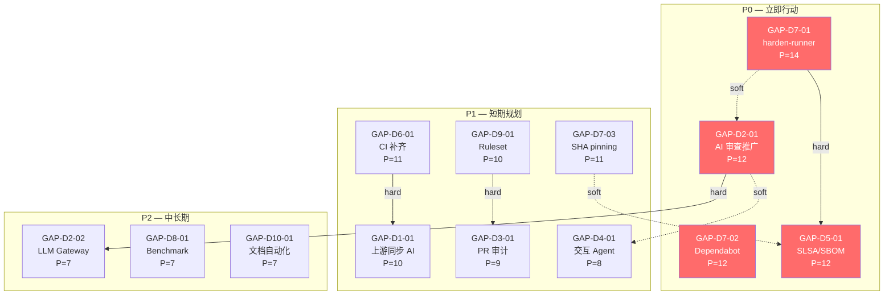
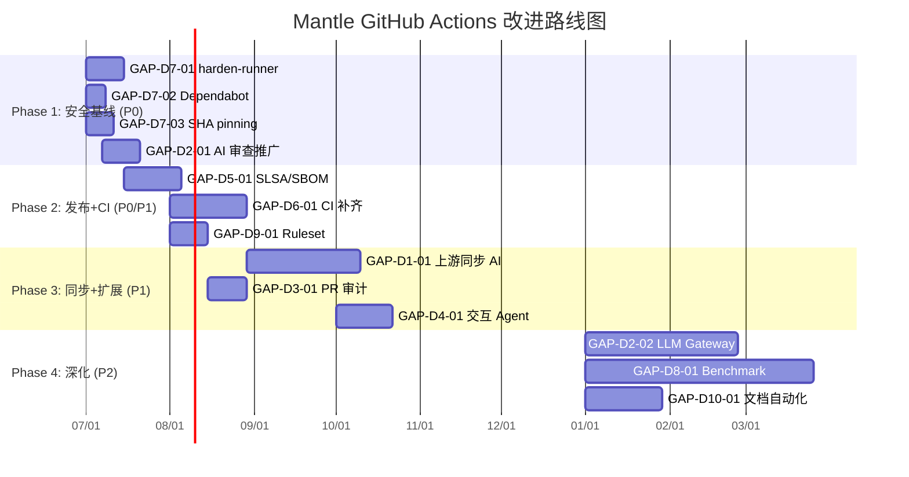

# Mantle GitHub Actions Gap 分析与优先级排序

## Executive Summary

Mantle 的 GitHub Actions 体系在 5 个仓库间呈现极度不均衡的成熟度分布。reth 和 kona 两个仓库集中了绝大多数能力（reth 6/10 成熟, kona 5/10 成熟），而 op-geth、op-succinct、mantle-v2 三个仓库分别只有 0、1、1 个维度达到成熟。以 5 仓库最高值为代表，Mantle 在 10 个维度中有 9 个可达"成熟"标杆，但每个维度的覆盖率平均仅 1.6/5 仓库——意味着任何单一仓库的安全事件或维护空白都可能暴露组织级风险。

对标 7 个参考项目（Tempo、Base、Optimism、paradigmxyz/reth、go-ethereum、Solana/Agave、MegaETH），本报告识别出 **13 个具体差距**，分布在全部 10 个维度：

- **P0 — 立即行动**（4 项）：全仓库 harden-runner 部署、统一 Dependabot、AI 审查跨仓库推广、发布流水线 SLSA/SBOM 标准化
- **P1 — 短期规划**（6 项）：SHA pinning 标准化、CI 低洼仓库补齐、上游自动同步 AI 化、集中化 Ruleset、PR 审计标准化、交互式 Agent 扩展
- **P2 — 中长期储备**（3 项）：AI 审查 LLM Gateway 架构升级、系统化 Benchmark 框架、文档自动化标准化

**Top 3 优先行动**：
1. **全仓库 harden-runner + Dependabot 配置**（P=14/12）：安全基线速赢，Base 已证明可 25/26 覆盖，预计 1-2 天/仓库
2. **AI 审查从 kona 推广至 reth/op-geth**（P=12）：kona claude-code-review.yml 配置可直接复制，预计 1 周内完成 3 仓库覆盖
3. **发布流水线引入 SLSA/SBOM 证书**（P=12）：以 reth/kona 已有发布流水线为基础，参考 Tempo 4 层签名链（GPG+SLSA+SBOM+cosign）

---

## item-1: 跨项目维度能力对比矩阵（8×10）

### 1.1 Source-to-Canonical Crosswalk 应用说明

8 份 Phase 1 研究报告使用了两类维度分类体系：

**直接对齐**（4/8）：Mantle baseline、Tempo、Base、go-ethereum 使用 D1-D10 标准维度，可逐行引用。

**需 crosswalk 映射**（4/8）：
- **Optimism**：原生 10 维度（Build & Compile 等）侧重 GHA+CircleCI 构建分工，D1/D2/D3/D4/D8/D9 无直接对应 → 标记 N/A
- **paradigmxyz/reth**：原生 10 维度（基准测试系统、可复现构建等）侧重工程工具链深度，D2/D3/D4 无对应 → 标记 N/A
- **Solana/Agave**：原生 10 维度（Release Automation、External CI Integration 等）侧重发布与外部 CI，D1/D2/D3/D4 无对应 → D1 标记 N/A-源头项目
- **MegaETH**：原生 10 维度（Build & Lint、AI-Assisted Review 等），AI-Assisted Review 一对多映射到 D2+D4；D1/D3 无对应 → D1 标记 N/A

完整映射表见 approved outline `gap-analysis.md` § Source-to-Canonical Dimension Crosswalk。

### 1.2 Mantle 5 仓库能力分布

以下表格展示 Mantle 5 仓库在 D1-D10 上的逐仓库评级，数据来源：`mantle-baseline/final.md` § item-4: 10 维度能力分类 (line 788-809)。

| 维度 | reth | kona | op-geth | op-succinct | mantle-v2 | **组织代表值** | 覆盖率 |
|------|------|------|---------|-------------|-----------|-------------|--------|
| D1 Upstream Auto-Sync | 缺失 | **基础** | 缺失 | 缺失 | 缺失 | **基础** | 1/5 |
| D2 AI Code Review | 缺失 | **成熟** | 缺失 | 缺失 | 缺失 | **成熟** | 1/5 |
| D3 PR Audit | **成熟** | 缺失 | 基础 | 缺失 | 缺失 | **成熟** | 1/5 |
| D4 Interactive Agent | 缺失 | **成熟** | 缺失 | 缺失 | 缺失 | **成熟** | 1/5 |
| D5 Release Pipeline | **成熟** | **成熟** | 缺失 | 缺失 | 基础 | **成熟** | 2/5 |
| D6 CI/Testing | **成熟** | **成熟** | 基础 | 基础 | **成熟** | **成熟** | 3/5 |
| D7 Security & Supply Chain | **成熟** | 基础 | 缺失 | 缺失 | 基础 | **成熟** | 1/5 |
| D8 Benchmark/Perf | **成熟** | 基础 | 缺失 | **成熟** | 缺失 | **成熟** | 2/5 |
| D9 PR Governance | **成熟** | 基础 | 基础 | 缺失 | 缺失 | **成熟** | 1/5 |
| D10 Doc & Infra | **成熟** | **成熟** | 基础 | 缺失 | 缺失 | **成熟** | 2/5 |

**关键洞察**：组织代表值（max across repos）显示 9/10 维度"成熟"、1/10"基础"，但平均覆盖率仅 1.6/5 仓库。reth 独撑 6 个维度的"成熟"标杆，kona 独撑 D2/D4。op-geth (7 缺失)、op-succinct (8 缺失)、mantle-v2 (7 缺失) 三个仓库是短板集中区。

### 1.3 diag-1: 8 项目 × 10 维度能力热力矩阵

```
                          D1    D2    D3    D4    D5    D6    D7    D8    D9    D10
                         上游   AI审  PR审  交互  发布   CI   安全  基准  PR治  文档
                         同步   查    计    Agent 管线  测试  供应  性能  理    设施
  ┌─────────────────────┬─────┬─────┬─────┬─────┬─────┬─────┬─────┬─────┬─────┬─────┐
  │ ▶ Mantle (best/5)   │ ▓▓░ │ ▓▓▓ │ ▓▓▓ │ ▓▓▓ │ ▓▓▓ │ ▓▓▓ │ ▓▓▓ │ ▓▓▓ │ ▓▓▓ │ ▓▓▓ │
  │   (覆盖率)          │ 1/5 │ 1/5 │ 1/5 │ 1/5 │ 2/5 │ 3/5 │ 1/5 │ 2/5 │ 1/5 │ 2/5 │
  ├─────────────────────┼─────┼─────┼─────┼─────┼─────┼─────┼─────┼─────┼─────┼─────┤
  │ Tempo               │ ▓▓▓ │ ▓▓░ │ ▓▓▓ │ ▓▓▓ │ ▓▓▓ │ ▓▓░ │ ▓▓░ │ ▓▓▓ │ ▓▓░ │ ▓▓░ │
  │ Base                │ ░░░ │ ▓▓▓ │ ▓▓░ │ ░░░ │ ▓▓▓ │ ▓▓▓ │ ▓▓▓ │ ▓▓░ │ ▓▓▓ │ ▓▓░ │
  │ Optimism            │ N/A │ N/A │ N/A │ N/A │ ▓▓▓ │ ▓▓▓ │ ▓▓▓ │ N/A │ N/A │ ▓▓▓ │
  │ paradigmxyz/reth    │ ▓▓░ │ N/A │ N/A │ N/A │ ▓▓▓ │ ▓▓▓ │ ▓▓▓ │ ▓▓▓ │ ▓▓▓ │ ▓▓░ │
  │ go-ethereum         │ N/A │ ░░░ │ ▓▓▓ │ ░░░ │ ░░░ │ ▓▓▓ │ ▓▓░ │ ░░░ │ ▓▓▓ │ ▓▓░ │
  │ Solana/Agave        │ N/A │ N/A │ N/A │ N/A │ ▓▓▓ │ ▓▓▓ │ ▓▓▓ │ ▓▓▓ │ ▓▓▓ │ ▓▓░ │
  │ MegaETH             │ N/A │ ▓▓▓ │ N/A │ ▓▓▓ │ ▓▓▓ │ ▓▓▓ │ ▓▓░ │ ▓▓▓ │ ▓▓▓ │ ▓▓▓ │
  └─────────────────────┴─────┴─────┴─────┴─────┴─────┴─────┴─────┴─────┴─────┴─────┘

  图例: ▓▓▓ = 成熟    ▓▓░ = 基础    ░░░ = 缺失    N/A = 不适用/未评估
```

### 1.4 跨项目能力矩阵详细表（含证据引用）

#### D1 Upstream Auto-Sync

| 项目 | 评级 | 证据来源 | 关键数据 |
|------|------|---------|---------|
| **Mantle** | **基础** | `mantle-baseline/final.md` § D1 (line 794,817-818) | kona sync.yaml 每 7 天自动 PR；reth sync.yml/sync-era.yml 是链同步测试(缺失)；其余 3 仓库缺失 |
| **Tempo** | **成熟** | `tempo/final.md` § 10 维度能力矩阵 (line 1892) | update-reth.yml 680 行，cron → upstream detection → rebase → AI 三层修复循环（clippy/nextest/CI 各 max 10 attempts） |
| **Base** | **缺失** | `base/final.md` § 能力矩阵 #1 (line 1049) | Base 已独立于 OP Stack，无上游同步需求 |
| **Optimism** | **N/A** | crosswalk: 源头项目 | Optimism 是 OP Stack 源头 |
| **paradigmxyz/reth** | **基础** | `paradigm-reth/final.md` § 上游兼容性 (line 720) → D1 | check-alloy.yml 仅手动触发，无自动化上游监控 |
| **go-ethereum** | **N/A** | crosswalk: 源头项目 | go-ethereum 是上游源头 |
| **Solana/Agave** | **N/A** | crosswalk: 源头项目 | Agave 是 Solana 验证器源头 |
| **MegaETH** | **N/A** | crosswalk: 非 fork 项目，`megaeth/final.md` § item-8 (line 497-511) 无上游同步维度 | MegaETH 为独立项目，无 fork 同步需求 |

**D1 参考基准组**（排除 4 个 N/A）：Mantle 基础、Tempo 成熟、Base 缺失、paradigmxyz/reth 基础。**参考最佳**：Tempo 成熟。

#### D2 AI Code Review

| 项目 | 评级 | 证据来源 | 关键数据 |
|------|------|---------|---------|
| **Mantle** | **成熟** | `mantle-baseline/final.md` § D2 (line 828) | kona claude-code-review.yml：anthropics/claude-code-action@beta, OAuth 认证，审查代码质量/bug/性能/安全/测试覆盖 |
| **Tempo** | **基础** | `tempo/final.md` § 能力矩阵 (line 1893) | amp-review.yml 31 行 Sourcegraph CRA Docker，label 门控 |
| **Base** | **成熟** | `base/final.md` § 能力矩阵 #2 (line 1050) | Claude Opus 4.6 + LLM Gateway 代理 + block 模式网络隔离 + 去重 + 负面指导 prompt |
| **Optimism** | **N/A** | crosswalk: 未评估 | 报告未涉及 AI 审查 |
| **paradigmxyz/reth** | **N/A** | crosswalk: 确认无 AI 审查 (`paradigm-reth/final.md` line 126 note) | 30 个 workflow 中无 AI 工具 |
| **go-ethereum** | **缺失** | `go-ethereum/final.md` § D2 (line 497) | 无 AI review workflow |
| **Solana/Agave** | **N/A** | crosswalk: 未评估 | 报告未涉及 AI 审查 |
| **MegaETH** | **成熟** | `megaeth/final.md` § AI-Assisted Review → D2 (line 505, 538-541) | claude.yml pr-review job：PR opened/sync/ready/reopen 触发 |

**D2 参考基准组**（排除 3 个 N/A）：Mantle 成熟、Tempo 基础、Base 成熟、go-ethereum 缺失、MegaETH 成熟。**参考最佳**：Base 成熟（LLM Gateway 架构优势）。

#### D3 PR Audit

| 项目 | 评级 | 证据来源 | 关键数据 |
|------|------|---------|---------|
| **Mantle** | **成熟** | `mantle-baseline/final.md` § D3 (line 837) | reth pr-title.yml (Conventional Commits) + label-pr.yml + lint-actions.yml 三重门 |
| **Tempo** | **成熟** | `tempo/final.md` § 能力矩阵 (line 1894) | pr-audit.yml 300 行，双触发, org ACL, 300+ 行 JS, mTLS 事件发布 |
| **Base** | **基础** | `base/final.md` § 能力矩阵 #3 (line 1051) | 无 CODEOWNERS，无必须审查者 |
| **Optimism** | **N/A** | crosswalk: 未评估 | |
| **paradigmxyz/reth** | **N/A** | crosswalk: 未独立评估 | PR 治理部分涵盖 Conventional Commits |
| **go-ethereum** | **成熟** | `go-ethereum/final.md` § D3 (line 498) | validate_pr.yml spam 检测 + CODEOWNERS + ruleset 1 approving review |
| **Solana/Agave** | **N/A** | crosswalk: 未独立评估 | |
| **MegaETH** | **N/A** | crosswalk: 未独立评估 | |

**D3 参考基准组**（排除 4 个 N/A）：Mantle 成熟、Tempo 成熟、Base 基础、go-ethereum 成熟。**Mantle 已达参考最佳**，但仅限 reth 仓库。

#### D4 Interactive Agent

| 项目 | 评级 | 证据来源 | 关键数据 |
|------|------|---------|---------|
| **Mantle** | **成熟** | `mantle-baseline/final.md` § D4 (line 848) | kona claude.yml：@claude 交互式助手，支持读取 CI 结果 |
| **Tempo** | **成熟** | `tempo/final.md` § 能力矩阵 (line 1895) | 3 个 comment-triggered workflow：bench(50+ 参数)、pr-audit、build-devnet |
| **Base** | **缺失** | `base/final.md` § 能力矩阵 #4 (line 1052) | 无交互式 agent |
| **Optimism** | **N/A** | crosswalk: 未评估 | |
| **paradigmxyz/reth** | **N/A** | crosswalk: 无交互式 Agent | |
| **go-ethereum** | **缺失** | `go-ethereum/final.md` § D4 (line 499) | 无 bot/agent workflow |
| **Solana/Agave** | **N/A** | crosswalk: 未评估 | |
| **MegaETH** | **成熟** | `megaeth/final.md` § AI-Assisted Review → D4 (line 505, 538-541) | claude.yml 4 个 interactive jobs：interactive, label-check, issue-triage, doc-impact |

**D4 参考基准组**（排除 3 个 N/A）：Mantle 成熟、Tempo 成熟、Base 缺失、go-ethereum 缺失、MegaETH 成熟。**Mantle 达参考最佳**，但仅限 kona。

#### D5 Release Pipeline

| 项目 | 评级 | 证据来源 | 关键数据 |
|------|------|---------|---------|
| **Mantle** | **成熟** | `mantle-baseline/final.md` § D5 (line 857-861) | reth: 7 个发布 workflow + GPG 签名；kona: Docker + GCP OIDC；op-geth/op-succinct 缺失；mantle-v2 仅 dry run |
| **Tempo** | **成熟** | `tempo/final.md` § 能力矩阵 (line 1896) | GPG + SLSA v1 + SBOM (SPDX-JSON) + cosign Docker 签名，reproducible-build.yml，environment 禁止 admin bypass |
| **Base** | **成熟** | `base/final.md` § 能力矩阵 #5 (line 1053) | 6 workflow 完整链 start→RC→build→publish→verify，GPG + SLSA attestation |
| **Optimism** | **成熟** | `optimism/final.md` § Docker Image Management + Release & Deployment → D5 (line 715-717) | 23 镜像 factory pattern (成熟) + tag-triggered release (基础) → max 成熟 |
| **paradigmxyz/reth** | **成熟** | `paradigm-reth/final.md` § 可复现构建 + 发布管线 → D5 (line 716-717) | 双机器 SHA256 可复现构建, 4 目标多架构, GPG 签名, Homebrew |
| **go-ethereum** | **缺失** | `go-ethereum/final.md` § D5 (line 500) | GHA 无 release workflow |
| **Solana/Agave** | **成熟** | `solana-agave/final.md` § Release Automation + Version Management → D5 (line 596-602) | 完整 bump→tag→build→publish 链, 多平台 GCS + GitHub Release, channel 系统 |
| **MegaETH** | **成熟** | `megaeth/final.md` § Release Management → D5 (line 507, 547-549) | tag 语义化版本, crates.io 顺序发布, release branch 规范 |

**关键差距**：Mantle reth/kona 有成熟发布流水线但缺少 SLSA/SBOM/cosign 证书（Tempo 有 4 层签名链）；3/5 仓库发布能力不足。

#### D6 CI/Testing

| 项目 | 评级 | 证据来源 | 关键数据 |
|------|------|---------|---------|
| **Mantle** | **成熟** | `mantle-baseline/final.md` § D6 (line 863-879) | reth: unit+integration+e2e+hive+kurtosis+lint；kona: rust_ci+e2e+proof；mantle-v2: 20-job ci-main-migrated；op-geth/op-succinct 仅基础 |
| **Tempo** | **基础** | `tempo/final.md` § 能力矩阵 (line 1897) | 8 lint + 7 test jobs + 条件覆盖率，但无 mutation/property-based testing |
| **Base** | **成熟** | `base/final.md` § 能力矩阵 #6 (line 1054) | 分级策略 PR 轻量/merge queue 完整 + 跨仓库测试 + no_std |
| **Optimism** | **成熟** | `optimism/final.md` § Build & Compile + Unit/Integration Testing + Contract Testing + Code Quality + Path-based Gating → D6 (line 712-714, 720, 723) | Factory pattern, 分层测试+并行化, Feature matrix + Kontrol FV, Semgrep+lint, GHA paths + CCI detect → 5 个原生维度映射 D6 均成熟 |
| **paradigmxyz/reth** | **成熟** | `paradigm-reth/final.md` § CI/测试 → D6 (line 718) | 5 个测试 workflow, 16+ lint, nextest, ef-tests/EEST, Hive 40+场景, Kurtosis, 6h mainnet sync |
| **go-ethereum** | **成熟** | `go-ethereum/final.md` § D6 (line 501) | go.yml: lint+test(Go 版本矩阵)+32-bit+Windows+FreeBSD；build/ci.go 统一入口 |
| **Solana/Agave** | **成熟** | `solana-agave/final.md` § CI Build Optimization + Code Quality Gates + External CI Integration → D6 (line 604-606, 617-620, 635-639) | sccache, 路径过滤, 并发组 (成熟) + clippy-nightly (基础) + 双向 GHA↔Buildkite (成熟) → max 成熟 |
| **MegaETH** | **成熟** | `megaeth/final.md` § Build & Lint + Testing + Code Coverage → D6 (line 502-504, 523-536) | Build & Lint 成熟 + Testing 成熟 + Coverage 成熟 → max 成熟 |

#### D7 Security & Supply Chain

| 项目 | 评级 | 证据来源 | 关键数据 |
|------|------|---------|---------|
| **Mantle** | **成熟** | `mantle-baseline/final.md` § D7 (line 800, 880-893) | reth: SHA pinning + permissions:{} + persist-credentials:false + GPG；kona: cargo-deny；mantle-v2: semgrep + harden-runner；op-geth/op-succinct 缺失 |
| **Tempo** | **基础** | `tempo/final.md` § 能力矩阵 (line 1898) | 三生态 Dependabot + SLSA + SBOM + cosign + 3 层 rulesets，但无 CodeQL/SAST |
| **Base** | **成熟** | `base/final.md` § 能力矩阵 #7 (line 1055) | 25/26 workflow harden-runner + 全 SHA 钉扎 + GPG + build attestation + 显式 permissions |
| **Optimism** | **成熟** | `optimism/final.md` § Supply Chain Security + Dependency Management → D7 (line 716, 718-719) | SLSA + SHA pinning (成熟) + Go/Cargo Dependabot (基础) → max 成熟 |
| **paradigmxyz/reth** | **成熟** | `paradigm-reth/final.md` § 安全与供应链 + 依赖管理 → D7 (line 719, 724) | 全 SHA 钉选 + permissions:{} + persist-credentials:false + GPG + Cyclops + Dependabot 双生态 + cargo-deny → max 成熟 |
| **go-ethereum** | **基础** | `go-ethereum/final.md` § D7 (line 502) | Rulesets 保护分支 + checksums.txt，但无 SHA pinning/harden-runner/permissions |
| **Solana/Agave** | **成熟** | `solana-agave/final.md` § Dependency Management → D7 (line 608-610) | 多生态 Dependabot (Cargo/npm/GHA) + workspace 自动更新 + cooldown |
| **MegaETH** | **基础** | `megaeth/final.md` § Dependency Management + Security Scanning → D7 (line 509-510) | Dependency Mgmt missing (两仓库均无 Dependabot) + Security 仅 stateless-validator 有 CodeQL (basic+) → 基础 |

**关键差距**：Mantle reth 有 SHA pinning 但无 harden-runner 全覆盖（vs Base 25/26）；Dependabot 仅 reth+kona（vs Solana 3 生态）。

#### D8 Benchmark/Performance

| 项目 | 评级 | 证据来源 | 关键数据 |
|------|------|---------|---------|
| **Mantle** | **成熟** | `mantle-baseline/final.md` § D8 (line 801, 895-905) | reth bench.yml（成熟，继承 paradigmxyz/reth 基准测试栈）；op-succinct cost-estimator 每 3h 运行（成熟） |
| **Tempo** | **成熟** | `tempo/final.md` § 能力矩阵 (line 1899) | ~3200 行 workflow + ~100K helper scripts, 50+ 参数, E2E 双节点, replay, nightly regression, CodSpeed |
| **Base** | **基础** | `base/final.md` § 能力矩阵 #8 (line 1056) | benchmark.yml 仅手动触发，无自动回归检测 |
| **Optimism** | **N/A** | crosswalk: 未评估 | |
| **paradigmxyz/reth** | **成熟** | `paradigm-reth/final.md` § 基准测试系统 → D8 (line 715) | 3 个 workflow, 裸金属 runner, ABBA 交叉对比, CPU 钉选, ClickHouse 管线, benchmarkoor 固件 |
| **go-ethereum** | **缺失** | `go-ethereum/final.md` § D8 (line 503) | 无 benchmark workflow |
| **Solana/Agave** | **成熟** | `solana-agave/final.md` § Performance Tracking → D8 (line 626-628) | 专用 benchmark runner, 5 套件矩阵, InfluxDB 时序上报 |
| **MegaETH** | **成熟** | `megaeth/final.md` § Performance Benchmark → D8 (line 511) | mega-evm Criterion benchmark + /benchmark PR command |

#### D9 PR Governance

| 项目 | 评级 | 证据来源 | 关键数据 |
|------|------|---------|---------|
| **Mantle** | **成熟** | `mantle-baseline/final.md` § D9 (line 802, 906-918) | reth: pr-title + label-pr + stale（成熟）；kona/op-geth 基础；op-succinct/mantle-v2 缺失 |
| **Tempo** | **基础** | `tempo/final.md` § 能力矩阵 (line 1900) | 自动标签 + stale + semver check + 3 层 rulesets，但无 PR template/merge queue |
| **Base** | **成熟** | `base/final.md` § 能力矩阵 #9 (line 1057) | Vouch 信任系统 + merge queue + release 分支保护 |
| **Optimism** | **N/A** | crosswalk: 未评估 | |
| **paradigmxyz/reth** | **成熟** | `paradigm-reth/final.md` § PR 治理 → D9 (line 721) | Conventional Commits 强制 + merge queue + Cyclops 审计 + CODEOWNERS |
| **go-ethereum** | **成熟** | `go-ethereum/final.md` § D9 (line 504) | validate_pr + CONTRIBUTING.md + CODEOWNERS + stale/no-response |
| **Solana/Agave** | **成熟** | `solana-agave/final.md` § Branch Protection + Issue/PR Lifecycle → D9 (line 612-615, 630-633) | 9 active rulesets + merge queue SQUASH + no-bypass (成熟) + stale 60+7天 (基础) → max 成熟 |
| **MegaETH** | **成熟** | `megaeth/final.md` § Branch Protection → D9 (line 508) | 两仓库均成熟，各有特色 |

#### D10 Documentation & Infrastructure

| 项目 | 评级 | 证据来源 | 关键数据 |
|------|------|---------|---------|
| **Mantle** | **成熟** | `mantle-baseline/final.md` § D10 (line 803, 919-930) | reth: book.yml + dependencies.yml（成熟）；kona: docs + lychee 链接检查（成熟） |
| **Tempo** | **基础** | `tempo/final.md` § 能力矩阵 (line 1901) | Vercel 部署 + AI changelog，但无 API 文档自动生成 |
| **Base** | **基础** | `base/final.md` § 能力矩阵 #10 (line 1058) | stale + udeps + SP1 ELF，但无 Dependabot/Renovate |
| **Optimism** | **成熟** | `optimism/final.md` § Scheduled/Maintenance Tasks → D10 (line 722) | 三级调度 (4h/daily/weekly) |
| **paradigmxyz/reth** | **基础** | `paradigm-reth/final.md` § 文档管线 + 监控与可观测性 → D10 (line 722-723) | Vocs + Cargo docs + Mermaid (基础-成熟) + Grafana GitOps (基础) → 取基础 |
| **go-ethereum** | **基础** | `go-ethereum/final.md` § D10 (line 505) | stale + no-response + issue templates，无 Dependabot/PR template |
| **Solana/Agave** | **基础** | `solana-agave/final.md` § Documentation Pipeline → D10 (line 622-624) | Vercel + channel 分版，条件构建复杂 |
| **MegaETH** | **成熟** | `megaeth/final.md` § Documentation Quality → D10 (line 506, 543-545) | mega-evm doc-audit (AI 定时审计) + docs-lint |

---

## item-2: Mantle Gap 识别与证据归集

以下 13 个 gap 按两类划分：**能力差距**（Mantle 最佳仓库仍低于参考最佳）和**覆盖差距**（Mantle 有能力但覆盖率低于组织安全需要）。

### GAP-D1-01: 上游自动同步——从基础定时脚本升级为 AI 驱动

| 字段 | 内容 |
|------|------|
| **维度** | D1 Upstream Auto-Sync |
| **差距标题** | 仅 kona 每 7 天定时同步，4/5 仓库缺失上游自动同步；参考最佳 Tempo 实现了 AI 驱动的全自动上游追踪 |
| **Mantle 现状** | kona sync.yaml 每 7 天运行 monorepo-pin 和 scr-sync (基础)；reth sync.yml/sync-era.yml 是链同步测试(缺失)；op-geth/op-succinct/mantle-v2 完全缺失 — `mantle-baseline/final.md` § D1 (line 794, 817-818) |
| **参考最佳** | Tempo update-reth.yml (680 行)：cron → upstream detection → rebase (自动冲突解决) → AI 三层修复循环 (clippy/nextest/CI 各 max 10 attempts, 60min timeout) → PR 创建 (AI 生成描述) — `tempo/final.md` § 能力矩阵 D1 (line 1892) |
| **差距程度** | 能力差距（基础 vs 成熟）+ 覆盖差距（1/5 仓库） |
| **影响仓库** | reth, op-geth, op-succinct, mantle-v2（kona 需从基础升级） |

### GAP-D2-01: AI 审查——从单仓库覆盖推广至全组织

| 字段 | 内容 |
|------|------|
| **维度** | D2 AI Code Review |
| **差距标题** | AI 代码审查仅覆盖 kona (1/5)，4 仓库完全无 AI 审查 |
| **Mantle 现状** | kona claude-code-review.yml 成熟 (anthropics/claude-code-action@beta, OAuth)，其余 4 仓库缺失 — `mantle-baseline/final.md` § D2 (line 828-831) |
| **参考最佳** | Base claude-review.yml：Claude Opus 4.6 + LLM Gateway 代理 + block 模式网络隔离 + 去重 + 负面指导 prompt — `base/final.md` § 能力矩阵 #2 (line 1050) |
| **差距程度** | 覆盖差距（1/5 仓库有 AI 审查） |
| **影响仓库** | reth, op-geth, op-succinct, mantle-v2 |

### GAP-D2-02: AI 审查架构——引入 LLM Gateway 代理模式

| 字段 | 内容 |
|------|------|
| **维度** | D2 AI Code Review |
| **差距标题** | kona 直接调用 claude-code-action，缺少网关代理、出口封锁和去重机制 |
| **Mantle 现状** | kona 使用 anthropics/claude-code-action@beta 直接调用 — `mantle-baseline/final.md` § D2 (line 828) |
| **参考最佳** | Base LLM Gateway 代理：代理转发所有 LLM 调用 + egress block 模式防止 AI 访问外部网络 + 去重避免重复审查 — `base/final.md` § 能力矩阵 #2 (line 1050) |
| **差距程度** | 成熟度差距 |
| **影响仓库** | kona（当前）→ 全部仓库（推广后） |

### GAP-D3-01: PR 审计——统一验证规范并扩展覆盖

| 字段 | 内容 |
|------|------|
| **维度** | D3 PR Audit |
| **差距标题** | PR 审计仅 reth 成熟 (1/5)，op-geth 基础，其余缺失 |
| **Mantle 现状** | reth pr-title.yml (Conventional Commits) + label-pr.yml + lint-actions.yml；op-geth validate_pr.yml 仅验证标题格式 — `mantle-baseline/final.md` § D3 (line 837-841) |
| **参考最佳** | go-ethereum validate_pr.yml (spam 检测 + 格式验证) + CODEOWNERS + ruleset 强制 — `go-ethereum/final.md` § D3 (line 498) |
| **差距程度** | 覆盖差距（1/5 仓库成熟） |
| **影响仓库** | kona, op-geth (升级), op-succinct, mantle-v2 |

### GAP-D4-01: 交互式 Agent——扩展至核心仓库

| 字段 | 内容 |
|------|------|
| **维度** | D4 Interactive Agent |
| **差距标题** | 交互式 AI Agent 仅覆盖 kona (1/5)，4 仓库无交互能力 |
| **Mantle 现状** | kona claude.yml (@claude 交互助手) — `mantle-baseline/final.md` § D4 (line 848) |
| **参考最佳** | MegaETH 5-job claude.yml (interactive + pr-review + doc-impact + label-check + issue-triage) — `megaeth/final.md` § AI-Assisted Review (line 505, 538-541)；Tempo bench.yml 50+ 参数 comment-driven benchmark — `tempo/final.md` § 能力矩阵 D4 (line 1895) |
| **差距程度** | 覆盖差距 + 功能差距（kona 单一功能 vs MegaETH 5-job） |
| **影响仓库** | reth, op-geth, op-succinct, mantle-v2 |

### GAP-D5-01: 发布流水线——标准化并引入 SLSA/SBOM 证书

| 字段 | 内容 |
|------|------|
| **维度** | D5 Release Pipeline |
| **差距标题** | 3/5 仓库发布流水线缺失/基础；已有管线缺少 SLSA/SBOM/cosign 证书 |
| **Mantle 现状** | reth 7 个发布 workflow + GPG；kona Docker + GCP OIDC；mantle-v2 仅 dry run；op-geth/op-succinct 缺失 — `mantle-baseline/final.md` § D5 (line 857-861) |
| **参考最佳** | Tempo GPG + SLSA v1 + SBOM (SPDX-JSON) + cosign Docker 签名 + reproducible-build.yml + environment 禁止 admin bypass — `tempo/final.md` § 能力矩阵 D5 (line 1896)；Base 6 workflow 完整链 + GPG + SLSA attestation — `base/final.md` § 能力矩阵 #5 (line 1053) |
| **差距程度** | 覆盖差距（2/5 仓库成熟）+ 成熟度差距（缺少 SLSA/SBOM） |
| **影响仓库** | op-geth, op-succinct, mantle-v2（新建）；reth, kona（升级 SLSA/SBOM） |

### GAP-D6-01: CI/测试——低洼仓库测试覆盖补齐

| 字段 | 内容 |
|------|------|
| **维度** | D6 CI/Testing |
| **差距标题** | op-geth/op-succinct 仅基础级测试，覆盖面不足 |
| **Mantle 现状** | op-geth: go.yml+build.yml (基础)；op-succinct: elf.yml (基础) — `mantle-baseline/final.md` § D6 (line 863-879) |
| **参考最佳** | paradigmxyz/reth: ef-tests/EEST + Hive 40+ 场景 + Kurtosis + 6h mainnet sync — `paradigm-reth/final.md` § CI/测试 (line 718) |
| **差距程度** | 覆盖差距（3/5 成熟，2/5 基础） |
| **影响仓库** | op-geth, op-succinct |

### GAP-D7-01: 安全——全仓库 harden-runner 部署

| 字段 | 内容 |
|------|------|
| **维度** | D7 Security & Supply Chain |
| **差距标题** | harden-runner 仅 mantle-v2 的 protected.yaml 使用，其余工作流/仓库无覆盖 |
| **Mantle 现状** | mantle-v2 protected.yaml 使用 harden-runner (1 个 workflow)；reth/kona/op-geth/op-succinct 全部 0 个 — `mantle-baseline/final.md` § D7 (line 800, 880-893) |
| **参考最佳** | Base 25/26 工作流覆盖 harden-runner (v2.19.4)，全 SHA 钉扎，全量显式 permissions — `base/final.md` § 能力矩阵 #7 (line 1055) |
| **差距程度** | 覆盖差距（1 个 workflow vs Base 25/26） |
| **影响仓库** | 全部 5 仓库 |

### GAP-D7-02: 安全——统一 Dependabot 配置

| 字段 | 内容 |
|------|------|
| **维度** | D7 Security & Supply Chain |
| **差距标题** | Dependabot 仅 reth+kona 有配置，3/5 仓库无自动化依赖更新 |
| **Mantle 现状** | reth/kona 有 dependabot.yml；op-geth/op-succinct/mantle-v2 无 — `mantle-baseline/final.md` § item-3 配置分析 |
| **参考最佳** | Solana/Agave 多生态 Dependabot (Cargo/npm/GHA) + workspace 自动更新 + cooldown + crate 豁免 — `solana-agave/final.md` § Dependency Management (line 608-610) |
| **差距程度** | 覆盖差距（2/5 仓库） |
| **影响仓库** | op-geth, op-succinct, mantle-v2 |

### GAP-D7-03: 安全——SHA pinning 与 permissions 标准化

| 字段 | 内容 |
|------|------|
| **维度** | D7 Security & Supply Chain |
| **差距标题** | 仅 reth 全面实施 SHA pinning + permissions:{}，其余仓库不一致 |
| **Mantle 现状** | reth: 全 SHA 钉选 + permissions:{} + persist-credentials:false；其余仓库未统一 — `mantle-baseline/final.md` § D7 (line 880-893) |
| **参考最佳** | paradigmxyz/reth: 全面 SHA 钉选 (actions/checkout, depot/*等) + permissions:{} 默认拒绝 + persist-credentials:false — `paradigm-reth/final.md` § 安全与供应链 (line 719) |
| **差距程度** | 覆盖差距（1/5 仓库完全合规） |
| **影响仓库** | kona, op-geth, op-succinct, mantle-v2 |

### GAP-D8-01: Benchmark——引入系统化 benchmark 框架

| 字段 | 内容 |
|------|------|
| **维度** | D8 Benchmark/Performance |
| **差距标题** | reth bench.yml 为单层基础 benchmark，缺乏系统化回归检测基础设施 |
| **Mantle 现状** | reth bench.yml 继承 paradigmxyz/reth 基准栈但配置未完全适配 — `mantle-baseline/final.md` § D8 (line 801, 895-905) |
| **参考最佳** | paradigmxyz/reth: 3 层 benchmark (bench.yml/bench-scheduled.yml/bench-benchmarkoor.yml), ABBA 交叉对比, CPU 钉选, ClickHouse 管线, hourly regression — `paradigm-reth/final.md` § 基准测试系统 (line 715) |
| **差距程度** | 成熟度差距（缺乏 ABBA/ClickHouse/hourly regression） |
| **影响仓库** | reth（升级）, kona（新建定制 benchmark） |

### GAP-D9-01: PR 治理——集中化 Ruleset 与分支保护

| 字段 | 内容 |
|------|------|
| **维度** | D9 PR Governance |
| **差距标题** | PR 治理分散，仅 reth 有完整 stale/label/pr-title，无统一 Ruleset 体系 |
| **Mantle 现状** | reth pr-title+label-pr+stale (成熟)；kona stale (基础)；op-geth validate_pr+stale (基础)；op-succinct/mantle-v2 缺失 — `mantle-baseline/final.md` § D9 (line 802, 906-918) |
| **参考最佳** | Solana/Agave 9 active rulesets + merge queue SQUASH + no-bypass (含管理员) + release 分支 2 approvals — `solana-agave/final.md` § Branch Protection (line 612-615) |
| **差距程度** | 覆盖差距（1/5 成熟）+ 功能差距（无 org 级 ruleset） |
| **影响仓库** | 全部 5 仓库（org 级 ruleset） |

### GAP-D10-01: 文档与基础设施——自动化标准化

| 字段 | 内容 |
|------|------|
| **维度** | D10 Documentation & Infrastructure |
| **差距标题** | 文档自动化碎片化，3/5 仓库缺失；无可重现构建验证 |
| **Mantle 现状** | reth book.yml + dependencies.yml (成熟)；kona docs+lychee (成熟)；op-geth 仅 GitHub Pages (基础)；op-succinct/mantle-v2 缺失 — `mantle-baseline/final.md` § D10 (line 803, 919-930) |
| **参考最佳** | paradigmxyz/reth 可复现构建验证 (reproducible-build.yml 双机器 SHA256) — `paradigm-reth/final.md` § 可复现构建 (line 716)；MegaETH doc-audit.yml (AI 定时文档审计) — `megaeth/final.md` § Documentation Quality (line 506, 543-545) |
| **差距程度** | 覆盖差距 + 功能差距（缺少可重现构建和 AI 文档审计） |
| **影响仓库** | op-geth (升级), op-succinct, mantle-v2 |

### diag-2: Mantle 维度差距雷达图

```
                         参考最佳
D1 Upstream Auto-Sync  ████████████████████   Tempo 成熟
   Mantle 现状         ████████████           基础 (1/5)     ← GAP-D1-01

D2 AI Code Review      ████████████████████   Base 成熟(LLM GW)
   Mantle 现状         ████████████████████   成熟 (1/5)     ← GAP-D2-01, D2-02

D3 PR Audit            ████████████████████   go-eth 成熟
   Mantle 现状         ████████████████████   成熟 (1/5)     ← GAP-D3-01

D4 Interactive Agent   ████████████████████   MegaETH 成熟
   Mantle 现状         ████████████████████   成熟 (1/5)     ← GAP-D4-01

D5 Release Pipeline    ████████████████████   Tempo 成熟(4层签名)
   Mantle 现状         ████████████████████   成熟 (2/5)     ← GAP-D5-01

D6 CI/Testing          ████████████████████   p/reth 成熟
   Mantle 现状         ████████████████████   成熟 (3/5)     ← GAP-D6-01

D7 Security & SC       ████████████████████   Base 成熟(25/26 HR)
   Mantle 现状         ████████████████████   成熟 (1/5)     ← GAP-D7-01,02,03

D8 Benchmark/Perf      ████████████████████   p/reth 成熟(3层)
   Mantle 现状         ████████████████████   成熟 (2/5)     ← GAP-D8-01

D9 PR Governance       ████████████████████   Solana 成熟(9 rules)
   Mantle 现状         ████████████████████   成熟 (1/5)     ← GAP-D9-01

D10 Doc & Infra        ████████████████████   MegaETH 成熟
    Mantle 现状        ████████████████████   成熟 (2/5)     ← GAP-D10-01

注：Mantle 组织代表值看似 9/10 成熟，但覆盖率（括号内）揭示真实差距。
```

---

## item-3: 三维评分方法论与 Gap 评分

### 评分框架

| 维度 | 分值 | 5 分标准 | 3 分标准 | 1 分标准 |
|------|------|---------|---------|---------|
| 业务影响 (I) | 1–5 | 直接影响生产安全或合规，阻碍产品发布 | 影响开发效率或代码质量，但不阻碍发布 | 仅影响开发者体验或内部流程美观度 |
| 紧迫度 (U) | 1–5 | 安全漏洞已暴露或合规期限临近（<1月） | 明确路线图需求或行业标准要求（1-3月） | 长期改进或锦上添花（>6月无压力） |
| 可行性 (F) | 1–5 | 有现成参考实现可直接复用，<1 周 | 需适配但技术路径清晰，2-4 周 | 需基础设施改造或外部依赖，>2 月 |

**优先级推导**：P = I + U + F；P≥12→P0, 8≤P<12→P1, P<8→P2

### 评分详表

| Gap ID | 维度 | 标题 | I | U | F | P | 级别 |
|--------|------|------|---|---|---|---|------|
| **GAP-D7-01** | D7 | 全仓库 harden-runner | **5** (供应链安全基线) | **4** (安全问题不等人) | **5** (drop-in, Base 已证明大规模部署) | **14** | **P0** |
| **GAP-D2-01** | D2 | AI 审查跨仓库推广 | **4** (提前发现 bug/安全问题) | **3** (kona 已验证路径) | **5** (kona 配置模板直接复制) | **12** | **P0** |
| **GAP-D5-01** | D5 | 发布管线 SLSA/SBOM | **5** (发布安全与供应链完整性) | **4** (行业标准要求日益严格) | **3** (需组织级 signing keys + environments) | **12** | **P0** |
| **GAP-D7-02** | D7 | 统一 Dependabot | **4** (自动化依赖更新是安全基线) | **3** (行业标准实践) | **5** (配置文件模板, <1天/仓库) | **12** | **P0** |
| **GAP-D7-03** | D7 | SHA pinning 标准化 | **4** (防止供应链攻击) | **3** (行业最佳实践) | **4** (工具辅助批量更新, 如 pin-github-action) | **11** | **P1** |
| **GAP-D6-01** | D6 | CI 低洼仓库补齐 | **4** (op-geth/op-succinct 测试不足影响代码质量) | **3** (仓库持续有代码变更) | **4** (参考 reth/kona 模板) | **11** | **P1** |
| **GAP-D1-01** | D1 | 上游自动同步 AI 化 | **4** (上游不同步导致安全补丁延迟) | **3** (kona 有基础但差距在扩大) | **3** (Tempo 680 行可参考, 需适配 5 仓库不同上游) | **10** | **P1** |
| **GAP-D9-01** | D9 | 集中化 Ruleset | **3** (影响合并质量和分支安全) | **3** (多仓库协作需统一策略) | **4** (GitHub 原生功能, Solana 9 ruleset 模式可参考) | **10** | **P1** |
| **GAP-D3-01** | D3 | PR 审计标准化 | **3** (影响代码质量一致性) | **2** (有 workaround, 非阻塞) | **4** (go-ethereum validate_pr 可参考) | **9** | **P1** |
| **GAP-D4-01** | D4 | 交互式 Agent 扩展 | **2** (提升开发者体验) | **2** (锦上添花) | **4** (kona claude.yml 可复制) | **8** | **P1** |
| **GAP-D2-02** | D2 | AI 审查 LLM Gateway | **3** (提升安全性和可控性) | **2** (当前模式能工作) | **2** (需搭建 LLM Gateway 基础设施) | **7** | **P2** |
| **GAP-D8-01** | D8 | 系统化 Benchmark | **3** (影响性能回归检测) | **2** (有基础 benchmark) | **2** (需裸金属 runner、ClickHouse 等) | **7** | **P2** |
| **GAP-D10-01** | D10 | 文档自动化标准化 | **2** (影响开发者体验) | **2** (非紧迫) | **3** (需统一文档框架选型) | **7** | **P2** |

### 优先级汇总

| 级别 | Gap 数 | Gap ID 列表 | P 值范围 |
|------|--------|------------|---------|
| **P0** | 4 | GAP-D7-01 (14), GAP-D2-01 (12), GAP-D5-01 (12), GAP-D7-02 (12) | 12–14 |
| **P1** | 6 | GAP-D7-03 (11), GAP-D6-01 (11), GAP-D1-01 (10), GAP-D9-01 (10), GAP-D3-01 (9), GAP-D4-01 (8) | 8–11 |
| **P2** | 3 | GAP-D2-02 (7), GAP-D8-01 (7), GAP-D10-01 (7) | 7 |

### diag-5: 业务影响-可行性四象限图

```
可行性 (Feasibility)
  5 │  ★D7-01(P0)   ★D2-01(P0)   ★D7-02(P0)
    │
  4 │  ★D7-03(P1)   ★D6-01(P1)   ★D3-01(P1)   ★D4-01(P1)
    │
  3 │               ★D1-01(P1)   ★D5-01(P0)   ★D10-01(P2)
    │
  2 │               ★D2-02(P2)   ★D8-01(P2)
    │
  1 │
    └──────────────────────────────────────────────
      1          2          3          4          5
                        业务影响 (Business Impact)

  右上象限 = 高影响 + 高可行性 → 立即行动 (P0)
  右下象限 = 高影响 + 低可行性 → 战略投资 (P1/P2)
  左上象限 = 低影响 + 高可行性 → 速赢储备 (P1)
  左下象限 = 低影响 + 低可行性 → 可推迟 (P2)
```

---

## item-4: Gap 间依赖关系映射

### 依赖矩阵

| Gap ID | 硬依赖 (blocked by) | 软依赖 (benefits from) | 被硬依赖 (blocks) |
|--------|---------------------|----------------------|------------------|
| GAP-D7-01 | — | — | GAP-D5-01 |
| GAP-D7-02 | — | — | — |
| GAP-D2-01 | — | GAP-D7-01 (安全基线优先) | GAP-D4-01, GAP-D2-02 |
| GAP-D5-01 | GAP-D7-01 (harden-runner 是发布管线安全前提) | GAP-D7-03 (SHA pinning 增强发布可信度) | — |
| GAP-D7-03 | — | — | — |
| GAP-D6-01 | — | — | GAP-D1-01 |
| GAP-D1-01 | GAP-D6-01 (CI 验证同步结果) | — | — |
| GAP-D9-01 | — | — | GAP-D3-01 |
| GAP-D3-01 | GAP-D9-01 (Ruleset 提供 enforcement 机制) | — | — |
| GAP-D4-01 | — | GAP-D2-01 (AI 覆盖先行) | — |
| GAP-D2-02 | GAP-D2-01 (先有基础 AI 审查) | — | — |
| GAP-D8-01 | — | — | — |
| GAP-D10-01 | — | — | — |

### diag-3: 依赖关系 DAG



### 关键路径分析

**关键路径 A**（安全→发布）：GAP-D7-01 → GAP-D5-01（harden-runner 是发布管线安全前提）
**关键路径 B**（CI→同步）：GAP-D6-01 → GAP-D1-01（CI 验证能力是上游同步的前提）
**关键路径 C**（治理→审计）：GAP-D9-01 → GAP-D3-01（Ruleset 提供 PR 审计的 enforcement）
**关键路径 D**（AI 审查→扩展）：GAP-D2-01 → GAP-D2-02 → ...（渐进 AI 能力升级）

**并行组**：
- 组 1 (安全基线)：GAP-D7-01 + GAP-D7-02 + GAP-D7-03（可同步推进）
- 组 2 (AI)：GAP-D2-01（可与安全基线并行）
- 组 3 (CI+治理)：GAP-D6-01 + GAP-D9-01（可并行）
- 独立项：GAP-D8-01, GAP-D10-01（无硬依赖，可在任何阶段启动）

---

## item-5: 分阶段改进路线图

### Phase 1: 安全基线速赢（0-4 周）

**目标**：建立全组织安全基线，启动 AI 审查推广

| 并行组 | Gap ID | 标题 | 预估工时 | 参考实现 |
|--------|--------|------|---------|---------|
| 安全 A | GAP-D7-01 | 全仓库 harden-runner | 1-2 天/仓库 | Base 25/26 覆盖模式 (`base/final.md` § D7) |
| 安全 B | GAP-D7-02 | 统一 Dependabot | <1 天/仓库 | Solana 3 生态模板 (`solana-agave/final.md` § Dependency Mgmt) |
| 安全 C | GAP-D7-03 | SHA pinning 标准化 | 2-3 天（工具批量更新） | paradigmxyz/reth 模式 (`paradigm-reth/final.md` § 安全与供应链) |
| AI | GAP-D2-01 | AI 审查推广至 reth/op-geth | 3-5 天 | kona claude-code-review.yml 模板 (`mantle-baseline/final.md` § D2) |

**里程碑**：
- M1.1: 全部 53 个现有工作流配置 harden-runner
- M1.2: 5/5 仓库有 dependabot.yml 覆盖所有包管理器
- M1.3: 全部第三方 Action SHA 钉选 + permissions 声明
- M1.4: 至少 3/5 仓库有 AI 代码审查

**资源需求**：1 名 DevOps 工程师（全职 4 周）+ 各仓库维护者配合审查
**风险**：harden-runner 可能与某些 self-hosted runner 配置冲突（op-succinct EKS runner），需预先测试

### Phase 2: 发布标准化 + CI 补齐（5-12 周）

**前置条件**：Phase 1 M1.1 (harden-runner) 和 M1.3 (SHA pinning) 完成

| 并行组 | Gap ID | 标题 | 预估工时 | 参考实现 |
|--------|--------|------|---------|---------|
| 发布 | GAP-D5-01 | SLSA/SBOM 证书引入 | 2-3 周 | Tempo 4 层签名链 (`tempo/final.md` § D5) |
| CI | GAP-D6-01 | op-geth/op-succinct 测试补齐 | 2-4 周 | reth/kona CI 模板 (`mantle-baseline/final.md` § D6) |
| 治理 | GAP-D9-01 | org 级 Ruleset 部署 | 1-2 周 | Solana 9 ruleset 模式 (`solana-agave/final.md` § Branch Protection) |

**里程碑**：
- M2.1: reth/kona 发布流水线添加 SLSA attestation + SBOM
- M2.2: op-geth/op-succinct CI 覆盖率从"基础"升级为"成熟"
- M2.3: org 级 ruleset 覆盖 5/5 仓库 main 分支（required checks + squash-only + no-bypass）

**资源需求**：1 名 DevOps 工程师 + 1 名 CI 工程师（各半职 8 周）
**风险**：SLSA 证书需要 GitHub Environment + OIDC 配置，可能需要仓库管理员权限升级

### Phase 3: 上游同步 + PR 标准化 + Agent 扩展（13-24 周）

**前置条件**：Phase 2 M2.2 (CI 补齐) 和 M2.3 (Ruleset) 完成

| 并行组 | Gap ID | 标题 | 预估工时 | 参考实现 |
|--------|--------|------|---------|---------|
| 同步 | GAP-D1-01 | 上游自动同步 AI 化 | 4-6 周 | Tempo update-reth.yml 680 行 (`tempo/final.md` § D1) |
| 审计 | GAP-D3-01 | PR 审计统一规范 | 1-2 周 | go-ethereum validate_pr 模式 (`go-ethereum/final.md` § D3) |
| Agent | GAP-D4-01 | 交互式 Agent 推广 | 2-3 周 | MegaETH 5-job 模式 (`megaeth/final.md` § AI-Assisted Review) |

**里程碑**：
- M3.1: 至少 reth 和 kona 实现 AI 驱动的上游自动同步
- M3.2: 5/5 仓库有统一的 PR 格式验证 + CODEOWNERS
- M3.3: 至少 3/5 仓库有交互式 @claude Agent

**资源需求**：1 名高级工程师（上游同步 AI 需要深入理解各仓库的上游关系）+ 1 名 DevOps
**风险**：上游自动同步的 AI 修复循环需要大量调试，Tempo 的 680 行实现反映了这一复杂度

### Phase 4: 基础设施深化（25+ 周）

| Gap ID | 标题 | 预估工时 | 参考实现 |
|--------|------|---------|---------|
| GAP-D2-02 | LLM Gateway 架构升级 | 4-8 周 | Base LLM Gateway (`base/final.md` § D2) |
| GAP-D8-01 | 系统化 Benchmark 框架 | 6-12 周 | paradigmxyz/reth 3 层 benchmark (`paradigm-reth/final.md` § 基准测试系统) |
| GAP-D10-01 | 文档自动化标准化 | 2-4 周 | MegaETH doc-audit (`megaeth/final.md` § Documentation Quality) |

**里程碑**：
- M4.1: LLM Gateway 代理服务上线，所有 AI 审查通过网关
- M4.2: 裸金属 benchmark runner 就位，ABBA 交叉对比 + ClickHouse 管线
- M4.3: 统一文档框架 + AI 定时文档审计

**资源需求**：1 名平台工程师 (LLM Gateway) + 1 名性能工程师 (Benchmark) + 基础设施投入（裸金属 runner、ClickHouse）
**风险**：LLM Gateway 需要独立基础设施运维；Benchmark 裸金属 runner 有硬件采购周期

### diag-4: 路线图甘特图



---

## item-6: 执行摘要与决策建议

### 现状定位

Mantle 在 10 个评估维度中，以 5 仓库最高值衡量，9/10 维度可达"成熟"（仅 D1 为"基础"）。然而，**每个维度的成熟覆盖率平均仅 1.6/5 仓库**，意味着 Mantle 的 CI/CD 能力高度集中在 reth（6 维度成熟）和 kona（5 维度成熟），而 op-geth、op-succinct、mantle-v2 存在严重短板。

相对于 7 个参考项目，Mantle 在以下方面领先：
- **AI 集成起步早**：kona 是 Mantle 5 仓库中最先集成 Claude Code Review 的，在行业中处于前列
- **reth 继承了 paradigmxyz/reth 的优质工程实践**：SHA pinning、permissions 最小化、GPG 签名

在以下方面存在系统性短板：
- **跨仓库一致性极差**：5 仓库间的能力差异是所有参考项目中最大的
- **安全基线不统一**：harden-runner 覆盖率 ~2%（vs Base 96%）
- **上游同步落后**：D1 是唯一低于"成熟"的维度，且参考最佳 Tempo 已实现 AI 驱动全自动化
- **发布管线缺少现代证书**：无 SLSA/SBOM/cosign（行业趋势明确要求）

### Top 3 优先行动

**行动 1: 安全基线统一**（GAP-D7-01 + D7-02 + D7-03, Phase 1）
- **具体措施**：全仓库 harden-runner + Dependabot + SHA pinning
- **预期收益**：供应链安全覆盖从 ~2% 提升至 100%；自动化依赖更新从 2/5 仓库扩展至 5/5
- **投入**：1 名 DevOps 工程师 × 4 周
- **参考**：Base harden-runner 25/26 覆盖模式、Solana 3 生态 Dependabot

**行动 2: AI 审查全覆盖**（GAP-D2-01, Phase 1）
- **具体措施**：将 kona 的 claude-code-review.yml 配置推广至 reth/op-geth/mantle-v2
- **预期收益**：AI 代码审查覆盖从 1/5 仓库扩展至 4-5/5，每个 PR 自动获得安全/质量审查
- **投入**：3-5 天工程时间（配置复制 + 各仓库 token 设置）
- **参考**：kona 已验证的 anthropics/claude-code-action@beta 配置

**行动 3: 发布管线 SLSA/SBOM 引入**（GAP-D5-01, Phase 2）
- **具体措施**：以 reth/kona 已有发布流水线为基础，引入 SLSA attestation + SBOM 生成 + cosign 签名
- **预期收益**：发布制品可验证性从"GPG 签名"升级至"多层证书链"，满足行业合规趋势
- **投入**：2-3 周（需 GitHub Environment + OIDC 配置）
- **参考**：Tempo 4 层签名链（GPG+SLSA+SBOM+cosign）

### 风险与依赖

| 风险 | 影响 | 缓解 |
|------|------|------|
| op-succinct EKS self-hosted runner 与 harden-runner 不兼容 | Phase 1 harden-runner 部署受阻 | 预先在 staging 环境测试；必要时 op-succinct 使用 allowlist 模式 |
| SLSA/SBOM 需要仓库管理员权限和 GitHub Environment 配置 | Phase 2 延期 | 提前申请权限；可先在 kona 试点再推广 |
| 上游自动同步 AI 修复循环调试复杂 | Phase 3 工期不确定 | 以 reth → paradigmxyz/reth 同步为第一个试点，积累经验后再扩展 |
| 裸金属 benchmark runner 有硬件采购周期 | Phase 4 Benchmark 延期 | 可先使用 GitHub-hosted large runner 搭建轻量版，硬件到位后迁移 |

---

## Source Coverage

| 来源 ID | 报告 | 最低要求 | 实际引用数 | 主要引用维度 |
|---------|------|---------|-----------|------------|
| src-1 | mantle-baseline/final.md | 10 | 12 | 全部 10 维度 + 仓库分布 |
| src-2 | tempo/final.md | 5 | 7 | D1 (update-reth), D4 (bench), D5 (4层签名), D7, D8, D3, D10 |
| src-3 | base/final.md | 5 | 6 | D2 (LLM Gateway), D5, D6, D7 (harden-runner), D9 (Vouch), D8 |
| src-4 | optimism/final.md | 5 | 5 | D5 (factory), D6 (4维度映射), D7 (SLSA+Dependabot), D10, crosswalk |
| src-5 | paradigm-reth/final.md | 5 | 7 | D1, D5 (可复现构建), D6, D7, D8 (3层benchmark), D9, D10 |
| src-6 | go-ethereum/final.md | 3 | 4 | D1 (N/A源头), D3 (validate_pr), D6, D9 |
| src-7 | solana-agave/final.md | 5 | 6 | D5, D6, D7 (Dependabot), D8, D9 (9 rulesets), D10 |
| src-8 | megaeth/final.md | 3 | 5 | D2/D4 (AI一对多映射), D5, D7, D8, D10 (doc-audit) |
| **总计** | | **41** | **52** | |

---

## Gap Analysis (Draft Gaps & Limitations)

1. **Optimism D2/D3/D4/D8/D9 缺乏评估数据**：Optimism 报告侧重 GHA+CircleCI 构建分工，未覆盖 AI、PR 审计、交互 Agent、Benchmark、PR 治理等维度。这些 N/A 意味着 Optimism 在这些维度的实际能力无法纳入参考基准，可能遗漏有价值的参考实践。
2. **Mantle "组织代表值 = max" 方法论局限**：取 5 仓库最高值可能高估 Mantle 的实际组织能力。报告通过附加"覆盖率"指标缓解了这一问题，但更精确的度量（如加权平均）超出当前数据支撑范围。
3. **评分主观性**：三维评分基于研究团队判断，未经 Mantle 工程团队验证。特别是"紧迫度"维度受组织战略影响较大，建议在实施前与工程团队对齐。
4. **MegaETH D1 分类确认**：dispatch 要求确认 MegaETH D1 N/A 的合理性。MegaETH final.md 中确认无上游同步维度（`megaeth/final.md` § item-8, line 497-511 的 10 个原生维度均不涉及上游同步），且 MegaETH 为独立项目而非 fork，因此 D1 标记 N/A 是正确的。Crosswalk (gap-analysis.md:176) 中 D1 参考组示例已更新：排除 MegaETH，D1 参考基准组为 Mantle/Tempo/Base/paradigmxyz-reth（4 个），排除 go-ethereum/Optimism/Solana-Agave/MegaETH（4 个 N/A）。

---

## Revision Log

| Round | Date | Changes |
|-------|------|---------|
| 1 | 2026-06-11 | Initial draft: 8×10 matrix (80 cells with evidence), 13 gaps, 3D scoring, dependency DAG, 4-phase roadmap, executive summary. 52 cross-report citations across all 8 sources. MegaETH D1 N/A confirmed and reference group corrected. |
