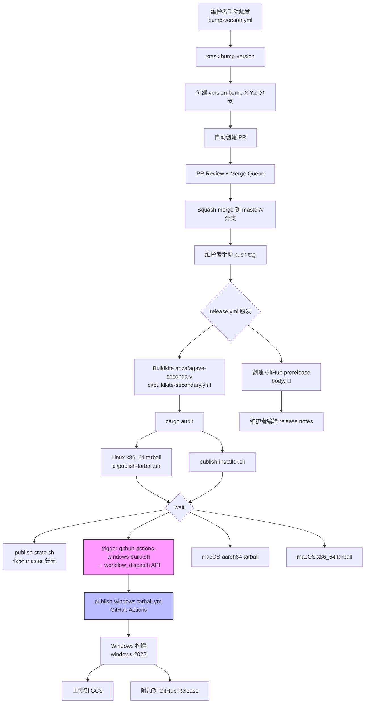
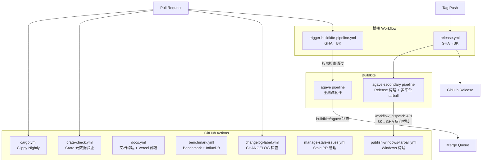
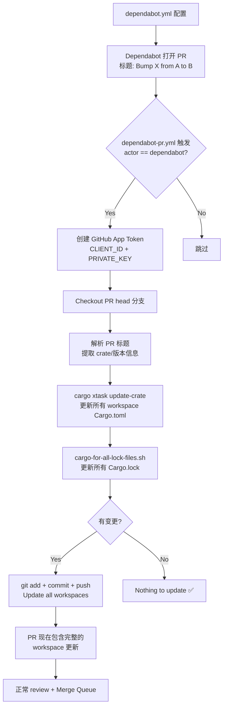

# Solana/Agave GitHub Actions 完整调研

> **调研对象**: [anza-xyz/agave](https://github.com/anza-xyz/agave) — Solana 验证器客户端（原 Solana Labs validator client，现由 Anza 维护）
> **调研 commit**: `3477fa2534a7848446ada6b0e126c525a57d735b`
> **调研日期**: 2026-06-10
> **调研方式**: GitHub API + 公开仓库页面（未本地 clone）

---

## 1. Workflow 完整清单与分类 (item-1)

anza-xyz/agave 仓库在 `.github/workflows/` 下共有 **11 个 workflow 文件**，按功能分为 5 个类别：

| # | 文件名 | `name:` 字段 | 触发事件 | Job 数 | 功能类别 |
|---|--------|-------------|---------|--------|---------|
| 1 | `benchmark.yml` | Benchmark | `push` (master) | 1 | 性能追踪 |
| 2 | `bump-version.yml` | Bump Version | `workflow_dispatch` | 1 | 发布自动化 |
| 3 | `cargo.yml` | Cargo | `push` + `pull_request` (master, v[0-9]+.[0-9]+) | 2 | CI |
| 4 | `changelog-label.yml` | Require changelog entry | `pull_request` (opened/sync/reopen/labeled/unlabeled) | 1 | 仓库维护 |
| 5 | `crate-check.yml` | Crate Check | `push` + `pull_request` (master) | 1 | CI |
| 6 | `dependabot-pr.yml` | Dependabot PR | `pull_request` (master) | 1 | 依赖管理 |
| 7 | `docs.yml` | Docs | `push` + `pull_request` (master, v分支) + `tag` | 3 | 文档流水线 |
| 8 | `manage-stale-issues.yml` | Manage stale issues and PRs | `schedule` (cron) + `pull_request` (self) | 1 | 仓库维护 |
| 9 | `publish-windows-tarball.yml` | Publish Windows Tarball | `workflow_dispatch` | 3 | 发布自动化 |
| 10 | `release.yml` | Release | `push` (tags: `*`) | 2 | 发布自动化 |
| 11 | `trigger-buildkite-pipeline.yml` | Trigger Buildkite Pipeline (Pull Request) | `pull_request_target` (master) | 3 | 外部 CI 集成 |

**来源**: [.github/workflows/](https://github.com/anza-xyz/agave/tree/3477fa2534a7848446ada6b0e126c525a57d735b/.github/workflows) @ `3477fa25`

### 分类汇总

| 功能类别 | Workflow 文件 | 数量 |
|---------|-------------|------|
| 发布自动化 | release.yml, bump-version.yml, publish-windows-tarball.yml | 3 |
| CI | cargo.yml, crate-check.yml | 2 |
| 外部 CI 集成 | trigger-buildkite-pipeline.yml | 1 |
| 依赖管理 | dependabot-pr.yml | 1 |
| 仓库维护 | manage-stale-issues.yml, changelog-label.yml | 2 |
| 文档流水线 | docs.yml | 1 |
| 性能追踪 | benchmark.yml | 1 |

**关键观察**: GitHub Actions 并非 Agave 的主力 CI 系统——它主要承担 lint（clippy）、crate 元数据检查、文档构建、benchmark 上报和 release 编排。主测试套件完全运行在 **Buildkite**，通过 `trigger-buildkite-pipeline.yml` 桥接。这是一个典型的混合 CI 架构。

---

## 2. Release 自动化流水线 (item-2)

Agave 的 release 流程涉及三个 workflow，形成一条完整的版本发布链条：

### 2.1 bump-version.yml — 版本号升级

- **触发**: `workflow_dispatch`，由维护者手动触发
- **版本级别选项**: `patch-or-pre-release` | `patch` | `minor` | `major` | `pre-release` | `promote-pre-release`
- **核心工具链**:
  - `toml-cli`: 读取 `Cargo.toml` 中的版本号
  - `xtask`（自定义 Rust 工具，安装自 `anza-xyz/xtask` 仓库，pin 到特定 rev `930e3bae`）: 执行实际的 bump 操作
- **流程**:
  1. `xtask bump-version $level` 修改所有 workspace 成员的 `Cargo.toml`
  2. 从 `Cargo.toml` 读取新版本号
  3. 创建 `version-bump-$new_version` 分支并推送
  4. 通过 `actions/github-script` 创建 PR 到目标分支，分配触发者为 assignee
- **Secrets 引用**: `VERSION_BUMP_PAT`（用于 checkout 时的 token，具备写权限）、`GITHUB_TOKEN`（创建 PR）

**来源**: [.github/workflows/bump-version.yml](https://github.com/anza-xyz/agave/blob/3477fa2534a7848446ada6b0e126c525a57d735b/.github/workflows/bump-version.yml) @ `3477fa25`

### 2.2 release.yml — Release 创建

- **触发**: `push` tags `*`（所有 tag push）
- **两个并行 Job**:
  1. **trigger-buildkite-pipeline**: 使用 `buildkite/trigger-pipeline-action@v2.4.1`（pin by SHA `909fed76`）触发 Buildkite 的 `anza/agave-secondary` pipeline，传入 tag 名作为 `TRIGGERED_BUILDKITE_TAG` 环境变量
  2. **draft-release**: 通过 `actions/github-script` 调用 GitHub API 创建 prerelease（`draft: false, prerelease: true`），release body 为占位符 `🚧`
- **Secrets 引用**: `TRIGGER_BK_BUILD_TOKEN`（Buildkite API token）、`GITHUB_TOKEN`
- **设计特点**: Release 创建为 prerelease 而非 draft，后续由人工编辑 release notes。Buildkite secondary pipeline 负责构建 Linux/macOS 的 release 产物。

**来源**: [.github/workflows/release.yml](https://github.com/anza-xyz/agave/blob/3477fa2534a7848446ada6b0e126c525a57d735b/.github/workflows/release.yml) @ `3477fa25`

### 2.3 publish-windows-tarball.yml — Windows 二进制构建

- **触发**: `workflow_dispatch`，需输入 commit SHA
- **主要触发路径**: 该 workflow 虽然暴露为 `workflow_dispatch`，但其**主要触发路径并非人工手动操作**，而是由 Buildkite secondary pipeline 自动调用：

  ```
  tag push → release.yml → Buildkite anza/agave-secondary
    → ci/buildkite-secondary.yml "trigger github actions windows build" step
      → .buildkite/scripts/trigger-github-actions-windows-build.sh
        → GitHub API workflow_dispatch → publish-windows-tarball.yml
  ```

  具体地，`.buildkite/scripts/trigger-github-actions-windows-build.sh` 脚本通过 `curl` 调用 GitHub Actions workflow dispatch API（`POST /repos/anza-xyz/agave/actions/workflows/publish-windows-tarball.yml/dispatches`），传入 `BUILDKITE_BRANCH` 和 `BUILDKITE_COMMIT` 作为 ref 和 commit 参数。该脚本使用 Buildkite 侧的 `$GITHUB_TOKEN` 进行认证。

  手动 `workflow_dispatch` 作为备选路径仍然可用（例如需要单独重建 Windows 产物时），但在正常 release 流程中并非首选。

- **三阶段 Job 链**:
  1. **windows-build** (windows-2022): 安装依赖 → 执行 `ci/publish-tarball.sh` 构建 `solana-release-x86_64-pc-windows-msvc.tar.bz2` + `agave-install-init` 安装器 → upload artifact
  2. **windows-gcs-upload** (ubuntu-22.04): 下载 artifact → GCS 认证（`google-github-actions/auth@v3.0.0`）→ 上传到 `gs://anza-release/`
  3. **windows-gh-release** (ubuntu-22.04): 下载 artifact → 使用 `softprops/action-gh-release@v3.0.0` 附加到对应 tag 的 GitHub Release
- **条件控制**: GCS 上传要求 channel 或 tag 非空；GitHub Release 附加仅在 tag 存在时执行
- **Secrets 引用**: `GCS_RELEASE_BUCKET_WRITER_CREDIENTIAL`（GCS 服务账号）

**来源**: [.github/workflows/publish-windows-tarball.yml](https://github.com/anza-xyz/agave/blob/3477fa2534a7848446ada6b0e126c525a57d735b/.github/workflows/publish-windows-tarball.yml), [ci/buildkite-secondary.yml](https://github.com/anza-xyz/agave/blob/3477fa2534a7848446ada6b0e126c525a57d735b/ci/buildkite-secondary.yml), [.buildkite/scripts/trigger-github-actions-windows-build.sh](https://github.com/anza-xyz/agave/blob/3477fa2534a7848446ada6b0e126c525a57d735b/.buildkite/scripts/trigger-github-actions-windows-build.sh) @ `3477fa25`

### Release 生命周期流程图 (diag-1)



**Agave release 混合模型**: Windows 构建通过 Buildkite-to-GitHub 的跨平台调度实现——Buildkite secondary pipeline 在完成 cargo audit 和 Linux tarball 构建后，通过 `.buildkite/scripts/trigger-github-actions-windows-build.sh` 调用 GitHub Actions workflow_dispatch API 触发 `publish-windows-tarball.yml`。这形成了 Buildkite → GitHub Actions 的反向桥接，与 PR 阶段的 GitHub Actions → Buildkite 方向相反。手动 `workflow_dispatch` 作为备选路径保留，用于单独重建场景。

---

## 3. Rust CI 模式 (item-3)

### 3.1 cargo.yml — Clippy Nightly Lint

- **触发**: push 和 PR 到 `master` / `v[0-9]+.[0-9]+` 分支
- **路径过滤**: 仅当 `**.rs`、`**/Cargo.toml`、`**/Cargo.lock`、安装脚本或 workflow 自身变更时触发
- **并发控制**: `concurrency.group: ${{ github.workflow }}-${{ github.event.pull_request.number || github.ref }}`，启用 `cancel-in-progress: true`
- **缓存策略**: 使用 `mozilla-actions/sccache-action@v0.0.10`（pin by SHA `9e7fa8a1`），通过环境变量 `SCCACHE_GHA_ENABLED=true` + `RUSTC_WRAPPER=sccache` 全局启用
- **多平台矩阵**:

| Job | 运行环境 | 容器 | RUSTFLAGS | 触发条件 |
|-----|---------|------|-----------|---------|
| clippy-nightly | macOS-15 | — | — | push + PR |
| clippy-nightly | ubuntu-24.04 | `docker.io/rust:1-alpine3.23` | `-C target-feature=-crt-static` | push + PR |
| clippy-nightly-windows-2025 | windows-2025 | — | — | 仅 push（不在 PR 上跑） |

- **Alpine 特殊处理**: 容器启动后先 `apk add bash git`，然后通过 `.github/scripts/install-all-deps.sh` 安装 OpenSSL、protoc 等依赖
- **Nightly 版本管理**: 通过 `ci/rust-version.sh nightly` 脚本获取 pinned 的 nightly 版本（当前为 `nightly-2026-04-11`），确保所有 CI job 使用一致的编译器版本
- **组织守卫**: 所有 job 都有 `if: github.repository_owner == 'anza-xyz'` 条件，防止 fork 上运行

**来源**: [.github/workflows/cargo.yml](https://github.com/anza-xyz/agave/blob/3477fa2534a7848446ada6b0e126c525a57d735b/.github/workflows/cargo.yml) @ `3477fa25`

### 3.2 crate-check.yml — Crate 元数据验证

- **触发**: push 和 PR 到 master，路径过滤 `**/Cargo.toml`、workflow 自身、`ci/check-crates.sh`
- **核心逻辑** (`ci/check-crates.sh`):
  1. 通过 `git diff $COMMIT_RANGE` 获取变更的 `Cargo.toml` 文件
  2. 跳过 workspace root、`programs/sbf`、`ci/xtask/tests/dummy-workspace` 等目录
  3. 对每个变更的 crate 检查: license/description/homepage/repository 元数据完整性
  4. 调用 crates.io API 验证 crate 所有权，确保 `anza-team` 是 verified owner
  5. 对新 crate 提示两种路径: 标记 `publish = false` 或先 reserve 名字
- **commit range 感知**: 区分 push 和 PR 事件，精确计算变更范围，避免全量检查

**来源**: [.github/workflows/crate-check.yml](https://github.com/anza-xyz/agave/blob/3477fa2534a7848446ada6b0e126c525a57d735b/.github/workflows/crate-check.yml) + [ci/check-crates.sh](https://github.com/anza-xyz/agave/blob/3477fa2534a7848446ada6b0e126c525a57d735b/ci/check-crates.sh) @ `3477fa25`

### 3.3 辅助 CI 脚本生态

`ci/` 目录包含 **48 个条目**（脚本、子目录和配置文件），是 Agave CI 的核心基础设施。关键脚本分析：

| 脚本 | 功能 | 被引用的 Workflow |
|------|------|------------------|
| `ci/rust-version.sh` | 管理 stable/nightly Rust 工具链版本；stable 从 `rust-toolchain.toml` 读取，nightly 默认 `2026-04-11` | cargo.yml, benchmark.yml, crate-check.yml |
| `ci/check-crates.sh` | 验证 crate 元数据 + crates.io 所有权 | crate-check.yml |
| `ci/channel-info.sh` | 根据 git tag/branch 计算 edge/beta/stable 频道，支持 `ci/channel-overrides` 远程覆盖 | docs.yml, publish-windows-tarball.yml |
| `ci/upload-benchmark.sh` | 解析 bench 输出，上传到 InfluxDB | benchmark.yml |
| `ci/publish-tarball.sh` | 构建 release tarball | publish-windows-tarball.yml, ci/buildkite-secondary.yml (Linux/macOS) |
| `.github/scripts/install-all-deps.sh` | 协调 OpenSSL + protobuf 安装，分平台处理 | cargo.yml, publish-windows-tarball.yml |
| `.github/scripts/check-changelog.sh` | 验证 CHANGELOG.md 是否在 PR 中被修改 | changelog-label.yml |
| `scripts/cargo-for-all-lock-files.sh` | 遍历仓库所有 `Cargo.lock` 文件执行 cargo 命令 | dependabot-pr.yml |

**来源**: [ci/](https://github.com/anza-xyz/agave/tree/3477fa2534a7848446ada6b0e126c525a57d735b/ci) @ `3477fa25`

### Agave CI 架构拓扑图 (diag-2)



---

## 4. Buildkite 外部 CI 集成 (item-4)

### trigger-buildkite-pipeline.yml 深度分析

这是 Agave 最复杂的 workflow 之一，实现了 GitHub Actions 到 Buildkite 的安全桥接。

#### 触发机制

- **事件**: `pull_request_target`（而非 `pull_request`），在 base 分支的上下文中运行，获得 repo secrets 访问权限
- **分支**: 仅 `master`
- **PR 事件类型**: `opened`, `synchronize`, `reopened`, `labeled`
- **安全意义**: 使用 `pull_request_target` 是因为需要访问 `BUILDKITE_API_ACCESS_TOKEN` secret 来触发 Buildkite pipeline，而 `pull_request` 事件不能为 fork PR 提供 secrets

#### 两路径授权模型

```
路径 1: member_check
  条件: event.action != 'labeled'
  逻辑: 调用 GitHub API 检查 sender 的 collaborator permission
    → admin/maintain/write/triage → should_trigger=true
    → 其他 → should_trigger=false (exit 1)

路径 2: label_check
  条件: event.action == 'labeled' && label.name == 'CI'
  逻辑: should_trigger=true + 自动删除 CI label
    → 为外部贡献者提供的手动触发路径
```

#### Trigger Job

- **条件**: `always()` + 任一路径 `should_trigger == 'true'`
- **权限**: `permissions: {}` — 最小权限原则
- **Buildkite pipeline**: 从 `vars.BUILDKITE_PIPELINE` 仓库变量读取（而非硬编码）
- **传递信息**: PR head SHA、PR 编号、构建元数据（`pr_number`），以及 `pull_request_base_branch`
- **并发控制**: `concurrency.group: ${{ github.workflow }}-pr-${{ github.event.pull_request.number }}`，`cancel-in-progress: true`

#### 安全机制汇总

| 安全层 | 实现方式 |
|--------|---------|
| Fork 隔离 | `pull_request_target` + `permissions: contents: read` |
| 组织守卫 | `github.repository_owner == 'anza-xyz'` |
| 权限分级 | member_check（自动）vs label_check（手动门控） |
| 最小权限 | trigger job 的 `permissions: {}` |
| Buildkite token | 仅在 trigger job 中使用，不暴露给 check jobs |
| CI label 自动清理 | 防止重复触发 |

#### ⚠️ 下游威胁模型注意事项

上述安全机制仅覆盖 **GitHub Actions 侧**的权限边界。然而，整个 PR CI 链条的安全性还取决于 Buildkite 侧的隔离措施：

1. **PR head SHA 传递**: GitHub workflow 将 PR 的 head SHA（`github.event.pull_request.head.sha`）传递给 Buildkite pipeline。对于 fork PR，这是来自外部贡献者仓库的 commit。
2. **Buildkite 侧代码执行**: Buildkite PR pipeline checkout 后会执行仓库 `ci/*` 目录下的脚本。对于 fork PR，被执行的是 **PR 分支上的代码**——即外部贡献者可以修改的 `ci/` 脚本内容。
3. **隔离要求**: 安全的采用需要 Buildkite 侧满足：
   - 针对外部 PR 的 runner 隔离（不与生产或 release runner 共享）
   - secret 隔离（外部 PR 构建不能访问 release 签名密钥、发布凭证等）
   - 可能的沙箱执行环境（限制网络访问、文件系统访问等）
4. **公开信息限制**: 从公开仓库代码无法验证 Buildkite 侧是否实现了上述隔离。Buildkite pipeline 配置、agent 分配策略和 secret 作用域均不在公开仓库中暴露。

**结论**: `pull_request_target` + 双路径授权模型有效保护了 GitHub Actions 侧的 secrets 和权限，但如果考虑采用此模式，**必须同步评估和实现 Buildkite 侧（或等效外部 CI 系统）的 runner 和 secret 隔离**。仅复制 GitHub workflow 而忽略下游 CI 的安全配置，可能导致外部贡献者通过修改 CI 脚本获取不当访问。

**来源**: [.github/workflows/trigger-buildkite-pipeline.yml](https://github.com/anza-xyz/agave/blob/3477fa2534a7848446ada6b0e126c525a57d735b/.github/workflows/trigger-buildkite-pipeline.yml) @ `3477fa25`

---

## 5. 依赖管理自动化 (item-5)

### 5.1 dependabot.yml — 多生态系统配置

Agave 配置了 **4 个 Dependabot 更新组**，覆盖 3 个包生态系统：

| 生态系统 | 目录 | 频率 | PR 上限 | 特殊配置 |
|---------|------|------|---------|---------|
| Cargo | `/` (root workspace) | daily 08:00 UTC | 6 | cooldown 7天，排除 anza-team crate (`solana-*`, `agave-*`, `spl-*`, `rts-alloc`, `shaq`, `wincode`) |
| Cargo | `/dev-bins`, `/ci/xtask`, `/programs/sbf` | daily 14:00 UTC | 6 | 同上 cooldown 规则 |
| npm | `/docs` | weekly 08:00 UTC | 3 | cooldown 7天，分组 `docs-dependencies` (pattern `*`) |
| github-actions | `/` | daily 08:00 UTC | 3 | cooldown 7天 |

**设计亮点**:
- **目录拆分**: 将 Cargo workspace 分为 root 和子目录两个独立调度，错开 6 小时（08:00 vs 14:00 UTC），避免同时打开过多 PR
- **anza-team crate 排除**: 内部发布的 crate 通过 cooldown 排除机制豁免等待期，允许立即跟进更新
- **docs 依赖分组**: 使用 `groups.docs-dependencies.patterns: ["*"]` 将所有 npm 更新合并为单个 PR

**来源**: [.github/dependabot.yml](https://github.com/anza-xyz/agave/blob/3477fa2534a7848446ada6b0e126c525a57d735b/.github/dependabot.yml) @ `3477fa25`

### 5.2 dependabot-pr.yml — 自动化 PR 增强

这个 workflow 在 Dependabot 打开 PR 后自动执行 workspace 级更新：

#### 触发与鉴权

- **触发**: `pull_request` to master，条件 `github.actor == 'dependabot[bot]'`
- **GitHub App Token**: 使用 `actions/create-github-app-token@v3.2.0` 生成 app token（`CLIENT_ID` + `PRIVATE_KEY`），绕过 Dependabot 的受限 `GITHUB_TOKEN`
- **Git 身份**: 配置为 `dependabot[bot]`，URL 重写使用 app token

#### 核心流程

1. Checkout PR head 分支（使用 app token）
2. **解析 PR 标题**: 正则 `[Bb]ump (.+) from ([^ ]+) to ([^ ]+)` 提取 crate 名、旧版本、新版本
3. **xtask update-crate**: 执行 `cargo xtask update-crate --package $crate_name --from $old_version --to $new_version` 更新所有 workspace 成员
4. **多 lockfile 更新**: `scripts/cargo-for-all-lock-files.sh --ignore-exit-code -- update -p $crate_name:$old_version --precise $new_version`
5. **验证**: 运行 `scripts/cargo-for-all-lock-files.sh tree`
6. **推送**: 如果有变更，`git add **/Cargo.toml **/Cargo.lock && git commit -am "Update all workspaces" && git push`

**来源**: [.github/workflows/dependabot-pr.yml](https://github.com/anza-xyz/agave/blob/3477fa2534a7848446ada6b0e126c525a57d735b/.github/workflows/dependabot-pr.yml) @ `3477fa25`

### Dependabot PR 生命周期图 (diag-3)



### scripts/cargo-for-all-lock-files.sh 分析

该脚本是 monorepo 依赖管理的关键工具：
- 遍历仓库中所有 `Cargo.lock` 文件（通过 `git ls-files :**Cargo.lock`）
- 对每个锁文件对应的 workspace 目录执行传入的 cargo 命令
- 支持 `--ignore-exit-code` 容错模式（用于 Dependabot 场景中某些 workspace 可能不包含目标 crate）
- 跳过 `ci/xtask/tests/dummy-workspace` 测试用目录

**来源**: [scripts/cargo-for-all-lock-files.sh](https://github.com/anza-xyz/agave/blob/3477fa2534a7848446ada6b0e126c525a57d735b/scripts/cargo-for-all-lock-files.sh) @ `3477fa25`

---

## 6. 仓库级配置与分支治理 (item-6)

### 6.1 Rulesets 概览

Agave 配置了 **10 个 rulesets**，其中 **9 个 active、1 个 disabled**：

| # | Ruleset 名称 | 目标 | 状态 | 关键规则 |
|---|-------------|------|------|---------|
| 1 | `[branch] *` | 所有分支（排除特定前缀） | **active** | `non_fast_forward` + `creation` |
| 2 | `[branch] master` | 默认分支 | **active** | merge queue (SQUASH) + PR (1 approval, CODEOWNER, last-push) + status check (`buildkite/agave`) + linear history |
| 3 | `[branch] v[0-9]*` | Release 分支 | **active** | `non_fast_forward` + linear history + PR (**2** approvals, CODEOWNER, last-push) |
| 4 | `[branch] v[0-9]* restrict creations/deletions` | Release 分支 | **active** | `creation` + `deletion` |
| 5 | `[branch] dependabot/**/*` | Dependabot 分支 | **active** | `creation` + `update` + `non_fast_forward` + `deletion` |
| 6 | `[branch] gh-readonly-queue/**/*` | Merge queue 分支 | **active** | `deletion` + `non_fast_forward` + `creation` |
| 7 | `[branch] mergify/**/* restrict creations` | Mergify 分支 | **active** | `creation` |
| 8 | `[branch] mergify/**/* block force pushes` | Mergify 分支 | **disabled** | `non_fast_forward` |
| 9 | `[branch] version-bump-*` | 版本 bump 分支 | **active** | `deletion` + `non_fast_forward` + `creation` + `update` |
| 10 | `[tag] *` | 所有 tag | **active** | `deletion` + `non_fast_forward` + `creation` |

> **注**: 所有 ruleset 的 `current_user_can_bypass` 均为 `never`，即使管理员也不能绕过。

**来源**: GitHub Rulesets API `GET /repos/anza-xyz/agave/rulesets` + `GET /repos/anza-xyz/agave/rulesets/{id}` @ 2026-06-10

### 6.2 Master 分支详细治理

master 分支的 ruleset（ID: 10826713）配置了完整的合并治理：

| 配置项 | 值 |
|--------|-----|
| **Merge method** | SQUASH only |
| **Merge queue** | 启用；max build=1, min/max merge=1, wait 10min, ALLGREEN grouping, 30min timeout |
| **PR review** | 1 approval, dismiss stale reviews, require CODEOWNER, require last-push approval |
| **Status checks** | `buildkite/agave` (required) |
| **Linear history** | 强制 |
| **Bypass** | never（包括管理员） |

**关键细节**: 唯一的 required status check 是 `buildkite/agave` — GitHub Actions workflows（cargo.yml, crate-check.yml 等）都不是合并门控。这意味着 clippy 和 crate-check 失败不会阻止合并，只有 Buildkite 的测试结果才是硬性要求。

### 6.3 Release 分支治理

`v[0-9]*` 分支比 master 更严格：
- 需要 **2 个 approval**（master 只需 1 个）
- 同样要求 CODEOWNER review 和 last-push approval
- 仅允许 squash merge
- 创建和删除受独立 ruleset 控制

### 6.4 PR Template

`.github/PULL_REQUEST_TEMPLATE.md` 提供标准化的 PR 描述格式：
- **Problem**: 描述问题
- **Summary of Changes**: 变更概要
- **Testing**: 测试说明
- **Fixes #**: 关联 issue

**来源**: [.github/PULL_REQUEST_TEMPLATE.md](https://github.com/anza-xyz/agave/blob/3477fa2534a7848446ada6b0e126c525a57d735b/.github/PULL_REQUEST_TEMPLATE.md) @ `3477fa25`

### 6.5 Issue Templates

两个 issue 模板，区分社区贡献者和核心开发者：

| 模板 | 标签 | 用途 |
|------|------|------|
| `0-community.md` | `community` | 社区 issue，引导技术支持问题到 Solana Stack Exchange |
| `1-core-contributor.md` | （无） | 核心贡献者内部使用 |

**来源**: [.github/ISSUE_TEMPLATE/](https://github.com/anza-xyz/agave/tree/3477fa2534a7848446ada6b0e126c525a57d735b/.github/ISSUE_TEMPLATE) @ `3477fa25`

### 6.6 CODEOWNERS

`.github/CODEOWNERS` 将约 26 个目录路径映射到 6 个 GitHub 团队：

| 团队 | 负责目录（部分） |
|------|-----------------|
| `@anza-xyz/networking` | `/bloom/`, `/gossip/`, `/net-utils/`, `/tls-utils/`, `/turbine/`, `/xdp/` |
| `@anza-xyz/consensus` | `/core/src/consensus/`, `/core/src/bls_sigverify/`, `/votor/`, `/bls-cert-verify/` |
| `@anza-xyz/fees` | `/fee/`, `/compute-budget-instruction/` |
| `@anza-xyz/svm` | `/svm/`, `/program-runtime/`, `/programs/bpf_loader/`, `/log-collector/`, `/transaction-context/` |
| `@anza-xyz/tx-metadata` | `/runtime-transaction/`, `/transaction-view/` |

部分目录有双重 ownership（如 `/gossip/src/duplicate*.rs` → networking + consensus, `/core/src/repair/` → networking + consensus）。

**来源**: [.github/CODEOWNERS](https://github.com/anza-xyz/agave/blob/3477fa2534a7848446ada6b0e126c525a57d735b/.github/CODEOWNERS) @ `3477fa25`

### 6.7 其他配置文件

| 文件 | 说明 |
|------|------|
| `.github/RELEASE_TEMPLATE.md` | Release notes 模板：Features / Breaking Changes / Bug Fixes / Contributors |
| `.github/scripts/` | 4 个 helper 脚本（详见 item-3） |

### 6.8 不可访问的配置（权限受限）

以下配置通过公开 API **不可访问**，标记为 **permission-restricted**:

| 配置项 | 尝试方式 | 结果 | 说明 |
|--------|---------|------|------|
| 已安装的 GitHub Apps | `GET /repos/anza-xyz/agave/installation/repositories` | HTTP 404 | 需要 GitHub App installation token |
| Branch protection rules（传统 API） | — | 不可访问（权限受限） | Rulesets API（公开）已覆盖可见的分支治理规则；传统 branch protection API 可能包含额外配置但无法通过公开 API 验证 |
| 已配置的 Secrets 完整列表 | — | 不可访问（权限受限） | 仅通过 workflow YAML 中的 `${{ secrets.X }}` 引用推断（见下方），这些是 **workflow 中引用的 secret 名称**，不代表仓库中已配置的完整 secret 列表 |

### 6.9 Workflow 中引用的 Secret 名称

> **重要说明**: 以下列表来源于 workflow YAML 文件中的 `${{ secrets.X }}` 引用。这些是 **workflow 代码中引用的名称**，**不等同于仓库中实际配置的完整 secret 列表**。实际配置的 secrets 可能更多也可能更少（例如已废弃但未删除的 secret、通过其他方式使用的 secret 等），完整列表需要仓库管理员权限才能查看。

| Secret 引用名 | 使用 Workflow | 用途推断 |
|---------------|-------------|---------|
| `BENCHMARK_INFLUX_HOST` | benchmark.yml | InfluxDB 主机地址 |
| `BENCHMARK_INFLUX_DB` | benchmark.yml | InfluxDB 数据库名 |
| `BENCHMARK_INFLUX_USER` | benchmark.yml | InfluxDB 用户名 |
| `BENCHMARK_INFLUX_PASSWORD` | benchmark.yml | InfluxDB 密码 |
| `BENCHMARK_INFLUX_MEASUREMENT` | benchmark.yml | InfluxDB measurement 名 |
| `VERSION_BUMP_PAT` | bump-version.yml | 具有写权限的 PAT |
| `CLIENT_ID` | dependabot-pr.yml | GitHub App Client ID |
| `PRIVATE_KEY` | dependabot-pr.yml | GitHub App Private Key |
| `VERCEL_TOKEN` | docs.yml | Vercel 部署 token |
| `VERCEL_SCOPE` | docs.yml | Vercel scope/team |
| `GCS_RELEASE_BUCKET_WRITER_CREDIENTIAL` | publish-windows-tarball.yml | GCS 服务账号凭证 |
| `TRIGGER_BK_BUILD_TOKEN` | release.yml | Buildkite API token |
| `BUILDKITE_API_ACCESS_TOKEN` | trigger-buildkite-pipeline.yml | Buildkite API token |
| `GITHUB_TOKEN` | 多个 workflow | GitHub 自动提供的 token |

此外，`trigger-buildkite-pipeline.yml` 还引用了 **仓库变量**（`vars.BUILDKITE_PIPELINE`），这不是 secret。

---

## 7. 仓库维护与辅助 Workflow (item-7)

### 7.1 manage-stale-issues.yml — Stale PR 管理

- **触发**: 
  - `schedule`: 工作日 UTC 08:00（`0 8 * * 1-5`）
  - `pull_request`: 当 workflow 自身变更时（dry-run 模式）
- **权限声明**: `permissions: pull-requests: write`（issues write 已注释掉）
- **配置细节**:
  - 当前仅管理 **PR**（issues 的 stale 天数设为 -1，即禁用）
  - PR stale 阈值: 60 天无活动 → stale 标签 → 再 7 天关闭
  - PR dry-run: 当 workflow 自身被 PR 修改时，使用 `debug-only: true`，并将 `operations-per-run` 调高到 300（正常运行为 30）
  - 豁免: `do-not-close` 和 `feature-gate` 标签，以及有 milestone 的 PR
  - 处理顺序: `ascending: true`，优先处理最旧的

**来源**: [.github/workflows/manage-stale-issues.yml](https://github.com/anza-xyz/agave/blob/3477fa2534a7848446ada6b0e126c525a57d735b/.github/workflows/manage-stale-issues.yml) @ `3477fa25`

### 7.2 changelog-label.yml — CHANGELOG 入口检查

- **触发**: `pull_request` (opened/synchronize/reopened/labeled/unlabeled)
- **逻辑**: 仅当 PR 有 `changelog` label 时运行；调用 `.github/scripts/check-changelog.sh` 检查 `CHANGELOG.md` 是否在 PR 中被修改
- **设计**: 采用 opt-in 模式——只有被标记为 `changelog` 的 PR 才需要更新 changelog

**来源**: [.github/workflows/changelog-label.yml](https://github.com/anza-xyz/agave/blob/3477fa2534a7848446ada6b0e126c525a57d735b/.github/workflows/changelog-label.yml) @ `3477fa25`

### 7.3 docs.yml — 文档构建与部署

- **触发**: push 和 PR 到 master/v分支，以及 tag push
- **三阶段流程**:
  1. **check**: 判断是否需要构建——tag push 必定构建；普通 push/PR 需检查 `docs/**` 或 workflow 自身是否变更，且 channel 为 beta 或 edge
  2. **build**: 使用 `pnpm@10` + `Node 24` 构建文档，上传 artifact（仅 push 事件）
  3. **deploy**: 下载 artifact，通过 `./docs/deploy.sh` 部署到 Vercel（仅 push 事件）
- **频道逻辑**: 通过 `ci/channel-info.sh` 计算当前频道（edge=master, beta=最新 v 分支, stable=次新 v 分支），控制部署行为
- **Secrets 引用**: `VERCEL_TOKEN`, `VERCEL_SCOPE`

**来源**: [.github/workflows/docs.yml](https://github.com/anza-xyz/agave/blob/3477fa2534a7848446ada6b0e126c525a57d735b/.github/workflows/docs.yml) @ `3477fa25`

### 7.4 benchmark.yml — 性能追踪

- **触发**: `push` to master（仅主分支合并后运行）
- **运行环境**: 专用 runner `benchmark`（自托管）
- **矩阵策略**: 5 个 benchmark 套件

| 套件 | 命令 | 说明 |
|------|------|------|
| solana-runtime | `cargo +$rust_nightly bench -p solana-runtime` | 运行时 benchmark |
| solana-gossip | `cargo bench -p solana-gossip -- --output-format bencher --noplot` | Gossip 协议 benchmark |
| solana-poh | `cargo +$rust_nightly bench -p solana-poh` | Proof of History benchmark |
| solana-core | `cargo +$rust_nightly bench -p solana-core` | 核心 benchmark |
| solana-accounts-db | 6 个独立 bench 命令 | 账户数据库 benchmark（拆分因包含 criterion bench） |

- **数据上报**: 通过 `ci/upload-benchmark.sh` 将结果上传到 InfluxDB，使用 5 个 benchmark 相关 secrets
- **Nightly Rust**: 使用 pinned nightly 版本（`ci/rust-version.sh nightly`）

**来源**: [.github/workflows/benchmark.yml](https://github.com/anza-xyz/agave/blob/3477fa2534a7848446ada6b0e126c525a57d735b/.github/workflows/benchmark.yml) @ `3477fa25`

---

## 8. 10 维度能力矩阵与 Mantle 借鉴评估 (item-8)

### 8.1 能力矩阵 (diag-4)

```
╔══════════════════════════╦══════════╦═══════════════════════════════════════════╗
║ 维度                     ║ 评级     ║ 核心依据                                  ║
╠══════════════════════════╬══════════╬═══════════════════════════════════════════╣
║ Release Automation       ║ 成熟     ║ 完整的 bump→tag→build→publish 链条；       ║
║                          ║          ║ 多平台分发（GCS + GitHub Release）；       ║
║                          ║          ║ xtask 自定义工具链                         ║
╠══════════════════════════╬══════════╬═══════════════════════════════════════════╣
║ Version Management       ║ 成熟     ║ workflow_dispatch 多级版本 bump；         ║
║                          ║          ║ 自动 PR + 分支创建；                      ║
║                          ║          ║ channel 系统 (edge/beta/stable)           ║
╠══════════════════════════╬══════════╬═══════════════════════════════════════════╣
║ CI Build Optimization    ║ 成熟     ║ sccache 集成；路径过滤触发；              ║
║                          ║          ║ 并发组 + cancel-in-progress；             ║
║                          ║          ║ commit range 感知                         ║
╠══════════════════════════╬══════════╬═══════════════════════════════════════════╣
║ Dependency Management    ║ 成熟     ║ 多生态系统 Dependabot（Cargo/npm/GHA）；  ║
║                          ║          ║ 自动 workspace 更新 + multi-lockfile；    ║
║                          ║          ║ cooldown + 内部 crate 豁免                ║
╠══════════════════════════╬══════════╬═══════════════════════════════════════════╣
║ Branch Protection        ║ 成熟     ║ 9 active + 1 disabled rulesets；         ║
║                          ║          ║ merge queue with SQUASH；                 ║
║                          ║          ║ no-bypass（含管理员）；                    ║
║                          ║          ║ release 分支 2 approvals                  ║
╠══════════════════════════╬══════════╬═══════════════════════════════════════════╣
║ Code Quality Gates       ║ 基础     ║ clippy-nightly 跨平台 lint 覆盖完整；    ║
║                          ║          ║ crate 元数据检查；                        ║
║                          ║          ║ 但 GHA workflow 均非 required check，     ║
║                          ║          ║ 不阻止合并                                ║
╠══════════════════════════╬══════════╬═══════════════════════════════════════════╣
║ Documentation Pipeline   ║ 基础     ║ 有 Vercel 部署 + channel 分版逻辑；      ║
║                          ║          ║ 但条件构建逻辑复杂、仅 edge/beta 自动    ║
║                          ║          ║ 部署，stable channel 依赖 tag            ║
╠══════════════════════════╬══════════╬═══════════════════════════════════════════╣
║ Performance Tracking     ║ 成熟     ║ 专用 benchmark runner；                   ║
║                          ║          ║ 5 套件矩阵策略；                         ║
║                          ║          ║ InfluxDB 时序数据上报                     ║
╠══════════════════════════╬══════════╬═══════════════════════════════════════════╣
║ Issue/PR Lifecycle       ║ 基础     ║ Stale PR 自动管理（60+7天）；             ║
║                          ║          ║ opt-in changelog 检查；                   ║
║                          ║          ║ 但无 auto-label、auto-assign、            ║
║                          ║          ║ CI 结果通知等高级功能                     ║
╠══════════════════════════╬══════════╬═══════════════════════════════════════════╣
║ External CI Integration  ║ 成熟     ║ 完整的双向 GHA↔Buildkite 桥接；          ║
║                          ║          ║ 双路径授权（member/label）；              ║
║                          ║          ║ GHA 侧权限最小化；                       ║
║                          ║          ║ ⚠️ Buildkite 侧 runner/secret 隔离       ║
║                          ║          ║ 无法从公开源码验证                        ║
╚══════════════════════════╩══════════╩═══════════════════════════════════════════╝

评级统计: 成熟 7 / 基础 3 / 缺失 0
```

### 8.2 值得 Mantle 借鉴的具体 Workflow 与模式

| # | 模式/Workflow | 来源文件 | 借鉴理由 | Mantle 适配建议 |
|---|-------------|---------|---------|---------------|
| 1 | **Dependabot PR 自动增强** | `dependabot-pr.yml` + `dependabot.yml` | 在 monorepo 中 Dependabot 只更新发现变更的 `Cargo.toml`，但 workspace 内其他 member 可能也需要同步更新。自动化解析 + 全 workspace 更新消除了手动操作 | Mantle 使用 Go modules 而非 Cargo workspace，但类似的 multi-module monorepo 更新逻辑（`go mod tidy` 跨多个 `go.mod`）有同等价值 |
| 2 | **sccache 构建缓存** | `cargo.yml` | 通过 `SCCACHE_GHA_ENABLED=true` + `RUSTC_WRAPPER=sccache` 透明集成，无需修改 Cargo 构建配置 | 对 Rust 项目直接适用；Go 项目可考虑等价的 `GOCACHE` + `actions/cache` 策略 |
| 3 | **路径过滤 + 并发控制** | `cargo.yml` | `paths:` 过滤避免无关文件变更触发 CI；`concurrency` + `cancel-in-progress` 避免并行浪费 | 直接适用于任何 CI workflow |
| 4 | **commit range 感知的增量检查** | `crate-check.yml` + `ci/check-crates.sh` | 只检查变更文件而非全量扫描，大幅减少 CI 时间 | 适用于 Mantle 的 Go module 检查、linting 等增量场景 |
| 5 | **双路径外部 CI 授权** | `trigger-buildkite-pipeline.yml` | member 自动触发 + CI label 手动触发的模式兼顾安全性和外部贡献者体验。GitHub Actions 侧的权限最小化设计值得借鉴 | **前置条件**: 采用此模式前必须同步实现外部 CI 侧的 runner 和 secret 隔离（针对外部 PR 的沙箱执行环境），否则外部贡献者可通过修改 `ci/*` 脚本在 Buildkite runner 上执行任意代码。公开仓库无法验证 Agave 的 Buildkite 侧是否已实现此隔离 |
| 6 | **Benchmark 持续追踪** | `benchmark.yml` | 每次 master 合并后自动运行 benchmark + 上报 InfluxDB，形成持续的性能趋势数据 | Mantle 可借鉴此模式建立 L2 相关的性能基准（交易处理速率、状态转换延迟等） |
| 7 | **版本 bump 自动化** | `bump-version.yml` | workflow_dispatch + 自定义 xtask 实现一键版本升级 + 自动 PR，消除手动错误 | Go 项目可用类似的 Makefile target + workflow_dispatch 实现 |
| 8 | **Ruleset no-bypass** | Repo rulesets | 所有 bypass 设为 `never`，即管理员也必须走正常流程 | 直接在 GitHub repo settings 中配置 |

### 8.3 Agave 独特模式

以下模式是 Agave 项目特有的，反映其作为 Solana 验证器客户端的特殊约束：

#### 1. Buildkite 混合 CI 架构
Agave 将 CI 负载分为两层：GitHub Actions 处理轻量级检查（lint、元数据、文档、benchmark），Buildkite 处理核心测试套件。`buildkite/agave` 是 master 分支唯一的 required status check。这种架构选择可能源于：
- Buildkite 更灵活的 runner 管理（验证器测试可能需要特殊硬件/网络环境）
- 历史原因（Solana Labs 时代的 CI 基础设施延续）
- 成本/并发优化（Buildkite 的 pipeline 模型可能更适合大型测试矩阵）

#### 2. xtask 自定义工具链
Agave 使用独立仓库 `anza-xyz/xtask` 的 Rust 工具来处理版本 bump 和 crate 更新，而非 shell 脚本或 npm 包。这反映了 Rust 生态的特点——用 Rust 写构建工具。

#### 3. 多 Workspace Cargo 锁文件策略
Agave monorepo 包含多个独立的 Cargo workspace（root, dev-bins, ci/xtask, programs/sbf），每个有独立的 `Cargo.lock`。`cargo-for-all-lock-files.sh` 脚本统一遍历所有锁文件执行操作，这是大型 Rust monorepo 的典型挑战解决方案。

#### 4. Channel 系统
`ci/channel-info.sh` 实现了 edge/beta/stable 三频道发布模型：
- **edge** = master 分支
- **beta** = 最新的 `v[0-9]+.[0-9]+` 分支
- **stable** = 次新的 `v[0-9]+.[0-9]+` 分支
- 支持通过 `ci/channel-overrides`（存储在 master 上的文件）远程覆盖频道绑定

这与 Chrome/Firefox 的 channel 模型类似，反映了验证器软件对稳定性的分级要求。

#### 5. Buildkite-to-GitHub 反向桥接（Windows 构建）
Windows 二进制构建通过一个 **Buildkite → GitHub Actions 的反向调度** 实现，而非简单的手动触发。完整链条为：

1. `release.yml` 触发 Buildkite `anza/agave-secondary` pipeline
2. Buildkite 按 `ci/buildkite-secondary.yml` 顺序执行：cargo audit → Linux tarball → installer → (wait) → crate publish + **Windows trigger** + macOS tarballs
3. `ci/buildkite-secondary.yml` 中的 `"trigger github actions windows build"` step 调用 `.buildkite/scripts/trigger-github-actions-windows-build.sh`
4. 该脚本通过 `curl` 调用 GitHub Actions workflow dispatch API（`POST .../workflows/publish-windows-tarball.yml/dispatches`），传入 `BUILDKITE_BRANCH` 和 `BUILDKITE_COMMIT`

隔离的本质来自 **Buildkite-to-GitHub 的调度边界**：Windows 构建运行在 GitHub-hosted runners 上，使用 GitHub Actions 的 secret 体系（`GCS_RELEASE_BUCKET_WRITER_CREDIENTIAL`），与 Buildkite 侧的 release-build agents 完全分离。这种跨平台调度模式反映了：
- Buildkite 不提供原生 Windows runner
- GitHub Actions 的 Windows runner（`windows-2022`）成为 Windows 构建的自然选择
- 通过 API 调度而非共享 runner 实现平台隔离

手动 `workflow_dispatch` 作为备选路径保留，可用于 Windows 产物的单独重建。

**来源**: [ci/buildkite-secondary.yml](https://github.com/anza-xyz/agave/blob/3477fa2534a7848446ada6b0e126c525a57d735b/ci/buildkite-secondary.yml), [.buildkite/scripts/trigger-github-actions-windows-build.sh](https://github.com/anza-xyz/agave/blob/3477fa2534a7848446ada6b0e126c525a57d735b/.buildkite/scripts/trigger-github-actions-windows-build.sh) @ `3477fa25`

---

## Action Pin-by-SHA 审计

所有使用的第三方 Actions 均 **pin by SHA**（非 tag），符合安全最佳实践：

| Action | SHA | 标记版本 | 使用 Workflow |
|--------|-----|---------|-------------|
| `actions/checkout` | `df4cb1c069e1874edd31b4311f1884172cec0e10` | v6.0.3 | 全部 |
| `actions/github-script` | `3a2844b7e9c422d3c10d287c895573f7108da1b3` | v9.0.0 | bump-version, release |
| `actions/stale` | `eb5cf3af3ac0a1aa4c9c45633dd1ae542a27a899` | v10.3.0 | manage-stale-issues |
| `actions/create-github-app-token` | `bcd2ba49218906704ab6c1aa796996da409d3eb1` | v3.2.0 | dependabot-pr |
| `actions/upload-artifact` | `043fb46d1a93c77aae656e7c1c64a875d1fc6a0a` | v7.0.1 | docs, publish-windows-tarball |
| `actions/download-artifact` | `3e5f45b2cfb9172054b4087a40e8e0b5a5461e7c` | v8.0.1 | docs, publish-windows-tarball |
| `actions/setup-node` | `48b55a011bda9f5d6aeb4c2d9c7362e8dae4041e` | v6.4.0 | docs |
| `mozilla-actions/sccache-action` | `9e7fa8a12102821edf02ca5dbea1acd0f89a2696` | v0.0.10 | cargo |
| `pnpm/action-setup` | `0e279bb959325dab635dd2c09392533439d90093` | v6.0.8 | docs |
| `buildkite/trigger-pipeline-action` | `909fed762c73d5ae2b5d555ab910d66b3fae2670` | v2.4.1 | release, trigger-buildkite-pipeline |
| `google-github-actions/auth` | `7c6bc770dae815cd3e89ee6cdf493a5fab2cc093` | v3.0.0 | publish-windows-tarball |
| `softprops/action-gh-release` | `b4309332981a82ec1c5618f44dd2e27cc8bfbfda` | v3.0.0 | publish-windows-tarball |

**来源**: 各 workflow 文件中的 `uses:` 字段 @ `3477fa25`

---

## 组织守卫模式

所有 CI/release 相关 workflow 的 job 级别都包含 `if: github.repository_owner == 'anza-xyz'` 条件（除 `manage-stale-issues.yml` 对 schedule 事件使用等效逻辑，`changelog-label.yml` 通过 label 条件隐式限制）。这确保 fork 仓库不会触发 CI 消耗 Anza 的 runner 额度或泄露 secrets。

---

## 附录：仓库元数据

| 属性 | 值 |
|------|-----|
| 默认分支 | master |
| 可见性 | public |
| GitHub Pages | 未启用 |
| Wiki | 已启用 |
| Topics | （无） |
| ci/ 目录条目数 | 48 |
| CODEOWNERS 团队数 | 6 |

**来源**: GitHub API `GET /repos/anza-xyz/agave` @ 2026-06-10
