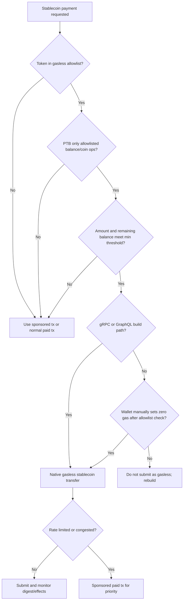
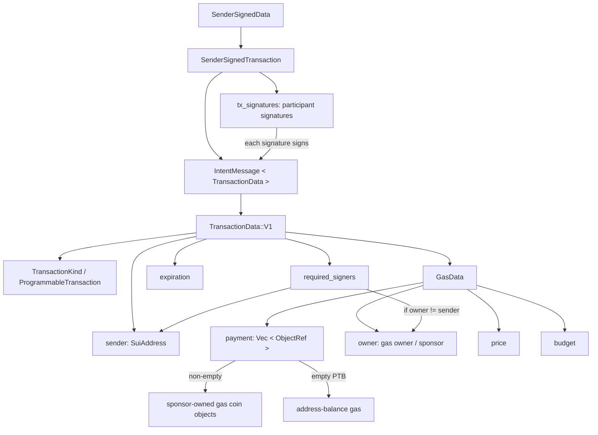
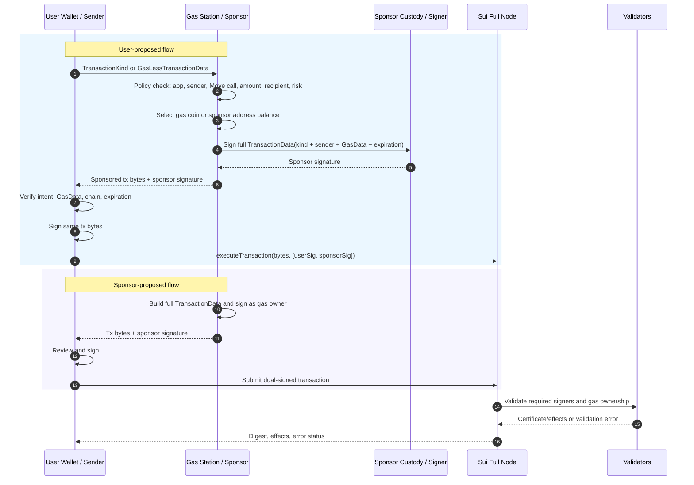
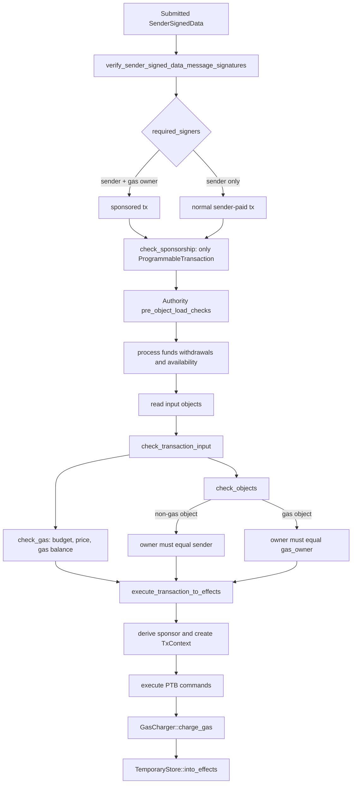
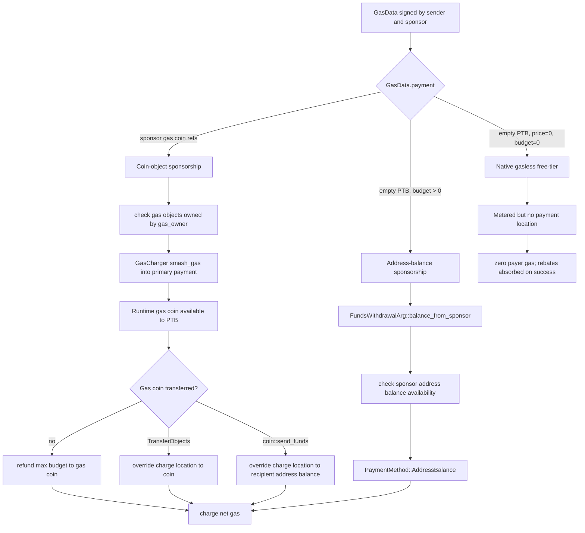
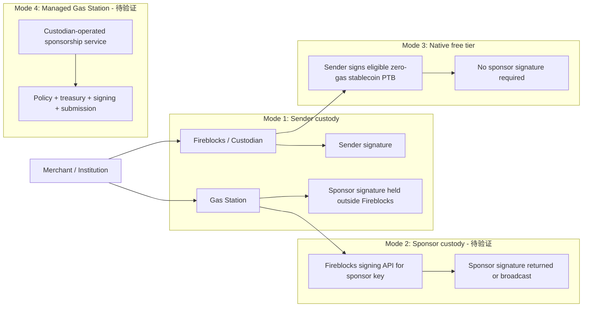
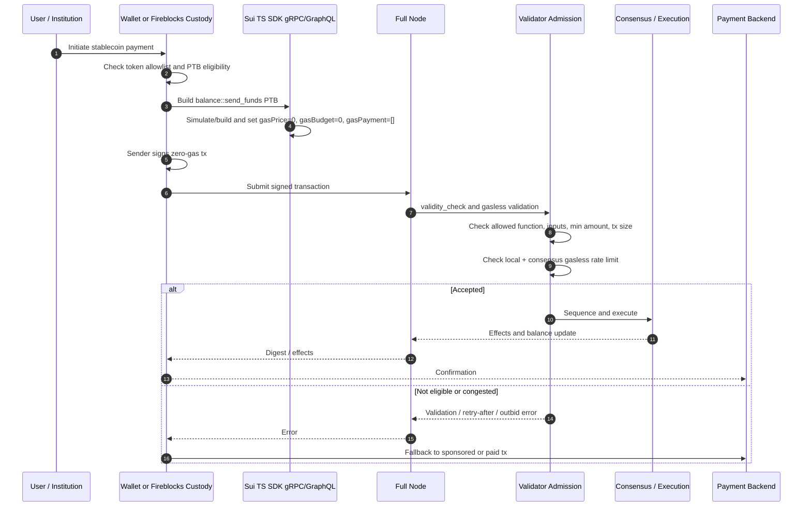

# Sui Gasless Stablecoin Payments 方案调研报告

## Executive Summary

Sui 上的 "gasless stablecoin payment" 方案涉及三个层次不同的机制，产品设计和工程实现时必须分开理解和处理：

**1. Sponsored Transaction（赞助交易）。** 这是 Sui 协议数据模型层面的双方签名机制。`TransactionDataV1` 将业务发起方（`sender`）与 gas 付款方（`GasData.owner`）分离，当二者不同时即为 sponsored transaction。Sender 和 sponsor 都必须签署完整的 `IntentMessage<TransactionData>`——包括 gas owner、gas payment、price 和 budget——因此没有任何中间方可以在一方签名后篡改 gas 参数。Sponsored transaction 仅限 `ProgrammableTransaction` 类型。([sui-gasless-mechanism], [sui-payments-code-analysis])

**2. Address-Balance Gas Payment（地址余额 gas 支付）。** `GasData.payment` 为空且 gas price > 0 时，gas 从 sponsor 的地址余额而非具体 gas coin object 支付。这消除了 gas coin object locking、版本冲突和 inventory 管理问题，但引入了 address balance 可用性、`ValidDuring` replay protection 和 storage rebate 归属等新的工程要求。仍需 sender + sponsor 双签名。([sui-gasless-mechanism], [sui-payments-code-analysis])

**3. Native Gasless Stablecoin Transfers（原生免费层）。** 2026 年 Sui 主网推出的协议级免费转账路径。仅覆盖极窄的 stablecoin P2P 转账 PTB：allowlisted stablecoin type、`gasPayment=[]`、`gasPrice=0`、`gasBudget=0`、限定的 Move function（如 `balance::send_funds<T>`）、最小金额/余额约束、TPS 速率限制和拥塞时低优先级。不需要 sponsor 签名，但不覆盖 SUI transfer、swap、NFT mint 或任意 app interaction。([sui-gasless-mechanism])

Fireblocks 在此方案中的角色已通过合作伙伴/博客来源确认为托管、策略和签名层面的集成，但 **Fireblocks 是否自动检测 Sui gasless free-tier eligibility、自动设置 zero-gas 参数、或提供 Sui-specific sponsor-sign-and-return API 均未经证实**，需要进一步验证。([sui-gasless-mechanism])

## 1. 协议数据模型与 Sender-Sponsor 分离

Sui 把业务发起方和 gas 付款方在协议数据结构层面分离。`TransactionDataV1` 包含 `kind + sender + gas_data + expiration`；`GasData` 包含 `payment + owner + price + budget`。源码以 `gas_owner != sender` 定义 sponsored transaction，`required_signers()` 在此条件下将 sender 和 gas owner 都列为必需签名者。([sui-gasless-mechanism] item-1, [sui-payments-code-analysis] item-1)

`SenderSignedTransaction` 中签名覆盖完整 `IntentMessage<TransactionData>`，包括 sponsor 填入的所有 gas 参数。签名列表是 participant-only、order-independent 的。`check_sponsorship()` 限制 sponsorship 仅适用于 `ProgrammableTransaction`；非 PTB 的 sponsored transaction 会被拒绝为 `UnsupportedSponsoredTransactionKind`。([sui-payments-code-analysis] item-1)

`GasData.payment` 的语义取决于上下文：非空时包含 sponsor-owned gas coin object refs（coin-object sponsorship）；空且 gas price > 0 时表示 address-balance gas；空且 price = 0、budget = 0 时为 native gasless path。这三条路径在验证和执行中有明确分支。([sui-gasless-mechanism] item-1, [sui-payments-code-analysis] item-1)

**Source evidence:** `crates/sui-types/src/transaction.rs` lines 2288-2293 (GasData), 2374-2379 (TransactionDataV1), 2969-2975 (required_signers), 3475-3500 (check_sponsorship); `docs/content/develop/transaction-payment/sponsor-txn.mdx` lines 23-61.

| 机制 | GasData 形式 | 签名者 | 适用范围 |
|---|---|---|---|
| Normal paid tx | `owner == sender`，non-empty gas objects 或 sender address balance | sender | 通用交易路径 |
| Sponsored tx with gas objects | `owner == sponsor`，`payment` 含 sponsor-owned gas object refs | sender + sponsor | 仅 PTB |
| Sponsored tx with address balance | `owner == sponsor`，`payment=[]`，positive gas price/budget | sender + sponsor | 仅 PTB，使用 sponsor address balance |
| Native gasless stablecoin free tier | `payment=[]`，`price=0`，`budget=0` | 仅 sender | 极窄的 allowlisted stablecoin 转账路径 |

## 2. Sponsored Transaction 签名流程

Sponsored transaction 签名覆盖完整交易数据，确保任何一方签名后第三方不能替换 gas owner、gas payment、price 或 budget。([sui-gasless-mechanism] item-2, [sui-payments-code-analysis] item-2)

### Flow A: User-Proposed（用户发起，sponsor 代付）

1. Wallet/app 构建 `TransactionKind` 或 `GasLessTransactionData` 接口 payload。注意 `GasLessTransactionData` 是 user-sponsor 之间的接口，不是 `sui-core` 数据结构。
2. 发送给 Gas Station / sponsor。
3. Sponsor 验证 app、sender、target packages/functions、amount、recipient、风控。
4. Sponsor 构建完整 `TransactionData`（设置 sender、gas owner、gas payment、gas price/budget、expiration），然后签名。
5. 返回 sponsor 签名和交易 bytes 给 user。
6. User 验证 business intent 和 gas 参数后签名。
7. 提交双签名交易。

### Flow B: Sponsor-Proposed（sponsor 发起）

1. Sponsor 构建完整 `TransactionData` 并签名。
2. 发送给 user 审核并签名。
3. 任一方提交。

### Address-Balance Variant

使用 `setGasPayment([])` 时，gas 从 sponsor 地址余额支付。支持 user-first signing（user 先签，sponsor 后签），eliminates gas coin locking risk。Storage rebates credited to sponsor address balance。([sui-gasless-mechanism] item-2, [sui-payments-code-analysis] item-5)

**SDK patterns:** TypeScript SDK 支持 `onlyTransactionKind` 构建 kind bytes，sponsor 通过 `Transaction.fromKind(kindBytes)` 重建，设置 `setGasOwner`、`setGasBudget`、`setGasPayment`，双方 `signTransaction`，最后 `executeTransaction({ signatures: [...] })`。([sui-payments-code-analysis] item-8)

## 3. 签名验证与交易输入检查

验证分支简洁但关键：

1. **签名验证：** `verify_sender_signed_data_message_signatures()` 加载 `required_signers`，要求签名数量匹配并覆盖每个 required signer。([sui-payments-code-analysis] item-2)
2. **Sponsorship 检查：** `check_sponsorship()` 拒绝非 PTB 的 sponsored transaction。([sui-payments-code-analysis] item-2)
3. **Gas 对象所有权：** `check_objects()` 对 gas object 检查 owner 是否等于 `transaction.gas_owner()`，非 gas object 检查是否等于 `transaction.sender()`。Sponsor 不能通过 sponsorship 授权 mutation 用户的非 gas objects。([sui-payments-code-analysis] item-2)
4. **Gas 预算/余额：** `SuiGasStatus::check_gas_data()` 验证 gas budget 上下限、gas price 不低于 reference gas price、available gas balance >= gas budget。Native gasless 路径使用 compute cap 但跳过 gas balance check。([sui-payments-code-analysis] item-4)
5. **Address-balance preload：** `pre_object_load_checks()` 在 object loading 前处理 address-balance withdrawal 可用性检查和 native gasless minimum remaining balance 检查。([sui-payments-code-analysis] item-2)

**Source evidence:** `crates/sui-types/src/signature_verification.rs` lines 130-180; `crates/sui-transaction-checks/src/lib.rs` lines 80-105, 398-520; `crates/sui-core/src/authority.rs` lines 1004-1043.

## 4. 执行引擎：Sponsor 传播、TxContext 与所有权不变量

一旦交易通过 admission，执行引擎：

1. **Derive sponsor：** 当 `gas_data.owner != transaction_signer` 时，设置 `sponsor = Some(gas_data.owner)` 并注入 `TxContext`。Move 层可通过 `sui::tx_context::sponsor(&TxContext): Option<address>` 观察 sponsor。([sui-payments-code-analysis] item-3)
2. **Payment kind 分派：** `payment_kind()` 将 `GasData` 映射为 `PaymentKind::unmetered()`、`PaymentKind::gasless()`、`PaymentMethod::AddressBalance` 或 coin-object methods。([sui-payments-code-analysis] item-3)
3. **Input reservations：** `compute_input_reservations()` 为 PTB 的 `FundsWithdrawalArg` 计算 reservation，`WithdrawFrom::Sponsor` 映射到 `gas_data.owner`。Gas budget 在 address-balance 模式下作为 `(gas_data.owner, Balance<SUI>)` reserve。([sui-payments-code-analysis] item-3)
4. **所有权不变量检查：** expensive-check mode 下 `TemporaryStore::check_ownership_invariants(&transaction_signer, &sponsor, &gas_charger, ...)` 作为 defense-in-depth。([sui-payments-code-analysis] item-3)

**Source evidence:** `sui-execution/latest/sui-adapter/src/execution_engine.rs` lines 91-310; `tx_context.move` lines 57-60.

## 5. Gas Metering、GasCharger 与 Sponsor 预授权

Sponsor liability 在链上通过签名固定的 gas 参数和验证的余额/reservation 来约束：`GasData.budget`、`GasData.price`、gas object refs 或 address-balance withdrawal reservation。不存在名为 "sponsor allowance" 的协议对象；任何 off-chain 的 per-user quota、app policy 或 rate limit 都是 Gas Station 层面的设计。([sui-payments-code-analysis] item-4)

### GasCharger Payment Model

`GasCharger` 内部 `PaymentMetadata` 有三种模式：`Unmetered`（系统交易）、`Gasless`（native free-tier）和 `Smash`（普通/sponsored）。Coin-object gas 通过 `smash_gas()` 合并为 primary payment source。Address-balance gas 映射为 `PaymentMethod::AddressBalance(address, reservation)`。([sui-payments-code-analysis] item-4)

### 充扣与失败行为

| 场景 | 业务写入 | Gas 结果 |
|---|---|---|
| 成功的 sponsored PTB (gas coin) | Token/object/address-balance 变更 commit | Sponsor gas coin/location charged net gas |
| Move abort in sponsored PTB | 业务写入 dropped | Sponsor 仍按 gas model 被收取 computation/storage 相关费用 |
| Storage out-of-gas | 写入 reset，storage/rebate charging 调整 | Sponsor 可能被收取 budget/rebate-adjusted amount |
| Address-balance withdrawal 资金不足 | 执行失败 | 返回 default gas summary |
| Native gasless 失败 | 业务写入 fail/drop | 无支付方；返回 zero gas summary |

**关键点：** 产品文案应说 "token transfer 不会 partially commit"，但不能说 "failure is free for the sponsor"——gas model 在执行失败时仍可能向 sponsor 收费。([sui-payments-code-analysis] item-7)

**Source evidence:** `gas_charger.rs` lines 32-590; `gas_v2.rs` lines 354-386; `gas.rs` lines 68-103.

## 6. Gas Station 服务架构

Gas Station 是 Sui 协议外的服务层。Sui docs 定义了 user、Gas Station 和 sponsor 三个角色，并列出示例 endpoints（如 `request_gas_and_signature`、`submit_dual_signed_transaction`），但这些是示例而非强制标准。([sui-gasless-mechanism] item-3)

### 组件分解

| 组件 | 职责 | 协议锚点 |
|---|---|---|
| Wallet/app adapter | 接受 `TransactionKind`/kind bytes/`GasLessTransactionData`，规范化 sender/chain/expiration | PTB `onlyTransactionKind`, `Transaction.fromKind` |
| Policy/risk engine | Allowlist app IDs, Move package/function, token type, amount, recipient, deny/compliance, per-user/app budget | Sponsor 签名前必须验证 |
| Gas funding layer | 维护 SUI gas coin pool 或使用 sponsor address balance (`payment=[]`) | `GasData.payment`, address balance gas |
| Sponsor signer/custody | 产生 gas owner 的 Sui 交易签名；key 可在 HSM/KMS/MPC/Fireblocks | `required_signers()` 要求 gas owner |
| Submission layer | 提交到 full node，idempotent retry，监控 digest/effects | `executeTransaction` |
| Accounting | 跟踪 gas budget/charged gas/storage rebates/sponsor balance/billing | Sponsor pays gas; rebates 可能返回 sponsor |
| Abuse controls | 速率限制、velocity limits、address/device/app throttles、fraud signals | Gasless/sponsored 创建免费执行面 |

### Gas Funding Source 对比

| 资金来源 | 优势 | 风险/运维 |
|---|---|---|
| Gas coin objects | 成熟的 gas 路径；明确的 gas budget object refs | Object version locking, pool fragmentation, splitting/merging, equivocation risk |
| Sponsor address balance | 空 `gasPayment`；无 gas coin inventory；更简单的 async user-first signing | 需要 address-balance feature flags, positive budget, `ValidDuring` rules, balance/rebate reconciliation |
| Native gasless free-tier | 无需 sponsor key 或 SUI balance | 极窄 eligibility；rate limited；拥塞时低优先级 |

([sui-gasless-mechanism] item-3, [sui-payments-code-analysis] item-5)

## 7. Native Gasless Stablecoin Transfers 协议路径

### Allowlist 与最小金额

当前 mainnet（protocol version 124）支持七种 6-decimal stablecoins，minimum `10_000`（即 $0.01 单位）：

| Symbol | Issuer | Package address |
|---|---|---|
| USDC | Circle | `0xdba34672...::usdc::USDC` |
| USDSUI | Bridge/Stripe | `0x44f83821...::usdsui::USDSUI` |
| SUI_USDE | Ethena | `0x41d587e5...::sui_usde::SUI_USDE` |
| USDY | Ondo | `0x960b5316...::usdy::USDY` |
| FDUSD | First Digital | `0xf16e6b72...::fdusd::FDUSD` |
| AUSD | Agora | `0x2053d08c...::ausd::AUSD` |
| USDB | Bucket Protocol | `0xe14726c3...::usdb::USDB` |

### 允许的操作

仅限 `MoveCall`、`MergeCoins`、`SplitCoins` commands，且 Move call 必须是以下 function 之一：

- `0x2::balance::send_funds<T>`, `redeem_funds<T>`, `split<T>`, `zero<T>`
- `0x2::funds_accumulator::withdrawal_split<Balance<T>>`
- `0x2::coin::into_balance<T>`, `redeem_funds<T>`, `send_funds<T>`, `put<T>`

### 验证与限制

- 至少一个 command；拒绝 receiving object inputs；拒绝未使用的 object/funds withdrawal inputs。
- 每个 Move call 的 type argument 必须映射到 allowed token type。
- Protocol config 设置 pure input count/byte limits 和 `gasless_max_tx_size_bytes`。
- Execution 后 `check_gasless_execution_requirements` 拒绝 object writes，要求 deletion of exactly the input Coin objects，强制 per-token minimum recipient transfer / remaining withdrawal reservation。
- 剩余余额检查：gasless withdrawal 要么消费完整 address balance，要么留下 >= configured minimum。

### 速率限制与拥塞

Protocol config 设置 `gasless_max_tps`。Rate limiter 有两层：local per-validator fixed window 和 consensus-fed counter。Admission queue 在 queue pressure 下优先 evict gas price 0 的 gasless entries。**文档明确说拥塞时 paid transactions 优先。**

### SDK 边界

TypeScript SDK 在 gRPC/GraphQL transport 下自动检测 gasless stablecoin transfers 并设置 zero-gas 参数。JSON-RPC fallback 需要 wallet 手动设置。

([sui-gasless-mechanism] item-4)

**Source evidence:** `crates/sui-protocol-config/src/lib.rs` lines 37-53, 1995-2019, 4930-4974; `crates/sui-types/src/transaction.rs` lines 996-1387, 1513-1524, 3432-3469; `crates/sui-transaction-checks/src/lib.rs` lines 734-778; `sui-adapter/src/temporary_store.rs` lines 591-660; `crates/sui-core/src/gasless_rate_limiter.rs` lines 10-104.

## 8. 端到端支付流程

### 8.1 Native Gasless Stablecoin Transfer Path

1. User/custodian wallet 持有 allowlisted stablecoin（preferably as address balance）。
2. Wallet/app 检测目标操作是简单的 P2P stablecoin 转账：allowlisted token, eligible PTB shape, 无 arbitrary object writes。
3. Wallet 构建 PTB：`tx.balance({ type, balance })` + `0x2::balance::send_funds<T>(balance, recipient)`。
4. gRPC/GraphQL transport: SDK simulation/build 自动检测 eligibility 并设置 zero-gas fields。JSON-RPC: 手动设置 `gasPrice=0`、empty gas payment。
5. Sender 签名并提交。无需 sponsor 签名。
6. Validator 验证 gasless shape、allowlisted token、zero gas budget、input restrictions、remaining balance、tx size、rate limits、overload state。
7. 通过则 consensus 执行；recipient address balance 更新；wallet/payment backend 监控 digest/effects。

### 8.2 Sponsored Stablecoin Payment Path

适用于 native free tier 不覆盖的场景：non-allowlisted token, merchant app contract, memo/registry receipt, batch payment, compliance wrapper, swap, settlement workflow, 或需要更高 paid priority。

1. Wallet/app 构建 `TransactionKind` 或完整 PTB bytes。
2. 调用 Gas Station 请求 sponsorship。
3. Gas Station policy engine 验证 allowed calls、amount、recipient、compliance、budget、risk。
4. 选择 gas funding: sponsor gas coin 或 sponsor address balance。
5. Sponsor signer 签名。
6. User 审核并签名。
7. 提交双签名交易，监控 digest/effects，reconcile gas spend/rebates。

([sui-gasless-mechanism] item-5)

## 9. Payments 概念层分离

"Payments" 在 Sui 中是一个文档/产品类别（umbrella），不是一个单一的 on-chain sponsorship module。([sui-payments-code-analysis] item-6)

| 层 | 性质 | 在 gasless/sponsored payments 中的角色 |
|---|---|---|
| Payments docs page | Landing/guide page | 聚合 address balances, payment intents, sponsored transactions, gasless stablecoin transfers, Payment Kit 的入口 |
| `sui::pay` Move module | Wallet/coin utility | split, join, transfer 等 coin 工具函数；不定义 sponsor validation 或 gas charging |
| `sui::coin` / `sui::balance` | Core primitives | Coin wrapper, address-balance conversion, `send_funds`/`redeem_funds` |
| `sui::funds_accumulator` | Withdrawal limits | Withdrawal owner/limit helpers |
| `sui::tx_context` | Execution context | 暴露 optional sponsor address 给 Move 层 |
| Payment intent | PTB pattern | 原子性来自 transaction execution semantics，不是某个名为 Payments 的 on-chain module |
| Payment Kit | App/toolkit layer | 不作为 protocol evidence |

([sui-payments-code-analysis] item-6)

## 10. Fireblocks 与托管平台集成

### 已确认角色

- **生态合作：** Sui 官方博客称 gasless stablecoin transfers 发布获得 Fireblocks 支持。
- **Sender custody provider：** 机构/商户可用 Fireblocks 托管 sender wallet，Fireblocks 作为 policy 和 signing 层。
- **Policy/compliance gate：** Fireblocks 可强制 customer-specific approval workflows 和 operational controls。
- **Reconciliation source：** Fireblocks transaction/webhook records 可作为 custody-side reconciliation 来源。

### 待验证角色

- **Sponsor treasury/signing custody：** 商户可能通过 Fireblocks custody sponsor funds/key material，由 Gas Station 请求 Fireblocks 签名。架构上可行但需验证 Fireblocks 对 Sui raw-signing/transaction 的具体支持。
- **Managed Gas Station operator：** 未找到来源确认 Fireblocks 当前暴露 Sui-specific sponsor-sign-and-return 或 PTB eligibility automation。

### 应避免的未证实声明

- Fireblocks 自动检测 Sui gasless free-tier eligibility。
- Fireblocks 自动设置 `gasPrice=0`、`gasBudget=0`、`gasPayment=[]`。
- Fireblocks 执行 Sui PTB-level policy inspection（allowlisted Move calls 和 token thresholds）。
- Fireblocks 支持 Sui sponsored transactions 的 sponsor-sign-and-return。

([sui-gasless-mechanism] item-6)

## 11. 安全、风控与产品边界

1. **Sponsor ≠ multisig co-author。** Sponsor 支付 gas 并签名完整交易 bytes 作为 gas owner，但产品文案不应暗示 sponsor 代表 user 批准业务 intent。
2. **User 必须验证最终 bytes。** Sponsor 填入 `GasData` 后，user 应检查 sender、Move target、arguments、recipient、token、amount、gas owner、gas budget、expiration 和 chain。
3. **Gas Station 是新的 trust/liveness 组件。** 它可以 reject、delay、censor、over-budget、under-budget 或错误提交。让 user 可以直接提交双签名 bytes 到 full node 降低 liveness 依赖。
4. **Gas coin sponsorship 需要 object reservation。** 跨 inflight transactions 复用 gas object version 是具体的协议级失败模式。
5. **Address balance sponsorship 降低 object 管理但不消除 accounting。** Sponsor balance、rebates、per-app spend 和 replay-protected expiration 仍需管理。
6. **Native gasless 是极窄的 free tier。** 不应 marketing 为 "all stablecoin payments on Sui are gasless"。
7. **拥塞 UX。** Zero-price transactions 可被 rate limit 或 outbid。
8. **产品文案应说 "token transfer 不会 partially commit"，不是 "failure is free for the sponsor"。** Gas model 在执行失败时仍可能向 sponsor 收费。

([sui-gasless-mechanism] item-7, [sui-payments-code-analysis] item-7)

## Diagrams

### Payment Path 决策树

### Sponsored Transaction 数据结构关系

### Sponsored Transaction 签名与提交流程

### Sponsored Transaction 验证与执行路径

### Gas Payment Source Lifecycle

### Fireblocks / Custodian 与 Gas Station 协作模式

### Gasless Stablecoin Transfer 端到端流程

## Cross-Cutting Analysis

### Consensus

两个研究 section 在以下核心结论上完全一致：

1. **数据模型分离：** `TransactionDataV1` 的 `sender` 与 `GasData.owner` 分离是 sponsorship 的基础。签名覆盖完整 `TransactionData`，包括 `GasData`。
2. **双签名要求：** `required_signers()` 在 `gas_owner != sender` 时要求两方签名。签名 order-independent、participant-only。
3. **PTB-only 约束：** Sponsorship 仅适用于 `ProgrammableTransaction`；非 PTB 会被 `check_sponsorship()` 拒绝。
4. **三条 gas 支付路径：** Coin-object sponsorship、address-balance sponsorship 和 native gasless free-tier 是三条不同的验证和执行分支。
5. **Native gasless 极窄范围：** 仅覆盖 allowlisted stablecoin 的 eligible P2P transfer PTB，不覆盖通用交易。
6. **源码版本一致：** 两个 section 使用同一 source code revision `MystenLabs/sui@e09f31f7606bca023907740966b3bd8f8f5a4703`。

### Conflicts

两个 section 之间无矛盾。Section 2 将 Section 1 作为上游依赖引用（upstream dependency main commit `27bfbd34617ad115ca052b731e5ff9e66eb5da32`），并明确继承其 gasless/free-tier 区分。Section 2 有意将 native gasless 作为对比而非核心范围，这与 Section 1 对 native gasless 的详细覆盖互补而非冲突。

### Open Questions

1. **Fireblocks Sui-specific gasless automation 未验证。** 无 primary source 证明 Fireblocks 自动检测 free-tier eligibility、设置 zero-gas 参数、或提供 Sui-specific sponsor-sign-and-return API。([sui-gasless-mechanism] item-6)
2. **Production Gas Station API 无标准化。** Sui docs 提供示例 endpoints 和流程，但没有强制 API schema。实际部署应形式化 API schemas、signature-return semantics、idempotency keys、expiry 和 revocation。([sui-gasless-mechanism] item-3)
3. **Protocol version 敏感性高。** Allowlisted stablecoins、min thresholds、gasless TPS、computation units 和 validation details 都是 code/config driven，版本升级可能变化。本报告基于 protocol version 124 和 source revision `e09f31f...`。([sui-gasless-mechanism] item-4)
4. **Computation unit enforcement path 未完整追踪。** Protocol config 定义 `gasless_max_computation_units`，但未追踪 execution-meter enforcement path beyond config and validation/admission surfaces。([sui-gasless-mechanism] gap 4)
5. **Payment Kit 未作为 protocol evidence 使用。** 遵循 outline review caveat，Payment Kit 和 payments landing pages 是 app/tooling 层，除非有 primary code paths 支撑。([sui-payments-code-analysis] item-6, gap 5)
6. **[TW inference] 端到端方案选择建议。** 基于两个 section 的研究结果，对于需要 gasless stablecoin payment 的产品，建议首先评估 native free-tier eligibility（token allowlist、PTB shape、amount threshold），eligible 则使用 native gasless path 最低成本；不 eligible 或需要更高优先级/更复杂操作时使用 sponsored transaction path（推荐 address-balance gas 以降低 object management 复杂度）；Fireblocks 作为 sender custody 和 policy 层已可用，作为 sponsor custody 需进一步验证。

## Appendix

### A. Input Research Sections

| Order | Topic Slug | Issue ID | Final Path | Main Merge Commit | Adversarial Approval |
|---|---|---|---|---|---|
| 1 | sui-gasless-mechanism | 3cee9256-14f7-46d2-8df8-c8d72274ec9e | `sui-gasless-stablecoin-payments/research-sections/sui-gasless-mechanism/final.md` | `27bfbd34617ad115ca052b731e5ff9e66eb5da32` | Multica comment `eb1e6b87-3d30-4897-982a-bd4eecfabc73` |
| 2 | sui-payments-code-analysis | 6de9525d-3eb6-4cba-bdc7-1a0a51b276a3 | `sui-gasless-stablecoin-payments/research-sections/sui-payments-code-analysis/final.md` | `c2a3dbb057377af511c6091552d746ebc773e52d` | Multica comment `4f239ed4-020a-416d-8ee0-95c2db18be01` (approve, severity: minor) |

### B. Sections Index Reference

Path: `sui-gasless-stablecoin-payments/research-sections/_index.md`

| order | topic_slug | multica_issue_id | final_path | dependencies | status |
|-------|-----------|-----------------|------------|--------------|--------|
| 1 | sui-gasless-mechanism | 3cee9256-14f7-46d2-8df8-c8d72274ec9e | sui-gasless-stablecoin-payments/research-sections/sui-gasless-mechanism/final.md | - | done |
| 2 | sui-payments-code-analysis | 6de9525d-3eb6-4cba-bdc7-1a0a51b276a3 | sui-gasless-stablecoin-payments/research-sections/sui-payments-code-analysis/final.md | sui-gasless-mechanism | done |

### C. Diagram Assets

All diagrams are rendered as Mermaid blocks within this report. No external SVG/PNG assets generated. The diagrams include:

1. Payment Path 决策树 — decision tree for choosing gasless vs sponsored path
2. Sponsored Transaction 数据结构关系 — data structure relationships
3. Sponsored Transaction 签名与提交流程 — signing and submission sequence
4. Sponsored Transaction 验证与执行路径 — validation and execution flowchart
5. Gas Payment Source Lifecycle — gas payment lifecycle across all three modes
6. Fireblocks / Custodian 与 Gas Station 协作模式 — custodian integration modes
7. Gasless Stablecoin Transfer 端到端流程 — native gasless end-to-end sequence

### D. Methodology Notes

- **Source code revision:** Both sections used `MystenLabs/sui@e09f31f7606bca023907740966b3bd8f8f5a4703`.
- **Protocol version:** Gasless stablecoin transfer allowlist and parameters are based on protocol version 124 mainnet configuration.
- **Evidence standard:** Findings with "High" confidence are backed by both source code and official docs cross-check. "Medium" confidence indicates architecture guidance derived from protocol constraints but not from a normative standard. "Low" confidence is explicitly marked 待验证.
- **Fireblocks boundary:** Claims about Fireblocks are limited to what primary/partner sources confirm. Unverified capabilities are explicitly marked 待验证. No TW inference was applied to Fireblocks capabilities.
- **Layer separation:** The report follows the outline review caveat: `sui::pay`, payment intents/PTBs, address balances, Payment Kit, and docs-level payments pages are separated from core sponsored transaction protocol evidence.

### E. Failure Matrix

| Failure | Source | User Impact | Recovery |
|---|---|---|---|
| Token not in protocol allowlist | Validator gasless validation | Native gasless tx rejected | Use normal paid tx or sponsored tx |
| PTB contains unsupported Move call / object write / receiving input | Gasless command/input validation | Rejected before execution | Reshape transfer or use sponsored path |
| Amount leaves sub-minimum remainder | Remaining-balance check | Rejected | Transfer entire balance or leave >= minimum |
| JSON-RPC wallet omits zero-gas settings | SDK/transport boundary | Build/validation failure | Use gRPC/GraphQL build or manually set after allowlist check |
| Gasless rate limited | Validator limiter | Retry-after / delayed UX | Retry later or use paid/sponsored tx |
| Congestion outbids gasless | Admission queue / docs | Lower priority | Sponsored paid gas with sufficient gas price |
| Sponsor gas coin version conflict | Owned object versioning | Sponsored tx rejected/equivocation risk | Rebuild/resign with reserved fresh gas object |
| Sponsor address balance insufficient | Address balance withdrawal | Sponsored tx fails validation/signing | Refill sponsor balance; enforce preflight balance checks |
| Missing sender or sponsor signature | Required signers | Rejected | Collect both signatures over exact bytes |
| Expiration/chain mismatch | `ValidDuring`/chain checks | Rejected | Rebuild for current epoch and chain |
| Fireblocks/custodian policy hold | Custody policy layer | Signature unavailable or delayed | Surface compliance state; use alternate approved path |
| Full node/indexing failure | Submission/monitoring layer | Digest unknown or delayed confirmation | Idempotent resubmit to full node; poll effects/checkpoints |
| Move abort in sponsored PTB | PTB execution | Business writes dropped; sponsor still charged gas | Gas Station accounting must expect failed-action gas spend |
